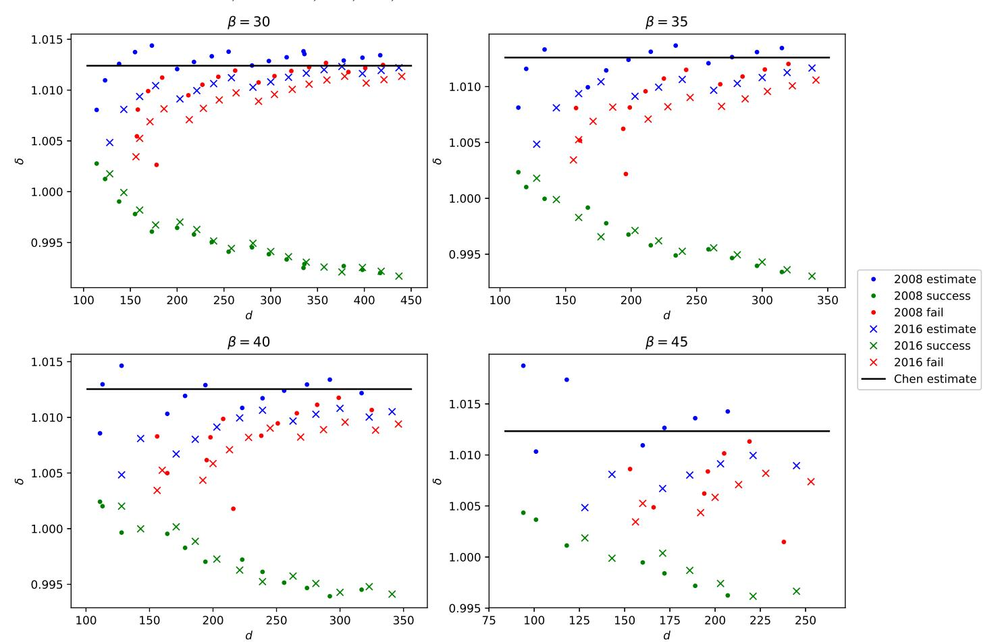
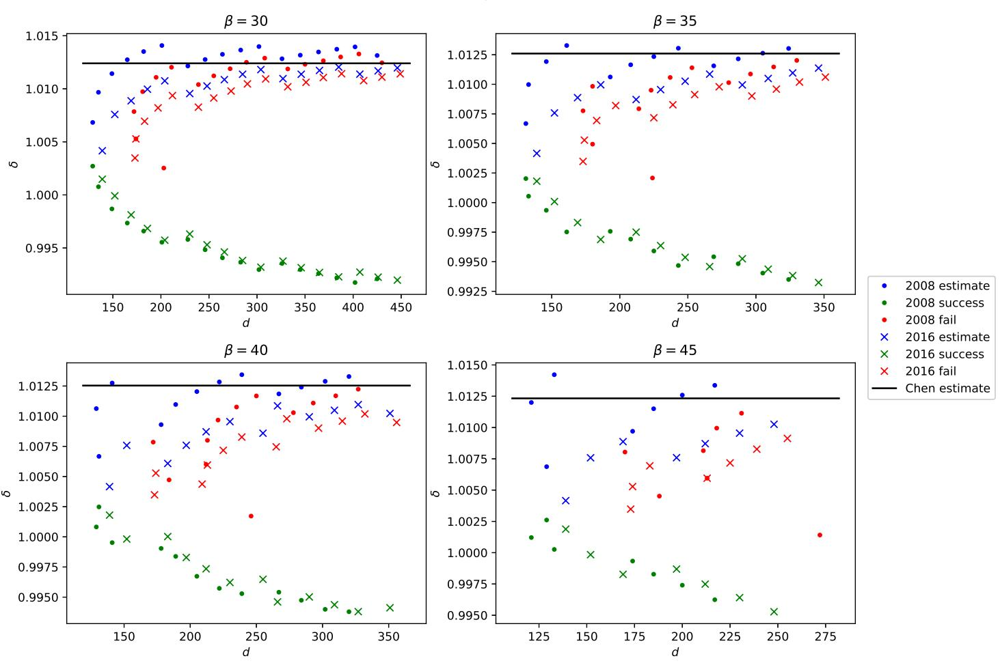
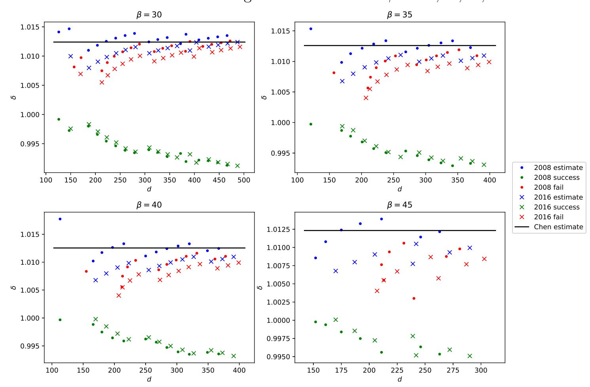
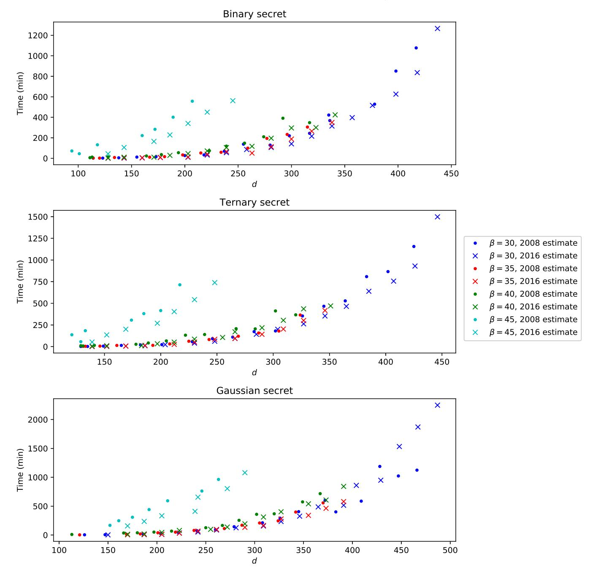
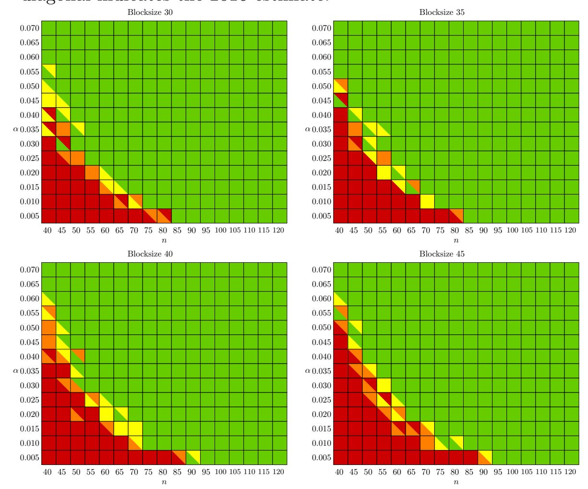
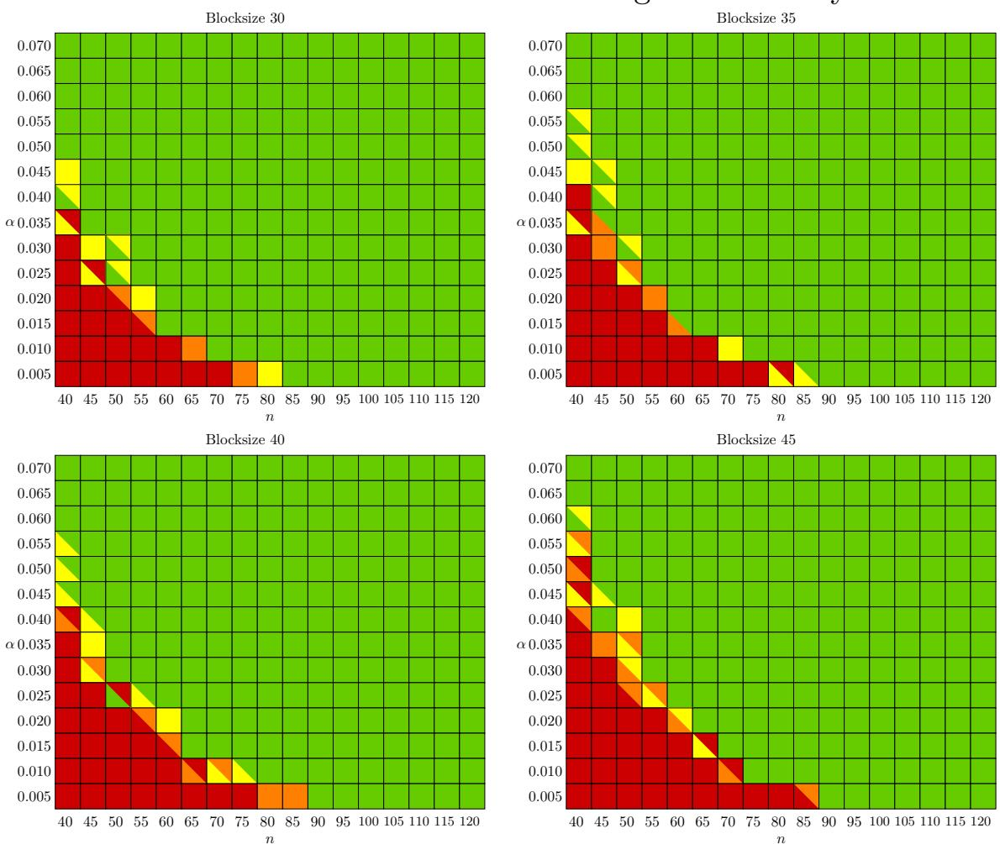
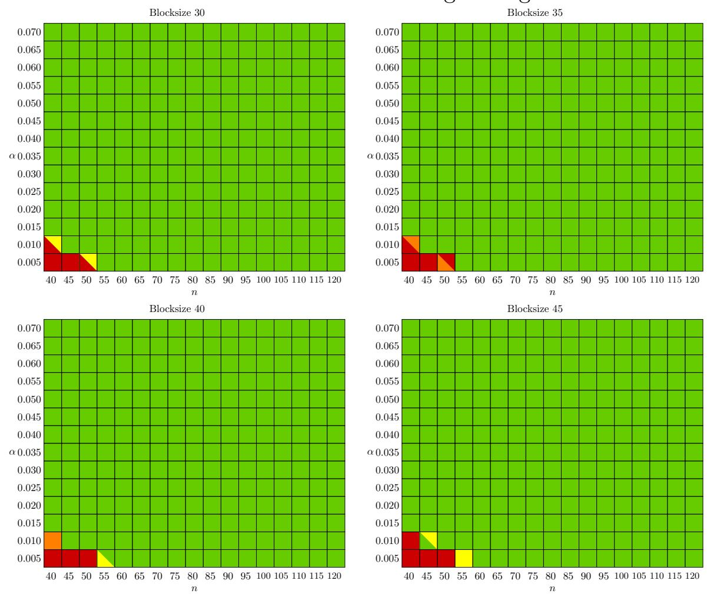

{0}------------------------------------------------

# ON THE CONCRETE SECURITY OF LWE WITH SMALL SECRET

HAO CHEN, LYNN CHUA, KRISTIN LAUTER, AND YONGSOO SONG

Abstract. Lattice-based cryptography is currently under consideration for standardization in the ongoing NIST PQC Post-Quantum Cryptography competition, and is used as the basis for Homomorphic Encryption schemes worldwide. Both applications rely specifically on the hardness of the Learning With Errors (LWE) problem. Most Homomorphic Encryption deployments use small secrets as an optimization, so it is important to understand the concrete security of LWE when sampling the secret from a non-uniform, small distribution. Although there are numerous heuristics used to estimate the running time and quality of lattice reduction algorithms such as BKZ2.0, more work is needed to validate and test these heuristics in practice to provide concrete security parameter recommendations, especially in the case of small secret. In this work, we introduce a new approach which uses concrete attacks on the LWE problem as a way to study the performance and quality of BKZ2.0 directly. We find that the security levels for certain values of the modulus q and dimension n are smaller than predicted by the online LWE Estimator, due to the fact that the attacks succeed on these uSVP lattices for blocksizes which are smaller than expected based on current estimates. We also find that many instances of the TU Darmstadt LWE challenges can be solved significantly faster when the secret is chosen from the binary or ternary distributions.

## 1. Introduction

Lattice-based cryptography, proposed more than 20 years ago, is currently used as the basis for Homomorphic Encryption schemes world-wide. Cryptosystems based on the hardness of lattice problems are also under consideration for standardization in the ongoing NIST PQC Post-Quantum Cryptography competition. Both applications rely specifically on the hardness of the Learning with Errors (LWE) problem [Reg09].

Homomorphic Encryption allows computations on encrypted data, with security parameters for practical applications specified in HES, the Homomorphic Encryption Standard [ACC+18]. For efficiency reasons, it is common in homomorphic encryption to sample the secret from special distributions, such that it has small entries [BV11]. For example, two common distributions are the binary or ternary distributions [BLP+13, MP13], where the entries in the secret are in {0, 1} or {0, ±1} respectively. We also consider secrets sampled from the same small discrete gaussian distribution as the errors. In fact, the Homomorphic Encryption

Date: May 8, 2020.

2010 Mathematics Subject Classification. Primary 11T71.

Key words and phrases. Lattices, Learning With Errors, Hermite factor, unique Shortest Vector Problem.

{1}------------------------------------------------

Standard [ACC+18] specifies tables of secure parameters for three possible distributions for the secret vector: uniform, ternary, and error distributions.

When the secret has a small norm, instances of LWE can be embedded into instances of the unique Shortest Vector Problem (uSVP) [BG14, AGVW17, BMW19]. To recover the shortest vector, lattice reduction algorithms such as the BKZ2.0 algorithm [CN11] are currently the most effective in practice. Although there are numerous heuristics used to estimate the running time and quality of lattice reduction algorithms such as BKZ2.0, [GN08, APS15, ADPS16], more work is needed to validate and test these heuristics in practice to provide concrete security parameter recommendations, especially in the case of small secret and small error.

In this work, we introduce a new approach which uses concrete attacks on the LWE problem as a way to study the performance and quality of BKZ2.0 directly. We generate random LWE instances using secrets sampled from binary, ternary or discrete Gaussian distributions. We convert each LWE instance into a uSVP instance and run the BKZ2.0 algorithm to find an approximation to the shortest vector. When the attack is successful, we can deduce a bound on the Hermite factor achieved for the given blocksize. In practice we find that the attacks succeed for a smaller block size than would be expected based on current estimates.

Our approach is similar to the approach taken in earlier work [LL15] for estimating the approximation factor for the LLL algorithm. Laine and Lauter used synthetically generated LWE instances to study the approximation factor for LLL in dimension up to 800, without solving the Shortest Vector Problem. They found that the approximation factor for LLL is significantly better than expected in dimensions up to 800, which confirmed and extended what Gama and Nyugen [GN08] had found for LLL in dimension up to 200. But it was not clear how that would extend to other lattice reduction algorithms such as BKZ. The attacks presented in [LL15] also cover the case of secrets sampled from the uniform distribution, but in that case the attacks are only successful for very large moduli.

In this work, we find that the security levels for certain values of the modulus q and dimension n are smaller than predicted by the online LWE Estimator [APS15]. This is due to the fact that the attacks succeed on these uSVP lattices for smaller blocksizes 30, 35, 40 and 45 than expected, for randomly generated LWE instances with small secret. The work of [BG14] attempts to quantify the loss of security when using binary secret by analyzing how much larger the lattice dimension n should be in order to achieve the same level of security. We use the same approach as [BG14] for attacking the LWE instances, but we run experiments to find the smallest blocksize necessary to break each LWE instance.

The tables of experimental data we present in Section 4 can be interpreted as follows: for each fixed blocksize β and lattice dimension n, the bold line in the table represents the smallest value of log(q) for which the attacks succeed. There are several estimates in the literature predicting which blocksize will be necessary to achieve a sufficiently good approximation factor for the attack to succeed (the 2008 [GN08] and the 2016 [ADPS16] estimates). However our experiments on LWE instances with small secret (and small error) show that the approximation factor may be significantly better than predicted by the estimates for random lattices, and this translates into attacks succeeding with smaller blocksize than expected.

For example, in Table 1 for binary secret, observe that blocksize 30 is enough to break LWE instances with n = 120 and log(q) = 12 and error width σ = 3.2 in under 

{2}------------------------------------------------

2 hours. Although machines are more powerful now, this can be compared with [BG14, Table 4] where the predicted security levels for  $(n,q,\sigma)=(128,2^{12},22.6)$ , depending on the Hermite factor  $\delta$ , range from 94-175 bits of security for the standard attack to 34-59 bits of security for their attack. Note that their  $\delta\approx 1.008$  is closer to the delta we get for failed instances  $\delta\approx 1.01$  than our average  $\delta$  for successful cases  $\delta\approx 0.99$ .

We also observe a marked difference in blocksize required for a successful attack in comparison with the experiments presented in [AGVW17]. For example, in [AGVW17, Table 1], they validate the 2016 estimate in the case of n=110,  $\log(q)=11$ , where their attack requires blocksize 78. In our experiments attacking LWE instances with binary secrets, we successfully attack the same parameters with the same error width using blocksize 35 (see Table 2) with the dimension as predicted in the 2008 estimate. In this case the discrepancy is most likely due to the secret distribution: binary instead of uniform.

Our approach differs from the online LWE Estimator [APS15] in the sense that we run BKZ2.0 on synthetically generated LWE instances in order to study the approximation factor and the required blocksize, whereas the Estimator uses models based on heuristic estimates to predict the blocksize and running time necessary. We find for example that LWE instances in dimension 200 with  $\log(q) = 19$  and binary secret can be broken using BKZ2.0 with blocksize 30, whereas the LWE Estimator predicts that blocksize 40 would be required, and a similar discrepancy with the LWE Estimator predictions applies to most entries in our Tables.

We present separate tables for each possible choice of the secret distribution: binary, ternary, and Gaussian, for blocksizes 30, 35, 40 and 45, and lattice dimension ranging from n=40 to n=200. Note the difference in security levels between the tables for binary, ternary, and Gaussian secrets. For the same choice of blocksize  $\beta$  and lattice dimension n, the attack succeeds for smaller values of  $\log(q)$  for binary secret than for ternary secret and Gaussian secret (e.g. for  $\beta=30$ , n=120,  $\log(q)=12,13,14$  respectively).

We also generated synthetic instances of the TU Darmstadt LWE challenges [BBG+16] with binary, ternary and discrete gaussian secrets, and ran our same attack on these instances. Although our experiments only cover blocksizes 30, 35, 40 and 45, these blocksizes are already large enough to attack all the solved LWE challenges in the online tables, for secrets sampled from the binary and ternary secret distributions. We observed significantly lower running times for successful attacks on instances generated with the binary distribution for the secret vector. We observed that sampling the secret from the discrete Gaussian error distribution yielded greater security than the binary or ternary distributions for the same set of parameters, as the attack rarely succeeds. Our attacks run in a matter of minutes (under an hour) for blocksizes 30, 35, 40 and in a matter of hours for blocksize 45, for the range of parameters where the actual challenges have been solved.

#### 2. Preliminaries

Let  $\mathbf{b}_1, \dots, \mathbf{b}_d \in \mathbb{R}^d$  be linearly independent vectors, and let  $\mathbf{B} = (\mathbf{b}_1, \dots, \mathbf{b}_d) \in \mathbb{R}^{d \times d}$  be the matrix whose columns are formed by them. The lattice generated by  $\mathbf{B}$  is

(2.1) 
$$L(\mathbf{B}) = \left\{ \mathbf{B} \mathbf{x} : \mathbf{x} \in \mathbb{Z}^d \right\}.$$

{3}------------------------------------------------

The Shortest Vector Problem (SVP) asks to find the shortest nonzero vector in the lattice, whose norm is the first minimum:

(2.2) 
$$\lambda_1(L(\mathbf{B})) = \min_{\mathbf{v} \in L(\mathbf{B}), \mathbf{v} \neq 0} ||\mathbf{v}||,$$

where we use  $||\cdot||$  to denote the  $\ell_2$ -norm. Similarly, the second minimum is

$$(2.3) \quad \lambda_2(L(\mathbf{B})) = \min_{\mathbf{v}_1, \mathbf{v}_2 \in L(\mathbf{B})} \left\{ \max\{||\mathbf{v}_1||, ||\mathbf{v}_2||\} : \mathbf{v}_1, \mathbf{v}_2 \text{ linearly independent} \right\}.$$

The unique Shortest Vector Problem (uSVP) with gap  $\gamma$  is a variant of the SVP where  $\lambda_2 \geq \gamma \cdot \lambda_1$ , for some  $\gamma \geq 1$ . While random lattices do not satisfy this condition, in Section 3 we describe a procedure for embedding an instance of LWE with small secrets to an instance of uSVP.

In this work, we use the BKZ2.0 lattice reduction algorithm [CN11] to solve instances of the uSVP. Let  $\mathbf{b}_1^*, \ldots, \mathbf{b}_d^*$  denote the Gram-Schmidt orthogonalization of the basis vectors. For  $1 \leq i \leq d$ , let  $\pi_i$  be the orthogonal projection over  $(\mathbf{b}_1, \ldots, \mathbf{b}_{i-1})^{\perp}$ . For  $1 \leq j \leq k \leq d$ , let  $B_{[j,k]}$  be the local projected block  $(\pi_j(\mathbf{b}_j), \ldots, \pi_j(\mathbf{b}_k))$ , and let  $L_{[j,k]}$  be the lattice spanned by  $B_{[j,k]}$ , of dimension k-j+1.

**Definition 2.1.** A basis  $\mathbf{b}_1, \dots, \mathbf{b}_d$  is BKZ-reduced with blocksize  $\beta \geq 2$  if it is LLL-reduced, and for each  $1 \leq j \leq d$ ,  $||\mathbf{b}_j^*|| = \lambda_1(L_{[j,k]})$  where  $k = \min(j+\beta-1,d)$ .

The BKZ algorithm works by iteratively reducing each local block  $B_{[j,k]}$  of size up to  $\beta$ . Each block is first LLL-reduced, before being enumerated to find a vector that is the shortest in the projected lattice  $L_{[j,k]}$ . The BKZ2.0 algorithm [CN11] improves on BKZ by modifying the enumeration routine, incorporating the sound pruning technique by [GNR10].

The volume of a lattice is  $Vol(L(\mathbf{B})) = |\det(\mathbf{B})|$ . We use the root Hermite factor to measure the quality of the BKZ-reduced basis.

**Definition 2.2.** The root Hermite factor  $\delta$  of a basis  $\{\mathbf{b}_1, \ldots, \mathbf{b}_d\}$  is defined by

(2.4) 
$$||\mathbf{b}_1|| = \delta^d \cdot \operatorname{Vol}(L(\mathbf{B}))^{1/d}.$$

For BKZ with block size  $\beta$ , Chen [Che13] gives the following estimate for  $\delta$  which only depends on  $\beta$ .

(2.5) 
$$\delta(\beta) \approx \left(\frac{\beta}{2\pi e} (\pi \beta)^{1/\beta}\right)^{\frac{1}{2(\beta-1)}}.$$

For a large  $\beta$ , we can approximate this by  $\beta^{1/2\beta}$ .

### 3. REDUCTION FROM LWE TO USVP

In this work, we study the uSVP attack on LWE, which is currently the most effective attack if the LWE secret has small entries [BG14, AGVW17, BMW19]. There are two known estimates for the conditions under which uSVP can be solved by lattice reduction, which are known as the 2008 estimate [GN08] and the 2016 estimate [ADPS16]. In this section, we describe the reduction from LWE to uSVP, which proceeds by first reducing LWE to BDD and then reducing BDD to uSVP. We also describe the 2008 and 2016 estimates, and calculate the optimal parameters for the uSVP attack under these estimates, as well as the predicted values of the Hermite factor.

{4}------------------------------------------------

3.1. **The LWE Problem.** We first define the search variant of the LWE problem.

**Definition 3.1.** Let  $n \geq 1$ ,  $q \geq 2$  be a prime modulus and let  $D_{\sigma}$  be a discrete gaussian distribution over  $\mathbb{Z}$  with standard deviation  $\sigma$ . Let  $A \in \mathbb{Z}_q^{m \times n}$  be a matrix with entries uniformly sampled from  $\mathbb{Z}_q$ , let  $\mathbf{s} \in \mathbb{Z}_q^n$  be a secret vector, and let  $\mathbf{e} \in \mathbb{Z}_q^m$  be an error vector with entries sampled independently from  $D_{\sigma}$ . Let  $\mathbf{b} = \mathbf{A}\mathbf{s} + \mathbf{e} \pmod{q}$ . The goal of the LWE problem is to find  $\mathbf{s}$ , given  $(\mathbf{A}, \mathbf{b})$ .

We consider the following distributions for the secret:

- Binary: Secret has entries sampled uniformly at random from  $\{0,1\}$ .
- Ternary: Secret has entries sampled uniformly at random from  $\{0, \pm 1\}$ .
- Gaussian: Secret has entries sampled from the same discrete gaussian distribution as the error.
- 3.2. Reduction from LWE to BDD. Assuming that the secret has a small norm, we can transform the LWE problem into the Bounded Distance Decoding (BDD) problem. Specifically, given a lattice  $L(\mathbf{B})$  and a target vector  $\mathbf{t}$ , such that the distance of  $\mathbf{t}$  from  $L(\mathbf{B})$  is bounded by a factor of  $\lambda_1$ , the BDD problem asks to find a lattice vector  $\mathbf{v} \in L(\mathbf{B})$  close to  $\mathbf{t}$ . Consider the lattice generated by

(3.1) 
$$\mathbf{B}_0 = \begin{pmatrix} \mathbf{I}_n & \mathbf{0} \\ \mathbf{A} & q \cdot \mathbf{I}_m \end{pmatrix}.$$

Since  $\mathbf{A}\mathbf{s} + \mathbf{e} = \mathbf{b} \pmod{q}$ , we can write  $\mathbf{b} = \mathbf{A}\mathbf{s} + \mathbf{e} + q \cdot \mathbf{c}$  for some  $\mathbf{c} \in \mathbb{Z}^m$ . Hence the lattice contains the vector  $\mathbf{B}_0 \begin{pmatrix} \mathbf{s} \\ \mathbf{c} \end{pmatrix} = \begin{pmatrix} \mathbf{s} \\ \mathbf{A}\mathbf{s} + q\mathbf{c} \end{pmatrix} = \begin{pmatrix} \mathbf{s} \\ \mathbf{b} - \mathbf{e} \end{pmatrix}$ . Thus if we solve the BDD problem in the lattice generated by  $\mathbf{B}_0$ , with respect to the target point  $\mathbf{t} = \begin{pmatrix} \mathbf{0} \\ \mathbf{b} \end{pmatrix}$ , then we obtain  $\begin{pmatrix} \mathbf{s} \\ -\mathbf{e} \end{pmatrix}$ , allowing us to recover the secret.

3.3. Reduction from BDD to uSVP. We can reduce the BDD problem to an instance of uSVP using Kannan's embedding technique [Kan87]. Consider the basis matrix obtained by adding one row and column to (3.1):

(3.2) 
$$\mathbf{B}_1 = \begin{pmatrix} \mathbf{B}_0 & \mathbf{t} \\ \mathbf{0} & 1 \end{pmatrix} = \begin{pmatrix} \mathbf{I}_n & \mathbf{0} & \mathbf{0} \\ \mathbf{A} & q \cdot \mathbf{I}_m & \mathbf{b} \\ 0 & 0 & 1 \end{pmatrix}.$$

The lattice generated by the columns of  $\mathbf{B}_1$  contains the unique shortest vector

(3.3) 
$$\mathbf{B}_{1} \begin{pmatrix} \mathbf{s} \\ \mathbf{c} \\ -1 \end{pmatrix} = \begin{pmatrix} \mathbf{B}_{0} \begin{pmatrix} \mathbf{s} \\ \mathbf{c} \end{pmatrix} - \mathbf{t} \\ -1 \end{pmatrix} = \begin{pmatrix} \mathbf{s} \\ -\mathbf{e} \\ -1 \end{pmatrix}.$$

Assuming that the gap between  $\lambda_1$  and  $\lambda_2$  in this lattice is sufficiently large, we can solve for the unique shortest vector using lattice reduction algorithms such as BKZ2.0. Following [BG14], we further optimize this by balancing the lengths of the secret and error vectors, scaling the secret by some constant factor  $\omega$ . If the secret is sampled from the same discrete gaussian distribution as the error, then we set  $\omega = 1$ . For the binary or ternary secret distributions, consider the matrix

(3.4) 
$$\mathbf{B} = \begin{pmatrix} \omega \cdot \mathbf{I}_n & \mathbf{0} & \mathbf{0} \\ \mathbf{A} & q \cdot \mathbf{I}_m & \mathbf{b} \\ 0 & 0 & 1 \end{pmatrix}.$$

{5}------------------------------------------------

The lattice  $L(\mathbf{B})$  generated by (3.4) has dimension

$$(3.5) d = n + m + 1$$

and contains a short vector

(3.6) 
$$\mathbf{B} \begin{pmatrix} \mathbf{s} \\ \mathbf{c} \\ -1 \end{pmatrix} = \begin{pmatrix} \omega \cdot \mathbf{s} \\ \mathbf{A}\mathbf{s} + q\mathbf{c} - \mathbf{b} \\ -1 \end{pmatrix} = \begin{pmatrix} \omega \cdot \mathbf{s} \\ -\mathbf{e} \\ -1 \end{pmatrix}.$$

Since this is the shortest vector of this lattice, we approximate the first minimum of the lattice by its expected norm:

(3.7) 
$$\lambda_1 = \sqrt{\omega^2 \cdot ||\mathbf{s}||^2 + ||\mathbf{e}||^2 + 1} \approx \sqrt{\omega^2 \cdot h + m\sigma^2 + 1},$$

where  $\sigma$  is the standard deviation of the discrete Gaussian distribution and h is the expected value of  $||\mathbf{s}||^2$ . We have  $h = \frac{n}{2}$  for the binary distribution and  $h = \frac{2}{3}n$  for the ternary distribution.

We estimate the second minimum  $\lambda_2$  to be the same as the first minimum of a random lattice with the same dimension using the *Gaussian Heuristic*. Since the lattice is q-ary, it also contains vectors of norm q, so we have

(3.8) 
$$\lambda_2 \approx \min \left\{ q, \sqrt{\frac{d}{2\pi e}} \omega^{n/d} q^{m/d} \right\}.$$

We can solve the uSVP using lattice reduction algorithms if  $\lambda_2$  is sufficiently larger than  $\lambda_1$ . We choose  $\omega$  to maximize the ratio  $\frac{\lambda_2}{\lambda_1}$  as follows. First we write

(3.9) 
$$\gamma = \frac{\lambda_2}{\lambda_1} \approx \frac{\min\left\{q, \sqrt{\frac{d}{2\pi e}}\omega^{n/d}q^{m/d}\right\}}{\sqrt{\omega^2 h + m\sigma^2}}.$$

We choose the parameters to optimize the second term in the minimum, since the Gaussian Heuristic would asymptotically be smaller than q. Differentiating the expression in (3.9) with respect to  $\omega$  and setting the result to zero, we get

(3.10) 
$$\omega^2 = \frac{nm}{h(d-n)}\sigma^2 \approx \frac{n}{h}\sigma^2.$$

This gives us  $\omega = \sqrt{2}\sigma$  for the binary distribution and  $\omega = \sqrt{\frac{3}{2}}\sigma$  for the ternary distribution. Substituting (3.10) into (3.7), we get

$$(3.11) \lambda_1 \approx \sqrt{d\sigma}.$$

This also holds for the case where the secret is sampled from the same discrete gaussian distribution as the error. Notably, the shortest vector has the same  $\ell_2$ -norm regardless of the secret distribution, whereas the  $\ell_1$ -norm differs. Thus

(3.12) 
$$\gamma = \frac{\min\left\{q, \sqrt{\frac{d}{2\pi e}}\omega^{n/d}q^{m/d}\right\}}{\sqrt{d}\sigma}.$$

Remark 3.2. Another commonly used secret distribution is the uniform distribution on  $\mathbb{Z}_q$ , where the entries of the secret are sampled uniformly at random from  $\{0,1,\ldots,q-1\}$ . Since the secret does not have a small norm, the uSVP attack would require a much larger q to succeed. To balance the norms of the secret and error vectors, we have to choose the scaling factor to be  $\omega \approx \frac{\sqrt{3}}{q}\sigma$ . However, the

{6}------------------------------------------------

Gaussian heuristic would then be greater than q, and so  $\lambda_2 = q$  from (3.8). For the uSVP attack to be effective,  $\lambda_2$  would have to be much greater than  $\lambda_1$ , which means that q would have to be much larger than for the other secret distributions.

There are two known ways for estimating the conditions under which uSVP can be solved using lattice reduction, which are called the 2008 estimate and the 2016 estimate in the literature. We study each of these in turn.

3.4. **2008 estimate.** From experiments by Gama and Nguyen [GN08], they claimed that the shortest vector can be recovered if

$$\gamma = \frac{\lambda_2}{\lambda_1} \ge \delta^d \,,$$

where  $\delta$  is the root Hermite factor of the lattice reduction algorithm, up to a multiplicative constant. In what follows, we will compute the estimate of  $\delta$  based on the heuristic in (3.13) for our setting. We will fix n and q, while choosing the lattice dimension d to maximize  $\gamma$ . First we write

$$(3.14) \qquad \gamma \approx \frac{\sqrt{\frac{d}{2\pi e}}\omega^{n/d}q^{m/d}}{\sqrt{d}\sigma} = \frac{1}{\sqrt{2\pi e}}\frac{\omega^{n/d}q^{m/d}}{\sigma} \approx \frac{1}{\sqrt{2\pi e}}\left(\frac{q}{\omega}\right)^{-n/d}\left(\frac{q}{\sigma}\right) \geq \delta^d.$$

We choose d to maximize the ratio in (3.14), by setting

(3.15) 
$$d = \sqrt{\frac{n \log\left(\frac{q}{\omega}\right)}{\log \delta}}.$$

We solve for the largest possible value of  $\delta$  as a function of  $n, q, \omega, \sigma$ . First, we assume equality in (3.14) and take logarithms on both sides:

(3.16) 
$$\log\left(\frac{q}{\sqrt{2\pi e}\sigma}\right) - \frac{n}{d}\log\left(\frac{q}{\omega}\right) = d\log\delta.$$

Substituting (3.15) and rearranging, we get the 2008 estimate for  $\delta$ :

(3.17) 
$$\log \delta_{2008} = \frac{\log^2 \left(\frac{q}{\sqrt{2\pi e}\sigma}\right)}{4n \log \left(\frac{q}{\omega}\right)}.$$

We substitute (3.17) into (3.15) to obtain

(3.18) 
$$d_{2008} = \frac{2n\log\left(\frac{q}{\omega}\right)}{\log\left(\frac{q}{\sqrt{2\pi e\sigma}}\right)}.$$

This is the lattice dimension that we use in our experiments to compute  $\delta_{2008}$ . We observe that  $\delta_{2008}$  increases with q. For fixed  $n, \beta$ , we experimentally find the smallest q such that the attack succeeds. Substituting the parameters into (3.17), we then obtain a heuristic estimate of  $\delta_{2008}$ , which we compare with the actual value of  $\delta$  from (2.4).

We remark that (3.17) only holds for large q, such that  $\lambda_2$  is given by the Gaussian Heuristic. If  $\lambda_2 = q$ , then the same analysis as above gives

(3.19) 
$$\log \delta_{2008} = \frac{1}{d} \log \left( \frac{q}{\sqrt{d}\sigma} \right).$$

{7}------------------------------------------------

We also compare  $\delta_{2008}$  with the actual value of  $\delta$  that we expect from the experiments, using the definition in (2.4) and assuming that the shortest vector is successfully recovered, and that  $\lambda_2$  is equal to the Gaussian Heuristic. We have

(3.20) 
$$\delta_{2008}^d = \frac{\lambda_2}{\lambda_1} = \sqrt{\frac{d}{2\pi e}} \delta^{-d}.$$

This gives us the relation between the expected experimental  $\delta$  and  $\delta_{2008}$ .

(3.21) 
$$\delta = \frac{1}{\delta_{2008}} \left( \frac{d}{2\pi e} \right)^{1/2d} .$$

Hence we expect  $\delta$  to trend differently from  $\delta_{2008}$ .

3.5. **2016 estimate.** The 2016 estimate is given in the New Hope key exchange paper [ADPS16]. The authors consider the evolution of the Gram-Schmidt coefficients of the unique shortest vector in the BKZ tours, assuming that the Geometric Series Assumption [Sch03] holds. This says that the norms of the Gram-Schmidt vectors after lattice reduction satisfy

$$(3.22) ||\mathbf{b}_i^*|| \approx \delta^{d-2i+2} \cdot \operatorname{Vol}(L(\mathbf{B}))^{1/d}.$$

The reasoning in [ADPS16] is that, if the projection of the unique shortest vector onto the space spanned by the last  $\beta$  Gram-Schmidt vectors is shorter than  $\mathbf{b}_{d-\beta+1}^*$ , then the SVP oracle in BKZ would be able to find it when called on the last block of size  $\beta$ . The success condition is thus given by

(3.23) 
$$\sqrt{\frac{\beta}{d}}\lambda_1 \le ||\mathbf{b}_{d-\beta+1}^*||.$$

Based on these heuristics, we compute the estimated value of  $\delta$  in our setting. Substituting  $\lambda_1 \approx \sqrt{d}\sigma$  and (3.22), we get

(3.24) 
$$\sqrt{\beta}\sigma \le \delta^{2\beta-d} \cdot \operatorname{Vol}(L(\mathbf{B}))^{1/d} = \delta^{2\beta-d}\omega^{n/d}q^{m/d}.$$

If we choose d to optimize this ratio, we obtain (3.15) again. Substituting (3.15) into (3.24) and taking logarithms, we get a quadratic equation in  $\sqrt{\log \delta}$ :

(3.25) 
$$2\beta \log \delta - 2\sqrt{n \log \left(\frac{q}{\omega}\right) \log \delta} + \log \left(\frac{q}{\sqrt{\beta}\sigma}\right) = 0.$$

We solve this equation to get the 2016 estimate for  $\delta$ :

(3.26) 
$$\log \delta_{2016} = \frac{n \log \left(\frac{q}{\omega}\right)}{4\beta^2} \left(1 - \sqrt{1 - \frac{2\beta \log \left(\frac{q}{\sqrt{\beta}\sigma}\right)}{n \log \left(\frac{q}{\omega}\right)}}\right)^2,$$

If the value inside the squareroot is negative, then we take  $\log \delta_{2016} = \frac{n \log(\frac{q}{\omega})}{4\beta^2}$ . We obtain the lattice dimension  $d_{2016}$  by substituting (3.26) into (3.15). For large n, (3.26) is asymptotically

(3.27) 
$$\log \delta_{2016} \approx \frac{\log^2 \left(\frac{q}{\sqrt{\beta}\sigma}\right)}{4n \log \left(\frac{q}{\omega}\right)}.$$

We observe that (3.27) is similar to (3.17) except for the denominator of q in the numerator. The experiments in [AGVW17, BMW19] suggest that the 2016 estimate

{8}------------------------------------------------

is more consistent with experiments than the 2008 estimate. In this paper, we will experimentally compare δ2008 and δ2016 with actual values of δ.

We compare δ2016 with the expected experimental value of δ, using the definition in (2.4) and assuming that the shortest vector is successfully recovered. We have

(3.28) 
$$\delta_{2016}^{2\beta-d} = \sqrt{\frac{\beta}{d}} \frac{\lambda_1}{\operatorname{Vol}(L(\mathbf{B}))^{1/d}} = \sqrt{\frac{\beta}{d}} \delta^d.$$

Hence we have the relation

(3.29) 
$$\delta = \delta_{2016}^{2\beta/d-1} \left(\frac{d}{\beta}\right)^{1/2d}.$$

We observe that δ trends differently from δ2016, similarly to (3.21) for δ2008.

## 4. Experiments

4.1. Setup. We perform our experiments using a 2.4 GHz Intel R Xeon R E5-2673 v4 processor, with 48 virtual CPUs and 192 GB of RAM. We generate random instances of LWE, and convert them into instances of uSVP via (3.4). We sample the errors from a discrete gaussian distribution with standard deviation σ = 3.2, using the discrete gaussian sampler in [The19], and we sample secrets uniformly from the binary, ternary and discrete gaussian distributions. To recover the shortest vector, we use the BKZ2.0 algorithm implemented in fplll [The16], with the bkzautoabort option, and with blocksizes β = 30, 35, 40, 45. The bkzautoabort option causes the algorithm to terminate when the norms of the Gram-Schmidt vectors stop changing.

For β = 30, we run experiments for n from 40 to 200 in steps of 10. For β = 35, 40, we choose n from 40 to 150, and for β = 45, we choose n from 40 to 100. We use a smaller range of values of n for higher β, since the running time of BKZ2.0 grows exponentially with β, so it is infeasible to run the experiments for higher β with large n. For each set of parameters, we vary log q to determine the smallest value of log q such that BKZ2.0 succeeds in recovering the secret. We perform 10 trials per set of parameters, to account for the randomness in sampling the lattices.

The data are in Tables 1 to 6, where the rows in boldface contain the data for the smallest value of log(q) where the attack succeeds. For each set of parameters, we compute the values of δ using the estimates in (3.17) and (3.26), which we tabulate as δ2008 and δ2016 respectively. Based on the estimates, we also compute the optimal values of the lattice dimensions from (3.15), which we tabulate as d2008 and d2016. Since these dimensions are different, we conducted two sets of experiments for each set of parameters, where one set has lattice dimension d2008 and the other has dimension d2016. We thus divide Tables 1 to 6 into two parts, where the left parts indicate the experiments for the 2008 estimate and the right for the 2016 estimate.

For each instance, we compute the actual values of δ using the definition in (2.4). We split the instances into cases where BKZ2.0 succeeds in recovering the secret, and cases where it fails, and we compute the average value of δ in each scenario. We tabulate these experimental values of δ under the columns labeled "Average successful δ" and "Average failed δ".

{9}------------------------------------------------

Table 1. Binary secrets

|    |     |          |            |                        | Number of | Average    | Average            | Average      |            |                        | Number of | Average    | Average            | Average      |
|----|-----|----------|------------|------------------------|-----------|------------|--------------------|--------------|------------|------------------------|-----------|------------|--------------------|--------------|
| β  | n   | log(q)   | d2008      | δ2008                  | successes | time (min) | successful δ       | failed δ     | d2016      | δ2016                  | successes | time (min) | successful δ       | failed δ     |
|    |     | 5        | 156        | 0.99952                | 0         | 1          | -                  | 1.00344      | 178        | 1.00255                | 0         | 2          | -                  | 1.00264      |
|    | 40  | 6        |            | 128 1.00484            | 5         | 1          | 1.00176            | 1.00661      |            | 114 1.00805            | 7         | 2          | 1.00277            | 1.00835      |
|    |     | 7        | 114        | 1.01014                | 10        | 1          | 0.99893            | -            | 83         | 1.01933                | 10        | 1          | 1.00340            | -            |
|    |     | 6        | 160        | 1.00317                | 0         | 2          | -                  | 1.00525      | 157        | 1.00535                | 0         | 2          | -                  | 1.00545      |
|    | 50  | 7        |            | 143 1.00810            | 7         | 2          | 0.99992            | 1.00826      |            | 123 1.01096            | 8         | 2          | 1.00125            | 1.01118      |
|    |     | 8 7   | 133 171 | 1.01126 1.00671     | 10 0   | 2 3     | 0.99722 -       | - 1.00689 | 105 158 | 1.01821 1.00793     | 10 0   | 2 3     | 0.99952 -       | - 1.00808 |
|    | 60  | 8        |            | 160 1.00937            | 8         | 4          | 0.99819            | 1.00950      |            | 138 1.01258            | 8         | 5          | 0.99903            | 1.01278      |
|    |     | 9        | 152        | 1.01219                | 10        | 4          | 0.99558            | -            | 125        | 1.01808                | 10        | 4          | 0.99752            | -            |
|    |     | 8        | 186        | 1.00803                | 0         | 6          | -                  | 1.00816      | 169        | 1.00974                | 0         | 7          | -                  | 1.00990      |
|    | 70  | 9        |            | 177 1.01044            | 10        | 8          | 0.99672            | -            |            | 155 1.01374            | 10        | 12         | 0.99780            | -            |
|    |     | 8        | 213        | 1.00702                | 0         | 8          | -                  | 1.00709      | 200        | 1.00798                | 0         | 13         | -                  | 1.00805      |
|    | 80  | 9        |            | 203 1.00913            | 2         | 10         | 0.99701            | 1.00921      | 184        | 1.01115                | 0         | 12         | -                  | 1.01123      |
|    |     | 10       | 196        | 1.0112                 | 10        | 12         | 0.99547            | -            |            | 173 1.01438            | 10        | 16         | 0.99607            | -            |
|    |     | 9        | 228        | 1.00811                | 0         | 27         | -                  | 1.00820      | 212        | 1.00940                | 0         | 23         | -                  | 1.00949      |
|    | 90  | 10       |            | 221 1.00995            | 4         | 32         | 0.99628            | 1.01001      |            | 200 1.01207            | 6         | 27         | 0.99644            | 1.01224      |
|    |     | 11       | 215        | 1.01183                | 10        | 31         | 0.99452            | -            | 192        | 1.01485                | 10        | 24         | 0.99525            | -            |
|    |     | 10       | 245        | 1.00895                | 0         | 45         | -                  | 1.00903      | 227        | 1.01041                | 0         | 42         | -                  | 1.01053      |
|    | 100 | 11       |            | 239 1.01064            | 7         | 55         | 0.99515            | 1.01073      |            | 218 1.01277            | 8         | 33         | 0.99579            | 1.01291      |
|    |     | 12       | 234        | 1.01235                | 10        | 54         | 0.99365            | -            | 211        | 1.01520                | 10        | 35         | 0.99430            | -            |
|    | 110 | 11       | 263        | 1.00967                | 0         | 71         | -                  | 1.00973      | 244        | 1.01122                | 0         | 57         | -                  | 1.01131      |
|    |     | 12       |            | 258 1.01122            | 10        | 86         | 0.99442            | -            |            | 237 1.01333            | 10        | 69         | 0.99504            | -            |
|    |     | 11       | 287        | 1.00886                | 0         | 94         | -                  | 1.00890      | 270        | 1.01001                | 0         | 85         | -                  | 1.01006      |
| 30 | 120 | 12 13 | 277        | 281 1.01028 1.01172 | 2 10   | 106 122 | 0.99492 0.99372 | 1.01035 - | 262        | 1.01187 255 1.01378 | 0 10   | 75 138  | - 0.99409       | 1.01192 - |
|    |     | 12       | 304        | 1.00949                | 0         | 78         | -                  | 1.00957      | 287        | 1.01071                | 0         | 112        | -                  | 1.01075      |
|    | 130 | 13       |            | 300 1.01081            | 2         | 141        | 0.99411            | 1.01085      |            | 280 1.01242            | 2         | 129        | 0.99452            | 1.01247      |
|    |     | 14       | 296        | 1.01214                | 10        | 174        | 0.99297            | -            | 274        | 1.01413                | 10        | 148        | 0.99324            | -            |
|    |     | 13       | 323        | 1.01003                | 0         | 206        | -                  | 1.01007      | 304        | 1.01130                | 0         | 121        | -                  | 1.01138      |
|    | 140 | 14       |            | 319 1.01126            | 3         | 216        | 0.99360            | 1.01130      |            | 298 1.01286            | 8         | 220        | 0.99385            | 1.01296      |
|    |     | 15       | 315        | 1.01250                | 10        | 258        | 0.99257            | -            | 294        | 1.01443                | 10        | 122        | 0.99301            | -            |
|    |     | 14       | 341        | 1.01051                | 0         | 281        | -                  | 1.01058      | 322        | 1.01180                | 0         | 174        | -                  | 1.01188      |
|    | 150 | 15       |            | 338 1.01166            | 8         | 315        | 0.99306            | 1.01170      |            | 317 1.01323            | 10        | 244        | 0.99333            | -            |
|    |     | 16       | 335        | 1.01282                | 10        | 347        | 0.99196            | -            | 313        | 1.01467                | 10        | 268        | 0.99224            | -            |
|    | 160 | 15       | 360        | 1.01093                | 0         | 253        | -                  | 1.01099      | 341        | 1.01222                | 0         | 334        | -                  | 1.01226      |
|    |     | 16       |            | 357 1.01201            | 10        | 397        | 0.99258            | -            |            | 336 1.01355            | 10        | 368        | 0.99288            | -            |
|    | 170 | 16       | 379        | 1.01130                | 0         | 531        | -                  | 1.01136      | 359        | 1.01259                | 0         | 546        | -                  | 1.01267      |
|    |     | 17       |            | 376 1.01232            | 10        | 516        | 0.99210            | -            |            | 335 1.01382            | 10        | 422        | 0.99250            | -            |
|    |     | 16       | 402        | 1.01067                | 0         | 609        | -                  | 1.01069      | 383        | 1.01175                | 0         | 484        | -                  | 1.01178      |
|    | 180 | 17       |            | 398 1.01163            | 2         | 626        | 0.99254            | 1.01170      |            | 378 1.01291            | 2         | 528        | 0.99268            | 1.01298      |
|    |     | 18       | 396        | 1.01260                | 10        | 739        | 0.99167            | -            | 375        | 1.01406                | 10        | 392        | 0.99179            | -            |
|    |     | 17       | 421        | 1.01102                | 0         | 761        | -                  | 1.01103      | 401        | 1.01210                | 0         | 392        | -                  | 1.01217      |
|    | 190 | 18 19 | 415        | 418 1.01193 1.01285 | 9 10   | 836 937 | 0.99217 0.99129 | 1.01196 - | 394        | 398 1.01319 1.01427 | 10 10  | 851 881 | 0.99231 0.99156 | - -       |
|    |     | 18       | 440        | 1.01133                | 0         | 1183       | -                  | 1.01135      | 420        | 1.01241                | 0         | 951        | -                  | 1.01247      |
|    | 200 | 19       |            | 437 1.01220            | 6         | 1266       | 0.99169            | 1.01225      |            | 417 1.01343            | 10        | 1077       | 0.99200            | -            |
|    |     | 20       | 435        | 1.01307                | 10        | 1450       | 0.99090            | -            | 414        | 1.01446                | 10        | 1107       | 0.99114            | -            |
|    |     | 5        | 156        | 0.99952                | 0         | 1          | -                  | 1.00344      | 196        | 1.00210                | 0         | 2          | -                  | 1.00218      |
|    | 40  | 6        |            | 128 1.00484            | 8         | 2          | 1.00180            | 1.00661      |            | 114 1.00812            | 4         | 3          | 1.00234            | 1.00835      |
|    |     | 7        | 114        | 1.01014                | 10        | 2          | 0.99879            | -            | 71         | 1.02702                | 10        | 0          | 1.00566            | -            |
|    |     | 6        | 160        | 1.00317                | 0         | 3          | -                  | 1.00525      | 161        | 1.00507                | 0         | 3          | -                  | 1.00518      |
|    | 50  | 7        |            | 143 1.00810            | 9         | 5          | 0.99989            | 1.00826      |            | 120 1.01159            | 10        | 2          | 1.00101            | -            |
|    |     | 8        | 133        | 1.01126                | 10        | 4          | 0.99730            | -            | 96         | 1.02173                | 10        | 2          | 0.99982            | -            |
|    |     | 7        | 171        | 1.00671                | 0         | 6          | -                  | 1.00689      | 158        | 1.00795                | 0         | 5          | -                  | 1.00808      |
|    | 60  | 8        |            | 160 1.00937            | 10        | 6          | 0.99829            | -            |            | 134 1.01332            | 10        | 8          | 0.99996            | -            |
|    |     | 7        | 200        | 1.00534                | 0         | 6          | -                  | 1.00585      | 194        | 1.00614                | 0         | 10         | -                  | 1.00622      |
| 35 | 70  | 8        | 186        | 1.00803                | 0         | 7          | -                  | 1.00816      |            | 167 1.00994            | 2         | 11         | 0.99917            | 1.01014      |
|    |     | 9        |            | 177 1.01044            | 10        | 9          | 0.99656            | -            | 151        | 1.01447                | 10        | 10         | 0.99747            | -            |
|    |     | 8        | 213        | 1.00702                | 0         | 12         | -                  | 1.00709      | 199        | 1.00799                | 0         | 15         | -                  | 1.00813      |
|    | 80  | 9        |            | 203 1.00913            | 5         | 13         | 0.99712            | 1.00921      |            | 181 1.01145            | 6         | 16         | 0.99777            | 1.01160      |
|    |     | 10       | 196        | 1.01120                | 10        | 24         | 0.99545            | -            | 170        | 1.01504                | 10        | 15         | 0.99620            | -            |
|    |     | 9        | 228        | 1.00811                | 0         | 29         | -                  | 1.00820      | 211        | 1.00952                | 0         | 26         | -                  | 1.00958      |
|    | 90  | 10       |            | 221 1.00995            | 5         | 41         | 0.99620            | 1.01001      |            | 198 1.01240            | 10        | 33         | 0.99676            | -            |
|    |     | 11       | 215        | 1.01183                | 10        | 43         | 0.99468            | -            | 189        | 1.01544                | 10        | 30         | 0.99545            | -            |
|    | 100 | 10 11 | 245        | 1.00895                | 0         | 50         | -                  | 1.00903      | 225        | 1.01058                | 0         | 44         | -                  | 1.01072      |
|    |     |          |            | 239 1.01064            | 10        | 66         | 0.99526            | -            |            | 215 1.01312            | 10        | 52         | 0.99580            | -            |

{10}------------------------------------------------

Table 2. Binary secrets (continued)

| β  | n   | log(q)   | d2008      | δ2008                  | Number of successes | Average time (min) | Average successful δ | Average failed δ | d2016      | δ2016                  | Number of successes | Average time (min) | Average successful δ | Average failed δ |
|----|-----|----------|------------|------------------------|------------------------|-----------------------|-------------------------|---------------------|------------|------------------------|------------------------|-----------------------|-------------------------|---------------------|
|    |     | 10       | 269        | 1.00814                | 0                      | 65                    | -                       | 1.00823             | 253        | 1.00924                | 0                      | 83                    | -                       | 1.00931             |
|    | 110 | 11       |            | 263 1.00967            | 2                      | 51                    | 0.99557                 | 1.00973             | 242        | 1.01142                | 0                      | 66                    | -                       | 1.01150             |
|    |     | 12       | 258        | 1.01122                | 10                     | 95                    | 0.99449                 | -                   |            | 234 1.01367            | 10                     | 59                    | 0.99489                 | -                   |
|    |     | 11       | 287        | 1.00886                | 0                      | 111                   | -                       | 1.00890             | 268        | 1.01012                | 0                      | 88                    | -                       | 1.01021             |
|    | 120 | 12       |            | 281 1.01028            | 2                      | 113                   | 0.99495                 | 1.01035             |            | 259 1.01209            | 3                      | 99                    | 0.99544                 | 1.01220             |
|    |     | 13       | 277        | 1.01172                | 10                     | 137                   | 0.99362                 | -                   | 252        | 1.01411                | 10                     | 91                    | 0.99391                 | -                   |
| 35 |     | 12       | 304        | 1.00949                | 0                      | 155                   | -                       | 1.00957             | 285        | 1.01085                | 0                      | 156                   | -                       | 1.01090             |
|    | 130 | 13       |            | 300 1.01081            | 7                      | 188                   | 0.99430                 | 1.01085             |            | 277 1.01264            | 7                      | 194                   | 0.99466                 | 1.01274             |
|    |     | 14       | 296        | 1.01214                | 10                     | 203                   | 0.99309                 | -                   | 271        | 1.01445                | 10                     | 180                   | 0.99358                 | -                   |
|    | 140 | 13 14 | 323        | 1.01003 319 1.01126 | 0 8                 | 217 265            | - 0.99361            | 1.01007 1.01130  | 302        | 1.01146 296 1.01309 | 0 10                | 182 233            | - 0.99396            | 1.01153 -        |
|    |     | 15       | 315        | 1.01250                | 10                     | 289                   | 0.99250                 | -                   | 291        | 1.01473                | 10                     | 132                   | 0.99281                 | -                   |
|    |     | 14       | 341        | 1.01051                | 0                      | 312                   | -                       | 1.01058             | 320        | 1.01196                | 0                      | 243                   | -                       | 1.01203             |
|    | 150 | 15       |            | 338 1.01166            | 10                     | 350                   | 0.99304                 | -                   |            | 315 1.01345            | 10                     | 305                   | 0.99341                 | -                   |
|    |     | 5        | 156        | 0.99952                | 0                      | 3                     | -                       | 1.00344             | 216        | 1.00173                | 0                      | 6                     | -                       | 1.00179             |
|    | 40  | 6        |            | 128 1.00484            | 6                      | 4                     | 1.00202                 | 1.00661             |            | 111 1.00857            | 6                      | 6                     | 1.00242                 | 1.00881             |
|    |     | 7        | 114        | 1.01014                | 10                     | 5                     | 0.99919                 | -                   | 80         | 1.02062                | 10                     | 3                     | 1.00158                 | -                   |
|    |     | 6        | 160        | 1.00317                | 0                      | 6                     | -                       | 1.00525             | 164        | 1.00488                | 0                      | 9                     | -                       | 1.00499             |
|    | 50  | 7        |            | 143 1.00810            | 10                     | 11                    | 0.99999                 | -                   |            | 113 1.01297            | 10                     | 12                    | 1.00202                 | -                   |
|    |     | 6        | 192        | 1.00217                | 0                      | 9                     | -                       | 1.00435             | 211        | 1.00353                | 0                      | 14                    | -                       | 1.00360             |
|    | 60  | 7        |            | 171 1.00671            | 1                      | 11                    | 1.00017                 | 1.00689             | 156        | 1.00811                | 0                      | 15                    | -                       | 1.00829             |
|    |     | 8        | 160        | 1.00937                | 9                      | 14                    | 0.99821                 | 1.00950             |            | 128 1.01464            | 10                     | 14                    | 0.99965                 | -                   |
|    |     | 7        | 200        | 1.00534                | 0                      | 17                    | -                       | 1.00585             | 195        | 1.00609                | 0                      | 21                    | -                       | 1.00616             |
|    | 70  | 8        |            | 186 1.00803            | 5                      | 29                    | 0.99886                 | 1.00816             |            | 164 1.01032            | 4                      | 23                    | 0.99954                 | 1.01051             |
|    |     | 9 8   | 177 213 | 1.01044 1.00702     | 10 0                | 32 38              | 0.99666 -            | - 1.00709        | 145 198 | 1.01562 1.00810     | 10 0                | 17 32              | 0.99817 -            | - 1.00821        |
|    | 80  | 9        |            | 203 1.00913            | 9                      | 46                    | 0.99727                 | 1.00921             |            | 178 1.01193            | 8                      | 36                    | 0.99828                 | 1.01200             |
|    |     | 10       | 196        | 1.01120                | 10                     | 52                    | 0.99552                 | -                   | 164        | 1.01601                | 10                     | 35                    | 0.99651                 | -                   |
|    |     | 9        | 228        | 1.00811                | 0                      | 54                    | -                       | 1.00820             | 208        | 1.00974                | 0                      | 64                    | -                       | 1.00986             |
|    | 90  | 10       |            | 221 1.00995            | 10                     | 72                    | 0.99628                 | -                   |            | 194 1.01290            | 10                     | 55                    | 0.99703                 | -                   |
| 40 |     | 9        | 253        | 1.00730                | 0                      | 79                    | -                       | 1.00738             | 238        | 1.00825                | 0                      | 82                    | -                       | 1.00835             |
|    | 100 | 10       | 245        | 1.00895                | 0                      | 81                    | -                       | 1.00903             |            | 223 1.01085            | 2                      | 74                    | 0.99722                 | 1.01091             |
|    |     | 11       |            | 239 1.01064            | 10                     | 105                   | 0.99524                 | -                   | 212        | 1.01360                | 10                     | 74                    | 0.99599                 | -                   |
|    |     | 10       | 269        | 1.00814                | 0                      | 111                   | -                       | 1.00823             | 251        | 1.00939                | 0                      | 109                   | -                       | 1.00946             |
|    | 110 | 11       |            | 263 1.00967            | 8                      | 117                   | 0.99574                 | 1.00973             |            | 239 1.01172            | 3                      | 119                   | 0.99612                 | 1.01179             |
|    |     | 12       | 258        | 1.01122                | 10                     | 147                   | 0.99442                 | -                   | 230        | 1.01413                | 10                     | 121                   | 0.99520                 | -                   |
|    | 120 | 11 12 | 287        | 1.00886 281 1.01028 | 0 8                 | 185 196            | - 0.99508            | 1.00890 1.01035  | 266        | 1.01031 256 1.01240 | 0 7                 | 125 148            | - 0.99515            | 1.01037 1.01249  |
|    |     | 13       | 277        | 1.01172                | 10                     | 235                   | 0.99374                 | -                   | 249        | 1.01454                | 10                     | 145                   | 0.99409                 | -                   |
|    |     | 12       | 304        | 1.00949                | 0                      | 235                   | -                       | 1.00957             | 282        | 1.01105                | 0                      | 195                   | -                       | 1.01113             |
|    | 130 | 13       |            | 300 1.01081            | 10                     | 296                   | 0.99428                 | -                   |            | 274 1.01295            | 10                     | 210                   | 0.99467                 | -                   |
|    |     | 12       | 328        | 1.00881                | 0                      | 242                   | -                       | 1.00885             | 308        | 1.00998                | 0                      | 260                   | -                       | 1.01004             |
|    | 140 | 13       |            | 323 1.01003            | 1                      | 300                   | 0.99479                 | 1.01007             | 299        | 1.01167                | 0                      | 295                   | -                       | 1.01176             |
|    |     | 14       | 319        | 1.01126                | 10                     | 372                   | 0.99361                 | -                   |            | 292 1.01339            | 10                     | 391                   | 0.99393                 | -                   |
|    |     | 13       | 346        | 1.00936                | 0                      | 402                   | -                       | 1.00940             | 325        | 1.01063                | 0                      | 521                   | -                       | 1.01066             |
|    | 150 | 14       |            | 341 1.01051            | 6                      | 424                   | 0.99412                 | 1.01058             |            | 317 1.01218            | 5                      | 348                   | 0.99452                 | 1.01226             |
|    |     | 15       | 338        | 1.01166                | 10                     | 420                   | 0.99328                 | -                   | 311        | 1.01375                | 10                     | 361                   | 0.99364                 | -                   |
|    | 40  | 5        | 156        | 0.99952                | 0                      | 23                    | -                       | 1.00344             | 238        | 1.00142                | 0                      | 31                    | -                       | 1.00148             |
|    |     | 6        |            | 128 1.00484            | 10                     | 44                    | 1.00187                 | -                   |            | 101 1.01033            | 10                     | 45                    | 1.00366                 | -                   |
|    | 50  | 6        | 160        | 1.00317                | 0                      | 69                    | -                       | 1.00525             | 166        | 1.00474                | 0                      | 64                    | -                       | 1.00487             |
|    |     | 7 6   | 192        | 143 1.00810 1.00217 | 10 0                | 106 104            | 0.99988 -            | - 1.00435        | 94 217  | 1.01874 1.00334     | 10 0                | 72 164             | 1.00434 -            | - 1.00340        |
|    | 60  | 7        |            | 171 1.00671            | 3                      | 165                   | 1.00038                 | 1.00689             | 153        | 1.00846                | 0                      | 137                   | -                       | 1.00862             |
|    |     | 8        | 160        | 1.00937                | 10                     | 166                   | 0.99804                 | -                   |            | 118 1.01737            | 10                     | 132                   | 1.00113                 | -                   |
|    |     | 7        | 200        | 1.00534                | 0                      | 167                   | -                       | 1.00585             | 194        | 1.00611                | 0                      | 149                   | -                       | 1.00622             |
| 45 | 70  | 8        |            | 186 1.00803            | 6                      | 228                   | 0.99869                 | 1.00816             |            | 160 1.01094            | 10                     | 222                   | 0.99947                 | -                   |
|    |     | 9        | 177        | 1.01044                | 10                     | 264                   | 0.99667                 | -                   | 137        | 1.01755                | 10                     | 160                   | 0.99959                 | -                   |
|    |     | 8        | 213        | 1.00702                | 0                      | 284                   | -                       | 1.00709             | 196        | 1.00831                | 0                      | 320                   | -                       | 1.00838             |
|    | 80  | 9        |            | 203 1.00913            | 10                     | 340                   | 0.99741                 | -                   |            | 172 1.01265            | 10                     | 283                   | 0.99840                 | -                   |
|    | 90  | 9        | 228        | 1.00811                | 0                      | 418                   | -                       | 1.00820             | 205        | 1.01007                | 0                      | 384                   | -                       | 1.01015             |
|    |     | 10       |            | 221 1.00995            | 10                     | 450                   | 0.99616                 | -                   |            | 189 1.01360            | 10                     | 401                   | 0.99718                 | -                   |
|    |     | 9        | 253        | 1.00730                | 0                      | 411                   | -                       | 1.00738             | 236        | 1.00841                | 0                      | 512                   | -                       | 1.00849             |
|    | 100 | 10       |            | 245 1.00895            | 4                      | 562                   | 0.99665                 | 1.00903             | 219        | 1.01123                | 0                      | 496                   | -                       | 1.01132             |
|    |     | 11       | 239        | 1.01064                | 10                     | 659                   | 0.99520                 | -                   |            | 207 1.01426            | 10                     | 557                   | 0.99624                 | -                   |

{11}------------------------------------------------

Table 3. Ternary secrets

|    |     |        |       |                        | Number of | Average time (min) | Average            | Average  |       |                        | Number of | Average time (min) | Average            | Average      |
|----|-----|--------|-------|------------------------|-----------|-----------------------|--------------------|----------|-------|------------------------|-----------|-----------------------|--------------------|--------------|
| β  | n   | log(q) | d2008 | δ2008                  | successes |                       | successful δ       | failed δ | d2016 | δ2016                  | successes |                       | successful δ       | failed δ     |
|    |     | 5      | 173   | 0.99927                | 0         | 1                     | -                  | 1.00348  | 203   | 1.00218                | 0         | 2                     | -                  | 1.00253      |
|    | 40  | 6      |       | 139 1.00416            | 2         | 1                     | 1.00148            | 1.00667  |       | 129 1.00683            | 5         | 2                     | 1.00271            | 1.00775      |
|    |     | 7      | 122   | 1.00949                | 10        | 2                     | 0.99893            | -        | 95    | 1.01570                | 10        | 1                     | 1.00126            | -            |
|    |     | 6      | 174   | 1.00267                | 0         | 2                     | -                  | 1.00528  | 174   | 1.00469                | 0         | 3                     | -                  | 1.00528      |
|    | 50  | 7      |       | 152 1.00758            | 7         | 3                     | 0.99991            | 1.00842  |       | 135 1.00967            | 3         | 2                     | 1.00077            | 1.01069      |
|    |     | 8      | 141   | 1.01065                | 10        | 3                     | 0.99729            | -        | 115   | 1.01609                | 10        | 2                     | 0.99900            | -            |
|    |     | 7      | 183   | 1.00608                | 0         | 4                     | -                  | 1.00694  | 172   | 1.00714                | 0         | 5                     | -                  | 1.00785      |
|    | 60  | 8 9 | 159   | 169 1.00887 1.01163 | 10 10  | 6 6                | 0.99812 0.99574 | - -   | 134   | 149 1.01143 1.01655 | 7 10   | 6 7                | 0.99868 0.99634 | 1.01235 - |
|    |     | 8      | 197   | 1.00759                | 0         | 7                     | -                  | 1.00820  | 181   | 1.00895                | 0         | 9                     | -                  | 1.00973      |
|    | 70  | 9      |       | 186 1.00996            | 10        | 10                    | 0.99684            | -        |       | 165 1.01274            | 10        | 14                    | 0.99735            | -            |
|    |     | 9      | 212   | 1.00871                | 0         | 16                    | -                  | 1.00936  | 195   | 1.01040                | 0         | 27                    | -                  | 1.01108      |
|    | 80  | 10     |       | 204 1.01075            | 10        | 23                    | 0.99573            | -        |       | 182 1.01351            | 10        | 20                    | 0.99659            | -            |
|    |     | 9      | 239   | 1.00774                | 0         | 30                    | -                  | 1.00827  | 224   | 1.00881                | 0         | 33                    | -                  | 1.00942      |
|    | 90  | 10     |       | 230 1.00955            | 4         | 40                    | 0.99631            | 1.01012  | 211   | 1.01138                | 0         | 21                    | -                  | 1.01203      |
|    |     | 11     | 223   | 1.01141                | 10        | 44                    | 0.99468            | -        |       | 201 1.01408            | 10        | 23                    | 0.99554            | -            |
|    |     | 10     | 255   | 1.00859                | 0         | 58                    | -                  | 1.00913  | 239   | 1.00985                | 0         | 69                    | -                  | 1.01040      |
|    | 100 | 11     |       | 248 1.01026            | 7         | 62                    | 0.99530            | 1.01080  |       | 228 1.01215            | 6         | 57                    | 0.99580            | 1.01279      |
|    |     | 12     | 242   | 1.01195                | 10        | 69                    | 0.99380            | -        | 220   | 1.01452                | 10        | 50                    | 0.99439            | -            |
|    |     | 11     | 273   | 1.00932                | 0         | 84                    | -                  | 1.00979  | 255   | 1.01069                | 0         | 73                    | -                  | 1.01122      |
|    | 110 | 12     |       | 266 1.01086            | 9         | 94                    | 0.99462            | 1.01141  |       | 246 1.01276            | 10        | 92                    | 0.99483            | -            |
|    |     | 13     | 261   | 1.01241                | 10        | 100                   | 0.99313            | -        | 239   | 1.01487                | 10        | 93                    | 0.99360            | -            |
|    |     | 12     | 290   | 1.00995                | 0         | 116                   | -                  | 1.01046  | 272   | 1.01138                | 0         | 102                   | -                  | 1.01189      |
| 30 | 120 | 13     |       | 285 1.01137            | 9         | 143                   | 0.99382            | 1.01187  |       | 264 1.01325            | 10        | 110                   | 0.99407            | -            |
|    |     | 14     | 281   | 1.01280                | 10        | 159                   | 0.99252            | -        | 258   | 1.01514                | 10        | 137                   | 0.99295            | -            |
|    |     | 13     | 309   | 1.01049                | 0         | 152                   | -                  | 1.01093  | 289   | 1.01195                | 0         | 144                   | -                  | 1.01250      |
|    | 130 | 14     |       | 304 1.01181            | 10        | 200                   | 0.99319            | -        |       | 283 1.01365            | 10        | 173                   | 0.99366            | -            |
|    |     | 13     | 332   | 1.00974                | 0         | 225                   | -                  | 1.01019  | 314   | 1.01089                | 0         | 219                   | -                  | 1.01139      |
|    | 140 | 14     |       | 327 1.01096            | 5         | 263                   | 0.99376            | 1.01142  | 308   | 1.01243                | 0         | 153                   | -                  | 1.01289      |
|    |     | 15     | 323   | 1.01219                | 10        | 286                   | 0.99262            | -        |       | 302 1.01398            | 10        | 181                   | 0.99296            | -            |
|    |     | 14     | 351   | 1.01023                | 0         | 315                   | -                  | 1.01061  | 332   | 1.01141                | 0         | 286                   | -                  | 1.01187      |
|    | 150 | 15     |       | 346 1.01137            | 7         | 354                   | 0.99314            | 1.01181  |       | 326 1.01283            | 10        | 354                   | 0.99354            | -            |
|    |     | 16     | 343   | 1.01252                | 10        | 386                   | 0.99207            | -        | 321   | 1.01426                | 10        | 288                   | 0.99246            | -            |
|    |     | 15     | 369   | 1.01065                | 0         | 372                   | -                  | 1.01106  | 350   | 1.01185                | 0         | 353                   | -                  | 1.01231      |
|    | 160 | 16     |       | 365 1.01173            | 10        | 465                   | 0.99269            | -        |       | 345 1.01317            | 10        | 466                   | 0.99296            | -            |
|    |     | 16     | 388   | 1.01104                | 0         | 584                   | -                  | 1.01142  | 369   | 1.01224                | 0         | 455                   | -                  | 1.01264      |
|    | 170 | 17     |       | 385 1.01205            | 10        | 639                   | 0.99228            | -        |       | 364 1.01347            | 10        | 528                   | 0.99259            | -            |
|    |     | 16     | 411   | 1.01042                | 0         | 758                   | -                  | 1.01077  | 393   | 1.01143                | 0         | 675                   | -                  | 1.01179      |
|    | 180 | 17     |       | 407 1.01138            | 2         | 756                   | 0.99272            | 1.01175  | 387   | 1.01258                | 0         | 680                   | -                  | 1.01300      |
|    |     | 18     | 404   | 1.01234                | 10        | 855                   | 0.99179            | -        |       | 383 1.01373            | 10        | 808                   | 0.99218            | -            |
|    |     | 17     | 430   | 1.01078                | 0         | 857                   | -                  | 1.01110  | 411   | 1.01180                | 0         | 708                   | -                  | 1.01216      |
|    | 190 | 18     |       | 426 1.01169            | 6         | 930                   | 0.99225            | 1.01205  | 406   | 1.01287                | 0         | 639                   | -                  | 1.01328      |
|    |     | 19     | 423   | 1.01260                | 10        | 986                   | 0.99144            | -        |       | 402 1.01395            | 10        | 866                   | 0.99174            | -            |
|    |     | 18     | 449   | 1.01110                | 0         | 1320                  | -                  | 1.01141  | 430   | 1.01212                | 0         | 1290                  | -                  | 1.01245      |
|    | 200 | 19     |       | 446 1.01197            | 6         | 1498                  | 0.99197            | 1.01228  |       | 425 1.01314            | 10        | 1156                  | 0.99209            | -            |
|    |     | 20     | 443   | 1.01284                | 10        | 1426                  | 0.99106            | -        | 422   | 1.01416                | 10        | 765                   | 0.99116            | -            |
|    |     | 5      | 173   | 0.99927                | 0         | 2                     | -                  | 1.00348  | 224   | 1.00179                | 0         | 4                     | -                  | 1.00208      |
|    | 40  | 6      |       | 139 1.00416            | 5         | 2                     | 1.00181            | 1.00667  |       | 131 1.00668            | 5         | 3                     | 1.00203            | 1.00751      |
|    |     | 7      | 122   | 1.00949                | 10        | 2                     | 0.99901            | -        | 85    | 1.01988                | 10        | 1                     | 1.00321            | -            |
|    |     | 6      | 174   | 1.00267                | 0         | 3                     | -                  | 1.00528  | 180   | 1.00441                | 0         | 4                     | -                  | 1.00494      |
|    | 50  | 7      |       | 152 1.00758            | 5         | 4                     | 1.00009            | 1.00842  |       | 133 1.00998            | 6         | 4                     | 1.00054            | 1.01101      |
|    |     | 8      | 141   | 1.01065                | 10        | 4                     | 0.99736            | -        | 108   | 1.01816                | 10        | 2                     | 0.99953            | -            |
|    |     | 7      | 183   | 1.00608                | 0         | 6                     | -                  | 1.00694  | 173   | 1.00708                | 0         | 9                     | -                  | 1.00776      |
|    | 60  | 8      |       | 169 1.00887            | 10        | 7                     | 0.99831            | -        |       | 146 1.01192            | 9         | 6                     | 0.99935            | 1.01267      |
|    |     | 8      | 197   | 1.00759                | 0         | 10                    | -                  | 1.00820  | 180   | 1.00906                | 0         | 12                    | -                  | 1.00983      |
| 35 | 70  | 9      |       | 186 1.00996            | 10        | 14                    | 0.99688            | -        |       | 161 1.01328            | 10        | 14                    | 0.99752            | -            |
|    |     | 8      | 225   | 1.00664                | 0         | 21                    | -                  | 1.00717  | 214   | 1.00735                | 0         | 23                    | -                  | 1.00793      |
|    | 80  | 9      |       | 212 1.00871            | 2         | 26                    | 0.99750            | 1.00936  |       | 193 1.01062            | 1         | 15                    | 0.99757            | 1.01131      |
|    |     | 10     | 204   | 1.01075                | 10        | 29                    | 0.99569            | -        | 179   | 1.01403                | 10        | 25                    | 0.99637            | -            |
|    |     | 9      | 239   | 1.00774                | 0         | 40                    | -                  | 1.00827  | 223   | 1.00888                | 0         | 24                    | -                  | 1.00950      |
|    | 90  | 10     |       | 230 1.00955            | 7         | 53                    | 0.99636            | 1.01165  |       | 208 1.01165            | 8         | 31                    | 0.99691            | 1.01238      |
|    |     | 11     | 223   | 1.01141                | 10        | 54                    | 0.99473            | -        | 198   | 1.01458                | 10        | 27                    | 0.99554            | -            |
|    |     |        |       |                        |           |                       |                    |          |       |                        |           |                       |                    |              |
|    | 100 | 10     | 255   | 1.00859                | 0         | 65                    | -                  | 1.00913  | 237   | 1.00997                | 0         | 51                    | -                  | 1.01058      |

{12}------------------------------------------------

Table 4. Ternary secrets (continued)

|    |     |          |            |                        |                        | Average    | Average            | Average            |            |                        |                        | Average    | Average            | Average      |
|----|-----|----------|------------|------------------------|------------------------|------------|--------------------|--------------------|------------|------------------------|------------------------|------------|--------------------|--------------|
| β  | n   | log(q)   | d2008      | δ2008                  | Number of successes | time (min) | successful δ       | failed δ           | d2016      | δ2016                  | Number of successes | time (min) | successful δ       | failed δ     |
|    | 110 | 11 12 | 273        | 1.00932 266 1.01086 | 0 10                | 48 95   | - 0.99459       | 1.00979 -       | 253        | 1.01085 243 1.01305 | 0 10                | 62 82   | - 0.99468       | 1.01140 - |
|    |     | 11       | 297        | 1.00854                | 0                      | 136        | -                  | 1.00901            | 280        | 1.00964                | 0                      | 118        | -                  | 1.01014      |
|    | 120 | 12       |            | 290 1.00995            | 1                      | 142        | 0.99525            | 1.01046            |            | 269 1.01156            | 3                      | 120        | 0.99542            | 1.01216      |
|    |     | 13 12 | 285 315 | 1.01137 1.00918     | 10 0                | 168 172 | 0.99382 -       | - 1.00959       | 261 296 | 1.01354 1.01039     | 10 0                | 113 147 | 0.99422 -       | - 1.01087 |
| 35 | 130 | 13       |            | 309 1.01049            | 4                      | 203        | 0.99437            | 1.01093            |            | 287 1.01215            | 4                      | 157        | 0.99483            | 1.01268      |
|    |     | 14       | 304        | 1.01181                | 10                     | 251        | 0.99313            | -                  | 280        | 1.01393                | 10                     | 188        | 0.99371            | -            |
|    |     | 13       | 332        | 1.00974                | 0                      | 260        | -                  | 1.01019            | 313        | 1.01102                | 0                      | 218        | -                  | 1.01147      |
|    | 140 | 14       |            | 327 1.01096            | 8                      | 302        | 0.99383            | 1.01142            |            | 305 1.01263            | 10                     | 180        | 0.99404            | -            |
|    |     | 15       | 323        | 1.01219                | 10                     | 306        | 0.99256            | -                  | 299        | 1.01425                | 10                     | 233        | 0.99289            | -            |
|    | 150 | 14 15 | 351        | 1.01023 346 1.01137 | 0 10                | 352 417 | - 0.99324       | 1.01061 -       | 330        | 1.01155 324 1.01303 | 0 10                | 303 365 | - 0.99350       | 1.01202 - |
|    |     | 5        | 173        | 0.99927                | 0                      | 4          | -                  | 1.00348            | 246        | 1.00147                | 0                      | 12         | -                  | 1.00172      |
|    | 40  | 6        |            | 139 1.00416            | 8                      | 6          | 1.00180            | 1.00667            |            | 131 1.00667            | 6                      | 8          | 1.00248            | 1.00751      |
|    |     | 7        | 122        | 1.00949                | 10                     | 6          | 0.99880            | -                  | 81         | 1.02205                | 10                     | 2          | 1.00269            | -            |
|    |     | 6        | 174        | 1.00267                | 0                      | 7          | -                  | 1.00528            | 184        | 1.00418                | 0                      | 13         | -                  | 1.00472      |
|    | 50  | 7        |            | 152 1.00758            | 7                      | 10         | 0.99982            | 1.00842            |            | 129 1.01063            | 10                     | 11         | 1.00082            | -            |
|    |     | 8        | 141        | 1.01065                | 10                     | 11         | 0.99731            | -                  | 94         | 1.02384                | 10                     | 6          | 1.00122            | -            |
|    |     | 6        | 209        | 1.00179                | 0                      | 18         | -                  | 1.00437            | 234        | 1.00310                | 0                      | 24         | -                  | 1.00349      |
|    | 60  | 7 8   | 169        | 183 1.00608 1.00887 | 1 10                | 12 13   | 1.00002 0.99811 | 1.00694 -       | 172        | 1.00713 141 1.01275 | 0 10                | 16 15   | - 0.99952       | 1.00785 - |
|    |     | 7        | 213        | 1.00487                | 0                      | 28         | -                  | 1.00595            | 212        | 1.00546                | 0                      | 34         | -                  | 1.00601      |
|    | 70  | 8        |            | 197 1.00759            | 1                      | 33         | 0.99829            | 1.00820            |            | 178 1.00930            | 2                      | 27         | 0.99904            | 1.01006      |
|    |     | 9        | 186        | 1.00996                | 10                     | 35         | 0.99666            | -                  | 156        | 1.01412                | 10                     | 23         | 0.99772            | -            |
|    |     | 8        | 225        | 1.00664                | 0                      | 43         | -                  | 1.00717            | 213        | 1.00740                | 0                      | 43         | -                  | 1.00800      |
|    | 80  | 9        |            | 212 1.00871            | 5                      | 52         | 0.99735            | 1.00936            |            | 189 1.01097            | 2                      | 42         | 0.99838            | 1.01179      |
|    |     | 10       | 204        | 1.01075                | 10                     | 56         | 0.99566            | -                  | 174        | 1.01480                | 10                     | 50         | 0.99665            | -            |
|    |     | 9        | 239        | 1.00774                | 0                      | 63         | -                  | 1.00827            | 221        | 1.00903                | 0                      | 60         | -                  | 1.00968      |
| 40 | 90  | 10       |            | 230 1.00955            | 8                      | 86         | 0.99622            | 1.01012            |            | 205 1.01204            | 7                      | 66         | 0.99673            | 1.01237      |
|    |     | 11 9  | 223 265 | 1.01141 1.00696     | 10 0                | 93 95   | 0.99468 -       | - 1.00746       | 193 253 | 1.01527 1.00770     | 10 0                | 76 84   | 0.99537 -       | - 1.00819 |
|    | 100 | 10       |            | 255 1.00859            | 1                      | 106        | 0.99648            | 1.00913            | 235        | 1.01019                | 0                      | 105        | -                  | 1.01076      |
|    |     | 11       | 248        | 1.01026                | 10                     | 124        | 0.99540            | -                  |            | 222 1.01284            | 10                     | 132        | 0.99573            | -            |
|    |     | 11       | 273        | 1.00932                | 0                      | 134        | -                  | 1.00979            | 250        | 1.01110                | 0                      | 134        | -                  | 1.01168      |
|    | 110 | 12       |            | 266 1.01086            | 10                     | 171        | 0.99461            | -                  |            | 239 1.01344            | 10                     | 140        | 0.99529            | -            |
|    |     | 11       | 297        | 1.00854                | 0                      | 170        | -                  | 1.00901            | 278        | 1.00979                | 0                      | 189        | -                  | 1.01029      |
|    | 120 | 12       |            | 290 1.00995            | 4                      | 218        | 0.99502            | 1.01046            |            | 267 1.01185            | 4                      | 207        | 0.99541            | 1.01235      |
|    |     | 13       | 285        | 1.01137                | 10                     | 233        | 0.99385            | -                  | 258        | 1.01392                | 10                     | 185        | 0.99443            | -            |
|    | 130 | 12 13 | 315        | 1.00918 309 1.01049 | 0 8                 | 288 304 | - 0.99437       | 1.00959 1.01093 | 293        | 1.01056 284 1.01241 | 0 10                | 166 205 | - 0.99474       | 1.01109 - |
|    |     | 14       | 304        | 1.01181                | 10                     | 356        | 0.99311            | -                  | 277        | 1.01430                | 10                     | 236        | 0.99377            | -            |
|    |     | 13       | 332        | 1.00974                | 0                      | 369        | -                  | 1.01019            | 310        | 1.01121                | 0                      | 376        | -                  | 1.01169      |
|    | 140 | 14       |            | 327 1.01096            | 10                     | 436        | 0.99380            | -                  |            | 302 1.01289            | 10                     | 412        | 0.99399            | -            |
|    |     | 13       | 356        | 1.00909                | 0                      | 479        | -                  | 1.00948            | 336        | 1.01022                | 0                      | 363        | -                  | 1.01065      |
|    | 150 | 14       |            | 351 1.01023            | 1                      | 470        | 0.99412            | 1.01061            | 327        | 1.01175                | 0                      | 343        | -                  | 1.01224      |
|    |     | 15       | 346        | 1.01137                | 10                     | 500        | 0.99323            | -                  |            | 320 1.01329            | 10                     | 367        | 0.99379            | -            |
|    |     | 5        | 173        | 0.99927                | 0                      | 44         | -                  | 1.00348            | 272        | 1.00121                | 0                      | 54         | -                  | 1.00141      |
|    | 40  | 6        |            | 139 1.00416            | 7                      | 53         | 1.00188            | 1.00667            |            | 129 1.00687            | 10                     | 57         | 1.00261            | -            |
|    |     | 7 6   | 122 174 | 1.00949 1.00267     | 10 0                | 95 89   | 0.99884 -       | - 1.00528       | 90 188  | 1.01738 1.00400     | 10 0                | 73 105  | 0.99989 -       | - 1.00452 |
|    | 50  | 7        |            | 152 1.00758            | 10                     | 135        | 0.99984            | -                  |            | 121 1.01200            | 10                     | 137        | 1.00121            | -            |
|    |     | 7        | 183        | 1.00608                | 0                      | 180        | -                  | 1.00694            | 170        | 1.00728                | 0                      | 139        | -                  | 1.00804      |
|    | 60  | 8        |            | 169 1.00887            | 10                     | 201        | 0.99827            | -                  |            | 133 1.01422            | 10                     | 184        | 1.00026            | -            |
|    |     | 7        | 213        | 1.00487                | 0                      | 217        | -                  | 1.00595            | 213        | 1.00542                | 0                      | 241        | -                  | 1.00595      |
| 45 | 70  | 8        |            | 197 1.00759            | 3                      | 270        | 0.99869            | 1.00820            |            | 174 1.00970            | 7                      | 306        | 0.99933            | 1.01053      |
|    |     | 9        | 186        | 1.00996                | 10                     | 329        | 0.99674            | -                  | 150        | 1.01544                | 10                     | 263        | 0.99816            | -            |
|    |     | 8        | 225        | 1.00664                | 0                      | 344        | -                  | 1.00717            | 211        | 1.00752                | 0                      | 285        | -                  | 1.00815      |
|    | 80  | 9 10  | 204        | 212 1.00871 1.01075 | 9 10                | 404 444 | 0.99749 0.99575 | 1.00936 -       | 168        | 185 1.01150 1.01590 | 10 10               | 381 328 | 0.99828 0.99736 | - -       |
|    |     | 9        | 239        | 1.00774                | 0                      | 430        | -                  | 1.00827            | 218        | 1.00927                | 0                      | 395        | -                  | 1.00995      |
|    | 90  | 10       |            | 230 1.00955            | 10                     | 542        | 0.99641            | -                  |            | 200 1.01259            | 10                     | 416        | 0.99740            | -            |
|    | 100 | 10       | 255        | 1.00859                | 0                      | 583        | -                  | 1.00913            | 231        | 1.01049                | 0                      | 570        | -                  | 1.01114      |
|    |     | 11       |            | 248 1.01026            | 10                     | 739        | 0.99528            | -                  |            | 217 1.01337            | 10                     | 714        | 0.99624            | -            |

{13}------------------------------------------------

Table 5. Gaussian secrets

|    |     |          |            |                        | Number of | Average      | Average            | Average            |            |                        | Number of | Average      | Average            | Average            |
|----|-----|----------|------------|------------------------|-----------|--------------|--------------------|--------------------|------------|------------------------|-----------|--------------|--------------------|--------------------|
| β  | n   | log(q)   | d2008      | δ2008                  | successes | time (min)   | successful δ       | failed δ           | d2016      | δ2016                  | successes | time (min)   | successful δ       | failed δ           |
|    | 40  | 7 8   | 170        | 1.00677 150 1.00998 | 0 10   | 3 3       | - 0.99758       | 1.00694 -       | 157        | 1.00799 126 1.01413 | 0 10   | 4 4       | - 0.99918       | 1.00814 -       |
|    |     | 7        | 213        | 1.00487                | 0         | 5            | -                  | 1.00550            | 207        | 1.00571                | 0         | 11           | -                  | 1.00582            |
|    | 50  | 8        |            | 187 1.00798            | 4         | 7            | 0.99833            | 1.00813            | 171        | 1.00965                | 0         | 7            | -                  | 1.00973            |
|    |     | 9        | 171        | 1.01086                | 10        | 8            | 0.99621            | -                  |            | 147 1.01467            | 10        | 6            | 0.99726            | -                  |
|    | 60  | 8 9   | 225        | 1.00664 205 1.00904 | 0 5    | 10 11     | - 0.99709       | 1.00671 1.00912 | 213        | 1.00738 186 1.01099 | 0 7    | 16 16     | - 0.99800       | 1.00749 1.01109 |
|    |     | 10       | 192        | 1.01148                | 10        | 10           | 0.99506            | -                  | 168        | 1.01492                | 10        | 12           | 0.99561            | -                  |
|    |     | 9        | 239        | 1.00775                | 0         | 18           | -                  | 1.00781            | 224        | 1.00882                | 0         | 23           | -                  | 1.00889            |
|    | 70  | 10       |            | 223 1.00983            | 4         | 35           | 0.99609            | 1.00996            |            | 204 1.01185            | 5         | 25           | 0.99659            | 1.01191            |
|    |     | 11       | 212        | 1.01200                | 10        | 31           | 0.99415            | -                  | 189        | 1.01516                | 10        | 22           | 0.99487            | -                  |
|    |     | 10       | 255        | 1.00859                | 0         | 46           | -                  | 1.00868            | 238        | 1.00985                | 0         | 32           | -                  | 1.00997            |
|    | 80  | 11 12 | 232        | 242 1.01049 1.01245 | 9 10   | 52 56     | 0.99521 0.99341 | 1.01060 -       | 209        | 222 1.01253 1.01537 | 10 10  | 42 43     | 0.99544 0.99389 | - -             |
|    |     | 11       | 272        | 1.00932                | 0         | 69           | -                  | 1.00943            | 255        | 1.01069                | 0         | 64           | -                  | 1.01073            |
|    | 90  | 12       |            | 261 1.01106            | 10        | 87           | 0.99419            | -                  |            | 241 1.01307            | 10        | 75           | 0.99463            | -                  |
|    |     | 12       | 290        | 1.00995                | 0         | 107          | -                  | 1.01004            | 272        | 1.01138                | 0         | 133          | -                  | 1.01142            |
|    | 100 | 13       |            | 281 1.01155            | 10        | 126          | 0.99363            | -                  |            | 260 1.01352            | 10        | 90           | 0.99387            | -                  |
|    |     | 12       | 319        | 1.00904                | 0         | 138          | -                  | 1.00912            | 303        | 1.01008                | 0         | 116          | -                  | 1.01011            |
|    | 110 | 13       |            | 309 1.01049            | 1         | 156          | 0.99435            | 1.01053            | 289        | 1.01195                | 0         | 136          | -                  | 1.01205            |
|    |     | 14 13 | 300 337 | 1.01196 1.00961     | 10 0   | 172 209   | 0.99298 -       | - 1.00965       | 319        | 279 1.01388 1.01072 | 10 0   | 144 228   | 0.99346 -       | - 1.01077       |
|    | 120 | 14       |            | 327 1.01096            | 3         | 235          | 0.99367            | 1.01104            |            | 308 1.01243            | 7         | 212          | 0.99396            | 1.01246            |
| 30 |     | 15       | 320        | 1.01232                | 10        | 253          | 0.99248            | -                  | 298        | 1.01417                | 10        | 211          | 0.99292            | -                  |
|    |     | 14       | 355        | 1.01011                | 0         | 172          | -                  | 1.01014            | 336        | 1.01126                | 0         | 193          | -                  | 1.01133            |
|    | 130 | 15       |            | 346 1.01137            | 9         | 327          | 0.99318            | 1.01144            |            | 326 1.01283            | 7         | 292          | 0.99352            | 1.01290            |
|    |     | 16       | 339        | 1.01264                | 10        | 358          | 0.99195            | -                  | 318        | 1.01443                | 10        | 285          | 0.99215            | -                  |
|    |     | 15       | 373        | 1.01055                | 0         | 423          | -                  | 1.01059            | 354        | 1.01172                | 0         | 390          | -                  | 1.01177            |
|    | 140 | 16 17 | 359        | 365 1.01173 1.01292 | 9 10   | 487 499   | 0.99266 0.99151 | 1.01181 -       | 337        | 345 1.01317 1.01465 | 10 10  | 405 429   | 0.99279 0.99184 | - -             |
|    |     | 15       | 399        | 1.00985                | 0         | 524          | -                  | 1.00991            | 382        | 1.01078                | 0         | 369          | -                  | 1.01082            |
|    | 150 | 16       |            | 391 1.01095            | 1         | 516          | 0.99319            | 1.01101            |            | 372 1.01212            | 2         | 601          | 0.99333            | 1.01217            |
|    |     | 17       | 385        | 1.01205                | 10        | 560          | 0.99214            | -                  | 364        | 1.01347                | 10        | 430          | 0.99242            | -                  |
|    | 160 | 17       | 410        | 1.01130                | 0         | 691          | -                  | 1.01135            | 391        | 1.01247                | 0         | 344          | -                  | 1.01249            |
|    |     | 18       |            | 404 1.01234            | 10        | 860          | 0.99177            | -                  |            | 383 1.01373            | 10        | 401          | 0.99195            | -                  |
|    |     | 17       | 436        | 1.01063                | 0         | 1067         | -                  | 1.01066            | 417        | 1.01160                | 0         | 838          | -                  | 1.01166            |
|    | 170 | 18 19 | 423        | 429 1.01161 1.01260 | 1 10   | 949 1168  | 0.99232 0.99134 | 1.01166 -       | 402        | 409 1.01277 1.01395 | 2 10   | 587 688   | 0.99220 0.99158 | 1.01284 -       |
|    |     | 18       | 454        | 1.01096                | 0         | 1256         | -                  | 1.01102            | 435        | 1.01194                | 0         | 1285         | -                  | 1.01201            |
|    | 180 | 19       |            | 448 1.01190            | 2         | 1533         | 0.99184            | 1.01195            |            | 428 1.01305            | 7         | 1188         | 0.99209            | 1.01310            |
|    |     | 20       | 443        | 1.01284                | 10        | 1600         | 0.99102            | -                  | 422        | 1.01416                | 10        | 694          | 0.99103            | -                  |
|    |     | 19       | 473        | 1.01127                | 0         | 1642         | -                  | 1.01131            | 454        | 1.01225                | 0         | 1445         | -                  | 1.01228            |
|    | 190 | 20       |            | 467 1.01216            | 1         | 1871         | 0.99153            | -                  |            | 447 1.01329            | 10        | 1023         | 0.99178            | -                  |
|    |     | 21 20 | 462 492 | 1.01305 1.01155     | 10 0   | 1853 1969 | 0.99057 -       | - 1.01158       | 441 472 | 1.01434 1.01252     | 10 0   | 1698 1757 | 0.99098 -       | - 1.01259       |
|    | 200 | 21       |            | 487 1.01239            | 10        | 2249         | 0.99123            | -                  |            | 466 1.01351            | 10        | 1124         | 0.99131            | -                  |
|    |     | 6        | 207        | 1.00183                | 0         | 4            | -                  | 1.00403            | 225        | 1.00335                | 0         | 13           | -                  | 1.00341            |
|    | 40  | 7        |            | 170 1.00677            | 1         | 4            | 0.99939            | 1.00694            | 157        | 1.00802                | 0         | 9            | -                  | 1.00814            |
|    |     | 8        | 150        | 1.00998                | 10        | 5            | 0.99750            | -                  |            | 121 1.01534            | 10        | 3            | 0.99973            | -                  |
|    |     | 7        | 213        | 1.00487                | 0         | 7            | -                  | 1.00550            | 210        | 1.00556                | 0         | 12           | -                  | 1.00565            |
|    | 50  | 8        |            | 187 1.00798            | 2         | 8            | 0.99874            | 1.00813            |            | 169 1.00984            | 7         | 13           | 0.99870            | 1.00996            |
|    |     | 9        | 171        | 1.01086                | 10        | 8            | 0.99614            | -                  | 143        | 1.01560                | 10        | 8            | 0.99759            | -                  |
|    | 60  | 8 9   | 225        | 1.00664 205 1.00904 | 0 6    | 13 13     | - 0.99701       | 1.00671 1.00912 | 214        | 1.00735 183 1.01127 | 0 6    | 22 19     | - 0.99776       | 1.00742 1.01146 |
|    |     | 10       | 192        | 1.01148                | 10        | 19           | 0.99512            | -                  | 164        | 1.01567                | 10        | 10           | 0.99641            | -                  |
| 35 |     | 9        | 239        | 1.00775                | 0         | 34           | -                  | 1.00781            | 223        | 1.00889                | 0         | 26           | -                  | 1.00897            |
|    | 70  | 10       |            | 223 1.00983            | 8         | 33           | 0.99611            | 1.00996            |            | 201 1.01216            | 10        | 39           | 0.99682            | -                  |
|    |     | 11       | 212        | 1.0120                 | 10        | 36           | 0.99425            | -                  | 185        | 1.01580                | 10        | 20           | 0.99516            | -                  |
|    | 80  | 10       | 255        | 1.00859                | 0         | 57           | -                  | 1.00868            | 237        | 1.00998                | 0         | 49           | -                  | 1.01006            |
|    |     | 11       |            | 242 1.01049            | 10        | 69           | 0.99516            | -                  |            | 219 1.01285            | 10        | 50           | 0.99573            | -                  |
|    | 90  | 11 12 | 272        | 1.00932 261 1.01106 | 0 10   | 84 97     | - 0.99436       | 1.00943 -       | 253        | 1.01085 238 1.01339 | 0 10   | 76 80     | - 0.99508       | 1.01090 -       |
|    |     | 11       | 303        | 1.00839                | 0         | 117          | -                  | 1.00843            | 286        | 1.00941                | 0         | 101          | -                  | 1.00946            |
|    | 100 | 12       |            | 290 1.00995            | 2         | 133          | 0.99508            | 1.01004            |            | 269 1.01156            | 3         | 112          | 0.99533            | 1.01168            |
|    |     | 13       | 281        | 1.01155                | 10        | 140          | 0.99359            | -                  | 257        | 1.01383                | 10        | 109          | 0.99404            | -                  |

{14}------------------------------------------------

Table 6. Gaussian secrets (continued)

|    |     |          |            |                        | Number of | Average     | Average            | Average            |            |                        | Number of | Average    | Average            | Average            |
|----|-----|----------|------------|------------------------|-----------|-------------|--------------------|--------------------|------------|------------------------|-----------|------------|--------------------|--------------------|
| β  | n   | log(q)   | d2008      | δ2008                  | successes | time (min)  | successful δ       | failed δ           | d2016      | δ2016                  | successes | time (min) | successful δ       | failed δ           |
|    | 110 | 12 13 | 319        | 1.00904 309 1.01049 | 0 5    | 104 166  | - 0.99425       | 1.00912 1.01053 | 301        | 1.01018 287 1.01215 | 0 10   | 147 170 | - 0.99458       | 1.01024 -       |
|    |     | 14       | 300        | 1.01196                | 10        | 203         | 0.99302            | -                  | 276        | 1.01417                | 10        | 193        | 0.99346            | -                  |
|    |     | 13       | 337        | 1.00961                | 0         | 235         | -                  | 1.00965            | 317        | 1.01084                | 0         | 259        | -                  | 1.01091            |
|    | 120 | 14       |            | 327 1.01096            | 10        | 278         | 0.99372            | -                  |            | 305 1.01263            | 8         | 209        | 0.99389            | 1.01270            |
|    |     | 15       | 320        | 1.01232                | 10        | 321         | 0.99243            | -                  | 295        | 1.01446                | 10        | 139        | 0.99285            | -                  |
|    |     | 13       | 365        | 1.00887                | 0         | 331         | -                  | 1.00890            | 347        | 1.00979                | 0         | 300        | -                  | 1.00985            |
| 35 | 130 | 14       |            | 355 1.01011            | 2         | 341         | 0.99413            | 1.01014            | 334        | 1.01139                | 0         | 286        | -                  | 1.01146            |
|    |     | 15       | 346        | 1.01137                | 10        | 376         | 0.99312            | -                  |            | 324 1.01303            | 10        | 245        | 0.99339            | -                  |
|    | 140 | 14 15 | 382        | 1.00939 373 1.01055 | 0 2    | 438 463  | - 0.99366       | 1.00942 1.01059 | 363 352 | 1.01038 1.01186     | 0 0    | 468 424 | - -             | 1.01044 1.01190 |
|    |     | 16       | 365        | 1.01173                | 10        | 490         | 0.99274            | -                  |            | 342 1.01337            | 10        | 398        | 0.99292            | -                  |
|    |     | 15       | 399        | 1.00985                | 0         | 526         | -                  | 1.00991            | 380        | 1.01088                | 0         | 756        | -                  | 1.01093            |
|    | 150 | 16       |            | 391 1.01095            | 3         | 580         | 0.99309            | 1.01101            |            | 370 1.01226            | 1         | 557        | 0.99331            | 1.01231            |
|    |     | 17       | 385        | 1.01205                | 10        | 698         | 0.99234            | -                  | 361        | 1.01366                | 10        | 487        | 0.99236            | -                  |
|    |     | 6        | 207        | 1.00183                | 0         | 9           | -                  | 1.00403            | 233        | 1.00313                | 0         | 20         | -                  | 1.00318            |
|    | 40  | 7        |            | 170 1.00677            | 3         | 13          | 0.99979            | 1.00694            | 155        | 1.00820                | 0         | 12         | -                  | 1.00835            |
|    |     | 8        | 150        | 1.00998                | 10        | 12          | 0.99755            | -                  |            | 113 1.01773            | 10        | 10         | 0.99967            | -                  |
|    |     | 7        | 213        | 1.00487                | 0         | 18          | -                  | 1.00550            | 212        | 1.00547                | 0         | 26         | -                  | 1.00555            |
|    | 50  | 8 9   | 171        | 187 1.00798 1.01086 | 6 10   | 19 20    | 0.99849 0.99619 | 1.00813 -       | 136        | 166 1.01020 1.01713 | 5 10   | 35 19   | 0.99884 0.99788 | 1.01032 -       |
|    |     | 8        | 225        | 1.00664                | 0         | 41          | -                  | 1.00671            | 213        | 1.00740                | 0         | 31         | -                  | 1.00749            |
|    | 60  | 9        |            | 205 1.00904            | 8         | 45          | 0.99720            | 1.00912            |            | 180 1.01172            | 9         | 39         | 0.99748            | 1.01185            |
|    |     | 10       | 192        | 1.01148                | 10        | 47          | 0.99502            | -                  | 159        | 1.01679                | 10        | 32         | 0.99676            | -                  |
|    | 70  | 9        | 239        | 1.00775                | 0         | 65          | -                  | 1.00781            | 221        | 1.00904                | 0         | 73         | -                  | 1.00914            |
|    |     | 10       |            | 223 1.00983            | 10        | 79          | 0.99618            | -                  |            | 197 1.01263            | 10        | 51         | 0.99644            | -                  |
|    | 80  | 9        | 273        | 1.00677                | 0         | 86          | -                  | 1.00682            | 261        | 1.00739                | 0         | 75         | -                  | 1.00747            |
|    |     | 10       |            | 255 1.00859            | 1         | 99          | 0.99653            | 1.00868            | 234        | 1.01019                | 0         | 63         | -                  | 1.01032            |
|    |     | 11 10 | 242 287 | 1.01049 1.00764     | 10 0   | 102 127  | 0.99520 -       | - 1.00769       | 271        | 215 1.01330 1.00857 | 10 0   | 68 132  | 0.99588 -       | - 1.00863       |
|    | 90  | 11       |            | 272 1.00932            | 1         | 138         | 0.99573            | 1.00943            |            | 250 1.01110            | 2         | 127        | 0.99623            | 1.01117            |
| 40 |     | 12       | 261        | 1.01106                | 10        | 169         | 0.99440            | -                  | 234        | 1.01382                | 10        | 129        | 0.99515            | -                  |
|    |     | 11       | 303        | 1.00839                | 0         | 173         | -                  | 1.00843            | 284        | 1.00954                | 0         | 203        | -                  | 1.00960            |
|    | 100 | 12       |            | 290 1.00995            | 6         | 194         | 0.99498            | 1.01004            |            | 267 1.01182            | 5         | 166        | 0.99567            | 1.01186            |
|    |     | 13       | 281        | 1.01155                | 10        | 209         | 0.99357            | -                  | 253        | 1.01424                | 10        | 149        | 0.99419            | -                  |
|    | 110 | 12       | 319        | 1.00904                | 0         | 251         | -                  | 1.00912            | 299        | 1.01034                | 0         | 285        | -                  | 1.01038            |
|    |     | 13 13 | 337        | 309 1.01049 1.00961 | 10 0   | 312 346  | 0.99430 -       | - 1.00965       | 315        | 284 1.01242 1.01102 | 10 0   | 255 344 | 0.99472 -       | - 1.01105       |
|    | 120 | 14       |            | 327 1.01096            | 10        | 403         | 0.99367            | -                  |            | 302 1.01289            | 10        | 359        | 0.99393            | -                  |
|    |     | 13       | 365        | 1.00887                | 0         | 409         | -                  | 1.00890            | 345        | 1.00990                | 0         | 345        | -                  | 1.00997            |
|    | 130 | 14       |            | 355 1.01011            | 1         | 541         | 0.99421            | 1.01014            | 332        | 1.01158                | 0         | 433        | -                  | 1.01160            |
|    |     | 15       | 346        | 1.01137                | 10        | 552         | 0.99310            | -                  |            | 320 1.01329            | 10        | 368        | 0.99350            | -                  |
|    |     | 14       | 382        | 1.00939                | 0         | 597         | -                  | 1.00942            | 361        | 1.01051                | 0         | 485        | -                  | 1.01056            |
|    | 140 | 15       |            | 373 1.01055            | 4         | 606         | 0.99376            | 1.01059            |            | 349 1.01205            | 1         | 574        | 0.99384            | 1.01211            |
|    |     | 16 15 | 365 399 | 1.01173 1.00985     | 10 0   | 656 716  | 0.99281 -       | - 1.00991       | 339 378 | 1.01363 1.01102     | 10 0   | 537 690 | 0.99320 -       | - 1.01105       |
|    | 150 | 16       |            | 391 1.01095            | 8         | 842         | 0.99320            | 1.01101            |            | 367 1.01246            | 2         | 717        | 0.99356            | 1.01251            |
|    |     | 17       | 385        | 1.01205                | 10        | 914         | 0.99233            | -                  | 358        | 1.01391                | 10        | 589        | 0.99239            | -                  |
|    |     | 6        | 207        | 1.00183                | 0         | 90          | -                  | 1.00403            | 240        | 1.00294                | 0         | 118        | -                  | 1.00300            |
|    | 40  | 7        |            | 170 1.00677            | 4         | 158         | 1.00007            | 1.00694            |            | 152 1.00856            | 5         | 168        | 0.99977            | 1.00869            |
|    |     | 8        | 150        | 1.00998                | 10        | 149         | 0.99754            | -                  | 90         | 1.02778                | 10        | 42         | 1.00463            | -                  |
|    |     | 7        | 213        | 1.00487                | 0         | 175         | -                  | 1.00550            | 213        | 1.00544                | 0         | 121        | -                  | 1.00550            |
|    | 50  | 8        |            | 187 1.00798            | 7         | 236         | 0.99854            | 1.00813            |            | 161 1.01079            | 10        | 248        | 0.99938            | -                  |
|    |     | 9        | 171        | 1.01086                | 10        | 300         | 0.99608            | -                  | 126        | 1.01990                | 10        | 107        | 0.99855            | -                  |
|    | 60  | 8 9   | 225        | 1.00664 205 1.00904 | 0 10   | 280 334  | - 0.99723       | 1.00671 -       | 211        | 1.00753 175 1.01240 | 0 10   | 331 308 | - 0.99839       | 1.00763 -       |
|    |     | 8        | 262        | 1.00569                | 0         | 367         | -                  | 1.00576            | 259        | 1.00585                | 0         | 521        | -                  | 1.00589            |
| 45 | 70  | 9        |            | 239 1.00775            | 1         | 410         | 0.99782            | 1.00781            | 218        | 1.00929                | 0         | 347        | -                  | 1.00939            |
|    |     | 10       | 223        | 1.00983                | 10        | 436         | 0.99620            | -                  |            | 192 1.01327            | 10        | 441        | 0.99748            | -                  |
|    | 80  | 10       | 255        | 1.00859                | 0         | 542         | -                  | 1.00868            | 231        | 1.01049                | 0         | 615        | -                  | 1.01059            |
|    |     | 11       |            | 242 1.01049            | 10        | 656         | 0.99518            | -                  |            | 211 1.01391            | 10        | 593        | 0.99559            | -                  |
|    |     | 10       | 287        | 1.00764                | 0         | 753         | -                  | 1.00769            | 269        | 1.00871                | 0         | 587        | -                  | 1.00876            |
|    | 90  | 11       |            | 272 1.00932            | 4         | 804         | 0.99595            | 1.00943            |            | 246 1.01143            | 3         | 762        | 0.99634            | 1.01154            |
|    |     | 12       | 261        | 1.01106                | 10        | 908         | 0.99427            | -                  | 229        | 1.01439 1.00973     | 10        | 870        | 0.99482            | - 1.00980       |
|    | 100 |          |            |                        |           |             |                    |                    |            | 263 1.01216            |           |            |                    | -                  |
|    |     | 11 12 | 303        | 1.00839 290 1.00995 | 0 8    | 941 1080 | - 0.99509       | 1.00843 1.01004 | 281        |                        |           | 0 10    | 840 963         | - 0.99534       |

{15}------------------------------------------------

In Figures 1, 2, 3, we plot the values of δ for various blocksizes, β, against the lattice dimension for the binary, ternary and gaussian secret distributions respectively, with separate graphs for each blocksize. In each graph, we plot the values of the 2008 and 2016 estimates for δ against the dimension of the lattice, using blue dots for 2008 and blue crosses for 2016 predictions. For comparison, we plot Chen's estimate (2.5) which only depends on the blocksize, using a black line. In green and red, we plot the average observed values of δ for the instances where BKZ2.0 succeeds and fails. The green and red represent the successful and failed instances respectively. The dots and crosses represent attacks run with the dimensions calculated from the 2008 and 2016 estimates respectively. The data for the successful cases is obtained from the smallest value of log(q) where the attack succeeds, which are the rows in boldface in the tables, while the data for the failed cases is obtained from the largest value of log(q) where the attack does not succeed, which are the rows directly above those in boldface.

Figure 1. Comparing estimates (blue) for δ with observed δs from successful (green) and failed (red) attacks for binary secrets and block sizes β = 30, 35, 40, 45. The black line is Chen's estimate.

{16}------------------------------------------------

Figure 2. Plots of δ for ternary secrets and β = 30, 35, 40, 45.

Figure 3. Plots of δ for gaussian secrets and β = 30, 35, 40, 45.

{17}------------------------------------------------

Due to the experimental nature of our work, we could only produce data for lattices of small dimensions, as the running time of BKZ2.0 grows exponentially with the parameters. We plot the average running times of BKZ2.0 for each set of parameters in Figure 4. In the plots, the dots and crosses represent attacks run with the dimensions calculated from the 2008 and 2016 estimates respectively. The blue, red, green and cyan represent blocksizes 30, 35, 40, 45 respectively.

Figure 4. Plots of running times in minutes. The dots and crosses represent attacks run with the dimensions calculated from the 2008 and 2016 estimates respectively. The blue, red, green and cyan represent blocksizes 30, 35, 40, 45 respectively.

4.2. Results. The main observation is that the experimental values of δ for successful instances decrease as the lattice dimension increases, whereas the 2008 and 2016 estimates show increasing trends which seem to approach Chen's estimate.

We observe that the experimental values of δ for failed instances closely follow the 2008 and 2016 estimates. The values of δ for failed instances are higher than for successful instances, which is expected since BKZ2.0 finds shorter vectors for the latter. Moreover, the values of δ for the successful instances decrease as the lattice 

{18}------------------------------------------------

dimension increases. In the cases where BKZ2.0 fails to recover the unique shortest vector, it recovers instead a vector with length close to the Gaussian Heuristic, and so the algorithm behaves like it would on a random lattice of the same dimension. In these cases, the experimental values of δ closely follow the 2008 and 2016 estimates. This indicates that the estimates accurately capture the behavior of BKZ2.0 on random lattices, but not on successful instances of uSVP.

We also observe that the success rates for the 2008 and 2016 estimates are comparable, although the 2008 estimate generally predicts higher lattice dimensions which lead to longer running times. The 2008 estimate also generally predicts higher values of δ than the 2016 estimate, for fixed lattice dimensions.

Additionally, for fixed n and β, the values of log q and d required to recover the secret is significantly higher for the cases where the secret is sampled from the discrete gaussian distribution, as compared to the binary and ternary distributions. The values for the binary and ternary distributions are comparable, though slightly higher for the ternary distribution. This indicates that gaussian secrets yield greater security levels, and would be recommended over binary or ternary secrets in practical applications. For all three secret distributions, the shortest vector has the same `2-norm, whereas the `1-norm is highest for the gaussian distribution, followed by the ternary and binary distributions. This indicates a trend of higher security level with increasing `1-norm, and it would be interesting to study this more systematically.

It is infeasible to run our experiments for β ≥ 50 and n > 100 within reasonable times. For comparison, with blocksize 50, it takes about 19 hours to run the experiment with binary secrets for n = 40 and log q = 6, as compared to an hour for blocksize 45 with the same parameters. It would be desirable to conduct longer experimental studies with higher blocksizes and dimensions, to simulate the parameters used in practical cryptosystems. Nevertheless, our work represents a first step towards a systematic experimental understanding of the success characteristics of BKZ2.0 on uSVP lattices, which we hope will motivate further studies on the topic.

4.3. TU Darmstadt LWE Challenge. Using the same experimental setup, we generate instances of the TU Darmstadt LWE challenges [BBG+16]. In the actual challenges, the secrets are sampled from uniform distributions on Zq; in our experiments we use instead the binary, ternary and gaussian secret distributions.

In the challenges, the discrete Gaussian error distributions have varying standard deviations σ = αq, where α is a parameter. For each challenge, the parameters n, q, α are fixed. We generate instances with binary, ternary and Gaussian secrets, and we run the uSVP attack using the BKZ2.0 algorithm with blocksizes β = 30, 35, 40, 45. Due to resource limitations, we run only 3 trials for each set of parameters.

The data from our experiments are in Figures 5, 6, 7. In each figure, we plot a grid for each blocksize, where the columns are indexed by n and the rows by α. Each cell in the grid is colored based on the number of successful trials, where the colors red, orange, yellow and green indicate that the number of successful trials is 3, 2, 1 and 0 respectively. Moreover, the bottom diagonal of each divided cell indicates the 2008 estimate, while the top diagonal indicates the 2016 estimate.

We observe that there is a much higher success rate in solving the challenges for the binary and ternary secret distributions, as compared to the gaussian distribution. This indicates that gaussian secret distributions are more secure for

{19}------------------------------------------------

practical applications. Moreover, our running times for the successful instances are significantly less than the records in the actual challenges, which use secrets from uniform distributions. Furthermore, we also observe that we are already able to attack all the solved LWE challenges in the online tables, for secrets sampled from the binary or ternary secret distributions. This indicates that uniform secrets offer much higher security than the secret distributions that we consider, and it would be promising to study the case of uniform secrets in our experimental framework, as a potential follow-up to this work.

Figure 5. TU Darmstadt LWE challenges for binary secrets. Each cell is colored based on the number of successful trials, where the colors red, orange, yellow and green indicate that the number of successful trials is 3, 2, 1 and 0 respectively. The bottom diagonal of each divided cell indicates the 2008 estimate, while the top diagonal indicates the 2016 estimate.

{20}------------------------------------------------

FIGURE 6. TU Darmstadt LWE challenges for ternary secrets

FIGURE 7. TU Darmstadt LWE challenges for gaussian secrets

{21}------------------------------------------------

## 5. Acknowledgements

We would like to thank Shi Bai for helpful discussions, and Kim Laine for his help with setting up the Azure server for the experiments. We would also like to thank Fernando Virdia and L´eo Ducas and the anonymous referees for their feedback and suggestions.

### References

- [ACC+18] Martin Albrecht, Melissa Chase, Hao Chen, Jintai Ding, Shafi Goldwasser, Sergey Gorbunov, Shai Halevi, Jeffrey Hoffstein, Kim Laine, Kristin Lauter, Satya Lokam, Daniele Micciancio, Dustin Moody, Travis Morrison, Amit Sahai, and Vinod Vaikuntanathan, Homomorphic encryption security standard, Tech. report, HomomorphicEncryption.org, Toronto, Canada, November 2018.
- [ADPS16] Erdem Alkim, L´eo Ducas, Thomas P¨oppelmann, and Peter Schwabe, Post-quantum key exchange—A New Hope, 25th USENIX Security Symposium (USENIX Security 16) (Austin, TX), USENIX Association, 2016, pp. 327–343.
- [AGVW17] Martin R. Albrecht, Florian G¨opfert, Fernando Virdia, and Thomas Wunderer, Revisiting the expected cost of solving uSVP and applications to LWE, Advances in Cryptology – ASIACRYPT 2017 (Cham) (Tsuyoshi Takagi and Thomas Peyrin, eds.), Springer International Publishing, 2017, pp. 297–322.
- [APS15] Martin Albrecht, Rachel Player, and Sam Scott, On the concrete hardness of Learning with Errors, Journal of Mathematical Cryptology 9 (2015), no. 3, 169–203.
- [BBG+16] Johannes Buchmann, Niklas B¨uscher, Florian G¨opfert, Stefan Katzenbeisser, Juliane Kr¨amer, Daniele Micciancio, Sander Siim, Christine van Vredendaal, and Michael Walter, Creating cryptographic challenges using multi-party computation: The LWE challenge, Proceedings of the 3rd ACM International Workshop on ASIA Public-Key Cryptography (New York, NY, USA), AsiaPKC '16, ACM, 2016, pp. 11–20.
- [BG14] Shi Bai and Steven D. Galbraith, Lattice decoding attacks on binary LWE, Information Security and Privacy (Cham), Springer International Publishing, 2014, pp. 322–337.
- [BLP+13] Zvika Brakerski, Adeline Langlois, Chris Peikert, Oded Regev, and Damien Stehl´e, Classical hardness of learning with errors, Proceedings of the Forty-fifth Annual ACM Symposium on Theory of Computing (New York, NY, USA), STOC '13, ACM, 2013, pp. 575–584.
- [BMW19] Shi Bai, Shaun Miller, and Weiqiang Wen, A refined analysis of the cost for solving LWE via uSVP, Progress in Cryptology – AFRICACRYPT 2019 (Cham), Springer International Publishing, 2019, pp. 181–205.
- [BV11] Zvika Brakerski and Vinod Vaikuntanathan, Efficient fully homomorphic encryption from (standard) LWE, 2011 IEEE 52nd Annual Symposium on Foundations of Computer Science, Oct 2011, pp. 97–106.
- [Che13] Yuanmi Chen, R´eduction de r´eseau et s´ecurit´e concr`ete du chiffrement compl`etement homomorphe, Ph.D. thesis, 2013, Th`ese de doctorat dirig´ee par Nguyen, Phong-Quang Informatique Paris 7 2013, p. 1 vol. (133 p.).
- [CN11] Yuanmi Chen and Phong Q. Nguyen, BKZ 2.0: Better Lattice Security Estimates, Advances in Cryptology – ASIACRYPT 2011 (Berlin, Heidelberg) (Dong Hoon Lee and Xiaoyun Wang, eds.), Springer Berlin Heidelberg, 2011, pp. 1–20.
- [GN08] Nicolas Gama and Phong Q. Nguyen, Predicting lattice reduction, Advances in Cryptology – EUROCRYPT 2008 (Berlin, Heidelberg) (Nigel Smart, ed.), Springer Berlin Heidelberg, 2008, pp. 31–51.
- [GNR10] Nicolas Gama, Phong Q. Nguyen, and Oded Regev, Lattice enumeration using extreme pruning, Advances in Cryptology – EUROCRYPT 2010 (Berlin, Heidelberg) (Henri Gilbert, ed.), Springer Berlin Heidelberg, 2010, pp. 257–278.
- [Kan87] Ravi Kannan, Minkowski's convex body theorem and integer programming, Mathematics of Operations Research 12 (1987), no. 3, 415–440.
- [LL15] Kim Laine and Kristin Lauter, Key recovery for LWE in polynomial time, Cryptology ePrint Archive, Report 2015/176, 2015.

{22}------------------------------------------------

- [MP13] Daniele Micciancio and Chris Peikert, Hardness of SIS and LWE with small parameters, Advances in Cryptology – CRYPTO 2013 (Berlin, Heidelberg) (Ran Canetti and Juan A. Garay, eds.), Springer Berlin Heidelberg, 2013, pp. 21–39.
- [Reg09] Oded Regev, On lattices, learning with errors, random linear codes, and cryptography, J. ACM 56 (2009), no. 6, 34:1–34:40.
- [Sch03] Claus Peter Schnorr, Lattice reduction by random sampling and birthday methods, STACS 2003 (Berlin, Heidelberg) (Helmut Alt and Michel Habib, eds.), Springer Berlin Heidelberg, 2003, pp. 145–156.
- [The16] The FPLLL development team, fplll, a lattice reduction library, 2016.
- [The19] The Sage Developers, Sagemath, the Sage Mathematics Software System (Version 8.8), 2019, https://www.sagemath.org.

Microsoft Research, Redmond, USA E-mail address: haoche@microsoft.com

University of California, Berkeley, USA E-mail address: chualynn@berkeley.edu

Microsoft Research, Redmond, USA E-mail address: klauter@microsoft.com

Microsoft Research, Redmond, USA E-mail address: yongsoo.song@microsoft.com