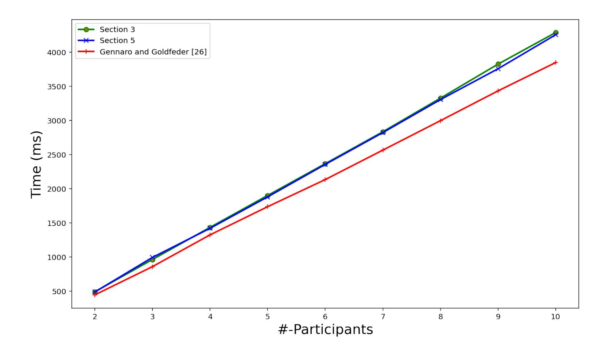

{0}------------------------------------------------

# One Round Threshold ECDSA with Identifiable Abort

Rosario Gennaro The City University of New York rosario@ccny.cuny.edu

Steven Goldfeder Cornell Tech/Offchain Labs goldfeder@cornell.edu

#### Abstract

Threshold ECDSA signatures have received much attention in recent years due to the widespread use of ECDSA in cryptocurrencies. While various protocols now exist that admit efficient distributed key generation and signing, these protocols have two main drawbacks. Firstly, if a player misbehaves, the protocol will abort, but all current protocols give no way to detect which player is responsible for the abort. In distributed settings, this can be catastrophic as any player can cause the protocol to fail without any consequence. General techniques to realize dishonest-majority MPC with identifiable abort add a prohibitive overhead, but we show how to build a tailored protocol for threshold ECDSA with minimal overhead. Secondly, current threshold ECDSA protocols (that do not rely on generic MPC) have numerous rounds of interaction. We present a highly efficient protocol with a non-interactive online phase allowing for players to asynchronously participate in the protocol without the need to be online simultaneously. We benchmark our protocols and find that our protocol simultaneously reduces the rounds and computations of current protocols, while adding significant functionality: identifiable abort and noninteractivity.

Note: This report is now obsolete and readers should refer to the joint paper [8] which subsumes it. The paper below is a revised version of the previous eprint version which fixes some crucial details in the protocol. The proof of the protocol described in the previous version is not correct, though no attack has been shown that exploits the bug in the proof. More details appear in the Introduction.

# 1 Introduction

Digital signatures are a crucial component to modern internet-based systems. When technology companies issue software updates, they digitally sign those updates so that users can verify their authenticity. Certificate Authorities (CAs) secure the web by issuing certificates attesting to the authenticity of a website's public key, and web servers in turn use those authenticated keys to securely communicate with clients. In cryptocurrencies, digital signatures are used to authenticate transactions, and the ability to generate a signature is equivalent to the ability to spend one's money. The commonality between all of these applications is that the theft or loss of the signing key can be catastrophic, and a key difficulty is how to store signing keys in a manner that is both easy to use and resilient to theft and loss.

Threshold cryptography [19], and threshold signatures in particular, has been gaining traction as an approach to solving this problem. In a threshold signature scheme, signing keys are distributed among several servers which need to act jointly in order to issue a signature. More specifically, in a threshold signature scheme, a key is split into n shares and a parameter t is defined such that an adversary that compromises t or fewer shares is unable to generate a signature and learns no information about the key. On the other hand, in a threshold optimal scheme, t + 1 shares can be used to jointly issue a signature without ever reconstructing the key. Splitting the key in this way eliminates a single point of failure and allows the honest parties to recover even in the face of partial compromise.

{1}------------------------------------------------

Perhaps the most popular signature algorithm in deployed systems is the Elliptic Curve Digital Signature Algorithm (ECDSA) [1]. Building a threshold signature scheme for (EC)DSA has been a research topic for over two decades [30], but has gained increased interest recently due to the adoption of ECDSA in Bitcoin, Ethereum, and other cryptocurrencies. Over the past two years, several highly efficient schemes have been proposed that support threshold signatures with any number of participants [22, 27, 41], and indeed at least a dozen companies are now integrating threshold ECDSA into their commercial products.

Identifiable and attributable aborts. The current state-of-the-art threshold ECDSA protocols operate in the dishonest majority model. This model is highly desirable as it allows building threshold signature protocols where the threshold t can take on any value so long as it is less than n, the total number of players.

It is well known that in this model, guaranteeing output delivery is impossible, and indeed if parties misbehave, the protocol may abort without producing a signature. Clearly, as t + 1 players are required to sign, and the adversary can corrupt up to t nodes, there is no guarantee in the dishonest majority setting that a signature will be generated since there may simply not be t + 1 honest nodes. But even if aborts are unavoidable, one may want to identify which player(s) misbehaved and caused the abort. Unfortunately, current protocols do not address this issue and aborts are completely unattributable.

For some uses of threshold ECDSA, identifying aborting parties is merely a convenience. Consider for example a cryptocurrency exchange that splits its signing key among two servers that it controls in order to gain resilience against an attacker that compromises one of the servers. When the exchange wishes to sign, it can do so using a threshold signature scheme that requires the participation of both servers. If the signing protocol fails, it knows that something has gone wrong and needs to reboot one of its servers. It would certainly be convenient to know which server is the corrupted one, but it is by no means critical as it is perfectly feasible to simply reset all of the servers.

However, for other use cases, particularly ones which involve key shares that are controlled by several distinct participants, the inability to identify aborts can be catastrophic. One such use case is a protocol that was recently presented by Keep Network <sup>1</sup> to enable users to trade bitcoins on the Ethereum blockchain. To facilitate this, a committee of nodes "locks up" coins in a jointly held address on the Bitcoin blockchain and simultaneously unlocks them on Ethereum. Conversely, when an Ethereum user wants to "cash out", the committee will unlock funds on the Bitcoin blockchain and send them to the user's address. To lock up funds in their protocol, coins are sent to a Bitcoin address that is jointly controlled by the committee. To achieve this, they employ the threshold protocol of Gennaro and Goldfeder [27].

Crucial to their design is incentivizing the committee to lock and unlock user funds when requested. But there's a problem. What happens if one of the committee members misbehaves and causes the signing protocol to abort? The ability to punish only the misbehaving player is crucial, but doing so is impossible since in [27] (and all known protocols) there is no way to identify which party caused the abort. In other words, a single rogue committee member could deny service to the protocol and go completely undetected. Indeed Keep acknowledges this issue as problematic, but it is impossible to fix using any known dishonest-majority threshold ECDSA protocol.

Off/Online Processing. One major advantage of ECDSA (and all the other Schnorr-based [46] signature schemes) is the ability to move all the expensive computation (in the case of ECDSA an expensive point multiplication/group exponentiation) to an offline preprocessing stage that can be performed before the message is known. Once the message to be signed is available a single scalar multiplication needs to be performed.

<sup>1</sup>https://keep.network/

{2}------------------------------------------------

Ideally one would like this property to be replicated in a distributed system that computes signatures as well. Unfortunately all the recent dishonest-majority proposals that do not rely on generic MPC do not have this property, and indeed, it's much worse. The protocols of [29, 27, 41, 22] require players to perform many rounds of expensive computation after the message is known. The reason for this is that all the schemes above must perform a multi-round "distributed validity check" which outputs the signature if the players indeed hold shares of a valid signature, but otherwise reveals nothing except the fact that the protocol failed. The intuitive reason for the necessity of this check is that an adversary controlling most of the players can induce incorrect signatures that if reconstructed may reveal information about the key.

Our Contribution. In this paper, we present two new threshold ECDSA protocols. Our main result (Section 3) is a new protocol with the following properties

- Noninteractive online phase. The protocol can be split into an offline preprocessing stage with most of the computation and communication, and an online stage when the message is known, consisting of a single communication round where each player performs a single scalar multiplication. Interestingly, our protocol has an overall lower number of rounds than [22, 27, 41], so even if the entire protocol was run online, it would still be fewer rounds.
- Identifiable Abort. The protocol allows the efficient detection of aborting parties.

Our protocol can be proven secure in a simulation-based definition that assures that the adversary learns nothing beyond a valid signature. However, the simulation game assumes that the adversary sees the randomizer r before he chooses the message m to be signed (this is an inevitable consequence of enforcing a single round in the online phase). This implies that the security of our distributed protocol reduces to a stronger but thoroughly reasonable assumption on the unforgeability of the centralized ECDSA scheme (details in Section 2.7).

Our second protocol (Section 5) stems from the realization that for settings in which identifiable abort is not necessary, we can use a further simplified version that also only requires a single online round, but with a pre-processing phase of reduced round and computational complexity.

Our analysis shows that the protocol with anonymous aborts (Section 5) is slightly faster than the identifiable abort protocol (Section 3) and both are slightly slower but competitive with [27] (roughly 10% slower), and both of our protocols use less bandwidth than [27] as well.

We implemented both protocols and the results of our experimental benchmarks agree with the analysis. The results of our extensive experimental evaluations are shown in Section 6.

Overview of our approach. We start with the protocol of Gennaro and Goldfeder [27], which as mentioned above does not support identifying aborts and requires several rounds even in the online phase once the message is known.

Using the multiplicative group notation, recall that an (EC)DSA signature is defined over a group G of order q generated by g. A public key is defined as y = g <sup>x</sup> ∈ G with x ∈<sup>R</sup> Zq. To sign a message M we first hash it to obtain m = H(M) and then choose k ∈<sup>R</sup> Z<sup>q</sup> and compute R = g k −1 , r = H<sup>0</sup> (R) and s = km + kxr mod q.

Single Round. The protocol of [27] starts with additive sharings of x, k and uses techniques due to Gilboa [33] and Beaver [3] to create additive sharings of k <sup>−</sup><sup>1</sup> and kx and, by linear homomorphism, additive shares of s. Then a "distributed signature verification" check is performed on shares of s to make sure they reconstruct a correct signature.

Our first major observation is that we identify a new distributed verification check can be performed on the shares of k <sup>−</sup><sup>1</sup> and kx before the message is known, and therefore can be done in a pre-processing phase. If those sharings are consistent and correct, then it is safe to reveal shares of s once the message m is known. This will take just a single scalar multiplication per player and 

{3}------------------------------------------------

one communication round (i.e. each player sends just a single message) and no online interactivity is required.

Both of our protocols use this new distributed check. Our protocol in Section 5 replaces the signature check from [27] with our new check, yielding a more efficient protocol both in terms of round complexity, computation, and bandwidth. Our protocol in Section 3 additionally adds the ability to identify and attribute misbehavior.

Identification of Bad Players. We use the definition of identifiable abort from [36]. A standard way to identify malicious players is to require each player to prove in zero-knowledge that he is performing the protocol correctly [34], though alternative approaches exist (e.g. [36]). Although such ZK proofs could be instantiated for the [27] protocol, they would result in an unacceptable level of communication and computation for the players.

Our key observation however is that if the abort happens during the preprocessing stage then the full signature has not been revealed yet (and indeed the message being signed may not even be known at this point). Therefore it is safe for the players to reveal the random choices they made during the protocol so far (that includes "opening up" any encryption, etc.) so that their behavior can be verified, and bad players identified.

Moreover, an abort during the online stage can be easily attributed as the shares of the signature s that each player reveals can be easily checked to be correct against public information produced by the offline stage.

The key technical complication in the security proof is that when simulating the identification of bad players during the offline phase, the simulator may not be able to correctly "open" an encryption due to the fact that the simulation is proceeding with a value different than the one encrypted. Without the identification step this would not be a problem as the semantic security of the encryption would guarantee the simulated and real protocol views to be computationally indistinguishable. But the encryption commits the simulator to the value so if identification requires opening it, then the views would be distinguishable.

We solve this problem by carefully constructing the protocol in a way that allows the simulator to make sure that whenever the protocol fails and opening the randomness is required, then the simulator can decommit to the correct value and not be "caught". The full details appear in the proof, but we are able to accomplish this without resorting to any heavyweight primitives such as non-commiting encryption, and indeed, the ability to detect aborts efficiently is a key contribution of our paper.

## 1.1 Related Work

The first scheme for threshold DSA was presented by Gennaro, Jarecki, Krawczyk, and Rabin [30, 31] in the honest majority setting. The key drawback of this scheme is that generating a signature requires the participation of 2t + 1 players, whereas an adversary need only corrupt t + 1 players to learn the key. Moreover, as it is in the honest majority setting, it restricts t and requires t < n/2. This rules out n-of-n threshold signatures, and in particular the oft-desired 2-of-2 threshold signatures.

Noticing this limitation, Mackenzie and Reiter [42] partially addressed it by building a scheme tailored for the 2-of-2 setting. This scheme uses a multiplicative sharing of the secret key and employed Paillier's additively homomorphic encryption scheme [44] to facilitate additions.

Gennaro, Goldfeder, and Narayanan revisited the multiparty case and presented a scheme that supports arbitrary thresholds t ≤ n [29] (subsequently improved in [6]) in the dishonest-majority setting. In their scheme, the ECDSA key is encrypted under a distributed threshold Paillier key and the ciphertext is held by each participant. Beginning with the encrypted key and using the homomorphic properties of Paillier, the players interactively create a ciphertext of the signature and then jointly decrypt it using Paillier threshold decryption. While signing in [6, 29] is efficient, the key generation requires the distributed generation of an RSA modulus. While at the time it 

{4}------------------------------------------------

was not known how to do this efficiently for more than two parties, recent work [14] may make this approach feasible.

Lindell [40] and Doerner et al.[23] revisited the 2-of-2 setting and presented highly efficient constructions. Like [42], Lindell's protocol used Paillier encryption, but it removed the expensive zero-knowledge proofs required by [42]. Doerner et al. replaced Paillier with an oblivious transfer protocol. The resulting scheme was fast and had a security proof that did not rely on Paillier assumptions, but the cost of achieving this was greatly increasing the bandwidth of the protocol.

Subsequently, Gennaro and Goldfeder [27], Lindell and Nof [41] and Doerner et al. [22] presented efficient protocols in the multiparty case that supported efficient distributed key generation. While all three boasted excellent concrete performance, [27] and [41] are constant round protocols, while the number of communication rounds in [22] is logarithmic in the number of players.

In two papers, Castagnos et al. [12, 11] presented efficient protocols for the two party case and multiparty case respectively. Their protocols employ an additively homomorphic encryption scheme based on class groups. The advantage of using this scheme is that it is homomorphic modulo the same prime q over which ECDSA is defined, and they are therefore able to eliminate the need for expensive range proofs that were required by [27, 41] due to the mismatch between the Paillier modulus and the ECDSA modulus and the potential for "overflow" that could leak information about the key. Their schemes require less communication but are more expensive computationally than the Paillier-based protocols.

While all of the above papers use non-generic tailored protocols, Dalskov et al. [15] show a one-round (online) protocol based on generic MPC – however their techniques achieve comparable or better efficiency than the above protocols only for a small number of participants and thresholds of size 2 or 3.

Recently three papers<sup>2</sup> appeared on the IACR Eprint Archive, including [17] which presents an improved protocol for threshold ECDSA with honest majority which is incomparable to our dishonest majority result. More relevant to our work are the results in [10] and [25] which both present efficient online signing in the dishonest majority model.

The protocol in [10] has one-round on-line signing but does not achieve identifiable aborts. The approach in [10] makes much more extensive use of Zero-Knowledge proofs of consistency between group elements (in the cyclic group where ECDSA is run) and ring elements (in the RSA ring where the Paillier encryption is constructed). As pointed out in [27], these ZK proofs are an efficiency bottleneck and our protocol minimizes their use. No code was available for [10] to perform a direct comparison, but if one refers to their complexity estimation they claim an almost 2x slowdown compared to [27]. Our experimental results instead show that both of our protocols are roughly 1.1x slower than [27]. The protocol in [10] requires 2 less rounds of interaction in the off-line phase and provides proactive security. The latter was not the focus of our effort, but we believe could be easily achieved for our protocol as well, and we plan to do so in the future.

The protocol in [25] achieves 3-round on-line signing. It provides for a very weak form of accountability, where aborts are only identified during the online phase. The off-line phase, requires the full cooperation of all parties to succeed, which is a serious drawback as it allows unattributed DoS attacks during the offline phase, and anybody can prevent it from completing without being caught. While this may be justified in some applications, this is a strong assumption, which is not needed in our protocol, where the offline component of the signature protocol is fully accountable as well. No implementation, benchmark or complexity estimation is available for [25].

## 1.2 The issue with the previous version

The previous version of the protocol uses the same "multiplicative to additive" share conversion protocol presented in [27]. As pointed out in [?, ?], the claimed simulatability property for that

<sup>2</sup>We point out that our work is independent from these.

{5}------------------------------------------------

protocol does not hold, and actually information about the private shares of honest parties is leaked.

Moreover in [?] the authors show how to leverage this information leakage to actually recover the entire share of an honest party, and for the adversary to learn the entire secret key of the group. Crucially, however, the attack relies on choosing a very small Paillier modulus N (approximately the same size of the modulus q used in the DSA scheme). In our previous version we clearly stated that N > q<sup>7</sup> therefore the attack does not apply to our previous scheme (though it worked against implementations that neglected to check the size of the modulus).

The share conversion protocol was repaired in [28] and we use the same "fix" in this paper. More detailes in Section 2.10.

# 2 Background

## 2.1 Communication and adversarial model

We assume the existence of a broadcast channel as well as point-to-point channels connecting every pair of players. As in [27, 41], security does not require a full reliable broadcast channel, but a simple echo broadcast suffices in which each party sends to every other party the hash of all of the broadcasted messages. If any party receives an inconsistent hash from some other party, it aborts and notifies every other party. While unforgeability does not rely on full broadcast, the identification protocol does require broadcast. The use of a broadcast channel is standard in all work of MPC-with-abort and indeed it has been shown that MPC-IA indeed implies the existence of a broadcast channel.

We assume a probabilistic polynomial time malicious adversary, who may deviate from the protocol description arbitrarily. The adversary can corrupt up to t players, and it learns the private state of all corrupted players. As in previous threshold ECDSA schemes [6, 29, 30, 40], we limit ourselves to static corruptions, meaning the adversary must choose which players to corrupt at the beginning of the protocol. There are standard techniques for converting a protocol secure against static corruptions to secure against adaptive corruptions [9, 37, 10].

We assume a rushing adversary, meaning that the adversary gets to speak last in a given round and, in particular, can choose his message after seeing the honest parties' messages.

Following [6, 29] (but unlike [30, 31]), we assume a dishonest majority, meaning t, the number of players the adversary corrupts, can take on any value up to n − 1. In this setting, there is no guarantee that the protocol will complete, and we therefore do not attempt to achieve robustness, or the ability to complete the protocol even in the presence of some misbehaving participants. Instead, we show security with abort meaning that the adversary can cause the protocol to abort, but in doing so cannot learn any useful information, other than its outputs. In this model, we cannot guarantee that the honest parties will receive a signature. In this paper, unlike previous works, we guarantee that aborts are identifiable meaning that the identity of at least one party responsible for causing the protocol to abort becomes known to the honest players.

## 2.2 Signature Schemes

A digital signature scheme S consists of three efficient algorithms:

- (sk, pk)←Key-Gen(1<sup>λ</sup> ), the randomized key generation algorithm which takes as the security parameter and returns the private signing key sk and public verification key pk.
- σ←Sig(sk, m), the possibly randomized signing algorithm which takes as input the private key sk and the message to be signed m and outputs a signature, σ. As the signature may be randomized, there may be multiple valid signatures. We denote the set of valid signatures as {Sig(sk, m)} and require that σ ∈ {Sig(sk, m)}.

{6}------------------------------------------------

• b ←Ver (pk, m, σ), the deterministic verification algorithm, which takes as input a public key pk, a message m and a signature σ and outputs a bit b which equals 1 if and only if σ is a valid signature on m under pk.

To prove a signature scheme secure, we recall the standard notion of existential unforgeability against chosen message attacks (EU-CMA) as introduced in [35].

[Existential unforgeability] Consider a PPT adversary A who is given public key pk output by Key-Gen and oracle access to the signing algorithm Sig(sk, ·) with which it can receive signatures on adaptively chosen messages of its choosing. Let M be the set of messages queried by A. A digital signature scheme S =(Key-Gen,Sig,Ver) is said to be existentially unforgeable if there is no such PPT adversary A that can produce a signature on a message m /∈ M, except with negligible probability in λ.

## 2.3 Threshold Signatures

Threshold secret sharing. A (t, n)−threshold secret sharing of a secret x consists of n shares x1, . . . , x<sup>n</sup> such that an efficient algorithm exists that takes as input t + 1 of these shares and outputs the secret, but t or fewer shares do not reveal any information about the secret.

Threshold signature schemes. Consider a signature scheme, S=(Key-Gen, Sig, Ver). A (t, n) threshold signature scheme T S for S enables distributing the signing among a group of n players, P1, . . . , P<sup>n</sup> such that any group of at least t + 1 of these players can jointly generate a signature, whereas groups of size t or fewer cannot. More formally, T S consists of two protocols:

- Thresh-Key-Gen, the distributed key generation protocol, which takes as input the security parameter 1<sup>λ</sup> . Each player P<sup>i</sup> receives as output the public key pk as well as a private output sk<sup>i</sup> , which is P<sup>i</sup> 's share of the private key. The values sk1, . . . ,sk<sup>n</sup> constitute a (t, n) threshold secret sharing of the private key sk.
- Thresh-Sig, the distributed signing protocol which takes as public input a message m to be signed as well as a private input sk<sup>i</sup> from each player. It outputs a signature σ ∈ {Sig(sk, m)}.

Notice that the signature output by Thresh-Sig is a valid signature under Sig, the centralized signing protocol. Thus we do not specify a threshold variant of the verification algorithm as we will use the centralized verification algorithm, Ver.

In some applications, it may be acceptable to have a trusted dealer generate the private key shares for each party. In this case, Thresh-Key-Gen would not be run. We require our protocols to be simulatable (see e.g. [29, 30, 40]), meaning that

- There exists a simulator SIM<sup>1</sup> that, on input the public key y runs an execution of the Thresh-Key-Gen on behalf of the honest players which results in y as the output and generates a view for the adversary which is indistinguishable from the real one.
- There exists a simulator SIM<sup>2</sup> that, on input the public input of Thresh-Sig (in particular the public key y and the message m) and the resulting signature σ, runs an execution of the Thresh-Sig on behalf of the honest players which results in σ as the output and generates a view for the adversary which is indistinguishable from the real one.

## 2.4 Identifiable Abort

We use the notion of secure multi-party computation with identifiable abort presented in [36], which allows the computation to fail (abort), while guaranteeing that all the honest parties agree on the identity P<sup>i</sup> of a corrupted player.

If F is the functionality computed by the original MPC protocol, then a protocol for F with identifiable aborts, computes a modified functionality F 0 that either computes F or outputs the identity P<sup>i</sup> of a corrupted player in case of an abort.

{7}------------------------------------------------

## 2.5 Additively Homomorphic Encryption

Our protocol relies on an encryption scheme  $\mathcal{E}$  that is additively homomorphic modulo a large integer N. Let  $E_{pk}(\cdot)$  denote the encryption algorithm for  $\mathcal{E}$  using public key pk. Given ciphertexts  $c_1 = E_{pk}(a)$  and  $c_2 = E_{pk}(b)$ , there is an efficiently computable function  $+_E$  such that

$$c_1 +_E c_2 = E_{\mathsf{pk}}(a + b \bmod N)$$

The existence of a ciphertext addition operation also implies a scalar multiplication operation, which we denote by  $\times_E$ . Given an integer  $a \in N$  and a ciphertext  $c = E_{pk}(m)$ , then we have

$$a \times_E c = E_{\mathsf{pk}}(am \bmod N)$$

Informally, we say that  $\mathcal{E}$  is semantically secure if for the probability distributions of the encryptions of any two messages are computationally indistinguishable.

We instantiate our protocol using the additively homomorphic encryption scheme of Paillier [44], and we recall the details here:

- Key-Gen: generate two large primes P, Q of equal length, and set N = PQ. Let  $\lambda(N) = lcm(P-1, Q-1)$  be the Carmichael function of N, and denote  $\Gamma toencryptamessagem \in Z_N$ , select  $x \in_R Z_N^*$  and return  $c = \Gamma^m x^N \mod N^2$ .
- Decryption: to decrypt a ciphertext  $c \in Z_{N^2}$ , let L be a function defined over the set  $\{u \in Z_{N^2} : u = 1 \mod N\}$  computed as L(u) = (u-1)/N. Then the decryption of c is computed as  $L(c^{\lambda(N)})/L(\Gamma^{\lambda(N)}) \mod N$ .
- Homomorphic Properties: Given two ciphertexts  $c_1, c_2 \in Z_{N^2}$  define  $c_1 +_E c_2 = c_1 c_2 \mod N^2$ . If  $c_i = E(m_i)$  then  $c_1 +_E c_2 = E(m_1 + m_2 \mod N)$ . Similarly, given a ciphertext  $c = E(m) \in Z_{N^2}$  and a number  $a \in Z_n$  we have that  $a \times_E c = c^a \mod N^2 = E(am \mod N)$ .

The security of Paillier's cryptosystem relies on the N-residuosity decisional assumption [44], which informally says that it is infeasible to distinguish random N-residues from random group elements in  $\mathbb{Z}_{N^2}^*$ .

## 2.6 Non-Malleable Equivocable Commitments

A trapdoor commitment scheme allows a sender to commit to a message with information-theoretic privacy. i.e., given the transcript of the commitment phase the receiver, even with infinite computing power, cannot guess the committed message better than at random. On the other hand when it comes to opening the message, the sender is only computationally bound to the committed message. Indeed the scheme admits a *trapdoor* whose knowledge allows to open a commitment in any possible way (we will refer to this also as *equivocate* the commitment). This trapdoor should be hard to compute efficiently.

Formally a (non-interactive) trapdoor commitment scheme consists of four algorithms KG, Com, Ver, Equiv with the following properties:

- KG is the key generation algorithm, on input the security parameter it outputs a pair {pk, tk} where pk is the public key associated with the commitment scheme, and tk is called the trapdoor.
- Com is the commitment algorithm. On input pk and a message M it outputs [C(M), D(M)] = Com(pk, M, R) where r are the coin tosses. C(M) is the commitment string, while D(M) is the decommitment string, which is kept secret until opening time.
- Ver is the verification algorithm. On input C, D and pk it either outputs a message M or  $\bot$ .

{8}------------------------------------------------

• Equiv is the algorithm that opens a commitment in any possible way given the trapdoor information. It takes as input pk, strings M, R with [C(M), D(M)] = Com(pk, M, R), a message M<sup>0</sup> 6= M and a string T. If T = tk then Equiv outputs D<sup>0</sup> such that Ver(pk, C(M), D<sup>0</sup> ) = M<sup>0</sup> .

We note that if the sender refuses to open a commitment we can set D = ⊥ and Ver(pk, C, ⊥) = ⊥. Trapdoor commitments must satisfy the following properties

```
Correctness If [C(M), D(M)] = Com(pk, M, R) then
     Ver(pk, C(M), D(M)) = M.
```

Information Theoretic Security For every message pair M, M<sup>0</sup> the distributions C(M) and C(M<sup>0</sup> ) are statistically close.

Secure Binding We say that an adversary A wins if it outputs C, D, D<sup>0</sup> such that Ver(pk, C, D) = M, Ver(pk, C, D<sup>0</sup> ) = M<sup>0</sup> and M 6= M<sup>0</sup> . We require that for all efficient algorithms A, the probability that A wins is negligible in the security parameter.

Such a commitment is non-malleable [24] if no adversary A, given a commitment C to a messages m, is able to produce another commitment C 0 such that after seeing the opening of C to m, A can successfully decommit to a related message m<sup>0</sup> (this is actually the notion of non-malleability with respect to opening introduced in [20]).

The non-malleable commitment schemes in [20, 21] are not suitable for our purpose because they are not "concurrently" secure, in the sense that the security definition holds only for t = 1 (i.e. the adversary sees only 1 commitment).

The stronger concurrent security notion of non-malleability for t > 1 is achieved by the schemes presented in [16, 26, 43]), and any of them can be used in our threshold DSA scheme.

However in practice one can use any secure hash function H and define the commitment to x as h = H(x, r), for a uniformly chosen r of length λ and assume that H behaves as a random oracle. We use this efficient random oracle version in our implementation.

## 2.7 The Digital Signature Standard

The Digital Signature Algorithm (DSA) was proposed by Kravitz in 1991, and adopted by NIST in 1994 as the Digital Signature Standard (DSS) [5, 39]. ECDSA, the elliptic curve variant of DSA, has become quite popular in recent years, especially in cryptocurruencies.

All of our results in this paper apply to both the traditional DSA and ECDSA. We present our results using the generic G-DSA notation from [29], which we recall here.

The Public Parameters consist of a cyclic group G of prime order q, a generator g for G, a hash function H : {0, 1} <sup>∗</sup> → Zq, and another hash function H<sup>0</sup> : G → Zq.

Key-Gen On input the security parameter λ, outputs a private key x chosen uniformly at random in Zq, and a public key y = g x computed in G.

Sig On input an arbitrary message M,

```
– compute m = H(M) ∈ Zq
– choose k ∈R Zq
– compute R = g
                k
                 −1
                    in G and r = H0
                                    (R) ∈ Zq
– compute s = k(m + xr) mod q
– output σ = (r, s)
```

Ver On input M, σ and y,

– check that r, s ∈ Z<sup>q</sup>

{9}------------------------------------------------

```
- compute R' = g^{ms^{-1} \mod q} y^{rs^{-1} \mod q} in \mathcal{G}
```

- Accept (output 1) iff H'(R') = r.

The traditional DSA algorithm is obtained by choosing large primes p, q such that q|(p-1) and setting  $\mathcal{G}$  to be the order q subgroup of  $Z_p^*$ . In this case the multiplication operation in  $\mathcal{G}$  is multiplication modulo p. The function H' is defined as  $H'(R) = R \mod q$ .

The ECDSA scheme is obtained by choosing  $\mathcal{G}$  as a group of points on an elliptic curve of cardinality q. In this case the multiplication operation in  $\mathcal{G}$  is the group operation over the curve. The function H' is defined as  $H'(R) = R_x \mod q$  where  $R_x$  is the x-coordinate of the point R.

We assume a stronger notion of unforgeability for ECDSA. In this notion we allow the attacker to see the randomizer R before queriying the message m during a chosen-message attack.

We believe that this in practice is not an issue. This corresponds to assuming that ECDSA is secure in the presence of what we may call a state compromise attack where the adversary is allowed to see the internal state of the signer (but not its secret keys). This models the real-life situation in which the signer pre-computes all the randomizers R's in advance and stores them in regular memory (while keeping the secret key x and the secret nonces k in a protected memory). We assume that the adversary manages to read the regular memory contents (i.e. all the R's) and still will not be able to forge.

Jumping ahead, the reason we do this is that in our one-round protocol, the distributed players will use pre-computed R which are known to all of them, including the corrupted ones, i.e. to the adversary. We point out that this assumption is also used in [10] (and in there it is shown that under certain reasonable conditions it is equivalent to the standard notion of unforgeability for ECDSA)<sup>3</sup>.

[ECDSA unforgeability under state compromise] Consider a PPT adversary  $\mathcal{A}$  who is given and ECDSA public key y output by Key-Gen( $\lambda$ ).  $\mathcal{A}$  has oracle access to

- to  $U_{\mathcal{G}}$  to obtain R a uniformly random element in  $\mathcal{G}$ ;
- to Sig'(sk, R, m) which returns (r, s) a valid signature for m with r = H'(R), if R was queried to  $U_{\mathcal{G}}$ , otherwise returns  $\bot$

Let  $\mathcal{M}$  be the set of messages queried by  $\mathcal{A}$ . We say that ECDSA is existentially unforgeable under chosen message with state compromise attack if there is no such PPT adversary  $\mathcal{A}$  that can produce a signature on a message  $m \notin \mathcal{M}$ , except with negligible probability in  $\lambda$ .

In terms of the simulation of our protocol, this means that we are simulating a functionality that outputs R (given to the simulator) during the online phase, and the matching s during the online one.

## 2.8 Verifiable Secret Sharing (VSS)

**Shamir Secret Sharing** In Shamir's secret sharing scheme [47], to share a secret  $\sigma \in Z_q$ , the dealer generates a random degree t polynomial  $p(\cdot)$  over  $Z_q$  such that  $p(0) = \sigma$ . The secret shares are evaluations of the polynomial

$$p(x) = \sigma + a_1 x + a_2 x^2 + \dots + a_t x^t \bmod q$$

Each player  $P_i$  receives a share  $\sigma_i = p(i) \mod q$ .

In a verifiable secret sharing scheme, auxiliary information is published that allows players to check that their shares are consistent and define a unique secret.

Feldman's VSS is an extension of Shamir secret sharing in which the dealer also publishes  $v_i = g^{a_i}$  in  $\mathcal{G}$  for all  $i \in [1, t]$  and  $v_0 = g^{\sigma}$  in  $\mathcal{G}$ .

<sup>&</sup>lt;sup>3</sup>This notion is not discussed in [15], yet it seems to be implicitly assumed, as they also have a one-round online solution where the adversary is allowed access to the randomizers before the message is known.

{10}------------------------------------------------

Using this auxiliary information, each player  $P_i$  can check its share  $\sigma_i$  for consistency by verifying:

$$g^{\sigma_i} \stackrel{?}{=} \prod_{j=0}^t v_j^{i^j} \text{ in } \mathcal{G}$$

If the check does not hold for any player, it raises a complaint and the protocol terminates. Note that this is different than the way Feldman VSS was originally presented as it assumed an honest majority and could recover if a dishonest player raised a complaint. However, since we assume dishonest majority in this paper, the protocol will abort if a complaint is raised.

While Feldman's scheme does leak  $g^{\sigma}$ , it can be shown via a simulation argument that nothing else is leaked, but we omit the details here.

## 2.9 Assumptions

DDH. Let  $\mathcal{G}$  be a cyclic group of prime order q, generated by g. The DDH Assumption states that the following two distributions over  $\mathcal{G}^3$  are computationally indistinguishable:  $DH = \{(g^a, g^b, g^{ab}) \text{ for } a, b \in_R Z_q\}$  and  $R = \{(g^a, g^b, g^c) \text{ for } a, b, c \in_R Z_q\}$ .

STRONG-RSA. Let N be the product of two safe primes, N = pq, with p = 2p' + 1 and q = 2q' + 1 with p', q' primes. With  $\phi(N)$  we denote the Euler function of N, i.e.  $\phi(N) = (p-1)(q-1) = p'q'$ . With  $Z_N^*$  we denote the set of integers between 0 and N-1 and relatively prime to N.

Let e be an integer relatively prime to  $\phi(N)$ . The RSA Assumption [45] states that it is infeasible to compute e-roots in  $Z_N^*$ . That is, given a random element  $s \in_R Z_N^*$  it is hard to find x such that  $x^e = s \mod N$ .

The Strong RSA Assumption (introduced in [4]) states that given a random element s in  $Z_N^*$  it is hard to find  $x, e \neq 1$  such that  $x^e = s \mod N$ . The assumption differs from the traditional RSA assumption in that we allow the adversary to freely choose the exponent e for which she will be able to compute e-roots.

We now give formal definitions. Let SRSA(n) be the set of integers N, such that N is the product of two n/2-bit safe primes.

**Assumption 1** We say that the Strong RSA Assumption holds, if for all probabilistic polynomial time adversaries A the following probability

$$Prob[N \leftarrow SRSA(n); s \leftarrow Z_N^* : A(N,s) = (x,e) \text{ s.t. } x^e = s \mod N]$$

is negligible in n.

## 2.10 Multiplicative-to-additive share conversion protocol (MtA) of [28]

We now recall the Multiplicative-to-Additive share conversion MtA protocols as presented in [28], which is a central building block in their protocol as well as ours. We present the protocol of [28], but we note that a similar protocol is also used in [18, 38, 40, 41, 42].

The setting consists of two players,  $\mathcal{P}_1$  and  $\mathcal{P}_2$ , who hold multiplicative shares of a secret x. In particular,  $\mathcal{P}_1$  holds a share  $a \in Z_q$ , and  $\mathcal{P}_2$  holds a secret share  $b \in Z_q$  such that  $x = ab \mod q$ . The goal of the MtA protocol is to convert these multiplicative shares into additive shares.  $\mathcal{P}_1$  receives private output  $\alpha \in Z_q$  and  $\mathcal{P}_2$  receives private output  $\beta \in Z_q$  such that  $\alpha + \beta = x = ab \mod q$ .

{11}------------------------------------------------

MtAwc. In the basic MtA protocol, the player's inputs are not verified, and indeed the players can cause the protocol to produce an incorrect output by inputting the wrong values ˆa, ˆb. In the case that B = g b is public, the protocol can be enhanced to include an extra check that ensures that P<sup>2</sup> inputs the correct value b = log<sup>g</sup> (B). This enhanced protocol is denoted as MtAwc (for MtA "with check").

We assume that player P<sup>1</sup> is associated with a public key E<sup>1</sup> for an additively homomorphic scheme E defined over an integer N ≤ q 8 . We assume P<sup>2</sup> checks that N is of the correct size.

- 1. P<sup>1</sup> initiates the protocol:
  - Compute c<sup>A</sup> = E1(a)
  - Compute a zero knowledge range proof π<sup>A</sup> that {a : D1(cA) = a ∧ a < q<sup>3</sup>}
  - Send (cA, πA) to P<sup>2</sup>
- 2. Upon receiving (cA, πA) from P1, P<sup>2</sup> does the following:
  - Verifies πA, and aborts if it fails to verify
  - Choose β 0 \$ ← Z<sup>q</sup> 5
  - Set output β = −β <sup>0</sup> mod q
  - Compute c<sup>B</sup> = b ×<sup>E</sup> c<sup>A</sup> +<sup>E</sup> E1(β 0 ) = E1(ab + β 0 )
  - •MtA

Compute a zero knowledge range proof π 1 <sup>B</sup> of {b, β<sup>0</sup> : b < q<sup>3</sup> ∧β <sup>0</sup> < q<sup>7</sup> ∧c<sup>B</sup> = b×<sup>E</sup> c<sup>A</sup> +<sup>E</sup> E1(β 0 )}

MtAwc i.e. if B = g b is public: Compute a zero knowledge proof of knowledge π 2 <sup>B</sup> that he knows {b, β<sup>0</sup> : b < q<sup>3</sup> ∧ β <sup>0</sup> < q<sup>7</sup> ∧ B = g <sup>b</sup> ∧ c<sup>B</sup> = b ×<sup>E</sup> c<sup>A</sup> +<sup>E</sup> E1(β 0 )}

3. Send (cB, π<sup>1</sup> <sup>B</sup>, [π 2 <sup>B</sup>]) to P<sup>1</sup>

Upon receiving (cB, π<sup>1</sup> <sup>B</sup>, [π 2 <sup>B</sup>]) from P2, P<sup>1</sup> does the following:

- Verifies π 1 <sup>B</sup> (π 2 <sup>B</sup> if they are running MtAwc), and aborts if either proof fails to verify
- Compute α <sup>0</sup> = D1(cB)
- Set output α = α <sup>0</sup> mod q

Correctness. Assume both players are honest and N > K<sup>2</sup> q. Then note that Alice decrypts the value α <sup>0</sup> = ab + β <sup>0</sup> mod N. Note that β <sup>0</sup> < N − ab due to the range check, therefore the reduction mod N is not executed so the above holds over the integers.

Simulation. As shown in [28], as a standalone protocol, we can prove security of MtA/MtAwc even without the range proofs. We show this via a simulation argument, showing that if the adversary corrupts player P<sup>i</sup> , we can construct a simulator for P1−<sup>i</sup> , thus showing that P1−<sup>i</sup> leaks no useful information.

Simulating P1. If the adversary corrupts P1, then P2's message can be simulated without knowledge of its input b. Indeed a simulator can just choose a random b <sup>0</sup> ∈ Z<sup>q</sup> and follow the rest of the protocol as P2. The distribution of the message decrypted by P<sup>1</sup> in this simulation is identical to the message decrypted when P<sup>2</sup> uses the real b, because the "noise" β 0 is uniformly distributed in Z<sup>N</sup> .

{12}------------------------------------------------

Simulating P2. If the adversary corrupts P2, then P1's message can be simulated without knowledge of its input a. Indeed a simulator can just choose a random a <sup>0</sup> ∈ Z<sup>q</sup> and act as Alice. In this case the view of Bob is computationally indistinguishable from the real one due to the semantic security of the encryption scheme E.

Although MtA is fully simulatable as a standalone protocol, if the range proofs are not used, a malicious P<sup>1</sup> or P<sup>2</sup> can cause the protocol to "fail" by choosing large inputs that "overflow" the Paillier modulus causing a reduction mod N. As a standalone protocol this is not an issue since the parties are not even aware that the reduction mod N took place and no information is leaked about the other party's input. However, when used inside a threshold ECDSA protocol, this attack will cause the signature verification to fail, and this information is linked to the size of the other party's input.

Thus, in our setting, we need security in the presence of an oracle that tells the parties if the reduction mod N happens or not, but due to the ZK "range proofs" such a reduction will only happen with negligible probability (if the ZK proofs fail) and security holds.

Remark. On the ZK proofs and the size of the modulus N. For the ZK proofs required in the protocol we use the proofs from [28], which are based on proofs from [42]. These are zero knowledge arguments with security holding under the Strong RSA Assumption. We point out that for typical choices of parameters, N is approximately q 8 (since q is typically 256-bit long while N is a 2048-bit RSA modulus), so this requirement is not problematic<sup>4</sup> .

We note that these proofs make use of Fujisaki-Okamoto commitments, and therefore the appropriate setup procedure must be followed. In practice, it suffices for the verifier to generate the parameters, N, h ˜ 1, h2 and prove the the discrete log between h<sup>1</sup> and h<sup>2</sup> exist.

Note about the previous version: In our previous version we chose β <sup>0</sup> uniformly at random in Z<sup>N</sup> and did not impose any range check on it. This leads to a similar information leakage as described above where if β 0 is chosen close to N, a modular reduction (and therefore a failure of the protocol) happens based on the distribution of the input a. The previous version also used the ZK proofs from [27] which need to be adapted to the new bounds: this version refers to the ZK proofs from [28].

# 3 One-Round Threshold ECDSA with identifiable abort

In this section we present our main result: a new protocol for threshold ECDSA that has two main advantages over existing protocols:

- One round online. Unlike [22, 27, 41], our protocol does not require the distributed verification step of the validity of the signature. Removing this check makes the protocol more round efficient, but even more significantly, we are able to remove any dependency on the message from the multi-round interactive parts of the protocol. In particular, our protocol allows the computation of the signature in a single round, after some message-independent preprocessing. It also has fewer rounds in total than all existing protocols that support efficient key generation [22, 27, 41], and thus is more efficient even if run fully online without pre-processing.
- Identifiable abort.Additionally the protocol improves on all existing protocols by enabling the efficient identification of misbehaving parties.

.

<sup>4</sup>For the simple range proof that a, b < K one could alternatively use a variation of Boudot's proof [7] which establish K ∼ q which sets N ∼ q 3 . This proof is less efficient that the ones from [29, 42] which are anyway required for Bob in the MtAwc protocol. Moreover as we said earlier, N > q<sup>8</sup> in practice anyway so the improvement in the size of N is irrelevant for ECDSA.

{13}------------------------------------------------

The players run on input  $\{G, g\}$  the cyclic group used by the ECDSA signature scheme. We assume that each player  $P_i$  is associated with a public key  $E_i$  for an additively homomorphic encryption scheme  $\mathcal{E}$ .

## 3.1 Key generation protocol

The key generation protocol is largely the same as the protocol in [27], but we show how it can be augmented to identify misbehaving parties. We now present the details of the protocol.

- Phase 1. Each Player  $P_i$  selects  $u_i \in_R Z_q$ ; computes  $[KGC_i, KGD_i] = \mathsf{Com}(g^{u_i})$  and broadcasts  $KGC_i$ . Each Player  $P_i$  broadcasts  $E_i$  the public key for Paillier's cryptosystem.
- Phase 2. Each Player  $P_i$  broadcasts  $KGD_i$ . Let  $y_i$  be the value decommitted by  $P_i$ . The player  $P_i$  performs a (t, n) Feldman-VSS of the value  $u_i$ , with  $y_i$  as the "free term in the exponent"

The public key is set to  $y = \prod_i y_i$ . Each player adds the private shares received during the n Feldman VSS protocols. The resulting values  $x_i$  are a (t, n) Shamir's secret sharing of the secret key  $x = \sum_i u_i$ . Note that the values  $X_i = g^{x_i}$  are public.

• Phase 3 Let  $N_i = p_i q_i$  be the RSA modulus associated with  $E_i$ . Each player  $P_i$  proves in ZK that he knows  $x_i$  using Schnorr's protocol [46], that  $N_i$  is square-free using the proof of Gennaro, Micciancio, and Rabin [32], and that  $h_1$   $h_2$  generate the same group modulo  $N_i$ .

## 3.2 Signing protocol

We now describe the signing protocol, which is run on input m (the hash of the message M being signed) and the output of the key generation protocol described above. We note that the latter protocol is a t-out-of-n protocol (and thus the secret key x is shared using (t, n) Shamir secret-sharing).

Let  $S \subseteq [1..n]$  be the set of players participating in the signature protocol. We assume that |S| = t + 1. For the signing protocol we can share any ephemeral secrets using a (t, t + 1) secret sharing scheme, and do not need to use the general (t, n) structure. We note that using the appropriate Lagrangian coefficients  $\lambda_{i,S}$  each player in S can locally map its own (t, n) share  $x_i$  of x into a (t, t + 1) share of x,  $w_i = (\lambda_{i,S})(x_i)$ , i.e.  $x = \sum_{i \in S} w_i$ . Since  $X_i = g^{x_i}$  and  $\lambda_{i,S}$  are public values, all the players can compute  $W_i = g^{w_i} = X_i^{\lambda_{i,S}}$ .

• Phase 1. Each Player  $P_i$  selects  $k_i, \gamma_i \in_R Z_q$ ; computes  $[C_i, D_i] = \mathsf{Com}(g^{\gamma_i})$  and broadcast  $C_i$ .

Define  $k = \sum_{i \in S} k_i$ ,  $\gamma = \sum_{i \in S} \gamma_i$ . Note that

$$k\gamma = \sum_{i,j \in S} k_i \gamma_j \bmod q$$

$$kx = \sum_{i,j \in S} k_i w_j \bmod q$$

- Phase 2. Every pair of players  $P_i$ ,  $P_j$  engages in two multiplicative-to-additive share conversion subprotocols. Note that the first message for these protocols is the same and is only sent once.
  - $-P_i, P_j$  run MtA with shares  $k_i, \gamma_j$  respectively. Let  $\alpha_{ij}$  [resp.  $\beta_{ij}$ ] be the share received by player  $P_i$  [resp.  $P_j$ ] at the end of this protocol, i.e.

$$k_i \gamma_j = \alpha_{ij} + \beta_{ij}$$

{14}------------------------------------------------

Player P<sup>i</sup> sets δ<sup>i</sup> = kiγ<sup>i</sup> + P <sup>j</sup>6=<sup>i</sup> αij + P j6=i βji. Note that the δ<sup>i</sup> are a (t, t+ 1) additive sharing of kγ = P i∈S δi

– P<sup>i</sup> , P<sup>j</sup> run MtAwc with shares k<sup>i</sup> , w<sup>j</sup> respectively. Let µij [resp. νij ] be the share received by player P<sup>i</sup> [resp. P<sup>j</sup> ] at the end of this protocol, i.e.

$$k_i w_j = \mu_{ij} + \nu_{ij}$$

Player P<sup>i</sup> sets σ<sup>i</sup> = kiw<sup>i</sup> + P <sup>j</sup>6=<sup>i</sup> µij + P j6=i νji. Note that the σ<sup>i</sup> are a (t, t+ 1) additive sharing of kx = P i∈S σi

- Phase 3. Every player P<sup>i</sup> broadcasts
  - δ<sup>i</sup> and the players reconstruct δ = P i∈S δ<sup>i</sup> = kγ. The players compute δ <sup>−</sup><sup>1</sup> mod q.
  - T<sup>i</sup> = g <sup>σ</sup>ih `<sup>i</sup> with `<sup>i</sup> ∈<sup>R</sup> Z<sup>q</sup> and proves in ZK that he knows σ<sup>i</sup> , `<sup>i</sup> .
- Phase 4. Each Player P<sup>i</sup> broadcasts D<sup>i</sup> . Let Γ<sup>i</sup> be the values decommitted by P<sup>i</sup> . The players compute Γ = Q <sup>i</sup>∈<sup>S</sup> Γ<sup>i</sup> , and

$$R = \Gamma^{\delta^{-1}} = g^{(\sum_{i \in S} \gamma_i)k^{-1}\gamma^{-1}} = g^{\gamma k^{-1}\gamma^{-1}} = g^{k^{-1}}$$

as well as r = H<sup>0</sup> (R).

• Phase 5. Each player P<sup>i</sup> broadcasts R¯ <sup>i</sup> = Rk<sup>i</sup> as well as a zero-knowledge proof of consistency between R<sup>i</sup> and Ei(ki), which each player sent as the first message of the MtA protocol in Phase 2. If

$$g \neq \prod_{i \in S} \bar{R}_i$$

the protocol aborts.

• Phase 6. Each player P<sup>i</sup> broadcasts S<sup>i</sup> = Rσ<sup>i</sup> as well as a zero-knowledge proof of consistency between S<sup>i</sup> and T<sup>i</sup> , which each player sent in Phase 3. If

$$y \neq \prod_{i \in S} S_i$$

the protocol aborts.

• Phase 7. Each player P<sup>i</sup> broadcasts s<sup>i</sup> = mk<sup>i</sup> + rσ<sup>i</sup> and set s = Ps<sup>i</sup> . If the signature (r, s) is correct for m, the players accept, otherwise they abort.

# 3.3 The Zero-Knowledge Proofs

In this section we drop the indices for simplicity.

In Phase 3 a player P outputs T = g σh ` and must prove that he knows σ, ` satisfying the above relationship. A classic (honest-verifier) ZK argument for this task is as follows:

- The Prover chooses a, b ∈<sup>R</sup> Z<sup>q</sup> and sends α = g ah b
- The Verifier sends a random challenge c ∈<sup>R</sup> Z<sup>q</sup>
- The Prover answers with t = a + cσ mod q and u = b + c` mod q.
- The Verifier checks that g th <sup>u</sup> = αT<sup>c</sup>

{15}------------------------------------------------

In Phase 5 a player P outputs R¯ = R<sup>k</sup> and has to prove that the exponent k is consistent with a previously posted Paillier ciphertext C = E(k). A ZK proof for this statement is provided in [42, 29, 40].

In phase (6) a player P outputs S = R<sup>σ</sup> and must prove that he knows σ, ` such that S = R<sup>σ</sup> and T = g σh ` . A (honest-verifier) ZK argument for this task is as follows:

- The Prover chooses a, b ∈<sup>R</sup> Z<sup>q</sup> and sends α = R<sup>a</sup> and β = g ah b
- The Verifier sends a random challenge c ∈<sup>R</sup> Z<sup>q</sup>
- The Prover answers with t = a + cσ mod q, u = b + c` mod q
- The Verifier checks that R<sup>t</sup> = αS<sup>c</sup> and g th <sup>u</sup> = βT<sup>c</sup>

# 4 Identifying aborts

A key problem with all known threshold ECDSA protocols is that in the case of aborts, it is not possible to always identify which party is responsible for causing the signature to fail. In this section, we will show how to identify aborts.

First of all we assume that all messages transferred between players are signed, so that it is possible to determine their origin.

The protocol will abort in case any player deviates from the protocol in a clearly identifiable way by not complying with the protocol instructions – e.g. not sending a message when required. In this case the bad player is clearly identified and removed. Note that we assume a broadcast channel so if a player behaves badly, everybody knows that. Note that this requires that every message of the protocol has to be reliably broadcast (this includes the pair-wise MtA protocols, which will enable the identification procedure described below).

In the case a message from a player fails to appear, we apply a local timeout bound before marking that player as corrupted, to account for possible delays in message delivery.

We focus our attention here on aborts that are not clearly identifiable as deviations from the protocol – i.e. where the player sent a message of the correct form at the correct time, but the contents of the message was crafted in a way that caused the protocol to fail.

## 4.1 Identifying aborts in the Key Generation protocol

In the key generation protocol, there are two possible places that an abort can occur:

- Phase 2. If a player complains that the Feldman share it received is inconsistent and therefore does not verify correctly, the protocol will abort.
- Phase 3. When each player is proving knowledge of x<sup>i</sup> and proving the correctness of their Paillier key, if one of these proofs fails to verify the protocol will abort.

If the protocol aborts in Phase 3 because a ZK proof fails, then we immediately know who the bad player is. However, if the protocol aborts in Phase 2, it means that a player P<sup>j</sup> complains about a player P<sup>i</sup> meaning that P<sup>j</sup> claims the private share he received does not match the public information of P<sup>i</sup> 's Feldman VSS. In this case it might be useful to identify who the bad player is, in order to remove it from the n players when the key generation protocol is re-run. Here there is ambiguity as if the bad player is P<sup>i</sup> (dealing a bad Feldman VSS) or P<sup>j</sup> (trying to frame Pi).

A simple identification protocol. Notice that if the failure happens during the key generation protocol, it is safe to abandon the protocol and publish the would-be private key since it has not yet been established or used. Thus, if P<sup>j</sup> raises a complaint about a share he received from P<sup>i</sup> , the simplest identification protocol has him publish the share that he received from P<sup>i</sup> in the clear, 

{16}------------------------------------------------

and indeed anyone can now check whether the share that he received is consistent (recall that we assume that all messages are signed, so the share can be authenticated and  $P_i$  cannot be framed by publishing an incorrect share). After the misbehaving player is identified, the key generation protocol will need to be re-run with fresh randomness to establish a secure key.

## 4.2 Identifying aborts in the signing protocol

In our signing protocol, aborts can occur in the following parts of the protocol:

- 1. Phase 2. If the range proofs of the MtA/MtAwc or zero knowledge proofs for MtAwc fail.
- 2. Phase 3. If the ZK proof about  $\sigma_i$ ,  $\ell_i$  fails.
- 3. Phase 4. If the decommitment  $D_i$  fails to verify.
- 4. Phase 5. If the ZK proof about  $\bar{R}_i$  fails to verify
- 5. Phase 5. If  $g \neq \prod \bar{R}_i$
- 6. Phase 6. If the ZK proof about  $S_i$  fails to verify
- 7. Phase 6. If  $y \neq \prod S_i$
- 8. Phase 7. If the signature (r, s) is not valid for the message m

For items 1,2,3,4,6, identification of the cheating player is simple. In these steps, the aborts result due to the failure of a commitment opening or zero knowledge proof to verify, and the abort is thus attributable to the player who gave the faulty proof or the faulty opening.

For aborts of type 8, i.e. in Phase 7 when the signature (r, s) does not verify on message m, we note that if we got to that point then  $g = \prod \bar{R}_i$  (where  $\bar{R}_i = R^{k_i}$ ) and  $y = \prod S_i$  where  $S_i = R^{\sigma_i}$ . Note at this phase player  $P_i$  should broadcast  $s_i = mk_i + r\sigma_i \mod q$ . We can check if

$$R^{s_i} = \bar{R}_i^m \cdot S_i^r \tag{1}$$

if all the above equations hold then the signature should verify. Indeed

$$R^s = R^{\sum s_i} = [\prod \bar{R}_i]^m \cdot [\prod S_i]^r = g^m y^r$$

which holds for correct signatures. So we can identify the malicious player by checking for which player Equation 1 does not hold.

The core difficulty is attributing aborts of type 5 or 7: when  $\prod_{i \in S} \bar{R}_i \neq g$  or  $\prod_{i \in S} S_i \neq y$ . At a high level, this means that the distributed values used to compute the signature are wrong, but it gives no indication as to where things went wrong. Indeed, this could be caused by a failure of the MtA protocol itself where a player sent an incorrect ciphertext to another player (Phase 2). But even if the MtA protocols themselves succeeded, the failure could also be caused by players later revealing wrong values that are not consistent with the values they received during the MtA protocols. This could happen if a player reveals the wrong  $\delta_i$  or  $\Gamma_i$  (Phase 3 or 4) which would lead to an incorrect R and thus an invalid signature. It could also be caused by a player inputting an incorrect value  $\sigma_i$  in either Phase 3 or Phase 6 (which would lead to an incorrect s). Previous protocols such as [27, 41, 22] are not able to efficiently disentangle the identity of the bad players from similar distributed verification checks.

In order to prove that the players indeed ran the protocol correctly, it is necessary and sufficient to prove the following:

1. The values  $k_i$  that were input to the MtA with  $k_i$  and  $\gamma_j$  are consistent with the  $k_i$  that is input to the MtAwc protocol with  $k_i$  and  $w_j$ .

{17}------------------------------------------------

- 2. The value w<sup>j</sup> that was input to the MtAwc protocol is consistent with the public value W<sup>j</sup> = g <sup>w</sup><sup>j</sup> that is associated with player P<sup>j</sup> .
- 3. The value γ<sup>j</sup> that was input to the MtA protocol is consistent with Γ<sup>j</sup> that is decommited to in Phase 4.
- 4. The value δ<sup>i</sup> that is published in Phase 3 is consistent with the shares received during the MtA protocol. In particular, the following should hold:

$$\delta_i = k_i \gamma_i + \sum_{j \neq i} \alpha_{ij} + \sum_{j \neq i} \beta_{ji}$$

where αij and βji are the shares output by the MtA protocol for player P<sup>i</sup> .

5. The value S<sup>i</sup> published in Phase 6 is consistent with the shares received during the MtAwc protocol. In particular, recall that S<sup>i</sup> = Rσ<sup>i</sup> and

$$\sigma_i = k_i w_i + \sum_{j \neq i} \mu_{ij} + \sum_{j \neq i} \nu_{ji}$$

where µij and νji are the shares output by the MtAwc protocol for player P<sup>i</sup> .

Notice that Property 1 is already enforced by the protocol since indeed the first message of both the MtA and the MtAwc protocol are shared and only a single message is sent by each player. Thus consistency is guaranteed. Moreover, Property 2 is also guaranteed by the protocol since we run MtAwc which guarantees that the value input by P<sup>j</sup> is indeed consistent with g w<sup>j</sup> .

Thus, in order to make our protocol identifiable, we need only consider the final three properties which are not immediately guaranteed by the protocol.

## 4.3 How Identification Works

Recall that when a signature is public it is important that k be kept secret as given k and the a signature using k, one can compute the secret key, x. Similarly, if a player published its values s<sup>i</sup> and k<sup>i</sup> , then this would leak its secret share x<sup>i</sup> . The problem stems from publishing both k<sup>i</sup> as well as a signature share s<sup>i</sup> in which k<sup>i</sup> was used. However, if s<sup>i</sup> has not been published, k<sup>i</sup> has no special significance and indeed can be published without leaking any information about the key.

Consider now the abort in Phase 5 when g 6= Q R¯ <sup>i</sup> (Type 5 from the list in Section 4.2). At this point, the values s<sup>i</sup> in the signature protocol have not been released. Indeed at this point, it is completely acceptable for the players to reveal their values k<sup>i</sup> in the clear. And the same is true for the ephemeral value γ<sup>i</sup> . Absent the value s<sup>i</sup> , the value γ<sup>i</sup> need not be kept secret. This means that the MtA protocol with k<sup>i</sup> and γ<sup>j</sup> can be completely opened. This immediately enables checking that Properties 3 and 4 are satisfied as all of the values that δ<sup>i</sup> is comprised of are made public.

Therefore the identification protocol for failures of Type 5 in Phase 5 (g 6= Q R¯ <sup>i</sup>) works as follows:

- Each player P<sup>i</sup> publishes its values k<sup>i</sup> , γ<sup>i</sup> , αij , βji for all j as well as the randomness used to encrypt these values during the MtA protocol.
- Every other player P<sup>j</sup> can now verify the correctness of δ<sup>i</sup> in the clear. If for any player they do not hold, the abort is attributed to that player, and the identification protocol terminates.

{18}------------------------------------------------

Let's focus now on the abort of Type 7 in Phase 6  $(y \neq \prod S_i)$ . Here the players cannot completely open the MtAwc protocol between  $k_i$  and  $w_j$  since  $w_j$  is  $P_j$ 's long-term secret key and, unlike the ephemeral values  $k_i$  and  $\gamma_j$ , the value  $w_i$  needs to be kept secret even if the signature aborts. We show, however, that it is safe to reveal the value  $\mu_{ij}$  in the clear, and using these, we can check the correctness of  $\sigma_i$  in the exponent, allowing us to identify the misbehaving player. We now proceed with the details of the identification protocol for failures of Type 7 (in Phase 6):

- Each player  $P_i$  publishes  $k_i$  and  $\mu_{ij}$  as the decryption of the appropriate ciphertext in the MtAwc protocol. Recall that in Paillier's scheme, given a ciphertext and a private key, one can decrypt the plaintext and also recover the randomness used to encrypt, allowing anybody to verify the correctness of the claimed decrypted value by re-encryption.
- Every other player  $P_{\ell}$  can now verify that the value sent  $P_i$  to  $P_j$  was  $k_i$  and the value sent by  $P_j$  to  $P_i$  was  $\mu_{ij}$ .

Moreover, for all j, since  $g^{w_j}$ ,  $k_i$ , and  $\mu_{ij}$  are public, everyone can now compute  $g^{\nu_{ji}}$  using the equation

$$g^{\mu_{ij}} = g^{w_j k_i} g^{-\nu_{ji}}$$

And now they can additionally compute

$$g^{\sigma_i} = g^{w_i k_i} \prod_{j \neq i} g^{\mu_{ij}} \prod_{j \neq i} g^{\nu_{ji}}$$

• Each player  $P_i$  proves in zero knowledge the consistency between  $g^{\sigma_i}$  that was computed in the previous step and  $S_i = R^{\sigma_i}$ . If for any player this does not hold, the abort is attributed to that player.

The ZK Proof above is a classic one by Chaum and Pedersen [13]. An honest-verifier protocol is described below for completeness. The Prover has two values  $\Sigma = g^{\sigma}$  and  $S = R^{\sigma}$ . He sends  $\alpha = g^{a}$  and  $\beta = R^{a}$  for  $a \in_{R} Z_{q}$ . The Verifier sends  $c \in_{R} Z_{q}$ . The Prover answers with  $t = a + c\sigma \mod q$ . The Verifier checks  $g^{t} = \alpha \Sigma^{c}$  and  $R^{t} = \beta S^{c}$ .

# 5 Simplified one round online ECDSA with anonymous aborts

If one is not concerned with identifiable abort, we can simplify our protocol even further. While our protocol in Section 3 is concretely efficient and has a round-optimal online phase, the offline protocol can be further simplified if we can tolerate anonymous aborts. Although the protocols are quite similar, we present it in its entirety for completeness.

The main difference is that in Phase 3 the players do not commit to the value  $\sigma_i$  using  $T_i$ . This step, together with the correctness check in Phase 6 of the previous protocol, was necessary to make sure that players are committed to the correct partial signature  $s_i$ , allowing the identification of players who misbehave in that final step (a feature that is lost in this simplified protocol). Consequently the check in Phase 6 of the previous protocol also disappear.

As before, the players run on input G, g the cyclic group used by the ECDSA signature scheme. We assume that each player  $P_i$  is associated with a public key  $E_i$  for an additively homomorphic encryption scheme  $\mathcal{E}$ .

The Key Generation protocol is the same as the previous protocol.

{19}------------------------------------------------

# 5.1 Signature Generation

We now describe the signature generation protocol, which is run on input m (the hash of the message M being signed) and the output of the key generation protocol described above. We note that the latter protocol is a t-out-of-n protocol (and thus the secret key x is shared using (t, n) Shamir secret-sharing).

Let S ⊆ [1..n] be the set of players participating in the signature protocol. We assume that |S| = t + 1. For the signing protocol we can share any ephemeral secrets using a (t, t + 1) secret sharing scheme, and do not need to use the general (t, n) structure. We note that using the appropriate Lagrangian coefficients λi,S each player in S can locally map its own (t, n) share x<sup>i</sup> of x into a (t, t + 1) share of x, w<sup>i</sup> = (λi,S)(xi), i.e. x = P <sup>i</sup>∈<sup>S</sup> w<sup>i</sup> . Since X<sup>i</sup> = g <sup>x</sup><sup>i</sup> and λi,S are public values, all the players can compute W<sup>i</sup> = g <sup>w</sup><sup>i</sup> = X λi,S i .

• Phase 1. Each Player P<sup>i</sup> selects k<sup>i</sup> , γ<sup>i</sup> ∈<sup>R</sup> Zq; computes [C<sup>i</sup> , D<sup>i</sup> ] = Com(g <sup>γ</sup><sup>i</sup> ) and broadcast Ci .

Define k = P i∈S ki , γ = P i∈S γi . Note that

$$k\gamma = \sum_{i,j \in S} k_i \gamma_j \bmod q$$

$$kx = \sum_{i,j \in S} k_i w_j \bmod q$$

- Phase 2. Every pair of players P<sup>i</sup> , P<sup>j</sup> engages in two multiplicative-to-additive share conversion subprotocols. Note that the first message for these protocols is the same and is only sent once.
  - P<sup>i</sup> , P<sup>j</sup> run MtA with shares k<sup>i</sup> , γ<sup>j</sup> respectively. Let αij [resp. βij ] be the share received by player P<sup>i</sup> [resp. P<sup>j</sup> ] at the end of this protocol, i.e.

$$k_i \gamma_j = \alpha_{ij} + \beta_{ij}$$

Player P<sup>i</sup> sets δ<sup>i</sup> = kiγ<sup>i</sup> + P <sup>j</sup>6=<sup>i</sup> αij + P j6=i βji. Note that the δ<sup>i</sup> are a (t, t+ 1) additive sharing of kγ = P i∈S δi

– P<sup>i</sup> , P<sup>j</sup> run MtAwc with shares k<sup>i</sup> , w<sup>j</sup> respectively. Let µij [resp. νij ] be the share received by player P<sup>i</sup> [resp. P<sup>j</sup> ] at the end of this protocol, i.e.

$$k_i w_j = \mu_{ij} + \nu_{ij}$$

Player P<sup>i</sup> sets σ<sup>i</sup> = kiw<sup>i</sup> + P <sup>j</sup>6=<sup>i</sup> µij + P j6=i νji. Note that the σ<sup>i</sup> are a (t, t+ 1) additive sharing of kx = P i∈S σi

- Phase 3. Every player P<sup>i</sup> broadcasts δ<sup>i</sup> and the players reconstruct δ = P i∈S δ<sup>i</sup> = kγ. The players compute δ <sup>−</sup><sup>1</sup> mod q.
- Phase 4. Each Player P<sup>i</sup> broadcasts D<sup>i</sup> . Let Γ<sup>i</sup> be the values decommitted by P<sup>i</sup> . The players compute Γ = Q <sup>i</sup>∈<sup>S</sup> Γ<sup>i</sup> , and

$$R = \Gamma^{\delta^{-1}} = g^{(\sum_{i \in S} \gamma_i)k^{-1}\gamma^{-1}} = g^{\gamma k^{-1}\gamma^{-1}} = g^{k^{-1}}$$

as well as r = H<sup>0</sup> (R).

{20}------------------------------------------------

| # participants | [27] | Identifiable (Section 3) | Anonymous (Section 5) |
|----------------|------|--------------------------|-----------------------|
| 2              | 442  | 487                      | 484                   |
| 3              | 856  | 960                      | 991                   |
| 4              | 1322 | 1432                     | 1418                  |
| 5              | 1735 | 1900                     | 1879                  |
| 6              | 2133 | 2366                     | 2355                  |
| 7              | 2565 | 2834                     | 2822                  |
| 8              | 2997 | 3327                     | 3306                  |
| 9              | 3434 | 3826                     | 3758                  |
| 10             | 3849 | 4289                     | 4257                  |

Table 1: Comparing the running times of our protocols and [27] with number of participants ranging from 2 to 10 players. Times are averaged over 50 runs and given in milliseconds.

- Phase 5. Each player P<sup>i</sup> broadcasts Λ<sup>i</sup> = Γk<sup>i</sup> as well as a zero-knowledge proof of consistency between Λ<sup>i</sup> and Ei(ki), which each player sent as the first message of the MtA protocol in Phase 2.
- Phase 6. Each player computes

$$\Lambda = \prod_{i \in S} \Lambda_i$$

If Λ = g δ , player P<sup>i</sup> broadcasts s<sup>i</sup> . Otherwise, they abort.

# 6 Implementation and Evaluation

We implemented our protocol in Go using Binance's tss-lib [2] implementation of [27] as a starting point. We note that the tss-lib library is high quality production-level code, and not heavily optimized for speed. While tss-lib did not contain a benchmark facility, we added one to time the computation time of the protocol on a single thread and used it to benchmark and compare both of our protocola as well as the original protocol from [27].

Our benchmark machine was a 2018 Macbook Pro laptop with a 2.3 GHz Intel Core i5 processor and 16GB of RAM (although our code is not memory intensive). For the sake of a fair comparison, we ran all benchmarks using only a single core. It should be noted, however, that much of our code is highly parallelizable and in practice the runtime could thus be significantly reduced with parallelization. Indeed, the most computationally expensive part of our code is generating the range proofs and Paillier consistency proofs. As these proofs must be generated separately for each player, this is trivially parallelizable.

Following [27, 29, 40], we compare the raw computation time of the protocol without accounting for network latency in Figure 1. In our setup, players were run as separate processes on a single machine. All benchmarks were taken as averages over 50 runs using Go's built-in benchmarks facility, and we report our results in milliseconds. We show the raw data in Table 1.

As we can see, the running times of both of our protocols are quite similar, with the anonymous protocol performing slightly better (although it has one fewer round in the offline phase). The offline running time of both of our protocols is slightly slower than [27]. However, whereas their protocol required online interactivity, the computation for the online phase of our protocol consists of only a single elliptic curve multiplication and a single addition, and runs in 0.0008 milliseconds.

Our benchmarks account only for computation and not network latency. Thus, it's important to remember that our protocols 6 (5 offline and one online) and 7 (6 offline and one online) rounds respectively, whereas [27] has 9 rounds. Thus even if our entire protocol is run online, it is

{21}------------------------------------------------



Figure 1: Comparing the signing time of our identifiable abort protocol with [27] for thresholds up to size 10. Note that unlike [27], the expensive parts of our protocol can be run offline. The x-axis represents t + 1, the number of active participants in the signing protocol.

likely that requiring two fewer rounds of communication would compensate for the slightly higher computational costs. In the final version of this paper, we will include networked versions of our benchmarks.

The benchmarks we obtain for [27] are higher than those reported in [27] which is due to the fact that we include all of the expensive zero-knowledge range proofs in their protocol as well as in ours in order to achieve full simulation security. In the benchmarks given in [27], the range proofs were omitted based on a plausible, but unproven conjecture (and indeed if this conjecture is correct then we can remove them from our protocol as well). Moreover, the code in [27] was heavily optimized for speed, whereas our implementation builds on Binance's tss-lib, which is higher quality but less speed-optimized.

# 7 Acknowledgement

We thank Omer Shlomovits for pointing out a typo in the faulty player identification protocol, and for other useful comments about the paper.

We thank Ran Canetti, Nikolaos Makriyannis, and Udi Peled for useful discussions about concrete efficiency.

# References

- [1] Elliptic curve digital signature algorithm Wikipedia entry, https://en.wikipedia.org/wiki/Elliptic Curve Digital Signature Algorithm
- [2] tss-lib: Threshold signature scheme, for ecdsa, https://github.com/binance-chain/tss-lib

{22}------------------------------------------------

- [3] Bar-Ilan, J., Beaver, D.: Non-cryptographic fault-tolerant computing in constant number of rounds of interaction. In: Proceedings of the eighth annual ACM Symposium on Principles of distributed computing. pp. 201–209. ACM (1989)
- [4] Bari´c, N., Pfitzmann, B.: Collision-free accumulators and fail-stop signature schemes without trees. In: International Conference on the Theory and Applications of Cryptographic Techniques. pp. 480–494. Springer (1997)
- [5] Boneh, D.: Digital signature standard. In: Encyclopedia of cryptography and security, pp. 347–347. Springer (2011)
- [6] Boneh, D., Gennaro, R., Goldfeder, S.: Using level-1 homomorphic encryption to improve threshold dsa signatures for bitcoin wallet security. In: Latincrypt (2017)
- [7] Boudot, F.: Efficient proofs that a committed number lies in an interval. In: International Conference on the Theory and Applications of Cryptographic Techniques. pp. 431–444. Springer (2000)
- [8] Canetti, R., Gennaro, R., Goldfeder, S., Makriyannis, N., Peled, U.: Uc non-interactive, proactive, threshold ecdsa with identifiable aborts. Cryptology ePrint Archive, Report 2021/060 (2021), https://ia.cr/2021/060
- [9] Canetti, R., Gennaro, R., Jarecki, S., Krawczyk, H., Rabin, T.: Adaptive security for threshold cryptosystems. In: Annual International Cryptology Conference. pp. 98–116. Springer (1999)
- [10] Canetti, R., Makriyannis, N., Peled, U.: Uc non-interactive, proactive, threshold ecdsa, https://eprint.iacr.org/2020/492
- [11] Castagnos, G., Catalano, D., Laguillaumie, F., Savasta, F., Tucker, I.: Bandwidth-efficient threshold ec-dsa, https://eprint.iacr.org/2020/084
- [12] Castagnos, G., Catalano, D., Laguillaumie, F., Savasta, F., Tucker, I.: Two-party ecdsa from hash proof systems and efficient instantiations. In: Annual International Cryptology Conference. pp. 191–221. Springer (2019)
- [13] Chaum, D., Pedersen, T.P.: Wallet databases with observers. In: Annual International Cryptology Conference. pp. 89–105. Springer (1992)
- [14] Chen, M., Hazay, C., Ishai, Y., Kashnikov, Y., Micciancio, D., Riviere, T., Shelat, A., Venkitasubramaniam, M., Wang, R.: Diogenes: Lightweight scalable RSA modulus generation with a dishonest majority, https://eprint.iacr.org/2020/374
- [15] Dalskov, A., Keller, M., Orlandi, C., Shrishak, K., Shulman, H.: Securing dnssec keys via threshold ecdsa from generic mpc, https://eprint.iacr.org/2019/889
- [16] Damgard, I., Groth, J.: Non-interactive and reusable non-malleable commitment schemes. In: Proceedings of the thirty-fifth annual ACM symposium on Theory of computing. pp. 426–437. ACM (2003)
- [17] Damg˚ard, I., Jakobsen, T.P., Nielsen, J.B., Pagter, J.I., Østergard, M.B.: Fast threshold ecdsa with honest majority, https://eprint.iacr.org/2020/501
- [18] Damg˚ard, I., Keller, M., Larraia, E., Miles, C., Smart, N.P.: Implementing aes via an actively/covertly secure dishonest-majority mpc protocol. In: International Conference on Security and Cryptography for Networks. pp. 241–263. Springer (2012)
- [19] Desmedt, Y.G.: Threshold cryptography. Transactions on Emerging Telecommunications Technologies 5(4), 449–458 (1994)

{23}------------------------------------------------

- [20] Di Crescenzo, G., Ishai, Y., Ostrovsky, R.: Non-interactive and non-malleable commitment. In: Proceedings of the thirtieth annual ACM symposium on Theory of computing. pp. 141– 150. ACM (1998)
- [21] Di Crescenzo, G., Katz, J., Ostrovsky, R., Smith, A.: Efficient and non-interactive nonmalleable commitment. In: International Conference on the Theory and Applications of Cryptographic Techniques. pp. 40–59. Springer (2001)
- [22] Doerner, J., Kondi, Y., Lee, E., abhi shelat: Threshold ecdsa from ecdsa assumptions: The multiparty case. In: Oakland SP'2019 (2019)
- [23] Doerner, J., Kondi, Y., Lee, E., et al.: Secure two-party threshold ecdsa from ecdsa assumptions. In: IEEE Symposium on Security and Privacy. p. 0. IEEE (2018)
- [24] Dolev, D., Dwork, C., Naor, M.: Non-malleable cryptography,". In: Proceedings of the 23rd Annual Symposium on the Theory of Computing, ACM (1991)
- [25] Gagol, A., Straszak, D.: Threshold ecdsa for decentralized asset custody, https://eprint.iacr.org/2020/498
- [26] Gennaro, R.: Multi-trapdoor commitments and their applications to proofs of knowledge secure under concurrent man-in-the-middle attacks. In: Annual International Cryptology Conference. pp. 220–236. Springer (2004)
- [27] Gennaro, R., Goldfeder, S.: Fast multiparty threshold ecdsa with fast trustless setup. In: Proceedings of the 2018 ACM SIGSAC Conference on Computer and Communications Security. pp. 1179–1194. ACM (2018)
- [28] Gennaro, R., Goldfeder, S.: Fast multiparty threshold ecdsa with fast trustless setup. Cryptology ePrint Archive, Report 2019/114 (2019), https://ia.cr/2019/114
- [29] Gennaro, R., Goldfeder, S., Narayanan, A.: Threshold-optimal dsa/ecdsa signatures and an application to bitcoin wallet security. In: International Conference on Applied Cryptography and Network Security. pp. 156–174. Springer (2016)
- [30] Gennaro, R., Jarecki, S., Krawczyk, H., Rabin, T.: Robust threshold dss signatures. In: International Conference on the Theory and Applications of Cryptographic Techniques. pp. 354–371. Springer (1996)
- [31] Gennaro, R., Jarecki, S., Krawczyk, H., Rabin, T.: Robust threshold dss signatures. Information and Computation 164(1), 54–84 (2001)
- [32] Gennaro, R., Micciancio, D., Rabin, T.: An efficient non-interactive statistical zero-knowledge proof system for quasi-safe prime products. In: In Proc. of the 5th ACM Conference on Computer and Communications Security (CCS-98. Citeseer (1998)
- [33] Gilboa, N.: Two party rsa key generation. In: Advances in Cryptology CRYPTO '99. pp. 116–129 (1999)
- [34] Goldreich, O., Micali, S., Wigderson, A.: How to play any mental game or A completeness theorem for protocols with honest majority. In: Aho, A.V. (ed.) Proceedings of the 19th Annual ACM Symposium on Theory of Computing, 1987, New York, New York, USA. pp. 218–229. ACM (1987)
- [35] Goldwasser, S., Micali, S., Rivest, R.L.: A digital signature scheme secure against adaptive chosen-message attacks. SIAM Journal on Computing 17(2), 281–308 (1988)

{24}------------------------------------------------

- [36] Ishai, Y., Ostrovsky, R., Zikas, V.: Secure multi-party computation with identifiable abort. In: Garay, J.A., Gennaro, R. (eds.) Advances in Cryptology - CRYPTO 2014 - 34th Annual Cryptology Conference, Santa Barbara, CA, USA, August 17-21, 2014, Proceedings, Part II. Lecture Notes in Computer Science, vol. 8617, pp. 369–386. Springer (2014)
- [37] Jarecki, S., Lysyanskaya, A.: Adaptively secure threshold cryptography: Introducing concurrency, removing erasures. In: International Conference on the Theory and Applications of Cryptographic Techniques. pp. 221–242. Springer (2000)
- [38] Keller, M., Pastro, V., Rotaru, D.: Overdrive: making spdz great again. In: Annual International Conference on the Theory and Applications of Cryptographic Techniques. pp. 158–189. Springer (2018)
- [39] Kravitz, D.W.: Digital signature algorithm (Jul 27 1993), uS Patent 5,231,668
- [40] Lindell, Y.: Fast secure two-party ecdsa signing. In: Annual International Cryptology Conference. pp. 613–644. Springer (2017)
- [41] Lindell, Y., Nof, A.: Fast secure multiparty ecdsa with practical distributed key generation and applications to cryptocurrency custody. In: Proceedings of the 2018 ACM SIGSAC Conference on Computer and Communications Security. pp. 1837–1854. ACM (2018)
- [42] MacKenzie, P., Reiter, M.K.: Two-party generation of dsa signatures. In: Annual International Cryptology Conference. pp. 137–154. Springer (2001)
- [43] MacKenzie, P., Yang, K.: On simulation-sound trapdoor commitments. In: International Conference on the Theory and Applications of Cryptographic Techniques. pp. 382–400. Springer (2004)
- [44] Paillier, P.: Public-key cryptosystems based on composite degree residuosity classes. In: International Conference on the Theory and Applications of Cryptographic Techniques. pp. 223–238. Springer (1999)
- [45] Rivest, R.L., Shamir, A., Adleman, L.: A method for obtaining digital signatures and publickey cryptosystems. Communications of the ACM 21(2), 120–126 (1978)
- [46] Schnorr, C.: Efficient signature generation by smart cards. J. Cryptology 4(3), 161–174 (1991)
- [47] Shamir, A.: How to share a secret. Communications of the ACM 22(11), 612–613 (1979)

# A Security proof for the identifiable protocol (Section 3)

In this section we prove the following Assuming that

- The Strong RSA Assumption holds;
- KG, Com, Ver, Equiv is a non-malleable equivocable commitment scheme;
- The encryption scheme used in the MtA protocols is semantically secure

then our threshold DSA schemes is simulatable.

Let A be an adversary who controls players P2, . . . , Pt+1 and that P<sup>1</sup> is the honest player. We point out that because we use concurrently non-malleable commitments (where the adversary can see many commitments from the honest players) the proof also holds if the adversary controls less than t players and we have more than 1 honest player. So the above assumption is without loss of generality.

{25}------------------------------------------------

Because we are assuming a rushing adversary,  $P_1$  always speaks first at each round. Our simulator will act on behalf of  $P_1$  and interact with the adversary controlling  $P_2, \ldots, P_n$ . Recall how  $\mathcal{A}$  works: it first participates in the key generation protocol to generate a public key y for the threshold scheme. Then it requests the group of players to sign several messages  $m_1, \ldots, m_\ell$ , and the group engages in the signing protocol on those messages.

## A.1 Simulating the key generation protocol

The simulation Sim-Key-Gen is described below. On input a public key  $y = g^x$  for DSA the simulator plays the role of  $P_1$  as follows. It runs on input a Paillier public key E for which he does not know the matching secret key (this is necessary for when we have to make a reduction to the semantic security of the Paillier encryption scheme).

#### Simulation:

- $P_1$  selects a random value  $u_1 \in Z_q$ , computes  $[KGC_1, KGD_1] = \mathsf{Com}(g^{u_1})$  and broadcasts  $KGC_1$ .  $\mathcal{A}$  broadcasts commitments  $KCG_i$  for i > 1;
- Each player  $P_i$  broadcasts  $KGD_i$ ; let  $y_i$  be the decommitted value and the accompanying Feldman-VSS. Each player broadcasts  $E_i$ .  $P_1$  follows the protocol's instructions.
- Let  $y_i$  denote the revealed commitment values of each party. The simulator rewinds the adversary to the decommitment step and
  - changes the opening of  $P_1$  to  $K\hat{G}D_1$  so that the committed value revealed is now  $\hat{y}_1 = y \cdot \prod_{i=2}^n y_i^{-1}$ .
  - simulates the Feldman-VSS with free term  $\hat{y_1}$
- The adversary  $\mathcal{A}$  broadcasts  $K\tilde{G}D_i$ . Let  $\hat{y_i}$  be the committed value revealed by  $\mathcal{A}$  at this point (this could be  $\bot$  if the adversary refused to decommit).
- The players compute  $\hat{y} = \prod_{i=1}^{n} \hat{y}_i$  (set to  $\perp$  if any of the  $\hat{y}_i$  are set to  $\perp$  in the previous step).

We now prove a few lemmas about this simulation.

The simulation is indistinguishable from the real protocol, and it either outputs y or it aborts. [Proof of Lemma A.1] The only differences between the real and the simulated views is that  $P_1$  runs a simulated Feldman-VSS with free term in the exponent  $\hat{y}_1$  for which it does not know the discrete log. But we know (see Section 2.8) that this simulation is identically distributed from the real Feldman-VSS. So the simulation of the protocol is perfect. Because of the rewinding step if the simulation does not end in an abort, it will output y.

## A.2 Simulating the signing protocol

After the key generation is over, the simulator must handle the signature queries issued by the adversary A. Recall that A can issue two type of queries:

- to  $U_{\mathcal{G}}$  to obtain R a uniformly random element in  $\mathcal{G}$ ;
- to Sig'(sk, R, m) which returns (r, s) a valid signature for m with r = H'(R), if R was queried to  $U_{\mathcal{G}}$ , otherwise returns  $\bot$

The simulator will engage in a simulation of the threshold signature protocol running  $P_1$  and on input R for the offline phase (Phases 1-6), and a correct signature (r, s) for m under the public key y for the online phase 7.

{26}------------------------------------------------

We point out that the simulator does not know the secret values associated with P1: its correct share w<sup>1</sup> of the secret key, and the secret key corresponding to its public key E1. The latter is necessary in order to reduce unforgeability to the semantic security of the encryption scheme.

However the simulator does know the shares w<sup>j</sup> of all other players. It also knows the "public key" of P1, W<sup>1</sup> = g w<sup>1</sup> from the simulation of the key generation protocol.

Finally the simulator aborts whenever in the protocol P<sup>1</sup> is supposed to abort.

#### Simulation of Phases 1 to 4

- Phase 1. P<sup>1</sup> runs the protocol correctly. That is, all the players execute the protocol by broadcasting C<sup>i</sup> .
- Phase 2. Recall that during the regular run of the protocol, P<sup>1</sup> will engage in two MtA protocols and two MtAwc protocols with each other player Pi>1. S runs the protocol for P<sup>1</sup> as follows:
  - Initiator for MtA with k<sup>1</sup> and γ<sup>j</sup> . S runs the protocol correctly for P1, as it knows k1. However, since S does not know P1's private key, it will be unable to decrypt α1<sup>j</sup> . S extracts P<sup>j</sup> 's values γ<sup>j</sup> and βij from the range proofs and computes α1<sup>j</sup> = k1γ<sup>j</sup> − β1<sup>j</sup> mod q
  - Respondent for MtA with k<sup>j</sup> and γ1. S runs the protocol correctly for P1, as it knows γ1. From P<sup>j</sup> 's range proof, S also extracts k<sup>j</sup> . It knows its own share βj<sup>1</sup> and using the value it extracts, it can compute P<sup>j</sup> 's share as αj<sup>1</sup> = kjγ<sup>1</sup> − βj<sup>1</sup> mod q.
  - Initiator for MtAwc with k<sup>1</sup> and w<sup>j</sup> . S runs the protocol correctly for P1, as it knows k<sup>1</sup> and indeed this first message is identical for all players in both MtA and MtAwc. Here again, S will be unable to decrypt its share µij , but it learns it from extracting w<sup>j</sup> and ν1<sup>j</sup> from P<sup>j</sup> 's range proof and computing µ1<sup>j</sup> = k1w<sup>j</sup> − ν1<sup>j</sup> mod q.
  - Respondent for MtAwc with k<sup>j</sup> and w1. Here, S does not know w1, so it simulates P<sup>1</sup> according to the simulation described in Section 2.10. In particular, it chooses a random wˆ<sup>1</sup> and runs the protocol normally with the exception that it now simulates the zero knowledge proof of consistency with g w<sup>1</sup> . S knows its own share νj<sup>1</sup> and using the value it extracts, it can compute P<sup>j</sup> 's share as µj<sup>1</sup> = kjwˆ<sup>1</sup> − νj<sup>1</sup> mod q.

Note that at this point S knows:

- Its own values k1, γ<sup>1</sup> as well as all of its own shares from the MtA and MtAwc protocols: α1<sup>j</sup> , βj<sup>1</sup> for j > 1.
- The values k<sup>j</sup> , γ<sup>j</sup> , w<sup>j</sup> belonging to every other players as well as their shares for the MtA and MtAwc protocols that interacted with P<sup>1</sup> : µj1, ν1<sup>j</sup> for j > 1.

Recall the definitions of δ<sup>i</sup> and σ<sup>i</sup> :

$$\delta_i = k_i \gamma_i + \sum_{j \neq i} \alpha_{ij} + \sum_{j \neq i} \beta_{ji} \bmod q$$

$$\sigma_i = k_i w_i + \sum_{j \neq i} \mu_{ij} + \sum_{j \neq i} \nu_{ji} \mod q$$

S can compute P1's value δ<sup>1</sup> using the above definition, but it cannot compute σ<sup>1</sup> since it doesn't know w1.

{27}------------------------------------------------

Moreover, S does not know the internal values from the MtA and MtAwc protocols executed by two players that are both controlled by the adversary. Indeed, S does not see these messages during the protocol, and even if it did see them, it could not force the adversary to provide different values that would enable extraction. Thus S is not able to compute the individual values  $\sigma_j$  and  $\delta_j$  for  $P_{j>1}$ .

Nevertheless, since S knows all shares  $k_i, \gamma_i$  including its own, it can compute:

$$\delta = \sum_{i} \delta_i = (\sum_{i} k_i) \cdot (\sum_{i} \gamma_i) \bmod q$$

Although S can compute  $\delta$ , it cannot similarly compute  $\sigma = \sum_i \sigma_i$  since it doesn't know its own value  $w_1$ . Instead, we define  $\sigma_A$  as the summation of all the adversaries values. That is:

$$\sigma_A = \sum_{j>1} \sigma_j \bmod q$$

Notice that we can express  $\sigma_A$  as a function of values that are known to  $\mathcal{S}$ . In particular:

$$\sigma_A = \sum_{i>1} \sigma_i = \sum_{i,j>1} k_i w_j + \sum_j \mu_{j1} + \sum_j \nu_{1j} \mod q$$

and  $\mathcal{S}$  knows all the values on the right hand side of the equation.

• Phase 3. All the players execute the protocol by revealing  $\delta_i$ . Let  $\hat{\delta} = \sum_i \delta_i$ . S runs the protocol correctly for  $P_1$  as it knows all of its correct shares from Phase 2.

The simulator broadcasts  $T_1 = g^{\sigma_1} h^{\ell_1}$  for  $\ell_1 \in_R Z_q$ . Note that the simulator does not know an opening of this commitment (since it does not know  $\sigma_1$ ) so it simulates the ZK proof.

The simulator extracts the values the adversary committed to in  $T_i$  for i > 1 using the proof of knowledge. Let  $\hat{\sigma}_i$  be those values and  $\hat{\sigma}_A = \sum_{i>1} \hat{\sigma}_i$ .

• Phase 4. Each player reveals  $D_i$  to decommit to  $\Gamma_i$ .

At this point the simulator can detect if the values so far published by the adversary are consistent. It first computes  $\tilde{R} = (\prod \Gamma_i)^{\delta^{-1}}$ . Then using the values  $k_i$  extracted during the MtA protocols, it checks if

$$\prod \tilde{R}^{k_i} = g$$

The simulator can also detect if the adversary produced commitments  $S_i$  to the correct  $\sigma_i$  by checking if  $\hat{\sigma}_A = \sigma_A$ .

We say that an execution is semi-correct if

$$\prod \tilde{R}^{k_i} = g \quad \text{and} \quad \hat{\sigma}_A = \sigma_A$$

Otherwise, this execution is not semi-correct.

At this point, the simulation will depend on whether or not this execution is semi-correct.

{28}------------------------------------------------

## A.2.1 Finishing the simulation of the offline phase

#### Semi-correct

- $-\mathcal{S}$  retrieves the randomizer R.
- S rewinds A to the decommitment step, and for  $P_1$  changes the decommitment to  $\hat{\Gamma}_1 = R^{\delta} \prod_{i>1} \Gamma_i^{-1}$ . Note that  $[\hat{\Gamma}_1 \prod_{i>1} \Gamma_i]^{\delta^{-1}} = R$
- Phase 5 S has  $P_1$  publish

$$R_1 = g \prod_{i>1} R^{-k_i}$$

together with a simulated zkp of consistency with  $E_1(k_1)$  (note that in this case the simulated  $R_1 \neq R^{k_1}$  due to the rewinding).

• Phase 6  $\mathcal{S}$  has  $P_1$  publish

$$S_1 = y \prod_{i>1} R^{-\sigma_i}$$

together with a simulated zkp of consistency with  $T_1$  (again in this case the simulated  $S_1 \neq R^{\sigma_1}$  due to the rewinding).

#### Non semi-correct

– Phase 5.  $\mathcal{S}$  has  $P_1$  publish

$$R_1 = R^{k_1}$$

together with a zkp of consistency with  $E_1(k_1)$  ( $\mathcal{S}$  can produce a correct proof, does not need to simulate it).

– Phase 6.  $\mathcal{S}$  has  $P_1$  publish

$$S_1 = R^{\sigma_1}$$

together with a zkp of consistency with  $T_1$  (S can produce a correct proof, does not need to simulate it).

Since this execution is not semi-correct, we know that at least one of the adversary's proofs will fail at either one of these steps and the protocol will abort.

#### A.2.2 Simulation of the online Phase 7

Here S receives the correct signature (r, s) on m, where r = H(R) computed in one of the previous offline phases (in particular in one that was semi-correct, since it concluded successfully).

Note that at this point S knows  $s_A = \sum_{j>1} s_j$  (i.e., the summed value of all the  $s_j$  held by the bad players) since

$$s_A = k_A m + \sigma_A r$$

where  $\sigma_A$  is as defined in the simulation of Phase 2 and  $k_A = \sum_{j>1} k_j$ . So  $\mathcal{S}$  can compute the correct  $s_1$  held by  $P_1$  as  $s - s_A$ .

• Phase 7 S reveals  $s_1$  that it computed in the previous step as the share for  $P_1$ .

#### A.2.3 Proof

We prove the following lemma about the simulation.
Assuming that

- $\bullet$  E is a semantically secure encryption scheme
- The Strong RSA Assumption holds
- KG, Com, Ver, Equiv is a non-malleable equivocable commitment;

then the simulation has the following properties

- on input m it outputs a valid signature (r, s) or aborts.
- it is computationally indistinguishable from a real execution

{29}------------------------------------------------

[Proof of Lemma A.2.3]

**Semi-Correct Executions.** The only differences between the real and the simulated views is the following: In the MtA protocol the values  $c_i = E_i(k_i)$  are published and in the real protocol  $R = g^{k^{-1}}$  where  $k = \sum_i k_i$ , while in the simulated execution  $R = g^{\hat{k}^{-1}}$  for the  $\hat{k}$  chosen by the signature oracle. This is easily seen to be computationally indistinguishable under the semantic security of Paillier's encryption.

Indeed, when S rewinds the adversary to "fix" the value of R, it implicitly changes the value  $k_1$  that S contributes for  $P_1$  to R. If  $R = g^{\hat{k}^{-1}}$ , let (implicitly)  $\hat{k}_1 = \hat{k} - \sum_{i>1} k_i$ . Note that  $R^{\hat{k}_1}$  is known since  $R^{\hat{k}_1 + \sum_{i>1} k_i} = g$ , therefore  $R^{\hat{k}_1} = gR^{-\sum_{i>1} k_i}$ . So to distinguish between the real execution and the simulated one, the adversary should detect if the ciphertext sent by S for  $P_1$  in the first round of the MtAwc protocol contains a random  $k_1$  or the random  $\hat{k}_1$  determined as  $\log_R(gR^{-\sum_{i>1} k_i})$  which is infeasible under the semantic security of Paillier's encryption (given that all values are proven to be "small" and no wraparound mod N happens).

Note that we are simulating a semi-correct execution with an execution which is *not* semi-correct, but that's okay because the two are indistinguishable.

However, because the real execution is a semi-correct one, we know that the correct shares of k for the adversary are the  $k_i$  that the simulator knows. Therefore the value  $s_1$  computed by the simulator is consistent with a correct share for  $P_1$  for a valid signature (r, s), which makes Phase 7 indistinguishable from the real execution to the adversary.

Let (r, s) be the signature that S receives by its signature oracle in Step 2 of Phase 4. This is a valid signature for m. We prove that if the protocol terminates, it does so with output (r, s). This is a consequence of the non-malleability property of the commitment scheme. Indeed, if the adversary correctly decommits, its openings must be the same except with negligible probability.

Non-Semi Correct Execution. In this case the protocol and the simulation both abort when one of the ZK proofs of the bad players fails.

## A.3 Simulation of the identification protocol

Referring back to Section 4.2, aborts of any type except (5) or (7) happen when a well-defined player fails a step (either a decommitment or a ZK proof). In this case the player is immediately identified and no additional steps have to be taken. In particular this event happens with the same distribution in the simulation and therefore aborts of this type are easily simulated.

Aborts of types (5) and (7) are not immediately attributable because we only know that an aggregate value is wrong. We note that in this case we already know that the simulation is non-semi-correct, therefore the adversary has not been rewinded. In turn, this implies that the simulator can open ciphertexts in a consistent way with the rest of the transcript of the protocol.

For aborts of type (5) we require players to open their randomness for the MtA protocol with input  $k_i$  and  $\gamma_j$ . As pointed out above, the simulator can do this without a problem.

For aborts of type (7) we also note that in a non-semi-correct simulation the simulator knows the secret key of the Paillier's Encryption of player  $P_1$ . Therefore the simulator can decrypt  $\mu_{1,j}$  and reveal it in a way that is consistent with the transcript.

# B Security proof for the anonymous abort protocol (Section 5)

Note that Phases 1-4 are identical between the two protocols except for the broadcasting of the commitments  $T_i$  + their associated zkps which are omitted in the anonymous abort protocol.

Therefore the simulation of Phases 1-4 of the anonymous abort protocol is the same as the simulation of Phases 1-4 of the identifiable abort protocol, except that we omit broadcasting the

{30}------------------------------------------------

commitments  $T_i$  + their associated zkps in the simulation as well.

At the end of Phase 4 we define a semi-correct execution one in which  $\prod_i \Gamma^{k_i} = g^{\delta}$  where the  $k_i$  are the values defined by the encryptions sent by the players during Phase 2.

## B.1 Finishing the simulation of the offline phase

## Semi-correct

- $-\mathcal{S}$  retrieves the randomizer R.
- S rewinds A to the decommitment step, and for  $P_1$  changes the decommitment to  $\hat{\Gamma}_1 = R^{\delta} \prod_{i>1} \Gamma_i^{-1}$ . Note that  $[\hat{\Gamma}_1 \prod_{i>1} \Gamma_i]^{\delta^{-1}} = R$
- Phase 5 S has  $P_1$  publish

$$\Lambda_1 = g^{\delta} \prod_{i>1} \Gamma^{k_i}$$

together with a simulated zkp of consistency with  $E_1(k_1)$  (note that in this case the simulated  $\Lambda_1 \neq \Gamma^{k_1}$  due to the rewinding).

#### Non semi-correct

– Phase 5.  $\mathcal{S}$  has  $P_1$  publish

$$\Lambda_1 = \Gamma^{k_1}$$

together with a zkp of consistency with  $E_1(k_1)$  ( $\mathcal{S}$  can produce a correct proof, does not need to simulate it).

Since this execution is not semi-correct, we know that at least one of the adversary's proofs will fail at either one of these steps and the protocol will abort.

## B.2 Simulation of the online Phase 6

Here S receives the correct signature (r, s) on m, where r = H(R) computed in one of the previous offline phases (in particular in one that was semi-correct, since it concluded successfully).

Note that at this point S knows  $s_A = \sum_{j>1} s_j$  (i.e., the summed value of all the  $s_j$  held by the bad players) since

$$s_A = k_A m + \sigma_A r$$

where  $\sigma_A$  is as defined in the simulation of Phase 2 and  $k_A = \sum_{j>1} k_j$ . So  $\mathcal{S}$  can compute the correct  $s_1$  held by  $P_1$  as  $s - s_A$ .

• Phase 6 S reveals  $s_1$  that it computed in the previous step as the share for  $P_1$ .

#### B.3 Proof

We prove the following lemmma about the simulation: Assuming that

- E is a semantically secure encryption scheme
- The Strong RSA Assumption holds
- KG, Com, Ver, Equiv is a non-malleable equivocable commitment;

then the simulation has the following properties

- on input m it outputs a valid signature (r, s) or aborts.
- it is computationally indistinguishable from a real execution

{31}------------------------------------------------

[Proof of Lemma B.3]

**Semi-Correct Executions.** The only differences between the real and the simulated views is the following: In the MtA protocol the values  $c_i = E_i(k_i)$  are published and in the real protocol  $R = g^{k^{-1}}$  where  $k = \sum_i k_i$ , while in the simulated execution  $R = g^{\hat{k}^{-1}}$  for the  $\hat{k}$  chosen by the signature oracle. This is easily seen to be computationally indistinguishable under the https://www.overleaf.com/project/5d600f66de7b0c16fa84e436 semantic security of Paillier's encryption.

Indeed, when S rewinds the adversary to "fix" the value of R, it implicitly changes the value  $k_1$  that S contributes for  $P_1$  to R. If  $R = g^{\hat{k}^{-1}}$ , let (implicitly)  $\hat{k}_1 = \hat{k} - \sum_{i>1} k_i$ . Note that  $R^{\hat{k}_1}$  is known since  $R^{\hat{k}_1 + \sum_{i>1} k_i} = g$ , therefore  $R^{\hat{k}_1} = gR^{-\sum_{i>1} k_i}$ . So to distinguish between the real execution and the simulated one, the adversary should detect if the ciphertext sent by S for  $P_1$  in the first round of the MtAwc protocol contains a random  $k_1$  or the random  $\hat{k}_1$  determined as  $\log_R(gR^{-\sum_{i>1} k_i})$  which is infeasible under the semantic security of Paillier's encryption (given that all values are proven to be "small" and no wraparound mod N happens).

Note that we are simulating a semi-correct execution with an execution which is *not* semi-correct, but that's okay because the two are indistinguishable.

However, because the real execution is a semi-correct one, we know that the correct shares of k for the adversary are the  $k_i$  that the simulator knows. Let (r, s) be the signature that S receives by its signature oracle in Phase 6. This is a valid signature for m.

Therefore the value  $s_1$  computed by the simulator is consistent with a correct share for  $P_1$  for a valid signature (r, s), which makes Phase 6 indistinguishable from the real execution to the adversary.

We prove that if the protocol terminates, it does so with output (r, s). This is a consequence of the non-malleability property of the commitment scheme. Indeed, if the adversary correctly decommits, its openings must be the same except with negligible probability.

Non-Semi Correct Execution. In this case the protocol and the simulation both abort when one of the ZK proofs of the bad players fails.