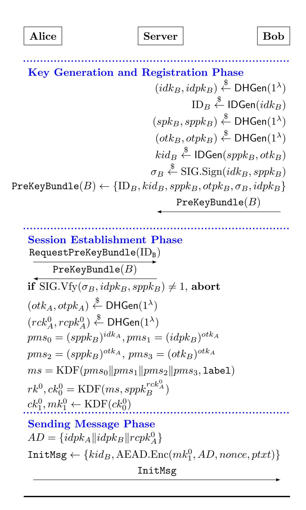
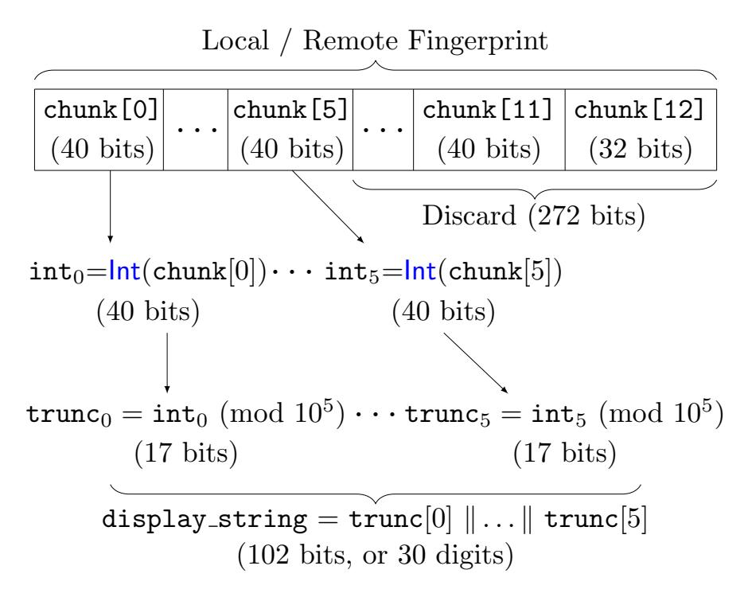
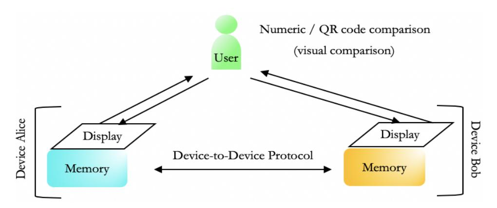
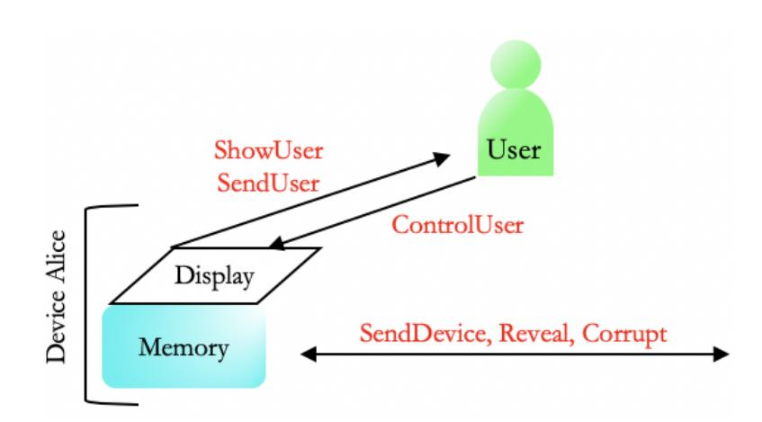
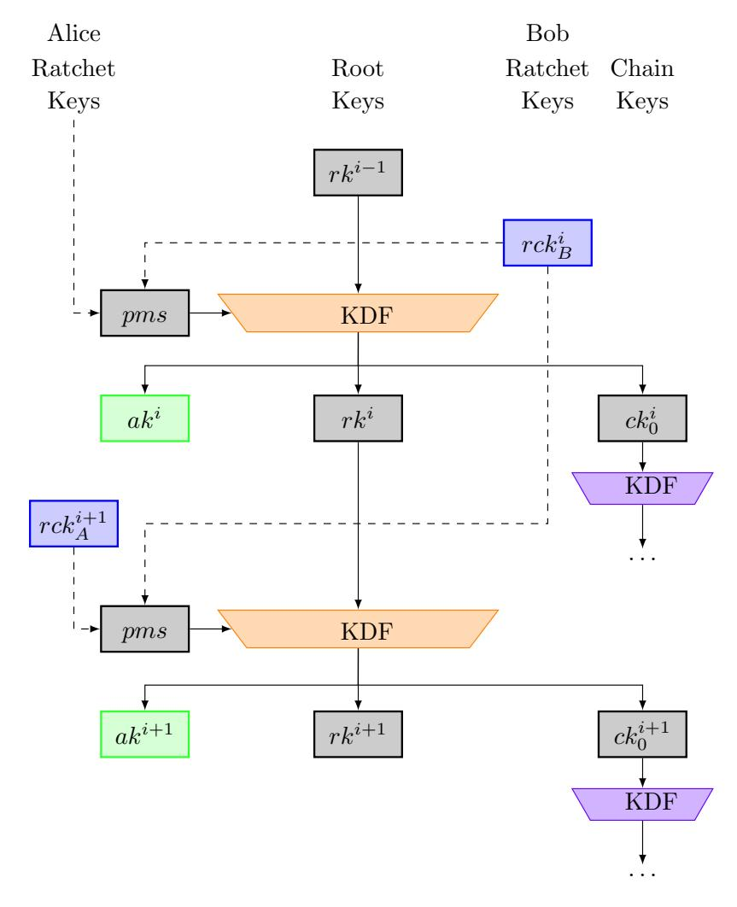
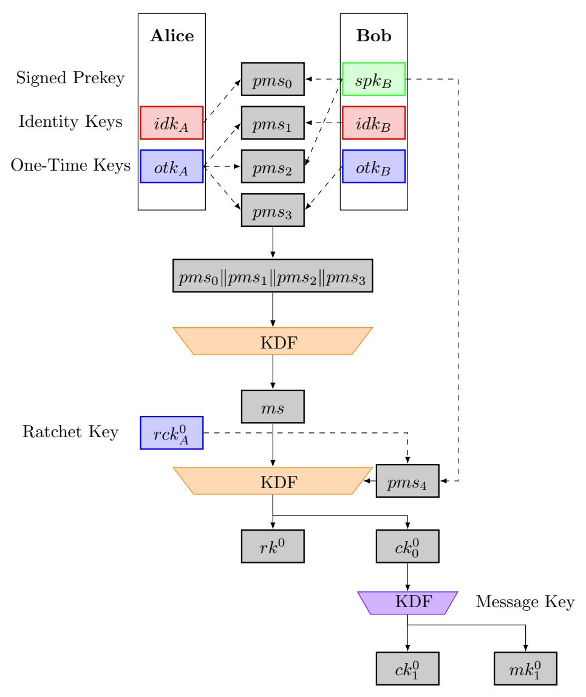
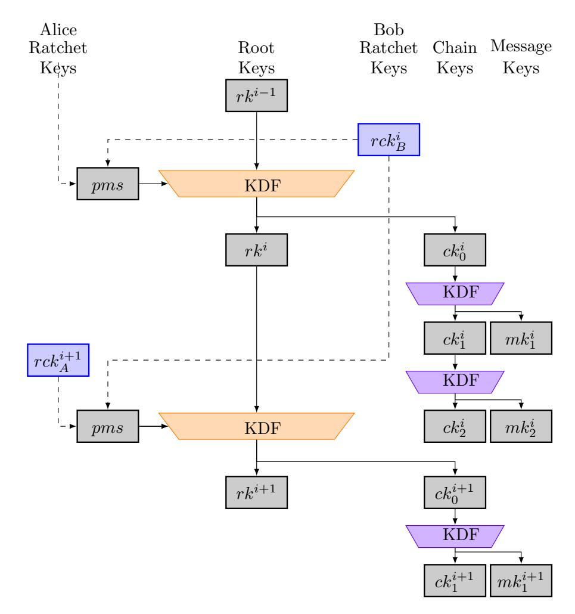
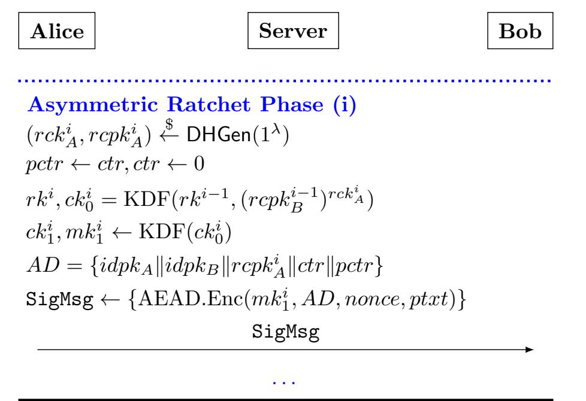
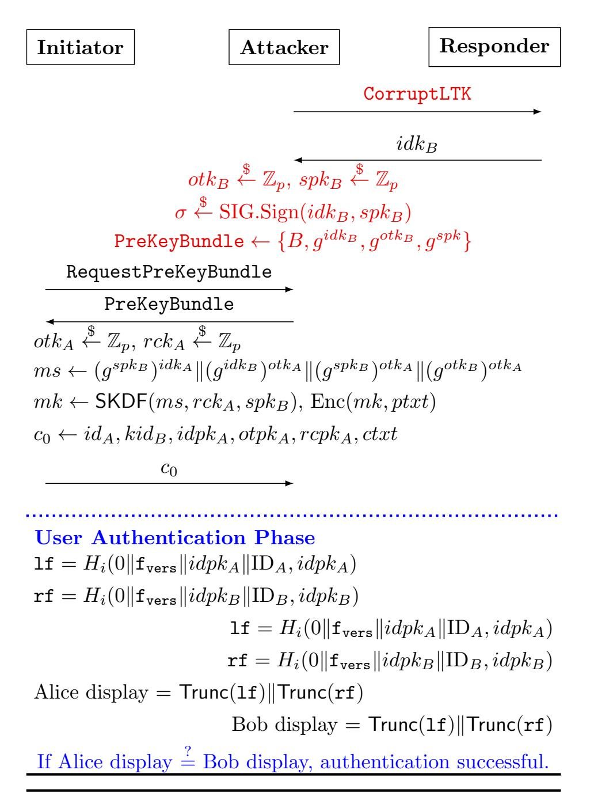

{0}------------------------------------------------

# There Can Be No Compromise: The Necessity of Ratcheted Authentication in Secure Messaging

Benjamin Dowling<sup>1</sup> and Britta Hale2?

<sup>1</sup> Department of Computer Science, ETH Zurich benjamin.dowling@inf.ethz.ch <sup>2</sup> Department of Computer Science, NPS, Naval Postgraduate School britta.hale@nps.edu

Abstract. Modern messaging applications often rely on out-of-band communication to achieve entity authentication, with human users actively verifying and attesting to long-term public keys. This "user-mediated" authentication is done primarily to reduce reliance on trusted third parties by replacing that role with the user. Despite a great deal of research focusing on analyzing the confidentiality aspect of secure messaging, the authenticity aspect of it has been largely assumed away. Consequently, while many existing protocols provide some confidentiality guarantees after a compromise, such as post-compromise security (PCS), authenticity guarantees are generally lost. This leads directly to potential man-in-the-middle (MitM) attacks within the intended threat model. In this work, we address this gap by proposing a model to formally capture user-mediated entity authentication in ratcheted secure messaging protocols that can be composed with any ratcheted key exchange. Our threat model captures post-compromise entity authentication security. We demonstrate that the Signal application's user-mediated authentication protocol cannot be proven secure in this model and suggest a straightforward fix for Signal that allows the detection of an active adversary. Our results have direct implications for other existing and future ratcheted secure messaging applications.

Keywords: Secure Messaging · Ratcheted Authentication · Signal · Double Ratchet · User-Mediated Authentication · Ceremonies

## 1 Introduction

Entity authentication is a critical pillar in secure communication, yet one that has been fundamentally abstracted away in the analysis of modern, ratcheted key exchange protocols. Protocols of this type have gained extreme popularity in recent years due to the strong security guarantees achievable in such designs, including forward secrecy (FS) and post-compromise security (PCS) for confidentiality. The Signal

<sup>?</sup> The views expressed in this document are those of the author and do not reflect the official policy or position of the Department of Defense or the U.S. Government.

{1}------------------------------------------------

protocol is one example, being one of the most ubiquitous cryptographic protocols used in practice, it enables end-to-end encryption for widespread secure messaging applications including WhatsApp [30], Wire [14], Skype [28], and Facebook Messenger Secret Conversations [11]. On a high-level, ratcheted key exchange protocols are two-party multi-stage key exchange protocols, where the two parties repeatedly exchange "update" information to derive independent and secret symmetric keys. Despite the popularity of ratcheted key exchange protocols, entity authentication – a critical pillar of secure communication – has been fundamentally abstracted away in their analysis. This has left a critical gap in the understanding of ratcheted key exchange protocol security. An attacker that can impersonate a party or modify updates undetected can also break confidentiality and data authenticity. Thus entity authentication is closely tied to confidentiality FS and PCS. To put it succinctly: a lack of meaningful authentication allows for an active man-in-the-middle (MitM) attack in the "after compromise" security threat model – the very threat model applied to confidentiality analyses of ratcheted key exchange protocols [25, 3, 8]. This distinction is clearly stated with precision by Bellare et al. [3], who remark:

In practice, these [ratcheting] keys are the result of a session-key exchange protocol that is authenticated either via the parties' certificates (TLS) or out-of-band (secure messaging), but ratcheting is about how these keys are used and updated, not about how they are obtained, and so we will not be concerned with the distribution method, instead viewing the initial keys as created and distributed by a trusted process.

Such an omission may seem initially surprising due to the possible implications. In practice, this omission is due to the out-of-band (OOB) nature of the entity authentication that is usually employed and the challenge of analyzing it systematically. Signal and similar protocols rely heavily on user mediation, where users actively engage in the verification of long-term keys, effectively replacing a trusted third party or certificate authority. Thus, consideration of entity authentication within analyses of such ratcheting protocols necessitates extending the computational model to capture unpredictable user behavior and the user-device interface.

In this work, we investigate user mediation in the ratcheted key environment, formalising a computational model for user-mediated protocol analysis. Our model builds on previous work by capturing post-compromise security with respect to entity authentication. We apply this model to Signal, and note that the Signal authentication mechanism does not satisfy our security requirements. Finally, we present a straight-forward solution for the Signal ratcheted key exchange protocol that can detect active attackers.

Now we briefly introduce the surrounding context, including the problem of active attackers against PCS security, the Signal authentication protocol, and the practical use and analysis of user mediation in security protocols.

Signal Protocol The Signal protocol (or simply "Signal") [19] is a ratcheted key exchange and encryption protocol which has become synonymous with secure messaging. Mutual entity authentication in Signal is performed through user interaction via the Signal authentication protocol: a user manually compares "safety numbers"

{2}------------------------------------------------

on both devices, either through visual comparison or a QR code reader, and finishes by selecting "verified" on each device. At any time the user may also deselect the "verified" status of the conversation. In addition to the Signal app, this mechanism for entity authentication is used in Wire [13], WhatsApp [30], and Facebook Messenger Secret Conversations [11].

Compared to research on the Signal ratcheted key exchange, the Signal authentication protocol has been left almost entirely unconsidered. Aside from a comparative usability study on Signal's safety numbers [4], Signal authentication protocol has not been formally treated in the literature focused on the Signal protocol [1, 7, 5, 8, 27], with focus instead being on FS and PCS confidentiality guarantees following device compromise. The Signal specification itself notes the problematic consequence of a compromise scenario on security, calling it "disastrous", and specifically stating for authentication that loss of identity keys "allows impersonation of that party" [20].

Post-Compromise Security vs. Active Adversary Detection PCS (also known as future secrecy or self-healing) [9] is a recent security notion that formally captures a protocol's ability to "lock out" an attacker following full state compromise, contingent on the attacker being passive for some period. To achieve PCS, protocols such as Signal use a technique known as key ratcheting. Ratcheting protocols first establish a shared "root" secret (which we will denote rk) that for each epoch is then continually ratcheted forwards in a chain by a keyed function f, taking the current root key rk<sup>i</sup> and additional entropy ek<sup>i</sup> as input (i.e. rki+1 ← f(rk<sup>i</sup> , ek<sup>i</sup> )). These root secrets can then used to derive further keys that will be used in an arbitrary symmetric-key protocol. Note that the definition of an epoch here is defined by the period between the derivation of new root secrets. It follows that even if an attacker has exposed the root secret rk<sup>i</sup> , if the communicating parties are able to secretly establish new entropy ek<sup>i</sup> in that epoch, then the attacker cannot compute the following root secret rki+1 .

Typically, PCS is considered only in terms of confidentiality, where an attacker will not be able to read future messages following a compromise. However confidentiality only represents a partial view of security in the post-compromise threat model (i.e. following a compromise). We extend the view of the post-compromise threat model to include entity authentication – not only by healing from a passive attacker but also detect active impersonation.

Consider the following scenario to demonstrate why this matters: A user wishes to verify that their session is not being compromised by an active attacker, able to inject messages between the two devices, and decides to use the Signal entity authentication protocol described in Section 2.4. A successful verification indicates that an attacker has not modified the long-term keys of either party in the session. However, as the verification is tied only to long-term keys and not the current session state, there is no indication of who the current communication partner really is. Following a compromise, an attacker can send/receive messages and impersonate a partner device, and this will not be detected during the Signal entity authentication protocol.

Due to the failure of entity authentication, messaging protocol participants are no longer assured of being the sole entities privy to correspondence if there is 

{3}------------------------------------------------

compromise by an active attacker (i.e. PCS confidentiality healing fails). In particular, an active MitM attacker may continually inject its own messages, preventing PCS from healing the protocol and locking out the attacker. Thus, under a standard model of communication (i.e. two devices and a single channel) and following a full state compromise, users must rely on the attacker to be passive in order to recover security – something that is by no means assured.

Achieving PCS healing for entity authentication therefore requires session ratchetspecific information to be tied to verification checks. One possible, but naive, approach to this would be to include all public keys exchanged during the protocol execution in the verification check. However, this leaves open another form of impersonation that is not reliant on prior compromise: an attacker could generate the same QR code or safety numbers as a valid user and post it for comparison elsewhere, since it is generated over public information. This is should not be surprising; traditional entity authentication in the form of certificates require some proof of private key ownership before the third-party certifying authority approves the key. In the context of ratcheting, it is likewise necessary to tie together proof of private key ownership over all ratchets. In the context of user mediated protocols, the user is the third-party certifying authority. This leads to our suggested construction in Section 4, where we compute MACs over session-specific information derived from the PCS secrets.

To summarize: we extend the PCS concept to entity authentication and provide active attacker detection. We provide a security model that addresses this gap, and an example ratcheted key exchange and authentication solution that is provably secure in our new model. In particular, we describe the Signal user-mediated authentication protocol, which does not achieve our strong guarantees, and propose a modified variant called the Modified Device-to-User Signal Authentication (MoDUSA) protocol. We prove that the MoDUSA protocol achieves our strong notions of security. By linking authentication to ratcheting epochs, MoDUSA:

- 1. provides detection of an active MitM during sessions,
- 2. achieves PCS healing such that an entity is assured of their only communication partner following key updates and a run of the authentication protocol,
- 3. provides authentication for epochs before MoDUSA is run, and
- 4. can be run multiple times during the lifetime of a session.

User Mediated Authentication Traditionally, cryptographic analysis considers only device-to-device communication, with all user interactions OOB. However, such a perspective leads to erroneous security assumptions on user-input data and honest user behaviour. In practice, a user reads information from a device display and acts accordingly – an attacker may eavesdrop on the user input data, the display data, or may even obtain access to the device. Using malware, an attacker may also display data via a display overlay, without having access to private keys. The Tap n' Ghost attack [23] is one such example, where the attacker affects both the user input to the device and display but has no access to internal keys or state, by externally injecting electrical noise that affects capacitive touch screens.

User mediated authentication was first considered in [15] with a user mediated security model being applied in the analysis of an ISO authentication protocol. 

{4}------------------------------------------------

In this model, an adversary was considered under three different capability levels, ranging from eavesdropping to device control. We extend their model, and consider a more fine-grained control method, enabling separate consideration of an attacker's control of a device display and control of user input. Moreover, we consider two security goals: authentication security under display and user compromise, and authentication security under device compromise (including all keys). We denote this security framework the Mediated Epoch Three-party Authentication (META) model. META has implications not only for the analysis of Signal, but also other user-mediated protocols such as Bluetooth.

META is not an authenticated key exchange (AKE) model per se. In mainstream messaging applications [14, 19, 30] the ratcheted key exchange and messaging protocols are neatly composed, where per-epoch root secrets established by the key exchange are given as input to the symmetric-key messaging protocol. We instead modify the Signal protocol to output per-epoch authentication secrets and public update messages, and then authenticate these public update messages. Thus, META aims to capture authentication per ratchet epoch, defined by the derivation of new ratchet secrets. We define two variants of ratcheting freshness and corresponding security experiments for ratcheting authentication, dependent on adversarial capabilities – under user compromise (CompUser) and under device compromise (CompDev) threat models.

CompUser formalises freshness against an attacker capable of controlling a user's actions and controlling information displayed to the user on a single device. This formalises security guarantees when one device may be infected with malware, leading to control of a device display but no access to keys. It also captures shouldersurfing attacks and the Tap n' Ghost mentioned above. When the user is an active protocol participant, any malicious application that can display content to the user can conceivably mirror a viable output and trick the user. One can think of this as a pop-up ad that is designed to look like the legitimate application. Such attacks are on the user interface and may not require access to internal application secrets (see e.g. the Strandhogg vulnerability [16]). CompDev security, in comparison, allows device state to be compromised but limits adversarial capabilities on the user-to-device channels. CompDev security is closely linked to tradition channel security experiments. Note that in both CompUser and CompDev security we allow an eavesdropping adversary that can read all information between a user and device (e.g. shoulder-surfing). It is under CompUser security that we capture stronger notions of PCS for entity authentication. Interestingly, the choice of session identifier defines whether satisfaction of CompUser security may imply authentication of the entire session up to that epoch (see Section 4).

Ceremonies vs. User-Mediation The concept of reaching beyond normal protocol interaction to consider use-context can also be seen in ceremonies [10], which can be seen as the OOB roles and actions of users in the context of security protocols, and aims to model and analyze traditionally out-of-scope aspects of these protocols, including user interactions and societal contexts [2]. The concept been applied to public key infrastructure [22] and to verifiable elections [17]. Radke et. al. [26] explore the potential strengths and weaknesses of this approach and recently, Carlos et. al. 

{5}------------------------------------------------

[6] explored a threat model for security ceremonies, using their adapted model to examine the Bluetooth pairing protocol. Intrinsically, the modelling approach that ceremonies take differ from our approach in fundamental goals and assumptions – we build on computational models while ceremonies are based on the Dolev-Yao model. Ceremonies provide a simpler, but wider view of the environment, while we expand upon lines of research capturing complex secure messaging and user-mediated security frameworks.

Contributions In this work, we address the incongruity of PCS without authentication.

- We describe security for user-mediated authentication in the post-compromise threat model (under both CompUser and CompDev attacks), and introduce the META model.
- We demonstrate that the Signal authentication protocol is unable to satisfy META security and instead propose a modification of the Signal key exchange and authentication protocol, called MoDUSA, to counter potential MitM vulnerabilities. As in the traditional Signal authentication protocol, a user may initiate the authentication check whenever and however often they desire.
- We analyse MoDUSA, and demonstrate that it achieves META security, allowing for detection of active MitM attackers. Combining traditional confidentiality PCS and our solution, a user is guaranteed that, should a compromise occur, the protocol will either detect the attack or self-heal it.

We begin by introducing the Signal key exchange and its own authentication protocol. Later, we will demonstrate that Signal's entity authentication protocol does not achieve either of our notions of META security. In the following discussion, Alice and Bob are used to refer to respective devices in the protocol – we continue to refer to a single human User (see Fig. 3 for example).

## 2 The Signal Protocol

In this section we give an overview of the Signal Protocol, almost certainly the most widespread example of a two party asynchronous messaging protocol. Signal's structure allows users to send encrypted messages to each other with high-degrees of forward secrecy and post-compromise security. On a high level, the protocol consists of three distinct stages:

- A session establishment stage, where one user Alice fetches a prekey bundle belonging to another user Bob, and uses Bob's public keyshare information (as well as generating Alice's own secret keyshare values) to derive a root key, a chain key, and a message key. This is called the extended Triple Diffie-Hellman (X3DH) protocol [21], which we give an overview for in Section 2.2, and describe in detail in Appendix A.1.
- An asymmetric ratcheting stage, where a user Alice, after receiving a message from Bob containing a new ratchet key, generates a new ratchet key, performs a DH computation with Bob's ratchet, and uses the output and the current root

{6}------------------------------------------------

- key in a KDF to generate a new root key, a new chain key and a new message key. This is an *asymmetric ratchet* of the Double Ratchet protocol [18], described in detail in Fig. 8, with a key schedule depicted in Fig. 7.
- A symmetric ratcheting stage, where a user Alice, after sending a message to Bob decides to send another message to Bob, using the chain key to roll forward (using a key derivation function) and derive a new chain key and a new message key, to be used when the user sends a new message. This is the symmetric ratchet of the Double Ratchet protocol [18]. The symmetric ratchet is outside the scope for our analysis, and so we limit our description to Appendix A.2.

#### 2.1 Terminology

Here we introduce the terminology of Signal, as well as the notation that we use to describe its components. We describe all types of keys and shared secret values that are computed during a Signal protocol execution, as well as user authentication protocols.

- *identity keys* (*idk*, *idpk*): Long-term DH keypairs used to sign other keys used in Signal, as well as derive keys in multiple X3DH key exchanges.
- signed prekeys (spk, sppk): Medium-term DH keypairs, signed by the user, and used to derive keys in multiple X3DH key exchanges.
- one-time-keys (otk, otpk): Ephemeral DH keypairs, used to derive keys in a single X3DH key exchange.
- ratchet keys (rck, rcpk): Ephemeral DH keypairs, used to derive keys in both the X3DH key exchange, as well as asymmetric ratcheting stages.
- root keys  $(rk^i)$ : A symmetric secret value, used to generate the *i*-th root and chain keys during an asymmetric ratchet stage, using the (i-1)-th and ith ratchet keys.
- chain keys  $(ck_j^i)$ : A symmetric secret value derived from the (i-1)-th root key, used to generate the i-th chain and message keys during the j-th symmetric ratchet stage, with no added entropy.
- message keys  $(mk_j^i)$ : A symmetric secret key, derived from the (j-1)-th chain key and used to AEAD-encrypt a plaintext message.
- fingerprint (fprint): a representation of some session identifying information, used by the human user to authenticate both parties.

#### 2.2 The X3DH Protocol

In Signal, sessions are established in either an offline or online fashion. Either process uses prekey bundles, a set of keys that are generated locally by each user device and then either sent to a centralized Signal server (offline mode) or sent upon request to another user via the server (online mode). When a user Alice wishes to establish a session with an offline user Bob, Alice retrieves Bob's prekey bundle from the Signal server, and uses the values within to create shared secret values. This process of deriving keys from prekey bundles is referred to as the Extended Triple Diffie-Hellman (X3DH) key agreement protocol. The full details of the prekey bundle can be viewed in Appendix A.1.

{7}------------------------------------------------



**Fig. 1.** A protocol flow describing the Signal X3DH initial key exchange protocol. In this protocol execution, user Bob has generated a PreKeyBundle locally, and stored the public key values (and identifiers) with the Server. At some point, user Alice will request the PreKeyBundle and use it to establish a message key mk, encrypting a message and sending the ciphertext to Bob. IDGen is a function that takes either the identity public key idk or the public prekeys sppk, otpk and generates the tuple (regId, deviceId) (or the key identifiers for the prekeys, respectively).

{8}------------------------------------------------

After Alice fetches the prekey bundle, the signature  $\sigma_B$  over the signed prekey  $sppk_B$  is verified using Bob's long-term identity key  $idpk_B$ . An important observation here is that Signal, unlike protocols such as Transport Layer Security, has no public key infrastructure used to authenticate identity keys. Thus, any attacker that controls the communication channel (such as the Signal server) is capable of injecting its own identity key  $idpk_{B'}$ , and using it to sign prekeys and impersonate Bob. To prevent this attack, users will authenticate to each other using "fingerprints." These mechanisms are supported within the Signal authentication protocol, not a part of the Signal protocol itself and are discussed later in Section 2.4.

Alice then generates a fresh ratchet public key  $(rck_A^0, rcpk_A^0)$ , a fresh one-time-key  $(otk_A, otpk_A)$ , and combines it with the values listed above, as described in Fig. 1. The output of this computation is a root key  $rk^0$ , a chain key  $ck_1^0$  and a message key  $mk_1^0$ , used to encrypt the plaintext message that Alice sends to Bob, marking the end of the initial X3DH key exchange.

#### 2.3 The Double Ratchet Protocol

Once a session has been established in Signal there are two different mechanisms to derive new message keys. The first is called asymmetric ratcheting, and is triggered the first time a user sends a message to their conversation partner after having received a message. The second is called symmetric ratcheting, and is triggered when the user sends another message in a chain, without having received a new message from their conversation partner. Fig. 7 depicts the key schedule for the Signal Double Ratchet protocol.

Asymmetric Ratchet Asymmetric ratcheting requires the user generate a new DH key pair  $(rck^i, rcpk^i)$  called ratchet keys. This new ratchet key is used with the previous ratchet key  $rcpk^{i-1}$  (from the conversation partner), as well as the currently maintained root key  $rk^{i-1}$  to derive a new root and chain key  $rk^i, ck_0^i \leftarrow \text{KDF}(rk^{i-1}, (rcpk^{i-1})^{rck^i})$ . Since this new chain key will be used to generate sending message keys for the device until it receives a new message from its conversation partner, it also updates two counters  $pctr, ctr^3$  such that  $pctr \leftarrow ctr, ctr \leftarrow 0$ .

The device then computes the next chain key and the first message key in this chain  $ck_1^i, mk_1^i \leftarrow \text{KDF}(ck_0^i)$ . The device uses an AEAD symmetric cipher to encrypt a plaintext message ptxt'. The additional data field AD is set as the AD field from the first message in the conversation, as well as the sender's most recently generated ratchet key and its currently maintained counters, i.e.  $AD = \{idpk_A \|idpk_B\|rcpk_A^0\|rcpk_I^i\|ctr\|pctr\}$ . Finally, the device sends the ciphertext:  $c_1^i = \text{AEAD.Encrypt}(mk_1^i, AD, nonce, ptxt')$  and sends  $c_1^i$  to its conversation partner. A protocol flow diagram is given in Fig. 8.

 $rac{3}{pctr}$  is a counter of messages sent using message keys generated from root key  $rk^{i-2}$ , and ctr is the number of messages that have been sent using message keys generated from root key  $rk^{i}$ 

{9}------------------------------------------------

## 2.4 Entity Authentication in Signal

Here we introduce the user-mediated entity authentication mechanism used in the Signal application. The Signal app supports post-session establishment entity authentication via a human user interface. On a high level, the Signal app produces fingerprints of the long-term keys and identities of both parties in the communication channel. These fingerprints can take two distinct forms: QR code representation or numeric code representation, and below we describe how each is computed. Due to the lack of formal specification for the Signal authentication protocol, this description is guided by the implementation [24].

After a user validates their communication partner, the user can mark their communication partner as "verified." When the user proceeds, they are alerted when these fingerprints have changed - this may occur due to their communicating partner changing their device or identity key. Any further attempt at communication on the part of the user will require them to manually acknowledge that the message may be sent to an unverified partner.

#### 2.5 Authentication with QR codes

The QR code verification method (which the repository [24] refers to as "scannable fingerprints") allows users to authenticate each other without the risk of human error while reading and comparing fingerprints. There are two different versions of generating these scannable fingerprints, version 0 (described in Appendix A.3) and version 1, which we describe below. For the rest of the paper we focus on the version 1 method of generating scannable fingerprints, as it is both a more recent version of the process, and is more closely related to the numeric code verification method (which the repository refers to as "displayable fingerprints"). While a QR code is verified out-of-band (OOB) by a user, the verification itself is error-free, assuming an honest QR code reader.

Scannable Fingerprint Version 1. In version 1, generating scannable fingerprints requires computing a digest of the local and remote identifiers and identity keys. Each device computes both fingerprints as follows (here A acts as the local partner, and B the remote partner):

$$\text{local\_fprint} = H_i(0\|\text{fvers}^4\|idpk_A\|\text{ID}_A,idpk_A)$$
  $\text{remote\_fprint} = H_i(0\|\text{fvers}\|idpk_B\|\text{ID}_B,idpk_B)$ 

Hi(x, y) is an iterative hash, where H<sup>0</sup> = H(x), and H<sup>i</sup> = H(Hi−1ky). In the repository we examined, the Signal authentication protocol uses SHA2 with 512-bits of output as the underlying hash function, with 5200 iterations. The fingerprint is a QR code representation of the following fields: {svers, 0, local fprint, remote fprint}. Afterwards, the device serializes the fingerprint and generates a QR code from the serialized data. The devices can then verify the communicating partner's scannable fingerprint as described above.

<sup>4</sup> fvers here refers to the "fingerprint generation version". Note that in both QR and numeric codes, fvers = 0.

{10}------------------------------------------------

#### 2.6 Authentication with numeric codes



Fig. 2. Truncation method used by Signal to reduce the length of the (local or remote) fingerprint output by the hash function to a human-readable state. Int() denotes a function that converts a bit-string to an integer value.

For numeric codes, the Signal authentication protocol first generates local fingerprint local fprint and remote fingerprints local fprint as described above.

Recall that fingerprint generation uses SHA2 with 512-bit output length as its underlying hash function. However, the Signal authentication protocol's numeric code, read by the users, is not the direct output of the hash function, but instead the concatenation of two 30-digit representations of truncated hash outputs, described in Fig. 2.

The displayed fingerprint read by the human users is then the sorted concatenation of the local and remote "display strings", e.g.

```
{local display string, remote display string}
```

where sorting is according to the relative size of the users' public keys (idpk).

## 3 Verifiable Authentication

In this section we introduce a framework to analyse entity authentication in ratcheted messaging protocols. We formalise entity authentication protocols in the ratcheted key exchange setting, and to prove such protocols secure, we expand the 3-PUMA (3-Party Possession User Mediated Authentication) model [15], which separates out the device-to-device channel and user-to-device channel (e.g. device display and user input). Our 3-PUMA variant, which we call the "Mediated Epoch Three-party Authentication" (META) security model, aims at explicit entity authentication and builds on multi-stage security [12, 8] ratcheted authentication.

{11}------------------------------------------------

## 3.1 User-Mediated Entity Authentication

On a high level, user-mediated entity authentication protocols creates an easilyexchanged digest of information, which we denote fingerprints. <sup>5</sup> Users then exchange these fingerprints in an out-of-band channel, and decide to accept or reject the authentication attempt.



Fig. 3. A high-level figure of our setting. The REA protocol runs on the device, and provides fingerprints to the users. To simplify analysis, in our security model Alice and Bob are considered a single user, with a communication channel existing between Device A and the User, Device B and the User, and between the two Devices.

Recall that the Signal protocol relies on user-mediated entity authentication to establish trust in long-term keys and long-term identifying information. However, this is the limit of its guarantee: the Signal authentication protocol does not authenticate any other information. In particular, it do not authenticate per ratchet update information, and thus users gain no security benefit if the attacker has already exposed the long-term key of either party (idpkA, idpkB).

### 3.2 META Security Model

We now formalise the setting of our META security model capturing user-mediated authentication protocols; as the name suggests, META extends beyond capturing devices executing such protocols, but also explicitly captures users interacting with the devices within the security model. As a result, META can capture a broader class of attackers: that compromise secret state within the device, and also compromise the channel between the device and the users.

In addition, META is primarily concerned with asynchronous messaging protocols, and this is reflected in how we capture authentication. An asynchronous protocol is one that does not require both parties to be online at the same time. As a result of this restriction, in our setting we do not have a guarantee that both parties have received all messages sent between the communicating devices. One of the technical difficulties our model addresses then is determining the right "level" of authentication: due to our focus on ratcheted protocols, we decide to target entity authentication per

<sup>5</sup> The use of "fingerprint" here is rooted in the Signal terminology, which we stay consistent with for the rest of the paper.

{12}------------------------------------------------

asymmetric ratchet, which we refer to as epochs. As in [15], we use session identifiers instead of matching conversations for defining partnering, which is more standard in authenticated key exchange models. This is due to the expected asynchronicity between the three communication channels (User-to-DeviceA, DeviceA-to-DeviceB, and User-to-DeviceB), which precludes matching conversations. Ratcheting protocols are a form of continuous key agreement and consequently have an evolving session identifier. We indicate the session identifier at any given epoch as epid and call it an epoch identifier.

Note that to simplify analysis and complexity in our framework, we follow the direction of [15], and model the two device users as a single user, see Figure 3.

Protocol Participants. A participant in a META protocol is either a device  $I \in \mathcal{ID}$  or a user U. The set of all participants is the union  $\mathcal{ID} \cup \{U\}$ , where the elements of  $\mathcal{ID}$  are devices or identities. There may be multiple sessions at any participant, such that  $\pi_s^P$  is the s-th session at P. Below is a description of the internal state of the two types of participants. At the beginning of the experiment, the challenger  $\mathcal{C}$  generates a list of  $n_P$  public keys pairs for each device  $I \in \mathcal{ID}$ ,  $(sk_1, pk_1), \ldots (sk_{n_P}, pk_{n_P})$ . Note that devices do not have access to the list of public keys; they instead set partner public keys during the protocol.

To capture the Signal authentication protocol (and eventually our modified version) in META, devices maintain values used by these protocols – specifically, long-term public keys (sk, pk), any secret state (i.e., rck), and ratcheting secret outputs esk[T], which we denote epoch secret keys. For example, in the Signal Protocol the epoch secret keys  $esk[T] = rcpk_{T-1}^{rck_T}$  are derived from the asymmetric ratchets sent between both parties (see Section 2). This allows our model to be specific about the values that are compromised in the META security experiment, simplifying how we capture freshness conditions and in particular, post-compromise security.

**Devices** In META, each device  $I \in \mathcal{ID}$  is modelled as a set of session oracles, where each session maintains the following list of variables:

- role  $\in$  {initiator, responder}: a variable indicating the role of I in the session.
- T ∈ N  $\cup$   $\bot$ : A counter indicating the current epoch of the session, initialised as  $\bot$ .
- $-st[T] \in \{0,1\}^*$ : a variable storing any additional state for a given epoch T, initialised as  $\bot$ .
- $-esk[T] \in \mathcal{ESK}$ : a variable storing the private epoch secret key output for a given epoch T, where  $\mathcal{ESK}$  is the private epoch key space. Initialised as  $\bot$ . Updated ratchets to esk[T] are denoted  $esk[T] \leftarrow esk[T+1]$  (note that this also implies  $T \leftarrow T+1$ ).
- $pid \in \mathcal{ID} \setminus \{I\}$ : a variable storing the partner identity for the session, initialised as  $\perp$ .
- $-pk_{pid} \in \mathcal{PK}$ : a variable storing the public key for the session partner, where  $\mathcal{PK}$  is the public key space, initialised as  $\perp$ . This variable is set during the protocol execution.
- $-(sk, pk) \in \mathcal{SK} \times \mathcal{PK}$ : a variable storing the private and public key for I, where  $\mathcal{SK} \times \mathcal{PK}$  is the private/public key space.

{13}------------------------------------------------

- $-\alpha[T] \in \{\text{accept}, \text{reject}, \bot\}$ : a variable indicating if the session accepts for a given epoch T, rejects, or has not yet reached a decision. Initialised as  $\bot$ .
- $epid[T] \in \{0,1\}^* \cup \bot$ : a variable storing the epoch identifier at each epoch T, initialised as  $\bot$ .

The internal state of each session oracle  $\pi_s^I$  owned by identity I is initialized to (role,  $\mathsf{T}, st[\mathsf{T}], esk[\mathsf{T}], \mathsf{pid}, pk_{\mathsf{pid}}, (sk, pk), \alpha[\mathsf{T}], \mathsf{epid}[\mathsf{T}]) = (\bot, \bot, \bot, \bot, \bot, \bot, (sk_I, pk_I), \bot, \bot)$ . We disallow  $\mathsf{pid}_I = I$ , such that devices do not authenticate themselves.

**User** U is similarly modelled via session oracles, where each session  $\pi_t^U$  maintains at minimum the following variables:

- Two device-session pair identifiers (I, s) and (I', s')

This follows practice that a user should identify messaging conversations that it wishes to authenticate. See Appendix D for extended notes on modelling user sessions.

**Definition 1 (Matching Epoch ID).** We say that identities I and I' have matching epoch IDs for sessions s and s', respectively, and for an epoch T if  $\pi_s^I.\text{epid}[T] = \pi_{s'}^{I'}.\text{epid}[T]$ , where  $T \neq \bot$  and  $\pi_s^I.\text{epid}[T] \neq \bot$ .

Note that unlike most key exchange or authentication models, we do not require prefix-matching. This is an artifact of asynchronous messaging protocols using lossy channels. Each epoch represents a chain or flow of messages from one device to another, rather than individual messages themselves, as we have no guarantees that any given message in the flow reaches the destination. Thus our epoch identifiers are initialised as  $\emptyset$ , updated only once, and we need to consider only exact matching.

**Definition 2 (Partnering Device to Device).** Two sessions  $\pi_s^I, \pi_{s'}^{I'}$ , with  $I, I' \in \mathcal{ID}$ , are partnered in an epoch T if  $\pi_s^I$ .pid = I',  $\pi_s^I$ .role  $\neq \pi_{s'}^{I'}$ .role,  $\pi_{s'}^{I'}$ .pid = I,  $\pi_s^I.\alpha[\mathsf{T}] = \pi_{s'}^{I'}.\alpha[\mathsf{T}] = \mathsf{accept}$ , and finally,  $\pi_s^I.\mathsf{epid}[\mathsf{T}]_{s,I} = \pi_{s'}^{I'}.\mathsf{epid}[\mathsf{T}]$ .

Adversarial Model Let  $\mathcal{A}$  be a probabilistic polynomial-time (PPT) algorithm against authentication with the following abilities and allowed queries in the experiment  $\mathsf{Exp}_{\Pi,n_P,n_S,n_T}^{META\text{-type},\mathcal{A}}$ .

We highlight that there are two communication channels that are modelled in our *META* security framework. The Device-to-Device channel, captures a "standard" network modelled in most cryptographic protocols, and models messages sent between devices, perhaps over the internet. The second, User-to-Device, captures the channel between a User and a Device. This captures messages displayed on the screen of a smart phone, and the keyboard that a User enters input to the device over.

**Device-to-Device (DtD)** For messages between participants I and I', such that  $I, I' \in \mathcal{ID}$ , the adversary is able to read, modify, replay, reorder, and delete messages.

User-to-Device (UtD) For messages sent between identities  $I \in \mathcal{ID}$  and the user U, the adversary may not modify a message's sender/recipient. The adversary

{14}------------------------------------------------



**Fig. 4.** A high-level view of allowed META queries. Adversarial control on the depicted channels is enabled through the associated queries.

is allowed to read, replay, reorder, and delete UtD messages, but may not modify UtD messages.

The above adversarial abilities are standard such that the adversary can control the network (DtD). Adversarial message modification is restricted between the user and device only (UtD), thereby capturing the concept that the adversary cannot modify what the user sees or inputs on the device. However, we provide a query that allows complete compromise of the user whereby the adversary can gain such control. The reason for this is similar to allowing protocol participant corruption in the traditional sense. A strong protocol should be robust to user compromise (i.e. such as those protocols not relying on the user at all), such that an adversary cannot falsely force authentication in spite of controlling user activity. Meanwhile, a weak protocol depends entirely on an honest and reliable user. This aligns with the historical development of key exchange models, where security could not meaningfully be considered under a party's corruption for weak protocols, but with advent of better understanding of protocol security models, such compromise becomes possible for some protocols which do not rely solely on long-lived keys. We expect that user control, or conditional user control, need not be fatal to security for all user-mediated authentication protocols.

**Queries** The adversary is able to interact with the Devices and Users with the following queries:

- SendDevice( $\pi_s^I, m$ ). The adversary sends a message m to a session oracle  $\pi_s^I$ . The message is processed according to the protocol specification and any response is returned to the adversary. If  $\pi_s^I$  (where  $I \in \mathcal{ID}$ ) receives m as a first message, then the oracle checks if m consists of a special initiation message (m = (init, I')), for  $I' \in \mathcal{ID}$ , to which it responds by setting pid = I', role = initiator, and outputs the first protocol message. Otherwise it responds by setting pid = I', role = responder, and responding according to the protocol specification.
- SendUser $(\pi_t^U, m)$ . Using this query, the adversary sends a message m to a session oracle of his choice, where  $\pi_t^U$  is an oracle for session t at user U. The message is processed according to the protocol specification and any response is returned to the adversary. If  $\nexists I, s$  such that m has been honestly generated by  $\pi_s^I$ , this query outputs  $\bot$ .

{15}------------------------------------------------

- If a session oracle  $\pi_s^U$  receives m as a first message, then the oracle checks if m consists of a special initiation message m = (init, (I, I')), for  $I, I' \in \mathcal{ID}$ , to which it responds by setting initiator = I and responder = I'. Otherwise it outputs  $\perp$ .
- Reveal $(\pi_s^I, \mathsf{T})$ . This query returns the epoch key  $esk[\mathsf{T}]_{s,I}$  as well as any additional epoch session state  $st[\mathsf{T}]$  of the  $\mathsf{T}$ -th epoch for the s-th session for the identity  $I \in \mathcal{ID}$ .
- Corrupt(I). This query returns the private key  $sk_I$  of identity  $I \in \mathcal{ID}$ .
- ShowUser(I). This query returns  $\bot$ . After this query the adversary is allowed to modify or create any UtD message from I to the user.
- ControlUser(). This query returns  $\bot$ . After this query the adversary is allowed to modify or create any UtD message from U.
- $\mathsf{Test}(\pi_s^I)$ : This query initiates user interaction with the devices, in the current epoch at  $\pi_s^I$ , and according to protocol specification. The query returns the result of the protocol execution.

We separate out an adversary's ability to control user input to devices and display device output to a user via ControlUser and ShowUser queries. ControlUser models an adversary's ability to take full control of the user (such as by acting as the user itself or by manipulating actions by social engineering). ShowUser on the other hand provides device control to the adversary, e.g. manipulating what a user sees. For example, malware on a device may manipulate what is shown to the user on the output interface, while not actually gaining access to any secret values. Consequently, ShowUser is meaningfully distinct from a Reveal or Corrupt query.

At this point, we describe freshness conditions for our security experiment. On a high-level, freshness conditions (which we separate into *device* and *user* freshness) restrict the adversary from issuing Reveal, Corrupt or ShowUser and ControlUser (for *device* and *user* compromises, respectively) queries that would allow them to trivially win the security experiment.

We begin by introducing the first threat setting, compromised user ( $\mathsf{CompUser}$ ), where an adversary is allowed to inject messages displayed to the user U from one of the devices in an epoch t, but is restricted from being able to trivially expose secrets associated with that epoch. Second, we introduce the compromised device ( $\mathsf{CompDev}$ ) setting, where an adversary is allowed to expose secrets at will, but is restricted from (separately) controlling what is displayed to the user and the user input back to the device.

Under CompUser security, we consider a variant of PCS for entity authentication. Even after an adversary learns the keys associated with a session, if a fresh update to the keying material is sent and received while the adversary is passive, it should not be possible for the adversary to force a device into accepting an authentication attempt without actual matching epoch identifiers. Dependent on the choice of epoch identifier, satisfaction of CompUser security may imply authentication of not only the current epoch, but the entire session up to that epoch (e.g. see Section 4).

**Definition 3 (Device Freshness CompUser).** An oracle  $\pi_s^I$  for an identity  $I \in \mathcal{ID}$  is called fresh under compromised user (CompUser-fresh) for an epoch T if the following hold:

1. If  $\exists \mathsf{T}^*$ , such that  $\mathcal{A}$  issued a query  $\mathsf{Reveal}(\pi_s^I, \mathsf{T}^*)$  (resp.  $\mathsf{Reveal}(\pi_{s'}^{I'}, \mathsf{T}^*)$ ) then

{16}------------------------------------------------

- $-\operatorname{pid}_{I,s}=I'$  and  $\operatorname{pid}_{I',s'}=I,$  and
- $-\pi_s^I.$ role = initiator  $and\ T$  is  $even\ (resp.\ odd),\ or\ \pi_s^I.$ role = responder  $and\ T$  is  $odd\ (resp.\ even),\ and$
- $\begin{array}{l} -\;\exists \mathsf{T}',\mathsf{T}'',\; where\; \mathsf{T} \geq \mathsf{T}' > \mathsf{T}'' > \mathsf{T}^* \;\; such \;\; that \;\; esk[\mathsf{T}']_{s,I} = esk[\mathsf{T}']_{s',I'} \;\; and \\ esk[\mathsf{T}'']_{s,I} = esk[\mathsf{T}'']_{s',I'} \;\; and \;\; \mathcal{A} \;\; has \;\; not \; issued \;\; \mathsf{Reveal}(\pi_s^I,\bar{\mathsf{T}}) \;\; or \;\; \mathsf{Reveal}(\pi_{s'}^{I'},\bar{\mathsf{T}}) \\ where \;\; \bar{\mathsf{T}} \in \{\mathsf{T}',\mathsf{T}''\}. \end{array}$
- 2. If  $\exists \mathsf{T}^*$ , such that  $\mathcal{A}$  issued a query  $\mathsf{Reveal}(\pi_s^I, \mathsf{T}^*)$  (resp.  $\mathsf{Reveal}(\pi_{s'}^{I'}, \mathsf{T}^*)$ ) then
  - $-\operatorname{pid}_{I,s}=I'\operatorname{and}\operatorname{pid}_{I',s'}=I,\operatorname{and}$
  - $-\pi_s^I.$ role = initiator and T is odd (resp. even), or  $\pi_s^I.$ role = responder and T is even (resp. odd), and
  - $-\exists \mathsf{T}', \ where \ \mathsf{T} \geq \mathsf{T}' > \mathsf{T}^* \ such \ that \ esk[\mathsf{T}']_{s,I} = esk[\mathsf{T}']_{s',I'}, \ and \ \mathcal{A} \ has \ not \ issued \ \mathsf{Reveal}(\pi_{s'}^I,\mathsf{T}') \ or \ \mathsf{Reveal}(\pi_{s'}^{I'},\mathsf{T}').$
- $\textit{3. If $\mathcal{A}$ is sued a $\mathsf{Corrupt}(I)$ or $\mathsf{Corrupt}(I')$ query at any time, where $\mathsf{pid}_{I,s} = I'$, \\ then $\exists s', \mathsf{T}'$ such that $\mathsf{pid}_{I',s'} = I$, $\mathsf{T} \geq \mathsf{T}'$, and $esk[\mathsf{T}']_{s,I} = esk[\mathsf{T}']_{s',I'}$. }$

These freshness restrictions differ from standard authentication freshness in the handling of PCS for authentication. In particular that we allow Reveal queries so long as the adversary is passive for some period (one or two epochs depending on whether the session is sending or receiving an update when revealed). Similarly, Corrupt queries are also allowed provided that the adversary has been passive at some stage. Since epoch level authentication is dependent on both long-term and epoch-specific keys, we allow corruption of long-term keys after such a passive epoch.

**Definition 4 (User Freshness CompUser).** A user U is called fresh under compromised user (CompUser-fresh) for an epoch T at a session oracle  $\pi_s^I$ ,  $I \in \mathcal{ID}$ , unless

- ShowUser(I) is issued before or during epoch T in  $\pi_s^I$ , or
- ControlUser() is issued query occurs before or during epoch T in  $\pi_s^I$ .

Now we introduce our second threat setting, compromised-device or CompDev, where an adversary is allowed to expose any secrets from either device, but is restricted from injecting messages displayed to the user from either device.

**Definition 5 (Device Freshness CompDev).** A session oracle  $\pi_s^I$  for an identity  $I \in \mathcal{ID}$  is always called fresh under compromised device (CompDev-fresh) for an epoch T, regardless of Corrupt and Reveal queries issued by the adversary.

**Definition 6 (User Freshness CompDev).** A user U is called fresh under compromised device (CompDev-fresh) for an epoch T at a session oracle  $\pi_s^I$ ,  $I \in \mathcal{ID}$ , unless

- ShowUser(I) is issued before or during epoch T in  $\pi_s^I$ , or
- ShowUser(I') is issued before or during epoch T in  $\pi_{s'}^{I'}$ , where  $\pi_{s'}^{I'}$  and  $\pi_s^I$  are partnered in T, or
- ControlUser() is issued before or during epoch T in  $\pi_s^I$ .

{17}------------------------------------------------

We define device freshness under device compromise as syntactic sugar for the following experiment. Particularly, we consider security under META-CompUser and META-CompDev, with a combined META experiment dependent on the device and user freshness combination selected (CompUser or CompDev).

**Definition 7** (META Experiment). Let  $\mathcal{A}$  be a PPT adversarial algorithm against a user mediated authentication protocol  $\Pi$ , interacting with a challenger via the queries defined above in the experiment  $\mathsf{Exp}_{\Pi,n_P,n_S,n_T}^{META-\mathsf{type},\mathcal{A}}$ , where  $n_T$  is the maximum number of epochs,  $n_P$  is the maximum number of devices,  $n_S$  is the maximum number of sessions at any party, and type is a freshness type. We say that the challenger outputs 1, denoted  $\mathsf{Exp}_{\Pi,n_P,n_S,n_T}^{META-\mathsf{type},\mathcal{A}}(\lambda) = 1$ , if a Test query is made in session  $\pi_s^I$  and any of the following conditions hold at any  $\mathsf{T} \neq \bot$ :

- 1. Matching epid, but no acceptance.
  - META-type is CompDev and
  - Oracles  $\pi_s^I$  and  $\pi_{s'}^{I'}$  have matching epid and
  - either  $\pi_s^I$  or  $\pi_{s'}^{I'}$  does not accept and
  - the user is type-fresh in T at  $\pi_s^I$ .
- 2. Acceptance, but no matching epid.
  - There exists a type-fresh oracle  $\pi_s^I$  at epoch T which has accepted and
  - there is no partner oracle  $\pi_{s'}^{I'}$  at epoch T which is type-fresh and
  - the user is type-fresh in T at  $\pi_s^I$ .

Otherwise the experiment outputs 0.

We define the advantage of the adversary  $\mathcal{A}$  in the experiment  $\mathsf{Exp}_{\Pi,n_P,n_S,n_T}^{META-\mathsf{type},\mathcal{A}}(\lambda)$  as

$$\mathbf{Adv}_{\Pi,n_P,n_S,n_T}^{META\text{-type},\mathcal{A}}(\lambda) := \Pr[\mathsf{Exp}_{\Pi,n_P,n_S,n_T}^{META\text{-type},\mathcal{A}}(\lambda) = 1] .$$

**Definition 8 (Security of** META-CompUser). We say that a user mediated protocol  $\Pi$  is META-CompUser secure if there exists a negligible function  $\operatorname{negl}(\lambda)$  such that for all PPT adversaries  $\mathcal A$  interacting according to the experiment  $\operatorname{Exp}_{\Pi,n_P,n_S,n_T}^{META-CompUser,\mathcal A}(\lambda)$ , it holds that

$$\mathbf{Adv}_{\Pi,n_P,n_S,n_T}^{META\text{-}CompUser}(\lambda) \leq \mathsf{negl}(\lambda)$$
 .

**Definition 9 (Security of** *META-CompDev*). We say that a user mediated protocol  $\Pi$  is META-CompDev secure if there exists a negligible function  $\operatorname{negl}(\lambda)$  such that for all PPT adversaries  $\mathcal A$  interacting according to the experiment  $\operatorname{Exp}_{\Pi,n_P,n_S,n_T}^{META-CompDev,\mathcal A}(\lambda)$ , it holds that

$$\mathbf{Adv}^{\mathit{META-CompDev},\mathcal{A}}_{\mathit{\Pi},n_{P},n_{S},n_{T}}(\lambda) \leq \mathsf{negl}(\lambda) \quad .$$

Note that under *META*-CompUser, it is not possible to require that matching epid implies acceptance (and hence is excluded under the first condition of Definition 7). Under this model type, the best that can be required is that acceptance at two devices implies possession of a matching epid. Protocols which rely on user mediation cannot force acceptance if the information provided to the user (e.g. through a device display – ShowUser query) is corrupted.

{18}------------------------------------------------

## 3.3 Signal (In)security under META

The Signal authentication protocol does not provide META-CompUser or META-CompDev security. Here we provide one counter-example for each.

META-CompUser Signal fails to meet META-CompUser due to the unilateral nature of QR code comparison. A ShowUser query can be made on the device scanning the QR code, enabling failure of condition 2) of Definition 7 despite user freshness (the attacker is able to display a simple confirmation to the user, despite a non-match). Note however that this attack also easily holds if a ShowUser query is made on the device displaying the QR code instead, since the QR code relies only on long-term static public information. More details of similar attacks appear in Appendix C.

META-CompDev Signal authentication protocol fails to meet META-CompDev under condition 2) of Definition 7. Suppose A issues a Reveal(I) query and a Reveal(I 0 ) query at epoch T and epoch T + 1, respectively. These queries return the full epoch state rk<sup>i</sup> , allowing A to fully MitM the communication by providing ratchet key shares of its choice to I and I 0 , respectively. Since the Signal authentication protocol uses only on the long-term keys, an active MitM session-specific modification is successful. More details of similar weaknesses appear in Appendix C.

Table 1 shows a comparison of various achievable CompUser and CompDev scenarios in the context of scannable QR codes with strict yes/no confirmation (which we denote by "scan") and displayable numeric code comparison (which we denote by "display"). Displayed or scanned values can either be the same on both devices when role separation is not considered ("match") or different when the values are computed separately for each role ("no match"). Scan and display categories are usually paired (e.g. QR code scanning a static displayed code) but scan can also be bi-directional, where the scanning process is repeated bi-directionally. META explicitly allows eavesdroppers on the UtD channel (the adversary may read messages sent between the device and a user); however, for illustration purposes Table 1 compares CompUser and CompDev both under the presence and absence of an eavesdropper (E.). We ignore the case of display non-match / display non-match, as this would imply a scenario where two devices display different numeric codes (computed according to initiator and responder), but with no user-decipherable link between the codes.

In brief, under CompDev we assume that the user to device channels are reliable, and thus the third-party authentication performed by the user occurs as expected (first and second columns of Table 1). If the values scanned or displayed on the different devices are not distinct, such as by role separation, then an adversary that can read one display can replay or display on the other device under CompUser (fourth column, rows one through four of Table 1). As authentication is allowed at various times throughout the session lifetime, it cannot be assumed that such a display is secret. If the values are scanned by the second device, there is no guarantee at the first device of entity authentication under CompUser . This is due to the yes/no confirmation display at the second device, which can always be impersonated by the adversary regardless of read capability on the session (rows two and five of

{19}------------------------------------------------

Table 1). If the scan matching is honest, or the user has the ability to confirm honest matching of displays, then entity authentication is achievable under CompUser in absence of the attacker's ability to read displays (third column, rows one, three and four of Table 1). Finally, if the values scanned or displayed on the different devices are distinct and confirmation to the user is honest then, regardless of eavesdropper ability, it is possible to achieve entity authentication under CompUser (rows six and seven of Table 1).

The displayed goals are stated as achievable for a MoDUSA epoch identifier (see Section 4) despite the failure of the Signal authentication protocol, since a different selection of numeric code generation parameters produces improved results. Notably, to achieve META-CompDev security in the presence of an eavesdropper, it is necessary to employ at least one non-legible comparison (e.g. QR codes) with non-matching comparison values for the initiator and responder. This leads us to the MoDUSA protocol of Section 4.

| I                              | 0<br>I           |   |   | CD w/o E. CD w/ E. CU w/o E. CU w/ E. |   |
|--------------------------------|------------------|---|---|---------------------------------------|---|
| Display match                  | Display match    | X | X | X                                     | X |
| Display match                  | Scan match       | X | X | X                                     | X |
| Scan match                     | Display match    | X | X | X                                     | X |
| Scan match                     | Scan match       | X | X | X                                     | X |
| Display no match Scan no match |                  | X | X | X                                     | X |
| Scan no match                  | Display no match | X | X | X                                     | X |
| Scan no match                  | Scan no match    | X | X | X                                     | X |

Table 1. Cross comparison of achievable security guarantees based on a MoDUSA session identifier, where display refers to a static verification code display, scan refers to a yes/no confirmation on the other device's static display (e.g. QR code scanner), match refers to matching verification codes on both devices, and non-match refers to separate verification codes for authenticating initiator I and authenticating responder I 0 . E. is an eavesdropper aligned with the adversaries ability to read UtD messages. We abbreviate CompUser as CU and CompDev as CD.

## 4 Modified Signal Authentication Protocol

In this section we describe our Modified Device-to-User Signal Authentication (MoDUSA) protocol. MoDUSA provides epoch-level authentication and is strong against both device and user compromise attacks. Similarly to the Signal authentication protocol described in Section 2.4, MoDUSA is intended to work using both scannable QR codes and displayable numeric codes, offering different levels of user interaction and security. <sup>6</sup> In both cases we must first expand the key schedule of Signal's underlying Double Ratchet protocol.

<sup>6</sup> As shown in Table 1, it is not possible to achieve META-CompUser security under an eavesdropper on the UtD channel using displayable numeric codes. This is due to the

{20}------------------------------------------------



Fig. 5. The modified key schedule for the Signal Double Ratchet protocol. We expand the output of the KDF for each ratchet, outputting ak<sup>i</sup> for each "epoch" i as well as the standard Signal outputs (rk<sup>i</sup> , and ck<sup>i</sup> 0)

In Figure 5 we describe our modification to the key schedule for each asymmetric ratchet, which adds the derivation of an additional authentication key ak<sup>i</sup> for each epoch (associated with an asymmetric ratchet) i. This will then be used in generating the fingerprints that will be displayed (in the numeric code variant), or scanned (in the QR code variant).

One difficulty in creating an authentication protocol that will iteratively cover all epochs is that Signal is an asynchronous messaging protocol, run over a potentially lossy channel. Thus, it is impossible to guarantee that any single message from a message chain has been delivered from sender to receiver. As a result, our MoDUSA protocol (or any authentication protocol) cannot be used to guarantee user agreement on all messages sent and received by the devices. However, due to the strict "pingpong" nature of the asymmetric ratchet used in Signal's Double Ratchet protocol, it is possible to guarantee that at least one message of the previous epoch from the communicating partner has been received, as otherwise the partner does not generate a new ratchet key, and thus the epoch does not increment forward. Consequently, for correctness in MoDUSA we have that devices must agree either on:

necessity of one-to-one matching of numeric codes (short of user computation), while QR codes allow for distinct codes for each role. Consequently, MoDUSA is designed with the goal of satisfying META-CompUser and META-CompDev with use of QR codes, and META-CompDev security with use of displayable numeric codes.

{21}------------------------------------------------

- all ratchet keys sent between the two devices, or
- all ratchet keys sent between the two devices, except for the last ratchet key,

If an entire chain of messages may have been dropped (or not yet delivered), one device would believe that it is in epoch i, while the other believes that it is in epoch i-1.

To compute fingerprints in the MoDUSA protocol, each device maintains and updates two chaining hash values with each asymmetric ratchet<sup>7</sup>:  $H^{i-1} = H(PKB||idpk_A||idpk_B||otpk_A||rcpk_A^0||\dots||rcpk_A^{i-1}|) \text{ and } H^i = H(PKB||\dots||rcpk_A^{i-1}||rcpk_B^i|), \text{ where PKB is the prekey bundle received by the initiator.}$ 

Note that this contains all the public keyshare and identity information used in the initial X3DH key exchange, in addition to all ratchet keys used in each asymmetric ratchet up to the point of fingerprint computation. Since all hash input information is public, no secret keys are maintained in memory for this computation, and consequently this does not affect forward secrecy.

In addition to the hash chains, each party maintains  $ak^{i-1}$ ,  $ak^i$ , the two most recently computed authentication keys (see Figure 5). However, we distinguish the computation of fingerprints for QR or numeric codes. The reason for this is that META-CompUser security (including adversarial read ability on the UtD channel) is achievable under QR codes using role separation as discussed in Section 3.3. Meanwhile numeric comparison does not allow for role separation. More details appear under the analysis of the MoDUSA protocol in Appendix E. For displayable numeric codes, fingerprints are computed as  $fprint^i = HMAC(ak^i, H^i || fvers)$ .

For QR codes, fingerprints are computed as  $\mathtt{fprint}^i = \mathsf{HMAC}(ak^i, H^i || \mathtt{fvers} || role)$  where role is the role of the device displaying the QR code (instead of scanning the QR code) in the X3DH key exchange. This change causes the QR codes to be domain-separated, and thus even if an attacker has access to one QR code (perhaps via shoulder-surfing), the attacker cannot compute the other.

Whenever a given device sends or receives a new asymmetric ratchet key, a new "epoch" is triggered due to the computation of a new epoch key (which we set as pms, the DH output from each successive pair of ratchet keys). Each party then rolls the chaining hash values forward (i.e  $H^{i-1} \leftarrow H^i$ ,  $ak^{i-1} \leftarrow ak^i$ , etc.) and computes a new chaining hash value  $H^i$ , a new authentication key  $ak^i$  and a new fingerprint fprint. When users compare fingerprints, they compare the highest fingerprint value i that both devices share. If the two fingerprints are equal, then authentication was successful for all epochs, from the initial key exchange (epoch 0) to the most recent epoch that both parties have completed (epoch i-1 or i).

Note that this solution does not imply evolving QR codes, or that fingerprints need to be generated per epoch. It is only required that the authentication keys ak evolve per epoch. When the user decides to authenticate, the current authentication keys  $ak^i$  and  $ak^{i-1}$  can be "locked" (e.g. once the user selects "view safety number" in Signal,  $ak^i$  and  $ak^{i-1}$  are not changed or overwritten until the user exits that

For implementations, these may be computed using iterated hashes such as  $H^i = H(H^{i-1}||rcpk_B^i)$ . For simplicity in the security proof we consider a single hash computation.

{22}------------------------------------------------

view). The QR code and/or numeric codes can then be computed for the given epoch. More details on usability of this solution are discussed in Appendix B.

Remark 1. It is natural to ask "why not simply maintain epoch i-1 instead of both epochs?" The first reason is that memory management is not significantly reduced by maintaining a single epoch i-1. Since future authentication keys  $ak^i$  are derived from the previous root key  $rk^{i-1}$  and the DH output from the most recent pair of ratchet keys  $rcpk^{i-2}$ ,  $rcpk^{i-1}$ , the secret values associated with these must be stored to derive the next  $ak^i$  regardless. Keeping these secret values accessible in memory impacts the confidentiality forward secrecy of all message keys in that epoch, whereas maintaining only the  $ak^i$  and the chaining hash value  $H^{i-1}$  does not.

Also, in practice, the arguably most common scenario here is that both parties will have received the most recently generated ratchet key, and thus both parties will agree on the most recent epoch i. Since authentication will occur intermittently in real-world scenarios, we should attempt to authenticate the highest epoch that is possible. However, we consider an asynchronous messaging protocol with a potential lossy channel, and thus must account for this in our authentication solution by allowing authentication at epoch i-1.

## 5 MoDUSA Security

Now we prove that the proposed *Modified Device-to-User Signal Authentication* (MoDUSA) protocol achieves *META* security, under both compromised user (CompUserfresh) and compromised device (CompDev-fresh) attacks.

We set the epoch identifier to be the transcript of all public keyshare information (i.e. identity keys, one-time-keys, ratchet keys, and any key identifiers associated with these values) as well as the public identifiers of both parties. This maps naturally to the information included in the derivation of the message keys, and the fingerprints themselves. This choice of epoch identifier means that an identifier for an epoch T is a superstring of the identifiers for any previous epoch  $\mathsf{T}' < \mathsf{T}$ . We define this notion below.

**Definition 10** (MoDUSA **Epoch Identifier**). The MoDUSA epoch identifier at epoch T for a session oracle  $\pi_s^I$  in the META experiment is  $\pi_s^I$ .epid[T] = PreKeyBundle $\|idk_I\|idk_R\|otk_I\|rcpk_I^0\|\dots\|rcpk_{\mathsf{role}}^{\mathsf{T}-1}$ .8

As discussed previously, our notion of an epoch aligns with asymmetric ratchets. As a result, our solution generically does not capture an attacker that modifies/injects messages in an epoch, but instead attempts to modify *ratchet keys*. We argue that if our solution can prevent an adversary from injecting ratchet keys, then they must be able to continuously compromise message keys, thus raising the level of difficulty for an active attacker.

<sup>&</sup>lt;sup>8</sup> I and R here are abbreviations for initiator and responder, and role refers to the role of the party that sent the T-th ratchet key. If T is even, then role = initiator, otherwise role = responder.

{23}------------------------------------------------

**Definition 11** (MoDUSA **Epoch Secret Key**). The MoDUSA epoch secret key for an epoch T maintained by a session oracle  $\pi_s^I$  in the META security experiment is  $\pi_s^I.esk[\mathsf{T}] = rcpk\frac{\mathsf{T}-1}{\mathsf{role}}^{rck}$ . Note that role and role here refer to the role of the session  $\pi_s^I$  and its communication partner.<sup>9</sup>

We can now begin the analysis of the MoDUSA protocol against compromised device attacks. Since Theorem 1 does not rely on role inclusion, it applies to both MoDUSA QR code and displayable fingerprint comparison.

Theorem 1 (MoDUSA is META-CompDev- secure). Numeric code-based and QR code-based MoDUSA is META-CompDev-secure against compromised devices, irrespective of role inclusion. That is, for any PPT algorithm  $\mathcal{A}$  in the META security experiment under CompDev freshness conditions,  $\mathbf{Adv}_{\text{MoDUSA},n_P,n_S,n_T}^{\text{META-CompDev},\mathcal{A}}(\lambda)$  is negligible under the collision-resistance of the hash function.

Proof. We provide a proof sketch here. Full proof details for Theorem 1 appear in Appendix E. Since  $\mathcal{A}$  cannot modify messages between the User and the devices, CompDev security follows from the collision-resistance of the hash function. Both devices compute the fingerprints  $\mathbf{fprint}^T = \mathsf{HMAC}(\widetilde{ak^\mathsf{T}} = H^\mathsf{T} \| \mathbf{f}_{-} \mathbf{vers} \| role)$  honestly and send the fingerprints to the User. If  $\mathcal{A}$  has modified any of the public keys used in the protocol execution,  $H^\mathsf{T}$  will differ for both devices, and thus the User will see two distinct fingerprints, and reject the authentication attempt.

Lastly, we consider the MoDUSA protocol under a compromised user (CompUser) attack. Note the domain-separation of QR codes in MoDUSA (specified by the requirement of *role inclusion*, see Section 4). In absence of this, we would face a similar weakness as in the unmodified Signal authentication protocol: specifically, under CompUser freshness conditions, a ShowUser query can be issued on one of the devices attempting authentication and displaying the numeric code. This allows the adversary to display any numeric code that they wish. Since the adversary can also read messages between the second and the user, the adversary simply duplicates the numeric code to the ShowUser-specified device.<sup>10</sup>

Theorem 2 (MoDUSA with role inclusion is META-CompUser-secure). QR-code based MoDUSA is META-CompUser-secure against compromised users under role inclusion. For any PPT algorithm  $\mathcal{A}$  in the META security experiment under CompUser freshness conditions,  $\mathbf{Adv}_{\mathrm{MoDUSA},n_P,n_S,n_T}^{META-CompUser,\mathcal{A}}(\lambda)$  is negligible under the collision-resistance of the hash function H, the kdf security of key derivation function KDF, the euf-cma security of the MAC algorithm HMAC, and the hardness of the sym-ssPRFODH assumptions.

<sup>&</sup>lt;sup>9</sup> In our modelling of the Signal/MoDUSA Protocol, we assume that each message received by a session oracle is replied to with a message attached to a new ratchet key. This is to simplify analysis, and capture the Signal protocol, where devices generate new ratchet keys upon receipt of a partner ratchet key, even if it does not send a message immediately.

Note that this attack is not preventable under unmodified Signal authentication protocol even under bi-directional QR code scanning on both devices.

{24}------------------------------------------------

Proof. We provide a proof sketch here. Full proof details for Theorem 2 appear in the second half of Appendix E. For each case corresponding to a condition in CompUser security, our analysis is structured as a series of game hops, where we begin with the standard META security experiment and iteratively make changes in successive games based on the restrictions placed on the adversary to prevent trivial wins. In the final game, we show that the adversary cannot force a test session (i.e., a session  $\pi_s^I$  such that  $\mathcal A$  has issued  $\mathsf{Test}(\pi_s^I)$ ) to accept without a matching partner after executing an authentication attempt. For each case the proof is structured almost identically, and differences between each case are mostly concerned with whether or not the test session is acting as the initiator in the initial key exchange. We give a summary of each game hop below:

- Game 0 This is the standard META game, with CompUser freshness conditions. Thus we have  $\mathbf{Adv}_{\text{MoDUSA},n_P,n_S,n_T}^{META\text{-CompUser},\mathcal{A},C_1}(\lambda) = \mathbf{Adv}(break_0)$ .
- Game 1 In this game abort if there is ever a hash collision. Thus we have  $\mathbf{Adv}(break_0) \leq \mathbf{Adv}(break_1) + \mathbf{Adv}_H^{\mathsf{coll},\mathcal{B}_2}(\lambda)$ .
- Game 2 In this game we guess the index of the first session  $\pi_s^I$  that reaches a status  $\pi_s^I.\alpha[\mathsf{T}] \leftarrow \mathsf{accept}$ , and abort if there is no session  $\pi_{s'}^{I'}$  such that  $\pi_{s'}^{I'}.\mathsf{epid}[\mathsf{T}] = \pi_s^I.\mathsf{epid}[\mathsf{T}]$ . Thus we have  $\mathbf{Adv}(break_1) \leq n_P \cdot n_S \cdot \mathbf{Adv}(break_2)$ .
- Game 3 In this game we guess the index of the intended session partner  $\pi_{s'}^{I'}$  such that  $\pi_s^{I}$ .pid  $\leftarrow I'$ , and  $\pi_{s'}^{I'}.esk[\mathsf{T}''] = \pi_s^{I}.esk[\mathsf{T}'']$ , and abort if there is no such session  $\pi_{s'}^{I'}$ . Thus we have  $\mathbf{Adv}(break_1) \leq n_S \cdot \mathbf{Adv}(break_2)$ .
- Game 4 In this game we guess the index of the epoch T" such that  $\pi_s^I.esk[\mathsf{T}''] = \pi_{s'}^{I'}.esk[\mathsf{T}'']$ , and  $\mathsf{T}'' > \mathsf{T}^*$ , and abort if we guess incorrectly. By the CompUser definition, this epoch must exist. Thus we have  $\mathbf{Adv}(break_3) \leq n_T \cdot \mathbf{Adv}(break_4)$ .
- Game 5 In this game, we replace the computation of the root, chain and authentication keys  $rk^{\mathsf{T}''}, ck^0_{\mathsf{T}''}, ak^{\mathsf{T}''}$  values with uniformly random and independent values  $rk^{\mathsf{T}''}, ck^0_{\mathsf{T}''}, ak^{\mathsf{T}''}$ , by interacting with a sym-ss-PRFODH challenger. By this change,  $\pi^I_s$  and its communicating partner  $\pi^{I'}_{s'}$  now have an epoch where  $rk^{\mathsf{T}''}$  is uniformly random and independent from the protocol execution, and by the hardness of the sym-ss-PRFODH,  $\mathcal{A}$  is unable to distinguish this change. Thus we have  $\mathbf{Adv}(break_4) \leq \mathbf{Adv}^{\mathsf{sym-ss-PRFODH},\mathcal{B}_3}_{G,q,\mathrm{KDF}}(\lambda) + \mathbf{Adv}(break_5)$ .
- Game 6 In this game, we iteratively replace the computation of  $ak^{\mathsf{T}'}$ ,  $rk^{\mathsf{T}'}$ ,  $ck^0_{\mathsf{T}'}$  (for  $\mathsf{T}'' < \mathsf{T}' \le \mathsf{T}$ ) with uniformly random values  $ak^{\mathsf{T}'}$ ,  $rk^{\mathsf{T}'}$ ,  $ck^0_{\mathsf{T}'}$  from the same distribution in the session  $\pi^I_s$  (and its partner session  $\pi^{I'}_{s'}$ ). By this change,  $\pi^I_s$  and its communicating partner  $\pi^{I'}_{s'}$  now have authentication keys for "authenticating epoch"  $\mathsf{T}$  and its prior epoch  $\mathsf{T}-1$  where  $ak^\mathsf{T}$  and  $ak^{\mathsf{T}-1}$  are uniformly random and independent of the protocol execution, and by the hardness of the KDF assumption,  $\mathcal{A}$  is unable to distinguish this change. Thus we have  $\mathbf{Adv}(break_5) \le (\mathsf{T}-\mathsf{T}') \cdot \mathbf{Adv}^{\mathsf{kdf},\mathcal{B}_4}_{\mathsf{KDF}}(\lambda) + \mathbf{Adv}(break_6)$ .
- Game 7 In this game, we replace the computation of the fingerprints  $\mathtt{fprint}^{T-1} = \mathsf{HMAC}(\widetilde{ak^{\mathsf{T}-1}}, H^{\mathsf{T}-1} \| \mathtt{f\_vers} \| role)$ ,  $\mathtt{fprint}^T = \mathsf{HMAC}(\widetilde{ak^{\mathsf{T}}} = H^{\mathsf{T}} \| \mathtt{f\_vers} \| role)$ , by initialising two MAC challengers to compute the fingerprints  $\mathtt{fprint}^{\mathsf{T}-1}$ ,  $\mathtt{fprint}^{\mathsf{T}}$  in the test session  $\pi_s^I$ . By this change,  $\mathcal A$  has no advantage in generating

{25}------------------------------------------------

```
a fingerprint for π
                   I
                   s
                     such that π
                                  I
                                  s
                                   .α[T] ← accept, and thus Adv(break6) ≤
2 · Advmac,B5
       HMAC (λ).
```

## 6 Conclusion

User mediated protocols have long been in use in real-world applications, but their security is not well understood. In part this is due to the difficulty of cryptographically modelling an unpredictable and error-prone user. Our systematic method of modelling security in such protocols concretely captures not only traditional adversarial capabilities, but also social engineering (through control of user inputs), shoulder surfing (through read ability of display outputs and user inputs), and partial device control such as via malware (through control of display outputs). In our model, as in practice, users can check for authentication at any time, as well as checking more than once. Any successful verification attempt automatically authenticates the parties involved against impersonation and MitM attacks. By modularizing the compromise viewpoint, we are able to state realizable security goals on both the user side and device side. Signal fails to provide basic entity authentication; however, we prove that under a slight modification it could achieve quite strong guarantees.

This research opens the door for analysis of traditionally out-of-scope protocol aspects. It has implications for Internet of Things protocols, such as Bluetooth and NFC, which rely on user interaction for device commissioning, decommissioning, authentication, and even key exchange.

## References

- 1. Alwen, J., Coretti, S., Dodis, Y.: The double ratchet: Security notions, proofs, and modularization for the signal protocol. In: EUROCRYPT (2019)
- 2. Bella, G., Coles-Kemp, L.: Layered analysis of security ceremonies. In: Gritzalis, D., Furnell, S., Theoharidou, M. (eds.) Information Security and Privacy Research. pp. 273–286. Springer Berlin Heidelberg, Berlin, Heidelberg (2012)
- 3. Bellare, M., Singh, A.C., Jaeger, J., Nyayapati, M., Stepanovs, I.: Ratcheted encryption and key exchange: The security of messaging. pp. 619–650. LNCS, Springer, Heidelberg (2017). doi: 10.1007/978-3-319-63697-9 21
- 4. Bicakci, K., Altuncu, E., Sahkulubey, M.S., Kiziloz, H.E., Uzunay, Y.: How safe is safety number? A user study on SIGNAL's fingerprint and safety number methods for public key verification. In: ISC 2018. pp. 85–98. LNCS, Springer, Heidelberg (2018). doi: 10.1007/978-3-319-99136-8 5
- 5. Blazy, O., Bossuat, A., Bultel, X., Fouque, P.A., Onete, C., Pagnin, E.: SAID: Reshaping Signal into an Identity-Based Asynchronous Messaging Protocol with Authenticated Ratcheting. IACR Cryptology ePrint Archive (2019)
- 6. Carlos, M.C., Martina, J.E., Price, G., Cust´odio, R.F.: An updated threat model for security ceremonies. In: Proceedings of the 28th annual ACM symposium on applied computing. pp. 1836–1843. ACM (2013)
- 7. Cohn-Gordon, K., Cremers, C., Dowling, B., Garratt, L., Stebila, D.: A formal security analysis of the signal messaging protocol. In: 2017 IEEE European Symposium on Security and Privacy (EuroS P). pp. 451–466 (2017)

{26}------------------------------------------------

- 8. Cohn-Gordon, K., Cremers, C., Dowling, B., Garratt, L., Stebila, D.: A formal security analysis of the signal messaging protocol. Cryptology ePrint Archive, Report 2016/1013 (2016), http://eprint.iacr.org/2016/1013
- 9. Cohn-Gordon, K., Cremers, C.J.F., Garratt, L.: On Post-compromise Security. In: IEEE 29th Computer Security Foundations Symposium, CSF 2016. pp. 164–178 (2016). doi: 10.1109/CSF.2016.19
- 10. Ellison, C.: Ceremony design and analysis. Cryptology ePrint Archive, Report 2007/399 (2007), http://eprint.iacr.org/2007/399
- 11. Facebook: Messenger Secret Conversations Technical Whitepaper. Tech. rep. (July 2016), https://fbnewsroomus.files.wordpress.com/2016/07/secret\_ conversations\_whitepaper-1.pdf
- 12. Fischlin, M., G¨unther, F.: Multi-stage key exchange and the case of Google's QUIC protocol. In: Ahn, G.J., Yung, M., Li, N. (eds.) ACM CCS 14. pp. 1193–1204. ACM Press (Nov 2014). doi: 10.1145/2660267.2660308
- 13. GmbH, W.S.: Key verification to secure your conversations . Tech. rep. (January 2017), https://wire.com/en/blog/key-verification-secure-conversations/
- 14. GmbH, W.S.: Wire Security Whitepaper. Tech. rep. (August 2018), https:// wire-docs.wire.com/download/Wire+Security+Whitepaper.pdf
- 15. Hale, B.: User-mediated authentication protocols and unforgeability in key collision. In: ProvSec 2018. pp. 387–396. LNCS, Springer, Heidelberg (2018). doi: 10.1007/ 978-3-030-01446-9 22
- 16. Høegh-Omdal, J., Kaya, C., Ottensmann, M.: The StrandHogg vulnerability (2019), https://promon.co/security-news/strandhogg/
- 17. Kiayias, A., Zacharias, T., Zhang, B.: Ceremonies for end-to-end verifiable elections. In: IACR International Workshop on Public Key Cryptography. pp. 305–334. Springer (2017)
- 18. Marlinspike, M., Perrin, T.: The Double Ratchet Algorithm. Tech. rep. (November 2016), https://signal.org/docs/specifications/doubleratchet/
- 19. Marlinspike, M., Perrin, T.: The Signal Protocol. Tech. rep. (November 2016), https: //signal.org/docs/specifications/x3dh/
- 20. Marlinspike, M., Perrin, T.: The Signal Protocol: Key Compromise. Tech. rep. (November 2016), https://signal.org/docs/specifications/x3dh/#key-compromise
- 21. Marlinspike, M., Perrin, T.: The X3DH Key Agreement Protocol. Tech. rep. (November 2016), https://signal.org/docs/specifications/x3dh/
- 22. Martina, J.E., de Souza, T.C.S., Custodio, R.F.: Ceremonies formal analysis in pki's context. In: 2009 International Conference on Computational Science and Engineering. vol. 3, pp. 392–398. IEEE (2009)
- 23. Maruyama, S., Wakabayashi, S., Mori, T.: Tap 'n ghost: A compilation of novel attack techniques against smartphone touchscreens. In: 2019 2019 IEEE Symposium on Security and Privacy (SP). pp. 628–645. IEEE Computer Society, Los Alamitos, CA, USA (may 2019). doi: 10.1109/SP.2019.00037, https://doi.ieeecomputersociety. org/10.1109/SP.2019.00037
- 24. OpenWhisperSystems: Signal Protocol library for JavaScript. Tech. rep. (June 2019), https://github.com/signalapp/libsignal-protocol-javascript
- 25. Poettering, B., R¨osler, P.: Towards bidirectional ratcheted key exchange. pp. 3–32. LNCS, Springer, Heidelberg (2018). doi: 10.1007/978-3-319-96884-1 1
- 26. Radke, K., Boyd, C., Nieto, J.G., Brereton, M.: Ceremony analysis: Strengths and weaknesses. In: IFIP International Information Security Conference. pp. 104–115. Springer (2011)
- 27. R¨osler, P., Mainka, C., Schwenk, J.: More is less: On the end-to-end security of group chats in signal, whatsapp, and threema. In: 2018 IEEE European Symposium on Security and Privacy (EuroS&P). pp. 415–429 (2018)

{27}------------------------------------------------

- 28. Signal: Signal partners with Microsoft to bring end-to-end encryption to Skype. Tech. rep. (January 2018), https://signal.org/blog/skype-partnership/
- 29. Tan, J., Bauer, L., Bonneau, J., Cranor, L.F., Thomas, J., Ur, B.: Can unicorns help users compare crypto key fingerprints? In: Proceedings of the 2017 CHI Conference on Human Factors in Computing Systems. pp. 3787–3798. CHI '17, ACM, New York, NY, USA (2017). doi: 10.1145/3025453.3025733, http://doi.acm.org/10.1145/3025453. 3025733
- 30. WhatsApp: WhatsApp Encryption Overview Technical white paper. Tech. rep. (December 2017), file:///Users/bwt/Downloads/WhatsApp-Security-Whitepaper.pdf

## A Details of the Signal Protocol

In this section, we describe the initial key exchange and the asymmetric ratchet of the Signal protocol in detail, complete with protocol flow and key schedule diagrams. We will be modifying the Signal key schedule to generate new authentication keys that will be used in our Modified Signal Authentication Protocol MoDUSA. We begin by describing the so-called X3DH key exchange, used to generate the initial secret values for Alice and Bob to begin communication.

## A.1 The X3DH Protocol

Recall that in Signal, when a device A owned by Alice wishes to communicate with another device B owned by Bob, in practice A fetches what is known as a prekey bundle, containing a set of public keys that were (in theory) generated by B, and uses these values to generate the initial message sent from A to A. Each prekey bundle contains the following:

- regId: a 32-bit integer value, generated by each device I during registration.
- deviceId: a 32-bit integer value that distinguishes between prekey bundles for each device that the user maintains.<sup>11</sup>
- preKeyPublic: a one-time-use DH public key, generated frequently by the device I, which we denote with otpk<sup>I</sup> . 12
- signedPreKeyPublic: the medium-term DH public key, generated at regular intervals, which we denote sppk<sup>I</sup> .
- signedPreKeySignature: the signature σ<sup>I</sup> over sppk<sup>I</sup> using the identity key idk<sup>I</sup> .
- identityKey: the long-term DH public key of the responder, generated during registration, which we denote idpk<sup>I</sup> .
- protocolAddress: a regID and deviceID pair.

<sup>11</sup> In our representation of the Signal X3DH key exchange in Figure 1, we pair the regId with the deviceId together as ID<sup>I</sup> for conciseness.

<sup>12</sup> The prekeys (both signed and unsigned) are paired with a prekey identifier, which we have omitted here for conciseness.

{28}------------------------------------------------



**Fig. 6.** The key schedule for the Signal X3DH key exchange. Alice is the initiator, having recieved Bob's PreKeyBundle from the centralised Signal server. Dotted lines indicate Diffie-Hellman operations to generate shared secret values from two Diffie-Hellman values, while connected lines indicate inputs to key derivation functions.

{29}------------------------------------------------

Alice then generates a one-time keypair  $(otk_A, otpk_A)$ , and with the long-term identity keypair  $(idk_A, idpk_A)$ , derives the following values:

$$pms_0 = (sppk_B)^{idk_A}, \ pms_1 = (idpk_B)^{otk_A}$$
  
 $pms_2 = (sppk_B)^{otk_A}, \ pms_3 = (otk_B)^{otk_A}$ 

Alice can now compute the master secret ms, where  $ms = \text{KDF}(pms_0 || pms_1 || pms_2 || pms_3)$ , and generates the first ratchet keypair  $(rck_0^A, rcpk_0^A)$  to derive the first root and chain key  $(rk^0, ck_0^0) \leftarrow \text{KDF}(ms, (sppk_B)^{rck_0^A})$ . Finally, Alice computes the next chain key and the first message key  $ck_1^0, mk_1^0 \leftarrow \text{KDF}(ck_0^0)$ .

Alice uses an AEAD symmetric cipher to encrypt a plaintext message ptxt. The additional data field AD is set as the concatenation of the identity public keys of both Alice and Bob, as well as Alice's first ratchet key, i.e.  $AD = \{idpk_A || idpk_B || rcpk_A^0\}$ . Finally, Alice sends the ciphertext  $c_1^0 = \text{AEAD.Encrypt}(mk_1^0, AD, nonce, ptxt)$  and sends  $\{kid_B, c_1^0\}$  to Bob, where  $kid_B$  are some identifiers for the signed prekey and the one-time key.

#### A.2 Symmetric Ratchet

Symmetric ratcheting requires simply use of the currently maintained chaining key as input to a KDF to generate a new chain key and message key in order to send an AEAD encrypted message. Straightforwardly, the device computes the next chain key and the first message key in this chain  $ck_j^i, mk_j^i \leftarrow \text{KDF}(ck_{j-1}^i)$ , and updates their current message counter  $ctr \leftarrow ctr + 1$ . This is outside the scope for our analysis, and so we do not provide a protocol flow diagram for the symmetric ratchet phase.

## A.3 QR Code Authentication Version 0

The first method (version 0) of generating scannable fingerprints is straightforward. The fingerprint itself is the following fields: {svers<sup>13</sup>,  $ID_A^{14}$ ,  $idpk_A$ ,  $ID_B$ ,  $idpk_B$ }. The device then serializes the fingerprint and generates a QR code from the serialized data.

When verifying the QR code, the device scans the communicating partner's scannable fingerprint, de-serializes the information in the QR code into the fields described above, and compares the scanned fingerprint with the locally-computed fingerprint.

<sup>&</sup>lt;sup>13</sup> svers here refers specifically to the "scannable fingerprint version", not the current version of the Signal app..

According to design,  $ID_A$  is defined as A's phone number.

{30}------------------------------------------------



Fig. 7. The key schedule for the Signal Double Ratchet protocol. Bob does one asymmetric ratchet, and one symmetric ratchet, each associated with the same ratchet key  $rcpk_B^i$ . Afterwards, Alice does one asymmetric ratchet, but no symmetric ratchets afterwards. Note that root key  $rk^i$  depicted here is typically given the name tmp in the specification, and is not considered a typical root key in the specification [18] – instead each root key is associated with a pair of message chains for sending and receiving. We change the nomenclature here for readability, and for ease of describing "epochs", which consist of a single chain of message keys.

{31}------------------------------------------------



**Fig. 8.** A protocol flow describing the Signal Double Ratchet protocol. In this protocol execution, user Alice has received the (i-1)-th ratchet public key  $rcpk_B^{i-1}$ , and wants to send a new message. Afterwards, Alice has not yet received a new ratchet key from Bob, and thus will engage in a symmetric ratchet, generate a new chain and message key and message key, encrypt a message and send the ciphertext to Bob. Note that ctr and pctr are both counters - ctr maintains the number of messages the user has sent in this chain of messages, while pctr maintains the number of messages the user sent in the previous chain of messages.

## B MoDUSA Usability

When comparing the MoDUSA protocol to the original Signal authentication protocol, it is clear that a potential impediment to usability would come from users being required to pick between two fingerprints when comparing numeric codes. This requires users to check the index associated with both fingerprints (on both devices) and compare the *highest*-indexed fingerprint that both devices have. This can be streamlined (for instance, a two-step mechanism where users first select a button that displays the highest index that both devices have, and then the device afterwards will displays only a single fingerprint), but any type of barrier will cause certain types of end-users to disregard this authentication mechanism. Some interesting future work would be to improve our suggested solution to avoid presenting this additional complexity to users of numeric comparison.

It is interesting to note that for QR code-based fingerprints, this dual-fingerprint problem does not occur. Instead, the QR code can contain *both* fingerprints, and the scanning device need only check that one of the fingerprints match, simplifying the authentication mechanism significantly for users.

In addition, to make collision attacks on fingerprints more difficult, our solution does not truncate the numeric code fingerprints. In practice, it is unlikely that users will actually compare the full fingerprints, depending on how they are encoded or represented. A possible direction to follow is visual representations of fingerprints [29] that may prevent user-driven truncation.

Another impediment to usability is the fact that the MoDUSA fingerprints change depending on the epoch in which the user authenticates. In comparison,

{32}------------------------------------------------

the Signal authentication protocol fingerprints (since they only contain identifier and public-key information) are stable. Stable fingerprints allow for Alice to host her fingerprint on a publicly-accessible resource, and she only needs to upload it once, never updating it. Of course, this leads to the breaks in security previously mentioned. However, from a usability perspective, a MoDUSA fingerprint is only useful for authenticating ratchets up to the specific epoch – if Bob accesses an old fingerprint without having saved the authentication key for that epoch, Bob cannot recompute the fingerprint locally and use it to detect an active adversary. Thus any OOB channel using MoDUSA fingerprints must be able to update as frequently as comparison is expected (note that this need not be per epoch, but does require storage of authentication keys between expected comparisons). It is important to note that in MoDUSA fingerprints (whether QR code or numeric codes) are only required to be computed when authenticating – it is not necessary to constantly "evolve" the fingerprints with each epoch.

Computational and Storage Costs In the original Signal authentication protocol, since the fingerprints are generated via an iterative hash, each fingerprint takes 10,400 hash operations to generate (5,200 hash computations for each user's half of the fingerprint). However, this is only required once: from then on, users need only store the 60 digit fingerprint / QR code and retrieve the fingerprints whenever they use the Signal authentication protocol. This differs from MoDUSA, where users are required to either store a transcript (containing each of the public keys sent between devices) or two rolling hash values (if the implementation uses updating hash values), as well as two authentication keys (for the current and previous epoch) and a counter containing the current index of the epoch. Computationally, MoDUSA requires two hash operations and two MAC operations whenever generating a fingerprint (again, this being on demand and not necessarily per epoch), but the upfront cost is lower – there is no need to perform 5,200 hash operations to generate the initial fingerprint.

## C Flaws in the Signal Authentication Protocol

Here we discuss weaknesses in the Signal Authentication Protocol that mean that we cannot prove meaningful guarantees within the META security model.

It should be noted that the Signal authentication protocol includes entity authentication only as a user-initiated option and not by default. This is an explicit goal of the Signal, which operates on a "trust on first-use" assumption. However, the form and meaning of the entity authentication which is provided to the user is not explicit.

#### C.1 Identity key collision attacks

Recalling the details of Figure 2, it is clear that the "displayable fingerprint", or numeric codes read by the users is significantly truncated from the original hash output that contains both users' identifiers and identity keys. Indeed, the truncation process immediately discards the final 272 bits of both the local fprint and the remote fprint. Thus, if one can compute another fingerprint fprint =

{33}------------------------------------------------

H(0kfverskidpkEkIDEkidpkE) such that [remote fprint] 239 <sup>0</sup> = [fprint] 239 0 (i.e. cause a collision between the first 240 bits of the remote user's fingerprint), then a malicious E can inject a maliciously controlled PreKeyBundle to one of the parties and still get the two partners to accept the verification of their fingerprints without detection, even if the users are acting completely honestly with respect to the expected user behaviours.

Due to the further truncation described in Figure 2 (specifically, reducing the 40-bit "blocks" to integers modulo 100,000), it is even easier for the attacker: E only requires a collision on the specific 102 bits that are represented in the remote fingerprint itself<sup>15</sup>. By the birthday bound and iteratively generating new identity keys and computing fingerprints using the same identifiers, an attacker can produce a pair of colliding fingerprints for distinct identity keys with 50% probability by generating only 2<sup>51</sup> long-term keys. Note that this method can then be used to attack any conversation that uses these colliding identity keys. This does not allow the attacker to compute colliding identity keys with specific targets, but we argue that the ability of an attacker to compute any colliding keys constitutes a valid attack against the Signal authentication protocol.

## C.2 Weak User Mediation

Users play an active role in the entity/device authentication process, whether by comparing numeric codes or scanning QR codes. However, the Signal authentication protocol is even more reliant on the user, allowing the user to decide the final authentication outcome. Namely, after comparison, a user may choose to select "Verified" or not. The user may also later deselect the "Verified" status of the session. It should be noted that marking a session "Verified" does not in fact require any comparison to take place, even for comparison of QR codes.

Consequently, it is possible for the malicious third party E to trick a user A into believing that A's session with B is verified when it has not been. This is possible via social engineering or temporary access to the device.<sup>16</sup>

Notably, a user may continue a session even after a comparison failure, and without any warning in the session. This is most relevant for QR code comparison, where an automatically issued warning to the user is possible. Even after comparison failure, the user may mark the conversation as verified.

#### C.3 One-way QR code authentication

QR code authentication in Signal functions by one device scanning the QR code displayed by the second device. A confirmation notice is displayed to the user on the first device if the QR code is correct. No interaction or confirmation is performed on the second device, or is the any device-to-device confirmation of the result of the QR code scan. The one-way nature of the QR code matching implies that the user's

<sup>15</sup> Precisely, the last 17 bits of each of the first six 40-bit "chunks" of the hashed output of the fingerprint.

<sup>16</sup> Note that such access does necessarily imply access to the message contents of the session.

{34}------------------------------------------------

decision regarding whether or not the entity authentication is successful depends entirely on its interaction with one device. If an adversary was able to interfere with the device's display, such as by a display overlay via malware operating on the one device, then the user could be tricked into approving the authentication.

Note that this differs intrinsically in the trust model from the numeric code comparison alternative. When a user visually compares numeric codes displayed on two devices, they are performing a two-way verification. An attacker would need access to both displays or minimally access to one and full knowledge of the other to trick the user in the above sense. For QR code verification, the attacker requires only access to the display on one device – no knowledge of the display on the second device or any pairing keys is required.

## C.4 No session authentication

From Sections 2.5 and 2.6 it follows that the only information that is used in the computation of the numeric or QR codes are the identity keys and the users' identities. These authentication protocols can only protect against an adversary injecting its own identity keys, but not against an adversary that is capable of injecting signed prekeys or ephemeral keys (whether ratcheting, or one-time prekeys) without detection.

Consider the attack shown in Figure 9. The adversary corrupts the long-term identity key idk<sup>B</sup> of the responder, and then uses it to authenticate its own maliciously generated signed prekey and one-time keys. Since the adversary has not impersonated the responder by injecting its own distinct identity key (but instead uses the responder's public key), the fingerprints are computed identically on both sides, and thus the communicating parties do not detect the malicious behaviour of the adversary.

Consequently, the Signal authentication protocol only aims to offer a very weak form of entity authentication. One justification for not providing session authentication is deniability. Namely, by not linking message keys to the authentication, messages are deniable. However, it can be noted from Fig. 6 that message keys are not the only session data available which could be used to indicate possible compromise to the user.

{35}------------------------------------------------



**Fig. 9.** An attack on session authentication against users using authentication mechanisms. Note that  $kid_B$  denotes both the identifiers for Bob's one-time prekey and Bob's signed prekey, for conciseness. SKDF denotes the iteration of KDF steps necessary to compute a message key mk from the initial secrets used in the X3DH protocol, and  $H_i$  is an iterated hash function.

{36}------------------------------------------------

#### Other Notes on *META* Model $\mathbf{D}$

Similarly to device session oracles which maintain a list of variables, we can consider the User as modelled via session oracles in the following manner.

**User** U is modelled via session oracles, where each session  $\pi_t^U$  maintains the following set of variables:

- initiator  $\in \mathcal{ID}$ : a variable indicating the initiator device's identity.
- $-s_{\text{initiator}} \in [1, \dots, n_S]$ : a variable indicating the session at initiator.
- T<sub>initiator</sub>: a counter indicating the current epoch of the initiator device, initialised at  $\perp$ .
- responder  $\in \mathcal{ID}$ : a variable indicating the responder device's identity.
- $-s_{\mathsf{responder}} \in [1, \ldots, n_S]$ : a variable indicating the session at responder.
- T<sub>responder</sub>: a counter indicating the current epoch of the

The internal state of the session oracle  $\pi_t^U$  is initialized as (initiator,  $s_{\mathsf{initiator}}$ ,  $\mathsf{T}_{\mathsf{initiator}}$ responder,  $s_{\text{responder}}$ ,  $T_{\text{responder}}$ )  $\leftarrow (\bot, \bot, \bot, \bot, \bot, \bot, \bot, \bot, \bot)$ . For ease of the security model, we consider that U maintains session and epoch variables. This does not reflect a requirement on the user to remember session state information, etc. nor does it play an intrinsic role to our security experiment and proofs; rather it allows ordering of adversarial queries.

#### Proofs of MoDUSA Security $\mathbf{E}$

*Proof (Proof of Theorem 1).* We begin by separating the proof into two cases (and denote with  $\mathbf{Adv}_{\text{MoDUSA},n_P,n_S,n_T}^{META\text{-CompDev},\mathcal{A},C_l}(\lambda)$  the advantage of the adversary winning the META security game in Case l. These cases correlate to the two winning conditions of the *META* security experiment:

- 1. There has been some pair of sessions  $\pi_s^I$ ,  $\pi_{s'}^{I'}$  with session identifiers  $\pi_s^I$ .epid[T] =
- $\pi_{s'}^{I'}.\mathtt{epid}[\mathsf{T}]$  but  $\pi_s^I.\alpha[\mathsf{T}] \neq \mathtt{accept}$  or  $\pi_{s'}^{I'}.\alpha[\mathsf{T}] \neq \mathtt{accept}$ , and  $\pi_s^I$  is CompDev fresh. 2. There has been a session  $\pi_s^I$  with  $\pi_s^I.\alpha[\mathsf{T}] = \mathtt{accept}$ , but there exists no partner session  $\pi_{s'}^{I'}$  such that  $\pi_s^I.\mathtt{epid}[\mathsf{T}] = \pi_{s'}^{I'}.\mathtt{epid}[\mathsf{T}]$ ,  $\pi_s^I$  is CompDev fresh.

It is clear then that  $\mathbf{Adv}_{\mathrm{MoDUSA},n_P,n_S,n_T}^{\mathit{META}\text{-}\mathsf{CompDev},\mathcal{A}}(\lambda) \leq \mathbf{Adv}_{\mathrm{MoDUSA},n_P,n_S,n_T}^{\mathit{META}\text{-}\mathsf{CompDev},\mathcal{A},C_1}(\lambda) +$  $\mathbf{Adv}_{\mathrm{MoDUSA},n_P,n_S,n_T}^{META\text{-}\mathsf{CompDev},\mathcal{A},C_2}(\lambda)$ . We bound the advantage of winning both cases and demonstrate that under certain assumptions,  $\mathcal{A}$ 's advantage of winning overall is negligible.

Recall that  $\pi_s^I$ .epid[T-1] is a substring of  $\pi_s^I$ .epid[T], as each additional epoch simply concatenates another ratchet key to the session identifier of the previous epoch. We now treat Case 1.

Case 1: Matching epids without acceptance. In this case, we bound the probability that a device will reject an authentication attempt between two sessions  $\pi_s^I$ ,  $\pi_{s'}^{I'}$  with matching session identifiers. We do this via the following sequence of games.

{37}------------------------------------------------

Game 0 This is the standard META game in Case 1. Thus we have  $\mathbf{Adv}_{\text{MoDUSA},n_P,n_S,n_T}^{META\text{-}\mathsf{CompDev},\mathcal{A},C_1}(\lambda) = \mathbf{Adv}(break_0).$ 

Game 1 In this game, we define an abort event  $abort_r$  that occurs if, during the execution of the experiment any session  $\pi_s^I$  sets  $\pi_s^I.\alpha[\mathsf{T}] \leftarrow \mathsf{reject}$ , but there exists a session  $\pi_{s'}^{I'}$  such that  $\pi_s^I.\mathsf{epid}[\mathsf{T}] = \pi_{s'}^{I'}.\mathsf{epid}[\mathsf{T}]$ . Thus:  $\mathbf{Adv}(break_0) \leq \mathbf{Adv}(abort_r)$ .

We now bound the advantage of  $\mathcal{A}$  in triggering  $abort_r$ . We note that by the definition of CompDev freshness, in order for a session  $\pi_s^I$  to be fresh,  $\mathcal{A}$  cannot have issued a ControlUser, ShowUser(I), or ShowUser(I') query before epoch T is completed (i.e. when  $\pi_s^I.\alpha[\mathsf{T}] \leftarrow \mathsf{reject}$ ). Since  $abort_r$  is triggered when any fresh session  $\pi_s^I.\alpha[\mathsf{T}] \leftarrow \mathsf{reject}$  when it has a communication partner  $\pi_{s'}^{I'}$  with a matching  $\mathsf{epid}[\mathsf{T}]$ , in what follows, ControlUser, ShowUser(I), ShowUser(I') have not been issued. By definition,  $\mathcal{A}$  cannot have injected or modified any messages that are sent between the user U and the oracle  $\pi_s^I$ , or between U and the matching session  $\pi_{s'}^{I'}$ . Thus fingerprints that the devices  $\pi_s^I$  and  $\pi_{s'}^{I'}$  sent were received by U without modification.

Recall that in MoDUSA, numeric fingerprints are computed as  $\mathtt{fprint}^\mathsf{T} = \mathsf{HMAC}(ak^\mathsf{T}, H^\mathsf{T} \| \mathtt{f\_vers}).^{17}$  Similarly, QR fingerprints are computed as  $\mathtt{fprint}^\mathsf{T} = \mathsf{HMAC}(ak^\mathsf{T}, H^\mathsf{T} \| \mathtt{f\_vers} \| role)$ , where role is  $\pi_{s'}^{I'}$ .role. Since  $\mathtt{epid}[\mathsf{T}]$  contains the prekey bundle of  $\pi_{s'}^{I'}$ , and  $\pi_{s'}^{I'}$  has the same  $\mathtt{epid}[\mathsf{T}]$  as  $\pi_s^I$ , both sessions agree on the roles of their partners. Both of the devices will compute  $H^\mathsf{T} = \mathsf{H}(\mathsf{PreKeyBundle} \| idk_I \| idk_R \| otk_I \| rcpk_I^0 \| \dots \| rck_{\mathsf{role}}^{\mathsf{T}-1})$ . Thus the input to the hash function is exactly equal to the session identifiers maintained by both sessions. It follows that session oracles with the same session identifier then each compute  $H^\mathsf{T}$  identically.

key  $ak^{\mathsf{T}}$ authentication isderived  $ak^{\perp}$ The  $\text{KDF}(\dots\text{KDF}(pms_0\|pms_1\|pms_2\|pms_3, \texttt{label}), \dots), \text{ where } \pi_s^I.esk[\mathsf{T}] = \pi_{s'}^{I'}.esk[\mathsf{T}] = \pi_{s'}^{I'}.esk[\mathsf{T}]$  $(rcpk_{I'}^{\mathsf{T-2}})^{rck_{I}^{\mathsf{T-1}}}$ . Note that we assume that the last ratchet key was sent by I. The case where the last ratchet key was sent by I' follows analogously up to a change in notation. Note that all ratchet keys were sent without modification (as the session identifiers, which contain the ratchet public keyshare values are equal) and thus  $\pi_s^I$  and  $\pi_{s'}^{I'}$  both compute  $ak^{\mathsf{T}}$  identically (and it follows that the fingerprint values computed by  $\pi_s^I$  and  $\pi_{s'}^{I'}$ , and sent to the user without modification, are also equal). If the user U acts in accordance to protocol specification then the advantage of  $\mathcal{A}$  in trigging  $abort_r$  is  $\mathbf{Adv}(abort_r) = 0$ . Thus we find  $\mathbf{Adv}_{\text{MoDUSA},n_P,n_S,n_T}^{META\text{-CompDev},\mathcal{A}}(\lambda) \leq \mathbf{Adv}_{\text{MoDUSA},n_P,n_S,n_T}^{META\text{-CompDev},\mathcal{A},C_2}(\lambda)$  and we can now turn to bounding the advantage of  $\mathcal{A}$  in Case 2.

Case 2: Acceptance without matching session identifiers. In this case, we bound the probability that a session will accept an authentication attempt without a partner oracle with matching session identifiers. We do this via the following sequence of games.

<sup>&</sup>lt;sup>17</sup> Since both sessions have the same session identifiers, this means that the ratchet keys sent between both sessions have been received, so we need only focus on the "most recent" fingerprint.

{38}------------------------------------------------

Game 0 This is the standard META game in Case 2. Thus we have  $\mathbf{Adv}_{\text{MoDUSA},n_P,n_S,n_T}^{META\text{-}CompDev}(\lambda) = \mathbf{Adv}(break_0)$ .

Game 1 In this game, we guess the first  $\pi_s^I$  to set  $\pi_s^I.\alpha[\mathsf{T}] \leftarrow \mathsf{accept}$  after  $\mathcal{A}$  issues  $\mathsf{Test}(\pi_s^I)$  without a matching partner session  $\pi_{s'}^{I'}$  in epoch  $\mathsf{T}$ . To do so, we first guess an index  $(I,s) \in [n_P] \times [n_S]$ , and define an abort event  $abort_g$  that is triggered if there exists a session  $\pi_{s^*}^{I^*}$  (such that  $I \neq I^*$ ) that is the first session oracle to set  $\pi_{s^*}^{I^*}.\alpha[\mathsf{T}] \leftarrow \mathsf{accept}$  without a matching partner session. Thus we have  $\mathbf{Adv}(break_0) \leq n_P \cdot n_S \cdot \mathbf{Adv}(break_1)$ .

Game 2 In this game, we bound the advantage of  $\mathcal{A}$  causing a hash collision. We define an abort event  $abort_h$  that occurs if, during the execution of the experiment, two inputs are found such that H(in) = H(in'). Now, during the experiment we know that a hash collision cannot occur. Thus we have  $\mathbf{Adv}(break_1) \leq \mathbf{Adv}(break_2) + \mathbf{Adv}_H^{\mathsf{coll},\mathcal{B}_1}(\lambda)$ 

Game 3 Before we begin, we note that due to the previous game, there are no hash collisions in Game 3. In addition, by the definition of CompDev freshness, the adversary has not issued a ControlUser() or a ShowUser(I) query, which means that  $\mathcal{A}$  cannot inject or modify messages being sent between the session  $\pi_s^I$  and the user U. Since the session identifier  $\pi_s^I$ .epid[T] does not equal the session identifier for any other session  $\pi_{s'}^{I'}$ .epid[T], (which itself is equal to the input to the hash function when computing the fingerprint) it is clear that  $\pi_s^I$  will not compute the same fingerprint to any other session in epoch  $\mathsf{T}' \geq \mathsf{T}$ . This is important, as the user may not authenticate the sessions until some future epoch  $\mathsf{T}'$ . Since  $\mathcal{A}$  has not issued a ShowUser(I) query, and there are no collisions in Game 3, the fingerprints received by U from  $\pi_s^I$  and any other session  $\pi_{s'}^{I'}$  will not match for any epoch  $\mathsf{T}' \geq \mathsf{T}$ . If the user U acts according to protocol specification, U will reject any authentication attempt for the session  $\pi_s^I$  in any epoch  $\mathsf{T}' \geq \mathsf{T}$ . Thus we have  $\mathbf{Adv}(break_2) = 0$ , and it follows that  $\mathbf{Adv}_{\mathrm{MoDUSA}, n_P, n_S, n_T}^{MoDUSA, n_P, n_S, n_T}(\lambda) \leq n_P \cdot n_S \cdot \mathbf{Adv}_H^{\mathrm{coll}, \mathcal{B}_1}(\lambda)$ .

Proof (Proof of Theorem 2). Recall that the sole winning condition in the META-CompUser security experiment is that: there has been a session  $\pi_s^I$  with  $\pi_s^I.\alpha[\mathsf{T}] = \mathsf{accept}$ , but there exists no partner session  $\pi_{s'}^{I'}$  such that  $\pi_s^I.\mathsf{epid}[\mathsf{T}] = \pi_{s'}^{I'}.\mathsf{epid}[\mathsf{T}]$ ,  $\pi_s^I$  is CompUser fresh. In what follows, we bound the advantage of an adversary  $\mathcal A$  in causing this to occur.

Accepted session without matching session identifiers. Here we bound the advantage of  $\mathcal{A}$  winning the *META* security experiment by causing a session to accept an authentication attempt without a partner oracle with matching session identifiers. Recall that since the session identifiers contain transcript information, and are monotonically increasing, this means that at some point  $\mathcal{A}$  has modified a message in the protocol flow.

Before we continue, it is worth revisiting the exact conditions that session  $\pi_s^I$  requires to be CompUser-fresh in epoch T according to Definition 3.

There are three separate cases to consider, and the proof for each case follows a similar structure:

{39}------------------------------------------------

- Case 1 If  $\mathcal{A}$  has issued Reveal $(\pi_s^I, \mathsf{T}^*)$  prior to the epoch  $\mathsf{T}$  (i.e.  $\mathsf{T}^* < \mathsf{T}$ ), where  $\pi_s^I$  role = initiator and  $\mathsf{T}^*$  is even, then there must exist a pair of epochs  $\mathsf{T}', \mathsf{T}''$  where the device session  $\pi_s^I$  has computed the same epoch secret  $esk[\mathsf{T}']_{s,I}, esk[\mathsf{T}'']_{s,I}$  as some session  $\pi_{s'}^{I'}$ , and  $\mathcal{A}$  has not issued a Reveal $(\pi_s^I, \bar{\mathsf{T}})$  for any epoch  $\mathsf{T}^* < \bar{\mathsf{T}} \le \mathsf{T}$ .
- Case 2 If  $\mathcal{A}$  has issued Reveal $(\pi_s^I, \mathsf{T}^*)$  prior to the epoch  $\mathsf{T}$  (i.e.  $\mathsf{T}^* < \mathsf{T}$ ), where  $\pi_s^I$  role = initiator and  $\mathsf{T}^*$  is even, then there must exist an epochs  $\mathsf{T}'$  where the device session  $\pi_s^I$  has computed the same epoch secret  $esk[\mathsf{T}']_{s,I}$  as some session  $\pi_{s'}^{I'}$ , and  $\mathcal{A}$  has not issued a Reveal $(\pi_s^I, \bar{\mathsf{T}})$  for any epoch  $\mathsf{T}^* < \bar{\mathsf{T}} \le \mathsf{T}$ .
- Case 3 If  $\mathcal{A}$  issued a  $\mathsf{Corrupt}(I)$  or  $\mathsf{Corrupt}(I')$  query at any time, where  $\mathsf{pid}_{I,s} = I'$ , then  $\exists s', \mathsf{T}'$  such that  $\mathsf{pid}_{I',s'} = I$ ,  $\mathsf{T} \geq \mathsf{T}'$ , and  $esk[\mathsf{T}']_{s,I} = esk[\mathsf{T}']_{s',I'}$ .

The reason why the first two cases are similar is that it captures how long it takes MoDUSA to recover from a Reveal query - if  $\mathcal{A}$  has revealed state in an initiator session when the epoch is odd, then in the following epoch the initiator session will generate a new ratchet key and combine it with the responder's ratchet key (that  $\mathcal{A}$  has not revealed), thus healing in that epoch. If  $\mathcal{A}$  has revealed state in an initiator session where the epoch is even, in MoDUSA the initiator session reuses the ratchet secret in the following epoch, and does not heal immediately from the Reveal. In either case however, these will exist some epoch following the Reveal query where both parties compute the same secret, and the underlying ratchet secrets for both parties have not been exposed to  $\mathcal{A}$  via Reveal. In our proof, we will guess which epoch this is, and replace the ratchet keys (which must be communicated honestly for both sessions to compute the same epoch secret) with outputs from a PRFODH challenger.

The third case takes a similar structure - we assume that there exists some epoch where  $\pi_s^I$  has honestly computed the same epoch secret to some partner session  $\pi_{s'}^{I'}$  - if  $\mathcal{A}$  has additionally issued a Reveal query, then we fall back to either Case 1 or Case 2.

It is clear then that  $\mathbf{Adv}_{\text{MoDUSA},n_P,n_S,n_T}^{\text{META-CompUser},\mathcal{A}}(\lambda) \leq \mathbf{Adv}_{\text{MoDUSA},n_P,n_S,n_T}^{\text{META-CompUser},\mathcal{A},C_1}(\lambda) + \mathbf{Adv}_{\text{MoDUSA},n_P,n_S,n_T}^{\text{META-CompUser},\mathcal{A},C_2}(\lambda) + \mathbf{Adv}_{\text{MoDUSA},n_P,n_S,n_T}^{\text{META-CompUser},\mathcal{A},C_3}(\lambda)$ . We bound the advantage of winning in each case and demonstrate that under certain assumptions, the advantage of  $\mathcal{A}$  in winning overall is negligible.

We can now begin to treat Case 1.

Case 1:  $\mathcal{A}$  has issued a Reveal query in epoch  $\mathsf{T}^*$  (to either  $\pi^I_s$  or to a matching session, if one exists) and there exists a pair of epochs  $\mathsf{T}'$ ,  $\mathsf{T}'-1$  where  $\pi^I_s$  has communicated honestly with some session  $\pi^{I'}_{s'}$ .

Game  $\theta$  This is the standard META game, with CompUser freshness conditions. Thus we have  $\mathbf{Adv}_{\text{MoDUSA},n_P,n_S,n_T}^{META\text{-CompUser},\mathcal{A},C_1}(\lambda) = \mathbf{Adv}(break_0)$ .

Game 1 In this game, we bound the advantage of  $\mathcal{A}$  causing a hash collision. We define an abort event  $abort_1$  that occurs if, during the execution of the experiment, two inputs are found such that H(in) = H(in'). Now, during the experiment we know that a hash collision cannot occur. Thus we have  $\mathbf{Adv}(break_0) \leq \mathbf{Adv}(break_1) + \mathbf{Adv}_H^{\mathsf{coll},\mathcal{B}_2}(\lambda)$ 

{40}------------------------------------------------

Game 2 In this game we guess the index of the first session  $\pi_s^I$  that reaches a status  $\pi_s^I.\alpha[\mathsf{T}] \leftarrow \mathsf{accept}$ , but there is no session  $\pi_{s'}^{I'}$  such that  $\pi_{s'}^{I'}.\mathsf{epid}[\mathsf{T}] = \pi_s^I.\mathsf{epid}[\mathsf{T}]$ . This requires defining an abort event  $abort_2$  where the challenger guesses an index  $(I,s) \in [n_P] \times [n_S]$  and will terminate the game if  $\mathcal{A}$  issues  $\mathsf{Test}(\pi_{s^*}^{I^*})$ , and  $\pi_{s^*}^{I^*}$  reaches  $\pi_{s^*}^{I^*}.\alpha[\mathsf{T}] \leftarrow \mathsf{accept}$  without a session  $\pi_{s'}^{I'}$  such that  $\pi_{s'}^{I'}.\mathsf{epid}[\mathsf{T}] = \pi_{s^*}^{I^*}.\mathsf{epid}[\mathsf{T}]$ , and  $(I,s) \neq (I^*,s^*)$ . Thus we have:  $\mathsf{Adv}(break_1) \leq n_P \cdot n_S \cdot \mathsf{Adv}(break_2)$ .

Game 3 In this game we guess the index of the intended session partner  $\pi_{s'}^{I'}$  such that  $\pi_s^{I}$ .pid  $\leftarrow I'$ , and  $\pi_{s'}^{I'}.esk[\mathsf{T}'] = \pi_s^{I}.esk[\mathsf{T}']$ . This requires defining an abort event  $abort_3$  where the challenger guesses an index  $s' \in [n_S]$  and will terminate the game if  $\mathcal{A}$  issues  $\mathsf{Test}(\pi_s^{I})$ , and  $\pi_s^{I}$  reaches  $\pi_s^{I}.\alpha[\mathsf{T}] \leftarrow \mathsf{accept}$  with a session  $\pi_{s'}^{I'}$  such that  $\pi_{s'}^{I'}.esk[\mathsf{T}'] = \pi_s^{I}.esk[\mathsf{T}']$ , and  $s' \neq s^*$ . Note that if such a session does not, exist, then  $\pi_s^{I}$  is no longer fresh, and thus  $\mathcal{A}$  has issued a  $\mathsf{Test}(\pi_s^{I})$  query to a non-fresh session and thus has no advantage in winning in this case. In Case 1, there are two such epochs - we target the second epoch here, as it is the "healing" epoch. Thus we have:  $\mathsf{Adv}(break_1) \leq n_S \cdot \mathsf{Adv}(break_2)$ .

Game 4 In this game we guess the index of the epoch T' such that  $\pi_s^I.esk[\mathsf{T}'] = \pi_{s'}^{I'}.esk[\mathsf{T}']$ , and  $\mathsf{T}' > \mathsf{T}^*$ . This requires defining an abort event  $abort_3$  where the challenger guesses an index  $\mathsf{T}' \in [n_T]$  and will terminate the game if there does not exist a session  $\pi_{s'}^{I'}$  such that  $\pi_s^I.esk[\mathsf{T}'] = \pi_{s'}^{I'}.esk[\mathsf{T}']$ . Thus we have  $\mathbf{Adv}(break_3) \leq n_T \cdot \mathbf{Adv}(break_4)$ .

Game 5 In this game, we replace the computation of the root, chain and authentication keys  $rk^{\mathsf{T}'}, ck^0_{\mathsf{T}'}, ak^{\mathsf{T}'}$  values with uniformly random and independent values  $\widetilde{rk^{\mathsf{T}'}}, \widetilde{ck^0_{\mathsf{T}'}}, \widetilde{ak^{\mathsf{T}'}}$ . We do so by interacting with a sym-ss-PRFODH challenger in the following way:

Note that by previous games, we know at the beginning of the experiment the index of session  $\pi_s^I$  such that  $\mathsf{Test}(\pi_s^I)$  is issued by the adversary. Similarly, we know at the beginning of the experiment the index of the intended partner  $\pi_{s'}^{I'}$  of the session  $\pi_s^I$  such that  $\pi_s^I.esk[\mathsf{T}'] = \pi_{s'}^{I'}.esk[\mathsf{T}']$ . Thus, we initialise a sym-ss-PRFODH challenger, and embed the DH challenge keyshare  $g^u$  into the ratchet key  $rck^{\mathsf{T}'-1}$  of session  $\pi_{s'}^{I'}$ . Note that by previous game hops and the definition of this case,  $\mathcal{A}$  is not able to issue a Reveal $(\pi_{s'}^{I'},\mathsf{T}'-1)$  query, as it will cause  $\pi_s^I$  to be considered non-fresh, and thus  $\mathcal{A}$  will have no advantage in winning, and thus we do not need to reveal the private key u of the challenge DH keyshare to  $\mathcal{A}$ . Similarly, we embed the DH challenge keyshare  $g^v$  into the ratchet key  $rck_{\mathsf{T}'}$  of session  $\pi_s^I$ , and note by a similar argument, we never need to reveal the private key v of the challenge DH keyshare to  $\mathcal{A}$ . In MoDUSA, the ratchet keys are used to compute the following:

- If  $\pi_s^I$  acts as the initiator and T' is even, or  $\pi_s^I$  acts as the responder and T' is odd:  $rk^{\mathsf{T'}}, ck_{\mathsf{T'}}^0, ak^{\mathsf{T'}} \leftarrow \mathrm{KDF}(rk^{\mathsf{T'}-1}, (rcpk^{\mathsf{T'}-1})^{rck^{\mathsf{T'}}}),$  $rk^{\mathsf{T'}+1}, ck_{\mathsf{T'}+1}^0, ak^{\mathsf{T'}+1} \leftarrow \mathrm{KDF}(rk^{\mathsf{T'}}, (rcpk^{\mathsf{T'}+1})^{rck^{\mathsf{T'}}})$ 

Dealing with the challenger's computation of these values will be done in two ways:

{41}------------------------------------------------

- The other Diffie-Hellman private key (be it  $rck^{\mathsf{T}'-1}$ , or  $rcpk^{\mathsf{T}'+1}$ ) is a value that has been generated by another honest session. The challenger can then use its own internal knowledge of  $rck^{\mathsf{T}'-1}$ ,  $rcpk^{\mathsf{T}'+1}$  to complete the computations.
- The other Diffie-Hellman private key is a value that is unknown to the challenger, as it has been generated instead by the adversary

In the second case, the challenger must instead use the  $\mathsf{ODH}_v$  oracle provided by the sym-ss-PRFODH challenger, specifically querying  $\mathsf{ODH}_v(rk^{\mathsf{T}'-1},X)$ , or  $\mathsf{ODH}_v(rk^{\mathsf{T}'},X)$  (where X is the Diffie-Hellman public keyshare such that the private key is unknown to the challenger) which will output  $\mathsf{KDF}(rk^{\mathsf{T}'-1},X^u)$  using the sym-sm-PRFODH challenger's internal knowledge of v. We make similar replacements for the  $\pi_{s'}^{I'}$  where necessary (i.e. in epoch  $\mathsf{T}-1$ ).

If the test bit sampled by the sym-ss-PRFODH challenger is 0, then  $\widetilde{rk^{\mathsf{T}'}}, \widetilde{ck_{\mathsf{T}'}^0}, \widetilde{ak^{\mathsf{T}'}} \leftarrow \mathrm{KDF}(rk^{\mathsf{T}'-1}, (rcpk^{\mathsf{T}'-1})^{rck^{\mathsf{T}'}})$  and we are in Game 4. If the test bit sampled by the sym-ss-PRFODH challenger is 1, then  $\widetilde{rk^{\mathsf{T}'}}, \widetilde{ck_{\mathsf{T}'}^0}, \widetilde{ak^{\mathsf{T}'}} \overset{\$}{\leftarrow} \{0,1\}^{|\mathrm{KDF}|}$  and we are in Game 5. Thus any adversary  $\mathcal A$  capable of distinguishing this change can be turned into a successful adversary against the sym-ss-PRFODH assumption, and we find:  $\mathbf{Adv}(break_4) \leq \mathbf{Adv}_{G,q,\mathrm{KDF}}^{\mathrm{sym-ss-PRFODH},\mathcal{B}_3}(\lambda) + \mathbf{Adv}(break_5)$ .

Game 6 In this game we iteratively replace the computation of  $ak^{\mathsf{T}'}, rk^{\mathsf{T}'}, ck^0_{\mathsf{T}'}$  (for  $\mathsf{T}'' < \mathsf{T}' \le \mathsf{T}$ ) with uniformly random values  $ak^{\mathsf{T}'}, rk^{\mathsf{T}'}, ck^0_{\mathsf{T}'}$  from the same distribution in the session  $\pi^I_s$  (and its matching partner  $\pi^{I'}_{s'}$ ). Specifically, we initialise a KDF challenger and query  $rk^{\mathsf{T}'-1}$ , and use the output from the KDF challenger to replace the computation of  $ak^{\mathsf{T}'}, rk^{\mathsf{T}'}, ck^0_{\mathsf{T}'}$ . For the first replacement,  $rk^{\mathsf{T}''}$  is a uniformly random and independent value, and this replacement is sound. For each subsequent replacement, the  $rk^{\mathsf{T}'-1}$  value is uniformly random and independent, and thus this replacement is sound. If the test bit sampled by the KDF challenger is 0, then  $ak^{\mathsf{T}'}, rk^{\mathsf{T}'}, ck^0_{\mathsf{T}'} \leftarrow \mathrm{KDF}(rk^{\mathsf{T}'-1}, \pi^I_s.esk[\mathsf{T}'])$ , and we are in Game 5. Else,  $ak^{\mathsf{T}'}, rk^{\mathsf{T}'}, ck^0_{\mathsf{T}'} \leftarrow \{0,1\}^\lambda$  and we are in Game 6. We do this  $(\mathsf{T}\text{-}\mathsf{T}'')$  times, and thus we have  $\mathbf{Adv}(break_5) \leq (\mathsf{T}\text{-}\mathsf{T}'') \cdot \mathbf{Adv}_{\mathrm{KDF}}^{\mathsf{kdf},\mathcal{B}_4}(\lambda) + \mathbf{Adv}(break_6)$ .

Game 7 In this game, the test session  $\pi_s^I$  will only set  $\pi_s^I.\alpha \leftarrow \mathsf{accept}$  if  $\mathcal{A}$  is able to produce values  $\mathsf{fprint}^{T-1} = \mathsf{HMAC}(\widehat{ak}^\mathsf{T-1}, H^\mathsf{T-1} \| \mathsf{f\_vers} \| role)$  or  $\mathsf{fprint}^T = \mathsf{HMAC}(\widehat{ak}^\mathsf{T}, H^\mathsf{T} \| \mathsf{f\_vers} \| role)$ . In this game, we now initialise two MAC challengers to compute the fingerprints  $\mathsf{fprint}^\mathsf{T-1}$ ,  $\mathsf{fprint}^\mathsf{T}$  in the test session  $\pi_s^I$ . By Game 6  $\widehat{ak}^\mathsf{T-1}$  and  $\widehat{ak}^\mathsf{T}$  are uniformly random and independent values, and thus this change is undetectable. Since  $\widehat{ak}^\mathsf{T-1}$  and  $\widehat{ak}^\mathsf{T}$  are internal values to the MAC challengers, then it follows that an adversary capable of forging either MAC tag breaks the security of the MAC scheme. We find that  $\mathbf{Adv}(break_6) \leq 2 \cdot \mathbf{Adv}_{\mathsf{HMAC}}^{\mathsf{mac},\mathcal{B}_5}(\lambda) + \mathbf{Adv}(break_7)$ .

We note that  $\mathcal{A}$  cannot inject or modify messages between  $\pi_s^I$  and U, nor can it compute the value  $\mathbf{fprint}^\mathsf{T}$ . A user U following protocol specification will compare the values  $\mathbf{fprint}^\mathsf{T}$  (from  $\pi_s^I$ ) with  $\mathbf{fprint}^\mathsf{T}$  (from some other session). Since the input to  $H^T$  contains all information without the session identifier, (and by Game 1,

{42}------------------------------------------------

no hash collisions occur), then  $fprint^T \neq fprint^{T'}$ , and U will not authenticate the epochs. Thus we find  $Adv(break_7) = 0$ .

Summing our advantages, we find  $\mathbf{Adv}_{\mathrm{MoDUSA},n_P,n_S,n_T}^{META\text{-}\mathsf{CompDev},\mathcal{A},C_1}(\lambda) \leq \mathbf{Adv}_H^{\mathsf{coll},\mathcal{B}_2}(\lambda) + n_S^2 \cdot n_P \cdot n_T \cdot (\mathbf{Adv}_{G,q,\mathrm{KDF}}^{\mathsf{sym-ss-PRFODH},\mathcal{B}_3}(\lambda) + (\mathsf{T} - \mathsf{T''}) \cdot \mathbf{Adv}_{\mathrm{KDF}}^{\mathsf{kdf},\mathcal{B}_4}(\lambda) + 2 \cdot \mathbf{Adv}_{\mathsf{HMAC}}^{\mathsf{mac},\mathcal{B}_5}(\lambda)).$  We can now begin to treat Case 2.

Case 2:  $\mathcal{A}$  has issued a Reveal query in epoch  $\mathsf{T}^*$  (to either  $\pi^I_s$  or to a matching session, if one exists) and there exists an epoch  $\mathsf{T}'$  where  $\pi^I_s$  has communicated honestly with some session  $\pi^{I'}_{s'}$ .

The analysis of Case 2 follows closely to the analysis of Case 1, (as there must exist a epoch T' with a matching epoch key  $esk[\mathsf{T}']_{I,s}$ ) where the only difference lies in the replacement of the PRFODH challenges in Game 5, which we detail below:

In Game 5 of Case 2, we replace the computation of the root, chain and authentication keys  $rk^{\mathsf{T}'}, ck^0_{\mathsf{T}'}, ak^{\mathsf{T}'}$  values with uniformly random and independent values  $\widetilde{rk^{\mathsf{T}'}}, \widetilde{ck^0_{\mathsf{T}'}}, \widetilde{ak^{\mathsf{T}'}}$ . We do so by interacting with a sym-ss-PRFODH challenger in the following way:

Note that by previous games, we know at the beginning of the experiment the index of session  $\pi_s^I$  such that  $\mathsf{Test}(\pi_s^I)$  is issued by the adversary. Similarly, we know at the beginning of the experiment the index of the intended partner  $\pi_{s'}^{I'}$  of the session  $\pi_s^I$  such that  $\pi_s^I.esk[\mathsf{T}'] = \pi_{s'}^{I'}.esk[\mathsf{T}']$ . Thus, we initialise a sym-ss-PRFODH challenger, and embed the DH challenge keyshare  $g^u$  into the ratchet key  $rck^{\mathsf{T}'}$  of session  $\pi_{s'}^{I'}$ . Note that by previous game hops and the definition of this case,  $\mathcal{A}$  is not able to issue a Reveal $(\pi_{s'}^{I'},\mathsf{T}')$  query, as it will cause  $\pi_s^I$  to be considered non-fresh, and thus  $\mathcal{A}$  will have no advantage in winning, and thus we do not need to reveal the private key u of the challenge DH keyshare to  $\mathcal{A}$ . Similarly, we embed the DH challenge keyshare  $g^v$  into the ratchet key  $rck_{\mathsf{T}'-1}$  of session  $\pi_s^I$ , and note by a similar argument, we never need to reveal the private key v of the challenge DH keyshare to  $\mathcal{A}$ . In MoDUSA, the ratchet keys are used to compute the following:

– If  $\pi_s^I$  acts as the initiator and  $\mathsf{T}'$  is odd, or  $\pi_s^I$  acts as the responder and  $\mathsf{T}'$  is even:

$$rk^{\mathsf{T}'-1}, ck^{\mathsf{0}}_{\mathsf{T}'-1}, ak^{\mathsf{T}'-1} \leftarrow \mathrm{KDF}(rk^{\mathsf{T}'-2}, (rcpk^{\mathsf{T}'})^{rck^{\mathsf{T}'-1}}), \\ rk^{\mathsf{T}'}, ck^{\mathsf{0}}_{\mathsf{T}'}, ak^{\mathsf{T}'} \leftarrow \mathrm{KDF}(rk^{\mathsf{T}'-1}, (rcpk^{\mathsf{T}'})^{rck^{\mathsf{T}'+1}})$$

Dealing with the challenger's computation of these values will be done in two ways:

- The other Diffie-Hellman private key (be it  $rck^{\mathsf{T}'-2}$ , or  $rcpk^{\mathsf{T}'}$ ) is a value that has been generated by another honest session. The challenger can then use its own internal knowledge of  $rck^{\mathsf{T}'-2}$ ,  $rcpk^{\mathsf{T}'}$  to complete the computations.
- The other Diffie-Hellman private key is a value that is unknown to the challenger, as it has been generated instead by the adversary

In the second case, the challenger must instead use the  $\mathsf{ODH}_v$  oracle provided by the sym-ss-PRFODH challenger, specifically querying  $\mathsf{ODH}_v(rk^{\mathsf{T}'-2},X)$ , or  $\mathsf{ODH}_v(rk^{\mathsf{T}'},X)$  (where X is the Diffie-Hellman public keyshare such that the private key is unknown to the challenger) which will output  $\mathsf{KDF}(rk^{\mathsf{T}'-1},X^u)$  using the sym-sm-PRFODH challenger's internal knowledge of v. We make similar replacements for the  $\pi_{s'}^{I'}$  where necessary (i.e. in epoch  $\mathsf{T}-1$ ).

{43}------------------------------------------------

If the test bit sampled by the sym-ss-PRFODH challenger is 0, then  $\widetilde{rk}^{\mathsf{T}'}, \widetilde{ck_{\mathsf{T}'}^0}, \widetilde{ak}^{\mathsf{T}'} \leftarrow \mathrm{KDF}(rk^{\mathsf{T}'-1}, (rcpk^{\mathsf{T}'-1})^{rck^{\mathsf{T}'}})$  and we are in Game 4. If the test bit sampled by the sym-ss-PRFODH challenger is 1, then  $\widetilde{rk}^{\mathsf{T}'}, \widetilde{ck_{\mathsf{T}'}^0}, \widetilde{ak}^{\mathsf{T}'} \overset{\$}{\leftarrow} \{0,1\}^{|\mathrm{KDF}|}$  and we are in Game 5. Thus any adversary  $\mathcal A$  capable of distinguishing this change can be turned into a successful adversary against the sym-ss-PRFODH assumption, and we find:  $\mathbf{Adv}(break_4) \leq \mathbf{Adv}_{G,q,\mathrm{KDF}}^{\mathsf{sym-ss-PRFODH},\mathcal{B}_3}(\lambda) + \mathbf{Adv}(break_5)$ .

Summing our advantages, we find that  $\mathbf{Adv}_{\text{MoDUSA},n_P,n_S,n_T}^{META\text{-CompDev},\mathcal{A},C_2}(\lambda) \leq \mathbf{Adv}_H^{\text{coll},\mathcal{B}_2}(\lambda) + n_S^2 \cdot n_P \cdot n_T \cdot (\mathbf{Adv}_{G,q,\text{KDF}}^{\text{sym-ss-PRFODH},\mathcal{B}_3}(\lambda) + (\mathsf{T} - \mathsf{T}') \cdot \mathbf{Adv}_{\text{KDF}}^{\text{kdf},\mathcal{B}_4}(\lambda) + 2 \cdot \mathbf{Adv}_{\text{HMAC}}^{\text{mac},\mathcal{B}_5}(\lambda)).$  The analysis of Case 3 follows closely to the analysis of Cases 1 and 2, with a

The analysis of Case 3 follows closely to the analysis of Cases 1 and 2, with a subcase distinction depending on the role of  $\pi_s^I$  in the initial X3DH key exchange, similar to the distinctions between Cases 1 and 2. As a result, we omit repeating the full analysis and simply state our advantage:  $\mathbf{Adv}_{\text{MoDUSA},n_P,n_S,n_T}^{META-\text{CompDev},\mathcal{A},C_3}(\lambda) \leq 2 \cdot (\mathbf{Adv}_H^{\text{coll},\mathcal{B}_2}(\lambda) + n_S^2 \cdot n_P \cdot n_T \cdot (\mathbf{Adv}_{G,q,\text{KDF}}^{\text{sym-ss-PRFODH},\mathcal{B}_3}(\lambda) + (\mathsf{T} - \mathsf{T}'') \cdot \mathbf{Adv}_{\text{KDF}}^{\text{kdf},\mathcal{B}_4}(\lambda) + 2 \cdot \mathbf{Adv}_{\text{HMAC}}^{\text{mac},\mathcal{B}_5}(\lambda))).$ 

Combining our results for all Cases, we find our final advantage statement:  $\mathbf{Adv}_{\text{MoDUSA},n_P,n_S,n_T}^{\text{META-CompDev},\mathcal{A}}(\lambda) \leq 4 \cdot (\mathbf{Adv}_H^{\text{coll},\mathcal{B}_2}(\lambda) + n_S^2 \cdot n_P \cdot n_T \cdot (\mathbf{Adv}_{G,q,\text{KDF}}^{\text{sym-ss-PRFODH},\mathcal{B}_3}(\lambda) + (\mathsf{T} - \mathsf{T}'') \cdot \mathbf{Adv}_{\text{KDF}}^{\text{kdf},\mathcal{B}_4}(\lambda) + 2 \cdot \mathbf{Adv}_{\text{HMAC}}^{\text{mac},\mathcal{B}_5}(\lambda))).$