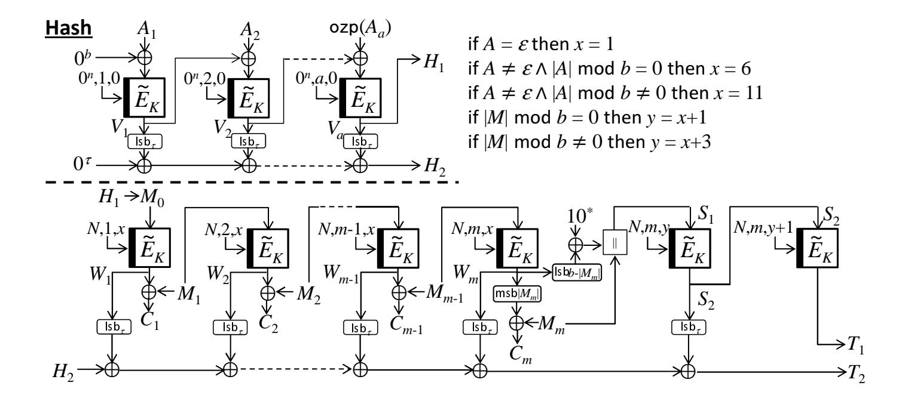
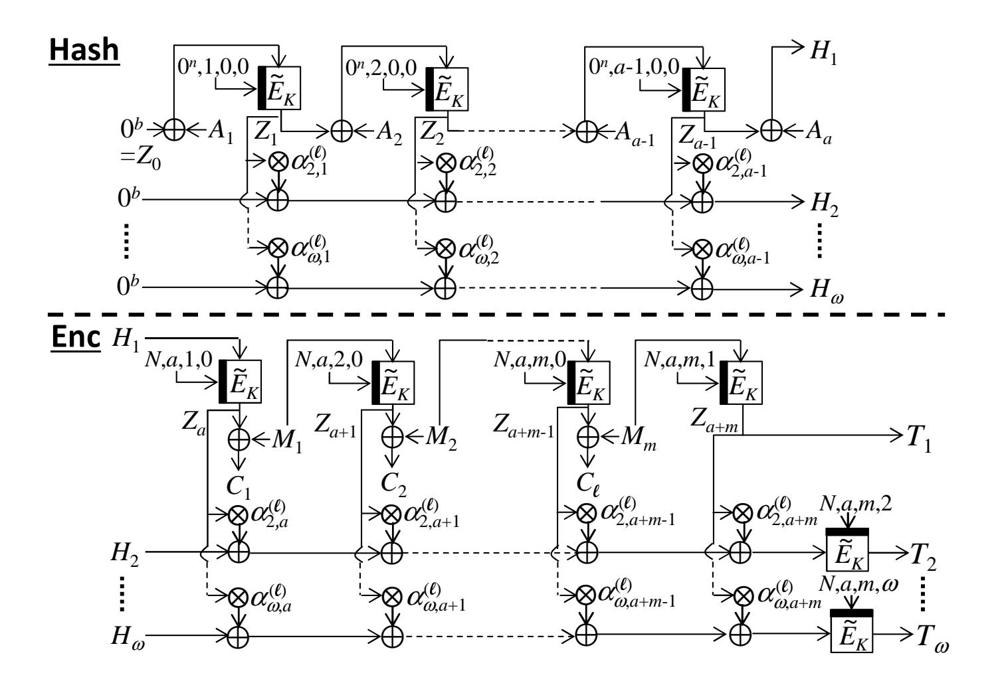
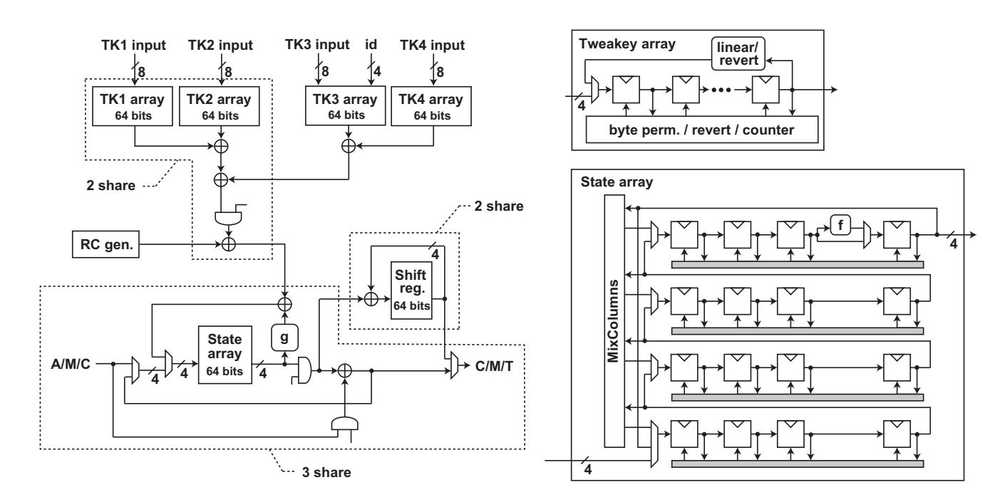
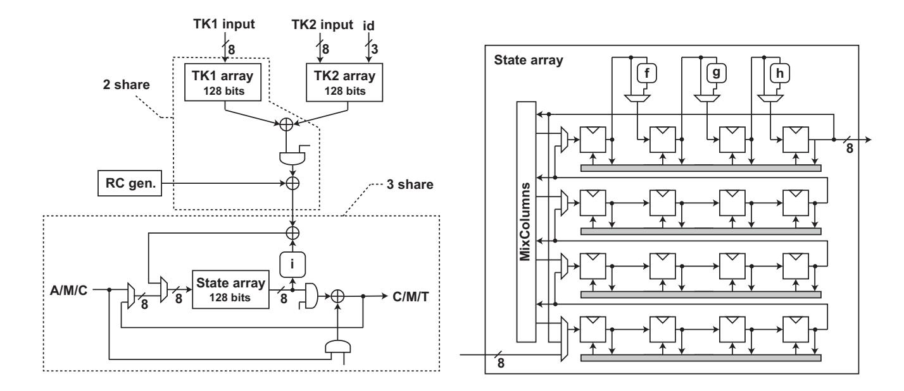

{0}------------------------------------------------

## Lightweight Authenticated Encryption Mode Suitable for Threshold Implementation

Yusuke Naito<sup>1</sup> , Yu Sasaki<sup>2</sup> , and Takeshi Sugawara<sup>3</sup>

- <sup>1</sup> Mitsubishi Electric Corporation, Kanagawa, Japan Naito.Yusuke@ce.MitsubishiElectric.co.jp
- <sup>2</sup> NTT Secure Platform Laboratories, Tokyo, Japan yu.sasaki.sk@hco.ntt.co.jp
- <sup>3</sup> The University of Electro-Communications, Tokyo, Japan sugawara@uec.ac.jp

Abstract. This paper proposes tweakable block cipher (TBC) based modes PFB Plus and PFBω that are efficient in threshold implementations (TI). Let t be an algebraic degree of a target function, e.g. t = 1 (resp. t > 1) for linear (resp. non-linear) function. The d-th order TI encodes the internal state into dt + 1 shares. Hence, the area size increases proportionally to the number of shares. This implies that TBC based modes can be smaller than block cipher (BC) based modes in TI because TBC requires s-bit block to ensure s-bit security, e.g. PFB and Romulus, while BC requires 2s-bit block. However, even with those TBC based modes, the minimum we can reach is 3 shares of s-bit state with t = 2 and the first-order TI (d = 1).

Our first design PFB Plus aims to break the barrier of the 3s-bit state in TI. The block size of an underlying TBC is s/2 bits and the output of TBC is linearly expanded to s bits. This expanded state requires only 2 shares in the first-order TI, which makes the total state size 2.5s bits. We also provide rigorous security proof of PFB Plus. Our second design PFBω further increases a parameter ω: a ratio of the security level s to the block size of an underlying TBC. We prove security of PFBω for any ω under some assumptions for an underlying TBC and for parameters used to update a state. Next, we show a concrete instantiation of PFB Plus for 128-bit security. It requires a TBC with 64-bit block, 128-bit key and 128-bit tweak, while no existing TBC can support it. We design a new TBC (version 2) by extending SKINNY and provide basic security evaluation. Finally, we give hardware benchmarks of PFB Plus in the first-order TI to show that TI of PFB Plus is smaller than that of PFB by more than one thousand gates and is the smallest within the schemes having 128-bit security.

Keywords: Authenticated encryption, threshold implementation, beyondbirthday-bound security, tweakable block cipher, lightweight.

## 1 Introduction

Data communication through IoT devices is getting more and more popular. This requires lightweight authenticated encryption (AE) schemes that can be 

{1}------------------------------------------------

used comfortably in a resource-restricted environment. Since March 2019, NIST has organized a competition for determining the lightweight AE standard [39]. 56 designs were chosen as Round 1 candidates and 32 designs have been chosen as Round 2 candidates in August 2019. The design of lightweight AE schemes is one of the most actively discussed topics in the symmetric-key research filed.

Many of AE designs with provable security adopt a block cipher (BC), a cryptographic permutation, or a tweakable block cipher (TBC) as an underlying primitive. The conventional security model regards those modules as a black box and discusses the security under the black box setting. In contract, NIST's competition optionally takes into account the security in the grey box setting, where the cryptographic modules leak side-channel information. It is now important to design lightweight AE schemes such that countermeasures against side-channel attacks (SCA) can be implemented efficiently.

Masking is by far the most common countermeasure against SCA [25, 38], and thus implementing an AE scheme using a BC/TBC primitive protected by masking is the natural way to realize an SCA-resistant AE. Threshold implementation (TI) introduced by Nikova et al. [38] is a masking particularly popular for hardware implementation. Masking, however, easily multiply the computational cost. Although hardware designers have been tackling the problem by designing serialized implementations in order to achieve an extreme of the area-speed trade-off, implementation-level optimization is reaching its limit. To push the limit further, researchers have been studying a BC optimized for TI by design, mostly focusing on TI-friendly Sboxes [13, 21]. In this paper, we follow this line of research and go one step further by introducing the TI-friendly AE mode.

TI encodes the internal state (mostly consists of the internal state to compute the underlying primitive) into multiple shares, and apply the round transformation to each of them. Hence, the area size in TI increases proportionally to the number of shares. The number of shares is dt + 1 for the order of masking d and the algebraic degree of a target function t, and thus it is t + 1 for the first-order TI with d = 1.

In lightweight AE schemes, register occupies the major circuit area. To be more precise, let b and s be the bit sizes of the underlying primitive and the aiming security, respectively. Then the key size needs to be at least s, and thus we need a b-bit register for the data block and an s-bit key for the key. We need different number of shares for the data and key because the data needs three shares for the nonlinear round function (t > 1), but the key needs only two shares because the key schedule function is often linear for recent algorithms. Naito and Sugawara recently proposed a TBC-based scheme which is particularly efficient with TI by exploiting this asymmetry [35].

The problem we address in this paper is to further exploit this asymmetry. More specifically, we let ω = s/b be an indicator of the asymmetry, and consider designing a scheme with higher ω. Following Naito and Sugawara, we pursue TBC-based schemes because of disadvantages of other approaches as follows. The comparison is also given in Table 1.

{2}------------------------------------------------

Drawbacks of BC based schemes: To minimize a register size, i.e., the register size is (almost) equal to the BC size, the security level is compromised to the birthday-bound security regarding the block size, because birthday attacks are principally unavoidable. Hence, 2s-bit block and s-bit key are necessary to ensure s-bit security even without TI. SAEB [33] is an example of this case. To apply the first-order TI by assuming a linear key schedule, we need 3 shares for the data block and 2 shares for the key. Hence, we need a register of size 8s(= 3×2s+2×s) bits. Note that the key register may not be protected in the same level as the data block register because computation of the key schedule is not dependent on the value of the data block. In this strategy, the register size is 7s(= 3×2s+s) bits. Note that there are several beyond-the-birthday-bound (BBB) modes, but those require very unsuitable structures for TI i.e., in TI the register sizes of BBB modes are grater than those of birthday-bound ones.

Drawbacks of permutation based schemes: Let r and c be the number of bits for the rate and the capacity, respectively. When attackers are allowed to make decryption queries, the security of the simple duplex construction can be proven only up to the birthday bound of the capacity [12, 28]. Hence to ensure s-bit security, the permutation size must be at least 2s+r bits. For the first-order TI, we need 3 × (2s + r) bits of the register size. Beetle [14], a recently proposed design, is provably security up to min(c − log r, b/2, r). To ensure s-bit security, we basically balance r and c to s bits for the second term, but slightly increases c to compensate '− log r' in the first term. Hence, the register size is 2s + log s bits without TI and 3 × (2s + log s) for TI.

Advantages of TBC based schemes: To ensure s-bit security, the block size can be s bits. Along with an s-bit key and an s-bit tweak, the register size without TI is 3s bits, e.g. PFB [35] and Romulus [26]. To apply the first-order TI by assuming a linear key schedule, we need 3 shares for the data block and 2 shares for the key. s-bit tweak is a public value, and it does not need any protection. Hence, we need a register of size 6s(= 3s + 2s + s) bits for TI. By the same analogy for BC, the protection of the key register may not be needed. In this case, the register size for TI becomes 5s bits.

Form the above comparison, we investigate a TBC-based scheme to design a mode that is efficient for TI. In particular, we focus our attention on the property that the area size of TI mainly depends on how big ω(= s/b) is, and we aim a TBC-based mode with a large ω.

Before stepping into the TI-friendly design, we first briefly introduce some knowledge that is general to the designs of AE schemes.

- To be lightweight, the use of "nonce", a value that is never repeated under the same key, offers significant advantages.
- As shown by ΘCB [29], privacy can be ensured by injecting the nonce and the block counter into the tweak for an underlying TBC.
- Authenticity can be ensured by preparing the double internal state size (the block size of an underlying TBC is a part of the internal state size) of the security level.

{3}------------------------------------------------

Table 1. Comparison of State Sizes with and without (w/o) TI. The (twea)key functions are assumed to be linear. Without TI, permutation based schemes achieve the smallest state size by using a small rate, while with TI, TBC based schemes in particular PFB Plus outperform the others.

|        | base            | BC<br>Permutation |             |                      | TBC                  |      |          |  |  |
|--------|-----------------|-------------------|-------------|----------------------|----------------------|------|----------|--|--|
|        | example mode    |                   | SAEB Duplex | Beetle               | PFB,Romulus PFB Plus |      | PFBω     |  |  |
|        | reference       | [33]              | [12, 28]    | [14]                 | [35, 26]             | Ours | Ours     |  |  |
|        | data block      | 2s                | 2s + r      | 2s + log s           | s                    | 0.5s | s/ω      |  |  |
|        | key             | s                 | s           | s                    | s                    | s    | s        |  |  |
| w/o TI | tweak           | −                 | −           | −                    | s                    | s    | s        |  |  |
|        | extra state     | −                 | −           | −                    | −                    | 0.5s | s − s/ω  |  |  |
|        | total           | 3s                | 2s + r      | 2s + log s           | 3s                   | 3s   | 3s       |  |  |
| TI     | protect key     | 8s                |             | 6s + 3r 6s + 3 log s | 6s                   | 5.5s | 5s + s/ω |  |  |
|        | not protect key | 7s                |             | 6s + 3r 6s + 3 log s | 5s                   | 4.5s | 4s + s/ω |  |  |

- The key size must be greater than or equal to the security level.
- The maximum number of processed input blocks by all queries should be equal to the security level.

Our goal is to design a TBC-based AE mode that has a large ω(= s/b). The biggest ω among the exiting TBC modes is 1, hence we first aim a TBC-based AE mode with ω = 2. To achieve the goal, we have the following obstacles.

- b is a block size of TBC. For ω = 2, we need to ensure the security up to the double of the block size. Hence, we need to design a mode that expands an b-bit TBC output to a 2b-bit internal state. The expanded state needs to be updated only linearly, otherwise we need 3 shares for the expanded state in TI and thus does not yield any advantage compared to the case with ω = 1.
- To avoid using 3 shares for the key, the key schedule must be linear. To leave the tweak state unprotected (only with 1 share), the tweak and key states must be kept independent. We observe that the tweakey framework [27] is suitable for this design.
- The key size must be 2b bits. To process up to 2b-bit block inputs, the size of the combination of the nonce and the block counter must be 2b bits. Namely, we need to process 4b bits for the key plus tweak, which is not easy with existing TBCs. The tweakey framework conceptually defines a way to process 4b-bit tweakey (tweak plus key), while exiting concrete designs only support up to 3b-bit tweakey. Note that Lilliput-AE [1], one of the first-round candidates at the NIST competition, specifies TBCs with 5b-, 6b-, and 7bbit tweakeys. However, those ignored the rationale of the original tweakey framework to ensure the security, and were actually attacked practically [20].

Our Contributions. This paper proposes new TBC based modes that are efficient for TI. We first propose our new mode PFB Plus (Fig. 1) that is a TIfriendly TBC-based mode for ω = 2 with rigorous security proof. The block size b of the underlying TBC is 0.5s bits for s-bit security. As its construction, we 

{4}------------------------------------------------

combine the structure of PFB with f9 [45] in order to generate 2b-bit internal state from b-bit TBC outputs and only use linear operations to update the expanded state. We then provide rigorous security proofs of PFB Plus. The proof is advantageous in a sense that the security only depends on the number of decryption queries and independent of the length of the each query. PFB Plus is optimized for the first-order TI, namely, 3 shares for the TBC of 0.5s-bit block, 2 shares for the 0.5s-bit extended state, 2 shares for the s-bit key and no protection (1 share) for the s-bit tweak. The total state size is 5.5s in TI or even 4.5s when the key is not protected. Those are shown in Table 1<sup>4</sup> . We also provide a tradeoff between the area size and the target security by truncating the extended 2b-bit internal state, which offers arbitrary security level between b to 2b bits. Note that such a feature cannot be achieved by PFB and Romulus: one of the second-round candidates in the NIST competition.

While PFB Plus is optimized for the first-order TI, one may be interested in finding the theoretical limitation of our approach, i.e. how large ω can be. To answer this question, we propose an extended version called PFBω (Fig. 2) that can handle an arbitrary ω with security proof under some assumptions for the existence of the underlying primitives (a TBC with 2ωb-bit tweakey and suitable coefficients for multiplications over a finite field). When ω becomes larger, to satisfy the assumption becomes more difficult and the number of operations increases, while the area size in TI becomes smaller. The state size of PFBω is shown in Table 1.

Next, we design a concrete TBC for PFB Plus. The underlying TBC must be small in area and needs to support 4b-bit tweakey. In addition, to increase the efficiency in TI, the tweakey schedule should not contain any non-linear operation. We choose SKINNY with 64-bit block as a base of our TBC because SKINNY is lightweight and indeed used in several designs submitted to the NIST competition. We extend the design of SKINNY to support TK4, called SKINNYe, so that the existing third-party security analysis remains available up to TK3.<sup>5</sup> With this approach, our SKINNYe-64-256 up to TK3 is secure as long as the original SKINNY is secure. We then provide the lower bounds of the number of active S-boxes in TK4 as the designers of SKINNY did the same. Moreover, we update the security analysis of SKINNY: the designers of SKINNY sometimes provided upper bounds of the number of active S-boxes both in differential and linear cryptanalysis. Alfarano et al. updated the bounds for differential cryptanalysis [4], while we update the bounds for linear cryptanalysis with the tight ones. We benchmark TI of PFB Plus instantiated with SKINNYe-64-256 in hardware by using the most practical parameters for TI.<sup>6</sup>

<sup>4</sup> In the table, the (twea)key functions are assumed to be linear. If the functions are non-linear, 3 shares of the functions are required, and the state sizes of the TBCbased modes are grater than those of the permutation-based ones.

<sup>5</sup> It was pointed out that the original version of SKINNYe-64-256 does not satisfy the claimed property [41]. In this paper, we present SKINNYe-64-256 version 2 to provide the intended security.

<sup>6</sup> With respect to the reliability, it can be disadvantageous that our modes cannot be instantiated with existing well-known TBCs. However, from a different viewpoint,

{5}------------------------------------------------

Finally, we give hardware performance evaluation of PFB Plus combined with SKINNYe-64-256, and compare it with the conventional PFB. As a masking scheme, we choose the first-order TI in which the TBC state and key are protected with three and two shares, respectively. Thanks to the larger ω, the TI of PFB Plus is smaller than that of PFB by more than one thousand gates (7,439 and 8,448 [GE], respectively), and is the smallest within the schemes having 128-bit security.

Recommendation. PFBω is designed as a proof-of-concept of using a smaller block size, and our recommendation is PFB Plus.

Limitations. The proposed method becomes efficient with TI, and the benefit extends to other masking schemes with dt+ 1 shares (for t > 1) [25]; meanwhile, it is no longer efficient with (d + 1)-share masking schemes [16]. We believe that (dt + 1)-shares schemes are still important. First, the 1st-order TI is a very practical option because of its reasonable circuit area and no need for fresh randomness. Second, (dt + 1)-share schemes can be an only option under some security requirements, e.g., when we need non-completeness to eliminate leakage by glitches without relying on registers in between gates.

PFB Plus and PFBω are secure if no unverified plaintext is released and no nonce is repeated, and we do not ensure the misuse security.

Previous Works. In this paper, we focus on designing TI-friendly AE schemes with respect to implementation size. Another approach to design an AE scheme with SCA resistance is leakage-resilient cryptography. The schemes [9, 10, 11, 23, 24] based on the Pereira et al.'s approach [40] assume a leak-free component, and are optimized for minimizing the number of calls to it<sup>7</sup> . However, the way how to realize the leak-free component, that determines the implementation size, is usually out of scope. Moreover, they need additional components such as hash function and pseudo-random function. Barwell et al. [7] studied another approach using pairing-based cryptography, but it is also costly.

The Sponge-based leakage resilient AE scheme ISAP [18] has a potential for lightweight implementation because it does not rely on a leak-free component. However, its implementation cost (14 [kGE]) is still larger than PFB Plus (7.439 [kGE]). There are recent works following ISAP. The works [17, 19] gave security proofs for the Sponge-based schemes which was missing in the original paper. Degabriele et al. [17] proposed a a variant using a random function. Dobraunig and Mennink [19] gave the security proof of the duplex [12] with respect to leakage resiliency.

PFB Plus is the first use case where 2n-bit tweak and 2n-bit key sizes are useful. This can give new insight to TBC designers considering that there is no consensus about the adequate tweak size to support.

<sup>7</sup> Note that some works even have misuse resistance that our research does not.

{6}------------------------------------------------

Another line of research is to design cryptographic primitives using minimum number of non-linear operations thereby reducing the cost for TI [3, 2]. In contrast to those studies, we approach the problem from the mode of operation by exploiting the asymmetry between non-linear round function and linear key scheduling, rather than improving the non-linear function itself. We designed SKINNYe-64-256 for providing a small block length and a larger tweakey state, and not for minimizing the number of non-linear operations. We also note that the conventional works focus on minimizing non-linear operations and thus their target primitive is BC rather than TBC (TBCs typically require a higher amount of operations than BCs in order to process a tweak), while the use of TBC is the central part of our study.

## 2 Preliminaries

### 2.1 Notation

Let  $\varepsilon$  be an empty string and  $\{0,1\}^*$  be the set of all bit strings. For an integer  $i \geq 0$ , let  $\{0,1\}^i$  be the set of all i-bit strings,  $\{0,1\}^0 := \{\varepsilon\}$ , and  $\{0,1\}^{\leq i} := \{0,1\}^1 \cup \{0,1\}^2 \cup \cdots \cup \{0,1\}^i$  be the set of all bit strings of length at most i, except for  $\varepsilon$ . Let  $0^i$  resp.  $1^i$  be the bit string of i-bit zeros resp. ones. For an integer  $i \geq 1$ , let  $[i] := \{1,2,\ldots,i\}$  be the set of positive integers less than or equal to i, and  $(i] := \{0\} \cup [i]$ . For a non-empty set  $\mathcal{T}$ ,  $\mathcal{T} \stackrel{\$}{\leftarrow} \mathcal{T}$  means that an element is chosen uniformly at random from  $\mathcal{T}$  and is assigned to  $\mathcal{T}$ . The concatenation of two bit strings X and Y is written as X | Y or XY when no confusion is possible. For integers  $0 \leq i \leq j$  and  $X \in \{0,1\}^j$ , let  $\mathrm{msb}_i(X)$  resp.  $\mathrm{lsb}_i(X)$  be the most resp. least significant i bits of X, and |X| be the number of bits of X, i.e., |X| = j. For integers i and j with  $0 \leq i < 2^j$ , let  $\mathrm{str}_j(i)$  be the j-bit binary representation of i. For an integer  $b \geq 0$  and a bit string X, we denote the parsing into fixed-length b-bit strings as  $(X_1, X_2, \ldots, X_\ell) \stackrel{\flat}{\leftarrow} X$ , where if  $X \neq \varepsilon$  then  $X = X_1 | |X_2| \cdots | |X_\ell|, |X_i| = b$  for  $i \in [\ell-1]$ , and  $0 < |X_\ell| \leq b$ ; if  $X = \varepsilon$  then  $\ell = 1$  and  $X_1 = \varepsilon$ . For an integer b > 0, let  $\mathrm{ozp}: \{0,1\}^{\leq b} \to \{0,1\}^b$  be a one-zero padding function: for a bit string  $X \in \{0,1\}^{\leq b}$ ,  $\mathrm{ozp}(X) = X$  if |X| = b;  $\mathrm{ozp}(X) = X | 10^{b-1-|X|}$  if |X| < b.

#### 2.2 Tweakable Block Cipher

A tweakable blockcipher (TBC) is a set of permutations indexed by a key and a public input called tweak. Let  $\mathcal{K}$  be the key spece,  $\mathcal{TW}$  be the tweak space, and b be the input/output-block size. An encryption is denoted by  $\widetilde{E}: \mathcal{K} \times \mathcal{TW} \times \{0,1\}^b \to \{0,1\}^b$ ,  $\widetilde{E}$  having a key  $K \in \mathcal{K}$  is denoted by  $\widetilde{E}_K$ , and  $\widetilde{E}_K$  having a tweak  $TW \in \mathcal{TW}$  is denoted by  $\widetilde{E}_K^{TW}$ .

In this paper, a keyed TBC is assumed to be a secure tweakable-pseudorandom permutation (TPRP), i.e., indistinguishable from a tweakable random permutation (TRP). A tweakable permutation (TP)  $\widetilde{P}: \mathcal{TW} \times \{0,1\}^b \to \{0,1\}^b$  is a set of b-bit permutations indexed by a tweak in  $\mathcal{TW}$ . A TP  $\widetilde{P}$  having a

{7}------------------------------------------------

tweak  $TW \in \mathcal{T}W$  is denoted by  $\widetilde{P}^{TW}$ . Let  $\widetilde{\mathsf{Perm}}(\mathcal{T}W, \{0,1\}^b)$  be the set of all TPs. For a set of all TPs: $\mathcal{T}W \times \{0,1\}^b \to \{0,1\}^b$  denoted by  $\widetilde{\mathsf{Perm}}(\mathcal{T}W, \{0,1\}^b)$ , a TRP is defined as  $\widetilde{P} \xleftarrow{\$} \widetilde{\mathsf{Perm}}(\mathcal{T}W, \{0,1\}^b)$ . In the TPRP-security game, an adversary  $\mathbf{A}$  has access to either the keyed TBC  $\widetilde{E}_K$  or a TRP  $\widetilde{P}$ , where  $K \xleftarrow{\$} \mathcal{K}$  and  $\widetilde{P} \xleftarrow{\$} \widetilde{\mathsf{Perm}}(\mathcal{T}W, \{0,1\}^b)$ , and after the interaction,  $\mathbf{A}$  returns a decision bit  $y \in \{0,1\}$ . The output of  $\mathbf{A}$  with access to  $\mathcal{O}$  is denoted by  $\mathbf{A}^{\mathcal{O}}$ . The TPRP-security advantage function of  $\mathbf{A}$  is defined as

$$\mathbf{Adv}^{\mathsf{tprp}}_{\widetilde{E}_K}(\mathbf{A}) := \Pr\left[K \xleftarrow{\$} \mathcal{K}; \mathbf{A}^{\widetilde{E}_K} = 1\right] - \Pr\left[\widetilde{P} \xleftarrow{\$} \widetilde{\mathsf{Perm}}(\mathcal{TW}, \{0, 1\}^b); \mathbf{A}^{\widetilde{P}} = 1\right],$$

where the probabilities are taken over  $K, \widetilde{P}$  and  $\mathbf{A}$ .

#### 2.3 Nonce-Based Authenticated Encryption with Associated Data

A nonce-based authenticated encryption with associated data (nAEAD) scheme based on a keyed TBC  $\widetilde{E}_K$ , denoted by  $\Pi[\widetilde{E}_K]$ , is a pair of encryption and decryption algorithms ( $\Pi.\mathsf{Enc}[\widetilde{E}_K], \Pi.\mathsf{Dec}[\widetilde{E}_K]$ ).  $\mathcal{K}, \mathcal{N}, \mathcal{M}, \mathcal{C}, \mathcal{A}$  and  $\mathcal{T}$  are the sets of keys, nonces, plaintexts, ciphertexts, associated data (AD) and tags of  $\Pi[\widetilde{E}_K]$ , respectively. In this paper, the key space of  $\Pi[\widetilde{E}_K]$  is equal to that of the underlying TBC. The encryption algorithm takes a nonce  $N \in \mathcal{N}$ , AD  $A \in \mathcal{A}$ , and a plaintext  $M \in \mathcal{M}$ , and returns, deterministically, a pair of a ciphertext  $C \in \mathcal{C}$  and a tag  $T \in \mathcal{T}$ . The decryption algorithm takes a tuple  $(N, A, C, T) \in \mathcal{N} \times \mathcal{A} \times \mathcal{C} \times \mathcal{T}$ , and returns, deterministically, either the distinguished invalid (reject) symbol  $\mathbf{reject} \notin \mathcal{M}$  or a plaintext  $M \in \mathcal{M}$ . We require  $|\Pi.\mathsf{Enc}[\widetilde{E}_K](N, A, M)| = |\Pi.\mathsf{Enc}[\widetilde{E}_K](N, A, M')|$  when these outputs are strings and |M| = |M'|. We consider two security notions of nAEAD, privacy and authenticity. Hereafter, we call queries to the encryption resp. decryption oracle "encryption queries" resp. "decryption queries."

**Privacy.** The privacy notion considers the indistinguishability between the encryption  $\Pi.\mathsf{Enc}[\widetilde{E}_K]$  and a random-bits oracle \$, in the nonce-respecting setting. \$ has the same interface as  $\Pi.\mathsf{Enc}[\widetilde{E}_K]$  and for a query (N,A,M) returns a random bit string of length  $|\Pi.\mathsf{Enc}[\widetilde{E}_K](N,A,M)|$ . In the privacy game, an adversary **A** interacts with either  $\Pi.\mathsf{Enc}[\widetilde{E}_K]$  or \$, and then returns a decision bit  $y \in \{0,1\}$ . The privacy advantage function of an adversary **A** is defined as

$$\mathbf{Adv}^{\mathsf{priv}}_{\Pi[\widetilde{E}_K]}(\mathbf{A}) := \Pr[K \xleftarrow{\$} \mathcal{K}; \mathbf{A}^{\Pi.\mathsf{Enc}[\widetilde{E}_K]} = 1] - \Pr[\mathbf{A}^{\$} = 1] \ ,$$

where the probabilities are taken over K, \$ and **A**. We demand that **A** is noncerespecting (all nonces in encryption queries are distinct).

The maximum over all adversaries, running in time at most t and making encryption queries of  $\sigma_{\mathcal{E}}$  the total number of TBC calls invoked by all encryption queries, is denoted by  $\mathbf{Adv}_{\Pi[\widetilde{E}_K]}^{\mathsf{priv}}(\sigma_{\mathcal{E}}, t) := \max_{\mathbf{A}} \mathbf{Adv}_{\Pi[\widetilde{E}_K]}^{\mathsf{priv}}(\mathbf{A})$ . When an adversary is a computationally unbounded algorithm, the time t is disregarded.

{8}------------------------------------------------

**Authenticity.** The authenticity notion considers the unforgeability in the noncerespecting setting. In the authenticity game, an adversary **A** interacts with  $\Pi[\widetilde{E}_K] = (\Pi.\mathsf{Enc}[\widetilde{E}_K], \Pi.\mathsf{Dec}[\widetilde{E}_K])$ , and the goal of the adversary is to make a non-trivial decryption query whose response is not **reject**. The authenticity advantage of an adversary **A** is defined as

$$\mathbf{Adv}^{\mathsf{auth}}_{\Pi[\widetilde{E}_K]}(\mathbf{A}) := \Pr[K \xleftarrow{\$} \mathcal{K}; \mathbf{A}^{\Pi.\mathsf{Enc}[\widetilde{E}_K], \Pi.\mathsf{Dec}[\widetilde{E}_K]} \text{ forges}] \ ,$$

where the probabilities are taken over K and  $\mathbf{A}$ . We demand that  $\mathbf{A}$  is noncerespecting (all nonces in encryption queries are distinct), that  $\mathbf{A}$  never asks a trivial decryption query (N, A, C, T), i.e., there is a prior encryption query (N, A, M) with  $(C, T) = \Pi.\mathsf{Enc}[\widetilde{E}_K](N, A, M)$ , and that  $\mathbf{A}$  never repeats a query.  $\mathbf{A}^{\Pi.\mathsf{Enc}[\widetilde{E}_K],\Pi.\mathsf{Dec}[\widetilde{E}_K]}$  forges means that  $\mathbf{A}$  makes a decryption query whose response is not **reject**.

The maximum over all adversaries, running in time at most t and making at most  $q_{\mathcal{E}}$  encryption queries and  $q_{\mathcal{D}}$  decryption queries of  $\sigma$  the total number of TBC calls invoked by all queries, is denoted by  $\mathbf{Adv}^{\mathsf{auth}}_{\Pi[\widetilde{E}_K]}((q_{\mathcal{E}}, q_{\mathcal{D}}, \sigma), t) := \max_{\mathbf{A}} \mathbf{Adv}^{\mathsf{auth}}_{\Pi[\widetilde{E}_K]}(\mathbf{A})$ . When an adversary is a computationally unbounded algorithm, the time t is disregarded.

## 3 PFB\_Plus: Specification and Security Bounds

We design PFB\_Plus, a TBC-based nAEAD mode with  $b + \tau$ -bit security where  $0 \le \tau \le b$ , by extending the existing TBC-based lightweight mode PFB [35]. Regarding the relation between security and internal state size, in order to achieve s-bit security, the internal state size must be at least s bits. Thus PFB\_Plus is designed so that the internal state size is minimum, i.e.,  $b + \tau$  bits. To do so, we extend PFB, which is a b-bit secure nAEAD mode and whose security level equals to the internal state size. For the extension, we need to define an additional  $\tau$ -bit internal state in order to have  $b + \tau$ -bit security. The additional internal state is designed using the idea of f9 [45], which is a BC-based message authentication code.

- The first b-bit internal state is updated by iterating a TBC and absorbing a data block (AD/plaintext/ciphertext block), and the output of the last TBC call becomes the first b-bit tag. The idea comes from PFB.
- The remaining  $\tau$ -bit internal state is defined by XORing outputs of TBC calls. The idea comes from f9, but our structure is slightly different from f9. In PFB\_Plus, a TBC is not performed after XORing all outputs of TBC calls (with  $b-\tau$ -bit truncation), which keeps the internal state size  $b+\tau$  bits. On the other hand, in f9, a block cipher is performed after XORing all outputs of block cipher calls.

Regarding tweak elements, as shown by  $\Theta$ CB [29], for the sake of perfect privacy, the nonce and the block counter are injected.

{9}------------------------------------------------

### Algorithm 1 PFB\_Plus

```
Encryption PFB_Plus.Enc[\widetilde{E}_K](N,A,M)

1: (M_0,T_2) \leftarrow \mathsf{PFB}_{-}\mathsf{Plus}.\mathsf{Hash}[\widetilde{E}_K](A)

2: if A = \varepsilon then x \leftarrow 1; else if A \neq \varepsilon \wedge |A| \mod b = 0 then x \leftarrow 6; else x \leftarrow 11

3: M_1,\ldots,M_m \stackrel{b}{\leftarrow} M; if M = \varepsilon then \{m \leftarrow 0;\ S_1 \leftarrow M_0;\ \mathsf{goto}\ \mathsf{Step}\ 7\}

4: for i=1,\ldots,m-1 do \{W_i \leftarrow \widetilde{E}_K^{N,i,x}(M_{i-1});\ C_i \leftarrow W_i \oplus M_i;\ T_2 \leftarrow T_2 \oplus \mathsf{lsb}_{\tau}(W_i)\}

5: W_m \leftarrow \widetilde{E}_K^{N,m,x}(M_{m-1});\ C_m \leftarrow \mathsf{msb}_{|M_m|}(W_m) \oplus M_m

6: T_2 \leftarrow T_2 \oplus \mathsf{lsb}_{\tau}(W_m);\ S_1 \leftarrow \mathsf{ozp}(M_m) \oplus (0^{|M_m|}||\mathsf{lsb}_{b-|M_m|}(W_m))

7: if |M| \mod b = 0 then y \leftarrow x+1; else y \leftarrow x+3

8: S_2 \leftarrow \widetilde{E}_K^{N,m,y}(S_1);\ T_2 \leftarrow \mathsf{lsb}_{\tau}(S_2) \oplus T_2;\ T_1 \leftarrow \widetilde{E}_K^{N,m,y+1}(S_2)

9: C \leftarrow C_1 ||\cdots||C_m;\ T \leftarrow T_1 ||T_2;\ \mathsf{return}\ (C,T)

Decryption PFB_Plus.Dec[\widetilde{E}_K](N,A,C,\hat{T})

1: (M_0,T_2) \leftarrow \mathsf{PFB}_{-}\mathsf{Plus}.\mathsf{Hash}[\widetilde{E}_K](A)

2: if A = \varepsilon then x \leftarrow 1; else if A \neq \varepsilon \wedge |A| \mod b = 0 then x \leftarrow 6; else x \leftarrow 11
```

3:  $C_1, \ldots, C_m \stackrel{b}{\leftarrow} C$ ; if  $C = \varepsilon$  then  $\{m \leftarrow 0; S_1 \leftarrow M_0; \text{ goto Step } 7\}$ 

6:  $T_2 \leftarrow T_2 \oplus \mathsf{Isb}_{\tau}(W_m); S_1 \leftarrow \mathsf{ozp}(M_m) \oplus (0^{|C_m|} || \mathsf{Isb}_{b-|C_m|}(W_m))$ 

8:  $S_2 \leftarrow \widetilde{E}_K^{N,m,y}(S_1); T_2 \leftarrow \mathsf{lsb}_{\tau}(S_2) \oplus T_2; T_1 \leftarrow \widetilde{E}_K^{N,m,y+1}(S_2); T \leftarrow T_1 || T_2$ 

5:  $W_m \leftarrow \widetilde{E}_K^{N,m,x}(M_m); M_m \leftarrow \mathsf{msb}_{|C_m|}(W_m) \oplus C_m$ 

7: if  $|C| \mod b = 0$  then  $y \leftarrow x + 1$ ; else  $y \leftarrow x + 3$ 

```
9: if T = \hat{T} then return M \leftarrow M_1 \| \cdots \| M_m; else return reject

Hash PFB_Plus.Hash[\widetilde{E}_K](A)

1: if A = \varepsilon then return (0^b, 0^\tau)

2: V_0 \leftarrow 0^b; H_2 \leftarrow 0^\tau; A_1, \dots, A_a \xleftarrow{b} A

3: for i = 1, \dots, a-1 do \{V_i \leftarrow \widetilde{E}_K^{0^n, i, 0}(A_i \oplus V_{i-1}); H_2 \leftarrow \mathsf{lsb}_\tau(V_i) \oplus H_2\}
```

4:  $V_a \leftarrow \widetilde{E}_K^{0^n,a,0}(\operatorname{ozp}(A_a) \oplus V_{a-1}); H_1 \leftarrow V_a; H_2 \leftarrow \operatorname{lsb}_{\tau}(V_a) \oplus H_2; \operatorname{\mathbf{return}}(H_1,H_2)$ 

4: for i = 1, ..., m-1 do  $\{W_i \leftarrow \widetilde{E}_K^{N,i,x}(M_{i-1}); M_i \leftarrow W_i \oplus C_i; T_2 \leftarrow T_2 \oplus \mathsf{lsb}_{\tau}(W_i)\}$ 

#### 3.1 Specification

The specification of PFB\_Plus is given in Algorithm 1 and is illustrated in Fig. 1.

Let  $\ell_{\mathsf{max}}$  be a maximum number of AD/plaintext/ciphertext blocks, i.e.,  $a \leq \ell_{\mathsf{max}}$  and  $m \leq \ell_{\mathsf{max}}$ . The tweak space  $\mathcal{TW}$  consists of a nonce space  $\mathcal{N} := \{0,1\}^n$ , a block counter space  $(\ell_{\mathsf{max}}]$  and a space for tweak separations (15]. The space for tweak separations (15] is used to offer distinct permutations for handing AD, encrypting plaintexts (or decrypting ciphertexts) and generating a tag. Hence, the tweak space is defined as  $\mathcal{TW} := \{0,1\}^n \times (\ell_{\mathsf{max}}] \times (15]$ .

The procedure of handing AD is given in PFB\_Plus.Hash. The procedure of encrypting a plaintext is given in the steps 2-5 of PFB\_Plus.Enc, and the procedure of generating a tag is given in the steps 6-9. The procedure of decrypting a ciphertext is given in the steps 2-5 of PFB\_Plus.Dec, and the procedure of verifying a tag is given in the steps 6-9. Note that the tweaks x and y are defined according to the lengths of AD A and of a plaintext M (more precisely, whether

{10}------------------------------------------------



**Fig. 1.** PFB\_Plus.Hash and PFB\_Plus.Enc.  $A_1, \ldots, A_a \stackrel{b}{\leftarrow} A$  (in the hash procedure);  $M_1, \ldots, M_m \stackrel{b}{\leftarrow} M$  (in the encryption procedure).

AD is empty or not, whether the one-zero padding is applied to A or not, and whether it is applied to M or not). The concrete values are given below:

```
\begin{array}{lll} - & \text{if } A = \varepsilon \wedge |M| \mod b = 0 \text{ then } (x,y) = (1,2), \\ - & \text{if } A = \varepsilon \wedge |M| \mod b \neq 0 \text{ then } (x,y) = (1,4), \\ - & \text{if } A \neq \varepsilon \wedge |A| \mod b = 0 \wedge |M| \mod b = 0 \text{ then } (x,y) = (6,7), \\ - & \text{if } A \neq \varepsilon \wedge |A| \mod b = 0 \wedge |M| \mod b \neq 0 \text{ then } (x,y) = (6,9), \\ - & \text{if } A \neq \varepsilon \wedge |A| \mod b \neq 0 \wedge |M| \mod b = 0 \text{ then } (x,y) = (11,12), \text{ and } \\ - & \text{if } A \neq \varepsilon \wedge |A| \mod b \neq 0 \wedge |M| \mod b \neq 0 \text{ then } (x,y) = (11,14). \end{array}
```

#### 3.2 Privacy and Authenticity Bounds of PFB\_Plus

### Theorem 1.

$$\begin{split} \mathbf{Adv}_{\mathsf{PFB\_Plus}[\widetilde{E}_K]}^{\mathsf{priv}}(\sigma_{\mathcal{E}}, t) &\leq \mathbf{Adv}_{\widetilde{E}_K}^{\mathsf{tprp}}(\sigma_{\mathcal{E}}, t + O(\sigma_{\mathcal{E}})) \enspace , \\ \mathbf{Adv}_{\mathsf{PFB\_Plus}[\widetilde{E}_K]}^{\mathsf{auth}}((q_{\mathcal{E}}, q_{\mathcal{D}}, \sigma), t) &\leq \frac{q_{\mathcal{D}} \cdot 2^{b - \tau + 1}}{(2^b - 1)^2} + \mathbf{Adv}_{\widetilde{E}_K}^{\mathsf{tprp}}(\sigma, t + O(\sigma)) \enspace . \end{split}$$

#### 3.3 Parallelizable Version

Although PFB\_Plus is not parallelizable, a parallelizable nAEAD with 2b-bit security can be designed by basing on  $\Theta$ CB (instead of PFB). In  $\Theta$ CB, a b-bit value is defined by XORing plaintext blocks, and then the result becomes an input to the TBC call to define a tag. In the modified version, a 2b-bit value is defined by PMAC\_Plus's state updating with plaintext blocks, and then the result becomes inputs to the TBC calls to define a tag. Note that the state size of the parallelizable version is grater than that of PFB\_Plus by the additional b-bit internal state. The detail is given in the full version of this paper [34].

{11}------------------------------------------------

## 4 Proof of Theorem 1

Firstly, the keyed TBC  $\widetilde{E}_K$  for  $K \stackrel{\$}{\leftarrow} \mathcal{K}$  is replaced with a TRP  $\widetilde{P} \stackrel{\$}{\leftarrow} \widetilde{\mathsf{Perm}} (\mathcal{TW}, \{0,1\}^b)$ . The replacement offers the TPRP-terms  $\mathbf{Adv}^{\mathsf{tprp}}_{\widetilde{E}_K}(\sigma_{\mathcal{E}}, t + O(\sigma_{\mathcal{E}}))$  and  $\mathbf{Adv}^{\mathsf{tprp}}_{\widetilde{E}_K}(\sigma, t + O(\sigma_{\mathcal{E}}))$ , and then the remaining works are to upper-bound the advantages  $\mathbf{Adv}^{\mathsf{priv}}_{\mathsf{PFB\_Plus}[\widetilde{P}]}(\sigma_{\mathcal{E}})$  and  $\mathbf{Adv}^{\mathsf{auth}}_{\mathsf{PFB\_Plus}[\widetilde{P}]}(q_{\mathcal{E}}, q_{\mathcal{D}}, \sigma)$ , where adversaries are computationally unbounded algorithms and the complexities are solely measured by the numbers of queries. Without loss of generality, adversaries are deterministic.

Regarding  $\mathbf{Adv}^{\mathsf{priv}}_{\mathsf{PFB\_Plus}[\widetilde{P}]}(\sigma_{\mathcal{E}})$ , as tweaks of  $\widetilde{P}$  are all distinct, all output blocks of  $\widetilde{P}$  defined by encryption queries are chosen independently and uniformly at random from  $\{0,1\}^b$ . We thus have  $\mathbf{Adv}^{\mathsf{priv}}_{\mathsf{PFB\_Plus}[\widetilde{P}]}(\sigma_{\mathcal{E}}) = 0$ .

In the following, we focus on upper-bounding  $\mathbf{Adv}^{\mathsf{auth}}_{\mathsf{PFB\_Plus}[\widetilde{P}]}(q_{\mathcal{E}}, q_{\mathcal{D}}, \sigma)$ .

## 4.1 Upper-Bounding $\mathrm{Adv}^{\mathsf{auth}}_{\mathsf{PFB\_Plus}[\widetilde{P}]}(q_{\mathcal{E}},q_{\mathcal{D}},\sigma)$

Firstly, we fix a decryption query  $(N^{(d)}, A^{(d)}, C^{(d)}, \hat{T}^{(d)})$ , and upper-bound the probability that an adversary forges at the decryption query.

In the analysis, we use the following notations. Values/variables corresponding with the decryption query are denoted by using the superscript of (d) such as  $N^{(d)}$ ,  $M^{(d)}$ , etc. Hence, this analysis upper-bounds  $\Pr[T^{(d)} = \hat{T}^{(d)}]$ . The lengths a and m are denoted by  $a_d$  and  $m_d$ , respectively. Similarly, for an encryption query  $(N^{(e)}, A^{(e)}, M^{(e)})$ , values/variables corresponding with the encryption query are denoted by using the superscript of (e), and the lengths a and m are denoted by  $a_e$  and  $m_e$ , respectively.

We next define two cases that are used to upper-bound  $\Pr[T^{(d)} = \hat{T}^{(d)}]$ .

- Case1: for any previous encryption query  $(N^{(e)}, A^{(e)}, M^{(e)})$ 

$$N^{(e)} \neq N^{(d)} \vee m_e \neq m_d \vee y^{(e)} \neq y^{(d)}$$
.

- Case2: for some previous encryption query  $(N^{(e)}, A^{(e)}, M^{(e)})$ ,

$$N^{(e)} = N^{(d)} \wedge m_e = m_d \wedge y^{(e)} = y^{(d)}.$$

Using these cases, we have

$$\Pr[T^{(d)} = \hat{T}^{(d)}] \leq \max\left\{\Pr\left[T^{(d)} = \hat{T}^{(d)}\middle|\mathsf{Case1}\right], \Pr\left[T^{(d)} = \hat{T}^{(d)}\middle|\mathsf{Case2}\right]\right\}.$$

These probabilities are analyzed in Subsect. 4.2 and Subsects. 4.3-4.9, respectively. The upper-bounds are given in Eqs. (1) and (4), respectively, and give

$$\mathbf{Adv}^{\mathsf{auth}}_{\mathsf{PFB\_Plus}[\widetilde{P}]}(q_{\mathcal{E}},q_{\mathcal{D}},\sigma) \leq q_{\mathcal{D}} \cdot \max \left\{ \frac{1}{2^{b+\tau}}, \frac{2^{b-\tau+1}}{(2^b-1)^2} \right\} = \frac{q_{\mathcal{D}} \cdot 2^{b-\tau+1}}{(2^b-1)^2} \enspace .$$

{12}------------------------------------------------

# $\text{4.2} \quad \text{Upper-Bounding Pr} \left[ T^{(d)} = \hat{T}^{(d)} \middle| \mathsf{Case1} \right]$

In Case1, the tweak tuples  $(y^{(d)}, N^{(d)}, z^{(d)})$  and  $(y^{(d)} + 1, N^{(d)}, z^{(d)})$  with which the outputs of  $\widetilde{P}$  define  $S_2^{(d)}$  and  $T_1^{(d)}$  are distinct from the tweak triples defined by the previous encryption queries. Hence,  $T_1^{(d)}$  and  $T_2^{(d)}$  are chosen uniformly at random from  $\{0,1\}^b$  and independently of the previous outputs of  $\widetilde{P}$ . We thus have

$$\Pr\left[T^{(d)} = \hat{T}^{(d)} \middle| \mathsf{Case1}\right] \le \frac{1}{2^{b+\tau}} \ . \tag{1}$$

# $\text{4.3} \quad \text{Upper-Bounding Pr} \left[ T^{(d)} = \hat{T}^{(d)} \middle| \mathsf{Case2} \right]$

In Case2,  $S_2^{(d)} = S_2^{(e)} \Leftrightarrow S_1^{(d)} = S_1^{(e)}$  is satisfied (as  $\widetilde{P}^{N^{(d)},y^{(d)},m_d}$  and  $\widetilde{P}^{N^{(e)},y^{(e)},m_e}$  are the same permutation). Hence, we can focus on the cases:  $S_1^{(d)} \neq S_1^{(e)} \wedge S_2^{(d)} \neq S_2^{(e)}$ ;  $S_1^{(d)} = S_1^{(e)} \wedge S_2^{(d)} = S_2^{(e)}$ . Using these cases, we have

$$\Pr\left[T^{(d)} = \hat{T}^{(d)} \middle| \mathsf{Case2}\right] = \Pr\left[T^{(d)} = \hat{T}^{(d)} \land S_1^{(d)} \neq S_1^{(e)} \land S_2^{(d)} \neq S_2^{(e)} \middle| \mathsf{Case2}\right] \\ + \Pr\left[T^{(d)} = \hat{T}^{(d)} \land S_1^{(d)} = S_1^{(e)} \land S_2^{(d)} = S_2^{(e)} \middle| \mathsf{Case2}\right] \\ \leq \Pr\left[T^{(d)} = \hat{T}^{(d)} \middle| \mathsf{Case2} \land S_1^{(d)} \neq S_1^{(e)} \land S_2^{(d)} \neq S_2^{(e)}\right] \\ = : p_1 \\ + \Pr\left[S_1^{(d)} = S_1^{(e)} \land T_2^{(d)} = \hat{T}_2^{(d)} \middle| \mathsf{Case2}\right] . \tag{3}$$

The probabilities  $p_1$  and  $p_2$  are analyzed in Subsect. 4.4 and Subsects. 4.4-4.9, respectively. The upper-bounds are given in Eqs. (5) and (6), respectively, and give

$$\Pr\left[T^{(d)} = \hat{T}^{(d)} \middle| \mathsf{Case2}\right] \le \frac{2^{b-\tau}}{(2^b - 1)^2} + \frac{2^{b-\tau}}{(2^b - 1)^2} = \frac{2^{b-\tau+1}}{(2^b - 1)^2} \ . \tag{4}$$

### 4.4 Upper-Bounding $p_1$ in (2)

By  $S_1^{(d)} \neq S_1^{(e)} \land S_2^{(e)} \neq S_2^{(e)}$ ,  $T_1^{(d)}$  is chosen uniformly at random from  $\{0,1\}^b \backslash \{T_1^{(e)}\}$ , and  $S_2^{(d)}$  is chosen uniformly at random from  $\{0,1\}^b \backslash \{S_2^{(e)}\}$ , i.e.,  $T_2^{(d)}$  is chosen uniformly at random from at least  $(2^b-1)/2^{b-\tau}$  values. Hence, we have

$$p_1 = \Pr\left[\hat{T}^{(d)} = T^{(d)} \middle| S_1^{(d)} \neq S_1^{(e)} \land S_2^{(d)} \neq S_2^{(e)} \land \mathsf{Case2}\right] \le \frac{2^{b-\tau}}{(2^b - 1)^2} \ . \tag{5}$$

{13}------------------------------------------------

## 4.5 Upper-Bounding $p_2$ in (3)

Let

$$\mathcal{I}_{V}^{\neq} = \left\{ i \in \left[ \max\{a_{e}, a_{d}\} \right] \middle| V_{i}^{(d)} \neq V_{i}^{(e)} \right\}, \ \mathcal{I}_{W}^{\neq} = \left\{ i \in \left[ m_{d} \right] \middle| W_{i}^{(d)} \neq W_{i}^{(e)} \right\}$$

be sets of indexes with distinct blocks for V and W, respectively, where  $V_i^{(d)} := \varepsilon$  for  $i > a_d$ , and  $V_i^{(e)} := \varepsilon$  for  $i > a_e$ .

This analysis uses the following four sub-cases of Case2.

- Case2-1 : Case2  $\wedge$   $a_d = a_e \wedge |\mathcal{I}_V^{\neq}| + |\mathcal{I}_W^{\neq}| = 1$ .
- Case2-2 : Case2  $\wedge$   $a_d = a_e \wedge |\mathcal{I}_V^{\neq}| + |\mathcal{I}_W^{\neq}| \geq 2$ .
- $\ \mathsf{Case2-3} : \mathsf{Case2} \land a_d \neq a_e \land |\mathcal{I}_W^{\neq}| = 0 \land A^{(d)} \neq \varepsilon \land A^{(e)} \neq \varepsilon.$
- Case2-4 : Case2  $\land a_d \neq a_e \land |\mathcal{I}_W^{\neq}| \geq 1 \land A^{(d)} \neq \varepsilon \land A^{(e)} \neq \varepsilon$ .

Note that Case2  $\Rightarrow$  Case2-1  $\vee$  Case2-2  $\vee$  Case2-3  $\vee$  Case2-4 is satisfied by the following reasons. Regarding the sets  $\mathcal{I}_V^{\neq}$  and  $\mathcal{I}_W^{\neq}$ , the non-equation  $(A^{(d)}, C^{(d)}) \neq (A^{(e)}, C^{(e)})$  and the condition  $y^{(e)} = y^{(d)}$  (from Case2) ensure the following:

$$|\mathcal{I}_V^{\neq}| + |\mathcal{I}_W^{\neq}| \ge 1.$$

Regarding the AD  $A^{(d)}$  and  $A^{(e)}$ , the condition  $y^{(e)} = y^{(d)}$  ensures the following:

$$\left(A^{(d)} = A^{(e)} = \varepsilon\right) \vee \left(A^{(d)} \neq \varepsilon, A^{(e)} \neq \varepsilon\right).$$

Let  $\mathsf{Coll}_{S,T} := S_1^{(d)} = S_1^{(e)} \wedge \hat{T}_2^{(d)} = T_2^{(e)}$ . Then, using the four cases, we have

$$p_2 = \Pr\left[\mathsf{Coll}_{S,T} | \mathsf{Case2}\right] \leq \max\left\{\Pr\left[\mathsf{Coll}_{S,T} | \mathsf{Case2-1}\right], \Pr\left[\mathsf{Coll}_{S,T} | \mathsf{Case2-2}\right], \right.$$

$$\left.\Pr\left[\mathsf{Coll}_{S,T} | \mathsf{Case2-3}\right], \Pr\left[\mathsf{Coll}_{S,T} | \mathsf{Case2-4}\right]\right\}.$$

These probabilities are analyzed in Subsects. 4.6, 4.7, 4.8, and 4.9, respectively. These upper-bounds are given in Eqs. (7), (8), (9), and (10), respectively, and give

$$p_2 \le \frac{2^{b-\tau}}{(2^b - 1)^2} \ . \tag{6}$$

$$\text{4.6} \quad \text{Upper-Bounding Pr}\left[S_1^{(d)} = S_1^{(e)} \wedge T_2^{(d)} = \hat{T}_2^{(d)} \middle| \mathsf{Case2-1}\right]$$

In Case2-1, the number of positions with distinct output blocks is 1, and thus the output difference is propagated to  $S_1$ , i.e.,  $S_1^{(d)} \neq S_1^{(e)}$  is satisfied. Hence, we have

$$\Pr\left[S_1^{(d)} = S_1^{(e)} \wedge T_2^{(d)} = \hat{T}_2^{(d)} \middle| \mathsf{Case2-1} \right] = 0 \ . \tag{7}$$

{14}------------------------------------------------

# $4.7 \quad \text{Upper-Bounding Pr} \left[ S_1^{(d)} = S_1^{(e)} \wedge T_2^{(d)} = \hat{T}_2^{(d)} \middle| \mathsf{Case2-2} \right]$

First, notations used in the analysis are introduced. Let  $\mathcal{I}^{\neq} = \mathcal{I}_{V}^{\neq} \cup \left\{ i + a_{d} \middle| i \in \mathcal{I}_{W}^{\neq} \right\}$  be the set of indexes with distinct output blocks (counting from the hash function). Let  $\mathcal{I}^{\neq} = \{i_{1}, i_{2}, \ldots, i_{\gamma}\}$  where  $i_{1} < i_{2} < \cdots < i_{\gamma}$  and  $\gamma \geq 2$ . For  $i \in \mathcal{I}^{\neq}$ , the *i*-th output block is denoted as  $Z_{i}$ , where  $Z_{i} := V_{i}$  if  $i \leq a_{d}$ ;  $Z_{i} := W_{i-a_{d}}$  if  $i > a_{d}$ , and the data block (AD or ciphertext block) XORed with  $Z_{i}$  is denoted as  $D_{i}$ :  $D_{i} = A_{i+1}$  (if  $i \leq a_{d} - 2$ );  $D_{a_{d}-1} = \exp(A_{a_{d}})$ ;  $D_{a_{d}} = 0^{b}$ ;  $D_{i} = C_{i-a_{d}}$  (if  $a_{d} < i < a_{d} + m_{d}$ );  $D_{a_{d}+m_{d}} = \exp(C_{m_{d}})$ .

Then, the collision  $S_1^{(d)}=S_1^{(e)}$  is considered. The collision occurs if and only if  $Z_{i_\gamma}^{(d)}\oplus D_{i_\gamma}^{(d)}=Z_{i_\gamma}^{(e)}\oplus D_{i_\gamma}^{(e)}$  is satisfied. In order to satisfy the equation,  $D_{i_\gamma}^{(d)}\neq D_{i_\gamma}^{(e)}$  and  $Z_{i_\gamma}^{(d)}\neq Z_{i_\gamma}^{(e)}$  must be satisfied. As  $Z_{i_\gamma}^{(d)}$  is chosen uniformly at random from  $\{0,1\}^b\backslash\{Z_{i_\gamma}^{(e)}\}$ , we have  $\Pr[S_1^{(d)}=S_1^{(e)}]=\Pr[Z_{i_\gamma}^{(d)}\oplus D_{i_\gamma}^{(d)}=Z_{i_\gamma}^{(e)}\oplus D_{i_\gamma}^{(e)}]\leq 1/(2^b-1)$ .

Next, the collision  $T_2^{(d)} = \hat{T}_2^{(d)}$  is considered. The collision is of the form:  $\operatorname{lsb}_{\tau}\left(Z_{i_1}^{(d)}\right) = \hat{T}_2^{(d)} \oplus \operatorname{lsb}_{\tau}\left(\bigoplus_{i \in [a_d + m_d] \setminus \{i_1\}} Z_i^{(d)} \oplus S_2^{(d)}\right)$ . As  $Z_{i_1}^{(d)}$  is chosen uniformly at random from  $\{0,1\}^b \setminus \{Z_{i_1}^{(e)}\}$ , we have  $\Pr[T_2^{(d)} = \hat{T}_2^{(d)}] \leq 2^{b-\tau}/(2^b-1)$ . These upper-bounds give

$$\Pr\left[S_1^{(d)} = S_1^{(e)} \land T_2^{(d)} = \hat{T}_2^{(d)} \middle| \mathsf{Case2-2} \right] \le \frac{2^{b-\tau}}{(2^b - 1)^2} \ . \tag{8}$$

$$\text{4.8} \quad \text{Upper-Bounding Pr}\left[S_1^{(d)} = S_1^{(e)} \wedge T_2^{(d)} = \hat{T}_2^{(d)} \middle| \mathsf{Case2-3}\right]$$

First, the collision  $T_2^{(d)} = \hat{T}_2^{(d)}$  is considered. The collision is of the form  $\mathsf{lsb}_{\tau}(V_1^{(d)}) = \hat{T}_2^{(d)} \oplus \mathsf{lsb}_{\tau} \left( \bigoplus_{i=2}^{a_d} V_i^{(d)} \oplus \bigoplus_{i=1}^{m_d} W_i^{(d)} \oplus S_2^{(d)} \right)$ . As  $V_1^{(d)}$  is chosen uniformly at random from  $\{0,1\}^b \setminus \{V_1^{(e)}\}$  (if the input blocks of  $V_1^{(d)}$  and  $V_1^{(e)}$  are the same, " $\setminus \{V_1^{(e)}\}$ " is removed), we have  $\Pr[T_2^{(d)} = \hat{T}_2^{(d)}] \leq 2^{b-\tau}/(2^b-1)$ .

Next, the collision  $S_1^{(d)} = S_1^{(e)}$  is considered. In Case2-3,  $S_1^{(d)} = S_1^{(e)} \Leftrightarrow H_1^{(d)} = H_1^{(e)} \Leftrightarrow V_{a_d}^{(d)} = V_{a_e}^{(e)}$  is satisfied. When  $a_d > a_e \geq 1$ ,  $V_{a_d}^{(d)}$  is chosen independently of  $V_1^{(d)}$ , and chosen uniformly at random from  $\{0,1\}^b$ . When  $1 \leq a_d < a_e$ ,  $V_{a_e}^{(e)}$  is chosen independently of  $V_1^{(d)}$ , and chosen uniformly at random from  $\{0,1\}^b$ . Hence, we have  $\Pr[S_1^{(d)} = S_1^{(e)}] \leq 1/2^b$ .

These upper-bounds give

$$\Pr\left[S_1^{(d)} = S_1^{(e)} \land T_2^{(d)} = \hat{T}_2^{(e)} \middle| \mathsf{Case2-3} \right] \le \frac{1}{2^{\tau} (2^b - 1)} . \tag{9}$$

{15}------------------------------------------------

# $\text{4.9} \quad \text{Upper-Bounding Pr} \left[ S_1^{(d)} = S_1^{(e)} \wedge T_2^{(d)} = \hat{T}_2^{(d)} \middle| \mathsf{Case2-4} \right]$

First, the collision  $S_1^{(d)} = S_1^{(e)}$  is considered. Let  $i = \max \mathcal{I}_W^{\neq}$ . The collision implies  $W_i^{(d)} \oplus C_i^{(d)} = W_i^{(e)} \oplus C_i^{(e)}$ . As  $W_i^{(d)}$  are chosen uniformly at random from  $\{0,1\}^b \setminus \{W_i^{(e)}\}$ , we have  $\Pr[S_1^{(d)} = S_1^{(e)}] \leq 1/(2^b - 1)$ .

Next, the collision  $T_2^{(d)} = \hat{T}_2^{(d)}$  is considered. The collision is of the form  $\operatorname{lsb}_{\tau}\left(V_1^{(d)}\right) = \hat{T}_2^{(d)} \oplus \operatorname{lsb}_{\tau}\left(\bigoplus_{i=2}^{a_d} V_i^{(d)} \oplus \bigoplus_{i=1}^{m_d} W_i^{(d)} \oplus S_2^{(d)}\right)$ . As  $V_1^{(d)}$  is chosen

Next, the collision  $T_2^{(d)} = \hat{T}_2^{(d)}$  is considered. The collision is of the form  $lsb_{\tau}\left(V_1^{(d)}\right) = \hat{T}_2^{(d)} \oplus lsb_{\tau}\left(\bigoplus_{i=2}^{a_d} V_i^{(d)} \oplus \bigoplus_{i=1}^{m_d} W_i^{(d)} \oplus S_2^{(d)}\right)$ . As  $V_1^{(d)}$  is chosen uniformly at random from  $\{0,1\}^b \setminus \{V_1^{(e)}\}$  (if the input blocks of  $V_1^{(d)}$  and  $V_1^{(e)}$  are the same, " $\{V_1^{(e)}\}$ " is removed), we have  $Pr[T_2^{(d)} = \hat{T}_2^{(d)}] \leq 2^{b-\tau}/(2^b-1)$ . These upper-bounds give

$$\Pr\left[S_1^{(d)} = S_1^{(e)} \land T_2^{(d)} = \hat{T}_2^{(d)} \middle| \mathsf{Case2-4} \right] \le \frac{2^{b-\tau}}{(2^b - 1)^2} \ . \tag{10}$$

## 5 PFB $\omega$ : Specification and Security Bounds

We design PFB $\omega$ , a TBC-based nAEAD mode with  $\omega b$ -bit security (under some condition), where  $1 \leq \omega$ . PFB $\omega$  is an extension of PFB\_Plus, and the internal state size is  $\omega b$  bits for achieving  $\omega b$ -bit security. The procedure of updating the first b-bit internal state of PFB $\omega$  is designed by using the PFB's idea [35]. The procedure of updating the remaining  $(\omega - 1)b$ -bit internal sate is designed by extending the PMAC\_Plus's idea [47]<sup>8</sup>. Using these ideas, the procedure of updating the internal state of PFB $\omega$  is designed as follows.

- The first b-bit internal state is updated by iterating a TBC and absorbing a data block (AD/plaintext/ciphertext block), and the output of the last TBC call becomes the first b-bit tag. The idea comes from PFB.
- The *i*-th *b*-bit internal state  $(2 \le i \le \omega)$  is updated by multiplying an output of a TBC with a constant over  $GF(2^b)^*$  and then XORing the result with the current internal state. This is an extension of the PMAC\_Plus's idea. In order to have  $\omega b$ -bit security, a condition on the constants is required, which is given in the next subsection.

Regarding tweak elements, as PFB\_Plus, the nonce and the block counter are injected in order to ensure perfect privacy.

#### 5.1 Specification

For the sake of simplifying the specification and the security proof, we consider only the case where the bit lengths of AD and plaintext/ciphertext are multiple of b, i.e.,  $|A| \mod b = 0$ ,  $|M| \mod b = 0$  and  $|C| \mod b = 0$ . Note that arbitrary

<sup>&</sup>lt;sup>8</sup> PMAC\_Plus is a block-cipher-based message authentication code and has 2*b*-bit internal state, which is updated by using outputs of BC calls, XOR operations and constant field multiplications.

{16}------------------------------------------------

## Algorithm 2 PFB $\omega$

```
Encryption PFB\omega.Enc[E_K](N, A, M)
 1: M_1, \ldots, M_m \stackrel{b}{\leftarrow} M; (M_0, S_2, \ldots, S_\omega, a, \ell) \leftarrow \mathsf{PFB}\omega.\mathsf{Hash}[\widetilde{E}_K](A, m)
 2: if M = \varepsilon then \{m \leftarrow 0; \mathbf{goto} \text{ Step } 7\}
 3: for j = 1, ..., m do

4: Z_{a+j-1} \leftarrow \widetilde{E}_{K}^{N,a,j,0}(M_{j-1}); C_{j} \leftarrow Z_{a+j-1} \oplus M_{j}

5: for i = 2, ..., \omega do \left\{ S_{i} \leftarrow \alpha_{i,a+j-1}^{(\ell)} \cdot Z_{a+j-1} \oplus S_{i} \right\}
  6: end for
  7: S_1 \leftarrow M_m; Z_{a+m} \leftarrow \widetilde{E}_K^{N,a,m,1}(S_1); T_1 \leftarrow Z_{a+m}
 8: for i = 2, ..., \omega do \left\{ S_i \leftarrow \alpha_{i,a+m}^{(\ell)} \cdot Z_{a+m} \oplus S_i; T_i \leftarrow \widetilde{E}_K^{N,a,m,i}(S_i) \right\}
9: C \leftarrow C_1 \| \cdots \| C_m; T \leftarrow T_1 \| \cdots \| T_\omega; return (C,T)
Decryption PFB\omega.Dec[\widetilde{E}_K](N, A, C, \hat{T})
 1: (M_0, S_2, \dots, S_{\omega}, a, \ell) \leftarrow \mathsf{PFB}\omega.\mathsf{Hash}[\widetilde{E}_K](A, m); C_1, \dots, C_m \stackrel{b}{\leftarrow} C
  2: if C = \varepsilon then \{m \leftarrow 0; \mathbf{goto} \text{ Step } 7\}
 3: for j = 1, ..., m do
4: Z_{a+j-1} \leftarrow \widetilde{E}_K^{N,a,j,0}(M_{j-1}); M_j \leftarrow Z_{a+j-1} \oplus C_j;
            for i = 2, ..., \omega do \left\{ S_i \leftarrow \alpha_{i,a+j-1}^{(\ell)} \cdot W_{a+j-1} \oplus S_i \right\}
  5:
  6: end for
 7: S_1 \leftarrow M_m; Z_{a+m} \leftarrow \widetilde{E}_K^{N,a,m,1}(S_1); T_1 \leftarrow Z_{a+m}
 8: for i = 2, ..., \omega do \left\{ S_i \leftarrow \alpha_{i, a+m}^{(\ell)} \cdot Z_{a+m} \oplus S_i; T_i \leftarrow \widetilde{E}_K^{N, a, m, i}(S_i) \right\}
 9: T \leftarrow T_1 \| \cdots \| T_{\omega}; if T = \hat{T} then return M \leftarrow M_1 \| \cdots \| M_m; else return reject
Hash PFB\omega.Hash[\widetilde{E}_K](A,m)
 1: if A = \varepsilon then return (0^b, \dots, 0^b, 0, m)
 2: Z_0 \leftarrow 0^b; A_1, \ldots, A_a \stackrel{b}{\leftarrow} A; \ell \leftarrow a + m; for i = 2, \ldots, \omega do H_i \leftarrow 0^b
 3: for j = 1, ..., a-1 do
4: Z_j \leftarrow \widetilde{E}_K^{0^n, j, 0, 0}(Z_{j-1} \oplus A_j); for i = 2, ..., \omega do H_i \leftarrow \alpha_{i,j}^{(\ell)} \cdot Z_j \oplus H_i
  5: end for
  6: H_1 \leftarrow Z_{a-1} \oplus A_a return (H_1, \dots, H_\omega, a, \ell)
```

length data can be handled by introducing the one-zero padding ozp as PFB\_Plus, and an extra TBC call by the padding can be avoided by adding 2 bits to the tweak space for distinguishing whether the padding is applied or not for each of AD and plaintext/ciphertext.

The specification of  $PFB\omega$  is given in Algorithm 2 and is illustrated in Fig. 2.

Let  $a_{\text{max}}$  be a maximum number of AD blocks, i.e.,  $a \leq a_{\text{max}}$ , and  $m_{\text{max}}$  be a maximum number of plaintext/ciphertext blocks, i.e.,  $m \leq m_{\text{max}}$ . The tweak space  $\mathcal{TW}$  consists of a nonce space  $\mathcal{N} := \{0,1\}^n$ , a counter space for AD blocks  $(a_{\text{max}}]$ , a counter space for plaintext/ciphertext blocks  $(m_{\text{max}}]$ , and a space for tweak separations  $(\omega]$ . Hence, the tweak space is defined as  $\mathcal{TW} := \mathcal{N} \times (a_{\text{max}}] \times (m_{\text{max}}] \times (\omega]$ . Let  $\alpha_{i,j}^{(\ell)}$  be a b-bit constant in  $GF(2^b)^*$  with the following condition.

- Cond: for any  $1 \leq \ell \leq a_{\text{max}} + m_{\text{max}}$ , a  $\omega - 1 \times \ell$  matrix with an *i*-th row and *j*-th column element  $\alpha_{i,j}^{(\ell)}$  is MDS, i.e., for any  $1 \leq \mu \leq \min\{\ell, \omega - 1\}$ ,

{17}------------------------------------------------



**Fig. 2.** PFB $\omega$ .Enc and PFB $\omega$ .Hash.

$$2 \leq i_{1} < i_{2} < \dots < i_{\mu} \leq \omega, \text{ and } 1 \leq j_{1} < j_{2} < \dots < j_{\mu} \leq \ell,$$

$$\operatorname{rank} \begin{pmatrix} \alpha_{i_{1},j_{1}}^{(\ell)} & \alpha_{i_{1},j_{2}}^{(\ell)} & \dots & \alpha_{i_{1},j_{\mu}}^{(\ell)} \\ \alpha_{i_{2},j_{1}}^{(\ell)} & \alpha_{i_{2},j_{2}}^{(\ell)} & \dots & \alpha_{i_{2},j_{\mu}}^{(\ell)} \\ \vdots & \vdots & \ddots & \vdots \\ \alpha_{i_{\mu},j_{\mu}}^{(\ell)} & \alpha_{i_{\mu},j_{\mu}}^{(\ell)} & \dots & \alpha_{i_{\mu},j_{\mu}}^{(\ell)} \end{pmatrix} = \mu .$$

Examples of constants for  $\omega = 2, 3$  are given below.

- $-\omega = 2$ :  $\alpha_{2,j}^{(\ell)} := 1$  for all  $\ell, j$ . The second b-bit internal state is updated by XORing all outputs of TBC calls. This is the same as the PFB\_Plus's internal state updating (without truncations).
- $-\omega=3$ :  $\alpha_{2,j}^{(\ell)}:=1$  and  $\alpha_{3,j}^{(\ell)}:=2^{\ell-j}$  for all  $\ell,j$ . This is the same as the PMAC\_Plus's internal state updating.

#### 5.2 Privacy and Authenticity Bounds of $PFB\omega$

Theorem 2.

$$\begin{aligned} \mathbf{Adv}_{\mathsf{PFB}\omega[\widetilde{E}_K]}^{\mathsf{priv}}(\sigma_{\mathcal{E}},t) &\leq \mathbf{Adv}_{\widetilde{E}_K}^{\mathsf{tprp}}(\sigma_{\mathcal{E}},t+O(\sigma_{\mathcal{E}})) \enspace , \\ \mathbf{Adv}_{\mathsf{PFB}\omega[\widetilde{E}_K]}^{\mathsf{auth}}((q_{\mathcal{E}},q_{\mathcal{D}},\sigma),t) &\leq \frac{2^{\omega} \cdot q_{\mathcal{D}}}{(2^b-1)^{\omega}} + \mathbf{Adv}_{\widetilde{E}_K}^{\mathsf{tprp}}(\sigma,t+O(\sigma)) \enspace . \end{aligned}$$

{18}------------------------------------------------

#### 5.3 Parallelizable Version

Although PFB $\omega$  is not parallelizable, a parallelizable nAEAD with  $\omega b$ -bit security can be designed by basing on  $\Theta$ CB (instead of PFB). In  $\Theta$ CB, a b-bit value is defined by XORing plaintext blocks, and then the result becomes an input to the TBC call to define a tag. In the modified version, a  $\omega b$ -bit value is defined by the PFB $\omega$ 's state updating (with the condition Cond) and plaintext blocks, and then the result becomes inputs to the TBC calls to define a tag. Note that the state size of the parallelizable version is grater than that of PFB\_Plus by the additional b-bit internal state. The detail is given in the full version of this paper [34].

## 6 Proof of Theorem 2

Firstly, the keyed TBC  $\widetilde{E}_K$  for  $K \stackrel{\$}{\leftarrow} \mathcal{K}$  is replaced with a TRP  $\widetilde{P} \stackrel{\$}{\leftarrow} \widetilde{\mathsf{Perm}} (\mathcal{TW}, \{0, 1\}^b)$ . The replacement offers the TPRP-terms  $\mathbf{Adv}^{\mathsf{tprp}}_{\widetilde{E}_K}(\sigma_{\mathcal{E}}, t + O(\sigma_{\mathcal{E}}))$  and  $\mathbf{Adv}^{\mathsf{tprp}}_{\widetilde{E}_K}(\sigma, t + O(\sigma_{\mathcal{E}}))$  in the upper-bounds, and then the remaining works are to upper-bound the advantages  $\mathbf{Adv}^{\mathsf{priv}}_{\mathsf{PFB}\omega[\widetilde{P}]}(\sigma_{\mathcal{E}})$  and  $\mathbf{Adv}^{\mathsf{auth}}_{\mathsf{PFB}\omega[\widetilde{P}]}(q_{\mathcal{E}}, q_{\mathcal{D}}, \sigma)$ , where adversaries are computationally unbounded algorithms and the complexities are solely measured by the numbers of queries. Without loss of generality, adversaries are deterministic.

Regarding  $\mathbf{Adv}^{\mathsf{priv}}_{\mathsf{PFB}\omega[\widetilde{P}]}(\sigma_{\mathcal{E}})$ , as tweaks of  $\widetilde{P}$  are all distinct, all output blocks of  $\widetilde{P}$  defined by encryption queries are chosen independently and uniformly at random from  $\{0,1\}^b$ . We thus have  $\mathbf{Adv}^{\mathsf{priv}}_{\mathsf{PFB}\omega[\widetilde{P}]}(\sigma_{\mathcal{E}}) = 0$ .

Hereafter, we focus on upper-bounding  $\mathbf{Adv}^{\mathsf{auth}}_{\mathsf{PFB}\omega[\widetilde{P}]}(q_{\mathcal{E}}, q_{\mathcal{D}}, \sigma)$ .

## 6.1 Upper-Bonding $\mathrm{Adv}^{\mathsf{auth}}_{\mathsf{PFB}\omega[\widetilde{P}]}(q_{\mathcal{E}},q_{\mathcal{D}},\sigma)$

We first fix a decryption query  $(N^{(d)}, A^{(d)}, C^{(d)}, \hat{T}^{(d)})$  and upper-bound the probability that **A** forges at the decryption query. Values/variables corresponding with the decryption query are denoted by using the superscript of (d) such as  $N^{(d)}$ ,  $M^{(d)}$ , etc. The lengths a, m and  $\ell$  are denoted by  $a_d$ ,  $m_d$  and  $\ell_d$ , respectively. Thus  $\Pr[T^{(d)} = \hat{T}^{(d)}]$  is upper-bounded in the analysis. Similarly, for an encryption query  $(N^{(e)}, A^{(e)}, M^{(e)})$ , values/variables corresponding with the decryption query are denoted by using the superscript of (e), and the lengths a, m and  $\ell$  are denoted by  $a_e$ ,  $m_e$  and  $\ell_e$ , respectively.

Then,  $\Pr[T^{(d)} = \hat{T}^{(d)}]$  is upper-bounded using the following two cases.

- Case1:  $\forall \text{enc. query } (N^{(e)}, A^{(e)}, M^{(e)}) : N^{(e)} \neq N^{(d)} \lor a_e \neq a_d \lor m_e \neq m_d.$
- Case2:  $\exists \text{enc. query } (N^{(e)}, A^{(e)}, M^{(e)}) \text{ s.t. } N^{(e)} = N^{(d)} \land a_e = a_d \land m_e = m_d.$

Using these cases, we have

$$\Pr[T^{(d)} = \hat{T}^{(d)}] \leq \max\left\{\Pr\left[T^{(d)} = \hat{T}^{(d)}\middle|\mathsf{Case1}\right], \Pr\left[T^{(d)} = \hat{T}^{(d)}\middle|\mathsf{Case2}\right]\right\} \ .$$

{19}------------------------------------------------

These probabilities are analyzed in Subsects. 6.2 and 6.3, respectively. The upper-bounds are given in Eqs. (12) and (13), respectively, and give

$$\mathbf{Adv}^{\mathsf{auth}}_{\mathsf{PFB}\omega[\widetilde{P}]}(q_{\mathcal{E}}, q_{\mathcal{D}}, \sigma) \le \frac{2^{\omega} \cdot q_{\mathcal{D}}}{(2^b - 1)^{\omega}} . \tag{11}$$

# $\text{6.2} \quad \text{Upper-Bounding Pr} \left[ T^{(d)} = \hat{T}^{(d)} \middle| \mathsf{Case1} \right]$

In Case1, tag blocks  $T_1^{(d)}, T_2^{(d)}, \dots, T_{\omega}^{(d)}$  are chosen independently and uniformly at random from  $\{0,1\}^b$ . Hence, we have

$$\Pr\left[T^{(d)} = \hat{T}^{(d)} \middle| \mathsf{Case1}\right] \le \frac{1}{2^{\omega b}} \ . \tag{12}$$

# 6.3 Upper-Bounding Pr $\left| \hat{T}^{(d)} = T^{(d)} \right|$ Case2 $\rbrace$

Let  $(N^{(e)}, A^{(e)}, M^{(e)})$  be an encryption query with  $N^{(e)} = N^{(d)} \wedge a_e = a_d \wedge m_e = m_d$ . The analysis considers the following sub-cases where  $0 \le \mu \le \omega$ .

Case2-
$$\mu$$
:  $\exists \mu$  indexes  $i_1 < \dots < i_{\mu}$  s.t.  $\Big( \forall i \in [i_1, \dots, i_{\mu}] : S_i^{(d)} = S_i^{(e)} \Big) \land \Big( \forall i \in [\omega] \backslash \{i_1, \dots, i_{\mu}\} : S_i^{(d)} \neq S_i^{(e)} \Big).$ 

Using the sub-cases, we have

$$\Pr\left[T^{(d)} = \hat{T}^{(d)} \middle| \mathsf{Case2}\right] \le \sum_{\mu=0}^{\omega} \Pr\left[T^{(d)} = \hat{T}^{(d)} \land \mathsf{Case2-}\mu \middle| \mathsf{Case2}\right]$$

$$\le \frac{1}{(2^b - 1)^{\omega}} + \sum_{\mu=1}^{\omega} 2 \cdot \binom{\omega - 1}{\mu - 1} \cdot \frac{1}{(2^b - 1)^{\omega}} \le \frac{2^{\omega}}{(2^b - 1)^{\omega}} . \tag{13}$$

The probabilities  $\Pr\left[T^{(d)} = \hat{T}^{(d)} \wedge \mathsf{Case2-}\mu\middle|\mathsf{Case2}\right]$  for  $0 \le \mu \le \omega$  are upper-bounded below. In the analyses, the following set is used:  $\mathcal{I}^{\neq} = \left\{j\middle|Z_{j}^{(e)} \ne Z_{j}^{(d)}\right\}$ .

•  $\mu = 0$ . In this case, for all  $i, S_i^{(d)} \neq S_i^{(e)}$  is satisfied, and thus  $T_i^{(d)}$  is chosen uniformly at random from  $\{0,1\}^b \setminus \{T_i^{(e)}\}$  (as both  $T_i^{(e)}$  and  $T_i^{(d)}$  are defined by the same permutation  $\widetilde{P}^{N^{(d)},a_d,m_d,i}$ ). Hence, we have

$$\Pr\left[T^{(d)} = \hat{T}^{(d)} \wedge \mathsf{Case2-0} \middle| \mathsf{Case2} \right] \leq \frac{1}{(2^b - 1)^\omega}$$
.

•  $1 \le \mu \le \omega - 1 \land S_1^{(d)} = S_1^{(e)}$ . Note that one has  $i_1 = 1$ . First,  $\mu - 1$  indexes  $1 < i_2 < \cdots < i_{\mu}$  are fixed, and the following case is considered:

$$- \forall i \in \{1, i_2, \dots, i_{\mu}\} : S_i^{(d)} = S_i^{(e)}$$
 is satisfied, and

{20}------------------------------------------------

 $- \forall i \in [\omega] \setminus \{1, i_2, \dots, i_{\mu}\} : S_i^{(d)} \neq S_i^{(e)} \text{ is satisfied.}$ 

For each  $i \in [\omega] \setminus \{1, i_2, \dots, i_{\mu}\}$ ,  $T_i^{(d)}$  is chosen uniformly at random from  $\{0, 1\}^b \setminus \{T_i^{(e)}\}$ , we have  $\Pr[\forall i \in [\omega] \setminus \{1, i_2, \dots, i_{\mu}\} : T_i^{(d)} = \hat{T}_i^{(d)}] \leq 1/(2^b - 1)^{\omega - \mu}$ . Next, the collisions  $S_i^{(d)} = S_i^{(e)}$  where  $i \in \{1, i_2, \dots, i_{\mu}\}$  are considered. Let  $\mathcal{I}^{\neq} = \{j_1, \dots, j_{\gamma}\}$  such that  $j_1 < \dots < j_{\gamma}$  (note that  $\forall j \in \mathcal{I}^{\neq} : Z_j^{(d)} \neq Z_j^{(e)}$ ). The collisions are of the following forms:

$$S_1^{(d)} = S_1^{(e)} \Leftrightarrow \underbrace{Z_{j_{\gamma}}^{(d)} \oplus Z_{j_{\gamma}}^{(e)}}_{=:Z_{j_{\gamma}}} = D_{j_{\gamma}+1}^{(d)} \oplus D_{j_{\gamma}+1}^{(e)},$$

where  $D_{j_{\gamma}+1} \in \{A_{j_{\gamma}+1}, C_{j_{\gamma}-a+1}\}$ , and for  $i \in \{i_2, \dots, i_{\mu}\}$ ,

$$S_i^{(d)} = S_i^{(e)} \Leftrightarrow \alpha_{i,j_1}^{(\ell_d)} \cdot \underbrace{\left(Z_{j_1}^{(e)} \oplus Z_{j_1}^{(d)}\right)}_{=:Z_{j_1}} \oplus \cdots \oplus \alpha_{i,j_{\gamma}}^{(\ell_d)} \cdot \underbrace{\left(Z_{j_{\gamma}}^{(e)} \oplus Z_{j_{\gamma}}^{(d)}\right)}_{=:Z_{j_{\gamma}}} = 0^b.$$

If  $\gamma \leq \mu - 1$ , by Cond, the collisions  $S_i^{(d)} = S_i^{(e)}$  where  $i \in \{i_2, \dots, i_{\mu}\}$  offer a unique solution  $(Z_{j_1}, \dots, Z_{j_{\gamma}}) = (0^b, \dots, 0^b)$ . Hence, the collisions do not occur. If  $\gamma \geq \mu$ , then the collision  $S_1^{(d)} = S_1^{(e)}$  offers a solution  $Z_{j_{\gamma}} = D_{j_{\gamma}+1}^{(d)} \oplus D_{j_{\gamma}+1}^{(e)}$ . The collisions  $S_{i_2}^{(d)} = S_{i_2}^{(e)}, \dots, S_{i_{\mu}}^{(d)} = S_{i_{\mu}}^{(e)}$ , fixing  $Z_{j_{\omega}}, \dots, Z_{j_{\gamma-1}}$ , offer a unique solution for  $(Z_{j_1}, \dots, Z_{j_{\omega-1}})$  by Cond. Since for each  $j \in \{j_1, \dots, j_{\omega-1}, j_{\gamma}\}, Z_j^{(d)}$  is chosen uniformly at random from  $\{0, 1\}^b \setminus \{Z_j^{(e)}\}$ , we have  $\Pr[\forall i \in \{1, i_2, \dots, i_{\mu}\}: S_i^{(d)} = S_i^{(e)}] \leq 1/(2^b - 1)^{\mu}$ .

These upper-bounds give

$$\Pr\left[T^{(d)} = \hat{T}^{(d)} \land \mathsf{Case2-}\mu \middle| \mathsf{Case2}\right] \leq \binom{\omega - 1}{\mu - 1} \cdot \frac{1}{(2^b - 1)^\omega} \ .$$

- $1 \le \mu \le \omega 1 \land S_1^{(d)} \ne S_1^{(e)}$ : This analysis is the same as that of the case:  $1 \le \mu \le \omega 1 \land S_1^{(d)} = S_1^{(e)}$ .  $\mu$  indexes  $1 < i_1 < i_2 < \cdots < i_{\mu}$  are fixed, and the following case is considered:
- $\ \forall i \in \{i_1, i_2, \dots, i_{\mu}\} : S_i^{(d)} = S_i^{(e)}$  is satisfied, and
- $\forall i \in [\omega] \setminus \{i_1, i_2, \dots, i_{\mu}\} : S_i^{(d)} \neq S_i^{(e)} \text{ is satisfied.}$

Using the same analysis, we have  $\Pr[\forall i \in \{i_1, i_2, \dots, i_{\mu}\} : S_i^{(d)} = S_i^{(e)}] \leq 1/(2^b - 1)^{\mu}$ , and  $\Pr[\forall i \in [\omega] \setminus \{i_1, i_2, \dots, i_{\mu}\} : T_i^{(d)} = \hat{T}_i^{(d)}] \leq 1/(2^b - 1)^{\omega - \mu}$ . These upperbounds give

$$\Pr\left[T^{(d)} = \hat{T}^{(d)} \wedge \mathsf{Case2-}\mu \middle| \mathsf{Case2}\right] \leq \binom{\omega-1}{\mu-1} \cdot \frac{1}{(2^b-1)^\omega} \ .$$

{21}------------------------------------------------

## 7 SKINNYe-64-256 Version 2

SKINNY [8] is a tweakable block cipher adopting the tweakey framework [27] that treats the key input and the tweak input in the same way. The combined state is called tweakey which does not make a particular distinction about which part is used as a key and the tweak. For the 64-bit block, SKINNY supports the tweakey sizes up to 192 bits, (i.e. SKINNY-64-192) while what we need is 256-bit tweakey. In Sect 7.1, we show how to extend the design of SKINNY to support a 256-bit tweakey. The rationale of our design choices are explained in Sect. 7.2. Security evaluation of SKINNYe-64-256 version 2 is given in Sect. 7.3.

After the publication of the initial version, Peyrin pointed out that the security claim of SKINNYe-64-256 would not hold, particularly the number of difference cancellations during the tweakey schedule can be much smaller than the claim [41]. We confirmed that the issue raised by Peyrin was correct. Although it is still unclear whether this issue causes some attack against the whole cipher, here we present a patch of SKINNYe-64-256, which we call SKINNYe-64-256 version 2. For those who are familiar with the original version, we will modify the LFSR for the fourth tweakey state.

### 7.1 Specification

Round Transformation. We only briefly explain the round transformation of SKINNYe-64-256 version 2 because it does not modify the round transformation of SKINNY. Refer to the original SKINNY document [8] for the details of each operation.

The 64-bit internal state is viewed as a 4×4 square array of nibbles. SKINNYe-64-256 consists of 44 rounds (the same as version 1), in which one round transformation is defined as an application of the following 5 operations: SubCells, AddRoundConstant, AddRoundTweakey, ShiftRows and MixColumns.

SubCells. A 4-bit S-box is applied for each nibble.

AddRoundConstant. A 6-bit constant generated by an LFSR and a single fixed bit are XORed to the top three rows of the first column.

AddRoundTweakey. The top two rows of all tweakey arrays are extracted and XORed to the top two rows of the state.

ShiftRows. Each nibble in row i is rotated by i positions to the right.

MixColumns. Each column is multiplied by a 4 × 4 binary matrix.

New Tweakey Schedule. The 256-bit tweakey state consists of four 4 × 4 square arrays of nibbles. Each of them are called TK1, TK2, TK3 and TK4.

The tweakey states are updated as follows. First, a permutation P<sup>T</sup> is applied on the nibble positions of all tweakey arrays TK1, TK2, TK3, and TK4, where P<sup>T</sup> is defined as (0, . . . , 15) <sup>P</sup><sup>T</sup> 7−→ (9, 15, 8, 13, 10, 14, 12, 11, 0, 1, 2, 3, 4, 5, 6, 7).

{22}------------------------------------------------

Finally, every nibble of the first and second rows of TK2, TK3, and TK4 are individually updated with the following LFSRs.

```
TK2 : (x3kx2kx1kx0) → (x2kx1kx0kx3 ⊕ x2)
TK3 : (x3kx2kx1kx0) → (x0 ⊕ x3||x3||x2||x1)
TK4 : (x3kx2kx1kx0) → (x1kx0kx3 ⊕ x2kx2 ⊕ x1)
```

Here after, we simply use SKINNYe-64-256 to denote version 2, since we only discuss version 2 in this paper.

### 7.2 Rationale for Newly Designed Parts

Design from Scratch vs Extension of the Original. The designers of SKINNY first searched for good parameters of ShiftRows and MixColumns to maximize the security in the single-key setting, and then later searched for the tweakey schedule to maximize the security in the TK2 and TK3 settings. Later Nikoli´c searched for better parameters to achieve higher number of active S-boxes [37]. The first choice we made is whether we should search for good parameters for TK4 from scratch as Nikoli´c did or we should extend the original SKINNY that was optimized for TK1, TK2, and TK3. In the end, we determined to design SKINNYe-64-256 as a natural extension of the original SKINNY-64, i.e. not modify any components to realize TK1, TK2, and TK3, though we do not have any application to use smaller tweakey sizes. This is all for higher reliability. The original SKINNY has received a lot of cryptanalytic effort by third-party and seems to generate a consensus that the design choice of SKINNY is conservative, and thus secure. We would like to design SKINNYe-64-256 so that those existing results contribute to the reliability of the security of SKINNYe-64-256.

We stress that SKINNYe-64-256 was designed independently of the design team of the original SKINNY. Security arguments on SKINNYe-64-256 in TK4 do not have any impact on the security of the original SKINNY.

Number of Rounds. Once the above strategy was established, the only components we need to design are an LFSR to update the TK4 state and the number of rounds. In SKINNY, the number of rounds for TK1, TK2 and TK3 are defined to be 32, 36, and 40, respectively. As mentioned above, those choices look quite conservative. Indeed, the maximum number of attacked rounds so far is 19 for TK1 by related-tweaky impossible differential attacks [30, 43], 23 for TK2 by related-tweaky impossible differential attacks [5, 30, 43], and 27 for TK3 by a related-tweakey rectangle attack [30]. This made us think about not increasing the number of rounds from TK3. In the end, to be consistent with the first decision, i.e. to make it a natural extension of the original SKINNY, we determined to keep the same rate for increasing the number of rounds, namely 44 for TK4.

LFSR for TK4. To be a secure instantiation of the tweakey framework [27], the LFSR must have a cycle of 15. We need to ensure that for any difference of four tweakey states, the number of difference cancellation at the XOR of four tweakey states is at most three during 15 rounds. The cancellation of the 

{23}------------------------------------------------

difference can be computed nibble by nibble. Suppose that, in a certain nibble position in the first round, a nibble difference for TK1, TK2, TK3, and TK4 are  $\Delta_1$ ,  $\Delta_2$ ,  $\Delta_3$ , and  $\Delta_4$ , respectively, where at least one of them is non-zero. The actual twakey difference in the first round is computed as  $\bigoplus_{i=1}^4 \Delta_i$ . Because the tweakey schedule is linear, the tweakey difference of the corresponding nibble position in the second round can be computed;  $\bigoplus_{i=1}^4 \mathrm{LFSR}_i(\Delta_i)$ , where LFSR<sub>1</sub> is an identify map and LFSR<sub>i</sub> for i=2,3,4 are LFSR for TKi. Similarly, the tweakey difference for the jth round can be computed as  $\bigoplus_{i=1}^4 \mathrm{LFSR}_i^j(\Delta_i)$  for  $j=0,1,\ldots,14$ . The condition "the number of difference cancellations is at most three for 15 rounds" is equivalent that  $\bigoplus_{i=1}^4 \mathrm{LFSR}_i^j(\Delta_i) = 0$  occurs at most three times for any choice of  $\Delta_1$ ,  $\Delta_2$ ,  $\Delta_3$ ,  $\Delta_4$  (but all 0) for  $j=0,1,\ldots,14$ .

We exhaustively searched for the candidates of LFSR<sub>4</sub>, which turned out that no such LFSR exists. We then relaxed the condition that the nibble update does not need to be LFSR as long as the function can be implemented with almost the same cost. An update function from 4 bits  $(x_3, x_2, x_1, x_0)$  to 4 bits  $(y_3, y_2, y_1, y_0)$  can be represented in the following  $4 \times 4$  binary matrix.

$$\begin{pmatrix} y_3 \\ y_2 \\ y_1 \\ y_0 \end{pmatrix} = \begin{pmatrix} c_{00} \ c_{10} \ c_{20} \ c_{30} \\ c_{01} \ c_{11} \ c_{21} \ c_{31} \\ c_{02} \ c_{12} \ c_{22} \ c_{32} \\ c_{03} \ c_{13} \ c_{23} \ c_{33} \end{pmatrix} \begin{pmatrix} x_3 \\ x_2 \\ x_1 \\ x_0 \end{pmatrix}$$

We exhaustively tested  $2^{16}$  choices of this matrix and found that the one we defined (and its inverse) is the only choice to ensure that the number of cancellation is at most 3.

#### 7.3 Bounds of the Number of Active S-boxes

Bounds for SKINNYe-64-256 (TK4). The designers of SKINNY evaluated the tight bounds of the number of active S-boxes by using Mixed Integer Linear Programming (MILP) by describing how to model the problem in details. We extended their MILP model to derive the number of active S-boxes of SKINNYe-64-256 (in TK4). The lower bounds of the number of active S-boxes for SK, TK1, TK2, TK3 and TK4 are compared in Table 2. Note that according to the designers, MILP sometimes took too long, and the designers only could give upper bounds of the number of active S-boxes in such cases. The upper bounds are denoted with the upper bar in Table 2.

Table 2 shows that TK4 is a natural extension of TK3 also for the increase of the bounds. In particular, the comparison is clear in the following part.

- The bounds for 21 to 24 rounds for TK2 are 59, 64, 67, and 72, respectively.
- The bounds for 24 to 27 rounds for TK3 are 58, 60, 65, and 72, respectively.
- The bounds for 27 to 30 rounds for TK4 are 58, 62, 66, and 72, respectively.

The bounds for r rounds in TK2, r+3 rounds in TK3, and r+6 rounds in TK4 are almost the same. This also implies that our choice of the total number of

{24}------------------------------------------------

Table 2. Lower bounds of the number of active Sboxes of SKINNY and SKINNYe. The numbers for SK, TK1, TK2, TK3 and Lin are from the evaluation by the designers [8], where numbers with upper line are the upper bounds. SK[4] shows the updated tight bounds by Alfarano et al. [4]. Numbers for Lin' and TK4 were derived by us.

|         | 1  | 2  | 3  | 4  | 5  | 6   | 7   | 8   | 9   | 10  | 11  | 12  | 13  | 14  | 15  |
|---------|----|----|----|----|----|-----|-----|-----|-----|-----|-----|-----|-----|-----|-----|
| SK      | 1  | 2  | 5  | 8  | 12 | 16  | 26  | 36  | 41  | 46  | 51  | 55  | 58  | 61  | 66  |
| TK1 0   |    | 0  | 1  | 2  | 3  | 6   | 10  | 13  | 16  | 23  | 32  | 38  | 41  | 45  | 49  |
| TK2 0   |    | 0  | 0  | 0  | 1  | 2   | 3   | 6   | 9   | 12  | 16  | 21  | 25  | 31  | 35  |
| TK3 0   |    | 0  | 0  | 0  | 0  | 0   | 1   | 2   | 3   | 6   | 10  | 13  | 16  | 19  | 24  |
| TK4 0   |    | 0  | 0  | 0  | 0  | 0   | 0   | 0   | 1   | 2   | 3   | 6   | 9   | 12  | 16  |
| Lin     | 1  | 2  | 5  | 8  | 13 | 19  | 25  | 32  | 38  | 43  | 48  | 52  | 55  | 58  | 64  |
|         |    |    |    |    |    |     |     |     |     |     |     |     |     |     |     |
|         | 16 | 17 | 18 | 19 | 20 | 21  | 22  | 23  | 24  | 25  | 26  | 27  | 28  | 29  | 30  |
| SK      | 75 | 82 | 88 | 92 | 96 | 102 | 108 | 114 | 116 | 124 | 132 | 138 | 136 | 148 | 158 |
| SK[4]75 |    | 82 | 88 | 92 | 96 | 102 | 108 | 112 | 116 | 124 | 128 | 132 | 136 | 142 | 148 |
| TK1 54  |    | 59 | 62 | 66 | 70 | 75  | 79  | 83  | 85  | 88  | 95  | 102 | 108 | 112 | 120 |
| TK2 40  |    | 43 | 47 | 52 | 57 | 59  | 64  | 67  | 72  | 75  | 82  | 85  | 88  | 92  | 96  |

rounds (44 rounds for TK4, while 40 rounds for TK3 and 36 rounds for TK2) is quite reasonable.

TK3 27 31 35 43 45 48 51 55 58 60 65 72 77 81 85 TK4 19 21 24 30 35 39 41 43 46 50 54 58 62 66 72 Lin 70 76 80 85 90 96 102 107 110 118 122 128 136 141 143 Lin' 70 76 80 85 90 96 102 107 110 115 121 127 130 135 141

To be more precise, the designers of SKINNY need to ensure at least 64 active S-boxes because their 8-bit S-box for 128-bit block versions also allows differential propagation with probability 2<sup>−</sup><sup>2</sup> . For SKINNY-64, to ensure at least 32 active S-boxes is sufficient to resist a single differential characteristic, which is ensured only by 20 rounds even in TK4. Hence, our choice of 44 rounds is more conservative than the original SKINNY supporting the 128-bit block.

Deriving Tight Bounds for Linear Cryptanalysis. As mentioned above, the designers sometimes could not derive the tight bounds. Alfarano et al. [4] later identified the tight bound for differential cryptanalysis in SK, but did not show the bound for linear cryptanalysis. To present a better picture, we derived the tight bounds.

Our approach is to apply the combination of Matsui's search strategy [31] with MILP proposed by Zhang et al. [48]. In short, this considers the bound derived for r − 1 rounds to efficiently search for the bounds for r rounds. In more precise, it restricts the sum of the number of active S-boxes from round 1 to round r − 1 and from round 2 to round r. This small changes allowed us to derive the tight bounds for linear cryptanalysis up to 30 rounds.

{25}------------------------------------------------

## 8 Hardware Performance Evaluation

We evaluate the hardware performance of PFB Plus combined with SKINNYe-64-256 and compare it with a conventional BBB scheme, namely PFB.

Choice of Competitor. We choose PFB as a competitor in hardware performance evaluation because (i) it is the scheme PFB Plus based on, and (ii) it shows the best performance in TI at the time of writing [35]. To achieve the same security level, we use a 128-bit variant of the SKINNY family, namely SKINNY-128-256 as an underlying cipher.

Design Policy. We follow the design policy for the previous PFB implementation [35]. The design defines a set of commands for processing block-aligned data, and an external microcontroller is supposed to dispatches the commands in an appropriate order to realize AD processing, encryption, and decryption of AEAD. The design aims to accelerate the main processing part, while the microcontroller is responsible for preparing the block-aligned data by padding and choosing an appropriate ID. The designs store a key, nonce, and tweak in its internal registers, and can process multiple data blocks without feeding the data redundantly. For the purpose, the tweak is updated in place by integrated nonce-updating circuitry.

Side-Channel Attack Countermeasure. We implement unprotected and protected designs for each of the algorithms. For protected implementation, we implement 3-share TI secure up to the first-order attacks. For protected implementations, we also protect the on-the-fly tweakey schedule considering a profiling attack<sup>9</sup> .

Register Cost. We first compare the register costs of PFB Plus[SKINNYe-64- 256] and PFB[SKINNY-128-256] with and without TI in Table 3. The table also shows PFB[SKINNY-64-192] and SAEB[GIFT-128-128] in the previous work [35] for comparison. Without TI, the security level determines the register cost: the ones with 128- and 64-bit security need 386 and 256 bits of registers, respectively. With TI, on the other hand, PFB Plus[SKINNYe-64-256] uses a smaller number of registers than PFB[SKINNY-128-256]. The difference comes from the different number of shares for each component: the state needs three shares, while the key and tag need only two shares because the operation is linear. There are 2-share masking schemes that can protect the state with two shares [15], but we do not consider them because they need fresh randomness during the execution and the cost for random number generation is overwhelming [44].

## 8.1 PFB Plus with SKINNYe-64-256

Tweakey Configuration. We use the tweakey TK1 and TK2 for storing a 128-bit secret key, and TK3 and TK4 for a tweak. The tweak comprises the

<sup>9</sup> The designs in this paper has a room for more aggressive optimization by skipping portection of (twea)key-scheduling [8, 42, 46].

{26}------------------------------------------------

**Table 3.** Comparison of the number of registers with and without TI. We implement and evaluate the ones with 128-bit security (PFB\_Plus[SKINNYe-64-256] and PFB[SKINNY-128-256]) in this section. The table also shows the conventional ones with 64-bit security (PFB[SKINNY-64-192] and SAEB[GIFT-128-128]) [35] for comparison.

| Name                     | TI           | Sec. | Total | State | Key | Tweak | Tag | Ref. |
|--------------------------|--------------|------|-------|-------|-----|-------|-----|------|
| PFB_Plus[SKINNYe-64-256] |              | 128  | 386   | 64    | 128 | 128   | 64  | Ours |
| PFB[SKINNY-128-256]      |              | 128  | 386   | 128   | 128 | 128   | 0   | Ours |
| PFB_Plus[SKINNYe-64-256] | $\checkmark$ | 128  | 704   | 192   | 256 | 128   | 128 | Ours |
| PFB[SKINNY-128-256]      | $\checkmark$ | 128  | 768   | 384   | 256 | 128   | 0   | Ours |
| PFB[SKINNY-64-192]       |              | 64   | 256   | 64    | 128 | 64    | 0   | [35] |
| SAEB[GIFT-128-128]       |              | 64   | 256   | 128   | 128 | 0     | 0   | [35] |
| PFB[SKINNY-64-192]       | $\checkmark$ | 64   | 512   | 192   | 256 | 64    | 0   | [35] |
| SAEB[GIFT128-128]        | $\checkmark$ | 64   | 640   | 384   | 256 | 0     | 0   | [35] |



**Fig. 3.** Hardware architecture of PFB\_Plus[SKINNYe-64-256]. f and g functions are the decomposed 4-bit S-box [8].

4-bit ID x, 96-bit nonce N, and a 28-bit counter ctr. **TK3** and **TK4** combined store these values as:

$$\mathbf{TK3} \| \mathbf{TK4} = \mathsf{str}_4(x) \| \mathsf{str}_{96}(N) \| \mathsf{str}_{28}(ctr). \tag{14}$$

Circuit Architecture for SKINNYe-64-256. Following the conventional SKINNY implementations, we use the nibble-serial architecture based on 2-dimensional arrays of scan flip-flops [32, 8, 35] with the decomposed 4-bit S-box (f and g functions) integrated. The design uses in-place on-the-fly tweakey schedule capable of reverting it to the original state after the final round [35]. Moreover, the **TK4** array has an integrated 28-bit adder for incrementing ctr in place.

Circuit Architecture for Mode of Operation. PFB\_Plus is a thin wrapper on top of the SKINNYe-64-256 circuit similar to the conventional PFB implemen-

{27}------------------------------------------------



**Fig. 4.** Hardware architecture of PFB[SKINNY-128-256]. f, g, h, and i functions are the decomposed 8-bit S-box [8].

tation. The shift register  $(4 \times 16 \text{ bits})$  with a feedback XOR realizes the tag accumulator.

**Latency.** The design uses 21 cycles for the round operation: 16 for S-box calculation, 4 for MixColumns, and 1 for ShiftRows. The entire SKINNYe-64-256 operation takes in 924 (= $21 \times 44$ ) cycles. With one more cycle for updating the tweak, the circuit consumes a single-block message with 925 cycles.

Sharing. Fig. 3 shows the number of shares in the protected implementation. As mentioned in the previous section, the implementation is heterogeneous in terms of the number of shares: (I) there is no sharing on **TK3** and **TK4** storing the public tweak, (II) **TK1**, **TK2**, and the tag accumulator use 2-share representation as they use linear operations only, and (III) the state array that goes through the non-linear S-box operation has three shares.

#### 8.2 PFB with SKINNY-128-256

**Tweakey Configuration.** The first tweakey array **TK1** stores a 128-bit secret key, and another tweakey **TK2** stores a tweak comprising the 3-bit ID x, 96-bit nonce N, and a 29-bit counter ctr:

$$TK2 = str_3(x) ||str_{96}(N)||str_{29}(ctr).$$
 (15)

Circuit Architecture for SKINNY-128-256. Fig. 4 shows the circuit architecture of PFB\_Plus with SKINNY-128-256. The circuit architecture of SKINNY-128-256 follows the previous implementation [8]: the byte-serial architecture with the decomposed 8-bit S-box (f, g, h, and i functions) integrated into the state array. The **TK1** and **TK2** arrays have the same structure as the SKINNYe-64-256 circuit (see Fig. 3), and support in-pace tweak updating and reverting after on-the-fly tweakey schedule.

Circuit Architecture for Mode of Operation. The circuit architecture for PFB is similar to the previous PFB\_Plus and also the conventional implementation [35].

{28}------------------------------------------------

Latency. A single-round operation takes 21 cycles similarly to the SKINNYe-64- 256 implementation. It finishes the entire SKINNY-128-256 encryption in 1,009 (=21 cycle/round × 48 rounds + 1) cycles.

Sharing. This circuit also has a heterogeneous sharing, as shown in Fig. 4: (I) there is no sharing on TK2 storing the public tweak, (II) the secret key in TK1 represented by two shares, and (III) the state array in three shares.

### 8.3 Performance Evaluation and Comparison

Implementation and Evaluation Procedure. We implemented the designs in the register-transfer level with a single exception: explicit instantiation of scan flip-flops following the previous works [32]. We synthesized the design using Synopsys Design Compiler with the NanGate 45-nm standard cell library [36] while preserving the structure of major components, as shown in Table 4.

Performance without TI. PFB Plus[SKINNYe-64-256] and PFB[SKINNY-128-256] have similar circuit areas without TI: 4,455 and 4,400 [GE], respectively. As consistent with the register counts in Table 3, PFB Plus[SKINNYe-64-256] has the smaller state array (546compared to 1,098 [GE]) but needs the additional shift register.

Performance with TI. With TI, on the other hand, PFB Plus[SKINNYe-64- 256] is smaller than PFB[SKINNY-128-256] by 1,100 [GE] (7,348 and 8,448 [GE]). That is also consistent with Table 3 as PFB Plus[SKINNYe-64-256] has 64-bit fewer registers. A smaller S-box circuit of PFB Plus[SKINNYe-64-256] (nibblewise and two stages) compared to that of PFB[SKINNY-128-256] (byte-wise and four stages) also contributes to this advantage of over one thousand gates.

Comparison with other AEAD. Table 5 compares the proposed method with conventional implementations of AEADs protected with TI. PFB[SKINNY-64-192] is a predecessor with a lower security level. The PFB[SKINNY-64-192] implementation is smaller than that of PFB Plus[SKINNYe-64-256] by 1,490 [GE] because it has fewer registers as summarized in Table 3. In comparison with Ascon having the same 128-bit security level, PFB Plus[SKINNY-64-256] has a smaller circuit area even compared with the one having no interface10. The advantage of PFB Plus[SKINNYe-64-256] comes from the heterogeneous number of shares: PFB Plus[SKINNYe-64-256] can use fewer shares for the tweak, key, and tag meanwhile Ascon needs three shares for the entire 320-bit state. We also note that the Ascon implementation has longer latency and needs fresh random bits during the execution. Based on the comparison, we can conclude that PFB Plus[SKINNYe-64-256] has the smallest circuit area in TI among the schemes having 128-bit security.

Acknowledgments. The authors would like to thank Dr. Thomas Peyrin to kindly inform us of the security issue of the original version of SKINNYe-64-256, which drove us to design SKINNYe-64-256 version 2.

<sup>10</sup> The Ascon implementation excludes a 128-bit key register (640 [GE] for 5 [GE/bit]) needed to run another encryption/decryption with the same key.

{29}------------------------------------------------

Table 4. Circuit area breakdown of PFB Plus[SKINNYe-64-256] and PFB[SKINNY-128- 256]

| Target         | Component            | Circuit area [GE] |       |
|----------------|----------------------|-------------------|-------|
|                |                      | Normal            | TI    |
| PFB Plus with  | Total                | 4,455             | 7,348 |
| SKINNYe-64-256 | Total/Shift register | 444               | 888   |
|                | Total/TBC            | 3,817             | 6,201 |
|                | Total/TBC/State      | 546               | 1,640 |
|                | Total/TBC/Key        | 1,319             | 2,538 |
|                | Total/TBC/Tweak      | 1,597             | 1,554 |
| PFB with       | Total                | 4,400             | 8,448 |
| SKINNY-128-256 | Total/TBC            | 4,218             | 8,159 |
|                | Total/TBC/State      | 1,098             | 3,517 |
|                | Total/TBC/Key        | 1,224             | 2,546 |
|                | Total/TBC/Tweak      | 1,421             | 1,470 |

## References

- [1] Adomnicai, A., Berger, T.P., Clavier, C., Francq, J., Huynh, P., Lallemand, V., Gouguec, K.L., Minier, M., Reynaud, L., Thomas, G.: Lilliput-AE: a New Lightweight Tweakable Block Cipher for Authenticated Encryption with Associated Data. Submitted to NIST Lightweight Project (2019)
- [2] Albrecht, M.R., Grassi, L., Rechberger, C., Roy, A., Tiessen, T.: MiMC: Efficient Encryption and Cryptographic Hashing with Minimal Multiplicative Complexity. In: ASIACRYPT 2016. LNCS, vol. 10031, pp. 191–219 (2016)
- [3] Albrecht, M.R., Rechberger, C., Schneider, T., Tiessen, T., Zohner, M.: Ciphers for MPC and FHE. In: Oswald, E., Fischlin, M. (eds.) EUROCRYPT 2015, Part I. LNCS, vol. 9056, pp. 430–454. Springer (2015)
- [4] Alfarano, G.N., Beierle, C., Isobe, T., K¨olbl, S., Leander, G.: ShiftRows Alternatives for AES-like Ciphers and Optimal Cell Permutations for Midori and Skinny. IACR Trans. Symmetric Cryptol. 2018(2), 20–47 (2018)
- [5] Ankele, R., Banik, S., Chakraborti, A., List, E., Mendel, F., Sim, S.M., Wang, G.: Related-Key Impossible-Differential Attack on Reduced-Round Skinny. In: ACNS 2017. LNCS, vol. 10355, pp. 208–228. Springer (2017)
- [6] Arribas, V., Nikova, S., Rijmen, V.: Guards in Action: First-Order SCA Secure Implementations of Ketje Without Additional Randomness. In: DSD 2018. pp. 492–499. IEEE Computer Society (2018)
- [7] Barwell, G., Martin, D.P., Oswald, E., Stam, M.: Authenticated Encryption in the Face of Protocol and Side Channel Leakage. In: ASIACRYPT 2017. LNCS, vol. 10624, pp. 693–723. Springer (2017)
- [8] Beierle, C., Jean, J., K¨olbl, S., Leander, G., Moradi, A., Peyrin, T., Sasaki, Y., Sasdrich, P., Sim, S.M.: The SKINNY Family of Block Ciphers and Its Low-Latency Variant MANTIS. In: CRYPTO 2016. LNCS, vol. 9815, pp. 123–153. Springer (2016)
- [9] Berti, F., Koeune, F., Pereira, O., Peters, T., Standaert, F.: Ciphertext Integrity with Misuse and Leakage: Definition and Efficient Constructions with Symmetric Primitives. In: AsiaCCS 2018. pp. 37–50. ACM (2018)

{30}------------------------------------------------

Table 5. Comparison with previous AEAD implementations with TI: the latency shows that of a single primitive call.

| Target                   | Sec.<br>[bits] | Area<br>[GE] | Latency<br>[cycles] | Standard-cell<br>library | Ref. |
|--------------------------|----------------|--------------|---------------------|--------------------------|------|
| PFB Plus[SKINNYe-64-256] | 128            | 7,348        | 705                 | NanGate 45-nm            | Ours |
| PFB[SKINNY-128-256]      | 128            | 8,448        | 768                 | NanGate 45-nm            | Ours |
| PFB[SKINNY-64-192]       | 64             | 5,858        | 641                 | NanGate 45-nm            | [35] |
| SAEB[GIFT128-128]        | 64             | 6,229        | 1,320               | NanGate 45-nm            | [35] |
| Ascon w/o IF             | 128            | 7,970        | 3,072               | UMC 90-nm                | [22] |
| Ascon w/ IF              | 128            | 9,190        | 3,072               | UMC 90-nm                | [22] |
| Ketje-JR                 | 96             | 18,335       | 16                  | NanGate 45-nm            | [6]  |

- [10] Berti, F., Pereira, O., Peters, T., Standaert, F.: On Leakage-Resilient Authenticated Encryption with Decryption Leakages. IACR Trans. Symmetric Cryptol. 2017(3), 271–293 (2017)
- [11] Berti, F., Pereira, O., Standaert, F.: Reducing the Cost of Authenticity with Leakages: a CIML2-Secure AE Scheme with One Call to a Strongly Protected Tweakable Block Cipher. In: AFRICACRYPT 2019. LNCS, vol. 11627, pp. 229– 249. Springer (2019)
- [12] Bertoni, G., Daemen, J., Peeters, M., Assche, G.V.: Duplexing the Sponge: Single-Pass Authenticated Encryption and Other Applications. In: SAC 2011. LNCS, vol. 7118, pp. 320–337. Springer (2011)
- [13] Beyne, T., Bilgin, B.: Uniform First-Order Threshold Implementations. In: SAC 2016. LNCS, vol. 10532, pp. 79–98. Springer (2016)
- [14] Chakraborti, A., Datta, N., Nandi, M., Yasuda, K.: Beetle Family of Lightweight and Secure Authenticated Encryption Ciphers. IACR Trans. Cryptogr. Hardw. Embed. Syst. 2018(2), 218–241 (2018)
- [15] Chen, C., Farmani, M., Eisenbarth, T.: A Tale of Two Shares: Why Two-Share Threshold Implementation Seems Worthwhile - and Why It Is Not. In: ASI-ACRYPT 2016. LNCS, vol. 10031, pp. 819–843. Springer (2016)
- [16] Cnudde, T.D., Reparaz, O., Bilgin, B., Nikova, S., Nikov, V., Rijmen, V.: Masking AES with d+1 Shares in Hardware. In: CHES 2016. LNCS, vol. 9813, pp. 194–212. Springer (2016)
- [17] Degabriele, J.P., Janson, C., Struck, P.: Sponges Resist Leakage: The Case of Authenticated Encryption. In: ASIACRYPT 2019, Part II. LNCS, vol. 11922, pp. 209–240. Springer (2019)
- [18] Dobraunig, C., Eichlseder, M., Mangard, S., Mendel, F., Unterluggauer, T.: ISAP Towards Side-Channel Secure Authenticated Encryption. IACR Trans. Symmetric Cryptol. 2017(1), 80–105 (2017)
- [19] Dobraunig, C., Mennink, B.: Leakage Resilience of the Duplex Construction. In: ASIACRYPT 2019, Part III. LNCS, vol. 11923, pp. 225–255. Springer (2019)
- [20] Dunkelman, O., Keller, N., Lambooij, E., Sasaki, Y.: A Practical Forgery Attack on Lilliput-AE. IACR Cryptology ePrint Archive 2019, 867 (2019)
- [21] Gao, S., Roy, A., Oswald, E.: Constructing TI-Friendly Substitution Boxes Using Shift-Invariant Permutations. In: CT-RSA 2019. LNCS, vol. 11405, pp. 433–452. Springer (2019)

{31}------------------------------------------------

- [22] Groß, H., Wenger, E., Dobraunig, C., Ehrenh¨ofer, C.: Suit up! Made-to-Measure Hardware Implementations of ASCON. In: DSD 2015. pp. 645–652. IEEE Computer Society (2015)
- [23] Guo, C., Pereira, O., Peters, T., Standaert, F.: Authenticated Encryption with Nonce Misuse and Physical Leakage: Definitions, Separation Results and First Construction - (Extended Abstract). In: LATINCRYPT 2019. LNCS, vol. 11774, pp. 150–172. Springer (2019)
- [24] Guo, C., Pereira, O., Peters, T., Standaert, F.: Towards Lightweight Side-Channel Security and the Leakage-Resilience of the Duplex Sponge. IACR Cryptology ePrint Archive 2019, 193 (2019)
- [25] Ishai, Y., Sahai, A., Wagner, D.A.: Private Circuits: Securing Hardware against Probing Attacks. In: CRYPTO 2003. LNCS, vol. 2729, pp. 463–481. Springer (2003)
- [26] Iwata, T., Khairallah, M., Minematsu, K., Peyrin, T.: Romulus v1.0. Submitted to NIST Lightweight Project (2019)
- [27] Jean, J., Nikolic, I., Peyrin, T.: Tweaks and Keys for Block Ciphers: The TWEAKEY Framework. In: ASIACRYPT 2014. LNCS, vol. 8874, pp. 274–288. Springer (2014)
- [28] Jovanovic, P., Luykx, A., Mennink, B., Sasaki, Y., Yasuda, K.: Beyond Conventional Security in Sponge-Based Authenticated Encryption Modes. J. Cryptology 32(3), 895–940 (2019)
- [29] Krovetz, T., Rogaway, P.: The Software Performance of Authenticated-Encryption Modes. In: FSE 2011. LNCS, vol. 6733, pp. 306–327. Springer (2011)
- [30] Liu, G., Ghosh, M., Song, L.: Security Analysis of SKINNY under Related-Tweakey Settings (Long Paper). IACR Trans. Symmetric Cryptol. 2017(3), 37–72 (2017)
- [31] Matsui, M.: On Correlation Between the Order of S-boxes and the Strength of DES. In: EUROCRYPT'94. LNCS, vol. 950, pp. 366–375. Springer (1994)
- [32] Moradi, A., Poschmann, A., Ling, S., Paar, C., Wang, H.: Pushing the Limits: A Very Compact and a Threshold Implementation of AES. In: EUROCRYPT 2011. LNCS, vol. 6632, pp. 69–88. Springer (2011)
- [33] Naito, Y., Matsui, M., Sugawara, T., Suzuki, D.: SAEB: A Lightweight Blockcipher-Based AEAD Mode of Operation. IACR Trans. Cryptogr. Hardw. Embed. Syst. 2018(2), 192–217 (2018)
- [34] Naito, Y., Sasaki, Y., Sugawara, T.: Lightweight Authenticated Encryption Mode Suitable for Threshold Implementation. Full version of this paper, to appear
- [35] Naito, Y., Sugawara, T.: Lightweight Authenticated Encryption Mode of Operation for Tweakable Block Ciphers. IACR Trans. Cryptogr. Hardw. Embed. Syst. 2020(1), 66–94 (2020)
- [36] NanGate: NanGate FreePDK45 open cell library. http://www.nangate.com
- [37] Nikoli´c, I.: How to Use Metaheuristics for Design of Symmetric-Key Primitives. In: ASIACRYPT 2017. LNCS, vol. 10626, pp. 369–391. Springer (2017)
- [38] Nikova, S., Rechberger, C., Rijmen, V.: Threshold Implementations Against Side-Channel Attacks and Glitches. In: ICICS 2006. LNCS, vol. 4307, pp. 529–545. Springer (2006)
- [39] NIST: Submission requirements and evaluation criteria for the lightweight cryptography standardization process. Available at https://csrc.nist.gov/Projects/lightweight-cryptography (2018)
- [40] Pereira, O., Standaert, F., Vivek, S.: Leakage-Resilient Authentication and Encryption from Symmetric Cryptographic Primitives. In: CCS 2015. pp. 96–108. ACM (2015)

{32}------------------------------------------------

- [41] Peyrin, T.: private communication (October 2020)
- [42] Poschmann, A., Moradi, A., Khoo, K., Lim, C., Wang, H., Ling, S.: Side-Channel Resistant Crypto for Less than 2, 300 GE. J. Cryptology 24(2), 322–345 (2011)
- [43] Sadeghi, S., Mohammadi, T., Bagheri, N.: Cryptanalysis of Reduced round SKINNY Block Cipher. IACR Trans. Symmetric Cryptol. 2018(3), 124–162 (2018)
- [44] Sugawara, T.: 3-Share Threshold Implementation of AES S-box without Fresh Randomness. IACR Trans. Cryptogr. Hardw. Embed. Syst. 2019(1), 123–145 (2019)
- [45] TS35.201: 3G Security; Specification of the 3GPP confidentiality and integrity algorithms; Document 1: f8 and f9 specification (1999)
- [46] Ueno, R., Homma, N., Aoki, T.: Toward More Efficient DPA-Resistant AES Hardware Architecture Based on Threshold Implementation. In: COSADE 2017. LNCS, vol. 10348, pp. 50–64. Springer (2017)
- [47] Yasuda, K.: A New Variant of PMAC: Beyond the Birthday Bound. In: CRYPTO 2011. LNCS, vol. 6841, pp. 596–609. Springer (2011)
- [48] Zhang, Y., Sun, S., Cai, J., Hu, L.: Speeding up MILP Aided Differential Characteristic Search with Matsui's Strategy. In: ISC 2018. LNCS, vol. 11060, pp. 101–115. Springer (2018)