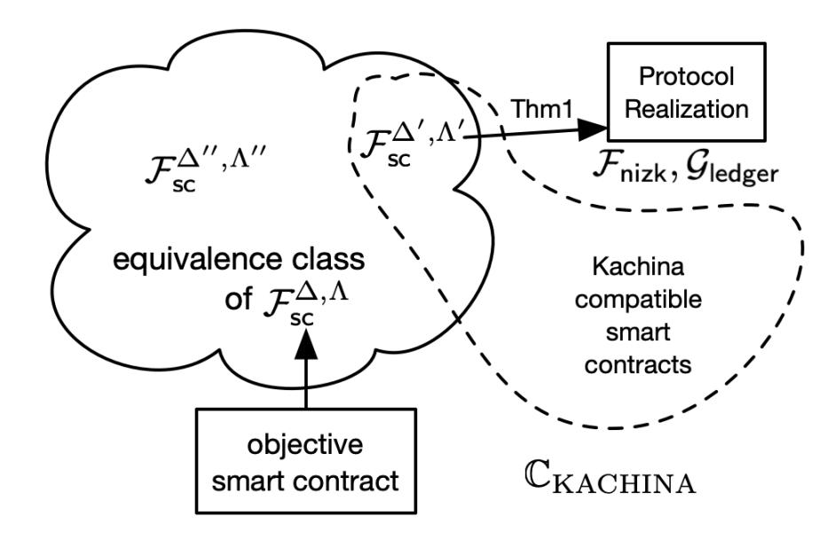
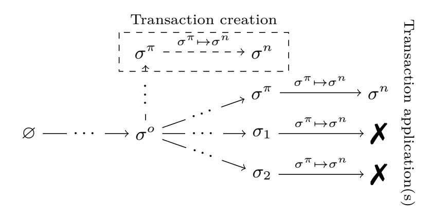
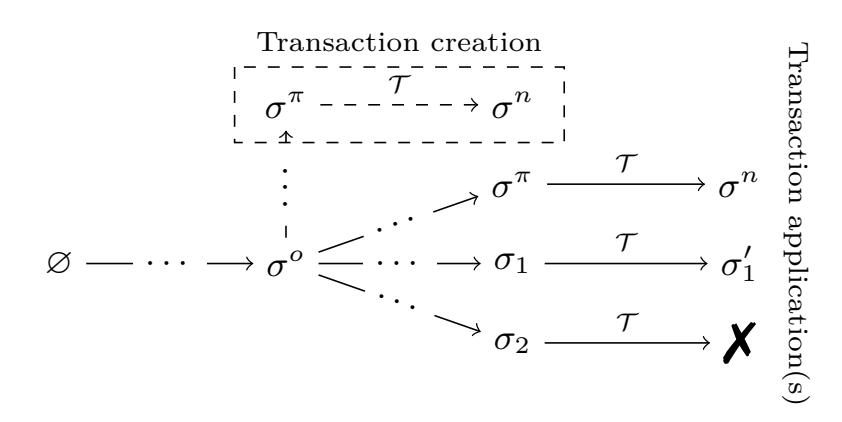
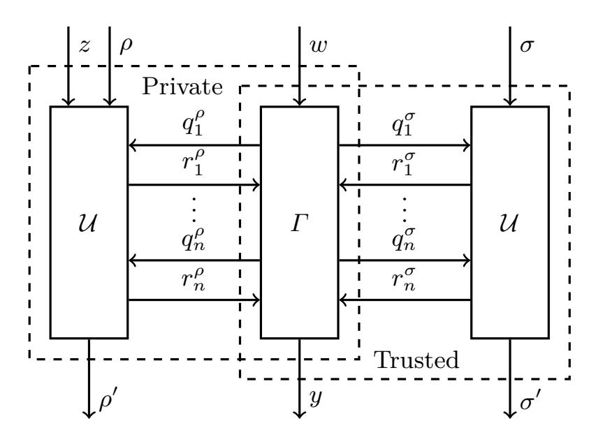
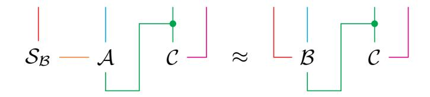
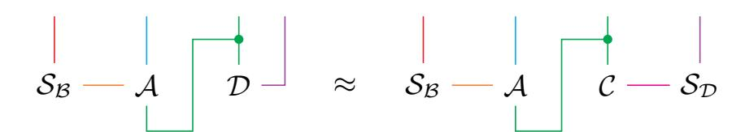
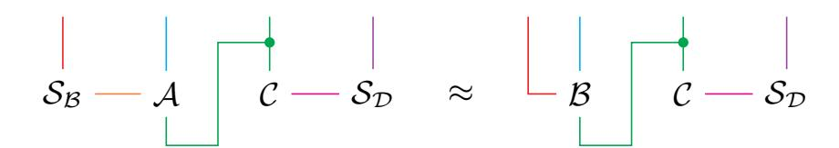
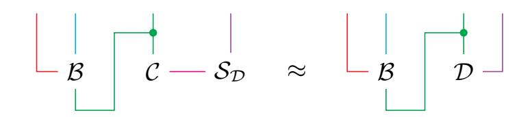

{0}------------------------------------------------

# Kachina **– Foundations of Private Smart Contracts**

Thomas Kerber, Aggelos Kiayias, and Markulf Kohlweiss

The University of Edinburgh and IOHK [papers@tkerber.org](mailto:papers@tkerber.org) [akiayias@ed.ac.uk](mailto:akiayias@ed.ac.uk) [mkohlwei@ed.ac.uk](mailto:mkohlwei@ed.ac.uk)

#### Revision 4

**Abstract.** Smart contracts present a uniform approach for deploying distributed computation and have become a popular means to develop security critical applications. A major barrier to adoption for many applications is the public nature of existing systems, such as Ethereum. Several systems satisfying various definitions of privacy and requiring various trust assumptions have been proposed; however, none achieved the universality and uniformity that Ethereum achieved for non-private contracts: One unified method to construct most contracts.

We provide a unified security model for private smart contracts which is based on the Universal Composition (UC) model and propose a novel core protocol, Kachina, for deploying privacy-preserving smart contracts, which encompasses previous systems. We demonstrate the Kachina method of smart contract development, using it to construct a contract that implements privacy-preserving payments, along the lines of Zerocash, which is provably secure in the UC setting and facilitates concurrency.

## **Table of Contents**

| 1 | Introduction                               | 2  |
|---|--------------------------------------------|----|
|   | 1.1<br>Our Contributions                   | 4  |
|   | 1.2<br>Related Work                        | 6  |
| 2 | Technical Overview                         | 8  |
| 3 | Defining Smart Contracts                   | 12 |
|   | 3.1<br>Interactive Automata Interpretation | 12 |
|   | 3.2<br>UC Specification                    | 14 |
| 4 | The Kachina<br>Protocol                    | 15 |
|   | 4.1<br>State Oracles and Transcripts       | 16 |
|   | 4.2<br>Interaction Between Smart Contracts | 23 |
|   | 4.3<br>The Challenge of Dependencies       | 23 |
|   | 4.4<br>The Contract Class                  | 26 |

The LATEX sources of this paper are available online at [https://github.com/](https://github.com/tkerber/kachina) [tkerber/kachina](https://github.com/tkerber/kachina).

{1}------------------------------------------------

|   | The Core Kachina<br>4.5<br>Protocol                         | 27 |
|---|-------------------------------------------------------------|----|
| 5 | A Case Study: Private Payments                              | 29 |
|   | 5.1<br>Indirect Construction                                | 29 |
|   | 5.2<br>Ideal Private Payments                               | 30 |
|   | The Zerocash Kachina<br>5.3<br>Contract                     | 31 |
| 6 | Conclusion                                                  | 32 |
| 7 | Acknowledgements                                            | 33 |
|   | Bibliography                                                | 33 |
| A | UC Conventions                                              | 36 |
| B | Ledger Functionalities                                      | 39 |
|   | B.1<br>The Perfect Ledger                                   | 39 |
|   | B.2<br>The Simplified Practical Ledger                      | 40 |
| C | Fully Specified Functionalities and Protocols               | 41 |
|   | C.1<br>Ideal World                                          | 41 |
|   | Kachina<br>C.2                                              | 42 |
|   | C.3<br>Non-Interactive Zero-Knowledge                       | 45 |
|   | C.4<br>Private Payments                                     | 46 |
| D | Security Analysis                                           | 52 |
|   | D.1<br>The Simulator                                        | 53 |
|   | D.2<br>The Invariant I                                      | 54 |
|   | D.3<br>Supporting Lemmas                                    | 56 |
|   | D.4<br>Proof of Theorem 1                                   | 60 |
| E | Proof Sketch of the Zerocash Contract                       | 66 |
| F | Liveness of Smart Contracts                                 | 68 |
|   | F.1<br>The δ-delay Ledger                                   | 68 |
|   | F.2<br>Commutativity of Ledger Realizations                 | 69 |
| G | Enforcing Private State Consistency                         | 71 |
| H | Non-Atomic Executions                                       | 72 |
| I | Meta-Parties and Their Relation to Alternative Trust Models | 73 |
| J | Smart Contract Systems                                      | 74 |
|   | J.1<br>Multiplexing Contracts                               | 75 |
|   | J.2<br>Multiplexing With Registration                       | 76 |
|   | J.3<br>Loopback Multiplexing                                | 78 |
|   | J.4<br>Integrated Payments Systems                          | 81 |
|   | J.5<br>Fees and Cost Models                                 | 84 |
|   | J.6<br>Exporting Ledger Data                                | 88 |

## <span id="page-1-0"></span>**1 Introduction**

Distributed ledgers put forth a new paradigm for deploying online services beyond the classical client-server model. In this new model, it is no longer the responsibility of a single organization or a small consortium of organizations to provide the platform for deploying relevant business logic. Instead, services can 

{2}------------------------------------------------

take advantage of decentralized, "trustless" computation to improve their transparency and security as well as reduce the need for trusted third parties and intermediaries.

Bitcoin [\[29\]](#page-35-1), the first successfully deployed distributed ledger protocol, does not lend itself easily to the implementation of arbitrary protocol logic that can support this paradigm. This led to many adaptations of the basic protocol for specific applications, such as NameCoin [\[20\]](#page-34-0), a distributed domain registration protocol, or Bitmessage [\[34\]](#page-35-2), a ledger-based communications protocol. An obvious problem with this approach is that, even though the Bitcoin source code can be copied arbitrarily often, the Bitcoin community of software developers and miners cannot, and hence such systems are typically not sustainable. Smart contracts, originally posited as a form of reactive computation [\[32\]](#page-35-3), were popularized by Ethereum [\[36\]](#page-35-4), solving these problems by providing a uniform and standardized approach for deploying decentralized computation over the same back-end infrastructure.

Smart contract systems rely on a form of *state-machine replication* [\[30\]](#page-35-5): All nodes involved in maintaining the smart contract keep a local copy of its state, and advance this copy with a sequence of requests. This sequence of requests needs to match for each node in the system – thus the need for consensus over which requests are made, and their order. In practice, this is achieved through a distributed ledger.

A seemingly inherent limitation of the decentralized computation paradigm is the fact that protocol logic deployed as a smart contract has to be completely non-private. This, naturally, is a major drawback for many of the applications that can potentially take advantage of smart contracts. Promising cryptographic techniques for lifting this limitation are zero-knowledge proofs [\[19\]](#page-34-1), and securecomputation [\[18,](#page-34-2) [11\]](#page-33-0). Motivated by such cryptographic techniques, systems satisfying various definitions of privacy – and requiring various trust assumptions – have been proposed [\[4,](#page-33-1) [25,](#page-34-3) [37,](#page-35-6) [21\]](#page-34-4), as we detail in [Subsection 1.2.](#page-5-0) Their reliance on trust assumptions nevertheless fundamentally limits the level of decentralization which they can achieve, especially compared to their non-private counterparts. For instance, a common restriction of such systems is to assume a small, fixed set of participants at the core of the system. This fundamentally clashes with the basic principles of a decentralized platform like Bitcoin or Ethereum (collectively classified as *Nakamoto consensus*). In these systems, the set of parties maintaining the system can be arbitrarily large and independent of all platform performance parameters. This puts forth the following fundamental question that is the main motivation for our work.

*Is it feasible to achieve a privacy-preserving and general-purpose smart contract functionality under the same availability and decentralization characteristics exhibited by Nakamoto consensus?*

In this work we carve out a large class of distributed computations that we express as smart contracts, which we collectively refer to as "Kachina core contracts". In particular, this includes contracts with privacy guarantees, which can 

{3}------------------------------------------------

be implemented without additional trust assumptions beyond what is assumed for Nakamoto consensus and the existence of a securely generated common reference string. The latter is not an assumption to be taken lightly – however it is a common requirement for privacy-preserving blockchain protocols with strong cryptographic privacy guarantees, and can be reduced to the same assumptions as the distributed consensus algorithm itself [\[22\]](#page-34-5). This class allows us to express the protocol logic of dedicated privacy-preserving, ledger-based protocols such as Zerocash [\[3\]](#page-32-2) as smart contracts. Existing smart contract systems such as Zexe [\[4\]](#page-33-1), Hawk [\[25\]](#page-34-3), Zether [\[6\]](#page-33-2), Enigma [\[37\]](#page-35-6), zkay [\[31\]](#page-35-7), and Arbitrum [\[21\]](#page-34-4) can be expressed, preserving their privacy guarantees, as Kachina contracts. These protocols mainly rely on either *zero-knowledge* or *signature authentication* for their security. Kachina is flexible enough to allow contract authors to express each of these systems, together with a concise description of the privacy they afford. It does not supersede these protocols, but rather gives a common foundation on which one can build further privacy-preserving systems.

## <span id="page-3-0"></span>**1.1 Our Contributions**

We make four contributions to the area of privacy-preserving smart contracts:

- a) We **model** privacy-preserving smart contracts.
- b) We **realize a large class** of such contracts.
- c) We **enable concurrent interactions** with smart contracts, without compromizing on privacy.
- d) We demonstrate a general methodology to **efficiently and composably build** smart contract systems.

Combined, they provide a method for both reasoning about privacy in smart contracts, and construct an expressive foundation to build smart contracts with good privacy guarantees upon.

*Our model.* We provide a universally composable model for smart contracts in the form of an ideal functionality that is parameterized to model contracts both with and without privacy, capturing a broad range of existing systems. The expressiveness and relative simplicity of our model lends itself to further analyses of smart contracts and their privacy. Moreover, existing privacy-preserving systems benefit from the model as a means to define their security, and contrast their security with other systems.

We consider a smart contract to be specified by a transition function *∆* and a leakage function *Λ*, which parameterize the smart contract functionality F *∆,Λ* sc . *∆* models the behavior of the contract, were it to be run locally or by a trusted party. It is a program that updates a shared state, and has its inputs provided by, and outputs returned to, the calling party. F *∆,Λ* sc models network, ledger, and contract specific "imperfections" that also exist in the ideal world by interacting with a Gledger-GUC functionality [\[10\]](#page-33-3), and captures the fundamental ideal-world leakage through the parameterizing function *Λ*.

{4}------------------------------------------------

Some combinations of *∆* and *Λ* are not obviously realizable, in particular the more restricted the leakage becomes. They are able to capture existing smart contract systems however, both privacy-preserving and otherwise. For instance, a leakage function which leaks the input itself corresponds closely to Ethereum [\[36\]](#page-35-4), while a leakage function returning no leakage makes many transition functions hard or impossible to realize. This paper focuses on a more interesting middle ground. By defining the ideal behavior to interact with Gledger, we avoid having to duplicate the complex adversarial influence of ledger protocols. We make few assumptions about this ledger, requiring only the common prefix property, and interfaces for submitting and reading transactions to be well defined.

*Our protocol.* We construct a practical protocol for realizing many privacypreserving smart contracts, utilizing only non-interactive zero-knowledge. The primary goal of this protocol is to provide a sufficiently low-level and general purpose basis for further privacy-preserving systems, without requiring the underlying system to be upgraded with each new extension or change. We focus on the Nakamoto consensus setting of a shifting, untrusted set of parties. The protocol's core idea is to separate a smart contract's state into a *shared, on-chain, public* state, and an *individual, off-chain, private* state for each party. Parties then prove in zero-knowledge that they update the public state in a permissible way: That there exists a private state and input for which this update makes sense.

*Dealing with concurrency in a privacy-preserving manner.* There exists a fundamental conflict between concurrency and privacy that needs to be accounted for to remain true to our objective of providing a smart contract functionality as decentralized as Nakamoto consensus. To illustrate, suppose an ideal smart contract is at a shared private state *φ* and two parties wish to each apply a function *f* and *g* respectively to this state. They wish (in this specific case) the result to be independent of the order of application – i.e. *f*(*g*(*φ*)) = *g*(*f*(*φ*)) = *φ* 0 . In any implementation of the above in which parties do not coordinate, the first party (resp. the second) should take into account the publicly known encoding [*φ*] of *φ* and facilitate its replacement with an encoded state [*f*(*φ*)] (resp. [*g*(*φ*)]) as it results from the application of the desired transition in each case. It follows that the encoded states [*f*(*φ*)]*,* [*g*(*φ*)] must be publicly reconciled to a single encoded state [*φ* 0 ] which necessarily must leak some information about the transitions *f* and *g*. Being able to achieve this type of public reconciliation while retaining some privacy requires a mechanism that enables parties to predict transition conflicts and specify the expected leakage.

We achieve this through the novel concept of *state oracle transcripts*, which are records of which operations are performed on the contract's state, when interacting with it through oracle queries. These allow contract authors to optimize when transactions are in conflict: ensuring minimal leakage occurs while still allowing reorderings. We provide a mechanism for analyzing when reordering 

{5}------------------------------------------------

transactions is safe with respect to a user's individual private state, by specifying a sufficient condition for when transactions must be declared as dependencies.

Efficient modular construction. Kachina is designed to be deployed at scale: Previous works using zero-knowledge do not explicitly maintain a contract state. If such a state  $\phi$  was modeled anyway, (e.g. as inputs to these systems), the zero-knowledge proofs involved would scale poorly, with a proving complexity of  $\Theta(|\phi|)$  before any computation is performed. A naive approach to state cannot scale to handle systems with a large state – such as a privacy-preserving currency contract, without these being handled as special cases. Our abstracting of state accesses solves this problem.

Regardless of the size of our state, the state is never accessed directly, but only through oracles specified by the contract. As a result the complexity of what must be proven is under the full control of the contract author, and can be optimized for. A proving complexity of  $\Theta(|\mathcal{T}_{\rho}| + |\mathcal{T}_{\sigma}|)$  prior to performing any computation can be expected in Kachina, where  $\mathcal{T}_{\rho}$  is oracle transcript for the private state, and  $\mathcal{T}_{\sigma}$  is the one for the public state. This constitutes a clear improvement, as the state of smart contracts deployed in practice may be very large, however transcripts, similar to the inputs and outputs of traditional public contracts, are generally short. This increase in efficiency allows us to construct an entire smart contract system, akin to Ethereum [36], as a Kachina contract in Appendix J.

Not all contracts a user wishes to write will directly match the requirements for realizing a smart-contract with the Kachina core protocol. However, our model is sufficiently flexible to allow direct application of the transitivity of UC-emulation to solve this: If the originally specified "objective" contract  $(\Delta, \Lambda)$  is not in the class of Kachina core contracts, the author can find an equivalent  $(\Delta', \Lambda')$  which is. The author can provide a proof that  $\mathcal{F}_{sc}^{\Delta', \Lambda'}$  UC-emulates  $\mathcal{F}_{sc}^{\Delta, \Lambda}$ , and by the transitivity of UC-emulation, can use the Kachina core protocol to realize  $(\Delta, \Lambda)$ . We facilitate such proofs by including adversarial inputs and leakages in our model, which allow the simulator limited control over the objective smart contract. This method to develop private smart contracts is illustrated in Figure 1. It is further showcased by the implementation of the salient features of Zerocash [3] as a Kachina contract in Section 5, and the proof that it UC-emulates a much simpler ideal payments contract.

#### <span id="page-5-0"></span>1.2 Related Work

There has been an increasing amount of research into smart contracts and their privacy over the past few years. The results of these often focus on specific use-cases or trust assumptions. We briefly discuss the most notable of these.

Ethereum. As the first practically deployed smart contract system, Ethereum [36] is the basis of a lot of our expectations and assumptions about smart contracts. Ethereum is not designed for privacy, and hides no data by itself. We assume that the reader is familiar with Ethereum.

{6}------------------------------------------------



**Fig. 1.** An overview of the Kachina method to develop private smart contracts: 1) An intuitive description of the objective smart contract is developed in the form of  $\mathcal{F}_{sc}^{\Delta,\Lambda}$ . 2) A Kachina compatible  $\mathcal{F}_{sc}^{\Delta',\Lambda'}$ , from the set of all equivalent contracts  $\mathcal{F}_{sc}^{\Delta'',\Lambda''}$  is selected, and the equivalence proven. 3) Theorem 1 is applied to obtain its realization.

<span id="page-6-0"></span>Zexe. Zerocash [3] is a well-known privacy-preserving payment system, allowing direct private payments on a public ledger. Zexe [4] extends its expressiveness by allowing arbitrary scripts, reminiscent of Bitcoin-scripts, to be evaluated in zero-knowledge in order to spend coin outputs. It is a major improvement in expressiveness over Zerocash, which only permits a few types of transactions.

zkay. zkay [31] extends Ethereum smart-contracts with types for private data. It allows users to share encrypted data on-chain, and prove that data is correctly encrypted and correctly used in subsequent interactions. These proofs are managed through the ZoKrates [15] framework, which compiles Ethereum contracts into NIZK-friendly circuits. Its usage is limited to fixed size pieces of private data.

Hawk. One of the earliest works on privacy in smart contracts, Hawk [25] is also one of the most general. It describes how to compile private variants of smart contracts, given that all participants of the contract trust the same party with its privacy. This party, the "manager", can break the contract's privacy guarantees if they are corrupt, however they cannot break the correctness of the contract's rules. The construction used in Hawk for the manager party relies of zero-knowledge proofs of correct contract execution.

Zether. A lot of work on privacy in smart contracts has focused on retro-fitting privacy into existing systems. Zether [6], for instance, constructs a privacy-preserving currency within Ethereum, which can be utilized for a number of more private applications, such as hidden auctions. As with most retro-fitted systems, Zether is constrained by the system it is built for, and does not generalize to many applications.

{7}------------------------------------------------

*Enigma.* There are two forms of Enigma: A paper discussing running secure multi-party computation for smart contracts [\[37\]](#page-35-6), and a system of the same name designed to use Intel's SGX enclave to guarantee privacy [\[16\]](#page-34-6). The former has a lot of potential advantages, but is severely limited by the efficiency of general-purpose MPC protocols. The latter is a practical construction, and can claim much better performance than any cryptography-based protocol. The most obvious drawbacks are the reliance on an external trust assumption, and the poor track record of secure enclaves against side-channel attacks [\[5\]](#page-33-5).

*Arbitrum.* Using a committee-based approach, Arbitrum [\[21\]](#page-34-4) describes how to perform and agree on off-chain executions of smart contracts. A committee of managers is charged with execution, and, in the optimistic case, simply posts commitments to state updates on-chain. In the case of a dispute, an on-chain protocol can resolve the dispute with a complexity logarithmic in the number of computation steps taken. Arbitrum provides correctness guarantees even in the case of a *n* − 1 out of *n* corrupt committee, however relies on a fully honest committee for privacy.

*State channels.* State channels, such as those discussed in [\[14\]](#page-33-6), occupy a similar space to Arbitrum, due to their reliance on off-chain computation and on-chain dispute resolution. The dispute resolution process is different, more aggressively terminating the channel, and typically it considers only participants on the channel that interact with each other. The privacy given is almost co-incidental, due to the interaction being local and off-chain in the optimistic case.

*Piperine.* Piperine [\[26\]](#page-34-7) uses a similar model and approach as presented in this paper, relying on zero-knowledge proofs of correct state transitions, and modeling smart contracts as replicated state machines. Piperine focuses on efficiency gains from this approach, rather than privacy gains, which it does not capture, while our work does not account for the benefit of transaction batching. Our notion of state oracles can be seen as a generalization of the state interactions presented in [\[26\]](#page-34-7).

## <span id="page-7-0"></span>**2 Technical Overview**

We first informally establish the goals and core technical ideas of this paper. These will be fleshed out in the remainder of the paper's body, with some of the technical details – primarily in-depth UC constructions and proofs – in the appendix. We will discuss each of our contributions in turn, and discuss how, combined, they present a powerful tool for constructing privacy-preserving smart contract systems.

*Our model.* We model smart contracts as *reactive state machines*, which users interact with by submitting transactions to a distributed ledger. A user submits a transaction, with the intention to issue some high-level command to the smart 

{8}------------------------------------------------

contract, e.g. to cast a vote, or withdraw funds. Once the transaction is confirmed by the distributed ledger, the user obtains information about the results of this high-level command: both whether it has been processed, and any information it may have computed using the contract's state.

As multiple users can interact with the same smart contract system concurrently, users cannot always predict the effect of their actions; a vote may end before a user's voting transaction is processed, for instance. As a result the user may not be able to predict the outcome of the command, or even if it can be carried out.

To capture privacy, the act of creating a transaction to post on the distributed ledger is the only point at which we permit privacy leakage. As a user may go offline at any point, any private information they reveal – a bid during an opening phase of an auction for instance – must be revealed in the on-chain transaction itself. Formally, we model this with a leakage function  $\Lambda$ , which describes what information is leaked if a user, seeing a specific contract state, issues a specific command. This function can also fix choices that an interaction may make – for instance if the command is "send a coin to Bob", it may decide which coin to send to Bob. To give users full control over their privacy, even when these decisions are complex or randomized, we ask them to sign off on a description of the leakage before the transaction is broadcast. The leakage in Kachina captures information which a user purposely decides to reveal, as the functionality they gain by doing so is worth whatever damage they take to their private information. It is further worth noting that nothing prevents a malicious contract from finding clever ways to leak information without being observable. This highlights the importance of interacting only with trustworthy contracts, and the importance of the leakage descriptor being accurate.

Similarly to the leakage function, the semantics of the contract itself are largely dictated by a transition function  $\Delta$ . It describes how the state of a smart contract evolves given a command and a few auxiliary inputs (such as the choice of coin alluded to above).

The core protocol idea. The Kachina core protocol restricts itself to contracts which divide their state into a public state  $\sigma$ , and, for each party p, a private state  $\rho_p$ . These correspond to the shared ledger, and a party's local storage respectively. Transition functions are over pairs  $(\sigma, \rho_p)$  instead of over all private states – a party may only change their own private state. Honest users maintain their own private state in accordance with the contracts' rules, while the contract must anticipate that dishonest parties may set it arbitrarily (this can be circumvented by committing to private states, as descripted in Appendix G, although it comes at the cost of increased public state sizes, and loss of anonymity).

A natural construction to achieve privacy in smart contracts utilizing zero-knowledge proof systems is apparent: On creating a transaction, a user p evaluates the transition function against the current contract state  $(\sigma, \rho_p)$ , resulting in a state  $(\sigma', \rho'_p)$ . He creates a zero-knowledge proof that  $\sigma \mapsto \sigma'$  is a valid transition of public states (i.e. there exists a corresponding private state and

{9}------------------------------------------------

input such that this transition takes place), and posts the proof and transition as a transaction. Locally, the user updates his private state to  $\rho'_p$ .

We can also clearly describe the leakage of this sketched protocol: The transition  $\sigma \mapsto \sigma'$  is precisely the information which is revealed!

State oracles. The core protocol sketched above has two major problems:

- 1. Due to each transaction containing a proof of transition from one state to another, concurrent transactions will almost certainly fail once the state is changed.
- 2. The size of the statement being proved, and therefore the size of transactions, grows linearly with the overall size of the contract's state.

These drawbacks are especially notable in systems with many users and a high frequency of transactions: On Ethereum a transaction is almost certainly applied after many other transactions the author never knew about, nor should need to know about. The state the contract will be in once it executes a transaction, is something the transaction's author cannot predict accurately. In the naive system proofs only succeed in the state they were originally created for, as Figure 2 suggests. Instead of capturing a transition from  $\sigma \mapsto \sigma'$ , we would rather want to capture a (partial) function from states to successor states.



<span id="page-9-0"></span>**Fig. 2.** Direct state-transition based transactions can be applied only in the state  $\sigma^{\pi}$  they were proven for.

To solve these issues, we add a layer of indirection for accessing and updating contract states: Instead of the state being a direct input to the transition function, the contract has access to *oracles* operating on the public and private states. The contract makes queries to these oracles: functions which update the state, and return information about it. To prove the interaction with the public state correct, users capture the queries they made, and the responses they expect, in a sequence  $((q_1, r_1), \ldots, (q_n, r_n))$ : a transcript of oracle interactions. The user proves that, given the responses expected, they know an input which will make this series of queries.

Conversely, a user validating this transcript can verify this proof, and evaluate the queries in turn against the public state, ensuring the responses match.

{10}------------------------------------------------

This defines a partial function over public states, which is defined wherever the responses recorded in the transcript match the results obtained by evaluating the queries on the current state.

Selecting what queries a contract makes provides a great deal of control over the domain of the function: a query which has an empty response will always succeed! In limiting queries to returning only essential information, many conflicts can be avoided. Transcripts can also be concise about what changes are made, assuming the queries are encoded in a sufficiently succinct language, such as most Turing-complete languages.

While not all conflicts are resolved through this as the responses may not match those expected, it allows the proof to focus on the *relevant* parts of the state, being compatible with more concurrent transactions, as pictured in Figure 3.



<span id="page-10-0"></span>**Fig. 3.** Oracle-transcript based transactions can be applied in any compatible state. The transcript  $\mathcal{T}$  defines a partial function  $\{\sigma^{\pi} \mapsto \sigma^{n}, \sigma_{1} \mapsto \sigma'_{1}, \ldots\}$ .

In order to be able to model partial transaction success, which is crucial for modeling transaction fees, we allow for a special query to be made, COMMIT. COMMIT queries mark checkpoints in a transaction's execution, such that if an error occurs after it, the execution up to this point is still meaningful. This effectively partitions the transcript into atomic segments. We primarily use this to construct transaction fees within a smart contract itself, the details of which can be seen in Appendix J.5.

High-level usage. Even when using state oracles, this protocol is limited to contracts which have their state fit neatly into accessing only shared public state, and local private state. The natural description of many contracts does not match this. For instance: a private currency contract is most directly described through a shared private state tracking the balances of all parties.

However, it is simple to express the Zerocash [3] protocol in terms of interactions with shared public, and local private states. This provides a practical means to achieve what we can describe using a shared private state. It is important to have both the most natural description of a contract, and the realization. The

{11}------------------------------------------------

former provides a good understanding of the features and security properties of a contract, while the latter realizes it.

This idea is nothing but the notion of simulation-based security itself! We use multiple stages of UC-emulation: First moving from our objective contract (a private payments contract) to a contract within the Kachina constraints on state (a Zerocash contract), and second moving on to the Kachina core protocol. Due to the transitivity of UC emulation, we may therefore use this "Kachina method" to construct the objective of private payments. This process is outlined in Figure 1.

Our model is designed to facilitate this usage. Specifically for modeling objective contracts the model allows the adversary to provide an additional adversarial input to each transaction. This input allows the simulator to control some parts of the ideal behaviour similar to the simulator's influence on an ideal functionality, for instance to ensure ideal world addresses match real-world public keys.

## <span id="page-11-0"></span>3 Defining Smart Contracts

Smart contracts are typically implemented as replicated state machines. If a replicated state machine is the implementation, the natural model is that of the state machine itself. Inputs are drawn from a ledger of transactions, and passed to this state machine.

This definition is unsuitable for privacy-preserving smart contracts: If the state machine's behavior is known, and its inputs are on a ledger, there is no privacy. A simple tweak can solve this: Inputs are replaced with identifiers on the ledger, with the smart contract functionality tracking what their corresponding inputs are.

#### <span id="page-11-1"></span>3.1 Interactive Automata Interpretation

Smart contracts are a form of *reactive computation*: Parties supply an input to the contract, the latter internally performs a stateful computation, and returns a result to the original caller. The result is returned asynchronously, and may depend on interactions with other users. This is quite close to the concept of a trusted third party, although real-world systems have caveats:

- They leak information about the computation performed.
- They allow some *adversarial influence*, partly due to relying on the transaction ordering of an underlying ledger.
- They may carry some impure *execution context*: A transaction may depend on what the state is at the time it is created, for instance.

Often when talking about smart contracts, only the "on-chain" component is considered. This is insufficient for privacy, as by its nature, everything on-chain is public. We therefore model the off-chain component of the interaction as well. This can be as simple as placing inputs directly on the ledger, but can involve

{12}------------------------------------------------

more complex pre-computation. Even without the need for privacy, the need to model off-chain computation of smart contracts had been observed [\[12\]](#page-33-7), and we believe a formal model should account for it.

To represent a contract, we use a transition function, operating over the contract's state. We denote the initial state as ∅. Transition functions are deterministic, although limited nondeterminism can be simulated by including randomness in the execution context. Notably, such randomness is fixed on transaction creation, allowing the creator to input (potentially biased) randomness, which is subsequently used in the (replicated) execution of the contract's state machine. Potential uses include the creation of randomized ciphertexts or commitments. The transition function will also output if a transaction should be considered "confirmed" or not, with the latter indicating failure or only partial success, which dependant transactions should not build on.

A contract *transition function ∆* is a pure, deterministic function with the format (*φ* 0 *, c, y*) ← *∆*(*φ, p, w, z, a*), with the following inputs and outputs:

**–** The current state *φ* **–** The calling party *p* **–** The adversarial input *a* **–** The successor state *φ* 0

**–** The input *w* **–** The output *y*

**–** The execution context *z* **–** The confirmation state *c*

In addition to the transition function, it is necessary to capture what leakage an interaction with the contract has. The two are separated due to the asynchronous nature of smart contracts – a transaction is made, and leaks information, before the corresponding transition function is run on-chain.

The leakage is captured by a *leakage function*, which receives the same input, and further receives the creating user *p*'s "view" *ω* of the contract as an input. *ω* = (*`, Up, T, φ*) consists of four items: a) The length of *p*'s view of the ledger *`*. b) *p*'s unconfirmed transactions *Up*. c) A map *T* from *τ* ∈ *U<sup>p</sup>* to (*p, w, z, a, D*). These are *∆*'s inputs, and the transaction's dependencies, which we will introduce shortly, *D*. d) The contract's state according to *p*'s view of the ledger, *φ*. This "view" may be used to avoid attempting double-spends by selecting a coin to spend which no other unconfirmed transaction uses, for instance. For this purpose the leakage function can also abort by returning ⊥, refusing to create a transaction. The function returns a leakage value lkg, which is passed to the adversary, a description of the leakage which occurred, desc, a list of transactions to depend on, *D*, and the context *z*. While lkg may be arbitrary, it is important that desc provides an accurate and readable description of this leakage. Its primary purpose is to allow parties to decide *not* to go ahead with a transaction if they notice the leakage is more than expected. With complex contracts, anticipating what will be leaked should not be relied upon. The usage of a descriptor highlights that *Λ* should not be maliciously supplied, and facilitates simulation, as shown in [Section 5.](#page-28-0) The leakage may additionally depend on the current time, a list of unconfirmed transactions and – for each transaction – their corresponding inputs to *∆* and their dependencies. This may be used to avoid attempting double-spends for instance, by ensuring that the context specifies to use a coin which no other unconfirmed transaction uses.

{13}------------------------------------------------

It is worth emphasising that the leakage discussed in this paper is deliberate; this is not leakage observed over a network, which can be hard to identify, but is instead information which users accept to reveal. For instance, a leakage in Zerocash [\[3\]](#page-32-2) is the length of the ledger at the time a transaction is created, with the security of the protocol guaranteeing that this – but nothing more – is revealed to an adversary.

The list of dependencies *D* is a list of transactions, which must occur in the same order before the newly created transaction can be applied. This can be used to enforce basic ordering constraints between transactions. Finally, the context *z* allows information about the state at the time of transaction creation to be passed to the transition function. This may include the current state, unconfirmed transactions, and a source of randomness. Its content is left arbitrary at this point.

A *leakage function Λ* is a pure, non-deterministic function with the format (desc*,* lkg*, D, z*) ← *Λ*(*ω, p, w*), with the following inputs and outputs:

**–** *p*'s contract view *ω* **–** The leakage descriptor desc

**–** The calling party *p* **–** The input *w* **–** The tx dependencies *D*

**–** The leaked data lkg **–** The context *z*

We consider the pair (*∆, Λ*) to define a smart contract, and parameterize the ideal smart contract functionality presenting in [Subsection 3.2](#page-13-0) by this pair. The ideal world interaction with a smart contract follows the below pattern:

- 1. A party submits a contract input *w*.
- 2. The corresponding context and leakage are computed.
- 3. The party agrees to the leakage description, or cancels (in the latter case, the transaction never takes place, and no information is revealed).
- 4. The adversary is given (lkg*, D*), and provides the adversarial input *a*.
- 5. The submitting party can retrieve the output of *∆* (if any), while other parties can interact with the modified state.

The level of privacy guaranteed depends greatly on the leakage function *Λ*: A leakage function which returns its input directly as leakage provides no privacy, while one which returns no leakage at all provides almost total privacy (notably the fact some interaction was made is still leaked). By tuning this, the privacy of Ethereum, Zerocash, and everything in between can be captured.

Our model relies on users querying the result of transactions manually – they are not notified of the acceptance of a transaction, and can not modify it once made. If a transaction is not yet confirmed by the ledger, the user gets the result not-found, if the transaction depends on failed transactions, ⊥ is returned, and otherwise the result is provided by the contract itself (which may also inform of partial success).

## <span id="page-13-0"></span>**3.2 UC Specification**

The *ideal smart contract functionality* F *∆,Λ* sc captures the notion of a contract as a leaky state machine whose inputs are drawn from a ledger. It is parameterized by 

{14}------------------------------------------------

the transition function *∆* and the leakage function *Λ*, and it operates in a hybrid world with a global ledger functionality Gledger. A candidate for such a ledger is GsimpleLedger, as introduced in [Appendix B,](#page-38-0) although any compatible functionality is sufficient. Its privacy guarantees stem from only revealing explicitly leaked data, i.e. lkg, and only allowing the creator of a transaction to access the result.

#### **Functionality** F *∆,Λ* sc **(sketch)**

The smart contract functionality F *∆,Λ* sc allows parties to query a deterministic state machine determined by *∆* and *Λ* in a ledger-specified order.

*Executing a ledger view:*

Starting with an initial state *φ* ← ∅, and an empty set of confirmed transactions: For each transaction in the ledger's view, if the transaction is unknown, allow the adversary to supply its inputs. Next, verify the transaction's dependencies, and that, for (*φ* 0 *, c, y*) ← *∆*(*φ, . . .*), *φ* 0 6= ⊥. If both are satisfied, update *φ* to *φ* 0 , and record the transaction as confirmed if *c* is >. If an execution output is requested, return *y*, or ⊥ if the execution failed. If, on the other hand, one of the preconditions is not satisfied, skip this transaction.

*Prior to any interaction by p:*

Compute which transactions have been rejected in *p*'s view of the ledger state, and remove any unconfirmed transactions for *p* that (directly or indirectly) depend on them.

*When receiving a message* (post-query*, w*) *from an honest party p:*

Retrieve *p*'s current view *ω* of the contract. Feed this, together with the party identifier, and the input *w* to *Λ*.

Ask *p* if the leakage description returned is acceptable. If so, query the adversary for a unique transaction ID *τ* , and some adversarial input corresponding to the leakage, and the transaction's dependencies. Record the original input, the adversarial input, the context returned by *Λ*, and the transaction's dependencies as being associated with *τ* and *p*. Record the transaction as unconfirmed for *p*, send (submit*, τ* ) to Gledger, and finally return *τ* .

*When receiving a message* (check-query*, τ* ) *from an honest party p:*

If *τ* is owned by *p*, and is in their current view of the ledger, compute and return the output by executing the ledger view up to *τ* . If *τ* is not in their ledger view, return not-found.

# <span id="page-14-0"></span>**4 The** Kachina **Protocol**

As mentioned in [Section 2,](#page-7-0) a naive construction divides a contract's state into a shared public state, and a local private states for each party. Specifically, the ideal state *φ* is defined as the tuple (*σ, ρ*), where *ρ* consists of *ρ<sup>p</sup>* for each party *p*. A user proves the validity of any public state transition – that there exists a private state and input, such that this transition takes place. This clearly 

{15}------------------------------------------------

does not scale well, as it assumes that the ledger state does not change between the submission and processing of a transaction, and requires zero-knowledge proofs about potentially large states – hundreds of Gigabytes in systems like Ethereum [\[17\]](#page-34-8)!

In reality, a user's query may not be evaluated immediately, and the ledger may change drastically in the meantime. Simply proving a direct state transition would lead to a high proportion of queries being rejected. To solve both problems, we require contracts to access their state through a layer of abstraction which both tolerates reordering interactions, and allows for more efficient proofs. We further allow for partial transaction success, by introducing *transaction checkpoints*. Our primary purpose for this notion is to be able to capture the payment of transaction fees, such as gas. We detail our approach to do this in [Appendix J.5.](#page-83-0)

#### <span id="page-15-0"></span>**4.1 State Oracles and Transcripts**

We introduce *state oracles* and *state oracle transcripts* to abstract interaction with a contract's state. We choose this abstraction primarily for its flexibility, and many other approaches are possible, such as byte-level memory accesses, or specific data structures such as set of unspent transactions. These can be seen as instances of state oracles. We make use of the notation [*a, b, c*] to denote a list of *a*, *b*, and *c*, with the concatenation operator k , and the empty list . We use the function last to retrieve the last element of a list, and *L*[*i*] to denote the *i*th element of the list *L*.

*An example.* To better motivate the need to abstract interactions with a contract's state, we will use a representative example smart contract, and discuss how different abstractions of its state will affect it.

Our example is a *sealed bid auction* contract[1](#page-15-1) , which we assume has some means of telling the time, and interacting with two on-chain assets, one public and one private. These may be constructed similarly as in [Section 5,](#page-28-0) however should be holdable and spendable by other contracts. We do not go into detail of this construction; this idea is fleshed out in detail in Zether [\[6\]](#page-33-2). The auction is opened by the *seller* party, and multiple *buyer* parties may bid on it. The auction has three stages: Bidding, opening, and withdrawing. The auction contract allows for the following interactions:

- **–** At initialization, the seller transfers ownership of the public asset *A* to the auction contract.
- **–** In Stage 1, buyers submit their bids, transferring some amount of the private asset *B* to the auction contract, which remains anonymous.
- **–** In Stage 2, buyers *reveal* their bid. If the buyer's bid exceeds the currently maximum revealed bid, they reveal their committed asset, increase the maximum bid, and they record themselves as the winning bidder. Otherwise, they withdraw their bid from the contract without revealing its value.

<span id="page-15-1"></span><sup>1</sup> This contract is designed to make a good example, not a good auction – we do not recommend using it as presented.

{16}------------------------------------------------

- **–** In Stage 3, buyers withdraw any assets they own after the auction either their (losing) bids, or the sold asset (for the highest bidder). The seller withdraws the highest bid, or the original asset if no bids were made.
- **–** In Stage 1 and 2, the seller may advance the stage.

#### This contract needs to maintain in its state:

- **–** The current stage the auction is in.
- **–** A reference to the asset being sold.
- **–** A set of bids made.
- **–** The winning bid, its value, and who made it, during the reveal phase.
- **–** A set of losing bids, which have not yet been withdrawn, during the reveal phase.
- **–** Privately, a user remembers which bids are theirs, and how to reveal them.

Suppose we adopted a naive approach to state transitions, and proved the transitioning from one state to another directly, with no abstraction of any kind. During the bidding phase it is easily possible for multiple users to attempt to bid simultaneously (especially considering the delay until transactions become confirmed by an underlying ledger). In this case, only one of these transactions will succeed – as soon as this transaction changes the state by adding its own bid, the proof of any other simultaneous transaction becomes invalid.

The simple abstraction of byte-level access would allow a buyer and a seller to withdraw concurrently, as their withdrawals affect different parts of the state. It does not do so well in allowing concurrent bids to be made, however. If the set is implemented with a linked list, for instance, two users attempting to add their own bid simultaneously will change the same part of the state: the pointer to the next element.

A smart abstraction should realize that whichever user bids first, the resulting set of bids is the same, even if its binary representation may not be. Even if the order of the interactions matters, a smart abstraction may allow concurrent interactions. When claiming the maximum bid in the auction, Alice may increase it to 5, while Bob may increase it to 7 concurrently. It should not matter to Bob's transaction if the maximum bid is currently 3, or 5 – although Alice's must be rejected if the bid is increased to 7 first.

*General-purpose state oracles.* The abstraction we propose is that of *programs*. Appending a value to an linked list can be encoded as a program which a) traverses to the end of the current list, b) creates a new cell with the input value, and c) links this from the end of the list. Formally, these programs are executed by a universal machine called a *state oracle* with access to the current (public or private) state *α*, and potentially an additional *context z*.

<span id="page-16-0"></span>**Definition 1.** *A state oracle* O = U(*α*0*, z*)*, given an initial state α*0*, and context z, is an interactive machine internally maintaining a state α, a transcript* T *, and a vector of fallback states α~ (initially set to the input α*0*, , and* [*α*0] *respectively), which permits the following interactions:*

{17}------------------------------------------------

- Given a commit query, set  $\vec{\alpha} \leftarrow \vec{\alpha} \parallel [\alpha]$ , and append commit to  $\mathcal{T}$ .
- Given a query q while  $\alpha$  is  $\perp$ , return  $\perp$ .
- Otherwise, given a query q, compute  $(\alpha', r) \leftarrow q(\alpha, z)$ . Update  $\alpha$  to  $\alpha'$ , append (q, r) to  $\mathcal{T}$ , and return r.
- state( $\mathcal{O}$ ) returns ( $\vec{\boldsymbol{\alpha}} \parallel [\alpha], \mathcal{T}$ ).

The context z is empty  $(\varnothing)$  for state oracles operating on the public state, and is used in state oracles operating on the private state for fine-grained readonly access to the state during transaction creation, e.g. to allow private state
oracles to read the public state. Specifically, the oracle operating on the private
state can read both the public and private states for: a) the confirmed state at
the time the transaction was created  $(\sigma^o \text{ and } \rho^o)$ , and b) the projected state, an
optimistic state in which all of the user's unconfirmed transactions are executed,
at the time the transaction was created  $(\sigma^\pi \text{ and } \rho^\pi)$ . This can be used to make
sure new transactions do not conflict with pending ones: Selecting which coin to
spend uses the confirmed state to ensure the coin can be spent, and the projected
state to ensure a coin is not double spent. The context is also used to provide a
source of randomness  $\eta$  to the private state oracle. In total, the context of the
private state oracle is  $(\sigma^o, \rho^o, \sigma^\pi, \rho^\pi, \eta)$ . The context to the public state oracle\nis empty  $(\varnothing)$ , and we will sometimes omit it.

We say that the oracle *aborts* if it sets its state to  $\bot$ . The state will then be rolled back to a safe point, specifically the last COMMIT where the state was non- $\bot$ . Looking forward, we will decompose the transition function  $\Delta$  into three components: An oracle operating on the public state  $\sigma$ , an oracle operating on p's private state  $\rho_p$ , and a "core" transition function  $\Gamma$ . This process is described in detail in Subsection 4.4, with an overview of the interactions of  $\Gamma$  with public and private state oracles given in Figure 4.



<span id="page-17-0"></span>**Fig. 4.** The interaction of the core contract  $\Gamma$ , with two universal machines  $\mathcal{U}$ , acting as state oracles over the public state  $\sigma$ , and the private state  $\rho$ , together with the context z.

{18}------------------------------------------------

The notion of *oracle transcripts* is crucial in the functioning of Kachina, as it provides a means to decouple the part of a transaction which is proven in zero-knowledge from both the public and private states entirely: We only prove that given some input, and a sequence of responses recorded in the public state transcript, the smart contract must have made the recorded queries.

Revisiting our example. As an illustration, we show how our auction example interacts with state oracles. We define the auction's states more precisely first, where users are identified by public keys, denoted with pk:

- The current stage, stage  $\in \{1, 2, 3\}$ .
- A reference to the asset being sold and who is selling it:  $a, pk_s$ .
- A set of bids made S.
- The winning bid, its value, and who made it:  $b, v, pk_b$ .
- A set of not yet withdrawn losing bids: R.
- Privately, a user remembers openings to their bids, the committed bid itself, and its value: bidOpen, bidComm, v.

Overall, the public state is defined as  $\sigma := (\mathsf{stage}, \mathsf{pk}_s, a, b, v, \mathsf{pk}_b, S, R)$ , and the private state is defined as  $\rho := (\mathsf{bidOpen}, \mathsf{bidComm}, v)$ . The public state is initialized by the seller to  $(1, \mathsf{pk}_s, a, \varnothing, 0, \varnothing, \varnothing, \varnothing)$ .

The oracle queries corresponding to each interaction with the contract are given as closures, i.e. sub-functions which make use of some of their parents local variables. To clarify where this is the case, we place such variables in the subscript of the function name. These functions are passed to either the public or private state oracle as the input q, as specified in Definition 1.

- Bidding: Given a asset opening bidOpen, with value v, corresponding to an asset commitment bidComm, which has been bound to the auction contract,  $\Gamma$  first makes the following public oracle query:

```
\begin{aligned} & \textbf{function} \ \ \mathsf{makeBid}_{\mathsf{bidComm}}((\mathsf{stage},\mathsf{pk}_s,a,b,v,\mathsf{pk}_b,S,R)) \\ & \mathbf{assert} \ \mathsf{stage} = 1 \\ & \mathbf{return} \ ((\mathsf{stage},\mathsf{pk}_s,a,b,v,\mathsf{pk}_b,S \cup \{\mathsf{bidComm}\}\,,R),\top) \end{aligned}
```

Further, it makes the following private oracle query:

```
function recordBid<sub>bidOpen,bidComm,v</sub>(\cdot, \cdot)
return ((bidOpen, bidComm, v), \top)
```

- Revealing: Given a public key to redeem the funds to in case of losing the auction,  $\Gamma$  first makes a private oracle query to retrieve which bid is owned:

```
function retrieveBid((bidOpen, bidComm, v), ·) return ((bidOpen, bidComm, v), (bidOpen, bidComm, v))
```

Next, the contract makes a further private oracle query for the expected maximum bid, to determine if the buyer's bid is higher:

```
function projMax(\rho, z = (\cdot, \cdot, \sigma^{\pi} = (\dots, v', \dots), \cdot, \cdot))
return (\rho, v')
```

{19}------------------------------------------------

If this query returns v' < v, the contract attempts to claim the maximum bid with the public oracle query<sup>2</sup>:

```
\begin{aligned} & \textbf{function} \ \mathsf{claimMax}_{\mathsf{bidOpen},\mathsf{bidComm},v,\mathsf{pk}}(\sigma) \\ & \mathbf{let} \ (\mathsf{stage},\mathsf{pk}_s,a,b_o,v_o,\mathsf{pk}_o,S,R) \leftarrow \sigma \\ & \mathbf{assert} \ \mathsf{bidComm} \in S \land v > v_o \land \mathsf{stage} = 2 \\ & \mathbf{return} \ ((\mathsf{stage},\mathsf{pk}_s,a,\mathsf{bidOpen},v,\mathsf{pk},S \setminus \{\mathsf{bidComm}\},R \cup \{(b_o,\mathsf{pk}_o)\}),\top) \end{aligned}
```

If the original value test fails, on the other hand, instead the contract transfers the ownership of bidComm via the underlying asset system to pk, and runs the public oracle query:

```
\begin{aligned} &\textbf{function} \ \mathsf{claimLoss}_{\mathsf{bidComm}}((\mathsf{stage},\mathsf{pk}_s,a,b,v_o,\mathsf{pk}_o,S,R)) \\ &\mathbf{assert} \ \mathsf{bidComm} \in S \land \mathsf{stage} = 2 \\ &\mathbf{return} \ (\top,(\mathsf{stage},\mathsf{pk}_s,a,b,v_o,\mathsf{pk}_o,S \setminus \{\mathsf{bidComm}\}\,,R)) \end{aligned}
```

- Withdrawing: Given a public key pk, which the caller knows the corresponding secret key for, the contract will make an oracle query to determine which assets to transfer ownership of, and to un-record them in a public oracle query:

```
\begin{aligned} & \textbf{function withdraw}_{\mathsf{pk}}((\mathsf{stage},\mathsf{pk}_s,a,b,v,\mathsf{pk}_b,S,R)) \\ & \textbf{assert stage} = 3 \\ & \textbf{if } \mathsf{pk} = \mathsf{pk}_s \land b \neq \varnothing \textbf{ then} \\ & \textbf{return } ((\mathsf{stage},\varnothing,a,\varnothing,\varnothing,\mathsf{pk}_b,S,R),(B,b)) \\ & \textbf{else if } \mathsf{pk} = \mathsf{pk}_b \land a \neq \varnothing \textbf{ then} \\ & \textbf{return } ((\mathsf{stage},\mathsf{pk}_s,\varnothing,b,v,\varnothing,S,R),(A,a)) \\ & \textbf{else if } \exists c:(c,\mathsf{pk}) \in R \textbf{ then} \\ & \textbf{return } ((\mathsf{stage},\mathsf{pk}_s,a,b,v,\mathsf{pk}_b,S,R \setminus \{(c,\mathsf{pk})\}),(B,c)) \end{aligned}
```

- Advancing the stage: The seller (given their public key pk) may advance the contracts stage from 1 or 2 to 2 or 3 respectively with a public oracle query:

```
\begin{aligned} \textbf{function} \ & \text{advanceStage}_{\text{pk}}((\text{stage}, \text{pk}_s, a, b, v, \text{pk}_b, S, R)) \\ & \text{assert} \ & \text{pk} = \text{pk}_s \land \text{stage} \in \{1, 2\} \\ & \text{return} \ & ((\text{stage} + 1, \text{pk}_s, a, b, v, \text{pk}_b, S, R), \top) \end{aligned}
```

This example does not handle corner cases (such as buyers bidding multiple times), and is not intended for practical use. Instead, its purpose is to illustrate the advantages state oracles provide: The query an interaction will make, and the response it will receive, are often not affected by other interactions. Concurrent bids do not conflict, for instance. The representation of data is also not crucial, as the state oracles may themselves interact with abstract data types.

We complete our example by specifying the core transition function  $\Gamma$ , under the assumptions that a means to call into a separate asset management system (a contract that permits transferring ownership of assets between public keys), such as presented in Appendix J.4, exists. We also assume that a user's public key can be retrieved with a shared "identity" contract.

<span id="page-19-0"></span>Note that the claim may fail if the maximum bid increased from the one projected at the time of transaction creation.

{20}------------------------------------------------

## **Transition Function** *Γ*auction(*A, B*)

A simple private auction contract, parameterised by assets *A* and *B*, which correspond to contracts with transition functions *Γ<sup>A</sup>* and *ΓB*.

```
When receiving an input (bid, v):
  send (bind, v, Γauction(A, B)) to ΓB and
     receive the reply (bidOpen, bidComm, v)
  send makeBidbidComm to Oσ and receive the reply >
  send recordBidbidOpen,bidComm,v to Oρ and
     receive the reply >
When receiving an input reveal:
  send retrieveBid to Oρ and
     receive the reply (bidOpen, bidComm, v)
  send identity to Γid and receive the reply pk
  send projMax to Oρ and receive the reply v
                                               0
  if v
     0 < v then
     send (assertValidFor, bidOpen, bidComm, v, pk, Γauction(A, B)) to ΓB
     send claimMaxbidOpen,bidComm,v,pk to Oσ and
        receive the reply >
  else
     send (unbind, bidOpen, pk) to ΓB
     send claimLossbidComm to Oσ and receive the reply >
When receiving an input withdraw:
  send identity to Γid and receive the reply pk
  send withdrawpk to Oσ and receive the reply (X, x)
  if X = A then
     send (transfer, x, pk) to ΓA
  else
     send (unbind, x, pk) to ΓB
When receiving an input advance-stage:
  send identity to Γid and receive the reply pk
  send advanceStagepk to Oσ and receive the reply >
```

*Using transcripts.* Kachina relies on a few key observations on how transcripts relate to the original state oracle execution. To begin with, we define a few ways in which transcripts may be used.

**Definition 2.** *A state oracle transcript* T *may be applied to a state α in a context z. We write α~* ← T (*α, z*)*, or if z* = ∅*, α~* ← T (*α*)*, the operation of which is defined through the following loop:*

```
function T (α, z)
   let O ← U(α, z)
   for (qi, ri) in T do
       send qi to O and receive the reply r
       if r 6= ri then
```

{21}------------------------------------------------

```
\begin{aligned} & \begin{aligned} & \begin{aligned} & \begin{aligned} & \begin{aligned} & \beta & (\mathcal{O}) \end{aligned} & & \begin{aligned} & \begin{aligned} & \beta & (\bar{\alpha}, \cdot) \leftarrow \mathsf{state}(\mathcal{O}) \end{aligned} \ & & \mathbf{return} \ \vec{\alpha} \end{aligned}
```

If a transcript is malformed, applying it will result in  $[\alpha, \perp]$ .

If  $\alpha' = \mathcal{T}(\alpha, z) \neq \bot$ , then The returned  $\vec{\alpha}'$  is indistinguishable from the internal state  $\vec{\alpha} \parallel [\alpha]$  of the state oracle  $\mathcal{U}(\alpha_0, z)$ , given the same sequence of queries. This allows users to replicate the effect other users' queries have on the public state, without knowing *why* these queries were made.

**Definition 3.** A sequence of transcripts and contexts  $X = ((\mathcal{T}_1, z_1), \dots, (\mathcal{T}_n, z_n))$  is applied by applying each transcript in order. We write  $\mathcal{T}_X^*(\alpha)$ , which has the recursive definition:

```
 \begin{array}{l} - \ \mathcal{T}_{\epsilon}^*(\alpha) \coloneqq \alpha \\ - \ \mathcal{T}_{\lceil (\mathcal{T},z) \rceil \parallel X}^*(\alpha) \coloneqq \mathsf{last}(\mathcal{T}_X^*(\mathcal{T}(\alpha,z))) \end{array}
```

We will need to use a transcript in place of a state oracle, replicating the oracle behaviour without access to the state, provided it receives the same sequence of request. We refer to this as a *transcript oracle*:

**Definition 4.** A transcript  $\mathcal{T} = ((q_1, r_1), \dots, (q_n, r_n))$  (potentially including COMMIT messages) induces a transcript oracle  $\mathcal{O}(\mathcal{T})$ , which behaves as follows:

- Recorded COMMIT messages are ignored.
- When a query  $q'_i$  is made as the ith query to the transcript oracle, return  $r_i$  if  $q'_i = q_i$ , otherwise abort by returning  $\perp$  for this, and all subsequent queries.
- We define the predicate  $consumed(\mathcal{O})$  as  $\top$  if exactly n queries were made, and  $\bot$  otherwise.

If in an interaction with the oracle, consumed holds, the transcript was minimal for this interaction.

If the transcript oracle  $\mathcal{O}(\mathcal{T})$  doesn't abort when used as an oracle in some function, then it behaves identically to the original universal oracle that was used to generate the transcript. We use this fact to generate zero-knowledge proofs about transactions – we prove that each oracle query in a transcript was made, and that the behavior is correct, given the responses the transcript claims. We also prove that consumed( $\mathcal{O}$ ) holds, ensuring the transcript doesn't just start with the queries an honest execution would make, but that it matches them exactly.

These are used together to define how a transaction is made, and how it is applied: Alice generates a transcript for the oracle accesses her transaction will perform, and proves this transcript both correct and minimal. She sends the transcript and proof to Bob, who is convinced by the proof of correctness and minimality, and can therefore reproduce the effect of the transaction by applying the transcript to the state directly.

{22}------------------------------------------------

*Inherent conflicts.* Abstracting the interaction with the state has many benefits, but it is not a panacea. Some conflicts are inherent, and unavoidable – a contract may operate on a first-come first-serve basis, and no trick will ease the pain of coming second. A contract may also simply be badly designed, not making good use of the abstractions provided – at the most extreme, it can make only queries retrieving or setting the entire state, negating all benefit of using oracles.

#### <span id="page-22-0"></span>**4.2 Interaction Between Smart Contracts**

The example in [Subsection 4.1,](#page-15-0) makes the natural assumption (in the setting of smart contracts), of being able to interact with other components – in this case with an asset system. Most interesting applications of smart contracts seem premised on such interactions. We consider how multiple contracts may interact in [Appendix J.3,](#page-77-0) however we stress that a full treatment is left as future work.

In particular, how various contracts can be independently proven secure and composed in a general system alongside other, potentially malicious contracts, is not handled in this paper. Instead, where we assume interaction, we limit ourselves to a closed smart contract system with a small set of non-malicious contracts, such as the auction contract and the asset system in [Subsection 4.1.](#page-15-0)

While it is tempting to delegate such interactions to the native compositionality and interactiveness of UC, this does not reflect the reality of smart contract interactions, where the executions of multiple contracts are atomically intertwined. While related issues of interaction with the environment have been considered in the literature, for instance in [\[8,](#page-33-8) [7\]](#page-33-9), they do not fully address our scenario, in which multiple branches can be executed in projection. We therefore believe that studying the interaction and composition of smart contract transition and leakage functions requires further work, with this work providing a foundation.

#### <span id="page-22-1"></span>**4.3 The Challenge of Dependencies**

If a transaction *τ*<sup>1</sup> moves funds from Alice to Bob, and *τ*<sup>2</sup> moves funds from Bob to Charlie, the order *τ*<sup>2</sup> *. . . τ*<sup>1</sup> may not be valid, if *τ*<sup>2</sup> relies on the funds Bob received from Alice. When a dependency like this is violated in interacting with the public state, attempting to apply the dependent transaction first will fail, and the transaction is rejected.

How such interactions affect a user's private state is more tricky to handle. While two different parties cannot conflict with each other on private state changes due to domain separation, parties may encounter *internal* dependencies.

A party starting with the private state *ρ*1, makes a transaction *τ*<sup>1</sup> which advances their private state to *ρ*2. Afterwards, they make the transaction *τ*2, their private state ending up as *ρ*3. If these transactions are made shortly after each other, *τ*<sup>2</sup> may be placed before *τ*<sup>1</sup> on the ledger. It is possible that *τ*<sup>2</sup> uses information from *τ*1, such as a secret key, and that it makes no sense without it.

Should a user ignore the reordering, and stick with the state *ρ*3? This can introduce inconsistencies between the public state and private state. Should the 

{23}------------------------------------------------

user apply the private state transcript of *τ*<sup>2</sup> and hope for the best – but risk a catastrophic failure if it cannot be applied? Neither are ideal. Instead, we propose that *τ*<sup>2</sup> should publicly declare that it depends on *τ*1, and rely on onchain validation to ensure they are applied in the correct order.

If a user has a set of unconfirmed transactions *U*, and is adding the new transaction *τ* in the ledger state, dependencies should ensure that any permutation of *U* ∪ {*τ*} results in a consistent interaction with the user's private state – i.e. result in a non-⊥ private state. Further, this should even be the case if these transactions are only partially successful – regardless as to which commit point was reached.

An overeager approach would be to ensure all unconfirmed transactions are dependencies, and in the order that they were made. With domain separation and sufficiently abstract interactions it is likely that only few transactions actually depend on each other. This can be application specific, and to account for this we allow for contracts to specify a function dep to declare dependencies. We constrain how this function may behave, and provide the all-purpose fallback of all unconfirmed transactions.

For most practical cases that we have observed, private state oracles do not conflict or enter into complex dependencies with each other. Most often, their state management is simple: sampling and storing secrets. The formal machinery presented in this section is to allow this intuition that the transactions do not depend on each other to be justified in many cases.

*Formal definition.* The formal definition of dependency functions is complex; we begin by introducing some mathematical notations. In addition to this notation, we make use of the following functions: a) the higher-order function map. b) an index function, which returns the index of an element in a list, idx. c) the tuple projection functions proj*<sup>i</sup>* , which return the *i*th element of a tuple. d) the list flattening function flatten, which, given a list of lists, returns a list of the inner lists concatenated. e) the function take, which returns the prefix of a list containing a specified number of items. f) the function zip, which combines *n* lists into a list of *n*-tuples.

**Definition 5.** *For any finite set X, S<sup>X</sup> is the set of all permutations of X, where each permutation is a list.*

**Definition 6.** *The* subsequence relation *X* v *Y indicates that each element of the list X is present in Y , in the same order:*

$$X \sqsubseteq Y := X \subseteq Y \land (\forall a, b \in X : \mathsf{idx}(X, a) < \mathsf{idx}(X, b)$$
  
 $\Longrightarrow \mathsf{idx}(Y, a) < \mathsf{idx}(Y, b))$ 

We define an expansion of transactions into useful components: As a transaction has no private data within it, we use this to refer to this data.

**Definition 7.** *A transcript* T *'s corresponding* commit-separated *transcript* **T***~ is a list of lists of query/response pairs, corresponding to splitting* T *at each* commit*. We write* **T***~* = split(T *,* commit)*.*

{24}------------------------------------------------

**Definition 8.** A secret-expanded transaction is a tuple  $(\tau, \vec{\mathcal{T}}, z, D)$ , consisting of the transaction object  $\tau$ , the commit-separated private state transcript  $\vec{\mathcal{T}}$ , the context z, and the dependencies D.

We define the format of transactions handled by the dependency function. We make use of "confirmation depth", the vector of which is denoted  $\vec{c}$ . This is a vector of natural numbers, representing how many parts of the corresponding commit-separated transcript executed successfully.

**Definition 9.** A list X of secret-expanded transactions' dependencies may be satisfied given a set of still unconfirmed transaction U and a list of confirmation depths  $\vec{c}$ , denoted by  $sat(X, \vec{c}, U)$ , which is defined formally below. Informally, it states that each transaction in X must be preceded by its dependencies, in order, and that each of these dependencies should have executed fully, rather than partially.

```
\begin{split} &-\operatorname{sat}(\boldsymbol{\epsilon},\vec{\boldsymbol{c}},U) \coloneqq \top \\ &-\operatorname{sat}(\boldsymbol{X} \parallel (\cdot,\cdot,\cdot,D),\vec{\boldsymbol{c}} \parallel \cdot,U) \coloneqq \operatorname{sat}(\boldsymbol{X},\vec{\boldsymbol{c}},U) \wedge (\boldsymbol{D} \cap \boldsymbol{U}) \sqsubseteq \operatorname{map}(\operatorname{proj}_1,\boldsymbol{X}) \wedge \forall \boldsymbol{d} \in \\ &D,\vec{\boldsymbol{\mathcal{T}}},\boldsymbol{z},D',\boldsymbol{i} : (\boldsymbol{d},\vec{\boldsymbol{\mathcal{T}}},\boldsymbol{z},D') = \boldsymbol{X}[\boldsymbol{i}] \implies |\vec{\boldsymbol{\mathcal{T}}}| = \vec{\boldsymbol{c}}[\boldsymbol{i}] \end{split}
```

We write  $\operatorname{sat}^*(X,U)$  as a shorthand for the case where  $\vec{c}$  are maximal: i.e.  $\vec{c}[i] = |\operatorname{proj}_2(X[i])|$ .

We define what transcripts will actually be executed for a given sequence of confirmation levels.

**Definition 10.** The effective sequence of transcripts (denoted  $ES(X, \vec{c})$ ), given a list of secret-expanded transactions and a list of confirmation depths of equal length, is the sequence of confirmed transcript parts, along with their contexts, defined as:

```
ES(X, \vec{\boldsymbol{c}}) := \mathsf{flatten}(\mathsf{map}(\lambda((\cdot, \vec{\boldsymbol{\mathcal{T}}}, z, \cdot), c) : \mathsf{map}(\lambda \mathcal{T} : (\mathcal{T}, z), \mathsf{take}(\vec{\boldsymbol{\mathcal{T}}}, c)), \mathsf{zip}(X, \vec{\boldsymbol{c}})))
We \ write \ ES^*(X) \ as \ a \ shorthand \ for \ the \ case \ where \ \vec{\boldsymbol{c}} \ are \ maximal: \ i.e.
\mathsf{proj}_i(\vec{\boldsymbol{c}}) = |\mathsf{proj}_2(\mathsf{proj}_i(X))|.
```

We define the central invariant the dependencies must preserve: That the private state can always be advanced.

<span id="page-24-1"></span>**Definition 11.** The dependency invariant  $J(X, \rho)$ , given a set X of secretexpanded transactions, states that any permutation of a subset of X's private state transcripts which have their dependencies satisfied can be successfully applied to  $\rho$ .  $J(X, \rho) := \forall Y \subseteq X, Z \in S_Y, \vec{c} : \mathsf{sat}(Z, \vec{c}, \mathsf{map}(\mathsf{proj}_1, X)) \implies$  $\mathcal{T}^*_{ES(Z,\vec{c})}(\rho) \neq \bot$ 

<span id="page-24-0"></span>Finally, we define the constraints on the dependency function.

**Definition 12.** A dependency function  $dep(X, \mathcal{T}, z)$  is a pure function taking as inputs a set of secret-expanded unconfirmed transactions X, a new private state transcript  $\mathcal{T}$ , and a new context z, returning a list of transaction objects. It must satisfy the following conditions:

{25}------------------------------------------------

- 1. If called with non-honestly generated transcripts or contexts, no constraints need to hold.
- 2. The result must be a subsequence of the transactions in  $X: dep(X, \mathcal{T}, z) \sqsubseteq map(proj_1, X)$
- 3. When adding a new transaction  $\tau$ , with the corresponding private state transcript  $\mathcal{T}$  (where its commit-separated form is  $\vec{\mathcal{T}}$ ) and context z, the dependency invariant J is preserved: let  $Y = X \parallel (\tau, \vec{\mathcal{T}}, z = (\cdot, \rho^o, \cdot, \cdot, \cdot), \operatorname{dep}(X, \mathcal{T}, z))$  in  $\bot \notin \mathcal{T}^*_{ES^*(Y)}(\rho^o) \wedge J(X, \rho^o) \Longrightarrow J(Y, \rho^o)$

The dependency function  $dep(X, \mathcal{T}, z) = map(proj_1, X)$  can always be used, as it maximally constraints the possible permutations which satisfy dependencies.

#### <span id="page-25-0"></span>4.4 The Contract Class

The core Kachina protocol can realize a class of smart contracts, with each contract being primarily defined by a restricted transition function  $\Gamma$ . This transition function is given oracle access to the calling user's private state  $\rho_p$  and the shared public state  $\sigma$ , as described in Definition 1. In addition to these oracle accesses,  $\Gamma$  can make (COMMIT, y) queries, which a) send COMMIT to both oracles, and b) record the value y in a vector of partial results  $\vec{y}$ . We write  $\vec{y} \leftarrow \Gamma_{\mathcal{O}_{\sigma}, \mathcal{O}_{\rho}}(w)$  as running the transition function against input w, with oracles  $\mathcal{O}_{\sigma}$  and  $\mathcal{O}_{\rho}$ , returning the vector of partial results  $\vec{y}$ . The final output of  $\Gamma$  is appended to  $\vec{y}$  when it returns. The adversary can program its own private state oracle – it corresponds to local computation, after all! Two minor functions are also used to define the corresponding ideal contract:

- The leakage descriptor desc, which receives the time t, the sequence of secret-expanded unconfirmed transactions X, transcripts  $\mathcal{T}_{\sigma}$ ,  $\mathcal{T}_{\rho}$ , original input w, and context z of new transactions as inputs, and returns a description of what leakage this interaction will incur.
- A dependency function dep satisfying Definition 12.

**Definition 13.**  $\mathbb{C}_{KACHINA}$  is the set of all pairs  $(\Delta_{KACHINA}(\Gamma), \Lambda_{KACHINA}(\Gamma, \mathsf{desc}, \mathsf{dep}))$ , for any parameters  $\Gamma$ , desc and dep, satisfying Definition 12.

 $\Delta_{\text{KACHINA}}$  and  $\Lambda_{\text{KACHINA}}$  operate as follows, with a full description in Appendix C. We assume the set of honest parties  $\mathcal{H}$  – in the ideal world, this is known by the functionality, while in the real world we assume each party p will use  $\mathcal{H} = \{p\}$ .

# Transition Function $\Delta_{\mathbf{KACHINA}}(\Gamma)$ (sketch) When receiving an input $((\sigma, \rho), p, w, (\mathcal{T}_{\sigma}, z), \cdot)$ : let $(\vec{\sigma}, \mathcal{T}'_{\sigma}, \vec{\rho}, \cdot, \vec{y}) \leftarrow \text{run-}\Gamma(\sigma, \rho[p], w, z, p \in \mathcal{H})$ let $y \leftarrow \bot; C \leftarrow \top$ let $\vec{\mathcal{T}} \leftarrow \text{split}(\mathcal{T}_{\sigma}, \text{COMMIT}); \vec{\mathcal{T}}' \leftarrow \text{split}(\mathcal{T}'_{\sigma}, \text{COMMIT})$ for $(\mathcal{T}_i, \mathcal{T}_c, \sigma', \rho', y')$ in $\text{zip}(\vec{\mathcal{T}}, \vec{\mathcal{T}}', \vec{\sigma}, \vec{\rho}, \vec{y})$ do \nif $\sigma' = \bot \lor \rho' = \bot \lor \mathcal{T}_i \neq \mathcal{T}_c$ then

{26}------------------------------------------------

```
let C ← ⊥
          break
      let σ ← σ
                 0
                  ; ρ[p] ← ρ
                            0
                             ; y ← y
                                     0
  return ((σ, ρ), C, y)
Where run-Γ(σ, ρ, w, z, ·) runs ΓOσ ,Oρ
                                          (w), and returns (σ~ , Tσ, ~ρ, Tρ, ~y) (see Ap-
pendix C for a full specification).
```

## **Leakage Function** *Λ*Kachina(*Γ,* desc*,* dep) **(sketch)**

*When receiving an input* (*ω* = (*`, U, T, φ* = (*σ o , ρ o* ))*, p, w*)*:*

Simulate applying all unconfirmed transactions in order, for a new *projected state* (*σ π , ρ π* ). Select a randomness stream *η*, and set the context *z* to the old state (*σ o , ρ o* [*p*]), the projected state (*σ π , ρ π* [*p*]), and *η*. Run *Γ* against this projected state and context, and retrieve the new states and transcripts T*σ*, T*ρ*. Compute the dependencies *D* and leakage description description, and return (description*,* T*σ, D,*(T*σ, z*)).

## <span id="page-26-0"></span>**4.5 The Core** Kachina **Protocol**

The construction of the core protocol itself is now fairly straightforward. We use non-interactive zero-knowledge to prove statements about transition functions interacting with an oracle. When creating a transaction, users prove that the generated transcript is consistent with the transition function and initial input. Instead of evaluating transactions, users apply the public (and, if available, private) state transcripts associated with them. We sketch the protocol here, the full details can be found in [Appendix C.](#page-40-0)

Formally, the language L of the NIZK used is defined as follows, for any given transition function *Γ*: ((T*σ,* ·)*,*(*w,* T*ρ*)) ∈ L if and only if, where O*<sup>σ</sup>* ← O(T*σ*), and O*<sup>ρ</sup>* ← O(T*ρ*), last(*Γ*O*<sup>σ</sup> ,*O*<sup>ρ</sup>* (*w*)) 6= ⊥, and after it is run, consumed(O*σ*) ∧ consumed(O*ρ*) holds. This is efficiently provable provided that T*σ*, *w*, and T*<sup>ρ</sup>* are short, and *Γ* itself is efficiently expressible in the underlying zero-knowledge system.

## **Protocol** Kachina **(sketch)**

The Kachina protocol realizes the ideal smart contract functionality when parameterized by a transition function *Γ*, a leakage descriptor desc, and a dependency function dep, satisfying [Definition 12.](#page-24-0) It operates in the (F L nizk*,* GsimpleLedger)-hybrid model, where ((T*σ,* ·)*,*(*w,* T*ρ*)) ∈ L iff *Γ*<sup>O</sup>(T*<sup>σ</sup>* )*,*O(T*ρ*)(*w*) does not abort, and exists normally.

*Executing a ledger state:*

Starting with an initial state (*σ, ρ*) ← (∅*,* ∅), and an empty set of confirmed transactions, for each transaction in the ledger verify their dependencies and 

{27}------------------------------------------------

proofs. If they are satisfied, apply T*<sup>σ</sup>* in commit-separated parts, up to (not including) the first ⊥ result, if any. If available, execute T*<sup>ρ</sup>* to the same depth, and if this depth is the full depth of the transcript, mark the transaction as confirmed. If an output is requested, and the transaction's output vector *~y* is available, return the output indexed with the confirmation depth. Otherwise, skip it.

*Prior to any interaction:*

Compute which transactions have been rejected in the ledger state, and remove any unconfirmed transactions that – directly or indirectly – depend on them.

*When receiving a message* (post-query*, w*) *from a party p:*

Read the ledger state, and compute the corresponding smart-contract state (*σ o , ρ<sup>o</sup>* ). Create a projected contract state (*σ π , ρ<sup>π</sup>* ) by applying in order the transcripts from unconfirmed transactions to the already computed contract state.

Select a randomness stream *η*, and set the context *z* to the old state (*σ o , ρ<sup>o</sup>* ), the projected state (*σ π , ρ<sup>π</sup>* ), and *η*. Run *Γ* against against this projected state and context, and retrieve the new states and transcripts T*σ*, T*ρ*, as well as the output vector *~y*. Compute the dependencies *D* and leakage description description.

Ask *p* if description is an acceptable leakage. If so, create a NIZK proof *π* that ((T*σ, D*)*,*(T*ρ, w*)) ∈ L. Record T*<sup>ρ</sup>* and *z*, and the result vector *~y*, and publish *τ* = (T*σ, D, π*) on Gledger. Record *τ* as unconfirmed, and return it.

*When receiving a message* (check-query*, τ* ) *from a party p:*

If *τ* is in the current view of the ledger, execute the ledger to retrieve the output associated with *τ* , if any.

<span id="page-27-0"></span>**Theorem 1.** *For any contract* (*∆, Λ*) ∈ CKachina*,* Kachina *UC-emulates* F *∆,Λ* sc *, in the* F L nizk*-hybrid world, in the presence of* GsimpleLedger*.*

We prove [Theorem 1](#page-27-0) through a detailed case-analysis of any action an environment, in conjunction with the dummy adversary, may take. The full case analysis may be found in [Appendix D.](#page-51-0) We define an invariant *I* between the real and ideal executions in the UC security statement, roughly encoding that "the real and ideal states are equivalent". This ranges from simple equivalences, such as them having the same ledger states, or the same NIZK proofs considered valid, to complex invariants, such as all unconfirmed honest transactions satisfying the sub-invariant *J* of [Definition 11.](#page-24-1) This invariant is used to argue that the environment, in combination with a dummy adversary, cannot distinguishing between the real and ideal worlds. Specifically, for any action the environment takes, *I* is preserved, and from *I* holding, we can conclude that the information revealed to it, or the dummy adversary, is insufficient to distinguish the two worlds.

The simulator for Kachina is quite straightforward; it simply creates simulated NIZK proofs for all honest transactions, and forces the adversary to reveal witnesses to the simulated NIZK functionality in time for these to be input to the ideal smart contract. Fundamentally, the security proof relies on state transcripts being interchangeable with full state oracles in the same setting, and this setting being enforced by both the protocol and functionality.

{28}------------------------------------------------

While a lot of factors must be formally considered, this is derived from receiving NIZK proofs as part of valid transactions, which prove precisely that if the preconditions for the transaction are met, then the update performed on the public state is the same. The private state is a little more tricky, but is guaranteed by the dependency invariant *J* holding for honest parties. This lets us similarly argue that the private state transcript will have the same effect as the ideal-world execution.

## <span id="page-28-0"></span>**5 A Case Study: Private Payments**

To demonstrate the versatility of Kachina, we take a closer look at the (private) token contract, which is prone to the scalability issues Kachina addresses. Public token contracts are well understood, and standardized [\[33\]](#page-35-8), with the typical implementation being to maintain a mapping of "addresses" (hashes of public keys) to balances in the contract's public state. We write the first *provably private* token contract to demonstrate the expressive power of Kachina.

A private token contract also implies that currency is not a primitive – it can be built as a contract, a key factor in simplifying our model, as it does not need to encode currency as a special case. It provides an asset to build contracts around in the first place, as well as a means of denial-of-service mitigation, through transaction fees. Bad fee models have resulted in devastating DoS attacks [\[35\]](#page-35-9), highlighting their necessity.

We detail how to construct a fee model in [Appendix J.5.](#page-83-0) The fundamental idea of this construction is to embed the transition function *Γ* in a wrapper which performs the following steps:

- 1. In the private state oracle, estimate the cost of transaction fees.
- 2. Given an input gas price, and this estimate, pay these fees using a designated currency contract.
- 3. Commit this as a partial execution success.
- 4. Execute *Γ* with a modified O*σ*, which deducts from available gas for each operation and aborts if this runs out.
- 5. Transfer any remaining gas back to the transaction author.

## <span id="page-28-1"></span>**5.1 Indirect Construction**

Following the design of Zerocash [\[3\]](#page-32-2), we write a contract that maintains the necessary Zerocash secrets: coin randomnesses, commitment openings, and secret keys. The private state oracle computes the off-chain information required to make a Zerocash transaction: Merkle-paths to your own commitments, the selection of randomness for new coins, and the encryption of the secret information of these coins. This information is handed to the central, provable core of the contract, which computes a coin's serial number, verifies the Merkle-path, and verifies the integrity of the transaction. Finally, the serial number and new commitment are sent to the public state oracle, which ensures the former is new, and adds the latter to the current tree.

{29}------------------------------------------------

This design is not self-evidently correct, and is not the objective itself. Specifying what goal it achieves, in terms of an ideal leakage and transition function, allows us to build a clean ideal world, with a clear private token contract. This ideal world is constructed in two steps: First showing that the Zerocash contract UC-emulates it, and second showing that the Zerocash contract is in turn UC-emulated by Kachina.

#### <span id="page-29-0"></span>5.2 Ideal Private Payments

To simplify the external interface, we only use single denomination coins. The same approach can be applied to the full Zerocash protocol, with some caveats on coin selection and leakage.

We formally specify the private token contract through its transition and leakage functions,  $\Delta_{pp}$  and  $\Lambda_{pp}$ . The contract supports the following inputs:

- INIT, giving a party a unique public key
- (SEND, pk), sending a coin to the public key pk
- MINT, creating a new coin for the calling party
- BALANCE, returning the current balance

## Transition Function $\Delta_{pp}$ (sketch)

The state transition function for a private payments system. Parties have associated public keys and balances. Parties may generate a public key, transfer and mint single-denomination coin, and query their balance.

```
When receiving an input (\phi, p, INIT, \cdot, pk):
```

Assert p's public key is not set, and ensure pk is unique. Record pk as p's public key, and return it.

```
When receiving an input (\phi, p, (SEND, pk), \cdot, a):
```

If p is honest, spend from their associated public key. If not, spend from the public key a, provided it is not honestly owned. Decrease the spending key's balance by one, asserting it is non-negative. Increase pk's balance by 1.

When receiving an input  $(\phi, p, MINT, pk, \cdot)$ :

Increase pk's balance by 1.

When receiving an input  $(\phi, p, BALANCE, B, \cdot)$ :

Return the balance B.

## Leakage Function $\Lambda_{pp}$ (sketch)

Each operation on  $\Delta_{pp}$  has minimal leakage, revealing only which operation was performed, and in the case of a transfer, the ledger length and the recipient – if and only if the recipient is corrupted.

When receiving an input  $(\omega = (\ell, U, T, \phi), p, w)$ :

{30}------------------------------------------------

Reject initialization transactions if *φ* is already initialized, or a transaction in *U* is an initializing transaction. Reject spending transactions if the coins held in *φ*, minus the coins spend in each transaction in *U* is not greater than zero.

Leak the type of transaction (init, send, mint, or balance). If the transaction is send, leak the ledger length *`*, and, if the receiving public key is adversarial, the recipient. There are no dependencies. In the case of minting, provide the calling party's public key as a context, in the case of balance queries, combine the available balance and provide this as a context.

## <span id="page-30-0"></span>**5.3 The Zerocash** Kachina **Contract**

The contract implementing Zerocash, which we will use to realize the private token contract, follows its source protocol closely, albeit with single denomination coins.

## **Transition Function** *Γ*zc **(sketch)**

The state transition function for a Zerocash token contract.

*When receiving an input* init*:*

Instruct the private state oracle to sample new Zerocash secret keys, and record them in the private state. Return the corresponding public keys.

*When receiving an input* (send*,*(pk*<sup>z</sup> ,* pk*<sup>e</sup>* ))*:*

Process new messages through the private state oracle. Privately select an available coin to spend, retrieving its secrets. Assert that the coin's Merkle path is valid, and that the secrets are internally consistent. Compute the corresponding serial number, and publicly assert its uniqueness, marking it as spent. Publicly assert that the proven Merkle tree root is valid. Privately compute a new coin commitment and encryption, and publish these in the public state, updating the list of past Merkle roots.

*When receiving an input* mint*:*

Assert the existence of secret keys. Sample a new coin commitment by the recorded private key, and privately record the commitment and associated secrets as a held coin. Add the commitment to the public set of commitments, and update the public list of past Merkle roots.

*When receiving an input* balance*:*

Process new messages through the private state oracle. Return the size of the set of coins held in both the confirmed and projected private states.

```
function depzc(X, T , z)
   return 
function desczc(t, ·, ·, ·, w, ·)
   if w = init then return init
   else if ∃pk : w = (send, pk) then return (send, t, pk)
   else if w = mint then return mint
   else if w = balance then return balance
   else return ⊥
```

{31}------------------------------------------------

**Lemma 1.**  $\Gamma_{zc}$  and  $dep_{zc}$  satisfy Definition 12, and therefore the pair  $(\Delta_{zc}, \Lambda_{zc}) := (\Delta_{KACHINA}(\Gamma_{zc}), \Lambda_{KACHINA}(\Gamma_{zc}, desc_{zc}, dep_{zc}))$  is in the set  $\mathbb{C}_{KACHINA}$ .

*Proof* (sketch).  $\mathsf{desc}_{\mathsf{zc}}$  is a pure function, and  $\Gamma_{\mathsf{zc}}$  is a function with oracle access to public and private state variables. More tricky is showing that  $\mathsf{dep}_{\mathsf{zc}}$  satisfies its requirements. Transcripts generated by  $\mathsf{run}$ - $\Gamma$  fall into three categories: They set a private key (initialization), they insert a coin (minting), or they remove a coin, and insert some number of coins (sending).

Consider first a new initialization transaction. It does not affect the behavior of unconfirmed minting and sending transactions, as these do not use the current private state's secret key. Further, it cannot co-exist with another unconfirmed initialization transaction, as this would initialize the private keys, ensuring an abort, which violates the preconditions of dependencies.

If the new transaction is a minting or balance transaction, this functions independently of other transactions, not having any requirements on the current private state. Likewise for sending transactions, the state transcript itself only depends on  $\rho^{\{o,\pi\}}$ , not the dynamic  $\rho$ . The only thing varying is which coins get added and removed from the set of available coins, but this information is not directly used – its purpose is to reduce the necessary re-computation the next time around.

We can observe that (with some help from the simulator), the ideal Zero-cash contract, given by  $(\Delta_{zc}, \Lambda_{zc}) = (\Delta_{KACHINA}(\Gamma_{zc}), \Lambda_{KACHINA}(\Gamma, desc_{zc}, dep_{zc}))$ , is equivalent to the ideal private payments contract  $(\Delta_{pp}, \Lambda_{pp})$ . Formally, we instantiate two instances of  $\mathcal{F}_{sc}^{\Delta,\Lambda}$ , as presented in Subsection 3.2, and show that any attack against  $(\Delta_{zc}, \Lambda_{zc})$  can be simulated against  $(\Delta_{pp}, \Lambda_{pp})$ .

<span id="page-31-1"></span>**Theorem 2.**  $\mathcal{F}_{sc}^{\Delta_{pp},\Lambda_{pp}}$  is UC-emulated by  $\mathcal{F}_{sc}^{\Delta_{zc},\Lambda_{zc}}$  in presence of  $\mathcal{G}_{simpleLedger}$ .

This proof can also be carried out via invariants. Here the invariant tracking is simple: The real and ideal world have the same coins owned by the same users at any time. Our simulator, described in Appendix C.4, has a lot of book-keeping to do, mostly to conjure up fake commitments and encryptions for the real-world adversary, and replicating them in the real world. We provide a full proof sketch in Appendix E.

Corollary 1.  $\mathcal{F}_{sc}^{\Delta_{pp},\Lambda_{pp}}$  is UC-emulated by KACHINA, parameterized by  $\Gamma_{zc}$ , dep<sub>zc</sub>, and desc<sub>zc</sub>, in the  $\mathcal{F}_{nizk}^{\mathcal{L}}$ -hybrid world, in the presence of  $\mathcal{G}_{simpleLedger}$ .

## <span id="page-31-0"></span>6 Conclusion

We have shown in this paper how to build a large class of smart contracts with only zero-knowledge and distributed ledgers, and outline how this can be used and extended upon. To do so we have modeled formally what smart contracts with privacy are, represented as a state transition function that is fed inputs from a ledger, and a leakage function that decides what parts of the input are 

{32}------------------------------------------------

visible on this ledger. We have then defined which class of such contracts we will consider in this paper, and presented a protocol, Kachina, to construct them. This protocol utilizes non-interactive zero-knowledge proofs and state oracles to achieve the desired smart contract behavior while leaking only part of the computation performed.

While the designs are largely theoretical and detached from any actual implementation, we stress that they were designed with real-life constraints in mind: The use of state oracles allows moving most computationally hard, or storage intensive operations outside of the NIZK itself, reducing their cost. While the NIZK must still be universal, zero-knowledge constructions with universal reference strings exist [\[27\]](#page-34-9), and are practical to use in our setting, although they have not yet been proven in the UC model.

In ending this paper, we would like to make clear that this problem space is by no means solved. We have shown how to realize a specific class of privacypreserving smart contracts, however privacy is not such a simple issue to be addressed by a single paper. In [Appendix I,](#page-72-0) we sketch the relation of trust models with privacy, and we believe this taxonomy of trust, and how each level can be addressed, formalized, and brought into a unified model, is a crucial long-term research question for providing meaningful privacy to smart contract systems.

## <span id="page-32-0"></span>**7 Acknowledgements**

The second and third author were partially supported by the EU Horizon 2020 project PRIVILEDGE #780477.

We thank Mikhail Volkhov and Jamie Gabbay for their feedback on early versions of this paper, and Aydin Abadi for helping to polish some of the writing. Finally, we thank Orfeas Thyfronitis Litos, Dimitris Karakostas, Hendrik Waldner, and Thomas Zacharias for their part in joint work simplifying the interface of ledger functionalities, which [Appendix B](#page-38-0) draws inspiration from.

## <span id="page-32-1"></span>**Bibliography**

- <span id="page-32-4"></span>[1] Christian Badertscher, Peter Gazi, Aggelos Kiayias, Alexander Russell, and Vassilis Zikas. Ouroboros genesis: Composable proof-of-stake blockchains with dynamic availability. In David Lie, Mohammad Mannan, Michael Backes, and XiaoFeng Wang, editors, *ACM CCS 2018*, pages 913–930. ACM Press, October 2018.
- <span id="page-32-3"></span>[2] Christian Badertscher, Ueli Maurer, Daniel Tschudi, and Vassilis Zikas. Bitcoin as a transaction ledger: A composable treatment. In Jonathan Katz and Hovav Shacham, editors, *CRYPTO 2017, Part I*, volume 10401 of *LNCS*, pages 324–356. Springer, Heidelberg, August 2017.
- <span id="page-32-2"></span>[3] Eli Ben-Sasson, Alessandro Chiesa, Christina Garman, Matthew Green, Ian Miers, Eran Tromer, and Madars Virza. Zerocash: Decentralized anonymous payments from bitcoin. In *2014 IEEE Symposium on Security and Privacy*, pages 459–474. IEEE Computer Society Press, May 2014.

{33}------------------------------------------------

- <span id="page-33-1"></span>[4] Sean Bowe, Alessandro Chiesa, Matthew Green, Ian Miers, Pratyush Mishra, and Howard Wu. Zexe: Enabling decentralized private computation. In *2020 IEEE Symposium on Security and Privacy*, 2020.
- <span id="page-33-5"></span>[5] Jo Van Bulck, Marina Minkin, Ofir Weisse, Daniel Genkin, Baris Kasikci, Frank Piessens, Mark Silberstein, Thomas F. Wenisch, Yuval Yarom, and Raoul Strackx. Foreshadow: Extracting the keys to the intel SGX kingdom with transient out-of-order execution. In William Enck and Adrienne Porter Felt, editors, *27th USENIX Security Symposium, USENIX Security 2018, Baltimore, MD, USA, August 15-17, 2018.*, pages 991–1008. USENIX Association, 2018.
- <span id="page-33-2"></span>[6] Benedikt Bünz, Shashank Agrawal, Mahdi Zamani, and Dan Boneh. Zether: Towards privacy in a smart contract world. Cryptology ePrint Archive, Report 2019/191, 2019. <https://eprint.iacr.org/2019/191>.
- <span id="page-33-9"></span>[7] Jan Camenisch, Manu Drijvers, and Björn Tackmann. Multi-protocol uc and its use for building modular and efficient protocols. Cryptology ePrint Archive, Report 2019/065, 2019. <https://eprint.iacr.org/2019/065>.
- <span id="page-33-8"></span>[8] Jan Camenisch, Robert R. Enderlein, Stephan Krenn, Ralf Küsters, and Daniel Rausch. Universal composition with responsive environments. In Jung Hee Cheon and Tsuyoshi Takagi, editors, *ASIACRYPT 2016, Part II*, volume 10032 of *LNCS*, pages 807–840. Springer, Heidelberg, December 2016.
- <span id="page-33-10"></span>[9] Ran Canetti. Universally composable security: A new paradigm for cryptographic protocols. In *42nd FOCS*, pages 136–145. IEEE Computer Society Press, October 2001.
- <span id="page-33-3"></span>[10] Ran Canetti, Yevgeniy Dodis, Rafael Pass, and Shabsi Walfish. Universally composable security with global setup. In Salil P. Vadhan, editor, *TCC 2007*, volume 4392 of *LNCS*, pages 61–85. Springer, Heidelberg, February 2007.
- <span id="page-33-0"></span>[11] Ran Canetti, Yehuda Lindell, Rafail Ostrovsky, and Amit Sahai. Universally composable two-party and multi-party secure computation. In *34th ACM STOC*, 2002.
- <span id="page-33-7"></span>[12] Manuel Chakravarty, Roman Kireev, Kenneth MacKenzie, Vanessa McHale, Jann Müller, Alexander Nemish, Chad Nester, Michael Peyton Jones, Simon Thompsona, Rebecca Valentine, and Philip Wadler. Functional blockchain contracts. [https://iohk.io/research/papers/#functional](https://iohk.io/research/papers/#functional-blockchain-contracts)[blockchain-contracts](https://iohk.io/research/papers/#functional-blockchain-contracts), 2019.
- <span id="page-33-11"></span>[13] Stefan Dziembowski, Lisa Eckey, Sebastian Faust, and Daniel Malinowski. Perun: Virtual payment hubs over cryptocurrencies. In *2019 IEEE Symposium on Security and Privacy*, pages 106–123. IEEE Computer Society Press, May 2019.
- <span id="page-33-6"></span>[14] Stefan Dziembowski, Sebastian Faust, and Kristina Hostáková. General state channel networks. In David Lie, Mohammad Mannan, Michael Backes, and XiaoFeng Wang, editors, *ACM CCS 2018*, pages 949–966. ACM Press, October 2018.
- <span id="page-33-4"></span>[15] Jacob Eberhardt and Stefan Tai. Zokrates - scalable privacy-preserving off-chain computations. In *IEEE International Conference on Internet*

{34}------------------------------------------------

- *of Things (iThings) and IEEE Green Computing and Communications (GreenCom) and IEEE Cyber, Physical and Social Computing (CPSCom) and IEEE Smart Data (SmartData), iThings/GreenCom/CPSCom/Smart-Data 2018, Halifax, NS, Canada, July 30 - August 3, 2018*, pages 1084–1091. IEEE, 2018.
- <span id="page-34-6"></span>[16] The Enigma Project Team. What is Enigma? [https://enigma.co/](https://enigma.co/discovery-documentation/) [discovery-documentation/](https://enigma.co/discovery-documentation/), 2019.
- <span id="page-34-8"></span>[17] Etherscan. Ethereum sync (default) chart. [https://etherscan.io/](https://etherscan.io/chartsync/chaindefault) [chartsync/chaindefault](https://etherscan.io/chartsync/chaindefault), 2019.
- <span id="page-34-2"></span>[18] Oded Goldreich, Silvio Micali, and Avi Wigderson. How to play any mental game or A completeness theorem for protocols with honest majority. In Alfred Aho, editor, *19th ACM STOC*, pages 218–229. ACM Press, May 1987.
- <span id="page-34-1"></span>[19] Shafi Goldwasser, Silvio Micali, and Charles Rackoff. The knowledge complexity of interactive proof-systems (extended abstract). In *17th ACM STOC*, pages 291–304. ACM Press, May 1985.
- <span id="page-34-0"></span>[20] Harry A. Kalodner, Miles Carlsten, Paul Ellenbogen, Joseph Bonneau, and Arvind Narayanan. An empirical study of namecoin and lessons for decentralized namespace design. In *14th Annual Workshop on the Economics of Information Security, WEIS 2015, Delft, The Netherlands, 22-23 June, 2015*, 2015.
- <span id="page-34-4"></span>[21] Harry A. Kalodner, Steven Goldfeder, Xiaoqi Chen, S. Matthew Weinberg, and Edward W. Felten. Arbitrum: Scalable, private smart contracts. In William Enck and Adrienne Porter Felt, editors, *USENIX Security 2018*, pages 1353–1370. USENIX Association, August 2018.
- <span id="page-34-5"></span>[22] Thomas Kerber, Aggelos Kiayias, and Markulf Kohlweiss. Mining for privacy: How to bootstrap a snarky blockchain. Cryptology ePrint Archive, Report 2020/401, 2020. <https://eprint.iacr.org/2020/401>.
- <span id="page-34-10"></span>[23] Thomas Kerber, Aggelos Kiayias, Markulf Kohlweiss, and Vassilis Zikas. Ouroboros crypsinous: Privacy-preserving proof-of-stake. In *2019 IEEE Symposium on Security and Privacy*, pages 157–174. IEEE Computer Society Press, May 2019.
- <span id="page-34-11"></span>[24] Aggelos Kiayias, Hong-Sheng Zhou, and Vassilis Zikas. Fair and robust multi-party computation using a global transaction ledger. In Marc Fischlin and Jean-Sébastien Coron, editors, *EUROCRYPT 2016, Part II*, volume 9666 of *LNCS*, pages 705–734. Springer, Heidelberg, May 2016.
- <span id="page-34-3"></span>[25] Ahmed E. Kosba, Andrew Miller, Elaine Shi, Zikai Wen, and Charalampos Papamanthou. Hawk: The blockchain model of cryptography and privacypreserving smart contracts. In *2016 IEEE Symposium on Security and Privacy*, pages 839–858. IEEE Computer Society Press, May 2016.
- <span id="page-34-7"></span>[26] Jonathan Lee, Kirill Nikitin, and Srinath Setty. Replicated state machines without replicated execution. Cryptology ePrint Archive, Report 2020/195, 2020. <https://eprint.iacr.org/2020/195>.
- <span id="page-34-9"></span>[27] Mary Maller, Sean Bowe, Markulf Kohlweiss, and Sarah Meiklejohn. Sonic: Zero-knowledge SNARKs from linear-size universal and updatable structured reference strings. In Lorenzo Cavallaro, Johannes Kinder, XiaoFeng

{35}------------------------------------------------

- Wang, and Jonathan Katz, editors, *ACM CCS 2019*, pages 2111–2128. ACM Press, November 2019.
- <span id="page-35-10"></span>[28] Ueli Maurer. Constructive cryptography - A new paradigm for security definitions and proofs. In Sebastian Mödersheim and Catuscia Palamidessi, editors, *Theory of Security and Applications - Joint Workshop, TOSCA 2011, Saarbrücken, Germany, March 31 - April 1, 2011, Revised Selected Papers*, volume 6993 of *Lecture Notes in Computer Science*, pages 33–56. Springer, 2011.
- <span id="page-35-1"></span>[29] Satoshi Nakamoto. Bitcoin: A peer-to-peer electronic cash system. 2008.
- <span id="page-35-5"></span>[30] Fred B. Schneider. Implementing fault-tolerant services using the state machine approach: A tutorial. *ACM Comput. Surv.*, 22(4):299–319, 1990.
- <span id="page-35-7"></span>[31] Samuel Steffen, Benjamin Bichsel, Mario Gersbach, Noa Melchior, Petar Tsankov, and Martin T. Vechev. zkay: Specifying and enforcing data privacy in smart contracts. In Lorenzo Cavallaro, Johannes Kinder, XiaoFeng Wang, and Jonathan Katz, editors, *ACM CCS 2019*, pages 1759–1776. ACM Press, November 2019.
- <span id="page-35-3"></span>[32] Nick Szabo. Formalizing and securing relationships on public networks. *First Monday*, 2(9), 1997.
- <span id="page-35-8"></span>[33] Fabian Vogelsteller and Vitalik Buterin. ERC-20 token standard. [https:](https://github.com/ethereum/EIPs/blob/master/EIPS/eip-20.md) [//github.com/ethereum/EIPs/blob/master/EIPS/eip-20.md](https://github.com/ethereum/EIPs/blob/master/EIPS/eip-20.md), 2015.
- <span id="page-35-2"></span>[34] Jonathan Warren. Bitmessage: A peer-to-peer message authentication and delivery system. *white paper (27 November 2012), https://bitmessage. org/bitmessage. pdf*, 2012.
- <span id="page-35-9"></span>[35] Jeffrey Wilcke. The Ethereum network is currently undergoing a DoS attack. [https://blog.ethereum.org/2016/09/22/ethereum-network](https://blog.ethereum.org/2016/09/22/ethereum-network-currently-undergoing-dos-attack/)[currently-undergoing-dos-attack/](https://blog.ethereum.org/2016/09/22/ethereum-network-currently-undergoing-dos-attack/), September 2016.
- <span id="page-35-4"></span>[36] Gavin Wood. Ethereum: A secure decentralised generalised transaction ledger. 2014.
- <span id="page-35-6"></span>[37] Guy Zyskind, Oz Nathan, and Alex Pentland. Enigma: Decentralized Computation Platform with Guaranteed Privacy. *arXiv e-prints*, June 2015.

## <span id="page-35-0"></span>**A UC Conventions**

This paper is modeled and proven in the Universal Composability Framework [\[9\]](#page-33-10), with global functionalities [\[10\]](#page-33-3). Although we assume a basic familiarity with these concepts from the reader, the style of writing UC protocols and functionalities may differ greatly from author to author. As a result potentially important corner cases may be overlooked, as the exact behavior of a given functionality is sometimes unclear. We adopt a more explicit style (at least in our full functionalities), while at the same time attempting to avoid writing unnecessary information in the definition of the functionalities. While the proofs, protocols and functionalities can be read and understood without explicit knowledge of the notation described in this section, we define what behavior our notation leaves implicit in this section. Further, we introduce some notations used throughout the paper that simplify our code, however which are unrelated to UC.

{36}------------------------------------------------

*Flow of execution.* Session identifiers are formally used in UC to shield a protocol from external calls, except when allowed by the control function. While they are effectively a technical detail of the description in UC, they are often replicated in the description of functionalities and protocols. We leave all session identifiers implicit instead. In a similar vein, it is often a convention to replicate (part of) the input to a functionality when returning the result, to ensure that it is clear which query is being answered. We omit this as well, in favor of simply stating the actual value returned. Both of these are how a protocol would be written in a channel-based communications model, such as that of [\[28\]](#page-35-10), rather than the tape-based model of UC itself.

When a functionality is processing something, it is always processing *on behalf of some party*, which may be the adversary itself, or may be corrupted. Likewise when a protocol is processing something, it is processing this *on behalf of its owning party*. When a functionality or protocol hands off execution to another entity, by making a query to another functionality, or the adversary, execution *for this party* is suspended, and resumes only when the query returns. Attempts by the environment to make queries to a suspended protocol will be ignored. Likewise, if the environment attempts to query a functionality with a party which is currently suspended, the query will also be ignored. Crucially, the environment may still query a functionality with *another party* while one is suspended, ensuring that parties may still act concurrently. We observe that this behaves equally in protocols and functionalities, as the functionality is suspended in the same situation is the corresponding party's protocol is suspended. Finally, we assume that queries will eventually return – this is equivalent to queries which do not return, as we allow the environment and adversary to hold off indefinitely until returning. While this is possible, in practice, due to the implicit suspension mechanism described above, this means disabling a party permanently.

This above mechanism is not a great deviation from UC – it can easily be implemented by having a functionality or protocol record locally the suspension, and reject new queries from the suspended party until it receives an input of a specified form. We simply omit this mechanism when writing our protocols. Something similar is in fact necessary for our security, as parties could otherwise easily shoot themselves in the foot by concurrently creating conflicting transactions. Responsive environments [\[8\]](#page-33-8) are a strictly stronger form of this idea.

We assume the existence of a set of all parties P, of which there is a subset of honest parties H ⊆ P. We assume H 6= ∅. Correspondingly, the set of corrupted parties is P \H. In this paper, static corruption is assumed, and all functionalities are assumed to have knowledge of these sets. Real world protocols, when they interact with these sets, will assume that, if the party running them is *p*, P = H = {*p*}.

As a slight note, we use a somewhat unconventional model of having multiple functionalities interacting with each other in the ideal world. This is largely to avoid monolithic functionality design, using composition as a software design primitive, rather than a security one.

{37}------------------------------------------------

*Notation.* In terms of notation, we will explicitly declare and initialize all state variables of functionalities and protocols, to make formal statements about them more precise. For the same reason, the behavior of functionalities and protocols is described via detailed pseudocode, instead of text. Most of the notation is selfexplanatory, however adversarial queries are not. As the adversary may respond arbitrarily to queries, we include with each query a well-formedness condition, and a fallback distribution. In particular, we write **query** A **with** *x* and **receive the reply** *y*, **satisfying** *P*, else **sampling from** *D* to mean the following: Send *x* to A, then wait for the response *y*. If *P*(*y*) does not hold, instead randomly sample *y* from *D*. This allows us to ensure responses are well-formed, while avoiding the common technique of aborting in the ideal world on receiving unexpected input, something we try to avoid, as it effectively permits denial-of-service in the "ideal" world. Finally, we use the period ("*.*") as a membership access operator, to talk about variables of simulated functionalities, or in the proof, to talk about state variables of various functionalities and protocol instances. For instance, we write F*.X* to mean the state variable *X* within the (possibly simulated) functionality F.

*Functional Programming Constructs.* Besides understanding the message passing mechanics of UC, we assume only the basic programming knowledge needed to read pseudo-code. We sometimes use functional programming expressions, including the following for precision:

```
– Lambda expressions:
  (λx : 2x)(2) = 4
– List and tuple literals:
  [1, 2], and (1, 2).
– The higher-order function filter:
  filter(λx : x ≡ 0 mod 2, [1, 2]) = [2]
```

We interpret maps as functions from keys to values. The symbols ⊥ and ∅ are overloaded, with the former representing both "false", and "error/abort", while the latter represents the empty set, empty map, and in the case of contract states, the initial state (which the contract itself may ascribe a different format to). Further, for a map *M*, we will write *k* ∈ *M* to mean that the map contains the key *k*. A key is not in the map iff *M*(*k*) := ⊥. For lists, we use to denote the empty list, and k to denote list concatenation. Single non-list items can be interpreted as a singleton list.

We will use the following functions throughout the paper. prefix(*L, x*) returns the shortest prefix of *L* containing *x*, or *L* itself, if not such prefix exists. idx(*L, x*) returns the index of the first occurrence of *x* in *L*, or ⊥ if *x /*∈ *L*.

```
function prefix(L, x)
   let L
         0 ← 
   for y in L do
       L
        0 ← L
              0
                k y
       if y = x then break
```

{38}------------------------------------------------

```
return L
             0
function idx(L, x)
   let i ← 0
   for y in L do
      if y = x then return i
      let i ← i + 1
   return ⊥
```

Finally, we write *a* ≺ *b* for the list prefix relation, where we assume reflexivity.

## <span id="page-38-0"></span>**B Ledger Functionalities**

As smart contracts utilize an inderection layer of an underlying ledger, for completeness we will define the behaviour of this underlying ledger. The key characteristics of the ledgers used here are that they maintain a sequence of transactions, which any user may submit new transactions to, which *may* then eventually appear in this sequence. The sequence itself is public, and can be read by anyone.

We note in particular that for the purposes of this paper, many common features of ledgers are not required – in particular liveness is optional, although the ideal-world guarantees for a ledger without liveness are naturally lessened. Further, we do not specify a validation predicate, instead performing the validation in our definition of smart contracts. This is solely to have a clean separation between the consensus system and the semantics of transactions – to prevent denial-of-service attacks in a real system, this line would need to be blurred, and transaction validation partially done in the consensus algorithm.

One feature typical ledger functionalities do not have, which we do explicitly use here, is that of transactional privacy. Typically ledgers leak which party created a new transaction, something we wish to avoid to strengthen the privacy of our protocols. It is worth noting that this leakage is entirely network based, and using a sender-anonymous network is sufficient to adapt "leaky" ledgers to this more private variant.

Finally, readers may be surprised that the "private ledger" of [\[23\]](#page-34-10) is not used. This is largely for the same reason that validation predicates are avoided – the separation of the ledger and transaction semantics is not possible in this private ledger. While it would be possible to encode ideal smart contracts as specific ledger blinding functions, this does not accurately model what we intend to capture, and results in a large, monolithic, and hard-to-understand functionality – decidedly not ideal.

## <span id="page-38-1"></span>**B.1 The Perfect Ledger**

The perfect ledger is a platonic ideal form of a distributed ledger – it allows any party to instantly append to its record, and allows any party to read the current sequence of recorded transactions. This ledger is very similar to that used in [\[24\]](#page-34-11), however it is not realized by existing distributed ledger protocols – not least as there is by necessity some network delay.

{39}------------------------------------------------

## **Functionality** GperfectLedger

The perfect ledger is strictly *more* powerful than actual ledger implementations.

*State variables and initialization values:*

```
Variable Description
```

*Σ* := Authoritative ledger state

*When receiving a message* (submit*, τ* ) *from a party p:*

```
let Σ ← Σ k τ
```

*When receiving a message* read *from a party p:*

**return** *Σ*

#### <span id="page-39-0"></span>**B.2 The Simplified Practical Ledger**

The simplified ledger captures the essence of the traditional persistence property of ledgers, although it does not capture liveness. Any user may post transactions, which are deemed unconfirmed. The adversary may decide when and which unconfirmed transactions to move to an append-only ledger, and may decide how long a prefix of this ledger honest parties see – provided it does not remove anything previously revealed to them.

While the liveness property is not captured by this ledger, due to the large amount of adversarial control, it is straightforward to see – although we will not demonstrate it here – that more complex ledgers, such as those defined in [\[2,](#page-32-3) [1\]](#page-32-4), UC-emulate GsimpleLedger. In particular, this means that if replaced in the ideal world with such a ledger, which *does* have the liveness property, we also in practice have liveness for our protocol. We discuss the issue of liveness more in [Appendix F.](#page-67-0)

## **Functionality** GsimpleLedger

The simplified interface to Gledger is strictly less powerful than actual ledger implementations, allowing reasoning about a less complex ledger functionality.

*State variables and initialization values:*

```
Variable Description
   Σ :=  Authoritative ledger state
M := λp. Mapping of parties to ledger states
When receiving a message (submit, τ ) from a party p:
  // The adversary is not required to ever put
  // transactions on the ledger.
  // Where it doesn't, the execution is unlikely
  // to be interesting, however.
  query A with (transaction, τ )
When receiving a message read from a party p:
```

{40}------------------------------------------------

```
if p = A then return \Sigma
  else return M(p)
When receiving a message (EXTEND, \Sigma') from A:
  let \Sigma \leftarrow \Sigma \parallel \Sigma'
When receiving a message (ADVANCE, p, \Sigma') from A:
  if M(p) \prec \Sigma' \prec \Sigma then let M(p) \leftarrow \Sigma'.
```

#### <span id="page-40-0"></span>Fully Specified Functionalities and Protocols $\mathbf{C}$

#### <span id="page-40-1"></span> $\mathbf{C.1}$ Ideal World

## Functionality $\mathcal{F}_{\mathsf{sc}}^{\Delta,\Lambda}$

The smart contract functionality  $\mathcal{F}_{\mathsf{sc}}^{\Delta,\Lambda}$  allows parties to query a deterministic state machine determined by  $\Delta$  and  $\Lambda$  in a ledger-specified order. The exact semantics of the call are subject to adversarial influence, who is provided some leakage, as defined in  $\Lambda$ .

```
State variables and initialization values:
Variable Description
 T := \emptyset Mapping from transactions to their executing components.
 U_p := \epsilon | \text{Sequence of unconfirmed transactions, for all parties } p
When receiving a message (POST-QUERY, w) from an honest party p:
  let \Sigma_p \leftarrow \mathsf{updateState}(p)
  let \omega \leftarrow (|\Sigma_p|, U_p, \mathsf{filter}(\lambda(\tau, \cdot) : \tau \in U_p, T), \mathsf{execState}(\Sigma_p))
  let (desc, lkg, D, z) \leftarrow \Lambda(\omega, p, w)
  if desc = \bot then
       return REJECTED
  send (LEAK, desc) to p and receive the reply b
  if b then
       query A with (TRANSACTION, lkg, D) and receive the reply (\tau, a),
           satisfying T(\tau) = \bot \land \tau \neq \bot, else sampling from (\{0,1\}^{\kappa}, \bot)
       let T(\tau) \leftarrow (p, w, z, a, D); U_p \leftarrow U_p \parallel \tau
      send (SUBMIT, \tau) to \mathcal{G}_{\mathsf{ledger}} on behalf of p
       return (POSTED, \tau)
  else
       return REJECTED
When receiving a message (CHECK-QUERY, \tau) from an honest party p:
  let \Sigma_p \leftarrow \mathsf{updateState}(p)
   if \tau \in \Sigma_p then
      if T(\tau) = (p, \ldots) then
           return execResult(prefix(\Sigma_p, \tau))
       else return \perp
  else return NOT-FOUND
```

{41}------------------------------------------------

```
Helper procedures:
  procedure updateState(p)
     send read to Gledger through p and
         receive the reply Σp
     let C ← execConfirmed(Σp)
     let U
           0
          p ← Up
     repeat
         let Up ← U
                    0
                    p
         for τ in Up do
            let (. . . , D) ← T(τ )
            if D * (C ∪ Up) ∨ (D ∩ C) 6v Σp then
                let U
                     0
                     p ← U
                           0
                           p \ {τ}
     until Up = U
                   0
                   p
     return Σp
  procedure execState(Σ)
     let (φ, ·, ·) ← exec(Σ) in return φ
  procedure execResult(Σ)
     let (·, y, ·) ← exec(Σ) in return y
  procedure execConfirmed(Σ)
     let (·, ·, C) ← exec(Σ) in return C
  procedure exec(Σ)
     let φ ← ∅; y ← ⊥; C ← ∅
     for τ in Σ do
         if τ ∈ C then continue
         if T(τ ) = ⊥ then
            query A with (input, τ ) and receive the reply x = (p, w, z, a, D),
                satisfying p /∈ H, else sampling from {none}
            if T(τ ) = ⊥ then
                let T(τ ) ← x
         y ← ⊥
         if T(τ ) = none then continue
         let (p, w, z, a, D) ← T(τ )
         if D \ C 6= ∅ ∨ D 6v Σ then continue
         let (φ
               0
               , c, y) ← ∆(φ, p, w, z, a)
         if φ
             0
              6= ⊥ then let φ ← φ
                                   0
         if c then let C ← C ∪ {τ}
     return (φ, y, C)
```

## <span id="page-41-0"></span>**C.2** Kachina

## **Transition Function** *∆*Kachina(*Γ*)

The Kachina transition function, running an internal transition function *Γ* with oracle access to the public contract state, and the private state of the party making the query. The query has an associated context *z*, which the private state oracle 

{42}------------------------------------------------

may access, and an associated public state transcript T*σ*, which must be consistent with the current public state in order for the query to run successfully.

```
When receiving an input ((σ, ρ), p, w,(Tσ, z), ·):
  let (σ~ , T
            0
            σ, ~ρ, ·, ~y) ← run-Γ(σ, ρ[p], w, z, p ∈ H)
  let y ← ⊥; C ← >
  let T~ ← split(Tσ, commit); T~
                                   0 ← split(T
                                                0
                                               σ, commit)
  for (Ti, Tc, σ0
                 , ρ0
                    , y0
                       ) in zip(T~ , T~
                                       0
                                       , σ~ , ~ρ, ~y) do
      if σ
          0 = ⊥ ∨ ρ
                     0 = ⊥ ∨ Ti 6= Tc then
          let C ← ⊥
          break
      let σ ← σ
                 0
                  ; ρ[p] ← ρ
                             0
                             ; y ← y
                                     0
  return ((σ, ρ), C, y)
Helper procedures:
  function run-Γ(σ, ρ, w, z, h)
      Oσ ← U(σ, ∅); Oρ ← U(ρ, z)
      if ¬h then let Oρ ← z
      ~y ← ΓOσ ,Oρ
                    (w)
      (σ~ , Tσ) ← state(Oσ); (~ρ, Tρ) ← state(Oρ)
      return (σ~ , Tσ, ~ρ, Tρ, ~y)
```

## **Leakage Function** *Λ*Kachina(*Γ,* desc*,* dep)

The Kachina leakage function reveals the public state transcript generated by *Γ* during the projected transition. This projected transition takes the state of the contract as the party currently sees it, and first replays all currently unconfirmed transactions from the same party. Both the initial (latest confirmed) contract state, as well as the projected state, and a randomness stream are considered the transaction's context.

```
When receiving an input (ω = (`, U, T, φ = (σ
                                                    o
                                                     , ρ
                                                        o
                                                         )), p, w):
  let (σ
         π
           , ρπ
              ) ← (σ
                      o
                       , ρ
                          o
                           [p]); X ← 
  for u in U do
      let (p
             0
              , w0
                 ,(Tσ, z), ·, ·, D) ← T(u)
      let (σ~ , ·, ~ρ, T , ·) ← run-Γ(σ
                                     π
                                       , ρπ
                                           , w0
                                               , z, p0 ∈ H)
      let σ
            π ← last(σ~ ); ρ
                            π ← last(~ρ)
      let X ← X k (u, T , z, D)
  let η be a randomness stream.
  let z ← (σ
              o
                , ρ
                  o
                    [p], σπ
                           , ρπ
                               , η)
  let (σ~ , Tσ, ~ρ, Tρ, ·) ← run-Γ(σ
                                    π
                                      , ρπ
                                          , w, z, >)
  if last(σ~ ) = ⊥ ∨ last(~ρ) = ⊥ then
      return (⊥, ⊥, ⊥, ⊥, ⊥)
  else
      let D ← dep(X, Tρ, z)
      return (desc(t, X, Tσ, Tρ, w, z), Tσ, D,(Tσ, z))
```

{43}------------------------------------------------

#### Protocol Kachina

The Kachina protocol realizes the ideal smart contract functionality when parameterized by a transition function  $\Gamma$ , a leakage descriptor desc, and a dependency function dep, such that the corresponding  $(\Delta, \Lambda)$  pair is in  $\mathbb{C}_{\text{Kachina}}$ . It operates in the  $(\mathcal{F}_{\text{nizk}}^{\mathcal{L}}, \mathcal{G}_{\text{simpleLedger}})$ -hybrid model, where  $\mathcal{L}$  is defined below.

 $((\mathcal{T}_{\sigma},\cdot),(w,\mathcal{T}_{\rho})) \in \mathcal{L}$  if and only if, where  $\mathcal{O}_{\sigma} \leftarrow \mathcal{O}(\mathcal{T}_{\sigma})$ , and  $\mathcal{O}_{\rho} \leftarrow \mathcal{O}(\mathcal{T}_{\rho})$ , last $(\mathcal{F}_{\mathcal{O}_{\sigma},\mathcal{O}_{\rho}}(w)) \neq \bot$ , and after it is run, consumed $(\mathcal{O}_{\sigma}) \wedge \text{consumed}(\mathcal{O}_{\rho})$  holds.

State variables and initialization values:

**procedure** updateState(p)

```
Variable Description
 T := \emptyset Mapping from transactions to their private state transcripts and con-
                texts.
 Y := \emptyset | Mapping from transactions to their outputs.
   U := \epsilon | Sequence of unconfirmed transactions.
When receiving a message (POST-QUERY, w) from a party p:
   let \Sigma \leftarrow \mathsf{updateState}(p)
   let (\sigma^o, \rho^o) \leftarrow \text{execState}(\Sigma)
   let \sigma^{\pi} \leftarrow \sigma^{o}; \rho^{\pi} \leftarrow \rho^{o}; X \leftarrow \epsilon
    for u = (\mathcal{T}_{\sigma}, D, \cdot) in U do
          let (\mathcal{T}_{\rho}, z) \leftarrow T(u)
          let \sigma^{\pi} \leftarrow \mathsf{last}(\mathcal{T}_{\sigma}(\sigma^{\pi})); \rho^{\pi} \leftarrow \mathsf{last}(\mathcal{T}_{\rho}(\rho^{\pi}, z))
         let X \leftarrow X \parallel (u, \mathsf{split}(\mathcal{T}_{\rho}, \mathsf{COMMIT}), z, D)
   let \eta be a randomness stream.
   let z \leftarrow (\sigma^o, \rho^o, \sigma^\pi, \rho^\pi, \eta)
   let (\vec{\boldsymbol{\sigma}}, \mathcal{T}_{\boldsymbol{\sigma}}, \vec{\boldsymbol{\rho}}, \mathcal{T}_{\boldsymbol{\rho}}, \vec{\boldsymbol{y}}) \leftarrow \text{run-}\Gamma(\sigma^{\pi}, \rho^{\pi}, w, z)
   if last(\vec{\sigma}) = \bot \lor last(\vec{\rho}) = \bot then
          return REJECTED
   let D \leftarrow dep(X, \mathcal{T}_{\rho}, z)
    send (LEAK, desc(|\Sigma|, X, \mathcal{T}_{\sigma}, \mathcal{T}_{\rho}, w, z)) to p and
          receive the reply b
   if b then
         send (PROVE, (\mathcal{T}_{\sigma}, D), (w, \mathcal{T}_{\rho})) to \mathcal{F}_{\mathsf{nizk}}^{\mathcal{L}} and
                receive the reply \pi
          let \tau \leftarrow (\mathcal{T}_{\sigma}, D, \pi)
         let T(\tau) \leftarrow (\mathcal{T}_{\rho}, z); Y(\tau) \leftarrow \vec{\boldsymbol{y}}; U \leftarrow U \parallel \tau
          send (SUBMIT, \tau) to \mathcal{G}_{\sf simpleLedger}
          return (POSTED, \tau)
    else
          return REJECTED
When receiving a message (CHECK-QUERY, \tau) from a party p:
   let \Sigma \leftarrow \mathsf{updateState}(p)
    if \tau \in \Sigma then return execResult(prefix(\Sigma, \tau))
    else return NOT-FOUND
Helper procedures:
```

{44}------------------------------------------------

```
send read to GsimpleLedger and receive the reply Σ
   let C ← execConfirmed(Σ)
   let U
         0 ← U
   repeat
      let U ← U
                 0
      for τ = (·, D, ·) in U do
          if D * (C ∪ U) ∨ (D ∩ C) 6v Σ then
             let U
                   0 ← U
                         0
                          \ {τ}
   until U = U
                0
   return Σ
procedure execState(Σ)
   let (σ, ·, ·) ← exec(Σ) in return σ
procedure execResult(Σ)
   let (·, y, ·) ← exec(Σ) in return y
procedure execConfirmed(Σ)
   let (·, ·, C) ← exec(Σ) in return C
procedure exec(Σ)
   let σ ← ∅; ρ ← ∅; y ← ⊥; C ← ∅
   for τ = (Tσ, D, π) in Σ do
      if τ ∈ C then continue
      let y ← ⊥
      send (verify,(Tσ, D), π) to F
                                      L
                                      nizk and
          receive the reply b
      if ¬b then continue
      if D \ C 6= ∅ ∨ D 6v Σ then continue
      let C ← C ∪ {τ}
      if T(τ ) 6= ⊥ then
          let parts ← zip(Tσ(σ), T(τ )(ρ), [⊥] k Y (τ ))
          for (σ
                0
                 , ρ, y0
                      ) in parts do
             if σ
                 0 = ⊥ then
                 let C ← C \ {τ}
                 break
             let σ ← σ
                        0
                        ; ρ ← ρ
                               0
                                (ρ); y ← y
                                          0
      else
          for σ
               0
                 in Tσ(σ) do
             if σ
                 0 = ⊥ then
                 let C ← C \ {τ}
                 break
             let σ ← σ
                        0
   return ((σ, ρ), y, C)
```

### <span id="page-44-0"></span>**C.3 Non-Interactive Zero-Knowledge**

{45}------------------------------------------------

#### **Functionality** F L nizk

The (non-malleable) non-interactive zero-knowledge functionality F L nizk allows proving of statements in an NP language L.

*State variables and initialization values:*

```
Variable Description
W := ∅ Mapping of statement/proof pairs to witnesses
 Π := ∅ Set of statement/proof pairs
 Π := ∅ Set of known invalid statement/proof pairs
When receiving a message (prove, x, w) from a party p:
  if (x, w) ∈ L / then
     return ⊥
  query A with (prove, x) and receive the reply π,
     satisfying π 6= ⊥ ∧ (x, π) ∈/ Π ∧ (·, π) ∈/ Π, else sampling from {0, 1}
                                                                           κ
  let Π ← Π ∪ {(x, π)}; W(x, π) ← w
  return π
When receiving a message (verify, x, π) from a party p:
  if (x, π) ∈/ Π ∪ Π ∧ π 6= ⊥ then
     query A with (verify, x, π) and receive the reply R
     if (x, π) ∈/ Π ∪ Π then
        if ∃w.R = (witness, w) ∧ (x, w) ∈ L then
            let Π ← Π ∪ (x, π); W(x, π) ← w
        else
            let Π ← Π ∪ (x, π)
  return (x, π) ∈ Π
```

## <span id="page-45-0"></span>**C.4 Private Payments**

## **Transition Function** *∆*pp

The state transition function for a private payments system. Parties have associated public keys, and balances. The payments system allows for parties without a public key to generate one, and for parties to transfer and mint singledenomination coins, as well as query their own balance.

*State variables and initialization values:*

```
Variable Description
     K := ∅ Mapping of parties to public keys
B := λpk : 0 Mapping of public keys to their spendable coins
When receiving an input (φ, p, init, ·, pk):
  if φ.K(p) = ⊥ then
     while ∃p
               0
                : pk = φ.K(p
                             0
                              ) ∨ pk ∈ {∅, ⊥} do
         let pk R←− {0, 1}
                         κ
```

{46}------------------------------------------------

```
let φ.K(p) ← pk
     return (φ, >, pk)
  else
     return (⊥, ⊥, ⊥)
When receiving an input (φ, p,(send, pk), ·, a):
  if p /∈ H ∧ a 6= ∅ then
     let pk0 ← a
     assert @p
               0 ∈ H : pk0 = φ.K(p
                                   0
                                    )
  else if φ.K(p) 6= ⊥ then let pk0 ← φ.K(p)
  else return (⊥, ⊥, ⊥)
  if φ.B(pk0
            ) > 0 then
     let φ.B(pk0
                 ) ← φ.B(pk0
                             ) − 1
     let φ.B(pk) ← φ.B(pk) + 1
     return (φ, >, >)
  else return (⊥, ⊥, ⊥)
When receiving an input (φ, p, mint, pk, ·):
  let φ.B(pk) ← φ.B(pk) + 1
  return (φ, >, >)
When receiving an input (φ, p, balance, B, ·):
  return (φ, >, B)
```

## **Leakage Function** *Λ*pp

Each operation on *∆*pp has minimal leakage, revealing only which operation was performed, and in the case of a transfer, the time and the recipient – if and only if the recipient is corrupted.

```
When receiving an input (ω = (`, U, T, φ), p, w):
  let φ
       π ← φ
  let B
        − ← 0
  for u in U do
      let (·, w0
               , z, a, ·, ·) ← T(u)
      if w
          0 = (send, ·) then let B
                                    − ← B
                                            − + 1
      let (φ
            π
             , ·) ← ∆pp(φ
                          π
                           , p, w0
                                 , z, a)
  if w = init then
      if φ.K(p) = φ
                    π
                      .K(p) = ⊥ then
         return (init, init, , ∅)
      else return (⊥, ⊥, ⊥, ⊥)
  else if ∃pk : w = (send, pk) then
      let c
           R←− {0, 1}
                     κ
      if φ.B(φ.K(p)) − B
                           − > 0 ∧ φ.K(p) = φ
                                                π
                                                 (p) 6= ⊥ then
         let lkg ← t
         if @p
               0 ∈ H : pk = φ.K(p
                                   0
                                   ) then let lkg ← (`, pk)
         return ((send, `, pk), lkg, , ∅)
      else return (⊥, ⊥, ⊥, ⊥)
```

{47}------------------------------------------------

```
else if w = \text{MINT} \land \phi.K(p) \neq \bot then return (MINT, MINT, \epsilon, \phi.K(p))\nelse if w = \text{BALANCE} \land \phi.K(p) \neq \bot then return (BALANCE, BALANCE, \epsilon, \phi.B(\phi.K(p)) - B^-)\nelse return (\bot, \bot, \bot, \bot)
```

#### Transition Function $\Gamma_{zc}$

The state transition function for a Zerocash-based token contract. In green are parts run in the public state oracle, in red are parts run in the private state oracle.

```
Public state variables and initialization values:
 Variable Description
cms := \emptyset Public coin commitment set
 sns := \emptyset | Public serial number set
    \vec{R} := \epsilon | \text{Vector of commitment Merkle tree roots} |
   M := \epsilon | \text{Vector of encrypted messages} |
Private state variables and initialization values:
Variable Description
   i := 0 Index of \vec{M} processed.
   \vec{C} := \epsilon Vector of coins available.
K_e := \bot |Encryption secret key.
K_z := \bot | \text{Zero-knowledge secret key.} 
When receiving an input INIT:
  send init to \mathcal{O}_{\rho} and receive the reply pk
  return pk
When receiving an input (SEND, (pk_z, pk_e)):
  send (SEND, pk_e) to \mathcal{O}_{\rho} and
       receive the reply (p, r, K_z, p', r', rt, path, M)
  assert path is a valid Merkle tree path with root rt, to the element
       \mathsf{comm}_r((\mathsf{prf}^{\mathsf{pk}}_{K_z}(1),p))
  \mathbf{let} \; \mathsf{sn} \leftarrow \mathsf{prf}^{\mathsf{sn}}_{K_z}((p,r))
  let cm \leftarrow comm<sub>r'</sub>(pk_z, p')
  send (SPEND, sn, rt) to \mathcal{O}_{\sigma}
  send (MSG, M) to \mathcal{O}_{\sigma}
  send (MINT, cm) to \mathcal{O}_{\sigma}
  return \top
When receiving an input MINT:
  send mint to \mathcal{O}_{\rho} and receive the reply cm
  send (MINT, cm) to \mathcal{O}_{\sigma}
  return \top
When receiving an input BALANCE:
  send BALANCE to \mathcal{O}_{\rho} and receive the reply B
```

{48}------------------------------------------------

```
return B
When receiving an private oracle query INIT:
   assert \rho^{\pi}.K_e = \bot \wedge \rho^{\pi}.K_z = \bot
   let \rho.K_z \stackrel{R}{\leftarrow} \{0,1\}^{\kappa}
   \begin{array}{l} \mathbf{let} \ (\rho.K_e, \mathsf{pk}_e) \leftarrow \mathsf{keyGen}(1^\kappa) \\ \mathbf{return} \ (\mathsf{prf}_{\rho.K_z}^{\mathsf{pk}}(1), \mathsf{pk}_e) \end{array}
When receiving an private oracle query (SEND, pk_e):
   let \rho^o \leftarrow \mathsf{update}(\rho^o, \sigma^o)
   let \rho^{\pi} \leftarrow \mathsf{update}(\rho^{\pi}, \sigma^{\pi})
   let \rho \leftarrow \mathsf{update}(\rho, \sigma^{\pi})
   assert (\rho^o.\vec{C} \cap \rho^\pi.\vec{C}) \neq \epsilon
   let (p,r) \leftarrow (\rho^o.\vec{C} \cap \rho^\pi.\vec{C})[0]
   let \rho.\mathring{C} \leftarrow \rho.\mathring{C} \setminus \{(p,r)\}
   let rt \leftarrow merkleroot(\sigma^o.cms)
   \mathbf{let} \ \mathsf{path} \leftarrow \mathsf{merklepath}(\mathsf{comm}_r((\mathsf{prf}^{\mathsf{pk}}_{\rho^o.K_z}(1), p)), \mathsf{rt})
   let (p', r') \stackrel{R}{\leftarrow} \{0, 1\}^{\kappa} \times \{0, 1\}^{\kappa}
   \mathbf{let}\ M \leftarrow \mathrm{enc}((r',p'),\mathrm{pk}_e)
   let K_z \leftarrow \rho^o.K_z
   return (p, r, \rho^o.K_z, p', r', \text{rt}, \text{path}, M)
When receiving an private oracle query MINT:
   assert \rho^o.K_e \neq \bot \land \rho^o.K_z \neq \bot
   let (p,r) \stackrel{R}{\leftarrow} \{0,1\}^{\kappa} \times \{0,1\}^{\kappa}
   let cm \leftarrow \operatorname{comm}_r(\operatorname{prf}_{\rho^o,K_z}^{\operatorname{pk}}(1),p)
   let \rho.\vec{C} \leftarrow \rho.\vec{C} \parallel (p,r)
   return cm
When receiving an private oracle query BALANCE:
   let \rho^o \leftarrow \mathsf{update}(\rho^o, \sigma^o)
   let \rho^{\pi} \leftarrow \mathsf{update}(\rho^{\pi}, \sigma^{\pi})
   return |\rho^o.\vec{C} \cap \rho^\pi.\vec{C}|
When receiving an public oracle query (SPEND, sn, rt):
   assert sn \notin \sigma.sns
   assert rt \in \sigma.\hat{R}
   let \sigma.sns \leftarrow \sigma.sns \cup \{sn\}
When receiving an public oracle query (MSG, M):
   let \sigma.\vec{M} \leftarrow \sigma.\vec{M} \parallel M
When receiving an public oracle query (MINT, cm):
   let \sigma.cms \leftarrow \sigma.cms \cup \{cm\}
   let \sigma.\vec{R} \leftarrow \sigma.\vec{R} \parallel \mathsf{merkleroot}(\sigma.\mathsf{cms})
Helper procedures:
   function update(\rho, \sigma)
          let \vec{N} \leftarrow \sigma.\vec{M}[\rho.i:]; \rho.i \leftarrow \max(\rho.i, |\sigma.\vec{M}|)
          for M \in \vec{N} do
```

{49}------------------------------------------------

```
\begin{array}{l} \textbf{if} \ \exists r,p: (r,p) = \mathsf{dec}(M,\rho.K_e) \ \textbf{then} \\ & \textbf{if} \ \mathsf{comm}_r((\mathsf{prf}_{\rho.K_z}^{\mathsf{pk}}(1),p) \notin \sigma.\mathsf{cms} \ \textbf{then} \ \textbf{continue} \\ & \textbf{if} \ \mathsf{prf}_{\rho.K_z}^{\mathsf{sn}}(p) \in \sigma.\mathsf{sns} \ \textbf{then} \ \textbf{continue} \\ & \textbf{let} \ \rho.\vec{C} \leftarrow \rho.\vec{C} \parallel (r,p) \\ & \textbf{return} \ \rho \end{array}
```

## Simulator $S_{zc}$

```
The fully detailed Zerocash simulator.
State variables and initialization values:
Variable Description
 B := \emptyset Unspent adversarial coins.
 K := \emptyset | Honest public/private key pairs.
  T := \varnothing | \text{Mapping of transactions to created coin commitments.}
When receiving a message (TRANSACTION, x, D) from \mathcal{F}_{sc}^{\Delta_{pp}, \Lambda_{pp}}:
   if x = INIT then
          let \mathcal{T}_{\sigma} \leftarrow \epsilon
          query \mathcal{A} with (TRANSACTION, \mathcal{T}_{\sigma}, D) and
                receive the reply (\tau, \cdot),
                satisfying T(\tau) = \bot \land \tau \neq \bot, else
                sampling from (\{0,1\}^{\kappa}, \perp)
         let (K_e, \mathsf{pk}_e) \leftarrow \mathsf{keyGen}(1^{\kappa})
         let K_z \stackrel{R}{\leftarrow} \{0,1\}^{\kappa}
         \mathbf{let}\ \mathsf{pk}_z \leftarrow \mathsf{prf}_{K_z}^{\mathsf{pk}}(1)
         let K \leftarrow K \cup \{((K_z, K_e), (\mathsf{pk}_z, \mathsf{pk}_e))\}
          let T(\tau) \leftarrow \emptyset
          \mathbf{return} \ (\tau, (\mathsf{pk}_z, \mathsf{pk}_e))
   else if x = (SEND, \ell, (pk_z, pk_e)) then
         let p \stackrel{R}{\leftarrow} \{0,1\}^{\kappa}; r \stackrel{R}{\leftarrow} \{0,1\}^{\kappa}
         \mathbf{let} \ \mathsf{sn} \xleftarrow{R} \mathsf{prf}^{\mathsf{sn}}_{\{0,1\}^\kappa}(\{0,1\}^\kappa \times \{0,1\}^\kappa)
          let \mathsf{rt} \leftarrow \mathsf{root}(t)
          let cm \leftarrow comm<sub>r</sub>(pk<sub>z</sub>, p)
          let B \leftarrow B \cup \{(\mathsf{pk}_z, \mathsf{pk}_e, \mathsf{cm})\}
          let M \leftarrow \text{enc}((r, p), \mathsf{pk}_e)
          let \mathcal{T}_{\sigma} \leftarrow ((SPEND, \mathsf{sn}, \mathsf{rt}), \emptyset) \parallel ((MSG, M), \emptyset) \parallel
                ((MINT, cm), \emptyset)
          query \mathcal{A} with (TRANSACTION, \mathcal{T}_{\sigma}, D) and
                receive the reply (\tau, \cdot),
               satisfying T(\tau) = \bot \land \tau \neq \bot, else
                sampling from (\{0,1\}^{\kappa}, \perp)
         let T(\tau) \leftarrow \{\mathsf{cm}\}\
          return (\tau, \emptyset)
    else if x = (SEND, \ell) then
```

{50}------------------------------------------------

```
let (\cdot, pk) \stackrel{R}{\leftarrow} keyGen(1^{\kappa})
          let \mathsf{rt} \leftarrow \mathsf{root}(t)
          \mathbf{let}\ \mathsf{cm} \xleftarrow{R} \mathsf{comm}_{\{0,1\}^\kappa}(\mathsf{prf}^{\mathsf{pk}}_{\{0,1\}^\kappa}(1),\{0,1\}^\kappa)
          \mathbf{let} \ \mathsf{sn} \xleftarrow{R} \mathsf{prf}^{\mathsf{sn}}_{\{0,1\}^{\kappa}}(\{0,1\}^{\kappa} \times \{0,1\}^{\kappa})
          let M \stackrel{R}{\leftarrow} \operatorname{enc}((\{0,1\}^{\kappa},\{0,1\}^{\kappa}),\operatorname{pk})
          let \mathcal{T}_{\sigma} \leftarrow \left(\left(\operatorname{SPEND}, \operatorname{\mathsf{sn}}, \operatorname{\mathsf{rt}}\right), \varnothing\right) \parallel \left(\left(\operatorname{MSG}, M\right), \varnothing\right) \parallel
                 ((MINT, cm), \emptyset)
          query A with (TRANSACTION, \mathcal{T}_{\sigma}, D) and
                 receive the reply (\tau, \cdot),
                 satisfying T(\tau) = \bot \land \tau \neq \bot, else
                 sampling from (\{0,1\}^{\kappa}, \perp)
          let T(\tau) \leftarrow \{\mathsf{cm}\}\
          return (\tau, \emptyset)
   else if x = MINT then
          \mathbf{let}\ \mathsf{cm} \xleftarrow{R} \mathsf{comm}_{\{0,1\}^\kappa}(\mathsf{prf}^{\mathsf{pk}}_{\{0,1\}^\kappa}(1),\{0,1\}^\kappa)
          let \mathcal{T}_{\sigma} \leftarrow ((\text{MINT}, \text{cm}), \emptyset)
          query A with (TRANSACTION, \mathcal{T}_{\sigma}, D) and
                 receive the reply (\tau, \cdot),
                 satisfying T(\tau) = \bot \land \tau \neq \bot, else
                 sampling from (\{0,1\}^{\kappa},\perp)
          let T(\tau) \leftarrow \{\mathsf{cm}\}\
          return (\tau, \emptyset)
   else if x = BALANCE then
          let \mathcal{T}_{\sigma} \leftarrow \epsilon
          query A with (TRANSACTION, \mathcal{T}_{\sigma}, D) and
                 receive the reply (\tau, \cdot),
                 satisfying T(\tau) = \bot \land \tau \neq \bot, else
                 sampling from (\{0,1\}^{\kappa}, \perp)
          return (\tau, \emptyset)
   else abort
   return (\tau, a')
When receiving a message (INPUT, \tau) from \mathcal{F}_{sc}^{\Delta_{pp},\Lambda_{pp}}:
   send (INPUT, \tau) to \mathcal{A} and
          receive the reply (p, w, (\mathcal{T}_{\sigma}, \mathcal{O}_{\rho}), \cdot, D)
   if T(\tau) \neq \bot then return NONE
   let T(\tau) \leftarrow \emptyset
   if w = (SEND, (pk_z, \cdot)) then
          if \mathcal{T}_{\sigma} = ((\text{SPEND}, \mathsf{sn}, \mathsf{rt}), \varnothing) \parallel ((\text{MSG}, M), \varnothing) \parallel
               ((MINT, cm'), \emptyset) then
                 send (SEND, pk_e) to \mathcal{O}_{\rho} and
                        receive the reply (p, r, K_z, p', r', rt', path, M')
                 \mathbf{let} \ \mathsf{cm} \leftarrow \mathsf{comm}_r((\mathsf{prf}_{K_z}^{\mathsf{pk}}, p))
                 let b \leftarrow \top
                 send READ to \mathcal{G}_{\mathsf{ledger}} and receive the reply \Sigma
                 if \nexists t: 0 \leq t \leq |\Sigma| \land \mathsf{rt} = \mathsf{root}(t) \land
                      \exists \tau : (T(\tau) = \mathsf{cm} \land \tau \in \Sigma[:t]) \ \mathbf{then}
                        let b \leftarrow \bot
```

{51}------------------------------------------------

```
if \operatorname{sn} \neq \operatorname{prf}_{K_z}^{\operatorname{sn}}((p,r)) \vee \operatorname{rt} \neq \operatorname{rt}' \vee M \neq M' then
                    let b \leftarrow \bot
               if cm' \neq comm_{r'}(pk_z, p') then let b \leftarrow \bot
               if \neg b then return NONE
               // We now know the transaction is valid.
               // We must determine if M can be
               // honestly decrypted, and which
               // adversarial coin is being spent.
               if \exists ((\cdot, K_e), (\mathsf{pk}_z, \mathsf{pk}_e)) \in K then
                    let d = dec(M, K_e)
                    if d = (r', p') then
                          let w \leftarrow (SEND, (\mathsf{pk}_z, \mathsf{pk}_e))
                    else
                          let w \leftarrow (\text{SEND}, (\text{SIMKEY}, \perp))
               else
                    let B \leftarrow B \cup \{(\text{SIMKEY}, \bot, \mathsf{cm}')\}
                    let w \leftarrow (\text{SEND}, (\text{SIMKEY}, \perp))
               \mathbf{if} \ \exists (\mathsf{pk}_z',\mathsf{pk}_e',\mathsf{cm}) \in B : \mathsf{pk}_z' = \mathsf{prf}_{K_z}^{\mathsf{pk}} \ \mathbf{then}
                    let a \leftarrow (\mathsf{pk}'_z, \mathsf{pk}'_e)
               else abort
               let T(\tau) \leftarrow \{\mathsf{cm}'\}
               let z \leftarrow \emptyset
         else return NONE
   else if w = \text{MINT} \wedge \mathcal{T}_{\sigma} = ((\text{MINT}, \text{cm}), \emptyset) then
         let B \leftarrow B \cup \{(\text{SIMKEY}, \perp, \text{cm})\}
         let T(\tau) \leftarrow \{\mathsf{cm'}\}\
         let z \leftarrow (\text{SIMKEY}, \perp); a \leftarrow \varnothing
   else return NONE
   return (p, w, z, a, D)
Helper procedures:
   procedure root(t)
         let cms \leftarrow \varnothing
         send READ to \mathcal{G}_{\mathsf{ledger}} and receive the reply \Sigma
         for \tau \in \Sigma[:t] do
               let cms \leftarrow cms \cup T(\tau)
         return merkleroot(cms)
```

## <span id="page-51-0"></span>D Security Analysis

Proof (of Theorem 1). If an environment can distinguish between the ideal and real executions in presence of our simulator (see Appendix D.1), then there must exist some polynomial sequence of interactions permitting it to distinguish with a non-negligible advantage. Broadly, each of the environment's actions fall into one of three categories: a) Honestly interacting with the protocol. b) Honestly interacting with the ledger. c) Commanding the adversary to perform some action in the real world. We will consider the responses the environment makes

{52}------------------------------------------------

to queries given to the dummy adversary separately, in each case at the point where the query is made.

We will consider in parallel two random variables of the state of the ideal world execution, and that of the real world execution at any time. We leave out of our analysis the "stack" of partial executions (as described in Appendix A), except to show that the flow of each party – i.e. when it is waiting for which query to be answered – is the same in both worlds. In particular, the state of the ideal world has the following functionalities' states as a part of it: 1. the state of the simulator,  $\mathcal{S}$ , 2. the state of the smart contract functionality,  $\mathcal{F}_{\mathsf{sc}}^{\Delta,\Lambda}$ , and finally 3. the state of the ledger  $\mathcal{G}_{\mathsf{L}}^i$ . In the real world, for each  $p \in \mathcal{H}$ , p's protocol state, which we refer to as  $\phi_p$ , is part of the state, along with the (shared) NIZK hybrid functionality  $\mathcal{F}_{\mathsf{nizk}}^{\mathcal{L},r}$ , and the real-world ledger  $\mathcal{G}_{\mathsf{L}}^r$ . For convenience, we will often talk about these states as concrete variables, and not random variables.

We will prove inductively that any action the environment takes will do two things: First, it will preserve an invariant I, which holds after the state of both worlds at any point during the two experiments. Second, if the invariant holds, the environment gains at most negligible advantage in distinguishing from its next action. To begin, we will specify the simulator, the invariant I, followed by a few lemmas helpful in the proof. Finally, we will perform the induction itself.

#### <span id="page-52-0"></span>D.1 The Simulator

The simulator for Kachina has fairly little work to do. It creates simulated transactions by creating a simulated NIZK proof, and attaching it to the leakage x. Secondly, when presented with an unknown transaction, and, asked for the corresponding input, it attempts to extract the input from the simulated zero-knowledge functionality.

## Simulator $S_{\mathbf{K}_{\mathbf{ACHINA}}}$

The simulator  $\mathcal{S}_{\text{KACHINA}}$  has two main points of interaction in the ideal world: First, it gets notified of the leakage of honest submissions, in the form of the new public state  $\sigma'$ , and decides their format on the ledger. Second, it gets queried when an adversarial transaction is seen on the ledger, and must assign meaning to them. Furthermore, it simulates the non-global functionality  $\mathcal{F}_{\text{nizk}}^{\mathcal{L}}$ , which the adversary may interact with.

```
State variables and initialization values:
```

{53}------------------------------------------------

```
return ((\mathcal{T}_{\sigma}, D, \pi), \varnothing)

When receiving a message (\text{INPUT}, (\mathcal{T}_{\sigma}, D, \pi)) from \mathcal{F}_{\mathsf{sc}}^{\Delta, \Lambda}:
\nsimulate sending (\text{VERIFY}, (\mathcal{T}_{\sigma}, D), \pi) to \mathcal{F}_{\mathsf{nizk}}^{\mathcal{L}} and receive the reply b
\nif b \wedge \exists w, \mathcal{T}_{\rho} : \mathcal{F}_{\mathsf{nizk}}^{\mathcal{L}}.W((\mathcal{T}_{\sigma}, D), \pi) = (w, \mathcal{T}_{\rho}) then

return (\mathcal{A}, w, (\mathcal{T}_{\sigma}, \mathcal{O}(\mathcal{T}_{\rho})), \varnothing, D)
\nelse

return NONE
```

Forward all queries to  $\mathcal{F}_{nizk}^{\mathcal{L}}$  to the simulated instance. Forward all queries, to global functionalities directly.

#### <span id="page-53-0"></span>D.2 The Invariant I

**Definition 14.** The invariant **I** is the conjunction of all of the constraints below, over the state variables of UC experiment on a pair of matching real and ideal worlds:

- <span id="page-53-8"></span>(1) The ledgers are indistinguishable:  $\mathcal{G}^{i}_{\mathsf{L}}.\Sigma = \mathcal{G}^{r}_{\mathsf{L}}.\Sigma \wedge \forall p \in \mathcal{H} : \mathcal{G}^{i}_{\mathsf{L}}.M(p) = \mathcal{G}^{r}_{\mathsf{L}}.M(p)$
- <span id="page-53-6"></span>(2) The simulated and real NIZKs consider the same statement/proof pairs valid and invalid:

$$\mathcal{S}.\mathcal{F}_{\mathsf{nizk}}^{\mathcal{L}}.\Pi = \mathcal{F}_{\mathsf{nizk}}^{\mathcal{L},r}.\Pi \wedge \mathcal{S}.\mathcal{F}_{\mathsf{nizk}}^{\mathcal{L}}.\overline{\Pi} = \mathcal{F}_{\mathsf{nizk}}^{\mathcal{L},r}.\overline{\Pi}$$

- <span id="page-53-3"></span>(3) Real world witnesses have a corresponding ideal world witness:  $\forall \mathcal{T}_{\sigma}, D, \pi : \exists \mathcal{T}_{\rho}, w : \mathcal{F}_{\mathsf{nizk}}^{\mathcal{L},r}.W(((\mathcal{T}_{\sigma}, D), \pi)) = (\mathcal{T}_{\rho}, w) \implies \mathcal{S}.\mathcal{F}_{\mathsf{nizk}}^{\mathcal{L}}.W(((\mathcal{T}_{\sigma}, D), \pi)) = (\mathcal{T}_{\rho}, w) \vee [\exists p \in \mathcal{H}, z = (\sigma^{o}, \rho^{o}, \sigma^{\pi}, \rho^{\pi}, \eta) : \phi_{p}.T((\mathcal{T}_{\sigma}, D, \pi)) = (\mathcal{T}_{\rho}, z) \wedge \mathcal{F}_{\mathsf{sc}}^{\Delta, \Lambda}.T((\mathcal{T}_{\sigma}, D, \pi)) = (p, w, (\mathcal{T}_{\sigma}, z), \varnothing, D) \wedge \mathsf{run} - \Gamma(\sigma^{\pi}, \rho^{\pi}, w, z, \top) = (\cdot, \mathcal{T}_{\sigma}, \cdot, \mathcal{T}_{o}, \phi_{p}.Y((\mathcal{T}_{\sigma}, D, \pi)))]$
- <span id="page-53-1"></span>(4) Recorded transactions are proven, and only adversarial witnesses are known by the simulator:  $\forall \mathcal{T}_{\sigma}, D, \pi, p : \mathcal{F}_{\mathsf{sc}}^{\Delta, \Lambda}.T((\mathcal{T}_{\sigma}, D, \pi)) = (p, \ldots) \implies ((\mathcal{T}_{\sigma}, D), \pi) \in \mathcal{F}_{\mathsf{nizk}}^{\mathcal{L}, r}.\Pi \land (p \notin \mathcal{H} \iff ((\mathcal{T}_{\sigma}, D), \pi) \in \mathcal{S}.\mathcal{F}_{\mathsf{nizk}}^{\mathcal{L}}.W)$
- <span id="page-53-4"></span>(5) Honest parties record transactions correctly:  $\forall p \in \mathcal{H}, \tau : \tau \in \phi_p.T \iff \tau \in \phi_p.Y \iff \mathcal{F}_{sc}^{\Delta,\Lambda}.T(\tau) = (p,\ldots) \wedge \tau \in \phi_p.U \implies \tau \in \phi_p.T$
- <span id="page-53-5"></span>(6) All recorded transactions respect dependencies and transcripts:  $\forall \tau \in \mathcal{F}_{\mathsf{sc}}^{\Delta,\Lambda}.T: \mathcal{F}_{\mathsf{sc}}^{\Delta,\Lambda}.T(\tau) = \text{NONE} \vee (\exists \mathcal{T}, D, \pi: \tau = (\mathcal{T}, D, \pi) \wedge \mathcal{F}_{\mathsf{sc}}^{\Delta,\Lambda}.T(\tau) = (\cdot, \cdot, (\mathcal{T}, \cdot), \varnothing, D))$
- <span id="page-53-2"></span>(7) Recorded as rejected transactions are disproven:  $\forall \mathcal{T}_{\sigma}, D, \pi : \mathcal{F}_{\mathsf{sc}}^{\Delta, \Lambda}.T((\mathcal{T}_{\sigma}, D, \pi)) = NONE \implies ((\mathcal{T}_{\sigma}, D), \pi) \in \mathcal{F}_{\mathsf{nizk}}^{\mathcal{L}, r}.\overline{\Pi}$
- <span id="page-53-7"></span>(8) The dependency invariant J holds for all honest unconfirmed transactions:  $\forall p \in \mathcal{H}$ , let  $\Sigma$  be the longest prefix of  $\mathcal{G}^r_{\mathsf{L}}.M(p)$  such that  $\Sigma \cap \phi_p.U = \varnothing$ ; define  $X(u = (\cdot, D, \cdot)) := \text{let } (\mathcal{T}, z) = \phi_p.T(u)$  in  $(u, \mathsf{split}(\mathcal{T}, COMMIT), z, D)$ , and  $((\cdot, \rho), \cdot, C) := \phi_p.\mathsf{exec}(\Sigma)$ . Then  $J(\mathsf{map}(X, \phi_p.U), \rho) \wedge \mathsf{sat}(\mathsf{map}(X, \phi_p.U), \phi_p.U) \wedge \forall (\cdot, D, \cdot) \in \phi_p.U : D \setminus C \setminus \phi_p.U = \varnothing \text{ holds}$ .

{54}------------------------------------------------

<span id="page-54-2"></span>(9) Transactions owned by an honest party, and not in their view of the ledger, are considered unconfirmed, or can never be accepted: Let  $\Sigma$  be the longest prefix of  $\mathcal{G}^r_{\mathsf{L}}.M(p)$  such that  $\forall \tau \in \Sigma : \tau \in \mathcal{F}^{\Delta,\Lambda}_{\mathsf{sc}}.T$ .  $\forall n \in \mathcal{H} \ \tau \notin \Sigma : \mathcal{F}^{\Delta,\Lambda} T(\tau) = (n) \implies \tau \in \phi_{\mathsf{rr}} U \vee (\bar{\mathcal{F}}\Sigma' \succ \mathcal{G}^r M(n) : \tau \in \mathcal{F}^{\Delta,\Lambda} T(\tau)) = (n)$ 

```
\forall p \in \mathcal{H}, \tau \notin \Sigma : \mathcal{F}_{\mathsf{sc}}^{\Delta,\Lambda}.T(\tau) = (p,\ldots) \implies \tau \in \phi_p.U \vee (\nexists \Sigma' \succ \mathcal{G}_{\mathsf{L}}^r.M(p) : \tau \in \mathcal{F}_{\mathsf{sc}}^{\Delta,\Lambda}.\mathsf{execConfirmed}(\Sigma' \parallel \tau)
```

<span id="page-54-3"></span>(10) All results and state updates are consistent with the input and transcripts:

```
\begin{array}{l} \textit{function} \; \mathsf{transcriptConsistent}(\sigma_0, \rho_0, w, z, \mathcal{T}_\sigma, \mathcal{T}_\rho, Y) \\ \textit{let} \; (\vec{\sigma}, \cdot, \vec{\rho}, \vec{y}) \leftarrow \mathsf{run-} \varGamma(\sigma_0, \rho_0, w, z, \top) \\ \textit{let} \; \vec{\mathcal{T}}_\sigma \leftarrow \mathsf{split}(\mathcal{T}_\sigma, \mathit{COMMIT}) \\ \textit{let} \; \vec{\mathcal{T}}_\rho \leftarrow \mathsf{split}(\mathcal{T}_\rho, \mathit{COMMIT}) \\ \textit{let} \; \sigma \leftarrow \sigma_0; \rho \leftarrow \rho_0 \\ \textit{let} \; \mathsf{parts} \leftarrow \mathsf{zip}(\vec{\sigma}, \vec{\rho}, \vec{\mathcal{T}}_\sigma, \vec{\mathcal{T}}_\rho, \vec{y}, Y) \\ \textit{for} \; (\sigma', \rho', \mathcal{T}'_\sigma, \mathcal{T}'_\rho, y_1, y_2) \leftarrow \mathsf{parts} \; \textit{do} \\ \textit{let} \; \sigma \leftarrow \mathcal{T}_\sigma(\sigma); \rho \leftarrow \mathcal{T}_\rho(\rho) \\ \textit{if} \; \sigma = \bot \; \textit{then} \; \textit{break} \\ \textit{else} \; \textit{if} \; \sigma \neq \sigma' \lor \rho \neq \rho' \lor y_1 \neq y_2 \; \textit{then} \; \textit{return} \; \bot \\ \textit{else} \; \textit{if} \; \sigma \neq \sigma' \lor \rho \neq \rho' \lor y_1 \neq y_2 \; \textit{then} \; \textit{return} \; \bot \\ \textit{else} \; \textit{if} \; \sigma \neq \sigma' \lor \rho \neq \rho' \lor y_1 \neq y_2 \; \textit{then} \; \textit{return} \; \bot \\ \textit{else} \; \textit{if} \; \sigma \neq \sigma' \lor \rho \neq \rho' \lor y_1 \neq y_2 \; \textit{then} \; \textit{return} \; \bot \\ \textit{else} \; \textit{if} \; \sigma \neq \sigma' \lor \rho \neq \rho' \lor y_1 \neq y_2 \; \textit{then} \; \textit{return} \; \bot \\ \textit{else} \; \textit{if} \; \sigma \neq \sigma' \lor \rho \neq \rho' \lor y_1 \neq y_2 \; \textit{then} \; \textit{return} \; \bot \\ \textit{else} \; \textit{if} \; \sigma \neq \sigma' \lor \rho \neq \rho' \lor y_1 \neq y_2 \; \textit{then} \; \textit{return} \; \bot \\ \textit{else} \; \textit{if} \; \sigma \neq \sigma' \lor \rho \neq \rho' \lor y_1 \neq y_2 \; \textit{then} \; \textit{return} \; \bot \\ \textit{else} \; \textit{if} \; \sigma \neq \sigma' \lor \rho \neq \rho' \lor y_1 \neq y_2 \; \textit{then} \; \textit{return} \; \bot \\ \textit{else} \; \textit{if} \; \sigma \neq \sigma' \lor \rho \neq \rho' \lor \gamma_1 \neq \gamma_2 \; \textit{then} \; \textit{return} \; \bot \\ \textit{if} \; \sigma = \bot \; \textit{if} \; \sigma \neq \sigma' \; \forall \rho \neq \rho' \lor \gamma_1 \neq \gamma_2 \; \textit{then} \; \textit{return} \; \bot \\ \textit{if} \; \sigma = \bot \; \textit{if} \; \sigma \neq \sigma' \; \forall \rho \neq \rho' \; \forall \gamma_1 \neq \gamma_2 \; \textit{then} \; \textit{if} \; \sigma \neq \sigma' \; \forall \rho \neq \rho' \; \forall \gamma_1 \neq \gamma_2 \; \textit{then} \; \textit{if} \; \sigma \neq \sigma' \; \forall \rho \neq \rho' \; \forall \gamma_1 \neq \gamma_2 \; \textit{then} \; \textit{if} \; \sigma \neq \sigma' \; \forall \gamma_1 \neq \gamma_2 \; \textit{then} \; \textit{if} \; \sigma \neq \sigma' \; \forall \gamma_1 \neq \gamma_2 \; \textit{if} \; \sigma \neq \sigma' \; \forall \gamma_1 \neq \gamma_2 \; \textit{then} \; \textit{if} \; \sigma \neq \sigma' \; \forall \gamma_2 \neq \gamma_3 \; \forall \gamma_3 \neq \gamma_4 \; \forall \gamma_3 \neq \gamma_4 \; \forall \gamma_4 \neq \gamma_4 \; \forall \gamma_4 \neq \gamma_4 \; \forall \gamma_4 \neq \gamma_4 \; \forall \gamma_4 \neq \gamma_4 \; \forall \gamma_4 \neq \gamma_4 \; \forall \gamma_4 \neq \gamma_4 \; \forall \gamma_4 \neq \gamma_4 \; \forall \gamma_4 \neq \gamma_4 \; \forall \gamma_4 \neq \gamma_4 \; \forall \gamma_4 \neq \gamma_4 \; \forall \gamma_4 \neq \gamma_4 \; \forall \gamma_4 \neq \gamma_4 \; \forall \gamma_4 \neq \gamma_4 \; \forall \gamma_4 \neq \gamma_4 \; \forall \gamma_4 \neq \gamma_4 \; \forall \gamma_4 \neq \gamma_4 \; \forall \gamma_4 \neq \gamma_4 \; \forall \gamma_4 \neq \gamma_4 \; \forall \gamma_4 \neq \gamma_4 \; \forall \gamma_4 \neq \gamma_4 \; \forall \gamma_4 \neq \gamma_4 \; \forall \gamma_4 \neq \gamma_4 \; \forall \gamma_4 \neq \gamma_4 \; \forall \gamma_4 \neq \gamma_4 \; \forall \gamma_4 \neq \gamma_4 \; \forall \gamma_4 \neq \gamma_4 \; \forall \gamma_4 \neq \gamma_4 \; \forall \gamma_4 \neq \gamma_
```

return  $\top$   $\forall p \in \mathcal{H}, \mathcal{T}_{\sigma}, \tau = (\mathcal{T}_{\sigma}, \cdot, \cdot), w, z : \mathcal{F}_{\mathsf{sc}}^{\Delta, \Lambda}.T(\tau) = (p, w, z, \varnothing, \cdot) \implies [\exists \mathcal{T}_{\rho} : ]$ 

 $\phi_p.T(\tau) = (\mathcal{T}_\rho, z) \land \phi_p.Y(\tau) = \Gamma_{\mathcal{O}(\mathcal{T}_\sigma), \mathcal{O}(\mathcal{T}_\rho)}(w) \land [\forall \sigma, \rho : \mathsf{transcriptConsistent}(\sigma, \rho, w, z, \mathcal{T}_\sigma, \mathcal{T}_\rho, \phi_p.Y(\tau))]]$ 

<span id="page-54-0"></span>(11) Execution results should be equivalent for prefixes and extensions of the ledger state containing no new adversarial transactions:  $\forall \Sigma = (2.7 + 0.7) \cdot (2.7 + 0.7) \cdot (2.7 + 0.7) \cdot (2.7 + 0.7) \cdot (2.7 + 0.7) \cdot (2.7 + 0.7) \cdot (2.7 + 0.7) \cdot (2.7 + 0.7) \cdot (2.7 + 0.7) \cdot (2.7 + 0.7) \cdot (2.7 + 0.7) \cdot (2.7 + 0.7) \cdot (2.7 + 0.7) \cdot (2.7 + 0.7) \cdot (2.7 + 0.7) \cdot (2.7 + 0.7) \cdot (2.7 + 0.7) \cdot (2.7 + 0.7) \cdot (2.7 + 0.7) \cdot (2.7 + 0.7) \cdot (2.7 + 0.7) \cdot (2.7 + 0.7) \cdot (2.7 + 0.7) \cdot (2.7 + 0.7) \cdot (2.7 + 0.7) \cdot (2.7 + 0.7) \cdot (2.7 + 0.7) \cdot (2.7 + 0.7) \cdot (2.7 + 0.7) \cdot (2.7 + 0.7) \cdot (2.7 + 0.7) \cdot (2.7 + 0.7) \cdot (2.7 + 0.7) \cdot (2.7 + 0.7) \cdot (2.7 + 0.7) \cdot (2.7 + 0.7) \cdot (2.7 + 0.7) \cdot (2.7 + 0.7) \cdot (2.7 + 0.7) \cdot (2.7 + 0.7) \cdot (2.7 + 0.7) \cdot (2.7 + 0.7) \cdot (2.7 + 0.7) \cdot (2.7 + 0.7) \cdot (2.7 + 0.7) \cdot (2.7 + 0.7) \cdot (2.7 + 0.7) \cdot (2.7 + 0.7) \cdot (2.7 + 0.7) \cdot (2.7 + 0.7) \cdot (2.7 + 0.7) \cdot (2.7 + 0.7) \cdot (2.7 + 0.7) \cdot (2.7 + 0.7) \cdot (2.7 + 0.7) \cdot (2.7 + 0.7) \cdot (2.7 + 0.7) \cdot (2.7 + 0.7) \cdot (2.7 + 0.7) \cdot (2.7 + 0.7) \cdot (2.7 + 0.7) \cdot (2.7 + 0.7) \cdot (2.7 + 0.7) \cdot (2.7 + 0.7) \cdot (2.7 + 0.7) \cdot (2.7 + 0.7) \cdot (2.7 + 0.7) \cdot (2.7 + 0.7) \cdot (2.7 + 0.7) \cdot (2.7 + 0.7) \cdot (2.7 + 0.7) \cdot (2.7 + 0.7) \cdot (2.7 + 0.7) \cdot (2.7 + 0.7) \cdot (2.7 + 0.7) \cdot (2.7 + 0.7) \cdot (2.7 + 0.7) \cdot (2.7 + 0.7) \cdot (2.7 + 0.7) \cdot (2.7 + 0.7) \cdot (2.7 + 0.7) \cdot (2.7 + 0.7) \cdot (2.7 + 0.7) \cdot (2.7 + 0.7) \cdot (2.7 + 0.7) \cdot (2.7 + 0.7) \cdot (2.7 + 0.7) \cdot (2.7 + 0.7) \cdot (2.7 + 0.7) \cdot (2.7 + 0.7) \cdot (2.7 + 0.7) \cdot (2.7 + 0.7) \cdot (2.7 + 0.7) \cdot (2.7 + 0.7) \cdot (2.7 + 0.7) \cdot (2.7 + 0.7) \cdot (2.7 + 0.7) \cdot (2.7 + 0.7) \cdot (2.7 + 0.7) \cdot (2.7 + 0.7) \cdot (2.7 + 0.7) \cdot (2.7 + 0.7) \cdot (2.7 + 0.7) \cdot (2.7 + 0.7) \cdot (2.7 + 0.7) \cdot (2.7 + 0.7) \cdot (2.7 + 0.7) \cdot (2.7 + 0.7) \cdot (2.7 + 0.7) \cdot (2.7 + 0.7) \cdot (2.7 + 0.7) \cdot (2.7 + 0.7) \cdot (2.7 + 0.7) \cdot (2.7 + 0.7) \cdot (2.7 + 0.7) \cdot (2.7 + 0.7) \cdot (2.7 + 0.7) \cdot (2.7 + 0.7) \cdot (2.7 + 0.7) \cdot (2.7 + 0.7) \cdot (2.7 + 0.7) \cdot (2.7 + 0.7) \cdot (2.7 + 0.7) \cdot (2.7 + 0.7) \cdot (2.7 + 0.7) \cdot (2.7 + 0.7) \cdot (2.7 + 0.7) \cdot (2.7 + 0.7) \cdot (2.7 + 0.7) \cdot (2.7 + 0.7) \cdot (2.7 + 0.7) \cdot (2.7 + 0.7) \cdot (2.7 + 0.7) \cdot (2.7 + 0.7) \cdot (2.7 + 0.7) \cdot (2.7 + 0.7)$ 

$$\forall \Sigma, p \in \mathcal{H} : ((\Sigma \prec \mathcal{G}_{\mathsf{L}}^r.\Sigma \lor \mathcal{G}_{\mathsf{L}}^r.\Sigma \prec \Sigma) \land \forall \tau \in \Sigma : \mathcal{F}_{\mathsf{sc}}^{\Delta,\Lambda}.T(\tau) \neq \bot) \implies let ((\sigma^i, \boldsymbol{\rho}^i), y^i, C^i) \leftarrow \mathcal{F}_{\mathsf{sc}}^{\Delta,\Lambda}.\mathsf{exec}(\Sigma); ((\sigma^r, \rho^r), y^r, C^r) \leftarrow \phi_p.\mathsf{exec}(\Sigma) \ in \ \sigma^i = \rho^i \land \boldsymbol{\rho}^i[p] = \rho^r \land C^i = C^r \land \ if \ \mathcal{F}_{\mathsf{sc}}^{\Delta,\Lambda}.T(\Sigma[-1]) = (p, \ldots) \ then \ y^r = y^i \ else \ y^r = \bot$$

<span id="page-54-4"></span>(12) Recorded transactions which are canonically preceded by a (yet) unrecorded transaction, are honest, and considered unconfirmed by their owner:

$$\forall \tau \in (\mathcal{F}_{\mathsf{sc}}^{\Delta,\Lambda}.T \cap \mathcal{G}_{\mathsf{L}}^{r}.\Sigma), \tau' \in (\mathcal{G}_{\mathsf{L}}^{r}.\Sigma \setminus \mathcal{F}_{\mathsf{sc}}^{\Delta,\Lambda}.T), p \in \mathcal{H} : \mathsf{idx}(\mathcal{G}_{\mathsf{L}}^{r}.\Sigma,\tau') < \mathsf{idx}(\mathcal{G}_{\mathsf{L}}^{r}.\Sigma,\tau) \wedge \mathcal{F}_{\mathsf{sc}}^{\Delta,\Lambda}.T(\tau) = (p,\ldots) \implies \tau \in \phi_{p}.U \vee (\nexists \Sigma' \succ \mathcal{G}_{\mathsf{L}}^{r}.\Sigma : \tau \in \mathcal{F}_{\mathsf{sc}}^{\Delta,\Lambda}.\mathsf{execConfirmed}(\Sigma' \parallel \tau))$$

<span id="page-54-6"></span>(13) The ledger is ahead of any party's ledger:

 $\forall p \in \mathcal{H} : \mathcal{G}_{\mathsf{L}}^r.M(p) \prec \mathcal{G}_{\mathsf{L}}^r.\Sigma$ 

<span id="page-54-7"></span>(14) The same transactions are unconfirmed in both worlds:

 $\forall p \in \mathcal{H} : \phi_p.U = \mathcal{F}_{\mathsf{sc}}^{\Delta,\Lambda}.U_p$ 

<span id="page-54-1"></span>(15) NIZK proofs have witnesses:  $\forall x, \pi : (x, \pi) \in \mathcal{F}_{\mathsf{nizk}}^{\mathcal{L}, r}.\Pi \iff (\exists w : \mathcal{F}_{\mathsf{nizk}}^{\mathcal{L}, r}.W((x, \pi)) = w \land \mathcal{S}.\mathcal{F}_{\mathsf{nizk}}^{\mathcal{L}}.W((x, \pi)) \in$ 

<span id="page-54-5"></span> $\{w, \bot\} \land (x, w) \in \mathcal{L}$ )
(16) Recorded transactions are either on the ledger, considered unconfirmed by an honest party, or can never be satisfied:

$$\forall \tau \in \mathcal{F}_{\mathsf{sc}}^{\Delta,\Lambda}.T : \tau \in \mathcal{G}_{\mathsf{L}}.\Sigma \vee (\exists p \in \mathcal{H} : \tau \in \phi_p.U \wedge \mathcal{F}_{\mathsf{sc}}^{\Delta,\Lambda}.T(\tau) = (p,\ldots)) \vee (\not\exists \Sigma' \succ \mathcal{G}_{\mathsf{L}}.\Sigma : \tau \in \mathcal{F}_{\mathsf{sc}}^{\Delta,\Lambda}.\mathsf{execConfirmed}(\Sigma' \parallel \tau))$$

Often many of these parts of the invariant are trivially preserved due to the state variables constrained in them being left unchanged. Such trivial cases will be omitted in our analysis.

{55}------------------------------------------------

#### <span id="page-55-0"></span>D.3 Supporting Lemmas

Both  $\mathcal{F}_{sc}^{\Delta,\Lambda}$  and KACHINA have exec functions, which executes an entire ledger state given to it. Lemma 2 is a generalization of invariant (11), and simply states that this execution will preserve the invariant, and return the same values in the real and ideal world.

<span id="page-55-1"></span>**Lemma 2.** For any  $p \in \mathcal{H}$ ,  $\Sigma$  where  $\Sigma \prec \mathcal{G}_{\mathsf{L}}^r$ .  $\Sigma \lor \mathcal{G}_{\mathsf{L}}^r$ .  $\Sigma \prec \Sigma$ , and after sending the message (EXTEND,  $\Sigma \setminus \mathcal{G}_{\mathsf{L}}^r$ .  $\Sigma$ ) to  $\mathcal{G}_{\mathsf{L}}$ ,  $((\sigma^i, \boldsymbol{\rho}^i), y^i, C^i)$  is the result of running  $\mathsf{exec}(\Sigma)$  in  $\mathcal{F}_{\mathsf{sc}}^{\Delta,\Lambda}$ , and  $((\sigma^r, \rho^r), y^r, C^r)$  is the result of running  $\mathsf{exec}(\Sigma)$  in  $\phi_p$ , these interactions preserve  $\boldsymbol{I}$ , and the returned values are equivalent:  $\sigma^i = \sigma^r \land \boldsymbol{\rho}^i[p] = \boldsymbol{\rho}^r$ . If the last transaction  $\tau$  in  $\Sigma$  is owned by p (i.e.  $\mathcal{F}_{\mathsf{sc}}^{\Delta,\Lambda}.T(\tau) = (p,\ldots)$ ), then  $y^i = y^r$ , otherwise  $y^r = \bot$ .

*Proof.* First, we consider the EXTEND call. This will only extend if  $\Sigma$  is longer than  $\mathcal{G}_{\mathsf{L}}.\Sigma$  – otherwise it extends with  $\epsilon$ , which is a no-op. This call preserves  $\boldsymbol{I}$ , as demonstrated in Appendix D.4.

We prove by induction over  $\Sigma$ . In the base case,  $\Sigma = \epsilon$ . The invariant is trivially preserved, and the returned values are equivalent (when  $\varnothing$  is interpreted as public/private state pairs). In the induction step, we proceed by case analysis for the new transaction  $\tau = (\mathcal{T}, D, \pi)$ :

Case 1. The  $\tau \in \mathcal{F}_{sc}^{\Delta,\Lambda}.T$ , and all processed transactions so far have been also been recorded (are in  $\mathcal{F}_{sc}^{\Delta,\Lambda}.T$ ). If so, then by (11), the return values are equivalent. Further, this iteration does not change the state in the ideal world. By (4) and (7), we also know that the transaction is either in  $\mathcal{F}_{nizk}^{\mathcal{L},r}.\Pi$ , or  $\mathcal{F}_{nizk}^{\mathcal{L},r}.\overline{\Pi}$ . As a result, no state changes will be made in the real-world execution either, trivially preserving I.

Case 2.  $\tau \notin \mathcal{F}_{\mathsf{sc}}^{\Delta,\Lambda}.T$ , but  $((\mathcal{T},D),\pi) \in \mathcal{F}_{\mathsf{nizk}}^{\mathcal{L},r}.\overline{H}$ . In this case, the real world will skip this transaction, and set y to  $\bot$ . In the ideal world, the simulator will ensure that  $\mathcal{F}_{\mathsf{sc}}^{\Delta,\Lambda}.T(\tau)$  is set to NONE, and equally this transaction is skipped, with y set to  $\bot$ . This affects and preserves the following invariants:

- (3) As by (15),  $\tau$  has no witness.
- (4) As  $\mathcal{F}_{sc}^{\Delta,\Lambda}.T(\tau) = \text{NONE}$ , not satisfying the precondition.
- (5) As  $\tau$  was not in  $\mathcal{F}_{sc}^{\Delta,\Lambda}$ . T in the induction hypothesis, and is not associated with an honest party.
- (6) By  $\mathcal{F}_{sc}^{\Delta,\Lambda}.T(\tau)$  being NONE, satisfying the postcondition.
- (7) Due to  $((\mathcal{T}, D), \pi) \in \mathcal{F}_{\mathsf{nizk}}^{\mathcal{L}, r}.\overline{H}$ .
- (9) As  $\mathcal{F}_{sc}^{\Delta,\Lambda}.T(\tau) = \text{NONE}$ , not satisfying the precondition.
- (10) As  $\tau$  was not in  $\mathcal{F}_{sc}^{\Delta,\Lambda}.T$  in the induction hypothesis, it cannot be in any  $\phi_p.Y$ , by (5).
- (11) By the output equivalence part of the induction step holding.
- (12) By  $\tau$  being previously unrecorded, further restricting the quantification domain, and  $\mathcal{F}_{sc}^{\Delta,\Lambda}.T(\tau) = \text{NONE}$ , not satisfying the precondition.
- (16) By the newly recorded transaction being in the ledger state, as this has been extended if necessary.

{56}------------------------------------------------

Case 3.  $\tau \notin \mathcal{F}_{sc}^{\Delta,\Lambda}.T$ , but  $((\mathcal{T},D),\pi) \in \mathcal{F}_{nizk}^{\mathcal{L},r}.\Pi$ . In this case, by (15) a witness must be recorded, and by (3) this witness must be accessible to the simulator. As a result, the simulator will ensure that  $T(\tau)$  is set to  $(\mathcal{A}, w, (\mathcal{T}_{\sigma}, \mathcal{O}(\mathcal{T}_{\rho})), \varnothing$ , D). As this is an adversarial transactions, the  $\rho$ -value of the adversary is not constrained, and neither is the output y-value. As a result, to show the execution equivalence holds, it suffices to show that both worlds will have the same  $\sigma$ -value after this new transaction is the same in both worlds. In the real world, the commit-separated form of  $\mathcal{T}_{\sigma}$  is applied to  $\sigma$  in parts, with the last non- $\perp$  state being adopted. In the ideal world, the  $\mathcal{T}_{\sigma}$  is recomputed, and the parts compared with those passed as inputs. The confirmation depth is derived from how many parts match before the computed and input transcripts diverge, or the result is  $\perp$ . The ideal world runs run- $\Gamma(\sigma, \mathcal{T}'_{\sigma}, w, \mathcal{O}(\mathcal{T}_{\rho}), \perp)$ . Since  $((\mathcal{T}_{\sigma}, D), (\mathcal{T}_{\rho}, w)) \in \mathcal{L}$ (by (15)), we know that the public state oracle in run- $\Gamma$  can be replaced with  $\mathcal{O}(\mathcal{T}_{\sigma})$ , up to the confirmation depth, after which the executions may diverge. As a result, the  $\sigma$  returned in the ideal world  $-\vec{\sigma}$  indexed at the confirmation depth – matches that returned in the real world. As  $\mathcal{F}_{sc}^{\Delta,\Lambda}$ . T is set, the following parts of the invariant are affected and preserved:

- (3) By the left hand side of the disjunction already being satisfied.
- (4) By the transaction being recorded in the NIZK, and the simulator knowing its witness.
- (5) As  $\tau$  was not in  $\mathcal{F}_{sc}^{\Delta,\Lambda}.T$  in the induction hypothesis, and is not associated with an honest party.
- (6) By the newly recorded transaction satisfying the postcondition.
- (7) By the newly recorded transaction not being recorded as rejected.
- (9) By the newly recorded transaction not being honestly owned, not satisfying the precondition.
- (10) As  $\tau$  was not in  $\mathcal{F}_{sc}^{\Delta,\Lambda}.T$  in the induction hypothesis, it cannot be in any  $\phi_p.Y$ , by (5).
- (11) By the output equivalence part of the induction step holding.
- (12) By  $\tau$  being previously unrecorded, further restricting the quantification domain, and  $\mathcal{F}_{sc}^{\Delta,\Lambda}.T(\tau)=(\mathcal{A},\ldots)$ , not satisfying the precondition.
- (16) By the newly recorded transaction being in the ledger state, as this has been extended if necessary.

Case 4. The transaction has not been previously seen – that is  $\tau \notin \mathcal{F}_{sc}^{\Delta,\Lambda}.T$ , and  $((\mathcal{T},D),\pi) \notin \mathcal{F}_{nizk}^{\mathcal{L},r}.\Pi \cup \mathcal{F}_{nizk}^{\mathcal{L},r}.\overline{\Pi}$ . In this case, both the real and ideal worlds will attempt the same NIZK verification (simulated in the ideal world). By (2), they will both query the adversary for a NIZK witness in the same way, handing off execution. By the induction hypothesis,  $\boldsymbol{I}$  holds as the point of execution transfer, and as the query made is the same in both worlds, the environment gains no means to distinguish.

As NIZK verification is the first thing done in both worlds, and NIZK verification is agnostic as to which party is verifying, this is equivalent to the environment *first* manually verifying the same statement/proof pair. As will be shown in Appendix D.4, this preserves the invariant, and returns the same result in both

{57}------------------------------------------------

worlds. Therefore, Case 4 is equivalent to either Case 2 (if the NIZK verification failed), or Case 3 (if the NIZK verification succeeded), as if the NIZK verification is done externally beforehand, the statement/proof pair must be either in  $\mathcal{F}_{\mathsf{nizk}}^{\mathcal{L},r}.\Pi$ , or in  $\mathcal{F}_{\mathsf{nizk}}^{\mathcal{L},r}.\overline{\Pi}$ .

Case 5.  $\tau \in \mathcal{F}_{sc}^{\Delta,\Lambda}.T$ , however (11) cannot be applied, as other transactions have since been added. By (12), we know that  $\tau$  belongs to an honest party p', and that  $\tau \in \phi_{p'}.U$ . We will use (8) to argue that, where  $(\mathcal{T}_{\rho}, z) = \phi_{p'}.T(\tau)$ , either  $\bot \notin \mathcal{T}_{\rho}(\rho^{i}[p'], z)$ , or the transaction is skipped in both worlds.

First, we consider the possibility that  $\tau \notin \phi_{p'}.U$ . By (9) we know that  $\tau$  cannot ever be confirmed by a suffix of the ledger state referred to in the invariant. As this is a prefix of  $\mathcal{G}_{\mathsf{L}}^{r}.\Sigma$ , such that it contains no unrecorded transactions, the current induction is necessarily a suffix of it. As a result, we know that the ideal world execution will fail. As transactions are rejected in both worlds under the same conditions – due to dependencies not being satisfied – we can conclude that these transactions are also skipped in the real world, preserving I as no state variables are changed, and satisfying all conditions by the induction hypothesis. We will now focus on the case that  $\tau \in \phi_{p'}.U$ 

Next, we determine that, given  $\tau \in \phi_{p'}.U$ , the longest prefix  $\Sigma^*$  referred to in (8) is a prefix of the ledger state  $\Sigma$  we are currently performing induction over. We know it to be a prefix of  $\mathcal{G}_{\mathsf{L}}.M(p')$ , such that this prefix contains none of the transactions in  $\phi_{p'}.U$ . As  $\tau \in \phi_{p'}.U$ , and is either a prefix or extension of  $\mathcal{G}_{\mathsf{L}}^r.\Sigma$ , of which  $\mathcal{G}_{\mathsf{L}}^r.M(p')$  is itself a prefix by (13), we can conclude that  $\Sigma^* \prec \Sigma$ .

To apply (8), we are only concerned with the parties private state  $\rho$ , we can observe all transactions in  $\Sigma \setminus \Sigma^*$  are either not owned by p', will not be accepted in any context, or are in  $\phi_{p'}.U$ . We can ignore the first possibility, as the real world execution of them will not affect  $\rho$ , regardless. The second can also be ignored, as these will be skipped by the ideal world execution, and by induction hypothesis, by the real world execution as well. Next, we consider which of the transaction in  $\Sigma \setminus \Sigma^*$  owned by p' have been successfully processed. exec provides replay protection, ensuring that each unconfirmed transaction has been processed at most once. By induction hypothesis, the sequence A of such transactions that have results associated for this party is the same in both worlds. As exec will not set the state to  $\bot$ , we know that there exists a confirmation depth vector  $\vec{c}$ , such that  $\mathcal{T}^*_{ES(\mathsf{map}(\phi_p, T, A), \vec{c})}(\rho^*[p']) \neq \bot$  is the result of applying these transactions in the real world. Here,  $\rho^*$  is taken to be the private state corresponding to the prefix  $\Sigma^*$  in the ideal world.

Now that  $\tau$  is processed, we know by (8) that its dependencies are either in confirmed, and in order, in  $\Sigma^*$ , or in  $\phi_{p'}.U$ . In either case,  $\tau$  is skipped in both worlds if it is a replayed transaction, or parts of it are skipped if they would set  $\mathcal{T}_{\sigma}(\sigma) = \dots \parallel \bot \parallel \dots$  In the ideal world, additionally parts gets skipped if they would set the contract state – either  $\sigma^i$  or  $\rho^i$  – to  $\bot$ .

As  $\tau \in \phi_{p'}.U$ , and is not a replay,  $B = A \parallel \tau$  is a permutation of a subset of  $\phi_{p'}.U$ . As a result, by (8), we know that  $\mathcal{T}^*_{ES(\mathsf{map}(\phi_{p'}.T,B),\vec{c} \parallel \cdot)}(\rho^*[p']) \neq \bot$ . As we've previously established this holds for A, by definition of  $\mathcal{T}^*$ , this implies

{58}------------------------------------------------

that applying  $\mathcal{T}_{\rho}$  to  $\boldsymbol{\rho}[p']^i$  to any confirmation depth is non- $\bot$ , where  $\boldsymbol{\rho}[p']^i$  is the same as the ideal world private state for the induction hypothesis, by repeated application of (10). Likewise, (10) allows us to conclude that  $\sigma^i$  will also be non- $\bot$ , as the update applied to it will be equivalent to applying  $\mathcal{T}_{\sigma}$  to the same confirmation depth, which by definition of confirmation depth is not  $\bot$ .

If the transaction is skipped in both worlds, the induction hypothesis still applies. Otherwise, up to the confirmation depth, applying both public and private state transcript parts is non- $\bot$ . As previously noted in Subsection 4.1, this is equivalent to partial oracle executions to this confirmation depth, and therefore the ideal and real world states match. Likewise, (10) applies (as by (5),  $\phi_{p'}.Y(\tau)$  is set), and we know the ideal-world result  $y^i = \phi_{p'}.Y(\tau)[c]$ , where c is the confirmation depth.

As in the real world  $\sigma^r$  is set to the last non- $\bot$  entry of  $\mathcal{T}_{\sigma}(\sigma^r)$ , their equality is preserved. If p=p', by (5),  $\phi_p.T$  is defined, and as a result, the same update is carried out to  $\rho$  in the real world, as to  $\rho^i[p]$  in the ideal world. Further, it will return the same result  $y^r$  as the ideal world, as  $\operatorname{proj}_c(\phi_p.Y(\tau)) = y^i$ . If  $p \neq p'$ , the ideal world update does not affect  $\rho^i[p]$ , and the correctness of the returned private state is guaranteed by the induction hypothesis.  $y^r = \bot$  is returned, which satisfies the requirements. Finally, in both cases, if the confirmation depth is maximal, the transaction is added to C, ensuring the returned C is the same in both worlds. Neither world makes any state updates, trivially preserving I.  $\Box$ 

<span id="page-58-0"></span>**Lemma 3.** If I holds, then for all  $p \in \mathcal{H}$ , running updateState(p) in  $\mathcal{F}_{sc}^{\Delta,\Lambda}$ , and running updateState in  $\phi_p$  preserves I.

Proof. To begin with, both worlds retrieve the same value  $\Sigma$  /  $\Sigma_p$  from  $\mathcal{G}_L$ , due to (1). As seen in Appendix D.4, this preserves I. Next, by Lemma 2, both worlds receive the same value C, and the execConfirmed call preserves I. The worlds now iterate over  $\phi_p.U$  and  $\mathcal{F}_{\mathsf{sc}}^{\Delta,\Lambda}.U_p$  respectively, which by (14) are equal in value. The operations performed are almost identical, with the exception of the real world deconstructing  $u = (\cdot, D, \cdot)$  for each  $u \in U$ , while the ideal world extracts  $(\ldots, D) = \mathcal{F}_{\mathsf{sc}}^{\Delta,\Lambda}.T(u)$  instead. By (6), if  $u \in \mathcal{F}_{\mathsf{sc}}^{\Delta,\Lambda}.T$ , the two are equivalent, and by (5), as  $u \in \phi_p.U$ , it is also in both  $\phi_p.T$ , and  $\mathcal{F}_{\mathsf{sc}}^{\Delta,\Lambda}.T$ . We conclude that both worlds perform the same operations. Updated is only  $\phi_p.U$  and  $\mathcal{F}_{\mathsf{sc}}^{\Delta,\Lambda}.U_p$  respectively. The following parts of the invariant are affected and preserved:

- (5) By reducing the scope of  $\phi_p.U$ .
- (8) This consists of three sub-parts: The satisfaction of J, that of sat, and that  $D \setminus C \setminus U = \emptyset$ . The first is trivial: J makes a statement about all permutations of subsets. A smaller initial set merely reduces the scope of the quantifiers. The second holds due to updateState ensuring that if a transaction is removed from U, any transactions that depend on it are also removed, with the remaining transactions being in the same order as before. As a result, a previously satisfied transaction is either removed itself, or still satisfied, as it does not depend on any removed transactions, and dependencies still in U being in the same order as before. Finally,  $D \setminus C \setminus U = \emptyset$  is also

{59}------------------------------------------------

preserved due to the recursive removal. Specifically, if  $D \nsubseteq (C \cup U)$  the corresponding transaction is removed. As a result, only transactions satisfying this condition will remain.

- (9) As the removed transactions either fail confirmation directly (it depends on a transaction rejected in  $\Sigma_p$ , or a different transaction order than got enforced), or depends on a transaction which fails. In either case, any state  $\Sigma'$ , of which  $\Sigma_p$  is a prefix, cannot accept these for the same reasons.
- (12) As in (9).
- (14) By equal update.

#### <span id="page-59-0"></span>D.4 Proof of Theorem 1

We proceed with the main inductive proof of Theorem 1. We consider the base case of the system initializations in the real and ideal worlds. The induction hypothesis is that after  $k < 2^{\kappa}$  interactions with any environment, the state of both worlds satisfy the invariant I, and the environment has not gained a nonnegligible advantage in distinguishing. We will assume, without loss of generality, the adversary being a dummy adversary. We provide a concrete list of actions the environment may take before taking the induction step. We note that as at any point the environment cannot distinguish, we can assume that it takes the same action in both worlds without loss of generality.

Base Case.

*Proof.* Most base cases hold either due to equal initialization of variables constrained to be equal, or due to initialization leaving forall quantifiers to quantify over the empty set. The former is the case for: (1), (2), (5), and (14). The latter is the case for: (3), (4), (6), (7), (9), (10), (12), and (16). The remaining hold for the following reasons:

- (8) At initialization, the only prefix of  $\mathcal{G}_{\mathsf{L}}^r.M(p)$  is  $\epsilon$ .  $\phi_p.\mathsf{execState}(\epsilon) = (\varnothing,\varnothing)$ . The base case therefore holds iff  $J(\varnothing,\varnothing)$  holds. This in turn holds iff  $\mathcal{T}_{\epsilon}^*(\varnothing) \neq \bot$ , or  $\varnothing \neq \bot$ .
- (11) At initialization, the only ledger state  $\Sigma$  which satisfies the condition that  $\forall \tau \in \Sigma : \mathcal{F}_{sc}^{\Delta,\Lambda}.T(\tau) \neq \bot$  is  $\epsilon$ . For this, as both worlds are initialized to equivalent contract states, the outputs of exec will be equal.
- (13) By the reflexivity of  $\prec$ .

Induction Step.

*Proof.* We observe that the environment is capable of the following queries:

 $-\forall p \in \mathcal{H}, w$ : Sending (POST-QUERY, w) to  $\mathcal{F}_{\mathsf{sc}}^{\Delta,\Lambda}$  or KACHINA.

<span id="page-59-1"></span><sup>&</sup>lt;sup>3</sup> We omit without loss of generality the environments ability to make honest queries with corrupted parties. The environment may simulate running the honest protocol to replicate these.

{60}------------------------------------------------

```
- \forall p \in \mathcal{H}, \tau: Sending (CHECK-QUERY, \tau) to \mathcal{F}_{\mathsf{sc}}^{\Delta,\Lambda} or KACHINA.

- \forall p \in \mathcal{P}, \tau: Sending (SUBMIT, \tau) to \mathcal{G}_{\mathsf{L}}.

- \forall p \in \mathcal{P}: Sending READ to \mathcal{G}_{\mathsf{L}}.

- \forall \Sigma': Sending (EXTEND, \Sigma') to \mathcal{G}_{\mathsf{L}}.

- \forall p \in \mathcal{P} \setminus \mathcal{H}: Sending (ADVANCE, p, \Sigma') to \mathcal{G}_{\mathsf{L}}.

- \forall p \in \mathcal{P} \setminus \mathcal{H}: Sending (PROVE, x, w) to \mathcal{F}_{\mathsf{nizk}}^{\mathcal{L}}.

- \forall p \in \mathcal{P}: Sending (VERIFY, x, \pi) to \mathcal{F}_{\mathsf{nizk}}^{\mathcal{L}}.
```

We will prove that I is preserved across any of these queries, and that they reveal the same information in both worlds.

Case (POST-QUERY, w). We proceed by sub-case analysis. We identify the following cases: 1. The transaction is rejected by the contract. 2. The transaction is rejected by the user. 3. The transaction is posted. In all cases, updateState is first run. By Lemma 3, this preserves the invariant, and also ensures that the returned value  $\Sigma_p = \mathcal{G}_L.M(p)$  is the value returned in both worlds (by (1)). In the ideal world,  $\Lambda$  is called. The real world largely emulates the same, computing most of the same values identically. Of note are the values  $\sigma^o$  and  $\rho^o/\rho^o[p]$ , which are computed in both worlds using execState( $\Sigma_p$ ). By Lemma 2, this preserves the invariant, and returns the same values.

The only place where the two worlds diverge in their computation is in handling the unconfirmed transactions – the ideal world executes run- $\Gamma$ , and updates  $\sigma^{\pi}$ ,  $\rho^{\pi}$ , and X according to the confirmation depth, while the real world partially applies  $\mathcal{T}_{\sigma}$  and  $\mathcal{T}_{\rho}$  to the confirmation depth. Before we go into the main three cases, we will argue that, if the transaction is *not* rejected by the contract, then these two approaches will yield the same result, and that they will reject equally.

To begin with, in the ideal world the confirmation depth is derived from the number of transcript parts matching between the newly generated and input transcripts. As a transcript application is non- $\bot$  if and only if it can be generated in the same way in the current state, this ensures that the confirmation depth matches in the two worlds.

Further, we observe that in the real world, the final value of  $\rho^{\pi}$  cannot be  $\bot$  – to begin with, updateState guarantees that  $\Sigma_{p} \cap \phi_{p}.U = \varnothing$ . This in turn, along with (8) ensures that J(X) holds, as well as that  $\mathsf{sat}^{*}(X,U)$  holds. It follows  $\mathcal{T}^{*}(\rho^{o}) \neq \bot$ , where  $\mathcal{T}^{*}$  performs the same repeated applications of  $\mathcal{T}_{\rho}(\rho,z)$  as the loop in the main protocol, using the same values. Further, by (3) and (4), we can conclude that the transcripts  $\mathcal{T}_{\rho}$ , and contexts z are the same in both worlds. By (10), we can conclude that the final  $\rho^{\pi}$  values are also the same in both worlds. Further, as  $\mathcal{T}_{\rho}$  and z are equal in both worlds, and by (6) D is also equal, the sequence X is also equal. Subsequently,  $\sigma$ ,  $\rho$ , and D are computed equivalently in both worlds.

We now consider the main case analysis: If the contract rejects the transaction in the ideal world, the returned description is  $\bot$ . This happens if and only if

<span id="page-60-0"></span><sup>&</sup>lt;sup>4</sup> Technically, as in PROVE, the environment can only instruct corrupted parties to verify. As verification for honest parties preserves the invariant as well, and is a useful lemma, we prove the more general statement.

{61}------------------------------------------------

 $\mathsf{last}(\vec{\sigma}) = \bot \lor \mathsf{last}(\vec{\rho}) = \bot$ , the same condition as the real world protocol has for rejecting the transaction before querying the user. If the transaction is rejected, no variables are modified, preserving I, and the same value is returned in both worlds, giving the environment no means to distinguish.

If the contract does not automatically reject the query, the leakage descriptor is computed equally in both worlds, and sent to the party to acknowledge. The party has the opportunity to accept the described leakage, or cancel the transaction. At the point of handing over execution to the environment, no state has been modified, trivially preserving  $\boldsymbol{I}$ , and as the same leakage descriptor is given, it has no means to distinguishing.

In the case of the environment subsequently cancelling the transaction, both worlds immediately return with REJECTED, again trivially preserving I, and giving no means to distinguish.

Finally, if the environment accepts the leakage, both worlds obtain the transaction identifier  $\tau$ : The simulator ensures that the real-world adversary is queried for the same NIZK proof as it is in the real-world, and that the transaction format matches that of real-world transactions. At the time of the proof query, no state has been modified, trivially preserving  $\boldsymbol{I}$ . As the same statement is queried for, the environment gains no information to distinguish.

Subsequently, both worlds record the transaction's information (in  $\mathcal{F}_{sc}^{\Delta,\Lambda}$ .T and  $\phi_p.T$ ), and note is as unconfirmed (in  $\mathcal{F}_{sc}^{\Delta,\Lambda}$ .U and  $\phi_p.U$ ). In the real world, the result is further recorded in  $\phi_p.Y$ . The following parts of I are affected and preserved (including the PROVE query):

- (2) By  $((\mathcal{T}_{\sigma}, D), \pi)$  being added to both worlds'  $\Pi$  equally.
- (3) As  $\phi_p.T$ ,  $\mathcal{F}_{sc}^{\Delta,\Lambda}.T$ , and  $\phi_p.Y$  are appropriately set to satisfy the RHS of the disjunction.
- (4) As for the newly added transaction,  $p \in \mathcal{H}$ , and  $((\mathcal{T}_{\sigma}, D), \pi) \notin \mathcal{S}.\mathcal{F}_{\mathsf{nizk}}^{\mathcal{L}}.W$  (by the uniqueness of statement/proof pairs).
- (5) As the newly added transaction is added to all of  $\phi_p.T$ ,  $\phi_p.U$ , and  $\mathcal{F}_{sc}^{\Delta,\Lambda}.T$ , where it is associated with p.
- (6) As the newly added transaction does consist of transcript, dependencies and proof, and the former two are recorded in  $\mathcal{F}_{sc}^{\Delta,\Lambda}.T$  correctly, and  $\mathcal{S}$  returns  $\varnothing$  for a.
- (7) As the newly recorded transaction is not recorded as NONE.
- (8) By J being preserved when appending a new transaction, J holds after the induction step (as  $\rho$  remains unaffected). sat holds by induction hypothesis, and as  $D \sqsubseteq U \setminus \{\tau\}$ . For the new transaction,  $D \setminus C \setminus \phi_p.U = \emptyset$  as  $D \subseteq \phi_p.U$ ; for previously transactions this still holds, as  $\phi_p.U$  is expanded.
- (9) As the newly added transaction is also unconfirmed by the owning party.
- (10) By  $\mathcal{T}_{\sigma}$ ,  $\mathcal{T}_{\rho}$ , and  $\vec{\boldsymbol{y}}$  having been extracted from run- $\Gamma$ , operating in the context of w, z, and some  $\sigma$ ,  $\rho$ , with these values being recorded in the corresponding state variables (except  $\sigma$  and  $\rho$ ). As the transcripts are transcripts of oracle evaluations against w, and  $\vec{\boldsymbol{y}}$  is the result of  $\Gamma$  operating with these oracles, executing  $\Gamma_{\mathcal{O}(\mathcal{T}_{\sigma}),\mathcal{O}(\mathcal{T}_{\rho})}(w)$  has the same effect. Further, as the transcripts accurately reproduce the state change in the original state context,

{62}------------------------------------------------

by definition of transcript execution, if the sequence of transcripts up to the confirmation depth can be applied to be non- $\bot$ , they are indistinguishable from making the original queries to the state oracle. Combined with the sequence of queries made depending only on w and the state oracle itself, we can conclude that the transcript applications are the same as executing against the state oracles up to the confirmation depth, regardless of which initial state the transcript could be successfully applied to.

- (11) As a new transaction has been recorded, we must now additionally consider transaction sequences  $\Sigma$  which contain this new transaction at some point. We cannot directly use Lemma 2, however we can make use of its induction: If we can show that any  $\Sigma$  ending with the new transaction  $\tau$  satisfies the execution equivalences, then induction from Lemma 2 can apply on that as a base case (in particular, the precondition for Case 5 applies for all subsequent transactions). The execution equivalence holds for this new base case, as we know that this new transaction is both honest, and considered unconfirmed for this party. Therefore, the argument for Case 5 holds for  $\tau$  itself as well. As the execution equivalence defined in Lemma 2 is the same as that of (11), this part of the invariant is preserved.
- (12) By the newly added transaction being unconfirmed, it satisfies any quantification where  $\tau$  is set to it. By now being recorded, the range of quantifications for  $\tau'$  is restricted, relaxing the condition.
- (14) By equal update.
- (16) By the newly recorded transaction being considered unconfirmed by an honest party.

Finally, both worlds submit to the ledger the same transaction  $\tau$ , which simply sent to the adversary. At this point  $\boldsymbol{I}$  holds as argued above, and as the same transaction is sent, the environment cannot distinguish. Finally, (POSTED,  $\tau$ ) is returned, giving the environment no information to distinguish for the same reasons.

Case (CHECK-QUERY,  $\tau$ ). After running updateState, Lemma 3 preserves the invariant, but also ensures that  $\Sigma_p = \mathcal{G}_L.M(p)$ , where  $\Sigma_p$  is the value returned in both worlds (by (1)).

We consider three cases: 1.  $\tau \notin \Sigma_p$ , 2.  $\mathcal{F}_{sc}^{\Delta,\Lambda}.T(\tau) = (p,\ldots)$ , and 3. otherwise. In Case 1, both worlds return NOT-FOUND without updating any state, not allowing the environment to distinguish, and preserving I. In Case 2, both worlds run execResult(prefix( $\Sigma_p, \tau$ )), preserving I according to Lemma 2, and returning the same value in both worlds, giving the environment no information to distinguish. Finally, in Case 3, only the real world runs execResult, while the ideal world returns  $\bot$ . As previously in updateState the sub-function execConfirmed was run, we know that all NIZK-verifications performed in this exec call have previously been made – as a result the call modifies no state, and preserved I. Further, by Lemma 2, it returns  $\bot$ , as in the ideal world, giving the environment no information to distinguish.

{63}------------------------------------------------

Case (SUBMIT,  $\tau$ ). In both worlds  $\tau$  is handed to the adversary, and no other action is taken. As the same information is relayed, the environment cannot distinguish, and as no state is changed,  $\boldsymbol{I}$  is preserved.

Case READ. By (1), both worlds will return the same result; therefore the environment cannot distinguish. As no state is changed, I is preserved.

Case (EXTEND,  $\Sigma'$ ). As nothing is returned, the environment gains no information allowing it to distinguish. By (1), the updates done are the same in both worlds. The parts of the invariant affected and preserved are the following:

- (1) By equal update.
- (11) Extending  $\mathcal{G}_{\mathsf{L}}.\mathcal{D}$  further constrains the possible  $\mathcal{D}$  values quantified over.
- (12) Without loss of generality, we can assume single-transaction appends to  $\mathcal{G}_{\mathsf{L}}^r.\Sigma$ . If a new unrecorded transaction is added, it (at first) does not preced any transactions, leaving the quantification unchanged, and relaxing the non-existence quantifier. If a recorded honest transaction is added, then by (9) and (13), this transaction satisfies the conditions.
- (13) By the append-only nature of EXTEND.
- (16) By relaxing the constraint.

Case (ADVANCE,  $p, \Sigma'$ ). As nothing is returned, the environment gains no information allowing it to distinguish. By (1), the updates done are the same in both worlds. The parts of the invariant affected and preserved are the following:

- (1) By equal update.
- (8) Without loss of generality, we can assume single-transaction advances. If  $\mathcal{G}_{\mathsf{L}}.M(p)\cap\phi_p.U\neq\varnothing$ , or the newly added transaction  $\tau\in\phi_p.U$ , this is preserved as the longest prefix remains equal. Otherwise,  $\Sigma$  in the induction step is that of the induction hypothesis, with one transaction  $\tau\notin\phi_p.U$  appended. If  $\tau$  is not owned by p, by (5),  $\phi_p.T(\tau)=\bot$ , and therefore  $\mathsf{execState}(\Sigma\parallel\tau)$  returns the same  $\rho$  as  $\mathsf{execState}(\Sigma)$ , preserving the invariant. If  $\tau$  is owned by p, by (9), this transaction will be rejected, likewise returning the same  $\rho$ . Further, as  $D\setminus C\setminus U$  is already  $\varnothing$  for all dependency lists D, and extending  $\Sigma$  can only lead to C growing, this condition remains satisfied.
- (9) By further restricting all-quantification and non-existence quantification.
- (13) By condition that  $\mathcal{G}_{\mathsf{L}}^r.M(p) \prec \mathcal{G}_{\mathsf{L}}^r.\Sigma$ .

Case (PROVE, x, w). In the ideal world, this query is handled by the simulated functionality  $\mathcal{S}.\mathcal{F}^{\mathcal{L}}_{\mathsf{nizk}}$ . If  $(x, w) \notin \mathcal{L}$  the call returns immediately with  $\bot$  in both worlds, and no variables are modified, giving the environment no information to distinguish, and preserving I. Otherwise, the adversary is immediately queried with (PROVE, x) in both worlds. Again, at this point no variables have been modified, preserving I, and the information handed to the adversary is the same in both worlds, giving the environment no information to distinguish. The adversary will eventually respond with a proof  $\pi$ , which is verified against constraints

{64}------------------------------------------------

in both worlds, and randomly sampled if it does not meet them. By (2), the constraints are identical in both worlds. Finally  $\Pi$  and W are set, and  $\pi$  returned in both worlds, giving no distinguishing information to the environment. The following parts of the invariant are affected and preserved:

- (2) By equal update.
- (3) By equal insertion into  $\mathcal{F}_{\mathsf{nizk}}^{\mathcal{L},r}.W$ , and  $\mathcal{S}.\mathcal{F}_{\mathsf{nizk}}^{\mathcal{L}}.W$ .
- (4) By relaxing the constraint.
- (9) As the possible results of executing transactions consisting of unrecorded statement/proof pairs is constrained the environment can no longer decide if they should be processed or not.
- (11) As in (9).
- (12) As in (9).
- (15) As only members of  $\mathcal{L}$  are recorded.
- (16) As in (9).

Case (VERIFY,  $x, \pi$ ). The flow for verification is only slightly more complex than that for proving. At a high level, the adversary may be given a chance to produce a last-moment witness for the statement being verified. If it refuses to do so, the proof is recorded as definitively invalid. We consider three sub-cases: 1. The statement/proof pair is recorded as either valid or invalid. 2. The adversary returns a valid witness. 3. The adversary does not return a valid witness.

In Case 1, VERIFY returns the same value in both worlds by (2), giving the environment no means to distinguish. Case 2 is equivalent to the adversary first sending a PROVE query for the given statement, and supplying it with the corresponding proof, and then running the VERIFY query. We therefore refer to Case 1, and the case of PROVE. In Cases 1 and 2, no state is changed, preserving I. Finally, for Case 3,  $\mathcal{F}_{\mathsf{nizk}}^{\mathcal{L},r}.\overline{II}$  is updated equally in both worlds, and  $\bot$  is returned in both worlds, giving the environment no information to distinguish. In this case, the following parts of the invariant are affected and preserved:

- (2) By equal update.
- (7) By relaxing the condition on  $\mathcal{F}_{\mathsf{nizk}}^{\mathcal{L},r}.\overline{II}$ .
- (9) As the possible results of executing transactions consisting of unrecorded statement/proof pairs is constrained the environment can no longer decide if they should be processed or not.
- (11) As in (9).
- (12) As in (9).
- (16) As in (9).

As the environment cannot with non-negligible probability between the real and ideal world in any single action if  $\boldsymbol{I}$  is preserved, and as  $\boldsymbol{I}$  is preserved with overwhelming probability across each action by the environment, and holds at protocol initialization, we conclude that the environment cannot distinguish in the UC game.

{65}------------------------------------------------

## <span id="page-65-0"></span>E Proof Sketch of the Zerocash Contract

Proof (sketch, of Theorem 2). To begin with, observe that from the collision resistance of PRFs, commitments, and sampling from  $\{0,1\}^{\kappa}$ , all coin commitments, serial numbers, and public keys will be unique with overwhelming probability.

The environment can perform the following primary actions: a) For any honest party, run (POST-QUERY, w). b) For any honest party, run (CHECK-QUERY,  $\tau$ ). c) For any party, run (SUBMIT,  $\tau$ ) against  $\mathcal{G}_{\mathsf{L}}$ . d) For any party, run READ against  $\mathcal{G}_{\mathsf{L}}$ . e) Run (ADVANCE,  $p, \Sigma'$ ) against  $\mathcal{G}_{\mathsf{L}}$ , and f) for any party, run (EXTEND,  $\Sigma'$ ) against  $\mathcal{G}_{\mathsf{L}}$ .

All but the first two of these are trivial. The simulator forwards all queries to  $\mathcal{G}_L$ , and the state of  $\mathcal{G}_L$  depends on no other functionality (transactions "submitted" in the ideal functionality are only passed to the adversary). As a direct result, the state and return value of  $\mathcal{G}_L$  follow the same distribution in both worlds, giving the environment no means to distinguish.

During the running of CHECK-QUERY the environment does have a significant additional means of input, in the form of being able to assign meaning to adversarial transactions as they get executed for the first time. It is sufficient to show the following: a) From the ideal-world leakage, the simulator can create indistinguishable real-world leakage. b) Ideal-world transactions have the same leakage descriptions sent to the environment (and are rejected under the same conditions). c) An invariant holds between the ideal and real-world contract state, such that it is preserved across both honest and adversarial transactions' transition function executions.

We omit the full detail of this invariant. To sketch the idea behind it, we must prove that the following are preserved: The public keys recorded in the ideal contract state, and the simulator must correspond directly to secret keys recorded in the real contract state, and the same public keys returned by the real contract. Further, the coins held by honest parties in the real contract should be valid at any time, and correspond directly to the balance of the same party in the ideal contract. Honest unconfirmed transactions in both the real and ideal contracts should still be valid when they are finally executed (also implying they do not conflict with each other).

These are preserved across honest INIT calls, as the simulator ensures the keys it stores, and the public keys returned in the ideal contract, are generated in the same way as in the real contract. They are preserved across honest SEND calls, as they remove one commitment from an honest party's coins, and potentially add it to the respective recipient party. Further, the leakage functions of honest SENDs in the real contract ensures the same coin cannot be spent again. They are preserved across honest MINTs, as again the balance is incremented alongside a new coin being recorded. For adversarial transactions, as the simulator has all honest private keys, it can, and does, check if an honest party would register receiving a new coin. If a coin is sent, but no honest party receives it, the simulator records it as adversarial – even if it may not be spendable by the real-world adversary. Further, the simulator manages which real-world coin commitments

{66}------------------------------------------------

are associated with which adversarial public key in the ideal world. This ensures it can always spend a corresponding ideal coin to whatever was spent in the real world (assuming the real world adversary doesn't spend a coin he doesn't own, violating the one-wayness of the PRF).

Transactions remaining valid in the ideal world is guaranteed by ensuring the balance of a party cannot fall below zero – by assuming the worst case of only balance removing transactions becoming confirmed. Likewise, in the real world, the coins eligible for spending are those received in confirmed transactions, but not spent in unconfirmed ones, ensuring they will not conflict. In both cases, key generation will be refused if one is currently unconfirmed. MINT and BALANCE queries both only require initialization to have taken place in either world.

To observe that the simulator creates indistinguishable leakage, we first note that the leakage for real-world INIT transactions is an empty transcript, which the simulator indeed recreates. For SEND transactions, the simulator creates a public state transcript following the same structure of one in the real contract execution – spending a coin, creating a new one, and sending a message. Here there are two cases: either the recipient is adversarial, or they are honest. In the case of an honest recipient, the simulator does not know the exact public key of the recipient. Fortunately, however, the environment does not know their secret keys for the same reason. As a result, it is sufficient to commit to an arbitrary coin, and encrypt arbitrary secrets. Due to the hiding of the commitments, and the key-privacy of the encryption scheme, the environment cannot distinguish this from a real transaction. The simulator creates a random serial number – revealing nothing due to collision resistance, and from the leakage of the length of the ledger, can reconstruct the corresponding Merkle tree root, revealing the same root as the corresponding real-world transaction.

If the adversary is the recipient, the simulator is given the actual public keys – and can use these directly as in the real protocol, creating a valid spendable commitment, and a message the adversary can decrypt. Minting is similar to the case of sending to an honest party – except no message is encrypted. For the same reason, the leakage is indistinguishable. Finally, honest balance queries have no leakage in the real world.

For honest parties, the leakage descriptor the environment is asked to sign off on is identical – for INIT, MINT, and BALANCE consisting of just this string, and for SEND, it is (SEND, t, pk), where pk is the recipient, if it is adversarial, and otherwise is omitted. In each case, assertions made about the current and projected states are satisfied in either both worlds, or neither, ensuring the transaction is rejected or posted equally in both worlds. Specifically, all have tests for whether keys are initialized (asserting negatively in INIT, and positively everywhere else). During spending, a positive spendable balance is also asserted in both worlds. These holding simultaneously is guaranteed by the invariant holding.

Finally, the transaction outputs the environment receives are the same in both worlds: For INIT, the simulator ensures it sees equally distributed public keys. For BALANCE, the equal distribution is guaranteed by the invariant. For

{67}------------------------------------------------

all other messages, it will only see if they are in the ledger state − as the honest transactions cannot fail, and return nothing. □

## <span id="page-67-0"></span>F Liveness of Smart Contracts

We have presented Kachina in a model without liveness guarantees. In this section, we discuss how to model, and prove Kachina secure in the presence of such liveness guarantees. Similar principles can be used to argue for the security of Kachina for further modifications to the ledger protocol, such as adding consensus-level validation predicates.

#### <span id="page-67-1"></span>F.1 The $\delta$ -delay Ledger

While the simplified ledger  $\mathcal{G}_{\text{simpleLedger}}$  is nice for the analysis of protocols building on it as a global functionality, in practice users would like to take advantage of some liveness guarantees. We present a ledger  $\mathcal{G}_{\text{delayLedger}}^{\delta}$ , which annotates transactions with a time at which they were received. This time is never returned to parties, however it asserts that every party can see a transaction, once it is  $\delta$  time slots in the past. This ledger operates under the assumption of a global clock  $\mathcal{G}_{\text{clock}}$ , which is also presented here. We posit without proof that  $\mathcal{G}_{\text{delayLedger}}^{\delta}$  UC-emulates  $\mathcal{G}_{\text{simpleLedger}}$ , by virtue of the latter having far greater adversarial power. We claim that this ledger can also be constructed using existing UC-secure ledgers such as [2, 1], as these aim to provide the same guarantees.

# Functionality $\mathcal{G}_{\mathsf{delayLedger}}^{\delta}$

The  $\delta$ -delay ledger adds liveness guarantees to  $\mathcal{G}_{\text{simpleLedger}}$ , ensuring that sufficiently old transactions are always visible to honest parties.

```
State variables and initialization values:
Variable Description
```

```
\begin{split} \varSigma &:= \epsilon \text{ Authoritative ledger state} \\ M &:= \lambda p. \epsilon \text{ Mapping of parties to ledger states} \\ U &:= \varnothing \text{ Multiset of unconfirmed transactions} \\ When receiving a message (SUBMIT, \tau) from a party p: \\ \textbf{send READ to } \mathcal{G}_{\mathsf{clock}} \text{ and receive the reply } t \\ \textbf{let } U \leftarrow U \cup \{(\tau, t)\} \\ \textbf{query } \mathcal{A} \textbf{ with (TRANSACTION}, \tau, t) \\ When receiving a message READ from a party p: \\ \textbf{assert liveness} \\ \textbf{return map(proj}_1, M(p)) \\ When receiving a message (EXTEND, \Sigma') from \mathcal{A}: \\ \textbf{if } \varSigma' \subseteq U \textbf{ then} \\ \textbf{let } U \leftarrow U \setminus \Sigma' \\ \textbf{let } \varSigma \leftarrow \varSigma \parallel \varSigma' \end{split}
```

{68}------------------------------------------------

```
When receiving a message (advance, p, Σ0
                                            ) from A:
  if M(p) ≺ Σ
               0 ≺ Σ then
     let M(p) ← Σ
                    0
                     .
Helper procedures:
  procedure liveness
     send read to Gclock and receive the reply t
     if ∃(τ, t0
              ) ∈ U : |t − t
                           0
                            | > δ then return ⊥
     else if ∃(τ, t0
                   ) ∈ Σ : |t − t
                                0
                                 | > δ ∧ ∃p ∈ H : (τ, t0
                                                      ) ∈/ M(p) then return ⊥
     else return >
```

# **Functionality** Gclock

The global clock allows parties to agree on some discrete notion of time.

```
State variables and initialization values:
Variable Description
  t := 0 Current time
 T := ∅ Timekeepers
 A := ∅ Agreements to advance
When receiving a message register from a party p:
  let T ← T ∪ {p}
When receiving a message deregister from a party p:
  let T ← T \ {p}
When receiving a message update from a party p:
  let A(p) ← >
  if ∀p ∈ T.A(t) then
     let t ← t + 1; A ← λp.⊥
     query A with tick-tock
When receiving a message read from a party p:
  return t
```

#### <span id="page-68-0"></span>**F.2 Commutativity of Ledger Realizations**

It is of note that since the ledger exists in both the ideal and real world, we would ideally wish to be able to utilize the stronger *δ*-delay ledger (and others) in the ideal world as well. This is not trivial, however – the UC proof presented in this paper holds for the simple ledger, and while the transitivity and composability of UC proofs implies that the simple ledger can be replaced by the stronger ledger in the real world, this is not the only goal.

In order to enable ideal-world replacement, we consider when UC replacements are commutative. Specifically, consider we have four functionalities, A, B, C, and D, such that: a) A and B both have C as a global functionality, b) A is 

{69}------------------------------------------------

UC-emulated by  $\mathcal{B}$  with the simulator  $\mathcal{S}_{\mathcal{B}}$ , and c)  $\mathcal{C}$  is UC-emulated by  $\mathcal{D}$  with the simulator  $\mathcal{S}_{\mathcal{D}}$ . Observe that this is a generalization of our situation, where  $\mathcal{A}$  is  $\mathcal{F}_{\mathsf{sc}}^{\Delta,\Lambda}$ ,  $\mathcal{B}$  is Kachina,  $\mathcal{C}$  is  $\mathcal{G}_{\mathsf{simpleLedger}}$ , and  $\mathcal{D}$  is some other ledger  $\mathcal{G}_{\mathsf{L}}$ .

When can we conclude that  $\mathcal{A}$  is still UC-emulated by  $\mathcal{B}$  even if the global functionality is replaced by  $\mathcal{D}$  in both worlds? I.e. when can we perform the inner UC-replacement *first*, and still be able to perform the outer one?

<span id="page-69-0"></span>**Theorem 3.** Given A, B, C, D,  $S_B$ ,  $S_C$  as defined in Appendix F.2, if  $S_B$  forwards all adversarial queries to C unchanged, and makes no queries to C, then A is UC-emulated by B with the global functionality D in place of C.

*Proof.* We will provide this proof largely visually. The environment has a number of actions it can perform in any given world, in tandem with the dummy adversary. We will represent these as unconnected wires in a circuit representation of the different UC functionalities. Each wire is coloured in accordance with its purpose; these colours serve only to differentiate the wires. We visualize the preconditions of Theorem 3 in Figure 5 and Figure 6. This crucially includes the precondition that  $\mathcal{S}_{\mathcal{B}}$  forwards adversarial queries to  $\mathcal{C}$ , which is represented equivalently by these queries being made directly instead.

<span id="page-69-1"></span>

**Fig. 5.** The first part of the precondition:  $\mathcal{B}$  UC-emulates  $\mathcal{A}$ .

$$| \mathcal{S}_{\mathcal{D}} - \mathcal{C} \approx | \mathcal{D}$$

<span id="page-69-2"></span>**Fig. 6.** The second part of the precondition:  $\mathcal{D}$  UC-emulates  $\mathcal{C}$ .

By the UC emulation theorem, for all environments, executions with the simulator and the ideal-world protocol are equivalent to executions with the real-world protocol. Due to the all-quantification of the environment, we can replace any part of a circuit diagram which matches exactly one of the two sides of the equivalence with the other – this is the foundation of the compositionality in UC.

We first make use of this in the non-standard direction, of making our ideal-world protocol *more ideal*. Specifically, replace the right-hand side of Figure 6 with the left. We start similarly to the left-hand side of Figure 5, however using

{70}------------------------------------------------

D instead of C. Visually, [Figure 7](#page-70-1) demonstrates the result, which includes two independent simulators.

<span id="page-70-1"></span>

**Fig. 7.** Visual equivalence for idealizing the sub-protocol D.

From here, we can realize both the ideal-world functionalities, provided it is in the correct order: We must first realize A, as it relies on the presence of C. We can directly apply the equivalence of [Figure 5,](#page-69-1) as can be seen in [Figure 8.](#page-70-2)

<span id="page-70-2"></span>

**Fig. 8.** Visual equivalence for substituting the main protocol B.

Finally, nothing stands in the way of realizing C with D, using the equivalence of [Figure 6](#page-69-2) again, this time in the more typical direction. As a result, we get in [Figure 9](#page-70-3) the final step, leading us to the intended equivalence, and proving the related UC-emulation statement.

<span id="page-70-3"></span>

**Fig. 9.** Visual equivalence for re-substituting D.

As a final remark, we observe that Kachina satisfies the preconditions for commutativity, as SKachina does not make adversarial queries to Gledger.

ut

## <span id="page-70-0"></span>**G Enforcing Private State Consistency**

The protocol presented so far allows an adversary to arbitrarily set his own private state. Often it may be desirable to ensure that parties must follow the 

{71}------------------------------------------------

rules of the contract, even when it comes to the private state, however. This is possible, although it also introduces extra costs, and has the caveat of not functioning with nondeterminism.

The core idea is to store commitments to private states within the public state of the contract. The contract itself can then verify that the private state is consistent with this commitment, update it, and then re-commit to the new state, proving the correctness of every step along the way. Clearly this adds more work to be verified about the contract, however a more worrying change is that again the contract needs to be able to process the entirety of the private contract state. Fortunately using slightly more complex updateable cryptographic datastructures, such as Merkle trees, can mitigate this problem – although it cannot be eliminated entirely, as computation which aggregates the entire private state will still be as costly.

## <span id="page-71-0"></span>**H** Non-Atomic Executions

Smart contracts are typically closely linked with transactions made on the underlying ledger, and indeed we explicitly make the same link in this paper. That being said, there are numerous applications which do not rely on a single transaction per interaction with a contract, from Hawk [25], which requires at least two transactions per round of interaction, to state channels [14], which have many of the same properties of smart contracts, but may (under optimal conditions) not require transactions at all.

While the model of smart contracts presented in Section 3 technically excludes both of these, and a full treatment of both would require further work, it is nonetheless worth considering how they can be – albeit imperfectly – embedded in this model. First, let us consider contract queries which require multiple on-chain interactions to "complete". As an example from Hawk, consider Alice posts a query to a Hawk-style contract. Naturally, this will not immediately return – even if Alice's transaction has made it on-chain. Instead, the transaction could return a "future object" – a concept often used in concurrent programming design, essentially just being a reference ID, and a promise to associate some data with it later. Both Alice and the manager party would have to regularly poll the contract – e.g. send a contract query POLL every 10 minutes. On the manager's next POLL query, he would update the Hawk private state, and encrypt and post the result for Alice. Finally, when Alice next polls, she would retrieve the result, and associate it with the previous "future object" as an output. This sketches a protocol running on top of Kachina, which achieves this style of interaction. It is worth noting that this requirement for end-users to interact is also a limitation of the underlying model of universal composability: The environment must manually instruct parties to resume, or messages to be forwarded by the adversary.

In a similar vein, we can observe that some transactions need not be placed on a ledger. In particular, if the shared, public state is not used, the transaction is essentially "offchain", and there is no need to publicly post it. Further, 

{72}------------------------------------------------

if the public state is used for message passing (such as in the construction of a Zerocash contract above), this part of the transaction need not be on-chain – sending an out of band message is cheaper. Using the same UC-based approach described above, it would therefore be possible, for example, to first define an ideal payment-channel contract, and prove that this is UC-emulated by a contract implementing, for instance, Perun [13]. Finally, we can argue that most transactions in this contract can be omitted from the ledger, as they are just two-party channel interactions. This is a rather roundabout means of constructing off-chain communication, however it brings a crucial guarantee with it, namely that it behaves the same under ledger reorderings as a purely on-chain contract.

## <span id="page-72-0"></span>I Meta-Parties and Their Relation to Alternative Trust Models

So far we have presented, and argued for, a model of smart contracts with clear black-and-white privacy: Users have their own perfectly private local state, and access to a perfectly public shared state. While we believe this to be the best starting point for approaching the issue of privacy in smart contracts, reality is not so simple: Often users have more complex relations with each other.

To consider this more carefully, we can consider that any piece of data in a smart contract must have a set of owners  $\mathbb{O}$ , who can interact with it. Furthermore, in any real system, there are parties which can, together, decipher the actual data itself, and break the privacy of it. Let us refer to the set of all combinations of parties able to decipher the data as  $\mathbb{T}$ . While not strictly necessary, in general it is reasonable to assume that the owners are also the users able to break privacy, that is  $\mathbb{T} \subseteq 2^{\mathbb{O}}$ . While clearly there are many possible combinations here, a few stand out as interesting, and we observe that they all relate to some interpretation of privacy-preserving smart contracts:

- $-\mathbb{O}=\mathcal{P}, \mathbb{T}=2^{\mathcal{P}}$ : This is the setting of Ethereum, and of the  $\sigma$  used in this work. Data is public, but can be interacted with by all.
- $-\mathbb{O} = \{p\}, \mathbb{T} = \{p\}$ : This is the setting of  $\rho$  used in this work. Data is private, but cannot be interacted with by anyone else.
- $-\mathbb{O} = \mathcal{P}$ ,  $\mathbb{T}$  is all subsets of  $\mathcal{P}$  with a resource majority (regardless of work, stake, or what other honest majority assumption is being made): This setting is feasible by running MPC across the honest majority of the underlying consensus protocol.
- $\mathbb{O}$  is a fixed-size set,  $\mathbb{T} = \{m\}$ : This is the setting of Hawk [25], in which a single party is trusted with privacy.
- $-\mathbb{O}$  is a fixed-size set,  $\mathbb{T} = {\mathbb{O}}$ : This is the setting of privacy-preserving state-channels, in which parties run MPC out-of-band to agree on updates.
- $-\mathbb{O}$  is a fixed-size set,  $\mathbb{T} = 2^{\mathbb{O}}$ : This is the setting of public state-channels, in which parties run Arbitrum-like protocols out-of-band to agree on updates.

{73}------------------------------------------------

In particular, this work only directly concerns itself with the first two of these. It is clear, however that different problems call for different solutions, and ideally a smart contract system would encode all of these trust systems, not just one, or a few. Part of the reason for the choice of the first two is that they are sufficient for constructing the rest, being the exteremes of the spectrum.

The case of Hawk, for instance, was already described above in [Appendix H.](#page-71-0) We will sketch how state channels might be modeled on top of Kachina, although we stress that a full formal treatment of this, and other settings, will be left for future work.

A state channel between two users can be interpreted as the two users constituting a "metaparty" – a single entity consisting of multiple parties. This is subject to some access control for when the constituent parties can act on behalf of both – commonly requiring agreement from all constituent parties. If Alice and Bob open a new state channel, this can be seen as creating a new combined party of (Alice*,* Bob).

In Kachina, this party again has its own private state, and for state channels, this can track the most recent update of the channel. Updates are now operations that only affect the private state of this combined party, and as argued in [Appendix H](#page-71-0) can be left off the ledger entirely. Interestingly, the access structure for closing channels, and reading the current state is more permissive in most state or payment channels – requiring only one user to initiate it.

Given a state channel system, most of it can be implemented in a Kachina smart contract. It is not new for state or payment channels to use smart contracts, however this is typically only for the opening and closing of the channel. We observe that in Kachina the update of the channel can also be modeled.

This approach of metaparties is useful, but not optimal. For instance, a contract cannot interact with both Alice's private state, and the state channel between Alice and Bob at the same time, as presented here. Further, how the constituents of a metaparty reach consensus on whether an action is permitted or not is unclear, and varies from case to case. We leave as future work giving first-class treatment to data owned by multiple parties.

## <span id="page-73-0"></span>**J Smart Contract Systems**

To construct complex systems of multiple smart contracts, no additional machinery is required. In this section, we incrementally construct a complex system with similar functionality to Ethereum [\[36\]](#page-35-4). We begin by multiplexing between a fixed set of transition functions, and expand this with the ability to allow new transition functions to be registered, transition functions to call each other, registered contracts to hold and transfer funds, and combine in a setting where computation has an associated cost, which must be paid by the caller. We finally show how access to the underlying ledger may be modeled.

It is worth noting that we only concern ourselves with the "real world" of Kachina core contracts. A reasonable question is how to transfer a proof such as the one we presented in [Section 5](#page-28-0) into this setting. While we don't go into the 

{74}------------------------------------------------

details here, we observe that (with one exception for the specific token contract used), only the smart contract's own transition function affects its state. Running a multiplexed smart contract is equivalent to running many small smart contracts independently — only interpreting the ledger differently. This is no longer true once contracts may call each other — in which case it is sufficient to reason about the closure of contracts able to call each other instead.

In this section we will assume that the (sub-)contracts do not make use of COMMIT messages. While this mechanism can be accounted for, it is simpler to present without it, and the primary purpose of COMMITs in the first place is to enable gas payments – which this section does.

#### <span id="page-74-0"></span>J.1 Multiplexing Contracts

The basic multiplexing contract takes n different sub-contracts as inputs. Each party supplies not only the input, but the index i of the contract they wish to call. The public and private states of the multiplexer consist of the product of the corresponding sub-contract states, and oracle queries are re-written to address the correct part of the state. To do some, new oracles  $\mathcal{O}'_{\sigma}$  and  $\mathcal{O}'_{\rho}$  are constructed, which rewrite queries made to them. Then, the requested transition function is run with these oracles, instead of the original ones.

# Transition Function $\Gamma_{\text{mux}}$ The multiplexing transition function $\Gamma_{\text{mux}}$ is parameterized by n transition functions $\Gamma_1, \ldots, \Gamma_n$ , and allows a users to address any one of them. Public state variables and initialization values: Variable Description $\sigma_i := \varnothing$ Public states for each sub-contract Private state variables and initialization values: Variable Description $\rho_i := \varnothing$ Private states for each sub-contract When receiving an input (i, w): assert $i \in \mathbb{Z}_n$ let $\mathcal{O}'_{\sigma} \leftarrow \lambda q : \mathcal{O}_{\sigma}(\mathsf{muxPubOracle}(i,q))$ $\mathbf{let} \ \mathcal{O}'_{\rho} \leftarrow \lambda q : \mathcal{O}_{\rho}(\mathsf{muxPrivOracle}(i,q))$ return $\Gamma_{i,\mathcal{O}'_{\sigma},\mathcal{O}'_{\rho}}(w)$ Helper procedures: function muxPubOracle $(i, q, \sigma, \varnothing)$ let $\sigma' \leftarrow \sigma.\sigma_i$ let $(\sigma', y) \leftarrow q(\sigma', \varnothing)$ if $\sigma' = \bot$ then return $(\bot, y)$ else let $\sigma.\sigma_i \leftarrow \sigma'$

{75}------------------------------------------------

```
\begin{array}{c} \mathbf{return}\; (\sigma,y) \\ \mathbf{function}\; \mathsf{muxPrivOracle}(i,q,\rho,(\sigma^o,\rho^o,\sigma^\pi,\rho^\pi,\eta)) \\ \mathbf{let}\; \rho' \leftarrow \rho.\rho_i \\ \mathbf{let}\; z' \leftarrow (\sigma^o.\sigma_i,\rho^o.\rho_i,\sigma^\pi.\sigma_i,\rho^\pi.\rho_i,\eta) \\ \mathbf{let}\; (\rho',y) \leftarrow q(\rho',z') \\ \mathbf{if}\; \rho' = \bot \; \mathbf{then}\; \mathbf{return}\; (\bot,y) \\ \mathbf{else} \\ \mathbf{let}\; \rho.\rho_i \leftarrow \rho' \\ \mathbf{return}\; (\rho,y) \end{array}
```

We assume the existence of unmuxPubOracle and unmuxPrivOracle, which take an oracle transcript to an Oracle produced by a multiplexed oracle, and return the pair  $(i, \mathcal{T}')$ , where i is the address used in the original multiplexing, and  $\mathcal{T}'$  is the equivalent un-multiplexed transcript.

```
function unmuxZ_{\text{mux}}((\sigma^o, \rho^o, \sigma^\pi, \rho^\pi, \eta), i)
       return (\sigma^o.\sigma_i, \rho^o.\rho_i, \sigma^\pi.\sigma_i, \rho^\pi.\rho_i, \eta)
function unmuxX_{mux}(X, i)
       let X' \leftarrow \epsilon
       for (u, \mathcal{T}, z, D) in X do
              if \exists \mathcal{T}': unmuxPrivOracle(\mathcal{T}) = (i, \mathcal{T}') then
                     let X' \leftarrow X' \parallel (u, \mathcal{T}', \mathsf{unmuxZ_{mux}}(z, i), D)
      return X
function \mathsf{desc}_{\mathsf{mux}}(t, X, \mathcal{T}_{\sigma}, \mathcal{T}_{\rho}, (i, w), z)
       \mathbf{let}\ (\cdot, \mathcal{T}'_{\sigma}) \leftarrow \mathsf{unmuxPubOracle}(\mathcal{T}_{\sigma})
       \mathbf{let}\ (\cdot, \mathcal{T}_{\rho}') \leftarrow \mathsf{unmuxPrivOracle}(\mathcal{T}_{\rho})
       let X' \leftarrow \mathsf{unmuxX_{mux}}(X,i); z' \leftarrow \mathsf{unmuxZ_{mux}}(z,i)
       return "Calling sub-contract i: "+\mathsf{desc}_i(t, X', \mathcal{T}'_{\sigma}, \mathcal{T}'_{\rho}, w, z')
function dep_{mux}(X, \mathcal{T}_{\rho}, z)
       \text{if } \mathcal{T}_{\rho} = \epsilon \,\, \text{then return } \varnothing
       else
              let (i, \mathcal{T}'_{\rho}) \leftarrow \mathsf{unmuxPrivOracle}(\mathcal{T}_{\rho})
             let X' \leftarrow \mathsf{unmuxX_{mux}}(X, i); z' \leftarrow \mathsf{unmuxZ_{mux}}(z, i)
             return dep_i(X', \mathcal{T}'_{\rho}, z')
```

#### <span id="page-75-0"></span>J.2 Multiplexing With Registration

To allow registering new contracts in the multiplexer, it is possible to include the full contract's description as part of its *address A*. In practice it may make more sense to maintain a mapping from addresses to contract code, however this is not required. The only other large changes is that, since contracts are created on the fly, we cannot rely on their states to have been initialized at any point. Therefore, this initialization takes place at any point where the multiplexed state is accessed.

```
function forcelnitMaps(((M_1, ..., M_n), k, v))
for i \in \{1, ..., n\} do
if k \notin M_i then let M_i(k) \leftarrow v
```

{76}------------------------------------------------

```
return (M_1,\ldots,M_n)
```

#### Transition Function $\Gamma_{\mathsf{regmux}}$

The multiplexing with registration transition function  $\Gamma_{\text{regmux}}$  allows addressing any pair of address and sub-transition function  $(A, \Gamma)$ . It uses the specified transition function on whatever state is associated with this pair, or a new, empty state for the first use.

```
Public state variables and initialization values:
```

```
Variable Description
```

 $\Sigma := \emptyset$  Mapping from address pairs to public states

Private state variables and initialization values:

```
Variable Description
```

```
P := \emptyset Mapping from address pairs to private states
```

When receiving an input  $(A = (i, \Gamma, \mathsf{desc}, \mathsf{dep}), w)$ :

```
\begin{array}{l} \mathbf{let} \ \mathcal{O}'_{\sigma} \leftarrow \lambda q : \mathcal{O}_{\sigma}(\mathsf{muxPubOracle}(A,q)) \\ \mathbf{let} \ \mathcal{O}'_{\rho} \leftarrow \lambda q : \mathcal{O}_{\rho}(\mathsf{muxPrivOracle}(A,q)) \\ \mathbf{return} \ \Gamma_{\mathcal{O}'_{\sigma},\mathcal{O}'_{\rho}}(w) \end{array}
```

Helper procedures:

```
function muxPubOracle(A, q, \sigma, \emptyset)
      if A \notin \sigma.\Sigma then let \sigma.\Sigma(A) \leftarrow \varnothing
      let \sigma' \leftarrow \sigma.\Sigma(A)
      let (\sigma', y) \leftarrow q(\sigma', \varnothing)
      if \sigma' = \bot then return (\bot, y)
      else
             let \sigma.\Sigma(A) \leftarrow \sigma'
             return (\sigma, y)
function muxPrivOracle(A, q, \rho, (\sigma^o, \rho^o, \sigma^\pi, \rho^\pi, \eta))
      let (\rho.P, \sigma^o.\Sigma.\rho^o.P, \sigma^\pi.\Sigma, \rho^\pi.P) \leftarrow \text{forceInitMaps}(
             (\rho.P, \sigma^o.\Sigma, \rho^o.P, \sigma^\pi.\Sigma, \rho^\pi.P), A, \varnothing)
      let \rho' \leftarrow \rho.P(A)
      let z' \leftarrow (\sigma^o.\sigma_i, \rho^o.\rho_i, \sigma^\pi.\sigma_i, \rho^\pi.\rho_i, \eta)
      let (\rho', y) \leftarrow q(\rho', z')
      if \rho' = \bot then return (\bot, y)
      else
             let \rho.P(A) \leftarrow \rho'
             return (\rho, y)
```

We assume the existence of unmuxPubOracle and unmuxPrivOracle, which take an oracle transcript to an Oracle produced by a multiplexed oracle, and return the pair  $(A, \mathcal{T}')$ , where  $A = (i, \Gamma, \mathsf{desc}, \mathsf{dep})$  is the address used in the original multiplexing, and  $\mathcal{T}'$  is the equivalent un-multiplexed transcript.

```
\mathbf{function}\ \mathsf{unmuxZ}_{\mathsf{regmux}}((\sigma^o, \rho^o, \sigma^\pi, \rho^\pi, \eta), A)
```

{77}------------------------------------------------

```
let (\sigma^o.\Sigma, \rho^o.P, \sigma^\pi.\Sigma, \rho^\pi.P) \leftarrow \text{forceInitMaps}(
               (\sigma^o.\Sigma, \rho^o.P, \sigma^\pi.\Sigma, \rho^\pi.P), A, \varnothing)
       return (\sigma^o.\Sigma(A), \rho^o.P(A), \sigma^\pi.\Sigma(A), \rho^\pi.P(A), \eta)
function unmuxX_{regmux}(X, A)
       let X' \leftarrow \epsilon
       for (u, \mathcal{T}, z, D) in X do
               if \exists \mathcal{T}': unmuxPrivOracle(\mathcal{T}) = (A, \mathcal{T}') then
                       let X' \leftarrow X' \parallel (u, \mathcal{T}', \mathsf{unmuxZ}_{\mathsf{regmux}}(z, A), D)
       return X'
function desc<sub>regmux</sub>(t, X, \mathcal{T}_{\sigma}, \mathcal{T}_{\rho}, (A = (\cdot, \cdot, \mathsf{desc}, \cdot), w), z)
        let (\cdot, \mathcal{T}'_{\sigma}) \leftarrow \mathsf{unmuxPubOracle}(\mathcal{T}_{\sigma})
       \mathbf{let}\ (\cdot, \mathcal{T}'_{\rho}) \leftarrow \mathsf{unmuxPrivOracle}(\mathcal{T}_{\rho})
       \mathbf{let}\ X' \leftarrow \mathsf{unmuxX}_{\mathsf{regmux}}(X,A); z' \leftarrow \mathsf{unmuxZ}_{\mathsf{regmux}}(z,A)
       return "Calling sub-contract A: "+ desc(t, X', \mathcal{T}'_{\sigma}, \mathcal{T}'_{\sigma}, w, z')
function dep<sub>regmux</sub> (X, \mathcal{T}_{\rho}, (\sigma^{o}, \rho^{o}, \sigma^{\pi}, \rho^{\pi}, \eta))
       if \mathcal{T}_{\rho} = \epsilon then return \varnothing
        else
               let (A = (\ldots, \mathsf{dep}), \mathcal{T}'_{\rho}) \leftarrow \mathsf{unmuxPrivOracle}(\mathcal{T}_{\rho})
               let (\sigma^o.\Sigma.\rho^o.P,\sigma^\pi.\Sigma,\rho^\pi.P) \leftarrow
                       \mathsf{forceInitMaps}((\sigma^o.\Sigma, \rho^o.P, \sigma^\pi.\Sigma, \rho^\pi.P), A, \varnothing)
               let z' \leftarrow (\sigma^o.\Sigma(A), \rho^o.P(A), \sigma^\pi.\Sigma(A), \rho^\pi.P(A), \eta)
               let X' \leftarrow \epsilon
              for (u, \mathcal{T}_{\rho}, (\sigma^{o}, \rho^{o}, \sigma^{\pi}, \rho^{\pi}, \eta), D) in X do if \exists \mathcal{T}'_{\rho}: unmuxPrivOracle(\mathcal{T}_{\rho}) = (A, \mathcal{T}'_{\rho}) then
                              let (\sigma^o.\Sigma.\rho^o.P, \sigma^\pi.\Sigma, \rho^\pi.P) \leftarrow \text{forceInitMaps}(
                                      (\sigma^o.\Sigma, \rho^o.P, \sigma^\pi.\Sigma, \rho^\pi.P), A, \varnothing)
                              let X' \leftarrow X' \parallel
                                      (u, \mathcal{T}'_{\rho}, (\sigma^{\circ}.\sigma_{i}, \rho^{\circ}.\rho_{i}, \sigma^{\pi}.\sigma_{i}, \rho^{\pi}.\rho_{i}, \eta), D)
               return dep(X', \mathcal{T}'_o, z')
```

#### <span id="page-77-0"></span>J.3 Loopback Multiplexing

Smart contract systems truly become interesting when contracts are allowed to call each other. This is not a technically difficult operation: Contracts simply need to have an additional exit and entry point to allow new queries to other contracts to be made, and these queries to be responded to. Specifically, we require contracts to either return (RETURN, y), or (CALL, A, M), with the latter invoking a separate contract. we associate a special return value structure with indicating a new contract address and input to call, and require contracts to process a specific RESUME message.

As for the first time, it is possible for multiple separate contracts to get called, we domain-separate the randomness source  $\eta$ .

```
\begin{array}{l} \mathbf{function} \ \mathsf{unmuxZ}_{\mathsf{loopmux}}((\sigma^o, \rho^o, \sigma^\pi, \rho^\pi, \eta), A) \\ \mathbf{let} \ (\sigma^o. \varSigma, \rho^o. P, \sigma^\pi. \varSigma, \rho^\pi. P) \leftarrow \mathsf{forceInitMaps}(\\ (\sigma^o. \varSigma, \rho^o. P, \sigma^\pi. \varSigma, \rho^\pi. P), A, \varnothing) \end{array}
```

Let  $\eta'$  be a randomness source determinstically and collision-resistantally derived from the pair  $(\eta, A)$ .

{78}------------------------------------------------

## Transition Function $\Gamma_{\mathsf{loopmux}}$

The multiplexing with registration and loopback transition function  $\Gamma_{\text{loopmux}}$  allows addressing any pair of address and sub-transition function  $(A, \Gamma)$ . These subtransition functions may, return values of either (CALL, A, M), or (RETURN, y). In the former case, a different sub-transition function is invoked, and the value it eventually returns is fed back into the original one, by re-invoking it with (RESUME, y).

Public state variables and initialization values:

```
Variable Description
```

```
\Sigma := \varnothing | \text{Mapping from address pairs to public states}
```

Private state variables and initialization values:

```
Variable Description
```

```
P := \emptyset Mapping from address pairs to private states
```

```
When receiving an input (A = (i, \Gamma, \mathsf{desc}, \mathsf{dep}), w):
```

```
let \mathcal{O}'_{\sigma} \leftarrow \lambda q : \mathcal{O}_{\sigma}(\mathsf{muxPubOracle}(A, q))
let \mathcal{O}'_{\rho} \leftarrow \lambda q : \mathcal{O}_{\rho}(\mathsf{muxPrivOracle}(A, q))
repeat
```

let 
$$y \leftarrow \Gamma_{\mathcal{O}'_{\sigma}, \mathcal{O}'_{\rho}}(w)$$
  
\nif  $\exists A', M : y = (\text{CALL}, A', M)$  then  
let  $w \leftarrow (\text{RESUME}, \Gamma_{\mathsf{loopmux}, \mathcal{O}_{\sigma}, \mathcal{O}_{\rho}}((A', M)))$ 

until 
$$\exists y' : y = (\text{RETURN}, y')$$
  
return  $y'$ 

Helper procedures:

```
function muxPubOracle(A, q, \sigma, \varnothing)
      if A \notin \sigma.\Sigma then let \sigma.\Sigma(A) \leftarrow \emptyset
     let \sigma' \leftarrow \sigma.\Sigma(A)
     let (\sigma', y) \leftarrow q(\sigma', \varnothing)
     if \sigma' = \bot then return (\bot, y)
      else
           let \sigma.\Sigma(A) \leftarrow \sigma'
           return (\sigma, y)
function muxPrivOracle(A, q, \rho, z)
     let z' \leftarrow \mathsf{unmuxZ}_{\mathsf{loopmux}}(z, A)
      if A \notin \rho.P then let \rho.P(A) \leftarrow \emptyset
     let \rho' \leftarrow \rho.P(A)
     let (\rho', y) \leftarrow q(\rho', z')
     if \rho' = \bot then return (\bot, y)
      else
           let \rho.P(A) \leftarrow \rho'
           return (\rho, y)
```

{79}------------------------------------------------

Unlike before, we cannot invert the multiplexing on an entire transcript, as the transcript may consist of multiple, separate, sub-contract calls. Instead, we can invert multiplexing each query/response pair in the transcript itself. We assume the existence of unmuxOracle, which take a query-response pair (q, r), where the query is  $\mathsf{muxPubOracle}(A, q')$  or  $\mathsf{muxPrivOracle}(A, q')$ , and maps it to (A, (q', r)).

As far as descriptions go, it is crucial to note that the leakage description of a contract is no longer in isolation: what the contract may leak, depends on what this contract calls. We will assume instead that each sub-contracts leakage descriptor is aware that it is being run in a loopback system – and therefore we give it the full transcripts, even of sub-contracts being called. The assumption here is that the contract directly called by the user is also trusted by this user – the descriptor it gives should be trusted, not necessarily that of any further contracts it invoked. It is worth noting that this change of setting for the descriptor function does not preclude using contracts designed without loopback systems in mind: As this cannot invoke other contracts, their old descriptor function can be easily lifted to this setting (a slight caveat is that either the old descriptor needs to be capable of tolerating unconfirmed transaction transcripts over multiple calls to the underlying function, or there should exist a function which splits transcripts into these individual calls).

```
function liftDesc(A, desc)(t, X, \mathcal{T}_{\sigma}, \mathcal{T}_{\rho}, w, z)
      \begin{array}{l} \mathbf{let} \ \mathcal{T}'_{\sigma} \leftarrow \mathsf{map}(\mathsf{proj}_2 \circ \mathsf{unmuxOracle}, \mathcal{T}_{\sigma}) \\ \mathbf{let} \ \mathcal{T}'_{\rho} \leftarrow \mathsf{map}(\mathsf{proj}_2 \circ \mathsf{unmuxOracle}, \mathcal{T}_{\rho}) \end{array}
       \mathbf{let}\ X' \leftarrow \mathsf{unmuxX}_{\mathsf{regmux}}(X,A); z' \leftarrow \mathsf{unmuxZ}_{\mathsf{regmux}}(z,A)
        return \operatorname{desc}(t, X', \mathcal{T}'_{\sigma}, \mathcal{T}'_{\rho}, w, z')
function unmuxT(\mathcal{T}, A)
        return map(proj<sub>2</sub>, filter(\lambda(A', \cdot) : A = A',
               map(unmuxOracle, \mathcal{T})))
function unmuxX_{loopmux}(X, A)
       let X' \leftarrow \epsilon
        for (u, \mathcal{T}, z, D) in X do
               \mathbf{let}\ \mathcal{T}' \leftarrow \mathsf{unmuxT}(\mathcal{T},A); z' \leftarrow \mathsf{unmuxZ}_{\mathsf{loopmux}}(z,A)
               let X' \leftarrow X' \parallel (u, \mathcal{T}', z', D')
        return X'
function \operatorname{desc}_{\operatorname{loopmux}}(t, X, \mathcal{T}_{\sigma}, \mathcal{T}_{\rho}, (A = (\cdot, \cdot, \operatorname{desc}, \cdot), w), z)
        return "Calling sub-contract A: "+desc(t, X, \mathcal{T}_{\sigma}, \mathcal{T}_{\rho}, w, z)
function dep_{loopmux}(X, \mathcal{T}_{\rho}, z)
        let S \leftarrow \emptyset
        for (q,r) in \mathcal{T}_{\rho} do
               let (A, \cdot) \leftarrow \mathsf{unmuxOracle}((q, r))
               let S \leftarrow S \cup \{A\}
        let D \leftarrow \emptyset
        for A=(\cdot,\cdot,\cdot,\operatorname{dep}) in S do
               let \mathcal{T}'_{\rho} \leftarrow \mathsf{unmuxT}(\mathcal{T}_{\rho}, A)
               \mathbf{let}\ z^{'} \leftarrow \mathsf{unmuxZ}_{\mathsf{loopmux}}(z,A)
               \mathbf{let}\ X' \leftarrow \mathsf{unmuxX}_{\mathsf{loopmux}}(X,A)
```

{80}------------------------------------------------

```
let D \leftarrow D \cup \operatorname{dep}(X', \mathcal{T}'_{\rho}, z')
return map(proj<sub>1</sub>, X) \cap D
```

#### <span id="page-80-0"></span>J.4 Integrated Payments Systems

Smart contract systems typically have an associated, native "asset", which can be traded not only by users, but by contracts as well. This asset is further typically tied to a public key, which can be used as an identity of end users, providing a means to authenticate to contracts. We demonstrate a simple means of achieving this: We construct a "simple payments" contract, which allows payments by end users through demonstrating knowledge of secret keys, and arbitrary payments which will be restricted to system usage. It is worth noting that this *could* be done in a privacy-preserving means, as presented in Section 5, although significant changes would have to be made, as there would be situations where a contract should publicly own funds, and be able to transfer them, and the simplified single-denomination design is not ideal.

### Transition Function $\Gamma_{sp}$

The state transition function for a simple payments system. Parties have associated public/private keys, and balances. The payments system allows for parties without a key pair to generate one, and for parties to transfer and mint coins, as well as query their own balance.

Public state variables and initialization values:

```
Variable Description
```

 $B := \lambda pk : 0$  Mapping of public keys to their spendable coins

```
Private state variables and initialization values:
Variable Description
 \mathsf{sk} := \varnothing | \text{The party's secret key}
When receiving an input INIT:
  send INIT to \mathcal{O}_{\rho} and receive the reply sk
  \mathbf{let}\ \mathsf{pk} \leftarrow \mathsf{prf}^{\mathsf{pk}}_{\mathsf{sk}}(1)
   return pk
When receiving an input (SEND, recv, v):
  send SECRETKEY to \mathcal{O}_{\rho} and receive the reply sk let pk \leftarrow prf_{sk}^{pk}(1)
  send (SEND, pk, recv, v) to \mathcal{O}_{\sigma}
   return pk
When receiving an input (SYSTEM-SEND, snd, recv, v):
   send (SEND, snd, recv, v) to \mathcal{O}_{\sigma}
When receiving an input (MINT, v):
  send SECRETKEY to \mathcal{O}_{\rho} and receive the reply sk
  \mathbf{let} \ \mathsf{pk} \leftarrow \mathsf{prf}^{\mathsf{pk}}_{\mathsf{sk}}(1)
```

{81}------------------------------------------------

```
send (MINT, pk, v) to \mathcal{O}_{\sigma}
When receiving an input BALANCE:
  send BALANCE to \mathcal{O}_{\rho}
When receiving an private oracle query INIT:
  assert \rho^{\pi}.sk = \emptyset
  let \rho.sk \stackrel{R}{\leftarrow} \{0,1\}^{\kappa}
  return \rho.sk
When receiving an private oracle query SECRETKEY:
  return \rho.sk
When receiving an private oracle query BALANCE:
  return \sigma^{\pi}.B(\operatorname{prf}_{\rho^{\pi}.\operatorname{sk}}^{\operatorname{pk}}(1))
When receiving an public oracle query (SEND, pk, recv, v):
  assert \sigma.B(pk) \ge v
  let \sigma.B(\mathsf{pk}) \leftarrow \sigma.B(\mathsf{pk}) - v
  let \sigma.B(\text{recv}) \leftarrow \sigma.B(\text{recv}) + v
When receiving an public oracle query (MINT, pk, v):
  let \sigma.B(\mathsf{pk}) \leftarrow \sigma.B(\mathsf{pk}) + v
```

```
function \operatorname{desc}_{\operatorname{sp}}(t,X,\mathcal{T}_\sigma,\mathcal{T}_\rho,w,z)
\nif \mathcal{T}_\sigma=(\operatorname{INIT},\operatorname{pk}) then

return (\operatorname{INIT},\operatorname{pk})
\nelse if \mathcal{T}_\sigma=((\operatorname{SEND},\operatorname{snd},\operatorname{recv},v),\cdot) then

return (\operatorname{SEND},\operatorname{snd},\operatorname{recv},v)
\nelse if \mathcal{T}_\sigma=((\operatorname{MINT},\operatorname{pk},v),\cdot) then

return (\operatorname{MINT},\operatorname{pk},v)
\nelse return \bot

function \operatorname{dep}_{\operatorname{sp}}(X,\mathcal{T},z)

return \epsilon
```

Once given such a payments system, the multiplexing system can ensure that for each call, a transfer to the called contract is initiated *first*, with the value of the transfer, and the source address being passed into the contract being called. Likewise, if this calls another contract, this call may transfer funds from one contract to another.

#### Transition Function $\Gamma_{paymux}$

The multiplexing with registration, loopback, and payments transition function  $\Gamma_{\mathsf{paymux}}$  allows addressing any pair of address and sub-transition function  $(a, \Gamma)$ . These sub-transition functions may, return values of either (CALL, A, M), or (RETURN y). In the former case, a different sub-transition function is invoked, and the value it eventually returns is fed back into the original one, by re-invoking it with (RESUME, y).

{82}------------------------------------------------

```
Public state variables and initialization values:
Variable Description
 \Sigma := \emptyset Mapping from address pairs to public states
Private state variables and initialization values:
Variable Description
 P := \emptyset Mapping from address pairs to private states
When receiving an input (TOKEN, w):
    assert w \neq (\text{SYSTEM-SEND}, ...)
   let \mathcal{O}'_{\sigma} \leftarrow \lambda q : \mathcal{O}_{\sigma}(\mathsf{muxPubOracle}(\mathtt{TOKEN}, q))
   let \mathcal{O}'_{\rho} \leftarrow \lambda q : \mathcal{O}_{\rho}(\mathsf{muxPrivOracle}(\mathtt{TOKEN}, q))
   return \Gamma_{\mathsf{sp},\mathcal{O}'_{\sigma},\mathcal{O}'_{\rho}}(w)
When receiving an input (CALL, v, A = (i, \Gamma, \mathsf{desc}, \mathsf{dep}), w):
   let \mathsf{pk} \leftarrow \Gamma_{\mathsf{paymux}, \mathcal{O}_{\sigma}, \mathcal{O}_{\rho}} (\mathsf{TOKEN}, (\mathsf{SEND}, A, v))
   return call_{\mathcal{O}_{\sigma},\mathcal{O}_{\rho}}(v,\mathsf{pk},A,w)
Helper procedures:
   function subCall_{\mathcal{O}_{\sigma},\mathcal{O}_{\rho}}(v,A,A'=(i,\Gamma,\mathsf{desc},\mathsf{dep}),w)
          assert A' \neq \text{TOKEN}
          let \mathcal{O}'_{\sigma} \leftarrow \lambda q : \mathcal{O}_{\sigma}(\mathsf{muxPubOracle}(\mathtt{TOKEN}, q))
          let \mathcal{O}'_{\rho} \leftarrow \lambda q : \mathcal{O}_{\rho}(\mathsf{muxPrivOracle}(\mathtt{TOKEN}, q))
          run \Gamma_{\mathsf{sp},\mathcal{O}'_{\sigma},\mathcal{O}'_{\rho}} (SYSTEM-SEND, A,A',v)
          return call_{\mathcal{O}_{\sigma},\mathcal{O}_{\rho}}(v,A,A',w)
   function \mathsf{call}_{\mathcal{O}_\sigma,\mathcal{O}_\rho}(v,A,A'=(\cdot,\varGamma,\cdot,\cdot),w)
          let \mathcal{O}'_{\sigma} \leftarrow \lambda q : \mathcal{O}_{\sigma}(\mathsf{muxPubOracle}(A',q))
          let \mathcal{O}'_{\rho} \leftarrow \lambda q : \mathcal{O}_{\rho}(\mathsf{muxPrivOracle}(A',q))
          repeat
                let y \leftarrow \Gamma_{\mathcal{O}'_{\sigma}, \mathcal{O}'_{\rho}} (CALL, A, v, w)
                if \exists v', A'', w' : y = (CALL, v', A'', w') then
                      let w \leftarrow (\text{RESUME}, \text{subCall}_{\mathcal{O}_{\sigma}, \mathcal{O}_{\rho}}(v', A', A'', w'))
          until \exists y' : y = (\text{RETURN}, y')
          return y'
   function muxPubOracle(A, q, \sigma, \varnothing)
          if A \notin \sigma.\Sigma then let \sigma.\Sigma(A) \leftarrow \varnothing
          let \sigma' \leftarrow \sigma.\Sigma(A)
          let (\sigma', y) \leftarrow q(\sigma', \varnothing)
          if \sigma' = \bot then return (\bot, y)
          else
                 let \sigma.\Sigma(A) \leftarrow \sigma'
                 return (\sigma, y)
   function muxPrivOracle(A, q, \rho, (\sigma^o, \rho^o, \sigma^\pi, \rho^\pi, \eta))
          let (\rho.P, \sigma^o.\Sigma.\rho^o.P, \sigma^\pi.\Sigma, \rho^\pi.P) \leftarrow \text{forceInitMaps}(
                 (\rho.P, \sigma^o.\Sigma, \rho^o.P, \sigma^\pi.\Sigma, \rho^\pi.P), A, \varnothing)
          let \rho' \leftarrow \rho.P(A)
          let z' \leftarrow (\sigma^o.\sigma_i, \rho^o.\rho_i, \sigma^\pi.\sigma_i, \rho^\pi.\rho_i, \eta)
```

{83}------------------------------------------------

```
let (ρ
      0
       , y) ← q(ρ
                  0
                   , z0
                      )
if ρ
    0 = ⊥ then return (⊥, y)
else
   let ρ.P(A) ← ρ
                     0
   return (ρ, y)
```

```
function descpaymux(t, X, Tσ, Tρ, M, z)
   if ∃w : M = (token, w) then
       return "Calling token contract:"+descsp(t, X, map(proj2 ◦ unmuxOracle, Tσ),
          map(proj2 ◦ unmuxOracle, Tρ), w, z)
   else if ∃v, A = (·, ·, desc, ·), w : M = (call, v, A, w) then
       return "Calling sub-contract A with pay-in v:
          "+desc(t, X, Tσ, Tρ,(⊥, v, w), z)
   else return ⊥
deppaymux = deploopmux
```

#### <span id="page-83-0"></span>**J.5 Fees and Cost Models**

In order to prevent denial-of-service attacks, the computations performed by the network in verifying a transaction must be paid for in some way. In public currencies, there is typically a *cost model*, which maps each step of computation to a cost, often referred to as *gas*. Each transaction declares a limit on how much gas it is willing to pay, and what each unit's value should be. It then pays the corresponding amount into a fees pool, and while executing the transaction, the gas usage is counted. If the limit is reached, the transaction is rejected, otherwise any spare gas is refunded.

We do not explicitly specify how miners are awarded these fees – a simple approach is to not enable withdrawals from the fee pot within the transition function, relying on miners to do so themselves, and not include in their block other transactions which take from the pot.

In Kachina the computation done in public state oracles occupies a similar space: A modeling of fees must include estimating their likely cost, pay this estimation in advance, and then use up the gas during the actual oracle execution. In addition to this, the NIZK proof verification must be paid for. We will assume that this has a flat cost, dependant on the size of its inputs, i.e. the size of the transcript.

Specifically, we assume two cost models: **\$**zk, and **\$**std, as well as a cost estimator Estd. **\$**zk is simply a function from a public state transcript to the gas cost of verifying a NIZK proof against it. A transaction will publicly declare what it believes the cost of its transcript is, and will use Estd (as well as a user input dictating the cost per unit of gas) to estimate the cost of the remaining transaction. The transaction declares this total fee, which part of the fee is for the NIZK verification, and what the cost per unit of gas is. Transactions which pay too little for NIZK verification, or set the cost per unit of gas too low, may not be picked up by miners, although modeling miner incentives is not within the scope of this paper.

{84}------------------------------------------------

Formally, *g* ← **\$**zk(T ) is a function from a public state transcript to a gas cost, (*σ* 0 *, g*<sup>0</sup> *, y*) ∨ ⊥ ← **\$**std(*q, σ, g*) is a function taking an oracle query, initial state, and gas limit, and either returning the result and remaining gas, or returning ⊥ if the supplied gas ran out. Finally, (*σ* 0 *, g*<sup>0</sup> *, y*) ← Estd(*q, σ*) returns an estimate as to the gas cost of running a query *q*, with the state *σ* as a reference point. Estd and **\$**std should return (*σ* 0 *, y*) = *q*(*σ*) if they succeed.

In attaching fees to our contract system, we operate as follows:

- 1. In the private state oracle, simulate the transaction creation process, constructing the public state transcript T , and for each public state interaction, recording the estimated cost, totalling to the overall gas cost *g*.
- 2. For a given gas price gasPrice, make two separate, public transfers into the fee pot: first **\$**zk(T ) × gasPrice, and second *g* × gasPrice
- 3. Commit this as a partial execution success.
- 4. Execute the transaction as normal, except making public state oracle queries through a modified gas cost oracle instead, retains a temporary state of the remaining gas.
- 5. Finally, the public state oracle relinquishes the remaining gas, and returns it to the transaction creator.

It is worth noting that this is not entirely on par with existing fee models in smart contract systems, due to one key issue: A failed transaction in Kachina has no effect by definition. This also means that no miner can be awarded gas fees for a failed transaction, as the fee payment is itself an effect of the transaction. There are a few ways this could be solved – for instance introducing multiple failure states with different effects, or splitting transactions into linked fee-payment and contract call sub-transactions. For instance, each transaction could consist of both a contract call transaction as listed below, and a fee-payment transaction of the same value, with the consensus rules ensuring the former is placed in the ledger iff the gas cost is sufficient, and the latter otherwise. We do not construct these here, but observe that in a practical system the payment of fees will require a special status to combat denial of service attacks.

We now give an example transition function that combines this gas model with the integrated payment system of [Appendix J.4.](#page-80-0)

## **Transition Function** *Γ*scs

The multiplexing with registration, loopback, payments, and fees transition function *Γ*scs allows addressing any pair of address and sub-transition function (*a, Γ*). These sub-transition functions may return values of either (call*, A, M*), or (return*, y*). In the former case, a different sub-transition function is invoked, and the value it eventually returns is fed back into the original one, by re-invoking it with (resume*, y*). The transition function first estimates the cost of this call, and pays for it in advance. This payment is then deduced from for executions, until a remainder is refunded at the end of a successful call.

{85}------------------------------------------------

```
Public state variables and initialization values:
  Variable Description
    \Sigma := \emptyset Mapping from address pairs to public states
spare := 0 | Temporary book-keeping of the value to return
Private state variables and initialization values:
Variable Description
 P := \emptyset Mapping from address pairs to private states
When receiving an input (TOKEN, w):
    assert w \neq (\text{SYSTEM-SEND}, ...)
   \mathbf{let} \ \mathcal{O}'_{\sigma} \leftarrow \lambda q : \mathcal{O}_{\sigma}(\mathsf{muxPubOracle}(\mathtt{TOKEN}, q))
   let \mathcal{O}'_{\rho} \leftarrow \lambda q : \mathcal{O}_{\rho}(\mathsf{muxPrivOracle}(\mathtt{TOKEN}, q))
   return \Gamma_{\mathsf{sp},\mathcal{O}'_{\sigma},\mathcal{O}'_{\rho}}(w)
When receiving an input (CALL, gasPrice, v, A = (i, \Gamma, \mathsf{desc}, \mathsf{dep}), w):
   let \mathsf{pk} \leftarrow \Gamma_{\mathsf{scs},\mathcal{O}_{\sigma},\mathcal{O}_{\rho}} (\mathsf{TOKEN}, (\mathsf{SEND}, A, v))
   send (ESTIMATE-COST, v, pk, A, w) to \mathcal{O}_{\rho} and
          receive the reply (g_{\mathcal{T}}, g_{\mathcal{O}})
   run \Gamma_{\mathsf{scs},\mathcal{O}_{\sigma},\mathcal{O}_{\varrho}} (TOKEN, (SEND, FEE-POT, g_{\mathcal{T}} \times \mathsf{gasPrice}))
   run \Gamma_{scs,\mathcal{O}_{\sigma},\mathcal{O}_{\rho}} (TOKEN, (SEND, FEE-POT, g_{\mathcal{O}} \times gasPrice))
   commit GAS-PAID
    send (INIT-GAS, g_{\mathcal{O}}) to \mathcal{O}_{\sigma}
   let y \leftarrow \mathsf{call}_{\mathcal{O}_{\sigma}, \mathcal{O}_{\rho}}(v, \mathsf{pk}, A, w)
    send (DEINIT, pk, gasPrice) to \mathcal{O}_{\sigma}
   return y
When receiving an public oracle query (INIT-GAS, g_{\mathcal{O}}):
   let \sigma.spare \leftarrow g_{\mathcal{O}}
When receiving an public oracle query (DEINIT, pk, gasPrice):
   run \Gamma_{\sf sp}({\sf FEE\text{-}POT}, {\sf pk}, \sigma.{\sf spare} \times {\sf gasPrice})
   let \sigma.spare \leftarrow 0
When receiving an private oracle query (ESTIMATE-COST, v, pk, A, w):
   let \mathcal{O}'_{\sigma} \leftarrow \mathcal{O}((\sigma^{\pi}, \epsilon, 0); \mathcal{O}'_{\rho} \leftarrow \mathcal{O}(\rho^{\pi})
   let \mathcal{O}''_{\sigma} \leftarrow \lambda q : \mathcal{O}'_{\sigma}(\mathsf{muxEst}(q))
   run call_{\mathcal{O}''_{\sigma},\mathcal{O}'_{\sigma}}(v,\mathsf{pk},A,w)
   let (\cdot, \mathcal{T}, g) \leftarrow \mathsf{state}(\mathcal{O}_{\sigma})
   return (\$_{\mathsf{zk}}(\mathcal{T}), g)
Helper procedures:
   function subCall_{\mathcal{O}_{\sigma},\mathcal{O}_{\rho}}(v,A,A'=(i,\Gamma,\mathsf{desc},\mathsf{dep}),w)
          assert A' \neq \text{TOKEN}
          let \mathcal{O}'_{\sigma} \leftarrow \lambda q : \mathcal{O}_{\sigma}(\mathsf{muxPubOracle}(\mathtt{TOKEN}, q))
          \mathbf{let}\ \mathcal{O}'_{\rho} \leftarrow \lambda q : \mathcal{O}_{\rho}(\mathsf{muxPrivOracle}(\mathtt{TOKEN}, q))
          run \Gamma_{\mathsf{sp},\mathcal{O}'_{\sigma},\mathcal{O}'_{\rho}} (SYSTEM-SEND, A,A',v)
          let y \leftarrow \mathsf{call}_{\mathcal{O}_{\sigma}, \mathcal{O}_{\rho}}(v, A, A', w)
          return y
```

{86}------------------------------------------------

```
function \operatorname{call}_{\mathcal{O}_{\sigma},\mathcal{O}_{\rho}}(v,A,A'=(\cdot,\Gamma,\cdot,\cdot),w)
      \mathbf{let} \ \mathcal{O}'_{\sigma} \leftarrow \lambda q : \mathcal{O}_{\sigma}(\mathsf{muxPubOracle}(A',q))
       \mathbf{let}\ \mathcal{O}'_{\rho} \leftarrow \lambda q : \mathcal{O}_{\rho}(\mathsf{muxPrivOracle}(A',q))
       let c \leftarrow 0; e \leftarrow 0
       repeat
             let y \leftarrow \Gamma_{\mathcal{O}'_{\sigma}, \mathcal{O}'_{\rho}} (CALL, A, y, w)
             let c \leftarrow c + c'
             if \exists v', A'', w' : y = (CALL, v', A'', w') then
                    \mathbf{let}\ y \leftarrow \mathsf{subCall}_{\mathcal{O}_{\sigma},\mathcal{O}_{\rho}}(v',A',A'',w')
                    let c \leftarrow c + c'; w \leftarrow (\text{RESUME}, y)
       until \exists y' : y = (\text{RETURN}, y')
       return y
function muxPubOracle(A, q, \sigma, \varnothing)
       if A \notin \sigma.\Sigma then let \sigma.\Sigma(A) \leftarrow \varnothing
       let \sigma' \leftarrow \sigma.\Sigma(A)
      let r \leftarrow \$_{\mathsf{std}}(q, \sigma', \sigma.\mathsf{spare})
       if r = \bot then
              \sigma.spare \leftarrow 0
             return (\bot, y)
      let (\sigma', g', y) \leftarrow r;
       if \sigma' = \bot then
              \sigma.spare \leftarrow 0
              return (\bot, y)
       else
             \sigma.\Sigma(A) \leftarrow \sigma'; \sigma.\mathsf{spare} \leftarrow g'
             return (\sigma, y)
function muxPrivOracle(A, q, \rho, (\sigma^o, \rho^o, \sigma^\pi, \rho^\pi, \eta))
      let (\rho.P, \sigma^o.\Sigma.\rho^o.P, \sigma^\pi.\Sigma, \rho^\pi.P) \leftarrow \text{forceInitMaps}(
             (\rho.P, \sigma^o.\Sigma, \rho^o.P, \sigma^\pi.\Sigma, \rho^\pi.P), A, \varnothing)
       let \rho' \leftarrow \rho.P(A)
       let z' \leftarrow (\sigma^o.\sigma_i, \rho^o.\rho_i, \sigma^\pi.\sigma_i, \rho^\pi.\rho_i, \eta)
      let (\rho', y) \leftarrow q(\rho', z')
       if \rho' = \bot then return (\bot, y)
       else
              let \rho.P(A) \leftarrow \rho'
             return (\rho, y)
function muxEst(q, \sigma, \varnothing)
      let (\sigma', \mathcal{T}, g) \leftarrow \sigma
      let (\sigma', g', y) \leftarrow E_{\mathsf{std}}(q, \sigma', \varnothing)
       if \sigma' = \bot then return (\bot, y)
       else
             return ((\sigma', \mathcal{T} \parallel [(q, y)], g + g'), y)
```

```
\begin{aligned} \mathsf{desc}_\mathsf{scs} &= \mathsf{desc}_\mathsf{paymux} \\ \mathsf{dep}_\mathsf{scs} &= \mathsf{dep}_\mathsf{paymux} \end{aligned}
```

{87}------------------------------------------------

#### <span id="page-87-0"></span>**J.6 Exporting Ledger Data**

Real-world smart contract systems often have some means to extract limited information about the underlying consensus protocol, such as the hash of the most recent block, the address of the block's miner, or the length of the current chain. These can be useful in applications – in particular the latter, as it gives an provides an imprecise clock for use in contracts.

Clearly, these rely on tighter integration with the underlying consensus mechanism than Kachina provides. We can still capture the core idea, by having a sub-contract which manages such chain data, and allows this to be read and set arbitrarily[5](#page-87-1) . We can then assume that the correct usage of this sub-contract is enforced by the validation of the underlying consensus mechanism – transactions which attempt to "incorrectly" set the chain data – for any definition of "correct" will never reach the ledger.

## **Transition Function** *Γ*chaindata

The chain data transition function *Γ*chaindata allow arbitrary setting and reading of state. An external assumption is that the setting of state is both enforced and restricted by the underlying ledger protocol, to give it meaning – for instance each block may induce a phantom "chain-data" transaction which appears on the ledger, and sets the most recent block hash in the chain-data contracts state.

```
When receiving an input (set, σ0
                                  ):
  run Oσ(λ(·, ·) : (σ
                     0
                      , >))
When receiving an input get:
  return Oσ(λ(σ, ·) : (σ, σ))
```

The contract we present here does have a further issue: Since the loopback in our multiplexers occurs only in the main transition function, the transcripts it generates will commit to specific values for the ledger data upon transaction creation – something which is likely not reasonable. A more complex loopback design, which we do not present here, would solve this: If calling into public or private parts of other contracts were permitted from within the public and private state oracles respectively.

For both leakage descriptors and dependencies, we make use of our assumption that users cannot directly call set.

```
function descchaindata(t, X, Tσ, Tρ, w, z)
   return "Reading the chain data"
function depchaindata(X, Tρ,(σ
                                o
                                 , ρo
                                     , σπ
                                         , ρπ
                                            , η))
   return
```

<span id="page-87-1"></span><sup>5</sup> This could be expanded to allow only certain types of setting – such as advancing the time, but not rewinding it.