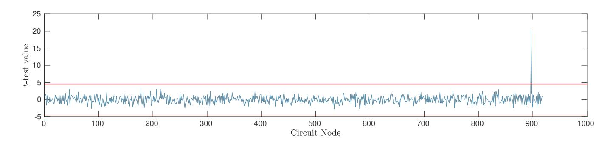
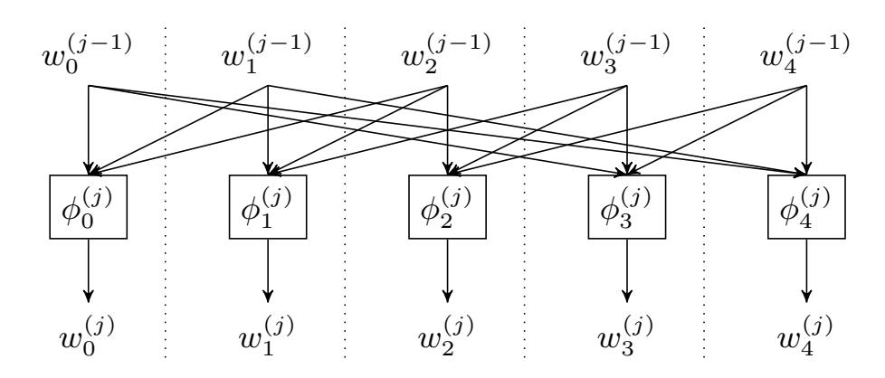
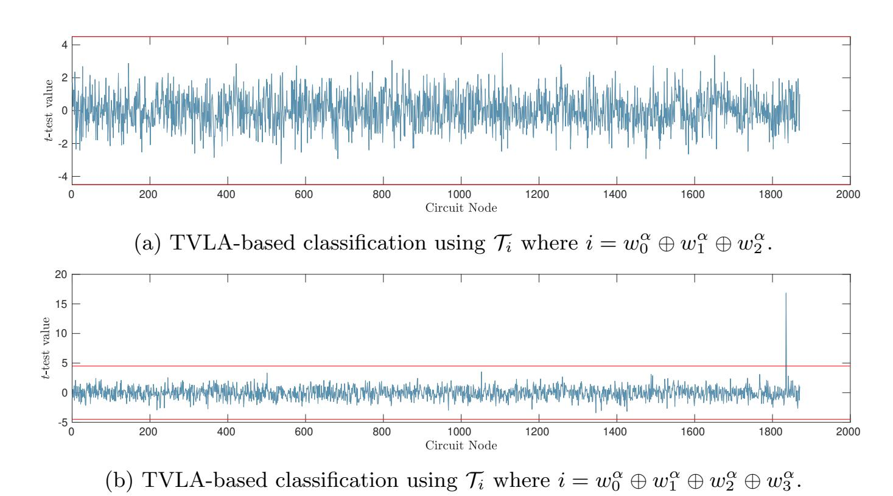
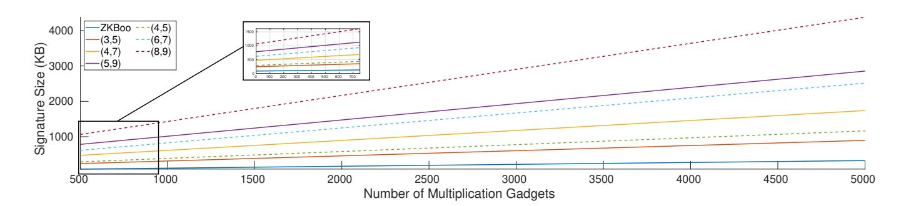
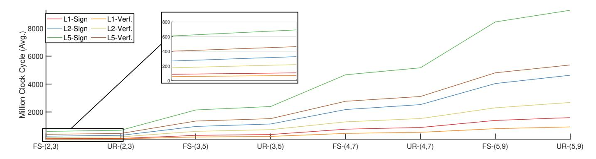
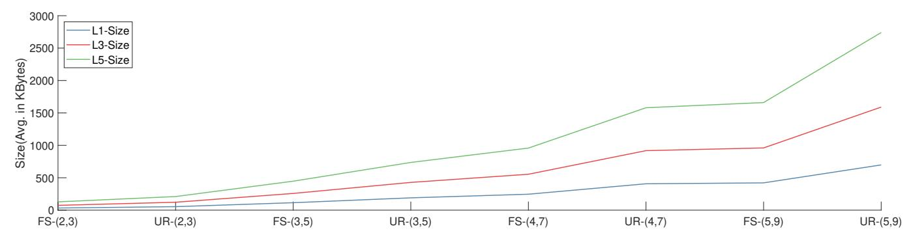

{0}------------------------------------------------

# SNI-in-the-head: Protecting MPC-in-the-head Protocols against Side-channel Analysis

Okan Seker, Sebastian Berndt, Luca Wilke, and Thomas Eisenbarth

University of L¨ubeck, Germany {okan.seker,s.berndt,l.wilke,thomas.eisenbarth}@uni-luebeck.de

Abstract. MPC-in-the-head based protocols have recently gained much popularity and are at the brink of seeing widespread usage. With such widespread use come the spectres of implementation issues and implementation attacks such as side-channel attacks. We show that implementations of protocols implementing the MPC-in-the-head paradigm are vulnerable to side-channel attacks. As a case study, we choose the ZKBoo-protocol of Giacomelli, Madsen, and Orlandi (USENIX 2016) and show that even a single leaked value is sufficient to break the security of the protocol. To show that this attack is not just a theoretical vulnerability, we apply differential power analysis to show the vulnerabilities via a simulation.

In order to remedy this situation, we extend and generalize the ZKBooprotocol by making use of the notion of strong non-interference of Barthe et al. (CCS 2016). To apply this notion to ZKBoo, we construct novel versions of strongly non-interfering gadgets that balance the randomness across the different branches evenly. Finally, we show that each circuit can be decomposed into branches using only these balanced strongly noninterfering gadgets. This allows us to construct a version of ZKBoo, called (n + 1)-ZKBoo which is secure against side-channel attacks with limited overhead in both signature-size and running time. Furthermore, (n + 1)-ZKBoo is scalable to the desired security against adversarial probes. We experimentally confirm that the attacks successful against ZKBoo no longer work on (n + 1)-ZKBoo. Moreover, we present an extensive performance analysis and quantify the overhead of our scheme using a practical implementation.

Keywords: MPC-in-the-head, Zero Knowledge, Strong Non-Interference

# 1 Introduction

Multiparty computation (MPC) is one of the most widely studied cryptographic primitives. For a long time, MPC protocols were believed to be of purely theoretic interest, but recent developments have shown that they are usable for a wide range of practically relevant applications. One well-studied version of these protocols, called MPC-in-the-head, is on the brink of seeing widespread use, e. g. as part of NIST's search for a Post-Quantum Signature Suite of algorithms 

{1}------------------------------------------------

in the form of Picnic [\[12\]](#page-27-0). Due to the development of practical MPC protocols, efficient implementations of such protocols were also developed. In this paper, we study implementation attacks (in the form of side-channel attacks) against MPC protocols.

Side-channel attacks aim to use weaknesses in the implementation of a cryptographic protocol rather than trying to break the protocol itself. The main idea behind these attacks is to use physical information given by the computer on which the implementation of the protocol is running such as timing information [\[32\]](#page-28-0), cache behavior [\[45,](#page-29-0) [47\]](#page-29-1), or power consumption [\[34\]](#page-28-1). These attacks have been successfully performed for over 25 years and many countermeasures have been devised against them. As these schemes often come at the cost of the running time or memory consumption of the protocol, many implementations are still vulnerable to them. In this work, we focus on differential power analysis (DPA) attacks [\[33\]](#page-28-2) that measure the power consumption during the run of an implementation and use statistical tools to derive information about the value of variables at certain points in time. While DPA attacks are known to be widely applicable against many implementations, countermeasures have also been studied intensively.

Many public-key protocols used in modern systems such as RSA or the Diffie-Hellman key exchange have shown to withstand attacks run on classical computers. On the other hand, it is long known that attackers equipped with quantum computers are provably able to break these systems [\[42\]](#page-29-2). While the deployment of practical quantum computers seems to be unlikely within the next decade, the cryptographic community has already started to develop algorithms that withstand these quantum attackers. To standardize some of these algorithms and to foster their timely adoption, NIST has started their Post-Quantum Cryptography Standardization project in 2017, where 82 algorithms were submitted, 69 proceeded to the first round, 26 to the second round, and 15 in the third round [\[13,](#page-27-1) [37,](#page-28-3) [38,](#page-28-4) [1\]](#page-26-0). The standardization focuses on key encapsulation mechanisms (KEMs), from which public-key encryption schemes can be derived easily, and on signature schemes due to their widespread use in modern systems. While the security of most of these algorithms relies on problems revolving around lattices or coding theory that are believed to be intractable for quantum computers, the signature scheme Picnic [\[12\]](#page-27-0) relies on the hardness of SHA-3 and a lowcomplexity symmetric cipher called LowMC [\[2\]](#page-26-1). The underlying zero-knowledge protocol of Picnic follows the MPC-in-the-head paradigm and is called ZKB++ which is an optimised version of ZKBoo [\[23\]](#page-27-2). We will use the ZKBoo protocol as an example both for our attacks on the general MPC-in-the-head paradigm as well as for our defence mechanisms.

# Our results

In this work, we study the applicability of DPA attacks to protocols relying on the MPC-in-the-head paradigm. We also show how one can prevent such attacks. To show the versatility of our approach, we use the ZKBoo protocol [\[23\]](#page-27-2) as an example. The main insight of our approach is that both the MPC-in-the-head 

{2}------------------------------------------------

approach and the masking approach to protect against SCA are MPC protocols and can thus be viewed in a unified way.

As a first step, we show that ZKBoo is vulnerable to DPA attacks that can extract a single variable, as the protocol itself reveals two out of three shares. To show that this line of attack is feasible, we implement a DPA attack that is able to recover the third share with a high degree of certainty. In order to remedy such attacks, we first generalize the notion of (2,3)-decompositions of functions introduced in [23]. This allows us to apply MPC-based masking techniques—which are widely used to counteract DPA attacks—in the setting of MPC-in-the-head protocols. To use MPC-based DPA protection in MPC-in-the-head protocols, we need gadgets, where a strict subset of the output variables does not reveal any information about the input variables. Formally, this requirement is captured by the notion of strong non-interference (SNI) [7]. While SNI gadgets are known in the literature, none of them are compatible with the function decompositions needed for ZKBoo, as the dependency between the partial functions is imbalanced. Hence, we design suitable balanced SNI gadgets to obtain a generalized version of ZKBoo, called (n+1)-ZKBoo that reveals  $\lfloor n/2 \rfloor + 1$  shares out of n+1. Any attacker obtaining  $n - (\lfloor n/2 \rfloor + 1)$  additional variables thus only knows n out of n+1 shares and is still not able to recover the complete input. To show the feasibility of our defense mechanisms, we implemented this algorithm for n+1=5 (thus revealing three shares). Our experiments show that the extraction of a single additional variable is not sufficient to reconstruct the input. To protect against n probes, the size of the communication of (n + 1)-ZKBoo is about (n+1)/4 times larger than those of the original ZKBoo, while the running time of (n+1)-ZKBoo is about (n+1)(n+2)/9 times larger than ZKBoo.

## 2 Preliminaries

First, we summarize the notation used in the rest of the paper. In the following, we fix some finite ring  $(\mathbb{K}, \oplus, \otimes)$  with an *addition* operation  $\oplus$  and a *multiplication* operation  $\otimes$ . As usual, we often omit the multiplication symbol  $\otimes$  and thus write xy instead of  $x \otimes y$ . For  $a, b \in \mathbb{Z}$  with a < b, we define  $[a, b] := \{a, a+1, \ldots, b-1, b\}$ . The letters  $x, y, z, \ldots$  represent the sensitive variables. Random variables are represented by the letter r, with an index as  $r_i$ . To denote a random selection of a variable r from the field  $\mathbb{K}$ , we use  $r \in_R \mathbb{K}$ .

Typically, a variable x is split into n+1 shares  $x_0, \ldots, x_n$  such that  $x=\bigoplus_{i=0}^n x_i$ . The value n is called the masking order. This technique of masking was popularized in [11]. A vector of shares  $(x_0, \ldots, x_n)$  is denoted by  $\overline{x}$ , and the underlying masked value is given by  $x=\bigoplus_{i=0}^n x_i$ . For a subset  $I\subseteq [0,n]$  of indices, we denote by  $x_{|I|}=(x_i)_{i\in I}$  the sub-vector of shares indexed by I. A gadget G for a function  $f\colon \mathbb{K}^a\to\mathbb{K}^b$  (with regard to a masking order) is an arithmetic circuit with  $a\cdot (n+1)$  inputs and  $b\cdot (n+1)$  outputs grouped into a vectors of shares  $\overline{x}^{(1)},\ldots,\overline{x}^{(a)}$ , resp. b vectors of shares  $\overline{y}^{(1)},\ldots,\overline{y}^{(b)}$ . The arithmetic circuits have five kinds of gates: the unary  $\oplus_{\alpha}$  gate with  $\alpha\in\mathbb{K}$ , which on input x outputs  $x\oplus\alpha$ ; the unary  $\otimes_{\alpha}$  gate with  $\alpha\in\mathbb{K}$ , which on input

{3}------------------------------------------------

x outputs  $x \otimes \alpha$ ; the binary  $\oplus$  gate which on inputs x, x' outputs  $x \oplus x'$ ; the binary  $\otimes$  gate, which on inputs x, x' outputs  $x \otimes x'$ ; and the random gate with fan-in 0 that produce a uniformly chosen random element  $r \in_R \mathbb{K}$ . Note that in the case of  $\mathbb{K} = \mathrm{GF}(2)$ , these gates directly correspond to AND, XOR, and NOT gates. The gadget needs to be correct, i.e.  $G(\overline{x}^{(1)}, \ldots, \overline{x}^{(a)}) = (\overline{y}^{(1)}, \ldots, \overline{y}^{(b)})$  iff  $f(x^{(1)}, \ldots, x^{(a)}) = (y^{(1)}, \ldots, y^{(b)})$  for all possible inputs and for all values generated by the random gates. The values assigned to wires that are not output wires are called *intermediate variables*.

We also make use of a statistically binding commitment scheme and will denote the commitment algorithm as Comm (see e. g. [24] for a formal definition). Throughout this paper, we omit the modulus operation mod(n+1) to improve readability. Logarithms are always taken with base 2, i. e.  $\log(x) := \log_2(x)$ .

# 2.1 MPC-in-the-head Paradigm

Secure multiparty computation (MPC) is a very useful paradigm used in many cryptographic protocols. Interestingly, the number of parties in an MPC protocol is usually denoted as n, whereas the number of shares in which a secret is split is usually denoted as n+1. As we mix both approaches, we decided to use n+1parties/shares throughout this work. An MPC protocol  $\Pi_f$  for a function f with arity n+1 is a protocol played by n+1 parties  $P_0,\ldots,P_n$ . Party  $P_i$  has some secret  $x_i$  and the goal of the protocol is to compute  $f(x_0, \ldots, x_n)$  such that  $P_i$  does not learn anything about  $x_j$  for  $j \neq i$ . The  $view(P_i)$  of a party  $P_i$  is a string containing the secret  $x_i$ , the randomness  $r_i$  used by  $P_i$  and all messages sent to  $P_i$  and all message sent by  $P_i$ . Two views  $View(P_i)$ ,  $View(P_j)$ are consistent if the messages sent from  $P_i$  to  $P_j$  are exactly the messages received by  $P_j$  from  $P_i$  and vice versa. Such a protocol  $\Pi_f$  is perfectly correct, if the output  $\Pi_f(x_0,\ldots,x_n)$  on inputs  $x_0,\ldots,x_n$  generated by the protocol equals  $f(x_0,\ldots,x_n)$  for all possible randomness used by the parties. Furthermore, a protocol  $\Pi_f$  is t-MPC-private if for all  $T \subseteq [0, n]$  with  $|T| \le t$  and all  $x_0, \ldots, x_n$ , there is a simulator S that on input  $(T,(x_i)_{i\in T},f(x_0,\ldots,x_n))$  outputs a vector  $(v_i)_{i\in T}$  such that  $(v_i)_{i\in T}$  and  $(\text{View}(P_i))_{i\in T}$  have the same distribution.

Corrupted parties aiming to break the MPC-privacy of such a protocol can either be semi-honest (they follow the rules of the protocol, but try to obtain additional information from the transcripts) or malicious (they do not need to follow the protocol at all). Surprisingly, Ishai et al. [28] showed that security against semi-honest attackers is sufficient to obtain zero-knowledge proofs.

The main idea is to use the function  $f_y(x) := R(x,y)$  for an instance y and split the witness x into shares  $x_0, \ldots, x_n$  with  $x = \bigoplus x_i$ . The prover then simulates the MPC protocol for n+1 parties, where party i has input  $x_i$ . For each party i, this simulations generates a view and the prover uses a commitment scheme to commit to these views and sends all of the commitments to the verifier. The verifier now requests a random subset of the views from the prover, checks whether they belong to the commitments and whether they are consistent. One important advantage of this approach is the small communication complexity

{4}------------------------------------------------

dominated by the size of the views and their commitments. Figure 1 contains a more formal description.

<span id="page-4-0"></span>The verifier and the prover have input  $y \in L_R$ . The prover knows x such that R(x,y) = 1. A perfectly correct and t-MPC-private n + 1-party MPC protocol  $\Pi_{f_y}$  is given  $(2 \le t \le n)$ 

Commit The prover does the following:

- 1. Sample random vectors  $x_1, \ldots, x_n$ . Set  $x_0 = x \ominus \bigoplus_{i=1}^n x_i$ .
- 2. Run  $\Pi_{f_y}(x_0,\dots,x_n)$  and obtain the views  $w_i = \text{View}(P_i)$  for all  $i \in [0,n]$ .
- 3. Compute commitment  $\mathbf{a} = \mathsf{Comm}(w_0, \dots, w_n)$  and send  $\mathbf{a}$  to the verifier.

**Prove** The verifier chooses a subset  $\mathbf{E} \subset [0, n]$  such that  $|\mathbf{E}| = t$  and sends it to the prover. The prover reveals the value  $w_e$  for all  $e \in \mathbf{E}$ .

Verify The verifier runs the following checks:

- 1. Simulate the run of all parties  $e \in \mathbf{E}$  using  $w_e$ . If  $\exists e \in \mathbf{E}$  such that the output of e is not 1, output reject.
- 2. If  $\exists \{i, j\} \subset \mathbf{E}$  such that  $w_i$  is not consistent with  $w_j$ , output reject.
- 3. Output accept.

Fig. 1: The MPC-in-the-head protocol

This transformation, which is called the *MPC-in-the-head paradigm* has been used for many applications, first mainly for theoretical ones such as the black-box construction of non-malleable commitments [26] or zero-knowledge protocols having communication complexity proportional only to the square-root of the verification circuit [4], but later also for practically usable implementations including zero-knowledge proofs [23] and signature schemes for post-quantum cryptography [12, 31, 10, 16].

#### 2.2 Zero-knowledge Proofs

A zero-knowledge proof between a prover  $\mathcal{P}$  and a verifier  $\mathcal{V}$  is a two-player game. The goal of the the prover  $\mathcal{P}$  is to convince the verifier  $\mathcal{V}$  that they know a certain secret x without revealing any information about this secret. Zero-knowledge proofs are extremely useful for different cryptographic applications such as signature schemes or multi-party computations. In this work, we only need a certain kind of well-structured protocol, called a  $\Sigma$ -protocol. In the following, let  $R \subseteq \{0,1\}^* \times \{0,1\}^*$  be an NP-relation, i.e. for all  $x,y \in \{0,1\}^*$ , the value R(x,y) can be computed in polynomial time and if R(x,y) = 1, we have  $|x| \leq |y|^{O(1)}$ . Here, we identify the relation R with its binary characteristic function  $R: \{0,1\}^* \times \{0,1\}^* \to \{0,1\}$  with R(x,y) = 1 iff  $(x,y) \in R$ . The value x is a witness to y. By  $L_R$ , we denote the language associated with R, i.e.  $L_R = \{y \mid \exists x \text{ s.t. } R(x,y) = 1\}$ . In some parts of this work, we make the relation R explicit using a function  $\phi: \{0,1\}^* \to \{0,1\}^*$  with the natural interpretation of  $L_{\phi} = \{y \mid \exists x \text{ s.t. } \phi(x) = y\}$ .

{5}------------------------------------------------

Definition 1 (Σ-protocol [\[27\]](#page-28-8)). The goal of the protocol ΠR(y) between two players P and V is to convince V that y ∈ LR, where y ∈ {0, 1} ∗ is known to both players. Such a protocol is called a Σ-protocol for the relation R if it satisfies the following conditions:

- Π<sup>R</sup> has the following communication pattern:
  - 1. Commit: P sends a first message a to V,
  - 2. Challenge: V sends a random element e to P,
  - 3. Prove: P replies with a second message z.
- Completeness: If both players P and V are honest and y ∈ LR, then P r[(P, V)(y) = accept] = 1.
- s-Special Soundness: For any y and any set of s ≥ 2 of accepting conversations {(a, e<sup>i</sup> , zi)}i∈[s] with e<sup>i</sup> 6= e<sup>j</sup> if i 6= j, a witness x for y can be efficiently computed.
- Special honest-verifier ZK: There exists a PPT simulator S such that on input y ∈ L<sup>R</sup> and e outputs a triple (a 0 , e, z 0 ) with the same probability distribution as a real conversations (a, e, z) of the protocol.

Furthermore, a Σ-protocol is a public-coin protocol, as the verifier V only sends random messages. Hence, the Fiat-Shamir transformation [\[21\]](#page-27-5) or the Unruh transformation [\[46\]](#page-29-3) can be used to make them non-interactive in the random oracle model. Note that the Unruh transformation always gives security against quantum adversaries, while the Fiat-Shamir transformation does not do this in general [\[3\]](#page-26-6). Nevertheless, recently it was shown that the Fiat-Shamir transformation is still secure against quantum adversaries for a large class of protocols [\[35,](#page-28-9) [17\]](#page-27-6).

### <span id="page-5-0"></span>2.3 ZKBoo

An important Σ-protocol based on the MPC-in-the-head paradigm is called ZKBoo [\[23\]](#page-27-2). The goal of the protocol is to convince the verifier that the prover has an input x to an arithmetic circuit φ such that φ(x) = y, where φ and y are publicly known. The general idea behind ZKBoo is the partition of φ into a (2, 3) decomposition, i. e. the computation of this circuit is split into three branches φ0, φ1, φ2. The input x to φ is furthermore split into three shares x0, x1, x<sup>2</sup> such that the computation of φ<sup>i</sup> only depends on the shares x<sup>i</sup> and xi+1. After this computation by the prover, the verifier chooses a random index e ∈<sup>R</sup> {0, 1, 2} and is given the computations of φ<sup>e</sup> and φe+1 along with the inputs x<sup>e</sup> and xe+1. This information can be used to verify the computations on these branches without revealing the complete input x to the verifier. Due to the small size of the communication — roughly dominated by the number of multiplication gates in φ — the ZKBoo-protocol has seen wide use. We provide a detailed description of the protocol in Figure [2.](#page-8-0) Most famously, an optimized version called ZKB++ is the basis of the post-quantum secure Picnic signature scheme — an alternate candidate in round three of the NIST standardization process [\[12\]](#page-27-0). Note that Picnic2 (resp. Picnic3) also use the MPC-in-the-head paradigm, but are based on the KKW protocol [\[31\]](#page-28-7) which allows for a preprocessing phase and better parameter tuning [\[30\]](#page-28-10).

{6}------------------------------------------------

### 2.4 Strong Non-Interference

A widely adopted defense mechanism against physical attacks on cryptographic implementations, such as side-channel attacks (SCA) or other methods that allow to deduce the value of some variables, is masking [\[11\]](#page-26-3). Ishai et al. [\[29\]](#page-28-11) introduced the notion of privacy that allows to construct and formally analyze building blocks (or gadgets), and introduced a scalable multiplication gadget. The definition of privacy requires the input to be uniformly distributed. Removing this requirement led to the notion of threshold non-interference (NI) in [\[7\]](#page-26-2).[1](#page-6-0) Informally, a gadget is t-non-interfering if every set of at most t probes of intermediate variables or output variables can be simulated with at most t shares of each input [\[9\]](#page-26-7). Intuitively, a t-non-interfering gadget is robust against attacks where the attacker can gain knowledge of t variables. Unfortunately, this notion of non-interference is not composable, i. e. the composition of two t-noninterfering gadgets is not necessarily t-non-interfering [\[15\]](#page-27-7). A more composable notion of non-interference, called strong non-interference (SNI) was thus proposed in [\[7\]](#page-26-2). Informally, a gadget is t-SNI if the knowledge of t<sup>1</sup> intermediate variables and t<sup>2</sup> output variables with t<sup>1</sup> + t<sup>2</sup> ≤ t only allows the leak of t<sup>1</sup> (not t) input variables. Hence, the adversary could just have probed the t<sup>1</sup> input variables. More formally, this notion is defined as follows.

<span id="page-6-1"></span>Definition 2 (t-SNI Security [\[9\]](#page-26-7)). Let G be a gadget which takes as input n + 1 shares (xi)0≤i≤<sup>n</sup> and outputs n + 1 shares (yi)0≤i≤n. The gadget G is said to be t-SNI secure if for any set of t<sup>1</sup> probed intermediate variables and any subset O ⊂ [0, n] of output indices, such that t<sup>1</sup> + |O| ≤ t, there exists a subset I ⊂ [0, n] of input indices which satisfies |I| ≤ t1, such that the t<sup>1</sup> intermediate variables and the output variables y|O can be perfectly simulated from x<sup>|</sup><sup>I</sup> .

Here, perfectly simulatable means that there is a probabilistic algorithm that on input x<sup>|</sup><sup>I</sup> generates t intermediate variables and |O| output variables with the same probability distribution as the gadget. The notion of t-SNI security is known to provide scalable protection against a broad class of side-channel attacks up to t-th order under few additional assumptions [\[18\]](#page-27-8), where the needed number of observations grows exponentially in t. It has been widely adopted e.g. for automation of applying and checking side-channel resistance in hardware and software designs [\[5\]](#page-26-8) and can be viewed as a reliable and fairly efficient method to achieve a desired degree of side-channel resistance. Similarly, SNI can also be used to ensure and verify protection of hardware circuits, where special care needs to be taken to account for glitches, either by extending the model or by carefully placing registers to interrupt unintended asynchronous propagation of signals [\[20\]](#page-27-9).

Masking schemes are commonly used to protect against SCA, such as the ones achieving SNI security, are also MPC protocols. In the case of masking, the parties are just different parts of the same circuit (one might call it MPC-inthe-circuit), forcing an attacker to consider more than t parts of the circuit in

<span id="page-6-0"></span><sup>1</sup> We actively avoid the notion of probing security, which, depending on the source, might either be equivalent to NI [\[14\]](#page-27-10) or to privacy [\[5\]](#page-26-8).

{7}------------------------------------------------

parallel to infer about secret intermediate values. In this work, we show that the view of masking as a MPC does help to achieve protection against SCA.

# <span id="page-7-0"></span>3 Probing Attacks against MPC-in-the-head

In this section we analyze the MPC-in-the-head paradigm with respect to sidechannel attacks such as differential power analysis.

Let us first describe the adversarial model. We use the noisy leakage model introduced by Chari et al. [\[11\]](#page-26-3) and extended by Prouff and Rivain [\[39\]](#page-28-12). In this model the adversary can obtain each intermediate value perturbed with a noisy leakage function. As given in [\[11\]](#page-26-3), this model captures practical real-world physical leakages. Moreover, as proven by Duc et al. [\[18\]](#page-27-8), security against probing adversaries as defined in [\[29\]](#page-28-11) implies security in the noisy leakage model. In this setting, a probing adversary may invoke the (randomized) construction multiple times and adaptively choose the inputs. Prior to each invocation, the adversary may fix an arbitrary set of t wires of the circuit values that can be observed during that invocation. Unprotected cryptographic implementations usually are insecure and thus vulnerable to attacks probing even t = 1 wires. In the following, we will show this to be true for the MPC-in-the-head protocol. Note that a single probe will only provide a few key bits, but the attack scales linearly in the key size. Side-channel countermeasures depend on the quality of the side-channel, its signal-to-noise ratio. If the implementation is noisy or has weak side-channels, security against t = 2 can be sufficient. Currently, protection against t = 4 probes is often an upper bound on security in practical systems [\[36\]](#page-28-13).

The rest of the section is dedicated to showing why MPC-in-the-head protocols are vulnerable to DPA attacks and how this can be practically exploited. In order to get a better understanding of these vulnerabilities, we introduce some informal notations. In general, the goal of a probing attack (such as a DPA attack) is to reconstruct the secret input x given to some algorithm A by obtaining values used in the computation of A(x). We say that an algorithm A is k-secure, if at least k probes are needed to reconstruct the secret x. Combining the masking technique with masking order n and modifying the circuits used in A by using n-SNI gadgets results in an algorithm A 0 that is n · k-secure [\[7\]](#page-26-2). Now, consider the case that A 0 is an implementation of the (n+ 1)-party MPC-in-the-head zero knowledge protocol as given in Figure [1.](#page-4-0) As the protocol gives out t shares to the verifier, the security of A 0 drops down by t to n · k − t, as t input shares are now known to the attacker.

In order to illustrate that this is not only a theoretical weakness, we study the ZKBoo protocol using the (2, 3)-circuit decomposition as defined in Appendix [A.](#page-29-4) We first show that an attack using the opened views is indeed possible by using a single probed value. Then, we show how an adversary can construct such a probe from side-channel measurements of an implementation where sensitive intermediate values leak.

{8}------------------------------------------------

### <span id="page-8-1"></span>3.1 Probing ZKBoo

As described in Section [2.3,](#page-5-0) the ZKBoo protocol uses a three-party decomposition of a function φ and a public value y, where the prover proves the knowledge of a secret value x such that φ(x) = y. As summarized in Figure [2,](#page-8-0) the prover first commits views for each party. The views contain random tapes that have been used to sample random values in the circuit as well as the vector of values for each output gadget. Depending on the challenge, the prover opens a subset of these values.

<span id="page-8-0"></span>A (2,3)-decomposition of a function φ is given as Πφ. The verifier and the prover have input y ∈ Lφ. The prover knows x such that y = φ(x).

Commit: The prover does the following:

- 1. Generate random tapes R0, R1, R2.
- 2. Run Πφ(x) with randomness R0, R1, and R<sup>2</sup> to obtain views w0, w1, w<sup>2</sup> and outputs y0, y1, y2.
- 3. Commit to c<sup>i</sup> = Comm(wi, Ri) for i ∈ [0, 2].
- 4. Send a = (y0, y1, y2, c0, c1, c2).

Prove: The verifier chooses an index e ∈ [0, 2] and sends it to the prover. The prover answers to the verifier's challenge sending opening ce, and ce+1 thus revealing z = (R<sup>j</sup> , w<sup>j</sup> )j∈{e,e+1}.

Verify: The verifier runs the following checks:

- 1. If Rec(y0, y1, y2) 6= y, output reject.
- 2. If ∃ i ∈ {e, e + 1} such that y<sup>i</sup> 6= Output<sup>i</sup> (wi), output reject.
- 3. If ∃ j such that the j-th output is not equal to w (j) <sup>e</sup> 6= φ (j) <sup>e</sup> (we, Re, we+1, Re+1), output reject.
- 4. Output accept.

Fig. 2: ZKBoo protocol as defined by Giacomelli et al. [\[23\]](#page-27-2).

From the protocol description, it can easily seen that ZKBoo reveals two out of its three shares. Note that these shares also contain two of the three input shares xe, xe+1. Hence, obtaining the missing input share xe+2 via a probe allows an attacker to deduce the complete secret input x to the function φ. In the following, we will show how such a probe can be constructed, as demonstrated by Gellersen et al. [\[22\]](#page-27-11).

### 3.2 Side-Channel Analysis of ZKBoo

In side-channel analysis, probes are usually just a weak leakage of a sensitive intermediate value, obtained from several measurements. For ZKBoo, we assume the same scenario as in Subsection [3.1,](#page-8-1) where two of three shares (x0, x1) are revealed by the protocol. As described above, even in the simplest scenario, the input views can be used to implement a side-channel attack. We further assume a leakage model where an implementation leaks weak and noisy information 

{9}------------------------------------------------

about each intermediate variable, separately and independently in observable measurement traces t`. The MPC-in-the-head measurements have a weak and noisy dependence on x2, which can be exploited due the revealed shares x<sup>0</sup> and x1, as shown in [\[22\]](#page-27-11). In order to validate the straightforward exploitability, we use a simple t-test setup, where we collect a set of synthetically generated traces that corresponds to a function evaluation that uses (2,3)-circuit decomposition of ZKBoo. The analysis uses the side-channel information of the unopened view for an adversarial probe t<sup>A</sup> and the two opened shares of a multiplication gadget. In order to show the noisy dependence on x2, we first target a single multiplication gadget that gets inputs (x0, x1, x2) and (y0, y1, y2) and outputs three shares (z0, z1, z2). We classify the sets into two groups depending on the value of z0⊕z1. The result of the analysis in Figure [3](#page-9-0) shows the clear dependence between the unrevealed share z<sup>2</sup> and the observable measurement traces, as the t-value clearly exceeds 5.

<span id="page-9-0"></span>

Fig. 3: A t-test based leakage analysis of a multiplication gadget in ZKBoo using the classification T<sup>i</sup> where i = z<sup>0</sup> ⊕z1. The details of the experimental setup and formulation can found in Section [5.1.](#page-19-0)

We consider opened views as a part of probing values in Definition [2.](#page-6-1) Thus we show that an additional probe shatters the independence of the side-channel traces and the sensitive variables.

Formally speaking, a single adversarial probe disables the simulators capability (which is defined in Definition [2\)](#page-6-1) to simulate variables using a set of independent and uniformly chosen variables. Hence the multiplication gadget used in ZKBoo is not sufficient to guarantee SCA-resistance. Using the discussion given above, we can formally restate the simulation in Definition [2](#page-6-1) as follows:

<span id="page-9-1"></span>Definition 3 ((tA, t<sup>E</sup> )-SNI Security for MPC-in-the-head protocol). Let G be a gadget which takes as input n + 1 shares (xi)0≤i≤<sup>n</sup> and outputs n + 1 shares (yi)0≤i≤n. The gadget G is said to be (tA, t<sup>E</sup> )-SNI secure if for any set of t<sup>A</sup> probed intermediate variables, t<sup>E</sup> opened variables and any subset O ⊂ [0, n] of output indices, such that t<sup>A</sup> + t<sup>E</sup> + |O| ≤ t, there exists a subset I ⊂ [0, n] of input indices with |I| ≤ tA, such that the t<sup>A</sup> intermediate variables and the output variables y|O can be perfectly simulated from x<sup>|</sup><sup>I</sup> .

Definition [3](#page-9-1) is equivalent to Definition [2](#page-6-1) if t<sup>E</sup> = 0, i. e. if there exist no opened values. More formally, t-SNI implies (t1, t2)-SNI for all t<sup>1</sup> + t<sup>2</sup> ≤ t. On the other 

{10}------------------------------------------------

hand, this leaked data might be chosen carefully such that t<sup>E</sup> leaked output variables only give information on t<sup>E</sup> /2 input variables. In such a case, using a t-SNI gadget might actually give a (tA, t<sup>E</sup> ) gadget with t<sup>A</sup> + t<sup>E</sup> /2 = t, giving a more fine-granular view.

The above definition captures the intuition that protocols following the MPCin-the-head paradigm leak information all by themselves due to the opening of some views. Without the presence of side-channel attacks, this is not a problem, as the privacy of the underlying MPC protocol guarantees that no information about the secret is leaked. But in the presence of side-channel attacks, this leaked information can drastically help the attacker. Using the (tA, t<sup>E</sup> )-SNI notion, we can design MPC-in-the-head protocols that achieve t-SNI security even if a subset of the views are revealed. In the next section we provide a circuit decomposition and define our protocol.

# <span id="page-10-0"></span>4 Constructing SNI-secure Decompositions

In this section, we introduce a decomposition of an arithmetic circuit secure in the SNI notion. We start with a generic decomposition definition that will be used for the circuit decomposition in the following sections. In [\[23\]](#page-27-2), the notion of a (2, 3)-decomposition was introduced. Informally, such a decomposition splits a function φ into three branches such that the computations of two of those branches are not enough to reconstruct the complete computation of the function. A formal definition is given in Appendix [A.](#page-29-4) In ZKBoo, two of these branches are revealed, while the third branch stays hidden. As shown in Section [3.1,](#page-8-1) this allows DPA attacks against ZKBoo, as a single probed value from this third branch might be sufficient to reconstruct the complete computation. In this section, we thus aim to construct function decompositions that are SNIsecure and withstand such probes. We first introduce a generalization of (2, 3) decompositions, called (k, n + 1)-decompositions, consisting of n + 1 branches, where each branch depends only on k branches. Defining balanced SNI-secure versions of the multiplication gadget and the refresh gadget allows us to construct a (dn/2e+ 1, n+ 1)-decomposition for functions represented by arithmetic circuits. Moreover, we show that this is n-SNI.

### 4.1 Decomposing a Function

Let φ: X → Y be an arbitrary function. The protocol is performed on an input value x ∈ X that computes φ(x) = y. We assume that the computation of φ can be split into d steps. For example, if φ is implemented via a circuit, d is the number of gates. We use a transformation on the function φ to split the evaluation and the secret x into n + 1 branches such that revealing n of them brings no information about the secret value x. The first step is to apply a surjective (possibly randomized) algorithm Share to x to split it into input shares x0, . . . , xn. The input shares and the intermediate values for the i-th branch are stored in w<sup>i</sup> , which is called a view, and contains (d + 1) elements 

{11}------------------------------------------------

 $w_i^{(0)}, \ldots, w_i^{(d)}$ . The 0-th value  $w_i^{(0)}$  of a view  $w_i$  is simply its input share  $x_i$ . The single steps of the computation are described by a set of  $(n+1)\cdot (d+1)$  functions  $\mathcal{F} = \{\phi_i^{(j)} | \forall 0 \leq i \leq n \text{ and } 0 \leq j \leq d\}$ . In order to guarantee that k views are sufficient to recompute a single branch, the functions  $\phi_i^{(j)}$  take input from the k branches  $i, i+1, \ldots, i+(k-1)$ . The remaining values  $w_i^{(j)}$  can be computed in the following iterative way:

$$w_i^{(j)} = \phi_i^{(j)}((w_m^{[0,j-1]}; R_m)_{i \le m \le i + (k-1)}) \text{ for } 0 \le i \le n,$$

where  $w_m^{[0,j-1]} = (w_m^{(0)}, \dots, w_m^{(j-1)})$ . Here,  $R_i$  denotes the source of randomness within the *i*-th branch. As an example we can see the visual representation of  $\phi^{(j)}$  for n+1=5 in Figure 4.

<span id="page-11-0"></span>

Fig. 4: The representation of the branches for the j-th gadget  $\phi^j$  of the (k = 3, n = 4) decomposition for the function  $\phi$ . Observe that each branch requires at most k = 3 views.

After evaluating the d functions, the output value  $y_i$  is computed from  $w_i$  by the functions  $\mathsf{Output}_i$ , i.e.  $y_i = \mathsf{Output}_i(w_i)$ . Finally, the output values  $y_i$  are recombined as  $\mathsf{Rec}(y_0, \ldots, y_n) = y = \phi(x)$ .

Now, we can introduce the complete (k, n+1)-decomposition definition generalizing the definition given in [23]. Note that the influence of the parameter k comes from the arity of the functions  $\phi_i^{(j)}$ , which take input from at most k branches  $i, i+1, \ldots, i+(k-1)$ .

**Definition 4.** A (k, n+1)-decomposition  $\mathcal{D}$  of a function  $\phi \colon X \to Y$  is a set of functions

$$\mathcal{D} = \{ Share, (Output_i)_{0 \le i \le n}, Rec \} \cup \mathcal{F},$$

such that Share, Output<sub>i</sub>, Rec, and  $\mathcal{F}$  are defined as above. Let  $\Pi_{\phi}$  be the evaluation protocol defined in Figure 5.

The decomposition must also have the following properties:

- Correctness:  $Pr[\phi(x) = \Pi_{\phi}(x)] = 1$  for all  $x \in X$ , where the probability is over the random choices.

{12}------------------------------------------------

- n-Privacy: The protocol is correct and for all  $e \in [0, n]$  there exists a PPT algorithm  $S_e$  such that the distribution  $S_e(\phi, y)$  and the distribution  $(\{R_i, w_i\}_{i \in \{e, e+1, \dots, e+(n-1)\}}, y_{e-1})$  are statistically indistinguishable.

<span id="page-12-0"></span>Let  $\phi \colon X \to Y$  be a function and  $\mathcal{D}$  be a (k, n+1)-decomposition of  $\phi$ . For an input  $x \in X$ , perform the following:

1. Generate the random tapes  $R_i$  for  $0 \le i \le n$ .

2. Generate the secret shares:  $(x_0, \ldots, x_n) \leftarrow \mathsf{Share}(x; r_1, \ldots, r_n)$  where  $r_i$  is sampled

from the random tape  $R_i$ .

– Initialise  $w_i^{(0)} \leftarrow x_i$  for  $0 \le i \le n$ .

- For  $1 \le j \le d$  compute

$$w_i^{(j)} = \phi_i^{(j)}((w_m^{[0,j-1]}; R_m)_{i \le m \le i + (k-1)}) \text{ for } 0 \le i \le n$$

3. Compute  $y_i = \mathsf{Output}_i(w_i, R_i)$  for  $0 \le i \le n$ .

4. Output  $y = \text{Rec}(y_0, \dots, y_n)$ .

Fig. 5: A protocol  $\Pi_{\phi}$  using a decomposition  $\mathcal{D}$  to evaluate  $\phi(x)$ . The figure is adapted from [23].

The goal of the next subsection is the construction of (k, n+1)-decompositions for functions  $\phi \colon \mathbb{K}^{\phi_{\text{in}}} \to \mathbb{K}^{\phi_{\text{out}}}$  implemented by an arithmetic circuit. Furthermore, we want this decomposition to be n-SNI to prevent the attacks described in Section 3.1. Note that the construction of a (n, n+1)-decomposition is just a simple generalization of the linear (2,3)-decomposition of |23| and still vulnerable to the same attacks. In the next section, we will thus construct a (k, n + 1)decomposition for all  $k \geq \lceil n/2 \rceil + 1$ . These decomposition will allow to construct algorithms secure against n-k probes. As  $k=\lceil n/2\rceil+1$  gives the best security against DPAs, we focus on this case. The main technical problem to construct an  $(\lceil n/2 \rceil + 1, n+1)$ -decomposition is the fact that each gate/function  $\phi_i^{(j)}$  can have inputs only from branches  $i, i+1, \ldots, i+\lceil n/2 \rceil$ . Taking a closer look at the existing construction of gadgets against side-channel attacks for multiplication (for example, the ISW gadget of |29| or the more refined version of |40|) shows that the computation of the i-th branch depends on i other branches. These gadgets are thus not suited for our approach. To guarantee that each branch depends only on  $\lceil n/2 \rceil$  other branches, we construct balanced gadgets.

### 4.2 Constructing Balanced Gadgets

Next we focus on the gadgets. As gates such as unary addition, unary multiplication, and binary addition are linear, there is no need for secure gadgets for these operations. We thus only need to examine the two essential SNI-secure gadgets

{13}------------------------------------------------

needed for the multiplication operation. To obtain a secure multiplication operation, a *refresh gadget* is also needed, whenever a variable is used in multiple multiplication gates. See e. g. [5] for a more formal treatment.

We need to analyze and adapt these gadgets because all known SNI-secure gadgets have an unbalanced structure, which causes the need for more than  $\lceil n/2 \rceil$  other views to compute some output share. Therefore, the main goal is to generate gadgets such that every branch needs at most  $\lceil n/2 \rceil$  other input shares in order to compute the corresponding output share.

<span id="page-13-0"></span>**Balancing the Multiplication Gadget** First, we shortly review the multiplication gadget defined in [40] and proven to be n-SNI in [7]. Let  $(x_0, \ldots, x_n)$  and  $(y_0, \ldots, y_n)$  be the shares of the two sensitive variables x and y. The multiplication gadget to calculate the output shares  $(z_0, \ldots, z_n)$  of z = xy can be summarized in three steps as follows:

- 1. For  $0 \le i < j \le n$ , sample  $r_{i,j} \in_R \mathbb{K}$ .
- 2. Calculate  $r_{j,i} = (r_{i,j} \oplus x_i y_j) \oplus x_j y_i$  for  $0 \le i < j \le n$ .
- 3. Calculate  $z_i = x_i y_i \oplus \bigoplus_{j=0; j \neq i}^n r_{i,j}$  for  $0 \le i \le n$ .

As seen in the description above, the calculation of  $z_i$  requires n-i fresh random values  $(r_{i,j}$  such that i < j) and i intermediate products  $(r_{i,j}$  such that i > j). In order to generate a  $(\lceil n/2 \rceil + 1, n)$ -decomposition, we need to have a balanced multiplication gadget such that every index requires about the same number of random values and intermediate products.

Informally, we can illustrate the intermediate values of the multiplication gadget as a matrix A with  $A_{i,j}$  defined as (i)  $x_iy_i$  for i = j, (ii)  $r_{i,j} \in_R \mathbb{K}$  for i < j, and (iii)  $(r_{i,j} \oplus x_iy_j) \oplus x_jy_i$  for i > j.

Hence we can represent the output shares as  $z_i = \bigoplus_{j=0}^n \mathbb{A}_{i,j}$ . Using this representation, n(n+1)/2 random values (and intermediate products) can be reorganised in such a way that each row contains at most  $\lfloor n/2 \rfloor$  intermediate products. In order to do so, we define for  $i \in [0, n]$  the interval  $J_i$  as follows:

- If n is even, we define  $J_i = \{i+1, \ldots, i+\lfloor n/2 \rfloor\}$ .
- If n is odd and i < (n+1)/2, we also define  $J_i = \{i+1, \ldots, i+\lfloor n/2 \rfloor\}$ .
- Finally, if n is odd and  $i \ge (n+1)/2$ , we define  $J_i = \{i+1, \ldots, i+\lfloor n/2 \rfloor, i+\lfloor n/2 \rfloor + 1\}$ .

As always, modular arithmetic is used here, i. e.  $|J_i| \in \{\lfloor n/2 \rfloor, \lfloor n/2 \rfloor + 1\}$  for all i. In order to generate a balanced multiplication gadget, one can take a partial transpose of the matrix A with  $A_{i,j}$  defined as (i)  $x_i y_i$  for i = j, (ii)  $r_{i,j} \in_R \mathbb{K}$  for  $i \neq j, j \notin J_i$ , and (iii)  $(r_{i,j} \oplus x_i y_j) \oplus x_j y_i$  for  $j \in J_i$ .

As an example, consider the multiplication gadget and the balanced multiplication gadget for n+1=5 shown in Figure 6. The upper matrix A represents the multiplication gadget defined in [40] and matrix A' describes the equivalent, but balanced multiplication gadget. The parts transposed are marked in grey. We can see that in both cases  $z_i = \bigoplus_{j=0}^n A_{i,j}$  and  $z_i' = \bigoplus_{j=0}^n A_{i,j}'$ . Although the shares are calculated differently i. e.  $z_i \neq z_i'$ , the correctness of the gadgets holds i. e.  $z = xy = \bigoplus_{i=0}^n z_i = \bigoplus_{i=0}^n z_i'$ . Note that row i of A' has exactly two fresh

{14}------------------------------------------------

<span id="page-14-0"></span>

|  | $x_0y_0$  | $r_{0,1}$ | $r_{0,2}$ | $r_{0,3}$ | $r_{0,4}$ | $\mathtt{A}' = \bigg $ | $\int x_0 y_0$            | $r_{1,0}$ | $r_{2,0}$ | $r_{0,3}$ | $r_{0,4}$ |
|--|-----------|-----------|-----------|-----------|-----------|------------------------|---------------------------|-----------|-----------|-----------|-----------|
|  | $r_{1,0}$ | $x_1y_1$  | $r_{1,2}$ | $r_{1,3}$ | $r_{1,4}$ |                        | $r_{0,1}$                 | $x_1y_1$  | $r_{2,1}$ | $r_{3,1}$ | $r_{1,4}$ |
|  | $r_{2,0}$ | $r_{2,1}$ | $x_2y_2$  | $r_{2,3}$ | $r_{2,4}$ |                        | $r_{0,2}$                 |           |           |           |           |
|  | $r_{3,0}$ | $r_{3,1}$ | $r_{3,2}$ | $x_3y_3$  | $r_{3,4}$ |                        | $r_{3,0}$                 | $r_{1,3}$ | $r_{2,3}$ | $x_3y_3$  | $r_{4,3}$ |
|  | $r_{4,0}$ | $r_{4,1}$ | $r_{4,2}$ | $r_{4,3}$ | $x_4y_4$  |                        | $\lfloor r_{4,0} \rfloor$ | $r_{4,1}$ | $r_{2,4}$ | $r_{3,4}$ | $x_4y_4$  |

Fig. 6: Example of A and A' for n+1=5.

random values and the remaining intermediate products come from rows i+1 and i+2.

Finally, we formally introduce the *balanced* multiplication gadget to calculate the output shares  $(z_0, \ldots, z_n)$  of z = xy as follows:

- 1. For  $0 \le i < j \le n$ , sample  $r_{i,j} \in_R \mathbb{K}$ .
- 2. Calculate  $r_{j,i} = (r_{i,j} \oplus x_i y_j) \oplus x_j y_i$  for  $0 \le i < j \le n$ .
- 3. Calculate  $z_i = x_i y_i \oplus \bigoplus_{j=0; j \neq i}^n \delta_{i,j}$  for  $0 \leq i \leq n$  where  $\delta_{i,j}$  is defined as (i)  $r_{i,j}$  for  $j \in J_i, i < j$ , (ii)  $r_{i,j}$  for  $j \notin J_i, i > j$ , and (iv)  $r_{j,i}$  for  $j \notin J_i, i > j$ .

Remark that the balanced multiplication gadget defined above does not bring any overhead to the scheme. The explicit description can be found in Appendix B, Algorithm 1. Furthermore, it is easy to see that the balance is achieved.

**Lemma 1.** In the balanced multiplication gadget, in each row i, the intermediate products  $r_{i,j}$  with i > j only occur at positions  $\delta_{i,j}$  with  $j \in J_i$ .

*Proof.* Consider any row i and any position  $j \notin J_i$ . Then, the second or fourth cases in the construction of  $\delta_{i,j}$  might occur and in both cases, a fresh random element is chosen.

In the final step, we show that the balanced multiplication gadget indeed satisfies the SNI notion, as the gadget is secure against n attack probes.

<span id="page-14-1"></span>Theorem 1 (n-SNI Security for balanced multiplication gadget). Let G be the balanced multiplication gadget which takes  $(x_i)_{0 \le i \le n}$  and  $(y_i)_{0 \le i \le n}$  as the input shares, and outputs  $(z_i)_{0 \le i < n}$ . For any set of  $t \le n$  intermediate variables and any subset  $\mathcal{O} \subset [z_0, \ldots, z_n]$  of output shares such that  $t + |\mathcal{O}| \le n$ , there exists a subset  $I \subset [0, n]$  of input indices which satisfies  $|I| \le t$ , such that the t intermediate variables and the output variables  $y_{|\mathcal{O}|}$  can be perfectly simulated from  $x_{|I|}$ .

A proof of Theorem 1 can be found in Appendix B. Note that our proof does not actually make use of the definition of  $\delta_{i,j}$ . Hence, we obtain the following corollary.

**Corollary 1.** Any partial transposition of the secure multiplication gadget presented by [40] is n-SNI.

{15}------------------------------------------------

Balancing the RefreshMask Gadget In the next section we focus on balancing another important gadget for SNI notion: the RefreshMask gadget. The foundation of our gadget is the gadget defined in [8] and can be found in Appendix B, Algorithm 2. Remark that this gadget is an essential part of the SNI notion, due to its role in composability. Informally speaking, refresh masking gadgets are used to protect circuits where a set of inputs  $(x_0, \ldots, x_n)$  is used in more than one multiplication gadget. An example of such a circuit can be found in [40] for the function  $\phi(x) = x^{254}$ . Thus, the usage of RefreshMask depends on the structure of the underlying circuit.

Clearly, the total number of required randomness in Algorithm 2 in Appendix B is n(n+1)/2. Remark that the indices follow modulus operation mod(n+1) which we omit to improve the readability. Moreover, row i also requires n-i random values. Using a similar strategy as in Section 4.2, we can reformulate this gadget and generate a balanced gadget, where each index requires the same number of randomness.

<span id="page-15-0"></span>Theorem 2 (n-SNI Security for Balanced RefreshMask Gadget). Let G be the balanced RefreshMask gadget which takes  $(x_i)_{0 \le i \le n}$  and outputs  $(x_i')_{0 \le i < n}$ . For any set of  $t \le n$  intermediate variables and any subset  $\mathcal{O} \subset [0,n]$  of output shares such that  $t+|\mathcal{O}| \le n$ , there exists a subset  $I \subset [0,n]$  of input indices which satisfies  $|I| \le t$ , such that the t intermediate variables and the output variables  $y_{|\mathcal{O}}$  can be perfectly simulated from  $x_{|I|}$ .

A proof of Theorem 2 can be found in Appendix B and closely follows [7]. After introducing suitable gadgets, where each branch needs at most  $\lceil n/2 \rceil$  values from other branches, we can finally introduce the complete circuit decomposition.

### 4.3 A $(\lceil n/2 \rceil + 1, n + 1)$ -Decomposition for Arithmetic Circuits

Let  $\phi \colon \mathbb{K}^{\phi_{\text{in}}} \to \mathbb{K}^{\phi_{\text{out}}}$  be a function implementable by an arithmetic circuit with d gates. The branches for n+1 shares are initialised by the Share algorithm that on input  $x \in \mathbb{K}^{\phi_{\text{in}}}$  and random values  $r_1, \ldots, r_n$  produces the input shares  $x_0, \ldots, x_n$  with  $x_i = r_i$  for  $i = 1, \ldots, n$  and  $x_0 = \bigoplus_{i=1}^n x_i \ominus x$ . The reconstruction function  $\text{Rec}(y_0, \ldots, y_n)$  is defined as  $\text{Rec}(y_0, \ldots, y_n) = \bigoplus_{i=0}^n y_i$ .

Depending on the gates used in the arithmetic circuit, we can define the set of functions  $\mathcal{F} = \{\phi_i^{(j)} | \forall i \in [0, n] \text{ and } j \in [0, d] \}$  as follows:

- If the j-th gate corresponds to an affine function  $ax \oplus b$ , where  $a, b \in \mathbb{K}$ ,

$$\phi_i^{(j)} = \begin{cases} ax_i \oplus b, & \text{for } i = 0\\ ax_i & \text{else} \end{cases}$$

- If the j-th gate corresponds to the addition of two sensitive variables x and y, we set φ<sub>i</sub><sup>(j)</sup> = x<sub>i</sub> ⊕ y<sub>i</sub>.
  If the j-th gate is a multiplication of two sensitive variables: x and y, we
- If the j-th gate is a multiplication of two sensitive variables: x and y, we set  $\phi_i^{(j)} = x_i y_i \oplus \bigoplus_{i=0}^n \delta_{i,j}$  for  $i \neq j$  and  $\delta_{i,j}$  as above Note that the fresh

{16}------------------------------------------------

random values  $r_{i,j}$  that are used in  $\delta_{i,j}$  (i. e.  $r_{i,i+\lceil n/2\rceil+1}, r_{i,i+\lceil n/2\rceil+2}, \ldots$ ) are sampled from  $R_i$ .

If a variable  $x_i$  is *not* used for the first time in such a multiplication, we replace  $x_i$  by

$$x_i \oplus \bigoplus_{j=1}^{\lceil n/2 \rceil} r_{i,i+j} \oplus \bigoplus_{j=1}^{\lceil n/2 \rceil} r_{i-j,i}$$

where  $r_{i,j}$  is chosen as in Algorithm 3, i. e. we first apply the balanced Refresh gadget.

Finally we can define the output as  $Output(w_i, R_i) = w_i^{(d)}$ .

Proposition 1. The decomposition

$$\mathcal{D} = \{\mathit{Share}, (\mathit{Output}_i)_{0 \leq i \leq n}, \mathit{Rec}\} \cup \mathcal{F}$$

as defined above is an  $(\lceil n/2 \rceil + 1, n + 1)$ -decomposition.

*Proof.* We closely follow the proof for the (2,3)-decomposition presented in [23] and start with the correctness of our protocol.

The correctness of the decomposition follows from the masking structure. Remark that the decomposition is based on well-known masking techniques and secure gadgets which are known to be functionality preserving. Since all gadgets are correct, the complete decomposition is correct, i. e.  $Pr[\phi(x) = \Pi_{\phi}(x)] = 1$  over all choices of randomness.

In the second part of the proof we define the simulator  $S_e$  for an index e and on inputs  $\phi$  and y. For the sake of simplicity we define the set of indices [e, e+n-1] as E and denote the last remaining index as  $\tilde{e}=e-1$ .

- Sample the random tapes  $(\tilde{R}_i)_{i \in E}$
- Initialise  $\tilde{w}_i^{(0)}$  by sampling a random value from  $\tilde{R}_i$  for  $i \in E$ . Then for all linear gadgets (addition and affine) calculate the values using the corresponding functions  $\phi_i^{(j)}$  for all  $i \in E$ . If the gadget is a multiplication gadget, we do the following:
  - For all computations  $\phi_i^{(j)}$  that require the view  $w_{\tilde{e}}$ , we randomly sample  $w_i^{(j)}$ .
  - For all other views, we simply compute  $\phi_i^{(j)}$ , since the simulation already has the knowledge of the required views.
- Calculate  $\tilde{y}_i = \mathsf{Output}(\tilde{w}_i, \tilde{R}_i)$  for all  $i \in E$ .
- Calculate  $\tilde{y}_{\tilde{e}} = y \ominus \bigoplus_{i \in E} \tilde{y}_i$
- Output  $\mathcal{O} = ((\tilde{w}_i, \tilde{R}_i)_{i \in E}, \tilde{y}_{\tilde{e}})$

We can see that  $\mathcal{O}$  that is outputted by  $S_e$  has the same distribution as the real values  $((w_i, R_i)_{i \in E}, y_{\tilde{e}})$  provided by  $\Pi_{\phi}$ . Observe that all the elements of  $S_e$  are calculated as the same functions in the protocol except for the multiplication gadget, when  $w_{\tilde{e}}$  is needed. In this case randomly sampling the required values  $w_i^{(j)}$  is a valid approach since  $w_{\tilde{e}}$  contains a random value sampled from  $R_{\tilde{e}}$ , which is uniformly random. We can conclude that  $\mathcal{D}$  has n-privacy.

{17}------------------------------------------------

<span id="page-17-0"></span>The proof of the following proposition is given in Appendix [B.](#page-29-6)

Proposition 2. Let D be the (dn/2e+1, n+1)-decomposition of φ: Kφin → Kφout as described above. Let Π<sup>φ</sup> be the protocol described in Figure [5.](#page-12-0) Then Π<sup>φ</sup> is n-SNI. The length of each view of Π<sup>φ</sup> is (φin + N<sup>⊗</sup> + φout) log(|K|) + κ, where N<sup>⊗</sup> is the number of multiplication gates in the arithmetic circuit implementing φ, and κ is the security parameter to produce the random tapes.

In the next Section we provide a version of ZKBoo that can be extended to arbitrary orders and provide probing security despite of the opened views.

# <span id="page-17-1"></span>5 (n + 1)-ZKBoo Protocol

In this section, we provide our zero knowledge proof based on the ZKBoo protocol [\[23\]](#page-27-2) that satisfies the SNI-security notion. The main idea is using the same structure of ZKBoo, but use our new (dn/2e + 1, n + 1) circuit decomposition. Thus, our scheme can resist n − (dn/2e + 1) probing attacks with dn/2e + 1 opened views.

A brief summary of the zero-knowledge proof can be described as follows. Assume that an (dn/2e + 1, n)-decomposition for the function φ is given. The prover uses the private input x to run the protocol given in Figure [5](#page-12-0) that satisfies φ(x) = y, where y is a public value. After running the protocol, the prover computes the commitment a to views w<sup>0</sup> . . . , wn. In the second step, the verifier challenges the prover using an index e ∈ [0, n] and the prover opens views for all w<sup>i</sup> with i ∈ [e, e + dn/2e]. Remark that each output share depends on at most dn/2e + 1 consecutive views z = we, . . . , we+dn/2<sup>e</sup>. Hence, opening dn/2e + 1 views is enough to calculate each output value w (j) <sup>e</sup> . Finally, the verifier accepts if the opened views are consistent with the committed values. The summary of the protocol can be found in Figure [7.](#page-18-0)

Proposition 3. The (n + 1)-ZKBoo protocol given in Figure [7](#page-18-0) with two parties P as prover and V as verifier is a Σ-protocol for the relation φ(x) = y with n + 1-special soundness.

Proof. We follow the proof of Proposition 4.2 in [\[23\]](#page-27-2). Clearly, the (n+ 1)-ZKBoo protocol follows the communication pattern of a Σ-protocol. As the MPC-in-thehead paradigm does not change the correctness of the protocol, if both parties are honest, then P r[(P, V)(y) = accept] = 1. Hence, the (n+1)-ZKBoo protocol is complete.

In order to prove the special soundness of the protocol, we need to analyze n+ 1 accepted conversations {(a, e, ze)} with e = 0, . . . , n. Clearly, the accepted conversations reveal (R<sup>i</sup> , wi) for i = 0, . . . , n. Thanks to the binding property of the commitment scheme, the views corresponding to the same index for different challenges are equal. That is, for two different challenges z<sup>e</sup> and ze<sup>0</sup> the views corresponding to the same index are equal, i. e. w<sup>i</sup> ∈ z<sup>e</sup> and w<sup>i</sup> ∈ ze<sup>0</sup> are equal. Similarly, R<sup>i</sup> ∈ z<sup>e</sup> also equals R<sup>i</sup> ∈ ze<sup>0</sup> . As all conversations are accepted,

{18}------------------------------------------------

Fig. 7: The (n+1)-ZKBoo protocol

<span id="page-18-0"></span>An  $(\lceil n/2 \rceil + 1, n+1)$  decomposition of function  $\phi$  is given. The verifier and the prover have input  $y \in L_{\phi}$ . The prover knows x such that  $y = \phi(x)$ . Let  $\Pi_{\phi}$  be the protocol given in Figure 5.

Commit: The prover does the following:

- 1. Generate random tapes  $R_i$  for  $0 \le i \le n$ .
- 2. Run  $\Pi_{\phi}(x)$  with randomness  $R_0, \ldots, R_n$  to obtain views  $w_i$  and outputs  $y_i$  for  $0 \le i \le n$ .
- 3. Commit to  $c_i = \mathsf{Comm}(w_i, R_i)$  for  $0 \le i \le n$ .
- 4. Send  $\mathbf{a} = (y_i, c_i)_{0 \le i \le n}$ .

**Prove:** The verifier choose an index  $\mathbf{e} \in [0, n]$  and sends it to the prover. The prover answers by opening  $(c_i)_{\mathbf{e} \le i \le \mathbf{e} + \lceil n/2 \rceil}$  thus revealing  $\mathbf{z} = (R_i, w_i)_{\mathbf{e} \le i \le \mathbf{e} + \lceil n/2 \rceil}$ .

Verify: The verifier runs the following checks:

- 1. If  $Rec(y_0, y_1, \dots, y_n) \neq y$ , output reject.
- 2. If  $\exists i \in [\mathbf{e}, \mathbf{e} + \lceil n/2 \rceil]$  such that  $y_i \neq \mathsf{Output}_i(w_i)$ , output reject.
- 3. If  $\exists j$  such that  $w_i^{(j)} \neq \phi_i^{(j)}((w_k, R_k)_{\mathbf{e} \leq k \leq \mathbf{e} + \lceil n/2 \rceil})$  for all  $\mathbf{e} \leq i \leq \mathbf{e} + \lceil n/2 \rceil$ , output reject.
- 4. Output accept.

we have  $y_i = \mathsf{Output}_i(w_i)$  for  $i \in [0, n]$ . Moreover, we know that every entry  $w_i^{(j)}$  in  $w_i$  was computed correctly by the corresponding function  $\phi_i^{(j)}$ , as all branches were checked by the verifier. Hence, we can traverse the decomposition bottom-up to reconstruct all input shares  $x_i = w_i^{(0)}$ . Finally, we can calculate  $\mathsf{Rec}(x_0, \ldots, x_n) = x$  correctly. Hence, we have  $\phi(x) = y$  and the (n+1)-ZKBooprotocol thus has n+1-special soundness.

Note that to be able to correctly calculate the input x, all the branches must be checked. Assume that the number of accepted conversations is less than n+1. Although the challenges might contain all views, not all branches were checked by the verifier. While we are now able to check the branches ourself, if any branch contains an error, we are not able reconstruct x.

For the special honest-verifier ZK, we will now construct a simulator S working on input  $\mathbf{e}$  and  $y \in L_{\phi}$ . Its goal is to produce a triple  $(\mathbf{a}', \mathbf{e}, \mathbf{z})$  with the same probability distribution as the protocol. Due to the n-privacy property of the decomposition, there is a simulator  $S_{\mathbf{e}}$  that on input  $\phi$  and y produces an output  $(\{w_i, R_i\}_{i \in \{\mathbf{e}, \mathbf{e}+1, \dots, \mathbf{e}+(n-1)\}}, y_{\mathbf{e}-1})$  distributed as in the protocol. The simulator S now sets  $w_{\mathbf{e}-1}$  and  $R_{\mathbf{e}-1}$  as strings of corresponding lengths that contain only zeroes. Now, S can produce commitments  $c_i = \mathsf{Comm}(R_i, w_i)$  for all  $i = 0, \dots, n$  and send  $\mathbf{a} = (y_i, c_i)_{0 \le i \le n}$ . Clearly, the triple  $(\mathbf{a}, \mathbf{e}, \mathbf{z})$  has the same distribution as in a real conversation, as  $z_e$  can also be easily computed. Hence, the (n+1)-ZKBoo-protocol has the the special honest-verifier ZK property.

In the last part, we analyze the *soundness error* of the (n+1)-ZKBoo protocol which can be directly derived from special soundness. Briefly speaking, the

{19}------------------------------------------------

soundness error can be summarized as the probability of a cheating prover to trick a honest verifier to accept the protocol on a value  $y \notin L_{\phi}$ .

More formally, the soundness error  $\delta$  is defined as  $\max_{y \notin L_{\phi}, \mathcal{P}'} \{\Pr[(\mathcal{P}', \mathcal{V})(y) = \mathtt{accept}]\}$ , where  $\mathcal{P}'$  is some cheating prover. As challenge  $\mathbf{e}$  is chosen uniformly at random from a set of cardinality n+1, the n+1-special soundness implies a soundness error of at most  $\delta \leq (n+1-1)/(n+1) = 1 - \frac{1}{n+1}$ , as for  $y \notin L$ , there are at most n+1-1 accepting conversations for each  $\mathbf{a}$ .

Let  $\phi \colon \mathbb{K}^{\phi_{\text{in}}} \to \mathbb{K}^{\phi_{\text{out}}}$  be a function that can be expressed by an  $(\lceil n/2 \rceil + 1, n)$ -decomposition with N strongly non-interfering gadgets such that  $N_{\otimes}$  of them are balanced multiplication gadgets as defined in Section 4. In order to attain soundness error  $2^{-\kappa}$  we need to repeat the t-ZKBoo protocol  $k_n$  times such that,

<span id="page-19-1"></span>
$$2^{-\kappa} \ge (1 - \frac{1}{n+1})^{k_n} \Leftrightarrow k_n \ge -\kappa \cdot [\log(1 - \frac{1}{n+1})]^{-1}.$$
 (1)

Similar to [23], the number of bits for the opened views is

$$-\kappa \cdot \left[\log(1 - \frac{1}{n+1})\right]^{-1} \cdot \left(\left\lceil \frac{n}{2}\right\rceil + 1\right) \cdot \left[\log(|\mathbb{K}|)(\phi_{\text{in}} + \phi_{\text{out}} + N_{\otimes}) + \kappa\right],$$

where  $\kappa$  is the desired security parameter.

**Theorem 3.** The (n+1)-ZKBoo protocol satisfies the  $(n-(\lceil n/2 \rceil+1), \lceil n/2 \rceil+1)$ -SNI notion given in Definition 3.

*Proof.* As shown in Proposition 2, the evaluation protocol of the  $(\lceil n/2 \rceil + 1, n+1)$ -decomposition is n-SNI. As we open exactly  $\lceil n/2 \rceil + 1$  computed shares, the (n+1)-ZKBoo protocol is still  $n - (\lceil n/2 \rceil + 1)$ -secure.

### <span id="page-19-0"></span>5.1 Experimental Results

In this section, we analyze the (n+1)-ZKBoo protocol as introduced in the previous section and compare it to other instantiations from the literature that have not been adjusted to achieve SNI security. The simulation of the traces is generated by evaluating  $\Pi_{\phi}$  using a (3,5)-decomposition (i. e., n+1=5) for a set of random inputs x and collecting the output shares of each node. Observe that the collected traces correspond to  $w^{(j)}$  for all gadgets  $0 \le j \le d$ . We denote the  $\ell^{th}$  trace (corresponding to the  $\ell^{th}$  evaluation of the protocol) by  $t_{\ell} = \{w_j^{(i)} \mid \text{ for all } i \in [0, n] \text{ and } j \in [0, d]\}$ . Moreover, we assume that  $\mathbf{e} = 0$  and collect the views of the  $w_0, \ldots, w_{\lceil n/2 \rceil}$  to reflect the opened views as free probes.

Using synthetically generated traces, we perform the test vector leakage assessment (TVLA) leakage detection method proposed by Goodwill et al. [25]. The test is considered as a pass-fail test to decide whether an implementation is secure or not. TVLA allows to detect leakages at specific orders and comes in two flavors: the specific variant and the non-specific variant. For the non-specific variant, two different sets of side-channel traces are collected by processing either a fixed input or a random input under the same conditions in a random

{20}------------------------------------------------

pattern. The specific variant collects random traces and sorts them according to a distinguishing function. The advantage of the specific version is that the distinguishing function pinpoints specific leakages and can easily be turned into a side-channel attack. After collecting the traces, the means  $(\mu_0, \mu_1)$  and standard deviations  $(\sigma_0, \sigma_1)$  for two sets are calculated in both variants. Welch's t-test is computed as  $t = \frac{\mu_f - \mu_r}{\sqrt{(\sigma_f^2/n_f) + (\sigma_r^2/n_r)}}$ , where  $n_0$  and  $n_1$  denote the number of traces for the two distinguished sets, respectively. Typically, it is assumed that leakage is present if a threshold of  $t \ge 4.5$  or 5 is exceeded [43].

Our analysis applies the specific t-test, where the classification of the traces relies on the opened views. Thus, we manage to experimentally verify that the opened values can be used to classify traces in a meaningful way, which can then be used to recover the secret. We start with (n+1)-ZKBoo with n+1=3, where the scheme is equivalent to the original ZKBoo protocol given in [23]. As shown in Section 3, ZKBoo is vulnerable to side-channel attacks due to these opened views. Using our experimental setup, we target a multiplication gadget whose index is denoted by  $\alpha$  and perform the classification with  $\mathcal{T}_b = \{t_i | w_0^{(\alpha)} \oplus w_1^{(\alpha)} = b\}$  for  $b \in \{0,1\}$ . Remark that the corresponding views  $w_0^{(\alpha)}$ ,  $w_1^{(\alpha)}$  represent the opened shares during the challenge phase. Using the two sets of traces  $\mathcal{T}_0$  and  $\mathcal{T}_1$ , we perform the t-test as described above. The resulting leakage is shown in Figure 3. The synthesized ZKBoo traces behave differently depending on a predictable sensitive state bit. This leakage can used as a probe to recover secret intermediate states and break the ZKBoo implementation.

Next we analyze the 5-ZKBoo protocol which uses a (3,5)-circuit decomposition. As shown in Section 4, the scheme is proven to be secure against first order attacks with three opened shares. We adapt the t-test and perform the classification as  $\mathcal{T}_b = \{t_i | w_0^{(\alpha)} \oplus w_1^{(\alpha)} \oplus w_2^{(\alpha)} = b\}$  for  $b \in \{0,1\}$ , where  $w_0^{(\alpha)}$ ,  $w_1^{(\alpha)}$  and  $w_2^{(\alpha)}$  represent the opened shares during the challenge phase that correspond to the targeted gadget. The clear leakage in Figure 3 diminishes as seen in Figure 8a, where the t-value remains below 4, as expected.

To compare our approach with previous unprotected approaches, we apply the same test while opening four views. Using classification  $\mathcal{T}_b = \{t_i | w_0^{\alpha} \oplus w_1^{\alpha} \oplus w_2^{\alpha} \oplus w_3^{\alpha} = b\}$  we can see the resulting clear leakages in Figure 8b, where the threshold value 5 is exceeded.

# 6 Zero-Knowledge for Post Quantum Signature Schemes

In this section, we describe the application of the (n+1)-ZKBoo-protocol and its performance analysis. The proposed circuit decomposition brings no overhead to the previous approaches in the sense of the masking scheme, since we are using the same gadgets with a different technique. Therefore, the number of gadgets in each branch are the same as for the circuit decomposition defined in [28] or for the MPC-in-the-head idea defined in [31].

{21}------------------------------------------------

<span id="page-21-0"></span>

Fig. 8: First order leakage analysis of a multiplication gadget in (n + 1)-ZKBoo reveals no leakage with three opened shares (a), but is vulnerable with four opened shares (b). Please note the differing scales on the y-axis.

# 6.1 Picnic Scheme using (n + 1)-ZKBoo

In this section we provide a variation of the Picnic signature scheme that can build upon our (n + 1)-ZKBoo protocol. Picnic was introduced by Chase et al. [\[12\]](#page-27-0). The fundamental component of Picnic is an improved and optimized version of ZKBoo called ZKB++. The scheme uses the LowMC [\[2\]](#page-26-1) block cipher as its underlying symmetric primitive (or φ in our notation). LowMC is a flexible block cipher with low AND depth especially suited for Secure Multi-Party Computation, Zero-Knowledge Proofs, or Fully Homomorphic Encryption. To make the interactive protocols ZKBoo/ZKB++ non-interactive, two methods are used: The Fiat-Shamir transformation (FS) [\[21\]](#page-27-5) or the Unruh transformation (UR) [\[46\]](#page-29-3). We do not focus on the transformations in this work, since our idea is to modify only the underlying circuit decomposition.

Table [1](#page-22-0) shows the number of parallel repetitions required for various decompositions, and compares them to the Picnic parameter sets. To achieve probing security for L1, L3 and L5 we need to change the underlying circuit decomposition. The required number of repetitions k<sup>n</sup> can be calculated using Equation [\(1\)](#page-19-1) and the summary can be found in Table [1.](#page-22-0) Due to the soundness error, the required number of repetitions to obtain the appropriate security lvevel increases with the decomposition order. Thus, a higher number of shares implies increased soundness error at the cost of increased signature size. For example, to achieve first order protection ZKBoo using a (2, 3) circuit decomposition should be replaced with 5-ZKBoo using a (3, 5) circuit decomposition which results in 82%

{22}------------------------------------------------

<span id="page-22-0"></span>Table 1: The parameter set for the proposed circuit decomposition and the comparison between the scheme that uses ZKBoo (2,3) circuit decomposition with the probing security order t<sup>A</sup> and with the required number of repetitions kn. The full version of the table can be found in Appendix [D.](#page-34-0) The original Picnic parameters are highlighted.

| Parameter Set   | Decomp. tA | κ | kn         |
|-----------------|------------|---|------------|
| Picnic-L1-FS/UR | (2,3)      |   | 0 128 219  |
| Picnic-L1-FS/UR | (3,5)      |   | 1 128 398  |
| Picnic-L1-FS/UR | (4,7)      |   | 2 128 576  |
| Picnic-L1-FS/UR | (5,9)      |   | 3 128 745  |
| Picnic-L3-FS/UR | (2,3)      |   | 0 192 329  |
| Picnic-L3-FS/UR | (3,5)      |   | 1 192 597  |
| Picnic-L3-FS/UR | (4,7)      |   | 2 192 864  |
| Picnic-L3-FS/UR | (5,9)      |   | 3 192 1130 |
| Picnic-L5-FS/UR | (2,3)      |   | 0 256 438  |
| Picnic-L5-FS/UR | (3,5)      |   | 1 256 796  |
| Picnic-L5-FS/UR | (4,7)      |   | 2 256 1152 |
| Picnic-L5-FS/UR | (5,9)      |   | 3 256 1507 |

more repetitions. Similarly the cost of second order protection is 45% more repetitions compared to first order protection.

Secondly we can analyze the signature sizes and corresponding overhead. In this analysis we focus on the signature size of ZKBoo in order to make a fair comparison since ZKB++ improvements can be applied independently of the circuit decomposition structure. First we remark the signature size of ZKBoo. Let c denote the size of the commitments c<sup>i</sup> and s denote the size of the randomness in bits used for each commitment (as in Figure [7\)](#page-18-0). The ZKBoo signature size for a function φ: Kφin → Kφout implemented as arithmetic circuit with N<sup>⊗</sup> multiplication gates is given by [\[12\]](#page-27-0) as:

$$|p_z| = k_z[3(|y_i| + |c_i|) + 2((\log(|\mathbb{K}|)(\phi_{\text{in}} + \phi_{\text{out}} + N_{\otimes})) + \kappa + s)$$

$$= k_z[3(\phi_{\text{out}}\log(|\mathbb{K}|) + c) + 2(\log(|\mathbb{K}|)(\phi_{\text{in}} + \phi_{\text{out}} + N_{\otimes}) + \kappa + s)]$$

$$= k_z[3c + 2\kappa + 2s + \log(|\mathbb{K}|)(5\phi_{\text{out}} + 2\phi_{\text{in}} + 2N_{\otimes})],$$

where k<sup>z</sup> is the required number of repetitions as defined in Section [5](#page-17-1) to achieve the desired security order κ for n + 1 = 3. Using the same idea, we can calculate the signature size of (n + 1)-ZKBoo as below. For the sake of readability, let u = n + 1 and v = dn/2e + 1:

$$|p| = k_n[u(|y_i| + |c_i|) + v((\log(|\mathbb{K}|)(\phi_{\text{in}} + \phi_{\text{out}} + N_{\otimes})) + \kappa + s)$$

$$= k_n[u(\phi_{\text{out}}\log(|\mathbb{K}|) + c) + v(\log(|\mathbb{K}|)(\phi_{\text{in}} + \phi_{\text{out}} + N_{\otimes}) + \kappa + s)]$$

$$= k_n[uc + v\kappa + vs + \log(|\mathbb{K}|)((u+v)\phi_{\text{out}} + v\phi_{\text{in}} + vN_{\otimes})],$$

{23}------------------------------------------------

where  $k_n$  is the required number of repetitions as defined in Section 5. Clearly the overhead of the higher decomposition is the number of opened views. Here, ZKBoo needs 2 views, while our decomposition requires  $\lceil n/2 \rceil + 1$  views. Thus, replacing the underlying (2,3)-ZKBoo decomposition with a (3,5)-circuit decomposition roughly doubles the size of the signature.

In order to visualize this, we use the |p|-formula to compare various protocols. We assume that 128-bit security is required, corresponding to L1 ( $\kappa = 128$ ) and  $\phi$  function is selected as  $\phi \colon \mathrm{GF}(2)^{128} \to \mathrm{GF}(2)^{128}$ . As given in Figure 9, the size of the signature naturally increases with the circuit decomposition order and the number of multiplication within  $\phi$ . However, the size is still smaller than the signature size of (n, n+1) decomposition as a result of opening only  $\lceil n/2 \rceil + 1$  views instead of n views.

<span id="page-23-0"></span>

Fig. 9: The Signature size comparison with respect to number of multiplication gadgets.

In order to compare the running times of ZKBoo with (n+1)-ZKBoo, we give an approximate formula involving the running time  $T_{\rm rand}$  to generate a random tape, the running time  $T_{\rm comm}$  to compute a single commitment, and the running time  $T_{\rm mult}$  of a single multiplication gate. In the original ZKBoo, the prover first creates 3 random tapes and later computes the commitment to 3 shares. Within the evaluation of  $\Pi_{\phi}(x)$ , each multiplication gate of the original circuit for  $\phi$  is replaced by 3 multiplication gates in the (2,3)-decomposion. As there are 3 branches, the total running time of the prover is proportional to  $3 \cdot (T_{\rm rand} + T_{\rm comm} + 3N_{\otimes}T_{\rm mult})$ , where  $N_{\otimes}$  is the number of multiplication gates in the circuit computing  $\phi$ . The verifier in ZKBoo just needs to verify the computation of 2 branches. Hence, its running time is proportional to  $6N_{\otimes}T_{\rm mult}$ .

In (n+1)-ZKBoo, the prover creates n+1 random tapes and computes n+1 commitments. Furthermore, within each of the n+1 branches, each multiplication gate of the original circuit for  $\phi$  is replaced by n+2 multiplication gates on average in the  $(\lceil n/2 \rceil + 1, n+1)$ -decomposition (see Section 4), as  $2 \cdot [(n+1)(n+2)/2]$  multiplications are computed in total. Hence, the total running time of the prover is proportional to  $(n+1) \cdot (T_{\mathsf{rand}} + T_{\mathsf{comm}} + (n+2)N_{\otimes}T_{\mathsf{mult}})$ , where  $N_{\otimes}$  is the number of multiplication gates in the circuit computing  $\phi$ . The verifier in (n+1)-ZKBoo just needs to verify the computation of  $\lceil n/2 \rceil + 1$  branches. Hence, its running time is proportional to  $(\lceil n/2 \rceil + 1) \cdot (n+2)N_{\otimes}T_{\mathsf{mult}}$ .

{24}------------------------------------------------

Assuming that  $N_{\otimes}T_{\mathsf{mult}}$  dominates  $T_{\mathsf{rand}}$  and  $T_{\mathsf{comm}}$ , we have a multiplicative overhead of (n+1)(n+2)/9 for the prover and  $(\lceil n/2 \rceil + 1)(n+2)/6$  for the verifier. In the case of n+1=5, this is an overhead of  $30/9 \approx 3.34$  for the prover and 3 for the verifier.

The costs of a naive solution In a more naive approach, the signature size would be  $k_{3(n'+1)}[3(n'+1)c+2(n'+1)\kappa+2(n'+1)s+\log(|\mathbb{K}|)(5(n'+1)\phi_{\text{out}}+2(n'+1)\phi_{\text{in}}+2(n'+1)N_{\otimes})]$ , where  $n'=n-(\lceil n/2\rceil+1)$ , the running time of the prover would be proportional to  $3(n'+1)\cdot(T_{\text{rand}}+T_{\text{comm}}+3(n'+1)N_{\otimes}T_{\text{mult}})$ , and the running time of the verifier would be proportional to  $6(n'+1)^2N_{\otimes}T_{\text{mult}}$ . See Appendix C for details.

#### 6.2 Performance Results

In this section we give the experimental performance analysis of our scheme. We adapted the Picnic source code of the reference implementation [44] to implement the (n+1)-ZKBoo scheme. We compare the results of our scheme with the Picnic implementation with the parameters L1, L3 and L5 using both transformation i. e. UR or FS. The benchmarking is done on AMD Ryzen Threadripper 1950X CPU@3.4 GHz. The experiments covers the total clock cycle count while signing a message or verifying a signature including the size of the signature. The results are computed by taking the average over 500 signature generation and verification. The summary of the analysis can be found in Figure 10 and the exact numbers are given in Appendix D, Table 3.

As given in Table 3, we calculate the overhead of our scheme. The first order security increases the average number of clock cycles by a factor of 3.28-3.78 and the average size of the signature by 3.49-3.51 depending on the security parameter and transformation method. This factor increases with the security order as expected. The optimized Picnic implementation [41] achieves a speedup factor of 6 compared to [44], which we also expect for our protocol.

### 7 Conclusion

In this work we have shown that current MPC-in-the-head protocols are indeed susceptible to SCA. However, as popular side-channel countermeasures also build on MPC principles, we show how to adapt MPC-in-the-head protocols to make them side-channel resistant by simply adjusting the underlying MPC protocol.

More recently, the MPC-in-the-head approach has also been applied to protocols having an offline or preprocessing phase [31], which is for example used in the most recent version of Picnic called Picnic3 [30]. As the preprocessing phase is not an MPC protocol, it must be secured independently. Classifying which kind of preprocessing phases are allowed by the approach of [31] and obtaining a similar generic SNI-approach for this phase is a natural follow-up work and seems non-trivial.

{25}------------------------------------------------

<span id="page-25-0"></span>

(a) The average number of clock cycles to sign or verify.



(b) The average size of a signature in bytes.

Fig. 10: The benchmarking results of Picnic signature scheme using (3,5), (4,7), (5,9)-ZKBoo decomposition with UR or FS transformations. The values are calculated by averaging the results of 500 signature generations/verifications.

# Acknowledgements

The authors thank the anonymous reviewers and the paper's shepherd for their very valuable and detailed comments. This work has been supported by the German Federal Ministry of Education and Research (BMBF) under the project PQC4MED (FKZ 16KIS1045).

{26}------------------------------------------------

# Bibliography

- <span id="page-26-0"></span>[1] Gorjan Alagic, Jacob Alperin-Sheriff, Daniel Apon, David Cooper, Quynh Dang, John Kelsey, Yi-Kai Liu, Carl Miller, Dustin Moody, Rene Peralta, et al. 2020 (accessed August 6, 2020). Status Report on the Second Round of the NIST Post-Quantum Cryptography Standardization Process. [https:](https://nvlpubs.nist.gov/nistpubs/ir/2020/NIST.IR.8309.pdf) [//nvlpubs.nist.gov/nistpubs/ir/2020/NIST.IR.8309.pdf](https://nvlpubs.nist.gov/nistpubs/ir/2020/NIST.IR.8309.pdf)
- <span id="page-26-1"></span>[2] Martin R. Albrecht, Christian Rechberger, Thomas Schneider, Tyge Tiessen, and Michael Zohner. 2015. Ciphers for MPC and FHE. In EURO-CRYPT (Lecture Notes in Computer Science, Vol. 9056). Springer, 430– 454.
- <span id="page-26-6"></span>[3] Andris Ambainis, Ansis Rosmanis, and Dominique Unruh. 2014. Quantum Attacks on Classical Proof Systems: The Hardness of Quantum Rewinding. In FOCS. IEEE Computer Society, 474–483.
- <span id="page-26-4"></span>[4] Scott Ames, Carmit Hazay, Yuval Ishai, and Muthuramakrishnan Venkitasubramaniam. 2017. Ligero: Lightweight Sublinear Arguments Without a Trusted Setup. In ACM Conference on Computer and Communications Security. ACM, 2087–2104.
- <span id="page-26-8"></span>[5] Gilles Barthe, Sonia Bela¨ıd, Ga¨etan Cassiers, Pierre-Alain Fouque, Benjamin Gr´egoire, and Fran¸cois-Xavier Standaert. 2019. maskVerif: Automated Verification of Higher-Order Masking in Presence of Physical Defaults. In ESORICS (1) (Lecture Notes in Computer Science, Vol. 11735). Springer, 300–318.
- <span id="page-26-10"></span>[6] Gilles Barthe, Sonia Bela¨ıd, Fran¸cois Dupressoir, Pierre-Alain Fouque, and Benjamin Gr´egoire. 2015. Compositional Verification of Higher-Order Masking: Application to a Verifying Masking Compiler. IACR Cryptol. ePrint Arch. 2015 (2015), 506.
- <span id="page-26-2"></span>[7] Gilles Barthe, Sonia Bela¨ıd, Fran¸cois Dupressoir, Pierre-Alain Fouque, Benjamin Gr´egoire, Pierre-Yves Strub, and R´ebecca Zucchini. 2016. Strong Non-Interference and Type-Directed Higher-Order Masking. In ACM Conference on Computer and Communications Security. ACM, 116–129.
- <span id="page-26-9"></span>[8] Gilles Barthe, Sonia Bela¨ıd, Fran¸cois Dupressoir, Pierre-Alain Fouque, Benjamin Gr´egoire, Pierre-Yves Strub, and R´ebecca Zucchini. 2015. Strong Non-Interference and Type-Directed Higher-Order Masking. Cryptology ePrint Archive, Report 2015/506.
- <span id="page-26-7"></span>[9] Sonia Bela¨ıd, Fabrice Benhamouda, Alain Passel`egue, Emmanuel Prouff, Adrian Thillard, and Damien Vergnaud. 2016. Randomness Complexity of Private Circuits for Multiplication. In EUROCRYPT (2) (Lecture Notes in Computer Science, Vol. 9666). Springer, 616–648.
- <span id="page-26-5"></span>[10] Ward Beullens. 2020. Sigma Protocols for MQ, PKP and SIS, and Fishy Signature Schemes. In EUROCRYPT (Lecture Notes in Computer Science, Vol. 12107). Springer, 183–211.
- <span id="page-26-3"></span>[11] Suresh Chari, Charanjit S. Jutla, Josyula R. Rao, and Pankaj Rohatgi. 1999. Towards Sound Approaches to Counteract Power-Analysis Attacks.

{27}------------------------------------------------

- In CRYPTO (Lecture Notes in Computer Science, Vol. 1666). Springer, 398–412.
- <span id="page-27-0"></span>[12] Melissa Chase, David Derler, Steven Goldfeder, Claudio Orlandi, Sebastian Ramacher, Christian Rechberger, Daniel Slamanig, and Greg Zaverucha. 2017. Post-Quantum Zero-Knowledge and Signatures from Symmetric-Key Primitives. In ACM Conference on Computer and Communications Security. ACM, 1825–1842.
- <span id="page-27-1"></span>[13] Lily Chen, Lily Chen, Stephen Jordan, Yi-Kai Liu, Dustin Moody, Rene Peralta, Ray Perlner, and Daniel Smith-Tone. 2016. Report on post-quantum cryptography. Vol. 12. US Department of Commerce, National Institute of Standards and Technology.
- <span id="page-27-10"></span>[14] Jean-S´ebastien Coron, Aur´elien Greuet, Emmanuel Prouff, and Rina Zeitoun. 2016. Faster Evaluation of SBoxes via Common Shares. In CHES (Lecture Notes in Computer Science, Vol. 9813). Springer, 498–514.
- <span id="page-27-7"></span>[15] Jean-S´ebastien Coron, Emmanuel Prouff, Matthieu Rivain, and Thomas Roche. 2013. Higher-Order Side Channel Security and Mask Refreshing. In FSE (Lecture Notes in Computer Science, Vol. 8424). Springer, 410–424.
- <span id="page-27-4"></span>[16] Cyprien Delpech de Saint Guilhem, Lauren De Meyer, Emmanuela Orsini, and Nigel P. Smart. 2019. BBQ: Using AES in Picnic Signatures. In SAC (Lecture Notes in Computer Science, Vol. 11959). Springer, 669–692.
- <span id="page-27-6"></span>[17] Jelle Don, Serge Fehr, Christian Majenz, and Christian Schaffner. 2019. Security of the Fiat-Shamir Transformation in the Quantum Random-Oracle Model. In CRYPTO (2) (Lecture Notes in Computer Science, Vol. 11693). Springer, 356–383.
- <span id="page-27-8"></span>[18] Alexandre Duc, Stefan Dziembowski, and Sebastian Faust. 2019. Unifying Leakage Models: From Probing Attacks to Noisy Leakage. J. Cryptology 32, 1 (2019), 151–177.
- <span id="page-27-13"></span>[19] Morris J Dworkin. 2015. SHA-3 standard: Permutation-based hash and extendable-output functions. Technical Report.
- <span id="page-27-9"></span>[20] Sebastian Faust, Vincent Grosso, Santos Merino Del Pozo, Clara Paglialonga, and Fran¸cois-Xavier Standaert. 2018. Composable Masking Schemes in the Presence of Physical Defaults & the Robust Probing Model. IACR Trans. Cryptogr. Hardw. Embed. Syst. 2018, 3 (2018), 89–120.
- <span id="page-27-5"></span>[21] Amos Fiat and Adi Shamir. 1986. How to Prove Yourself: Practical Solutions to Identification and Signature Problems. In CRYPTO (Lecture Notes in Computer Science, Vol. 263). Springer, 186–194.
- <span id="page-27-11"></span>[22] Tim Gellersen, Okan Seker, and Thomas Eisenbarth. 2020. Differential Power Analysis of the Picnic Signature Scheme. IACR Cryptol. ePrint Arch. 2020 (2020), 267. <https://eprint.iacr.org/2020/267>.
- <span id="page-27-2"></span>[23] Irene Giacomelli, Jesper Madsen, and Claudio Orlandi. 2016. ZKBoo: Faster Zero-Knowledge for Boolean Circuits. In USENIX Security Symposium. USENIX Association, 1069–1083.
- <span id="page-27-3"></span>[24] Oded Goldreich. 2007. Foundations of cryptography: volume 1, basic tools. Cambridge university press.
- <span id="page-27-12"></span>[25] Gilbert Goodwill, Benjamin Jun, Josh Jaffe, Pankaj Rohatgi, et al. 2011. A testing methodology for side-channel resistance validation. NIST

{28}------------------------------------------------

- non-invasive attack testing workshop, [https://csrc.nist.gov/csrc/](https://csrc.nist.gov/csrc/media/events/non-invasive-attack-testing-workshop/documents/08_goodwill.pdf) [media/events/non-invasive-attack-testing-workshop/documents/](https://csrc.nist.gov/csrc/media/events/non-invasive-attack-testing-workshop/documents/08_goodwill.pdf) [08\\_goodwill.pdf](https://csrc.nist.gov/csrc/media/events/non-invasive-attack-testing-workshop/documents/08_goodwill.pdf).
- <span id="page-28-6"></span>[26] Vipul Goyal, Chen-Kuei Lee, Rafail Ostrovsky, and Ivan Visconti. 2012. Constructing Non-malleable Commitments: A Black-Box Approach. In FOCS. IEEE Computer Society, 51–60.
- <span id="page-28-8"></span>[27] Carmit Hazay and Yehuda Lindell. 2010. Efficient secure two-party protocols: Techniques and constructions. Springer Science & Business Media.
- <span id="page-28-5"></span>[28] Yuval Ishai, Eyal Kushilevitz, Rafail Ostrovsky, and Amit Sahai. 2009. Zero-Knowledge Proofs from Secure Multiparty Computation. SIAM J. Comput. 39, 3 (2009), 1121–1152.
- <span id="page-28-11"></span>[29] Yuval Ishai, Amit Sahai, and David A. Wagner. 2003. Private Circuits: Securing Hardware against Probing Attacks. In CRYPTO (Lecture Notes in Computer Science, Vol. 2729). Springer, 463–481.
- <span id="page-28-10"></span>[30] Daniel Kales and Greg Zaverucha. 2020. Improving the Performance of the Picnic Signature Scheme. IACR Cryptol. ePrint Arch. 2020 (2020), 427. <https://eprint.iacr.org/2020/427>.
- <span id="page-28-7"></span>[31] Jonathan Katz, Vladimir Kolesnikov, and Xiao Wang. 2018. Improved Non-Interactive Zero Knowledge with Applications to Post-Quantum Signatures. In ACM Conference on Computer and Communications Security. ACM, 525–537.
- <span id="page-28-0"></span>[32] Paul C. Kocher. 1996. Timing Attacks on Implementations of Diffie-Hellman, RSA, DSS, and Other Systems. In CRYPTO (Lecture Notes in Computer Science, Vol. 1109). Springer, 104–113.
- <span id="page-28-2"></span>[33] Paul C. Kocher, Joshua Jaffe, and Benjamin Jun. 1999. Differential Power Analysis. In CRYPTO (Lecture Notes in Computer Science, Vol. 1666). Springer, 388–397.
- <span id="page-28-1"></span>[34] Paul C. Kocher, Joshua Jaffe, Benjamin Jun, and Pankaj Rohatgi. 2011. Introduction to differential power analysis. J. Cryptogr. Eng. 1, 1 (2011), 5–27.
- <span id="page-28-9"></span>[35] Qipeng Liu and Mark Zhandry. 2019. Revisiting Post-quantum Fiat-Shamir. In CRYPTO (2) (Lecture Notes in Computer Science, Vol. 11693). Springer, 326–355.
- <span id="page-28-13"></span>[36] Ventzi Nikov. 2020. Threshold Implementations against Physical Attacks an industry view. [https://www.esat.kuleuven.be/cosic/](https://www.esat.kuleuven.be/cosic/events/tis-online- workshop/wp-content/uploads/sites/6/2020/07/ Ventzi_Nikov.pdf) [events/tis-online-workshop/wp-content/uploads/sites/6/2020/](https://www.esat.kuleuven.be/cosic/events/tis-online- workshop/wp-content/uploads/sites/6/2020/07/ Ventzi_Nikov.pdf) [07/Ventzi\\_Nikov.pdf](https://www.esat.kuleuven.be/cosic/events/tis-online- workshop/wp-content/uploads/sites/6/2020/07/ Ventzi_Nikov.pdf) Talk at Online Workshop on Threshold Schemes for NIST-approved Symmetric Block Ciphers in a Single-Device Setting.
- <span id="page-28-3"></span>[37] NIST. 2017 (accessed April 25, 2020). Post-Quantum Cryptography – Round 1 Submissions. [https://csrc.nist.gov/Projects/](https://csrc.nist.gov/Projects/Post-Quantum-Cryptography/ Round-1-Submissions) [Post-Quantum-Cryptography/Round-1-Submissions](https://csrc.nist.gov/Projects/Post-Quantum-Cryptography/ Round-1-Submissions)
- <span id="page-28-4"></span>[38] NIST. 2019 (accessed April 25, 2020). Post-Quantum Cryptography – Round 2 Submissions. [https://csrc.nist.gov/Projects/](https://csrc.nist.gov/Projects/Post-Quantum-Cryptography/ Round-2-Submissions) [Post-Quantum-Cryptography/Round-2-Submissions](https://csrc.nist.gov/Projects/Post-Quantum-Cryptography/ Round-2-Submissions)
- <span id="page-28-12"></span>[39] Emmanuel Prouff and Matthieu Rivain. 2013. Masking against Side-Channel Attacks: A Formal Security Proof. In EUROCRYPT (Lecture Notes in Computer Science, Vol. 7881). Springer, 142–159.

{29}------------------------------------------------

- <span id="page-29-5"></span>[40] Matthieu Rivain and Emmanuel Prouff. 2010. Provably Secure Higher-Order Masking of AES. In *CHES* (Lecture Notes in Computer Science, Vol. 6225). Springer, 413–427.
- <span id="page-29-9"></span>[41] Sebastian Ramacher and Daniel Kales and Greg Zaverucha and Christian Paquin. [n.d.]. Picnic Signature Scheme Optimized Implementation. https://github.com/IAIK/Picnic.
- <span id="page-29-2"></span>[42] Peter W. Shor. 1999. Polynomial-Time Algorithms for Prime Factorization and Discrete Logarithms on a Quantum Computer. SIAM Rev. 41, 2 (1999), 303–332.
- <span id="page-29-7"></span>[43] François-Xavier Standaert. 2018. How (Not) to Use Welch's T-Test in Side-Channel Security Evaluations. In *CARDIS* (Lecture Notes in Computer Science, Vol. 11389). Springer, 65–79.
- <span id="page-29-8"></span>[44] Steven Goldfeder and Greg Zaverucha. [n.d.]. Picnic Signature Scheme Reference Implementation. https://github.com/microsoft/Picnic.
- <span id="page-29-0"></span>[45] Eran Tromer, Dag Arne Osvik, and Adi Shamir. 2010. Efficient Cache Attacks on AES, and Countermeasures. J. Cryptology 23, 1 (2010), 37–71.
- <span id="page-29-3"></span>[46] Dominique Unruh. 2015. Non-Interactive Zero-Knowledge Proofs in the Quantum Random Oracle Model. In *EUROCRYPT* (Lecture Notes in Computer Science, Vol. 9057). Springer, 755–784.
- <span id="page-29-1"></span>[47] Yuval Yarom and Katrina Falkner. 2014. FLUSH+RELOAD: A High Resolution, Low Noise, L3 Cache Side-Channel Attack. In *USENIX Security Symposium*. USENIX Association, 719–732.

# <span id="page-29-4"></span>A Details on ZKBoo

**Definition 5 ((2,3) circuit decomposition [23]).** A(2,3)-decomposition for the function  $\phi$  is the set of functions;

$$\mathcal{D} = \{\textit{Share}, \textit{Output}_1, \textit{Output}_2, \textit{Output}_3, \textit{Rec}\} \cup \mathcal{F}$$

where Share, Rec and Output<sub>i</sub> as defined in Section 4. Let  $\Pi_{\phi}^*$  be the algorithm described in Figure 5 with n=2, we have the following definitions.

- Correctness: We say that  $\mathcal{D}$  is correct if  $Pr[\phi(x) = \Pi_{\phi(x)}^*] = 1$  for all  $x \in X$ . The probability is over the choice of the random tapes  $R_i$ .
- **Privacy**: We say that  $\mathcal{D}$  has 2-privacy if it is correct and for all  $e \in [0,2]$  there exists a PPT simulator  $S_e$  such that  $((R_i,w_i)_{i\in\{e,e+1\}},y_{e+2})$  and  $S_e(\phi,y)$  have the same probability distribution for all  $x \in X$ .

# <span id="page-29-6"></span>**B** Algorithms and Proofs

#### <span id="page-29-10"></span>Proof of Theorem 1

*Proof.* In order to prove the theorem, we use a similar structure as in [14] and show that every set of intermediate variables with t elements can be simulated by

{30}------------------------------------------------

#### <span id="page-30-0"></span>Algorithm 1 Balanced Multiplication Gadget

```
Input: The shares (x_0, \ldots, x_n) and (y_0, \ldots, y_n).
Output: The vector of shares of xy as (z_0, \ldots, z_n).
 1: for 0 \le i \le n do
 2:
           for i < j \le n do
 3:
                r_{i,j} \leftarrow rand()
                                                                                                                   \triangleright r_{i,j} \in_R \mathbb{K}
                r_{j,i} = (x_i y_j \oplus r_{i,j}) \oplus x_j y_i
 4:
 5: for 0 \le i \le n do
 6:
           z_i \leftarrow x_i y_i
 7:
           for 0 \le j \le n and j \ne i do
                if (j \in J_i \text{ and } i < j) \text{ or } (j \notin J_i \text{ and } i > j) then
 8:
 9:
                     z_i \leftarrow z_i \oplus r_{j,i}
                                                                                                          \triangleright Denoted by z_{i,j}
10:
                else if (j \in J_i \text{ and } i > j) or (j \notin J_i \text{ and } j < j) then
                      z_i \leftarrow z_i \oplus r_{i,j}
                                                                                                         \triangleright Denoted by z_{i,i}
11:
12: return (z_0, ..., z_n)
```

# <span id="page-30-1"></span>Algorithm 2 RefreshMask Gadget[7]

```
Input: The vector of shares (x_0, \ldots, x_n).
Output: The vector of shares of x as (x'_0, \ldots, x'_n).
 1: for 0 \le i \le n do
 2:
          x_i' \leftarrow x_i
 3: for 0 \le i \le n do
          for i < j \le n do
 4:
               r \leftarrow rand()
 5:
                                                                                                               \triangleright r \in_R \mathbb{K}
 6:
               x_i' \leftarrow x_i' \oplus r
              x_i' \leftarrow x_i' \oplus r
 7:
 8: return (x'_0, ..., x'_n)
```

two sets of input shares  $(x_i)_{i\in I}$  such that  $|I| \leq t$  and  $(y_j)_{j\in J}$  such that  $|J| \leq t$ . Let  $z_{i,j}$  be the j-th partial sum of  $z_i$ , i. e.  $z_{i,j} = x_i y_j \oplus \bigoplus_{j'=0, j'\neq i}^j \delta_{i,j'}$ . We divide the probes in four groups:

```
A1: If x_i, y_i, or x_iy_i is probed, add i to I and J. A2: If \delta_{i,j} or z_{i,k} is probed (for i \neq j), add i to I and J.
```

Note that after these first two groups, we have I=J and will denote this common set as U.

**A3:** If  $x_i y_j \oplus r_{i,j}$  is probed, do the following: if  $i \in U$  or  $j \in U$ , add  $\{i, j\}$  to I and J.

**A4:** If  $x_i y_j$  is probed (for  $i \neq j$ ), add i to I and j to J.

Clearly, |I| and |J| have at most one index per probe, and therefore  $|I| \le t$  and  $|J| \le t$ .

We will now define the simulator, first for the intermediate variables.

We now go through the different groups:

{31}------------------------------------------------

#### <span id="page-31-0"></span>Algorithm 3 Balanced RefreshMask Gadget

```
Input: The vector of shares (x_0, \ldots, x_n).
Output: The vector of shares of x as (x'_0, \ldots, x'_n).
 1: for 0 \le i \le n do
 2:
           x_i' \leftarrow x_i
 3: for 0 \le i \le n do
           for 0 < j \le \lceil n/2 \rceil do
 4:
                r_{i,i+j} \leftarrow rand()
 5:
                                                                                                                 \triangleright r_{i,i+j} \in_R \mathbb{K}
                x_i' \leftarrow x_i' \oplus r_{i,i+j}
 6:
                                                                                                       \triangleright Denoted by a_{i,i+j}
                x'_{i+j} \leftarrow x'_{i+j} \oplus r_{i,i+j}
 7:
                                                                                                        \triangleright Denoted by b_{i+j,i}
 8: return (x'_0, ..., x'_n)
```

**A1:** To simulate  $x_i$ ,  $y_i$ , or  $x_iy_i$ , we can simply use the input variables, as both  $x_i$  and  $y_i$  are known from I and J.

**A4:** To simulate  $x_i y_j$  we can simply use the input variables, as both  $x_i$  and  $y_j$  are known from I and J.

For the remaining groups **A2** and **A3** (i.e. probed variables  $\delta_{i,j}$ ,  $z_{i,j}$  or  $x_iy_j \oplus r_{i,j}$ ), we split the proof into smaller claims.

Claim. For any i, if  $i \notin U$ , then  $\delta_{i,j}$  is not probed and does not enter in the computation of any probed partial sum  $z_{i,k}$ .

*Proof.* The variable  $\delta_{i,j}$  is used in all partial sums  $z_{i,k}$  for  $k \geq j$ . As  $i \notin U$ , no partial sum  $z_{i,k}$  was probed (**A2**).

Claim. If  $\delta_{i,j}$  or  $x_iy_j \oplus r_{i,j}$  were probed, we can simulate them perfectly. Furthermore, for all  $i \in U$ , we can simulate  $\delta_{i,j}$  perfectly.

*Proof.* We consider a pair i < j and distinguish all four possibilities to simulate  $\delta_{i,j}$  or  $x_i y_j \oplus r_{i,j}$ .

- If  $\{i,j\} \subseteq U$ , we can sample  $r_{i,j}$  uniformly and calculate  $x_i y_j$ ,  $x_i y_j \oplus r_{i,j}$ ,  $x_j y_i$ , and  $r_{j,i}$  perfectly, as  $\{i,j\} \subseteq I \cap J$ . Hence, we can simulate  $\delta_{i,j}$ ,  $\delta_{j,i}$  and  $x_i y_j \oplus r_{i,j}$ .
- If  $i \in U$  and  $j \notin U$ , we know that  $\delta_{j,i}$  was not probed and is not used in any probed computation  $z_{j,k}$  by Claim B.

If  $\delta_{i,j}$  is a fresh random value (i. e.  $\delta_{i,j} = r_{i,j}$ ), we can just uniformly sample  $\delta_{i,j} = r_{i,j}$ . As  $\delta_{j,i}$  was not probed, the only place where  $\delta_{i,j}$  might occur in is  $x_i y_j \oplus r_{i,j}$ . If  $x_i y_j \oplus r_{i,j}$  was probed, we have  $i \in I$  and  $j \in J$  by construction (**A3**) and  $i \in U$  and can thus simulate  $x_i y_j \oplus r_{i,j}$  perfectly.

If  $\delta_{i,j}$  is not a fresh random value (i. e.  $\delta_{i,j} = (x_i y_j \oplus r_{i,j}) \oplus x_j y_i$ ), we can also sample  $\delta_{i,j}$  uniformly. As  $\delta_{j,i} = r_{i,j}$  was not probed, the only place where  $\delta_{j,i} = r_{i,j}$  might occur in is  $x_i y_j \oplus r_{i,j}$ . If  $x_i y_j \oplus r_{i,j}$  is probed, we have  $\{i,j\} \in I \cap J$ , as  $i \in U$ . Hence, we know  $x_j y_i$  and can thus compute and output

$$x_j y_i \oplus \delta_{i,j} = x_j y_i \oplus (x_i y_j \oplus r_{i,j}) \oplus x_j y_i = x_i y_j \oplus r_{i,j}.$$

{32}------------------------------------------------

- If  $i \notin U$  and  $j \in U$ , we know that  $\delta_{i,j}$  was not probed and is not used in any probed computation  $z_{i,k}$  by Claim B.

If  $\delta_{j,i}$  is a fresh random value (i. e.  $\delta_{j,i} = r_{i,j}$ ), we can just uniformly sample  $\delta_{j,i} = r_{i,j}$ . As  $\delta_{i,j}$  was not probed, the only place where  $\delta_{j,i}$  might occur is in  $x_i y_j \oplus r_{i,j}$ . If  $x_i y_j \oplus r_{i,j}$  was probed, we have  $j \in J$  and  $i \in I$  by construction (A3) and  $j \in U$  and can thus simulate  $x_i y_j \oplus r_{i,j}$  perfectly.

If  $\delta_{j,i}$  is not a fresh random value (i. e.  $\delta_{j,i} = (x_i y_j \oplus r_{i,j}) \oplus x_j y_i$ ), we can also sample  $\delta_{j,i}$  uniformly. As  $\delta_{i,j} = r_{i,j}$  was not probed, the only place where  $\delta_{i,j} = r_{i,j}$  might occur is in  $x_i y_j \oplus r_{i,j}$ . If  $x_i y_j \oplus r_{i,j}$  is probed, we have  $\{i,j\} \in I \cap J$ , as  $j \in U$ . Hence, we know  $x_j y_i$  and can thus compute and output

$$x_jy_i \oplus \delta_{j,i} = x_jy_i \oplus (x_iy_j \oplus r_{i,j}) \oplus x_jy_i = x_iy_j \oplus r_{i,j}.$$

– If  $i \notin U$  and  $j \notin U$ , neither  $\delta_{i,j}$  nor  $\delta_{j,i}$  were probed or used in any probed computation  $z_{i,k}$  or  $z_{j,k}$ . If  $x_iy_j \oplus r_{i,j}$  was probed, we thus know that  $r_{i,j}$  is not used anywhere else. Hence, we can sample a random value uniformly for  $x_iy_j \oplus r_{i,j}$ .

The only remaining internal variables to simulate are the partial sums  $z_{i,k}$ . Whenever such a partial sum  $z_{i,k}$  was sampled, (A2) implies that  $i \in U$ . Now Claim B implies that all  $\delta_{i,j}$  can be simulated perfectly and thus all  $z_{i,k}$ .

In the last part of the proof, we consider the simulation of the subset of output shares  $z_{|\mathcal{O}}$  from  $x_{|I}$  and  $y_{|J}$ . Claim B already shows that for  $i \in U$ , all  $z_i$  can be simulated.

Now, consider all indices i with  $i \notin U$  (including those not in  $\mathcal{O}$ ). We construct a subset of indices V as follows: for any probed variable  $x_iy_j \oplus r_{i,j}$  corresponding to  $(\mathbf{A3})$  with  $i \notin U$  and  $j \notin U$ , we add j to V if  $i \in \mathcal{O}$  or i to V if  $i \notin \mathcal{O}$ . Note that whenever we do not add an index to v (either due to  $i \in U$  or  $j \in U$ ), there is a probe corresponding to  $(\mathbf{A1})$  or  $(\mathbf{A2})$  responsible for this. As we have at most t probes of intermediate variables, we have  $|U| + |V| \le t$  and thus  $|U| + |V| + |\mathcal{O}| \le n$  by assumption that  $t + |\mathcal{O}| \le n$ . Hence, there is at least one index  $j^* \in \{0, \ldots, n\}$  such that  $j^* \notin U \cup V \cup \mathcal{O}$ .

Now, fix any  $i \in \mathcal{O}$  with  $i \notin U$ . We can write

$$z_i = x_i y_i \oplus \bigoplus_{j=0; j \neq i}^n \delta_{i,j} = \delta_{i,j^*} \oplus (x_i y_i \oplus \bigoplus_{j=0; j \neq i; j \neq j^*}^n \delta_{i,j}).$$

Claim. Neither  $\delta_{i,j^*}$  nor  $\delta_{j^*,i}$  enter in the computation of any probed variable or another  $z_{i'}$  with  $i \neq i'$  and  $i' \in \mathcal{O}$ .

Proof. As  $i \notin U$ , Claim B implies that neither  $\delta_{i,j^*}$  nor any  $z_{i,k}$  were probed. As  $j^* \notin U$ , Claim B implies that neither  $\delta_{j^*,i}$  nor any  $z_{j^*,k}$  were probed. Now,  $\delta_{i,j^*}$  or  $\delta_{j^*,i}$  can only occur either in  $z_{j^*}$ ,  $x_iy_{j^*} \oplus r_{i,j^*}$  or in  $x_{j^*}y_i \oplus r_{j^*,i}$ . As  $j^* \notin \mathcal{O}$ , we do not need to simulate  $z_{j^*}$ . If  $i < j^*$ , then  $x_iy_{j^*} \oplus r_{i,j^*}$  was not probed (otherwise, we would have  $j^* \in V$ , as  $i \in \mathcal{O}$ ). Similarly, if  $i > j^*$ , then  $x_{j^*}y_i \oplus r_{j^*,i}$  was not probed (otherwise, we would have  $j^* \in V$ , as  $j^* \notin \mathcal{O}$ ).

Hence, we can simply simulate  $z_i$  by uniformly sampling a random value.

{33}------------------------------------------------

#### Proof of Theorem 2

*Proof.* In order to prove the theorem, we show that every set of intermediate variables with  $t \leq n$  elements can be simulated by a set of input shares  $(x)_{i \in I}$  such that  $|I| \leq t$ . Let us first classify the variables. The intermediate variables are  $x_i$ ,  $r_{i,i+j}$ ,  $a_{i,i+j}$  and  $b_{i+j,i}$  and the outputs are  $x_i'$  (or  $x'_{i,i+\lceil n/2 \rceil}$ ).

After this now we can define I as follows: for each probed variable  $x_i$ ,  $r_{i,i+j}$  and  $a_{i,i+j}$  add i to I and  $b_{i+j,i}$  add i+j to I. It is clear that I contains at most t elements since each probed value adds at most one index to I.

Now we can define the simulator. For all  $i \in I$  the simulator can sample all  $r_{i,i+j}$  for for  $j \in [0, \lceil n/2 \rceil]$  and compute all partials sums  $a_{i,i+j}$  and  $b_{i+j,i}$  and thus the output  $x'_i$ .

Last, we need to consider the simulation of the output shares  $x_i'$  such that  $i \notin I$ . Observe that  $i \notin I$  means that any random value in the partial sum of  $x_i'$  is not probed and is not involved in a partial sum of it. Hence we can simulate  $x_i'$  by a uniformly random value. As a result any set of t probed intermediate variables and any subset  $\mathcal{O} \subset [0,n]$  can simulated by  $x_{|I}$  such that  $|I| \leq t$ .

# **Proof of Proposition 2**

*Proof.* Again, we follow the proof of the corresponding Proposition 4.1 in [23]. All linear gadgets are n-NI by definition, Theorem 1 shows that our balanced multiplication gadget is n-SNI, and Theorem 2 shows that our balanced refresh gadget is n-SNI. As each input to a multiplication gadget is used at most once (due to the RefreshMask gadget), Lemma 3 in [6] implies that  $\Pi'_{\phi}$  is n-SNI.

Finally, we need to analyze the ingredients of a view in order to reveal the size of it. By definition, the function  $\phi$  takes  $\phi_{\rm in}$  inputs and produces  $\phi_{\rm out}$  outputs where each value can be represented by  $\log(|\mathbb{K}|)$  bits. Moreover the views need a security parameter  $\kappa$  to generate random tapes. Note that the computation between two multiplication gates can be compressed as in [23]. Hence, the size of  $w_i$  can be calculated as  $(\phi_{\rm in} + N_{\otimes} + \phi_{\rm out}) \log(|\mathbb{K}|) + \kappa$ .

# <span id="page-33-0"></span>C The costs of a naive approach

In a more naive approach, to with stand  $n'=n-(\lceil n/2\rceil+1)$  probes, the prover could simply split up each of its 3 branches into n'+1 branches each. Each branch  $j\in\{0,1,2\}$  creates the random tapes  $R_j^{(0)},\ldots,R_j^{(n')}$  used by the individual branches. Now, the MPC protocol is performed on these 3(n'+1) parties and the outputs  $y_j^{(i)}$  and the views  $w_j^{(i)}$  are computed for j=0,1,2 and  $i=0,1,\ldots,n'$ . The signature now contains the 3(n'+1) commitments  $c_j^{(i)}=\operatorname{Comm}(w_j^{(i)},R_j^{(i)})$  and the 2(n'+1) opened views  $w_{\mathbf{e}}^{(i)}$  and  $w_{\mathbf{e}+1}^{(i)}$ .

Hence, the signature size of this solution would be

$$k_{3(n'+1)}[3(n'+1)c + 2(n'+1)\kappa + 2(n'+1)s + \log(|\mathbb{K}|)(5(n'+1)\phi_{\text{out}} + 2(n'+1)\phi_{\text{in}} + 2(n'+1)N_{\otimes})].$$

{34}------------------------------------------------

Note that, compared with the signature size of our solution, every parameter c, κ, s, φou, φin, and N<sup>⊗</sup> has a coefficient that is at least an additive term of n/2 larger in the naive solution, as 3(n <sup>0</sup> + 1) ≈ (3/2)n. Furthermore, the soundness error of the naive solution also relates to (3/2)n parties instead of n parties. The running time of the prover would be proportional to 3(n <sup>0</sup> + 1) · (Trand + Tcomm + 3(n <sup>0</sup> + 1)N⊗Tmult) and the running time of the verifier would be proportional to 6(n <sup>0</sup> + 1)2N⊗Tmult. As in the case of the signature size, every coefficient is worse compared with our solution. Note that similar optimizations as used in the construction of ZKB++ [\[12\]](#page-27-0) can be made here as well and will shrink the signature size, e. g. by recombining the opened views. Nevertheless, the number of commitments in the signature will still be proportionate to n 0 , as the prover cannot recombine the unopened views without introducing a leakage. We also remark that an algorithm resistant against side-channel attacks without increased signature size is always possible by doing the complete evaluation of the algorithm via an MPC protocol. Clearly, the running time of such an approach is much larger compared to the SNI-in-the-head approach or the naive approach.

# <span id="page-34-0"></span>D Auxiliary Tables

Table 2: The parameter set for the proposed circuit decomposition and the comparison between the scheme that uses standard (2,3) circuit decomposition (highlighted) with probing security order t<sup>A</sup> and the required number of repetitions k. The LowMC parameters are key size Ln, number of s-boxes Ls, and number of rounds Lr. The hash functions in L1 are based on SHAKE-128 while L3 and L5 are based on SHAKE-256 SHA-3 functions [\[19\]](#page-27-13) and `<sup>h</sup> represents the output length of hash functions.

| Parameter Set   | Decomp. tA | κ | Ln | Ls | Lr | k | Hash/KDF `h                       |  |
|-----------------|------------|---|----|----|----|---|-----------------------------------|--|
| Picnic-L1-FS/UR | (2,3)      |   |    |    |    |   | 0 128 128 10 20 219 SHAKE128 256  |  |
| Picnic-L1-FS/UR | (3,5)      |   |    |    |    |   | 1 128 128 10 20 398 SHAKE128 256  |  |
| Picnic-L1-FS/UR | (4,7)      |   |    |    |    |   | 2 128 128 10 20 576 SHAKE128 256  |  |
| Picnic-L1-FS/UR | (5,9)      |   |    |    |    |   | 3 128 128 10 20 745 SHAKE128 256  |  |
| Picnic-L3-FS/UR | (2,3)      |   |    |    |    |   | 0 192 192 10 30 329 SHAKE256 384  |  |
| Picnic-L3-FS/UR | (3,5)      |   |    |    |    |   | 1 192 192 10 30 597 SHAKE256 384  |  |
| Picnic-L3-FS/UR | (4,7)      |   |    |    |    |   | 2 192 192 10 30 864 SHAKE256 384  |  |
| Picnic-L3-FS/UR | (5,9)      |   |    |    |    |   | 3 192 192 10 30 1130 SHAKE256 384 |  |
| Picnic-L5-FS/UR | (2,3)      |   |    |    |    |   | 0 256 256 10 38 438 SHAKE256 512  |  |
| Picnic-L5-FS/UR | (3,5)      |   |    |    |    |   | 1 256 256 10 38 796 SHAKE256 512  |  |
| Picnic-L5-FS/UR | (4,7)      |   |    |    |    |   | 2 256 256 10 38 1152 SHAKE256 512 |  |
| Picnic-L5-FS/UR | (5,9)      |   |    |    |    |   | 3 256 256 10 38 1507 SHAKE256 512 |  |

{35}------------------------------------------------

<span id="page-35-0"></span>Table 3: The benchmarking results of Picnic signature scheme using (3,5), (4,7), (5,9)-ZKBoo decomposition with the transformations FS. The values are calculated by averaging the results of 500 signature generations/verifications. The overhead is calculated by comparing the respected values with the scheme using (2,3) decomposition which corresponds to Picnic signature scheme (highlighted). The execution times are measured in millions of clock cycles.

|               |        |              | Overhead         |                        |                      |                   |               |  |  |
|---------------|--------|--------------|------------------|------------------------|----------------------|-------------------|---------------|--|--|
| Parameter Set | Decomp | Sign $(t_s)$ | Verify $(t_v)$ : | Size $(s)$ in kilobyte | es $t_s/t_s^{(2,3)}$ | $t_v/t_v^{(2,3)}$ | $s/s^{(2,3)}$ |  |  |
| Picnic-L1-FS  | (2,3)  | 88           | 56               | 33                     | -                    | -                 | -             |  |  |
| Picnic-L1-FS  | (3,5)  | 326          | 212              | 115                    | 3.72                 | 3.78              | 3.49          |  |  |
| Picnic-L1-FS  | (4,7)  | 769          | 466              | 246                    | 8.77                 | 8.31              | 7.48          |  |  |
| Picnic-L1-FS  | (5,9)  | 1400         | 804              | 421                    | 15.9                 | 14.3              | 12.8          |  |  |
| Picnic-L3-FS  | (2,3)  | 268          | 176              | 74                     | -                    | -                 | -             |  |  |
| Picnic-L3-FS  | (3,5)  | 964          | 614              | 258                    | 3.60                 | 3.49              | 3.49          |  |  |
| Picnic-L3-FS  | (4,7)  | 2170         | 1300             | 554                    | 8.11                 | 7.37              | 7.47          |  |  |
| Picnic-L3-FS  | (5,9)  | 4040         | 2300             | 960                    | 15.1                 | 13.1              | 13            |  |  |
| Picnic-L5-FS  | (2,3)  | 610          | 402              | 128                    | -                    | -                 | -             |  |  |
| Picnic-L5-FS  | (3,5)  | 2150         | 1350             | 447                    | 3.52                 | 3.36              | 3.49          |  |  |
| Picnic-L5-FS  | (4,7)  | 4670         | 2770             | 958                    | 7.65                 | 6.88              | 7.48          |  |  |
| Picnic-L5-FS  | (5,9)  | 8450         | 4810             | 1660                   | 13.9                 | 12                | 13            |  |  |