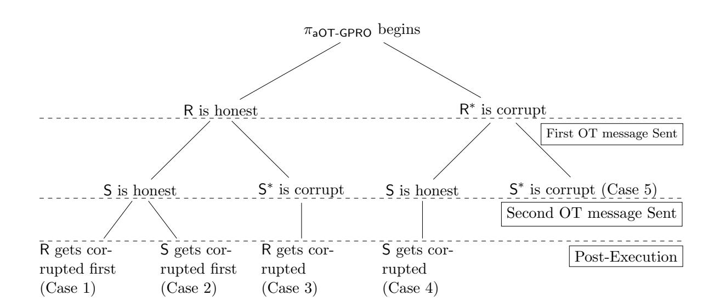

{0}------------------------------------------------

# Efficient and Round-Optimal Oblivious Transfer and Commitment with Adaptive Security<sup>∗</sup>

Ran Canetti Boston University canetti@bu.edu

Pratik Sarkar Boston University pratik93@bu.edu

Xiao Wang Northwestern University wangxiao@cs.northwestern.edu

#### Abstract

We construct the most efficient two-round adaptively secure bit-OT in the Common Random String (CRS) model. The scheme is UC secure under the Decisional Diffie-Hellman (DDH) assumption. It incurs O(1) exponentiations and sends O(1) group elements, whereas the state of the art requires O(κ 2 ) exponentiations and communicates poly(κ) bits, where κ is the computational security parameter. Along the way, we obtain several other efficient UC-secure OT protocols under DDH :

- The most efficient yet two-round adaptive string-OT protocol assuming global programmable random oracle. Furthermore, the protocol can be made non-interactive in the simultaneous message setting, assuming random inputs for the sender.
- The first two-round string-OT with amortized constant exponentiations and communication overhead which is secure in the global observable random oracle model.
- The first two-round receiver equivocal string-OT in the CRS model that incurs constant computation and communication overhead.

We also obtain the first non-interactive adaptive string UC-commitment in the CRS model which incurs a sublinear communication overhead in the security parameter. Specifically, we commit to polylog(κ) bits while communicating O(κ) bits. Moreover, it is additively homomorphic.

We can also extend our results to the single CRS model where multiple sessions share the same CRS. As a corollary, we obtain a two-round adaptively secure MPC protocol in this model.

<sup>∗</sup>This work was supported by the the IARPA ACHILLES project, the NSF MACS project and NSF grant CNS-1422965. The first author also thanks the Check Point Institute for Information Security.

{1}------------------------------------------------

## Contents

| 1 | Introduction<br>2                                                                                                                                                                                                                                                                                  |                            |  |  |  |  |  |  |  |  |  |
|---|----------------------------------------------------------------------------------------------------------------------------------------------------------------------------------------------------------------------------------------------------------------------------------------------------|----------------------------|--|--|--|--|--|--|--|--|--|
|   | 1.1<br>Our Contributions<br><br>1.1.1<br>Global Random Oracle Model.<br><br>1.1.2<br>Common Random String Model.<br><br>1.1.3<br>Single Common Random String model<br><br>1.2<br>Key Insights<br>                                                                                                  | 3<br>3<br>4<br>5<br>6      |  |  |  |  |  |  |  |  |  |
| 2 | Preliminaries                                                                                                                                                                                                                                                                                      | 7                          |  |  |  |  |  |  |  |  |  |
| 3 | Technical Overview<br>3.1<br>Adaptively Secure OT in the Global Programmable RO Model<br><br>3.2<br>Receiver Equivocal Oblivious Transfer in the CRS model<br><br>3.3<br>Adaptively Secure Oblivious Transfer in the CRS model<br><br>3.4<br>Non-Interactive Commitment with Adaptive Security<br> | 10<br>10<br>12<br>12<br>13 |  |  |  |  |  |  |  |  |  |
| 4 | Oblivious Transfer in the Global Random Oracle Model<br>4.1<br>Adaptively Secure OT in the Global Programmable RO Model<br><br>4.1.1<br>Practical optimizations.<br><br>4.2<br>Statically Secure OT in the Global Observable RO Model<br><br>4.2.1<br>Security proof.<br>                          | 14<br>14<br>20<br>22<br>22 |  |  |  |  |  |  |  |  |  |
| 5 | Receiver Adaptively Secure OT in the<br>CRS<br>Model<br>5.1<br>Properties of<br>CRS<br><br>5.2<br>Security Proof<br><br>5.3<br>Efficient Static OT<br>                                                                                                                                             | 25<br>25<br>26<br>28       |  |  |  |  |  |  |  |  |  |
| 6 | Adaptively Secure Oblivious Transfer in the<br>CRS<br>Model<br>6.1<br>Semi-adaptively secure OT<br><br>6.1.1<br>Security Proof<br><br>6.2<br>Obtaining Full Adaptive Security<br><br>6.2.1<br>Efficiency<br>                                                                                       | 28<br>28<br>28<br>31<br>32 |  |  |  |  |  |  |  |  |  |
| 7 | Adaptively Secure Non-Interactive Commitment in the<br>CRS<br>Model<br>7.1<br>Security Proof<br><br>7.2<br>Concrete Instantiation and Efficiency<br>                                                                                                                                               | 32<br>32<br>33             |  |  |  |  |  |  |  |  |  |
| 8 | Results in the Single<br>CRS<br>Model<br>8.1<br>Security requirements from<br>CRSssid<br><br>8.2<br>Adaptively Secure OT in the sCRS model<br><br>8.3<br>Adaptively Secure Non-interactive Commitment in the sCRS model<br><br>8.4<br>Adaptively Secure MPC in the sCRS model<br>                  | 34<br>35<br>37<br>39<br>40 |  |  |  |  |  |  |  |  |  |

{2}------------------------------------------------

<span id="page-2-1"></span>Table 1: Comparing our actively-secure UC-OT protocols with state-of-the-art DDH-based 2-round actively-secure UC-OT protocols.

| Setting | Protocols                                                                                 | Setup              | Security                   | Sender-input size (bits)                                                                     | Exponentiations                                                                                                               | Communication (bits)                                                                                                    |
|---------|-------------------------------------------------------------------------------------------|--------------------|----------------------------|----------------------------------------------------------------------------------------------|-------------------------------------------------------------------------------------------------------------------------------|-------------------------------------------------------------------------------------------------------------------------|
| 1       | [34]<br>[6]<br>$\pi_{aOT-GPRO} \ (\mathrm{Fig.} \ 4)^{1}$                                 | GPRO               | Adaptive Adaptive Adaptive | к<br>к<br>к                                                                                  | 6<br>11<br>5                                                                                                                  | $ \begin{array}{ c c c c } \hline 4\log  \mathbb{G}  + 2\kappa \\ 6\kappa \\ 2\log  \mathbb{G}  + 2\kappa \end{array} $ |
| 2       | $\begin{array}{ c c c c }\hline & [10] \\ \pi_{sOT-GORO} \text{ (Fig. } 10)^2\end{array}$ | GORO               | Static                     | κ<br>κ                                                                                       | $\mathcal{O}(\kappa)$ 5                                                                                                       | $\begin{array}{c} \mathcal{O}(\kappa^2) \ 2 \mathrm{log} \mathbb{G}  + 2\kappa \end{array}$                             |
| 3       | $[38]^{3}$ $\pi_{sOT-CRS}(\mathrm{Fig.}\ 16)$                                             | CReS<br>  CRS      | Static                     | $\log  \mathbb{G} $ $\log  \mathbb{G} $                                                      | 11<br>8                                                                                                                       | $ \frac{6\log \mathbb{G} }{5\log \mathbb{G} } $                                                                         |
| 4       | [23] $[5]^{3}$ $\pi_{\text{reOT-CRS}}(\text{Fig. } 13)$                                   | CRS<br>CReS<br>CRS | Receiver<br>Equivocal      | $\begin{array}{c c} \log  \mathbb{G}  \\ \log  \mathbb{G}  \\ \log  \mathbb{G}  \end{array}$ | $\begin{array}{c c} \operatorname{poly}(\kappa) \\ \mathcal{O}(\kappa) \\ 9 \end{array}$                                      | $\begin{array}{c} \operatorname{poly}(\kappa) \ \mathcal{O}(\kappa^2) \ \operatorname{5log} \mathbb{G}  \end{array}$    |
| 5       | $[5]^3$ $\pi_{\text{aOT-CRS}} \text{ (Fig. 20)}^4$                                        | CReS<br>CRS        | Adaptive                   | 1 1                                                                                          | $ \begin{vmatrix} \Omega(\kappa^2) + 2 \cdot NCE_E = \mathcal{O}(\kappa^2) \\ 11 + 2 \ NCE_E = \mathcal{O}(1) \end{vmatrix} $ |                                                                                                                         |

Note: The computational security parameter is  $\kappa$  and  $\mathbb{G}$  denotes a group where DDH holds with  $\log |\mathbb{G}| = \mathcal{O}(\kappa)$ .  $\mathsf{NCE}_E$  and  $\mathsf{NCE}_C$  denotes the exponentation and communication cost of an augmented NCE on a bit respectively. It can be instantiated using the DDH-based scheme of [14] where  $\mathsf{NCE}_C = \mathcal{O}(\kappa)$  and  $\mathsf{NCE}_E = \mathcal{O}(1)$ .  $^1$   $\pi_{\mathsf{aOT-GPRO}}$  requires a one-time communication of 2 group elements and  $\kappa$  bits and computation of 4 exponentiations.  $^2$   $\pi_{\mathsf{sOT-GORO}}$  requires a one-time communication of 2 group elements and  $\kappa$  bits and computation of 2 NIZKPoKs and 5 exponentiations.  $^3$ Can be instantiated from QR and LWE too.  $^4$   $\pi_{\mathsf{aOT-CRS}}$  has a one-time communication cost of  $\log |\mathbb{G}|$  and one exponentiation.

## <span id="page-2-0"></span>1 Introduction

Oblivious Transfer (OT), introduced in [39, 21], is one of the main pillars of secure distributed computation. Indeed, OT is a crucial building block for many MPC protocols, e.g. [40, 26, 31, 25, 4, 5]. As a result, significant amount of research has been dedicated to constructing OT protocols that are efficient enough and secure enough to be of practical use.

Designing good OT protocols is a multi-dimensional challenge: One obvious dimension is the complexity, in terms of computational and communication overhead, as well as the number of rounds. Another dimension is the level of security guaranteed. Here the standard measure is Universally Composable (UC) security [8], in order to enable seamless modular composition into larger MPC protocols. Yet another dimension is the setup used. Commonplace models include the common random string model (CRS), the common reference string (CReS) model and the random oracle (RO) model. (Recall that UC-secure OT does not exist in the plain model [9], thus it is essential to use *some* sort of setup.) Yet another dimension is the computational hardness assumptions used.

A final dimension, which is the focus of this work, is whether security is guaranteed for adaptive corruption of one or both of the participants, or alternatively only for the static case where one of the parties is corrupted, and the corruption takes place before the computation starts. Indeed, most of the recent works towards efficient OT concentrates on the static case, e.g. [38, 10, 34, 20].

We concentrate on the case of two-round, adaptively UC-secure OT. We only consider the case of malicious adversaries. It is easy to see that two rounds is the minimum possible, even for static OT. Furthermore, two-round OT enables two-round MPC [3, 25, 4, 5] which is again round-optimal. More importantly, the efficiency of the two-round MPC protocol crucially depends on the efficiency of the underlying two-round UC-OT protocol. Still, there is a dearth of efficient two-round adaptively UC-secure OT protocols which can tolerate malicious corruptions.

{3}------------------------------------------------

## <span id="page-3-0"></span>1.1 Our Contributions

We present a number of two-round UC-secure OT protocols. Our protocols are all based on the plain DDH assumption and work with any group where DDH is hard. While the protocols are quite different and in particular work in very different settings, they all use the same underlying methodology, which we sketch in Section [1.2.](#page-6-0) But first we summarize our results and compare it with the relevant state-of-the-art protocols. We organize the presentation and comparison based on the setup assumptions - the global random oracle (GRO) model, and the common reference and random string models. A stronger notion of RO is the GRO model where the same instance of RO is shared globally among different sessions. We have results in the global observable random oracle (GORO) model and the global programmable random oracle (GPRO) model. Our results are further subdivided into cases based on static and adaptive corruptions. A detailed comparison can be found in Table [1.](#page-2-1) We assume that the number of bits required to represent a group element (for which DDH holds) is O(κ). For example, the DDH assumption holds in the elliptic curve groups and a group element can be represented with O(κ) bits.

### <span id="page-3-1"></span>1.1.1 Global Random Oracle Model.

Our protocols are proven to be secure in the well established GRO [\[7,](#page-42-6) [10\]](#page-42-1) model. Our results in the GRO model are as follows:

– Efficient Adaptive OT in Programmable GRO model. The work of "Simplest OT" [\[16\]](#page-42-7) presented a 3-round OT in the programmable RO (PRO) model, which was later shown as not UC-statically secure [\[32,](#page-43-6) [6\]](#page-42-0). Inspired by their protocol, we design a 2-round adaptively secure OT πaOT-GPRO in the GPRO model. Our protocol requires roughly 5 exponentiations and communicates 2 group elements and 2κ bits when the sender's input messages are κ bits long and the computational security parameter is κ.

State-of-the-art. The work of [\[6\]](#page-42-0) presents an adaptively secure OT assuming DDH. They require 11 exponentiations and 5κ bits of communication. The work of [\[34\]](#page-43-0) obtains a two-round OT based on DDH using 6 exponentiations. They obtained static security assuming PRO. We observe that it can be proven to be adaptively secure under the same assumptions. They also provide an optimized variant requiring 4 exponentiations under the non-standard assumption of Interactive DDH, which is not known to be reducible to standard DDH. The work of [\[27\]](#page-43-7) presented a 8 round adaptive OT protocol from semi-honest UC adaptive-OT and observable GRO (i.e. GORO) model in the tamper-proof hardware model. We do not compare with them due to difference in the underlying setup assumptions. A detailed comparison with other protocols is shown as Setting 1 in Table [1.](#page-2-1)

– One-round random OT in the GPRO + short single CRS model. Our GPRO-based protocol can be further improved to obtain a one-round random OT (where the sender's messages are randomly chosen) πaROT-GPRO in the simultaneous message (where the parties can send messages in parallel) setting assuming a single short CRS of two group elements. By single CRS, we refer to the setting of [\[11\]](#page-42-8) where the same CRS is shared among all sessions and the simulator knows the trapdoor of the CRS. In our protocols, each random OT requires communicating 2 group elements and computing roughly 5 exponentiations. This is particularly useful to compute the base OT in OT extension [\[30,](#page-43-8) [37\]](#page-44-3) non-interactively during the offline phase.

State-of-the-art. In comparison, the work of [\[34\]](#page-43-0) can obtain a one-round random OT in the simultaneous message setting from non-interactive Key Agreement protocols. Assuming DDH, 

{4}------------------------------------------------

they can instantiate their protocol using 6 exponentiations.[1](#page-4-1) The work by Doerner et al. [\[19\]](#page-42-9) presented an OT with selective failure based on observable RO (ORO) and used it to obtain OT extension while computing roughly 3 exponentiations per base-OT and 1 NIZKpok. However, their OT requires 5 rounds of interaction and communication of 4 group elements and 3κ bit strings, yielding a 6 round OT extension. On the other hand, our protocol would give a 3 round OT extension with communication of 2 group elements per base-OT and it should outperform theirs in the WAN setting where interaction dominates the computation time.

– Static OT in the Observable GRO model. We replace the GPRO by a non-programmable GORO, with an extra one-time cost of 2 NIZKPoKs for Discrete Log and 5 exponentiations, which can be reused across multiple executions. One-time cost is a cost that is incurred only once per session/subsession even if multiple OT protocols are run in that session/subsession between the pair of parties. The remaining per-OT cost of this protocol is 5 exponentiations, except that now the protocol is only statically secure.

State-of-the-art. In comparison, the only two-round OT protocol from GORO is known from [\[10\]](#page-42-1). The authors generate a statically-secure one-sided simulatable OT under DDH assumption. It is used to obtain a UC-secure 2PC protocol using garbled circuits [\[3\]](#page-41-2). The 2PC can be instantiated as an UC-secure OT protocol. Each such OT would cost O(κ) exponentiations, which cannot be amortized for large number of OTs. A detailed comparison can be found in Setting 2 of Table. [1.](#page-2-1)

## <span id="page-4-0"></span>1.1.2 Common Random String Model.

Next we present our results in the CRS model. We would like to note that the state-of-the-art protocols are in a stronger model, i.e. the common reference string model and yet we work in the common random string model and still outperform them. Our results and detailed comparison follows:

– Static OT in the CRS model. We replace the GRO with a non programmable CRS. This gives us an efficient two-round static OT πsOT-CRS which requires 8 exponentiations and communication of 5 group elements.

State-of-the-art. In contrast, The state-of-the-art is obtained by [\[38\]](#page-44-0) in the common reference string model from DDH, Quadratic Residuosity (QR) and Learning with Errors (LWE). Their DDH based instantiation required 11 exponentiations and communicated 6 group elements, while other instantiations required more. Following this, [\[15\]](#page-42-10) presented constructions in the single common reference string model (of [\[11\]](#page-42-8)), which is a weaker setup assumption. They have a 2 round construction from Decision Linear Assumption which requires 20 exponentiations and they have a 4 round construction from DDH and Decisional Composite Residuosity Assumption. The recent work of [\[20\]](#page-42-5) presents a theoretical construction based on CDH and Learning with Parity. Detailed comparison can be found in Setting 3 of Table. [1.](#page-2-1)

– Receiver equivocal OT in the CRS model. Next, we add security against adaptive corruption of receiver at the cost of one extra exponentiation. This yields a receiver equivocal OT πreOT-CRS which requires 9 exponentiations and communication of 5 group elements. Such an OT can find useful applications in efficient adaptively-secure zero knowledge [\[22\]](#page-43-9) schemes.

<span id="page-4-1"></span><sup>1</sup>They have an optimized variant (in Appendix D.2 of their paper) from Interactive DDH requiring 4 exponentiations based on a non-standard assumption, not known to be reducible to standard DDH assumption.

{5}------------------------------------------------

State-of-the-art. Previous receiver equivocal OT protocol of [\[23\]](#page-43-1) required somewhere equivocal encryption leading to a practically infeasible solution. On the other hand, [\[5\]](#page-41-0) required O(κ) instances of static string-OTs and non-blackbox usage of non-interactive equivocal commitment to construct a receiver equivocal OT. A detailed comparison can be found in Setting 4 of Table. [1.](#page-2-1)

– Adaptive OT in the CRS model. Finally, we add sender equivocation in our receiver equivocal OT to obtain a semi-adaptive OT (which is secure against static corruption of one party and adaptive corruption of another party) πsaOT-CRS in two rounds. Then, we apply the transformation of [\[5\]](#page-41-0) to obtain our adaptively-secure bit OT πaOT-CRS in two rounds. Their transformation upgrades a semi-adaptively secure OT to an adaptively secure OT in the augmented NCE model. Our final protocol πaOT-CRS computes 11 exponentiations and communicates 7 group elements. In addition, it encrypts 2 bits using augmented NCE. Upon instantiating the NCE scheme using the DDHbased protocol of [\[14\]](#page-42-2), we obtain the first two round adaptively secure bit-OT which has constant communication and computation overhead.

State-of-the-art. In this setting, few works [\[24,](#page-43-10) [12,](#page-42-11) [24\]](#page-43-10) achieve adaptive security based on general two-round MPC protocol using indistinguishability obfuscation. The only round optimal adaptively-secure protocol under standard computational assumption is due to [\[5\]](#page-41-0) from DDH, LWE, and QR. They obtain a semi-adaptive bit-OT by garbling a non-interactive equivocal commitment scheme using equivocal garbling techniques of [\[13\]](#page-42-12). The construction also requires O(κ 2 ) invocations to a static string OT with oblivious sampleability property. Then, they provide a generic transformation to obtain an adaptively secure bit OT from a semi-adaptively secure bit-OT in the augmented NCE model. On efficiency measures, the work of [\[5\]](#page-41-0) constructs the equivocal garbled circuit by communicating poly(κ) bits and their semi-adaptive bit OT requires O(κ 2 ) exponentiations, thus yielding a feasibility result. In contrast, our protocol is concretely efficient. We have compared with their protocol in Setting 5 of Table. [1.](#page-2-1)

– Non-interactive adaptive commitment. As an independent result, we demonstrate that the first message of any two-round receiver equivocal OT behaves as an adaptively-secure commitment. By applying this result to our receiver equivocal OT πreOT-CRS, we obtain the first non-interactive adaptive string commitment scheme with sublinear communication in κ. More specifically, we commit polylog(κ) bits using 4 exponentiations and communicating 2 group elements. Interestingly, our scheme is additively homomorphic.

State-of-the-art. On the other hand, the previous non-interactive adaptively-secure commitment schemes [\[9,](#page-42-4) [11,](#page-42-8) [1,](#page-41-3) [2\]](#page-41-4) in the common reference string model were bit commitments requiring O(1) exponentiations and O(κ) bits communication to commit a bit. There are string commitments [\[18,](#page-42-13) [17\]](#page-42-14) but they require 3 rounds of interaction for commitment. The work of [\[28\]](#page-43-11) presented a theoretical construction from the minimal assumption of public key encryption with oblivious ciphertext generation. It has an interactive commitment phase and communicates O(κ 2 ) bits to commit to a single bit. Table. [2](#page-6-1) provides a qualitative comparison of our protocol with other schemes.

## <span id="page-5-0"></span>1.1.3 Single Common Random String model

Currently, our results in this subsection are in the local CRS model. We can extend it to the single common random string, i.e. sCRS model of [\[11\]](#page-42-8), where all parties share the same sCRS for their subsessions. A subsession is computed between a pair of parties with unique roles (party A

{6}------------------------------------------------

<span id="page-6-1"></span>Table 2: Comparing our protocol with state-of-the-art Adaptively Secure (without erasures) UC commitment schemes where the commitment size is O(κ) bits

| Protocols                              | Message<br>bit length | Commit | No. of rounds<br>Decommit | Setup | Assumptions |
|----------------------------------------|-----------------------|--------|---------------------------|-------|-------------|
| [9]                                    | 1                     | 1      | 1                         | CReS  | DDH + UOWHF |
| [11]                                   | 1                     | 1      | 1                         | CReS  | TDP         |
| [1]                                    | 1                     | 1      | 1                         | CReS  | SXDH        |
| [2]                                    | 1                     | 1      | 1                         | CReS  | DDH         |
| [18]                                   | κ                     | 3      | 1                         | CReS  | DCR         |
| [17]                                   | κ                     | 3      | 1                         | CReS  | DCR + SRSA  |
| Our DDH-based<br>protocol (Fig.<br>24) | polylog(κ)            | 1      | 1                         | CRS   | DDH         |

## Notations:

UOWHF - Universal One-Way Hash Functions

TDP - Trapdoor Permutations, SXDH - Symmetric External Diffie–Hellman,

DCR - Decisional Composite Residuosity, SRSA - Strong RSA

is the sender of an OT subsession and Party B is the receiver). The local CRS is generated from sCRS by the parties during the protocol. There can be multiple instances of the same protocol within a subsession with the same local CRS between same parties with their roles preserved, i.e. A will be the sender and B will be the receiver. The simulator knows the hidden trapdoors for sCRS. This benefit comes at a cost of keeping the sCRS length to 4κ + 2 group elements. The length is independent of the number of parties or the number of instances of the protocol being run. However, we assume that the subsession ids are chosen statically by the environment Z before seeing sCRS. Using our adaptive OT and commitment protocol in the sCRS model, we obtain a two-round adaptively secure MPC protocol in the sCRS model. Similar result was observed in the work of [\[5\]](#page-41-0).

## <span id="page-6-0"></span>1.2 Key Insights

Our OT protocols are in the dual-mode [\[38,](#page-44-0) [33\]](#page-43-12) paradigm. In this paradigm, the protocol can be either in extractable mode or equivocal mode based on the mode of the setup assumption. In the extractable mode, the input of a corrupt receiver can be extracted by a simulator(playing the role of sender) using a trapdoor; whereas in the equivocal mode the simulator(playing the role of honest receiver) can use the trapdoor to compute randomness that would equivocate the receiver's message to both bit values b ∈ {0, 1}. This would enable the simulator to extract a corrupt sender's input messages corresponding to both bit values. Previous protocols ensured that the real world protocol was always in the extractable mode by programming the setup distribution [\[38,](#page-44-0) [33\]](#page-43-12). However, this required programming the setup based on which party is statically corrupt and this was incompatible with adaptive security.

The novelty of our paper lies in programming the mode of the protocol, during the protocol execution, without explicitly programming the setup. We achieve this by relying on the Computational Diffie-Hellman(CDH) and DDH assumption. The protocols either start off with a common random string - (g, h, T1) or generate one by invoking the GRO on a random string. The receiver is required to generate T<sup>2</sup> and execute the OT protocol using (g, h, T1, T2) as the setup tuple. The 

{7}------------------------------------------------

protocol ensures that if the tuple is non-DDH then the protocol is in extractable mode, else it is in equivocal mode. The CDH assumption guarantees that the tuple is a non-DDH tuple and hence the real world protocol is in extractable mode. Meanwhile, the simulator can compute  $T_2 = h^{\rm td}$  s.t. the tuple is in equivocal mode by using the trapdoor  ${\rm td} = \log_g T_1$ . The simulated tuple is indistinguishable from real tuple due to DDH assumption. This trick follows by carefully tweaking the DDH based instantiation of the PWV framework such that it satisfies an additional property, i.e. the CRS for the protocol will be in extractable mode (a.k.a messy mode according to PVW) and it can be set to equivocal mode (a.k.a decryption mode according to PVW) by the simulator, given a trapdoor. This enables simulation in the adaptive setting as the simulator can conveniently program the CRS based on which party gets corrupted. Extending our techniques to hold under additional assumptions is an intriguing open question, especially LWE and QR since PVW can be instantiated from them. See Section 3 for a more detailed overview.

Paper Organization. In the next section, we introduce some notations and important concepts used in this paper. In Section 3, we present the key intuitions behind our protocols. This is followed by our results in the global random oracle model in Section 4. Then, we replace the random oracle assumption with a CRS setup to obtain a receiver equivocal OT in Sec. 5. Our optimized static-OT is present in the same section. In Section 6 we add sender equivocation in our receiver equivocal OT to obtain adaptively-secure OT in the CRS model. We present our independent result on adaptively-secure commitment scheme in Section 7. Finally, we conclude by replacing our local CRS with a single CRS in Section 8. In the same section we provide our two round adaptive MPC protocol in the single CRS model.

## <span id="page-7-0"></span>2 Preliminaries

Notations. We denote by  $a \leftarrow D$  a uniform sampling of an element a from a distribution D. The set of elements  $\{1,\ldots,n\}$  is represented by [n]. We denote polylog(a) and poly(b) as polynomials in  $\log a$  and b respectively. We denote a probabilistic polynomial time algorithm as PPT. We denote the computational security parameter by  $\kappa$ . Let  $\mathbb{Z}_q$  denote the field of order q, where  $q = \frac{p-1}{2}$  and p are primes. Let  $\mathbb{G}$  be the multiplicative group corresponding to  $\mathbb{Z}_p^*$  with generator g, where DDH assumption holds. We denote the set of natural numbers as  $\mathbb{N}$ . When a party  $\mathbb{S}$  gets corrupted we denote it by  $\mathbb{S}^*$ . Our protocols have the following naming convention  $\pi_{\langle \sec \rangle \langle \operatorname{prot} \rangle - \langle \operatorname{setup} \rangle}$  where  $\langle \sec \rangle$  refers to the security model and it can be either  $\mathbb{S}$  (static), re (receiver equivocal) or a (adaptive).  $\langle \operatorname{prot} \rangle$  refers to the protocol which is either  $\mathbb{S}$  or  $\mathbb{S}$  commitment protocol respectively. Similarly,  $\langle \operatorname{setup} \rangle$  refers to the setup assumption where it can be either  $\mathbb{S}$  (ORO model) or  $\mathbb{S}$  (ORO model) or  $\mathbb{S}$  (CRS). Our security proofs are in the Universal Composability (UC) framework of  $\mathbb{S}$ . We refer to the original paper for details.

Global Random Oracle Model. We present the global random oracle functionality from [7] in Fig. 1. It allows a simulator to observe illegitimate queries that are made by the adversary from outside the session by invoking the Observe command. It also enables the simulator to program (using the Program command) the random oracle on unqueried input points. Meanwhile, an adversary can also program (using the Program command) the random oracle on a point but an honest party can check whether that point has been programmed or not by invoking the Isprogrammed command. In the ideal world, a simulator can successfully program the RO since it can always return the result of Isprogrammed or not. More details can be found in Section 8 of [7]. In our OT protocols we require multiple instances of the GRO due different distributions on the

{8}------------------------------------------------

<span id="page-8-0"></span>Figure 1: The ideal functionality  $\mathcal{F}_{\mathsf{GRO}}$  for Global Random Oracle

#### $\mathcal{F}_{\mathsf{GRO}}$

 $\mathcal{F}_{\mathsf{GRO}}$  is parameterized by a domain D and range R and it proceeds as follows, running on security parameter  $\kappa$ :

- $\mathcal{F}_{\mathsf{GRO}}$  maintains a list L (which is initially empty) of pairs of values  $(\hat{\mathsf{sid}}, \hat{m}, \hat{h})$ , s.t.  $\hat{m} \in D$ ,  $\hat{h} \in R$  and  $\hat{\mathsf{sid}}$  is a session id.
- Upon receiving a value (Query, m, sid') (where  $m \in D$ ) from a party  $\mathcal{P}$ , from session with session id sid, perform the following: If there is a pair (sid', m,  $\hat{h}$ ), for some  $\hat{h} \in R$ , in the list L, set  $h := \hat{h}$ . If there is no such pair, sample  $h \leftarrow_R R$  and store the pair (sid', m, h) in L. If sid  $\neq$  sid', then add (sid', m, h) to the illegitimate query set  $Q_{\text{sid}}$ . Once h is set, reply to the activating machine with (HASHCONFIRM, h).
- Upon receiving a value (OBSERVE, sid) from the adversary: If  $Q_{\text{sid}}$  does not exist then set  $Q_{\text{sid}} = \bot$ . Output  $Q_{\text{sid}}$  to the adversary.
- Upon receiving a value (PROGRAM, m, h', sid) from the adversary, if there exists an entry (sid, m, h) and  $h \neq h'$  then ignore this input. Else, set  $L = L \cup (sid, m, h)$  and PROG = PROG  $\cup$  m and return (PROGRAMCONFIRM) to adversary.
- Upon receiving a value (IsProgrammed, m, sid') from a party ( $\mathcal{P}$ , sid), if sid  $\neq$  sid' then ignore the input. Else, set b=1 if  $m \in PROG$ . Otherwise set b=0. Return (IsProgrammedResult, b) to the calling entity.

domain and range of the GRO. We denote them as  $\mathcal{F}_{GRO1}$ ,  $\mathcal{F}_{GRO2}$  and so on. We assume  $\mathcal{F}_{GROi}$  is indexed by a parameter  $i \in \mathbb{N}$ , in addition to sid. We avoid writing i as part of the parameters to avoid notation overloading.

Common Random String Model. In this assumption, the parties of a session sid have access to a string randomly sampled from a distribution. A CRS is local to the session sid and should not be used for protocols outside the session. In the security proof, the simulator would have access to the trapdoors of the CRS which would enable him to simulate the ideal world adversary. In the MPC literature, the acronym CRS can also refer to common reference string which is a stronger assumption than common random string. In this paper, we always use CRS for common random string unless explicitly mentioned. We also use the single CRS model [11] where a single CRS - sCRS is shared among all sessions and the simulator knows the trapdoor of the sCRS.

Oblivious Transfer. In a 1-out-of-2 OT, we have a sender (S) holding two inputs  $a_0, a_1 \in \{0, 1\}^n$  and a receiver (R) holding a choice bit b. The correctness of OT means that R will obtain  $a_b$  as the outcome of the protocol. At the same time, S should learn nothing about b, and R should learn nothing about the other input of S, namely  $a_{\bar{b}}$ . The ideal OT functionality  $\mathcal{F}_{OT}$  is shown in Figure 2. We also consider the multi-session variant  $\mathcal{F}_{mOT}$  (Figure 25) where multiple parties can run pairwise OT protocols, while sharing the same setup resources. This captures our OT protocols in the single CRS model.

Adversarial Model. We initially consider security against static corruptions by a malicious adversary. Later, we need different levels of adaptive security and we enlist them as follows:

- Static corruption: The adversary corrupts the parties at the beginning of the protocol.
- Receiver equivocal corruption: The adversary corrupts sender statically and he corrupts the receiver adaptively.

{9}------------------------------------------------

<span id="page-9-0"></span>Figure 2: The ideal functionality  $\mathcal{F}_{\mathsf{OT}}$  for Oblivious Transfer

#### $\mathcal{F}_{\mathsf{OT}}$

 $\mathcal{F}_{\mathsf{OT}}$  interacts with a sender  $\mathsf{S}$  and a receiver  $\mathsf{R}$  as follows:

- On input (Choose, rec, sid, b) from R where  $b \in \{0,1\}$ ; if no message of the form (rec, sid, b) has been recorded in the memory, store (rec, sid, b) and send (rec, sid) to S.
- On input (Transfer, sen, sid,  $(a_0, a_1)$ ) from S with  $a_0, a_1 \in \{0, 1\}^n$ , if no message of the form (sen, sid,  $(a_0, a_1)$ ) is recorded and a message of the form (rec, sid, b) is stored, send (sent, sid,  $a_b$ ) to R and (sent, sid) to S. Ignore future messages with the same sid.

<span id="page-9-1"></span>Figure 3: The ideal functionality  $\mathcal{F}_{COM}$  for Commitment Scheme

## $\mathcal{F}_{\mathsf{COM}}$

 $\mathcal{F}_{COM}$  interacts with committer C and verifier V as follows:

- On receiving input ((COMMIT, V), C, sid, m) from C, if (sid, C, V, m') has been recorded, ignore the input. Else record the tuple (sid, C, V, m) and send (RECEIPT, sid, C, V) to V.
- On receiving input (Decommit, C, sid) from C, if there is a record of the form (sid, C, V, m') return (Decommit, sid, C, V, m') to V. Otherwise, ignore the input.
- Sender equivocal corruption: The adversary corrupts receiver statically and he corrupts the sender adaptively.
- Semi-adaptive corruption: The adversary corrupts one party statically and the other party adaptively.
- Adaptive corruption: The adversary corrupts both parties adaptively. This scenario covers the previous corruption cases.

Commitment. A commitment scheme allows a committing party C to compute a commitment c to a message m, using randomness r, towards a party V in the COMMIT phase. Later in the DECOMMIT phase, C can open c to m by sending the decommitment to V. The commitment should hide m from a corrupt V\*. Binding ensures that a corrupt C\* cannot open c to a different message  $m' \neq m$ . In addition, UC-secure commitments require a simulator (for honest V) to extract the message committed by C\*. Also, it enables a simulator (for honest C) to commit to 0 and later open it to any valid message by using the trapdoor. The ideal commitment functionality  $\mathcal{F}_{\text{COM}}$  is shown in Figure 3. We also consider the multi-session [11] variant  $\mathcal{F}_{\text{mCOM}}$  (Figure 26) where multiple parties can run pairwise commitment schemes protocols, while sharing the same setup resources. This captures our commitment scheme in the single CRS model.

Non-Committing Encryption. A non-committing encryption consists of three algorithms NCE = (Gen; Enc; Dec). It is a public key encryption scheme which allows a simulator to encrypt a plaintext in the presence of an adaptive adversary. Given a trapdoor, the simulator (on behalf of the honest party) can produce some dummy ciphertext c without the knowledge of any plaintext m. Later when the honest party gets corrupted and the simulator produces matching randomness (or decryption key) s.t. c decrypts to m. More formally, it is defined as follows.

**Definition 1.** (Non-Committing Encryption). A non-committing (bit) encryption scheme (NCE) consists of a tuple (NCE.Gen, NCE.Enc, NCE.Dec, NCE.S) where (NCE.Gen, NCE.Enc, NCE.Dec) is an IND-CPA public key encryption scheme and NCE.S is the simulation satisfying the following property: for  $b \in \{0,1\}$  the following distributions are computationally indistinguishable:

$$\{(\textit{pk}, c, r_G, r_E) : (\textit{pk}, \textit{sk}) \leftarrow \textit{NCE}.\textit{Gen}(1^\kappa; r_G), c = \textit{NCE}.\textit{Enc}(\textit{pk}, b; r_E)\}_{\kappa, b} \approx$$

{10}------------------------------------------------

$$\{(pk, c, r_G^b, r_E^b) : (pk, c, r_G^0, r_E^0, r_G^1, r_E^1) \leftarrow \textit{NCE}.\mathcal{S}(1^{\kappa})\}_{\kappa, b}.$$

**Definition 2.** (Augmented Non-Committing Encryption). An augmented NCE scheme consists of a tuple of algorithms (NCE.Gen, NCE.Enc, NCE.Dec, NCE.S, NCE.Gen<sub>Obl</sub>, NCE.Gen<sub>Inv</sub>) where (NCE.Gen, NCE.Enc, NCE.Dec, NCE.S) is an NCE and:

- Oblivious Sampling: NCE. $Gen_{Obl}(1^{\kappa})$  obliviously generates a public key pk (without knowing the associated secret key sk.
- Inverse Key Sampling: NCE. $Gen_{Inv}(pk)$  explains the randomness for the key pk satisfying the following property.

Obliviousness: The following distributions are indistinguishable:

$$\begin{split} \left\{ (\textit{pk}, r) : \textit{pk} \leftarrow \textit{NCE}.\textit{Gen}_\textit{Obl}(1^\kappa; r) \right\}_\kappa \approx \\ \left\{ (\textit{pk}, r') : (\textit{pk}, \textit{sk}) \leftarrow \textit{NCE}.\textit{Gen}(1^\kappa); r' \leftarrow \textit{NCE}.\textit{Gen}_\textit{Inv}(\textit{pk}) \right\}_\kappa. \end{split}$$

**Definition 3.** (Computational Diffie-Hellman Assumption). We say that the CDH assumption holds in a group  $\mathbb{G}$  if for any PPT adversary  $\mathcal{A}$ ,

$$\Pr[\mathcal{A}(g, h, T) = Z] = \mathsf{neg}(\kappa).$$

holds, where  $h, T \leftarrow \mathbb{G}$ , and  $T = g^t$ ,  $Z = h^t$ .

**Definition 4.** (Decisional Diffie-Hellman Assumption). We say that the DDH assumption holds in a group  $\mathbb{G}$  if for any PPT adversary  $\mathcal{A}$ ,

$$|\Pr[\mathcal{A}(g, h, T, Y) = 1] - \Pr[\mathcal{A}(g, h, T, Z) = 1]| = neg(\kappa).$$

holds, where  $h, T, Y \leftarrow \mathbb{G}$  and  $T = g^t$ ,  $Z = h^t$ .

## <span id="page-10-0"></span>3 Technical Overview

In this section, we will provide a high-level overview of our main constructions. Full technical details can be found in later sections.

#### <span id="page-10-1"></span>3.1 Adaptively Secure OT in the Global Programmable RO Model

The "Simplest OT protocol" [16] is a three-round OT protocol in the programmable RO model. S sends the first message as  $T = g^r$ , using some secret randomness  $r \leftarrow \mathbb{Z}_q$ . R uses the sender's message to compute the second message as  $B = g^{\alpha}T^b$  based on his input bit b using some secret receiver randomness  $\alpha \leftarrow \mathbb{Z}_q$ . Upon receiving B, the sender reuses the secret randomness r to compute the OT third message as follows:

<span id="page-10-2"></span>
$$c_{0} = \mathcal{F}_{\mathsf{GRO}}(B^{r}) \oplus m_{0}$$

$$c_{1} = \mathcal{F}_{\mathsf{GRO}}\left(\left(\frac{B}{T}\right)^{r}\right) \oplus m_{1}$$

$$(1)$$

The receiver decrypts  $m_b = c_b \oplus \mathcal{F}_{\mathsf{GRO}}(\mathsf{sid}, T^\alpha)$ . A corrupt  $\mathsf{R}^*$  cannot obtain both messages as it requires computing  $T^r$  (as it involves querying  $B^r$  and  $(\frac{B}{T})^r$ ) to the RO. Such a computation is hard by CDH assumption as  $T = g^r$  is randomly sampled by  $\mathsf{S}$  and kept secret from  $\mathsf{R}$ . On the other hand, a corrupted  $\mathsf{S}^*$  cannot guess b as b is perfectly hidden in B (since  $\alpha$  and  $\alpha - r$  are valid receiver randomness for bits 0 and 1). This also disrupts a corrupt receiver's input extraction by

{11}------------------------------------------------

the simulator as b is not binded to B. The only way to extract the input of  $\mathbb{R}^*$  is when he invokes  $\mathcal{F}_{\mathsf{GRO}}$  on  $B^{\alpha}$  to decrypt  $m_b$ . However, such a weak extraction process is insufficient for UC-secure protocols (GC-based protocols) where this OT protocol might be used and it has been pointed out by the work of [32, 6]. To tackle this issue, the protocol should bind the receiver's input bit b to the receiver's message. Here our goals are: 1) fix this protocol to be fully UC-secure; 2) reduce the round complexity of the protocol to two rounds.

### Our solution

We reduce the round complexity by generating T as an OT parameter using a GRO. The receiver generates T by invoking the GRO on a randomly sampled seed. He constructs  $B = g^{\alpha}T^{b}$  based on bit b. The sender samples a random r from  $\mathbb{Z}_{q}$  and encrypt his message as in Equation 1. The sender also sends  $z = g^{r}$  so that the receiver can decrypt  $m_{b} = c_{b} \oplus \mathcal{F}_{\mathsf{GRO}}(\mathsf{sid}, z^{\alpha})$ . Security follows from the the security of Simplest OT. And sender's messages are hidden due to CDH assumption. However, the receiver's bit cannot be extracted from the receiver's message as it is perfectly hidden.

Now we will add a mechanism such that the receiver's bit can be extracted from the receiver's message. Intuitively, the protocol is modified in such a way that the receiver runs two instances (using two different OT parameters) of the modified Simplest OT using the same randomness  $\alpha$ . The sender encrypts his message by combining these two instances. Finally, the receiver uses  $\alpha$  to decrypt  $m_b$ . Security ensures that a corrupt receiver cannot decrypt  $m_0$  or  $m_1$  if the two instances are not computed using  $\alpha$ . And a simulator can extract the corrupt receiver's input bit from the two instances if they are correctly constructed. This ensures input extraction of a corrupt receiver, thus giving us a round optimal UC-secure OT with high concrete efficiency.

More formally, the receiver R generates  $(h, T_1, T_2)$  as receiver OT parameters using the GRO. He constructs two instances as  $B = g^{\alpha}T_1^b$  and  $H = h^{\alpha}T_2^b$  using the same randomness  $\alpha$ . He sends seed and (B, H) to the sender S. Next, S samples r, s from  $\mathbb{Z}_q$  and computes the sender OT parameter  $z = g^r h^s$ . The sender combines the two OT instance by computing the ciphertexts:

$$c_0 = \mathcal{F}_{\mathsf{GRO}}\left(\mathsf{sid}, B^r H^s\right) \oplus m_0, \text{ and } c_1 = \mathcal{F}_{\mathsf{GRO}}\left(\mathsf{sid}, \left(\frac{B}{T_1}\right)^r \cdot \left(\frac{H}{T_2}\right)^s\right) \oplus m_1.$$

The receiver computes  $m_b = c_b \oplus \mathcal{F}_{\mathsf{GRO}}(\mathsf{sid}, z^\alpha)$ . This new scheme supports extraction of a corrupt receiver's input bit if the simulator knows x s.t.  $h = g^x$ . The simulator extracts b = 0 if  $H = B^x$ , else if  $\frac{H}{T_2} = (\frac{B}{T_1})^x$  then he sets b = 1. Otherwise, the receiver message is malformed and b is set as  $\bot$ . Extraction always succeeds unless  $(g, h, T_1, T_2)$  forms a DDH tuple. In such a case  $(g, h, T_1, T_2) = (g, g^x, g^t, g^{xt})$  and both extraction cases will satisfy. However, such an event occurs with negligible probability since  $(h, T_1, T_2)$  is generated using a random oracle. Sender's messages are hidden from a corrupt receiver due to CDH assumption. Simulation against a corrupt sender proceeds by programming the GRO s.t  $(g, h, T_1, T_2)$  is a DDH tuple. The simulator (playing the role of honest R) sets  $B = g^\alpha$  and  $H = h^\alpha$  as receiver message. Upon obtaining the second OT message from the corrupt sender, the simulator extracts  $m_0$  and  $m_1$  by using randomness  $\alpha$  and  $\alpha - t$  respectively. The corrupt sender cannot distinguish between the real and ideal world OT parameters due to DDH assumption. Also, B and B perfectly hides B in the ideal world.

Our protocol is more efficient than the state-of-the-art two-round UC-secure OT [38, 34]. Furthermore, if we are interested in random OTs, then S needs to communicate only the OT parameter z for all the OTs. This would yield a non-interactive random OT at the cost of 5 exponentiations and 2 group elements (i.e. R communicates (B, H) for each random OT). The same protocol is adaptively secure in the programmable random oracle model, and can be modified to use an global observable RO but only provide static security. See Section 4 for full details.

{12}------------------------------------------------

## <span id="page-12-0"></span>3.2 Receiver Equivocal Oblivious Transfer in the CRS model

Our next goal is to obtain efficient UC-secure OT with only a common random string setup. We replace the GRO by partially setting the receiver OT parameters as the CRS, consisting of three random group elements  $(g, h, T_1)$ . The receiver is required to generate  $T_2$  as part of the protocol and use it to compute B and H following the previous protocol (Section 3.1).  $T_2$  will be reused for multiple OT instances in the same session. It is guaranteed that a corrupt receiver will compute  $T_2$  s.t. the tuple is non-DDH due to the CDH assumption. In such a case, the simulator for a corrupt receiver can extract b from B and H given x, where  $h = g^x$ . On the other hand, the simulator (playing role of honest receiver) for a corrupt sender can compute  $T_2$  s.t.  $(g, h, T_1, T_2)$  is a DDH tuple, given the trapdoor t s.t.  $T_1 = g^t$ . It would allow him to extract corrupt sender's input messages from  $(c_0, c_1)$  and equivocate  $(B, H) = (g^{\alpha}, h^{\alpha})$  to open to bit b by opening the receiver's randomness as  $\alpha - bt$ . This provides security against adaptive corruption of receiver. The sender's algorithm is similar to the one in Sec. 3.1 where the ciphertexts are formed as follows:

$$c_0 = B^r H^s \cdot m_0$$
, and  $c_1 = \left(\frac{B}{T_1}\right)^r \cdot \left(\frac{H}{T_2}\right)^s \cdot m_1$ 

However, the sender's randomness (r, s) has to be unique for each OT instance, else the sender's OT messages -  $(c_0, c_1)$ , will leak about the sender's input messages -  $(m_0, m_1)$ . Thus, we obtain a two-round OT protocol which is secure against static corruption of the sender and adaptive corruption of the receiver in the common random string model. Our protocol requires 9 exponentiations and communication of 6 group elements, where one group element (i.e.  $T_2$ ) can be reused; reducing the communication overhead to 5 group elements. We can further optimize our computation cost to 8 exponentiations if we sacrifice receiver equivocal property and instead settle for static security. In contrast, the only other two-round protocol [38] in this model requires 11 exponentiations and communication of 6 group elements in the common reference string model. Note that the protocol here is receiver-equivocal, which will be made fully adaptive in the following subsection.

#### <span id="page-12-1"></span>3.3 Adaptively Secure Oblivious Transfer in the CRS model

Finally, we would like to add sender equivocation to the above protocol. It requires a simulator to simulate the OT second message without the knowledge of sender's input. Upon post-execution corruption of sender, the simulator should provide the randomness s.t. the OT second message corresponds to sender's original input  $(m_0, m_1)$ . In our current protocol, the second OT message is computed based on B and H using the randomness r and s. The simulator (playing the role of an honest sender) sets  $c_{\bar{b}}$  randomly and opening it to  $m_{\bar{b}}$  requires the knowledge of receiver's randomness -  $\alpha$ . Also, such an equivocation would be possible only if the tuple - CRS and  $T_2$ , is a non-DDH tuple as z and  $p_{\bar{b}} = \frac{c_{\bar{b}}}{m_{\bar{b}}}$  are two separate equations in r and s. When the tuple is a DDH one (which is required for receiver equivocation when the receiver is corrupted post-execution) then we can write  $p_{\bar{b}} = z^{\alpha + (-1)^b t}$ . It is not possible to provide r and s s.t. a random  $c_{\bar{b}}$  opens to  $p_{\bar{b}} \cdot m_{\bar{b}}$ , where  $p_{\bar{b}}$  gets fixed by  $\alpha$  and z, and  $m_{\bar{b}}$  is chosen by the adaptive adversary in post-execution corruption. Thus, it seems receiver and sender equivocation will not be possible simultaneously if we follow this approach.

We address this challenge by modifying the sender protocol. We construct a semi-adaptive OT protocol by slightly tweaking our receiver equivocal OT protocol. Then we apply the transformation of [5] which uplifts a semi-adaptive OT into to an adaptively secure OT using augmented NCE. A semi-adaptive OT is one which is secure against static corruption of one party and adaptive corruption of another party. Our semi-adaptive OT construction is described as follows. The

{13}------------------------------------------------

sender encrypts only bit messages  $m_i \in \{0,1\}$  in ciphertext  $(z_i, c_i)$ , for  $i \in \{0,1\}$ , using independent randomness  $(r_i, s_i)$ . If  $m_i = 1$  then sender encrypts it using the sender protocol as follows:

$$z_i = g^{r_i} h^{s_i}$$

$$c_i = \left(\frac{B}{T_i^i}\right)^{r_i} \left(\frac{H}{T_2^i}\right)^{s_i} \cdot m_i = \left(\frac{B}{T_i^i}\right)^{r_i} \left(\frac{H}{T_2^i}\right)^{s_i} \cdot 1 = \left(\frac{B}{T_i^i}\right)^{r_i} \left(\frac{H}{T_2^i}\right)^{s_i}$$

If  $m_i = 0$ , then sender samples  $z_i$  and  $c_i$  as random group elements. Upon receiving  $(z_0, c_0, z_1, c_1)$ , the receiver computes  $y = c_b \cdot z_b^{-\alpha}$ . If y = 1, then receiver outputs  $m_b = 1$ , else he outputs  $m_b = 0$ . In this new construction,  $m_{\bar{b}}$  remains hidden in  $c_{\bar{b}}$  from the corrupt receiver due to DDH assumption. Moreover, it solves our previous problem of equivocating sender's OT message -  $c_{\bar{b}}$ . Here, the simulator (playing the role of honest sender) can always compute  $(z_{\bar{b}}, c_{\bar{b}})$  s.t. they encrypt  $m_{\bar{b}} = 1$  using randomness  $(r_{\bar{b}}, s_{\bar{b}})$ . Later, when sender gets corrupted post-execution, the simulator can claim  $(z_{\bar{b}}, c_{\bar{b}})$  was randomly sampled if  $m_{\bar{b}} = 0$ , else provide the randomness as  $(r_{\bar{b}}, s_{\bar{b}})$  if  $m_{\bar{b}} = 1$ . Adversary cannot decrypt  $m_{\bar{b}}$  from  $c_{\bar{b}}$  since  $T_1^{r_{\bar{b}}}$  makes  $c_{\bar{b}}$  pseudorandom due to DDH assumption.

Thus, our new protocol is secure against semi-adaptive corruptions of parties. Next, we use the transformation of [5] to make it adaptively secure using augmented NCE. The receiver generates an NCE key pair  $(pk_b, sk)$  corresponding to his input bit b. He samples another NCE public key  $pk_{\bar{b}}$  obliviously for bit  $\bar{b}$ . He sends these two public keys to the sender. The sender additively secret shares his inputs:

$$m_0 = x_0 \oplus y_0, m_1 = x_1 \oplus y_1.$$

He runs the semi-adaptive OT protocol with inputs  $(x_0, x_1)$  and encrypts  $y_0$  and  $y_1$  using  $\mathsf{pk}_0$  and  $\mathsf{pk}_1$  respectively.

$$e_0 = \mathsf{NCE}.\mathsf{Enc}(\mathsf{pk}_0, y_0), e_1 = \mathsf{NCE}.\mathsf{Enc}(\mathsf{pk}_1, y_1).$$

The sender sends the semi-adaptive OT messages and  $(e_0, e_1)$  to the receiver. The honest receiver obtains  $x_b$  from the OT and  $y_b$ . A corrupt receiver can obtain  $y_{\bar{b}}$  in addition, if he sampled  $(pk_{\bar{b}}, sk_{\bar{b}})$  using the NCE.Gen algorithm. Our final protocol is secure against adaptive corruption of both parties. Consider the setting where both parties are honest initially and the simulator has to construct their view. The adaptive simulator runs the semi-adaptive simulator for the underlying semi-adaptive OT with static corruption of sender and adaptive corruption of receiver. The honest sender algorithm is run with inputs  $(x_0, x_1)$ , sampled as random bits. Suppose the sender gets corrupted first in post-execution then  $e_0$  and  $e_1$  can be equivocated s.t.  $y_0 = x_0 \oplus m_0$ and  $y_1 = x_1 \oplus m_1$ . Indistinguishability proceeds due to the NCE property. Next, when the receiver gets corrupted the simulator obtains b. He uses the adaptive simulator for receiver in the semiadaptive OT. The simulator also uses the inverse samplability property of the NCE to claim that  $pk_b$ was generated honestly and  $pk_{\bar{b}}$  obliviously. If the receiver gets corrupted first, then the receiver's simulation doesn't change. For the sender side, the simulator sets  $y_b = x_b \oplus m_b$ . Later, when sender gets corrupted and simulator obtains  $m_{\bar{b}}$  the simulator equivocates  $e_{\bar{b}}$  s.t.  $y_{\bar{b}} = x_{\bar{b}} \oplus n_{\bar{b}}$ . Indistinguishability proceeds since the adversary does not posses the secret key  $\mathsf{sk}_{\bar{b}}$  as  $\mathsf{pk}_{\bar{b}}$  was supposed to be obliviously sampled. As a result, the simulator successfully equivocates  $e_{\bar{b}}$ . More details of our protocol can be found in Sec. 6.

## <span id="page-13-0"></span>3.4 Non-Interactive Commitment with Adaptive Security

As an independent result, we prove that the first (i.e. receiver's) message of any two-round 1-out-of- $\mathcal{M}$  receiver equivocal OT can be considered as an UC-secure non-interactive commitment to receiver's input. It can also withstand adaptive corruption of the parties involved in the commitment scheme. The committer C commits to his message  $b \in \mathcal{M}$  (where  $\mathcal{M}$  is the message

{14}------------------------------------------------

space for the commitment) as c by invoking the receiver algorithm on choice b with randomness  $\alpha$ . Decommitment follows by providing the randomness  $\alpha$  for the receiver's OT message.

We can show that the commitment scheme satisfies the properties of an UC commitment-binding, hiding, extractable and equivocal, by relying on the security of the underlying receiver equivocal OT protocol. Binding of the commitment follows from sender security as a corrupt receiver cannot produce different randomness  $\alpha'$  s.t. c can be used to decrypt  $m_{\bar{b}}$  (where  $m_i$  is S's ith message for  $i \in \mathcal{M}$ ) where  $\bar{b} \in \mathcal{M}$  and  $\bar{b} \neq b$ . Hiding of b is ensured from the OT security guarantees for an honest receiver against a corrupt sender. A corrupter committer's input b is extracted by running the extraction algorithm of the OT simulator for a corrupt receiver. Finally, the commitment can be opened correctly by running the simulator (who is playing the role of honest OT receiver) and its equivocation algorithm (when receiver gets corrupted adaptively in post-execution). The commitment scheme is also secure against adaptive corruption as the simulator (for the honest committer in the commitment scheme) can always produce randomness  $\alpha'$ , which is consistent with message b, by running the adaptive simulator for the OT.

When we compile our  $\pi_{\text{reOT-CRS}}$  protocol with this result, we obtain a non-interactive commitment  $c = (B, H) = (g^{\alpha}T_1^m, h^{\alpha}T_2^m)$  for  $\text{polylog}(\kappa)$  bit messages using four exponentiations and communication of two group elements. We can only commit to  $\text{polylog}(\kappa)$ -bit messages or messages from  $\text{poly}(\kappa)$ -sized message space  $\mathcal{M}$  since our PPT simulator runs in  $\mathcal{O}(|\mathcal{M}|)$  time to extract a corrupt receiver's input by matching the following condition for each  $i \in \mathcal{M}$ :

if 
$$\frac{H}{T_2^i} \stackrel{?}{=} \left(\frac{B}{T_1^i}\right)^x$$
 output  $i$ .

Our detailed transformation from a receiver equivocal OT to an adaptive commitment can be found in Sec. 7.

## <span id="page-14-0"></span>4 Oblivious Transfer in the Global Random Oracle Model

In Section 4.1, we first show an efficient 2-round OT in the Global programmable RO model secure against adaptive adversaries. Then, we present a set of optimizations that can bring the efficiency at par with the Simplest OT by Chou and Orlandi [16] while requiring only one simultaneous round. In Section 4.2, we will show how to adapt our protocol to work in the global observable RO model but with only static security.

## <span id="page-14-1"></span>4.1 Adaptively Secure OT in the Global Programmable RO Model

As we have discussed in details the main intuition behind our protocol in Section 3.1, we will proceed to the full description and the proof directly. Our protocol ( $\pi_{aOT\text{-}GPRO}$ ) in the PRO model is presented in Fig. 4. Security of our protocol has been summarized in Thm. 1. The simulator forwards messages between ( $\mathcal{F}_{GRO1}$ ,  $\mathcal{F}_{GRO2}$ ) and the adversary, except when it programs ( $\mathcal{F}_{GRO1}$ ,  $\mathcal{F}_{GRO2}$ ) on a point s to h. In such a case, when adversary invokes the GRO on point s the simulator returns h as the query result without invoking the GRO. In our proof we refer this event as programming the GRO by simulator on s to return h. Our security proof is as follows.

<span id="page-14-2"></span>**Theorem 1.** Assuming the Decisional Diffie-Hellman holds in group  $\mathbb{G}$ , then  $\pi_{\mathsf{aOT-GPRO}}$  UC-securely implements  $\mathcal{F}_{\mathsf{OT}}$  functionality in presence of adaptive adversaries in the global programmable random oracle model.

*Proof.* We will first argue static security and then discuss adaptive corruption of the parties. The simulator for a statically corrupt sender  $S^*$  will program  $\mathcal{F}_{\mathsf{GRO1}}$  on seed s.t.  $(g, h, T_1, T_2)$  is

{15}------------------------------------------------

<span id="page-15-0"></span>Figure 4: Adaptively Secure Oblivious Transfer in the Global Programmable Random Oracle Model

```
\pi_{\mathsf{a}}\mathsf{OT}\mathsf{-}\mathsf{GPRO}
    – Public Inputs: Group \mathbb{G}, field \mathbb{Z}_q and generator g of group \mathbb{G}.
    - Private Inputs: S has two \kappa-bit inputs (m_0, m_1) \in \{0, 1\}^{\kappa} and R has a choice bit b.
    - Functionalities: Global Random Oracles \mathcal{F}_{\mathsf{GRO1}}: \{0,1\}^{\kappa} \to \mathbb{G}^3 \text{ and } \mathcal{F}_{\mathsf{GRO2}}: \mathbb{G} \to \{0,1\}^{\kappa}.
Choose:
    - R samples seed \leftarrow \{0,1\}^{\kappa} and computes (h, T_1, T_2) \leftarrow \mathcal{F}_{\mathsf{GRO1}}(\mathsf{sid}, \mathsf{seed}).
    - R samples \alpha \leftarrow \mathbb{Z}_q and sets B = g^{\alpha} T_1^b and H = h^{\alpha} T_2^b.
    - Receiver Parameters: R sends seed as OT parameters.
    - R sends (B, H) to S.
Transfer:
    - S invokes \mathcal{F}_{\mathsf{GRO1}} on (IsProgrammed, seed, sid) and aborts if it returns 1.
    - S computes (h, T_1, T_2) \leftarrow \mathcal{F}_{\mathsf{GRO1}}(\mathsf{sid}, \mathsf{seed}).
    – S samples r, s \leftarrow \mathbb{Z}_q and computes z = g^r h^s.
    - S computes c_0 = \mathcal{F}_{\mathsf{GRO2}}\left(\mathsf{sid}, B^r H^s\right) \oplus m_0 \text{ and } c_1 = \mathcal{F}_{\mathsf{GRO2}}\left(\mathsf{sid}, \left(\frac{B}{T_1}\right)^r \left(\frac{H}{T_2}\right)^s\right) \oplus m_1.
    - Sender Parameters: S sends z to R as OT parameters.
    - S sends (c_0, c_1) to R.
Local Computation by R:
    - R computes m_b = c_b \oplus \mathcal{F}_{\mathsf{GRO2}}(\mathsf{sid}, z^{\alpha}).
```

a DDH tuple and  $(B, H) = (g^{\alpha}, h^{\alpha})$  perfectly hides b. The simulator can extract both sender messages using randomness  $\alpha$  and  $\alpha - bt$ . Indistinguishability follows from DDH assumption. If  $S^*$  tries to check whether  $\mathcal{F}_{\mathsf{GRO1}}$  has been programmed on seed or not by invoking  $\mathcal{F}_{\mathsf{GRO1}}$  with (IsProgrammed, seed, sid) then the simulator simulates  $\mathcal{F}_{\mathsf{GRO1}}$  and returns the query response as 0. We present our simulator in Fig. 5. The formal hybrids and indistinguishability argument are as follows:

- Hyb<sub>0</sub>: Real world.
- Hyb<sub>1</sub>: Same as Hyb<sub>0</sub>, except the reduction programs  $\mathcal{F}_{\mathsf{GRO1}}$  on seed s.t.  $(g, h, T_1, T_2)$  is a DDH tuple. The reduction also returns 0 when  $\mathsf{S}^*$  invokes (IsProgrammed, seed, sid). The reduction simulates the GROs in the ideal world and so it can manipulate the GRO response to the dummy adversary. Indistinguishability between the hybrids follows from the DDH assumption due to the distribution of the tuple.
- Hyb<sub>2</sub>: Same as Hyb<sub>1</sub>, except the simulator always sets  $B = g^{\alpha}$  and  $H = h^{\alpha}$  and extracts  $m_0$  and  $m_1$  following the simulation strategy. Indistinguishability follows perfectly since for  $b \in \{0,1\}$  there is an unique randomness, i.e.  $\alpha' = \alpha bt$  which decrypts  $c_b$ .

Next, we discuss security against a statically corrupt receiver  $R^*$ . In the ideal world, the simulator programs the  $\mathcal{F}_{\mathsf{GRO1}}$  to return non-DDH tuple on different invocations by  $R^*$ . It is indistinguishable from the real world due to the RO assumption, where the RO result would have returned a non-DDH tuple, except with negligible probability. The simulator also stores the trapdoor values for each invocation, i.e. it stores x s.t.  $h = g^x$  and h is obtained by invoking  $\mathcal{F}_{\mathsf{GRO1}}$  on seed. This allows the simulator to extract b from (B, H) by running the extraction algorithm. Finally, the simulator samples  $c_{\bar{b}}$  randomly as  $m_{\bar{b}}$  remains hidden in  $c_{\bar{b}}$  due to the CDH and RO assumption. We present the formal simulation in Fig. 6 and the formal indistinguishability argument is as follows:

{16}------------------------------------------------

<span id="page-16-0"></span>Figure 5: Simulation against a statically corrupt S\*

- **Functionalities:** Global Random Oracles  $\mathcal{F}_{\mathsf{GRO1}}: \{0,1\}^{\kappa} \to \mathbb{G}^3$  and  $\mathcal{F}_{\mathsf{GRO2}}: \mathbb{G} \to \{0,1\}^{\kappa}$ . The simulator forwards messages between  $(\mathcal{F}_{\mathsf{GRO1}}, \mathcal{F}_{\mathsf{GRO2}})$  and the adversary, except when it programs  $(\mathcal{F}_{\mathsf{GRO1}}, \mathcal{F}_{\mathsf{GRO2}})$  on a point s to h. When adversary invokes the GRO on point s the simulator returns h as the query result without invoking the GRO.

#### Choose:

- S samples seed and sets the result of invoking  $\mathcal{F}_{\mathsf{GRO1}}$  on seed to  $(h, T_1, T_2)$  where  $h = g^x$ ,  $T_1 = g^t$  and  $T_2 = g^{xt}$  for random values of x and t.
- S samples  $\alpha \leftarrow \mathbb{Z}_q$  and sets  $B = g^{\alpha}$  and  $H = h^{\alpha}$ .
- S sends seed and (B, H) to  $S^*$ .

#### Transfer:

- $S^*$  sends  $(z, c_0, c_1)$ .
- If  $S^*$  invokes  $\mathcal{F}_{GRO1}$  on (IsProgrammed, seed, sid) then return 0.

#### Local Computation by R:

- $\mathcal{S}$  computes  $m_0 = c_0 \oplus \mathcal{F}_{\mathsf{GRO2}}(\mathsf{sid}, z^\alpha)$  and  $m_1 = c_1 \oplus \mathcal{F}_{\mathsf{GRO2}}(\mathsf{sid}, z^{(\alpha-t)})$ .
- S invokes  $\mathcal{F}_{\mathsf{OT}}$  functionality with  $(m_0, m_1)$  and halts.

<span id="page-16-1"></span>Figure 6: Simulation against a statically corrupt R\*

- **Functionalities:** Global Random Oracles  $\mathcal{F}_{\mathsf{GRO1}}: \{0,1\}^{\kappa} \to \mathbb{G}^3$  and  $\mathcal{F}_{\mathsf{GRO2}}: \mathbb{G} \to \{0,1\}^{\kappa}$ . The simulator forwards messages between  $(\mathcal{F}_{\mathsf{GRO1}}, \mathcal{F}_{\mathsf{GRO2}})$  and the adversary, except when it programs  $(\mathcal{F}_{\mathsf{GRO1}}, \mathcal{F}_{\mathsf{GRO2}})$  on a point s to h. When adversary invokes the GRO on point s the simulator returns h as the query result without invoking the GRO.

#### Choose:

- Whenever R\* invokes  $\mathcal{F}_{\mathsf{GRO1}}$  on candidate seed values the  $\mathcal{S}$  returns different tuples  $(h, T_1, T_2)$  as  $\mathcal{F}_{\mathsf{GRO1}}$  result, where  $(g, h, T_1, T_2)$  forms a non-DDH tuple and simulator knows  $\log_g h$ .
- $R^*$  sends seed and (B, H).

#### Transfer:

- If  $R^*$  has programmed  $\mathcal{F}_{\mathsf{GRO1}}$  on seed then abort.
- $-\mathcal{S}$  sets b=0 if  $H=B^x$ , else if  $\frac{H}{T_2}=(\frac{B}{T_1})^x$  then set b=1, else set  $b=\perp$ .
- S invokes  $\mathcal{F}_{\mathsf{OT}}$  functionality with b to obtain  $m_b$ .
- S samples  $r, s \leftarrow \mathbb{Z}_q$  and sets z honestly.
- If  $b = \bot$ , then S sets  $(c_0, c_1)$  randomly else it sets  $c_b$  honestly and  $c_{\bar{b}}$  randomly.
- $\mathcal{S}$  sends z and  $(c_0, c_1)$  to  $\mathsf{R}^*$ .

#### Local Computation by $R^*$ :

- Perform its own adversarial algorithm.
- Hyb<sub>0</sub>: Real world.
- $\text{Hyb}_1$ : Same as  $\text{Hyb}_0$ , except the reduction programs  $\mathcal{F}_{\text{GRO1}}$  according to the simulation strategy and the tuple is always set as a non-DDH tuple. The reduction aborts if R\* has programmed  $\mathcal{F}_{\text{GRO1}}$  on seed. In the real world the honest sender can detect if a malicious receiver programs  $\mathcal{F}_{\text{GRO1}}$  on seed. Indistinguishability between the hybrids follow as the tuple is always a non-DDH tuple in  $\text{Hyb}_0$ , except with negligible probability, due to the RO assumption and in  $\text{Hyb}_1$  it is always a non-DDH tuple.
- $Hyb_2$ : Same as  $Hyb_1$ , except the reduction sets  $b = \bot$  and  $c_0$  randomly when extraction fails.

{17}------------------------------------------------

Extraction can fail if  $B = g^{\alpha}$  and  $H = h^{\alpha'}$  for some  $\alpha, \alpha' \in \mathbb{Z}_q$  and  $\alpha \neq \alpha'$ . Then  $\frac{c_0}{m_0}$  and z are uniformly distributed over the uniform choice of r, s as there are two different equations in r, s since  $\alpha \neq \alpha'$ :

 $\frac{c_0}{m_0} = g^{r\alpha}h^{\alpha's} = g^{r\alpha+x\alpha's}, z = g^rh^s = g^{r+xs}$ 

Thus, the two hybrids are indistinguishable. Also, the RO assumption prevents a distinguisher from inferring information about r, s from  $c_0$  and  $c_1$ . Moreover, r, s are perfectly hidden in z.

- Hyb<sub>3</sub>: Same as Hyb<sub>2</sub>, except the reduction sets  $c_1$  randomly when  $b = \bot$ . Indistinguishability follows due to the previous argument.
- Hyb<sub>4</sub>: Same as Hyb<sub>3</sub>, except the reduction aborts if R\* decrypts both  $c_0$  and  $c_1$  by querying  $z^{\alpha}$  and  $\frac{z^{\alpha}}{T_1^r T_2^s}$  to  $\mathcal{F}_{\mathsf{GRO2}}$ . Indistinguishability follows from CDH assumption where  $T_1^r$  is the CDH answer. The CDH adversary plays the role of the reduction and invokes the distinguisher of the hybrids to break the CDH challenge. He samples s and sets  $c_0$  and  $c_1$  randomly. He sets  $z = A \cdot h^s$  where  $(T_1, A) = (g^t, g^r)$  is the CDH challenge.  $c_0$  and  $c_1$  are set randomly and the CDH adversary randomly selects two queries  $q_1$  and  $q_2$  made to  $\mathcal{F}_{\mathsf{GRO2}}$  by the hybrid distinguisher and computes  $A^t = \frac{q_1}{q_2 T_2^s}$ . If there are n queries made to  $\mathcal{F}_{\mathsf{GRO2}}$ , then the CDH adversary breaks the CDH challenge with probability  $\frac{1}{2\binom{n}{2}}$ .
- Hyb<sub>5</sub>: Same as Hyb<sub>4</sub>, except the simulator extracts  $b \in \{0,1\}$  and sets  $c_{\bar{b}}$  randomly. Indistinguishability follows from the RO assumption since  $p_{\bar{b}} = \mathcal{F}_{\mathsf{GRO2}}(\mathsf{sid}, \frac{z^{\alpha}}{T_1^r T_2^s})$  looks random to a distinguisher, who fails to query  $\frac{z^{\alpha}}{T_1^r T_2^s}$  (due to CDH assumption) to  $\mathcal{F}_{\mathsf{GRO2}}$ .

This completes our static proof of security. Next, we will discuss our adaptive corruption cases. The receiver can get adaptively corrupted after sending the first OT message or post-execution. In both cases, we rely on the equivocal property of (B, H) when  $T_2 = h^t$ . The simulator can always construct  $B = g^{\alpha}$  and  $H = h^{\alpha}$  in the first OT message. Upon obtaining b in post-execution corruption, the simulator can open the randomness of receiver as  $\alpha' = \alpha - bt$  s.t. the receiver's message corresponds to bit b. Next, we shift our focus to adaptive corruption of sender. The sender can get adaptively corrupted after sending the second OT message or post-execution. These two cases are identical since it is a two-round OT protocol. For security against adaptive corruption of sender when the receiver is also honest, we rely on the programmability feature of  $\mathcal{F}_{\mathsf{GRO2}}$ . The simulator (playing the role of an honest sender) sets  $(c_0, c_1)$  randomly. Upon post-execution corruption of sender, the simulator obtains  $(m_0, m_1)$  and he programs  $\mathcal{F}_{\mathsf{GRO2}}$  as follows:

$$\mathcal{F}_{\mathsf{GRO2}}\left(\mathsf{sid},B^rH^s\right)=c_0\oplus m_0,$$

$$\mathcal{F}_{\mathsf{GRO2}}\left(\mathsf{sid}, \left(\frac{B}{T_1}\right)^r \left(\frac{H}{T_2}\right)^s\right) = c_1 \oplus m_1.$$

Equivocation is successful since an adversary cannot query the corresponding preimages to the random oracle.

For completeness, we present the full adaptive simulator in Fig. 8. At the end of the simulation the simulator S forwards the view of the dummy adversary to the environment Z. The different simulation cases can be found in Fig. 7. We provide the formal hybrids and indistinguishability argument as follows:

- Hyb<sub>0</sub>: Real world.

{18}------------------------------------------------

<span id="page-18-0"></span>Figure 7: Simulation cases for Adaptive corruptions in  $\pi_{aOT\text{-}GPRO}$ 



- Hyb<sub>1</sub>: Same as Hyb<sub>0</sub>, except if R is honest before the first OT message is sent then the reduction programs  $\mathcal{F}_{GRO1}$  on seed s.t. the tuple  $(g, h, T_1, T_2)$  is always a DDH tuple. The rest of the receiver's and sender's views are simulated honestly using the knowledge of their respective inputs input b. Indistinguishability follows by reduction to the DDH assumption. (This happens in Cases 1-3 of Figure 7).
- Hyb<sub>2</sub>: Same as Hyb<sub>1</sub>, except that if R is honest at the time where the first OT message is to be sent, then the reduction constructs receiver's OT message with input bit 0 and randomness  $\alpha$ , i.e. he sets  $B = g^{\alpha}$  and  $H = h^{\alpha}$ . If receiver gets corrupted post-execution and his input bit turns out to be b, then provide the randomness as  $\alpha' = \alpha bt$ . Here the environment's view is identical to its view in Hyb<sub>1</sub>, since the tuple  $(g, h, T_1, T_2)$  is DDH in both hybrids and for  $b \in \{0, 1\}$  there is an unique randomness  $\alpha' = \alpha bt$  which decrypts  $c_b$ . (This happens in Cases 1-3.)
- Hyb<sub>3</sub>: Same as Hyb<sub>2</sub>, except if the R and S were honest during protocol and R gets corrupted first in post-execution then S obtains  $(b, m_b)$  as receiver output and provides R's randomness as  $\alpha' = \alpha bt$ . S programs  $\mathcal{F}_{\mathsf{GRO2}}$  s.t.  $\mathcal{F}_{\mathsf{GRO2}}(\mathsf{sid}, B^r H^s (T_1^r T_2^s)^{-b}) = c_b \oplus m_b$ . When S gets corrupted, he obtains  $(m_0, m_1)$  and programs  $\mathcal{F}_{\mathsf{GRO2}}(\mathsf{sid}, B^r H^s (T_1^r T_2^s)^{-b}) = c_{\overline{b}} \oplus m_{\overline{b}}$ . An external adversary cannot prevent equivocation of  $c_b$  since it requires him to query  $B^r H^s (T_1^r T_2^s)^{-b}$  without corrupting any party and without knowing (r, s) or  $\alpha$ . This is equivalent to breaking the CDH assumption where  $B = g^{\alpha}$  and  $g^r$  is the CDH challenge and  $B^r$  is the response which can be extracted from the preimage query  $B^r H^s (T_1^r T_2^s)^{-b}$  to  $\mathcal{F}_{\mathsf{GRO2}}$ , given the knowledge of s. After corrupting R, the adversary cannot prevent equivocation of  $c_{\overline{b}}$  since that requires him to again break the CDH assumption. Given his queries-  $B^r H^s$  and  $(\frac{B}{T_1})^r (\frac{H}{T_2})^s$ , one can extract  $T_1^r$ . This can be the response to a CDH game where and  $g^r$  and  $T_1$  is the CDH challenge. Since, it is guaranteed that the adversary cannot query preimages to  $\mathcal{F}_{\mathsf{GRO2}}$ , the RO assumption guarantees that the output of  $\mathcal{F}_{\mathsf{GRO2}}$  appears random. Thus, indistinguishability between Hyb<sub>2</sub> and Hyb<sub>3</sub> follows from CDH and RO assumption. This completes  $Case\ 1$  of  $Figure\ 7$ .
- Hyb<sub>4</sub>: Same as Hyb<sub>3</sub>, except if the R and S were honest during protocol and S gets corrupted first in post-execution and then R gets corrupted, then the reduction obtains  $(m_0, m_1)$  first and equivocates  $(c_0, c_1)$  by programming  $\mathcal{F}_{\mathsf{GRO2}}$  on  $B^r H^s$  and  $(\frac{B}{T_1})^r (\frac{H}{T_2})^s$ . This is possible due to CDH assumption and it has been explained in the previous argument. When receiver gets corrupted provide  $\alpha' = \alpha bt$  as receiver randomness where b is receiver's input bit.

{19}------------------------------------------------

<span id="page-19-0"></span>Figure 8: Adaptive Simulator for  $\pi_{aOT-GPRO}$ 

#### Choose:

- Cases 1-3: If R is honest then perform the following:
  - S samples seed and programs  $\mathcal{F}_{\mathsf{GRO1}}$  s.t.  $(h, T_1, T_2) \leftarrow \mathcal{F}_{\mathsf{GRO1}}(\mathsf{sid}, \mathsf{seed})$  where  $h = g^x, T_1 = g^t$  and  $T_2 = g^{xt}$  for random values of x and t.
  - S samples  $\alpha \leftarrow \mathbb{Z}_q$  and sets  $B = g^{\alpha}$  and  $H = h^{\alpha}$ .
  - S sends seed and (B, H) to  $S^*$ .
- Cases 4-5: Else, S performs the following while interacting a corrupt  $R^*$ :
  - S programs  $\mathcal{F}_{\mathsf{GRO1}}$  on different invocations of  $\mathcal{F}_{\mathsf{GRO1}}$ , by corrupt  $\mathsf{R}^*$ , to return  $(h, T_1, T_2)$  s.t.  $(g, h, T_1, T_2)$  forms a non-DDH tuple and simulator knows  $x = \log_g h$ .
  - S receives seed, (B, H) from  $R^*$ .

#### Transfer:

- Cases 1, 2: If R and S are not corrupt then S computes  $z = g^r h^s$  for random  $r, s \leftarrow \mathbb{Z}_q$ . He samples random  $c_0, c_1 \leftarrow \{0, 1\}^{\kappa}$  and sends  $(z, c_0, c_1)$  to R.
- Case 3: If R is honest and  $S^*$  is corrupt then receive  $(z, c_0, c_1)$  from  $S^*$ .
- Cases 1-3: If R gets corrupted then S obtains receiver's input bit b and opens (B, H) to b by providing receiver's randomness as  $\alpha' = \alpha bt$ .
- Case 4: If  $R^*$  is corrupt and computed his OT message, and S is honest then S aborts if  $R^*$  programmed  $\mathcal{F}_{GRO1}$  on seed else it performs the following:
  - S sets b = 0 if  $H = B^x$ , else if  $\frac{H}{T_2} = (\frac{B}{T_1})^x$  then set b = 1, else set  $b = \bot$ . S invokes  $\mathcal{F}_{\mathsf{OT}}$  with b and obtains  $m_b$ .
  - S samples  $r, s \leftarrow \mathbb{Z}_q$  and sets z honestly. If  $b = \bot$ , then S sets  $(c_0, c_1)$  randomly else it sets  $c_b$  honestly and  $c_{\bar{b}}$  randomly.
  - $\mathcal{S}$  sends z and  $(c_0, c_1)$  to  $\mathsf{R}^*$ .
- Case 5: If both R\* and S\* are corrupt then end simulation.

#### Local Computation by R:

- Case 3: If R is honest and S\* is corrupt then S extracts  $(m_0, m_1)$  using randomness  $\alpha$  and  $\alpha t$  respectively. S invokes  $\mathcal{F}_{\mathsf{OT}}$  functionality with  $(m_0, m_1)$  and halts.
- Cases 1, 2, 4: Else, S performs nothing.

#### Post-Execution Corruption

- Cases 1,2: If R and S are honest then perform the following based on the sequence of corruption:
  - Case 1: If R gets corrupted first, S obtains  $(b, m_b)$  as receiver output and provides R's randomness as  $\alpha' = \alpha bt$ . S programs  $\mathcal{F}_{\mathsf{GRO2}}$  s.t.  $\mathcal{F}_{\mathsf{GRO2}}(\mathsf{sid}, B^r H^s (T_1^r T_2^s)^{-b}) = c_b \oplus m_b$ . When S gets corrupted, he obtains  $(m_0, m_1)$  and programs  $\mathcal{F}_{\mathsf{GRO2}}$  s.t.  $\mathcal{F}_{\mathsf{GRO2}}(\mathsf{sid}, B^r H^s (T_1^r T_2^s)^{-\bar{b}}) = c_{\bar{b}} \oplus m_{\bar{b}}$ .
  - Case 2: If S gets corrupted first, S obtains  $(m_0, m_1)$  and programs  $\mathcal{F}_{\mathsf{GRO2}}$  s.t.  $\mathcal{F}_{\mathsf{GRO2}}(\mathsf{sid}, B^r H^s) = c_0 \oplus m_0$  and  $\mathcal{F}_{\mathsf{GRO2}}\left(\mathsf{sid}, \left(\frac{B}{T_1}\right)^r \left(\frac{H}{T_2}\right)^s\right) = c_1 \oplus m_1$ . When R gets corrupted, S provides  $\alpha' = \alpha bt$  as receiver randomness.
- Case 3: If R gets corrupted and  $S^*$  is corrupt then S provides  $\alpha' = \alpha bt$  as receiver randomness.
- Case 4: If R\* is corrupt and S gets corrupted then program  $\mathcal{F}_{\mathsf{GRO2}}\left(\mathsf{sid},\left(\frac{B}{T_1^{-b}}\right)^r\left(\frac{H}{T_2^{-b}}\right)^s\right) = c_{\bar{b}} \oplus m_{\bar{b}}$ .

Indistinguishability follows due to CDH and RO assumption. This completes Case 2 of Figure 7.

–  $Hyb_5$ : Same as  $Hyb_4$ , except if the R is honest and  $S^*$  is corrupt before the second OT

{20}------------------------------------------------

message is sent and the OT protocol has completed then the reduction extracts the inputs of  $S^*$  using the randomness  $\alpha$  and  $\alpha - t$  and invokes  $\mathcal{F}_{\mathsf{OT}}$  with it. During post-execution corruption of receiver, the reduction opens  $\alpha' = \alpha - bt$  as receiver's randomness for R's input b. Indistinguishability follows due to correctness of the OT protocol since the tuple  $(g, h, T_1, T_2)$  is a DDH tuple and  $\alpha$  and  $\alpha - t$  are valid decryption randomness for the receiver. This completes Case 3 of Figure 7.

- Hyb<sub>6</sub>: Same as Hyb<sub>5</sub>, except if R\* is statically corrupted and S is honest and R\* has sent the OT first message then the reduction programs  $\mathcal{F}_{\mathsf{GRO1}}$  on candidate seed values s.t.  $(g, h, T_1, T_2)$  is a DDH tuple where  $(h, T_1, T_2) \leftarrow \mathcal{F}_{\mathsf{GRO1}}(\mathsf{sid}, \mathsf{seed})$  and the reduction knows the trapdoors  $x = \log_g h$  and  $t = \log_g T_1$ . If R\* has programmed  $\mathcal{F}_{\mathsf{GRO1}}$  on seed then abort. The sender's view is simulated honestly with the knowledge of sender's inputs. Indistinguishability follows due to the DDH assumption since  $(g, h, T_1, T_2)$  is a non-DDH tuple with high probability in Hyb<sub>5</sub>. This is Case 4.
- Hyb<sub>7</sub>: Same as Hyb<sub>6</sub>, except if R\* is statically corrupted and S is honest, and R\* has sent the OT first message then the reduction extracts receiver's input b. If  $H = B^x$  then b = 0, else if  $\frac{H}{T_2} = (\frac{B}{T_1})^x$  then set b = 1, else  $b = \bot$ . Extraction follows due to correctness of the OT protocol. The sender's view is simulated honestly with the knowledge of sender's inputs. This is Case 4.
- Hyb<sub>8</sub>: Same as Hyb<sub>7</sub>, except if R\* is statically corrupted and S is honest, and R\* has sent the OT first message then invoke  $\mathcal{F}_{\mathsf{OT}}$  with b to obtain  $m_b$ . The reduction computes the second OT message without the knowledge of the sender's input. The reduction computes  $(z, c_b)$  s.t. they encrypt  $m_b$ . He samples  $c_{\bar{b}}$  randomly. When post-execution corruption of sender occurs, the reduction programs  $\mathcal{F}_{\mathsf{GRO2}}$  s.t.  $c_{\bar{b}}$  opens to  $m_{\bar{b}}$ .

$$\mathcal{F}_{\mathsf{GRO2}}\!\left(\mathsf{sid}, \left(\frac{B}{T_1^{-\bar{b}}}\right)^r \left(\frac{H}{T_2^{-\bar{b}}}\right)^s\right) = c_{\bar{b}} \oplus m_{\bar{b}}$$

A corrupt receiver cannot prevent equivocation by querying  $B^rH^s(T_1^rT_2^s)^{-b}$  as that would require him to compute  $T_1^r$ . Indistinguishability follows due to the CDH assumption and it has been explained in the indistinguishability argument between  $Hyb_2$  and  $Hyb_3$ . This completes  $Case \not 4$  of  $Figure \not 7$ .

- Hyb<sub>9</sub>: Same as Hyb<sub>8</sub>, except if R\* gets corrupted before sending the first OT message and S gets corrupted before sending the second OT message then the simulator halts. The distribution is identical in both hybrids since adversary controls the parties. This is our ideal execution of the protocol. It completes Case 5 of Figure 7, thus concluding our adaptive proof of security.

#### <span id="page-20-0"></span>4.1.1 Practical optimizations.

The above OT protocol requires computing 9 exponentiations and communication of 3 group elements and 3 strings of length  $\kappa$  for one OT. However, the sender can reuse r, s for multiple instances of the OT protocol. Let  $B_i$  and  $H_i$  be the receiver's message for the i-th OT instance. The sender will compute his OT message by reusing  $T_1^r, T_2^s$  and z. He can compute  $c_{i,0} = \mathcal{F}_{\mathsf{GRO2}}\left(\mathsf{sid}, i, B^r H^s\right) \oplus m_{i,0}$  and  $c_{i,1} = \mathcal{F}_{\mathsf{GRO2}}\left(\mathsf{sid}, i, \left(\frac{B}{T_1}\right)^r \left(\frac{H}{T_2}\right)^s\right) \oplus m_{i,1}$ .

{21}------------------------------------------------

<span id="page-21-0"></span>Figure 9: Fully Optimized Random Oblivious Transfer with One Simultaneous Round

```
\pi_{\mathsf{a}}ROT-GPRO
    - Public Inputs: Group \mathbb{G}, field \mathbb{Z}_q, generator g of group \mathbb{G} and global \mathsf{CRS} = (g, h).
    - Functionalities: Random Oracles \mathcal{F}_{\mathsf{GRO1}}: \{0,1\}^{\kappa} \to \mathbb{G}^3 \text{ and } \mathcal{F}_{\mathsf{GRO2}}: \mathbb{G} \to \{0,1\}^{\kappa}.
Receiver's Simultaneous Message:
    - R samples seed \leftarrow \{0,1\}^{\kappa} and computes (T_1,T_2) \leftarrow \mathcal{F}_{\mathsf{GRO1}}(\mathsf{sid},\mathsf{seed}).
    – R samples b \leftarrow \{0,1\} and \alpha \leftarrow \mathbb{Z}_q
    - R sets B = g^{\alpha} T_1^b and H = h^{\alpha} T_2^b.
    - Receiver Parameters: R sends seed as OT parameters.
    - R sends (B, H) to S.
Sender's Simultaneous Message:
    - S samples r, s \leftarrow \mathbb{Z}_q and computes z = g^r h^s.
    – Sender Parameters: \mathsf{S} sends z to \mathsf{R} as \mathsf{OT} parameters.
Local Computation by R:
    - R computes p_b = \mathcal{F}_{\mathsf{GRO2}}(\mathsf{sid}, z^\alpha) and outputs (b, p_b).
Local Computation by S:
    - S outputs p_0 = \mathcal{F}_{\mathsf{GRO2}}\left(\mathsf{sid}, B^r H^s\right) and p_1 = \mathcal{F}_{\mathsf{GRO2}}\left(\mathsf{sid}, \left(\frac{B}{T_1}\right)^t \left(\frac{H}{T_2}\right)^s\right).
```

This reduces the overhead to 5 exponentiations and communication of 2 group elements and  $2\kappa$  bit strings in the amortized setting. Our second observation is that many practical use of OT depends on OT extension [29] which in turn needs a base OT protocol on random messages, namely random OT. In the random OT variant of our OT protocol, the sender's messages will be random pads  $(p_0, p_1)$  where  $p_0 = \mathcal{F}_{\mathsf{GRO2}}(\mathsf{sid}, B^r H^s)$  and  $p_1 = \mathcal{F}_{\mathsf{GRO2}}\left(\mathsf{sid}, \left(\frac{B}{T_1}\right)^r \left(\frac{H}{T_2}\right)^s\right)$ .

The receiver obtains  $p_b = \mathcal{F}_{\mathsf{GRO2}}(\mathsf{sid}, z^\alpha)$  as output. In such a case, the receiver needs to send (B, H) for each OT and the sender only needs to send  $z = g^r h^s$ , which can be reused for multiple OT instances. One can observe that the sender's and receiver's messages are independent of each other and depends only on (g, h). Thus, we can consider a setup consisting of a global CRS = (g, h) and a global programmable RO. The receiver computes (B, H) and sends it to the sender. Simultaneously, the sender can compute z and send it over to the receiver; thus resulting in a non-interactive random OT which requires 5 exponentiations and communication of 2 group elements per OT. This protocol is also secure against mauling attacks by a rushing adversary, who can either corrupt the sender or the receiver. A corrupt receiver can break security only if  $(g, h, T_1, T_2)$  is a DDH tuple where  $(g, h, T_1)$  is the CRS; which occurs with negligible probability due to CDH assumption. Security against a corrupt sender is ensured by programming the GRO s.t. the tuple is a DDH tuple. In such a case R's message, i.e. (B, H), perfectly hides R's input. Indistinguishability of the tuple follows from DDH.

Our protocol  $\pi_{\mathsf{aROT\text{-}GPRO}}$  is presented in Fig. 9. To compute n OTs, we only need 4+5n exponentiations and communication of 2n+1 group elements and one  $\kappa$ -bit string. In contrast, the state-of-the-art OT extension protocol (from PRO based OT) of [34] requires 6n exponentiations and requires sending 4n group elements. The protocol of [19] requires lesser computation but they need 5 rounds of interaction for their OT. Thus, our protocol will outperform them in WAN setting where interaction is expensive.

{22}------------------------------------------------

<span id="page-22-2"></span>Figure 10: Statically Secure Oblivious Transfer in the Observable Random Oracle Model

```
\pi_{\mathsf{s}\mathsf{OT}\mathsf{-}\mathsf{GORO}}
    - Functionalities: Random oracles \mathcal{F}_{\mathsf{GRO1}}: \{0,1\}^{\kappa} \to \mathbb{G}^2, \, \mathcal{F}_{\mathsf{GRO2}}: \mathbb{G} \to \{0,1\}^{\kappa}.
    - Public Inputs: Group \mathbb{G}, field \mathbb{Z}_q and generator g of group \mathbb{G}.
    - Private Inputs: S has \kappa-bit inputs (m_0, m_1) and R has input choice bit b.
Choose:
    - R samples x \leftarrow \mathbb{Z}_q and computes h = g^x. He also computes an NIZKPoK \pi_R = (\exists x : h = g^x). He
         samples seed \leftarrow \{0,1\}^{\kappa} and sets (T_1,T_2) = \mathcal{F}_{\mathsf{GRO1}}(\mathsf{sid},\mathsf{sid},\mathsf{seed}).
    - R samples \alpha \leftarrow \mathbb{Z}_q and computes B = g^{\alpha} T_1^b and H = h^{\alpha} T_2^b.
    - Receiver Parameters: R sends (h, \pi_R, seed) as OT parameters to S.
    - R sends (B, H) to S.
Transfer:
    - S verifies \pi_R using h and computes (T_1, T_2) \leftarrow \mathcal{F}_{\mathsf{GRO1}}(\mathsf{sid}, \mathsf{seed}).
    - S samples r, s \leftarrow \mathbb{Z}_q and computes z = g^r h^s. He also computes an NIZKPoK \pi_S = (\exists r, s : w =
         g^r h^s).
    - S computes c_0 = \mathcal{F}_{\mathsf{GRO2}}(\mathsf{sid}, B^r H^s) \oplus m_0 \text{ and } c_1 = \mathcal{F}_{\mathsf{GRO2}}(\mathsf{sid}, (\frac{B}{T_1})^r (\frac{H}{T_2})^s) \oplus m_1.
    – Sender Parameters: S sends (z, \pi_S) as OT parameters to R.
    - S sends (c_0, c_1) to R.
Local Computation by R:
    - R verifies \pi_S using z.
    - R computes m_b = c_b \oplus \mathcal{F}_{\mathsf{GRO2}}(\mathsf{sid}, z^{\alpha}).
```

## <span id="page-22-0"></span>4.2 Statically Secure OT in the Global Observable RO Model

The work of [35] has shown a separation between programmable RO and non-programmable RO. Therefore, we show how to change our protocol to work with an observable GRO. Our protocol is statically secure and has the same computation and communication overhead as the GPRO-based protocol, except now the parties need to compute one NIZKPoK each. We present the GORO-based OT protocol  $\pi_{sOT-GORO}$  in Fig. 10.

The only difference from the PRO-based scheme lies in the generation of the CRS and the OT parameters. The  $(T_1, T_2)$  is generated by invoking  $\mathcal{F}_{\mathsf{GRO1}}$  on seed. The other group element h is generated by R and he also produces an NIZKPoK of x s.t.  $h = g^x$ . We perform this because the simulator for a corrupt receiver needs the knowledge of x to extract the receiver's input, which would not be possible if all three elements were generated using the GORO. However, this limits the possibility of extracting a corrupt sender's input by programming the GRO to return a DDH tuple. So, the sender is required to produce an NIZKPoK [19] of r and s. This allows the simulator for a corrupt sender to extract r and s; thus extracting the input messages of the corrupt sender. The rest of the proof follows from the static security proof of our GPRO-based scheme.

## <span id="page-22-1"></span>4.2.1 Security proof.

We formally prove static security of  $\pi_{sOT-GORO}$  by proving Thm. 2.

<span id="page-22-3"></span>**Theorem 2.** Assuming the Decisional Diffie-Hellman holds in group  $\mathbb{G}$ , then  $\pi_{sOT\text{-}GORO}$  UC-securely implements  $\mathcal{F}_{OT}$  functionality in presence of static adversaries in the global observable random oracle model.

*Proof.* We prove security against a corrupt sender and then we proceed towards the corrupt receiver case. The simulator will play the role of a receiver and it runs the honest receiver algorithm with

{23}------------------------------------------------

<span id="page-23-0"></span>Figure 11: Simulation against a statically corrupt S\*

- **Functionalities:** Global Random Oracles  $\mathcal{F}_{\mathsf{GRO1}}: \{0,1\}^{\kappa} \to \mathbb{G}^2$  and  $\mathcal{F}_{\mathsf{GRO2}}: \mathbb{G} \to \{0,1\}^{\kappa}$ . The simulator forwards messages between  $(\mathcal{F}_{\mathsf{GRO1}}, \mathcal{F}_{\mathsf{GRO2}})$  and the adversary.

#### Choose:

-  $\mathcal{S}$  runs the honest receiver algorithm with input choice bit b=0.

#### Transfer:

- $S^*$  sends  $(z, \pi_S, c_0, c_1)$ .
- If  $S^*$  invokes  $\mathcal{F}_{\mathsf{GRO}}$  or  $\mathcal{F}_{\mathsf{GRO}}$  with (OBSERVE, sid) then return  $Q_{\mathsf{sid}} = \bot$  to  $S^*$ .

#### Local Computation by R:

- S extracts the list of illegitimate queries  $Q_{sid}$  made by  $S^*$  by invoking (OBSERVE, sid).
- S extracts (r, s) from  $\pi_S$  by running the extractor algorithm for  $\pi_S$ .
- $\mathcal{S}$  computes  $m_0 = \mathcal{F}_{\mathsf{GRO2}}(B^r H^s) \oplus c_0$  and  $m_1 = \mathcal{F}_{\mathsf{GRO2}}((\frac{B}{T_1})^r (\frac{H}{T_2})^s) \oplus c_1$ .
- S invokes  $\mathcal{F}_{\mathsf{OT}}$  functionality with  $(m_0, m_1)$  and halts.

choice bit 0. It extracts the sender's randomness (r, s) from  $\pi_{S}$  by running the NIZK extractor algorithm. The work of [19] constructed a NIZKpok in the GORO model. The extractor algorithm works by using the observable property of the GORO. After extracting (r, s) the simulator decrypts  $(m_0, m_1)$  from  $(c_0, c_1)$ . Our simulator algorithm is presented in Fig. 11. The formal hybrids and indistinguishability argument are as follows:

- Hyb<sub>0</sub>: Real world.
- Hyb<sub>1</sub>: Same as Hyb<sub>0</sub>, except if  $S^*$  invokes the GROs with (OBSERVE, sid) then return  $Q_{sid} = \bot$ . The reduction simulates the GRO query results for  $S^*$ . Thus, it sets the list of illegitimate queries as empty.
- Hyb<sub>2</sub>: Same as Hyb<sub>1</sub>, except the reduction runs the ZK simulator for constructing  $\pi_R$ . If S\* invokes the GROs with Indistinguishability follows from the ZK property of  $\pi_R$ .
- Hyb<sub>3</sub>: Same as Hyb<sub>2</sub>, except the reduction programs  $\mathcal{F}_{\mathsf{GRO1}}$  on seed s.t.  $(g, h, T_1, T_2)$  is a DDH tuple. Indistinguishability between the hybrids follows from the DDH assumption.
- $\text{Hyb}_4$ : Same as  $\text{Hyb}_3$ , except the reduction runs the honest receiver algorithm with input bit 0. The receiver's message (B, H) perfectly hides b, since the tuple is DDH.
- Hyb<sub>5</sub>: Same as Hyb<sub>4</sub>, except the reduction does not program  $\mathcal{F}_{\mathsf{GRO1}}$  on seed and  $(T_1, T_2)$  is generated honestly. In Hyb<sub>4</sub>, the tuple is always a non-DDH tuple due to RO assumption, except with negligible probability when the tuple turns out to be a DDH tuple. Whereas in Hyb<sub>3</sub>, the tuple is always a DDH one. Thus, indistinguishability follows from the DDH assumption.
- Hyb<sub>6</sub>: Same as Hyb<sub>5</sub>, except the reduction computes  $\pi_R$  honestly. Indistinguishability follows from the ZK property of  $\pi_R$ .
- Hyb<sub>7</sub>: Same as Hyb<sub>6</sub>, except the simulator invokes extracts (r, s) from  $\pi_{S}$  and computes  $(m_0, m_1)$  correctly. Indistinguishability follows due to correctness of the NIZK extractor algorithm.

{24}------------------------------------------------

<span id="page-24-0"></span>Figure 12: Simulation against a statically corrupt R\*

- Functionalities: Global Random Oracles  $\mathcal{F}_{\mathsf{GRO1}}: \{0,1\}^{\kappa} \to \mathbb{G}^2 \text{ and } \mathcal{F}_{\mathsf{GRO2}}: \mathbb{G} \to \{0,1\}^{\kappa}$ . The simulator forwards messages between  $(\mathcal{F}_{GRO1}, \mathcal{F}_{GRO2})$  and the adversary.

#### Choose:

- $R^*$  sends  $(h, \pi_R, seed)$  and (B, H).
- S extracts the list of illegitimate queries  $Q_{sid}$  made by  $R^*$  by invoking (OBSERVE, sid).

#### Transfer:

- $\mathcal{S}$  constructs the sender parameters honestly.
- S extracts x by running the extractor algorithm of  $\pi_R$  s.t.  $h = g^x$ . He aborts if  $T_1^x = T_2$ , i.e.  $(g, h, T_1, T_2)$  is a DDH tuple.
- S sets b = 0 if  $H = B^x$ , else if  $\frac{H}{T_2} = (\frac{B}{T_1})^x$  then set b = 1, else set  $b = \bot$ . S invokes  $\mathcal{F}_{\mathsf{OT}}$  functionality with b to obtain  $m_b$ . He computes  $c_b$  honestly and samples  $c_{\overline{b}}$  randomly.

#### Local Computation by $R^*$ :

- If  $R^*$  invokes  $\mathcal{F}_{GRO1}$  or  $\mathcal{F}_{GRO2}$  with (Observe, sid) then return  $Q_{sid} = \bot$  to  $R^*$ .
- Perform its own adversarial algorithm.
- S aborts if R invokes  $\mathcal{F}_{\mathsf{GRO2}}$  on both  $B^rH^s$  and  $(\frac{B}{T_1})^r(\frac{H}{T_2})^s$ .

Next, we discuss security against a statically corrupt receiver  $R^*$ . The simulator extracts x from  $\pi_{\mathsf{R}}$ . It extracts b from (B, H) using the knowledge of x. It invokes  $\mathcal{F}_{\mathsf{OT}}$  on b and obtains  $m_b$ . It sets  $c_b$  honestly and samples  $c_{\overline{b}}$  randomly. The message  $m_{\overline{b}}$  remains hidden in  $c_{\overline{b}}$  since  $R^*$  cannot query both  $B^rH^s$  and  $(\frac{B}{T_1})^r(\frac{H}{T_2})^s$ ) due to the CDH assumption. We present our simulator algorithm in Fig. 12 and the formal indistinguishability argument is as follows:

- Hyb<sub>0</sub>: Real world.
- $Hyb_1$ : Same as  $Hyb_0$ , except if  $R^*$  invokes the GROs with (OBSERVE, sid) then return  $\mathbb{Q}_{sid} =$ ⊥. The reduction simulates the GRO query results for R\*. Thus, it sets the list of illegitimate queries as empty.
- Hyb<sub>2</sub>: Same as Hyb<sub>1</sub>, except the reduction extracts x from  $\pi_R$  by running the NIZK extractor algorithm. Indistinguishability follows from the correctness of the extractor algorithm.
- Same as  $Hyb_2$ , except the reduction aborts if  $(g, h, T_1, T_2)$  is a DDH tuple. Indis--  $Hyb_3$ : tinguishability follows from the CDH assumption. The reduction plays the role of the CDH adversary where it programs  $\mathcal{F}_{\mathsf{GRO1}}$  on seed to return the CDH challenge. The value h is the response to the CDH challenge.
- $Hyb_4$ : Same as  $Hyb_3$ , except the reduction extracts b by following the simulation algorithm. It invokes  $\mathcal{F}_{\mathsf{OT}}$  with b to obtain  $m_b$ . Extraction succeeds due to the correctness of the OT protocol.
- Same as  $Hyb_4$ , except the reduction constructs  $\pi_S$  by invoking the ZK simulator. - Hyb<sub>5</sub>: Indistinguishability follows from the ZK property.
- Hyb<sub>6</sub>: Same as Hyb<sub>5</sub>, except the reduction aborts if  $R^*$  invokes  $\mathcal{F}_{GRO2}$  on both  $B^rH^s$  and  $(\frac{B}{T_1})^r(\frac{H}{T_2})^s$ ). Indistinguishability follows from CDH assumption as it requires R\* to compute  $T_1^r$  and  $T_2^s$  without knowing the (r,s) and discrete log values of  $(T_1,T_2)$ .

{25}------------------------------------------------

- Hyb<sup>7</sup> : Same as Hyb<sup>6</sup> , except the reduction sets c b randomly. Indistinguishability follows from the RO assumption since R <sup>∗</sup> has to predict the output of FGRO2, corresponding to c <sup>b</sup> without querying the respective preimage.
- Hyb<sup>8</sup> : Same as Hyb<sup>7</sup> , except the reduction constructs π<sup>S</sup> honestly. Indistinguishability follows the ZK property of πS.

We would like to point out that NIZK is known to be impossible in the ORO model [\[36\]](#page-44-4) even though proof of knowledge can be obtained. However, we only need a relaxed NIZK and allow programming the GRO in the security reduction while the simulator is restricted only to the observability feature. Such a relaxation is also utilized to circumvent the impossibility of NIZKs in GORO domain in prior related work [\[19\]](#page-42-9). This completes our proof of security.

Our protocol needs 5 exponentiations and communication of 2 group elements and two κ-bit strings. In addition, we require a one-time computation of 2 NIZKPoKs and 5 exponentiations and one-time communication of 2 group elements and κ bits. The only other 2 round GORO-based OT protocol is a feasibility result by [\[10\]](#page-42-1).

## <span id="page-25-0"></span>5 Receiver Adaptively Secure OT in the CRS Model

In this section, we replace our use of GRO in πaOT-GPRO by a common random string (CRS). Such a relaxation in the setup assumption results in degradation of the security and efficiency of the protocol. We lose security against adaptive corruption of sender, resulting in a receiverequivocal OT which is secure against adaptive corruption of receiver. The computation overhead also increases to 9 exponentiations and 5 group elements as the sender's randomness cannot be reused for multiple instances of the OT protocol as it will leak the individual sender messages from the OT messages. The intuition of our protocol has been discussed in Section [3.2](#page-12-0) and Fig. [13](#page-26-1) gives a detailed description of our protocol. The CRS consists of 3 group elements CRS = (g, h, T1) and it requires to satisfy two properties for the security to hold. We describe the properties and later we use them in our hybrid reductions.

## <span id="page-25-1"></span>5.1 Properties of CRS

The CRS for the subprotocols should satisfy the following two properties:

- Property 1: Given (g, h, T1) it should be computationally infeasible to obtain a T<sup>2</sup> s.t. (g, h, T1, T2) is a DDH tuple. This is ensured in our protocol since an adversary computing such a T<sup>2</sup> (i.e. the tuple is DDH) can be used to break the CDH assumption in a blackbox manner by invoking it in a OT session. The CDH adversary will set the CRS s.t. (h, T1) is the CDH challenge and it will return T<sup>2</sup> as the CDH response.
- Property 2: Given a simulated tuple (g, h, T1, T2), where T<sup>2</sup> = h <sup>t</sup> and T<sup>1</sup> = g t , it should be indistinguishable from a random tuple. An adversary who can distinguish the tuples can be used to break the DDH assumption. The DDH adversary forwards the DDH challenge tuple as the tuple to this adversary and forwards the answer of this adversary as the DDH answer. In addition, or simulation purposes we provide the simulator with the trapdoors- (x, t) for the CRS = (g, h, T1) s.t. h = g <sup>x</sup> and T<sup>1</sup> = g t .

{26}------------------------------------------------

<span id="page-26-1"></span>Figure 13: Oblivious Transfer Secure against Adaptive Receiver Corruption

```
\pi_{\mathsf{reOT-CRS}}
- Public Inputs: Group \mathbb{G} with a generator g, field \mathbb{Z}_q, and \mathsf{CRS} = (g, h, T_1).
- Private Inputs: S has inputs (m_0, m_1) where m_0, m_1 \in \mathbb{G}; R has input choice bit b.

\overline{Choose:}
- R samples T_2 \leftarrow \mathbb{G}.
- R samples \alpha \leftarrow \mathbb{Z}_q and sets B = g^{\alpha}T_1^b and H = h^{\alpha}T_2^b.
- R sends T_2 and (B, H) to S.

Transfer:
- S samples r, s \leftarrow \mathbb{Z}_q and computes z = g^r h^s.
- S computes c_0 = B^r H^s \cdot m_0 and c_1 = (\frac{B}{T_1})^r (\frac{H}{T_2})^s \cdot m_1.
- S sends z and (c_0, c_1) to R.

Local \ Computation \ by \ R:
- R computes m_b = c_b.z^{-\alpha}.
```

<span id="page-26-3"></span>Figure 14: Simulation against a corrupt S\*

```
- Public Inputs: Group \mathbb{G}, field \mathbb{Z}_q and generator g of group \mathbb{G}, \mathsf{CRS} = (g, h, T_1).

- Input of \mathcal{S}: The simulator knows t s.t. T_1 = g^t.

- \mathcal{S} sets T_2 = h^t.

- \mathcal{S} samples \alpha \leftarrow \mathbb{Z}_q and sets B = g^\alpha and H = h^\alpha.

- \mathcal{S} sends (B, H) to S^*.

Transfer:

- S^* sends (z, c_0, c_1).

Local Computation by R:

- \mathcal{S} computes m_0 = c_0 \cdot z^{-\alpha} and m_1 = c_1 \cdot z^{-(\alpha - t)}.

- \mathcal{S} invokes \mathcal{F}_{\mathsf{OT}} functionality with (m_0, m_1) and halts.
```

## <span id="page-26-0"></span>5.2 Security Proof

We prove security of our protocol by proving Theorem 3.

<span id="page-26-2"></span>**Theorem 3.** Assuming the Decisional Diffie-Hellman holds in group  $\mathbb{G}$ , then  $\pi_{reOT-CRS}$  UC-securely implements  $\mathcal{F}_{OT}$  functionality in presence of a statically corrupted sender and an adaptively corrupted receiver in the common random string model.

*Proof.* We will first argue static security and then discuss adaptive corruption of the receiver. The simulator for a corrupt sender will compute  $T_2$  s.t.  $(g, h, T_1, T_2)$  is a DDH tuple and  $(B, H) = (g^{\alpha}, h^{\alpha})$  perfectly hides b. The simulator can extract both sender messages using randomness  $\alpha$  and  $\alpha - bt$ . Indistinguishability follows from DDH assumption. We present our simulator in Fig. 14. The formal hybrids and indistinguishability argument are as follows:

- Hyb<sub>0</sub>: Real world.
- Hyb<sub>1</sub>: Same as Hyb<sub>0</sub>, except the reduction sets  $T_2 = h^t$  where  $T_1 = g^t$  was randomly sampled as part of the CRS. In Hyb<sub>0</sub>, the tuple  $(g, h, T_1, T_2)$  is a DDH tuple whereas in Hyb<sub>1</sub> it is

{27}------------------------------------------------

<span id="page-27-0"></span>Figure 15: Simulation against a corrupt R\*

- **Public Inputs:** Group  $\mathbb{G}$ , field  $\mathbb{Z}_q$  and generator g of group  $\mathbb{G}$ ,  $\mathsf{CRS} = (g, h, T_1)$ .
- Input of S: The simulator knows x s.t.  $h = g^x$ .

Choose:

-  $R^*$  sends  $T_2$  and (B, H).

Transfer:

- S aborts if  $T_2 = T_1^x$ .
- $\mathcal{S}$  sets b=0 if  $H=B^x$  else if  $\frac{H}{T_2}=(\frac{B}{T_1})^x$  then set b=1, else set  $b=\perp$ .
- S samples  $r, s \leftarrow \mathbb{Z}_q$  and sets z honestly.
- If  $b = \bot$ , then S sets  $(c_0, c_1)$  randomly else it sets  $c_b$  honestly and  $c_{\bar{b}}$  randomly.
- $\mathcal{S}$  sends z and  $(c_0, c_1)$  to  $\mathsf{R}^*$ .

Local Computation by  $R^*$ :

- Perform its own adversarial algorithm.

non-DDH. Indistinguishability follows from the DDH assumption. This indistinguishability is captured as property 2 of the CRS.

- Hyb<sub>2</sub>: Same as Hyb<sub>1</sub>, except the simulator always sets  $B = g^{\alpha}$  and  $H = h^{\alpha}$  and extracts  $m_0$  and  $m_1$  following the simulation strategy. Indistinguishability follows perfectly since for  $b \in \{0,1\}$  there is an unique randomness, i.e.  $\alpha' = \alpha - bt$  which decrypts  $c_b$ .

Next, we discuss security against a corrupt receiver  $R^*$ . The simulator knows x and he can extract b from (B, H) by checking whether  $H = B^x$  or  $\frac{H}{T_2} = (\frac{B}{T_1})^x$ . Extraction succeeds as the tuple -  $(g, h, T_1, T_2)$ , will be a non-DDH tuple unless he breaks CDH assumption. Finally, the simulator samples  $c_{\bar{b}}$  randomly as it is statistically indistinguishable from a random group element. We present the formal simulation in Fig. 15 and the formal indistinguishability argument is as follows:

- Hyb<sub>0</sub>: Real world.
- Hyb<sub>1</sub>: Same as Hyb<sub>0</sub>, except the reduction aborts if  $T_2 = T_1^x$ . Indistinguishability follows from CDH assumption where  $(g, h, T_1)$  is set as the CDH challenge and  $T_2$  is the CDH response. This indistinguishability is captured as property 1 of the CRS.
- Hyb<sub>2</sub>: Same as Hyb<sub>1</sub>, except the reduction sets  $b = \bot$  and  $c_0$  randomly when extraction fails. Extraction can fail if  $B = g^{\alpha}$  and  $H = h^{\alpha'}$  for some  $\alpha, \alpha' \in \mathbb{Z}_q$  and  $\alpha \neq \alpha'$ . Then  $\frac{c_0}{m_0}$  and z are uniformly distributed over the uniform choice of r, s as there are two different equations in r, s since  $\alpha \neq \alpha'$ :

$$\frac{c_0}{m_0} = g^{r\alpha}h^{\alpha's} = g^{r\alpha+x\alpha's}, z = g^rh^s = g^{r+xs}$$

Thus, the two hybrids are statistically indistinguishable.

- Hyb<sub>3</sub>: Same as Hyb<sub>2</sub>, except the reduction sets  $c_1$  randomly when  $b = \bot$ . Indistinguishability follows since a distinguisher cannot distinguish  $T_1^r$  (in Hyb<sub>2</sub>) from a random group element (in Hyb<sub>3</sub>) in  $\frac{c_1}{m_1}$  due to the DDH assumption.
- Hyb<sub>4</sub>: Same as Hyb<sub>3</sub>, except the simulator extracts  $b \in \{0,1\}$  and sets  $c_{\bar{b}}$  randomly. Indistinguishability follows since a distinguisher cannot distinguish  $T_1^r$  (in Hyb<sub>3</sub>) from a random group element (in Hyb<sub>4</sub>) in  $\frac{c_{\bar{b}}}{m_{\bar{b}}}$  due to the DDH assumption.

{28}------------------------------------------------

<span id="page-28-4"></span>Figure 16: Static Oblivious Transfer in the CRS model

```
\pi_{\mathsf{sOT-CRS}}
- \text{ Public Inputs: } \text{ Group } \mathbb{G}, \text{ field } \mathbb{Z}_q \text{ and generator } g \text{ of group } \mathbb{G}, \text{ CRS} = (g, h, T).
- \text{ Private Inputs: } \text{ S has } \kappa\text{-bit inputs } (m_0, m_1) \text{ and R has input choice bit } b.
\overline{Choose:}
- \text{ R samples } \alpha \leftarrow \mathbb{Z}_q \text{ and sets } B = g^{\alpha}T^b \text{ and } H = h^{\alpha}.
- \text{ R sends } (B, H) \text{ to S.}
\overline{Transfer:}
- \text{ S samples } r, s \leftarrow \mathbb{Z}_q \text{ and computes } z = g^r h^s.
- \text{ S computes } c_0 = B^r H^s \cdot m_0 \text{ and } c_1 = (\frac{B}{T})^r H^s \cdot m_1.
- \text{ S sends } z \text{ and } (c_0, c_1) \text{ to R.}
\overline{Local \ Computation \ by \ R:}
- \text{ R computes } m_b = c_b.z^{-\alpha}.
```

This completes our static proof of security. For security against adaptive corruption of receiver we rely on the equivocal property of (B, H) when  $T_2 = h^t$ . In that case, the simulator can always construct  $B = g^{\alpha}$  and  $H = h^{\alpha}$ . Upon obtaining b in post-execution corruption, the simulator can open the randomness of receiver as  $\alpha' = \alpha - bt$  s.t. the receiver's message corresponds to bit b.  $\square$ 

#### <span id="page-28-0"></span>5.3 Efficient Static OT

We can further optimize our protocol  $\pi_{\text{reOT-CRS}}$  for static corruption by removing  $T_2$  from the protocol and henceforth renaming  $T_1$  to T. In  $\pi_{\text{reOT-CRS}}$ , the element  $T_2$  was required solely for the purpose of equivocating receiver's view. Our modified protocol  $\pi_{\text{sOT-CRS}}$  is presented in Fig. 16. This gives us a two-round static OT in the common random string model which computes 8 exponentiations and communicates 5 group elements. This outperforms the state-of-the-art [38] protocol which requires 11 exponentiations and communication of 6 group elements to obtain a two-round static OT in the common reference string model.

## <span id="page-28-1"></span>6 Adaptively Secure Oblivious Transfer in the CRS Model

Our protocol  $\pi_{\text{reOT-CRS}}$  presented in the previous section is only secure against adaptive corruption of receiver. In this section, we make it secure against full adaptive corruption. In the overview section we constructed a semi-adaptive protocol first and then applied the [5] transformation using an augmented NCE to obtain our final protocol. See Sec. 3.3 for a high-level introduction. We first present our semi-adaptive OT protocol in Figure 17 and then we present our complete protocol in Figure 20.

## <span id="page-28-2"></span>6.1 Semi-adaptively secure OT

We first present our semi-adaptive OT  $\pi_{saOT-CRS}$  protocol in Figure 17.

## <span id="page-28-3"></span>6.1.1 Security Proof

We prove security of our protocol by proving Theorem 4.

{29}------------------------------------------------

<span id="page-29-0"></span>Figure 17: Semi-Adaptively Secure Oblivious Transfer

## $\pi_{\mathsf{sa}}\mathsf{OT}\mathsf{-CRS}$ - **Public Inputs**: Group $\mathbb{G}$ , field $\mathbb{Z}_q$ and generator g of group $\mathbb{G}$ , $\mathsf{CRS} = (g, h, T_1)$ . - **Private Inputs**: S has bit inputs $(m_0, m_1)$ and R has input choice bit b. Choose: - R samples $T_2 \leftarrow \mathbb{G}$ . - R samples $\alpha \leftarrow \mathbb{Z}_q$ and sets $B = g^{\alpha} T_1^b$ and $H = h^{\alpha} T_2^b$ . - R sends $T_2$ and (B, H) to S. Transfer: - If $m_0 = 1$ , S samples $r_0, s_0 \leftarrow \mathbb{Z}_q$ and computes $z_0 = g^{r_0} h^{s_0}$ and $c_0 = B^{r_0} H^{s_0}$ . Else, he samples $c_0, z_0 \leftarrow \mathbb{G}$ - If $m_1 = 1$ , S samples $r_1, s_1 \leftarrow \mathbb{Z}_q$ and computes $z_1 = g^{r_1}h^{s_1}$ and $c_1 = (\frac{B}{T_1})^{r_1}(\frac{H}{T_2})^{s_1}$ . Else, he samples $c_1, z_1 \leftarrow \mathbb{G}$ . - S sends $(z_0, c_0)$ and $(z_1, c_1)$ to R. Local Computation by R: - R computes $y_b = NCE.Dec(sk, e_b)$ . - R sets $x_b = 1$ if $c_b = z_b^{\alpha}$ else he sets $x_b = 0$ . - R outputs $m_b = y_b \oplus x_b$ .

<span id="page-29-2"></span>Figure 18: Simulation against a statically corrupt  $S^*$  by simulator  $S_s$ 

```
- Public Inputs: The parties possess the common random string \mathsf{CRS} = (g, h, T_1) where g, h, T_1 \in \mathbb{G}.

- Input of \mathcal{S}: The simulator knows t s.t. T_1 = g^t.

- \mathcal{S} sets T_2 = h^t.

- \mathcal{S} samples \alpha \leftarrow \mathbb{Z}_q and sets B = g^\alpha and H = h^\alpha.

- \mathcal{S} sends (B, H) to S^*.

- S^* sends (z_0, c_0, z_1, c_1).

Local Computation by R:

- \mathcal{S} computes m_0 and m_1 using randomness \alpha and \alpha - t from (z_0, c_0) and (z_1, c_1) respectively.

- \mathcal{S} invokes \mathcal{F}_{\mathsf{OT}} functionality with (m_0, m_1) and halts.
```

<span id="page-29-1"></span>**Theorem 4.** Assuming the Decisional Diffie-Hellman holds in group  $\mathbb{G}$ , then  $\pi_{saOT\text{-}CRS}$  UC-securely implements  $\mathcal{F}_{OT}$  functionality in presence of semi-adaptively corrupted malicious parties in the common random string model.

*Proof.* We will first argue static corruption of sender and adaptive corruption of receiver. Then, we will argue static corruption of receiver and adaptive corruption of sender. The simulator for a statically corrupt sender is presented in identical to the simulator for a corrupt sender in  $\pi_{\text{reOT-CRS}}$ . We present it in Fig. 18. The formal hybrids and indistinguishability argument are as follows:

- Hyb<sub>0</sub>: Real world.
- $\text{Hyb}_1$ : Same as  $\text{Hyb}_0$ , except the reduction sets  $T_2 = h^t$ . In  $\text{Hyb}_0$ , the tuple  $(g, h, T_1, T_2)$  is a DDH tuple whereas in  $\text{Hyb}_1$  it is non-DDH. Indistinguishability follows from the DDH assumption.

{30}------------------------------------------------

<span id="page-30-0"></span>Figure 19: Simulation against a statically corrupt  $R^*$  by simulator  $S_r$ 

```
- Public Inputs: Group \mathbb{G}, field \mathbb{Z}_q and generator g of group \mathbb{G}, \mathsf{CRS} = (g, h, T_1).

- Input of \mathcal{S}: The simulator knows x s.t. h = g^x.

- \mathsf{Choose}:

- \mathsf{R}^* sends T_2, (B, H) and (\mathsf{pk}_0, \mathsf{pk}_1).

Transfer:

- \mathcal{S} aborts if T_2 = T_1^x.

- \mathcal{S} sets b = 0 if H = B^x else if \frac{H}{T_1} = (\frac{B}{T_1})^x then set b = 1, else set b = \bot.

- \mathcal{S} invokes \mathcal{F}_{\mathsf{OT}} with b and obtains m_b.

- If b = \bot, then \mathcal{S} runs the sender algorithm for random values of m_0 and m_1.

- If b \neq \bot, then \mathcal{S} constructs (z_b, c_b) honestly using m_b.

- \mathcal{S} constructs (z_{\bar{b}}, c_{\bar{b}}) s.t. it encrypts m_{\bar{b}} = 1.

- \mathcal{S} sends (z_0, c_0, z_1, c_1) to \mathsf{R}^*.

Local Computation by \mathsf{R}^*:
```

-  $\text{Hyb}_2$ : Same as  $\text{Hyb}_1$ , except the simulator always sets  $B = g^{\alpha}$  and  $H = h^{\alpha}$  and extracts  $x_0$  and  $x_1$  following the simulation strategy. Indistinguishability follows perfectly since for  $b \in \{0,1\}$  there is an unique randomness  $\alpha' = \alpha - bt$  which decrypts  $c_b$ .

Post-execution corruption of receiver can be simulated by  $S_s$  upon obtaining b by producing  $\alpha' = \alpha - bt$  as randomness. Next, we discuss security against a statically corrupt receiver  $R^*$  and adaptive corruption of sender by simulator  $S_r$ .  $S_r$  extracts b using the trapdoor of the CRS. He simulates the sender message for  $m_{\bar{b}} = 1$ . When sender is corrupted post-execution he can either provide the actual randomness if  $m_{\bar{b}} = 1$  or he can claim  $(z_{\bar{b}}, c_{\bar{b}})$  was randomly sampled if  $m_{\bar{b}} = 0$ . We present the simulator in Fig. 19 and the formal indistinguishability argument is as follows:

- Hyb<sub>0</sub>: Real world.

- Performs its own adversarial algorithm.

- Hyb<sub>1</sub>: Same as Hyb<sub>0</sub>, except the reduction aborts if  $T_2 = T_1^x$ . Indistinguishability follows from CDH assumption where  $(g, h, T_1)$  is set as the CDH challenge and  $T_2$  is the CDH response.
- Hyb<sub>2</sub>: Same as Hyb<sub>1</sub>, except the reduction sets  $b = \bot$  and sender algorithm is run where  $m_0$  is random, when extraction fails. Extraction can fail if  $B = g^{\alpha}$  and  $H = h^{\alpha'}$  for some  $\alpha, \alpha' \in \mathbb{Z}_q$  and  $\alpha \neq \alpha'$ .  $c_0$  and  $c_0$  are uniformly distributed over the uniform choice of  $c_0, c_0$  as there are two different equations in  $c_0, c_0$  since  $c_0 \neq c_0'$ :

$$c_0 = g^{r_0 \alpha} h^{\alpha' s_0} = g^{r_0 \alpha + x \alpha' s_0}, z = g^{r_0} h^{s_0} = g^{r_0 + x s_0}$$

Thus, the two hybrids are statistically indistinguishable.

- $\text{Hyb}_3$ : Same as  $\text{Hyb}_2$ , except the reduction sets  $c_1$  randomly when  $b = \bot$ . Indistinguishability follows similar to the previous argument.
- Hyb<sub>4</sub>: Same as Hyb<sub>3</sub>, except the simulator extracts  $b \in \{0,1\}$ , invokes  $\mathcal{F}_{\mathsf{OT}}$  with b, obtains  $m_b$ , sets  $c_b$  honestly and sets  $(z_{\bar{b}}, c_{\bar{b}})$  s.t. it encrypts  $m_{\bar{b}} = 1$ . Indistinguishability follows since a distinguisher cannot distinguish between  $m_{\bar{b}} = 0$  and  $m_{\bar{b}} = 1$  as it requires distinguishing  $T_1^{r_{\bar{b}}}$  (in Hyb<sub>4</sub>) from a random group element (in Hyb<sub>3</sub>) in  $c_{\bar{b}}$ ; thus contradicting DDH assumption.

{31}------------------------------------------------

<span id="page-31-1"></span>Figure 20: Adaptively Secure Oblivious Transfer from Semi-adaptively secure OT protocol using augmented NCE by [5]

```
\pi_{\mathsf{a}}\mathsf{OT}\mathsf{-CRS}
    - Primitives: Semi-adaptive OT \pi_{saOT-CRS} = (R_1, S, R_2), Augmented Non Committing Encryption
        NCE = (NCE.Gen, NCE.Enc, NCE.Dec, NCE.Gen_{Obl}, NCE.Gen_{Inv}).
    - Public Inputs : CRS of \pi_{\mathsf{saOT-CRS}}.
    - Private Inputs: S has bit inputs (m_0, m_1) and R has input choice bit b.
Choose:
    - R invokes (\mathsf{OT}_\mathsf{R}, \mathsf{st}_\mathsf{R}) \leftarrow \pi_{\mathsf{saOT-CRS}}.\mathsf{R}_1(\mathsf{CRS}, b).
    - R generates \{\mathsf{pk}_b, \mathsf{sk}\} \leftarrow \mathsf{NCE}.\mathsf{Gen}(1^{\kappa}) \text{ and } \mathsf{pk}_{\bar{b}} \leftarrow \mathsf{NCE}.\mathsf{Gen}(1^{\kappa}).
    - R sends (OT_R, pk_0, pk_1) to S.
Transfer:
    - S randomly samples y_0, y_1 \leftarrow \{0, 1\} and computes x_0 = y_0 \oplus m_0 and x_1 = y_1 \oplus m_1.
   - S invokes (OT_S, st_S) \leftarrow \pi_{saOT-CRS}.S(CRS, (x_0, x_1), OT_R) and sends OT_S to R.
    - S sends e_0 = NCE.Enc(pk, y_0) and e_1 = NCE.Enc(pk, y_1) to R.
Local Computation by R:
    - R decrypts y_b = NCE.Dec(sk, e_b) and computes x_b = \pi_{saOT-CRS}.R_2(CRS, st_R, b, OT_S).
    - R outputs m_b = y_b \oplus x_b.
```

Post-execution corruption of sender can be simulated upon obtaining  $m_{\bar{b}}$ . If  $m_{\bar{b}}=1$ , then  $S_r$  provides  $(r_{\bar{b}}, s_{\bar{b}})$  as randomness else he claims that  $(z_{\bar{b}}, c_{\bar{b}})$  was randomly sampled. When  $m_{\bar{b}}=0$ , the real and ideal world distributions are identical. When  $m_{\bar{b}}=0$ ,  $(z_{\bar{b}}, c_{\bar{b}})$  was randomly sampled whereas in the ideal world it was constructed based on  $m_{\bar{b}}=1$ . However, the ideal world  $(z_{\bar{b}}, c_{\bar{b}})$  is indistinguishable from random due to DDH as  $T_1^{r_{\bar{b}}}$  makes  $c_{\bar{b}}$  look pseudorandom. Thus, the environment cannot distinguish between the real and ideal world after post-execution corruption. This completes our proof of security for semi-adaptive setting.

#### <span id="page-31-0"></span>6.2 Obtaining Full Adaptive Security

Next, we apply the transformation of [5] to obtain our adaptively secure OT protocol  $\pi_{aOT-CRS}$  from our semi-adaptively secure OT protocol  $\pi_{saOT-CRS}$  in the augmented NCE model. For completeness we have presented the [5] transformation in Fig. 20 and it is summarized in Theorem 5.

<span id="page-31-2"></span>**Theorem 5.** [5] Assuming  $\pi_{saOT-CRS}$  is a two-round semi-adaptively secure OT protocol and NCE is an augmented non-committing encryption scheme then  $\pi_{aOT-CRS}$  UC-securely implements  $\mathcal{F}_{OT}$  functionality in presence of adaptively corrupted malicious parties in the common random string model.

Assuming DDH,  $\pi_{saOT-CRS}$  (Fig. 17) is a semi-adaptively secure OT from 4. Upon instantiating the NCE by the DDH-based augmented NCE scheme of [14] we obtain an adaptively secure bit-OT scheme from DDH. Thus, we can solely construct our adaptively secure OT from DDH.

**Theorem 6.** Assuming DDH assumption holds, our protocol  $\pi_{aOT-CRS}$  (Fig. 20) UC-securely implements  $\mathcal{F}_{OT}$  functionality in presence of adaptively corrupted malicious parties in the common random string model.

{32}------------------------------------------------

<span id="page-32-3"></span>Figure 21: Adaptively secure non-interactive commitment from πreOT-CRS = (OT1, OT2)

πaCOM-CRS

- Private Inputs: C has private input b ∈ M.
- Public Inputs: Both parties have a common random string CRSOT in πreOT-CRS.

Commit Phase: C samples some randomness α, computes c = OT1(b; α), and sends c as commitment to V.

Decommit Phase: C sends (b, α) as the decommitment.

Verification Phase: Upon receiving c and (b, α), V checks if c ?= OT1(b; α).

## <span id="page-32-0"></span>6.2.1 Efficiency

Our final protocol requires 11 exponentiations and communication of 7 group elements. One of the group element, i.e. T<sup>2</sup> can be reused. In addition, it requires communicating 2 augmented NCE public keys and computing augmented NCE encryptions of 2 bits. We can instantiate our NCE scheme using the DDH-based protocol of [\[14\]](#page-42-2) which computes O(1) exponentiations and communicates O(κ) bits for encrypting each bit. This yields the first two round adaptively secure bit-OT which has constant communication and computation overhead.

In contrast, the only other two round adaptive OT protocol of [\[5\]](#page-41-0) uses communication-intensive tools like equivocal garbled circuits communicating poly(κ) bits. They also incur a computation overhead of O(κ 2 ) exponentiations.

## <span id="page-32-1"></span>7 Adaptively Secure Non-Interactive Commitment in the CRS Model

In this section, we present a transformation from any two-round receiver equivocal OT to a noninteractive adaptive commitment scheme. The high-level description can be found in Section [3.4.](#page-13-0) Let πreOT-CRS = (OT1, OT2) denote a two-round receiver equivocal OT, where both OT<sup>1</sup> and OT<sup>2</sup> are PPT algorithms: OT<sup>1</sup> outputs the receiver's OT message c and internal state st. Then our commitment to message b ∈ M with randomness α will be c where {c,st} = OT1(b; α). The decommitment for c will be (b, α). The verifier V runs OT<sup>1</sup> algorithm on (b, α) to check the validity of the decommitment. Our protocol is presented in Fig. [21.](#page-32-3)

## <span id="page-32-2"></span>7.1 Security Proof

The security of this commitment scheme relies on the security of the underlying πreOT-CRS scheme. Let SOT = (SR, SS) = (SR, {SS1, SS2}) denote the OT simulation algorithms. S<sup>R</sup> denotes the simulation algorithm for a statically corrupt OT receiver and an honest sender. SS<sup>1</sup> denotes the simulator algorithm for an honest OT receiver and a corrupt sender that returns the receiver's message for the OT. SS<sup>2</sup> denotes the simulator for adaptive corruption of OT receiver that equivocates the receiver's OT message to open to choice b. We will use the OT simulator algorithms to simulate the commitment scheme in different corruption cases and prove that our protocol is secure by proving Thm. [7.](#page-32-4)

<span id="page-32-4"></span>Theorem 7. Assuming that πreOT-CRS = (OT1, OT2) is a secure receiver equivocal OT, in the CRS model, then our protocol πaCOM-CRS (Fig. [21\)](#page-32-3) UC-securely implements FCOM functionality against adaptive adversaries in the CRS model.

{33}------------------------------------------------

<span id="page-33-1"></span>Figure 22: Simulation against a corrupted C ∗

- Public Inputs: The parties possess the common random string CRSOT.
- Input of S: The simulator knows the trapdoor td of CRSOT.

Commit Phase: C ∗ sends c as commitment to V.

Input Extraction by S: Upon receiving c, the simulator extracts {b 0 ,st} ← SR(c,td). If S has not aborted then it invokes FCOM with b <sup>0</sup> as input of committer.

Decommit Phase: C ∗ sends (b, α) as the decommitment.

Verification Phase: S aborts if b 6= b 0 else it performs the honest verifier algorithm for verification.

<span id="page-33-2"></span>Figure 23: Simulation against a corrupted V ∗

- Public Inputs: The parties possess the common random string CRSOT.
- Input of S: The simulator knows the trapdoor td of CRSOT.

Commit Phase: S computes {c,st} = SS1(td) and sends c as commitment to V.

Decommit Phase: Upon receiving b, S computes α ← SS2(c, b,st) provides (b, α) as the decommitment.

We start off with static corruption of C ∗ . The corresponding simulation algorithm has been presented in Fig. [22.](#page-33-1) The OT simulator S<sup>R</sup> involves an extractor algorithm which extracts the corrupt receiver's choice b from the OT message. This is used by our simulator to extract C's input b. Indistinguishability between real and ideal world follows due to correct extraction by SR.

Next, we will discuss the corruption case where the verifier is statically corrupted whereas C gets corrupted post-execution. The simulation algorithm for this corruption case has been presented in Fig. [23.](#page-33-2) The simulator (playing the role of C) should compute a junk commitment c which should open to any message b ∈ M. He invokes the OT simulator SS<sup>1</sup> to obtain c. Later, when the simulator needs to open c to some message b ∈ M, provided by the adversary, it invokes the adaptive OT simulator SS<sup>2</sup> of πreOT-CRS with input b. SS<sup>2</sup> returns randomness α s.t. c can be opened to b. The commitment simulator outputs α as the decommitment. Security against a statically corrupt V is ensured from the OT receiver security against statically corrupt OT sender. And adaptivity for the commitment is ensured from OT receiver security against adaptive corruption. This completes the proof of our adaptive commitment.

## <span id="page-33-0"></span>7.2 Concrete Instantiation and Efficiency

We apply our DDH-based receiver equivocal OT in Fig. [13](#page-26-1) to the above compiler and get a concretely efficient adaptive commitment as shown in Fig. [24.](#page-34-1) It requires four exponentiations and communicating two group elements for committing to a polylog(κ) bit message in the common random string model. Decommitment incurs similar computation overhead and communicating the message and a field element. This gives us the first adaptive string commitment with a constant number of exponentiations and O(κ) communication. The current state of the art non-interactive

{34}------------------------------------------------

<span id="page-34-1"></span>Figure 24: Adaptively secure non-interactive commitment in the CRS model

 $\pi$ COM-DDH

- Private Inputs: C has private input  $b \in \mathcal{M}$ .
- **Public Inputs:** Both parties have a  $CRS = (g, h, T_1)$  where  $g, h, T_1 \in \mathbb{G}$ .

Commit Phase: C samples  $T_2 \leftarrow \mathbb{G}$ . He sends  $T_2$  as the commitment scheme parameter. C samples  $\alpha \leftarrow \mathbb{Z}_q$  and computes  $B = g^{\alpha}T_1^b$  and  $H = h^{\alpha}T_2^b$ . He sends c = (B, H) as commitment to V.

**Decommit Phase:** C sends  $(b, \alpha)$  as the decommitment.

**Verification Phase:** Upon receiving  $\{T_2, (c, \alpha, b)\}$ , V interprets c = (B, H) and verifies  $B \stackrel{?}{=} g^{\alpha} T_1^b$  and  $H \stackrel{?}{=} h^{\alpha} T_2^b$ . R aborts if verification fails; otherwise R accepts the decommitment.

protocols with adaptive security [9, 11, 1, 2] are all bit commitments.

$$\begin{array}{rcl}
\operatorname{COMMIT}(m_1 + m_2) &=& \operatorname{COMMIT}(m_1).\operatorname{COMMIT}(m_2) \\
\{g^{\alpha}T_1^{m_1+m_2}, h^{\alpha}T_2^{m_1+m_2}\} &=& \{g^{\alpha_1}T_1^{m_1}, h^{\alpha_1}T_2^{m_1}\} \cdot \{g^{\alpha_2}T_1^{m_2}, h^{\alpha_2}T_2^{m_2}\} \\
\{g^{\alpha}T_1^{m_1+m_2}, h^{\alpha}T_2^{m_1+m_2}\} &=& \{g^{\alpha_1}T_1^{m_1} \cdot g^{\alpha_2}T_1^{m_2}, h^{\alpha_1}T_2^{m_1} \cdot h^{\alpha_2}T_2^{m_2}\} \\
\{g^{\alpha}T_1^{m_1+m_2}, h^{\alpha}T_2^{m_1+m_2}\} &=& \{g^{\alpha_1+\alpha_2}T_1^{m_1+m_2}, h^{\alpha_1+\alpha_2}T_2^{m_1+m_2}\} \\
\end{array}$$

where  $\alpha_1$  and  $\alpha_2$  are decommitments for COMMIT $(m_1)$  and COMMIT $(m_2)$  respectively, and  $\alpha = \alpha_1 + \alpha_2$  is the decommitment for COMMIT $(m_1 + m_2)$ .

## <span id="page-34-0"></span>8 Results in the Single CRS Model

In this section, we replace the per-session local CRS with a single "master" random string sCRS that can be reused by multiple pairs of parties for multiple sessions. Specifically, the parties will use the master random string sCRS to generate a per-session CRS –  $(g, h, T_1)$  and will then use the protocol from the previous section with that CRS. We present our multi-session OT and multi-session commitment functionalities  $\mathcal{F}_{mOT}$  and  $\mathcal{F}_{COM}$  in Fig. 25 and 26 respectively. For simplicity, we will describe  $\mathcal{F}_{mOT}$  and the same holds true for  $\mathcal{F}_{mCOM}$ . The parties participate in one session, with id sid, which implements  $\mathcal{F}_{mOT}$ . One of the parties intializes the session by invoking Initialization with the list L of all the subsession ids. Then each subsession consists of multiple instances of  $\mathcal{F}_{OT}$  between a specific pair of parties with unique roles. This is ensured by considering a counter j alongwith subsession id ssid in the functionality.

While implementing the functionalities, each subsession is associated with a unique  $\ell$ -bit identifier, which we call the sub-session id ssid. The ssid may contain the identities of the two parties, as well as additional information that makes the session unique. Each participant will locally compute the session-specific reference string from the master reference string and the ssid. We assume that the ssid strings are generated by the environment  $\mathcal{Z}$  before seeing the sCRS by invoking the INITIALIZATION phase with a list L of subsession ids through a party. The master random string sCRS will contain (g, h) and  $2\ell$  random group elements-  $(u_{i,0}, u_{i,1})$  for  $i \in [\ell]$ :

$$sCRS = \left[ (g, h), \{u_{i,0}, u_{i,1}\}_{i \in [\ell]} \right]$$

The random string  $CRS_{ssid}$  for some ssid will consist of  $(g, h, T_1)$ , where  $ssid_i$  denotes the ith bit

{35}------------------------------------------------

<span id="page-35-1"></span>Figure 25: The ideal functionality  $\mathcal{F}_{mOT}$  for multi-session Oblivious Transfer

#### $\mathcal{F}_{\mathsf{mOT}}$

 $\mathcal{F}_{mOT}$  interacts with a sender S, having party id (ssid, sen) and a receiver R, having party id (ssid, rec, in a session with id sid as follows:

- On input (INITIALIZATION,  $\operatorname{sid}$ , L) from a party, where L is the list of subsession ids; store  $s = \operatorname{sid}$  and L, and send (INITIALIZED,  $\operatorname{sid}$ ) to the party. Ignore future initialization messages with same  $\operatorname{sid}$ .
- On input (Choose, (sid, ssid, j, rec), b) from R, where  $b \in \{0,1\}, j > 0$ ; abort if sid  $\neq s$  or ssid  $\notin L$ , if no message of the form (ssid, j, rec, b) has been recorded in the memory, store (ssid, j, rec, b) and send (ssid, j, rec) to S.
- On input (Transfer, (sid, ssid, j, sen),  $(a_0, a_1)$ ) from S with  $a_0, a_1 \in \{0, 1\}^n$ , j > 0, abort if sid  $\neq s$  or ssid  $\notin L$ , if no message of the form (ssid, j, sen,  $(a_0, a_1)$ ) is recorded and a message of the form (ssid, j, rec, b) is stored, send (sent, ssid, j, sen,  $a_b$ ) to R and (sent, ssid, j, rec) to S. Ignore future messages with the ids (ssid, j, sen) and (ssid, j, rec).

<span id="page-35-2"></span>Figure 26: The ideal functionality  $\mathcal{F}_{COM}$  for multi-session Commitment Scheme

## $\mathcal{F}_{\mathsf{mCOM}}$

 $\mathcal{F}_{COM}$  interacts with committer C, having party id (ssid, C), and verifier V, having party id (ssid, V) in a session with id sid as follows:

- On input (INITIALIZATION, sid, L) from a party, where L is the list of subsession ids; store s = sid and L, and send (INITIALIZED, sid) to the party. Ignore future initialization messages with same sid.
- On receiving input ((COMMIT, V), (sid, ssid, j, C), m) from C for j > 0, abort if sid  $\neq s$  or ssid  $\notin$  L, if (ssid, j, C, V, m') has been recorded, ignore the input. Else record the tuple (ssid, j, C, V, m) and send (Receipt, ssid, j, C, V) to V.
- On receiving input (DECOMMIT, (sid, ssid, j, C)) for j > 0 from C, abort if sid  $\neq s$  or ssid  $\notin$  L, if there is a record of the form (ssid, j, C, V, m) return (DECOMMIT, ssid, j, C, V, m) to V. Otherwise, ignore the input.

of ssid and  $T_1$  is constructed as follows:

$$T_1 = \prod_{i \in [\ell]} u_{i, \mathsf{ssid}_i}.$$

Once the  $\mathsf{CRS}_{\mathsf{ssid}}$  for the session is computed, the parties run protocol  $\pi_{\mathsf{aOT-CRS}}$  from Sections 6 (for OT), or protocol  $\pi_{\mathsf{COM-DDH}}$  from Section 7 (for Commitment), using  $\mathsf{CRS}_{\mathsf{ssid}}$  as the reference string for the session. For security reasons, we need  $\ell = 2\kappa$  as the security degrades by a factor  $\frac{|\mathsf{L}|^2}{2^\ell}$ .

## <span id="page-35-0"></span>8.1 Security requirements from CRS<sub>ssid</sub>

Before discussing the OT and commitment protocol, we would like to demonstrate that the CRS for a subsession ssid, i.e. CRS<sub>ssid</sub> satisfies the properties (Section 5.1) that are required from the local CRS of the single session OT or commitment scheme. This would enable us to argue security of the protocol in the subsession ssid based on the security of the single-session protocol in the local CRS model.

• Property 1: Given  $CRS_{ssid} = (g, h, T_1)$ , it should be computationally infeasible to obtain a  $T_2$  s.t.  $(g, h, T_1, T_2)$  is a DDH tuple. If an adversary  $\mathcal{A}$  can compute a  $T_2$  s.t.  $(g, h, T_1, T_2)$ 

{36}------------------------------------------------

is a DDH tuple then one can build an adversary for the CDH assumption  $\mathcal{A}_c$  using  $\mathcal{A}$  for a subsession with id ssid. The CDH adversary  $\mathcal{A}_c$  obtains a CDH challenge - (X, Y). He knows the list of subsession ids and selects one ssid at random. For sake of clarity assume the last bit of ssid is 0, i.e.  $\operatorname{ssid}_{\ell} = 0$ .  $\mathcal{A}_c$  plugs in the CDH instance in sCRS. He sets h = X and  $u_{\ell,0} = Y$  and for the rest  $u_{i,b}$  (for  $i \in [\ell-1], b \in \{0,1\}$ ),  $\mathcal{A}_c$  sets random group elements whose trapdoors are known to him.  $T_1$  is computed as follows:

$$T_1 = \Pi_{i \in [\ell]}(u_{i,\mathsf{ssid}_i}) = \Pi_{i \in [\ell-1]}(u_{i,\mathsf{ssid}_i}) \cdot u_{\ell,\mathsf{ssid}_\ell} = Z \cdot u_{\ell,0} = Z \cdot Y,$$

where  $Z = \prod_{i \in [\ell-1]} (u_{i,ssid_i})$  and the trapdoor to Z, i.e.  $w = \log_g Z$  is known to  $\mathcal{A}_c$ . If  $\mathcal{A}$  successfully returns a  $T_2$ , s.t.  $(g, h, T_1, T_2)$  is a DDH tuple then the structure of  $T_2$  is as follows:

$$T_2 = T_1^x = (Z \cdot Y)^x = Z^x \cdot Y^x = g^{wx} \cdot Y^x = (g^x)^w \cdot Y^x = X^w \cdot Y^x.$$

 $\mathcal{A}_c$  can compute the CDH answer  $Y^x = \frac{T_2}{X^w} = \frac{T_2}{h^w}$  given trapdoor w. If there are  $s = \text{poly}(\kappa)$  subsessions and  $\mathcal{A}$  computes an adversarial tuple with probability  $p(\kappa)$ , then  $\mathcal{A}_c$  wins the CDH game with probability  $\frac{p(\kappa)}{s}$ .

• Property 2: Given  $\mathsf{CRS}_{\mathsf{ssid}} = (g, h, T_1)$  and a simulated tuple  $(g, h, T_1, T_2)$ , where  $T_2 = h^t$  and  $T_1 = g^t$ , it should be indistinguishable from a random tuple. If an adversary  $\mathcal{A}$  can distinguish between the tuples then he can used to construct an adversary  $\mathcal{A}_D$  for DDH assumption. The DDH adversary  $\mathcal{A}_D$  obtains a DDH challenge - (X, Y, V). He knows the list of subsession ids and selects one ssid at random. For sake of clarity assume the last bit of ssid is 0, i.e.  $\mathsf{ssid}_\ell = 0$ .  $\mathcal{A}_D$  plugs in the DDH instance in sCRS. He sets h = X and  $u_{\ell,0} = Y$  and for the rest  $u_{i,b}$  (for  $i \in [\ell-1], b \in \{0,1\}$ ),  $\mathcal{A}_D$  sets random group elements whose trapdoors are known to him.  $T_1$  is computed as follows:

$$T_1 = \Pi_{i \in [\ell]}(u_{i, \mathsf{ssid}_i}) = \Pi_{i \in [\ell-1]}(u_{i, \mathsf{ssid}_i}) \cdot u_{\ell, \mathsf{ssid}_\ell} = Z \cdot u_{\ell, 0} = Z \cdot Y,$$

where  $Z = \Pi_{i \in [\ell-1]}(u_{i,ssid_i})$  and the trapdoor to Z, i.e.  $w = \log_g Z$  is known to  $\mathcal{A}_D$ .  $\mathcal{A}_D$  computes the challenge tuple for  $\mathcal{A}_D$  as  $(g, h, T_1, T_2) = (g, h, T_1, h^w \cdot V)$  for subsession ssid and forwards it to  $\mathcal{A}$ .  $\mathcal{A}_D$  forwards the answer of  $\mathcal{A}$  as the answer to the DDH game. If  $V = h^y$  for  $Y = g^y$ , then  $T_2 = h^w \cdot h^y = h^{w+y}$  where  $T_1 = Z \cdot Y = g^w \cdot g^y = g^{w+y}$ . Thus, the tuple  $(g, h, T_1, T_2) = (g, h, g^{w+y}, h^{w+y})$  is a DDH tuple if the DDH challenge instance is a DDH tuple, i.e.  $V = h^y$ . If  $\mathcal{A}$  distinguishes the tuple  $(g, h, T_1, T_2)$  from a non-DDH one with probability  $p(\kappa)$  then  $\mathcal{A}_D$  successfully wins the DDH game, with probability  $\frac{p(\kappa)}{s}$  where there are s subsessions.

Using these two properties, the security of the subprotocols can be proven if  $CRS_{ssid}$  is used as the local CRS for subsession with id ssid. Each subsession can be treated concurrently in the  $CRS_{ssid}$  model and their security can be proven for each subsession independently. If s subsessions are run concurrently, then the ideal world adversary in the sCRS model obtains the ideal world adversary view from each subsession and forwards it to the  $\mathcal{Z}$ .

On Statically chosen list L of ssids. We require that the subsession ids be chosen by the environment  $\mathcal{Z}$  before seeing sCRS. This has been ensured since  $\mathcal{Z}$  has to invoke the INITIALIZATION phase (in Fig. 25 and 26) with a list L of subsession ids through a party. This allows us to construct an adversary for CDH (or DDH) from an adversary who breaks the security of property 1 (or 2) of  $CRS_{ssid}$ . The reduction works by modifying the sCRS and planting an instance of

{37}------------------------------------------------

CDH/DDH in one of the subsessions based on the coresponding ssid. Instead, if we allowed  $\mathcal{Z}$  to adaptively choose the subsession ids after accessing sCRS, then the reduction fails. It would require guessing the subsession id since the adversary chooses the subsession id adaptively. There are  $2^{\ell}$  possible subsession ids, where  $|\operatorname{ssid}| = \ell = \mathcal{O}(\kappa)$ . Thus, the reduction succeeds only with negligible probability. We leave it as an interesting open question to obtain such protocols where we allow the environment to adaptively choose the subsession ids after seeing sCRS.

## <span id="page-37-0"></span>8.2 Adaptively Secure OT in the sCRS model

In Figure 27 we present our two round adaptive OT protocol for multiple sessions in the sCRS model. Its security is summarized in Theorem 8.

<span id="page-37-1"></span>**Theorem 8.** Assuming that  $\pi_{aOT-CRS}$  implements  $\mathcal{F}_{OT}$  in the local CRS model, then the protocol in Figure 27 UC-securely implements  $\mathcal{F}_{mOT}$  functionality against adaptive adversaries in the sCRS model.

Proof. The environment  $\mathcal{Z}$  distinguishes between the view of a real world adversary and the simulator if he obtains two subsessions ssid' and ssid s.t.  $\mathsf{CRS}_{\mathsf{ssid}} = \mathsf{CRS}_{\mathsf{ssid}'}$ . In such a case, the simulated tuple (where  $(g, h, T_1, T_2)$  is a DDH tuple) in one subsession can be used to break the security of the OT protocol in the second subsession. We show that such an event occurs with negligible probability if the subsession ids are chosen by  $\mathcal{Z}$  before accessing sCRS. Once it is ensured that there are no conflicting local CRS, we can safely use  $\mathsf{CRS}_{\mathsf{ssid}}$  as the local CRS since t satisfies the required properties (Section 5.1). Then we rely on the security of  $\pi_{\mathsf{aOT-CRS}}$  in the local CRS model where  $\mathsf{CRS}_{\mathsf{ssid}}$  behaves as the local CRS. We provide our simulation algorithm in Fig. 28. In our hybrid argument we assume there are s subsessions running concurrently. We consider 2s hybrids for our proof. In  $\mathsf{Hyb}_{2i}$  the first i subsessions are simulated executions and the rest s-i subsessions are real executions of the OT protocol. We argue indistinguishability between  $\mathsf{Hyb}_{2i}$  and  $\mathsf{Hyb}_{2(i+1)}$  as follows:

- $\text{Hyb}_{2i}$ : The simulator  $\mathcal{S}$  runs the first i subsessions with the honest parties' inputs by interacting with the dummy adversary. The rest s-i subsessions are simulated by invoking the simulator of  $\pi_{\mathsf{aOT-CRS}}$ .
- $\operatorname{Hyb}_{2i+1}$ : Same as  $\operatorname{Hyb}_{2i}$ , except the simulator aborts if  $\exists \operatorname{ssid}' \in \mathsf{L}$  s.t.  $\operatorname{CRS}_{\operatorname{ssid}'} = \operatorname{CRS}_{\operatorname{ssid}}$  and  $\operatorname{ssid}' \neq \operatorname{ssid}$  where  $\operatorname{ssid}$  is the i+1th subsession.

The environment (controlling the adversary) can distinguish between the two hybrids if he participates in two subsessions with ids ssid and ssid' s.t.  $\mathsf{CRS}_{\mathsf{ssid}} = \mathsf{CRS}_{\mathsf{ssid}'} = (g, h, T_1) = (g, h, T_1')$ . In such a case, the environment will either corrupt the second party (sender in the OT protocol and receiver in the commitment scheme) or corrupt the parties post-execution in the first session and obtain a simulated  $T_2$  s.t.  $(g, h, T_1, T_2)$  is a DDH tuple. This is because the simulator needs to set the tuple as a DDH tuple for extraction (in the OT protocol against a corrupt sender) and equivocation (for adaptive security in the OT and commitment scheme). Upon obtaining a simulated  $T_2$  in the first subsession, the environment will participate in the second subsession which has the same local crs, i.e.  $\mathsf{CRS}_{\mathsf{ssid}'} = \mathsf{CRS}_{\mathsf{ssid}}$ . In this the environment will instruct the adversary to corrupt the party, which computes  $T_2'$ . It will set  $T_2' = T_2$  and prevent extraction of its input by the simulator of the second subsession. This would help the environment in distinguishing the view of an ideal adversary from a real adversary for the second subsession. Such an attack succeeds only if  $\mathsf{CRS}_{\mathsf{ssid}} = \mathsf{CRS}_{\mathsf{ssid}'}$ , i.e.  $T_1 = T_1'$ . However, we can apply the birthday bounds to show that this event occurs with

{38}------------------------------------------------

Figure 27: Adaptively Secure Oblivious Transfer Protocol implementing FmOT in the sCRS model

- <span id="page-38-0"></span>– Public Inputs : Group G, field Z<sup>q</sup> and generator g of group G and single common random string sCRS = [(g, h), {ui,0, ui,1}i∈[`] ]. The sender S and receiver R possess session id sid (after invoking Initialization phase) and party ids (ssid, j,sen) and (ssid, j,rec) respectively where |ssid| = `.
- Private Inputs : S has bit inputs (m0, m1) and R has input choice bit b.
- Functionalities : The parties have access to the adaptive OT protocol πaOT-CRS, implementing functionality FOT in CRS model.

#### Session Initialization:

- On input (Initialization,sid) from a party, store s = sid and send (Initialized,sid) to the party.
- Ignore future initialization messages with same sid.

#### OT protocol for subsession (ssid, j):

#### Choose:

- If CRSssid = ⊥, then R computes T<sup>1</sup> = Πi∈[`]ui,ssid<sup>i</sup> . R sets CRSssid = (g, h, T1) for πaOT-CRS.
- R runs the receiver algorithm of πaOT-CRS to obtain the following:

$$(T_2,(B,H),\{\mathsf{pk},\mathsf{sk}\},\alpha) \leftarrow \pi_{\mathsf{aOT-CRS}}.\mathsf{R}(b;\mathsf{CRS}_{\mathsf{ssid}}).$$

- R stores (α,sk) as internal randomness.
- R sends (T2, pk) as the receiver parameters and (B, H) as the receiver message.

#### Transfer:

- If CRSssid = ⊥, then S computes T<sup>1</sup> = Πi∈[`]ui,ssid<sup>i</sup> and sets CRSssid = (g, h, T1).
- S receives (T2, pk) and (B, H) from R.
- S computes his message as follows:

$$(e_0, e_1) \leftarrow \pi_{\mathsf{aOT-CRS}}.\mathsf{S}((m_0, m_1), (T_2, (B, H), \mathsf{pk}); \mathsf{CRS}_{\mathsf{ssid}}).$$

– S sends (e0, e1) as sender's message.

#### Local Computation by R :

– Upon obtaining (e0, e1), R computes m<sup>b</sup> as follows:

$$m_b \leftarrow \pi_{\mathsf{aOT-CRS}}.\mathsf{R}((b,\alpha,\mathsf{sk}),T_2,(e_0,e_1);\mathsf{CRS}_{\mathsf{ssid}}).$$

– R outputs (b, mb) and halts.

negligible probability since sCRS is uniformly distributed and independent of the subsession ids. There are s different subsession ids. The probability p that he obtains two subsession ids ssid and ssid<sup>0</sup> s.t. T<sup>1</sup> = T 0 1 is:

$$p \approx \frac{s^2}{2^{\ell}} \le 2^{-\kappa}$$
, for  $\ell = 2\kappa$ .

– Hyb2<sup>i</sup> + 2 : Same as Hyb2<sup>i</sup> + 1, except the simulator S simulates the i + 1th subsession by invoking the simulator for πaOT-CRS.

Previously, we have shown that CRSssid satisfies the two properties (Section [5.1\)](#page-25-1) that are required from the local CRS of the single session protocol πaOT-CRS. Under this condition, the real execution of i + 1th subsession can be replaced by a simulated execution of πaOT-CRS. Security can be argued by relying on the adaptive security of πaOT-CRS. An adversary A can be built for πaOT-CRS by using the following distinguisher D between hybrids Hyb2<sup>i</sup> + 1 and

{39}------------------------------------------------

<span id="page-39-1"></span>Figure 28: Simulator for multiple Adaptively-Secure OT protocols in the sCRS model

- **Public Inputs**: Group  $\mathbb{G}$ , field  $\mathbb{Z}_q$  and generator g of group  $\mathbb{G}$  and single common random string sCRS =  $[(g,h), \{u_{i,0}, u_{i,1}\}_{i \in [\ell]}]$ . Let count<sub>ssid</sub> be the number of Commitment-instances in subsession ssid. The sender S and receiver R possess session id sid and party ids (ssid, j, sen) and (ssid, j, rec) respectively where  $|\text{ssid}| = \ell, j \in [\text{count}_{\text{ssid}}]$ .
- Input of S: The simulator knows the trapdoors x and  $w_{i,b}$  for  $i \in [\ell], b \in \{0,1\}$  s.t.  $h = g^x$  and  $w_{i,b} = g^{w_{i,b}}$ .

The simulator S simulates multiple OT subsessions concurrently using the trapdoors of sCRS. Upon obtaining a request for ideal world adversary view in subsession ssid from the environment Z, S simulates as follows:

- S computes  $T_1 = \prod_{i \in [\ell]} u_{i, ssid_i}$  and sets  $CRS_{ssid} = (g, h, T_1)$ . He stores (ssid,  $CRS_{ssid}$ ) in a list L. If there exists (ssid',  $CRS_{ssid'}$ )  $\in$  L, s.t.  $CRS_{ssid} = CRS = ssid'$  and  $ssid \neq ssid'$  then simulator aborts. Else, he stores (ssid,  $CRS_{ssid}$ ) in L and computes the trapdoor for  $T_1$  as  $t = \sum_{i \in [\ell]} w_{i, ssid_i}$ .
- S invokes the adaptive simulator  $S_{ssid}$  for  $\pi_{aOT-CRS}$  with  $CRS_{ssid}$  and the trapdoors (x, t). It forwards messages sent by the environment Z (to the ideal-world adversary for subsession ssid) to  $S_{ssid}$ . It also forwards messages sent by  $S_{ssid}$  to Z
- For  $j \in [\text{count}_{\text{ssid}}]$ , when  $\mathcal{S}_{\text{ssid}}$  invokes  $\mathcal{F}_{\text{OT}}$  functionality with input (Choose, rec, ssid, j, b) or (Transfer, sen, ssid,  $j, (a_0, a_1)$ ) respectively, then simulate  $\mathcal{F}_{\text{OT}}$  by invoking  $\mathcal{F}_{\text{mOT}}$  with (Choose, (sid, ssid, j, rec), b) or (Transfer, (sid, ssid, j, sen),  $(a_0, a_1)$ ) respectively. Upon receiving (ssid, j, rec) from  $\mathcal{F}_{\text{mOT}}$  forward (rec, ssid, j) to  $\mathcal{S}_{\text{ssid}}$ . Upon receiving (sent, ssid, j, S, m') or (sent, ssid, j, rec) from  $\mathcal{F}_{\text{mOT}}$  forward it to  $\mathcal{S}_{\text{ssid}}$ .
- At the end,  $\mathcal{S}_{ssid}$  forwards the ideal-world adversary view to  $\mathcal{S}$  for OT subsession ssid.  $\mathcal{S}$  forwards this view to  $\mathcal{Z}$  as the ideal world adversary view.

Hyb<sub>2i+2</sub>. Upon obtaining a challenge session in CRS model,  $\mathcal{A}$  creates a challenge instance for  $\mathcal{D}$ . It obtains the set of subsession ids from  $\mathcal{D}$ . It samples sCRS s.t. there are no conflicts in the local CRS for different subsessions and CRS<sub>ssid</sub> = CRS, where ssid is the subsession id for i+1th session. The first i subsessions are simulated subsessions and the last s-(i+1) are real executions of  $\pi_{\mathsf{aOT-CRS}}$ . This view is forwarded to  $\mathcal{D}$ . If  $\mathcal{A}$  had obtained a real execution of  $\pi_{\mathsf{aOT-CRS}}$  then the view corresponds to Hyb<sub>2i+1</sub>, whereas if  $\mathcal{A}$  had obtained an ideal execution of  $\pi_{\mathsf{aOT-CRS}}$  then the view corresponds to Hyb<sub>2i+2</sub>. If  $\mathcal{D}$  successfully distinguishes between the two views then  $\mathcal{A}$  also breaks the security of  $\pi_{\mathsf{aOT-CRS}}$ .

 $\mathtt{Hyb}_0$  represents the real world execution of the protocol whereas  $\mathtt{Hyb}_{2s}$  is the ideal world execution of the protocol.

#### <span id="page-39-0"></span>8.3 Adaptively Secure Non-interactive Commitment in the sCRS model

In Figure 29 we present our commitment scheme in the sCRS model. Its security is summarized in Theorem 9.

<span id="page-39-2"></span>**Theorem 9.** Assuming that  $\pi_{COM\text{-}DDH}$  implements  $\mathcal{F}_{COM}$  in the local CRS model, then the protocol in Figure 29 UC-securely implements  $\mathcal{F}_{mCOM}$  against adaptive adversaries in the sCRS model.

*Proof.* The simulation algorithm for multiple commitment schemes in the sCRS model can be found in Figure 30. The proof is similar to the proof of the OT protocol in the sCRS model. If there are s subsessions for  $\mathcal{F}_{mCOM}$  then there will be 2s hybrids. In  $\mathrm{Hyb}_{2i}$ , the first i subsessions are real executions of the protocol and the rest s-i subsessions are simulated.  $\mathrm{Hyb}_{2i+1}$  is same as  $\mathrm{Hyb}_{2i}$ 

{40}------------------------------------------------

Figure 29: Adaptively secure non-interactive commitment implementing  $\mathcal{F}_{mCOM}$  in the sCRS model

- <span id="page-40-1"></span>- **Public Inputs**: Group  $\mathbb{G}$ , field  $\mathbb{Z}_q$  and generator g of group  $\mathbb{G}$  and single common random string  $sCRS = [(g,h), \{u_{i,0}, u_{i,1}\}_{i \in [\ell]}]$ . The sender S and receiver R possess session id sid and party ids (ssid, j, sen) and (ssid, j, rec) respectively where  $|ssid| = \ell$ .
- **Private Inputs:** C has private input  $b \in \mathcal{M}$ .

## Session Initialization:

- On input (Initialization, sid) from a party, store s = sid and send (Initialized, sid) to the party.
- Ignore future initialization messages with same sid.

Commitment Scheme for subsession (ssid, j):

#### Commit Phase:

- If  $\mathsf{CRS}_{\mathsf{ssid}} = \bot$ ,  $\mathsf{C}$  computes  $T_1 = \prod_{i \in [\ell]} u_{i, \mathsf{ssid}_i}$  and sets  $\mathsf{CRS}_{\mathsf{ssid}} = (g, h, T_1)$ .
- C constructs commitment c as follows:

$$(c, T_2, \alpha) \leftarrow \pi_{\mathsf{COM-DDH}}(b; \mathsf{CRS}_{\mathsf{ssid}}).$$

- C stores  $(b, \alpha)$  as decommitment information.
- C sends c as commitment and  $T_2$  as committer parameters to b.

**Decommit Phase:** C sends  $(b, \alpha)$  as decommitment information to V.

**Verification Phase:** Upon receiving  $\{T_2, c, (\alpha, b)\}$ , V performs the following:

- If  $\mathsf{CRS}_{\mathsf{ssid}} = \bot$ ,  $\mathsf{C}$  computes  $T_1 = \Pi_{i \in [\ell]} u_{i, \mathsf{ssid}_i}$  and sets  $\mathsf{CRS}_{\mathsf{ssid}} = (g, h, T_1)$ .
- V outputs  $\pi_{\mathsf{COM-DDH}}.\mathsf{V}(T_2,c,(\alpha,b);\mathsf{CRS}_{\mathsf{ssid}}).$

except the simulator aborts if there is a conflict in the subsession ids for subsession i, i.e.  $\mathsf{CRS}_{\mathsf{ssid}} = \mathsf{CRS}'_{\mathsf{ssid}}$  for  $\mathsf{ssid} \neq \mathsf{ssid}'$ . Indistinguishability between  $\mathsf{Hyb}_{2i}$  and  $\mathsf{Hyb}_{2i+1}$  follows statistically as shown in Section 8.2. It is ensured in  $\mathsf{Hyb}_{2i+1}$  that the local CRS for ith session Indistinguishability between  $\mathsf{Hyb}_{2i+1}$  and  $\mathsf{Hyb}_{2i+2}$  follows from the correct simulation of  $\pi_{\mathsf{COM-DDH}}$ .

## <span id="page-40-0"></span>8.4 Adaptively Secure MPC in the sCRS model

We discuss our two round adaptively-secure MPC protocol  $\pi$  in the sCRS model.

**Theorem 10.** Let  $\pi'$  be a two round adaptively secure MPC protocol in the  $(\mathcal{F}_{OT}, \mathcal{F}_{COM})$  model. Then  $\pi$  is a two round adaptively secure MPC protocol in the sCRS model.

*Proof.* Our OT (Figure 27) and commitment (Figure 29) implements  $\mathcal{F}_{mOT}$  and  $\mathcal{F}_{mCOM}$  functionality in sCRS model. Multiple sessions of  $\mathcal{F}_{OT}$  is simulated given access to a session of  $\mathcal{F}_{mOT}$ . Each session of  $\mathcal{F}_{OT}$  with session id s is simulated as a subsession with id s in  $\mathcal{F}_{mOT}$ . Similarly, each session of  $\mathcal{F}_{COM}$  with session id s' is simulated as a subsession with id s' in  $\mathcal{F}_{mOT}$ .

Two round adaptively secure MPC protocol  $\pi'$  in the  $(\mathcal{F}_{OT}, \mathcal{F}_{COM})$  model can be obtained from [5]. They compiled a N-party malicious constant-round adaptively secure MPC protocol  $\pi''$  into a 2 round N-party malicious constant-round adaptively secure MPC protocol  $\pi'$ , in the presence of  $\mathcal{F}_{OT}$ . The work of [13] obtained  $\pi''$  in the  $\mathcal{F}_{COM}$  and  $\mathcal{F}_{ZK}$  by applying the adaptive malicious transformation of [11] on the semi-honest constant round MPC protocol obtained from equivocal garbled circuits. Finally,  $\mathcal{F}_{ZK}$  is implemented by [9] in the presence of adaptive corruptions in the  $\mathcal{F}_{COM}$ -model.

{41}------------------------------------------------

<span id="page-41-5"></span>Figure 30: Simulator for multiple commitment schemes in the sCRS model

- **Public Inputs**: Group  $\mathbb{G}$ , field  $\mathbb{Z}_q$  and generator g of group  $\mathbb{G}$  and single common random string  $\mathrm{sCRS} = [(g,h), \{u_{i,0}, u_{i,1}\}_{i \in [\ell]}]$ . Let  $\mathsf{count}_{\mathsf{ssid}}$  be the number of Commitment-instances in subsession  $\mathsf{ssid}$ . The sender  $\mathsf{S}$  and receiver  $\mathsf{R}$  possess session id  $\mathsf{sid}$  and  $\mathsf{party}$  ids  $(\mathsf{ssid}, j, \mathsf{sen})$  and  $(\mathsf{ssid}, j, \mathsf{rec})$  respectively where  $|\mathsf{ssid}| = \ell, j \in [\mathsf{count}_{\mathsf{ssid}}]$ .
- Input of S: The simulator knows the trapdoors x and  $w_{i,b}$  for  $i \in [\ell], b \in \{0,1\}$  s.t.  $h = g^x$  and  $u_{i,b} = g^{w_{i,b}}$ .

The simulator S simulates multiple commitment scheme subsessions concurrently using the trapdoors of sCRS. Upon obtaining a request for ideal world adversary view in subsession ssid from the environment Z, S simulates as follows:

- S computes  $T_1 = \prod_{i \in [\ell]} u_{i, ssid_i}$  and sets  $\mathsf{CRS}_{ssid} = (g, h, T_1)$ . He stores (ssid,  $\mathsf{CRS}_{ssid}$ ) in a list L. If there exists (ssid',  $\mathsf{CRS}_{ssid'}$ )  $\in \mathsf{L}$ , s.t.  $\mathsf{CRS}_{ssid} = \mathsf{CRS} = \mathsf{ssid}'$  and  $\mathsf{ssid} \neq \mathsf{ssid}'$  then simulator aborts. Else, he stores (ssid,  $\mathsf{CRS}_{ssid}$ ) in L and computes the trapdoor for  $T_1$  as  $t = \sum_{i \in [\ell]} w_{i, ssid_i}$ .
- S invokes the adaptive simulator  $S_{ssid}$  for  $\pi_{COM\text{-}DDH}$  with  $CRS_{ssid}$  and the trapdoors (x, t). It forwards messages sent by the environment Z (to the ideal-world adversary for subsession ssid) to  $S_{ssid}$ . It also forwards messages sent by  $S_{ssid}$  to Z
- For  $j \in [\mathsf{count}_{\mathsf{ssid}}]$ , when  $\mathcal{S}_{\mathsf{ssid}}$  invokes  $\mathcal{F}_{\mathsf{COM}}$  functionality with input ((COMMIT, V), C, ssid, j, m) invoke  $\mathcal{F}_{\mathsf{mCOM}}$  with input ((COMMIT, V), (sid, ssid, j, C), m) and send (RECEIPT, ssid, j, C, V) to V of the simulated  $\mathcal{F}_{\mathsf{COM}}$  functionality in ssid.
- For  $j \in [\text{count}]$ , when  $\mathcal{S}_{ssid}$  invokes  $\mathcal{F}_{COM}$  with input (Decommit, (sid, ssid, j, C)), invoke  $\mathcal{F}_{mCOM}$  with input (Decommit, (sid, ssid, j, C)). If  $\mathcal{F}_{mCOM}$  responds with (Decommit, ssid, j, C, V, m) then send (Decommit, ssid, j, C, V, m) to  $\mathcal{S}_{ssid}$ .
- At the end,  $S_{ssid}$  forwards the ideal-world adversary view to S for commitment scheme subsession ssid. S forwards this view to Z as the ideal world adversary view.

## References

- <span id="page-41-3"></span>[1] Abdalla, M., Benhamouda, F., Blazy, O., Chevalier, C., Pointcheval, D.: SPHF-friendly non-interactive commitments. In: Sako, K., Sarkar, P. (eds.) ASIACRYPT 2013, Part I. LNCS, vol. 8269. Bengalore, India (2013)
- <span id="page-41-4"></span>[2] Abdalla, M., Benhamouda, F., Pointcheval, D.: Removing erasures with explainable hash proof systems. In: Fehr, S. (ed.) PKC 2017, Part I. LNCS, vol. 10174. Amsterdam, The Netherlands (2017)
- <span id="page-41-2"></span>[3] Afshar, A., Mohassel, P., Pinkas, B., Riva, B.: Non-interactive secure computation based on cut-and-choose. In: Nguyen, P.Q., Oswald, E. (eds.) EUROCRYPT 2014. LNCS, vol. 8441. Copenhagen, Denmark (2014)
- <span id="page-41-1"></span>[4] Benhamouda, F., Lin, H.: k-round multiparty computation from k-round oblivious transfer via garbled interactive circuits. In: Nielsen, J.B., Rijmen, V. (eds.) EUROCRYPT 2018, Part II. LNCS, vol. 10821. Tel Aviv, Israel (2018)
- <span id="page-41-0"></span>[5] Benhamouda, F., Lin, H., Polychroniadou, A., Venkitasubramaniam, M.: Two-round adaptively secure multiparty computation from standard assumptions. In: Beimel, A., Dziembowski, S. (eds.) TCC 2018, Part I. LNCS, vol. 11239. Panaji, India (2018)

{42}------------------------------------------------

- <span id="page-42-0"></span>[6] Byali, M., Patra, A., Ravi, D., Sarkar, P.: Fast and universally-composable oblivious transfer and commitment scheme with adaptive security. Cryptology ePrint Archive, Report 2017/1165 (2017), <https://eprint.iacr.org/2017/1165>
- <span id="page-42-6"></span>[7] Camenisch, J., Drijvers, M., Gagliardoni, T., Lehmann, A., Neven, G.: The wonderful world of global random oracles. In: Nielsen, J.B., Rijmen, V. (eds.) EUROCRYPT 2018, Part I. LNCS, vol. 10820. Tel Aviv, Israel (2018)
- <span id="page-42-3"></span>[8] Canetti, R.: Universally composable security: A new paradigm for cryptographic protocols. In: 42nd FOCS. Las Vegas, NV, USA (2001)
- <span id="page-42-4"></span>[9] Canetti, R., Fischlin, M.: Universally composable commitments. In: Kilian, J. (ed.) CRYPTO 2001. LNCS, vol. 2139. Santa Barbara, CA, USA (2001)
- <span id="page-42-1"></span>[10] Canetti, R., Jain, A., Scafuro, A.: Practical UC security with a global random oracle. In: Ahn, G.J., Yung, M., Li, N. (eds.) ACM CCS 2014. Scottsdale, AZ, USA (2014)
- <span id="page-42-8"></span>[11] Canetti, R., Lindell, Y., Ostrovsky, R., Sahai, A.: Universally composable two-party and multi-party secure computation. In: 34th ACM STOC. Montr´eal, Qu´ebec, Canada (2002)
- <span id="page-42-11"></span>[12] Canetti, R., Poburinnaya, O., Venkitasubramaniam, M.: Better two-round adaptive multiparty computation. In: Fehr, S. (ed.) PKC 2017, Part II. LNCS, vol. 10175. Amsterdam, The Netherlands (2017)
- <span id="page-42-12"></span>[13] Canetti, R., Poburinnaya, O., Venkitasubramaniam, M.: Equivocating yao: constant-round adaptively secure multiparty computation in the plain model. In: Hatami, H., McKenzie, P., King, V. (eds.) 49th ACM STOC. Montreal, QC, Canada (2017)
- <span id="page-42-2"></span>[14] Choi, S.G., Dachman-Soled, D., Malkin, T., Wee, H.: Improved non-committing encryption with applications to adaptively secure protocols. In: Matsui, M. (ed.) ASIACRYPT 2009. LNCS, vol. 5912. Tokyo, Japan (2009)
- <span id="page-42-10"></span>[15] Choi, S.G., Katz, J., Wee, H., Zhou, H.S.: Efficient, adaptively secure, and composable oblivious transfer with a single, global CRS. In: Kurosawa, K., Hanaoka, G. (eds.) PKC 2013. LNCS, vol. 7778. Nara, Japan (2013)
- <span id="page-42-7"></span>[16] Chou, T., Orlandi, C.: The simplest protocol for oblivious transfer. In: Lauter, K.E., Rodr´ıguez-Henr´ıquez, F. (eds.) LATINCRYPT 2015. LNCS, vol. 9230. Guadalajara, Mexico (2015)
- <span id="page-42-14"></span>[17] Damg˚ard, I., Groth, J.: Non-interactive and reusable non-malleable commitment schemes. In: 35th ACM STOC. San Diego, CA, USA (2003)
- <span id="page-42-13"></span>[18] Damg˚ard, I., Nielsen, J.B.: Perfect hiding and perfect binding universally composable commitment schemes with constant expansion factor. In: Yung, M. (ed.) CRYPTO 2002. LNCS, vol. 2442. Santa Barbara, CA, USA (2002)
- <span id="page-42-9"></span>[19] Doerner, J., Kondi, Y., Lee, E., shelat, a.: Secure two-party threshold ECDSA from ECDSA assumptions. In: 2018 IEEE Symposium on Security and Privacy. San Francisco, CA, USA (2018)
- <span id="page-42-5"></span>[20] D¨ottling, N., Garg, S., Hajiabadi, M., Masny, D., Wichs, D.: Two-Round Oblivious Transfer from CDH or LPN. Cryptology ePrint Archive, Report 2019/414 (2019), [https://eprint.](https://eprint.iacr.org/2019/414) [iacr.org/2019/414](https://eprint.iacr.org/2019/414)

{43}------------------------------------------------

- <span id="page-43-2"></span>[21] Even, S., Goldreich, O., Lempel, A.: A randomized protocol for signing contracts. In: Chaum, D., Rivest, R.L., Sherman, A.T. (eds.) CRYPTO'82. Santa Barbara, CA, USA (1982)
- <span id="page-43-9"></span>[22] Ganesh, C., Kondi, Y., Patra, A., Sarkar, P.: Efficient adaptively secure zero-knowledge from garbled circuits. In: Abdalla, M., Dahab, R. (eds.) PKC 2018, Part II. LNCS, vol. 10770. Rio de Janeiro, Brazil (2018)
- <span id="page-43-1"></span>[23] Garg, S., Miao, P., Srinivasan, A.: Two-round multiparty secure computation minimizing public key operations. In: Shacham, H., Boldyreva, A. (eds.) CRYPTO 2018, Part III. LNCS, vol. 10993. Santa Barbara, CA, USA (2018)
- <span id="page-43-10"></span>[24] Garg, S., Polychroniadou, A.: Two-round adaptively secure MPC from indistinguishability obfuscation. In: Dodis, Y., Nielsen, J.B. (eds.) TCC 2015, Part II. LNCS, vol. 9015. Warsaw, Poland (2015)
- <span id="page-43-5"></span>[25] Garg, S., Srinivasan, A.: Two-round multiparty secure computation from minimal assumptions. In: Nielsen, J.B., Rijmen, V. (eds.) EUROCRYPT 2018, Part II. LNCS, vol. 10821. Tel Aviv, Israel (2018)
- <span id="page-43-3"></span>[26] Goldreich, O., Micali, S., Wigderson, A.: How to play any mental game or A completeness theorem for protocols with honest majority. In: Aho, A. (ed.) 19th ACM STOC. New York City, NY, USA (1987)
- <span id="page-43-7"></span>[27] Hazay, C., Polychroniadou, A., Venkitasubramaniam, M.: Constant round adaptively secure protocols in the tamper-proof hardware model. In: Fehr, S. (ed.) PKC 2017, Part II. LNCS, vol. 10175. Amsterdam, The Netherlands (2017)
- <span id="page-43-11"></span>[28] Hazay, C., Venkitasubramaniam, M.: On black-box complexity of universally composable security in the CRS model. In: Iwata, T., Cheon, J.H. (eds.) ASIACRYPT 2015, Part II. LNCS, vol. 9453. Auckland, New Zealand (2015)
- <span id="page-43-13"></span>[29] Ishai, Y., Kilian, J., Nissim, K., Petrank, E.: Extending oblivious transfers efficiently. In: Boneh, D. (ed.) CRYPTO 2003. LNCS, vol. 2729. Santa Barbara, CA, USA (2003)
- <span id="page-43-8"></span>[30] Keller, M., Orsini, E., Scholl, P.: Actively secure OT extension with optimal overhead. In: Gennaro, R., Robshaw, M.J.B. (eds.) CRYPTO 2015, Part I. LNCS, vol. 9215. Santa Barbara, CA, USA (2015)
- <span id="page-43-4"></span>[31] Kilian, J.: Zero-knowledge with log-space verifiers. In: 29th FOCS. White Plains, NY, USA (1988)
- <span id="page-43-6"></span>[32] Li, B., Micciancio, D.: Equational security proofs of oblivious transfer protocols. In: Abdalla, M., Dahab, R. (eds.) PKC 2018, Part I. LNCS, vol. 10769. Rio de Janeiro, Brazil (2018)
- <span id="page-43-12"></span>[33] Lindell, Y.: An efficient transform from sigma protocols to NIZK with a CRS and nonprogrammable random oracle. In: Dodis, Y., Nielsen, J.B. (eds.) TCC 2015, Part I. LNCS, vol. 9014. Warsaw, Poland (2015)
- <span id="page-43-0"></span>[34] Masny, D., Rindal, P.: Endemic oblivious transfer. In: Cavallaro, L., Kinder, J., Wang, X., Katz, J. (eds.) ACM CCS 2019 (2019)
- <span id="page-43-14"></span>[35] Nielsen, J.B.: Separating random oracle proofs from complexity theoretic proofs: The noncommitting encryption case. In: Yung, M. (ed.) CRYPTO 2002. LNCS, vol. 2442. Santa Barbara, CA, USA (2002)

{44}------------------------------------------------

- <span id="page-44-4"></span>[36] Pass, R.: On deniability in the common reference string and random oracle model. In: Boneh, D. (ed.) CRYPTO 2003. LNCS, vol. 2729. Santa Barbara, CA, USA (2003)
- <span id="page-44-3"></span>[37] Patra, A., Sarkar, P., Suresh, A.: Fast actively secure OT extension for short secrets. In: NDSS 2017. San Diego, CA, USA (2017)
- <span id="page-44-0"></span>[38] Peikert, C., Vaikuntanathan, V., Waters, B.: A framework for efficient and composable oblivious transfer. In: Wagner, D. (ed.) CRYPTO 2008. LNCS, vol. 5157. Santa Barbara, CA, USA (2008)
- <span id="page-44-1"></span>[39] Rabin, M.O.: How to exchange secrets with oblivious transfer. Cryptology ePrint Archive, Report 2005/187 (2005), <http://eprint.iacr.org/2005/187>
- <span id="page-44-2"></span>[40] Yao, A.C.C.: Protocols for secure computations (extended abstract). In: 23rd FOCS. Chicago, Illinois (1982)