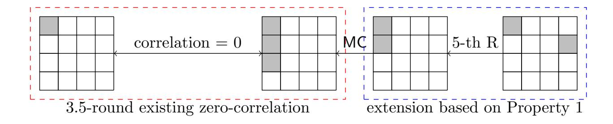
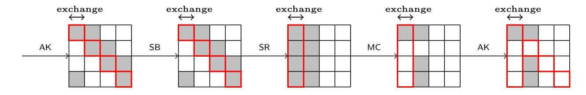

{0}------------------------------------------------

# MixColumns Coefficient Property and Security of the AES with A Secret S-Box

Xin An, Kai Hu, and Meiqin Wang ()

<sup>1</sup> School of Cyber Science and Technology, Shandong University, Qingdao, Shandong, 266237, China

{anxin19,hukai}@mail.sdu.edu.cn , mqwang@sdu.edu.cn

<sup>2</sup> Key Laboratory of Cryptologic Technology and Information Security of Ministry of Education, Shandong University, Qingdao, Shandong, 266237, China

Abstract. The MixColumns operation is an important component providing diffusion for the AES. The branch number of it ensures that any continuous four rounds of the AES have at least 25 active S-Boxes, which makes the AES secure against the differential and linear cryptanalysis. However, the choices of the coefficients of the MixColumns matrix may undermine the AES security against some novel-type attacks. A particular property of the AES MixColumns matrix coefficient has been noticed in recent papers that each row or column of the matrix has elements that sum to zero. Several attacks have been developed taking advantage of the coefficient property.

In this paper we investigate further the influence of the specific coefficient property on the AES security. Our target, which is also one of the targets of the previous works, is a 5-round AES variant with a secret S-Box. We will show how we take advantage of the coefficient property to extract the secret key directly without any assistance of the S-Box information. Compared with the previous similar attacks, the present attacks here are the best in terms of the complexity under the chosen-plaintext scenario.

Keywords: AES · MixColumns · Exchange Attack · Key Recovery Attack · Secret S-Box .

## 1 Introduction

The Advanced Encryption Standard (AES) [\[7\]](#page-19-0) is designed to achieve good resistance against the differential [\[3\]](#page-18-0) and linear cryptanalysis [\[13\]](#page-19-1). This includes the selection of the S-Box and linear components such as the MixColumns matrix. For the AES, the branch number of its MixColumns matrix is chosen as five then it ensures that any four continuous rounds of differential (linear) characteristics have at least 25 active S-Boxes [\[7,](#page-19-0)[8\]](#page-19-2). Considering that the maximum correlation and the maximum difference propagation probability over the AES S-Box are 2−<sup>3</sup> and 2−<sup>6</sup> , respectively, 

{1}------------------------------------------------

there are no effective differential or linear characteristics for four or more rounds of the AES.

For the performance reasons, the coefficients of the AES MixColumns are chosen from a group of low-weight numbers. Therefore it is not surprising that there are elements in each row or column that will add up to zero. For example, its first row is -02, 03, 01, 01 thus 01 ⊕ 01 = 0 and 01 ⊕ 02 ⊕ 03 = 0. Several attacks have been developed facilitated by this property and show that the property can be a potential weakness [\[2](#page-18-1)[,9,](#page-19-3)[10,](#page-19-4)[12,](#page-19-5)[15\]](#page-19-6). For convenience, we conclude it into two types concretely as follows as did in [\[12\]](#page-19-5),

Property 1. Each row or column of the MixColumns matrix has two elements that sum to zero.

Property 2. Each row or column of the MixColumns matrix has three elements that sum to zero.

At Crypto 2016, Sun et al. noticed Property 1 for the first time and established the first zero-correlation linear hull and the first integral distinguisher for the 5-round AES [\[15\]](#page-19-6). The two attacks exploited the existing 4-round corresponding properties and extended them one more round based on the MixColumns coefficient property. We take the 5-round zerocorrelation linear hull as an example. As is well-known, the previous zerocorrelation linear hull can cover at most 3.5 rounds of the AES (without last MixColumns) [\[4\]](#page-18-2) which is illustrated in Fig. [1](#page-1-0) [3](#page-1-1) . Let the first col-



<span id="page-1-0"></span>Fig. 1. Extending 3.5-round zero-correlation linear hull for AES to 5 rounds exploiting Property 1

umn of the input mask and the output mask of the MixColumns after the 3.5-round zero-correlation linear hull be Γin and Γout, respectively. According to the propagation of the mask over a linear map [\[4\]](#page-18-2), we have

<span id="page-1-1"></span><sup>3</sup> In [\[4\]](#page-18-2), the output mask of the 3.5-round zero-correlation linear hull has only one active byte, but it is easy to check that with 3 active byte in the output mask it is still a zero-correlation linear hull.

{2}------------------------------------------------

 $\Gamma_{in} = M_{AES}^T \Gamma_{out}$ , where  $M_{AES}^T$  is the transpose of the matrix used by the AES MixColumns. Then if we can ensure that the two active masks of  $\Gamma_{out}$  are equal, we can make certain that  $\Gamma_{in}$  has only three active bytes like Fig. 1. Finally, the zero-correlation linear can be extended to 5 rounds.

Although the two distinguishers in [15] cost the whole codebook, they spawned a sequence of new fundamental results that are based on Property 1 or 2. Soon after, two following improvements were proposed which aimed to reduce the complexities [6,12]. At FSE 2017, Grassi et al. took Property 1 proposing the first impossible differential distinguisher for the 5-round AES [10]. Later at CT-RSA 2018, the impossible differential distinguisher was further improved by Grassi exploiting Property 2 [9]. In the same paper, he also discussed the attacks on an AES variant with a secret S-Box. By combining the MixColumns coefficient property and the multiple-of-n attack [11], Grassi managed to extract the secret key from the 5-round AES without knowing any information of the S-Box or recovering it in advance as it was done in [16].

The security of the AES variant with a secret S-Box was firstly studied by Tiessen et al. at FSE 2015 [16]. Assuming that the choice of the S-Box is made uniformly at random from all 8-bit S-Boxes and keeping all other components unchanged, the size of the secret information increases from 128 bits to 1812 bits <sup>4</sup> (we focus on the AES-128). Generally speaking, a key-recovery attack requires the details of the S-Box since we have to peel off some key-involved components. Consequently, the authors of |16|needed to recover an equivalent S-Box by the square attack [16] and then found the equivalent secret key. However, the works in [9] showed that it is possible to recover the key information directly without recovering the S-Box in advance if we take advantage of Property 1 or 2 appropriately. At Africacrypt 2019, Bardeh and Rønjom further studied the influence of Property 1 under the adaptive-chosen-ciphertext scenario, which is the newest result in this direction. The AES variant with a secret S-Box has been a popular target for studying the MixColumns coefficient property. In this paper, we also study how to take the MixColumns coefficient property to extract the key information without any knowledge of the S-Box.

<span id="page-2-0"></span><sup>&</sup>lt;sup>4</sup> The number of all the 8-bit S-Boxes is  $2^8$ ! which is about  $log_2^{(2^8!)} \approx 1684$  bits information. Totally, the security information is about 1684 + 128 = 1812 bits.

{3}------------------------------------------------

### 1.1 Our Contribution

To explore the influence of the MixColumns coefficient property on the security of the AES, in this paper we propose two new attacks on the 5-round AES variant with a secret S-Box based on Property 1 and 2 respectively. Our attacks are developed upon the newest technique called the exchange attack [\[1\]](#page-18-3), we manage to transform the 5-round exchange attack to two key-recovery attacks. Compared with those previous attacks based on the MixColumns coefficient property, our 5-round attacks need only 242.<sup>6</sup> or 2<sup>46</sup> chosen plaintexts, which are new records under the chosen-plaintext scenario. All the attacks on the 5-round AES related to the MixColumns coefficient property are listed in Table [1](#page-3-0) for a convenient comparison.

<span id="page-3-0"></span>Table 1. Attacks on the 5-Round AES Taking the MixColumns Coefficient Property

| Attack                  | Round | Data                 | Computation                       | Reference |
|-------------------------|-------|----------------------|-----------------------------------|-----------|
| Integral                | 5     | 128 CC<br>2          | 129.6 XOR<br>2                    | [15]      |
| Impossible Differential | 5     | 102 CP<br>2          | 107 M<br>100.4 E<br>?<br>2<br>≈ 2 | [10]      |
| Impossible Differential | 5     | 76.4 CP<br>2         | 81.5 M<br>74.9 E<br>2<br>≈ 2      | [9]       |
| Integral                | 5     | 96 CP<br>2           | 96 E<br>2                         | [12]      |
| Multiple-of-n           | 5     | 53.6 CP<br>2         | 55.6 M<br>48.86 E<br>2<br>≈ 2     | [9]       |
| Zero difference         | 5     | 29.19 CP+232ACC<br>2 | 31 XOR<br>2                       | [2]       |
| Exchange                | 5     | 42.6 CP<br>2         | 42.6 E<br>2                       | Sect. 3   |
| Exchange                | 5     | 46 CP<br>2           | 46 E<br>2                         | Sect. 4   |

CC: chosen ciphertexts, CP: chosen plaintexts, ACC: adaptive chosen ciphertexts M: memory access, XOR: XOR operation, E: 5-round AES encryption

#### Organization of This Paper.

In Sect. [2,](#page-3-1) we introduce some background knowledge needed in this paper. In Sect. [3](#page-6-0) and [4,](#page-13-0) we present two new attacks exploiting Property 1 and Property 2, respectively. We conclude this paper in Sect. [5.](#page-17-0)

## <span id="page-3-1"></span>2 Preliminary

#### 2.1 Description of the AES

The AES (Advanced Encryption Standard) [\[7\]](#page-19-0) is an iterated block cipher with the substitution-permutation network (SPN). It has three versions

<sup>?</sup>: In [\[10](#page-19-4)[,9\]](#page-19-3), the authors used the scale that 100 times of memory access are approximately equivalent to 1 times of 5-round AES. In this paper, we use the same scale.

{4}------------------------------------------------

with the key size 128, 192, 256 bits and the number of rounds is 10, 12, 14, respectively. The length of the block cipher is 128-bit and it will be initialized as a  $4 \times 4$  matrix of bytes as values in the finite field  $\mathbb{F}_{28}$  defined over the the irreducible polynomial  $x^8 + x^4 + x^3 + x + 1$  (AES finite field). The round function of the AES, except the last one, applies four operations to every state matrix:

- SubBytes(SB) each of the 16 bytes in the state matrix is replaced by another value getting from an 8-bit S-Box. In our attack the adversary does not know the exact information about the S-Box.
- ShiftRows(SR) the *i*-th  $(0 \le i \le 3)$  row of the state matrix is rotated to the left by *i* position(s).
- MixColumns(MC) each column of the state matrix is multiplied by an MDS matric  $M_{AES}$  from the left over the AES finite field. The invertible matrix  $M_{AES}$  is shown as follows, each byte of matrix is presented as hexadecimal.

$$M_{AES} = \begin{bmatrix} 02 & 03 & 01 & 01 \\ 01 & 02 & 03 & 01 \\ 01 & 01 & 02 & 03 \\ 03 & 01 & 01 & 02 \end{bmatrix}$$
 (1)

- AddRoundKey(AK) - the state of the AES is XORed with the 128-bit round key.

In the first round an additional AK will be applied to the plaintext ahead the SB operation. And in the last round the MixColumns operation is omitted for convenient decryption. In this paper, we focus on the 5-round AES variant where we consider the five full rounds of the AES keeping the last MC only for convenient description.

The AES Variant with A Secret S-Box. The target of this paper is an AES variant with a secret S-Box, i.e., the S-Box is replaced by a secret one and other structure and components are as the same as the original AES.

#### 2.2 Notations

Let x denote a plaintext, a ciphertext, an intermediate state or a key. Then  $x_{i,j}$  with  $i, j \in \{0, 1, 2, 3\}$  denotes the byte located at the intersection of the i-th row and the j-th column. The secret key is usually denoted by k. We denote one round of the AES by R and denote r full rounds of the AES by  $R^{r-5}$ . In this paper, we will also adopt the notations of the

<span id="page-4-0"></span>For the unity of description, we do not omit the last MC of  $R^r$  when we metion  $R^r$ .

{5}------------------------------------------------

subspaces for the AES proposed initially in [10]. For a pair (x, x'), its dual pair  $(\hat{x}, \hat{x}')$  is generated by exchanging the first diagonal between x and x'. We call a pair and its dual pair, i.e.,  $(x, x', \hat{x}, \hat{x}')$  a pair-of-pair. For a matrix or a vector v, we denote its transpose by  $v^T$ .

**Subspaces of the AES.** The subspace trial of the AES works with vectors and vector spaces over  $\mathbb{F}_{2^8}^{4\times 4}$ . We denote the unit vectors of  $\mathbb{F}_{2^8}^{4\times 4}$  by  $e_{0,0}, e_{0,1}, ..., e_{3,3}$  where  $e_{i,j}$  has a single 1 in the intersection of the *i*-th row and the *j*-th column.

**Definition 1 (Column Space [10]).** The column space  $C_i$  are defined as  $C_i = \langle e_{0,i}, e_{1,i}, e_{2,i}, e_{3,i} \rangle$ .

**Definition 2 (Diagonal and Inverse-Diagonal Space [10]).** The diagonal spaces  $D_i$  and inverse-diagonal spaces  $ID_i$  are defined as  $D_i = SR^{-1}(C_i)$  and  $ID_i = SR(C_i)$ .

**Definition 3 (Mixed Space [10]).** The *i*-th mixed spaces  $M_i$  are defined as  $M_i = MC(ID_i)$ .

**Definition 4 ([10]).** For  $I \subseteq \{0, 1, 2, 3\}$  where  $0 < |I| \le 3$ , let  $C_I, D_I, ID_I$  and  $M_I$  defined as

$$C_I = \bigoplus_{i \in I} C_i, D_I = \bigoplus_{i \in I} D_i, ID_I = \bigoplus_{i \in I} ID_i, M_I = \bigoplus_{i \in I} M_i.$$

We refer readers to [10] for more details.

Next we introduce a useful one round subspace trail.

**Lemma 1** ([10]). For any coset  $D_I \oplus a$  there exists a unique  $b \in C_I^{\perp}$  such that after one round  $R(D_I \oplus a)$  belongs to a coset of column space, i.e.,  $R(D_I \oplus a) = C_I \oplus b$ . In other words, if  $x \oplus x' \in D_I$ , then  $R(x) \oplus R(x') \in C_I$ .

#### 2.3 Exchange Attack.

The exchange attack is a new distinguisher proposed at Asiacrypt 2019 which can be used to attack the 5- and 6-round AES [1]. Since this paper only use the distinguishing attack on the 5-round AES, we only introduce some basic ideas about its application to the 5-round AES.

For a pair of states, if we exchange their first diagonals between the two values and get its dual pair, it is equivalent to swap the corresponding column after one round encryption. Furthermore, in some special cases, to exchange a column is equivalent to exchange a diagnoal. For example, if 

{6}------------------------------------------------

the difference of the state pair behaves like the rightmost state in Fig. 2, exchanging its first column is equivalent to exchange its first diagonal, because only the byte at the intersection of the first column and the first diagnoal is active.



<span id="page-6-1"></span>Fig. 2. Swapping the first column is equivalent to swap the first diagonal.

In [1], the authors modified a theorem from [14], which states an exchange-difference relation over 4 rounds of the AES.

Theorem 1 (4-round Exchange-Difference Relation [14]). Let  $x, x' \in \mathbb{F}_{2^8}^{4 \times 4}$ , exchange some diagonals between x and x' and get  $\hat{x}, \hat{x}'$ , then for  $J \subseteq \{0, 1, 2, 3\}$  and  $0 < |J| \le 3$ ,

<span id="page-6-2"></span>
$$Pr(R^4(\hat{x}) \oplus R^4(\hat{x}') \in M_J | R^4(x) \oplus R^4(x') \in M_J) = 1.$$

According to the exchange attack illustrated in Fig. 2 [1], we choose a pair of plaintext  $x, x' \in D_J \oplus a$  where  $J = \{0, 1\}$ , and exchange the first diagonal to get its dual pair  $\hat{x}, \hat{x}' \in C_I \oplus a$ . With some probability  $x \oplus x'$  and  $\hat{x} \oplus \hat{x}'$  may satisfy a special difference pattern making that it is equivalent to exchange some diagonals of (R(x), R(x')) to get  $(R(\hat{x}), R(\hat{x}'))$ . Then it meets the starting condition of Theorem 1, we can get a 5-round exchange-equivalent relation for the AES.

#### <span id="page-6-0"></span>3 Improved Key-Recovery Attack Based on Property 1

In this section, we show how to combine Property 1 with the exchange attack to establish an improved key-recovery attack on the 5-round AES with a secret S-Box. The basic idea of this attack is to extend the 4-round exchange-difference relation (Theorem 1) to 5 rounds. In the attack, we first choose two plaintexts p, p' from a subspace  $S_0 = a \oplus D_I$  where  $I = \{0, 1\}$ , and expect that R(p), R(p') will be in a specific subspace  $S_1 = b \oplus C_I$  as follows,

<span id="page-6-3"></span>
$$S_{1} \triangleq \left\{ b \oplus \begin{bmatrix} x_{1} & x_{2} & 0 & 0 \\ 0 & 0 & 0 & 0 \\ 0 & x_{3} & 0 & 0 \\ 0 & x_{4} & 0 & 0 \end{bmatrix} \middle| x_{1}, x_{2}, x_{3}, x_{4}, b \in \mathbb{F}_{2^{8}} \right\}.$$
 (2)

{7}------------------------------------------------

For two randomly drawn plaintexts  $p, p' \in S_0$ , the probability that  $R(p) \oplus R(p') \in S_1$  is  $2^{-32}$ . However, taking Property 1 into consideration and choosing p, p' carefully according to some secret key information, we can vary the probability of  $R(p) \oplus R(p') \in S_1$  between the wrong and right key guess.

Once  $R(p) \oplus R(p') \in S_1$ , we can exchange the first diagonal between p and p' and get its dual pair  $(\hat{p}, \hat{p}')$ , thus (R(p), R(p')) and  $(R(\hat{p}), R(\hat{p}'))$  are two pairs satisfying the starting condition of Theorem 1. Hence,  $R^5(p) \oplus R^5(p')$  and  $R^5(\hat{p}) \oplus R^5(\hat{p}')$  will be always in the same  $M_J$  for certain  $J \subseteq \{0, 1, 2, 3\}$  at the same time. For sake of convenience, in this section we call such pair-of-pair  $(p, p', \hat{p}, \hat{p}')$  a **right pair-of-pair**.

**Details.** Based on Property 1, if the four input bytes of MC have two zero-difference values and the difference of the remaining two bytes are equal, the output vector will have one zero-difference byte with probability 1. Without loss of generality, we assume the input difference is  $[a, 0, 0, a]^T$ , then

<span id="page-7-0"></span>
$$\begin{bmatrix} 02 & 03 & 01 & 01 \\ 01 & 02 & 03 & 01 \\ 01 & 01 & 02 & 03 \\ 03 & 01 & 01 & 02 \end{bmatrix} \times \begin{bmatrix} a \\ 0 \\ 0 \\ a \end{bmatrix} = \begin{bmatrix} 3a \\ 0 \\ 2a \\ a \end{bmatrix}.$$
 (3)

It can be seen that the second value of the output difference must be zero. Then if the second column of the input difference of MC is really the patten such as  $[a,0,0,a]^T$  where  $a \in \mathbb{F}_{2^8} \setminus \{0\}$ , the probability that  $R(p) \oplus R(p') \in S_1$  (Equation 2) will be  $2^{-24}$  rather than  $2^{-32}$ . For this reason, we define the set  $A_{z,\delta}$  as follows,

<span id="page-7-1"></span>
$$A_{z,\delta} \triangleq \left\{ a \oplus \begin{bmatrix} y_0 & z & 0 & 0 \\ 0 & y_1 & 0 & 0 \\ 0 & 0 & y_2 & 0 \\ z \oplus \delta & 0 & 0 & y_3 \end{bmatrix} \middle| \forall y_0, y_1, y_2, y_3, a \in F_{2^8} \right\} \text{ where } z, \delta \in F_{2^8},$$

$$(4)$$

and then choose two different plaintexts  $p \in A_{z_0,\delta}$  and  $p' \in A_{z_1,\delta}$  where  $z_0 \neq z_1$ .

Let the two secret key bytes which are XORed with  $p_{0,1}$  (Resp.  $p'_{0,1}$ ) and  $p_{3,0}$  (Resp.  $p'_{3,0}$ ) be  $k_{0,1}$  and  $k_{3,0}$ , respectively. After  $f \triangleq \mathsf{SR} \circ \mathsf{SB} \circ \mathsf{AK}$ 

{8}------------------------------------------------

operation, the second column of  $f(p) \oplus f(p')$  is

$$(f(p) \oplus f(p'))_{C_1} = \begin{bmatrix} S\text{-Box}(z_0 \oplus k_{0,1}) \oplus S\text{-Box}(z_1 \oplus k_{0,1}) \\ 0 \\ 0 \\ S\text{-Box}(z_0 \oplus \delta \oplus k_{3,0}) \oplus S\text{-Box}(z_1 \oplus \delta \oplus k_{3,0}) \end{bmatrix}.$$

To meet the condition shown in Equation 3, Equation 5 should be met,

<span id="page-8-0"></span>
$$S-Box(z_0 \oplus k_{0,1}) \oplus S-Box(z_1 \oplus k_{0,1}) = S-Box(z_0 \oplus \delta \oplus k_{3,0}) \oplus S-Box(z_1 \oplus \delta \oplus k_{3,0})$$
(5)

Since the S-Box is a secret permutation, Equation 5 has only two solutions, i.e.,

$$\delta = k_{0,1} \oplus k_{3,0} \text{ or } \delta = z_0 \oplus z_1 \oplus k_{0,1} \oplus k_{3,0}.$$

If we let  $\delta$  run through all values in  $\mathbb{F}_{2^8}$ , we can guarantee that there are at least two values of  $\delta$  leading that Equation 5 holds. For sake of simplicity, we call the two  $\delta$  **right**  $\delta$  and other values **wrong**  $\delta$ . For right  $\delta$ , the probability that  $R(p) \oplus R(p') \in S_1$  will be  $2^{-24}$ . For wrong  $\delta$ , the probability is still  $2^{-32}$ . Combinining with Theorem 1, we conclude the following proposition,

**Proposition 1.** Let  $p \in A_{z_0,\delta}$  and  $p' \in A_{z_1,\delta}$ .  $(\hat{p}, \hat{p}')$  is the dual pair of (p, p'). If  $\delta$  is right, for certain  $M_J$  with |J| = 3,

<span id="page-8-1"></span>
$$Pr(R^5(p) \oplus R^5(p') \in M_J \wedge R^5(\hat{p}) \oplus R^5(\hat{p}') \in M_J) \approx 2^{-54}$$

While for wrong  $\delta$ ,

$$Pr(R^5(p) \oplus R^5(p') \in M_J \wedge R^5(\hat{p}) \oplus R^5(\hat{p}') \in M_J) \approx 2^{-62}$$
.

*Proof.* If two pairs satisfy the starting condition of Theorem 1, they will be in the same  $M_J$  at the same time after 4 rounds of encryption. Let |J| = 3, the probability for the two pairs being a right pair-of-pair is  $2^{-30}$  since we have four choices of J.

For wrong  $\delta$ , the starting condition of Theorem 1 is statisfied with probability  $2^{-32}$ . Then, the probability for the two pairs being a right pair-of-pair is about  $2^{-62}$ , which is consistent with the random case. While for right  $\delta$ , the starting condition is met with probability  $2^{-24}$ , so the probability for the two pairs being a right pair-of-pair is  $2^{-54}$ .

Finding  $\delta$  Candidates. We can take advantage of Proposition 1 to find the right  $\delta$  that implies  $k_{0,1} \oplus k_{3,0}$ . The process for finding  $\delta$  is illustrated in

{9}------------------------------------------------

Algorithm 1. For each candidate  $\delta \in \mathbb{F}_{2^8}$ , we find collision pairs and check whether there is at least one collision pair satisfying that its dual pair is also a collision pair. We explain briefly some crucial lines in Algorithm 1.

**Line 4.** For  $A_{z_0,\delta}$  and  $A_{z_1,\delta}$ , we require that the *i*-th plaintexts in  $A_{z_0,\delta}$  and  $A_{z_1,\delta}$  should have the same value in the first diagonal. In this way,  $(c_{z_0}^i, c_{z_1}^j)$  must be the dual pair of  $(c_{z_1}^i, c_{z_0}^j)$ . We can prepare a subset of  $D_0$  with size  $2^N$  and use it to generate the two sets  $A_{z_0,\delta}$  and  $A_{z_1,\delta}$  where  $z_0 \neq z_1$ .

**Line 14.** Since we have stored all the ciphertexts in tables, we only need to store the indexes of ciphertexts into the two hash tables. If the *i*-th lines of  $\mathcal{T}_{z_0}$  and  $\mathcal{T}_{z_1}$  are not empty simultaneously, we find a collision pair pointed by the corresponding indexes.

**Line 20.**  $(c_{z_0}^i, c_{z_1}^j)$  and  $(c_{z_1}^i, c_{z_0}^j)$  are dual pairs, then we need to check if  $c_{z_1}^i \oplus c_{z_0}^j \in M_k$ .

**Determine the Size of**  $A_{z_0,\delta}$  **And**  $A_{z_1,\delta}$ . For  $A_{z_0,\delta}$  and  $A_{z_1,\delta}$  with  $2^N$  elements, we can obtain  $2^{2N}$  pairs (p,p') by choosing  $p \in A_{z_0,\delta}$  and  $p' \in A_{z_1,\delta}$ . By exchanging the first diagonal, we get  $2^{2N-1}$  pair-of-pairs such as  $(p,p',\hat{p},\hat{p}')$ .

For 5-round AES, these  $2^{2N-1}$  pair-of-pairs can be regarded as  $2^{2N-1}$  Bernoulli trials, and the number of right pair-of-pairs should obey Binomial distribution  $\mathcal{B}(2^{2N-1}, 2^{-54})$  when  $\delta$  is right. Otherwise, it will obey  $\mathcal{B}(2^{2N-1}, 2^{-62})$ . Let  $N_r$  and  $N_w$  be the number of right pair-of-pairs for right and wrong  $\delta$ , respectively.

For right  $\delta$ ,

$$Pr(N_r \ge 1) = 1 - Pr(N_r = 0) = 1 - (1 - 2^{-54})^{2^{2N-1}} \approx 1 - exp(-2^{2N-1-54}).$$

For wrong  $\delta$ ,

$$Pr(N_w \ge 1) = 1 - Pr(N_w = 0) = 1 - (1 - 2^{-62})^{2^{2N-1}} \approx 1 - exp(-2^{2N-1-62}).$$

When we take N = 29,  $Pr(N_r \ge 1) \approx 0.9997$  while  $Pr(N_w \ge 1) \approx 0.0308$ , which means we can distinguish the right  $\delta$  from the wrong  $\delta$ .

**Determining the exact**  $k_{0,1} \oplus k_{3,0}$ . Either of the right  $\delta$  including  $\delta = k_{0,1} \oplus k_{3,0}$  and  $\delta = k_{0,1} \oplus k_{3,0} \oplus z_0 \oplus z_1$  will bring at least one right pair-of-pair with probability about 0.9997. Therefore, they will be both returned by Algorithm 1 with probability 0.9997<sup>2</sup>  $\approx$  0.9994. At the same time, the probability for a wrong  $\delta$  being recommended is 0.0308. For all

{10}------------------------------------------------

#### <span id="page-10-0"></span>**Algorithm 1** Finding $\delta$ Candidates (Property 1)

```
1: procedure Core(z_0, z_1, r, c)
                                                                \triangleright Return a set containing the possible right \delta
 2:
           for Each \delta \in \mathbb{F}_{2^8} do
                Initialize 2 sequence tables C_{z_0}, C_{z_1}, 1 table \Delta
 3:
                Prepare two sets A_{z_0,\delta}, A_{z_1,\delta} with 2^{29} plaintexts
 4:
                                                                                                                     ▶ Make sure
      A_{z_0,\delta}[i]_{D_0} = A_{z_1,\delta}[i]_{D_0}, according to Equation 4
                for i = 0; i < 2^{29}; i = i + 1 do
 5:
                      for j = 0; j < 2; j = j + 1 do
 6:
                                                                                  \, \triangleright \, p^i_{z_j} is the i\text{-th} plaint
ext in A_{z_j,\delta}
                           c_{z_j}^i \leftarrow R^5(p_{z_j}^i)
 7:
                                                                                                                       \triangleright Store c_{z_i}^i
                           \mathcal{C}_{z_j}[i] \leftarrow c_{z_j}^i
 8:
                      end for
 9:
                 end for
10:
11:
                 for k = 0; k < 4; k = k + 1 do \triangleright For each M_k space, search for collisions
                      Initialize 2 hash tables \mathcal{T}_{z_0}, \mathcal{T}_{z_1}
12:
                      for i = 0; i < 2^{29}; i = i + 1 do
13:
                            for j = 0; j < 2; j = j + 1 do
14:
                                 \mathcal{T}_{z_j}[\mathsf{MC}^{-1}(c^i_{z_j})_{ID_k}] \leftarrow \mathsf{index}(c^i_{z_j})
                                                                                                              \triangleright \operatorname{index}(c_{z_i}^i) = i
15:
                            end for
16:
                      end for
17:
                      for i = 0; i < 2^{32}; i = i + 1 do
                                                                           \triangleright For each line of \mathcal{T}_{z_0} and \mathcal{T}_{z_1}
18:
                            if there is a collision pair with indexes (i_0, i_1) and i_0 \neq i_1 then
19:
                                 c_{z_0}^{i_1} \leftarrow C_{z_0}[i_1], c_{z_1}^{i_0} \leftarrow C_{z_1}[i_0] \quad \triangleright (c_{z_0}^{i_0}, c_{z_1}^{i_1}) \text{ and } (c_{z_0}^{i_1}, c_{z_1}^{i_0}) \text{ are dual}
20:
      pairs
                                                                                              \rightharpoonup (c_{z_0}^{i_1}, c_{z_1}^{i_0}) is also collided
                                 if c_{z_0}^{i_1} \oplus c_{z_1}^{i_0} \in M_k then \Delta \leftarrow \delta
21:
22:
                                  end if
23:
                            end if
24:
25:
                      end for
26:
                 end for
27:
           end for
28:
           return \Delta
29: end procedure
```

## <span id="page-10-1"></span>**Algorithm 2** Remove wrong $\delta$

```
1: procedure Remove( \Delta, z_0, z_1)
2: for \delta \in \Delta do
3: if \delta \oplus z_1 \oplus z_2 \notin \Delta then
4: Remove \delta from \Delta
5: end if
6: end for
7: return \Delta
8: end procedure
```

{11}------------------------------------------------

the  $2^8 - 2$  wrong  $\delta$ , on average there will be  $(2^8 - 2) \times 0.0308 \approx 8$  wrong  $\delta$  which are also recommended. All the  $\delta$  candidates are inserted into a set  $\Delta$ , which is returned by Algorithm 1 finally.

To remove the wrong  $\delta$  from  $\Delta$ , we XOR  $z_0 \oplus z_1$  with each value in  $\Delta$ . For right  $\delta$ ,  $\delta \oplus z_0 \oplus z_1$  should be also in  $\Delta$  in a high probability (0.9994) while for wrong  $\delta$ , the probability is about  $2^{-8}$ . The method of removing wrong  $\delta$  is shown in Algorithm 2.

Now the set  $\Delta$  contains only  $k_{0,1} \oplus k_{3,0}$  and  $k_{0,1} \oplus k_{3,0} \oplus z_0 \oplus z_1$ . To determine the exact right key byte, we have to call Algorithm 1 and Algorithm 2 again with  $(z_2, z_3)$  where  $z_2 \oplus z_3 \neq z_0 \oplus z_1$ . With  $\Delta' = \{k_{0,1} \oplus k_{3,0}, k_{0,1} \oplus k_{3,0} \oplus z_2 \oplus z_3\}$  returned, we can easily determine the right  $k_{0,1} \oplus k_{3,0}$  by comparing  $\Delta$  and  $\Delta'$ . Therefore we recover one byte key information with  $0.9994^2 \approx 0.9988$  success probability. The process is illustrated in Algorithm 3.

The procedure RecoverKeyByte(r,c) (Algorithm 3) can be used to recover  $k_{r,c} \oplus k_{r+1,c+1}{}^6$ . Since the equal bytes in MC matrix are all adjacent, for the *i*-th diagonal of the key state, we can recover  $k_{0,i} \oplus k_{1,i+1}$ ,  $k_{1,i+1} \oplus k_{2,i+2}$ ,  $k_{2,i+2} \oplus k_{3,i+3}$  and  $k_{3,i+3} \oplus k_{0,i}$ . However, from any three out of the four values we can derive the remaining one, which means we can recover three bytes of useful key information for one diagonal. For the four diagonals of key state, we can recover 12 bytes of key information, i.e. we can get the secret key up to  $2^{32}$  variants.

**Data Complexity.** From Algorithm 1, for every  $\delta \in \mathbb{F}_{2^8}$  we use four sets  $A_{z_i,\delta}$  for i=0,1,2,3 each with  $2^{29}$  plaintexts. Therefore we need  $2^{29} \times 2^8 \times 4 = 2^{39}$  chosen plaintexts to recover one byte key. In order to recover 12 key bytes, the total data complexity is  $2^{39} \times 12 \approx 2^{42.6}$  chosen plaintexts.

Computation Complexity. Firstly, we evaluate the complexity of Algorithm 1. For each possible  $\delta \in \mathbb{F}_{2^8}$  we encrypt two sets  $A_{z_0,\delta}$  and  $A_{z_1,\delta}$  each with  $2^{29}$  plaintexts, this operation needs  $2^{29} \times 2 = 2^{30}$  5-round encryptions. After obtaining  $2^{30}$  ciphertexts, we insert them into  $C_{z_0}$  and  $C_{z_1}$  with  $2^{30}$  table-lookups. To insert all the ciphertexts to  $T_{z_0}$  and  $T_{z_1}$ , we need  $2^{30}$  table-lookups again. Then we compare each line of  $T_{z_0}$  and  $T_{z_1}$  to find collision pairs, it requires  $2 \times 2^{32} = 2^{33}$  table-lookups. For the two sets  $A_{z_0,\delta}$  and  $A_{z_1,\delta}$  each with  $2^{29}$  chosen plaintexts, on average we can obtain  $2^{29} \times 2^{29} \times 2^{-32} = 2^{26}$  collision pairs. Once we find a collision pair  $(c_{z_0}^i, c_{z_1}^j)$ , we need a time of XOR to check whether  $(c_{z_1}^i, c_{z_0}^j)$  is

<span id="page-11-0"></span><sup>&</sup>lt;sup>6</sup> In this paper, the addition of indexes are modulo 4.

{12}------------------------------------------------

# <span id="page-12-0"></span>Algorithm 3 Recover the real key kr,c ⊕ kr+1,c+1 (Property 1)

```
1: procedure RecoverKeyByte(r, c) . Recover kr,c ⊕ kr+1,c+1 with 99.88%
   probability
2: Allocate z0, z1, z2, z3 s.t. z0 ⊕ z1 6= z2 ⊕ z3
3: ∆0 ← Core(z0, z1, r, c)
4: if |∆0| == 0 then
5: return ⊥
6: else
7: ∆0 ← Remove( ∆0, z0, z1)
8: end if
9: ∆1 ← Core(z2, z3, r, c)
10: if |∆1| == 0 then
11: return ⊥
12: else
13: ∆1 ← Remove( ∆1, z0, z1)
14: end if
15: if ∆0, ∆1 have the same value then
16: return δ ← (∆0, ∆1) . Right kr,c ⊕ kr+1,c+1 must lie in both set
17: else
18: return ⊥
19: end if
20: end procedure
```

collided. These memory operations above need about 2<sup>33</sup> table-lookups. Considering we have four possible Mk, the whole memory operations cost 2 <sup>35</sup> table-lookups. We use the convention that 100 times of table lookups are equivalent to one time 5-round encryption. Hence, encrypting the plaintexts is dominant in the time complexity, which requires 2<sup>30</sup> 5-round encryptions for each δ.

To determine the exact one byte information of key (Algorithm [3\)](#page-12-0), the time complexity is 2<sup>8</sup> ×2×2 <sup>30</sup> = 2<sup>39</sup> 5-round encryptions. Recovering 12 bytes key requires 2<sup>39</sup> × 12 ≈ 2 42.6 times of 5-round encryption.

Memory Complexity. We allocate 2 sequence tables with size 2<sup>29</sup> and 2 hash tables with size 232. Since these tables can be reused, the total memory complexity is about 2<sup>32</sup> × 2 + 2<sup>29</sup> × 2 ≈ 2 <sup>33</sup> 128-bit blocks.

Practical Verification. Using C/C++ implementation, we practically verified our key-recovery attack on a small-scale variant of the AES as presented in [\[5\]](#page-18-4). The block size of the small-scale AES is 64 bits, and each word is a 4-bit nibble in the state matrix. We simply recover one byte of 

{13}------------------------------------------------

the secret key XOR in our experiment. The experimental result supports our theory.  $^{7}\,$ 

# <span id="page-13-0"></span>4 Improved Key-Recovery Attack Based on Property 2

Similar to the exchange attack based on Property 1, we can also combine Property 2 of MC matrix with exchange attack to realize the key recovery attack with a secret S-Box. To exploit Property 2, we focus on another subspace  $S'_1$  that two plaintexts  $p, p' \in D_I, I = \{0, 1\}$  should fall into after the first round encryption.

$$S_1' \triangleq \left\{ b \oplus \begin{bmatrix} a_1 & 0 & 0 & 0 \\ 0 & 0 & 0 & 0 \\ 0 & a_3 & 0 & 0 \\ a_2 & a_4 & 0 & 0 \end{bmatrix} \middle| a_1, a_2, a_3, a_4, b \in \mathbb{F}_{2^8} \right\}.$$
 (6)

If we exchange the first diagonal between p and p', it is equivalent to exchange the first column between R(p) and R(p'). Since R(p),  $R(p') \in S'_1$ , it is also equivalent to exchange the first and the fourth diagonals between R(p) and R(p').

**Details.** Property 2 of MC says that three elements in each row can be XORed to zero. If the input difference of the four bytes of MC has three equal values and the remaining one value is zero, the output difference will have two zero-difference byte with probability 1. Without loss of generality, we assume the input difference is  $[a, a, a, 0]^T$ , then

<span id="page-13-2"></span>
$$\begin{bmatrix} 02 & 03 & 01 & 01 \\ 01 & 02 & 03 & 01 \\ 01 & 01 & 02 & 03 \\ 03 & 01 & 01 & 02 \end{bmatrix} \times \begin{bmatrix} a \\ a \\ a \\ 0 \end{bmatrix} = \begin{bmatrix} 0 \\ 0 \\ 2a \\ 3a \end{bmatrix}$$
 (7)

It can be seen that there are two zero-difference values in the output difference with probability 1. Then if the input difference of MC is really the pattern such as  $[a, a, a, 0]^T$  for any  $a \in \mathbb{F}_{2^8} \setminus \{0\}$ . To achieve it, we define the set  $A_{w,\delta_1,\delta_2}$  as follows,

<span id="page-13-3"></span>
$$A_{w,\delta_{1},\delta_{2}} \triangleq \left\{ a \oplus \begin{bmatrix} y_{1} & w & 0 & 0 \\ 0 & y_{2} & w \oplus \delta_{1} & 0 \\ 0 & 0 & y_{3} & w \oplus \delta_{2} \\ 0 & 0 & 0 & y_{4} \end{bmatrix} \middle| \forall y_{0}, y_{1}, y_{2}, y_{3} \in \mathbb{F}_{2^{8}} \right\}$$
 (8) where  $w, \delta_{1}, \delta_{2} \in \mathbb{F}_{2^{8}}$ .

<span id="page-13-1"></span><sup>7</sup> https://github.com/anxin19/5-round-AES-keyrecoveryattack.git.

{14}------------------------------------------------

We choose two different plaintexts  $p \in A_{w_0,\delta_1,\delta_2}$ ,  $p' \in A_{w_1,\delta_1,\delta_2}$ . Let the key bytes XORed with  $p_{0,1}, p_{1,2}, p_{2,3}$  (Resp.  $p'_{0,1}, p'_{1,2}, p'_{2,3}$ ) are  $k_{0,1}, k_{1,2}, k_{2,3}$ , respectively. After the operation  $f = SR \circ SB \circ AK$ , the difference between the second column of f(p) and f(p') is

$$f(p)_{C_1} \oplus f(p')_{C_1} = \begin{bmatrix} S\text{-Box}(w_0 \oplus k_{0,1}) \oplus S\text{-Box}(w_1 \oplus k_{0,1}) \\ S\text{-Box}(w_0 \oplus \delta_1 \oplus k_{1,2}) \oplus S\text{-Box}(w_1 \oplus \delta_1 \oplus k_{1,2}) \\ S\text{-Box}(w_0 \oplus \delta_2 \oplus k_{2,3}) \oplus S\text{-Box}(w_1 \oplus \delta_2 \oplus k_{2,3}) \\ 0 \end{bmatrix}$$
(9)

To meet the condition shown in Equation 7, the following equation should be satisfied (denote S-Box( $\cdot$ ) by S( $\cdot$ ) for short),

<span id="page-14-0"></span>
$$\begin{cases}
S(w_0 \oplus k_{0,1}) \oplus S(w_1 \oplus k_{0,1}) = S(w_0 \oplus \delta_1 \oplus k_{1,2}) \oplus S(w_1 \oplus \delta_1 \oplus k_{1,2}) \\
S(w_0 \oplus k_{0,1}) \oplus S(w_1 \oplus k_{0,1}) = S(w_0 \oplus \delta_2 \oplus k_{2,3}) \oplus S(w_1 \oplus \delta_2 \oplus k_{2,3})
\end{cases}$$
(10)

Since the S-Box is a secret permutation, there can be only four kinds of solutions,

<span id="page-14-1"></span>
$$(\delta_{1}, \delta_{2}) = (k_{0,1} \oplus k_{1,2}, k_{0,1} \oplus k_{2,3}) \text{ or}$$

$$(\delta_{1}, \delta_{2}) = (k_{0,1} \oplus k_{1,2}, w_{0} \oplus w_{1} \oplus k_{0,1} \oplus k_{2,3}) \text{ or}$$

$$(\delta_{1}, \delta_{2}) = (w_{0} \oplus w_{1} \oplus k_{0,1} \oplus k_{1,2}, k_{0,1} \oplus k_{2,3}) \text{ or}$$

$$(\delta_{1}, \delta_{2}) = (w_{0} \oplus w_{1} \oplus k_{0,1} \oplus k_{1,2}, w_{0} \oplus w_{1} \oplus k_{0,1} \oplus k_{2,3})$$

$$(11)$$

Similar with the attack in Sect. 3, we let  $(\delta_1, \delta_2)$  run through all possible values in  $F_{28} \times F_{28}$ . There will be at least four values of  $(\delta_1, \delta_2)$  that make Equation 10 hold. We call the four  $(\delta_1, \delta_2)$  in Equation 11 **right**  $(\delta_1, \delta_2)$  and the other values **wrong**  $(\delta_1, \delta_2)$ . For right  $(\delta_1, \delta_2)$ , the probability of  $R(p^1) \oplus R(p^2) \in S'_1$  is  $2^{-16}$  while for wrong  $(\delta_1, \delta_2)$  the probability is still  $2^{-32}$ . Combining with Theorem 1, we conclude the following proposition. **Proposition 2.** Let  $p \in A_{w_0,\delta_1,\delta_2}$  and  $p' \in A_{w_1,\delta_1,\delta_2}$ .  $(\hat{p},\hat{p}')$  is generated by exchanging the first diagonal between p and p'. If  $(\delta_1, \delta_2)$  is right, for certain  $M_J$  with |J| = 3,

<span id="page-14-2"></span>
$$Pr(R^{5}(p) \oplus R^{5}(p') \in M_{J} \land R^{5}(\hat{p}) \oplus R^{5}(\hat{p}') \in M_{J}) \approx 2^{-46}$$

while for wrong  $(\delta_1, \delta_2)$ ,

$$Pr(R^5(p) \oplus R^5(p') \in M_J \wedge R^5(\hat{p}) \oplus R^5(\hat{p}') \in M_J) \approx 2^{-62}.$$

The proof of Proposition 2 is similar to the Proposition 1, we omit it here.

{15}------------------------------------------------

Finding  $(\delta_1, \delta_2)$  Candidates. We can also take advantage of Proposition 2 to find the right  $(\delta_1, \delta_2)$  which implies the key byte information  $k_{0,1} \oplus k_{1,2}$  and  $k_{0,1} \oplus k_{2,3}$ . The process for finding  $(\delta_1, \delta_2)$  candidates is similar to Algorithm 1 except we need to guess two key byte difference. The process is illustrated in Algorithm 4.

Determine the Size of  $A_{w_0,\delta_1,\delta_2}$  And  $A_{w_1,\delta_1,\delta_2}$ . If the size of  $A_{w_0,\delta_1,\delta_2}$  and  $A_{w_1,\delta_1,\delta_2}$  are both  $2^M$ , we can obtain  $2^{2M}$  pairs of (p,p') by choosing  $p \in A_{w_0,\delta_1,\delta_2}$  and  $p' \in A_{w_1,\delta_1,\delta_2}$ . By exchanging the first diagonal, we can get totally  $2^{2M-1}$  pair-of-pairs such as  $(p,p',\hat{p},\hat{p}')$ . If  $R^5(p) \oplus R^5(p') \in M_J$  and  $R^5(\hat{p}) \oplus R^5(\hat{p}') \in M_J$  for |J| = 3 hold at the same time, then we call such  $(p,p',\hat{p},\hat{p}')$  a **right** pair-of-pair. Consider the number of right pair-of-pairs,

For right  $(\delta_1, \delta_2)$ ,

$$Pr(M_r \ge 1) = 1 - Pr(M_r = 0) = 1 - (1 - 2^{-46})^{2^{2M-1}} \approx 1 - exp(-2^{2M-1-46}).$$

For wrong  $(\delta_1, \delta_2)$ ,

$$Pr(M_w \ge 1) = 1 - Pr(M_w = 0) = 1 - (1 - 2^{-62})^{2^{2M-1}} \approx 1 - exp(-2^{2M-1-62}).$$

When we take M=25,  $Pr(M_r \geq 1) \approx 0.9997$  while  $Pr(M_w \geq 1) \approx 0.0001$  which means we can distinguish the right  $(\delta_1, \delta_2)$  from the wrong ones.

**Determining**  $k_{0,1} \oplus k_{1,2}$  and  $k_{0,1} \oplus k_{2,3}$ . In this attack, we also have a probability  $1 - (1 - 0.0001)^{2^{16} - 4} \approx 0.9986$  nearly close to 1 to return at least one wrong  $(\delta_1, \delta_2)$ . On average, approximately  $(2^{16} - 4) \times 0.0001 \approx 7$  wrong  $(\delta_1, \delta_2)$  will be returned. To remove the wrong  $(\delta_1, \delta_2)$  from  $\Delta$ , we XOR  $w_0 \oplus w_1$  with the two components of each value in  $\Delta$  and check whether the result is in  $\Delta$  or not as Algorithm 5. To determine the exact  $(k_{0,1} \oplus k_{1,2}, k_{0,1} \oplus k_{2,3})$ , we need to use additional two sets  $A_{w_2,\delta_1,\delta_2}$   $A_{w_3,\delta_1,\delta_2}$  where  $(w_0, w_1) \neq (w_2, w_3)$  with  $2^{25}$  plaintexts and do the same. Finally, the probability that we succeed to recover the two key bytes with probability  $0.9997^{4\times 2} \approx 0.9976$ . The process is illustrated in Algorithm 6.

After we recover two key bytes information, we can take the same strategy to recover another different key byte information in the same diagonal. At last we can recover 12 key byte difference, i.e., we can get the entire secret key up to  $2^{32}$  variants.

{16}------------------------------------------------

#### <span id="page-16-0"></span>**Algorithm 4** Finding $(\delta_1, \delta_2)$ Candidates (Property 2)

```
1: procedure Core'(w_0, w_1, r, c)
                                                                     \triangleright Return a set containing possible (\delta_1, \delta_2)
           for Each (\delta_1, \delta_2) \in \mathbb{F}_{2^8} \times \mathbb{F}_{2^8} do
 2:
                Initialize 2 sequence tables C_{w_0} and C_{w_1}, 1 table \Delta
 3:
                Prepare two sets A_{w_0,\delta_1,\delta_2}, A_{w_1,\delta_1,\delta_2} with 2^{25} plaintexts each as Equation 8 for i=0; i<2^{25}; i=i+1 do
 4:
 5:
                      for j = 0; j < 2; j = j + 1 do
 6:
                           c_{w_j}^i \leftarrow R^5(p_{w_j}^i)
 7:
                           \mathcal{C}_{w_j}[i] \leftarrow c_{w_j}^i
                                                                              \triangleright Push back c_{w_j}^i into sequence table
 8:
                      end for
 9:
                 end for
10:
                 for k = 0; k < 4; k = k + 1 do
11:
                      Initialize 2 hash tables \mathcal{T}_{w_0}, \mathcal{T}_{w_1}
12:
                      for i = 0; i < 2^{25}; i = i + 1 do
13:
                           for j = 0; j < 2; j = j + 1 do
14:
                                 \mathcal{T}_{w_j}[\mathsf{MC}^{-1}(c^i_{w_j})_{ID_k}] \leftarrow \mathsf{index}(c^i_{w_j}) \quad \triangleright \text{Insert the index of } c^i_{w_j} \text{ into}
15:
     hash table
16:
                            end for
                      end for
17:
                      for i = 0; i < 2^{32}; i = i + 1 do
18:
                           if there is a collision pair with indexes (i_0, i_1) and i_0 \neq i_1 then
19:
                                 c_{w_0}^{i_1} \leftarrow C_{w_0}[i_1], c_{w_1}^{i_0} \leftarrow C_{w_1}[i_0] \qquad \triangleright (c_{w_0}^{i_0}, c_{w_1}^{i_1}) \text{ and } (c_{w_0}^{i_1}, c_{w_1}^{i_0}) \text{ are}
20:
      dual pairs
                                 if c_{w_0}^{i_1} \oplus c_{w_1}^{i_0} \in M_k then \triangleright (c_{w_0}^{i_1}, c_{w_1}^{i_0}) is also collided
21:
                                       \Delta \leftarrow \delta
22:
                                 end if
23:
                            end if
24:
                      end for
25:
26:
                 end for
27:
           end for
           return \Delta
28:
29: end procedure
```

#### <span id="page-16-1"></span>**Algorithm 5** Remove wrong $(\delta_1, \delta_2)$

```
1: procedure Remove' (\Delta, w_0, w_1)

2: for each (\delta_1, \delta_2) \in \Delta do

3: if (\delta_1 \oplus w_0 \oplus w_1, \delta_2 \oplus w_0 \oplus w_1) \notin \Delta then

4: Remove' (\delta_1, \delta_2) from \Delta

5: end if

6: end for

7: return \Delta

8: end procedure
```

{17}------------------------------------------------

<span id="page-17-1"></span>**Algorithm 6** Recover  $k_{r,c} \oplus k_{r+1,c+1}$  and  $k_{r,c} \oplus k_{r+2,c+2}$  (Property 2)

```
1: procedure RecoverKeyByte'(r, c, t)
                                                                                     \triangleright Recover k_{r,c} \oplus k_{r+1,c+1} and
      k_{r,c} \oplus k_{r+2,c+2} with 99.76% success probability
 2:
           Allocate w_0, w_1, w_2, w_3 s.t. w_0 \oplus w_1 \neq w_2 \oplus w_3
           \Delta_0 \leftarrow \text{Core}'(w_0, w_1, r, c)
 3:
 4:
          if |\Delta_0| == 0 then
                                                                                                                          ⊳ Fail
 5:
                \operatorname{return} \perp
 6:
          else
 7:
                \Delta_0' \leftarrow \text{Remove}'(\Delta_0, w_0 \oplus w_1)
 8:
          end if
           \Delta_1 \leftarrow \text{Core}'(w_2, w_3, r, c)
 9:
           if |\Delta_1| == 0 then
10:
11:
                return \perp
12:
           else
                \Delta_1' \leftarrow \text{Remove}'(\Delta_1, w_2 \oplus w_3)
13:
14:
           end if
           if \Delta'_0, \Delta'_1 have the same value then
15:
                                                                 \rightharpoonup \operatorname{Right} k_{r,c} \oplus k_{r+1,c+1} \ \operatorname{and} \ k_{r,c} \oplus k_{r+2,c+2}
                return (\delta_1, \delta_2) \leftarrow (\Delta'_0, \Delta'_1)
16:
     must lie in both sets
           else
17:
18:
                return \perp
19:
           end if
20: end procedure
```

**Data Complexity.** According to Algorithm 4, for each  $(\delta_1, \delta_2)$  we use two sets  $A_{w_0,\delta_1,\delta_2}$  and  $A_{w_1,\delta_1,\delta_2}$  each with  $2^{25}$  plaintexts. Additional two sets  $A_{w_2,\delta_1,\delta_2}$  and  $A_{w_3,\delta_1,\delta_2}$  are also required to find the exact two key byte information. Therefore, totally we need  $2^{25} \times 2^{16} \times 2 \times 2 = 2^{43}$  chosen plaintexts to recover two key bytes. To find the 12 bytes key information, the total data complexity is about  $2^{43} \times 8 = 2^{46}$ .

**Computation Complexity.** Encrypting two sets with  $2^{25}$  plaintexts we need  $2^{25} \times 2 = 2^{26}$  5-round encryption which is the donimant in the complexity of Algorithm 4. The total time complexity is about  $2^{26} \times 2^{16} \times 2 \times 8 = 2^{46}$  5-round encryption.

**Memory Complexity.** We allocate two sequence tables with size  $2^{25}$  to store the two ciphertext sets and additionally 2 hash tables with size  $2^{32}$ . The memory complexity is finally  $2^{33}$  128-bit blocks.

# <span id="page-17-0"></span>5 Conclusion

In this paper, we explore the impact of the MC coefficient property on the security of the AES variant with a secret S-Box. We provide two attacks

{18}------------------------------------------------

based on Property 1 and Property 2 respectively and achieve the best record in terms of the complexity under chosen-plaintext scenario. Such attacks remind us to notice the choice of MC matrix for AES-like ciphers.

To our best knowledge, no previous attacks on the AES have taken advantage of other properties except the branch number of the MC matrix. It means that we may substitute any other MDS matrix free of Property 1 or 2 [8](#page-18-5) for the AES MC matrix without hazarding its security against other attacks. In [\[9\]](#page-19-3), Grassi showed that about only 6.87% among all the MDS matrices have the two kinds of properties. Nevertheless, the choice of MC is still a difficult work since we should consider the performance of the cipher. The MC matrix of AES is already qualified for its pretty low weight, thus it is an interesting open question how to choose a proper MDS matrix without the particular coefficient property and achieve the same or even higher efficiency simultaneously.

Acknowledgement. We thank the anonymous reviewers for their valuable comments. This work is supported by the National Key Research and Development Project No. 2018YFA0704702, Major Scientific and Technological Innovation Project of Shandong Province, China under Grant No. 2019JZZY010133, National Natural Science Foundation of China (NSFC) under Grant No. 61572293, 61502276 and 61692276.

# References

- <span id="page-18-3"></span>1. Navid Ghaedi Bardeh and Sondre Rønjom. The exchange attack: How to distinguish six rounds of AES with 2ˆ88.2 chosen plaintexts. In Advances in Cryptology - ASIACRYPT 2019 - 25th International Conference on the Theory and Application of Cryptology and Information Security, Kobe, Japan, December 8-12, 2019, Proceedings, Part III, pages 347–370, 2019.
- <span id="page-18-1"></span>2. Navid Ghaedi Bardeh and Sondre Rønjom. Practical attacks on reduced-round AES. In Progress in Cryptology - AFRICACRYPT 2019 - 11th International Conference on Cryptology in Africa, Rabat, Morocco, July 9-11, 2019, Proceedings, pages 297–310, 2019.
- <span id="page-18-0"></span>3. Eli Biham and Adi Shamir. Differential cryptanalysis of des-like cryptosystems. In Advances in Cryptology - CRYPTO '90, 10th Annual International Cryptology Conference, Santa Barbara, California, USA, August 11-15, 1990, Proceedings, pages 2–21, 1990.
- <span id="page-18-2"></span>4. Andrey Bogdanov and Vincent Rijmen. Linear hulls with correlation zero and linear cryptanalysis of block ciphers. Des. Codes Cryptogr., 70(3):369–383, 2014.
- <span id="page-18-4"></span>5. Carlos Cid, Sean Murphy, and Matthew J. B. Robshaw. Small scale variants of the AES. In Fast Software Encryption: 12th International Workshop, FSE 2005, Paris, France, February 21-23, 2005, Revised Selected Papers, pages 145–162, 2005.

<span id="page-18-5"></span><sup>8</sup> Its inverse matrix should not have Property 1 or 2.

{19}------------------------------------------------

- <span id="page-19-7"></span>6. Tingting Cui, Ling Sun, Huaifeng Chen, and Meiqin Wang. Statistical integral distinguisher with multi-structure and its application on AES. In Information Security and Privacy - 22nd Australasian Conference, ACISP 2017, Auckland, New Zealand, July 3-5, 2017, Proceedings, Part I, pages 402–420, 2017.
- <span id="page-19-0"></span>7. Joan Daemen and Vincent Rijmen. The Design of Rijndael: AES - The Advanced Encryption Standard. Information Security and Cryptography. Springer, 2002.
- <span id="page-19-2"></span>8. Joan Daemen and Vincent Rijmen. Security of a wide trail design. In Progress in Cryptology - INDOCRYPT 2002, Third International Conference on Cryptology in India, Hyderabad, India, December 16-18, 2002, pages 1–11, 2002.
- <span id="page-19-3"></span>9. Lorenzo Grassi. Mixcolumns properties and attacks on (round-reduced) AES with a single secret s-box. In Topics in Cryptology - CT-RSA 2018 - The Cryptographers' Track at the RSA Conference 2018, San Francisco, CA, USA, April 16-20, 2018, Proceedings, pages 243–263, 2018.
- <span id="page-19-4"></span>10. Lorenzo Grassi, Christian Rechberger, and Sondre Rønjom. Subspace trail cryptanalysis and its applications to AES. IACR Trans. Symmetric Cryptol., 2016(2):192–225, 2016.
- <span id="page-19-8"></span>11. Lorenzo Grassi, Christian Rechberger, and Sondre Rønjom. A new structuraldifferential property of 5-round AES. In Advances in Cryptology - EUROCRYPT 2017 - 36th Annual International Conference on the Theory and Applications of Cryptographic Techniques, Paris, France, April 30 - May 4, 2017, Proceedings, Part II, pages 289–317, 2017.
- <span id="page-19-5"></span>12. Kai Hu, Tingting Cui, Chao Gao, and Meiqin Wang. Towards key-dependent integral and impossible differential distinguishers on 5-round AES. In Selected Areas in Cryptography - SAC 2018 - 25th International Conference, Calgary, AB, Canada, August 15-17, 2018, Revised Selected Papers, pages 139–162, 2018.
- <span id="page-19-1"></span>13. Mitsuru Matsui. Linear cryptanalysis method for DES cipher. In Advances in Cryptology - EUROCRYPT '93, Workshop on the Theory and Application of of Cryptographic Techniques, Lofthus, Norway, May 23-27, 1993, Proceedings, pages 386–397, 1993.
- <span id="page-19-10"></span>14. Sondre Rønjom, Navid Ghaedi Bardeh, and Tor Helleseth. Yoyo tricks with AES. In Advances in Cryptology - ASIACRYPT 2017 - 23rd International Conference on the Theory and Applications of Cryptology and Information Security, Hong Kong, China, December 3-7, 2017, Proceedings, Part I, pages 217–243, 2017.
- <span id="page-19-6"></span>15. Bing Sun, Meicheng Liu, Jian Guo, Longjiang Qu, and Vincent Rijmen. New insights on aes-like SPN ciphers. In Advances in Cryptology - CRYPTO 2016 - 36th Annual International Cryptology Conference, Santa Barbara, CA, USA, August 14-18, 2016, Proceedings, Part I, pages 605–624, 2016.
- <span id="page-19-9"></span>16. Tyge Tiessen, Lars R. Knudsen, Stefan K¨olbl, and Martin M. Lauridsen. Security of the AES with a secret s-box. In Fast Software Encryption - 22nd International Workshop, FSE 2015, Istanbul, Turkey, March 8-11, 2015, Revised Selected Papers, pages 175–189, 2015.