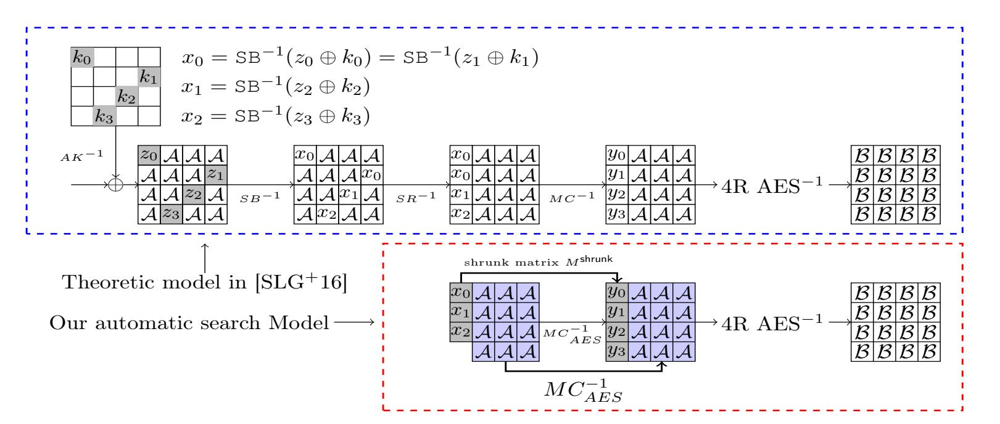
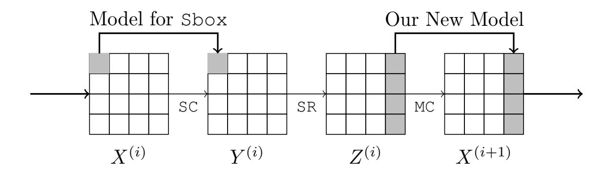
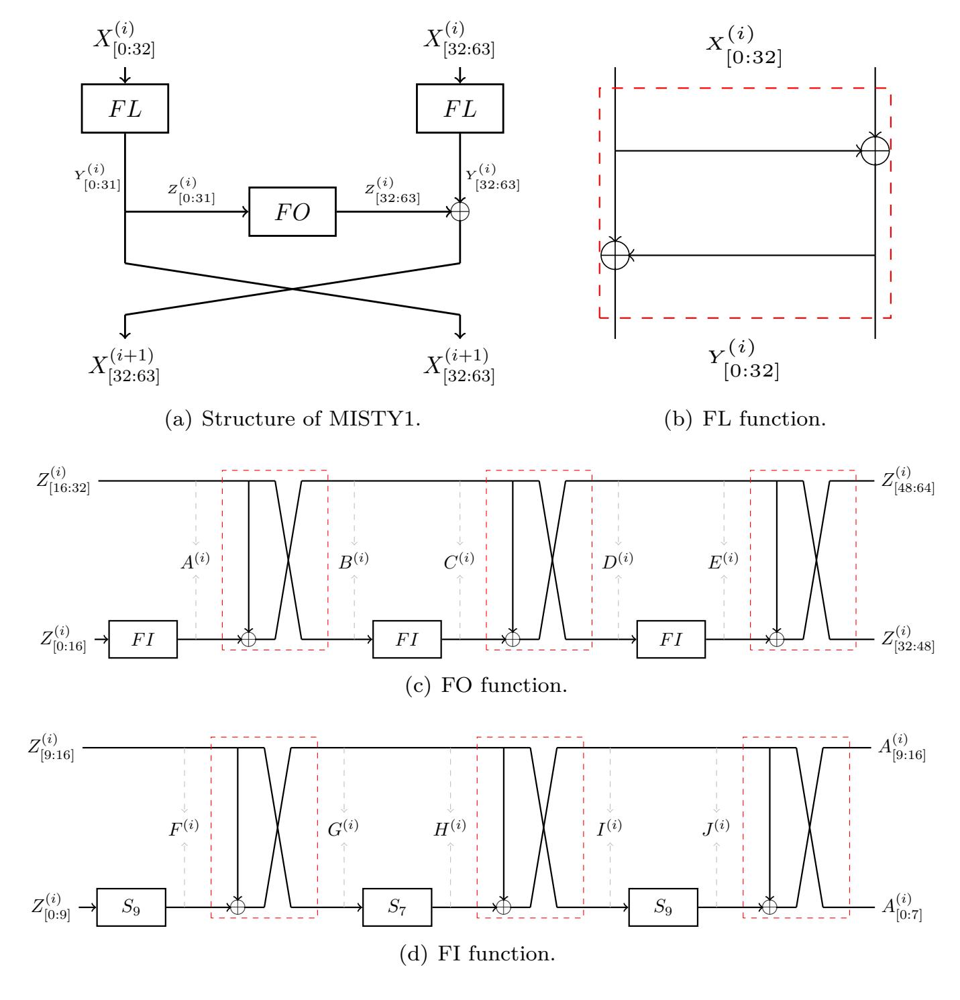
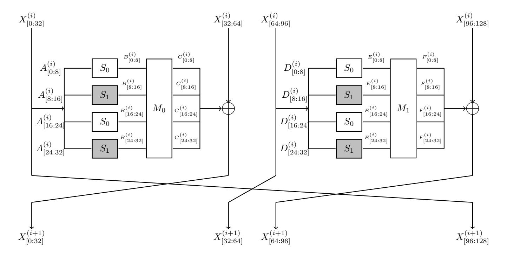
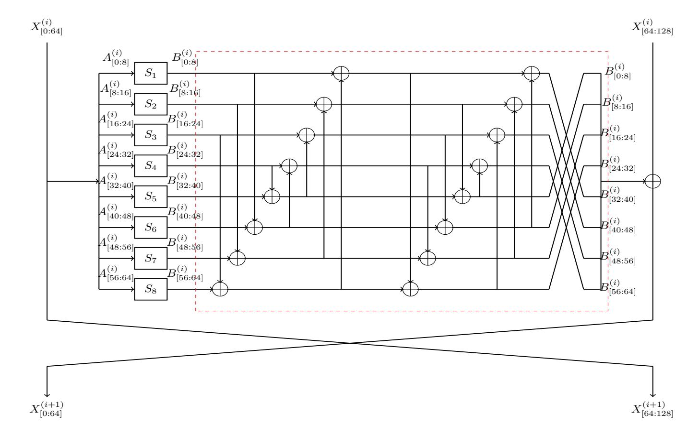

{0}------------------------------------------------

# **Finding Bit-Based Division Property for Ciphers with Complex Linear Layers**

Kai Hu<sup>1</sup>*,*<sup>2</sup> , Qingju Wang<sup>3</sup> and Meiqin Wang<sup>1</sup>*,*2<sup>∗</sup>

**Abstract.** The bit-based division property (BDP) is the most effective technique for finding integral characteristics of symmetric ciphers. Recently, automatic search tools have become one of the most popular approaches to evaluating the security of designs against many attacks. Constraint-aided automatic tools for the BDP have been applied to many ciphers with simple linear layers like bit-permutation. Constructing models of complex linear layers accurately and efficiently remains hard. A straightforward method proposed by Sun *et al.* (called the S method), decomposes a complex linear layer into basic operations like COPY and XOR, then models them one by one. However, this method can easily insert invalid division trails into the solution pool, which results in a quicker loss of the balanced property than the cipher itself would. In order to solve this problem, Zhang and Rijmen propose the ZR method to link every valid trail with an invertible sub-matrix of the matrix corresponding to the linear layer, and then generate linear inequalities to represent all the invertible sub-matrices. Unfortunately, the ZR method is only applicable to invertible binary matrices (defined in Definition [3\)](#page-8-0).

To avoid generating a huge number of inequalities for all the sub-matrices, we build a new model that only includes that the sub-matrix corresponding to a valid trail should be invertible. The computing scale of our model can be tackled by most of SMT/SAT solvers, which makes our method practical. For applications, we improve the previous BDP for LED and MISTY1. We also give the 7-round BDP results for Camellia with *F L/F L*<sup>−</sup><sup>1</sup> , which is the longest to date.

Furthermore, we remove the restriction of the ZR method that the matrix has to be invertible, which provides more choices for future designs. Thanks to this, we also reproduce 5-round key-dependent integral distinguishers proposed at Crypto 2016 which cannot be obtained by either the S or ZR methods.

**Keywords:** Complex linear layer · Non-binary matrix · Bit-based division property · SMT/SAT · Invertible

## **1 Introduction**

The division property, proposed as a generalized integral property at Eurocrypt 2015 [\[Tod15b\]](#page-23-0), has been applied to many symmetric ciphers. It has improved many previous integral distinguishers for block ciphers, and a remarkable application of the division property was that, for the first time, it broke the full MISTY1 [\[Mat97\]](#page-21-0) at Crypto 2015 [\[Tod15a\]](#page-22-0). Furthermore, the division property enhanced significantly the cube attacks which are


<sup>1</sup> School of Cyber Science and Technology, Shandong University, Qingdao, Shandong, 266237, China, [hukai@mail.sdu.edu.cn,mqwang@sdu.edu.cn](mailto:hukai@mail.sdu.edu.cn,mqwang@sdu.edu.cn)

<sup>2</sup> Key Laboratory of Cryptologic Technology and Information Security, Ministry of Education, Shandong University, Qingdao, Shandong, 266237, China

<sup>3</sup> SnT, University of Luxembourg, L-4364 Esch-sur-Alzette, Luxembourg, [qingju.wang@uni.lu](mailto:qingju.wang@uni.lu)

<sup>∗</sup>Corresponding author.

{1}------------------------------------------------

the most powerful attacks for stream ciphers and those providing authenticated encryption properties, by eliminating the biggest limit of the classical cube attacks - that only practical-size cubes could be chosen [\[TIHM17,](#page-22-1) [WHT](#page-23-1)<sup>+</sup>18, [HIJ](#page-21-1)<sup>+</sup>19, [WHG](#page-23-2)<sup>+</sup>19].

Since its proposal, the division property has been further investigated for more applications. The original division property (word-based division property) in [\[Tod15b\]](#page-23-0) propagates through the successive rounds of a cipher by capturing some information resulting from the algebraic degree of the round function. However, since it treats the round function at the word level, by its nature some propagation information through it cannot be captured. In order to further consider the Boolean properties of the Sboxes, Boura and Canteaut [\[BC16\]](#page-20-0) gave a more precise description for the division property at Crypto 2016. The bit-based division property (BDP), which was proposed at FSE 2016 [\[TM16\]](#page-22-2), treats the components of the target primitive at the bit level so that more information in the structures can be used. Compared with the word-based division property, the BDP is more likely to find better integral characteristics.

However, it is tedious to trace the BDP by taking a commonly used programming language such as C, because the time and memory complexities of such programs are usually estimated as O(2*n*) where *n* is the block size. This is the exact reason why integral distinguishers based on the BDP could only be found in [\[TM16\]](#page-22-2) for SIMON-32 [\[BSS](#page-20-1)<sup>+</sup>15] and SIMECK-32 [\[YZS](#page-23-3)<sup>+</sup>15] where the block size of the ciphers is limited to 32 bits. In order to overcome this bottleneck, Xiang *et al.* transformed the searching for the BDP to Mixed Integral Linear Programming (MILP) problems at Asiacrypt 2016 [\[XZBL16\]](#page-23-4), which had been commonly applied to search for differential and linear characteristics [\[MWGP11,](#page-22-3) [SHW](#page-22-4)<sup>+</sup>14, [FWG](#page-21-2)<sup>+</sup>16, [CLCW19\]](#page-21-3). As a result, the BDP of ciphers with the block sizes much larger than 32 bits can be obtained efficiently, based on which improved integral attacks for many ciphers can be achieved [\[SWW20,](#page-22-5) [FTIM17,](#page-21-4) [WGR18,](#page-23-5) [SWLW18\]](#page-22-6). Since then, MILP-aided automatic search techniques have become the dominant tools for finding the BDP. Later, some automatic search tools aided by Boolean satisfiability problem (SAT) [\[Coo71\]](#page-21-5) and Satisfiability Modulo Theories (SMT) [\[BSST09\]](#page-20-2) are also built to find the BDP [\[SWW17,](#page-22-7) [HW19\]](#page-21-6) .

Symmetric primitives need to be non-linear, and they are composed of non-linear and linear components. It is common to base a cipher on Sboxes to facilitate the non-linear/confusion property. Diffusion properties can typically be achieved by linear operations including simple ones such as bit-permutation (e.g. the linear layer of PRESENT [\[BKL](#page-20-3)<sup>+</sup>07]) or complex ones such as an MDS matrix (e.g. the MixColumns operation of the Advanced Encryption Standard (AES) [\[DR02\]](#page-21-7)). The automatic search models for the division property including the MILP model and SMT/SAT model describe these components as constraints and call the corresponding solvers to find whether there is a solution to the model. If the result returned by the solver shows there is no solution, then balanced properties are satisfied. Components such as Sboxes, and basic operations COPY, AND, and XOR have been modeled well in [\[XZBL16\]](#page-23-4). Thanks to these, the BDP propagations for ciphers with a bit-permutation linear layer can be easily handled. However, the problem of how to model the complex linear layers, e.g. the multiplication with an MDS matrix has remained. So far two methods have been proposed to solve this problem.

**S method.** Any (complex) linear operation can be decomposed into a sequence of basic operations of COPY and XOR. The core of the S method is to model these corresponding basic operations with some auxiliary variables instead of modeling the complex linear layer directly. As for the basic operations, they have been handled very well in [\[XZBL16\]](#page-23-4).

The obvious advantage of the S method is that it can be applied to all those kinds of complex linear layers. However, the crucial limitations of the S method is that it does not consider the cancellation between terms so it will bring in some invalid division trails, which will make the unit vectors appear in advance. In other words, the S method might

{2}------------------------------------------------

make us miss the best integral property.

Another problem of the S method is that sometimes it cannot efficiently find the BDP for some ciphers. For instance, in terms of the 6-round LED cipher, with 52 active bits as the input, the S method cannot judge if a balanced property exists [SWW20] even after 24 hours. Why this is so slow is unknown, because it may depend on the internals of the MILP solvers it calls.

 $\mathcal{ZR}$  method. An invertible linear layer  $\mathcal{L}: \mathbb{F}_2^n \to \mathbb{F}_2^n$  can be represented as a matrix  $M \in \mathbb{F}_2^{n \times n}$ . In [ZR19], Zhang and Rijmen constructed a one-to-one relation between BDP of the matrix M and the invertibility of the sub-matrices of M. Then they generated a system of inequalities to describe the BDP through these sub-matrices and called MILP solvers to judge the validity of the trails. Therefore, the  $\mathcal{ZR}$  method can detect every valid division trail accurately.

Unfortunately, the Achilles heel of the  $\mathcal{ZR}$  method is that it can only be applied to a so-called binary matrix (defined in Definition 3). Some simple examples for the binary matrix are the MixColumn(s)<sup>1</sup> matrices used in SKINNY [BJK<sup>+</sup>16] and Midori [BBI<sup>+</sup>15]. As far as we know, non-binary linear layers cannot be evaluated accurately using BDP because in the  $\mathcal{ZR}$  method the huge number of linear inequalities to describe all the sub-matrices of the matrix in the linear layer will overwhelm the capacity of any MILP solver. However, the security of some popular designs such as the AES [DR02] and ISO standard CLEFIA [SSA<sup>+</sup>07] depends on non-binary mappings. Therefore, it is important to build a new automatic model to efficiently describe the BDP of the non-binary linear layers.

### 1.1 Our Contributions

In this paper, we construct a new model to describe the BDP which is significantly superior to the previous  $\mathcal{ZR}$  or the  $\mathcal{S}$  methods. Compared with these two methods, our new model has three advantages as follows.

Applicable to non-binary matrices of a large size. Unlike the  $\mathcal{ZR}$  method, our approach does not build a huge system of linear inequalities representing all the sub-matrices of the matrix, but it enables us to judge the validity of a candidate division trail by checking the invertibility of its corresponding sub-matrix. Therefore, the computing scale of our model can be tackled by many constraint-based solvers, which makes our method practical.

One of our applications is to model the MDS matrices which cannot be handled by the  $\mathcal{ZR}$  method. In the  $\mathcal{ZR}$  method, if one wants to model the MDS matrix of the AES MixColumns operation, one has to generate  $(2^{32}-1)$  linear inequalities to represent the BDP of it, which makes it infeasible. As a result, there is no guarantee that no key-independent integral distinguishers for the 5-round AES exist. However, the 5-round AES is an important primitive which has been used in many new designs [WP14]. By taking our method, for the first time, the BDP of the AES matrix can be accurately traced and we prove that there are indeed no 5-round key-independent distinguishers for the AES based on the BDP. Although our result does not break the previous records for the AES key-independent distinguisher, we answer the open question whether a longer integral distinguisher can be found if we can accurately search for the BDP of its MDS matrix. Our new method provides more confidence in the security of the 5-round AES and designs based on it.

<span id="page-2-0"></span><sup>&</sup>lt;sup>1</sup>In the specification of SKINNY [BJK<sup>+</sup>16], the operation is called MixColumns while in the specification of Midori [BBI<sup>+</sup>15], the operation is called MixColumn.

{3}------------------------------------------------

**Applicable to non-invertible matrices.** In our model, we remove the condition from the  $\mathcal{ZR}$  method that only invertible matrices can be considered. We search for the 5-round key-dependent integral distinguisher proposed by Sun *et al.* at Crypto 2016 [SLG<sup>+</sup>16]. Denote the matrix of the inverse operation of MixColumns in the AES by  $M_{\rm AES}^{-1}$ 

$$\begin{bmatrix} E & B & D & 9 \\ 9 & E & B & D \\ D & 9 & E & B \\ B & D & 9 & E \end{bmatrix}.$$
 Suppose a four-byte vector  $\boldsymbol{x}=(x_0,x_0,x_1,x_2)^T$  is the input of the

 $MC_{AES}^{-1}$ , and  $x_0$ ,  $x_1$  and  $x_2$  take all the possible values, i.e., x takes all the  $2^{24}$  values. The four bytes of the output  $y = (y_0, y_1, y_2, y_3)^T$  must have at least one byte  $y_i$  taking  $2^8$  values. It requires that the first two bytes of the input are always equal. To check this property

by using the BDP, we could prepare a shrunk matrix  $M^{\mathsf{shrunk}} \triangleq \begin{bmatrix} E \oplus B & D & 9 \\ 9 \oplus E & B & D \\ D \oplus 9 & E & B \\ B \oplus D & 9 & E \end{bmatrix} = \begin{bmatrix} E \oplus B & D & 9 \\ 0 \oplus B & B & D \\ 0 \oplus B & B & D \end{bmatrix}$ 

$$\begin{bmatrix} 5 & D & 9 \\ 7 & B & D \\ 4 & E & B \\ 6 & 9 & E \end{bmatrix}$$
. Assume the input to  $M^{\sf shrunk}$  is  $\boldsymbol{x}' = (x_0, x_1, x_2)^T$  and  $\boldsymbol{x}'$  takes all the  $2^{24}$ 

values, then the output is just  $\mathbf{y} = (y_0, y_1, y_2, y_3)^T$ . In the BDP model for  $M^{\mathsf{shrunk}}$ , suppose the input vector is  $\mathbf{u} = (\mathsf{ff}, \mathsf{ff}, \mathsf{ff})$ , i.e. the division property of the input is  $\mathcal{D}_{\mathbf{u}}^{24}$ , then the output vector  $\mathbf{v} = (v_0, v_1, v_2, v_3) \in \mathbb{F}_{2^8}^4$  should have at least one  $v_i$  such that  $v_i = \mathsf{ff}$ .

This property cannot be checked by the  $\mathcal{ZR}$  method, because it is infeasible to generate a huge number of linear inequalities to present all the invertible sub-matrices. Nor can it be detected by the  $\mathcal{S}$  method, because the  $\mathcal{S}$  method will insert invalid division trails that contain vectors with all four bytes less than ff. Any such vectors result in a quicker loss of the balanced property than the AES itself should. By using our method, this property can be obtained. We reproduce the 5-round integral distinguisher in [SLG<sup>+</sup>16] and also construct a similar 4-round integral distinguisher with  $2^{24}$  data complexity. More details are shown in Section 5.1.

Find more accurate BDP. We follow the principle of the  $\mathcal{ZR}$  method that for a non-binary matrix every valid division trail is mapped to an invertible sub-matrix, and manage to efficiently model this relation in our new model. Unlike the  $\mathcal{S}$  method, we get rid of the problem of inserting invalid division trails to the search models, and we are more likely to achieve better results. Since the  $\mathcal{ZR}$  method can find more accurate division properties for SKINNY [BJK<sup>+</sup>16] and Midori [BBI<sup>+</sup>15] than the  $\mathcal{S}$  method, and our method is based on a more generalized theory than the  $\mathcal{ZR}$  method, we can find those BDP which cannot be found by the  $\mathcal{S}$  method. Another example to show we have the potential to get more accurate propagation of the BDP is the 5-round AES key-dependent integral distinguishers which obviously cannot be found by the  $\mathcal{S}$  method as mentioned above.

**Possibly find better BDP.** For a given number of rounds, our new model can find BDP results with less time and memory, which means it has the potential to find BDP of more rounds or with more balanced output bits. With the help of our new model, we improve the previous BDP results for several ciphers.

Firstly, we apply the new model to LED, which is an SPN cipher with a heavy MDS matrix as part of its linear layers. With the previous  $\mathcal{S}$  method, we cannot obtain the accurate BDP results. For the first time, we show that LED has a 7-round integral distinguisher, which is the longest to date.

MISTY1 [Mat97] cipher was broken by Todo using integral attack [Tod15a] at Crypto 2015. The 6-round integral distinguisher used in [Tod15a] was found by the word-based

{4}------------------------------------------------

division property with 63 active bits out of 64 bits, which implied that the integral attacks required almost the whole codebook [\[Tod15a,](#page-22-0) [BK16\]](#page-20-6). So finding integral distinguishers with more rounds or less data is meaningful to reduce the complexity for the entire attack. As is commonly believed, the BDP can find better integral distinguishers that have either more rounds or more balanced output bits or that require less data complexity than the word-based division property. However, the only result for MISTY1 found by the BDP till now in [\[EKKT18\]](#page-21-8) only reaches three rounds[2](#page-4-0) . Thus it is valuable to check the security of MISTY1 by the BDP. For the first time, we give a BDP result for 6-round MISTY1. Furthermore, with 62 active bits at the input, we can get a 6-round distinguisher with 32 bits balanced[3](#page-4-1) .

Moreover, we give a 10-round distinguisher for CLEFIA [\[SSA](#page-22-8)<sup>+</sup>07]. Although this result does not break the previous record, we answer the open question whether longer integral distinguishers can be found because we can search for the accurate BDP of them for the first time. At last, we also give the longest BDP of 7-round Camellia [\[AIK](#page-20-7)<sup>+</sup>00] with *F L/F L*−<sup>1</sup> functions[4](#page-4-2) . We list all our new BDP results obtained in Table [1.](#page-4-3)

| Cipher    | #Round | log2(Data) | #Balanced Bits | Time?  | Ref.         |
|-----------|--------|------------|----------------|--------|--------------|
| AES       | 4      | 120        | 128            | –      | [Tod15b]     |
|           | 4      | 32         | 128            | –      | [SWW20]      |
|           | 4      | 24         | 128            | 68min  | Subsect. 5.1 |
|           | 5      | 120        | 128            | 50min‡ | Subsect. 5.1 |
| LED       | 6      | 52         | 64             | –      | [Tod15b]     |
|           | 6      | ><br>52†   | –              | > 24h  | [SWW20]      |
|           | 6      | 52         | 64             | 15min  | Subsect. 5.2 |
|           | 7      | 63         | 64             | 14min  | Subsect. 5.2 |
| MISTY1    | 6      | 63         | 39             | –      | [Tod15a]     |
|           | 3      | 32         | 64             | –      | [EKKT18]     |
|           | 6      | 63         | 39             | 137min | Subsect. 5.3 |
|           | 6      | 62         | 32             | 189min | Subsect. 5.3 |
| CLEFIA*   | 10     | 127        | 64             | –      | [SWW17]      |
|           | 10     | 127        | 64             | 82min  | Subsect. 5.4 |
| Camellia* | 6      | 124        | 64             | –      | [Tod15b]     |
|           |        |            |                |        |              |

<span id="page-4-3"></span>**Table 1:** Division property results for LED, the AES, MISTY1, CLEFIA and Camellia.

**7 127 64 99min Subsect. [5.5](#page-18-1)**

## **1.2 Organization of this paper**

Sect. [2](#page-5-0) briefly recalls the automatic search problems of the BDP. In Sect. [3](#page-7-0) we introduce the previous S and ZR methods and point out their limitations. In Sect. [4,](#page-9-0) we generalize Zhang and Rijmen's theory by removing the conditions and propose a new method which can be applied to complex linear layers. Next, we show some applications of our new

*<sup>?</sup>* Since we input CVC files to the STP solver, the stopping rules are updated manually. To give the total running time, we set the sum of all the balanced bits we obtained from the manual stop phase as 1.

<sup>‡</sup> The running time for 5-round result is less than the 4-round one, because we use a speed-up strategy in the 5-round model.

<sup>†</sup> With 2 <sup>51</sup> data, they did not find any balanced bit; with 2 <sup>52</sup> data, their model did not return any result. So for 6-round LED, the S method needs at least 52 active bits. We also implement the S method ourselves, and no results were obtained even after 24 hours.

<sup>\*</sup> No previous BDP results.

<span id="page-4-1"></span><span id="page-4-0"></span><sup>2</sup>Only 2 <sup>32</sup> data are used there, and no results with more data are reported.

<sup>3</sup>Since the 32 balanced bits are located in the right branch of MISTY1, this new distinguisher is worse than the one in [\[Tod15a\]](#page-22-0) for key-recovery attacks.

<span id="page-4-2"></span><sup>4</sup>An 8-round integral distinguisher for Camellia **without** the *F L/F L*−<sup>1</sup> function was reported [\[SLR](#page-22-10)+15].

{5}------------------------------------------------

method in Sect. 5. We give some suggestions in choosing automatic tools when evaluating ciphers against the BDP based integral attacks in Sect. 6.

## <span id="page-5-0"></span>2 Preliminaries

## 2.1 Notations

Throughout this paper, we use blackened italic lowercase letters to represent *n*-bit vectors, e.g.  $\boldsymbol{u} \in \mathbb{F}_2^n$ . The *i*-th element of  $\boldsymbol{u}$  is expressed as  $u_i$  ( $u_0$  is the msb) and the Hamming weight  $wt(\boldsymbol{u})$  is calculated as  $wt(\boldsymbol{u}) = \sum_{i=0}^{n-1} u_i$ . For any  $\boldsymbol{u}$  and  $\boldsymbol{v}$ , we define  $\boldsymbol{u} \succeq \boldsymbol{v}$  if  $u_i \geqslant v_i$  for any *i*. The inner product of two *n*-bit vectors  $\boldsymbol{u}$  and  $\boldsymbol{v}$  is defined as  $\boldsymbol{u} \cdot \boldsymbol{v} = \bigoplus_{i=0}^{n-1} u_i \cdot v_i$ . Bit product function  $\pi_{\boldsymbol{u}}(\cdot) : \mathbb{F}_2^n \to \mathbb{F}_2$  is defined as  $\pi_{\boldsymbol{u}}(\boldsymbol{x}) = \prod_{i=0}^{n-1} x_i^{u_i}$ .

For a matrix  $M = (m_{i,j})_{n \times n}$ , we use the notation M(i,j) to represent the element of M located at the i-th row and j-th column. M(i,\*) stands for the i-th row and M(\*,j) stands for the j-th column of M. Given two vectors  $\boldsymbol{u}$  and  $\boldsymbol{v}$ , we use  $M_{\boldsymbol{u},\boldsymbol{v}}$  to represent a sub-matrix of M, s.t.

$$M_{\boldsymbol{v},\boldsymbol{u}} = (M(i,j))_{wt(\boldsymbol{v})\times wt(\boldsymbol{u})}, v_i = 1, u_j = 1.$$

For a matrix  $M \in \mathbb{F}_{2^m}^{s \times s}$ , we can always transform it to  $M' \in \mathbb{F}_2^{ms \times ms}$  where M and M' are equivalent except that they are defined over different linear spaces. Throughout this paper, we call M' the *primitive matrix* of M as in [SWW20].

## 2.2 (Bit-Based) Division Property and Automatic Search Models

At Eurocrypt 2015, the division property [Tod15b] was proposed as a generalization of the integral property. The division property was originally defined at the word level and it traced information resulting from the algebraic degree of the round function which cannot be captured by the classical integral attack. With the help of the division property, better integral distinguishers for many cryptographic primitives have been detected.

The bit-based division property [TM16] was proposed to investigate the division property at the bit level. As a result, more rounds of integral characteristics have been found with this new technique. For example, the integral distinguishers of SIMON32 have been improved from 10 to 14 rounds<sup>5</sup>. We give the definition of the BDP as follows.

**Definition 1** (Bit-Based Division Property [TM16]). Let  $\mathbb{X}$  be a multiset whose elements belong to  $\mathbb{F}_2^n$ . Let  $\mathbb{K}$  be a set whose elements are *n*-bit bit vectors. When the multiset  $\mathbb{X}$  has the division property  $\mathcal{D}_{\mathbb{K}}^n$ , it fulfills the following conditions for any  $u \in \mathbb{F}_2^n$ :

$$\bigoplus_{\boldsymbol{x} \in \mathbb{X}} \pi_{\boldsymbol{u}}(\boldsymbol{x}) = \begin{cases} unknown, & \text{if there exists a } \boldsymbol{k} \in \mathbb{K} \text{ s.t. } \boldsymbol{u} \succeq \boldsymbol{k} \\ 0, & \text{otherwise} \end{cases}$$

The round functions of many cryptographic primitives are often composed of basic bitwise operations like COPY, XOR and AND, combined with an Sbox layer followed by a linear layer. When these operations are applied to the elements in  $\mathbb{X}$ , transformations of the division property should also be made following the propagation rules for COPY, XOR and AND which have been proved in  $[TM16, XZBL16]^6$ .

<span id="page-5-1"></span> $<sup>^510</sup>$ -round integral distinguishers are currently the best results obtained by the word-based division property [Tod15b]. 14-round integral distinguishers are the best results known by far. Previously to the proposal of the BDP, they can only be obtained by the experimental method [WLV $^+14$ ], thus those 14-round distinguisher were probabilistic distinguishers.

<span id="page-5-2"></span><sup>&</sup>lt;sup>6</sup>The focus of this paper is the linear layers of ciphers, we refer to [XZBL16] for the propagation rule for the Sboxes.

{6}------------------------------------------------

<span id="page-6-0"></span>Rule 1 (COPY). ([TM16]) Let the COPY operation create  $y = (y_0, y_1) \in \mathbb{F}_2 \times \mathbb{F}_2$  from  $x \in \mathbb{F}_2$  as  $y_0 = x$  and  $y_1 = x$ . Assume the input multiset has the division property  $\mathcal{D}_k^1$ , then the corresponding output multiset has the division property  $\mathcal{D}_{(i,k-i)}^2$  where  $0 \le i \le k$ .

Since we consider the BPD, the input multiset division property  $\mathcal{D}_k^1$  must have  $0 \le k \le 1$ . If k = 0, the output multiset has the division property  $\mathcal{D}_{(0,0)}^1$ ; otherwise, the output multiset has the division property  $\mathcal{D}_{(0,1)(1,0)}^2$ . We denote the division property propagation of the COPY operation as  $x \xrightarrow{\text{COPY}} (y_0, y_1)$ .

**Rule 2** (XOR). ([TM16]) Let the XOR operation create the output  $y = x_0 \oplus x_1 \in \mathbb{F}_2$  from the input  $x = (x_0, x_1) \in \mathbb{F}_2 \times \mathbb{F}_2$ , where  $0 \le k_0, k_1 \le 1$ . Assume the input multiset has the division property  $\mathcal{D}^2_{(k_0,k_1)}$ , then the corresponding output multiset has the division property  $\mathcal{D}^1_{k_0+k_1}$ , where  $0 \le i \le k$ .

For the BDP  $k = (k_0, k_1)$  must satisfy  $0 \le k_0, k_1 \le 1$ . If  $k_0 = k_1 = 0$ , i.e., the input division property is  $\mathcal{D}^2_{(0,0)}$ , then the output division property is  $\mathcal{D}^1_0$ . If the input division property is  $\mathcal{D}^1_{(1,0)}$  or  $\mathcal{D}^2_{(0,1)}$ , then the output division property is  $\mathcal{D}^1_1$ . Moreover, y takes a value in  $\mathbb{F}_2$ , thus  $0 \le k_0 + k_1 \le 1$  must hold, i.e., if  $(k_0, k_1) = (1, 1)$ , the division property propagation will abort. We denote the division property propagation of XOR operation as  $(x_0, x_1) \xrightarrow{\text{XOR}} y$ .

When evaluating the BDP of a cipher, the attackers only need to determine the division property of the chosen plaintexts, denoted by  $\mathcal{D}_{\mathbb{K}_0}^{1^n}$ . Then, after r-round encryption, the division property of the output ciphertexts, denoted by  $\mathcal{D}_{\mathbb{K}_r}^{1^n}$ , can be deduced according to the round function and the propagation rules. More specifically, the attackers determine an index set  $I = \{i_0, i_1, \ldots, i_{|I|-1}\} \subset \{0, 1, \ldots, n-1\}$  of the bit indices of the plaintext and prepare  $2^{|I|}$  chosen plaintexts where the variables indexed by I take all possible values. The division property of such chosen plaintexts is  $\mathcal{D}_{k}^{1^n}$ , where  $k_i = 1$  if  $i \in I$  and  $k_i = 0$  otherwise. Then, the propagation of the division property from  $\mathcal{D}_{k}^{1^n}$  is evaluated as

$$\{\boldsymbol{k}\} \stackrel{\text{def}}{=} \mathbb{K}_0 \to \mathbb{K}_1 \to \cdots \to \mathbb{K}_r,$$

where  $\mathcal{D}_{\mathbb{K}_i}$  is the BDP after the *i*-th round propagation. If the division property  $\mathbb{K}_r$  does not contain a unit vector  $\mathbf{e}_i$ , then the *i*-th bit of the *r*-round ciphertexts is balanced.

#### 2.2.1 Propagation of BDP in Automatic Search Model.

Finding the propagation of BDP is tedious because the size of  $\mathbb{K}_i$  increases rapidly. At Asiacrypt 2016, Xiang *et al.* showed that the propagation can be efficiently evaluated by using MILP [XZBL16]. Firstly, they introduced the *division trail* as follows.

**Definition 2** (Division Trail [XZBL16]). Consider the propagation of the division property  $\{k\} \stackrel{\text{def}}{=} \mathbb{K}_0 \to \mathbb{K}_1 \to \mathbb{K}_2 \to \cdots \to \mathbb{K}_r$ . Moreover, for any vector  $k_{i+1}^* \in \mathbb{K}_{i+1}$ , there must exist a vector  $k_i^* \in \mathbb{K}_i$  such that  $i_i^*$  can propagate to  $k_{i+1}^*$  by the propagation rule of the BDP for the current operation. Furthermore, for  $(k_0, k_1, \dots, k_r) \in (\mathbb{K}_0 \times \mathbb{K}_1 \times \cdots \times \mathbb{K}_r)$  if  $k_i$  can propagate to  $k_{i+1}$  for all  $i \in \{0, 1, \dots, r-1\}$ , we call  $(k_0 \to k_1 \to \cdots \to k_r)$  an r-round division trail.

Thanks to the introduction of the division trail, the propagation of set  $\mathbb{K}_i$  was transformed into the propagation of the division trails. Let  $E_k$  be the target r-round iterated cipher. Then, if there is no division trail  $\mathbf{0} \xrightarrow{E_k} \mathbf{k}_r = \mathbf{e}_i$ , we know that there is no unit vector  $\mathbf{e}_i$  in  $\mathbb{K}_r$ , i.e., the i-th bit is balanced. So once all the unit vectors appear in  $\mathbb{K}_{r+1}$ , there will be no balanced bits at the end of the (r+1)-th round of  $E_k$ , and the maximum number of rounds that integral distinguisher based on BDP can cover is r rounds.

{7}------------------------------------------------

With the help of division trail, finding the BDP is transformed into a problem of finding a division trail ended at a unit vector. To find the division trail, we need to construct the search model by describing all operations of  $E_k$  by propagation models and adding the initial and stopping rules to the plaintext and ciphertext, respectively. For plaintext, we assign 1 to those active plaintext bits and 0 to the constant bits. For the ciphertext, we first let the sum of all bits be 1 and solve the model. If the result returned by the solver is that the model is infeasible, then no division trail can lead to a unit vector and all the ciphertext bits are balanced. If the result is feasible, there is at least one unit vector. Check the solution of the feasible model and find out the unit vector, then we could know which bit is imbalanced. Next, let the sum of remaining bits be 1 and get back to solve the updated model. Repeat the steps until we find all the possible unit vectors. A common framework of automatic search for BDP is given in Appendix A.

## <span id="page-7-0"></span>3 Two of Previous Methods Modeling Linear Layers

For ciphers with a bit-permutation linear layer like PRESENT, RECTANGLE, etc, after the nonlinear layer, there is no cost for the BDP. This paper focuses on ciphers having a non-bit-permutation in their linear layer, for instance, SKINNY, Midori and the AES, which have been considered by the  $\mathcal{S}$  method [SWW20] and the  $\mathcal{ZR}$  method [ZR19].

## 3.1 $\mathcal{S}$ Method

The idea of the S method [SWW20] is to represent a matrix  $M \in \mathbb{F}_{2^m}^{s \times s}$  at the the bit level. Given the irreducible polynomial of the field  $\mathbb{F}_{2^m}$  where the multiplications operate, the representation of the matrix over  $\mathbb{F}_2$  is unique, which we call the primitive matrix of M and is denoted by  $M' = (m_{i,j})_{n \times n}$  where  $m_{i,j} \in \mathbb{F}_2$  and  $n = m \times s$ . In order to describe the multiplication with the primitive matrix, auxiliary binary variables  $t_{i,j}$   $(0 \le i, j \le n-1)$  are introduced to represent XOR and COPY operations derived from multiplying with it. Then the Mix-Columns operation  $\mathbf{y} = M'\mathbf{x}$ , where  $\mathbf{x} = (x_0, x_1, \dots, x_{n-1})^T$  and  $\mathbf{y} = (y_0, y_1, \dots, y_{n-1})^T$ , can be modeled as  $x_j \xrightarrow{\text{COPY}} (t_{0,j}, t_{1,j}, \dots, t_{(n-1),j})$  and  $(t_{i,0}, t_{i,1}, \dots, t_{i,(n-1)}) \xrightarrow{\text{XOR}} y_i$ .

However, the S method brings in some invalid trails to K. We give Example 1 in Appendix B as an illustration to show the problem. From this example, we know that the S method cannot handle the cancellation phenomenon between terms, so it will introduce some invalid trails generating a unit vector that breaks the balanced property of the output bits.

Furthermore, the S method is not efficient for some ciphers, it takes too much time and memory to evaluate the BDP. For example, it cannot give the BDP results for 6 or more rounds for LED cipher because the memory requirements exceed the limit of most computers. We will give more details in Subsect. 5.2.

### <span id="page-7-2"></span>3.2 $\mathcal{ZR}$ Method

Zhang and Rijmen [ZR19] proposed the  $\mathcal{ZR}$  method to convert the verification of a division trail through a linear layer into checking whether the corresponding sub-matrix is invertible or not. In other words, for a linear layer, every candidate division trail is one-to-one mapped to a sub-matrix of its corresponding matrix. As a result, the  $\mathcal{ZR}$  method can solve the term cancellation problem. We recall their main result in Theorem 1.

<span id="page-7-1"></span>**Theorem 1** ([ZR19]). Let M be the  $n \times n$  primitive matrix of an invertible linear transformation and  $\mathbf{u}, \mathbf{v} \in \mathbb{F}_2^n$ . Then  $\mathbf{u} \xrightarrow{M} \mathbf{v}$  is one of the valid division trails of the linear transform M if and only if  $M_{\mathbf{v},\mathbf{u}}$  is invertible.

{8}------------------------------------------------

 $3.2 \quad \mathcal{ZR} \text{ Method}$ 

Now we re-consider Example 1 in Appendix B by the  $\mathcal{ZR}$  method, to see if it can handle the cancellation influence which the  $\mathcal{S}$  method cannot. Since the candidate division trail is  $\boldsymbol{u} = (1, 1, 0) \xrightarrow{M} \boldsymbol{v} = (1, 1, 0)$ , according to the definition of  $M_{\boldsymbol{v}, \boldsymbol{u}}$ , we know that

$$M_{\boldsymbol{v},\boldsymbol{u}} = \begin{bmatrix} 1 & 1 \\ 1 & 1 \end{bmatrix}.$$

From Theorem 1, the validity of the division trail  $(1,1,0) \xrightarrow{M} (1,1,0)$  can be determined by the invertibility of the matrix  $M_{\boldsymbol{v},\boldsymbol{u}}$ . Apparently, this matrix is not invertible. Therefore,  $\boldsymbol{u} \xrightarrow{M} \boldsymbol{v}$  is not a valid division trail. The cancellation problem for this simple example resulted from the  $\mathcal{S}$  method can be solved by the  $\mathcal{ZR}$  method.

In [ZR19], Zhang and Rijmen tried to use a set of inequalities, denoted by  $\mathcal{L}$ , to describe all the invertible sub-matrices for the linear layer M. They claimed that their technique can be applied to ciphers with so-called "binary linear layers". We redefine it as follows.

<span id="page-8-0"></span>**Definition 3** (Binary Matrix). Suppose for a matrix  $M = (m_{i,j})_{s \times s} \in \mathbb{F}_{2^m}^{s \times s}$ , we represent the element  $m_{i,j}$  in M as a polynomial in the extension field  $\mathbb{F}_{2^m} \simeq \mathbb{F}[x]/(f)$ , where f is the irreducible polynomial over  $\mathbb{F}_2$  with degree m, then we call M a binary matrix if all such polynomials in M can only be 0 or 1. Otherwise, M is called a non-binary matrix.

The matrix which is used in the MixColumns of SKINNY falls into this category while the matrix for the MixColumns operation of the AES is a non-binary matrix, because

$$M_{\text{SKINNY}} = \begin{bmatrix} 1 & 0 & 1 & 1 \ 1 & 0 & 0 & 0 \ 0 & 1 & 1 & 0 \ 1 & 0 & 1 & 0 \end{bmatrix}, \, M_{\text{AES}} = \begin{bmatrix} 2 & 3 & 1 & 1 \ 1 & 2 & 3 & 1 \ 1 & 1 & 2 & 3 \ 3 & 1 & 1 & 2 \end{bmatrix}.$$

Given such a binary matrix  $M = (m_{i,j}) \in \mathbb{F}_{2^m}^{s \times s}$ , and denote  $n = m \times s$ , we can represent M in its primitive form as  $M' = (m'_{i,j})_{n \times n}$ . According to Theorem 1, one needs to determine all its l-order invertible sub-matrices for  $1 \leq l \leq n$  and to describe them with a set of linear inequalities as proposed by [ZR19]. In order to describe all the invertible sub-matrices of M', one first divides M''s row indices into the following m cosets

$$S_0 = \{0, m, \dots, (s-1)m\},\ S_1 = \{1, m+1, \dots, (s-1)m+1\},\ \vdots \vdots \vdots \vdots \vdots S_{m-1} = \{m-1, 2m-1, \dots, sm-1\}.$$

In each coset, there are s elements. Since the rows in different cosets have no common nonzero entries in the same column, which is the key feature of a binary matrix, one can take into account the XOR operation of rows in each coset separately. Assume  $\mathbf{u} = (u_0, u_1, \ldots, u_{n-1}) \xrightarrow{M'} \mathbf{v} = (v_0, v_1, \ldots, v_{n-1})$ , then for  $t \ (1 \le t < s)$  coordinates  $v_i$ 's with indices in the same coset, without loss of generality we take the *i*-th coset  $S_i = \{i, i+m, \ldots, i+(s-1)m\}$  as an example, we construct inequalities to describe the corresponding t-th order invertible sub-matrix as

$$\left(\bigoplus_{j=i_0}^{i_{t-1}} M'(j,*)\right) \cdot \boldsymbol{u} - \sum_{j=i_0}^{i_{t-1}} v_j \geqslant -(t-1)$$

$$\tag{1}$$

where  $i_0, i_1, \ldots, i_{t-1} \in S_i$ . For t = s, we could simply use equations

$$\sum_{j=i_0}^{i_s} u_j = \sum_{j=i_0}^{i_s} v_j. \tag{2}$$

{9}------------------------------------------------

For each coset like  $S_i$ , we have  $\binom{s}{t}$  inequalities and equations, where  $1 \leq t \leq s$ . There are m such cosets in total, so the total number of inequalities to represent the binary linear layer is

<span id="page-9-1"></span>
$$\#\mathcal{L} = m\sum_{i=1}^{s} {s \choose i} = m \times (2^{s} - 1). \tag{3}$$

All solutions to each of these inequalities cover a large class of invertible sub-matrices. Thus, all the inequalities covering all the l-th order for  $1 \le l \le n$  sub-matrices of M' are sufficient to describe all the invertible sub-matrices of the linear layer matrix M'. We refer the readers to [ZR19] for more details about the construction of  $\mathcal{L}$ .

For some binary linear layers such as the linear matrices of the block cipher SKINNY and Midori, m and s in Equation (3) is usually small, so  $\#\mathcal{L}$  is not very big. For example, in order to describe the matrix of SKINNY with 64-bit block size, they only need  $4 \times (2^4 - 1) = 60$  inequalities<sup>7</sup>.

**Limitations of the**  $\mathbb{ZR}$  **method.** However, for non-binary matrices, if we consider them in the similar way of using cosets, the key feature for the binary matrices stated above that the rows in different cosets have no common nonzero entries in the same column does not hold. Then when we need to check the invertibility of all the l-th order sub-matrices, where  $1 \leq l \leq n$ , we have  $\binom{n}{l}$  inequalities to mark all the l-th order invertible matrices. Finally, the number of inequalities  $\#\mathcal{L}$  should be computed in formula

$$\#\mathcal{L} = \sum_{l=1}^{n} \binom{n}{l} = 2^{n} - 1.$$

It appears that  $\#\mathcal{L}$  becomes too large when n is big, where  $n=m\times s$ . For example, when considering  $M_{AES}$ , we have m=8 and s=4, so the total number of inequalities used to describe all its valid division trails will be  $2^{8\times 4}-1=2^{32}-1$ . First of all, it is extremely hard to generate such a huge number of equations. Secondly, such a large number of equations is usually not supported by any MILP solvers. As a result, the  $\mathcal{ZR}$  method is not applicable to many of the ciphers that have non-binary matrices as part of their linear layers.

# <span id="page-9-0"></span>4 Our Model for General Linear Layers

Since many symmetric primitives base the security on the non-linear components (usually Sboxes) and complex linear layers, and the BDP propagation for the Sboxes has been well modeled [XZBL16, BC16, SWW17], it is important to find a method that can accurately and efficiently describe the BDP propagation for non-binary linear layers. However, as discussed in Sect. 3, the  $\mathcal{S}$  method cannot always accurately model the BDP of a matrix, meanwhile the  $\mathcal{ZR}$  method is practically infeasible for non-binary matrices with a large size. In this section, we propose a new method that can trace the BDP propagation accurately and efficiently for any type of matrices.

**Main Idea.** Suppose that  $\boldsymbol{u}$  and  $\boldsymbol{v}$  are the input and output vectors of the linear layer M. From the  $\mathcal{ZR}$  method, if and only if  $\boldsymbol{u} \xrightarrow{M} \boldsymbol{v}$  is valid, then  $M_{\boldsymbol{v},\boldsymbol{u}}$  is invertible. Therefore, given the constraints that  $M_{\boldsymbol{v},\boldsymbol{u}}$  should be invertible, all the  $(\boldsymbol{u},\boldsymbol{v})$  satisfying them are valid. Here we first outline these constraints in Proposition 1 in order to give a high-level overview of our new model. The reason for setting them will be discussed in Subsect. 4.1.

<span id="page-9-2"></span><sup>&</sup>lt;sup>7</sup>In fact there are some redundant inequalities within  $\mathcal{L}$  in [ZR19], however, they will not affect the total number of sub-matrices.

<span id="page-9-3"></span><sup>&</sup>lt;sup>8</sup>The  $\mathcal{ZR}$  method can take only one inequality to describe all the invertible sub-matrices embedded in certain i ( $1 \le i \le n$ ) rows.

{10}------------------------------------------------

<span id="page-10-0"></span>**Proposition 1.** For a primitive matrix  $M \in F_2^{n \times n}$ , a division trail  $(\boldsymbol{u}, \boldsymbol{v})^9$  is valid if and only if  $(\boldsymbol{u}, \boldsymbol{v})$  meets the following constraints

$$E(i,j) \cdot v_i - \sum_{k=0}^{n-1} M(i,k) \cdot v_i \cdot u_k \cdot M_{\boldsymbol{v},\boldsymbol{u}}^{\mathsf{expand}'}(k,j) = 0, \ \textit{for} \ 0 \leqslant i,j \leqslant n-1,$$

where E is a  $n \times n$  identity matrix and  $M_{\boldsymbol{v},\boldsymbol{u}}^{\mathsf{expand}'} \in \mathbb{F}_2^{n \times n}$  is an auxiliary matrix with  $n^2$  elements.

According to Proposition 1, for  $M \in \mathbb{F}_2^{n \times n}$  we need to generate totally  $n^2$  (for all  $0 \le i, j \le n-1$ ) 4-degree constraints with  $n^2$  auxiliary variables representing  $M_{n \times n}^{\mathsf{expand}'}$ . Note the constraints in Proposition 1 are all fourth degree. As the name implies, MILP focuses on the linear programming. As far as we know, although some popular MILP solvers such as Gurobi can handle the quadratic constraints, higher degree constraints are far beyond their capability. Thus, the constraints in Proposition 1 can only be processed by SAT/SMT solvers. The proof of Proposition 1 is given in Subsect. 4.1.

### <span id="page-10-1"></span>4.1 Derive Constraints for Invertible Sub-Matrices

Determining whether  $M_{\boldsymbol{v},\boldsymbol{u}}$  is invertible or not is equivalent to determining whether  $M_{\boldsymbol{v},\boldsymbol{u}}M_{\boldsymbol{v},\boldsymbol{u}}^{-1}=E_{wt(\boldsymbol{v})\times wt(\boldsymbol{v})}$  has a solution, where  $E_{wt(\boldsymbol{v})\times wt(\boldsymbol{v})}$  is a  $wt(\boldsymbol{v})\times wt(\boldsymbol{v})$  identity matrix (we no longer mark the size if it is not ambiguous). Note  $\boldsymbol{u}$  and  $\boldsymbol{v}$  are only used to indicate the sub-matrix and the specific values of them are not required. Then, we construct the constraints that  $M_{\boldsymbol{v},\boldsymbol{u}}$  is invertible by two steps introduced as follows.

### 4.1.1 Step 1: Compute the Expanded Matrix of $M_{v,u}$

The essential difference between our method and the  $\mathcal{ZR}$  method is that we do not need to know all the sub-matrices of M. Instead,  $M_{v,u}$  varies dynamically according to the current candidates of the division trails, thus  $M_{v,u}$  has a variable size. In many languages, however, the size is commonly required explicitly when declaring a new variable. To overcome this obstacle, we define the expanded matrix  $M_{v,u}^{\text{expand}}$  for  $M_{v,u}$ .

<span id="page-10-4"></span>**Definition 4** (Expanded Matrix). Given a primitive matrix  $M \in \mathbb{F}_2^{n \times n}$  and one of its sub-matrix  $M_{\boldsymbol{v},\boldsymbol{u}}$ , the expanded matrix  $M_{\boldsymbol{v},\boldsymbol{u}}^{\mathsf{expand}} \in \mathbb{F}_2^{n \times n}$  of  $M_{\boldsymbol{v},\boldsymbol{u}}$  is defined as

$$M_{\boldsymbol{v},\boldsymbol{u}}^{\mathsf{expand}}(i,j) = \left\{ \begin{array}{ll} M(i,j), & \text{if } v_i = 1 \text{ and } u_j = 1, \\ 0, & \text{otherwise.} \end{array} \right.$$

 $M_{\boldsymbol{v},\boldsymbol{u}}^{\mathsf{expand}}$  has the same size with M which can be known in advance. At the same time, it contains all the information about  $M_{\boldsymbol{v},\boldsymbol{u}}$ .

Now we can declare M and  $M_{\boldsymbol{v},\boldsymbol{u}}^{\text{expand}}$  (in the input language of the STP solver) as an ARRAY variable, and denote it as ARRAY(index, value)<sup>10</sup>. The first parameter index is the concatenation of the row and column indices (i,j), and the second parameter value is M(i,j) or  $M_{\boldsymbol{v},\boldsymbol{u}}^{\text{expand}}(i,j)$ .

### 4.1.2 Step 2: Check the Invertibility of $M_{v,u}$

In **Step 1**,  $M_{\boldsymbol{v},\boldsymbol{u}}^{\text{expand}}$  is defined with a fixed size and it covers  $M_{\boldsymbol{v},\boldsymbol{u}}$ . It is possible to add constraints on  $M_{\boldsymbol{v},\boldsymbol{u}}^{\text{expand}}$  to ensure that  $M_{\boldsymbol{v},\boldsymbol{u}}$  should be invertible. This can be guaranteed by the following theorem.

<span id="page-10-2"></span><sup>&</sup>lt;sup>9</sup>We assume wt(u) = wt(v) for simplicity.

<span id="page-10-3"></span><sup>&</sup>lt;sup>10</sup>We give a specific example of how it is used in Appendix C.

{11}------------------------------------------------

<span id="page-11-0"></span>**Theorem 2.** Let M be a matrix in  $\mathbb{F}_2^{n \times n}$ . Then a sub-matrix  $M_{\boldsymbol{v},\boldsymbol{u}}$  is invertible if and only if there exists a matrix  $M_{\boldsymbol{v},\boldsymbol{u}}^{\mathsf{expand}'}$  satisfying  $M_{\boldsymbol{v},\boldsymbol{u}}^{\mathsf{expand}}M_{\boldsymbol{v},\boldsymbol{u}}^{\mathsf{expand}'}=E_{\boldsymbol{v}}$ , where  $E_{\boldsymbol{v}} \in \mathbb{F}_2^{n \times n}$  is defined as follows,

 $E_{\boldsymbol{v}}(i,j) = \left\{ \begin{array}{ll} 1, & \textit{if } i = j \; \textit{and} \; v_i = 1 \\ 0, & \textit{else} \end{array} \right. .$ 

*Proof.*  $M_{\boldsymbol{v},\boldsymbol{u}}$  is invertible if and only if  $M_{\boldsymbol{v},\boldsymbol{u}}$  has an inverse matrix. Without loss of generality, we assume  $M_{\boldsymbol{v},\boldsymbol{u}}$  is located in the top-left corner of M (and  $M_{\boldsymbol{v},\boldsymbol{u}}^{\mathsf{expand}}$ ). Correspondingly,  $E_{\boldsymbol{v}}$  is a matrix as follows,

$$E_{\boldsymbol{v}} = \left[ \begin{array}{c|c} E & \mathbf{0} \\ \hline \mathbf{0} & \mathbf{0} \end{array} \right]$$

From the condition of Theorem 2, we know that  $M_{\boldsymbol{v},\boldsymbol{u}}^{\text{expand}} M_{\boldsymbol{v},\boldsymbol{u}}^{\text{expand}'} = E_{\boldsymbol{v}}$  has solutions. By partitioning matrix  $M_{\boldsymbol{v},\boldsymbol{u}}^{\text{expand}}$ ,  $M_{\boldsymbol{v},\boldsymbol{u}}^{\text{expand}'}$  and  $E_{\boldsymbol{v}}$ , we can get the following equation

<span id="page-11-2"></span>
$$\begin{bmatrix} M_{\boldsymbol{v},\boldsymbol{u}} & \mathbf{0} \\ \mathbf{0} & \mathbf{0} \end{bmatrix} \cdot \begin{bmatrix} X_{0,0} & X_{0,1} \\ X_{1,0} & X_{1,1} \end{bmatrix} = \begin{bmatrix} E & \mathbf{0} \\ \mathbf{0} & \mathbf{0} \end{bmatrix}$$
(4)

Equivalently, we obtain the following non-trivial equations

<span id="page-11-1"></span>
$$\begin{cases}
M_{\boldsymbol{v},\boldsymbol{u}} \cdot X_{0,0} = E \\
M_{\boldsymbol{v},\boldsymbol{u}} \cdot X_{0,1} = \mathbf{0}
\end{cases}$$
(5)

Since the second equation of Equation (5) always has a trivial solution  $X_{0,1} = \mathbf{0}$ , then whether Equation (4) has solutions can totally be decided by the first equation of Equation (5). In other words, if Equation (4) has solutions, then  $M_{\boldsymbol{v},\boldsymbol{u}}X_{0,0} = E$  has solutions; otherwise,  $M_{\boldsymbol{v},\boldsymbol{u}}X_{0,0} = E$  has no solution.

Finally, if and only if Equation (4) has solutions,  $M_{\boldsymbol{v},\boldsymbol{u}}$  is invertible.  $X_{0,0}$  is just the inverse matrix of  $M_{\boldsymbol{v},\boldsymbol{u}}$ .

Through Theorem 2, we can check the invertibility of  $M_{\boldsymbol{v},\boldsymbol{u}}$  by checking whether  $M_{\boldsymbol{v},\boldsymbol{u}}^{expand}M_{\boldsymbol{v},\boldsymbol{u}}^{expand'}=E_{\boldsymbol{v}}$  has solutions. The size of M,  $M_{\boldsymbol{v},\boldsymbol{u}}^{expand}$  and  $E_{\boldsymbol{v}}$  are fixed and known in advance, which enable us to define and model constraints on them in an automatic search tool.

#### 4.1.3 The Compact Automatic Search Algorithm for M

In this subsection, we show how to condense the theory in previous subsection into a compact algorithm. Firstly, we introduce two useful observations that help to generate the matrices  $M_{v,u}^{\text{expand}}$  and  $E_v$ .

**Observation 1.** According to Definition 4,  $M_{\boldsymbol{v},\boldsymbol{u}}^{\text{expand}}$  can be generated by the following formula,

$$M_{\boldsymbol{v},\boldsymbol{u}}^{\mathsf{expand}}(i,j) = M(i,j) \cdot v_i \cdot u_j.$$

**Observation 2.** The matrix  $E_v$  in Theorem 2 can be generated by the following formula,

$$E_{\mathbf{v}}(i,j) = E(i,j) \cdot v_i.$$

Where E is the  $wt(\mathbf{v}) \times wt(\mathbf{v})$  identity matrix.

Now we can construct our new model in a system of compact constraints. Firstly, we let the hamming weight of  $\boldsymbol{v}$  and  $\boldsymbol{u}$  be equal.

$$\sum_{i=0}^{n-1} v_i = \sum_{i=0}^{n-1} u_i.$$

{12}------------------------------------------------

Secondly, we allocate  $n \times n$  auxiliary variables which represent the matrix  $M_{\boldsymbol{v},\boldsymbol{u}}^{\mathsf{expand}'}$ . Then  $M_{\boldsymbol{v},\boldsymbol{u}}^{\mathsf{expand}}M_{\boldsymbol{v},\boldsymbol{u}}^{\mathsf{expand}'}=E_{\boldsymbol{v}}$  can be written as the following  $n^2$  constraints,

$$E(i,j) \cdot v_i = \sum_{k=0}^{n-1} M(i,k) \cdot v_i \cdot u_k \cdot M_{\boldsymbol{v},\boldsymbol{u}}^{\mathsf{expand}'}(k,j), \text{ for } 0 \leqslant i,j \leqslant n-1.$$

Algorithm 1 shows how to construct the constraints for a linear layer M with  $(\boldsymbol{u}, \boldsymbol{v})$  as its input and output variables.

```
Algorithm 1: Generate constraints for automatic search model of M

Input: Model variables: u, v, \mathcal{M} \in F_2^{n \times n} and an identity matrix \mathcal{E}

Output: A set C containing all the constraints for M

Allocate C = \emptyset;

// ARRAY(2n, 1) means the array is indexed by 2n bits and the value is 1 bit

Allocate ARRAY(2n, 1) variable \mathcal{M}_{v,u}^{\text{expand}'}; \triangleright Auxiliary variables

C \leftarrow \sum_{i=0}^{n-1} (u_i) - \sum_{i=0}^{n-1} (v_i) = 0; \triangleright Constraints for wt(u) = wt(v)

// Constraints for M_{v,u}^{\text{expand}} M_{v,u}^{\text{expand}'} = E_v

for i = 0; i < n; i = i + 1; do

\begin{bmatrix} \text{for } j = 0; j < n; j = j + 1; \text{do} \\ C \leftarrow \mathcal{E}(i,j) \cdot v_i - \sum_{k=0}^{n-1} \mathcal{M}(i,k) \cdot v_i \cdot u_k \cdot \mathcal{M}_{v,u}^{\text{expand}'}(k,j) = 0;

return C;
```

Improvement of Our New Method Compared to the  $\mathbb{ZR}$  Method. Both  $\mathbb{ZR}$  method and ours can determine valid division trails accurately. However, the  $\mathbb{ZR}$  method needs to compute all the invertible sub-matrices for a given linear layer M. For an  $n \times n$  M, it has as many as  $\prod_{i=1}^{n} \binom{n}{i}^2$  sub-matrices. It is impossible to check all of them and model the invertible ones by automatic search tools if M has no particular structure, e.g., binary.

In terms of our new method, checking the invertibility of  $M_{\boldsymbol{v},\boldsymbol{u}}$  is transformed to finding if  $M_{\boldsymbol{v},\boldsymbol{u}}^{\text{expand}}M_{\boldsymbol{v},\boldsymbol{u}}^{\text{expand}'}=E_{\boldsymbol{v}}$  has solutions. Since the size of  $M_{\boldsymbol{v},\boldsymbol{u}}^{\text{expand}}$  and  $E_{\boldsymbol{v}}$  are known in advance, it enables us to model them by an automatic search tool.

#### 4.2 Removing the Invertible Condition from Theorem 1 of $\mathbb{ZR}$ Method

In [ZR19], it is believed that only invertible matrices can be handled by  $\mathcal{ZR}$  method. However, for complement, we show this condition can be removed from Theorem 1, i.e., no matter if M is invertible or not, wt(u) = wt(v) is always satisfied as long as  $u \to v$  is valid. Without the invertible condition, we introduce a more general Theorem 3 than Theorem 1.

<span id="page-12-1"></span>**Theorem 3.** Let M be the  $p \times q$  primitive matrix of a linear transformation. For  $\mathbf{u} \in \mathbb{F}_2^q$  and  $\mathbf{v} \in \mathbb{F}_2^p$ ,  $\mathbf{u} \xrightarrow{M} \mathbf{v}$  is a valid division trail of the linear layer M if and only if  $M_{\mathbf{v},\mathbf{u}}$  is invertible.

*Proof.* Recall the proof of Theorem 1 in [ZR19], the condition that M is invertible is only used to prove  $wt(\boldsymbol{u}) = wt(\boldsymbol{v})$  if  $\boldsymbol{u} \xrightarrow{M} \boldsymbol{v}$  is valid. Therefore, to prove our Theorem 3, we only need to prove that although M is not invertible,  $wt(\boldsymbol{u}) = wt(\boldsymbol{v})$  is still satisfied if  $\boldsymbol{u} \xrightarrow{M} \boldsymbol{v}$  is valid. The remaining proof is the same as that of Theorem 1 in [ZR19].

{13}------------------------------------------------

Suppose  $\boldsymbol{x} \in \mathbb{F}_2^q$  and  $\boldsymbol{y} \in \mathbb{F}_2^p$  are the input and output values of the linear layer M, respectively. Therefore, we get  $M\boldsymbol{x}^T = \boldsymbol{y}^T$ , i.e.,

<span id="page-13-1"></span>
$$\begin{cases}
M(0,0)x_{0} \oplus M(0,1)x_{1} \oplus \cdots \oplus M(0,q-1)x_{q-1} = y_{0} \\
M(1,0)x_{0} \oplus M(1,1)x_{1} \oplus \cdots \oplus M(1,q-1)x_{q-1} = y_{1} \\
\vdots \\
M(p-1,0)x_{0} \oplus M(p-1,1)x_{1} \oplus \cdots \oplus M(p-1,q-1)x_{q-1} = y_{p-1}
\end{cases} (6)$$

When we need to verify if a trail  $\boldsymbol{u} \xrightarrow{M} \boldsymbol{v}$  is valid or not, we check the parity  $\pi_{\boldsymbol{v}}(\boldsymbol{y})$ . Note that each equation in (6) is of degree one. We will prove Theorem 3 in two cases.

- 1. If  $wt(\boldsymbol{u}) > wt(\boldsymbol{v})$ , the degree of the polynomial  $\pi_{\boldsymbol{v}}(\boldsymbol{y})$  will be smaller than  $\pi_{\boldsymbol{u}}(\boldsymbol{x})$  since the degree of multiplying  $wt(\boldsymbol{v})$  polynomials in Equation (6) reaches at most  $wt(\boldsymbol{v})$ . As a result,  $\pi_{\boldsymbol{v}}(\boldsymbol{y})$  cannot contain any term of  $\pi_{\boldsymbol{u}}(\boldsymbol{x})$  or  $\pi_{\boldsymbol{u}'}(\boldsymbol{x}), \boldsymbol{u}' \succ \boldsymbol{u}$ . Therefore  $\boldsymbol{u} \xrightarrow{M} \boldsymbol{v}$  cannot be valid.
- 2. If wt(u) < wt(v), we prove that we can always find a v' satisfying  $v \succeq v'$  and  $u \xrightarrow{M} v'$  is also a valid division trail. Since  $u \xrightarrow{M} v$  is valid,  $\pi_v(y)$  must contain a term  $\pi_u(x)$  or  $\pi_{u'}(x)$  ( $u' \succ u$ ). Then we discuss it in two cases.
  - (a) If  $\pi_{\boldsymbol{v}}(\boldsymbol{y})$  contains only  $\pi_{\boldsymbol{u}}(\boldsymbol{x})$  but not  $\pi_{\boldsymbol{u}'}(\boldsymbol{x})$ , then multiplying  $wt(\boldsymbol{v})$  polynomials in Equation (6) can only get a term of order  $wt(\boldsymbol{u})$ . It means some  $y_i$ 's do not contribute to  $\pi_{\boldsymbol{u}}(\boldsymbol{x})$ . After removing these  $y_i$ 's from the parity  $\pi_{\boldsymbol{v}}(\boldsymbol{y})$  by setting the corresponding exponent  $v_i$  to 0, the newly obtained vector  $\boldsymbol{v}'$  also leads to a valid trail  $\boldsymbol{u} \xrightarrow{M} \boldsymbol{v}'$ .
  - (b) If  $\pi_{\boldsymbol{v}}(\boldsymbol{y})$  contains a term  $\pi_{\boldsymbol{u}'}(\boldsymbol{x})$ , where  $\boldsymbol{u}' \succ \boldsymbol{u}$  and  $\pi_{\boldsymbol{u}'}(\boldsymbol{x}) = x_0^{u_0'} x_1^{u_1'} \cdots x_{p-1}^{u_{p-1}'}$ . For each  $x_i^{u_i'}$ , only one  $y_i$  contributes to it. Compare  $\boldsymbol{u}'$  and  $\boldsymbol{u}$ , then remove those  $y_i$ 's that contribute to  $x_i^{u_i'}$  from the parity  $\pi_{\boldsymbol{v}}(\boldsymbol{y})$  where  $i \in \{i, u_i' = 1, u_i = 0\}$  by setting the corresponding  $v_i = 0$ , we could get a  $\boldsymbol{v}'$  which makes  $\boldsymbol{u} \xrightarrow{M} \boldsymbol{v}'$  a valid trail.

Repeat the removing steps, we finally get a  $\mathbf{v}'$  satisfying  $wt(\mathbf{u}) = wt(\mathbf{v}')$  and  $\mathbf{u} \xrightarrow{M} \mathbf{v}'$  is a valid trail. Since  $\mathbf{v} \succ \mathbf{v}'$ ,  $\mathbf{u} \xrightarrow{M} \mathbf{v}$  is a redundant division trail, we can ignore it and only track  $\mathbf{u} \xrightarrow{M} \mathbf{v}'$  in our following search model.

Finally, if (u, v) is a valid division trail, wt(u) = wt(v) must be satisfied.

Note when M is not square (of course it is not invertible), for example,  $M \in \mathbb{F}_2^{p \times q}$  and  $p \neq q$ , our new method is still applicable. We introduce  $M_{\boldsymbol{v},\boldsymbol{u}}^{\mathsf{expand}'}$  as an auxiliary matrix defined in  $\mathbb{F}_2^{q \times p}$ , so pq auxiliary variables are needed. The number of constraints is  $p^2$ .

Although non-invertible linear layers are rare in practice to date, Theorem 3 helps to enhance the theory in [ZR19] by making it complete. Then evaluating the security of any non-binary matrix against integral attacks becomes practical, which might give more freedom for new designs in the future. An application of Theorem 3 will be introduced in Subsect. 5.1. For the first time, we are able to verify the 5-round key-dependent integral distinguishers given by Sun  $et\ al.$  in [SLG<sup>+</sup>16].

# <span id="page-13-0"></span>5 Applications of Our New Method

In this section, we show applications of our new method to some block ciphers including LED, the AES, MISTY1, CLEFIA and Camellia. As mentioned in Sect. 4, we should choose

{14}------------------------------------------------

SAT/SMT solvers to handle our new model, thus we take SAT/SMT tool Cryptominisat<sup>11</sup> (version 5.6.5) and STP <sup>12</sup>(version 2.1.2) to conduct our experiments. A brief introduction is given in Appendix C to explain how to model the components of ciphers based on STP. All the experiments for our applications are conducted on a work station with Intel(R) Xeon(R) CPU E5-2620 0 @2.00GHz, 128GB memory, 64bit Ubuntu 16.04.4 LTS. The source codes are available in https://gitee.com/hukaisdu/BDP\_for\_ComplexLinear.git.

**Notations for integral property.** We introduce the notations that we are going to use to present the results of our applications. Let  $\Lambda$  be a collection of state vectors  $X = (x_0, \dots, x_{2^n-1})$  where  $x_i \in \mathbb{F}_{2^m}$ .

- $\mathcal{A}$ : if all  $x_i$  in  $\Lambda$  are distinct, X is called active
- $\mathcal{B}$ : if the sum of all  $x_i$  in  $\Lambda$  can be predicted, X is called balanced
- $\mathcal{C}$ : if the values of  $x_i$  in  $\Lambda$  are equal, X is called passive/constant
- ?: if the sum of all  $x_i$  in  $\Lambda$  cannot be predicted, X is called unknown

When considering them at the bit level - i.e. let  $x_i \in \mathbb{F}_2$  (m=1), we use lower case letters instead of uppercase letters, that is a represents an active bit, **b** a balance one, **c** a constant bit and ? an unknown bit. For example, "aaac" for a nibble means that only the least significant bit is constant, all the others are active. Similarly, "???b" means that only the least significant bit is balanced, while the rest are unknown.

In the remaining of this paper, we arrange the input and output state of our distinguisher in a  $4 \times 4$  matrix for the AES and LED. For Feistel ciphers such as MISTY1, CLEFIA and Camellia, the states are also arranged in a matrix in the row-major order. For example, if we write the 64-bit state of MISTY1 state into an  $n \times m$  matrix, then the m bits in the first row are the leftmost m bits of MISTY1 state. Details are given in Figure 3, 4 and 5 in Appendix D.

### <span id="page-14-0"></span>5.1 Applications to the AES

The AES is the most widely used block cipher. It follows a construction known as the substitution-permutation network (SPN). The AES has a fixed block size of 128 bits, a key size of 128, 192 or 256 bits, and a number of 10, 12 or 14 rounds respectively. The 128-bit state is arranged in a  $4 \times 4$  grid where each byte represents an element from  $\mathbb{F}_{28}$  with an underlying polynomial for field multiplication. Initially there is a whitening key addition (AddRoundKey) to the state. Then each internal round of the AES is composed of four operations: SubBytes (SB), ShiftRows (SR), MixColumns (MC) and AddRoundKey (AK). In the final round of each variant of the AES, the MC is missing.

Key-independent integral distinguishers cover 3 or 4 rounds of the AES. Any integral property that surpasses 4 rounds is interesting because it brings more insights to the security of the AES. In [SLG<sup>+</sup>16] and [HCGW18], two integral variants are introduced for 5 rounds of the AES, but they both depend on the value of one key byte and are therefore called key-dependent integral distinguishers. So far, no 5-round key-independent integral distinguishers have been reported. The 5-round key-dependent distinguisher in [SLG<sup>+</sup>16] exploited the structure of the MDS matrix, which falls exactly into the research scope of our new technique, in particular of the generalized Theorem 3.

At Crypto 2016, Sun et al. [SLG<sup>+</sup>16] introduced the first 5-round integral distinguisher, based on the fact that  $M_{AES}$  has two equal elements "1" in each column. Assume  $\mathbf{x} = (x_0, x_0, x_2, x_3)^T$  is the input to  $M_{AES}^{-1}$ , where  $x_i$  takes all possible 2<sup>8</sup> values, and

<span id="page-14-1"></span><sup>11</sup>https://www.msoos.org/cryptominisat4/

<span id="page-14-2"></span><sup>12</sup>https://stp.github.io

{15}------------------------------------------------

 $\boldsymbol{y} = (y_0, y_1, y_2, y_3)^T$  is the output. Then  $\boldsymbol{x} = M_{\text{AES}} \times \boldsymbol{y}$  can be represented as

$$\begin{bmatrix} x_0 \\ x_0 \\ x_1 \\ x_2 \end{bmatrix} = \begin{bmatrix} 2 & 3 & 1 & 1 \\ 1 & 2 & 3 & 1 \\ 1 & 1 & 2 & 3 \\ 3 & 1 & 1 & 2 \end{bmatrix} \begin{bmatrix} y_0 \\ y_1 \\ y_2 \\ y_3 \end{bmatrix},$$

which implies  $x_0 = 2y_0 \oplus 3y_1 \oplus y_2 \oplus y_3 = y_0 \oplus 2y_1 \oplus 3y_2 \oplus y_3$ . Then we have  $3y_0 \oplus y_1 \oplus 2y_2 = 0$ , i.e.,  $y_0, y_1$  and  $y_2$  are linearly dependent and the dimension of  $(y_0, y_1, y_2)$  is at most 2. Since the dimension of the input  $\boldsymbol{x}$  is 3, we conclude that  $y_3$  is independent of  $(y_0, y_1, y_2)$ , i.e., the number of possible values for  $y_3$  is  $2^8$  and the number of all possible values for  $(y_0, y_1, y_2)$  is  $2^{16}$ . In other words, after the inverse of the MC,  $y_3$  must be an active byte, i.e.,  $\mathcal{A}$ .

Note  $M_{\text{AES}}^{-1}$  does not have two equal values in one column, so the integral distinguishers are only valid for the AES inverse. To verify the property of  $M_{\text{AES}}$  by our method, we first re-write the inverse operation of the AES as

$$\begin{bmatrix} y_0 \\ y_1 \\ y_2 \\ y_3 \end{bmatrix} = \begin{bmatrix} E & B & D & 9 \\ 9 & E & B & D \\ D & 9 & E & B \\ B & D & 9 & E \end{bmatrix} \begin{bmatrix} x_0 \\ x_0 \\ x_1 \\ x_2 \end{bmatrix} = \begin{bmatrix} E \oplus B & D & 9 \\ 9 \oplus E & B & D \\ D \oplus 9 & E & B \\ B \oplus D & 9 & E \end{bmatrix} \begin{bmatrix} x_0 \\ x_1 \\ x_2 \end{bmatrix} = \begin{bmatrix} 5 & D & 9 \\ 7 & B & D \\ 4 & E & B \\ 6 & 9 & E \end{bmatrix} \begin{bmatrix} x_0 \\ x_1 \\ x_2 \end{bmatrix} \triangleq M^{\mathsf{shrunk}} \begin{bmatrix} x_0 \\ x_1 \\ x_2 \end{bmatrix},$$

where  $x_0, x_1$  and  $x_2$  are all active bytes. Note in the first round, we apply the shrunk matrix  $M^{\mathsf{shrunk}}$  to the 3 bytes in the first column and apply the matrix of the inverse of the MC to the remaining 3 columns (see the bottom part of Figure 1).

**4-round key-dependent integral distinguishers.** As a result, with these 3 active bytes, we construct the plaintexts to the first round of the AES inverse, then by appending 3 rounds of the AES inverse we could build a 4-round integral distinguisher. For constructing this distinguisher, in total we need  $2^{3\times8}=2^{24}$  chosen plaintexts, and all the output bits are balanced. By our method in Sect. 4, we obtain a 4-round integral distinguisher after around 68 minutes.

<span id="page-15-0"></span>

**Figure 1:** The top part is the first round of the integral distinguisher in [SLG<sup>+</sup>16] appended by the 4 rounds AES<sup>-1</sup>. The bottom part is the beginning of our new search model appended by the 4 rounds AES<sup>-1</sup>. The operations in an AES<sup>-1</sup> round are  $AK^{-1} \rightarrow SB^{-1} \rightarrow SR^{-1} \rightarrow MC^{-1}$ .

{16}------------------------------------------------

5-round key-dependent integral distinguishers with simplified constraints for MC. Similarly, with 3 active bytes in one column and 12 active bytes in the other 3 columns, i.e.,  $2^{(3+12)\times 8} = 2^{120}$  chosen plaintexts we should be able to construct a 5-round integral distinguisher by appending 4 rounds of the AES inverse. To check if there exists such a 5-round integral distinguisher with 120 active bits, the automatic solver might take a very long time before it gives a result. To speed up the process of checking the existence of the 5-round distinguishers, we simplify the propagation rules for the MC in the last four rounds, by only asserting a constraint to the matrix that the hamming weight of the input variable is always equal to the one of the output variable. In fact, compared to the constraints set to the last 3 round in the 4-round distinguishers, these constraints are much loose, which means more solutions/trails will be derived by the solver from this simplified model. Therefore, for the 5 rounds AES inverse, if there is no solution to this simplified model (i.e. a balanced property is satisfied), there will also be no solution to the original model. Finally, our method shows that the BDP model of the 5-round AES inverse has no solution after about 50 minutes, thus we obtain the 5-round key-dependent integral distinguishers<sup>13</sup>.

Since  $M^{\mathsf{shrunk}}$  is an non-binary matrix of size  $32 \times 24$  at the bit level, as is pointed out in Sect. 3.2, the  $\mathcal{ZR}$  method cannot process it because of the huge computations for generating linear inequalities. What's more, the  $\mathcal{S}$  method inserts invalid division trails after this specific shrunk matrix, which will result in the failure to find the two types of integral distinguishers obtained by our method. Actually, we also implemented the  $\mathcal{S}$  method, and the result shows that  $\mathcal{S}$  method can guarantee the number of all possible values for  $(y_0, y_1, y_2, y_3)$  after the shrunk matrix  $M^{\mathsf{shrunk}}$  is  $2^{24}$ , but cannot guarantee that  $y_3$  takes all possible  $2^8$  values. In other words, this property of the AES MDS matrix cannot be made use of by the  $\mathcal{S}$  method to find the 5-round key-dependent distinguishers in [SLG<sup>+</sup>16]. Therefore only our model can capture the BDP propagation feature through the shrunk matrix  $M^{\mathsf{shrunk}}$  accurately and efficiently. We hope our method provides a useful tool for exploring security analysis in the AES and AES-like designs.

More discussions about the security of the AES against integral attacks. As is well-known, the AES has 4-round key-independent integral distinguishers with  $2^{32}$  chosen plaintexts [DKR97, KW02] while it is still an open problem for 5 rounds. However, the 5-round AES is an important primitive which has been used in many new designs [WP14], thus it is important to answer this public question.

It is commonly believed that the BDP is the most powerful tool for searching for integral distinguishers. Unfortunately, no accurate BDP results targeting the key-independent integral are known for the 5-round AES. The reason is that, as we discussed above, neither the  $\mathcal{S}$  or  $\mathcal{ZR}$  method is suitable to trace the accurate BDP of the AES MDS matrix. By taking our method, for the first time the BDP for the AES matrix can be accurately traced. We experimentally prove that the 5-round AES has no key-independent integral distinguishers. Although it does not break the records, we answer the open question that 5-round AES has no key-independent integral property. Our new method provides more confidence for the security of the 5-round AES and designs based on it.

### <span id="page-16-0"></span>5.2 Applications to LED

LED [GPPR11] is a 64-bit block cipher that can handle key sizes from 64 bits up to 128 bits. Since our distinguisher works for both key sizes, we generally denote them as LED in this paper. Similar to the AES, four operations are applied to each round: AddConstant (AC), SubCell (SC), ShiftRows (SR) and MixColumnsSerial (MC). Four of these internal

<span id="page-16-1"></span><sup>&</sup>lt;sup>13</sup>We can set loose constraints to the last 3 rounds in the 4-round distinguishers similarly, and the processing can be sped up.

{17}------------------------------------------------

rounds are called one step, and are followed by a AddRoundKey (AK) operation. Since AC and AK in our automatic search model do not influence the BDP, we do not consider them here. We set 64-bit variables  $X^{(i)}$ ,  $Y^{(i)}$  and  $Z^{(i)}$  to represent the variable before SC, SR and MC in the *i*-th round respectively. We add constraints to bits of  $X^{(i)}$  and  $Y^{(i)}$  using the model for Sbox (Model 3 in Appendix C) and to bits of  $Z^{(i)}$  and  $X^{(i+1)}$  using our new model for the linear layer. Finally, we get the entire automatic search model for LED.

In [SWW20], the S method found that for 6-round LED, 51 active bits would not lead to integral distinguishers. However, they cannot obtain the results for 6 rounds of LED with 52 active bits because of the huge memory and time requirements. Therefore, if there exist a BDP result for 6-round LED with 52 active bits is still a public question. By using our method, after about 15 minutes we find an integral distinguisher for 6-round LED with 52 active bits. The 6-round BDP we found is given below

$$\begin{bmatrix} \mathcal{A} & \mathcal{A} & \mathcal{A} & \mathcal{A} \\ \mathcal{A} & \mathcal{A} & \mathcal{C} & \mathcal{A} \\ \mathcal{A} & \mathcal{A} & \mathcal{A} & \mathcal{C} \\ \mathcal{C} & \mathcal{A} & \mathcal{A} & \mathcal{A} \end{bmatrix} \xrightarrow{6R} \begin{bmatrix} \mathcal{B} & \mathcal{B} & \mathcal{B} & \mathcal{B} \\ \mathcal{B} & \mathcal{B} & \mathcal{B} & \mathcal{B} \\ \mathcal{B} & \mathcal{B} & \mathcal{B} & \mathcal{B} \end{bmatrix}.$$

Further more, by choosing a proper initial BDP, we can even extend the distinguisher by one more round, i.e, we find 7-round integral distinguishers for the first time. The integral distinguisher with 127 active bits in the plaintexts and full balanced bits in the ciphertexts, is given as below

$$\begin{bmatrix} \mathcal{A} & \text{aaac} & \mathcal{A} & \mathcal{A} \\ \mathcal{A} & \mathcal{A} & \mathcal{A} & \mathcal{A} \\ \mathcal{A} & \mathcal{A} & \mathcal{A} & \mathcal{A} \\ \mathcal{A} & \mathcal{A} & \mathcal{A} & \mathcal{A} \end{bmatrix} \xrightarrow{7R} \begin{bmatrix} \mathcal{B} & \mathcal{B} & \mathcal{B} & \mathcal{B} \\ \mathcal{B} & \mathcal{B} & \mathcal{B} & \mathcal{B} \\ \mathcal{B} & \mathcal{B} & \mathcal{B} & \mathcal{B} \end{bmatrix}.$$

## <span id="page-17-0"></span>5.3 Applications to MISTY1

MISTY1 [Mat97] operates on 64-bit blocks and requires a 128-bit key. It iterates an 8-round Feistel structure built on a 32-bit round function FO, which is itself a 3-round Feistel construction called the MISTY structure having a 16-bit non-linear function FI. FI consists of a similar 3-round unbalanced MISTY structure with a 7-bit and two 9-bit Sboxes called  $S_7$  and  $S_9$ . An additional component, two 32-bit functions FL are inserted to both 32-bit halves before FO function every two rounds of the cipher. The FL function is a simple transformation. Secret key material is mixed with message in both FO and FI function. Since it does not affect our distinguishers, we do not include details about it here. The structure of MISTY1, FO, FL and FI functions are shown in Figure 3 in Appendix D.

MISTY1 cipher was broken by Todo [Tod15a] using integral attacks at Crypto 2015. The 6-round integral distinguisher used in [Tod15a] was found by the word-based division property with 63 active bits. However, the integral attack requires almost the whole codebook [Tod15a, BK16]. Finding integral distinguishers with more rounds or less data are meaningful to reduce the complexity for the entire attack. As is commonly believed, the BDP can find better integral distinguishers than word-based DP, which have either more rounds, or more balanced bits or less data complexity. However, the only result found by the BDP in [EKKT18] can reach maximal three rounds of MISTY1. Thus it is valuable to check the security of MISTY1 by the BDP.

As can be seen, MISTY1 does not have a classical complex linear layer such as the MC operation of AES or LED, but it consists of COPY, XOR and Sbox only. To apply our methods to MISTY1, operations in every red dash line rectangle in Figure 3 (b)(c)(d) in Appendix D are regarded as a matrices, then we can describe them in a similar way to the MC of the AES or LED.  $X^{(i)}$  is used to represent the input to the *i*-th round of MISTY1 and  $Y^{(i)}$  stands for the output of FL. Variables used to describe the division trails such

{18}------------------------------------------------

as  $A^{(i)} \sim J^{(i)}$  are shown in Figure 3 in Appendix D. As a result, our new model is quite efficient and can find much longer BDP than 3 rounds. With 63 active bits where the most significant bit is set as constant, we find the same 6-round integral distinguishers as the one in [Tod15a] and prove that no BDP results having more rounds or more balanced bits exist with the same data<sup>14</sup>. With 62 active bits where the two most significant bits are set as constant, the results show that the 32 bits in the right branch are balanced.

The new integral characteristic with  $2^{62}$  chosen plaintexts is shown as follows

$$\begin{bmatrix} \mathsf{ccaa} & \mathcal{A} & \mathcal{A} & \mathcal{A} \\ \mathcal{A} & \mathcal{A} & \mathcal{A} & \mathcal{A} \\ \mathcal{A} & \mathcal{A} & \mathcal{A} & \mathcal{A} \\ \mathcal{A} & \mathcal{A} & \mathcal{A} & \mathcal{A} \end{bmatrix} \xrightarrow{6R} \begin{bmatrix} ? & ? & ? & ? \\ ? & ? & ? & ? \\ \mathcal{B} & \mathcal{B} & \mathcal{B} & \mathcal{B} \\ \mathcal{B} & \mathcal{B} & \mathcal{B} & \mathcal{B} \end{bmatrix}.$$

### <span id="page-18-0"></span>5.4 Applications to CLEFIA

ISO standard cipher CLEFIA [SSA<sup>+</sup>07] is a 128-bit block cipher supporting a key length of 128, 192, and 256 bits. The corresponding rounds are 18, 22 and 26 for 128, 192 and 256 key bits, respectively. The round function follows a 4-branch Type-2 general Feistel structure. Two parallel F functions are used in every round and each F function consists of four Sboxes and one MDS matrix (Figure 4 in Appendix D). The MDS matrix in the left branch is called  $M_0$  while the one on the right branch is called  $M_1$ .

For our automatic search model, as shown in Figure 4 in Appendix D, we use 128-bit variables  $X^{(i)}$  to represent the input to the *i*-th round, and 64-bit variables  $A^{(i)}$ ,  $B^{(i)}$  and  $C^{(i)}$  to represent the input to the four Sboxes, input to  $M_0$ , output of  $M_0$  in the left branch of the *i*-th round, respectively; at the same time,  $D^{(i)}$ ,  $E^{(i)}$  and  $F^{(i)}$  stands for the input to four Sboxes, input to  $M_1$ , output of  $M_1$  on the right branch of *i*-th round, respectively. Matrices  $M_0$  and  $M_1$  are described with our new model.

From our experiments, a 10-round BDP is obtained, which is the same as the one by word-based division property [SWW17]. Although no new integral distinguishers are found, it is still meaningful to re-evaluate the security of CLEFIA against the BDP since the BDP has more potential to find stronger integral distinguishers. This is the first time that one can evaluate the BDP for CLEFIA. The 10-round BDP is give as

$$\begin{bmatrix} \mathsf{caaaaaaa} & \mathcal{A} & \mathcal{A} & \mathcal{A} \\ \mathcal{A} & \mathcal{A} & \mathcal{A} & \mathcal{A} \\ \mathcal{A} & \mathcal{A} & \mathcal{A} & \mathcal{A} \\ \mathcal{A} & \mathcal{A} & \mathcal{A} & \mathcal{A} \end{bmatrix} \xrightarrow{10R} \begin{bmatrix} ? & ? & ? & ? \\ \mathcal{B} & \mathcal{B} & \mathcal{B} & \mathcal{B} \\ ? & ? & ? & ? \\ \mathcal{B} & \mathcal{B} & \mathcal{B} & \mathcal{B} \end{bmatrix}.$$

### <span id="page-18-1"></span>5.5 Applications to Camellia

Camellia is a 128-bit block cipher designed by Aoki et al. in 2000 [AIK<sup>+</sup>00]. It is a Feistel-like construction where two key-dependent layers FL and  $FL^{-1}$  are applied every 6 rounds to each branch. There exist three different versions of the cipher, which are Camellia-128, -196 and -256, depending on the key size used. The number of rounds is 18 for the 128-bit version and 24 for the other two versions. Our distinguisher works on all the three versions of Camellia, so we simply denote them as Camellia. The round function of Camellia is a permutation and takes a layer of eight 8-bit Sboxes and a word-level linear layer. The structure of one round Camellia is given in Figure 5 in Appendix D.

In [Tod15b], the word-based division property found 6-round integral distinguishers but no results of the BDP are available until now. We construct the BDP search model for 7-round Camellia with a  $FL/FL^{-1}$  layer using our technique. The seven rounds of

<span id="page-18-2"></span><sup>&</sup>lt;sup>14</sup>A more accurate BDP such as bit-based division property using three subsets may find better integral distinguishers, and is our future work.

{19}------------------------------------------------

Camellia include one layer of  $FL/FL^{-1}$  located after the first six rounds (6 rounds  $\to FL/FL^{-1} \to 1$  round). For the  $FL/FL^{-1}$  functions, we treat them as we do for the FL functions in MISTY1 (Figure 3(b) in Appendix D), i.e. we regard them as the pure linear mapping, which can be represented in the bit matrices. The position of the diffusion layer is included in the red dash line rectangle in Figure 5. The result is shown as follows,

$$\begin{bmatrix} \mathsf{caaaaaaa} & \mathcal{A} & \mathcal{A} & \mathcal{A} \\ \mathcal{A} & \mathcal{A} & \mathcal{A} & \mathcal{A} \\ \mathcal{A} & \mathcal{A} & \mathcal{A} & \mathcal{A} \end{bmatrix} \xrightarrow{7R} \begin{bmatrix} ? & ? & ? & ? \\ ? & ? & ? & ? \\ \mathcal{B} & \mathcal{B} & \mathcal{B} & \mathcal{B} \\ \mathcal{B} & \mathcal{B} & \mathcal{B} & \mathcal{B} \end{bmatrix}.$$

Since the linear layer in the round function of Camellia is actually a binary linear mapping (Definition 3), the  $\mathcal{ZR}$  method would find the same result as ours.

## <span id="page-19-0"></span>6 Conclusions and Discussions

In this paper, we provide an improvement on the existing automatic tools searching for the BDP of complex linear layers. We remove restriction for the  $\mathcal{ZR}$  method that it applies only to the invertible binary linear layers. Furthermore, the weakness that the  $\mathcal{S}$  method may ignore some balanced property for ciphers with a complex linear layer has also been overcome by our method. With our new method, more accurate BDP for many block ciphers with a general linear layer such as LED, the AES, MISTY1 can be obtained within reasonable time, which was not possible by the previous methods.

Although our method has many advantages over the previous ones, it also has some limitations. For a primitive matrix of size  $n \times n$ , the number of our constraints is  $n^2$ , while for the  $\mathcal{S}$  method it is only 2n, which means for ciphers with larger linear layer such as LowMC [ARS<sup>+</sup>15], the number of constraints in our new model increases much faster than the  $\mathcal{S}$  method. As a result, our method does not fit ciphers with over large  $(n \gg 32)$  matrices. Also note that the constraints we construct in this paper are fourth degree constraints (Proposition 1) which makes our model limited to SAT solvers. Other constraint-based solvers like MILP also play a very important role in searching BDP-based integrals, however MILP solvers can only process linear constraints (Gurobi can handle quadratic constraints). How to implement our model using MILP solvers or similar ones, will be a future work.

Now we would like to give some suggestions to the designers who need to evaluate their designs against the BDP-based integral attacks. If their design takes a binary matrix as one component of linear layer, the priority is to consider the  $\mathcal{ZR}$  method and our method. Suppose it is defined in  $\mathbb{F}_{2m}^{s \times s}$ . We know by the  $\mathcal{ZR}$  method, at most  $m \times (2^s - 1)$  inequalities are introduced to describe its BDP, so if s is in a reasonable range, we can get an accurate BDP quickly enough. If the cipher takes a large (e.g.,  $n = m \times s \gg 32$ ) non-binary matrix as a linear layer, the number of constraints that our new method needs to include in the model will increase sharply. On the other hand, though the results returned by the  $\mathcal S$  method may not be accurate, i.e., some balanced bits of the output could be ignored by the  $\mathcal S$  method, it may still give us feedback on some useful BDP. Therefore, in these circumstances, we recommend the  $\mathcal S$  method for these ciphers if it can return us a BDP result within an acceptable time. For other linear layers, i.e., non-binary matrices or non-invertible matrices with a moderate size (e.g.,  $n \leqslant 64$ ), our new method becomes the optimal choice, since it can find the accurate BDP results with a competitive efficiency.

**Acknowledgement** We thank the anonymous reviewers for their valuable comments. We especially thank Anne Canteaut for helping prepare the final version. Thanks go to Brian Shaft for his detailed proof read. Qingju Wang is funded by the University

{20}------------------------------------------------

of Luxembourg Internal Research Project (IRP) FDISC. This work is supported by the National Key Research and Development Project No. 2018YFA0704702, Major Scientific and Technological Innovation Project of Shandong Province, China under Grant No. 2019JZZY010133, National Natural Science Foundation of China (NSFC) under Grant No. 61572293, 61502276 and 61692276.

# **References**

- <span id="page-20-7"></span>[AIK<sup>+</sup>00] Kazumaro Aoki, Tetsuya Ichikawa, Masayuki Kanda, Mitsuru Matsui, Shiho Moriai, Junko Nakajima, and Toshio Tokita. Camellia: A 128-bit block cipher suitable for multiple platforms - design and analysis. In Douglas R. Stinson and Stafford E. Tavares, editors, *SAC 2000*, volume 2012 of *LNCS*, pages 39–56. Springer, 2000.
- <span id="page-20-8"></span>[ARS<sup>+</sup>15] Martin R. Albrecht, Christian Rechberger, Thomas Schneider, Tyge Tiessen, and Michael Zohner. Ciphers for MPC and FHE. In Elisabeth Oswald and Marc Fischlin, editors, *EUROCRYPT 2015, Part I*, volume 9056 of *LNCS*, pages 430–454. Springer, 2015.
- <span id="page-20-5"></span>[BBI<sup>+</sup>15] Subhadeep Banik, Andrey Bogdanov, Takanori Isobe, Kyoji Shibutani, Harunaga Hiwatari, Toru Akishita, and Francesco Regazzoni. Midori: A block cipher for low energy. In Tetsu Iwata and Jung Hee Cheon, editors, *ASIACRYPT 2015, Part II*, volume 9452 of *LNCS*, pages 411–436. Springer, 2015.
- <span id="page-20-0"></span>[BC16] Christina Boura and Anne Canteaut. Another view of the division property. In Matthew Robshaw and Jonathan Katz, editors, *CRYPTO 2016, Part I*, volume 9814 of *LNCS*, pages 654–682. Springer, 2016.
- <span id="page-20-4"></span>[BJK<sup>+</sup>16] Christof Beierle, Jérémy Jean, Stefan Kölbl, Gregor Leander, Amir Moradi, Thomas Peyrin, Yu Sasaki, Pascal Sasdrich, and Siang Meng Sim. The SKINNY family of block ciphers and its low-latency variant MANTIS. In Matthew Robshaw and Jonathan Katz, editors, *CRYPTO 2016, Part II*, volume 9814 of *LNCS*, pages 123–153. Springer, 2016.
- <span id="page-20-6"></span>[BK16] Achiya Bar-On and Nathan Keller. A 2ˆ70 attack on the full MISTY1. In Matthew Robshaw and Jonathan Katz, editors, *CRYPTO 2016, Part I*, volume 9814 of *LNCS*, pages 435–456. Springer, 2016.
- <span id="page-20-3"></span>[BKL<sup>+</sup>07] Andrey Bogdanov, Lars R. Knudsen, Gregor Leander, Christof Paar, Axel Poschmann, Matthew J. B. Robshaw, Yannick Seurin, and C. Vikkelsoe. PRESENT: an ultra-lightweight block cipher. In Pascal Paillier and Ingrid Verbauwhede, editors, *CHES 2007*, volume 4727 of *LNCS*, pages 450–466. Springer, 2007.
- <span id="page-20-1"></span>[BSS<sup>+</sup>15] Ray Beaulieu, Douglas Shors, Jason Smith, Stefan Treatman-Clark, Bryan Weeks, and Louis Wingers. The SIMON and SPECK lightweight block ciphers. In *PADAC, 2015*, pages 175:1–175:6, 2015.
- <span id="page-20-2"></span>[BSST09] Clark W. Barrett, Roberto Sebastiani, Sanjit A. Seshia, and Cesare Tinelli. Satisfiability modulo theories. In Armin Biere, Marijn Heule, Hans van Maaren, and Toby Walsh, editors, *Handbook of Satisfiability*, volume 185 of *Frontiers in Artificial Intelligence and Applications*, pages 825–885. IOS Press, 2009.
- <span id="page-20-9"></span>[BT07] Clark W. Barrett and Cesare Tinelli. CVC3. In *Computer Aided Verification, 19th International Conference, CAV 2007*, pages 298–302, 2007.

{21}------------------------------------------------

- <span id="page-21-3"></span>[CLCW19] Shiyao Chen, Ru Liu, Tingting Cui, and Meiqin Wang. Automatic search method for multiple differentials and its application on MANTIS. *SCIENCE CHINA Information Sciences*, 62(3):32111:1–32111:15, 2019.
- <span id="page-21-5"></span>[Coo71] Stephen A Cook. The complexity of theorem-proving procedures. In *Proceedings of the third annual ACM symposium on Theory of computing*, pages 151–158. ACM, 1971.
- <span id="page-21-10"></span>[DKR97] Joan Daemen, Lars R. Knudsen, and Vincent Rijmen. The block cipher Square. In Eli Biham, editor, *FSE '97*, volume 1267 of *LNCS*, pages 149–165. Springer, 1997.
- <span id="page-21-7"></span>[DR02] Joan Daemen and Vincent Rijmen. *The Design of Rijndael: AES - The Advanced Encryption Standard*. Information Security and Cryptography. Springer, 2002.
- <span id="page-21-8"></span>[EKKT18] Zahra Eskandari, Andreas Brasen Kidmose, Stefan Kölbl, and Tyge Tiessen. Finding integral distinguishers with ease. In Carlos Cid and Michael J. Jacobson Jr., editors, *SAC 2018*, volume 11349 of *LNCS*, pages 115–138. Springer, 2018.
- <span id="page-21-4"></span>[FTIM17] Yuki Funabiki, Yosuke Todo, Takanori Isobe, and Masakatu Morii. Improved integral attack on HIGHT. In Josef Pieprzyk and Suriadi Suriadi, editors, *ACISP 2017, Part I*, volume 10342 of *LNCS*, pages 363–383. Springer, 2017.
- <span id="page-21-2"></span>[FWG<sup>+</sup>16] Kai Fu, Meiqin Wang, Yinghua Guo, Siwei Sun, and Lei Hu. Milp-based automatic search algorithms for differential and linear trails for speck. In Thomas Peyrin, editor, *FSE 2016*, volume 9783 of *LNCS*, pages 268–288. Springer, 2016.
- <span id="page-21-13"></span>[GD07] Vijay Ganesh and David L. Dill. A decision procedure for bit-vectors and arrays. In Werner Damm and Holger Hermanns, editors, *CAV 2007*, volume 4590 of *LNCS*, pages 519–531. Springer, 2007.
- <span id="page-21-12"></span>[GPPR11] Jian Guo, Thomas Peyrin, Axel Poschmann, and Matthew J. B. Robshaw. The LED block cipher. In Bart Preneel and Tsuyoshi Takagi, editors, *CHES 2011*, volume 6917 of *LNCS*, pages 326–341. Springer, 2011.
- <span id="page-21-9"></span>[HCGW18] Kai Hu, Tingting Cui, Chao Gao, and Meiqin Wang. Towards key-dependent integral and impossible differential distinguishers on 5-round AES. In Carlos Cid and Michael J. Jacobson Jr., editors, *SAC 2018*, volume 11349 of *LNCS*, pages 139–162. Springer, 2018.
- <span id="page-21-1"></span>[HIJ<sup>+</sup>19] Yonglin Hao, Takanori Isobe, Lin Jiao, Chaoyun Li, Willi Meier, Yosuke Todo, and Qingju Wang. Improved division property based cube attacks exploiting algebraic properties of superpoly. *IEEE Trans. Computers*, 68(10):1470–1486, 2019.
- <span id="page-21-6"></span>[HW19] Kai Hu and Meiqin Wang. Automatic search for a variant of division property using three subsets. In Mitsuru Matsui, editor, *CT-RSA 2019*, volume 11405 of *LNCS*, pages 412–432. Springer, 2019.
- <span id="page-21-11"></span>[KW02] Lars R. Knudsen and David A. Wagner. Integral cryptanalysis. In Joan Daemen and Vincent Rijmen, editors, *FSE 2002*, volume 2365 of *LNCS*, pages 112–127. Springer, 2002.
- <span id="page-21-0"></span>[Mat97] Mitsuru Matsui. New block encryption algorithm MISTY. In Eli Biham, editor, *FSE 1997*, volume 1267 of *LNCS*, pages 54–68. Springer, 1997.

{22}------------------------------------------------

- <span id="page-22-3"></span>[MWGP11] Nicky Mouha, Qingju Wang, Dawu Gu, and Bart Preneel. Differential and linear cryptanalysis using mixed-integer linear programming. In Chuankun Wu, Moti Yung, and Dongdai Lin, editors, *Inscrypt 2011*, volume 7537 of *LNCS*, pages 57–76. Springer, 2011.
- <span id="page-22-4"></span>[SHW<sup>+</sup>14] Siwei Sun, Lei Hu, Peng Wang, Kexin Qiao, Xiaoshuang Ma, and Ling Song. Automatic security evaluation and (related-key) differential characteristic search: Application to SIMON, PRESENT, LBlock, DES(L) and other bit-oriented block ciphers. In Palash Sarkar and Tetsu Iwata, editors, *ASIACRYPT Part I*, volume 8873 of *LNCS*, pages 158–178. Springer, 2014.
- <span id="page-22-9"></span>[SLG<sup>+</sup>16] Bing Sun, Meicheng Liu, Jian Guo, Longjiang Qu, and Vincent Rijmen. New insights on aes-like SPN ciphers. In Matthew Robshaw and Jonathan Katz, editors, *CRYPTO 2016, Part I*, volume 9814 of *LNCS*, pages 605–624. Springer, 2016.
- <span id="page-22-10"></span>[SLR<sup>+</sup>15] Bing Sun, Zhiqiang Liu, Vincent Rijmen, Ruilin Li, Lei Cheng, Qingju Wang, Hoda AlKhzaimi, and Chao Li. Links among impossible differential, integral and zero correlation linear cryptanalysis. In Rosario Gennaro and Matthew Robshaw, editors, *CRYPTO 2015, Part I*, volume 9215 of *LNCS*, pages 95–115. Springer, 2015.
- <span id="page-22-11"></span>[SNC09] Mate Soos, Karsten Nohl, and Claude Castelluccia. Extending SAT solvers to cryptographic problems. In Oliver Kullmann, editor, *SAT 2009*, volume 5584 of *LNCS*, pages 244–257. Springer, 2009.
- <span id="page-22-8"></span>[SSA<sup>+</sup>07] Taizo Shirai, Kyoji Shibutani, Toru Akishita, Shiho Moriai, and Tetsu Iwata. The 128-bit blockcipher CLEFIA (extended abstract). In Alex Biryukov, editor, *FSE 2007*, volume 4593 of *LNCS*, pages 181–195. Springer, 2007.
- <span id="page-22-6"></span>[SWLW18] Ling Sun, Wei Wang, Ru Liu, and Meiqin Wang. Milp-aided bit-based division property for ARX ciphers. *SCIENCE CHINA Information Sciences*, 61(11):118102:1–118102:3, 2018.
- <span id="page-22-7"></span>[SWW17] Ling Sun, Wei Wang, and Meiqin Wang. Automatic search of bit-based division property for ARX ciphers and word-based division property. In Tsuyoshi Takagi and Thomas Peyrin, editors, *ASIACRYPT 2017, Part I*, volume 10624 of *LNCS*, pages 128–157. Springer, 2017.
- <span id="page-22-5"></span>[SWW20] Ling Sun, Wei Wang, and Meiqin Wang. Milp-aided bit-based division property for primitives with non-bit-permutation linear layers. *IET Information Security*, 14(1):12–20, 2020.
- <span id="page-22-1"></span>[TIHM17] Yosuke Todo, Takanori Isobe, Yonglin Hao, and Willi Meier. Cube attacks on non-blackbox polynomials based on division property. In Jonathan Katz and Hovav Shacham, editors, *CRYPTO 2017, Part III*, volume 10401 of *LNCS*, pages 250–279. Springer, 2017.
- <span id="page-22-2"></span>[TM16] Yosuke Todo and Masakatu Morii. Bit-based division property and application to simon family. In Thomas Peyrin, editor, *FSE 2016*, volume 9783, pages 357–377. Springer, 2016.
- <span id="page-22-0"></span>[Tod15a] Yosuke Todo. Integral cryptanalysis on full MISTY1. In Rosario Gennaro and Matthew Robshaw, editors, *CRYPTO 2015, Part I*, volume 9215 of *LNCS*, pages 413–432. Springer, 2015.

{23}------------------------------------------------

- <span id="page-23-0"></span>[Tod15b] Yosuke Todo. Structural evaluation by generalized integral property. In Elisabeth Oswald and Marc Fischlin, editors, *EUROCRYPT 2015, Part I*, volume 9056 of *LNCS*, pages 287–314. Springer, 2015.
- <span id="page-23-5"></span>[WGR18] Qingju Wang, Lorenzo Grassi, and Christian Rechberger. Zero-sum partitions of PHOTON permutations. In Nigel P. Smart, editor, *CT-RSA 2018*, volume 10808 of *LNCS*, pages 279–299. Springer, 2018.
- <span id="page-23-2"></span>[WHG<sup>+</sup>19] SenPeng Wang, Bin Hu, Jie Guan, Kai Zhang, and Tairong Shi. A practical method to recover exact superpoly in cube attack. *IACR Cryptology ePrint Archive*, 2019:259, 2019.
- <span id="page-23-1"></span>[WHT<sup>+</sup>18] Qingju Wang, Yonglin Hao, Yosuke Todo, Chaoyun Li, Takanori Isobe, and Willi Meier. Improved division property based cube attacks exploiting algebraic properties of superpoly. In Hovav Shacham and Alexandra Boldyreva, editors, *CRYPTO 2018, Part I*, volume 10991 of *LNCS*, pages 275–305. Springer, 2018.
- <span id="page-23-8"></span>[WLV<sup>+</sup>14] Qingju Wang, Zhiqiang Liu, Kerem Varici, Yu Sasaki, Vincent Rijmen, and Yosuke Todo. Cryptanalysis of reduced-round SIMON32 and SIMON48. In Willi Meier and Debdeep Mukhopadhyay, editors, *INDOCRYPT 2014*, volume 8885 of *LNCS*, pages 143–160. Springer, 2014.
- <span id="page-23-7"></span>[WP14] Hongjun Wu and Bart Preneel. AEGIS: A fast authenticated encryption algorithm. In Tanja Lange, Kristin E. Lauter, and Petr Lisonek, editors, *SAC 2013*, volume 8282 of *Lecture Notes in Computer Science*, pages 185–201. Springer, 2014.
- <span id="page-23-4"></span>[XZBL16] Zejun Xiang, Wentao Zhang, Zhenzhen Bao, and Dongdai Lin. Applying MILP method to searching integral distinguishers based on division property for 6 lightweight block ciphers. In Jung Hee Cheon and Tsuyoshi Takagi, editors, *ASIACRYPT 2016, Part I*, volume 10031 of *LNCS*, pages 648–678. Springer, 2016.
- <span id="page-23-3"></span>[YZS<sup>+</sup>15] Gangqiang Yang, Bo Zhu, Valentin Suder, Mark D. Aagaard, and Guang Gong. The simeck family of lightweight block ciphers. In Tim Güneysu and Helena Handschuh, editors, *CHES 2015*, volume 9293 of *LNCS*, pages 307–329. Springer, 2015.
- <span id="page-23-6"></span>[ZR19] Wenying Zhang and Vincent Rijmen. Division cryptanalysis of block ciphers with a binary diffusion layer. *IET Information Security*, 13(2):87–95, 2019.

## <span id="page-23-9"></span>**A The Framework of Automatic Search for the BDP**

<span id="page-23-12"></span>The framework of automatic search for the BDP is shown in Algorithm [2.](#page-23-12)

# <span id="page-23-11"></span>**B An Example of Binary Matrices: the S Method Cannot Find its Accurate BDP**

We give an example of the binary matrices that the S method cannot trace its BDP accurately.

<span id="page-23-10"></span>**Example 1.** Suppose the linear layer is a matrix

$$M = \begin{bmatrix} 1 & 1 & 0 \\ 1 & 1 & 0 \\ 0 & 0 & 1 \end{bmatrix}.$$

{24}------------------------------------------------

return S;

**Algorithm 2:** The framework of automatic search for the BDP of  $E_k^R$  [XZBL16]

```
Input: I represents the index set of the active bits in the plaintext
Output: S represents the index set of the balanced bits in the ciphertext
// C is the constraint set for the model. a_i^r is the division
    property variable at the i-th bit of the r-th round.
Allocate C = \emptyset;
for each operation f of E_k^R do \ \ \ \ \ \ \ \ \ \ \ \ \ \ \ \ \ \ \
for i = 0; i < n; i = i + 1 do
   if i \in I then
   else                                   
C \leftarrow \sum_{i=0}^{n-1} a_i^R = 1;
// evaluate the BDP based on the constraints
Allocate S = \{0, 1, ..., n - 1\};
Try to find solutions for the constraints in C;
while There is a solution do
   Find i s.t. a_i^R = 1 in the solution;

S = S \xrightarrow{remove} i;
  C \leftarrow a_i^R = 0;
  Update the model and resolve;
```

Assume the input and output of M are  $\mathbf{x} = (x_0, x_1, x_2)^T$  and  $\mathbf{y} = (y_0, y_1, y_2)^T$  respectively, then we have  $\mathbf{y} = M\mathbf{x}$ . We transform the representation of this multiplication to a vectorial Boolean form as

$$\begin{cases} y_0 = x_0 \oplus x_1 \\ y_1 = x_0 \oplus x_1 \\ y_2 = x_2 \end{cases}$$

Note that  $x_0$  appears in the first and second equations, so according to the propagation rule of COPY 1, we need to apply COPY operation to  $x_0$ . We introduce two binary variables  $t_0$  and  $t_1$  to represent its output, i.e.,

$$x_0 \xrightarrow{\text{COPY}} (t_0, t_1).$$

Similarly,  $(t_2, t_3)$  are introduced to represent the COPY of  $x_1$ , i.e.,

$$x_1 \xrightarrow{\mathtt{COPY}} (t_2, t_3).$$

 $x_2$  only appears once in  $y_i$ 's, thus COPY does not apply to it. Then we model XOR operations with the help of binary variables  $t_i$ 's as

$$(t_0,t_2) \xrightarrow{\mathtt{XOR}} y_0, \quad (t_1,t_3) \xrightarrow{\mathtt{XOR}} y_1, \quad x_2 = y_2.$$

If we consider a candidate division trail  $\mathbf{u} = (1, 1, 0) \xrightarrow{M} \mathbf{v} = (1, 1, 0)$ , then a set of assignments of  $t_i$  satisfy the following constraints

$$\begin{cases} (t_0, t_1) = (1, 0) \\ (t_2, t_3) = (0, 1) \end{cases}.$$

{25}------------------------------------------------

Then from the S method, we know *u M* −→ *v* should be a valid division trail. Yet *πv*(*y*) = *x*<sup>0</sup> ⊕ *x*0*x*<sup>1</sup> ⊕ *x*0*x*<sup>1</sup> ⊕ *x*1, thus both of the *x*0*x*<sup>1</sup> terms cancel each other. Therefore *πv*(*y*) does not contain term *x*0*x*1. From the definition of bit-based division property, it means (1*,* 1*,* 0) *<sup>M</sup>* −→ (1*,* 1*,* 0) is invalid.

## <span id="page-25-0"></span>**C Automatic Search Based on SMT/SAT Tools**

In computer science, a Boolean satisfiability problem (SAT) [\[Coo71\]](#page-21-5) is the problem of determining if there exists an interpretation that satisfies a given Boolean formula, i.e., it asks whether the variables involved in a given Boolean formula can be consistently replaced by True or False. If this is the case, the formula is called *satisfiable*, otherwise *unsatisfiable*. In some applications, we also consider arithmetic operations, for instance, the arithmetic sum of Boolean variables, which leads to the satisfiability modulo theory (SMT) problem. In an SMT [\[BSST09\]](#page-20-2) problem, some functions and predicate symbols have additional interpretations for the decision formula, which makes it become a much richer language than SAT. Solving SAT and SMT problems, there are many public available solvers. In this paper, we translate our problem that determining a division trail of a non-binary matrix is valid to an SMT problem, and deploy the STP [\[GD07\]](#page-21-13) and Cryptominisat5 [\[SNC09\]](#page-22-11) as our solvers.

SMT has certain similarity with the 0-1 integer programming problem or mixed integer linear programming (MILP), while the underlying ideas of solving them differ significantly. For the MILP, linear programming solvers first regard the problem as a general linear programming problem in real numbers, then by branch-and-cut strategy, they carefully rule out the illegal branches and then limit the solution to 0-1 integers. SMT solvers try to translate the problem to SAT, then solve it in a binary field. Due to the different methodologies of solvers, their performances depend heavily on the background and the structure of the underlying problem.

## **C.1 A Brief Tutorial of STP Solver**

STP takes CVC language [\[BT07\]](#page-20-9) as one of its input language and it focuses on the bit vectors. There are two main variable types in STP.

- BITVECTOR(*n*): declare a bit vector variable of length *n*;
- BITVECTOR(*n*) OF BITVECTOR(*m*): declare an array with *n*-bit index and the value of each element is an *m*-bit vector, and we denote it as ARRAY (*n, m*) in this paper.

ARRAY is the key component of models for differential or division property. It can be used to model an Sbox or its differential distribution table (DDT). In our model for the linear layer, it is used in modeling a matrix. STP supports almost all the word-wise and bit-wise functions between vectors and arithmetic operations. We focus on bit-wise operations such as AND, XOR or NOT and arithmetic operations such as PLUS in our models. STP also allows condition statements IF-ELSE-THEN. With these operations, we can model any constraints in order to trace the propagations of the division trails. We refer the readers to <https://stp.github.io> for more details about the operations.

## **C.2 Models of Operations with SMT/SAT**

Since we use the STP solver to search for the BDP, we introduce the SMT/SAT models describing components such as Copy, XOR and Sbox.

{26}------------------------------------------------

**Model 1** (COPY [SWW17]). Denote (a)  $\xrightarrow{\text{COPY}}$  (b<sub>0</sub>, b<sub>1</sub>) as a division trail of COPY operation, then the following logical equations are sufficient to describe its bit-based division property propagation

$$\begin{cases} \bar{b}_0 \vee \bar{b}_1 = 1 \\ a \vee b_0 \vee \bar{b}_1 = 1 \\ a \vee \bar{b}_0 \vee b_1 = 1 \\ \bar{a} \vee b_0 \vee b_1 = 1 \end{cases}.$$

**Model 2** (XOR [SWW17]). Denote  $(a_0, a_1) \xrightarrow{XOR} (b)$  as a division trail of XOR function, then the following logical equations are sufficient to describe its bit-based division property propagation

$$\begin{cases} \bar{a}_0 \vee \bar{a}_1 = 1 \\ a_0 \vee a_1 \vee \bar{b} = 1 \\ a_0 \vee \bar{a}_1 \vee b = 1 \\ \bar{a}_0 \vee a_1 \vee b = 1 \end{cases}.$$

<span id="page-26-1"></span>In this paper, we introduce a new method to describe the bit-based division property propagation of an Sbox. To make it more concrete, we take the division trail table of the PRESENT Sbox  $[BKL^+07]$ , shown in Table 2, as an example.

**Table 2:** Division Trail Table for the PRESENT Sbox

| Input     | Output               |  |  |
|-----------|----------------------|--|--|
| (0,0,0,0) | (0,0,0,0)            |  |  |
| • • •     | •••                  |  |  |
| (0,1,1,1) | (0,0,1,0), (1,0,0,0) |  |  |
| • • •     | •••                  |  |  |

<span id="page-26-0"></span>**Model 3** (Sbox). Denote (a)  $\xrightarrow{Sbox}$  (b) as a division trail of the PRESENT Sbox. Firstly, we declare an ARRAY(4,4)<sup>15</sup> variable representing this Sbox. In the STP language, it is

Then we initialize the Sbox by the following

Finally, we construct the constraints for (a)  $\xrightarrow{Sbox}$  (b) as

$$ASSERT Sbox[a] = b;$$

<span id="page-26-2"></span><sup>&</sup>lt;sup>15</sup>ARRARY(4,4) means an array indexed by 4-bit variables and the value of this array is 4-bits variable.

{27}------------------------------------------------

# <span id="page-27-1"></span>D Figures in Section 5



Figure 2: The round function of LED without AC and variables for our automatic model

<span id="page-27-0"></span>

Figure 3: Structure of the MISTY1 and the variables we use

{28}------------------------------------------------

<span id="page-28-0"></span>

Figure 4: The structure of CLEFIA and the variables we set for division trails

<span id="page-28-1"></span>

Figure 5: The diffusion layer in the round function of Camellia