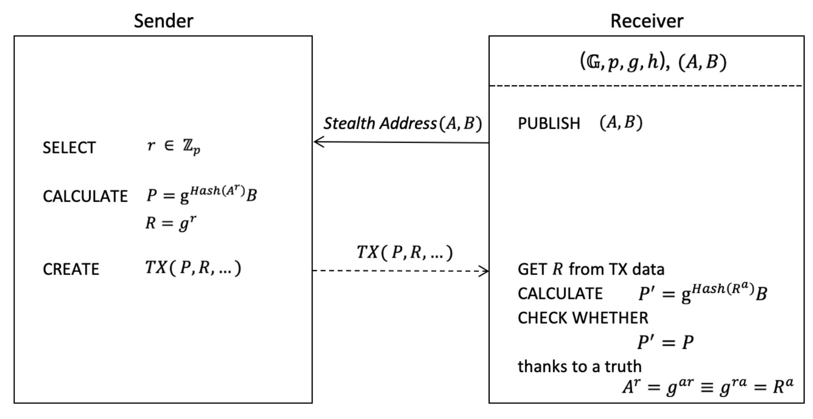
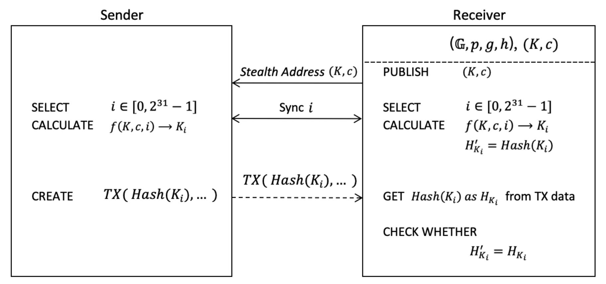
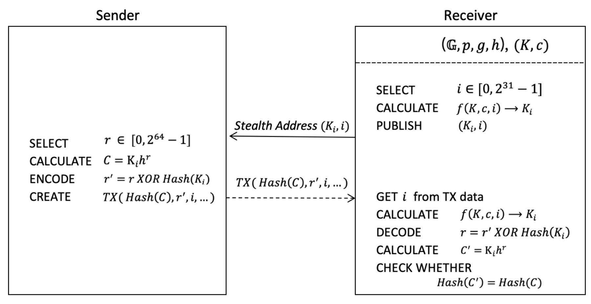
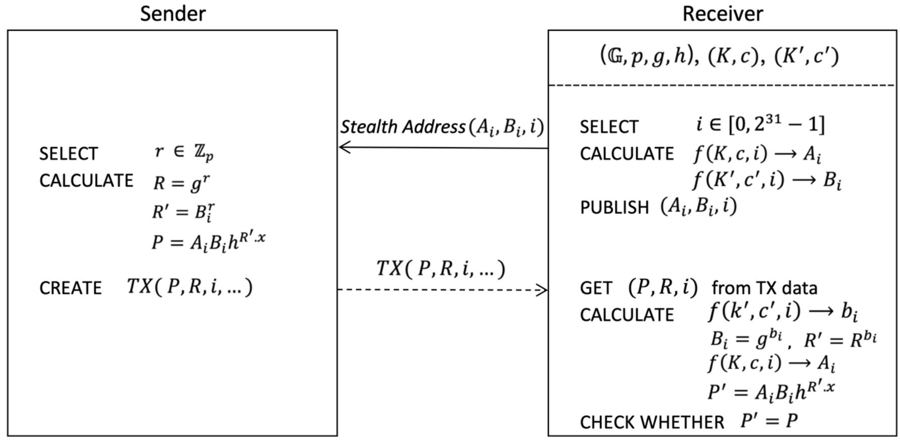
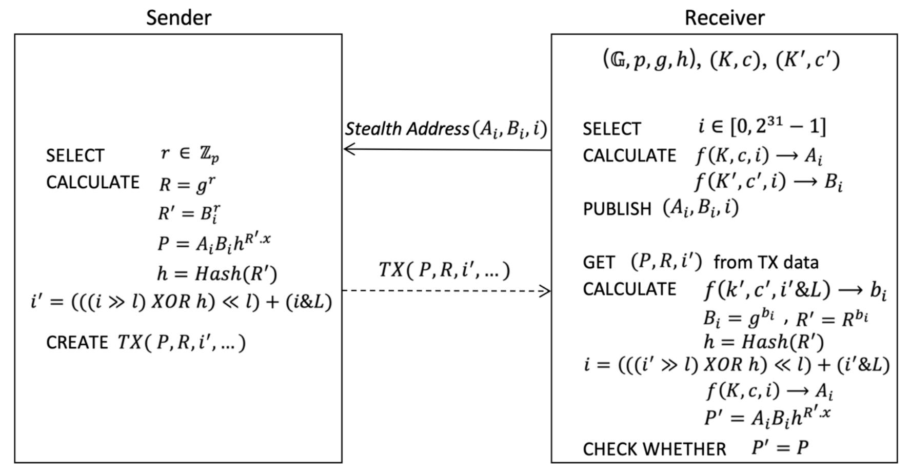

{0}------------------------------------------------

#### **Blockchain Stealth Address Schemes**

Gary Yu
gary.yu@gotts.tech

July 3, 2020

**Abstract.** In a blockchain system, address is an essential primitive which is used in transaction. The Stealth Address, which has an underlying address info of two public keys (A, B), was developed by Monero blockchain in 2013, in which a one-time public key is used as the transaction destination, to protect the recipient privacy. At almost same time, hierarchical deterministic wallets scheme was proposed as bip-32 for Bitcoin, which makes it possible to share an extended public key (K, c) between sender and receiver, where K is a public key and c is a 256-bits chain code, and only receiver knows the corresponding private key of this K. With the bip-32 scheme, the sender may derive the child public key  $K_i$  with the child number i by him/herself, without needing to request a new address for each payment from the receiver, make each transaction have a different destination key for privacy. This paper introduces an improved stealth address scheme (and some enhanced variants) which has an underlying address data of  $(A_i, B_i, i)$ , where i is a child number and  $i \in [0, 2^{31} - 1]$ . The sender gets the receiver's address info  $(A_i, B_i, i)$ , generates a random secret number  $r \in [0, 2^{64} - 1]$  and calculate a Pedersen commitment  $C = A_i B_i h^{R'.x}$  where  $R' = B_i^r$ , then the sender may use this commitment C or Hash(C) as the destination key for the output and packs the (R, i)somewhere into the transaction. This improved stealth address scheme makes it possible to manage multiple stealth addresses in one wallet, therefore the user is able to share different addresses for different senders.

**Keywords:** Stealth address, Bitcoin, Mimblewimble, Pedersen commitment, Gotts

### 1 Introduction

**Stealth Address.** The concept of *Stealth Address* was firstly developed by a Bitcoin Forum member 'ByteCoin' [Byt11], then improved by Nicolas van Saberhagen in CryptoNote's white paper[Sab13], later adapted by Peter Todd in 2014 [Tod14], and finally used in Monero blockchain, which is the concatenation of a *public spend key* and a *public view key*. The main purpose of the *Stealth Address* design is to protect recipient privacy. According to CryptoNote whitepaper, a one-time public key is used as the transaction destination key, as illustrated in Figure 1, comprising the steps of:

- Receiver publish an address which contains two public keys (A, B).
- Sender generate a random  $r \in \mathbb{Z}_p$  and calculate a one-time public key P = Hash(r \* A) \* G + B.
- Sender use P as the destination key for the output and also packs R = r \* G (as a part of Diffie-Hellman exchange) somewhere into the transaction.

The receiver checks every passing transaction with his/her private key (a, b) and computes P' = Hash(a \* R) \* G + B, to collect the payments if P' = P, thanks to the truth that  $a * R \equiv r * A$ . With the sharing private key of A, an auditor for example can also computes this P' therefore is capable to view every incoming transaction for that *Stealth Address*.

{1}------------------------------------------------



**Fig.1** Monero *Stealth Address* scheme. The receiver publishes a stealth address (, ) and the sender use this address to generate a one-time public key for a transaction , then the receiver collects it from the chain.

The pros are obviously on the recipient privacy, which only open the one-time key on the public chain data and keep the recipient's address as a secret only known between sender and receiver. The cons are mainly at:

- One wallet is only be able to manage one address, meaning the user has to share same address to different senders. In case that two senders meet each other and find they're sending to same address, they will know they have the same receiver. This harms the privacy.
- In contrast to a typical Bitcoin address which is just a 20-bytes length hash160 data, the Monero *Stealth Address* is much longer, which contains 2 public keys therefore at least need 65-bytes data length.
- It's non-trivial in some thin transaction solution to pack the as the additional load into the transaction, which costs 33-bytes data. For instance, a typical Bitcoin transaction with single input and double outputs may only cost 225 bytes, this 33-bytes data will increase 15% transaction bandwidth.

**Hierarchical Deterministic Wallets Address.** At almost same time as the Monero *Stealth Address* scheme was finalized, another optional solution "*HD (Hierarchical Deterministic) Wallets*" is proposed as *bip-32* for Bitcoin [Wui13], which can also be used as a stealth address solution. With the *bip-32* solution, the sender and receiver can share an *extended public key*, and both sides can derive the public child keys without requesting the new address for each payment. For example, a possible solution, as illustrated in Figure 2, may comprise the steps of:

- Sender and receiver share an *extended public key* as (, ), where is a public key, is a 256-bits data which is named as "chain code" in *bip-32*.
- is a 4-bytes integer which is named as "child number" in *bip-32*, ∈ [0, 2"# − 1].
- The derivation algorithm is defined as ! = + , ∗ , where , is the first 32-bytes sequence when splitting into two 32-byte sequences, and = \_512(,, ).

{2}------------------------------------------------

- The sender increases sequentially starting from 0, each time when making a new payment to the receiver, calculates a new public key ! as the transaction destination address.



**Fig.2** BIP-32 address scheme. The receiver publishes a stealth address (, ) and the sender use this address to generate a one-time public key ! for a transaction , then the receiver collects it from the chain. To make it work, both parties have to synchronize to the same child number .

With this solution, the recipient privacy is protected by the one-time key !. But the cons are obviously at:

- The receiver has to get a secure communication channel with the sender for the sharing of the address info (, ), meaning the address must not open for any third party, otherwise the third party is capable to view every transaction with this address.
- At least 65-bytes address info, i.e. (, ), need to be shared in advance between sender and receiver, which has the same length as Monero *Stealth Address*.
- In case the receiver loses the local stored info of current child number , a painful grind calculation is needed to search from 0 until (2"# − 1). Or in other words, the receiver has to synchronize the child number with the sender, either by using sequentially or by the communication outside the chain.
- According to *bip-32*, this is only proposed for recurrent business-to-business transaction use case, obviously inconvenient for the receiver to maintain multiple random senders, since the receiver has to check every passing transaction on the chain for each maintained *extended public parent key* (, ), with its suitable derivation public child key !.

There is a known vulnerability to the author of the bip-32 standard, the attacker could easily recover the master private key given the master public key and any child private key [GS14].

**Robust Multi-Key Stealth Address.** Nicolas T. Courtois and Rebekah Mercer proposed an improved Stealth Address technique [CM17] which is more robust against a variety of attacks, with the idea of a multi-key multiplicative technique of [GS14]. The recipient will have + 1 private/public keypairs: one 'view key' = . and *m* different 'spend' public keys ! = !. . The price to pay for this is an *m*-fold increase in the size of the address.

{3}------------------------------------------------

All above stealth address solutions are still a little bit far from the idealistic goal of a blockchain address: shorter length and wider usability. Unfortunately, without the new progress on related cryptography research, it looks like these stealth address solutions are already the best choice. It is therefore an object of this paper to provide a similar stealth address solution as Monero *Stealth Address*scheme for blockchains, given essentially the same security guarantees as prior arts, with a little improvement so as to manage multiple addresses in one wallet, in comparison to known cryptographic methods.

# **2 The New Stealth Address Scheme**

# **2.1 A Naive Scheme**

A naive scheme, with a strong assumption on a secure communication channel between the sender and the receiver for the sharing of the address info, as illustrated in Figure 3, uses (,) as the stealth address data, where ! is a recipient public child key which is generated from an *extended public parent key* (, ) extended with a child number .

The sender gets the receiver's stealth address info (!, ), generates a random number and calculates a Pedersen commitment [Ped91] = K! + ∗ . The sender may use this Pedersen commitment as the destination key for the output and packs the encoded () , ) somewhere into the transaction.

The receiver checks every passing transaction, gets the transaction destination key and the encoded info () , ) from the transaction, derives the public child key ! with the *extended public parent key* (, ) and the child number , decodes the , computes the Pedersen commitment ) = K! + ∗ , to collect the payments if ) = .



**Fig.3** A naive stealth address scheme. The receiver publishes a stealth address (!, ) and the sender use this address for a transaction , then the receiver collects it from the chain.

With this new stealth address scheme, the address data is a little bit bigger than prior arts described above, because of the child number , and need a little bit more additional payload data into the transaction, increasing 4 bytes data (37-bytes for (, ) comparing to 33-bytes in Monero *Stealth Address* solution for packing that ). These increased sizes are the cost to get 

{4}------------------------------------------------

the advantage to furtherly protect the privacy, meaning the wallet can manage multiple addresses in the same time, therefore the user can share different address for different sender.

The pros of this naive scheme are the compact address data and the minimal additional payload. The cons are obviously on the strong assumption, which is not practical for common people to get a secured communication channel to share the address info.

### 2.2 The Basic Scheme

The basic stealth address scheme, is parameterized by group parameters  $(\mathbb{G}, p, g, h)$  where p is a k-bit integer,  $\mathbb{G}$  is a cyclic group of order p, and g is a generator of  $\mathbb{G}$ , and let h be an element of group  $\mathbb{G}$  such that nobody knows  $log_g h$ , and by a hash function Hash.

This new stealth address scheme use  $(A_i, B_i, i)$  as the address data, where  $A_i$  is the public spend key and  $B_i$  is the public view key, as illustrated in Figure 4, comprising the steps of:

- The receiver generates a random private key  $k \in \mathbb{Z}_p$  and computes the corresponding public key  $K = g^k$ , and generates a random 256-bits chain code c to build the *extended public parent spend key* (K, c), with the corresponding extended private key (k, c).
- With this (k,c), the receiver generates a corresponding (k',c') with one hash algorithm, for example  $(k',c') = Hash_{sha512}(k,c)$ , computes the corresponding public key  $K' = g^{k'}$ , and builds the extended public parent view key (K',c').
- The receiver publishes an address to a sender with address data  $(A_i, B_i, i)$  which contains a *public child spend key*  $A_i$ , a *public child view key*  $B_i$ , and a child number  $i \in [0, 2^{31} 1]$ .
  - The child key derivation function f(K, c, i) may be defined as bip-32 HD wallets algorithm:  $K_i = Kg^{I_L}$ , where  $I = HMAC\_SHA512(c, K, i)$  and  $I_L$  is the first 32-bytes sequence when splitting I into two 32-byte sequences. The corresponding private key  $k_i$  of the public child key  $K_i$  will be:  $k_i = k + I_L$ .
  - O The receiver may derive different public child key for different sender, by changing the child number *i*. *i* may be changed sequentially starting from 0, meaning *i* may increment by 1 each time when generating a new address; or *i* may be selected from a random number.
- The sender gets the receiver's address info  $(A_i, B_i, i)$ , and
  - O The sender generates a random  $r \in \mathbb{Z}_p$ , calculates  $R = g^r$  and  $R' = B_i^r$ , then use this R' to furtherly calculate a one-time Pedersen commitment  $P = A_i B_i h^{R'.x}$ .
  - The sender uses this one-time commitment P, or Hash(P) as the destination key for the output and packs the (R, i) somewhere into the transaction. If using Hash(P) as the destination key for the output, the Hash function here may be the SHA-256, or Hash160 which means RIPEMD160(SHA256(P)), or any other feasible hash function.

{5}------------------------------------------------



**Fig.4** The basic stealth address scheme. The receiver publishes a stealth address  $(A_i, B_i, i)$  and the sender uses this address to generate a one-time public key for a transaction TX, attaches the (R, i) to the TX, then the receiver collects it from the chain.

The receiver checks every passing transaction, gets the transaction destination key P and (R, i) from the transaction data, derives the public child keys  $A_i$  and  $B_i$ , devices the private child view key  $b_i$ , calculates the nonce  $R' = R^{b_i}$ , computes  $P' = A_i B_i h^{R'.x}$ , to collect the payments if P' = P, or if Hash(P') = Hash(P) depending on which format is been using in the transaction data.

Thanks to Pedersen commitment 's *perfect hiding* property and *computational binding* property [MD17, MRK03], with a one-time public key (in fact a Pedersen commitment)  $P = A_i B_i h^{R'.x}$  as the transaction destination key, nobody can deduce the original address info  $(A_i, B_i)$  from P without the knowledge of private nonce r or private view key  $b_i$ . Therefore, this stealth address solution has a well privacy protection for the recipient real address.

The benefit of packing the child number i into the transaction is that the receiver will be very easy to maintain multiple child addresses in one wallet account, so as to encourage the receiver to publish random child public key (i.e. recipient address) for every single sender, to minimize the probability of address reuse for the recipient privacy. This is secure only on a strong assumption where there are huge on-chain transactions volume to expect a lot of duplication of same i, but obviously this assumption is too idealistic. Therefore, it is a flaw about this i, since this i is part of the recipient address info  $(A_i, B_i, i)$ , it is possible for anyone to map this i to a complete address  $(A_i, B_i, i)$ , especially for a young system which has not much on-chain transactions happening. When there are multiple transactions to same address, they could be detected by the same i on the transaction outputs.

The fix solution for this flaw, which will be discussed in next chapter as an enhanced scheme, is to use an encoded i' as the transaction data instead of the original i, and let this i' only decodable for the transaction parties. Whereas before that, we should realize that above flaw only exists in the payment output, meaning in the transaction output for the receiver. For change output/s of a transaction, the sender is always able to generate a new random address for that, therefore the mapping between the i and the address  $(A_i, B_i, i)$  is almost impossible, since the random i could come from anyone and the probability to reuse a  $(A_i, B_i, i)$  is quite low. So, this basic scheme is still usable for the change output.

{6}------------------------------------------------

#### 2.3 The Enhanced Scheme

As a fix for above flaw, an enhanced scheme, as illustrated in Figure 5, may be defined here comprising the following steps of:

- The receiver publishes an address to a sender with address data  $(A_i, B_i, i)$  which contains a *public child spend key*  $A_i$ , a *public child view key*  $B_i$ , and a child number  $i \in [0, 2^{31} 1]$ .
  - O The child key derivation function is still the f(K,c,i), but when using it to derive  $B_i$  only the limited bits of i are used. Meaning  $B_i = f(K,c,i\&L)$ , where  $L = 2^l 1$ , and l is a consensus constant for example with an initial value as 8. The consensus constant l may be increased by soft forks from time to time when the on-chain transaction volume big enough.
  - $\circ$  *i* is proposed to be selected from a random number.
- The sender gets the receiver's address info  $(A_i, B_i, i)$ , and
  - The sender generates a random  $r \in \mathbb{Z}_p$ , calculates  $R = g^r$  and  $R' = B_i^r$ , then use this R' to furtherly calculate a one-time public key (in fact a Pedersen commitment)  $P = A_i B_i h^{R'.x}$ .
  - O The sender uses this one-time public key P, or Hash(P) as the destination for the output and packs the (R, i') somewhere into the transaction.
  - The encoded i' is computed with  $i' = (((i \gg l) XOR h) \ll l) + (i\&L)$  where h = Hash(R').

The receiver checks every passing transaction, gets the transaction destination key P, or Hash(P), and (R,i') from the transaction data, derives the private child view key  $b_i = f(k',c',i'\&L)$  and the corresponding public child view key  $B_i = g^{b_i}$ , calculates the nonce  $R' = R^{b_i}$  and h = Hash(R'), decodes  $i = (((i' \gg l) XOR h) \ll l) + (i'\&L)$ , derives the public child spend key  $A_i = f(K,c,i)$ , computes  $P' = A_i B_i h^{R',x}$ , to collect the payments if P' = P, or if Hash(P') = Hash(P).



**Fig.5** The enhanced stealth address scheme. The receiver publishes a stealth address  $(A_i, B_i, i)$  and uses this address to generate a one-time public key for a transaction TX, attaches the (R, i') to the TX, then the receiver collects it from the chain.

{7}------------------------------------------------

With this enhanced scheme, most of the higher bits of encoded child number ) are random because of the random secret , even for same . Only part of the least bits of are leaked as transparent on the chain. Since the initial consensus constant is a small value for example 8, we can expect enough duplications of bits of in the on-chain transactions, even for a young system, such that the mapping between ) and the real address (!, !) is not applicable.

The cons of this enhanced scheme are the limited numbers of available ! for one wallet (, ) , since bits of only give 27 different ! . But this can be improved during the progressive adoption procedure with increased on-chain transaction volume, by increasing this with soft forks from time to time.

# **2.4 The Mixed Scheme**

In the production environment, both the basic scheme and the enhanced scheme will be used. The enhanced scheme is for payment outputs, but the basic scheme is for change outputs. Without an indicator for the type of the output, a double test and try, with (, ) and (, ) ), has to be used to recover a wallet, during the checking on every UTXO in the chain. The missing of such kind of output type indicator is purposely for the privacy.

## **2.5 The Simplified Version**

For most of personal users, the view key for the audit purpose does not have any practical meaning. A simplified version of this stealth address scheme can be used in this case, to avoid the meaningless cost of the long address.

The simplified version may be designed as (,) for the address data instead of (, ,), where ! is the public spend key, and the public view key ! is dismissed. In the all remaining parts of above stealth address scheme, the ! is simply replaced by the !. Or in other words, the simplified version can be looked as the original version of (, ,) but where ! = !.

## **2.6 Payment Proof**

Payment proof means a proof to the third party (normally an arbiter) to prove the payment was made, when someone sends money to a party who then disputes the payment was made. The payment proof in Bitcoin is simple since the recipient address is recorded in the chain and open to anyone, but for a blockchain which uses the stealth address scheme, the payment proof is not so straight.

A simple, which is being used in Monero, is to use the secret nonce since only the sender knows this secret. Either directly revealing this value to the third party or providing a signature on a message from the third party with this as the secret key.

In a payment proof with signature, the following info will be provided as the payment proof:

- 1. The transaction id for Bitcoin and similar blockchains, or the transaction output for Mimblewimble[Mw16] blockchains, which can be used to get that corresponding public nonce ;
- 2. The transaction Merkle proof for Bitcoin and similar blockchains, or the transaction output MMR[Tod12] proof for Mimblewimble blockchains;
- 3. The receiver's address but please note the third party arbiter will also need to know this address to assert it all ties together;
- 4. A message from the third party and the corresponding signature from the sender. The signature can be verified with above as the public key.

{8}------------------------------------------------

The pros of this first method are obviously the simplicity of proof construction. The cons are mainly on the reliability, meaning the sender is incapable to create the proof once the info is lost, since this private nonce is only stored in local wallet and not quarriable on the chain.

To avoid losing the info , as a workaround, the wallet should provide some automatic backup features to regularly backup the payment records.

## **3 Applications to Blockchain Transaction**

## **3.1 Bitcoin-Style Transaction**

In a transaction-output-based blockchain system, where each transaction spends UTXOs (the previously Unspent Transaction Outputs), a user must provide a signature, or more precisely a for Bitcoin [Bit08], either with ECDSA presently or with Schnorr signature in the future [WNR18], to spend an UTXO, which proves the ownership of the spending output.

When spending an UTXO with Pedersen commitment = !!ℎ&!.( or ℎ() as the owner key info, a problem is nobody, including the exact owner of this output, knows the private key of a Pedersen commitment, and therefore the user cannot provide that corresponding signature. A naive solution, to solve this problem, is attaching that ) . into the spending transaction, so that the owner can sign with the corresponding private key (! + !) and the validator can calculate the public key by ℎ8&!.(. With *Pay-to-PubkeyHash* transaction type in Bitcoin as an example, the original script is like this:

```
:9:; <=><#$? < ℎ > @A:=,B@&5CD E<@EF>5G
: <  > <  >
```

With above said naive solution, the scripts may be revised as:

```
:9:; <=><#$? < ℎ > @A:=,B@&5CD E4FE<@EF>5G
: <  > < )
             .  > <  >
```

Where,

E4F means the calculation of ℎ8&!.(.

With above descripted naive solution, the pros are obviously on the recipient privacy, which only open the Pedersen commitment (or its hash) on the public chain and keep the recipient's address (!, !, ) as a secret only known between sender and receiver, and all unspent outputs will keep the recipient address hidden until the owner spend it. The cons are mainly at:

- The transaction will reveal the ) . of the spending output, also meaning reveal the hidden public key(!, !), i.e. the recipient address info.
- The additional info ) . in will increase the transaction payload size with 32 bytes.

This naive solution will implicitly reveal the hidden address info for all spent outputs, it will be a major infection on the core value of this stealth address scheme.

Fortunately, there is a *ComSig* signature scheme [Yu20] which is able to keep the recipient address always hidden, both for unspent and spent outputs, to directly use the Pedersen commitment as the signature public key. With the said *ComSig* signature scheme, the *Payto-PubkeyHash* transaction in Bitcoin may be revised as:

```
:9:; <=><#$? < ℎ > @A:=,B@&5CD E<@EF>5G
: <  > <  >
```

With this revised transaction scheme, the pros are the strict recipient privacy and the identical format to the Bitcoin *Pay-to-PubkeyHash* transaction script, because the commitment is also a . The cons are mainly at:

{9}------------------------------------------------

- The ComSig signature has a bigger size than ECDSA or Schnorr signature, which has a form as (R, u, v) instead of (R, s). Therefore, the scriptSig will increase the transaction payload size with 32 bytes.

Since the increased 32-bytes payload is not trivial in a current Bitcoin transaction, this stealth address scheme is not optimal for Bitcoin blockchain, but indeed for the similar transaction-output-based blockchain systems in which the *ComSig* signature scheme is being or planned to be used, for example the Gotts [Got20].

### 3.2 Mimblewimble-Style Transaction

With this stealth address scheme, the non-interactive transaction in Gotts may be designed as:

- $TX: \langle g^{x_i} h^{w_i} \rangle \langle g^{x_c} h^{w_c} \rangle \langle C_r \rangle$
- $a_i = a_c + a_r + fee$
- $C_r = A_i B_i h^{R'.x}$

#### Where,

- $C_r$  is the *output commitment* for receiver, calculated with the stealth address  $(A_i, B_i, i)$ ,
- $R' = B_i^r \equiv R^{b_i}$ , where r is the private nonce selected by sender,  $R = g^r$  is the public nonce,  $b_i$  is the receiver's private view key, R'. x is the x coordination of point R',
- $\langle g^{x_i}h^{w_i} \rangle$  is the *input commitment* owned by sender,
- $\langle g^{x_c} h^{w_c} \rangle$  is the *change commitment* for sender,
- $x_i$ ,  $x_c$  are the sender's private keys,
- $a_i$ ,  $a_c$ ,  $a_r$  are the *amounts*; fee is the transaction fee.

Furthermore, as a mandatory info of this transaction, the (R, i') must be packed somewhere into the transaction, where i' is the encoded i with the encoding method described at above enhanced stealth address scheme.

Regarding the change output  $g^{x_c}h^{w_c}$ , considering the universal output format both for change and the payment outputs, the  $w_c$  must also be recoverable with a  $R_c$  attached to the output, meaning  $w_c = R'_c$ . x where  $R'_c = R_c^{\ p_j}$  and  $p_j$  is the sender's private view key. To manage this  $p_j$  on the wallet, a random address  $(A_j, B_j, j)$  is generated by a random number j. The sender attaches the  $(R_c, j)$  into the change output, where the attached j is the original child number value, instead of an encoded value as in the receiver's output. In a short brief, the enhanced stealth address scheme is used for the receiver's output, but the basic stealth address scheme is used for the change output.

#### Reference

- Byt11 user 'bytecoin'. Untraceable transactions which can contain a secure message are inevitable. 2011. https://bitcointalk.org/index.php?topic=5965.0
- Sab13 Nicolas van Saberhagen. CrypoNote v 2.0. 2013. https://cryptonote.org/whitepaper.pdf
- Tod14 Peter Todd. [Bitcoin-development] Stealth addresses. 2014. http://www.mail-archive.com/bitcoin-development@lists.sourceforge.net/msg03613.html
- GS14 Gus Gutoski, Douglas Stebila. Hierarchical Deterministic Bitcoin Wallets that Tolerate Key Leakage. In Financial Cryptography, volume LNCS 8975, pages 497-504. https://eprint.iacr.org/2014/998
- Nicolas T. Courtois, Rebekah Mercer. Stealth Address and Key Management Techniques in Blockchain Systems. In Proceedings of the 3rd International Conference on Information Systems Security and Privacy (ICISSP 2017), pages 559-566.

{10}------------------------------------------------

Wui13 Pieter Wuille. Hierarchical deterministic wallets. 2013. https://github.com/bitcoin/bips/commits/master/bip-0032.mediawiki Ped91 Torben Pryds Pedersen. Non-interactive and information-theoretic secure verifiable secret sharing. In Crypt, volume 91, pages 129-140. Springer, 1991. MD17 Roberto Metere, Changyu Dong. Automated Cryptographic Analysis of the Pedersen Commitment Scheme. MMM-ACNS 2017. Lecture Notes in Computer Science, vol 10446. MRK03 S. Micali, M. Rabin, J. Kilian. Zero-knowledge sets. 44th Annual IEEE Symposium on Foundations of Computer Science, 2003. Proceedings. Tod12 Peter Todd. Merkle Mountain Range. 2012. https://github.com/mimblewimble/grin/blob/master/doc/mmr.md Bit08 Satoshi Nakamoto. Bitcoin: A Peer-to-Peer Electronic Cash System, 2008. http://bitcoin.org/bitcoin.pdf WNR18 Pieter Wuille, Jonas Nick, Tim Ruffing. Schnorr signatures for secp256k1, 2018. https://github.com/sipa/bips/blob/bip-schnorr/bip-schnorr.mediawiki Yu20 Gary Yu. Simple Schnorr signature with Pedersen commitment as Key. 2020. https://eprint.iacr.org/2020/061.pdf Got20 Gary Yu. Introduction to MimbleWimble, Grin & Gotts. 2020. https://github.com/gottstech/gotts/blob/master/docs/intro.md MW16 Tom Elvis Jedusor. Mimblewimble. 2016. https://github.com/mimblewimble/docs/wiki/Mimblewimble-origin