{0}------------------------------------------------

## **Drop by Drop you break the rock - Exploiting generic vulnerabilities in Lattice-based PKE/KEMs using EM-based Physical Attacks**

Prasanna Ravi Temasek Laboratories and School of Computer Science and Engineering, NTU Singapore prasanna.ravi@ntu.edu.sg

Sujoy Sinha Roy University of Birmingham, United Kingdom s.sinharoy@cs.bham.ac.uk

## ABSTRACT

We report an important implementation vulnerability exploitable through physical attacks for message recovery in *five* lattice-based public-key encryption schemes (PKE) and Key Encapsulation Mechanisms (KEM) - NewHope, Kyber, Saber, Round5 and LAC that are currently competing in the second round of NIST's standardization process for postquantum cryptography. The reported vulnerability exists in the message decoding function which is a fundamental kernel present in lattice-based PKE/KEMs and further analysis of the implementations in the public *pqm4* library revealed that the message decoding function is implemented in a similar manner in all the identified schemes and thus they all share the common side-channel vulnerability that leaks individual bits of the secret message. We demonstrate that the identified vulnerability can be exploited through a number of practical electromagnetic side-channel attacks, fault attacks and combined attacks on implementations from the *pqm4* library running on the ARM Cortex-M4 microcontroller. As a key contribution, we also demonstrate the first practical EMbased combined side-channel and fault attack on lattice-based PKE/KEMs.

## KEYWORDS

post-quantum cryptography; lattice-based cryptography; EMbased side-channel attacks; EM-based fault injection attacks

## 1 INTRODUCTION

Post-quantum cryptographic schemes use mathematical problems that are presumed to be computationally infeasible to solve by classical as well as quantum computers. Based on the underlying hard problem - post-quantum schemes can be categorized into: code-based, lattice-based, hash-based, multivariate-based,and super-singular isogeny based. NIST initiated a process for standardization of post-quantum cryptography (PQC) in 2017, which is currently in its second round [\[18\]](#page-14-0). There are 26 candidates which include public key encryption schemes (PKE), digital signatures (DS) and key establishment schemes (KEM) and among them lattice-based

Shivam Bhasin Temasek Laboratories, NTU Singapore sbhasin@ntu.edu.sg

Anupam Chattopadhyay Temasek Laboratories and School of Computer Science and Engineering, NTU Singapore anupam@ntu.edu.sg

cryptography forms the majority with 12 candidates [\[19\]](#page-14-1). NIST and the PQC research community anticipate that a subset of PQC candidates will be standardized around 2024 and soon reach wide scale adoption. Among the several criteria such as post-quantum security guarantees, uniqueness, speed, communication bandwidth and efficiency based on which the schemes are evaluated, implementation resistance to physical side-channel and fault attacks is a prominent important criteria especially concerning deployment of PQC in embedded devices [\[18\]](#page-14-0).

The primary usage of PKE/KEMs is to securely exchange a shared secret (secret message) between two untrusted parties using their respective public-private key pairs. The shared secret is subsequently used within much faster symmetric schemes such as block ciphers, stream ciphers and MACs for secure communication. The long term secret key used during decryption has been the main target of several side-channel analyses (SCA) and fault injection analyses (FIA) on latticebased PKE/KEMs [\[9,](#page-13-0) [21,](#page-14-2) [24\]](#page-14-3). This is because retrieval of a single static long term private key has maximum impact as it compromises all the shared secrets generated using that private key, while recovering the secret message or the shared secret does not impact other key-exchanges or shared secrets. However, message recovery attacks can become very practical especially if they require only a single to very few queries with the target device and can thus have a huge impact even if static key pairs are not compromised. In fact, new protocol standards including TLS 1.3 are increasingly advocating and mandating use of PKE/KEMs that utilize ephemeral key pairs to achieve the notion of perfect forward secrecy [\[1\]](#page-13-1). This decreases the impact of recovering the long term private key as it results in recovery of lesser number of messages/shared secrets, which makes session key recovery more or less equally attractive for an attacker. However, very few works have investigated message recovery attacks over lattice-based PKE/KEMs [\[3,](#page-13-2) [23\]](#page-14-4). While both these works targeted the encryption procedure, we perform our attacks on the decryption procedure.

In this work, we exploit a generic vulnerability within implementations of multiple second round lattice-based PKE/KEMs

{1}------------------------------------------------

of the NIST's standardization project. This implementation vulnerability leaks information about single bits of the decryption output through the message decoding function, which is a fundamental kernel in lattice-based PKE/KEMs. We exploit this vulnerability to demonstrate a range of simple side-channel attacks, fault injection attacks and combined side-channel and fault attacks to perform message recovery leading to recovery of the shared secret in five lattice-based PKE/KEMs which include NewHope, Kyber, Saber, Round5 and LAC.

*Contributions*. The main contributions of this work are as follows:

- (1) We identify an important vulnerability within the implementation of the message decoding function which leaks information about individual bits of the secret message. This function is a fundamental kernel in the decryption procedure of multiple lattice-based PKE/KEMs and the same vulnerability is present in implementation of five round 2 candidate PKE/KEMs such as NewHope KEM, Kyber KEM, Saber KEM, LAC KEM and Round5 PKE.
- (2) We exploit the identified vulnerability through a range of six practical Electromagnetic (EM) emanation based side-channel attacks, EM-based fault injection attacks. We also exploit a few inherent properties of lattice-based schemes to heavily optimize our attacks to minimize the number of attack queries with the target device. All attacks presented in this paper require anywhere between a single attack query to a few hundred attack queries for full message recovery.
- (3) We performed experimental validation of our attacks on optimized implementations of the aforementioned NIST candidates obtained from the pqm4 public library, a testing and benchmarking framework for post quantum cryptographic schemes on the ARM Cortex-M4 microcontroller [15].
- (4) We also propose novel clustering-based attack techniques to perform message recovery over implementations protected with concrete side-channel masking countermeasures.
- (5) We also identified a covert bug in the implementation of NewHope KEM in pqm4 public library that does not violate correctness of the scheme, but has the potential to be used as a hidden backdoor in cryptographic implementations. We show that this bug can be exploited to perform efficient fault injection attacks for message recovery.
- (6) To the best of our knowledge, we demonstrate the first practical EM based combined SCA & FIA over lattice-based PKE/KEMs.

A summary of the suite of the attacks presented later in this work are tabulated in Tab.2. Efficiency of the attacks are evaluated under three common operating modes of PKE/KEMs: (1) Static public-private key pair setting - (S), (2) Nominally Ephemeral setting with key caching -

Table 1: Summary of our SCA, FIA and combined SCA&FIA based message recovery attacks. Table provides the number of (#) attack queries required for each attack in the best case scenario for the three operating modes of PKE/KEMs. We provide generic results in terms of the bit-width n of the decryption output. Please refer Tab.2 for the value of n for various schemes. Notation:  $\checkmark$ - Applicable,  $\rightthreetimes$ - Not Applicable,  $\rightthreetimes$ - Applicable based on the duration of validity of cached key pairs

| Attack                                | # Attack Queries    | Nature of PKE/KEM |    |    |
|---------------------------------------|---------------------|-------------------|----|----|
|                                       |                     | S                 | NE | PE |
| Single_Bit_SCA (Sec.5.3)              | n * 1               | ✓                 | +  | Х  |
| Single_Byte_SCA ( $Sec.5.4$ )         | $\lceil n/8 \rceil$ | 1                 | +  | X  |
| Multi_Byte_SCA (Sec.5.5)              | 1                   | 1                 | 1  | 1  |
| Masked_Single_Bit_SCA (Sec.5.6)       | n*1                 | ✓                 | +  | X  |
| Single_Bit_Bug_Exploit_FIA (Sec.6.3)  | n*2                 | 1                 | +  | X  |
| Single_Bit_Combined_SCA_FIA (Sec.6.2) | n*3                 | ✓                 | +  | Х  |

<span id="page-1-0"></span>Table 2: Bit-width (n) of the decryption output of various schemes and their respective variants. Please note that not all variants are covered in this table.

| Scheme      | Variant      | n    |
|-------------|--------------|------|
| NewHope KEM | NewHope512   | 256  |
|             | NewHope1024  | 256  |
| Kyber KEM   | Kyber512     | 256  |
|             | Kyber768     | 256  |
|             | Kyber1024    | 256  |
| Saber KEM   | LightSaber   | 256  |
|             | Saber        | 256  |
|             | FireSaber    | 256  |
| LAC KEM     | LAC128       | 511  |
|             | LAC192       | 511  |
|             | LAC256       | 1023 |
| Round5 PKE  | r5nd_1KEM_5d | 318  |
|             | r5nd_3KEM_5d | 410  |
|             | r5nd_5KEM_5d | 490  |

(NE) and (3) Purely Ephemeral setting - (PE). Provided the attacker capability and access to optimised measurement setup, complete message recovery can be performed in as low as a single trace thus recovering ephemeral secrets. Other attacks however can be performed in a static or nominally ephemeral (with key caching) setting, if the lifetime of the key pair allows 32 to 768 queries depending on the application.

Organization. This paper is organized as follows. Section 2 covers the necessary background by introducing the required concepts, Section 3 presents the main implementation vulnerability that underlies all the message recovery attacks presented in this paper. Section 4 presents different side-channel attacks to perform message recovery including attack approaches applicable to side-channel protected implementations. Section 5 presents the fault injection attacks and combined attacks for message recovery. Section 6 discusses potential countermeasures against our proposed attacks and finally, Section 7 concludes our paper.

{2}------------------------------------------------

#### 2 LATTICE PRELIMINARIES

#### 2.1 Notation

We denote the ring of integers modulo a prime q as  $\mathbb{Z}_q$ . The polynomial ring  $\mathbb{Z}_q(x)/\phi(x)$  is denoted as  $R_q$  where  $\phi(x)$  is its reduction polynomial. We denote  $\mathbf{r} \in R_q^{k \times \ell}$  as a module of dimension  $k \times \ell$ . Polynomials in  $R_q$  and modules in  $R_q^{k \times \ell}$ are denoted in bold lower case letters. The  $i^{th}$  coefficient of a polynomial  $\mathbf{a} \in R_q$  is denoted as  $\mathbf{a}[i]$ . Matrices/vectors in  $\mathbb{Z}_q^{k \times l}$  are denoted in bold upper case letters. Multiplication of two polynomials **a** and **b** in the ring  $R_q$  is denoted as **c** =  $\mathbf{a} \times \mathbf{b}$ . We define two operations  $\mathsf{Rotr}(\mathbf{a}, p)$  and  $\mathsf{Anti}_{-}\mathsf{Rotr}(\mathbf{a}, p)$ which rotate the polynomial  $\mathbf{a} \in R_q$  by p positions to the left in a cyclic and anti-cyclic fashion respectively, as described in Eqn.1-2. An element  $\mathbf{x} \in R_q$  sampled from the distribution  $\mathcal{D}$ with standard deviation  $\sigma$  is denoted as  $\mathbf{x} \leftarrow \mathcal{D}_{\sigma}(R_q)$ . Byte arrays of length n are denoted as  $\mathcal{B}^n$  and the  $i^{th}$  byte in  $a \in \mathcal{B}^n$  is denoted as a[i]. The  $i^{th}$  bit in an element  $x \in \mathbb{Z}_q$ is denoted as  $x_i$ .

$$\mathsf{Rotr}(\mathbf{a},p)[i] = \begin{cases} \mathbf{a}[n-p+i], & \text{for } 0 \le i 
$$\mathsf{Anti\_Rotr}(\mathbf{a},p)[i] = \begin{cases} -\mathbf{a}[n-p+i], & \text{for } 0 \le i$$$$

# 2.2 Learning With Error/Learning With Rounding Problem

The security of most lattice-based PKE/KEMs including those competing in the NIST standardization process are governed by the well known average-case hard problem known as the Learning With Errors (LWE) problem [25]. The LWE problem is at least as hard as solving the Bounded Distance Decoding (BDD) problem on the same lattices in the worst case. A standard LWE instance is an overdefined system of noisy linear equations denoted as a tuple  $(\mathbf{A}, \mathbf{T}) \in (\mathbb{Z}_q^{k \times \ell} \times \mathbb{Z}_q^{k \times n})$  where  $\mathbf{A} \leftarrow \mathcal{U}(\mathbb{Z}_q^{k \times \ell})$  is a public parameter and  $\mathbf{T} = \mathbf{A} \times \mathbf{S} + \mathbf{E}$  where  $\mathbf{S} \in \mathcal{D}_{\sigma}(\mathbb{Z}_q^{\ell \times n})$  is the secret and  $\mathbf{E} \in \mathcal{D}_{\sigma}(\mathbb{Z}_q^{k \times n})$  is the explicitly added error component. One can also implicitly generate the error component E by simply scaling all the elements of the linear system  $\mathbf{A} \times \mathbf{S} \in \mathbb{Z}_q^{k \times n}$ ) to a lower modulus p with p < q resulting in the tuple  $(\mathbf{A}, \mathbf{T} = \lfloor \frac{p}{q} (\mathbf{A} \times \mathbf{S}) \rceil) \in (\mathbb{Z}_q^{k \times \ell} \times \mathbb{Z}_p^{k \times n})$ . This is termed as a Learning With Rounding (LWR) instance [6]. Using LWE/LWR instances, one can define two types of problems: Search and Decisional Problems. While the search LWE/LWR problem requires to obtain a unique solution for S given polynomially many LWE/LWR instances, the decisional variant requires to distinguish structured LWE/LWR instances from elements chosen uniformly in random from the same space.

There are also certain structured variants of the standard LWE/LWR problem known as the Ring-LWE/Ring-LWR (RLWE/RLWR) and Module-LWE/Module-LWR (ML-WE/MLWR) problems which involve computation over polynomials and offer substantially smaller key sizes and computational times compared to the standard LWE problem. The Ring LWE instance is defined as  $(\mathbf{a}, \mathbf{t} = \lfloor \mathbf{a} \times \mathbf{s} \rceil_{q \to p}) \in (R_q \times R_p)$  with  $\mathbf{s}, \mathbf{e} \leftarrow \mathcal{D}_{\sigma}(R_q)$  and an RLWR instance is defined as  $(\mathbf{a}, \mathbf{t} = \lfloor \mathbf{a} \times \mathbf{s} \rceil_{q \to p}) \in (R_q \times R_p)$ . The module variants (MLWE/MLWR) however involve computations over vectors/matrices of polynomials in  $R_q^{k_1 \times k_2}$  with  $(k_1, k_2) > 1$ . With  $\mathbf{a} \leftarrow \mathcal{U}(R_q^{k_1 \times k_2})$  and  $\mathbf{s} \leftarrow \mathcal{D}_{\sigma}(R_q^{k_2})$  and  $\mathbf{e} \leftarrow \mathcal{D}_{\sigma}(R_q^{k_1})$ . the corresponding MLWE instance is defined as  $(\mathbf{a}, \mathbf{t} = \mathbf{a} \times \mathbf{s} + \mathbf{e}) \in (R_q^{k_1 \times k_2}, R_q^{k_2})$  and the MLWR instance is defined as  $(\mathbf{a}, \mathbf{t} = \lfloor \mathbf{a} \times \mathbf{s} \rceil_{q \to p}) \in (R_q^{k_1 \times k_2}, R_p^{k_2})$ .

, ,

## 2.3 A Generic Framework for LWE/LWR based PKE schemes

<span id="page-2-1"></span><span id="page-2-0"></span>Most LWE/LWR based schemes including all the lattice-based NIST candidate PKE/KEMs are variants of a generalized paradigm proposed by Lyubashevskey, Peikert and Regev [16] in 2010, now well known as the "LPR Encryption scheme". We provide a high level description of the LPR encryption scheme as it is the basis of multiple lattice-based PKE/KEMs based on the LWE/LWR problem (Refer Alg. 1). We generalize its description so that parametric choices such as the structure of the underlying ring  $(R_q, R_q^{k \times k}, \mathbb{Z}_q^{n \times n})$ , choice to use error correcting codes  $(\mathcal{E}_{choice} = 0/1)$  and relative sizes of the rounding moduli (p, q) can describe specific schemes.

LPR Encryption Scheme [16]: We define the function pair (ECC\_Enc, ECC\_Dec) to denote the encoding and decoding procedures of an error correcting code  $\mathcal{E}$ . Specialized procedures used to convert a binary message/codeword in  $\{0,1\}^*$  to a corresponding polynomial in the underlying ring and vice versa are denoted as msg\_to\_poly and poly\_to\_msg) respectively.

The key generation procedure (PKE.KeyGen) simply involves generation of the LWE/LWR instance (a, t) (Line 6 in PKE.KeyGen) which is output as the long term public-key while the secret  $\mathbf{s}$  is the long term secret key. For a given message  $m \in \mathcal{B}^*$ , the encryption procedure (PKE.Encrypt) outputs two ciphertext components which are built from two separate LWE/LWR instances using an ephemeral secret s'. Depending on whether the scheme utilizes error correcting procedures, the message is encrypted in two ways. Some schemes such as LAC and variants of Round5 that utilize error correcting codes to artificially reduce the decryption failure rate. In such schemes, the message m is first encoded into a codeword  $c \in \mathcal{B}^*$  (i.e)  $c = \mathsf{ECC}$   $\mathsf{Enc}(m)$  and subsequently encoded into a polynomial  $\mathbf{x}$  using the function msg\_to\_poly (lines 10-11). However, in schemes such as NewHope, Kyber and Saber which do not use ECC, the message m is directly encoded to the polynomial  $\mathbf{x}$  using the same function msg\_to\_poly (line 14). Subsequently, the

{3}------------------------------------------------

Algorithm 1: Generic framework of LWE/LWR based

PKE schemes

```
1 Procedure PKE.KeyGen()
               publicseed \leftarrow \mathcal{U}(\mathcal{B}^{32})
 2
               \mathbf{a} = \text{gen}(publicseed) \in R_o^{k \times k}
 3
                \mathbf{s} \leftarrow \chi_{\mathbf{s}}(R_a^k)
 4
                \mathbf{e} \leftarrow \chi_{\mathbf{e}}(R_q^k)
 5
               \mathbf{t} = \lfloor \mathbf{a}^T \times \mathbf{s} + \mathbf{e} \rceil_{q \to p} \in R_p^k
  6
               return (pk = \text{EncodePK}(\mathbf{t}, publicseed), sk = \text{EncodeSK}(\mathbf{s}))
 7
  8
 1 Procedure PKE.Encrypt(pk, m \in \mathcal{B}^{32}, r \in \mathcal{B}^{32})
                (\mathbf{t}, publicseed) = \mathsf{DecodePK}(pk)
 2
               \mathbf{a} \leftarrow \text{gen}(publicseed)
 3
               \mathbf{s}' \leftarrow \chi_{\mathbf{s}'}(R_a^k)
 4
                \mathbf{e}' \leftarrow \chi_{\mathbf{e}'}(R_q^k)
 5
                \mathbf{e''} \leftarrow \chi_{\mathbf{e''}}(R_q)
  6
               \mathbf{t}_r = \lfloor \mathbf{t} \rceil_{q \to p} \in R_p^k
 7
                \mathbf{u} = [\mathbf{a}^T \times \mathbf{s}' + \mathbf{e}']_{q \to p} \in R_p^k
  8
                \mathbf{v} = \mathbf{t}_r^T \mathbf{s}' + \mathbf{e}''
 9
               if \mathcal{E}_{choice} = 1 then
10
                        c = ECC\_Enc(m)
11
                        \mathbf{x} = \mathsf{msg\_to\_poly}(c)
12
13
               end
                else
14
15
                        \mathbf{x} = \mathsf{msg\_to\_poly}(m)
16
               end
17
               \mathbf{v} = [\mathbf{v} + \mathbf{x}]_{q \to t} \in R_t
               return ct = \mathsf{EncodeCT}(\mathbf{u}, \mathbf{v})
18
19
 1 Procedure PKE.Decrypt(ct, sk)
               \mathbf{u}, \mathbf{v} = \mathsf{DecodeCT}(ct)
 2
               s = \mathsf{DecodeSK}(sk)
 3
               \mathbf{u}' = \lfloor \mathbf{u} \rceil_{p \to q}
 4
               \mathbf{v}' = |\mathbf{v}|_{t \to q}
 5
               \mathbf{x} = (\mathbf{v}' - (\mathbf{u}')^T \mathbf{s}) \in R_q
  6
               if \mathcal{E}_{choice} = 1 then
 7
                         c' = poly_to_msg(x)
  8
                        m' = \mathsf{ECC}\_\mathsf{Dec}(c')
 9
10
               end
11
                else
                       m' = \mathsf{poly\_to\_msg}(\mathbf{x})
12
13
               end
14
                return m'
```

<span id="page-3-0"></span>encoded polynomial  $\mathbf{x}$  is added to one of the LWE/LWR instance  $\mathbf{v}$  (line 17) and is output as part of the ciphertext while the other LWE/LWR instance  $\mathbf{u}$  is directly output as the ciphertext (line 8). Subsequently, the decryption procedure (PKE.Decrypt) recovers the message or the codeword polynomial  $\mathbf{x}$  (depending upon usage of ECC) from the ciphertext and performs an inverse decoding (poly\_to\_msg) function to recover the message m' (resp. codeword c' if ECC is used) one bit at a time. If ECC is used, c' is subsequently decoded to the message m'. The various parameters of the PKE such as the dimension of the ring, size of modulus, size of error etc. are chosen so as to achieve a certain security level while also ensuring a negligible decryption failure rate.

#### 2.4 Security in the Chosen-Ciphertext Model

The LPR encryption scheme is provably secure in the IND-CPA secure model (Indistinguishability under Chosen-Plaintext Attack), however several schemes utilizing the LPR encryption scheme achieve the more stronger notion of IND-CCA (Indistinguishability under Chosen-Ciphertext Attack) security using the well known Fujisaki-Okamoto transform [12].

**Algorithm 2:** FO transform of a IND-CPA secure PKE into a IND-CCA secure KEM

```
1 Procedure KEM.Encaps(pk, \mathcal{E}_{choice})
           \rho \leftarrow \mathcal{U}(\mathcal{B}^{32})
 2
           m = \mathcal{H}(\rho)
 3
           r = \mathcal{G}(m, pk)
 4
           if \mathcal{E}_{choice} = 1 then
 5
                  c = \mathsf{ECC}_\mathsf{Enc}(m)
 6
                  ct = \mathsf{PKE}.\mathsf{Encrypt}(pk, c, r)
 7
 8
           end
 9
           else
10
                  ct = \mathsf{PKE}.\mathsf{Encrypt}(pk, m, r)
             11
           end
12
           K = \mathcal{H}(r, ct)
13
           return ct, K
14
 1 Procedure KEM.Decaps(sk, pk, ct, \mathcal{E}_{choice})
           if \mathcal{E}_{choice} = 1 then
 2
                      = PKE.Decrypt(sk, ct)
 3
                  m' = \mathsf{ECC}\_\mathsf{Dec}(c')
 4
 5
           end
 6
           else
                  m' = \mathsf{PKE}.\mathsf{Decrypt}(sk, ct)
 7
 8
           \mathbf{end}
           r' = \mathcal{G}(m', pk)
 9
           ct' = \mathsf{PKE}.\mathsf{Encrypt}(pk, m', r')
10
           if ct' = ct then
11
                  return K = \mathcal{H}(r' || ct')
12
13
           end
14
           else
                  return K = \mathcal{H}(z||ct') /* z \in \mathcal{B}^{32} is a random secret
                                                                                                                   */
15
16
           end
```

<span id="page-3-1"></span>It utilizes a pair of hash functions  $\mathcal{H}$  and  $\mathcal{G}$  and forms a wrapper around the encryption and decryption procedures resulting in an IND-CCA secure KEM. Both parties arrive at a shared secret K derived from the message m using within the LPR encryption scheme. The IND-CCA secure encapsulation and decapsulation procedures are shown in Alg.2. The validity of ciphertexts are checked through a re-encryption procedure after decryption which enable to detect handcrafted/malicious ciphertexts, thereby providing security against chosen-ciphertext attacks. If the ciphertext check is passed, then the shared secret K is generated by hashing the decrypted message with the public key and the ciphertext (line 12 in KEM.Decaps). Otherwise, a pseudorandom shared secret is generated by hashing a random secret part of the secret key with the ciphertext (line 15). Thus, at the end of a failed decapsulation procedure, both parties end up with different keys and thus the higher level protocol is responsible for detecting a failed key exchange. If the secret message m is compromised, then it directly leads to recovery of the shared secret K. The encapsulation procedure internally and randomly generates the message m and thus every run always generates a unique ciphertext ct and a shared secret Kcorresponding to the message m. However, decapsulation is deterministic and always returns the same shared secret Kfor a given ciphertext ct as long as the public-private key pair pk - sk remains the same. While schemes such as NewHope, Kyber, Saber and LAC are IND-CCA secure KEMs, Round5 is an IND-CCA secure PKE which utilizes this IND-CCA secure KEM as a building block. We refer the reader to [19] for the algorithmic specifications all the round 2 candidates.

{4}------------------------------------------------

One can operate the IND-CCA secure PKE/KEM in three modes based on the lifetime of the public-private key pair. They are (1) Static (S), (2) Nominally ephemeral with keycaching (NE) and (3) Purely ephemeral (PE). The choice of mode in which the PKE/KEM operates depends upon the security requirements of the higher level protocol. Purely ephemeral mode requires to generate new public-private key pairs for every run of the key-exchange process and is typically utilized by IND-CPA secure PKE/KEMs as well as when perfect forward secrecy (PFS) is a strict security requirement so that compromise of a long term secret key does not lead to recovery of multiple short term session keys [1]. Sometimes, key pairs are cached for a short period of time by the communicating parties so that the costly key-generation procedure need not be performed for every run of the key-exchange [2, 4]. This is a common practice employed in security protocols such as the TLS where keys are cached for durations in the range of several minutes to hours. Static mode is used typically when the underlying KEMs are PKE/KEMs are IND-CCA secure and is also used when PFS is not a strict security requirement.

# 3 TEST VECTOR LEAKAGE ASSESSMENT (TVLA)

The Test Vector Leakage Assessment (TVLA) [14] is a popular conformance-based evaluation methodology widely used by both academia and the industry to perform side-channel evaluation of cryptographic implementations. TVLA involves computation of the well known univariate Welch's t-test over two sets of side-channel measurements to identify differentiating features in them. By testing for a null hypothesis such that the mean of two sets is identical, a PASS/FAIL decision is taken. The formulation of TVLA over two sets of measurements  $\mathcal{T}_r$  and  $\mathcal{T}_f$  is given by:

$$TVLA = \frac{\mu_r - \mu_f}{\sqrt{\frac{\sigma_r^2}{m_r} + \frac{\sigma_f^2}{m_f}}} , \qquad (3)$$

where  $\mu_r$ ,  $\sigma_r$  and  $m_r$  (resp.  $\mu_r$ ,  $\sigma_r$  and  $m_r$ ) are mean, standard deviation and cardinality of the trace set  $\mathcal{T}_r$  (resp.  $\mathcal{T}_f$ ). The null hypothesis is rejected with a confidence of 99.9999% only if the absolute value of the t-test score is greater than 4.5 [14]. A rejected null hypothesis implies that the two data sets are different and might leak some side-channel information and hence is considered a FAIL test. While TVLA is mainly used as a metric for side-channel evaluation, we utilize TVLA as a tool for feature selection from side-channel measurements [13, 22].

## 4 MAIN VULNERABILITY IN MESSAGE DECODING OPERATION

In this section, we report the main vulnerability present within the decryption procedure which we exploit to perform message recovery attacks in five lattice-based PKE/KEMs such as NewHope KEM, Saber KEM, Kyber KEM, LAC

KEM and Round5 PKE. It is an implementation level vulnerability present in the message decoding function (poly\_to\_msg in Alg.1) that leaks information about single bits of the decrypted message m' (when ECC is used) or decrypted codeword (c') (when ECC is not used) exploitable through EM-based SCA and FIA. Since recovery of m' from c' is straightforward, the vulnerability in the poly\_to\_msg function essentially leaks information about the message m' enabling full message recovery. All our analyses and experiments are performed over NewHope KEM and in particular its NewHope512 variant. Unless specified otherwise, the same analysis also applies to all the other aforementioned schemes.

, ,

```
void poly_to_msg(unsigned char *m, const poly *x)
\nunsigned int i;\nuint16_t t;
memset(m,0,NEWHOPE_SYMBYTES); \\ m[i] = 0

for (i=0;i < 256;i++)

t = flipabs(x->coeffs[i+0]);
t += flipabs(x->coeffs[i+256]);
t = ((t - NEWHOPE_Q/2));
t >>= 15;
m[i>>3] |= t <<(i&7);
}
</pre>
```

Figure 1: C code snippet of message decoding operation in NewHope KEM

Refer to Fig.1 for the C code snippet of the poly\_to\_msg function used in the implementation of NewHope512 taken from the pqm4 library, an open-source benchmarking and testing framework for post-quantum cryptographic schemes on the ARM Cortex-M4 microcontroller [15]. All our experiments in this paper are performed using implementations from this open-source library. The poly\_to\_msg function converts a given polynomial x with 512 coefficients into the message  $m \in \mathcal{B}^{32}$  which is stored as a byte array of length 32 bytes. All of its bytes are first initialized to 0 (line 5) and subsequently, a pair of coefficients  $\mathbf{x}[i]$  and  $\mathbf{x}[i+256]$  for  $i \in [0, 255]$  are together decoded to a single bit  $m_i$  (calculated in variable t in lines 8-11). This bit is updated in the byte array at the appropriate location and the same operations are repeated for 256 iterations. Thus, the secret message is updated in memory one bit at a time starting from a fixed value of 0 and this method of handling single bits of the message can be an effective target for side-channel and fault attacks. This vulnerability exists in the C code and we perform a deeper analysis of the same using its corresponding assembly implementation.

This C code is compiled using the arm-none-eabi-gcc compiler for the ARM Cortex-M4 processor while enabling the highest optimization level -03 and the following compiler options -mthumb -mcpu=cortex-m4 -mfloat-abi=hard -mfpu=fpv4-sp-d16). Refer Fig.2 for the assembly code snippet of the last three lines of the C code within the iteration (lines 10-12 in Fig.1). Considering the  $i^{th}$  iteration, these

{5}------------------------------------------------

```
LSRS r6, r1, #3
                        @ r6 = i >> 3
                        @ r3 = ((t - NEWHOPE_Q/2))
SUB.W r3, r3, #6144
AND.W r7, r1, #7
                        @ r7 = i\&7
LDRB
     r2, [r4, r6]

UBFX
      r3, r3, #15, #1 @ r3 = t >>= 15
LSLS
      r3, r7
                        @ r3 = t << (i \& 7)
                        @ r1 = i + 1
ADDS
      r1, #1
                        @ r3 = r3 | m[i>>3]
ORRS
      r3, r2
CMP.W r1, #256
                        @ Check (i >= 256)
                        @ m[i >> 3] = r3
STRB r3, [r4, r6]
                           @ End of Loop
BNE.N 0x8003a0a
```

Figure 2: Assembly code snippet of a single iteration of the message decoding function (lines 10-12) in Fig.1)

lines of code correspond to the update of bit  $m_i$  in the byte array m. The value of  $m_i$  is calculated and held in register r3 (line 5 in Fig.2). It is updated in the position (i&7) within byte  $m[i\ll3]$  in the following manner. This value of  $m_i$  in register r3 is first left shifted by (i&7) positions and subsequently bitwise or red with the current value of  $m[i\ll3]$  in register r2. The result in register r3 is stored in memory using the STRB instruction (line 10). Thus, every byte  $m[i\ll3]$  is updated in eight iterations (one bit at a time) and thus the whole message m in 256 iterations.

We denote the value of message byte m[j] at the end of the  $i^{th}$  iteration as m[j,i]. Thus, the intermediate values of a byte m[0] are denoted as m[0, j] for  $j \in [0, 7]$ . m[0, 0] can only take two values 0/1 based on first bit  $m_0$ , while m[0,1]can take four values  $\{0, \ldots, 3\}$  and so on. The same also applies to all the other bytes of m. The STRB instruction that updates the message m one bit at a time in each iteration can serve as a very effective point of attack using both SCA and FIA. This vulnerability of handling single bits of the message is also present in implementations of other schemes such as Kyber, Saber, LAC and Round5. We refer the reader to the algorithm specification documents and source code of the respective schemes found in [19]. We henceforth refer to this implementation level vulnerability as the Single Bit Update vulnerability throughout the paper. In the subsequent sections, we show that this vulnerability can be easily exploited through SCA and FIA to perform message recovery in the aforementioned LWE/LWR-based PKE/KEMs.

#### 4.1 Manipulating Messages of Valid Ciphertexts

We also identified certain properties of the target lattice-based PKE/KEMs that enabled us to optimize our side-channel and fault attacks. Given a ciphertext ct containing a message m, it is possible to construct malicious (though invalid) ciphertexts (ct') from ct, that deterministically decrypt to variants of the original secret message m. We identified two ways to manipulate secret messages within valid ciphertexts. They are (1) cyclic rotation of the message (2) Targeted flip of individual bits of the message.

4.1.1 Cyclic Message Rotation. All the target schemes in this work perform polynomial arithmetic over rings  $R_q$  modulo cyclotomic polynomials and together referred to as *ideal* lattice-based schemes. While schemes such as NewHope, Kyber, Saber and LAC operate over the *anti-cyclic* polynomial

ring  $R_q = \mathbb{Z}_q[x]/(x^n + 1)$ , some efficient variants of Round5 utilize a *cyclic* polynomial ring  $R_q = \mathbb{Z}_q[x]/(x^{n+1}-1)$ . The product of a polynomial s with  $\alpha_i(x) = x^i$  in the anti-cyclic polynomial ring results in s' = AntiRotr(s, i). So, it is possible to rotate the polynomial of s by any number of positions in an anti-cyclic fashion by simply changing i in  $\alpha_i$ . This rotation property can be used to construct handcrafted ciphertexts ct'(i) for  $i \in \{0, 255\}$  from a given ciphertext ctwhose corresponding decrypted messages m'(i) are cyclic rotations of the original message m (i.e) m'(i) = Rotr(m, i). The ciphertext ct of NewHope KEM consists of two polynomials **u** and **v**. The decryption procedure computes the polynomial  $\mathbf{x} = (\mathbf{v} - \mathbf{u} \times \mathbf{s})$  where  $\mathbf{s}$  is the secret polynomial. This polynomial  $\mathbf{x}$  is subsequently input to the message decoding function (poly\_to\_msg) to retrieve the encrypted message m. For the NewHope512 variant, the first message bit  $m_0$ can be represented as follows:

$$m_0 = \mathcal{P}(\mathbf{x}[0], \mathbf{x}[256])$$

$$= \mathcal{P}(\mathbf{v}[0] - (\mathbf{u} \times \mathbf{s})[0], \mathbf{v}[256] - (\mathbf{u} \times \mathbf{s})[256])$$

$$= \mathcal{P}(\mathbf{v}[0] - (\mathbf{u}\mathbf{s})[0], \mathbf{v}[256] - (\mathbf{u}\mathbf{s})[256])$$

where  $\mathcal{P}$  is the operation that decodes  $m_0$  from the coefficient pair  $(\mathbf{x}[0], \mathbf{x}[256])$ . This operation determines the value of  $m_0$  based on the distance the inputs  $\mathbf{x}[0]$  and  $\mathbf{x}[256]$  from the center  $\lceil q/2 \rfloor$  of the modular operating range [0, q-1] (lines 8-11 of C code snippet in Fig.1). This operation  $\mathcal{P}$  is commutative and is also agnostic to the sign of the operands since the distance of a given value x from the center q/2 (|x-q/2|) does not change with a sign change of x (i.e) |-x-q/2| = |q-x-q/2| = |x-q/2|. We can create modified ciphertexts of the form  $ct'(i) = (\mathbf{v}'(i), \mathbf{u}'(i))$  where  $\mathbf{u}'(i) = (\mathbf{u} \times \alpha_i) = \operatorname{AntiRotr}(\mathbf{u}, i)$  and  $\mathbf{v}'(i) = (\mathbf{v} \times \alpha_i) = \operatorname{AntiRotr}(\mathbf{v}, i)$  and  $\alpha_i = x^i$ . If  $\mathbf{u} \times \mathbf{s} = \mathbf{u}\mathbf{s}$ , then  $\mathbf{u}\mathbf{s}'(i) = (\mathbf{u}'(i) \times \mathbf{s}) = \operatorname{AntiRotr}(\mathbf{u}\mathbf{s}, i)$ . Thus, the first bit of the resulting modified message  $m_0'$  is given as follows:

$$m'_{0} = \mathcal{P}((\mathbf{v}'(i)[0] - \mathbf{us}'(i)[0]), \ (\mathbf{v}'(i)[256] - \mathbf{us}'(i)[256]))$$

$$= \mathcal{P}(-\mathbf{v}[512 - i] + \mathbf{us}[512 - i], -\mathbf{v}[256 - i] + \mathbf{us}[256 - i])$$

$$= \mathcal{P}(-(\mathbf{x}[512 - i]), -(\mathbf{x}[256 - i]))$$

$$= \mathcal{P}(-(\mathbf{x}[256 + 256 - i]), -(\mathbf{x}[256 - i]))$$

$$= m_{(256 - i)}$$

Thus, by simply changing i, it is possible to construct modified ciphertexts which decrypt to cyclic rotations of the original message m by arbitrary number of positions (i.e)  $\mathsf{Rotr}(m,i)$  for  $i \in \{0,255\}$  without any knowledge of m. We also denote the corresponding modified ciphertext ct' as  $\mathsf{Rotr}(ct,i)$ . The rotation property works in the same manner for the other schemes such as Kyber, Round5, LAC and Saber. We henceforth refer to this as the  $\mathsf{Rotate\_Message}$  property throughout this paper. We reiterate that these malicious ciphertexts are invalid and will always result in a decapsulation failure. However, these malicious ciphertexts are still be decapsulated by the target device during which side-channel observations or fault injection can be performed.

{6}------------------------------------------------

4.1.2 Targeted Flip of Single Bits. It is also possible to construct modified ciphertexts ct' which decrypt to m' in which bits at specific locations are flipped compared to the original message m, while all other bits are the same. We denote  $m' = \mathsf{Flip}(m, i)$  whose  $i^{th}$  bit has been flipped, while all the other bits are the same. The corresponding ciphertext ct' is denoted as  $\mathsf{Flip}(ct,i)$ . Referring to the encryption procedure PKE. Encrypt in Alg. 1, the message m is encoded into a polynomial  $\mathbf{x}$  one bit at a time in the same ring (line 14). In case of NewHope512, a single bit  $m_i$  is encoded to two coefficients (i.e)  $\mathbf{x}[i] = q/2$  and  $\mathbf{x}[i+256] = q/2$  if  $m_i = 1$ else both coefficients are zero otherwise. This polynomial  ${\bf x}$ is added to an LWE/LWR instance and subsequently output as the ciphertext component v (line 16). Thus, flipping bit  $m_i$  can simply be done by subtracting q/2 from the corresponding coefficients of  $\mathbf{v}$  (i.e) ( $\mathbf{v}[i], \mathbf{v}[i+256]$ ) that are used to determine the value of  $m_i$ . The same can be done to flip any number of bits of the original message m. We refer to this as the Bit Flip property throughout this paper.

#### <span id="page-6-2"></span>4.2 Adversary Model

We first establish the capabilities of the attacker and the settings in which all the attacks in this paper are conducted (both SCA and FIA). The attacker has physical access to the device under test (DUT) performing decapsulation and hence can passively observe EM side-channel information or actively interfere with its operation using fault injection. The attacker can snoop over the communication channel between the target device  $(\mathcal{D}_t)$  and another legitimate device  $(\mathcal{D}_r)$ . Thus, he/she can recover the ciphertext ct used during their key-exchange procedure to arrive at a shared secret key K. The attacker is also capable of triggering the target device  $\mathcal{D}_t$  (DUT) to decapsulate arbitrarily any number of chosen ciphertexts. Please refer Fig.3 for an illustration of the attacker setting for all the attacks covered in this paper.

#### 5 SIDE-CHANNEL ATTACKS

In this section, we demonstrate a range of side-channel attacks to perform message recovery by exploiting the Single\_Bit\_Update vulnerability. Note that one EM trace refers to a single measurement from a single execution of the target operation.

#### <span id="page-6-3"></span>5.1 Experimental Setup

Our DUT is the STM32F407VG microcontroller housed on the STM32F4DISCOVERY evaluation board. The implementation of NewHope512 from the pqm4 library is clocked at 24 MHz. We utilize the ST-LINK/v2.1 add-on board for UART communication with our DUT and OpenOCD framework for flash configuration and on-chip hardware debugging with the aid of the GNU debugger for ARM (arm-none-eabi-gdb). We utilized the EM side-channel for our experiments and the EM measurements were observed from the same DUT using a Langer RF-U 5-2 near-field probe and processed using a Lecroy 610Zi oscilloscope at a sampling rate of 500MSam/sec, amplified 30dB with a pre-amplifier. Refer Fig.4 for our EMbased SCA setup used for our experiments.

<span id="page-6-0"></span>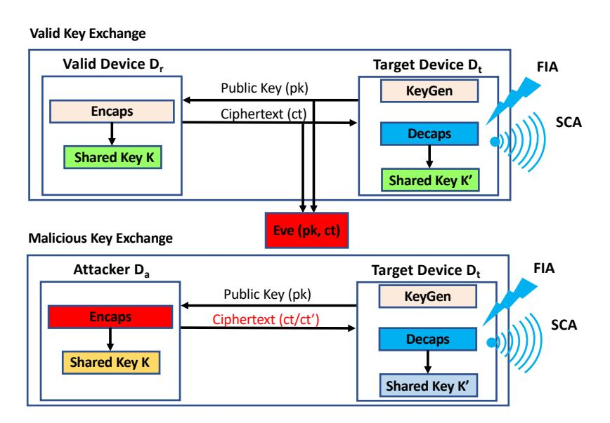

, ,

<span id="page-6-1"></span>Figure 3: Pictorial illustration of the attacker setting

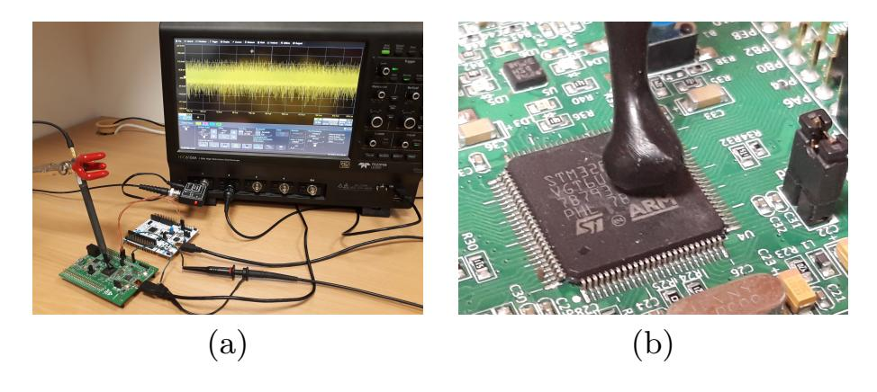

Figure 4: Experimental Setup for SCA (a) SCA Setup (b) Zoomed-in view of EM-probe over the DUT

5.1.1 Two Phase Attack. All our side-channel attacks covered in this work are performed in two phases. The first is a pre-processing phase which involves building profiles/templates for different values of the message. The pre-processing phase has several advantages. Firstly, it only has to be done once for a given DUT and hence its cost is amortized over time when the same templates are used for multiple attacks. Since we are only building profiles for the message, it is agnostic to the lifetime of the public-private key pairs (static/nominally ephemeral/purely ephemeral). After the preprocessing phase, the second phase is the attack phase where the attacker queries the DUT with the attack ciphertexts ct'adapted from the target ciphertext ct and observes the corresponding side-channel traces. Subsequently, he utilizes the templates from the pre-processing phase and the attack traces to perform message recovery. Here the DUT utilizes the same public-private key pair that was utilized during key exchange with the legitimate device. For efficient attacks, the SNR of measured traces in the attack phase are desired to have a high SNR. Some common techniques to boost SNR involve employing high precision EM probes, hardware analog filters, advanced digital filtering, trace re-synchronization to remove jitter, averaging etc. The choice of noise reduction technique is completely platform dependent. For our experiment, we used averaging as an SNR boosting technique which has builtin support in modern oscilloscopes. Recall that the attacker can trigger the DUT  $(\mathcal{D}_t)$  to decapsulate arbitrarily any number of chosen ciphertexts (Sec.4.2), thus allowing averaging.

{7}------------------------------------------------

<span id="page-7-1"></span>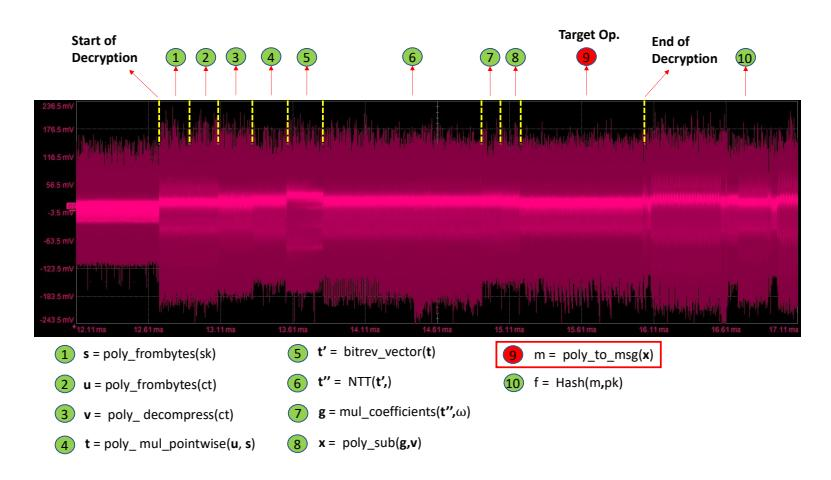

Figure 5: Visual inspection of the EM side-channel trace to locate the target poly\_to\_msg function within the decryption procedure. The different patterns are annotated against names of functions according to the implementation of NewHope512 in the pqm4 library.

In the following, the traces for attack phase are averaged 20 times to boost the SNR, unless otherwise specified.

## 5.2 Leakage Detection

We identified that the store instruction (STRB) in each iteration of the message decoding operation leaks information about intermediate values of the message bytes. The first step towards message recovery is to identify features on the side-channel trace corresponding to the update of the intermediate values of the message bytes in memory. We start by inspecting the EM side-channel trace of the decryption procedure of NewHope512 to locate the target message decoding operation. Refer Fig[.5](#page-7-1) for an EM trace from the decryption procedure captured on the oscilloscope. We can identify distinct patterns on the trace corresponding to different operations within the decryption procedure through simple visual inspection. This enables us to approximately locate the time window containing our target message decoding operation.

We narrow our focus towards detecting leakage corresponding to the first byte [0]. We use the Welch's -test to perform leakage detection. We construct two sets of ciphertexts, denoted as 0 and 1. The set 0 consists of *ℓ* ciphertexts for random messages with the first byte fixed to 0 (i.e) [0] = 0 while all other bytes [] for ∈ [1*,* 31] are chosen at random. The set 1 contains ciphertexts for random messages with [0] = 1 while all the other bytes are chosen at random. This ensures that for ciphertexts in set 0, [0*,* ] = 0 for ∈ [0*,* 7], while [0*,* ] = 1 for ∈ [0*,* 7] for ciphertexts in set 1 and this persistent 1 bit difference between the stored values can be detected through the EM side-channel.

We collect two sets of *ℓ* = 50 EM side-channel measurements corresponding to both ciphertext sets which we denote as 0 (for 0) and 1 (for 1). We normalize each trace and compute the Welch's -test between the two trace sets. Refer Fig[.6\(](#page-7-2)a) for the -test plot where we can observe eight distinct and evenly spaced out sets of peaks (greater than the pass-fail threshold ±4*.*5) which correspond to the time instances of storage of [0*,* ] for ∈ [0*,* 7]. It is also possible that with more traces in each set, the -test plot could have

<span id="page-7-2"></span>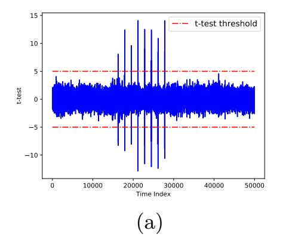

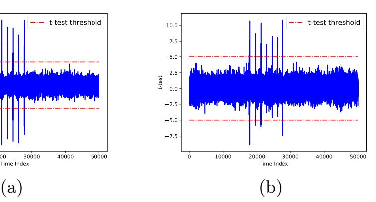

Figure 6: TVLA results for NewHope KEM (NewHope512) targeting [0] (a) 0 ([0] = 0) and 1 ([0] = 1) (b) 0 ([0] = 0) and 2 ([0] = 2)

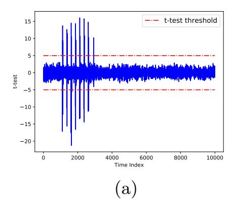

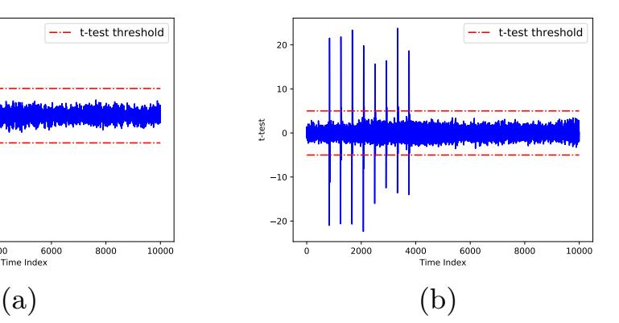

Figure 7: TVLA results between 0 ([0] = 0) and 1 ([0] = 1) for other schemes (a) Kyber KEM (Kyber512) (b) Round5 PKE (R5ND\_1KEM\_5d)

additional peaks corresponding to other operations. But, we only utilize the time instances corresponding to the storage of [0*,* ] for ∈ [0*,* 7] for all our analysis. For validation, we also repeated the same experiments with ciphertext sets 0 ([0] = 0) and 2 ([0] = 2) and the corresponding -test plot shows 7 distinct peaks (since [0*,* 0] = 0 for both sets), thus confirming our hypothesis of leakage from the update of message in memory (Refer Fig[.6\(](#page-7-2)b)). We also validated the presence of the same leakage in two other schemes - Kyber (Kyber512 variant) and Round5 (R5ND\_1KEM\_5d variant). We obtain a very similar -test plot for both these schemes which validates the presence of leakage due to the same Single\_Bit\_Update vulnerability. While the above experiments merely confirmed the presence of message leakage through the EM side-channel, we will subsequently demonstrate different profiling and extraction strategies to perform full message recovery.

## <span id="page-7-0"></span>5.3 Single Bit Leakage Attack

In this attack, we exploit leakage from update of the first message bit 0 to recover the full message. We thus construct templates corresponding to the update of the first bit in memory (i.e) update of [0*,* 0] in memory. These templates are built in the pre-processing phase from traces corresponding to 0 ([0] = 0) and 1 ([0] = 1) whose -test plot is shown in Fig[.6\(](#page-7-2)a). We only select those points whose *absolute -test value* is greater than a certain threshold  *ℎ* as our

{8}------------------------------------------------

set of Points of Interest (PoI)  $\mathcal{P}$ .  $Th_{sel}$  is also a parameter of the experimental setup and must be empirically determined. The set of PoI can be divided into eight subsets each denoted as  $\mathcal{P}(j)$  for  $j \in [0, 7]$  - each corresponding to update of m[0, j] in memory. We only choose the subset  $\mathcal{P}(0)$  corresponding to m[0, 0] to construct templates for the two possible values for m[0, 0] (i.e) 0 and 1. We build a reduced traces from both trace sets corresponding to  $\mathcal{P}(0)$  and the mean of these reduced trace sets are nothing but the reduced templates for m[0, 0] = 0 and m[0, 0] = 1, denoted as  $rt_0$  and  $rt_1$ .

Given a single trace tr to attack, we normalize the attack trace and obtain a reduced trace tr' corresponding to  $\mathcal{P}_0$ . Subsequently, we compute the sum-of-squared difference  $\Gamma_*$  of the trace with each reduced template as follows:

$$\Gamma_0 = (tr' - rt_0)^T \cdot (tr' - rt_0)$$
  
$$\Gamma_1 = (tr' - rt_1)^T \cdot (tr' - rt_1)$$

We can then classify m[0,0] as 0/1 based on the least sum-of-squared difference. Since  $m[0,0] = m_0$ , a single trace can thus be used to recover the first bit of the message  $m_0$ . Having recovered  $m_0$ , we can now exploit the Rotate\_Message property to construct ciphertexts ct'(i) = Rotr(ct, i) for  $i \in [0, 255]$  that decrypt to cyclic rotations of the original message m (i.e) m'(i) = Rotr(m, i), thereby rotating message bits at different positions to the first position, which can be recovered in the same manner. Thus, the complete message can be recovered one bit at a time.

5.3.1 Experimental Results. We performed experimental validation of our attack on the implementation of NewHope512 from the pqm4 library. 100 traces were used for the one-time pre-processing phase to build templates. In the attack phase, we could recover the complete message with 100% success rate in just 256 traces (i.e) 1 bit per trace. This attack is applicable to PKE/KEMs working with static public-private key pairs. It is also reasonable to assume that it can also work over PKE/KEMs working in a nominally ephemeral mode with key pairs cached for a short period of time (in the range of minutes), considering our low trace complexity (256 traces). However, this attack fails in a purely ephemeral mode. We henceforth refer to our single bit leakage attack as Single\_Bit\_SCA throughout the paper.

#### <span id="page-8-0"></span>5.4 Single Byte Leakage Attack

While our single bit leakage attack was only able to recover one bit per trace (targeting m[0,0]), we can extend the same approach to recover the complete byte m[0] by recovering all of its intermediate values m[0,j] for  $j \in [0,7]$  from the same trace. The one-time pre-processing phase of this attack simply involves collection of traces for all possible values for m[0,j] for  $j \in [0,7]$ . Thus, we collect 50 traces each corresponding to valid decapsulations of 256 ciphertext sets  $CT_k$  for  $k \in [0,255]$  where ciphertexts in set  $CT_k$  correspond to messages m with the first byte fixed to a value of k (i.e) m[0] = k while all the other message bytes are random. The attack phase involves utilizing traces from the pre-processing

phase to adaptively construct templates and recover the intermediate values m[0, j] for  $j \in \{0, 7\}$  in a greedy manner.

, ,

Given a trace tr for attack, m[0,0] can be recovered the same manner as our Single\_Bit\_SCA using trace sets  $\mathcal{T}_0$  and  $\mathcal{T}_1$ . Having recovered  $m[0,0] = b_0$ ,  $b_1 = m[0,1]$  can now take two possible values (i.e)  $b_1 = b_0$  or  $b_1 = b_0 + 2^1$ . We similarly repeat our Single\_Bit\_SCA between trace sets  $\mathcal{T}_{b_0}$  and  $\mathcal{T}_{b_1}$ . We can utilize traces corresponding to different values of min each set since multiple values of m have the same m[0,j]for  $j = \{0, 6\}$ . For example, both m = 3, m = 7, m = 15all correspond to m[0,1] = 3. The peak of the t-test plot observed at the location corresponding to storage of m[0,1]is chosen as the relevant PoI for m[0,1]. As stated earlier, we only consider those PoIs for our attack that are in the vicinity of the initial PoI set corresponding to the storage of m[0,j] for  $j \in \{0,7\}$  obtained from the t-test plot between  $\mathcal{T}_0$  and  $\mathcal{T}_1$ , in order to avoid any false positives. Once m[0,1]is recovered, all other intermediate values m[0, j] for  $j \in [2, 7]$ can be similarly recovered in a greedy manner to completely recover m[0] from a single trace since m[0,7] = m[0]. We can then utilize the Rotate\_Message property to rotate bytes at different locations to the first location and thus perform complete message recovery in 32 traces (i.e) one byte per trace.

5.4.1 Experimental Results. We performed practical experiments on the same NewHope512 implementation. The one-time pre-processing phase requires about 256\*50=12.8k traces to construct templates for all values of m[0]. The 256 templates are then used for message recovery in the attack phase. The attack phase only requires 32 traces for full message recovery with 100% success rate. Similar to the Single\_Bit\_SCA, this attack also works over PKE/KEMs working in the static mode and nominally ephemeral mode with keys cached for a short period of time (in the range of minutes). However, this attack is also not possible in a purely ephemeral mode. We henceforth refer to this attack as Single\_Byte\_SCA throughout the paper.

## <span id="page-8-1"></span>5.5 Pushing the limits of Single Byte Leakage Attack

Both the aforementioned attacks (Single\_Bit\_SCA and Single\_Byte\_SCA) do not work in a purely ephemeral mode since they require multiple traces during the attack phase. While our Single\_Byte\_SCA only built templates for m[0]. it is possible to similarly build templates for all other bytes m[j] for  $j \in [1,31]$ , which would enable to recover the complete message from just a single trace. This would however require 32 \* 256 \* 50 = 409.6k traces for the one-time preprocessing phase while only a *single* trace (with sufficiently high SNR) for full message recovery. This, thus enables to perform attacks over PKE/KEMs using ephemeral publicprivate key pairs. We henceforth refer to this single trace attack as Multi\_Byte\_SCA throughout the paper. However, the trace requirement for the one-time pre-processing phase of our Multi Byte SCA can be significantly reduced (from 819.2k) by profiling multiple message bytes at the same time. 

{9}------------------------------------------------

We can create ciphertext sets with multiple bytes of the message fixed to a particular value while the remaining bytes are random. For example, we can create ciphertexts for messages with m[j] = k for  $j \in [0, 15]$  with  $k \in [0, 256]$  while the other message bytes m[j] for  $j \in [16, 31]$  are chosen at random. This enables to profile the first 16 bytes at the same time and this improved pre-processing only requires 2\*256\*50 = 25.6k for the Multi\_Byte\_SCA attack and a single trace in the attack phase for full message recovery.

, ,

Given the ephemeral mode, the attacker has access to one and only one trace that was captured from the DUT when decapsulating a valid ciphertext from another legitimate device. This, thus prevents use of averaging as an SNR boosting technique and hence the attacker must resort to alternate noise reduction techniques to perform the Multi Byte SCA attack. Ephemeral secrets have also shown to prevent a wide range of SCA in classical PKE like RSA and ECC [7, 17]. The impact of reduced SNR due to low averaging on Single Bit SCA and Single\_Byte\_SCA is shown in Fig. 9. With no averaging, the attacker can only recover each byte (working with 256 classes) from the attack trace with 35% success but mounts quickly to over 90% in couple of traces. We also observed that distinguishing certain values of m[0, j] for  $j \in \{0, 7\}$  is more difficult than distinguishing certain other values. This is also confirmed by differing heights of the peaks in the the t-test plot in Fig.8(a)-(d) corresponding to different pairs of values obtained using 50 traces in each set. Thus, utilizing more traces in the pre-processing phase could result in creating of better templates leading to reduced number of traces to average in the attack-phase. From the t-test plots we can also see that distinguishing between m = 0 and m = 1 (Fig.8(a)) is much easier than other pairs of values and thus we also observed a high success rate of 98.5% for our Single\_Bit\_SCA without averaging and a 100% success rate using as low as 3 traces for averaging. This high success rate for Single\_Bit\_SCA without averaging, is later exploited to break the masking countermeasure in the following section.

#### <span id="page-9-0"></span>5.6 Attacking Masked Implementations

Masking is a well known countermeasure with provable security to protect cryptographic implementations against side-channel attacks. Among the several generic masking schemes proposed for Ring-LWE encryption schemes [20, 26, 27], the masking scheme of Oder *et al.* [20] is the only known masking scheme with a negligible decryption failure probability applicable for IND-CCA secure PKE/KEMs. We assess the possibility of exploiting the Single\_Bit\_Update vulnerability in side-channel protected implementations.

We briefly explain the masking scheme of Oder et al. [20] and in particular, cover only the relevant details of its decryption procedure that concerns our attack. The secret key polynomial  $\mathbf{s}$  is additively and randomly split into two shares  $\mathbf{s}'$  and  $\mathbf{s}''$  such that  $\mathbf{s} = \mathbf{s}' + \mathbf{s}'' \in R_q$ . Subsequently, two shares  $\mathbf{x}' = \mathbf{u} \times \mathbf{s}'$  and  $\mathbf{x}' = \mathbf{v} - \mathbf{u} \times \mathbf{s}''$  are computed and together decoded into m' and m'' such that  $m = m' \oplus m''$ . These message shares change for every run of the masked decryption/decapsulation procedure for the same ciphertext input. In the case

<span id="page-9-2"></span>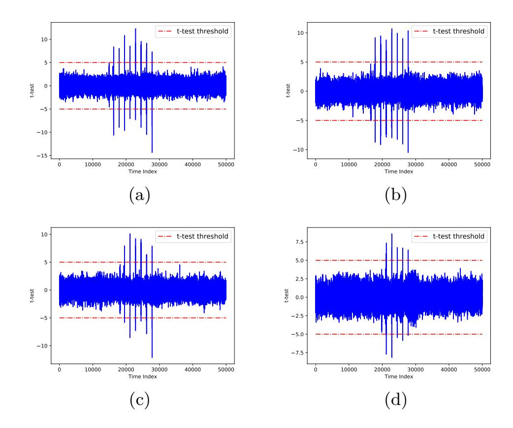

<span id="page-9-1"></span>Figure 8: t-test plot computed between traces from decoding different values of m (a) m = 0 and m = 1 (b) m = 0 and m = 2 (b) m = 2 and m = 6 (b) m = 6 and m = 14

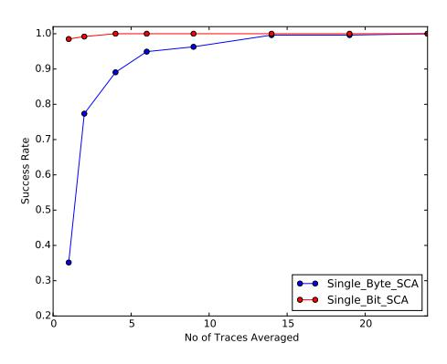

Figure 9: Success rate of message byte recovery in Single\_Byte\_SCA against number of averaged traces

of NewHope512, the pairs of coefficients  $(\mathbf{x}'[i], \mathbf{x}'[i+256])$  and  $(\mathbf{x}''[i], \mathbf{x}''[i+256])$  are together decoded into bits  $m_i'$  and  $m_i''$  respectively. We do not have access to a publicly available masked implementation of any of the target schemes and thus assume a scenario of the Single\_Bit\_Update vulnerability present in the masked implementation of NewHope512 such that individual message shares m' and m'' are updated one bit at a time. For our experiments, we tweak the message decoding function into computing another dummy byte array m'' that acts as the second message share updated one bit at a time. Thus, we have a pair of store instructions updating single bits of the shares at different time instances. Much like the ephemeral mode, averaging cannot be done due to use of random masks. Thus, the results presented in this section are for non-averaged measurements.

5.6.1 Clustering-based Attack Methodology. In the onetime pre-processing phase, we identify features on the trace corresponding to the first bit update of both shares (i.e) 

{10}------------------------------------------------

update of m'[0,0] and m''[0,0] in memory and subsequently build reduced templates for the same. Since the message shares are random, we cannot utilize a t-test based approach for leakage detection and hence propose a new clustering based approach for leakage detection. We create L valid ciphertexts  $ct_j$  for  $j \in [0, L-1]$  for messages with m[0] = 1 while all its other bytes are random. This will ensure that the first bit of the message shares  $m'_0$  and  $m''_0$  are always different since  $m'_0 \oplus m''_0 = 1$ . Moreover, the choice of message also induces a constant 1-bit difference between the intermediate values of the first byte of the shares (i.e) m'[0,j] and m''[0,j] for  $j \in [0,7]$ .

Let the traces obtained for decapsulation of the chosen ciphertexts be denoted as  $tr_j$  for  $j \in [0, L-1]$ . We can view the trace set as a matrix of dimension  $(L \times M)$  where M is the number of samples in each trace. We perform a simple 2-class k-means clustering of each individual column of the matrix (i.e)  $col_i$  for  $i \in [0, M-1]$ , to obtain an equally sized classification matrix cr. Since m'[0,0] and m''[0,0]complement each other, our hypothesis is that there were will be at least two columns of tr that are classified exactly opposite to each other (i.e) two points on the same trace that are classified into the opposite classes across all L traces. We thus perform a pairwise comparison of all M columns of the clustering matrix cr to identify those pairs that have been clustered exactly opposite to one-another or atleast nearly exact. To reduce the complexity of pairwise comparison, the attacker can choose a smaller window if he/she has an approximate knowledge of the interval separating the time instances. This is possible especially since both m'[0,0] and m''[0,0] are updated immediately one after another. This approach may lead to a lot of false positives (i.e) random pair of columns which have exactly opposite clustering. Thus, when a match is obtained say for  $col_i$  and  $col_j$ , we partition the trace set tr into two sets based on the clustering of  $col_i$ or  $col_i$  and computes the Welch's t-test. When clustered correctly according to m'[0,0] or m''[0,0], we should ideal be able to see two tall and close peaks corresponding to m'[0,0]and m''[0,0] and monotonically diminishing pairs of peaks for the subsequent intermediate values of the shares since they also maintain a 1-bit difference in the LSB, however with added noise from the other bits resulting in lower peaks.

Please refer to Fig.10(a) for the t-test plot when correctly partitioned according to the column corresponding to m'[0,0] or m''[0,0]. Please refer Fig.10(b)-(d) for t-test plots when wrongly clustered. Thus, a simple visual inspection of the plots can easily help identify the correct clustering. Based on the correct t-test plot shown in Fig.10(a), we can create two reduced templates for m'[0,0] and m''[0,0] using the first two peaks respectively, which can subsequently be utilized to recover the first bit of each shares from a given side-channel trace. In the attack phase, one can utilize the same technique used in the Single\_Bit\_SCA to individually recover the first bits of the message shares m' and m''. Subsequently, the attacker can utilize the Rotate\_Message property to recover the other bits of both the shares in a similar manner to

<span id="page-10-0"></span>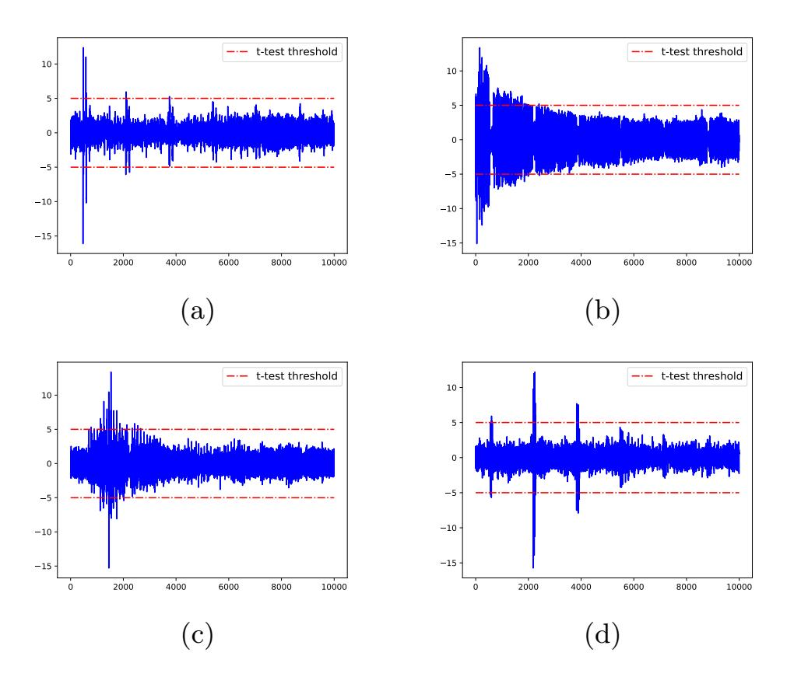

,

Figure 10: (a) t-test plot corresponding to correct partitioning of traces from the masked decoding procedure, (b)-(d) t-test plot corresponding to incorrect and random partitioning of traces from the masked decoding procedure

recover the complete message in just 256 traces (i.e) 1 bit per trace.

5.6.2 Experimental Results. For our experiments, we utilized 100 non-averaged traces for the one-time pre-processing phase. We cannot use averaging to boost the SNR over masked implementations due to use of random shares. Our attack works with a success rate of 99% in recovering the complete message. We can repeat the attack multiple times and use majority voting to increase the success rate to 100%. We refer to this as the Masked Single Bit SCA attack throughout this paper. We reiterate that we do not perform our attack on an actual masked implementation, but merely investigate techniques to access the possibility of exploiting the Single\_Bit\_Update vulnerability by tweaking the existing unprotected implementation to create a scenario similar to a masked implementation. However, we have shown significant evidence through our attacks that this vulnerability can potentially be exploited to perform message recovery in side-channel protected implementations.

### 6 FAULT-BASED ATTACKS

In this section, we show that the Single\_Bit\_Update vulnerability can also be exploited using FIA as well as combined SCA and FIA. We utilize NewHope512 for our experiments, while the same can be easily adapted to other schemes such as Kyber, Saber, Round5 and LAC.

#### 6.1 Fault Vulnerability

Since the message m within the decryption procedure is updated one bit at a time in each iteration, it is possible to skip the update of individual bits of the message while leaving the other bits unchanged. We investigate the effect of skipping

{11}------------------------------------------------

the update of the first bit  $m_0$ . If  $m_0 = 0$ , then skipping its update does not have any effect since  $m_0$  is initialized to 0. However if  $m_0 = 1$ , then skipping its update results in the faulty message  $\hat{m} = \mathsf{Flip}(m,0)$ . This is similar to a safe-error scenario encountered in RSA and ECC based crypto-systems where a targeted fault induces a faulty computation depending on value of the corresponding bit of the secret key [10]. In our case, if  $m_0 = 1$ , the injected fault will result in a decapsulation failure but if  $m_0 = 0$ , the decapsulation still succeeds upon fault injection. Thus, the result of the faulted decapsulation procedure can be used to recover  $m_0$ . Similarly, if we can identify different time instances to fault the update of  $m_i$ for  $i \in [0, 255]$ , then the complete message can be recovered from the outputs of the faulted decapsulation procedures. However, profiling the device to identifying multiple time instances to inject targeted faults can be very cumbersome. Thus, it is more practical to utilize a *single* or at best *very* few time instances to inject targeted faults.

#### <span id="page-11-1"></span>6.2 Bug Identification in pqm4 Library

We identified a covert bug in the implementation of NewHope in the pqm4 library that can be exploited in some scenarios to perform message recovery using faults targeting a single time instance. Referring to the IND-CCA secure decapsulation procedure in Alg.2, if the ciphertext check is passed, the shared secret  $K = \mathcal{H}(r', ct)$  where  $r' = \mathcal{G}(m', pk)$  (line 12). Otherwise,  $K = \mathcal{H}(z, ct)$  where z is a random secret, part of the secret key (line 15). In the NewHope implementation, both r' and z are stored as a byte arrays and r' is replaced by z if the ciphertext check fails. We identified that this replacement is not done correctly and that several bits of r'still remain in place upon a failure of the ciphertext check. We denote this erroneous component as r''. Due to the presence of this bug, the shared secret key K in case of an invalid ciphertext (i.e)  $K = \mathcal{H}(r'', ct)$  still depends upon several bits of r'. If  $m_0 = 0$ , faulting  $m_0$  neither induces a change in r' nor K. However if  $m_0 = 1$ , the resulting r' changes upon faulting  $m_0$  thus also changing the shared secret K. This is in contrary to a correct implementation where the shared secret K for an invalid ciphertext is fixed and does not change upon faulting the message. If we have the ability to know if the shared secret changed upon faulting  $m_0$ , then  $m_0$  can be easily recovered in two executions (i.e) one correct and one faulty. If the shared secret of both executions are the same, then  $m_0 = 0$ , else  $m_0 = 1$ . Then, the Rotate\_Message property can be exploited to recover the complete message one bit at a time in just 512 decapsulations. We refer to this attack as the Single Bit Bug Exploit FIA throughout the paper.

This ability to detect the change in shared secret depends upon the way the higher level security protocol manages failed decapsulations. In case of TLS 1.2 or TLS 1.3, PKE/KEMs are only used to arrive at the pre-master secret. Finally, the master secret is computed by hashing the pre-master secret using random values from both the parties (i.e) server\_random and client\_random. Thus in such a scenario, it is not possible to extract any information about change in the pre-master

secret [8]. However, in scenarios where the DUT can be triggered to encrypt/authenticate a static message m using the shared secret K, the change in shared secret can be detected from the resulting ciphertext/tag. This bug does not affect correctness of the scheme and is only encountered during failed decapsulations. Hence, this bug is very hard to detect and could potentially be placed as hidden backdoors in cryptographic implementations to enable easy key or message recovery.

6.2.1 Responsible Disclosure. We have reported the bug to the pqm4 team and the bug was immediately acknowledged and corrected in the NewHope implementation. This bug is only present in the implementation of NewHope and is not present in implementation of any other scheme in the pqm4 library. Please refer https://github.com/mupq/pqm4/ issues/132 for more details on the reported bug in the pqm4 library. While we show the bug in the implementation of NewHope512 can be exploited using fault injection targeting a single time instance, the same attack cannot be performed on a semantically correct implementation as the attacker does not gain any information from the result of the faulted decapsulations. However in the following discussion, we show that additional side-channel information (SCA) can be used as an oracle to detect changes due to the injected fault which can result in full message recovery.

#### <span id="page-11-0"></span>6.3 Combined SCA & FIA Methodology

Referring to the Alg.2 for the IND-CCA secure decapsulation procedure, we observe that the output of decryption is actually utilized in subsequent operations within the decapsulation procedure. In schemes such as NewHope KEM, Kyber KEM, Saber KEM and variants of Round5 (Round5(NE)) which do not use error correcting codes (ECCs), the decryption output is hashed with the public key (i.e)  $\mathcal{G}(m, pk)$  (line 9). However, in schemes such as LAC and variants of Round5 (Round5(E)) which utilize ECCs, the decryption output is decoded (line 4) to retrieve the message. We hypothesize that side-channel information from these operations can provide information about the fault induced on the decryption output. Please refer Fig.11 for a pictorial illustration of the combined SCA & FIA attack.

<span id="page-11-2"></span>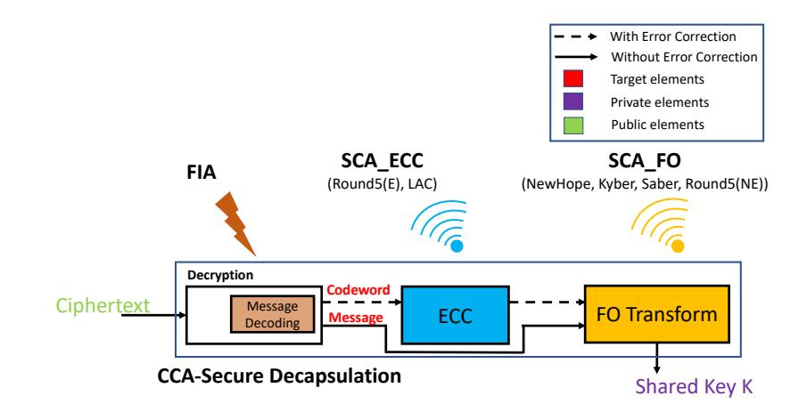

Figure 11: Pictorial illustration of our combined SCA & FIA

For a given ciphertext ct for NewHope512, if  $m_0 = 1$ , the side channel trace from  $\mathcal{G}(\hat{m}, pk)$  for  $\hat{m} = \mathsf{Flip}(m, 0)$  will be

{12}------------------------------------------------

<span id="page-12-0"></span>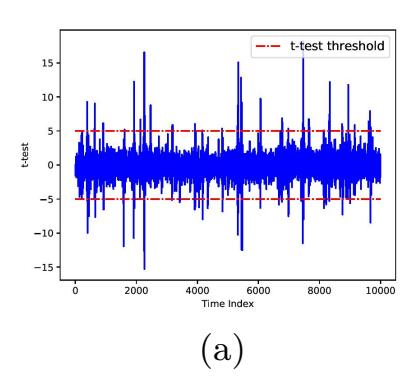

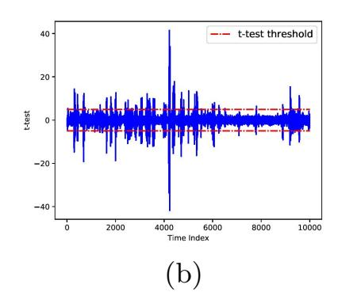

Figure 12: t-test plot between side-channel traces for decryption outputs that differ by a single bit obtained from (a) Hash function in NewHope KEM (NewHope512) (b) XEf decoding procedure in Round5 PKE (R5ND\_1KEM\_5d)

different from that of the original message m (i.e)  $\mathcal{G}(m, pk)$ . However, if  $m_0 = 0$ , the side-channel trace for the faulty execution will be the same as one from a correct execution. Thus, detecting this change in the side-channel trace can enable recovery of  $m_0$ . While this detection can be performed using several techniques, we resort to using the same Welch's t-test based reduced template approach. We utilize the Bit\_Flip property to construct a modified ciphertext  $c\bar{t} = \text{Flip}(ct,0)$  from the target ciphertext  $c\bar{t}$ , which decrypts to  $\bar{m} = \text{Flip}(m,0)$  whose first bit is flipped compared to m. The diffusion property of the hash function ensures that the computations are significantly different for m and  $\bar{m}$ . We collect two trace sets (25 traces each) from repeated executions of the hashing operation  $\mathcal{G}$  denoted as  $tr_{(m)}$  and  $tr_{(\bar{m})}$  respectively, whose t-test plot is shown in Fig.12(a).

We utilize the various peaks in the t-test plot to create reduced templates from the trace sets, denoted as  $rt_{(m)}$  and  $rt_{(\bar{m})}$ . We also performed similar experiments over Round5 PKE (R5ND\_1KEM\_5d variant) to detect single bit change in the decryption output from side-channel traces of its XEf error correcting procedure [5]. We targeted a particular majority logic operation within the decoding procedure, similar to the prior work of Ravi  $et\ al.\ [24]$  who utilized side-channel traces from the same operation to differentiate between valid and faulty codewords. Please refer Fig.12(b) for the t-test plot obtained for traces from decoding two random XEf codewords of Round5 that differ by a single bit. The high peaks in the t-test plot reveal the presence of multiple PoIs that can be used to easily distinguish the two computations.

We trigger the DUT into decapsulating the ciphertext ct and inject targeted faults to skip the update of  $m_0$ . Simultaneously, we capture side-channel traces  $tr_{(\hat{m})}$  from the hashing operation  $\mathcal{G}(\hat{m}, pk)$ . Its reduced trace denoted as  $rt_{(\hat{m})}$  is compared with the reduced templates  $rt_{(m)}$  and  $rt_{(\bar{m})}$ . If  $rt_{(\hat{m})}$  is classified as  $rt_{(m)}$ , there is no effect due to the injected fault and hence  $m_0 = 0$ . However, if  $rt_{(\hat{m})}$  is classified as  $rt_{(\bar{m})}$ , then  $m_0$  is flipped due to the injected fault and thus  $m_0 = 1$ . Thus, recovery of  $m_0$  can be divided into two phases. The first pre-processing phase involves building templates for m and  $\bar{m}$  while the attack phase involves fault injection yielding  $\hat{m}$  and utilizing the side-channel templates to classify  $\hat{m}$  as

m or  $\bar{m}$  to recover  $m_0$ . Unlike our SCA techniques, the preprocessing phase requires knowledge of the ciphertext ct and hence is not a one-time offline process. Having recovered  $m_0$ , we can exploit the Rotate\_Message property to construct ciphertexts  $ct'_i = \text{Rotr}(ct, i)$  for  $i \in [0, 255]$  which correspond to cyclic rotations of the message m (i.e)  $m'_i = \text{Rotr}(m, i)$ . All the above steps can be repeated to recover  $m_{(256-i)}$  and thus the complete message one bit at a time.

, ,

6.3.1 Experimental Setup. We performed experimental validation of our attack on the NewHope512 implementation. We first provide details of our FIA setup to perform Electromagnetic Fault Injection (EMFI). Please refer Fig.13 for our EMFI setup. It consists of a pulse generator that can generate high voltage pulses (upto 200 v) with very low rise times (<4ns). A controller software on the laptop synchronizes the operation of the EM pulse generator and DUT through serial communication. The pulse generator is directly triggered by an external trigger signal from the DUT. The EM pulse injector is a customized hand-made EM probe designed as a simple loop antenna. Refer Figure 14(a)-(b) for the EM probe used for our experiments. Our SCA setup for the combined attack is already described in Sec. 5.1, with averaging disabled. Our combined attack requires to simultaneously place both the SCA and FIA probes on the chip (Refer Fig.14(c)) The FIA probe injects a single fault during the update of  $m_0$ while the SCA probe captures traces from the end of the hash computation, both of which are sufficiently spaced out in time. Both the probes are also placed at different locations on the chip and thus the FIA probe does not affect the captured EM measurements.

<span id="page-12-1"></span>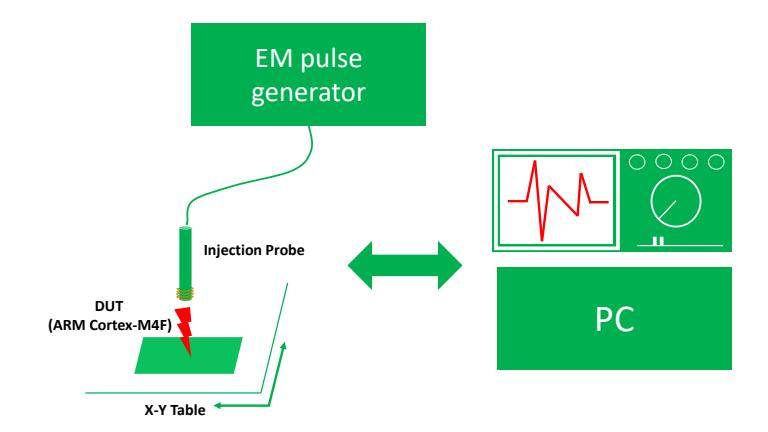

Figure 13: Experimental setup for the fault injection

<span id="page-12-2"></span>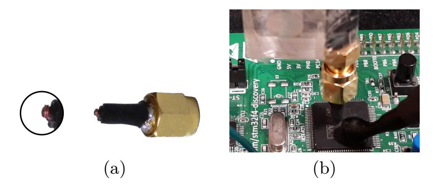

Figure 14: (a) Handmade flat tip EM injection probe (b) Both SCA and FIA probes placed over the DUT

{13}------------------------------------------------

6.3.2 Experimental Results. The attack is enabled by the widely popular instruction skip attack which alters the control flow of the algorithm execution. We skip the update of 0 by targeting the store instruction that stores [0*,* 0] in memory (line 10 in Fig[.2\)](#page-5-0) in the first iteration. However, performing targeted fault injection requires precise identification of two parameters - (1) location to fault and (2) time to fault. We utilize the leakage detection procedure of our Single\_Bit\_SCA attack to narrow down to a time window around the PoI corresponding to the update of [0*,* 0] in memory. We scanned the entire top surface of the chip while varying the EMFI parameters - voltage and pulse width. We successfully identified a sweet spot where we could reliably skip the first bit update with a high repeatability of about 95%. We can simply inject multiple faults over repeated executions to increase the confidence.

We utilized 50 traces for the pre-processing phase and 5 faulty executions during the attack phase for majority voting to recover 0 with 100% success rate. Thus, we recovered the complete message using 50 \* 256 = 12*.*8 traces for the pre-processing phase and 5 \* 256 = 1*.*28 traces for the attack phase, thus amounting to a total of 14*.*02 traces for full message recovery. The trace complexity depends on the SNR of SCA traces and fault repeatability. In the bast case, a single trace with high SNR can be used as a template and faults achieved with 100% repeatability resulting in full message recovery with 2 \* 256 = 512 traces for the pre-processing phase and 1 \* 256 = 256 traces for the attack phase, amounting to a total of 768 attack queries for full message recovery. To the best of our knowledge, we present the first EM based combined message SCA & FIA attack on lattice-based PKE/KEMs. We henceforth refer to this attack as the Single\_Bit\_Combined\_SCA\_FIA.

## 7 MITIGATION

Since all the attacks presented in this paper exploit the reported Single\_Bit\_Update vulnerability in different way, we can recommend the following mitigation approaches:

- ∙ Random Shuffling: Shuffling the order of the single bit updates of the message using well known shuffling techniques such as Fisher-Yates algorithm [\[11\]](#page-13-14) can provide sufficient protection against all attacks presented in this paper.
- ∙ Less Frequent Updates: The implementation of the message decoding function can be modified to withhold the message bits in the registers so that only byte updates of the message are performed instead of bit updates. This countermeasure however can only mitigate our attacks, as more sophisticated attacks possibly targeting the arithmetic operations within the message decoding function can be performed for message recovery.
- ∙ Use of Vectorized Instructions: Several embedded platforms including the ARM Cortex-M4 microcontroller support vectorized arithmetic, load and store instructions. Thus, multiple bits of the message can

be decoded simultaneously which can effectively mitigate proposed attacks.

## 8 CONCLUSION

In this paper, we identified a generic vulnerability in the message decoding procedure, a fundamental kernel used in latticebased public-key encryption and encapsulation schemes. We showed how the vulnerability could be exploited to leak information about the individual message bits through a range of side-channel, fault injection, and their combined attacks. We experimentally validated the attack techniques on implementations taken from the open-source *pqm4* library and proposed potential countermeasures.

## REFERENCES

- <span id="page-13-1"></span>[1] 2016. The transport layer security (tls) protocol version 1.3 (May 2016). [https://tools.ietf.org/html/draft-ietf-tls-tls13-13.](https://tools.ietf.org/html/draft-ietf-tls-tls13-13) (2016).
- <span id="page-13-6"></span>[2] Erdem Alkim, Roberto Avanzi, Joppe W. Bos, Leo Ducas, Antonio de la Piedra, Thomas Poppelmann, Peter Schwabe, and Douglas Stebila. 2019. NewHope: Algorithm Specifications And Supporting Documentation. *Submission to the NIST post-quantum project* (2019).
- <span id="page-13-2"></span>[3] Dorian Amiet, Andreas Curiger, Lukas Leuenberger, and Paul Zbinden. 2020. Defeating NewHope with a Single Trace. In *International Conference on Post-Quantum Cryptography*. Springer, 189–205.
- <span id="page-13-7"></span>[4] Roberto Avanzi, Joppe Bos, Leo Ducas, Eike Kiltz, Tancrede Lepoint, Vadim Lyubashevsky, John Schanck, Peter Schwabe, Gregor Seiler, and Damien Stehlé. 2019. Kyber: Algorithm Specifications And Supporting Documentation. *Submission to the NIST post-quantum project* (2019).
- <span id="page-13-13"></span>[5] Hayo Baan, Sauvik Bhattacharya, Scott Fluhrer, Oscar Garcia-Morchon Garcia-Morchon, Thijs Laarhoven, Rachel Player, Ronald Rietman, Markku-Juhani O. Saarinen, , Ludo Tolhuizen, Jos'e Luis Torre-Arce, and Zhenfei Zhang. 2020. Round5: Algorithm Specifications And Supporting Documentation. *Submission to the NIST post-quantum project* (2020).
- <span id="page-13-4"></span>[6] Abhishek Banerjee, Chris Peikert, and Alon Rosen. 2012. Pseudorandom functions and lattices. In *Annual International Conference on the Theory and Applications of Cryptographic Techniques*. Springer, 719–737.
- <span id="page-13-10"></span>[7] Naomi Benger, Joop Van de Pol, Nigel P Smart, and Yuval Yarom. 2014. "Ooh Aah... Just a Little Bit": A small amount of side channel can go a long way. In *International Workshop on Cryptographic Hardware and Embedded Systems*. Springer, 75–92.
- <span id="page-13-12"></span>[8] M Campagna and E Crockett. 2019. BIKE and SIKE Hybrid Key Exchange Cipher Suites for Transport Layer Security (TLS). (2019).
- <span id="page-13-0"></span>[9] Jan-Pieter D'Anvers, Marcel Tiepelt, Frederik Vercauteren, and Ingrid Verbauwhede. 2019. Timing attacks on Error Correcting Codes in Post-Quantum Secure Schemes. *IACR Cryptology ePrint Archive* 2019 (2019), 292.
- <span id="page-13-11"></span>[10] Junfeng Fan and Ingrid Verbauwhede. 2012. An updated survey on secure ECC implementations: Attacks, countermeasures and cost. In *Cryptography and Security: From Theory to Applications*. Springer, 265–282.
- <span id="page-13-14"></span>[11] Ronald A Fisher and Frank Yates. 1938. *Statistical tables: For biological, agricultural and medical research*. Oliver and Boyd.
- <span id="page-13-5"></span>[12] Eiichiro Fujisaki and Tatsuaki Okamoto. 1999. Secure integration of asymmetric and symmetric encryption schemes. In *Annual International Cryptology Conference*. Springer, 537–554.
- <span id="page-13-9"></span>[13] Benedikt Gierlichs, Kerstin Lemke-Rust, and Christof Paar. 2006. Templates vs. stochastic methods. In *International Workshop on Cryptographic Hardware and Embedded Systems*. Springer, 15–29.
- <span id="page-13-8"></span>[14] Benjamin Jun Gilbert Goodwill, Josh Jaffe, Pankaj Rohatgi, et al. 2011. A testing methodology for side-channel resistance validation. In *NIST non-invasive attack testing workshop*, Vol. 7. 115–136.
- <span id="page-13-3"></span>[15] Matthias J. Kannwischer, Joost Rijneveld, Peter Schwabe, and Ko Stoffelen. 2020. PQM4: Post-quantum crypto library for the ARM Cortex-M4. (2020). [https://github.com/mupq/pqm4.](https://github.com/mupq/pqm4)

{14}------------------------------------------------

- <span id="page-14-6"></span>[16] Vadim Lyubashevsky, Chris Peikert, and Oded Regev. 2010. On ideal lattices and learning with errors over rings. In *Annual International Conference on the Theory and Applications of Cryptographic Techniques*. Springer, 1–23.
- <span id="page-14-8"></span>[17] Erick Nascimento, Łukasz Chmielewski, David Oswald, and Peter Schwabe. 2016. Attacking embedded ECC implementations through cmov side channels. In *International Conference on Selected Areas in Cryptography*. Springer, 99–119.
- <span id="page-14-0"></span>[18] NIST. 2016. Submission Requirements and Evaluation Criteria for the Post-Quantum Cryptography Standardization Process. [https://csrc.nist.gov/csrc/](https://csrc.nist.gov/csrc/media/projects/post-quantum-cryptography/documents/call-for-proposals-final-dec-2016.pdf) [media/projects/post-quantum-cryptography/documents/](https://csrc.nist.gov/csrc/media/projects/post-quantum-cryptography/documents/call-for-proposals-final-dec-2016.pdf) [call-for-proposals-final-dec-2016.pdf.](https://csrc.nist.gov/csrc/media/projects/post-quantum-cryptography/documents/call-for-proposals-final-dec-2016.pdf) (2016).
- <span id="page-14-1"></span>[19] NIST. 2019. Post Quantum Cryptography - Round 2 Submissions. [https://csrc.nist.gov/Projects/Post-Quantum-Cryptography/](https://csrc.nist.gov/Projects/Post-Quantum-Cryptography/Round-2-Submissions/) [Round-2-Submissions/.](https://csrc.nist.gov/Projects/Post-Quantum-Cryptography/Round-2-Submissions/) (2019).
- <span id="page-14-9"></span>[20] Tobias Oder, Tobias Schneider, Thomas Pöppelmann, and Tim Güneysu. 2018. Practical CCA2-secure and masked ring-LWE implementation. *IACR Transactions on Cryptographic Hardware and Embedded Systems* 2018, 1 (2018), 142–174.
- <span id="page-14-2"></span>[21] Robert Primas, Peter Pessl, and Stefan Mangard. 2017. Single-Trace Side-Channel Attacks on Masked Lattice-Based Encryption. In *Cryptographic Hardware and Embedded Systems – CHES 2017*, Wieland Fischer and Naofumi Homma (Eds.). Springer International Publishing, Cham, 513–533.
- <span id="page-14-7"></span>[22] Prasanna Ravi, Bernhard Jungk, Dirmanto Jap, Zakaria Najm, and Shivam Bhasin. 2018. Feature Selection Methods for Non-Profiled Side-Channel Attacks on ECC. In *2018 IEEE 23rd International Conference on Digital Signal Processing (DSP)*. IEEE, 1–5.
- <span id="page-14-4"></span>[23] Prasanna Ravi, Debapriya Basu Roy, Shivam Bhasin, Anupam Chattopadhyay, and Debdeep Mukhopadhyay. 2019. Number "Not Used" Once-Practical Fault Attack on pqm4 Implementations of NIST Candidates. In *International Workshop on Constructive Side-Channel Analysis and Secure Design*. Springer, 232–250.
- <span id="page-14-3"></span>[24] Prasanna Ravi, Sujoy Sinha Roy, Anupam Chattopadhyay, and Shivam Bhasin. 2019. Generic Side-channel attacks on CCAsecure lattice-based PKE and KEM schemes. *IACR ePrint Archive* (2019), 948.
- <span id="page-14-5"></span>[25] Oded Regev. 2009. On lattices, learning with errors, random linear codes, and cryptography. *Journal of the ACM (JACM)* 56, 6 (2009), 34.
- <span id="page-14-10"></span>[26] Oscar Reparaz, Ruan de Clercq, Sujoy Sinha Roy, Frederik Vercauteren, and Ingrid Verbauwhede. 2016. Additively Homomorphic Ring-LWE Masking. In *Post-Quantum Cryptography - 7th International Workshop, PQCrypto 2016, Fukuoka, Japan, February 24-26, 2016, Proceedings*. 233–244. [https:](https://doi.org/10.1007/978-3-319-29360-8_15) [//doi.org/10.1007/978-3-319-29360-8\\_15](https://doi.org/10.1007/978-3-319-29360-8_15)
- <span id="page-14-11"></span>[27] Oscar Reparaz, Sujoy Sinha Roy, Frederik Vercauteren, and Ingrid Verbauwhede. 2015. A Masked Ring-LWE Implementation. In *Cryptographic Hardware and Embedded Systems - CHES 2015 - 17th International Workshop, Saint-Malo, France, September 13-16, 2015, Proceedings*. 683–702. [https://doi.org/10.1007/](https://doi.org/10.1007/978-3-662-48324-4_34) [978-3-662-48324-4\\_34](https://doi.org/10.1007/978-3-662-48324-4_34)