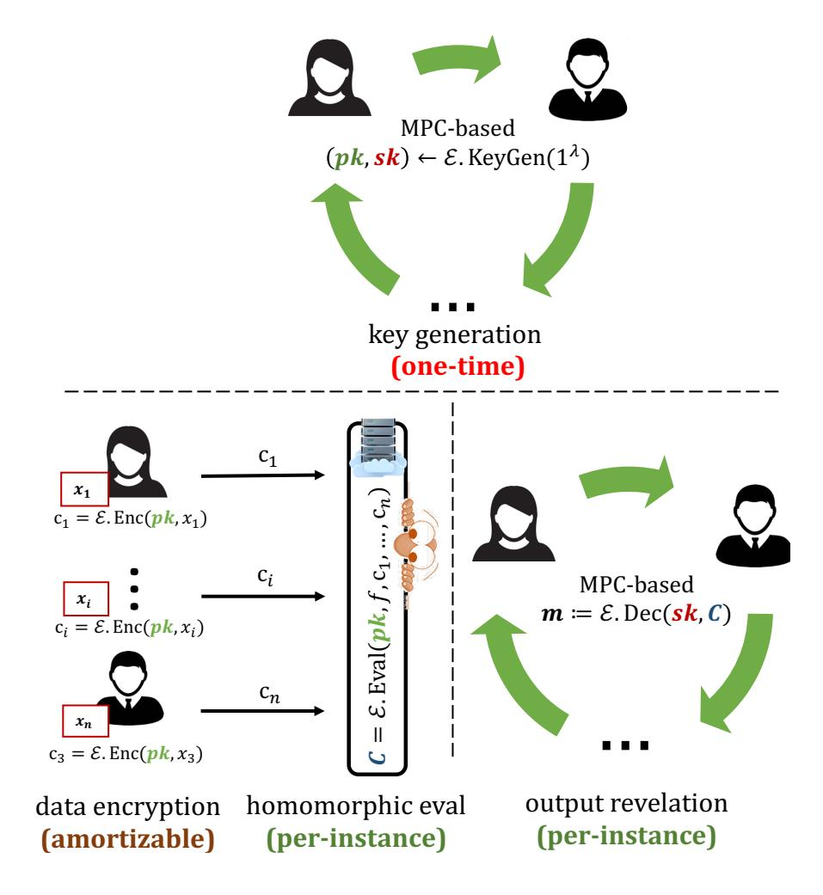
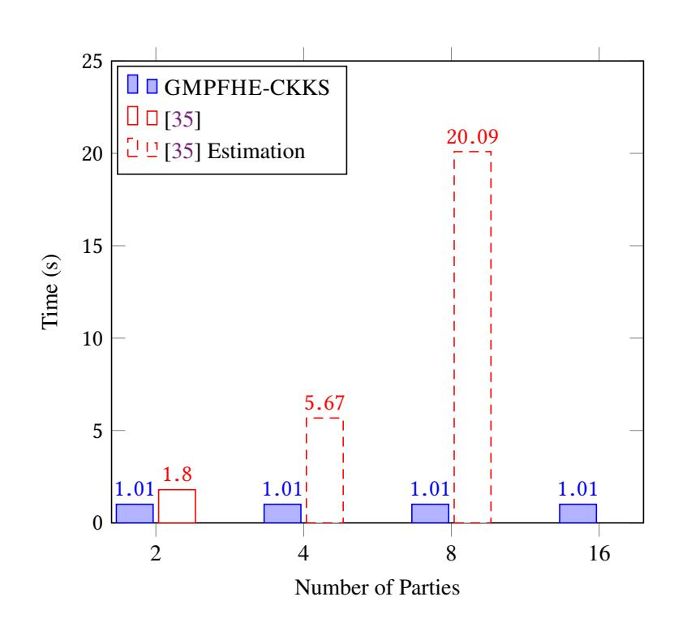

{0}------------------------------------------------

# Practical MPC+FHE with Applications in Secure Multi-Party Neural Network Evaluation

Ruiyu Zhu Changchang Ding Yan Huang Indiana University, Bloomington.

#### **ABSTRACT**

The theoretical idea of using FHE to realize MPC has been there for over a decade. Existing threshold (and multi-key) FHE schemes were constructed by modifying and analyzing a traditional single-key FHE in a case-by-case manner, thus technically highly-demanding. This work explores a new approach to build threshold FHE (thereby MPC schemes) through tailoring generic MPC protocols to the base FHE scheme while requiring no effort in FHE redesign. We applied our approach to two representative Ring-LWE-based FHE schemes: CKKS [37, 38] and GHS [54, 55], producing GMPFHE-CKKS and GMPFHE-GHS. We developed MPC protocols based on GMPFHE-CKKS and GMPFHE-GHS which are secure against any number of passive but colluding adversaries. The online cost of our MPC protocol is O(|C|), as opposed to  $O(|C| \cdot n^2)$  for existing MPC protocols, and our offline cost is independent of |C|. We experimentally show that the GMPFHE-CKKS-based MPC protocol offers unparalleled amortized performance on multi-party neural network evaluation.

#### 1 INTRODUCTION

Fully homomorphic encryption (FHE) is a promising technique that can address important security concerns in the business of outsourcing computation. Numerous FHE constructions and optimizations have been proposed and implemented [27, 30, 38, 41, 53]. Recent research prototypes showed that state-of-the-art FHE schemes can securely evaluate a multiplication in about 0.3–500 millisecond [37, 41] and de-noise a ciphertext through bootstrapping in 0.1–1 second [36, 41].

Traditional FHE schemes only allow computation on data encrypted with a single key, hence are not suitable to support computations involving encrypted data from multiple mutually-distrustful data owners each of whom hold its own key. To accommodate such uses, researchers have proposed the seminal concept of *multi-key homomorphic encryption* (MKHE), which allows homomorphic computation over data encrypted under multiple different keys, each generated by an individual data owner without interaction with others [70]. Despite the conceptual attractiveness, MKHE protocols also come with two main disadvantages:

(1) **Time/Space complexity.** The amount of work required to homomorphically evaluate an application circuit grows *polynomially* in the number of participating parties. For example, the MK-CKKS scheme by [35] and MK-TFHE scheme by [34] have a quasi-quadratic homomorphic evaluation procedure, while that of [67] costs even more (quasi-cubic). Even worse, the space complexity of these MKHE schemes grow super-linearly with the number of parties:  $\tilde{O}(k)$  for [35],  $\tilde{O}(k^2)$  for [34], and  $\tilde{O}(k^3)$  for [67] where k is the number of parties and  $\tilde{O}$  indicates that

- comparisons are done ignoring differences that are no more than poly-logarithmic factors. Obliviously, existing MKHE schemes cannot scale up with the number of participants due to their high time/space complexity.
- (2) **Design effort.** Upgrading a traditional single-key FHE to support multi-key requires case-by-case examination, novel modification, and formal security proofs, of a base single-key FHE. These expertise demanding jobs could only be reliably done by a very limited number of cryptographers specializing FHE design. Still, the multi-key feature may sometimes come at the cost of missing important optimizations such as packed ciphertext, leaving it less competitive for practical use [34].

In this work, we explore a new methodology to add multi-key feature to existing single-key FHE schemes without suffering from those drawbacks. Our approach (Figure 1) uses a traditional single-key FHE scheme  $\mathcal{E}$  in a *black-box* manner. The high-level idea is to let the data owners to jointly compute the  $\mathcal{E}$ .KeyGen algorithm using a *generic* MPC protocol. Note that this collaborative KeyGen protocol only needs to run one-time to set it up, hence its cost can easily be amortized over many instances of joint secure computation instances. As a result of this setup, the secret decryption key sk is secret-shared among all data owners while  $\mathcal{E}$ 's single public key pk (including both the part for encryption key and that for evaluation) is revealed.

When the secret data  $x_i$  is ready, each owner  $P_i$  can prepare its input by computing  $\mathcal{E}.\mathsf{Enc}(pk,x_i)$  where  $\mathcal{E}.\mathsf{Enc}$  is a traditional single-key FHE encryption algorithm. We note that unlike traditional MPC protocols, this input preparation work can also be amortized over many instances of secure computation as long as the inputs doesn't change.

Next, all the encrypted inputs will be sent to an untrusted cloud server, who will run the traditional  $\mathcal{E}$ . Eval algorithm, and output an encryption of  $f\left(\{x_i\}_{i=1}^n\right)$  for a target function f. Finally, the data owners will run an MPC protocol to securely compute  $\mathcal{E}$ . Dec and deliver  $f\left(\{x_i\}_{i=1}^n\right)$  to the desired receivers. These two are frequently executed steps that are run per-instance. We stress that since  $\mathcal{E}$  is used in an unmodified, black-box way, our approach requires zero design effort on the FHE side, and is able to inherit the same efficiency and optimization techniques applicable to  $\mathcal{E}$ . Eval.

Although this idea was suggested by Gentry [52], making it efficient enough for practical applications remains a challenging task. For example, a generic binary MPC implementation of the KeyGen algorithms of CKKS (or GHS, resp.) will require securely evaluating more than  $5 \times 10^{11}$  (or resp.  $5 \times 10^{14}$ ) AND gates and  $1.5 \times 10^{5}$  (or resp.  $3 \times 10^{4}$ ) layers (Appendix A). This is clearly beyond the reach of today's hardware/network support, no matter which MPC backend protocols are used. One may consider MPC protocols based on arithmetic circuits which can be more efficient for such tasks rich in algebraic operations. However, we note that secure comparisons

1

<span id="page-0-0"></span><sup>&</sup>lt;sup>1</sup>The numbers vary substantively depending on the security parameters, the application circuits being computed, and the exact FHE scheme being used.

{1}------------------------------------------------

<span id="page-1-0"></span>

Figure 1: Approach overview

seem inevitable in parts of the KeyGen and Dec such as sampling the secret keys and noises prescribed by the FHE scheme. For an MPC protocol supporting arbitrary number of parties with dishonest majority, although it is easy to realize comparison using binary circuits, it was unclear how to securely and efficiently convert between arithmetic and their corresponding binary encodings.

Threat Model. We restrict our attention to passive attackers. I.e., corrupted parties will run the protocol as specified. However, we don't limit the number of parties that can be corrupted, and all corrupted parties can collude, so they can form a more comprehensive view of the protocol execution in order to compromise security. A protocol secure in this threat model offers meaningful security guarantees in scenarios when all-but-one parties are infected by the same surreptitious virus which intends to steal information without interfering with protocol execution in order to remain undetected.

#### 1.1 Contributions

**Methodology.** In this paper, we revitalize an old idea by combining state-of-the-art generic MPC and FHE schemes. While FHE offers low communication and a secure and convenient way to use untrusted servers, it is easier for generic MPC protocols to scale with the number of parties. Our result is GMPFHE, a practically useful solution that provides the best of both worlds:

(1) GMPFHE can be regarded as one way of realizing multi-key FHE when the participants are known before running KeyGen. Comparing to existing MKHE protocols, our approach improves the time and space complexity of (the more frequently-run) Eval by factors of more than  $O(n^2)$  and O(n), respectively. Moreover, GMPFHE uses existing single-key FHE only as a black-box, requiring no extra effort on redesigning FHE.

(2) GMPFHE offers a scalable solution to MPC in both the number of parties and the size of target computation. Comparing to best existing MPC protocols, whose protocol cost is  $O(n^2|C|s')$ , GMPFHE only costs  $O(n^3ss' + |C|)$ , where s (s', resp.) is the computational security parameter of FHE (MPC, resp.) and |C| for application circuit size. Further, GMPFHE is constant-round and allows to delegate the expensive circuit-dependent computation to *untrusted* cloud servers (hence the work of each MPC participant can be independent of circuit size). This feature would be highly desirable for running MPC among resource-constrained IoT devices.

To realize GMPFHE, we propose novel methods for secure sampling of several types of distributions frequently used in lattice-based FHE (Section 4.1). We also propose a new secure method to convert  $\mathbb{Z}_p$ -shares of secrets into their  $\mathbb{Z}_q$ -shares for any p < q (Section 4.2), which are crucial in mixing binary and arithmetic circuits for optimized performance. These techniques can tolerate any number of passive (but colluding) adversaries and may be of independent interest.

**Implementation and Evaluation.** We applied our methodology to two state-of-the-art FHE schemes, CKKS [37, 38] and HELib's GHS [54] and implemented their KeyGen and Eval algorithms using a mixture of binary and arithmetic MPC protocols. They marks the first software implementation and experimental evaluation of a threshold FHE scheme. Experiments show that GMPFHE can run arithmetic approximate computation as well as exact circuit computation, and even bootstrappable HE.

We further demonstrated the potential advantages of GMPFHE-based MPC using two representative end-to-end applications: secure evaluations of a five-layer convolutional neural network and AES. The threshold CKKS-based MPC is particularly competitive in comparison with existing secure CNN protocols.

#### 1.2 Remarks

**Faster** Eval **vs. Slower** KeyGen. GMPFHE's KeyGen is more expensive than some existing MKHE schemes. But we stress that in most scenarios KeyGen is typically a one-time (or infrequent) procedure whose costs can be amortized across many secure evaluations. In contrast, the Eval procedure needs to run for every instance of computation. Thus, it pays to trade the cost of KeyGen for a quadratic saving in Eval. MPC evaluation of Dec is also needed per instance. But the result is typically very short and independent of circuit size. For some FHE schemes such as CKKS, secure evaluation of Dec actually turns out very efficient (see Table 5).

Compare Design Efforts. Although GMPFHE saves much effort in redesigning and proving a new secure MKHE scheme, it does require some effort on the MPC protocol design side. However, we argue that designing such MPC protocols may be relatively less demanding thanks to existing tools for building generic MPC protocols, along with the new techniques developed as a result of this work. We expect many of our ideas can be carried over to other Ring Learning with Error (RLWE)-based FHE schemes.

**Utility.** Unlike existing MKHE schemes, GMPFHE can't delay the answer to the question of "With whom is the MPC to be run?" since its KeyGen already requires interaction with those parties. However,

{2}------------------------------------------------

<span id="page-2-0"></span>

|             |                                         | Require CRS      | Allow   | delayed  | Per party        | complex          | Implemented?   |     |
|-------------|-----------------------------------------|------------------|---------|----------|------------------|------------------|----------------|-----|
| Protocol    | Threat model                            | or               | decis   | sion on  | KeyGen           | Eval             |                |     |
|             |                                         | trusted setup?   | Parties | Function | Time             | Time             | Space          |     |
| [58]        | Passive dishonest minority <sup>1</sup> | CRS              | No      | Yes      | O(n)             | O(1)             | O(1)           | No  |
| [22]        | Monotone access structure <sup>2</sup>  | Trusted<br>Setup | No      | Yes      | Trusted<br>Setup | O(1)             | O(1)           | No  |
| [35]        | Passive dishonest majority <sup>3</sup> | CRS              | Yes     | Yes      | O(1)             | $\tilde{O}(n^2)$ | $\tilde{O}(n)$ | Yes |
| GMPFHE-CKKS | Passive dishonest majority              | No               | No      | Yes      | $O(n^2)$         | O(1)             | O(1)           | Yes |

<sup>&</sup>lt;sup>1</sup> They also provided a protocol that achieve active security assuming the parties have access to an authenticated broadcast channel.

<sup>2</sup> Robust against malicious key share holders.

GMPFHE does allow delayed answer to the question of "What function will be jointly computed?".

**Security.** Computing KeyGen and Dec through a *semi-honest* MPC protocol may leak a secret key to malicious attackers. It is possible to upgrade GMPFHE to thwart malicious attacks, though the more challenging issue brought by active attacks would be to efficiently ensure faithful execution of the Eval algorithm. Some solutions to this issue were proposed in prior works on threshold FHE. But they seemed not implemented yet and only of theoretical interest by far.

Comparison with Threshold FHE. Existing threshold FHE protocols' Eval algorithms typically have the same asymptotic complexity as their base single-key FHEs. They are based on hard lattice problems and require more effort in FHE-specific redesign and proof work. No threshold FHE schemes were known to work with the two FHE schemes that we consider in this work. In addition, to our knowledge, no existing threshold FHE schemes were implemented, nor tested with an end-to-end application. In contrast, GMPFHE uses generic MPC and demands no change to the base FHE. Although GMPFHE has more rounds, the number of rounds doesn't depend on the target function and its input and output sizes. Most notably, we experimentally demonstrate that for some schemes such as CKKS, GMPFHE's roundtrip overhead is far from the bottleneck in practice.

Table 1 compares our work with three representative state-of-theart MKHE or threshold FHE protocols. Note that unlike GMPFHE, prior works also require either trusted setup or the common reference string (CRS) model, which is non-trivial to realize in a decentralized way without changing the threat model in some way.

# 1.3 Related Work

1.3.1 Multi-Key FHE. López-Alt, Tromer, and Vaikuntanathan introduced the seminal concept of MKHE and showed how to realize it based on a somewhat nonstandard Decisoinal Small Polynomial Ratio (DSPR) assumption [70]. They also gave a RLWE-based construction that only works for a logarithmic number of keys and circuit depth. Clear and McGoldrick [43] proposed the first multi-key FHE under well-established hardness of LWE in the standard

model based on the FHE of Gentry, Sahai, and Waters [56]. This construction was significantly simplified by Mukherjee and Wichs [76] and extended to construct a two-round MPC that allows a one-round distributed decryption of a multi-key ciphertext. Brakerski, Halevi, and Polychroniadou [28] constructed an LWE-based MKHE with a one-round distributed setup procedure, which allows them to build the first 3-round semi-malicious MPC protocol without setup from standard LWE, and a 4-round multi-party computation protocol in the plain model against a malicious adversary. Recently, Chen, Chillotti, and Song [34] generalized the efficiently bootstrappable FHE scheme of Chillotti et al. [39] to a multi-key FHE and provided experimental performance numbers of a homomorphic NAND gate with bootstrapping. In the same year, Chen et al. [35] designed multikey variants of BFV [25, 50] and CKKS [38] that support ciphertext packing. They demonstrated the first viable end-to-end application of MKHE through experiments of jointly evaluating a pre-trained convolutional neural network model by two parties.

As was first suggested and realized by López-Alt et al. [70], MKHE can be used to build on-the-fly MPC, in which the set of parties and the target function don't need to be fixed at the time when the inputs are being pre-processed/encrypted, but can be determined adaptively when the computation results are to be decrypted through a joint MPC protocol. The schemes of [43, 76] would require the parties to be decided before the homomorphic computation, or perform expensive "bootstrapping" step when data from new parties dynamically joins the computation, though the limitation was fixed in a subsequent work by Peikert and Shiehian [78]. The number of parties supported by the MKHE of [70] needs to be bounded a-priori by its fast ciphertext expansion, while this issue is alleviated by Brakerski and Perlman [29] through improving [76]. Their scheme has linear ciphertext expansion in the number of parties and supports multi-hop homomorphism.

1.3.2 Threshold FHE. In threshold FHE, the secret key is secret-shared among *n* parties, so that only a threshold of parties can use (without reconstructing) the key to jointly decrypt a ciphertext encrypted under the corresponding public key. Typically, these schemes may keep the Eval algorithms of their base FHE schemes

<sup>&</sup>lt;sup>3</sup> Running the KeyGen or Dec alone can be considered actively secure, but no discussion on active attacks related to homomorphic Eval.

{3}------------------------------------------------

unchanged, thus the cost of Eval can be independent of the number of parties.

Assuming approximate-GCD is hard, Myers, Sergi, and Shelat [77] proposed a threshold FHE scheme that allows for construction of an MPC protocol tolerating a minority set of malicious parties. Asharov et al. [14] provided a threshold version of the RLWE-based FHE scheme of BGV [26, 27, 30] and used it to build an MPC secure against any number of actively corrupted parties. Although theoretically attractive, their protocol didn't seem to offer practical performance benefits and was never implemented. Gordon, Liu and Shi [58] developed an LWE-based threshold FHE that allows to adapt "flexible" ciphertexts to the public keys of the non-aborting parties and used it to construct a 3-round MPC with guaranteed output delivery in the CRS model against a minority of semi-honest fail-stop adversaries. Jain, Rasmussen, and Sahai [63] gave the first construction of leveled threshold FHE for any access structure induced by a monotone boolean formula and applied it to build function secret sharing and distributed PRFs for the considered access structures. This threshold FHE design can also be combined with BHP [28] to construct a round-optimal MPC offering guaranteed output delivrey [15]. Boneh et al. [22] proposed the concept of universal thresholdizer and showed how to realize it using an LWE-based threshold FHE they developed. Applying the universal thresholdizer thus obtained to a lattice signature system, they obtained the first single-round threshold signature scheme from LWE.

1.3.3 Other Related Works. Choudhury et al. [42] proposed a (custom) distributed decryption protocol for a leveled HE variant of BGV to enable efficient multi-party bootstrapping. Mouchet, Troncoso-Pastoriza, and Hubaux [75] developed a distributed version of BFV [25, 50] by providing RLWE-based collaborative key generation, key switching, and key-switching protocols. However, the scheme was not proven secure without introducing some ad-hoc assumptions.

#### **2 PRELIMINARIES**

# 2.1 Fully Homomorphic Encryption

A homomorphic encryption scheme  $\mathcal{E}$  is a tuple of four efficient algorithms (KeyGen, Enc, Dec, Eval) over a plaintext space  $\mathcal{P}$ , where

- $(sk, pk) \leftarrow \text{KeyGen}(1^n)$  generates a pair of keys;
- $c \leftarrow \text{Enc}(pk, p)$  encrypts plaintext  $p \in \mathcal{P}$  using the public key pk;
- $p \leftarrow \text{Dec}(sk, c)$  decrypts ciphertext c using the secret key sk;
- $c' \leftarrow \text{Eval}(pk, f, c)$  produces ciphertext c' from the public key pk, a function f, and a ciphertext c.

 $\mathcal{E}$  is said to be *correct* with respect to function f if the following probability is negligible in n for all  $x \in \mathcal{P}$ :

$$\Pr\left( \begin{array}{ccc} (sk,pk) \leftarrow \mathsf{KeyGen}(1^n), \\ \mathsf{Dec}(sk,c') \neq f(x) : & c \leftarrow \mathsf{Enc}(pk,x), \\ & c' \leftarrow \mathsf{Eval}(pk,f,c) \end{array} \right).$$

To exclude some uninteresting trivial implementations, we require  $\mathcal{E}$  to be *compact*, i.e., that  $\mathcal{E}$ . Dec run in time poly(n) of security parameter n, but independent of the function f that was fed to Eval. We restrict our attention to  $\mathcal{E}$  that is CPA-secure, whose formal

definition is the same as that of an ordinary CPA-secure public-key encryption (except that now the adversary could derive more ciphertext using  $\mathcal{E}$ .Eval).

Define  $\mathcal{E}$  to be *fully homomorphic* if it is compact and correct with respect to all function f. Define  $\mathcal{E}$  to be d-leveled fully homomorphic if it is compact and correct with respect to all f of depth at most d.

Gentry [52, 53] proposed the first FHE scheme based on hard lattice problems. Since then, numerous FHE constructions, such as [25, 27, 30, 38, 48, 50, 56, 83], optimizations [10, 37, 40, 54] and implementations, including HELib [4], SEAL [5], PALISADE [6], HEAAN [3], FHEW [2], TFHE [7] etc., have been proposed and actively investigated in the past decade. Notable applications of (leveled)-FHE include homomorphic AES [55] and secure outsourced machine learning [57, 62, 65].

# 2.2 Secure Multiparty Computation

Let  $\vec{x} = (x_1, \dots, x_n)$  be a vector where  $x_i$  denotes the secret input from  $P_i$ . A generic secure multiparty computation protocol  $\Pi_f^n$  allows n mutually-distrusted parties to compute a publicly agreed function  $f(\vec{x})$  in a decentralized fashion without extra leak of  $x_i$  except what is already revealed by the desired computation result. Following the composition-based paradigm of [31], security of  $\Pi_f^n$  is defined with respect to an *ideal functionality*  $\mathcal{F}_f$  as below:

- (1)  $\mathcal{F}_f$  receives  $x_i$  from  $P_i$  for each  $i \in [n]$ .
- (2)  $\tilde{\mathcal{F}}_f$  computes  $z = f(\vec{x})$ .
- (3)  $\mathcal{F}_f$  reveals z (or send z to some parties as designated). Every  $P_i$  outputs whatever obtained from  $\mathcal{F}_f$ .

For an idea-model adversary  $\mathcal{A}'$ , let  $\mathbb{IDEAL}_{f,\mathcal{A}'}(\vec{x})$  be the sequence of n outputs from the ideal execution above, on input  $\vec{x}$  under attack of  $\mathcal{A}'$ . In contrast, we call  $\Pi_f^n$  the *real* model protocol and denote by  $\mathbb{REAL}_{f,\mathcal{A}}(\vec{x})$  the sequence of outputs resulted from executing  $\Pi_f^n$  on input  $\vec{x}$  with adversary  $\mathcal{A}$ .

A real-model protocol  $\Pi_f^n$  is said to securely execute f in the presence of passive adversaries if for all  $\vec{x}$  and every efficient passive adversary  $\mathcal{A}$ , there is an efficient passive adversary  $\mathcal{A}'$  such that  $\mathbb{REAL}_{f,\mathcal{A}}(\vec{x})$  and  $\mathbb{IDEAL}_{f,\mathcal{A}'}(\vec{x})$  are computationally indistinguishable.

Goldreich, Micali, and Wigderson [72] proposed an OT-based linear-in-depth round MPC protocol. Using Shamir's linear secret sharing, polynomial Ben-Or, Goldreich, and Wigderson [21] proposed a linear-round protocol that is information theoretically secure against dishonest minority set of attackers. Beaver [18]'s randomization technique allows to push most of the expensive computation into a preparation stage when constrained randomness is generated and distributed among the parties. Maurer [71] described a general paradigm to construct MPCs to support general adversary structures. Assuming honest majority, the idea can be applied to building high-throughput MPC protocols using replicated-secret-sharing in three-party settings [13, 51]. There are also a number of constant round, linear space MPC protocols based on various constructions of garbled circuits, ranging from the classic BMR [19] to some more recent ones [60, 68, 84].

{4}------------------------------------------------

# 3 APPROACH OVERVIEW

In this section, we describe our methodology and reduce the complexity of GMPFHE to several individual challenges.

# **3.1 Abstract Specification of GMPFHE**

Let  $\mathcal{E} = (\text{KeyGen, Enc, Eval, Dec})$  be a single-key FHE scheme and  $\Pi^n$  be a generic n-party computation protocol that is composably secure. The parties first run an instance of  $\Pi^n$  to execute a circuit implementing  $\mathcal{E}$ . KeyGen so that every party obtains the public key pk, but only a secret-share of the secret key sk. Then each party  $P_i$  encrypts its own secret data  $x_i$  using pk and sends the ciphertext to an untrusted server, who will run  $\mathcal{E}$ . Eval  $(pk, f, \vec{x})$  to produce a ciphertext  $c = \text{Enc}(pk, f(\vec{x}))$ . Finally, in order to obtain  $f(\vec{x})$ , all parties start another instance of  $\Pi^n$  to jointly compute  $\mathcal{E}$ . Dec(sk, c). Note that any party can serve as the untrusted server if no extra server is available. Since  $\Pi^n$  is generic, we call this paradigm GMPFHE. It is not hard to show that GMPFHE is a passively secure MPC protocol (Appendix B.1).

<span id="page-4-1"></span>THEOREM 3.1. If  $\mathcal{E}$  is a single-key FHE scheme and  $\Pi^n$  is a composably secure multi-party computation protocol in presence of any number of semi-honest corruptions, then the GMPFHE scheme specified above securely computes f in the presence of semi-honest attacks.

**Efficiency Benefits.** First, the round complexity of GMPFHE is independent of the application f, because the KeyGen and Dec which would be accomplished by a multi-round MPC has nothing to do with f while the application-specific Eval part will be carried out through the single-key FHE scheme  $\mathcal{E}$ . Plus, GMPFHE allows to directly use an unmodified single-key FHE scheme's homomorphic evaluation algorithm, hence inheriting its efficiency advantage over existing MKHE schemes.

Second, GMPFHE allows the parties to easily and securely outsource the circuit evaluation—in many cases the most expensive part of MPC—to an untrusted server. This allows the MPC participants to relieve themselves of the burdensome circuit-dependent computation by shifting the load to potentially cheaper, large-scale commercial servers. This fits squarely to today's cloud computing infrastructure.

**Design Benefits.** Since no change is needed on the underlying FHE scheme, GMPFHE can generally be realized without expert experience in FHE scheme design. The kind of case-by-case security analysis and proofs required by designing new MKHE schemes can be saved too.

However, although in theory one could use existing compilers to produce MPC protocols for the FHE's KeyGen and Dec, protocols produced this way will not be practically useful. For example, ABY3 [73], ObliVM [69], ABY [47], TASTY [61] cannot work for more than three parties. Emp-Toolkit [1], Wysteria [79], BMS+ [16], FairplayMP [20] only support binary circuits, which cannot efficiently realize a FHE's KeyGen and Dec. The SPDZ compiler [64] and its extension [12], and BHK+ [17] worked for multiple parties and supported MPC protocols over both binary and arithmetic circuits, however, [17, 64] didn't provide efficient conversion between arithmetic and binary encodings while the conversion technique of [12] relied on replicated secret sharing thus doesn't work for a dishonest majority setting and doesn't efficiently scale with the number

of parties. Finally, efficient ways to sample probability distributions remain an art so far and cannot been satisfactorily handled by an MPC compiler yet.

Therefore, we customize generic MPC protocols for some RLWE-based FHE scheme's KeyGen and Dec, particularly focusing on efficient sampling techniques and efficient signal conversion techniques in a dishonest majority setting. Our optimization ideas can be easily carried over to other RLWE-based FHE schemes. Hence, we believe that efforts required for tailoring generic MPC to the KeyGen and Dec circuits would be somewhat easier than redesigning FHE schemes. We will sketch our custom MPC for KeyGen and Dec in Section 3.2, and elaborate our solution to the main challenges in Section 4.

# <span id="page-4-0"></span>3.2 Generic-MPC for $\mathcal{E}$ . Key Gen and $\mathcal{E}$ . Dec

**MPC for** KeyGen. The KeyGen algorithms of representative RLWE-based FHE schemes could generally be divided into three related parts: one that produces the secret decryption key sk, one for the public encryption key pk, and one generating a set of public ciphertext switching key swk. For example, the RLWE-based CKKS scheme [37, 38] has the following KeyGen: for public parameters  $N, p_0, Q_L$ , residue rings  $R_{Q_L} = \mathbb{Z}_{Q_L}[x]/(x^N + 1), R_{p_0Q_L} = \mathbb{Z}_{p_0 \cdot Q_L}[x]/(x^N + 1)$ , public distributions  $\chi_{key}, \chi_{err}$ , define

```
\underline{CKKS.KeyGen():} \\
s \leftarrow \chi_{key}; \quad a \leftarrow R_{Q_L}; \quad e \leftarrow \chi_{err}; \\
sk := (1, s); \\
pk := (-a \cdot s + e, a); \\
swk \leftarrow CKKS.KSGen(s^2, s); \\
Return (sk, pk, swk).

\underline{CKKS.KSGen(s_1, s_2):} \\
\forall 0 \leq i \leq L, \quad a_i \leftarrow R_{p_0Q_L}; \quad e_i \leftarrow \chi_{err}; \\
\forall 0 \leq i \leq L, swk_i := (-a_i \cdot s_2 + e_i + C_i \cdot s_1, a_i); \\
Return \{swk_i\}_{i=0}^L.
```

Note that we intend the secret key sk (or essentially s) to remain secret-shared among the parties. Also, the noise e needs to be hidden to all parties since it can be used to recover sk from pk. But the public encryption keys pk and public switch key swk will be revealed eventually. We further remark that operations highlighted in red involve non-linear operations on the secrets, while those highlighted in plum only require linear operations such as adding two secret values or multiplying a secret value by a constant.

To see the challenges in the secure computation of KeyGen, let's begin with the task of secure sampling from  $\chi_{key}$  and  $\chi_{err}$ . Under RLWE assumptions, both  $\chi_{key}$  and  $\chi_{err}$  are supposed to produce ring elements, each comprising N values from  $\mathbb{Z}_{Q_L}$ , where N and  $Q_L$  are public parameters. For example, homomorphically computing a 19-layer logistic regression for GWAS while offering 128-bit computational security would set  $N=2^{15}, L=19, \log Q_L=885$  [65]. A particular FHE protocol will choose specifications for  $\chi_{key}$  and  $\chi_{err}$  from several common candidates, such as a vector of small fixed hamming weight, a vector of uniform-random tertiary entries, or a vector of Gaussian values with a fixed small variance. Because the

{5}------------------------------------------------

samples are bulky and may need to be repeatedly sampled many times to produce the switching key, it is challenging but also important to allow the parties to efficiently obtain the secret shares of these samples.

Second, note that the "+" and "·" are actually the ring addition and multiplication, resp. If the secret values s and e are encoded based on their binary representation, the "+" and "·" will be very expensive because the ring addition and multiplication needs to be computed using binary circuits. That is, each secure ring addition will cost  $O(N \cdot \log Q_L)$  (or 87 million assuming the parameters given above) ANDs. Also due to binary circuit's inefficiency in realizing modulo divisions, the cost of ring multiplication will be increased by a factor of several orders of magnitude! Finally, RLWE-based FHE algorithms rely heavily on NTT<sup>2</sup>, which essentially involves a large number of ring additions and multiplications. Therefore, binary circuit cannot work well for our purpose.

Third, one may prefer arithmetic circuit when it comes to efficiently adding and multiplying secret ring elements, but would find it helpless to support secure sampling using arithmetic circuits since lots of comparisons would be needed. If secure sampling is done over binary representation while ring operations are done over arithmetic representation, then secure protocols are needed to convert secrets between these two representations. Several papers studied secure conversion of secrets across different secure computation protocols [12, 46, 47, 73]. However, for reasons we will discuss soon, those results are not applicable to our scenarios (see Section 4.2).

By far we have examined the main operations and challenges in securely computing CKKS.KeyGen. We note that the KeyGen algorithms of other RLWE-based FHE protocols share very similar characteristics but may differ in some details such as the choice of rings, sampling distributions, and ways of generating switching keys. We will zoom into several representative RLWE-based FHE protocols in Section 5.

**MPC** for Dec. The decryption algorithms of RLWE-based FHE schemes usually consist of relatively simpler, deterministic operations. Again, we use CKKS's Dec as an example.

CKKS.Dec(sk, c): "Let c be a level-0 ciphertext."

Return  $[\langle c, sk \rangle]_{q_0}$ .

Here sk and c must be length-2 vectors of ring elements. And " $\langle a,b\rangle$ " denotes the vector dot-product between vectors a and b with respect to the ring multiplication and addition. Notation " $[a]_q$ " (where a is ring element represented by a vector of coefficients) refers to a vector computed by reducing every entry of a modulo q. Typically, securely computing an FHE's Dec would involve a number of linear operations on sk and public ciphertext c, followed by some nonlinear operations, such as  $[\cdot]_{q_0}$ , over a secret intermediate value. (Though for CKKS.Dec, the  $[\cdot]_{q_0}$  operation can actually be carried out inexpensively thanks to the RNS<sup>3</sup> representation of the secret values (see Section 5.1).)

NTT and CRT of Secrets. For best performance, state-of-the-art implementations of RLWE-based FHE schemes rely heavily on point-value representation of the ring elements for fast ring arithmetic and the RNS representation for faster big integer arithmetic. In our MPC realization of the KeyGen and Dec functions, it is equivalently important to leverage these optimizations. This suggests that we need to provide efficient secure NTT, CRT transforms as well as their inverses to process secret values. Since NTT and CRT are in essence linear transformations, some kind of arithmetic encoding of the secrets would be preferred to make secure NTT and CRT fast.

Intuitions and Key Ideas. First, we use additive shares over the same polynomial rings used by the plaintext computation to encode plaintext ring elements. Recall that each ring element can be represented by a vector of values from a finite field  $\mathbb{Z}_q$  which defines the domain, range, and coefficients of the polynomial. So an additive share of a ring element boils down to a vector of additive shares in  $\mathbb{Z}_q$ . This makes it inexpensive to compute secure NTT and CRT transforms. To multiply two secret ring elements in their point-value representation, the parties just securely multiply the two vectors entry-wise, using pre-computed generalized multiplicative triples over  $\mathbb{Z}_q$ . This idea is a direct generalization of Beaver's circuit randomization technique to  $\mathbb{Z}_p$  [18]. Like Beaver's original protocol, the extended protocol is secure in the presence of any number of passively corrupted parties. (Section 4.3)

To securely sample a discrete Gaussian distribution with small variance, we noticed that given a sampling error  $\epsilon$ , it suffices to consider a limited number of discrete points as long as the probability sum on all other points are less than  $\epsilon$ . So we can pre-compute the values of the cumulative distribution function (CDF) for the Gaussian distribution over these points. Then by securely sampling a uniform fixed-point ( $\log \epsilon^{-1}$  bits) value between 0 and 1 and comparing it with every one of the pre-computed CDF values (also encoded in binary fixed-point format), the parties can securely sample a point. (Section 4.1.2)

Our approach to sampling a vector of a (relatively small) fixed Hamming weight w is inspired by the Knuth shuffle of a binary string " $1 \cdots 10 \cdots 0$ " with a prefix of w consecutive "1"s followed by all "0"s. Because in our scenarios, w is significantly smaller than N (e.g.,  $64 \ll 2^{14}$ ), an oblivious Knuth shuffle can be efficiently realized by scanning the string w times, each of which obliviously swaps one leading "1" to a uniform random location in the string. (Section 4.1.3)

Finally, to securely sample a uniform tertiary value is easy since our protocol efficiently supports  $\mathbb{Z}_q$  for any q: Each party just locally picks a uniform random value from  $\mathbb{Z}_3$ . (Section 4.1.1)

Since the secure samples produced as above are vectors of elements in  $\mathbb{Z}_2$  (or  $\mathbb{Z}_3$ ), we need to convert them to secret shares in  $\mathbb{Z}_q$  (the ciphertext field, so q is large) for fast ring arithmetic operations. To this end, the parties simply treat their  $\mathbb{Z}_2$  (or  $\mathbb{Z}_3$ ) shares as  $\mathbb{Z}_q$  shares and add them together using " $+_q$ ". Then they will securely evaluate a polynomial that maps all values in  $\{2k|0 \le k \le q/2\}$  to 0 and all values in  $\{2k+1|0 \le k \le q/2\}$  to 1. Similarly, to securely convert  $\mathbb{Z}_3$  shares into  $\mathbb{Z}_q$  shares, a polynomial will be securely evaluated which maps values in  $\{3k|0 \le k \le q/3\}$  to 0, values in  $\{3k+1|0 \le k \le q/3\}$  to 1, and values in  $\{3k+2|0 \le k \le q/3\}$  to 2. (Section 4.2.1)

<span id="page-5-0"></span><sup>&</sup>lt;sup>2</sup>Number Theoretic Transform generalizes the discrete Fourier transform, using an N-th primitive root of unity of a finite cyclic group in place of  $e^{-\frac{2\pi}{N}i}$ .

<span id="page-5-1"></span><sup>&</sup>lt;sup>3</sup>Residue Number System represents integers by their values modulo several pairwise coprime integers called the moduli. RNS representation is backed by the Chinese Remainder Theorem (CRT).

{6}------------------------------------------------

Sometimes we also need to convert shares of  $x \in \mathbb{Z}_q$  to shares of the binary representation of x, e.g., in the Dec of GHS [54, 55]. We realize this by securely evaluating a binary circuit that sums up all the parties'  $\mathbb{Z}_q$  shares of x. (Section 4.2.2)

# <span id="page-6-1"></span>4 MAIN CHALLENGES AND OUR SOLUTIONS

# <span id="page-6-0"></span>4.1 Secure Sampling

RLWE-based FHE schemes use three kinds of distributions that need to be secretly sampled. Below we assume a ring element is denoted by a vector, which, depending on context, could denote either the list of coefficients or the list of point-values of the polynomial.

The problem of secure sampling was recently studied by Champion et al. [32]. They provided an asymptotically more efficient algorithm to sample unbiased coins (or Bernoulli distribution) using oblivious queue, aiming at differentially private secure computation. However, their techniques are not applicable to realizing the secure sampling algorithms required by the FHE schemes.

<span id="page-6-4"></span>4.1.1 Sample Vectors of Uniform Tertiary Values. One way to sample a secret key for FHE (e.g., [35, 37]) is to pick every entry of the vector from a small finite set such as  $\{-1,0,1\}$  with uniform probability. When the set size p is not a perfect power of 2, it is preferred to represent the secret sample as an arithmetic signal modulo p (than a binary signal) to guarantee uniformity of the samples. Therefore, every party  $P_i$  just picks a uniform  $[v_i]_p$  as its own share. So  $v = \sum_i [v_i]_p$  is uniform modulo p.

We stress that typically, right after this straightforward sampling, the vector of  $\mathbb{Z}_p$  entries need to be converted into an equivalent vector of  $\mathbb{Z}_q$  entries with q being the ciphertext modulus and  $q \gg p$ . To this end, we will apply a novel secure conversion protocol described in Section 4.2.1.

<span id="page-6-2"></span>4.1.2 Sample Vectors of Discrete Gaussian Values. RLWE-based KeyGens use integers of some discrete Gaussian distribution as coefficients of noise vectors. The recommended Gaussian distribution has  $\mu=0$  and  $\sigma=3.2$  [33]. Dwork et al. [49] studied oblivious sampling of Gaussian distribution for differential privacy purpose. Their protocol simulated Gaussian noise by summing up exponentially many unbiased coins so that the statistical error can be bounded by an exponentially small constant, hence will not be practical for our use. It is possible to obtain discrete Gaussian samples obliviously from (constrained) random linear combination of lattice vectors [8, 9]. However, this approach will not be suitable for our use because both the coefficients and the vectors are secret thus many secret multiplications would be needed.

Instead, we tailored an MPC protocol to sample the Gaussian distribution used by RLWE. First, we note that it suffices to sample integers in [-23, 23] if a statistic sampling error of  $2^{-40}$  is acceptable, because it is easy to verify that the probability of getting any integer outside [-23, 23] is already  $< 2^{-40.46}$ . Second, the probability  $p_i$  for each candidate integer  $i \in [-23, 23]$  are publicly known, and a public cumulative probability table  $\{\hat{p}_i = \sum_{j=-23}^i p_i\}_{i \in [-23, 23]}$  with respect to these 47 points can be calculated beforehand in plaintext. Given this cumulative probability table, we can sample one of the 47 integers according to the prescribed distribution by picking a

<span id="page-6-5"></span>**Input:** Public standard deviation  $\sigma$  and statistical parameter s. **Output:** A secret  $\mathbb{Z}_2$ -shares of integer  $i^*$  conforming to discrete Gaussian $(0, \sigma)$ .

- (1) Calculate probabilities  $\{p_i\}_{i\in I}$  from  $\sigma$  where I is a known set of integers, such that  $p_i < 1$  with s-bit mantissa specifies the probability of taking i under the distribution Gaussian $(0, \sigma)$ , and  $\sum_{i\in I} p_i \geq 1 2^{-s}$ . For  $i\in I^+$ , compute  $\hat{p}_i \coloneqq 2p_i$  and set  $\hat{p}_0 \coloneqq p_0$ . (This step is done on plaintext.)
- (2) Uniformly sample x with s-bit mantissa and computes  $j := \sum_{i \in I^+ \cup \{0\}} (x \hat{p}_i)$ . Uniformly sample a bit b and computes  $i^* := \max(b, i, -i)$ . (This step is done on  $\mathbb{Z}_2$  ciphertext.)
- (3) Output  $i^*$ .

Figure 2: Securely sample a discrete Gaussian integer

uniform value x between 0 and 1, then output the integer i which satisfies  $\hat{p}_i \le x < \hat{p}_{i+1}$ .

To keep the samples private, we denote x as a 40-bit fixed-point number in its binary representation, allowing to bound the statistic error by  $2^{-40}$ . So sampling a uniform x is equivalent to generating 40 uniform binary bits. With this uniform x, our protocol securely computes and outputs  $i^* := \sum_{i=-23}^{23} x > \hat{p}_i$ . Note that the secure comparisons between x and  $\hat{p}_i$  yield 0 or 1, so it is not hard to verify that  $i^*$  conforms to the desired discrete Gaussian distribution. As another optimization, we can cut the number of secure comparisons (almost) by half: because a Gaussian distribution is symmetric, it suffices to first securely sample an integer i between 0 and 23 (inclusive) according to probabilities  $\{(0,p_0),(i,2p_i)\}$  for  $1 \le i \le 23$ ; then securely sample a sign-bit b and securely compute  $i^* := \max(b,i,-i)$ , i.e.,  $i^* := i$  if b = 0 and  $i^* := -i$  if b = 1. Fixing the size of the sample set, this method will cost O(s) to produce a Gaussian integer with statistic error  $\le 2^{-s}$ .

Finally, the entries in the vector will be converted from encoding of  $\mathbb{Z}_2$  to that of  $\mathbb{Z}_q$  using algorithm to be described in Section 4.2.1, since the ciphertext operations are defined with respect to rings over  $\mathbb{Z}_q$ . We summarized the protocol for securely sampling discrete Gaussian in Figure 2.

<span id="page-6-3"></span>4.1.3 Sample Vectors of Fixed Hamming-Weight. It is also common that FHE schemes use uniform vectors of fixed low Hammingweights as private keys of many RLWE-based FHE schemes [27, 38, 54, 55]. The requirement that the Hamming-weight of the vector be an *exact* public number, say w, makes it challenging to securely sample such vectors. One could use a permutation network (e.g., Waksman or Beneš) to securely shuffle a vector with a prefix of exact w non-zero entries. However, such permutation networks are costly, especially for our scenarios where each vector is tens of thousands of entries long. What's worse, there is no theoretical guarantee that the permutation generated as such is uniform random as required by the underlying FHE protocol. One could address this concern by replacing secure shuffling with a secure sorting network to reorder the entries based on uniform random values attached to the entries. However, this will introduce significant extra cost over the already costly shuffling.

We addressed this challenge efficiently with an MPC protocol based on Knuth shuffle. First, a vector V of length N is generated

{7}------------------------------------------------

**Input:** Public weight w and vector length N. **Output:** Secret  $\mathbb{Z}_2$ -shares of a vector V.

- (1) Set  $V := 1^w || 0^{N-w}$ . (This is plaintext computation.)
- (2) For i from 0 to w 1,
  - (a) Securely sample  $j \in \{i, ..., N-1\}$ . (computed on  $\mathbb{Z}_q$  ciphertext with q = N i)
  - (b) Convert  $\mathbb{Z}_q$ -shares of j into  $\mathbb{Z}_2$ -shares of j using the protocol described in Section 4.2.2.
  - (c) Obliviously swap V[i] and V[j]. (computed on  $\mathbb{Z}_2$  ciphertext)
- (3) For every  $0 \le i < N$ , securely sample a bit  $b_i$  and compute  $V[i] := \max(V[i], 0, x)$  where  $x := \max(b_i, -1, 1)$ . (computed on  $\mathbb{Z}_2$  ciphertext)
- (4) Output V.

Figure 3: Securely sample vectors of fixed hamming-weight

obliviously so that its first w entries are 1 but all other entries are 0. Next, we apply Knuth shuffle to permute the vector using w oblivious swaps. That is, the i-th swap will swap V[i] and V[j] where j is an uniform index in [i, N]. Although Knuth shuffle doesn't fit well with the need of oblivious shuffling since some concretely-expensive ORAM techniques are needed to realize the oblivious swaps, we exploit the fact that w is small, so a simple linear-scan-based ORAM can offer good performance in practice.

We stress that it is important to sample every j uniformly from [i, N] to ensure the whole vector being sampled is indeed uniformly picked from all vectors of Hamming-weight w. To this end, we sampled j using arithmetic shares, which would be the easier way to guarantee uniformity over a range of arbitrary size. Later in order to swap obliviously, j needs to be secretly compared with each index in the range, a task for which a binary representation suits better. We will describe how to securely convert  $\mathbb{Z}_q$  shares of secret x into  $\mathbb{Z}_2$  shares of the binary representation of x in Section 4.2.

Finally, an FHE scheme will typically posit additional requirements on the exact values of non-zero entries of the vector, e.g., they should take uniform values from  $\{-1, 1\}$ . This is easy to realize through an final oblivious transforming scan of the whole vector.

# <span id="page-7-0"></span>**4.2** Secure Conversion

The problem of securely converting an encoding of one secure computation protocol to one of another was studied in ABY [47] in the two-party setting, in ABY3 [73] in three-party setting, and also in the extended SPDZ compiler [12] in the general n-party setting. Unfortunately, those ideas for secure conversion don't apply to our threat model where up to n-1 parties can be corrupted. Further, although the secure signal conversion scheme proposed by Damgård et al. [45] could be adapted to our threat model, their method doesn't work for arithmetic signals of mod-q fields (for odd prime q) required by the FHE schemes. Thus, we designed special protocols to obliviously convert  $\mathbb{Z}_2^{+,-}$  (binary) shares to  $\mathbb{Z}_q^{+,-}$  (arithmetic modulo an arbitrary q) shares for our application scenario and threat model.

<span id="page-7-1"></span>4.2.1 From  $\mathbb{Z}_2$ -shares of x to  $\mathbb{Z}_q$ -shares of x.  $\mathbb{Z}_2$ -shares are convenient for sampling Gaussian vectors and fixed Hamming-weight vectors since secure comparisons are needed there. However, the  $\mathbb{Z}_q$  operations heavily used in FHE's KeyGen and Dec are more

**Input:** Secret  $\mathbb{Z}_p$ -shares of x where p is small and q > p. **Output:** Secret  $\mathbb{Z}_q$ -shares of x.

- (1) Compute the polynomial  $conv_{q,p}^{(p-1)n}$  (of degree (p-1)n) which maps every  $x \in [(p-1) \cdot n]$  to  $(x \mod p)$ . (This step is done on plaintext.)
- (2) Every party treats its input  $\mathbb{Z}_p$ -shares of x as a mod-q value and use it as input to securely evaluate  $conv_{q,p}^{(p-1)n}$ , and output the result. (*This step is done on*  $\mathbb{Z}_q$  *ciphertext*.)

Figure 4: Securely convert  $\mathbb{Z}_p$ -shares to  $\mathbb{Z}_q$ -shares (q > p)

efficient with  $\mathbb{Z}_p$  shares, the parties would want to convert their  $\mathbb{Z}_2$  shares of a  $\mathbb{Z}_2$  secret into  $\mathbb{Z}_q$ -shares (q > 2) of the same secret.

First, we define  $conv_{q,2}^n$  to be the degree-n polynomial over  $\mathbb{Z}_q$  that will map an n-party  $\mathbb{Z}_q$ -sum of the  $\mathbb{Z}_2$  values to its corresponding  $\mathbb{Z}_2$  value represented as a  $\mathbb{Z}_q$  element. As a toy example, if  $n=3, q=11, conv_{11,2}^3$  will be the degree-3 polynomial over  $\mathbb{Z}_{11}$  defined by Lagrange interpolation of the following four points (0,0), (1,1), (2,0), (3,1) with all numbers in  $\mathbb{Z}_q$ . That is,  $conv_{11,2}^3(x)=8\cdot x^3-3\cdot x^2-4\cdot x$ . In essence,  $conv_{q,2}^n(x)$  simulates the computation " $x \mod 2$ ".

Given a secret  $x = x_1 +_{\mathbb{Z}_2} \cdots +_{\mathbb{Z}_2} x_n$  where party  $P_i$  holds secret share  $x_i \in \mathbb{Z}_2$ , the parties first compute  $x' = x_1 +_{\mathbb{Z}_q} \cdots +_{\mathbb{Z}_q} x_n$  (note  $+_{\mathbb{Z}_q}$  represents addition over  $\mathbb{Z}_q$ ). Then the parties securely compute  $conv_{q,2}^n(x')$  using a  $\mathbb{Z}_q$  circuit. As a result, party  $P_i$  learns its  $\mathbb{Z}_q$ -share of "a' mod 2".

**Generalization.** The idea can also be applied to directly convert  $\mathbb{Z}_3$  shares (or  $\mathbb{Z}_p$  shares for small p) of a  $\mathbb{Z}_3$  (or  $\mathbb{Z}_p$ ) secret to its  $\mathbb{Z}_q$  shares: just replacing the use of polynomial  $conv_{q,2}^n$  by  $conv_{q,3}^{2n}$  (or  $conv_{q,p}^{(p-1)n}$ , resp.).

**Optimization.** By far the degree of  $conv_{q,p}$  can grow linearly with the number of parties, so does the cost of evaluating  $conv_{q,p}$ . We note that if the parties apply the idea to only combine two shares, they only need the degree of  $conv_{q,p}$  to be 2(p-1). Then by repeating the process n-1 times, preferably in a binary-tree like structure to reduce rounds to  $\log n$ , we can accomplish the conversion by evaluating  $\log n$  layers of  $conv_{q,p}^{2(p-1)}$  (for a total of n-1 polynomials).

**Cost Analysis.** Because q > p, the shares of a can be regarded as shares of a'. So, with the optimization above, cost of this conversion equals to that of n-1 secure evaluations of polynomial  $conv_{q,p}^{2(p-1)}$ . In this work, we only used  $conv_{q,p}^{2(p-1)}$  for p=2 or 3. Therefore, using Horner's method, it will cost only O(n) multiplications to evaluate  $conv_{q,2}^2$  or  $conv_{q,3}^4$ . We refer readers to Section 4.3 for our techniques used for secure polynomial evaluation.

<span id="page-7-2"></span>4.2.2 From  $\mathbb{Z}_q$ -shares of x to  $\mathbb{Z}_2$ -shares of the binary representation of x. This type of conversion is needed when a ciphertext needs to be jointly decrypted, since most FHE systems rely on some final non-linear operations over the secret arithmetic signals that are easier to be carried out on  $\mathbb{Z}_2$ , such as the final "mod" operation in

{8}------------------------------------------------

**Input:** Secret  $\mathbb{Z}_q$ -shares of x. **Output:** Secret  $\mathbb{Z}_2$ -shares of x.

- (1) Let  $v_i$  be party  $P_i$ 's  $\mathbb{Z}_q$ -share of x, and  $B_i$  the binary representation of  $v_i$ . Party  $P_i$  locally computes  $B_i$ . (This step is done on plaintext.)
- (2) Compute  $B := \operatorname{add}_q(B_1, \ldots, B_n)$  where  $\operatorname{add}_q$  is the binary circuit for mod-q addition of two log q-bit numbers. (*This step is done on*  $\mathbb{Z}_2$  *ciphertext.*)
- (3) Output *B*.

Figure 5: Securely convert  $\mathbb{Z}_q$ -shares to  $\mathbb{Z}_2$ -shares

BGV [27] and GHS [54], or the "rounding" in BFV [25, 50] and FHEW [48].

The idea to converting  $\mathbb{Z}_q$  shares of a secret x to  $\mathbb{Z}_2$  shares of binary representation of x is straightforward and spiritually similar to that used by [12, 47, 73] but in other settings: the parties locally decompose their  $\mathbb{Z}_p$ -share of x into their binary representation, whose bits are then used to securely evaluate n-1 binary circuits, each realizing a mod-q addition of two log q-bit numbers. Finally,  $\mathbb{Z}_2$ -shares of the last log x-bit of the sum is returned.

Cost Analysis. This conversion costs  $O(n \log q)$ , because of the binary circuit for addition modulo q.

# <span id="page-8-2"></span>4.3 Optimized Circuit Randomization

We use Beaver's circuit randomization technique [18] generalized to finite rings. Like SecureML [74], we used efficient oblivious transfer (for generating multiplication triples) to allow arbitrary number of parties to securely compute circuits over various finite rings.

Generalizing Beaver's circuit randomization technique to arithmetic rings allows all CRT and NTT transforms to be executed locally without interaction! Should the secrets be represented in binary, even each adding or multiplying public constants modulo q will require  $O(\log q)$  or  $O(\log^2 q)$  binary AND gates since  $q \neq 2$ .

We also optimized secure integer exponentiation, e.g.,  $x^2$ . Given an x securely shared by n parties, securely computing  $x^2$  using a generic multiplication triple will require 2(n-1) OTs per party to generate the multiplication triple, as well as broadcasting two elements of ring  $\mathbb{Z}_p$ . Instead, we observe that  $x^2 = ((x-a)+a)^2 = (x-a)^2 + 2a(x-a) + a^2$ . Hence, given additive shares of  $(a,a^2)$ ,  $x^2$  can be securely computed by broadcasting a single  $\mathbb{Z}_p$  element. Also because only (n-1) OTs per party is needed to obtain secret-shares of  $a^2$ , the offline computation and online bandwidth of secure exponentiation can be cut by halve. A similar observation was used to realize a two-party computation of MiMC [59]. Here we carried the benefits of this observation over to securely raising a secret to any power > 2. E.g., to securely evaluate a degree-4 polynomial (heavily used in signal conversion), we generated quartic tuples  $(a, a^2, a^3, a^4)$ , which saved 83% (50%) in online (offline) cost.

We also used the short-secrets OT extension protocol of [66] when preparing Beaver triples over  $\mathbb{Z}_2$ . This allows to save roughly 1/2 of the bandwidth when generating  $\mathbb{Z}_2$  triples.

#### <span id="page-8-0"></span>5 CASE STUDIES

We will describe in more detail how we customize MPC protocols for efficient KeyGen and Dec for two RLWE-based FHE schemes.

#### <span id="page-8-1"></span>5.1 For CKKS

Cheon et al. proposed the seminal concept of Homomorphic Encryption for Arithmetic of Approximate Numbers (HEAAN). We have presented the original KeyGen and Dec algorithms of an updated variant of single-key CKKS in Section 3.2. Here we elaborate the steps that translate the KeyGen and Dec into their efficient MPC implementations.

In CKKS.KeyGen, there are four costly operations that require MPC: sampling a vector s of N uniform tertiary values using the method of Section 4.1.1, sampling a noise vector e using the method of Section 4.1.2, converting shares of s and e into their  $\mathbb{Z}_q$  shares using the technique of Section 4.2.1, and computing  $s^2$  using optimized circuit randomization technique of Section 4.3. Note that a doesn't need to be sampled using MPC because a will be released anyway as a part of pk. In order to compute  $-a \cdot s + e$  and  $s^2$  in linear time, NTT is then applied, which is local computation, to put vectors a, s, e in their point-value representation. Also, since q is the product of L+1 large (e.g., 43-bit) primes , we transform entries of a, s, e into their RNS representations. Since a is public and linear operations in our MPC can be done locally, calculating  $-a \cdot s + e$  is less expensive.

Next, as a part of CKKS.KeyGen, CKKS.KSGen is invoked, which consists of L iterations each producing a switch key for one layer of circuit. Like in KeyGen,  $\tilde{a}_i$  is sampled in cleartext but  $\tilde{e}_i$  is sampled with MPC. Different from KeyGen, vectors here are over a larger number ring  $\mathbb{Z}_{p_0Q_L}$ . The term  $-\tilde{a}_is_2 + \tilde{e}_i + p_0B_is_1$  can be computed locally on encrypted  $\tilde{e}_i$ ,  $s_1$  and public  $\tilde{a}_i$ ,  $p_0$ ,  $B_i$ .

For CKKS.Dec, since ciphertext c is public,  $\langle c, sk \rangle$  is a local linear operation over secret key sk = (1, s). Recall that both c and s are stored in RNS representation whose first component is exactly "mod  $q_0$ ", so does the product  $\langle c, sk \rangle$ . Thus function  $[\cdot]_{q_0}$  can be computed for free: every party simply extract the first component of the RNS representation of the input. Therefore, CKKS.Dec is cheap: only local computation and a relatively small message to recover the final result.

#### 5.2 For GHS

Gentry, Halevi, and Smart [54] proposed an RLWE variant of BGV that offered good support to homomorphically evaluating circuits over finite ring operations (e.g., AES). Here we outline the leveled version of its KeyGen suited for AES circuit. Let  $\mathbb{Z}[x]/\Phi_m(x)$  be the ring of integers of the  $m^{th}$  cyclotomic number field, and  $\mathbb{Z}[x]/\Phi_m(x)$  is the set of polynomials of degree up to  $\phi(m)-1$  over  $\mathbb{Z}_q$ . Given public parameters  $m, p, p', v, Q, \{Q_j\}_{j \in [v]}$ , a public list RT of tuples, public distributions  $\chi_{key}$  (a uniform vector with Hamming-weight 64) and  $\chi_{err}$  (discrete Gaussian,  $\mu=0, \sigma=3.2$ ). Its KeyGen algorithm is:

{9}------------------------------------------------

Lvld-GHS.KeyGen():  

$$s_{0} \leftarrow \chi_{key}; \quad a \leftarrow \mathbb{Z}_{Q}[x]/\Phi_{m}(x); \quad e \leftarrow \chi_{err};$$

$$pk \coloneqq (p \ e - a \cdot s_{0}, \ a);$$

$$\forall (r, t) \in RT, swk^{(r, t)} \leftarrow \text{GHS.KSGen}(s_{0}, s_{0}, r, t);$$

$$\text{Return } (s_{0}, pk, \{swk^{(r, t)}\}_{(r, t) \in RT}).$$

$$GHS.KSGen(s, s', r, t):$$

$$\forall j \in [v], \quad s''_{j} \coloneqq s^{r}(x^{t}); \quad a_{j} \leftarrow \mathbb{Z}_{Q}[x]/\Phi_{m}(x); \quad e_{j} \leftarrow \chi_{err};$$

$$\forall j \in [v], \quad swk_{j}^{(r, t)} \coloneqq (p \ e_{j} - a_{j} \cdot s' + Q_{j} \ s''_{j}, \ a_{j});$$

$$\text{Return } \{swk_{j}^{(r, t)}\}_{j \in [v]}.$$

where for constants r, t, " $s^r(x^t)$ " in KSGen stands for an *auto-morphism* that, given s(x), multiplies  $s(x^t)$  to itself r-1 times modulo  $\Phi_m(x)$ , namely,  $s^r(x^t) \stackrel{\text{def}}{=} \Pi_{i=1}^r s(x^t) \mod \Phi_m(x)$ . While " $s(x^t) \mod \Phi_m(x)$ " can be realized by a public permutation on the point representation of s(x), " $s^r$ " will require secure computation over secret ring element s if r > 1.

To allow bootstrapping, a bootstrappable variant of KeyGen is defined as

```
Btstr-GHS.KeyGen():

(s_0, pk', swk') \leftarrow \text{Lvld-GHS.KeyGen}();

swk'' \leftarrow \text{GHS.KSGen}(s_0, s_r, 1, 1);

s_r \leftarrow \chi_{key}; \quad a \leftarrow \mathbb{Z}_Q[x]/\Phi_m(x); \quad e \leftarrow \chi_{err};

pk'' \coloneqq (p'e - a \cdot s_0 + s_r, a);

Return (sk, (pk', pk''), (swk', swk'')).
```

To decrypt, GHS.Dec is defined as

```
GHS.Dec(s, (c_0, c_1)):
m := [c_0 + c_1 \cdot s_0]_p
Return m.
```

Note the similarity between high-level structure of GHS's KeyGen and Dec algorithms and those of CKKS examined earlier, as both are based on RLWE. The biggest difference would be in the choice of rings. To support homomorphic computation of the addition and multiplication in GF(p)'s extension fields, special cyclotomic number field  $\mathbb{Z}[x]/\Phi_m(x)$  is used, with carefully chosen public parameters m, Q, and  $\{Q_i\}_{i\in[\nu]}$  to balance security and efficiency (via ciphertext packing). We refer the readers to [55] for an example selection of parameters for homommorphically evaluating AES. The choice of rings affects the MPC implementation of these algorithms in fundamental ways. The multiplicative triples, as well as the NTT and CRT transforms, need to be adapted to work with the new ring. We highlighted the operations that may involve MPC circuits in red and those less expensive local computation over encoded data in purple. However, we would remind that, like in CKKS, it is implicit that all secure samples are derived from binary circuits but need to go through CRT and NTT transforms and get the binary shares of their entry values securely converted into  $\mathbb{Z}_Q$  shares (of course in its RNS form). Finally, in GHS.Dec, the secret intermediate ring element  $c_0 + c_1 \cdot s_0$  needs to go through inverse NTT back to its coefficient

representation, and its entries transformed using inverse CRT, before the final secure computation of " $[\cdot]_p$ ".

# **6 IMPLEMENTATION AND EXPERIMENTS**

**Implementation.** We implemented a prototype of GMPFHE in C++. The protocols can be divided into a tuple generation phase that realizes the OT-based correlated randomness generation, and a circuit evaluation phase. For tuple generation, every party will run both the OT sender and receiver. Since we expect the parties to run on homogeneous hardware, this arrangement makes the workload symmetric on all parties and helps to boost the performance even in a 1 core/party setup. For circuit evaluation, shallower circuits are used where possible. For the applications considered in this work, all the multiplicative triples needed in the online phase could be cached in memory. Our implementation did not exploit parallelism, which would be an interesting future work.

**Experiment Environment.** We ran all experiments using Jetstream [81, 82] m1.small instances (2 vCPU, 2.7 GHz, 4 GB memory), installed with Ubuntu 18.04. In LAN setting, the network bandwidth is 2 Gbps and roundtrip latency is 0.5 ms; while in the WAN setting, the bandwidth is 500 Mbps with roundtrip latency 20 ms. Timing values less than 1 second are averaged over 200 runs; timing values less than 100 seconds are averaged over 10 runs, timing values over 100 seconds are averaged over 3 runs.

# 6.1 Oblivious Sampling, Conversion, and NTT

Note that sampling vectors of uniform tertiary values only requires local sampling of uniform element in  $\mathbb{Z}_3$  (hence less interesting). Below we focus on experimenting with other more interesting microbenchmarks.

- 6.1.1 Sample Discrete Gaussian Integers. Table 2 shows the costs of our method to sample a discrete Gaussian integer. The bandwidth numbers match well with the theoretic expectation that the cost of our n-party MPC protocol should be  $(n-1)\times$  that of a two-party version. We believe that the timings didn't increase as much with the number of parties, mainly because there were room to pack more gates in same rounds. Based on these numbers, one can estimate the cost of noise vectors sampling. Take CKKS configured with vector length N=16384 as an example, in two-party case we would expect the cost for sampling an error vector in LAN setting to be  $1.62 \text{ms} \times 16384 \approx 26.5 \text{s}$ .
- 6.1.2 Sample Vectors of Fixed Hamming-Weight. We measured the cost of sampling fixed Hamming-weight vectors of two different lengths suggested by GHS [55] for homomorphic evaluation of AES. Fixing the number of parties, the cost grows slightly more than linear in the length of the vector because larger secret indices are needed for securely shuffling longer vectors and securely converting them into binary form is thus slightly more expensive. However, the costs grow roughly linearly in the number of parties.
- 6.1.3 Secure Conversions. The costs of three types of conversions are listed in Table 4. Note the timing unit in this table is micro-second. These numbers were measured with respect to 64-bit q values, which accommodate all the primes actually used for running our end-to-end applications where big numbers are represented

{10}------------------------------------------------

<span id="page-10-0"></span>Table 2: Securely Sample a discrete Gaussian Integer ( $\mu = 0, \sigma = 3.2$ ) with statistic error  $< 2^{-40}$ .

|      | 2-Party | y     |           | 4-Party | y     |           | 8-Party | 16-Party |           |       |        |
|------|---------|-------|-----------|---------|-------|-----------|---------|----------|-----------|-------|--------|
| Time | e (ms)  | Comm. | Time (ms) |         | Comm. | Time (ms) |         | Comm.    | Time (ms) |       | Comm.  |
| LAN  | WAN     | (KB)  | LAN       | WAN     | (KB)  | LAN       | WAN     | (KB)     | LAN       | WAN   | (KB)   |
| 1.62 | 2.11    | 10.97 | 2.45      | 2.83    | 32.92 | 5.19      | 5.48    | 76.82    | 11.00     | 11.27 | 164.60 |

Table 3: Securely Sample Vectors of Hamming-Weight 64.

|                   | 2-Party  |     |       |          | 4-Party | y     |          | 8-Party | y     | 16-Party |      |       |
|-------------------|----------|-----|-------|----------|---------|-------|----------|---------|-------|----------|------|-------|
|                   | Time (s) |     | Comm. | Time (s) |         | Comm. | Time (s) |         | Comm. | Time (s) |      | Comm. |
|                   | LAN      | WAN | (MB)  | LAN      | WAN     | (MB)  | LAN      | WAN     | (MB)  | LAN      | WAN  | (MB)  |
| $\phi(m) = 23040$ | 42       | 52  | 263   | 634      | 71      | 788   | 212      | 232     | 1839  | 473      | 489  | 3939  |
| $\phi(m) = 46080$ | 90       | 115 | 562   | 132      | 156     | 1688  | 515      | 904     | 3938  | 1008     | 1029 | 8438  |

**Table 4: Secure Conversion of a Single Value** 

<span id="page-10-1"></span>

|                                                      |           | 2-Part | y     | 4-Party   |      |       |           | 8-Party | y     | 16-Party  |      |       |
|------------------------------------------------------|-----------|--------|-------|-----------|------|-------|-----------|---------|-------|-----------|------|-------|
|                                                      | Time (µs) |        | Comm. | Time (µs) |      | Comm. | Time (µs) |         | Comm. | Time (µs) |      | Comm. |
|                                                      | LAN       | WAN    | (KB)  | LAN       | WAN  | (KB)  | LAN       | WAN     | (KB)  | LAN       | WAN  | (KB)  |
| $x \in \mathbb{Z}_2 \text{ to } x \in \mathbb{Z}_q$  | 222       | 430    | 5.2   | 574       | 1046 | 20.6  | 1316      | 2247    | 56.6  | 2834      | 4675 | 134   |
| $x \in \mathbb{Z}_q$ to binary representation of $x$ | 549       | 990    | 11.26 | 1067      | 1948 | 45    | 2258      | 4016    | 1124  | 7600      | 9545 | 292.8 |
| $x \in \mathbb{Z}_3 \text{ to } x \in \mathbb{Z}_q$  | 123       | 234    | 3.18  | 351       | 631  | 12.7  | 863       | 1429    | 35.0  | 1947      | 3043 | 82.7  |

in their RNS form. The cost for converting a full ring element will be roughly a number in Table 4 multiplied by the number of RNS components (e.g., 8 or 9 for the CKKS-based CNN evaluation) and then by the vector length (e.g., 16384 for CNN evaluation).

6.1.4 Secure NTT. In our MPC design, NTT transforms only require local computation. However, the vectors actually used are so long that sometimes the intensive local computation due to NTT may even be comparable to that of interactive secure computation. We measured the costs of our NTT transform over  $\mathbb{Z}_q[x]/(x^{16384} + 1)$  (used in secure CNN),  $\mathbb{Z}_q[x]/\Phi_{28679}(x)$  (used in secure AES with bootstrapping),  $\mathbb{Z}_q[x]/\Phi_{53261}(x)$  (used in secure AES without bootstrapping) to be 5.81 ms, 430 ms, and 849 ms, respectively. Inverse NTT over the ring  $\mathbb{Z}_q[x]/(x^{16384} + 1)$  would cost the same as NTT but it was not needed in the CKKS-based CNN evaluation.

# **6.2** End-to-end Applications

We experimentally studied the potential of using GMPFHE to solve MPC problems. To the best of our knowledge, this is the first time that the advantages of a threshold FHE based MPC protocol are demonstrated with concrete performance numbers.

6.2.1 Secure Multiparty CNN Evaluation. We tested our approach using the same five-layer Convolutional Neural Network (CNN) inference application used by [35]. The model consists of a convolutional layer,  $1^{st}$  square layer, a FC-1 layer,  $2^{nd}$  square



Figure 6: CNN homomorphic Eval time

We note that [35] only provided performance of 2-party CNN. The 4-party and 8-party data points above are estimated from the micro-benchmark performance numbers of multi-key "Mult+Relinearization" provided by [35, Table 3, Set-II].

layer, and a FC-2 layer, in sequence. Like [35], Eval is configured to provide 32-bit precision after the decimal point, which allowed to achieve about 98.4% accuracy, the same as that from evaluation in plaintext. In our experiments, the statistic error in sampling discrete Gaussian is set to  $2^{-40}$ , and the single-key FHE is configured

{11}------------------------------------------------

Table 5: Secure Evaluation of an Eight-layer Convolutional Neural Network based on CKKS

<span id="page-11-0"></span>

|         |        | 2-party |          |        | 4-party  |      |        | 8-party  |      |        | 16-party |      |         |
|---------|--------|---------|----------|--------|----------|------|--------|----------|------|--------|----------|------|---------|
|         |        |         | Time (s) |        | Time (s) |      | Comm.  | Time (s) |      | Comm.  | Time (s) |      | Comm.   |
|         |        | LAN     | WAN      | Comm.  | LAN      | WAN  | Comm.  | LAN      | WAN  | Commi. | LAN      | WAN  | Comm.   |
| Offline | KeyGen | 525     | 901      | 8.7 GB | 1207     | 1876 | 33 GB  | 2545     | 4054 | 88 GB  | 5410     | 8340 | 206 GB  |
|         | Enc    |         | 209 ms   |        |          |      |        |          |      |        |          |      |         |
| Online  | Eval   |         |          |        |          |      | 100    | 77 ms    |      |        |          |      |         |
|         | Dec    | 0.04    | 0.17     | 128 KB | 0.04     | 0.28 | 384 KB | 0.48     | 0.42 | 896 KB | 0.87     | 0.63 | 1920 KB |

<span id="page-11-7"></span>The Dec times for 4-party and 8-party, LAN setting, would be somewhat outliers, perhaps affected by performance variance of the cluster servers.

Table 6: Compare total key sizes for CNN

|     |      | 2-Party | 4-Party | 8-Party | 16-Party |
|-----|------|---------|---------|---------|----------|
| pk  | [35] | 14 MB   | 28 MB   | 56 MB   | 112 MB   |
|     | Ours | 2 MB    |         |         |          |
| swk | [35] | 42 MB   | 84 MB   | 168 MB  | 336 MB   |
|     | Ours | 18 MB   |         |         |          |

with  $N = 2^{14}$ ,  $\lceil \log Q \rceil = 438$ ,  $\lceil \log p_0 \rceil = 60$ , and  $\{\lceil \log p_i \rceil = 53\}_{i=1}^8$ , which matches that of Set-II configuration in [35]. However, unlike [35]'s MKHE, our protocol makes black-box use of the single-key CKKS variant [37].

Although the generic multiparty KeyGen is expensive, we would argue that this relatively high costs are acceptable because KeyGen is only needed Enc in very rare occasions and can be executed *completely offline*. In return, comparing to [35]'s MK-CKKS, we gain significant benefits in frequently-executed part of computation:

**KeyGen** The sizes of public encryption key and evaluation key in our scheme is smaller and doesn't grow with the number of parties. This significantly reduces the resource demand on the computation server (Table 6).

Enc Let  $x_i$  be  $P_i$ 's private input. Using [35] for multiparty computation, each of the n parties needs to encrypt a share of  $x_i$ ; whereas in our protocol, each party only needs to encrypt its own input. In a n-party computation where each party contributes an equal-size segment of input, our Enc can run n times faster.

**Eval** Thanks to the simplicity of single-key Eval, our Eval is already 1.8x faster than [35] (which took 1797 ms Eval on a more powerful machine) in two-party setting. For an n-party computation, the cost of homomorphic evaluation in our approach remains the same, whereas [35]'s Eval costs  $\tilde{O}(n^2)$  time and  $\tilde{O}(n)$  space.

**Dec** Our Dec doesn't need any multiplication triples but only uses extremely fast local computation, while [35]'s Dec requires extra roundtrip and more sophisticated re-randomization and noise removal steps.

6.2.2 Secure Multiparty AES. Our experiments on AES show that GMPFHE can actually support secure multiparty exact computations, as well as running a bootstrappable FHE like GHS. But the performance numbers are not yet competitive to best existing MPC protocols. Due to page limit, the details are moved to Appendix C.1.

# 7 CONCLUSION AND FUTURE WORK

We set forth a new paradigm to build threshold FHE through tailoring generic MPC to existing single-key FHE schemes without modifying them. Applying this strategy to CKKS gives a secure multiparty CNN inference protocol with highly competitive amortized performance. It is also possible to actually run a bootstrappable threshold FHE to allow asymptotically faster secure multi-party evaluation of AES, though more research is needed to improve the performance of bootstrappable protocols.

We believe there are ample opportunities to improve the performance of our current proof-of-concept implementation. We haven't tried to explore many kinds of software parallelism, nor hardware acceleration through SIMD or advanced ISA features [11, 44]. The recent silent, non-interactive MPC techniques may also help to significantly reduce roundtrips required by the KeyGen and Dec circuits [23, 24]. With some combination of above ideas, it wouldn't be surprising to see 1–2 orders-of-magnitude performance improvement in the expensive KeyGen, especially in the WAN setting.

We speculate that more practical threshold FHE protocols can be obtained from an FHE/MPC co-design. If the FHE designers can keep the cost of the basic MPC circuit operations in mind and avoid using MPC-expensive primitives, the resulting KeyGen and Dec would run more efficiently when upgrading them with our approach. The big cost gap between CKKS.Dec and GHS.Dec indicates the importance of this direction. The reported findings of this paper may also provide some valuable initial ideas.

#### **ACKNOWLEDGMENTS**

We thank Yongsoo Song and Hao Chen from Microsoft for answering questions about their MKHE paper [35]. We appreciate Miran Kim and Xiaoqian Jiang from UT Health for answering our questions in the CKKS schemes [37, 38]. We owe Nigel Smart and Shai Halevi for their super fast, thoughtful, detailed responses to our questions on HElib and the homomorphic computation of AES [55].

#### **REFERENCES**

- <span id="page-11-6"></span>[1] 2020. emp-toolkit. (2020). https://github.com/emp-toolkit
- <span id="page-11-5"></span>[2] 2020. FHEW: A Fully Homomorphic Encryption library. (2020). https://github.com/lducas/FHEW
- <span id="page-11-4"></span>[3] 2020. HEAAN software library. (2020). https://github.com/snucrypto/HEAAN
- <span id="page-11-1"></span>[4] 2020. HElib. (2020). https://github.com/homenc/HElib
- <span id="page-11-2"></span>[5] 2020. Microsoft SEAL. (2020). https://github.com/microsoft/SEAL
- <span id="page-11-3"></span>[6] 2020. PALISADE homomorphic encryption software library. (2020). https://palisade-crypto.org/

{12}------------------------------------------------

- <span id="page-12-30"></span>[7] 2020. TFHE: A fast open-source library for fully homomorphic encryption. (2020). <https://tfhe.github.io/tfhe/>
- <span id="page-12-52"></span>[8] Divesh Aggarwal and Oded Regev. 2013. A note on discrete gaussian combinations of lattice vectors. *arXiv preprint arXiv:1308.2405* (2013).
- <span id="page-12-53"></span>[9] Shweta Agrawal, Craig Gentry, Shai Halevi, and Amit Sahai. 2013. Discrete gaussian leftover hash lemma over infinite domains. In *ASIACRYPT*.
- <span id="page-12-28"></span>[10] Jacob Alperin-Sheriff and Chris Peikert. 2014. Faster bootstrapping with polynomial error. In *CRYPTO*.
- <span id="page-12-57"></span>[11] Cristina S Anderson, Jingwei Zhang, and Marius Cornea. 2018. Enhanced Vector Math Support on the Intel® AVX-512 Architecture. In *IEEE 25th Symposium on Computer Arithmetic (ARITH)*. IEEE.
- <span id="page-12-46"></span>[12] Toshinori Araki, Assi Barak, Jun Furukawa, Marcel Keller, Yehuda Lindell, Kazuma Ohara, and Hikaru Tsuchida. 2018. Generalizing the SPDZ compiler for other protocols. In *CCS*.
- <span id="page-12-37"></span>[13] Toshinori Araki, Jun Furukawa, Yehuda Lindell, Ariel Nof, and Kazuma Ohara. 2016. High-throughput semi-honest secure three-party computation with an honest majority. In *CCS*.
- <span id="page-12-22"></span>[14] Gilad Asharov, Abhishek Jain, Adriana López-Alt, Eran Tromer, Vinod Vaikuntanathan, and Daniel Wichs. 2012. Multiparty computation with low communication, computation and interaction via threshold FHE. In *EUROCRYPT*.
- <span id="page-12-25"></span>[15] Saikrishna Badrinarayanan, Aayush Jain, Nathan Manohar, and Amit Sahai. 2018. Secure MPC: Laziness Leads to GOD. *IACR Cryptology ePrint Archive* (2018).
- <span id="page-12-43"></span>[16] Alex Bain, John Mitchell, Rahul Sharma, Deian Stefan, and Joe Zimmerman. 2011. A domain-specific language for computing on encrypted data (invited talk). In *IARCS Annual Conference on Foundations of Software Technology and Theoretical Computer Science (FSTTCS)*.
- <span id="page-12-47"></span>[17] Assi Barak, Martin Hirt, Lior Koskas, and Yehuda Lindell. 2018. An end-to-end system for large scale p2p mpc-as-a-service and low-bandwidth mpc for weak participants. In *CCS*.
- <span id="page-12-36"></span>[18] Donald Beaver. 1991. Efficient multiparty protocols using circuit randomization. In *CRYPTO*.
- <span id="page-12-39"></span>[19] Donald Beaver, Silvio Micali, and Phillip Rogaway. 1990. The round complexity of secure protocols. In *STOC*.
- <span id="page-12-44"></span>[20] Assaf Ben-David, Noam Nisan, and Benny Pinkas. 2008. FairplayMP: a system for secure multi-party computation. In *CCS*.
- <span id="page-12-35"></span>[21] M Ben-Or, S Goldwasser, and A Wigderson. 1988. Completeness theorems for
- <span id="page-12-14"></span>non-cryptographic fault-tolerant distributed computing. In *STOC*. [22] Dan Boneh, Rosario Gennaro, Steven Goldfeder, Aayush Jain, Sam Kim, Peter MR Rasmussen, and Amit Sahai. 2018. Threshold cryptosystems from threshold fully homomorphic encryption. In *CRYPTO*.
- <span id="page-12-59"></span>[23] Elette Boyle, Geoffroy Couteau, Niv Gilboa, Yuval Ishai, Lisa Kohl, Peter Rindal, and Peter Scholl. 2019. Efficient Two-Round OT Extension and Silent Non-Interactive Secure Computation. In *CCS*.
- <span id="page-12-60"></span>[24] Elette Boyle, Geoffroy Couteau, Niv Gilboa, Yuval Ishai, Lisa Kohl, and Peter Scholl. 2019. Efficient pseudorandom correlation generators: Silent OT extension and more. In *CRYPTO*.
- <span id="page-12-19"></span>[25] Zvika Brakerski. 2012. Fully homomorphic encryption without modulus switching from classical GapSVP. In *CRYPTO*.
- <span id="page-12-23"></span>[26] Z Brakerski, C Gentry, and V Vaikuntanathan. 2012. Fully Homomorphic Encryption without Bootstrapping. In *ITCS*.
- <span id="page-12-4"></span>[27] Zvika Brakerski, Craig Gentry, and Vinod Vaikuntanathan. 2014. (Leveled) fully homomorphic encryption without bootstrapping. *ACM Transactions on Computation Theory (TOCT)* 6, 3 (2014).
- <span id="page-12-17"></span>[28] Zvika Brakerski, Shai Halevi, and Antigoni Polychroniadou. 2017. Four round secure computation without setup. In *Theory of Cryptography Conference*. Springer, 645–677.
- <span id="page-12-21"></span>[29] Zvika Brakerski and Renen Perlman. 2016. Lattice-based fully dynamic multi-key FHE with short ciphertexts. In *CRYPTO*.
- <span id="page-12-5"></span>[30] Zvika Brakerski and Vinod Vaikuntanathan. 2014. Efficient fully homomorphic encryption from (standard) LWE. *SIAM J. Comput.* 43, 2 (2014).
- <span id="page-12-34"></span>[31] Ran Canetti. 2000. Security and composition of multiparty cryptographic protocols. *Journal of Cryptology* 13, 1 (2000), 143–202.
- <span id="page-12-49"></span>[32] Jeffrey Champion, abhi shelat, and Jonathan Ullman. 2019. Securely sampling biased coins with applications to differential privacy. In *CCS*.
- <span id="page-12-50"></span>[33] Melissa Chase, Hao Chen, Jintai Ding, Shafi Goldwasser, Sergey Gorbunov, Jeffrey Hoffstein, Kristin Lauter, Satya Lokam, Dustin Moody, Travis Morrison, et al. 2017. Security of homomorphic encryption. *HomomorphicEncryption.org, Redmond WA, Tech. Rep* (2017).
- <span id="page-12-10"></span>[34] Hao Chen, Ilaria Chillotti, and Yongsoo Song. 2019. Multi-Key Homomorphic Encryption from TFHE. In *ASIACRYPT*.
- <span id="page-12-9"></span>[35] Hao Chen, Wei Dai, Miran Kim, and Yongsoo Song. 2019. Efficient Multi-Key Homomorphic Encryption with Packed Ciphertexts with Application to Oblivious Neural Network Inference. In *CCS*.
- <span id="page-12-8"></span>[36] Jung Hee Cheon, Kyoohyung Han, Andrey Kim, Miran Kim, and Yongsoo Song. 2018. Bootstrapping for approximate homomorphic encryption. In *EUROCRYPT*.

- <span id="page-12-0"></span>[37] Jung Hee Cheon, Kyoohyung Han, Andrey Kim, Miran Kim, and Yongsoo Song. 2018. A full RNS variant of approximate homomorphic encryption. In *International Conference on Selected Areas in Cryptography*.
- <span id="page-12-1"></span>[38] Jung Hee Cheon, Andrey Kim, Miran Kim, and Yongsoo Song. 2017. Homomorphic encryption for arithmetic of approximate numbers. In *ASIACRYPT*.
- <span id="page-12-18"></span>[39] Ilaria Chillotti, Nicolas Gama, Mariya Georgieva, and Malika Izabachene. 2016. Faster fully homomorphic encryption: Bootstrapping in less than 0.1 seconds. In *ASIACRYPT*.
- <span id="page-12-29"></span>[40] Ilaria Chillotti, Nicolas Gama, Mariya Georgieva, and Malika Izabachène. 2017. Faster Packed Homomorphic Operations and Efficient Circuit Bootstrapping for TFHE. In *ASIACRYPT*.
- <span id="page-12-6"></span>[41] Ilaria Chillotti, Nicolas Gama, Mariya Georgieva, and Malika Izabachène. 2020. TFHE: Fast Fully Homomorphic Encryption over the Torus. *Jrnl. of Cryptology* (2020).
- <span id="page-12-26"></span>[42] Ashish Choudhury, Jake Loftus, Emmanuela Orsini, Arpita Patra, and Nigel P Smart. 2013. Between a Rock and a Hard Place: Interpolating between MPC and FHE. In *ASIACRYPT*.
- <span id="page-12-15"></span>[43] Michael Clear and Ciaran McGoldrick. 2015. Multi-Identity and Multi-Key Leveled FHE from Learning With Errors. In *CRYPTO*.
- <span id="page-12-58"></span>[44] Marius Cornea. 2015. Intel AVX-512 instructions and their use in the implementation of math functions. *Intel Corporation* (2015).
- <span id="page-12-54"></span>[45] Ivan Damgård, Daniel Escudero, Tore Frederiksen, Peter Scholl, Nikolaj Volgushev, and Marcel Keller. 2019. New primitives for actively-secure mpc mod 2 with applications to private machine learning. In *IEEE Symposium on S&P*.
- <span id="page-12-48"></span>[46] Daniel Demmler, Ghada Dessouky, Farinaz Koushanfar, Ahmad-Reza Sadeghi, Thomas Schneider, and Shaza Zeitouni. 2015. Automated synthesis of optimized circuits for secure computation. In *CCS*.
- <span id="page-12-41"></span>[47] Daniel Demmler, Thomas Schneider, and Michael Zohner. 2015. ABY-A framework for efficient mixed-protocol secure two-party computation.. In *NDSS*.
- <span id="page-12-27"></span>[48] Léo Ducas and Daniele Micciancio. 2015. FHEW: bootstrapping homomorphic encryption in less than a second. In *EUROCRYPT*.
- <span id="page-12-51"></span>[49] Cynthia Dwork, Krishnaram Kenthapadi, Frank McSherry, Ilya Mironov, and Moni Naor. 2006. Our data, ourselves: Privacy via distributed noise generation. In *EUROCRYPT*.
- <span id="page-12-20"></span>[50] Junfeng Fan and Frederik Vercauteren. 2012. Somewhat Practical Fully Homomorphic Encryption. *IACR Cryptology ePrint Archive* 2012 (2012), 144.
- <span id="page-12-38"></span>[51] Jun Furukawa, Yehuda Lindell, Ariel Nof, and Or Weinstein. 2017. Highthroughput secure three-party computation for malicious adversaries and an honest majority. In *EUROCRYPT*.
- <span id="page-12-12"></span>[52] C Gentry. 2009. *A fully homomorphic encryption scheme*. Ph.D. Dissertation. Stanford University.
- <span id="page-12-7"></span>[53] Craig Gentry. 2009. Fully homomorphic encryption using ideal lattices. In *STOC*.
- <span id="page-12-2"></span>[54] Craig Gentry, Shai Halevi, and Nigel P Smart. 2012. Fully homomorphic encryption with polylog overhead. In *EUROCRYPT*.
- <span id="page-12-3"></span>[55] Craig Gentry, Shai Halevi, and Nigel P Smart. 2012. Homomorphic evaluation of the AES circuit. In *CRYPTO*.
- <span id="page-12-16"></span>[56] Craig Gentry, Amit Sahai, and Brent Waters. 2013. Homomorphic encryption from learning with errors: Conceptually-simpler, asymptotically-faster, attribute-based. In *CRYPTO*.
- <span id="page-12-31"></span>[57] Ran Gilad-Bachrach, Nathan Dowlin, Kim Laine, Kristin Lauter, Michael Naehrig, and John Wernsing. 2016. Cryptonets: Applying neural networks to encrypted data with high throughput and accuracy. In *ICML*.
- <span id="page-12-13"></span>[58] S Dov Gordon, Feng-Hao Liu, and Elaine Shi. 2015. Constant-round MPC with fairness and guarantee of output delivery. In *Annual Cryptology Conference*. Springer, 63–82.
- <span id="page-12-55"></span>[59] Lorenzo Grassi, Christian Rechberger, Dragos Rotaru, Peter Scholl, and Nigel P Smart. 2016. MPC-friendly symmetric key primitives. In *CCS*.
- <span id="page-12-40"></span>[60] Carmit Hazay, Peter Scholl, and Eduardo Soria-Vazquez. 2017. Low cost constant round MPC combining BMR and oblivious transfer. In *ASIACRYPT*.
- <span id="page-12-42"></span>[61] Wilko Henecka, Stefan K ögl, Ahmad-Reza Sadeghi, Thomas Schneider, and Immo Wehrenberg. 2010. TASTY: tool for automating secure two-party computations. In *CCS*.
- <span id="page-12-32"></span>[62] Ehsan Hesamifard, Hassan Takabi, Mehdi Ghasemi, and Rebecca N Wright. 2018. Privacy-preserving machine learning as a service. *PETS* (2018).
- <span id="page-12-24"></span>[63] Aayush Jain, Peter MR Rasmussen, and Amit Sahai. 2017. Threshold Fully Homomorphic Encryption. *IACR Cryptology ePrint Archive* (2017).
- <span id="page-12-45"></span>[64] Marcel Keller, Peter Scholl, and Nigel P Smart. 2013. An architecture for practical actively secure MPC with dishonest majority. In *CCS*.
- <span id="page-12-33"></span>[65] Miran Kim, Yongsoo Song, Baiyu Li, and Daniele Micciancio. 2019. Semiparallel Logistic Regression for GWAS on Encrypted Data. *IACR Cryptology ePrint Archive* (2019).
- <span id="page-12-56"></span>[66] Vladimir Kolesnikov and Ranjit Kumaresan. 2013. Improved OT extension for transferring short secrets. In *CRYPTO*.
- <span id="page-12-11"></span>[67] Ningbo Li, Tanping Zhou, Xiaoyuan Yang, Yiliang Han, Wenchao Liu, and Guangsheng Tu. 2019. Efficient multi-key fhe with short extended ciphertexts and directed decryption protocol. *IEEE Access* 7 (2019).

{13}------------------------------------------------

- <span id="page-13-9"></span>[68] Yehuda Lindell, Benny Pinkas, Nigel P Smart, and Avishay Yanai. 2015. Efficient constant round multi-party computation combining BMR and SPDZ. In *Annual Cryptology Conference*. Springer, 319–338.
- <span id="page-13-12"></span>[69] Chang Liu, Xiao Shaun Wang, Kartik Nayak, Yan Huang, and Elaine Shi. 2015. Oblivm: A programming framework for secure computation. In *IEEE Symposium* on *S&P*.
- <span id="page-13-0"></span>[70] Adriana López-Alt, Eran Tromer, and Vinod Vaikuntanathan. 2012. On-the-fly multiparty computation on the cloud via multikey fully homomorphic encryption. In *STOC*.
- <span id="page-13-8"></span>[71] Ueli Maurer. 2006. Secure multi-party computation made simple. *Discrete Applied Mathematics* 154, 2 (2006).
- <span id="page-13-7"></span>[72] S Micali, O Goldreich, and A Wigderson. 1987. How to play any mental game. In *STOC*.
- <span id="page-13-11"></span>[73] Payman Mohassel and Peter Rindal. 2018. ABY3: A mixed protocol framework for machine learning. In *CCS*.
- <span id="page-13-14"></span>[74] Payman Mohassel and Yupeng Zhang. 2017. Secureml: A system for scalable privacy-preserving machine learning. In *IEEE Symposium on S&P*.
- <span id="page-13-5"></span>[75] Christian Mouchet, Juan Troncoso-Pastoriza, and Jean-Pierre Hubaux. 2019. *Computing across trust boundaries using distributed homomorphic cryptography*. Technical Report. IACR Cryptology ePrint Archive 2019, 961.
- <span id="page-13-2"></span>[76] Pratyay Mukherjee and Daniel Wichs. 2016. Two round multiparty computation via multi-key FHE. In *EUROCRYPT*.
- <span id="page-13-4"></span>[77] Steven Myers, Mona Sergi, and Abhi Shelat. 2011. Threshold Fully Homomorphic Encryption and Secure Computation. *IACR Cryptology ePrint Archive* (2011).
- <span id="page-13-3"></span>[78] Chris Peikert and Sina Shiehian. 2016. Multi-Key FHE from LWE, Revisited. In *TCC*.
- <span id="page-13-13"></span>[79] Aseem Rastogi, Matthew A Hammer, and Michael Hicks. 2014. Wysteria: A programming language for generic, mixed-mode multiparty computations. In *IEEE Symposium on S&P*.
- [80] Ron Rothblum. 2011. Homomorphic encryption: From private-key to public-key. In *TCC*.
- <span id="page-13-15"></span>[81] Craig A Stewart, Timothy M Cockerill, Ian Foster, David Hancock, Nirav Merchant, Edwin Skidmore, Daniel Stanzione, James Taylor, Steven Tuecke, George Turner, et al. 2015. Jetstream: a self-provisioned, scalable science and engineering cloud environment. In *Proceedings of the 2015 XSEDE Conference: Scientific Advancements Enabled by Enhanced Cyberinfrastructure*. 1–8.
- <span id="page-13-16"></span>[82] John Towns, Timothy Cockerill, Maytal Dahan, Ian Foster, Kelly Gaither, Andrew Grimshaw, Victor Hazlewood, Scott Lathrop, Dave Lifka, Gregory D Peterson, et al. 2014. XSEDE: accelerating scientific discovery. *Computing in science & engineering* 16, 5 (2014), 62–74.
- <span id="page-13-6"></span>[83] Marten Van Dijk, Craig Gentry, Shai Halevi, and Vinod Vaikuntanathan. 2010. Fully homomorphic encryption over the integers. In *EUROCRYPT*.
- <span id="page-13-10"></span>[84] Xiao Wang, Samuel Ranellucci, and Jonathan Katz. 2017. Global-scale secure multiparty computation. In *CCS*.

# <span id="page-13-1"></span>A COSTS OF REALIZING KEYGEN USING BINARY CIRCUITS

#### A.1 Gate Count

Below we estimate a lower-bound on the size of a binary circuit implementation of the KeyGen algorithms of CKKS (an RLWE variant of CKKS) and GHS (an RLWE variant of BGV), in the number of binary AND gates and layers.

A.1.1 Basic Components. A mod- $q_i$  addition is realized with a  $\log q_i$ -bit addition, a  $\log q_i$ -bit comparison and a  $\log q_i$ -bit subtraction. Hence

$$\#(+_{q_i}) \ge \log q_i + \log q_i + \log q_i = 3\log q_i \tag{1}$$

A mod- $q_i$  multiplication is done through a  $\log q_i$ -bit multiplication and a  $2 \log q_i$ -bit-to- $\log q_i$ -bit long division, thus,

$$\#(\times_{q_i}) \ge 2\log^2 q_i + 2\log^2 q_{=} 4\log^2 q_i \tag{2}$$

A.1.2 Gate Count for CKKS. When  $N = 2^k$  for some integer k, NTT on  $\mathbb{Z}_{q_i}[X]/(x^N+1)$  will need to repeat  $+_{q_i}$  and  $\times_{q_i} N$  times at the  $i^{\text{th}}$  layer of the transform for  $1 \le i \le k$ .

In CKKS, NTT is done either on  $\mathbb{Z}_Q/(x^N+1)$  or  $\mathbb{Z}_{p_0\cdot Q}/(x^N+1)$  where  $Q=q_1q_2\cdots q_L$  and  $\log q_i\geq 53$ . So the gate count for each

NTT is at least

<span id="page-13-19"></span>
$$\#(NTT) = N \times \log N \times L \times (\#(+_{q_i}) + \#(\times_{q_i}))$$
(3)

There are 1 + 1 + L NTT transforms in CKKS.KeyGen. For the logistical regression experiment we targeted, L = 8, N = 32768, hence the total gate count for NTT #(Total NTT) will be at least  $\#(NTT) \times 10 = 5.04 \times 10^{11}$ .

A.1.3 Gate Count for Leveled GHS. Let  $m = p_1p_2 \cdots p_k$ . The NTT on  $\mathbb{Z}_{q_i}[X]/\Phi_m(x)$  will need to repeat  $+_{q_i}$  and  $\times_{q_i}$  for  $m(p_i-1)$  times at the  $i^{\text{th}}$  layer of the transform. In total,  $+_{q_i}$  and  $\times_{q_i}$  will be executed  $m(\sum p_i-1)$  times.

In the version of leveled GHS for AES,  $m = 53261 = 13 \times 17 \times 241$  and  $\log(q_i) \geq 50$ . The NTT is done at least over  $\mathbb{Z}_{q_1q_2\cdots q_{21}}/\Phi_m(x)$ . So the gate count for NTT is

$$\#(NTT) = 53261 \times (13 - 1 + 17 - 1 + 241 - 1)$$
 (4)

<span id="page-13-20"></span>
$$\times 21 \times (\#(+_{q_i}) + \#(\times_{q_i}))$$
 (5)

$$\geq 5.22 \times 10^{12} \tag{6}$$

In this KeyGen, NTT will be invoked  $(1 + 1 + 40 \times 3)$  times. So the total gate count for NTT is at least #(Total NTT) = #(NTT) × 122 =  $6.37 \times 10^{14}$ .

A.1.4 Gate Count for Bootstrappable GHS. Bootstrappable GHS uses a similar ring to that of leveled GHS except  $m = 28679 = 7 \times 17 \times 241$ . The gate count for NTT on such ring is

$$\#(NTT) = 28679 \times (7 - 1 + 17 - 1 + 241 - 1)$$
 (7)

$$\times 21 \times (\#(+_{q_i}) + \#(\times_{q_i}))$$
 (8)

$$\geq 2.55 \times 10^{12} \tag{9}$$

Since there will be  $(1 + 1 + 64 \times 3)$  calls to NTT, so the total gate count is at least #(Total NTT) = #(NTT) × 194 > 4.94 × 10<sup>14</sup>.

# A.2 Circuit depth

To estimate the circuit depth, we count that of a single NTT. Note that there are many other operations in KeyGen, this is a well underestimation. Without adapting look-ahead technique (which will incur more gates), the depth of addition and comparison of  $\log q_i$ -bit integers is  $\log q_i$ , which means one  $+_{q_i}$  has a depth of  $3\log q$ . Similarly,  $\log q_i$ -bit multiplication and  $2\log q_i$ -bit-to- $\log q_i$ -bit division have  $2\log^2 q_i$  layer. Therefore each  $\times_{q_i}$  has a depth of  $4\log^2 q_i$ .

In CKKS, NTT is done on  $\mathbb{Z}_{q_i}/(x^N+1)$  where N=16384 and  $\log q_i \geq 53$ . Such NTT contains 14 layers of transforms, each of which contains one addition and one multiplication. Therefore the depth of each layer of transform is  $3\log q_i + 4\log^2 q_i$ . The total depth of one NTT is  $14 \times (3 \times 53 + 4 \times 53^2) = 159530$  layers.

<span id="page-13-17"></span>In GHS, NTT is done on  $\mathbb{Z}_{q_i}[X]/\Phi_m(x)$ . Let  $m=p_1p_2\cdots p_k$ . NTT on  $i^{\text{th}}$  layer needs to adds  $p_i-1$  numbers up after a layer of  $\times_{q_i}$ . The depth for  $i^{\text{th}}$  layer would be  $\lceil \log(p_i-1) \rceil \cdot 3\log q_i + 4\log^2 q_i$ . That for the whole NTT is  $(\sum_i \lceil \log(p_i-1) \rceil) \cdot 3\log q_i + k \cdot 4\log^2 q_i$ .

<span id="page-13-18"></span>In the leveled version of GHS,  $m = 53261 = 13 \times 17 \times 241$  and  $\log(q_i) \ge 50$ . The depth of NTT is  $(4+5+8) \times 3 \times 50 + 3 \times 4 \times 50^2 = 32550$ .

In the bootstrappable version of GHS,  $m = 28679 = 7 \times 17 \times 241$  and  $\log(q_i) \ge 50$ . The depth of NTT is  $(3+5+8)\times 3\times 50 + 3\times 4\times 50^2 = 32400$ .

{14}------------------------------------------------

<span id="page-14-2"></span>**Table 7: Two-Party 180-Block AES using Bootstrappable GHS** 

|                          |                      | Time (s) |       | Comm. |
|--------------------------|----------------------|----------|-------|-------|
|                          |                      | LAN      | WAN   | (GB)  |
| Offline<br>(amortizable) | KeyGen               | 38663    | 61681 | 697   |
| Offline (per instance)   | Dec<br>(TupleGen)    | 213      | 245   | 1.30  |
|                          | Enc                  | 4.7 s    |       |       |
| Online                   | Eval                 | 1754 s   |       |       |
|                          | Dec<br>(CircuitEval) | 8        | 253   | 0.11  |

#### **B** PROOFS

## <span id="page-14-0"></span>**B.1** Proof of Theorem 3.1

THEOREM 3.1. If  $\mathcal{E}$  is a single-key FHE scheme and  $\Pi^n$  is a composably secure multi-party computation protocol in presence of any number of semi-honest corruptions, then the GMPFHE scheme specified above securely computes f in the presence of semi-honest attacks.

PROOF. (Intuition) Since  $\Pi^n$  is composably secure, it suffices to consider the security of GMPFHE in a hybrid model where the two calls to  $\Pi^n$  are replaced by ideal functionalities  $\mathcal{F}_{\text{KeyGen}}$  and  $\mathcal{F}_{\text{Dec}}$ . In this hybrid model, a passive adversary's view includes nothing more than the vector of ciphertexts  $\vec{c} = (c_1, \ldots, c_n)$  where  $c_i \leftarrow \mathcal{E}.\text{Enc}(pk, x_i)$ , and the computation of  $\mathcal{E}.\text{Eval}(pk, f, \vec{c})$ . For any semi-honest adversary  $\mathcal{A}$  attacking GMPFHE, we can construct an efficient ideal-model adversary (aka. simulator)  $\mathcal{A}'$  as follows:

- (1)  $\mathcal{A}'$  learns  $\mathcal{E}.sk$  via the ideal KeyGen that it simulated for  $\mathcal{A}$ .
- (2) Upon receiving  $\operatorname{Enc}(pk, \vec{x}_{\mathcal{A}})$  from  $\mathcal{A}, \mathcal{A}'$  decrypts it using  $\mathcal{E}.sk$ .
- (3)  $\mathcal{A}'$  sends  $\vec{x} = (\vec{x}_{\mathcal{A}}, \vec{x}_{\mathcal{A}'})$  to the ideal functionality f, and receives  $f(\vec{x})$  in return.
- (4)  $\mathcal{A}'$  programs the  $\mathcal{F}_{Dec}$  that it simulates so  $\mathcal{A}$  learns  $f(\vec{x})$  as a result of querying  $\mathcal{F}_{Dec}$ .

The security of  $\mathcal{E}$  ensures that the ciphertexts  $\vec{c}$  and  $\mathcal{E}.\text{Eval}(pk, f, \vec{c})$  thus computed is computationally indistinguishable from what  $\mathcal{A}$  would observe in a real-model execution. Thus,  $\mathcal{A}$  cannot adapt its behavior to the messages received from  $\mathcal{A}'$ . Hence,  $\mathbb{IDEAL}_{f,\mathcal{A}}(\vec{x})$  and  $\mathbb{REAL}_{f,\mathcal{A}'}(\vec{x})$  are computationally indistinguishable.

# **C** MORE EXPERIMENTS

# <span id="page-14-1"></span>**C.1** Secure Multiparty AES

Homomorphic AES evaluation would be a representative application to test exact (as opposed to approximate) computation of a sophisticated circuit, with either a bootstrappable or leveled FHE. Our implementation is based on [55], with experiments configured with the same parameters as used in [55].

Table 7 shows the performance numbers of 180 blocks of secure AES computation with ciphertext packing and 123-bit security. Table 8 is about using leveled GHS over encryptions packing 120 blocks of plaintext achieving 150-bit security. We have only got

<span id="page-14-3"></span>Table 8: Two-Party 120-Block AES using Leveled GHS

|                        |                      | Time (s) |        | Comm. |
|------------------------|----------------------|----------|--------|-------|
|                        |                      | LAN      | WAN    | (GB)  |
| Offline (amortizable)  | KeyGen               | 45573    | 78879  | 909   |
| Offline (per instance) | Dec (TupleGen)       |          | 530    | 2.59  |
|                        | Enc                  |          | 13.7 s |       |
| Online                 | Eval 224 s           |          |        |       |
|                        | Dec<br>(CircuitEval) | 11       | 258    | 0.23  |

enough resource to test the two-party case, but expect an n-party version to cost approximately n-1 times of this two-party one.

Our results indicate that a threshold GHS based multiparty computation of AES is not yet as practical as the CNN application. The KeyGen time is 10+ hours. The per-instance online decryption time are also longer because many roundtrips are needed to compute the circuits that convert  $\mathbb{Z}_q$  secrets into their binary representations.