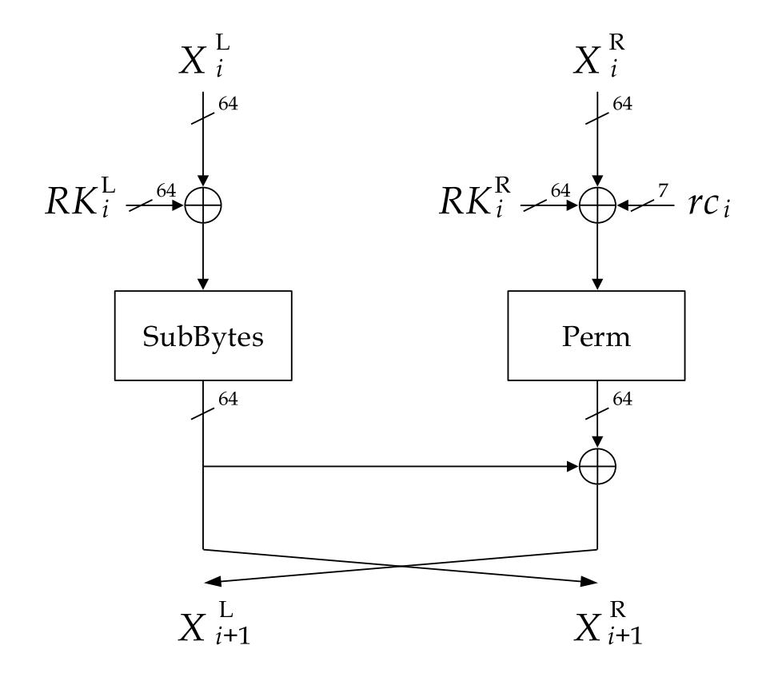
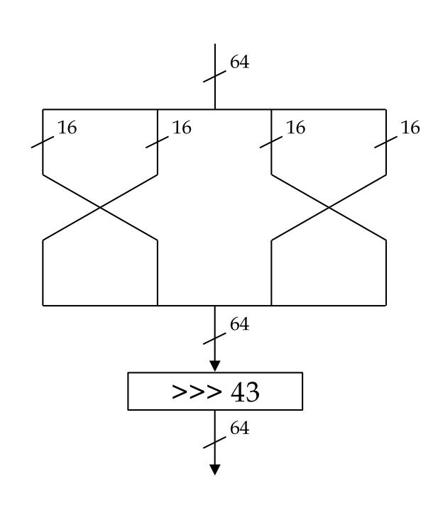
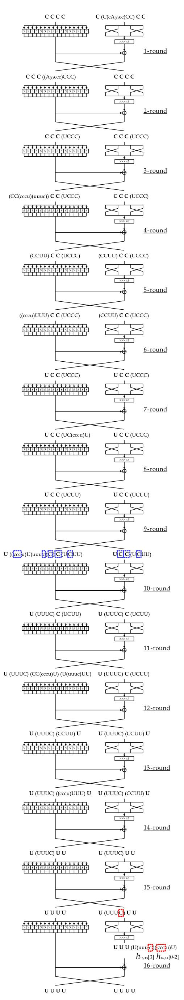
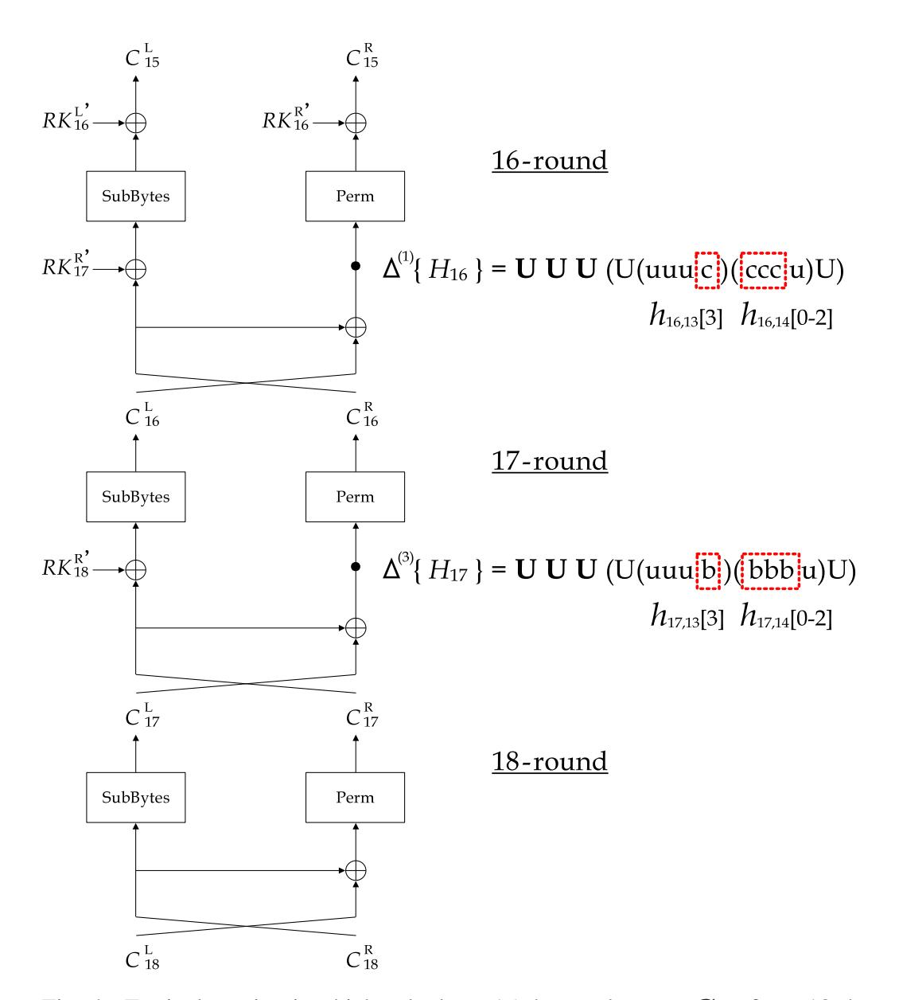
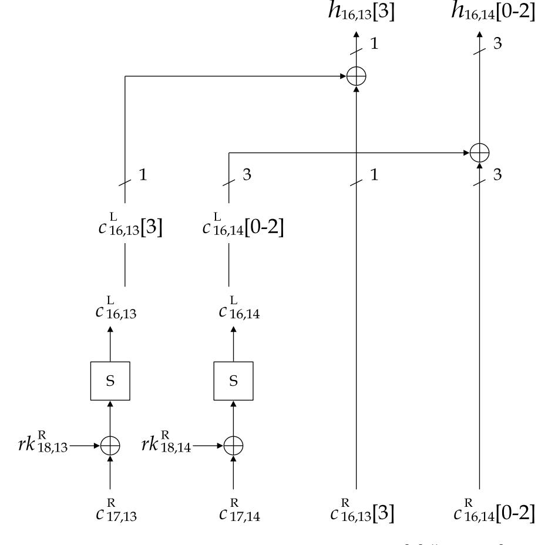

{0}------------------------------------------------

#### 1

# Higher Order Differential Attack against Full-Round BIG

Naoki Shibayama\*, Yasutaka Igarashi<sup>†</sup>, and Toshinobu Kaneko<sup>†</sup>

\* Japan Air Self-Defense Force, Tokyo, Japan.

† Tokyo University of Science, Chiba, Japan

#### **Abstract**

BIG is a 128-bit block cipher proposed by Demeri et al. in 2019. The number of rounds is 18 for high security. The designer evaluated its security against linear cryptanalysis. On the other hand, it has not been reported the security of BIG against higher order differential attack, which is one of the algebraic attacks. In this paper, we focused on a higher order differential of BIG. We found a new 15-round saturation characteristic of BIG using 1-st order differential by computer experiment. Exploiting this characteristic, we show that full-round BIG can be attacked with 6 chosen plaintexts and  $2^{2.7}$  encryption operations.

#### I. INTRODUCTION

BIG[1] is a block cipher with 128-bit block length and 128-bit key length proposed by Demeri et al. in 2019. A data processing part of BIG consists of specified rounds of Feistel structure. The numbers of rounds are 12 for moderate security and 18 for high security.

The designer evaluated the security of BIG against linear cryptanalysis, and they also reported that BIG is secure enough against this attack. On the other hand, it has not been reported the security of BIG against higher order differential attack. Higher order differential attack is a powerful and versatile attack on block ciphers. It exploits the properties of higher order differentials of functions, defined by Lai [2], and derives an attack equation to estimate the key, and then determines the key by solving a formula.

This paper shows a new higher order differential of BIG. By computer experiment, we found a new 15-, 16-round saturation characteristic of BIG using 1-st, 3-rd order differential respectively. For the case of high security, we describe the distinguishing attack to full-round BIG by using the 16-round saturation characteristic. It needs  $2^3$  chosen plaintexts and encryption operations. Furthermore, by using the 15-round saturation characteristics, it is possible to apply the higher order differential attack to full-round BIG with 6 blocks of chosen plaintext and  $2^{2.7}$  times of encryption operation.

This paper is organized as follows. Sect.II introduces the specification of BIG briefly. Sect.III presents the general theory of the higher order differential attack. Sect.IV shows the higher order differential of BIG. Then, we describe the attack using higher order differentials in Sect.V, and conclude in Sect.VI.

## II. SPECIFICATION OF BIG

In this section, we introduce a part of the structure of BIG which is needed to describe the attack. Please refer to [1] for the detail of the specification.

Fig.1 shows the data processing part of BIG. The numbers of iterated rounds of data processing part are 12 for moderate security and 18 for high security. Its input plaintext and output ciphertext are represented by  $\mathbf{X}_1 = (X_1^{\mathrm{L}}, X_1^{\mathrm{R}}), X_i^{\mathrm{J}} = (x_{i,0}^{\mathrm{J}}, x_{i,1}^{\mathrm{J}}, \cdots, x_{i,15}^{\mathrm{J}}), \ x_{i,\ell}^{\mathrm{J}} \in \mathrm{GF}(2)^4$  and  $\mathbf{C}_r = (C_r^{\mathrm{L}}, C_r^{\mathrm{R}}), \ C_i^{\mathrm{J}} = (c_{i,0}^{\mathrm{J}}, c_{i,1}^{\mathrm{J}}, \cdots, c_{i,15}^{\mathrm{J}}), \ c_{i,\ell}^{\mathrm{J}} \in \mathrm{GF}(2)^4$  respectively, where  $1 \leq i \leq r, \ \mathrm{J} \in \{\mathrm{L}, \mathrm{R}\},$  and  $0 \leq \ell \leq 15$ . A bit length of  $X_i^{\mathrm{J}}$  and  $C_i^{\mathrm{J}}$  is 64, and r = 12 and 18 for moderate and high security, respectively.  $\mathbf{R}\mathbf{K}_i = (RK_i^{\mathrm{L}} \parallel RK_i^{\mathrm{R}}), \ RK_i^{\mathrm{J}} = (rk_{i,0}^{\mathrm{J}}, \ rk_{i,1}^{\mathrm{J}}, \cdots, \ rk_{i,15}^{\mathrm{J}}), \ rk_{i,\ell}^{\mathrm{J}} \in \mathrm{GF}(2)^4$  are 128-bit round keys, and  $rc_i$  are 7-bit round constants (Table.I) which add from the 43-rd bit to the 49-th bit of a 64-bit variable  $X_i^{\mathrm{R}}$ . The symbol  $\oplus$  represents an XOR operation. The function SubBytes consists of sixteen 4-bit S-boxes (Table.II), which are bijective and nonlinear. The function Perm is linear function shown in Fig.2, where  $\ggg m$  is a right circular shift by m-bit. Perm consists of a 16-bit permutation and 43-bit right circular shift.

# III. HIGHER ORDER DIFFERENTIAL ATTACK

This section gives an outline of higher order differential attack.

# A. Higher Order Differential [2]

Let  $E(\cdot)$  be an encryption function as follows.

$$Y = E(X; K), \tag{1}$$

{1}------------------------------------------------





Fig. 1. Data processing part of BIG

Fig. 2. Perm

TABLE I ROUND CONSTANTS

| i      | 0x00 <sup>1</sup> | 0x01 | 0x02 | 0x03 | 0x04 | 0x05 | 0x06 | 0x07 | 0x08 | 0x09 | 0x0a | 0x0b | 0x0c | 0x0d | 0x0e | 0x0f | 0x10 | 0x11 |
|--------|-------------------|------|------|------|------|------|------|------|------|------|------|------|------|------|------|------|------|------|
| $rc_i$ | 0x5a              | 0x34 | 0x73 | 0x66 | 0x57 | 0x35 | 0x71 | 0x62 | 0x5f | 0x25 | 0x51 | 0x22 | 0x5f | 0x3e | 0x67 | 0x4e | 0x07 | 0x15 |

TABLE II S-BOX

| x   | 0x00 | 0x01 | 0x02 | 0x03 | 0x04 | 0x05 | 0x06 | 0x07 | 0x08 | 0x09 | 0x0a | 0x0b | 0x0c | 0x0d | 0x0e | 0x0f |
|-----|------|------|------|------|------|------|------|------|------|------|------|------|------|------|------|------|
| S(x | 0x0c | 0x09 | 0x0d | 0x02 | 0x05 | 0x0f | 0x03 | 0x06 | 0x07 | 0x0e | 0x00 | 0x01 | 0x0a | 0x04 | 0x0b | 0x08 |

where  $X \in GF(2)^n$ ,  $Y \in GF(2)^m$ , and  $K \in GF(2)^s$ . For a block cipher, X, K, and Y denote plaintext, key, and ciphertext respectively. Let  $\{\mathbf{a}_1, \mathbf{a}_2, \cdots, \mathbf{a}_i\}$  be a set of linearly independent vectors in  $GF(2)^n$  and  $V^{(i)}$  be a sub-space spanned by these vectors. The *i*-th order differential of E(X;K) with respect to X is defined as follows.

$$\Delta_{V^{(i)}}^{(i)} E(X; K) = \bigoplus_{\alpha \in V^{(i)}} E(X \oplus \alpha; K)$$
(2)

In the following, we abbreviate  $\Delta_{V^{(i)}}^{(i)}$  as  $\Delta^{(i)}$ , when it is clearly understood.

In this paper, we use the following properties of the higher order differential.

**Property 1**: If the algebraic degree of E(X;K) with respect to X equals to  $N(\leq n)$ , then the following equation holds.

$$deg_X\{E(X;K)\} = N \to \begin{cases} \Delta^{(N)}E(X;K) = const, \\ \Delta^{(N+1)}E(X;K) = 0. \end{cases}$$
(3)

**Property 2**: Higher order differential has a linear property on Exclusive-OR sum.

$$\Delta^{(N)}\left\{E_0(X;K_0) \oplus E_1(X;K_1)\right\} = \Delta^{(N)}E_0(X;K_0) \oplus \Delta^{(N)}E_1(X;K_1) \tag{4}$$

# B. Saturation Properties

We describe some definitions of saturation properties related to this paper.

Let a set of  $2^N$  elements of N-bit values be  $\mathcal{T} = \{t_i | t_i \in \{0, 1\}^N, 0 \le i < 2^N\}$ . Now we first categorize saturation properties of the set  $\mathcal{T}$  into five types, depending on conditions defined as follows.

- Const. (C) : if  $\forall_{i,j}$ ,  $t_i = t_j$
- All (A) : if  $\forall_{i,j}, i \neq j \Leftrightarrow t_i \neq t_j$
- Even (E) : if  $\forall_i$ ,  $u_i \equiv 0 \pmod{2}$

<sup>&</sup>lt;sup>1</sup>0x denotes the subsequent number is a hexadecimal format.

{2}------------------------------------------------

- Balance  $(B): \bigoplus_{i} t_i = 0,$
- Unknown (U) : Others,

where  $u_i$  denotes the number of occurrences of t=i.

In this paper, if the saturation property of  $2^{\ell}$  elements of  $\ell$ -bit values is 'A', then it is expressed as  $A_{(\ell)}$ . Further, when  $A_{(\ell)}$  is divided into m-bit, it is written as follows.

$$\mathbf{A}_{(\ell)} = (\mathbf{A}_{(1)}^0 \, \mathbf{A}_{(1)}^1 \, \cdots \, \mathbf{A}_{(1)}^{m-1})$$

For example, 2-nd order differential  $A_{(2)}$  is written as  $(A_{(1)}^0 A_{(1)}^1)$ . Moreover, the symbol 'c', ' $A_{(1)}$ ', 'b', and 'u' denote the saturation property of 1-bit which are 'C', 'A', 'B', and 'U', respectively.

In the following, if the saturation property of 1-nibble value  $t_i$  is 'C', we express this as

$$\{t_i\} = C.$$

Then, if the saturation property of 1-nibble value  $t_i$  is  $(c c c A_{(1)})$ , it is expressed as

$$\{t_i\} = (c c c A_{(1)}).$$

For multiple-nibble values, it is expressed as a similar manner. For example, if the saturation property of 4-nibble values  $(t_0, t_1, t_2, t_3)$  is (C C C U), we express this as

$$\{(t_0, t_1, t_2, t_3)\} = (CCCU).$$

We also use the following abbreviation.

$$\{(t_0, t_1, t_2, t_3)\} = (C C C C) = \mathbf{C},$$
  
 $\{(t_0, t_1, t_2, t_3)\} = (U U U U) = \mathbf{U}.$ 

**Property 3**: If the saturation property of ciphertext Y is 'C', 'A', 'E', or 'B' using  $\ell$ -th order differential, then

$$\Delta^{(\ell)}Y = 0. \tag{5}$$

#### C. Attack Equation

Consider an r-round iterative block cipher. Let  $H_{r-1}(X) \in GF(2)^m$  be a part of the (r-1)-th round output and  $C(X) \in GF(2)^n$  be the ciphertext corresponding to the plaintext  $X \in GF(2)^n$ .  $H_{r-1}(X)$  is expressed as follows.

$$H_{r-1}(X) = F_{r-1}(X; K_1, K_2, \cdots, K_{r-1}),$$
 (6)

where  $K_i \in GF(2)^s$  be the *i*-th round key and  $F_i(\cdot)$  be a function of  $GF(2)^n \times GF(2)^{s \times i} \to GF(2)^m$ .

If the algebraic degree of  $F_{r-1}(\cdot)$  with respect to X is less than N, we have the following from Property 1.

$$\Delta^{(N)} H_{r-1}(X) = 0 (7)$$

Let  $\widetilde{F}(\cdot)$  be a decoding function that calculates  $H_{r-1}(X)$  from a ciphertext  $C(X) \in GF(2)^n$ .

$$H_{r-1}(X) = \widetilde{F}(C(X); K_r), \tag{8}$$

where  $K_r \in GF(2)^s$  denotes the r-th round key to decode  $H_{r-1}(X)$  from C(X). From Eqs.(2), (7), and (8), we can derive following equation and can determine  $K_r$  by solving it.

$$\bigoplus_{\alpha \in V^{(N)}} \widetilde{F}(C(X \oplus \alpha); K_r) = 0$$
(9)

In the following, we refer to Eq.(9) as an attack equation.

## IV. HIGHER ORDER DIFFERENTIAL OF BIG

We searched for saturation characteristics of BIG using n-th order differential by computer experiment, where  $1 \le n \le 4$ . As a results, we found a new 15-, 16-round saturation characteristic using 1-st, 3-rd order differential respectively.

{3}------------------------------------------------

# A. New Characteristics

1) 1-st Order Differential: The saturation characteristics from input to 15-th round output can be written as follows.

```
 \begin{array}{cccccccccccccccccccccccccccccccccccc
```

The left hand side of the formula expresses plaintext input property and right hand side means 13-, 14-, and 15-th round output properties. Let  $H_i=(h_{i,0},\,h_{i,1},\,\cdots,\,h_{i,15}),\,h_{i,\ell}\in\mathrm{GF}(2)^4$  be an output of Perm in i-th round. Let us denote (m+1)-th bit (to (n+1)-th bit) of the variable x by x[m] (x[m-n]). The path of the saturation characteristic of (A1-i) is despicted in Fig.3. In addition, we put the arbitrary 4-bit non-zero differential  $\Delta(x_{1,5}^R[1-3]\|x_{1,6}^R[0])$  and fix the remaining 124-bit of the input plaintext, the saturation property of  $c_{15,7}^R$  is  $\{c_{15,7}^R\} = C$ , which appears in 15-round output. As a similar manner, by using  $\Delta(x_{1,13}^R[1-3]\|x_{1,14}^R[0])$ , the saturation property of  $\{c_{15,15}^R\} = C$ .

Using 2-nd order differential, we also found a 15-round saturation characteristics;

```
(A2-i) \ (\mathbf{CCCC} \parallel \mathbf{C} (C(ccA_{(1)}^{0}A_{(1)}^{1})CC)\mathbf{CC})
\xrightarrow{13r} (\mathbf{U} (\mathbf{U}\mathbf{U}\mathbf{U}\mathbf{C}) (\mathbf{E} (bbbu)\mathbf{U}\mathbf{U})\mathbf{U} \parallel \mathbf{U} (\mathbf{U}\mathbf{U}\mathbf{U}\mathbf{C}) (\mathbf{C}\mathbf{C}\mathbf{U}\mathbf{U})\mathbf{U})
\xrightarrow{14r} (\mathbf{U} (\mathbf{U}\mathbf{U}\mathbf{U}\mathbf{C}) ((bbbu)\mathbf{U}\mathbf{U}\mathbf{U})\mathbf{U} \parallel \mathbf{U} (\mathbf{U}\mathbf{U}\mathbf{U}\mathbf{C}) (\mathbf{E}\mathbf{U}\mathbf{U}\mathbf{U})\mathbf{U})
\xrightarrow{15r} (\mathbf{U} (\mathbf{U}\mathbf{U}\mathbf{U} (bbbu))\mathbf{U}\mathbf{U} \parallel \mathbf{U} (\mathbf{U}\mathbf{U}\mathbf{U}\mathbf{C})\mathbf{U}\mathbf{U}),
(A2-ii) \ (\mathbf{CCCC} \parallel \mathbf{CCC} (\mathbf{C} (ccA_{(1)}^{0}A_{(1)}^{1})\mathbf{CC}))
\xrightarrow{13r} ((\mathbf{E} (bbbu)\mathbf{U}\mathbf{U})\mathbf{U}\mathbf{U} (\mathbf{U}\mathbf{U}\mathbf{U}\mathbf{C}) \parallel (\mathbf{C}\mathbf{C}\mathbf{U}\mathbf{U})\mathbf{U}\mathbf{U} (\mathbf{U}\mathbf{U}\mathbf{U}\mathbf{C})
\xrightarrow{14r} (((bbbu)\mathbf{U}\mathbf{U}\mathbf{U}\mathbf{U}\mathbf{U}\mathbf{U}\mathbf{U}\mathbf{U}) \parallel (\mathbf{E}\mathbf{U}\mathbf{U}\mathbf{U}\mathbf{U}\mathbf{U}\mathbf{U}\mathbf{U}\mathbf{U})
\xrightarrow{15r} (\mathbf{U}\mathbf{U}\mathbf{U}\mathbf{U} (\mathbf{U}\mathbf{U}\mathbf{U}\mathbf{U} (bbbu)) \parallel \mathbf{U}\mathbf{U}\mathbf{U}\mathbf{U}\mathbf{U}\mathbf{U}\mathbf{U}\mathbf{U}).
```

By changing the position ' $A_{(1)}^{\bullet}$ ,' in input property, we can obtain the similar saturation characteristics easily. 2) 3-rd Order Differential: The saturation characteristics from input to 16-th round output can be written as follows.

(A3-i) (CCCC || C(C(
$$cA_{(1)}^0A_{(1)}^1A_{(1)}^2$$
) CC) CC)  $\xrightarrow{16r}$  (UUUU || U(UUUE) UU),  
(A3-ii) (CCCC || CCC( $(cA_{(1)}^0A_{(1)}^1A_{(1)}^2$ ) CC))  $\xrightarrow{16r}$  (UUUU || UUU(UUUE)).

In the above characteristics, if we use 4-th order differential which is inputted to  $x_{1,5}^{R}$  ( $x_{1,13}^{R}$ ), the 16-th round output property are not changed. In addition, we found many other higher order differential of BIG, please refer to [3][4].

In this section, we describe an attack to full-round BIG by using the characteristics we found.

## A. Distinguishing Attack

Let  $C_i = (C_i^L, C_i^R)$  be an *i*-th round ciphertext. Fig.4 shows the equivalent circuit which calculates 15-th round output  $C_{15}$  from 18-th round ciphertexts  $C_{18}$ . Note that  $RK_{17}$  and  $RK_{18}$  are respectively replaced by equivalent keys  $RK_{16}^{R'}$  and  $RK_{17}^{R'}$  given by

$$RK_{16}^{R'} = RK_{16}^{R} \oplus Perm^{-1}(RK_{17}^{L} \oplus RK_{17}^{R} \oplus Perm^{-1}(RK_{18}^{L} \oplus R_{18}^{R})),$$
  
 $RK_{17}^{R'} = RK_{17}^{R} \oplus Perm^{-1}(RK_{18}^{L} \oplus RK_{18}^{R}),$ 

{4}------------------------------------------------



Fig. 3. 15-round saturation characteristic using 1-st order differential

{5}------------------------------------------------





Fig. 4. Equivalent circuit which calculates 15-th round output  ${\bf C}_{15}$  from 18-th round ciphertext  ${\bf C}_{18}$ 

Fig. 5. Equivalent circuite which calculates  $(h_{16,13}[3] \parallel h_{16,14}[0-2])$  from 18-th round ciphertext  $\mathbf{C}_{18}$ , where  $C_{16}^{\mathrm{R}} = \mathrm{Perm}^{-1}(C_{17}^{\mathrm{L}} \oplus C_{17}^{\mathrm{R}})$ .

where  $Perm^{-1}$  denotes the inverse function of Perm, and  $RK_{18}^{R'}=RK_{18}^{R}$ ,  $RK_{16}^{L'}=RK_{16}^{L}$ . If we use 3-rd order differential (A3-i), the saturation property of  $c_{16,7}^{R}$  is 'E'. It passes through linear function Perm in 17-th round, and its output  $(h_{17,13}[3] \parallel h_{17,14}[0-2])$  holds 'E'. We can be derived the following equation by using this property corresponding to Eq.(9) and Property 2.

$$\bigoplus \left(c_{17,13}^{L}[3] \| c_{17,14}^{L}[0-2]\right) = \bigoplus \left(c_{17,13}^{R}[3] \| c_{17,14}^{R}[0-2]\right), \tag{10}$$

where

$$C_{17}^{L} = \text{SubBytes}^{-1}(C_{18}^{R}),$$
  
 $C_{17}^{R} = \text{Perm}^{-1}(C_{18}^{L} \oplus C_{18}^{R}).$ 

SubBytes<sup>-1</sup> denotes the inverse function of SubBytes. We use this equation as a distinguisher and claim that the attack is successful if Eq.(10) is satisfied. Therefore, for the case of high security, it is possible to apply the distinguishing attack to 18-round BIG with  $2^3$  blocks of chosen plaintext and times of encryption operation. In a similar manner, for the case of moderate security, it is possible to apply the distinguishing attack to 12-round BIG with 2 blocks of chosen plaintext and times of encryption operation by using the 15-round saturation characteristic of (A1-i).

## B. Higher Order Differential Attack

In this subsection, we estimate the number of plaintexts and computational complexity for the attack using 1-st and 2-nd order differential.

1) Attack Equation: In the saturation characteristics of  $(A1-i)\sim(A1-iv)$ , since the saturation property of  $c_{15,7}^R$  is  $\{c_{15,7}^R\}$  = C, we next focus on the saturation property of  $\{h_{16,13}[3] \mid h_{16,14}[0-2]\}$  = C, which appears in an output of linear function Perm in 16-th round. Fig.5 shows the equivalent circuit which calculates  $(h_{16,13}[3] \mid h_{16,14}[0-2])$  from 18-th round ciphertext  $C_{18}$ . Focusing on point  $(h_{16,13}[3] \mid h_{16,14}[0-2])$  in Fig.5, we can derive the following attack equations as

$$\bigoplus c_{16,13}^{L}[3] = \bigoplus c_{16,13}^{R}[3], \tag{11}$$

$$\bigoplus c_{16,14}^{L}[0-2] = \bigoplus c_{16,14}^{R}[0-2], \tag{12}$$

{6}------------------------------------------------

TABLE III
COSTS OF HIGHER ORDER DIFFERENTIAL ATTACKS

| #Round | #Guessed<br>key bits | #Data | #Complexity |  |  |
|--------|----------------------|-------|-------------|--|--|
| 12     | 76                   | 6     | $2^{3.3}$   |  |  |
| 18     | 8                    | 0     | $2^{2.7}$   |  |  |

where

$$c_{16,13}^{L}[3] = S^{-1}(c_{17,13}^{R} \oplus \underline{rk_{18,13}^{R'}})[3],$$

$$c_{16,14}^{L}[0-2] = S^{-1}(c_{17,14}^{R} \oplus \underline{rk_{18,14}^{R'}})[0-2],$$

$$C_{16}^{R} = \text{Perm}^{-1}(C_{17}^{L} \oplus C_{17}^{R}).$$

 $S^{-1}$  denotes the inverse function of S-box. In Eqs.(11) and (12), unknown terms are  $rk_{18,13}^{R'}$  and  $rk_{18,14}^{R'}$  respectively. Therefore, the total number of bit of these keys are 8 (=4-bit×2), which attacker has to estimate because of exhaustive search.

2) Complexity Estimation: Because Eq.(11) is an equation of 1-bit, it is satisfied with probability  $2^{-1}$  even if the assumed value of  $rk_{18,13}^{R'}$  is false. Therefore we need to solve  $5 (> \frac{4}{1})$  sets of Eq.(11) with different  $\mathbf{X}_1$  which need  $10 (=5 \times 2)$  chosen plaintexts in order to identify the true key. As a similar manner, if we determine  $rk_{18,14}^{R'}$  by solving a system of 3-bit Eq.(12), we need 2 sets of 1-st order differential which need 4 chosen plaintexts. Thus, attacker can determine the 8-bit keys by using exhaustive search with 10 chosen plaintexts. If we reuse the chosen plaintext and ciphertext, we can reduced the necessary number of plaintexts from 10 to 6, and the computational complexity is as follows.

$$\begin{split} T &= T_{(\mathrm{A1})\times5} + T_{\bigoplus\,h_{16,13}[3]} + T_{\bigoplus\,h_{16,14}[0-2]} \\ &\approx 2^{10.8}\,(\mathrm{S\text{-}box}), \\ T_{(\mathrm{A1})\times5} &= 6\,(\mathrm{Enc.}) = 6\cdot288\,(\mathrm{S\text{-}box}), \\ T_{\bigoplus\,h_{16,13}[3]} &= 2\,(2^4+2^3+2^2+2+1)\,(\mathrm{S\text{-}box}), \\ T_{\bigoplus\,h_{16,14}[0-2]} &= 2\,(2^4+2)\,(\mathrm{S\text{-}box}), \end{split}$$

where  $T_{(A1)\times 5}$  is the computational complexity of 5-set of 1-st order differential.  $T_{\bigoplus h_{16,13}[3]}$  and  $T_{\bigoplus h_{16,14}[0-2]}$  are the computational complexities of Eqs.(11), (12) respectively. In addition, the computational complexity required to determine the keys for the 18-round BIG attack is  $T\approx 2^{10.8}$  times of S-box operation. Since 18-round BIG consists of  $288 \, (=16\times 18)$  S-boxes, this computational complexity is equivalent to  $T\approx 2^{10.8}\cdot \frac{1}{288}\approx 2^{2.7}$  encryptions. Further, in the 9-th round output properties of the saturation characteristics of  $(A1-i)\sim (A1-iv)$ , by using the same technique described above, it is possible to apply the higher order differential attack to 12-round BIG. Costs of these attacks are shown in Table.III

- 3) All Keys Recovery: From the discussion above, since we determined the 8-bit keys  $rk_{18,13}^{R'}$  and  $rk_{18,14}^{R'}$ , the total number of bit of the remaining keys is  $120 \, (=128-8)$ , which attacker has to estimate for recovering all keys. By using the four kinds of 15-round saturation characteristics, these keys can determine from the following procedure efficiently. Note that we determine the keys of n-round in the direction of ciphertext, we call it '+nR elimination'.
- a) +3R elimination: i) In the saturation characteristics of  $(A1-v)\sim (A1-viii)$ , the attack equations using the higher order differential property  $\Delta^{(1)}c_{15,15}^{\rm R}=0$  as follows.

$$\bigoplus c_{16,5}^{L}[3] = \bigoplus c_{16,5}^{R}[3], \tag{13}$$

$$\bigoplus c_{16,6}^{L}[0-2] = \bigoplus c_{16,6}^{R}[0-2], \tag{14}$$

where

$$c_{16,5}^{L}[3] = S^{-1}(c_{17,5}^{R} \oplus \underline{rk_{18,5}^{R'}})[3],$$

$$c_{16,6}^{L}[0-2] = S^{-1}(c_{17,6}^{R} \oplus \underline{rk_{18,6}^{R'}})[0-2].$$

By solving Eqs.(13) and (14), we can determine the 8-bit keys  $rk_{18,5}^{R'}$  and  $rk_{18,6}^{R'}$  (total:16-bit).

ii) In the saturation characteristic of (A2-i), the attack equation using  $\Delta^{(2)}c_{15,7}^{L}[0-2]=0$  as follows.

$$\bigoplus S^{-1}(c_{16,7}^{R} \oplus \underline{rk_{17,7}^{R'}})[0-2] = 0$$
(15)

By solving Eq.(15), we are able to determine the 4-bit key  $rk_{17,7}^{R'}$  (total:20-bit).

iii) Similarly, in the saturation characteristic of (A2-ii), by solving the attack quation derived from  $\Delta^{(2)}c_{15,15}^{L}[0-2]=0$ , we can determine the 4-bit key  $rk_{17,15}^{R'}$  (total:24-bit).

{7}------------------------------------------------

b) +4R elimination: i) In the 14-th round output properties of the saturation characteristics of  $(A1-i)\sim (A1-iv)$ , using  $\Delta^{(1)}c_{14,7}^{\rm L}=0$  and  $\Delta^{(1)}c_{14,7}^{\rm R}=0$ , the attack equations are given by

$$\bigoplus S^{-1}(c_{15,7}^{R} \oplus rk_{16,7}^{R'}) = 0, \tag{16}$$

$$\bigoplus c_{15,14}^{L}[1-2] = \bigoplus c_{15,14}^{R}[1-2], \tag{17}$$

$$\bigoplus c_{15,14}^{L}[0] = \bigoplus c_{15,14}^{R}[0], \tag{18}$$

$$\bigoplus c_{15,13}^{L}[3] = \bigoplus c_{15,13}^{R}[3], \tag{19}$$

where

$$\begin{split} c_{15,7}^{\mathrm{R}} &= (\mathbf{S}^{-1}(c_{17,13}^{\mathrm{R}} \oplus rk_{18,13}^{\mathrm{R}'})[3] \parallel \mathbf{S}^{-1}(c_{17,14}^{\mathrm{R}} \oplus rk_{18,14}^{\mathrm{R}'})[0-2]) \oplus (c_{16,13}^{\mathrm{R}}[3] \parallel c_{16,14}^{\mathrm{R}}[0-2]), \\ c_{15,14}^{\mathrm{L}}[1-2] &= \mathbf{S}^{-1}(c_{16,14}^{\mathrm{R}} \oplus \underline{rk_{17,14}^{\mathrm{R}'}})[1-2], \\ c_{15,14}^{\mathrm{R}}[1-2] &= \mathbf{S}^{-1}(c_{17,5}^{\mathrm{R}} \oplus rk_{18,5}^{\mathrm{R}'})[0-1] \oplus c_{16,5}^{\mathrm{R}}[0-1], \\ c_{15,14}^{\mathrm{L}}[0] &= \mathbf{S}^{-1}(c_{16,14}^{\mathrm{R}} \oplus rk_{17,14}^{\mathrm{R}'})[0], \\ c_{15,14}^{\mathrm{R}}[0] &= \mathbf{S}^{-1}(c_{17,4}^{\mathrm{R}} \oplus \underline{rk_{18,4}^{\mathrm{R}'}})[3] \oplus c_{16,4}^{\mathrm{R}}[3], \\ c_{15,13}^{\mathrm{L}}[3] &= \mathbf{S}^{-1}(c_{16,13}^{\mathrm{R}} \oplus \underline{rk_{17,13}^{\mathrm{R}'}})[3], \\ c_{15,13}^{\mathrm{R}}[3] &= \mathbf{S}^{-1}(c_{17,4}^{\mathrm{R}} \oplus rk_{18,4}^{\mathrm{R}'})[2] \oplus c_{16,4}^{\mathrm{R}}[2]. \end{split}$$

By solving Eqs.(16)~(19), we can determine the 16-bit keys  $rk_{16,7}^{R'}, rk_{17,13}^{R'}, rk_{17,14}^{R'}$ , and  $rk_{18,4}^{R'}$  (total:40-bit). Then, to reduce the computational complexity, the attacker solves Eqs.(17) $\sim$ (19) sequentially, (17) $\rightarrow$ (18) $\rightarrow$ (19).

- ii) Similarly, in the saturation characteristics of  $(A1-v)\sim (A1-viii)$ , by solving the attack equations derived from  $\Delta^{(1)}c_{14,15}^{\rm L}=$ 0 and  $\Delta^{(1)}c_{14,15}^{\rm R}=0$ , we can determine the 16-bit keys  $rk_{16,15}^{\rm R'}, rk_{17,5}^{\rm R'}, rk_{17,6}^{\rm R'}$ , and  $rk_{18,12}^{\rm R'}$  (total:56-bit).
  - iii) In the saturation characteristic of (A2-i), the attack equation using  $\Delta^{(2)}c_{14,8}^{L}[0-2]=0$  as follows.

$$\bigoplus S^{-1}(c_{15,8}^{R} \oplus \underline{rk_{16,8}^{R'}})[0-2] = 0, \tag{20}$$

where

$$c_{15,8}^{R}[0] = S^{-1}(c_{17,6}^{R} \oplus rk_{18,6}^{R'})[3] \oplus c_{16,6}^{R}[3],$$

$$c_{15,8}^{R}[1-3] = S^{-1}(c_{17,7}^{R} \oplus \underline{rk_{18,7}^{R'}})[0-2] \oplus c_{16,7}^{R}[0-2].$$

By solving Eq.(20), we are able to determine the 8-bit keys  $rk_{16,8}^{R'}$  and  $rk_{18,7}^{R'}$  (total:64-bit).

- iv) Similarly, in the saturation characteristic of (A2-ii), by solving the attack equation derived from  $\Delta^{(2)}c_{14,0}^{L}[0-2]=0$ ,
- we can determine the 8-bit keys  $rk_{16,0}^{\rm R'}$  and  $rk_{18,15}^{\rm R'}$  (total:72-bit).  $c) +5R \ elimination: i)$  In the 13-th round output properties of the saturation characteristics of  $({\rm A}1-iv)$ , using  $\Delta^{(1)}c_{13,7}^{L}=0, \ \Delta^{(1)}c_{13,8}^{L}[0-2]=0, \ \Delta^{(1)}c_{13,7}^{R}[1-3]=0, \ \text{and} \ \Delta^{(1)}c_{13,8}^{R}[0]=0, \ \text{the attack equations are given by}$

$$\bigoplus S^{-1}(c_{14,7}^{R} \oplus rk_{15,7}^{R'}) = 0,$$
(21)

$$\bigoplus S^{-1}(c_{14,8}^{R} \oplus rk_{15,8}^{R'})[0-2] = 0,$$
(22)

$$\bigoplus c_{14,14}^{L}[0-2] = \bigoplus c_{14,14}^{R}[0-2], \tag{23}$$

$$\bigoplus c_{14,6}^{L}[3] = \bigoplus c_{14,6}^{R}[3], \tag{24}$$

where

$$c_{14,7}^{R} = (S^{-1}(c_{16,13}^{R} \oplus rk_{17,13}^{R'})[3] \parallel S^{-1}(c_{16,14}^{R} \oplus rk_{17,14}^{R'})[0-2]) \oplus (S^{-1}(c_{17,4}^{R} \oplus rk_{18,4}^{R'})[2-3] \parallel S^{-1}(c_{17,5}^{R} \oplus rk_{18,5}^{R'})[0-1]) \\ \oplus (c_{16,14}^{R}[2-3] \parallel c_{16,15}^{R}[0-1]),$$

$$c_{14,8}^{R} = (S^{-1}(c_{16,6}^{R} \oplus rk_{17,6}^{R'})[3] \parallel S^{-1}(c_{16,7}^{R} \oplus rk_{17,7}^{R'})[0-2]) \oplus (S^{-1}(c_{17,13}^{R} \oplus rk_{18,13}^{R'})[2-3] \parallel S^{-1}(c_{17,14}^{R} \oplus rk_{18,14}^{R'})[0-1]) \\ \oplus (c_{16,13}^{R}[2-3] \parallel c_{16,14}^{R}[0-1]),$$

$$c_{14,14}^{L}[0-2] = S^{-1}((S^{-1}(c_{17,4}^{R} \oplus rk_{18,4}^{R'})[3] \parallel S^{-1}(c_{17,5}^{R} \oplus rk_{18,5}^{R'})[0-2]) \oplus (S^{-1}(c_{16,4}^{R}[3] \parallel c_{16,5}^{R}[0-2]) \oplus \underline{rk_{16,14}^{R'}})[0-2],$$

$$c_{14,14}^{R}[0-2] = (S^{-1}(c_{16,4}^{R} \oplus \underline{rk_{17,4}^{R'}})[3] \parallel S^{-1}(c_{16,5}^{R} \oplus rk_{17,5}^{R'})[0-1]) \oplus (S^{-1}(c_{17,11}^{R} \oplus \underline{rk_{18,11}^{R'}})[2-3] \parallel S^{-1}(c_{17,12}^{R} \oplus rk_{18,12}^{R'})[0])$$

$$\oplus (c_{16,11}^{R}[2-3] \parallel c_{16,12}^{R}[0]),$$

$$c_{14,6}^{L}[3] = S^{-1}((S^{-1}(c_{17,12}^{R} \oplus rk_{18,12}^{R'})[3] \parallel S^{-1}(c_{17,13}^{R} \oplus rk_{18,13}^{R'})[0-2]) \oplus (c_{16,12}^{R}[3] \parallel c_{16,13}^{R}[0-2]) \oplus \underline{rk_{16,6}^{R'}})[3],$$

$$c_{14,6}^{L}[3] = S^{-1}(c_{16,13}^{R} \oplus rk_{17,13}^{R'})[2] \oplus S^{-1}(c_{17,14}^{R} \oplus rk_{18,4}^{R'})[1] \oplus c_{16,4}^{R}[1].$$

{8}------------------------------------------------

TABLE IV
COSTS OF ALL KEYS RECOVERY

| #Round | #Data | #Complexity |  |  |  |  |
|--------|-------|-------------|--|--|--|--|
| 12     | 11    | $2^{4.1}$   |  |  |  |  |
| 18     | 31    | $2^{6.5}$   |  |  |  |  |

Note that equivalent key  $RK_{15}^{R'}$  given by

$$RK_{15}^{R'} = RK_{15}^{R} \oplus Perm^{-1}(RK_{16}^{L} \oplus RK_{16}^{R} \oplus Perm^{-1}(RK_{17}^{L} \oplus RK_{17}^{R} \oplus Perm^{-1}(RK_{18}^{L} \oplus R_{18}^{R}))).$$

By solving Eqs.(21)~(24), we can determine the 24-bit keys  $rk_{15,7}^{R'}$ ,  $rk_{15,8}^{R'}$ ,  $rk_{16,6}^{R'}$ ,  $rk_{16,14}^{R'}$ ,  $rk_{17,4}^{R'}$ , and  $rk_{18,11}^{R'}$  (total:96-bit). ii) Similarly, in the saturation characteristic of  $(A1-v)\sim(A1-viii)$ , by solving the attack euquations derived from  $\Delta^{(1)}c_{13,0}^{L}[0-2]=0$ ,  $\Delta^{(1)}c_{13,15}^{L}=0$ , and  $\Delta^{(1)}c_{13,15}^{R}[1-3]=0$ , we can determine the 16-bit keys  $rk_{15,0}^{R'}$ ,  $rk_{15,15}^{R'}$ ,  $rk_{17,12}^{R'}$ , and  $rk_{18,3}^{R'}$  (total:112-bit). iii) In the saturation characteristic of (A2-i), the attack equation using  $\Delta^{(2)}c_{13,9}^{L}[0-2]=0$  as follows.

$$\bigoplus S^{-1}(c_{14,9}^{R} \oplus \underline{rk_{15,9}^{R'}})[0-2] = 0, \tag{25}$$

where

$$c_{14,9}^{R} = (S^{-1}(c_{16,7}^{R} \oplus rk_{17,7}^{R'})[3] \parallel S^{-1}(c_{16,8}^{R} \oplus \underline{rk_{17,8}^{R'}})[0-2]) \oplus (c_{16,14}^{R}[2] \oplus S^{-1}(c_{17,14}^{R} \oplus rk_{18,14}^{R'})[2] \parallel (c_{16,6}^{R}[3] \parallel c_{16,7}^{R}[0-1]) \oplus (S^{-1}(c_{17,6}^{R} \oplus rk_{18,6}^{R'})[3] \parallel S^{-1}(c_{17,7}^{R} \oplus rk_{18,7}^{R'})[0-1])).$$

By solving Eq.(25), we are able to determine the 8-bit keys  $rk_{15,9}^{R'}$  and  $rk_{17,8}^{R'}$  (total:120-bit).

iv) Similarly, in the saturation characteristic of (A2-ii), by solving the attack equation derived from  $\Delta^{(2)}c_{13,1}^{L}[0-2]=0$ , we can determie the 8-bit keys  $rk_{15.1}^{R'}$  and  $rk_{17.0}^{R'}$  (total:128-bit).

The all keys recovery for the 12-round BIG is similar to the procdeure (+3R elimination) described above. We summarize the results of the novel calculuses in Table.IV.

## VI. CONCLUSION

We have studied a higher order differential of BIG. By computer experiment, we found a new 15-round saturation characteristic of BIG using 1-st order differential. If we use it, using exhaustive key search, it is possible to apply the higher order differential attack to full-round BIG with 6 blocks of chosen plaintext and  $2^{2.7}$  times of encryption operation.

## REFERENCES

- [1] A.Demeri, T.Conroy, A.Nolan, and W.Diehl, "The BIG Cipher: Design, Security Analysis, and Hardware-Software Optimization Techniques," https://eprint.iacr.org/2019/022.pdf, 2019.
- [2] X.Lai, "Higher Order Derivatives and Differential Cryptanalysis," Communications and Cryptography, pp.227–233, Kluwer Academic Publishers, 1994.
- [3] N.Shibayama, Y.Igarashi, and T.Kaneko, "A New Higher Order Differential of BIG," WICS'19, pp.381–386, 2019.
- [4] N.Shibayama, Y.Igarashi, and T.Kaneko, "Higher Order Differential Property of BIG Block Cipher(II)," Proc.SCIS2020, 2B2-1,2020.