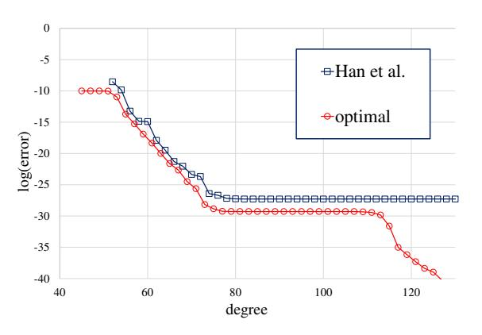
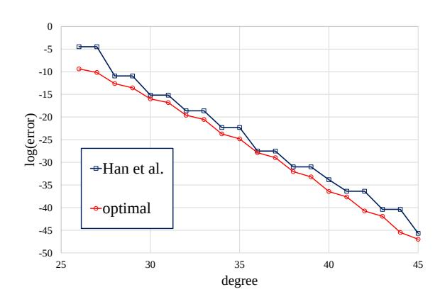

{0}------------------------------------------------

# High-Precision Bootstrapping of RNS-CKKS Homomorphic Encryption Using Optimal Minimax Polynomial Approximation and Inverse Sine Function?

Joon-Woo Lee<sup>1</sup> , Eunsang Lee<sup>1</sup> , Yongwoo Lee<sup>1</sup> , Young-Sik Kim<sup>2</sup> , and Jong-Seon No<sup>1</sup>

<sup>1</sup> Department of Electrical and Computer Engineering, INMC, Seoul National University, Seoul, Republic of Korea

Abstract. Approximate homomorphic encryption with the residue number system (RNS), called RNS-variant Cheon-Kim-Kim-Song (RNS-CKKS) scheme [12, 13], is a fully homomorphic encryption scheme that supports arithmetic operations for real or complex number data encrypted. Although the RNS-CKKS scheme is a fully homomorphic encryption scheme, most of the applications with the RNS-CKKS scheme use it as the only leveled homomorphic encryption scheme because of the lack of the practicality of the bootstrapping operation of the RNS-CKKS scheme. One of the crucial problems of the bootstrapping operation is its poor precision. While other basic homomorphic operations ensure sufficiently high precision for practical use, the bootstrapping operation only supports about 20-bit fixed-point precision at best, which is not high precision enough to be used for the reliable large-depth homomorphic computations until now.

In this paper, we improve the message precision in the bootstrapping operation of the RNS-CKKS scheme. Since the homomorphic modular reduction process is one of the most important steps in determining the precision of the bootstrapping, we focus on the homomorphic modular reduction process. Firstly, we propose a fast algorithm of obtaining the optimal minimax approximate polynomial of modular reduction function and the scaled sine/cosine function over the union of the approximation regions, called an improved multi-interval Remez algorithm. In fact, this algorithm derives the optimal minimax approximate polynomial of any continuous functions over any union of the finite number of intervals. Next, we propose the composite function method using the inverse sine function to reduce the difference between the scaling factor used in the bootstrapping and the default scaling factor. With these methods, we reduce the approximation error in the bootstrapping of the RNS-CKKS scheme by 1/1176∼1/42 (5.4∼10.2-bit precision improvement) for each parameter setting. While the bootstrapping without the composite func-

<sup>2</sup> Department of Information and Communication Engineering, Chosun University, Gwangju, Republic of Korea

<sup>?</sup> This work is supported by Samsung Advanced Institute of Technology.

{1}------------------------------------------------

tion method has 27.2∼30.3-bit precision at maximum, the bootstrapping with the composite function method has 32.6∼40.5-bit precision.

Keywords: Approximate homomorphic encryption · Bootstrapping · Composite function approximation · Fully homomorphic encryption (FHE) · Improved multi-interval Remez algorithm · Inverse sine function · Minimax approximate polynomial · RNS-variant Cheon-Kim-Kim-Song (RNS-CKKS) scheme

# 1 Introduction

Fully homomorphic encryption (FHE) is the encryption scheme enabling any logical operations [6, 14, 16, 19, 30] or arithmetic operations [12, 13] with encrypted data. The FHE scheme makes it possible to preserve security in data processing. However, in the traditional encryption schemes, they are not encrypted to enable the processing of encrypted data, which causes clients to be dissuaded from receiving services and prevents companies from developing various related systems because of the lack of clients' privacy. FHE solves this problem clearly so that clients can receive many services by ensuring their privacy.

First, Gentry constructed the FHE scheme by coming up with the idea of bootstrapping [18]. After this idea was introduced, cryptographers constructed many FHE schemes using bootstrapping. Approximate homomorphic encryption, which is also called a Cheon-Kim-Kim-Song (CKKS) scheme [13], is one of the promising FHE schemes, which deals with any real and complex numbers. The CKKS scheme is particularly in the spotlight for much potential power in many applications such as machine learning [2, 3, 5, 7, 15, 23], in that data is usually represented by real numbers. Lots of research for the optimization of the CKKS scheme have been done actively for practical use. Cheon et al. proposed the residue number system (RNS) variant CKKS scheme (RNS-CKKS) [12] so that the necessity of an arbitrary precision library can be removed and only use the word-size operations. The running time of the homomorphic operations in the RNS-CKKS scheme is 10 times faster than that of the original CKKS scheme with the single thread, and further, the RNS-CKKS scheme has an advantage in parallel computation, which leads to much better running time performance with the multi-core environment. Because of the fast homomorphic operations, most homomorphic encryption libraries, including SEAL [29] and PALISADE [1], are implemented using the RNS-CKKS scheme. Thus, we focus on the RNS-CKKS scheme in this paper.

Since the CKKS scheme includes noises used to ensure security as the approximate error in the message, the use of the RNS-CKKS scheme requires more sensitivity to the precision of the message than other homomorphic encryption schemes that support accurate decryption and homomorphic evaluation. This can be more sensitive for large-depth homomorphic operations because errors are likely to be amplified by the operations and distort the data significantly. Fortunately, the basic homomorphic operations in the RNS-CKKS scheme can ensure sufficiently high precision for practical use, but this is not the case for the 

{2}------------------------------------------------

bootstrapping operation. Ironically, while the bootstrapping operation in other homomorphic encryption schemes reduces the effect of the errors on messages so that they do not distort messages, the bootstrapping operation in the CKKS scheme amplifies the errors, which makes it the most major cause of data distortion among any other homomorphic operations in the RNS-CKKS scheme. Since advanced operations with large depth may require bootstrapping operation many times, the message precision problem in the bootstrapping operation is a crucial obstacle to applying the RNS-CKKS scheme to advanced applications.

Although the RNS-CKKS scheme is currently one of the most potential solutions to implement privacy-preserving machine learning (PPML) system [2,3,15], the methods for the PPML studied so far have mainly been applied to simple models such as MNIST, which has such a low depth that bootstrapping is not required. Thus, the message precision problem in the bootstrapping operation in the RNS-CKKS scheme did not need to be considered in the PPML model until now. However, the advanced machine learning model currently presented requires a large depth, and thus we should introduce the bootstrapping operation and cannot avoid the message precision problem in the bootstrapping operation. Of course, the fact that bootstrapping requires longer running time and larger depth than other homomorphic operations is also pointed out as a major limitation of bootstrapping. While these points may be improved by simple parameter adjustments and using hardware optimization, the message precision problem in bootstrapping is difficult to solve with these simple methods.

Most of the works about PPML with FHE focused on the inference process rather than the training process because of the large running time. However, training neural networks with encrypted data is actually more important from a long-term perspective for solving the real security problem in machine learning, in that the companies cannot gather sufficiently many important but sensitive data, such as genetic or financial information so that they cannot construct the deep learning model for them because of the privacy of the data owners. While the inference process does not need a high precision number system, the training process is affected sensitively by the precision of the number system. Chen et al. [9] showed that convolutional neural networks (CNN) learning MNIST could not converge when the model is trained using a 16-bit fixed-point number system. When the 32-bit fixed-point number system is used to train the CNN with MNIST, the training performance was slightly lower than the case of using the single-precision floating-point number system, although all bits except one bit representing the sign are used to represent the data in 32-bit fixed-point number system, which is much better precision than the single-precision floating-point number system, which is 23-bit precision. Although many works proposed to use low-precision fixed-point numbers in the training procedure, they used additional special techniques, such as stochastic rounding [20] or the dynamic fixed-point number system [21], which cannot be supported by the RNS-CKKS scheme until now.

While most of the deep learning systems use single-precision floating-point numbers, the maximum precision achieved with the bootstrapping of the CKKS 

{3}------------------------------------------------

scheme in the previous papers was about only 20 bits. Considering that the CKKS scheme only supports fixed-point arithmetic, the 20-bit precision is not large enough to be applied wholly to the deep learning system. Thus, to apply the RNS-CKKS scheme to deep learning systems, it is necessary to achieve a precision sufficiently better than the 32-bit fixed-point precision, which requires a breakthrough for the bootstrapping in the RNS-CKKS scheme concerning its precision.

#### 1.1 Our Contribution

In this paper, we propose two methods to improve the bootstrapping operation of the RNS-CKKS scheme. Firstly, we devise a fast algorithm, called an improved multi-interval Remez algorithm, obtaining the optimal minimax approximate polynomial of any continuous functions over any union of the finite number of intervals, which include the modular reduction function and the scaled sine/cosine function over the union of the approximation regions. Although the previous works have suggested methods to obtain polynomials that approximate the scaled sine/cosine function well from the minimax perspective, which are used to approximate the modular reduction function, these methods cannot obtain the optimal minimax approximate polynomial.

The original multi-interval Remez algorithm is not theoretically proven to obtain the minimax approximate polynomial, and it is only practically used for two or three approximation regions in the finite impulse response filter design, while we need to approximate functions over the union of tens of intervals. Furthermore, it takes impractically much time if this algorithm is used without further improvement to obtain a polynomial that can be used for the bootstrapping. To make the multi-interval Remez algorithm practical, we modify the multi-interval Remez algorithm as the improved multi-interval Remez algorithm. Then we prove the correctness of the improved multi-interval Remez algorithm, including the original multi-interval Remez algorithm, for the union of any finite number of intervals. Since it can obtain the optimal minimax approximate polynomial in seconds, we can even adaptively obtain the polynomial when we abruptly change some parameters on processing the ciphertexts so that we have to update the approximate polynomial. All polynomial approximation methods proposed in previous works for bootstrapping in the CKKS scheme can be replaced with the improved multi-interval Remez algorithm, which ensures the best quality of the approximation. It ensures to use the least degree of the approximate polynomial for a given amount of error.

Next, we propose the composite function method to enlarge the approximation region in the homomorphic modular reduction process using the inverse sine function. The crucial point in the bootstrapping precision is that the difference between the modular reduction function and the sine/cosine function gives a significant precision loss. All previous works have used methods that approximate the modular reduction function as a part of the sine/cosine functions. This approximation has an inherent approximation error so that the limitation of the precision occurs. Besides, to ensure that these two functions are significantly 

{4}------------------------------------------------

close to each other, the approximation region has to be reduced significantly. They set the half-width of one interval in the approximation region as 2−<sup>10</sup> , which is equal to the ratio of default scaling factor to the scaling factor used in the bootstrapping. The message has to be scaled by multiplying 2−<sup>10</sup> to make the message into the approximation region, and it is scaled by multiplying 2<sup>10</sup> at the end of the bootstrapping. Thus, the precision error in the computation for bootstrapping is amplified by 210, and the 10-bit precision loss occurs. If we try to reduce this precision loss by enlarging the approximation region, the approximation error by the sine/cosine function becomes large, and thus the overall precision becomes lower than before.

Therefore, we propose to compose the optimal approximate polynomial of the inverse sine function to the sine/cosine function, since composing the inverse sine function to the sine/cosine function extends the approximation region of the modular reduction function, which makes it possible to improve the precision of the bootstrapping. Note that the inverse sine function we use has only one interval in the approximation region, and thus we can reach the small approximate error with relatively low degree polynomials. We obtain the minimax approximate polynomials for the scaled cosine function and the inverse sine function with sufficiently small minimax error by the improved multi-interval Remez algorithm. We apply these polynomials in the homomorphic modular reduction process by homomorphically evaluating the approximate polynomial for the scaled cosine function, several double-angle formulas, and the approximate polynomial for the inverse sine function. This enables us to minimize the inevitable precision loss by approximating the modular reduction function to the sine/cosine function.

Since the previous works do not focus on the maximum precision of the bootstrapping of the RNS-CKKS scheme, we check the maximum precision of the bootstrapping with the previous techniques. The detailed relation with the precision of the bootstrapping and various parameters is analyzed with SEAL library. With the proposed methods, we reduce the approximation error in the bootstrapping of the RNS-CKKS scheme by 1/1176∼1/42 (5.4∼10.2-bit precision improvement) for each parameter setting. While the bootstrapping without the composite function method has 27.2∼30.3-bit precision at maximum, the bootstrapping with the proposed composite function method has 32.6∼40.5-bit precision, which are better precision than 32-bit fixed-point precision.

#### 1.2 Related Works

The CKKS scheme [13] was firstly proposed without bootstrapping as a somewhat homomorphic encryption scheme supporting only the finite number of multiplications. Cheon et al. [11] firstly suggested bootstrapping operation with the homomorphic linear transformation enabling transformation between slots and coefficients, and approximation of homomorphic modulus reduction function as the sine function with Taylor approximation and the double-angle formula. Chen et al. [8] applied a modified fast Fourier transform (FFT) algorithm to evaluate homomorphic linear transformation and used Chebyshev interpolation and Paterson-Stockmeyer algorithm to approximate the sine function efficiently 

{5}------------------------------------------------

in terms of the running time and the depth consumption. Han et al. [22] improved the homomorphic modular reduction in the bootstrapping operation. While Chen et al. approximated the sine function in one interval, Han et al. approximated the cosine function only in the separated approximation regions, reducing the degree of polynomials and using simpler double-angle formula than that of the sine function. Still, their approximate polynomial is also not optimal in the minimax aspect.

On the other hand, the RNS-CKKS scheme was proposed. Since big integers used to represent the ciphertexts in the CKKS scheme cannot be stored with the basic data type, the original CKKS scheme had to resort to the arbitrary precision data type libraries, such as the number theory library (NTL). To remove the reliance on the external libraries for performance improvement, Cheon et al. applied the RNS system in the CKKS scheme. Most practical homomorphic encryption libraries, such as SEAL and PALISADE, implement the RNS-CKKS scheme. The approximate rescaling procedure, which enables using the RNS system in the RNS-CKKS scheme, causes more approximation error in the homomorphic multiplication of the RNS-CKKS scheme than in that of the original CKKS scheme. Kim et al. [24] recently suggested the management method for the scaling factor in the RNS-CKKS scheme. Thus the approximation error in the homomorphic multiplication of the RNS-CKKS scheme was made the same as that of the original CKKS scheme.

Bossuat et al. [4] optimized various performances of the bootstrapping of the RNS-CKKS scheme. Their two main techniques are the scale-invariant polynomial evaluation and the double hoisting. In the scale-invariant polynomial evaluation, the coefficients of an approximate polynomial are slightly adjusted by multiplication with some adjustment factor so that the messages in the output ciphertext are not affected by the approximate rescaling. Also, it always ensures optimal depth consumption by introducing additional recursive loops. The double hoisting technique optimized the homomorphic evaluation of a linear combination of several rotated ciphertexts from the same ciphertext with different rotation steps. Bossuat et al.'s techniques are compatible with our techniques; that is, their techniques and our techniques can be applied simultaneously in the RNS-CKKS scheme.

#### 1.3 Outline

The outline of the paper is given as follows. Section 2 deals with some preliminaries for the RNS-CKKS scheme, approximation theory, and the Remez algorithm. In Section 3, we propose an improved multi-interval Remez algorithm for obtaining the optimal minimax approximate polynomial. The numerical relation between the message precision and several parameters in the RNS-CKKS scheme is dealt with in Section 4, and the upper bound of the message precision in the bootstrapping of the RNS-CKKS scheme is also included. In Section 5, we propose the composite function method, which makes it possible to reduce the difference of the two scaling factors in default operations and in bootstrapping operations, and numerically shows the improvement of the message precision 

{6}------------------------------------------------

in the proposed bootstrapping operation in the RNS-CKKS scheme. Section 6 concludes the paper.

#### 2 Preliminary

#### 2.1 Notation

Let  $\mathbb{Z}, \mathbb{Q}, \mathbb{R}$ , and  $\mathbb{C}$  be sets of integers, rational numbers, real numbers, and complex numbers, respectively. Let C[D] be a set of continuous functions on the domain D. Let [d] be a set of positive integers less than or equal to d, i.e.,  $\{1, 2, \cdots, d\}$ . Let round(x) be the function that outputs the integer nearest to x, and we do not have to consider the case of tie in this paper. For a power of two, M, let  $\Phi_M(X) = X^N + 1$  be an M-th cyclotomic polynomial, where M = 2N. Let  $\mathcal{R} = \mathbb{Z}[X]/\langle \Phi_M(X) \rangle$  and  $\mathcal{R}_q = \mathcal{R}/q\mathcal{R}$ . Let  $\mathbb{Q}[X]/\langle \Phi_M(X) \rangle$  be an M-th cyclotomic field. For positive real number  $\alpha$ ,  $\mathcal{D}G(\alpha)$  is defined as the distribution in  $\mathbb{Z}^N$  whose entries are sampled independently from discrete Gaussian distribution of variance  $\alpha^2$ .  $\mathcal{H}WT(h)$  is a subset of  $\{0,\pm 1\}^N$  with Hamming weight h.  $\mathcal{Z}O(\rho)$ is the distribution in  $\{0,\pm 1\}^N$  whose entries are sampled independently with probability  $\rho/2$  for each of  $\pm 1$  and probability being zero,  $1-\rho$ . The Chebyshev polynomials  $T_n(x)$  are defined by  $\cos n\theta = T_n(\cos \theta)$ . The remainder of a divided by q is denoted as  $[a]_q$ . If  $\mathcal{C} = \{q_0, q_1, \dots, q_{\ell-1}\}$  is the set of positive integers coprime each other and  $a \in \mathbb{Z}_Q$  where  $Q = \prod_{i=0}^{\ell-1} q_i$ , the RNS representation of awith regard to  $\mathcal{C}$  is denoted by  $[a]_{\mathcal{C}} = ([a]_{q_0}, [a]_{q_1}, \cdots, [a]_{q_{\ell-1}}) \in \mathbb{Z}_{q_0} \times \cdots \times \mathbb{Z}_{q_{\ell-1}}$ . The base of logarithm in this paper is two.

### 2.2 CKKS Scheme and RNS-CKKS Scheme

It is known that the CKKS scheme supports several operations for encrypted data of real numbers or complex numbers. Since it deals with usually real numbers, the noise that ensures the security of the CKKS scheme can be embraced in the outside of the significant figures of the data, which is the crucial concept of the CKKS scheme.

The RNS-CKKS scheme [12] uses the RNS form to represent the ciphertexts and to perform the homomorphic operations efficiently. While the power-of-two modulus is used in the CKKS scheme, the product of large primes is used for ciphertext modulus in the RNS-CKKS scheme so that the RNS system can be applied. These large primes are chosen to be similar to the scaling factor, which is some power-of-two integer. There is a crucial difference in the rescaling operation between the CKKS scheme and the RNS-CKKS scheme. While the CKKS scheme can rescale the ciphertext by the exact scaling factor, the RNS-CKKS scheme has to rescale the ciphertext by one of the RNS modulus, which is not equal to the scaling factor. Thus, the RNS-CKKS scheme allows approximation in the rescaling procedure. Detailed procedures in the RNS-CKKS scheme are described as follows.

Several independent messages are encoded into one polynomial by the canonical embedding before encryption. The canonical embedding  $\sigma$  embeds  $a \in$ 

{7}------------------------------------------------

 $\mathbb{Q}[X]/\langle \Phi_M(X)\rangle$  into an element of  $\mathbb{C}^N$  whose elements are values of a evaluated at the distinct roots of  $\Phi_M(X)$ . It is a well-known fact that the roots of  $\Phi_M(X)$  are exactly the power of odd integers of the M-th root of unity, and  $\mathbb{Z}_M^* = \langle -1, 5 \rangle$ . Let  $\mathbb{H} = \{(z_j)_{j \in \mathbb{Z}_M^*} : z_j = \overline{z_{-j}}\}$ , and  $\pi$  be a natural projection from  $\mathbb{H}$  to  $\mathbb{C}^{N/2}$ . Then, it is easily known that the range of  $\sigma$  is exactly  $\mathbb{H}$ . When N/2 complex number messages constitute an element in  $\mathbb{C}^{N/2}$ , each coordinate is called a slot. The encoding and decoding procedures are given as follows.

 $\operatorname{Ecd}(z; \Delta)$ : For a vector  $z \in \mathbb{C}^{N/2}$ , return

$$m(X) = \sigma^{-1}\left(\left[\Delta \cdot \pi^{-1}(z)\right]_{\sigma(\mathcal{R})}\right) \in \mathcal{R},$$

where  $\Delta$  is the scaling factor and  $\lfloor \pi^{-1}(z) \rceil_{\sigma(\mathcal{R})}$  denotes the discretization (rounding) of  $\pi^{-1}(z)$  into an element of  $\sigma(\mathcal{R})$ .

 $\operatorname{Dcd}(m; \Delta)$ : For a polynomial  $m(X) \in \mathcal{R}$ , return a vector  $\boldsymbol{z} \in \mathbb{C}^{N/2}$  whose entry of index j is  $z_j = \left\lfloor \Delta^{-1} \cdot m(\zeta_M^{5^j}) \right\rfloor$  for  $j \in \{0, 1, \dots, N/2 - 1\}$ , where  $\zeta_M$  is the M-th root of unity.

Before describing the RNS-CKKS scheme, several basic operations for RNS system is defined: Conv, ModUp, and ModDown. Let  $\mathcal{B} = \{p_0, p_1, \cdots, p_{k-1}\}, \mathcal{C} = \{q_0, q_1, \cdots, q_{\ell-1}\}, \text{ and } \mathcal{D} = \{p_0, p_1, \cdots, p_{k-1}, q_0, q_1, \cdots, q_{\ell-1}\}, \text{ where } p_i\text{'s and } q_j\text{'s are all distinct primes.}$ 

 $Conv_{\mathcal{C} \to \mathcal{B}}$ : It converts the RNS bases from  $\mathcal{C}$  to  $\mathcal{B}$  without the merge process of Chinese remainder theorem, which is defined as

$$\operatorname{Conv}_{\mathcal{C} \to \mathcal{B}}([a]_{\mathcal{C}}) = \left( \sum_{j=0}^{\ell-1} [a^{(j)} \cdot \hat{q}_j^{-1}]_{q_j} \cdot \hat{q}_j \mod p_i \right)_{0 \le i \le k},$$

where  $[a]_{\mathcal{C}} = (a^{(0)}, \cdots, a^{(\ell-1)}) \in \mathbb{Z}_{q_0} \times \cdots \times \mathbb{Z}_{q_{\ell-1}}$  and  $\hat{q}_j = \prod_{j' \neq j} q_{j'} \in \mathbb{Z}$ . ModUp<sub> $\mathcal{C} \to \mathcal{D}$ </sub>: It adds other moduli in  $\mathcal{B}$  to the current RNS bases to expand the modulus space without changing the value as

$$\begin{split} \operatorname{\mathsf{ModUp}}_{\mathcal{C} \to \mathcal{D}}(\cdot) : \prod_{j=0}^{\ell-1} R_{q_j} &\to \prod_{i=0}^{k-1} R_{p_i} \times \prod_{j=0}^{\ell-1} R_{q_j} \\ : [a]_{\mathcal{C}} \to (\operatorname{\mathsf{Conv}}_{\mathcal{C} \to \mathcal{B}}([a]_{\mathcal{C}}), [a]_{\mathcal{C}}). \end{split}$$

ModDown<sub> $\mathcal{D}\to\mathcal{C}$ </sub>: It removes the moduli in  $\mathcal{B}$  from the current RNS bases with dividing the value by  $P=\prod_{i=0}^{k-1}p_i$  as

$$\begin{split} \operatorname{ModDown}_{\mathcal{D} \to \mathcal{C}}(\cdot) : \prod_{i=0}^{k-1} R_{p_i} \times \prod_{j=0}^{\ell-1} R_{q_j} &\to \prod_{j=0}^{\ell-1} R_{q_j} \\ : ([a]_{\mathcal{B}}, [b]_{\mathcal{C}}) \to ([b]_{\mathcal{C}} - \operatorname{Conv}_{\mathcal{B} \to \mathcal{C}}([a]_{\mathcal{B}})) \cdot [P^{-1}]_{\mathcal{C}}. \end{split}$$

{8}------------------------------------------------

Then, each procedure of the RNS-CKKS scheme is given as follows.

Setup $(q, L; 1^{\lambda})$ : Given a scaling factor  $\Delta$ , the number of levels L, and a security parameter  $\lambda$ , we choose several parameters as follows.

- A power-of-two degree N of the polynomial modulus of the ring is chosen so that the number of level L can be supported with the security parameter  $\lambda$ .
- A secret key distribution  $\chi_{\text{key}}$ , an encryption key distribution  $\chi_{\text{enc}}$ , and an error distribution  $\chi_{\sf err}$  over R are chosen considering the security parameter  $\lambda$ .
- A basis with prime numbers  $\mathcal{B} = \{p_0, p_1, \cdots, p_{k-1}\}$  and  $\mathcal{C} = \{q_0, q_1, \cdots, q_L\}$ is chosen so that  $p_i \equiv 1 \mod 2N$ ,  $q_j \equiv 1 \mod 2N$  for  $0 \le i \le k-1$ ,  $0 \le i \le k-1$  $j \leq L$ , and  $|q_i - \Delta|$  is as small as possible. All prime numbers are distinct and  $\mathcal{D} = \mathcal{B} \cup \mathcal{C}$ . Let  $\mathcal{C}_{\ell} = \{q_0, q_1, \cdots, q_{\ell}\}$  and  $\mathcal{D}_{\ell} = \mathcal{B} \cup \mathcal{C}_{\ell}$  for  $0 \leq \ell \leq L$ . Let  $P = \prod_{i=0}^{k-1} p_i, Q = \prod_{j=0}^{L} q_j, \hat{p}_i = \prod_{0 \le i' \le k-1, i' \ne i} p_{i'}$  for  $0 \le i \le k-1$ , and  $\hat{q}_{\ell,j} = \prod_{0 \le j' \le \ell, j' \ne j} q_{j'}$  for  $0 \le j \le \ell \le L$ . Then, we compute the following numbers.
- $[\hat{p}_i]_{q_j}$  and  $[\hat{p}_i^{-1}]_{p_i}$  for  $0 \le i \le k-1, 0 \le j \le L$   $[P^{-1}]_{q_j}$  for  $0 \le j \le L$
- $[\hat{q}_{\ell,j}]_{p_i}$  and  $[\hat{q}_{\ell,j}^{-1}]_{q_j}$  for  $0 \le i \le k-1, 0 \le j \le \ell \le L$

 $KSGen(s_1, s_2)$ : This procedure generates the switching key for switching the secret key  $s_1$  to  $s_2$  without changing the message in a ciphertext. Given  $s_1, s_2 \in R$ , sample  $(a'^{(0)}, \dots, a'^{(k+L)}) \leftarrow U\left(\prod_{i=0}^{k-1} R_{p_i} \times \prod_{j=0}^{L} R_{q_j}\right)$  and an error  $e' \leftarrow \chi_{\mathsf{err}}$ , and generate the switching key swk as

$$\left(\mathsf{swk}^{(0)} = (b'^{(0)}, a'^{(0)}), \cdots, \mathsf{swk}^{(k+L)} = (b'^{(k+L)}, a'^{(k+L)})\right) \in \prod_{i=0}^{k-1} R_{p_i}^2 \times \prod_{j=0}^L R_{q_j}^2,$$

where  $b'^{(i)} \leftarrow -a'^{(i)} \cdot s_2 + e' \mod p_i$  for  $0 \leq i \leq k-1$  and  $b'^{(k+j)} \leftarrow$  $-a'^{(k+j)} \cdot s_2 + [P]_{q_j} \cdot s_1 + e' \mod q_j \text{ for } 0 \le j \le L.$ 

KeyGen: This procedure generates the secret key, the evaluation key, and the public key. Sample  $s \leftarrow \chi_{\text{key}}$  and set  $\mathsf{sk} \leftarrow (1, s)$  as the secret key. The evaluation key is set by  $\mathsf{evk} \leftarrow \mathsf{KSGen}(s^2, s)$ . Also, sample  $(a^{(0)}, a^{(1)}, \cdots, a^{(L)}) \leftarrow$  $U\left(\prod_{j=0}^{L} R_{q_j}\right)$  and  $e \leftarrow \chi_{\mathsf{err}}$  and the public key is generated as

$$\mathsf{pk} \leftarrow \left(\mathsf{pk}^{(j)} = (b^j, a^{(j)}) \in R^2_{q_j}\right)_{0 \le j \le L},$$

where  $b^{(j)} \leftarrow -a^{(j)} \cdot s + e \mod q_j$  for  $0 \le j \le L$ .

 $\operatorname{Enc}_{\mathsf{pk}}(m)$ : For a message slot  $\mathbf{z} \in \mathbb{C}^{N/2}$ , generate the message polynomial by  $m = \text{Ecd}(\mathbf{z}; \Delta)$ . Then, sample  $v \leftarrow \chi_{\text{enc}}$  and  $e_0, e_1 \leftarrow \chi_{\text{err}}$  and generate the ciphertext  $\mathsf{ct} = (\mathsf{ct}^{(j)})_{0 \le j \le L} \in \prod_{j=0}^{L} R_{q_j}^2$ , where  $\mathsf{ct}^{(j)} \leftarrow v \cdot \mathsf{pk}^{(j)} + (m + e_0, e_1)$  $\text{mod } q_j \text{ for } 0 \leq j \leq L.$ 

Dec<sub>sk</sub>(ct): For a ciphertext ct =  $(ct^{(j)})_{0 \le j \le \ell} \in \prod_{j=0}^{\ell} R_{q_j}^2$ , compute  $\tilde{m} = \langle ct^{(0)}, sk \rangle$ mod  $q_0$  and output  $\mathbf{z} = \text{Dcd}(\tilde{m}; \Delta)$ .

{9}------------------------------------------------

$$\begin{split} & \text{Add}(\mathsf{ct}_1,\mathsf{ct}_2) \text{: For two ciphertexts } \mathsf{ct}_r = \left(\mathsf{ct}_r^{(j)}\right)_{0 \leq j \leq \ell} \text{ for } r = 1,2, \text{ output the } \\ & \text{ciphertext } \mathsf{ct}_{\mathsf{add}} = \left(\mathsf{ct}_{\mathsf{add}}^{(j)}\right)_{0 \leq j \leq \ell}, \text{ where } \mathsf{ct}_{\mathsf{add}}^{(j)} \leftarrow \mathsf{ct}_1^{(j)} + \mathsf{ct}_2^{(j)} \mod q_j \text{ for } 0 \leq j \leq \ell. \\ & \text{Multevk}(\mathsf{ct}_1,\mathsf{ct}_2) \text{: For two ciphertexts } \mathsf{ct}_r = \left(\mathsf{ct}_r^{(j)} = (c_{r0}^{(j)}, c_{r1}^{(j)})\right)_{0 \leq j \leq \ell}, \text{ compute } \\ & \text{the followings and output the ciphertext } \mathsf{ct}_{\mathsf{mult}} \in \prod_{j=0}^{\ell} R_{q_j}^2, \\ & - d_0^{(j)} = c_{00}^{(j)} c_{10}^{(j)} \mod q_j, d_1^{(j)} = c_{00}^{(j)} c_{11}^{(j)} + c_{01}^{(j)} c_{10}^{(j)} \mod q_j, \text{ and } d_2^{(j)} = c_{01}^{(j)} c_{11}^{(j)} \mod q_j, \text{ and } d_2^{(j)} = c_{01}^{(j)} c_{11}^{(j)} \mod q_j, \text{ and } d_2^{(j)} = c_{01}^{(j)} c_{11}^{(j)} \mod q_j, \text{ and } d_2^{(j)} = c_{01}^{(j)} c_{11}^{(j)} \mod q_j, \text{ and } d_2^{(j)} = c_{01}^{(j)} c_{11}^{(j)} \mod q_j, \text{ and } d_2^{(j)} = c_{01}^{(j)} c_{11}^{(j)} \mod q_j, \text{ and } d_2^{(j)} = c_{01}^{(j)} c_{11}^{(j)} \mod q_j, \text{ and } d_2^{(j)} = c_{01}^{(j)} c_{11}^{(j)} \mod q_j, \text{ and } d_2^{(j)} = c_{01}^{(j)} c_{11}^{(j)} \mod q_j, \text{ and } d_2^{(j)} = c_{01}^{(j)} c_{11}^{(j)} \mod q_j, \text{ and } d_2^{(j)} = c_{01}^{(j)} c_{11}^{(j)} \log_{j \leq k + \ell}, \text{ where } d_2^{(j)} e^{(j)} e^{(j)} e^{(j)} e^{(j)} e^{(j)} e^{(j)} e^{(j)} e^{(j)} e^{(j)} e^{(j)} e^{(j)} e^{(j)} e^{(j)} e^{(j)} e^{(j)} e^{(j)} e^{(j)} e^{(j)} e^{(j)} e^{(j)} e^{(j)} e^{(j)} e^{(j)} e^{(j)} e^{(j)} e^{(j)} e^{(j)} e^{(j)} e^{(j)} e^{(j)} e^{(j)} e^{(j)} e^{(j)} e^{(j)} e^{(j)} e^{(j)} e^{(j)} e^{(j)} e^{(j)} e^{(j)} e^{(j)} e^{(j)} e^{(j)} e^{(j)} e^{(j)} e^{(j)} e^{(j)} e^{(j)} e^{(j)} e^{(j)} e^{(j)} e^{(j)} e^{(j)} e^{(j)} e^{(j)} e^{(j)} e^{(j)} e^{(j)} e^{(j)} e^{(j)} e^{(j)} e^{(j)} e^{(j)} e^{(j)} e^{(j)} e^{(j)} e^{(j)} e^{(j)} e^{(j)} e^{(j)} e^{(j)} e^{(j)} e^{(j)} e^{(j)} e^{(j)} e^{(j)} e^{(j)} e^{(j)} e^{(j)} e^{(j)} e^{(j)} e^{(j)} e^{(j)} e^{(j)} e^{(j)} e^{(j)} e^{(j)} e^{(j)} e^{(j)} e^{(j)} e^{(j)} e^{(j)} e^{(j)} e^{(j)} e^{(j)} e^{(j)} e^{($$

There are additional homomorphic operations, rotation, and complex conjugation, which are used for homomorphic linear transformation in the bootstrapping of the RNS-CKKS scheme. Since these operations are not used in this paper, we omit these operations in this section.

#### 2.3 Kim-Papadimitriou-Polyakov (KPP) Scaling Factor Management

Kim et al. [24] suggested a method of eliminating the large rescaling error in the RNS-CKKS scheme. Instead of using the same power-of-two scaling factor for each level, they used different scaling factors in different levels. If the maximum level is L, and the ciphertext modulus for level i is denoted as  $q_i$ , the scaling factor for each level is given as follows:  $\Delta_L = q_L$  and  $\Delta_i = \Delta_{i+1}^2/q_{i+1}$  for  $i = 0, \dots, L-1$ .

If the two ciphertexts are at the same level, it does not introduce the approximate rescaling error when they are multiplied homomorphically. If the two ciphertexts are in the different level, that is, in the levels i and j such that i > j, the moduli  $q_i, \dots, q_{j+1}$  in the first ciphertext are dropped, the first ciphertext is multiplied by a constant  $\lceil \frac{\Delta_j q_{j+1}}{\Delta_i} \rceil$ , and it is rescaled by  $q_{j+1}$ . Then we perform the conventional homomorphic multiplication with the two ciphertexts, which are now at the same level, together with rescaling in the RNS-CKKS scheme. The approximate rescaling error is also not introduced in this case.

{10}------------------------------------------------

#### 2.4 Bootstrapping for CKKS Scheme

The framework of the bootstrapping of the CKKS scheme was introduced in [13], which is the same as the case of the RNS-CKKS scheme. The purpose of bootstrapping is to refresh the ciphertext of level 0, whose multiplication cannot be performed anymore, to the fresh ciphertext of level L having the same messages. Bootstrapping is composed of the following four steps:

- i) Modulus raising
- ii) Homomorphic linear transformation; CoeffToSlot
- iii) Homomorphic modular reduction
- iv) Homomorphic linear transformation; SlotToCoeff

Modulus Raising: The starting point of bootstrapping is modulus raising, where we simply consider the ciphertext of level 0 as an element of  $\mathcal{R}^2_Q$ , instead of  $\mathcal{R}^2_{q_0}$ . Since the ciphertext of level 0 is supposed to be  $\langle \mathsf{ct}, \mathsf{sk} \rangle \approx m \mod q_0$ , we have  $\langle \mathsf{ct}, \mathsf{sk} \rangle \approx m + q_0 I \mod Q$  for some  $I \in \mathcal{R}$  when we try to decrypt it. We are assured that the absolute values of coefficients of I are rather small, for example, usually smaller than 12, because coefficients of  $\mathsf{sk}$  consist of small numbers [11]. The crucial part of the bootstrapping of the CKKS scheme is to make  $\mathsf{ct}'$  such that  $\langle \mathsf{ct}', \mathsf{sk} \rangle \approx m \mod q_L$ . This is divided into two parts: homomorphic linear transform and homomorphic evaluation of modular reduction function.

Homomorphic Linear Transformation: The ciphertext ct after modulus raising can be considered as the ciphertext encrypting  $m+q_0I$ , and thus we now have to perform modular reduction to coefficients of message polynomial homomorphically. However, the operations we have are all for slots, not coefficients of the message polynomial. Thus, to perform some meaningful operations on coefficients, we have to convert ct into a ciphertext that encrypts coefficients of  $m+q_0I$  as its slots. After evaluation of homomorphic modular reduction function, we have to reversely convert this ciphertext into the other ciphertext ct' that encrypts the slots of the previous ciphertext as the coefficients of its message. These two operations are called CoeffToSlot and SlotToCoeff operations. These operations are regarded as homomorphic evaluation of encoding and decoding of messages, which are a linear transformation by some variants of Vandermonde matrix for roots of  $\Phi_M(x)$ . This can be performed by general homomorphic matrix multiplication [11], or FFT-like operation [8].

Homomorphic Modular Reduction Function: After Coeff ToSlot is performed, we now have to perform modular reduction homomorphically on each slot in modulus  $q_0$ . This procedure is called Eval Mod. This modular reduction function is not an arithmetic function and even not a continuous function. Fortunately, by restricting the range of the messages such that  $m/q_0$  is small enough, the approximation region can be given only near multiples of  $q_0$ . This allows us to approximate the modular reduction function more effectively. Since

{11}------------------------------------------------

the operations that the CKKS supports are arithmetic operations, most of the works [8, 11, 22] dealing with CKKS bootstrapping approximate the modular reduction function with some polynomials, which are sub-optimal approximate polynomials.

The scaling factor is increased when the bootstrapping is performed because m/q<sup>0</sup> needs to be very small in the homomorphic modular reduction function. In this paper, the default scaling factor means the scaling factor used in the intended applications, and the bootstrapping scaling factor means the scaling factor used in the bootstrapping. The bit-length difference between these two scaling factors is usually 10.

#### 2.5 Approximation Theory

Approximation theory is needed to prove the convergence of the minimax polynomial obtained by the proposed improved multi-interval Remez algorithm. Assume that functions are defined on a union of the finite number of closed and bounded intervals in the real line. From the following well-known theorem [28] in real analysis, we are convinced that this domain of functions is a compact set.

Theorem 2.1 ([28] Bolzano-Weierstrass Theorem). A subset of R <sup>n</sup> is a compact set if and only if it is closed and bounded.

A union of the finite number of closed and bounded intervals in the real line is trivially closed and bounded, and thus this domain is a compact set by Bolzano-Weierstrass theorem. This theorem will be used in the convergence proof of the improved multi-interval Remez algorithm in Section 3.

The next theorem [28] states that any continuous function on a compact set in the real line can be approximated with an arbitrarily small error by polynomial approximation. In fact, the theorem includes the case of continuous functions on more general domains, but we only use the special case on compact sets in the real line in this paper.

Theorem 2.2 ([28] Stone-Weierstrass Theorem). Assume that f is a continuous function on the compact subset D of the real line. For every > 0, there is a polynomial p such that kf − pk<sup>∞</sup> < .

There are many theorems for the minimax approximate polynomials of a function defined on a compact set in approximation theory. Before the introduction of these theorems, we refer to a definition of the Haar condition of a set of functions that deals with the generalized version of power bases used in polynomial approximation and its equivalent statement. It is a well-known fact that the power basis {1, x, x<sup>2</sup> , · · · , x<sup>d</sup>} satisfies the Haar condition. Thus, if an argument deals with the polynomials with regard to a set of basis functions satisfying Haar condition, it naturally includes the case of polynomials.

{12}------------------------------------------------

**Definition 2.3** ([10] Haar's Condition). A set of functions  $\{g_1, g_2, \dots, g_n\}$  satisfies the Haar condition if each  $g_i$  is continuous and if each determinant

$$D[x_1, \cdots, x_n] = \begin{vmatrix} g_1(x_1) & \cdots & g_n(x_1) \\ \vdots & \ddots & \vdots \\ g_1(x_n) & \cdots & g_n(x_n) \end{vmatrix}$$

for any n distinct points  $x_1, \dots, x_n$  is not zero.

**Lemma 2.4** ([10]). A set of functions  $\{g_1, \dots, g_n\}$  satisfies the Haar condition if and only if zero polynomial is the only polynomial  $\sum_i c_i g_i$  that has more than n-1 roots.

Firstly, we are convinced that there is the unique minimax approximate polynomial in the union of the finite number of closed and bounded intervals as in the following two theorems.

Theorem 2.5 ([10] Existence of Best Approximations). Let  $\mathcal{F}$  be a normed linear space, and f is any fixed element in  $\mathcal{F}$ . If  $\mathcal{S}$  is a linear subspace of  $\mathcal{F}$  with finite dimension,  $\mathcal{S}$  contains at least one element of minimum distance from f.

**Theorem 2.6** ([10] Haar's Unicity Theorem). Let f be any continuous function on a compact set K. Then the minimax polynomial  $\sum_i c_i g_i$  of f is unique if and only if  $\{g_1, g_2, \dots, g_n\}$  satisfies the Haar condition.

In Theorem 2.5 for the existence of the best approximation, consider a set  $\mathcal{F}$  of continuous functions on a union D of the finite number of closed and bounded intervals. We can easily know that  $\mathcal{F}$  is a linear space with a max-norm  $||f||_{\infty} = \max_{x \in D} |f(x)|$ . The set  $\mathcal{P}_d$  of polynomials with regard to the finite number of basis functions on D is a finite-dimensional linear subspace. Then, from Theorem 2.5, there is at least one minimax approximate polynomial for any  $f \in \mathcal{F}$ .

We now introduce the core property of the minimax approximate polynomial for a function on D.

**Theorem 2.7** ([10] Chebyshev Alternation Theorem). Let  $\{g_1, \dots, g_n\}$  be a set of continuous functions defined on [a,b] satisfying the Haar condition, and let D be a closed subset of [a,b]. A polynomial  $p = \sum_i c_i g_i$  is the minimax approximate polynomial on D to any given continuous function f defined on D if and only if there are n+1 distinct elements  $x_0 < \dots < x_n$  in D such that for the error function r = f - p restricted on D,

$$r(x_i) = -r(x_{i-1}) = \pm \sup_{x \in D} |r(x)|.$$

This condition is also called the equioscillation condition. This means that if we find a polynomial satisfying the equioscillation condition, then this is the unique minimax approximate polynomial, needless to compare with the maximum approximation error of any polynomials.

The following three theorems are used to prove the convergence of the improved multi-interval Remez algorithm in Section 3.

{13}------------------------------------------------

Theorem 2.8 ([10] de La Vallee Poussin Theorem). Let {g1, · · · , gn} be a set of continuous functions on [a, b] satisfying the Haar condition. Let f be a continuous on [a, b], and p be a polynomial such that p − f has alternately positive and negative values at n + 1 consecutive points x<sup>i</sup> in [a, b]. Let p ∗ be a minimax approximate polynomial for f, and e(f) be the minimax approximation error of p ∗ . Then, we have

$$e(f) \ge \min_{i} |p(x_i) - f(x_i)|.$$

Lemma 2.9 ([10]). Let {g1, · · · , gn} be a set of continuous functions satisfying the Haar condition. Assume that x<sup>1</sup> < · · · < x<sup>n</sup> and y<sup>1</sup> < · · · < yn. Then the determinants D[x1, · · · , xn] and D[y1, · · · , yn], defined by Definition 2.3, have the same sign.

Theorem 2.10 ([10] Strong Unicity Theorem). Let {g1, · · · , gn} be a set of functions satisfying the Haar condition, and let p ∗ be the minimax polynomial of a given continuous function u. Then, there is a constant γ > 0 determined by f such that for any polynomial p, we have

$$||p - f||_{\infty} \ge ||p^* - f||_{\infty} + \gamma ||p - p^*||_{\infty}.$$

#### 2.6 Algorithms for Minimax Approximation

Remez Algorithm Remez algorithm [10, 26, 27] is an iterative algorithm that always returns the minimax approximate polynomial for any continuous function on an interval of [a, b]. This algorithm strongly uses the Chebyshev alternation theorem [10] in that its purpose is finding the polynomial satisfying the equioscillation condition. In fact, the Remez algorithm can be applied to obtain the minimax approximate polynomial, whose basis function {g1, · · · , gn} satisfies the Haar condition. The following explanation includes the generalization of the Remez algorithm, and if we want to obtain the minimax approximate polynomial of degree d, we choose the basis function {g1, · · · , gn} by the power basis {1, x, · · · , x<sup>d</sup>}, where n = d + 1.

Remez algorithm firstly initializes the set of reference points {x1, · · · , xn+1}, which will be converged to the extreme points of the minimax approximate polynomial. Then, it obtains the minimax approximate polynomial in regard to only the set of reference points. Since the set of reference points is the set of finite points in [a, b], it is a closed subset of [a, b], and thus Chebyshev alternation theorem holds on the set of reference points. Let f(x) be a continuous function on [a, b]. The minimax approximate polynomial on the set of reference points is exactly the polynomial p(x) with the basis {g1, · · · , gn} satisfying

$$p(x_i) - f(x_i) = (-1)^i E$$
  $i = 1, \dots, d+2$ 

{14}------------------------------------------------

for some real number E. This forms a system of linear equations having n+1equations and n+1 variables of n coefficients of p(x) and E, which is ensured to be not singular by Haar's condition, and thus we can obtain the polynomial p(x). Then, we can find n zeros of p(x) - f(x),  $z_i$  between  $x_i$  and  $x_{i+1}$ , i = 1 $1, 2, \dots, n$ , and we can find n+1 extreme points  $y_1, \dots, y_{n+1}$  of p(x) - f(x)in each  $[z_{i-1}, z_i]$ , where  $z_0 = a$  and  $z_{n+1} = b$ . That is, we choose the minimum point of p(x) - f(x) in  $[z_{i-1}, z_i]$  if  $p(x_i) - f(x_i) < 0$ , and we choose the maximum point of p(x) - f(x) in  $[z_{i-1}, z_i]$  if  $p(x_i) - f(x_i) > 0$ . Thus, we find a new set of extreme points  $y_1, \dots, y_{n+1}$ . If this satisfies equioscillation condition, the Remez algorithm returns p(x) as the minimax approximate polynomial from the Chebyshev alternation theorem. Otherwise, it replaces the set of reference points with these extreme points  $y_1, \dots, y_{n+1}$  and processes above steps again. This is the Remez algorithm in Algorithm 1. The Remez algorithm is proved to be always converged to the minimax approximate polynomial by the following theorem.

```
Algorithm 1: Remez Algorithm [10, 26, 27]
   Input: An input domain [a, b], a continuous function f on [a, b], an
                approximation parameter \delta, and a basis \{g_1, \dots, g_n\}.
    Output: The minimax approximate polynomial p for f
 1 Select x_1, x_2, \dots, x_{d+2} \in [a, b] in strictly increasing order.
 2 Find the polynomial p(x) = \sum_{i=1}^{n} c_i g_i(x) with p(x_i) - f(x_i) = (-1)^i E for
     i=1,\cdots,d+2 and some E by solving the system of linear equations with
     variables c_i's and E.
 3 Divide the interval into n+1 sections [z_{i-1}, z_i], i=1, \cdots, n+1, from zeros
     z_1, \dots, z_n of p(x) - f(x), where x_i < z_i < x_{i+1}, and boundary points
     z_0 = a, z_{n+1} = b.
 4 Find the maximum (resp. minimum) points for each section when p(x_i) - f(x_i)
     has positive (resp. negative) value. Denote these extreme points y_1, \dots, y_{n+1}.
 5 \epsilon_{\mathsf{max}} \leftarrow \max_i |p(y_i) - f(y_i)|
 6 \epsilon_{\min} \leftarrow \min_i |p(y_i) - f(y_i)|
 7 if (\epsilon_{\text{max}} - \epsilon_{\text{min}})/\epsilon_{\text{min}} < \delta then
    | return p(x)
 8
 9 else
        Replace x_i's with y_i's and go to line 2.
10
11 end
```

Theorem 2.11 ([10] Convergence of Remez Algorithm). Let  $\{g_1, \dots, g_n\}$ be a set of functions satisfying the Haar condition,  $p_k$  be a polynomial generated in the k-th iteration of Remez algorithm, and  $p^*$  be the minimax polynomial of a given f. Then,  $p_k$  converges uniformly to  $p^*$  by the following inequality,

$$||p_k - p^*||_{\infty} \le A\theta^k,$$

where A is a non-negative constant, and  $0 < \theta < 1$ .

{15}------------------------------------------------

Multi-Interval Remez Algorithm Since the Remez algorithm works only when the approximation region is one interval, we need another multi-interval Remez algorithm that works when the approximation region is the union of several intervals. The above Remez algorithm can be extended to the multiple sub-intervals of an interval [17,25,27]. The multi-interval Remez algorithm is the same as Algorithm 1, except Steps 3 and 4. For each iteration, firstly, we find all of the local extreme points of the error function p − f whose absolute error values are larger than the absolute error values at the current reference points. Then, we choose n + 1 new extreme points among these points satisfying the following two criteria:

- i) The error values alternate in sign.
- ii) A new set of extreme points includes the global extreme point.

These two criteria are known to ensure the convergence to the minimax polynomial, even though there is no exact proof of its convergence to the best of our knowledge. However, it is noted that there are many choices of sets of extreme points satisfying these criteria. In the next section, we modify the multi-interval Remez algorithm, where one of the two criteria is changed.

# 3 Efficient Algorithm for Optimal Minimax Approximate Polynomial

In this section, we propose an improved multi-interval Remez algorithm for obtaining the optimal minimax approximate polynomial. With this proposed algorithm, we can obtain the optimal minimax approximate polynomial for continuous function on the union of finitely many closed intervals to apply the Remez algorithm to the bootstrapping of the CKKS scheme. The function we are going to approximate is the normalized modular reduction function defined in only near finitely many integers given as

$$\operatorname{normod}(x) = x - \operatorname{round}(x), \quad x \in \bigcup_{i = -(K-1)}^{K-1} [i - \epsilon, i + \epsilon],$$

where K determines the number of intervals in the domain. normod function corresponds to the modular reduction function scaled for both its domain and range.

In addition, Han et al. [22] uses the cosine function to approximate normod(x) to use double-angle formula for efficient homomorphic evaluation. If we use double-angle formula ` times, we have to approximate the following cosine function

$$\cos\left(\frac{2\pi}{2^{\ell}}\left(x-\frac{1}{4}\right)\right), \quad x \in \bigcup_{i=-(K-1)}^{K-1} [i-\epsilon, i+\epsilon].$$

To design an approximation algorithm that deals with the above two functions, we assume the general continuous function defined on an union of finitely 

{16}------------------------------------------------

many closed intervals, which is given as

$$D = \bigcup_{i=1}^{t} [a_i, b_i] \subset [a, b] \subset \mathbb{R},$$

where a<sup>i</sup> < b<sup>i</sup> < ai+1 < bi+1 for all i = 1, · · · , t − 1.

When we propose the improved multi-interval Remez algorithm to approximate a given continuous function on D with a polynomial having a degree less than or equal to d, we have to consider two crucial points. One is to establish an efficient criterion for choosing new d + 2 reference points among several extreme points. The other is to make efficient some steps in the improved multi-interval Remez algorithm. We deal with these two issues for the improved multi-interval Remez algorithm in Sections 3.1 and 3.3, respectively.

#### 3.1 Improved Multi-Interval Remez Algorithm with Criteria for Choosing Extreme Points

Assume that we apply the multi-interval Remez algorithm on D and use {g1, · · · , gn} satisfying Haar condition on [a, b] as the basis of polynomials. After obtaining the minimax approximate polynomial regarding the set of reference points for each iteration, we have to choose a new set of reference points for the next iteration. However, there are many boundary points in D, and all these boundary points have to be considered as extreme points of the error function. For this reason, there are many cases of selecting n + 1 points among these extreme points. For bootstrapping in the CKKS scheme, there are many intervals to be considered, and thus there are lots of candidate extreme points. Since the criterion of the original multi-interval Remez algorithm cannot determine the unique new set of reference points for each iteration, it is necessary to make how to choose n+ 1 points for each iteration to reduce the number of iterations as small as possible. Otherwise, it requires a large number of iteration for convergence to the minimax approximate polynomial. On the other hand, if the criterion is not designed properly, the improved multi-interval Remez algorithm may not converge into a single polynomial in some cases.

In order to set the criterion for selecting n + 1 reference points, we need to define a simple function for extreme points, µp,f : D → {−1, 0, 1} as follows,

$$\mu_{p,f}(z) = \begin{cases} 1 & p(x) - f(x) \text{ is concave at } z \text{ on } D \\ -1 & p(x) - f(x) \text{ is convex at } z \text{ on } D \\ 0 & \text{otherwise,} \end{cases}$$

where p(x) is a polynomial obtained in that iteration and f(x) is a continuous function on D to be approximated. We abuse the notation µp,f as µ.

Assume that the number of extreme points of p(x) − f(x) on D is finite, and the set of extreme points is denoted by B = {w1, w2, · · · , wm}. Assume that B 

{17}------------------------------------------------

is ordered in increasing order, w<sup>1</sup> < w<sup>2</sup> < · · · < wm, and then the values of µ at these points are always 1 or −1. Let S be a set of functions defined as

$$S = \{ \sigma : [n+1] \to [m] \mid \sigma(i) < \sigma(i+1) \text{ for all } i = 1, \dots, n \},$$

which means all the ways of choosing n + 1 points of the m points. Clearly, S has only the identity function if n + 1 = m.

Then, we set three criteria for selecting n + 1 extreme points as follows:

i) Local extreme value condition. If E is the absolute value of error at points in the set of reference points, then we have

$$\min_{i} \mu(x_{\sigma(i)})(p(x_{\sigma(i)}) - f(x_{\sigma(i)})) \ge E.$$

- ii) Alternating condition. µ(xσ(i)) · µ(xσ(i+1)) = −1 for i = 1, · · · , n.
- iii) Maximum absolute sum condition. Among σ's satisfying the above two conditions, choose σ maximizing the following value

$$\sum_{i=1}^{n+1} |p(x_{\sigma(i)}) - f(x_{\sigma(i)})|.$$

It is noted that the local extreme value condition in i) means in particular that the extreme points are discarded if the local maximum value of p(x) − f(x) is negative or the local minimum of p(x) − f(x) is positive.

Note that the first two conditions are also included in the original multiinterval Remez algorithm. The third condition, the maximum absolute sum condition, is the replacement of the condition that the new set of reference points includes the global extreme point. The numerical analysis will show that the third condition makes the proposed improved multi-interval Remez algorithm converge to the optimal minimax approximate polynomial fast. Although there are some cases in which the global maximum point is not included in the new set of reference points chosen by the maximum absolute sum condition, we prove that the maximum absolute sum condition is enough for the improved multiinterval Remez algorithm to converge to the minimax approximate polynomial in the next subsection.

We propose the improved multi-interval Remez algorithm for the continuous function on the union of finitely many closed intervals as in Algorithm 2. The local extreme value condition is reflected in Step 3, and the alternating condition and the maximum absolute sum condition are reflected in Step 4.

#### 3.2 Correctness of Improved Multi-Interval Remez Algorithm

We now have to prove that the proposed algorithm always converges to the minimax approximate polynomial for a given piecewise continuous function on D. This proof is similar to the convergence proof of the original Remez algorithm on one closed interval [10,26], but there are a few more general arguments

{18}------------------------------------------------

#### Algorithm 2: Improved Multi-Interval Remez algorithm

```
Input: An input domain D = \bigcup_{i=1}^t [a_i, b_i] \subset \mathbb{R}, a continuous function f on
                D, an approximation parameter \delta, and a basis \{g_1, \dots, g_n\}
    Output: The minimax approximate polynomial p for f
 1 Select x_1, x_2, \dots, x_{n+1} \in D in strictly increasing order.
 2 Find the polynomial p(x) with p(x_i) - f(x_i) = (-1)^i E for some E.
 3 Gather all extreme and boundary points such that \mu_{p,f}(x)(p(x)-f(x)) \geq |E|
      into a set B.
 4 Find n+1 extreme points y_1 < y_2 < \cdots < y_{n+1} with alternating condition
      and maximum absolute sum condition in B.
 5 \epsilon_{\mathsf{max}} \leftarrow \max_i |p(y_i) - f(y_i)|
 6 \epsilon_{\min} \leftarrow \min_i |p(y_i) - f(y_i)|
 7 if (\epsilon_{\mathsf{max}} - \epsilon_{\mathsf{min}})/\epsilon_{\mathsf{min}} < \delta then
        return p(x)
 8
 9 else
        Replace x_i's with y_i's and go to line 2.
10
11 end
```

than the original proof. This convergence proof includes the proof for both the original multi-interval Remez algorithm and the improved multi-interval Remez algorithm.

We have to check that S always contains at least one element  $\sigma_0$  that satisfies the local extreme value condition and the alternating condition, and has  $\sigma_0(i_0)$  for some  $i_0$  such that  $|p(x_{\sigma_0(i_0)}) - f(x_{\sigma_0(i_0)})| = ||p - f||_{\infty}$ . This existence is in fact the basic assumption of the original multi-interval Remez algorithm, but we prove this existence for mathematical clarification.

**Theorem 3.1.** Let B and S be the sets defined above. Then, there is at least one element in S which satisfies the local extreme value condition and the alternating condition and has  $\sigma_0(i_0)$  for some  $i_0$  such that  $|p(x_{\sigma_0(i_0)}) - f(x_{\sigma_0(i_0)})| = ||p-f||_{\infty}$ .

*Proof.* Let  $a_i$  and  $b_i$  be the boundary points in D defined above and let  $t_1, t_2, \dots$ ,  $t_{n+1} \in D$  be the reference points used to construct  $p_k(x)$  at the k-th iteration. Without loss of generality,  $t_i < t_{i+1}$  for all  $i = 1, \dots, n$ , and the following equation for some proper positive value E is satisfied as

$$p(t_i) - f(t_i) = (-1)^{i-1}E.$$

Let  $u_{2i-1}$  be the largest point among all  $a_j$  and  $t_{2j}$ 's which are less than or equal to  $t_{2i-1}$ , and let  $v_{2i-1}$  be the smallest point among all  $b_j$  and  $t_{2j}$ 's which are larger than or equal to  $t_{2i-1}$ . Then, firstly, we prove that there exists at least one local maximum point  $c_{2i-1}$  of  $p_k(x)-f(x)$  in  $[u_{2i-1},v_{2i-1}]$ , and  $c_{2i-1} < t_{2i} < c_{2i+1}$  for all possible i. From the extreme value theorem for continuous function on interval [28], there exists at least one maximum point of  $p_k(x)-f(x)$  in  $[u_{2i-1},v_{2i-1}]$ , since  $p_k(x)-f(x)$  is continuous on D. We denote this value at the maximum point as  $c_{2i-1}$ . Since  $t_{2i-1}$  is in  $[u_{2i-1},v_{2i-1}]$ ,  $p_k(c_{2i-1})-f(c_{2i-1}) \ge$ 

{19}------------------------------------------------

E > −E = pk(t2<sup>j</sup> ) − f(t2<sup>j</sup> ) for all possible j, and thus c2i−<sup>1</sup> cannot be equal to any t2<sup>i</sup> 's. Since elements appeared more than once in intervals [u2i−1, v2i−1], i = 1, 2, · · · , b n+2 2 c, are only t2<sup>i</sup> 's and v2i−<sup>1</sup> ≤ t2<sup>i</sup> ≤ u2i+1 for all possible i, we now prove that c2i−<sup>1</sup> < t2<sup>i</sup> and t2<sup>i</sup> < c2i+1.

Let u2<sup>i</sup> be the largest point among all a<sup>j</sup> and c2j−1's which are less than or equal to t2<sup>i</sup> , and let v2<sup>i</sup> be the smallest point among all b<sup>j</sup> and c2j−1's which are larger than or equal to t2<sup>i</sup> . Then, we prove that there exists at least one local minimum point c2<sup>i</sup> of pk(x) − f(x) in [u2<sup>i</sup> , v2<sup>i</sup> ], and c<sup>i</sup> 's are sorted in strictly increasing order. Again, from the extreme value theorem for continuous function on interval, there exists at least one minimum point of pk(x) − f(x) in [u2<sup>i</sup> , v2<sup>i</sup> ]. We denote this value at the minimum point as c2<sup>i</sup> . Since t2<sup>i</sup> is in [u2<sup>i</sup> , v2<sup>i</sup> ], pk(c2i) − f(t2<sup>j</sup> ) ≤ −E < E ≤ pk(c2j−1) − f(c2j−1) for all possible j, and thus c2<sup>i</sup> cannot be equal to any c2j−1. Since elements appeared more than once in intervals [u2<sup>i</sup> , v2<sup>i</sup> ], i = 1, 2, · · · , b n+2 2 c, are only c2i−1's and v2<sup>i</sup> ≤ c2i+1 ≤ u2i+2 for all possible i, we now prove that c<sup>i</sup> 's are sorted in strictly increasing order.

Since c<sup>i</sup> 's are all local extreme points, c<sup>i</sup> ∈ B for all i. Then, we can set σ <sup>0</sup> ∈ S such that xσ0(i) = c<sup>i</sup> . Since c2i−1's are local maximum points and c2<sup>i</sup> 's are local minimum points, σ 0 satisfies alternating condition. Since µ(ci)(p(ci)−f(ci)) ≥ E, σ <sup>0</sup> also satisfies the local extreme value condition. If one of c<sup>i</sup> has the maximum absolute value of p − f, we are done.

Assume that all of c<sup>i</sup> 's do not have the maximum absolute value of p<sup>k</sup> − f. Let x<sup>m</sup> be the global extreme point of p<sup>k</sup> − f. If there is some k such that c<sup>k</sup> < x<sup>m</sup> < ck+1, either c<sup>k</sup> or ck+1 has the same value of µ at xm. Then, we replace it with x<sup>m</sup> and define this function as σ0. Since σ<sup>0</sup> satisfies all of conditions in Theorem 3.1, we are done.

If x<sup>m</sup> < c<sup>1</sup> or x<sup>m</sup> > cn+1, we separate it into two cases again. If µ(xm) = µ(c1) (resp. µ(xm) = µ(cn+1)), we just replace c<sup>1</sup> (resp. cn+1) with x<sup>m</sup> and define this function as σ0, and σ<sup>0</sup> satisfies all these conditions. If µ(xm) 6= µ(c1) (resp. µ(xm) 6= µ(cn+1)), we replace cn+1 (resp. c1) with xm, and relabel the points to define the new function σ0. This also satisfies all three conditions. Thus, we prove it.

Remark. This theorem also ensures that m ≥ n + 1. If m < n + 1, S has to be empty. This theorem ensures that there is at least one element in S, we can be convinced that m ≥ n + 1.

Before proving the convergence, we have to generalize the de La Vallee Poussin theorem, which was used to prove the convergence of the original Remez algorithm on an interval. Since the original de La Vallee Poussin theorem [10] only deals with a single interval, we generalize it in the following theorem that deals with the closed subset of an interval, whose proof is almost the same as that of the original theorem.

Lemma 3.2 (Generalized de La Vallee Poussin Theorem). Let {g1, · · · , gn} be a set of continuous functions on [a, b] satisfying the Haar condition, and let D be a closed subset of [a, b]. Let f be a continuous on D, and p be a polynomial

{20}------------------------------------------------

such that p - f has alternately positive and negative values at n + 1 consecutive points  $x_i$  in D. Let  $p^*$  be a minimax approximate polynomial for f on D, and e(f) be the minimax approximation error of  $p^*$ . Then, we have

$$e_D(f) \ge \min_i |p(x_i) - f(x_i)|.$$

*Proof.* Assume that the above statement is false. Then, there is a polynomial  $p_0$  such that  $p_0 - f$  has alternately positive and negative values at n + 1 consecutive points in D, and

$$||p^* - f||_{\infty} < |p_0(x_i) - f(x_i)| \tag{1}$$

for all i. Then,  $p_0 - p^* = (p_0 - f) - (p^* - f)$  has alternately positive and negative values at the consecutive  $x_i$ , which leads to the fact that there is n roots in [a, b]. From Lemma 2.4,  $p_0 - p^*$  has to be zero, which is contradiction.

We now prove the convergence of Algorithm 2.

**Theorem 3.3.** Let  $\{g_1, \dots, g_n\}$  be a set of functions satisfying the Haar condition on [a,b], D be the multiple sub-intervals of [a,b], and f be a continuous function on D. Let  $p_k$  be an approximate polynomial generated in the k-th iteration of the improved multi-interval Remez algorithm, and  $p^*$  be the optimal minimax approximate polynomial of f. Then, as k increases,  $p_k$  converges uniformly to  $p^*$  as in the following inequality

$$||p_k - p^*||_{\infty} \le A\theta^k,$$

where A is a non-negative constant and  $0 < \theta < 1$ .

Proof. Let  $\{x_1^{(0)}, \dots, x_{n+1}^{(0)}\}$  be the initial set of reference points and  $\{x_1^{(k)}, \dots, x_{n+1}^{(k)}\}$  be the new set of reference points chosen at the end of iteration k. Let  $r_k = p_k - f$  be the error function of  $p_k$  and  $r^* = p^* - f$  be the error function of  $p^*$ . Since  $p_k$  is generated such that the absolute values of the error function  $r_k$  at the reference points  $x_i^{(k-1)}$ ,  $i = 1, 2, \dots, n+1$  are the same. For  $k \geq 1$ , we define

$$\alpha_{k} = \min_{i} |r_{k}(x_{i}^{(k-1)})| = \max_{i} |r_{k}(x_{i}^{(k-1)})|,$$

$$\beta_{k} = ||r_{k}||_{\infty},$$

$$\gamma_{k} = \min_{i} |r_{k}(x_{i}^{(k)})|.$$
(2)

Define  $\beta^* = ||r^*||_{\infty}$ . We have  $\beta^* \ge \gamma_k$  from Lemma 3.2,  $\beta_k \ge \beta^*$  by definition of  $p^*$ , and  $\gamma_k \ge \alpha_k$  by the local extreme value condition for new set of reference points. Then, we have

$$\alpha_k \le \gamma_k \le \beta^* \le \beta_k.$$

{21}------------------------------------------------

Let  $c^{(k)} = [c_1^{(k)}, \dots, c_n^{(k)}]^T$  be the coefficient vector of  $p_k$ . Then,  $c^{(k)}$  is the solution vector of the following system of linear equations

$$(-1)^{i+1}h^{(k)} + \sum_{j=1}^{n} c_j^{(k)} g_j(x_i^{(k-1)}) = f(x_i^{(k-1)}), \quad i = 1, \dots, n+1$$
 (3)

for the n+1 unknowns  $h^{(k)}$  and  $c_j^{(k)}$ 's, and  $|h^{(k)}| = \alpha_k$ . From Theorem 2.6, we assure that the system of linear equations in (3) is nonsingular, which can be rewritten as in the matrix equation for k+1, instead of k,

$$\begin{bmatrix} 1 & g_1(x_1^{(k)}) & \cdots & g_n(x_1^{(k)}) \\ -1 & g_1(x_2^{(k)}) & \cdots & g_n(x_2^{(k)}) \\ \vdots & \vdots & \ddots & \vdots \\ (-1)^n & g_1(x_{n+1}^{(k)}) & \cdots & g_n(x_{n+1}^{(k)}) \end{bmatrix} \begin{bmatrix} h^{(k+1)} \\ c_1^{(k+1)} \\ \vdots \\ c_n^{(k+1)} \end{bmatrix} = \begin{bmatrix} f(x_1^{(k)}) \\ f(x_2^{(k)}) \\ \vdots \\ f(x_{n+1}^{(k)}) \end{bmatrix}.$$
(4)

From Cramer's rule, we can find  $h^{(k+1)}$  as

$$h^{(k+1)} = \begin{vmatrix} f(x_1^{(k)}) & g_1(x_1^{(k)}) & \cdots & g_n(x_1^{(k)}) \\ f(x_2^{(k)}) & g_1(x_2^{(k)}) & \cdots & g_n(x_2^{(k)}) \\ \vdots & \vdots & \ddots & \vdots \\ f(x_{n+1}^{(k)}) & g_1(x_{n+1}^{(k)}) & \cdots & g_n(x_{n+1}^{(k)}) \end{vmatrix} / \begin{vmatrix} 1 & g_1(x_1^{(k)}) & \cdots & g_n(x_1^{(k)}) \\ -1 & g_1(x_2^{(k)}) & \cdots & g_n(x_2^{(k)}) \\ \vdots & \vdots & \ddots & \vdots \\ (-1)^n & g_1(x_{n+1}^{(k)}) & \cdots & g_n(x_{n+1}^{(k)}) \end{vmatrix} .$$

$$(5)$$

Let  $M_i^{(k)}$  be the minor of the matrix in (4) removing the first column and the *i*-th row. Then, (5) can be written as

$$h^{(k+1)} = \frac{\sum_{i=1}^{n+1} f(x_i^{(k)}) M_i^{(k)} (-1)^{i+1}}{\sum_{j=1}^{n+1} M_j^{(k)}}.$$
 (6)

If f is replaced by any polynomial  $p = \sum_{j=1}^{n} c'_{j}g_{j}$  in (4), the minimax approximation on  $\{x_{1}^{(k)}, \dots, x_{n+1}^{(k)}\}$  is p itself. This leads to

$$\frac{\sum_{i=1}^{n+1} p_k(x_i^{(k)}) M_i^{(k)} (-1)^{i+1}}{\sum_{j=1}^{n+1} M_j^{(k)}} = 0.$$
 (7)

By substracting (6) from (7), and  $r_k = p_k - f$ , we have

$$-h^{(k+1)} = \frac{\sum_{i=1}^{n+1} r_k(x_i^{(k)}) M_i^{(k)} (-1)^{i+1}}{\sum_{j=1}^{n+1} M_j^{(k)}}.$$

By the fact that  $r_k(x_i^{(k)})$ 's alternate in sign by the alternating condition for new set of reference points, and all minors  $M_i$  have the same sign by Lemma 2.9, we have

$$\left| \sum_{i=1}^{n+1} r_k(x_i^{(k)}) (-1)^i M_i^{(k)} \right| = \sum_{i=1}^{n+1} |r_k(x_i^{(k)})| |M_i^{(k)}|$$

{22}------------------------------------------------

$$\alpha_{k+1} = |h^{(k+1)}| = \frac{\sum_{i=1}^{n+1} |M_i^{(k)}| |r_k(x_i^{(k)})|}{\sum_{j=1}^{n+1} |M_j^{(k)}|}.$$
 (8)

Now let

$$\theta_i^{(k)} = \frac{|M_i^{(k)}|}{\sum_{j=1}^{n+1} |M_j^{(k)}|}.$$

Since  $\alpha_{k+1}$  is weighted average of  $|r_k(x_i^{(k)})|$  by  $\theta_i^{(k)}$ 's as weights, we have  $\alpha_{k+1} \ge \gamma_k$  from (2). Note that  $\alpha_k \le \gamma_k \le \alpha_{k+1}$ , and thus  $\alpha_k$  is a non-decreasing sequence. This fact is used in the last part of the proof.

Note that there are some n+1 alternating points, where the approximate error values alternates, including the global extreme point by Theorem 3.1, and the approximate error values at  $x_1^{(k)}, \dots, x_{n+1}^{(k)}$  have the maximum absolute sum by the maximum absolute sum condition for new set of reference points. That is,  $\sum_{i=1}^{n+1} |r_k(x_i^{(k)})|$  is larger than or equal to sum of any n+1 absolute error values including  $\beta_k$  and thus we have

$$\sum_{i=1}^{n+1} |r_k(x_i^{(k)})| \ge \beta_k. \tag{9}$$

First, we will prove that  $\theta_i^{(k)}$  is larger than a constant  $1 - \theta > 0$  throughout the iterations. It is known that  $M_i \neq 0$  for all i from the Haar condition. We firstly prove an inequality

$$x_{i+1}^{(k)} - x_i^{(k)} \ge \epsilon > 0, \quad i = 0, \dots, n,$$
 (10)

where  $\epsilon$  does not depend on k. Assume that (10) is not true. Let  $x^{(k)} = (x_1^{(k)}, \cdots, x_{n+1}^{(k)})$  be a sequence defined on  $D^{n+1}$ . Then  $x^{(k)}$  has its subsequence such that  $\min_i |x_{i+1}^{(k)} - x_i^{(k)}|$  converges to zero. Since  $D^{n+1}$  is a closed and bounded subset of  $\mathbb{R}^{n+1}$ , it is a compact set, and thus this subsequence also has its subsequence converging to a point  $(x_1^*, \cdots, x_{n+1}^*)$ . Since  $\min_i |x_{i+1}^* - x_i^*| = 0$ , there is some i such that  $x_i^* = x_{i+1}^*$ . Let p be the minimax polynomial of f on  $(x_1^*, \cdots, x_{n+1}^*)$ . Since there is actually less than or equal to n points, p is the approximate polynomial generated by the Lagrange interpolation, and thus

$$p(x_i^*) = f(x_i^*), \quad i = 1, \dots, n+1.$$

It is known that  $\alpha_1 > 0$  by the fact that  $\alpha_k$  is weighted average of absolute approximation errors at the previous set of reference points. Then, there exists a number  $\delta > 0$  such that whenever  $|y_1 - y_2| < \epsilon$  and  $y_1, y_2 \in D$ , we have

$$|(p-f)(y_1) - (p-f)(y_2)| < \alpha_1$$

because p-f is a continuous function on the compact set, and thus it is also uniformly continuous. Since there is a subsequence of  $(x_1^{(k)}, \dots, x_{n+1}^{(k)})$  converging to  $x^{(k)} = (x_1^*, \dots, x_{n+1}^*)$ , there is some  $k_0$  such that

$$|x_i^{(k_0)} - x_i^*| < \delta, \quad i = 1, \dots, n+1.$$

{23}------------------------------------------------

Then,

$$|(p-f)(x_i^{(k_0)}) - (p-f)(x_i^*)| = |p(x_i^{(k_0)}) - f(x_i^{(k_0)})| < \alpha_1$$

because  $(p-f)(x_i^*)=0$ . In fact, p is not the minimax approximate polynomial in regard to the k-th set of reference points  $\{x_1^{(k_0)}, \cdots, x_{n+1}^{(k_0)}\}$ . Since  $\alpha_{k+1}$  is the error value of the minimax approximate polynomial on  $\{x_1^{(k_0)}, \cdots, x_{n+1}^{(k_0)}\}$ , we have

$$\alpha_{k+1} \le \max_{i} |p(x_i^{(k_0)}) - f(x_i^{(k_0)})| < \alpha_1.$$

This contradicts the fact that  $\alpha_k$  is non-decreasing sequence, and thus we have (10).

Now, we will prove that  $\theta_i^{(k)}$  is larger than a constant  $1-\theta$ . Consider the subset D' of  $D^{n+1}$  such that for  $(y_1,\cdots,y_{n+1})\in D',\,y_{i+1}-y_i\geq\epsilon$ . We easily see that D' is a closed and bounded subset in  $\mathbb{R}^{n+1}$ , and thus D' is a compact set. Then,  $|M_i|$ , which is the same function as  $|M_i^{(k)}|$  except that the inputs are  $y_i$ 's instead of  $x_i^{(k)}$ 's, is a continuous function on  $D^{n+1}$ , so is on D', and thus there is an element at which  $|M_i|$  has the minimum value on D' from the extreme value theorem. From the Haar condition in Definition 2.3,  $|M_i|$  cannot be zero because  $y_i$ 's are distinct and the minimum value of  $|M_i|$  is not zero. Since we consider the finite number of functions  $|M_i|$ 's, the lower bound of all  $|M_i|$ 's is bigger than zero. In addition, since  $\sum_{j=1}^{n+1} |M_j|$  is also a continuous function on D', there is an upper bound of  $\sum_{j=1}^{n+1} |M_j|$  on D' from the extreme value theorem. This leads to the fact that  $\theta_i$ 's are lower-bounded beyond zero.

From  $\gamma_{k+1} \geq \alpha_{k+1}$ , (8), and (9), we have

$$\gamma_{k+1} - \gamma_k \ge \alpha_{k+1} - \gamma_k 
= \sum_{i=1}^{n+1} \theta_i^{(k)} (|r_k(x_i^{(k)})| - \gamma_k) 
\ge (1 - \theta)(\beta_k - \gamma_k) 
\ge (1 - \theta)(\beta^* - \gamma_k).$$
(11)

From (12), we have

$$\beta^* - \gamma_{k+1} = (\beta^* - \gamma_k) - (\gamma_{k+1} - \gamma_k)$$

$$\leq (\beta^* - \gamma_k) - (1 - \theta)(\beta^* - \gamma_k)$$

$$= \theta(\beta^* - \gamma_k).$$

Then, we obtain the following inequality for some nonnegative B as

$$\beta^* - \gamma_k \le B\theta^k. \tag{13}$$

{24}------------------------------------------------

From (11) and (13), we have

$$\beta_{k} - \beta^{*} \leq \beta_{k} - \gamma_{k}$$

$$\leq \frac{1}{1 - \theta} (\gamma_{k+1} - \gamma_{k})$$

$$\leq \frac{1}{1 - \theta} (\beta^{*} - \gamma_{k})$$

$$\leq \frac{1}{1 - \theta} B \theta^{k}$$

$$\leq C \theta^{k}. \tag{14}$$

From Theorem 2.10, there is a constant γ > 0 such that

$$||p^* - f||_{\infty} + \gamma ||p_k - p^*||_{\infty} \le ||p_k - f||_{\infty}.$$

Since β<sup>k</sup> = kp<sup>k</sup> − fk∞, β <sup>∗</sup> = kp <sup>∗</sup> − fk∞, and (14), we complete the proof by the following inequality

$$||p_k - p^*||_{\infty} = \frac{\beta_k - \beta^*}{\gamma}$$
$$\leq A\theta^k$$

for nonnegative constant A.

Remark. The maximum sum condition is used in the inequality (11). Note that the inequality (11) can be satisfied if we include the global extreme point to the new set of reference points as in the original multi-interval Remez algorithm, instead of the maximum absolute sum condition in the improved multi-interval Remez algorithm. Thus, this proof naturally includes the convergence proof of the original multi-interval Remez algorithm.

From the proof, we know that the convergence rate of α<sup>k</sup> determines the convergence rate of the algorithm. Since α<sup>k</sup> is always lower than β <sup>∗</sup> and nondecreasing sequence, it is desirable to obtain α<sup>k</sup> as large as possible for each iteration. The maximum sum condition is more effective than the global extreme point inclusion condition; The global extreme point inclusion condition cannot care about the reference points other than the global extreme point, but the maximum sum condition cares for all the reference points to be large. This can give some intuition for the effectiveness of the maximum sum condition.

#### 3.3 Efficient Implementation of Improved Multi-Interval Remez Algorithm

In this section, we have to consider the issues in each step of Algorithm 2 and suggest how to implement Steps 1, 2, 3, and 4 of Algorithm 2 as follows.

{25}------------------------------------------------

Initialization: Depending on the initialization method, there can be a large difference in the number of iterations required. Therefore, the closer the polynomial produced by initializing the initial reference points to the optimal minimax approximation polynomial, the fewer iterations are required. We use the node setting method of Han et al. [22] to effectively set the initial reference points in the improved multi-interval Remez algorithm. Since Han et al.'s node setting method was for polynomial interpolation, it chooses the d + 1 number of nodes when we need the approximate polynomial of degree d. Instead, if we need to obtain the optimal minimax approximate polynomial of degree d, we choose the d + 2 number of nodes with Han et al.'s method as if we need the approximate polynomial of degree d + 1, and uses them for the initial reference points.

Finding Approximate Polynomial: A naive approach is finding coefficients of the approximate polynomial with power basis at the current reference points for the continuous function f(x), i.e., we can obtain c<sup>j</sup> 's in the following equation

$$\sum_{j=0}^{d} c_j x_i^j - f(x_i) = (-1)^i E,$$

where E is also an unknown variable in this system of linear equations. However, this method suffers from the precision problem for the coefficients. It is known that as the degree of the basis of approximate polynomial increases, the coefficients usually decrease, and we have to set higher precision for the coefficients of the higher degree basis. Han et al. [22] use the Chebyshev basis for this coefficient precision problem since the coefficients of a polynomial with the Chebyshev basis usually have the almost same order. Thus, we also use the Chebyshev basis instead of the power basis.

Obtaining Extreme Points: Since we are dealing with a tiny minimax approximation error, we have to obtain the extreme points as precisely as possible. Otherwise, we cannot reach the extreme point for the minimax approximate polynomial precisely, and then the minimax approximation error obtained with this algorithm becomes large. Basically, to obtain the extreme points, we can scan p(x)−f(x) with a small scan step and obtain the extreme points where the increase and decrease are exchanged. A small scan step increases the accuracy of the extreme point but causes a long scan time accordingly. To be more specific, it takes approximately 2` proportional time to find the extreme points with the accuracy of `-bit. Therefore, it is necessary to devise a method to obtain high accuracy extreme points more quickly.

In order to obtain the exact point of the extreme value, we use a method of finding the points where the increase and decrease are exchanged and then finding the exact extreme point using a kind of binary search. Let r(x) = p(x)− f(x) and sc be the scan step. If we can find xi,<sup>0</sup> where µ(xi,0)r(xi,0) ≥ |E|, and (r(xi,0) − r(xi,<sup>0</sup> − sc))(r(xi,<sup>0</sup> + sc) − r(xi,0)) ≤ 0, we obtain the i-th extreme 

{26}------------------------------------------------

points using the following process successively  $\ell$  times,

$$x_{i,k} = \underset{x \in \{x_{i,k-1} - \mathsf{sc}/2^k, x_{i,k-1}, x_{i,k-1} + \mathsf{sc}/2^k\}}{\arg\max} |r(x)|, k = 1, 2, \dots, \ell,$$

where the *i*-th extreme point  $x_i$  is set to be  $x_{i,\ell}$ . Then, we obtain the extreme point with  $O(\log(sc) + \ell)$ -bit precision. Since sc needs not to be a too small value, we can find the extreme point with arbitrary precision with linear time to precision  $\ell$ . In summary, we propose that the  $\ell$ -bit precision of the extreme points can be obtained by the linear time of  $\ell$  instead of  $2^{\ell}$ .

This procedure for each interval in the approximation region can be performed independently with each other, and thus it can be performed effectively with several threads. Since this step is the slowest step among any other steps in the improved multi-interval Remez algorithm, the parallel processing for this procedure is desirable to make the whole algorithm much fast.

One can say that the Newton method is more efficient than the binary search method in finding the extreme points because we may just find the roots of the derivative of p(x) - f(x). However, the extreme points are very densely distributed in our situation, and thus the Newton method may not be stably performed. Even if we miss only one extreme point, the algorithm can act in an undefined manner. The binary search method is fast enough and finds all of the extreme points very robustly, and thus we use the binary search instead of the Newton method.

**Obtaining New Reference Points:** When we find the new reference points satisfying the local extreme value condition, the alternating condition, and maximum absolute sum condition, there is a naive approach: among local extreme points which satisfy the local extreme value condition, find all d+2 points satisfying the alternating condition and choose the n+1 points which have the maximum absolute sum value. If we have m local extreme points, we have to investigate  $\binom{m}{d+2}$  points, and this value is too large, making this algorithm impractical. Thus, we have to find a more efficient method than this naive approach.

We propose a very efficient and provable algorithm for finding the new reference points. The proposed algorithm always gives the d+2 points satisfying the three criteria. It can be considered as an elimination method in that we eliminate some elements for each iteration in the proposed algorithm until we obtain n+1 points. It is clear that as long as m>d+2, we can find at least one element which may not be included in the new reference points. This proposed algorithm is given in Algorithm 3. Algorithm 3 takes  $O(m \log m)$  running time, which is a quasi-linear time algorithm.

We note that there are always some points in all situations such that we can ensure that if we choose a set of d+2 points including these points satisfying the alternating condition, there exists the other set of d+2 points without these points which satisfies the alternating condition and whose absolute sum is larger. Algorithm 3 finds these points until the number of the remaining points is d+2.

To understand the last part of Algorithm 3, the example can be given that if the extreme point  $x_2$  is removed,  $T = \{|r(x_1)| + |r(x_2)|, |r(x_2)| + |r(x_3)|, |r(x_3)| + |r(x_3)|, |r(x_3)| + |r(x_3)|, |r(x_3)| + |r(x_3)|, |r(x_3)| + |r(x_3)|, |r(x_3)| + |r(x_3)|, |r(x_3)| + |r(x_3)|, |r(x_3)| + |r(x_3)|, |r(x_3)| + |r(x_3)|, |r(x_3)| + |r(x_3)|, |r(x_3)| + |r(x_3)|, |r(x_3)| + |r(x_3)|, |r(x_3)| + |r(x_3)|, |r(x_3)| + |r(x_3)|, |r(x_3)| + |r(x_3)|, |r(x_3)| + |r(x_3)|, |r(x_3)| + |r(x_3)|, |r(x_3)| + |r(x_3)|, |r(x_3)| + |r(x_3)|, |r(x_3)| + |r(x_3)|, |r(x_3)| + |r(x_3)|, |r(x_3)| + |r(x_3)|, |r(x_3)| + |r(x_3)|, |r(x_3)| + |r(x_3)|, |r(x_3)| + |r(x_3)|, |r(x_3)| + |r(x_3)|, |r(x_3)| + |r(x_3)|, |r(x_3)| + |r(x_3)|, |r(x_3)| + |r(x_3)|, |r(x_3)| + |r(x_3)|, |r(x_3)| + |r(x_3)|, |r(x_3)| + |r(x_3)|, |r(x_3)| + |r(x_3)|, |r(x_3)| + |r(x_3)|, |r(x_3)| + |r(x_3)|, |r(x_3)| + |r(x_3)|, |r(x_3)| + |r(x_3)|, |r(x_3)| + |r(x_3)|, |r(x_3)| + |r(x_3)|, |r(x_3)| + |r(x_3)|, |r(x_3)| + |r(x_3)|, |r(x_3)| + |r(x_3)|, |r(x_3)| + |r(x_3)|, |r(x_3)| + |r(x_3)|, |r(x_3)| + |r(x_3)|, |r(x_3)| + |r(x_3)|, |r(x_3)| + |r(x_3)|, |r(x_3)| + |r(x_3)|, |r(x_3)| + |r(x_3)|, |r(x_3)| + |r(x_3)|, |r(x_3)| + |r(x_3)|, |r(x_3)| + |r(x_3)|, |r(x_3)| + |r(x_3)|, |r(x_3)| + |r(x_3)|, |r(x_3)| + |r(x_3)|, |r(x_3)| + |r(x_3)|, |r(x_3)| + |r(x_3)|, |r(x_3)| + |r(x_3)|, |r(x_3)| + |r(x_3)|, |r(x_3)| + |r(x_3)|, |r(x_3)| + |r(x_3)|, |r(x_3)| + |r(x_3)|, |r(x_3)| + |r(x_3)|, |r(x_3)| + |r(x_3)|, |r(x_3)| + |r(x_3)|, |r(x_3)| + |r(x_3)|, |r(x_3)| + |r(x_3)|, |r(x_3)| + |r(x_3)|, |r(x_3)| + |r(x_3)|, |r(x_3)| + |r(x_3)|, |r(x_3)| + |r(x_3)|, |r(x_3)| + |r(x_3)|, |r(x_3)| + |r(x_3)|, |r(x_3)| + |r(x_3)|, |r(x_3)| + |r(x_3)|, |r(x_3)| + |r(x_3)|, |r(x_3)| + |r(x_3)|, |r(x_3)| + |r(x_3)|, |r(x_3)| + |r(x_3)|, |r(x_3)| + |r(x_3)|, |r(x_3)| + |r(x_3)|, |r(x_3)| + |r(x_3)|, |r(x_3)| + |r(x_3)|, |r(x_3)| + |r(x_3)|, |r(x_3)| + |r(x_3)|, |r(x_3)| + |r(x_3)|, |r(x_3)| + |r(x_3)|, |r(x_3)| + |r(x_3)|, |r(x_3)| + |r(x_3)|, |r(x_3)| + |r(x_3)|, |r(x_3)| + |r(x$ 

{27}------------------------------------------------

|r(x4)|, · · · } is changed to T = {|r(x1)| + |r(x3)|, |r(x3)| + |r(x4)|, · · · }. It is assumed that whenever we remove an element in the ordered set B in Algorithm 3, the remaining points remain sorted and indices are relabeled in increasing order. When we compare the values to remove some extreme points, there are the cases that the compared values are equal or the smallest element is more than one. In such cases, we randomly remove one of these elements. The correctness of Algorithm 3 is proven in the following theorem.

#### Algorithm 3: New Reference

```
Input : An increasing ordered set of extreme points B = {t1, t2, · · · , tm}
            with m ≥ d + 2, and the degree of the approximate polynomial d.
   Output: d + 2 points in B satisfying alternating condition and maximum
            absolute sum condition.
 1 i ← 1
 2 while ti is not the last element of B do
 3 if µ(ti)µ(ti+1) = 1 then
 4 Remove from B one of two points ti, ti+1 having the smaller value
           among {|r(ti)|, |r(ti+1)|}.
 5 else
 6 i ← i + 1
 7 end
 8 end
 9 if |B| > d + 3 then
10 Calculate all |r(ti)| + |r(ti+1)| for i = 1, · · · , |B| − 1 and sort and store
       these values into the array T.
11 while |B| > d + 2 do
12 if |B| = d + 3 then
13 Remove from B one of two points t1, t|B| having less value among
           {|r(t1)|, |r(t|B|)|}.
14 else if |B| = d + 4 then
15 Insert |r(t1)| + |r(t|B|)| into T and sort T. Remove from B the two
           elements having the smallest value in T.
16 else
17 if t1 or t|B|
                     is included in the smallest element in T then
18 Remove from B only t1 or t|B|
                                          .
19 else
20 Remove from B the two elements having the smallest element in T.
21 end
22 Remove from T all elements related to the removed extreme points,
           and insert into T the sum of absolute error values of the two newly
           adjacent extreme points.
23 end
24 end
```

{28}------------------------------------------------

**Theorem 3.4.** Algorithm 3 always returns the n+1 points satisfying the alternating condition and the maximum absolute sum condition.

Proof. Let  $B_{\text{init}} = \{t'_1, t'_2, \cdots, t'_m\}$  be the initial elements in B, and let  $t'_\ell$  be an element removed in the first while statement. We first show that each element removed in the first while statement in Algorithm 3 is not included in the new reference; that is, if the subset A of  $B_{\text{init}}$  having n+1 elements satisfies alternating condition and contain this removed element, there is another subset A' of B having n+1 elements satisfying alternating condition, not containing the removed element, and having absolute sum larger than or equal to A. Since it is removed in the first while statement, there is an element  $t'_{\ell'}$  such that  $|r(t'_{\ell'})| \geq |r(t'_{\ell})|$ ,  $\mu(t'_{\ell'}) = \mu(t'_{\ell})$ , and  $|\ell' - \ell| = 1$ . Clearly, A cannot contain  $t'_{\ell'}$ , because A satisfies the alternating condition. Let A' be the same set as A except that  $t'_{\ell}$  is replaced with  $t'_{\ell'}$ . Then A' also satisfies alternating condition, does not contain  $t'_{\ell}$ , and has absolute sum larger than or equal to that of A.

We now observe that at the end of the first while statement, B itself satisfies the alternating condition. Then we now have to prove that elements removed in the second while statement in Algorithm 3 are not included in the new reference points. In other words, if the subset A of  $B_{\text{init}}$  having n+1 elements satisfies the alternating condition and contains these removed elements, there is another subset A' of B having n+1 elements satisfying alternating condition, not containing these removed elements, and having absolute sum larger than or equal to A. Let  $t'_{\ell}$  be an element removed in the second while statement.

Then, there are three cases: at the time of removal of  $t'_{\ell}$ , the remaining set B can have n+2, n+3, or larger than n+3 elements as in Algorithm 3. We consider each case separately. By the induction argument, we can assume that the remaining set B in each iteration has n+1 points that satisfy the alternating condition and have the maximum absolute sum among all possible n+1 points in  $B_{\text{init}}$ . In other words, we can assume that if we have n+1 points in  $B_{\text{init}}$  that satisfy the alternating condition and contain at least one of the removed elements before that time, there are n+1 points in the remaining set B at that time such that they satisfy the alternating condition and have absolute sum larger than or equal to the previous ones. This inductive assumption makes us consider only the remaining set B at that iteration instead of all  $B_{\text{init}}$  in the proof.

- i) Case of n+2: If the remaining set B has n+2 elements at the time of removal of  $t'_{\ell}$ , elements in B at that time are labeled as  $t_1, t_2, \dots, t_{n+2}$ , and  $t'_{\ell}$  is labeled as  $t_1$  or  $t_{n+2}$ . Then, |r(t)| at one of the two points  $t_1$  and  $t_{n+2}$ , which is not  $t'_{\ell}$  has the value of |r(x)| larger than or equal to the value at  $t'_{\ell}$ . We denote this element  $t'_{\ell'}$ . If we have a subset A of n+1 points in the remaining set B that satisfy alternating condition and contain  $t'_{\ell}$ , the element  $t'_{\ell'}$  must not be in these n+1 points due to alternating condition. Let A' be the same set as A except that  $t'_{\ell}$  is replaced with  $t'_{\ell'}$ . Then, A' also satisfies the alternating condition, does not contain  $t'_{\ell}$ , and has absolute sum larger than or equal to that of A.
- ii) Case of n+3: If the remaining set B has n+3 elements at the time of removal of  $t'_{\ell}$ , the elements in B at that time are labeled as  $t_1, t_2, \dots, t_{n+3}$ , and we

{29}------------------------------------------------

have to remove two elements. Then, there must be a different element  $t'_p$  which is also removed at the time of removal of  $t'_\ell$ .  $\{t'_\ell, t'_p\}$  can be  $\{t_i, t_{i+1}\}$  for some i or  $\{t_1, t_{n+3}\}$  as in Algorithm 3. Since all of the subsets of B having n+1 elements that satisfy the alternating condition are the cases of  $B\setminus\{t_i, t_{i+1}\}$  for some i or  $B\setminus\{t_1, t_{n+3}\}$ , one subset of B with the alternating condition that has the maximum absolute sum has to be  $B\setminus t'_\ell, t'_p$ . Therefore, we can obtain the resulting subset by removing these two elements.

- iii) Case of larger than n+3: If the remaining set B has elements larger than n+3 elements at the time of removal of  $t'_{\ell}$ , the elements in B at that time are labeled as  $t_1, t_2, \dots, t_j$ , where j > n+3. Then, there are two cases: One is that  $t'_{\ell}$  is labeled as  $t_1$  or  $t_j$ , and the other is not the first case.
  - iii)-1 If  $t'_{\ell}$  is labeled as  $t_1$  or  $t_j$ , let  $t'_p$  be the adjacent element in B. If the subset A in B that satisfies the alternating condition and contains  $t'_{\ell}$  also contains  $t'_p$ , there is at least one pair of adjacent elements  $t'_{\ell}$ , and  $t'_{p'}$  in B that is not contained in A, since A satisfies the alternating condition and more than three elements are removed from B. Note that  $|r(t'_{\ell'})| + |r(t'_{p'})| \ge |r(t'_{\ell})| + |r(t'_p)|$ . Let A' be the same set as A except that  $t'_{\ell}$  and  $t'_p$  are replaced with  $t'_{\ell'}$  and  $t'_{p'}$ . A' also satisfies alternating condition, does not contain  $t'_{\ell}$ , and has absolute sum larger than or equal to that of A.

If A does not contain  $t'_p$ , the adjacent element of  $t'_p$  which is not  $t'_\ell$  cannot be contained in A, since A satisfies the alternating condition. Let  $t'_{\ell'}$  be the adjacent element of  $t'_p$ . Note that  $|r(t'_{\ell'})| + |r(t'_p)| \ge |r(t'_\ell)| + |r(t'_p)|$ . Let A' be the same set with A except that  $t'_\ell$  is replaced with  $t'_{\ell'}$ . A' also satisfies the alternating condition, does not contain  $t'_\ell$ , and has absolute sum larger than or equal to that of A.

iii)-2 If  $t'_{\ell}$  is not labeled as  $t_1$  or  $t_j$ , the adjacent element  $t'_p$  of  $t'_{\ell}$  in B where  $|r(t'_{\ell})| + |r(t'_{p})|$  is the smallest value in T cannot be  $t_1$  or  $t_j$ . If this is the case,  $t'_{\ell}$  cannot be removed but  $t'_{p}$  is removed in that iteration. If the alternated subset A in B that contains  $t'_{\ell}$  also contain  $t'_{p}$ , there is at least one pair of adjacent elements  $t'_{\ell'}$  and  $t'_{p'}$  in B that is not contained in A. Note also that  $|r(t'_{\ell'})| + |r(t'_{p'})| \geq |r(t'_{\ell})| + |r(t'_{p})|$ . Let A' be the same set as A except that  $t'_{\ell}$  and  $t'_{p}$  are replaced with  $t'_{\ell'}$ and  $t'_{p'}$ . A' also satisfies the alternating condition, does not contain  $t'_{\ell}$ , and has absolute sum larger than or equal to that of A. If A does not contain  $t'_n$ , there is the adjacent element of  $t'_n$  which is not  $t'_{\ell}$ , since  $t'_{p}$  is not  $t_{1}$  or  $t_{j}$ . Let  $t'_{\ell'}$  be adjacent element of  $t'_{p}$ . Then,  $t'_{\ell'}$ cannot be contained in A, since A satisfies the alternating condition. Note that  $|r(t'_{\ell'})| + |r(t'_p)| \ge |r(t'_{\ell})| + |r(t'_p)|$ . Let A' be the same set as A except that  $t'_{\ell}$  is replaced with  $t'_{\ell'}$ . A' also satisfies alternating condition, does not contain  $t'_{\ell}$ , and has absolute sum larger than or equal to that of A.

Thus, we prove the theorem.

{30}------------------------------------------------

## 3.4 Numerical Analysis with Improved Multi-Interval Remez Algorithm

This subsection shows the numerical analysis of the improved multi-interval Remez algorithm for its efficiency and the optimal minimax approximation error.

Maximum Sum Condition: Table 1 shows the number of iterations required to converge to the optimal minimax approximate polynomial in the multi-interval Remez algorithm and the improved multi-interval Remez algorithm. The initial set of reference points is selected uniformly in each interval since we want to observe their performances in the worst case. While selecting new reference points is not unique for each iteration in the multi-interval Remez algorithm, the improved multi-interval Remez algorithm selects the new reference points uniquely for each iteration. Thus, when we analyze the multi-interval Remez algorithm, we randomly select the new reference points for each iteration among the possible sets of reference points that satisfy the local extreme value condition and the alternating condition and have the global extreme point. We set the approximation parameter δ in Algorithm 2 as 2<sup>−</sup><sup>40</sup> and repeat this simulation 100 times. It shows that the improved multi-interval Remez algorithm is much better to reduce the iteration number of the Remez algorithm.

Note that the number of iterations depends on the initial set of reference points. In fact, the uniformly distributed reference points are not desirable as an initial set of reference points because these reference points are far from the converged reference points. In fact, the improved multi-interval Remez algorithm with the initialization method explained in the previous subsection only needs 4∼14 iterations. The overall running time of the improved multi-interval Remez algorithm with the method in the previous subsection is 1∼3 seconds by PC with AMD Ryzen Threadripper 1950X 16-core CPU @ 3.40GHz.

Table 1: Comparison of iteration numbers between the improved multi-interval Remez algorithm and the multi-interval Remez algorithm for δ = 2<sup>−</sup><sup>40</sup>

|                      |                             | multi-interval  |                               |     |    |  |
|----------------------|-----------------------------|-----------------|-------------------------------|-----|----|--|
| degree<br>of approx. | modified<br>Remez algorithm | Remez algorithm |                               |     |    |  |
| poly.                |                             | average         | standard<br>deviation max min |     |    |  |
| 79                   | 28                          | 60.0            | 9.38                          | 82  | 41 |  |
| 99                   | 8                           | 17.1            | 3.34                          | 28  | 11 |  |
| 119                  | 26                          | 53.4            | 8.10                          | 79  | 37 |  |
| 139                  | 39                          | 60.3            | 4.71                          | 79  | 48 |  |
| 159                  | 39                          | 72.1            | 9.71                          | 98  | 42 |  |
| 179                  | 48                          | 72.3            | 9.72                          | 105 | 53 |  |
| 199                  | 56                          | 80.4            | 7.28                          | 94  | 60 |  |

Minimax Error: We obtain the optimal minimax approximate polynomials for the modular reduction function and the scaled cosine function with the

{31}------------------------------------------------





- (a) Modular reduction function
- (b) Cosine function with scaling number two

Fig. 1: Comparison of minimax approximatio error between the previous approximation method and the improved multi-interval Remez algorithm.

scaling number two. Fig. 1(a) shows the minimax approximation error of the approximate polynomial of the modular reduction function derived by the improved multi-interval Remez algorithm and the minimax approximation error of the previous homomorphic modular reduction method with scaling number zero in [22], compared to the modular reduction function. That is, let  $p_1(x)$  be the optimal minimax approximate polynomial of the normod function and let  $q_1(x)$  be the approximate polynomial obtained by Han et al.'s method with scaling number zero when the half-width of approximation region is  $2^{-10}$ . Then,  $\max_{x\in D}|p_1(x)-\mathsf{normod}(x)|$  and  $\max_{x\in D}|q_1(x)-\mathsf{normod}(x)|$  are compared in Fig. 1(a). Note that while the minimax approximation error of the approximate polynomial of the modular reduction function decreases steadily as the degree of the approximate polynomial increases, the minimax approximation error of the previous method does not decrease when the degree is larger than 76 because of the approximation error between the modular reduction function and the sine/cosine function.

Fig. 1(b) shows the minimax approximation error of the composition of the approximate polynomial of the scaled cosine function with scaling number two derived by the improved multi-interval Remez algorithm and two double angle formulas and the minimax approximation error of method in [22], compared to the cosine function. That is, let  $p_2(x)$  be the optimal minimax approximate polynomial of  $\cos\left(\frac{\pi}{2}(x-1/4)\right)$  and let  $q_2(x)$  be the approximate polynomial obtained by Han et al.'s method with scaling number two when the half-width of approximation region is  $2^{-3}$ . If  $r(x) = 2x^2 - 1$ , then  $\max_{x \in D} |r \circ r \circ p_2(x) - \sin(2\pi x)|$  and  $\max_{x \in D} |r \circ r \circ q_2(x) - \sin(2\pi x)|$  are compared in Fig. 1(b). The proposed method improves the minimax approximation error by 2.3 bits on average, and by 5 bits at maximum for the same degree of the approximate polynomial. This improvement leads to a reduction of  $1\sim 2$  degrees for the given minimax approximation error.

In fact, the approximate polynomial for the modular reduction function cannot yet be used in the bootstrapping of the RNS-CKKS scheme because of the 

{32}------------------------------------------------

huge coefficients. It is a very unstable polynomial to evaluate in the RNS-CKKS scheme in that these large coefficients amplify the approximation error in the message. It is an interesting open problem to stably use the minimax approximate polynomial of the modular reduction function in the RNS-CKKS scheme. Instead of using the unstable minimax approximate polynomial of the modular reduction function, we approximate the modular reduction function with a composition of several stable polynomials in Section 5.

# 4 Numerical Analysis of Message Precision in Bootstrapping with Improved Multi-Interval Remez Algorithm in SEAL Library

Since the previous researches for the bootstrapping of the RNS-CKKS scheme did not deal deeply with its message precision, we numerically analyze the message precision for the bootstrapping with improved multi-interval Remez algorithm of the RNS-CKKS scheme by changing several parameters: the degree d of the approximate polynomial of the scaled cosine function, the bit-length difference  $\delta_{\text{diff}} = \log \Delta_{\text{boot}} - \log \Delta$  between the default scaling factor and the bootstrapping scaling factor, the bootstrapping scaling factor  $\Delta_{\text{boot}}$ , and the number of the slots. We assume that the range of the real part and the imaginary part of the messages to be bootstrapped is [-1,1]. The bootstrapping precision is measured as  $-\log_2(e_r + e_i)/2$ , where  $e_r$  and  $e_i$  are the average error of the real part and the imaginary part of all slots, respectively.

Numerical analysis in this section is conducted in PC with Intel(R) Xeon(R) Silver 4210 CPU @ 2.20GHz single-threaded, and the SEAL library version 3.5.9 [29] is used. The double angle formula for the cosine function is assumed to be used twice. The improved multi-interval Remez algorithm is used to obtain the optimal minimax approximate polynomial in all simulations, rather than polynomial approximation methods in the previous papers, [8,11,22]. The polynomial modulus degree is set to be  $2^{16}$ , the secret key Hamming weight is set to be 192, the value of K is set to be 25, and the maximum modulus for the ciphertext is set to be  $2^{1553}$ , which satisfies the 128-bit security as in [4]. The COEFFTOSLOT and SLOTTOCOEFF procedures in [8] with two level consumption are used in all simulations. The scaling factor management method and the delayed rescaling method in [24] is applied, and the depth consumption of the polynomial evaluation is optimized by Bossuat et al.'s evaluation method [4]. The input messages are sampled by the uniform distribution over the bootstrapping range.

Degree of Approximate Polynomial: Table 2 shows the message precision of the bootstrapping with the improved multi-interval Remez algorithm when the degree of the approximate polynomial for the scaled cosine function is changed. The value of  $\log \delta_{\text{diff}}$  is 12,  $\log \Delta_{\text{boot}}$  is 60, and the number of the slots is  $2^8$  in this simulation. The approximation error means the minimax error of the approximate polynomial for the scaled cosine function, and the bootstrapping error

{33}------------------------------------------------

means the average error for each slot when the bootstrapping is performed with the library. When the scaling factor is changed from the bootstrapping scaling factor to the default scaling factor, the message and its error are multiplied by δdiff. We show both the bootstrapping error before changing the scaling factor and that after changing the scaling factor. Although the approximation error continues to decrease as the degree of the approximate polynomial increases, the bootstrapping error does not decrease below a certain value. This bound is caused by either the difference between the modular reduction function and the cosine function or the rescaling error, depending on the situation. Thus, we cannot raise the message precision infinitely by using a high degree approximate polynomial. The actual lower bound of the bootstrapping error before changing the scaling factor is denoted by emin in this section, and then the lower bound of the bootstrapping error after changing the scaling factor is eminδdiff.

Table 2: Message precision of the bootstrapping with the improved multi-interval Remez algorithm for various degrees of the approximate polynomials

| degree     | approximation error    | bootstrapping error |                | message   |
|------------|------------------------|---------------------|----------------|-----------|
| of approx. | by the optimal minimax | before changing     | after changing | precision |
| poly.      | polynomial             | scaling factor      | scaling factor | (bits)    |
|            |                        | emin                | eminδdiff      |           |
| 60         | 1.77 × 10−11           | 2.83 × 10−10        | 1.16 × 10−6    | 19.7      |
| 62         | 5.26 × 10−13           | 8.50 × 10−12        | 3.48 × 10−8    | 24.8      |
| 64         | 3.07 × 10−14           | 6.17 × 10−13        | 2.53 × 10−9    | 28.6      |
| 66         | 1.56 × 10−15           | 3.76 × 10−13        | 1.54 × 10−9    | 29.2      |
| 68         | 6.59 × 10−17           | 3.76 × 10−13        | 1.54 × 10−9    | 29.2      |

Value of δdiff: The bit length difference between the default scaling factor ∆ and the bootstrapping scaling factor ∆boot, which will be denoted as δdiff = log ∆boot − log ∆, is closely related to the message precision. The value of δdiff is usually chosen as 10 bits to lower the difference between the modular reduction function and the sine/cosine function since the half-width of each interval in the approximation region is 2<sup>−</sup>δdiff .

It causes loss to the message precision of the bootstrapping. In the bootstrapping procedure, we need to divide the message by 2<sup>δ</sup>diff so that it can be included in the approximation region and multiply 2<sup>δ</sup>diff at the end of the bootstrapping. If the precision error until multiplying 2<sup>δ</sup>diff is e, the final error becomes 2<sup>δ</sup>diff e. e cannot be reduced below a certain error value because of the rescaling error dealt with in the previous subsection. If we denote this lower bound as e<sup>b</sup> = 2<sup>−</sup>δ<sup>b</sup> , the message precision will be δ<sup>b</sup> − δdiff.

Because δdiff has a significant effect on both the message precision of the bootstrapping and the message precision of the intended operation in the application, it is desirable to reduce the δdiff to prevent this precision loss. However, the difference between the sine/cosine function and the modular reduction func

{34}------------------------------------------------

tion is somewhat dominant, and this difference becomes more dominant as  $\delta_{\text{diff}}$  increases.

Table 3 shows the maximum message precision of the bootstrapping with improved multi-interval Remez algorithm for various  $\delta_{\text{diff}}$ . The degree of the approximate polynomials for each case is set to be large enough to reach the minimum approximate error  $e_{\text{min}}$ , and the scaling factor and the number of slots are fixed to be 60 and  $2^8$ , respectively.

The bootstrapping error after changing the scaling factor is  $e_{\min}\delta_{\text{diff}}$ . As  $\delta_{\text{diff}}$  decreases,  $e_{\min}$  increases rapidly so that the  $e_{\min}\delta_{\text{diff}}$  grows. This is because the difference between the modular reduction function and the cosine function becomes larger when the approximation region is enlarged. We can naively expect that the bootstrapping error can be decreased infinitely when  $\log \delta_{\text{diff}}$  is increased, because  $|\epsilon - \sin \epsilon| = O(\epsilon^3)$ . However, if the  $\delta_{\text{diff}}$  is larger than 16, the value of  $e_{\min}$  does not decrease, and thus  $e_{\min}\delta_{\text{diff}}$  increases. This lower bound of  $e_{\min}$  is caused by the rescaling error and the homomorphic linear transform in the bootstrapping. This bound of  $e_{\min}$  is related to the bootstrapping scaling factor  $\Delta_{\text{boot}}$  and the number of slots, which will be dealt with in the following paragraphs.

Note that we do not need to use the scaling factor  $\Delta_{\text{boot}}/\delta_{\text{diff}}$  after bootstrapping. If we use a scaling factor  $2^{-\ell}\Delta_{\text{boot}}/\delta_{\text{diff}}$ , the bootstrapping error is amplified by  $\ell$ -bit and the range of the message becomes  $[-2^{\ell},2^{\ell}]$ . Indeed, there are many cases that large range of the message is more important than low bootstrapping error, and thus users can control the scaling factor after bootstrapping concerning the range and the bootstrapping error they want to use.

Table 3: Message precision of the bootstrapping with the improved multi-interval Remez algorithm for various values of  $\log \delta_{\text{diff}}$ 

| log & ug  | bootstrapp             | message                        |           |
|-----------|------------------------|--------------------------------|-----------|
| 10g Odiff | before changing        | after changing                 | precision |
|           | scaling factor         | scaling factor                 | (bits)    |
|           | $e_{min}$              | $e_{\sf min}\delta_{\sf diff}$ |           |
| 3         | $2.55 \times 10^{-5}$  | $2.04 \times 10^{-4}$          | 12.3      |
| 7         | $7.45 \times 10^{-9}$  | $9.53 \times 10^{-7}$          | 20.0      |
| 10        | $1.32 \times 10^{-11}$ | $1.35 \times 10^{-8}$          | 26.1      |
| 11        | $1.64 \times 10^{-12}$ | $3.36 \times 10^{-9}$          | 28.1      |
| 12        | $3.76 \times 10^{-13}$ | $1.54 \times 10^{-9}$          | 29.2      |
| 13        | $2.88 \times 10^{-13}$ | $2.36 \times 10^{-9}$          | 28.7      |
| 14        | $2.77 \times 10^{-13}$ | $4.54 \times 10^{-9}$          | 27.7      |

Bootstrapping Scaling Factor: Table 4 shows the maximum message precision for various bootstrapping scaling factors when the number of slots is  $2^8$ . The degree of the approximate polynomial and the value of  $\delta_{\text{diff}}$  are set to reach the lower bound of  $e_{\min}$  for each bootstrapping scaling factor and to minimize the value of  $e_{\min}\delta_{\text{diff}}$ , which determines the actual message precision of the bootstrapping. The second column in Table 4 shows the lower bound of  $e_{\min}$ , the third column shows the value of  $\delta_{\text{diff}}$  which minimizes  $e_{\min}\delta_{\text{diff}}$ , and the last column

{35}------------------------------------------------

Table 4: Maximum message precision of the bootstrapping with the improved multi-interval Remez algorithm for various bootstrapping scaling factors

|           | log δdiff | bootstrapping error | message        |           |
|-----------|-----------|---------------------|----------------|-----------|
| log ∆boot |           | before changing     | after changing | precision |
|           |           | scaling factor      | scaling factor | (bits)    |
|           |           | emin                | eminδdiff      |           |
| 50        | 9         | 3.30 × 10−10        | 1.69 × 10−7    | 22.5      |
| 54        | 10        | 2.21 × 10−11        | 2.27 × 10−8    | 25.4      |
| 57        | 11        | 2.88 × 10−12        | 5.90 × 10−9    | 27.3      |
| 60        | 12        | 3.71 × 10−13        | 1.52 × 10−9    | 29.3      |

shows the maximum message precision with the corresponding bootstrapping scaling factor.

The maximum message precision of the bootstrapping in the RNS-CKKS scheme decreases as the bootstrapping scaling factor decreases. This means that we have to use as large a bootstrapping scaling factor as possible when we need precise bootstrapping. Since the bootstrapping scaling factor is related to the multiplicative depth, this gives the trade-off between the depth and the precision.

Note that the bit-length of scaling factors can be different for each level, and thus we do not need to use the same scaling factor throughout the bootstrapping. This fact is used in Bossuat et al.'s work [4].

Number of Slots: Table 5 shows the maximum message precision for various numbers of slots when the bootstrapping scaling factor is 60, the maximum scaling factor. The degree of the approximate polynomials and δdiff are set to the same as Table 4. The error analysis in [11] shows that the approximation error in SlotToCoeff step is amplified more as we use more slots. The result of Table 5 corresponds to this error analysis. This gives the trade-off between the number of slots and the message precision. Note that all precision is less than 32-bit precision. We will improve these precision results in the next section by using the composite function method with the inverse sine function.

Note that log δdiff is not high when the number of slots is large, although this log δdiff value does not ensure the high precision as the difference between the modular reduction function and the sine/cosine function is rather high. This phenomenon is because the coefficients of the message polynomial is very small when the number of slots is large as discussed in [4]. Thus, the approximation region for the cosine function can be generally much less than 1/δdiff.

# 5 Improvement of Message Precision by Composite Function Approximation of Modular Reduction Function

At first glance, it seems to be the best method to use the optimal minimax approximate polynomials for the modular reduction function. However, we can

{36}------------------------------------------------

| logn     | degree log $\delta$ |           | bootstrapping error                          |                        | message   | remaining | running  |  |
|----------|---------------------|-----------|----------------------------------------------|------------------------|-----------|-----------|----------|--|
| $\log n$ | of approx.          | TOS Odiff | before changing after changing p             |                        | precision | modulus   | time (s) |  |
|          | poly.               |           | scaling factor   scaling factor              |                        | (bits)    |           |          |  |
|          |                     |           | $e_{\sf min}$ $e_{\sf min}\delta_{\sf diff}$ |                        |           |           |          |  |
| 5        | 67                  | 14        | $4.52 \times 10^{-14}$                       | $7.42 \times 10^{-10}$ | 30.3      | 653       | 91.9     |  |
| 8        | 66                  | 12        | $3.71 \times 10^{-13}$                       | $1.52 \times 10^{-9}$  | 29.3      | 653       | 133.6    |  |
| 10       | 66                  | 11        | $1.34 \times 10^{-12}$                       | $2.75 \times 10^{-9}$  | 28.4      | 653       | 189.3    |  |
| 12       | 66                  | 9         | $8.46 \times 10^{-12}$                       | $4.33 \times 10^{-9}$  | 27.8      | 653       | 287.0    |  |
| 14       | 66                  | 8         | $2.46 \times 10^{-11}$                       | $6.31 \times 10^{-9}$  | 27.2      | 653       | 461.0    |  |

Table 5: Maximum message precision of the bootstrapping with improved multiinterval Remez algorithm for various numbers of slots

see that some of the coefficients of the optimal minimax approximate polynomials with regard to the Chebyshev basis are so large that the amplified approximate errors by these coefficients totally distort the messages in the ciphertext. On the other hand, the optimal minimax approximate polynomial coefficients of the scaled sine/cosine functions with more than one scale number are small enough not to distort the messages. Thus, the approximation of the modular reduction function by the sine/cosine function is essential for the correctness of the RNS-CKKS scheme.

When we adhere to the approximation by the scaled sine/cosine function, the difference of the modular reduction function and the sine/cosine function is a crucial obstacle, which is mentioned as an important open problem in Han et al.'s paper [22]. This difference is sharply increased as the approximation region of the modular reduction function becomes longer, and this prevents us from reducing  $\delta_{\text{diff}}$ .

#### 5.1 Composite Function Approximation of Modular Reduction Function by Inverse Sine Function

We propose a simple and novel method for solving this problem, which is called the composite function approximation method. In short, we compose the optimal minimax approximate polynomial of the sine/cosine function and the approximate polynomial of the inverse sine function. It is easy to check that if we have two functions f and g for  $0 < \epsilon < \frac{1}{4}$  as

$$f: \bigcup_{k=-\infty}^{\infty} [2\pi(k-\epsilon), 2\pi(k+\epsilon)] \to [-\sin 2\pi\epsilon, \sin 2\pi\epsilon], \quad f(x) = \sin x$$

$$g: [-\sin 2\pi\epsilon, \sin 2\pi\epsilon] \to [-2\pi\epsilon, 2\pi\epsilon], \quad g(x) = \arcsin x,$$

then the following equation holds as

$$x-2\pi\cdot \operatorname{round}\left(\frac{x}{2\pi}\right)=(g\circ f)(x),\quad x\in \bigcup_{k=-\infty}^{\infty}[2\pi(k-\epsilon),2\pi(k+\epsilon)].$$

{37}------------------------------------------------

If we substitute t = x 2π , then we have

$$\operatorname{normod}(t) = \frac{1}{2\pi}(g \circ f)(2\pi t), \quad t \in \bigcup_{k=-\infty}^{\infty} [k-\epsilon, k+\epsilon].$$

If we approximate both f and g with the optimal minimax approximate polynomials derived by the improved multi-interval Remez algorithm, we can approximate the modular reduction function with any small approximate error by the composition of f and g. Note that g(x) can be approximated very well with some approximate polynomials of a small degree since the domain of g(x) is only one interval. Indeed, the cosine approximation with double-angle formula in [22] can be regarded as the special case of the proposed composite function approximation, in that they approximate g(x) with x, that is, the identity function. Note that the cosine function in [22] is merely a parallel shift of the sine function. Thus, it is said that they approximate the sine function instead of the cosine function.

The sine function f was evaluated by composing the scaled cosine function and several double-angle formulas in [22]. If the number of the used double-angle formula is `, then the functions h1, h2, and h<sup>3</sup> are defined as

$$h_1(x) = \cos\left(\frac{2\pi}{2^{\ell}}\left(x - \frac{1}{4}\right)\right), \ h_2(x) = 2x^2 - 1, \ h_3(x) = \frac{1}{2\pi}\arcsin(x).$$

Then, the normod function, which is equivalent to the modular reduction function, can be represented as

$$\mathsf{normod}(x) = h_3 \circ h_2^\ell \circ h_1(x).$$

Thus, if h˜ <sup>1</sup> is the optimal minimax approximate polynomial of h<sup>1</sup> and h˜ <sup>3</sup> is that of h3, we can approximate normod function by the composition of several polynoimals as

$$\operatorname{normod}(x) \approx \tilde{h}_3 \circ h_2^{\ell} \circ \tilde{h}_1(x).$$

With this method, we can approximate the modular reduction function by the composition of several polynomials at arbitrary precision. This enables us to reduce δdiff to 3 and reach the message precision of δ<sup>b</sup> − δdiff, which is the best precision mentioned in the previous section. The next section shows that we can indeed reach this high precision in the SEAL library.

# 5.2 Simulation Result with SEAL Library

This subsection demonstrates that the composite function method can improve the message precision in the RNS-CKKS scheme. The simulation environment is the same as the simulation in Section 4.

Table 6 shows that the value of emin with the composite function method does not change. The degrees of approximate polynomials of the scaled cosine function and inverse sine function are set to minimize emin, and these degrees are 

{38}------------------------------------------------

shown in Table 6. In contrast to the result in Table 3, all of the values of  $e_{\min}$  in Table 6 are almost the same as the minimum value of  $e_{\min}$  in Table 3 regardless of  $\delta_{\text{diff}}$ . Since  $e_{\min}$  is fixed with the minimum value, the bootstrapping precision, which is determined by  $e_{\min}\delta_{\text{diff}}$ , is increased as  $\delta_{\text{diff}}$  decreases.

Table 6: Maximum message precision of the bootstrapping with improved multi-interval Remez algorithm and composite function method for various  $\delta_{\sf diff}$ 

| log & ug  | bootstrapp             | message                |           |
|-----------|------------------------|------------------------|-----------|
| 10g Odiff | before changing        | after changing         | precision |
|           | scaling factor         | scaling factor         | (bits)    |
|           | $e_{min}$              | $e_{min}\delta_{diff}$ |           |
| 3         | $2.93 \times 10^{-13}$ | $2.34 \times 10^{-12}$ | 38.6      |
| 7         | $2.90 \times 10^{-13}$ | $3.71 \times 10^{-11}$ | 34.6      |
| 10        | $2.85 \times 10^{-13}$ | $2.92 \times 10^{-10}$ | 31.7      |
| 11        | $3.21 \times 10^{-13}$ | $6.58 \times 10^{-10}$ | 30.5      |
| 12        | $2.88 \times 10^{-13}$ | $1.18 \times 10^{-9}$  | 29.7      |

Table 7 shows the maximum precision of the bootstrapping with the improved multi-interval Remez algorithm and composite function method for various slots. The  $\delta_{\text{diff}}$  value and  $\log \Delta_{\text{diff}}$  value are set to be 3 and 60, respectively. The maximum message precision is increased by 5.4-10.2 bits and becomes 32.6-40.5 bit precision. All of the message precision is larger than the 32-bit precision. Thus, we make the bootstrapping of the RNS-CKKS scheme more reliable enough to be used in practical applications.

The half-width of the approximation region has to be  $2^{-\delta_{\text{diff}}}$  when the range of real and imaginary part of the messages is assumed to be the same as that of the coefficients of the message polynomial. However, when we sample the messages from the uniform distribution over the range, the coefficients are significantly reduced so that we may reduce the approximation region as discussed in [4].  $\epsilon$  denotes the half-width of each approximation region we set for each number of slots, and this value is numerically set to have no effect on the bootstrapping. If one wants to be conservative on the distribution of the message and the range of the coefficients, they may set  $\epsilon$  to be  $2^{-\delta_{\text{diff}}}$ .

Although we add the inverse sine approximation procedure, the overall running time of the bootstrapping is similar or reduced. Note that the more depth level left in a ciphertext, the more time homomorphic evaluation takes. Since we consume more depth level in the inverse sine approximation procedure, the ciphertexts in the SlotToCoeff procedure have less remaining depth level. Thus, the running time of the SlotToCoeff procedure in the new bootstrapping is less than that in the original one. The remaining modulus bit length is reduced because of the additional depth consumption of the inverse sine approx-

{39}------------------------------------------------

| log n log 1/ |    | deg. of    | deg. of    | bootstrapping error |                | message | rema  | run   |  |
|--------------|----|------------|------------|---------------------|----------------|---------|-------|-------|--|
|              |    | app. poly. | app. poly. | before changing     | after changing | preci   | ining | ning  |  |
|              |    | of cos.    | of inv.    | scaling factor      | scaling factor | sion    | modu  | time  |  |
|              |    |            | sine       | emin                | eminδdiff      | (bits)  | lus   | (s)   |  |
| 5            | 4  | 71         | 15         | 7.93 × 10−14        | 6.34 × 10−13   | 40.5    | 473   | 94.7  |  |
| 8            | 6  | 70         | 9          | 2.93 × 10−13        | 2.34 × 10−12   | 38.6    | 473   | 133.2 |  |
| 10           | 9  | 69         | 7          | 1.14 × 10−12        | 9.13 × 10−12   | 36.7    | 533   | 188.9 |  |
| 12           | 10 | 69         | 5          | 4.84 × 10−12        | 3.87 × 10−11   | 34.5    | 533   | 273.9 |  |
| 14           | 10 | 68         | 5          | 1.97 × 10−11        | 1.53 × 10−10   | 32.6    | 533   | 451.5 |  |

Table 7: Maximum message precision of the bootstrapping with composite function method for various number of slots

imation procedure. This additional depth consumption can be seen as a trade-off for the high precision.

# 6 Conclusion

We proposed the algorithm for obtaining the optimal minimax approximate polynomial for any continuous function on the union of the finite set, including the scaled cosine function on separate approximation regions. Then we analyzed the message precision of the bootstrapping with the improved multi-interval Remez algorithm in RNS-CKKS, and its maximum message precision is measured in the SEAL library. We proposed the composite function method with inverse sine function to improve the message precision of the bootstrapping significantly, and thus the improved message precision bootstrapping has the precision higher than the precision of the 32-bit fixed-point number system, even when lots of slots are used. Thus, the large-depth operations in advanced applications, such as training a convolutional neural network for encrypted data, are needed to be implemented by the RNS-CKKS scheme with the improved message precision bootstrapping.

Acknowledgement We thank Jean-Philippe Bossuat for his help with optimizing the approximation for the inverse sine function by observing the distribution of the message polynomial coefficients.

# References

- 1. PALISADE Lattice Cryptography Library (release 1.10.4). https://palisade-crypto.org/ (Sep 2020)
- 2. Boemer, F., Costache, A., Cammarota, R., Wierzynski, C.: nGraph-HE2: A highthroughput framework for neural network inference on encrypted data. In: Proceedings of the 7th ACM Workshop on Encrypted Computing & Applied Homomorphic Cryptography. pp. 45–56 (2019)

{40}------------------------------------------------

- 3. Boemer, F., Lao, Y., Cammarota, R., Wierzynski, C.: nGraph-HE: a graph compiler for deep learning on homomorphically encrypted data. In: Proceedings of the 16th ACM International Conference on Computing Frontiers. pp. 3–13 (2019)
- 4. Bossuat, J.P., Mouchet, C., Troncoso-Pastoriza, J., Hubaux, J.P.: Efficient bootstrapping for approximate homomorphic encryption with non-sparse keys. Cryptology ePrint Archive, Report 2020/1203 (2020), https://eprint.iacr.org/2020/1203, Accepted to Eurocrypt 2021
- 5. Bourse, F., Minelli, M., Minihold, M., Paillier, P.: Fast homomorphic evaluation of deep discretized neural networks. In: Advances in Cryptology-CRYPTO 2018. pp. 483–512. Springer (2018)
- 6. Brakerski, Z., Gentry, C., Vaikuntanathan, V.: (leveled) fully homomorphic encryption without bootstrapping. ACM Transactions on Computation Theory 6(3), 13 (2014)
- 7. Brutzkus, A., Gilad-Bachrach, R., Elisha, O.: Low latency privacy preserving inference. In: International Conference on Machine Learning. pp. 812–821. PMLR (2019)
- 8. Chen, H., Chillotti, I., Song, Y.: Improved bootstrapping for approximate homomorphic encryption. In: Advances in Cryptology-EUROCRYPT 2019. pp. 34–54. Springer (2019)
- 9. Chen, Y., Luo, T., Liu, S., Zhang, S., He, L., Wang, J., Li, L., Chen, T., Xu, Z., Sun, N., et al.: Dadiannao: A machine-learning supercomputer. In: 2014 47th Annual IEEE/ACM International Symposium on Microarchitecture. pp. 609–622. IEEE (2014)
- 10. Cheney, E.: Introduction to approximation theory. McGraw-Hill (1966)
- 11. Cheon, J., Han, K., Kim, A., Kim, M., Song, Y.: Bootstrapping for approximate homomorphic encryption. In: Advances in Cryptology-EUROCRYPT 2018. pp. 360– 384. Springer (2018)
- 12. Cheon, J., Han, K., Kim, A., Kim, M., Song, Y.: A full rns variant of approximate homomorphic encryption. In: International Conference on Selected Areas in Cryptography-SAC 2018. pp. 347–368. Springer (2018)
- 13. Cheon, J., Kim, A., Kim, M., Song, Y.: Homomorphic encryption for arithmetic of approximate numbers. In: Advances in Cryptology-ASIACRYPT 2017. pp. 409– 437. Springer (2017)
- 14. Chillotti, I., Gama, N., Georgieva, M., Izabach`ene, M.: TFHE: fast fully homomorphic encryption over the torus. Journal of Cryptology 33(1), 34–91 (2020)
- 15. Dathathri, R., Saarikivi, O., Chen, H., Laine, K., Lauter, K., Maleki, S., Musuvathi, M., Mytkowicz, T.: Chet: an optimizing compiler for fully-homomorphic neuralnetwork inferencing. In: Proceedings of the 40th ACM SIGPLAN Conference on Programming Language Design and Implementation. pp. 142–156 (2019)
- 16. Fan, J., Vercauteren, F.: Somewhat practical fully homomorphic encryption. Cryptology ePrint Archive, Report 2012/144 (2012), https://eprint.iacr.org/2012/144
- 17. Filip, S.: A robust and scalable implementation of the Parks-McClellan algorithm for designing FIR filters. ACM Transactions on Mathematical Software 43(1), 1–24 (2016)
- 18. Gentry, C.: Fully homomorphic encryption using ideal lattices. In: Proceedings of the Forty-First Annual ACM Symposium on Theory of Computing. pp. 169–178 (2009)
- 19. Gentry, C., Sahai, A., Waters, B.: Homomorphic encryption from learning with errors: conceptually-simpler, asymptotically-faster, attribute-based. In: Advances in Cryptology-CRYPTO 2013. pp. 75–92. Springer (2013)

{41}------------------------------------------------

- 20. Gupta, S., Agrawal, A., Gopalakrishnan, K., Narayanan, P.: Deep learning with limited numerical precision. In: International Conference on Machine Learning. pp. 1737–1746 (2015)
- 21. Gysel, P., Motamedi, M., Ghiasi, S.: Hardware-oriented approximation of convolutional neural networks. In: International Conference on Learning Representation (2016)
- 22. Han, K., Ki, D.: Better bootstrapping for approximate homomorphic encryption. In: Cryptographers' Track at the RSA Conference. pp. 364–390. Springer (2020)
- 23. Jiang, X., Kim, M., Lauter, K., Song, Y.: Secure outsourced matrix computation and application to neural networks. In: Proceedings of the 2018 ACM SIGSAC Conference on Computer and Communications Security. pp. 1209–1222 (2018)
- 24. Kim, A., Papadimitriou, A., Polyakov, Y.: Approximate homomorphic encryption with reduced approximation error. Cryptology ePrint Archive, Report 2020/1118 (2020), https://eprint.iacr.org/2020/1118
- 25. McClellan, J., Parks, T.: A personal history of the Parks-McClellan algorithm. IEEE Signal Processing Magazine 22(2), 82–86 (2005)
- 26. Powell, M.: Approximation theory and methods. Cambridge University Press (1981)
- 27. Remez, E.: Sur la d´etermination des polynˆomes d'approximation de degr´e donn´ee. Communications of the Kharkov Mathematical Society 10(196), 41–63 (1934)
- 28. Rudin, W.: Principles of mathematical analysis, vol. 3. McGraw-Hill New York (1964)
- 29. Microsoft SEAL (release 3.5). https://github.com/Microsoft/SEAL (Apr 2020), microsoft Research, Redmond, WA.
- 30. Van Dijk, M., Gentry, C., Halevi, S., Vaikuntanathan, V.: Fully homomorphic encryption over the integers. In: Advances in Cryptology-EUROCRYPT 2010. pp. 24–43. Springer (2010)