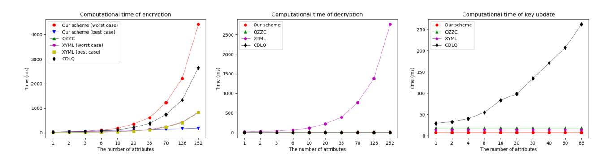

{0}------------------------------------------------

# Revocable Attribute-based Encryption Scheme with Arithmetic Span Program for Cloud-Assisted IoT

Hu Xiong, Jinhao Chen, Minghao Yang, and Xin Huang

University of Electronic Science and Technology of China, Chengdu, China {xionghu.uestc,jinhaochen.cloud, yangminghao1205, huangxin90427}@gmail.com

Abstract. Efficient user revocation and description of the access policy are essential to enhance the practicality of attribute-based encryption (ABE) in real-life scenarios, such as cloud-assisted IoT. Nevertheless, existing ABE works fail to balance the two vital indicators. Motivated by this, in this paper, we present a revocable ciphertext-policy attributebased encryption with arithmetic span programs (R-CPABE-ASP) for cloud-assisted IoT. For the first time, the presented R-CPABE-ASP achieves efficient user revocation and expressive description of access policy simultaneously. In R-CPABE-ASP, each attribute involved in access policy is merely used once to check whether a user owns access to shared data. Hence, the R-CPABE-ASP work enables efficient data encryption compared with existing revocable ABE works by reducing unnecessary cost for defining access policy. Meanwhile, the forward security of sensitive data is ensured by periodical update of encrypted data such that the capability of revocable storage is also assured in R-CPABE-ASP. As shown in the outsourced version of R-CPABE-ASP, The costly part for users to decrypt the data is outsourced to powerful cloud servers. Therefore, users in our R-CPABE-ASP can access their data in a more efficient way by merely one exponential operation. Finally, we carry out detailed theoretical analysis and experimental simulations to evaluate the performance of our work. The results fairly show that our proposed work is efficient and feasible in cloud-assisted IoT.

Keywords: Cloud-assisted Internet of Thing (IoT) · Attribute-based encryption · Arithmetic span program · Revocation.

## 1 Introduction

The Internet of Things (IoT) is a complex heterogeneous network. It connects various smart devices through communication and information technology to achieve intelligent identification, positioning, tracking, supervising and so on [1–3]. At present, IoT applications have been widely used in different fields such as smart cities, e-health, and intelligent transportation systems. However, with the increase of smart devices, more resources are required to manage 

{1}------------------------------------------------

and process the large amount of data generated by numerous smart devices in the IoT. For example, medical systems and traffic monitoring systems generate giga-level high-definition images and videos per minute [4]. It is hard for ordinary users or smart devices in the traditional IoT to undertake the heavy burden in both storage and calculation. Fortunately, cloud-assisted IoT provides a promising solution for solving the kind of data explosion problem under the constraints of individual object capabilities. As a powerful platform, cloud computing empowers users with on-demand services [5] for storing, accessing, and processing data.

Although cloud computing brings immense benefits to IoT, it also takes unprecedented security risks due to its openness [6]. Specifically, the data collected by the smart devices may contain the user's private information. The curious cloud servers and the unauthorized users may make the endeavors to obtain user's personal information for financial gains. For this reason, keeping the confidentiality of user's data is vital of importance. Meanwhile, out of the needs of efficient data sharing in cloud-assisted IoT, it is desirable to design an effective mechanism that enables flexible access control. Due to the advantages in ensuring data confidentiality and realzing fine-grained access control, the primitive of attribute-based encryption (ABE) [7] was widely explored in cloud-assisted IoT. In the ABE schemes [7–10], both the ciphertext and the key are related to a set of attributes. The encrypter can formulate an encryption strategy consisting of attributes according to the sensitive content and the receiver's characteristic information. With this method, the resulting ciphertext can only be decrypted by users whose attributes meet the encryption strategy. In this way, not only the confidentiality of the sensitive data is assured but also the access control is achieved in a flexible and fine-grained way. While a series of ABE schemes followed [11–13], nonetheless, the potential user revocation in cloud-assisted IoT is also challenging to the conventional ABE work.

For enhancing the practicality of ABE, the conception of revocation ABE was subsequently presented. The methods applied in the revocable ABE works for achieving user revocation can be typically divided into two categories: direct revocation and indirect revocation. In a directly revocable ABE work [14,15], the data owners need to maintain a revocation list delivered by the trusted authority and keep it up-to-date. Obviously, the communication overhead for requesting the latest revocation list from the trusted authority is burdensome for data owners. To avoid the heavy overhead for maintaining the revocation list, various ABE works that supports indirection user revocation were proposed [16–19]. In an ABE work that supports indirect revocation, each non-revoked user will receive an extra key update material from the trusted authority for generating a complete decryption key. It is effectively guaranteed that the revoked users without key update materials have no access to the shared data. Despite of this, existing revocable ABE works is still insufficient to handle the complicated access policy in a large-scale cloud-assisted IoT system. In these works, the attributes involved in the access policy will be multiply used to establish a fine

{2}------------------------------------------------

grained access control of the sensitive data. It indeed causes extra overheads for embedding the access policy into a ciphertext.

Motivated by this, in this paper, we present a revocable ciphertext-policy attribute-based encryption scheme with arithmetic span program [20–23] (R-CPABE-ASP) for cloud-assisted IoT environment. The presented R-CPABE-ASP not only achieves fine-grained access control and necessary user revocation but also enables efficient access policy description. Thanks to the expressive ASP access structure and decryption outsourcing, our R-CPABE-ASP obtains high efficiency in the phases of encryption and decryption. Combining with the periodical update of ciphertext, both secure cloud storage and efficient data sharing are effectively assured in our proposed R-CPABE-ASP scheme. In detail, our main contributions are listed below:

- We propose the first R-CPABE-ASP scheme that achieves user revocation and ASP access structure simultaneously. The presented R-CPABE-ASP can effectively address the potential changes in user's access right to shared data thanks to the introduction of user revocation. Meanwhile, the ciphertext in R-CPABE-ASP will be periodically updated such that the forward security of the ciphertext is guaranteed. By considering this, the capability of revocable storage is also assured in the R-CPABE-ASP.
- Compared with existing revocable ABE works where the attributes will be multiply required to establish an access policy, each attribute in access policy of our R-CPABE-ASP scheme is merely used once. Hence, the R-CPABE-ASP owns higher efficiency in data encryption for embedding the access policy into a ciphertext. Furthermore, an outsourced version of R-CPABE-ASP (OR-CPABE-ASP) is given, in which the overhead for data decryption is reduced to one exponential operation. Thus, even light weight users can efficiently access the data in cloud-assisted IoT environment.
- Our proposed R-CPABE-ASP is proved to be adaptively secure under the  $MDDH_{k,l}^m$  assumption by using dual system encryption technology [24]. Finally, the detailed theoretical analysis and experimental simulations demonstrate that the presented R-CPABE-ASP is secure, efficient and feasible in cloud-assisted IoT.

#### 1.1 Organizations

The rest of this paper is conducted as follows: Section 2 gives some basic notations and structures. The concrete construction and corresponding security analysis of R-CPABE-ASP is contributed in Section 3 and Section 4. The performance evaluation is carried out in Section 5. Finally, this paper is concluded in Section 6.

## 2 Preliminaries

In this section, some basic knowledge that will be used in the following part of this paper is given.

{3}------------------------------------------------

### 2.1 Mathematical Notations

For a prime order asymmetric bilinear pairing  $(e, \mathbb{G}, \mathbb{H}, \mathbb{G}_T, g, h)$ ,  $\mathbb{G}, \mathbb{H}, \mathbb{G}_T$  are prime order groups, e is a map from  $\mathbb{G} \times \mathbb{H}$  to  $\mathbb{G}_T$ , g and h are the generators of  $\mathbb{G}$  and  $\mathbb{H}$ , respectively. With the basis, some operations can be defined as:

- $\diamond$  Given a vector  $\mathbf{A} = (g^{a_1}, g^{a_2})^{\top}$  and a matrix  $\mathbf{B} \in \mathbb{Z}_p^{3 \times 2}$ ,  $\mathbf{A}^{\mathbf{B}} = g^{\mathbf{B}(a_1, a_2)^{\top}}$ , where  $a_1, a_2 \in \mathbb{Z}_p$ .
- $\diamond$  Given a matrix  $g^{\mathbf{C}_1^{\top}}$ , where  $\mathbf{C}_1 = (c_{11}, c_{21}, c_{31}) \leftarrow_R \mathbb{Z}_p^3, \boldsymbol{\lambda} \leftarrow_R \mathbb{Z}_p^{2 \times 1}$ , the result of  $g^{\boldsymbol{\lambda} \cdot \mathbf{C}_1^{\top}}$  can be easily obtained as:

$$g^{\boldsymbol{\lambda} \cdot \mathbf{C}_{1}^{\top}} = g^{\begin{bmatrix} \lambda_{11} \\ \lambda_{21} \end{bmatrix} \cdot \begin{bmatrix} c_{11} c_{21} c_{31} \end{bmatrix}} = g^{\begin{bmatrix} \lambda_{11} \cdot c_{11} \lambda_{11} \cdot c_{21} \lambda_{11} \cdot c_{31} \\ \lambda_{21} \cdot c_{11} \lambda_{21} \cdot c_{21} \lambda_{21} \cdot c_{31} \end{bmatrix}} = \begin{bmatrix} (g^{c_{11}})^{\lambda_{11}} (g^{c_{21}})^{\lambda_{11}} (g^{c_{31}})^{\lambda_{11}} \\ (g^{c_{11}})^{\lambda_{21}} (g^{c_{21}})^{\lambda_{21}} (g^{c_{31}})^{\lambda_{21}} \end{bmatrix},$$

where  $g^{c_{11}}, g^{c_{21}}, g^{c_{31}}$  can be gained from the matrix  $g^{\mathbf{C}_1^{\top}}$ .

 $\diamond$  Given a matrix  $g^{\mathbf{C}_1^{\top}}$  with unknown  $\mathbf{C}_1 \leftarrow_R \mathbb{Z}_p^3$  and a matrix  $\boldsymbol{\vartheta} \leftarrow_R \mathbb{Z}_p^{3\times 2}$ , the value of matrix  $g^{\mathbf{C}_1^{\top} \cdot \boldsymbol{\vartheta}}$  can be easily obtained following the above-mentioned steps.

#### 2.2 Basis Structure

To simulate the composite-order groups with three primes- order subgroups. We first choose  $l_1, l_2, l_3, l_w \geq 1$ , and pick  $\mathbf{W}_1 \leftarrow_R \mathbb{Z}_p^{l \times l_1}, \mathbf{W}_2 \leftarrow_R \mathbb{Z}_p^{l \times l_2}, \mathbf{W}_3 \leftarrow_R \mathbb{Z}_p^{l \times l_3}$ , where  $l = l_1 + l_2 + l_3$ .  $(\mathbf{W}_1^* | \mathbf{W}_2^* | \mathbf{W}_3^*)^{\top}$  is defined as the inverse of  $(\mathbf{W}_1 | \mathbf{W}_2 | \mathbf{W}_3)$ . It is clear that  $\mathbf{W}_i^{\top} \mathbf{W}_i^* = \mathbf{I}$ , and  $\mathbf{W}_i^{\top} \mathbf{W}_j^* = \mathbf{0}$   $(i \neq j)$ , where  $\mathbf{I}$  is the identity matrix. And for any  $\mathbf{T} \leftarrow_R \mathbb{Z}^{l \times l_w}$ , there's always  $\mathbf{T} = \mathbf{B}^{(1)} + \mathbf{B}^{(2)} + \mathbf{B}^{(3)}$ , where  $\mathbf{B}^{(1)} \leftarrow_R \operatorname{span}^{l_w}(\mathbf{W}_1^*), \mathbf{B}^{(2)} \leftarrow_R \operatorname{span}^{l_w}(\mathbf{W}_2^*), \mathbf{B}^{(3)} \leftarrow_R \operatorname{span}^{l_w}(\mathbf{W}_3^*)$ .

**Theorem 1.** Given matrices  $\mathbf{W}_1, \mathbf{W}_2, \mathbf{W}_3, \mathbf{W}_1^*, \mathbf{W}_2^*, \mathbf{W}_3^*, \mathbf{T}$  mentioned in the basis structure, the following two distributions  $\{\mathbf{W}_1^{\mathsf{T}}\mathbf{T}, \mathbf{W}_3^{\mathsf{T}}\mathbf{T}, \mathbf{T}\}$  and  $\{\mathbf{W}_1^{\mathsf{T}}\mathbf{T}, \mathbf{W}_3^{\mathsf{T}}\mathbf{T}, \mathbf{T}\}$  are statistically identical with the probability 1 - 1/p, where  $\mathbf{P}^{(2)} \leftarrow_R \mathsf{span}^{l_w}(\mathbf{W}_2^*)$ .

## 2.3 $MDDH_{k,l}^m$ Assumption

For any PPT adversary  $\mathcal{A}$ ,  $\operatorname{Adv}_{\mathcal{A}}^{\operatorname{MDDH}_{k,l}^m}(\lambda) = |\operatorname{Pr}[\mathcal{A}(\mathbb{G}, g^{\mathbf{M}}, g^{\mathbf{MS}}) = 1] - \operatorname{Pr}[\mathcal{A}(\mathbb{G}, g^{\mathbf{M}}, g^{\mathbf{MS}})] = 1$  is negligible for a security parameter  $\lambda$ , in which g is the generator of  $\mathbb{G}$ ,  $\mathbf{M} \leftarrow_R \mathbb{Z}_p^{l \times k}$ ,  $\mathbf{S} \leftarrow_R \mathbb{Z}_p^{k \times m}$ ,  $\mathbf{S}' \leftarrow_R \mathbb{Z}_p^{l \times m}$   $(m \geq 1 \text{ and } l > k \geq 1)$ . According to [25], the  $\operatorname{MDDH}_{k,l}^m$  assumption is equivalent to the well-known k-Linear assumption [25]. For convenience, we denote  $\operatorname{MDDH}_{k,k+1}^1$  by  $\operatorname{MDDH}_k$  in the remainder part of this paper.

{4}------------------------------------------------

#### Arithmetic Span Program 2.4

The ASP access policy is formed with a vector set  $\mathcal{V} = \{\mathbf{y}_i, \mathbf{z}_i\}_{i \in [n]}$  and a map  $\pi:[n]\to A$ , where A is an attribute set and n=|A|. If there is an attribute vector  $\mathbf{x} = (x_{\pi(1)}, x_{\pi(2)}, \dots, x_{\pi(n)}) \in \mathbb{Z}_p^n$  which satisfies the ASP  $(\mathcal{V}, \pi)$ , it is able to get  $\gamma_1, \dots, \gamma_n \in \mathbb{Z}_p$  such that  $\sum_{i=1}^n \gamma_i(\mathbf{y}_i + x_{\pi(i)}\mathbf{z}_i) = (1, 0, \dots, 0)$ .

**Theorem 2.** For any attribute set S that is not satisfied with  $\mathcal{V} = \{(\mathbf{y}_j, \mathbf{z}_j)\}_{j \in S}$ , the distributions

 $\{s, \mathbf{y}_j \begin{pmatrix} l_0 s \\ \mathbf{L} \end{pmatrix} + r_j p_j, \mathbf{z}_j \begin{pmatrix} l_0 s \\ \mathbf{L} \end{pmatrix} + r_j p'_j, s_j\}_{j \in S}, (\{\alpha + r l_0, r, r p_j\})_{j \in S} \text{ perfectly hide}$  $\alpha$ , where  $p_j, p'_j, l_0, s, r, s_j \leftarrow_R \mathbb{Z}_p, \mathbf{L} \leftarrow_R \mathbb{Z}_p^{l'-1}$ , and  $r_j \neq 0$ .

One-use restriction. Similar to the ideas of [26] [21], for  $\forall (\mathbf{y}_i, \mathbf{z}_i), (\mathbf{y}_j, \mathbf{z}_j) \in$ 

 $\mathcal{V}$ , if  $i \neq j$ , then these two pairs of vectors correspond to different attributes.

#### An Efficient Timestamp Encoding Algorithm 2.5

For achieving the high clarity of the description for the proposed scheme, as well as the efficiency for time-related update, an efficient timestamp encoding (TSE) algorithm |17| is introduced here. Due to the limited space, the details of this algorithm are omitted here.

#### Revocable CP-ABE for Arithmetic Span Programs for 3 Cloud-Assisted IoT

#### System and Threat Models 3.1

The responsibility of each entity involved is described as below:

- **Key generate center** is the manager of the whole system. It is responsible for generating long-term key materials for each users and broadcast key update information to non-revoked users.
- Smart devices are data collectors. They can be various wearable devices or personal health monitor. Each smart devices will continuously gather the personal information about the data owners.
- Cloud server is a powerful third-party entity for mitigating the heavy burden of data storage and management for data owners.:
- Data owner is the entity that owns the wearable devices. It can access the data stored on the cloud server on-demand via the Internet. Meanwhile, the data owner is also able to share its data to other users via the cloud server.
- Data user is the entity that is authorized to access the shared data. Each non-revoked data user can periodically receive the key update information from key generate center to synthesize a complete decryption key.

In the R-ABE-ASP scheme, the cloud servers that are responsible for storing the user's data may curious-but-honest. It may snoop user's personal information while honestly response for user's request. Besides, the users whose attributes mismatch the access policy or has been revoked may also make efforts to eavesdrop user's sensitive data.

{5}------------------------------------------------

### 3.2 Design Goals

In this paper, we plan to design a secure R-CPABE-ASP scheme that can not only achieve user revocation but also enable the efficient description of access policy. For this purpose, the R-CPABE-ASP should achieve the following goals.

- Data confidentiality: The data stored on the cloud servers can only be decrypted by authorized users. It should be inaccessible to the adversary defined in the threat model.
- Efficiency: The data is supposed to be stored and shared in an efficient manner. The overhead for data owners to encrypt the sensitive data and the cost for data users to access corresponding data should be carried out in a low-cost manner.
- Reliable access control: Considering the complex application scenarios in cloud-assisted IoT, the user revocation mechanism is also necessary except for fine-grained access control to sensitive data.

### 3.3 Outline of the R-CPABE-ASP

Different from the CP-ABE scheme with other access structures like LSSS, an attribute vector x corresponding to the attribute set S is needed in the R-CPABE-ASP scheme, which controls the various relationship between attributes and access structure. And now, we show the outline of a R-CPABE-ASP scheme that is formed with seven algorithms as below.

Setup(λ): This algorithm is executed by the key generate center to initialize the system. Taking a security parameter λ as input, the algorithm outputs the public parameter pp and the master secret key msk.

AttrKeyGen(st, pp, msk, S, x, ID): This algorithm is executed by the key generate center to generate the attribute related key for the users, including data owners and data users. Taking the state information st, public parameter pp, the master secret key msk, an attribute set S, an attribute vector x and unique credential ID of a user as input, this algorithm outputs the corresponding attribute key AKID.

KeyUpdate(st, msk, t, REL): This algorithm is executed by the key generate center to produce the key update materials for each non-revoked user. Taking the state information st, the master secret key msk, current time period t and revocation list REL as input, this algorithm outputs the key update information KUt.

KeyGen(pp, AKID, KUt): This algorithm is executed by each users to produce the complete decryption key. Taking the public parameter pp, the attribute key AKID of a user and the key update information UKt as input, this algorithm outputs the whole secret key skt.

Encrypt(pp,(V, π), msg, t): This algorithm is executed by various smart devices possessed by the data owners. Taking the public parameter pp, an arithmetic span program (V, π), a message msg and current time period t as input, the algorithm outputs the ciphertext ctt under time period t.

{6}------------------------------------------------

 $\mathsf{CTUpdate}(pp, ct_t, t')$ : This algorithm is carried out by the cloud servers to periodically delete the expired data. Taking the public parameter pp, the ciphertext  $ct_t$  under time period t and current time period t', this algorithm outputs the updated ciphertext  $ct_{t'}$ .

Decrypt $(ct_t, sk_{t'}, (\mathcal{V}, \pi))$ : This algorithm is carried out by the data owner or the authorized data users to access the shared data. Taking a ciphertext  $ct_t$ , the secret key  $sk_{t'}$  and an arithmetic span program  $(\mathcal{V}, \pi)$ , the algorithm outputs the message msg or a symbol  $\bot$  for a failure decryption.

Revoke(REL, ID, t): This algorithm is carried out by key generate center to revoke the compromised users. Taking the revocation list REL, the credential ID of a user and current time period t, this algorithm updates the REL by adding a tuple (ID, t).

#### 3.4 Construction

The detailed description of the proposed puncturable ciphertext-policy attributebased encryption scheme for arithmetic span program is presented as below.

- Setup(λ, ℓ, N): On input a security parameter λ, the maximum length of the time period ℓ and the maximum users of the system N, this algorithm sets a bilinear group generator  $\mathcal{G}$  and computes ( $\mathbb{G}, \mathbb{H}, \mathbb{G}_T, e, g, h$ )  $\leftarrow \mathcal{G}(\lambda)$ . In the tuple ( $\mathbb{G}, \mathbb{H}, \mathbb{G}_T, e, g, h$ ), there exists a map  $e : \mathbb{G} \times \mathbb{H} \to \mathbb{G}_T$ , and g, h are the generators of  $\mathbb{G}$  and  $\mathbb{H}$ , respectively. In addition, this algorithm selects a hash function  $H : \{0,1\}^* \to \mathbb{Z}_p$  and some parameters  $\mathbf{C}_1 \leftarrow_R \mathbb{Z}_p^3, \mathbf{D} \leftarrow_R \mathbb{Z}_p^2, \mathbf{K}, \mathbf{K}_0, \mathbf{K}_1, \mathbf{K}', \mathbf{K}'_0, \mathbf{K}'_1, \mathbf{L}_0, \vartheta_1, \cdots, \vartheta_\ell \leftarrow_R \mathbb{Z}_p^{3 \times 2}, \alpha_1, \alpha_2 \leftarrow_R \mathbb{Z}_p^3$  randomly. Then, this algorithm picks a binary tree BT with N leaf nodes that are used to store the information of users and initialize an empty list REL to record the revoked user's credential, as well as the state information st = BT. Finally, this algorithm outputs the public parameter as  $pp = (g, h, H, g^{\mathbf{C}_1^\top}, g^{\mathbf{C}_1^\top \mathbf{K}}, g^{\mathbf{C}_1^\top \mathbf{K}_0}, g^{\mathbf{C}_1^\top \mathbf{K}'}, g^{\mathbf{C}_1^\top \mathbf{K}'_0}, g^{\mathbf{C}_1^\top \mathbf{K}'_1}, g^{\mathbf{C}_1^\top \mathbf{L}_0}, e(g^{\mathbf{C}_1^\top}, h^{\alpha_1}), e(g^{\mathbf{C}_1^\top}, h^{\alpha_2}), \vartheta_1, \cdots, \vartheta_\ell)$  and the master secret key as  $msk = (\mathbf{C}_1, \mathbf{D}, \mathbf{K}, \mathbf{K}_0, \mathbf{K}_1, \mathbf{K}', \mathbf{K}'_0, \mathbf{K}'_1, \mathbf{L}_0, \alpha_1, \alpha_2)$ .
- AttrKeyGen(st, pp, msk, S,  $\mathbf{x}$ , ID): On input the state information st, public parameter pp, the master secret key msk, an attribute set S, an attribute vector  $\mathbf{x}$  and the unique credential ID of the user that generated by the system when the user joins for the first time, this algorithm arbitrarily assigns an unused leaf node  $\delta$  of BT to store the information of this user. After that, for each node  $\varrho \in \mathsf{Path}(\delta)$ , this algorithm picks an random vector  $\boldsymbol{\xi}_{\varrho}$  and stores it in this node. Then, this algorithm further calculates  $IK_{\varrho} = h^{\boldsymbol{\xi}_{\varrho}}$ . Subsequently, this algorithm samples  $\mathbf{b}$ ,  $\{\mathbf{b}_y, \mathbf{b}_y'\}_{y \in S} \leftarrow_R \mathsf{span}(\mathbf{D})$  and then computes

$$K_{0} = h^{\mathbf{b}}, \{K_{0,y} = h^{\mathbf{b}_{y}}, K'_{0,y} = h^{\mathbf{b}'_{y}}\}_{y \in S},$$
$$\{K_{1,y} = h^{(\mathbf{K} + x_{y}\mathbf{K}')\mathbf{b} + (\mathbf{K}_{0} + H(y)\mathbf{K}_{1})\mathbf{b}_{y} + x_{y}(\mathbf{K}'_{0} + H(y)\mathbf{K}'_{1})\mathbf{b}'_{y}}\}_{y \in S}, K_{2} = h^{\alpha_{1} - \mathbf{L}_{0}\mathbf{b}}.$$

Finally, this algorithm outputs the attribute key  $AK_{\mathsf{ID}} = \{K, IK_{\varrho}\}_{\varrho \in \mathsf{Path}(\delta)}$  where  $K = (K_0, \{K_{0,y}, K'_{0,y}, K_{1,y}\}_{y \in S}, K_2)$ .

{7}------------------------------------------------

- KeyUpdate(st, msk, t, REL): For each node  $\varrho \in \text{KUNodes}(\mathsf{BT}, \mathsf{RL}, t)$ , this algorithm retrieves the random vector  $\boldsymbol{\xi}_{\varrho}$  stored from the node  $\varrho$  and computes  $\tilde{t} = TSE(t, \ell)$ . After that, it generates the key update information as follows:

$$KU_{\varrho,0} = h^{\boldsymbol{\alpha}_2 - \boldsymbol{\xi}_{\varrho}} \cdot h^{\sum\limits_{k \in \Upsilon} \boldsymbol{\vartheta}_k \cdot \boldsymbol{\tau}_{\varrho,1}}, KU_{\varrho,1} = h^{\boldsymbol{\tau}_{\varrho,1}},$$

where  $\Upsilon = \{k | \tilde{t}(k) = 0\}$  and  $\tau_{\varrho,1} \leftarrow_R \mathbb{Z}_p^{2 \times 1}$  is randomly picked. Finally, this algorithm outputs key update information

 $KU_t = \{\varrho, KU_{\varrho,0}, KU_{\varrho,1}\}_{\varrho \in \mathsf{KUNodes}(\mathsf{BT}, \ \mathsf{RL}, \ \mathsf{t})}.$ 

- Keygen $(pp, AK_{\mathsf{ID},KU_t})$ : For each node  $\varrho \in \mathsf{Path}(\delta) \cap \mathsf{KUNodes}(\mathsf{BT}, \mathsf{RL}, t)$ , this algorithm picks  $\tau_1 \leftarrow_R \mathbb{Z}_p^{2\times 1}$  and calculates the time-related decryption key

$$K_{\mathsf{ID},t} = (IK_{\varrho} \cdot KU_{\varrho,0} \cdot h^{\sum\limits_{k \in \varUpsilon} \boldsymbol{\vartheta}_k \cdot \boldsymbol{\tau_1}}, KU_{\varrho,1} \cdot h^{\boldsymbol{\tau_1}}),$$

where  $\Upsilon = \{k | \tilde{t}(k) = 0\}$  and  $\tilde{t} = TSE(t, \ell)$ . Finally, this algorithm outputs the whole decryption key  $sk_t = (K_0, \{K_{0,y}, K'_{0,y}, K_{1,y}\}_{y \in S}, K_2, K_{\mathsf{ID},t})$ .

- Encrypt $(pp, (\mathcal{V}, \pi), msg, t)$ : Note that,  $\mathcal{V} = (\mathbf{y}_j, \mathbf{z}_j)_{j \in [n]}$ , and  $\pi$  is a map from  $(\mathbf{y}_j, \mathbf{z}_j)$  to A. Let l denote the length of the vectors in  $(\mathcal{V}, \pi)$ . After receiving the public parameter pp, an arithmetic span program  $(\mathcal{V}, \pi)$  satisfying with an attribute set A and a message  $msg \in \mathbb{G}_T$ , this algorithm performs below. This algorithm samples  $\mathbf{L} \leftarrow_R \mathbb{Z}_p^{(l-1)\times 2}$ ,  $s, \{s_j\}_{j\in[n]}$ ,  $s_t \leftarrow_R \mathbb{Z}_p$  and then computes

$$C_{0} = g^{s\mathbf{C}_{1}^{\top}}, C_{0,j} = g^{s_{j}\mathbf{C}_{1}^{\top}}, C_{1,j} = g^{\mathbf{y}_{j}\left(s\mathbf{C}_{1}^{\top}\mathbf{L}_{0}\mathbf{L}\right) + s_{j}\mathbf{C}_{1}^{\top}\mathbf{K}},$$

$$C'_{1,j} = g^{\mathbf{z}_{j}\left(s\mathbf{C}_{1}^{\top}\mathbf{L}_{0}\right) + s_{j}\mathbf{C}_{1}^{\top}\mathbf{K}'}, C_{2,j} = g^{s_{j}\mathbf{C}_{1}^{\top}(\mathbf{K}_{0} + H(\pi(j)) \cdot \mathbf{K}_{1})},$$

$$C'_{2,j} = g^{s_{j}\mathbf{C}_{1}^{\top}(\mathbf{K}'_{0} + H(\pi(j)) \cdot \mathbf{K}'_{1})}, C_{3} = msg \cdot e(g, h)^{s\mathbf{C}_{1}^{\top}\boldsymbol{\alpha}_{1}} \cdot e(g, h)^{s_{t}\mathbf{C}_{1}^{\top}\boldsymbol{\alpha}_{2}},$$

$$C_{4} = g^{-s_{t} \cdot \mathbf{C}_{1}^{\top}}, C_{5} = g^{\mathbf{C}_{1}^{\top}\sum_{k \in \mathcal{Y}} \boldsymbol{\vartheta}_{k} \cdot s_{t}}, \boldsymbol{\Upsilon} \in \{k | \tilde{t}[k] = 0\}.$$

Finally, this algorithm outputs the ciphertext

 $ct_t = (C_0, \{C_{0,j}, C_{1,j}, C_{2,j}, C'_{1,j}, C'_{2,j}\}_{j \in [n]}, C_3, C_4, C_5)$  under time period t. CTUpdate $(pp, ct_t, t')$ : For transforming the ciphertext  $ct_t$  to time period t

- CTUpdate( $pp, ct_t, t'$ ): For transforming the ciphertext  $ct_t$  to time period t', this algorithm randomly picks  $s_{t'} \leftarrow_R \mathbb{Z}_p$  and performs as follow.

$$C_3' = C_3 \cdot e(g^{s_t \mathbf{C}_1^\top}, h^{\alpha_2}), C_4' = C_4 \cdot g^{-s_{t'} \cdot \mathbf{C}_1^\top}, C_5' = C_5 \cdot g^{\mathbf{C}_1^\top} \sum_{k \in \mathcal{X}} \boldsymbol{\vartheta}_k \cdot s_t'$$

where  $k \in \{k | \tilde{t}'[k] = 0\}$ . After that, the updates ciphertext

 $ct'_t = (C_0, \{C_{0,j}, C_{1,j}, C_{2,j}, C'_{1,j}, C'_{2,j}\}_{j \in [n]}, C'_3, C'_4, C'_5)$  will be outputed.

- Decrypt( $ct_t, sk_{t'}, (\mathcal{V}, \pi)$ ): This algorithm aborts as t' < t. Or else, if the attribute vector  $\mathbf{x}$  satisfies the arithmetic span program  $(\mathcal{V}, \pi)$ , this algorithm computes  $\gamma_1, \gamma_2, \dots \in \mathbb{Z}_p$  such that  $\sum_{j \in [n]} \gamma_j(\mathbf{y}_j + x_{\pi(j)}\mathbf{z}_j) = (1, 0, \dots, 0)$ . On input a ciphertext associated and a secret key sk, this algorithm computes

{8}------------------------------------------------

$$Y_{j} = e(C_{1,j} \cdot C_{1,j}^{\prime x_{\pi(j)}}, K_{0}) \cdot e(C_{2,j}, K_{0,\pi(j)}) \cdot e(C_{2,j}^{\prime x_{\pi(j)}}, K_{0,\pi(j)}^{\prime}) \cdot e(C_{0,j}, K_{1,\pi(j)})^{-1}$$

$$A = e(C_{0}, K_{2}) \cdot \prod_{j \in [n]} Y_{j}^{\gamma_{j}},$$

$$B = e(C_{4}, K_{\mathsf{ID},t^{\prime},1}) \cdot e(C_{5}, K_{\mathsf{ID},t^{\prime},2}), \Upsilon = \{k | \tilde{t}(k) = 0\},$$

and recovers the message as  $msg = \frac{C_3 \cdot B}{A}$ .

- Revoke(REL, ID, t): After receiving a tuple (ID, t), this algorithm updates REL by inserting this tuple to revocation list and outputs updated list REL.

### 3.5 Outsourced Version of R-CPABE-ASP Scheme

In this section, a outsourced R-CPABE-ASP (OR-CPABE-ASP) scheme is proposed. The OR-CPABE-ASP scheme consists the following 9 algorithms:

The Setup, AttrKeyGen, Keygen, Encrypt, CTUpdate and Revoke algorithms are the same as R-CPABE-ASP scheme. The only difference is the outsourced R-CPABE-ASP scheme has following three algorithms:

Keygen.rand( $sk_t$ ): The algorithm samples  $\tau \in \mathbb{Z}_p$  and computes  $\bar{K}_0 = K_0^{\tau}$ ,  $\{\bar{K}_{0,y} = K_{0,y}^{\tau}, \bar{K}_{0,y}' = K_{0,y}^{\tau}, \bar{K}_{1,y} = K_{1,y}^{\tau}\}_{y \in S}, \bar{K}_2 = K_2^{\tau}, \bar{K}_{\mathsf{ID},t} = K_{\mathsf{ID},t}^{\tau}$ . Finally, it sets  $\bar{sk}_t = \{\bar{K}_0, \{\bar{K}_{0,y}, \bar{K}_{0,y}', \bar{K}_{1,y}\}_{y \in S}, \bar{K}_2, \bar{K}_{\mathsf{ID},t}\}$  as the conversion key and outputs  $(\bar{sk}_t, \tau)$  as the retrieval key.

Decrypt.out $(ct_t, \bar{sk}_{t'}, (\mathcal{V}, \pi))$ : This algorithm aborts as t' < t. Or else, if the attribute vector  $\mathbf{x}$  satisfies the arithmetic span program  $(\mathcal{V}, \pi)$ , this algorithm computes  $\gamma_1, \gamma_2, \dots \in \mathbb{Z}_p$  such that  $\sum_{j \in [n]} \gamma_j(\mathbf{y}_j + x_{\pi(j)}\mathbf{z}_j) = (1, 0, \dots, 0)$ . On input a ciphertext associated and a secret key sk, this algorithm computes

$$A = e(C_0, \bar{K}_2) \cdot \prod_{j \in [n]} \left[ (e(C_{1,j} \cdot C_{1,j}^{\prime x_{\pi(j)}}, \bar{K}_0) \cdot e(C_{2,j}, \bar{K}_{0,\pi(j)}) \right]^{\gamma_j} \cdot \left[ e(C_{2,j}^{\prime x_{\pi(j)}}, \bar{K}_{0,\pi(j)}^{\prime}) \cdot e(C_{0,j}, \bar{K}_{1,\pi(j)})^{-1}) \right]^{\gamma_j},$$

$$B = e(C_4, \bar{K}_{\mathsf{ID},t^{\prime},1}) \cdot e(C_5, \bar{K}_{\mathsf{ID},t^{\prime},2}), \Upsilon = \{k | \tilde{t}(k) = 0\},$$

$$\bar{C}_3 = C_3, \bar{C}^{\prime} = \frac{B}{A}$$

and outputs  $\bar{c}t = (\bar{C}_3, \bar{C}')$ 

Decrypt.user $(\bar{c}t,\tau)$ : The algorithm recover the message as  $msg = (\bar{C}_3/\bar{C})^{'-\tau}$ .

## 4 Security Analysis

For illustrating the security of the proposed scheme, in this section, the fundamental security model is given at first. Then, the detailed security proof is shown.

{9}------------------------------------------------

#### 4.1 Security Model of the R-CPABE-ASP

By handing a security game played between the challenger  $\mathcal{C}$  and the adversary  $\mathcal{A}$ , the adaptive security of the proposed scheme can be described as below.

**Setup.** C runs the Setup( $\lambda$ ) to obtain (pp, msk) and returns pp to A.

**Phase 1.**  $\mathcal{A}$  could adaptively issue the queries, and  $\mathcal{C}$  can answer the queries as follows:

- AttrKeyGenQuery: C executes AttrKeyGen(st, msk) to obtain IK and returns it to A.
- KeyUpdateQuery: C executes KeyUpdate(BT, msk, S,  $\mathbf{x}$ ) to obtain  $KU_t$  and returns it to A.
- DecryptKeyQuery: C executes  $Decrypt(pp, msk, S, \mathbf{x})$  to obtain the  $sk_t$  and returns it to A.
- RevokeQuery:  $\mathcal{C}$  updates REL by executing Revoke(REL, ID, t) and return the updated list REL to  $\mathcal{A}$ .
- Corrupt: When  $\mathcal{A}$  issues this query,  $\mathcal{C}$  gives the most recent secret key  $sk_t$  to  $\mathcal{A}$ . And  $\mathcal{C}$  gives  $\mathcal{A}$  a symbol  $\perp$  for all subsequent queries.

**Challenge.** Given two equal length messages  $msg_0, msg_1$  which have never been provided by  $\mathcal{A}$ ,  $\mathcal{C}$  randomly chooses  $b \in \{0, 1\}$  and gives the challenge ciphertext by running  $\mathsf{Encrypt}(pp, (\mathcal{V}^*, \pi^*), msg_b, t^*)$ .

Phase 2. This phase is the same as Phase 1.

**Guess.**  $\mathcal{A}$  outputs a guess number  $b' \in \{0,1\}$ . If b' = b,  $\mathcal{A}$  wins the game. Specifically, the advantage of  $\mathcal{A}$  in winning this security game can be described as  $\mathsf{Adv}_{b=b'}^{\mathcal{A}} = \Pr[b=b'] - \frac{1}{2}$ .

Note that the restrictions are given implicitly:

- \* KeyUpdateQuery and RevokeQuery are merely allowed to be issued after the time period of other queries.
- \* RevokeQuery is not allowed to be issued under time period t once KeyUp-dateQuery is issued at time period t.
- \* DecryptKeyQuery is not allowed to be issued for any user who possesses the attributes that satisfied with  $(\mathcal{V}^*, \pi^*)$  or has been revoked under time period  $t^*$ .

**Definition**: A R-CPABE-ASP scheme is adaptively secure if the advantage  $\mathsf{Adv}_{b=b'}^{\mathcal{A}}$  is negligible for all polynomial time adversaries.

#### 4.2 Security Proof

Considering that the R-CPABE-ASP scheme utilizes the prime-order groups, it is necessary to give the prime-order entropy expansion lemma that plays an important role in the process of the proof before the formal security proof.

Lemma 1 (prime-order entropy expansion lemma). Define six matrices  $C_1, C_2, C_3, C_1^*, C_2^*, C_3^*$  whose properties are described in Section 2.2. Suppose  $l_w, l_1, l_3 \geq k$ . Under the MDDHk assumption, there are

{10}------------------------------------------------

$$\begin{cases} aux : g^{\mathbf{C}_{1}^{\mathsf{T}}}, g^{\mathbf{C}_{1}^{\mathsf{T}}\mathbf{K}}, g^{\mathbf{C}_{1}^{\mathsf{T}}\mathbf{K}_{0}}, g^{\mathbf{C}_{1}^{\mathsf{T}}\mathbf{K}_{1}}, g^{\mathbf{C}_{1}^{\mathsf{T}}\mathbf{K}'}, g^{\mathbf{C}_{1}^{\mathsf{T}}\mathbf{K}'_{0}}, g^{\mathbf{C}_{1}^{\mathsf{T}}\mathbf{K}'_{1}} \\ ct : \{g^{\mathbf{C}\mathbf{s}}^{\mathsf{T}}, g^{\mathbf{C}\mathbf{s}\mathbf{t}}^{\mathsf{T}}, \{g^{\mathbf{C}\mathbf{s}\mathbf{j}}^{\mathsf{T}}, g^{\mathbf{C}\mathbf{s}\mathbf{j}}^{\mathsf{T}}\mathbf{K}, g^{\mathbf{C}\mathbf{s}\mathbf{j}}^{\mathsf{T}}\mathbf{K}', \\ g^{\mathbf{C}\mathbf{s}\mathbf{j}}^{\mathsf{T}}(\mathbf{K}_{0} + H(\pi(j))\mathbf{K}_{1}), g^{\mathbf{C}\mathbf{s}\mathbf{j}}^{\mathsf{T}}(\mathbf{K}'_{0} + H(\pi(j))\mathbf{K}'_{1})\}_{j \in [|S|]} \} \\ sk : \{h^{\mathbf{b}}, \{h^{\mathbf{b}y}, h^{\mathbf{b}'y}, h^{\mathbf{K}\mathbf{b} + (\mathbf{K}_{0} + H(y)\mathbf{K}_{1})\mathbf{b}y}, \\ h^{\mathbf{K}'\mathbf{b} + (\mathbf{K}'_{0} + H(y)\mathbf{K}'_{1})\mathbf{b}'y}\}_{y \in S} \} \end{cases}$$

$$\begin{cases} aux : g^{\mathbf{C}_{1}^{\mathsf{T}}}, g^{\mathbf{C}_{1}^{\mathsf{T}}\mathbf{K}}, g^{\mathbf{C}_{1}^{\mathsf{T}}\mathbf{K}_{0}}, g^{\mathbf{C}_{1}^{\mathsf{T}}\mathbf{K}'}, g^{\mathbf{C}_{1}^{\mathsf{T}}\mathbf{K}'}, g^{\mathbf{C}_{1}^{\mathsf{T}}\mathbf{K}'}, g^{\mathbf{C}_{1}^{\mathsf{T}}\mathbf{K}'_{1}} \\ ct : \{g^{\mathbf{C}\mathbf{s}^{\mathsf{T}}}, g^{\mathbf{C}\mathbf{s}\mathbf{t}^{\mathsf{T}}}, \{g^{\mathbf{C}\mathbf{s}\mathbf{j}^{\mathsf{T}}}, g^{\mathbf{C}\mathbf{s}\mathbf{j}^{\mathsf{T}}}(\mathbf{K} + \mathbf{N}_{j}^{(2)}), \\ g^{\mathbf{C}\mathbf{s}\mathbf{j}^{\mathsf{T}}}(\mathbf{K}' + \mathbf{N}_{j}^{(2)}), g^{\mathbf{C}\mathbf{s}\mathbf{j}^{\mathsf{T}}}(\mathbf{K}_{0} + H(\pi(j))\mathbf{K}_{1} + \mathbf{P}_{j}^{(2)}), \\ g^{\mathbf{C}\mathbf{s}\mathbf{j}^{\mathsf{T}}}(\mathbf{K}'_{0} + H(\pi(j))\mathbf{K}'_{1} + \mathbf{P}_{j}^{(2)}), \\ g^{\mathbf{C}\mathbf{s}\mathbf{j}^{\mathsf{T}}}(\mathbf{K}'_{0} + H(\pi(j))\mathbf{K}'_{1} + \mathbf{P}_{j}^{(2)}), \\ h^{\mathbf{K}'\mathbf{b}}, \{h^{\mathbf{b}y}, h^{\mathbf{b}y}, h^{\mathbf{b}y}, h^{\mathbf{K}y}, h^{\mathbf{K}y}, h^{\mathbf{K}y}, h^{\mathbf{K}y}, h^{\mathbf{K}y}, h^{\mathbf{K}y}, h^{\mathbf{K}y}, h^{\mathbf{K}y}, h^{\mathbf{K}y}, h^{\mathbf{K}y}, h^{\mathbf{K}y}, h^{\mathbf{K}y}, h^{\mathbf{K}y}, h^{\mathbf{K}y}, h^{\mathbf{K}y}, h^{\mathbf{K}y}, h^{\mathbf{K}y}, h^{\mathbf{K}y}, h^{\mathbf{K}y}, h^{\mathbf{K}y}, h^{\mathbf{K}y}, h^{\mathbf{K}y}, h^{\mathbf{K}y}, h^{\mathbf{K}y}, h^{\mathbf{K}y}, h^{\mathbf{K}y}, h^{\mathbf{K}y}, h^{\mathbf{K}y}, h^{\mathbf{K}y}, h^{\mathbf{K}y}, h^{\mathbf{K}y}, h^{\mathbf{K}y}, h^{\mathbf{K}y}, h^{\mathbf{K}y}, h^{\mathbf{K}y}, h^{\mathbf{K}y}, h^{\mathbf{K}y}, h^{\mathbf{K}y}, h^{\mathbf{K}y}, h^{\mathbf{K}y}, h^{\mathbf{K}y}, h^{\mathbf{K}y}, h^{\mathbf{K}y}, h^{\mathbf{K}y}, h^{\mathbf{K}y}, h^{\mathbf{K}y}, h^{\mathbf{K}y}, h^{\mathbf{K}y}, h^{\mathbf{K}y}, h^{\mathbf{K}y}, h^{\mathbf{K}y}, h^{\mathbf{K}y}, h^{\mathbf{K}y}, h^{\mathbf{K}y}, h^{\mathbf{K}y}, h^{\mathbf{K}y}, h^{\mathbf{K}y}, h^{\mathbf{K}y}, h^{\mathbf{K}y}, h^{\mathbf{K}y}, h^{\mathbf{K}y}, h^{\mathbf{K}y}, h^{\mathbf{K}y}, h^{\mathbf{K}y}, h^{\mathbf{K}y}, h^{\mathbf{K}y}, h^{\mathbf{K}y}, h^{\mathbf{K}y}, h^{\mathbf{K}y}, h^{\mathbf{K}y}, h^{\mathbf{K}y}, h^{\mathbf{K}y}$$

where S denotes the attribute set involved in the ciphertext,  $\mathbf{K}, \mathbf{K}_0, \mathbf{K}_1, \mathbf{K}', \mathbf{K}'_0, \mathbf{K}'_1 \leftarrow_R \mathbb{Z}_p^{3\times2}, \mathbf{N}_j^{(2)}, \mathbf{N}_j^{(2)}, \mathbf{P}_j^{(2)}, \mathbf{P}_j^{(2)} \leftarrow_R \operatorname{span}^2(\mathbf{C}_2^*), \mathbf{b}, \mathbf{b}_y \leftarrow_R \mathbb{Z}_p^{2\times2}$ . Especially, the value of  $\mathbf{Cs}, \mathbf{Cs}_j, \mathbf{Cst}$  are set to be  $_R \operatorname{span}(\mathbf{C}_1)$  in the left distribution and  $_R \operatorname{span}(\mathbf{C}_1, \mathbf{C}_2)$  in the right distribution. The proof of this lemma is similar to the **Lemma 12** in [21], it is omitted here for the limited space of papers.

**Theorem 3.** Under the MDDHmk,l assumption, the R-CPABE-ASP scheme is adaptively secure. Concretely, for any polynomial-time adversary  $\mathcal{A}$  who can make at most Q key queries against the R-CPABE-ASP scheme, there exist three polynomial-time adversaries  $\mathcal{D}_0$ ,  $\mathcal{D}_1$ ,  $\mathcal{D}_3$ , such that

$$\operatorname{Adv}_{\mathcal{P}\text{-}\mathcal{C}\mathcal{P}\text{-}\mathcal{ABE}\text{-}\mathcal{ASP}}^{\mathcal{D}_0}(\lambda) \leq \operatorname{Adv}_{\mathbf{Lemma}\ \mathbf{1}(k=1)}^{\mathcal{D}_0}(\lambda) + Q_{\operatorname{Adv}}_{\operatorname{MDDH}_{1,2}^{2|S|+1}}^{\mathcal{D}_1}(\lambda) + Q_{\operatorname{Adv}}_{\operatorname{MDDH}_{1,2}^{2|S|+1}}^{\mathcal{D}_3}(\lambda).$$

The proof of the **Theorem 3** follows a succession of games depending on the dual system methodology [24]. Before giving the concrete proof, we define the hy-brids that will be used in the following proof. For better describing the hybrids, we first define some parameters as  $\hat{N}_y = \mathbf{N}_y^{(2)} + \mathbf{K}$ ,  $\hat{N}_y' = \mathbf{N}_y'^{(2)} + \mathbf{K}'$ ,  $\hat{P}_y = \mathbf{P}_y^{(2)} + \mathbf{K}_0 + y\mathbf{K}_1$ , where  $\mathbf{N}_y^{(2)}$ ,  $\mathbf{N}_y'^{(2)}$ ,  $\mathbf{P}_y^{(2)}$ ,  $\mathbf{P}_y'^{(2)}$   $\leftarrow_R$  span( $\mathbf{C}_2^*$ ), and various types of the ciphertext and secret key as follows.

Define various types of the secret key:

- Normal: It is generated by Keygen $(pp, msk, S, \boldsymbol{x})$ .
- E-normal: It is same as a Normal secret key, except that  $\mathbf{b}, \mathbf{b}_y, \mathbf{b}_y'$  are converted to  $\mathbf{S}, \mathbf{S}_y, \mathbf{S}_y'$ , where  $\mathbf{S}, \mathbf{S}_y, \mathbf{S}_y' \leftarrow_R \mathbb{Z}_p^2$ .

{11}------------------------------------------------

- P-normal: It is same as E-normal key, except that  $K_{1,y}$  is converted to  $K_{1,y} = h(\hat{N}_y + x_y \hat{N}_y') \mathbf{S} + (\hat{P}_y) \mathbf{S}_y + x_y (\hat{P}_y') \mathbf{S}_y'$ .
- P-SF: It is same as P-normal, except that  $\alpha_1$  is converted to  $\alpha_1 + a_1 \mathbf{C}_2^*$  for a user whose attributes is unsatisfied with the access policy and  $\alpha_2$  is changed to be  $\alpha_2 + a_2 \mathbf{C}_2^*$  for a user who possess the attributes but is revoked. respectively, where  $a_1, a_2 \in \mathbb{Z}_p$ .
- SF: It is same as P-SF, except that  $\mathbf{S}, \mathbf{S}_y, \mathbf{S}_y'$  are converted to  $\mathbf{b}, \mathbf{b}_y, \mathbf{b}_y' \leftarrow_R \operatorname{span}(\mathbf{D})$ .

Define various types of the ciphertext:

- Normal: It is generated by  $\mathsf{Encrypt}(pp,(\mathcal{V},\pi),msg,T)$ .
- E-normal: It is same as a Normal ciphertext, except that  $C_{1,j}, C_{2,j}, C'_{1,j}, C'_{2,j}$  are converted as follows:

$$C_{1,j} = g^{\mathbf{y}_{j}} \left( \mathbf{C} \mathbf{S}^{\top} \mathbf{L}_{0} \right) + s_{j} \mathbf{C}_{1}^{\top} (\mathbf{K} + \hat{\mathbf{N}}_{j}),$$

$$C_{1,j}' = g^{\mathbf{z}_{j}} \left( \mathbf{C} \mathbf{S}^{\top} \mathbf{L}_{0} \right) + s_{j} \mathbf{C}_{1}^{\top} (\mathbf{K}' + \hat{\mathbf{N}}'_{j}),$$

$$C_{1,j}' = g^{\mathbf{z}_{j}} \mathbf{C}^{\top}_{1} (\mathbf{K}_{0} + H(\pi(j)) \mathbf{K}_{1} + \hat{\mathbf{P}}_{j}),$$

$$C_{2,j}' = g^{\mathbf{z}_{j}} \mathbf{C}^{\top}_{1} (\mathbf{K}'_{0} + \pi(j) \mathbf{K}'_{1} + \hat{\mathbf{P}}'_{j}).$$

Now, for a security game with Q keys queries and  $q=(1,2,\cdots,Q)$ , we can describe the *hybrids* as follows.

Hyb0,0,0: Both the ciphertext and secret keys are Normal.

 $\text{Hyb}_{0,0,q}$ : Same as  $\text{Hyb}_{0,0,q-1}$  except that the q-th secret key is E-normal.

 $\mathrm{Hyb}_{0,3}$ : Same as  $\mathrm{Hyb}_{0,0,Q}$  except that the secret keys are P-normal and the challenge ciphertext is E-normal.

 $\text{Hyb}_{q,2}$ : Same as  $\text{Hyb}_{q-1,3}$  except that the q-th secret key is P-SF.

 $\text{Hyb}_{q,3}$ : Same as  $\text{Hyb}_{q,2}$  except that the q-th secrete key is SF.

 $\text{Hyb}_{final}$ : Same as  $\text{Hyb}_{Q,3}$  except that the message corresponding to the ciphertext is a random element in  $\mathbb{G}_T$ .

**Lemma 2.** For any polynomial-time adversary  $\mathcal{A}$ , there exists a polynomial-time adversary  $\mathcal{D}_0$  such that

$$\mathsf{Adv}^{\mathcal{A}}_{\mathsf{Hyb}_{0,0,q-1},\mathsf{Hyb}_{0,0,q}}(\lambda) \leq \mathsf{Adv}^{\mathcal{D}_0}_{\mathsf{MDDH}^{2|S|+1}_{1,2}}(\lambda),$$

where |S| is the length of the attribute set.

Proof. The only difference between  $\operatorname{Hyb}_{0,0,q-1}$  and  $\operatorname{Hyb}_{0,0,q}$  is the q-th secret key  $sk_q$ . Given a random  $\operatorname{MDDH}_{1,2}^{2|S|+1}$  assumption instance  $(h^{\mathbf{D}}, h^{\mathbf{T}}, \{h^{\mathbf{T}_y}, h^{\mathbf{T}_y'}\}_{y \in S})$ , where h is the generator of the group  $\mathbb{H}$ ,  $\mathbf{D}, \mathbf{T}, \mathbf{T}_y, \mathbf{T}_y' \leftarrow_R \mathbb{Z}_p^2$ .  $\mathcal{D}_0$  chooses  $\mathbf{C}_1$ ,  $\mathbf{C}_2$ ,  $\mathbf{C}_2^* \leftarrow_R \mathbb{Z}_p^3$ ,  $\mathbf{K}$ ,  $\mathbf{K}_0$ ,  $\mathbf{K}_1$ ,  $\mathbf{K}'$ ,  $\mathbf{K}_0'$ ,  $\mathbf{K}_1'$ ,  $\mathbf{L}_0, \boldsymbol{\vartheta}_1, \cdots, \boldsymbol{\vartheta}_\ell \leftarrow_R \mathbb{Z}_p^3 \times^2$ ,  $\boldsymbol{\alpha}_1, \boldsymbol{\alpha}_2 \leftarrow_R \mathbb{Z}_p^3$ ,  $\boldsymbol{\tau} \leftarrow_R \mathbb{Z}_p^2$  randomly. Then,  $\mathcal{D}_0$  sets  $K_0 = h^{\mathbf{T}}$ ,  $\{K_{0,y} = h^{\mathbf{T}_y}\}_{y \in S}$ ,  $\{K_{0,y}' = h^{\mathbf{T}_y'}\}_{y \in S}$  and  $K_{1,y} = h^{(\mathbf{K} + x_y \mathbf{K}')\mathbf{T} + (\mathbf{K}_0 + y \mathbf{K}_1)\mathbf{T}_j + x_y (\mathbf{K}_0' + y \mathbf{K}_1')\mathbf{T}_y'}$ ,

{12}------------------------------------------------

 $K_2 = h^{\alpha_1 - \mathbf{L}_0 \mathbf{T}}$  as well as the time-related key  $K_{\mathsf{ID},t} = h^{\alpha_2 + \sum\limits_{k \in \Upsilon} \vartheta_k \cdot \tau}$ .  $\mathcal{D}_0$  sets the secret key under time period t as  $sk_t = (K_0, \{K_{0,y}, K'_{0,y}, K_{1,y}\}_{y \in S}, K_2, K_{\mathsf{ID},t})$ . In this instance, the only difference between  $\mathsf{Hyb}_{0,0,q-1}$  and  $\mathsf{Hyb}_{0,0,q}$  is the formation the matrices  $\mathbf{T}, \mathbf{T}_y$  and  $\mathbf{T}'_y$  of the q-th secret key. If  $\mathbf{T}, \mathbf{T}_y, \mathbf{T}'_y \leftarrow_R \mathsf{span}(\mathbf{D})$ , the output is the same as  $\mathsf{Hyb}_{0,0,q-1}$ , or else, it is the same as  $\mathsf{Hyb}_{0,0,q}$ . However, due to the hardness of resolving the  $\mathsf{MDDH}_{1,2}^{2|S|+1}$ ,  $\mathsf{Hyb}_{0,0,q-1}$  and  $\mathsf{Hyb}_{0,0,q}$  are indistinguishable.

**Lemma 3.** For any polynomial-time adversary  $\mathcal{A}$ , there exists a polynomial-time adversary  $\mathcal{D}_1$ , such that

$$\mathsf{Adv}^{\mathcal{A}}_{\mathsf{Hyb}_{0,0,Q},\mathsf{Hyb}_{0,3}}(\lambda) \leq \mathsf{Adv}^{\mathcal{D}_1}_{\mathbf{Lemma}\ \mathbf{1}(k=1)}(\lambda),$$

*Proof.* According to the **Lemma 1** $(k = 1, l_w = 2)$ ,  $\mathcal{D}_1$  uses the same substitution as (1) that is shown below.

$$\begin{cases} aux : g^{\mathbf{C}_{1}^{\top}}, g^{\mathbf{C}_{1}^{\top}\mathbf{K}}, g^{\mathbf{C}_{1}^{\top}\mathbf{K}_{0}}, g^{\mathbf{C}_{1}^{\top}\mathbf{K}_{1}}, g^{\mathbf{C}_{1}^{\top}\mathbf{K}'}, g^{\mathbf{C}_{1}^{\top}\mathbf{K}'_{0}}, g^{\mathbf{C}_{1}^{\top}\mathbf{K}'_{1}} \\ ct : \{ct_{0}, \{ct_{0,j}, ct_{1,j}, ct'_{1,j}, ct_{2,j}, ct'_{2,j}\}_{j \in [|S|]}\} \\ sk : \{sk_{0}, \{sk_{0,y}, sk'_{0,y}, sk_{1,y}, sk'_{1,y}\}_{y \in S}\} \end{cases}$$

 $\mathcal{D}_1$  chooses  $\boldsymbol{\alpha}_1, \boldsymbol{\alpha}_2 \leftarrow_R \mathbb{Z}_p^3$  and computes  $pp = (aux, e(g, h)^{\mathbf{C}_1^{\mathsf{T}} \boldsymbol{\alpha}_1}, e(g, h)^{\mathbf{C}_1^{\mathsf{T}} \boldsymbol{\alpha}_2})$  as the public parameter. Then,  $\mathcal{D}_1$  samples  $\mathbf{r}, \boldsymbol{\tau} \leftarrow_R \mathbb{Z}_p^2, \boldsymbol{\vartheta}_1, \cdots, \boldsymbol{\vartheta}_\ell \leftarrow_R \mathbb{Z}_p^{3 \times 2}$ . Define  $\mathbf{S} = \mathbf{b} \cdot \mathbf{r}, \mathbf{S}_y = \mathbf{b}_y \cdot \mathbf{r}, \mathbf{S}_y' = \mathbf{b}_y' \cdot \mathbf{r}$ .  $\mathcal{D}_1$  computes  $K = (K_0 = sk_0^{\mathbf{r}}, K_{0,y} = sk_{0,y}^{\mathbf{r}}, K_{0,y} = (sk_{1,y} \cdot sk_{1,y}'^{x_y})^{\mathbf{r}})$  and the time-related key  $K_{\mathsf{ID},t} = k_0^{\mathbf{r}} + \sum_{k \in \mathcal{T}} \mathbf{\vartheta}_k \cdot \boldsymbol{\tau}$ . After that,  $\mathcal{D}_1$  outputs  $sk_q = (K, K_{\mathsf{ID},t})$ . Furthermore,  $\mathcal{D}_1$  chooses a message  $msg_b$  from two equal-length messages  $msg_1, msg_2$  and runs  $\mathsf{Encrypt}(pp, \mathsf{C}_1, \mathsf{C}_2)$ .

$$(\mathcal{V}, \pi), msg_b, t$$
) to get  $ct = (ct_0, \{ct_{0,j}, ct_{1,j}, ct_{1,j}, g \in \mathbf{L}^{\mathbf{L}_0}\}, ct'_{1,j}, h \in \mathbf{L}^{\mathbf{L}_0})$ ,  $ct'_{1,j} \cdot h \in \mathbf{L}^{\mathbf{L}_0}$ ,  $ct_{2,j}, ct'_{2,j}\}_{j \in [n]}, e(ct_0, h^{\alpha_1}) \cdot e((g^{\mathbf{C}_1^{\mathsf{T}}})^{s_t}, h^{\alpha_2}) \cdot msg_b)$ . Finally,  $\mathcal{D}_1$  returns  $sk_q$  and  $ct$ .

When the input of  $\mathcal{D}_1$  is the left distribution in **Lemma 1**, the output is identical to  $\text{Hyb}_{0,0,Q}$ . Otherwise, the output is identical to  $\text{Hyb}_{0,3}$ .

**Lemma 4.** Under the assumption of  $MDDH_{1,2}^3$ , the advantage described as follows is negligible

$$\mathsf{Adv}_{N_0,N_1}^{\mathcal{A}}(\lambda) = |Pr[\mathcal{A}(W,N_0)] - Pr[\mathcal{A}(W,N_1)]|$$

where

$$\begin{split} W &= (\mathbf{C}_1, \mathbf{C}_2, \mathbf{C}_3, \mathbf{C}_1^*, \mathbf{C}_2^*, \mathbf{C}_3^*; \mathbf{C}_1^\top V, \mathbf{C}_3^\top V), V \leftarrow_R \mathbb{Z}_p^{3 \times 1}; \\ N_0 &= (h^{VT}, h^T), T \leftarrow_R \mathbb{Z}_p^{1 \times 2}; \\ N_1 &= (h^{VT+D}, h^T), D \leftarrow_R \operatorname{span}^2(\mathbf{C}_2^*); \end{split}$$

*proof.* This lemma can be readily proved from the assumption of  $MDDH_{1,2}^3$  that illustrates

$$(h^{\mathbf{T}}, h^{\mathbf{MT}}) \approx (h^{\mathbf{T}}, h^{\mathbf{MT+U}})$$

{13}------------------------------------------------

where  $\mathbf{T} \leftarrow_R \mathbb{Z}_p^{1 \times 2}$ ,  $\mathbf{M} \leftarrow_R \mathbb{Z}_p^{3 \times 1}$  and  $\mathbf{U} \leftarrow_R \mathbb{Z}_p^{3 \times 2}$ . More specifically, we can establish an algorithm  $\mathcal{B}$  that satisfies  $\mathsf{Adv}^{\mathcal{A}}(\lambda) \leq \mathsf{Adv}^{\mathcal{B}}_{MDDH_{1,2}^3}(\lambda)$ . As input  $(h^{\mathbf{T}}, h^{\mathbf{VT}})$ ,  $\mathcal{B}$  picks  $\mathbf{C}_1$ ,  $\mathbf{C}_2$ ,  $\mathbf{C}_3$ ,  $\mathbf{C}_1^*$ ,  $\mathbf{C}_2^*$ ,  $\mathbf{C}_3^*$  and  $\tilde{\mathbf{V}} \leftarrow_R \mathbb{Z}_p^{3 \times 1}$ . In this case, V is set to be  $\tilde{\mathbf{V}} + \mathbf{C}_2^* \mathbf{M}$  implicitly. After that,  $\mathcal{B}$  outputs  $\mathbf{C}_1$ ,  $\mathbf{C}_2$ ,  $\mathbf{C}_3$ ,  $\mathbf{C}_1^*$ ,  $\mathbf{C}_2^*$ ,  $\mathbf{C}_3^*$ ;  $\mathbf{C}_1^{\mathsf{T}} \tilde{\mathbf{V}}$ ,  $\mathbf{C}_3^{\mathsf{T}} \tilde{\mathbf{V}}$ ,  $(h^{\tilde{\mathbf{V}}\mathbf{T} + \mathbf{C}_2^*\mathbf{Z}})$ ,  $h^{\mathbf{T}}$ . Easily observe that the output is the same the  $(W, N_0)$  as  $\mathbf{Z} = \mathbf{M}\mathbf{T}$  and it is the same as  $(W, N_1)$  when  $\mathbf{Z} = \mathbf{M}\mathbf{T} + \mathbf{U}$  and  $\mathbf{D}$  is set to be  $\mathbf{C}_2^*\mathbf{U}$ .

**Lemma 5.** For any adversary  $\mathcal{A}$ ,  $\operatorname{Hyb}_{q-1,3}$  and  $\operatorname{Hyb}_{q,2}$  is indistinguishable. *Proof.* The only difference between  $\operatorname{Hyb}_{q-1,3}$  and  $\operatorname{Hyb}_{q,2}$  is the value  $K_2$  that changed from  $h^{\alpha_1-\mathbf{L}_0\mathbf{b}}$  to  $h^{\alpha_1+a_1\mathbf{C}_2^*-\mathbf{L}_0\mathbf{b}}$ , where  $\mathbf{S}, \mathbf{S}_y, \mathbf{S}_y' \in \mathbb{Z}_p^2$ ,  $\alpha_1, \alpha_2 \leftarrow_R \mathbb{Z}_p^3$ . the indistinguishability of  $\operatorname{Hyb}_{q-1,3}$  and  $\operatorname{Hyb}_{q,2}$  can be illustrated as follows.

- 1 . If the attributes involved in the secret key  $sk_i$  are not satisfied with the ciphertext, we can get that  $\alpha_1$  in  $K_2$  is perfectly hidden from **Theorem 2**. Thus, we can change  $\alpha_1$  to  $\alpha_1 + a_1 \mathbf{C}_2^*$ .
- 2. If the attributes attached in  $sk_i$  are satisfies with the ciphertext. As described in the security model, it is not allowed to inquiry anything about the user whose secret key is satisfied with the access policy of the ciphertext and is unrevoked. For a user whose secret key is satisfied with the access policy but is revoked, the time-related key under time period t is  $K_{\text{ID},t,1} = h^{\alpha_2 + \sum\limits_{k \in \mathcal{I}} \vartheta_k \tau}$ .

According to **Lemma 4**, it is distinguishable to  $h^{\alpha_2 + \sum_{k \in \Upsilon} (\vartheta_k + |\tilde{\vartheta}_k^{(2)}|) \tau}$  where  $\Upsilon = \{k | \tilde{t}(k) = 0\}$  and  $\vartheta_k^{(2)} \leftarrow_R \operatorname{span}^2(\mathbf{C}_2^*)$ . And assume the current time period is t', under which the corresponding time-related ciphertext is changed to be  $C_5' = h^{k \in \Upsilon}$ ,  $\Upsilon = \{k' | \tilde{t}'(k') = 0\}$ . Because of the different matrices between the secret key under time period t and the updated ciphertext under time period t', the change of secret key is considered as independent from the ciphertext, which is similar to the one-time pad mechanism. Every time the query is issued,  $\tilde{\vartheta}_k^{(2)}$  is randomly picked. For a revoked user,  $\alpha_2$  is perfectly hidden due to the random distribution of  $\tilde{\vartheta}_k^{(2)}$ . Hence, we can

is perfectly hidden due to the random distribution of  $\left|\tilde{\boldsymbol{\vartheta}}_{k}^{(2)}\right|$ . Hence, we can replace  $\boldsymbol{\alpha}_{2}$  with  $\boldsymbol{\alpha}_{2}+a_{2}C_{2}^{*}$ .

Summarized by the information mentioned above, the indistinguishability between  $\text{Hyb}_{q-1,3}$  and  $\text{Hyb}_{q,2}$  is readily demonstrated both for a user who do not own the satisfies attributes and a user who meets the attributes but is revoked.

**Lemma 6.** For any polynomial-time adversary  $\mathcal{A}$ , there exists a polynomial-time adversary  $\mathcal{D}_3$ , such that

$$\mathsf{Adv}^{\mathcal{A}}_{\mathsf{Hyb}_{q,2}\mathsf{Hyb}_{q,3}}(\lambda) \leq \mathsf{Adv}^{\mathcal{D}_3}_{\mathsf{MDDH}^{2|S|+1}_{1,2}}(\lambda),$$

where where |S| is the length of the attribute set.

{14}------------------------------------------------

Proof. The only difference between  $\text{Hyb}_{q,2}$  and  $\text{Hyb}_{q,3}$  is the q-th secret key  $sk_q$ . Given a random  $\text{MDDH}_{1,2}^{2|S|+1}$  assumption instance  $(h^{\mathbf{D}}, h^{\mathbf{T}}, \{h^{\mathbf{T}_y}, h^{\mathbf{T}_y'}\}_{y \in S})$ , where h is the generator of the group  $\mathbb{H}$ ,  $\mathbf{D}, \mathbf{T}, \mathbf{T}_y, \mathbf{T}_y', \boldsymbol{\tau} \leftarrow_R \mathbb{Z}_p^2$ .  $\mathcal{D}_3$  chooses  $\mathbf{C}_1, \mathbf{C}_2, \mathbf{C}_2^* \leftarrow_R \mathbb{Z}_p^3$ ,  $\hat{\mathbf{N}}, \hat{\mathbf{N}}', \hat{\mathbf{P}}, \hat{\mathbf{P}}', \mathbf{K}, \mathbf{K}_0, \mathbf{K}_1, \mathbf{K}', \mathbf{K}_0', \mathbf{K}_1', \mathbf{L}_0, \boldsymbol{\vartheta}_1, \cdots, \boldsymbol{\vartheta}_\ell \leftarrow_R \mathbb{Z}^{3\times 2}$ ,  $\boldsymbol{\alpha}_1, \boldsymbol{\alpha}_2 \leftarrow_R \mathbb{Z}_p^3$  randomly. Then it sets  $K_0 = h^{\mathbf{T}}$ ,  $\{K_{0,y} = h^{\mathbf{T}_y}\}_{y \in S}$ ,  $\{K_{0,y}'\}_{y \in S} = \{h^{\mathbf{T}_y'}\}_{y \in S}$  and computes  $K_{1,y} = h^{(\hat{\mathbf{N}} + x_y \hat{\mathbf{N}}')\mathbf{T} + \hat{\mathbf{P}}_y \mathbf{T}_j + \hat{\mathbf{P}}_y' \mathbf{T}_y'}$ , as well as the time-related key  $K_{\mathsf{ID},t} = h^{(\mathbf{X} + \sum_{k \in \Upsilon} \boldsymbol{\vartheta}_k \cdot \boldsymbol{\tau})}$ . After that,  $\mathcal{D}_3$  outputs the secret key  $sk_i = (K, K_{\mathsf{ID},t})$ . If  $\mathbf{T}, \{\mathbf{T}_y, \mathbf{T}_y'\}_{y \in S} \leftarrow_R \mathsf{span}(\mathbf{D})$ , the output is the same as in  $\mathsf{Hyb}_{q,3}$ . Otherwise, the output is the same as in  $\mathsf{Hyb}_{q,3}$ .

Lemma 7. For any adversary  $\mathcal{A}$ ,  $\operatorname{Hyb}_{Q,3}$  and  $\operatorname{Hyb}_{final}$  is indistinguishable. Proof. Choose  $\mathbf{C}_1, \mathbf{C}_2, \mathbf{C}_2^* \leftarrow_R \mathbb{Z}_p^3, \mathbf{D} \leftarrow_R \mathbb{Z}_p^2, \mathbf{K}, \mathbf{K}_0, \mathbf{K}_1, \mathbf{K}', \mathbf{K}'_0, \mathbf{K}'_1, \mathbf{L}_0 \leftarrow_R \mathbb{Z}^{3 \times 2}, \ \boldsymbol{\alpha}_1, \boldsymbol{\alpha}_2 \leftarrow_R \mathbb{Z}_p^3$  randomly and then define  $\hat{\boldsymbol{\alpha}}_1 = \boldsymbol{\alpha}_1 + a_1 \mathbf{C}_2^*$  as well as  $\hat{\boldsymbol{\alpha}}_2 = \boldsymbol{\alpha}_2 + a_2 \mathbf{C}_2^*$ . In  $\operatorname{Hyb}_{Q,3}$ , the public parameters which have been changed can be written as  $e(g^{\mathbf{C}_1^\top}, h^{\hat{\boldsymbol{\alpha}}_1}) = e(g^{\mathbf{C}_1^\top}, h^{\boldsymbol{\alpha}_1}), e(g^{\mathbf{C}_1^\top}, h^{\hat{\boldsymbol{\alpha}}_2}) = e(g^{\mathbf{C}_1^\top}, h^{\boldsymbol{\alpha}_2})$  due to  $\mathbf{C}_1^\top \mathbf{C}_2^* = 0$ . In addition,  $C_3$  contained in the ciphertext  $c_1$  can be written as  $msg \cdot e(g, h) \overline{\mathbf{C}_3}^\top (\hat{\boldsymbol{\alpha}}_1 - a_1 \mathbf{C}_2^*) \cdot e(g, h) \overline{\mathbf{C}_3}^\top (\hat{\boldsymbol{\alpha}}_2 - a_2 \mathbf{C}_2^*)} = msg \cdot e(g, h) \overline{\mathbf{C}_3}^\top \hat{\boldsymbol{\alpha}}_1$ .  $e(g, h) \overline{\mathbf{C}_3}^\top \hat{\boldsymbol{\alpha}}_2 \cdot e(g, h)^{-a_1} \cdot e(g, h)^{-a_2}$ , where  $a_1, a_2 \leftarrow_R \mathbb{Z}_p$  is randomly picked. In view of this, the distribution of the ciphertext  $c_1$  will not be changed even if msg is replaced as a random message.

## 4.3 Rationales Discuss

- Data confidentiality: according to the detailed security analysis, our R-CPABE-ASP is adaptively secure against an adversary who has no corresponding attribution set or was revoked in the prior time period. Thereby, the presented R-CPABE-ASP scheme meets the requirement of data confidentiality.
- Efficiency: because of the introduction of ASP access structure, the access policy involved in the encryption phase can be defined in a more efficient way than the works adopting normal access structure. Hence, encryption efficiency is significantly improved by reducing the redundant description of the access policy. Meanwhile, as shown in the outsourced version of the R-CPABE-ASP, the decryption cost for data users is merely one exponential operation. By considering this, both the encryption efficiency and decryption efficiency are effectively assured in R-CPABE-ASP.
- Reliable access control: on the one hand, the compromised user can be efficiently revoked in the R-CPABE-ASP since the adoption of user revocation mechanism. On the other hand, the ciphertext stored on the cloud server will be updated periodically. The ciphertext generated in the prior time period is deleted in a passive manner. Hence, the data leakage threats come from the curious cloud server are also eliminated. In other words, the R-CPABE-ASP also achieves revocable storage.

{15}------------------------------------------------

| Table 1. I repetites and emelency comparison among the works |                                           |                                                   |                                             |                           |
|--------------------------------------------------------------|-------------------------------------------|---------------------------------------------------|---------------------------------------------|---------------------------|
| Scheme                                                       | QZZC [16]                                 | XYML [17]                                         | CDLQ [18]                                   | OR-CPABE-ASP              |
| Revocation model                                             | Indirect                                  | Indirect                                          | Indirect                                    | Indirect                  |
| Security                                                     | Selective                                 | Selective                                         | Selective                                   | Adaptive                  |
| Revocable storage                                            | ×                                         | $\checkmark$                                      | ×                                           | ✓                         |
| Decryption key size                                          |                                           | $(2 S +3) \mathbb{G} $                            | $(2 S +3) \mathbb{G} $                      | (10 + 7 S ) H             |
| Ciphertext size                                              | $   \mathbb{G}  + (3 A  + 2) \mathbb{G} $ | $  \mathbb{G}_T  + (3 A  +  V  + 2) \mathbb{G}  $ | $  \mathbb{G}_T  + (3 A  + 2) \mathbb{G}  $ | $9(1+ A ) \mathbb{G} $    |
| Update key size                                              | $2 \mathbb{G} $                           |                                                   | 2 \$\mathbb{G} \$                           | 5 G                       |
| Encryption cost                                              | $ E_T + (4 A  + 2)E_G$                    | $ E_T + (5 A  +  V  + 2)E_G$                      | $ E_T + (4 A  + 2)E_G$                      | $ 2E_T + (11 A  + 8)E_G $ |
| Decryption cost                                              | 2P                                        | $(3 A +2)P +  A E_T$                              | $E_T$                                       | $E_T$                     |
| Key update cost                                              | $2E_G$                                    | $( S  + 4)E_{G}$                                  | $2E_G$                                      | $5E_H$                    |

Table 1: Properties and efficiency comparison among the works

#### 5 Performance evaluation

After the concrete construction of our OR-CPABE-ASP, an outsourced version of the OR-CPABE-ASP is given to mitigate the heavy decryption burden for users in our scheme. In this part, we mainly consider the OR-CPABE-ASP version for meeting the requirement of efficiency in cloud-assisted IoT scenarios. For making an overall performance evaluation in terms of our OR-CPABE-ASP and the state-of-the-art works 1, both theoretical analysis and experimental simulations are carried out.

#### 5.1 Theoretical Analysis

The detailed comparisons in terms of essential properties, communication and computation efficiency are summarized in Table 1. In this table, |S| represents the number of attributes held by the user; |A| is the size of attributes involved in the access policy; |V| is the size of bits with the value of 0 in a time period string;  $|\mathbb{G}|$ ,  $|\mathbb{H}|$  and  $|\mathbb{G}_T|$  denote the size of one element in group  $\mathbb{G}$ ,  $\mathbb{H}$  and  $\mathbb{G}_T$ ;  $E_{\mathbb{G}}$ ,  $E_{\mathbb{H}}$  and  $E_{\mathbb{T}}$  present one exponential operations in groups  $\mathbb{G}$ ,  $\mathbb{H}$  and  $\mathbb{G}_T$ , separately.

From the results of Table 1, all the works of QZZC [16], XYML [17], CDLQ [18] and ours adopt the indirect model to achieve user revocation. According to the results displayed in Table 1, it is fair to make a summary that both the works of QZZC [16] and CDLQ [18] outperform our OR-CPABE-ASP work in decryption key size, ciphertext size, update key size, data encryption efficiency and key update efficiency. Nonetheless, the works of QZZC [16] and CDLQ [18] only achieves selective security, which is too strict to handle the real-life security threats. Furthermore, their works are disable to guarantee the capability of revocable storage as shown in Table 1 and our OR-CPABE-ASP scheme is more efficient in terms of data decryption than that in work of QZZC [16]. In QZ-ZC [16], users need to carry out two heavy pairing operations to access the data stored on the cloud servers. While the cost for users to access the data is merely one exponential operation in our work. On the other hand, it is straightforward to see that the OR-CPABE-ASP scheme performs well in terms of security, ciphertext size, encryption efficiency and key update efficiency compared with

Denote the works of Qin et al. [16], Xu et al. [17] and Cui et al. [18] by QZZC, XYML and CDLQ, respectively.

{16}------------------------------------------------

XYML [17]. In XYML [17], the overhead for data encryption is affected by the value of current time period. The time period in their work is re-encoded as a binary string. During the phase of data encryption, the bits with a value of 0 in the time period string will induce extra exponential operations. In the worst case that all bits of the time period string are with the value of 0, the resulting overheads for data encryption and ciphertext delivery will come to an unacceptable high level. By considering this, only our proposed OR-CPABE-ASP work is secure, efficient and feasible in the complex real-life cloud-assisted IoT scenarios.

#### 5.2 Experimental Simulations

To discuss the feasibility and efficiency of the OR-CPABE-ASP work in a more comprehensive manner, the simulations for testing the computation efficiency are conducted in this section. We implement all the works with the PBC library on a Win 10 operation system installed with an Core i7-7700 @3.60Ghz processor and 8G RAM. The results of simulations are shown in Fig. 2, Fig. 3 and Fig. 4.

The data encryption efficiency comparison among the works is shown in Fig 2. In particular, we simulate XYML [17] and our OR-CPABE-ASP work under the extreme conditions. In XYML [17], data encryption cost is related to the length of bits with value of 0 in the current time period string. In this way, as all the bits are with value of 1, their work enjoy the best efficiency in terms of data encryption. On the contrary, if all the bits are with value of 0, the cost for data encryption is at ist maximum. Since the more expressive ASP access structure is introduced in our proposed work, hence there are also two cases in the data encryption phase of OR-CPABE-ASP work. The reason is that our OR-CPABE-ASP work is a ciphertext-policy variant of ABE. The data encryption cost will be affected by the expressiveness of the access structure. For instance, the access structure specifies that the user who has the 5 of 10 attributes is able to access the data. In traditional access structure, such as LSSS, all the possible attribute combinations are traversed to test whether a user owns the corresponding attributes (the worst case of our OR-CPABE-ASP work). However, in ASP access structure, the access policy can be easily described as the arithmetic expression results of these attributes. In other words, the involved attributes are merely required once such that the cost for defining the access policy is significantly reduced (the best cast of our work). Obviously, the OR-CPABE-ASP work is more efficient in data encryption than the state-of-the-art works [16–18] according to Fig. 2. It is easy to see that our OR-CPABE-ASP work is almost unaffected by the number of attributes involved in access policy. Compared with the existing works [16–18] where the encryption overhead increases dramatically with the growth of the attribute's number, the OR-CPABE-ASP scheme is more applicable to the cloudassisted IoT scenarios where the access policy for ciphertext may be complicated.

The cost for data decryption is shown in Fig. 3. From the details displayed in Fig. 3, the cost for data decryption in XYML [17] is affected by the number of attributes involved. In a sharp contrary, QZZC [16], CDLQ [18] and the OR-CPABE-ASP work keep a low and constant overhead in data decryption. A similar trend is also demonstrated during the phase of key update as shown

{17}------------------------------------------------

Fig. 2: Encryption cost Fig. 3: Decryption cost Fig. 4: Key update cost

in Fig. 4. It is worth noting that the OR-CPABE-ASP scheme owns the best efficiency in terms of the key update for each non-revoked user.

As described above, our proposed OR-CPABE-ASP work outperforms the state-of-the-art works in both the efficiency of encryption and decryption. By considering this, our work is acceptable to achieve the efficient data storage and sharing in cloud-assisted IoT environments.

## 6 Conclusion

In this paper, we construct the first revocable CP-ABE for arithmetic span programs (R-CPABE-ASP) for cloud-assisted IoT. Compared with existing revocable ABE works, the proposed R-CPABE-ASP scheme has the ability to describe the complicated access policy in an easier manner by adopting arithmetic span programs access structure. Hence, the data encryption efficiency in the R-CPABE-ASP work can be significantly enhanced. Meanwhile, we also show how to mitigate the heavy data decryption burden for users by giving an outsourced version of the R-CPABE-ASP scheme. Our proposed R-CPABE-ASP scheme is demonstrated to be adaptively secure under the assumption of  $MDDH_{k,l}^m$  by utilizing the dual system encryption methodology. Finally, the detailed theoretical analysis and experimental simulations demonstrate that our R-CPABE-ASP is secure and efficient in cloud-assisted IoT.

#### References

- 1. M. Farhan, S. Jabbar, M. Aslam, M. Hammoudeh, M. Ahmad, S. Khalid, M. Khan, and K. Han, "Iot-based students interaction framework using attention-scoring assessment in elearning," *Future Gener. Comput. Syst.*, vol. 79, pp. 909–919, 2018.
- 2. Y. Atwady and M. Hammoudeh, "A survey on authentication techniques for the internet of things," in *Proceedings of the International Conference on Future Networks and Distributed Systems, ICFNDS 2017, Cambridge, United Kingdom, July 19-20, 2017*, M. Hammoudeh and R. M. Newman, Eds. ACM, 2017, p. 8.
- 3. A. Coates, M. Hammoudeh, and K. G. Holmes, "Internet of things for buildings monitoring: Experiences and challenges," in *Proceedings of the International Conference on Future Networks and Distributed Systems, ICFNDS 2017, Cambridge*,

{18}------------------------------------------------

- United Kingdom, July 19-20, 2017, M. Hammoudeh and R. M. Newman, Eds. ACM, 2017, p. 38.
- 4. S. Belguith, N. Kaaniche, and G. Russello, "PU-ABE: lightweight attribute-based encryption supporting access policy update for cloud assisted iot," in 11th IEEE International Conference on Cloud Computing, CLOUD 2018, San Francisco, CA, USA, July 2-7, 2018. IEEE Computer Society, 2018, pp. 924–927.
- 5. C. Lee, P. Chung, and M. Hwang, "A survey on attribute-based encryption schemes of access control in cloud environments," I. J. Network Security, vol. 15, no. 4, pp. 231–240, 2013.
- 6. K. T. Nguyen, M. Laurent, and N. Oualha, "Survey on secure communication protocols for the internet of things," Ad Hoc Networks, vol. 32, pp. 17–31, 2015.
- 7. A. Sahai and B. Waters, "Fuzzy identity based encryption," IACR Cryptology ePrint Archive, vol. 2004, p. 86, 2004.
- 8. V. Goyal, O. Pandey, A. Sahai, and B. Waters, "Attribute-based encryption for fine-grained access control of encrypted data," in Proceedings of the 13th ACM conference on Computer and communications security (CCS' 06), 2006, pp. 89–98.
- 9. N. Kaaniche and M. Laurent, "Privacy-preserving multi-user encrypted access control scheme for cloud-assisted iot applications," in 2018 IEEE 11th International Conference on Cloud Computing (CLOUD). IEEE, 2018, pp. 590–597.
- 10. J. Li, Y. Zhang, J. Ning, X. Huang, G. S. Poh, and D. Wang, "Attribute based encryption with privacy protection and accountability for cloudiot," IEEE Transactions on Cloud Computing, 2020.
- 11. N. Attrapadung and H. Imai, "Dual-policy attribute based encryption," in Applied Cryptography and Network Security, 7th International Conference, ACNS 2009, Paris-Rocquencourt, France, June 2-5, 2009. Proceedings, ser. Lecture Notes in Computer Science, M. Abdalla, D. Pointcheval, P. Fouque, and D. Vergnaud, Eds., vol. 5536, 2009, pp. 168–185.
- 12. V. Goyal, O. Pandey, A. Sahai, and B. Waters, "Attribute-based encryption for fine-grained access control of encrypted data," IACR Cryptology ePrint Archive, vol. 2006, p. 309, 2006.
- 13. R. Ostrovsky, A. Sahai, and B. Waters, "Attribute-based encryption with nonmonotonic access structures," in Proceedings of the 2007 ACM Conference on Computer and Communications Security, CCS 2007, Alexandria, Virginia, US-A, October 28-31, 2007, P. Ning, S. D. C. di Vimercati, and P. F. Syverson, Eds. ACM, 2007, pp. 195–203.
- 14. Y. Zhang, X. Chen, J. Li, H. Li, and F. Li, "Fdr-abe: attribute-based encryption with flexible and direct revocation," in 2013 5th International Conference on Intelligent Networking and Collaborative Systems. IEEE, 2013, pp. 38–45.
- 15. A. Wu, D. Zheng, Y. Zhang, and M. Yang, "Hidden policy attribute-based data sharing with direct revocation and keyword search in cloud computing," Sensors, vol. 18, no. 7, p. 2158, 2018.
- 16. B. Qin, Q. Zhao, D. Zheng, and H. Cui, "(dual) server-aided revocable attributebased encryption with decryption key exposure resistance," Information Sciences, vol. 490, pp. 74–92, 2019.
- 17. S. Xu, G. Yang, Y. Mu, and X. Liu, "A secure IoT cloud storage system with finegrained access control and decryption key exposure resistance," Future Generation Computer Systems, vol. 97, pp. 284–294, 2019.
- 18. H. Cui, R. H. Deng, Y. Li, and B. Qin, "Server-aided revocable attribute-based encryption," in European Symposium on Research in Computer Security (ESORICS 2016), 2016.

{19}------------------------------------------------

- 19. J. Wei, X. Chen, X. Huang, X. Hu, and W. Susilo, "Rs-habe: Revocable-storage and hierarchical attribute-based access scheme for secure sharing of e-health records in public cloud," IEEE Transactions on Dependable and Secure Computing, 2019.
- 20. N. Attrapadung, G. Hanaoka, and S. Yamada, "Conversions among several classes of predicate encryption and applications to abe with various compactness tradeoffs," in International Conference on the Theory and Application of Cryptology and Information Security (ASIACRYPT 2015). Springer, 2015, pp. 575–601.
- 21. J. Chen, J. Gong, L. Kowalczyk, and H. Wee, "Unbounded ABE via bilinear entropy expansion, revisited," in Annual International Conference on the Theory and Applications of Cryptographic Techniques (EUROCRYPT 2018). Springer, 2018, pp. 503–534.
- 22. Y. Ishai and H. Wee, "Partial garbling schemes and their applications," in International Colloquium on Automata, Languages, and Programming (ICALP 2014). Springer, 2014, pp. 650–662.
- 23. C. Ma, H. Gao, and D. Wei, "A cp-abe scheme supporting arithmetic span programs," Security and Communication Networks, vol. 2020, 2020.
- 24. N. Attrapadung, "Dual System Encryption via Doubly Selective Security: Framework, Fully Secure Functional Encryption for Regular Languages, and More," in Proceedings of the 33rd Annual International Conference on the Theory and Applications of Cryptographic Techniquesy (EUROCRYPT 2014), 2014, pp. 557–577.
- 25. A. Escala, G. Herold, E. Kiltz, C. Rafols, and J. Villar, "An algebraic framework for diffie–hellman assumptions," Journal of cryptology, vol. 30, no. 1, pp. 242–288, 2017.
- 26. J. Chen, R. Gay, and H. Wee, "Improved dual system abe in prime-order groups via predicate encodings," in Annual International Conference on the Theory and Applications of Cryptographic Techniques (EUROCRYPT 2015). Springer, 2015, pp. 595–624.