{0}------------------------------------------------

# Bitcoin-Compatible Virtual Channels

Lukas Aumayr\*, Oğuzhan Ersoy†, Andreas Erwig‡, Sebastian Faust‡, Kristina Hostáková§, Matteo Maffei\*, Pedro Moreno-Sanchez¶, Siavash Riahi‡

\* TU Wien, {lukas.aumayr, matteo.maffei}@tuwien.ac.at

†TU Delft, o.ersoy@tudelft.nl

‡TU Darmstadt, {firstname.surname}@tu-darmstadt.de

§ETH Zürich, kristina.hostakova@inf.ethz.ch

¶IMDEA Software Institute, pedro.moreno@imdea.org

Abstract—Current permissionless cryptocurrencies such as Bitcoin suffer from a limited transaction rate and slow confirmation time, which hinders further adoption. Payment channels are one of the most promising solutions to address these problems, as they allow the parties of the channel to perform arbitrarily many payments in a peer-to-peer fashion while uploading only two transactions on the blockchain. This concept has been generalized into payment channel networks where a path of payment channels is used to settle the payment between two users that might not share a direct channel between them. However, this approach requires the active involvement of each user in the path, making the system less reliable (they might be offline), more expensive (they charge fees per payment), and slower (intermediaries need to be actively involved in the payment). To mitigate this issue, recent work has introduced the concept of virtual channels (IEEE S&P'19), which involve intermediaries only in the initial creation of a bridge between payer and payee, who can later on independently perform arbitrarily many offchain transactions. Unfortunately, existing constructions are only available for Ethereum, as they rely on its account model and Turing-complete scripting language. The realization of virtual channels in other blockchain technologies with limited scripting capabilities, like Bitcoin, was so far considered an open challenge.

In this work, we present the first virtual channel protocols that are built on the UTXO-model and require a scripting language supporting only a digital signature scheme and a timelock functionality, being thus backward compatible with virtually every cryptocurrency, including Bitcoin. We formalize the security properties of virtual channels as an ideal functionality in the Universal Composability framework and prove that our protocol constitutes a secure realization thereof. We have prototyped and evaluated our protocol on the Bitcoin blockchain, demonstrating its efficiency: for n sequential payments, they require an off-chain exchange of 9+2n transactions or a total of 3524+695n bytes, with no on-chain footprint in the optimistic case. This is a substantial improvement compared to routing payments in a payment channel network, which requires 8n transactions with a total of 3026n bytes to be exchanged.

# I. INTRODUCTION

Permissionless cryptocurrencies such as Bitcoin [24] have spurred increasing interest over the last years, putting forward a revolutionary, from both a technical and economical point of view, payment paradigm. Instead of relying on a central authority for transaction validation and accounting, Bitcoin relies on its core on a decentralized consensus protocol for these tasks. The consensus protocol establishes and maintains a distributed ledger that tracks every transaction, thereby enabling public verifiability. This approach, however, severely

limits the transaction throughput and confirmation time, which in the case of Bitcoin is around ten transactions per second, and confirmation of an individual transaction can take up to 60 minutes. This is in stark contrast to central payment providers that offer instantaneous transaction confirmation and support orders of magnitude higher transaction throughput. These scalability issues hinder permissionless cryptocurrencies such as Bitcoin from serving a growing base of payments.

Within other research efforts [16, 31, 4], payment channels [7] have emerged as one of the most promising scalability solutions. The most prominent example that is currently deployed over Bitcoin is the so-called Lightning network [26], which at the time of writing hosts deposits worth more than 60M USD. A payment channel enables an arbitrary number of payments between users while committing only two transactions onto the blockchain. In a bit more detail, a payment channel between Alice and Bob is first created by a single on-chain transaction that deposits Bitcoins into a multi-signature address controlled by both users. The parties additionally ensure that they can get their Bitcoins back at a mutually agreed expiration time. They can then pay to each other (possibly many times) by exchanging authenticated offchain messages that represent an update of their share of coins in the multi-signature address. The payment channel is finally closed when a user submits the last authenticated distribution of Bitcoins to the blockchain (or after the channel has expired).

Interestingly, it is possible to leverage a path of opened payment channels from the sender to the receiver with enough capacity to settle their payments off-chain, thereby creating a payment channel network (PCN) [26, 22]. Assume that Alice wants to pay Bob, and they do not have a payment channel between each other but rather are connected through an intermediary user Ingrid. Upon a successful off-chain update of the payment channel between Alice and Ingrid, the latter would update her payment channel with Bob to make the overall transaction effective. The key challenge is how to perform the sequence of updates atomically in order to prevent Ingrid from stealing the money from Alice without paying Bob. The standard technique for constructing PCNs requires the intermediary (e.g., Ingrid in the example from above) to be actively involved in each payment. This has multiple disadvantages, including (i) making the system less reliable (e.g., Ingrid might have to go offline), (ii) increasing the latency of each payment,

{1}------------------------------------------------

(iii) augmenting its costs since each intermediary charges a fee per transaction, and (iv) revealing possibly sensitive payment information to the intermediaries [25, 29, 19].

An alternative approach for connecting multiple payment channels was introduced by Dziembowski et al. [13]. They propose the concept of *virtual channels* – an off-chain protocol that enables direct off-chain transactions without the involvement of the intermediary. Following our running example, a virtual channel can be created between Alice and Bob using their individual payment channels with Ingrid. Ingrid must collaborate with Alice and Bob only to create such virtual channel, which can then be used by Alice and Bob to perform arbitrarily many off-chain payments without involving Ingrid. Virtual channels offer strong security guarantees: each user does not lose money even if the others collude. A salient application of virtual payment channels is so-called payment hubs [13]. Since establishing a payment channel requires a deposit and active monitoring, the number of channels a user can establish is limited. With payment hubs [13], users have to establish just one payment channel with the hub and can then dynamically open and close virtual channels between each other on demand. Interestingly, since in a virtual channel the hub is not involved in the individual payments, even transactions worth fractions of cents can be carried out with low latency.

The design of secure virtual channels is very challenging since, as previously mentioned, it has to account for all possible compromise and collusion scenarios. For this purpose, existing virtual channel constructions [13] require smart contracts programmed over an expressive scripting language and the account model, as supported in Ethereum. This significantly simplifies the construction since the deposit of a channel, and its distribution between the end-points are stored in memory and can programmatically be updated. On the downside, however, these requirements currently limit the deployment of virtual channels to Ethereum.

It was an *open question* until now if virtual channels could be implemented at all in UTXO-based cryptocurrencies featuring only a limited scripting language, like Bitcoin and virtually all other permissionless cryptocurrencies. We believe that answering this question is important for several reasons. First, by limiting the trusted computing base (i.e., the scripting functionality supported by the underlying blockchain), we reduce the on-chain complexity of the virtual channel protocol. As bugs in smart contracts are manifold and notoriously hard to fix, our construction eliminates an additional attack vector by moving the complexity to the protocol level (rather than onchain as in the construction from [13]). Second, investigating the minimal functionality that is required by the underlying ledger to support complex protocols is scientifically interesting. One may view this as a more general research direction of building a lambda calculus for off-chain protocols. Concretely, our construction shows that virtual channels can be built with stateless scripts, while earlier constructions required stateful on-chain computation. Finally, from a practical perspective, our construction can be integrated into the Lightning Network (the by far most prominent PCN), and thus our solution can offer the benefits of virtual payment channels/hubs to a broad user base.

# *A. Our contributions*

In this work, we develop the *first* protocols for building virtual channel hubs over cryptocurrencies that support limited scripting functionality. Our construction requires only digital signatures and timelocks, which are ubiquitously available in cryptocurrencies and well characterized. We also provide a comprehensive formal analysis of our constructions and benchmarks of a prototype implementation. Concretely, our contributions are summarized below.

- We present the first protocols for virtual channel hubs that are built for the UTXO-model and require a scripting language supporting only digital signature verification and timelock functionality, being thus compatible with virtually every cryptocurrency, including Bitcoin. Since in the Lightning network currently only 10 supernodes are involved in more than 25% of all channels, our technique can be used to reduce the load on these nodes, and thereby help to reduce latency.
- We offer two constructions that differ on whether (i) the virtual channel is guaranteed to stay off-chain for an encoded validity period, or (ii) the intermediary Ingrid can decide to offload the virtual channel (i.e., convert it into a direct channel between Alice and Bob), thereby removing its involvement in it. These two variants support different business and functionality models, analogous to non-preemptible and preemptible virtual machines in the cloud setting, with Ingrid playing the role of the service provider.
- We formalize the security properties of virtual channels as an ideal functionality in the UC framework [8], and prove that our protocols constitute a secure realization thereof. Since our virtual channels are built in the UTXO-model, our ideal functionality and formalization significantly differs from earlier work [13].
- We evaluate our protocol over two different PCN constructions, the Lightning Network (LN) [26] and Generalized channels (GC) [2], which extend LN channels to support functionality other than one-to-one payments. We show that for virtual channels on top of GC, n sequential payment operations require an off-chain exchange of 9 + 2 · n transactions or a total of 3524 + 695 ·n bytes, as compared to 8 ·n transactions or 3026 · n bytes when Ingrid routes the payment actively through the PCN. This means a virtual channel is already cheaper if two or more sequential payments are performed. For virtual channels over LN, n transactions require an offchain exchange of 6292+ 2824 ·n bytes, compared to 4776·n bytes when routed through an intermediary. We have interacted with the Bitcoin blockchain to store the required transactions, demonstrating the compatibility of our protocol.

To summarize, for the first time in Bitcoin, we enable offchain payments between users connected by payment channels via a hub without requiring the continuous presence of any intermediary. Hence, our solution increases the reliability and, 

{2}------------------------------------------------

at the same time, reduces the latency and costs of Bitcoin PCNs.

### II. BACKGROUND

In this section, we first introduce notation and preliminaries on UTXO-based blockchains. We then overview the basics of payment and virtual channels, referring the reader to [1, 22, 21, 13] for further details. We finally discuss the main technical challenges one needs to overcome when constructing Bitcoincompatible virtual channels.

# *A. UTXO-based blockchains*

We adopt the notation for UTXO-based blockchains from [2], which we shortly review below.

- *a) Attribute tuples:* Let T be a tuple of values, which we call in the following *attributes*. Each attribute in T is identified by a unique keyword, e.g., attr and referred to as T.attr.
- *b) Outputs and transactions:* We focus on blockchains based on the Unspent Transaction Output (UTXO) model, such as Bitcoin. In the UTXO model, coins are held in *outputs* of transactions. Formally, an output θ is an attribute tuple (θ.cash, θ.ϕ), where θ.cash denotes the amount of coins associated with the output and θ.ϕ denotes the conditions that need to be satisfied in order to spend the output. The condition θ.ϕ can contain any set of operations (also called scripts) supported by the considered blockchain. We say that a user P controls or owns an output θ if θ.ϕ contains only a signature verification w.r.t. the public key of P.

In a nutshell, a *transaction* in the UTXO model, maps one or more existing outputs to a list of new outputs. The existing outputs are called *transaction inputs*. Formally, a transaction tx is an attribute tuple and consists of the following attributes (tx.txid,tx.Input,tx.Output,tx.TimeLock, tx.Witness). The attribute tx.txid ∈ {0, 1} ∗ is called the identifier of the transaction. The identifier is calculated as tx.txid := H([tx]), where H is a hash function which is modeled as a random oracle and [tx] is the *body of the transaction* defined as [tx] := (tx.Input,tx.Output,tx.TimeLock). The attribute tx.Input is a vector of strings which identify the inputs of tx. Similarly, the outputs of the transaction tx.Output is the vector of new outputs of the transaction tx. The attribute tx.TimeLock ∈ N ∪ {0} denotes the absolute time-lock of the transaction, which intuitively means that transaction tx will not be accepted by the blockchain before the round defined by tx.TimeLock. The time-lock is by default set to 0, meaning that no time-lock is in place. Lastly, tx.Witness ∈ {0, 1} ∗ called the transaction's witness, contains the witness of the transaction that is required to spend the transaction inputs.

We use charts in order to visualize the transaction flow in the rest of this work. We first explain the notation used in the charts and how they should be read. Transactions are shown using rectangles with rounded corners. Double edge rectangles are used to represent transactions that are already published on the blockchain. Single edge rectangles are transactions that could be published on the blockchain, but they are not yet. Each transaction contains one or more boxes (i.e., with squared

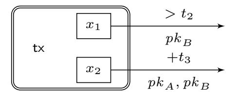

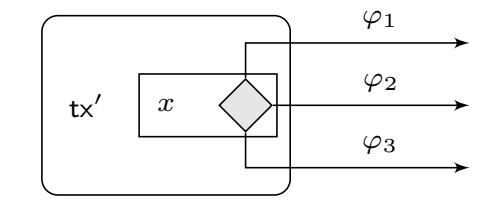

Fig. 1: (Left) Transaction tx is published on the blockchain. The output of value x1 can be spent by a transaction signed w.r.t. pk B after round t2, and the output of value x2 can be spent by a transaction signed w.r.t. pk A and pk B but only if at least t3 rounds passed since tx was accepted by the blockchain. (Right) Transaction tx0 is not published on the ledger. Its only output, which is of value x, can be spent by a transaction whose witness satisfies the output condition ϕ1 ∨ ϕ2 ∨ ϕ3.

corners) that represent the outputs of that transaction. The amount of coins allocated to each output is written inside the output box. In addition, the output condition is written on the arrow coming from the output.

In order to be concise, we use the following abbreviations for the frequently used conditions. Most outputs can only be spent by a transaction that is signed by a set of parties. In order to depict this condition, we write the public keys of all these parties *below* the arrow. We use the command One–Sig and Multi–Sig in the pseudocode. Other additional spending conditions are written *above* the arrow. The output script can have a relative time lock, i.e., a condition that is satisfied if and only if at least t rounds are passed since the transaction was published on the blockchain. We denote this output condition writing the string "+t" *above* the arrow (and CheckRelative in the pseudocode). In addition to relative time locks, an output can also have an absolute time lock, i.e., a condition that is satisfied only if t rounds elapsed since the blockchain was created and the first transaction was posted on it. We write the string "> t" *above* the arrow for this condition. Lastly, an output's spending condition might be a disjunction of multiple conditions. In other words it can be written as ϕ = ϕ1∨· · ·∨ϕn for some n ∈ N where ϕ is the output script. In this case, we add a diamond shape to the corresponding transaction output. Each of the subconditions ϕi is then written above a separate arrow. An example is given in Figure 1.

# *B. Payment channels*

A payment channel enables arbitrarily many transactions between users while requiring only two on-chain transactions. The first step when creating a payment channel is to deposit coins into an output controlled by two users. Once the money is deposited, the users can authorize new balance updates in a peer-to-peer fashion while having the guarantee that all coins are refunded at a mutually agreed time. In a bit more detail, a payment channel has three operations: *open*, *update* and *close*. We necessarily keep the description short and refer to [16, 2] for further reading.

*Open:* Assume that Alice and Bob want to create a payment channel with an initial deposit of xA and xB coins, respectively. For that, Alice and Bob agree on a *funding* 

{3}------------------------------------------------

transaction (that we denote by  $TX_f$ ) that sets as inputs two outputs controlled by Alice and Bob holding  $x_A$  and  $x_B$  coins respectively, and transfers them to an output controlled by both Alice and Bob. When  $TX_f$  is added to the blockchain, the payment channel is effectively open.

*Update:* Assume now that Alice wants to pay  $\alpha \leq x_A$ coins to Bob. For that, they create a new *commit transaction* TXc representing the commitment from both users to the new balance of the channel. The commit transaction spends the output of  $TX_f$  into two new outputs: (i) one holding  $x_A - \alpha$ coins controlled by Alice; and (ii) the other holding  $x_B + \alpha$ coins controlled by Bob. Finally, parties exchange signatures on the commit transaction, which serve as valid witnesses for TXf. At this point, Alice (resp. Bob) could add TXc to the blockchain. Instead, they keep it locally in their memory and overwrite it when they agree on another commitment transaction TXc representing a newer balance of the channel. This, however, leads to the problem that there exist several commitment transactions that can possibly be added to the blockchain. Since all of them are spending the same output, only one can be accepted by the blockchain. Since it is impossible to prevent a malicious user from publishing an outdated commit transaction, payment channels require a mechanism that punishes such malicious behavior. This mechanism is typically called *revocation* and enables that an honest user can take all the coins locked in the channel if the dishonest user publishes an outdated commitment transaction.

Close: Assume finally that Alice and Bob no longer wish to use the channel. Then, they can collaboratively close the channel by submitting the last commitment transaction  $\overline{TX}_c$  that they have agreed on to the blockchain. After it is accepted, the coins initially locked at the channel creation via  $TX_f$  are redistributed to both users according to the last agreed balance. As aforementioned, if one of the users submits an outdated commitment transaction instead, the counterparty can punish the former through the revocation mechanism.

The Lightning Network [26] defines the state-of-the-art payment channel construction for Bitcoin.

### C. Generalized channels

The recent work of Aumayr et al. [2] proposes the concept of generalized channels. Generalized channels improve and extend payment channels (see Figure 2 for details) in two ways. First, they extend the functionality of payment channels by offering off-chain execution of any script that is supported by the underlying ledger. Hence, one may view generalized channels as state channels for blockchains with restricted scripting functionality. Second, and more important for our work, generalized channels significantly improve the on-chain and off-chain communication complexity. More concretely, this efficiency improvement is achieved by introducing a socalled *split transaction* (that we denote as TXs) along with a punish-then-split paradigm. In contrast to regular payment channels that require one revocation process per output in the commit transaction, the punish-then-split approach decouples the revocation process from the number of outputs in the

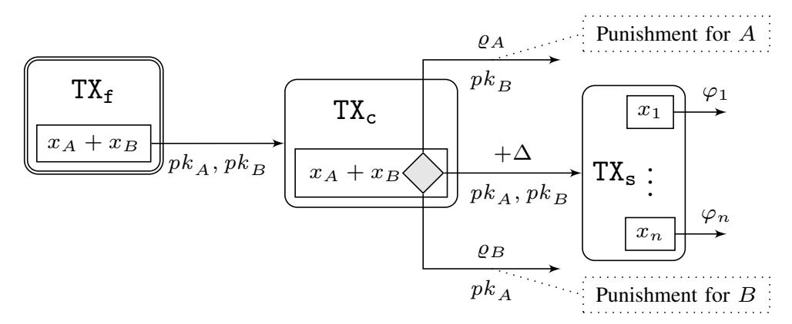

Fig. 2: A generalized channel in the state  $((x_1, \varphi_1), \ldots, (x_n, \varphi_n))$ . The value of  $\Delta$  upper bounds the time needed to publish a transaction on a blockchain. The condition  $\varrho_A$  represents the verification of A' revocation secret and  $\varrho_B$  represents the verification of B' revocation secret.

commit transaction. This allows moving from revocation for each output to a single revocation for the entire channel. As shown in Figure 2, the commit transaction  $(TX_c)$  is only responsible for the punishment, while the split transaction  $(TX_s)$  holds the actual outputs of the channel.

The efficiency of generalized channels is further improved since they only require a single commit transaction per channel. This is in contrast to the payment channels used by Lightning, which require two distinct commit transactions for each channel user. We will discuss in Section III-D3 why the punish-then-split paradigm (and requiring only one commit transaction) is useful in order to improve the efficiency of our virtual channels for Bitcoin.

To simplify terminology, we will use the term *ledger channel* for all channels that are funded directly over the blockchain.

# D. Channel Networks

The aforementioned payment and generalized channels allow two parties to issue transactions between each other while having to communicate with the blockchain only during the creation and closure of the channel. This on-chain communication can further be reduced by using *channel networks*.

a) Payment Channel Networks (PCNs): A PCN is a protocol that allows parties to connect multiple ledger channels to form a payment channel network. In this network, a sender can route a payment to a receiver as long as both parties are connected by a path in the network. Suppose that Alice and Bob are not directly connected via a ledger channel, but instead both maintain a channel with an intermediary party (Ingrid). In a nutshell, Alice can pay Bob by sending her coins to Ingrid who then forwards them in her ledger channel to Bob. Importantly, the protocol must achieve atomicity, i.e., either both transfers from Alice to Ingrid and from Ingrid to Bob happen, or neither of them goes through. Current PCNs such as the Lightning network use the HTLC-technique (hashtime-lock transaction), which comes with several drawbacks as mentioned in the introduction: (i) low reliability because the success of payments relies on Ingrid being online; (ii) high latency as each payment must be routed through Ingrid;

{4}------------------------------------------------

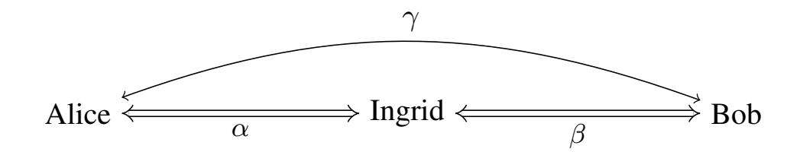

Fig. 3: A virtual channel  $\gamma$  built over ledger channels  $\alpha$ ,  $\beta$ .

(iii) *high-cost* as Ingrid may charge a fee for each payment between Alice and Bob; and (iv) *low privacy* as Ingrid can observe each payment that happens between Alice and Bob. To mitigate these issues, virtual channels have been proposed.

b) Virtual Channels: An alternative solution to connect two payment channels with each other is offered by the concept of virtual channels [13]. Virtual channels allow Alice and Bob to send payments between each other without the involvement of the intermediary Ingrid. In some sense, they thus mimic the functionality offered by ledger channels, with the difference that they are not created directly over the blockchain but instead over two ledger channels. More concretely, as shown in Figure 3, a virtual channel  $\gamma$  between Alice and Bob with intermediary Ingrid is constructed on top of two ledger channels  $\alpha$  and  $\beta$ . Ingrid is required to participate in the initial creation and final closing of the virtual channel. But importantly, Ingrid is not involved in any balance updates that occur in the virtual channel. This overcomes the four drawbacks mentioned above. While these advantages over PCNs make virtual channels an attractive offchain solution, their design is far from trivial. Previous work showed how to construct virtual channels over a ledger that supports Turing complete smart contracts [13, 11, 12]. The smart contract acts in the protocol as a trust anchor that parties can fall back to in case of malicious behavior. Through a rather complex protocol and careful smart contract design, existing virtual channel constructions guarantee that honest parties in the virtual channel will always get the coins they rightfully own. Unfortunately, most cryptocurrencies (including Bitcoin) do not offer Turing complete smart contracts, and hence the constructions from prior work cannot be used. In this work, we present a novel construction of virtual channels that makes only minimal assumptions on the underlying scripting functionality offered by the ledger.

### III. VIRTUAL CHANNELS

In this section, we first give some notation before presenting the necessary properties for virtual channels and discussing design challenges. Finally, we present our protocol.

# A. Definitions

We briefly recall some notation and definition for generalized channels [2] and extend the definition to generalized virtual channels. In order to make the distinction between the two types of channels clearer, we call the former generalized *ledger* channel (or ledger channels for short).

A generalized ledger channel as defined in [2] is a tuple  $\gamma := (\gamma.id, \gamma.Alice, \gamma.Bob, \gamma.cash, \gamma.st)$ , where  $\gamma.id \in \{0, 1\}^*$ 

is the identifier of the channel,  $\gamma$ .Alice,  $\gamma$ .Bob  $\in \mathcal{P}$  are the identities of the parties using the channel,  $\gamma$ .cash  $\in \mathbb{R}^{\geq 0}$  is a finite precision real number that represents the total amount of coins locked in this channel and  $\gamma$ .st  $= (\theta_1, \ldots, \theta_n)$  is the state of the channel. This state is composed of a list of *outputs*. Recall that each output  $\theta_i$  has two attributes: the output value  $\theta_i$ .cash  $\in \mathbb{R}^{\geq 0}$  and the output condition  $\theta_i.\varphi\colon\{0,1\}^*\times\mathbb{N}\times\mathbb{N}\to\{0,1\}$ . For convenience, we define a set  $\gamma$ .endUsers  $:=\{\gamma$ .Alice,  $\gamma$ .Bob} and a function  $\gamma$ .otherParty:  $\gamma$ .endUsers  $\to \gamma$ .endUsers, which on input  $\gamma$ .Alice outputs  $\gamma$ .Bob and on input  $\gamma$ .Bob returns  $\gamma$ .Alice.

A generalized *virtual channel* (or for short virtual channel) is defined as a tuple  $\gamma := (\gamma.id, \gamma.Alice, \gamma.Bob, \gamma.cash, \gamma.st,$  $\gamma$ .Ingrid,  $\gamma$ .subchan,  $\gamma$ .fee,  $\gamma$ .val). The attributes  $\gamma$ .id,  $\gamma$ .Alice,  $\gamma$ .Bob,  $\gamma$ .cash,  $\gamma$ .st are defined as in the case of ledger channels. The additional attribute  $\gamma$ . Ingrid  $\in \mathcal{P}$  denotes the identity of the *intermediary* of the virtual channel  $\gamma$ . The set  $\gamma$ -endUsers and the function  $\gamma$ -otherParty are defined as before. Additionally, we also define the set  $\gamma$  users :=  $\{\gamma.Alice, \gamma.Bob, \gamma.Ingrid\}$ . The attribute  $\gamma.subchan$  is a function mapping  $\gamma$  endUsers to a channel identifier; namely, the value  $\gamma$ .subchan( $\gamma$ .Alice) refers to the identifier of the channel between  $\gamma$ . Alice and  $\gamma$ . Ingrid (i.e., the id of  $\alpha$  from the description above); similarly, the value  $\gamma$ .subchan( $\gamma$ .Bob) refers to the identifier of the channel between  $\gamma$ . Bob and  $\gamma$ . Ingrid (i.e.,  $\beta$  from the description above). The value  $\gamma$  fee  $\in \mathbb{R}^{\geq 0}$ represents the fee charged by  $\gamma$ . Ingrid for her service of being an intermediary of  $\gamma$ . Finally, we introduce the attribute  $\gamma$ .val  $\in \mathbb{N} \cup \{\bot\}$ . If  $\gamma$ .val  $\neq \bot$ , then we call  $\gamma$  a virtual channel with validity and the value of  $\gamma$ .val represents the round number until which  $\gamma$  remains open. Channels with  $\gamma$ .val =  $\perp$  are called *virtual channels without validity*.

### B. Security and efficiency goals

We briefly recall the properties of generalized channels as defined in [2] and state the additional properties that we require from virtual channels.

a) Security goals: Generalized ledger channels must satisfy three security properties, namely (S1) Consensus on creation, (S2) Consensus on update and (S3) Instant finality with punish. Intuitively, properties (S1) and (S2) guarantee that successful creation of a new channel as well as successful update of an existing channel happens if and only if both parties agree on the respective action. Property (S3) states that if a channel  $\gamma$  is successfully updated to the state  $\gamma$ .st and  $\gamma$ .st is the last state that the channel is updated to, then an honest party  $P \in \gamma$ .endUsers can either enforce this state on the ledger or P can enforce a state where she gets all the coins locked in the channel. We say that a state st is *enforced* when a transaction with this state appears on the ledger.

Since virtual channels are generalized channels whose funding transaction is not posted on the ledger yet, the above stated properties should hold for virtual channels as well with two subtle but important differences: (i) the creation of a virtual channel involves three parties (Alice, Ingrid and Bob) and hence consensus on creation for virtual channels can 

{5}------------------------------------------------

only be fulfilled if all three parties agree on the creation; (ii) the finality (i.e., offloading) of the virtual channel depends on whether Alice is expected to offload the virtual channel within a predetermined validity period (virtual channel with validity VC-V) or the offload task is delegated to the intermediary Ingrid without having a predefined validity period (virtual channel without validity VC-NV). In order to account for these two differences, virtual channels should also satisfy the following properties:

**(V1) Balance security:** If  $\gamma$  is a virtual channel and  $\gamma$ . Ingrid is honest, she never loses coins, even if  $\gamma$ . Alice and  $\gamma$ . Bob collude.

(V2) Offload with punish: If  $\gamma$  is a virtual channel without validity (VC-NV), then  $\gamma$ .Ingrid can transform  $\gamma$  to a ledger channel. Party  $P \in \gamma$ .endUsers can initiate the transformation which either completes or P can get financially compensated. (V3) Validity with punish: If  $\gamma$  is a virtual channel with validity (VC-V), then  $\gamma$ .Alice can transform  $\gamma$  to a ledger channel. If  $\gamma$  is not transformed into a ledger channel or closed before time  $\gamma$ .val,  $\gamma$ .Ingrid and  $\gamma$ .Bob can get financially compensated.

We first note that the instant finality with punish property (S3) does not provide any guarantees for Ingrid  $\notin \gamma$ .endUsers, which is why we need to define (V1) for virtual channels. Properties (V2) and (V3) point out the main difference between VC-NV and VC-V. In a VC-NV  $\gamma$ , Ingrid is able to free her collateral from  $\gamma$  at any time by transforming the channel between Alice and Bob from a virtual channel to a ledger channel. Furthermore, in case Alice and Bob transform the virtual channel to a ledger channel or even misbehave, honest Ingrid is guaranteed that she will receive the collateral back. In a VC-V  $\gamma$ , Ingrid cannot transform a virtual channel into a ledger channel at any time she wants. Instead, there is a pre-agreed point in time, defined by  $\gamma$ .val, until when  $\gamma$ .endUsers have to close the virtual channel or transform it into a ledger channel (Ingrid's collateral is freed in both cases). If  $\gamma$  end Users fail to do so, Ingrid can get her collateral back through a punishment mechanism. Hence,  $\gamma$  end Users have a guarantee that their VC-V will remain a virtual channel until a certain round, after which they must ensure its closure or transformation to avoid punishments.

b) Efficiency goals: Lastly, we define the following efficiency goals, which describe the number of rounds certain protocol steps require:

(E1) Constant round creation: Successful creation of a virtual channel takes a constant number of rounds.

|       | L-Security | V-Security |          |    | Efficiency |          |          |  |  |
|-------|------------|------------|----------|----|------------|----------|----------|--|--|
|       | S1 – S3    | V1         | V2       | V3 | E1         | E2       | E3       |  |  |
| L     | <b>✓</b>   | -          | -        | -  | X          | 1        | X        |  |  |
| VC-V  | <b>✓</b>   | 1          | Х        | 1  | 1          | 1        | 1        |  |  |
| VC-NV | <b>√</b>   | <b>√</b>   | <b>√</b> | X  | 1          | <b>√</b> | <b>/</b> |  |  |

TABLE I: Comparison of security and efficiency goals for ledger channels (L), virtual channels with validity (VC-V) and virtual channels without validity (VC-NV).

**(E2) Optimistic update:** For a channel  $\gamma$ , this property guarantees that in the optimistic case when both parties in  $\gamma$ -endUsers are honest, a channel update takes a constant number of rounds.

**(E3) Optimistic closure:** In the optimistic case when all parties in  $\gamma$  users are honest, the closure of a virtual channel takes a constant number of rounds.

Let us stress that property (E2) is common for all off-chain channels (i.e., both ledger and virtual channels). The properties (E1) and (E3) capture the additional property of virtual channels that in the optimistic case when all parties behave honestly, the entire life-cycle of the channel is performed completely off-chain.

We compare the security and efficiency goals for different types of channels in Table I. We formalize these properties as a UC ideal functionality in Appendix D1.

### C. Design Challenges for Constructing Virtual Channels

The main challenges that arise when constructing Bitcoincompatible virtual channels stem from the need to ensure the
security properties (V1) - (V3) as presented in the previous
section. Namely, to guarantee balance security to the intermediary, we need to ensure that the virtual channel creation and
closure is reflected symmetrically and synchronously on both\nunderlying ledger channels. We identify this as a challenge
(C1). As we discuss in more detail below, this can be solved by
giving the intermediary the right of a "last say" in the virtual
channel creation and closure procedures. However, a malicious\nintermediary could abuse such power and block virtual channel
closure indefinitely. Therefore, the second challenge (C2) is
to design a punishment mechanism that allows virtual channel\nusers to either enforce closure or claim financial compensation.
We provide some further details below.

a) Synchronous create and close (C1): The creation and closure of a virtual channel are done by updating the underlying ledger channels. In order to guarantee balance security for the intermediary, we must ensure that updates on both ledger channels are symmetric and either both of them succeed or both of them fail. That is, if the intermediary Ingrid loses coins in one ledger channel as a result of the virtual channel construction, then she has the guarantee of gaining the same amount of coins from the other ledger channel. Such an atomicity property can be achieved by allowing Ingrid to be the reacting party in both ledger channel update procedures. Namely, Ingrid has to receive symmetric update requests from both Alice and Bob before she confirms either of them.

As a result, Ingrid has the power to block a virtual channel creation and closure. For a virtual channel creation, this is not a problem. It simply represents the fact that Ingrid does not want to be an intermediary, and hence Alice and Bob have to find a different party. However, for virtual channel closing, this power of the intermediary results in a violation of the instant finality property for Alice and Bob, and requires a more involved mechanism.

b) Enforcing virtual channel state (C2): In contrast to standard ledger channels that rely on funding transactions that

{6}------------------------------------------------

are published on the ledger, the funding transactions of a virtual channel are, in the optimistic case (i.e., when parties are honest), kept off-chain. In case of misbehavior (e.g., when malicious Ingrid refuses to close the virtual channel), however, honest parties must be able to publish the virtual channel funding transaction to the blockchain in order to enforce the latest state of the virtual channel. Unfortunately, the funding transactions can only be published if *both* of the underlying channels are closed in a state which funds the virtual channel. The fact that the virtual channel participants, Alice and Bob, respectively have control over just one of the underlying ledger channels further complicates this situation. For instance, one of the underlying ledger channels may be updated or closed maliciously at any time which would prevent the publishing of the funding transaction on the ledger.

#### D. Virtual Channel Protocol

We now show how to build virtual channels on top of generalized channels. We later discuss in Section III-D3 how our construction can be built over other channels such as Lightning and why generalized channels offer better efficiency.

As mentioned in the previous section, virtual channels are created and closed through an update of the underlying ledger channels. Hence, let us recall the update process of ledger channels, depicted as UpdateChan in Figures 4 and 5, before explaining our construction in more detail. The update procedure consists of 4 steps, namely (1) the *Initialization* step, during which parties agree on the new state of the channel, (2) the *Preparation* step, where parties generate the transactions with the given state, (3) the *Setup* during which parties exchange their application-dependent data (e.g., for building virtual channels), and finally (4) the *Completion* step where parties commit to the new state and revoke the old one. We refer the reader to [2] for more details.

1) High level protocol description: We are now prepared to present a high-level description of our modular virtual channel protocol and explain how to solve the main technical challenges when designing virtual channels. In a nutshell, this modular protocol gives a generic framework on how to design virtual channels. Afterwards, we show how to instantiate this modular protocol with our virtual channel construction without validity. For the description of the instantiation with our construction with validity, we refer the reader to Appendix D2. We present the formal pseudocode for the modular protocol as well as the instantiations with and without validity in Appendix D3.

a) Create: Let  $\gamma$  be a virtual channel that  $A := \gamma$ . Alice and  $B := \gamma$ . Bob want to create, using their generalized ledger channels with  $I := \gamma$ . Ingrid. At a high level, the creation procedure of a virtual channel is a synchronous update of the underlying ledger channels. Given the ledger channels, we proceed as follows (see Figure 4).

As a first step, each party  $P \in \{A, B\}$  initiates an update of the respective ledger channel with I (step ①) who, upon receiving both update requests, checks if the requested states (i.e.,  $\theta_A$  and  $\theta_B$ ) are consistent. The parties use the identifiers

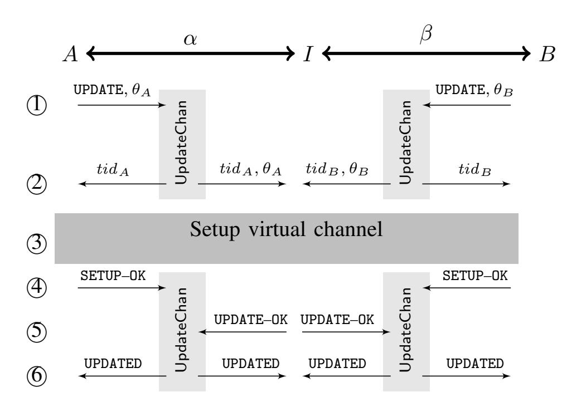

Fig. 4: Modular creation procedure of a virtual channel on top of two ledger channels  $\alpha$  and  $\beta$ .

 $tid_A$  and  $tid_B$  of their subchannels in order to build the virtual channel (step 2). Next, all three parties engage in a setup phase, in which the structure of the virtual channel is built (step 3). More concretely, all three parties agree on a funding transaction of the virtual channel which when published on the blockchain transforms the virtual channel to a ledger channel. When the setup phase is completed, i.e., the virtual channel structure has been built, the parties complete the ledger channel update procedures (step 4). It is crucial for the intermediary I to have the role of a reacting party during both channel updates. This gives her the power to wait until she is sure that both updates will complete successfully and only then give her the final update agreement (step (5)). Upon a successful execution, parties consider the channels as updated (step (6)), which implies that the virtual channel  $\gamma$ was successfully created.

b) Update: Updating the virtual channel essentially works in the same way as the update procedure of a ledger channel. As long as the update is successful or peacefully rejected (meaning that the reacting party rejects the update), the parties act as instructed in the ledger channel protocol. The situation is more delicate when the update fails because one of the parties misbehaved and aborted the procedure.

We note that aborts during a channel update might cause a problematic asymmetry between the parties. For instance, when one party already signed the new state of the channel while the other one did not; or when one party already revoked the old state of the channel but the other one did not. In a standard ledger channel, these disputes are resolved by a force close procedure, meaning that the honest party publishes the latest valid state on the blockchain, thereby forcefully closing the channel. Hence, within a finite number of rounds, the dispute is resolved and the instant finality property is preserved. We apply a similar technique for virtual channels. The main difference is that a virtual channel is not funded on-chain. Hence, we first need to offload the virtual channel to the ledger. In other words, we first need to transform a

{7}------------------------------------------------

virtual channel into a ledger channel by publishing its funding transaction on-chain. This process is discussed later in this section. Once the funding transaction is published, the dispute is handled in the same way as for ledger channels.

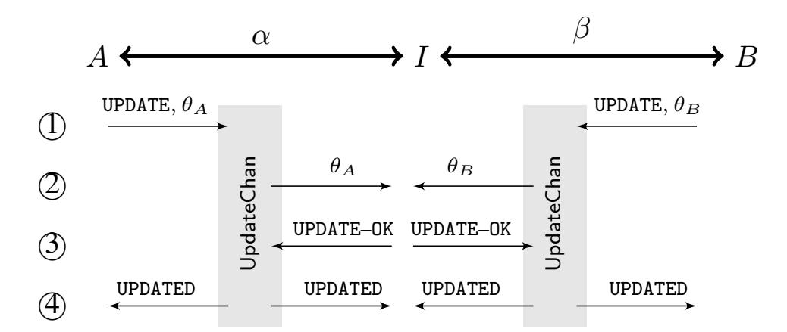

Fig. 5: Modular close procedure of a virtual channel on top of two ledger channels  $\alpha$  and  $\beta$ . For  $P \in \{A, B\}$ ,  $\vec{\theta}_P := \{(c_P, \mathtt{One-Sig}_{pk_P}), (c_Q + \frac{\gamma.\mathsf{fee}}{2}, \mathtt{One-Sig}_{pk_I})\}$  where  $\gamma.\mathsf{st} = \left((c_P, \mathtt{One-Sig}_{pk_P}), (c_Q, \mathtt{One-Sig}_{pk_Q})\right)$ .

c) Close: The closure of a virtual channel is done by updating the underlying ledger channels  $\alpha$  and  $\beta$  according to the latest state of the virtual channel  $\gamma$ .st. To this end, each party  $P \in \{A, B\}$  computes the new state for the ledger channel  $\vec{\theta}_P := \{(c_P, \mathtt{One-Sig}_{pk_P}), (\gamma.\mathtt{cash} - c_P, \mathtt{One-Sig}_{pk_I})\}$  where  $c_P$  is the latest balance of P in  $\gamma$ . All parties update their ledger channels according to this state.

In a bit more detail, the closing procedure of a virtual channel proceeds as follows (see Figure 5). Each party P initiates an update of the underlying ledger channel with state  $\vec{\theta}_P$  (step ①). Since both ledger channels must be updated synchronously, I waits for both parties to initiate the update procedure. Upon receiving the states from both parties (step ②), I checks that the states are consistent and if so, she agrees to the update of both ledger channels (step ③). Finally, after all parties have successfully revoked the previous ledger channel state, the virtual channel is considered to be closed.

In the pessimistic case (if the states  $\vec{\theta}_A$  and  $\vec{\theta}_B$  are inconsistent, revocation fails or I remains idle), parties must forcefully close their virtual channel by publishing the funding transaction (offloading) and closing the resulting ledger channel. This, together with the fact that I plays the role of the reacting party in its interactions with A and B, addresses the challenge (C1) as mentioned in Section III-C.

- d) Offload: During the offload procedure, parties try to publish the funding transaction of the virtual channel  $\gamma$  which effectively transforms the virtual channel into a ledger channel. In a nutshell, during this procedure, parties try to publish the commit and split transactions of both underlying ledger channels and afterward the funding transaction of the virtual channel. In case offloading is prevented by some form of malicious behavior, parties can engage in the punishment procedure to ensure that they do not lose any funds.
- e) Punish: The concept of punishment in virtual channels is similar to that in ledger channels; namely in case that the latest state of a channel cannot be posted on the ledger,

honest A or B are compensated by receiving all coins of the virtual channel while honest I will not lose coins. If the funding transaction of the virtual channel is posted on the ledger, the virtual channel is transformed into a ledger channel and parties can execute the regular punishment protocol for ledger channels. In addition to the ledger channel's punishment procedure, parties can punish if the funding transaction of  $\gamma$  cannot be published. Since this punishment, however, differs for each concrete instantiation, we will explain it in more detail for our protocol without validity in the following section (and in Appendix D2 for the case with validity).

The offloading and punishment procedure together tackles challenge (C2) from Section III-C.

- 2) Concrete Instantiation Without Validity: We now describe how the modular protocol explained above can be concretely instantiated with our construction for virtual channels without validity.
- a) Create: In our construction without validity, A and B must "prepare" the virtual channel during the setup procedure (step 3) in create of the modular protocol). This is done by executing the creation procedure of a regular ledger channel, i.e., they create a funding transaction with inputs  $tid_A$  and  $tid_B$ , as well as a commit and split transactions that spend the funding transaction. Once all three transactions are created, A and B sign them and exchange their signatures. Note that this corresponds to a normal channel opening, with the mere difference that the funding transaction is not published to the blockchain. In order to complete the virtual channel setup, A and B send the signed funding transaction to I who, upon receiving both signatures, sends her own signature on the transaction back to A and B. At this stage, the virtual channel is prepared, however, the creation is not completed yet. In order to finish the creation procedure, A, I, and B have to finish the update of their respective ledger channels. Once this is done, the virtual channel has been successfully created.

We illustrate the transaction structure prepared during the creation process in Figure 6. The funding transaction of the virtual channel  $\mathrm{TX_f}$ , which is generated during the create procedure, takes as input coins from both, the ledger channel  $\alpha$  (represented by  $\mathrm{TX_s^A}$ ) and the ledger channel  $\beta$  (represented by  $\mathrm{TX_s^B}$ ). Both ledger channels jointly contribute a total of 2c+f coins so that c coins are later used to setup the virtual channel and the remaining c+f coins are I's collateral and the fees paid to I for providing the service for A and B. I's collateral and fees in the funding transaction  $\mathrm{TX_f}$  are the reason why I has to proactively monitor the virtual channel as she has an incentive to publish  $\mathrm{TX_f}$  in case any party misbehaves.

b) Offload: I is always able to offload the virtual channel by herself (i.e., without having to cooperate with another party) which guarantees that I can redeem her collateral at any time. We note that  $P \in \{A, B\}$  can also initiate the offloading by publishing the commit and split transaction of their respective ledger channels. This forces I to publish the commit and split

&lt;sup>1For simplicity we assume each of the parties contributes f/2 coins to I's total fees in addition to c/2 coins for funding the virtual channel.

{8}------------------------------------------------

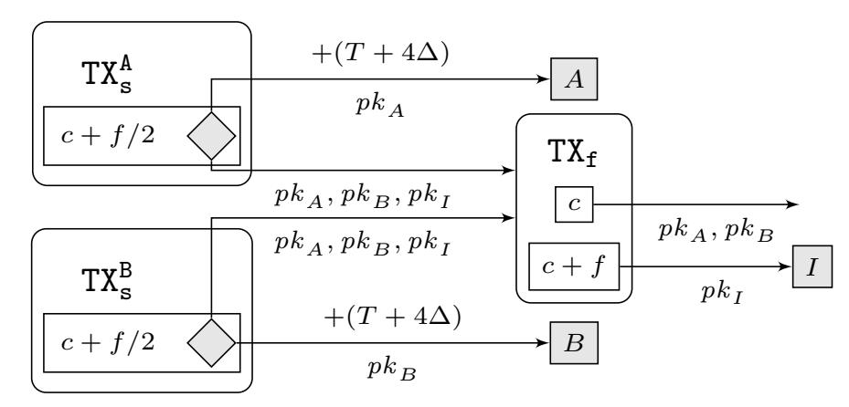

Fig. 6: Funding of a virtual channel  $\gamma$  without validity. T upper bounds the number of off-chain communication rounds between two parties for any operation in the ledger channel.

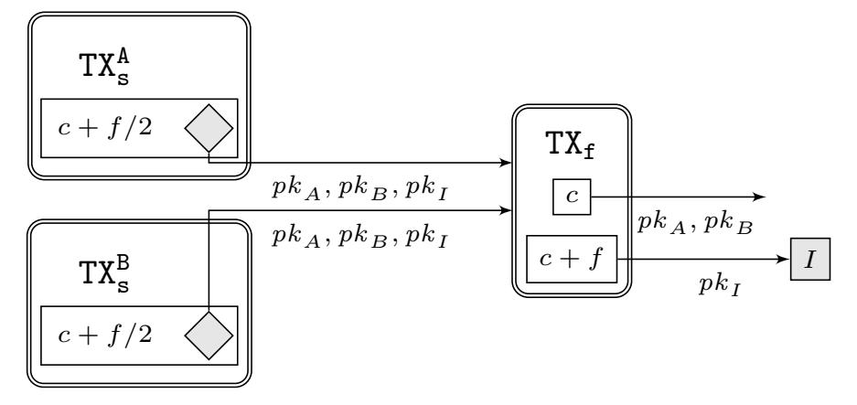

Fig. 7: Transactions published after a successful offload.

transactions of the respective other ledger channel, since I loses her collateral to P otherwise.

More precisely, if I wishes to offload the virtual channel  $\gamma$  and retrieve her collateral and fees, she can close both of her ledger channels with A and B (i.e.,  $\alpha$  and  $\beta$ ) and publish the funding transaction of the virtual channel i.e., TXf. This is possible as I is part of both ledger channels. A or B, on the other hand, are respectively part of only one ledger channel and hence they cannot offload the virtual channel individually. However, they can force I to offload by publishing the commit and split transactions of their respective channel with I (we will elaborate on this in the description of the punishment mechanism). Figure 7 illustrates the transactions that are posted on the blockchain in case of a successful offload. The figure shows that the split transactions of both underlying ledger channels have to be published such that eventually the funding transaction of the virtual channel can be published which completes the offloading procedure.

c) Punish: Party  $P \in \{A, B\}$  can punish I by taking all the coins on their respective ledger channels if the funding transaction of the virtual channel  $\gamma$  is not published on the ledger. In other words, it is I's responsibility to ensure that the state of her ledger channels with A and B are not updated while  $\gamma$  is open. Furthermore, upon one of the subchannels being closed, I must close the other subchannel in order to guarantee that both parties can post  $\mathsf{TX}_{\mathtt{f}}$ .

Let us now get into more details. Assume that A's ledger channel with I is closed, but the funding transaction  $TX_f$  cannot be published on the blockchain. This means that I's channel with B (i.e.,  $\beta$ ) is still open or has been closed in a different state such that  $TX_f$  cannot be published. In other

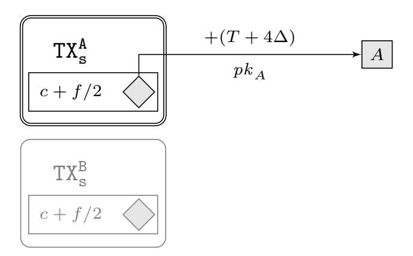

Fig. 8: Transactions published after A successfully executed the punishment procedure. The grayed transaction  $TX_s^B$  indicates that this transaction has not been published.

words, Ingrid acted maliciously by wrongfully closing  $\beta$  in a different state or by not closing  $\beta$  at all. In this case, A must be able to get all the coins from her channel with Ingrid. This punishment works as follows: After A publishing the split transaction of  $\alpha$ , I is given a certain time period to close her channel with B and publish the virtual channel's funding transaction  $\mathsf{TX}_{\mathtt{f}}$ . If I fails to do so in the prescribed time period, A receives all coins in her channel with I.

We note that in this scenario, B (instead of I) might have been the malicious party by closing  $\beta$  in an outdated state, thereby leaving I no option to publish  $\mathrm{TX}_{\mathrm{f}}$ . However, in this case, I can punish B via the punishment mechanism of the underlying ledger channel and earn all the coins in  $\beta$ . Therefore, I will remain financially neutral as she gets punished by A but simultaneously compensated by B. Figure 8 illustrates the transactions that are posted on the blockchain in the case of A successfully executing the punishment mechanism. The case where B executes the punishment mechanism is analogous.

- 3) Further discussion regarding our constructions: In the following, we present further considerations regarding our protocol, including remarks on concurrency, a discussion on how the protocol can be built on top of Lightning channels, and a brief description of our virtual channel construction with validity that we detail in Appendix D2.
- a) Concurrency: When creating a virtual channel, we need to lock the underlying ledger channels  $\alpha$  and  $\beta$  (i.e., no further updates can be made on the ledger channels as long as the virtual channel is open). This, however, is undesirable, because in most cases the ledger channels will have more coins available than what is needed for funding the virtual channel. We emphasize that this issue can be easily addressed (and hence supporting full concurrency) by using the channel splitting technique discussed in [2]. This means that before constructing the virtual channel Alice-Bob, parties would first split each underlying ledger channel off-chain in two channels: (i) one would contain the exact amount of coins for the virtual channel and (ii) the other one would contain the remaining coins that can be used in the underlying ledger channel.
- b) Virtual channels over Lightning: We will now discuss how our virtual channel constructions can be built on top of any ledger channel infrastructure that uses a revocation/punishment mechanism such as the Lightning Network

{9}------------------------------------------------

[26]. The main complication arises from the fact that ledger channel constructions other than generalized channels require two commit transactions per channel state (one for each party). As depicted in Figure 9 (and unlike generalized channels in Figure 2), Alice and Bob each have a commit transaction  $TX_c^A$  and  $TX_c^B$  which spends the funding transaction  $TX_f$  and distributes the coins. Therefore, in such channel constructions, it is a priori unclear which of these commit transactions will be posted and accepted on the blockchain (note that only one of them can be successfully published) and hence building applications (e.g., virtual channels) on top of such ledger channels becomes complex.

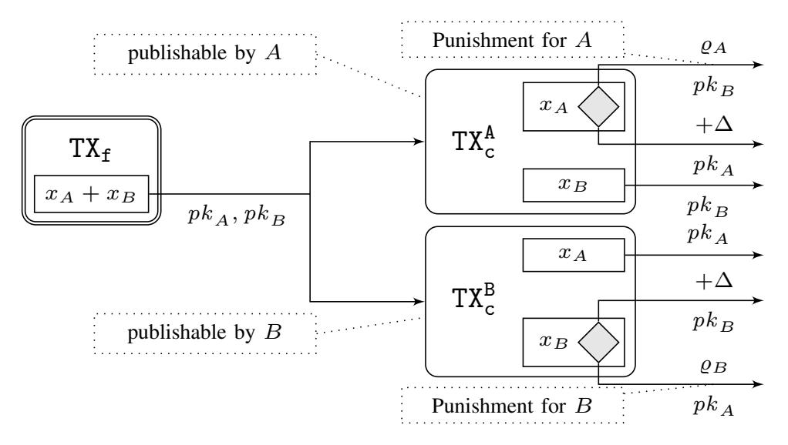

Fig. 9: A Lightning style payment channel where A has  $x_A$  coins and B has  $x_B$  coins.  $\Delta$  upper bounds the time needed to publish a transaction on a blockchain. condition  $\varrho_A$  represents the verification of A' revocation secret and h represents the verification of B' revocation secret.

In more detail, assume Alice and Bob want to build a virtual channel  $\gamma$  on top of their respective Lightning ledger channels with Ingrid, where both ledger channels consist of two commit transactions respectively (i.e.,  $(TX_c^A, TX_c^{IA})$  for the channel between Alice and Ingrid and (TXc, TXc) for the channel between Bob and Ingrid). All three parties now have to make sure that the virtual channel can be funded (i.e., that the funding transaction of  $\gamma$  can be published to the blockchain) even in case of malicious behavior. To ensure this, parties have to prepare the funding transaction of  $\gamma$  with respect to all possible combinations of the commit transactions of the respective underlying ledger channels. Since there are four such combinations  $((TX_c^A, TX_c^B), (TX_c^A, TX_c^{IB}), (TX_c^{IA}, TX_c^B)$  and  $(TX_c^{IA}, TX_c^{IB})$ , parties have to prepare four funding transactions for  $\gamma$ . Hence, updating such a virtual channel requires repeating the update procedure for all four funding transactions.

As generalized channels require only a single commit transaction per channel state building virtual channels on top of generalized channels offers a significant efficiency improvement in terms of off-chain communication complexity (see Section V for the detailed comparison).

c) Virtual Channels With Validity: Note that so far we described our protocol without validity where the virtual channel can be offloaded by the intermediary whenever she wants. The drawback of this construction is that Ingrid needs to

be proactive during the lifetime of the virtual channel, i.e., she has to constantly monitor the channel for potential misbehavior of Alice or Bob. This might be undesirable in scenarios where Ingrid plays the role of the intermediary in not just one but many different virtual channels at the same time (e.g., if Ingrid is a channel hub). For this reason, we developed an alternative solution which we call virtual channels with validity. In this solution, each virtual channel has a predetermined time (which we call validity) which indicates until when the channel has to be closed again. If the channel is still open after this time, Ingrid has to become proactive in order to receive her collateral back. The obvious advantage of this approach is that Ingrid can remain inactive until the validity of a channel expires. The details of this protocol can be found in Appendix D2.

#### IV. SECURITY MODEL AND ANALYSIS

In order to model and prove the security of our virtual channel protocols, we use the global UC framework (GUC) [9] as in [2]. This framework allows for a global setup which we utilize to model a public blockchain. More precisely, our protocol uses a global ledger functionality  $\widehat{\mathcal{L}}(\Delta, \Sigma)$ , where  $\Delta$  upper bounds the blockchain delay, i.e., the maximum number of rounds required to publish a transaction, and  $\Sigma$  is the signature scheme used by the blockchain. In this section, we only give a high-level idea behind our security analysis in the UC framework and refer the reader to Appendices A, C, C2 and D1 for more details.

As a first step, we define the expected behavior of a virtual channel protocol in the form of an *ideal functionality*  $\mathcal{F}_V$ . The functionality defines the input/output behavior of a protocol, its impact on the global setup (e.g., ledger) and the possible ways an adversary can influence its execution (e.g., delaying messages). In order to prove that a concrete protocol is a secure virtual channel protocol, one must show that the protocol *emulates* the ideal functionality  $\mathcal{F}_V$ . This means that any attack that can be mounted on the protocol can also be mounted on the ideal functionality, hence the protocol is at least as secure as the ideal specification given by  $\mathcal{F}_V$ .

The proof of emulation consists of two steps. First, one must design a *simulator*, which simulates the actions of an adversary on the real-world protocol by interacting with the ideal functionality. Second, it must be shown that the execution of the real-world protocol being attacked by a real-world adversary is indistinguishable from the execution of the ideal functionality communicating with the constructed simulator. In UC, the ppt distinguisher who tries to distinguish these two executions is called the *environment*.

The main challenge when designing a simulator is to make sure that the environment sees transactions being posted on the ledger in the same round in both worlds. In addition, our simulator needs to ensure that the ideal functionality outputs the same set of messages in the same round as the protocol. We reduce the indistinguishability of the two executions to the security of the cryptographic primitives used in our protocol.

One of the advantages of using UC is its composability. In other words, one can use an ideal functionality in a black-

{10}------------------------------------------------

box way in other protocols. This simplifies the process of designing new protocols as it allows to reuse existing results and enables modular protocol designs. We utilize this nice property of the UC framework and use the ideal functionality of the generalized channel from [2] when designing our virtual channel protocol.

We only mention the main security theorem here and provide a high-level proof sketch here. We refer the reader to Appendix F for the full proof.

Theorem 1: Let  $\Sigma$  be a signature scheme that is strongly unforgeable against chosen message attacks. Then for any ledger delay  $\Delta \in \mathbb{N}$ , the virtual channel protocol without validity as described in Section III-D working in  $\mathcal{F}_{preL}(3,1)$ -hybrid, UC-realizes the ideal functionality  $\mathcal{F}_V(3)$ .

We now give a proof sketch to show that the two properties (V1) Balance security and (V2) Offload with punish hold for honest parties. To this end, we analyze all possible cases in which the underlying ledger channels are maliciously closed, i.e., the cases when the virtual channel cannot be offloaded anymore. Note that if the virtual channel is offloaded, it is effectively transformed into a generalized ledger channel and satisfies the security properties of generalized channels.

If all parties behave honestly (V1) and (V2) hold trivially as I is always able to offload the virtual channel by publishing all transactions  $TX_s^A$ ,  $TX_s^B$  and  $TX_f$ . Furthermore, neither A nor Bwould ever lose their coins. Now consider the case where one of the underlying channels, e.g., the channel between B and I is closed in a different state such that TXf cannot be posted on the blockchain anymore (the case for the channel between A and I is analogous). As an honest A would not update her channel with I as long as the virtual channel is open, there are only two possible situations: (i) A is able to post  $TX_s^A$  which allows her to punish I (see Figure 8), or (ii) I has maliciously closed her channel with A in an outdated and revoked state. In this case, A is able to punish I according to property (S3), i.e., instant finality with punish, of the underlying ledger channel (see Section II and Figure 2 for more details on the punishment of the underlying channel). Therefore, (V2) is satisfied for A, since she can punish I and get financially compensated. Now let us analyze the maliciously closed channel between B and I, let us denote it  $\beta$ . If both parties are malicious, we do not need to prove anything as (V1) and (V2) should only hold for honest parties. In case B is honest, I must have closed  $\beta$  in an old state which would allow B to punish I. Hence (V2) holds and we do not need to prove (V1) as I is malicious. Analogously, if I is honest, malicious B must have closed  $\beta$ in an old state and hence I can punish B. Hence (V1) holds and we do not need to prove (V2) for malicious B). Hence, (V1) and (V2) hold for all honest parties.

### V. Performance evaluation

In this section, we first study the storage overhead on the blockchain as well as the communication overhead between users to use virtual channels. For each of these aspects, we evaluate both constructions (i.e., with and without validity) built on top of both generalized channels as well as

Lightning channels and compare them. Finally, we evaluate the advantages of virtual channels over ledger channels in terms of routing communication overhead and fee costs. As testbed [6], the transactions are created in Python using the library python-bitcoin-utils and the Bitcoin *Script* language. To showcase compatibility and feasibility, we deployed these transactions successfully on the Bitcoin testnet.

### A. Communication overhead

We analyze the communication overhead imposed by the different operations, such as CREATE, UPDATE, OFFLOAD and CLOSE, by measuring the byte size of the transactions that need to be exchanged as well as the cost in USD necessary for posting the transactions that need to be published onchain. The cost in USD is calculated by taking the price of 18803 USD per Bitcoin, and the average transaction fee of 104 satoshis per byte all of them at the time of writing. We detail in Table II the aforementioned costs measured for both virtual channel constructions building on top of generalized channels and on top of Lightning channels.

Perhaps the most relevant difference to ledger channels in practice is, in the CREATE and the optimistic CLOSE case, we do not have any on-chain transactions. This implies no on-chain fees for the opening and closing of virtual channels.

a) Virtual channels over generalized channels: For the creation of a virtual channel (CREATE operation) on top of generalized channels, we need to update both ledger channels to a new state that can fund the virtual channel, requiring to exchange  $2 \cdot 2$  transactions with 1494 (VC-NV) or 1422 (VC-V) bytes. Additionally, we need 640 bytes for TXf (VC-NV) or 309 + 377 bytes for  $TX_f$  and  $TX_{refund}$  (VC-V). Finally, for both VC-NV and VC-V, we need the transactions representing the state of the the virtual channel itself which requires 431 bytes for TXc and 264 bytes for TXs. This complete process results in 7 (VC-NV) or 8 (VC-V) transactions with a total of 2829 (VC-NV) or 2803 (VC-V) bytes. Forcefully closing (CLOSE(pess) operation) and offloading (OFFLOAD operation) requires the same set of transactions as with CREATE, minus the commitment and the split transaction (695 bytes) of the virtual channel in the latter case, both on-chain. Finally, we observe that the UPDATE and the optimistic CLOSE(opt) operation require 2 transactions (695 bytes) for both constructions, as they are designed as an update of a ledger channel.

b) Virtual channels over Lightning channels: Building virtual channels on top of Lightning channels yields the following results. Instead of one commitment and one split transaction per ledger channel, we now need two commitment transactions per ledger channel, each of size 580 (VC-NV) or 546 (VC-V) bytes. Due to the fact that in both ledger channels, either commitment transaction can be published, we now need four  $TX_f$  of 640 bytes each (VC-NV) or two  $TX_f$  of 309 and four  $TX_{refund}$  of 377 bytes (VC-V). For every  $TX_f$ , we need two commitment transactions of 353 bytes (in total,  $8 \cdot 353$  in VC-NV or  $4 \cdot 353$  in VC-V). For OFFLOAD, only one commitment transaction per ledger channel needs to be published, along

{11}------------------------------------------------

|              | Generalized Channels |          |       |       |      |       |          | Lightning Channels |       |      |       |          |       |       |      |       |          |       |       |       |
|--------------|----------------------|----------|-------|-------|------|-------|----------|--------------------|-------|------|-------|----------|-------|-------|------|-------|----------|-------|-------|-------|
|              |                      |          | VC-NV |       |      |       |          | VC-V               |       |      |       |          | VC-NV |       |      |       |          | VC-V  |       |       |
| Operations   |                      | on-chain | 1     | off-c | hain |       | on-chain | l                  | off-c | hain |       | on-chain | 1     | off-c | hain |       | on-chair | 1     | off-c | chain |
|              | # txs                | size     | cost  | # txs | size | # txs | size     | cost               | # txs | size | # txs | size     | cost  | # txs | size | # txs | size     | cost  | # txs | size  |
| CREATE       | 0                    | 0        | 0     | 7     | 2829 | 0     | 0        | 0                  | 8     | 2803 | 0     | 0        | 0     | 16    | 7704 | 0     | 0        | 0     | 14    | 5722  |
| UPDATE       | 0                    | 0        | 0     | 2     | 695  | 0     | 0        | 0                  | 2     | 695  | 0     | 0        | 0     | 8     | 2824 | 0     | 0        | 0     | 4     | 1412  |
| OFFLOAD      | 5                    | 2134     | 41.73 | 0     | 0    | 6     | 2108     | 41.22              | 0     | 0    | 3     | 1800     | 35.20 | 0     | 0    | 4     | 1778     | 34.77 | 0     | 0     |
| CLOSE (opt)  | 0                    | 0        | 0     | 4     | 1390 | 0     | 0        | 0                  | 4     | 1390 | 0     | 0        | 0     | 4     | 1412 | 0     | 0        | 0     | 4     | 1412  |
| CLOSE (pess) | 7                    | 2829     | 55.32 | 0     | 0    | 8     | 2803     | 54.81              | 0     | 0    | 4     | 2153     | 42.10 | 0     | 0    | 5     | 2131     | 41.67 | 0     | 0     |

TABLE II: Evaluation of the virtual channels. For each operation we show: the number of on-chain and off-chain transactions (# txs) and their size in bytes. For on-chain transactions, cost is in USD and estimates cost of publish them on the ledger.

with one  $TX_f$  (for VC-NV) and  $TX_f$  plus  $TX_{refund}$  (for VC-V). CLOSE(pess), needs to publish a commitment transaction in addition to OFFLOAD, resulting in 2153 (VC-NV) or 2131 (VC-V) bytes.

### B. Comparison to payment channel networks

In this section we compare virtual channels to multi-hop payments in a payment channel network (PCN). In a PCN, users route their payments via intermediaries. During the routing of a transaction tx, each intermediary party locks tx.cash coins as a "promise to pay" in their channels, a payment commitment that can technically be implemented as a Hash-Time Lock Contract (HTLC), e.g. as in the Lightning Network [26]. We now evaluate the difference in communication overhead and fee costs compared to virtual channels, summarize them in Table III and illustrate them in Figure 10.

a) Routing communication overhead: When performing a payment between Alice and Bob via an intermediary Ingrid in a multi-hop payment over generalized channels, the participants need to update both generalized channels with a "promise to pay", which require 2 transactions or 818 bytes per channel when implemented as HTLC. If they are successful, both generalized channels need to be updated again to "confirm the payment" (again, 2 transactions or 695 bytes per channel). This whole process results in 8 transactions or  $2 \cdot 818 + 2 \cdot 695 = 3026$  off-chain bytes that need to be exchanged. Generically, if the parties want to perform n sequential payments, they need to exchange n transaction with a total of n bytes.

Assume now that Alice and Bob were to perform the payment over a virtual channel without validity instead and that this virtual channel is not yet created. As shown in Table II, they need to open the virtual channel for 2829 bytes, where they set the balance of the virtual channel already to the correct state after the payment, and then close it again for 1390 bytes, resulting in a total of 4219 off-chain bytes. However, if we again consider n sequential payments, the result would be  $9 + 2 \cdot n$  transactions or  $3524 + 695 \cdot n$  bytes, which supposes a reduction of  $2331 \cdot n - 3524$  bytes with respect to relying on generalized channels only. This means that a virtual channel is already cheaper if only two (or more) sequential transactions are performed. We obtain similar results if we consider virtual channels with validity instead. For Lightning channels, the overhead is larger for both the multi-hop payment and the VC setting (Table III).

b) Fee costs: In a multi-hop payment tx in a PCN, the intermediary user Ingrid charges a base fee (BF) for being

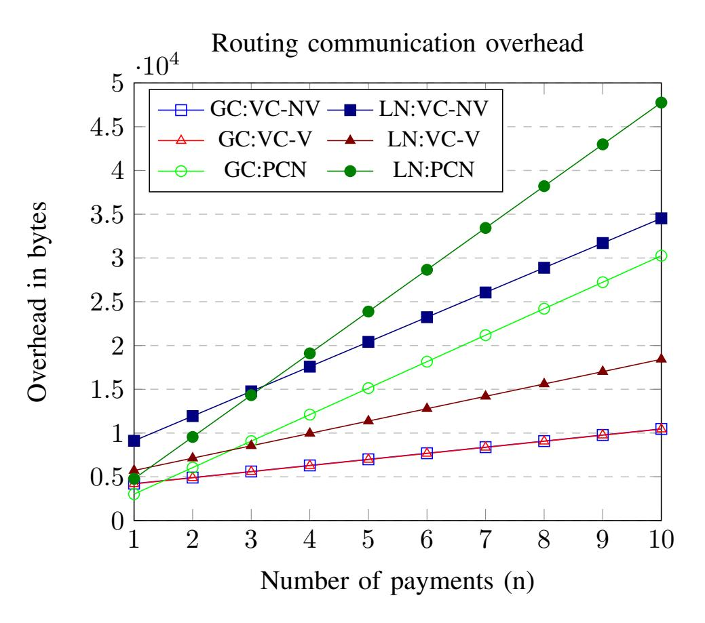

Fig. 10: Pictorial illustration of Table III.

|           |         | Overhead | in bytes              | fees                            |  |  |  |  |
|-----------|---------|----------|-----------------------|---------------------------------|--|--|--|--|
|           | 1 paym. | 2 paym.  | n payments            | tx.cash in $n$ payments         |  |  |  |  |
| GC: PCN   | 3026    | 6052     | $3026 \cdot n$        | $BF \cdot n + FR \cdot tx.cash$ |  |  |  |  |
| GC: VC-NV | 4219    | 4914     | $3524 + 695 \cdot n$  | $BF + FR \cdot tx.cash$         |  |  |  |  |
| GC: VC-V  | 4193    | 4888     | $3498 + 695 \cdot n$  | DF + FR · tx.casii              |  |  |  |  |
| LN: PCN   | 4776    | 9552     | $4776 \cdot n$        | $BF \cdot n + FR \cdot tx.cash$ |  |  |  |  |
| LN: VC-NV | 9116    | 11940    | $6292 + 2824 \cdot n$ | $BF + FR \cdot tx.cash$         |  |  |  |  |
| LN: VC-V  | 5722    | 7134     | $4310 + 1412 \cdot n$ | DF + FK · tx.casii              |  |  |  |  |

TABLE III: Comparison of virtual channels (VC) to multi-hop payments (PCN) showing the overhead in bytes for a different number of payments and the difference in fees.

online and offering the routing service and relative fee (FR) for locking the amounts of coins (tx.cash) and changing the balance in the channel, so that fee(tx) := BF + FR · tx.cash. Note that at the time of writing, the fees are BF = 1 satoshi and FR = 0.000001.

In a virtual channel setting,  $\gamma$ .Ingrid can charge a base fee to collaborate to open and close the virtual channel, and also a relative fee to lock collateral coins in the virtual channel. However, no fees per payment are charged by Ingrid as she does not participate in them (and even does not know how many end-users performed)1. Let us now investigate the case of paying tx.cash in n micropayments of equal value. In PCN case, the total cost would be  $\sum_{i=1}^{n} \mathsf{BF} + \mathsf{FR} \cdot \frac{\mathsf{tx.cash}}{n} = \mathsf{BF} \cdot n + \mathsf{FR} \cdot \mathsf{tx.cash}$ . Whereas, in the virtual case, the parties first create a virtual channel  $\gamma$  with balance tx.cash, and they will handle the micropayments in  $\gamma$ . Thereby, the cost would be only the

{12}------------------------------------------------

opening cost of the virtual channel, for which we assumed BF + FR · tx.cash. Thus, if Alice and Bob would make more than one transaction, i.e., n > 1, it is beneficial to use virtual channels for reducing the fee costs by BF · (n − 1).

*c) Summary:* We find that the best construction in practice is the combination of virtual channels on top of generalized channels, as this yields the least overhead after only two or more sequential payments. However, building virtual channels over LN channels also yields less overhead than multi-hop PCN payments over LN.

# VI. RELATED WORK

In this section, we position this work in the landscape of the literature for off-chain payments protocols.

*a) Payment Channels:* Started from the Lightning Channels construction [26], the idea of 2-party payment channels has been largely used in academia and industry as a building block for more complex off-chain payment protocols. More recently, Aumayr et al. [2] have proposed a novel construction for 2-party payment channels that overcome some of the drawbacks of the original Lightning channels. While their benefit in terms of scalability is out of any doubt by now, payment channels are limited to payments between two users and consequently its overall utility.

A concurrent work [18] has also proposed a virtual channel construction over Bitcoin. However, their construction uses decreasing time-locks instead of a punishment mechanism in order to guarantee that only the latest state can be posted on the blockchain. As a consequence, their construction only allows a fixed number of transactions to be made during the lifetime of the virtual channel. This is quite restrictive as it requires users to close and open new virtual channels more frequently which goes against the purpose of virtual channels. Note that one cannot simply increase the time-lock as this would essentially lock the coins of the users for a longer period of time. Furthermore, our constructions are *generalized* virtual channels, i.e., they are not limited to just payments, but rather allow to run any Bitcoin script off-chain. In addition, we propose a modular approach compared to the monolithic construction in [18]. Finally, our work proposes two protocols, which each have their advantages in different use cases.

*b) Payment Channel Networks (PCN) and Payment Channel Hub (PCH):* A PCN allows a payment between two users that do not share a payment channel but are however connected through a path of payment channels. The notion of PCN started with the deployment of Lightning Network [26] for Bitcoin and Raiden Network [30] for Ethereum and has been widely studied in academia to research into different aspects such as privacy [22, 21], routing of payments [27], collateral management [14] and others. Similar to PCN, different constructions for PCH exist [28, 17, 5] that allow a payment between two users through a single intermediary, the payment hub. PCNs and PCHs, however, share the drawback that each payment between two users require the active involvement of the intermediary (or several intermediaries in the case of PCH), which reduces the reliability (e.g., the intermediary can go offline) and increases the cost of the payment (e.g., each intermediary charges a fee for the payment).

*c) State Channels:* Several works [12, 11, 23, 10] have shown how to leverage the highly expressive scripting language available at Ethereum to construct (multi-party) state channels. A state channel allows the involved parties to carry out off-chain computations, possibly other than payments. Closer to our work, Dziembowski et al. [13] showed how to construct a virtual channel leveraging two payment channels defined in Ethereum. These approaches are, however, highly tight to the functionality provided by the Ethereum scripting language and their constructions cannot be reused in other cryptocurrencies. In this work, we instead show that virtual channels can be constructed from digital signatures and timelock mechanism only, which makes virtual channels accessible for virtually any cryptocurrency system available today.

# VII. CONCLUSION

Current PCNs route payments between two users through intermediate nodes, making the system less reliable (intermediaries might be offline), expensive (intermediaries charge a fee per payment), and privacy-invasive (intermediate nodes observe every payment they route). To mitigate this, recent work has introduced the concept of virtual channels, which involve intermediaries only in the creation of a bridge between payer and payee, who can later on independently perform arbitrarily many off-chain transactions. Unfortunately, existing constructions are only available for Ethereum, as they rely on its account model and Turing-complete scripting language.

In this work, we present the first virtual channel constructions that are built on the UTXO-model and require a scripting language supported by virtually every cryptocurrency, including Bitcoin. Our two protocols provide a tradeoff on who can offload the virtual channel, similar to the preemptible vs. non-preemptible virtual machines in the cloud setting. In other words, our virtual channel construction without validity is more suitable for intermediaries who can monitor the blockchain regularly, such as payment channel hubs, but can also close the virtual channel at anytime if desired. Our virtual channel protocol with validity however, is more suitable for light intermediaries who do not wish to be active during the lifetime of the virtual channel but cannot close the virtual channel before its validity has expired. We formalize the security properties of virtual channels in the UC framework, proving that our protocols constitute a secure realization thereof. We have prototyped our protocols and evaluated their efficiency: for n sequential payments in the optimistic case, they require 9 + 2 · n off-chain transactions for a total of 3524 + 695 · n bytes, with no on-chain footprint.

As mentioned in the introduction of this work, the task of designing secure virtual channels has been proven to be challenging even on a cryptocurrency like Ethereum [13] which supports smart contract execution. Unsurprisingly, this task becomes even more complex when building virtual channels for blockchains that support only a limited scripting language as it is not possible to take advantage of the full 

{13}------------------------------------------------

computation power of Turing complete smart contracts. Due to these significantly differing underlying assumptions (smart contracts vs. limited scripting languages), the virtual channel protocols based on Ethereum [13] and the protocols presented in this work are incomparable. We emphasize that we view our virtual channel constructions as complementary to the one presented in [13], as we do not aim to improve the construction of [13] but rather extend the concept of virtual channels to a broader class of blockchains.

We conjecture that it is possible to recursively build virtual channels on top of any two underlying channels (either ledger, virtual or a combination of them), requiring to adjust the timings for offloading channels: users of a virtual channel at layer k should have enough time to offload the (virtual/ledger) channels at layers 1 to k − 1. Additionally, we envision that while virtual channels without validity might serve as a building block at any layer of recursion, virtual channels with validity period may be more suitable for the top layer as they have a predefined expiration time after which they would require to offload in any case all underlying layers. We plan to explore the recursive building of virtual channels in the near future. Additionally, we conjecture that virtual channels help with privacy, but we leave a formalization of this claim as interesting future work, as it involves a quantitative analysis that falls off the scope of this work.

### ACKNOWLEDGMENTS

This work was partly supported by the German Research Foundation (DFG) Emmy Noether Program *FA 1320/1-1*, by the *DFG CRC 1119 CROSSING* (project S7), by the German Federal Ministry of Education and Research (BMBF) *iBlockchain project* (grant nr. 16KIS0902), by the German Federal Ministry of Education and Research and the Hessen State Ministry for Higher Education, Research and the Arts within their joint support of the *National Research Center for Applied Cybersecurity ATHENE*, by the European Research Council (ERC) under the European Unions Horizon 2020 research (grant agreement No 771527-BROWSEC), by the Austrian Science Fund (FWF) through PROFET (grant agreement P31621) and the Meitner program (grant agreement M 2608-G27), by the Austrian Research Promotion Agency (FFG) through the Bridge-1 project PR4DLT (grant agreement 13808694) and the COMET K1 projects SBA and ABC, by the Vienna Business Agency through the project Vienna Cybersecurity and Privacy Research Center (VISP), by CoBloX Labs and by the ERC Project PREP-CRYPTO 724307.

# REFERENCES

- [1] A. M. Antonopoulos. *Mastering Bitcoin: Unlocking Digital Crypto-Currencies*. 1st. OReilly Media, Inc., 2014. ISBN: 1449374042.
- [2] L. Aumayr et al. *Generalized Bitcoin-Compatible Channels*. Cryptology ePrint Archive, Report 2020/476. https://eprint.iacr.org/2020/476. 2020.

- [3] C. Badertscher et al. "Bitcoin as a Transaction Ledger: A Composable Treatment". In: *CRYPTO 2017, Part I*. Ed. by J. Katz and H. Shacham. Vol. 10401. LNCS. Springer, Heidelberg, Aug. 2017, pp. 324–356.
- [4] S. Bano et al. "SoK: Consensus in the Age of Blockchains". In: *AFT 2019*, pp. 183–198.
- [5] E. Ben-Sasson et al. "Zerocash: Decentralized Anonymous Payments from Bitcoin". In: *IEEE SP*. 2014, pp. 459–474.
- [6] *Bitcoin-Compatible Virtual Channels: Github repository*. https://github.com/utxo-virtual-channels/vc. 2020.
- [7] *Bitcoin Wiki: Payment Channels*. https://en.bitcoin.it/ wiki/Payment channels. 2018.
- [8] R. Canetti. "Universally Composable Security: A New Paradigm for Cryptographic Protocols". In: *42nd FOCS*. IEEE Computer Society Press, Oct. 2001, pp. 136–145.
- [9] R. Canetti et al. "Universally Composable Security with Global Setup". In: *TCC 2007*. Ed. by S. P. Vadhan. Vol. 4392. LNCS. Springer, Heidelberg, Feb. 2007, pp. 61–85.
- [10] M. M. T. Chakravarty et al. "Hydra: Fast Isomorphic State Channels". In: *IACR Cryptol. ePrint Arch.* 2020 (2020), p. 299. URL: https://eprint.iacr.org/2020/299.
- [11] S. Dziembowski et al. "General State Channel Networks". In: *ACM CCS*. 2018, pp. 949–966.
- [12] S. Dziembowski et al. "Multi-party Virtual State Channels". In: *EUROCRYPT 2019, Part I*. 2019, pp. 625– 656.
- [13] S. Dziembowski et al. "Perun: Virtual Payment Hubs over Cryptocurrencies". In: *IEEE SP*. 2019, pp. 106– 123.
- [14] C. Egger et al. "Atomic Multi-Channel Updates with Constant Collateral in Bitcoin-Compatible Payment-Channel Networks". In: *ACM CCS*. 2019, pp. 801–815.
- [15] O. Goldreich. *Foundations of Cryptography: Volume 1*. New York, NY, USA: Cambridge University Press, 2006. ISBN: 0521035368.
- [16] L. Gudgeon et al. "SoK: Layer-Two Blockchain Protocols". In: *FC 2020*. 2020, pp. 201–226.
- [17] E. Heilman et al. "TumbleBit: An Untrusted Bitcoin-Compatible Anonymous Payment Hub". In: *NDSS 2017*. The Internet Society, 2017.
- [18] M. Jourenko et al. "Lightweight Virtual Payment Channels". In: *CANS 2020*. 2020, pp. 365–384.
- [19] G. Kappos et al. "An Empirical Analysis of Privacy in the Lightning Network". In: *CoRR* abs/2003.12470 (2020). arXiv: 2003.12470. URL: https://arxiv.org/abs/ 2003.12470.
- [20] J. Katz et al. "Universally Composable Synchronous Computation". In: *TCC 2013*. Ed. by A. Sahai. Vol. 7785. LNCS. Springer, Heidelberg, Mar. 2013, pp. 477–498. DOI: 10.1007/978-3-642-36594-2 27.
- [21] G. Malavolta et al. "Anonymous Multi-Hop Locks for Blockchain Scalability and Interoperability". In: *NDSS*. 2019.

{14}------------------------------------------------

- [22] G. Malavolta et al. "Concurrency and Privacy with Payment-Channel Networks". In: *ACM CCS 17*. Ed. by B. M. Thuraisingham et al. ACM Press, 2017, pp. 455– 471.
- [23] A. Miller et al. "Sprites and State Channels: Payment Networks that Go Faster Than Lightning". In: *FC 2019*. 2019, pp. 508–526.
- [24] S. Nakamoto. *Bitcoin: A Peer-to-Peer Electronic Cash System*. http://bitcoin.org/bitcoin.pdf. 2009.
- [25] U. Nisslmueller et al. "Toward Active and Passive Confidentiality Attacks on Cryptocurrency Off-chain Networks". In: *ICISSP*. Ed. by S. Furnell et al. 2020, pp. 7–14.
- [26] J. Poon and T. Dryja. *The Bitcoin Lightning Network: Scalable Off-Chain Instant Payments*. Draft version 0.5.9.2, available at https://lightning.network/lightningnetwork-paper.pdf. Jan. 2016.
- [27] S. Roos et al. "Settling Payments Fast and Private: Efficient Decentralized Routing for Path-Based Transactions". In: *NDSS*. 2018.
- [28] E. Tairi et al. *A 2L: Anonymous Atomic Locks for Scalability and Interoperability in Payment Channel Hubs*. In press.
- [29] S. Tikhomirov et al. "A Quantitative Analysis of Security, Anonymity and Scalability for the Lightning Network". In: *IEEE EuroS&P*. 2020, pp. 387–396.
- [30] *Update from the Raiden team on development progress, announcement of raidEX*. https://tinyurl.com/z2snp9e. Feb. 2017.
- [31] A. Zamyatin et al. *SoK: Communication Across Distributed Ledgers*. In press.

# APPENDIX

### *A. On the usage of the UC-Framework*

To formally model the security of our construction, we use a synchronous version of the global UC framework (GUC) [9] which extends the standard UC framework [8] by allowing for a global setup. Since our model is essentially the same as in [2], which in turn follows [11, 12], parts of this section are taken verbatim from there.

*a) Protocols and adversarial model:* We consider a protocol π that runs between parties from the set P = {P1, . . . , Pn}. A protocol is executed in the presence of an *adversary* A that takes as input a security parameter 1 λ (with λ ∈ N) and an auxiliary input z ∈ {0, 1} ∗ , and who can *corrupt* any party Pi at the beginning of the protocol execution (so-called static corruption). By corruption we mean that A takes full control over Pi and learns its internal state. Parties and the adversary A receive their inputs from a special entity – called the *environment* E – which represents anything "external" to the current protocol execution. The environment also observes all outputs returned by the parties of the protocol. In addition to the above entities, the parties can have access to ideal functionalities H1, . . . , Hm. In this case we say that the protocol π *works in the* (H1, . . . , Hm)*-hybrid model* and write π H1,...,Hm.

*b) Modeling time and communication:* We assume a synchronous communication network, which means that the execution of the protocol happens in rounds. Let us emphasize that the notion of rounds is just an abstraction which simplifies our model and allows us to argue about the time complexity of our protocols in a natural way. We follow [12], which in turn follows [20], and formalize the notion of rounds via an ideal functionality Fbclock representing "the clock". On a high level, the ideal functionality requires all honest parties to indicate that they are prepared to proceed to the next round before the clock is "ticked". We treat the clock functionality as a *global* ideal functionality using the GUC model. This means that all entities are always aware of the given round.

We assume that parties of a protocol are connected via authenticated communication channels with guaranteed delivery of exactly one round. This means that if a party P sends a message m to party Q in round t, party Q receives this message in beginning of round t + 1. In addition, Q is sure that the message was sent by party P. The adversary can see the content of the message and can reorder messages that were sent in the same round. However, it can not modify, delay or drop messages sent between parties, or insert new messages. The assumptions on the communication channels are formalized as an ideal functionality FGDC . We refer the reader to [12] its formal description.

While the communication between two parties of a protocol takes exactly one round, all other communication – for example, between the adversary A and the environment E – takes zero rounds. For simplicity, we assume that any computation made by any entity takes zero rounds as well.

*c) Handling coins:* We model the money mechanics offered by UTXO cryptocurrencies, such as Bitcoin, via a *global* ideal functionality Lb using the GUC model. Our functionality is parameterized by a *delay parameter* ∆ which upper bounded in the maximal number of rounds it takes to publish a valid transaction, and a signature scheme Σ. The functionality accepts messages from a fixed set of parties P.

The ledger functionality Lb is initiated by the environment E via the following steps: (1) E instructs the ledger functionality to generate public parameter of the signature scheme pp; (2) E instructs every party P ∈ P to generate a key pair (sk P , pk P ) and submit the public key pk P to the ledger via the message (register, pk P ); (3) sets the initial state of the ledger meaning that it initialize a set TX defining all published transactions.

Once initialized, the state of Lb is public and can be accessed by all parties of the protocol, the adversary A and the environment E. Any party P ∈ P can at any time post a transaction on the ledger via the message (post,tx). The ledger functionality waits for at most ∆ rounds (the exact number of rounds is determined by the adversary). Thereafter, the ledger verifies the validity of the transaction and adds it to the transaction set TX. The formal description of the ledger functionality follows.

{15}------------------------------------------------

# Ideal Functionality $\widehat{\mathcal{L}}(\Delta, \Sigma)$

The functionality accepts messages from all parties that are in the set  $\mathcal{P}$  and maintains a PKI for those parties. The functionality maintains the set of all accepted transactions TX and all unspent transaction outputs UTXO. The set  $\mathcal V$  defines valid output conditions.

Initialize public keys: Upon (register,  $pk_P$ )  $\stackrel{\tau_0}{\longleftrightarrow}$  P and it is the first time P sends a registration message, add  $(pk_P, P)$  to PKI.

Post transaction: Upon (post, tx)  $\stackrel{\tau_0}{\longleftrightarrow}$  P, check that |PKI| =  $|\mathcal{P}|$ . If not, drop the message, else wait until round  $\tau_1 \leq \tau_0 + \Delta$ (the exact value of  $\tau_1$  is determined by the adversary). Then check if:

- 1) The id is unique, i.e. for all  $(t, tx') \in TX$ ,  $tx'.txid \neq tx.txid$ .
- 2) All the inputs are unspent and the witness satisfies all the output conditions, i.e. for each  $(tid, i) \in tx.Input$ , there exists  $(t, tid, i, \theta) \in UTXO$  and  $\theta \cdot \varphi(tx, t, \tau_1) = 1$ .
- 3) All outputs are valid, i.e. for each  $\theta \in \mathsf{tx}.\mathsf{Output}$  it holds that  $\theta$ .cash > 0 and  $\theta \cdot \varphi \in \mathcal{V}$ .
- 4) The value of the outputs is not larger than the value of the inputs. More formally, let  $I := \{utxo := (t, tid, i, \theta)\}$ utxo  $\in$  UTXO  $\land$  (tid, i)  $\in$  tx.Input $\}$ , then it must hold that  $\sum_{\theta' \in \mathsf{tx.Output}} \theta'.\mathsf{cash} \leq \sum_{\mathsf{utxo} \in I} \mathsf{utxo}.\theta.\mathsf{cash}$  5) The absolute time-lock of the transaction has expired, i.e. it
- must hold that  $tx.TimeLock \leq now$ .

If all the above checks return true, add  $(\tau_1, tx)$  to TX, remove the spent outputs from UTXO, i.e., UTXO := UTXO  $\setminus I$ and add the outputs of tx to UTXO, i.e., UTXO := UTXO  $\cup$  $\{(\tau_1,\mathsf{tx.txid},i,\theta_i)\}_{i\in[n]} \text{ for } (\theta_1,\ldots,\theta_n) := \mathsf{tx.Output. Else},$ ignore the message.

Let us emphasize that our ledger functionality is fairly simplified. In reality, parties can join and leave the blockchain system dynamically. Moreover, we completely abstract from the fact that transactions are published in blocks which are proposed by parties and the adversary. Those and other features are captured by prior works, such as [3], that provide a more accurate formalization of the Bitcoin ledger in the UC framework [8]. However, interaction with such ledger functionality is fairly complex. To increase the readability of our channel protocols and ideal functionality, which is the main focus on our work, we decided for this simpler ledger.

d) The GUC-security definition: Let  $\pi$  be a protocol with access to the global ledger  $\widehat{\mathcal{L}}(\Delta, \Sigma)$ , the global clock  $\widehat{\mathcal{F}}_{clock}$  and ideal functionalities  $\mathcal{H}_1, \dots, \mathcal{H}_m$ . The output of an environment  $\mathcal{E}$  interacting with a protocol  $\pi$  and an adversary  $\mathcal{A}$  on input  $1^{\lambda}$  and auxiliary input z is denoted as

$$\mathrm{EXE}_{\pi,\mathcal{A},\mathcal{E}}^{\widehat{\mathcal{L}}(\Delta,\Sigma),\widehat{\mathcal{F}}_{clock},\mathcal{H}_1,\ldots,\mathcal{H}_m}(\lambda,z).$$

Let  $\phi_{\mathcal{F}}$  be the ideal protocol for an ideal functionality  $\mathcal{F}$ with access to the global ledger  $\widehat{\mathcal{L}}(\Delta, \Sigma)$  and the global clock  $\widehat{\mathcal{F}}_{clock}$ . This means that  $\phi_{\mathcal{F}}$  is a trivial protocol in which the parties simply forward their inputs to the ideal functionality  $\mathcal{F}$ . The output of an environment  $\mathcal{E}$  interacting with a protocol  $\phi_{\mathcal{F}}$  and a adversary  $\mathcal{S}$  (sometimes also call *simulator*) on input  $1^{\lambda}$  and auxiliary input z is denoted as

$$\mathrm{EXE}_{\phi_{\mathcal{F}},\mathcal{S},\mathcal{E}}^{\widehat{\mathcal{L}}(\Delta,\Sigma),\widehat{\mathcal{F}}_{clock}}(\lambda,z).$$

We are now ready to state our main security definition which, informally, says that if a protocol  $\pi$  UC-realizes an

ideal functionality  $\mathcal{F}$ , then any attack that can be carried out against the real-world protocol  $\pi$  can also be carried out against the ideal protocol  $\phi_{\mathcal{F}}$ .

Definition 1: A protocol  $\pi$  working in a  $(\mathcal{H}_1, \ldots, \mathcal{H}_m)$ hybrid model UC-realizes an ideal functionality  $\mathcal{F}$  with respect to a global ledger  $\widehat{\mathcal{L}} := \widehat{\mathcal{L}}(\Delta, \Sigma)$  and a global clock  $\widehat{\mathcal{F}}_{clock}$  if for every adversary A there exists an adversary S such that we have

$$\left\{ \operatorname{EXE}_{\pi,\mathcal{A},\mathcal{E}}^{\widehat{\mathcal{L}},\widehat{\mathcal{F}}_{clock},\mathcal{H}_{1},...,\mathcal{H}_{m}}(\lambda,z) \right\}_{\substack{\lambda \in \mathbb{N}, \\ z \in \{0,1\}^{*}}} \\
\stackrel{c}{\approx} \left\{ \operatorname{EXE}_{\phi_{\mathcal{F}},\mathcal{S},\mathcal{E}}^{\widehat{\mathcal{L}},\widehat{\mathcal{F}}_{clock}}(\lambda,z) \right\}_{\substack{\lambda \in \mathbb{N}, \\ z \in \{0,1\}^{*}}} \\$$

(where " $\stackrel{c}{\approx}$ " denotes computational indistinguishability of distribution ensembles, see, e.g., [15]).

To simplify exposition, we omit the session identifiers *sid* and the sub-session identifiers *ssid*. Instead, we will use expressions like "message m is a reply to message m'". We believe that this approach improves readability.

### B. Adaptor Signatures

Adaptor signatures have been introduced and used in the cryptocurrencies community for some time, but have been formalized for the first time in [2]. These signatures not only allow for authentication as normal signatures schemes do, but also reveal a secret value upon publishing. Here we recall the definition of an adaptor signature scheme from [2]. In a nutshell, an adaptor signature is generated in two phases. First a pre-signature is computed w.r.t. some statement Y of a hard relation R e.g.  $Y = g^y$  where g is the generator of the group  $\mathbb{G}$  in which computing the discrete logarithm is hard. We define  $L_R$  to be the associated language for R defined as  $L_R := \{Y \mid \exists y \text{ s.t. } (Y,y) \in R\}$ . This pre-signature can be adapted to a full signature given a witness y for the statement Y, i.e.  $(Y,y) \in R$ . Furthermore, given the pre-signature and the adapted full signature one can extract a witness y. We now recall the definition for adaptor signature schemes from [2].

Definition 2 (Adaptor Signature Scheme): An adaptor signature scheme wrt. a hard relation R and a signature scheme  $\Sigma = (\mathsf{Gen}, \mathsf{Sign}, \mathsf{Vrfy})$  consists of four algorithms  $\Xi_{R,\Sigma} =$ (pSign, Adapt, pVrfy, Ext) defined as:

 $pSign_{sk}(m, Y)$ : is a PPT algorithm that on input a secret key sk, message  $m \in \{0,1\}^*$  and statement  $Y \in L_R$ , outputs a pre-signature  $\tilde{\sigma}$ .

 $\mathsf{pVrfy}_{nk}(m,Y;\tilde{\sigma})$ : is a DPT algorithm that on input a public key pk, message  $m \in \{0,1\}^*$ , statement  $Y \in L_R$  and pre-signature  $\tilde{\sigma}$ , outputs a bit b.

Adapt $(\tilde{\sigma}, y)$ : is a DPT algorithm that on input a pre-signature  $\tilde{\sigma}$  and witness y, outputs a signature  $\sigma$ .

Ext $(\sigma, \tilde{\sigma}, Y)$ : is a DPT algorithm that on input a signature  $\sigma$ , pre-signature  $\tilde{\sigma}$  and statement  $Y \in L_R$ , outputs a witness y such that  $(Y, y) \in R$ , or  $\perp$ .

We now briefly recall the properties that an adaptor signature scheme must satisfy and refer the reader to [2] for the formal definitions.

{16}------------------------------------------------

- a) Correctness: An adaptor signature should not only satisfy the standard signature correctness, but it must also satisfy pre-signature correctness. This property guarantees that if a pre-signature is generated honestly (wrt. a statement  $Y \in L_R$ ), it can be adapted into a valid signature such that a witness for Y can be extracted.
- b) Existential unforgeablity under chosen message attack for adaptor signatures: Unforgeability for adaptor signatures is very similar to the normal definition of existential unforgeability under chosen message attacks for digital signatures, but it additionally requires that producing a forged signature  $\sigma$  for a message m is hard even if the adversary is given a pre-signature on the challenge message m w.r.t. a random statement  $Y \in L_R$ .
- c) Pre-signature adaptability: Intuitively it is required that any valid pre-signature w.r.t. Y (even when produced by a malicious signer) can be completed into a valid signature using the witness y where  $(Y, y) \in R$ .
- d) Witness extractability: In a nutshell, this property states that given a valid signature/pre-signature pair  $(\sigma, \tilde{\sigma})$  for a message m with respect to a statement Y, one can extract the corresponding witness y.

### C. Ledger channels

For completeness, we recall the ledger channel ideal functionality  $\mathcal{F}_L$  from [2]. We then show that we cannot use this ideal functionality in a black-box way and instead we introduce a wrapped ledger channel functionality  $\mathcal{F}_{preL}$ . Finally, we present a protocol  $\Pi_{preL}$  that realizes  $\mathcal{F}_{preL}$ .

1) Ledger Channel Functionality: We now recall the ideal functionality for ledger channels  $\mathcal{F}_L(T,k)$  from [2]. This functionality is parameterized by  $T \in \mathbb{N}$  that upper bounds the number of consecutive off-chain communication rounds between parties and a parameter  $k \in \mathbb{N}$  that defined the number of ways a channel can be closed (i.e., number of commit transactions per update).

Following [2], the pseudocode presented below excludes several checks that one would expect the functionality to make. We formalize all the missing checks in form of a functionality wrapper in Appendix E. Moreover, in order to simplify the notation in the functionality description, we write  $m \stackrel{t}{\hookrightarrow} P$  as a short hand form for "send the message m to party P in round t." and  $m \stackrel{t}{\hookleftarrow} P$  for "receive a message m from party P in round t".

#### Ideal Functionality $\mathcal{F}_L(T,k)$

We abbreviate  $Q := \gamma$ .otherParty(P) for  $P \in \gamma$ .endUsers.

# Create

Upon (CREATE,  $\gamma$ ,  $tid_P$ )  $\stackrel{\tau_0}{\longleftrightarrow}$  P, let  $\mathcal{S}$  define  $T_1 \leq T$  and:

**Both agreed:** If already received (CREATE,  $\gamma$ ,  $tid_Q$ )  $\stackrel{\tau}{\hookleftarrow} Q$ , where  $\tau_0 - \tau \leq T_1$ , wait if in round  $\tau_1 \leq \tau + \Delta + T_1$  a transaction tx, with tx.Input =  $(tid_P, tid_Q)$  and tx.Output =  $(\gamma. \mathsf{cash}, \varphi)$ , appears on the ledger  $\widehat{\mathcal{L}}$ . If yes, set  $\Gamma(\gamma. \mathsf{id}) :=$ 

 $(\gamma, \mathsf{tx})$  and  $(\mathsf{CREATED}, \gamma.\mathsf{id}) \overset{\tau_1}{\longleftrightarrow} \gamma.\mathsf{endUsers}$ . Else stop. **Wait for** Q: Else store the message and stop.

# Update

Upon (UPDATE, id,  $\vec{\theta}$ ,  $t_{\text{stp}}$ )  $\stackrel{\tau_0}{\longleftarrow}$  P, let S define  $T_1, T_2 \leq T$ , parse  $(\gamma, \text{tx}) := \Gamma(id)$  and proceed as follows:

- 1) In round  $\tau_1 \leq \tau_0 + T$ , let  $\mathcal{S}$  set  $|t\vec{id}| = k$ . Then (UPDATE-REQ, id,  $\vec{\theta}$ ,  $t_{\mathsf{stp}}$ ,  $t\vec{id}$ )  $\overset{\tau_1}{\hookrightarrow} Q$  and (SETUP, id,  $t\vec{id}$ )  $\overset{\tau_1}{\hookrightarrow} P$ .
- 2) If (SETUP-OK, id)  $\stackrel{\tau_2 \leq \tau_1 + t_{\mathsf{stp}}}{\longleftarrow} P$ , then (SETUP-OK, id)  $\stackrel{\tau_2 + T_1}{\longleftarrow} Q$ . Else stop.
- 3) If (UPDATE-OK, id)  $\stackrel{\tau_2+T_1}{\longleftarrow}$  Q, then (UPDATE-OK, id)  $\stackrel{\tau_2+2T_1}{\longleftarrow}$  P. Else distinguish:
  - If Q honest or if instructed by S, stop (update rejected).
  - Else execute L-ForceClose(id) and stop.
- 4) If (REVOKE, id)  $\xleftarrow{\tau_2+2T_1} P$ , (REVOKE-REQ, id)  $\xleftarrow{\tau_2+2T_1+T_2} Q$ . Else execute L-ForceClose(id) and stop.
- 5) If  $(\mathtt{REVOKE}, id) \xleftarrow{\tau_2 + 2T_1 + T_2} Q$ , set  $\gamma.\mathsf{st} = \vec{\theta}$  and  $\Gamma(id) := (\gamma, \mathsf{tx})$ . Then  $(\mathtt{UPDATED}, id, \vec{\theta}) \xrightarrow{\tau_2 + 2T_1 + 2T_2} \gamma.\mathsf{endUsers}$  and stop. Else distinguish:
  - If Q honest, execute L-ForceClose(id) and stop.
  - If Q corrupt, and wait for  $\Delta$  rounds. If tx still unspent, then set  $\vec{\theta}_{old} := \gamma.\text{st}$ ,  $\gamma.\text{st} := \{\vec{\theta}_{old}, \vec{\theta}\}$  and  $\Gamma(id) := (\gamma, \text{tx})$ . Execute L-ForceClose(id) and stop.

# Close

Upon (CLOSE, id)  $\stackrel{\tau_0}{\longleftrightarrow} P$ , let S define  $T_1 \leq T$  and distinguish:

**Both agreed:** If you received (CLOSE, id)  $\stackrel{\tau}{\hookleftarrow} Q$ , where  $\tau_0 - \tau \le T_1$ , let  $(\gamma, \mathsf{tx}) := \Gamma(id)$  and distinguish:

- If in round  $\tau_1 \leq \tau + T_1 + \Delta$  a transaction tx', with tx'.Output =  $\gamma$ .st and tx'.Input = tx.txid, appears on  $\widehat{\mathcal{L}}$ , set  $\Gamma(id) := (\bot, \mathsf{tx})$ , (CLOSED,  $id) \stackrel{\tau_1}{\longleftrightarrow} \gamma$ .endUsers and stop.
- If tx is still unspent in round  $\tau + T_1 + \Delta$ , output (ERROR)  $\xrightarrow{\tau + T_1 + \Delta} \gamma$ .endUsers and stop.

Wait for Q: Else wait for at most  $T_1$  rounds to receive (CLOSE, id)  $\stackrel{\tau \leq \tau_0 + T_1}{\longleftarrow} Q$  (in that case option "Both agreed" is executed). If such message is not received, execute L-ForceClose(id) in round  $\tau_0 + T_1$ .

# Punish (executed at the end of every round $\tau_0$ )

For each  $(\gamma, \mathsf{tx}) \in \Gamma$  check if  $\widehat{\mathcal{L}}$  contains  $\mathsf{tx}'$  with  $\mathsf{tx}'.\mathsf{Input} = \mathsf{tx}.\mathsf{txid}$ . If yes, then distinguish:

**Punish:** For  $P \in \gamma$ .endUsers honest, the following must hold: in round  $\tau_1 \leq \tau_0 + \Delta$ , a transaction tx" with tx".Input = tx'.txid and tx".Output =  $(\gamma.\text{cash}, \text{One-Sig}_{pk_P})$  appears on  $\widehat{\mathcal{L}}$ . Then send (PUNISHED, id)  $\stackrel{\tau_1}{\longleftrightarrow} P$ , set  $\Gamma(id) := \bot$  and

stop. Close: Either  $\Gamma(id) = (\bot, \mathsf{tx})$  before round  $\tau_0 + \Delta$  (channels was peacefully closed) or in round  $\tau_1 \leq \tau_0 + 2\Delta$  a transaction  $\mathsf{tx}''$ , with  $\mathsf{tx}''$ .Output  $\in \gamma$ .st and  $\mathsf{tx}''$ .Input  $= \mathsf{tx}'.\mathsf{txid}$ , appears on  $\widehat{\mathcal{L}}$  (channel is forcefully closed). In the latter case, set  $\Gamma(id) := (\bot, \mathsf{tx})$  and (CLOSED,  $id) \stackrel{\tau_1}{\longleftrightarrow} \gamma$ .endUsers.

**Error:** Otherwise (ERROR)  $\stackrel{\tau_0+2\Delta}{\longleftrightarrow} \gamma$ .endUsers.

{17}------------------------------------------------

### Subprocedure L-ForceClose(id)

Let  $\tau_0$  be the current round and  $(\gamma, \mathsf{tx}) := \Gamma(id)$ . If within  $\Delta$  rounds  $\mathsf{tx}$  is still an unspent transaction on  $\widehat{\mathcal{L}}$ , then (ERROR)  $\xrightarrow{\tau_0 + \Delta} \gamma$ .endUsers and stop. Else, latest in round  $\tau_0 + 3\Delta$ ,  $m \in \{\mathsf{CLOSED}, \mathsf{PUNISHED}, \mathsf{ERROR}\}$  is output via Punish.

- 2) Wrapped ledger channel functionality: For technical reason we cannot use the ledger channel functionality  $\mathcal{F}_L(T,k)$  for building virtual channels in a black-box way. The main problem comes from the offloading feature of virtual channels. In order to overcome these issues, we present  $\mathcal{F}_{preL}(T,k)$ , an ideal functionality that extends  $\mathcal{F}_L(T,k)$  to support the preparation of generalized channels ahead of time and later registration of such prepared generalized channels. Technically, the functionality extension is done by wrapping the original functionality. Before we present the functionality wrapper  $\mathcal{F}_{preL}(T,k)$  formally, let us explain each of its parts on high level.
- a) Generalized channels: The functionality treats messages about standard generalized channels exactly as the functionality  $\mathcal{F}_L(T,k)$  presented earlier in this section.
- b) Creation: In order to pre-create a generalized channel  $\gamma$ , both end-users of the channel must send the message (PRE-CREATE,  $\gamma$ ,  $\mathrm{TX_f}, i, t_{oft}$ ) to the ideal functionality. Here  $\mathrm{TX_f}||i$  identifies the funding of the channel and  $t_{oft} \in \mathbb{N}$  represents the maximal number of round it should take to publish the channel funding transaction on-chain. If the functionality receives such a message from both parties within T rounds, it stores the channel  $\gamma$ , the funding identifier and the waiting time to a special channel set  $\Gamma_{pre}$ , and informs both parties about the successful pre-creation.
- c) Update: The update process works similarly as for standard ledger channel with one difference. If the update process fails at some point (e.g., one of the parties does not revoke), the functionality does not call L-ForceClose since there is no ledger channel to be forcefully closed. Instead, it calls a subprocedure called Wait-if-Register which add a flag "in-dispute" to the channel and waits for at most  $t_{ofl}$  rounds if the prepared channel is turned into a standard generalized channel (i.e., the corresponding funding transaction is added to the blockchain). If not, then it adds the new channel state back into the set of prepared (not yet full-fledged) channel states.
- d) Register: The ideal functionality constantly monitors the ledger. Once the funding transaction of one of the channels in preparation appears on-chain, the functionality moves the information about the channel from the channel space  $\Gamma_{pre}$  to the channel space  $\Gamma$ . Moreover, if the channel in preparation was marked as "in-dispute", then it immediately calls L-ForceClose.

The formal functionality description on the functionality wrapper  $\mathcal{F}_{preL}(T,k)$  follows. Again, for the sake of readability, we exclude several natural checks from the functionality description. These checks are formalized in Appendix E.

# Wrapped Ledger Channel Functionality $\mathcal{F}_{preL}(T,k)$

We abbreviate  $Q := \gamma$ .otherParty(P) for  $P \in \gamma$ .endUsers.

### Ledger Channels

Upon receiving a CREATE, UPDATE, SETUP-OK, UPDATE-OK, REVOKE or CLOSE message, then behave exactly as the functionality  $\mathcal{F}_L(T,k)$ .

### Pre-Create

Upon (PRE-CREATE,  $\gamma$ , TXf,  $i, t_{oft}$ )  $\stackrel{\tau_0}{\longleftrightarrow} P$ , let  $\mathcal{S}$  define  $T_1 \leq T$  and:

**Both agreed:** If already received (PRE-CREATE,  $\gamma$ , TXf, i,  $t_{oft}$ )  $\stackrel{\tau}{\hookleftarrow} Q$ , where  $\tau_0 - \tau \leq T_1$ , check that TXf.Output[i].cash =  $\gamma$ .cash. If yes, set  $\Gamma_{pre}(\gamma.id) := (\gamma, TX_f, t_{oft})$  and (PRE-CREATED,  $\gamma.id$ )  $\stackrel{\tau_0}{\longleftrightarrow} \gamma$ .endUsers. Else stop.

**Wait for** *Q***:** Else store the message and stop.

# Pre-Update

Upon (PRE-UPDATE, id,  $\vec{\theta}$ ,  $t_{\text{stp}}$ )  $\stackrel{\tau_0}{\longleftrightarrow}$  P, let  $\mathcal{S}$  define  $T_1, T_2 \leq T$ , parse  $(\gamma, \mathsf{TX_f}, t) := \Gamma_{pre}(id)$  and proceed as follows:

- 1) In round  $\tau_1 \leq \tau_0 + T$ , let  $\mathcal{S}$  set  $|\vec{tid}| = k$ . Then (PRE-UPDATE-REQ, id,  $\vec{\theta}$ ,  $t_{\mathsf{stp}}$ ,  $t\vec{id}$ )  $\overset{\tau_1}{\hookrightarrow}$  Q and (PRE-SETUP, id,  $t\vec{id}$ )  $\overset{\tau_1}{\hookrightarrow}$  P.
- 2) If (PRE-SETUP-OK, id)  $\stackrel{\tau_2 \leq \tau_1 + t_{\text{stp}}}{\longleftarrow}$  P, then (PRE-SETUP-OK, id)  $\stackrel{\tau_2 + T_1}{\longleftarrow}$  Q. Else stop.
- 3) In round  $\tau_2 + T_1$  distinguish:
  - If  $(PRE-UPDATE-OK, id) \xleftarrow{\tau_2+T_1} Q$ , then  $(PRE-UPDATE-OK, id) \xleftarrow{\tau_2+2T_1} P$ .
  - If not and Q honest or if instructed by  $\mathcal{S}$ , (PRE-UPDATE-REJECT, id)  $\stackrel{\tau_2+2T_1}{\longleftrightarrow} P$ .
  - $\bullet$  Else execute Wait-if-Register(id) and stop.
- 4) If (PRE-REVOKE, id)  $\stackrel{\tau_2+2T_1}{\longleftrightarrow}$  P, (PRE-REVOKE-REQ, id)  $\stackrel{\tau_2+2T_1+T_2}{\longleftrightarrow}$  Q. Else execute Wait-if-Register(id) and stop.
- 5) If  $(PRE-REVOKE, id) \xleftarrow{\tau_2 + 2T_1 + T_2} Q$ , set  $\gamma$ .st  $= \vec{\theta}$  and  $\Gamma_V(id) := (\gamma, TX_f)$ . Then  $(PRE-UPDATED, id, \vec{\theta}) \xleftarrow{\tau_2 + 2T_1 + 2T_2} \gamma$ .endUsers and stop. Else Wait-if-Register(id) and stop.

### Register – executed in every round

Let  $t_0$  be the current round. For every  $(\gamma, TX_f) \in \Gamma_{pre}$  check if  $TX_f$  appears on the ledger  $\widehat{\mathcal{L}}$ . If yes, then  $\Gamma_{pre}(\gamma.id) = \bot$  and  $\Gamma(\gamma.id) = (\gamma, TX_f)$ .

### Subprocedure Wait-if-Register (id)

Let  $\tau_0$  be the current round and  $(\gamma, TX_f, t_{oft}) := \Gamma_{pre}(id)$ .

- 1) Set  $\Gamma_{pre}(id) := (\gamma, TX_f, t_{off}, in-dispute)$ .
- 2) Wait for  $t_{ofl}$  rounds. If after this time,  $\Gamma_{pre}(id) \neq \bot$ , then set  $\vec{\theta}_{old} := \gamma$ .st,  $\gamma$ .st  $:= \{\vec{\theta}_{old}, \vec{\theta}\}$  and  $\Gamma_{pre}(id) := (\gamma, TX_f, t_{ofl}, in-dispute)$ .
- 3) Realizing the wrapped functionality: While [2] presents a protocol  $\Pi_L$  that realizes the ideal functionality  $\mathcal{F}_L$ , it does not say anything about our wrapped functionality  $\mathcal{F}_{preL}$ . In order to have such protocol, we design a protocol wrapper

{18}------------------------------------------------

around the protocol  $\Pi_L$  and prove that such wrapped protocol, which we denote  $\Pi_{preL}$  realizes the ideal functionality  $\mathcal{F}_{preL}$ . Note that, just like  $\Pi_L$ ,  $\Pi_{preL}$  uses the adaptor signature primitive that we recalled in Appendix B.

Let us stress that the protocol wrapper very closely follows the protocol for ledger channels. Below we stress the main difference and thereafter we formally define the protocol for completeness.

- a) Pre-Create: The only difference between the precreate and create is that in pre-create  $TX_f$  is neither generated by the parties nor posted on the ledger and is given as an input from the environment. Intuitively this is a funding transactions that might be posted in the future. Hence such channels are called pre-created or prepared channels.
- b) Pre-Update: During the pre-update procedure, parties update the state of the pre-created channel as in normal ledger channels, but parties cannot directly force-close the channel since the funding transaction is not posted on the ledger yet. Hence in case of dispute parties first have to post this transaction on the ledger this is captured in calls to Wait-if-Register sub-procedure.
- c) Register: This is a new procedure in order to capture the situation during which the funding transaction of a precreated channel is posted on the ledger. In this case the precreated channel is transformed into a normal ledger channel and is added to the list of ledger channels. Furthermore if this channel was in dispute, it is directly force closed.

To summarize, parties upon receiving one of the PRE-UPDATE, PRE-SETUP-OK, PRE-UPDATE-OK or PRE-REVOKE messages, behave as in the protocol  $\Pi_L$  with the following changes:

- Use the channel space  $\Gamma^P_{pre}$  instead of  $\Gamma^P$ .
- Add  $t_{off}$  rounds to the absolute time lock of new TXc.
- $\bullet$  Replace calls to L-ForceClose  $^P$  by calls to Wait-if-Register  $^P$  which marks a channel to be in dispute.
- In case the reacting party peacefully rejects the update, output PRE-UPDATE-REJECT before you stop.
- When the protocol instructs you to output a m-message, where  $m \in \{\text{UPDATE-REQ}, \text{SETUP}, \text{SETUP-OK}, \text{UPDATE-OK}, \text{REVOKE-REQ}, \text{UPDATED}\}$ , then output PRE-m.

We are now prepared to present the formal description of the protocol. As for the ideal functionalities, we exclude several natural checks that parties have to make. We present all these checks in form of a protocol wrapper in Appendix E.

### Wrapped Ledger Channel Protocol $\Pi_{preL}$

Below, we abbreviate  $Q:=\gamma.{\rm otherParty}(P)$  for  $P\in\gamma.{\rm end}{\sf Users}.$ 

#### Ledger channels

Upon receiving a CREATE, UPDATE, SETUP-OK, UPDATE-OK, REVOKE or CLOSE message, then behave exactly as in the protocol  $\Pi_L$ .

### **Pre-Create**

Party P upon (PRE-CREATE,  $\gamma$ , TXf, i,  $t_{ofl}$ )  $\stackrel{t_0}{\longleftrightarrow}$   $\mathcal{E}$ :

- 1) If  $TX_f$ .Output[i].cash  $\neq \gamma$ .cash, then ignore the message.
- 2) Set  $id := \gamma$ .id, generate  $(R_P, r_P) \leftarrow \text{GenR}$ ,  $(Y_P, y_P) \leftarrow \text{GenR}$  and send (createInfo, id,  $\text{TX}_f$ , i,  $t_{ofl}$ ,  $R_P$ ,  $Y_P$ )  $\overset{t_0}{\hookrightarrow}$  Q.
- 3) If (createInfo, id,  $\mathsf{TX}_{\mathsf{f}}$ , i,  $t_{ofl}$ ,  $R_Q$ ,  $Y_Q$ )  $\stackrel{t_0+1}{\longleftarrow} Q$ , create:

$$[\mathtt{TX_c}] := \mathtt{GenCommit}([\mathtt{TX_f}], I_P, I_Q, 0)$$

$$[\mathtt{TX_s}] := \mathtt{GenSplit}([\mathtt{TX_c}].\mathsf{txid} \| 1, \gamma.\mathsf{st})$$

for  $I_P := (pk_P, R_P, Y_P)$ ,  $I_Q := (pk_Q, R_Q, Y_Q)$ . Else stop.

- 4) Compute  $s_{\mathtt{c}}^{P} \leftarrow \mathsf{pSign}_{sk_{P}}([\mathtt{TX}_{\mathtt{c}}], Y_{Q}), \ s_{\mathtt{s}}^{P} \leftarrow \mathsf{Sign}_{sk_{P}}([\mathtt{TX}_{\mathtt{s}}])$  and send (createCom,  $id, s_{\mathtt{c}}^{P}, s_{\mathtt{s}}^{P}$ )  $\overset{t_{0}+1}{\longleftrightarrow} Q$ .
- 5) If  $(\operatorname{createCom}, id, s_{\mathtt{c}}^Q, s_{\mathtt{s}}^Q) \xleftarrow{t_0+2} Q$ , s.t.  $\operatorname{pVrfy}_{pk_Q}([\mathtt{TX}_{\mathtt{c}}], Y_P; s_{\mathtt{c}}^Q) = 1$  and  $\operatorname{Vrfy}_{pk_Q}([\mathtt{TX}_{\mathtt{s}}]; s_{\mathtt{s}}^Q) = 1$ , set

$$\mathtt{TX}_{\mathtt{c}} := ([\mathtt{TX}_{\mathtt{c}}], \{\mathsf{Sign}_{sk_P}([\mathtt{TX}_{\mathtt{c}}]), \mathsf{Adapt}(s^Q_{\mathtt{c}}, y_P)\})$$

$$\mathtt{TX}_{\mathtt{s}} := ([\mathtt{TX}_{\mathtt{s}}], \{s^P_{\mathtt{s}}, s^Q_{\mathtt{s}}\})$$

$$\Gamma^P_{pre}(\gamma.\mathsf{id}) := (\gamma, \mathsf{TX_f}, (\mathsf{TX_c}, r_P, R_Q, Y_Q, s_\mathsf{c}^P), \mathsf{TX_s}, t_{ofl}).$$

and send (PRE-CREATED, id)  $\stackrel{t_0+2}{\longleftrightarrow} \mathcal{E}$ .

### **Pre-Update**

Party P upon (PRE-UPDATE, id,  $\vec{\theta}$ ,  $t_{\text{stp}}$ )  $\stackrel{t_0^P}{\longleftrightarrow} \mathcal{E}$ 1) Generate  $(R_P, r_P) \leftarrow \text{GenR}$ ,  $(Y_P, y_P) \leftarrow \text{GenR}$  and send

1) Generate  $(R_P, r_P) \leftarrow \text{GenR}$ ,  $(Y_P, y_P) \leftarrow \text{GenR}$  and sent the message (updateReq, id,  $\vec{\theta}$ ,  $t_{\text{stp}}$ ,  $R_P$ ,  $Y_P$ )  $\stackrel{t_0^P}{\longleftrightarrow} Q$ .

Party 
$$Q$$
 upon (updateReq,  $id$ ,  $\vec{\theta}$ ,  $t_{\mathsf{stp}}$ ,  $R_P$ ,  $Y_P$ )  $\overset{t_0^Q}{\longleftarrow}$   $P$ 

- 2) Generate  $(R_Q, r_Q) \leftarrow \mathsf{GenR}$  and  $(Y_Q, y_Q) \leftarrow \mathsf{GenR}$ .
- 3) Extract  $TX_f$  and  $t_{off}$  from  $\Gamma^P_{pre}(id)$ .
- 4) Set  $t_{\text{lock}} := t_0^Q + t_{\text{stp}} + 4 + \Delta + t_{ofl}$  and

$$\begin{aligned} [\mathtt{TX}_\mathtt{c}] := \mathtt{GenCommit}([\mathtt{TX}_\mathtt{f}], I_P, I_Q, t_\mathsf{lock}) \ [\mathtt{TX}_\mathtt{s}] := \mathtt{GenSplit}([\mathtt{TX}_\mathtt{c}].\mathsf{txid} \| 1, \vec{\theta}) \end{aligned}$$

 $\begin{array}{ll} \text{where } I_P := (pk_P, R_P, Y_P), \ I_Q := (pk_Q, R_Q, Y_Q). \\ \text{5) Sign } s_{\mathtt{s}}^Q \leftarrow & \mathsf{Sign}_{sk_Q}([\mathtt{TX}_{\mathtt{s}}]), \ \text{send (updateInfo}, id, R_Q, \\ Y_Q, s_{\mathtt{s}}^Q) & \stackrel{t_0^Q}{\longleftrightarrow} P, \ (\mathtt{PRE-UPDATE-REQ}, id, \vec{\theta}, t_{\mathtt{stp}}, \mathtt{TX}_{\mathtt{s}}.\mathsf{txid}) \\ \stackrel{t_0^Q+1}{\longleftrightarrow} \mathcal{E}. \end{array}$ 

Party 
$$P$$
 upon (updateInfo,  $id, h_Q, Y_Q, s_s^Q$ )  $\xleftarrow{t_0^P + 2} Q$ 

- 6) Extract  $TX_f$  and  $t_{off}$  from  $\Gamma_{pre}^Q(id)$ .
- 7) Set  $t_{\text{lock}} := t_0^P + t_{\text{stp}} + 5 + \Delta + t_{off}$ , and

$$[\mathtt{TX_c}] := \mathtt{GenCommit}([\mathtt{TX_f}], I_P, I_Q, t_\mathsf{lock})$$

$$[\mathtt{TX_s}] := \mathtt{GenSplit}([\mathtt{TX_c}].\mathsf{txid} \| 1, \vec{\theta}),$$

 $\begin{array}{lll} \text{for} & I_P := (pk_P, R_P, Y_P) \text{ and } I_Q := (pk_Q, R_Q, Y_Q). \\ \text{If it holds that } \mathsf{Vrfy}_{pk_Q}([\mathsf{TX}_{\mathtt{s}}]; s^Q_{\mathtt{s}}) = 1, \ (\mathtt{PRE-SETUP}, id, \\ \mathsf{TX}_{\mathtt{s}}.\mathsf{txid}) \overset{t^P_0 + 2}{\longleftrightarrow} \mathcal{E}. \ \text{Else stop}. \end{array}$ 

{19}------------------------------------------------

8) If  $(PRE-SETUP-OK, id) \xleftarrow{t_1^P \le t_0^P + 2 + t_{stp}} \mathcal{E}$ , compute the values  $s_{\mathsf{c}}^P \leftarrow \mathsf{pSign}_{sk_P}([\mathsf{TX}_{\mathsf{c}}], Y_Q), s_{\mathsf{s}}^P \leftarrow \mathsf{Sign}_{sk_P}([\mathsf{TX}_{\mathsf{s}}])$  and send the message  $(\mathsf{updateComP}, id, s_{\mathsf{c}}^P, s_{\mathsf{s}}^P) \xrightarrow{t_1^P} Q$ . Else stop.

Party Q

- 9) If  $(\text{updateComP}, id, s_{\text{c}}^P, s_{\text{s}}^P) \xleftarrow{t_1^Q \leq t_0^Q + 2 + t_{\text{stp}}} P$ , s.t.  $\text{pVrfy}_{pk_P}([\mathtt{TX}_{\text{c}}], Y_Q; s_{\text{c}}^P) = 1$  and  $\text{Vrfy}_{pk_P}([\mathtt{TX}_{\text{s}}]; s_{\text{s}}^P) = 1$ , output  $(\text{PRE-SETUP-OK}, id) \overset{t_1^Q}{\longleftrightarrow} \mathcal{E}$ . Else stop.
- 10) If  $(PRE-UPDATE-OK, id) \overset{t_1^Q}{\longleftrightarrow} \mathcal{E}$ , pre-sign  $s_c^Q \leftarrow pSign([TX_c], Y_P)$  and send  $(updateComQ, id, s_c^Q) \overset{t_1^Q}{\longleftrightarrow} P$ . Else send the message  $(updateNotOk, id, r_Q) \overset{t_1^Q}{\longleftrightarrow} P$  and stop.

Party P

- 11) In round  $t_1^P + 2$  distinguish the following cases:
  - $$\begin{split} \bullet & \text{ If } (\text{updateComQ}, id, s_{\text{c}}^Q) \xleftarrow{t_1^P + 2} Q, \text{ s.t. } \mathsf{pVrfy}_{pk_Q}([\mathtt{TX}_{\text{c}}], \\ & Y_P; s_{\text{c}}^Q) = 1, \text{ output } (\mathtt{PRE-UPDATE-OK}, id) \xleftarrow{t_1^P + 2} \mathcal{E}. \end{split}$$
  - If  $(\text{updateNotOk}, id, r_Q) \xleftarrow{t_1^P + 2} Q$ , s.t.  $(R_Q, r_Q) \in R$ , add  $\Theta^P(id) := \Theta^P(id) \cup ([\mathsf{TX_c}], r_Q, Y_Q, s_c^P)$ , output the message  $(\mathsf{PRE-UPDATE-REJECT}) \xleftarrow{t_1^P + 2} \mathcal{E}$  and stop.
  - Else, execute the procedure Wait-if-Register  $^{P}(id)$  and stop.
- 12) If  $(PRE-REVOKE, id) \overset{t_1^P+2}{\longleftrightarrow} \mathcal{E}$ , parse  $\Gamma_{pre}^P(id)$  as  $(\gamma, TX_f, (\overline{TX}_c, \bar{r}_P, \bar{R}_Q, \bar{Y}_Q, \bar{s}_{Com}^P), \overline{TX}_s)$  and update the channel space as  $\Gamma_{pre}^P(id) := (\gamma, TX_f, (TX_c, r_P, R_Q, Y_Q, s_c^P), TX_s)$ , for  $TX_s := ([TX_s], \{s_s^P, s_s^Q\})$  and  $TX_c := ([TX_c], \{Sign_{sk_P}([TX_c]), Adapt(s_c^Q, y_P)\})$ ., and send (revokeP,  $id, \bar{r}_P) \overset{t_1^P+2}{\longleftrightarrow} Q$ . Else, execute Wait-if-Register (id) and stop.

Party Q

- 13) Parse  $\Gamma^Q_{pre}(id)$  as  $(\gamma, \mathsf{TX_f}, (\overline{\mathsf{TX_c}}, \bar{r}_Q, \bar{R}_P, \bar{Y}_P, \bar{s}^Q_{\mathsf{Com}}), \overline{\mathsf{TX_s}})$ .

  If  $(\mathsf{revokeP}, id, \bar{r}_P) \overset{t_1^Q + 2}{\longleftrightarrow} P$ , s.t.  $(\bar{R}_P, \bar{r}_P) \in R$ ,  $(\mathsf{PRE-REVOKE-REQ}, id) \overset{t_1^Q + 2}{\longleftrightarrow} \mathcal{E}$ . Else execute Wait-if-Register(id) and stop.
- 14) If (PRE-REVOKE, id)  $\stackrel{t_1^Q+2}{\longleftarrow} \mathcal{E}$  as a reply, set

$$\Theta^{Q}(id) := \Theta^{Q}(id) \cup ([\overline{\mathsf{TX}}_{\mathsf{c}}], \bar{r}_{P}, \bar{Y}_{P}, \bar{s}_{\mathsf{Com}}^{Q}) 
\Gamma_{pre}^{Q}(id) := (\gamma, \mathsf{TX}_{\mathsf{f}}, (\mathsf{TX}_{\mathsf{c}}, r_{Q}, R_{P}, Y_{P}, s_{\mathsf{c}}^{Q}), \mathsf{TX}_{\mathsf{s}}),$$

 $\begin{array}{lll} & \text{for } \operatorname{TX}_{\mathbf{s}} \ := \ ([\operatorname{TX}_{\mathbf{s}}], \{s_{\mathbf{s}}^P, s_{\mathbf{s}}^Q\}), & \operatorname{TX}_{\mathbf{c}} \ := \ ([\operatorname{TX}_{\mathbf{c}}], \{\operatorname{Sign}_{sk_Q}([\operatorname{TX}_{\mathbf{c}}]), \operatorname{Adapt}(s_{\mathbf{c}}^P, y_Q)\}), \text{ and send } (\operatorname{revokeQ}, id, \\ & \overline{r}_Q) \xrightarrow{t_1^Q + 2} P. & \text{In the next round } (\operatorname{PRE-UPDATED}, id) \\ & \xrightarrow{t_1^Q + 3} \mathcal{E} & \text{and stop. Else, in round } t_1^Q + 2, \text{ execute} \\ & \operatorname{Wait-if-Register}^Q(id) & \text{and stop.} \end{array}$ 

Party P

15) If  $(\text{revokeQ}, id, \bar{r}_Q) \xleftarrow{t_1^P + 4} Q$  s.t.  $(\bar{R}_Q, \bar{r}_Q) \in R$ , then set  $\Theta^P(id) := \Theta^P(id) \cup ([\overline{\texttt{TX}}_c], \bar{r}_Q, \bar{Y}_Q, \overline{s}_{\texttt{Com}}^P)$  and  $(\texttt{PRE-UPDATED}, id) \xleftarrow{t_1^P + 4} \mathcal{E}$ . Else execute Wait-if-Register $^P(id)$  and stop.

### Register

Party P in every round  $t_0$ : For each  $id \in \{0,1\}^*$  s.t.  $\Gamma^P_{pre}(id) \neq \bot$ :

- 1) Parse  $\Gamma^P_{pre}(id) := (\gamma, \mathtt{TX_f}, (\mathtt{TX_c}, r_P, R_Q, Y_Q, s_{\mathtt{c}}^P), \mathtt{TX_s}, t_{ofl}, x)$
- 2) If TXf appeared on-chain in this round, then
  - a) Set  $\Gamma(id) := (\gamma, \mathsf{TX}_f, (\mathsf{TX}_c, r_P, R_Q, Y_Q, s_c^P), \mathsf{TX}_s).$
  - b) Set  $\Gamma^{P}_{pre}(id) := \bot$
  - c) If x = in-dispute, then call L-ForceClose P(id).

#### **Subprocedures**

$$\begin{split} & \mathtt{GenCommit}([\mathtt{TX_f}], (pk_P, R_P, Y_P), (pk_Q, R_Q, Y_Q), t) : \\ & \mathtt{Let}\ (c, \mathtt{Multi-Sig}_{pk_P, pk_Q}) := \mathtt{TX_f.Output}[1] \ \text{and denote} \end{split}$$

 $\varphi_1 := \mathtt{Multi-Sig}_{\mathsf{ToKey}(R_Q),\mathsf{ToKey}(Y_Q),pk_P},$ 

 $\varphi_2 := \mathtt{Multi-Sig}_{\mathsf{ToKey}(R_P),\mathsf{ToKey}(Y_P),pk_Q},$ 

 $\varphi_3 := \texttt{CheckRelative}_\Delta \wedge \texttt{Multi-Sig}_{pk_P, pk_O}.$ 

Return [tx], where tx.Input =  $TX_f$ .txid $\|1$ , tx.Output :=  $(c, \varphi_1 \lor \varphi_2 \lor \varphi_3)$  and set tx.TimeLock to t if t > now and to 0 otherwise.

GenSplit $(tid, \vec{\theta})$ :

Return [tx], where tx.Input := tid and tx.Output :=  $\theta$ .

 $\texttt{Wait-if-Register}^P(id)$ :

Let  $t_0$  be the current round. Let  $X := \Gamma_{pre}^P(id)$ . Then set  $\Gamma_{pre}^P(id) := (X, \text{in-dispute})$ .

Theorem 2: Let  $\Sigma$  be a signature scheme that is existentially unforgeable against chosen message attacks, R a hard relation and  $\Xi_{R,\Sigma}$  a secure adaptor signature scheme. Then for any ledger delay  $\Delta \in \mathbb{N}$ , the protocol  $\Pi_{preL}$  UC-realizes the ideal functionality  $\mathcal{F}_{preL}(3,1)$ .

#### D. Virtual Channels

In this section we first describe and present the ideal functionality  $\mathcal{F}_V$  that describes the ideal behavior of virtual channels. We then give a high level description of our construction of virtual channels with validity, before giving the full formal protocol description of our virtual channel constructions.

1) Ideal functionality for virtual channels:  $\mathcal{F}_V$  can be viewed as an extension of the ledger channel functionality  $\mathcal{F}_L$  defined in [2] and here presented in Appendix C. The functionality  $\mathcal{F}_V$  is parameterized by a parameter T which upper bounds the maximum number of off-chain communication rounds between two parties required for any of the operations in  $\mathcal{F}_L$ . The ideal functionality  $\mathcal{F}_V$  communicates with the parties  $\mathcal{P}$ , the simulator  $\mathcal{S}$  and the ledger  $\widehat{\mathcal{L}}$  (see Appendix A). It maintains a channel space  $\Gamma$  where it stores all currently opened ledger channels (together with their funding

{20}------------------------------------------------

transaction tx) and virtual channels. Before we define FV formally, we describe it at a high level.

- *a) Messages related to ledger channels:* For any message related to a ledger channel, FV behaves as the functionality FL. That is, the corresponding code of FL is executed when a message about a ledger channel γ is received. For the rest of this section, we discuss the behavior of FV upon receiving a message about a virtual channel.
- *b) Create:* The creation of a virtual channel is equivalent to synchronously updating two ledger channels. Therefore, if all parties, namely γ.Alice, γ.Bob and γ.Ingrid, follow the protocol, i.e., update their ledger channels correctly, a virtual channel is successfully created. This is captured in the "All agreed" case of the functionality. Hence, if all parties send the CREATE message, the functionality returns CREATED to γ.users, keeps the underlying ledger channels locked and adds the virtual channel to its channel space Γ.

On the other hand, the creation of the virtual channel fails if after some time at least one of the parties does not send CREATE to the functionality. There are three possible situations: (i), the update is peacefully rejected and parties simply abort the virtual channel creation, (ii) both channels are forcefully closed, in order to prevent a situation where one of the channels is updated and the other one is not, (iii) if γ.Ingrid has not published the old state of one of her channels to the ledger after ∆ rounds, it forcefully closes the ledger channels using the new state i.e., where γ.Ingrid behaves maliciously and can publish both the old and new states, while γ.Alice or γ.Bob can only publish the new state.

- *c) Update:* The update procedure for the virtual channel works in the same way as for ledger channels except in case of any disputes during the execution, the functionality calls V–ForceClose instead of L–ForceClose.
- *d) Offload:* We consider two types of offloading depending on whether the virtual channel is with or without validity. In the first case, offloading is initiated by one of the γ.endUsers before round γ.val, while for channels without validity, Ingrid can initiate the offloading at any time. Since offloading a virtual channel requires closure of the underlying subchannels, the functionality merely checks if either funding transaction of γ.subchan has been spent until round T1+∆. If not, the functionality outputs a message (ERROR). As in to [2], the ERROR message represents an impossible situation which should not happen as long as one of the parties is honest.
- *e) Close channels without validity:* Upon receiving (CLOSE, id) from all parties in γ.users within T1 ≤ 6T rounds (where the exact value of T1 is specified by S), all parties have peacefully agreed on closing the virtual channel, which is indicated by the "All Agreed" case. In this case the final balance of the parties is reflected on their underlying channels. When the update of Γ is completed, the ideal functionality sends CLOSED to all users. Due to the peaceful closure in this "All Agreed" case, the functionality defines property (E3).

If one of the (CLOSE, id) messages was not received within T1 rounds ("Wait for others" case), the closing procedure fails. The following cases my happen: (i) the update procedure of an underlying ledger channel was aborted prematurely by γ.Alice or γ.Bob which would cause the virtual channel to be forcefully closed. (ii) γ.Ingrid refuses to revoke her state during the update of either one of the underlying ledger channels where the functionality waits ∆ rounds and if γ.Ingrid has not published the old state to the ledger the functionality forcefully closes the ledger channels using the new state.

- *f) Close channels with validity.:* This procedure starts in round γ.val−(4∆ + 7T) to have enough time to forcefully close the channel if necessary. If within T1 ≤ 6T rounds (where the exact value of T1 is specified by S) all γ.users agreed on closing the channel or if the simulator instructs the functionality to close the channel, the same steps as in the all agreed case for channels without validity are executed. Otherwise, after T1 rounds, the functionality executes the forceful closure of the virtual channel.
- *g) Punish:* The punishment procedure is executed at the end of each round. It checks for every virtual channel γ if any of γ.subchan has just been closed and distinguishes if the consequence of closure was offloading or punishment. If after T1 rounds (T1 is set by S) two transactions tx1 and tx2 are published on the ledger, where tx1 refunds the collateral γ.cash+γ.fee to γ.Ingrid and tx2 funds γ on-chain, then the virtual channel has been offloaded and the message (OFFLOADED) is sent to γ.users. If after T1 rounds, only one transaction tx is on the ledger, which assigns γ.cash coins to a single honest party P and spends the funding transaction of only one of γ.subchan, the functionality sends (PUNISHED) to P. Otherwise, the functionality outputs (ERROR) to γ.users.
- *h) Notation:* In the functionality description, we use the notion of *rooted transactions* that we now explain (see Figure 11 for a concrete example). UTXO based blockchains can be viewed as a directed acyclic graph, where each node represents a transaction. Nodes corresponding to transactions txi and txj are connected with an edge if at least one of the outputs of txi is an input of txj , i.e, txi is (partially) funding txj . We denote the transitive reachability relation between nodes, which constitutes a partial order, as ≤. We say that a transaction tx is *rooted* in the set of transactions R if
- 1) ∀txi ≤ tx.∃txj ∈ R.txj ≤ txi ∨ txi ≤ txj ,
- 2) ∀txi ,txj ∈ R.txi 6= txj ,txi 6≤ txj and
- 3) tx ∈/ R.

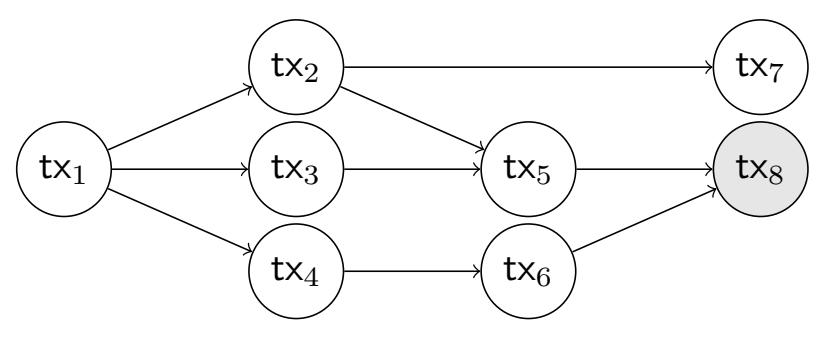

Fig. 11: The root sets of transaction tx8 are {tx1}, {tx2,tx3,tx4}, {tx5,tx6}, {tx4,tx5} and {tx2,tx3,tx6}.

As in the case of ledger channel functionalities, the formal description of FV excludes several checks that one would 

{21}------------------------------------------------

expect the functionality to make. These checks are formalized in form of a functionality wrapper in Appendix E.

### Ideal Functionality $\mathcal{F}_V(T)$

Below we abbreviate  $A:=\gamma.\mathsf{Alice},\, B:=\gamma.\mathsf{Bob},\, I=\gamma.\mathsf{Ingrid}.$  For  $P\in\gamma.\mathsf{endUsers},\, \mathsf{we}\,\,\mathsf{denote}\,\, Q:=\gamma.\mathsf{otherParty}(P).$ 

For messages about ledger channels, behave as  $\mathcal{F}_L(T,1)$ .

### Create

Upon (CREATE,  $\gamma$ )  $\stackrel{\tau}{\hookleftarrow}$  P, let  $\mathcal{S}$  define  $T_1 \leq 8T$ . If  $P \in \gamma$ .endUsers, then define a set S, where  $S := \{id_P\} := \gamma$ .subchan(P), otherwise define S as  $S := \{id_P, id_Q\} := \gamma$ .subchan. Lock all channels in S and distinguish:

All agreed: If you already received both (CREATE,  $\gamma$ )  $\stackrel{\tau_1}{\longleftrightarrow} Q_1$  and (CREATE,  $\gamma$ )  $\stackrel{\tau_2}{\longleftrightarrow} Q_2$ , where  $Q_1, Q_2 \in \gamma$ .users  $\setminus \{P\}$  and  $\tau - T_1 \leq \tau_1 \leq \tau_2$ , then in round  $\tau_3 := \tau_1 + T_1$  proceed as:

- 1) Let S define  $\vec{\theta_A}$  and  $\vec{\theta_B}$  and set  $(id_A, id_B) := \gamma$ .subchan.
- 2) Execute UpdateState $(id_A, \vec{\theta_A})$ , UpdateState $(id_B, \vec{\theta_B})$ , set  $\Gamma(\gamma.id) := \gamma$ , send (CREATED,  $\gamma$ )  $\stackrel{\tau_3}{\hookrightarrow} \gamma$ .endUsers, stop.

Wait for others: Else wait for at most  $T_1$  rounds to receive (CREATE,  $\gamma$ )  $\stackrel{\tau_1 \leq \tau + T_1}{\longleftarrow} Q_1$  and (CREATE,  $\gamma$ )  $\stackrel{\tau_2 \leq \tau + T_1}{\longleftarrow} Q_2$  where  $Q_1, Q_2 \in \gamma$ .users  $\{P\}$  (in that case option "All agreed" is executed). If at least one of those messages does not arrive before round  $\tau + T_1$ , do the following. For all  $id_i \in S$ , let  $(\gamma_i, \mathsf{tx}_i) := \Gamma(id_i)$  and distinguish the following cases:

- If S sends (peaceful-reject,  $id_i$ ), unlock  $id_i$  and stop.
- If  $\gamma$ .Ingrid is honest or if instructed by  $\mathcal{S}$ , execute L-ForceClose $(id_i)$  and stop.
- Otherwise wait for  $\Delta$  rounds. If  $\mathsf{tx}_i$  still unspent, then set  $\vec{\theta}_{old} := \gamma_i.\mathsf{st}, \ \gamma_i.\mathsf{st} := \{\vec{\theta}_{old}, \vec{\theta}\} \ \text{and} \ \Gamma(id_i) := (\gamma_i, \mathsf{tx}_i).$  Execute L-ForceClose $(id_i)$  and stop.

# Update

Upon (UPDATE,  $id, \vec{\theta}, t_{\text{stp}}$ )  $\stackrel{\tau_0}{\longleftrightarrow} P$ , where  $P \in \gamma$ .endUsers, behave as  $\mathcal{F}_L(T,1)$  yet replace the calls to L-ForceClose in  $\mathcal{F}_L(T,1)$  with calls to V-ForceClose.

# Offload

Upon (OFFLOAD, id)  $\stackrel{\tau_0}{\longleftrightarrow}$  P, execute Offload(id).

### Close

#### Channels without validity:

Upon (CLOSE, id)  $\stackrel{\tau}{\hookleftarrow} P$ , where  $\gamma(id)$ .val  $= \bot$ , let  $\mathcal{S}$  define  $T_1 \leq 6T$ . If  $P \in \gamma_i$ .endUsers, define a set S, where  $S := \{id_P\} := \gamma_i$ .subchan(P), else define S as  $S := \{id_P, id_Q\} := \gamma_i$ .subchan and distinguish:

**All agreed:** If you received both messages (CLOSE, id)  $\stackrel{\tau_1}{\longleftarrow}$   $Q_1$  and (CLOSE, id)  $\stackrel{\tau_2}{\longleftarrow}$   $Q_2$ , where  $Q_1, Q_2 \in \gamma$ .users  $\setminus \{P\}$  and  $\tau - T_1 \leq \tau_1 \leq \tau_2$ , then in round  $\tau_3 := \tau_1 + T_1$  proceed as follows:

- 1) Let  $\gamma := \Gamma(id)$ ,  $(id_A, id_B) := \gamma$ .subchan.
- 2) Parse  $\gamma$ .st = { $(c_A, One-Sig_A), (c_B, One-Sig_B)$ } and set

$$\vec{\theta_A} := ((c_A, \mathtt{One-Sig}_A), (c_B + \gamma.\mathsf{fee}/2, \mathtt{One-Sig}_I)), \\ \vec{\theta_B} := ((c_A + \gamma.\mathsf{fee}/2, \mathtt{One-Sig}_I), (c_B, \mathtt{One-Sig}_B)),$$

3) Unlock both subchannels and execute UpdateState $(id_A, \vec{\theta_A})$  and UpdateState $(id_B, \vec{\theta_B})$ . Set  $\Gamma(id) := \bot$  and send (CLOSED,  $\gamma) \stackrel{\tau_3}{\longleftrightarrow} \gamma$ .endUsers.

Wait for others: Else wait for at most  $T_1$  rounds to receive  $(\text{CLOSE}, \gamma) \xleftarrow{\tau_1 \leq \tau + T_1} Q_1$  and  $(\text{CLOSE}, \gamma) \xleftarrow{\tau_2 \leq \tau + T_1} Q_2$  where  $Q_1, Q_2 \in \gamma.$ users  $\setminus \{P\}$  (in that case option "All agreed" is executed). For all  $id_i \in S$  let  $(\gamma_i, \mathsf{tx}_i) := \Gamma(id_i)$ , if such messages are not received until round  $\tau + T_1$ , set  $\vec{\theta}_{old} := \gamma'.$ st and distinguish:

- If  $\gamma$ .Ingrid is honest or if instructed by  $\mathcal{S}$ , execute V-ForceClose $(id_i)$  and stop.
- Else wait for  $\Delta$  rounds. If  $\mathsf{tx}_i$  still unspent, set  $\gamma_i.\mathsf{st} := \{\vec{\theta}_{old}, \vec{\theta}\}$  and  $\Gamma(id_i) := (\gamma_i, \mathsf{tx}_i)$ . Execute L-ForceClose $(id_i)$  and stop.

#### Channels with validity:

For every  $\gamma \in \Gamma$  s.t.  $\gamma$ .val  $\neq \bot$ , in round  $\tau_0 := \gamma$ .val  $-(4\Delta + 7T)$  proceed as follows: let S set  $T_1 \leq 6T$  and distinguish:

**Peaceful close:** If all parties in  $\gamma$  users are honest or if instructed by  $\mathcal{S}$ , execute steps (1)–(3) of the "All agreed" case for channels without validity with  $\tau_3 := \tau_0 + T_1$ .

**Force close:** Else in round  $\tau_3$  execute V-ForceClose( $\gamma$ .id).

### Punishment (executed at the end of every round)

For every id, where  $\gamma:=\Gamma(id)$  is a virtual channel, set  $(id_A,id_B):=\gamma.$ subchan. If this is the first round when  $\Gamma(id_A)=(\bot,\mathsf{tx}_A)$  or  $\Gamma(id_B)=(\bot,\mathsf{tx}_B),$  i.e., one of the subchannels was just closed, then let  $\mathcal S$  set  $t_1\leq T',$  where  $T':=\tau_0+T+5\Delta$  if  $\gamma.$ val  $=\bot$  and  $T':=\gamma.$ val  $+3\Delta$  if  $\gamma.$ val  $\ne\bot,$  and distinguish the following cases:

**Offloaded:** Latest in round  $t_1$  the ledger  $\widehat{\mathcal{L}}$  contains both

- a transaction  $\mathsf{tx}_1$  rooted at  $\{\mathsf{tx}_A, \mathsf{tx}_B\}$  with an output  $(\gamma.\mathsf{cash} + \gamma.\mathsf{fee}, \mathsf{One}-\mathsf{Sig}_I)$ . In this case (OFFLOADED, id)  $\stackrel{\tau_1}{\hookrightarrow} I$ , where  $\tau_1$  is the round  $\mathsf{tx}_1$  appeared on  $\widehat{\mathcal{L}}$ .
- a transaction  $\mathsf{tx}_2$  with an output of value  $\gamma$ .cash and rooted at  $\{\mathsf{tx}_A, \mathsf{tx}_B\}$ , if  $\gamma.\mathsf{val} = \bot$ , and rooted at  $\{\mathsf{tx}_A\}$ , if  $\gamma.\mathsf{val} \neq \bot$ . Let  $\tau_2$  be the round when  $\mathsf{tx}_2$  appeared on  $\widehat{\mathcal{L}}$ . Then output (OFFLOADED, id)  $\stackrel{\tau_2}{\longleftrightarrow} \gamma.\mathsf{endUsers}$ , set  $\gamma' = \gamma$ ,  $\gamma'.\mathsf{Ingrid} = \bot$ ,  $\gamma'.\mathsf{subchan} = \bot$ ,  $\gamma.\mathsf{val} = \bot$  and define  $\Gamma(id) := (\gamma', \mathsf{tx}_2)$ .

**Punished:** Else for every honest party  $P \in \gamma$ .users, check the following: the ledger  $\widehat{\mathcal{L}}$  contains in round  $\tau_1 \leq t_1$  a transaction tx rooted at either  $\mathsf{tx}_A$  or  $\mathsf{tx}_B$  with  $(\gamma.\mathsf{cash} + \gamma.\mathsf{fee}/2, \mathsf{One}-\mathsf{Sig}_P)$  as output. In that case, output (PUNISHED,  $id) \stackrel{\tau_1}{\longleftrightarrow} P$ . Set  $\Gamma(id) = \bot$  in the first round when PUNISHED was sent to all honest parties.

**Error:** If the above case is not true, then (ERROR)  $\stackrel{t_1}{\longleftrightarrow} \gamma$ .users.

V-ForceClose(id): Let  $\tau_0$  be the current round and  $\gamma:=\overline{\Gamma(id)}$ . Execute subprocedure Offload(id). Let  $T':=\tau_0+2T+8\Delta$  if  $\gamma.$ val  $=\bot$  and  $T':=\gamma.$ val  $+3\Delta$  if  $\gamma.$ val  $\ne\bot$ . If in round  $\tau_1\le T'$  it holds that  $\Gamma(id)=(\gamma,\text{tx})$ , execute subprocedure L-ForceClose(id).

Subprocedure Offload(id): Let  $\tau_0$  be the current round,  $\gamma:=\frac{\Gamma(id),\ (id_\alpha,id_\beta):=\gamma.\text{subchan},\ (\alpha,\mathsf{tx}_A):=\Gamma(id_\alpha)}{\Gamma(id),\ (id_\alpha,id_\beta):=\gamma.\text{subchan},\ (\alpha,\mathsf{tx}_A):=\Gamma(id_\alpha)}$  and  $(\beta,\mathsf{tx}_B):=\Gamma(id_\beta)$ . If within  $\Delta$  rounds, neither  $\mathsf{tx}_A$  nor  $\mathsf{tx}_B$  is spent, then output (ERROR)  $\stackrel{\tau_0+\Delta}{\longrightarrow} \gamma.\text{users}$ .

Subprocedure UpdateState $(id, \vec{\theta})$ : Let  $(\alpha, \mathsf{tx}) := \Gamma(id)$ . Set  $\alpha.\mathsf{st} := \vec{\theta}$  and update  $\Gamma(id) := (\alpha, \mathsf{tx})$ .

2) Virtual Channels With Validity: We now briefly present our virtual channel protocol with validity. We focus mainly on

{22}------------------------------------------------

the creation of the virtual channel as this illustrates the main structural differences to our construction without validity. For the full formal protocol description, we refer the reader to Appendix D3.

a) Create: Unlike the without validity case, the structure of the construction with validity is not symmetric (see Figure 12). The output of the ledger channel between A and I is used as the input for the funding transaction of the virtual channel  $\mathsf{TX}_{\mathtt{f}}$ , whereas the output of the channel between B and I is used for the so-called refund transaction  $\mathsf{TX}_{\mathtt{refund}}$ .

A can create  $\mathsf{TX_f}$  on her own from the last state of her ledger channel with I. As a second step, A and B can already create the transactions required for the virtual channel  $\gamma$ . Additionally, I and B create the refund transaction which returns I's collateral if the virtual channel is offloaded. Finally, the created transactions are signed in reverse order. In particular, B signs  $\mathsf{TX_{refund}}$  so that I is ensured that she can publish it and receive her collateral and fees. Then, I signs  $\mathsf{TX_f}$  and provides the signature to A, effectively authorizing her to publish  $\mathsf{TX_f}$ , thereby allowing A to offload the virtual channel.

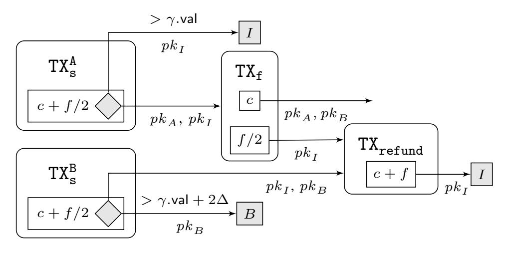

Fig. 12: Funding of a virtual channel  $\gamma$  with validity  $\gamma$ .val.

- b) Offload: In our virtual channel with validity, only A can offload the virtual channel  $\gamma$  by publishing the commit and split transaction of her ledger channel with I. Although I and B are not able to offload the virtual channel, they have the guarantee that after round  $\gamma$ -val either the channel is offloaded or closed or they can punish A and get reimbursed.
- c) Punish: Recall that after a successful offload, the punishment mechanisms of generalized channels apply. We now discuss other malicious behaviors specific to this construction. In this protocol, only A can post the funding transaction of the virtual channel. If the virtual channel is not closed or offloaded by  $\gamma$ .val, A is punished. A loses her coins to I and I loses her coins to B. Therefore, though B cannot offload the channel, he will get reimbursed from his ledger channel with I and I will get reimbursed regardless of whether the virtual channel is offloaded or not. At the time val, if the virtual channel is not honestly closed or the funding is not published, I submits the punishment transaction to reimburse her collateral. Therefore, at time val $+\Delta$ , either the punishment or the funding transaction is posted. If the virtual channel is offloaded, I can publish the refund transaction within  $\Delta$  to get her coins back.

We mention here only for our virtual channel construction with validity. We refer the reader to Appendix F2 for the full proof.

Theorem 3: Let  $\Sigma$  be a signature scheme that is strongly unforgeable against chosen message attacks. Then for any ledger delay  $\Delta \in \mathbb{N}$ , the virtual channel protocol with validity as described in Appendix D2 working in  $\mathcal{F}_{preL}(3,1)$ -hybrid, UC-realizes the ideal functionality  $\mathcal{F}_{V}(3)$ .

- 3) Formal Virtual Channel Protocol: We now formally describe the protocol  $\Pi_V(T)$  that was discussed on a high level in Section III-D and Appendix D2. Since our goal is to prove that  $\Pi_V(T)$  UC-realizes  $\mathcal{F}_V(T)$ , we need to discuss about how parties deal with instructions about ledger channels as well as virtual channels.
- a) Ledger Channels: As a first step, we discuss how parties deal with messages about ledger channels or prepared ledger channels. On a high level, parties simply forward these instructions to the hybrid ideal functionality  $\mathcal{F}_{preL}(T,1)$ . If the functionality sends a reply, the party forwards this reply to the environment. In addition to the message forwarding, parties stores information about the ledger channels in a channel space  $\Gamma_L$ . More precisely, once a ledger channel is created or precreated, party adds this channel to  $\Gamma_L$ . Once an existing ledger channel is updated or pre-updated, the party updates the latest state of the channel stored in  $\Gamma_L$ .

There is one technicality that we need to take care of. There are two different situations in which a party of a virtual channel protocol instructs the hybrid ideal functionality  $\mathcal{F}_{preL}(T,1)$  to pre-cerate (resp. pre-update) a channel  $\gamma$ :

- 1) Party receives a pre-create, resp. pre-update, instruction from the environment. As discussed above, in this case the party acts as a dummy party and forward the message to  $\mathcal{F}_{preL}(T,1)$ .
- 2) Party is creating, resp. updating, a virtual channel and hence is sending pre-create, resp. pre-update, messages to  $\mathcal{F}_{preL}(T,1)$ .

Let us stress that while channels pre-created via option (1) exist in both the real and ideal world, channels pre-created via option (2) exist only in the real world. This is because the pre-creation of these channels was not initiated by the environment but by the parties of the virtual channel protocol. Hence, we need to make sure that the environment cannot "accidentally" update a channel pre-created via (2) since this would help the environment distinguish between the real and ideal world.

To this end, party in the case (1) modifies the identifier of the channel by adding a prefix "ledger". More precisely, if the environment makes a request about a channel with identifier id it forwards the instruction to the hybrid functionality but replaces id with ledger || id. Analogously, if the hybrid functionality replies to this message, the party removes the prefix. This ensure that the environment cannot directly make any change on the ledger channels pre-created via option (2).

b) Virtual Channels: We now present the formal pseudocode for our virtual channel protocols  $\Pi_V(T)$ . As for ledger channels, the description excludes several checks that parties

{23}------------------------------------------------

have to make. We formalize all these checks in form of a functionality wrapper in Appendix E.

Create: The creation of a virtual channel was described on a high level in Section III-D. The main idea is to update the two subchannels of the virtual channel and pre-create a new ledger channel corresponding to the virtual channel. Importantly, the update of the subchannel needs to be synchonized in order to ensure that either both updates complete (in which case the virtual channel is created) or both updates are rejected (in which case the virtual channel creation fails).

Since large part of the creation process is the same for channel with and without validity, our formal description is modularized.

#### Create a virtual channels - modular

Below we abbreviate  $\mathcal{F}_{preL} := \mathcal{F}_{preL}(T,1)$ ,  $A := \gamma$ . Alice,  $B := \gamma$ . Bob,  $I = \gamma$ . Ingrid. For  $P \in \gamma$ . endUsers, we denote  $Q := \gamma$ . otherParty(P).

Party 
$$P \in \{A, B\}$$

Upon receiving (CREATE,  $\gamma) \stackrel{t_0^P}{\longleftrightarrow} \mathcal{E}$  proceed as follows:

1) Let  $id_{\alpha} := \gamma.\mathsf{subchan}(P)$  and compute

 $\theta_P := \mathtt{GenVChannelOutput}(\gamma, P).$ 

- 2) Send (UPDATE,  $id_{\alpha}, \theta_{P}, t_{\text{stp}} \stackrel{t_{0}^{P}}{\longleftrightarrow} \mathcal{F}_{preL}$ .
- 3) Upon receiving (SETUP,  $id_{\alpha}$ ,  $tid_{P}$ )  $\stackrel{t_{1}^{P} \leq t_{0}^{P} + T}{\longleftrightarrow}$   $\mathcal{F}_{preL}$ , engage in the subprotocol SetupVChannel with input  $(\gamma, tid_{P})$ .

Upon receiving (CREATE,  $\gamma$ )  $\stackrel{t_0^I}{\longleftrightarrow} \mathcal{E}$  proceed as follows:

1) Set  $id_{\alpha} = \gamma. \mathrm{subchan}(A), id_{\beta} = \gamma. \mathrm{subchan}(B)$  and generate

 $\theta_A := \texttt{GenVChannelOutput}(\gamma, A)$   $\theta_B := \texttt{GenVChannelOutput}(\gamma, B)$ 

2) If in round  $t_1^I \leq t_0^I + T$  you have received both (UPDATE-REQ,  $id_{\alpha}$ ,  $\theta_A$ ,  $t_{\rm stp}$ ,  $tid_A$ )  $\longleftrightarrow \mathcal{F}_{preL}$  and (UPDATE-REQ,  $id_{\beta}$ ,  $\theta_B$ ,  $t_{\rm stp}$ ,  $tid_B$ )  $\longleftrightarrow \mathcal{F}_{preL}$ , then engage in the subprotocol SetupVChannel with inputs  $(\gamma, tid_A, tid_B)$ . Else stop.

Party 
$$P \in \{A, B\}$$

Wait until  $t_2^P:=t_1^P+t_{\rm stp}.$  If the subprotocol completed successfully, then send (SETUP-OK,  $id_{\alpha}$ )  $\stackrel{t_2^P}{\longleftrightarrow} \mathcal{F}_{preL}.$  Else stop.

If in round  $t_2^I \leq t_1^I + t_{\rm stp} + T$  you receive both (SETUP-OK,  $id_{\alpha}$ ))  $\hookleftarrow \mathcal{F}_{preL}$  and (SETUP-OK,  $id_{\beta}$ ))  $\hookleftarrow \mathcal{F}_{preL}$ , send (UPDATE-OK,  $id_{\alpha}$ )  $\overset{t_2}{\hookleftarrow}$   $\mathcal{F}_{preL}$  and (UPDATE-OK,  $id_{\beta}$ )  $\overset{t_2}{\hookleftarrow}$   $\mathcal{F}_{preL}$ . Otherwise stop.

Party 
$$P \in \{A, B\}$$

1) If you receive (UPDATE-OK,  $id_{\alpha}$ )  $\xleftarrow{t_2^P \le t_1^P + 2T} \mathcal{F}_{preL}$ , reply with (REVOKE,  $id_{\alpha}$ )  $\xrightarrow{t_2^P + T} \mathcal{F}_{preL}$ . Otherwise stop.

If in round  $t_3^I \leq t_2^I + 4T$  you have received both (REVOKE-REQ,  $id_{\alpha}$ )  $\longleftrightarrow \mathcal{F}_{preL}$  and (REVOKE-REQ,  $id_{\beta}$ )  $\longleftrightarrow \mathcal{F}_{preL}$ , reply (REVOKE,  $id_{\alpha}$ )  $\overset{t_3^I}{\longleftrightarrow} \mathcal{F}_{preL}$  and (REVOKE,  $id_{\beta}$ )  $\overset{t_3^I}{\longleftrightarrow} \mathcal{F}_{preL}$  and update  $\Gamma^I(\gamma.\mathrm{id})$  from  $(\bot,x)$  to  $(\gamma,x)$ . Otherwise stop.

Party 
$$P \in \{A, B\}$$

Upon receiving (UPDATED,  $id_{\alpha}$ )  $\xleftarrow{t_3^P \leq t_2^P + 3T}$   $\mathcal{F}_{preL}$ , mark  $\gamma$  as created, i.e. update  $\Gamma^P(\gamma.\mathrm{id})$  from  $(\bot, x)$  to  $(\gamma, x)$ , and output (CREATED,  $\gamma.\mathrm{id}$ )  $\overset{t_3^P}{\longleftrightarrow} \mathcal{E}$ .

### $\textbf{Function} \,\, \texttt{GenVChannelOutput}(\gamma, P)$

Return  $\theta$ , where  $\theta$ .cash =  $\gamma$ .cash +  $\gamma$ .fee/2 and  $\theta$ . $\varphi$  is defined as follows

$$\theta.\varphi = \begin{cases} \text{Multi-Sig}_{\gamma.\text{users}} \lor (\text{One-Sig}_{P} \land \text{CheckRelative}_{(T+4\Delta)}), \\ \text{if } \gamma.\text{val} = \bot \\ \text{Multi-Sig}_{A,I} \lor (\text{One-Sig}_{I} \land \text{CheckLockTime}_{\gamma.\text{val}}), \\ \text{if } \gamma.\text{val} \neq \bot \land P = A \\ \text{Multi-Sig}_{B,I} \lor (\text{One-Sig}_{B} \land \text{CheckLockTime}_{\gamma.\text{val}+2\Delta}), \\ \text{if } \gamma.\text{val} \neq \bot \land P = B \end{cases}$$

#### Subprotocol SetupVChannel

Let  $t_0$  be the current round.

# **Channels without validity**

Party 
$$P \in \{A, B\}$$
 on input  $(\gamma, tid_P)$ 

1) Create the body of the funding transactions:

$$\begin{split} \mathtt{TX}_{\mathtt{f}}^{\gamma}.\mathsf{Input} := & (tid_{P}, tid_{Q}) \\ \mathtt{TX}_{\mathtt{f}}^{\gamma}.\mathsf{Output} := & ((\gamma.\mathsf{cash}, \mathtt{Multi-Sig}_{\{\gamma.\mathsf{endUsers}\}}), \\ & (\gamma.\mathsf{cash} + \gamma.\mathsf{fee}, \mathtt{One-Sig}_{pk_{I}})) \end{split}$$

- 2) Send (PRE-CREATE,  $\gamma$ , TXf, 1,  $t_{ofl}$ )  $\stackrel{t_0}{\hookrightarrow} \mathcal{F}_{preL}$ , where  $t_{ofl} = 2T + 8\Delta$ .
- 3) If (PRE-CREATED,  $\gamma$ .id)  $\stackrel{t_1 \leq t_0 + T}{\longleftarrow} \mathcal{F}_{preL}$ , then sign the funding transaction, i.e.  $s_{\mathbf{f}}^P \leftarrow \operatorname{Sign}_{sk_P}([\mathtt{TX}_{\mathbf{f}}^\gamma])$  and send (createFund,  $\gamma$ .id,  $s_{\mathbf{f}}^P$ ,  $[\mathtt{TX}_{\mathbf{f}}^\gamma]$ )  $\stackrel{t_1}{\longleftrightarrow} I$ . Else stop.

Party 
$$I$$
 on input  $(\gamma, tid_A, tid_B)$ 

4) If you receive (createFund,  $\gamma$ .id,  $s_{\mathbf{f}}^{A}$ ,  $[\mathsf{TX}_{\mathbf{f}}^{\gamma}]$ )  $\stackrel{t_{2} \leq t_{0} + T + 1}{\longleftrightarrow} A$  and (createFund,  $\gamma$ .id,  $s_{\mathbf{f}}^{B}$ ,  $[\mathsf{TX}_{\mathbf{f}}^{\gamma}]$ )  $\stackrel{t_{2}}{\longleftrightarrow} B$ , verify the funding

{24}------------------------------------------------

transaction and signatures of A and B, i.e. check:

$$\begin{split} \mathsf{Vrfy}_{pk_A}([\mathtt{TX}_\mathtt{f}^\gamma];s_\mathtt{f}^A) &= 1\\ \mathsf{Vrfy}_{pk_B}([\mathtt{TX}_\mathtt{f}^\gamma],s_\mathtt{f}^B) &= 1\\ (tid_A,tid_B) &= \mathtt{TX}_\mathtt{f}^\gamma.\mathsf{Input}\\ (\gamma.\mathsf{cash} + \gamma.\mathsf{fee},\mathtt{One-Sig}_{pk_T}) &\in \mathtt{TX}_\mathtt{f}^\gamma.\mathsf{Output}. \end{split}$$

5) If all checks pass, sign the funding transaction, i.e. compute

$$\begin{split} s_{\mathtt{f}}^I := \mathsf{Sign}_{sk_I}([\mathtt{TX}_{\mathtt{f}}^\gamma]), \\ \mathtt{TX}_{\mathtt{f}}^\gamma := \{([\mathtt{TX}_{\mathtt{f}}^\gamma], s_{\mathtt{f}}^A, s_{\mathtt{f}}^B, s_{\mathtt{f}}^I)\}. \end{split}$$

Store  $\Gamma^I(\gamma.id) := (\bot, \mathtt{TX}^\gamma_\mathtt{f})$ . Then send (createFund,  $\gamma.id$ ,  $s_\mathtt{f}^B, s_\mathtt{f}^I) \overset{t_2}{\longleftrightarrow} A$  and (createFund,  $\gamma.id$ ,  $s_\mathtt{f}^A, s_\mathtt{f}^I) \overset{t_2}{\longleftrightarrow} B$ , and consider procedure successfully completed. Else stop.

# Party $P \in \{A, B\}$

6) Upon receiving (createFund,  $\gamma$ .id,  $s_f^Q$ ,  $s_f^I$ )  $\stackrel{t_1+1}{\longleftarrow} I$ , verify all signatures, i.e. check:

$$\begin{split} \operatorname{Vrfy}_{pk_Q}([\mathtt{TX}_{\mathtt{f}}^{\gamma}];s_{\mathtt{f}}^Q) &= 1 \\ \operatorname{Vrfy}_{pk_I}([\mathtt{TX}_{\mathtt{f}}^{\gamma}],s_{\mathtt{f}}^I) &= 1. \end{split}$$

If all checks pass define  $\mathtt{TX}_\mathtt{f}^\gamma := \{([\mathtt{TX}_\mathtt{f}^\gamma], s_\mathtt{f}^P, s_\mathtt{f}^Q, s_\mathtt{f}^I)\}$  and set  $\Gamma^P(\gamma.\mathsf{id}) := (\bot, \mathtt{TX}_\mathtt{f}^\gamma, tid_P)$  and consider procedure successfully completed. Else stop.

### Channels with validity

# Party A on input $(\gamma, tid_A)$

- 1) Send (createInfo,  $\gamma$ .id,  $tid_A$ )  $\stackrel{t_0}{\hookrightarrow} B$
- 2) In round  $t_1 := t_0 + 1$ , create the body of the funding transaction:

$$\begin{split} \operatorname{TX}_{\mathbf{f}}^{\gamma}.\operatorname{Input} := &(tid_{A}) \\ \operatorname{TX}_{\mathbf{f}}^{\gamma}.\operatorname{Output} := &((\gamma.\operatorname{cash},\operatorname{Multi-Sig}_{\{\gamma.\operatorname{endUsers}\}}), \\ &(\gamma.\operatorname{fee}/2,\operatorname{One-Sig}_{pk_{I}})) \end{split}$$

- 3) Send (PRE-CREATE,  $\gamma$ , TXf, 1,  $t_{ofl}$ )  $\stackrel{t_1}{\longleftrightarrow}$   $\mathcal{F}_{preL}$ , for  $t_{ofl} = \gamma$ .val  $+ 3\Delta$ .
- 4) If (PRE-CREATED,  $\gamma$ .id)  $\stackrel{t_2 \leq t_1 + T}{\longleftarrow} \mathcal{F}_{preL}$ , then goto step (10). Else stop.

Party 
$$B$$
 on input  $(\gamma, tid_B)$ 

5) If (createInfo,  $\gamma$ .id,  $tid_A$ )  $\stackrel{t_1:=t_0+1}{\longleftarrow} A$ , then create the body of the funding and refund transactions:

$$\begin{split} \mathsf{TX}_{\mathtt{f}}^{\gamma}.\mathsf{Input} := & (tid_A) \\ \mathsf{TX}_{\mathtt{f}}^{\gamma}.\mathsf{Output} := & ((\gamma.\mathsf{cash}, \mathsf{Multi-Sig}_{\{\gamma.\mathsf{endUsers}\}}), \\ & (\gamma.\mathsf{fee}/2, \mathsf{One-Sig}_{pk_I})) \\ \mathsf{TX}_{\mathtt{refund}}^{\gamma}.\mathsf{Input} := & (\mathsf{TX}_{\mathtt{f}}^{\gamma}.\mathsf{txid}||2, tid_B) \\ \mathsf{TX}_{\mathtt{refund}}^{\gamma}.\mathsf{Output} := & (\gamma.\mathsf{cash} + \gamma.\mathsf{fee}, \mathsf{One-Sig}_{pk_I}). \end{split}$$

Else stop.

6) Send (PRE-CREATE,  $\gamma$ , TXf, 1,  $t_{ofl}$ )  $\stackrel{t_1}{\longleftrightarrow}$   $\mathcal{F}_{preL}$ , for  $t_{ofl} = \gamma$ .val  $+ 3\Delta$ .

7) If (PRE-CREATED,  $\gamma$ .id)  $\stackrel{t_2 \leq t_1 + T}{\longleftarrow} \mathcal{F}_{preL}$ , then compute a signature on the refund transaction, i.e.,  $s_{\text{Ref}}^B \leftarrow \text{Sign}_{sk_B}([\text{TX}_{\text{refund}}^\gamma])$  and define  $\Gamma^B(\gamma.id) := (\bot, [\text{TX}_{\text{f}}^\gamma], tid_B)$ . Then, send (createFund,  $\gamma.\text{id}, s_{\text{Ref}}^B, [\text{TX}_{\text{refund}}^\gamma], [\text{TX}_{\text{f}}^\gamma]) \stackrel{t_2}{\longleftrightarrow} I$  and consider procedure successfully completed. Else stop.

Party 
$$I$$
 on input  $(\gamma, tid_A, tid_B)$ 

8) If (createFund,  $\gamma$ .id,  $s_{Ref}^B$ ,  $[TX_{refund}^{\gamma}]$ ,  $[TX_{f}^{\gamma}]$ )  $\leftarrow B$ , verify the fund and refund transactions and signature of B, i.e. check:

$$\begin{split} &\mathsf{Vrfy}_{sk_B}([\mathsf{TX}_{\mathtt{refund}}^\gamma]; s_{\mathtt{Ref}}^B) = 1. \\ &[\mathsf{TX}_{\mathtt{refund}}^\gamma].\mathsf{Input} = (\mathsf{TX}_{\mathtt{f}}^\gamma.\mathsf{txid}||2, tid_B), \\ &[\mathsf{TX}_{\mathtt{refund}}^\gamma].\mathsf{Output} = (\gamma.\mathsf{cash} + \gamma.\mathsf{fee}, \mathtt{One-Sig}_{pk_I}), \\ &[\mathsf{TX}_{\mathtt{f}}^\gamma].\mathsf{Output}[2] = (\gamma.\mathsf{fee}/2, \mathtt{One-Sig}_{pk_I}) \end{split}$$

If all checks pass, then sign the fund and refund transactions, i.e. compute

$$\begin{split} s_{\text{Ref}}^I &:= \mathsf{Sign}_{sk_I}([\mathtt{TX}_{\mathtt{refund}}^\gamma]), s_{\mathtt{f}}^I := \mathsf{Sign}_{sk_I}([\mathtt{TX}_{\mathtt{f}}^\gamma]), \\ \mathtt{TX}_{\mathtt{refund}}^\gamma &:= \{([\mathtt{TX}_{\mathtt{refund}}^\gamma], s_{\mathtt{Ref}}^I, s_{\mathtt{Ref}}^B)\}. \end{split}$$

Else stop.

9) Store  $\Gamma^I(\gamma.id) := (\bot, [TX_f^{\gamma}], TX_{refund}^{\gamma}, tid_A, tid_B)$ , send the message (createFund,  $\gamma.id, s_f^I$ )  $\stackrel{t_3}{\longleftrightarrow} A$ , and consider procedure successfully completed.

### Party A

10) If you receive (createFund,  $\gamma$ .id,  $s_{\mathtt{f}}^I$ )  $\overset{t_2+2}{\longleftrightarrow}$  I, verify the signature, i.e. check  $\mathsf{Vrfy}_{pk_I}([\mathtt{TX}_{\mathtt{f}}^\gamma]; s_{\mathtt{f}}^I) = 1$ . If the check passes, compute a signature on the fund transaction:

$$\begin{split} s_{\mathtt{f}}^A &:= \mathsf{Sign}_{sk_A}([\mathtt{TX}_{\mathtt{f}}^\gamma]), \\ \mathtt{TX}_{\mathtt{f}}^{\gamma,\mathtt{A}} &:= \{([\mathtt{TX}_{\mathtt{f}}^\gamma], s_{\mathtt{f}}^I, s_{\mathtt{f}}^A)\}. \end{split}$$

and set  $\Gamma^A(\gamma.id) := (\bot, TX_f^{\gamma,A}, tid_A)$ . Then consider procedure successfully completed. Else stop.

Update: As discussed in Section III-D, in order to update a virtual channel, parties update the corresponding prepared channel. This is does in a black-box way via the hybrid functionality  $\mathcal{F}_{preL}$ . Hence, parties act as dummy parties as forward update instructions (modified by adding PRE–) to the hybrid functionality  $\mathcal{F}_{preL}$  and forward the replies of the functionality (modified by removing PRE–) to the environment. In case the update fails, party offload the channel which allows to resolve disputes on-chain.

#### **Update**

Below we abbreviate  $\mathcal{F}_{preL} := \mathcal{F}_{preL}(T, 1)$ .

# Initiating party P:

- 1) Upon (UPDATE, id,  $\vec{\theta}$ ,  $t_{\mathsf{stp}}$ )  $\stackrel{t_0}{\longleftrightarrow} \mathcal{E}$ , (PRE-UPDATE, id,  $\vec{\theta}$ ,  $t_{\mathsf{stp}}$ )  $\stackrel{t_0}{\longleftrightarrow} \mathcal{F}_{preL}$ .
- 2) If  $(PRE-SETUP, id, tid_P) \xleftarrow{t_1 \leq t_0 + T} \mathcal{F}_{preL}$ ,  $(SETUP, id, tid_P) \overset{t_1}{\hookrightarrow} \mathcal{E}$ . Else stop.

{25}------------------------------------------------

- 3) If  $(SETUP-OK, id) \stackrel{t_2 \leq t_1 + t_{stp}}{\longleftrightarrow} \mathcal{E}$ ,  $(PRE-SETUP-OK, id) \stackrel{t_2}{\hookrightarrow}$  $\mathcal{E}$ . Else stop.
- 4) Distinguish the following three cases:
  - $\leftarrow t_3 \leq t_2 + T$ (PRE-UPDATE-OK, id) If  $\mathcal{F}_{preL}$ ,  $(\mathtt{UPDATE-OK},id) \overset{t_3}{\hookrightarrow} \mathcal{E}.$
  - If (PRE-UPDATE-REJECT, id)  $\xleftarrow{t_3 \le t_2 + T} \mathcal{F}_{preL}$ , then stop.
     Else execute the procedure Offload  $^P(id)$  and stop.
- 5) If  $(\text{REVOKE}, id) \stackrel{t_3}{\longleftrightarrow} \mathcal{E}$ ,  $(\text{PRE-REVOKE}, id) \stackrel{t_3}{\longleftrightarrow} \mathcal{F}_{preL}$ . Else execute  $Offload^P(id)$  and stop.
- 6) If  $(PRE-UPDATED, id) \stackrel{t_4 \leq t_3 + T}{\longleftarrow} \mathcal{F}_{preL}$ , update the channel space, i.e., let  $\gamma := \Gamma^P(id)$ , set  $\gamma.st := \vec{\theta}$  and  $\Gamma(id) := \gamma$ . Then (UPDATED, id)  $\stackrel{t_4}{\hookrightarrow} \mathcal{F}_{preL}$ . Else execute Offload  $^P(id)$ and stop.

# Reacting party Q

- 1) Upon (PRE-UPDATE-REQ, id,  $\vec{\theta}$ ,  $t_{\text{stp}}$ , tid)  $\stackrel{\tau_0}{\longleftrightarrow}$  $\mathcal{F}_{preL}$ ,  $(\mathtt{UPDATE}\mathtt{-REQ}, id, \vec{\theta}, t_{\mathsf{stp}}, tid) \overset{\tau_0}{\hookrightarrow} \mathcal{E}.$
- 2) If (PRE-SETUP-OK, id)  $\leftarrow \tau_1 \leq \tau_0 + t_{\text{stp}} + T$   $\mathcal{F}_{preL}$ , (SETUP-OK,  $id) \stackrel{\uparrow_1}{\hookrightarrow} \mathcal{E}$ . Else stop.
- 3) If (UPDATE-OK, id)  $\stackrel{\tau_1}{\longleftarrow}$   $\mathcal{E}$ , (PRE-UPDATE-OK, id)  $\stackrel{\tau_1}{\longleftrightarrow}$  $\mathcal{F}_{preL}$ . Else stop.
- 4) If  $(PRE-REVOKE-REQ, id) \stackrel{\tau_2 \leq \tau_1 + T}{\longleftrightarrow} \mathcal{F}_{preL}$ , (REVOKE-REQ, id) $id) \stackrel{\tau_2}{\longleftrightarrow} \mathcal{E}$ . Else execute Offload Q(id) and stop.
- 5) If  $(\text{REVOKE}, id) \stackrel{\tau_2}{\longleftrightarrow} \mathcal{E}$ ,  $(\text{PRE-REVOKE}, id) \stackrel{\tau_2}{\longleftrightarrow} \mathcal{F}_{preL}$ . Else execute  $Offload^Q(id)$  and stop.
- 6) Upon (PRE-UPDATED, id)  $\stackrel{\tau_3 \leq \tau_2 + T}{\longleftrightarrow}$   $\mathcal{F}_{preL}$ , update the channel space, i.e., let  $\gamma:=\Gamma^Q(id)$ , set  $\gamma.st:=\vec{\theta}$  and  $\Gamma(id) := \gamma$ . Then (UPDATED, id)  $\stackrel{\tau_3}{\longleftrightarrow} \mathcal{E}$ .

Offload: As a next step, we define the offloading process which transforms a virtual channel into a ledger channel. Let us stress that offloading can be triggered either by the environment via a message OFFLOAD or internally by parties when executing an update or close. To avoid code repetition, we define a procedure  $Offload^P(id)$  and instruct parties upon receiving (OFFLOAD, id)  $\stackrel{t_0}{\longleftrightarrow} \mathcal{E}$  to simply call OffloadP(id).

Since channels with validity are constructed in a different way than channel without validity, the procedure is defined for the two cases separately.

# $\textbf{Subprocedure} \,\, \texttt{Offload}^P(id)$

Below we abbreviate  $\mathcal{F}_{preL} := \mathcal{F}_{preL}(T,1), A := \gamma.$  Alice and  $B := \gamma$ . Bob and  $I = \gamma$ . Ingrid. For  $P \in \gamma$ . end Users, we denote  $Q := \gamma$ .otherParty(P). Let  $t_0$  be the current round.

#### Channels without validity

# $P \in \{A, B\}$

- 1) Extract  $\gamma$  and  $\mathsf{TX}_{\mathtt{f}}^{\gamma}$  from  $\Gamma^{P}(id)$  and  $tid_{P}$ ,  $tid_{Q}$  from  $\mathsf{TX}_{\mathtt{f}}^{\gamma}$ . Then define  $id_{\alpha} := \gamma.\mathsf{subchan}(P)$  and send (CLOSE,  $id_{\alpha}$ )  $\stackrel{t_0}{\hookrightarrow} \mathcal{F}_{preL}.$
- 2) If you receive (CLOSED,  $id_{\alpha}$ )  $\stackrel{t_1 \leq t_0 + T + 3\Delta}{\longleftarrow}$   $\mathcal{F}_{preL}$ , then continue. Else set  $\Gamma^P(\gamma.id) = \bot$  and stop.

- 3) Let  $T_2 := t_1 + T + 3\Delta$  and distinguish:
  - If in round  $t_2 \leq T_2$  a transaction with  $tid_Q$  appeared on  $\widehat{\mathcal{L}}$ , then (post,  $TX_f^{\gamma}$ )  $\stackrel{t_2}{\hookrightarrow}$   $\widehat{\mathcal{L}}$ .
  - $\bullet$  Else in round  $T_2$  create the punishment transaction  $\begin{array}{lll} \operatorname{TX}_{\operatorname{pun}} & \operatorname{as} & \operatorname{TX}_{\operatorname{pun}}.\operatorname{Input} & := & tid_P, & \operatorname{TX}_{\operatorname{pun}}.\operatorname{Output} & := \\ (\gamma.\operatorname{cash} + \gamma.\operatorname{fee}/2,\operatorname{One-Sig}_{pk_P}) & \operatorname{and} & \operatorname{TX}_{\operatorname{pun}}.\operatorname{Witness} & := & \\ \end{array}$  $\mathsf{Sign}_{sk_P}([\mathtt{TX}_{\mathtt{pun}}]). \ \mathsf{Then} \ (\mathtt{post}, \mathtt{TX}_{\mathtt{pun}}) \overset{T_2}{\longleftrightarrow} \widehat{\mathcal{L}}.$
- 4) Let  $T_3 := t_2 + \Delta$  and distinguish the following two cases:
  - The transaction  $TX_f^{\gamma}$  was accepted by  $\widehat{\mathcal{L}}$  in  $t_3 \leq T_3$ , then update  $\Gamma_L^P(id) := \Gamma^P(id)$  and set m := offloaded.
  - The transaction  $TX_{pun}$  was accepted by  $\widehat{\mathcal{L}}$  in  $t_3 \leq T_3$ , then set m := punished.
- 5) Set  $\Gamma^P(id) = \bot$  and return m in round  $t_3$ .

# Party I

- 1) Extract  $\gamma$  and  $TX_f^{\gamma}$  from  $\Gamma^I(id)$  and  $tid_A$ ,  $tid_B$  from  $TX_f^{\gamma}$ . Then define  $id_{\alpha} := \gamma.\mathsf{subchan}(A), id_{\beta} := \gamma.\mathsf{subchan}(B)$ and send the messages (CLOSE,  $id_{\alpha}$ )  $\stackrel{t_0}{\hookrightarrow}$   $\mathcal{F}_{preL}$  and  $(\mathtt{CLOSE}, id_{\beta}) \overset{t_0}{\hookrightarrow} \mathcal{F}_{preL}.$
- 2) If you receive both messages (CLOSED,  $id_{\alpha}$ )  $\leftarrow$   $t_1^A \leq t_0 + T + 3\Delta$  $\mathcal{F}_{preL}$  and (CLOSED,  $id_{\beta}$ )  $\stackrel{t_1^B \leq t_0 + T + 3\Delta}{\longleftarrow}$   $\mathcal{F}_{preL}$ , publish  $(\text{post}, \mathsf{TX}_{\mathsf{f}}^{\gamma}) \stackrel{t_1}{\hookrightarrow} \widehat{\mathcal{L}}, \text{ where } t_1 := \max\{t_1^A, t_1^B\}. \text{ Otherwise }$ set  $\Gamma^{I}(id) = \bot$  and stop.
- 3) Once  $\mathtt{TX}_{\mathtt{f}}^{\gamma}$  is accepted by  $\widehat{\mathcal{L}}$  in round  $t_2 \leq t_1 + \Delta$ , then  $\Gamma^{I}(id) = \bot$  and return "offloaded".

### Channels with validity

# Party A

- 1) Extract  $\gamma$ ,  $tid_A$  and  $TX_f^{\gamma}$  from  $\Gamma^A(id)$ . Let  $id_{\alpha} :=$
- $\gamma. \mathrm{subchan}(A)$  and send (CLOSE,  $id_{\alpha}$ )  $\stackrel{t_0}{\longleftrightarrow} \mathcal{F}_{preL}$ . 2) If you receive (CLOSED,  $id_{\alpha}$ )  $\stackrel{t_1 \leq t_0 + T + 3\Delta}{\longleftrightarrow} \mathcal{F}_{preL}$ , then post  $(post, TX_f^{\gamma, A}) \stackrel{t_2}{\hookrightarrow} \widehat{\mathcal{L}}$ . Otherwise, set  $\Gamma^A(\gamma.id) = \bot$ and stop.
- 3) Once  $\mathsf{TX}_{\mathtt{f}}^{\gamma}$  is accepted by  $\widehat{\mathcal{L}}$  in round  $t_2 \leq t_1 + \Delta$ , then update  $\Gamma_L^A(id) := \Gamma^A(id)$ ,  $\Gamma^A(id) := \bot$  and return "offloaded".

### Party B

- 1) Extract  $\gamma$ ,  $tid_B$  and  $[TX_f^{\gamma}]$  from  $\Gamma^B(id)$ . Let  $id_{\beta}:=$  $\gamma$ .subchan(B) and send (CLOSE,  $id_{\beta}$ )  $\stackrel{t_0}{\hookrightarrow} \mathcal{F}_{preL}$ .
- 2) If you receive (CLOSED,  $id_{\beta}$ )  $\xleftarrow{t_1 \leq t_0 + T + 3\Delta}$   $\mathcal{F}_{preL}$ , then continue. Otherwise, set  $\Gamma^B(\gamma.id) = \bot$  and stop.
- 3) Create the punishment transaction  $TX_{pun}$  as  $TX_{pun}$ .Input :=  $tid_B$ ,  $\mathtt{TX}_{\mathtt{pun}}.\mathtt{Output} := (\gamma.\mathsf{cash} + \gamma.\mathsf{fee}/2, \mathtt{One}-\mathtt{Sig}_{pk_B})$ and set the value  $\mathsf{TX}_{\mathsf{pun}}.\mathsf{Witness} := \mathsf{Sign}_{sk_B}([\mathsf{TX}_{\mathsf{pun}}]).$  Then wait until round  $t_2 := \max\{t_1, \gamma.\mathsf{val} + 2\Delta\}$  and send  $(\text{post}, TX_{\text{pun}}) \stackrel{t_2}{\hookrightarrow} \widehat{\mathcal{L}}.$
- 4) Let  $T_3 := t_2 + \Delta$  and distinguish the following two cases:
  - A transaction with identifier  $TX_f^{\gamma}$  txid was accepted by  $\widehat{\mathcal{L}}$  in  $t_3 \leq T_3$ , then define  $\Gamma_L^B(id) := \Gamma^B(id)$  and set m := offloaded.
  - The transaction  $TX_{pun}$  was accepted by  $\widehat{\mathcal{L}}$  in  $t_3 \leq T_3$ , set m := punished.
- 5) Set  $\Gamma^B(id) := \bot$  and return m in round  $t_3$ .

{26}------------------------------------------------

# Party I

- 1) Extract  $\gamma$ ,  $tid_A$ ,  $tid_B$ ,  $\mathsf{TX}_{\mathsf{refund}}^{\gamma}$  and  $[\mathsf{TX}_{\mathsf{f}}^{\gamma}]$  from  $\Gamma^I(id)$ . Then define  $id_\alpha := \gamma.\mathsf{subchan}(A)$ ,  $id_\beta := \gamma.\mathsf{subchan}(B)$  and send (CLOSE,  $id_\alpha$ )  $\overset{t_0}{\hookrightarrow} \mathcal{F}_{preL}$  and (CLOSE,  $id_\beta$ )  $\overset{t_0}{\hookrightarrow} \mathcal{F}_{preL}$ .
- 2) If you receive both messages (CLOSED,  $id_{\alpha}$ )  $\xleftarrow{t_1^A \leq t_0 + T + 3\Delta}$   $\mathcal{F}_{preL}$  and (CLOSED,  $id_{\beta}$ )  $\xleftarrow{t_1^B \leq t_0 + T + 3\Delta}$   $\mathcal{F}_{preL}$ , then continue. Otherwise, set  $\Gamma^I(\gamma.\mathsf{id}) = \bot$  and stop.
- 3) Create the punishment transaction  $TX_{pun}$  as  $TX_{pun}.Input := tid_A$ ,  $TX_{pun}.Output := (\gamma.cash+\gamma.fee/2, One-Sig_{pk_I})$  and set the value  $TX_{pun}.Witness := Sign_{sk_I}([TX_{pun}])$ . Then wait until round  $t_2 := \max\{t_1^A, \gamma.val\}$  and send  $(post, TX_{pun})$   $\xrightarrow{t_2} \widehat{\mathcal{L}}$ .
- 4) Let  $T_3 := t_2 + \Delta$  and distinguish the following two cases:
  - A transaction with identifier  $\mathtt{TX}_{\mathtt{f}}^{\gamma}.\mathtt{txid}$  was accepted by  $\widehat{\mathcal{L}}$  in  $t_3' \leq T_3$ , send  $(\mathtt{post},\mathtt{TX}_{\mathtt{refund}}^{\gamma}) \overset{t_4}{\hookrightarrow} \widehat{\mathcal{L}}$  where  $t_4 := \max\{t_1^B,t_3'\}$ . Once  $\mathtt{TX}_{\mathtt{refund}}^{\gamma}$  is accepted by  $\widehat{\mathcal{L}}$  in round  $t_5 \leq t_4 + \Delta$ , then define  $m := \mathrm{offloaded}$  and  $\Gamma^I(\gamma.\mathrm{id}) = 1$ .
  - The transaction  $\mathtt{TX}_{\mathtt{pun}}$  was accepted by  $\widehat{\mathcal{L}}$  in  $t_3'' \leq T_3$ , then define  $m := \mathtt{punished}$  and  $\Gamma^I(\gamma.\mathsf{id}) = \bot$ .
- 5) Return m in round  $t_6$  where  $t_6 := \max\{t_5, t_3''\}$ .

Close: In order to close a virtual channel, parties first try to adjust the balances in the sunchannel according to the latest valid state of the virtual channel. This is done by updating the subchannels in a synchonous way, as was done during virtual channel creation. In case this process fails, parties close the channel forcefully. This means that parties first offload the channel and then immediately close the offloaded ledger channel.

#### Close a virtual channel

Below we abbreviate  $\mathcal{F}_{preL} := \mathcal{F}_{preL}(T,1)$ ,  $A := \gamma$ . Alice and  $B := \gamma$ . Bob and  $I = \gamma$ . Ingrid. For  $P \in \gamma$ . endUsers, we denote  $Q := \gamma$ . otherParty(P).

Party 
$$P \in \{A, B\}$$

Upon receiving (CLOSE, id)  $\stackrel{t_0^P}{\longleftrightarrow} \mathcal{E}$  or in round  $t_0^P := \gamma. \text{val} - (4\Delta + 7T)$  if  $\gamma. \text{val} \neq \bot$ , proceed as follows:

- 1) Extract  $\gamma$ ,  $\mathsf{TX}_{\mathtt{f}}^{\gamma}$  from  $\Gamma^{P}(id)$ .
- 2) Parse  $\gamma$ .st =  $\left((c_P, \mathtt{One-Sig}_{pk_P}), (c_Q, \mathtt{One-Sig}_{pk_Q})\right)$ .
- 3) Compute the new state of the channel  $id_{\alpha} := \gamma.\mathsf{subchan}(P)$  as

$$\vec{\theta}_P := \{(c_P, \mathtt{One-Sig}_{pk_P}), (c_Q + \frac{\gamma.\mathsf{fee}}{2}, \mathtt{One-Sig}_{pk_I})\}$$

Then, send (UPDATE,  $id_{\alpha}, \vec{\theta}_{P}, 0$ )  $\stackrel{t_{0}^{P}}{\longleftrightarrow} \mathcal{F}_{preL}$ .

4) Upon  $(\mathtt{SETUP}, id_{\alpha}, tid_{P}) \xleftarrow{t_{1}^{P} \leq t_{0}^{P} + T} \mathcal{F}_{preL}$ , send  $(\mathtt{SETUP-OK}, id_{\alpha}) \xrightarrow{t_{1}^{P}} \mathcal{F}_{preL}$ .

Upon receiving (CLOSE, id)  $\stackrel{t_0^I}{\longleftrightarrow} \mathcal{E}$  or in round  $t_0^I := \gamma.$ val  $-(4\Delta + 7T)$ , proceed as follows:

- 1) Extract  $\gamma$ ,  $\mathsf{TX}_{\mathsf{f}}^{\gamma}$  from  $\Gamma^{I}(id)$ .
- 2) Let  $id_{\alpha} = \gamma.\mathsf{subchan}(A), id_{\beta} = \gamma.\mathsf{subchan}(B)$  and  $c := \gamma.\mathsf{cash}$
- 3) If in round  $t_1^I \leq t_0^I + T$  you received both (UPDATE-REQ,  $id_\alpha$ ,  $tid_A$ ,  $\vec{\theta}_A$ , 0)  $\longleftrightarrow$   $\mathcal{F}_{preL}$  and (UPDATE-REQ,  $id_\beta$ ,  $tid_B$ ,  $\vec{\theta}_B$ , 0)  $\longleftrightarrow$   $\mathcal{F}_{preL}$  check that for some  $c_A$ ,  $c_B$  s.t.  $c_A + c_B = c$  it holds

$$\begin{split} \vec{\theta_A} &= \{(c_A, \texttt{One-Sig}_{pk_A}), (c_B + \gamma. \texttt{fee}/2, \texttt{One-Sig}_{pk_I})\} \\ \vec{\theta_B} &= \{(c_B, \texttt{One-Sig}_{pk_B}), (c_A + \gamma. \texttt{fee}/2, \texttt{One-Sig}_{pk_I})\} \end{split}$$

If not, then stop.

4) If in round  $t_2^I \leq t_1^I + T$  you receive both (SETUP-OK,  $id_{\alpha}$ ))  $\hookrightarrow \mathcal{F}_{preL}$  and (SETUP-OK,  $id_{\beta}$ ))  $\hookrightarrow \mathcal{F}_{preL}$ , send (UPDATE-OK,  $id_{\alpha}$ )  $\stackrel{t_2^I}{\hookrightarrow} \mathcal{F}_{preL}$  and (UPDATE-OK,  $id_{\beta}$ )  $\stackrel{t_2^I}{\hookrightarrow} \mathcal{F}_{preL}$ . If not, then stop.

Party 
$$P \in \{A, B\}$$

If you receive (UPDATE-OK,  $id_{\alpha}$ )  $\stackrel{t_2^P \leq t_1^P + 2T}{\longleftrightarrow} \mathcal{F}_{preL}$ , reply with (REVOKE,  $id_{\alpha}$ )  $\stackrel{t_2^P}{\longleftrightarrow} \mathcal{F}_{preL}$ . Otherwise execute Offload f(id) and stop.

If in round  $t_3^I \leq t_2^I + 2T$  you received both (REVOKE-REQ,  $id_{\alpha}$ )  $\longleftrightarrow \mathcal{F}_{preL}$  and (REVOKE-REQ,  $id_{\beta}$ )  $\longleftrightarrow \mathcal{F}_{preL}$ , reply (REVOKE,  $id_{\alpha}$ )  $\overset{t_3^I}{\longleftrightarrow} \mathcal{F}_{preL}$  and (REVOKE,  $id_{\beta}$ )  $\overset{t_3^I}{\longleftrightarrow} \mathcal{F}_{preL}$  and set  $\Gamma^I(id) := \bot$ .

Party 
$$P \in \{A, B\}$$

If you receive (UPDATED,  $id_{\alpha}$ )  $\stackrel{t_3^P \leq t_2^P + 2T}{\longleftarrow}$   $\mathcal{F}_{preL}$ , set  $\Gamma^P(id) := \bot$ . Then output (CLOSED, id)  $\stackrel{t_3^P}{\longleftrightarrow} \mathcal{E}$  and stop. Else execute Offload id and stop.

Punish: Finally, we formalize the actions taken by parties in every round. On a high level, in addition to triggering the hybrid ideal functionality to take the every-round actions for ledger channel (which include blockchain monitoring for outdated commit transactions), parties also need to make several check for virtual channel. Namely, channel users that tried to offload the virtual channel by closing their subchannel) monitor whether the other subchannel was closed as well. If yes, then they can publish the funding transaction and complete the offload and otherwise apply the punishment mechanism.

### Punish virtual channel

Below we abbreviate  $\mathcal{F}_{preL} := \mathcal{F}_{preL}(T,1)$ ,  $A := \gamma$ . Alice and  $B := \gamma$ . Bob and  $I = \gamma$ . Ingrid. For  $P \in \gamma$ . endUsers, we denote  $Q := \gamma$ . otherParty(P).

Upon receiving (PUNISH)  $\stackrel{\tau_0}{\longleftrightarrow} \mathcal{E}$ , do the following:

- Forward this message to the hybrid ideal functionality (PUNISH)  $\stackrel{\tau_0}{\longleftrightarrow} \mathcal{F}_{preL}$ . If (PUNISHED, id)  $\stackrel{\tau_1}{\longleftrightarrow} \mathcal{F}_{preL}$ , then (PUNISHED, id)  $\stackrel{\tau_1}{\longleftrightarrow} \mathcal{E}$ .
- Execute both subprotocols Punish and Punish-Validity.

{27}------------------------------------------------

#### Punish

# Party $P \in \{A, B\}$

For every  $id \in \{0,1\}^*$ , such that  $\gamma$  which  $\gamma$ .val  $= \bot$  can be extracted from  $\Gamma^P(id)$  do the following:

- 1) Extract  $\mathsf{TX}_{\mathtt{f}}^{\gamma}$  from  $\Gamma^{P}(id)$  and  $tid_{P}$ ,  $tid_{Q}$  from  $\mathsf{TX}_{\mathtt{f}}^{\gamma}$ . Check if  $tid_{P}$  appeared on  $\widehat{\mathcal{L}}$ . If not, then stop.
- 2) Denote  $T_2 := t_1 + T + 3\Delta$  and distinguish:
  - If in round  $t_2 \leq T_2$  the transaction with  $tid_Q$  appeared on  $\widehat{\mathcal{L}}$ , then  $(\operatorname{post}, \mathsf{TX}_{\mathsf{f}}^{\gamma}) \stackrel{t_2}{\hookrightarrow} \widehat{\mathcal{L}}$ .
  - $\bullet$  Else in round  $T_2$  create the punishment transaction  $\mathtt{TX}_{\mathtt{pun}}$  as

$$\begin{split} & \operatorname{TX}_{\operatorname{pun}}.\operatorname{Input} := tid_P \\ & \operatorname{TX}_{\operatorname{pun}}.\operatorname{Output} := (\gamma.\operatorname{cash} + \gamma.\operatorname{fee}/2,\operatorname{One-Sig}_{pk_P}) \\ & \operatorname{TX}_{\operatorname{pun}}.\operatorname{Witness} := \operatorname{Sign}_{sk_P}([\operatorname{TX}_{\operatorname{pun}}]), \end{split}$$

and  $(post, TX_{pun}) \stackrel{T_2}{\longleftrightarrow} \widehat{\mathcal{L}}.$ 

- 3) Let  $T_3 := t_2 + \Delta$  and distinguish the following two cases:
  - The transaction  $\mathsf{TX}_{\mathtt{f}}^{\gamma}$  was accepted by  $\widehat{\mathcal{L}}$  in  $t_3 \leq T_3$ , then  $\Gamma_L^P(id) := \Gamma^P(id), \Gamma^P(id) = \bot$  and  $m := \mathsf{OFFLOADED}$ .
  - The transaction  $\mathtt{TX}_{\mathtt{pun}}$  was accepted by  $\widehat{\mathcal{L}}$  in  $t_3 \leq T_3$ , then define  $\Gamma^P(\gamma.\mathsf{id}) = \bot$  and set  $m := \mathtt{PUNISHED}$ .
- 4) Output  $(m, id) \stackrel{t_3}{\hookrightarrow} \mathcal{E}$ .

# Party I

For every  $id \in \{0,1\}^*$ , such that  $\gamma$  with  $\gamma$ .val  $= \bot$  can be extracted from  $\Gamma^I(id)$  do the following:

- 1) Extract  $\mathtt{TX}_{\mathtt{f}}^{\gamma}$  from  $\Gamma^{I}(id)$  and  $tid_{A}$ ,  $tid_{B}$  from  $\mathtt{TX}_{\mathtt{f}}^{\gamma}$ . Check if for some  $P \in \{A, B\}$  a transaction with identifier  $tid_{P}$  appeared on  $\widehat{\mathcal{L}}$ . If not, then stop.
- 2) Denote  $id_{\alpha} := \gamma.\mathsf{subchan}(Q)$  and send (CLOSE,  $id_{\alpha}$ )  $\stackrel{t_0}{\hookrightarrow}$   $\mathcal{F}_{preL}$ .
- 3) If you receive (CLOSED,  $id_{\alpha}$ )  $\xleftarrow{t_1 \leq t_0 + T + 3\Delta} \mathcal{F}_{preL}$  and  $tid_Q$  appeared on  $\widehat{\mathcal{L}}$ ,  $(\text{post}, \mathsf{TX}_{\mathbf{f}}^{\gamma}) \overset{t_1}{\hookrightarrow} \widehat{\mathcal{L}}$ . Otherwise set  $\Gamma^I(id) = \bot$  and stop.
- 4) Once  $\mathtt{TX}_{\mathtt{f}}^{\gamma}$  is accepted by  $\widehat{\mathcal{L}}$  in round  $t_2$ , such that  $t_2 \leq t_1 + \Delta$ , set  $\Gamma^I(id) = \bot$  and output (OFFLOADED, id)  $\stackrel{t_2}{\hookrightarrow}$   $\mathcal{E}$ .

### Punish-Validity

### Party A

For every  $id \in \{0,1\}^*$ , such that  $\gamma$  with  $\gamma$ .val  $\neq \bot$  can be extracted from  $\Gamma^A(id)$  do the following:

- 1) Extract  $\mathsf{TX}_{\mathtt{f}}^{\gamma}$  from  $\Gamma^{A}(id)$  and  $tid_{A}$  from  $\mathsf{TX}_{\mathtt{f}}^{\gamma}$ . If  $tid_{A}$  appeared on  $\widehat{\mathcal{L}}$ , then send  $(\operatorname{post}, \mathsf{TX}_{\mathtt{f}}^{\gamma}) \stackrel{t_{1}}{\hookrightarrow} \widehat{\mathcal{L}}$ . Else stop.
- 2) Once  $\mathsf{TX}_{\mathtt{f}}^{\gamma}$  is accepted by  $\widehat{\mathcal{L}}$  in round  $t_2 \leq t_1 + \Delta$ , set  $\Gamma_L^A(id) := \Gamma^A(id), \Gamma^A(id) := \bot$  and output (OFFLOADED,  $id) \overset{t_2}{\hookrightarrow} \mathcal{E}$ .

Party B

For every  $id \in \{0,1\}^*$ , such that  $\gamma$  which  $\gamma$ .val  $= \bot$  can be extracted from  $\Gamma^B(id)$  do the following:

- 1) Extract  $tid_B$  and  $[TX_f^{\gamma}]$  from  $\Gamma^B(id)$ . Check if  $tid_B$  or  $[TX_f^{\gamma}]$ .txid appeared on  $\widehat{\mathcal{L}}$ . If not, then stop.
- 2) If a transaction  $\mathsf{TX}_{\mathtt{f}}^{\gamma}$  appeared on  $\widehat{\mathcal{L}}$ , update set  $\Gamma_L^B(id) := \Gamma^B(id)$  and  $\Gamma^B(id) := \bot$ . Then output (OFFLOADED, id)  $\overset{t_1}{\hookrightarrow} \mathcal{E}$  and stop.
- 3) If  $tid_B$  appeared on  $\widehat{\mathcal{L}}$ , create the punishment transaction  $\mathsf{TX}_{\mathsf{pun}}$  as

$$\begin{split} & \operatorname{TX}_{\operatorname{pun}}.\operatorname{Input} := tid_B \\ & \operatorname{TX}_{\operatorname{pun}}.\operatorname{Output} := (\gamma.\operatorname{cash} + \gamma.\operatorname{fee}/2,\operatorname{One-Sig}_{pk_B}) \\ & \operatorname{TX}_{\operatorname{pun}}.\operatorname{Witness} := \operatorname{Sign}_{sk_B}([\operatorname{TX}_{\operatorname{pun}}]). \end{split}$$

Then wait until round  $t_2 := \max\{t_1, \gamma. \mathsf{val} + 2\Delta\}$  and send  $(\mathsf{post}, \mathsf{TX}_{\mathsf{pun}}) \overset{t_2}{\longleftrightarrow} \widehat{\mathcal{L}}.$ 

4) If transaction  $\mathsf{TX}_{\mathsf{pun}}$  was accepted by  $\widehat{\mathcal{L}}$  in  $t_3 \leq t_2 + \Delta$ , then define  $\Gamma^B(\gamma,\mathsf{id}) = \bot$  and output (PUNISHED, id)  $\overset{t_3}{\hookrightarrow} \mathcal{E}$ .

For every  $id \in \{0,1\}^*$ , such that  $\gamma$  which  $\gamma$ .val  $= \bot$  can be extracted from  $\Gamma^I(id)$  do the following:

- 1) Extract  $tid_A$ ,  $tid_B$ ,  $\mathsf{TX}_{\mathsf{refund}}^{\gamma}$  and  $[\mathsf{TX}_{\mathsf{f}}^{\gamma}]$  from  $\Gamma^I(id)$ . Check if  $tid_A$  or  $tid_B$  appeared on  $\widehat{\mathcal{L}}$  or  $t_1 = \gamma.\mathsf{val} (3\Delta + T)$ . If not, then stop.
- 2) Distinguish the following cases:
  - If  $t_1 = \gamma.\text{val} (3\Delta + T)$ , define  $id_{\alpha} := \gamma.\text{subchan}(A)$ ,  $id_{\beta} := \gamma.\text{subchan}(B)$  and send (CLOSE,  $id_{\alpha}$ )  $\stackrel{t_1}{\hookrightarrow} \mathcal{F}_{preL}$  and (CLOSE,  $id_{\beta}$ )  $\stackrel{t_1}{\hookrightarrow} \mathcal{F}_{preL}$ .
  - If  $tid_B$  appeared on  $\widehat{\mathcal{L}}$ , send (CLOSE,  $id_\alpha$ )  $\stackrel{t_1}{\hookrightarrow} \mathcal{F}_{preL}$ .
- 3) If a transaction with identifier  $tid_A$  appeared on  $\widehat{\mathcal{L}}$  in round  $t_2 \leq t_1 + T + 3\Delta$ , create the punishment transaction  $\mathtt{TX}_{\mathtt{pun}}$  as

$$\begin{split} & \operatorname{TX}_{\operatorname{pun}}.\operatorname{Input} := tid_A \\ & \operatorname{TX}_{\operatorname{pun}}.\operatorname{Output} := (\gamma.\operatorname{cash} + \gamma.\operatorname{fee}/2,\operatorname{One-Sig}_{pk_I}) \\ & \operatorname{TX}_{\operatorname{pun}}.\operatorname{Witness} := \operatorname{Sign}_{sk_I}([\operatorname{TX}_{\operatorname{pun}}]). \end{split}$$

Then wait until round  $t_3 := \max\{t_2, \gamma.\text{val}\}$  and send (post,  $\text{TX}_{\text{pun}}) \stackrel{t_3}{\hookrightarrow} \widehat{\mathcal{L}}$ .

- 4) Distinguish the following two cases:
  - The transaction  $\mathsf{TX}_{\mathtt{f}}^{\gamma}.\mathsf{txid}$  was accepted by  $\widehat{\mathcal{L}}$  in  $t_4 \leq t_3 + \Delta$ , send  $(\mathsf{post}, \mathsf{TX}_{\mathtt{refund}}^{\gamma}) \overset{t_5}{\hookrightarrow} \widehat{\mathcal{L}}$  where  $t_5 := \max\{\gamma.\mathsf{val} + \Delta, t_4\}$ . Once  $\mathsf{TX}_{\mathtt{refund}}^{\gamma}$  is accepted by  $\widehat{\mathcal{L}}$  in round  $t_6 \leq t_5 + \Delta$ , set  $\Gamma^I(\gamma.\mathsf{id}) = \bot$  and output  $(\mathsf{OFFLOADED}, id) \overset{t_6}{\hookrightarrow} \mathcal{E}$  and stop.
  - The transaction  $\mathsf{TX}_{\mathsf{pun}}$  was accepted by  $\widehat{\mathcal{L}}$  in  $t_4 \leq t_3 + \Delta$ , then set  $\Gamma^I(\gamma.\mathsf{id}) = \bot$  and output (PUNISHED, id)  $\overset{t_4}{\hookrightarrow}$   $\mathcal{E}$ .

### E. Wrappers for Missing Checks

In the previous sections, we provided simplified descriptions of the ideal functionalities  $\mathcal{F}_L$ ,  $\mathcal{F}_{preL}$  and  $\mathcal{F}_V$  as well as of the protocols  $\Pi_{preL}$  and  $\Pi_V$ . The simplification stems from the fact that we excluded several natural checks in the ideal functionalities and protocols. In this section, we present wrappers that includes these missing checks.

1) Wrapper for Ideal Functionalities: In order to simplify the exposition, the formal descriptions of the channel ideal functionalities  $\mathcal{F}_L$ ,  $\mathcal{F}_{preL}$  and  $\mathcal{F}_V$  are simplified. Namely, they

{28}------------------------------------------------

exclude several natural checks that one would expect an ideal functionality to make when it receives a message from a party. The purpose of the checks is to avoid the functionality from accepting malformed messages. To provide some intuition, we present several examples of such restrictions:

- A party sends a malformed message (e.g. missing or additional parameters)
- A party request creation of a virtual channel but one of the two subchannels does not exists or does not have enough funds for virtual channel creation.
- Parties try to update the same channel twice in parallel. We now list all checks formally in the wrapper below which can be seen as an extension to the wrapper provided by [2] for  $\mathcal{F}_L$ .

### Functionality wrapper: $W_{checks}(T)$

The wrapper is defined for  $\mathcal{F} \in \{\mathcal{F}_V(T), \mathcal{F}_{preL}(T), \mathcal{F}_L(T)\}$ . Below, we abbreviate  $A := \gamma$ . Alice,  $B := \gamma$ . Bob and  $I := \gamma$ . Ingrid.

<u>Create:</u> Upon (CREATE,  $\gamma$ , tid)  $\stackrel{\tau_0}{\longleftrightarrow}$  P, where  $P \in \gamma$ .users, check if:  $\Gamma(\gamma.id) = \bot$ ,  $\mathcal{F}.\Gamma_{pre}(\gamma.id) = \bot$  and there is no channel  $\gamma'$  with  $\gamma.id = \gamma'.id$  being created or pre-created;  $\gamma$  is valid according to the definition given in Section III-A;  $\gamma.st = \{(c_P, \mathsf{One-Sig}_{pk_P}), (c_Q, \mathsf{One-Sig}_{pk_Q})\}$  for  $c_P, c_Q \in \mathbb{R}^{\geq 0}$ . Depending on the type of channel, make the following additional checks:

**ledger channel:** There exists  $(t, id, i, \theta) \in \widehat{\mathcal{L}}$ .UTXO such that  $\theta = (c_P, \mathtt{One-Sig}_P)$  for  $(id, i) := tid;^a$ 

#### virtual channel:

- If  $P \in \gamma$ .endUsers, then  $\alpha := \mathcal{F}.\Gamma(id_P) \neq \bot$  for  $id_P := \gamma$ .subchan(P);  $\alpha$ .endUsers  $= \{P, I\}$ ; there is no other virtual channel being created over  $\alpha$  and  $\alpha$  is currently not being updated; both P and I have enough funds in  $\alpha$ .
- If P = I, then  $\alpha := \mathcal{F}.\Gamma(id_A) \neq \bot$  for  $id_A := \gamma. \mathrm{subchan}(A)$ ;  $\beta := \mathcal{F}.\Gamma(id_B) \neq \bot$  for  $id_B := \gamma. \mathrm{subchan}(B)$ ;  $\alpha. \mathrm{endUsers} = \{A, I\}$ ;  $\beta. \mathrm{endUsers} = \{B, I\}$ ; there is no other virtual channel being created over  $\alpha$  or  $\beta$ ; A and I have enough funds in  $\alpha$  and B and I have enough funds in  $\beta$ .
- If  $\gamma$ .val  $\neq \bot$ , then  $\gamma$ .val  $\geq \tau_0 + 4\Delta + 15T$ .

If one of the above checks fails, drop the message. Else proceed as  $\mathcal{F}$ .

Pre-Create: Upon (PRE-CREATE,  $\gamma$ ,  $\mathsf{TX_f}$ , i,  $t_{ofl}$ )  $\stackrel{\tau_0}{\longleftrightarrow}$  P, check if:  $P \in \gamma$ .users,  $\mathcal{F}.\Gamma_{pre}(\gamma.\mathsf{id}) = \bot$ ,  $\mathcal{F}.\Gamma_{pre}(\gamma.\mathsf{id}) = \bot$  and there is no channel  $\gamma'$  with  $\gamma.\mathsf{id} = \gamma'.\mathsf{id}$  being created or pre-created;  $\gamma$  is valid according to the definition given in Section III-A;  $\gamma.\mathsf{st} = \{(c_P, \mathsf{One-Sig}_{pk_P}), (c_Q, \mathsf{One-Sig}_{pk_Q})\}$  for  $c_P, c_Q \in \mathbb{R}^{\geq 0}$  and  $\mathsf{TX_f}$  is not a published transaction on  $\widehat{\mathcal{L}}$ . If one of the above checks fails, drop the message. Else proceed as  $\mathcal{F}$ .

(Pre)-Update: Upon  $(m,id,\vec{\theta},t_{\text{stp}}) \stackrel{\tau_0}{\longleftrightarrow} P$ , check if:  $\gamma:=\overline{\Gamma(id)} \neq \bot$  if m=UPDATE and  $\gamma:=\Gamma_{pre}(id) \neq \bot$  if m=PRE-UPDATE. In both cases additionally check:  $P \in \gamma.\text{endUsers};$  there is no other update being preformed on  $\gamma$ ; let  $\vec{\theta}=(\theta_1,\ldots\theta_\ell)=((c_1,\varphi_1),\ldots,(c_\ell,\varphi_\ell)),$  then  $\sum_{j\in[\ell]}c_i=\gamma.\text{cash}$  and  $\varphi_j\in\widehat{\mathcal{L}}.\mathcal{V}$  for each  $j\in[\ell]$ . If not, drop the message. Else proceed as  $\mathcal{F}.$ 

Upon ((PRE-)SETUP-OK, id)  $\stackrel{\tau_2}{\longleftrightarrow}$  P check if: you accepted a message ((PRE-)UPDATE, id,  $\vec{\theta}$ ,  $t_{\rm stp}$ )  $\stackrel{\tau_0}{\longleftrightarrow}$  P, where  $t_2$  -

 $t_0 \leq t_{\rm stp} + T$  and the message is a reply to the message ((PRE-)SETUP, id, tid) sent to P in round  $\tau_1$  such that  $\tau_2 - \tau_1 \leq t_{\rm stp}{}^b$ . If not, drop the message. Else proceed as  $\mathcal{F}$ . Upon ((PRE-)UPDATE-OK, id)  $\stackrel{\tau_0}{\longleftrightarrow} P$ , check if the message is a reply to the message ((PRE-)SETUP-OK, id) sent to P in round  $\tau_0$ . If not, drop the message. Else proceed as  $\mathcal{F}$ .

Upon  $((PRE-)REVOKE, id) \stackrel{\tau_0}{\longleftrightarrow} P$ , check if the message is a reply to either the message ((PRE-)UPDATE-OK, id) sent to P in round  $\tau_0$  or the message ((PRE-)REVOKE-REQ, id) sent to P in round  $\tau_0$ . If not, drop the message. Else proceed as  $\mathcal{F}$ .

Offload: Upon receiving (OFFLOAD, id)  $\stackrel{\tau_0}{\longleftrightarrow}$  P make the following checks:  $\gamma := \Gamma(id) \neq \bot$  is a virtual channel and  $P \in \gamma$ .users. If one of the checks fails, then drop the message. Otherwise proceed as the functionality  $\mathcal{F}$ .

Close: Upon (CLOSE, id)  $\stackrel{\tau_0}{\longleftrightarrow} P$ , check if  $\gamma := \Gamma(id) \neq \bot$  and  $P \in \gamma$ .endUsers. If  $\gamma$  is a virtual channel, additionally check that  $\gamma$ .val =  $\bot$ . If not, drop the message. Else proceed as  $\mathcal{F}$ . All other messages are dropped.

- 2) Wrapper for Protocols: Similar to the descriptions of our ideal functionality, the description of our channel protocols, the protocol  $\Pi_{preL}$  presented in Appendix C3 and the protocol  $\Pi_V$ , exclude many natural checks that we would want an honest party to make. Let us give a few examples of requests which an honest party drops if received from the environment:
  - The environment sends a malformed message to a party P (e.g. missing or additional parameters);
  - A party P receives an instruction to create a channel  $\gamma$  but  $P \not\in \gamma.$ endUsers;
  - A party P receives an instruction to create a virtual channel on top of a ledger channel that does not exist, does not belong to part P or is not sufficiently funded.
  - Parties request to create a channel with validity whose validity time already expired (or is about to expire).

We define all these check as a wrapper  $W_{\text{checksP}}$  that can be seen as a extension of the wrapper provided by [2] for their ledger channel protocol.

### Protocol wrapper: $W_{\mathrm{checksP}}$

The wrapper is defined for  $\Pi \in \{\Pi_V(T), \Pi_{preL}(T)\}$ . Below, we abbreviate  $A := \gamma$ . Alice,  $B := \gamma$ . Bob and  $I := \gamma$ . Ingrid.

Create: Upon (CREATE,  $\gamma$ , tid)  $\stackrel{\tau_0}{\longleftrightarrow}$   $\mathcal{E}$  check if:  $P \in \gamma.$ endUsers;  $\Gamma^P(\gamma.\text{id}) = \bot$ ,  $\Gamma^P_{pre}(\gamma.\text{id}) = \bot$  and there is no channel  $\gamma'$  with  $\gamma.\text{id} = \gamma'.\text{id}$  being created or pre-created;  $\gamma$  is valid according to the definition given in Section III-A;  $\gamma.\text{st} = \{(c_P, \texttt{One-Sig}_{pk_P}), (c_Q, \texttt{One-Sig}_{pk_Q})\}$  for  $c_P, c_Q \in \mathbb{R}^{\geq 0}$ . Depending on the type of channel, make the following additional checks:

**ledger channel:** There exists  $(t, id, i, \theta) \in \mathcal{L}$ .UTXO such that  $\theta = (c_P, \mathtt{One-Sig}_P)$  for  $(id, i) := tid;^a$  virtual channel:

• If  $P \in \gamma$ .endUsers, then  $\alpha := \Gamma^P(id_P) \neq \bot$  for

 $^{a}$ In case more channels are being created at the same time, then none of the other creation requests can use of the tid.

&lt;sup>bSee Appendix A what we formally meant by "reply".

{29}------------------------------------------------

 $id_P := \gamma. \mathrm{subchan}(P); \ \alpha. \mathrm{endUsers} = \{P, I\}; \ \mathrm{there} \ \mathrm{is}$  no other virtual channel being created over  $\alpha$  and  $\alpha$  is currently not being updated; both P and I have enough funds in  $\alpha.$ 

- If P=I, then  $\alpha:=\Gamma^P(id_A)\neq \bot$  for  $id_A:=\gamma. \text{subchan}(A);\ \beta:=\Gamma^P(id_B)\neq \bot$  for  $id_B:=\gamma. \text{subchan}(B);\ \alpha. \text{endUsers}=\{A,I\};\ \beta. \text{endUsers}=\{B,I\};$  there is no other virtual channel being created over  $\alpha$  or  $\beta$ ; A and I have enough funds in  $\alpha$  and B and I have enough funds in  $\beta$ .
- If  $\gamma$ .val  $\neq \bot$ , then  $\gamma$ .val  $\geq \tau_0 + 4\Delta + 15T$ .

If one of the checks fails, drop the message. Else proceed as in  $\Pi$ .

Pre-Create: Upon (PRE-CREATE,  $\gamma$ ,  $\mathsf{TX}_{\mathsf{f}}$ , i,  $t_{ofl}$ )  $\stackrel{\tau_0}{\longleftrightarrow} \mathcal{E}$ , check if:  $P \in \gamma$ .users,  $\Gamma_{pre}^P(\gamma.\mathrm{id}) = \bot$ ,  $\Gamma_{pre}^P(\gamma.\mathrm{id}) = \bot$  and there is no channel  $\gamma'$  with  $\gamma.\mathrm{id} = \gamma'.\mathrm{id}$  being created or pre-created;  $\gamma$  is valid according to the definition given in Section III-A;  $\gamma.\mathsf{st} = \{(c_P, \mathsf{One-Sig}_{pk_P}), (c_Q, \mathsf{One-Sig}_{pk_Q})\}$  for  $c_P, c_Q \in \mathbb{R}^{\geq 0}$  and  $\mathsf{TX}_{\mathsf{f}}$  is not a published transaction on  $\widehat{\mathcal{L}}$ . If one of the above checks fails, drop the message. Else proceed as in  $\Pi$ . (Pre)-Update: Upon  $(m, id, \vec{\theta}, t_{\mathsf{stp}}) \stackrel{\tau_0}{\longleftrightarrow} \mathcal{E}$  check if:  $\gamma := \Gamma^P(id) \neq \bot$  if  $m = \mathsf{UPDATE}$  and  $\gamma := \Gamma^P_{pre}(id) \neq \bot$  if  $m = \mathsf{PRE-UPDATE}$ . In both cases, check that there is no other update being preformed on  $\gamma$ ; let  $\vec{\theta} = (\theta_1, \ldots, \theta_\ell) = ((c_1, \varphi_1), \ldots, (c_\ell, \varphi_\ell))$ , then  $\sum_{j \in [\ell]} c_i = \gamma.\mathsf{cash}$  and  $\varphi_j \in \widehat{\mathcal{L}}.\mathcal{V}$  for each  $j \in [\ell]$ . If on of the checks fails, drop the message.

Upon  $((PRE-)SETUP-OK, id) \stackrel{\tau_2}{\longleftrightarrow} \mathcal{E}$  check if: you accepted a message  $((PRE-)UPDATE, id, \vec{\theta}, t_{stp}) \stackrel{\tau_0}{\longleftrightarrow} \mathcal{E}$ , where  $t_2 - t_0 \le t_{stp} + T$  and the message is a reply to the message ((PRE-)SETUP, id, tid) you sent in round  $\tau_1$  such that  $\tau_2 - \tau_1 \le t_{stp}^b$ . If not, drop the message. Else proceed as in  $\Pi$ .

Upon ((PRE-)UPDATE-OK, id)  $\stackrel{\tau_0}{\longleftrightarrow}$   $\mathcal{E}$ , check if the message is a reply to the message ((PRE-)SETUP-OK, id) you sent in round  $\tau_0$ . If not, drop the message. Else proceed as in  $\Pi$ .

Upon  $((PRE-)REVOKE, id) \stackrel{\tau_0}{\longleftarrow} \mathcal{E}$ , check if the message is a reply to either ((PRE-)UPDATE-OK, id) or ((PRE-)REVOKE-REQ, id) you sent in round  $\tau_0$ . If not, drop the message. Else proceed as in  $\Pi$ .

Offload: Upon receiving (OFFLOAD, id)  $\stackrel{\tau_0}{\longleftrightarrow} \mathcal{E}$  make the following checks:  $\gamma := \Gamma(id) \neq \bot$  is a virtual channel and  $P \in \gamma$ .users. If one of the checks fails, then drop the message. Else proceed as in  $\Pi$ .

<u>Close:</u> Upon (CLOSE, id)  $\stackrel{\tau_0}{\longleftrightarrow} \mathcal{E}$ , check if  $\gamma := \Gamma^P(id) \neq \bot$ ,  $P \in \gamma$ .endUsers. If  $\gamma$  is a virtual channel, additionally check that  $\gamma$ .val =  $\bot$ . If not, drop the message. Else proceed as in  $\Pi$ . All other messages are dropped.

#### F. Security Proofs

Else proceed as in  $\Pi$ .

In this section we provide proofs for Theorem 2, Theorem 1 and Theorem 3.

1) Proof of Theorem 2: In our proof of Theorem 2, we provide the code for a simulator, that simulates the protocol  $\Pi_{preL}$  in the ideal world, having access to the functionalities  $\widehat{\mathcal{L}}$  and  $\mathcal{F}_{preL}$ . In UC proofs it is required to provide a simulation of the real protocol in the ideal world even without knowledge of the secret inputs of the honest protocol participants. The main challenge is that this transcript of the simulation has to

be indistinguishable to the environment  $\mathcal{E}$  from the transcript of the real protocol execution. Yet, in our protocols, parties do not receive secret inputs, but are only instructed by the environment to take certain protocol actions, e.g. updating a channel. Hence the only challenge that arises during simulation is handling different behavior of malicious parties. Due to this, we only provide the simulator code for the protocol without arguing about indistinguishability of simulation and real protocol execution, since it naturally holds due to the reasons given above. In our simulation, we omit the case where all parties are honest, since the simulator simply has to follow the protocol description. In case of three protocol participants, we provide a simulation for all cases where two parties are corrupted and one party is honest, because these cases cover also all cases where just one party is corrupted. In other words, the case where two parties are honest is a combination of cases where each of these parties are honest individually.

Since the functionality  $\mathcal{F}_{preL}$  incorporates,  $\mathcal{F}_L$ , we refer at some point of our simulation to the simulator code for ledger channels.

We note that the indistinguishability of the simulated transcript and the transcript of the real protocol can only hold if the security properties of the underlying adaptor signature scheme holds. Namely, we require the adaptor signature scheme to fulfill the unforgeability, witness extractability and adaptability properties.

#### Simulator for Wrapper protocol

### **Pre-Creat**

Case A honest and B corrupted

- 1) Upon A sending (PRE-CREATE,  $\gamma$ , TXf,  $i, t_{oft}$ )  $\stackrel{\tau_0}{\longleftrightarrow} \mathcal{F}_{preL}$  set  $T_1 = 2$  and do the following:
- 2) If  $TX_f$ .Output[i].cash  $\neq \gamma$ .cash, then ignore the message.
- 3) Set  $id := \gamma$ .id, generate  $(R_A, r_A) \leftarrow \text{GenR}$ ,  $(Y_A, y_A) \leftarrow \text{GenR}$  and send (createInfo, id,  $\text{TX}_{\text{f}}$ , i,  $t_{ofl}$ ,  $R_A$ ,  $Y_A$ )  $\overset{\tau_0}{\hookrightarrow}$  B.
- 4) If (createInfo, id,  $\mathsf{TX}_{\mathtt{f}}$ , i,  $t_{oft}$ ,  $R_B$ ,  $Y_B$ )  $\stackrel{\tau_0+1}{\longleftarrow} B$ , create:

$$\begin{split} [\mathtt{TX_c}] := \mathtt{GenCommit}([\mathtt{TX_f}], I_A, I_B, 0) \\ [\mathtt{TX_s}] := \mathtt{GenSplit}([\mathtt{TX_c}].\mathsf{txid} \| 1, \gamma.\mathsf{st}) \end{split}$$

for  $I_A := (pk_A, R_B, Y_A), I_B := (pk_B, R_B, Y_B)$ . Else stop.

- 5) Compute  $s_{\mathsf{c}}^A \leftarrow \mathsf{pSign}_{sk_A}([\mathsf{TX}_{\mathsf{c}}], Y_B), \ s_{\mathsf{s}}^A \leftarrow \mathsf{Sign}_{sk_A}([\mathsf{TX}_{\mathsf{s}}])$  and send (createCom,  $id, s_{\mathsf{c}}^A, s_{\mathsf{s}}^A$ )  $\xrightarrow{\tau_0 + 1} B$ .
- 6) If  $(\operatorname{createCom}, id, s_{\mathsf{c}}^B, s_{\mathsf{s}}^B) \xleftarrow{\tau_0 + 2} B$ , s.t.  $\operatorname{pVrfy}_{pk_B}([\mathtt{TX}_{\mathsf{c}}], Y_A; s_{\mathsf{c}}^B) = 1$  and  $\operatorname{Vrfy}_{pk_B}([\mathtt{TX}_{\mathsf{s}}]; s_{\mathsf{s}}^B) = 1$ , set

$$\begin{split} & \mathtt{TX_c} := ([\mathtt{TX_c}], \{\mathsf{Sign}_{sk_A}([\mathtt{TX_c}]), \mathsf{Adapt}(s_\mathsf{c}^B, y_A)\}) \\ & \mathtt{TX_s} := ([\mathtt{TX_s}], \{s_\mathsf{s}^A, s_\mathsf{s}^B\}) \end{split}$$

$$\Gamma_{pre}^A(\gamma.\mathsf{id}) := (\gamma, \mathsf{TX_f}, (\mathsf{TX_c}, r_A, R_B, Y_B, s_\mathsf{c}^A), \mathsf{TX_s}, t_{oft}).$$

and if B has not sent (PRE-CREATE,  $\gamma$ , TXf, i,  $t_{oft}$ ) to  $\mathcal{F}_{preL}$  send this message on behalf of B.

 $^{a}$ In case more channels are being created at the same time, then none of the other creation requests can use of the tid.

&lt;sup>bSee Appendix A what we formally meant by "reply".

{30}------------------------------------------------

# **Pre-Update**

Let  $T_1 = 2$  and  $T_2 = 1$  and let |tid| = 1.

Case A is honest and B is corrupted

Upon A sending (PRE-UPDATE, id,  $\vec{\theta}$ ,  $t_{stp}$ )  $\stackrel{\tau_0}{\hookrightarrow} \mathcal{F}_{preL}$ , proceed as follows:

1) Generate new revocation public/secret pair  $(R_P, r_P) \leftarrow$ GenR and a new publishing public/secret pair  $(Y_P, y_P) \leftarrow$ 

GenR and send (updateReq, id,  $\vec{\theta}$ ,  $t_{\text{stp}}$ ,  $R_A$ ,  $Y_A$ )  $\stackrel{\tau_0^A}{\longleftrightarrow} B$ .

2) Upon (updateInfo, id,  $h_B$ ,  $Y_B$ ,  $s_s^B$ )  $\stackrel{\tau_0^A + 2}{\longleftarrow} B$ , set  $t_{\text{lock}} := \tau_0^A + t_{\text{stp}} + 5 + \Delta + t_{oft}$ , extract  $\mathsf{TX}_{\mathsf{f}}$  from  $\Gamma_{pre}^B(id)$  and

 $[\mathsf{TX}_{\mathtt{c}}] := \mathsf{GenCommit}([\mathsf{TX}_{\mathtt{f}}], I_A, I_B, t_{\mathsf{lock}})$ 

 $[\mathsf{TX}_s] := \mathsf{GenSplit}([\mathsf{TX}_c].\mathsf{txid}||1,\vec{\theta}),$ 

for  $I_A := (pk_A, R_A, Y_A)$  and  $I_B := (pk_B, R_B, Y_B)$ . If it holds that  $\mathsf{Vrfy}_{pk_B}([\mathsf{TX_s}];s^B_{\mathbf{s}})=1$  continue. Else mark this execution as "failed" and stop.

- $\tau_1^A \leq \tau_0^A + 2 + t_{\text{stp}}$ 3) If A sends (PRE-SETUP-OK, id)  $\xrightarrow{\tau_1^A \leq \tau_0^A + 2 + t_{\text{stp}}} \mathcal{F}_{preL}$ , compute  $s_{\text{c}}^A \leftarrow \mathsf{pSign}_{sk_A}([\mathsf{TX}_{\text{c}}], Y_B), s_{\text{s}}^A \leftarrow \mathsf{Sign}_{sk_A}([\mathsf{TX}_{\text{s}}])$  and send the message  $\mathsf{Sign}_{sk_A}([\mathtt{TX}_\mathtt{s}])$ (update-commitA, id,  $s_c^A$ ,  $s_s^A$ )  $\stackrel{\tau_1^A}{\longleftrightarrow} B$ . 4) In round  $\tau_1^A + 2$  distinguish the following cases:
- - If A receives (update-commitB,  $id, s_c^B$ ) B check if B has not sent (PRE-UPDATE-OK, id)  $\tau_1^A + 1$  $\mathcal{F}_{preL}$ . If so send the message  $\begin{array}{lll} (\texttt{PRE-UPDATE-OK}, id) & \stackrel{\boldsymbol{\tau_1^A+1}}{\longleftrightarrow} & \mathcal{F}_{preL} & \text{on behalf of} \\ B. & \text{If pVrfy}_{pk_B}([\mathtt{TX_c}], Y_A; s_{\mathtt{c}}^B) & = 0, \text{ then mark this} \\ \texttt{execution as "failed" and stop.} \end{array}$
  - If A receives (updateNotOk, id,  $r_B$ )  $\stackrel{\tau_1^A+2}{\longleftarrow} B$ , where  $(R_B, r_B) \in R$ , add  $\Theta^A(id) := \Theta^A(id) \cup ([\mathtt{TX}_\mathtt{c}], r_B, Y_B,$  $S_{c}^{A}$ , instruct  $\mathcal{F}_{preL}$  to send (PRE-UPDATE-REJECT, id)  $\hookrightarrow$  A and to stop and mark this execution as "failed" and stop.
  - Else, execute the simulator code for the procedure Wait-if-Register  $^{A}(id)$  and stop.
- 5) If A sends (PRE-REVOKE, id)  $\xrightarrow{\tau_1^A+2}$   $\xrightarrow{\mathcal{F}_{preL}}$ , then parse  $\Gamma_{pre}^{A}(id)$  as  $(\gamma, \mathsf{TX_f}, (\overline{\mathsf{TX_c}}, \bar{r}_A, \bar{R}_B, \bar{Y}_B, \overline{\bar{s}_{\mathsf{Com}}^A}), \overline{\mathsf{TX_s}})$ and update the channel space as  $\Gamma^A_{pre}(id)$ := $(\gamma, \mathsf{TX}_{\mathtt{f}}, (\mathsf{TX}_{\mathtt{c}}, r_A, R_B, Y_B, s_{\mathtt{c}}^A), \mathsf{TX}_{\mathtt{s}}), \text{ for } \mathsf{TX}_{\mathtt{s}} := ([\mathsf{TX}_{\mathtt{s}}], \mathsf{TX}_{\mathtt{s}}), \mathsf{TX}_{\mathtt{s}})$  $\{s_{\mathtt{s}}^A, s_{\mathtt{s}}^B\})$  and  $\mathtt{TX}_{\mathtt{c}} := ([\mathtt{TX}_{\mathtt{c}}], \{\mathtt{Sign}_{sk_A}([\mathtt{TX}_{\mathtt{c}}]), \mathtt{Adapt}(s_{\mathtt{c}}^B, s_{\mathtt{c}}^B)\}$  $y_A$ )}). Then send (revokeP,  $id, \bar{r}_A$ ) B. Else, execute the simulator code for the procedure Wait-if-Register  $^{A}(id)$  and stop.
- 6) If A receives (revokeB,  $id, \bar{r}_B$ )  $\stackrel{\tau_1^A + 4}{\longleftarrow}$  B, check if B has not sent (PRE-REVOKE, id)  $\stackrel{\tau_1^B+2}{\longleftrightarrow} \mathcal{F}_{preL}$ . If so send  $(PRE-REVOKE, id) \stackrel{\tau_1^B+2}{\longleftrightarrow} \mathcal{F}_L$  on behalf of B. Check if  $(\bar{R}_B, \bar{r}_B) \in R$ , then set

$$\Theta^B(id) := \!\! \Theta^A(id) \cup ([\overline{\mathtt{TX}}_\mathtt{c}], \bar{r}_B, \bar{Y}_B, \bar{s}_{\mathtt{Com}}^A)$$

Else execute the simulator code for the procedure Wait-if-Register  $^{A}(id)$  and stop.

### Case B is honest and A is corrupted

Upon A sending (updateReq, id,  $\theta$ ,  $t_{stp}$ ,  $h_A$ )  $\stackrel{r_0}{\hookrightarrow}$  B, send the message (PRE-UPDATE,  $id, \vec{\theta}, t_{\mathsf{stp}}) \overset{\tau_0}{\hookrightarrow} \mathcal{F}_{preL}$  on behalf of A, if A has not already sent this message. Proceed as follows:

- 1) Upon (updateReq, id,  $\vec{\theta}$ ,  $t_{stp}$ ,  $R_A$ ,  $Y_A$ )  $\stackrel{\tau_0^B}{\longleftrightarrow}$  A, generate  $(R_B, r_B) \leftarrow \mathsf{GenR} \text{ and } (Y_B, y_B) \leftarrow \mathsf{GenR}.$
- 2) Set  $t_{lock} := \tau_0^B + t_{stp} + 4 + \Delta + t_{ofl}$ , extract TXf from  $\Gamma_{pre}^{A}(id)$  and

 $[\mathsf{TX}_{\mathtt{c}}] := \mathsf{GenCommit}([\mathsf{TX}_{\mathtt{f}}], I_A, I_B, t_{\mathsf{lock}})$ 

 $[\mathsf{TX}_{\mathtt{s}}] := \mathsf{GenSplit}([\mathsf{TX}_{\mathtt{c}}].\mathsf{txid} \| 1, \vec{\theta})$ 

- where  $I_A := (pk_A, R_A, Y_A)$ ,  $I_B := (pk_B, R_B, Y_B)$ . 3) Compute  $s_s^B \leftarrow \mathsf{Sign}_{sk_B}([\mathsf{TX_s}])$ , send (updateInfo,  $id, R_B$ ,  $(Y_B, s_s^B) \xrightarrow{\tau_0^B} A.$
- (update-commitA, id,  $s_{c}^{A}$ ,  $s_{s}^{A}$ ) 4) If B receives  $\tau_1^B \leq \tau_0^B + 2 + t_{\mathsf{stp}}$ A then send (PRE-SETUP-OK, id)  $\stackrel{\tau_1^D}{\longleftrightarrow} \mathcal{F}_{preL}$  on behalf of A, if A has not sent this message.
- 5) Check if  $\mathsf{pVrfy}_{pk_P}([\mathsf{TX}_\mathsf{c}], Y_Q; s_\mathsf{c}^P) = 1$  and  $Vrfy_{pk_P}([TX_s]; s_s^P) = 1$ . Else mark this execution as "failed" and stop.
- $\begin{array}{cccccccccccccccccccccccccccccccccccc$ (update-commitB,  $id, s_c^B$ )  $\stackrel{\tau_1^B}{\longleftrightarrow}$  A. Else send (updateNotOk,  $id, r_B$ )  $\stackrel{\tau_1^B}{\longleftrightarrow}$  A, mark this execution as "failed" and stop.
- 7) Parse  $\Gamma^B_{pre}(id)$  as  $(\gamma, TX_f, (\overline{TX}_c, \overline{r}_B, \overline{R}_A, \overline{Y}_A, \overline{s}^B_{Com}), \overline{TX}_s)$ . If B receives (revokeA, id,  $\bar{r}_A$ )  $\stackrel{\tau_1^B+2}{\longleftarrow}$  A, send  $(PRE-REVOKE, id) \stackrel{\tau_1^B+2}{\longleftrightarrow} \mathcal{F}_{preL}$  on behalf of A, if A has not sent this message.

Else if you do not receive (revokeA,  $id, \bar{r}_A$ )  $\stackrel{\tau_1^B+2}{\longleftarrow} A$  or if  $(R_A, \bar{r}_A) \notin R$ , execute the simulator code of the procedure Wait-if-Register  $^{B}(id)$  and stop.

8) If B sends (PRE-REVOKE, id)  $\stackrel{\tau_1^B+2}{\longleftrightarrow} \mathcal{F}_{preL}$ , then set

$$\Theta^{B}(id) := \Theta^{B}(id) \cup ([\overline{\mathtt{TX}}_{\mathtt{c}}], \bar{r}_{A}, \bar{Y}_{A}, \bar{s}^{B}_{\mathtt{Com}})$$

$$\Gamma^{B}_{pre}(id) := (\gamma, \mathtt{TX}_{\mathtt{f}}, (\mathtt{TX}_{\mathtt{c}}, r_{B}, R_{A}, Y_{A}, s^{B}_{\mathtt{c}}), \mathtt{TX}_{\mathtt{s}}),$$

 $\begin{array}{lll} \text{for} & \texttt{TX}_{\mathtt{s}} \ := \ ([\texttt{TX}_{\mathtt{s}}], \{s_{\mathtt{s}}^A, s_{\mathtt{s}}^B\}) & \text{and} & \texttt{TX}_{\mathtt{c}} \ := \ ([\texttt{TX}_{\mathtt{c}}], \\ \{\mathsf{Sign}_{sk_B}([\texttt{TX}_{\mathtt{c}}]), \mathsf{Adapt}(s_{\mathtt{c}}^A, y_B)\}). & \text{Then} & (\texttt{revokeB}, id, \\ \end{array}$  $[\bar{r}_B) \xrightarrow{\tau_1^B + 2} A$  and stop. Else, in round  $\tau_1^B + 2$ , execute the simulator code of the procedure  $Wait-if-Register^B(id)$ and stop.

#### Register

#### Case A honest and B corrupted

For party A in every round  $\tau_0$  do the following:

- 1) For each  $id \in \{0,1\}^*$  s.t.  $\Gamma^A_{pre}(id) \neq \bot$ : 2) Parse  $\Gamma^A_{pre}(id) := (\gamma, \mathtt{TX_f}, (\mathtt{TX_c}, r_A, R_B, Y_B, s_{\mathtt{c}}^A),$  $\mathtt{TX}_{\mathtt{s}}, t_{ofl}, x)$
- 3) If TXf appeared on-chain in this round, then a) Set  $\Gamma(id) := (\gamma, \mathsf{TX}_{\mathsf{f}}, (\mathsf{TX}_{\mathsf{c}}, r_A, R_B, Y_B, s_{\mathsf{c}}^A), \mathsf{TX}_{\mathsf{s}}).$

{31}------------------------------------------------

- b) Set  $\Gamma^A_{pre}(id) := \bot$
- c) If x = in-dispute, then execute the simulator code for L-ForceCloseA(id).

# ${\tt Wait-if-Register}(id)$

# Case A honest and B corrupted

Let  $\tau_0$  be the current round. Let  $X:=\Gamma^A_{pre}(id)$ . Then set  $\Gamma^A_{pre}(id):=(X, \text{in-dispute})$ .

2) Proof of Theorems 1 and 3: We now provide a proof for Theorem 1 and Theorem 3. In our proof, we provide the code for a simulator, that simulates the protocol  $\Pi_V$  in the ideal world having access to the functionalities  $\widehat{\mathcal{L}}$  and  $\mathcal{F}_V$ .

We note that since during our simulation, no ERROR messages are produced by the functionality, the protocol satisfies the security properties of the functionality  $\mathcal{F}_V$  as mentioned in Section III-B.

### Simulator for creating virtual channels

### creating virtual channels

Case A is honest and I are B are corrupt

Upon A sending (CREATE,  $\gamma$ )  $\stackrel{\tau_0^A}{\longleftrightarrow} \mathcal{F}_V$  set  $T_1 = 6T + t_{\text{stp}}$  proceed as follows:

- 1) Let  $id_{\alpha} := \gamma.\mathsf{subchan}(A)$  and compute
  - $\theta_A := \mathtt{GenVChannelOutput}(\gamma, A).$
- 2) Upon A sending (UPDATE,  $id_{\alpha}, \theta_{A}, t_{\text{stp}}$ )  $\stackrel{\tau_{0}^{A}}{\longrightarrow} \mathcal{F}_{L}$  execute the simulator code of the update procedure for the generalized channels until the message (SETUP,  $id_{\alpha}, tid_{A}$ ) is sent by  $\mathcal{F}_{L}$ . If the execution stops send (peaceful-reject,  $id_{\alpha}$ )  $\hookrightarrow \mathcal{F}_{V}$ .
- 3) Upon A receiving (SETUP,  $id_{\alpha}$ ,  $tid_{A}$ )  $\leftarrow \tau_{1}^{A} \leq \tau_{0}^{A} + T$   $\rightarrow \mathcal{F}_{L}$ , execute the simulator code for SetupVChannel with input  $(\gamma, tid_{A})$ .
- 4) If this execution of SetupVChannel is recorded "failed" stop. Otherwise execute the simulator code of the update procedure for the generalized channels until the end. If the execution failed (I does not revoke) instruct  $\mathcal{F}_V$  to L-ForceClose( $id_{\alpha}$ ).
- 5) If B or I have not sent (CREATE,  $\gamma$ )  $\hookrightarrow \mathcal{F}_V$  send this message on their behalf.
- 6) Upon A receiving (CREATED,  $\gamma$ )  $\xleftarrow{\tau_2^A \leq \tau_1^A + 5T}$   $\mathcal{F}_V$ , mark  $\gamma$  as created, i.e. update  $\Gamma^A(\gamma.\mathsf{id})$  from  $(\bot, x)$  to  $(\gamma, x)$ .

Case I is honest and A, B are corrupted

Upon I sending (CREATE,  $\gamma$ )  $\stackrel{\tau_0^I}{\longleftrightarrow} \mathcal{F}_V$  proceed as follows:

1) Set  $id_{\alpha} = \gamma. \mathrm{subchan}(A), id_{\beta} = \gamma. \mathrm{subchan}(B)$  and generate

 $\theta_A := \mathtt{GenVChannelOutput}(\gamma, A)$  $\theta_B := \mathtt{GenVChannelOutput}(\gamma, B)$ 

- 2) Upon A and B sending (UPDATE,  $id_{\alpha}, \theta_{A}, t_{\text{stp}}$ )  $\stackrel{\tau_{0}^{A}}{\longleftrightarrow} \mathcal{F}_{L}$  and (UPDATE,  $id_{\alpha}, \theta_{B}, t_{\text{stp}}$ )  $\stackrel{\tau_{0}^{B}}{\longleftrightarrow} \mathcal{F}_{L}$ , execute the simulator code for the update procedure of the generalized channel functionality until the message (UPDATE-REQ,  $id_{\alpha}, \theta_{A}, t_{\text{stp}}, tid_{A}$ ) and (UPDATE-REQ,  $id_{\alpha}, \theta_{B}, t_{\text{stp}}, tid_{B}$ ) are sent by  $\mathcal{F}_{L}$ .
- 3) If in round  $\tau_1^I \leq \tau_0^I + T$ , I has received both (UPDATE-REQ,  $id_{\alpha}, \theta_A, t_{\text{stp}}, tid_A$ )  $\longleftrightarrow \mathcal{F}_L$  and (UPDATE-REQ,  $id_{\beta}, \theta_B, t_{\text{stp}}, tid_B$ )  $\longleftrightarrow \mathcal{F}_L$ , then execute the simulator code of SetupVChannel with inputs  $(\gamma, tid_A, tid_B)$ . Or send (peaceful-reject,  $id_{\alpha}$ )  $\hookrightarrow \mathcal{F}_V$  and (peaceful-reject,  $id_{\beta}$ )  $\hookrightarrow \mathcal{F}_V$  if instructed by  $\mathcal{E}$ . Else stop.
- 4) If in round  $\tau_2^I \leq \tau_1^I + t_{\rm stp} + T$ , I receives both  $({\tt SETUP-OK}, id_\alpha)) \longleftrightarrow \mathcal{F}_L$  and  $({\tt SETUP-OK}, id_\beta)) \longleftrightarrow \mathcal{F}_L$ , continue executing the simulator code of the update procedure of generalized channels until the messages  $({\tt REVOKE-REQ}, id_\alpha)$  and  $({\tt REVOKE-REQ}, id_\alpha)$  are sent by  $\mathcal{F}_L$ . Otherwise stop.
- 5) If in round  $\tau_3^I \leq \tau_2^I + 4T$  you have received both (REVOKE-REQ,  $id_{\alpha}$ )  $\longleftrightarrow$   $\mathcal{F}_L$  and (REVOKE-REQ,  $id_{\beta}$ )  $\longleftrightarrow$   $\mathcal{F}_L$ , continue executing the simulator code of the update procedure of generalized channels until the end. Otherwise stop.
- 6) If A or B have not sent (CREATE,  $\gamma$ )  $\hookrightarrow \mathcal{F}_V$  send this message on their behalf. Update  $\Gamma^I(\gamma.id)$  from  $(\bot, x)$  to  $(\gamma, x)$ .

### SetupVChannel for channels without validity

Case A is honest and I, B are corrupted

1) Create the body of the funding transaction:

$$\begin{split} \mathtt{TX}_{\mathbf{f}}^{\gamma}.\mathsf{Input} := & (tid_A, tid_B) \\ \mathtt{TX}_{\mathbf{f}}^{\gamma}.\mathsf{Output} := & ((\gamma.\mathsf{cash}, \mathtt{Multi-Sig}_{\{\gamma.\mathsf{endUsers}\}}), \\ & (\gamma.\mathsf{cash} + \gamma.\mathsf{fee}, \mathtt{One-Sig}_{pk_I})) \end{split}$$

- 2) Upon A sending (PRE-CREATE,  $\gamma$ , TXf, 1,  $t_{ofl}$ )  $\stackrel{t_0}{\hookrightarrow}$   $\mathcal{F}_{preL}$  where  $t_{ofl}=2T+8\Delta$ , execute the simulator code for the Pre-Create procedure of the  $\mathcal{F}_{preL}$  functionality.
- 3) Upon A receiving (PRE-CREATED,  $\gamma.id$ )  $\stackrel{\tau_1 \leq \tau_0 + T}{\longleftarrow} \mathcal{F}_{preL}$  then sign the funding transaction, i.e.  $s_{\mathbf{f}}^B \leftarrow \mathsf{Sign}_{sk_B}([\mathtt{TX}_{\mathbf{f}}^\gamma])$  and send (createFund,  $\gamma.\mathsf{id}$ ,  $s_{\mathbf{f}}^A$ ,  $[\mathtt{TX}_{\mathbf{f}}^\gamma]$ )  $\stackrel{\tau_1}{\longleftrightarrow} I$ . Else record this execution as "failed" and stop.
- 4) Upon receiving (createFund,  $\gamma$ .id,  $s_f^B$ ,  $s_f^I$ )  $\stackrel{\tau_1+1}{\longleftarrow} I$ , verify all signatures, i.e. check:

$$\begin{split} \operatorname{Vrfy}_{pk_B}([\mathtt{TX}_{\mathtt{f}}^{\gamma}];s_{\mathtt{f}}^B) &= 1 \\ \operatorname{Vrfy}_{pk_I}([\mathtt{TX}_{\mathtt{f}}^{\gamma}],s_{\mathtt{f}}^I) &= 1. \end{split}$$

If all checks pass define

$$\mathtt{TX}_{\mathtt{f}}^{\gamma} := \{([\mathtt{TX}_{\mathtt{f}}^{\gamma}], s_{\mathtt{f}}^{A}, s_{\mathtt{f}}^{B}, s_{\mathtt{f}}^{I})\},\$$

and set

$$\Gamma^A(\gamma.\mathsf{id}) := (\bot, \mathsf{TX}_{\mathsf{f}}^{\gamma}, tid_A)$$

and consider procedure successfully completed. Else record this execution as "failed" and stop.

Case I is honest and A, B are corrupted

{32}------------------------------------------------

5) If I receives (createFund,  $\gamma$ .id,  $s_{\mathbf{f}}^A$ ,  $[\mathsf{TX}_{\mathbf{f}}^\gamma]$ )  $\overset{\tau_2 \leq \tau_0 + T + 1}{\longleftarrow}$  A and (createFund,  $\gamma$ .id,  $s_{\mathbf{f}}^B$ ,  $[\mathsf{TX}_{\mathbf{f}}^\gamma]$ )  $\overset{\tau_2}{\longleftarrow}$  B, verify the funding transaction and signatures of A and B, i.e. check:

$$\begin{split} \mathsf{Vrfy}_{pk_A}([\mathtt{TX}_{\mathtt{f}}^{\gamma}];s_{\mathtt{f}}^A) &= 1 \\ \mathsf{Vrfy}_{pk_B}([\mathtt{TX}_{\mathtt{f}}^{\gamma}],s_{\mathtt{f}}^B) &= 1 \\ (tid_A,tid_B) &= \mathtt{TX}_{\mathtt{f}}^{\gamma}.\mathsf{Input} \\ (\gamma.\mathsf{cash} + \gamma.\mathsf{fee},\mathtt{One-Sig}_{pk_I}) &\in \mathtt{TX}_{\mathtt{f}}^{\gamma}.\mathsf{Output}. \end{split}$$

6) If all checks pass, sign the funding transaction, i.e. compute

$$\begin{split} s_{\mathtt{f}}^I := \mathsf{Sign}_{sk_I}([\mathtt{TX}_{\mathtt{f}}^\gamma]), \\ \mathtt{TX}_{\mathtt{f}}^\gamma := \{([\mathtt{TX}_{\mathtt{f}}^\gamma], s_{\mathtt{f}}^A, s_{\mathtt{f}}^B, s_{\mathtt{f}}^I)\}. \end{split}$$

Store  $\Gamma^I(\gamma.\mathrm{id}):=(\bot,\mathrm{TX}_{\mathrm{f}}^\gamma).$  Then send (createFund,  $\gamma.\mathrm{id}, s_{\mathrm{f}}^B, s_{\mathrm{f}}^I) \stackrel{\tau_2}{\hookrightarrow} A$  and (createFund,  $\gamma.\mathrm{id}, s_{\mathrm{f}}^A, s_{\mathrm{f}}^I) \stackrel{\tau_2}{\hookrightarrow} B$ , and consider procedure successfully completed. Else record this execution as "failed" and stop.

### SetupVChannel for channels With validity

Case A is honest and B, I are corrupted

- 1) Send (createInfo,  $\gamma$ .id,  $tid_A$ )  $\stackrel{\tau_0}{\hookrightarrow} B$ .
- 2) In round  $\tau_1 = \tau_0 + 1$ , create the body of the funding transaction:

$$\begin{split} \operatorname{TX}_{\mathtt{f}}^{\gamma}.\operatorname{Input} := & (tid_{A}) \\ \operatorname{TX}_{\mathtt{f}}^{\gamma}.\operatorname{Output} := & ((\gamma.\mathsf{cash}, \operatorname{Multi-Sig}_{\{\gamma.\mathsf{endUsers}\}}), \\ & (\gamma.\mathsf{fee}/2, \operatorname{One-Sig}_{pk_{I}})) \end{split}$$

- 3) Upon A sending (PRE-CREATE,  $\gamma$ , TXf, 1,  $t_{ofl}$ )  $\stackrel{\tau_1}{\hookrightarrow}$   $\mathcal{F}_{preL}$  where  $t_{ofl} = \gamma.\text{val} + 3\Delta$ , execute the simulator code for the Pre-Create procedure of the  $\mathcal{F}_{preL}$  functionality. If A does not receive the message (PRE-CREATED,  $\gamma.id$ )  $\stackrel{\tau_2 \leq \tau_1 + T}{\longleftarrow}$   $\mathcal{F}_{preL}$  then mark this execution as "failed" and stop.
- 4) If A receives (createFund,  $\gamma$ .id,  $s_f^I$ )  $\stackrel{\tau_2+2}{\longleftrightarrow}$  I, verify the signature, i.e. check:

$$\operatorname{Vrfy}_{sk_I}([\mathtt{TX}_{\mathtt{f}}^{\gamma}]; s_{\mathtt{f}}^I) = 1.$$

If the check passes, compute a signature on the fund transaction:

$$\begin{split} s_{\mathbf{f}}^A := \mathsf{Sign}_{sk_A}([\mathtt{TX}_{\mathbf{f}}^\gamma]), \\ \mathtt{TX}_{\mathbf{f}}^{\gamma,\mathtt{A}} := \{([\mathtt{TX}_{\mathbf{f}}^\gamma], s_{\mathbf{f}}^I, s_{\mathbf{f}}^A)\}. \end{split}$$

Else record this execution as "failed" and stop.

5) Set

$$\Gamma^A(\gamma.\mathsf{id}) := (\bot, \mathtt{TX}^{\gamma,\mathtt{A}}_\mathtt{f}, tid_A)$$

and consider procedure successfully completed.

Case B is honest and A, I are corrupted

1) If (createInfo,  $\gamma$ .id,  $tid_A$ )  $\stackrel{\tau_0+1}{\longleftrightarrow} A$ , create the body of the funding and the first commit and split transactions:

$$\begin{split} \operatorname{TX}_{\mathbf{f}}^{\gamma}.\operatorname{Input} := & (tid_A) \\ \operatorname{TX}_{\mathbf{f}}^{\gamma}.\operatorname{Output} := & ((\gamma.\mathsf{cash}, \operatorname{Multi-Sig}_{\{\gamma.\mathsf{endUsers}\}}), \\ & (\gamma.\mathsf{fee}/2, \operatorname{One-Sig}_{pk_I})) \\ \operatorname{TX}_{\mathsf{refund}}^{\gamma}.\operatorname{Input} := & (\operatorname{TX}_{\mathbf{f}}^{\gamma}.\mathsf{txid}||2, tid_B) \\ \operatorname{TX}_{\mathsf{refund}}^{\gamma}.\operatorname{Output} := & (\gamma.\mathsf{cash} + \gamma.\mathsf{fee}, \operatorname{One-Sig}_{pk_I}). \end{split}$$

Else record this execution as "failed" and stop.

- 2) Upon B sending (PRE-CREATE,  $\gamma$ , TXf,  $1, t_{ofl}$ )  $\xrightarrow{\tau_1 = \tau_0 + 1}$   $\mathcal{F}_{preL}$  where  $t_{ofl} = \gamma.$ val  $+ 3\Delta$ , execute the simulator code for the Pre-Create procedure of the  $\mathcal{F}_{preL}$  functionality. If B does not receive (PRE-CREATED,  $\gamma.id$ )  $\xleftarrow{\tau_2 \leq \tau_1 + T}$   $\mathcal{F}_{preL}$  then mark this execution as "failed" and stop.
- 3) Compute a signature on the refund transaction, i.e.,  $s_{\text{Ref}}^B \leftarrow \text{Sign}_{sk_B}([\text{TX}_{\text{refund}}^{\gamma}])$  and define  $\text{TX}_{\text{f}}^{\gamma,\text{B}} := \{([\text{TX}_{\text{f}}^{\gamma}])\}$ . Then, send (createFund,  $\gamma.\text{id}$ ,  $s_{\text{Ref}}^B$ ,  $[\text{TX}_{\text{refund}}^{\gamma}]$ ,  $[\text{TX}_{\text{f}}^{\gamma}]$ )  $\stackrel{\tau_2}{\longleftrightarrow} I$ , set

$$\Gamma^B(\gamma.\mathsf{id}) := (\bot, \mathtt{TX}_\mathtt{f}^{\gamma,\mathtt{B}}, tid_B)$$

and consider procedure successfully completed. Else record this execution as "failed" and stop.

# Case I is honest and A, B are corrupted

4) If I receives the message (createFund,  $\gamma.id$ ,  $s_{Ref}^B$ ,  $[TX_{refund}^{\gamma}]$ ,  $[TX_f^{\gamma}]$ )  $\stackrel{\tau_3 \leq \tau_0 + T + 2}{\longleftarrow} B$ , verify the fund and refund transactions and signature of B, i.e. check:

$$\begin{split} & \mathsf{Vrfy}_{sk_B}([\mathsf{TX}_{\mathtt{refund}}^{\gamma}]; s_{\mathtt{Ref}}^B) = 1. \\ & [\mathsf{TX}_{\mathtt{refund}}^{\gamma}].\mathsf{Input} = (\mathsf{TX}_{\mathtt{f}}^{\gamma}.\mathsf{txid}||2, tid_B), \\ & [\mathsf{TX}_{\mathtt{refund}}^{\gamma}].\mathsf{Output} = (\gamma.\mathsf{cash} + \gamma.\mathsf{fee}, \mathtt{One-Sig}_{pk_I}), \\ & [\mathsf{TX}_{\mathtt{f}}^{\gamma}].\mathsf{Output}[2] = (\gamma.\mathsf{fee}/2, \mathtt{One-Sig}_{pk_I}) \end{split}$$

If all checks pass, sign the fund and refund transactions, i.e. compute

$$\begin{split} s_{\text{Ref}}^I := \mathsf{Sign}_{sk_I}([\mathtt{TX}_{\texttt{refund}}^\gamma]), s_{\texttt{f}}^I := \mathsf{Sign}_{sk_I}([\mathtt{TX}_{\texttt{f}}^\gamma]), \\ \mathtt{TX}_{\texttt{refund}}^\gamma := \{([\mathtt{TX}_{\texttt{refund}}^\gamma], s_{\texttt{Ref}}^I, s_{\texttt{Ref}}^B)\}. \end{split}$$

Store  $\Gamma^I(\gamma.id) := (\bot, [\mathtt{TX}_\mathtt{f}^\gamma], \mathtt{TX}_\mathtt{refund}^\gamma, tid_A, tid_B)$ . Then send (createFund,  $\gamma.id, s_\mathtt{f}^I$ )  $\overset{\tau_3}{\longleftrightarrow} A$ , and consider procedure successfully completed. Else record this execution as "failed" and stop.

### Function GenVChannelOutput $(\gamma, P)$

Return  $\theta$ , where  $\theta$ .cash =  $\gamma$ .cash +  $\gamma$ .fee/2 and  $\theta$ . $\varphi$  is defined as follows

$$\theta.\varphi = \begin{cases} \text{Multi-Sig}_{\gamma.\mathsf{users}} \lor (\mathsf{One-Sig}_P \land \mathsf{CheckRelative}_{(T+4\Delta)}), \\ & \text{if } \gamma.\mathsf{val} = \bot \\ \text{Multi-Sig}_{A,I} \lor (\mathsf{One-Sig}_I \land \mathsf{CheckLockTime}_{\gamma.\mathsf{val}}), \\ & \text{if } \gamma.\mathsf{val} \neq \bot \land P = A \\ \text{Multi-Sig}_{B,I} \lor (\mathsf{One-Sig}_B \land \mathsf{CheckLockTime}_{\gamma.\mathsf{val}+2\Delta}), \\ & \text{if } \gamma.\mathsf{val} \neq \bot \land P = B \end{cases}$$

{33}------------------------------------------------

### Simulator for updating virtual channels

### **Update virtual channels**

# Case A is honest and B is corrupt

Below we abbreviate  $\mathcal{F}_{preL} := \mathcal{F}_{preL}(T,1)$  and assume A is the initiating party.

- 1) Upon A sending (UPDATE, id,  $\vec{\theta}$ ,  $t_{\text{stp}}$ )  $\stackrel{\tau_0^A}{\longrightarrow} \mathcal{F}_{preL}$ , execute the simulator for the pre-update procedure of the  $\mathcal{F}_{preL}$  functionality from beginning until PRE-SETUP is sent. If this execution is marked "failed" stop.
- 2) Upon A sending (SETUP-OK, id)  $\xrightarrow{\tau_2^A \leq \tau_1^A + t_{\text{stp}}} \mathcal{F}_{preL}$ , continue executing the simulator code until step 4. If this execution is marked "failed" stop.
- 3) If A does not receive (PRE-UPDATE-OK, id)  $\leftarrow \frac{\tau_3^A \le \tau_2^A + T}{2}$   $\mathcal{F}_{preL}$  or (PRE-UPDATE-REJECT, id)  $\leftarrow \frac{\tau_3^A \le \tau_2^A + T}{2}$   $\mathcal{F}_{preL}$ , execute the simulator code for the procedure Offload id and stop.
- 4) Upon A sending (PRE-REVOKE, id)  $\stackrel{\tau_3^A}{\longleftrightarrow}$   $\mathcal{F}_{preL}$  continue executing the simulator code until the end. If this execution is marked as "failed" execute the simulator code for the procedure Offload $^A(id)$  and stop.
- 5) Upon A receiving (PRE-UPDATED, id)  $\leftarrow \tau_4^A \leq \tau_3^A + T$   $\rightarrow \mathcal{F}_{preL}$ , update the channel space, i.e., let  $\gamma := \Gamma^A(id)$ , set  $\gamma$ .st  $:= \vec{\theta}$  and  $\Gamma(id) := \gamma$ . Else if this execution is marked as "failed" execute the simulator code for the procedure Offload  $\Gamma(id)$  and stop.

# Case B is honest and A is corrupt

- 1) Let  $\tau_0^B$  be the round in which B receives (PRE-UPDATE-REQ, id,  $\vec{\theta}$ ,  $t_{\rm stp}$ , tid)  $\stackrel{\tau_0^B}{\longleftrightarrow} \mathcal{F}_{preL}$ .

  2) Let  $\tau_1^B \leq \tau_0 + t_{\rm stp} + T$  be the round in which B receives
- 2) Let  $\tau_1^B \leq \tau_0 + t_{\text{stp}} + T$  be the round in which B receives the message (PRE-SETUP-OK, id)  $\xleftarrow{\tau_1^B \leq \tau_0 + t_{\text{stp}} + T} \mathcal{F}_{preL}$ .
- 3) Upon B sending (UPDATE-OK, id)  $\stackrel{\tau_1^B}{\longleftrightarrow} \mathcal{F}_{preL}$  execute the simulator code of the pre-update procedure for the  $\mathcal{F}_{preL}$  functionality until the message PRE-REVOKE-REQ is sent by the functionality and let the this round be  $\tau_2^B \leq \tau_1^B + T$ . If this execution is marked as "failed" execute the simulator code of the procedure Offload id and stop.
- 4) Upon B sending (PRE-REVOKE, id)  $\stackrel{\tau_2^B}{\longleftrightarrow} \mathcal{F}_{preL}$  continue executing the simulator code until the end. If this execution is marked as "failed" execute the simulator code for the procedure Offload id and stop.
- 5) Upon B receiving (PRE-UPDATED, id)  $\stackrel{\tau_3^B \leq \tau_2^B + T}{\longleftrightarrow} \mathcal{F}_{preL}$ , update the channel space, i.e., let  $\gamma := \Gamma^B(id)$ , set  $\gamma$ .st  $:= \vec{\theta}$  and  $\Gamma(id) := \gamma$ .

#### Simulator for offloading virtual channels

### Offloading virtual channels without validity

#### Case A honest and I, B corrupted

1) Extract  $\gamma$  and  $\mathsf{TX}_{\mathtt{f}}^{\gamma}$  from  $\Gamma^{A}(id)$  and  $tid_{A}$ ,  $tid_{B}$  from  $\mathsf{TX}_{\mathtt{f}}^{\gamma}$ . Then define  $id_{\alpha} := \gamma.\mathsf{subchan}(A)$ . Upon A sending

- (CLOSE,  $id_{\alpha}$ )  $\stackrel{\tau_0}{\longleftrightarrow} \mathcal{F}_L$  execute the simulator code for the close procedure of generalized ledger channels.
- 2) If A receives (CLOSED,  $id_{\alpha}$ )  $\leftarrow \tau_1 \leq \tau_0 + T + 3\Delta$   $\rightarrow \mathcal{F}_L$ , check that a transaction with  $tid_A$  appeared on  $\widehat{\mathcal{L}}$ . Else stop.
- 3) Let  $T_2 := \tau_1 + T + 3\Delta$  and distinguish:
  - If in round  $\tau_2 \leq T_2$  a transaction with  $tid_B$  appeared on  $\widehat{\mathcal{L}}$ , then  $(\operatorname{post}, TX_f^{\gamma}) \stackrel{\tau_2}{\longleftrightarrow} \widehat{\mathcal{L}}$ .
  - $\begin{array}{l} \bullet \ \ \text{Else in round} \ T_2 \ \ \text{create the punishment transaction} \\ \text{TX}_{\text{pun}} \ \ \text{as} \ \ \text{TX}_{\text{pun}}. \\ \text{Input} \ := \ tid_A, \ \ \text{TX}_{\text{pun}}. \\ \text{Output} \ := \\ (\gamma. \text{cash} + \gamma. \text{fee}/2, \text{One-Sig}_{pk_A}) \ \text{and} \ \ \text{TX}_{\text{pun}}. \\ \text{Witness} := \\ \text{Sign}_{sk_A}([\text{TX}_{\text{pun}}]). \ \ \text{Then} \ (\text{post}, \text{TX}_{\text{pun}}) \overset{T_2}{\longleftrightarrow} \widehat{\mathcal{L}}. \\ \end{array}$
- 4) Let  $T_3 := \tau_2 + \Delta$  and distinguish the following two cases:
  - The transaction  $\mathsf{TX}_{\mathtt{f}}^{\gamma}$  was accepted by  $\widehat{\mathcal{L}}$  in  $\tau_3 \leq T_3$ , then update  $\Gamma^A := \mathsf{ToLedgerChannel}(\Gamma^A, \gamma.\mathsf{id})$  and set  $m := \mathsf{offloaded}$ .
  - The transaction  $\mathsf{TX}_{\mathsf{pun}}$  was accepted by  $\widehat{\mathcal{L}}$  in  $\tau_3 \leq T_3$ , then define  $\Gamma^A(\gamma.\mathsf{id}) = \bot$  and set  $m := \mathsf{punished}$ .
- 5) Return m in round  $\tau_3$ .

### Case I honest and A, B corrupted

- 1) Extract  $\gamma$  and  $\mathsf{TX}_{\mathtt{f}}^{\gamma}$  from  $\Gamma^{I}(id)$  and  $tid_{A}$ ,  $tid_{B}$  from  $\mathsf{TX}_{\mathtt{f}}^{\gamma}$ . Then define  $id_{\alpha} := \gamma.\mathsf{subchan}(A)$ ,  $id_{\beta} := \gamma.\mathsf{subchan}(B)$  Upon I sending the messages (CLOSE,  $id_{\alpha}$ )  $\stackrel{\tau_{0}}{\hookrightarrow} \mathcal{F}_{L}$  and (CLOSE,  $id_{\beta}$ )  $\stackrel{\tau_{0}}{\hookrightarrow} \mathcal{F}_{L}$  execute the simulator code of the close procedure for the generalized channels.
- 2) If I receives both  $(m, id_{\alpha}) \xleftarrow{\tau_1^A \leq \tau_0 + T + 3\Delta} \mathcal{F}_L$  and  $(\text{CLOSED}, id_{\beta}) \xleftarrow{\tau_1^B \leq \tau_0 + T + 3\Delta} \mathcal{F}_L$ , check that a transaction with  $tid_A$  and a transaction with  $tid_B$  appeared on  $\widehat{\mathcal{L}}$ . Then publish  $(\text{post}, \mathsf{TX}_{\mathbf{f}}^{\gamma}) \xrightarrow{\tau_1} \widehat{\mathcal{L}}$ , where  $\tau_1 := \max\{\tau_1^A, \tau_1^B\}$ . Otherwise set  $\Gamma^I(id) = \bot$  and stop.
- 3) Once  $\mathtt{TX}_{\mathtt{f}}^{\gamma}$  is accepted by  $\widehat{\mathcal{L}}$  in round  $\tau_2 \leq \tau_1 + \Delta$ , then  $\Gamma^I(\gamma.\mathsf{id}) = \bot$  and return "offloaded".

### Offloading virtual channels with validity

# Case A honest and B, I corrupted

- 1) Extract  $\gamma$ ,  $tid_A$  and  $\mathsf{TX}_{\mathtt{f}}^{\gamma}$  from  $\Gamma^A(id)$ . Then define  $id_\alpha := \gamma.\mathsf{subchan}(A)$  and Upon A sending (CLOSE,  $id_\alpha$ )  $\overset{\tau_0}{\longleftrightarrow} \mathcal{F}_L$  execute the simulator code of the close procedure of the generalized ledger channel.
- 2) If A receives (CLOSED,  $id_{\alpha}$ )  $\stackrel{\tau_1 \leq \tau_0 + T + 3\Delta}{\longleftrightarrow} \mathcal{F}_L$ , then post  $(\text{post}, \mathsf{TX}_{\mathbf{f}}^{\gamma, \mathsf{A}}) \stackrel{\tau_2}{\longleftrightarrow} \widehat{\mathcal{L}}$ . Otherwise, set  $\Gamma^A(\gamma.\mathsf{id}) = \bot$  and stop.
- 3) Once  $\mathsf{TX}_{\mathtt{f}}^{\gamma}$  is accepted by  $\widehat{\mathcal{L}}$  in round  $\tau_2 \leq \tau_1 + \Delta$ , then set  $\Gamma_L^A(id) := \Gamma^A(id), \Gamma^A(id) := \bot$  and return "offloaded".

#### Case B honest and A, I corrupted

- 1) Extract  $\gamma$ ,  $tid_B$  and  $[TX_f^{\gamma}]$  from  $\Gamma^B(id)$ . Then define  $id_{\beta} := \gamma.\mathsf{subchan}(B)$  and Upon B sending (CLOSE,  $id_{\beta}$ )  $\stackrel{\tau_0}{\hookrightarrow} \mathcal{F}_L$  execute the simulator code of the close procedure of the generalized ledger channel.
- 2) If B receives (CLOSED,  $id_{\beta}$ )  $\leftarrow \tau_1 \leq \tau_0 + T + 3\Delta$   $\mathcal{F}_L$ , then continue. Otherwise, set  $\Gamma^B(\gamma.\mathsf{id}) = \bot$  and stop.
- 3) Create the punishment transaction  $\mathtt{TX}_{\mathtt{pun}}$  as  $\mathtt{TX}_{\mathtt{pun}}.\mathsf{Input} := tid_B$ ,  $\mathtt{TX}_{\mathtt{pun}}.\mathsf{Output} := (\gamma.\mathsf{cash} + \gamma.\mathsf{fee}/2, \mathtt{One}-\mathtt{Sig}_{pk_B})$  and  $\mathtt{TX}_{\mathtt{pun}}.\mathsf{Witness} := \mathsf{Sign}_{sk_B}([\mathtt{TX}_{\mathtt{pun}}])$ . Then wait until

{34}------------------------------------------------

- round  $\tau_2 := \max\{\tau_1, \gamma.\text{val} + 2\Delta\}$  and send  $(\text{post}, TX_{\text{pun}}) \stackrel{\tau_2}{\hookrightarrow} \widehat{\mathcal{L}}$ .
- 4) Let  $T_3 := \tau_2 + \Delta$  and distinguish the following two cases:
  - A transaction with identifier  $\mathtt{TX}_{\mathtt{f}}^{\gamma}.\mathsf{txid}$  was accepted by  $\widehat{\mathcal{L}}$  in  $\tau_3 \leq T_3$ , then update  $\Gamma_L^B(id) := \Gamma^B(id)$  and set m := offloaded.
  - The transaction  $\mathsf{TX}_{\mathsf{pun}}$  was accepted by  $\widehat{\mathcal{L}}$  in  $\tau_3 \leq T_3$ , then define  $\Gamma^B(\gamma.\mathsf{id}) = \bot$ , and set  $m := \mathsf{punished}$ .
- 5) Return m in round  $\tau_3$ .

# Case I honest and A, B corrupted

- 1) Extract  $\gamma$ ,  $tid_A$ ,  $tid_B$ ,  $\mathsf{TX}_{\mathsf{refund}}^\gamma$  and  $[\mathsf{TX}_{\mathsf{f}}^\gamma]$  from  $\Gamma^I(id)$ . Then define  $id_\alpha := \gamma.\mathsf{subchan}(A), id_\beta := \gamma.\mathsf{subchan}(B)$  and upon I sending (CLOSE,  $id_\alpha$ )  $\overset{\tau_0}{\hookrightarrow} \mathcal{F}_L$  and (CLOSE,  $id_\beta$ )  $\overset{\tau_0}{\hookrightarrow} \mathcal{F}_L$  execute the simulator code of the close procedure of the generalized ledger channel for both  $id_\alpha$  and  $id_\beta$ .
- 2) If I receives both (CLOSED,  $id_{\alpha}$ )  $\stackrel{\tau_1^A \leq \tau_0 + T + 3\Delta}{\longleftarrow} \mathcal{F}_L$  and (CLOSED,  $id_{\beta}$ )  $\stackrel{\tau_1^B \leq \tau_0 + T + 3\Delta}{\longleftarrow} \mathcal{F}_L$ , then continue. Otherwise, set  $\Gamma^I(\gamma.\mathsf{id}) = \bot$  and stop.
- 3) Create the punishment transaction  $\mathtt{TX}_{\mathtt{pun}}$  as  $\mathtt{TX}_{\mathtt{pun}}.\mathsf{Input} := tid_A$ ,  $\mathtt{TX}_{\mathtt{pun}}.\mathsf{Output} := (\gamma.\mathsf{cash} + \gamma.\mathsf{fee}/2, \mathtt{One}-\mathtt{Sig}_{pk_I})$  and  $\mathtt{TX}_{\mathtt{pun}}.\mathsf{Witness} := \mathtt{Sign}_{sk_I}([\mathtt{TX}_{\mathtt{pun}}]).$  Then wait until round  $\tau_2 := \max\{\tau_1^A, \gamma.\mathsf{val}\}$  and send  $(\mathtt{post}, \mathtt{TX}_{\mathtt{pun}}) \overset{\tau_2}{\hookrightarrow} \widehat{\mathcal{L}}.$
- 4) Let  $T_3 := \tau_2 + \Delta$  and distinguish the following two cases:
  - A transaction with identifier  $\mathtt{TX}_\mathtt{f}^\gamma.\mathsf{txid}$  was accepted by  $\widehat{\mathcal{L}}$  in  $\tau_3' \leq T_3$ , send  $(\mathtt{post},\mathtt{TX}_\mathtt{refund}^\gamma) \overset{\tau_4}{\longleftrightarrow} \widehat{\mathcal{L}}$  where  $\tau_4 := \max\{\tau_1^B, \tau_3'\}$ . Once  $\mathtt{TX}_\mathtt{refund}^\gamma$  is accepted by  $\widehat{\mathcal{L}}$  in round  $\tau_5 \leq \tau_4 + \Delta$ , set  $\Gamma^I(\gamma.\mathsf{id}) = \bot$  and  $m := \mathsf{offloaded}$ .
  - The transaction  $\mathsf{TX}_{\mathsf{pun}}$  was accepted by  $\mathcal{L}$  in  $\tau_3'' \leq T_3$ , then set  $\Gamma^I(\gamma.\mathsf{id}) = \bot$  and  $m := \mathsf{punished}$ .
- 5) Return m in round  $\tau_6$  where  $\tau_6 := \max\{\tau_5, \tau_3''\}$ .

### Simulator for punishing in a virtual channel

- Upon a party sending (PUNISH)  $\stackrel{\prime 0}{\longleftrightarrow} \mathcal{F}_L$ , execute the simulator code for the punish procedure of the generalized channels.
- Execute the simulator code for both Punish and Punish-Validity.

#### Punish

### Case A honest and I, B corrupted

For every  $id \in \{0,1\}^*$ , such that  $\gamma$  which  $\gamma$ .val  $= \bot$  can be extracted from  $\Gamma^A(id)$  do the following:

- 1) Extract  $\mathtt{TX}_{\mathtt{f}}^{\gamma}$  from  $\Gamma^{A}(id)$  and  $tid_{A}$ ,  $tid_{B}$  from  $\mathtt{TX}_{\mathtt{f}}^{\gamma}$ . Check if  $tid_{A}$  appeared on  $\widehat{\mathcal{L}}$ . If not, then stop.
- 2) Denote  $T_2 := \tau_1 + T + 3\Delta$  and distinguish:
  - If in round  $\tau_2 \leq T_2$  the transaction with  $tid_B$  appeared on  $\widehat{\mathcal{L}}$ , then (post,  $TX_f^{\gamma}$ )  $\stackrel{\tau_2}{\hookrightarrow}$   $\widehat{\mathcal{L}}$ .
  - $\begin{array}{l} \bullet \ \ \text{Else in round} \ T_2 \ \ \text{create the punishment transaction} \\ \ \ \mathsf{TX}_{\mathrm{pun}} \ \ \text{as} \ \ \mathsf{TX}_{\mathrm{pun}}. \mathsf{Input} \ := \ tid_A, \ \ \mathsf{TX}_{\mathrm{pun}}. \mathsf{Output} \ := \\ (\gamma.\mathsf{cash} + \gamma.\mathsf{fee}/2, \mathsf{One} \mathsf{Sig}_{pk_A}) \ \text{and} \ \mathsf{TX}_{\mathrm{pun}}. \mathsf{Witness} := \\ \mathsf{Sign}_{sk_A}([\mathsf{TX}_{\mathrm{pun}}]) \ \ \text{and} \ \ (\mathsf{post}, \mathsf{TX}_{\mathrm{pun}}) \stackrel{T_2}{\longleftrightarrow} \widehat{\mathcal{L}}. \end{array}$
- 3) Let  $T_3 := \tau_2 + \Delta$  and distinguish the following two cases:

- The transaction  $\mathtt{TX}_\mathtt{f}^\gamma$  was accepted by  $\widehat{\mathcal{L}}$  in  $\tau_3 \leq T_3$ , then update  $\Gamma^A := \mathtt{ToLedgerChannel}(\Gamma^A, \gamma.\mathsf{id})$ .
- The transaction  $\mathsf{TX}_{\mathsf{pun}}$  was accepted by  $\widehat{\mathcal{L}}$  in  $\tau_3 \leq T_3$ , then define  $\Gamma^A(\gamma,\mathsf{id}) = \bot$ .

### Case I honest and A, B corrupted

For every  $id \in \{0,1\}^*$ , such that  $\gamma$  with  $\gamma$ .val  $= \bot$  can be extracted from  $\Gamma^I(id)$  do the following:

- 1) Extract  $\mathsf{TX}_{\mathtt{f}}^{\gamma}$  from  $\Gamma^{I}(id)$  and  $tid_{A}$ ,  $tid_{B}$  from  $\mathsf{TX}_{\mathtt{f}}^{\gamma}$ . Check if for some  $P \in \{A, B\}$  a transaction with identifier  $tid_{P}$  appeared on  $\widehat{\mathcal{L}}$ . If not, then stop.
- 2) Denote  $id_{\alpha} := \gamma.\mathsf{subchan}(Q)$  where  $Q = \gamma.\mathsf{otherParty}(P)$  and upon I sending (CLOSE,  $id_{\alpha}) \overset{\tau_0}{\hookrightarrow} \mathcal{F}_L$  execute simulator the code for the punish procedure of the generalized virtual channels.
- 3) If I receives (CLOSED,  $id_{\alpha}$ )  $\stackrel{\tau_1 \leq \tau_0 + T + 3\Delta}{\longleftrightarrow} \mathcal{F}_L$  and  $tid_Q$  appeared on  $\widehat{\mathcal{L}}$ , (post,  $\mathsf{TX}_{\mathsf{f}}^{\gamma}$ )  $\stackrel{\tau_1}{\longleftrightarrow} \widehat{\mathcal{L}}$ . Otherwise set  $\Gamma^I(id) = \bot$  and stop.
- 4) Once  $\mathsf{TX}_{\mathtt{f}}^{\gamma}$  is accepted by  $\widehat{\mathcal{L}}$  in round  $\tau_2$ , such that  $\tau_2 \leq \tau_1 + \Delta$ , set  $\Gamma^I(id) = \bot$ .

#### Punish-Validity

### Case A honest and I, B corrupted

For every  $id \in \{0,1\}^*$ , such that  $\gamma$  which  $\gamma$ .val  $\neq \bot$  can be extracted from  $\Gamma^A(id)$  do the following:

- 1) Extract  $tid_A$  and  $TX_f^{\gamma}$  from  $\Gamma^A(id)$ . Check if  $tid_A$  appeared on  $\widehat{\mathcal{L}}$ . If not, then stop.
- 2) Send (post,  $TX_f^{\gamma}$ )  $\stackrel{\tau_1}{\longleftrightarrow} \widehat{\mathcal{L}}$ .
- 3) Once  $\mathsf{TX}_{\mathtt{f}}^{\gamma}$  is accepted by  $\widehat{\mathcal{L}}$  in round  $\tau_2 \leq \tau_1 + \Delta$ , set  $\Gamma_L^A(id) := \Gamma^A(id), \ \Gamma^A(id) := \bot.$

### Case B honest and A, I corrupted

For every  $id \in \{0,1\}^*$ , such that  $\gamma$  which  $\gamma$ .val  $\neq \bot$  can be extracted from  $\Gamma^B(id)$  do the following:

- 1) Extract  $tid_B$  and  $[TX_f^{\gamma}]$  from  $\Gamma^B(id)$ . Check if  $tid_B$  or  $[TX_f^{\gamma}]$ .txid appeared on  $\widehat{\mathcal{L}}$ . If not, then stop.
- 2) If  $\mathsf{TX}_{\mathtt{f}}^{\gamma}$  appeared on  $\widehat{\mathcal{L}}$ , set  $\Gamma_L^B(id) := \Gamma^B(id)$ ,  $\Gamma^B(id) := \bot$  and stop.
- 3) If  $tid_B$  appeared on  $\widehat{\mathcal{L}}$ , create the punishment transaction  $\mathsf{TX}_{\mathsf{pun}}$  as  $\mathsf{TX}_{\mathsf{pun}}.\mathsf{Input} := tid_B$ ,  $\mathsf{TX}_{\mathsf{pun}}.\mathsf{Output} := (\gamma.\mathsf{cash} + \gamma.\mathsf{fee}/2, \mathsf{One}-\mathsf{Sig}_{pk_B})$  and  $\mathsf{TX}_{\mathsf{pun}}.\mathsf{Witness} := \mathsf{Sign}_{sk_B}([\mathsf{TX}_{\mathsf{pun}}])$ . Then wait until round  $\tau_2 := \max\{\tau_1, \gamma.\mathsf{val} + 2\Delta\}$  and send  $(\mathsf{post}, \mathsf{TX}_{\mathsf{pun}}) \overset{\tau_2}{\hookrightarrow} \widehat{\mathcal{L}}$ .
- 4) If transaction  $\mathsf{TX}_{\mathsf{pun}}$  was accepted by  $\widehat{\mathcal{L}}$  in  $\tau_3 \leq \tau_2 + \Delta$ , then define  $\Gamma^B(\gamma,\mathsf{id}) = \bot$ .

### Case I honest and A, B corrupted

For every  $id \in \{0,1\}^*$ , such that  $\gamma$  which  $\gamma$ .val  $\neq \bot$  can be extracted from  $\Gamma^I(id)$  do the following:

- 1) Extract  $tid_A$ ,  $tid_B$ ,  $\mathsf{TX}_{\mathsf{refund}}^{\gamma}$  and  $[\mathsf{TX}_{\mathsf{f}}^{\gamma}]$  from  $\Gamma^I(id)$ . Check if  $tid_A$  or  $tid_B$  appeared on  $\widehat{\mathcal{L}}$  or  $\tau_1 = \gamma.\mathsf{val} (3\Delta + T)$ . If not, then stop.
- 2) Distinguish the following cases:
  - If  $\tau_1 = \gamma.\text{val}-(3\Delta+T)$ , define  $id_{\alpha} := \gamma.\text{subchan}(A)$ ,  $id_{\beta} := \gamma.\text{subchan}(B)$  and upon I sending the messages (CLOSE,  $id_{\alpha}$ )  $\stackrel{\tau_1}{\hookrightarrow} \mathcal{F}_L$  and (CLOSE,  $id_{\beta}$ )  $\stackrel{\tau_1}{\hookrightarrow} \mathcal{F}_L$

{35}------------------------------------------------

execute the simulator code for the close procedure of the generalized channels for both channels  $id_{\alpha}$  and  $id_{\beta}$ .

- If  $tid_B$  appeared on  $\widehat{\mathcal{L}}$ , send (CLOSE,  $id_\alpha$ )  $\stackrel{\tau_1}{\longleftrightarrow} \mathcal{F}_L$ .
- 3) If a transaction with identifier  $tid_A$  appeared on  $\widehat{\mathcal{L}}$  in round  $\tau_2 \leq \tau_1 + T + 3\Delta$ , create the punishment transaction  $\mathsf{TX}_{\mathsf{pun}}$  as  $\mathsf{TX}_{\mathsf{pun}}.\mathsf{Input} := tid_A$ ,  $\mathsf{TX}_{\mathsf{pun}}.\mathsf{Output} := (\gamma.\mathsf{cash} + \gamma.\mathsf{fee}/2, \mathsf{One}-\mathsf{Sig}_{pk_I})$  and  $\mathsf{TX}_{\mathsf{pun}}.\mathsf{Witness} := \mathsf{Sign}_{sk_I}([\mathsf{TX}_{\mathsf{pun}}])$ . Then wait until round  $\tau_3 := \max\{\tau_2, \gamma.\mathsf{val}\}$  and send  $(\mathsf{post}, \mathsf{TX}_{\mathsf{pun}}) \overset{\tau_3}{\hookrightarrow} \widehat{\mathcal{L}}.$
- 4) Distinguish the following two cases:
  - The transaction  $\mathtt{TX}_{\mathtt{f}}^{\gamma}.\mathsf{txid}$  was accepted by  $\widehat{\mathcal{L}}$  in  $\tau_4 \leq \tau_3 + \Delta$ , send  $(\mathtt{post},\mathtt{TX}_{\mathtt{refund}}^{\gamma}) \overset{\tau_5}{\hookrightarrow} \widehat{\mathcal{L}}$  where  $\tau_5 := \max\{\gamma.\mathsf{val} + \Delta, \tau_4\}$ . Once  $\mathtt{TX}_{\mathtt{refund}}^{\gamma}$  is accepted by  $\widehat{\mathcal{L}}$  in round  $\tau_6 \leq \tau_5 + \Delta$ , set  $\Gamma^I(\gamma.\mathsf{id}) = \bot$  and stop.
  - The transaction  $\mathsf{TX}_{\mathsf{pun}}$  was accepted by  $\widehat{\mathcal{L}}$  in  $\tau_4 \leq \tau_3 + \Delta$ , then set  $\Gamma^I(\gamma.\mathsf{id}) = \bot$ .

#### Simulator for Close in a virtual channel

#### **Closing virtual channels**

Case A honest and I, B corrupted

- 1) Upon A sending (CLOSE, id)  $\stackrel{\tau_0^A}{\longleftrightarrow} \mathcal{F}_V$  or in round  $\tau_0^A = \gamma.\text{val} (4\Delta + 7T)$  if  $\gamma.\text{val} \neq \bot$ , proceed as follows:
- 2) Extract  $\gamma$ ,  $\mathsf{TX}_{\mathsf{f}}^{\gamma}$ ,  $tid_A$  from  $\Gamma^A(id)$ . Parse

$$\mathtt{TX}^{\gamma}_{\mathtt{s}}.\mathsf{Output} = \left( (c_A, \mathtt{One}\mathtt{-Sig}_{pk_A}), (c_B, \mathtt{One}\mathtt{-Sig}_{pk_B}) \right).$$

3) Compute the new state of the channel  $id_{\alpha} := \gamma.\mathsf{subchan}(A)$  as

$$\vec{\theta_A} := \{(c_A, \mathtt{One-Sig}_{pk_A}), (\gamma.\mathsf{cash} - c_A + \frac{\gamma.\mathsf{fee}}{2}, \mathtt{One-Sig}_{pk_I})\}$$

Then, upon A sending (UPDATE,  $id_{\alpha}$ ,  $\vec{\theta}_{A}$ , 0)  $\stackrel{\tau_{0}^{A}}{\longleftrightarrow} \mathcal{F}_{L}$  execute the simulator code for the update procedure of generalized channels until (SETUP,  $id_{\alpha}$ ,  $ti\vec{d}'_{A}$ ) is sent by  $\mathcal{F}_{L}$ . If this execution fails instruct  $\mathcal{F}_{V}$  to execute V-ForceClose(id) and stop.

- 4) Upon A sending (SETUP-OK,  $id_{\alpha}$ )  $\xrightarrow{\tau_1^A \leq \tau_0^A + T} \mathcal{F}_L$  continue executing the simulator code for the update procedure of generalized channels until A receives (UPDATE-OK,  $id_{\alpha}$ )  $\xrightarrow{\tau_2^A \leq \tau_1^A + 2T} \mathcal{F}_L$ . If this execution fails instruct  $\mathcal{F}_V$  to execute V-ForceClose(id) and stop.
- 5) Upon A sending (REVOKE,  $id_{\alpha}$ )  $\stackrel{\tau_2^A}{\longleftrightarrow} \mathcal{F}_L$  continue executing the simulator code for the update procedure of generalized channels until A receives (UPDATED,  $id_{\alpha}$ )  $\stackrel{\tau_3^A \leq \tau_2^A + 2T}{\longleftrightarrow} \mathcal{F}_L$ , then set  $\Gamma^A(id) := \bot$  and stop. If this execution fails instruct  $\mathcal{F}_V$  to execute V-ForceClose(id) and stop.

### Case I honest and A, B corrupted

- 1) Upon I sending (CLOSE, id)  $\stackrel{\tau_0^I}{\longleftrightarrow} \mathcal{F}_V$  or in round  $\tau_0^A = \gamma.\text{val} (4\Delta + 7T)$  if  $\gamma.\text{val} \neq \bot$ , proceed as follows:
- 2) Extract  $\gamma$ ,  $\mathsf{TX}_{\mathsf{f}}^{\gamma}$ ,  $tid_A$  and  $tid_B$  from  $\Gamma^I(id)$ .
- 3) Let  $id_{\alpha} = \gamma$ .subchan(A),  $id_{\beta} = \gamma$ .subchan(B) and  $c := \gamma$ .cash, execute the simulator code for the update procedure of generalized channels until (UPDATE-REQ,  $id_{\alpha}$ ,  $tid'_{A}$ ,  $\vec{\theta}_{A}$ ,

- $0) \leftarrow \mathcal{F}_L$  and (UPDATE-REQ,  $id_\beta, ti\vec{d}_B', \vec{\theta}_B, 0) \leftarrow \mathcal{F}_L$  are sent by  $\mathcal{F}_L$  until round  $\tau_1^I \leq \tau_0^I + T$ .
- 4) Check that for some  $c_A, c_B$  s.t.  $c_A + c_B + \gamma$ .fee = c it holds  $\vec{\theta}_A = \{(c_A, \mathtt{One-Sig}_{pk_A}), (c c_A + \gamma.\mathsf{fee}/2, \mathtt{One-Sig}_{pk_I})\}$   $\vec{\theta}_B = \{(c_B, \mathtt{One-Sig}_{pk_B}), (c c_B + \gamma.\mathsf{fee}/2, \mathtt{One-Sig}_{pk_I})\}$

If not, then stop.

- 5) continue executing the simulator code for the update procedure of generalized channels until I receives (SETUP-OK,  $id_{\alpha}$ )  $\hookleftarrow$   $\mathcal{F}_{L}$  and (SETUP-OK,  $id_{\beta}$ ))  $\hookleftarrow$   $\mathcal{F}_{L}$  until round  $\tau_{2}^{I} \leq \tau_{1}^{I} + T$ . Otherwise stop.
- 6) Upon I sending (UPDATE-OK,  $id_{\beta}$ )  $\stackrel{\tau_2}{\longleftrightarrow}$   $\mathcal{F}_L$  continue executing the simulator code for the update procedure of generalized channels until I receives the messages (REVOKE-REQ,  $id_{\alpha}$ )  $\longleftrightarrow$   $\mathcal{F}_L$  and (REVOKE-REQ,  $id_{\beta}$ )  $\longleftrightarrow$   $\mathcal{F}_L$  until round  $\tau_3^I \leq \tau_2^I + 2T$ .
- 7) Upon I sending (REVOKE,  $id_{\alpha}$ )  $\stackrel{\tau_3^I}{\longleftrightarrow} \mathcal{F}_L$  and (REVOKE,  $id_{\beta}$ )  $\stackrel{\tau_3^I}{\longleftrightarrow} \mathcal{F}_L$  executing the simulator code for the update procedure of generalized channels until the end and set  $\Gamma^I(id) := \bot$ .