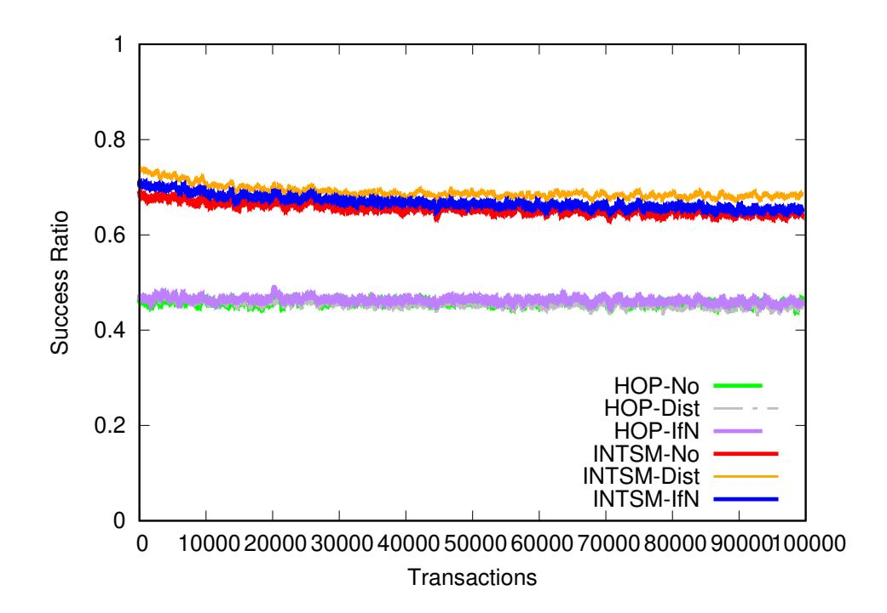
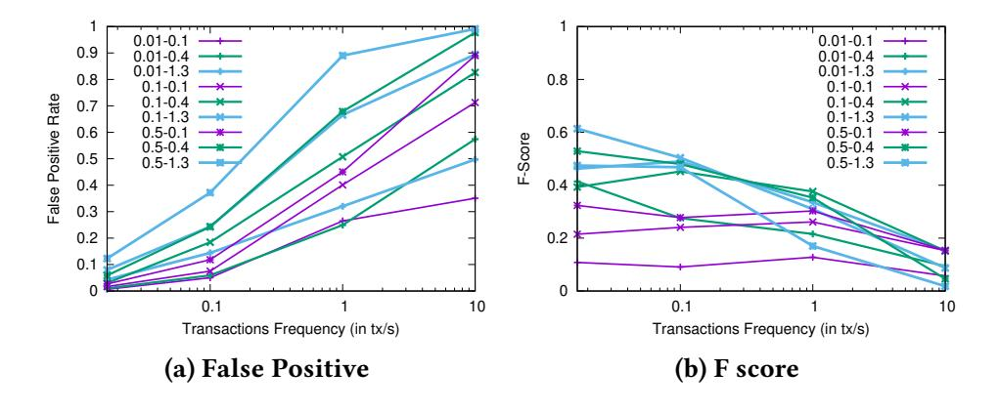
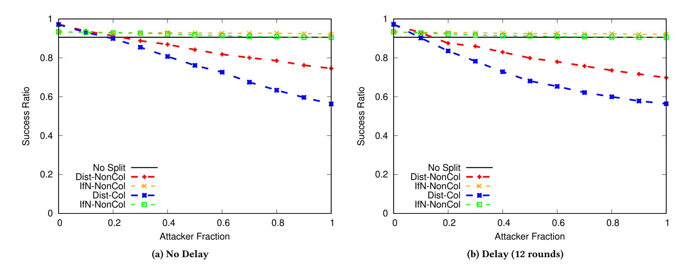
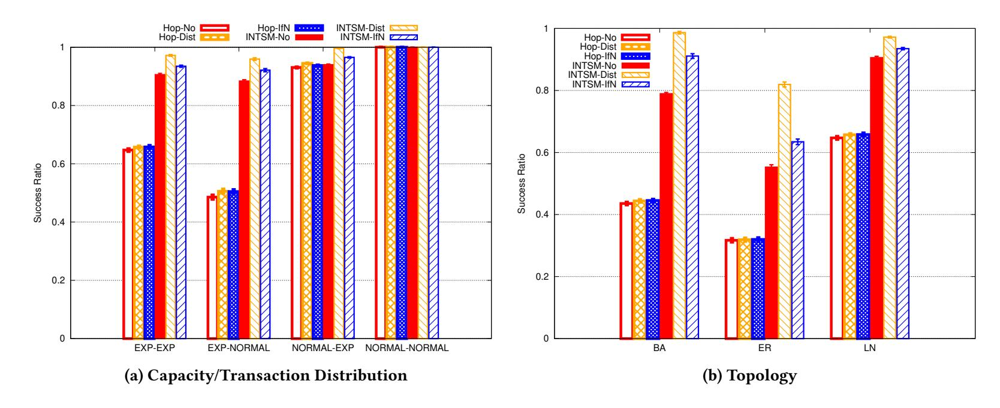
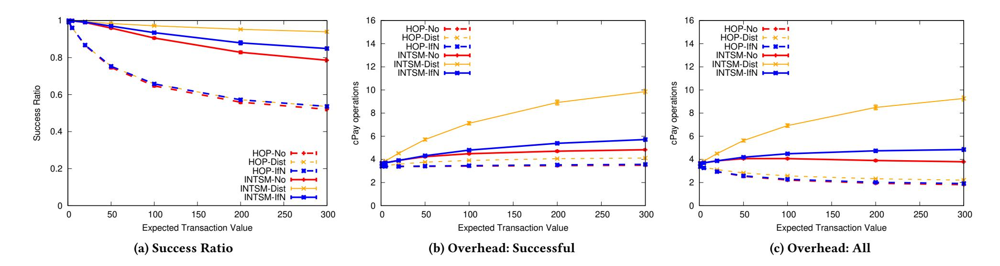
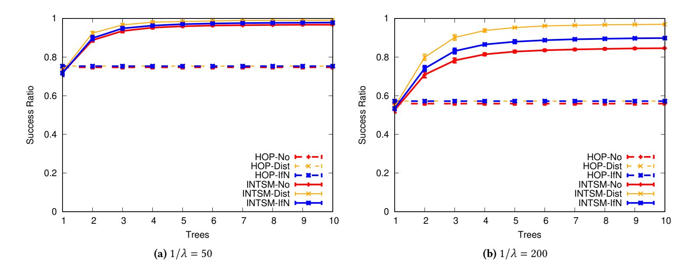
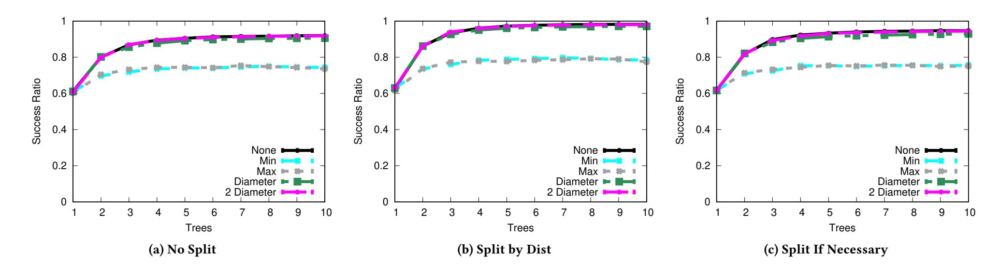
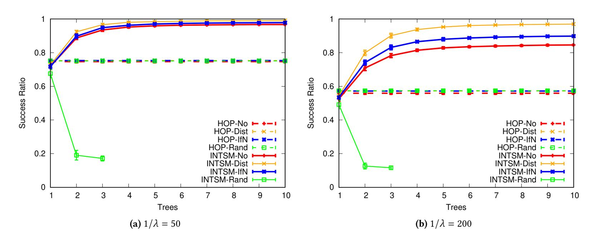
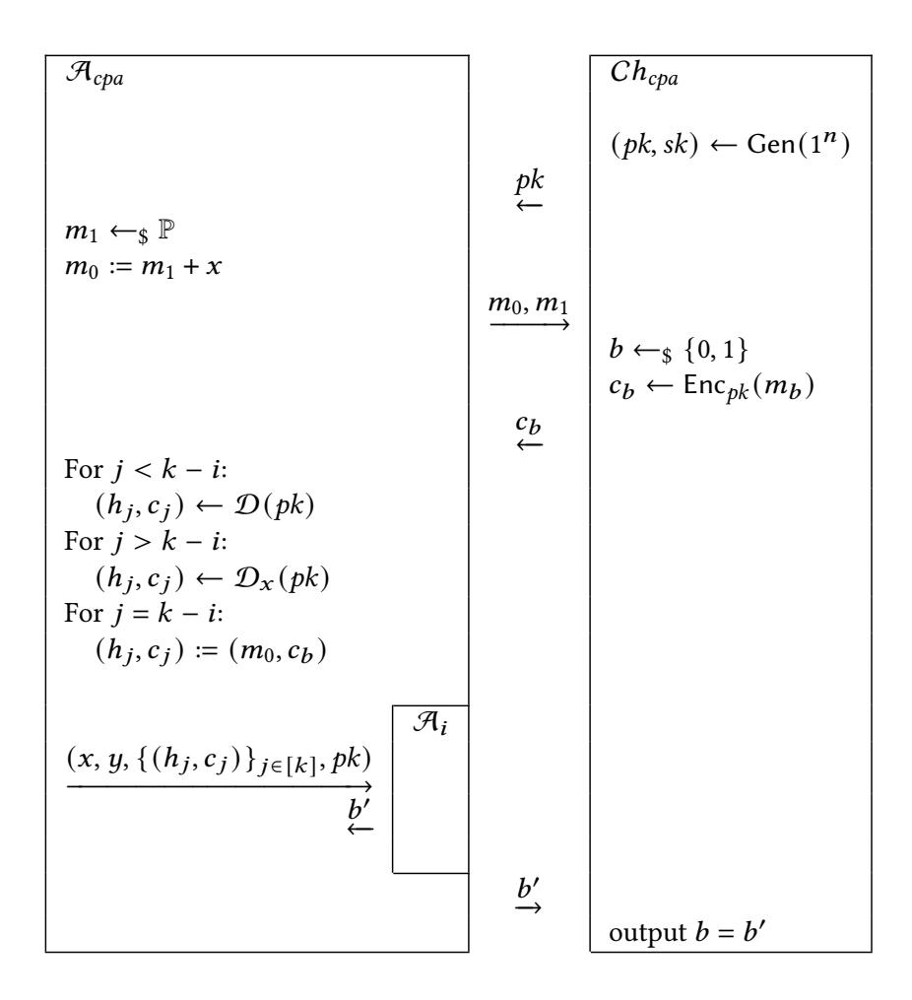
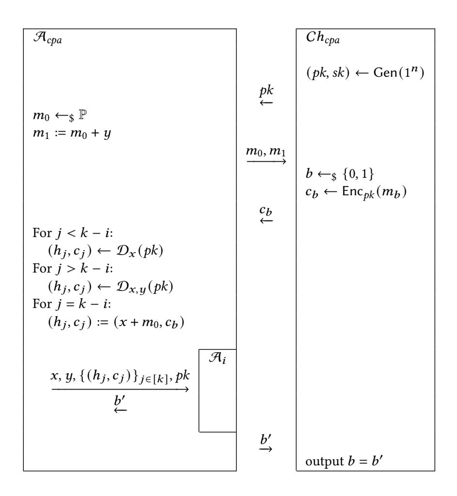

{0}------------------------------------------------

# **Splitting Payments Locally While Routing Interdimensionally**

Lisa Eckey lisaeckey@googlemail.com Deutsche Telekom Germany

Kristina Hostáková kristina.hostakova@ethz.ch ETH Zürich Switzerland

#### **ABSTRACT**

Payment Channel Networks (PCNs) enable fast, scalable, and cheap payments by moving transactions off-chain, thereby overcoming debilitating drawbacks of blockchains. However, current algorithms exhibit frequent payment failures when a payment is routed via multiple intermediaries. One of the key challenges for designing PCNs is to drastically reduce this failure rate. In this paper, we design a Bitcoin-compatible protocol that allows intermediaries to split payments on the path. Intermediaries can thus easily adapt the routing to the local conditions, of which the sender is unaware. Our protocol provides both termination and atomicity of payments and provably guarantees that no participant loses funds even in the presence of malicious parties. An extended version of our basic protocol further provides unlinkability between two partial payments belonging to the same transaction, which – as we argue – is important to guarantee the success of split payments. Besides formally modeling and proving the security of our construction, we conducted an in-depth simulation-based evaluation of various routing algorithms and splitting methods. Concretely, we present Interdimensional SpeedyMurmurs, a modification of the SpeedyMurmurs protocol that increases the flexibility of the route choice combined with splitting. Even in the absence of splitting, Interdimensional Speedy-Murmurs increases the success ratio of transactions drastically in comparison to a Lightning-style protocol by close to 50%.

# **KEYWORDS**

payment channels, payment networks, Bitcoin, routing

#### 1 INTRODUCTION

One of the most pressing technical obstacles to mass adoption of cryptocurrencies like Bitcoin [22] and Ethereum [39] is their limited transaction throughput, which leads to long delays and high fees [8]. One powerful tool to mitigate these scalability challenges are payment channels [21, 28]. They allow two users to send funds to each other off-chain by locking coins on the blockchain and only requiring interaction with the blockchain during channel creation and closure. To further improve scalability, multiple channels can be connected to form a payment channel network (PCN), where payments can be routed via (several) intermediaries to the receiver [1, 9, 10, 28]. Currently, the most widely adopted PCN is the Lightning network (deployed over Bitcoin) with more than 37,000 nodes and over 84,000 open channels 1.

Sebastian Faust sebastian.faust@tu-darmstadt.de TU Darmstadt Germany

> Stefanie Roos s.roos@tudelft.nl TU Delft The Netherlands

To successfully route a payment of v coins through a large PCN, it is crucial to find one or several routes with sufficient capacities on every link between the sender and the receiver. While there exists a multitude of single or multi-path PCN routing protocols [12, 15, 17, 32, 34, 37, 41], most of them rely on source routing, where the sender selects the payment route.

We argue that leaving it to the sender to determine the paths, or at least the number of paths, is a key reason for the high failure rate of PCNs. While the sender knows the channels in the network and their initial funding, the sender has no knowledge about the current channel capacities that may have resulted from previous off-chain payments (the sender only knows the current capacities of the channels in which they are involved). Therefore, a sender can only guess which routes will be successful. Especially when the transaction value is high, it is likely that channel capacities on the chosen path are insufficient and hence the payment fails. Indeed, simulations of the Lightning network indicate that payments only succeed with a probability between 46% and slightly above 65%, depending on the transaction size [7].<sup>2</sup>

Our contribution. To address the shortcomings mentioned above, in this work, we follow a more flexible and adaptable approach similar to SpeedyMurmurs [32]. Concretely, we let intermediaries on the path freely choose the next hop of the payment based on their local view of the channel balances. Moreover, our novel protocol allows intermediaries to split the payment into multiple smaller ones on the fly. This option enables the intermediaries to route an incoming payment of v coins, even if they do not have a single outgoing channel with sufficient funds, thus increasing the success probability. If the routing of all payment parts succeeds, the receiver recombines all partial payments and obtains the v coins.

We formally define suitable security properties and prove that our protocol satisfies them. Concretely, our protocol guarantees, in addition to the standard properties of *correctness* and *termination*, that no honest party loses coins. The latter is formalized through two properties: *bounded loss for the sender* and *balance neutrality*, protecting the receiver and intermediaries, respectively. The *atomicity* property guarantees that if an honest sender loses coins, they obtain a valid payment receipt that could, e.g., be used as a proof of payment in a higher-level protocol. At the same time, an honest receiver will never issue a valid receipt without getting the correct amount of coins in exchange.

<span id="page-0-0"></span><sup>&</sup>lt;sup>1</sup>https://1ml.com/statistics

<span id="page-0-1"></span><sup>&</sup>lt;sup>2</sup>Due to the privacy features of payments in the Lightning network, no real-world data on the success probability of payments is available.

{1}------------------------------------------------

Furthermore, we extend our basic protocol to provide *unlinkability* between split payments. This additional security property guarantees that even if intermediaries collude, they cannot link parts of the same split payment. Unlinkability prevents intermediaries from censoring split payments, which – as we argue – they might do to optimize the amount of earned fees from payment forwarding. Moreover, our unlinkability property also improves the case when no splitting occurs; namely, it protects against Wormhole attacks [19], where two malicious intermediaries steal forwarding fees from another intermediary. Our extended construction achieves unlinkability by utilizing a preimage-resistant hash function that is additively homomorphic and an additively homomorphic encryption scheme. It can be instantiated using exponentiation in a group for which discrete logarithm (Dlog) is hard and Paillier's encryption. We stress that both our protocols are Bitcoin-compatible.

Our protocol description follows a modular approach that allows instantiating the protocol with a variety of routing algorithms, thereby making it easy to evaluate new routing algorithms. To this end, the sender (and each intermediary) can choose between multiple options for (i) determining a suitable set of candidates to route a payment over and (ii) appropriately splitting the payment into multiple subpayments that are routed via some subset of these candidates. The candidate set is selected via the Closer algorithms, for which we design two options. The first is similar to Lightning's routing protocol, with candidates being selected such that the routing takes a shortest path. As a second algorithm, we design Interdimensional SpeedyMurmurs, a variant of the tree-based routing protocol SpeedyMurmurs [32], that combines the information from multiple spanning trees. Based on this information, Interdimensional SpeedyMurmurs offers a high number of paths towards the receiver and hence high flexibility in choosing the candidate set. Given the candidate set, the algorithm Split selects a subset of candidates over which the splitting is carried out. We compare three variants: (a) no splitting, (b) splitting over the candidates with the shortest paths to the receiver, and (c) splitting only if the payment fails otherwise.

To compare all possible routing combinations, we measured the success ratio and communication overhead of the algorithms in a simulation, based on data from a real-world Lightning snapshot. Our simulation considers a wide range of scenarios with regard to channel capacities, transactions, network dynamics, and routing algorithms. For all considered scenarios, we find that Interdimensional SpeedyMurmur's flexibility in routing choice drastically increases the success ratio. Strategic splitting variants increase the success ratio, in particular when we apply (b) splitting over the candidates with the shortest paths to the receiver. For instance, when using an average payment value of 25 EUR, Interdimensional SpeedyMurmurs with splitting reaches a success ratio of over 90%, whereas Lightning-style algorithms only succeed in around 77%. In the considered scenarios, Interdimensional SpeedyMurmurs also achieves a higher success ratio than other state-of-the-art PCN routing algorithms.

In summary, we design a novel modular payment routing protocol supporting local splitting that is compatible with existing systems (e.g., Bitcoin). We follow a holistic approach by formally proving the security of our protocol and confirming its superior performance with an in-depth evaluation.

#### 2 PRELIMINARIES

*Notation.* We denote by  $x \leftarrow_{\$} X$  the uniform sampling of the variable x from the set X. Throughout this paper, n denotes the security parameter. A function negl:  $\mathbb{N} \to \mathbb{R}$  is negligible in n if for every  $k \in \mathbb{N}$ , there exists  $n_0 \in \mathbb{N}$  s.t. for every  $n \geq n_0$ , it holds that  $|\text{negl}(n)| \leq 1/n^k$ . By writing  $x \leftarrow A(y)$ , we mean that a probabilistic polynomial time (ppt) algorithm A on input y, outputs x. If A is deterministic, we write x := A(y). We use the following arrow notation. Instead of "Send a message m to party p", we write " $m \hookrightarrow p$ ". Similarly, "Upon receiving a message m from party p" is denoted by " $m \hookleftarrow p$ ".

*Graphs.* A directed graph  $\mathcal{G}$  is a tuple  $(\mathcal{V}, \mathcal{E})$ , where  $\mathcal{V}$  is a non-empty finite set of *nodes* and  $\mathcal{E} \subseteq \{(U, V) \mid U, V \in \mathcal{V}\}$  is a set of *edges.* If  $(U, V) \in \mathcal{E}$ , U and V are *neighbors.* A *path* between two nodes  $V_1, V_{m+1}$  is a finite sequence of edges  $(e_1, \ldots, e_m)$  for which there is a sequence of vertices  $(V_1, \ldots, V_{m+1})$  s.t.  $e_i = (V_i, V_{i+1})$  for  $i \in [1, m]$  and  $V_i \neq V_j$  for  $i \neq j$ . The number of edges in the path is called the *length* of the path. In this paper, we assume that all graphs are *connected*, i.e., there is a path between all distinct  $V, U \in \mathcal{V}$ . We define the *hop-distance function of*  $\mathcal{G}$  as  $d_{\mathcal{G}} : \mathcal{V} \times \mathcal{V} \to \mathbb{N}_0$  that on input two nodes  $V, U \in \mathcal{V}$ , outputs the length of a shortest path between V and  $V \in \mathcal{V}$  and  $V \in \mathcal{V}$  outputs the length of a shortest path

A graph  $\mathcal{G}' = (\mathcal{V}', \mathcal{E}')$  is a *subgraph* of  $\mathcal{G}$  if  $\mathcal{V}' \subseteq \mathcal{V}$  and  $\mathcal{E}' \subseteq \mathcal{E}$ . A *spanning tree ST* of a connected graph  $\mathcal{G}$  is a subgraph  $(\mathcal{V}, \mathcal{E}')$  of  $\mathcal{G}$  that is a *tree*, i.e., a graph s.t. there exists exactly one path between every pair of nodes. We consider *rooted trees*, i.e., trees with one designated root node  $root \in \mathcal{V}$ . A neighbor  $\mathcal{U}$  of a node  $\mathcal{V}$  within a tree is called  $\mathcal{V}$ 's *parent* if  $\mathcal{U}$  is closer to the root in terms of the hop distance restricted to the tree. Otherwise,  $\mathcal{U}$  is called a *child* of  $\mathcal{V}$ . We call a rooted spanning tree  $\mathcal{S}\mathcal{T}$  of a graph  $\mathcal{G}$  a *Breadth-First Search (BFS) spanning tree* if the path between the root and each node in the tree is a shortest path in  $\mathcal{G}$ .

Cryptographic primitives. A public key encryption scheme  $\Psi$  with message space  $\mathbb{M}$  and ciphertext space  $\mathbb{C}$  is a triple of ppt algorithms (Gen, Enc, Dec) s.t. for every message  $m \in \mathbb{M}$  it holds that  $\Pr[\operatorname{Dec}_{sk}(\operatorname{Enc}_{pk}(m)) = m \mid (pk, sk) \leftarrow \operatorname{Gen}(1^n)] = 1$ . We use encryption schemes that are *indistinguishable under chosen plaintext attack* (IND-CPA), guaranteeing, at a high level, that a ppt adversary is not able to distinguish the encryption of two messages of their choice. We say that  $\Psi$  is *additively homomorphic* if for every  $x, y \in \mathbb{M}$  and public key pk,  $\operatorname{Enc}_{pk}(x) +_{\mathbb{C}} \operatorname{Enc}_{pk}(y) \equiv \operatorname{Enc}_{pk}(x +_{\mathbb{M}} y)$ , where  $\equiv$  denotes equality of probability distributions.

A digital signature scheme  $\Sigma$  is a triple of ppt algorithms (Gen, Sign, Vrfy), where  $\Pr[\mathsf{Vrfy}_{pk}(\mathsf{Sign}_{sk}(m)) = 1 \mid (pk, sk) \leftarrow \mathsf{Gen}(1^n)] = 1$  holds for every message m. In this work, we use signature schemes that are *existentially unforgeable under chosen message attack* (EUF-CMA secure for short), guaranteeing, at a high level, that a ppt adversary, learning polynomially many signatures of messages of their choice, cannot produce a valid signature for a new message.

A function  $\mathcal{H} \colon \mathbb{P} \to \mathbb{H}$  is called a *preimage-resistant hash function* if it is polynomial-time computable and for every ppt adversary  $\mathcal{A}$ , given  $y = \mathcal{H}(x)$ , for a randomly sampled  $x \in \mathbb{P}$ , the probability that the adversary  $\mathcal{A}$  outputs  $x' \in \mathbb{P}$  s.t.  $\mathcal{H}(x') = y$  is negligible. We say that  $\mathcal{H}$  is *additively homomorphic* if  $\mathcal{H}(x +_{\mathbb{P}} y) = \mathcal{H}(x) +_{\mathbb{H}} \mathcal{H}(y)$  for every  $x, y \in \mathbb{P}$ . To simplify the exposition, we drop the subscript

{2}------------------------------------------------

in  $+_{\mathbb{M}}$ ,  $+_{\mathbb{C}}$ ,  $+_{\mathbb{P}}$ ,  $+_{\mathbb{H}}$  when the set is clear. For the formal definitions and instantiations of the recalled primitives, see Appxs. A and C.

Payment channels and networks. To create a payment channel, two parties  $P_1$  and  $P_2$  lock a certain amount of coins on the blockchain. Parties can then perform an arbitrary amount of payments off-chain by exchanging authenticated messages. Note that this implies that only  $P_1$  and  $P_2$  are aware of the current assignment of coins in the channel. After completing their trades, parties announce the final outcome to the blockchain, which distributes the locked coins accordingly. Many payment channel constructions support not only simple payments but also conditional payments with a time-lock. Let us explain the concept on the commonly used Hash-Time-Locked-Contracts (HTLCs) [28]. Briefly, a HTLC in a channel allows one channel user, say  $P_1$ , to send v coins to  $P_2$  conditioned on  $P_2$  presenting a preimage of a certain hash value (i.e., unlocking the hash-lock). If  $P_2$  does not redeem the conditional payment within a certain time (i.e., the time-lock expires),  $P_1$  can claim a refund of the v coins. If both parties behave honestly, redeeming (resp. refunding) takes place off-chain. If one of the parties refuses to collaborate off-chain, the honest party can place the HTLC on the blockchain and redeem (resp. refund) the conditional payment there.

Payment channels can be grouped into PCNs to enable *payment* routing. Namely, as long as there is a path of payment channels between a sender S and a receiver R, S can pay v coins to R off-chain. The main technique for payment routing is to use a conditional payment for each involved channel. In Lightning [28], which uses only one path chosen by S, the atomicity of these conditional payments follows from the use of HTLCs. At a high level, R sends a hash  $h_R := \mathcal{H}(x_R)$  of a random value  $x_R$  to S. Using  $h_R$ , the sender S sets up a HTLC payment of v coins in the channel with the first intermediary  $I_1$  on the path. Thereafter, the intermediary  $I_1$  uses  $h_R$  to initiate a HTLC payment of v coins in the channel with the next intermediary on the path and so on, until R is reached. The receiver then reveals the preimage  $x_R$ , which allows for a step-by-step settling of all HTLCs on the path. We formalize the functionality of PCNs in the next section.

While the main purpose of PCNs is to improve scalability of blockchains, we note that they could also be built over any other payment systems (even centralized one) that supports verification of signed transactions and HTLCs.

#### <span id="page-2-1"></span>3 SECURITY MODEL

*Modeling PCNs.* We model a PCN as a connected directed graph  $\mathcal{G} = (\mathcal{V}, \mathcal{E})$  together with a capacity function  $C \colon \mathcal{E} \to \mathbb{R}^+$ . The set of vertices  $\mathcal{V}$  represents the parties involved in the PCN, the set of edges  $\mathcal{E}$  represents payment channels open between parties, and the capacity function assigns coins to parties in a channel. To simplify the notation in our formalization, we represent a payment channel as two uni-directional channels and require that  $(P,Q) \in \mathcal{E} \Leftrightarrow (Q,P) \in \mathcal{E}$ . Hence, the value C(P,Q) represents the amount of coins that party P has in the channel between P and Q and C(Q,P) represents the number of coins that Q has in that channel. This is equivalent to modeling a PCN as an undirected graph with a capacity function that on input of edge  $\{P,Q\}$  and party  $R \in \{P,Q\}$  outputs the balance party R in the channel. We define  $\mathcal{E}_P := \{e \in \mathcal{E} \mid \exists Q \in \mathcal{V} \text{ s.t. } e = (P,Q)\}$  as the set of all channels in which

 $P \in \mathcal{V}$  has locked coins and use  $C_P := C|_{\mathcal{E}_P}$  to denote the restriction of the capacity function to  $\mathcal{E}_P$ .

Recall that our goal is to design a protocol allowing parties to securely route payments through a PCN. For this, we do not need to fix one PCN implementation. In fact, we want our protocol to apply to any PCN in which parties can perform conditional payments and payment routing. To this end, we abstractly specify the minimal functionality and input/output behavior of a PCN, and allow parties in our protocol to interact with such a PCN in a black-box way. As we work with stand-alone security definitions and assume a static network topology, we do not need to capture certain payment channel mechanics such as channel creation and closure. We stress that more accurate PCN abstractions exist in the literature [16, 18]. We choose not to rely on them to keep our protocol description as simple as possible. Our abstraction is described below, the formal definition and possible instantiations over Bitcoin are discussed in Appxs. B and C.

We model the functionality of payment channels using an *ideal* functionality  $\mathcal{F}(\mathcal{G}, C_0, \Delta)$ , parameterized by a connected directed graph  $\mathcal{G} = (\mathcal{V}, \mathcal{E})$ , where  $(P, Q) \in \mathcal{E} \Leftrightarrow (Q, P) \in \mathcal{E}$ , and the initial capacity function  $C_0 \colon \mathcal{E} \to \mathbb{R}^+$ . The set of vertices  $\mathcal{V}$  defines the parties from which the functionality can receive messages. Furthermore, the functionality has a timing parameter  $\Delta$  representing the upper bound on the blockchain delay. Every party  $P \in \mathcal{V}$  can instruct the functionality to perform a payment of v coins from P to Q by sending a message "pay". If P has a sufficiently funded channel with Q, the functionality subtracts v coins from (P,Q) and adds them to (Q,P). We assume that all such payments take 1 round.<sup>3</sup>

In addition to standard payments, the functionality supports conditional payments with a time-lock. Such a payment can be initiated by a party  $P \in \mathcal{V}$  via the message "cPay". Besides specifying the channel (P, Q) and amount of coins v being conditionally transferred to Q, party P needs to define the condition  $\varphi: \{0, 1\}^* \to \{0, 1\}$ and the *time-lock*  $T \in \mathbb{N}$  of the payment. Furthermore, P has the option of attaching some auxiliary information  $info \in \{0, 1\}^*$ . If the channel is sufficiently funded, the functionality subtracts v coins from the channel (P,Q) and informs Q about the conditional payment. If the party Q submits, via the message "cPay-unlock", a witness w s.t.  $\varphi(w) = 1$ , v coins are added to the channel (Q, P). After the round specified by the time-lock *T*, party *P* can request a refund via the message "cPay-refund" in which case the functionality adds v coins back to the channel (P, Q). In order to model the fact that operations triggered by the unlock and refund instructions might require blockchain interaction, their execution may be delayed by at most  $\Delta$  rounds. The state of the functionality consists of a capacity function  $C \colon \mathcal{E} \to \mathbb{R}^+$  storing balances in the network (initially set to  $C_0$ ) and a function  $\Theta \colon \{0,1\}^* \to \{0,1\}^*$ keeping track of conditional payments currently being executed in the network.

*Protocol execution.* We consider a protocol  $\pi$  whose execution is parameterized by a graph  $\mathcal{G} = (\mathcal{V}, \mathcal{E})$ , where  $\mathcal{V}$  defines the set of parties running the protocol and  $\mathcal{E}$  defines the payment channels that exist between parties from the set  $\mathcal{V}$ ; an initial capacity

<span id="page-2-0"></span><sup>&</sup>lt;sup>3</sup>Payments typically require more than 1 off-chain communication round. Hence, it would be more accurate to use a parameter  $\delta$  (which would always be a constant w.r.t.  $\Delta$ ). We choose  $\delta=1$  to simplify the exposition.

{3}------------------------------------------------

function C defines the amount of coins in each payment channel; a party  $S \in V$  being the sender of a payment of  $v \in \mathbb{R}^+$  coins to a receiver  $R \in V$ . The protocol is executed in presence of a ppt adversary  $\mathcal{A}$  who can corrupt an arbitrary number of parties from V at the beginning of the protocol (i.e., we consider so-called static corruption). The adversary takes full control over the actions of a corrupt party (i.e., we consider a Byzantine adversary).

The protocol execution begins with a setup phase during which the following steps take place. (1) The ideal functionality  $\mathcal{F}(\mathcal{G}, \mathcal{C}, \Delta)$ , representing the PCN functionality, is initialized by the graph  $\mathcal{G} = (\mathcal{V}, \mathcal{E})$  and the initial capacity function  $\mathcal{C}$ . (2) Every party  $P \in \mathcal{V}$  gets as input the graph  $\mathcal{G}$  and the capacity of its channels, i.e., the partial function  $\mathcal{C}_P$ . Moreover, each party  $P \in \mathcal{V}$  gets their public secret key pair  $(pk_P, sk_P)$  and public keys of all other parties, i.e.,  $\{pk_Q\}_{Q\in\mathcal{V}}$ . The sender S and the receiver R additionally get as input the tuple (S, R, v). (3) The adversary  $\mathcal{A}$ , learning  $\mathcal{G}$ , decides which parties from the set  $\mathcal{V}$  it corrupts, learns their secret keys and capacity functions and sets the inputs of these parties. We denote by Honest the set of all parties in  $\mathcal{V}$  not corrupted by  $\mathcal{A}$ .

After the setup phase, parties can arbitrarily interact with each other and the ideal functionality  $\mathcal{F}(\mathcal{G}, C, \Delta)$ . The protocol terminates once all honest parties produce an *output*  $m \in \{0, 1\}^* \cup \{\top\}$ . The special symbol  $\top$  signals that a party wants to terminate without producing any particular output. Looking ahead, this is the case for all parties in our protocol except for the sender S who outputs a receipt when the payment is successful. The set of honest parties, the output of the sender and the final state of the functionality form the output of the protocol which we denote  $\mathsf{EXEC}_{\pi,\mathcal{F}}^{\mathcal{F}}(\mathcal{G},C,\Delta,S,R,v)$ .

We consider synchronous communication, i.e., the protocol execution happens in *rounds*. If a party P sends a message m to party Q in round t, Q receives m in round t + 1. For simplicity, we assume that local computation takes 0 rounds.

*Security definitions.* We now define the security properties that our protocol should satisfy. Before we state the properties formally, let us give a high-level explanation of each of them. Firstly, we want the protocol to terminate, meaning that all honest parties produce an output in finitely many rounds. Secondly, we want the protocol to guarantee that no honest party<sup>5</sup> loses money. This requirement is formalized by two properties: balance neutrality that says that no honest intermediary or receiver loses any coins, and bounded loss for the sender that says the monetary loss of an honest sender is never more than the v coins they wanted to send. Moreover, we want the protocol to satisfy payment atomicity. Briefly, this property guarantees to an honest sender that if they lose any coins, then they hold a *receipt* signed by the receiver that they paid v coins; and it guarantees to an honest receiver that if a sender holds a valid receipt over v coins, then the receiver earned at least v coins. Finally, to exclude trivial protocols where payments always fail, we require the protocol to satisfy correctness, meaning that if all

parties are honest and the capacity of all channels is at least v, the payment is successful.

In order to formalize the properties above, we need to precisely describe what *valid receipt* means. To this end, we define a validation function Valid:  $\mathcal{V} \times \mathcal{V} \times \mathbb{R}^+ \times \{0,1\}^* \to \{0,1\}$  that takes as input a sender S, a receiver R, an amount v and a receipt rec  $\in \{0,1\}^*$ , and outputs a 0/1 to signal the validity of the receipt. Moreover, for every graph  $\mathcal{G}$ , we define a family of functions  $\{\text{net}_{C,C'}\}_{C,C'}$ , where C and C' are two capacity functions of  $\mathcal{G}$  and the function  $\text{net}_{c,c'}: \mathcal{V} \to \mathbb{R}$  is defined as follows:  $\text{net}_{C,C'}(P) := \sum_{W \in \mathcal{V}:(P,W) \in \mathcal{E}} C'(P,W) - C(P,W)$ . Hence, the value of  $\text{net}_{C,C'}(P)$  represents the difference between the amount of coins P owns according to the capacity function C compared to the capacity function C'.

<span id="page-3-2"></span>Definition 3.1 (Secure payment protocol). We say that a protocol  $\pi$  executed among a set of parties  $\mathcal V$  is a secure payment protocol with respect to a validation function Valid if for every connected graph  $\mathcal G=(\mathcal V,\mathcal E)$ , where  $(P,Q)\in\mathcal E\Leftrightarrow (Q,P)\in\mathcal E$ , every capacity function  $C\colon\mathcal E\to\mathbb R^+$ , every  $S,R\in\mathcal V$ , s.t.  $S\neq R$ , every  $v\in\mathbb R^+$ , every  $v\in\mathbb R^+$ , every  $v\in\mathbb R^+$ , every  $v\in\mathbb R^+$ , every  $v\in\mathbb R^+$ , every  $v\in\mathbb R^+$ , every  $v\in\mathbb R^+$ , every  $v\in\mathbb R^+$ , every  $v\in\mathbb R^+$ , every  $v\in\mathbb R^+$ , every  $v\in\mathbb R^+$ , every  $v\in\mathbb R^+$ , every  $v\in\mathbb R^+$ , every  $v\in\mathbb R^+$ , every  $v\in\mathbb R^+$ , every  $v\in\mathbb R^+$ , every  $v\in\mathbb R^+$ , every  $v\in\mathbb R^+$ , every  $v\in\mathbb R^+$ , every  $v\in\mathbb R^+$ , every  $v\in\mathbb R^+$ , every  $v\in\mathbb R^+$ , every  $v\in\mathbb R^+$ , every  $v\in\mathbb R^+$ , every  $v\in\mathbb R^+$ , every  $v\in\mathbb R^+$ , every  $v\in\mathbb R^+$ , every  $v\in\mathbb R^+$ , every  $v\in\mathbb R^+$ , every  $v\in\mathbb R^+$ , every  $v\in\mathbb R^+$ , every  $v\in\mathbb R^+$ , every  $v\in\mathbb R^+$ , every  $v\in\mathbb R^+$ , every  $v\in\mathbb R^+$ , every  $v\in\mathbb R^+$ , every  $v\in\mathbb R^+$ , every  $v\in\mathbb R^+$ , every  $v\in\mathbb R^+$ , every  $v\in\mathbb R^+$ , every  $v\in\mathbb R^+$ , every  $v\in\mathbb R^+$ , every  $v\in\mathbb R^+$ , every  $v\in\mathbb R^+$ , every  $v\in\mathbb R^+$ , every  $v\in\mathbb R^+$ , every  $v\in\mathbb R^+$ , every  $v\in\mathbb R^+$ , every  $v\in\mathbb R^+$ , every  $v\in\mathbb R^+$ , every  $v\in\mathbb R^+$ , every  $v\in\mathbb R^+$ , every  $v\in\mathbb R^+$ , every  $v\in\mathbb R^+$ , every  $v\in\mathbb R^+$ , every  $v\in\mathbb R^+$ , every  $v\in\mathbb R^+$ , every  $v\in\mathbb R^+$ , every  $v\in\mathbb R^+$ , every  $v\in\mathbb R^+$ , every  $v\in\mathbb R^+$ , every  $v\in\mathbb R^+$ , every  $v\in\mathbb R^+$ , every  $v\in\mathbb R^+$ , every  $v\in\mathbb R^+$ , every  $v\in\mathbb R^+$ , every  $v\in\mathbb R^+$ , every  $v\in\mathbb R^+$ , every  $v\in\mathbb R^+$ , every  $v\in\mathbb R^+$ , every  $v\in\mathbb R^+$ , every  $v\in\mathbb R^+$ , every  $v\in\mathbb R^+$ , every  $v\in\mathbb R^+$ , every  $v\in\mathbb R^+$ , every  $v\in\mathbb R^+$ , every  $v\in\mathbb R^+$ , every  $v\in\mathbb R^+$ , every  $v\in\mathbb R^+$ , every  $v\in\mathbb R^+$ , every  $v\in\mathbb R^+$ , every  $v\in\mathbb R^+$ , every  $v\in\mathbb R^+$ , every  $v\in\mathbb R^+$ , every  $v\in\mathbb R^+$ , every  $v\in\mathbb R^+$ , every  $v\in\mathbb R^+$ , every  $v\in\mathbb R^+$ , every  $v\in\mathbb R^+$ , every  $v\in\mathbb R^+$ , every  $v\in\mathbb R^+$ , every  $v\in\mathbb R^+$ , every  $v\in\mathbb R^+$ , every  $v\in\mathbb R^+$ , every  $v\in\mathbb R^+$ , every  $v\in\mathbb R^+$ , every  $v\in\mathbb R^+$ , every  $v\in\mathbb R^+$ , every  $v\in\mathbb R^+$ , every  $v\in\mathbb R^+$ , every  $v\in\mathbb R^+$ , eve

**Bounded loss for sender:**  $S \in \text{Honest} \Rightarrow \text{net}_{C,C'}(S) \geq -v$ , **Atomicity:** We have

- (i)  $S \in \text{Honest} \land \text{net}_{C,C'}(S) < 0 \Rightarrow \text{Valid}(S, R, v, \text{rec}) = 1$ ,
- (ii)  $R \in \text{Honest} \land \text{Valid}(S, R, v, \text{rec}) = 1 \Rightarrow \text{net}_{C,C'}(R) \ge v$ .

**Correctness:** (Honest =  $\mathcal{V} \land \forall_{e \in \mathcal{E}} C(e) \ge v$ )  $\Rightarrow \operatorname{net}_{C,C'}(S) = -v \land \operatorname{net}_{C,C'}(R) = v \land \forall_{P \in \mathcal{V} \setminus \{S,R\}} \operatorname{net}_{C,C'}(P) = 0.$ 

We stress that our notion of a secure payment protocol captures routing of one payment between sender *S* and receiver *R* only and hence does not consider multiple parallel executions of a payment protocol. We leave the extension of our security model to the concurrent setting as an interesting direction for future research. Note that while we do not consider parallel executions of the protocol, corrupt parties might still perform arbitrary payments during the single protocol execution.

Finally, let us briefly comment on fees that incentivize intermediaries to forward payments and thus play an important role for the PCN ecosystem. We choose not to explicitly add fees into our protocol description as (i) a simple fee mechanisms can easily be integrated (e.g., as the difference between the incoming and outgoing payments similar to the Lightning network), but would further convolute the protocol description; (ii) existing studies show that the currently used fee model in the Lightning network enables attacks and sub-optimal network topologies for routing [3, 36]. Hence, the design and game-theoretic analysis of fees (similar to [3]) in terms of their impact on routing success is an overall challenge of PCNs and important problem for future work.

# <span id="page-3-3"></span>4 PAYMENT PROTOCOL

The idea of our protocol is fairly simple. A receiver first samples a random preimage  $x_R$  and sends its hash  $h_R := \mathcal{H}(x_R)$  to the sender. The sender uses this hash value to initiate a conditional transfer of v coins to the receiver. In contrast to many other PCN protocols, the sender does not specify the entire path from the sender to

<span id="page-3-0"></span><sup>&</sup>lt;sup>4</sup>If the sender is malicious and does not produce any output before the protocol terminates, it is automatically set to  $\top$ .

<span id="page-3-1"></span><sup>&</sup>lt;sup>5</sup>Let us stress that we only protect parties following the protocol. In particular, crashed parties that cannot react to on-chain events are considered malicious and hence no security guarantees are provided to them.

{4}------------------------------------------------

the receiver, which the payment has to take. In fact, the sender only chooses the first hop of the payment and attaches routing information (such as the identity of the receiver) to the conditional payment. Moreover, the sender can decide to split the payment of v coins into multiple smaller payments and send each of them via a different first hop. In our simple protocol, we assume that the same hash value is used for all conditional payments.

Once an intermediary receives a conditional payment with attached routing information, the intermediary can freely decide how to split and route the payment based on their local view of the current capacities of their channels. If the intermediary receives multiple conditional payments with the same condition and the same routing information, the partial payments can be combined into one (and potentially split again).

A receiver waits until they receive sufficiently many conditional payments locked by the hash value  $h_R$  such that their values add up to v. Then the receiver uses the preimage  $x_R$  to unlock all the payments and receive the promised v coins.

<span id="page-4-1"></span>*Routing.* The main question that we study in this paper is how the sender and the intermediaries decide on the local routing, i.e., to which neighbors should they route the payment and how many coins should they send through each link. We identify several concrete options in Sec. 5 and evaluate and compare their performance in Sec. 6. For the purpose of the formal protocol description, we assume an algorithm Route $_G$  that takes as input the amount of coins v to be routed, the identifier of the party P performing the routing, P's local view on the capacity function  $C_P$ , routing information consisting of the identifier of the receiver R, and the set *excl* containing all nodes that were already visited on the payment path between the sender and the party P. The algorithm outputs either  $\perp$  (signaling that routing failed), or k edge/value pairs  $\{(e_j, v_j)\}_{j \in [k]} \subseteq (\mathcal{E}_P \times \mathbb{R}^+)^k$  satisfying the following three conditions: (i)  $C_P(e_j) \ge v_j$  for every  $j \in [k]$ , (ii)  $e_j = (P, Q_j)$  s.t.  $Q_j \notin excl$  for every  $j \in [k]$  and (iii)  $\sum_{j \in [k]} v_j = v$ . In other words, the algorithm decides how to split the *v* coins among *P*'s neighbors and excludes neighbors that are in the set *excl*.

The purpose of the set *excl* is to prevent routing back to previously visited nodes. This set is used by some considered routing algorithms that do not prevent loops by design. We chose this straightforward technique to keep the protocol description clean. Other, more advanced, loop detection techniques [35, 38] can trivially be used instead when there is a demand for different properties, e.g., privacy. When malicious nodes do not update the set *excl* correctly, loops can still occur, leading to failed payments. However, creation of loops is not an effective attack, since malicious nodes already have the power to fail any (split or non-split) payment routed over them. Additionally, an upper bound on the number of hops prevents endless loops which means this attack is not a suitable means to create network congestion, as starting new payments would be more effective.

*Providing a receipt.* In order to turn our simple protocol into a secure payment protocol satisfying atomicity (as defined in Def. 3.1), we need to discuss when and how the receiver provides a receipt to the sender. Obviously, the receiver does not want to give a receipt before they are sure that v coins are routed to them. On the other

hand, the sender does not want to start the conditional transfer of v coins before they have a guarantee that the receiver provides the receipt if at least part of the transfer completes successfully. Hence, we need a method that allows the receiver to provide the receipt *conditionally* s.t. (a) the sender can verify that the conditional receipt can be turned into a valid receipt if a preimage for  $h_R$  is known, and (b) the receiver has the guarantee that the sender cannot generate a valid receipt without knowing a preimage of  $h_R$ .

```
\frac{\mathsf{Valid}(S, R, v, \mathsf{rec})}{\mathsf{Parse}\ (h, \sigma, x) := \mathsf{rec}} \\
\mathsf{return}\ \mathsf{Vrfy}_{pk_R}((S, R, v, h), \sigma) \land (\mathcal{H}(x) = h)
```

Figure 1: Receipt validation function.

To this end, the receiver signs (using their secret key  $sk_R$ ) a statement saying that they received v coins from the sender if a preimage of the hash value  $h_R$  is attached. They send this signature to the sender, together with the hash value  $h_R$ , at the beginning of the protocol. Using the public key of the receiver  $pk_R$ , the sender can verify the receiver's signature and use the hash value  $h_R$  for the conditional payments. If at least one of them is unlocked, the sender can attach the revealed preimage  $x_R$  to the receiver's signature and output a valid receipt. See Fig. 1 for the formal definition of the receipt validation function.

Time-locks. An intermediary forwarding a conditional payment must decrease the time-lock to be sure that they never lose coins. More precisely, let T be the time-lock of the incoming payment and T' the time-lock of the outgoing payment. The difference |T-T'| must be such that if the outgoing payment completes, i.e., if the intermediary loses coins but learns a witness  $x_R$ , there is enough time to submit  $x_R$  to the functionality  $\mathcal{F}$  and unlock the incoming payment. The intermediary can learn  $x_R$  in round  $T'+(\Delta+1)$  at latest and submission of the witness takes at most  $(\Delta+1)$  rounds. Hence, the time-lock for the outgoing payment is set to  $T':=T-2\cdot(\Delta+1)$ .

Ideally, the sender sets the time-lock of its conditional payments to now +  $\ell \cdot (1 + 2 \cdot (\Delta + 1))$ , where  $\ell$  is the length of the payment path and now is the current round. Recall that it takes 1 round to set up a conditional payment and at most  $2 \cdot (\Delta + 1)$  rounds for an intermediary to unlock a conditional payment as discussed above. In contrast to source routing, computation of the ideal time-locks might be impossible for the sender since they do not know the paths partial payments take. To this end, we instruct an honest sender to set  $\ell = |\mathcal{V}|$  since the longest possible path between two nodes in a graph is upper bounded by the number of nodes in the graph (recall that a path never visits the same node twice). Hence, payments never fail due to time-outs. Let us stress that once a concrete routing algorithm is chosen and the graph topology is fixed, tighter upper bounds can be used to increase the efficiency of the protocol. To keep our formal protocol description generic and simple, we do not include these optimizations.

*Termination.* In order to prove that our protocol satisfies Def. 3.1, we need to define when honest parties terminate and what they output. An honest sender terminates with  $\top$  if the receiver does not provide a valid signature  $\sigma$  on a tuple  $(S, R, v, h_R)$  in round  $t_0 + 1$ ,

{5}------------------------------------------------

where  $t_0$  is first round of the protocol execution. Furthermore, the sender terminates with  $\top$  if all conditional payments expire and get successfully refunded. If at least one of the conditional payments is unlocked, the honest sender learns a preimage  $x_R$ of  $h_R$  and hence can output a valid receipt, i.e., the hash value  $h_R$ , signature of the receiver  $\sigma$  and the preimage  $x_R$ . Let us now discuss termination for the receiver. Since setting up a conditional payment via the PCN functionality takes at most 1 round, the receiver should receive all partial payments latest in the round  $t_0 + |\mathcal{V}| + 1$ . Hence, if until then they do not receive conditional payments whose values add up to v, they terminate with  $\top$ , and do not unlock any payment. If *v* coins are promised by this round, the receiver unlocks all the payments and once they receive all the coins, they terminate with  $\top$ . It remains to define the termination of honest intermediaries. If a payment should be routed via an intermediary, it must happen before round  $t_0 + |\mathcal{V}|$ . Therefore, we instruct an honest intermediary to stop forwarding payments after this round, wait until all outgoing conditional payments are unlocked or refunded, unlock all forwarded incoming payments and terminate with  $\top$ .

# 4.1 Extended protocol with unlinkability

Recall that the primary purpose of our work is to increase the success ratio of large payments by allowing intermediaries to split them into multiple smaller payments on the fly. This argumentation quietly assumes that intermediaries treat payment shares in the same way as monolithic payments of the same value. An intermediary might, however, want to prioritize payments that have not been split. Such a situation occurs when multiple transactions compete to be routed through a channel with limited capacity. Assume that an intermediary needs to choose between two payments of the same value, time-lock, receiver, and routing fee. While one of the payments,  $p_m$ , is monolithic, the other one,  $p_s$ , is a share of a larger payment that has previously been split. Since the conditions of the two payments are identical, the probability of reaching the receiver is the same for  $p_m$  and  $p_s$ . However, this does not guarantee payment success for  $p_s$  since all other shares of the larger payment must reach the target as well. Hence, if an intermediary is to choose between  $p_m$  and  $p_s$ , they prefer to route  $p_m$  as its success probability does not rely on any external payments and, therefore, the risk of failure is lower.

As intermediaries typically do not encounter the exact situation above, with two payments of the same value arriving at the same time, intermediaries might start dropping partial payments by default in order to have free collateral for monolithic payments. In doing so, they drop payments that might have been successful. Such behavior can easily negate the advantages of our approach. To make our splitting approach effective, we need to make sure that intermediaries cannot distinguish monolithic payments from payments that have been split. Unfortunately, in our simple protocol, the hash-locks on all partial payment paths are identical, making it trivial for colluding intermediaries to identify two parts of the same large payment. Censorship of payments that have been split is hence possible. Appx. D substantiates this claim by simulating the attack and finding that it indeed severely reduces the success ratio.

To overcome this issue, we present an extension to our protocol that remains secure but addresses the linkability issue caused by the identical hash-locks. Our approach is to design a splitting algorithm that produces k partial payments with hash values  $(h_1, \ldots, h_k)$  satisfying the following.

- (1) The vector  $(h_1, \ldots, h_k)$  is computationally indistinguishable from a vector  $(h'_1, \ldots, h'_k)$ , where  $h'_i := \mathcal{H}(x'_i)$  is a hash of a randomly chosen preimage  $x'_i$ .
- (2) In order to learn a preimage  $x_R$  for the hash value  $h_R$ , the sender only needs to learn a preimage  $x_i$  for one of the hash values  $h_i$  (analogously for an intermediary splitting a payment); hence, the atomicity property is fulfilled.
- (3) The receiver is able to compute a witness for all received partial payments; hence, correctness is preserved.

To achieve all these properties simultaneously, we utilize a hash function that is additively homomorphic. For each partial payment  $i \in [k]$ , the sender first samples a random  $x_i$ , sets the hash-lock to  $h_i := h_R + \mathcal{H}(x_i) = \mathcal{H}(x_R + x_i)$  and attaches  $c_i \leftarrow \operatorname{Enc}_{pk}(x_i)$  to the payment, where *pk* is a fresh public key provided by the receiver at the beginning of the protocol. The corresponding secret key *sk* is kept secret by the receiver. Property (1) follows from the fact that the values  $x_i$  are independent and uniformly distributed, hence so are the values  $x_R + x_i$ . Moreover, the IND-CPA security of the encryption scheme guarantees that attaching  $c_i$  to the conditional payment does not affect the unlinkability. Property (2) is satisfied as well since upon learning a value x s.t.  $\mathcal{H}(x) = h_i$ , for some  $i \in [k]$ , the sender can compute a preimage of  $h_R$  as  $x - x_i$  (this follows from the homomorphism of  $\mathcal{H}$ ). Finally, correctness holds as the receiver can decrypt  $c_i$ , learn  $x_i$ , and compute a preimage of  $h_i$  as  $x := x_i + x_R$ .

Assume now that an intermediary receives a conditional payment with a hash-lock h and attached ciphertext c, where  $h = h_R + \mathcal{H}(x)$  and  $c = \operatorname{Enc}_{pk}(x)$  for some x. The intermediary can split the payment into k parts by sampling  $(x_1, \ldots, x_k)$  and computing  $(h_1, \ldots, h_k)$  exactly as the sender; namely, for every  $i \in [k]$  they choose random  $x_i$  and compute  $h_i := h + \mathcal{H}(x_i) = \mathcal{H}(x_R + x + x_i)$ . It remains to discuss how the intermediary reveals the value  $x_i$  to the receiver without breaking unlinkability. To this end, we make use of an additively homomorphic encryption scheme allowing the intermediary to compute a ciphertext  $c_i \leftarrow c + \operatorname{Enc}_{pk}(x_i) = \operatorname{Enc}_{pk}(x + x_i)$ .

We would like to argue that the value  $x_R + Dec_{sk}(c_i) = x_R + x + x_i$ , computed by the receiver, is a preimage of  $h_i$ , hence correctness holds. The problem with this argument is that it assumes  $x_R +_{\mathbb{M}}$  $x +_{\mathbb{M}} x_i = x_R +_{\mathbb{P}} x +_{\mathbb{P}} x_i$ , where  $\mathbb{M}$  is the message space of the encryption scheme and  $\mathbb{P}$  is the domain of  $\mathcal{H}$ . Unfortunately, we do not know how to instantiate the primitives such that this holds. Hence, in our solution, we assume that  $\mathbb{M} = \mathbb{Z}_N$  and  $\mathbb{P} = \mathbb{Z}_p$  for  $p < N = q \cdot q'$  and q, q', p coprime primes since this is the case for the encryption scheme of Paillier and hash function defined as exponentiation in a group where Dlog is hard (see Appx. C for discussion about instantiations). Under this assumption, we know that  $((x_R +_{\mathbb{M}} x +_{\mathbb{M}} x_i) + j \cdot N) \mod p = x_R +_{\mathbb{P}} x +_{\mathbb{P}} x_i$ , where j is upper bounded by the length  $\ell$  of the payment path, i.e., the number of times we added values in  $\mathbb{Z}_N$ . Thus, the receiver can simply try to hash each of the  $\ell \leq |\mathcal{V}|$  possible preimages and compare the result to the hash-lock  $h_i$ .

{6}------------------------------------------------

```
Sender S(\mathcal{G}, \mathcal{C}_S, S, R, v)
                                                                                    Intermediary I(\mathcal{G}, \mathcal{C}_I)
                                                                                                                                                                 Receiver R(\mathcal{G}, C_R, S, R, v)
                                                                                    fw := \emptyset
                                                                                                                                                                 in := \emptyset, b := 0, \mu := 0, T' := \bot
out := \emptyset, rec := \top
                                                                                    (cPaid, pid, e, v', h, T, (c, R, excl, pk)) \leftarrow \mathcal{F}
In round t_0 + 1 / Split and send payments
                                                                                                                                                                 In round t_0 / Initialize payment
\overline{\text{if (init, } h_R, \sigma, pk)} \leftarrow R \land \mathsf{Vrfy}_{pk_R}((S, R, v, h_R), \sigma) \text{ then}
                                                                                    if now > t_0 + |\mathcal{V}| then abort / too late to route
                                                                                                                                                                 x_R \leftarrow_{\$} \mathbb{P}, h_R := \mathcal{H}(x_R), (pk, sk) \leftarrow \text{Gen}(1^n)
                                                                                                                                                                 \sigma := \mathsf{Sign}_{sk_R}(S, R, v, h_R)
 T := t_0 + 1 + |\mathcal{V}| \cdot (1 + 2 \cdot (\Delta + 1)), \quad excl := \{S\}
                                                                                    else / Split and forward payment
 \{(e_i, v_i)\}_{i \in [k]} \leftarrow \text{Route}_{\mathcal{G}}(v, S, R, excl, C_S)
                                                                                     T' := T - 2(\Delta + 1), excl := excl \cup \{I\}
                                                                                                                                                                  (init, h_R, \sigma, pk) \hookrightarrow S
                                                                                      \{(e_j, v_j)\}_{j \in [k]} \leftarrow \text{Route}_{\mathcal{G}}(v', I, R, excl, C_I)
 \{(h_j, c_j, x_j)\}_{j \in [k]} \leftarrow \mathsf{HLocks}(h_R, \mathsf{Enc}_{pk}(0), k, pk)
                                                                                                                                                                  (cPaid, pid, e, v', h, T, (c, R, excl, pk)) \leftarrow \mathcal{F}
                                                                                      \{(h_j, c_j, x_j)\}_{j \in [k]} \leftarrow \mathsf{HLocks}(h, c, k, pk)
 for j \in [k] do
                                                                                                                                                                 x := WitR(c, sk, x_R, h, |excl|)
                                                                                      for j \in [k] do
   pid_i \leftarrow_{\$} \{0,1\}^*, out := out \cup (pid_i, x_i)
                                                                                                                                                                  if x \neq \bot then / Witness reconstructed
   (cPay, pid_i, e_i, v_i, h_i, T, (c_i, R, excl, pk)) \hookrightarrow \mathcal{F}
                                                                                       pid_i \leftarrow_{\$} \{0,1\}^*
                                                                                                                                                                   in := in \cup (pid, x), \ \mu := \mu + v', T' := \min\{T', T\}
else TerminateS()
                                                                                        (cPay, pid_i, e_i, v_i, h_i, T', (c_i, R, excl, pk)) \hookrightarrow \mathcal{F}
                                                                                                                                                                   if ((\mu \ge v) \land (T' \ge \text{now} + \Delta + 1) then
                                                                                       fw[T'] := fw[T'] \cup (pid_i, pid, x_i)
(cPay-unlocked, pid, x) \leftarrow \mathcal{F} / Complete receipt
                                                                                                                                                                     foreach (pid', x') \in in do / Unlock all payments
                                                                                    (cPay-unlocked, pid, x) \hookleftarrow \mathcal{F}
Let x' s.t. (pid, x') \in out, out := out \setminus \{(pid, x')\}
                                                                                                                                                                       (cPay–unlock, pid', x') \hookrightarrow \mathcal{F}
rec := (h_R, \sigma, Wit(x, x'))
                                                                                       / Unlock corresponding incoming payment
                                                                                                                                                                     b := 1, wait for \Delta + 1 rounds to TerminateR()
                                                                                    Let x', pid', T s.t. (pid, pid', x') \in fw[T]
if out = \emptyset then TerminateS()
                                                                                                                                                                  In round t_0 + |\mathcal{V}| + 1
                                                                                    x^* := Wit(x, x'), (cPay-unlock, pid', x^*) \hookrightarrow \mathcal{F}
In round T / Refund remaining payments
                                                                                                                                                                  if b = 0 then TerminateR()
                                                                                    fw[T] := fw[T] \setminus \{(pid, pid', x')\}
foreach pid \in out do (cPay-refund, pid) \hookrightarrow \mathcal{F}
                                                                                                                                                                 TerminateR()
wait for \Delta + 1 rounds to TerminateS()
                                                                                    In every round / Check for expired time locks
                                                                                                                                                                  return ⊤
                                                                                    foreach (pid, pid', x') \in fw[now] do
TerminateS():
                                                                                      (cPay-refund, pid) \hookrightarrow \mathcal{F}
                                                                                                                                                                    WitR_b(c, sk, x, h, \ell)WitR_{ext}(c, sk, x, h, \ell)
return rec
                                                                                      fw[now] := fw[now] \setminus \{(pid, pid', x')\}
                                                                                                                                                                   x^* := \bot
                                                                                                                                                                                                  x^* := \bot
                                      \mathsf{HLocks}_{ext}(h, c, k, pk)
 \mathsf{HLocks}_b(h, c, k, pk)
                                                                                    if now > t_0 + |\mathcal{V}| \wedge fw = \emptyset then
                                                                                                                                                                   if \mathcal{H}(x) = h then x' := x +_{\mathbb{M}} \mathsf{Dec}_{sk}(c)
 for i \in [k] do
                                      for i \in [k] do
                                                                                    wait for 2(\Delta + 1) rounds to return \top
                                                                                                                                                                                                  for i \in [0, \ell] do
                                                                                                                                                                     x^* := x
                                        x_i \leftarrow_{\$} \mathbb{P}
  h_i := h
                                                                                                                                                                   return x*
                                                                                                                                                                                                   z := x' + iN \mod p
                                                                                      Wit_h(x, x_i)
                                                                                                                Wit_{ext}(x, x_i)
  c_i := c
                                        h_i := h +_{\mathbb{H}} \mathcal{H}(x_i)
                                                                                                                                                                                                   if h = \mathcal{H}(z) then
                                                                                      return x
 return \{(h_i, c_i, 0)\}_{i \in [k]}
                                        c_i \coloneqq c +_{\mathbb{C}} \mathsf{Enc}_{pk}(x_i)
                                                                                                                return x +_{\mathbb{P}} (-x_i)
                                                                                                                                                                                                     x^* := z
                                      return \{(h_i, c_i, x_i)\}_{i \in [k]}
                                                                                                                                                                                                  return x*
```

Figure 2: Generic description of the protocol initiated in round  $t_0$ . For brevity, we replace the condition  $\operatorname{Hash}_h^{\mathcal{H}}$  with the hash value h. For the extended protocol, we assume  $\mathbb{P} = \mathbb{Z}_p$  and  $\mathbb{M} = \mathbb{Z}_N$ .

Even if payments are not split, our extended protocol provides additional advantages as it protects intermediaries from Wormhole attacks [19] (see Remark 3 in Appx. M).

#### 4.2 Formal protocol description

In Fig. 2, we present the formal description of both the basic protocol, denoted  $\Pi_b(\text{Route})$ , and the extended protocol with unlinkability, denoted  $\Pi_{ext}(\text{Route})$ . The protocols are parameterized by a routing algorithm Route. Concrete instantiations of Route are discussed in Sec. 5.

Since both the basic protocol and the extended protocol with the unlinkability feature are very similar, we follow a modular approach when describing them formally. Namely, we define a protocol  $\Pi$  which is, in addition to Route, parameterized by three algorithms that define the differences between the two protocols: HLocks, WitR, and Wit. The algorithm HLocks, run by the sender and intermediaries during the locking phase, takes as input a hash value h, ciphertext c, an integer  $k \in [n]$  and a public key pk, and outputs k tuples  $(h_i, c_i, x_i)$  consisting of hash values, ciphertext, and a preimage. The algorithm WitR, run by the receiver, takes as input a ciphertext c, a secret key sk, a preimage x, a hash value

h and integer  $\ell$ , and outputs a preimage x' such that  $h = \mathcal{H}(x')$ . Finally, the algorithm Wit, run by the intermediaries and the sender during the unlocking phase, takes as input two preimages x and  $x_i$ , and outputs another preimage x'. For the sake of simplicity, our formal description presented in Fig. 2 excludes the option for intermediaries to partially recombine payments. We stress that the description could be adjusted easily to capture this feature. The security of our schemes is stated and discussed in Sec. 5.3 and in Appx. C we discuss how to instantiate the cryptographic primitives to be Bitcoin-compatible.

# <span id="page-6-0"></span>5 ROUTING ALGORITHMS

In this section, we consider several realizations of the routing algorithm Route, as defined in Sec. 4. In the context, we also develop the novel and highly flexible routing algorithm Interdimensional SpeedyMurmurs. Note that designing a new routing protocol is not an orthogonal contribution to our splitting protocol. Rather, a routing protocol designed with splitting in mind is key for exploring the full potential of splitting, as demonstrated in our evaluation. Internally, Route always consists of two algorithms: Closer and

{7}------------------------------------------------

Split. In a nutshell, Closer determines a candidate set of potential next hops and Split splits the payment value over these candidates.

First, Closer takes the node  $P \in \mathcal{V}$ , the receiver  $R \in \mathcal{V}$ , and the capacity function  $C_P$  as input and outputs tuples consisting of an edge  $e = (P, U) \in \mathcal{E}_P$  to a potential next user U, the capacity c of e, and a value indicating an algorithm-dependent closeness measure for U with regard to R. Afterwards, the algorithm removes potential edges to avoid loops. More concretely, if a returned edge is with a node that has previously been on the path, the edge is removed from the candidate set. The second algorithm, Split, takes the set of candidate channels, their capacities, the closeness measures, and a payment value as input. It then splits the payment value over a subset of these payment channels.

The following subsections introduce two realizations of Closer and three realizations of Split, which can be combined arbitrarily. We describe the algorithms here, the formal protocol descriptions can be found in the Appx. J. In addition to these realizations, random splitting was considered and the results are in Appx. I. We did not include random splitting in the main body as the results merely confirm that splitting needs to be strategic to have a positive impact on the performance. In fact, random splitting achieved a worse success ratio than a protocol without splitting.

# 5.1 **Determining potential next hops** (Closer)

Our first realization of Closer considers nodes that are closer to the receiver R than the node P making their forwarding decision. The second realization considers a set of spanning trees, and every neighbor that is closer to the receiver in terms of at least one spanning tree distance is a potential next hop.

**Hop Distance** (*HOP*): The hop distance gives the length of the shortest path between two nodes, i.e., the value of the function  $d_{\mathcal{G}}$ . As the graph is available, each node can compute the distance locally by applying a shortest path algorithm on the graph. Thus,  $Closer_{HOP}$  determines the payment channels to nodes that are closer to the receiver.

Without splitting, the hop distance results in similar paths as Lightning routing [28] when all nodes charge the same fees. Nodes select a shortest and hence cheapest path. However, instead of the sender deciding the path in advance, nodes locally select the next hop. Consequently, the nodes making local routing decisions can take the balances of neighbouring nodes into consideration, which are unknown to the sender. In this manner, they can avoid some routing failures that lead to the need for rerouting in Lightning. Rerouting in Lightning entails high latencies, as the sender has to wait for time-locks to expire. Thus, in terms of the success ratio for the first routing attempt, this algorithm is a version of Lightning that enables local decisions and hence can act as a baseline for splitting.

**Interdimensional SpeedyMurmurs (INTSM):** In this section, a novel realization of Closer, denoted  $Closer_{I-SM}$ , is introduced. The novel realization is a modification of the atomic multi-path algorithm SpeedyMurmurs [32] that is more suitable for splitting.

SpeedyMurmurs establishes BFS spanning trees  $ST_1, \ldots, ST_{\text{dim}}$  using a standard distributed spanning tree protocol. In practice, there are a number of distributed spanning tree algorithms that can also efficiently repair the spanning tree if the graph topology

changes (e.g., [26]). In its original form, SpeedyMurmurs routes each partial payment using a different spanning tree. More precisely, for the i-th partial payment, the hop distance function of the i-th spanning tree, denoted by  $d_i$ , is used to determine the next hop. Hence, SpeedyMurmurs also considers channels that are not part of the i-th spanning tree: If a neighbor is closer to the receiver according to  $d_i$ , SpeedyMurmurs chooses the corresponding channel regardless of whether it is included in the spanning tree. In contrast to routing using only spanning tree edges, routing based on a spanning tree distance with the inclusion of other edges is resilient to node failures and even attacks removing nodes strategically from the network [31].

The key difference to original SpeedyMurmurs is that Interdimensional SpeedyMurmurs considers all spanning trees for all routing decisions. Note that if a node U is closer to R than P with regard to only one distance  $d_i$ , there is a loop-free path from P to Rvia U. Thus, U is a good candidate for a next hop. Consequently,  $Closer_{I-SM}$  determines the set of candidate channels as those leading to nodes closer to the receiver according to at least one of the dim distance functions.

So, Closer $_{I-SM}$  considers all spanning trees for each edge (P,U). Once it finds that U has a lower distance to R in one spanning tree, it determines the minimal distance of U to R over all spanning trees. Indicating the minimal distance allows Split to prefer short routes. After computing the minimal distance, Closer $_{I-SM}$  adds the tuple consisting of the channel (P,U), its capacity, and the minimal distance to the candidate set. Afterwards, it proceeds with the next channel. In this manner, Closer $_{I-SM}$  selects a large set of neighbors that offer a loop-free but not necessarily the shortest path to the receiver. Thus, whereas the hop distance only considers the shortest paths, Interdimensional SpeedyMurmurs offers a higher flexibility in choosing paths, hence increasing the chance of successfully completing a payment.

# 5.2 Splitting over potential next hops (Split)

Our realizations of Split use the following three approaches: i) not splitting (baseline), ii) splitting according to the distance to *R*, and iii) splitting only if necessary.

**No Split** (Split $_{No}$ ): The first considered realization of Split is not to split. For each node in the candidate set, the algorithm checks if the capacity of the corresponding channel is sufficient. From the set of channels with sufficient capacity, it selects a node with minimal distance to R, breaking ties randomly. If no such channel exists the payment fails.

**Split By Distance** (Split $_{Dist}$ ): Our second realization of Split iterates over the candidate channels in order of decreasing closeness to the receiver, breaking ties randomly. For each candidate channel, it assigns a partial value that is either the channel capacity or the part of the total payment value that has not been assigned previously, whichever is less. The algorithm terminates when the total payment value has been split or all channels have been considered. In the latter case, the total capacity of all channels is insufficient for the payment value and hence the payment fails.

**Split If Necessary** (Split $_{IfN}$ ): Our third realization only splits if necessary and hence aims to minimize the number of splits in one particular forwarding decision. Note that such a greedy approach

{8}------------------------------------------------

does not necessarily minimize the total number of splits as it might prefer longer paths that might lead to more splits. If it is possible to forward without splitting, the algorithm corresponds to  $Split_{No}$ . Otherwise, it proceeds analogously to  $Split_{Dist}$  but considers the candidate channels in decreasing order of their capacity, breaking ties randomly.

#### <span id="page-8-1"></span>5.3 Security statement

Let  $\mathcal{R}$  be the set of all discussed routing algorithms. The following theorem states that for any Route  $\in \mathcal{R}$ , both protocols  $\Pi_b(\text{Route})$  and  $\Pi_{ext}(\text{Route})$  discussed in Sec. 4 satisfy Def. 3.1 w.r.t. the receipt validation function Valid from Fig. 1.

<span id="page-8-5"></span>THEOREM 5.1. Assume that there exists a PCN realizing the ideal functionality  $\mathcal{F}$ . Assume that  $\Sigma$  is an EUF–CMA-secure signature scheme,  $\Psi$  is IND–CPA-secure encryption scheme with message space  $\mathbb{M}$ , and  $\mathcal{H}$  a preimage-resistant hash function with domain  $\mathbb{P}$ . For any Route  $\in \mathcal{R}$ , the protocol  $\Pi_b(\text{Route})$  is a secure payment protocol with respect to the function  $\text{Valid}_{\Sigma,\mathcal{H}}$ .

If, in addition,  $\Psi$  and  $\mathcal{H}$  are additively homomorphic, and  $\mathbb{M} = \mathbb{Z}_N$ ,  $\mathbb{P} = \mathbb{Z}_p$  for p, N coprime and p < N, then for any Route  $\in \mathcal{R}$ , the protocol  $\Pi_{ext}(\mathsf{Route})$  is a secure payment protocol with respect to the function  $\mathsf{Valid}_{\Sigma,\mathcal{H}}$ .

We present the formal proof of the theorem in Appx. L. The formal definition of payment unlinkability and the proof that  $\Pi_{ext}(\text{Route})$  satisfies it can be found in Appx. M.

#### <span id="page-8-0"></span>**6 PERFORMANCE EVALUATION**

This section deals with the overarching question of quantifying the extent to which splitting affects the performance in terms of success ratio., i.e., the fraction of successful payments. Furthermore, we compare our protocol to other PCN routing protocols. Last, we determine whether removing the linkability by hash value indeed achieves unlinkability or whether split payments can be linked by meta data.

### 6.1 Simulation Model

We extended the simulation framework for SpeedyMurmurs to include our novel routing algorithms. For this purpose, we have three branches: the one implementing our changes in the original simulator without concurrency<sup>6</sup>, a modified version of the simulator enabling concurrency <sup>7</sup>, and a third branch for establishing how likely it is to link payments based on metadata<sup>8</sup>. During the initialization phase, the simulation generates the local information necessary for the routing algorithms, such as the local topology snapshot and spanning trees for Interdimensional SpeedyMurmurs. Furthermore, it generates a list of transactions and a time at which the transaction starts. The actual simulation is a discrete event-based simulation [23]. The simulator schedules three types of operations: i) transaction initialization by the sender, ii) forwarding decisions and corresponding lock operations, and iii) unlocking of payments.

The transaction initialization is scheduled before the simulation starts whereas the other events are triggered by previous events.

When a node is scheduled to either start or forward a payment, they make a decision on how to split the payment and make the corresponding cPay calls if any. The cPay call triggers forwarding actions for the chosen neighboring nodes, which are scheduled to happen after a delay corresponding to the duration of the cPay calls for the respective channels.

If the payment terminates at the node, the payment moves to the unlocking stage. We considered rational nodes that aim to have their collateral release as early as possible. For a successful payment, the receiver immediately starts the unlocking process after they receive the last partial payment. As for the locking stage, unlocking collateral for one channel is associated with a delay. The reaction of the predecessor on the payment path, which is either another intermediary or the sender, is scheduled to happen after this delay.

If a payment fails, there are two cases for its partial payments: i) partial payments for which an intermediary cannot forward the payment due to lack of available funds and hence do not reach the receiver, and ii) partial payments that reach the receiver but fail as other partial payments belonging to the same atomic payment fall into category i). In the first case, the intermediary immediately starts the process of peacefully canceling the locks along the path. The information about the failure is forwarded to the sender who can then inform the receiver. The receiver starts canceling all locks on partial paths corresponding to the same atomic payment that have been established, which addresses case ii). Furthermore, the receiver does not accept any more locks for the payment that might be requested later, instead communicating with its neighbor to cancel all locks along the partial path. Note that a malicious sender can abort a payment by notifying the receiver of a failure without one being present. However, such an attack is merely a denial-of-service attack and does not impact any of our security properties. Not sending the complete payment value is an equally effective denialof-service attack that is not as easy to detect as using incorrect failure notifications.

Note that our topology remains the same during the simulation, so there are no channel closures and openings. Further note that in the presence of concurrency and changes to the balances due to completed payments, it is NP-hard to determine whether it is even possible to successfully complete all of the transactions successfully, even with an optimal algorithm [14]. Indeed, it is quite likely that some transactions have to fail due to inherently insufficient balances. Thus, our evaluation results presented here do not give any insights on how close to an optimal routing algorithm we are. In Appx. E, we instead consider a simplified simulation without concurrency and with static balances, for which we can tell that Interdimensional SpeedyMurmurs is close to an optimal algorithm for most parameter settings.

#### 6.2 Data Sets and Parameters.

The considered factors influencing the performance of the routing algorithms were topology, channel capacities, and transactions. In general, all experiments were averaged over 20 runs. For each run, the simulation framework first generated the data sets and then run all routing algorithms on the exact same data set. For

<span id="page-8-2"></span> $<sup>^6</sup> https://anonymous.4 open.science/r/PaymentRouting-DFC4/README.md \\$ 

<span id="page-8-3"></span><sup>&</sup>lt;sup>7</sup>https://anonymous.4open.science/r/PaymentRouting-5725/src/paymentrouting/route/Evaluation.java

<span id="page-8-4"></span> $<sup>^8</sup> https://anonymous.4 open.science/r/PaymentRouting-A6A3/src/paymentrouting/route/attack/LinkabilityEval.java$ 

{9}------------------------------------------------

Interdimensional SpeedyMurmurs, the number of trees was chosen to be 5 for the experiments presented here; Appx. F discusses the impact of the number of trees. In summary, the success ratio does not considerably increase when using more than 5 trees.

**Topology:** The topology was a real-world Lightning snapshot from March 1, 2020, snapshot 04\_00<sup>9</sup>. It contains 6329 nodes with 10.31 channels on average. Appx. G presents results for synthetic scale-free and random graphs.

Capacities and transactions: Our capacities and transactions were synthetic, though motivated by real-world data. Initial channel capacities followed an exponential distribution. In March 2020, 200 was close to the average channel capacity in euro for Lightning and the capacity distribution was highly skewed with most channels having a low capacity<sup>10</sup>. Hence, an exponential distribution seemed a suitable fit with a normal distribution as an alternative that highlights the impact of the distribution. Note that the success ratio depends on the relation between capacities and transaction values rather than the actual values, thus it was sufficient to vary the expected transaction value and keep the expected capacity constant. The capacities of the two directions of a channel were chosen independently. Alternative distributions for channel capacity, as well as transaction values, are evaluated in Appx. G.

Each run considered 100,000 transactions. In the absence of real-world transaction data<sup>11</sup>, choosing sender and receiver uniformly at random was the most straight-forward option. Transaction values were chosen according to an exponential distribution. Exponential distributions indicate many transactions of a small value with few expensive purchases. The expected value of the distribution was  $1/\lambda \in \{25, 100\}$ , with more results being available in the appendix.

Latency and concurrency: The degree of concurrency depends on the frequency of transactions and the duration of a transaction. The longer a transaction takes, the more likely it is to impact another transaction. And the more transactions, the more likely is it that they interfere with each other. Thus, the relation between latency and frequency is the dominant factor in determining whether transactions are concurrent. As a consequence, we kept the duration of lock and unlock operations constant at 100 ms and varied the transaction rate: the average number transactions for each node per hour was 0.1, 2, and 100. The interval between the initialization of two transactions was Poisson-distributed with parameters to match the respective rates.

**Timeouts:** The remainder of the section sets timeouts in accordance with the generic protocol from Sec. 4, i.e., assuming that the maximal path length is equal to the number of nodes. However, we discuss and evaluate the impact of shorter timeouts in Appx. H.

#### 6.3 Performance Results

We use the abbreviations from Sec. 5 throughout the remainder of this section. Generally, a combination of a realization C of Closer and a realization S of Split is written as C-S. For readability, tables and figures use No, Dist, and IfN rather than  $Split_{No}$ ,  $Split_{Dist}$ , and  $Split_{IfN}$ , respectively.

<span id="page-9-3"></span>

Figure 3: Change in success ratio over number of transactions for 2 transactions per node and hour.

Tab 1 presents the success ratio for a million transactions and six routing algorithms. We omit the results for 2 transactions per node and hour as they are not significantly different to the case of 0.1. Generally, concurrency has little impact on the success ratio, only Split Dist's success ratio decreases slightly as it tends to split more. The increased number of partial payments competing for the available funds can lead to failures. The success ratio for HopDistance is consistently lower than for Interdimensional SpeedyMurmurs due to its lacking flexibility in choosing any paths but the shortest ones. Indeed, splitting does not improve the performance of HopDistance, it can even decrease it as the complete funds in a channel are exhausted by a split payment and are hence no longer available for subsequent payments. For Interdimensional SpeedyMurmurs, Split *Dist* improves the success ratio by more than 5% for the case of  $1/\lambda=100$  and low concurrency. Split $_{Dist}$  aims to keep the paths short, which seems to be working best as the chance for failures is low on short paths. The advantage of splitting only shows for the higher average transaction value of 100. For a transaction value of 25, most payments can be settled without splitting.

We suspect that the above results can be improved by varying the splitting method:  $Split_{Dist}$  and  $Split_{IfN}$  share the design choice of using at least one channel's complete funds. As a consequence, the channel is depleted and cannot be used by future payments. Less aggressive splitting methods that take the balance distribution into account are bound to increase the success ratio. Fig. 3 indeed shows a slight negative trend over time, especially for splitting methods that are initially the most successful.

# <span id="page-9-5"></span>6.4 Comparison to Related Work

We compared our protocol to Boomerang [4] and Spider [34], two recent proposals for routing algorithms. Their implementations do not scale well, so we executed the comparison on a 100-node<sup>12</sup> Watts Strogatz graph (8 links per node, rewiring probability of 0.25) with exponentially distributed transaction values of 25 and 100 on average. Capacities were chosen exponentially with average value

<span id="page-9-0"></span><sup>9</sup> https://gitlab.tu-berlin.de/rohrer/discharged-pc-data

<span id="page-9-1"></span><sup>&</sup>lt;sup>10</sup>https://1ml.com/statistics

<span id="page-9-2"></span> $<sup>^{11}\</sup>mathrm{Transactions}$  in Lightning are considered sensitive data and hence hidden using onion routing

<span id="page-9-4"></span> $<sup>^{12}\</sup>mathrm{Due}$  to their code not scaling far beyond about 100 nodes.

{10}------------------------------------------------

<span id="page-10-0"></span>

| Value | Rate  | HOP-No          | HOP-Dist        | HOP-IfN         | INTSM-No        | INTSM-Dist      | INTSM-IfN       |
|-------|-------|-----------------|-----------------|-----------------|-----------------|-----------------|-----------------|
| 25.0  | 0.1   | 0.77<br>± 0.003 | 0.76<br>± 0.003 | 0.77<br>± 0.003 | 0.90<br>± 0.002 | 0.90<br>± 0.003 | 0.90<br>± 0.003 |
| 25.0  | 100.0 | 0.77<br>± 0.003 | 0.76<br>± 0.004 | 0.77<br>± 0.004 | 0.90<br>± 0.004 | 0.90<br>± 0.003 | 0.90<br>± 0.004 |
| 100.0 | 0.1   | 0.46<br>± 0.003 | 0.45<br>± 0.003 | 0.46<br>± 0.003 | 0.65<br>± 0.004 | 0.69<br>± 0.005 | 0.67<br>± 0.005 |
| 100.0 | 100.0 | 0.46<br>± 0.004 | 0.45<br>± 0.003 | 0.46<br>± 0.003 | 0.65<br>± 0.005 | 0.67<br>± 0.008 | 0.66<br>± 0.006 |

Table 1: Success ratio (with standard deviation) in the dynamic setting for six routing algorithm, first column indicates average transaction value (exponentially distributed) and second column indicated the number of transactions per node per hour.

of 200. The transaction frequency was 100 transactions per hour and we conducted 1 million transactions.

Spider and Boomerang both apply source routing with multiple paths, meaning that the payment is split into small units at the source. As such, they both are required to use precomputed fixed paths. The sender can decide how they split the funds between the paths but does not have the complete information about the local situation of intermediaries.

Spider introduces two novel ideas: First, instead of immediately marking a payment as failed if there is insufficient balance, a node queues the (partial) payment hoping that a concurrent payment in the other direction increases the balance. Second, they react to congestion feedback from nodes on the path, which enables the source to choose a different path for other partial payments. After communicating with the authors to fix some errors caused by missing libraries and incorrectly set paths, we used the Spider simulator, which like ours is a discrete event-based simulator, for our experiments[13](#page-10-1). Note that Spider is non-atomic, so if a payment succeeds partially, the funds that arrived at the receiver are not refunded, while our protocol and Boomerang refund.

Boomerang's key idea is the use of redundancy, i.e., sending more than the payment value, so that if parts of the amount sent do not arrive at the receiver, the receiver may still receive sufficient funds for the payment. If more than the original payment value goes through to the receiver, Boomerang uses secret sharing and Bitcoin Scripts to ensure that the receiver has to refund any excess funds. Boomerang was evaluated in an emulation[14](#page-10-2) rather than a simulation. In order to increase the fairness of the comparison, we reimplemented Boomerang in our simulator. During the process, we found that a small change can improve Boomerang's performance (see Appx. [K\)](#page-21-1). As a consequence, our simulation achieved better results for Boomerang than reported in the original paper.

Our results still show a noticeable advantage of Interdimensional SpeedyMurmurs. When using an average transaction value of 25, Interdimensional SpeedyMurmurs with , Spider, and the best-performing version of Boomerang[15](#page-10-3), all fail in less than 1.5% of the routings, with Interdimensional SpeedyMurmurs having the highest performance at a failure rate of 0.1%. When increasing the average transaction value to 100, Interdimensional SpeedyMurmurs fails only in 0.2% of the cases, whereas Boomerang and Spider fail in 4% and 7.1%, respectively.

# 6.5 Linkability

We removed the possibility to link split payments based on the hash value in our extended protocol. However, we still reveal metadata such as the receiver and the path taken up to the intermediary. In this section, we evaluate how likely it is the attacker can link payments based on this metadata. Our attacker considers two observed payments to be part of the same overall payment if they have the same sender and receiver, and arrive within a certain time.

We considered non-colluding and colluding attackers. If an attacker did not collude with others, they only had information from the payments they participated in. Hence, in a non-colluding attack, an attacker considered any two payments they participated in and decided whether they are parts of the same overall payment. In the concrete attack we evaluated, the attacker considered the payments to be the same if they had the same sender, receiver, and the difference in arrival times at the node was at most . After receiving a payment, a node hence delayed it by time and dropped it if they decided it had been split before.

If an attacker colluded with others, they performed the same attack but with additional information from other attacking nodes: Attackers shared which payments they had seen and when. If two attackers had seen a payment with the same sender and receiver, they first checked whether one of them is contained in the set for the previously visited nodes of the other. If that was the case, they were likely just nodes on the same single path and hence they did not know if the payment had been split and hence did not drop it. Otherwise, they checked whether the difference in arrival times was at most and dropped the payments if that was the case.

In order to evaluate the attack, we chose one pair of nodes. We performed 100 transactions between them, randomly choosing one of them as the sender (it was essential to have transactions in both directions as otherwise the channels become depleted in one direction and fail without reaching an attacker). The transaction frequency for transactions between these two nodes was varied between 0.01 and 10 transactions per second. We repeated the experiment 100 times. Attackers were chosen randomly and the fraction of attackers varied between 0.01, 0.1, and 0.5 of all nodes and was 0.1s, 0.4s, and 1.3s, with the duration of a forwarding operation being 0.1s for all channels. 1.3s corresponded to the maximal delay of sending a transaction along a shortest path between any two nodes in the graph. Attackers delayed observed payments until they were either linked and dropped or until the time interval during which they could be linked had expired. Both splitting methods, SplitDist and SplitIfN , were evaluated, using the Lightning topology and exponentially distributed payment values with 1/ ∈ {25, 100}.

We derived the false positive rate, i.e., the fraction of payment linked by the attacker that were not actually parts of the same

<span id="page-10-1"></span><sup>13</sup><https://github.com/spider-pcn/spider-omnet>

<span id="page-10-2"></span><sup>14</sup><https://github.com/tse-group/boomerang>

<span id="page-10-3"></span><sup>15</sup>RedundantRetry, with redundancy = 150.

{11}------------------------------------------------

payment, and the false negative rate, i.e., the fraction of payments not linked by the attacker that actually were part of the same payment. Note that here we only included payments that could have been linked if the hash value had been identical to show the advantage of our extended protocol. We computed the F-score F = TP/(TP + 0.5(FN + FP)), where TP is the number of true positives, FP the number of false positives, and FN the number of false negative.

<span id="page-11-0"></span>

<span id="page-11-1"></span>Figure 4: Linkability attack based on meta data (Split $_{Dist}$ , 5 trees, average transaction value 100): 9 lines indicate different attacker fractions (first value for each line in legend; 0.01, 0.1, or 0.5) and time difference t (second value in legend, 0.1,0.4,and 1.3s)

The results follow similar patterns for all considered parameters. Fig. 4 presents an example for the case without collusion. As expected, the chance of accidentally linking two separate payments is very low if the transaction frequency is low, as transactions are hardly ever concurrent. If the transaction frequency is high, it is quite likely that parts of two separate payments arrive within a short interval and the false positive rate raises to often above 0.5. If the time interval for considering two payments to be the same is chosen to be small, there are less false positives. But, as displayed in Fig. 4b, the overall quality of the attack does not increase, which is due to the false negatives increasing whenever the false positives decrease. For non-colluding attacks, the attack quality decreases when the fraction of attackers increases. That might seem counterintuitive at first glance but is a direct consequence of attackers delaying payments. This results in more concurrent payments and hence a higher risk of misclassification. The effects for colluding attackers are contrary, with more attackers the quality of the attack increases. Yet, collusion between a large set of nodes seem unlikely. Nodes involved in the collusion are bound to also drop split payments from other parties involved in the collusion for individual gain, which does not make such a collusion attack attractive.

In summary, the specific attack is only effective if nodes sent payments infrequently. However, if the overall payment frequency is low, the chance of receiving a concurrent payment that has not been split is also low. Hence, rational nodes likely only apply the attack when concurrency is high. Even in a high-concurrency situation, there are some pairs of nodes that only transact with each other infrequently. An attack on these pairs remains possible and defenses should be considered. Another limitation of the results provided here is that the attack might not be optimal. Improved attacks should hence be discussed in combination with defenses.

# 7 RELATED WORK

The vast majority of payment channel routing algorithms is either single or multi-path [15, 17, 28, 32, 37, 41], without intermediaries splitting or recombining payments. Atomicity for multi-path payments is possible [24]; however, the algorithm requires the sender to split the payment and is not applicable for splitting on the path. Spider [34] and Boomerang [4], as discussed in Sec. 6.4, are two key examples of protocols that split payments at the source but not on the path.

Spear [29] is a variant of Boomerang with reduced latency and computational cost. As we focus on success ratio, we only compared to the original Boomerang, for which open-source code is available. Similarly, CryptoMaze [20] provides a performance improvement for payment routing protocols with splitting: If multiple paths of a split payment share a link, CryptoMaze allows the protocol to only establish one lock for the shared channel instead of using one lock per path crossing the channel. In this manner, the computational cost and latency are reduced but the path selection and splitting manner, which are the key contribution of our work, remain unaffected. Thus, CryptoMaze is orthogonal to our work.

EPA-Route [40] is similar to our work in that it relies on local routing tables but it only improves upon previous protocols in terms of achieving lower fees. As we do not include fees currently, a comparison is not relevant. Similarly, MPCN-RP [6] focuses on low fees without reducing the success ratio in comparison to Lightning while we focus on achieving a higher success ratio.

Most related to our approach is a concurrent and independent work [11] proposing EthNA – a protocol that also supports onpath splitting of payments routed through a PCN. The main goal of EthNA is to achieve secure and efficient non-atomic payments. On a technical level, this means that if a receiver accepts a partial payment, an honest sender obtains a partial receipt only. Fully atomic payments are discussed as a possible extension to EthNA [11, Appx. E]. In order to validate and combine partial receipts on the path, EthNA relies on a fairly complex fraud proof verification mechanism requiring the support of smart contracts. EthNA is hence designed for PCNs over cryptocurrencies that support complex smart contracts (e.g, Ethereum) and, in contrast to our work, cannot be applied to Bitcoin and the Lightning network. The authors of [11] evaluate the effectiveness of their routing protocol using the classic shortest path search algorithm and compare it with the Lightning protocol, however they do not discuss other routing algorithms and their possible impact.

The atomic multi-path payment proposal [24] also informally discusses a notion of payment unlinkability similar to ours; however, no formal definition or proof is provided. A different unlinkability notion is considered by anonymous multi-hop locks and its predecessor [18, 19]. This line of work considers only monolithic payments, source-routed by the sender. Their aim is to prevent colluding intermediaries on one payment path to see that they are forwarding the same payment. The objective of this "on-path" unlinkability is to hide sender's and receiver's identities. While hash-locks on one partial payment path in our extended protocol are "on-path" unlinkable, the routing information attached to the payment trivially reveals the sender and the receiver. Since our goal

{12}------------------------------------------------

is to increase the success ratio of payments by allowing intermediaries to locally decide on the route, hiding routing information (e.g., the identity of the receiver) is not desirable.

#### 8 CONCLUSION AND FUTURE WORK

We presented a protocol for locally splitting payments in a PCN that guarantees termination, atomicity, balance neutrality, bounded loss for the sender, correctness, and optionally unlinkability. Our evaluation illustrated the advantages of splitting in combination with local routing.

As indicated by the evaluation, there are two important areas of future work: i) to consider splitting methods that take the long-term effect on channel balances into account to reduce channel depletion, and ii) to design protocols that hide the metadata while maintaining the current performance.

#### **REFERENCES**

- <span id="page-12-5"></span>[1] 2020. Raiden Network. https://raiden.network/.
- <span id="page-12-36"></span>[2] Lukas Aumayr, Oguzhan Ersoy, Andreas Erwig, Sebastian Faust, Kristina Hostáková, Matteo Maffei, Pedro Moreno-Sanchez, and Siavash Riahi. 2020. Generalized Bitcoin-Compatible Channels. Cryptology ePrint Archive, Report 2020/476. https://eprint.iacr.org/2020/476.
- <span id="page-12-19"></span>[3] Zeta Avarikioti, Lioba Heimbach, Yuyi Wang, and Roger Wattenhofer. 2020. Ride the Lightning: The Game Theory of Payment Channels. In *Financial Cryptography and Data Security, FC 2020.* Springer, 264–283.
- <span id="page-12-27"></span>[4] Vivek Bagaria, Joachim Neu, and David Tse. 2020. Boomerang: Redundancy Improves Latency and Throughput in Payment Networks. In *Financial Cryptography and Data Security, FC 2020.* Springer, 304–324.
- <span id="page-12-38"></span>[5] Albert-László Barabási and Réka Albert. 1999. Emergence of scaling in random networks. *Science* 286, 5439 (1999).
- <span id="page-12-32"></span>[6] Yanjiao Chen, Yuyang Ran, Jingyue Zhou, Jian Zhang, and Xueluan Gong. 2021. MPCN-RP: A Routing Protocol for Blockchain-based Multi-Charge Payment Channel Networks. *IEEE Transactions on Network and Service Management* (2021).
- <span id="page-12-15"></span>[7] Marco Conoscenti, Antonio Vetrò, Juan Carlos De Martin, and Federico Spini. 2018. The cloth simulator for htlc payment networks with introductory lightning network performance results. *Information* 9, 9 (2018), 223.
- <span id="page-12-2"></span>[8] Kyle Croman, Christian Decker, Ittay Eyal, Adem Efe Gencer, Ari Juels, Ahmed Kosba, Andrew Miller, Prateek Saxena, Elaine Shi, Emin Gün Sirer, et al. 2016. On scaling decentralized blockchains. In *Financial Cryptography and Data Security, FC 2016.* Springer, 106–125.
- <span id="page-12-6"></span>[9] Stefan Dziembowski, Lisa Eckey, Sebastian Faust, and Daniel Malinowski. 2019. Perun: Virtual Payment Hubs over Cryptocurrencies. In *Symposium on Security and Privacy, S&P 2019*. IEEE, 106–123.
- <span id="page-12-7"></span>[10] Stefan Dziembowski, Sebastian Faust, and Kristina Hostáková. 2018. General State Channel Networks. In *Conference on Computer and Communications Security, CCS 2018.* ACM, 949–966.
- <span id="page-12-33"></span>[11] Stefan Dziembowski and Paweł Kędzior. 2020. Ethna: Channel Network with Dynamic Internal Payment Splitting. Cryptology ePrint Archive, Report 2020/166. https://eprint.iacr.org/2020/166.
- <span id="page-12-8"></span>[12] Christoph Egger, Pedro Moreno-Sanchez, and Matteo Maffei. 2019. Atomic Multi-Channel Updates with Constant Collateral in Bitcoin-Compatible Payment-Channel Networks. In *Conference on Computer and Communications Security, CCS 2019.* 801–815.
- <span id="page-12-39"></span>[13] Paul Erdős and Alfréd Rényi. 1960. On the evolution of random graphs. *Publ. Math. Inst. Hung. Acad. Sci* 5, 1 (1960).
- <span id="page-12-26"></span>[14] Arpita Ghosh, Mohammad Mahdian, Daniel M Reeves, David M Pennock, and Ryan Fugger. 2007. Mechanism design on trust networks. In *International Workshop on Internet and Network Economics, WINE 2007.* Springer, 257–268.
- <span id="page-12-9"></span>[15] Philipp Hoenisch and Ingo Weber. 2018. AODV–Based Routing for Payment Channel Networks. In *International Conference on Blockchain*. Springer, 107–124.
- <span id="page-12-17"></span>[16] Aggelos Kiayias and Orfeas Stefanos Thyfronitis Litos. 2020. A Composable Security Treatment of the Lightning Network. In *Computer Security Foundations Symposium*, *CSF* 2020. IEEE, 334–349.
- <span id="page-12-10"></span>[17] Giulio Malavolta, Pedro Moreno-Sanchez, Aniket Kate, and Matteo Maffei. 2017. SilentWhispers: Enforcing Security and Privacy in Decentralized Credit Networks.. In *Network and Distributed System Security Symposium*, NDSS 2017. The Internet Society.
- <span id="page-12-18"></span>[18] Giulio Malavolta, Pedro Moreno-Sanchez, Aniket Kate, Matteo Maffei, and Srivatsan Ravi. 2017. Concurrency and Privacy with Payment-Channel Networks. In Conference on Computer and Communications Security, CCS 2017. ACM, 455–471.

- <span id="page-12-16"></span>[19] Giulio Malavolta, Pedro Moreno-Sanchez, Clara Schneidewind, Aniket Kate, and Matteo Maffei. 2019. Anonymous Multi-Hop Locks for Blockchain Scalability and Interoperability.. In *Network and Distributed System Security Symposium*, *NDSS 2019.* The Internet Society.
- <span id="page-12-30"></span>[20] Subhra Mazumdar and Sushmita Ruj. 2022. CryptoMaze: Privacy-Preserving Splitting of Off-Chain Payments. *IEEE Transactions on Dependable and Secure Computing* (2022).
- <span id="page-12-3"></span>[21] Andrew Miller, Iddo Bentov, Surya Bakshi, Ranjit Kumaresan, and Patrick McCorry. 2019. Sprites and State Channels: Payment Networks that Go Faster Than Lightning. In *Financial Cryptography and Data Security, FC 2019*. Springer, 508–526.
- <span id="page-12-0"></span>[22] Satoshi Nakamoto. 2009. Bitcoin: A Peer-to-Peer Electronic Cash System. http://bitcoin.org/bitcoin.pdf.
- <span id="page-12-25"></span>[23] B. Nelson, J. Banks, J. Carson, and D. Nicol. 2005. *Discrete-Event System Simulation*. Pearson Prentice Hall, London.
- <span id="page-12-28"></span>[24] Olaoluwa Osuntokun. 2018. AMP: Atomic Multi-Path Payments over Lightning. https://lists.linuxfoundation.org/pipermail/lightning-dev/2018-February/000993.html.
- <span id="page-12-37"></span>[25] Pascal Paillier. 1999. Public-Key Cryptosystems Based on Composite Degree Residuosity Classes. In *Advances in Cryptology - EUROCRYPT '99.* Springer, 223–238.
- <span id="page-12-23"></span>[26] Radia Perlman. 1985. An algorithm for distributed computation of a spanningtree in an extended lan. *ACM SIGCOMM Computer Communication Review* 15, 4 (1985), 44–53.
- <span id="page-12-35"></span>[27] Andrew Poelstra. 2017. Scriptless scripts. https://lists.launchpad.net/mimblewimble/msg00086.html.
- <span id="page-12-4"></span>[28] Joseph Poon and Thaddeus Dryja. 2016. The bitcoin lightning network: Scalable off-chain instant payments. https://www.bitcoinlightning.com/wp-content/uploads/2018/03/lightning-network-paper.pdf.
- <span id="page-12-29"></span>[29] Sonbol Rahimpour and Majid Khabbazian. 2021. Spear: fast multi-path payment with redundancy. In *Proceedings of the 3rd ACM Conference on Advances in Financial Technologies*. 183–191.
- <span id="page-12-40"></span>[30] Elias Rohrer, Julian Malliaris, and Florian Tschorsch. 2019. Discharged Payment Channels: Quantifying the Lightning Network's Resilience to Topology-Based Attacks. In *European Symposium on Security and Privacy Workshops, EuroS&P Workshops 2019.* IEEE, 347–356.
- <span id="page-12-24"></span>[31] Stefanie Roos, Martin Beck, and Thorsten Strufe. 2016. Anonymous addresses for efficient and resilient routing in f2f overlays. In *International Conference on Computer Communications, INFOCOM 2016.* IEEE, 1–9.
- <span id="page-12-11"></span>[32] Stefanie Roos, Pedro Moreno-Sanchez, Aniket Kate, and Ian Goldberg. 2018. Settling payments fast and private: Efficient decentralized routing for path-based transactions. In *Network and Distributed System Security Symposium*, NDSS 2018. The Internet Society.
- <span id="page-12-34"></span>[33] Claus-Peter Schnorr. 1991. Efficient Signature Generation by Smart Cards. *J. Cryptol.* 4, 3 (1991), 161–174.
- <span id="page-12-12"></span>[34] Vibhaalakshmi Sivaraman, Shaileshh Bojja Venkatakrishnan, Kathleen Ruan, Parimarjan Negi, Lei Yang, Radhika Mittal, Giulia Fanti, and Mohammad Alizadeh. 2020. High Throughput Cryptocurrency Routing in Payment Channel Networks. In *Symposium on Networked Systems Design and Implementation, NSDI 2020*. USENIX Association, 777–796.
- <span id="page-12-21"></span>[35] Guanyu Tian, Zhenhai Duan, Todd Baumeister, and Yingfei Dong. 2014. Reroute on loop in anonymous peer-to-peer content sharing networks. In *Conference on Communications and Network Security, CNS 2014.* IEEE, 409–417.
- <span id="page-12-20"></span>[36] Saar Tochner, Stefan Schmid, and Aviv Zohar. 2019. Hijacking routes in payment channel networks: A predictability tradeoff. *arXiv preprint arXiv:1909.06890* (2019).
- <span id="page-12-13"></span>[37] Peng Wang, Hong Xu, Xin Jin, and Tao Wang. 2019. Flash: efficient dynamic routing for offchain networks. In *Proceedings of the 15th International Conference on Emerging Networking Experiments And Technologies, CoNEXT 2019.* ACM, 370–381.
- <span id="page-12-22"></span>[38] Andrew Whitaker and David Wetherall. 2002. Forwarding without loops in icarus. In *Open Architectures and Network Programming Proceedings, OPENARCH 2002*. IEEE, 63–75.
- <span id="page-12-1"></span>[39] Gavin Wood. 2014. ETHEREUM: A SECURE DECENTRALISED GENERALISED TRANSACTION LEDGER. http://gavwood.com/paper.pdf.
- <span id="page-12-31"></span>[40] Han Xue, Qun Huang, and Yungang Bao. 2021. EPA-Route: Routing Payment Channel Network with High Success Rate and Low Payment Fees. In 2021 IEEE 41st International Conference on Distributed Computing Systems (ICDCS). IEEE, 227–237.
- <span id="page-12-14"></span>[41] Yuhui Zhang, Dejun Yang, and Guoliang Xue. 2019. Cheapay: An optimal algorithm for fee minimization in blockchain-based payment channel networks. In *International Conference on Communications, ICC 2019.* IEEE, 1–6.

{13}------------------------------------------------

#### <span id="page-13-0"></span>A CRYPTOGRAPHIC PRIMITIVES

Homomorphic encryption. A public key encryption scheme  $\Psi$  with a message space  $\mathbb{M}$  and ciphertext space  $\mathbb{C}$  is a triple of ppt algorithms (Gen, Enc, Dec) with the following syntax: The algorithm Gen on input the security parameter n, outputs a key pair (pk, sk). The algorithm Enc on input a message  $m \in \mathbb{M}$  and a public key pk, outputs a ciphertext  $c \in \mathbb{C}$ . Finally, Dec is a deterministic algorithm that on input a secret key sk and a ciphertext  $c \in \mathbb{C}$  outputs a message  $m \in \mathbb{M}$ . For every message  $m \in \mathbb{M}$  it holds that

$$\Pr[\mathsf{Dec}_{sk}(\mathsf{Enc}_{pk}(m)) = m \mid (pk, sk) \leftarrow \mathsf{Gen}(1^n)] = 1,$$

where the probability is taken over the randomness of Gen and Enc. In this work we use encryption schemes that satisfy the notion of *indistinguishability under chosen paintext attack* (IND-CPA secure for short) defined below.

Definition A.1 (IND-CPA security). An encryption scheme  $\Psi =$  (Gen, Enc, Dec) is IND–CPA secure if for every ppt adversary  $\mathcal{A}$  there exists a negligible function negl such that:

$$\Pr[\mathsf{PubK}^{\mathsf{cpa}}_{\mathcal{A}^-}(n) = 1] \le \mathsf{negl}(n),$$

where the experiment PubK<sup>cpa</sup><sub> $\mathcal{A}$ . is defined as follows:</sub>

PubK<sup>cpa</sup><sub>$$\mathcal{A}, \bar{}$$</sub>( $n$ )  
 $(sk, pk) \leftarrow \text{Gen}(1^n)$   
 $(m_0, m_1) \leftarrow \mathcal{A}(pk)$   
 $b \leftarrow_{\$} \{0, 1\}, c_b \leftarrow \text{Enc}_{pk}(m_b)$   
 $b^* \leftarrow \mathcal{A}(c_b)$   
return  $|m_0| = |m_1| \land b = b^*$ 

Definition A.2 (Additively homomorphic encryption ). Let  $\Psi = (\text{Gen, Enc, Dec})$  be an encryption scheme, where the message space  $(\mathbb{M}, +_{\mathbb{M}}, 0_{\mathbb{M}})$  forms an Abelian group and the ciphertext space  $\mathbb{C}$  is closed under the binary operation  $+_{\mathbb{C}}$ . We say that  $\Psi$  is additively homomorphic if for every  $x, y \in \mathbb{M}$  and every public key pk it holds that

$$\operatorname{Enc}_{pk}(x) +_{\mathbb{C}} \operatorname{Enc}_{pk}(y) \equiv \operatorname{Enc}_{pk}(x +_{\mathbb{M}} y),$$

where  $\equiv$  denotes equality of distributions.

Signature scheme. A digital signature scheme  $\Sigma$  is a triple of ppt algorithms (Gen, Sign, Vrfy) with the following syntax: The algorithm Gen on input the security parameter n, outputs a key pair (pk, sk). The algorithm Sign on input a message m and a signing key sk, outputs a signature  $\sigma$ . Finally, Vrfy is a deterministic algorithm that on input a verification key pk, a message m and a signature  $\sigma$  outputs a bit b. For every message m it holds that

$$\Pr[\mathsf{Vrfy}_{pk}(\mathsf{Sign}_{sk}(m)) \mid (pk, sk) \leftarrow \mathsf{Gen}(1^n)] = 1,$$

where the probability is taken over the randomness of Gen and Sign. In this work, we use signature schemes that are *existentially unforgeable under chosen message attack* (or EUF-CMA secure for short) defined as follows.

Definition A.3 (EUF-CMA security). A signature scheme  $\Sigma$  is EUF-CMA secure if for every ppt adversary  $\mathcal A$  there exists a negligible function negl such that:

$$\Pr[\mathsf{SigForge}_{\mathcal{A}\Sigma}(n) = 1] \leq \mathsf{negl}(n),$$

where the experiment SigForge  $\mathcal{A}_{\Sigma}$  is defined as follows:

$$\begin{split} & \operatorname{SigForge}_{\mathcal{A},\Sigma}(n) \\ & \overline{(\mathit{sk},\mathit{pk})} \leftarrow \operatorname{Gen}(1^n) \\ & (m^*,\sigma^*) \leftarrow \mathcal{A}^{\operatorname{Sign}_{\mathit{sk}}(\cdot)}(\mathit{pk}) \\ & \operatorname{Let} Q \text{ be the set of queried messages of } \mathcal{A} \text{ to the signing oracle} \\ & \operatorname{return} \operatorname{Vrfy}_{\mathit{pk}}(m^*,\sigma^*) \wedge m \not\in Q \end{split}$$

Homomorphic hash function. A hash function is a pair of ppt algorithms (Gen,  $\mathcal{H}$ ) with the following syntax: the algorithm Gen on input a security parameter n outputs a key s. The algorithm  $\mathcal{H}$  on input the key s and a value  $x \in \mathbb{P}_s$ , outputs a value  $y \in \mathbb{H}_s$ . In this work, we consider preimage-resistant hash functions formally defined as follows.

Definition A.4 (Preimage-resistant hash function). A hash function (Gen,  $\mathcal{H}$ ) is preimage resistant if for every ppt adversary  $\mathcal{A}$ , there exists a negligible function negl such that

$$\Pr\left[\mathcal{H}_s(x') = y \middle| \begin{array}{c} s \leftarrow \operatorname{Gen}(1^n), x \leftarrow_{\$} \mathbb{P}, \\ y := \mathcal{H}_s(x), x' \leftarrow \mathcal{A}(s, y) \end{array} \right] \leq \operatorname{negl}(n).$$

*Definition A.5 (Homomorphic function).* Consider two Abelian groups  $(\mathbb{P}, +_{\mathbb{P}}, 0_{\mathbb{P}})$  and  $(\mathbb{H}, +_{\mathbb{H}}, 0_{\mathbb{H}})$ . We say that  $\mathcal{H} : \mathbb{P} \to \mathbb{H}$  is a *homomorphism* if for every  $x, y \in \mathbb{P}$  it holds that  $\mathcal{H}(x +_{\mathbb{P}} y) = \mathcal{H}(x) +_{\mathbb{H}} \mathcal{H}(y)$ .

#### <span id="page-13-2"></span>**B** PCN ABSTRACTION

A high level description of our PCN ideal functionality  $\mathcal{F}(\mathcal{G}, C_0, \Delta)$  was provided in Sec. 3. Here we define it formally.

Recall that the functionality is parameterized by a connected directed graph  $\mathcal{G} = (\mathcal{V}, \mathcal{E})$ , where  $(P,Q) \in \mathcal{E} \Leftrightarrow (Q,P) \in \mathcal{E}$ , and the initial capacity function  $C_0 \colon \mathcal{E} \to \mathbb{R}^+$ . The set of vertices  $\mathcal{V}$  defines the parties from which the functionality can receive messages. Furthermore, the functionality has a timing parameter  $\Delta$  representing the upper bound on the blockchain delay. Let us explain the functionality of PCN at a high level first and thereafter provide its formal description.

The state of the functionality consists of a capacity function  $C \colon \mathcal{E} \to \mathbb{R}^+$  storing balances in the network (initially set to  $C_0$ ) and a function  $\Theta \colon \{0,1\}^* \to \{0,1\}^*$  keeping track of conditional payments currently being executed in the network. This means that on input a payment identifier  $pid \in \{0,1\}^*$ , the function returns either  $\bot$ , signaling that no payment with this identifier is currently open, or information about the conditional payment in the form of the tuple  $(e, v, \varphi, T)$ . Here  $e \in \mathcal{E}$  is the edge on which the payment takes place,  $v \in \mathbb{R}^+$  is the amount of coins being transferred,  $\varphi \colon \{0,1\}^* \to \{0,1\}$  is the payment condition and T is the time-lock. The function  $\Theta$  is initialized s.t. it outputs  $\bot$  for any input.

#### <span id="page-13-1"></span>C INSTANTIATION OF BUILDING BLOCKS

Let us now discuss how to instantiate the building blocks used by our protocols. Our basic protocol requires the underlying PCN to support conditional payments locked by a hash preimage verification, i.e.,  $\operatorname{Hash}_h^{\mathcal{H}}$ , for  $\mathcal{H}$  being a preimage-resistant hash function. Such a PCN can be built over most common blockchains, including Bitcoin and Ethereum, typically using SHA256. A concrete PCN that is currently deployed on top of the Bitcoin blockchain is the Lightning Network [28]. An example of a PCN over Ethereum is the

{14}------------------------------------------------

#### Payment channel functionality $\mathcal{F}(\mathcal{G}, C_0, \Delta)$

Initial state:  $C := C_0$  and  $\Theta(pid) := \bot$  for all  $pid \in \{0, 1\}^*$ .

- Upon receiving (pay, e, v)  $\longleftrightarrow$  P, where  $e = (P, Q) \in \mathcal{E}$  and  $C(e) \ge v$ , define e' := (Q, P). In the next round, set C(e) := C(e) v and C(e') := C(e') + v and send (paid, e', v)  $\hookrightarrow$  Q.
- Upon receiving (cPay, pid, e, v,  $\varphi$ , T, info)  $\longleftrightarrow$  P, where  $e = (P,Q) \in \mathcal{E}$ ,  $C(e) \geq v$  and  $\Theta(pid) = \bot$ , wait for one round to set C(e) := C(e) v, store  $\Theta(pid) := (e, v, \varphi, T)$  and send (cPaid, pid, e, v,  $\varphi$ , T,  $info) \hookrightarrow Q$ .
- Upon receiving (cPay-unlock, pid, w)  $\longleftrightarrow$  Q, wait for at most  $\Delta$  + 1 rounds. If  $((P,Q), v, \varphi, T) := \Theta(pid) \neq \bot$  and  $\varphi(w) = 1$ , then set C(e') := C(e') + v, for e' = (Q,P), set  $\Theta(pid) = \bot$  and send (cPay-unlocked, pid, w)  $\longleftrightarrow$  P.
- Upon receiving (cPay-refund, pid)  $\hookrightarrow$  P, wait for at most  $\Delta + 1$  rounds. If  $(e, v, \varphi, T) := \Theta(pid) \neq \bot$  and the current round number is larger than T, then set C(e) := C(e) + v,  $\Theta(pid) = \bot$  and send (cPay-refunded, pid)  $\hookrightarrow P$ .

Figure 5: Formal description of the PCN functionality.

Raiden network [1]. Moreover, our protocol relies on a EUF–CMA-secure digital signature that can be instantiated by, e.g., the signature scheme of Schnorr [33] or ECDSA.

The requirements of our extended protocol are higher as we need a preimage-resistant hash function that is homomorphic. Such a hash function can be instantiated as follows. Let G be a group of prime order p and let g be a generator of G. Then the function  $\mathcal{H} \colon \mathbb{Z}_p \to G$  defined as  $\mathcal{H}(x) := g^x$  is additively homomorphic and under the assumption that dlog is hard in G,  $\mathcal{H}$  is preimage resistant.

While replacing SHA256 with a homomorphic hash function is not a problem for PCNs built over blockchains whose scripting languages are Turing complete, the situation is more complicated for legacy cryptocurrencies such as Bitcoin where the evaluation of such hash functions is not supported. In order to overcome this difficulty, we can make use of adaptor signatures - primitive proposed by Poelstra [27], instantiated based on both Schnorr and ECDSA signatures by [19] and recently formalized by [2]. At a high level, adaptor signatures allow one party to *pre-sign* a message with respect to some hash value h. Such pre-signature can be adapted into a valid signature by any party if and only if this party knows a preimage of a hash value h. And importantly, a signer observing the adapted valid signature can extract the preimage of *h*. In the context of payment channels, the role of a signer would be taken by the payer (the party that wants to conditionally pay), the message would be the unlocking transaction assigning coins to the payee (the party conditionally receiving coins), and the hash value would be the condition of the payment. Let us stress that since the onchain footprint of such process is a standard digital signatures, no changes to existing blockchain systems are required. This, in particular, implies that both our protocols are Bitcoin-compatible. We refer to [2, 19] for more details about adaptor signatures.

Finally, our construction assumes an additively homomorphic encryption scheme with message space  $\mathbb{Z}_N$  for p < N and p, N coprime. The encryption scheme of Paillier [25] satisfies these properties.

#### <span id="page-14-0"></span>**D** ATTACK EFFECTIVENESS

Using the simulation model from Sec. 6, this section evaluates the attack of nodes dropping payments that have been split. In order to detect such split payments, the attacker has to observe the same hash multiple times. Note that it seems unlikely that an attacker will drop the payment if they already committed to a different partial payment with the same hash. Hence, the attacker only drops if they have not yet committed, meaning that either i) the adversary observes two partial payment in the same round or ii) the adversary delays the payment until they are relatively sure that they will not observe a second payment with the same hash. In our model, a randomly selected fraction p of nodes applies the attack. Attackers might be individual non-colluding nodes or a group of colluding nodes.

Our simulation used the Lightning topology with exponentially distributed capacities and transaction values. The evaluated routing algorithm was Interdimensional SpeedyMurmurs, as introduced in Sec. 5, with the three well-performing splitting algorithms:  $Split_{No}$ ,  $Split_{Dist}$ , and  $Split_{IfN}$ . The fraction p varied between 0 and 1.0 in steps of 0.1. When using a delay, the delay was set to 12, the length of the longest shortest path in the Lightning topology. For more details on the data sets and parameters, please check Sec. 6.

Fig. 6 displays the results regarding the attack effectiveness. If splitting was only applied if necessary, the success ratio dropped towards the scenario when there was no splitting as all split payments were dropped. Split $_{Dist}$ , which splits to minimize the number of hops, splits more frequently and hence suffered more drastically from the attack. Indeed, the success ratio dropped below the success ratio of not splitting if 0.2 or more of the network apply the attack. The drop was more pronounced for colluding attackers and if delays were applied. Both colluding and delays allowed the attacker to detect more splits. Yet, even without collusion and delays, the success ratio was considerably reduced. Given that  $Split_{Dist}$  is the most effective splitting mechanism, the severity of the attack is evident.

In summary, the discussed attack can indeed negate the positive impact of splitting. Hence, introducing unlinkability is important from a security perspective.

#### <span id="page-14-1"></span>**E STATIC SIMULATION**

In a static setting, the topology is fixed and channel capacities are reset to their initial values after each transaction. There is no concurrency and the flow between sender and receiver is greater or equal than the payment value. The main purpose of the static setting is to assess how close our protocol is to the optimal solution, which should always find a path if there exists one. For the dynamic setting, transactions may be impossible to realize and finding an optimal solution is NP-hard [14]. As a consequence, it is impossible to gain insights on how much improvement is possible for the realistic dynamic setting. In addition to this section, Appx. F, G, and H also use the static setting.

For the static setting to only consider transactions that can complete successfully, the transaction value had to be below the maximal flow of the sender and receiver. Thus, we first selected a preliminary transaction value according to the specified distribution as described in Sec. 6. If a preliminary transaction value was higher

{15}------------------------------------------------

<span id="page-15-0"></span>

<span id="page-15-2"></span>Figure 6: Impact of the attack on success ratio (exponential capacities with expected value 200, exponential transaction values with  $1/\lambda = 100$ , Lightning topology, dim = 5 for Interdimensional SpeedyMurmurs) for colluding (Col) and non-colluding (NonCol) attackers



Figure 7: Routing success for 6 routing algorithms for a) exponential and normal capacity (first part of x-axis label) and transaction value (second part of x-axis label) distributions on Lightning and b) three topologies: Barabasi-Albert (BA), Erdos-Renyi (ER), Lightning (LN) (expected capacity 200, transaction values for  $1/\lambda = 100$  or  $\mu = 100$ , dim = 5 for Interdimensional SpeedyMurmurs)

than the maximum flow, the random selection process was repeated until either a sufficiently low transaction value was found or a maximum of 1000 attempts at choosing the transaction value. In the latter case, the transaction value was chosen to be the maximum flow.

If the typical transaction value was low, all routing algorithms achieved a success ratio of nearly 100%, as indicated by Fig. 8a. Differences only became apparent if the typical transaction value was more than 20% of the expected capacity, i.e., about 50 Euro when using the typical Lightning capacity of about 200 Euro <sup>16</sup>. In other words, if the average payment corresponds to a grocery shopping, splitting starts to matter. As the transaction values were chosen exponential, payments were usually considerably below 50 Euro in

The choice of the splitting algorithm only improved the success ratio slightly when HopDistance was used as a realization of Closer. The result stemmed from the low number of shortest paths, especially disjoint shortest paths.

For Interdimensional Speedy Murmurs, the impact of splitting was considerable. The most successful splitting approach was  $\mathsf{Split}_{Dist},$  i.e., splitting only over nodes with the least distance to the receiver.

<span id="page-15-3"></span>the simulation settings that profited from splitting. Then, Interdimensional SpeedyMurmurs with any splitting method and more than one spanning tree outperformed HopDistance as it offered a higher flexibility in the path choice. More concretely, Interdimensional SpeedyMurmurs does not require that a shortest path is taken. Details on how the number of trees affects the success ratio can be found in Appx. F.

<span id="page-15-1"></span><sup>&</sup>lt;sup>16</sup>https://1ml.com/statistics

{16}------------------------------------------------

<span id="page-16-4"></span><span id="page-16-3"></span>

Figure 8: a) success ratio and overhead for b) successful transactions and c) all transactions with exponentially distributed transaction values varying  $1/\lambda$  (exponential capacities with expected value 200, Lightning topology, dim = 5 for Interdimensional SpeedyMurmurs).

In contrast,  $Split_{IfN}$ , which tried to greedily minimize the number of splits, did improve the success ratio but not as much as  $Split_{Dist}$ .  $Split_{IfN}$  preferred nodes at a higher distance, hence leading to longer paths than  $Split_{Dist}$ , which for our data set were more likely to lead to failures, even if they incurred fewer splits than  $Split_{Dist}$ .

Fig. 8 displays the trade-off between success ratio and number of cPay calls when varying  $1/\lambda$ . As increasing the success ratio comes with a higher flexibility in choosing longer paths and more splitting, a higher success ratio indicates also a higher overhead for successful transactions. When considering all transactions, the overhead was typically lower and could even decrease with the average transaction value, as clearly indicated for the hop distance in Fig. 8c. The decrease stemmed from the early failure of many transactions, i.e., transactions failing in the first hops due to a lack of available funds did require a low number of cPay calls. As a consequence, a lower success ratio in Fig. 8a corresponds to a lower overhead in Fig. 8c. However, the overhead was generally low, at less than 15 calls per payment.

The results are consistent for various topologies, distributions of transactions values and capacities, as well as lower timeouts. Specifically, the routing is essential equally successful when the applied timeout is about 500 times shorter than the one used in the generic protocol. See Appxs. G and H for concrete results.

#### <span id="page-16-0"></span>F IMPACT OF NUMBER OF TREES

Fig. 9 portrays examples of this behavior for  $1/\lambda = 50$  and  $1/\lambda = 200$ , i.e., for  $1/\lambda$  being 25% and 100% of the expected capacity. The success ratio is displayed in relation to the number of spanning trees. As HopDistance does not utilize the spanning trees, the corresponding results are horizontal lines in the figure. Increasing the number of trees and hence the number of options for paths increased the success ratio of Interdimensional SpeedyMurmurs. However, more than 5 trees had little additional impact.

# <span id="page-16-1"></span>G IMPACT OF DISTRIBUTIONS AND TOPOLOGY

In this section, we evaluate the impact of the capacity distribution, the transaction value distribution, and the topology.

<span id="page-16-5"></span>For the channel capacity, we consider a normal distribution with average 200 and a standard deviation of 10 in comparison to an exponential distribution with the same average. Similarly, normally transaction values were evaluated. The expected value of the distribution was  $\mu = 100$  with the standard deviation of  $0.1 \cdot \mu$ . As described in Sec. 6, we only considered transactions that could succeed.

For the scale-free and random graphs, Barabasi-Albert [5] and Erdos-Renyi [13] graphs, respectively, with the same number of nodes and a similar average degree, were generated. More concretely, each node added to the Barabasi-Albert graph established 5 channels to already-existing nodes. For the random graph, the probability of an edge between nodes was chosen such that the expected degree was 10.31. Nodes outside the largest connected component were removed.

Fig. 7a displays the success ratio for different distributions. Normal distributions in the capacity reduced the number of failures as channel capacities were more uniform. Hence, it was less likely to contain situations when a node had only channels of low capacity. Indeed, the advantages of Interdimensional SpeedyMurmurs and splitting were more pronounced for scale-free and random networks as they offered a higher diversity of paths than Lightning's hub-and-spoke topology [30], as can be seen in Fig. 7b.

# <span id="page-16-2"></span>**H** IMPACT OF SHORTER TIMEOUTS

The generic protocol in Fig. 2 assumes that the maximal length of a (partial) routing path is equal to the number of nodes in the network. However, in practice, such high timeouts are not desired as they lock collateral for unnecessary long periods.

For the hop distance, an initial timeout corresponding to the initial distance is always sufficient by construction of the distance as the length of the shortest path. For Interdimensional SpeedyMurmurs, termination can be guaranteed for  $T = |\mathcal{V}|$  because loops are not possible. However, in practice, such long timeouts are undesirable, especially if they do not increase the success ratio sufficiently. Thus, our evaluation also considered the following four options for timeouts:

(1) the minimum of the dim distances between sender S and receiver R, i.e.,  $\min_{i \in \lceil \dim \rceil} \{d_i(S, R)\}$  (denoted by MIN)

{17}------------------------------------------------

<span id="page-17-2"></span>

Figure 9: Routing success for 6 routing algorithms when transaction value follows exponential distribution with  $1/\lambda$  being a) 50 and b) 200 (exponential capacities with expected value 200, Lightning topology)

- (2) the maximum of the dim distances between sender S and receiver R, i.e.,  $\max_{i \in \lceil \dim \rceil} \{d_i(S, R)\}$  (denoted by MAX)
- (3) the diameter of the network, i.e., the longest shortest path in the network (denoted by *DIAMETER*)
- (4) twice the diameter of the network, i.e., the longest shortest path in the network (denoted by 2DIAMETER)

The minimum distance indicates that there is at least one path of this length between S and R. However, the routing algorithm might take longer paths, in which case the payment will fail even if the routing could succeed with a higher timeout. The maximum distance  $d_{max}$  indicates that there is a path in every tree whose length is at most  $d_{max}$ . However, Interdimensional SpeedyMurmurs utilizes all spanning trees in parallel and hence the function giving the distance after j hops might not be monotonously decreasing. As a consequence, the routing algorithm might still take longer paths. Similarly, there are no guarantees that Interdimensional SpeedyMurmurs does not result in paths longer than the diameter or even twice the diameter. However, it seems unlikely for paths to exceed such a length. Our evaluation substantiates this intuition with concrete numbers.

Fig. 10 depicts the impact of different maximal timeouts on the success ratio for three different splitting algorithms. The results were consistent for all three algorithms: Using MIN and MAX did reduce the success ratio considerable, so it is not advisable to use them as timeouts. However, using the diameter of 12 or a multiple of the diameter produced nearly the same success ratio as a timeout of  $|\mathcal{V}| = 6000$ . For the Lightning snapshot, we can hence use a timeout that is approximately 6000/12 = 500 times shorter than the theoretical bounds while essentially maintaining the same success ratio.

#### <span id="page-17-1"></span>I RANDOM SPLITTING

We also evaluated the impact of random splitting in contrast to more sophisticated splitting mechanisms. Due to space constraints, we excluded the description and results from the main body.

# I.1 Algorithm Description

The key component of the algorithm is the function randomSplit(v, k) that splits a value v at random such that the random variables  $X_i$  of the i-th partial value are identically distributed in [0, v]. Furthermore, we have  $\sum_{i=1}^k X_i = v$ , i.e., the total transaction value is split.

In the first step, the splitting algorithm applies randomSplit with v being the total transaction value and k being the number of potential channels. However, such a random assignment of partial values can potential lead to partial values exceeding the capacities of some channels. As a consequence, the partial value assigned to each channel is reduced to the channel's capacity if it is too high. The respective channels is marked as being fully collateralized and the remaining value is recorded for being reassigned to another channel.

In each subsequent step, randomSplit re-distributes the remaining value  $\tilde{v}$  that has not been assigned to a channel over the number of channels that still have capacity left. The process continues until either the total transaction value has been assigned or none of the channels has capacity left. In the latter case, the payment fails.

#### I.2 Evaluation

Our implementation of random splitting  $Split_{rand}$  included a threshold for a value to be split, i.e., values below the threshold were not split to reduce the computation time of the algorithm. The threshold for splitting was set to 1. As random splitting introduced a high computation overhead, so that we only simulated it for up to three trees.

Fig. 11 is a version of Fig. 9 that includes the results for random splitting with up to three trees. Random splitting decreased the success ratio drastically because if only one of the many shares did not reach the receiver, the payment failed. Hence, splitting too much and in a non-strategic manner did not improve the performance.

# <span id="page-17-0"></span>J ROUTING ALGORITHM: PSEUDOCODE

Fig. 12 describes the generic routing algorithm. Figs. 13 and 14 display the two choices for Closer: Hop Distance and Interdimensional

{18}------------------------------------------------

<span id="page-18-0"></span>

<span id="page-18-1"></span>Figure 10: Success ratio of Interdimensional SpeedyMurmurs for different initial timelock values (exponential capacities with expected value 200, exponential transaction values with 1/ = 100, Lightning topology): a) no splitting, b) splitting over nodes closest to receiver, c) splitting only if necessary



Figure 11: Routing success for 8 routing algorithms when transaction value follows exponential distribution with 1/ being a) 50 and b) 200 (exponential capacities with expected value 200, Lightning topology)

<span id="page-18-2"></span>SpeedyMurmurs. Moreover, Figs. [15](#page-19-1) to [18](#page-20-0) show the four splitting methods: No Split, Split by Distance, Split If Necessary, and Random Splitting.

```
RouteG (, , , excl, C )
  / Get candidate set
{ ( (, ),  
             ,  ) } ∈ [′
                         ] ← Closer(, , C )
  / Remove visited nodes
M ← ∅
for  ∈ [
          ′
           ] do
  if ( ( ∉ excl) then
     M := M ∪ { ( (, ),  
                             ,  ) }
  / Split
{ (˜
    , ˜ ) } ∈ [] ← Split(M, )
return { (˜
            , ˜ ) } ∈ []
```

Figure 12: Generic routing algorithm

```
Closer (, , C )
 := ∅ / candidate set
 ← G (, )
foreach (, ) ∈ E do
  ← G ( , )
 if  <  then / Closer to 
    :=  ∪ ((, ), C ( (, ) ), )
return
```

Figure 13: Hop Distance for determining candidate channels for routing

{19}------------------------------------------------

```
Closer_{INTSM}(P, R, C_P)

Cand := \emptyset \ / \text{ candidate set}

for each (P, U) \in \mathcal{E} do

for i \in [\dim] do / Iterate over trees

d \leftarrow d_i(U, R)

dI \leftarrow d_i(P, R)
\nif d < dI then / lower distance

dmin := d

for each j \in [\dim] do

dj \leftarrow d_j(U, R)
\nif dj < dmin then

dmin := dj

Cand := Cand \cup ((P, U), C_P((P, U)), dmin)

break / Stop loop as lower distance found

return Cand
```

Figure 14: Interdimensional SpeedyMurmurs for determining candidate channels for routing

```
\begin{array}{l} \operatorname{Split}_{No}(\{(e_j,c_j,d_j)\}_{j\in [k]},v)\\ \hline B:=\emptyset \quad / \operatorname{Edges} \text{ with nodes closest to } R\\ \hline d:=\infty\\ \hline \text{for } j\in [k] \text{ do}\\ \hline \text{ if } v\leq c_j \text{ then } \quad / \text{ enough capacity}\\ \hline \text{ if } d_j < d \text{ then } \quad / \text{ new lowest distance}\\ \hline B:=\emptyset\\ \hline d:=d_j\\ \hline \text{ if } d=d_j \text{ then } \quad / \text{ lowest distance}\\ \hline B:=B\cup \{e_j\}\\ \hline \text{ if } B=\emptyset \text{ then } \quad / \text{ No channel has sufficient capacity without splitting}\\ \hline \text{ return } \bot\\ \hline \text{ else } \quad / \text{ Choose a random channel if multiple with lowest distance}\\ \hline e\leftarrow_{\$} B\\ \hline \text{ return } \{(e,v)\}\\ \hline \end{array}
```

Figure 15: Routing without Splitting

Figure 16: Routing with splitting over channels at least distance to receiver

```
\frac{\mathsf{Split}_{IfN}(\{(e_j,c_j,d_j)\}_{j\in[k]},v)}{\mathsf{Res}\leftarrow\mathsf{Split}_{No}(\{(e_j,c_j,d_j)\}_{j\in[k]},v)}
if Res \neg \bot then
   return Res
sortByDecCapacity(\{(e_j, c_j, d_j)\}_{j \in [k]}) / Sort by decreasing c_j
sum := 0 / capacity already assigned
j := 0 / index
Res := \emptyset / edges and partial payment values
while (sum < v) \land (j < k) do
   v_i \leftarrow \min\{v - sum, c_i\}
   Res := Res \cup \{e_i, v_i\}
   sum := sum + v_i
   j := j + 1
if sum < v then
   {\bf return} \perp \ \ \ \ \ \ \ \ \ \ \ \ \ \ \ \ \ \ 
else
    return Res
```

Figure 17: Routing with splitting only when necessary and then with a minimal number of splits

{20}------------------------------------------------

```
Split ({(
              , 
                 , )} ∈ [ ]
                           , )
 := 0
 := ∅ / channels with capacity used
for  ∈ [ ] do

    := 0 / init partial payment as 0
while ( | | < ) ∧ ( < ) do
   :=  − | |
  {˜ } ∈ [ ] ←  ( − , )
   := 0
   := 0
  for  ∈ [ ] do / increase partial values
    if  ∉  do
       ← min{ + ˜
                      ,   }
       :=  + 
      if  =   then
         :=  ∪ {  } / channel has no capacity left
       :=  + 1
if  <  then
  return ⊥ / value could not be split as total capacity insufficient
else
  return { (
            ,  ) } ∈ []
```

Figure 18: Routing with random splits

{21}------------------------------------------------

#### <span id="page-21-1"></span>K BOOMERANG IMPROVEMENT

Boomerang [4] divides a payment in v small payments of the same size and then adds u additional payments of this size. It then has three modes that govern sending the payments:

- (1) Redundant: The sender starts all small payments immediately. The payment succeeds once v payments have successfully reached the receiver and fails once u + 1 have failed.
- (2) Retry: The sender only starts v small payments immediately. Whenever a payment fails, they start a new one until the payment succeeds or u + 1 payments have failed.
- (3) RedundantRetry: The sender starts  $v + \min\{k, u\}$  payments immediately. Whenever a payments fails, they start a new one as long as less than v payments have succeeded and less than u + v payments have been sent. The payment succeeds once v payments have successfully reached the receiver and fails once u + 1 have failed.

We find that Retry and RedundancyRetry might keep sending more payments even if they are aware that the payment already failed.

The concrete details are as follows: Boomerang distinguishes slow and fast messages. A fast message is a normal communication message from one party to another while slow messages are messages that require locking or unlocking. The latter usually require multiple rounds of communication because two parties have to agree, which means their overall latency is higher. Now, when a small payment fails, the sender is informed using fast messages (concrete, the message type 'P2PMSG\_TYPE\_P1\_RESERVE\_RET'). They keep state for all the small payments sent and when they receive the fast message, they change the state of the payment to 'NegativeOutcome'. If they can still send more payments, they start one. They could also use these fast messages to detect if more than u + 1 payments have failed, in which case it makes no sense to start new payments. However, their implementation stops sending payments due to a definite failure only when there are u + 1 small payments with result 'FinalNeg', which is only set after the rollback is complete, i.e., until the slow messages (concretely, the message type 'P2PMSG\_TYPE\_P2\_NEG\_ROLLBACK\_RET') corresponding to all the unlock operations reach the sender. As a consequence, more payments than necessary are sent, which then use up capacity that could otherwise be given to parties with a better chance at success. On the other hand, such a change leads to more small payments being not fully completed as the sender starts new payments while others are still rolled back. So, our modification might cause higher congestion but for a shorter duration. In our experiments, our modification had a slightly better success ratio, so we give the results with the modification.

In the original code, the same behavior as in our implementation can be achieved by changing the function 'FilterTxReqsIsFinalNeg' to 'FilterTxReqsNegativeOutcome' in Lines 134 and 523 of the code in the class Routing Algorithms. We contacted the authors and discussed the potential change. However, as the advantage might not hold for all scenarios, they decided to stay with the original version.

# <span id="page-21-0"></span>L SECURITY ANALYSIS

Recall from Sec. 5.3 that our goal is to prove the security of our payment protocol for any routing algorithm discussed in Sec. 5.

More precisely, we define the set of all discussed routing algorithms  $\mathcal{R}$  as

$$\left\{ \text{Route}(\text{Closer}, \text{Split}) \middle| \begin{array}{l} \text{Closer} \in \{\text{Closer}_{HOP}, \text{Closer}_{I-SM}\}, \\ \text{Split} \in \{\text{Split}_{No}, \text{Split}_{Dist}, \text{Split}_{IfN}\} \end{array} \right\}.$$

It is convenient for our proofs to also define two subsets of  $\mathcal{R}$ : the subset  $\mathcal{R}_{HOP} \subset \mathcal{R}$  containing all routing algorithms with Closer = Closer<sub>HOP</sub> and the  $\mathcal{R}_{I-SM} \subset \mathcal{R}$  containing all routing algorithms with Closer = Closer<sub>I-SM</sub>.

Note that the routing algorithm that uses random splitting (as described in Appx. I) is excluded from the set  $\mathcal{R}$ . The reason is that protocol using this routing algorithm does not satisfy the correctness property. In a nutshell, due to the loop-detection mechanism, it might happen that routing fails even is all parties behave honestly and all channels have enough coins.

Before we present the proof of Thm. 5.1, let us restate the theorem here for completeness.

THEOREM 5.1. Assume that there exists a PCN realizing the ideal functionality  $\mathcal{F}$ . Assume that  $\Sigma$  is an EUF–CMA-secure signature scheme,  $\Psi$  is IND–CPA-secure encryption scheme with message space  $\mathbb{M}$ , and  $\mathcal{H}$  a preimage-resistant hash function with domain  $\mathbb{P}$ . For any Route  $\in \mathcal{R}$ , the protocol  $\Pi_b(\text{Route})$  is a secure payment protocol with respect to the function  $\text{Valid}_{\Sigma,\mathcal{H}}$ .

If, in addition,  $\Psi$  and  $\mathcal{H}$  are additively homomorphic, and  $\mathbb{M} = \mathbb{Z}_N$ ,  $\mathbb{P} = \mathbb{Z}_p$  for p, N coprime and p < N, then for any Route  $\in \mathcal{R}$ , the protocol  $\Pi_{ext}(\mathsf{Route})$  is a secure payment protocol with respect to the function  $\mathsf{Valid}_{\Sigma,\mathcal{H}}$ .

Since large parts of the proof are the same for both protocols, we present the proof for  $\Pi \in \{\Pi_b, \Pi_{ext}\}$  and distinguish between the two protocols only when the proof steps differ. The structure of our proof is the following. Firstly, we prove that the protocol always terminates in Appx. L.1. Thereafter, in Appx. L.2, we prove that the monetary loss of an honest sender is bounded and no other honest party can ever lose coins, i.e., the security properties *bounded loss for the sender* and *balance neutrality*. Next, we prove that our protocol satisfies *atomicity*. This is done in Appx. L.3. Before we complete the proof by showing the *correctness* of our protocol in Appx. L.5, we prove two technical statements about our routing algorithms in Appx. L.4.

#### <span id="page-21-2"></span>L.1 Termination

Fix a connected directed graph  $\mathcal{G} = (\mathcal{V}, \mathcal{E})$  for which  $(P, Q) \in \mathcal{E} \Leftrightarrow (Q, P) \in \mathcal{E}$ , a capacity function C, parties  $S, R \in \mathcal{V}$  s.t.  $S \neq R$ , a value  $v \in \mathbb{R}^+$ , a blockchain delay  $\Delta \in \mathbb{N}$  and a ppt adversary  $\mathcal{A}$ . Let  $t_0$  denote the first round of the protocol execution. As a first step, we show that the protocol  $\Pi$  terminates. In other words, it cannot happen that an honest party waits for infinitely many rounds to produce an output.

**Claim 1.** The protocol  $\Pi$  terminates in finitely many rounds.

PROOF. The protocol description instructs an honest sender to terminate in round  $T+\Delta+1$  at the latest, were  $T=t_0+1+|\mathcal{V}|\cdot (1+2\cdot(\Delta+1))$ . An honest receiver terminates in round  $t_0+|\mathcal{V}|+1$  if b=0. If  $b\neq 0$ , then the receiver is in the process of unlocking all incoming payments and terminates within  $\Delta+1$  rounds. Thus, in round  $t_0+|\mathcal{V}|+\Delta+2$  at the latest, the receiver terminates.

{22}------------------------------------------------

It remains to discuss the termination for honest intermediaries (i.e., any other party  $P \in \mathcal{V} \setminus \{S,R\}$ ). The protocol description instruct an intermediary I to stop forwarding payments after round  $t_0 + |\mathcal{V}|$ . Let T be the maximal time-lock on all outgoing payments in round  $t_0 + |\mathcal{V}|$  (set to 0 if there is no such payment). Then in round  $t_0 + |\mathcal{V}| + T$  at the latest, it holds that  $fw = \emptyset$  since for each conditional payment, it holds that either it was unlocked until this round or the intermediary has requested a refund. In both cases, the intermediary removes the conditional payment from the set fw. This implies that in round  $t_0 + |\mathcal{V}| + T + 2(\Delta + 1)$  at the latest the intermediary terminates.

Since the protocol terminates once all honest parties terminate, this concludes the proof.  $\hfill\Box$ 

Since the protocol terminates, after finitely many rounds the protocol execution returns as output

$$(\mathsf{Honest},\mathsf{rec},\mathcal{C}') \leftarrow \mathsf{EXEC}^{\mathcal{F}}_{\Pi,\mathcal{A}}(\mathcal{G},\mathcal{C},\Delta,\mathit{S},\mathit{R},\mathit{v}).$$

Let us now prove that this output satisfies the remaining security properties.

# <span id="page-22-0"></span>L.2 Balance neutrality

Our next step is to show that the monetary loss of an honest sender is bounded by the amount of coins that they want to send, and none of the other honest parties can ever lose coins. To this end, we make the following simple but important observation about the payment channel ideal functionality  $\mathcal{F} := \mathcal{F}(\mathcal{G}, C, \Delta)$  that parties call in the protocol execution.

<span id="page-22-1"></span>Observation 1. The ideal functionality  $\mathcal{F}$  never reduces coins of any party unless it receives the instruction cPay or pay from this party.

<span id="page-22-4"></span>Claim 2 (Bounded loss for the sender). It holds that

$$S \in \mathsf{Honest} \Rightarrow \mathsf{net}_{C,C'}(S) \geq -v.$$

PROOF. An honest sender S never sends any pay-message to  $\mathcal{F}$ . By our protocol description, the sender either does not send any cPay-messages (this happens if the receiver does not send a valid signature in the first protocol round, or if execution of Route outputs  $\bot$ ), or sends k cPay-messages of values  $(v_1,\ldots,v_k)$ . Since the values  $(v_1,\ldots,v_k)$  are returned by the routing algorithm Route, we know that  $\sum_i v_i = v$  (recall the routing property (iii) on page 5). Hence, the total value of all the cPay-messages sent by S to  $\mathcal{F}$  is at most v which by Observation 1 implies that  $\operatorname{net}_{C,C'}(S) \ge -v$ .  $\square$ 

As a next step, we show that balance neutrality for the intermediaries and the receiver. The balance neutrality for the receiver follows directly from Observation 1 since honest receiver never makes any payments. The balance neutrality for intermediaries is slightly more evolved. Firstly, we observe that no honest intermediary ever conditionally pays more coins than what they can potentionally receive. As a second step, we show that if an outgoing conditional payment is unlocked, the intermediary has a guarantee that the corresponding incoming payment is unlocked as well. This follows from the fact that (i) the difference between time-lock is sufficiently large and (ii) the intermediary can compute a witness for the incoming payment from the revealed witness of the outgoing payment. The part (ii) is trivial form the basic protocol and

for the extended protocol follows from the homomorphic property of  $\mathcal{H}$ . To this end, we state the following auxiliary lemma about additively homomorphic functions.

<span id="page-22-2"></span>LEMMA L.1. Let  $\mathcal{H}: \mathbb{P} \to \mathbb{H}$  be an additively homomorphic function. Let  $h \in \mathbb{H}$ ,  $x_i \in \mathbb{P}$  and let us define  $h_i := h + \mathcal{H}(x_i)$ . Then for every  $x' \in \mathbb{P}$  s.t.  $\mathcal{H}(x') = h_i$ , it holds that  $\mathcal{H}(x' - x_i) = h$ .

PROOF. By definition of  $h_i$ , we know that  $h = h_i - \mathcal{H}(x_i)$ , hence

$$h = h_i - \mathcal{H}(x_i) = \mathcal{H}(x') - \mathcal{H}(x_i) \stackrel{\text{hom.}}{=} \mathcal{H}(x' - x_i).$$

<span id="page-22-3"></span>Claim 3 (Balance neutrality). It holds that

$$P \in \mathsf{Honest} \setminus \{S\} \Rightarrow \mathsf{net}_{C,C'}(P) \ge 0.$$

PROOF. Let us first consider the case P = R. Since an honest receiver R never sends any pay-message or cPay-message to  $\mathcal{F}$ , by Observation 1,  $\text{net}_{C,C'}(R) \geq 0$ .

Let us fix an arbitrary intermediary  $I \in \text{Honest} \setminus \{S, R\}$ . An honest I never sends any pay-message to  $\mathcal{F}$  and never sends a cPaymessage to  $\mathcal{F}$  without receiving a cPaid-messages from  $\mathcal{F}$  before. In other words, every outgoing conditional payment is triggered by an incoming conditional payment.

Assume now that I receives a conditional payment of value v, condition h and time-lock T. Then I executes the routing algorithm Route on input value v and obtains k values  $(v_1, \ldots, v_k)$  such that  $\sum_j v_j = v$ . Thereafter, the intermediary executes the algorithm HLocks on input h and k and obtains k hash values  $(h_1, \ldots, h_k)$ . For every  $i \in [k]$ , the intermediary sends a cPay-message of value  $v_i$ , condition  $h_i$  and time-lock  $T' := T - 2 \cdot (\Delta + 1)$ . This implies that an honest I never conditionally pays more coins than what they can conditionally receive. As a next step, we prove that if one of the outgoing payments is completed, i.e., I pays  $v_i$  coins, then I has the guarantee of unlocking the corresponding incoming payments, i.e. receive v coins.

First we show that if I learns a preimage of at least one of the hash values  $h_1, \ldots, h_k$ , then they can compute a preimage for h.  $\Pi = \Pi_b$ : Since for every  $i \in [k]$  we have  $h_i = h$ , the statement trivially holds.

 $\underline{\Pi} = \underline{\Pi}_{ext}$ : For every  $i \in [k]$ , the value  $h_i$  is computed as  $h + \mathcal{H}(x_i)$ . Upon learning x' such that  $h_i = \mathcal{H}(x')$ , I computes  $x' - x_i$  which by Lemma L.1 is a preimage of h.

The latest point at which the intermediary can learn x' from an outgoing payment is in round  $T' + (\Delta + 1)$ . Submission of a witness for the corresponding incoming payments takes at most  $(\Delta + 1)$  rounds. Hence, I has the guarantee that the unlocking request is executed by  $\mathcal{F}$  in round  $T'' := T' + 2 \cdot (\Delta + 1)$  at the latest. Since honest intermediary sets T' during the routing phase as  $T' := T - 2(\Delta + 1)$ , we have T'' = T. Since a conditional payment can be refunded by the payer earliest in round T+1, the intermediary has a guarantee of successful unlocking.

The intermediary makes no outgoing conditional payments after round  $t_0 + |\mathcal{V}|$ . Hence, the size of the set of all outgoing payments fw can only decrease from this point on. An outgoing conditional payment is removed from fw when (i) the payment was unlocked or (ii) I requests a refund. If an outgoing payment is unlocked, then within the next  $(\Delta+1)$  rounds the corresponding incoming payment

{23}------------------------------------------------

is unlocked as we showed above. By our protocol description, I requests a refund for a conditional payment in the round when its time-lock expires.  $\mathcal{F}$  processes the refund request within  $(\Delta + 1)$  rounds and accepts it unless the conditional payment was already unlocked in which case we fall into case (i). This means that I has to unlock the corresponding incoming payments, which takes at most  $(\Delta + 1)$  rounds. Hence, it takes at most  $2(\Delta + 1)$  rounds before I settles a payment that was removed from fw.

Recall that by the protocol description, an honest intermediary does not terminate before round  $t_0 + |\mathcal{V}|$ . After this round, I waits for the first round when the set of outgoing payments fw is empty. Once this happens, I waits  $2(\Delta + 1)$  rounds and only then produces an output and terminates. Hence, in the round when I terminates, all forwarded payments were settled.

# <span id="page-23-0"></span>L.3 Atomicity

We now show that if an honest sender loses coins, then they hold a valid receipt, i.e., a triple  $(h_R, \sigma, x_R)$ , where  $h_R = \mathcal{H}(x_R)$  and  $\operatorname{Vrfy}_{pk_R}(S, R, v, h_R, \sigma) = 1$ . Our argumentation in the proof is essentially the following. Since we assume that the sender lost coins, they had to make at least one conditional payment which was unlocked. In the basic protocol, all time-locks are set to  $h_R$ , hence one unlocked payment implies knowledge of the desired preimage  $x_R$ . In the extended protocol, condition of an outgoing payment is set to  $h_i = h_R + \mathcal{H}(x_i)$ . By the homomorphic property of  $\mathcal{H}$  (Lemma L.1), we know that if  $h_i = \mathcal{H}(x')$ , then  $x' - x_i$  is a preimage of  $h_R$ . Let us now state and proof the atomicity for the sender formally.

<span id="page-23-1"></span>Claim 4 (Atomicity for the sender). It holds that

$$S \in \mathsf{Honest} \land \mathsf{net}_{C,C'}(S) < 0 \Longrightarrow \mathsf{Valid}_{\Sigma,\mathcal{H}}(S,R,v,\mathsf{rec}) = 1.$$

PROOF. The assumption that the sender is honest and lost some coins implies that in the initialization phase, the sender received a statement from the receiver of the form  $(h_R, \sigma)$  for some hash value  $h_R$  and  $\sigma$  being a valid signature of R on  $(S, R, v, h_R)$ . This implication follows from the fact that if the sender does not receive such a valid statement, they immediately terminate the protocol without ever making any payment. By Observation 1 we know that in such a case, the sender never loses any coins contradiction the assumption of this lemma.

After receiving a valid statement from the receiver, the sender makes (multiple) conditional payments via the functionality  $\mathcal{F}$ , all of which have the same time-lock T. The sender does not send any further cPay-message or pay-message to  $\mathcal{F}$  and does not produce an output until all conditional payments are either unlocked or refunded. This follows from the fact that in round T, i.e., in a round when all time-locks expire, the sender instructs the ideal functionality to refund all conditional payments that were not unlocked. This process takes at most  $\Delta + 1$  rounds and hence in round  $T + \Delta + 1$  when the sender terminates, all conditional payments are indeed settled. Since we assume that the sender lost coin, at least one of the conditional payments must have been unlocked (and not refunded).

 $\underline{\Pi} = \underline{\Pi}_b$ : In the base protocol, all conditional payments had the same hash-lock  $h_R$ . The fact that at least one of the conditional payments was unlocked implies that the sender must have learned a value  $x_R'$  such that  $\mathcal{H}(x_R') = h_R$ . In this case, the sender outputs a

receipt rec =  $(h_R, \sigma, x_R')$ . Since  $\sigma$  is a valid signature of the receiver R and  $\mathcal{H}(x_R') = h_R$ , it holds that  $\mathsf{Valid}_{\Sigma,\mathcal{H}}(S,R,v,\mathsf{rec}) = 1$ .

<u>Π = Π<sub>ext</sub></u>: In the extended protocol, each conditional payment has a different hash-lock produced by the algorithm HLocks<sub>ext</sub>. Recall that each hash-lock  $h_i$  is computed as  $h_R + \mathcal{H}(x_i)$  for a randomly chosen  $x_i$ . The fact that at least one of the conditional payments was unlocked implies that the sender must have learned a preimage of at least one  $h_i$ . In other words, the sender learns x' s.t.  $\mathcal{H}(x') = h_i$ . According to our protocol description, the sender executes Wit $(x', x_i)$ , returning  $x' - x_i$ , which by Lemma L.1 is a preimage of  $h_R$ . In this case, the sender outputs a receipt rec =  $(h_R, \sigma, x' - x_i)$ . Since  $\sigma$  is a valid signature of the receiver R and  $\mathcal{H}(x' - x_i) = h_R$ , it holds that Valid $_{\Sigma, \mathcal{H}}(S, R, v, \text{rec}) = 1$ .

Next, we argue about the atomicity for the receiver, saying that if the sender holds a valid receipt, then the receiver earned at least v. The intuition about this proof is the following. Unforgeability of the signature scheme guarantees that the only valid signature of receiver that the sender could output is the signature on  $(S, R, v, h_R)$  produced by the receiver. Hence, the valid receipt must contain a preimage of  $h_R$ . By preimage resistance of  $\mathcal{H}$ , the sender is not able to output such value without R revealing  $x_R$ . We finalize the proof by showing that the receiver does not reveal  $x_R$  unless they have a guarantee of unlocking v coins and does not terminate before all the payments are unlocked.

<span id="page-23-2"></span>**Claim 5** (Atomicity for the receiver). *It holds that* 

 $R \in \mathsf{Honest} \land \mathsf{Valid}_{\Sigma,\mathcal{H}}(S,R,v,\mathsf{rec}) = 1 \Rightarrow \mathsf{net}_{C,C'}(R) \geq v$ 

with overwhelming probability.

PROOF. Assume that  $R \in \text{Honest}$  and  $\text{Valid}_{\Sigma,\mathcal{H}}(S,R,v,\text{rec}) = 1$ . Let us parse rec as  $(h',\sigma',x')$ . Since rec is a valid receipt, by the definition of the validation function  $\text{Valid}_{\Sigma,\mathcal{H}}$  we know that  $\sigma'$  is a valid signature of the receiver on the tuple (S,R,v,h') and  $h' = \mathcal{H}(x')$ . The EUF-CMA-security of the signature scheme  $\Sigma$  guarantees that (with overwhelming probability) the signature  $\sigma'$  had to be produce by the receiver. By our protocol, the receiver computes only one signature. Namely, in the first round of the protocol, where they randomly sample  $x_R$ , compute  $h_R := \mathcal{H}(x_R)$  and produce a signature  $\sigma \leftarrow \text{Sign}_{sk_R}(S,R,v,h_R)$ . Hence, with overwhelming probability  $h' = h_R$ .

The preimage resistance of the hash function  $\mathcal{H}$  guarantees that the probability of sender outputting x' without the receiver revealing their secret preimage  $x_R$  is negligible. Hence, it remains to show that if the receiver R reveals the secret preimage  $x_R$ , then  $\text{net}_{C,C'}(R) \geq v$ .

By our protocol description, the receiver reveals  $x_R$  only once the following conditions are satisfied: (i) the receiver received conditional payments of total value v, (ii) the receiver knows the witness for all conditional payments, and (iii) in the round when the last conditional payment is received, let us denote it t, the time-lock of all conditional payments is at least  $t + \Delta + 1$ . Since unlocking of a conditional payment takes at most  $\Delta + 1$  rounds, the aforementioned properties guarantee that if the receiver starts unlocking the payments in round t, all conditional payments will be successfully unlocked in round  $t + \Delta + 1$  at the latest. Since the receiver waits

{24}------------------------------------------------

for  $\Delta + 1$  before producing an output and terminating, we have  $\text{net}_{C,C'}(R) \ge v$  as we wanted to prove.

# <span id="page-24-0"></span>L.4 Correctness of routing algorithms

In this section we prove two technical lemmas about our routing algorithms from the set  $\mathcal{R}$ . Recall that this set contains all routing algorithms defined in Sec. 5.

We first consider the routing algorithms using  $Closer_{HOP}$  to determine candidate nodes for routing, i.e., algorithms from the set  $\mathcal{R}_{HOP}$ . At a high level, the lemma says that if a party P executes such a routing algorithm given a set excl that contains only nodes that are strictly further away from the receiver than P, then the routing algorithm never outputs  $\bot$ . This statement holds under the assumption that all channels in the graph are sufficiently funded. Moreover, we prove that all nodes that the routing algorithm outputs are strictly closer to the receiver than P. Hence, if nodes output by the routing algorithm add P to the set excl, this set again satisfies the assumptions of our lemma.

For convenience, we define a set  $S_{HOP}^{P,R}$  for every  $P, R \in \mathcal{V}$  as

$$\mathcal{S}^{P,R}_{HOP} := \{ Q \in \mathcal{V} \mid d_{\mathcal{G}}(Q,R) > d_{\mathcal{G}}(P,R) \}.$$

<span id="page-24-3"></span>LEMMA L.2 (HOP-DISTANCE ROUTING). Let  $\mathcal{G} = (\mathcal{V}, \mathcal{E})$  be a connected directed graph,  $P, R \in \mathcal{V}$  be two nodes such that  $P \neq R$  and C be a capacity function of  $\mathcal{G}$  such that  $C(e) \geq v$  for every  $e \in \mathcal{E}_P$ . For every set  $excl \subseteq \mathcal{S}_{HOP}^{P,R}$ , and every routing algorithm Route  $\in \mathcal{R}_{HOP}$ , the output of Route  $\mathcal{G}(v, P, R, excl, C_P)$  is never equal to  $\bot$ . Moreover for every returned edge (P, I) it holds that  $excl \cup \{P\} \subseteq \mathcal{S}_{HOP}^{I,R}$ .

PROOF. Let Cnd be the set returned by  $Closer_{HOP}$ . By the description of  $Closer_{HOP}$ , we have

$$Cnd := \left\{ ((P,I), v, d_{\mathcal{G}}(I,R)) \;\middle|\; \begin{array}{c} (P,I) \in \mathcal{E} \land \\ d_{\mathcal{G}}(P,R) > d_{\mathcal{G}}(I,R) \end{array} \right\}$$

In other words, the set Cnd contains all neighbors of P who are closer to the receiver. As a first step, we prove that  $Cnd \neq \emptyset$ .

Since  $\mathcal{G}$  is connected, there exists at least one path between P and R in  $\mathcal{G}$ . Let us consider one shortest such path and let  $(P, I_1, \ldots, I_\ell, R)$  be the nodes associated with this path. Then  $(P, I_1) \in \mathcal{E}$  and  $d_{\mathcal{G}}(P, R) = d_{\mathcal{G}}(I_1, R) + 1$  hence  $((P, I_1), v, d_{\mathcal{G}}(I_1, R)) \in Cnd$ .

As a next step, the routing algorithm applies the loop-detection filter. Formally, a set **M** is defined as

$$\mathbf{M} := \{ ((P, I), v, d_{\mathcal{G}}(I, R)) \in Cnd \mid I \notin excl \}.$$

Since  $d_{\mathcal{G}}(P,R) > d_{\mathcal{G}}(I_1,R)$ , we know that  $I_1 \notin excl$  and hence  $((P,I_1),v,d_{\mathcal{G}}(P,I_1)) \in \mathbf{M}$ . This in particular means that  $\mathbf{M} \neq \emptyset$ .

The routing algorithm now executes Split on input M and v. By the specification of the algorithms Split  $\in \{\text{Split}_{No}, \text{Split}_{IfN}, \text{Split}_{Dist}\}$ , it is easy to see that since the capacity of all edges is at least v, no matter which of the splitting algorithms was used, the output is exactly one pair ((P, I), v). This completes the proof of the first part of the lemma.

It remains to argue that  $d_{\mathcal{G}}(I,R) < d_{\mathcal{G}}(P,R)$ . This follows from the fact that ((P,I),v) is such that  $((P,I),v,d_{\mathcal{G}}(P,I)) \in \mathbf{M} \subseteq Cnd$ .

Let us now prove an analogous lemma for routing algorithms that use  $Closer_{I-SM}$  to determine candidate nodes for routing, i.e.,

algorithms from the set  $\mathcal{R}_{I-SM}$ . Recall that in contrast to  $\mathsf{Closer}_{HOP}$ , the algorithm  $\mathsf{Closer}_{I-SM}$  does not use hop-distance  $d_{\mathcal{G}}$  for measuring the distance of nodes from the receiver. Instead, it considers the distance of nodes in several spanning trees  $ST_1, \ldots, ST_{\dim}$  of  $\mathcal{G}$ . The restriction we put on the input set excl is hence slightly different.

The lemma requires that the set excl contains only nodes whose minimal distance from the receiver (minimum is taken over all spanning trees) is strictly larger that the minimal distance of the party P from the receiver (again, minimum is taken over all spanning trees). Under this condition and assuming that all channels are sufficiently funded, the routing algorithm executed by P never outputs  $\bot$ . Moreover, we prove that all nodes that the routing algorithm outputs have a minimal distance from the receiver strictly lower than P. For convenience, we define a set  $\mathcal{S}_{I-SM}^{P,R}$  for every  $P,R\in\mathcal{V}$  as

$$S_{I-SM}^{P,R} := \left\{ Q \in \mathcal{V} \middle| \min_{i \in [\dim]} d_i(Q,R) > \min_{i \in [\dim]} d_i(P,R) \right\},\,$$

where  $d_i := d_{ST_i}$  is the distance function in the spanning tree  $ST_i$ .

<span id="page-24-4"></span>LEMMA L.3 (ROUTING USING SPANNING TREES). Let  $\mathcal{G} = (\mathcal{V}, \mathcal{E})$  be a connected directed graph,  $P, R \in \mathcal{V}$  be two nodes such that  $P \neq R$  and C be a capacity function of G such that  $C(e) \geq v$  for every  $e \in \mathcal{E}_P$ . For every set of spanning trees  $ST := \{ST_1, \ldots, ST_{\dim}\}$  of G, every set  $excl \subseteq S_{I-SM}^{P,R}$ , and every routing algorithm Route  $ext{Route} \in \mathcal{R}_{I-SM}$ , the output of Route  $ext{Route} \in \mathcal{R}_{I-SM}$  is never equal to  $ext{Loute}$ . Moreover for every returned edge  $ext{Route} \in \mathcal{R}_{I-SM}$ .

PROOF. Let Cnd be the set returned by  $Closer_{I-SM}$ . By the description of  $Closer_{I-SM}$ , we have

$$Cnd := \left\{ ((P, I), v, d^{I}) \middle| \begin{array}{c} (P, I) \in \mathcal{E} \wedge d^{I} := \min_{i \in [\dim]} d_{i}(I, R) \\ \wedge \\ \exists i \in [\dim] \ d_{i}(P, R) > d_{i}(I, R) \end{array} \right\}$$

In other words, the set Cnd contains all neighbors of P who are closer to the receiver in at least one spanning tree. As a first step, we prove that  $Cnd \neq \emptyset$ .

Since  $\mathcal{G}$  is connected, there exists at least one path between P and R in  $\mathcal{G}$ , which implies that there exists exactly one path between P and R in every spanning tree. Hence, for every spanning tree  $ST_i$  there exists  $I \in \mathcal{V}$  such that  $d_i(P, R) = d_i(I, R) + 1$  implying that

$$\forall i \in [\dim] \ \exists ((P, I), v, d^I) \in Cnd \text{ s.t. } d_i(P, R) > d_i(I, R). \tag{1}$$

From eq. (1) we have that  $Cnd \neq \emptyset$ .

As a next step, the routing algorithm applies the loop-detection filter. Formally, a set M is defined as

<span id="page-24-1"></span>
$$\mathbf{M} := \{ ((P, I), v, d^I) \in Cnd \mid I \notin excl \}.$$

We show that  $\mathbf{M} \neq \emptyset$ . Let j denote the index of the spanning tree in which P is closest to R; formally,  $j := \arg\min_{i \in \dim} d_i(P, R)$ . By eq. (1), we know that there exists  $((P, J), v, d^J) \in Cnd$  s.t.  $d_j(P, R) > d_j(J, R)$  and hence

<span id="page-24-2"></span>
$$\min_{i \in [\dim]} d_i(P, R) > \min_{i \in [\dim]} (J, R). \tag{2}$$

By the definition of the set *excl*, this implies that  $J \notin excl$  and hence  $((P, J), v, d^J) \in \mathbf{M}$ .

The routing algorithm now executes the splitting algorithm Split on input M and v. From the specification of the algorithm

{25}------------------------------------------------

Split  $\in \{ \operatorname{Split}_{No}, \operatorname{Split}_{IfN}, \operatorname{Split}_{Dist} \}$ , it is easy to see that since all channels have capacity at least v, exactly one pair ((P,I),v) is output no matter which of the splitting algorithms we consider. This in particular implies that the routing algorithm never outputs  $\bot$ .

It remains to prove that

$$\min_{i \in [\dim]} d_i(I, R) < \min_{i \in [\dim]} d_i(P, R).$$

For each Split  $\in \{ \text{Split}_{No}, \text{Split}_{IfN}, \text{Split}_{Dist} \}$ , it holds that the output ((P,I),v) satisfies the following two conditions: (i)  $((P,I),v,d^I) \in \mathbf{M}$  and (ii)  $d^I$  is such that for every  $((P,I'),v,d^{I'}) \in \mathbf{M}$  it holds that  $d^I \leq d^{I'}$ . We already proved that  $((P,J),v,d^J) \in \mathbf{M}$ . Hence

$$\min_{i \in [\dim]} d_i(I, R) = d^I \le d^J = \min_{i \in [\dim]} d_i(J, R) < \min_{i \in [\dim]} d_i(P, R)$$

which concludes the proof.

A simple corollary of the above two lemmas is that if any of the routing algorithms is executed on the set  $excl = \emptyset$ , which is exactly what the sender does it our protocol, then the routing algorithm never fails.

<span id="page-25-1"></span>COROLLARY L.4 (ROUTING FOR THE SENDER). Let  $\mathcal{G} = (\mathcal{V}, \mathcal{E})$  be a connected directed graph,  $S, R \in \mathcal{V}$  be two nodes such that  $S \neq R$  and C be a capacity function of  $\mathcal{G}$  such that  $C(e) \geq v$  for every  $e \in \mathcal{E}_S$ . For every routing algorithm Route  $\in \mathcal{R}$ , the output of Route  $\mathcal{G}(v, S, R, \emptyset, C_S)$  is never equal to  $\perp$ .

PROOF. If Route  $\in \mathcal{R}_{HOP}$ , then the corollary follows directly from Lemma L.2 since for every S, R it holds that  $\emptyset \subseteq \mathcal{S}_{HOP}^{S,R}$ . Analogously, if Route  $\in \mathcal{R}_{I-SM}$ , then the corollary follows directly from Lemma L.3 since for every S, R it holds that  $\emptyset \subseteq \mathcal{S}_{I-SM}^{S,R}$ .

Another simple corollary of the two lemmas is that if the nodes output by the routing algorithm  $\operatorname{Route}(v, P, R, excl, C_P)$  add the node P to the set excl and execute the routing algorithm themselves, then the routing algorithm never fails. In other words, the lemma can be use inductively. Let us stress that this is exactly what happens at intermediary nodes in our protocol.

<span id="page-25-2"></span>COROLLARY L.5 (ROUTING FOR INTERMEDIARIES). Let  $\mathcal{G} = (\mathcal{V}, \mathcal{E})$  be a connected directed graph,  $P, R \in \mathcal{V}$  be two nodes such that  $P \neq R$  and C be a capacity function of  $\mathcal{G}$  such that  $C(e) \geq v$  for every  $e \in \mathcal{E}_P$ . Let (Route, S)  $\in \mathcal{R}_{HOP} \times \{S_{HOP}^{P,R}\}$  or (Route, S)  $\in \mathcal{R}_{I-SM} \times \{S_{I-SM}^{P,R}\}$  and excl  $\subseteq S$ . For every pair ((P,I),v') returned by Route  $(v,P,R,excl,C_P)$  and ever capacity function C' of G such that  $C(e) \geq v'$  for  $e \in \mathcal{E}_I$ , it holds that Route  $(v',I,R,excl \cup \{P\},C_I') \neq \bot$ .

PROOF. If (Route, S)  $\in \mathcal{R}_{HOP} \times \{S_{HOP}^{P,R}\}$ , then the corollary follows directly from Lemma L.2 since for every edge (P,I) returned by Route $(v,P,R,excl,C_P)$ , it holds that  $excl \cup \{P\} \subseteq S_{HOP}^{I,R}$ . Analogously, if (Route, S)  $\in \mathcal{R}_{I-SM} \times \{S_{I-SM}^{P,R}\}$ , then the corollary follows directly from Lemma L.3 since for every edge (P,I) returned by Route $(v,P,R,excl,C_P)$ , it holds that  $excl \cup \{P\} \subseteq S_{I-SM}^{I,R}$ .

#### <span id="page-25-0"></span>L.5 Correctness

Finally, we need to prove that our protocol satisfies correctness meaning that if all parties are honest and all channels in the network have enough coins, then the payment succeeds. The main steps of our proof are the following. Since both sender and receiver are honest, the sender initiates conditional payments of total value v. Using the statements from the previous section, we argue that no matter which routing algorithm Route  $\in \mathcal{R}$  we consider, the routing never fails. Moreover, we show that the initial time-out set by the sender is sufficient to guarantee that all partial payments reach the receiver in time and hence the receiver starts unlocking payments. Since the total amount of coins in the system cannot increase (parties cannot create coins), we complete the proof by applying the balance neutrality and bounded loss for the sender. We now state and proof the correctness of our protocol formally.

**Claim 6** (Correctness). If  $\mathcal{V} = \text{Honest}$  and for every  $e \in \mathcal{E}$  it holds that  $C(e) \geq v$ , then it holds that  $\det_{C,C'}(S) = -v$ ,  $\det_{C,C'}(R) = v$  and  $\det_{C,C'}(P) = 0$  for every  $P \in \mathcal{V} \setminus \{S,R\}$ .

PROOF. Since the receiver R is honest, the sender S receives a valid signature  $\sigma$  on the statement  $(S, R, v, h_R)$  from the receiver R in the round  $t_0+1$ . This means that the sender execute the algorithm Route on input  $excl = \emptyset$ . By Corollary L.4, we know that the routing algorithm returns  $\{(I_i, v_i)\}_{i \in [k]}$  and hence the sender initiates k conditional payments – each of them with set  $excl := \{S\}$ .

Assume for now that at least one of the conditional payments is completed and hence  $\operatorname{net}_{C,C'}(S) < 0$ . By Claim 4, this implies that the sender outputs a valid receipt. Since the receiver is honest and the sender outputs a valid receipt, by Claim 5 we know that  $\operatorname{net}_{C,C'}(R) \geq v$ . Moreover, by Claim 3, we know that none of the intermediaries can lose coins, i.e.,  $\operatorname{net}_{C,C'}(I) \geq 0$  for every  $I \in \mathcal{V} \setminus \{S,R\}$ . Since the PCN functionality  $\mathcal{F}$  does not allow any party to create coins, it must hold that  $\sum_{P} \operatorname{net}_{C,C'}(P) \leq 0$ . Hence, we have

$$\operatorname{net}_{C,C'}(S) \leq - \left(\operatorname{net}_{C,C'}(R) + \sum_{I \in \mathcal{V} \setminus \{S,R\}} \operatorname{net}_{C,C'}(P)\right) \leq -v.$$

The bounded loss for the sender, Claim 2, guarantees that  $\operatorname{net}_{C,C'}(S) \geq -v$ , hence it must holds that  $\operatorname{net}_{C,C'}(S) = -v$ . This in turn implies that  $\operatorname{net}_{C,C'}(R) = v$  and  $\operatorname{net}_{C,C'}(I) = 0$  for any other party  $I \in \mathcal{V} \setminus \{S,R\}$ .

What remains to prove is that at least one of the conditional payments made by the sender is unlocked before the protocol terminates. Since the sender terminates only once all outgoing payments are settled, it suffices to prove that at least once conditional payment is unlocked and not refunded.

Since the sender is honest, the conditional payments are made in the round  $t_0 + 1$  and the time-lock of all of them are set to  $T = t_0 + 1 + n(1 + 2(\Delta + 1))$ , where  $n = |\mathcal{V}|$ . It takes one round before the neighbors of S are informed about the conditional payment. Each intermediary, upon being informed about the conditional payment, executes the routing algorithm Route which by Corollary L.5 never fails. Hence, the intermediary decreases the time-lock by  $2(\Delta + 1)$  and forwards the payment immediately to parties outputs by the algorithm Route. Since the length of the longest path between the sender and receiver is upper bounded by n, the receiver is

{26}------------------------------------------------

informed about all conditional payments in round  $t_1 := t_0 + 1 + n$  at the latest. Since the number of intermediaries on each path is upper bounded by n - 1, the minimal time-lock  $T_{\min}$  of incoming conditional payments of the receiver can be lower bounded as

$$T_{\min} \ge T - (n-1) \cdot 2(\Delta+1) = t_0 + 1 + n + 2(\Delta+1)$$
.

Since  $T_{\min} - t_1 > (\Delta + 1)$ , the receiver starts unlocking all payments if they know a witness for all of them.

 $\underline{\Pi} = \underline{\Pi}_b$ : In the base protocol, all conditional payments have the same hash-lock  $h_R$ . Since  $h_R$  was computed by the receive in the first round as  $\mathcal{H}(x_R) = h_R$ , R trivially knows the witness  $x_R$ .

 $\underline{\Pi} = \underline{\Pi}_{ext}$ : In the extended protocol, a conditional payment has a hash-lock  $h_i$  and an attached ciphertext  $c_i$ . By our protocol description, the receiver executes WitR<sub>ext</sub>( $c_i$ , sk,  $x_R$ ,  $h_i$ , excl) in order to find the preimage of  $h_i$ . The algorithm WitR<sub>ext</sub> instructs the receiver to compute  $x' := x_R +_{\underline{\mathbb{M}}} \mathrm{Dec}_{sk}(c_i)$  and loop over all  $j \leq |excl|$  to check if  $h_i = \mathcal{H}(x' +_{\mathbb{Z}} j \cdot N \mod p)$ . We need to argue that if all parties behaved honestly, the receiver will find such j and hence the preimage of  $h_i$ . Since all parties in the system are honest, by the additive homomorphism of  $\mathcal{H}$  we know that

$$h_i = \mathcal{H}(x_R) +_{\mathbb{H}} \mathcal{H}(x_i^{(1)}) +_{\mathbb{H}} \dots +_{\mathbb{H}} \mathcal{H}(x_i^{(\ell)})$$
(3)

$$= \mathcal{H}\left(x_R +_{\mathbb{P}} x_i^{(1)} +_{\mathbb{P}} \dots +_{\mathbb{P}} x_i^{(\ell)}\right), \tag{4}$$

for  $\ell = |excl|$ . Moreover, by the additive homomorphism of the encryption scheme we know that

$$c_i = \operatorname{Enc}_{pk}(0) +_{\mathbb{C}} \operatorname{Enc}_{pk}(x_i^{(1)}) +_{\mathbb{C}} \dots + \operatorname{Enc}_{pk}(x_i^{(\ell)})$$
 (5)

$$= \operatorname{Enc}_{pk} \left( x_i^{(1)} +_{\mathbb{M}} \dots +_{\mathbb{M}} x_i^{(\ell)} \right). \tag{6}$$

Since  $\mathbb{M} = \mathbb{Z}_N$  we have

$$x_R +_{\mathbb{Z}} x_i^{(1)} +_{\mathbb{Z}} \dots +_{\mathbb{Z}} x_i^{(\ell)} \le (\ell+1) \cdot N. \tag{7}$$

Recall that  $x' := x_R +_{\mathbb{M}} \mathrm{Dec}_{sk}(c_i)$ . From (6) and (7), we know that there exists  $j \leq \ell$  such that

$$x_R +_{\mathbb{Z}} x_i^{(1)} +_{\mathbb{Z}} \cdots +_{\mathbb{Z}} x_i^{(\ell)} = x' +_{\mathbb{Z}} j \cdot N.$$

Since  $\mathbb{P} = \mathbb{Z}_p$ , this implies that

$$x' +_{\mathbb{Z}} j \cdot N \mod p = x_R +_{\mathbb{P}} x_i^{(1)} +_{\mathbb{P}} \dots +_{\mathbb{P}} x_i^{(\ell)}.$$

and hence  $x' +_{\mathbb{Z}} j \cdot N \mod p$  is a preimage of  $h_i$  which we wanted to prove.

We showed that all partial payments arrive to the receiver. Since the receiver can compute all witnesses and they have enough time to unlock all of them, they initiate the unlocking phase. This implies that the intermediaries that conditionally paid to *R* lose coins. By balance neutrality, Claim 3, we know that each intermediary has the guarantee of unlocking the corresponding incoming payment. Hence, the conditional payments of the sender are unlocked which completes the proof.

#### <span id="page-26-0"></span>M UNLINKABILITY OF PARTIAL PAYMENTS

Assume that an honest party (the sender or an intermediary) splits a payment of v coins into k partial payments  $(v_1, \ldots, v_k)$  routed over k different neighbors. We want to guarantee that even if all

of these neighbors collude, they cannot decide whether the conditional payments are part of the same payment or if k independent payments of values  $(v_1, \ldots, v_k)$  have been sent. Since the partial payments are unlinkable right after the split takes place, further forwarding does not influence their linkability. Hence, our definition also captures the case when the colluding parties happens later in the partial payment paths (and not right after the splitting). Formally, we define unlinkability as a property of the algorithm HLocks in the following definition.

Definition M.1 (Unlinkability). Let Ψ be an encryption scheme with plaintext space  $\mathbb{M}$  and let  $\mathcal{H} \colon \mathbb{P} \to \mathbb{H}$  be a hash function with  $\mathbb{P} \subseteq \mathbb{M}$ . Algorithm HLocks  $\mathcal{H}, \mathbb{P}$  produces unlinkable conditions if for every ppt adversary  $\mathcal{A}$ , every  $x \in \mathbb{P}, y \in \mathbb{M}$  and  $k \in \mathbb{N}$ , we have  $\Pr[\mathsf{GameLink}_{\mathcal{A},\mathsf{HLocks}}\mathcal{H}, \mathbb{P}, \mathbb{P}, \mathbb{P}, \mathbb{P}, \mathbb{P}, \mathbb{P}] \leq \frac{1}{2} + \mathsf{negl}(n)$ , where the game GameLink is defined as follows:

GameLink 
$$\mathcal{A}_{H,HLocks}\mathcal{H},\Psi}(x,y,k,n)$$
  
 $b \leftarrow_{\$} \{0,1\}$   
 $(pk,sk) \leftarrow Gen(1^n), h := \mathcal{H}(x), c \leftarrow Enc_{pk}(y)$   
\nif  $b = 1$  then  $\{(h_j,c_j,x_j)\}_{j \in [k]} \leftarrow HLocks^{\mathcal{H},\Psi}(h,c,k,pk)$   
\nelse foreach  $j \in [k]$  do  
 $x_j \leftarrow_{\$} \mathbb{P}, h_j := \mathcal{H}(x_j), c_j := Enc_{pk}(x_j)$   
 $b' \leftarrow \mathcal{A}(x,y,\{(h_j,c_j)\}_{j \in [k]},pk)$   
return  $b = b'$ 

<span id="page-26-2"></span><span id="page-26-1"></span>Let us briefly discuss why the formal definition captures the unlinkability property discussed above on high level. In case b=0, the game GameLink generates  $\{(h_j,c_j)\}_{j\in[k]}$  exactly as a sender would do when sending k independent payments. Namely, for each of the k payments, the sender would sample a random preimage  $x_i$  and use the hash value  $h_i:=\mathcal{H}(x_i)$  as the hash-lock. Moreover, the sender would attach the ciphertext  $c_i:=\operatorname{Enc}_{pk}(x_i)$  to the conditional payment, where pk is the public key of the receiver, to ensure that the receiver can unlock the conditional payment. In case b=1, the game GameLink generates  $\{(h_j,c_j)\}_{j\in[k]}$  exactly as a sender, who sends a single payment split into k partial payments using the procedure HLocks.

We emphasize that by quantifying in our definition over all x and y, we model that malicious neighbors of a party splitting a payment (sender or intermediary) may learn these values in our protocol. For the value y this is, e.g., the case when the sender (i.e., the first party splitting), executes HLocks on  $c = \operatorname{Enc}_{pk}(0)$ . For x this happens in our protocol when the neighbors of the party splitting the payment might collude with the party generating h and hence know x. For instance, this can occur during a potential collusion between the receiver and intermediaries.

**Remark 1.** We note that our definition only talks about the unlinkability of the hash values and attached ciphetexts. In particular, we do not aim to hide the payment history (e.g., the sender) or the receiver since this information is crucial for our local routing algorithms. If there are only few concurrent payments, this metadata might link the partial payments even if the hash values and ciphertexts are unlinkable.

Earlier in this work, we presented two different HLocks algorithms; namely the algorithm  $\mathsf{HLocks}_b$  and the algorithm  $\mathsf{HLocks}_{ext}$  (see Fig. 2). The simple algorithm  $\mathsf{HLocks}_b$  outputs k copies of the

{27}------------------------------------------------

pair (h, c). Such algorithm clearly does not satisfy the unlinkability definition. We now state and prove that HLocks<sub>ext</sub> does satisfy the unlikability definition.

Theorem M.2. Let  $\Psi$  be an additively homomorphic IND-CPAsecure encryption scheme with message space  $\mathbb{M} = \mathbb{Z}_N$ , and  $\mathcal{H}$  an additively homomorphic preimage-resistant hash function with domain  $\mathbb{P} = \mathbb{Z}_p$  such that p, N coprime and p < N. Then  $\mathsf{HLocks}_{ext}^{\mathcal{H}, \Psi}$ produces unlinkable conditions.

PROOF. Let us fix arbitrary  $x \in \mathbb{P}$ ,  $y \in \mathbb{M}$  and  $k \in \mathbb{N}$ . Let us define the three distributions  $\mathcal{D}(pk)$ ,  $\mathcal{D}_{x}(pk)$ ,  $\mathcal{D}_{x,y}(pk)$  as follows:

$$\frac{\mathcal{D}(pk)}{a \leftarrow_{\$} \mathbb{P}} \qquad \frac{\mathcal{D}_{x}(pk)}{a \leftarrow_{\$} \mathbb{P}} \qquad \frac{\mathcal{D}_{x,y}(pk)}{a \leftarrow_{\$} \mathbb{P}} \\
c := \operatorname{Enc}_{pk}(a) \qquad c := \operatorname{Enc}_{pk}(a) \qquad c := \operatorname{Enc}_{pk}(a+y) \\
\operatorname{return}(a,c) \qquad \operatorname{return}(a+x,c) \qquad \operatorname{return}(a+x,c)$$

Base on these distributions, we define three games  $G_0(x, y, k, n)$ ,  $G_1(x, y, k, n)$  and  $G_2(x, y, k, n)$ . All three games first generate a key pair (pk, sk) and then sample k pairs  $\{(h_j, c_j)\}_{j \in [k]}$ . How these pairs are generated differs for each game. In the game  $G_0$ , every  $(h_i, c_i)$  is sampled from  $\mathcal{D}(pk)$ , in the game  $G_1$ , every  $(h_i, c_i)$  is sampled from  $\mathcal{D}_x(pk)$  and in  $G_2$ , every  $(h_j, c_j)$  is sampled from  $\mathcal{D}_{x,y}(pk)$ . Finally, all of the games output the tuple  $(x,y,\{(h_j,c_j)\}_{j\in[k]},pk)_{h_{k-i},c_{k-i}})$  is generated. In the game  $G_{0,i}$ , this pair is sampled from (see Fig. 19 for formal description).

<span id="page-27-0"></span>
$$\begin{array}{lll} G_0(x,y,k,n) & G_1(x,y,k,n) & G_2(x,y,k,n) \\ \hline (pk,sk) \leftarrow \operatorname{Gen}(1^n) & \overline{(pk,sk)} \leftarrow \operatorname{Gen}(1^n) & \overline{(pk,sk)} \leftarrow \operatorname{Gen}(1^n) \\ \hline \text{for each } j \in [k] \text{ do} & \text{for each } j \in [k] \text{ do} & \text{for each } j \in [k] \text{ do} \\ \hline (h_j,c_j) \leftarrow \mathcal{D}(pk) & (h_j,c_j) \leftarrow \mathcal{D}_X(pk) & (h_j,c_j) \leftarrow \mathcal{D}_{X,y}(pk) \\ \hline \text{end for} & \text{end for} & \text{end for} \\ \hline X \coloneqq \{(h_j,c_j)\}_{j\in[k]} & X \coloneqq \{(h_j,c_j)\}_{j\in[k]} & X \coloneqq \{(h_j,c_j)\}_{j\in[k]} \\ \hline \text{return } (x,y,X,pk) & \text{return } (x,y,X,pk) & \text{return } (x,y,X,pk) \\ \hline \end{array}$$

Figure 19: Game hops

Let us note that the game  $G_0$  almost corresponds to the case b=0in our unlinkability game expect for the fact that  $h_i$  is not a random element from  $\mathbb{P}$  but the hash value  $\mathcal{H}(h_i)$ . Similarly, the game  $G_2$ is almost as the case b = 1 in our unlinkability game expect for the fact that in the unlinkability game  $h_i$  is the hash value  $\mathcal{H}(x + x_i)$ . However, since for every polynomial-time commutable function fit holds that  $G_0 \sim_c G_2 \Rightarrow f(G_0) \sim_c f(G_2)$ , it suffices to prove that  $G_0 \sim_c G_2$ . Here  $\sim_c$  denotes computational indistinguishability.

We prove the indistinguishability of  $G_0$  and  $G_2$  in two steps. We first prove that  $G_0$  and  $G_1$  are computationally indistinguishable in Claim 7 and then we show that  $G_1$  and  $G_2$  are computationally indistinguishable in Claim 8.

<span id="page-27-1"></span>**Claim 7.** Games  $G_0$  and  $G_1$  are computationally indistinguishable.

PROOF. The proof is by a simple hybrid argument. For every  $i \in [0, k]$ , we define a game  $G_{0,i}$  as follows. The game generates the pair  $(h_i, c_i)$  as in game  $G_0$  for every  $j \le k-i$ , and for every j > k-i, the game generates the pair  $(h_i, c_i)$  as in game  $G_1$ . Formally,

```
G_{0,i}(x,y,k,n)
\frac{1}{(pk, sk)} \leftarrow \operatorname{Gen}(1^n)
for each j \in [k] do
   if j \le k - i then
        (h_i, c_i) \leftarrow \mathcal{D}(pk)
   else
       (h_j, c_j) \leftarrow \mathcal{D}_{\mathcal{X}}(pk)
   endif
endfor
X \coloneqq \{(h_j, c_j)\}_{j \in [k]}
return (x, y, X, pk)
```

Note that  $G_0 = G_{0,0}$  and  $G_1 = G_{0,k}$ . As a first step we prove that for every  $i \in [0, k-1]$ , the games  $G_{0,i}$  and  $G_{0,i+1}$  are computationally indistinguishable, i.e.,

$$G_0 = G_{0,0} \sim_c G_{0,1} \sim_c \cdots \sim_c G_{0,k} = G_1.$$

Let us fix an arbitrary  $i \in [k-1]$  and assume that there exists a ppt adversary  $\mathcal{A}_i$  that distinguishes two consecutive games  $G_{0,i}$  and  $G_{0,i+1}$  with non-negligible probability. We show that then there exists an adversary  $\mathcal{A}_{cpa}$  that wins the PubK<sup>cpa</sup> game with the same non-negligible probability which is a contradiction to our assumption that  $\Psi$  is a IND-CPA secure encryption scheme.

The games  $G_{0,i}$  and  $G_{0,i+1}$  differ only in the way how the pair the distribution  $\mathcal{D}(pk)$  while in the game  $G_{0,i+1}$  it is sampled from  $\mathcal{D}_{x}(pk)$ . We use this fact to design an adversary  $\mathcal{A}_{cpa}$  as follows (see also Fig. 20). The adversary  $\mathcal{A}_{cpa}$  samples  $m_1$  uniformly at random and defines  $m_0 := m_1 + x$ . Upon receiving a challenge ciphertext  $c_b$ , the adversary generates the pairs  $(h_j, c_j)$ , for  $j \neq k - i$ , as in the games  $G_{0,i}$  and  $G_{0,i+1}$  and sets  $(h_{k-i}, c_{k-i}) := (m_0, c_b)$ . The adversary  $\mathcal{A}_{cpa}$  now sends  $(x, y, \{(h_j, c_j)\}_{j \in [k]}, pk)$  to the adversary  $\mathcal{A}_i$  and outputs whatever  $\mathcal{A}_i$  outputs.

We now show that if b = 0,  $\mathcal{A}_{cpa}$  perfectly simulates the game  $G_{0,i}$  to  $\mathcal{A}_i$  and if b=1,  $\mathcal{A}_{cpa}$  perfectly simulates the game  $G_{0,i+1}$  to  $\mathcal{A}_i$ . Consider first that b=0. This means that  $c_b$  is an encryption of  $m_0$  and hence

$$(h_{k-i}, c_{k-i}) = (m_0, \operatorname{Enc}(m_0)),$$

implying that  $(h_{k-i}, c_{k-i})$  is distributed according to  $\mathcal{D}(pk)$ . Hence the tuple  $(x, y, \{(h_i, c_i)\}_{i \in [k]}, pk)$  is equally distributed as the output produced by  $G_{0,i}$ . Now if b = 1, then  $c_b$  is an encryption of  $m_1$ and hence

$$(h_{k-i}, c_{k-i}) = (m_0, \operatorname{Enc}_{pk}(m_1)) = (m_1 + x, \operatorname{Enc}_{pk}(m_1)),$$

implying that  $(h_{k-i}, c_{k-i})$  is distributed according to  $\mathcal{D}_x(pk)$ . Hence, the tuple  $(x, y, \{(h_j, c_j)\}_{j \in [k]}, pk)$  is identically distributed with  $G_{0,i+1}$ . This implies that the success probability of  $\mathcal{A}_{cpa}$  is the same as the success probability of  $\mathcal{A}_i$  which we assume to be nonnegligible. This is a contradiction to the IND-CPA security of the encryption scheme Ψ.

We are now prepared to complete the proof that the games  $G_{0,0}$  and  $G_{0,k}$  are computationally indistinguishable. By using the standard hybrid argument, we know that for any ppt adversary  $\mathcal{A}$ , the probability of distinguishing  $G_{0,0}$  and  $G_{0,k}$  is bounded by  $\sum_{i \in [k-1]} v_i$  where  $v_i(n)$  is the probability that  $\mathcal{A}$  distinguishes  $G_{0,i}$  and  $G_{0,i+1}$ . Since we already proved that  $G_{0,i}$  and  $G_{0,i+1}$  are

{28}------------------------------------------------

<span id="page-28-1"></span>

Figure 20: Construction of  $\mathcal{A}_{cpa}$  using an adversary  $\mathcal{A}_i$  that distinguishes the games  $G_{0,i}$  and  $G_{0,i+1}$ .

computationally indistinguishable, we know that  $v_i$  is negligible in the security parameter. Since k is a polynomial in the security parameter and sum of polynomially many negligible functions is a negligible function, we completed the proof.

<span id="page-28-0"></span>**Claim 8.** Games  $G_1$  and  $G_2$  are computationally indistinguishable.

PROOF. For every  $i \in [0, k]$ , we define a game  $G_{1,i}$  as follows. The game generates the pair  $(h_j, c_j)$  as in game  $G_1$  for every  $j \le k - i$ , and for every j > k - i, the game generates the pair  $(h_j, c_j)$  as in game  $G_2$ . Formally,

$$G_{1,i}(x, y, k, n)$$

$$(pk, sk) \leftarrow Gen(1^n)$$
foreach  $j \in [k]$  do\nif  $j \le k - i$  then
$$(h_j, c_j) \leftarrow \mathcal{D}_X(pk)$$
\nelse
$$(h_j, c_j) \leftarrow \mathcal{D}_{X,y}(pk)$$
 $X := \{(h_j, c_j)\}_{j \in [k]}$ 
return  $x, y, X, pk$ 

Note that  $G_1 = G_{1,0}$  and  $G_2 = G_{1,k}$ . As a first step we prove that for every  $i \in [0, k-1]$ , the games  $G_{1,i}$  and  $G_{1,i+1}$  are computationally indistinguishable, i.e.,

$$G_1 = G_{1,0} \sim_c G_{1,1} \sim_c \cdots \sim_c G_{1,k} = G_2.$$

Let us fix an arbitrary  $i \in [k-1]$  and assume that there exists a ppt adversary  $\mathcal{A}_i$  that distinguishes the two games  $G_{1,i}$  and  $G_{1,i+1}$  with non-negligible probability. We show that then there exists an

adversary  $\mathcal{A}_{cpa}$  that wins the PubK<sup>cpa</sup> game with the same non-negligible probability which is a contradiction with our assumption that  $\Psi$  is a IND-CPA secure encryption scheme.

The games  $G_{1,i}$  and  $G_{1,i+1}$  differ only in the way how the pair  $(h_{k-i},c_{k-i})$  is generated. In the game  $G_{1,i}$ , this pair is sampled from the distribution  $\mathcal{D}_x(pk)$  while in the game  $G_{1,i+1}$  it is sampled from  $\mathcal{D}_{x,y}(pk)$ . We use this fact to design an adversary  $\mathcal{A}_{cpa}$  as follows (see also Fig. 21). The adversary  $\mathcal{A}_{cpa}$  samples  $m_0$  uniformly at random message and defines  $m_1 := m_0 + y$ . Upon receiving a challenge ciphertext  $c_b$ , the adversary generates the pairs  $(h_j, c_j)$ , for  $j \neq k-i$ , as in the games  $G_{1,i}$  and  $G_{1,i+1}$  and sets  $(h_{k-i}, c_{k-i}) := (m_0 + x, c_b)$ . The adversary  $\mathcal{A}_{cpa}$  now sends  $(x, y, \{(h_j, c_j)\}_{j \in [k]}, pk)$  to the adversary  $\mathcal{A}_i$ . The adversary  $\mathcal{A}_{cpa}$  outputs whatever  $\mathcal{A}_i$  outputs.

We now show that if b = 0,  $\mathcal{A}_{cpa}$  perfectly simulates the game  $G_{1,i}$  to  $\mathcal{A}_i$  and if b = 1,  $\mathcal{A}_{cpa}$  perfectly simulates the game  $G_{1,i+1}$  to  $\mathcal{A}_i$ . Consider first that b = 0. This means that  $c_b$  is an encryption of  $m_0$  and hence

$$(h_{k-i}, c_{k-i}) = (m_0 + x, \operatorname{Enc}(m_0)),$$

implying that  $(h_{k-i}, c_{k-i})$  is distributed according to  $\mathcal{D}_x(pk)$ . Hence the tuple  $(x, y, \{(h_j, c_j)\}_{j \in [k]}, pk)$  is equally distributed as the output produced by  $G_{1,i}$ . Now if b=1, then  $c_b$  is an encryption of  $m_1$  and hence

$$(h_{k-i}, c_{k-i}) = (m_0 + x, \operatorname{Enc}_{pk}(m_1))$$
  
=  $(m_0 + x, \operatorname{Enc}_{pk}(m_0 + y))$ 

implying that  $(h_{k-i}, c_{k-i})$  is distributed according to  $\mathcal{D}_{x,y}(pk)$ . Hence the tuple  $(x, y, \{(h_j, c_j)\}_{j \in [k]}, pk)$  is equally distributed as the output produced by  $G_{1,i+1}$ . This implies that the success probability of  $\mathcal{A}_{cpa}$  is the same as the success probability of  $\mathcal{A}_i$  which we assume to be non-negligible. This is a contradiction to the IND-CPA security of the encryption scheme  $\Psi$ .

We are now prepared to complete the proof that the games  $G_{1,0}$  and  $G_{1,k}$  are computationally indistinguishable. By using the standard hybrid argument, we know that for any ppt adversary  $\mathcal{A}$ , the probability of distinguishing  $G_{1,0}$  and  $G_{1,k}$  is bounded by  $\sum_{i \in [k-1]} v_i$  where  $v_i(n)$  is the probability that  $\mathcal{A}$  distinguishes  $G_{1,i}$  and  $G_{1,i+1}$ . Since we already proved that  $G_{1,i}$  and  $G_{1,i+1}$  are computationally indistinguishable, we know that  $v_i$  is negligible in the security parameter. Since k is a polynomial in the security parameter and the sum of polynomially many negligible functions is a negligible function, we completed the proof.

To conclude, since  $G_0 \sim_c G_1 \sim_c G_2$ , we have  $G_0 \sim_c G_2$  by the hybrid argument.  $\square$ 

**Remark 2.** Let us stress that  $\mathcal{H}$  does not need to be a hash function. In fact, any additively homomorphic function would work for the purposes of the unlinkability equally well.

Wormhole attack. Malavolta et al. [19] pointed out that if the hash-locks on one multi-hop payment path are the same, two colluding intermediaries can steal coins from honest intermediaries placed in between them on the path. Such a Wormhole attack works at a high level as follows. The colluding intermediaries behave honestly during the locking phase, i.e., both forward a conditional payment with the same hash-lock. When the intermediary closer

{29}------------------------------------------------

<span id="page-29-1"></span>

Figure 21: Construction of  $\mathcal{A}_{cpa}$  using an adversary  $\mathcal{A}_i$  that distinguishes the games  $G_{1,i}$  and  $G_{1,i+1}$ .

to the receiver learns a witness for the hash-lock, they do not unlock the corresponding incoming payment. Instead, they reveal this witness to the colluding intermediary, thereby creating a "short-cut" in the unlocking path. The colluding intermediaries benefit for this attack because they collect all fees for themselves and for all excluded honest nodes between them.

<span id="page-29-0"></span>**Remark 3.** If no splitting occurs, our extended protocol with unlinkability protects intermediaries from such Wormhole attacks. This comes from the fact that every honest intermediary refreshes the hash-lock, even in the non-splitting case. Concretely, if the hash-lock of the incoming payment is h, then the honest intermediary chooses  $h' = h + \mathcal{H}(x')$  as the hash-lock for the outgoing payment for x' being a randomly sampled preimage. As a result, the preimage learned by the malicious intermediary closer to the receiver does not help the second malicious intermediary closer to the sender to unlock his incoming payments.