{0}------------------------------------------------

### Kerckhoffs' Legacy

Jean-Claude Caraco? , R´emi G´eraud-Stewart1 , and David Naccache1

> DIENS, ´ ENS, CNRS, PSL University, Paris, France ´ 45 rue d'Ulm, 75230, Paris cedex 05, France {remi.geraud,david.naccache}@ens.fr

Abstract. Auguste Kerckhoffs' seminal article [\[Ker83\]](#page-31-0) is ritually mentioned in countless cryptography articles and Ph.D. theses.

In 1998 the first author published a little-known biographic sketch of Kerckhoffs in Esperanto [\[Car98\]](#page-33-0). In 2013 we undertook the project to develop, complete and enrich this little-known notice with new material and publish an extended account of Kerckhoffs' life. This was unfortunately interrupted by the passing away of the first author in 2015.

This article is an attempt to provide the most comprehensive biography of Auguste Kerckhoffs.

Keywords: Kerckhoffs, Biography, Cryptography, Cosmoglottics, Volap¨uk

### 1 Finding Kerckhoffs

Auguste Kerckhoffs' seminal article [\[Ker83\]](#page-31-0) is mentioned ritually in countless cryptography articles and Ph.D. theses. However, Kerckhoffs was most famous, during his life, for the part he took in the birth and development of Volap¨uk, an early constructed language now nearly extinct. Kerckhoffs became famous first as an introducer of Volap¨uk in France, and secondly as president of the International Volap¨uk Academy.

In 1998 the first author published a little-known biographic sketch of Kerckhoffs in Esperanto [\[Car98\]](#page-33-0). In 2013 we undertook the project to develop, complete and enrich this little-known notice with new material and publish an extended account of Kerckhoffs' life. This was unfortunately interrupted by the passing away of the first author in 2015.

This article builds on the earlier work of the first author, together with new sources, field findings and extensive archive searches, to provide a comprehensive biography of Auguste Kerckhoffs.

### 2 Introduction

If his hectic Volap¨ukist life is sufficiently documented, by contrast, only very little information was available about Kerckhoffs' private life. This made it

? Requiescat in pace. February 16, 2015.

{1}------------------------------------------------

impossible to write a detailed biography, until the first author's work [\[Car98\]](#page-33-0) [1](#page-1-0) . He was contacted in 1986 by the renowned Volap¨ukist Reinhard Haupenthal[2](#page-1-1) , to try to continue his research started in April 1983. Haupenthal wanted to find the tomb of Auguste Kerckhoffs, his descendants, and possibly retrieve his personal archives, library and additional photographs[3,](#page-1-2)[4](#page-1-3) . Caraco accepted that mission, as Haupenthal had already gathered sufficient information to enable the investigation to be continued.

The first known fact, according to Johann Martin Schleyer[5](#page-1-4) 's diary, was that Auguste Kerckhoffs died on August 11, 1903, cut in two by a train during a horrible accident at the station in the Swiss lakeside town of D¨arligen[6](#page-1-5) . Thanks to that information, Haupenthal wrote to D¨arligen's city archive, which responded very quickly with the sending of Kerckhoffs' death certificate. In this document, we learn that Kerckhoffs was born in 1835, in the city of Nuth[7](#page-1-6) in the Limburg duchy of the Netherlands, and died on August 9, 1903 (not the 11th as written in Schleyer's diary) in the city of D¨arligen of the canton of Bern, in Switzerland[8](#page-1-7) .

The archives did not have a detailed account of this accident but did contain the name and address of a local newspaper which reported on it: Oberl¨andisches Volksblatt in Interlaken[9](#page-1-8) .

Thus, two investigation tracks presented themselves: the one from the birthplace and the one from the local newspaper that probably reported the death.

1 Some of the information available at that time about Kerckhoffs was collected in Kahn's monograph [\[Kah96\]](#page-34-0), which unfortunately does not always indicate the precise sources.

2 Reinhard Haupenthal (born February 17, 1945 in Kronach, Germany; died September 29, 2016, in Vaisons-la-Romaine, France) was a German teacher, Esperantist and Volap¨ukist.

3 The only known image of Auguste is an excerpt of the 1887 International Volap¨uk Academy group photograph, fig. [1.](#page-2-0)

4 As Kerckchoffs gave an interview, the journalist describes his physical appearance as such: "(. . . ) un ´erudit doubl´e d'un hˆote charmant: figure ouverte, encadr´ee de grands favoris blonds, sur lesquels il a commenc´e `a neiger (. . . )" — "a scholar and a charming host, welcoming face surrounded by blonde sideburns, on which it had begun to snow". Le Gaulois, July 26, 1885, p. 2

5 Johann Martin Schleyer (born 18 July 1831, in Oberlauda, Germany; died 16 August 1912, in Konstanz, Germany) was a German Catholic priest and the creator of Volap¨uk. He was the Grand Master of the Academy for life holding the title of datuval meaning "the great discoverer" in Volap¨uk.

6 Note that the spelling in [\[Car98\]](#page-33-0) (D¨arlingen) is incorrect.

7 Today Nuth is a village of about 5,500 inhabitants.

8 Today D¨arligen is a village of about 440 inhabitants.

9 Interlaken is an important Swiss town in the canton of Bern, a well-known tourist destination in the Bernese Highlands region of the Swiss Alps, and the main transport gateway to the mountains and lakes of that region. Since 1872, the B¨odelibahn railway connected D¨arligen to Interlaken and other lakeside towns. Interestingly, Eurocrypt 2004 was held in Interlaken.

{2}------------------------------------------------

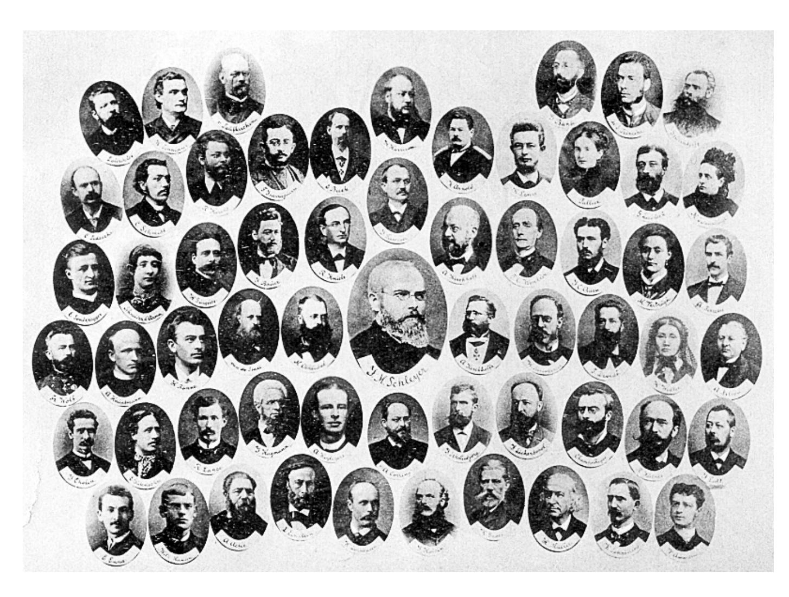

Fig. 1. The International Volap¨uk Academy (Kadem bev¨unetik volap¨uka), 1887. Schleyer is in the center, and Kerckhoffs' celebrated photograph is immediately at Schleyer's right.

{3}------------------------------------------------

As the Oberl¨andisches Volksblatt archives can only be consulted physically at three libraries[10](#page-3-0) we opted to ascend Kerckhoffs' life from his birth information.

### 3 Early years and family

The Nuth community sent all information about Kerckhoffs' birth: on January 19, 1835, Jean Guillaume Auguste Victor Alexandre Fran¸cois Hubert Kerckhoffs was born. He was the son of the then mayor of Nuth: Jean Guillaume Kerckhoffs (1798–1883), a canton justice[11,](#page-3-1)[12](#page-3-2) in Oirsbeek[13](#page-3-3). His mother was Jea(n[14](#page-3-4))nette Elisabeth Lintjens (1814–1887). According to a testimony made in 1860 by the then mayor, Auguste Kerckhoffs de/van Nieuwenhof[15](#page-3-5) (by his full name) belonged to one of the oldest and most honorable families in the country whose family tree is given in fig. [2.](#page-4-0)

In modern Dutch, kerkhof means "churchyard" or "church cemetery", it is a relatively common toponymic name in Dutch and Low Saxon. According to a contemporary family genealogist (who happened to be Auguste's uncle) [\[Ker39\]](#page-34-1), the Kerckhoffs family is originally issued from Franconian nobility, near the Fichtelberg mountain, and gets its name from a castle built there known initially as the Atrium, and later as the Kirchof (around the 9th century), which eventually became Kerckhoff (around the 17th century). Given that the family name comes from the German "Kirchhoffs" it may also have an alternative meaning. Churches ("Kirchen") often leased out their farms ("Bauernh¨ofe") to small farmers. It is possible that the name was given to one of the tenants of a "Kirch hof", resulting in Kirchhoffs which in turn became Kerckhoffs. This leasing practice was common in Germany and in the Netherlands.

The oldest known document on an ancestor of Auguste is a letter issued to Johannes (Jan) Kirchoffs authorizing him to hold meetings for the local magistrate of Herzogenrath. The document is dated 1679 and is in the central archive of Maastricht table [3.](#page-9-0)

The authors were very fortunate to get from Leo Kerckhoffs the results of his very extensive genealogical investigations conducted over a period of 15 years.

10 Staatsarchiv des Kantons Bern, BN Berne - Biblioth`eque nationale suisse, and Kantonsbibliothek Vadiana.

11 Clerk registrar and peace justice (juge de paix ) [\[21,](#page-33-1) p. 145].

12 He later applied for a position in the House of Representatives (Tweede Kamer der Staten-Generaal). Algemeen Handelsblad, August 13, 1850, p. 2.

13 Today Oirsbeek is a village of about 4,000 inhabitants.

14 As published in [\[Car98\]](#page-33-0) and as appears in the documentation from Nuth the name is Jeannette (with two "n"), however in necrologies and genealogies it appears as Jeanette, with only one "n". Assuming the name is of French origin (see below) it is likely that the French orthography (with two "n") was is use during her life.

15 Nieuwenhof, in Nuth, was a lease farm popularly known as Nuinhof founded in 1380 (fiefdom of the house of Valkenburg, later of the chapter of the Cathedral of Our Lady of Aachen). We discovered that Auguste's birth house in Nieuwenhof was demolished in 1934 during the construction of the A76 motorway.

{4}------------------------------------------------

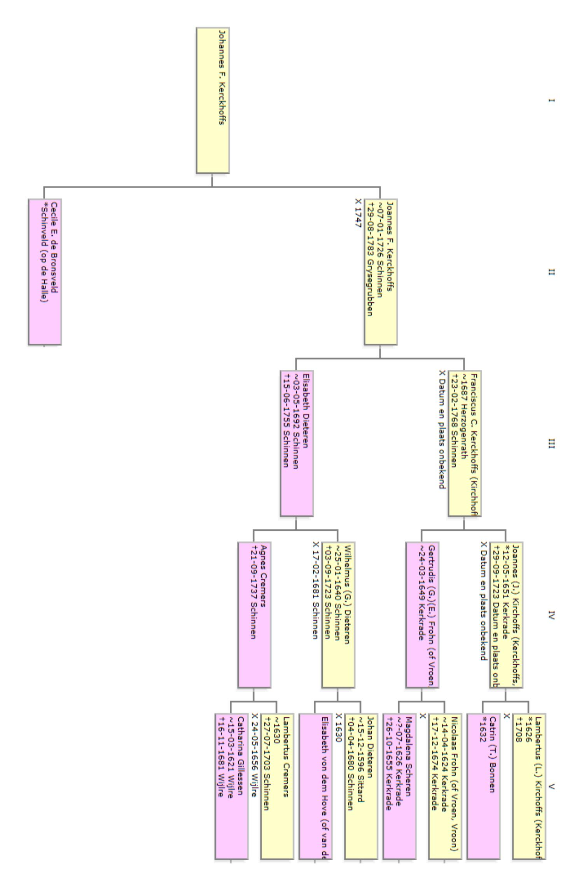

Fig. 2. Family tree starting from the grandfather of Auguste, Johannes Franciscus Kerckhoffs, brother of Joseph-Romain-Louis and father of Jean Guillaume. 5

{5}------------------------------------------------

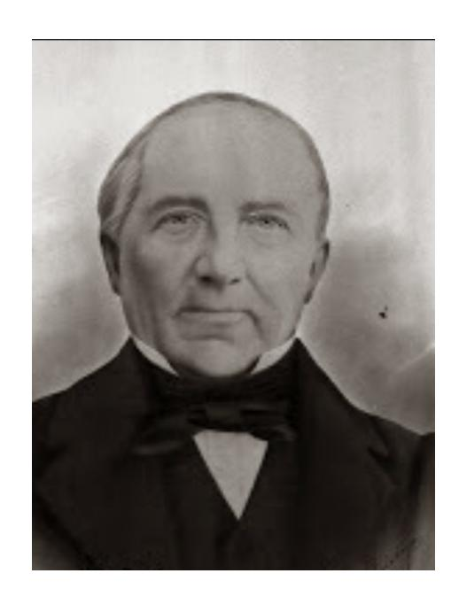

Fig. 3. Jean Guillaume Kerckhoffs (1798–1883), clerk registrar and peace justice (juge de paix ) [\[21,](#page-33-1) p. 145], mayor of Nuth, Auguste's father.

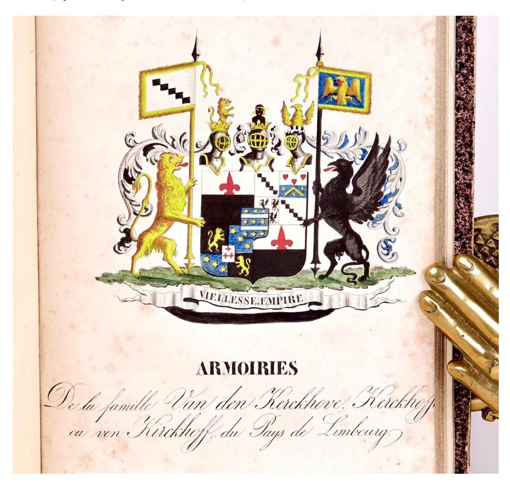

Fig. 4. Heraldic achievement of the Kerckhoffs family circa 1830 [\[Ker39\]](#page-34-1).

{6}------------------------------------------------

Leo Kerckhoffs' findings shade light on the genesis of [\[Ker39\]](#page-34-1). It appears that [\[Ker39\]](#page-34-1) is an ad hoc genealogy commissioned by Joseph Romain Louis Kerckhoffs, the brother of Auguste's grandfather.

Joseph Romain Louis Kerckhoffs (Nuth, 3 September, 1789 - Mechelen, 10 October, 1867) was a famous physician in Napol´eon's army who was later (1815) appointed the chief physician of Dutch military hospitals. He was knighted by Leopold I, the first king of the Belgians, for his services and assumed the name van den Kerckhove van de Varent.

To back his social ascension, Joseph Romain Louis needed an enhanced genealogical background. He thus commissioned Ter Borcht with that task. Borcht was a "creative" man, notoriously known for piecing-up family backgrounds for the new nobility in Belgium. [\[Ker39\]](#page-34-1) is accurate back up to Franciscus Coenrardus Kerckhoffs (besides the non-existing titles and heraldic achievements). However, Borcht mentions Balthasar Kerckhoffs as Franciscus Coenrardus' father, which is incorrect according to Dutch archives. Indeed, in the CBG Centrum voor familiegeschiedenis there is an extra sheet in this document stating it as a fiction. In other words, the van den Kerckhove family was an extinct noble branch from which Auguste did not descend.

Why did Joseph Romain Louis Kerckhoffs feel that his genealogy needed an enhancement? This story is, in itself, very interesting!

The Buckriders (Bokkenrijders), are a part of Belgian and Dutch popular folklore. A Bokkenrijder is a ghost who rides flying goats provided by demons. During the 1700s, criminal groups started calling their gangs Bokkenrijders to terrorize the inhabitants of Limburg. Raids would typically stretch from what is currently Belgium up to Germany. The Bokkenrijders usually attacked unprotected villages and farmers. Because of their claimed links to demoniac powers, captured Bokkenrijders faced a terrible end including torture and execution. The brothers Joseph and Balthasar Kerckhoffs (Kirchhoffs) were two famous Bokkenrijder leaders. Both were captured, judged and executed after being horribly tortured. Because the brother of Franciscus Coenrardus Kerckhoffs (the great-great-grandfather of Auguste) was the father of Joseph and Balthasar this was a disgrace for the family name.

It is intriguing to note that social conventions grandly change over time. The Bokkerijders legend has been filmed in a Dutch television series and is even an attraction in a major theme park. Nowadays, descending in a direct line from a Bokkenrijder is very posh and admission to the Dutch association of descendants of the Bokkenrijders is subject to detailed genealogical scrutiny!

Nonetheless, the Kerckhoffs were always high up in society counting doctors, mayors etc. For instance, Franciscus was a very good friend of the Lord of Hoensbroek, who allowed him to hunt wolves in his domain for sport.

It is interesting to note that all the given names Jean, Guillaume, Auguste, Victor, Alexandre, Fran¸cois and Hubert are typically French. Indeed 1815 saw the creation of the United Netherlands in the aftermath of the Napoleonic Wars: the north spoke chiefly Dutch, while the south was divided between French-speaking Walloons and Dutch-speaking Flemings, with most upper and middle classes

{7}------------------------------------------------

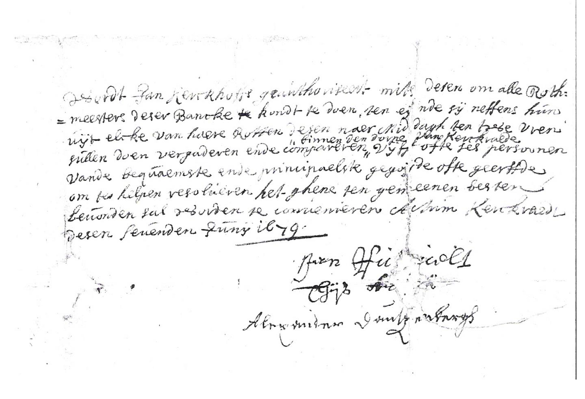

Fig. 5. The oldest family document (1679) relating to Auguste's direct lineage.

families in the south speaking French — Limburg sits near the boundary between these two parts (which correspond today to the Netherlands proper and Belgium). Furthermore, a large proportion of the Kerckhoffs family in Limburg had worked at some level for the French local government when under Napoleonic rule [\[Ker39\]](#page-34-1), and according to a contemporary biographic sketch the family was francophile[16](#page-7-0) .

Auguste had four siblings, who all seemed to have survived childhood and marry (see table [1\)](#page-8-0). It does not seem that there were further descendants from this branch of the Kerckhoffs family.

16 "Mr. Kerckhoffs est n´e en 1835 `a Ma¨estricht d'une ancienne et noble famille du Limbourg hollandais, dans laquelle le culte de la France ´etait de tradition. Lui-mˆeme a fait de la France son pays d'adoption, il s'est fait naturaliser, et a ´epous´e la petitefille du g´en´eral Santerre.". Figaro, October 10, 1888, Biblioth`eque nationale de France, Collection num´erique : Arts de la marionnette.

{8}------------------------------------------------

Table 1. Auguste Kerckhoffs' siblings

| Sibling                                                  | Birth | Married | Death |
|----------------------------------------------------------|-------|---------|-------|
| Ernestine Anne Marie Jeanette Hubertine 9                | ?     |         | ?     |
| $+$ Tijdlijn van Arnold Joseph Theodoor Eijmael $\sigma$ | 1837  | 1861    | 1907  |
| Descendant:                                              |       |         |       |
| Maria-Theodora Eijmael ♀                                 | 1862  | -       | ?     |
| $\overline{\text{Victor }_{\circlearrowleft}}$           | 1838  |         | 1908  |
| + Elisa Voncken ♀                                        | ?     | ?       | ?     |
| Descendants:                                             |       |         |       |
| Maria-José ♀                                             | 1884  | _       | 1976  |
| Pauline ♀                                                | 1885  | _       | 1978  |
| Alphons $\sigma$                                         | 1888  | -       |       |
|                                                          | ?     |         | 2     |
| $+$ Maria-Elisabeth van der Blom $\circ$                 | 8     | ?       | ?     |
| Descendants:                                             |       |         |       |
| Eugenius 7                                               | 1900  | _       | ?     |
| Jean-Louis ♂                                             | ?     |         | ?     |
| + Maria-Anna Kerckhoffs ♀                                | ?     | ?       | ?     |

### 4 Young adult life

Auguste studied at the boarding school in Rolduc17 (Kerkrade, Netherlands) from October 1847 to August 1852. The final results of his studies were also found in Kerkrade's municipal archives (see table 2).

Table 2. Auguste's final study results.

| 1847-1848 | 6 th grade | 2 nd prize | 2 nd best student          |
|-----------|-----------------------|-----------------------|---------------------------------------|
| 1848-1849 | 5 th grade | 3 rd prize | 4 th best student          |
| 1849-1850 | 4 th grade | 2 nd prize | of mathematics, history and geography |
| 1850-1851 | $3^{\rm rd}$ grade    | 2 nd prize | 2 nd best student          |
| 1851-1852 | Poetry class          |                       |                                       |

At the end of the  $3^{\rm rd}$  class he passed an examination, and of 14 students, he ranked  $4^{\rm th}$ . Such was also his the result of the  $3^{\rm rd}$  class; however, documents mention that he was retrograded to the  $7^{\rm th}$  place given his behavior, which was not entirely satisfactory.

&lt;sup>17 In 1815, when the Kingdom of the Netherlands was formed, the border was drawn through the ancient land of Rode, separating the abbey from the castle. The eastern part (including the castle) became Prussian *Herzogenrath* (which gave the French *Rode-le-duc*, and in short, *Rolduc*), while the western part (including the abbey) became part of the Dutch municipality of Kerkrade. The school stands in the latter.

{9}------------------------------------------------

What happened next to Kerckhoffs? We find this out in a manuscript that Kerckhoffs sent to the University of T¨ubingen (Germany) in 1876. In this document written in Latin, he summarizes the main events of his life and career. Here is the translation:

"I, Auguste Kerckhoffs, a fine arts graduate, master of natural sciences, knight of the Portuguese military order of Christ, a member of a large number of scientific societies, was born in a city of the Batavas [Netherlands] named Nuth, on the 31st of January 1835, as the son of John William and Joanna, born Lintjens, happily still alive. I profess the Catholic faith. The rudiments of sciences I learned in the gymnasium at Maastricht-upon-Meuse [Trajectum ad Mosam], I studied philosophy for two years in Li`ege, in Louvain I studied natural sciences during the same period of time. Having achieved "cum laude" in the public examination, for three years I served as a professor in a city of the Batavians called Eindhoven; then I left my fatherland and went to the French city of Meaux, finally to Melun, where for ten years I taught the subjects suited to my studies. Finally, motivated by my love of German philology, I traveled to Bonn, where for two and a half years I zealously devoted most of my time to the studying of the language of the Old Germans. Presently, I cannot resist my longing to return home, or that of my wife, who loves her fatherland, France, and furthermore my public office and my conscience forbid me to refuse my forces to the State."

Thanks to this vital document, and also thanks to the French national archives of the Ministry of National Education, Higher Education and Research, and of the Ministry of the Interior, we can follow his student and professional path (see table [3\)](#page-9-0).

Table 3. A partial overview of Auguste's career.

| 1852–1853  | Gymnasium                           | Maastricht | NL |
|------------|-------------------------------------|------------|----|
| 1853–1855  | Philosophy student                  | Li`ege     | BE |
| 1855–1857  | Natural Sciences student            | Louvain    | BE |
| 1857–1860  | Teacher                             | Eindhoven  | NL |
| 1860–1863  | Teacher at a private institution    | Meaux      | FR |
| 1863–1873  | English and German teacher          | Melun      | FR |
| 1873–1876  | German literature student           | Bonn18     | DE |
| 1876–1880  | Tutor, S˜ao Mamede family           | Bonn       | DE |
| 1881–1891  | German professor at HEC             | Paris      | FR |
| 1892–1885? | German professor                    | Lorient    | FR |
| 1885?–1900 | Unknown                             | Unknown    |    |
| 1900–1901  | German teacher19,20, see table 4 | Paris      | FR |
| 1902–1903  | Unknown (probably retired)          | Unknown    |    |

{10}------------------------------------------------

Fig. 6. Kerckhoffs' Latin vita.

{11}------------------------------------------------

Table 4. Timetable for the language lectures [\[CD00,](#page-33-2) p. 483].

| Teacher          | Language | Intro. | Adv. | Address                       |
|------------------|----------|--------|------|-------------------------------|
| M. Guadalupe     | Spanish  | 6      | 6    | ´ Ecole communale des rues |
| M. R. Hayes      | English  | 6      | 6    | B´eranger, Blanche            |
| M. A. Kerckhoffs | German   | 6      | 6    | et Saint-Benoˆıt              |
| M. Abou'l Nash   | Arabic   | 2      | 2    | Mairie du IVe                 |
| M. A. Kahan      | Russian  | 1      | 1    | arrondissement                |

During this period, significant events occurred in Kerckhoffs' life. After his appointment to the college in Melun, which took place on October 19, 1863, he became acquainted with a French woman named Marie Emilie Th´evenin, and ´ married her on July 5, 1864 in Paris, 10th arrondissement (see fig. [11\)](#page-15-0) [21,](#page-11-2)[22,](#page-11-3)[23](#page-11-4) .

On May 13[24](#page-11-5), 1865, at 1AM in her home at 23, quai d'Almont in Melun, Marie Emilie, then 29, gave birth to a daughter, named Wilhelmine Emilie Pauline — ´ who would usually go by Pauline.

The images in fig. [10](#page-14-0) are the most ancient photographs that we could find showing the quai d'Almont. The Kerckhoffs' house (now at the crossroad of Rue des trois moulins and Boulevard de l'Almont) was replaced by a modern construction, and the red dot in fig. [9](#page-13-0) shows its conjectured position.

### 5 French nationality and Portuguese knighthood

On March 16, 1870 Auguste Kerckhoffs writes to the Minister of Justice asking for permission to establish his residency in France, in accordance with Article

18 During his studies, Kerckhoffs stays at the Belle Vue Hotel fig. [8.](#page-13-1) In all evidence, Kerckhoffs had comfortable financial means.

19 Soci´et´e commerciale pour l'´etude des langues ´etrang`eres. Bulletin de la Chambre de commerce de Paris - 1900/10/20 (N40) and 1901/11/30 (N48).

20 These lectures were given for free [\[CD00,](#page-33-2) p. 482].

21 Marie Emilie's parents were Nicolas Jean Baptiste Th´evenin (bailiff, born 1801) ´ and Emilie Delphine Santerre (born March 26, 1811, in Nanteuil-le-Haudouin). Her ´ maternal grandfather is the famous General Antoine Joseph Santerre (16 March 1752 – 6 February 1809). Marie Emilie was born at Coulommiers on February 13 ´ th, 1835.

22 In this document we also learn that her father is deceased, at an unspecified date.

23 We also learn that Marie Emilie Th´evenin lives as 118 rue du Faubourg Saint-Denis ´ in Paris. A few years earlier, the Lacroix guesthouse was active at this address [\[Tei02,](#page-34-2) p. 186]. It is possible that Marie and her mother took over this activity. The building still stands today.

24 In [\[Car98\]](#page-33-0) the date given was the 11th; but as the birth registry shows, the correct date is the 13th (see fig. [13\)](#page-17-0).

{12}------------------------------------------------

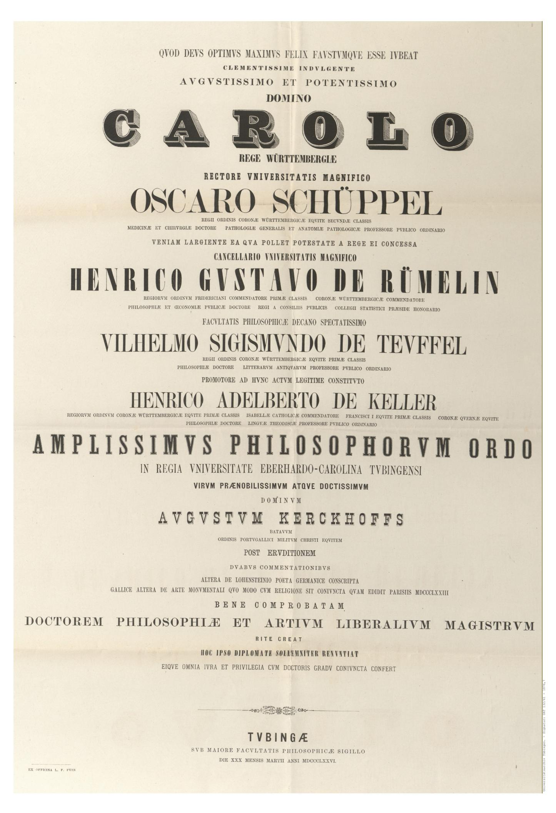

Fig. 7. Kerckhoffs' doctoral diploma.

{13}------------------------------------------------

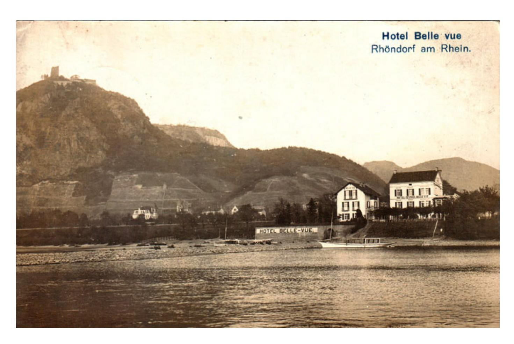

Fig. 8. The Belle Vue Hotel on the banks of the Rhine in Rh¨ondorf.

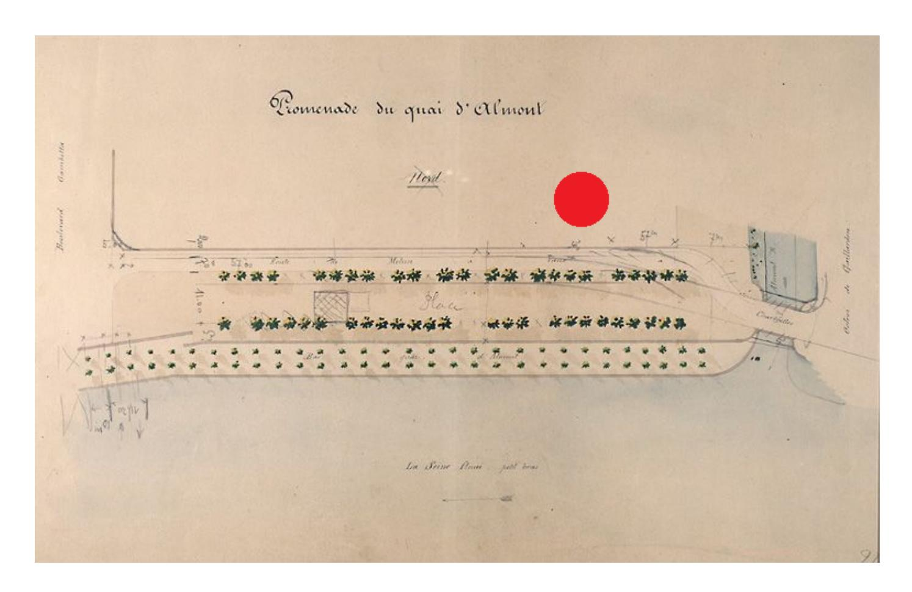

Fig. 9. The approximate position of Kerckhoffs' house at Melun.

{14}------------------------------------------------

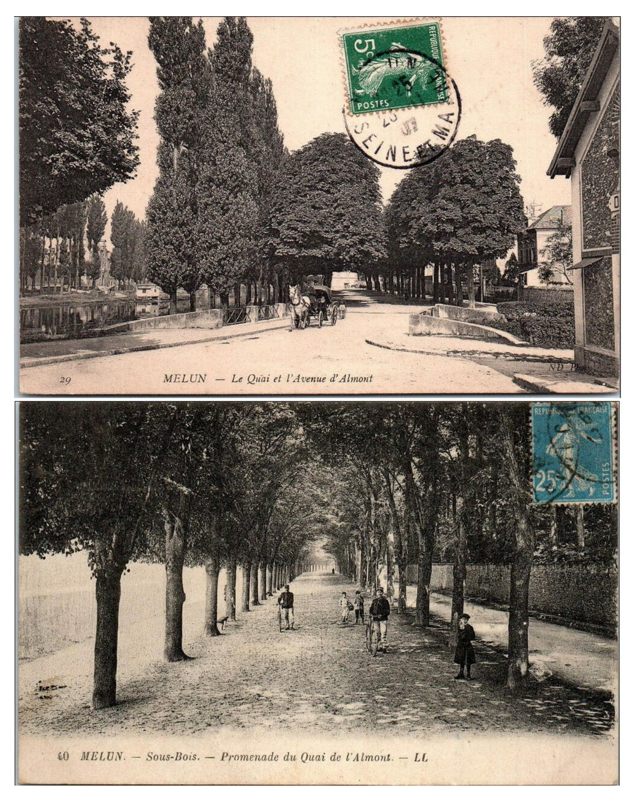

Fig. 10. Quai de l'Almont at Melun.

{15}------------------------------------------------

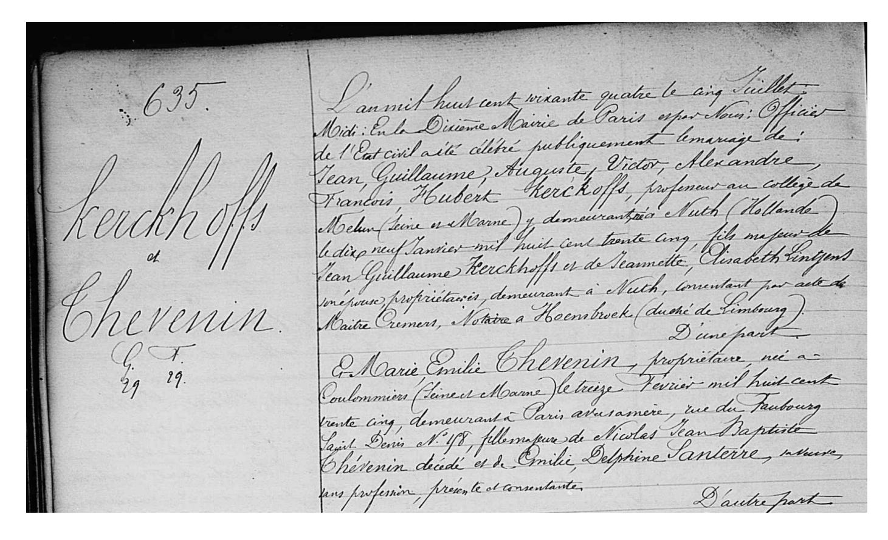

Fig. 11. Act of marriage between Auguste Kerckhoffs and Marie Emilie Th´evenin, Paris ´ Archives.

13 of the Napoleonic Code[25](#page-15-1). This permit is the first step to receiving French citizenship. The prefect[26](#page-15-2) after an inquiry into morality concludes:

"Mr. Kerckhoffs, a foreign language teacher at Melun's Colleague, has always been regarded as an intelligent and learned teacher. In 1867 the departmental council allowed him to open a free English language course in Melun, which takes place each winter successfully. Mr Kerckhoffs is one of the main founders of the "Soci´et´e d'encouragement `a l'instruction" established in Melun. In this society, he holds the post of secretarylibrarian, and performs it with great diligence and selflessness."

On May 23, 1870, Kerckhoffs receives the official letter allowing him to establish his residency in France. Now he has to wait three years to apply for French citizenship. Therefore, on August 29, 1870, he again writes to the Minister of Justice to inform his services that it has been three years and that he can now claim French citizenship. Again the prefect investigates and concludes as follows:

"Mr Kerckhoffs, 38, has lived in France for about 12 years. Married to a French woman, Mr. Kerckhoffs, who has one child, is in a rather easy

25 "L'´etranger qui aura ´et´e admis par le Gouvernement `a ´etablir son domicile en France, y jouira de tous les droits civils, tant qu'il continuera d'y r´esider": A foreigner allowed by the Government to establish their stead in France will fully enjoy all civic rights, for as long as they reside there.

26 In France, the prefect (French: pr´efet) is the state's representative in a department or region.

{16}------------------------------------------------

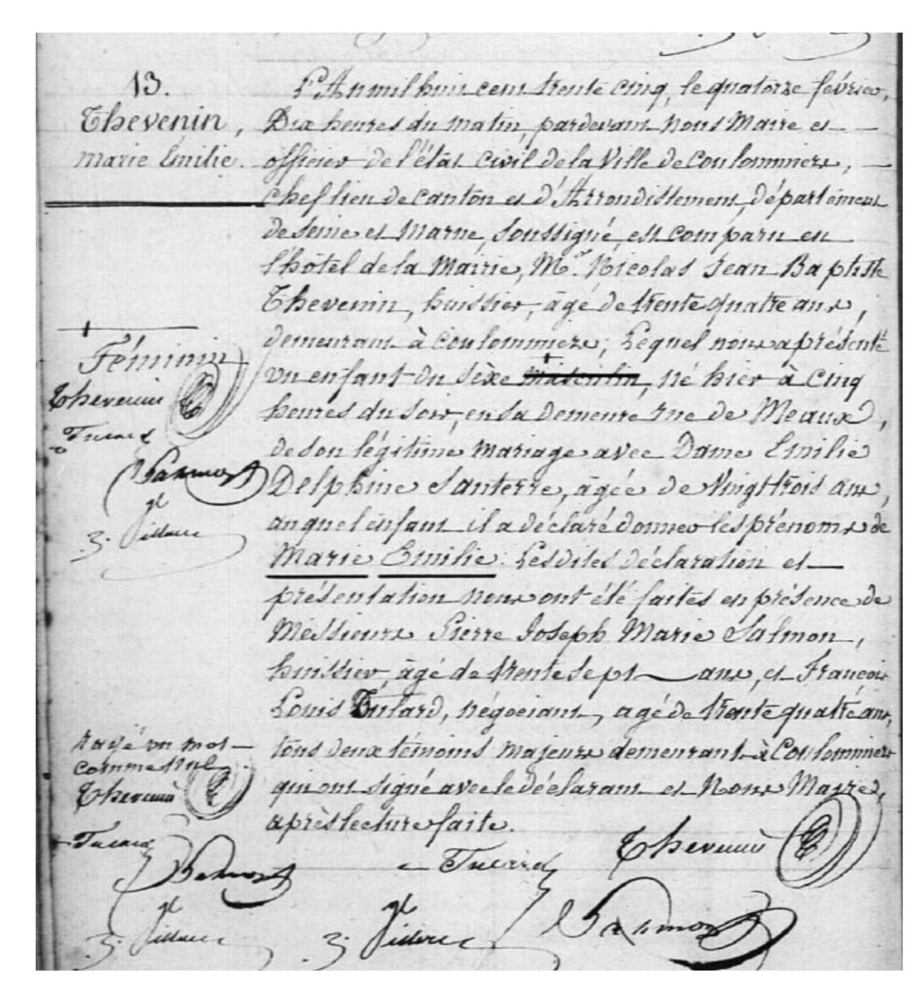

Fig. 12. Birth certificate of Marie Emilie Th´evenin, February 13, 1835, Coulommiers ´ Archives.

{17}------------------------------------------------

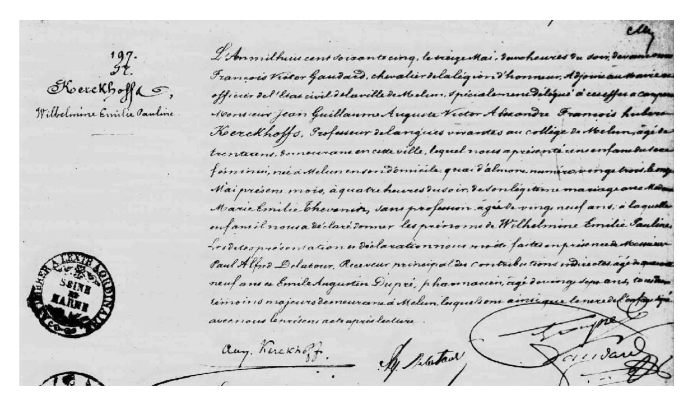

Fig. 13. Birth certificate of Wilhelmine Emilie Pauline Kerckhoffs, May 13, 1885, Melun ´ Archives.

situation in terms of wealth: his estate is estimated at 25,000 francs[27](#page-17-1), his annual salary is about 2000 francs, and it is estimated that the foreign guests he lodges and teaches in his home can provide him with a rent of 3 to 4000 francs.

Mr. Kerckhoffs, whose behavior and morals have always been blameless, has not been working, at his request, since March 5, 1873. He prepares to leave for Germany to attend the courses of the University of Bonn, to pass the exam for aggregation in modern languages, and, in his words, to be able to take up a position as a German language teacher at a French military college.

The project of a trip to Germany gave rise to some words, which had already circulated regarding the German invasion; it was alleged that he had relations with the enemy. The precise information I have gathered about this has shown me that these claims are unfounded.

As soon as Mr. Kerckhoffs learned in 1870 of the organisation of the national guard, he registered himself, and during the whole invasion, he was one of the most constant men in the service of the Prison, as certified by the national guard."

Following this report of praise, the State Council at its meeting of November 19, 1873, decrees that "Mr. Kerckhoffs is entitled to the rights of a French citizen."

27 A French franc from 1870 corresponds to around 0.29 grams of gold or e14 of 2020. The median daily salary in France around 1880 was 3.34 francs, yielding an annual salary of 1220 francs, before tax.

{18}------------------------------------------------

The official decree will, in fact be published December 11, 1873. Meanwhile, in 1871, Kerckhoffs successfully passed the competitive examinations assessing his ability to teach German [\[Del71,](#page-33-3) p. 121].

Following this success, Kerckhoffs, according to his plans, settles himself and the family in Bonn. There he lives by the position of tutor of the young count Rodrigo Pereira Fel´ıcio de S˜ao Mamede, who will become the secretary of the King of Portugal. Thanks to this service, Kerckhoffs will be awarded the rank of Knight[28](#page-18-0) of the Portuguese Order of Christ.

### 6 Doctorate and later professional life

From 1873 to 1876 he attended courses at the universities of Bonn and T¨ubingen, and successfully obtained (mention bene comprobatam) the German title of Doctor of Philosophy and Master of Liberal Arts (philosophiae doctor & artium liberorum magister ). His doctoral dissertation [\[Ker77\]](#page-31-1) [29](#page-18-1), under the supervision of Prof. Adelbert von Keller[30](#page-18-2), deals with the tragedies of Daniel Casper von Lohenstein (1635–1683), in particular Cleopatra, in his words the "first technically correct German tragedy" [\[Ker77,](#page-31-1) p. 7].

In 1876 he and the family return to France and find a residence in Neuillysur-Seine (near Paris) 11, boulevard du Chˆateau.

From 1876 to 1880 he tutored the two other sons of the S˜ao Mamede family, and received the title of Commander of the Order of Christ[31,](#page-18-3)[32](#page-18-4). Through a later publication[33](#page-18-5), we learn that Kerckhoffs was also awarded the officer's insignia of the Portuguese Military Order of Saint James of the Sword[34](#page-18-6) .

In 1880 he applied to the prestigious military Ecole Polytechnique for the ´ chair of German. However, due to a mistake about his nationality, he was not accepted. A press article[35](#page-18-7) from that year informs us Kerckhoffs and Victor Hugo knew each other and exchanged letters around 1860. This is independently confirmed by Kerckhoffs himself [\[Ker85a\]](#page-33-4).

28 Venloosch weekblad, August 8, 1874, p. 1.

29 Dedicated to Alexander Reifferscheid (1847–1909), who was possibly Kerckhoffs' informal mentor in Bonn.

30 July 5, 1812 (Pleidelsheim) – March 13, 1883 (T¨ubingen). A famous Romanist and Germanist.

31 This information was confirmed by the Instituto dos Arquivos nacionais, Lisbon, by letter dated April 2, 1998, to Reinhard Haupenthal. Accordingly, Kerckhoffs was registered on August 11, 1879 (Minist´erio do Reino, liv. 917, fl. 136v-137).

32 It is also independently mentioned in a contemporary newspaper:Tilburgsche courant, October 9, 1879, p. 2.

33 Recueil des actes administratifs de la Pr´efecture du d´epartement de la Seine - 1897/12 (Ann´ee 54, N°12), November 19, 1897.

34 Despite the adjective "militar " in the order's full name (Antiga, Nobil´ıssima e Esclarecida Ordem Militar de Sant'Iago da Espada, do M´erito Cient´ıfico, Liter´ario e Art´ıstico), this decoration is awarded for scientific, literary and artistic merits.

35 Le XIXe si`ecle (Paris. 1871) - July 24, 1888 (Ann´ee 18, N°6035)

{19}------------------------------------------------

In 1881, on November 1, he obtained the chair of German at the Commercial Institute (HEC) in Paris[36](#page-19-0). He also teaches at the municipal school of Aragon in Paris.

In 1883, he lives in Paris, 62, rue Claude Bernard (Figure [14\)](#page-19-1). This is known by a letter Kerckhoffs sent to the Director of Elementary Education to be awarded the German language chair in one of the two Normal Schools that prepare teachers. That request was in vain.

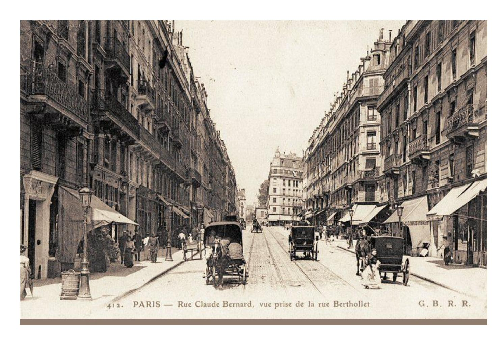

Fig. 14. The building in which Auguste lived at 62 rue Claude Bernard (on the left).

In the same year, he receives the title of Academic Officer[37](#page-19-2) from the Ministry of Public Education, thanks to his services to the above mentioned Society for the encouragement of ´education. He also leaves the Arago school[38](#page-19-3) .

36 By the time HEC was located at 108, boulevard Malesherbes, Paris. As of today, the school relocated to Jouy-en-Josas.

37 A distinction given to "les plus recommandables par leurs talents et services", the most recommendable by their talents and services. The current equivalent is the rank of Officier de l'ordre des Palmes acad´emiques.

38 Bulletin municipal officiel de la ville de Paris, Septempber 13, 1883, Ville de Paris / Biblioth`eque de l'Hˆotel de Ville (BHdV), 2012-46765.

{20}------------------------------------------------

On July 19, 1883, Kerckhoffs becomes a member of the Parisian Anthropological Society[39,](#page-20-0)[40](#page-20-1) [\[85\]](#page-34-3), a topic about which he had already much to say [\[Ker73\]](#page-32-0); [\[Ker84a\]](#page-32-1); [\[Ker84c\]](#page-33-5) [41,](#page-20-2)[42](#page-20-3) .

### 7 Kerckhoffs and Volap¨uk

However, when did Auguste Kerckhoffs know and learn Volap¨uk? In his work Jenotem Valemapuka Volap¨uk [43](#page-20-4) Johann Schmidt (1895–1977) states that "among the many new members, Professor Auguste Kerckhoffs joined Volap¨uk in 1884". Indeed, a significant event took place in 1884: the first Volap¨uk congress in the city of Friedrichshafen (Germany), from August 25 to 28. Around 150 Volap¨ukists gathered in the casino lounge, which gave the impetus necessary for the invented language to become known throughout Europe, and later around the world.

In 1885 Kerckhoffs founded the French association for the dissemination of Volap¨uk[44,](#page-20-5)[45](#page-20-6). It gathered, among others, more than 50 very famous people from the scientific community, state officials, artists, journalists and industrialists. Famous newspapers such as Le Temps, Le Petit Journal and La Libert´e have highly recommended Volap¨uk with numerous articles. Thus, it achieved great success in France. From France, Volap¨uk was introduced in Spain, Portugal and Belgium. The same year, in July, Kerckhoffs published a manifesto Volap¨uk ou langue commerciale universelle[46](#page-20-7), in which he mentions his desire to teach the language in official capacity, as soon as October 1886, and has already given his first lecture at HEC[47](#page-20-8) and in foreign newspapers[48](#page-20-9). He seems to have given 19 lectures[49](#page-20-10) .

In the year 1886 the Volap¨uk literature doubled, large dictionaries and textbooks were published. That year, Kerckhoffs publishes the 144 page Cours complet

39 Under his full family name, Kerckhoffs von Nieuwenhof.

40 About the short-lived history of this learned society, created by the famous physician Paul Broca, see [\[War04\]](#page-35-0).

41 The memoir on monumental art is the result of Kerckhoffs' conference for his admission into the Soci´et´e d'arch´eologie du d´epartement de Seine et Marne [\[69,](#page-33-6) pp. 53–54].

42 Kerckhoffs would subsequently present his work on languages to this same Society.

43 History of the universal language Volap¨uk, published in 1964.

44 In French, Association fran¸caise pour la propagation du Volap¨uk.

45 It seems that Kerckhoffs already had an interest in universal languages; that same year he published along with Boleslas Gajewski a detailed analysis of the Solr´esol musical language [\[KG85\]](#page-32-2) invented by Fran¸cois Sudre [\[Sud66\]](#page-34-4).

46 Le G´enie civil, July 11, 1885.

47 Le Livre: revue mensuelle, 1885, pp. 432–433. The 1885 date is independently confirmed by in a long editorial in La France M´edicale, January 3, 1890, pp.257–262.

48 "Kerckhoffs held a course on Volap¨uk in 1885 at the Ecole des hautes ´etudes comer- ´ ciales in Paris, to which so many participants registered that nineteen parallel courses were hardly enough to take them all in. The director of the world-famous Magasin du Printemps, Mr. Jaluzot, studied Volap¨uk with 121 of his employees (...)", Wiener Allgemeine Zeitung, April 4, 1887, p. 5.

49 Die PreĄe, April 23, 1887, p. 2.

{21}------------------------------------------------

de Volap¨uk [50](#page-21-0) [\[Ker86a\]](#page-32-3). He also publishes the 16-page booklet Premiers ´el´ements de Volap¨uk [51](#page-21-1) [\[Ker86c\]](#page-32-4) and the 32-page booklet Grammaire abr´eg´ee de Volap¨uk [52](#page-21-2) [\[Ker86b\]](#page-32-5). In 1887, he published the thick Dictionnaire Volap¨uk–Fran¸cais et Fran¸cais–Volap¨uk [\[Ker87a\]](#page-32-6). This Volap¨uk–French and French–Volap¨uk dictionary with a pre-completed grammar of the language encompasses 319 pages of half-octave format, and was printed at the Le Soudier bookstore, Paris. It is noteworthy that the same year he wrote the 16-page booklet Examen critique de quelques simplifications qu'il y a lieu d'introduire dans le Volap¨uk [53](#page-21-3) [\[Ker87b\]](#page-32-7). With this brochure, it is already clear that Kerckhoffs did not completely like Schleyer's Volap¨uk. By opposition to Schleyer, Kerckhoffs viewed Volap¨uk as a simple and practical commerce-oriented language rather than an aesthetic, intellectual construction. During that same year, Volap¨uk was highly criticized by cosmoglotticians such as Peter Steiner, author of Pasilingua[54](#page-21-4), Felix Lenz, supporter of Pasilingua, and Pastor Joseph Stempfl, author of Myrana[55](#page-21-5) .

Despite these first public criticisms, 1887 was the year of the second Volap¨uk Congress, which took place in Munich, from July 6 to 9. The attendance was large, and for the first time, this congress welcomed a truly international visitorship. A few minor improvements were decided, and for the continued development of Volap¨uk the Volap¨uk Academy was founded, which consisted of 29 members from 15 different nations. Kerckhoffs was elected president of this academy[56](#page-21-6). In that year 1887, two steamboats on the Rhine river were named "Volap¨uk". In the French newspaper Le Temps on January 16, 1887, one could read about Volap¨uk:

"Si jamais langue universelle a quelque chance de s'imposer au monde commercial, c'est assur´ement celle-l`a" (Should one language impose itself throughout the commercial world, it is assuredly this one)

In 1888 Volap¨uk continued its dissemination. In Bavaria, however, the first crisis occurred, precisely in the country where the Volap¨uk movement was most successful. During the Bavaria election to decide a local Volap¨uk leader, there was a dispute between the Munich club and the Nuremberg club. The result of this dispute was the dissolution of the Nuremberg club, which under the leadership of Leopold Einstein (1833–1890) joined Esperanto[57](#page-21-7). Thus was born the first Esperanto club. The conflicts between Schleyer and Kerckhoffs began. It can be said that 1888 was Volap¨uk's heyday, as after that year Volap¨uk's fame began

50 A complete course on Volap¨uk.

51 First elements of Volap¨uk.

52 Abridged grammar of Volap¨uk.

53 Critical examination of some simplifications that need to be introduced in Volap¨uk.

54 Pasilingua was a short-lived constructed language, created in 1885, and presented by its creator as an alternative to Volap¨uk.

55 Another short-lived artificial language, based on Latin, and designed in 1889 by the pastor Stempfl (1830–1896).

56 His daughter Pauline was also named as a certified Volap¨uk teacher [\[Spi88\]](#page-34-5), see also La Lanterne, August 24, 1889.

57 Esperanto is an artificial language created by created by Polish ophthalmologist Ludwik Zamenhof in 1887.

{22}------------------------------------------------

to decline[58](#page-22-0). Later, in 1889, it was decided that one scholar would be elected per million inhabitants in each country concerned (information found in the Volap¨ukan gazette, in its July 1889 issue).

During the Exposition universelle, Kerckhoffs offered free lectures on Volap¨uk, on behalf of the Paris Anthropological Society: "Volap¨uk grammar in 12 languages" [\[89,](#page-34-6) p. 357].

In 1889 the dispute between Schleyer and Kerckhoffs became increasingly public. This dispute first appeared in the journal Volap¨ukabled zenodik [59](#page-22-1), then in several other Volap¨uk newspapers. The Volap¨uk movement was divided into two battling groups: the conservatives with Schleyer and the reformers with Kerckhoffs. Both parties elected members to the Volap¨uk Academy. Kerckhoffs decided to convene a third Volap¨uk congress in Paris so that academics could freely decide on the needed reforms. Immediately Schleyer declared the next congress and its future decisions invalid[60](#page-22-2). In addition, he invited the academics of his own party to a meeting in Allmendingen on May 12, 1889. This meeting sanctioned only a small portion of the changes that were asked by Kerckhoffs' supporters, and which were already used in the works of Kerckhoffs, Pflaumer, Walther, and in the newspaper Le Volap¨uk. The third Volap¨uk congress, therefore, took place against Schleyer's will from the 19th to the 21st of August, 1889, in Paris. As during the second congress in Munich, Volap¨uk was again used as a the communication language of the congress in Paris. Contrary to the general expectations of the Volap¨ukists, this congress did not support the fundamental reforms. Charles E. Sprague (1842–1912), an American Volap¨ukist and diplomat, succeeded in preventing the hostility of the two leaders of the Volap¨uk movement from harming it. However, the demand for reforms grew stronger.

In 1890 Kerckhoffs launched a short-lived Volap¨uk periodical in Paris (only 2 issues)[61](#page-22-3). That same year, the Academy under the direction of Kerckhoffs published a "regular grammar" (Glamat nomik) [\[Ker90a\]](#page-32-8) that infuriated the conservatives. In response, Schleyer founded an entirely new Academy that held its first meeting in Constance on August 18, 1890. In March 1891 Schleyer removed Kerckhoffs from the list of Volap¨ukists. This radical action caused a huge disservice to the popularity of Volap¨uk in France, Belgium, and then in Spain and Portugal. Although Volap¨uk had now thrived in America and non-European countries, it was never able to recover from the loss of European supporters. By the end of 1891, Volap¨uk had lost three-quarters of its members. Finally, in 1892, Kerckhoffs left both his Academy and Volap¨uk. On December 14, 1892, the Academy appointed as new director Woldemar Rosenberger (1848–1918) from St. Petersburg. This new director developed Volap¨uk into a new language called Neutral (later Idiom Neutral), which was officially disclosed in 1902. According

58 According to [\[Ken12,](#page-34-7) p. 126] by the time of the third congress, Volap¨uk had over a million speakers, including the waiters.

59 Central Volap¨uk newspaper.

60 Articles written by Schleyer in Volap¨ukabled No. 105 and 114.

61 Cabaled kadema. Timpen¨ad pep¨ubul fa dilekef kadema.

{23}------------------------------------------------

to Kahn [\[Kah96\]](#page-34-0), of the 210,000 names once registered in the Volap¨uk List of Correspondents, only 159 remained in 1902.

Johann Schmidt reports that Kerckhoffs developed a draft reform, according to which the personal pronoun was no longer affixed to the verb, the infinitive had -ar as an ending, the volitive -a, and the nominative plural -os. However, Kerckhoffs, having left the Volap¨uk movement, did not publish this draft. A few examples:

| Volap¨uk            | Kerckhoffs' draft  | English                |
|---------------------|--------------------|------------------------|
| Selob bukis         | Os asel bukis      | I sell books           |
| Buks paselons       | Bukos pasel        | The books are for sale |
| Gebol¨os Volap¨uki! | Agebat Volap¨uki!  | Use Volap¨uk!          |
| Vilob pen¨om ole    | Ob avil apenar ole | I want to write to you |

### 8 Kerckhoffs' final years at HEC

Now let's get back to Kerckhoffs' professional career. From November 1, 1881, until July 14, 1891, he teaches at the HEC School in Paris. During that time, Kerckhoffs offers Volap¨uk lectures to some students[62](#page-23-0) (from 1885 to 1889, see above and appendix [C.3\)](#page-45-0). On February 21, 1886, in the grand amphith´eˆatre, Kerckhoffs would give his inaugural lecture (appendix [B\)](#page-39-0) in front of a crowded audience, concluding with these words[63](#page-23-1):

Spelob das no outouvobs fikulis gletik in p¨uk nulik keli astudobs adelo (I hope that you will find no great difficulty in learning the new language that we studied today)

It seems that HEC became wary of these unconventional lectures or even opposed to them and enquired as to the context and Kerckhoffs' motivations (see appendix [C.3\)](#page-45-0). It is also during these years that Kerckhoffs gives public lectures in cryptography[64,](#page-23-2)[65](#page-23-3), at the Ecole des Chartes ´ [66](#page-23-4) .

In July 1891 the Minister of Commerce commissioned him to run the German language questionnaires on the final examination of HEC. At the end of the examination, Kerckhoffs openly criticizes the manner in which the ministry examiner performed his task. Having said too much, and having already acquired

62 An announcement of the first lectures at HEC, presented as a command from HEC, can be found in Le Midi, January 28, 1885, and February 24, 1886, Nˆımes.

63 Le Correspondant: revue mensuelle, livraison du 10 mars 1886, volume 142/106, Paris. The quote is given p. 919.

64 Le Journal, May 15, 1899, mentions a public lecture in cryptography by Kerckhoffs.

65 l'Univers, May 7, 1900, p. 3. He seems to have given weekly public lectures, every Monday at 4PM, over the span of two years at the Ecole des Chartes, Sorbonne. ´ Biblioth`eque nationale de France, d´epartement Droit, ´economie, politique, JOD-220.

66 Unfortunately, the Archives of the Ecole des Chartes for this period are extremely ´ fragmentary, and no mention of Kerckhoffs' lectures could be found there.

{24}------------------------------------------------

a certain reputation, Kerckhoffs had to leave the prestigious institution (see appendix [C.2\)](#page-44-0).

From his residence, 17 rue Vauquelin in Paris, he sends letters to obtain employment in a provincial high school. During the academic year 1891–1892 he teaches German in the high school of Mont-de-Marsan (Aquitaine, France). On September 16, 1892, he was appointed at Lorient's (Brittany, France) high school. In March 1893, the headmaster wrote about him:

"Mr. Kerckhoffs has only been with us for a few months. He is a very distinguished man and a conscientious teacher. His lectures seem clear and methodical. Progress in his classes is satisfactory. They will be even better when this teacher, who is not young anymore, gains some experience with children."

In March 1895, Lorient's new high school headmaster describes him as follows:

"Mr. Kerckhoffs is a conscientious teacher. His lectures are methodical and conducted according to instructions. Mr. Kerckhoffs is still facing some disciplinary difficulties, especially in the somewhat overcrowded classrooms, and his authority over the students is lacking."

### 9 Ravachol's Cauldron

It is in this period of his life that occurs the peculiar incident known as "Ravachol's Cauldron". This bizarre episode deserves a few lines. On March 21, 1894, the Minister of Internal Affairs writes to his colleague the Minister of Public Education to request a report on Kerckhoffs, who a few days ago sent an anonymous post package to the residence of one of his colleagues, Mr. Dejean. The package was opened by Mrs. Dejean, who almost fainted when a small lead pot exploded. Mr. Dejean felt it necessary to immediately alert Lorient's police, but then quickly retracted his complaint, when he learned that the author of that evil act was his colleague Kerckhoffs. The Minister continues his letters thus:

"You will think, as do I, that if such buffoonery can be forgiven when committed by very young children, it is difficult to tolerate that of a man such as Mr. Kerckhoffs (59 years old) who occupies a position at Lorient's High School. As a result, I would be grateful that you consider how appropriate it would be to reprimand Mr. Kerckhoffs."

The Minister of Public Education immediately asked the Rector for a report. On March 29, 1894, Kerckhoffs wrote a letter clarifying his actions. Here are excerpts from his letter:

"Some colleagues and I had planned to have dinner at a restaurant. I also invited my colleague Dejean, with whom I have the friendliest relations. As the organizers wanted me to find something to entertain them at the dessert, I offered to send them before the dinner, through the restaurant's

{25}------------------------------------------------

waiter, to our colleague Dejean whom we dearly love and look up to, a toy sold in the streets of Paris under the name Ravachol's cauldron[67](#page-25-0). My colleagues approved, hoping, like me, that Mr. Dejean would not spoil its origin, and bring it to our evening meeting, thus providing us with a new motive for innocent pursuits. I was anxious to bring the toy to our colleague's house before dinner. This toy, which has the same modest dimensions as a ten-cent coin, was accompanied by three matches and a small card containing those words:

"Constipation. . . my dear fellow, I send you a little device for. . . (you understand me). Urge you to use it and be careful"

Some of the addresses of anarchists cut out of newspaper were glued below. The whole thing was packed in a small box of business cards, with the following address: to Mr. Dejean, a council magistrate from Lorient. You understand, Mr. Rector, none of us four (teachers of philosophy, history, mathematics, etc.) imagined that our joke would be considered so serious. I was so sure that when the police commissioner came to ask me a few days later, as the author of the joke, I did not hesitate to accept the unique and full responsibility. However, I considered it necessary in writing to secure my excuses to Mrs Dejean, for my willful rudeness against the wife of one of my colleagues."

The matter ends April 2, 1894, by a letter from the Rector to the Ministry of Public Instruction. In this letter, the Rector acknowledges that the deception was very trivial, but he also adds that Mrs Dejean was naive enough to let herself be deceived. He argues that any idea of punishment against Mr. Kerckhoffs must be removed. Finally, he asks the commissioner to be blamed for his excessive diligence or recklessness, which made him confuse a dangerous toy with a destructive object.

### 10 Kerckhoffs' personal and political ideas

Very little is known about Kerckhoffs' political ideas. We were able to find a few clues that shed some light on the person beyond the famous cryptographic principle.

In 1886, Kerckhoffs gave a short interview[68,](#page-25-1)[69](#page-25-2) were he gave a hint at his personal opinions on the matter of women's civil and political rights:

67 Fran¸cois Claudius Ko¨enigstein (1859–1892), known as Ravachol (after his mother's name), was a famous French anarchist terrorist. In 1892 he attempted to blow a police station in Clichy, using a cauldron filled with dynamite and shrapnel. The operation failed but was heavily commented upon by the press, turning Ravachol into a tragic revolutionary icon. Several bombings and trials later, Ravachol was sentenced to death and executed in July 1892.

68 Andr´e Maguet, La Citoyenne, no. 110, July 1, 1886, M. Kerckchoffs et le mouvement f´eministe. Biblioth`eque Marguerite Durand (ref 050 CIT Bul), Paris.

69 The journalist also gives a quick physical description of Kerckhoffs, who is blonde, of medium height, with sideburns and a noticeable foreign accent.

{26}------------------------------------------------

"J'en suis grand partisan, me dit-il, et je trouve louables les efforts incessants de l'honorable Melle Hubertine Auclert, pour la revendication des droits de son sexe. Le suffrage des femmes arrivera bientˆot en France, il existe d´ej`a en Am´erique et en Angleterre, o`u les femmes ont le vote municipal; c'est une question de temps."

(I am a great supporter of them, he said, and I find laudable the unrelenting efforts by the reputable Ms. Hubertine Auclert who demands the rights her gender deserves. Vote for women will soon arrive in France, it is already in America and England, where women have the municipal vote; it is only a matter of time.)

In 1898, the Affaire Dreyfus takes a bitter turn as it becomes to transpire that Dreyfus was wrongfully convicted — Emile Zola publishes ´ J'accuse. . . , revealing the wide-ranging cover-up and the bullying underwent by Colonel Picquart who first identified cracks in the official narrative. Eventually Dreyfus would be trialed again, reluctantly, and both him and Picquart were actively attacked in the press. Along with many, Kerckhoffs signed a petition[70](#page-26-0):

"Les soussign´es protestent au nom du droit m´econnu contre les poursuites et les pers´ecutions qui frappent le colonel Picquart, l'h´ero¨ıque artisan de la r´evision, `a l'heure o`u celle-ci s'accomplit"

(The undersigned protest, in the name of forgotten laws against pursuits and persecutions targeting colonel Picquart, the heroic craftsman who instilled a re-trial, at the moment the latter takes place.)

Amongst other criticism, Einstein and Kerckhoffs accused Schleyer of antisemitism [\[Ein89,](#page-34-8) p. 21]. Kerckhoffs:

"Il nous semble mˆeme qu'un mot comme yudanæn, faire le juif, devrait ˆetre banni de la langue; nous n'avons pas `a faire de l'antis´emitisme!". (It even seems to us that a word such as yudanæn, act as a Jew [the German derogatory Judeln], should be banished from the language; we do not want to have anything to do with antisemitism!)

Kerckhoffs is described by his headmaster as "very distinguished" and "conscientious". Those elements, plus Kerckhoffs' self-definition as a patriot, a devoted civil servant and a Catholic, allow the reader to draw the general contours of Kerckhoffs' personal convictions.

### 11 Kerckhoffs' death and burial

Kerckhoffs came back to Paris in 1900 [\[00\]](#page-35-1). This is how Kerckhoffs' professional life documents end. We already knew he died in Switzerland, but we still didn't know where he was buried. In May 1986, Reinhard Haupenthal finally received an answer from Interlaken regarding his question about a newspaper report of the 1903 tragic accident. The local newspaper Oberl¨andisches Volksblatt in its August 11 issue reports:

70 Le Radical, November 29, 1898, p. 1–2, La Protestation contre la violation du droit.

{27}------------------------------------------------

"D¨arligen: last Sunday evening at 7 and a half, 68-year-old Professor Auguste Kerckhoffs from Paris, staying since July 24th as a hospice guest at the du Lac guesthouse, was fatally wounded by a train. The victim wanted to say hello from the station to acquaintances in the coming train when death seized him. The heavily mutilated body was transported to the Interlaken morgue, from where it will be transported to Paris today."

Obituaries were published in several newspapers (L'Est r´epublicain August 27, 1903, Le Passe-Temps & Le Parterre R´eunis, 3rd year - #37 September 13, 1903, Gil Blas (Paris. 1879) - September 5, 1903, La R´epublique fran¸caise of August 26, 1903 etc).

So there was no longer any doubt as to where his burial was. In addition, we already knew from the Directorate General of Taxation that his address was then: 6 rue Rataud, Paris, 5th arrondissement[71](#page-27-0). After several letters sent to the Paris authorities, at the end of six months, the long-awaited burial testimony was issued with the following mention:

"The city of Paris, Paris South Cemetery [best known as Cimeti`ere du Montparnasse]. 3, boulevard Edouard Quinet, 75014, Paris, ´

The undersigned cemetery witness testifies that the body of Mr Kerckhoffs Auguste who died in D¨arligen (Switzerland) was buried on August 16, 1903, and located in a perpetual concession, at the burial situated division 27th, 3rd line north, number 43 east. The concession is number 141, and was acquired on August 15, 1903, by Mrs. Kerckhoffs under the name Th´evenin Marie Emilie. This burial site still exists." ´

A visit to the cemetery made it possible to retrieve the old grave and photograph it. On a very modest tombstone, neither cared for or decorated with flowers, one can read the following inscription:

| 16 The 1905  | Kenna, Edward Budley    | Transh ! | à Chicago | 27 anil 1907 |
|--------------|-------------------------|----------|-----------|--------------|
| 16 Cout 1903 | Rerckhoff, Ouguste      | 27       | 3 26 43 8 | 141 P 1903   |
| 26 Juin 1906 | Ketten, ni Berne, Marie | 291/03   | 170 6 96  | 11/F 1906    |

Fig. 15. Burial certificate for Auguste Kerckchoffs (num´ero d'orde 646). Archives of the Montparnasse Cemetery.[73](#page-27-1)

71 This can be confirmed, independently, by the 1903 List of Members published by the Paris Anthropological Society [\[03\]](#page-35-2), which also lists him as a "former University professor". Quite amazingly, Kerckhoffs' last flat is just 10 meters away from the ENS ´ office currently used by Jacques Stern and the authors of this article!

73 It seems that Pauline's burial does not appear in the Montparnasse Cemetery archives in the period 1890–1894, nor in the city-wide funeral registers. It is possible that

{28}------------------------------------------------

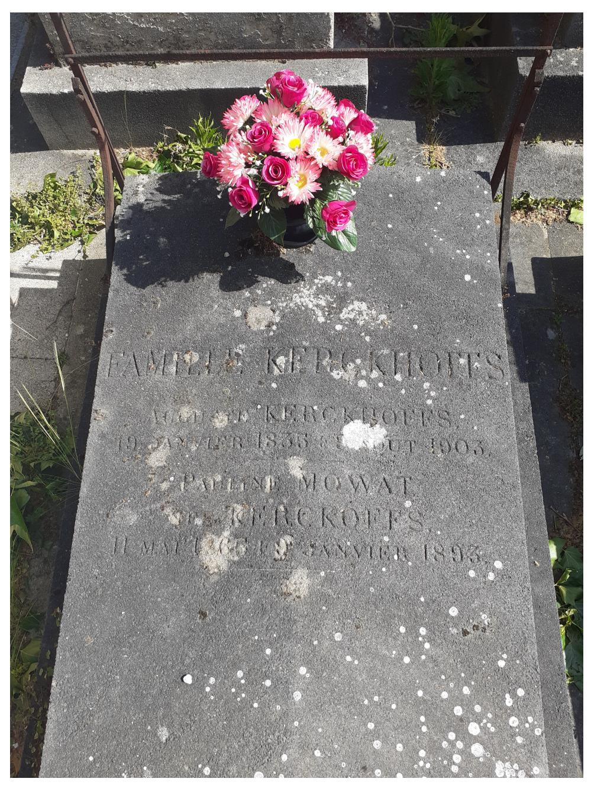

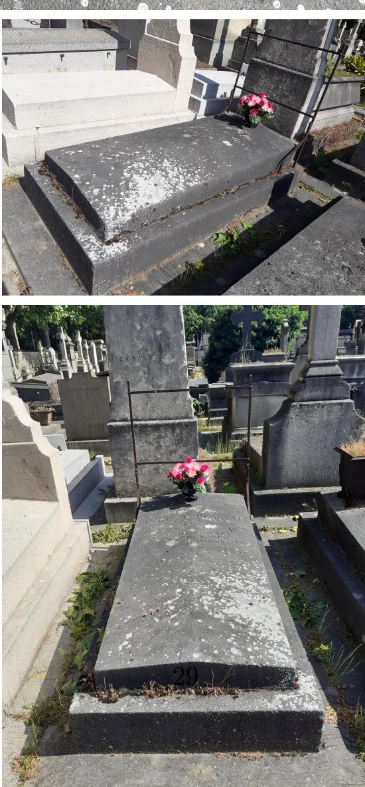

Fig. 16. Kerckhoff's grave as of May 12, 2020. We flourished the grave on behalf of the international cryptographic community.

{29}------------------------------------------------

### FAMILLE KERCKHOFFS AUGUSTE KERCKHOFFS 19 JANVIER 1835 + 9 AOUT 1903

### — PAULINE MOWAT NEE KERCKHOFFS ´ 11 MAI 1865 + 9 JANVIER 1893

Thus we discover that Pauline, Kerckhoffs' only daughter, died aged 27, 10 years before her father[74,](#page-29-0)[75,](#page-29-1)[76](#page-29-2). Pauline's death occurred one month after Kerckhoffs' resignation from the Volap¨uk Academy.

Kerckhoffs' widow Marie Emilie would, by law, be entrusted with her late ´ husband's literary works (loi du 14 juillet 1866). It is possible that they were bound by a marital contract[77](#page-29-3) specifying how their estate would be redistributed.

Whilst in perpetual concession, French law authorizes the recycling of an abandoned grave[80](#page-29-4) unless the grave is of historical significance. We hence officially attracted the authorities' attention to the importance of Auguste Kerckchoffs' grave to avoid its future recycling[81](#page-29-5) .

.

she died of cholera during the 1892–1893 epidemic that hit Paris, in which case she would not have been buried to avoid contagion. Alternatively, she may have been initially buried in a different cemetery.

74 Death certificate 81, January 9th, 1893. Archives de Paris, 5e arrondissement.

75 According to her death certificate, Pauline was living at 10, rue des Feuillantines, in Paris (Kerckhoffs was still living rue Vauquelin). She had married Alfred Armand Mowat (born 1865), and they were living with Alfred's father, England-born Robert Knight Mowat (born 1823), Legion d'Honneur recipient in 1876 (Archives nationales, notice L1960060; site de Paris), numismatist and archaeologist (RN 1913, p. 117 ; Gazette numismatique fran¸caise 1905, p. 113). Robert Mowat was a French citizen since 1841 (Archives nationales, BB/11/451, Dossier n°4691 X3). Alfred's elder sisters Eug´enie Lucie (born 1863) and Elizabeth Matie Edm´ee (born 1862) also lived there. ´

76 Following the trail from the death certificate, we learn that Pauline and Alfred married April 10, 1890 (Marriage certificate 249, Archives de Paris, 5e arrondissement). Amongst the witnesses was Edouard Jourdan, Director of HEC. ´

77 According to [\[Bar07\]](#page-33-7), around 40% of married couples at that time did. This proportion drops to about 15% around Paris.

79 Hans Henrik Reusch (5 September 1852 – 27 October 1922), Norwegian geologist and geomorphologist, collector of an estimated 12,000 volumes. Rather ironically, Reusch also died in a train-related accident.

80 Articles L. 2223-17, L. 2223-18 et R. 2223-12 `a R.2223-23 du code g´en´eral des collectivit´es territoriales (CGCT).

81 It is possible that someone still maintains the grave because the 1997 photography [\[Car98\]](#page-33-0) shows a white rectangular flower pot that has disappeared since.

{30}------------------------------------------------

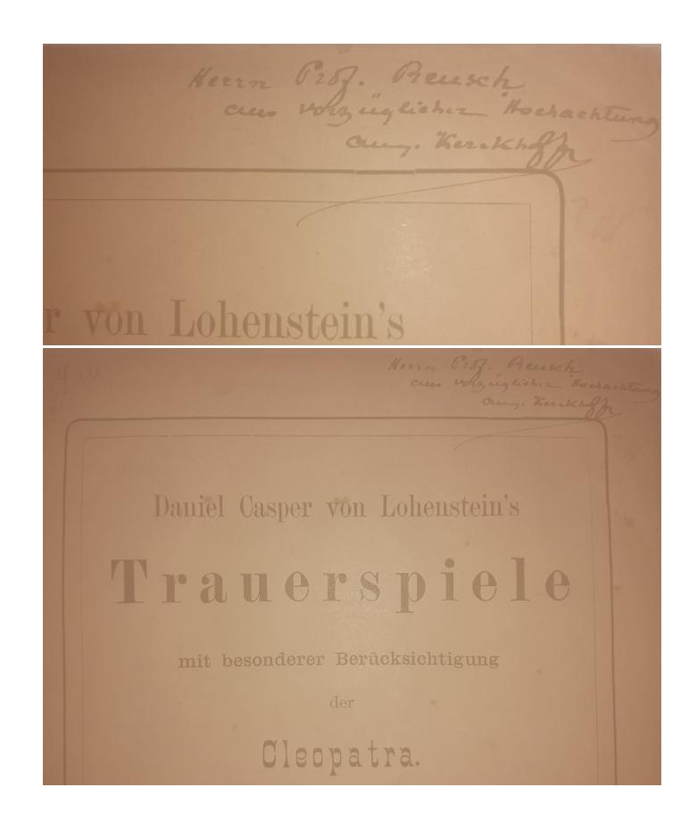

Fig. 17. Herrn Prof. Reusch. Aus vorz¨uglicher Hochachtung. (To Prof. Reusch[79](#page-29-6) with my highest consideration.) Aug. Kerckhoffs.

### 12 Further Research

Unfortunately, attempts to clarify Kerckhoffs' wife's life after 1903 have not yet succeeded. She may hold the key to finding out what became of Kerckhoffs' Volap¨uk archives and library. Kerckhoff's daughter Pauline had a successor[82](#page-30-0) but we could not identify who the recipient was[83](#page-30-1) .

The authors noted that a number of old papers bearing Kerckhoffs' autograph[84](#page-30-2) and handwriting (e.g. see fig. [17\)](#page-30-3) surfaced in the bibliophile market during the late 1990s. This may indicate that Kerckhoffs' personal archives and books were dispersed before or around the year 2000. The fact that it did not happen before seems to indicate that these, if authentic, were in the possession of a single individual until then.

During our investigation, a few aspects of Kerckhoffs' life remained unclear, in particular, his connections with the military (see appendix [A\)](#page-35-3). Perhaps foreign archives, or future evidence, could dispel any doubts or lift the veil on these missing parts.

82 Fichiers des successions d´eclar´ees, DQ7 13090, Paris Archives.

83 The notary act is only identified as: 4 e – 7 juillet 1893 – 646.

84 It is possible that an autograph, attributed to Kerckhoffs and registered as Ms 1988 / 337-338 in the Manuscrits de l'Institut de France, Collection Pallier-Laurent, gives interesting additional clues. Unfortunately we could not verify its contents.

{31}------------------------------------------------

Appendix [D](#page-46-0) lists still unexploited sources that the authors identified during this research.

Hence there remains work for further research.

### Kerckhoffs' bibliography

We refer the reader [\[Car98\]](#page-33-0) for a list of translations of Kerckhoffs' works in other languages, and a selection of relevant secondary literature.

### General works

- [Ker80] Auguste Kerckhoffs. Nouvelle m´ethode pour apprendre facilement les d´eclinaisons allemandes. Paris: Hachette, circa 1880. 10 pp.
- [Ker52a] Auguste Kerckhoffs. "An essay on Milton's Paradise Lost". In: Nederlandsch Tijdschrift voor de praktische beoefening van de Fransche, de Engelsche en de Hoogduitsche Taal (1852). Mentioned in the Opregte Haarlemsche Courant, July 9, 1859, p. 4.
- [Ker52b] Auguste Kerckhoffs. "Une ´etude ´etymologique". In: Nederlandsch Tijdschrift voor de praktische beoefening van de Fransche, de Engelsche en de Hoogduitsche Taal (1852). Mentioned in the Opregte Haarlemsche Courant, July 9, 1859, p. 4.
- [Ker59] Auguste Kerckhoffs. Een word over de vlaemsche taal. Olbrechts: Mechelen, 1859. 16 pp.
- [Ker68] Auguste Kerckhoffs. Petite grammaire anglaise, contenant un vocabulaire, des dialogues et des exercices de conversation sur des sujets litt´eraires. Paris: Hachette, 1868. 135 pp.
- [Ker77] Auguste Kerckhoffs. Daniel Casper von Lohenstein's Trauerspiele mit besonderer Ber¨ucksichtigung der Cleopatra. Beitrag zur Geschichte des Dramas im XVII. Jahrhundert. Padeborn, 1877. 110 pp.
- [Ker83] Auguste Kerckhoffs. La cryptographie militaire, ou les chiffres usit´es en temps de guerre, avec un nouveau proc´ed´e de d´echiffrement applicable aux syst`emes `a double clef. Paris: Librairie militaire de L. Baudoin, 1883. 64 pp. See also Journal des sciences militaires, Paris. N.S. Tome 9. 59.
- [Ker92] Auguste Kerckhoffs. R´esum´e de grammaire allemande, suivi d'un vocabulaire de 1600 principaux mots de la langue. Paris: Welter, 1892. 96 pp.
- [Ker98] Auguste Kerckhoffs. Valkenbergs helden onder 't Fransche schrikbewind in Limburg: drama in 2 bedrijven. Valkenburg Crolla, 1898. Note: there is a possibility that this piece was written by a namesake, but for lack of evidence to that probability we consider it as deserving investigation.

{32}------------------------------------------------

### Constructed languages

- [Ker85b] Auguste Kerckhoffs. "La nouvelle langue universelle". In: L'Homme: Journal illustré des sciences anthropologiques 2 (July 1885), pp. 428–431. Muséum national d'histoire naturelle (Paris), Bibliothèque centrale, Fonds Stresser-Péan, Pr SP 83.
- [Ker86a] Auguste Kerckhoffs. Cours complet de Volapük contenant des thèmes et des versions avec corrigés et un vocabulaire de 2500 mots. 1st to 8th edition. Paris: Le Soudier, 1886. 144 pp. This course was adapted in several national languages (cf. Caraco for a list of secondary authors).
- [Ker86b] Auguste Kerckhoffs. Grammaire abrégée de volapük, précédée d'un exposé de la question. Paris: H. Le Soudier, 1886.
- [Ker86c] Auguste Kerckhoffs. Premiers éléments de Volapük: Langue commerciale internationale. Paris: H. Le Soudier, 1886.
- [Ker87a] Auguste Kerckhoffs. Dictionnaire volapük-français et français-volapük, précédé d'une grammaire complète de la langue. Paris: H. Le Soudier, 1887.
- [Ker87b] Auguste Kerckhoffs. Examen critique de quelques simplifications qu'il y a lieu d'introduire dans le volapük. Paris: H. Le Soudier, 1887. 16 pp. Excerpt from the journal Le Volapük.
- [Ker87c] Auguste Kerckhoffs. Yelabuk pedipedelas: Ninöl: 1ido Nemis e ladetis Volapükatidelas e Spodalas; 2ido Lisedi lefulnik bukas, penotas, gasedas e. l. pepüböl al pakön u födön Volapüki. Timapenäda Le Volapük, 1887. The title means, in Volapük, "Graduates Yearbook".
- [Ker90a] Auguste Kerckhoffs. Glamat nomik u Noms stabik volapüka pelensumöl fa Kadem, dil balid. Paris: Klüböp Kadema, 1890. 15 pp.
- [Ker90b] Auguste Kerckhoffs. "Timpenäd pepübul fa dilekef kadema". In: Calabled kadema (1890), pp. 1–2.
- [KG85] Auguste Kerckhoffs and Boleslas Gajewski. "Examen critique de la langue universelle de Sudre". In: Bulletins de la Société d'anthropologie (1885).

### Anthropology and Archaeology

- [Atg+01] Émile Atgier, Léon Azoulay, Auguste Kerckhoffs, and Charles Lejeune. "Discussions sur la circoncision, suite à une intervention de P. Garnault". In: Bulletins et Mémoires de la Société d'Anthropologie de Paris. Société d'Anthropologie de Paris, 1901. Muséum national d'histoire naturelle (Paris), SAP 69.
- [Ker73] Auguste Kerckhoffs. "L'Art monumental dans ses rapports avec les idées religieuses". In: Bulletin de la Société d'archéologie du département de Seine-et-Marne (1873). Extrait du bulletin de la société d'archéologie du département de Seine-et-Marne.
- [Ker84a] Auguste Kerckhoffs. "La mâchoire de Maestricht : et les récentes découvertes". In: Bulletins de la Société d'anthropologie de Paris III, Série 7 (1884), pp. 324–330.

{33}------------------------------------------------

- [Ker84b] Auguste Kerckhoffs. "La Station pr´ehistorique de Maestricht". In: Bulletins de la Soci´et´e d'Anthropologie (1884).
- [Ker84c] Auguste Kerckhoffs. "Le crˆane n´eanderthalo¨ıde de Podbaba". In: Bulletins de la Soci´et´e d'anthropologie (1884). Also published in L'Homme: Journal illustr´e des sciences anthropologiques, 1884, p. 528.
- [Ker85a] Auguste Kerckhoffs. "Dysgraphie". In: Bulletins et M´emoires de la Soci´et´e d'Anthropologie de Paris. Vol. 8. Soci´et´e d'Anthropologie de Paris, 1885. Mentioned in L'Homme : Journal illustr´e des sciences anthropologiques, 2 ; 20, 1885 , p. 640.
- [Ker85c] Auguste Kerckhoffs. "Le m´emoire de Michel Br´eal sur le classement des mots dans notre esprit". In: L'Homme: Journal illustr´e des sciences anthropologiques 2 (Feb. 1885), pp. 81–81. Mus´eum national d'histoire naturelle (Paris), Biblioth`eque centrale, Fonds Stresser-P´ean, Pr SP 83.

### References

- [Alb91] Pierre Albert. "La presse et le t´el´egraphe ´electrique au XIX`eme si`ecle". In: Droit de l'informatique 2 (1991), pp. 20–24.
- [21] Almanach de la Province de Limbourg pour l'ann´ee 1821. Vol. 4. L. Th. Nypels, 1821.
- [Bar07] Jean-Paul Barri`ere. "Les veuves dans la ville en France au XIXe si`ecle: images, rˆoles, types sociaux". In: Annales de Bretagne et des Pays de l'Ouest (2007), pp. 169–194.
- [69] "Bulletin de la Soci´et´e d'arch´eologie, sciences, lettres et arts du d´epartement de Seine-et-Marne". In: Bulletin de la Soci´et´e d'arch´eologie du d´epartement de Seine-et-Marne (1869).
- [Car98] Jean-Claude Caraco. "Auguste Kerckhoffs (1835–1903) kaj lia rolo en la Volap¨uk-movado". In: Menade bal p¨uki bal. Festschrift zum 50. Geburtstag von Reinhard Haupenthal. Festlibro por la 50a naskiˆgo de Reinhard Haupenthal, 1995-02-17. Ed. by Henri Vatr´e and Reinhard Haupenthal. Saarbr¨ucken: Editions Iltis, 1998, pp. 391–404. ´
- [Cha85] Christophe Charle. "Michael B. Palmer, Des petits journaux aux grandes agences. Naissance du journalisme moderne, Paris, Aubier, "Historique", 1983, 352 pages." In: Annales. Histoire, Sciences Sociales. Vol. 40. 2. Cambridge University Press. 1985, pp. 449–450.
- [Che78] Victor Cherbuliez. "Le Proc`es de Vera Zassoulitch". In: Revue des Deux Mondes 27 (1878).
- [CD00] Henry Couriot and Fernand Delmas. L'enseignement technique en France. 1900. Biblioth`eque nationale de France, d´epartement Sciences et techniques, 8-V-28746 (5).
- [Del71] Jules Delalain. Recueil des lois et actes de l'instruction publique: instruction sup´erieure, instruction secondaire, instruction primaire. Paris: Jules Delalain et fils, 1871.

{34}------------------------------------------------

- [Ein89] Léopold Einstein. *Un nouveau système de langue internationale :* L'Internacia du Dr Espéranto. Montluçon: Auguste Ghio, Impr. Deslinières et Cie, 1889.
- [Fré59] Pierre Frédérix. Un siècle de chasse aux nouvelles: de l'Agence d'information Havas à l'Agence France-presse (1835-1957). Flammarion, 1959.
- [Kah96] David Kahn. The Codebreakers: The comprehensive history of secret communication from ancient times to the Internet. Simon and Schuster, 1996.
- [Kas63] Friedrich W Kasiski. Die Geheimschriften und die Dechiffrirkunst:
  Mit besonderer Berücksichtigung der deutschen und der französischen
  Sprache. Berlin: E.S. Mittler und Sohn, 1863.
- [Ken12] Hubert Kennedy. Peano: Life and Works of Giuseppe Peano. Studies in the History of Modern Science. Springer Netherlands, 2012.
- [Ker39] Joseph Romain Louis de Kerckhove. Mémoire généalogique sur la branche de la très-ancienne noble famille de Van den Kerckhove, Kerckhoff, ou Von Kirckhoff, surnommée Van der Varent ou Varents, qui s'est établi dans le pays de Limbourg. Frank, 1839. The author wrote pseudonymously as P. E. de Borcht and as Viscount J. R. L. de Kerckhove.
- [Kro73] Krohn. Buchstaben-und Zahlensysteme für die Chiffrieren von Telegrammen. Berlin, 1873.
- [89] La Société, l'École et le Laboratoire d'Anthropologie de Paris à l'Exposition Universelle de 1889. Paris: Société d'Anthropologie de Paris, 1889. Bibliothèque nationale de France, département Philosophie, histoire, sciences de l'homme, 4-G-2045.
- [Lau09] Sébastien-Yves Laurent. Politiques de l'ombre: L'État et le renseignement en France. Divers Histoire. Fayard, 2009.
- [Loc12] Edmond Locard. "La cryptographie en technique policière," fre. In: (1912). DOI: 10.3406/linly.1912.12640.
- [Poi18] Jérôme Poirot. "Dictionnaire du renseignement". In: Hors collection. Paris: Éditions Perrin, 2018. Chap. Honorable correspondant, pp. 451–453.
- [Sha18] Teodor Shanin. "1881 Letters of Vera Zasulich and Karl Marx". In:  $The\ Journal\ of\ Peasant\ Studies\ 45.7\ (2018),\ pp.\ 1183–1202.\ Doi: 10.1080/03066150.2018.1536370.$
- [Spi88] Sigmund Spielmannn. Volapük-Almanach für 1888. Leipzig, Mayer, 1888.
- [Sud66] François Sudre. Langue musical universelle. Paris: G. Flaxland, 1866.
- [Tei02] Laurence du Teilhet de Lamothe. La petite brigande: Récit historique. Éditions Hérault, 2002.
- [85] "Vie de la Société d'Anthropologie de Paris". In: Bulletins et Mémoires de la Société d'Anthropologie de Paris. Vol. 8. Société d'Anthropologie de Paris, 1885.

{35}------------------------------------------------

- [00] "Vie de la Soci´et´e d'Anthropologie de Paris". In: Bulletins et M´emoires de la Soci´et´e d'Anthropologie de Paris. Vol. 8. Soci´et´e d'Anthropologie de Paris, 1900. S´eance du 5 avril 1900.
- [03] "Vie de la Soci´et´e d'Anthropologie de Paris". In: Bulletins et M´emoires de la Soci´et´e d'Anthropologie de Paris. Vol. 4. Soci´et´e d'Anthropologie de Paris, 1903.
- [War04] Jean-Claude Wartelle. "La Soci´et´e d'Anthropologie de Paris de 1859 `a 1920". In: Revue d'Histoire des Sciences Humaines 10.1 (2004), pp. 125–171.
- [Wos81] Eduard B. Fleissner von Wostrowitz. Handbuch der Kryptographie, Anleitung zum Chiffriren und Dechiffriren von Geheimschriften. Wien: L. W. Seidel & sohn, 1881.

### Acknowledgements

The authors are grateful to Leo Kerckhoffs, Natacha Laniado, Christof Paar and Peter Y.A. Ryan for their useful comments.

### A Kerckhoffs' connections with the Military

Kerckhoffs' publication of La Cryptographie militaire immediately propelled him at the forefront: he would be hailed, often along with Hippolyte D´esir´e Josse, Etienne Baz´eries and Paul Val´erio, as one of the leading cryptographers of his ´ time[85](#page-35-4) .

Cryptography at the time was considered close to linguistics, and it is not immensely surprising that Kerckhoffs, who had a keen interest in languages and in particular obscure and constructed ones (cosmoglottics), read about it. Cryptography was also well within the range of topics that would be discussed in an Anthropological Society (see, e.g., [\[Loc12\]](#page-34-9)). What is slightly more surprising, however, is that Kerckhoffs seemed familiar with the field cryptography in use at the time [\[Kah96\]](#page-34-0) (to the point of mistakenly thinking this is an old practice). Very little information of this nature would be allowed in print, so it seems that Kerckhoffs would have to learn it from an acquaintance, or even firsthand[86](#page-35-5) .

In the Netherlands where Kerckhoffs was born and remained until adulthood, conscription (dienstplicht) was made mandatory under Napoleon, and remained so until 1997. We find no mention that Kerckhoffs was conscripted, nor that he was exempted from doing so[87](#page-35-6). Nevertheless, there are several connections with the military, that may shed light on Kerckhoffs' familiarity with cryptography.

85 Amusingly, Josse himself was a fond admirer of Kerckhoffs [\[Kah96\]](#page-34-0).

86 In [\[Ker83\]](#page-31-0) he refers to three German authors, [\[Kas63\]](#page-34-10); [\[Kro73\]](#page-34-11); [\[Wos81\]](#page-35-7). Could it be that Kerckhoffs got acquainted with cryptography during his studies in Germany?

87 We do find mention that his uncle, Joseph Romain Louis Kerckhoffs de Nieuwenhof, was a French Army surgeon (Stamboeken Officieren Landmacht en koloniale troepen), who served in the 3rd corps under General Ney.

{36}------------------------------------------------

Henri Berthaut: In [\[Ker83\]](#page-31-0), Kerckhoffs mentions Henri Berthaut[88](#page-36-0) and qualifies him as "one of the most talented cryptanalysts of the Army's General Headquarters"[89](#page-36-1), citing a "well-known" prowess of the young Berthaut during the Crimean war. How did Kerckhoffs get acquainted with this fact, which allegedly happened in one of the Minister of War's most secret services at a critical time, to the point of commenting upon the relative talent of its protagonist? How did Kerckhoffs know that Berthaut specialized in cryptanalysis in the years 1880 [90](#page-36-2)?

Berthaut, who would become the GHQ's second in command and the commander of the geographic service[91,](#page-36-3)[92](#page-36-4), was the Ministry of War's son. He would later head the Commission du chiffre[93](#page-36-5). Whilst the absence of proofs is not a proof of absence, we did not find any public information through which Kerckhoffs could have possibly known of the related telegram affair[94](#page-36-6). However, he may have met or even worked with Berthaut (father) personally.

The Havas telegram? In the second part of [\[Ker83\]](#page-31-0), Kerckhoffs gives an example of a telegram on which to apply his decryption technique. The telegram is actually authentic and was sent by the Havas Agency's London station to its Cairo branch, on September 2, 1882. Contents of this telegram pertain to the (ongoing at that time) affairs concerning British military operations in late August 1882 in Egypt, something he seemed to have prior knowledge of[95](#page-36-7) despite the telegram being encrypted[96](#page-36-8); of course this may be luck[97](#page-36-9), but it remains that the encrypted telegram has not publicly circulated (except, of course, in Kerckhoffs' paper). The Havas Agency was very close to the Ministry of the Interior [\[Cha85,](#page-33-8) p. 41] and benefited in that respect from exclusive means of communication [\[Alb91,](#page-33-9) p. 101] and special funds [\[Fr´e59,](#page-34-12) pp. 26–28]. The sending and receiving of encrypted telegrams by private individuals was forbidden[98](#page-36-10); encryption for commercial exchanges was possible (see, e.g., [\[Bau02,](#page-0-0) pp. 71–73]).

88 Henri-Marie-Auguste Berthaut (1848–1937).

89 "l'un des plus habiles d´echiffreurs de l'Etat-Major ´ ", [\[Ker83,](#page-31-0) footnote 1].

90 "sp´ecialis´e dans le d´echiffrement dans les ann´ees 1880 ", op. cit.

91 Service historique de la d´efense, Archives g´en´erales, 9 Yd 484.

92 "Geographers" seems to refer to a broader class of tasks that the modern term conveys: they were in charge of "statistiques" (article 36 de l'ordonnance du 6 mai 1818, Journal officiel, 2e semestre 1818, no. 5, p. 362), a precursor of intelligence activities.

93 Service historique de la d´efense, Archives g´en´erales, dossier personnel Tout´ee, 1 K 193, letter dated May 15, 1908.

94 To this day, to the best of our knowledge, Kerckhoffs is the only public source.

95 As evidenced by his choice of "likely words", which included the name of Wolseley, and mentions of the Suez Canal and Ismailia.

96 "J'ai d´echiffr´e la d´epˆeche pr´ec´edente (...) je me demande par quelle partie du discours un t´el´egramme adress´e `a des journaux peut bien commencer " — (I have decrypted the above telegram (...) I wonder how a telegram addressed to newspapers can possibly start), [\[Ker83\]](#page-31-0).

97 Such luck is not unprecedented: Champollion had Ramses, and Grotefend had Darius.

98 Le Moniteur universel, no. 342, December 8, 1850, p. 3493.

{37}------------------------------------------------

Role in the National Guard? Is it possible that Kerckhoffs' extensive knowledge of European languages, and many connections throughout Europe, aroused the interest of more than linguists? In 1869, Maurice Weil had joined the Garde nationale mobile; Weil spoke German fluently, and was summoned by Berthaut in 187099 who at the time was commanding forces in the Seine region (he would only become Minister of War in 1876). Weil was not initially part of the military, but actively took part in the officers' meetings. He was later to receive the prestigious Légion d'honneur in 1871 and made captain (capitaine de l'armée territoriale) in 1875 seemingly out of nowhere 100. He immediately joined the ranks of the Section de statistique where he remained for five years. We mentioned that Kerckhoffs joined the National Guard in 1870. We could not find archives detailing which section precisely he was enlisted in, but it is possible that he was in Berthaut's as well. Could it be that Kerckhoffs underwent a similar path, only more discreetly 101?

**Kerckhoffs' wife:** is another potential link between him and French Army's cryptographers. Granddaughter of General Santerre, she bears the uncommon name Thévenin. Between 1891 and 1915 only 1,667 Thévenins were born, i.e. an average of  $\frac{1667}{1915-1891} \simeq 70$  births for the entire country. It is hence plausible to conjecture that Auguste's wife was related to Divisional general Louis Thévenin (1870-1948) who was a cryptographer. Louis was the son of Brigadier général Anatole Thévenin (deceased in 1908), École polytechnique graduate 102. Louis's son, also named Anatole, followed a similar path 103.

**Kerckhoffs' daughter:** a more tenuous opportunity is that Kerckhoffs' daughter, Pauline, married Alfred Mowat. Alfred's father Robert had been knighted in the Légion d'Honneur in 1876, apparently by... Berthaut.

The prefect's note. "A honorable correspondant"? During the 1870 war between France and Prussia, Kerckhoffs is shortly suspected of collaborating with Prussia — only to be immediately innocented by the prefect. This timely intervention ("The precise information I have gathered about this has shown me that these claims are unfounded") is somewhat typical of the French administrative

&lt;sup>99 Service historique de la défense, Archives générales, dossier de personnel, 7 Yd 1527.

100 It is still unclear who sponsored this unexpected and impressive promotion [Lau09, p. 415, footnote 5]

&quot;(...) dictionnaire chiffré dont on se sert aujourd'hui dans l'armée (...) tables analogues à celles qu'emploie encore aujourd'hui le ministère des affaires étrangères" – encrypted dictionary in use today in the Army (...) tables that are nowadays in use in the Ministry of Foreign Affairs [Ker83].

ARCSI, Le général de division Louis Thévenin (1870–1948) et la Commission de Cryptographie Militaire, 2000. [online version].

Amongst other cryptographic achievements, he is credited for inventing the "ABC" method for breaking German telegrams, in a letter from Painvain to the General Maurin dated 1921.

{38}------------------------------------------------

understatement alluding to either military or secret state sources. Of course, it could also be that Kerckhoffs, being a foreign citizen residing in Paris, was under surveillance for that sole reason[104](#page-38-0). Soon after, Kerckhoffs departs for Germany (at the same time, Weil was sent to spy in Berlin). The French intelligence service has the tradition of relying on "honorable correspondants" (HC). An HC is typically a French citizen travelling abroad for legitimate reasons and helping the agency voluntarily [\[Poi18\]](#page-34-14). HCs are a sort of intermediate level between a foreign source and the agency's employee. In all evidence, Kerckhoffs had the typical HC profile.

Military school teaching project: Kerckhoffs' motivations for going to Germany in 1873 was, according to the prefect's investigation, to be allowed to teach in a French military school; and indeed he applies in 1880 to one such school. Why did Kerckhoffs think it necessary to go to Germany so soon after the war, and why did he aim for teaching in a military school, we do not know. In addition, given Kerckhoff's perfect mastery of German, and the proficiency level required to teach German at a military school, it is unclear why a research degree in ancient German was necessary to get such a position.

Forensic work for the State? A newspaper article[105](#page-38-1) places Kerckhoffs as a protagonist during the historic prosecution of the Russian nihilist V´era Zasulich[106](#page-38-2) . However as far as we know — and despite this particular newspaper's very serious reputation — this is not true: there was no communication between the nihilists and Zasulich (she acted on her own[107](#page-38-3)), there was no expert called during the trial [\[Che78\]](#page-33-10), and Kerckhoffs himself writes in [\[Ker83\]](#page-31-0) that it was the Russians who broke the nihilists' code. Zasulich, who would later exchange letters with Karl Marx (in French), did not use any sort of encryption [\[Sha18\]](#page-34-15).

Furthermore, we could not find any other source supporting this article's claims, and it is very unlikely that Kerckhoffs, then preparing for this doctorate and relatively unknown, would have travelled all the way from Paris to Saint Petersburg and back. Nevertheless, the period 1877–1880 is a bit of a blind spot in Kerckhoffs' career: he had not officially been employed since 1873 and seemed to have earned a living only by tutoring, receiving two prestigious Portuguese distinctions.

104 Several contemporary decrees (notably March 15, 1861 and January 15, 1855) under the French Second Empire made it clear that foreign residents and travellers were to be under particularly strict surveillance.

105 Le XIXe si`ecle, September 12, 1887, p. 3.

106 Interestingly, this article also explains that it was commonplace for merchants to obfuscate their prices using a simple substitution. This practice is now illegal in France (Loi n° 93-949 du 26 juillet 1993 relative au code de la consommation)

107 A complete stenography of the trial was reproduced in the Russian gazette Mинута, January 30, 1881, St. Petersburg. Library of Congress call code Np 3842 FT MEADE.

{39}------------------------------------------------

### B Le¸con d'ouverture of the HEC Volap¨uk course. Paris, 1885

### Translation

The creation of a universal language for international intercourse has been the subject of much controversy since the 17th century. While philosophers have by turns extolled it as a bond of union and concord, and a powerful lever to civilization, literary men generally appear to agree in denying its utility. Nowadays, many linguists question the possibility of composing an artificial language of real and practical value.

The idea has however, within the last few years, gained much ground, in France and Germany: practical minds remark with justice, that we are in a century wherein new wants spring up every day, and in which the impossibilities of one day become the marvellous realities of the next. Besides, nobody thinks any longer of bringing into use or creating a language which should become one day, like Greek in antiquity, or Latin in the middle ages, a universal organ of science and literature: that is a dream long since abandoned. The question is still less to supersede any of our modern languages in the intercourse of nations.

But, in the same manner as diplomats have a universal or common language for their international dealings, scholars, travellers and merchants would also find a great advantage in possessing a simple and practical means of communication, not only with the different people of Europe, but with all the civilised Nations of the world.

Everyone knows that commercial intercourse with foreigners is entered upon with all the more ease and security as agreements can, by means of a language known to both contracting parties, be established in a clearer and more precise manner. People however are liable to overlook the fact that among the eight hundred and odd languages, which are at the present day spoken, it would be necessary to know at least forty or fifty in order to be able to hold communication with the principal civilised nations with whom, during the last half-century, railways and steamboats have brought us into constant communication.

Now, if it is not very difficult to learn in a few years three or four Romanic or Germanic languages, a much longer time is necessary to master a single Hindustani or Semitic dialect. The difficulties become even insurmountable for many persons, when an agglutinative language is contemplated, such as Turkish or Japanese, or a monosyllabic idiom like Chinese or Anamese; and, still, the people who speak Chinese dialects, or have adopted Chinese writing, constitute alone one third of the total population of the world.

The nations of the East are still more embarrassed, when they wish to enter into commercial intercourse with Europe. Devoid of geographical knowledge, imperfectly informed by their political chiefs, they are generally obliged to have recourse to the inter-mediation of colonists or resident foreigners and thus become the victims of the intrigues occasioned by political and religious hatred.

Let a universal language become adopted and the situation is completely overturned; the same traveller can visit the most widely different countries, 

{40}------------------------------------------------

the same commercial journal can be read and understood in all the centres of production and consumption, and the prices of a London or Paris house will be commented upon by the merchants of Pekin, Yeddo, Madras, Alexandria, Constantinople and Moscow!

Navigators would find advantages equally great in being able to communicate easily with one another, either at sea or in the large stations of the Ocean. Maritime nations have, it is true, already adopted a kind of universal language, by means of which mariners of all nations can understand each other, but it is a semaphoric language, used for communications on the main sea or at a distance and which cannot be adapted to the exigencies of conversation or correspondence.

It is needless to enumerate the immense services which the existence of a universal language would render to science and industry. Not only do the most precious discoveries often remain unknown for years, because they have been explained in a little known idiom, but entire nations remain deprived of the benefits of civilisation from the simple fact that their ignorance of European languages prevents the organs of progress and science from reaching them.

One may ask if, rather than have recourse to an artificial language, it would not be preferable to adopt one of the existing European idioms, for instance, English, German, Spanish or French. English is already the maternal language of 100 million individuals, German of 56, French and Spanish are each spoken by nearly 43 million.

To this scheme are opposed two equally powerful motives; national rivalry, and the difficulties of all kinds that the study of these languages presents; difficulties in pronunciation, spelling and grammar. If two or three years are necessary for a Frenchman to learn German, how long would a Turk, a Japanese or a Chinese require to learn English, German or French, when confined to the resources offered by his native country for the study of those languages?

The verbs alone in German and French will present to him almost insurmountable obstacles. As General Faidherbe recently said, in a study on the program of the French alliance, the complications of the verbs often hinder colonial populations from learning a European idiom.

The first attempt in favour of the creation of a universal language can be traced to the 17th century. Some have looked for the solution of the problem in the invention of an artificial language, divested of all the difficulties which characterise our natural languages; others, and they are the greater number, have only sought a means of communication by written signs and imagined an ideographic system, in which the words, that in the various languages express the same idea are represented by the same sign, similar to that practised in our system of numeration, and in our algebraic and geometrical signs.

It would take long to enumerate all the works that have been published on this interesting subject. It is sufficient to cite the names: Descartes, Leibniz, Becker, Wilkins in the 17th century; Kalmar, Berger, de Cornel, Vater, de Marnieux, Budet, Chambry, and the abb´e Sicard in the 18th; Nasher, Schmied, Niethammer, Stein in the commencement of this century, and lastly, at an epoch nearer to our

{41}------------------------------------------------

own, the names of Sinibaldo de Mas, Para, Paic, de Gablenz, Bachmaier, Pizo, Sudre, Ochando, Holmar, Caumont, Letellier and Maldant.

Treasures of science and patience have been spent in the study of this question; and yet it would be difficult to quote, amongst the forty or fifty universal languages, invented in the course of the last two centuries, a single one having any practical value whatsoever: they were either pasigraphic systems, meant to be only read, or accessible only to the highest intellects, or merely some existing language more or less ingeniously mutilated!

A German polyglot, Mr. Schleyer of Konstanz, a man of letters and a distinguished linguist, has at last succeeded, after 20 years of laborious effort, in solving the difficult problem.

He has named his system Volap¨uk, from p¨uk, language, and vol, universe; literally universal language.

By borrowing certain characteristic features from the different idioms of Europe, Mr. Schleyer has been able to combine a logical, well-arranged and extremely simple system.

The difficulties in pronunciation, which characterise English, French, and most of the Slavic languages, are done away with Volap¨uk by the simple fact that each letter, either a vowel or a consonant, has but one and the same sound. The difficulties in spelling also are by the same means cleared away, words being always written as they are pronounced, and vice versa, being invariably pronounced as they are written. Moreover, any combination of letters, difficult to conceive or pronounce, has been carefully avoided; it is the same with long compound words, peculiar to certain Germanic languages.

Mr. Schleyer has satisfactorily solved the problem of accentuation by adopting the principle of French pronunciation, and always putting the accent on the first syllable. He has borrowed from the French their construction, which is one of the simplest and clearest of all European languages.

The simplicity of the grammar is no less remarkable: no artificial genders, a single conjugation, and no irregular verbs.

The roots of Volap¨ukwords have been borrowed from all the languages of Europe, but principally from the Romanic and Germanic languages; among the latter English has been particularly put under contribution.

As in Volap¨uk the method of derivation is always the same, as the adjective, verb and adverb, are regularly formed from the substantive and have invariably the same termination, it suffices, we may say, to learn the nouns of the language to know all the words in the dictionary. It is true that the same principle of derivation prevailed in the formation of all our Aryan languages; but the thousand influences which in the course of centuries, have from time to time affected their development, have done away with all unity, and the uniformity which characterises Volap¨uk is found as little in our old tongues as in their modern derivatives.

To conclude, I believe there is no exaggeration in affirming that Volap¨uk may be learned in the space of one month, by any person already knowing a Romanic language such as French or Italian, or a Germanic one such as English or German. One will, at least, be able at the end of that time, not only to understand the

{42}------------------------------------------------

new language, but to translate correctly and without difficulty a letter from one's maternal language to Volap¨uk.[108](#page-42-0)

Some think that it will never be possible to arrive at a uniform pronunciation of Volap¨uk, and fear that direct communication among individuals of different nationalities will on that account be rendered impossible.

I answer to such objections by calling attention to the fact that uniformity of pronunciation does not exist in any language, as little for the natives as for foreigners: the French of Lille pronounce quite differently from those of Bordeaux, and the German of Munich sounds nearly like a strange dialect to the ears of a Hamburg native. But these differences do not by any means hinder Frenchmen and Germans from perfectly understanding one another. It will be the same with the pronunciation of three or four letters of the universal language, and particularly of the vowels ¨a, ¨o, ¨u.

Not that Mr. Schleyer's work is perfect; perfection is a stranger to this world. Besides a few mistakes, which will be found in the derivation of words, some rules of this grammar might be more precisely laid down; others must be modified. Thus he seems to have been wrong, while adopting the principle of the French construction, in allowing a certain latitude in the order of the different members of the sentence. Is it not affording an open field for individual caprices and for idioms, that are, in a manner the caprices of the multitude? Those who have studied Latin are well aware of the embarrassment beginners experience in studying a language in which the construction of sentences is not swayed by one unvaried rule.

Mr. Schleyer might also be blamed for his spelling of proper names, not being such as is required by the orthography of the country to which they belong, but according to the phonetic principles of the international language. Besides the orthography of proper names of persons being placed nowadays under the protection of the law and their immutability being of paramount importance in commercial transactions, would it not be required from those who will write in Volap¨uk a thorough knowledge of the pronunciation in every other language? But these are only details on which an agreement can be made the more easily as the inventor of the international language lays no claim to infallibility.

A graver reproach has been addressed to Mr. Schleyer on the subject of the essentially synthetic character of his grammatical forms; for some linguists observe that the human mind is progressing in the sense of analysis, and cite in support of their theory the example of all European and Indian languages.

I confess such was equally at first my opinion, but a more attentive study of his grammar convinced me that a form less synthetic would have considerably augmented the difficulties. Moreover, the objection to which I have just called

108 [footnote from A. Kerckhoffs] Witness to this is the two-month lecture, with one lesson per week, offered to students in the Second Division. Although the auditors could not make any written preparation on account of their numerous obligatory studies, they were after 8 lessons in a position to correspond without any difficulty with the Volap¨ukists of the other countries of Europe.

{43}------------------------------------------------

attention, and which is met with, under diverse shapes amongst philologists, as well as amongst philosophies, is at bottom more plausible than well-founded.

The analytical form of our modern languages is the product not of a certain tendency of the mind towards this or that exterior form of thought, but the effect of a simple displacement of the tonic accent, or to speak more clearly, of the loss of the secondary in favour of the principal accent.

Although the first publications or Mr. Schleyer on the universal language hardly date from 1881, the disciples of Volap¨uk are now numbered by thousands in the different states of Europe: besides the French Association for the propagation of Volap¨uk, 70 societies are already founded with the object of favouring its diffusion and not only in Germany and Austria, but in Russia, Spain, Italy, Holland, Sweden, England, even in the United States, and as far as Beyrout in Syria.

Numerous works have been produced lately for the study of Volap¨uk: Mr. Schleyer has published along with his grammar a Volapuk–German dictionary containing nearly 13,000 words: these two works have reached their fifth edition[109](#page-43-0) .

They are about to be translated into all the languages of Europe and Asia. In order to maintain uniformity amongst the various Nations that have adopted or will subsequently adopt the new language, I have agreed with Mr. Schleyer to commit their publication to the care of the same publisher. Thanks to the concurrence of some eminent linguists we shall be able to publish, this year, grammars and dictionaries for the use of the English, the Dutch, the Italians, the Spaniards, the Portuguese and the Russians.

The first congress of promoters of Volap¨uk took place last year in Friedrichshafen, on the lake of Konstanz; 300 members from all the parts of Europe were present. A second congress took place this year in Munich, and a great international congress of delegates of all the societies of Europe and beyond the seas will meet in 1889 in Paris, on the occasion of the universal exhibition.

### C Kerckhoffs' HEC Administrative File

### C.1 Letter by Kerckhoffs, September 12, 1891

Paris, ce 12 sept 1891.

Monsieur le Directeur,

Je vous serais bien oblig´e de vouloir me faire venir le plus tˆot possible le certificat en question: j'ai promis au Minist`ere de l'Instruction publique de le produire avant le 15 de ce mois.

109 With the view of encouraging those who wish to give themselves up to the teaching of Volap¨uk, as well as to give them a certain moral authority with their pupils, Mr. Schleyer delivers a certificate of capacity (gratuitously) to every person who will send him a dissertation of 7 or 8 pages in Volap¨uk on any scientific subject whatsoever, the only condition required being that the work shall be grammatically correct. Up to the present 320 such certificates have been delivered.

{44}------------------------------------------------

Agr´eez, Monsieur le Directeur, l'expression de mes sentiments les plus distingu´es.

### Translation:

Paris, this September 12, 1891. To the Director, Sir. I would be most grateful should the aforementioned certificate be sent to me as soon as feasible: I have committed to exhibit this document to the Ministry of Public Education before the 15th of this month. Please accept, Sir, my uttermost respects.

### C.2 Letter by Kerckhoffs, August 5, 1891

[Overtext: R´epondu en voyage, communiquerai votre lettre `a [?] vers fin [?] Paris, ce 5 aoˆut 1891,

Monsieur le Directeur,

Comme suite `a notre entretien d'hier, je viens vous prier de vouloir me d´elivrer un certificat constatant que j'ai ´et´e attach´e pendant 10 ann´ees `a l'Ecole, en qualit´e ´ de Professeur de langue allemande, que pendant ce laps de temps vous n'avez eu que des ´eloges `a m'adresser, tant pour la bonne tenue de ma classe, que pour mon savoir-faire et la m´ethode essentiellement pratique de mon enseignement.

Je vous serais oblig´e d'indiquer le motif qui a motiv´e ma sortie de l'Ecole, en ´ ajoutant que c'est `a la suite d'une observation que je me suis permise au sujet d'une note donn´ee `a un de mes ´el`eves par un membre du jury, `a l'examen de fin d'ann´ee (observation qui a ´et´e interpr´et´ee comme une critique du repr´esentant du Minist`ere) que le Conseil d'Administration a cru devoir se priver de ma collaboration ult´erieure.

Veuillez agr´eer, Monsieur le Directeur, l'expression de mes sentiments les plus distingu´es.

### Translation:

Paris, August 5, 1891. To the Director, Sir. Following our interview yesterday, I beg to ask you to deliver a certificate attesting that I have been working 10 years at the Institute, as a German language professor, and that during that time you had nothing but praise to give about me, regarding the discipline in my classroom as much as my know-how and the practical benefits of my teaching.

I would be most obliged if you were to mention the reason for my departure from the Institute, adding that it proceeded from a remark I allowed myself to make regarding a grade given to one of my students by a member of the jury, at the end-of-year examination (an observation that was interpreted as a criticism by the representative of Ministry), so that the Administration Council felt necessary to sever itself from further collaboration with me.

Please accept, Sir, my uttermost respects.

{45}------------------------------------------------

### C.3 Letter by Kerckhoffs, April 26[?], 1889

[Overtext: Dossier [?] M. Kerckhoffs]

Monsieur le Directeur,

Permettez-moi de vous donner tout de suite les renseignements que vous d´esirez; j'aurai l'honneur de vous les compl´eter demain de vive voix.

Une douzaine d'´el`eves, dont 3 du cursus d'allemand, ont assist´e aux 5 le¸cons de Volap¨uk que j'ai donn´ees, `a l'Institut Commercial, le dimanche matin, de 10 `a 11h.

A la suite de l'examen ´ecrit, qui a eu lieu le 14 avril, `a l'Institut, un brevˆet ` [sic] de capacit´e leur a ´et´e accord´e. Tous ayant t´emoign´e le d´esir de pouvoir montrer leur brevˆet [sic] `a leurs parents, je me suis charg´e d'apporter moi-mˆeme les diplˆomes et les leur ai remis, mercredi dernier, pendant la r´ecr´eation de 3h20.

Comme je n'ai engag´e aucun ´el`eve `a suivre un cours de Volap¨uk quelconque, j'ai tout lieu de penser que ces jeunes gens y ont ´et´e pouss´es par ceux de leurs camarades de 2e ann´ee, qui ont ´et´e l'ann´ee derni`ere `a l'´etranger, et auxquels la possession du diplˆome de Volap¨ukiste a rendu les plus grands services.

Vous voyez, Monsieur le Directeur, que j'ai eu bien soin de me conformer `a vos instructions, et que j'ai ´evit´e scrupuleusement tout acte pouvant aller `a l'encontre de vos d´esirs ou de ceux de Monsieur le Pr´esident.

Je tiens mˆeme tellement `a ´eviter tout d´emˆel´e avec l'Administration que je suis r´esolu `a retirer compl`etement mon concours aux Volap¨ukistes, le jour o`u je saurai lui ˆetre agr´eable.

Veuillez agr´eer, Monsieur le Directeur, l'expression de mes sentiments les plus distingu´es.

### Translation:

April 26, 1889. To the Director, Sir. Allow me to immediately provide the information you request; I will be honoured to supplement it tomorrow in person.

A dozen students, 3 of whom in the German curriculum, attended the 5 Volap¨uk lectures I gave at the Commercial Institute, on Sunday morning from 10 to 11.

After the written examination, which took place on April 14th at the Institute, they were awarded a study certificate. Each of them having expressed a desire to show their certificate to their families, I took upon myself to bring the diplomas and handed them, last Wednesday, during the 3h20 recess.

As I never encouraged any student to attend any sort of Volap¨uk lecture, I have every reason to think that these young men were driven there their 2 nd year classmates, who were abroad last year and for whom having the Volap¨ukist diploma proved to be of the highest service.

You see, Sir, I was careful to follow your instructions, and scrupulously avoided any action that might have gone against your desires or those of the President.

{46}------------------------------------------------

I am, in fact, so determined to avoid any dispute with the Administration that I commit to completely removing my support to the Volap¨ukists, should it be agreeable.

Please accept, Sir, my uttermost respects.

### D Unexploited Sources

Researchers wishing to refine or complete our findings can consult the following sources, that we identified but did not access:

New bibliographic references: The following bibliographic references, discovered by the authors, did not appear in previous historical accounts and were not exploited to the best of our knowledge so far: [\[Ker52b\]](#page-31-2); [\[Ker52a\]](#page-31-3); [\[Ker80\]](#page-31-4); [\[Ker92\]](#page-31-5); [\[Ker84b\]](#page-33-11); [\[Ker87c\]](#page-32-9); [\[Ker59\]](#page-31-6); [\[Ker68\]](#page-31-7); [\[Ker90b\]](#page-32-10); [\[Ker85c\]](#page-33-12); [\[Ker85b\]](#page-32-11); [\[Ker85a\]](#page-33-4); [\[Atg+01\]](#page-32-12); [\[Ker98\]](#page-31-8).

The Volap¨uk Central Office's Collection: The 6th cifal Brian Reynold Bishop is reported to have collected many Volap¨uk memorabilia (mostly from the 5th cifal's collection). As of the late 1990s this collection was held at the Z¨anab¨ur Volap¨uka (Volap¨uk Central Office). It is likely to assume that this collection comprises still unexploited material about Kerckhoffs.

Ecole des Chartes: ´ Kerckhoffs' public lectures in cryptography took place at the Ecole des Chartes, but we could not find documents detailing ´ how this came to be, whether he was invited or whether it was his initiative, when exactly they started and ended, or what the precise program was. Participants may have taken notes, which may be of historical interest.

{47}------------------------------------------------

# QVOD DEVS OPTIMVS MAXIMVS FELIX FAVSTVMQVE ESSE IVBEAT

CLEMENTISSIME INDVLGENTE

AVGVSTISSIMO 西日 POTENTISSIMO

DOMINO

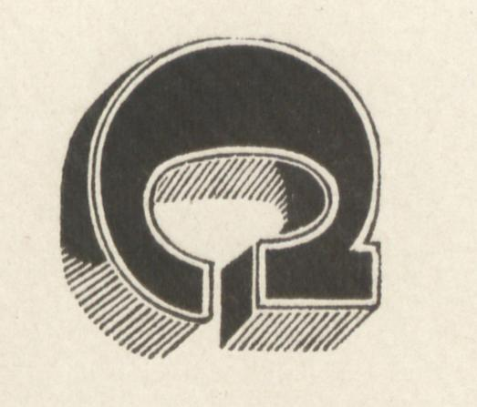

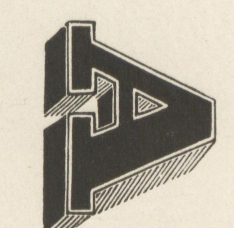

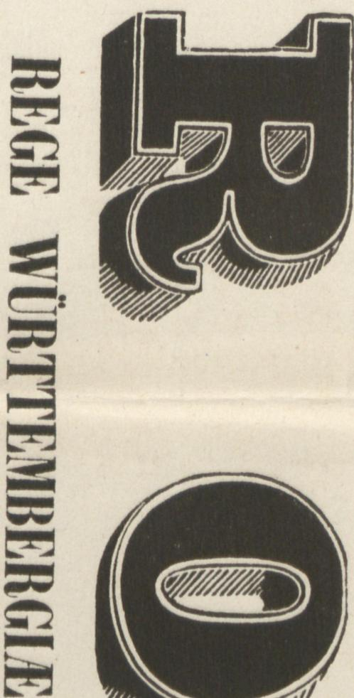

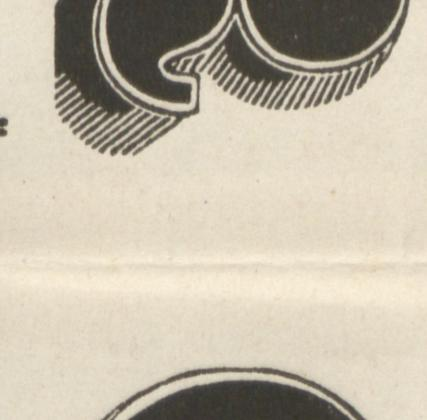

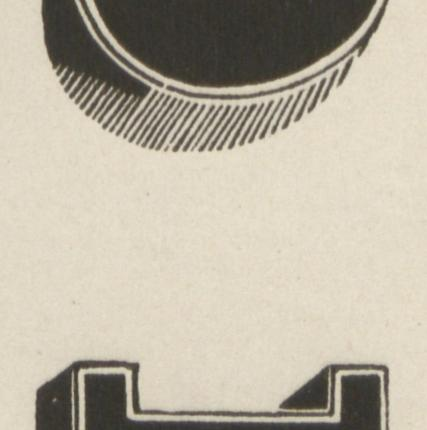

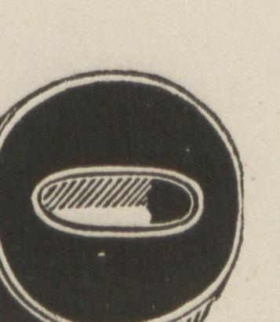

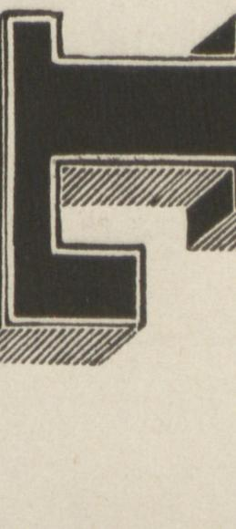

# RECTORE VNIVERSITATIS MAGNIFICO

# 

MEDICINÆ ET CHIRVRGIÆ DOCTORE REGII ORDINIS PATHOLOGIÆ CORONÆ WÜR GENERALIS ET ANATOMIÆ PATHOLOGICÆ PROFESSORE PVBLICO ORDINARIO EMBERGICÆ EQVITE SECVNDÆ CLASSIS

VENIAM LARGIENTE EA QVA POLLET POTESTATE A REGE EI CONCESSA

# CANCELLARIO VNIVERSITATIS MAGNIFICO

REGIORVM ORDINVM FRIDERICIANI COMMENDATORE PRIMÆ CLASSIS 5 CORONÆ WÜRTTEMBERGICA Z 

FACVLTATIS

HILOSOPHIÆ

ET

ŒCONOMIÆ PVBLICÆ DOCTORE

REGI

A CONSILIIS PVBLICIS

COLLEGII STATISTICI

PRÆSIDE

PHILOSOPHICÆ DECANO SPECTATISSIMO

## 9 SIGISM <

REGII ORDINIS CORONÆ WÜRTTEMBERGICÆ EQVITE PRIMÆ CLASSIS LITTERARVM ANTIQVARVM PROFESSORE PVBLICO

PHILOSOPHIÆ DOCTORE ORDINARIO

PROMOTORE AD HVNC ACTVM LEGITIME CONSTITUTO

# DELBERTO

REGIORVM ORDINY RGICÆ EQVITE PRIMA PHILOSOPHIÆ DOCTORE CLASSIS ISABELLÆ LINGVÆ HEODISCÆ CATHOLICÆ COMMENDATORE PROFESSORE PVBLICO ORDINARIO FRANCISCI I EQVITE PRIMÆ CORONÆ QVERNÆ EQVITE

## 

三 REGIA VNIVERSITATE EB ERHARDO-CAROLINA TVBINGENSI

VIRVM PRÆNOBILISSIMVM ATQVE DOCTISSIMVM

D 0 MINVM

### **9** 72 X の対域の対 02

ORDINIS PORTVGALLICI MILITUM CHRISTI EQVITEM

POST ERVDITIONEM

DVABVS COMMENTATIONIBVS

ALTERA DE LOHENSTEINIO POETA GERMANICE CONSCRIPTA

GALLICE ALTERA DE ARTE MONVMENTALI QVO MODO CVM RELIGIONE SIT CONIVNCTA QVAM EDIDIT PARISIIS MDCCCLXXIII

BENE C 0 M P ROBATAM

OCTOREM

7

HILOSOPHIA

ARTIV

Z

LIBERALIV

X

MA

GISTRY

RITE CREAT

HOC IPSO DIPLOMATE SOLLEMNITER RENVNTIAT

EIQVE OMNIA IVRA ET PRIVILEGIA CVM DOCTORIS GRADV CONIVNCTA CONFERT

-V B INGÆ

Universitätsarchiv Tübingen. - Signatur: UAT 132/61 - 1876,7

彩

SVB MAIORE DIE XXX FACVLTAT MENSIS MARTH ANNI MDCCCLXXVI. SI PHILOSOPHICÆ SIGILLO

{48}------------------------------------------------

Universitätsarchiv Tübingen

131/268,4

{49}------------------------------------------------

### Ess. Huchworldgeleuren

becker ich mich zer übersenden: 1° ein Diplom als Magicter

ader Band. Seient. hat.; 2° min Brevet als Eques ord. Midit. Chinti.

Andere Titel minsche ich nicht auf dem Doctordiplom. Herre

Fun Kann min gelegentlich diese zwei Schriften hachschicken.

Jeh märe Ihnen höcket verb unden wenn sie dafür torgen wollten

dan mein Name doch richtig geschrieben merde: gewöhnlich

mind der eine ader andere Buchtabe aung elassen.

Mit vorzüglicher Hochachtung,

Ve Creeg. Herckhoffp,

To Inflymite saping with noting in the separation of the separation of the separation of the separation of the separation of the separation of the separation of the separation of the separation of the separation of the separation of the separation of the separation of the separation of the separation of the separation of the separation of the separation of the separation of the separation of the separation of the separation of the separation of the separation of the separation of the separation of the separation of the separation of the separation of the separation of the separation of the separation of the separation of the separation of the separation of the separation of the separation of the separation of the separation of the separation of the separation of the separation of the separation of the separation of the separation of the separation of the separation of the separation of the separation of the separation of the separation of the separation of the separation of the separation of the separation of the separation of the separation of the separation of the separation of the separation of the separation of the separation of the separation of the separation of the separation of the separation of the separation of the separation of the separation of the separation of the separation of the separation of the separation of the separation of the separation of the separation of the separation of the separation of the separation of the separation of the separation of the separation of the separation of the separation of the separation of the separation of the separation of the separation of the separation of the separation of the separation of the separation of the separation of the separation of the separation of the separation of the separation of the separation of the separation of the separation of the separation of the separation of the separation of the separation of the separation of the separation of the separation of the separation of the separation of the separation of the separation of the separatio

{50}------------------------------------------------

Natus sum ego Augustus herckhoffs, professor Universitatis, baccalaureus litterarum, magister rerum naturalium, eques ordinis militaris Chr. Lusitaniae, membrum plurimarum societatum doctarum, in Batavorum urbe qui nomen est NuTh, pridie ante calendas Februarias a. CIDIDECCXXXV, patre Joh. Guilelmo, matre Johanna de gente Lintjens, ques adhuc viventes magnopère lactor. Fidei addictus sum catholicae. Litterarum primordiis imbutus in gymnasio Trajecti ad Mosam, operam dedi duos annos philosophiae Leodii, Lovanique autem per totidem annos rerum naturalium scholas frequentavi. Tum examine publico "cum laude" peracto, per tres annos professoris munere functus sum in Batavorum urbe, cui nomen Eindhoven indituz, deinde, patria mea relicta, adii Galliae urbem Meldas, denique Melodunum, qua in urbe per Decem annos litteras docuir a meis studiis non alienas. Postremo litterarum Germanicarum amore permotus Bonnam me contuli, ubi maxima cum deligentia Veterum Germanorum linguae per duos annos demidiumque deditus desiderio meo meauque mulieri quae gallie gandet patria domum redeundi non amplius resistere audes, ac Rei publicae veres meas detrahere et munus publicum et conscientia WIaL.

{51}------------------------------------------------

buston if mill when Int fromobionizations Set Cing. Revelfoff za Enrichme. Nach dun Curriculum vita if light Revolfoft Professeur Le l'université de Marie, Badelier er lettre, misse er kiency, Mitter Jul Joo tilging fran Mix Lagordant wifes. Jabovan 1833 in Neily in Som Mindry Coursen, Ra folia, Surangh as in Lutting 2 Julia for losofin, in Loure 2 f. Katurinfunfelafore, mash in Bushyoufung mit Some france Scar cum lande, man 3 Jagun Brofolor in findforten, Take 10 fafter in Holain; mistry fontierts on 22 f. Juniff in Lomes frigh marginivated. Mono all Sat fint times Jungville use gulegt. If gala a Craufinin, of the line Win there Cally I grade lingues fright wif non frof. Timerothing lingues fright your friend you find you Whenly Anny Come an ming ( Sun inf min James your form town. undugotte ) at fuyady dafus galton tom. May unysten in Malin grefaltann wife

muffeflus Mostvays und also da Haring-

Hist find Sin Inding Holl billioffet

with fradition der pingeraith ff. Abfact during the Justen Zaf. Fut pil Exitefielle act die dring die flisiyn Horlegan prosifiles dobituen bists allgruenium Bilde, det Jehorden den Actorag ifen die Hotofis im Wilmifalt ge plasser. Sywalia

King the First Walter.

the ext way provinced the y to

12. Sife Hopp Il wife in main persist.

2) Perge Minaria radicibe front

History Job if my water fire of it of the

1) morniett !

Universitätsarchiv Tübingen. – Signatur: UAT 131/26 b [Nr. 4]

{52}------------------------------------------------

Inden sin brigalegten Genlungsbatter Plit. Ut Jucinina for Brobfoffs moven lagt: red aig. heart fift you line from . [] garvaille: 1) L'ast monumental dass to my ports avec les idees veligieuses. Javil 1973. Drifa Seferife, It inft in main gabind minstylagent, falle if mile wasfay gayseff. above 1935 in This is be this before the mus 2) Petita grammaire anglaise facil/1468 (e) kedinsigers ellemonses, fint voin je Tulign Refuglion, In fine wings in Balongs Louren. A) für Horney üben sin seinen fa Borga, sen si fetent 1859 in Marfalu grettua. II) Det wieftigten igt tin gefesteinen. Alfantlung illes D. Entres won Zofen-This wind frim trains give, intrafonds m di Classatia. Das Hanfelles Jet Jig mit großten frugt in Jufon ningk uling pla augustaman, alas littaras frist nu mangay Enginger must show your Juston fringeschiebes and Jenth ife

high of wife from by the prompt of wife

They som less include vites of high

of My Philoson LI Winnest Hill

are the desired in the second of the second

Marsh es is the life I forfor His

Affiliable of A & a market the

after the theathporting mis her that

of our lander , spice It of flow

Englower Hope to fathe in Malan

of yet all water some and

This Head has first John School of

the Rate or the land of the sea

English of John Super poll- there.

the confession Habin populations with

ties time property was

if they are they be spiritely in

La Ly Hereldone for

{53}------------------------------------------------

raefallan Milm ya batvallon wer him to Surface Tarya Sallar. Still for in her fet yelungary set wife whom windered till, Set nor sufun Mann in des tollassatus y lifts fraktenenlig if, Mon norrigen Faction za vri Migan mus fains winkldefor Hartungte in i krift ya jondan. Den blanteller flantes mid night per Mafort nor - for faft gangle In Aant dry drawatiffen forfin, win ife Lofnybuin morface, into auge, phase Jacus Junford Sie Merfandunn Nacfriffer alno Lofanjanin kalme Knog yaferwan und un haffi fle winder die manfessideum Value, for Abfalfringsyind, Murastinitingen in Aufrifaringen, um Jefley His São Sar Dan ozatva ningafant ya Magrupnian, nsulya at det Gan, formen det Utiford aut juffer. Lif and field und frouglif und ithe tiff drivfpill ment. Vis Jay halling if garwand, women and sum Hagfalfan Set franch Dion Many with the designation of the first mul frishelif ist. Vula affautury Jefaind miny wing the queniquents voluciand, in his felia

Examine jajalela.

Experience in not fine function of

This was Exalpin . . . in the man sint

Hospitalis when thisporting if

in finden him said this is to

it hankey in before talle Salthe

The state of the state of the state of

Francisco Peter

and the same is the present on the

Hartestall by Congress and Sales

adjunganisher of they

feeter man titled wayfing

Long fremendal per lake at fled he lad only fife for park he letter and when fleth letter has lake over i he fremend to paid the states for he hanger. Plannesse, white is not so it sat you seek to reside it the braining in the history of the braining of the braining of the braining of the braining of the braining of the braining of the braining of the braining of the braining of the braining of the braining of the braining of the braining of the braining of the braining of the braining of the braining of the braining of the braining of the braining of the braining of the braining of the braining of the braining of the braining of the braining of the braining of the braining of the braining of the braining of the braining of the braining of the braining of the braining of the braining of the braining of the braining of the braining of the braining of the braining of the braining of the braining of the braining of the braining of the braining of the braining of the braining of the braining of the braining of the braining of the braining of the braining of the braining of the braining of the braining of the braining of the braining of the braining of the braining of the braining of the braining of the braining of the braining of the braining of the braining of the braining of the braining of the braining of the braining of the braining of the braining of the braining of the braining of the braining of the braining of the braining of the braining of the braining of the braining of the braining of the braining of the braining of the braining of the braining of the braining of the braining of the braining of the braining of the braining of the braining of the braining of the braining of the braining of the braining of the braining of the braining of the braining of the braining of the braining of the braining of the braining of the braining of the braining of the braining of the braining of the braining of the braining of the braining of the braining of the braining of the braining of the braining of the braining of the braining of the braining of the braining of the braining of the braining of the braining of the braining of the b

{54}------------------------------------------------

for Marin in the littles strapfiffs Inn Haux, mid if wife untificion. May will it , was wringen Harlier ja vie Sun Jost. Defott Indon dispulsied of in pine wietelife Headwingter must at willist fine ainf world fine triff of places . The Headalfer Heigh und uf brankrege in drugen Falle Salftar. wife halpy now . En fift hind Frat bene. it is be energifor for for fire win if Josephing but Fibrigan 27 Mary 1876 Trans. aff saids it deepfaising Suns Juis abstricting. 27/3 76, muffl, få, förlaffärg daif. If in offer, take in ogliff skringer and nafare sen de langel grun aft sie du, hi alle får Collognimer. John bern un gromoried er nift in Loun? Loff Du 35 sur Partitus die disgraphion nom Lolloguisium un din zvobitanda tor saving nime unfantlisten Britaining der Millantfluft? sind we dried flift In Sumober granight ful, with the straight frankling his Cart monumental 2 the games with youngs, Din Dife mind uniffrufflig gebildeten Monta britainly wollflinks refilled, - fin Collegemen from. Deplin får barn fung prus lollaginin 9 wark Da Palaul pou du ju & i b infure norman poroquégriabanem Zaingui Neur gan might poroquent fort in allus mad per jibre fu nanbildinghopens fayl pin atf finan von tab pigl ze controliurumen aroyaban bariff, da (nat dun Volgat du fi Coll. Köstlin) six atf die under the Iffel
L'att monumental pin arts flats des Coll- pigl Athan la pl Chin zweile dun auf wiffunffaftl. Luifly dum tibl porn is dur Grammaire

anglaife anymfüßel ift Etudes fur la Langue Flamande. Malines i vol. 8% ift into gover with warymlungs), so wind aty if für Burifing zine Collegistens thinun, Inform abfalling zun so wariger Maislaift yhaisan wash, alt Paland organizati, lier anwasand ift. Da pyun tolle if wit lithfill aif tin

your fromotion zugulaffun.

The Sur fabrunt in Mad Beff air frems

Nous offerform not and pins of undlife hale

flatigthis won Coggianin riguliar way

red wife when winderhands there, So

{55}------------------------------------------------

12.

M. Wal. 1. Knely 23/3 76. huft.

An den Decan dez Whilosophischen Facultat in Tübingen.

EN. Hochmohlgeboren

ezsuche ich mich zur l'iomotion an dur dortigen Universität gutigst zulassen zu wollen, indem ich miz erlaube beirufügen: 10. line schriftliche arbeit über hohenstein's

Trauerspule;

2° Drie gedruckte arbeiten über Kunstgeschichte und Sprachen;

3° linen von mix in Mechelen gehaltenen Vortrag in hollandischer Sprache:

4" Referate uler von mir gehaltene Offentliche Volles ungen in Melen;

5. Een Referat über meine erfolgreiche Bemühung um die Gründung eines Bildungs-Pereins, im Departement von Jaine & marne. 6° Da Curiculum Vilae.

hugleich habe ich die erfordeliche Jumme Mr. 200 der Post aleergeben.

Betund , dan die took - Facultal min sobred als moglich eine geneigte Antwork nach Paris zurückguketnen genottigt bien, Zeichne ich

Hochachtungsvall u vegebenst, 026g. aug. Kezckhoff.

Hotel de Bille Vue

Bonn, a 26 mårg, 1876.

{56}------------------------------------------------

nik.

Un Camber

mi bre Milopoliblin Famillas.

Milingues 30 may 1876.

Accordand: Le Akacy brein be Rep. Mos. him Kaller, Got. Flench, Röttlin.

blevgrinn mit prof. Rankfift auf Ermind him Ablanting The dolar thing absolution our thought tally. Raway und depllies:

Monotion mit den presteet bene.

In hugh,

fw. Magrificary

restrict if nin Etunich Allatising obien somotive Abellulas.

hilingung do may 1876.

hughly J. Man.

Vin Venia Se Paughrands Ji de obser hyrifulm Dole forgrow tion civ and inf reflich.

Thetash 31 May 1876

Laylu Mindin

{57}------------------------------------------------

land if, gruing to anlingenter ablieving what to promotions ordered his hop analyses, in iner Petgruy before acfalling to Colocuisment but Ju my morque

Notatolog if Wo Nie, ei hur if Wighing austrus raps an Sor pripping in niver Nahm fauf Abblant grunden vial.

29 may 1876.

Laugh.

Va warf Millpilang Me Obryr Alle in angenblid lattelliebe his Tigringen bellink Ramun li-Print As Rila in Mecording lind, be wings if his life and ralent fall has for. Reporter letter you geplatten Jap Sate Colloquinum in print Molering Matter Me geplatten Jap Sate Colloquinum in print Molering Matter Mr. hispl.

finnsnytamin, if unsoch wind fassit falesa.

Indens.

gef beight

Roy b. in C.

higwark

Ayllin

Grabus

Manden. 6. in.

{58}------------------------------------------------

### ÉCOLE DES HAUTES ÉTUDES COMMERCIALES

(Reconnue par l'État — Décret du 22 Juillet 1890)

### DOSSIER DE PROFESSEUR OU D'EXAMINATEUR

|                              | M Kerckboffs.                                                                                                                                                                                                                                                                                                                                                                                                                                                                                                                                                                                                                                                                                                                                                                                                                                                                                                                                                                                                                                                                                                                                                                                                                                                                                                                                                                                                                                                                                                                                                                                                                                                                                                                                                                                                                                                                                                                                                                                                                                                                                                                  |
|------------------------------|--------------------------------------------------------------------------------------------------------------------------------------------------------------------------------------------------------------------------------------------------------------------------------------------------------------------------------------------------------------------------------------------------------------------------------------------------------------------------------------------------------------------------------------------------------------------------------------------------------------------------------------------------------------------------------------------------------------------------------------------------------------------------------------------------------------------------------------------------------------------------------------------------------------------------------------------------------------------------------------------------------------------------------------------------------------------------------------------------------------------------------------------------------------------------------------------------------------------------------------------------------------------------------------------------------------------------------------------------------------------------------------------------------------------------------------------------------------------------------------------------------------------------------------------------------------------------------------------------------------------------------------------------------------------------------------------------------------------------------------------------------------------------------------------------------------------------------------------------------------------------------------------------------------------------------------------------------------------------------------------------------------------------------------------------------------------------------------------------------------------------------|
| Nom                          | M. C. C. C. C. C. C. C. C. C. C. C. C. C.                                                                                                                                                                                                                                                                                                                                                                                                                                                                                                                                                                                                                                                                                                                                                                                                                                                                                                                                                                                                                                                                                                                                                                                                                                                                                                                                                                                                                                                                                                                                                                                                                                                                                                                                                                                                                                                                                                                                                                                                                                                                                      |
| Prénoms                      | anguste                                                                                                                                                                                                                                                                                                                                                                                                                                                                                                                                                                                                                                                                                                                                                                                                                                                                                                                                                                                                                                                                                                                                                                                                                                                                                                                                                                                                                                                                                                                                                                                                                                                                                                                                                                                                                                                                                                                                                                                                                                                                                                                        |
| Lieu de naissance            | Muth (Aucho'de Cimhourg) Hollande normalis en 1873                                                                                                                                                                                                                                                                                                                                                                                                                                                                                                                                                                                                                                                                                                                                                                                                                                                                                                                                                                                                                                                                                                                                                                                                                                                                                                                                                                                                                                                                                                                                                                                                                                                                                                                                                                                                                                                                                                                                                                                                                                                                             |
| Date de naissance.           | 19 Janvier 1835.                                                                                                                                                                                                                                                                                                                                                                                                                                                                                                                                                                                                                                                                                                                                                                                                                                                                                                                                                                                                                                                                                                                                                                                                                                                                                                                                                                                                                                                                                                                                                                                                                                                                                                                                                                                                                                                                                                                                                                                                                                                                                                               |
| Cours DEAMINE DEAMIN         | Juc Allemande en Année                                                                                                                                                                                                                                                                                                                                                                                                                                                                                                                                                                                                                                                                                                                                                                                                                                                                                                                                                                                                                                                                                                                                                                                                                                                                                                                                                                                                                                                                                                                                                                                                                                                                                                                                                                                                                                                                                                                                                                                                                                                                                                         |
| Titres universitaires        | Soteuries Settres. (Siplame, Bulge)  Boteuries Settres. ( " Allemona)  Professor à L'Ede Arago.                                                                                                                                                                                                                                                                                                                                                                                                                                                                                                                                                                                                                                                                                                                                                                                                                                                                                                                                                                                                                                                                                                                                                                                                                                                                                                                                                                                                                                                                                                                                                                                                                                                                                                                                                                                                                                                                                                                                                                                                                                |
| Carrière dans l'Enseignement | 1 TO Control to an and the conference of the state of the state of the state of the state of the state of the state of the state of the state of the state of the state of the state of the state of the state of the state of the state of the state of the state of the state of the state of the state of the state of the state of the state of the state of the state of the state of the state of the state of the state of the state of the state of the state of the state of the state of the state of the state of the state of the state of the state of the state of the state of the state of the state of the state of the state of the state of the state of the state of the state of the state of the state of the state of the state of the state of the state of the state of the state of the state of the state of the state of the state of the state of the state of the state of the state of the state of the state of the state of the state of the state of the state of the state of the state of the state of the state of the state of the state of the state of the state of the state of the state of the state of the state of the state of the state of the state of the state of the state of the state of the state of the state of the state of the state of the state of the state of the state of the state of the state of the state of the state of the state of the state of the state of the state of the state of the state of the state of the state of the state of the state of the state of the state of the state of the state of the state of the state of the state of the state of the state of the state of the state of the state of the state of the state of the state of the state of the state of the state of the state of the state of the state of the state of the state of the state of the state of the state of the state of the state of the state of the state of the state of the state of the state of the state of the state of the state of the state of the state of the state of the state of the state of the state of the state of the state of the |
| Carrière Commerciale         | Gofficier d'Madeinie                                                                                                                                                                                                                                                                                                                                                                                                                                                                                                                                                                                                                                                                                                                                                                                                                                                                                                                                                                                                                                                                                                                                                                                                                                                                                                                                                                                                                                                                                                                                                                                                                                                                                                                                                                                                                                                                                                                                                                                                                                                                                                           |
| Distinctions honorifiques    | The state of the state of the state of the state of the state of the state of the state of the state of the state of the state of the state of the state of the state of the state of the state of the state of the state of the state of the state of the state of the state of the state of the state of the state of the state of the state of the state of the state of the state of the state of the state of the state of the state of the state of the state of the state of the state of the state of the state of the state of the state of the state of the state of the state of the state of the state of the state of the state of the state of the state of the state of the state of the state of the state of the state of the state of the state of the state of the state of the state of the state of the state of the state of the state of the state of the state of the state of the state of the state of the state of the state of the state of the state of the state of the state of the state of the state of the state of the state of the state of the state of the state of the state of the state of the state of the state of the state of the state of the state of the state of the state of the state of the state of the state of the state of the state of the state of the state of the state of the state of the state of the state of the state of the state of the state of the state of the state of the state of the state of the state of the state of the state of the state of the state of the state of the state of the state of the state of the state of the state of the state of the state of the state of the state of the state of the state of the state of the state of the state of the state of the state of the state of the state of the state of the state of the state of the state of the state of the state of the state of the state of the state of the state of the state of the state of the state of the state of the state of the state of the state of the state of the state of the state of the state of the state of the state of the state of the s |
| Date de l'Entrée à l'École   | 1º Plosembre 1881                                                                                                                                                                                                                                                                                                                                                                                                                                                                                                                                                                                                                                                                                                                                                                                                                                                                                                                                                                                                                                                                                                                                                                                                                                                                                                                                                                                                                                                                                                                                                                                                                                                                                                                                                                                                                                                                                                                                                                                                                                                                                                              |
|                              | - Andrew                                                                                                                                                                                                                                                                                                                                                                                                                                                                                                                                                                                                                                                                                                                                                                                                                                                                                                                                                                                                                                                                                                                                                                                                                                                                                                                                                                                                                                                                                                                                                                                                                                                                                                                                                                                                                                                                                                                                                                                                                                                                                                                       |

OBSERVATIONS

L'inissionnaire per 8he 1891.

1

{59}------------------------------------------------

Monieur L Directum

prudine anoth le 15 de ca mois. s. Agriez, moise la directeur, l'onpression certificat en quertion: 1'ei promis our Je weum dersois laien Baliza de weusein minitive de l'mobreration publique de le mb faire tenire la plue tot possible De mas dantiments be plus dicting

9

Kerchugz

.

{60}------------------------------------------------

mes élèves par un membre du juny, à l'exames s'eth à la seite d'une Brenvetion que p me suis permise au suyet d'une note donnée à un de De fin d'année [ Bosowation qui a été interprêtée ministere] que le coursil d'administration qualité ou Propersund Le weuen servoire Beliegé 3'indiqueer le mois qui a 326 classe, que pouve mon savire your en la motive ma dortie de l'Ecole, en aquestant aque comme une critique du representant du non rendent ex layer ulter ieura a cree detoin de priver de ma cullaboration under or any en gree der eluges is ste ottache on these essen tielerment pratique de m'a Bresser, Farth power la bonne Tenue Poris, ce o ount Monsieur S'ASE Scole em eignement. Comme compe 10 cm wiens, certif ह

{61}------------------------------------------------

Verieur agrier, monsieur listinesteur, l'expression de mes sentiments les Mus distingués.

,

{62}------------------------------------------------

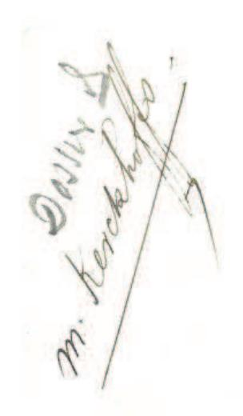

### Monsieur le Directeur

les renseignements que veus désirez ; l'evercie l'honneux de veus les compléter demain de vive voix.

Une decerciene d'élères, dont 3 des curs d'allement, ont cessisté ever 5 leçons cle Volapile que j'ai données, à l'Institut Communie le dimanche matin, de 10 et 11 h.

A la suite de l'examen écrit, qui es en line le 14 avril, à l'Institut, un brevet en capacité leur a été accordé. Tuns agant timvigné le disir de pouvoir montrer leur brevet à leurs parents, je me suis chargé d'apporter moi-même les diplomes et les leur ai remis, mercredi dernur, pendent la récréation de 3 h. 20. Comme je n'ai engagé auceun élève à

Leevre un cuers de volagoir quelconque

{63}------------------------------------------------

j'ai tout lieu de penser que ces jeunes gens y ont été jourssés par ceux de leurs camarades de 2° année, qui ont été l'année dernière à l'étranger, et auxquels la possession du diplôme de volognitiste à rendu les plus grands services.

Veus veryez, Monsieur le Directeur que l'ai en l'en le me conformer à vos instructions, et que j'en évité scrup uleusement teut acte pairent aller ci l'encontre de vos divirs ou de ceux de Monsieur le Président.

Le tiens même tellement à énter tunt démîle aux l'administration que praires résolu à retirer complètement mon coneme creer volapiexistes, le peux une producure le être agréable.

l'expression de mes sentiments les volus distingués.

Kerekhizoz