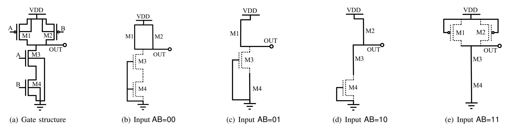
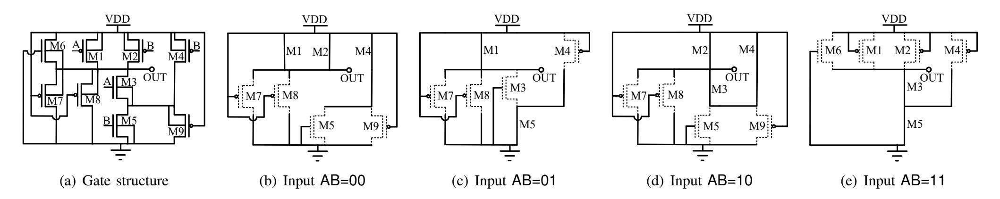
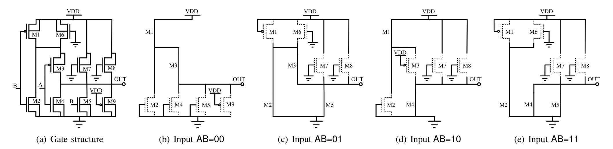
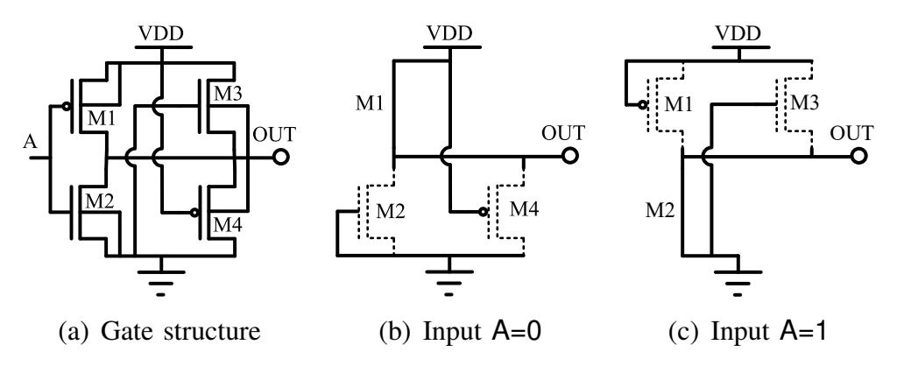
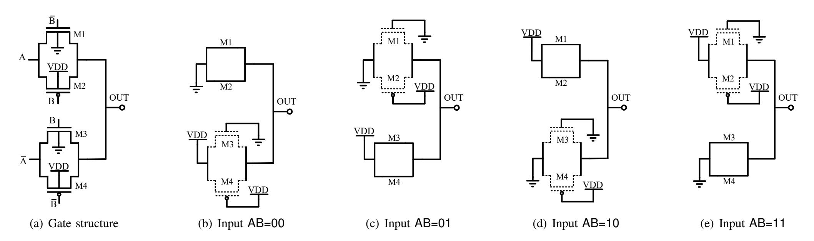
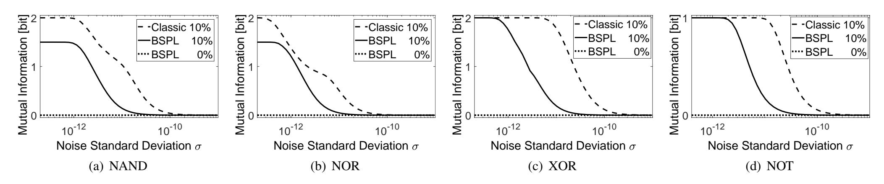
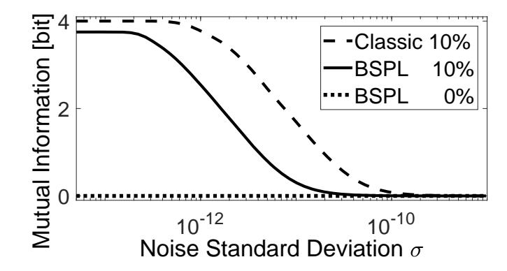
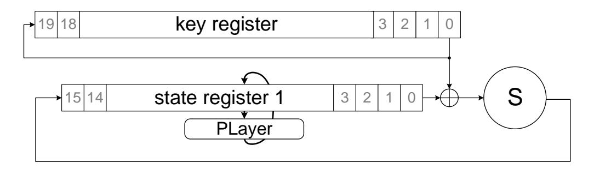
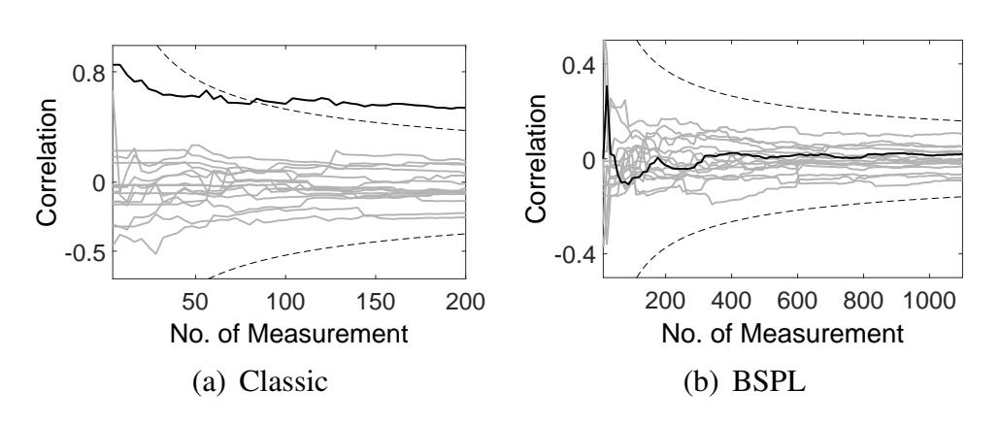
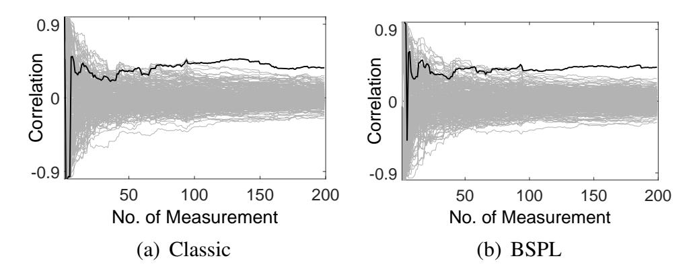

{0}------------------------------------------------

# BSPL: Balanced Static Power Logic

Bijan Fadaeinia *Ruhr University Bochum Horst Gortz Institute for IT Security ¨* Bochum, Germany bijan.fadaeinia@rub.de

Thorben Moos *Ruhr University Bochum Horst Gortz Institute for IT Security ¨* Bochum, Germany thorben.moos@rub.de

Amir Moradi *Ruhr University Bochum Horst Gortz Institute for IT Security ¨* Bochum, Germany amir.moradi@rub.de

*Abstract*—The down-scaling of circuit technology has led to stronger leakage currents in CMOS standard cells. This source of power consumption is data dependent and can be utilized to extract secrets from cryptographic devices. We propose Balanced Static Power Logic (BSPL), the first leakage-balancing approach that achieves optimal data-independence with respect to drainsource leakage. We re-design fundamental standard cells in such a way that their leakage current is essentially constant, irrespective of inputs and outputs, barring process variations. Even in presence of considerable intra-die variations, modeled by Monte Carlo simulations, BSPL gates still maintain a significantly reduced mutual information between the circuit's input and conducted leakage current.

## I. INTRODUCTION

CMOS standard cells in nanometer-scaled technology generations conduct a measurable leakage current whose magnitude depends on the values at their respective inputs and outputs [1]. Such an unintended relation between internal values and externally measurable characteristics is often called a side channel and can endanger the secrecy of computation. Over the last two decades, side-channel analysis (SCA) has become a serious threat for security-enabled devices that are supposed to operate in a hostile environment. It is wellknown that intermediate values of cryptographic operations can be discovered through SCA attacks in order to disclose secret data or bypass authentication mechanisms [2]. While other physical side channels have drawn more attention in the past, especially the dynamic power consumption [3] and electromagnetic radiation [4] of circuits, it can be observed that the static power side channel is progressively catching up. This is primarily due to its emergence in advanced semiconductor technologies. While the dynamic power consumption per logic operation is reduced when capacitances and supply voltages decrease in newer IC generations, the static leakage per logic unit grows due to lower threshold voltages, shorter channel lengths and thinner gate oxides [5]. Thus, the static power side-channel is becoming a more and more relevant security threat in practice.

The first reports describing successful attacks on cryptographic implementations via the static power side channel have been

The work described in this paper has been supported in part by the Deutsche Forschungsgemeinschaft (DFG, German Research Foundation) under Germany's Excellence Strategy - EXC 2092 CASA - 390781972, through the project 271752544 "NaSCA: Nano-Scale Side-Channel Analysis", and the project 418658052 "Aged but Fit: Long Lasting Security for Trusted Platforms".

based on simulation results [1], [5]–[9]. It remained uncertain, however, whether the small data-dependent differences in the leakage currents could be captured in sufficiently high quality to perform such attacks in real world experiments. Hence, a number of practical evaluations have been conducted on the subject [10]–[16]. It was not only confirmed that those attacks are indeed feasible, but also that this source of information leakage can become the most informative power side channel in certain scenarios. Previous works showed that the effectiveness of static power attacks can be increased exponentially by manipulating the operating conditions of devices [14], [16]. Others have demonstrated that common side-channel countermeasures, primarily designed to thwart the dynamic leakage behavior, are much less powerful against its static counterpart [8], [10], [12], [16]. Due to a possibility to limit the noise in static power measurements, adversaries can exploit higher-order leakages of masked implementations more easily [11], [12], [16]. The general consensus of all cited works is that static power attacks are indeed a real threat and that dedicated countermeasures have to be developed in order to prevent this side channel from affecting the security of cryptographic circuits in advanced semiconductor technologies.

*Related Work.* In recent years, first potential countermeasures against static power side-channel analysis (SPSCA) have been investigated [17]–[25]. Similar to the early situation in the field of DPA countermeasures, most of these approaches fall into the hiding category [2] and can be split into two major groups, randomization [17], [22]–[24] and equalization [18]– [21], [25]. Randomization approaches aim to reduce the signalto-noise ratio (SNR) by generating additional noise to bury the signal in (either on-demand or on a constant basis). Equalization approaches aim to reduce the data dependency of a circuit's dissipation in order to decrease the exploitable signal. The latter are also known as balancing techniques and come in different flavors. Some are based on conventional standard cells [19]; others require custom cell design [21], [25]. Some are specifically targeting Hamming weight dependencies [18], [20]; others attempt to generally reduce the current variations depending on the input [19], [21], [25]. Yet, none of those works has come close to achieving optimal data-independence. By optimal data-independence we denote the property that without consideration of naturally occurring intra-die variations between multiple transistors of the same 

{1}------------------------------------------------

type, the static power consumption is stable, irrespective of the processed data. When considering physical imperfections such as process variations, however, a perfectly balanced power consumption cannot be achieved and a minimal data dependency remains.

*Our Contribution.* We propose Balanced Static Power Logic (BSPL) as a countermeasure against static power side-channel attacks. BSPL is the first static power balancing approach that achieves optimal data-independence with respect to drainsource leakage, the dominating source of static power consumption. We have revisited the transistor-level design of common fundamental standard cells such as NAND, NOR, NOT and XOR gates in order to create custom versions that provide the same functionality while being resistant to SPSCA attacks, at a low overhead in terms of area and delay. Our simulation results prove that in the ideal model (i.e., no process variations considered) no detectable data dependency exists in the leakage currents of BSPL gates. In reality however, i.e., in presence of intra-die process variations, such an optimal resistance is impossible to achieve. In order to show that our balanced logic still remains significantly more resistant than classical CMOS cells in such a scenario, we present mutual information results between applied inputs and leakage currents of BSPL gates which are subject to intra-die process variations, modeled by Monte Carlo simulations. Those results confirm that a significantly lower noise level is required to hide the data dependency exhibited by BSPL gates. Finally, we target two full PRESENT-80 block cipher instantiations, one synthesized in regular CMOS gates, the other in BSPL gates, and demonstrate that the static power attacks on the BSPL variant do not succeed even in a noise-free simulation environment1 . The increased resistance is expected to be even more apparent in real experiments, as process variations can be significantly smaller than the modeled ones for transistors of close proximity.

# II. BACKGROUND

CMOS logic is the de-facto standard for integrated circuit design since its introduction in 1963 [26]. It has replaced former logic families such as NMOS logic due to its smaller static power dissipation. This trait is achieved by ensuring that in all CMOS logic gates at least one switched-off transistor is present between VDD and GND for any combination of input signals. As an example, consider the classical CMOS NAND gate depicted in Figure 1. For any value of its input signals A and B, at least one cut-off transistor, marked by a dotted line, is responsible for preventing uncontrolled current flow between VDD and GND. At the time CMOS logic was invented, this design strategy was sufficient to produce cells with a negligible power consumption in stable states, as leakage currents in individual transistors were almost not present [26]. However, as technology scaling advanced into nanometer dimensions, these leakage currents kept growing and became a serious problem for device applications that require a low standby power.

Another problem is caused by the fact that the magnitude of the current flowing through a CMOS cell with stable inputs is severely data dependent. The dominant source of static power consumption in transistors is drain-source leakage. With that in mind, consider again the NAND gate in Figure 1. It is clear that two NMOS transistors in series, both in the off-state (AB = 00), conduct significantly less current than a single cut-off NMOS (AB = 01 and AB = 10). Similarly, two off-state PMOS in parallel connection (AB = 11) should conduct more current than the two off-state NMOS in series. This setting leads to a fundamentally data-dependent static power consumption of CMOS cells which can be exploited as a side channel [15]. Usually, an adversary requires full control over the clock signal of the device under test (DUT) to perform such attacks. During any desired part of the cryptographic operation the clock is stopped and all I/O signals of the DUT are kept stable [14]. Then, the static power consumption, i.e., the current still flowing through the DUT, is measured for an arbitrary period of time. The length of this period can be adjusted to reduce the noise included in the measurements exponentially until a noise floor, caused by the algorithmic noise, is hit [14]. This is the main reason why masking schemes can only provide reasonable resistance to such attacks when it is guaranteed that the algorithmic noise is sufficiently larger than the exploitable signal [11], [12], [16]. In [16] it is demonstrated that SPSCA attacks can even be performed without control over the clock signal when the designer of the DUT fails to ensure that all sensitive data is removed from the circuit's state before entering a temporary idle state.

In order to perform practical SPSCA attacks, a special measurement setup is required. The main differences between measuring the static power and the dynamic power consumption of circuits are the DC nature of the static power, its comparably small magnitude, and its strong dependency on environmental influences [14]. In [14] a setup based on a conventional oscilloscope is described. It is also shown that controlling the voltage and the temperature can make devices orders of magnitude more susceptible to SPSCA [14], [16].

# III. TECHNIQUE

Our goal is to construct circuits with a constant static leakage, independent of the data being processed. As stated in Section II, the prevalent origin of data-dependent leakage currents is the gate's structure where a different number of cutoff transistors with a different topology are present between VDD and GND. We construct new gates in such a way that a fixed number of cut-off transistors (from the same type PMOS/NMOS) are placed in the same arrangement between VDD and GND, independent of the given input. This strategy is sufficient to provide optimal data-independence with respect to drain-source leakage. Under the assumption that drainsource leakage is the dominating component in static power consumption, the resulting cells should not show a noticeable

1Algorithmic noise is still present, but no electrical/measurement noise.

{2}------------------------------------------------

Fig. 1. Classic NAND gate, and the status of the transistors for different input values

Fig. 2. BSPL NAND gate, and the status of the transistors for different input values

Fig. 3. BSPL NOR gate, and the status of the transistors for different input values

data dependency unless process variations are introduced2.

We start with the formerly given example, i.e., 2-input NAND gate. The architecture of our constructed gate is shown in Figure 2(a). Compared to the classical NAND gate with 4 transistors, it requires of 9 transistors (3 NMOS and 6 PMOS). The status of the transistors for all possible input values is shown in Figure 2. Note that we omitted showing those cut-off transistors whose both drain and source are connected to the same voltage level (both connected to either VDD or GND). For example, M7, M8, and M9 for AB = 11. It can be seen that for every input value AB, 3 cut-off PMOS and 1 cut-off NMOS transistors are between VDD and GND. Supposing that all transistors of the same type (PMOS/NMOS) are realized with

the same characteristics (width, length, threshold voltage), the leakage current of this construction would be constant, independent of the given input AB.

The structure of our other constructed gates (NOR, NOT, and XOR) are shown in Figure 3, 4, and 5 respectively. The same principle has been followed, and as shown by the diagrams the number of transistors of the same type which are in cut-off state and between VDD and GND is constant, independent of the gate's input. We should stress that the structure presented in Figure 5 is a classical XOR gate made by transition gates. As shown, regardless of the inverters required for  $\bar{A}$  and  $\bar{B}$ , for all input values one PMOS and one NMOS cut-off transistors are between VDD and GND. Therefore, our constructed XOR gate uses the same structure while employing BSPL NOT gates (Figure 4) to generate  $\bar{A}$  and  $\bar{B}$ . Note that an XOR gate can be easily turned to XNOR by swapping either A with  $\bar{A}$  or B with  $\bar{B}$ .

Now, we can realize any combinatorial circuit using our constructed gates and the resulting circuits would also fulfill

&lt;sup>2Please note that leakage currents through the gate insulator are not considered in this work, as they usually do not contribute heavily to the data dependency. Yet, when gate leakage is significant and also different between PMOS and NMOS, our gates can show small data-dependent changes in the currents, even without process variations. The impact of this effect, however, is expected to be less relevant than that of intra-die variations.

{3}------------------------------------------------

TABLE I NUMBER OF TRANSISTORS IN CLASSICAL VERSUS BSPL GATES FOR DIFFERENT INPUT VALUES.

|      | Number of Transistors PMOS/NMOS |     |     |     |     |         |     |     |     |     |
|------|---------------------------------|-----|-----|-----|-----|---------|-----|-----|-----|-----|
| Gate | Classical                       |     |     |     |     | BSPL    |     |     |     |     |
|      | cut-off                         |     |     |     | all | cut-off |     |     |     | all |
|      | 00                              | 01  | 10  | 11  |     | 00      | 01  | 10  | 11  |     |
| NAND | 0/2                             | 0/1 | 0/1 | 2/0 | 2/2 | 3/1     | 3/1 | 3/1 | 3/1 | 6/3 |
| NOR  | 0/2                             | 1/0 | 1/0 | 2/0 | 2/2 | 1/3     | 1/3 | 1/3 | 1/3 | 3/6 |
| XOR  | 1/3                             | 2/2 | 2/2 | 3/1 | 4/4 | 3/3     | 3/3 | 3/3 | 3/3 | 6/6 |
| NOT  | 0/1                             | 1/0 |     |     | 1/1 | 1/1     | 1/1 |     |     | 2/2 |

the criteria of having a data-independent leakage current. Table I shows an overview of the number of cut-off transistors for all input values in both, classical and BSPL gates. It also shows the overhead with respect to the total number of transistors used in our constructions.

The remaining cell is a flip-flop, whose classical variant has also data-dependent static power. Let us suppose a positiveedge flip-flop with input D, clock CLK and output Q. Its leakage current depends on both inputs as well as the stored value Q, i.e., 2 3 cases. In order to construct a flip-flop with constant leakage current, we have taken the gate-level architecture given in [27, Fig. 7.11], making use of seven 2-input NAND gates and a NOT gate. Implementing such an architecture by means of our constructed gates leads to a positive-edge flip-flop with constant leakage current.

## IV. ANALYSIS

In order to evaluate our constructions we conducted several simulations to examine the benefits as well as overheads. Simulations are performed by HSpice using a 180 nm CMOS technology.3 In all simulations the dimension of both NMOS and PMOS transistors are set to L=180 nm and W=220 nm. We should note that in such simulations all instantiated transistors (of the same type NMOS/PMOS) have the same characteristics. Therefore, the static power (leakage current) of BSPL gates constant in this technology. This can be seen in Table II, where the static power of BSPL gates is compared to that of classical gates for all possible input values.

However, due to process variation in reality, the transistors are slightly differently realized (due to shrinking the

3The 180 nm technology was selected for availability reasons. We purposely disregarded non-manufacturable libraries such as NanGate.

Fig. 4. BSPL NOT gate, and the status of the transistors for different inputs

TABLE II STATIC POWER OF CLASSICAL VERSUS BSPL GATES FOR DIFFERENT INPUT VALUES.

|      | Leakage Current [pA] |      |           |      |      |      |      |      |  |
|------|----------------------|------|-----------|------|------|------|------|------|--|
| Gate |                      |      | Classical |      | BSPL |      |      |      |  |
|      | 00                   | 01   | 10        | 11   | 00   | 01   | 10   | 11   |  |
| NAND | 3.4                  | 6.3  | 8.5       | 7.6  | 17.6 | 17.6 | 17.6 | 17.6 |  |
| NOR  | 12.5                 | 5.8  | 3.8       | 3.1  | 22.6 | 22.6 | 22.6 | 22.6 |  |
| XOR  | 26.2                 | 23.7 | 23.7      | 21.2 | 40.9 | 40.9 | 40.9 | 40.9 |  |
| NOT  | 6.3                  | 3.8  |           |      | 10.0 | 10.0 |      |      |  |

masks, etc.). This causes the transistors to have different characteristics (e.g., threshold voltage), hence different leakage current. Therefore, in reality an exactly-constant static power consumption (independent of the processed data) cannot be achieved, but the dependency is expected to be reduced depending on the significance of the process variations. In order to conduct a more realistic analysis we carried out Monte Carlo simulations to consider process variations using the following parameters for a Gaussian distribution: transistor gate length L : 3σ = 10%, threshold voltage VTH : 3σ = 12.5%, and gate-oxide thickness tOX : 3σ = 3%.

In the simulation environment, the (static) power measurements are free of noise. Hence, even extremely small differences between the power consumption associated to different processed data lead to successful key recovery. Therefore, the goal of a proper security evaluation in the simulation domain is to assess the feasibility of attacks on the underlying circuit to the noise level, since in reality the power measurements are always affected by noise originating from the measurement setup and environmental parameters. To this end, an analysis scheme (so-called IT analysis) based on the concept of Information Theory has been developed in [28]. It considers noise with Gaussian distribution centered to each simulated power value, and estimates mutual information. For the given noise standard deviation, it indeed examines the amount of available information which can be exploited by the *worstcase* adversary. Therefore, the purpose of IT analysis is to extract a curve of mutual information over the noise standard deviation thereby identifying the necessary noise level to fully hide the information leakage. The lower the required noise, the higher is the robustness as the leakage can more easily (with lower noise) be hidden. It is noteworthy that such a security evaluation has been used to assess the robustness of DPA-resistant logic styles [29].

We conducted two security evaluations: 1) IT-based analysis, and 2) classical CPA attack. In the first technique, for every gate and every input value, we carried out 500 Monte Carlo simulations, performed the above procedure for a noise standard deviation σ, and took the maximum mutual information as the representative value for the given noise level. Hence, we can compare different circuits by observing their mutual information curves to see which one drops at a lower amount of noise identifying the more robust countermeasure [28], [29]. The result of such evaluations (comparing BSPL gates with

{4}------------------------------------------------

Fig. 5. XOR gate, and the status of the transistors for different input values (inverters to generate A and B not shown)

Fig. 6. IT-based analysis of BSPL gates compared to classical ones, maximum mutual information for 500 Monte Carlo simulations.

Fig. 7. Comparative IT-based analysis of the PRESENT Sbox.

classical ones) is shown by Figure 6. It can be seen that in all cases BSPL cells outperform classical CMOS gates. We should highlight the fact that without process variations, the MI curve of BSPL gates stays at zero independent of the noise level. We also constructed a circuit realizing the 4-bit Sbox of the PRESENT cipher [30] using classical as well as BSPL gates. We evaluated both circuits with respect to the amount of mutual information in the presence of noise. The corresponding result is shown in Figure 7, also indicating a lower amount of noise required to hide the data-dependency for BSPL. For the key-recovery attack, we constructed a design of a full PRESENT encryption using both type of gates. To this end, we have taken a serialized design (shown in Figure 8), which realizes a nibble-wise shift register for the cipher state (and the key state) and makes use of a single instance of the Sbox. We synthesized the behavioral description of the design (VHDL) with Design Compiler (by a standard cell library) and forced the synthesizer to make use of only NAND, NOR,

Fig. 8. Architecture of the employed nibble-serial PRESENT encryption.

Fig. 9. CPA attacks on the full PRESENT cipher, targeting a key nibble.

XOR, XNOR, NOT, and flipflop cells. We took the resulting netlist and built an HSpice netlist accordingly. This way we constructed two identical circuits of the PRESENT encryption one with classical CMOS cells and the other one with BSPL gates. As given in Section III, we constructed the flip-flops by the gates following the architecture shown in [27, Fig. 7.11].

Following the practical way of measuring static power consumption [14], we simulated both circuits (using Monte Carlo with the previously mentioned parameters) a couple of

{5}------------------------------------------------

Fig. 10. Dynamic Power CPA attack on the full PRESENT cipher using the Hamming Distance between consecutively processed Sbox outputs.

clock cycles after giving the plaintext and key, and stopped the clock signal, waited enough  $(10\,\mu\text{s})$  and measured the leakage current. The results of the attacks are shown in Figure 9, where the correlation curve for the correct key guess is identified by a thick black line. It can be observed that a successful attack on the circuit made by classical gates needs less than 100 samples, while with more than 1000 samples the same attack on the BSPL circuit cannot distinguish the correct key candidate from the others. We should highlight that this experiment is free of electrical noise, hence the attacks are expected to succeed with very few samples. However, since we have simulated the entire encryption circuit, the other cells of the circuit which are independent of the targeted Sbox play the role of algorithmic noise. Without any noise sources (even without algorithmic noise), the attacks would succeed with very few samples.

The advantages of BSPL come at the cost of overhead. In addition to the area overhead reported in Section III, there is also a higher energy consumption. Based on Table II, in average BSPL gates have 1.7 - 3.6 times higher leakage current. We have also analyzed the dynamic energy consumption of our constructed BSPL gates. We observed that compared to classical gates BSPL NAND and NOR gates consume more energy and have a higher power consumption peak, while this is negligible for XOR and NOT gates. We further noticed that none of the BSPL gates has a propagation timing overhead, i.e., the circuit made by BSPL gates would not be slower than the classical variant. The summary of this analysis is shown in Table III. We have also analyzed whether the higher dynamic energy consumption of BSPL leads to more effective dynamic power SCA attacks. To this end, we performed a CPA attack using the Hamming distance (HD) between two consecutive first-round Sbox outputs on both, the classical variant and the BPSL circuit, as shown in Figure 10. It can be seen that there is no significant difference in the susceptibility of the two circuits. We would like to stress, however, that BSPL must be combined with countermeasures against dynamic power SCA, preferably masking, in order to provide protection against both kinds of attacks (dynamic/static). Realizing a masked circuit without BSPL leads to susceptibility to static power attacks [11], [12], [16], while a BSPL circuit without masking leads to a dynamic power vulnerability. Most traditional DPAresistant logic styles do not protect against static power SCA attacks at all [8] and are hard to combine with BSPL.

TABLE III
DYNAMIC ANALYSIS OF CLASSICAL VERSUS BSPL GATES FOR ALL POSSIBLE INPUT TRANSITIONS.

| Gate | Overhead [%]      |               |                   |        |  |  |  |  |
|------|-------------------|---------------|-------------------|--------|--|--|--|--|
|      | Max Power Peak | Max Energy | Average Energy | Timing |  |  |  |  |
| NAND | 43                | 31            | 60                | 0      |  |  |  |  |
| NOR  | 26                | 36            | 104               | 0      |  |  |  |  |
| XOR  | 0                 | 0             | 0                 | 0      |  |  |  |  |
| NOT  | 0                 | 0             | 0                 | 0      |  |  |  |  |

### V. CONCLUSIONS

We introduced Balanced Static Power Logic (BSPL), an effective countermeasure against static power side-channel analysis. BSPL is a collection of custom standard cells which realize fundamental logic functions. In contrast to CMOS cells, however, BSPL gates do not suffer from a severely data-dependent static power consumption which can be utilized by adversaries to compromise cryptographic implementations. Our analysis of circuits realized by BSPL gates highlights that a high resistance to static power attacks is provided at a low cost, even in presence of considerable intra-die variations.

#### REFERENCES

- [1] J. Giorgetti, G. Scotti, A. Simonetti, and A. Trifiletti, "Analysis of data dependence of leakage current in CMOS cryptographic hardware," in *GLSVLSI*. ACM, 2007, pp. 78–83.
- [2] S. Mangard, E. Oswald, and T. Popp, *Power Analysis Attacks Revealing the Secrets of Smart Cards.* Springer, 2007.
- [3] P. C. Kocher, J. Jaffe, and B. Jun, "Differential Power Analysis," in *CRYPTO '99*, ser. LNCS, vol. 1666. Springer, 1999, pp. 388–397.
- [4] K. Gandolfi, C. Mourtel, and F. Olivier, "Electromagnetic analysis: Concrete results," in *CHES*, 2001, pp. 251–261.
- [5] L. Lin and W. Burleson, "Leakage-based differential power analysis (LDPA) on sub-90nm CMOS cryptosystems," in *ISCAS*, 2008, pp. 252–255.
- [6] M. Alioto, L. Giancane, G. Scotti, and A. Trifiletti, "Leakage power analysis attacks: Theoretical analysis and impact of variations," in *ICECS*, 2009, pp. 85–88.
- [7] ——, "Leakage power analysis attacks: A novel class of attacks to nanometer cryptographic circuits," *IEEE Trans. on Circuits and Systems*, vol. 57-I, no. 2, pp. 355–367, 2010.
- [8] M. Alioto, S. Bongiovanni, M. Djukanovic, G. Scotti, and A. Trifiletti, "Effectiveness of leakage power analysis attacks on dpa-resistant logic styles under process variations," *IEEE Trans. on Circuits and Systems*, vol. 61-I, no. 2, pp. 429–442, 2014.
- [9] M. Alioto, S. Bongiovanni, G. Scotti, and A. Trifiletti, "Leakage power analysis attacks against a bit slice implementation of the serpent block cipher," in *MIXDES*, 2014, pp. 241–246.
- [10] A. Moradi, "Side-Channel Leakage through Static Power Should We Care about in Practice?" in *CHES 2014*, ser. LNCS, vol. 8731. Springer, 2014, pp. 562–579.
- [11] S. M. D. Pozo, F. Standaert, D. Kamel, and A. Moradi, "Side-channel attacks from static power: when should we care?" in *DATE*, 2015, pp. 145–150.
- [12] T. Moos, A. Moradi, and B. Richter, "Static power side-channel analysis of a threshold implementation prototype chip," in *DATE*, 2017, pp. 1324–1329.
- [13] D. Bellizia, D. Cellucci, V. D. Stefano, G. Scotti, and A. Trifiletti, "Novel measurements setup for attacks exploiting static power using DC pico-ammeter," in *ECCTD*, 2017, pp. 1–4.
- [14] T. Moos, A. Moradi, and B. Richter, "Static power side-channel analysis—an investigation of measurement factors," *IEEE Trans. on VLSI*, pp. 1–14, 2019.

{6}------------------------------------------------

- [15] N. Karimi, T. Moos, and A. Moradi, "Exploring the effect of device aging on static power analysis attacks," *IACR Trans. Cryptogr. Hardw. Embed. Syst.*, vol. 2019, no. 3, pp. 233–256, 2019.
- [16] T. Moos, "Static power SCA of sub-100 nm CMOS asics and the insecurity of masking schemes in low-noise environments," *IACR Trans. Cryptogr. Hardw. Embed. Syst.*, vol. 2019, no. 3, pp. 202–232, 2019.
- [17] Nianhao Zhu, Yujie Zhou, and Hongming Liu, "Counteracting leakage power analysis attack using random ring oscillators," in *Conference on Sensor Network Security Technology and Privacy Communication System*, 2013, pp. 74–77.
- [18] B. Halak, J. P. Murphy, and A. Yakovlev, "Power balanced circuits for leakage-power-attacks resilient design," *SAI*, pp. 1178–1183, July 2013.
- [19] N.-h. Zhu, Y.-j. Zhou, and H.-m. Liu, "A standard cell-based leakage power analysis attack countermeasure using symmetric dual-rail logic," *Journal of Shanghai Jiaotong University (Science)*, vol. 19, no. 2, pp. 169–172, 2014.
- [20] D. Jayasinghe, A. Ignjatovic, J. A. Ambrose, R. G. Ragel, and S. Parameswaran, "Quadseal: Quadruple algorithmic symmetrizing countermeasure against power based side-channel attacks," in *CASES*, 2015, pp. 21–30.
- [21] C. Padmini and J. V. R. Ravindra, "Calpan: Countermeasure against leakage power analysis attack by normalized ddpl," in *ICCPCT*, 2016, pp. 1–7.
- [22] W. Yu and S. Kose, "Security-adaptive voltage conversion as a ¨ lightweight countermeasure against LPA attacks," *IEEE Trans. on VLSI*, vol. 25, no. 7, pp. 2183–2187, 2017.
- [23] ——, "False key-controlled aggressive voltage scaling: A countermeasure against LPA attacks," *IEEE Trans. on CAD of Integrated Circuits and Systems*, vol. 36, no. 12, pp. 2149–2153, 2017.
- [24] W. Yu and Y. Wen, "Leakage power analysis (LPA) attack in breakdown mode and countermeasure," in *SOCC*, 2018, pp. 102–105.
- [25] J. Belohoubek, P. Fiser, and J. Schmidt, "Standard cell tuning enables data-independentstatic power consumption," in *23rd IEEE International Symposium on Design and Diagnostics of Electronic Circuits & Systems, DDECS 2020*. IEEE, 2020.
- [26] F. Wanlass and C. Sah, "Nanowatt logic using field-effect metal-oxide semiconductor triodes," in *Solid-State Circuits Conference. Digest of Technical Papers*, vol. VI. IEEE, 1963, pp. 32–33.
- [27] S. Brown and Z. Vranesic, *Fundamentals of digital logic with Verilog design*. McGraw-Hill, 2002.
- [28] F. Standaert, T. Malkin, and M. Yung, "A Unified Framework for the Analysis of Side-Channel Key Recovery Attacks," in *EUROCRYPT 2009*, ser. LNCS, vol. 5479. Springer, 2009, pp. 443–461.
- [29] F. Mace, F. Standaert, and J. Quisquater, "Information Theoretic Evalua- ´ tion of Side-Channel Resistant Logic Styles," in *CHES 2007*, ser. LNCS, vol. 4727. Springer, 2007, pp. 427–442.
- [30] A. Bogdanov, L. R. Knudsen, G. Leander, C. Paar, A. Poschmann, M. J. B. Robshaw, Y. Seurin, and C. Vikkelsoe, "PRESENT: An Ultra-Lightweight Block Cipher," in *CHES*, ser. LNCS, vol. 4727. Springer, 2007, pp. 450–466.