{0}------------------------------------------------

# PIVOT: PrIVate and effective cOntact Tracing

Giuseppe Garofalo, Tim Van hamme, Davy Preuveneers, Wouter Joosen, Aysajan Abidin, and Mustafa A. Mustafa

*Abstract*—We propose, design, and evaluate PIVOT, a privacyenhancing and effective contact tracing solution that aims to strike a balance between utility and privacy: one that does not collect sensitive information yet allowing effective tracing and notifying the close contacts of diagnosed users. PIVOT requires a considerably lower degree of trust in the entities involved compared to centralised alternatives while retaining the necessary utility. To protect users' privacy, it uses local proximity tracing based on broadcasting and recording constantly changing anonymous public keys via short-range communication. These public keys are used to establish a shared secret key between two people in close contact. The three keys (i.e., the two public keys and the established shared key) are then used to generate two unique per-user-per-contact hashes: one for infection registration and one for exposure score query. These hashes are never revealed to the public. To improve utility, user exposure score computation is performed centrally, which provides health authorities with minimal, yet insightful and actionable data. Data minimisation is achieved by the use of per-user-per-contact hashes and by enforcing role separation: the health authority act as a mixing node, while the matching between reported and queried hashes is outsourced to a third entity, an independent matching service. This separation ensures that out-of-scope information, such as users' social interactions, is hidden from the health authorities, whereas the matching service does not learn users' sensitive information. To sustain our claims, we conduct a practical evaluation that encompasses anonymity guarantees and energy requirements.

*Index Terms*—Security, Privacy, Utility, Contact tracing

## I. INTRODUCTION

The COVID-19 pandemic has been holding the world hostage since early 2020 [\[1\]](#page-20-0). As the virus is mainly transmitted among people via close contact with infected individuals, so far the best countermeasure to stop its spread is social distancing, with lockdowns being the most extreme variant of distancing. Although several effective vaccines have been developed and approved for deployment in record times (early 2021) [\[2\]](#page-20-1), manufacturing and distributing vaccines to hundreds of millions of people would require many months (if not years). Furthermore, these vaccines may not even be (as) effective towards constantly emerging new variants of COVID-19 [\[3\]](#page-20-2), let alone towards new versions of coronavirus. Hence, it is highly likely that measures such as social distancing (and lockdowns) are here to stay, at least, for the foreseeable future.

Manuscript submitted January 15, 2020. This research is partially funded by the Research Fund KU Leuven. It was supported by CyberSecurity Research Flanders (Dutch: Vlaams Impulsprogramma voor Cybersecurity). M. A. Mustafa was supported by the Dame Kathleen Ollerenshaw Fellowship.

- G. Garofalo, T. Van hamme, D. Preuveneers, and W. Joosen are with imec-DistriNet, KU Leuven (e-mail: {giuseppe.garofalo, tim.vanhamme, davy.preuveneers, wouter.joosen}@kuleuven.be).
- A. Abidin is with imec-COSIC, KU Leuven (e-mail: aysajan@kuleuven.be).
- M. A. Mustafa is with University of Manchester & imec-COSIC (e-mail: mustafa.mustafa@manchester.ac.uk).

Such countermeasures, however, have an enormous cost, as normal social life is halted, the psychological and economical damages are extremely high [\[4\]](#page-20-3). Thus, to reboot normal life while keeping the virus in check, there is a need to warn individuals who have been in close contact with infected people as they are considered to have been *exposed* to the virus. A timely notification allows them to take appropriate measures, e.g., self-quarantine or get tested. To this end, manual contact tracing has proven to be effective [\[5\]](#page-20-4). However, COVID-19's long incubation time1 and the presence of asymptomatic carriers drastically increase the scale of the contact tracing problem. There is a strong need for automated and effective solutions.

Automatic contact tracing has the potential to augment the capabilities of manual contact tracing by being faster and allowing to reconstruct hidden chains among strangers. Automatically tracing populations' contacts by default, however, has enormous privacy implications. Some regimes implemented contact tracing on top of their already in place surveillance systems, thereby violating the privacy of all of their citizens or at least of the infected population. In Europe, a more privacycentric approach is taken, as the European Data Protection Board stands for a solution that ensures respect for users' fundamental rights [\[7\]](#page-20-5), independent of the design choice, as long as the processing and storage of data are in line with the purpose of the contact tracing solutions.

There have been substantial academic efforts to propose solutions to the automatic contact tracing problem [\[8\]](#page-20-6)–[\[16\]](#page-20-7). These solutions rely on Bluetooth Low Energy (BLE) to broadcast and record frequently changing pseudonyms. If a user tests positive, the pseudonyms are used to trace those who were in close physical proximity with them. This basic functionality unravels in a universe of alternative protocols, each of which provides different security and privacy guarantees to the users.

Protocols leaning towards centralisation [\[8\]](#page-20-6), [\[9\]](#page-20-8) may not achieve the required user privacy protection guarantees, while decentralised solutions [\[10\]](#page-20-9), [\[11\]](#page-20-10) have limited analytic capabilities as they do not consider utility metrics, thus lacking essential data during the evaluation phase. Prioritising privacy over utility, in fact, has led to low adoption rates of applications and a diffuse sense of inefficacy among users [\[17\]](#page-20-11). Even worse, people appeared to be skeptical about the efficacy of the app, and expressed their unwillingness to download it without evidence of real world impact [\[18\]](#page-21-0). Unfortunately, in practice, it is hard to prove effectiveness while ensuring proper privacy protection [\[17\]](#page-20-11). With this work, we tackle the problem automatic contact tracing evaluation by considering effectiveness and utility indicators early in the protocol design.

1COVID-19's incubation time is between 3 and 13 days [\[6\]](#page-20-12). Thus, infected people can spread the disease unknowingly for far longer compared to other highly infectious diseases such as Ebola, where people were bedridden shortly after infection.

{1}------------------------------------------------

By doing so, we can analyse a solution based on our protocol in terms of analytics provided to operators for impact monitoring and obtaining epidemiological insights, while ensuring users' privacy is protected.

In this paper, we aim to pivot among existing systems by addressing their limitations and leveraging their advantages. We propose and evaluate PIVOT – a privacy-centric system that is utility aware compared to existing decentralised systems, while still protecting users' privacy from typical threats imposed by a central authority. Contrary to existing efforts, PIVOT outsources the exposure score calculation in a secure and privacy-friendly way such that:

- close contacts are registered with unique per-user-percontact hashes that are hidden from the users;
- information used for infection registration and exposure score query is decoupled: a contact is registered with two different hashes, one used by infected users for infection registration, the other one used by users for querying their exposure score;
- exposure score calculation and the discovery of close contacts with infected users is decoupled: the former is performed by health authorities while the latter is outsourced to independent third party, with the integrity of each discovery verifiable by the health authorities; and
- the solution is utility-aware by incorporating essential data for effectiveness evaluation.

The rest of the paper is organised as follows: Sect. [II](#page-1-0) reviews related work. Sect. [III](#page-2-0) specifies the key requirements for automatic contact tracing. Sect. [IV](#page-4-0) presents the architecture and technical details of PIVOT - the proposed solution. Sect. [V](#page-9-0) analyses the security and privacy properties of PIVOT, while Sect. [VI](#page-11-0) compares it with existing solutions. Sect. [VII](#page-15-0) contains a practical evaluation via a proof of concept implementation of PIVOT. Sect. [VIII](#page-20-13) concludes the paper.

## II. RELATED WORK

We review the most prominent as well as other automatic contact tracing solutions that rely on BLE for local data exchange. For a more elaborate survey we refer to the work by Wan and Liu [\[19\]](#page-21-1). We categorise solutions as centralised or decentralised depending on specific behaviours and design choices. The *pseudonym (token) generation*, *pseudonym (token) matching* and *exposure score computation* can be centralised or decentralised, depending whether they are performed serverside or client-side, respectively. Furthermore, when a diagnosed user uploads tokens for matching, they can either upload the pseudonym that they broadcast, i.e. *upload-what-you-sent*, or the ones they sensed nearby, i.e. *upload-what-you-received*.

In ROBERT [\[8\]](#page-20-6), users are first registered into the system with a unique identifier (ID). Then, the backend generates and distributes a list of ephemeral IDs (ephID) for each user, thus performing centralised pseudonym generation. The pseudonym is derived from encrypting the user persistent ID using a key that is shared with the app instance. The ephIDs are shortlived, having a predefined *epoch duration*. The users' devices broadcast the ephIDs so that nearby users' devices can receive and locally store them. When a user tests positive, they upload

the ephIDs they received (i.e., the ephIDs of their contacts). A user performs an exposure request by sending their own ephIDs along with their message authentication codes and timestamps for integrity checks. The backend performs token matching and calculates the exposure score (i.e., both centralised) for the requesting user, and sends them a binary response: if the score is above a predefined threshold, the user is flagged, notified, and asked to follow a protocol. ROBERT influenced the solution implemented by the French government, i.e., StopCovid [\[20\]](#page-21-2).

BlueTrace [\[9\]](#page-20-8) is the protocol deployed by the government of Singapore. Similarly to ROBERT, a set of randomised pseudonyms (IDs) are generated and matched centrally. During the advertisement phase, a user broadcasts packets containing the current ID, a timestamp, and device-related information. This package is collected with its signal strength, and it is encrypted and stored locally for up to 21 days. For diagnosed users, the list of packets originated by close contacts is decrypted and shared with the government. Users who have not come in close contact with high-risk individuals do not disclose any information with the backend server. BlueTrace is at the core of the Singaporean app TraceTogether [\[21\]](#page-21-3),

DP3T [\[10\]](#page-20-9) is the protocol proposed by the namesake consortium of experts. DP3T differs from the previous approaches in that pseudonymous identifiers (IDs) are generated locally and, later, matched locally by the user's device, i.e., token generation and matching are decentralised. Each participating user's mobile phone constantly broadcasts the random ID that changes every few minutes. Simultaneously, each phone records the random tokens received from neighboring phones. Once a user is diagnosed as infected, the user's phone sends the seed used to generate the random tokens to the backend (with the assistance of medical personnel) which can then be downloaded by all the users. Other users' phones, upon receiving the seeds from the backend, generate the random tokens from the seeds and compare if they have any of them stored on their phones. If matches are found, based on the parameters of these matches, the user's phone calculates an exposure score. If this exposure is above a certain threshold, the user is notified and a potential course of action is displayed on their phone.

Exposure Notification [\[11\]](#page-20-10) is a set of specifications, including BLE broadcasting and cryptographic protocols, developed by Google and Apple. It is based on the DP3T protocol [\[10\]](#page-20-9), thus many similarities can be found between them, including the decentralised handling of tokens. This set of specifications has been exposed to public authorities around the globe via an application programming interface (API), while an OSlevel update enabled its use on the users' phones. Eleven EU countries developed an app based on this API between May and December 20202 .

DESIRE [\[13\]](#page-20-14) was proposed by the authors of ROBERT [\[8\]](#page-20-6) as an optimal trade-off between centralised and decentralised approaches for automatic contact tracing. In DESIRE, users' devices broadcast locally generated ephemeral identifiers (ephIDs) as Diffie-Hellman (DH) public keys. When a close encounter happens between two users, each user's device calculates a

2Estonia, Switzerland, Austria, Denmark, Finland, Germany, Ireland, Italy, Norway, UK, and Belgium developed a solution based on the standard developed by Google and Apple.

{2}------------------------------------------------

secret key by combining the received ephID with its own current ephID. The calculated secret key is further hashed with two different prefixes to compute two separate tokens, one for infection registration and one for exposure status request. Note that PIVOT and DESIRE follow a similar idea developed independently and simultaneously. However, in this paper we go further to propose a full-fledged solution that minimizes the amount of trust to be placed on the central authority.

Pronto-C2 [\[12\]](#page-20-15) was proposed to address a specific shortcoming of DP3T [\[10\]](#page-20-9), i.e. an attacker can learn whether a set of ephIDs belongs to the same infected user and thus can potentially infer the infected user's movements [\[12\]](#page-20-15). In Pronto-C2, users' devices (a) upload to a server a list of Diffie-Hellman (DH) ephemeral public keys and locally store a list of addresses at which these keys are stored on the server, and (b) broadcast at each time slot an address from the list of addresses. The DH exchange allows to decouple what is broadcast and observed (i.e., an address) from what is uploaded by an infected user (i.e. ,the result of the exchange). The same cryptographic primitive, a DH key exchange protocol, is used in PIVOT.

Epione [\[14\]](#page-20-16) is the only approach here analyzed that couples a decentralised token generation policy with a (semi-)centralised, and crypto-oriented, matching scheme. On top of the BLE broadcasting stack, Epione uses secure two-party private set intersection to estimate the cardinality of the intersection between two groups. This approach minimises the reliance on a central entity, which is a semi-honest party, but allows to re-identify the diagnosed user by performing targeted queries.

ReBabbler and CleverParrot [\[15\]](#page-20-17) are two approaches built upon the same foundation. Users have a rotating seed which is used to compute, locally, ephemeral identifiers (called *chirps*) that are continuously broadcast throughout the day. To avoid tracking, chirps rotation is synchronized with the rotation of the BLE MAC address and is computed as a function of the seed and the current time. Similarly to the other approaches, users listen for nearby chirps and store them with a timestamp. Users who tested positive can upload their status to a server from which other users can download and check locally if they were exposed to a positive user during the infectious period. The two schemes differ in what is sent to the server during the upload phase.

- In ReBabbler users upload what they previously broadcast, which is similar to what DP3T proposes. The use of timestamp is meant to trade a potential for re-identification of diagnosed users for a better protection against replay attacks.
- In CleverParrot the users upload what they received from other users, which is similar to what ROBERT describes. It relies on decisional Diffie-Hellman (DDH) assumption to randomize the received chirps before upload, such that only the user who generated them can verify whether they were exposed. To further mitigate against Sybil attacks that make use of a frequently changing seed, the latter can be certified by a registration authority. This has the disadvantage of using more than 1 BLE payload during the broadcasting phase. In PIVOT, the Sybyl attacks are mitigated by delegating the matching to a central coordinator. Mestel [\[16\]](#page-20-7) proposes a solution to

this problem based on the re-randomisation of the tokens by a central authority, which is only trusted with providing *ambiguity* to the malicious user.

The development of some of the aforementioned schemes in real world applications by governments have led to the necessity of monitoring their functioning and finding key performance indicators to measure their impact in curbing the spread of the virus. Currently deployed privacy-friendly designs do not consider utility metrics, ending up lacking essential data during the evaluation phase. In fact, operators running decentralised systems are looking into novel ways of building meaningful analytics without compromising the existing security and privacy guarantees [\[22\]](#page-21-4), [\[23\]](#page-21-5). However, using new information sharing channels is a double-edged sword: on the one hand, the need to preserve privacy produces limited and fragmented analytics; on the other hand, the new channels have the potential to create unaccounted attack vectors and, by relying on manual procedures, dig up the pitfalls of manual contact tracing.

In summary, different solutions exist that can be categorised differently based on who handles which information in the pipeline. Approaches leaning more towards centralisation (e.g., ROBERT) may not achieve the needed anonymisation guarantees w.r.t. the authorities managing the central servers, thus becoming vulnerable to linkage attacks. Heavy decentralised solutions (e.g., DP3T) target privacy as their basic goal. They weaken the central health authority that plays a coordinating role in combating an epidemic and rely on users to behave responsibly, but have limited analytic capabilities. Finally, approaches that perform some operations centrally and others locally could build upon the strengths of the aforementioned schemes but, at the same time, inherit their weaknesses. Finding the right balance is not only hard but also contextual to the priorities and goals of the countries that decide to setup a digital contact tracing infrastructure.

## III. STRIKING THE BALANCE AMONG UTILITY, SECURITY AND PRIVACY

In this section, we define the goal of automatic contact tracing, from which we derive a set of basic functional requirements. Then, we discuss utility metrics to evaluate its effectiveness. The section ends with formalising the security and privacy requirements at the hand of a range of possible attacks and misuses.

## *A. Functional requirements*

Most digital contact tracing solutions have a clear and scoped goal which we define as follows:

The primary goal of digital contact tracing is the augmentation of the capabilities of health authorities in promptly notifying potentially contagious people, especially before the eventual onset of symptoms. Identification of at-risk individuals allows to take the appropriate preventive and reactive measures to break the transmission chain early, i.e. self-quarantine and targeted testing.

{3}------------------------------------------------

More specifically, contact tracing aims to identify at-risk individuals based on their recent physical contacts, i.e. people who are believed to have high chance of having contracted the disease according to the current transmission dynamics model.

To achieve its primary goal, a solution should abide the following functional requirements:

- (F1) Close contacts logging. Users should be able to log a list of their close physical encounters with other users.
- (F2) Infection registration. Users should be able to report themselves after a positive diagnosis and provide the necessary information to *flag* their contacts.
- (F3) Exposure score computation. The system should allow for exposure score computation. The total exposure to the virus is estimated by using the physical close contacts with diagnosed users. In particular, the *exposure model* uses information on the nature of an encounter, i.e., when it took place, its duration and the maintained distance [\[24\]](#page-21-6). This model should be flexible: if the understanding of the transmission dynamics changes, e.g., the emergence of new variants of the virus that are more transmissible than previous versions [\[3\]](#page-20-2), the operators are able to update it without disruptions of service.
- (F4) User notification. Users should be notified of being atrisk whenever their total exposure, given by the exposure model, exceeds a predefined threshold.

# *B. Effectiveness and utility indicators*

A solution that fulfils its primary goal should account for its maintenance and monitoring [\[25\]](#page-21-7). In general, online-surveys and manual interviews allow to roughly estimate operational and epidemiological data, e.g., the total number of notified users who get tested (because of the app). However, they often provide only a fragmented picture, and surveys are usually carried out ex-post, thus delaying the implementation of reactive measures triggered by the observational data. The automatic contact tracing solution by itself might allow to share more precise and complete information about the notification patterns that ultimately enhances manually-mined analytics.

By considering the need for essential data during the design phase of the app, we can avoid such compromises and provide a full-fledged solution. Therefore, we identify two *effectiveness indicators*, inspired by existing evaluation frameworks, which allow to evaluate the effectiveness of a solution [\[22\]](#page-21-4), [\[23\]](#page-21-5):

- User engagement. The effectiveness of an app is bound to the number of people using it. We can monitor the engagement by estimating number of downloads, the active users, and the rate of reaction to notification.
- Notification effectiveness. We expect an effective app to minimise false notification and maximise the notification of infected users. This is encoded by the precision and recall of a notification. The precision is the percentage of people testing positive among those who have been notified. The recall is defined as the percentage of correctly notified users among carriers who should have gotten a notification. In practice, these measures are hardly feasible, since we would need to test every notified user and know a precise estimate for the total infectious ones. Moreover, we

want to find out how many cases are punitively associated to the notification, i.e., for which the notification is the primary reason for testing.

Additionally, the exposure model, which is fundamental to distribute notifications, depends on our knowledge of the transmission dynamics. Analytics gathered during digital contact tracing can serve to broaden our knowledge. This is acknowledged by the European Center for Disease Control (ECDC) which refers to the use of contact tracing solutions to learn transmission patterns [\[25\]](#page-21-7). Therefore, we define the following *utility indicator*:

 Contacts dynamics. The application can capture contextual information about physical contacts that are used to validate and tune the current exposure model. These include metadata about a contact, demographics about the users and the number of contacts per geographical area.

If we take these indicators into account in the design phase, we can ensure proper evaluation can be carried out during the deployment phase. Ideally, collecting essential data does not invalidate the security and privacy guarantees.

## *C. Security and privacy threats*

Our security and privacy threats are partially inspired from existing work [\[26\]](#page-21-8), [\[27\]](#page-21-9). These threats will lay the foundation of our requirements on top of which we compare our work to real-world solutions. The security threats include:

- (A1) Lazy Student Attack [\[26\]](#page-21-8). An attacker, either a single user or a more powerful ensemble of users, is able to trigger a false contact between tokens belonging to two users that never got in close contact. This attack is carried out in two modalities: asynchronous and real-time. Replay attacks enable asynchronous attacks. An attacker gets in possession of a token belonging to a different user and replays it to a third user who becomes the victim and stores a false contact. Relay attack makes this scenario real-time, which prevents several possible defenses. Here, two devices owned by the attacker are placed close to two victims at different locations. As long as they share their identifiers, the attacker's devices will re-transmit them to the user on the other end of the communication channel. In this way, a false contact between remote users is triggered. This attack can be targeted or untargeted.
- (A2) Terrorist attack [\[26\]](#page-21-8). A malicious user injects fake contacts into the central repository to cause alarm. This attack comes in two flavours tied to a replay attack scenario: (1) a targeted attack where a malicious and diagnosed user uploads a true identifier advertised elsewhere by the victim; (2) an indiscriminate attack where a set of malicious users collude to build a list of contacts which is uploaded when one of the participants is found to be positive. This attack can be targeted, if the malicious user harnesses one of the tokens in their possession (implies a local de-anonymisation (A4)) or untargeted, if the token to be uploaded is found via a different medium (e.g., online).
- (A3) F for Fake attack. The organisation in charge of managing the central repository of infected tokens forges its

{4}------------------------------------------------

records to trigger (selective) false notifications. This can lead to enforced quarantine of targeted citizens.

Europe adheres to data minimisation and *privacy-by-design* principles and strives to be compliant with the General Data Protection Regulation (GDPR). In the contact tracing context, the three most important threats identified are false notifications, behavioural profiling of diagnosed users and de-anonymisation of users [\[28\]](#page-21-10). Therefore, developed solutions should respect individuals' privacy by collecting and processing as few private data attributes as possible. The EC provides safeguard recommendations regarding the proper handling of private data and to comply with data minimisation principles [\[25\]](#page-21-7). Important private attributes, that are referenced later in the text, include:

- Personally Identifiable Information (PII). This is any (collection of) information that can be used to uniquely identify a person: name, phone number, address, social security number, credit card numbers, age, blood type. There should be no links between a user pseudonyms, or account, and their identity within the system [\[25\]](#page-21-7).
- Social interactions. These constitute of information (time, duration, identity) about each individual's encounters with others, i.e. population's social interaction graphs. Proximity data should be handled as much as possible on local devices [\[25\]](#page-21-7).
- Personal trajectories. These are the trajectories individuals follow, i.e. any form of location data, which could also be coupled with timing data. It is explicitly recommended not to use such data for contact tracing purposes [\[25\]](#page-21-7).
- Exposure score. This consists of a user's exposure score due to their close contacts. Within the limits of the legal framework of a country, it should be considered the sharing of anonymised/aggregated epidemiological information with competent authorities [\[25\]](#page-21-7).
- Test results. This consists of the ground truth of whether an individual is infected or not.

If all of the above listed personal attributes are obtained by any authority on a large scale, the authority would obtain big brother-like powers. Alternatively, obtaining this information on a small local scale can lead to adverse consequences for specific individuals who can easily be de-anonymised. In general, there are three types of entities who might be interested in accessing the aforementioned private attributes of an individual: other users, health authorities and external entities.

We identify the following privacy threats:

- (A4) De-anonymisation. The attacker targets the identity of diagnosed users or the exposure score of a given user. This can happen in several ways:
  - (A4.1) Occasional disclosure [\[26\]](#page-21-8). A user records the time and location of each of their encounters. Later, they are able to inspect the pseudonyms shared by infected users (e.g., by design) or discover the pseudonyms by other means (e.g., coercion). Note that this particular user knows how to violate an application.
  - (A4.2) Paparazzi attack [\[26\]](#page-21-8). One (or more) malicious users are equipped with antennas through which they perform observation of pseudonyms. The same means as of (A4.1) can be used to de-anonymise victims.

- (A5) User tracking. An adversary launches an attack to trace the location of the users. This can happen, to different degrees of extent depending on the design of a solution, by spoofing pseudonyms via long-range antennas or a network of Bluetooth receivers. These pseudonyms can then be matched to the resources the attacker can access to, e.g., common users' queries or diagnosed users' pseudonyms, thus the victim can vary. However, diagnosed users are usually the only ones involved in multiple rounds of information sharing with other stakeholders, thus becoming (together with their contacts) more vulnerable to the attack.
- (A6) Social graph reconstruction. An adversary able to set up a network of Bluetooth receivers launches an attack to disclose the encounters of (a subset of) users. This needs the collusion of strong adversaries and can, eventually, lead to the de-pseudonymisation of the graph nodes.

## *D. Security and privacy requirements*

Automatic contact tracing is threatened by fake contact information provided on a large scale. Hence, a protocol should satisfy the following security requirements:

- (S1) Contact integrity. Contact events that impact users' exposure score should correspond to real physical encounters. Similarly, insights w.r.t. transmission dynamics cannot be based on false contacts (cfr. (A1)).
- (S2) Infection integrity. The system should defend against people falsely claiming they are infected (cfr. (A2)).
- (S3) Notification integrity. A user should receive a notification that they are at risk only if they had been exposed to diagnosed users, i.e., thus tampering with the notification is disallowed (cfr. (A3)). This assumes that (S1) is fulfilled.

In order to protect users' privacy, contact tracing should satisfy the following privacy requirements:

- (P1) Exposure score privacy. Only the health authorities can manage sensitive information on diagnosed individuals, separately from the automatic contact tracing pipeline (cfr. (A4)).
- (P2) Diagnosed user privacy. Notified users should not know which of their contacts affected their exposure score (cfr. (A4)).
- (P3) User location privacy. No one should be able to track individuals, i.e. obtain their location or trajectories. (cfr. (A5)).
- (P4) Interactions privacy. No one should be able to build social graphs of individuals' contacts. These include *global graphs* (i.e., interactions of all users) and *local graphs* (i.e., interactions of subsets of users – diagnosed users) (cfr. (A6)).

## IV. THE PIVOT SOLUTION

This section describes our proposed solution, PIVOT. We note that several design choices can be made to implement PIVOT within a real contact tracing infrastructure. Here, we will underline our assumptions in terms of choices that can be changed according to the needs of the operators. An

{5}------------------------------------------------

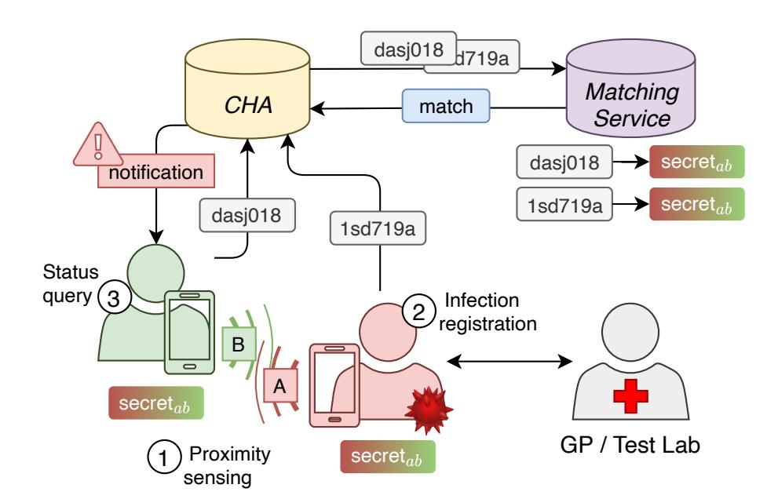

Fig. 1: Overview of the three phases of PIVOT.

implementation of our solution can be divided into three phases: (1) local proximity sensing, (2) infection registration, and (3) exposure score query. Prior to the operational phases, an initialisation phase is needed to exchange relevant parameters and setup accounts. We first provide a brief overview of the solution and then present the details on each phase in the following subsections.

#### A. PIVOT overview

There are four main actors interacting in our solution: users, medical personnel, a central coordinator, and a matching service. Users are voluntary participants who enroll for the possibility of being notified as well as notifying their close contacts. Medical personnel are verified medical professionals who make diagnosis based on the outcome of a test. For the sake of our description, we assume the general practitioner (GP) is able to carry this task and notify the users. In practice, this can be done by several different entities. The *central coordinator* operates the infrastructure. We assume this role is assigned to the central health authority (CHA). The CHA has an interest in gaining new insights on the transmission dynamics as well as mapping the spread of the disease. The *matching service* (MS) is an external party that that assists the central coordinator in computing the exposure score of users. We will discuss possible choices of MSs later in the text while only referring to a generic MS for the sake of describing our solution. From now on, we will refer to GPs, CHA, and MS as our choice of medical personnel, coordinator, and matching service respectively.

Our solution is based on three phases (as shown in Fig. 1) which are preceded by an initialisation step. During **bootstrapping** the necessary communication channels are set up to obtain the required (crypto) parameters, e.g., by downloading an application. GPs set up a privileged account that allows them to communicate test results to the CHA. Users create an account with the CHA as well. From then on, they participate in contact tracing and get notified if they have an high exposure score due to their encounters.

Second, users broadcast frequently changing anonymous public keys for **local proximity sensing**. Upon encounters with other registered users, they calculate two identifiers for that specific contact: one for infection registration and one for querying. We name these identifiers report hash and query

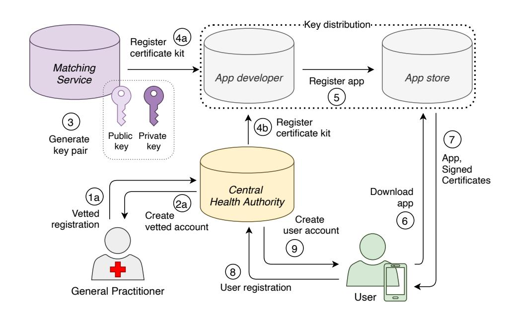

Fig. 2: System bootstrap phase: necessary (crypto) parameters distribution, medical personnel and user registration. The distribution could be realised differently depending on the infrastructure necessities.

hash, respectively. We use two separate identifiers per contact to better defend private interactions, since no two users will report the same contact identifier during registration of infections. The same holds during exposure score query, i.e., no two users will query with the same contact identifier. Figure 1 shows that matching happens when A's query hash matches B's report hash.

Third, **infection registration** occurs if a user is diagnosed with the disease by a GP. The user uploads to the CHA their encrypted report hashes. The CHA batches and sends them to the MS for building a list of the hashes of all the diagnosed users. The CHA fills the role of an aggregator such that the MS is not able to link hashes to users. Only the MS sees plain hashes.

Fourth, a user checks their exposure status by submitting a **exposure score query** to the CHA that contains their encrypted query hashes and some metadata about the contacts. The CHA keeps the metadata and forwards this request to the MS, which checks for matches within the list of hashes reported by diagnosed users. The CHA is informed on which query hashes matched, which enables exposure score computation and user notification. Special care is taken so that the CHA never learns the exact hashes and the MS cannot link hashes originated from the same user. Additionally, PIVOT allows the CHA to check the integrity of the matches returned by the MS via three **integrity hashes** established during local proximity sensing and propagated to the involved entities during the other two phases.

#### B. PIVOT in detail

*Bootstrapping:* In the initialisation phase, the necessary (crypto) parameters are exchanged, and accounts are registered (Fig. 2). Our system relies on a DH protocol to locally compute shared secrets between users upon close physical encounters. The process allows to compute unique identifiers for every contact (details in Sect. IV-B1). To calculate these contact identifiers some public parameters need to be agreed upon. The parameters are chosen by the CHA and distributed to the

{6}------------------------------------------------

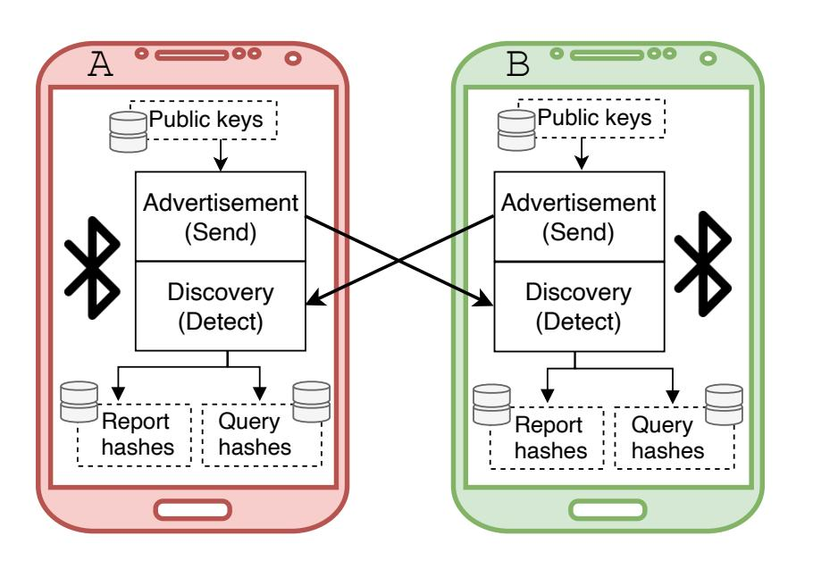

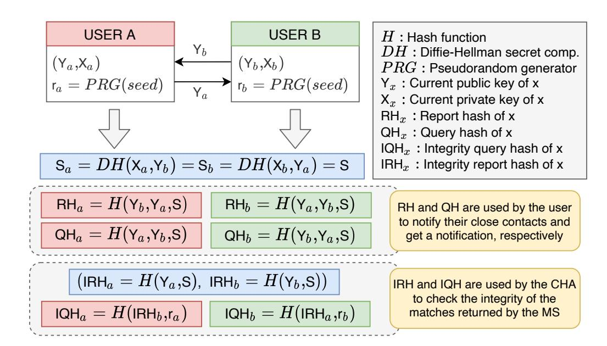

Fig. 3: Close contact registration. All the parameters are intended for the current period t (e.g., Xa, Ya, and S respectively refer to Xa,t, Ya,t, and St, and so on). In practice, public and private keys rotate frequently as well as the random number r

users by a *key distribution entity*. For example, they can be put in the contact tracing app by the developer in the form of a certificate kit (Fig [2\)](#page-5-1). The certificate kit can be verified as it is signed by a root of trust. Similarly, a certificate kit with the public key of MS can be embedded in the app. The MS relies on asymmetric key cryptography to obtain contact identifiers during infection registration and exposure score querying, without revealing them to the GPs, the CHA or any other external parties (details in Sect. [IV-B2](#page-6-1) and [IV-B3\)](#page-7-0).

To satisfy (S2) *Infection integrity*, registration of a test result can only be done by authorised medical personnel, thus, a privileged account is needed. GPs enroll for such an account by providing the CHA with, e.g., proof of medical expertise. It is possible to use existing infrastructure for this purpose.

Users who decide to participate in contact tracing download the app from the app store and register. It is important to allow the users to share, on a voluntary basis, demographics information such as the province or region of domicile, age range, and gender. These will contribute to monitoring the effectiveness and utility indicators during the operational phase of the app. Demographics metadata enriches the already recorded metadata to characterise contacts, allowing the CHA to enhance the exposure score model and their analytic capabilities, e.g., geographically mapping the spread of the virus.

*1) Local proximity sensing:* Figure [3](#page-6-2) illustrates how proximity (i.e., close contact) between two smartphone users is logged. Every user u generates an ephemeral public/private key pair, Yu,t/Xu,t, for the time period t, and locally broadcasts the public key Yu,t over BLE. To avoid tracking, this public key is changed every N min. Upon physical encounters with other participating users, the public information is picked up by their devices. For each observed public key, each user calculates a shared ephemeral secret following an interactive Diffie-Hellman exchange St = DH(Xown,t, Ypeer,t). For example, given a publicly known large prime number p (the discrete logarithm is intractable in Z ∗ p ) and a publicly known generator g for Z ∗ p , users A and B can compute the ephemeral public keys

$$\mathsf{Y}_{a,t} = g^{\mathsf{X}_{a,t}} \bmod p \tag{1}$$

$$\mathsf{Y}_{b,t} = g^{\mathsf{X}_{b,t}} \bmod p. \tag{2}$$

Upon a close contact, A and B compute the shared secret

$$S_t = \mathsf{Y}_{b,t}^{\mathsf{X}_{a,t}} \bmod p = \mathsf{Y}_{a,t}^{\mathsf{X}_{b,t}} \bmod p. \tag{3}$$

The public parameters are provided in certification kits during initialisation. We note that, for efficiency, elliptic curve DH should be used to calculate St.

The user then computes a cryptographic hash from the concatenation of its own public key, the observed public key and the shared secret: QH = H(Yown,t, Ypeer,t, St). The obtained hash, i.e., the *query hash*, is used for query purposes only. A second hash for infection registration, i.e., the *report hash*, is obtained by interchanging the own public key and observed public key: RH = H(Ypeer,t, Yown,t, St). By using two separate hashes we limit the social graph building capabilities, as all query and report hashes are unique.

In addition to the QH and RH, the proximity exchange based on DH can be extended with a pair of hashes used for integrity purposes, as shown in Fig. [3.](#page-6-2) Thus, each user computes a pair of integrity report hashes. First, IRHown = H(Yown,t, St), which is uploaded by the user with its report hashes following a positive diagnosis (i.e., *infection registration*). Second, IRHpeer = H(Ypeer,t, St), which primary use is to compute a third hash, i.e., the *integrity query hash*, IQHown = H(IRHpeer, rown), where rown is a randomly generated number. The latter is uploaded by the user when requesting the exposure score (i.e., *exposure score query*). We discuss the whole procedure in more details in Sect. [IV-B4,](#page-8-0) leaving out these hashes from the discussion of phases 2 and 3.

Users store locally the hashes they compute for each of their encounters, together with the duration and a distance estimate, i.e., the recorded attenuation values. The hashes can be deleted when the maximal incubation period is reached since they lose their relevance. In addition, as mentioned earlier, users' ephemeral public keys change every Nmin, a parameter which allows to achieve (F1) *Close contact logging*. In practice, N can be linked to the rotation frequency of the BLE MAC address, which is device-dependent, in an effort to avoid linkage between the two.

*2) Infection registration:* Figure [4](#page-7-1) depicts the most important steps of the infection registration phase. The goal is to build a

{7}------------------------------------------------

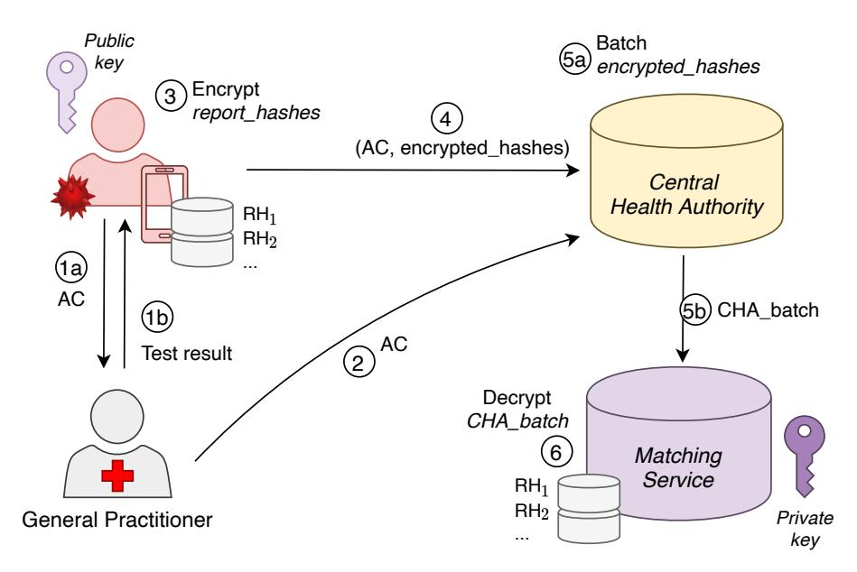

Fig. 4: Infection registration phase: a user interacts with a licensed general practitioner (GP) and is enabled to share the report hashes with the CHA via an authorization code (AC). CHA batches the hashes from different users and sends them to the matching service, which can ultimately decrypt them and build a DB of (unlinked) diagnosed users' hashes.

database that contains all the hashes of the diagnosed users, i.e, the report hashes. Special care should be taken such that only MS can access this database and it cannot link different report hashes to the same user. Thereby, we aim to satisfy (P1) *Exposure score privacy*, as the MS does not know which hashes belong to which user and the CHA does not see the plain hashes; (P2) *Diagnosed user privacy*, as report hashes are hidden to the public; and (P4) *Interaction privacy*, as no entity learns which hashes belong to which user and with whose hashes they match.

A user requests a test either because they develop symptoms or because they receive a notification. As a result of a positive test, the user should be able to upload their report hashes. To this extent, we need an authorization procedure which allows only who is infected to perform the upload. One possible way of doing so is by generating a random authorization code (AC) via the app which is shared with a trained employee, e.g., the GP. At the level of the CHA, AC is linked to the test performed by the user. In this way, when (and if) a user decides to upload their report hashes, they can share AC (or an hash based on this value) with the CHA to get an authorization. This is a delicate procedure since it requires the interaction of databases used for manual contact tracing and databases dedicated to automatic contact tracing, which should never be correlated.

During the interaction between the user and the medical personnel, an alleged starting date of infectiousness can be established at the purpose of filtering out unnecessary hashes before the upload. Therefore, the user encrypts their hashes with the public key of the MS and uploads them to the CHA. A proxy server is needed, between the diagnosed user and the CHA, to hide the user's IP and maintain a strict separation between the query phase and the infection registration phase. Additionally, an expiry date for report hashes can be computed based on the day the contact happened. This information is later used to remove hashes from the database.

Once they have collected encrypted report hashes from different users, the CHA is in charge of batching them and

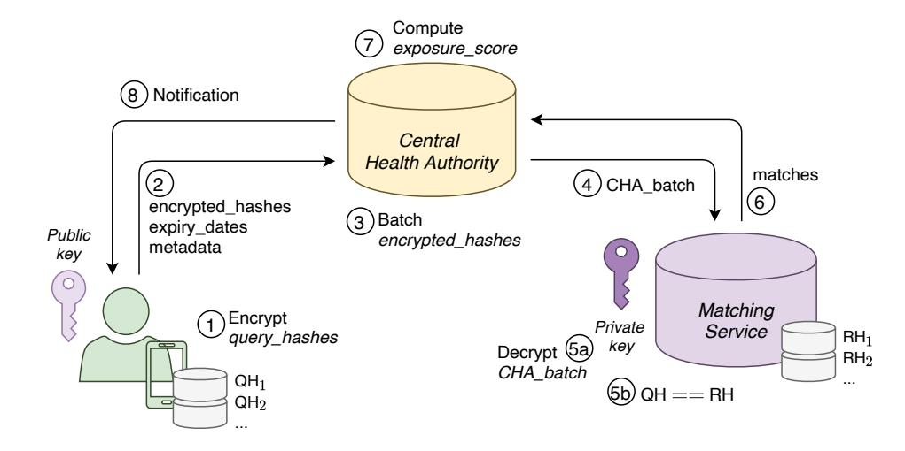

Fig. 5: Exposure score query phase: the user sends their list of encrypted query hashes. The CHA forwards this list in batches to the matching service, which decrypts the list and searches for matches within its database of hashes of diagnosed people. The result is returned to the CHA which computes the exposure score and informs the user accordingly.

forward the batch to MS. Thus, the CHA does not learn the hashes, and batching avoids that MS learns which hashes belong to the same user. The MS then decrypts and builds a database of report hashes which is used in the last phase, i.e., exposure score query.

We note that infection registration can aid the study of transmission dynamics by means of the sharing of aggregated, anonymous information with the CHA and epidemiologists. For example, in this phase, it is possible to link the test outcome to the primary reason for testing, which may, in turn, be the reception of a notification.

3) Exposure score query: Figure 5 shows the interactions during the exposure score query phase. The user encrypts their query hashes with the public key of the MS and sends them to the CHA with the expiry date and metadata about duration (i.e., number of observation per each key) and distance (i.e., signal attenuation) of each contact. The CHA batches the encrypted hashes of several users, shuffles them, and sends them to MS, while keeping the metadata for themselves. MS decrypts the query hashes and compares them to its database of reported hashes. Thus, it indicates to the CHA which encrypted hashes (i.e., which index in the batch) matched one of the diagnosed users' hashes. CHA never learns the hashes, while MS is not able to link hashes from the same user, thus complying with (P4) Interaction privacy and (P1) Exposure score privacy. The latter computes the exposure score according to the most recent transmission dynamics model and notifies the user when the score exceeds a threshold, thereby satisfying (F4) User notification. We note that in order to compute the exposure score it is possible to rely on the total amount of exposure to diagnosed users, which is not necessarily linked to a specific number of users, e.g., the total exposure is the same whether a user was close to 5 diagnosed user for 5 min or 1 diagnosed user for 25 min. This assumes that the contacts are registered at approximately the same distance and the alleged infectiousness of the diagnosed users was the same at the time of the contact. Therefore, only a minimum threshold for registering contacts is needed, which research and setting are outside of the scope of this work. To minimize information leakage, CHA can use

{8}------------------------------------------------

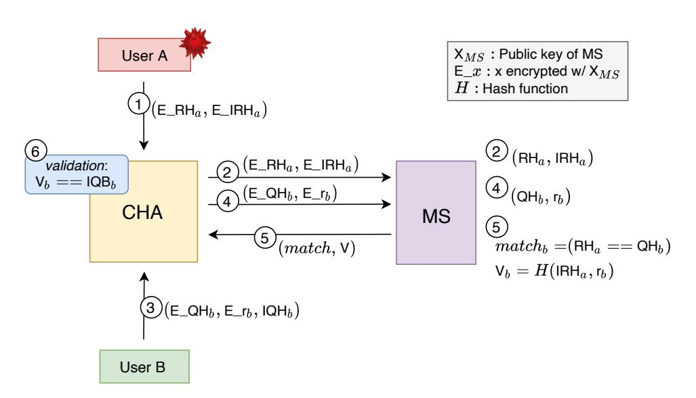

Fig. 6: Integrity check of matches returned by the MS. Step 1 and 2 represent the infection registration phase. Step 3 and 4 are an exposure score request. Along with the matching result, the MS sends an hash which allows the CHA to check whether matches are real. Note that this is a simplified scheme: in practice, the CHA sends batches of encrypted hashes to avoid linkage (Steps 2 and 4).

a colour encoding that translates their score into an advice. For example, *green* may correspond to very low chance of infection, *orange* to a medium-level, and *red* to a critical exposure.

By outsourcing the matching to MS, we support (F3) *Exposure score computation* and (F4) *User notification* while clearly separating concerns and providing only the needed information to each involved party. Furthermore, data collected at this stage can be re-purposed to map the spread of the disease geographically. If users provide their coarse area of domicile during bootstrapping (Sect. [IV-B\)](#page-5-2), CHA leans aggregated information on the average exposure score for that area and can allocate testing resources accordingly. CHA also learns the metadata of all contacts and which contacts were with diagnosed individuals. This may turn useful to epidemiologists for obtaining new insights w.r.t. transmission dynamics, especially when integrated to data gathered through manual interviews and the alike.

*4) Integrity check:* We trust CHA and MS to act honestly when, respectively, notifying the user and performing matching. However, PIVOT can take advantage of an integrity check to provide the CHA with an additional measure to validate matches returned by the MS. Figure [6](#page-8-1) shows the steps needed to verify if the MS is reporting a match that was truly originated by (a) a valid report hash, and (b) a query hash sent by the user. During *infection registration*, user *A* associates the encrypted report hashes RHa to a set of encrypted *integrity report hashes* IRHa, and uploads them together to the CHA. These hashes are sent to the MS using a batching strategy (Sect. [IV-B2\)](#page-6-1) so it can decrypt them using its private key. It is important that RH and IRH are not decoupled during batching such that the MS can store them in pairs. Then, during the *exposure score query* phase, user *B* sends the encrypted query hashes QHb to the CHA together with plain integrity query hashes IQHb and the encrypted random numbers rb used to generate them. CHA then attaches the encrypted rb to the encrypted QHb before sending them to the MS in batches (Sect. [IV-B3\)](#page-7-0). Eventually, the MS returns a list of matches for the batch

requested by CHA, but it also provides verification hashes that are computed using the random numbers and integrity report hashes: Vb = H(IRHa, rb). In this way, the CHA can verify whether the verification hash Vb matches the integrity hash sent by user *B* IQHb to discover false positive matches.

Using the random number is necessary to disallow the CHA to discover whether a user is within its list of encounters. It cannot, in fact, compute the integrity query hashes of one of its close contacts because it misses the random number. The latter is encrypted by the user and sent to MS. This integrity mechanism does not affect the implications of a collusion between CHA and MS.

## *C. Additional considerations*

- *1) Scalability and interoperability:* Our solution is practical (i.e. easy to implement), as it can be built with existing crypto building blocks and builds on already existing technology stacks. Furthermore, the system easily works across borders as their is no need for the local CHAs to exchange data. Instead, a global MS ensures that physical encounters of infected people across borders are dealt with. Of course, it is important that the individuals phones register the contact in the same way, i.e. by computing query hashes and report hashes. The ideal data structure and infrastructure to perform matching at a global scale is beyond the scope of this paper.
- *2) Communication cost:* In PIVOT, the main communication cost for users occurs in the infection report and the exposure score query phases.

In the infection report phase, each newly infected user would send to the CHA all of their report hashes logged in the last 14 days prior to developing symptoms encrypted with the public key of the MS. If we denote the average number of logged closed contacts per user per day as Ncontact, then the communication cost in the report phase for a newly infected user would be 14 × Ncontact × (|E RH| + |E IRH|), where (and below) | · | denotes the bit length (e.g., |E RH| is the length of an encrypted report hash). Note that if the additional integrity check explained in Sec. [IV-B4](#page-8-0) is not implemented, then the communication cost in this phase would be reduced to 14 × Ncontact × |E RH|.

In the exposure score query phase, for each day, each user would send to the CHA the following data per logged close contact for the day: the integrity query hash and the metadata of the close contact in cleartext 3 as well as the query hash and the random number used for generating the integrity query hash, both of which are encrypted with the public key of the MS. This will result in the following communication cost: Ncontact × (|IQH| + |metadata| + |E QH| + |E r|). Similarly, if the additional integrity check is not implemented, then the communication cost would be reduced to Ncontact ×(|metadata|+|E QH|). As the communication cost due to the colour coded exposure notification delivered to the user is negligible compared to the cost incurred due to the query data, we ignore it in our analysis. Furthermore, users can query only the newly logged query (and integrity) hashes.

3Note that these data are still protected via the encrypted communication channel between the user and the CHA.

{9}------------------------------------------------

If PIVOT is set to use SHA256 as a hash function (hashes with a length of 256 bits), elliptic curve-based encryption/decryption algorithm (with a key size equal to 256 bits, hence ciphertext size equal to 512 bits), and AES256 as the encryption scheme to secure the communication between the user and the CHA, and we assume that on average each user logs 200 close contacts per day as well as the metadata per contact is less than 256 bits, then the communication cost for the infection registration and the query phases are as follows.

- Report data: ≈ 360KB (14 × 200 × (512 + 512) bits) per infected user per report when PIVOT is implemented with the integrity check and ≈ 180KB (14 × 200 × 256 bits) if it is implemented without the integrity check.
- Query data: ≈ 38KB (200 × (256 + 256 + 512 + 512) bits) per user per day when PIVOT is implemented with the integrity check and ≈ 19KB (200 × (256 + 512) bits) if it is implemented without the integrity check.

The communication cost per user could be further reduced if the user encrypts their logged hashes in batches rather than separately one by one. However, this would inevitably reduce the privacy protection of users as the MS would know that the hashes in these batches come from the same user.

## V. SECURITY AND PRIVACY ANALYSIS

# *A. Threat actors*

We present the threat actors we refer to in our security and privacy analysis. Each attacker is described by their knowledge, capabilities, and goals.

*1) Users:* We identify two types of users: *honest-butcurious users* and *malicious users*. *Honest-but-curious users* can perform occasional disclosure attacks (A4.1), hence deanonymising other users by remembering their encounters and using data gathered during the operational phase of automatic contact tracing. This type of users is capable of querying the system to learn the exposure score of their contacts. They can also collect a manifold of encounters by strolling through the city, including additional metadata on their contacts by storing the exact time and location of encounters (e.g., installing another app that leverages the same communication infrastructure). *Malicious users* can carry out two de-anonymisation attacks: the occasional disclosure attack (A4.1) of target users and a paparazzi attack (A4.2) that targets a wider set of victims. Additionally, they may seek personal benefit by tinkering with exposure scores. For example, they could force the authorities to test them by raising their score (i.e., Terrorist attack (A2)); or they could raise a target user's exposure score in the hope that they would self-isolate. Malicious users are also technically more skilled than the honest-but-curious ones: they can inject arbitrary contacts by directly modifying the app, and register multiple accounts as well as use long-range antennas to eavesdrop local communications, inferring public data broadcast by other devices, on a small scale (A5).

*2) Malicious third-party:* A *malicious third-party* extends the *malicious user* as it additionally has the goal to disrupt the service (e.g., DDoS) and cause panic (e.g., Lazy Student attack (A1)). Furthermore, its capabilities are scaled up. Thus, it can obtain a manifold of accounts and can roll out a network of antennas and Bluetooth transmitters at scale (A5).

*3) General practitioners:* The *GPs are honest-but-curious* actors. They follow the protocol specification but might want to know additional sensitive information about their patients. GPs might already know their patients' identity and medical record, however, they might also want to learn their trajectories and encounters. We trust GPs to act with integrity and thus diagnose patients truthfully: they will not knowingly register a positive diagnosis if a given user has not tested positive.

We note that a collusion between GPs and other entities simplifies linking test results to users. This holds in case of a decentralised system, since it is due to the authorization upload mechanism used for uploading tokens of diagnosed people.

- *4) Central health authority:* The *CHA is an honest-butcurious* party that coordinates the protocol. Apart from learning the exposure score of the users, they might also aim to gain out of scope knowledge – the identity (A4), social interaction graphs (A6), or trajectories of individuals (A5). To this extent, they can correlate information from other data sources it normally has access to, e.g., databases used for manual contact tracing. We assume that the CHA will not turn malicious and undermine the functioning of the underlying system, e.g., send fake notifications or enforce policies on arbitrary users (A3). This would clash with its goal of curbing the spread of the virus.
- *5) Matching service:* The *MS acts as an honest-but-curious* party. It aims to gain out-of-scope knowledge about users: it tries to de-anonymise users and learn their exposure score (A4), construct their trajectories (A5) or build social interaction graphs (A6) by using its knowledge on query and report hashes. To this extent, it can observe keys broadcast by users in public. Thus, it can try to link hashes to users on a large scale. However, with respect to triggering false notifications (A3) by cheating in computing matches, we consider MS to be *malicious*.

We note that, by colluding with the CHA, MS can link hashes to users. It is, therefore, of the utmost important to choose a trustworthy MS, which has no hidden interests in gaining access to data nor in providing such information to the coordinator or a central authority. We recognize that a despotic government might act as a malicious central coordinator and dictate access to data handled by MS. However, we are convinced that such behaviour would go beyond the implications of releasing contact tracing data. Organizations fit to fill the role of MS are to be chosen within the legal framework of a given country, with special attention upon third-parties audit with no conflicts of interests. As this goes beyond the scope of this paper, we refer to recent work that has proposed a charter for the selection of trusted intermediaries among existing governmental institutions [\[29\]](#page-21-11).

#### *B. Security analysis*

*(S1) Contact integrity:* PIVOT ensures that only real physical encounters impact users' exposure score. Using a combination of DH and proper separation of concerns, our solution protects against attackers trying to inject false encounters which invalidates exposure scores and related analytics. This is 

{10}------------------------------------------------

achieved by combining several defence mechanisms. First, publicly broadcast information (users' ephemeral public keys) are not used directly for reporting infections nor querying for exposure score. Instead, locally computed hashes are used. Second, each encounter is registered as a pair of hashes that, apart from users' public keys, take as input a shared secret known only to the two users in close contact. Third, each encounter is registered by both users using two different hashes in reverse order – one for registering infections and one for querying exposure score. These measures ensure that our system supports unique per-user-per-contact identifiers (hashes) which are not broadcast to the public and can be computed only by the two users in close contact (due to the use of a shared secret key as an input for the computation). This makes impactful injections of false contacts unlikely.

In addition, using DH protects against indiscriminate replay attacks. In fact, the shared secret will be different for every pair of users, therefore just replaying a public key broadcast by another user is not enough to establish a fake contact between two victims. An adversary might attempt to carry out a real-time relay attack – acting as a routing node between two victims. In this way, a physical contact is emulated, which can potentially lead to fake notifications and service disruption. However, this consists of a considerably targeted attack compared to just replaying a public key which observed in the wild. Relay attacks can be mitigated by incorporating information about the surrounding environment which is used to build a unique signature verifiable by the receiving party. In recent work, absolute location of the user and current time have been considered [\[30\]](#page-21-12), but other side-channel measurement can be taken into account such as the vibrations or ambient sounds [\[31\]](#page-21-13).

*(S2) Infection integrity:* PIVOT defends against malicious users falsely claiming a positive diagnosis (e.g., aiming to cause panic) by limiting who and when can report infections. Only authorised medical experts (e.g., GPs) are allowed to report diagnosis and, at the same time, enable users to upload their public keys to the central coordinator. This is intrinsic to the authorization mechanism described in Sect. [IV-B2.](#page-6-1) As outlined before, a proxy server is needed to hide the identity, and the account, of a user uploading their report hashes, which prevents any linkage between query and report hashes.

*(S3) Notification integrity:* As PIVOT ensures infection integrity and contact integrity, and assuming that the the CHA is honest-but-curious, a user will receive a notification that they are at-risk only if they had enough exposure to (i.e., close encounters with one, or more) diagnosed users. To protect against cheating MS, we use integrity checks on matches (Sect. [IV-B4\)](#page-8-0). This allows the CHA to be protected against attacks that compromise the MS and, consequently, the received matches. By doing so, the CHA defends against false notification due to, e.g., breaches occurring on the side of the MS or a compromised communication channel.

#### *C. Privacy analysis*

*(P1) Exposure score privacy:* In PIVOT, the exposure score of users is only known by the CHA, which is in charge of its computation. The users themselves learn their status thanks to a notification (or the absence of it) that might be more or less coarse-grained, as discussed in Sect. [IV-B3.](#page-7-0) There is no need for the user to know an exact exposure score to fulfil the notification of at-risk users (F2), while a color encoding scheme might be enough.

The honest-but-curious MS is not able to associate query and report hashes to specific users since they are both batched by the CHA. In fact, batching guarantees the unlinkability of the sender while only allowing the MS to infer the number of matches per batch. Hence, as the MS does not know to whom these hashes belong nor the related metadata – such as proximity and duration of contacts – it cannot compute exposure scores of users who query nor link them to real people. An analysis of batching in our case can be found in Sect. [VII.](#page-15-0)

*(P2) Diagnosed user privacy:* As the exposure score is calculated by CHA based on the matching results provided by the MS, users never get to know which of their close contacts affected their status. Moreover, the CHA is oblivious to the hashes, only observing their encrypted version. As underlined before, the MS is the only party that has access to the hashes of users. However, if the MS participates in the protocol as a user and gets in close contact with other potentially infected users, it will be able to de-anonymise them once it sees their hashes reported. This threat holds true, although slightly harder to carry out, for every user who is able to be in close contact with their target. They can query the CHA multiple times with a bulk of contacts related to one, or more, prolonged encounters with their victim. Eventually, the score/status returned by the system will reveal some information, i.e., whether the victim was diagnosed in the (few) days after their encounter. It is worth noticing that no automatic contact tracing solution protects against the accidental disclosure of health information. If a regular user has encountered only, let's say, three people in the past two weeks, and gets notified to be at-risk, they will likely be able to de-anonymise the diagnosed user by remembering this skimpy group of individuals.

The impact of de-anonymisation attacks can be mitigated in several ways. Honest-but-curious users can be prevented from learning the status of their close contacts by simply enforcing a limit on the number of queries associated to each account. To protect against stronger actors, which can register multiple accounts, the CHA can re-use encrypted query hashes. After routing them to the MS, the latter can easily check whether they have seen a query hash before. Since searching for matches among already checked query hashes is a needed feature due to the upload of new report hashes by diagnosed users, the CHA would need to send new query hashes and old query hashes separately to the MS. In this way, every time a user tries to query with a query hash which the CHA, and MS, have seen before, the MS will be able to report this to CHA after decryption. In order not to give to the CHA the superpower of guessing if users are among their encounters, MS can just discard the duplicate hash and return a non-match by default. This will not improve the capabilities of the CHA of querying MS with its own query hashes. By doing so, an attacker is confined to the use of a single account per target user. As a

{11}------------------------------------------------

final countermeasure to combat highly targeted attacks, the CHA could require the authentication of the users by means of a permanent or semi-permanent ID. This exposes users' privacy since the CHA will be able to associate exposure scores to identities instead of anonymous accounts, but represent an instrumental way of rate limiting the amount of queries performed by an entity capable of registering a disproportionate number of accounts. This measures enormously reduce the possibility to disclose the exposure score of diagnosed and at-risk users to third-parties.

*(P3) User location privacy:* PIVOT does not collect, store or process location data. The ability to track a user is linked to the public key validity time, which is in turn bounded to the MAC address rotation frequency (device-dependent). The honest-butcurios CHA and MS might run a network of beacons (or use existing infrastructures) to register close encounters with users indiscriminately. However, considered in isolation, they will not have enough data to link public keys (broadcasting material) to report and query hashes (uploaded material). On the one hand, the CHA never obtains plain hashes from users, since they are encrypted using MS public key. On the other hand, the MS sees several unrelated hashes due to batching. However, If the CHA and the MS collude, they can then track users' past movements by linking plain query hashes to users. To defend against this threat, PIVOT could be enhanced with the solution proposed by [\[10\]](#page-20-9), i.e., sharing the public key in several pieces ensuring that at least N contacts have been made before a user can determine the public key. While being computationally inexpensive, this further reduces the tracking capabilities to a very short time window.

*(P4) Interactions privacy:* PIVOT protects users' interactions privacy by not allowing social graphs (both global and local proximity interaction graphs) to be built by any threat actor. In our solution, none of the hashes are ever broadcast in the public, which prevents adversaries from discovering contacts between users, i.e., build a global interaction graph. Even by knowing the public keys of target users, it is not possible for the adversary to derive their private keys and computationally hard to build a rainbow table that contains all the possible salted hashes (assuming that the DH parameters are selected properly), as explained in Sect. [IV-B1.](#page-6-0)

The CHA has no access to users' hashes as they are encrypted on-premises and decrypted only when they reach the MS. Additionally, only query hashes can be linked to a given account since report hashes are uploaded via a proxy. This prevents CHA from building local proximity graphs of the users who upload their report hashes or query their exposure score. Since CHA batches report and query hashes before providing them to the MS, the latter cannot link a set of hashes to a single user to building interaction graphs of any sort.

As before, if the MS and the CHA collude, and use sidechannel information, they can construct a proximity interaction graph of a target user, although this is hindered by the use of a proxy. One way to prevent this privacy nightmare is by leveraging trusted execution environements (TEE) at the MS. By doing so, all the computations happen in a trusted enclave, the MS never learns the infected list nor the contact list. We leave such an extension to TEE experts. A possible extension, which is computationally expensive for the edge but not for a central coordinator, leverages private set intersection [\[32\]](#page-21-14). We can reduce the degree of trust we put on the authorities by only granting them access to the intersection between the report hashes list and the query hashes list instead of sharing the entire list of query hashes.

## VI. COMPARISON

In the section, we compare our design to solutions presented in Sect. [II.](#page-1-0) We split the discussion in two strands: first, we define a baseline solution to compare different design choices in terms of analytics for utility evaluation; second, we evaluate compliance of each solution w.r.t. security and privacy requirements defined in Sect. [III.](#page-2-0) Table [I](#page-12-0) and Table [II](#page-13-0) give a concise summary of our analysis.

# *A. Utility evaluation*

Here, we consider our previously defined performance and utility indicators to analyse the additional advantages of providing the central coordinator with more data. To this extent, we elicit important metrics for our key indicators from evaluations of currently deployed schemes based on DP3T [\[22\]](#page-21-4), [\[23\]](#page-21-5). We note that it is not possible to compare PIVOT to other proposed protocols since data gathered for evaluation also depends on the contact tracing infrastructure within which the protocol is developed and deployed. Instead, by relying on analyses of already deployed solutions, we can weight the potential benefits of a specific design choice:

What is the advantage of computing the exposure score centrally (coordinator-side) instead of on-premises (user-side)?

We consider the metrics needed for a proper evaluation of automatic contact tracing solutions and assign a colourcoded score to the amount of data collected for that purpose. Table [I](#page-12-0) shows the comparison between *decentralised* (D) and *centralised* (C) exposure score computation. For (D) we refer to the evaluation of SwissCovid as an example of an application based on DP3T, a decentralised protocol, that only shares minimal information with the central coordinator [\[23\]](#page-21-5). Regarding (C), we assume that the exposure score is computed centrally (as in PIVOT) but the entity in charge of computing the score is oblivious to the pseudonyms shared by users (differently from ROBERT or TraceTogether). However, the coordinator has access to contacts metadata and (rough) users' demographics.

We start by considering the performance indicators. First, the *user engagement*:

(D) In SwissCovid, the operators can monitor the total absolute number of downloads, have information on the total keys uploaded each day and the delay between the onset of symptoms and the upload itself, and the percentage of keys uploaded among the ones generated. Additionally, they can estimate the number of active users by monitoring dummy requests that are sent every 5 days.

{12}------------------------------------------------

TABLE I: Comparison between decentralised score computation (app based on DP3T) and centralised score computation (app based on PIVOT) w.r.t. our effectiveness and utility indicators.

| Indicators                   |                     | Decentralised score (DP3T-like) | Centralised score (PIVOT-like) |  |
|------------------------------|---------------------|------------------------------------|-----------------------------------|--|
| User engagement n            | Uploaded keys       | ✓                                  | ✓                                 |  |
|                              | Active users        | ✓                                  | ✓                                 |  |
| Notification effectiveness n | Threshold feedback  | ✗                                  | ✓                                 |  |
|                              | Total notifications | ✗                                  | ✓                                 |  |
| Contacts dynamics            |                     | ✗                                  | ✓                                 |  |

(C) Same properties as *(D)*. However, the active users are estimated more precisely via the link between a query and a specific user. Thus, the operators know exactly how many users are querying the system, while only missing the ones using the system offline.

Metrics to estimate the *notification effectiveness* can be divided in two groups: effectiveness of the technological stack (BLE-related), and precision and recall of the notifications:

- (D) The app is not able to monitor how many users were triggered as at-risk given some parameters for the exposure score function. These parameters can include the attenuation threshold, i.e. the estimated distance, and the weights associated to the attenuation buckets. As a result, changing these parameters requires to carry out time-consuming tests or ask for external feedback. SwissCovid operators relied on tests on a relatively small scale and feedback from users reporting that "expected notifications were not triggered" [\[33\]](#page-21-15).
- (C) The central entity computes the exposure score by knowing number of matches and their metadata, hence controlling the notifications. If the definition of at-risk exposure changes due to, for example, new findings on the contacts dynamics or the infectiousness of the virus, the central coordinator can on-the-fly verify whether a new threshold increases the total number of notification by a specific margin.
- (D) Decentralised solutions rely on people providing information on what the real cause for testing was, such that authorities get data on how many people tested *mainly because* they were notified by the app, and how many of them turned out to be positive [\[23\]](#page-21-5). A rough estimation on people going into quarantine is given by the number of calls to the infoline associated with the application. Moreover, SwissCovid operators rely on field study on small controlled groups, like the work in progress performed in the canton of Zurich [\[34\]](#page-21-16). Here, the app seems to perform better compared to the rest of the country which might indicate bias in the chosen group.
- (C) Controlling the exposure score computation process gives the system control over the notifications. On top of the people voluntarily sharing the reason why they tested to GPs, the authorities have the total number of notifications and obtain a better estimation of the recall of the system. In this scenario, users might even disclose whether they are quarantining after the notification or if they decide to contact authorities since the central system knows already

the exposure score, while in the decentralised scenario the two information are to be kept separate.

Finally, we take a look at utility indicators with the *contacts dynamics*:

- (D) No epidemiological data is shared with central authorities.
- (C) Possibility to share demographics, contacts metadata of at-risk users that might voluntarily provide their status (diagnosed) after a test to expand the knowledge of the epidemiologists.

## *B. Security*

*(S1) Contact integrity:* There is no solution ensuring perfect integrity of contacts. Decentralised and centralised solutions offer no protection against the injection of publicly known pseudonyms in a user's own list or emulating contacts. This might become problematic for two reasons: (1) the government wants to scale testing but there are no guarantees about a selfdeclaration of close contact, (2) private companies – especially during a less strict phase of lockdown – have to agree on letting one employee to work from home and self-isolate. In particular, in a decentralised matching solution, a malicious user who wants to be tested to be reassured about their exposure score might use the public bulletin board of tokens uploaded by diagnosed users or simply fake a notification (e.g., via a clone app). In DP3T, diagnosed users upload their daily keys used to generate pseudonyms (i.e., upload-what-you-sent). This is enough for skillful users to fake a contact by just crafting and injecting an observed infected token. Decentralised solutions using DH primitives (CleverParrot and Pronto-C2) decouple what is uploaded to the public board from what is broadcast. This allows to prove a contact by both parties acknowledging it, thus preventing attacks which make use of the public board. Centralised matching solutions are not affected by such an attack, since the central coordinator hides the databases of infected pseudonyms.

Replay and relay attacks affect, to different extent, every solution. This is due to the difficulty to verify whether an attacker has re-broadcast a pseudonym they have previously observed from a rightful user. A replay attack consists of the indiscriminate broadcasting of publicly observed tokens, especially if these tokens belong to people which are likely to get a test in the near future (e.g., recording in the vicinity of an hospital). This leads to many false positive notifications in case the target user becomes sick, therefore threatening the integrity of the system. Integrity checks are usually performed via the use of timestamp that limit a broadcast pseudonym

{13}------------------------------------------------

TABLE II: We compare our solutions to the one presented in the related work section. We additionally provide a categorization which will aid in comparing the main characteristics of each proposed solution: a solution can perform centralised or decentralised token matching; the exposure score is obtained centrally or on-device only; in order to perform matching, a diagnosed user can upload what he *Sent* to nearby users or what he *Received* from nearby devices. We use a three-color code scheme to describe the level of fulfillment of a certain requirement w.r.t. the other solutions: *basic* ▼, *intermediate* ◄, and *complete* ●.

|         | Token generation Decentralised    |               |                              |                |             | Centra                   | alised     | Decei       | ntralised    |
|---------|-----------------------------------|---------------|------------------------------|----------------|-------------|--------------------------|------------|-------------|--------------|
|         | Token matching                    |               | Decentralised  Decentralised |                |             | Centralised  Centralised |            |             |              |
| •       | <b>Exposure score computation</b> |               |                              |                |             |                          |            |             |              |
| •       | Upload strategy                   | Sent Received |                              | Sent           | Received    |                          |            |             |              |
|         |                                   | DP3T [10]     | CleverParrot [15]            | Pronto-C2 [12] | Epione [14] | BlueTrace [9]            | ROBERT [8] | DESIRE [13] | PIVOT (Ours) |
| ity     | Contact integrity                 | ▼             | •                            | •              | •           | •                        | •          | •           | •            |
| curi    | Infection integrity               | •             | •                            | •              | •           | •                        | •          | •           | •            |
| Se      | Notification integrity            | •             | •                            | •              | •           | ▼                        | ▼          | ▼           | ◀            |
|         | Exposure score privacy            | •             | •                            | •              | •           | ▼                        | ▼          | ◀           |              |
| Privacy | Diagnosed user privacy            | ▼             | •                            | •              | •           | ◀                        | •          | ◀           | •            |
|         | User location privacy             | ▼             | •                            | •              | •           | ▼                        | ▼          | •           | •            |
|         | Interactions privacy              | •             | •                            | •              | •           | ▼                        | ▼          | •           | •            |

to a limited window of validity (ROBERT and BlueTrace). When users upload what they broadcast, it is possible to bind pseudonyms to epochs (DP3T and Epione) resulting in a pseudonym that can be re-broadcast for several hours. Mitigation include the introduction of interaction [27]: they can compute a message authentication code (MAC) based on a challenge and a timestamp. While working within a limited time window, this mitigation does not fit in current schemes that assume no communication between two users. However, non-interactive integrity checks are also possible [30]. All the solutions involving a DH-like exchange (CleverParrot, Pronto-C2, DESIRE) protect against replay attacks due to the doubleacknowledgment needed to build a close contact. Relay attacks, however, need to be tackled via additional defenses – such local measurements as described in Sect. V-B – since we cannot impede the targeted, real-time broadcasting of pseudonyms between two victims who are not in close contact.

Like all the solutions based on DH-exchange, PIVOT relies on unique per-user-per-contact hashes and obfuscates these hashes to the public, thereby reducing the possibility to cheat and increasing the probability that testing close contacts will not result in a waste of resources. As discussed in Sect. V-B, given the bi-directional nature of our protocol, the success of replay and relay attacks is severely impaired. In particular, a third-party cannot relay public identifiers indiscriminately and must target one pair of users within the refresh window of their public keys. If only one of the two public keys is transmitted and the owner of the public key is tested positive, the receiving party would not be notified of being at risk.

(S2) Infection integrity: Under our threat model, all the solutions support infection integrity by only allowing medical personnel (e.g., GPs) to grant the upload and enable notification.

(S3) Notification integrity: The analysed solutions put different degree of trust on the back-end server in charge of handling pseudonyms. On the one hand, solutions that perform matching and exposure score computation centrally are generally less transparent. This exposes the users to severe threats – such as arbitrary notification or the use of irrelevant data sources for exposure score computation – which are hard to detect via audits. Schemes that perform decentralised matching

and exposure score computation publish the pseudonyms of the diagnosed users, or a derivation thereof, which makes them auditable by third-parties. Assuming that the entity managing the back-end server system decides to tweak its records, this would result in an indiscriminate attack that would undermine the functionality of the system itself with little to no effect on end-users.

In PIVOT, we do not link the identity of the user to their account and distribute the information based on the role of each entity. Therefore the central coordinator will be in charge of notifying the users and computing the exposure score, like in other centralised schemes, but delegates the matching to a matching service. Additionally, we prevent MS from cheating via an integrity check which is embedded into the local proximity exchange. However, we still rely on a (trustworthy) CHA to behave correctly when reporting the notifications. An honest-but-curious CHA might still target users for the sake of achieving its goal of halting the virus from spreading, ending up causing harm.

Our protocol could potentially be extended to include the integrity report hash together with a notification, which gives users a way to protect against fake notifications. In order not to break the privacy guarantees of PIVOT, we do not include any information that could expose other users to de-anonymisation attacks.

#### C. Privacy

(P1) Exposure score privacy: Solutions that perform decentralised matching keep the exposure score computation on the user's device. This is the most privacy-preserving option for the users but denies health authorities and epidemiologist access to this relevant piece of information. Since Epione performs matching using PSI, it can be regarded as belonging to this category. When centralised matching is adopted, the exposure score is computed by the coordinator of the protocol but hidden from the public, who only get to see a notification or a score encoded in few levels. This creates a single point of failure for exposure scores and a menace to the re-purposing of sensitive information. To mitigate such threats, PIVOT outsources the

{14}------------------------------------------------

role of the matching service to a separate entity, and provides the central coordinator only with relevant information. The plain hashes are never learnt by CHA, which in turns only gain access to the exposure scores of (anonymous) users.

*(P2) Diagnosed user privacy:* Local matching (i.e., decentralised matching) enables malicious users and third-parties to de-anonymise diagnosed users among their close contacts. On a small scale, the attack can be carried out just by relying on the attacker's memory, i.e., remembering all of your close contacts in the last few days. On a larger scale, or just to improve its effectiveness, users can download parallel, thirdparty, apps to sniff public pseudonyms and store them with the exact location and time of the encounter. When inspecting the public database of diagnosed tokens, the attacker can then use their knowledge to de-anonymise infected people among their encounters. In this category, solutions based on non-interactive DH exchange (CleverParrot, Pronto-C2) do slightly better by disclosing hashes that are only known to the recipient of the notification. In this way, it will not be enough to carry out an indiscriminate sniffing of all the tokens in a public space by a malicious third-party. Specifically, in CleverParrot the users only receive the number of matches instead of plain hashes, however, they can easily cheat by re-assigning a seed to each of their encounters and re-identify them. While in Pronto-C2 users share addresses which are used to compute a secret unique hash, but a malicious third-party can assign specific addresses to target users for a simple re-identification.

In centralised matching solutions, the database of infected tokens is kept private by the central coordinator. This partly protects against malicious users and third-parties. If a user is able to create an arbitrary number of accounts or query multiple times, they can still figure out who among their encounters received a positive diagnosis. ROBERT proposes a registration procedure based on QR codes to prevent bot registration, which would scale-up this attack substantially. Additionally, centralised designs require a substantial amount of trust in the health authority to manage such tokens. In particular, when tokens are generated centrally (ROBERT and BlueTrace), it is easy for the central authority to link them up. For the other solutions, a proxy should be used to prevent linking users to diagnosed tokens and avoid de-anonimisations.

In PIVOT, the list of (unlinkable) hashes of infected users is only learnt by the MS, never by the general public nor the CHA. As described in Sect. [V-B,](#page-9-1) we improve upon existing centralised scheme in two ways: (1) we clearly separate concerns between CHA and MS to mitigate the effect of a breach or one of them turning malicious; (2) we provide three possible extensions to rate limit users', one of which is also specific to our design.

*(P3) User location privacy:* Decentralised matching solutions are susceptible to location tracking of diagnosed people if their pseudonyms are uploaded or leaked. Solutions that upload and publish the observed identifiers (i.e., upload what-youreceived) preserve the location of people who tested positive while revealing connections between users, i.e., co-location. By using DH (as in CleverParrot and Pronto-C2), it is possible to decouple the phases of broadcasting and uploading and, in case of a positive diagnosis, upload only an elaborated version of what they received from their peers (e.g., an hashed

secret). DP3T adopts an upload what-you-sent strategy. The daily key used to generate the tokens is uploaded to the backend server following a positive diagnosis. This makes the pseudonyms of diagnosed users linkable and allows to build a meaningful history of locations to any third-party capable of installing a network of beacons. We note that in DP3T unlinkable alternative, it partly mitigates this threat by using a cuckoo filter instead of releasing the plain hashes. However, the low-cost design has been chosen for real-world implementation.

Solutions that generate pseudonyms centrally – like ROBERT and BlueTrace – are prone to mass surveillance by means of deanonymisation and location tracking. The ephemeral identifiers can be used to trace back movements through indiscriminate and large-scale sniffing. Additionally, the use of timestamps for integrity checks facilitates linkage attacks.

Despite being susceptible to location tracking, PIVOT is inherently safer: a user queries by uploading only hashes generated from close contacts which are not broadcast nor linkable to the public keys of the user, and unknown to CHA (differently from DESIRE). It is important, especially in case of collusion between CHA and MS, that users upload only relevant contacts (e.g., less than 2 meters for more than 2 min). In this way, a malicious central coordinator will need to be close to a user for a substantial amount of time before expecting the upload by their victim.

*(P4) Interactions privacy:* In decentralised matching solutions, a motivated third-party can only build a limited interaction graph within the pseudonyms refresh time window. However, this is only possible if the received identifiers are uploaded and no DH is used for computing the tokens.

By generating the ephemeral IDs centrally, ROBERT and BlueTrace allow the central coordinator to build a proximity interaction graph by simply observing the pairs (ID, timestamp) uploaded at the time of registration of a new infection. Even by generating the IDs on the user's device, it is easy for the coordinator to learn co-location: if two diagnosed users, A and B, have been in close contact with a third (diagnosed) user, C, within a certain time window, A and B will report the same ID shared by C.

PIVOT ensures similar protection as the decentralised solutions by computing a unique hash per contact and by using different hashes for querying and reporting. CHA does not learn that a contact happened between two non-infected users and cannot link multiple hashes based on timestamps. This prevents CHA from learning co-locations, i.e., whether two users have been in close contact with a third user, due to the use of different hashes. The link between the user who performs the upload and its contacts hashes can be further weakened by using proxies, as outlined in ROBERT [\[8\]](#page-20-6). In ROBERT, however, the contacts remain linkable via timestamps.

#### *D. Summary*

Table [I](#page-12-0) clearly shows the advantages of calculating the exposure score centrally in terms of utility. Computing the score centrally, as it is the case in PIVOT, allows the system to perform (1) more accurate user engagement estimation, (2) better estimation of notification effectiveness and (3) more

{15}------------------------------------------------

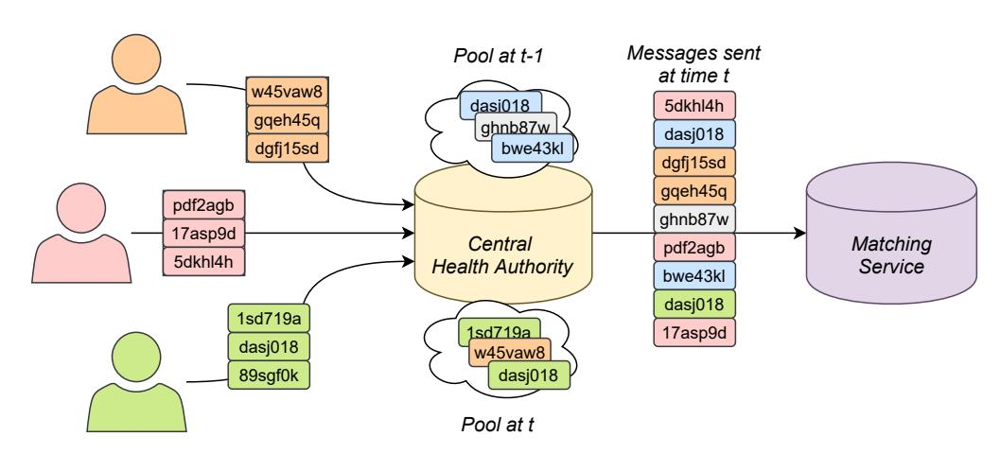

Fig. 7: Batching procedure of the CHA. The CHA collects hashes sent between time t−1 and t, when a certain condition is met at time t, the CHA shuffles them and sends them in one batch to the matching service.

accurate and timely score computation by taking into account contacts dynamics.

Table [II](#page-13-0) depicts the strengths and shortcomings of the analysed solutions in terms of security and privacy protection of users. On the one hand, more decentralised solutions that rely on the integrity of medical reporting are not only less flexible, but expose the privacy of diagnosed people by allowing users to check for infections within their close contacts list. Hence, they place trust on the users to behave correctly. On the other hand, more centralised solutions expose users' privacy to several threats: data repurposing during and after the pandemic, linkage attacks and de-anonymisation, state-enabled surveillance, and data loss in case of breaches. Hence, a high degree of trust in the central authority is instrumental to a successful automatic tracing. In PIVOT, we envision a central authority that adheres the principles of data minimisation and purpose limitation. By distributing trust amongst entities, our solution strives to achieve the best of both worlds, minimising the privacy risks for the users while allowing the central authority to fight the virus by leveraging the appropriate tools. We trust the CHA to behave honestly and the MS to carry out the matching on behalf of the CHA while limiting the consequences of collusion between the two. A privacy-preserving solution reduces the amount of trust a user has to put in the coordinator of the protocol. This might enable wide adoption, which is a fundamental factor in a successful digital contact tracing campaign.

## VII. PRACTICALITY ANALYSIS

In this section, we look at the core features of PIVOT from a practical implementation perspective. First, we look into the CHA as the entity who performs batching. Second, we present a proof of concept implementation to analyse the energy consumption of the DH exchange computed on different mobile devices.

## *A. Batching*

Batching happens during phases (2) and (3) at CHA to prevent the MS from obtaining sensitive information from the hashes, i.e., learning which users are infected *(P1)*, monitoring who visits sensitive places *(P3)* or linking multiple queries and/or report hashes to construct trajectories *(P3)* or interaction graphs *(P4)*. During batching the CHA collects hashes from multiple senders, once a certain condition is met, the CHA shuffles the collected hashes and sends them to the MS, which is illustrated in Fig. [7.](#page-15-1) Thus, the CHA acts as a mixnode [\[35\]](#page-21-17), and obtains privacy at the cost of a delay. As time is critical in contact tracing, we want to minimize delays, i.e., less than a day. To better grasp the anonymity/delay trade-off, we perform an analysis where we model the incoming network traffic and implement a mixing strategy known as the binomial mix [\[36\]](#page-21-18). From our analysis we conclude that by batching and requiring that users send dummy traffic, a minimal amount of anonymity is guaranteed for an acceptable delay.

Our analysis is based on a body of work by Diaz et al. [\[36\]](#page-21-18)– [\[38\]](#page-21-19) on mixnets. Analogous to the cited mixnet literature, we assume a passive attacker (the MS) that can sniff incoming and outgoing network traffic of the mixnode (CHA). Note that the MS is the recipient of the data sent by the CHA, thus it only has to sniff the incoming network traffic. Under this attacker model, we measure sender's anonymity by estimating the probability of linking a specific hash observed by the MS to a sender. To keep this probability uniform over all senders it is commonly assumed that messages send to a mixnet are padded, such that they are all equal in size.

The analysis requires that the incoming traffic is modeled. In PIVOT, there are two data streams to the matching service: report and query hashes. The number of senders of report hashes is proportional to the number of positive tests. Furthermore, when these report hashes are uploaded is determined by when test results are published and when the phone checks for it. The number of query hashes is proportional to the number of users and the number of their encounters with other users. The timing of queries is a design parameter, with the limitation that preferably new encounters are registered before a query happens. Otherwise, the query only contains padding. For the sake of this analysis, we choose to query periodically between 8:00h and 21:00h. To approximate the network traffic for report hashes, we analysed the number of daily tests and daily positive tests for Belgium - a relatively small-sized country. This data is provided by Sciensano [\[39\]](#page-21-20), the central health authority that manages the digital contact tracing solution in Belgium, i.e., Coronalert [\[40\]](#page-21-21).

Figure [8](#page-16-0) shows that the number of tests follows the pattern of a working week, with most tests being done midweek, and the least number of tests on Sunday, which is a logical human factor. Therefore, it is not unreasonable to assume that test results are entered into the digital contact tracing system during normal working hours, i.e., between 9:00h and 19:00h (including Saturdays and Sundays). Let's assume that users check for test results periodically and the moment of checking is unique for every user. We modeled the arrival time of a group of encrypted report hashes from a user, i.e., an infection registration message, as uniform between 9:00h and 19:00h. Thus, for every day, we selected numi publication times between 9:00h and 19:00h (minute scale), where numi is the number of tests done on day i.

We based our mix implementation on the binomial mix [\[36\]](#page-21-18), a variation on a timed dynamic pool mix, which sends hashes after a predetermined time T when a minimum of Nmin senders submitted hashes to the pool. A more simple alternative is based

{16}------------------------------------------------

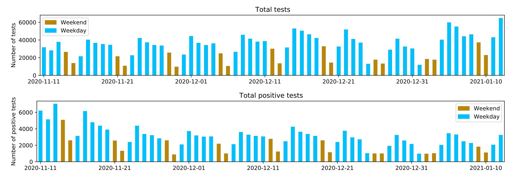

Fig. 8: The number of tests and positive tests per day since the first of March until the 12th of January in Belgium.

on a threshold mix, which sends all hashes in its pool once a threshold on the amount of senders in the pool is reached. However, threshold mixes are very weak against an active attacker [41], while binomial mixes are quite resilient against such an adversary. The binomial mix performs a Bernoulli-experiment (coin toss) for each hash with possible outcomes 'send' or 'stay in pool', where the probability of sending P(n) is a function of n, the number of senders with at least x hashes in the pool. We use the following function for P(n):

if 
$$n < 45$$
 then  $s = 0$  else if  $n * 0.35 < 45$  then  $s = \frac{n-45}{n}$  else  $s = 0.65$  end if

Thus,  $N_{min}=45$ , in our implementations, we choose T to be 15 min. This implies that the mix will attempt to send hashes every 1/4 hour. In our analysis we assume that every user sends the same amount of messages N, which is easily achieved by padding, i.e. adding hashes that are all zeros. Moreover, the cited mixnet literature [36]–[38] also assumes padding. The mixnode treats hashes for padding and real hashes in the same way. Padding hashes can be freely discarded by the MS. We can now express x in function of N:  $x = \frac{N}{5}$ . By modeling the mixnetwork as a generalised mix model [36], the sender anonymity  $\rho_s$  after r rounds of sending hashes can be expressed as follows:

$$\rho_s = -\sum_{i=1}^r a_i N p(I_i) \log(N p(I_i))$$
(4)

with  $a_i$  the number of senders who submitted hashes at round i and  $p(I_i)$  the probability that a specific hash that leaves the mix at round r is a hash that entered the mix in round i, and N the amount of hashes send by the user. Consequently,  $Np(I_i)$  reflects the probability that a hash was sent by a specific sender. The probability of an outgoing message to be a specific message from the pool is  $\frac{1}{n_r}$ , with  $n_r$  the number of hashes in the mix

in round r. We are certain that the hashes that entered the mix at round r are in the mix, thus:

$$p(I_r) = \frac{1}{n_r} \tag{5}$$

Hashes had each round a probability to remain in the mix of  $1 - P(n_j)$  with  $n_j$  the number of senders that have at least x hashes in round j. Thus when i < r:

$$p(I_i) = \frac{1}{n_r} \prod_{j=i}^{r-1} (1 - P(n_j))$$
 (6)

With the mixing strategy, and a model of incoming traffic in place, we calculate the entropy and delay per hash. The entropy is often used as a measure of anonymity in related work [38]. From Fig. 9, we see that it can take up to 5 days before a specific hash leaves the mix, which might be unacceptable. This delay is due to low amounts of positive test in the summer period where the virus was less present. In case of only high traffic, when a lot of test turn out to be positive, the maximum delay is less than 1 day, which we believe to be acceptable. Of course, because sending a specific hash is probabilistic, there is no guarantee that 1 day is the upper bound, but delays more than 1 day are very unlikely and did not appear in the simulation. We believe the impact is very low for the very rare case where a hash does get stuck for longer, because it is unlikely that the short interaction the hash represents, was the sole reason that the user was exposed to a critical amount of viral load. Fig. 10 shows the distribution of delays where the low traffic period is the only one exhibiting a second small peak around  $\approx 1000 \,\mathrm{min}$ . In the whole monitored period, between March 2020 and January 2021, the average time between a user uploading its report hashes and their reception by the MS is 80 min. For uploading query hashes similar results as in the high traffic case are expected, but with lower maximum delays and higher maximum anonymity. We expect this because the amount of senders for query hashes is considerably higher – all users query – and is stable throughout time – grows with the user base of the digital contact tracing system – and follows a similar pattern – at night there are no queries.

{17}------------------------------------------------

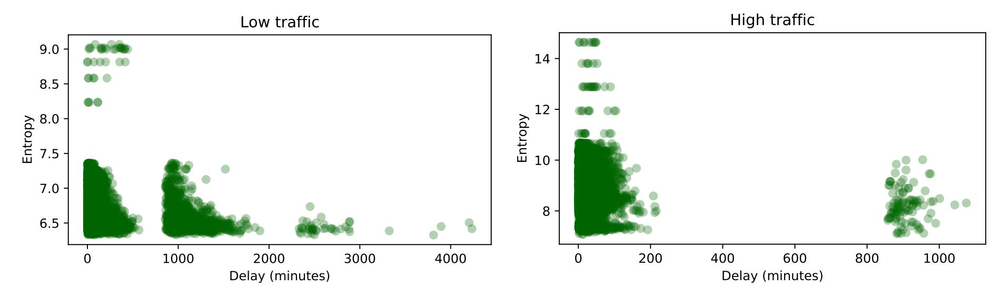

Fig. 9: The sender anonymity (i.e., entropy) in function of the delay for report hashes to arrive at the MS. On the left: 06-01-2020 until 08-01-2020 (summer, low traffic volumes). On the right: 01-11-2020 until 10-01-2021 (winter, high traffic volumes)

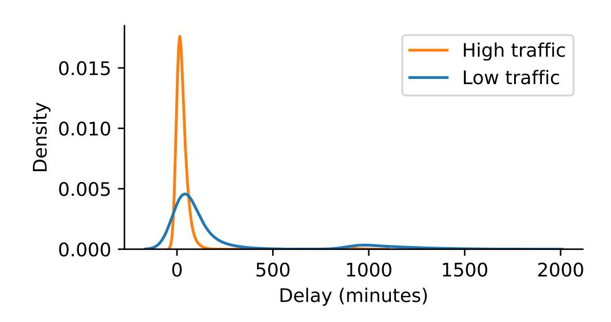

Fig. 10: Distribution (kernel density estimate) of delays across time traffic patterns.

The delays could be decreased at the cost of anonymity. Sadly, we cannot reduce anonymity further. At this point we get 7 bits anonymity. This implies that when the MS wants to guess which user send a specific hash, it has a chance of  $\frac{1}{2^7} = \frac{1}{128}$ to guess correctly. This amount of anonymity is reasonable for user location privacy, where the MS monitors one specific sensitive place by installing a BLE beacon. MS has now a probability of  $\frac{1}{2^7}$  to guess which user send a hash that was obtained from an exchange with it's BLE beacon. At the other hand, the 7 bits anonymity is more than sufficient against threats that require linking multiple hashes, such as constructing an interaction graph (P4), as the probability of correctly guessing that two hashes belong together is the product of the probability of guessing the correct user for each of them. Thus, when 7 bits of anonymity is offered:  $\frac{1}{2^{14}} = \frac{1}{16384}$ . As the probability of linking x hashes together is  $\frac{1}{2^{x*7}}$ , it becomes very unlikely that an interaction graph can be constructed. The same holds for the other anonymity threat that requires linking hashes together at large scale, i.e., reconstructing paths by installing a big set of BLE beacons. However, in this case spatial temporal constraints can reduce the uncertainty, but by how much is hard to measure. Thus, time delay can only be reduced by ensuring that there is always high traffic.

The mixing does not hide which users are infected, since our attacker is able to sniff network traffic and we know from Sect. IV-C2 that traffic for reporting is 14 times bigger than traffic for querying. Thus, the MS can easily guess which users are uploading report hashes and which users are uploading query hashes.

To reduce time delay and hide from MS which users are infected dummy traffic can be added such that all users upload report hashes regularly. Sending fake report hashes incurs additional computations comparisons for the matching operation and adds communication overhead. To estimate the overhead let us assume a procedure where all users check regularly for the outcome of the medical test with the CHA. The CHA will then randomly order some of them to report fake (dummy) hashes, such that the amount of reports is always equal to a high traffic scenario and the amount of reports is increased at least by a factor  $128 = 2^7$ . This would imply that at least 7 bits of anonymity is provided for users with a positive test result. The communication overhead for this scenario is around  $128*6*10^3*360\text{KB} \approx 276.5\text{GB}$  of additional traffic per day – from Sect. IV-C2 we know that report hashes are at most  $\approx 360 \text{KB}$  per user, and the average number of daily tests in the high load scenario is  $\approx 6 * 10^3$ . The MS receives around  $128 * 6 * 10^3 * 14 * 200 * 5 = 10.8 * 10^9$  additional hashes to compare with – under the assumption that hashes are kept for maximum 14 days, with users collecting around 200 report hashes per day and being infectious on average for 5 days before they obtain the test result.

#### B. Energy evaluation

In PIVOT, we consider the addition of a DH exchange that requires 32 bytes for the public key for 128-bit security guarantees. This collides with the maximum payload one can advertise using BLE, i.e., 31 bytes. One solution to this problem is to split the public key in two parts and broadcast them separately. This has a direct effect on the amount of time the CPU has to be woken up to switch from one half of the key to the other. A big toll on battery levels could hinder the adoption of an app and limit its effectiveness by discouraging users from keeping the app running. Despite using a low-energy protocol (BLE) some applications (e.g., TraceTogether [21]) faced problems such as disrupted background running.

We implemented a proof of concept app to demonstrate that DH has a negligible impact on battery drain, packet loss, and total operational time, thus representing a practical protocol 

{18}------------------------------------------------

for the studied scenario. As underlined in Sect. [IV-B1,](#page-6-0) our protocol can be implemented using BLE chipsets available in commercial devices. In this section, we verify the feasibility of a non-interactive DH exchange over BLE in terms of energy consumption and speed of execution.

#### *C. Primitives*

Recent advances in the BLE standard allow for variable size payloads (longer than 31 bytes), and periodic and synchronised advertisement. Modern smartphones can greatly benefit from these features, since long-running processes that repeatedly scan for BLE advertisements in the background are batteryhungry. However, only a subset of the devices running Android 5+ supports these features 4 . Since a contact tracing app's success is bounded to a widespread adoption, the most commonly available technology has to be preferred. Thus, real-world implementations, such as StopCovid, rely on the Generic Attribute Profile (GATT) specification and BLE legacy advertisement for sending and receiving data.

The maximum payload size for the legacy BLE advertisement is 31 bytes. For 128-bit security with elliptic curve Diffie-Hellman, for instance with *Curve25519* 5 , the length of the public key must be 32 bytes. As pointed out by Castelluccia et al. [\[13\]](#page-20-14), different protocols can be set up to increase the payload length and advertise 32 bytes of data:

- 1) Two services advertise the public key over two separate payloads for which the client actively scans.
- 2) The receiver begins an interaction asking for the second part of the public key on-demand.
- 3) The peripheral advertises the public key using one service and a switching payload encapsulating part 1 and part 2 of the public key, alternatively.

For our experiments, we opt for (3) since it requires a smaller number of exchanged messages than (2) and only one service to be set up compared to (1). To link part 1 and part 2 of the public key, the receiver could use few (e.g., four) overlapping bytes.

As discussed in Sect. [IV-B1,](#page-6-0) the public key (i.e., the advertised payload) needs to change every few minutes to prevent linkability and, ideally, is synchronised with switching of the BLE MAC address (which is highly variable across devices). One might expect that increasing this switching time puts an additional toll on the battery due to the frequent wakeup of the CPU. Furthermore, no packets are advertised during a switch. This may impact the number of received packets, reducing the probability of correctly registering a close contact.

In the following, we show that (1) different rates of payload switching have comparable impact on energy consumption; (2) the time lost during the switching has a negligible impact on the number of received packets; and (3) the DH exchange requires a tiny fraction of the operational time. An additional CPUintensive task is the encryption and upload of the query hashes. Since the upload and download time are highly dependent on

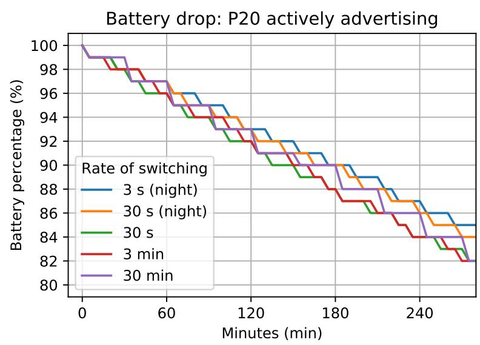

Fig. 11: Battery drop across five experiments.

the network and the server implementation, this analysis is beyond the scope of the present paper.

#### *D. Experimental setup*

We consider three experimental settings. First, a single device acts as a peripheral by constantly advertising packets, while a server acts as the central module, listening for packets with a specific service ID. The peripheral is one Huawei EML-L09 (P20) running Android 9. During the experiments, only the Bluetooth module and the location services (necessary for BLE exchange starting from Android 8 6 ) are turned on. The device is fully charged at the beginning of every experiment. The central module is implemented on a Unix system taking advantage of the noble library 7 . Both devices are placed on a desk, one meter apart. To emulate different environmental conditions, part of the experiments are ran at night, in a less crowded environment that might interfere with the reception of packets. To gain insights on the patterns of power consumption we take advantage of the estimates provided by the phone itself, including the *Energy estimate* and the *CPU time*. These are specific to the app and automatically reset after a complete charge.

Second, two devices are placed two meters apart performing a prolonged session of scanning and advertising. We used one Pixel 3a running Android 10 and one Samsung S8+ running Android 9. Again, the initial battery status is 100% for both devices and only the necessary modules are turned on. The exchanged packets are recorded with a timestamp and two settings are tested: same and different rate of advertising.

Third, the Huawei P20 is used standalone to perform several time measurements. We focus on three operations: (1) the generation of the key pairs necessary for the DH exchange, (2) the computation of a realistic number of shared secrets, and (3) the switching time. Time estimations rely on the nanoTime() method provided by the Java System class. This is not related to any other notion of system or wall-clock time, hence unaffected by period of sleep and background running. Each measurements is repeated 10 times in (1) and (2), while 300 switchings are performed in (3).

4https://altbeacon.github.[io/android-beacon-library/beacon-transmitter](https://altbeacon.github.io/android-beacon-library/beacon-transmitter-devices.html)[devices](https://altbeacon.github.io/android-beacon-library/beacon-transmitter-devices.html).html

5[https://safecurves](https://safecurves.cr.yp.to/).cr.yp.to/

6https://developer.android.[com/guide/topics/connectivity/bluetooth-le](https://developer.android.com/guide/topics/connectivity/bluetooth-le)

7https://github.[com/noble/noble](https://github.com/noble/noble)

{19}------------------------------------------------

For the implementation of DH, we rely on the open-source BuoncyCastle library 8 and the *Curve25519* specification for elliptic curves. In a real implementation, the public parameters to perform the non-interactive exchange (see Sect. IV-B1) can be shared by the service provider or hard-coded into the app.

To perform BLE advertisement, we implemented an Android application that builds upon the open-source SDK by StopCovid [20]. On top of this, a sticky foreground service performs scanning and advertising, while a delay function in a blocking thread regulates the interval at which we switch between the advertising of part 1 and part 2 of the public key.

The chosen parameters for scanning and advertisement follow the default of our reference SDK. The following settings (*ScanSettings*) refer to a filtered scan that aims to match a predetermined *service\_id*:

- SCAN\_MODE\_BALANCED: scans are paused and restarted to improve power consumption.
- MATCH\_AGGRESSIVE: a match is determined upon detection of a signal.
- Report delay of 1000ms: Delay between scan report and notification that causes the queuing of the scans in batches.
- The *AdvertiseSettings* apply to a continuous advertisement of a payload labelled with a *service\_id*:
  - ADVERTISE\_MODE\_LOW\_LATENCY: the highest possible advertisement frequency.
  - ADVERTISE\_TX\_POWER\_MEDIUM: a medium strength of the signal. This parameter drives the range of visibility of the device and can, therefore, introduce a privacy issue.

#### E. Evaluation

In the following, we present the results linked to our three experimental settings.

Setting 1: Figure 11 shows the pattern of battery consumption across five experiments. For the daytime settings, we analysed a switching rate of 30 s, 3 min, and 30 min, while for the nighttime experiments we tuned the rate to 3 s and 30 s. Overall, there is no noticeable difference in the total drop, although the experiments ran at night demonstrated more resilience. This might be due to less BLE filtering happening in the background as well as app-related tasks scheduled at a particular time during the day. Table III shows that CPU time and energy estimates are consistently higher for longer switching times. This is not surprising, as a more frequent switching is associated to a service that frequently wakes up the CPU. Nonetheless, the battery drop does not follow the same trend, resulting in the best performance, 15%, for the most energy-hungry setting, 3 s. Similarly, the total amount of packets sent by the device is not affected by the time lost during key switching. The only setting deviating from this trend is when payload is changed every 3 min. This might be due to environmental interference from active BLE devices in close proximity.

Setting 2: In a first testing phase, we kept the same switching rate for the two devices, recording a different amount of received packets (Fig. 12). The difference between the two

TABLE III: Overview of energy consumption and number of exchanged packets across our settings in a 6 h time frame.

| Daytime | Switch rate      | Energy est.        | CPU time       | Battery drop | Total packets |
|---------|------------------|--------------------|----------------|--------------|---------------|
| night   | $3\mathrm{s}$    | $6.78\mathrm{mAh}$ | $85\mathrm{s}$ | 15 %         | 33105         |
| night   | $30\mathrm{s}$   | $4.98\mathrm{mAh}$ | $37\mathrm{s}$ | 16 %         | 32266         |
| day     | $30\mathrm{s}$   | $6.03\mathrm{mAh}$ | $68\mathrm{s}$ | 18 %         | 32495         |
| day     | $3 \min$         | $3.74\mathrm{mAh}$ | $34\mathrm{s}$ | 18 %         | 22952         |
| day     | $30\mathrm{min}$ | $4.51\mathrm{mAh}$ | $27\mathrm{s}$ | 18 %         | 32322         |

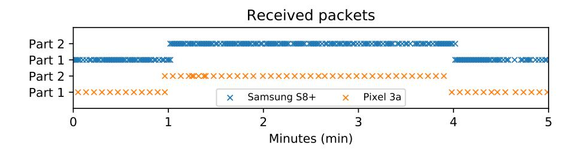

Fig. 12: Advertising and scanning within a time window of 5 min with a common switching rate of 3 min.

devices might be due to several factors, from the Bluetooth chipsets and antennas, to OS optimisations when running a background service 9. This behaviour might impact the time needed to record a contact for one of the two users, since more packets are needed before reaching a certain probability of getting both halves of the public key. Hence, we experiment with different switching rates of 30 s for the Pixel 3a and 3 min for the Samsung S8+. Figure 13 shows the battery drop and number of received packets for the two devices. As expected, one of the two devices is receiving less packets. However, the pattern of battery consumption is comparable, independently of the chosen parameter.

The frequency of switching impacts the minimum time required to obtain a public key from a contact, thus the time needed to determine a close contact and being able to compute a shared secret. Therefore, the importance of calibrating this parameters by not having to take into account the energy constraints is a fundamental insight gained from our experiments.

Setting 3: Table IV shows the time required to compute different numbers of secret keys. In this way, we emulate the recording of close contacts under different use scenarios. A few seconds are needed to generate up to 500 secret keys, linked to 500 close contacts of duration, e.g., between 15 and 30 min. This operation is only required before querying the system for exposure score, hence can be scheduled for a moment associated to less strict battery constraints (e.g., nighttime). Additionally, we analysed the time needed to compute a user's own public and private keys. Computing 100 keys took on average  $4.33\pm0.18\,\mathrm{s}$ . This accounts for the keys needed in a  $24\,h$  time span (i.e., 48 for a key exchange rate of  $30\,\mathrm{min}),$  and a manual regeneration triggered by the user due to, e.g., keys loss. Finally, the time lost during switching is measured: on average, we observed a time of  $37.62\pm4.5\,\mathrm{ms}$ . Considering a 30 s switch rate, synchronised with the 30 min key exchange rate, this accounts to  $\approx 26 \,\mathrm{s}$  over a period of 6 h.

1) Probability of losing contacts: We note that with DH we are not able to register uni-directional contacts. This is a

&lt;sup>8https://www.bouncycastle.org/

&lt;sup>9https://dontkillmyapp.com/samsung

{20}------------------------------------------------

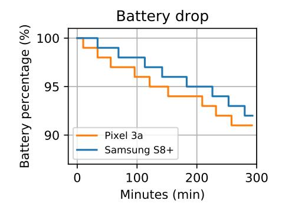

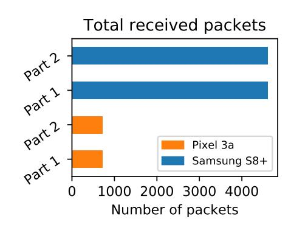

Fig. 13: Battery drop and total received packets for a session of exchange with a switching rate of 30 s for the pixel 3a and 3 min for the Samsung S8+.

TABLE IV: Time required to generate the *shared secrets* derived from the public keys of recent close contacts.

| Close contacts 10 |             | 100         | 200         | 500          |
|----------------------|-------------|-------------|-------------|--------------|
| Average time         | 0.52±0.09 s | 4.81±0.17 s | 9.92±0.73 s | 21.33±3.56 s |

design choice that trades-off between having an integrity check on the contact, which has to be acknowledged by the other party, and increasing the chance of receiving a notification in case one of the parties did not receive the public key.

A recent work by the designers of the Swiss app, SwissCovid, has elaborated on the probability of catching a close contact using BLE in a variety of real-world situations [\[42\]](#page-21-23). Based on their analysis, using an attenuation bucket of 55 dB, the interpretation of a contact as being within 1.5 m (typically interpreted as a close contact) has a probability of 57.3%. Whereas the probability is higher for contacts within 2 m and 3 m, which concur (with a smaller weight) to the final calculation of the exposure score.

Since the public key has a validity of ≈15 min (it depends on the BLE MAC address rotation), the decreased chance of one of the two parties to acknowledge a contact boils down to short contacts. There will be a threshold on contacts to be considered for contact tracing, e.g., contacts of less than 2 min, from the reception of the first beacon till the last one, are discarded by default. This means that the choice of this parameter has to be carefully decided based on the decreased probability of acknowledging close contacts and frequency of advertisement of BLE.

Additionally, we have observed how sending one BLE beacon is not enough to achieve DH exchange given the insufficient length of the packets. We deem that, for high enough frequencies, e.g., 100 ms, the probability of getting only one part of the message over a timespan of 2 min, and within 3 m distance, is negligible. However, we argue that an organisation willing to deploy a similar protocol should consider these constrains and carefully tune these parameters – including minimum timespan and average signal strength for storing contacts – to take into account the rate of lost contacts.

## VIII. CONCLUSION

In this paper, we have proposed and evaluated PIVOT – a privacy-friendly yet effective automated contract tracing solution. To strike the balance between utility and privacy, PIVOT combines several techniques. First, it uses local proximity

tracing via unique per-user-per-contact hashes, decoupling the data sent when reporting infection (report hashes) and when querying the system for exposure (query hashes). This provides additional protection against de-anonymisation attacks as (infected) users' hashes are never revealed to health authorities nor the general public. Second, it calculates users' exposure score centrally while decoupling the parties who discover users' encounters with infected users via finding matches between different users' report and query hashes and who compute the exposure score. Finding matches is performed by an independent third party (matching service) that has access only to users' anonymous hashes (and nothing else), while users' exposure score is computed by the health authorities who also perform integrity check on the matches reported by the matching service. We are convinced that its enhanced utility, sufficient privacy protection and simplicity make PIVOT as effective as fully centralised solutions while respecting users' privacy (almost) as good as fully decentralised solutions.

## REFERENCES

- [1] "A timeline of the coronavirus pandemic," [https://www](https://www.nytimes.com/article/coronavirus-timeline.html).nytimes.com/ [article/coronavirus-timeline](https://www.nytimes.com/article/coronavirus-timeline.html).html, 2021, accessed: 15-01-2021.
- [2] "The lightning-fast quest for COVID vaccines — and what it means for other diseases," https://www.nature.[com/articles/d41586-020-03626-1,](https://www.nature.com/articles/d41586-020-03626-1) 2020, accessed: 15-01-2021.
- [3] "Covid-19: New variant 'raises R number by up to 0.7'," [https:](https://www.bbc.com/news/health-55507012) //www.bbc.[com/news/health-55507012,](https://www.bbc.com/news/health-55507012) 2021, accessed: 12-01-2021.
- [4] M. Savage, "Coronavirus: The possible long-term mental health impacts," https://www.bbc.[com/worklife/article/20201021-coronavirus-the](https://www.bbc.com/worklife/article/20201021-coronavirus-the-possible-long-term-mental-health-impacts)[possible-long-term-mental-health-impacts,](https://www.bbc.com/worklife/article/20201021-coronavirus-the-possible-long-term-mental-health-impacts) accessed: 07-12-2020.
- [5] L. Ferretti, C. Wymant, M. Kendall, L. Zhao, A. Nurtay, L. Abeler-Dorner, M. Parker, D. Bonsall, and C. Fraser, "Quantifying sars-cov-2 ¨ transmission suggests epidemic control with digital contact tracing," *Science*, vol. 368, no. 6491, 2020.
- [6] H. M. School, "Covid-19 basics," [https://www](https://www.health.harvard.edu/diseases-and-conditions/covid-19-basics).health.harvard.edu/ [diseases-and-conditions/covid-19-basics,](https://www.health.harvard.edu/diseases-and-conditions/covid-19-basics) 2020, accessed: 07-04-2020.
- [7] E. D. P. B. (EDPB), "EDPB letter concerning the european commission's draft guidance on apps supporting the fight against the COVID-19 pandemic," https://edpb.europa.[eu/our-work-tools/our-documents/letters/](https://edpb.europa.eu/our-work-tools/our-documents/letters/edpb-letter-concerning-european-commissions-draft-guidance-apps_en) [edpb-letter-concerning-european-commissions-draft-guidance-apps](https://edpb.europa.eu/our-work-tools/our-documents/letters/edpb-letter-concerning-european-commissions-draft-guidance-apps_en) en, 2020, accessed: 17-04-2020.
- [8] C. Castelluccia, N. Bielova, A. Boutet, M. Cunche, C. Lauradoux, D. Le Metayer, and V. Roca, "Robert: Robust and privacy-preserving ´ proximity tracing," 2020.
- [9] B. Jason, K. Joel, T. Alvin, S. H. Chai, Y. Lai, T. Janice, and T. A. Quy, "Bluetrace: A privacy-preserving protocol for community-driven contact tracing across borders."
- [10] C. T. et al, "Decentralized privacy-preserving proximity tracing," 2020.
- [11] Google and Apple, "Privacy-preserving contact tracing," [https://](https://covid19.apple.com/contacttracing) covid19.apple.[com/contacttracing,](https://covid19.apple.com/contacttracing) accessed: 29-08-2020.
- [12] G. Avitabile, V. Botta, V. Iovino, and I. Visconti, "Towards defeating mass surveillance and sars-cov-2: The pronto-c2 fully decentralized automatic contact tracing system," Cryptology ePrint Archive, Report 2020/493, 2020, https://eprint.iacr.[org/2020/493.](https://eprint.iacr.org/2020/493)
- [13] C. Castelluccia, N. Bielova, A. Boutet, M. Cunche, C. Lauradoux, D. Le Metayer, and V. Roca, "Desire: A third way for a european exposure ´ notification system leveraging the best of centralized and decentralized systems," 2020.
- [14] N. Trieu, K. Shehata, P. Saxena, R. Shokri, and D. Song, "Epione: Lightweight contact tracing with strong privacy," *arXiv preprint arXiv:2004.13293*, 2020.
- [15] R. Canetti, Y. T. Kalai, A. Lysyanskaya, R. L. Rivest, A. Shamir, E. Shen, A. Trachtenberg, M. Varia, and D. J. Weitzner, "Privacy-preserving automated exposure notification," *IACR Cryptol. ePrint Arch*, vol. 2020, no. 863, p. 31, 2020.
- [16] D. Mestel, "Robust ambiguity for contact tracing," *arXiv preprint arXiv:2007.01288*, 2020.
- [17] J. Valentino-DeVries, "Coronavirus apps show promise but prove a tough sell," https://www.nytimes.[com/2020/12/07/technology/coronavirus](https://www.nytimes.com/2020/12/07/technology/coronavirus-exposure-alert-apps.html)[exposure-alert-apps](https://www.nytimes.com/2020/12/07/technology/coronavirus-exposure-alert-apps.html).html, accessed: 17-12-2020.

{21}------------------------------------------------

- [18] E. Hargittai, E. M. Redmiles, J. Vitak, and M. Zimmer, "Americans' willingness to adopt a covid-19 tracking app," *First Monday*, 2020.
- [19] Z. Wan and X. Liu, "Contactchaser: A simple yet effective contact tracing scheme with strong privacy," Cryptology ePrint Archive, Report 2020/630, 2020, https://eprint.iacr.[org/2020/630.](https://eprint.iacr.org/2020/630)
- [20] S. P. France, "Stopcovid," https://gitlab.inria.[fr/stopcovid19,](https://gitlab.inria.fr/stopcovid19) 2020, accessed: 15-06-2020.
- [21] "Trace together," https://www.gov.[sg/article/help-speed-up-contact](https://www.gov.sg/article/help-speed-up-contact-tracing-with-tracetogether)[tracing-with-tracetogether,](https://www.gov.sg/article/help-speed-up-contact-tracing-with-tracetogether) accessed: 05-04-2020.
- [22] "In coronavirus fight, china gives citizens a color code, with red flags," https://github.[com/immuni-app/immuni-documentation/blob/](https://github.com/immuni-app/immuni-documentation/blob/master/Privacy-Preserving%20Analytics.md) [master/Privacy-Preserving%20Analytics](https://github.com/immuni-app/immuni-documentation/blob/master/Privacy-Preserving%20Analytics.md).md, accessed: 25-11-2020.
- [23] M. Salathe, C. L. Althaus, N. Anderegg, D. Antonioli, T. Ballouz, ´ E. Bugnion, S. Capkun, D. Jackson, S.-I. Kim, J. Larus *et al.*, "Early evidence of effectiveness of digital contact tracing for sars-cov-2 in switzerland," *medRxiv*, 2020.
- [24] "Contact tracing: public health management of persons, including healthcare workers, having had contact with covid-19 cases in the european union – second update," [https://www](https://www.ecdc.europa.eu/en/covid-19-contact-tracing-public-health-management).ecdc.europa.eu/en/covid-[19-contact-tracing-public-health-management,](https://www.ecdc.europa.eu/en/covid-19-contact-tracing-public-health-management) accessed: 20-04-2020.
- [25] eHealth Network, "Mobile applications to support contact tracing in the eu's fight against covid-19: Common eu toolbox for member states," https://ec.europa.[eu/health/sites/health/files/ehealth/docs/covid-](https://ec.europa.eu/health/sites/health/files/ehealth/docs/covid-19_apps_en.pdf)19 [apps](https://ec.europa.eu/health/sites/health/files/ehealth/docs/covid-19_apps_en.pdf) en.pdf, 2020, accessed: 20-04-2020.
- [26] S. Vaudenay, "Centralized or decentralized? the contact tracing dilemma." *IACR Cryptol. ePrint Arch.*, vol. 2020, p. 531, 2020.
- [27] ——, "Analysis of dp3t." *IACR Cryptol. ePrint Arch.*, vol. 2020, p. 399, 2020.
- [28] K. Bock, C. R. Kuhne, R. M ¨ uhlhoff, M. R. Ost, J. Pohle, and R. Rehak, ¨ "Data protection impact assessment for the corona app," *Available at SSRN 3588172*, 2020.
- [29] P. Dawson, "Covid-19 tracking data should be managed the way data trusts are," https://policyoptions.irpp.[org/magazines/april-2020/covid-19](https://policyoptions.irpp.org/magazines/april-2020/covid-19-tracking-data-should-be-managed-the-way-data-trusts-are/) [tracking-data-should-be-managed-the-way-data-trusts-are/,](https://policyoptions.irpp.org/magazines/april-2020/covid-19-tracking-data-should-be-managed-the-way-data-trusts-are/) 2020, accessed: 12-05-2020.
- [30] K. Pietrzak, "Delayed authentication: Preventing replay and relay attacks in private contact tracing," in *International Conference on Cryptology in India*. Springer, 2020, pp. 3–15.
- [31] S. Narain, T. D. Vo-Huu, K. Block, and G. Noubir, "Inferring user routes and locations using zero-permission mobile sensors," in *2016 IEEE Symposium on Security and Privacy (SP)*. IEEE, 2016, pp. 397–413.
- [32] H. Chen, K. Laine, and P. Rindal, "Fast private set intersection from homomorphic encryption," in *Proceedings of the 2017 ACM SIGSAC Conference on Computer and Communications Security*, ser. CCS '17. New York, NY, USA: Association for Computing Machinery, 2017, p. 1243–1255. [Online]. Available: https://doi.org/10.[1145/3133956](https://doi.org/10.1145/3133956.3134061).3134061
- [33] FOPH, "Adjustment of threshold values of the swisscovid app," https://www.bag.admin.[ch/bag/en/home/das-bag/aktuell/news/news-11-](https://www.bag.admin.ch/bag/en/home/das-bag/aktuell/news/news-11-09-2020.html) [09-2020](https://www.bag.admin.ch/bag/en/home/das-bag/aktuell/news/news-11-09-2020.html).html, 2020, accessed: 10-12-2020.
- [34] V. von Wyl, "The contribution of the swisscovid digital proximity tracing app to pandemic mitigation in the canton of zurich."
- [35] D. Chaum, "Untraceable electronic mail, return addresses, and digital pseudonyms," *Commun. ACM*, vol. 24, no. 2, pp. 84–88, 1981. [Online]. Available: http://doi.acm.org/10.[1145/358549](http://doi.acm.org/10.1145/358549.358563).358563
- [36] C. D´ıaz and A. Serjantov, "Generalising mixes," in *Privacy Enhancing Technologies*, R. Dingledine, Ed. Berlin, Heidelberg: Springer Berlin Heidelberg, 2003, pp. 18–31.
- [37] C. D´ıaz and B. Preneel, "Reasoning about the anonymity provided by pool mixes that generate dummy traffic," in *Information Hiding*, J. Fridrich, Ed. Berlin, Heidelberg: Springer Berlin Heidelberg, 2005, pp. 309–325.
- [38] C. D´ıaz, L. Sassaman, and E. Dewitte, "Comparison between two practical mix designs," in *Computer Security – ESORICS 2004*, P. Samarati, P. Ryan, D. Gollmann, and R. Molva, Eds. Berlin, Heidelberg: Springer Berlin Heidelberg, 2004, pp. 141–159.
- [39] Sciensano, "Covid-19," [https://epistat](https://epistat.wiv-isp.be/covid/).wiv-isp.be/covid/, accessed: 10-12- 2020.
- [40] "Coronalert," [https://coronalert](https://coronalert.be/en/).be/en/, accessed: 10-12-2020.
- [41] A. Serjantov, R. Dingledine, and P. Syverson, "From a trickle to a flood: Active attacks on several mix types," in *Information Hiding*, F. A. P. Petitcolas, Ed. Berlin, Heidelberg: Springer Berlin Heidelberg, 2003, pp. 36–52.
- [42] FOPH, "Swisscovid exposure score calculation," [https:](https://github.com/admin-ch/PT-System-Documents/blob/master/SwissCovid-ExposureScore.pdf) //github.[com/admin-ch/PT-System-Documents/blob/master/SwissCovid-](https://github.com/admin-ch/PT-System-Documents/blob/master/SwissCovid-ExposureScore.pdf)[ExposureScore](https://github.com/admin-ch/PT-System-Documents/blob/master/SwissCovid-ExposureScore.pdf).pdf, 2020, accessed: 10-12-2020.