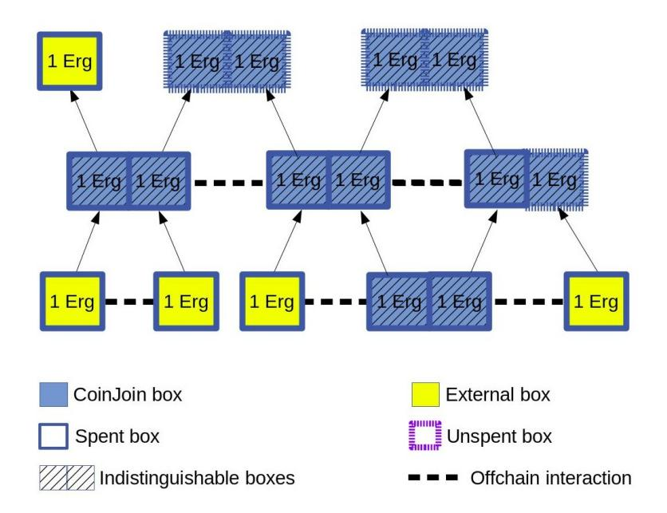
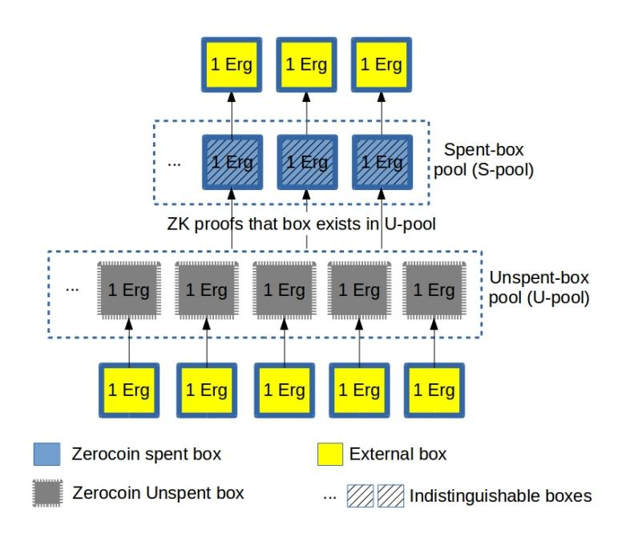
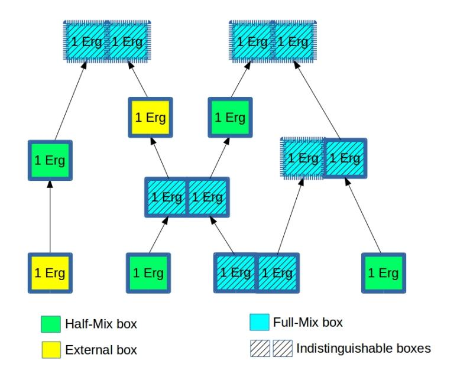
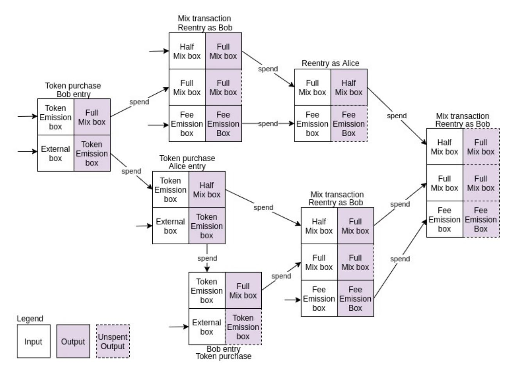

{0}------------------------------------------------

# Zerojoin: Combining Zerocoin and CoinJoin

Alexander Chepurnoy1,<sup>2</sup> , Amitabh Saxena<sup>1</sup>

<sup>1</sup> Ergo Platform {kushti}@protonmail.ch, {amitabh123}@gmail.com 2 IOHK Research {alex.chepurnoy}@iohk.io

Abstract. We present Zerojoin, a privacy-enhancing protocol for UTXO blockchains. Like Zerocoin, our protocol uses zero-knowledge proofs and a pool of participants. However, unlike Zerocoin, our pool size is not monotonically increasing. Thus, our protocol overcomes the major drawback of Zerocoin. Our approach can also be considered a non-interactive variant of CoinJoin, where the interaction is replaced by a public transaction on the blockchain. The security of Zerojoin relies on the Decisional-Diffie-Hellman (DDH) assumption. We also present ErgoMix, a practical implementation of Zerojoin on top of Ergo, a smart contract platform based on Sigma protocols. While Zerojoin contains the key ideas, it leaves open the practical issue of handling fees. The key contribution of ErgoMix is a novel approach to handle fees in Zerojoin.

## 1 Introduction

Privacy enhancing techniques in blockchains generally fall into two categories. The first is hiding the amounts being transferred, such as in Confidential Transactions [\[1\]](#page-14-0). The second is obscuring the input-output relationships such as in Zerocoin [\[2\]](#page-14-1), Composite Signatures (CS) [\[3\]](#page-14-2) and CoinJoin [\[4\]](#page-14-3). Some solutions such as Zcash [\[5](#page-15-0)[,6\]](#page-15-1) and MimbleWimble (MW) [\[7\]](#page-15-2) combine both.

In this work, we describe Zerojoin, yet another privacy enhancing protocol based on the latter approach of obscuring input-output relationships. This allows us to avoid expensive range proofs necessary for the first approach. Our protocol is motivated from Zerocoin and CoinJoin to overcome some of their limitations.

In particular, the protocol is designed to address two key problems with Zerocoin [\[2\]](#page-14-1) and CoinJoin [\[4\]](#page-14-3), namely the need for a monotonically increasing pool in Zerocoin and the need for off-chain interaction in CoinJoin. A monotonically increasing pool makes the protocol unusable in the long term because this pool has to be kept in memory to verify transactions. Many privacy oriented protocols including Zerocoin, zerocash [\[5\]](#page-15-0) and Monero [\[8\]](#page-15-3) suffer from this problem. On the other hand, CoinJoin, which does not have this weakness, has the problem of offchain interaction, which again reduces its usability. Zerojoin aims to address this by creating a combined protocol that solves both these problems. Quisquis [\[9\]](#page-15-4) is another protocol similar to Zerojoin. However, its proofs use generic NIZKs that are much larger than Zerojoin's proofs. The following table summarizes 

{1}------------------------------------------------

the various protocols. Note that unlike the other protocols, CoinJoin supports a covert mode, where it is not possible to identify if the protocol is in use. Some approaches, such as MW, CoinJoin and CS are vulnerable to eavesdropping attacks where an attacker has connectivity to a large part of the network. Hence they need additional off-chain mechanisms (such as "joiners" [\[3\]](#page-14-2)) to counter such attacks before broadcasting transactions to the network.

|              |         |       |        | Monotonic Generic Interaction Eavesdropping Example |                 |
|--------------|---------|-------|--------|-----------------------------------------------------|-----------------|
|              | pool    | NIZKs | needed | attacks                                             | Implementation  |
| CoinJoin     | [4] no  | no    | yes    | yes                                                 | JoinMarket [10] |
| Zerocoin     | [2] yes | yes   | no     | no                                                  | Zcoin [11]      |
| Zerocash     | [5] yes | yes   | no     | no                                                  | Zcash [6]       |
| Monero [8]   | yes     | yes   | no     | no                                                  | Monero [8]      |
| Quisquis [9] | no      | yes   | no     | no                                                  | –               |
| MW [9]       | no      | yes   | no     | yes                                                 | Grin [12]       |
| CS [3]       | no      | no    | no     | yes                                                 | –               |
| Zerojoin     | no      | no    | no     | no                                                  | ErgoMixer [13]  |

CoinJoin has another problem, namely that of handling mining fee. This is because the protocol requires multiple rounds such that the value is preserved across rounds. If the fee is paid from an external source then privacy gets broken. Thus, any fee must come from the boxes being mixed. However, then the value cannot be preserved. This problem carries over to protocols such as Quisquis and Zerojoin which have a similar structure. Quisquis uses range-proofs to hide the amounts being transferred, at the cost of larger proofs. Our solution to this is ErgoMix, an implementation of Zerojoin on the Ergo blockchain. ErgoMix uses the concept of mixing tokens, an Ergo-specific approach for paying fee that does not rely on range proofs.

## 2 Background

Blockchain platforms such as Bitcoin [\[14\]](#page-15-9), Zerocoin [\[2\]](#page-14-1), Zcash [\[5\]](#page-15-0) and Ergo [\[15\]](#page-15-10) use short-lived immutable data structures called "coins" or UTXOs (short for unspent transaction outputs). In such blockchains, every node maintains an inmemory database of all current UTXOs, called the UTXO-set. A transaction consumes (destroys) some UTXOs and creates new ones. When a node receives a block, it updates its UTXO-set based on the transactions in that block. A UTXO is a single-use object, and its simplest form contains a public key (in which case, the UTXO can be "spent" using the corresponding private key). Spending a UTXO essentially involves executing any embedded code inside it and removing it from the UTXO-set. The alternative to UTXOs is the accountbased model of Ethereum [\[16\]](#page-15-11) or NXT [\[17\]](#page-15-12). Unlike UTXOs, accounts are mutable. While a UTXO must be completely spent (i.e., its balance cannot be changed), an account at the bare minimum allows changing the balance. Most privacy techniques including CoinJoin and Zerocoin are designed for UTXOs and cannot be easily adapted for accounts. Our protocol also works in the UTXO model only.

{2}------------------------------------------------

#### <span id="page-2-1"></span>2.1 CoinJoin

CoinJoin [\[4\]](#page-14-3) is a privacy enhancing protocol where multiple parties provide inputs and create outputs in a single transaction computed interactively such that the original inputs and outputs are unlinked. The optimal use of CoinJoin is when two inputs of equal value are joined to generate two outputs of equal value, and the process is repeated, as depicted in Figure [1.](#page-2-0)

<span id="page-2-0"></span>

Fig. 1: Canonical Multi-stage CoinJoin

In this model, each CoinJoin transaction has exactly two inputs (the boxes at the tail of the arrows) and two outputs (the boxes at the head of the arrows). Creating such a transaction requires a private off-chain interaction between the two parties supplying the inputs, which is denoted by the dashed line. We will ignore fee for now and revisit this issue in Section [4.](#page-8-0) The key idea of CoinJoin is that the two output boxes are indistinguishable in the following sense.

- 1. The owner of each input box controls exactly one output box.
- 2. An outsider has no idea which output corresponds to which input.

Thus, each CoinJoin transaction provides 50% unlinkability. The output box can be used as input to further CoinJoin transactions and the process repeated to increase the unlinkability to any desired level. We will use the same concept in Zerojoin. CoinJoin requires off-chain interaction and this interactive nature is the primary drawback of CoinJoin, which Zerojoin aims to overcome.

#### <span id="page-2-2"></span>2.2 Zerocoin

Zerocoin is a privacy enhancing protocol depicted in Figure [2.](#page-3-0) The protocol uses a pool of coins called the unspent pool (U-pool). A coin is added to the U-pool as a public commitment c = Comm(s, r) of secrets s, r and later removed in a way that

{3}------------------------------------------------

#### 4 Alexander Chepurnoy, Amitabh Saxena

does not reveal c of the coin being removed. Instead, the removing transaction only reveals secret s, the "serial number", along with a zero-knowledge proof that one of the c's in the U-pool is of the form Comm(s, r) for some r that is never revealed. Note that c is stored in the U-pool permanently. Additionally, to prevent double spending, the value s is also stored permanently in another pool called the spent pool (S-pool). A coin can be spent from the U-pool only if the corresponding serial number does not exist in the S-pool.

<span id="page-3-0"></span>

Fig. 2: Zerocoin protocol

One consequence of this is that both the U-pool (the set of commitments) and the S-pool (the set of spent serial numbers) must be maintained in memory for verifying every transaction. Another consequence is that the sizes of the these two sets increase monotonically. This is the main drawback of Zerocoin (also Zcash [\[5\]](#page-15-0)), which Zerojoin tries to address. In Zerojoin, once a box is spent, no information about it is kept in memory, and in particular no data sets of monotonically increasing sizes are maintained.

Considering the addition of a coin to the mix as a deposit and removal as a withdraw, the in-memory storage in Zerojoin is proportional to the number of deposits minus the number of withdraws, while that in Zerocoin is proportional to the number of deposits plus the number of withdraws.

Main idea behind Zerojoin: Suppose at some point it turns out that both the S and U-pools of Zerocoin contain an equal number, say n, of elements. In this special situation, we can reset both pools to zero without any loss of security/privacy. Additionally the total privacy of this run is quantifiable by n. We denote this variant by n-Zerocoin. We can repeat this protocol sequentially to obtain any desired level of privacy. This is the main idea behind Zerojoin. In particular, 

{4}------------------------------------------------

we can think of Zerojoin as an optimized variant of 2-Zerocoin repeated many times similar to the canonical CoinJoin of Section [2.1.](#page-2-1)

#### 2.3 Quisquis

One of the protocols closest in design to Zerojoin is Quisquis [\[9\]](#page-15-4), since they both aim to prevent monotonic UTXO sets. At a conceptual level, both have the same fundamental CoinJoin-type primitive: a mix transaction consumes two 1-Erg boxes and creates two indistinguishable 1-Erg boxes. Similar to Zerojoin, Quisquis does this in a non-interactive manner, thereby overcoming the main drawback of CoinJoin. Both Zerojoin and Quisquis have the following structure:

- 1. Alice adds a box A to the pool and waits for someone (say Bob) to use it.
- 2. Bob selects a secret bit b and spends A along with some of his own boxes to create two identical looking boxes O0, O<sup>1</sup> such that O<sup>b</sup> is spendable by Alice and O1−<sup>b</sup> by Bob. The boxes are indistinguishable to outsiders.
- 3. The protocol enforces Bob to create two identical looking boxes. However, it cannot be publicly verified if the boxes are created correctly. Thus, while the protocol works if Bob is honest, a cheating Bob may create identical looking boxes containing invalid values, thereby rendering both unspendable.
- 4. The remaining part of the protocol enforces Bob's correct behavior using zero-knowledge proofs that the boxes were indeed created correctly. The difference is that Quisquis uses generic NIZKs, while Zerojoin uses sigma protocols: it only takes 8 exponentiations to verify a Zerojoin mix transaction and the proof size is around 200 bytes compared to several kilobytes.

#### 2.4 Sigma Protocols

Let G be a cyclic multiplicative group where decisional Diffie-Hellman (DDH) problem is hard. Zerojoin uses two interactive proofs in this setting.

The first, a variation of Schnorr signatures [\[18\]](#page-15-13), is a proof of knowledge of discrete logarithm of some u to base g, where the prover proves knowledge of x such that u = g x . This is called proveDlog(g, u) and implemented as follows:

- 1. The prover, P, picks r R ← Z<sup>q</sup> and sends t = g r to the verifier, V.
- 2. V picks c R ← Z<sup>q</sup> and sends c to P.
- 3. P sends z = r + cx to V, who accepts iff g <sup>z</sup> = t · u c .

A protocol with this structure (P <sup>t</sup>→ V,P <sup>c</sup>← V,P <sup>z</sup>→ V) is called a sigma protocol if it satisfies special soundness and honest-verifier zero-knowledge [\[19\]](#page-15-14).

The statement to be proved (example "I know the discrete logarithm of u to base g") is denoted by τ . Any sigma protocol can be made non-interactive via the Fiat-Shamir transform [\[20\]](#page-15-15) by setting c = H(t) where H is a hash function.

As shown in [\[21\]](#page-15-16), any two sigma protocols for arbitrary statements τ0, τ<sup>1</sup> can be efficiently composed to a single sigma protocol that proves knowledge of one of the witnesses without revealing which. Let b ∈ {0, 1} be such that P

{5}------------------------------------------------

knows the witness of  $\tau_b$  but not  $\tau_{1-b}$ .  $\mathcal{P}$  simulates the proof of  $\tau_{1-b}$  to get an accepting transcript  $(t_{1-b}, c_{1-b}, z_{1-b})$  and generates  $t_b$  properly.  $\mathcal{P}$  sends  $(t_0, t_1)$  to  $\mathcal{V}$ . On receiving c,  $\mathcal{P}$  computes  $c_b = c \oplus c_{1-b}$  and then uses  $t_b, c_b$  to compute the response  $z_b$  properly. Finally  $\mathcal{P}$  sends  $(z_0, z_1, c_0, c_1)$  to  $\mathcal{V}$ , who accepts iff both  $(t_0, c_0, z_0)$  and  $(t_1, c_1, z_1)$  are accepting transcripts and  $c = c_0 \oplus c_1$ . We call such a construction the OR operator.

The second primitive we need is a proof of knowledge of a Diffie-Hellman tuple, where the prover proves knowledge of x such that  $u = g^x$  and  $v = h^x$  for generators g, h. This is called **proveDHTuple**(g, h, u, v) and implemented using two parallel runs of the first protocol:

- 1.  $\mathcal{P}$  picks  $r \stackrel{R}{\leftarrow} \mathbb{Z}_q$  and sends  $t = (g^r, h^r)$  to  $\mathcal{V}$ .
- 2. V picks  $c \stackrel{R}{\leftarrow} \mathbb{Z}_q$  and sends c to P.
- 3.  $\mathcal{P}$  sends z = r + cx to  $\mathcal{V}$  who accepts iff  $g^z = t_0 \cdot u^c$  and  $h^z = t_1 \cdot v^c$ .

Swapping h and u, we obtain proveDHTuple(g, u, h, v), where  $\mathcal{P}$  proves knowledge of y such that  $h = g^y$  and  $v = u^y$ . This is the dual of the original protocol.

## 3 Zerojoin Protocol

Zerojoin uses a pool of Half-Mix boxes. The set of all unspent Half-Mix boxes is called the H-pool. To mix an arbitrary box B, one of the following is done:

- 1. **Pool:** Add B to the H-pool and wait for someone to mix it.
- 2. Mix: Pick any box A from the H-pool and a secret bit b. Spend A, B to output two boxes  $O_b$  and  $O_{1-b}$  spendable by A's and B's owners respectively.

Privacy comes from the fact that boxes  $O_b$  and  $O_{1-b}$  are indistinguishable so any outsider can only guess b with probability  $\frac{1}{2}$ . Thus, the probability of guessing the original box after n mixes is  $\frac{1}{2^n}$ . The protocol is depicted in Figure 3.

#### 3.1 One Zerojoin Round

Each individual Zerojoin round consists of two stages, the *pool* followed by the mix stage. Let g be some generator of G that is fixed beforehand. Each box has optional registers  $\alpha, \beta$  that can store elements of G. Without loss of generality, Alice will pool and Bob will mix.

- 1. **Pool:** To add a coin to the H-pool, Alice picks a secret  $x \in \mathbb{Z}$  and creates a box A containing  $u = g^x$ . The box is now considered added to the pool.
- 2. **Mix:** Bob picks secrets  $(b, y) \in \mathbb{Z}_2 \times \mathbb{Z}$  and a box, say A, uniformly from the pool ensuring that  $u \notin \{g, g^{-1}, g^0\}$ . He spends A with some of his own boxes to create two output boxes  $O_0, O_1$  having the same value as A such that:
  - (a) Registers  $(\alpha, \beta)$  of  $O_b$  and  $O_{1-b}$  store  $(g^y, u^y)$  and  $(u^y, g^y)$  respectively.
  - (b)  $O_b, O_{1-b}$  are protected by the sigma statement given below:

<span id="page-5-0"></span>
$$proveDHTuple(g, \alpha, u, \beta) OR proveDlog(g, \beta)$$
 (1)

{6}------------------------------------------------

<span id="page-6-0"></span>

Fig. 3: Multi-round Zerojoin

 $O_b$  and  $O_{b-1}$  can be spent by Alice and Bob respectively using their secrets. Alice can identify her box as the one with  $\beta = \alpha^x$ . Assuming that the DDH problem is hard, no outsider can guess b with probability better than  $\frac{1}{2}$ .

The above protocol works assuming Bob behaves correctly. The protocol can enforce Bob to create two outputs with the same value as A and registers  $\alpha, \beta$  swapped. However, since the DDH problem is hard, we cannot test whether the values in the registers are of the correct form (i.e., one is  $g^y$  and other is  $u^y$ ). This is where the dual of proveDHTuple for secret y will come to our rescue. Concretely, Bob must adhere to the below rules when spending A:

- 1. Bob must create two outputs  $O_0, O_1$  with the same value as A.
- 2. Both  $O_0, O_1$  must be protected by the sigma statement of Eq. 1.
- 3. Let  $i_j$  be register i of  $O_j$ . Then the following must hold:

<span id="page-6-1"></span>
$$(\alpha_0, \beta_0) = (\beta_1, \alpha_1) \tag{2}$$

4. Bob must prove (via the dual) that one of  $\{(g, u, \alpha_0, \beta_0), (g, u, \beta_0, \alpha_0)\}$  is of the form  $(g, g^x, g^y, g^{xy})$ . In other words, Bob must prove the sigma statement:

<span id="page-6-2"></span>
$$proveDHTuple(g, u, \alpha_0, \beta_0) OR proveDHTuple(g, u, \beta_0, \alpha_0)$$
 (3)

#### 3.2 Analysis

For correctness, Alice requires that no one should be able to spend A in a manner that makes the resulting output(s) unspendable by her.

First note that due to Eqs. 2 and 3, Bob has no choice but to create two outputs  $O_0, O_1$  such that the registers  $(\alpha, \beta)$  of  $O_b$  and  $O_{1-b}$  contain  $(g^y, g^{xy})$  and

{7}------------------------------------------------

 $(g^{xy}, g^y)$  respectively for some integer y and bit b. Then the spending condition of Alice's Full-Mix box,  $O_b$ , reduces via Eq. 1 to:

$$proveDHTuple(g, g^y, g^x, g^{xy}) OR proveDlog(g, g^{xy}).$$

The above statement can be proven by anyone who knows at least one of x or xy. Thus, Alice can spend this because she knows x.

For Alice's soundness, no one else apart from her should have the ability to spend  $O_b$ . Assume that there exists such a spender. Since only Alice knows x and the only other way to spend the box is via  $proveDlog(g, g^{xy})$ , that other spender must know xy. Such a spender cannot know y and so cannot spend  $O_{1-b}$ . We can model this spender as a black-box taking as input  $(g, g^x)$  and outputting  $(g^y, xy)$  for some  $y \neq 0$ . Since such a black-box can be used to solve the Computational Diffie-Hellman (CDH) problem in G, we can rule this out.

From Bob's point of view, the spending condition of  $O_{1-b}$  reduces to

$$proveDHTuple(g, g^{xy}, g^x, g^y) OR proveDlog(g, g^y).$$

Since Bob knows y, he can spend the box using the right part of the statement. Finally, if someone apart from Bob spends  $O_{1-b}$  then they must have used the left part of the statement because using the right part would require knowledge of y. However, using the left part is not possible because  $(g, g^{xy}, g^x, g^y)$  is not a valid Diffie-Hellman tuple. Hence, no one else apart from Bob can spend  $O_{1-b}$ . Note that despite the left being an invalid tuple, the simulator must generate a valid proof for it, otherwise we could use the simulator to solve DDH.

For privacy, the only difference between  $O_b$  and  $O_{1-b}$  is that registers  $(\alpha, \beta)$  are of the form  $(g^y, g^{xy})$  and  $(g^{xy}, g^y)$  respectively. Assuming that the Decision Diffie-Hellman (DDH) problem in G is hard, no outsider has the ability to distinguish the boxes before they are spent. Since each box is spent using a sigma OR proof that is zero-knowledge [19], this applies even after they are spent.

Comparing with CoinJoin and Zerocoin: Both CoinJoin and Zerojoin use two indistinguishable outputs that provide the privacy (see Section 2.1). However, each CoinJoin transaction requires an off-chain interaction over a private channel. In Zerojoin, this interaction is replaced by a public transaction on the blockchain.

Both Zerocoin and Zerojoin add boxes to a pool and later spend them via zero-knowledge proofs (see Section 2.2). The difference is that the privacy in Zerocoin depends on the size of the pool, while that in Zerojoin depends on the number of rounds. Thirdly, Zerocoin's pool increases monotonically in size, while that of Zerojoin does not. Finally, the NIZK proofs in Zerocoin are much larger compared to the non-interactive sigma proofs of Zerojoin.

#### 3.3 Implementing Zerojoin In ErgoScript

One way to implement Zerojoin would be to create a specialized privacy oriented blockchain with the protocol hardwired (such as Zcash [5]). A more pragmatic approach is to encode the protocol at the smart contract layer using a language

{8}------------------------------------------------

that allows us to specify predicates on the entire transaction (i.e., one operating at context level C2 or higher using the terminology of [\[22\]](#page-15-17)). We can then use the approach of [\[23\]](#page-15-18) to encode the protocol into the smart contract of A, that is, by encoding Zerojoin as a two-stage protocol with the 'fingerprint' of the second stage embedded within a the first stage. One platform that supports such features is Ergo [\[15\]](#page-15-10) and the following sections describe how to implement Zerojoin in ErgoScript, the programming language of Ergo. Note that ErgoScript is a strict subset of the Scala programming language [\[24,](#page-16-0)[25\]](#page-16-1).

For brevity, assume that alpha, beta, gamma are aliases for the registers α, β, γ of a box that contain elements of G. We already saw the first two used earlier. The third is to store u. We give some more notation below.

- 1. script refers to the guard script (in binary format) of the box.
- 2. value refers to the quantity of Ergo's primary token stored in the box.
- 3. id refers to the globally unique identifier of the box.
- 4. SELF is omitted, so id on its own, for example, must be read as SELF.id.

Let x be Alice's secret and let u = g x . To create the Half-Mix box with u, first compile the following script of the second stage to get fullMixScript:

```
1 proveDHTuple (g , alpha , gamma , beta ) || proveDlog (g , beta )
                               Contract 1: Full mix script
```

Next create a script, halfMixScript, with the following code:

```
1 val alpha0 = OUTPUTS (0) . alpha
2 val alpha1 = OUTPUTS (1) . alpha
3 val beta0 = OUTPUTS (0) . beta
4 val beta1 = OUTPUTS (1) . beta
5 val gamma0 = OUTPUTS (0) . gamma
6 val gamma1 = OUTPUTS (1) . gamma
7 val value0 = OUTPUTS (0) . value
8 val value1 = OUTPUTS (1) . value
9 val script0 = OUTPUTS (0) . script
10 val script1 = OUTPUTS (1) . script
11
12 INPUTS (0) . id == id && // ensure this is the first box in transaction
13 alpha0 == beta1 && beta0 == alpha1 && gamma0 = gamma && gamma1 == gamma &&
14 value0 == value && value1 == value &&
15 script0 == fullMixScript && script1 == fullMixScript &&
16 alpha0 != beta0 && // to prevent Bob from setting y = 0
17 ( proveDHTuple (g , gamma , alpha0 , beta0 ) ||
18 proveDHTuple (g , gamma , beta0 , alpha0 ))
```

Contract 2: Half mix script

Note that OUTPUTS(0) is the first output of the transaction, OUTPUTS(1) is the second output, and so on. Alice's box A is protected by halfMixScript. Alice must store u in register gamma of that box.

### <span id="page-8-0"></span>4 ErgoMix: Zerojoin with Fee

Similar to Zerocoin and CoinJoin (Figure [1\)](#page-2-0), each Half-Mix and Full-Mix box in Zerojoin must hold the same fixed value, which is carried over to the next 

{9}------------------------------------------------

stage. This implies zero-fee transactions because any fee must either be paid from the Full/Half-mix boxes (which breaks the fixed value requirement) or from a non-Zerojoin box (which breaks privacy). Zero-fee transactions are not practical.

Here we describe how to handle fee on the Ergo blockchain. To differentiate the generic protocol (Zerojoin) from the underlying implementation using Ergo, we give the name ErgoMix to any of the various extensions in this section that are largely specific to Ergo. We classify Zerojoin transactions into the following:

- 1. Alice entry: When someone plays the role of Alice to create a Half-Mix box and add to the H-pool. The inputs to the transaction are one or more non-ErgoMix boxes (external boxes) and the output is one Half-Mix box.
- 2. Bob entry: When someone plays the role of Bob to spend a Half-Mix box and remove from the H-pool. The other inputs of the transaction are one or more non-ErgoMix boxes and the outputs are two Full-Mix boxes.
- 3. Alice or Bob exit: When someone plays the role of Alice or Bob to spend a Full-Mix box and send the funds to a non-ErgoMix box.
- 4. Alice or Bob reentry as Alice: When someone plays the role of Alice or Bob to spend a Full-Mix box and create a Half-Mix box (i.e., send the coin back to the H-pool). The input is a Full-Mix box and the output is a Half-Mix box of the same amount.
- 5. Alice or Bob reentry as Bob: When someone plays the role of Alice or Bob to spend a Full-Mix box along with another Half-Mix box and create two new Full-Mix boxes. The input is a Half-Mix box and a Full-Mix box and the outputs are two new Full-Mix boxes.

Clearly, for both Alice and Bob entries, fee is not an issue because both parties can fund the fee component of the transaction from a known source. Similarly for case 3, when exiting the system, part of the amount in the Full-Mix box can be used to pay fee. The only time we need to hide the source of fee is when we spend a Full-Mix box and want to reenter as either Alice or Bob.

#### <span id="page-9-0"></span>4.1 An Altruistic Approach

In this approach, fee is paid by a sponsor when spending a Full-Mix box for reentry. We use a variation of Fee-Emission boxes presented in [\[26\]](#page-16-2).

Fee-Emission Box: A sponsor creates several Fee-Emission boxes to pay reentry fee. Such a box can be spent under the following conditions:

- 1. There is exactly one Fee-Emission box as input.
- 2. There is exactly one Full-Mix box as input.
- 3. Either exactly one input or exactly one output is a Half-Mix box.
- 4. The updated balance is stored in a new Fee-Emission box.

This is encoded in ErgoScript as follows:

{10}------------------------------------------------

```
1 def isFull (b: Box ) = hash (b. script ) == fullMixScriptHash
2 def isHalf (b: Box ) = hash (b. script ) == halfMixScriptHash
3 def isFee (b: Box ) = hash ( b. script ) == feeScriptHash
4 def isCopy (b: Box ) = b. script == script &&
5 b. value == value - fee
6 val asAlice = INPUTS . size == 2 && OUTPUTS . size == 3 &&
7 isFull ( INPUTS (0) ) && isHalf ( OUTPUTS (0) ) &&
8 isCopy ( OUTPUTS (1) ) && isFee ( OUTPUTS (2)
9 val asBob = INPUTS . size == 3 && OUTPUTS . size == 4 &&
10 isHalf ( INPUTS (0) ) && isFull ( INPUTS (1) ) &&
11 isCopy ( OUTPUTS (2) ) && isFee ( OUTPUTS (3) )
12 asAlice || asBob
```

Contract 3: Fee emission script

The condition asAlice encodes the rules of spending a Full-Mix box to emulate Alice for the next mix and create a Half-Mix box. Similarly, the condition asBob has the rules for spending a Full-Mix box as Bob's contribution in a mix.

The sponsor pays the fee whenever a Full-Mix box is remixed. However, there is no guarantee that some given Full-Mix box was actually created in a mix transaction. The only way to determine this is to examine the transaction that created the box. However, this is not yet possible in ErgoScript. Thus, the above approach is susceptible to freeloaders who store their funds in a Full-Mix box. However, such freeloaders must either create a Half-Mix box or spend another Half-Mix box, thereby forcing them participate in the protocol. This gives no advantage to freeloaders who still need to pay fee to create a fake full-mix box.

#### 4.2 Mixing Tokens

Ergo's primary token is known as Erg, which is necessary to pay for transaction fees and storage rent [\[27\]](#page-16-3). An Ergo transaction conserves primary tokens (they can neither be created nor destroyed) and any box must have a positive quantity of primary tokens. Each box can optionally have secondary tokens which are uniquely identified by an id. Unlike primary tokens, an Ergo transaction can destroy secondary tokens. Additionally, each transaction can also create (i.e., issue) at most one new token in arbitrary quantity, whose id is the globally unique id of the first input box box of that transaction.

In this approach, we will still use a Fee-Emission box (as in Section [4.1\)](#page-9-0) to pay the fee in Ergs. However, we will also use secondary tokens issued by the creator of the Fee-Emission box, which we call mixing tokens (identified by tokenId). The Fee-Emission box can only be used by destroying a mixing token.

Approximate Fairness: We use the approximate fairness strategy described in [\[28\]](#page-16-4). At a high level the idea is as follows. Each mix transaction consumes one mixing token, which must be supplied by the inputs. Thus, there must be at least one mixing token among the inputs. Additionally, to keep the outputs indistinguishable, each must have the same number of tokens.

The approximate fairness strategy says that Bob must supply half the token, and is allowed to supply less tokens than Alice as long as both started with the same amount and Bob lost them in sequential mixes. The approximate-fairness 

{11}------------------------------------------------

strategy works only if two conditions are satisfied. The first is that mixing tokens are confined within the system by restricting their transfer to only those boxes that participate in a remix. The second is to ensure that tokens always enter the system in a fixed quantity, and that too in one of the two ErgoMix boxes.

#### 4.3 Token Confinement

In this section we enforce the first requirement of approximate fairness, that of confining the tokens within the system. Recall that the Half-Mix box's script refers to the Full-Mix box's script via the constant fullMixScriptHash. Our approach additionally requires the Full-Mix box's script to refer back to the Half-Mix box's script. We do this by storing the hash of the Half-Mix script in one of the registers of the Full-Mix box. Let delta be an alias for this register that stores an array of bytes. The scripts are also modified.

Fee-Emission Box: We modify isFull method of the Fee-Emission box contract:

```
1 def isFull (b: Box ) = hash (b. script ) == fullMixScriptHash &&
2 b. delta == halfMixScriptHash
3 (... remaining code same as Contract #3)
```

Contract 4: Fee emission script with confinement

Recall that the rule for spending the Fee-Emission box is to destroy one mixing token. While the above contract does not directly enforce this requirement, it does so indirectly via the Full-Mix and Half-Mix scripts discussed below.

Full-Mix Box: Modify fullMixScript, the contract of a Full-Mix box as well:

```
1 def isHalf (b: Box ) = hash (b. script ) == delta &&
2 b. value == value
3 def isFull (b: Box ) = b. script == script &&
4 b. delta == delta && b. value == value
5 def noToken (b : Box ) = b. tokens ( tokenId ) == 0
6 val nextAlice = isHalf ( OUTPUTS (0) ) && INPUTS (0) . id == id
7 val nextBob = isHalf ( INPUTS (0) ) && INPUTS (1) . id == id
8 val destroyToken = OUTPUTS . forall ( noToken )
9 val nextAliceLogic = OUTPUTS (0) . tokens ( tokenId ) ==
10 INPUTS (0) . tokens ( tokenId ) - 1 &&
11 OUTPUTS (0) . tokens ( tokenId ) > 0
12
13 (( nextAlice && nextAliceLogic ) || nextBob || destroyToken )
14 && (... earlier condition from Contract #1)
```

Contract 5: Full mix script with confinement

The script enforces the transfer of mixing tokens when spending the Full-Mix box to create a Half-Mix box. In particular, the tokens can only be transferred if the transaction either outputs a Half-Mix box (i.e., the spender takes the role of Alice in the next mix step, in which case one mixing token is destroyed) or participates in a mix transaction as Bob and spends a Half-Mix box along with this Full-Mix box (in which case, the transfer of mixing tokens is governed by the contract in the Half-Mix box).

{12}------------------------------------------------

Half-Mix Box: Next, the Half-Mix contract (halfMixScript) is also modified:

```
1 val alice = INPUTS (0) . tokens ( tokenId )
2 val bob = INPUTS (1) . tokens ( tokenId )
3 val out0 = OUTPUTS (0) . tokens ( tokenId )
4 val out1 = OUTPUTS (1) . tokens ( tokenId )
5 val tLogic = alice + bob == out0 + out1 + 1 && bob > 0 && alice > 0
6
7 OUTPUTS (0) . delta == hash ( script ) &&
8 OUTPUTS (1) . delta == hash ( script ) && out0 == out1 && tLogic &&
9 && (... earlier condition from Contract #2)
```

Contract 6: Half mix script with confinement

The above contract assumes that the boxes already have some quantity of mixing tokens and enforces how these must be used. Each mix transaction is assumed to consume one such token, and to maintain privacy, the token balance must be equally distributed between the two outputs. The contract follows the approximate-fairness strategy where Alice requires Bob to contribute at least one mixing token [\[28\]](#page-16-4). For perfect fairness add the condition alice == bob.

#### 4.4 Token Entry

Token-Emission Box: A Token-Emission box is used to get mixing tokens for entry into the system as either Alice or Bob. It contains the following contract.

```
1 def isCopy (b: Box ) = b. script == script && b. value == value &&
2 b. tokens ( tokenId ) == tokens ( tokenId ) - amt
3 def isFull (b: Box ) = hash (b. script ) == fullMixScriptHash &&
4 b. delta == halfMixScriptHash
5 def isHalf (b: Box ) = hash (b. script ) == halfMixScriptHash
6 def isFee (b: Box ) = hash ( b. script ) == feeScriptHash &&
7 b. value == fee
8 def isEntry (b : Box ) = ( isFull (b) || isHalf (b) ) &&
9 b. tokens ( tokenId ) == amt
10 def isZero (b: Box ) = b. tokens ( tokenId ) == 0
11
12 INPUTS (0) . id == id && isZero ( INPUTS (1) ) && INPUTS . size == 2 &&
13 isEntry ( OUTPUTS (0) ) && isCopy ( OUTPUTS (1) ) && isFee ( OUTPUTS (2) )
```

Contract 7: Token emission script

Anyone can spend the Token-Emission box to send a fixed amount amt of mixing tokens to either a Half-Mix box or a (fake) Full-Mix box, which should be the first output of the transaction. The other outputs are a copy of the tokenemission box with the balance tokens and the fee paying output. The transaction must have exactly two inputs, with the token-emission box being the first and the second containing zero mixing tokens.

We can use mixing tokens to verify that a given Full-Mix box was indeed created in a mix transaction, and a given Half-Mix box was indeed created by spending a Full-Mix box. In particular, this is true if and only if the box contains less than amt and more than 0 mixing tokens.

While the above Token-Emission box gives the mixing tokens for free, it is trivial to modify the contract to sell the tokens at some given rate. The only change required is in the isCopy method:

{13}------------------------------------------------

```
1 def isCopy (b: Box ) = b. script == script &&
2 b. value == value + amt * rate &&
3 b. tokens ( tokenId ) == tokens ( tokenId ) - amt
4 (... remaining code same as Contract #7)
```

Contract 8: Token emission script with sell capability

We also want the token issuer to be able to withdraw any Ergs deposited by token buyers. To achieve this, the token-emission box is again modified:

```
1 (... earlier condition from Contract #8) ||
2 ( issuerPubKey && INPUTS . size == 1 &&
3 OUTPUTS (0) . script == script && OUTPUTS (0) . value > minErgs &&
4 OUTPUTS (0) . tokens ( tokenId ) == tokens ( tokenId ) )
```

Contract 9: Token emission script with withdraw capability

It is necessary to keep a certain amount of Ergs, minErgs inside each Token-Emission box, otherwise the box may be destroyed when miners collect storage rent. This value should be large enough to ensure sustenance for several years. In order to allow several people to buy tokens in the same block and to avoid collisions when multiple people try to spend the same token-emission box, there must be several token-emission boxes.

Analysis: Because of the condition bob > 0 in tLogic of the Half-Mix box, a mix transaction requires Bob to supply at least one token, and since these tokens can only be stored in either Full or Half-Mix boxes, the second input of a mix transaction must be a Full-Mix box (as opposed to any box). That Full-Mix box can either be the output of a mix transaction (a real Full-Mix box) or the output of a token purchase transaction (a fake Full-Mix box).

Another consequence of bob > 0 is that at least one token must exist in order to spend Alice's box. In the case that mixing tokens become unavailable, Alice's box is rendered unspendable. In order to handle this, we need to ensure that mixing tokens are always available. One way would be to have each tokenemission box store a large number of tokens, much more than what can be purchased with all the available Ergs. Before storing any funds in a Half-Mix box, it must be ascertained that there are a large number of mixing tokens stored in at least one token-emission box.

An alternate way to ensure that Alice's Half-Mix box does not get stuck due to non-availability of tokens would be to allow Alice to spend the box using her secret. This requires modifying the Half-Mix box as follows:

```
1 def noToken (b : Box ) = b. tokens ( tokenId ) == 0
2
3 ( proveDlog (g , alpha ) && INPUTS . size == 1 && OUTPUTS . forall ( noToken )) ||
4 (... earlier condition from Contract #6)
```

Contract 10: Half script with withdraw capability

The above modification allows Alice to spend the Half-Mix box using her secret but she must destroy all mixing tokens in doing so.

{14}------------------------------------------------

Figure [4](#page-14-4) gives an example flow with the above contracts in place. To avoid clutter, we skipped the fee output in the above flow. However, each transaction is implicitly assumed to have an additional box for paying fee.

<span id="page-14-4"></span>

Fig. 4: Multi-round ErgoMix with Mixing Tokens to handle fee

A mix transaction is always a reentry as Bob and both Alice and Bob's entry is through a token purchase transaction.

The predicate alice > 0 also requires that the Half-Mix box have at least one token, implying that the only way to create the Half-Mix box would be in a token purchase transaction or transaction for reentry as Alice. In particular, it is impossible to create a Half-Mix box in an other manner.

## References

- <span id="page-14-0"></span>1. Gregory Maxwell. Confidential transactions. [https://people.xiph.org/~greg/](https://people.xiph.org/~greg/confidential_values.txt) [confidential\\_values.txt](https://people.xiph.org/~greg/confidential_values.txt), 2015.
- <span id="page-14-1"></span>2. Ian Miers, Christina Garman, Matthew Green, and A.D. Rubin. Zerocoin: Anonymous distributed e-cash from bitcoin. In Proceedings - IEEE Symposium on Security and Privacy, pages 397–411, 05 2013.
- <span id="page-14-2"></span>3. Amitabh Saxena, Janardan Misra, and Aritra Dhar. Increasing anonymity in bitcoin. In Financial Cryptography and Data Security, pages 122–139. Springer, 2014.
- <span id="page-14-3"></span>4. Coinjoin: Bitcoin privacy for the real world. [https://bitcointalk.org/?topic=](https://bitcointalk.org/?topic=279249) [279249](https://bitcointalk.org/?topic=279249), 08 2013.

{15}------------------------------------------------

- <span id="page-15-0"></span>5. Eli Ben Sasson, Alessandro Chiesa, Christina Garman, Matthew Green, Ian Miers, Eran Tromer, and Madars Virza. Zerocash: Decentralized anonymous payments from bitcoin. In Proceedings of the 2014 IEEE Symposium on Security and Privacy, SP '14, pages 459–474, Washington, DC, USA, 2014. IEEE Computer Society.
- <span id="page-15-1"></span>6. Zcash. <https://z.cash>, 2016.
- <span id="page-15-2"></span>7. T.E. Jedusor. Mimblewimble. [https://download.wpsoftware.net/bitcoin/](https://download.wpsoftware.net/bitcoin/wizardry/mimblewimble.txt) [wizardry/mimblewimble.txt](https://download.wpsoftware.net/bitcoin/wizardry/mimblewimble.txt), 2016.
- <span id="page-15-3"></span>8. Mastering Monero: The Future of Private Transactions. Independently Published, 2018.
- <span id="page-15-4"></span>9. Prastudy Fauzi, Sarah Meiklejohn, Rebekah Mercer, and Claudio Orlandi. Quisquis: A new design for anonymous cryptocurrencies. In International Conference on the Theory and Application of Cryptology and Information Security, pages 649–678. Springer, 2019.
- <span id="page-15-5"></span>10. Coinjoin implementation with incentive structure to convince people to take part. [https://github.com/JoinMarket-Org/joinmarket](https://github. com/JoinMarket-Org/joinmarket), 03 2016.
- <span id="page-15-6"></span>11. Zcoin. <https://github.com/zcoinofficial/zcoin>, 09 2016.
- <span id="page-15-7"></span>12. Grin. <https://grin.mw/>, 01 2019.
- <span id="page-15-8"></span>13. Ergo mixer. <https://github.com/ergoMixer/ergoMixBack>, 06 2020.
- <span id="page-15-9"></span>14. Satoshi Nakamoto. Bitcoin: A peer-to-peer electronic cash system. [https:](https://bitcoin.org/bitcoin.pdf) [//bitcoin.org/bitcoin.pdf](https://bitcoin.org/bitcoin.pdf), 2008.
- <span id="page-15-10"></span>15. Ergo Developers. Ergo: A resilient platform for contractual money. [https://](https://ergoplatform.org/docs/whitepaper.pdf) [ergoplatform.org/docs/whitepaper.pdf](https://ergoplatform.org/docs/whitepaper.pdf), 2019.
- <span id="page-15-11"></span>16. Gavin Wood. Ethereum: A secure decentralised generalised transaction ledger. Ethereum project yellow paper, 151:1–32, 2014.
- <span id="page-15-12"></span>17. The Nxt cryptocurrency. <https://nxt.org/>.
- <span id="page-15-13"></span>18. Claus-Peter Schnorr. Efficient signature generation by smart cards. Journal of Cryptology, 4(3):161–174, 1991.
- <span id="page-15-14"></span>19. Ivan Damg˚ard. On Σ-Protocols, 2010. <http://www.cs.au.dk/~ivan/Sigma.pdf>.
- <span id="page-15-15"></span>20. Amos Fiat and Adi Shamir. How to prove yourself: Practical solutions to identification and signature problems. In Andrew M. Odlyzko, editor, Advances in Cryptology — CRYPTO' 86, pages 186–194, Berlin, Heidelberg, 1987. Springer Berlin Heidelberg.
- <span id="page-15-16"></span>21. Ronald Cramer, Ivan Damg˚ard, and Berry Schoenmakers. Proofs of partial knowledge and simplified design of witness hiding protocols. In Yvo Desmedt, editor, Advances in Cryptology - CRYPTO '94, 14th Annual International Cryptology Conference, Santa Barbara, California, USA, August 21-25, 1994, Proceedings, volume 839 of Lecture Notes in Computer Science, pages 174–187. Springer, 1994. <http://www.win.tue.nl/~berry/papers/crypto94.pdf>.
- <span id="page-15-17"></span>22. Alexander Chepurnoy and Amitabh Saxena. Bypassing non-outsourceable proofof-work schemes using collateralized smart contracts. In Matthew Bernhard, Andrea Bracciali, L. Jean Camp, Shin'ichiro Matsuo, Alana Maurushat, Peter B. Rønne, and Massimiliano Sala, editors, Financial Cryptography and Data Security - FC 2020 International Workshops, AsiaUSEC, CoDeFi, VOTING, and WTSC, Kota Kinabalu, Malaysia, February 14, 2020, Revised Selected Papers, volume 12063 of Lecture Notes in Computer Science, pages 423–435. Springer, 2020.
- <span id="page-15-18"></span>23. Alexander Chepurnoy and Amitabh Saxena. Multi-stage contracts in the utxo model. In Cristina P´erez-Sol`a, Guillermo Navarro-Arribas, Alex Biryukov, and Joaquin Garcia-Alfaro, editors, Data Privacy Management, Cryptocurrencies and Blockchain Technology, pages 244–254, Cham, 2019. Springer International Publishing.

{16}------------------------------------------------

- <span id="page-16-0"></span>24. Martin Odersky, Philippe Altherr, Vincent Cremet, Burak Emir, Stphane Micheloud, Nikolay Mihaylov, Michel Schinz, Erik Stenman, and Matthias Zenger. The scala language specification, 2004.
- <span id="page-16-1"></span>25. Martin Odersky, Lex Spoon, and Bill Venners. Programming in Scala: Updated for Scala 2.12. Artima Incorporation, Sunnyvale, CA, USA, 3rd edition, 2016.
- <span id="page-16-2"></span>26. Paying fee in ergomix in primary tokens. [https://www.ergoforum.org/t/](https://www.ergoforum.org/t/paying-fee-in-ergomix-in-primary-tokens/73) [paying-fee-in-ergomix-in-primary-tokens/73](https://www.ergoforum.org/t/paying-fee-in-ergomix-in-primary-tokens/73), 09 2019.
- <span id="page-16-3"></span>27. Alexander Chepurnoy, Vasily Kharin, and Dmitry Meshkov. A systematic approach to cryptocurrency fees. In International Conference on Financial Cryptography and Data Security, pages 19–30. Springer, 2018.
- <span id="page-16-4"></span>28. Advanced ergoscript tutorial. [https://docs.ergoplatform.com/sigmastate\\_](https://docs.ergoplatform.com/sigmastate_protocols.pdf) [protocols.pdf](https://docs.ergoplatform.com/sigmastate_protocols.pdf), 03 2019.