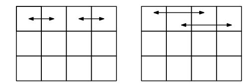
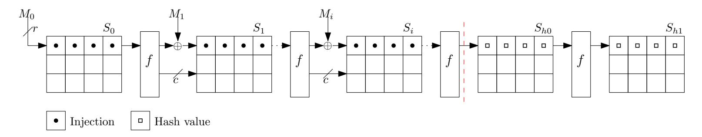
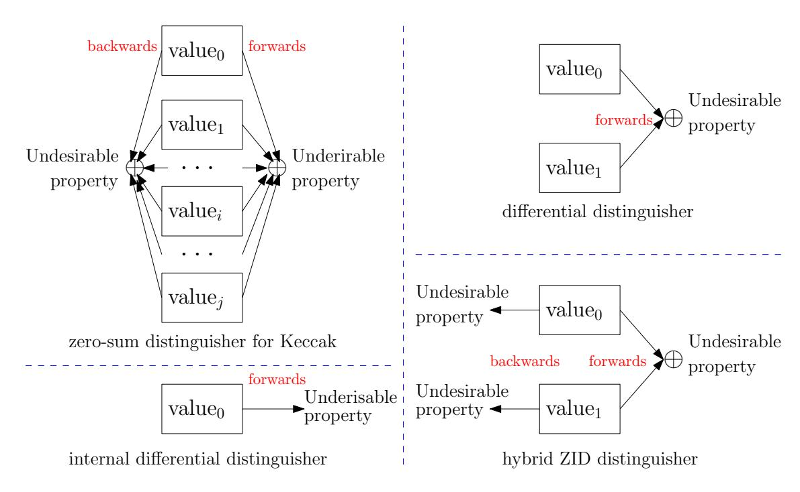
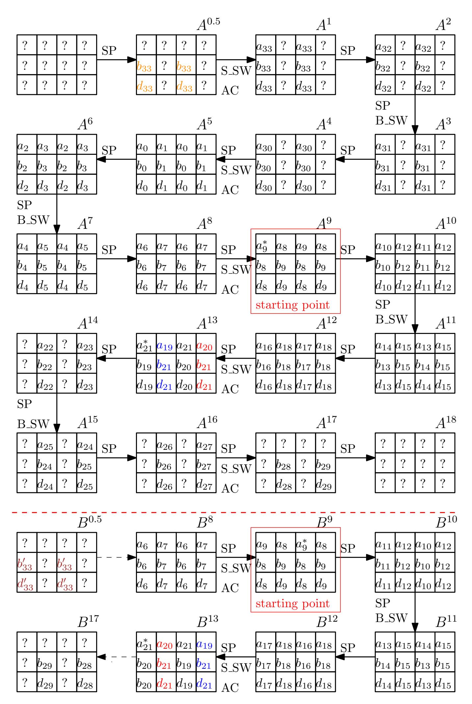
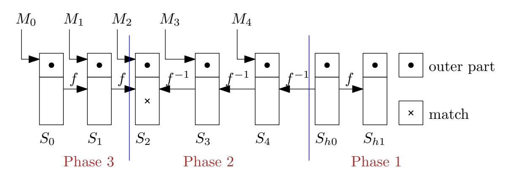
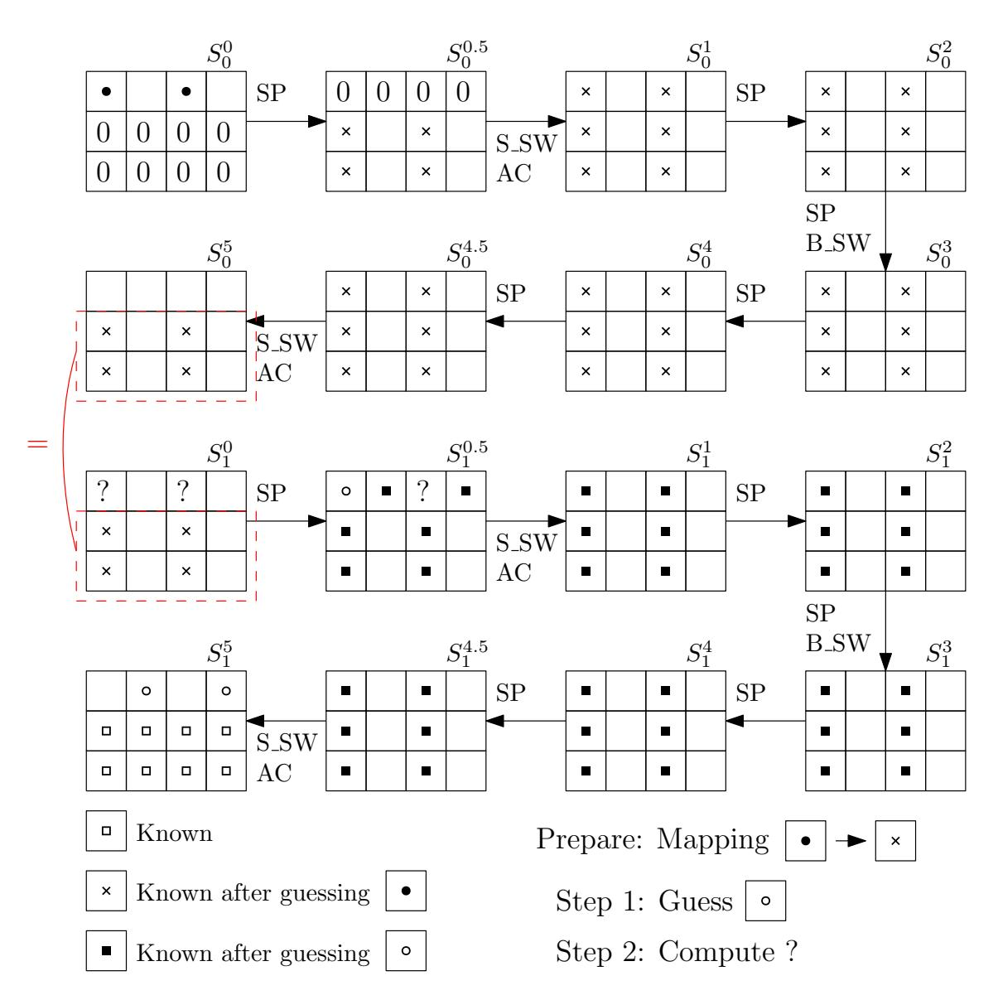
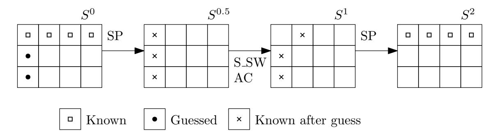
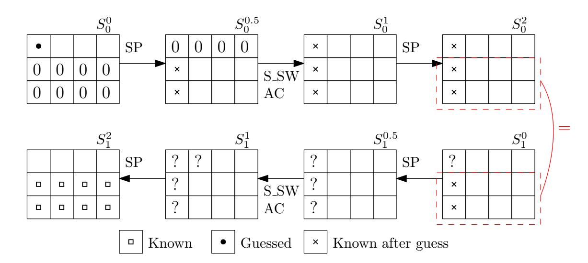

{0}------------------------------------------------

# **Exploiting Weak Diffusion of Gimli: Improved Distinguishers and Preimage Attacks**

Fukang Liu<sup>1</sup>*,*<sup>2</sup> , Takanori Isobe<sup>2</sup>*,*3*,*<sup>4</sup> , Willi Meier<sup>5</sup>

<sup>1</sup> Shanghai Key Laboratory of Trustworthy Computing, East China Normal University, Shanghai, China [liufukangs@163.com](mailto:liufukangs@163.com)

<sup>2</sup> University of Hyogo, Hyogo, Japan

<sup>3</sup> National Institute of Information and Communications Technology, Tokyo, Japan <sup>4</sup> PRESTO, Japan Science and Technology Agency, Tokyo, Japan

[takanori.isobe@ai.u-hyogo.ac.jp](mailto:takanori.isobe@ai.u-hyogo.ac.jp)

<sup>5</sup> University of Applied Sciences and Arts Northwestern Switzerland, Windisch, Switzerland [willimeier48@gmail.com](mailto:willimeier48@gmail.com)

**Abstract.** The Gimli permutation proposed in CHES 2017 was designed for cross-platform performance. One main strategy to achieve such a goal is to utilize a sparse linear layer (Small-Swap and Big-Swap), which occurs every two rounds. In addition, the round constant addition occurs every four rounds and only one 32-bit word is affected by it. The above two facts have been recently exploited to construct a distinguisher for the full Gimli permutation with time complexity 2 <sup>64</sup>. By utilizing a new property of the SP-box, we demonstrate that the time complexity of the fullround distinguisher can be further reduced to 2 <sup>52</sup> while a significant bias still remains. Moreover, for the 18-round Gimli permutation, we could construct a distinguisher even with only 2 queries. Apart from the permutation itself, the weak diffusion can also be utilized to accelerate the preimage attacks on reduced Gimli-Hash and Gimli-XOF-128 with a divide-and-conquer method. As a consequence, the preimage attacks on reduced Gimli-Hash and Gimli-XOF-128 can reach up to 5 rounds and 9 rounds, respectively. Since Gimli is included in the second round candidates in NIST's Lightweight Cryptography Standardization process, we expect that our analysis can further advance the understanding of Gimli. To the best of our knowledge, the distinguishing attacks and preimage attacks are the best so far.

**Keywords:** hash function · Gimli · Gimli-Hash · Gimli-XOF · preimage attack · distinguisher

# **1 Introduction**

**Background.** The Gimli permutation was proposed by Bernstein et al. in CHES 2017 [\[BKL](#page-28-0)<sup>+</sup>17]. As the designers claimed, Gimli is distinguished from other permutationbased primitives for its cross-platform performance. One main strategy to improve the performance of Gimli is to process the 384-bit data in four 96-bit columns independently and make only a 32-bit word swapping among the four columns every two rounds.

Like the AES and SHA-3 competitions, NIST is currently holding a public lightweight cryptography competition, aiming at lightweight cryptography standardization [\[lwc\]](#page-29-0). Since Gimli has been included in the Round 2 candidates in NIST's Lightweight Cryptography Standardization process, it is of practical importance to further investigate its security, especially for its authenticated encryption scheme (Gimli-Cipher) and hash scheme (Gimli-Hash) in the submitted Gimli document.

{1}------------------------------------------------

**Existing Work.** The first third-party cryptanalysis of Gimli was made by Hamburg and the security claim of Gimli was questioned [\[Ham17\]](#page-29-1). However, the attack in [\[Ham17\]](#page-29-1) only works for an ad-hoc mode and cannot be directly applied to Gimli-Cipher or Gimli-Hash.

Recently, two teams made a comprehensive study for Gimli [\[LIM20,](#page-29-2) [GLNP](#page-28-1)<sup>+</sup>20], covering the properties of the SP-box used in Gimli, the distinguishing attacks on the Gimli permutation, collision and semi-free-start collision attacks on Gimli-Hash and staterecovery attacks on the Gimli-Cipher. Notably, the collision attack in [\[GLNP](#page-28-1)<sup>+</sup>20] can reach up to 12 rounds in the classical setting, though it starts from an intermediate round, i.e. there is no swap operation in the first round. For the collision attack starting from the first step, to the best of our knowledge, the best attack[1](#page-1-0) can only reach up to 6 rounds with time/memory complexity 2 <sup>64</sup> [\[LIM20\]](#page-29-2). Moreover, the time complexity of the distinguishing attack on full-round Gimli can be as low as 2 <sup>64</sup> in [\[GLNP](#page-28-1)<sup>+</sup>20], while the previously best distinguishing attack can only reach 14 rounds with time complexity 2 <sup>351</sup> [\[CWZ](#page-28-2)<sup>+</sup>19].

**Difficulty of Cryptanalysis.** For Keccak [\[BDPA11b\]](#page-28-3), the algebraic degrees of the round function and its inverse are 2 and 3, respectively. Benefiting from the low-degree feature, the zero-sum distinguisher [\[AM\]](#page-28-4) becomes the most powerful distinguisher for Keccak, which is based on degree evaluation. However, the disadvantages of this distinguisher are the high data and time complexity since the algebraic degree is almost exponentially increasing as the number of rounds increases. For Gimli, due to the recursive way to compute the inverse of its SP-box, the algebraic degree increases much faster in the backward direction, though the algebraic degree of the round function is 2 in the forward direction. Such a way to construct the SP-box should prevent a similar zero-sum distinguisher once successfully applied to Keccak, as shown in [\[CWZ](#page-28-2)<sup>+</sup>19]. However, the new features of Gimli are its weak diffusion and high symmetry. Therefore, instead of evaluating the algebraic degree, whether there is another way to construct a distinguisher for Gimli similar to the zero-sum distinguisher for Keccak by exploiting the new features of Gimli is an interesting problem. Such a problem has been independently addressed in [\[GLNP](#page-28-1)<sup>+</sup>20] where a full-round distinguisher can be constructed with time complexity 2 64 .

Gimli-Hash is based on the well-known sponge structure [\[BDPA11a,](#page-28-5) [BDPA08\]](#page-28-6), with 128-bit rate and 256-bit capacity. For such a small rate, it is challenging to devise a faster preimage attack on Gimli-Hash than the generic one, which requires 2 <sup>128</sup> time and 2 128 memory[2](#page-1-1) . This is because the attacker has to utilize at least two message blocks to match a given 256-bit hash value. In other words, 2*n* rounds of the Gimli permutation need to be taken into account to efficiently find a preimage of *n*-round Gimli-Hash. Considering the progress in the cryptanalysis of Keccak [\[BDPA11b\]](#page-28-3), even with a relatively large rate, the currently best preimage attacks can only reach up to 4 rounds [\[GLS16,](#page-29-3) [MPS13,](#page-29-4) [LS19\]](#page-29-5). For Ascon [\[DEMS18\]](#page-28-7), the preimage attack is much more difficult due to the small rate. As a result, the designers could only mount a preimage attack on up to 5 rounds of Ascon-XOF-64 with a rather high time complexity [\[DEMS19\]](#page-28-8), which is almost close to an exhaustive search. Especially, to demonstrate the efficiency of the new technique called linear structures [\[GLS16\]](#page-29-3) for the preimage attack on reduced Keccak, Guo et al. provided a practical preimage attack on 3-round SHAKE-128 as an extreme example.

Following the research on Keccak and Ascon, we believe it meaningful to study the security of both Gimli-XOF-128 and Gimli-Hash. On the one hand, it can be used to demonstrate the limit of our developed divide-and-conquer technique. On the other hand, a comparison can be made between Gimli and other primitives regarding the

<span id="page-1-0"></span><sup>1</sup>The collision attack on 6-round Gimli-Hash [\[ZDW19\]](#page-29-6) is proven to be flawed in [\[LIM20\]](#page-29-2). In addition, it seems that the collision attack framework in [\[GLNP](#page-28-1)+20] can not work when the swap operation is used in the first round. Indeed, the collision attack framework in [\[GLNP](#page-28-1)+20] is very similar to the semi-free-start collision attack on 8-round Gimli-Hash in [\[LIM20\]](#page-29-2) and the swap operation in the first round will destroy such a structure to find collisions or semi-free-start collisions.

<span id="page-1-1"></span><sup>2</sup> It is possible to make the memory complexity negligible with Floyd's cycle finding algorithm [\[Flo67\]](#page-28-9).

{2}------------------------------------------------

preimage resistance, especially for those selected in the second round in NIST's Lightweight Cryptography Standardization process.

Our Contributions. Leveraging the symmetry of Gimli, we propose a distinguisher by tracing both the symmetry in a single internal state and the symmetry between two different internal states. In this way, a distinguisher for 18-round Gimli permutation can be achieved with only 2 queries. There seems to be a flaw to extend this 18-round distinguisher to full rounds. Therefore, we turn to improving the full-round distinguisher proposed in  $[GLNP^+20]$ , where only the symmetry in a single internal state is traced. By exploiting a new property of the SP-box, we could construct a similar full-round distinguisher as in  $[GLNP^+20]$  with time complexity  $2^{52}$  while the bias is still kept significant.

In addition, the divide-and-conquer method seems to fit well with the weak linear layer of Gimli. Consequently, we are motivated to develop a divide-and-conquer method to accelerate the exhaustive search for preimages of reduced Gimli-Hash and Gimli-XOF-128. For our preimage attack on 5-round Gimli-Hash, 10 rounds of the Gimli permutation are investigated and we have to exhaust a message space of size  $2^{256}$  in less than  $2^{128}$  time in order to gain advantages over the generic preimage attack. For our preimage attack on 9-round Gimli-XOF-128, 9 rounds of the Gimli permutation are investigated and a message space of size  $2^{128}$  has to be travsersed in less than  $2^{128}$  time. Without a dedicated analysis of the linear layer and SP-box, the above two attacks are almost impossible. Our results are summarized in Table 1.

To verify the correctness of our attacks, we have implemented the preimage attack on 5-round Gimli-Hash, the preimage attack on 9-round Gimli-XOF-128 and the distinguishing attack on the full Gimli permutation by reducing the size of the Gimli state. The source code is available at <a href="https://github.com/LFKOKAMI/SmallGimli.git">https://github.com/LFKOKAMI/SmallGimli.git</a>. The implementation of the distinguisher for the 18-round Gimli permutation is also included.

| omitted.      |                            |                 |            |            |                      |  |  |
|---------------|----------------------------|-----------------|------------|------------|----------------------|--|--|
| Target        | Attack Type                | Rounds          | Memory     | Time       | Ref.                 |  |  |
| Permutation   | distinguisher              | 14              | negligible | $2^{351}$  | $[CWZ^{+}19]$        |  |  |
|               |                            | 18              | negligible | 2          | Sect. 4.1            |  |  |
|               |                            | 24(full rounds) | negligible | $2^{64}$   | $\boxed{[GLNP^+20]}$ |  |  |
|               |                            | 24(full rounds) | negligible | $2^{52}$   | Sect. 4.2            |  |  |
| Gimli-Hash    | preimage                   | 2               | $2^{32}$   | $2^{42.4}$ | App. A               |  |  |
|               |                            | 5               | $2^{65}$   | $2^{96}$   | Sect. 5              |  |  |
| Gimli-XOF-128 | preimage                   | 9               | $2^{70}$   | $2^{104}$  | Sect. 6.1            |  |  |
| AE scheme     | state-recovery             | 9               | $2^{190}$  | $2^{192}$  | [LIM20]              |  |  |
| Gimli-Hash    | collision                  | 6               | $2^{64}$   | $2^{64}$   | [LIM20]              |  |  |
|               |                            | 12 <sup>a</sup> | negligible | $2^{96}$   | $[GLNP^+20]$         |  |  |
| Gimli-Hash    | SFS collision <sup>b</sup> | 8 <sup>a</sup>  | negligible | $2^{64}$   | [LIM20]              |  |  |
|               |                            | 18 <sup>a</sup> | $2^{64}$   | $2^{96}$   | [GLNP+20]            |  |  |

<span id="page-2-0"></span>Table 1: The analytical results of Gimli, where the attacks in the quantum setting are omitted.

**Organization.** This paper is organized as follows. In Section 2, we introduce the notations, the Gimli permutation, the hash scheme Gimli-Hash and Gimli-XOF. In Section 3, some useful properties of the SP-box will be listed. The distinguishing attacks are detailed in Section 4. Our preimage attacks on 5-round Gimli-Hash and 9-round Gimli-XOF-128 are

<sup>&</sup>lt;sup>a</sup> An attack starting at an intermediate step, i.e. there is no swap operation in the first round.

<sup>&</sup>lt;sup>b</sup> semi-free-start collision.

{3}------------------------------------------------

shown in [Section 5](#page-19-0) and [Section 6,](#page-23-0) respectively. Finally, the paper is concluded in [Section 7.](#page-27-0)

## <span id="page-3-0"></span>**2 Preliminaries**

In this section, we will present some notations, the description of the Gimli permutation and its applications to hashing. Meanwhile, some useful properties of the SP-box discussed in [\[LIM20\]](#page-29-2) will be introduced as well.

## **2.1 Notation**

- 1. , , ≪, ≫, ⊕, ∨, ∧ represent the logic operations *shift left, shift right, rotate left, rotate right, exclusive or, or, and*, respectively.
- 2. *Z*[*i*] represents the (*i* + 1)-th bit of the 32-bit word *Z*. where the least significant bit is the 1st bit and the most significant bit is the 32nd bit. For example, *Z*[0] represents the least significant bit of *Z*.
- 3. *Z*[*i* : *j*](0 ≤ *j < i* ≤ 31) represents the (*j* + 1)-th bit to the (*i* + 1)-th bit of the 32-bit word *Z*. For example, *Z*[1 : 0] represents the two bits *Z*[1] and *Z*[0] of *Z*.
- 4. *A*||*B* represents the concatenation of *A* and *B*. For example, if *A* = 001<sup>2</sup> and *B* = 10012, then *A*||*B* = 00110012.
- 5. 0 *<sup>n</sup>* represents an all-zero string of length *n*.
- 6. *SP* represents the application of the 96-bit SP-box.
- 7. *r* represents the size of the outer part of the Gimli state.
- 8. *c* represents the size of the inner part of the Gimli state.
- 9. *f* represents the Gimli permutation.
- 10. *f* −1 represents the inverse of the Gimli permutation.

### **2.2 Description of Gimli**

<span id="page-3-1"></span>Gimli was proposed in CHES 2017 [\[BKL](#page-28-0)<sup>+</sup>17] and is a Round 2 candidate in NIST's Lightweight Cryptography Standardization process [\[lwc\]](#page-29-0). The Gimli state can be viewed as a two-dimensional state *S* = (*S*[*i*][*j*]) (0 ≤ *i* ≤ 2*,* 0 ≤ *j* ≤ 3), where *S*[*i*][*j*] ∈ *F* 32 2 , as illustrated in [Figure 1.](#page-3-1)

| S[0][0] | S[0][1] | S[0][2] | S[0][3] |
|---------|---------|---------|---------|
| S[1][0] | S[1][1] | S[1][2] | S[1][3] |
| S[2][0] | S[2][1] | S[2][2] | S[2][3] |

Figure 1: The Gimli state

The Gimli permutation is described in Algorithm [1.](#page-4-0) As specified in [\[BKL](#page-28-0)<sup>+</sup>17], the permutation is composed of four operations: SP-box, Small-Swap, Big-Swap and Constant Addition. For simplicity, we denote the SP-box, Small-Swap, Big-Swap and Constant Addition by SP, S\_SW, B\_SW and AC, respectively. In this way, the 24-round permutation

{4}------------------------------------------------

can be viewed as 6 iterations of the application of the following sequence of operations (from right to left) :

$$(SP) \circ (B\_SW \circ SP) \circ (SP) \circ (AC \circ S\_SW \circ SP).$$

#### <span id="page-4-0"></span>Algorithm 1 Description of Gimli permutation

```
Input: S = (S[i][j])
 1: for R from 24 down to 1 inclusive do
       for j from 0 to 3 inclusive do
 2:
          IX \leftarrow S[0||j| \ll 24 \Rightarrow SP-box
 3:
          IY \leftarrow S[1][j] \ll 9
 4:
          IZ \leftarrow S[2][j]
 5:
 6:
           S[2][j] \leftarrow IX \oplus IZ \ll 1 \oplus (IY \wedge IZ) \ll 2
 7:
           S[1][j] \leftarrow IY \oplus IX \oplus (IX \vee IZ) \ll 1
 8:
           S[0][j] \leftarrow IZ \oplus IY \oplus (IX \wedge IY) \ll 3
 9:
        end for
10:
11:
        if R \mod 4 = 0 then
12:
           S[0][0], S[0][1], S[0][2], S[0][3] \leftarrow S[0][1], S[0][0], S[0][3], S[0][2]
                                                                                            ▶ Small-Swap
13:
        else if r \mod 2 = 0 then
14:
          S[0][0], S[0][1], S[0][2], S[0][3] \leftarrow S[0][2], S[0][3], S[0][0], S[0][1]
                                                                                            ▶ Big-Swap
15:
        end if
16:
17:
        if R \mod 4 = 0 then
18:
           S[0][0] \leftarrow S[0][0] \oplus 0x9e377900 \oplus r \triangleright \text{Constant Addition}
19:
        end if
20:
21: end for
22: return (S[i][j])
```

For convenience, denote the internal state after r-round permutation by  $S^r$  and the input state by  $S^0$ . In other words, we have

$$S^{4i} \xrightarrow{\mathrm{SP}} S^{4i+0.5} \xrightarrow{\mathrm{S}} \xrightarrow{\mathrm{SW}} \xrightarrow{\mathrm{AC}} S^{4i+1} \xrightarrow{\mathrm{SP}} S^{4i+2} \xrightarrow{\mathrm{SP}} S \xrightarrow{\mathrm{BW}} S^{4i+3} \xrightarrow{\mathrm{SP}} S^{4i+4},$$

where  $0 \le i \le 5$ . Moreover, the six 32-bit round constants are denoted by  $c_i$   $(0 \le i \le 5)$ , where  $c_i = 0x9e377900 \oplus (24-4i)$ .

To represent a column of the Gimli state  $S^r$ , we denote the (j+1)-th column of the Gimli state by  $S^r[\cdot][j]$ , i.e.  $S^r[\cdot][j] = (S^r[0][j], S^r[1][j], S^r[2][j])$   $(0 \le j \le 3)$ . To represent a row of the Gimli state, we denote the (i+1)-th row of the Gimli state by  $S^r[i][\cdot]$ , i.e.  $S^r[i][\cdot] = (S^r[i][0], S^r[i][1], S^r[i][2], S^r[i][3])$   $(0 \le i \le 2)$ .

To represent a group of state words, we use  $S^r[I][j]$  or  $S^r[i][J]$  or  $S^r[I][J]$ , i.e.  $S^r[I][j] = \{S^r[i][j]|i \in I \subseteq \{0,1,2\}\}, \ S^r[i][J] = \{S^r[i][j]|j \in J \subseteq \{0,1,2,3\}\}$  and  $S^r[I][J] = \{S^r[i][j]|i \in I \subseteq \{0,1,2\}, j \in J \subseteq \{0,1,2,3\}\}$ . Right now, two different states can be the same, if their internal values are permuted within I or J indices. For example,  $S^r[0,1][2] = (S^r[0][2], S^r[1][2]), \ S^r[0][0,1] = (S^r[0][0], S^r[0][1])$  and  $S^r[0,1][0,1] = (S^r[0][0], S^r[0][1], S^r[1][0], S^r[1][1])$ .

#### 2.3 SP-box

The SP-box can be viewed as a 96-bit S-box. Denote the 96-bit input and output by  $(IX, IY, IZ) \in F_2^{32 \times 3}$  and  $(OX, OY, OZ) \in F_2^{32 \times 3}$ , respectively. Formally, the following

{5}------------------------------------------------

relation holds:

$$(OX, OY, OZ) = SP(IX, IY, IZ).$$

(*OX, OY, OZ*) is computed as follows:

$$IX \leftarrow IX \ll 24$$

$$IY \leftarrow IY \ll 9$$

$$OZ \leftarrow IX \oplus IZ \ll 1 \oplus (IY \land IZ) \ll 2$$

$$OY \leftarrow IY \oplus IX \oplus (IX \lor IZ) \ll 1$$

$$OX \leftarrow IZ \oplus IY \oplus (IX \land IY) \ll 3$$

## **2.4 Linear Layer**

The linear layer consists of two swap operations, namely Small-Swap and Big-Swap. Small-Swap occurs every 4 rounds starting from the 1st round. Big-Swap occurs every 4 rounds starting from the 3rd round. The illustration of Small-Swap and Big-Swap can be referred to [Figure 2.](#page-5-0)

<span id="page-5-0"></span>

Figure 2: The linear layer, where the left/right part represents S\_SW/B\_SW.

## **2.5 Gimli-Hash**

How Gimli-Hash compresses a message is illustrated in [Figure 3.](#page-5-1) Specifically, Gimli-Hash initializes a 48-byte Gimli state to all-zero. It then reads sequentially through a variable-length input as a series of 16-byte input blocks, denoted by *M*0, *M*1, · · ·.

<span id="page-5-1"></span>

Figure 3: The process to compress the message

Each full 16-byte input block is handled as follows:

- XOR the block into the first 16 bytes of the state (i.e. the top row of 4 words).
- Apply the Gimli permutation.

The input ends with exactly one final non-full (empty or partial) block, having *b* bytes where 0 ≤ *b* ≤ 15. This final block is handled as follows:

- XOR the block into the first *b* bytes of the state.
- XOR 1 into the next byte of the state, position *b*.
- XOR 1 into the last byte of the state, position 47.

{6}------------------------------------------------

• Apply the Gimli permutation.

After the input is fully processed, a 32-byte hash output is obtained as follows:

- Output the first 16 bytes of the state (i.e. the top row of 4 words), denoted by  $H_0$ .
- Apply the Gimli permutation.
- Output the first 16 bytes of the state (i.e. the top row of 4 words), denoted by  $H_1$ .

As depicted in Figure 3, the state after  $M_i$   $(i \ge 0)$  is injected is denoted by  $S_i$  and the 256-bit hash value is the concatenation of  $(S_{h0}[0][0], S_{h0}[0][1], S_{h0}[0][2], S_{h0}[0][3], S_{h1}[0][0], S_{h1}[0][1], S_{h1}[0][2], S_{h1}[0][3])$ . Formally, the following relations hold:

$$S_0 = 0^{384} \oplus (M_0||0^{256}),$$
  
 $S_{i+1} = f(S_i) \oplus (M_{i+1}||0^{256}) \quad (i \ge 0),$ 

In our preimage attacks on Gimli-Hash, two consecutive message blocks will be utilized. To distinguish the states where different message blocks are processed, we further introduce the following notations: when processing  $M_i$ , denote the internal state after the r-round permutation by  $S_i^r$  and the input state by  $S_i^0$ . In other words, we have

$$S_i^{4j} \xrightarrow{\mathrm{SP}} S_i^{4j+0.5} \xrightarrow{\mathrm{S}} \xrightarrow{\mathrm{SW}} \xrightarrow{\mathrm{AC}} S_i^{4j+1} \xrightarrow{\mathrm{SP}} S_i^{4j+2} \xrightarrow{\mathrm{SP}} S_i^{\mathrm{BW}} \xrightarrow{S_i^{4j+3}} \xrightarrow{\mathrm{SP}} S_i^{4j+4},$$

where  $0 \le j \le 5$  and  $i \ge 0$ .

To represent a column of the Gimli state  $S_d^r$ , we denote the (j+1)-th column of the Gimli state by  $S_d^r[\cdot][j]$ , i.e.  $S_d^r[\cdot][j] = (S_d^r[0][j], S_d^r[1][j], S_d^r[2][j])$   $(0 \le j \le 3)$ . To represent a row of the Gimli state, we denote the (i+1)-th row of the Gimli state by  $S_d^r[i][\cdot]$ , i.e.  $S_d^r[i][\cdot] = (S_d^r[i][0], S_d^r[i][1], S_d^r[i][2], S_d^r[i][3])$   $(0 \le i \le 2)$ .

To represent a group of state words, we use  $S_d^r[I][j]$  or  $S_d^r[i][J]$  or  $S_d^r[I][J]$ , i.e.  $S_d^r[I][j] = \{S_d^r[i][j]|i \in I \subseteq \{0,1,2\}\}, \ S_d^r[i][J] = \{S_d^r[i][j]|j \in J \subseteq \{0,1,2,3\}\}$  and  $S_d^r[I][J] = \{S_d^r[i][j]|i \in I \subseteq \{0,1,2\}, j \in J \subseteq \{0,1,2,3\}\}$ . Right now, two different states can be the same, if their internal values are permuted within I or J indices. For example,  $S_d^r[0,1][2] = (S_d^r[0][2], S_d^r[1][2]), \ S_d^r[0][0,1] = (S_d^r[0][0], S_d^r[0][1])$  and  $S_d^r[0,1][0,1] = (S_d^r[0][0], S_d^r[0][1], S_d^r[1][0], S_d^r[1][1])$ .

#### 2.5.1 Gimli-XOF

In addition to Gimli-Hash, another application of the Gimli permutation called "extendable one-way function" (Gimli-XOF) is specified in the submitted Gimli document [BKL<sup>+</sup>17]. For completeness, we briefly introduce the construction of Gimli-XOF recommended by the designers for lightweight applications.

Construction. At the squeezing phase, different from Gimli-Hash which generates a fixed-length output of 32 bytes, Gimli-XOF works as follows to generate t bytes of output:

- 1. Concatenate  $\lceil \frac{t}{16} \rceil$  blocks of 16 bytes, each of which is obtained by extracting the first 16 bytes of the state and then applying the Gimli permutation.
- 2. Truncate the obtained  $16\lceil \frac{t}{16} \rceil$  bytes to t bytes.

At the absorbing phase, the so-called two-way fork [BKL<sup>+</sup>17] is adopted, as specified below:

1. Read the message byte by byte (imaging that there is a device). Xor the byte at the current position and then increase the current position. If the current position exceeds the end of the block (each block can absorb at most 16 bytes per time), apply the permutation and set the current position back to the first byte.

{7}------------------------------------------------

2. When reaching the "end of data", xor 1 into the state at the current position and apply the Gimli permutation.

Obviously, the difference between Gimli-Hash and Gimli-XOF at the absorbing phase exists in the padding rule.

To apply our technique, the parameter *t* is set as 16. In other words, the Gimli permutation is used to generate 128 bits of output. For simplicity, Gimli-XOF with a 128-bit output is denoted by Gimli-XOF-128.

## <span id="page-7-0"></span>**3 Properties of the SP-box**

Suppose (*OX, OY, OZ*) = *SP*(*IX, IY, IZ*). Several properties have been discussed in [\[LIM20\]](#page-29-2) and we list some useful ones for our attacks.

<span id="page-7-6"></span>**Property 1.** [\[LIM20\]](#page-29-2) *If* (*IY* ≪ 9) ∧ 0x1fffffff = 0*, OX will be independent of IX.*

<span id="page-7-4"></span>**Property 2.** [\[LIM20\]](#page-29-2) *A random triple* (*IY, IZ, OX*) *is potentially valid with probability* 2 <sup>−</sup>15*.*<sup>5</sup> *without knowing IX.*

<span id="page-7-5"></span>**Property 3.** [\[LIM20\]](#page-29-2) *Given a random triple* (*IX, OY, OZ*)*, it is valid with probability* 2 −1 *. Once it is valid,* (*OX*[30 : 0]*, IY, IZ*[30 : 0]) *can be determined.*

<span id="page-7-3"></span>**Property 4.** [\[LIM20\]](#page-29-2) *Given a random triple* (*IY, IZ, OZ*)*,* (*IX, OX, OY* ) *can be uniquely determined. In addition, a random tuple* (*IY, IZ, OY, OZ*) *is valid with probability* 2 −32 *.*

In addition to the above mentioned properties, we provide some extra meaningful properties of the SP-box.

<span id="page-7-1"></span>**Property 5.** *Let* (*OX*<sup>0</sup> *, OY* <sup>0</sup> *, OZ*<sup>0</sup> ) = *SP*(*IX*<sup>0</sup> *, IY* <sup>0</sup> *, IZ*<sup>0</sup> )*. If IY* = *IY* <sup>0</sup> *and IZ* = *IZ*<sup>0</sup> *, the following relations must hold:*

$$OX[0] = OX'[0], OX[1] = OX'[1], OX[2] = OX'[2],$$
  
 $OY[0] \oplus OZ[0] = OY'[0] \oplus OZ'[0].$ 

*Proof.* This can be easily observed from the expressions to calculate *OX*[*i*] (0 ≤ *i* ≤ 2) and *OY* [0] ⊕ *OZ*[0], as specified below:

$$OX[i] = IZ[i] \oplus IY[i-9] \ (0 \le i \le 2),$$
  
 $OY[0] \oplus OZ[0] = IY[23] \oplus IX[8] \oplus IX[8] = IY[23].$ 

Since *IY* ⊕ *IY* <sup>0</sup> = 0 and *IZ* ⊕ *IZ*<sup>0</sup> = 0, the following four relations must hold:

$$OX[0] = OX'[0], OX[1] = OX'[1], OX[2] = OX'[2],$$
  
 $OY[0] \oplus OZ[0] = OY'[0] \oplus OZ'[0].$ 

<span id="page-7-2"></span>**Property 6.** *Let* (*OX*<sup>0</sup> *, OY* <sup>0</sup> *, OZ*<sup>0</sup> ) = *SP*(*IX*<sup>0</sup> *, IY* <sup>0</sup> *, IZ*<sup>0</sup> )*. If OY* = *OY* <sup>0</sup> *and OZ* = *OZ*<sup>0</sup> *, the following relations must hold:*

$$IX[8] = IX'[8], IY[23] = IY'[23].$$

*Proof.* This can be easily observed from the expressions to calculate *OY* [0] and *OZ*[0], as specified below:

$$OY[0] = IY[23] \oplus IX[8], OZ[0] = IX[8].$$

{8}------------------------------------------------

Therefore, we have IX[8] = OZ[0] and  $IY[23] = IX[8] \oplus OY[0] = OZ[0] \oplus OY[0]$ . Since  $OY \oplus OY' = 0$  and  $OZ \oplus OZ' = 0$ , the following two relations must hold:

$$IX[8] = IX'[8], IY[23] = IY'[23].$$

The motivation to investigate Property 5 and Property 6 is to construct the distinguisher for the 18-round Gimli permutation. To improve the full-round distinguisher proposed in [GLNP<sup>+</sup>20], we will extend Property 6 to Property 9. The motivation to do such an extension will be clear when the improved full-round distinguisher is described. Therefore, Property 9 will be detailed in Subsection 4.2.

<span id="page-8-0"></span>**Property 7.** Let  $(x_1, y_1, z_1) = SP(x_0, y_0, z_0)$  and  $(x', y', z') = SP(x_2, y_1, z_1)$ . Given a random value of  $(y_0, z_0, y', z')$ , all feasible solutions of  $(x_0, x_2)$  can be recovered with time complexity  $2^{10.4}$ .

Proof. First of all, consider the generic time complexity to recover the pair  $(x_0, x_2)$ . For each guessed value of  $x_0$ ,  $(x_1, y_1, z_1)$  can be determined. Since (y', z') are known, based on Property 4, the correctness of the computed  $(y_1, z_1)$  can be immediately checked without knowing  $x_2$ . According to Property 4, the tuple  $(y_1, z_1, y', z')$  is valid with probability  $2^{-32}$ . Since there are at most  $2^{32}$  values of  $x_0$ , after all the possible values of  $x_0$  are traversed, one can expect only one solution of  $x_0$  which can make the tuple  $(y_1, z_1, y', z')$  valid. Once the tuple is valid,  $x_2$  can be uniquely determined based on Property 4. Consequently, the generic method is a simple exhaustive search for  $x_0$ , which requires  $2^{32}$  time. In our following method,  $x_0$  can be efficiently exhausted with the guess-and-determine technique.

For simplicity, let  $v = x_0 \ll 24$ . First of all, consider the relations between  $(x_0, y_0, z_0)$  and  $(y_1, z_1)$ :

$$z_1 = v \oplus (z_0 \ll 1) \oplus ((y_0 \ll 9) \wedge z_0) \ll 2,$$
  
 $y_1 = (y_0 \ll 9) \oplus v \oplus (v \vee z_0) \ll 1.$ 

It can be easily observed that when  $(y_0, z_0)$  are known, each bit of  $(z_1, y_1)$  can be expressed as follows:

$$z_1[i] = v[i] \oplus \gamma_i,$$
  
 $y_1[i] = v[i] \oplus \mu_i v[i-1] \oplus \lambda_i,$ 

where  $\gamma_i$ ,  $\mu_i$  and  $\lambda_i$  ( $0 \le i \le 31$ ) are known values over GF(2), which can be calculated according to  $(y_0, z_0)$ .

For convenience, let  $y = y_1 \ll 9$ ,  $z = z_1$ ,  $x = x_2 \ll 24$ . Then, each bit of (z, y) can be expressed as follows:

$$z[i] = v[i] \oplus \gamma_i,$$
  

$$y[i] = v[i-9] \oplus \alpha_i v[i-10] \oplus \beta_i,$$

where  $\gamma_i$ ,  $\alpha_i$  and  $\beta_i$  ( $0 \le i \le 31$ ) are known values over GF(2), which can be calculated according to  $(y_0, z_0)$ .

Consider the relations between (x, y, z) and (y', z'), as specified below:

$$z' = x \oplus (z \ll 1) \oplus (yz) \ll 2,$$
  
$$y' = y \oplus x \oplus (x \vee z) \ll 1 = y \oplus x \oplus (xz \oplus x \oplus z) \ll 1.$$

We rewrite the expression of y' as follows:

$$y' = y \oplus x \oplus (xz \oplus x \oplus z) \ll 1 = y \oplus (x \oplus (z \ll 1)) \oplus (xz \oplus x) \ll 1.$$

{9}------------------------------------------------

By involving *z* 0 into the expression of *y* 0 , we can obtain that

$$y' = y \oplus (x \oplus (z \ll 1)) \oplus (xz \oplus x) \ll 1$$
$$= y \oplus z' \oplus (yz) \ll 2 \oplus (x\overline{z}) \ll 1.$$
$$\downarrow \qquad \qquad \qquad \qquad \qquad \qquad \qquad \qquad \qquad \qquad \qquad \qquad \qquad \qquad \qquad \qquad \qquad \qquad \qquad$$

As

$$x = z' \oplus (z \ll 1) \oplus (yz) \ll 2,$$

it can be derived that

$$y' \oplus z' = y \oplus (yz) \ll 2 \oplus (\overline{z}(z' \oplus (z \ll 1) \oplus (yz) \ll 2)) \ll 1.$$

For simplicity, let *Y* = *y* <sup>0</sup> ⊕ *z* 0 . Considering the expression from the bit level, we can derive the following 32 equations:

$$Y[0] = y[0], \qquad (1)$$

$$Y[1] = y[1] \oplus z'[0]\overline{z[0]}, \qquad (2)$$

$$Y[2] = y[2] \oplus y[0]z[0] \oplus \overline{z[1]}(z'[1] \oplus z[0]), \qquad (3)$$

$$Y[3] = y[3] \oplus y[1]z[1] \oplus \overline{z[2]}(z'[2] \oplus z[1] \oplus y[0]z[0]), \qquad (4)$$

$$Y[4] = y[4] \oplus y[2]z[2] \oplus \overline{z[3]}(z'[3] \oplus z[2] \oplus y[1]z[1]), \qquad (5)$$

$$Y[5] = y[5] \oplus y[3]z[3] \oplus \overline{z[4]}(z'[4] \oplus z[3] \oplus y[2]z[2]), \qquad (6)$$

$$Y[6] = y[6] \oplus y[4]z[4] \oplus \overline{z[5]}(z'[5] \oplus z[4] \oplus y[3]z[3]), \qquad (7)$$

$$Y[7] = y[7] \oplus y[5]z[5] \oplus \overline{z[6]}(z'[6] \oplus z[5] \oplus y[4]z[4]), \qquad (8)$$

$$Y[8] = y[8] \oplus y[6]z[6] \oplus \overline{z[7]}(z'[7] \oplus z[6] \oplus y[5]z[5]), \qquad (9)$$

$$Y[9] = y[9] \oplus y[7]z[7] \oplus \overline{z[8]}(z'[8] \oplus z[7] \oplus y[6]z[6]), \qquad (10)$$

$$Y[10] = y[10] \oplus y[8]z[8] \oplus \overline{z[9]}(z'[9] \oplus z[8] \oplus y[7]z[7]), \qquad (11)$$

$$Y[11] = y[11] \oplus y[9]z[9] \oplus \overline{z[10]}(z'[10] \oplus z[9] \oplus y[8]z[8]), \qquad (12)$$

$$Y[12] = y[12] \oplus y[10]z[10] \oplus \overline{z[11]}(z'[11] \oplus z[10] \oplus y[9]z[9]), \qquad (13)$$

$$Y[13] = y[13] \oplus y[11]z[11] \oplus \overline{z[12]}(z'[12] \oplus z[11] \oplus y[11]z[11]), \qquad (14)$$

$$Y[14] = y[14] \oplus y[12]z[12] \oplus \overline{z[13]}(z'[13] \oplus z[12] \oplus y[11]z[11]), \qquad (15)$$

$$Y[15] = y[15] \oplus y[13]z[13] \oplus \overline{z[14]}(z'[14] \oplus z[13] \oplus y[12]z[12]), \qquad (16)$$

$$Y[16] = y[16] \oplus y[14]z[14] \oplus \overline{z[16]}(z'[16] \oplus z[15] \oplus y[14]z[14]), \qquad (18)$$

$$Y[17] = y[17] \oplus y[15]z[15] \oplus \overline{z[16]}(z'[16] \oplus z[15] \oplus y[14]z[14]), \qquad (18)$$

$$Y[19] = y[19] \oplus y[17]z[17] \oplus \overline{z[18]}(z'[19] \oplus z[18] \oplus y[17]z[17]), \qquad (21)$$

$$Y[20] = y[20] \oplus y[18]z[18] \oplus \overline{z[19]}(z'[19] \oplus z[18] \oplus y[17]z[17]), \qquad (21)$$

$$Y[21] = y[21] \oplus y[19]z[19] \oplus \overline{z[20]}(z'[20] \oplus z[19] \oplus y[18]z[18]), \qquad (22)$$

$$Y[22] = y[22] \oplus y[20]z[20] \oplus \overline{z[21]}(z'[21] \oplus z[20] \oplus y[19]z[19]), \qquad (23)$$

$$Y[23] = y[23] \oplus y[21]z[21] \oplus \overline{z[20]}(z'[20] \oplus z[19] \oplus y[18]z[18]), \qquad (24)$$

$$Y[24] = y[24] \oplus y[22]z[22] \oplus \overline{z[23]}(z'[23] \oplus z[22] \oplus y[21]z[21]), \qquad (25)$$

$$Y[26] = y[26] \oplus y[24]z[24] \oplus \overline{z[26]}(z'[26] \oplus z[25] \oplus y[24]z[24]), \qquad (28)$$

$$Y[28] = y[28] \oplus y[26]z[26] \oplus \overline{z[27]}(z'[27] \oplus z[26] \oplus y[25]z[25]), \qquad (29)$$

{10}------------------------------------------------

$$Y[29] = y[29] \oplus y[27]z[27] \oplus \overline{z[28]}(z'[28] \oplus z[27] \oplus y[26]z[26]), \tag{30}$$

$$Y[30] = y[30] \oplus y[28]z[28] \oplus \overline{z[29]}(z'[29] \oplus z[28] \oplus y[27]z[27]), \tag{31}$$

$$Y[31] = y[31] \oplus y[29]z[29] \oplus \overline{z[30]}(z'[30] \oplus z[29] \oplus y[28]z[28]). \tag{32}$$

In the above equation system (Eq. 1∼32), (*z* 0 *, Y* ) are known and (*y, z*) are linear in the unknown *x*0. Our aim is to recover (*y, z*) in order to recover the unknowns (*x*0*, x*2).

The procedure to solve the above equation system is described as follows:

Step 1: Guess (*z*[0]*, z*[1]*, z*[2]*, z*[3]*, z*[4]). For each such guess, *v*[*i*] (0 ≤ *i* ≤ 4) becomes known. Based on Eq. 1∼6, we can also uniquely compute

(*y*[0]*, y*[1]*, y*[2]*, y*[3]*, y*[4]*, y*[5])*.*

Note that we need to compute *y*[*i*] before computing *y*[*i* + 1] (0 ≤ *i* ≤ 4).

Step 2: The expression of *y*[*i*] is as follows:

$$y[i] = v[i-9] \oplus \alpha_i v[i-10] \oplus \beta_i.$$

Since (*y*[0]*, y*[1]*, y*[2]*, y*[3]*, y*[4]*, y*[5]) are known, we can uniquely determine *v*[*i*] (22 ≤ *i* ≤ 28) by guessing *v*[22].

Step 3: Guess (*y*[22]*, y*[23]*, y*[24]). Since *v*[*i*] (22 ≤ *i* ≤ 28) have been determined at Step 2, we can compute the corresponding *z*[*i*] (22 ≤ *i* ≤ 28). Then, based on Eq. 26∼30, we can uniquely compute

(*y*[25]*, y*[26]*, y*[27]*, y*[28]*, y*[29])*.*

Then

$$(y[22],y[23],y[24],y[25],y[26],y[27],y[28],y[29])\\$$

become determined. Therefore, we can uniquely determine *v*[*i*] (12 ≤ *i* ≤ 20) by guessing *v*[12].

Step 4: At this step, only *v*[*i*] (*i* ∈ {5*,* 6*,* 7*,* 8*,* 8*,* 10*,* 11*,* 21*,* 29*,* 30*,* 31}) are unknown. We can compute (*y*[11]*, y*[12]*, y*[13]) according to the knowledge of (*v*[1]*, v*[2]*, v*[3]*, v*[4]). Observing Eq. 15, when *z*[13] = 1 or *y*[11] = 0, we can uniquely compute *y*[14] since the unknown *z*[11] will not influence the calculation of *y*[14] anymore. After *y*[14] is obtained, based on Eq. 16∼21, we can uniquely compute

$$(y[15], y[16], y[17], y[18], y[19], y[20]).$$

Then, the values of *v*[*i*] (*i* ∈ {5*,* 6*,* 7*,* 8*,* 8*,* 10*,* 11}) are determined.

If *z*[13] = 0 and *y*[11] = 1, which occurs with probability 2 −2 , similarly, we simply guess *z*[11] and then obtain the value of

$$(y[14], y[15], y[16], y[17], y[18], y[19], y[20]),$$

which will correspond to a solution of *v*[*i*] (*i* ∈ {5*,* 6*,* 7*,* 8*,* 8*,* 10*,* 11}). Compare the value of *v*[11] with its guessed value (we can obtain *v*[11] from *z*[11]). If they are consistent, we find a correct solution of *v*[*i*] (*i* ∈ {5*,* 6*,* 7*,* 8*,* 8*,* 10*,* 11}). Otherwise, it is wrong.

In conclusion, whatever the case is, we could only get one solution of *v*[11] (*i* ∈ {5*,* 6*,* 7*,* 8*,* 8*,* 10*,* 11}). The average cost at this step can be estimated as 3 <sup>4</sup> + 1 <sup>4</sup> × 2 ≈ 2 0*.*4 .

{11}------------------------------------------------

Step 5: Since (v[5], v[6], v[7]) are determined, we can compute (z[5], z[6], z[7]). Then, based on Eq. 7~9, we can uniquely compute (y[6], y[7], [8]), thus determining (v[29], v[30], v[31]) and (z[29], z[30], z[31]). Then, we can compute y[30] based on Eq. 31 because z[29] becomes known. After y[30] is computed, we can uniquely determine v[21]. Until this phase, (v, y, z) are fully determined and we can check the correctness by checking the validity of the tuple (y, z, y', z') according to Property 4.

The time complexity of our guess-and-determine method to solve the above equation system can be evaluated in this way. At Step 1, (z[0], z[1], z[2], z[3], z[4]) are guessed. At Step 2, v[22] is guessed. At Step 3, (y[22], y[23], y[24], v[12]) are guessed. At Step 4, the cost of guessing can be evaluated as  $2^{0.4}$ . As a result, the time complexity to traverse all solutions of the above equation system is  $2^{5+1+4+0.4} = 2^{10.4}$ . On the other hand, we do not construct any coefficient matrix nor use Gauss elimination when solving the above equation system. The unknown variables can be calculated step by step by considering the corresponding expressions, which is very efficient.

As explained at the beginning of the proof, since  $x_0$  can be exhausted in  $2^{10.4}$  time,  $(x_0, x_2)$  can be recovered in  $2^{10.4}$  time and the expected number of solutions is 1.

<span id="page-11-1"></span>**Property 8.** Given a random constant value of OX and N uniformly distributed pairs of (IY, IZ), when N is sufficiently large, the expectation of the number of the solutions of IX is N.

*Proof.* Consider the expressions to compute OX as shown in Equation 33.

<span id="page-11-0"></span>
$$OX[i] = \begin{cases} IZ[i] \oplus IY[i-9] & (0 \le i \le 2) \\ IZ[i] \oplus IY[i-9] \oplus (IX[i-27] \land IY[i-12]) & (3 \le i \le 31) \end{cases}$$
(33)

Denote the probability that there are  $2^s$  solutions of IX for a given random triple (IY, IZ, OX) by Pr(s). Therefore,

$$Pr(s+3) = 2^{-3} \times 2^{-s} \times \frac{\binom{29}{s}}{2^{29}}, \quad (0 \le s \le 29).$$

This is because  $IX[i-27] \wedge IY[i-12]$  is irrelevant to IX[i-27] when IY[i-12] = 0.

As a result, the expectation of the number of solutions of IX denoted by E can be formulated as follows:

$$E = N \times \sum_{s=0}^{29} (2^{s+3} \times Pr(s+3))$$

$$= N \times \sum_{s=0}^{29} (2^{s+3} \times 2^{-3} \times 2^{-s} \times \frac{\binom{29}{s}}{2^{29}}) = N \times \sum_{s=0}^{29} \frac{\binom{29}{s}}{2^{29}} = N.$$

In addition, according to Property 2, a random triple (IY, IZ, OX) is valid with probability  $2^{-15.5}$ . Thus, we can expect N solutions of IX when N is sufficiently large, e.g.  $N=2^{32}$ . According to experiments, when  $N=2^{32}$ , about  $2^{32}$  (slightly greater than  $2^{32}$ ) solutions of (IX, IY, IZ) can be obtained to match a given OX.

As mentioned in the proof, a random triple (IY, IZ, OX) is valid with probability  $2^{-15.5}$  based on Property 2. Therefore, it would be meaningful to study how many solutions there will be for (IX, OY, OZ) when there are a large number of uniformly distributed triples (IY, IZ, OX).

{12}------------------------------------------------

## <span id="page-12-1"></span>4 Improved Distinguishers for Gimli

A well-known powerful distinguisher for the Keccak permutation is the so-called zero-sum distinguisher [AM], where the attacker starts from a middle round and chooses a set of values for the intermediate state so that the sum of the inputs and outputs are all zero when computing backwards and forwards. In addition, the common differential distinguisher [BS90] tries to capture some undesirable behaviour of the output difference for a certain input difference. Benefiting from the internal differential [Pey10], which has been applied to the cryptanalysis of Keccak [MPS13, DDS13], we propose a new distinguisher called hybrid zero-internal-differential (ZID) distinguisher for Gimli. Such a new distinguisher is inspired from the zero-sum distinguisher [AM], differential distinguisher [BS90] and internal differential [Pey10], as illustrated in Figure 4. Specifically, we start from a middle round and choose two different intermediate internal states of a specific format. Then, we carefully trace both the symmetry in each internal state and the symmetry between two different internal states generated by the two intermediate internal states.

<span id="page-12-2"></span>

Figure 4: Illustration of the distinguishers

## <span id="page-12-0"></span>4.1 Deterministic Hybrid ZID Distinguisher for 18-Round Gimli

We begin with the hybrid ZID distinguisher for 18 rounds of the Gimli permutation, which only requires 2 queries to the 18-round Gimli permutation. Starting from  $S^9$ , we choose two different values denoted by  $(A^9, B^9)$  for  $S^9$  such that the second column and the fourth column share the same values in  $(A^9, B^9)$  while the first column and the third column are swapped in  $(A^9, B^9)$ . In addition, there are extra conditions on state words in the first row of the first and third columns to eliminate the influence of the constant addition. Formally, the conditions are specified below:

<span id="page-12-3"></span>
$$\begin{cases}
A^{9}[0][0] = c_{2} \oplus A^{9}[0][2], A^{9}[1][0] = A^{9}[1][2], A^{9}[2][0] = A^{9}[2][2], \\
A^{9}[\cdot][1] = A^{9}[\cdot][3] = B^{9}[\cdot][1] = B^{9}[\cdot][3], \\
B^{9}[\cdot][0] = A^{9}[\cdot][2], B^{9}[\cdot][2] = A^{9}[\cdot][0].
\end{cases} (34)$$

where  $c_2$  is the round constant used to compute  $S^9$  in the Gimli permutation.

As illustrated in Figure 5, we can trace the evolutions of the internal difference in both directions for  $A^9$  and  $B^9$ , respectively. The following relations inside  $(A^{17}, B^{17})$  can be derived, i.e. the last two rows of the second column and the fourth column are swapped

{13}------------------------------------------------

for (*A*<sup>17</sup>*, B*<sup>17</sup>).

$$A^{17}[1][1] = B^{17}[1][3], A^{17}[2][1] = B^{17}[2][3],$$
  
 $A^{17}[1][3] = B^{17}[1][1], A^{17}[2][3] = B^{17}[2][1].$ 

In addition, we have the following relations inside (*A*<sup>0</sup>*.*<sup>5</sup> *, B*<sup>0</sup>*.*<sup>5</sup> ), i.e. the last two rows of the first column and the third column are identical in both (*A*<sup>0</sup>*.*<sup>5</sup> *, B*<sup>0</sup>*.*<sup>5</sup> ).

<span id="page-13-2"></span>
$$\begin{cases}
A^{0.5}[1][0] = A^{0.5}[1][2], A^{0.5}[2][0] = A^{0.5}[2][2], \\
B^{0.5}[1][0] = B^{0.5}[1][2], B^{0.5}[2][0] = B^{0.5}[2][2].
\end{cases}$$
(35)

Consequently, according to [Property 5,](#page-7-1) the following 8 relations always hold for (*A*<sup>18</sup> , *B*<sup>18</sup>).

<span id="page-13-1"></span>
$$\begin{cases} A^{18}[0][1][0] = B^{18}[0][3][0], A^{18}[0][1][1] = B^{18}[0][3][1], \\ A^{18}[0][1][2] = B^{18}[0][3][2], B^{18}[0][1][0] = A^{18}[0][3][0], \\ B^{18}[0][1][1] = A^{18}[0][3][1], B^{18}[0][1][2] = A^{18}[0][3][2], \\ A^{18}[1][1][0] \oplus A^{18}[2][1][0] = B^{18}[1][3][0] \oplus B^{18}[2][3][0], \\ B^{18}[1][1][0] \oplus B^{18}[2][1][0] = A^{18}[1][3][0] \oplus A^{18}[2][3][0]. \end{cases}$$

$$(36)$$

In addition, according to [Property 6,](#page-7-2) the following 4 relations always hold for (*A*<sup>0</sup> , *B*<sup>0</sup> ):

<span id="page-13-0"></span>
$$\begin{cases}
A^{0}[0][0][8] = A^{0}[0][2][8], A^{0}[1][0][23] = A^{0}[1][2][23], \\
B^{0}[0][0][8] = B^{0}[0][2][8], B^{0}[1][0][23] = B^{0}[1][2][23].
\end{cases}$$
(37)

As a result, one could construct a distinguisher for 18 rounds of the Gimli permutation, whose data and time complexity are both 2. Such a 18-round distinguisher has been experimentally verified. Note that for a random permutation, it requires at least 1 + 2<sup>2</sup> = 5 queries to find (*A*<sup>0</sup> *, A*18*, B*<sup>0</sup> *, B*18) satisfying [Equation 37](#page-13-0) and [Equation 36](#page-13-1) by first encrypting *A*<sup>0</sup> and then decrypting *B*<sup>18</sup>. However, if we consider a distinguisher to find *ω* different tuples (*A*<sup>0</sup> *, A*18*, B*<sup>0</sup> *, B*18) satisfying [Equation 37](#page-13-0) and [Equation 36](#page-13-1) in 2*ω* consecutive queries where both *A*<sup>0</sup> and *B*<sup>0</sup> are not allowed to repeat, our hybrid ZID distinguisher would succeed with probability 1 while a generic method for a random permutation would succeed with probability 2 <sup>−</sup>2*<sup>ω</sup>*. This explains the meaningfulness of our 18-round distinguisher. Note that the multiple-of-8 distinguisher [\[GRR17\]](#page-29-9) for 5-round AES holds with probability 2 −3 for a random permutation while it holds with probability 1 for 5-round AES. Anyway, our distinguisher obviously shows that the symmetry of the Gimli permutation is an issue in the design, which enables us to trace a probability-1 undesirable property covering 18 rounds.

**Experiments.** We have implemented the distinguisher for the 18-round Gimli permutation and an example of (*A*<sup>0</sup> *, A*<sup>18</sup>*, B*<sup>0</sup> *, B*<sup>18</sup>) is given in [Table 2.](#page-15-1) Indeed, we tested 10000 times and each time we could obtain the desired tuple (*A*<sup>0</sup> *, A*<sup>18</sup>*, B*<sup>0</sup> *, B*<sup>18</sup>) with only 2 queries.

**Extending to full rounds.** To extend this distinguisher to the full-round Gimli permutation, we can add 128-bit conditions, as specified below:

$$A^{17}[0][3] = B^{17}[0][1],$$
  
 $A^{17}[0][1] = B^{17}[0][3],$   
 $A^{21}[0][3] = B^{21}[0][1],$   
 $A^{21}[0][1] = B^{21}[0][3].$ 

{14}------------------------------------------------

<span id="page-14-0"></span>

Figure 5: Evolution of the internal difference for  $(A^9, B^9)$ .

{15}------------------------------------------------

<span id="page-15-1"></span>Table 2: An example of the desired tuple  $(A^0, A^{18}, B^0, B^{18})$ 

The conditions  $A^{17}[0][3] = B^{17}[0][1]$  and  $A^{17}[0][1] = B^{17}[0][3]$  are used to ensure that  $A^{20.5}[\cdot][1] = B^{20.5}[\cdot][3]$  and  $A^{20.5}[\cdot][3] = B^{20.5}[\cdot][1]$ . Due to the Small-Swap operation, whether  $A^{21}[0][3] = B^{21}[0][1]$  and  $A^{21}[0][1] = B^{21}[0][3]$  hold is uncertain. Therefore, if we add conditions  $A^{21}[0][3] = B^{21}[0][1]$  and  $A^{21}[0][1] = B^{21}[0][3]$ , it can be ensured that  $A^{24}[\cdot][1] = B^{24}[\cdot][3]$  and  $A^{24}[\cdot][3] = B^{24}[\cdot][1]$ .

For a random permutation,  $A^{24}[\cdot][1] = B^{24}[\cdot][3]$  and  $A^{24}[\cdot][3] = B^{24}[\cdot][1]$  hold with probability  $2^{-96\times 2} = 2^{-192}$ . However, if the above 128-bit conditions hold, there must be  $A^{24}[\cdot][1] = B^{24}[\cdot][3]$  and  $A^{24}[\cdot][3] = B^{24}[\cdot][1]$ . As  $A^0$  and  $B^0$  always satisfy Equation 37, by choosing  $2^{128}$  random values<sup>3</sup> for  $(A^9, B^9)$  satisfying Equation 34 and computing backwards and forwards, Equation 37 always holds for all the obtained  $(A^0, B^0)$  and we can expect 1 value of  $(A^{24}, B^{24})$  satisfying  $A^{24}[\cdot][1] = B^{24}[\cdot][3]$  and  $A^{24}[\cdot][3] = B^{24}[\cdot][1]$ .

Flaws in the above full-round distinguisher. Based on the above analysis, it can be estimated that the time complexity of the distinguisher is  $2^{128}$  in order to detect a distinguishing point, i.e.  $A^{24}[\cdot][1] = B^{24}[\cdot][3]$  and  $A^{24}[\cdot][3] = B^{24}[\cdot][1]$ . However, to find the desired tuple  $(A^0, B^0, A^{24}, A^{24})$  satisfying Equation 37 and  $A^{24}[\cdot][1] = B^{24}[\cdot][3]$  and  $A^{24}[\cdot][3] = B^{24}[\cdot][1]$ , we can achieve it with only  $2^2 = 4$  queries, i.e. first compute forwards from  $A^0$  to  $A^{24}$  and then compute backwards from  $B^{24}$  to  $B^0$ . Therefore, the generic time complexity of the above full-round distinguisher is 4 while our way requires  $2^{128}$  attempts. Therefore, our full-round distinguisher is indeed not a reasonable one, though it did reveal a probabilistic property of the full-round Gimli permutation.

#### <span id="page-15-0"></span>4.2 Improving the Full-Round Distinguisher

Since our hybrid ZID distinguisher cannot reach full rounds, we turn to improving the distinguisher in [GLNP<sup>+</sup>20] by extending Property 6. For completeness, we first give a brief description of the full-round distinguisher proposed in [GLNP<sup>+</sup>20]. It can be found that both the distinguisher in [GLNP<sup>+</sup>20] and our hybrid ZID distinguisher exploit a very similar structure underlying the Gimli permutation. Specifically, the procedure to construct the full-round distinguisher in [GLNP<sup>+</sup>20] is as follows:

Step 1: Fix the pattern of  $S^9$  and we again use  $A^9$  to represent the value of  $S^9$  for consistency. Then,  $A^9$  should satisfy  $A^9[\cdot][1] = A^9[\cdot][3]$ ,  $A^9[0][0] = c_2 \oplus A^9[0][2]$  and  $A^9[i][0] = A^9[i][2]$  ( $1 \le i \le 2$ ). As the format of  $A^9$  is the same with that of our 18-round distinguisher, we reuse Figure 5 to explain the full-round distinguisher in [GLNP<sup>+</sup>20].

<span id="page-15-2"></span> $<sup>^{3}</sup>$ There are in total  $2^{192}$  possible values.

{16}------------------------------------------------

- Step 2: Randomly choose a value for *A*<sup>9</sup> [·][0]. Let *A*<sup>9</sup> [0][2] = *c*<sup>2</sup> ⊕ *A*<sup>9</sup> [0][0] and *A*<sup>9</sup> [*i*][2] = *A*<sup>9</sup> [*i*][0] (1 ≤ *i* ≤ 2). Compute until *A*<sup>13</sup>, i.e. (*A*<sup>13</sup>[0][1]*, A*<sup>13</sup>[0][3]) and (*A*<sup>13</sup>[1*,* 2][0]*, A*<sup>13</sup>[1*,* 2][2]) can be computed without knowing (*A*<sup>9</sup> [·][1]*, A*<sup>9</sup> [·][3]). Choose the value for (*A*<sup>9</sup> [·][0]*, A*<sup>9</sup> [·][2]) such that *A*<sup>13</sup>[0][1] = *A*<sup>13</sup>[0][3] and then move to Step 3.
- Step 3: Randomly choose a value for *A*<sup>13</sup>[0][0] and let *A*<sup>13</sup>[0][2] = *c*<sup>3</sup> ⊕ *A*<sup>13</sup>[0][0]. In this way, the first column and the third column of *A*<sup>13</sup> are fully known and we could therefore compute (*A*<sup>17</sup>[0][1]*, A*<sup>17</sup>[0][3]) based on the same reason as in Step 2. Choose the value for (*A*<sup>13</sup>[0][0]*, A*<sup>13</sup>[0][2]) such that *A*<sup>17</sup>[0][1] = *A*<sup>17</sup>[0][3] and then move to Step 4.
- Step 4: Until this step, we emphasize that only four 32-bit state words in *A*<sup>13</sup> remain unfixed. Thus, randomly choose a value for (*A*<sup>13</sup>[1][1]*, A*<sup>13</sup>[2][1]) and let *A*<sup>13</sup>[*i*][3] = *A*<sup>13</sup>[*i*][1] (1 ≤ *i* ≤ 2). In this way, the patten of *A*<sup>9</sup> remains unchanged as the current assignment for *A*<sup>13</sup> fulfills the pattern propagated from *A*<sup>9</sup> . As the full state of *A*<sup>13</sup> becomes known and the pattern of *A*<sup>9</sup> is preserved, the pattern of *A*<sup>0</sup>*.*<sup>5</sup> remains the same, i.e. [Equation 35](#page-13-2) holds, thus resulting that *A*<sup>0</sup> [·][0] = *A*<sup>0</sup> [·][2] holds with probability 2 <sup>−</sup><sup>32</sup>. In addition, in the forward direction, due to the way to choose values for state words in step 2 and Step 3, it can be derived that *A*17[·][1] = *A*17[·][3], thus resulting that *A*24[·][1] = *A*24[·][3] holds with probability 2 <sup>−</sup><sup>32</sup>. Exhaust all possible 2 <sup>64</sup> values of (*A*<sup>13</sup>[1][1]*, A*<sup>13</sup>[2][1]) and check whether *A*<sup>0</sup> [·][0] = *A*<sup>0</sup> [·][2] and *A*<sup>24</sup>[·][1] = *A*<sup>24</sup>[·][3] hold simultaneously.

The time complexity at Step 2 and Step 3 are both 2 <sup>32</sup>. The time complexity at Step 4 is 2 <sup>64</sup> as *A*<sup>0</sup> [·][0] = *A*<sup>0</sup> [·][2] and *A*<sup>24</sup>[·][1] = *A*<sup>24</sup>[·][3] hold with probability 2 <sup>−</sup><sup>64</sup>. Thus, the total time complexity to find such (*A*<sup>0</sup> *, A*<sup>24</sup>) is 2 <sup>64</sup> while it requires 2 <sup>96</sup> queries for a random permutation.

However, to construct a distinguisher in this way, there is indeed no need to constrain 96 bit conditions on *A*<sup>0</sup> . Specifically, we consider a slightly different requirement for (*A*<sup>0</sup> *, A*24) where only partial bits in the first column and the third column of *A*<sup>0</sup> are identical while the condition that *A*<sup>24</sup>[·][1] = *A*<sup>24</sup>[·][3] remains unchanged.

Supposing there are *g*(*<* 96) bit conditions on *A*<sup>0</sup> in the new setting, the generic time complexity to find such (*A*<sup>0</sup> *, A*24) would be 2 *g* . If we could find such a pair in less than 2 *g* time, a distinguisher is obtained.

The motivation to construct such a distinguisher is that the relations in *A*0*.*<sup>5</sup> are not fully exploited in [\[GLNP](#page-28-1)<sup>+</sup>20]. To exploit such relations, we extend [Property 6](#page-7-2) as follows.

<span id="page-16-0"></span>**Property 9.** *Let* (*OX*<sup>0</sup> *, OY* <sup>0</sup> *, OZ*<sup>0</sup> ) = *SP*(*IX*<sup>0</sup> *, IY* <sup>0</sup> *, IZ*<sup>0</sup> )*. If OY* = *OY* <sup>0</sup> *and OZ* = *OZ*<sup>0</sup> *, supposing there are w*(*<* 32) *consecutive bits starting from the least significant bit of OX and OX*<sup>0</sup> *satisfying OX*[*i*] = *OX*<sup>0</sup> [*i*] *(*0 ≤ *i* ≤ *w* − 1*), there will be* 2 + 3*w linear relations inside* (*IX, IY, IZ*) *and* (*IX*<sup>0</sup> *, IY* <sup>0</sup> *, IZ*<sup>0</sup> )*, as specified below:*

$$IX[8] = IX'[8],$$
  
 $IY[23] = IY'[23],$   
 $IZ[i] = IZ'[i],$   
 $IX[9+i] = IX'[9+i],$   
 $IY[24+i] = IY'[24+i],$ 

*where the indices are considered within modulo 32.*

*Proof.* According to [Property 6,](#page-7-2) we can know that *IX*[8] = *IX*<sup>0</sup> [8] and *IY* [23] = *IY* <sup>0</sup> [23] always hold when *OY* = *OY* <sup>0</sup> and *OZ* = *OZ*<sup>0</sup> . For convenience, we introduce 4 intermediate

{17}------------------------------------------------

variables TX, TY, TX', and TY' representing  $IX \ll 24$ ,  $IY \ll 9$ ,  $IX' \ll 24$  and  $IY' \ll 9$ , respectively. Then, the specification of the SP-box can be written as follows:

$$TX \leftarrow IX \ll 24$$

$$TY \leftarrow IY \ll 9$$

$$OZ \leftarrow TX \oplus IZ \ll 1 \oplus (TY \land IZ) \ll 2$$

$$OY \leftarrow TY \oplus TX \oplus (TX \lor IZ) \ll 1$$

$$OX \leftarrow IZ \oplus TY \oplus (TX \land TY) \ll 3$$

In this way, under the condition that OY = OY', OZ = OZ' and OX[i] = OX'[i]  $(0 \le i \le w - 1)$ , we need to prove

$$TX[0] = TX'[0],$$
  
 $TY[0] = TY'[0],$   
 $IZ[i] = IZ'[i],$   
 $TX[i+1] = TX'[i+1],$   
 $TY[i+1] = TY'[i+1]$ 

for all i satisfying  $0 \le i \le w - 1$ , where TX[i] = IX[i + 8], TY[i] = IY[i + 23], TX'[i] = IX'[i + 8], TY'[i] = IY'[i + 23] and the indices are considered within modulo 32. We now prove this property by induction. As OY = OY' and OZ = OZ', TX[0] = TX'[0] and TY[0] = TY'[0] always hold. When w = 1, it holds that

$$OX[0] = OX'[0] \Rightarrow IZ[0] \oplus TY[0] = IZ'[0] \oplus TY'[0] \Rightarrow IZ[0] = IZ'[0].$$

As

$$OZ[1] = TX[1] \oplus IZ[0],$$
  
 $OY[1] = TY[1] \oplus TX[1] \oplus TX[0] \vee IZ[0]$ 

we have

$$OZ[1] = OZ'[1] \Rightarrow TX[1] = TX'[1],$$
  
 $OY[1] = OY'[1] \Rightarrow TY[1] = TY'[1].$ 

Therefore, the property holds for w = 1.

Assume that the property holds for w = k  $(1 \le k < 31)$ , i.e. the following relations hold for  $0 \le i \le k - 1$ .

$$TX[0] = TX'[0],$$
  
 $TY[0] = TY'[0],$   
 $IZ[i] = IZ'[i],$   
 $TX[i+1] = TX'[i+1],$   
 $TY[i+1] = TY'[i+1].$ 

We now prove that it also holds for w = k + 1.

When  $w = k + 1 \le 3$ , we have

$$OX[k] = IZ[k] \oplus TY[k]$$

As TY[k] = TY'[k] already holds, when OX[k] = OX'[k], we have IZ[k] = IZ'[k]. When w = k + 1 > 3, we have

$$OX[k] = IZ[k] \oplus TY[k] \oplus TX[k-3] \wedge TY[k-3]$$

{18}------------------------------------------------

As TY[k] = TY'[k], TX[k-3] = TX'[k-3] and TY[k-3] = TY'[k-3] already hold, when OX[k] = OX'[k], we have IZ[k] = IZ'[k].

Therefore, IZ[k]=IZ'[k] holds for w=k+1. Next, we prove that TX[k+1]=TX'[k+1] and TY[k+1]=TY'[k+1]. As

$$OZ[k+1] = TX[k+1] \oplus IZ[k] \oplus TY[k-1] \wedge IZ[k-1],$$
  
$$OY[k+1] = TY[k+1] \oplus TX[k+1] \oplus TX[k] \vee IZ[k],$$

based on that OZ = OZ', IZ[k] = IZ'[k], TY[k-1] = TY'[k-1] and IZ[k-1] = IZ'[k-1], it can be deduced that TX[k+1] = TX'[k+1]. Similarly, based on that OY = OY', TX[k+1] = TX'[k+1], TX[k] = TX'[k] and IZ[k] = IZ'[k], we have TY[k+1] = TY'[k+1].

Therefore, when w = k+1, there must be IZ[k] = IZ'[k], TX[k+1] = TX'[k+1] and TY[k+1] = TY'[k+1]. In other words, the property also holds for w = k+1, which completes the proof.

The improved distinguisher. When  $A^{0.5}[1][0] = A^{0.5}[1][2]$ ,  $A^{0.5}[2][0] = A^{0.5}[2][2]$  and  $A^{0.5}[0][0][i] = A^{0.5}[0][2][i]$  ( $0 \le i \le w - 1$ ), according to Property 9, we can derive that

<span id="page-18-0"></span>
$$\begin{cases}
A^{0}[0][0][8] = A^{0}[0][2][8], \\
A^{0}[1][0][23] = A^{0}[1][2][23], \\
A^{0}[2][0][i] = A^{0}[2][2][i], \\
A^{0}[0][0][9+i] = A^{0}[0][2][9+i], \\
A^{0}[1][0][24+i] = A^{0}[1][2][24+i],
\end{cases} (38)$$

where  $0 \le i \le w-1$  and the indices are considered within modulo 32. As  $A^{0.5}[1][0] = A^{0.5}[1][2]$  and  $A^{0.5}[2][0] = A^{0.5}[2][2]$  always hold as long as  $A^9$  satisfies  $A^9[\cdot][1] = A^9[\cdot][3]$ ,  $A^9[0][0] = c_2 \oplus A^9[0][2]$  and  $A^9[i][0] = A^9[i][2]$  ( $1 \le i \le 2$ ), we can know that finding such  $(A^0, A^{24})$  that  $A^0$  satisfies Equation 38 and  $A^{24}$  satisfies  $A^{24}[\cdot][1] = A^{24}[\cdot][3]$  by running the algorithm as in [GLNP+20] would require  $2^{32+w}$  queries, while it requires  $2^{3w+2}$  queries for a random permutation. To obtain a significant bias, w=20 is chosen. In this way, we could find the desired  $(A^0, A^{24})$  in  $2^{52}$  time while it requires  $2^{62}$  time for a random permutation. Thus, we succeed in constructing a distinguisher for the full-round Gimli permutation with time complexity  $2^{52}$ .

**Experiments.** We have implemented the improved full-round distinguisher by reducing the size of the state word from 32 bits to 16 bits. In this case, the SP-box is accordingly adjusted, as specified below:

$$\begin{array}{rcl} IX & \leftarrow & IX \lll 12 \\ IY & \leftarrow & IY \lll 5 \\ OZ & \leftarrow & IX \oplus IZ \ll 1 \oplus (IY \wedge IZ) \ll 2 \\ OY & \leftarrow & IY \oplus IX \oplus (IX \vee IZ) \ll 1 \\ OX & \leftarrow & IZ \oplus IY \oplus (IX \wedge IY) \ll 3 \end{array}$$

In our experiments, the six 16-bit round constants are randomly generated. In this way, as displayed in Table 3, we could find a desired pair  $(A^0, A^{24})$  where there are 48 conditions on  $A^{24}$  and  $10 \times 3 + 2 = 32$  conditions on  $A^0$ . The time complexity of a generic method to find such a pair is  $2^{32}$  while we can find it with time complexity  $2^{16+10} = 2^{26}$ . The correctness of the estimation of the time complexity has been confirmed via experiments.

{19}------------------------------------------------

<span id="page-19-1"></span>Table 3: An example of the desired pair  $(A^0, A^{24})$ 

## <span id="page-19-0"></span>5 Preimage Attacks on Reduced Gimli-Hash

As can be observed from the above distinguishers for the Gimli permutation, we take many advantages of the weak diffusion. Different from Keccak [BDPA11b], in which the diffusion is strong, the diffusion of Gimli is rather weak. As pointed out by the designers, the avalanche effect requires 10 rounds of the Gimli permutation. Therefore, the divide-and-conquer method may work well to accelerate the preimage finding procedure.

## 5.1 The Generic Preimage Attack on Gimli-Hash

<span id="page-19-2"></span>The generic preimage attack on Gimli-Hash is based on a meet-in-the-middle method, as depicted in Figure 6.



Figure 6: Framework of the generic preimage attack

Specifically, consider five message blocks  $(M_0, M_1, M_2, M_3, M_4)$  and utilize them to find a preimage for a given hash value. In other words, consider the following sequence of state transitions:

$$S_0 \xrightarrow{f} S_1 \xrightarrow{f} S_2 \xrightarrow{f} S_3 \xrightarrow{f} S_4 \xrightarrow{f} S_{h0} \xrightarrow{f} S_{h1}.$$
 (39)

Given a hash value  $(S_{h0}[0][0], S_{h0}[0][1], S_{h0}[0][2], S_{h0}[0][3], S_{h1}[0][0], S_{h1}[0][1], S_{h1}[0][2], S_{h1}[0][3])$ , the generic preimage attack can be described as follows:

Phase 1: Randomly choose a value for the 256-bit inner part of  $S_{h0}$  and compute the corresponding  $S_{h1}$ . Repeat it until the computed 128-bit outer part of  $S_{h1}$  is consistent with that in the given hash value.

Phase 2: At this phase, the full state of  $S_{h0}$  becomes known. Thus, randomly choose  $2^{128}$  values for  $(M_3, M_4)$  by taking the padding in  $S_4$  into account and compute

{20}------------------------------------------------

backwards the corresponding  $2^{128}$  values of the inner part of  $S_2$ . Store them in a table denoted by  $T_0$ .

Phase 3: Randomly choose a value for  $(M_0, M_1)$  and compute forwards the corresponding value of the inner part of  $S_2$ . Repeat it until the computed value is in  $T_0$  and record the corresponding  $(S_{h0}, M_0, M_1, M_3, M_4)$ .

Phase 4: Compute  $S'_2 = f(S_1)$  and  $S_2 = f^{-1}(S_3)$ . Then,  $M_2||0^{256} = S_2 \oplus S'_2$ .

**Complexity Evaluation.** Obviously, the time complexity at Phase 1 is  $2^{128}$  since a 128-bit value needs to be matched. For Phase 2, the time and memory complexity are both  $2^{128}$ . At Phase 3, the time complexity is  $2^{128}$  since  $2^{256}$  pairs need to be generated in order to match the 256-bit inner part of  $S_2$ . Consequently, the time and memory complexity<sup>4</sup> of the generic attack on Gimli-Hash are both  $2^{128}$ .

## 5.2 The Preimage Attack with Divide-and-Conquer Methods

Our attack procedure is slightly different from the generic one. To gain advantages, Phase 1 has to be finished in less than  $2^{128}$  time. In addition, at Phase 2, we only choose 1 random value for  $(M_3, M_4)$  by considering the padding in  $S^4$ . In this way, the inner part of  $S_2$  is fixed and only takes one value. Then, at Phase 3, instead of only choosing  $2^{128}$  values for  $(M_0, M_1)$ , our aim is to exhaust all the  $2^{256}$  possible values of  $(M_0, M_1)$  in less than  $2^{128}$  time to match the 256-bit inner part of  $S_2$  obtained at Phase 2. Finally, compute  $M_2$  in the same way as in the generic attack.

Since  $(M_0, M_1)$  can take  $2^{256}$  possible values, it is expected that Phase 2 is only performed for only a few times. Obviously, the main obstacle in our method is how to achieve Phase 1 and Phase 3 efficiently, i.e. in less than  $2^{128}$  time. In the following description of our preimage attack on 5 rounds of Gimli-Hash, Phase 1 is called **Finding a Valid Inner Part** and Phase 3 is called **Matching the Inner Part**. If the two phases can be finished in less than  $2^{128}$  time, advantages over the generic attack are obtained.

Specifically, when the Gimli permutation is reduced to n rounds, **Finding a Valid** Inner Part is equivalent to the following problem:

Given the outer part of  $S^0$  and  $S^n$  ( $n \le 24$ ), how to find a solution of the inner part of  $S^0$  to match the given outer part of  $S^n$ ?

For **Matching the Inner Part**, since two message blocks need to be considered, we distinguish the states by  $S_0$  and  $S_1$  as depicted in Figure 3 for convenience. Then, it is equivalent to the following problem:

Given the inner part of  $S_0^0$  and  $S_1^n$ , how to find a solution of the outer part of  $S_0^0$  and  $S_1^0$  to match the given inner part of  $S_1^n$ ?

#### 5.3 The Preimage Attack on 5-Round Gimli-Hash

In this section, how to mount the preimage attack on 5-round Gimli-Hash will be introduced. We only focus on **Finding a Valid Inner Part** and **Matching the Inner Part**.

#### 5.3.1 Finding a Valid Inner Part

As illustrated in Figure 7, the corresponding procedure can be divided into 4 steps, as shown below.

<span id="page-20-0"></span><sup>&</sup>lt;sup>4</sup>It is possible to make the memory complexity negligible with Floyd's cycle finding algorithm [Flo67].

{21}------------------------------------------------

<span id="page-21-0"></span>Figure 7: Generate a valid inner part for the preimage attack on 5-round Gimli-Hash

- Step 1: Randomly choose a value for  $S^0[1,2][0,1]$  and compute the corresponding  $(S^3[0][2,3], S^3[1,2][0,1])$ . Store the values of  $(S^3[0][2,3], S^3[1,2][0,1])$  in a table denoted by  $T_2$ . Repeat this step for  $2^{64}$  random values of  $S^0[1,2][0,1]$ .
- Step 2: Randomly choose a value for  $S^5[1,2][0,1]$  and compute the corresponding  $S^3[0,1,2][0,1]$ . Check whether the computed  $S^3[1,2][0,1]$  is in  $T_2$ . If it is, record the corresponding value of  $(S^5[1,2][0,1], S^3[0][\cdot])$  and move to Step 3. Otherwise, repeat trying different random values for  $S^5[1,2][0,1]$ .
- Step 3: It should be emphasized that  $(S^5[1,2][0,1], S^3[0][\cdot])$  is a fixed value at this step. Randomly choose a value for  $S^5[1,2][2]$  and compute the corresponding  $S^3[\cdot][2]$ . Check whether the computed  $S^3[0][2]$  is consistent with the one obtained at Step 2. If it is not, repeat choosing a random value for  $S^5[1,2][2]$ . If it is, continue computing the corresponding  $(S^{0.5}[0][3], S^{0.5}[1,2][2])$  with the knowledge of  $(S^3[0][0], S^3[1,2][2])$ . According to Property 3,  $(S^0[0][2], S^{0.5}[1,2][2])$  is valid with probability  $2^{-1}$ . Once it is valid, compute  $S^{0.5}[0][2][30:0]$  and store the value of  $(S^5[1,2][2], S^{0.5}[0][2][30:0], S^{0.5}[0][3])$  in a table denoted by  $T_3$ . Repeat this step until all the  $2^{64}$  values of  $S^5[1,2][2]$  are traversed.
- Step 4: Similar to Step 3, guess  $S^5[1,2][3]$  and compute  $S^3[\cdot][3]$ . If the computed  $S^3[0][3]$  is not consistent with the one obtained at Step 2, guess another value. Otherwise, continue computing  $(S^{0.5}[0][2], S^{0.5}[1,2][3])$ . Based on Property 3, we can compute  $S^{0.5}[0][3][30:0]$  to match  $S^0[0][3]$ . Then, check whether the computed  $(S^{0.5}[0][2][30:0], S^{0.5}[0][3][30:0])$  is contained in  $T_3$ . If it is, record  $S^5[1,2][2,3]$  and exit. Repeat this step until all  $2^{64}$  values of  $S^5[1,2][3]$  are traversed.

Complexity Evaluation. At Step 1, the time and memory complexity are both  $2^{64}$ . At Step 2, it is necessary to match a 128-bit value of  $S^3[1,2][0,1]$  based on a meet-in-the-middle method. Therefore, it is required to try  $2^{64}$  possible values of  $S^5[1,2][0,1]$ . Thus, the time complexity at Step 2 is also  $2^{64}$ . At step 3, a total of  $2^{64}$  values of  $S^5[1,2][2]$  are traversed and each of it will be first filtered by  $S^3[0][2]$  and then filtered according to Property 3. Thus, it is expected that there will be  $2^{31}$  elements in  $T_3$ . Similarly, at Step 4, there will be  $2^{31}$  valid guesses of  $S^5[1,2][3]$  left after filtering. For each valid guess, we need to manage a match in the 62-bit value of  $(S^{0.5}[0][2][30:0], S^{0.5}[0][3][30:0])$ . Since there are in total  $2^{62}$  possible pairs, one can expect one match. Consequently, the time and memory complexity to find a valid inner part are both  $2^{64}$ .

#### 5.3.2 Matching the Inner Part

Before describing how to match a given inner part by utilizing two message blocks, we will pre-compute some tables in order to reduce the whole complexity.

{22}------------------------------------------------

<span id="page-22-0"></span>

Figure 8: Illustration of the preimage attack on 5-round Gimli-Hash

**Pre-computing Tables.** As shown in Figure 8, based on Property 1, the following facts can be observed:

- $S_1^0[1,2][0,2]$  only depends on  $S_0^0[0][0,2]$ , thus taking at most  $2^{64}$  possible values.
- $S_1^0[1,2][1,3]$  only depends on  $S_0^0[0][1,3]$ , thus taking at most  $2^{64}$  possible values.

Consequently, it is feasible to construct some mapping tables via pre-computation. Specifically, exhaust all  $2^{64}$  values of  $S_0^0[0][0,2]$  and compute the corresponding  $S_1^0[1,2][0,2]$ . Store the  $2^{64}$  values of  $(S_0^0[0][0,2], S_1^0[1,2][0,2])$  in a table denoted by  $T_4$ , where the row number represents the value of  $(S_1^0[1][0] + S_1^0[2][0] \times 2^{32})$ .

Similarly, by exhausting all  $2^{64}$  values of  $S_0^0[0][1,3]$ , we can collect all the  $2^{64}$  values of  $(S_0^0[0][1,3], S_1^0[1,2][1,3])$  and store them in a table denoted by  $T_5$ , where the row number represents the value of  $(S_1^0[1][1] + S_1^0[2][1] \times 2^{32})$ .

Matching the Inner Part. After preparing the tables, matching the inner part by utilizing two message blocks can be described as follows. The corresponding illustration can be referred to Figure 8.

- Step 1: Guess  $S_1^5[0][1,3]$  and compute the corresponding  $(S_1^{0.5}[0][1,3], S_1^{0.5}[1,2][0,2])$ . If all the  $2^{64}$  values of  $S_1^5[0][1,3]$  are traversed, move to Step 3. Otherwise, for each guess of  $S_1^5[0][1,3]$ , move to Step 2.
- Step 2: Further guess  $S_1^{0.5}[0][0]$  and compute  $S_1^0[1,2][0]$ . Retrieve the corresponding values of  $(S_0^0[0][0,2], S_1^0[1,2][2])$  from the  $(S_1^0[1][0] + S_1^0[2][0] \times 2^{32})$ -th row of  $T_4$ . Based on Property 4, verify the correctness of the tuple  $(S_1^0[1][2], S_1^0[2][2],$

{23}------------------------------------------------

 $S_1^{0.5}[1][2]$ ,  $S_1^{0.5}[2][2]$ ). If it is valid, compute the corresponding  $S^{0.5}[0][2]$  according to Property 4 and store the corresponding values of  $(S_0^0[0][0,2], S_1^5[0][1,3], S_1^{0.5}[0][0,1,2,3])$  in a table denoted by  $T_6$ . Otherwise, try another value of  $S_1^{0.5}[0][0]$ . If all the  $2^{32}$  values of  $S_1^{0.5}[0][0]$  are traversed, go back to Step 1.

Step 3: Similarly, exhaust all the  $2^{96}$  values of  $(S_1^5[0][0,2], S_1^{0.5}[0][1])$ . For each of its value, compute the corresponding  $(S_1^{0.5}[0][0,2], S_1^0[1,2][1,3])$ . Retrieve  $(S_0^0[0][1,3], S_1^0[1,2][3])$  from the  $(S_1^0[1][1]+S_1^0[2][1]\times 2^{32})$ -th row of  $T_5$  and check the validity of the tuple  $(S_1^0[1][3], S_1^0[2][3], S_1^{0.5}[1][3], S_1^{0.5}[2][3])$  based on Property 4. If it is valid, compute  $S^{0.5}[0][3]$  and check whether the obtained value of  $S_1^{0.5}[0][0,1,2,3]$  at Step 3 also exists in  $T_6$ . If it does, exit and a solution of the outer part of  $S_0^0$  and  $S_1^5$  is found to match the given inner part of  $S_1^5$ .

Complexity Evaluation. The time complexity at Step 1 is  $2^{64}$  since all the  $2^{64}$  values of  $S_1^5[0][1,3]$  need to be traversed. At Step 2, for each guessed value of  $S_1^5[0][1,3]$ , all the  $2^{32}$  values of  $S_1^{0.5}[0][0]$  will be traversed. After the  $2^{32}$  values of  $S_1^{0.5}[0][0]$  are traversed, one can expect one valid solution of  $S_1^{0.5}[0][\cdot]$  due to the influence of Property 4. As a result, there will be  $2^{64}$  elements in  $T_6$ . As for Step 3, since all the  $2^{96}$  values of  $(S_1^5[0][0,2], S_1^{0.5}[0][1])$  will be traversed and each guessed value is valid with probability of  $2^{-32}$  based on Property 4, one can expect  $2^{64}$  solutions of  $S_1^{0.5}[0][0,1,2,3]$  in total. Thus, it is expected that there will be one match between the values of  $S_1^{0.5}[0][0,1,2,3]$  obtained at Step 3 and those stored in  $T_6$ . As for the pre-computation, the time complexity and memory complexity are  $2^{64}$  and  $2^{64+1}=2^{65}$ , respectively. Consequently, taking the complexity to find a valid inner part into account, the time complexity and memory complexity of the preimage attack on 5-round Gimli-Hash are  $2^{96}$  and  $2^{64} \times 2 = 2^{65}$ , respectively.

To demonstrate the correctness of our preimage attacks, we provide a practical preimage attack on 2-round Gimli-Hash in Appendix A.

**Experiments.** To further confirm the correctness of the time complexity of the preimage attack on 5-round Gimli-Hash, we have implemented our methods to find a valid inner part and to match a given inner part by reducing the size of the state word from 32 bits to 8 bits. In this case, the SP-box is accordingly adjusted, as specified below:

$$IX \leftarrow IX \ll 6$$

$$IY \leftarrow IY \ll 3$$

$$OZ \leftarrow IX \oplus IZ \ll 1 \oplus (IY \land IZ) \ll 2$$

$$OY \leftarrow IY \oplus IX \oplus (IX \lor IZ) \ll 1$$

$$OX \leftarrow IZ \oplus IY \oplus (IX \land IY) \ll 3$$

According to the experiments, we may repeat the whole procedure for only a few times in order to find a valid inner part or to match a given inner part. In each repetition, the number of attempts to find a valid inner part is upper bounded by  $2^{16}$  and the number of attempts to find a valid inner part is upper bounded by  $2^{24}$ , thus confirming our estimation.

# <span id="page-23-0"></span>6 Preimage Attacks on Round-Reduced Gimli-XOF-128

When the above preimage attack on Gimli-Hash is extended to more rounds, we are faced with an obstacle caused by the degrees of freedom, i.e. at least two message blocks are needed and they should be traversed in less than  $2^{128}$  time to match a given hash value. As can be observed in our method, benefiting from the weak diffusion of the linear layer of Gimli, we can efficiently utilize the divide-and-conquer technique to divide the space of two message blocks into several smaller ones and then find solutions in each smaller

{24}------------------------------------------------

space via an exhaustive search. Finally, the solutions in each smaller space are combined and further verified to match the given hash value. When it comes to more rounds, it is difficult to divide the space of two message blocks into smaller ones. Thus, turning the exhaustive search in a large space into the exhaustive search in several smaller spaces cannot be applied anymore. In addition, to control two consecutive message blocks when the number of rounds of the Gimli permutation is reduced to *n*, the difficulty is almost equivalent to an attack on 2*n* rounds of the Gimli permutation, by allowing the attacker to control a 128-bit value in the intermediate state.

To test how far our divide-and-conquer method can go for reduced Gimli, we consider another application of the Gimli permutation to hashing, namely the "extendable one-way function", which has been specified in the submitted Gimli document. Considering the existing preimage attacks on SHAKE-128 [\[GLS16\]](#page-29-3) and Ascon-XOF-64 [\[DEMS19\]](#page-28-8), we believe it meaningful to investigate the preimage resistance of Gimli-XOF-128. In addition, since the size of one message block is 128 bits when neglecting the padding rule, the attacker only needs to focus on how to efficiently exhaust one message block rather than two message blocks in less than 2 <sup>128</sup> time. In other words, the attack on *n* rounds of Gimli-XOF-128 is equivalent to an attack on *n* rounds of the Gimli permutation.

Similar to the method to turn the 6-round semi-free-start collisions into collisions in [\[LIM20\]](#page-29-2), to efficiently mount the preimage attack on reduced Gimli-XOF-128, some conditions will be added. Specifically, when the target is *n* rounds of Gimli, an equivalent problem to find the preimage of Gimli-XOF-128 can be described as below:

*If*

<span id="page-24-1"></span>
$$(S^0[1][i] \ll 9) \land 0 \times 1 \text{ ffffff} = 0 \ (0 \le i \le 3),$$
 (40)

*how to find a solution of S* 0 [0][·] *to match a given value of S <sup>n</sup>*[0][·]*?*

It should be emphasized that the initial value of Gimli-XOF-128 satisfies [Equation 40.](#page-24-1) In addition, due to the padding rule, there are at most 2 <sup>128</sup>−<sup>8</sup> = 2<sup>120</sup> possible values of *S* 0 [0][·]. Therefore, to mount the preimage attack on *n* rounds of Gimli-XOF-128, it is expected that 2 <sup>8</sup> different values of the inner part of *S* <sup>0</sup> are tried. For each of them, check whether there is a solution of *S* 0 [0][·] to match the given hash value under the conditions as specified in [Equation 40.](#page-24-1)

Consequently, our attack is divided into two phases. The first phase called **Fulfilling Conditions** is to collect 2 <sup>8</sup> different values of the inner part which can satisfy [Equation 40.](#page-24-1) The second phase called **Matching the Outer Part** is to exhaust the 2 <sup>120</sup> possible values of *S* 0 [0][·] in less than 2 <sup>120</sup> time under the conditions as specified in [Equation 40.](#page-24-1) As will be shown, the main idea to finish the two tasks is almost the same. Therefore, in our description, we will start from **Matching the Outer Part** and then move to **Fulfilling Conditions**.

### <span id="page-24-0"></span>**6.1 The Preimage Attack on 9-Round Gimli-XOF-128**

The two phases of the preimage attack on 9-round Gimli-XOF-128 will be described in this section. First of all, some tables will be pre-computed to reduce the whole time complexity. An illustration of our preimage attack on 9-round Gimli-XOF-128 is shown in [Figure 9.](#page-25-0)

#### **6.1.1 Matching the Outer Part**

For the given value of *S* 9 [0][0*,* 1*,* 2*,* 3], compute the corresponding *S* 8*.*5 [0][·] by reversing the AC and S\_SW operations. Then, pre-compute four mapping tables as follows:

{25}------------------------------------------------

<span id="page-25-0"></span>Figure 9: Illustration of the preimage attack on 9-round Gimli-XOF-128

Constructing  $T_{7+i}$  (0  $\leq i \leq 3$ ). Exhaust all  $2^{64}$  possible values of  $S^{8.5}[1,2][i]$  and compute  $S^{7}[\cdot][i]$ . Store the corresponding  $S^{7}[\cdot][i]$  in a table denoted by  $T_{7+i}$ 

Obviously, the time and memory complexity to construct the four tables are  $2^{64}$  and  $4 \times 2^{64} = 2^{66}$ , respectively.

Matching the Outer Part. After pre-computation, how to find a solution of the outer part of  $S^0$  under the condition that  $S^0$  satisfies Equation 40 can be specified as follows.

- Step 1: Exhaust all the  $2^{64}$  values of  $S^0[0][0,2]$ . Since  $S^0$  satisfies Equation 40, based on Property 1, for each guess of  $S^0[0][0,2]$ ,  $(S^5[0][1,3], S^5[1,2][0,2])$  can be determined and we move to Step 2. If all possible values of  $S^0[0][0,2]$  are traversed, move to Step 4.
- Step 2: Exhaust all the  $2^{32}$  values of  $S^5[0][0]$ . For each guess of  $S^5[0][0]$ ,  $(S^7[1,2][0], S^7[0][2])$  become known. Retrieve  $S^7[0][0]$  from  $T_7$  according to the value of  $S^7[1,2][0]$ . It is expected to obtain  $2^{32}$  solutions of  $S^7[0][0,2]$  after exhausting  $S^5[0][0]$  for each guessed value of  $S^0[0][0,2]$ . Store all the solutions of  $(S^5[0][0], S^7[0][0,2])$  in a table denoted by  $T_{11}$ . After exhausting  $S^5[0][0]$ , move to Step 3.
- Step 3: Similarly, exhaust all the  $2^{32}$  values of  $S^5[0][2]$ . For each guess of  $S^5[0][2]$ ,  $(S^7[1,2][2], S^7[0][0])$  become known. Retrieve  $S^7[0][2]$  from  $T_9$  according to the value of  $S^7[1,2][2]$ . For each solution of  $(S^5[0][2], S^7[0][0,2])$ , check whether  $(S^7[0][0], S^7[0][2])$  exists in  $T_{11}$ . If it does, a solution of  $S^5[0][0,2]$  which can match  $S^{8.5}[0][0,2]$  for the guessed value of  $S^0[0][0,2]$  is found. It is expected that there will be one solution of  $S^5[0][0,2]$  for each guessed value of  $S^0[0][0,2]$  since one 64-bit value needs to be matched. Consequently, after exhausting  $S^0[0][0,2]$ , it is expected to collect  $2^{64}$  possible values of  $(S^0[0][0,2], S^5[0][\cdot])$ . Store these values in a table denoted by  $T_{12}$ .
- Step 4: Exhaust all the  $2^{56}$  values of  $S^0[0][1,3]$ . For each such guess, we first further exhaust  $S^5[0][1]$  to collect  $2^{32}$  solutions of  $S^7[0][1,3]$  according to  $T_8$  which can match  $S^{8.5}[0][1]$  and store them in a table denoted by  $T_{13}$ . Then, exhaust  $S^5[0][3]$  to collect another  $2^{32}$  solutions of  $S^7[0][1,3]$  according to  $T_{10}$  which can match  $S^{8.5}[0][3]$  and check whether the obtained  $S^7[0][1,3]$  is in  $T_{13}$ . For each guessed value of  $S^0[0][1,3]$ , it should be noted that  $S^5[0][0,2]$  are determined. In addition, after exhausting  $S^5[0][1,3]$ , one can expect a match in  $S^7[0][1,3]$ , which will correspond to a solution of  $S^5[0][1,3]$ . For each solution of  $S^5[0][\cdot]$  obtained in

{26}------------------------------------------------

Step 4, check whether it also exists in  $T_{12}$ . If it does, output the corresponding value of  $S^0[0][\cdot]$ . Otherwise, repeat until all values of  $S^0[0][1,3]$  are traversed.

**Complexity Evaluation.** Taking the first three steps into account, the time and memory complexity to construct  $T_{12}$  are  $2^{96}$  and  $2^{64}$ , respectively. For Step 4, the time complexity is  $2^{56+32} = 2^{88}$ . As the matching probability in  $S^5[0][0,1,2,3]$  is  $2^{-128}$  and there are  $2^{64+56} = 2^{120}$  pairs, it is expected that the whole procedure will be carried out for  $2^8$  times. Therefore, by taking the pre-computation into account, the time complexity and memory complexity are  $2^{104}$  and  $2^{66}$ , respectively.

#### 6.1.2 Fulfilling Conditions

As the initial state of Gimli fulfills Equation 40, we can start from  $S^0$  satisfying Equation 40 and compute the solutions of  $S^0[0][\cdot]$  which can also make the inner part of  $S^{8.5}$  satisfy Equation 41.

<span id="page-26-0"></span>
$$(S^{8.5}[1][i] \ll 9) \land 0 \times 1 \text{ ffffff} = 0 \ (0 \le i \le 3).$$
 (41)

The procedure is almost the same with that to find the outer part. First, pre-compute 4 tables as follows:

Constructing  $T_{14+i}$  (0  $\leq i \leq 3$ ). Exhaust all  $2^{64+3}$  possible values of  $S^{8.5}[\cdot][i]$  satisfying  $S^{8.5}[1][i] \wedge 0 \times 1 \text{ffffff} = 0$  and compute the corresponding  $S^{7}[\cdot][i]$ . Store the corresponding  $S^{7}[\cdot][i]$  in a table denoted by  $T_{14+i}$ .

Obviously, there will be  $2^{64+3} = 2^{67}$  elements in  $T_i$  ( $14 \le i \le 17$ ).

Fulfilling Conditions. The corresponding procedure can be simply summarized as follows:

- Step 1: Exhaust  $2^{64}$  values of  $S^0[0][0,2]$ . For each guess, we first exhaust  $S^5[0][0]$  and then exhaust  $S^5[0][2]$ . When exhausting  $S^5[0][0]$ , by retrieving  $T_{14}$ , collect all the solutions of  $S^7[0][0,2]$  and store  $(S^7[0][0,2], S^5[0][0])$  in a table denoted by  $T_{18}$ , which is expected to contain  $2^{35}$  values. When exhausting  $S^5[0][2]$ , by retrieving  $T_{16}$ , compute  $S^7[0][0,2]$  and check whether it is in  $T_{18}$ . Once it is, record the corresponding value of  $(S^0[0][0,2], S^5[0][0,1,2,3])$  in a table denoted by  $T_{19}$ . After exhausting  $S^0[0][0,2]$ , one can expect  $2^{64+6}=2^{70}$  elements stored in  $T_{19}$ .
- Step 2: Exhaust  $2^{64}$  values of  $S^0[0][1,3]$ . For each guess, similarly, we can exhaust  $S^5[0][1,3]$  in a divide-and-conquer manner to collect the valid solutions of  $S^5[0][1,3]$  with time complexity  $2^{35}$ . For each guess of  $S^0[0][1,3]$ , it is expected collect  $2^6$  solutions of  $S^5[0][\cdot]$ . Check whether the collected  $S^5[0][\cdot]$  exists in  $T_{19}$ . If it does, output the corresponding solution of  $S^0[0][0,1,2,3]$ . After exhausting  $S^0[0][1,3]$ , one can expect  $2^{140-128} = 2^{12}$  solutions of  $S^0[0][\cdot]$ .

**Complexity Evaluation.** The time complexity and memory complexity<sup>5</sup> to construct  $T_i$  ( $14 \le i \le 17$ ) are both  $2^{67}$ . Regarding the time complexity to find a solution of  $S^0[0][\cdot]$ , it can be evaluated as  $2^{96+3} = 2^{99}$ . For the memory complexity, it is dominated by constructing  $T_{19}$  and therefore it is  $2^{70}$ . In a word, the time and memory complexity to mount the preimage attack on 9-round Gimli-XOF-128 are  $2^{104}$  and  $2^{70}$ , respectively.

<span id="page-26-1"></span><sup>&</sup>lt;sup>5</sup>The elements in  $T_{14}$ ,  $T_{15}$ ,  $T_{16}$  and  $T_{17}$  are indeed the same. We keep to use them for better describing our attacks. Therefore, the memory complexity is  $2^{67}$  rather than  $2^{69}$ .

{27}------------------------------------------------

**Remark.** The preimage attack on 8-round Gimli-XOF-128 almost follows the same procedure. The difference only consists in how to compute *S* 7 [0][*i*]. In the 9-round preimage attack, *S* 7 [0][*i*] is computed with lookup tables. In the 8-round preimage attack, the cost to construct these lookup tables can be eliminated. This is because at the phase to match the outer part, we can simply compute *S* 7 [0][*i*] according to (*S* 7 [1*,* 2][*i*]*, S*<sup>8</sup> [0][*i*]), which corresponds to [Property 8.](#page-11-1)

**Experiments.** To further confirm the correctness of the time complexity of the preimage attack on 9-round Gimli-XOF-128, we have implemented our method to match a given value of *S* 8*.*5 [0][·] by exhausting *S* 0 [0][·]. Similar to our experiments on the 5-round preimage attack, the size of the state word is reduced from 32 bits to 8 bits, as specified below:

$$IX \leftarrow IX \ll 6$$

$$IY \leftarrow IY \ll 3$$

$$OZ \leftarrow IX \oplus IZ \ll 1 \oplus (IY \land IZ) \ll 2$$

$$OY \leftarrow IY \oplus IX \oplus (IX \lor IZ) \ll 1$$

$$OX \leftarrow IZ \oplus IY \oplus (IX \land IY) \ll 3$$

In the experiment, *S* 0 [1][·] is set as all 0 and *S* 0 [2][·] is assigned to a random value in each iteration. In each iteration, the goal is to exhaust all 2 <sup>32</sup> values of *S* 0 [0][·] and check whether *S* 8*.*5 [0][·] can be matched. According to the experiments, the 2 <sup>32</sup> values can be traversed with time complexity 2 16+8 = 2<sup>24</sup>. After only a few times of iterations, we can always match the given value of *S* 8*.*5 [0][·], thus confirming our estimation.

As the basic idea is to exhaust *S* 0 [0][·] in both the phases to fulfill the outer part and to match the outer part, our experiments obviously demonstrate the correctness of the time complexity of our divide-and-conquer method.

## <span id="page-27-0"></span>**7 Conclusion**

Due to the weak diffusion of the Gimli permutation, a novel hybrid zero-internal-differential distinguisher is constructed for the 18-round Gimli permutation, which requires as few as 2 queries. Moreover, by considering the distinguisher for the full Gimli permutation from a different perspective, based on a novel property of the SP-box, we could reduce the time complexity of the full-round distinguisher in [\[GLNP](#page-28-1)<sup>+</sup>20] to 2 <sup>52</sup> from 2 <sup>64</sup>. To further exploit the weak diffusion, we propose a divide-and-conquer method to accelerate the preimage finding procedure for both Gimli-Hash and Gimli-XOF-128. As a result, the theoretical preimage attack on Gimli-Hash can reach up to 5 rounds, while it can reach up to 9 rounds for Gimli-XOF-128. To the best of our knowledge, our distinguishing attacks and preimage attacks are the best thus far.

**Acknowledgement** We thank María Naya-Plasencia and Gaëtan Leurent for many discussions on the definition of a distinguisher for a public permutation. In addition, we also thank the reviewers for putting many efforts to improve this paper. Takanori Isobe is supported by JST, PRESTO Grant Number JPMJPR2031, Grant-in-Aid for Scientific Research (B)(KAKENHI 19H02141) for Japan Society for the Promotion of Science and Nakajima Foundations. Fukang Liu is partially supported by National Natural Science Foundation of China (Grant No.61632012, 61672239, 62072181).

{28}------------------------------------------------

# **References**

- <span id="page-28-4"></span>[AM] Jean-Philippe Aumasson and Willi Meier. Zero-sum distinguishers for reduced Keccak-f and for the core functions of Luffa and Hamsi. [https://131002.](https://131002.net/data/papers/AM09.pdf) [net/data/papers/AM09.pdf](https://131002.net/data/papers/AM09.pdf).
- <span id="page-28-6"></span>[BDPA08] Guido Bertoni, Joan Daemen, Michaël Peeters, and Gilles Van Assche. On the indifferentiability of the sponge construction. In Nigel P. Smart, editor, *Advances in Cryptology - EUROCRYPT 2008, 27th Annual International Conference on the Theory and Applications of Cryptographic Techniques, Istanbul, Turkey, April 13-17, 2008. Proceedings*, volume 4965 of *Lecture Notes in Computer Science*, pages 181–197. Springer, 2008.
- <span id="page-28-5"></span>[BDPA11a] Guido Bertoni, Joan Daemen, Micha¨el Peeters, and Gilles Van Assche. Cryptographic sponge functions, 2011. [http://sponge.noekeon.org/](http://sponge.noekeon.org/CSF-0.1.pdf) [CSF-0.1.pdf](http://sponge.noekeon.org/CSF-0.1.pdf).
- <span id="page-28-3"></span>[BDPA11b] Guido Bertoni, Joan Daemen, Micha¨el Peeters, and Gilles Van Assche. The Keccak reference, 2011. <http://keccak.noekeon.org>.
- <span id="page-28-0"></span>[BKL<sup>+</sup>17] Daniel J. Bernstein, Stefan Kölbl, Stefan Lucks, Pedro Maat Costa Massolino, Florian Mendel, Kashif Nawaz, Tobias Schneider, Peter Schwabe, François-Xavier Standaert, Yosuke Todo, and Benoît Viguier. Gimli : A cross-platform permutation. In *Cryptographic Hardware and Embedded Systems - CHES 2017 - 19th International Conference, Taipei, Taiwan, September 25-28, 2017, Proceedings*, pages 299–320, 2017.
- <span id="page-28-10"></span>[BS90] Eli Biham and Adi Shamir. Differential cryptanalysis of DES-like cryptosystems. In *Advances in Cryptology - CRYPTO '90, 10th Annual International Cryptology Conference, Santa Barbara, California, USA, August 11-15, 1990, Proceedings*, pages 2–21, 1990.
- <span id="page-28-2"></span>[CWZ<sup>+</sup>19] Jiahao Cai, Zihao Wei, Yingjie Zhang, Siwei Sun, and Lei Hu. Zero-sum distinguishers for round-reduced GIMLI permutation. In *Proceedings of the 5th International Conference on Information Systems Security and Privacy, ICISSP 2019, Prague, Czech Republic, February 23-25, 2019*, pages 38–43, 2019.
- <span id="page-28-11"></span>[DDS13] Itai Dinur, Orr Dunkelman, and Adi Shamir. Collision attacks on up to 5 rounds of SHA-3 using generalized internal differentials. In *Fast Software Encryption - 20th International Workshop, FSE 2013, Singapore, March 11-13, 2013. Revised Selected Papers*, pages 219–240, 2013.
- <span id="page-28-7"></span>[DEMS18] Christoph Dobraunig, Maria Eichlseder, Florian Mendel, and Martin Schläffer. Ascon v1.2, 2018. [https://ascon.iaik.tugraz.at/files/](https://ascon.iaik.tugraz.at/files/asconv12-nist.pdf) [asconv12-nist.pdf](https://ascon.iaik.tugraz.at/files/asconv12-nist.pdf).
- <span id="page-28-8"></span>[DEMS19] Christoph Dobraunig, Maria Eichlseder, Florian Mendel, and Martin Schläffer. Preliminary analysis of Ascon-Xof and Ascon-Hash (version 0.1), 2019. [https://ascon.iaik.tugraz.at/files/Preliminary\\_](https://ascon.iaik.tugraz.at/files/Preliminary_Analysis_of_Ascon-Xof_and_Ascon-Hash_v01.pdf) [Analysis\\_of\\_Ascon-Xof\\_and\\_Ascon-Hash\\_v01.pdf](https://ascon.iaik.tugraz.at/files/Preliminary_Analysis_of_Ascon-Xof_and_Ascon-Hash_v01.pdf).
- <span id="page-28-9"></span>[Flo67] Robert W. Floyd. Nondeterministic algorithms. *J. ACM*, 14(4):636–644, 1967.
- <span id="page-28-1"></span>[GLNP<sup>+</sup>20] Antonio Flórez Gutiérrez, Gaëtan Leurent, María Naya-Plasencia, Léo Perrin, André Schrottenloher, and Ferdinand Sibleyras. New results on gimli: fullpermutation distinguishers and improved collisions. Cryptology ePrint Archive, Report 2020/744, 2020. <https://eprint.iacr.org/2020/744>.

{29}------------------------------------------------

- <span id="page-29-3"></span>[GLS16] Jian Guo, Meicheng Liu, and Ling Song. Linear structures: Applications to cryptanalysis of round-reduced keccak. In *Advances in Cryptology - ASIACRYPT 2016 - 22nd International Conference on the Theory and Application of Cryptology and Information Security, Hanoi, Vietnam, December 4-8, 2016, Proceedings, Part I*, pages 249–274, 2016.
- <span id="page-29-9"></span>[GRR17] Lorenzo Grassi, Christian Rechberger, and Sondre Rønjom. A new structuraldifferential property of 5-round AES. In Jean-Sébastien Coron and Jesper Buus Nielsen, editors, *Advances in Cryptology - EUROCRYPT 2017 - 36th Annual International Conference on the Theory and Applications of Cryptographic Techniques, Paris, France, April 30 - May 4, 2017, Proceedings, Part II*, volume 10211 of *Lecture Notes in Computer Science*, pages 289–317, 2017.
- <span id="page-29-1"></span>[Ham17] Mike Hamburg. Cryptanalysis of 22 1/2 rounds of gimli. Cryptology ePrint Archive, Report 2017/743, 2017. [https://eprint.iacr.org/2017/](https://eprint.iacr.org/2017/743) [743](https://eprint.iacr.org/2017/743).
- <span id="page-29-2"></span>[LIM20] Fukang Liu, Takanori Isobe, and Willi Meier. Automatic verification of differential characteristics: Application to reduced gimli. In Daniele Micciancio and Thomas Ristenpart, editors, *Advances in Cryptology - CRYPTO 2020 - 40th Annual International Cryptology Conference, CRYPTO 2020, Santa Barbara, CA, USA, August 17-21, 2020, Proceedings, Part III*, volume 12172 of *Lecture Notes in Computer Science*, pages 219–248. Springer, 2020.
- <span id="page-29-5"></span>[LS19] Ting Li and Yao Sun. Preimage attacks on round-reduced keccak-224/256 via an allocating approach. In Yuval Ishai and Vincent Rijmen, editors, *Advances in Cryptology - EUROCRYPT 2019 - 38th Annual International Conference on the Theory and Applications of Cryptographic Techniques, Darmstadt, Germany, May 19-23, 2019, Proceedings, Part III*, volume 11478 of *Lecture Notes in Computer Science*, pages 556–584. Springer, 2019.
- <span id="page-29-0"></span>[lwc] [https://csrc.nist.gov/projects/lightweight-cryptography/](https://csrc.nist.gov/projects/lightweight-cryptography/round-2-candidates) [round-2-candidates](https://csrc.nist.gov/projects/lightweight-cryptography/round-2-candidates).
- <span id="page-29-4"></span>[MPS13] Pawel Morawiecki, Josef Pieprzyk, and Marian Srebrny. Rotational cryptanalysis of round-reduced keccak. In *Fast Software Encryption - 20th International Workshop, FSE 2013, Singapore, March 11-13, 2013. Revised Selected Papers*, pages 241–262, 2013.
- <span id="page-29-8"></span>[Pey10] Thomas Peyrin. Improved differential attacks for ECHO and grøstl. In *Advances in Cryptology - CRYPTO 2010, 30th Annual Cryptology Conference, Santa Barbara, CA, USA, August 15-19, 2010. Proceedings*, pages 370–392, 2010.
- <span id="page-29-6"></span>[ZDW19] Rui Zong, Xiaoyang Dong, and Xiaoyun Wang. Collision attacks on roundreduced Gimli-Hash/Ascon-Xof/Ascon-Hash. Cryptology ePrint Archive, Report 2019/1115, 2019. <https://eprint.iacr.org/2019/1115>.

# <span id="page-29-7"></span>**A The Preimage Attack on 2-Round Gimli-Hash**

In this section, how to mount a preimage attack on 2-round Gimli-Hash with a practical time complexity is explained. It should be emphasized that like the generic preimage attack, our preimage attack is over 5 message blocks.

{30}------------------------------------------------

#### A.1 Finding a Valid Inner Part

<span id="page-30-0"></span>For better understanding of our attack, it is better to refer to Figure 10. The corresponding attack procedure is described as follows.



Figure 10: Generate a valid inner part for the preimage attack on 2-round Gimli-Hash

- Step 1: Choose a random value for  $S^0[1,2][0]$  and compute  $(S^1[0][1], S^1[1,2][0])$ . Check whether  $(S^1[1,2][0], S^2[0][0])$  is valid based on Property 2. If it is, store  $S^0[1,2][0]$  in a table denoted by  $T_{20}$ . Otherwise, choose another value for  $S^0[1,2][0]$  and repeat this step until about  $2^{32}$  random values are tried.
- Step 2: Similarly, choose a random value for  $S^0[1,2][1]$  and compute  $(S^1[0][0], S^1[1,2][1])$ . Check whether  $(S^1[1,2][1], S^2[0][1])$  is valid based on Property 2. If it is, store  $S^0[1,2][1]$  in a table denoted by  $T_{21}$ . Otherwise, choose another value for  $S^0[1,2][1]$  and repeat this step until  $2^{32}$  random values are tried.
- Step 3: Consider all possible combinations between  $T_{20}$  and  $T_{21}$ . For each combination,  $(S^0[1,2][0], S^0[1,2][1])$  are fully known. Therefore, it is possible to compute  $S^2[0][0,1]$  and check whether it is consistent with the given value. Once a solution of  $(S^0[1,2][0], S^0[1,2][1])$  is found to match  $S^2[0][0,1]$ , output the solution and move to Step 4.
- Step 4: Similarly, we can first try  $2^{32}$  possible values for  $S^0[1,2][2]$  and store the valid ones which can possibly match  $S^2[0][2]$  in a table denoted by  $T_{22}$ . Then, try  $2^{32}$  possible values for  $S^0[1,2][3]$  and store the valid ones which can possibly match  $S^2[0][3]$  in a table denoted by  $T_{23}$ . Finally, exhaust all possible combinations between  $T_{22}$  and  $T_{23}$  and compute the corresponding  $S^2[0][2,3]$ . Check whether the computed one is consistent with the given value. If it is, output the solution of  $(S^0[1,2][2], S^0[1,2][3])$  and exit.

Complexity Evaluation. Obviously, the time complexity to compute the table  $T_i$  ( $i \in \{20, 21, 22, 23\}$ ) is  $2^{32}$  and the memory complexity is  $2^{32-15.5} \approx 2^{17}$  due to the effect of Property 2. Since  $2^{64}$  random values of ( $S^0[1, 2][0]$ ,  $S^0[1, 2][1]$ ) are used to match the 64-bit  $S^2[0][0, 1]$ , it is expected that there will be one combination between  $T_{20}$  and  $T_{21}$  to match  $S^2[0][0, 1]$ . Similarly, it is expected that there will be one combination between  $T_{22}$  and  $T_{23}$  to match  $S^2[0][2, 3]$ . Based on Property 2, there will be  $2^{(32-15.5)\times 2} = 2^{33}$  possible combinations between  $T_{20}$  and  $T_{21}$ . Similarly, there are  $2^{33}$  combinations between  $T_{22}$  and  $T_{23}$ . Consequently, the time complexity and memory complexity to find a valid inner part are  $2^{33}$  and  $2^{17+1} = 2^{18}$ , respectively.

#### A.2 Matching the Inner Part

As illustrated in Figure 11, the corresponding procedure to match a given inner part by utilizing two message blocks can be described as follows.

{31}------------------------------------------------

<span id="page-31-0"></span>

Figure 11: Illustration of the preimage attack on 2-round Gimli-Hash

- Step 1: Guess the value of  $S_0^0[0][0]$ . Based on Property 1,  $S_1^0[1,2][0]$  can be uniquely determined. According to Property 7, we can find all the solutions of  $(S_1^0[0][0],$  $S_1^1[0][0]$ ) with the knowledge of  $(S_1^0[1,2][0], S_1^2[1,2][0])$ . Once the solution is obtained, compute the corresponding  $S_1^1[0][1]$  by using  $S_1^0[\cdot][0]$  and store the values of  $(S_0^0[0][0], S_1^0[0][0], S_1^1[0][0,1])$  in a table denoted by  $T_{24}$ . Repeat this step until all  $2^{32}$  values of  $S_0^0[0][0]$  are traversed.
- Step 2: Similarly, guess the value of  $S_0^0[0][1]$  and compute the corresponding  $S_1^0[1,2][1]$ . Based on Property 7, compute all the solutions of  $(S_1^0[0][1], S_1^1[0][1])$  which can match  $S_1^2[1,2][1]$ . Then, compute the corresponding  $S_1^1[0][0]$  by using  $S_1^0[\cdot][1]$ . Check whether the computed  $S_1^1[0][0,1]$  exists in  $T_{24}$ . If it does, record the corresponding tuple  $(S_0^0[0][0,1], S_1^0[0][0,1])$  and move to Step 3. Otherwise, repeat guessing  $S_0^0[0][1]$  until all  $2^{32}$  values of  $S_0^0[0][1]$  are traversed.
- Step 3: Similarly, exhaust all  $2^{32}$  values of  $S_0^0[0][2]$  and store the corresponding solutions of  $(S_0^0[0][2], S_1^0[0][2], S_1^1[0][2,3])$  in a table denoted by  $T_{25}$ . Finally, exhaust all  $2^{32}$ values of  $S_0^0[0][3]$  and compute the corresponding solutions of  $(S_1^0[0][3], S_1^1[0][2,3])$ . If the solution of  $S_1^1[0][2,3]$  also exists in  $T_{25}$ , record the corresponding  $(S_0^0[0][2,3],$  $S_1^0[0][2,3]$ ) and exit.

Complexity Evaluation. At Step 1, all  $2^{32}$  possible values of  $S_0^0[0][0]$  need to be traversed. For each value, Property 7 is utilized to compute  $(S_1^0[0][0], S_1^0[0][0])$ . Therefore, the time complexity at Step 1 is  $2^{32+10.4} = 2^{42.4}$ . Moreover, it is expected that there will be  $2^{32}$  elements in  $T_{24}$  since each guess of  $S_0^0[0][0]$  can correspond to 1 solution of  $(S_1^0[0][0],$  $S_1^1[0][0]$ ) on average based on Property 7. Similarly, the time complexity at Step 2 is also  $2^{42.4}$ . Since there are  $2^{32}$  solutions of  $S_1^1[0][0,1]$  in  $T_{24}$  and there will be another  $2^{32}$ solutions of  $S_1^1[0][0,1]$  at Step 2, it is expected that there will be a match in  $S_1^1[0][0,1]$  after traversing all  $2^{32}$  values of  $S_0^0[0][1]$ . Similarly, the time complexity and memory complexity at Step 3 are  $2^{42.4}$  and  $2^{32}$ , respectively. In a word, taking into account the complexity to find a valid inner part, the time complexity and memory complexity of the preimage attack on 2-round Gimli-Hash are  $2^{42.4}$  and  $2^{32}$ , respectively.

To verify the correctness of our attack, we provide a solution of  $(M_0, M_1, M_2, M_3, M_4)$ which can lead to an all-zero state in Table 4. Note that with such a message, we can construct arbitrary second preimage and colliding message pairs for 2-round Gimli-Hash with time complexity 1. Specifically, given a message  $M_x$ ,  $(M_x, M_0||M_1||M_2||M_3||M_4||M_x)$ is a colliding message pair. Moreover, given a message  $M_x$  and its hash value  $H_x$ ,  $M_0||M_1||M_2||M_3||M_4||M_x$  is a second preimage of  $H_x$ .

{32}------------------------------------------------

<span id="page-32-0"></span>Table 4: A message leading to an all-zero state for 2-round Gimli-Hash

| M0               | 1c5c59da | 41b61bb7 | 0 | 0 |
|------------------|----------|----------|---|---|
| M1               | 9cf49a4e | 9a80d115 | 0 | 0 |
| M2               | a31c3903 | 41e6e73c | 0 | 0 |
| M3               | 456723c6 | dc515cff | 0 | 0 |
| M4               | 98694873 | 944a58ec | 0 | 0 |
|                  | 0        | 0        | 0 | 0 |
| Full-state Value | 0        | 0        | 0 | 0 |
|                  | 0        | 0        | 0 | 0 |