{0}------------------------------------------------

# The System That Cried Wolf: Sensor Security Analysis of Wide-area Smoke Detectors for Critical Infrastructure ?

Hocheol Shin, Juhwan Noh, Dohyun Kim, and Yongdae Kim

Korea Advanced Institute of Science and Technology, Daejeon, Republic of Korea, {h.c.shin, juhwan.noh, dohyunjk, yongdaek}@kaist.ac.kr

Abstract. Fire alarm and signaling systems are a networked system of fire detectors, fire control units, automated fire extinguishers, and fire notification appliances. Malfunction of these safety-critical cyber-physical systems may lead to chaotic evacuations, property damages, and even loss of human life. Therefore, reliability is one of the most crucial factors for fire detectors. Indeed, even a single report of a fire cannot be ignored considering the importance of early fire detection and suppression. In this paper, we show that wide-area smoke detectors, which are globally installed in critical infrastructures such as airports, sports facilities, and auditoriums, have significant vulnerabilities in terms of reliability; one can remotely and stealthily induce false fire alarms and suppress real fire alarms with a minimal attacker capability using simple equipment. The practicality and generalizability of these vulnerabilities has been assessed based on the demonstration of two types of sensor attacks on two commercial-off-the-shelf optical beam smoke detectors from different manufacturers. Further, the practical considerations of building stealthy attack equipment has been analyzed, and an extensive survey of almost all optical beam smoke detectors on the market has been conducted. In addition, we show that the current standards of the fire alarm network connecting the detector and a control unit exacerbate the problem, making it impossible or very difficult to mitigate the threats we found. Finally, we discuss hardware and software-based possible countermeasures for both wide-area smoke detectors and the fire alarm network; the effectiveness of one of the countermeasures is experimentally evaluated.

Keywords: sensor attack, sensor security, cyber-physical system, safety-critical system, sensing and actuation system, fire alarm and signaling system

<sup>?</sup> This preprint is the same as the one (to be) published in ACM Transactions on Privacy and Security (TOPS). N.B. this is a part of author rights provided by ACM, and does not violate the ACM copyright. Nonetheless, the authors hereby clearly state there is no intention to violate any of the ACM copyrights, terms, and conditions. Once officially published, the corresponding Digital Object Identifier (DOI) will be placed alongside this preprint or the webpage on which this document is posted. For further information on ACM author rights, please refer to https://authors.acm.org/author-services/author-rights.

{1}------------------------------------------------

# 1 Introduction

Sensors are core components in cyber-physical systems (CPS), such as autonomous vehicles, drones, smart factories, and industrial control systems. Together with actuators, sensors function as an interface between the physical and cyber worlds in a CPS. In such systems, the information provided by sensors is often blindly believed to be trustworthy, which can cause security problems: if an attacker succeeds in manipulating sensor output, they are then able to control at least some system's input at will. These security threats, in which the attacker intentionally manipulates sensor output to affect the system, are referred to as sensor attacks.

The severity of a sensor attack is maximized when the system does not only monitor sensor output but also reacts to malicious input manipulation. A large volume of prior works studied this sensory-channel threats against CPSs: optical flow sensors (OFS) equipped on a drone [8]; microeletromechanical (MEMS) sensors mounted on a drone [50,58], on smart devices [58], on a smartphone [57], and even on hard disk drives [3]; lidars [40, 44] and cameras [40, 59] for autonomous vehicles; microphones for speech recognition systems [60] and for a Bluetooth headset [27]; electrocardiogram-sensory leads for cardiac implantable medical devices [27], and a medicine drop sensor for medical infusion pumps [39].

A fire alarm and signaling system (FASS) is another typical example of such systems. They utilize many types of sensors and actuators, including 1) smoke, carbon monoxide, and heat detectors as sensors and 2) fire sprinklers, non-water based automatic fire extinguishers, and audible notification systems as actuators. Furthermore, these sensors and actuators form a network over a building or a facility as a part of a giant distributed CPS; such a network is monitored and controlled by fire alarm control units (FACU), which monitor the system status (e.g. the connectivity of each detector and the sprinkler water pressure) continuously, activate fire-extinguishing devices when a fire is detected, and even report fires to the authorities [6, 9, 49].

Among the various types of components in the FASS, we focus on the security of a special type of detector that can cover a large area with a single unit, namely, the optical beam smoke detector (OBSD). Such a capability makes them suited for facilities with large open spaces, where protection by spot detectors leads to massive installation and maintenance cost. Indeed, OBSDs have been installed in governmental buildings (e.g., US Capitol and Buckingham Palace), airports (e.g., London Heathrow and Dubai Airport), tourist attractions (e.g., British Museum and Griffith Observatory), and critical infrastructure (e.g., LongTan Hydropower Station and Qatar Petroleum) worldwide [22, 54–56].

We discovered that the exposed structure of OBSDs, which allows them to monitor a large area, also makes them vulnerable to two types of sensor attacks, namely, inducement of false fire alarms and suppression of real fire alarms. Both attacks were experimentally demonstrated on two commercial-offthe-shelf (COTS) OBSDs from different major OBSD manufacturers. Moreover, by demonstrating how one can disguise the attacking apparatuses as consumer electronics, we try to consider practical aspects of deploying the attacks. Fur

{2}------------------------------------------------

thermore, with an extensive survey of virtually all COTS OBSD products—a total of 16 products from 8 manufacturers/vendors—we showed that both attack mechanisms could compromise other OBSD products, which indicated the generalizability of our attacks. These attacks are invisible to human eyes and can be conducted with minimal attacker capabilities, and considering that the OB-SDs are usually adopted by crowded critical facilities, such attacks can lead to the activation of fire extinguishing systems, chaotic evacuations, property damages, and even loss of human life. We also discuss how such attacks affect the entire FASS by studying the networking standards connecting OBSDs and other fire detectors with FACUs and other components of the FASS. Consequently, investigation of the network design reveals that even if the proposed sensor attack attempts are locally recognized by the victim detector, it is fundamentally impossible or quite difficult to report the attack to the control unit or the administrator. In addition, we propose possible countermeasures for mitigating the attacks, both in terms of the detector and the FASS as a whole. One of our countermeasures was experimentally evaluated for its effectiveness and the result shows that it can successfully detect both attacks without losing its own functionality of detecting smoke. To the best of our knowledge, this is the first work analyzing the security of the FASS used for critical infrastructure.

It is worth noting that these attacks differ qualitatively from the manual triggering of a false fire alarm, as the sensor attacks can be conducted remotely and do not require any contact access to either the pull stations or the sensors themselves; these attacks are invisible to the human eye. The present work can be differentiated from most similar previous works [39,40,44] discussed above as follows. First, our study is not confined to the investigation of a single device. We analyzed how the discovered vulnerabilities of the OBSD could propagate through much larger FASSs, and as a result, we were able to identify a critical limitation of current FASSs. Second, the attacker has to accurately mimic a complex waveform in order to make the attack successful. Third, the attacker has to synchronize her receiver to the target sensor only with the dim leaked light from the target sensor in order to practically suppress real alarms. Fourth, we demonstrated how an attacker can practically deploy the attacks by disguising the attacking apparatuses as consumer electronics. Finally, we propose possible countermeasures and experimentally evaluate one of them to show that the countermeasure can be readily realized. These differences distinguish this work from existing works. The contributions of this work can be summarized as follows:

- We present how one can remotely and stealthily induce false fire alarms and suppress real fire alarms of an OBSD.
- We show the practicality of the proposed attack schemes by demonstrating them on two COTS OBSD products from two different major OBSD manufacturers, showing disguised attack equipment can be built to stealthily deploy the attacks, and surveying virtually all COTS OBSD products on the market.
- We analyze the current standards for fire detector interfaces and networks, revealing that it is fundamentally impossible or quite difficult for current in-

{3}------------------------------------------------

- terfaces to deliver non-alarm urgent messages, which is essential for mitigating sensor threats on existing fire detectors.
- We analyze the main causes of the vulnerabilities and present possible countermeasures. One of the countermeasures is experimentally evaluated to validate its effectiveness against both attacks.

The rest of this paper is organized as follows: Section 2 presents the background information for the study. Section 3 shows the attacker model along with a detailed scenario and the attack methods; Section 4 contains the experimental details of our study. Then we discuss the result of the survey of various COTS OBSD products in Section 5, and the possible countermeasures along with their evaluations in Section 6. A few highlights of the attacks are introduced in Section 7, and after discussing related work in Section 8, we conclude our work in Section 9.

# 2 Background

## 2.1 Fire Alarm and Signaling System

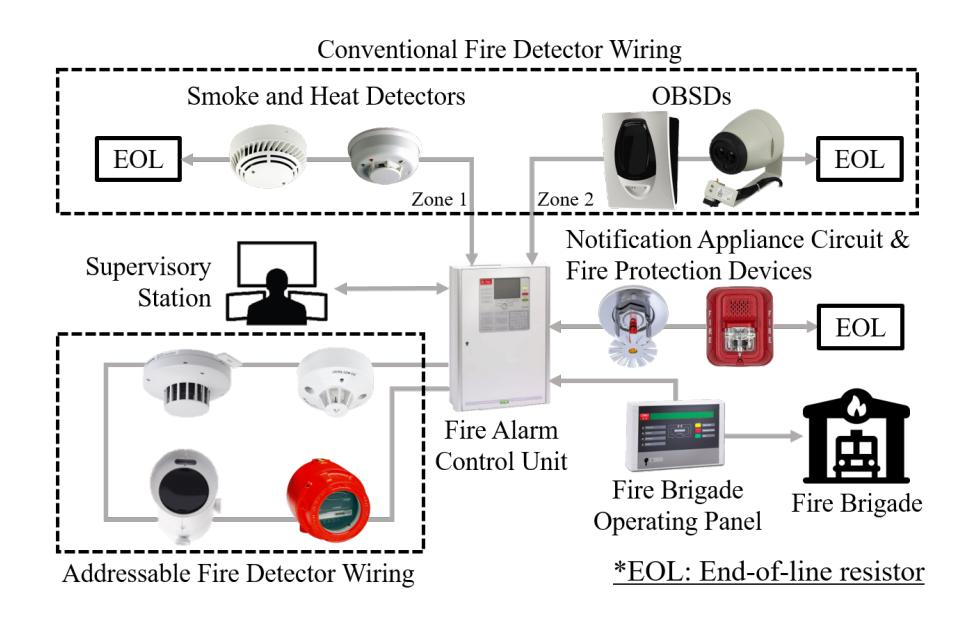

Fig. 1. Overview of a fire alarm and signaling system (FASS)

A FASS is a giant collection of various types of sensors and actuators. It comprises initiating devices (sensors or detectors), notification appliances (visual/acoustic alarming devices), fire protection devices (fire sprinklers and other fire-suppressing devices), and various types of FACUs. All these devices are interconnected in order to initiate the (automated) evacuation and firefighting process as soon as a fire is detected. Fig. 1 shows how these different components are interconnected in a typical FASS. In the system, detectors are arranged in several groups based on their installed locations and the building structure so that each group can cover each zone in a building, and detectors in each group are serially wired together, i.e., one device is connected to the network via the next 

{4}------------------------------------------------

device. The FACU has multiple ports for accommodating multiple sub-networks covering each zone, and each port is assigned to each zonal network so that the incoming alarms can be easily located.

Once a fire is detected by one of the fire detectors—various types of detectors are used to detect representative signs of fire, such as smoke, gas, heat, flame, and carbon monoxide—the detector instantly signals it to the FACU via the wiring. Upon receiving the signal, the FACU first displays the zone where the alarming detector is positioned for early locating of the fire, and automatically sends an activation signal to the notification appliance circuit and fire protection devices in order to activate the audible/visual alarm devices and automatic fire suppression devices; such actions can either be system-wide or confined to the zone where the fire is detected based on how the controller is programmed. If the FACU is connected to a supervisory station where personnel are in attendance at all times to respond to fire alarm signals, the FACU also reports the fire to the supervisory station for subsequent actions. In addition, the FACU can also be connected to communication systems such as a fire brigade operating panel shown in the figure, which automatically sends the fire alarm to the authorities like the fire brigade [37, 42].

## 2.2 Fire Detector Network Standards

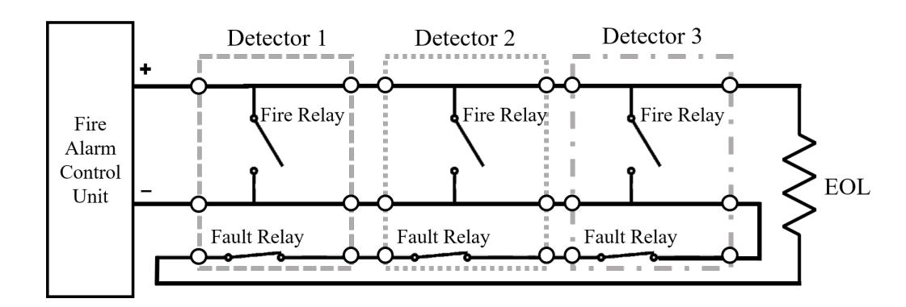

Fig. 2. Example of a conventional detector wiring (Class B), which depicts the normal status. Notice that each detector is modeled as a six-port component, where two switches—one for alarm (fire relay) and the other for fault (fault relay)—reside, and the bus is terminated by an EOL resistor.

There are roughly two types of interfaces for connecting fire detectors to the FASS: conventional and addressable. These interfaces are independent of how each type of detectors senses fire, but only related to how the detectors are networked to one another. For example, a conventional smoke detector and an addressable one can have the same sensor hardware.

In conventional wiring, detectors can be modeled as two switches, one attached in parallel and the other in series, and each zonal network is terminated by an end-of-line (EOL) resistor. Note that there are multiple subtypes of conventional wiring (e.g. two/four-wire and Class A/B), but we will not cover them 

{5}------------------------------------------------

because such subtypes are not important for the scope of this work. Fig. 2 illustrates an example of the conventional detector wiring under no alarms or faults. This conventional wiring works as follows. Under normal circumstances, the fire relays are opened and fault relays are closed. Because a certain level of DC voltage is assigned to the bus by the FACU, constant current flows through the wiring. However, when one of the detectors senses a fire, it closes its fire relay, which shorts the whole bus. In this manner, the FACU can be immediately informed of the fire because one end of the shorted bus is connected to itself. On the other hand, when a detector faces some faults—also denoted as troubles in some documents—it opens its fault relay to make the bus open. The way of marking faults as an open circuit also works for wiring faults, e.g. snapped wires or disconnected electrical contacts, because they automatically make the bus an open circuit. Similar to the case of alarms, the FACU can also be instantly informed of the fault because no current is drawn from an open circuit. Here, adopting such complex wiring is required because of the following reasons: With such a wiring, 1) the FACU can continuously supervise the wiring whether all detectors are well-connected, and 2) all detectors can signal alarms even if some detectors are under faults. Note that any of the fire relays can still short the bus even if all fault relays are open; even if a wire between the fire relays (e.g., between detector 2 and 3 in Fig. 2) is snapped, some detectors (detector 1 and 2) can still trigger an alarm. However, despite such reliability, conventional wiring has the following drawbacks:

- The FACU cannot specify the exact detector under an alarm/fault because the whole bus goes shorted/opened. Due to the same reason, the FACU cannot find out the number of detectors under an alarm/fault. From a system's perspective, an alarm of a single detector is equivalent to the alarm of all detectors on the same bus. In order to cope with this limitation, the building has to be divided into multiple sub-networks covering each zone, which may lead to a complex network wiring and an increased installation cost.
- Because faults are also marked as an open circuit, it is impossible to specify the number of faults and the kind of faulty situation; the FACU can only know the existence of a fault.

Addressable wiring was invented to improve the limitations of conventional wiring. Contrary to conventional wiring, there is no universal standard for addressable wiring [7]. However, every addressable wiring is implemented so that each detector can send/receive data packets. Thus, the FACU can specify the detector under alarm even if multiple detectors are on the same bus; this is why they are called addressable. Further, the FACU can be informed of the type of faults sent from the detectors and can differentiate detector-specific faults from wiring failures. This provides multiple benefits over conventional wiring, such as fine-grained fire localization and reduced cost of installing multiple zonal networks. However, addressable systems also have a few limitations:

– It requires detectors compatible with the addressable wiring to be used, causing installers to face limited choices among devices. In addition, addressable detectors are more expensive than conventional ones.

{6}------------------------------------------------

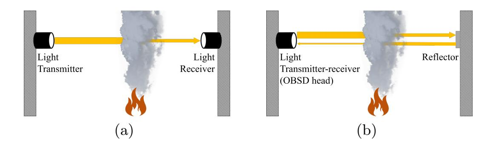

Fig. 3. Two types of OBSDs: (a) end-to-end and (b) reflective.

– Theoretically a whole building can be under a single wiring zone using addressable wiring, which can drastically reduce installation cost for addressable wiring. However, recent changes of US standards [37] <sup>1</sup> restrict the installation cost saving by adopting addressable fire alarms.

#### 2.3 Optical Beam Smoke Detector

OBSDs are a group of fire/smoke detectors that specialize in detecting smoke across large open areas by projecting light across them. When combustible materials burn, it produces both solid and liquid particles that block the light pathway and reduce the received light intensity. This is the basic principle of how OBSDs detect fire and smoke. Because the received light intensity decreases regardless of which part of the path is blocked, a single OBSD can cover a large area. This makes OBSDs the most suitable detector for large open spaces. Indeed, to cover the same amount of space, many more spot smoke detectors would be required as they can only detect smoke nearby, which would undoubtedly increase both the cost and maintenance effort [22].

In terms of sensor classification, an OBSD is an active sensor, which does not only receive external signals but also transmits its own signal for measurement; a radar is a good example. Active sensors are specialized in remote sensing analyzing objects over long distances—because they can emphasize remote objects/regions by selectively illuminating them. OBSDs being good at detecting smoke over large open spaces can be understood in this viewpoint.

There are two types of OBSDs: end-to-end and reflective. Fig. 3 shows their working mechanism. An end-to-end OBSD includes a transmitter and a separate receiver installed on the opposite sides of an area. On the other hand, a reflective OBSD comprises a unified transmitter-receiver—this is called an OBSD head and a reflector. Similar to an end-to-end OBSD, the head and the reflector are installed on the opposite sides of an area. Both types of OBSDs can have a separate detector controller that is used both for adjusting the system settings

<sup>1</sup> "A single fault . . . connected to the addressable devices shall not cause the loss of the devices in more than one zone (23.6.1).", "Each floor of the building shall be considered as a separate zone (23.6.1.1)", and "If a floor of the building is subdivided into multiple zones . . . each zone on the floor shall be considered a separate zone (23.6.1.2)".

{7}------------------------------------------------

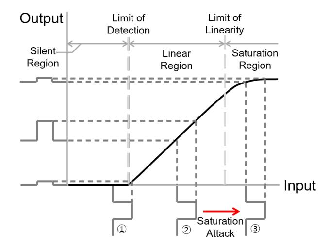

Fig. 4. Typical transition curve of a sensor in which the input range is divided into three regions: silent, linear, and saturation [44].

and relaying fire alarms to the external FACU. As discussed in the previous section, OBSDs can have both type of interfaces, i.e., conventional and addressable, but products supporting both types are quite rare; usually, an OBSD is either conventional or addressable.

#### 2.4 Sensor Attack

#### Sensor Saturation Attack

Technically, sensors can be viewed as transducers that convert any type of energy or signal into an electric signal. This conversion comprises an inputoutput relation—how much the output signal will be under a given input—and it is referred to as the transition curve of a sensor. Considering the sensors' role as a measurement device, a completely linear transition curve is ideal. However, such linearity cannot exist in reality. Thus, every sensor exhibits some degree of nonlinearity.

Fig. 4 illustrates a typical sensor transition curve. Because of the limited sensitivity of the sensor, the output becomes identical to that of zero input below a certain input level (called the limit of detection). This input range is referred to as the silent region, and in this region, the sensor cannot adequately reflect changes to the input signal (denoted by ① in the figure). For inputs larger than the limit of detection, the sensor exhibits a linear response, and input changes are well reflected in the output (denoted by ② in the figure). This input range is referred to as the linear region, and it is the range in which the sensor is intended to operate. However, this linearity does not extend without bound; in fact, it is bounded by the power supplied to the sensor module. Therefore, when the input becomes larger than the end of the linear region (called the limit of linearity), the output starts to saturate. This final region is called the saturation region.

The principle of the saturation attack is to intentionally expose the target sensor to an intense input so that it cannot reflect legitimate input changes. 

{8}------------------------------------------------

Consequently, this makes the target sensor unable to sense anymore, a successful denial-of-service (DoS) attack toward sensors. As the saturation effect is inevitable, it is a tough task to defend the sensors from these kinds of attacks. Although it is not a complete defense but rather a mitigation, sensors can warn either the user or the system that they are under attack when saturated. However, as far as we know, systems with such defenses are quite rare. In particular, none of the sensors exploited by sensor saturation attacks in previous works [40, 44, 57, 59] employed any kind of saturation detection schemes.

#### Sensor Spoofing Attack

Sensors often additionally process received signals in order to extract implicit information. For example, radars take radio signals, but their target information the distance to an object—has to be inferred from the received radio signals, specifically from the time-of-flight of transmitted pulses. The security threat here is that attackers may exploit the gap between the shape of the received signals—the phenomenon—and the reality. This is the basic principle of the sensor spoofing attack; attackers formulate incident signal on sensors to make them infer information different from the reality. Considering the example of a radar again, an attacker can spoof a fake object to a radar by receiving the pulses from the target radar, adding a delay, and transmitting back fake echoes. Here, the phenomenon is the same as the case of real objects, but the reality is completely different.

# 3 Attack Methods

This section presents the attacker model and methodologies for the two types of attacks, inducing false fire alarms and suppressing real fire alarms. In describing the methodologies, we mainly discuss those for reflective OBSDs among the two types of OBSDs depicted in Fig. 3. However, it should be noted that both attacks are also effective for end-to-end ones.

## 3.1 Attack Model

For the attacks presented in our work, the following assumptions were made: 1) We do not consider manipulating the target physical phenomena of an OBSD as a valid attack. In other words, we excluded the case that an attacker invokes/extinguishes a real fire to induce/suppress a fire alarm. 2) We also do not consider blocking the light path between the OBSD head and the reflector to invoke a false fire alarm as a valid attack. Such an attack would be unrealistic not only because such actions would draw lots of suspicions but also because OBSDs tend to be installed on high unreachable positions [22], and so does the light path. 3) The attacker can occupy a line-of-sight location to the OBSD head when deploying the attack. We also assumed a moderate angle between the attacker's location and the main axis connecting the OBSD head and the reflector. These assumptions are realistic considering OBSDs are designed for large open

{9}------------------------------------------------

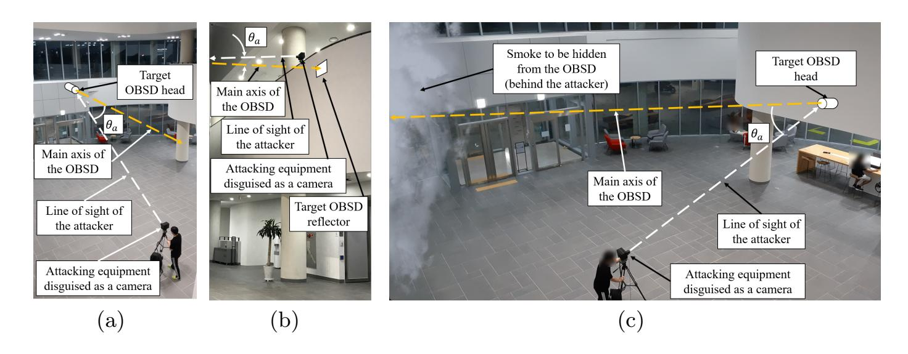

Fig. 5. Conceptual demonstration of alarm (a) induction and (c) suppression attack. (b) Conceptual demonstration of attack deployed on the second store with much smaller θa.

spaces [22]. Also, note that the attacker requires neither direct contact nor remote access to the other parts of the OBSD, e.g., the system controller and reflector. 4) For stealthiness, the attacker can disguise the apparatuses required for the attack as ordinary electronics. This can be done by assembling the equipment inside the frame of ordinary electronics or a custom-built frame designed to look similar.

The purpose of the alarm-inducing attack is to generate a false fire alarm, an alarm without real smoke, which will trigger an evacuation process and activate the automatic fire protection systems. To deploy the attack, the attacker prepares disguised attacking equipment in advance, casually installs it, and aims the equipment to the target OBSD head. The attacking equipment does not have to lie on the main axis of the OBSD but can be placed with a moderate angle of θa, and its minimum required value depends on the capabilities of the attacker. Fig. 5(a) shows a possible example of this initial setup; the attacker disguises the equipment as a camera mounted on a tripod, and she can install it as if she were taking a picture <sup>2</sup> . Note that this is an example for demonstration and does not restrict the actual form of the attack. In multi-story open spaces such as airport terminals, numerous spots can be available within the minimum required angle (e.g. Fig. 5(b)).

The attacker of the alarm-suppressing attack can be an advanced arsonist who wants to maximize the damage by delaying the fire detection. This is a fairly effective arson strategy because the importance of early fire detection cannot be emphasized enough in firefighting; a delayed fire alarm will eventually lead to delayed evacuation and firefighting. To deploy the attack, the attacker first has to set up the disguised attack equipment as is done in the alarm-inducing attack. Then, she carefully commits arson so that the smoke does not block the line of sight of the pre-installed equipment, which makes the alarm-suppressing attack not hindered by the smoke caused by the arson. Fig. 5(c) shows an example

<sup>2</sup> An example video is provided on https://youtu.be/2nRAuvXk-mQ

{10}------------------------------------------------

attack setup; note that the smoke to be hidden from the OBSD is located behind the attacker.

## 3.2 Inducing False Fire Alarm

British Standards Institution states [42]: "False alarms cause disruption to the normal operation of business and create a drain on fire and rescue service resources. False alarms can even seriously prejudice the safety of occupants, who might not react correctly when the system responds to a real fire if they have recently experienced a number of false alarms (30.1)." In addition, fire alarms can lead to outcomes ranging from temporal suspension of the facility to injuries or casualties in the cases of disorganized evacuation in a crowded area. Further, the activation of fire suppression systems like fire sprinklers can damage expensive electronic devices. Considering that reliability is crucial for fire detectors, this line of attack would be a significant vulnerability for them. While all the above lethal impact remains active both for conventional and addressable FASSs, this attack becomes much more threatening against OBSDs in conventional FASSs because they cannot differentiate the alarm of a single detector from those of multiple detectors.

To induce a false fire alarm to an OBSD, we have to first analyze what happens inside an OBSD exposed to real smoke. As mentioned in Section 2, an OBSD determines the thickness of smoke by measuring the intensity of the light it receives. If a fire breaks out, it accompanies smoke; the smoke gets thicker over time and blocks the light path. As a result, the received light intensity of the OBSD decreases. Finally, when it dips below the detection threshold, the fire alarm is triggered.

We realized that sensor saturation attack (Section 2.4) can be utilized to make the above process happen without smoke. The attack can be conducted as follows:

- 1. Prepare a highly directional light source, e.g. laser, with power adjustability. High directivity is required for two purposes: for stealthiness and to illuminate the target with enough power. Its wavelength has to be the same as or close to that of the target OBSD so that it can penetrate the optical filters in the OBSD. The wavelength that the target OBSD uses can usually be found in its datasheet, user guide, or by examining the same model. Note that most OBSD products utilize infrared [4, 5, 17–19, 21, 48, 52, 53].
- 2. Aim the OBSD receiver with the light source. To determine the position where the light source points, it is helpful to turn on the light source weakly while aiming. Because infrared is invisible, this process can be done with the aid of devices like an infrared viewer. Further, the position of the light source does not have to be on-axis, i.e. the light path between the OBSD head and the reflector. Although light receivers of OBSDs tend to be directional, direct illumination by intense light sources can affect the receiver off-axis as will be demonstrated in Section 4.
- 3. Illuminate the receiver with an intense light to saturate the light receiver. According to our analysis to be shown in Section 4.3, an abrupt exposure to

{11}------------------------------------------------

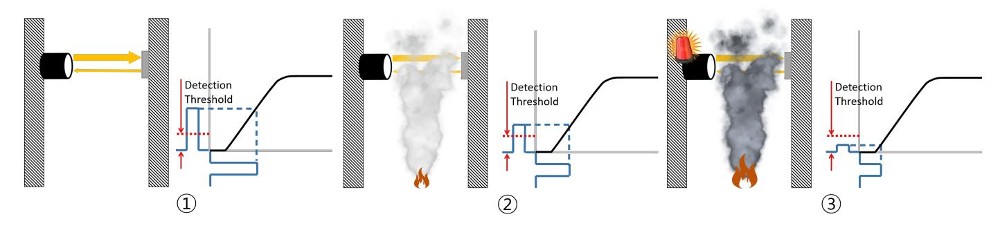

(a) OBSD detecting real smoke. When no smoke is present, a considerable portion of the transmitted pulse is reflected back (①). When a fire breaks out, the smoke gradually blocks the light path, which leads to lower received signal intensity (②). As the fire grows, the received signal intensity falls below the threshold, leading to a fire alarm (③).

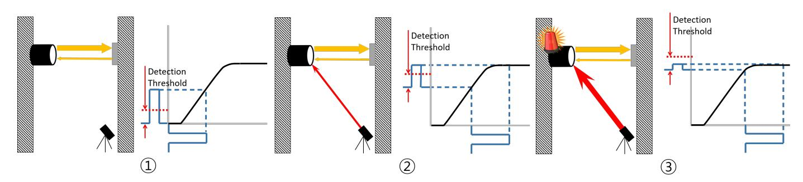

(b) OBSD being compromised by sensor saturation attack. Without the attack, the OBSD operates normally (①). When the receiver starts being saturated, the size of the received pulse starts shrinking (②). As the receiver becomes almost fully saturated, the received signal intensity falls below the threshold, leading to a fire alarm (③).

Fig. 6. Comparison of two processes: induction of fire alarm by real smoke and by saturation attack.

intense light sources may cause faults instead of fire alarms in some OBSD products. In such a case, gradually increasing the intensity of the light source can make it possible to trigger an alarm without any faults.

Fig. 6 provides conceptual illustrations and comparisons of the process of 1) how real smoke triggers a fire alarm and 2) how gradually saturating the receiver works as if there were real smoke. If the target OBSD does not particularly handle the saturation of its receiver, the two phenomena, real smoke and saturation, will be indistinguishable to the sensor and the FASS behind, and the attacker can induce fire alarms to OBSDs with saturation attack. Indeed, this is the case for almost all COTS OBSD products according to our experiments (Section 4.3) and survey (Section 5).

This attack has four notable features: simultaneity, stealthiness, remoteness, and independence of the OBSD waveform. First, simultaneity. This attack can be simultaneously conducted against multiple OBSDs that are possibly installed in multiple zones to maximize the effect. Second, stealthiness. Most OBSDs use infrared as noted above, and thus the attacking light source does as well. Therefore, even if the attacker fires an intense light to the OBSD, it is completely invisible to human eyes. This is quite an attractive feature to the attacker considering 

{12}------------------------------------------------

the fact that OBSDs tend to be installed in crowded places, e.g. auditoriums and airports [22]. Third, remoteness. This attack can be conducted from a long distance considering the effective range of high-power laser modules. They can illuminate a spot with enough power to carry out the attack even from hundreds of meters away as long as the line-of-sight condition is met, with an adequate optic system [30]. Although the attack requires a line-of-sight condition, this is not a big problem for the attacker because OBSDs tend to be installed in a large open space. Finally, this attack does not require any information on the transmitted signal of the target OBSD. The attacker has no need to synchronize the attacking light source with the target or determine the signal waveform of the target. Thus, even if each OBSD product exhibits a unique pulse waveform or even a random waveform, this would not help prevent this type of attack because one can saturate the receiver regardless of the waveform.

## 3.3 Suppressing Real Fire Alarm

To suppress real fire alarms, the attacker has to compensate for the decrease in the received signal strength by deploying sensor spoofing attacks against the OB-SDs. If the target OBSD uses pulsed light, attackers can suppress the fire alarm by mimicking the shape of the light pulses and transmitting mimicked pulses synchronously to the burst of the legitimate pulses. Here, the exact condition for the attack to succeed may be relaxed according to how the target products are implemented: some may not necessitate synchronization while others may accept attack signals whose shape is different from the legitimate ones. On the other hand, OBSDs may work with continuous light. In such a case, the attacker can simply compensate the decrease by illuminating the victim's receiver with the attacking light source. However, according to our analysis of two OBSDs in Section 4, none of them utilizes continuous light. Considering that the manufacturers of the two analyzed products are the major ones in the market and have multiple other OBSD products (refer to Section 5), most real OBSDs would also utilize pulsed light. Moreover, the use of continuous light leads to a critical drawback in energy consumption, a crucial factor for constantly running devices. Therefore, this case will be excluded afterward. It should be noted that adopting continuous light makes the system more vulnerable.

Revisiting alarm suppression attacks against OBSDs with pulsed light, there are three possible cases—from easy to hard from the viewpoint of the attacker of how the attacker can mimic the legitimate waveform according to how the target OBSD works. First, there can be no characteristic waveform; or a specific model of OBSDs can share the same waveform. In such a case, the attacker can analyze one product, and store the waveform for future attacks against the same model. Second, each OBSD can have a unique waveform that is constant over time. For this case, the attacker should have on-site signal acquisition and replay capability. With such capability, the attacker first acquires the waveform of the target OBSD and recalls it to suppress its alarm. The last case is the most difficult one: each OBSD product has a uniquely varying waveform. Storing and replaying the legitimate waveform will not work, and the attacker has to be able 

{13}------------------------------------------------

to relay the target signal in real time. Note that, although it is not optimal, the attacker assumed in the last case can also suppress alarms for the other cases, which makes the last attack strategy universal.

Synchronization with the legitimate pulses is another critical issue for the alarm suppression attack if the target OBSD accepts incoming pulses only when legitimate pulses are fired. OBSDs typically utilize highly directional light sources because they are only required to illuminate the reflector (or the receiver for end-to-end OBSDs). This makes it difficult for the attacker to detect the burst of legitimate pulses in directions other than the main axis. The problem is that installing an on-axis photoreceiver for synchronization may block the light path and lead to a fire alarm. Further, locating a photoreceiver on the axis would attract lots of attention and allow the attacker to be caught because OBSDs tend to be installed on high unreachable positions. Therefore, off-axis synchronization is essential for practically deploying alarm suppression attacks.

Based on the attack strategies and requirements discussed so far, the attacker can suppress the fire alarm even for the most difficult cases as follows:

- 1. Prepare a light source of the same wavelength as that of the target and an off-axis photoreceiver. The light source must be drivable with an external input so that the attacker can mimic the legitimate pulse waveform.
- 2. Aim the off-axis receiver and the light source at the light transmitter and receiver, respectively, of the target OBSD.
- 3. Capture the legitimate light pulses and synchronously relay the legitimate waveform to the target receiver in order to compensate the decrease in received light intensity.

As mentioned previously, the attacker first carefully positions the attack equipment, and then commits arson so that the generated smoke does not block the line-of-sight of the equipment. Although the smoke would eventually block the path as the fire develops, it will not be a problem for the attacker considering that the purpose of the attack is to delay fire detection.

Similar to the case of inducing a false fire alarm, this attack also exhibits simultaneity, stealthiness, remoteness and independence of the OBSD waveform. While the first three can be well appreciated comparing it with the false alarm attack, the reason this attack is also independent to the waveform is that the attacker can directly relay the waveform transmitted from the target OBSD; this will work even when the target OBSD randomly varies its waveform.

## 4 Evaluation

In this section, we demonstrate both types of attacks, i.e., induction of false fire alarms and suppression of real fire alarms, against real OBSD products. Two reflective COTS OBSDs, FFE's Fireray 5000 and System Sensor's BEAM1224, were carefully selected. As will be discussed in Section 5, a considerable number of commercial OBSD models are rebadged ones; to the best of our knowledge, there are only four manufacturers with at least one original model and only three without any rebadged models. Each model in our selection was from two out of

{14}------------------------------------------------

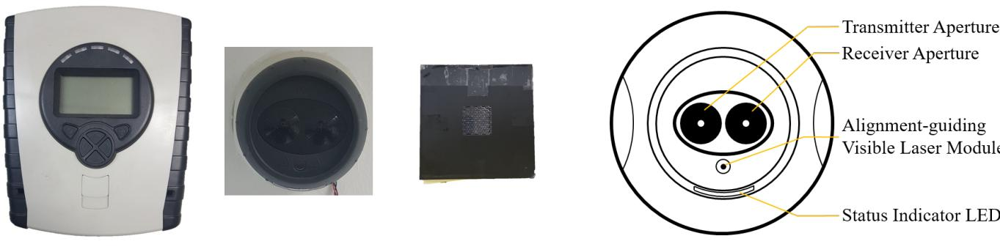

(a) Main components of the Fireray 5000 OBSD (left to right): system controller, OBSD head, and reflector.

(b) Sub-modules mounted on an OBSD head.

Fig. 7. Main components of Fireray 5000 and OBSD head in more detail.

three original-model-only manufacturers, which suggests the generalizability of the following experimental results.

### 4.1 Target System

Fireray 5000: Fireray <sup>R</sup> series are an OBSD product line of FFE, one of the major companies in the fire suppression systems market [35]. These OBSDs are currently installed in places like warehouses [12, 23], sports facilities [11, 14, 26], temples [16], and airports [10, 13, 20]. In total, more than 600,000 units are deployed globally [24]; the Fireray product guide [22] lists several worldrenowned buildings protected by Fireray OBSDs. Fireray 5000, our test target, is the flagship of Fireray OBSDs that supports both automatic beam alignment and contamination compensation for quick and easy installation. It is composed of three main parts (Fig. 7): a system controller, an OBSD head, and a reflector. The system controller is equipped with a display and buttons for beam alignment and setting up the system parameters, and it also operates as an interface to the external network. In the case of Fireray 5000, it supports conventional wiring only, i.e., the alarms and faults from Fireray 5000 are not addressable. The OBSD head is the sensor part of the product. It is equipped with a transmitter and a receiver for generating and receiving optical beams and is connected to the system controller via a pair of wires. Lastly, the reflector is simply a mirror-like element, which does not require any power.

BEAM1224(S): The BEAM series correspond to OBSD products of System Sensor, a US-based subsidiary of Honeywell dedicated to fire protection equipment manufacture. Though not as widely adopted as the Fireray series, BEAM OBSDs are also installed in important places such as state capitols [56], schools [54], and warehouses [55]. BEAM1224(S), our test target, is a reflectivetype OBSD that supports conventional-type wiring; it has a wide operating temperature range of -22–141 ◦F, which makes it suitable even for outdoor areas under extreme climate. Different from the Fireray 5000, BEAM1224(S) is composed of two parts: an OBSD head and a reflector. The OBSD head is similar to that of Fireray 5000, but it also works as a controller. It is equipped 

{15}------------------------------------------------

with a two-digit signal strength indicator, which helps the installation process. There are two types of models for BEAM1224(S), the non-S (BEAM1224) and S (BEAM1224S) models. However, the difference between them is negligible for this study. For System Sensor's OBSDs, the only difference in the S models from non-S models is the capability of remote light sensitivity test, which enables the installer to test detectors without covering their reflectors. Everything else is identical to the non-S models. This indicates that all the experimental results that follow can also be applied to the BEAM1224S models, despite the fact that we tested the BEAM1224 only.

#### 4.2 System Analysis

To analyze the target, we first had to install and run the system. For this purpose, the official user/installation guides [25, 52] were used to install and run both products with one exception: we did not connect the system controller to an external FACU because all the sensed information was displayed on the controller (or the OBSD head in the case of BEAM1224). It was clear that the controller would not send any alarms or faults to the connected FACU unless any of them were first displayed on the controller itself. Note that for the adjustable parameters we always applied the default values except when such parameters had to be set to fit our environment.

To find if the system was vulnerable to sensor attacks, we still had to know exactly how the system measured the smoke concentration. However, the user guide only included the information required to install and run the system. Therefore, to obtain additional information, we analyzed the system with the equipment for monitoring and measurement (details of the equipment used are given in the appendix).

#### Analysis of Fireray 5000

In analyzing Fireray 5000, we first tried to understand the light waveform transmitted from the OBSD head. Because the OBSD uses infrared, we observed the

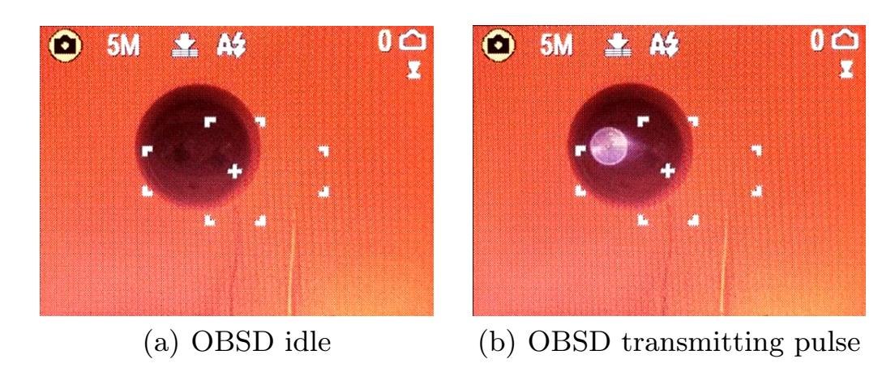

Fig. 8. Fireray 5000 OBSD head seen through an infrared viewer. The infrared pulse is seen only from the left aperture of the head, which conforms with Fig. 7(b).

{16}------------------------------------------------

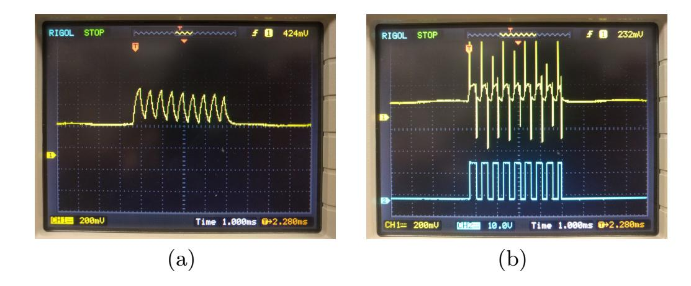

Fig. 9. Waveform of the pulse captured by the simple photoreceiver and comparator output. (a) Raw output of the photoreceiver, and (b) raw output (yellow) and comparator output (blue), with the corresponding waveform in Fig. 10.

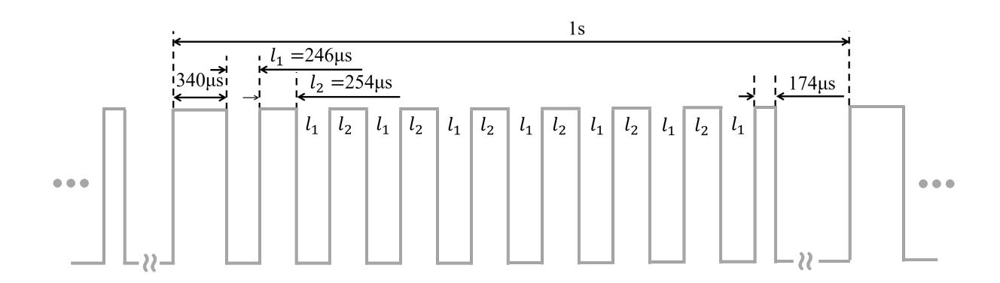

Fig. 10. Estimated infrared pulse waveform derived from the measurement. Five types of time intervals characterize the waveform: 340 µs for the first pulse, 246 µs for interpulse separation, 174 µs for the last pulse, and 254 µs for the rest of the pulses. Note that this waveform is constant over time and periodically transmitted with a period of 1 s.

OBSD head using a custom-made infrared viewer (refer to the appendix for details). Based on this observation, we discovered that the system does not illuminate the reflector with continuous light, but with light pulses. Fig. 8 shows when the system is idle and when it is transmitting a light pulse. The infrared pulse appeared to be quite strong because we could observe the flash even right under the OBSD head, which was nearly 90◦ to the light path. Further, we found that the light pulse was being transmitted periodically; measured with naked eyes through an infrared monitor, the period was approximately 1 second.

Although it was evident that the system used periodic pulsed light, it was unclear whether it was just a simple pulse or a more complex waveform and what its exact period was. The infrared monitor was not able to clarify these issues because the light pulses were too short. Therefore, we constructed a simple photoreceiver on a breadboard (see the appendix for details), attached it onto the reflector, and observed the waveform of the pulse with an oscilloscope. This triggered a fault of the controller because the light path was blocked abruptly. However, there was no problem observing the waveform because the light pulses

{17}------------------------------------------------

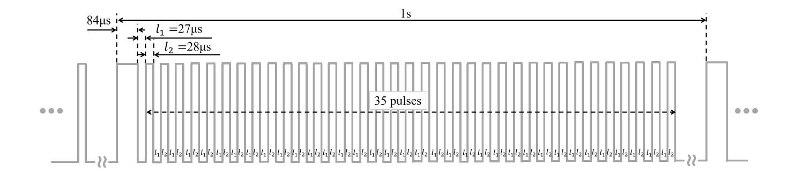

Fig. 11. Characteristic waveform of BEAM1224.

were still transmitted. Fig. 9(a) shows the captured waveform of the pulse. The simple photoreceiver we built also had a comparator module with a variable reference threshold, and we could not only observe the raw photoreceiver output but also the comparator output (Fig. 9(b)), which was a binary rectangular waveform produced by comparing the input and the given reference threshold.

From the raw and comparator output, we observed that the pulse was composed of nine consecutive sub-pulses with the same amplitude but of three different lengths. Further, the waveform remained constant over time. The period was measured to be exactly 1 s, which was the same as that determined from the naked-eye measurement, and this also remained constant over time. Based on these analyses, we concluded that the original signal driving the transmitter in the OBSD head was as shown in Fig. 10. It is the characteristic waveform that the detector transmitted and received in order to measure the thickness of the smoke, and its distinctiveness helps the detector not to confuse a genuine response from the reflector with noise <sup>3</sup> .

## Analysis of BEAM1224

Similar to the case of Fireray 5000, BEAM1224 was also analyzed, and showed periodic pulsed light with the period of 1 s. Interestingly, BEAM1224 showed a much more complicated pulse waveform than Fireray 5000, as depicted in Fig. 11; the characteristic waveform of BEAM1224 was obtained as in the case of Fireray 5000.

## 4.3 Inducing False Fire Alarm

In order to induce false fire alarms in commercial OBSDs, we followed the steps exactly as stated in Section 3.2 and were able to successfully trigger false alarms

<sup>3</sup> We do not know whether all Fireray 5000 and BEAM1224 products share the same waveform because we analyzed only one of each. However, as mentioned in Section 3.2 and 3.3, we want to emphasize that the waveform has nothing to do with the successfulness of the attacks when legitimate pulse waveforms are instantaneously relayed.

{18}------------------------------------------------

in both target systems 4, 5. Considering that both target OBSDs support only conventional wiring, induced false alarms will severely affect the FASS where the compromised detector is connected. Attackers can virtually alarm all detectors in the same zone by inducing an alarm of a Fireray 5000 or BEAM1224 because a single alarming detector shorts the whole bus in conventional wiring. In contrast to the severity of inducing false fire alarms, the fundamental limitation of conventional wiring in fault signal delivery will restrict the administrators from promptly preventing both alarm induction and suppression attacks.

Specific experimental procedures for both target systems are as follows: We first prepared a 905 nm power-adjustable laser module. Although its wavelength was not exactly the same as the two targets—Fireray 5000 uses 850 nm IR [25], and the wavelength BEAM1224 uses is stated nowhere—we found that it effectively worked against both target OBSDs. Next, the laser module was weakly turned on to identify the point illuminated by the laser module and the receiver part of the OBSD head was aimed; our custom-made infrared viewer helped with this process. It is worth noting that for both models, weak illumination on their receivers had no effect on the OBSDs, and the laser was not hand-aimed but mounted on a frame for stability. For the final step, we intensively illuminated the receiver in order to saturate it. The two sections below describe the specific experimental findings for two target OBSDs.

#### Fireray 5000

To induce a false alarm to Fireray 5000, gradually increasing the intensity of the injected light was important. This was because abrupt exposure to intense light caused path blockage faults—it is stated as E-06 fault in its user guide—rather than an alarm. In contrast, there was actually no restriction on the position of the light source. Because of the excess power of the laser module used, we were able to saturate the OBSD receiver even with a quite steep (≈ 30◦ ) angle (θ<sup>a</sup> in Fig. 5(a)). Consequently, we were able to successfully trigger false fire alarm on Fireray 5000 <sup>4</sup> by gradually increasing the light strength.

#### BEAM1224

Unlike the case of Fireray 5000, gradually increasing the light intensity was not important for BEAM1224. Regardless of the gradual increase of the light, a path blockage fault—for the BEAM1224 case, this is displayed as four quick blinks of the yellow light-emitting diode (LED) on the head—was displayed when the light intensity exceeded a certain threshold. However, once the fault was observed, we were able to simply trigger a false alarm by slightly reducing the light intensity <sup>5</sup> . Although a fault was inevitably triggered while inducing a fire alarm in BEAM1224, this was not serious because it uses conventional

<sup>4</sup> We uploaded two videos of the experiment on Fireray 5000: https://youtu.be/ 43xr5\_rKoy8 and https://youtu.be/im2-Dothtzg

<sup>5</sup> We also uploaded a video of the experiment on BEAM1224: https://youtu.be/ \_4ZMVhUwX7U

{19}------------------------------------------------

wiring, where all kinds of faults are identically represented as an open circuit. Therefore, even if a BEAM1224 triggers a fault, it would be impossible to identify the origin of the fault without close examination of all detectors in the same wiring. Furthermore, even if BEAM1224 were addressable, the practical threat from alarm-inducing attack would not be degraded much due to the following reasons. First, according to the user guide, the path blockage fault does not suggest any security threat like alarm inducing attacks; it simply indicates the possibility of a blocked light path. Second, the fault only lasts less than a minute because the attacker reduces the injected light intensity right after she observes the fault. Therefore, the administrators are not likely to be bothered with it.

Compared to the case of Fireray 5000, BEAM1224 was trickier with the positioning of the light source. We used the same laser module as for Fireray 5000, and even with the maximum intensity, we were not able to affect the receiver of BEAM1224 when θ<sup>a</sup> was larger than a certain level. Over repetitive experiments, the maximum θ<sup>a</sup> at which we could successfully induce a false alarm was about 7.2 ◦ . We infer this is because of the high receiver directivity of BEAM1224, which utilizes much larger lenses than Fireray 5000. Though one may increase the effective angle by adopting a more powerful light source, we also want to note that 7.2 ◦ is not small, considering the long reach of the high-power laser and that OBSDs are frequently used in multi-story open spaces (Fig. 5(b)). Indeed, with the effective θ<sup>a</sup> of 7.2 ◦ , the attacker 100 m away can trigger a false alarm of the OBSD up to 12 m above; such height corresponds to four stories in a building.

#### 4.4 Suppressing Real Fire Alarm

In order to find out the right suppression strategy for the two target systems among multiple possible cases discussed in Section 3.3, several additional analyses were required in conjunction with the basic analysis described in Section 4.2. The additional analyses were conducted with the following four aspects.

- Determining if synchronization with a legitimate pulse is required for alarm suppression.
- Determining the extent of similarity of the injected waveform to ensure it is accepted.
- Designing a spoofer triggered by an off-axis receiver to make the attack practical (if synchronization is essential).
- Verifying the effectiveness and practicality of the spoofer with an experiment involving real smoke.

#### Alarm Suppression of Fireray 5000

As the first step, we had to determine whether Fireray 5000 accepts echoes only when it transmits pulses. Therefore, we entered the pulse waveform of Fig. 10 into an arbitrary function generator and used it to drive the laser module. Note that the reflector was intentionally blocked to find out if the OBSD accepts the injected light pulses. The laser module was then aimed at the OBSD and turned

{20}------------------------------------------------

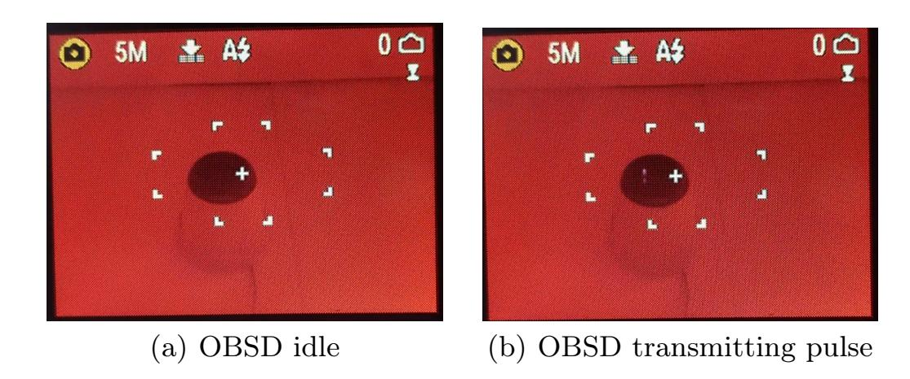

Fig. 12. Fireray 5000 OBSD head seen from right below (θ<sup>a</sup> > 75◦ ). A faint flash can be observed.

on. However, it was unsuccessful even after multiple attempts. Based on this result, we could infer that Fireray accepts echoes only when it transmits pulses, and synchronization is essential for injecting fabricated pulses.

Next, we tried to determine how similar the fabricated waveform needs to be to the legitimate one to be accepted. Our efforts in Section 4.1 revealed the pulse waveform of Fireray 5000 as in Fig. 10. Because the waveform was from an error-prone measurement and the duration/separation of sub-pulses seemed quite pointless, we first tried to spoof the system with nine identical pulses with durations and separations of 300 µs. The simple photoreceiver used previously for analyzing the Fireray 5000 (Section 4.1) was attached to the reflector and used to trigger the laser module. Ultimately, this attempt failed. In contrast, there was no problem when we tried to spoof the system using the same waveform as the measured. As the reflector was blocked by the simple photoreceiver, the system controller should have displayed either a fault or a fire alarm. However, when the spoofer was on, it restored from such state; we were also able to observe a received signal strength of over 100% and the strength could be de/increased by adjusting the power of the laser module.

We also discovered one notable point about Fireray 5000 in this experiment. When the received signal strength exceeded 120%, the system controller displayed an E-03 fault. According to the troubleshooting section of the user guide [25], E-03 is the Compensation Limit Reached fault, and the administrator is advised to "clean and realign system". As noted in Section 2.2, a fault is different from an alarm. Because OBSD heads are generally installed at places that are hard to reach, dust easily builds upon them, which leads to reduced received signal strength. As this can be misconstrued as a fire alarm, the system should ideally be cleaned frequently, which necessitates a large amount of maintenance. To reduce the amount of maintenance needed, Fireray 5000 automatically compensates for a small reduction in the received signal strength by adjusting the power of the transmitted pulse; this function is referred to as automatic contamination compensation. However, even with such a function, the system still has to be occasionally cleaned because the compensation function does not completely eliminate the need for cleaning. Here, the situation encoun-

{21}------------------------------------------------

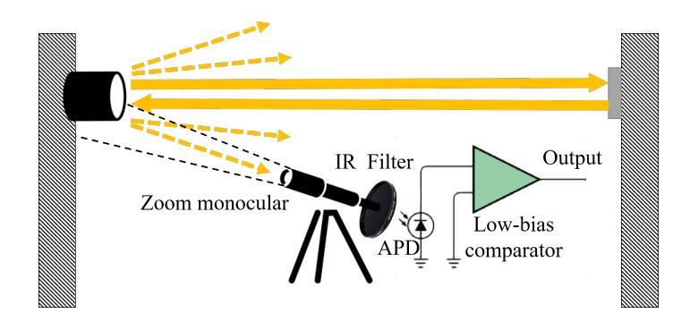

Fig. 13. Off-axis receiver system diagram.

tered is the received signal strength of over 100%; when a highly compensated system is cleaned, the received signal strength increases abruptly.

Because it was proven that synchronization with legitimate pulses is essential for spoofing, we had to implement an off-axis receiver for practical alarm suppression. The problem with this was that the infrared beam of Fireray 5000 is highly directional, and thus, its light intensity drastically attenuates as the photoreceiver deviates from the main axis. Indeed, our simple photoreceiver was unable to receive any pulses once it deviated from the axis. However, this does not mean that it is completely impossible to implement an off-axis receiver. Fig. 12 shows the pulse taken by the infrared viewer right below the OBSD head. This indicates that these light pulses do diverge to such a steep angle of over 75◦ , and thus, it is still possible to synchronize the spoofer if a receiver with enough sensitivity is provided.

We implemented such an off-axis receiver, primarily composed of four parts: a zoom monocular, an infrared filter, an avalanche photodiode, and a low-bias comparator. Fig. 13 shows how each part is composed. First, the zoom monocular increases the directivity of the receiver so that the receiver can block the light from elsewhere. In addition, it helps us aim the receiver exactly at the transmitter of the OBSD head. Without the monocular, we would not have been able to exactly determine where the receiver was focused, but with it, it was possible to first arrange the monocular to point directly at the OBSD head and then connect the rest to the eye lens. Second, the infrared filter removed visible light from the output of the monocular. Because the off-axis light leakage was quite weak, this helped considerably in decreasing the overall noise level. We used an optical low-pass filter glass that blocked wavelength shorter than 720 nm. However, if possible, an optical bandpass filter that only passes 850 nm would be more beneficial. Third, the avalanche photodiode (APD) is a fast-response ultra-sensitive photoreceiver that utilizes the avalanche breakdown effect to internally amplify the signal. Because the APD needs high bias voltage (of over 100 V) and the gain depends largely on the temperature, it requires complex additional circuitries. Therefore, we utilized an APD module instead of implementing it by ourselves; the module had all the circuitries for bias supply, temperature compensation, and outputting through a Bayonet Neill-Concelman (BNC) connector to allow it to be easily connected to an oscilloscope; we were able to power it only with ±5 VDC. Finally, the low-bias comparator functions in the same way that the

{22}------------------------------------------------

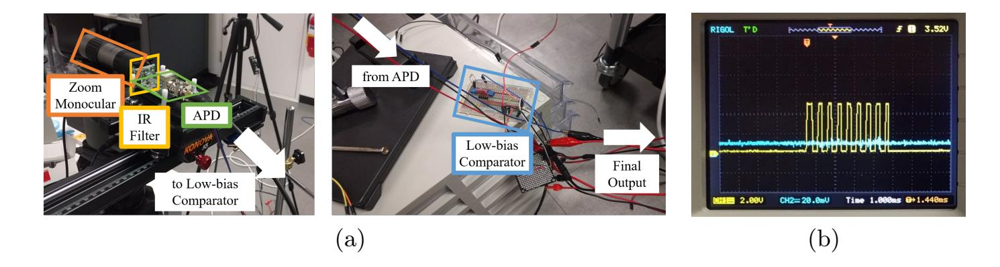

Fig. 14. (a) Image of an off-axis receiver and (b) the captured OBSD pulse waveform.

comparator in the simple photoreceiver does, but it can operate on extremely small signals. Unlike the case of on-axis receiving, the received off-axis signal strength was extremely weak, making it impossible for a normal comparator to differentiate the pulse from the noise floor. Fig. 14 shows our off-axis receiver implementation as well as the final output waveform received at a roughly 30° angle. The pulse waveform appeared the same as that in Fig. 9(b), and its period was exactly one second. Therefore, we concluded that the off-axis receiver worked well.

Upon completing all the steps necessary for deploying a practical fire alarm suppression, as a final step, we tried to verify whether the spoofer can actually suppress the fire alarm when real smoke is present. Fig. 15 shows our experimental setup. We replaced the simple photoreceiver with our off-axis receiver and generated smoke using a humidifier. The humidifier was used because we were not able to burn something to make smoke indoors; of course, we confirmed in advance the fire alarm could also be triggered by a humidifier <sup>6</sup>. The experimental procedure is given below <sup>7</sup>:

- 1. Install the humidifier so that the mist, which simulates real smoke, can block the light path.
- 2. Turn on the humidifier to simulate a fire and check if it triggers a fire alarm <sup>6</sup>.
- 3. Wait until the system restores from the alarm.
- 4. Aim the off-axis receiver so that the pulse can be received. Note that  $\theta_a$  was about 30° in all videos <sup>7, 8</sup>.
- 5. Relay the received waveform to the laser module so that the waveform can drive the module.
- 6. Turn on the laser module. This will make the received signal strength over 100%.
- 7. Turn on the humidifier and check whether the fire alarm is suppressed.

After following this procedure, we were able to observe the fire alarm was successfully suppressed by the spoofer we implemented. Although triggering of an E-03 fault was inevitable because the attacker cannot adjust the light strength in order to avoid the fault under our attack model, its significance would not be

<sup>&</sup>lt;sup>6</sup> Video available on https://youtu.be/7qtFHxMHcWO

<sup>&</sup>lt;sup>7</sup> Video available on https://youtu.be/UUBvjMpHJWk

<sup>&</sup>lt;sup>8</sup> Video available on https://youtu.be/XI8Fmhp8PTc

{23}------------------------------------------------

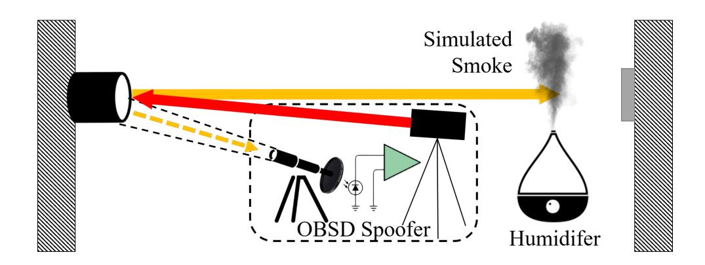

Fig. 15. Experimental setup for real alarm suppression.

much considering Fireray 5000 only supports conventional wiring. As previously noted, it is impossible to remotely identify the type and origin of the fault. The effectiveness remains valid even if Fireray 5000 were an addressable type. Again, the attacker is likely to be an arsonist, and the main purpose of the attack is not to permanently suppress the fire alarm but to temporarily delay the firefighting process. This attack successfully achieves the main goal because a maintenance fault like an E-03 fault would not be as urgent as a fire alarm.

Further, even the triggering of the E-03 fault can be bypassed if we conceive of one more attack model, where the attacker has the read permission of the OBSD controller. Though the controller can be locked with passwords, one can still view the received light intensity without unlocking it. This makes the attacker capable of monitoring the exact received signal intensity of the system once she has physical access to the controller. Under this additional attack model, we performed another experiment using the same procedure as above, but this time, the power of the spoofer was carefully adjusted so that it triggers neither a fault nor a fire alarm <sup>8</sup> . By increasing the received signal strength to 122%, neither a fault nor an alarm was triggered; it just changed the color of the status LED from green to yellow. Although we did not adaptively adjust the power of the spoofer to keep the received signal strength remain close to 100% in this experiment, we suggest that adaptively adjusting the power may completely remove any anomalies including the color of the LED.

### Alarm Suppression of BEAM1224

For alarm suppression of BEAM1224, for simplicity, we directly applied the final experimental equipment and procedures we used for Fireray 5000 except one difference: we did not use the humidifier to simulate smoke. Instead, we partially covered the reflector with a black cardboard. Note that this method is clearly stated as a method of simulating smoke in the product manual [52].

As a result, we were also able to suppress the fire alarm even with the reflector covered by a cardboard <sup>9</sup> . Followings are a couple of notable points on the experiment. After we turned on the laser module to start spoofing, we could observe four quick blinks of the yellow LED, which we observed inducing false

<sup>9</sup> Video available on https://youtu.be/wPxWBLeKSEM

{24}------------------------------------------------

alarms to BEAM1224 in Section 4.3. This seems to be a bug because four quick blinks correspond to a path blockage fault, which should originally be signal over range fault—this corresponds to the increased reflection. Unlike the case of an alarm inducing attack, much weaker pulsed light is injected for the alarm suppression attack; the receiver would not be saturated. Anyway, this fault is not a serious problem in terms of the practicality of the attack because of the same reasons we mentioned in the case of Fireray 5000, and this remains valid even if BEAM1224s were addressable-type detectors. For another point, the maximum θ<sup>a</sup> at which we could successfully relay the legitimate pulses was about 4 ◦ , which was smaller than that in the case of Fireray 5000; this was even smaller than the case of alarm induction attack on BEAM1224. In addition to the high receiver directivity of BEAM1224, the small θ<sup>a</sup> was attributable to its glossy surface. In order to increase the effective angle, it was necessary to increase the laser intensity, but when the intensity was increased above a certain level, a part of injected light was fed back to the off-axis receiver. As this made the spoofer lose synchronization, we were not able to increase the intensity significantly. We suggest the adoption of a narrower light source, which does not interfere with the receiver, to increase the effective angle for the attack.

### 4.5 Making the Attack More Practical

Although we demonstrated the effectiveness of both attacks against two COTS OBSDs, the apparatuses required for deploying the attacks, especially those for alarm suppression, was exposed to the outside and spread over places. Therefore, the attack equipment needs to be tightly assembled and disguised as ordinary electronics in order to stealthily deploy the attacks.

To address this issue, we 3D-printed a disguising frame which looks like a camera and assembled all the apparatuses into it, as in Fig. 16(a). The zoom monocular and laser module are located in the tube part, and the cuboid-shaped body part embeds the APD module connected to the comparator module, whose output is then forwarded to the laser module for switching it or possibly to an optional portable oscilloscope [43] for monitoring received signals. The scope tube is topped by an infrared filter for cameras which makes the inner parts invisible and also increases the infrared selectivity of the APD module. In addition, the frame has specifically designed openings for controlling or viewing the internal devices: power adjuster for the IR laser, variable resistors in the comparator module, handle for adjusting the power of the monocular, or even portable oscilloscope screen. To power the internal devices, we placed a Li-ion camping battery inside a backpack and connected it with power cables; the frame has an opening for the power cable at its corner. The attack equipment required three types of voltages for operation: 12V, 5V, and -5V. These voltages can be supplied either by separate power cables, or the equipment can have internal DC-DC converters to supply various voltages on its own. We used multiple cables and covered messy cables with a spiral tube for cable management. As in Fig. 16(b), the messy power cables cannot be seen from the outside.

{25}------------------------------------------------

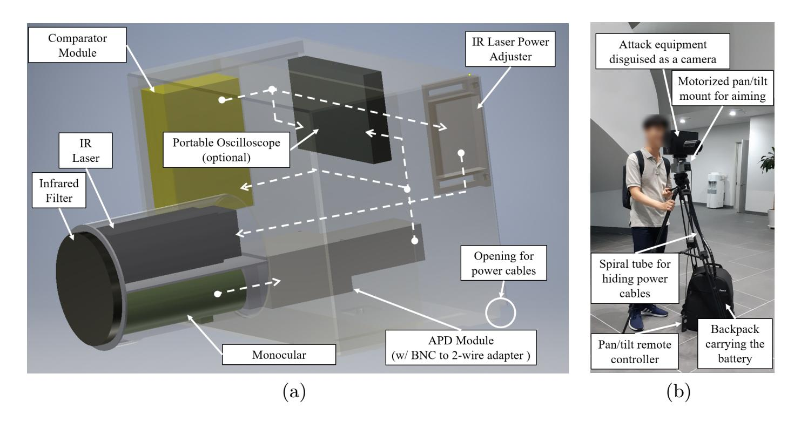

Fig. 16. (a) Perspective view of the assembled attack equipment with the placement of apparatuses, and the interconnection between apparatuses are indicated by dotted lines. Though not visible, all the controllers are accessible through carefully tailored openings. (b) Attack equipment mounted on a tripod with motorized pan/tilt mount.

The disguised attack equipment was mounted on a tripod equipped with a motorized pan/tilt mount [2], which is designed for cameras—therefore, it is natural to be equipped with—and can be remote-controlled for the precise aiming of the equipment (Fig. 16 (b)). We demonstrated its usefulness by deploying an alarm-inducing attack against Fireray 5000, and a false alarm was successfully induced as in Section 4.3 <sup>10</sup>. Note that, during the attack, we did not touch the OBSD controller to check whether the aim was correct for reality. Although we did not demonstrate the alarm-suppressing attack, it would not be difficult at all for a skilled attacker. She may also embed an infrared monitor which shares the monocular output with the APD module, or she can even remove bulky APD module and make the laser module directly triggered by the infrared monitor output with additional image processing circuits that can extract pulse waveform from the infrared monitor output. Furthermore, an internal motor for aiming the monocular separately from the laser module can be installed.

## 5 Generalizability of Presented Attack Schemes

In addition to the demonstration of the presented attack methods on two COTS OBSDs from two independent manufacturers without any rebadged models, we surveyed virtually all OBSD products—a total of sixteen products including Fireray 5000 and BEAM1224 from eight manufacturers/vendors—on the market. We examined their datasheets and user manuals to find enough information

<sup>10</sup> Video footage of this experiment can be found on https://youtu.be/fnk5n7tXAVM

{26}------------------------------------------------

on their basic working mechanisms and hardware features related to the validity of the presented attack schemes on them, e.g. which wiring interface they use, under what conditions alarms/faults are triggered, and whether a system adopts any defensive measures against sensor attacks. As a result, we discovered the following two commonalities of existing COTS OBSD products. First, all of them operate similarly to Fireray 5000 and BEAM1224; they all have almost the same working principles, system compositions, and installation steps. Although some of them are end-to-end, this does not affect the successfulness of the presented attacks. Actually, according to our survey, end-to-end type OBSDs (Fireray 3000/3000Exd and Model 6424) seem to be rather more vulnerable to spoofing attacks because they have no means for synchronizing their transmitters and receivers. Second, none of them have (or at least advertise as a feature) defensive measures for the presented attacks. Though some products are equipped with faults similar to E-03 and path blockage faults of Fireray 5000 and BEAM1224, these are not security alarms and do not necessitate an urgent response of administrators or monitoring agents. Further, even if some products have such faults, it is not possible to adequately handle these faults in the case of conventional wiring; actually, we noticed that most OBSD products are conventional models. Specifically, only three out of the sixteen products support addressable wiring. This indicates that most OBSDs are especially vulnerable to the presented attacks, and conventional wiring is not obsolete but still actively used. We also want to emphasize that addressable OBSDs are not free from the problem of delivering faults. When using addressable wiring, detector-specific fault messages can theoretically be delivered to and displayed by the FACU, but in practice, such functions can hardly be supported by existing FACUs as there is no unified standard and discordance between the FACU and detector manufacturers; indeed, two major OBSD manufacturers—FFE and System Sensor—do not make any FACU. Therefore, even if addressable OBSDs report fault messages like E-03 or path blockage, such messages will not be appropriately displayed by the FACUs.

Table 1 lists the manufacturers/vendors and products we surveyed in this study. For some models, we were able to find several notable clues on their potential vulnerabilities to our attacks or their seemingly defensive features. The following paragraphs discuss these points in detail.

Fireray 3000/3000Exd and Model 6424: According to the user guide [15], the transmitter and receiver of Fireray 3000/3000Exd are completely isolated from each other. They are never connected to each other even during the installation stage, and thus the system has no means for the synchronization between them. Actually, the transmitter is not even necessarily connected to the system controller and simply connecting it to a power supply unit suffices. Similarly, in Model 6424, the connection between the transmitter and receiver is optional [51]. If the installer decides not to connect the transmitter to the receiver, the transmitter becomes isolated from the FASS. These observations indicate that it is highly probable that the complicated synchronization methods mentioned in

{27}------------------------------------------------

| Table 1. Surveyed OBSD products and their manufacturers. |  |  |  |
|----------------------------------------------------------|--|--|--|
|                                                          |  |  |  |

| Manufacturer  | Product             | Wiring Type                          | OBSD Type  |  |
|---------------|---------------------|--------------------------------------|------------|--|
| Bosch         | D296                |                                      |            |  |
|               | D297                |                                      | Reflective |  |
| FFE           | Fireray ONE         |                                      |            |  |
|               | Fireray 50R/100R    |                                      |            |  |
|               | Fireray 5000        | Conventional                         |            |  |
|               | Fireray 3000(Exd) * |                                      | End-to-end |  |
| System Sensor | BEAM1224(S)         |                                      | Reflective |  |
|               | ORI-R-SS            |                                      |            |  |
|               | Model 6424          |                                      | End-to-end |  |
|               | BEAM200(S) *        |                                      |            |  |
|               | ORI-RI-SS           | Addressable                          | Reflective |  |
| Siemens       | DLO1191 *           | Both                                 | Reflective |  |
|               | F5000               |                                      |            |  |
| Simplex       | 4098-9019           | Rebadged product of Fireray 5000     |            |  |
| Cofem         | DLR50M/100M         |                                      |            |  |
|               | DLR50Z/100Z         | Rebadged product of Fireray 50R/100R |            |  |
| Notifier      | FSB-200(S)          | Rebadged product of BEAM200(S)       |            |  |

<sup>\*</sup> Separately discussed in subsequent sections

Section 3.3 would not be required to suppress real fire alarms of these products, which makes them more vulnerable.

BEAM200(S): We were able to find two remarkable notes on the vulnerabilities of BEAM200(S) OBSDs in their user manual [53]. First, System Sensor warns that extremely intensive light sources such as sunlight and halogen lamps can cause false alarms when incident light intensity changes abruptly. This suggests that BEAM200(S) OBSDs are highly likely to be vulnerable to the alarm induction attacks. Second, it warns that panes of glass between an OBSD head and a reflector can cause interference such that the OBSD cannot distinguish authentic reflections from those of glasses and may leave the space beyond the glasses unprotected. This indicates that they are likely to be also vulnerable to alarm suppression attacks we introduced.

DLO 1191: Its user manual [48] mentions an optional special filter (DLF1191- AC) [47] that can be inserted into the device to prevent it from being affected by external high-intensity interference. However, this filter is actually an infrared band-pass or high-pass filter like the one we used in our off-axis receiver (HB720) [1] and will be simply nullified if the attacker adopts the light transmitter of the same wavelength as the target sensor.

## 6 Possible Countermeasures

The easiest way to think of to defend the presented attacks is to adopt redundancy and fusion to the system. Designers may adopt more OBSDs or even other 

{28}------------------------------------------------

various types of fire detectors. However, these approaches are hardly practical considering the biggest advantage of OBSDs: fewer units to cover the same area, which directs to lower maintenance cost. Indeed, National Fire Alarm and Signaling Code states [37]: "A projected beam-type smoke detector shall be considered equivalent to a row of spot-type smoke detectors . . . (17.7.3.7.5)." Therefore, we propose directly dealing with the main vulnerabilities of the detector and system to defend against the discovered threats rather than relying on naïve solutions.

The main vulnerabilities we discovered can be divided into two categories, i.e., those of the detector and the system. We first discuss major vulnerabilities of the OBSDs, and one by one we propose and implement their countermeasures. We evaluated the effectiveness of one of the countermeasures by exposing it to our attack equipment. Note that any of the countermeasures below could not be found in any of COTS OBSDs covered by the survey presented in Section 5. Lastly, we discuss the fundamental problem of the current FASSs, both conventional and addressable, and why it is difficult to practically patch their vulnerabilities. Also, note that, to the best of our knowledge, there is no FASS that can handle sensor attacks similar to those presented in this work.

## 6.1 Countermeasures for the vulnerabilities of OBSDs

#### Reducing the exposure

The transmitters and receivers of OBSD heads are unnecessarily exposed too much, even if the margins for alignment are considered. Once the OBSD head and a reflector (or a receiver for end-to-end type OBSDs) are installed facing each other, there is no reason to allow the OBSD head to be seen at a steep angle. It would be sufficient to make it open only in the direction of the reflector. In that sense, applying a shielding cylinder similar to the one shown in Fig. 17 would greatly reduce the attack surface for both injecting and receiving light from the head. Such shielding can be detachable so that the installer can apply it after the system is well aligned. This solution is also applicable to OBSDs with higher receiver directivity like BEAM1224. Although the high receiver directivity restricted the attack surface in our experiments, such restriction can be loosened when the attacker is equipped with a more powerful light source.

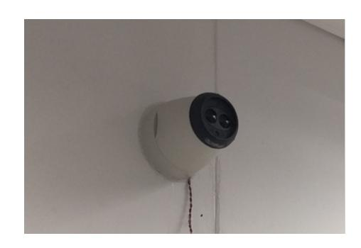

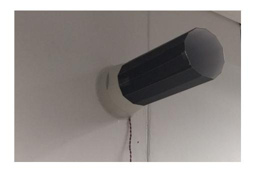

Fig. 17. Before and after shielding is applied to the OBSD head.

{29}------------------------------------------------

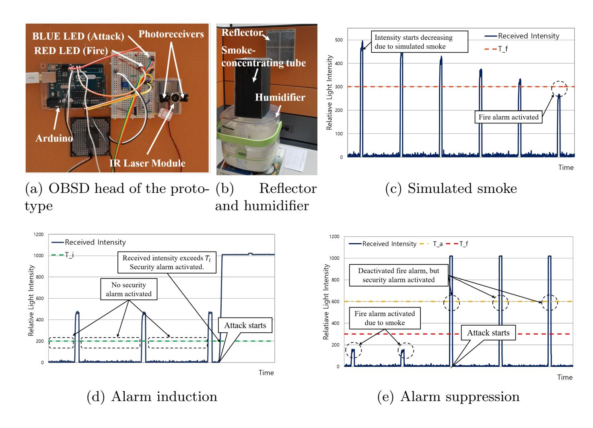

Fig. 18. (a)–(b) Implementation of the improved OBSD prototype and (c)–(e) its evaluation results

## Adopting upper signal strength limits

There is one main cause for each of the attacks—inducing and suppressing fire alarms. First, the saturation of the receiver is apparently abnormal, but COTS OBSDs underestimate it. Although some OBSDs seem to be equipped with faults corresponding to the saturated receiver, in reality, such faults were not triggered even under problematic circumstances—e.g. exposure to intense light. For example, Fireray 5000 manual states the signal too high (E-07) fault possibly related to exposure to strong light, but as discussed before, the Fireray 5000 never showed any faults during the alarm-inducing attack. Second, despite the possibility of being a sensor attack, received signal strength over 100% triggered wrong faults; or even if the right fault was triggered, it was treated as a maintenance fault. Indeed, for both Fireray 5000 and BEAM1224, faults such as E-03 or signal over range do not request urgent action from the monitoring staff.

We implemented an improved OBSD prototype, as shown in Fig. 18(a) and (b), that can cope with these vulnerabilities with the expense of software-only modification. Like the two OBSD products used in the evaluation, the prototype was implemented as a reflective-type OBSD that periodically transmits laser pulses, but for simplicity, we did not adopt complex waveforms like the real products. To detect smoke, the improved OBSD continuously computes average received light intensity only when it is idle—not transmitting pulses. When the

{30}------------------------------------------------

```
Data: received light intensity
Result: smoke/attack detection
transmit pulses for every 1 s;
if laserOn then
   if intensity- avg ( intensity) < Tf then // Smoke-detecting routine
       activate fire alarm;
       turnOn (RED LED);
   end
   if intensity > Ta then // This detects alarm-suppressing attacks
       activate security alarm;
       turnOn (BLUE LED);
   end
else
   if intensity > Ti then // This detects alarm-inducing attacks
       activate security alarm;
       turnOn (BLUE LED);
   end
end
```

Algorithm 1: Core mechanism of the improved OBSD prototype

difference between the current intensity and the average falls below the fire threshold (T<sup>f</sup> ), it activates a fire alarm, represented by a red LED (Fig. 18(a)). In addition to this basic functionality, we adopted two security thresholds for detecting the two attacks. First, when the prototype is idle and the received light intensity is over the idle threshold (Ti), a security alarm represented by a blue LED (Fig. 18(a)) is activated. This feature handles the alarm-inducing attack, whose basic principle is to reduce the intensity difference between the active—the laser is on—and the idle phase of the transmitter by saturating the receiver; it is impossible to reduce the intensity difference by saturation without exceeding Ti . The second feature activates a security alarm (also represented by a blue LED) when it is active and the received intensity exceeds the active threshold (Ta). This deals with alarm-suppressing attacks because they inevitably make the received intensity exceed T<sup>a</sup> by a certain amount. In order to bypass it, the attacker has to compensate the received intensity decrease due to smoke by almost the same amount, which is impossible because of random diffusion of smoke. Algorithm 1 summarizes the mechanism of the improved OBSD.

We verified the effectiveness of the implementation by exposing it to simulated smoke by the humidifier and both attacks. As a result, it successfully detected all three types of events<sup>11</sup>. Fig. 18(c)–(e) show the plot of the received light intensity during the three types of events. The simulated smoke was well detected as expected because it reduced the difference between the active and idle-phase intensities, and eventually made it go below T<sup>f</sup> , which was 300 in this case. The prototype was effective against both attacks as well. Facing an

<sup>11</sup> We uploaded a video of this evaluation to https://youtu.be/-6Z1bYlZAUk

{31}------------------------------------------------

alarm-inducing attack, it activated a security alarm because excess exposure to continuous light increased the received intensity during idle-phase above T<sup>i</sup> , which was set as 200. Likewise, an alarm-suppressing attack activated a security alarm. Though synchronized laser-pulse injection to the prototype deactivated the fire alarm as shown in Fig. 18(e), such an attempt led to the activation of a security alarm because it made the intensity go above Ta, which was 600 for this case.

#### 6.2 Countermeasures for the vulnerabilities of FASS

Even if the aforementioned countermeasures might mitigate the damages from possible sensor attacks, the foremost vulnerability lies in the FASS itself rather than the OBSD. As discussed in Section 2.2, it is fundamentally impossible for conventional wiring to specify the detector at fault or the type of fault. Therefore, the system cannot warn the administrators of a possible security threat even if a detector reports it. For example, even if an OBSD connected with conventional wiring detects a sensor attack and issues an emergency fault, it is fundamentally impossible to specify the OBSD under attack or to differentiate the emergency fault from other trivial faults; it is unreasonable to treat every fault as an emergency. Conventional detectors and wiring are not obsolete, and still being installed complementarily with addressable wiring to protect common areas in a building. Further, there are lots of old buildings where conventional systems are already installed and still being used. Although the invention of retrofitting products [28] and technology [32] makes it much easier and economical to retrofit legacy conventional buses with addressability, it is still required to replace at least a part of detectors and FACU to make legacy wiring function as addressable one, which would still cost significantly. Besides, in order for retrofit to be meaningful, the replaced OBSDs must be addressable ones, yet most COTS products are conventional (Table 1). Most importantly, the problem is not limited to conventional wiring.

As discussed in Section 5, even if an addressable detector is capable of detecting sensor attacks and reports it to the FACU, current addressable FASSs are not designed to incorporate such security alarms. Although there are several previous studies that try to improve the environmental awareness of FASSs and reduce false alarms [29, 33, 36], none of them focuses on coping with sensor attacks like ours. Their primary objective remains within enhancing the reliability of the alarm system by processing collected sensor data, possibly from multiple detectors, with data-handling schemes like correlation techniques, fuzzy logic, and neural networks. Furthermore, even if one of the manufacturers develops a FASS that can cope with security threats like ours, it would be a tough task to deploy such improvements considering FACUs and fire detectors are rarely updated or have no function for the update.

{32}------------------------------------------------

# 7 Discussion

Significance: With regard to the significance of inducing false alarms and suppressing real alarms in FASSs, we have already mentioned how such attacks can lead to property damages or even casualties in sections 3.2 and 3.3. Although such severity applies to all types of fire detectors, it becomes particularly significant for OBSDs because they are specially designed to cover a large open area, which tends to be a crowded space. Indeed, OBSDs are mostly installed in airports, auditoriums, exhibition centers, etc [22]. We also revealed it is either impossible or quite difficult to implement security alarms under current interfaces—conventional and addressable wiring—of FASSs. This problem is especially severe in conventional wiring due to the following reasons. 1) It has no room for handling emergency messages other than fire alarms. 2) Conventional wiring is not a relic but in active duty; conventional detectors are continuously manufactured and sold in the market. 3) The problem is not restricted to systems adopting OBSDs; sensor vulnerabilities in any type of conventional detector can lead to the same problem because conventional wiring is inherently vulnerable to such threats.

Difference with Manually Triggered False Alarms: The differences between manually triggered false alarms and the presented alarm inducing attack are worth to be delineated. In terms of inducing a false fire alarm, both are identical. However, unlike manual alarm pull stations, OBSDs are installed in unreachable places, and are therefore free from manually activated false alarms, which would correspond to considerable cases of induced false alarms. Therefore, fire alarms from OBSDs will tend to be trusted more than manually triggered alarms as long as they can be differentiated by the FACU. Further, the presented attack is stealthier and can be conducted without touching any switches nor detectors. Lastly, even though false alarms may be triggered manually, it is impossible for an unauthorized person to manually suppress real fire alarms.

## 8 Related Work

Although it has not been long since sensor security in CPS drew much attention from researchers, there have been a number of notable related works in this field. Existing studies on sensors can be largely classified into attacks and defenses. For sensor attacks like ours, prior works show that various types of sensors can be compromised by diverse kinds of physical stimuli.

Son et al. showed that exposure to intense acoustic waves with specific frequencies can incapacitate some models of MEMS gyroscopes due to resonance with the internal structure [50]. They successfully demonstrated that a drone, on which a vulnerable gyroscope was mounted, dropped to the ground when exposed to an intense acoustic wave of a certain frequency. Following Son et al., Wang et al. and Trippel et al. succeeded in spoofing MEMS gyroscopes [58] and DoSing/spoofing MEMS accelerometers [57]. Similarly, Bolton et al. exposed hard disk drives to intentional acoustic noises to temporarily incapacitate their 

{33}------------------------------------------------

I/O requests or to damage them permanently in the worst case, where the cause was the resonance of MEMS-based shock sensors residing in hard disk drives [3]. However, our work is different from these as it 1) deals with light sensors and 2) can be deployed from a long distance. For a different line of attacks, Foo Kune et al. succeeded in spoofing a fabricated electrocardiogram to cardiac implantable electrical devices, which led to unwanted malfunction [27]. They exploited the wires connecting analog sensors to the amplifiers and successfully injected radio wave signals to those wires, which in turn made injected signals accepted as if they had been real ones from sensors. However, our attack is different from this work because its working mechanism is completely different and our attack has a longer range.

Like ours, there are studies dealing with light sensors. Davidson et al. revealed moving a dot matrix emitted from a laser pointer can successfully deceive an OFS mounted on a drone [8]. In the experiment, they first set a victim drone to hover stationarily to the ground using an OFS; then exposed the OFS to a laser dot matrix and moved it, which made the drone follow the movement of the injected dot matrix. Although OFSs deal with light, they are quite different from OBSDs because 1) they are not active sensors, and 2) their working mechanism heavily depends on image processing [34] rather than optical occlusion as in OBSDs. Park et al. compromised medicine drop counters used in two types of medical infusion pumps to make them over/under-infuse [39]. Those drop counters use infrared light to sense medicine drops that fall between the light transmitter and the receiver facing each other. They injected infrared laser to either simulate real drops or saturate the receiver to blind the sensor as in our case. However, the synchronization with the target sensor was unnecessary for this case, which made the attack much simpler. Further, the target sensor utilized continuous light, which was much easier to be deceived. Petit et al. [40] and Shin et al. [44] compromised lidars for automotive applications, where lidars were spoofed to sense illusions or saturated to be blinded. Both studies are the most similar to ours in the sense that 1) they deal with light sensors, 2) target sensors can be compromised remotely, and 3) the attacker needs to be synchronized to the target to spoof it. However, our work is still differentiated from theirs because none of them studied how the compromised sensors affect back-end systems; in contrast, we have thoroughly studied back-end FASSs and discovered that it is impossible to urgently warn the administrators under current—especially conventional interfaces. Further, none of these studies succeeded in off-axis synchronization; for both cases reported by Petit et al. and Shin et al., the receiver has to be on-axis for synchronization. Moreover, in our case, the attacker has to mimic the complex waveform of Fig. 10 and Fig. 11 to make the target device accept the attack signal, whereas the target devices of both previous works either utilize just simple singular pulses or continuous light.

Defenses against sensor attacks have been known to be more difficult. Shoukry et al. [46] proposed importing random challenges to active sensors to detect spoofing attempts. In their scheme, the transmitter in an active sensor was randomly turned off and the receiver checked if the incoming signal from 

{34}------------------------------------------------

the transmitter was turned off correspondingly. This can detect most spoofing attempts because attackers cannot find out the exact instant of the challenge. However, as Shin et al. [45] pointed out, advanced attackers with highly agile equipment might still be able to bypass such defenses unless the device operates with expensive high time precision; such excess time precision is not required at all for detecting smoke, which makes it hardly practical. The shielding or the improved OBSD we evaluated Section 6.1 would rather be a much better choice. Lastly, even if the attack attempts can be detected by the defense, current fire alarm interfaces are unable or insufficient to deliver urgent non-alarm messages to the administrator. Sensor redundancy and fusion is another alternative to defend sensor attacks. This line of defense adopts multiple sensors to strengthen the trustworthiness [31, 38]. However, as noted in Section 6, these defenses still have limitations because they lead to cost increase and contradict with the core product concept of OBSDs, i.e., covering a large area with fewer detectors.

# 9 Conclusion

FASSs are safety-critical systems whose malfunction may lead to critical damages to assets and human life. Because these systems completely depend on various detector outputs, any vulnerability threatening a detector's reliability must be fixed as soon as possible. In this work, two types of attacks on OBSDs are presented, explained, and demonstrated. We showed, using simple equipment, that OBSDs can be deceived in both directions: triggering an alarm without any smoke and suppressing an alarm under real smoke. Further, our survey of multiple COTS OBSDs indicates such a threat is not limited to a couple of products but rather can be applied to all OBSD products. Although such vulnerabilities of OBSDs can be mitigated by several countermeasures we have suggested in this work, based on our analysis of the current detector wiring standards, the effectiveness of such mitigation will be severely restricted because current wiring standards are not designed to deliver urgent security messages. This limitation is not confined to defending the presented attacks; defending any attacks compromising other fire detectors will face the same limitation as long as the current wiring standards are used. Therefore, the existence of the proposed attacks, together with other potential attacks, prompts standard bodies for FASSs to completely reconsider not only the vulnerabilities of detectors but also the wiring standards to prevent possible catastrophes. It is worth nothing that there had been no international organization for standardizing fire safety systems until the International Fire Safety Standards Coalition launched on July 2018.

## References

1. Aliexpress: Size 50\*50mm Square Shape, HB720 IR Band Pass Filter/Long Wavelength Band Pass Filter.

https://www.aliexpress.com/snapshot/0.html?spm= a2g0s.9042647.6.6.xrKdLR&orderId=84331189336678&productId=32767468224

{35}------------------------------------------------

- 2. Bescor: MP101 Motorized Pan Head w/ Remote. https://www.bescor.com/product-page/mp101
- 3. Bolton, C., Rampazzi, S., Li, C., Kwong, A., Xu, W., Fu, K.: Blue note: How intentional acoustic interference damages availability and integrity in hard disk drives and operating systems. In: Proceedings of the 39th IEEE Symposium on Security and Privacy. pp. 1048–1062 (May 2018)
- 4. Bosch: D296 Smoke detector, long-range beam, 24V, http://resource.boschsecurity.com/documents/Datasheet\_D296\_Data\_sheet\_ enUS\_2702469259.pdf
- 5. Bosch: D297 Smoke detector, long-range beam, 12V, http://resource.boschsecurity.us/documents/Datasheet\_D297\_Data\_sheet\_ enUS\_2702520075.pdf
- 6. Bosch: D7024 Fire Alarm Control Panels, http: //resource.boschsecurity.com/documents/Data\_sheet\_enUS\_2692636171.pdf
- 7. Centre, F.S.A.: Fire Alarm Systems, https://www.firesafe.org.uk/fire-alarms/
- 8. Davidson, D., Wu, H., Jellinek, R., Ristenpart, T., Singh, V.: Controlling UAVs with sensor input spoofing attacks. In: Proceedings of the 10th USENIX Workshop on Offensive Technologies (WOOT) (2016)
- 9. Eaton: Eaton Conventional Fire Panel EFCV8ZONE User Manual, https://uk.eaton.com/content/dam/uk/products/life-safety-and-security/ fire-and-voice-alarm-systems/Two-wire-and-conventional/Two-wire-andconventional-control-panels/EFCV8-8zonecontrolpanel/manuals/User\_ Manual-English-(PR215-216-516-03).pdf
- 10. FFE: Advanced Optical Beam Smoke Detector for Moscow Airport. http://halmapr.com/news/ffe/2012/07/16/advanced-optical-beam-smokedetector-for-moscow-airport/
- 11. FFE: Beam Smoke Detectors Keeping Detroit Lions NFL Players Safe. https://www.ffeuk.com/beam-smoke-detectors-keeping-detroit-lions-nflplayers-safe
- 12. FFE: Beam Smoke Detectors the right choice for Peterborough Warehouse. https://www.ffeuk.com/beam-smoke-detectors-right-choice-peterboroughwarehouse
- 13. FFE: Cambridge International Airport's spray-painting hangar protected by Talentum flame detectors. https://www.ffeuk.com/cambridge-international-airport\%E2\%80\%99sspray-painting-hangar-protected-talentum-flame-detectors
- 14. FFE: Derby Arena Protected by Optical Beam Smoke Detectors. https: //www.ffeuk.com/derby-arena-protected-optical-beam-smoke-detectors
- 15. FFE: End To End Optical Beam Smoke Detector User Guide, https://www.ffeuk.com/sites/ffeuk.com/files/documents/FFE\_Fireray\_3000\_ User\_Guide\_English.pdf
- 16. FFE: Fire Fighting Enterprises Smoke Detectors Protect Hindu Temple. http://halmapr.com/news/ffe/2014/01/07/fire-fighting-enterprisessmoke-detectors-protect-hindu-temple/
- 17. FFE: Fireray 3000 End-to-End Infrared Optical Beam Smoke Detector, https://www.ffeuk.com/sites/ffeuk.com/files/documents/FFE\_Fireray\_3000\_ Datasheet\_US.pdf
- 18. FFE: Fireray 5000 Motorized Reflective Optical Beam Smoke Detector, https://www.ffeuk.com/sites/ffeuk.com/files/documents/Fireray\%205000\% 20US\%20Datasheet\%20May\%202017.pdf

{36}------------------------------------------------

- 19. FFE: Fireray 50/100RU Reflective Optical Beam Smoke Detector, https://www.ffeuk.com/sites/ffeuk.com/files/documents/0665\_FFE\_Fireray\_ 50\_100\_US\_Jan17\_WEB.pdf
- 20. FFE: Fireray Beam Smoke Detectors Protect Dubai International Airport's New A380 Concourse.
  - http://halmapr.com/news/ffe/2013/03/22/fireray-beam-smoke-detectorsprotect-dubai-international-airports-new-a380-concourse/
- 21. FFE: Fireray One Datasheet, https://www.ffeuk.com/sites/ffeuk.com/files/ documents/0852\_Fireray\_One\_Datasheet\_US\_JUL18\_WEB.pdf
- 22. FFE: Fireray Optical Beam Smoke Detectors Product Guide. http://firensecurity.com/images/downloads/fire-alarm-system/FIRERAY-Product-Guide.pdf
- 23. FFE: Fireray Optical Beam Smoke Detectors Protect Oil Dispersant Warehouse. https://www.ffeuk.com/fireray-optical-beam-smoke-detectors-protectoil-dispersant-warehouse
- 24. FFE: Fireray Range Brochure. https://www.ffeuk.com/sites/ffeuk.com/files/ documents/0651\_\\FFE\_Fireray\_Range\_Brochure\_Update\_8pp\_Jan17\_web.pdf
- 25. FFE: Motorised Infrared Optical Beam Smoke Detector User Guide, https://www.ffeuk.com/sites/ffeuk.com/files/documents/FFE\_Fireray\_5000\_ User\_Guide\_English.pdf
- 26. FFE: Wide area smoke detection for one of Europe's largest basketball arenas. https://www.ffeuk.com/wide-area-smoke-detection-one-europe\%E2\%80\% 99s-largest-basketball-arenas
- 27. Foo Kune, D., Backes, J., Clark, S.S., Kramer, D., Reynolds, M., Fu, K., Kim, Y., Xu, W.: Ghost talk: Mitigating EMI signal injection attacks against analog sensors. In: Proceedings of the IEEE Symposium on Security and Privacy. pp. 145–159. IEEE (2013)
- 28. Fuchs, A.M.: Retrofitting detectors into legacy detector systems (2006), https://patents.google.com/patent/US7336165
- 29. Goel, P., Datta, A., Mannan, M.S.: Industrial alarm systems: Challenges and opportunities. Journal of Loss Prevention in the Process Industries 50, 23–36 (2017)
- 30. INFINITY ELECTRO-OPTICS: Ultra long-range IR illumination. https://www.infinitioptics.com/technology/zlid
- 31. Ivanov, R., Pajic, M., Lee, I.: Attack-Resilient Sensor Fusion for Safety-Critical Cyber-Physical Systems. ACM Transactions on Embedded Computing Systems 15(1), 21 (2016)
- 32. Jee, S.W., Lee, C.H., Kim, S.K., Lee, J.J., Kim, P.Y.: Development of a traceable fire alarm system based on the conventional fire alarm system. Fire Technology 50(3), 805–822 (2014)
- 33. Liu, Z., Kim, A.K.: Review of recent developments in fire detection technologies. Journal of Fire Protection Engineering 13(2), 129–151 (2003)
- 34. Lucas, B.D., Kanade, T., et al.: An iterative image registration technique with an application to stereo vision (1981)
- 35. MarketsandMarkets: Fire Protection Systems Market by Product (Fire Detection (Sensors & Detectors (Flame, Smoke Detectors), RFID), Fire Suppression (Fire Sprinklers, Fire Extinguishers), Fire Analysis, Fire Response), Service, Vertical - Global Forecast to 2022. https://www.marketsandmarkets.com/Market-Reports/ fire-protection-systems-market-1018.html

{37}------------------------------------------------

- 36. Muller, H., Fischer, A.: A robust fire detection algorithm for temperature and optical smoke density using fuzzy logic. In: Proceedings The Institute of Electrical and Electronics Engineers. International Carnahan Conference on Security Technology. pp. 197–204. IEEE (1995)
- 37. NFPA: National Fire Alarm and Signaling Code, https://www.nfpa.org/codes-and-standards/all-codes-and-standards/listof-codes-and-standards/detail?code=72
- 38. Park, J., Ivanov, R., Weimer, J., Pajic, M., Lee, I.: Sensor Attack Detection in the Presence of Transient Faults. In: Proceedings of the ACM/IEEE Sixth International Conference on Cyber-Physical Systems (2015)
- 39. Park, Y., Son, Y., Shin, H., Kim, D., Kim, Y.: This ain't your dose: Sensor spoofing attack on medical infusion pump. In: Proceedings of the Usenix Workshop on Offensive Technologies (2016)
- 40. Petit, J., Stottelaar, B., Feiri, M., Kargl, F.: Remote attacks on automated vehicles sensors: Experiments on camera and lidar. Black Hat Europe (2015)
- 41. Public Lab: Near-Infrared Camera. https://publiclab.org/wiki/near-infrared-camera
- 42. Publication, B.S.: Fire Detection and Fire Alarm Systems for Buildings, http://www.ervin-co.com/uploads/resourceFile/ de1bf9a2b96e9e4ecda093ada66ecff8\_10\_01\_47am.pdf
- 43. SainSmart: DSO213 Handheld Pocket-sized Digital Oscilloscope. https://www.amazon.com/SainSmart-Handheld-Pocket-Sized-Oscilloscope-Channels/dp/B07PDJQP7F
- 44. Shin, H., Kim, D., Kwon, Y., Kim, Y.: Illusion and dazzle: Adversarial optical channel exploits against lidars for automotive applications. In: Proceedings of the International Conference on Cryptographic Hardware and Embedded Systems. pp. 445–467. Springer (2017)
- 45. Shin, H., Son, Y., Park, Y., Kwon, Y., Kim, Y.: Sampling race: Bypassing timing-based analog active sensor spoofing detection on analog-digital systems. In: Proceedings of the Usenix Workshop on Offensive Technologies (2016)
- 46. Shoukry, Y., Martin, P., Yona, Y., Diggavi, S., Srivastava, M.: PyCRA: Physical challenge-response authentication for active sensors under spoofing attacks. In: Proceedings of the ACM Conference on Computer and Communications Security. pp. 1004–1015 (2015)
- 47. Siemens: DLF1191-AC: Filter against external light influences, https://hit.sbt.siemens.com/RWD/app.aspx?RC=HQEU&lang=en&MODULE= Catalog&ACTION=ShowProduct&KEY=BPZ\%3a5221480001
- 48. Siemens: DLO 1191 Linear smoke detector Technical description, Planning, Installation, Commissioning, http://cmapspublic2.ihmc.us/rid=1H6JKSJGQ-1Y259M5-KVP/DLO1191\% 20Tech\%20Description,\%20Planning,\%20Installation,\%20Commissio.pdf
- 49. Simplex: Fire Alarm Network Reference, https://simplex-fire.com/en/us/DocumentsandMedia/4100-0055.pdf
- 50. Son, Y., Shin, H., Kim, D., Park, Y.S., Noh, J., Choi, K., Choi, J., Kim, Y.: Rocking drones with intentional sound noise on gyroscopic sensors. In: Proceedings of the USENIX Security Symposium. pp. 881–896 (2015)
- 51. System Sensor: 6424 Projected Beam Type Smoke Detector, https://www.systemsensor.com/en-us/Documents/6424\_Manual\_I56-0494.pdf
- 52. System Sensor: BEAM1224, BEAM1224S Single-ended Reflected Type Projected Beam Smoke Detector, https://www.systemsensor.com/en-us/Documents/BEAM\_ Detector\_Manual\_I56-2294.pdf

{38}------------------------------------------------

- 53. System Sensor: BEAM200, BEAM200S Single-ended Reflected Type Projected Beam Smoke Detector, https://www.systemsensor.com/en-us/Documents/ Intelligent\_BEAM\_Manual\_I56-2289.pdf
- 54. System Sensor: Case Study: Chief Sealth International High School Hamilton Intermediate School. https://www.systemsensor.com/en-us/Documents/ SeattleSchools\_CaseStudy\_SSCS004.pdf
- 55. System Sensor: Case Study: Mattress Warehouse Intelligent BEAM Smote Detector with Integral Self Test. https://www.systemsensor.com/en-us/ Documents/MattressWarehouse\_CaseStudy\_CMCS001.pdf
- 56. System Sensor: Case Study: New Mexico Capitol Building System Sensor Protects the Old with the New. https://www.systemsensor.com/en-us/ Documents/NewMexCapitolBldg\_CaseStudy\_CMCS006.pdf
- 57. Trippel, T., Weisse, O., Xu, W., Honeyman, P., Fu, K.: WALNUT: Waging doubt on the integrity of MEMS accelerometers with acoustic injection attacks. In: Proceedings of the IEEE European Symposium on Security and Privacy. pp. 3–18. IEEE (2017)
- 58. Wang, Z., Wang, K., Yang, B., Li, S., Pan, A.: Sonic gun to smart devices. Black Hat USA (2017)
- 59. Yan, C., Xu, W., Liu, J.: Can you trust autonomous vehicles: Contactless attacks against sensors of self-driving vehicle. DEF CON (2016)
- 60. Zhang, G., Yan, C., Ji, X., Zhang, T., Zhang, T., Xu, W.: DolphinAttack: Inaudible voice commands. In: Proceedings of the ACM Conference on Computer and Communications Security. ACM (2017)

## Appendix

Here, the equipment used for analyzing and attacking our test target is described. We tried to document the exact equipment used by referring to their model or part numbers and circuit schematics. We note that this does not indicate identical equipment is essential for reproducing the results. Other devices with the equivalent function and performance can also be used.

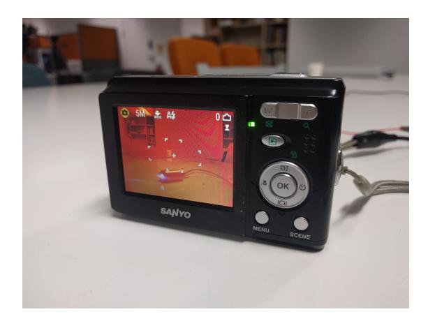

Fig. 19. Infrared viewer viewing a light emitting infrared laser module.

Infrared Viewer: Handling infrared light sources is troublesome because one cannot check it with naked eyes. One may use an infrared-sensitive photodiode 

{39}------------------------------------------------

connected to an oscilloscope to check if it is being illuminated. However, a better alternative is to utilize a visualizer with a screen: an infrared viewer. We built it on our own by remodeling a digital camera based on the directions from one of Public Lab projects [41], which is for implementing tools for scientific experiments with everyday devices. As Fig. 19 shows, infrared lights are easily identifiable as purplish color, whereas visible lights appear reddish.

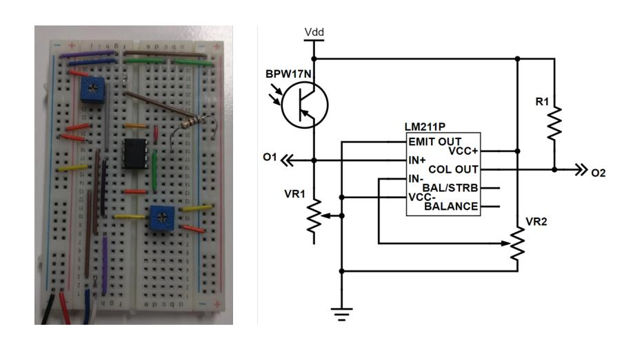

Fig. 20. Breadboard implementation and schematic of our simple photoreceiver.

Simple Photoreceiver: Our simple photoreceiver is a combination of a Vishay BPW17N phototransister, a Texas Instruments LM211P comparator IC, and additional circuitries. Fig. 20 shows the schematic and its breadboard implementation. When the light hits the phototransistor, it is converted into voltage across the variable resistor VR1. This voltage is first routed to the first output, O1, and compared with the reference voltage from the variable resistor VR2 by the LM211P, which produces the final output, O2. Note that variable resistors were adopted to adjust the sensitivities of the photodiode (VR1) and the reference voltage (VR2).

Off-axis Receiver: Because the composition of the off-axis receiver has already been described in detail, here we simply list the model names of the components. For the zoom monocular, we selected Brunton Echo <sup>R</sup> zoom monocular. It has a zoom power of 10–30x and an object diameter of 21mm. The infrared filter used was HB720 [1]. According to the product information, it blocks light whose wavelength is shorter than 720 nm. For the APD, we adopted Hamamatsu C10508-01 APD module. As previously mentioned, it can compensate for temperature changes so that the gain remains steady. Further, it provides a 7-step variable gain, which we set to the largest gain level. Finally, for the low-bias comparator, we used National Semiconductor LMV751 low noise low offset voltage operational amplifier. To implement a comparator with an op-amp, we just passed two signals to be compared to two input ports of the op-amp without any feedback.