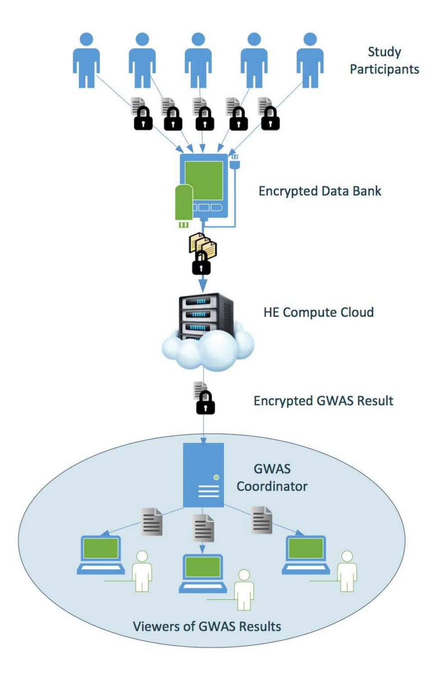
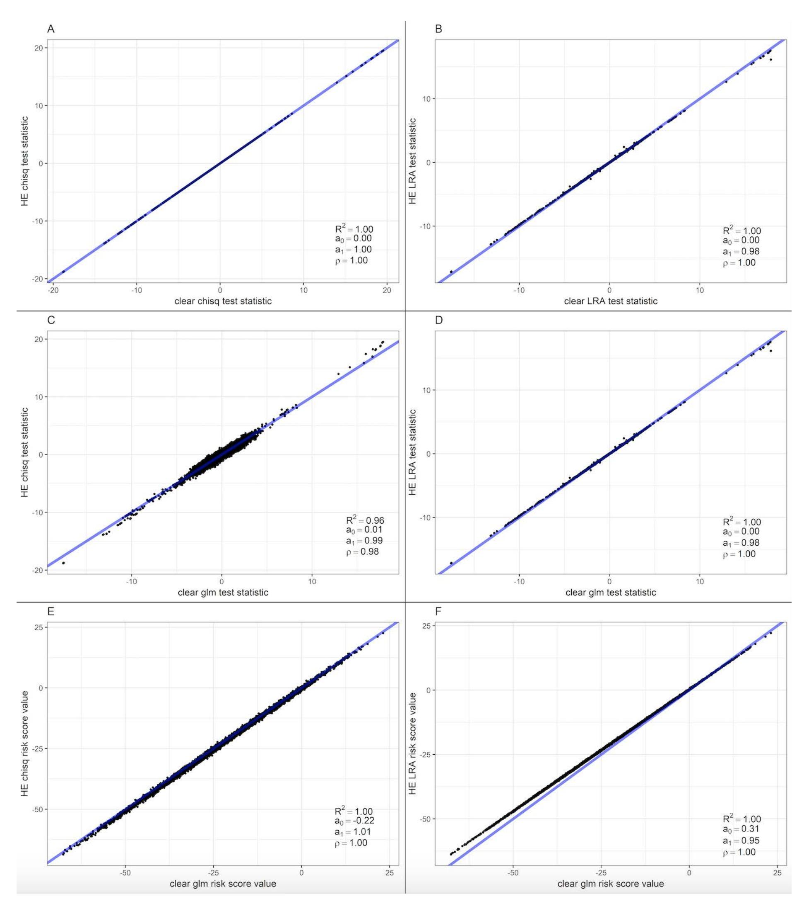
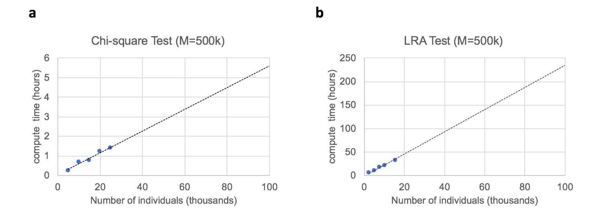
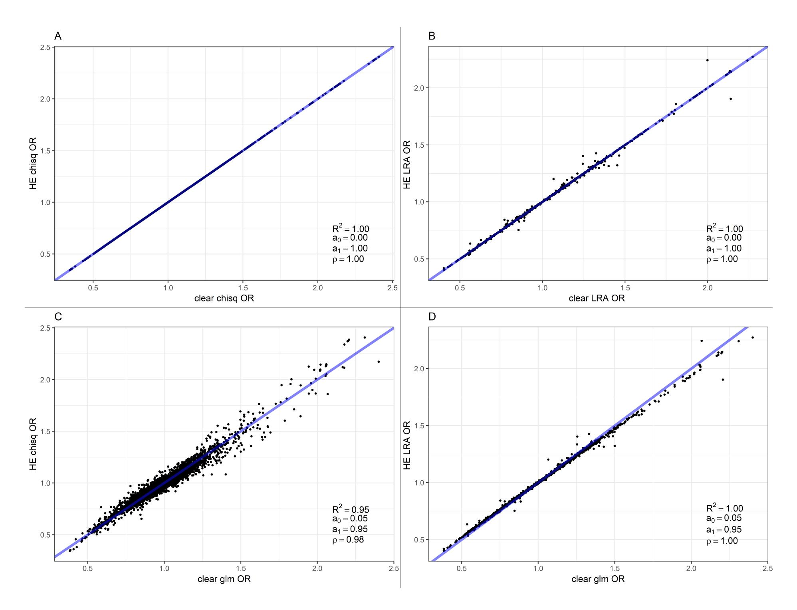
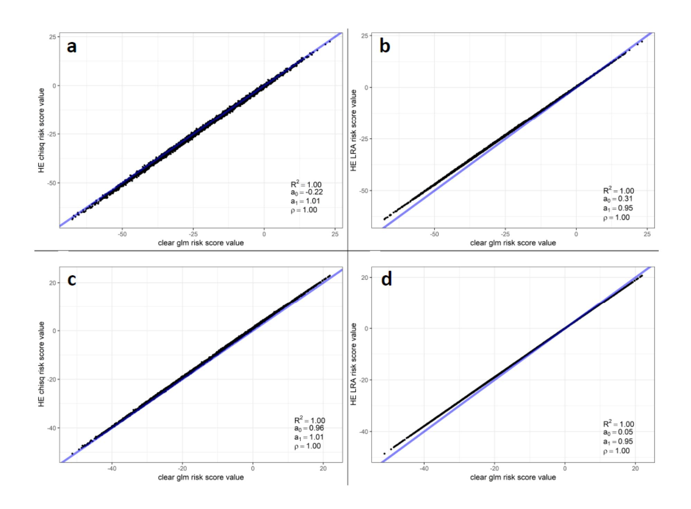
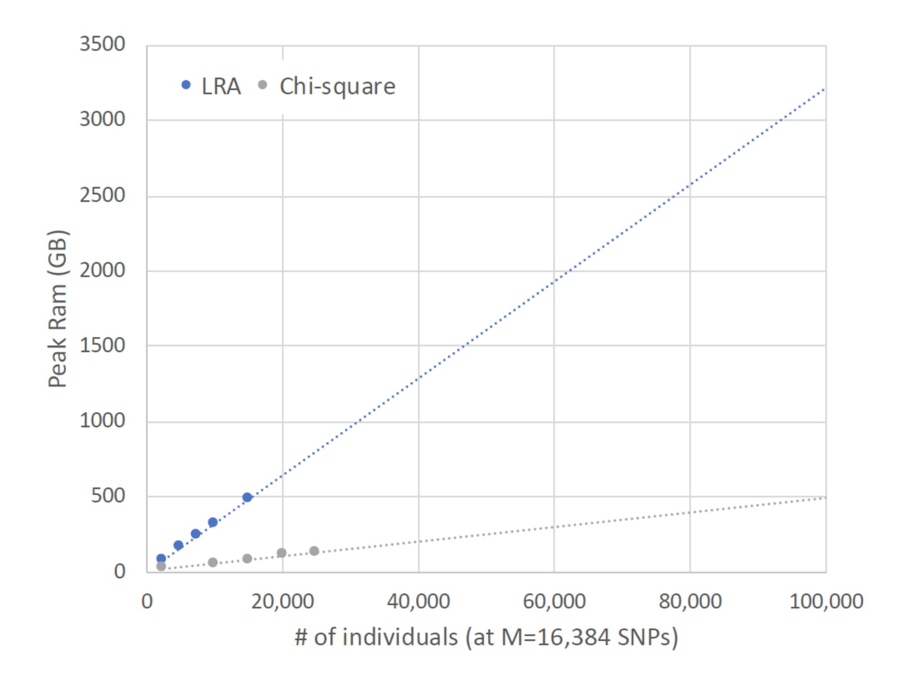

{0}------------------------------------------------

# Secure large-scale genome-wide association studies using homomorphic encryption

Marcelo Blatt<sup>a</sup> , Alexander Guseva,b, Yuriy Polyakov<sup>∗</sup><sup>a</sup> , and Shafi Goldwassera,c

<sup>a</sup>Duality Technologies, Inc., Newark, NJ <sup>b</sup>Dana-Farber Cancer Institute, Harvard Medical School, Boston, MA <sup>c</sup>Simons Institute for the Theory of Computing, Berkeley, CA

May 15, 2020

#### Abstract

Genome-Wide Association Studies (GWAS) seek to identify genetic variants associated with a trait, and have been a powerful approach for understanding complex diseases. A critical challenge for GWAS has been the dependence on individual-level data that typically have strict privacy requirements, creating an urgent need for methods that preserve the individual-level privacy of participants. Here, we present a privacy-preserving framework based on several advances in homomorphic encryption and demonstrate that it can perform an accurate GWAS analysis for a real dataset of more than 25,000 individuals, keeping all individual data encrypted and requiring no user interactions. Our extrapolations show that it can evaluate GWAS of 100,000 individuals and 500,000 SNPs in 5.6 hours on a single server node (or in 11 minutes on 31 server nodes running in parallel). Our performance results are more than one order of magnitude faster than prior state-of-the-art results using secure multi-party computation, which requires continuous user interactions, with the accuracy of both solutions being similar. Our homomorphic encryption advances can also be applied to other domains where large-scale statistical analyses over encrypted data are needed.

GWAS evaluates one SNP at a time for association to a phenotype or outcome. In the disease case/control setting, this is typically performed through a goodness-of-fit test or logistic regression, which report association odds ratios, standard errors, and p-values. The results from a GWAS have two broad downstream uses: first, variants that pass a statistical threshold are reported as genomewide significant and evaluated for functional mechanisms; second, all variants can be integrated into polygenic risk score analyses to predict phenotypes in held-out samples.

A critical challenge for GWAS is the dependence on individual-level data that typically have strict privacy requirements, creating an urgent need for methods that preserve the individual-level privacy of participants [24, 10]. There are two main approaches to privacy-preserving GWAS: secure multi-party computation (MPC) and homomorphic encryption (HE). The MPC approach typically uses a protocol invented by Yao in the 80's called the garbled circuit solution [29, 37]. In this protocol two clouds, each owned by a different hospital or corresponding to two non-collaborating

<sup>∗</sup>Corresponding author; e-mail: ypolyakov@dualitytech.com

{1}------------------------------------------------

servers within one hospital, hold part of the genomic data to be analyzed. The alternative approach is based on fully homomorphic encryption, a novel secure encryption method developed in 2008 by Gentry [22], which is much less communication-intensive, and is secure even if the servers collaborate. HE allows performing secure computations over encrypted sensitive data without ever decrypting them.

Recent work has focused on secure MPC solutions to facilitate individual-level privacy-preserving GWAS [29, 18]. The work of Jagadeesh, et al. addressed diagnosis of monogenic diseases while preserving participant privacy using MPC [29]. Due to the communication and computationally intensive nature of the garbled circuit solution, GWAS studies beyond monogenic diseases were not addressed and the patient cohort was small. Jagadeesh et al. estimated that even for the monogenic example, garbled circuits would be at least 5000 times faster than fully homomorphic encryption. Cho et al. followed by successfully computing GWAS by dividing data among multiple servers and computing the GWAS via multi-party secure protocol among the servers, subsets of which are trusted not to collaborate against other servers, else privacy is lost [18]. Here, for the first time we no longer need to resort to this trust assumption. We are successfully using HE to encrypt the genomic sequences of study participants while enabling GWAS computations without the ability to decrypt, and scaling to hundreds of thousands of samples (Fig. 1).

We implement two common GWAS techniques - the allelic chi-square test for case control differences and a logistic regression approximation (LRA) with covariates - within our HE framework. The LRA algorithm utilizes a previously proposed semi-parallel approach to efficiently iterate over each genetic variant without requiring repeated likelihood maximizations [35]. Our HE LRA implementation of this approach was independently tested in the iDASH 2018 secure genome analysis competition [1] and received the first place<sup>1</sup> . We additionally present a novel and highly efficient chi-square test that is faster than the LRA implementation by a factor of 40x and consumes 6x less memory at the cost of excluding covariates from the model. Our HE framework provides postquantum security and is based on several advances. First, we reformulated the compute models for both the chi-square and LRA algorithms to fully benefit from ciphertext packing, enabling the parallel execution of thousands of multiplications/additions using a single homomorphic multiplication/addition. Second, we introduced two types of data encoding to minimize the number of computationally expensive key switching operations, and developed several methods for converting between the encodings homomorphically (used in the LRA solution). Third, we applied multiple plaintext approximations for the LRA model. Fourth, we developed a new efficient Residue-Number-System (RNS) variant of the Cheon-Kim-Kim-Song homomorphic encryption scheme [16], which naturally supports approximate number arithmetic. Finally, we applied more than a dozen crypto-engineering optimizations.

We apply our HE framework to a real GWAS of age-related macular degeneration (AMD) [21] of 12,461 cases and 14,276 controls (restricted to self-reported Europeans) genotyped on 263,941 total markers with minor allele frequency > 1%. For our gold standard, we computed association statistics in the clear using full logistic regression on each variant with sex, age, and age squared as covariates. We first compared the distributions of GWAS statistics on a subset of 16,384 SNPs and 5,000 individuals evaluated by the same statistical test with/without HE, where we expect essentially perfect concordance (Fig. 2A,B). Both the chi-square and LRA tests produced HE statistics with an R2 of 1.00 to the statistics in the clear, and a replication slope of 1.00 and

<sup>1</sup>Our HE LRA solution shared the first place with the solution by the team from the University of California, San Diego

{2}------------------------------------------------



Figure 1: Schematic of the HE GWAS. First, Study Participants obtain a public key from the GWAS Coordinator (this step is not shown in the figure for simplicity). Then, each of them encrypts their data using the public key, and sends the encrypted data to the Encrypted Data Bank, storing all encrypted individual-level data from many Study Participants. When a specific study is initiated by the GWAS Coordinator, the encrypted data for the individuals in the study get transmitted to the HE Compute Cloud for a non-interactive secure computation. Next, the HE Compute Cloud computes the results and sends them in encrypted form to the GWAS Coordinator. Finally, the GWAS Coordinator decrypts the results and routes them to one of the Viewers.

{3}------------------------------------------------



Figure 2: Highly accurate HE GWAS test statistics and polygenic scores. Each plot shows a signed test statistic computed in the clear (x-axis) and the corresponding statistic computed using an HE test (y-axis). (A,B) report the same test performed in the clear versus through HE. (C,D) report logistic regression (glm) performed in the clear versus the HE tests. (E,F) report polygenic risk scores computed from logistic regression odds ratios (glm) in the clear versus from the HE tests (restricted to SNPs with association P¡0.01). R2: coefficient of determination of the regression; a0: intercept of the regression; a1: slope of the regression; ρ: correlation of statistics.

{4}------------------------------------------------

Table 1: Association statistics from clear and HE tests at known AMD SNPs. Reported AMD SNPs were tested for association in a subset of N=5,000 samples from the AMD study using gold standard logistic regression (GLM), the HE logistic regression approximation (LRA), and the HE chi-square test. "OR" reports the odds ratio; for GLM and LRA "stat" reports the test statistic; for comparison the chi-square test "stat" reports the square-root of the statistic polarized on the direction of the OR.

| SNP              | GLM  | GLM   | HE LRA | HE LRA | HE Chisq | HE Chisq |
|------------------|------|-------|--------|--------|----------|----------|
|                  | OR   | stat  | OR     | stat   | OR       | stat     |
| rs10033900<br>T  | 1.09 | 1.97  | 1.08   | 1.91   | 1.06     | 1.44     |
| rs943080<br>C    | 0.88 | -2.94 | 0.89   | -2.88  | 0.91     | -2.26    |
| rs79037040<br>G  | 0.88 | -2.98 | 0.88   | -2.91  | 0.89     | -2.82    |
| rs2043085<br>T   | 0.91 | -2.01 | 0.92   | -1.95  | 0.92     | -2.13    |
| rs2230199<br>C   | 1.41 | 6.83  | 1.38   | 6.67   | 1.40     | 7.10     |
| rs8135665<br>T   | 1.12 | 2.04  | 1.12   | 2.03   | 1.12     | 2.29     |
| rs114203272<br>T | 0.62 | -3.55 | 0.63   | -3.50  | 0.67     | -3.08    |
| rs114212178<br>T | 0.87 | -0.70 | 0.87   | -0.69  | 0.86     | -0.77    |

0.98, respectively, indicating negligible bias (see Materials and Methods). We next compared the HE GWAS statistics to the gold standard logistic regression statistics, with any differences now arising from both the statistical assumptions and the HE (Fig. 2C,D). The LRA again produced highly accurate HE statistics, with an R2 of 1.00 and a replication slope of 0.98. The HE Chi-square statistics exhibited some loss of signal relative to the gold standard but remained highly robust with an R2 of 0.96 (replication slope 0.99) primarily due to noise at non-significant variants. Importantly, the Chi-square test odds ratios remained highly accurate and nearly unbiased (R2=0.95, Fig. S1). We confirmed that accuracy was high across all variants by computing polygenic risk scores, wherein genetic risk values are predicted for each individual as the sum of risk alleles they carry weighted by the allelic effect size (see Materials and Methods; Figure 2E,F; Fig. S2). Both risk scores were highly correlated with scores from the gold standard logistic test (R2 > 0.99) with a slight downward bias in the absolute score for the LRA (replication slope 0.95) (Fig. 2E,F). Finally, we examined individual genome-wide significant associations reported by the original GWAS, where we again observed highly concordant results with the gold standard using both statistical tests (Table 2).

We next downsampled the data to investigate the runtime and scalability characteristics as a function of SNPs and sample size (Fig. 3, Tables S1-S6). We found the LRA computation to scale linearly in the number of markers and the number of individuals. At the largest evaluated sample size of N=15,000 and M=16,384 computation took 1.1 hours; extrapolated to 7.7 hours for a GWAS of N=100,000 (M=16,384); and extrapolated to 234 hours for a GWAS of N=100,000 and M=500,000 run as a single job. By comparison, the chi-squared test (which requires only simple mathematical operations) was more than an order of magnitude faster than the LRA, completing the same analysis of N=15,000 and M=16,384 in 98 seconds (41x faster than the LRA). This was extrapolated to 11 minutes for N=100,000 (M=16,384) or 5.6 hours for a GWAS of N=100,000 and M=500,000. The chi-squared solution also required approximately 6x less peak RAM and thus could

{5}------------------------------------------------



Figure 3: Linear runtime scaling and extrapolation to 100,000 individuals. Runtime measured from down-sampling individuals in an analysis of 16,384 SNPs, extrapolated to M=500,000 SNPs and the given sample size (x-axis) using a linear fit. Measured results are shown with points, extrapolated fit with dashed line. (A) HE chi-square test; (B) HE LRA test.

be run on a full-scale cohort of N=25,000 (M=49,152) in 8 minutes within the memory constraints available to us (Table S4). Detailed runtime characteristics including encryption/decryption are available in Tables S1, S2, S4, and S5. As both the LRA algorithm and chi-square test are natively parallel over the number of SNPs, the computations can be trivially distributed to multiple nodes, with each node working with 16,384 SNPs at a time (See Materials and Methods). This implies a GWAS of N=100,000 and M=500,000 could be run in 11 minutes on 31 nodes running in parallel.

Our HE solution for the chi-square test is faster than the state-of-the-art MPC approach of Cho et al. [18] extrapolated to 100,000 individuals and 500,000 SNPs: 5.6 hrs (for HE) vs. 37 hours (for MPC association tests only, without quality control or population stratification analysis; Phase 3 in Figure 2a of [18]) or 193 hours (for full MPC). The accuracy of both solutions is similar. Our LRA solution has a runtime of 234 hours for this scenario while the previously published MPC approach "did not yield a practical runtime for a genome-wide application of logistic regression". Both of our solutions are fully non-interactive, produce valid odds ratios in the analyses of real data, and natively parallelize over the number of SNPs, enabling their execution in distributed computing cloud environments. Though we did not implement it here, a hybrid approach where all SNPs are evaluated with the chi-squared test and then the 5% most significant SNPs are re-tested by the LRA could also be used to achieve the same accuracy as LRA for significant associations, requiring only 17 hours (excluding ciphertext re-packing overhead, which would be relatively small).

Our approach has several limitations and areas of future work. First, unlike previous work [18] our model assumes that encrypted data has been fully processed and does not perform additional quality control or genetic ancestry inference, though such methods can be easily applied pre-encryption. In particular, Chen et al. [11] showed that fine-scale genetic ancestry is much more accurately inferred by projection from external population reference data than by principal component analysis directly on the target samples and leads to more effective correction for pop

{6}------------------------------------------------

ulation stratification. High-quality population reference data is available for all major populations and the pre-encryption data can be easily projected using these references to compute ancestry covariates (requiring a simple matrix-vector product, as, for example, implemented in the PLINK score function). Second, while the chi-squared test requires no parameter tuning, the LRA relies on a learning rate parameter (see Materials and Methods) that may differ by study depending on size and relationship of covariates. This can be circumvented by tuning the parameter on subsets of the data in the clear, or by comparing to parameter-free solutions such as the chi-squared or linear regression results; at the cost of some additional computation. Third, our approach does not prevent the HE Compute Cloud from colluding with the GWAS Coordinator to decrypt the original data, which is also true for existing MPC solutions. This problem can be addressed by adding a secret sharing protocol or using a variant of threshold HE [6] described in the next paragraph.

Extensions to a multi-party scenario are possible using threshold HE [6], a protocol where many parties cooperatively generate a common public key using their individual secret keys ("secret shares"). In this setting, the joint secret key corresponding to the common public key is never seen by any party. In GWAS, the same genotypes and phenotypes can be transmitted from multiple participants and then combined together, or genotypes and phenotypes can be separately transmitted for the same individuals from different participants and then joined together. This extension does not add substantial computation overhead to our single-party HE solution (the computation itself is performed the same way). Our work here is thus a step toward enabling analyses of sensitive phenotypes that cannot be shared between groups/institutions and individual patient participation in research studies without risk to genomic privacy.

Many of our HE improvements are general-purpose and can be applied to other application domains where similar large-scale association and regression tools are used, including phenomewide association studies from electronic medical record data [19]; discovery of predictors of treatment response in clinical trials [32]; and correlative studies of multi-modal data such as expression/microbiome activity [5]. The tests developed here can also be extended to richer machine learning models, including decision and gradient boosted trees.

# Materials and Methods

### Homomorphic encryption

Our solution is based on an optimized variant of the Cheon-Kim-Kim-Song (CKKS) scheme [16], which is designed for performing approximate number arithmetic homomorphically. We have developed a Double-Chinese Remainder Theorem (CRT), a.k.a, Residue Number System (RNS), variant of the original scheme. Our variant is based on the same security assumptions as the original scheme, namely the Ring Learning With Errors (RLWE) problem, but relies on native 64-bit integer arithmetic instead of multiprecision integer arithmetic for better performance and parallelization. The RLWE problem is immune to all known classical/quantum computer attacks, and is used as the basis for the HE security standard [4].

The main differences of our Double-CRT variant compared to the original scheme are:

- Novel efficient re-scaling algorithm that works with residues directly, and does not require switching to a slower positional (multiprecision) number system.
- Efficient key switching operation previously used for the Brakerski/Fan-Vercauteren (BFV)

{7}------------------------------------------------

scheme [9, 20]. This key switching algorithm was originally proposed by Bajard et al. [7] and improved by Halevi et al. [25].

Our variant and parameter selection for the LRA implementation are described in detail by Blatt et al. [8] and also included in the Supplemental Information for completeness.

The CKKS HE scheme has also been extended to a fully homomorphic encryption (FHE) setting [14, 12, 27], which supports ciphertext refreshing via bootstrapping when further computations (e.g., after GWAS analysis) need to be performed. Although we did not use bootstrapping in our HE solutions as the computation circuits for both the LRA and chi-square algorithms are known in advance, our HE framework can be extended to this more general scenario.

Our work differs from our previous work in [8] and the corresponding iDASH analysis in multiple key ways. First, we introduce the novel and highly efficient chi-square test, which is 40x faster and consumes 6x less memory than the LRA proposed in [8]. Second, we evaluate the performance and accuracy of both tests using a published GWAS study of 26,000 case/controls samples across 260,000 SNPs, whereas the implementation in [8] was evaluated over a toy dataset of 245 case/control samples with 10,643 SNPs (the majority of which were rare variants) and was thus not investigated in a production-level GWAS setting. The accuracy analysis in this manuscript additionally includes accuracy of polygenic risk scores, which were not considered in [8]. Third, we evaluate both methods across many data settings and extrapolate performance to 100,000 individuals and 500,000 SNPs, reflecting the scale of emerging GWAS studies. Fourth, we consider applications, distributed computation, parallelization, and extensions to multi-party scenarios that were not discussed in [8].

## Software implementation

We implemented our solution in PALISADE v1.4.0 [2], an open-source lattice cryptography library. We added our own implementation for the RNS variant of the CKKS scheme to PALISADE (made publicly available in PALISADE starting with v1.7). For loop parallelization, we used OpenMP.

### Experimental testbed

Experiments were performed using a server computing node with 2 sockets of Intel(R) Xeon(R) CPU E5-2680 v4 @ 2.40GHz, each with 14 cores. 500GB of RAM was accessible for the experiments. The node had Fedora 26 OS and g++ (GCC) 7.1.1 installed.

Note that we kept all keys and ciphertexts loaded in the memory to show the total storage requirement for both solutions. In a practical setting, ciphertexts could be serialized to and deserialized from persistent storage, such as solid-state drives, as needed, e.g., working with 16,384 SNPs at a time. In this case, the memory requirements would be significantly smaller than in our experiments, and would remain essentially constant when the number of SNPs is increased.

### Logistic regression approximation

Our LRA solution is based on the semi-parallel method of Sikorska et al. [35]. We applied a number of approximations to optimize the HE solution. Our approximations are described in the Supplemental Information. We focused on the case/control setting and thus did not evaluate a standard linear regression but we note that it is a sub-problem of the LRA test that requires less computation and has been previously demonstrated in the HE setting in the iDASH'18 competition by the University of California, San Diego team [1].

{8}------------------------------------------------

# HE LRA solution

Our HE LRA solution is described in detail in the Supplemental Information. In summary, we introduced two plaintext encodings and developed several methods for switching between the encodings. We also applied more than a dozen crypto-optimization techniques. The only differences in the HE implementation for the AMD dataset compared to previous work [8] are in the values of the learning rate and auxiliary scaling factors in the HE solution.

The current LRA implementation is limited to three regression covariates, though we believe the method can model up to 5 covariates relatively efficiently using the same approach (Cramer's rule for matrix inversion) and a greater number of covariates using an approximate technique for matrix inversion discussed by Cheon et al. [17].

### Allelic chi-square test

We implemented a standard 1-degree-of-freedom allelic chi-square test for difference in major/minor allele counts between cases and controls. Under Hardy-Weinberg equilibrium (enforced here through genotype QC) this test is equivalent to the genotypic (2x3) chi-square test [34] or the Cochran Armitage trend test used previously [18]. The Chi-Square HE solution is described in detail in the Supplemental Information.

### GWAS dataset processing

The GWAS data was downloaded from dbGAP (phs001039.v1.p1) and restricted to all self-identified European samples and QC passing SNPs with minor allele frequency >1%. The gold standard logistic regression was run using sex, age, and age squared as covariates using the standard glm function in R. The LRA analyses were carried out with the same set of covariates and the chi-square test analyses were carried out with no covariates.

### Accuracy metrics

We evaluated test accuracy using two metrics: R2, computed as the coefficient of determination from a regression of the estimated test statistic on the ground truth; and replication slope, computed as the slope of the regression. The R2 reflects how much variance in the ground truth statistic is explained by the estimate. The replication slope reflects the scaling factor on the effect sizes imposed by the estimation. When the estimated effect size distribution is linear, the squared replication slope of the test statistics can be thought of as the effective decrease in sample size due to estimation noise [38].

### Polygenic risk score

We implemented a simple threshold-based polygenic risk score to avoid parameter tuning. After computing the GWAS statistics, variants passing a given p-value threshold were retained (P<0.01 or P<5e-8) and used to predict the genetic value of each individual in the study. The prediction for each sample was the sum across all SNPs of the number of major alleles the individual caries times the major allelic odds ratio of that SNP. We did not account for linkage disequilibrium across markers (i.e. through pruning) because we were only interested in the relative accuracy of the genetic value computed from different tests.

{9}------------------------------------------------

## Runtime extrapolation

For the chi-square test, runtime was computed for all N=25,000 samples in increasing blocks of M=16,384 SNPs until maximum RAM capacity was reached at M=49,152; as well as for a single block of M=16,384 SNPs from N=5,000 to N=25,000 in steps of 5,000 (Table S4). For the LRA, which required substantially more RAM, runtime was computed for N=5,000 samples in increasing blocks of M=16,384 SNPs until maximum RAM capacity was reached at M=65,536; as well as a single block of M=16,384 from N=2,500 to N=15,000 in steps of 2,500. A linear trend line was then fit to the subsampled data to extrapolate to larger SNP/sample sizes; the linear fit was highly accurate, producing an R2>0.98 for both tests (Tables S3 and S6). Linear extrapolation was similarly used in previous published work [18].

### Memory extrapolation

We measured peak RAM usage (i.e. the total storage requirement) after downsampling SNPs at a fixed sample size (Table S7), or individuals fixed at 16,384 SNPs (Table S8). Extrapolation was then calculated from downsampled individuals using a linear fit, which was highly accurate (R2>0.99) (Table S8). We note that computations involving individuals that cannot be fully stored in memory (e.g. millions) can be computed in large individual subsets and merged by meta-analysis with negligible loss of accuracy, as is typically done for large-scale GWAS studies involving multiple consortia.

## Distributed computation and parallelization

Both LRA and chi-square test algorithms perform computations for each SNP independently. Our implementations use ciphertext packing and hence perform GWAS computations for batches of 16,384 and 4,096 SNPs at a time for LRA and chi-square test, respectively. This implies that the GWAS computation for a large number of SNPs can be trivially distributed to multiple nodes by sending different batches to different nodes in parallel. For instance, we can securely evaluate a GWAS of N=100,000 and M=500,000 using the chi-square test in 11 minutes on 31 nodes if batches of 16,384 SNPs are sent to different nodes in parallel vs. 5.6 hours when a single node is used for the whole computation.

### Data Availability

Our analysis is based on the phs001039.v1.p1 dataset available for download in dbGAP. The pseudocode for chi-square test and LRA HE protocols is listed in Algorithms 2 and 5 of SI, respectively. The implementation of all cryptographic capabilities used in our work, including our optimized CKKS variant, is publicly available for download in PALISADE v1.7.4 and later [2]. The implementation of the GWAS protocols developed in this work is publicly available [3].

## Acknowledgements

We gratefully acknowledge the input and feedback from Kurt Rohloff and Vinod Vaikuntanathan. We also acknowledge Kurt Rohloff for the funding of the initial iDASH'18 work. Research reported in this publication was supported in part by National Human Genome Research Institute of the 

{10}------------------------------------------------

National Institutes of Health under award number 1R43HG010123. A.G. was supported by NIH R01CA227237 and the Claudia Adams Barr Award.

# References

- [1] IDASH PRIVACY & SECURITY WORKSHOP 2018 secure genome analysis competition home. http://www.humangenomeprivacy.org/2018/. (Accessed 11 December 2019).
- [2] PALISADE Lattice Cryptography Library (release 1.7.4). https://palisade-crypto.org/, Jan. 2020.
- [3] Prototypes for secure large-scale genome-wide association studies using homomorphic encryption. https://gitlab.com/duality-technologies-public/palisade-gwas-demos/, Apr. 2020.
- [4] M. Albrecht and et al. Homomorphic encryption security standard. Technical report, HomomorphicEncryption.org, Toronto, Canada, November 2018.
- [5] A. Almeida, A. L. Mitchell, M. Boland, S. C. Forster, G. B. Gloor, A. Tarkowska, T. D. Lawley, and R. D. Finn. A new genomic blueprint of the human gut microbiota. Nature, 568(7753):499–504, 2019.
- [6] G. Asharov, A. Jain, A. L´opez-Alt, E. Tromer, V. Vaikuntanathan, and D. Wichs. Multiparty computation with low communication, computation and interaction via threshold fhe. In D. Pointcheval and T. Johansson, editors, Advances in Cryptology – EUROCRYPT 2012, pages 483–501, Berlin, Heidelberg, 2012. Springer Berlin Heidelberg.
- [7] J.-C. Bajard, J. Eynard, M. A. Hasan, and V. Zucca. A full RNS variant of fv like somewhat homomorphic encryption schemes. In R. Avanzi and H. Heys, editors, Selected Areas in Cryptography – SAC 2016, pages 423–442, Cham, 2017. Springer International Publishing.
- [8] M. Blatt, A. Gusev, Y. Polyakov, K. Rohloff, and V. Vaikuntanathan. Optimized homomorphic encryption solution for secure genome-wide association studies. Cryptology ePrint Archive, Report 2019/223, 2019. https://eprint.iacr.org/2019/223.
- [9] Z. Brakerski, C. Gentry, and V. Vaikuntanathan. (leveled) fully homomorphic encryption without bootstrapping. In Proceedings of the 3rd Innovations in Theoretical Computer Science Conference, ITCS '12, pages 309–325, New York, NY, USA, 2012. ACM.
- [10] S. E. Brenner. Be prepared for the big genome leak. Nature, 498(7453):139–139, 2013.
- [11] C.-Y. Chen, S. Pollack, D. J. Hunter, J. N. Hirschhorn, P. Kraft, and A. L. Price. Improved ancestry inference using weights from external reference panels. Bioinformatics, 29(11):1399– 1406, 03 2013.
- [12] H. Chen, I. Chillotti, and Y. Song. Improved bootstrapping for approximate homomorphic encryption. In Y. Ishai and V. Rijmen, editors, Advances in Cryptology – EUROCRYPT 2019, pages 34–54, Cham, 2019. Springer International Publishing.

{11}------------------------------------------------

- [13] H. Chen, R. Gilad-Bachrach, K. Han, Z. Huang, A. Jalali, K. Laine, and K. Lauter. Logistic regression over encrypted data from fully homomorphic encryption. BMC Medical Genomics, 11(4):81, Oct 2018.
- [14] J. H. Cheon, K. Han, A. Kim, M. Kim, and Y. Song. Bootstrapping for approximate homomorphic encryption. In J. B. Nielsen and V. Rijmen, editors, Advances in Cryptology – EUROCRYPT 2018, pages 360–384, Cham, 2018. Springer International Publishing.
- [15] J. H. Cheon, K. Han, A. Kim, M. Kim, and Y. Song. A full RNS variant of approximate homomorphic encryption. In C. Cid and M. J. Jacobson Jr., editors, Selected Areas in Cryptography – SAC 2018, pages 347–368, Cham, 2019. Springer International Publishing.
- [16] J. H. Cheon, A. Kim, M. Kim, and Y. Song. Homomorphic encryption for arithmetic of approximate numbers. In T. Takagi and T. Peyrin, editors, Advances in Cryptology – ASIACRYPT 2017, pages 409–437, Cham, 2017. Springer International Publishing.
- [17] J. H. Cheon, A. Kim, and D. Yhee. Multi-dimensional packing for heaan for approximate matrix arithmetics. Cryptology ePrint Archive, Report 2018/1245, 2018. https://eprint. iacr.org/2018/1245.
- [18] H. Cho, D. J. Wu, and B. Berger. Secure genome-wide association analysis using multiparty computation. Nature Biotechnology, 36(6):547–551, 2018.
- [19] J. C. Denny and et al. Systematic comparison of phenome-wide association study of electronic medical record data and genome-wide association study data. Nature Biotechnology, 31(12):1102–1111, 2013.
- [20] J. Fan and F. Vercauteren. Somewhat practical fully homomorphic encryption. Cryptology ePrint Archive, Report 2012/144, 2012. https://eprint.iacr.org/2012/144.
- [21] L. G. Fritsche and et al. A large genome-wide association study of age-related macular degeneration highlights contributions of rare and common variants. Nature Genetics, 48(2):134–143, 2016.
- [22] C. Gentry. Fully homomorphic encryption using ideal lattices. In Proceedings of the Forty-first Annual ACM Symposium on Theory of Computing, STOC '09, pages 169–178, New York, NY, USA, 2009. ACM.
- [23] C. Gentry, S. Halevi, and N. Smart. Homomorphic evaluation of the AES circuit. In "CRYPTO 2012", volume 7417 of LNCS, pages 850–867, 2012. Long version at http://eprint.iacr.org/2012/099.
- [24] M. Gymrek, A. L. McGuire, D. Golan, E. Halperin, and Y. Erlich. Identifying personal genomes by surname inference. Science, 339(6117):321–324, 2013.
- [25] S. Halevi, Y. Polyakov, and V. Shoup. An improved rns variant of the bfv homomorphic encryption scheme. In M. Matsui, editor, Topics in Cryptology – CT-RSA 2019, pages 83–105, Cham, 2019. Springer International Publishing.
- [26] S. Halevi and V. Shoup. Faster homomorphic linear transformations in helib. In CRYPTO 2018, pages 93–120, Cham, 2018. Springer International Publishing.

{12}------------------------------------------------

- [27] K. Han, M. Hhan, and J. H. Cheon. Improved homomorphic discrete fourier transforms and fhe bootstrapping. IEEE Access, 7:57361–57370, 2019.
- [28] K. Han, S. Hong, J. H. Cheon, and D. Park. Efficient logistic regression on large encrypted data. IACR Cryptology ePrint Archive, 2018:662, 2018.
- [29] K. A. Jagadeesh, D. J. Wu, J. A. Birgmeier, D. Boneh, and G. Bejerano. Deriving genomic diagnoses without revealing patient genomes. Science, 357(6352):692–695, 2017.
- [30] A. Kim, Y. Song, M. Kim, K. Lee, and J. H. Cheon. Logistic regression model training based on the approximate homomorphic encryption. BMC Med Genomics, 11:254, 2018.
- [31] M. Kim, Y. Song, S. Wang, Y. Xia, and X. Jiang. Secure logistic regression based on homomorphic encryption: Design and evaluation. JMIR Med Inform, 6(2):e19, Apr 2018.
- [32] M. R. Nelson, T. Johnson, L. Warren, A. R. Hughes, S. L. Chissoe, C.-F. Xu, and D. M. Waterworth. The genetics of drug efficacy: opportunities and challenges. Nature Reviews Genetics, 17(4):197–206, 2016.
- [33] W. H. Press, S. A. Teukolsky, W. T. Vetterling, and B. P. Flannery. Numerical Recipes in FORTRAN (2Nd Ed.): The Art of Scientific Computing. Cambridge University Press, New York, NY, USA, 1992. Book chapters: "Chebyshev Approximation" (§5.8),"Derivatives or Integrals of a Chebyshev-Approximated Function" (§5.9), and "Polynomial Approximation from Chebyshev Coefficients" (5.10).
- [34] P. D. Sasieni. From genotypes to genes: Doubling the sample size. Biometrics, 53(4):1253– 1261, 1997.
- [35] K. Sikorska, E. Lesaffre, P. F. Groenen, and P. H. Eilers. Gwas on your notebook: fast semi-parallel linear and logistic regression for genome-wide association studies. BMC Bioinformatics, 14(1):166, 2013.
- [36] X. Wang, H. Tang, S. Wang, X. Jiang, W. Wang, D. Bu, L. Wang, Y. Jiang, and C. Wang. idash secure genome analysis competition 2017. BMC Medical Genomics, 11(4):85, Oct 2018.
- [37] A. C.-C. Yao. How to generate and exchange secrets. In Proceedings of the 27th Annual Symposium on Foundations of Computer Science, SFCS '86, pages 162–167, Washington, DC, USA, 1986. IEEE Computer Society.
- [38] K. T. Zondervan and L. R. Cardon. The complex interplay among factors that influence allelic association. Nature Reviews Genetics, 5(2):89–100, 2004.

# Supplemental Information

#### Allelic χ <sup>2</sup> Solution

Tests of genetic association are usually performed for each SNP. The data for each SNP with minor allele a and major allele A can be summarized as a contingency table of counts of disease status by either genotype count, aa, Aa and AA, or allele count, a and A. The contingency table for the allelic case is given by

{13}------------------------------------------------

|         | a        | A        | Total |
|---------|----------|----------|-------|
| Control | $n_{00}$ | $n_{01}$ | $r_0$ |
| Cases   | $n_{10}$ | $n_{11}$ | $r_1$ |
| Total   | $c_0$    | $c_1$    | 2N    |

Here,  $n_{00}$  is the number of *control* cases carrying the minor allele a;  $n_{01}$ , the control cases with major allele A;  $n_{10}$  and  $n_{11}$ , the corresponding *cases* that the disease is present;  $r_0$  and  $r_1$  are twice the total number of *control* and *cases*, respectively;  $c_0$  and  $c_1$  correspond to minor and major allele counts; and N is the cohort size. Let  $y_i$  denote the disease status for the  $i^{th}$  individual ( $y_i = 1$  for the disease case, and  $y_i = 0$  otherwise), and  $\mathbf{s}_i \in \{0, 1, 2\}$  corresponds to the number of allele variants of individual i. Then  $n_{11} = \mathbf{y}^{\top} \cdot \mathbf{s}$ ,  $r_1 = 2\mathbf{y}^{\top} \cdot \mathbf{y}$ , and  $c_1 = \sum_{i=1}^{N} s_i$ .

The  $\chi^2$  test is used to determine whether there is a significant difference between the expected frequencies and the observed frequencies. In this case, the allelic- $\chi^2$  statistic for the Pearson test of independence becomes

$$\chi^2 = \frac{2N(2n_{11}N - c_1r_1)^2}{c_1(2N - c_1)r_1 \cdot (2N - r_1)}.$$

The strength of the association can also be quantified using the odd-ratio

$$OR = \frac{n_{11}(n_{11} - r_1 - c_1 + 2N)}{(c_1 - n_{11})(r_1 - n_{11})}.$$

A convenient property of the above equations is that they can be used to calculate the  $\chi^2$  and OR for M SNPs simultaneously by using a vectorized formulation, i.e., setting  $\mathbf{n}_{11} = \mathbf{y}^{\top} \cdot \mathbf{S}$ ,  $\mathbf{r}_1 = 2(\mathbf{y}^{\top} \cdot \mathbf{y})\mathbf{u}_M$ , and  $\mathbf{c}_1 := \mathbf{u}_N^{\top} \cdot \mathbf{S}$  and replacing the scalar 2N by  $\mathbf{d} = 2$  N  $\mathbf{u}_M$ . Here,  $\mathbf{S} \in \{0, 1, 2\}^{N \times M}$  is the "SNP matrix" where  $S_{ij}$  corresponds to the  $j^{\text{th}}$  SNP of the  $i^{\text{th}}$  individual, and  $\mathbf{u}_b = \{1\}_{i=1}^b$  for b = M, N. To complete the formulation, the scalar multiplications and divisions must be replaced by their corresponding vector-element-wise counterpart operations.

The vectorized formulation for the Allelic  $\chi^2$  procedure is presented in Algorithm 1.

#### **Data Encoding**

The SNPs matrix **S** is packed row-wise. If the number of SNPs is larger than n/2 (4,096 in our implementation), then  $\eta = \lceil \frac{2M}{n} \rceil$  ciphertexts are used for each individual. The total number of ciphertexts needed to encode **S** is  $\eta \cdot N$ .

The condition vector  $\mathbf{y}$  uses one ciphertext per component, with the same value replicated to all n/2 plaintext slots. The total number of ciphertexts needed to encode  $\mathbf{y}$  is N.

#### **HE Solution**

The optimized HE algorithm is depicted in Algorithm 2. The most expensive operations are the matrix-vector product in step 8, which requires N homomorphic multiplications and N-1 homomorphic additions, and the summation in step 9, which requires N-1 homomorphic additions. All subsequent steps work with single ciphertexts.

{14}------------------------------------------------

# **Algorithm 1** Allelic $\chi^2$ -Test of Independence (Closed formulation)

```
1: procedure Server
  2: Contingency table:
                 Define: \mathbf{u}_b = \{1\}_{i=1}^b \in \mathbb{R}^b \quad \text{for } b = M, N
  3:
                 \mathbf{n}_{11} := \mathbf{y}^{\top} \mathbf{S}
  4:
                \mathbf{c}_1 := \mathbf{u}_N^\top \mathbf{S}
  5:
                \mathbf{r}_1 := 2 \left( \sum_{i=1}^N y_i \right) \mathbf{u}_M\mathbf{d} := 2 N \mathbf{u}_M
  6:
  7:
                 \boldsymbol{\chi}^2_{\text{num}} := \mathbf{d} \star (\mathbf{n}_{11} \star \mathbf{d} - \mathbf{c}_1 \star \mathbf{r}_1)^2 \ \boldsymbol{\chi}^2_{\text{den}} := \mathbf{c}_1 \star (\mathbf{d} - \mathbf{c}_1) \star \mathbf{r}_1 \star (\mathbf{d} - \mathbf{r}_1)
                                                                                                                                                                                                         > SIMD products
  8:
  9:
                 \mathbf{OR}_{\text{num}} := \mathbf{n}_{11} \star (\mathbf{n}_{11} - \mathbf{r}_1 - \mathbf{c}_1 + \mathbf{d})
10:
                 \mathbf{OR}_{\scriptscriptstyle{\mathrm{den}}} := (\mathbf{c}_1 - \mathbf{n}_{11}) \star (\mathbf{r}_1 - \mathbf{n}_{11})
11:
12:
13: procedure CLIENT
14: \chi^2 and p-values:
                \boldsymbol{\chi}^2 \coloneqq \frac{\boldsymbol{\chi}_{\text{num}}^2}{\boldsymbol{\chi}_{\text{den}}^2}
15:
                                                                                                                                                                                   > component-wise division
                 \mathbf{pval} := \text{STATS.CHI2.SF}(\mathbf{x} = \boldsymbol{\chi}^2, \mathtt{df} = 1)
16:
17: Odd-Ratios:
                 \mathrm{OR} := \frac{\mathrm{OR}_{\mathrm{num}}}{\mathrm{OR}_{\mathrm{den}}}
18:

                    Note: + and \star denote SIMD addition and multiplication, respectively.
```

The required multiplicative depth is 3, which implies that 4 CRT moduli are needed. The scaling factor  $\gamma$  is introduced to guarantee that the decrypted results can fit without a wrap-around in a single CRT modulus (otherwise, the number of CRT moduli would be 5, increasing the overall computational complexity of the computation).

All homomorphic multiplications are performed without a single key switching operation (no relinearization), which has a significantly higher cost than SIMD multiplications and additions used in our solution. We applied the rescaling operation only after the multiplications involving single ciphertexts. For instance, no rescaling was applied in step 8 until after the summation.

#### **HE** Parameters

We used the following HE parameters for our implementation. According to [4], our parameters correspond to at least 128 bits of security.

- The ring dimension n was  $2^{13} = 8,192$ .
- The number of CRT limbs in the fresh ciphertext modulus was 4, which corresponds to 3 levels. Each CRT modulis was 50 bits long.
- Number of bits p in the CKKS scheme was 50.
- We used the ternary secret key distribution, i.e., random integers between -1 and 1.
- The error distribution parameter  $\sigma$  was 3.19.

{15}------------------------------------------------

```
Algorithm 2 Allelic \chi^2-Test of Independence (Optimized HE Algorithm)
```

```
1: Define: \mathbf{u}_x = \{1\}_{i=1}^x \in \mathcal{R}^x \text{ for } x = M, N
  2: \gamma := 0.1 \cdot N^{-2}
                                                                                                                                        \triangleright \gamma is a scaling factor (for optimization)
 3: \mathbf{d} := 2N \cdot \mathbf{u}_M
  4: \mathbf{d}^* := 2N\gamma \cdot \mathbf{u}_M
 5: \mathbf{r}_1 := 2 \left( \sum_{i=1}^{N} y_i \right)
                                                                                                                                                                                  ▶ Binary tree addition
  6: \mathbf{r}_1^* := \gamma \cdot \mathbf{r}_1
  7: for j \in [\eta] do
                                                                                                 ▷ SIMD mult w/o relinearization + binary tree addition
               \mathbf{n}_{11} := \mathbf{y}^{\top} \mathbf{S}_i
  8:
               \mathbf{c}_1 := \mathbf{u}_N^\top \mathbf{S}_j
  9:
                                                                                                                                                                                  ▶ Binary tree addition
              \mathbf{c}_1^* := \gamma \cdot \mathbf{c}_1
\mathbf{\chi}_{j,\mathrm{num}}^2 := (\mathbf{n}_{11} \star \mathbf{d}^* - \mathbf{c}_1 \star \mathbf{r}_1^*)^2
\mathbf{\chi}_{j,\mathrm{den}}^2 := \mathbf{c}_1 \star (\mathbf{d}^* - \mathbf{c}_1^*) \star \mathbf{r}_1 \star (\mathbf{d}^* - \mathbf{r}_1^*)
10:
11:
                                                                                                                                                                                              ▷ SIMD products
12:
                                                                                                                                                                                              > SIMD products
13:
                \mathbf{n}_{11}^* := \gamma \cdot \mathbf{n}_{11}
                \mathbf{OR}_{j,\text{\tiny num}} := \mathbf{n}_{11} \star (\mathbf{n}_{11}^* - \mathbf{r}_1^* - \mathbf{c}_1^* + \mathbf{d}^*)
                                                                                                                                                                                              ▶ SIMD products
14:
                \mathbf{OR}_{j,\text{\tiny den}} := (\mathbf{c}_1 - \mathbf{n}_{11}) \star (\mathbf{r}_1^* - \mathbf{n}_{11}^*)
                                                                                                                                                                                              ▶ SIMD products
15:
```

#### Logistic Regression Approximation Algorithm

#### Semi-Parallel Approach of Sikorska et al. [35]

Logistic regression is widely used to model binary response data in GWAS. For instance, it can be used to examine the relationship between disease status (control versus real cases) with respect to phenotypes (age, weight, height, etc.) and genotypes (such as SNP variations). Let  $y_i$  denote the disease status for the  $i^{th}$  individual in a sample of size N ( $y_i = 1$  if the individual is a disease case, and  $y_i = 0$  otherwise), and  $(\mathbf{x}_i', \mathbf{s}_i)$  be the corresponding predictor, where  $\mathbf{x}_i' \in \mathbb{R}^K$  corresponds to the phenotypes and  $\mathbf{s}_i \in \{0, 1, 2\}^M$  to the genotypes of individual i for a set of K phenotypes and M SNPs. The logistic regression model expresses the relationship between  $y_i$  and the predictor set  $(\mathbf{x}_i', \mathbf{s}_i)$  in terms of the conditional probability  $Pr(Y = y_i | \mathbf{x}_i', \mathbf{s}_i)$  of disease, as:

$$Pr(y_i|\mathbf{x}_i',\mathbf{s}_i) = \sigma((2y_i-1)(\boldsymbol{\theta}_0'+\mathbf{x}_i'\cdot\boldsymbol{\theta}'+\mathbf{s}_i\cdot\boldsymbol{\beta})),$$

where  $\sigma$  is the logistic function,  $\sigma(x) = \frac{1}{1+\exp{(-x)}}$ ;  $\theta'_0 \in \mathbb{R}$ ,  $\boldsymbol{\theta}' \in \mathbb{R}^K$  and  $\boldsymbol{\beta} \in \mathbb{R}^M$  are the K+M+1 parameters to be determined. For the sake of simplicity, we adopt the canonical notation, that is,  $\boldsymbol{\theta} \equiv (\theta'_0, \boldsymbol{\theta}') \in \mathbb{R}^{K+1}$  and  $\mathbf{x}_i \equiv (1, \mathbf{x}'_i) \in \mathbb{R}^{K+1}$  for  $i = 1, \dots, N$ .

Assuming that the effect of each SNP is independent of each other, it is possible to formulate it as a set of M independent equations, i.e., decompose the computation into M independent logistic regression cases for K+1 parameters. Sikorska et al. [35] proposed a "semi-parallel" approach to speed up the logistic regression in the above scenario. The goal is to avoid looping over each SNP by using a vectorized formulation, which includes optimized vector and matrix operations, that allows performing multiple identical actions over different data in a single operation.

The method relies on the assumption that the covariant parameters  $\boldsymbol{\theta}$  are nearly the same for all SNPs. This assumption allows the reformulation of fitting N vectors in  $\mathbb{R}^{K+1}$ , followed by a one-step calculation for M SNPs at once. Therefore Sikorska's semi-parallel logistic regression consists of 2 stages:

1. Estimate the coefficients of the clinical covariates,  $\boldsymbol{\theta} \in \mathbb{R}^{K+1}$ ;

{16}------------------------------------------------

2. For each of the M SNPs, estimate the corresponding coefficients  $\hat{\beta}$  and p-value  $\mathbf{p} \in \mathbb{R}^M$ .

The first stage, the estimation of  $\theta$ ,  $\hat{\theta}$ , was widely addressed in the literature, in particular in the iDASH'17 secure genome analysis competition [36, 28, 13, 31, 30].

The second stage, the estimation of the SNP-coefficients  $\hat{\beta}$ , approximates the optimization problem by a single Newton-Raphson iteration, leading to

$$\hat{\boldsymbol{\beta}} = \mathbf{H}^{-1} \mathbf{X}^{\top} \mathbf{W} \boldsymbol{\zeta}.$$

where **X** is a matrix in  $\mathbb{R}^{N\times(K+1)}$  whose rows are the vectors  $\mathbf{x}_i$ ,  $i=1,\ldots,N$ ;  $\mathbf{W}\in\mathbb{R}^{N\times N}$  is a diagonal matrix with  $\omega_{ii}=\rho_i(1-\rho_i)$  and  $\rho_i=\sigma(\mathbf{x}_i\cdot\hat{\theta}^{(t)})$  for  $i=1,\ldots,N$ ;  $\mathbf{H}=\mathbf{X}^{\top}\mathbf{W}\mathbf{X}$  in  $\mathbb{R}^{(K+1)\times(K+1)}$ ;  $\zeta_i=\log(\frac{\rho_i}{1-\rho_i})+\frac{y_i-\rho_i}{\omega_{ii}}$ ,  $i=1,\ldots,N$ .

Finally, the z-value for each parameter  $\beta_j$ , for j = 1, ..., M, is given by  $z_j = \frac{\hat{\beta}_j}{\epsilon_j}$ , where  $\epsilon_j = \sqrt{(\mathbf{C}^{-1})_{jj}}$  is the error associated to  $\hat{\beta}_j$  and  $\mathbf{C} = \mathbf{S}^{\top}\mathbf{W}(\mathbf{S} - \mathbf{X}\mathbf{H}^{-1}(\mathbf{X}^{\top}\mathbf{W}\mathbf{S}))$ . A more compact expression of it is

$$z_{j} = \frac{1}{\det \mathbf{H}} \frac{\sum_{i}^{n} w_{ii} \zeta_{i}^{*} s_{ij}^{*}}{\sqrt{\sum_{i}^{n} w_{ii} s_{ij}^{*}^{2}}} \quad j = 1, \dots, m,$$

with

$$\zeta^* = \det \mathbf{H} \, \zeta - \mathbf{X} \mathbf{H}^{\dagger} \mathbf{X}^{\top} \mathbf{W} \, \zeta,$$
$$\mathbf{S}^* = \det \mathbf{H} \, \mathbf{S} - \mathbf{X} \mathbf{H}^{\dagger} \mathbf{X}^{\top} \mathbf{W} \, \mathbf{S}.$$

where  $\mathbf{H}^{\dagger}$  denotes the adjoint of  $\mathbf{H}$ .

#### Our Approximations

To optimize the efficiency of our HE solution, we introduced several approximations to the semi-parallel method of Sikorska *et al.* [35].

**Logistic Regression** We found that the gradient descent method is adequate for estimating  $\theta$ . Starting from an initial  $\theta^{(0)}$ , the gradient descent method at each iteration t updates the estimation of the regression parameters

$$\hat{\boldsymbol{\theta}}^{(t+1)} \leftarrow \hat{\boldsymbol{\theta}}^{(t)} + \alpha_t \mathbf{X} (\mathbf{y} + \boldsymbol{\rho}),$$

where  $\alpha_t$  is the learning rate at the t-th iteration. Our numerical experiments suggest that a single iteration of the gradient descent procedure with  $\alpha_0 = 0.015$  and  $\boldsymbol{\theta}^{(0)} = \mathbf{0}$  provides adequate accuracy. For simplicity, we denote  $\alpha_0$  as  $\alpha$  in the rest of the paper.

**Logistic function approximation** We used Chebyshev polynomials to approximate the logistic function [33]. From the analysis we performed, we found that a degree-1 approximation  $\sigma(x) = 0.5 + 0.15625x$  provides results with sufficient accuracy. Please refer to section *Analysis of our approximations* for further details.

**Approximation of**  $\zeta$  In order to approximate  $\zeta$ , we considered a Talyor series expansion

{17}------------------------------------------------

around p = 1 2 :

$$\zeta(p,y) \approx (-2+4y) +$$

$$(-8+16y)(p-\frac{1}{2})^2 - \frac{32}{3}(p-\frac{1}{2})^3 +$$

$$(-32+64y)(p-\frac{1}{2})^4 - \frac{256}{5}(p-\frac{1}{2})^5 +$$

$$(-128+256y)(p-\frac{1}{2})^6 - \frac{1536}{7}(p-\frac{1}{2})^7 +$$

$$(-512+1024y)(p-\frac{1}{2})^8.$$

Matrix Inversion and Division Instead of calculating the inverse of the matrix H, Cramer's rule was used: H−<sup>1</sup> = adj(H) det(H) , where adj(H) is the adjoint of matrix H and det(H) is its determinant. As the division is an expensive operation, it was deferred to a later stage (after decryption).

p-value calculation After computing the z-values on the server, the p-value computation is performed on the client as depicted in Algorithm 4.

Full Procedure The approximations described above were used to create an optimized procedure for the server computation (Algorithm 3). Note that line 2 of Algorithm 3 is the closed form for ρ that incorporates the parameter estimation of the logistic regression. Therefore θˆ does not appear explicitly in Algorithm 3.

The annotated encrypted procedure is presented in Algorithm 5. It will be referenced throughout the rest of this section.

#### HE Parameters

The parameters used are summarized below. According to [4], our parameters correspond to at least 128 bits of security for classical computers.

• The size of ciphertext modulus Q<sup>L</sup> for fresh ciphertexts is 850 bits.

#### Algorithm 3 Approximated Semi-Parallel Procedure: Server Computations

- 1: α ← 0.00358
- 2: ρ ← 0.15625α · X(X<sup>&</sup>gt; (y − 0.5)) + 0.5
- 3: W ← ρ ? (1 − ρ)
- 4: ζ ← zExpand (ρ, y)
- 5: H ← (X>W)X
- 6: B ← Adjoint (H)
- 7: d ← Determinant (H)
- 8: ζ <sup>∗</sup> ← d · ζ − (XH)((X>W)ζ)
- 9: S <sup>∗</sup> ← d · S − X((B(X>W))S)
- 10: z 2 den ← (d · d · W) (S <sup>∗</sup> ? S ∗ )
- 11: znum ← (Wζ ∗ ) <sup>&</sup>gt; S
- ? denotes element-wide multiplication

∗

{18}------------------------------------------------

#### Algorithm 4 Approximated Semi-Parallel Procedure: Client Post-Processing

1: 
$$\mathbf{z} \leftarrow \mathbf{z}_{\text{num}} \star / \sqrt{\mathbf{z}_{\text{den}}^2}$$
2:  $\mathbf{p} \leftarrow 2 \text{ PNORM}(-\text{ABS}(\mathbf{z}))$ 
 $\star / \text{ denotes element-wise division}$ 

- The ring dimension n is 2<sup>15</sup> = 32, 768.
- The number of CRT limbs in the fresh ciphertext modulus is 17 (L = 17), which corresponds to 16 levels in the computation circuit. Each CRT modulus is 50 bits long.
- Number of bits p in the plaintext scaling factor of CKKS scheme is 50. For this value of p, the approximation error introduced by each rescaling typically affected up to 25 least significant bits of the encrypted data.
- The key switching window matches the size of CRT moduli, i.e., 50 bits.
- We use the ternary secret key distribution, i.e., random integers between -1 and 1, as commonly done for BFV.
- The error distribution parameter σ is 3.19.

{19}------------------------------------------------

# Cheon-Kim-Kim-Song Homomorphic Encryption Scheme and Our HE Optimizations

Our solution is based an optimized variant of the Cheon-Kim-Kim-Song scheme [16]. We have developed a Double-Chinese Remainder Theorem (CRT), a.k.a, Residue Number System (RNS), variant of the original scheme. Our variant is based on the same security assumptions as the original scheme, but relies on native 64-bit integer arithmetic instead of multiprecision integer arithmetic for better performance and parallelization.

The original CKKS scheme is formulated for cyclotomic polynomial rings  $\mathcal{R} = \mathbb{Z}[x]/\langle x^n + 1 \rangle$ , where n is a ring dimension that is a power of two  $^2$ . The current ciphertext modulus is typically defined as  $Q_{\ell} = 2^{\ell}$ , i.e., the scheme works with residue rings  $\mathcal{R}_{\ell} = \mathcal{R}/Q_{\ell}\mathcal{R} = \mathbb{Z}_{2^{\ell}}[x]/\langle x^n + 1 \rangle$ . The algorithms are [16]:

- Setup(1 $^{\lambda}$ ). For an integer L that coresponds to the largest ciphertext modulus level, given the security parameter  $\lambda$ , output the ring dimension n. Set the small distributions  $\chi_{key}$ ,  $\chi_{err}$ , and  $\chi_{enc}$  over  $\mathcal{R}$  for secret, error, and encryption, respectively.
- KEYGEN. Sample a secret  $s \leftarrow \chi_{key}$ , a random  $a \rightarrow R_L$ , and error  $e \leftarrow \chi_{err}$ . Set the secret key  $\mathbf{sk} \leftarrow (1, s)$  and public key  $\mathbf{pk} \leftarrow (b, a) \in \mathcal{R}_L^2$ , where  $b \leftarrow -as + e \pmod{Q_L}$ .
- KSGEN<sub>sk</sub>(s'). For  $s' \in \mathcal{R}$ , sample a random  $a' \leftarrow \mathcal{R}_{2 \cdot L}$  and error  $e' \leftarrow \chi_{err}$ . Output the switching key as  $\mathbf{swk} \leftarrow (b', a') \in \mathcal{R}^2_{2L}$ , where  $b' \leftarrow -a's' + e' + Q_L s' \pmod{Q_{2L}}$ . Set  $\mathbf{evk} \leftarrow \mathrm{KSGEN_{sk}}(s^2)$ . Set  $\mathbf{rk}^{(\kappa)} \leftarrow \mathrm{KSGEN_{sk}}(s^{(\kappa)})$ .
- ENC<sub>**pk**</sub>(m). For  $m \in \mathcal{R}$ , sample  $v \leftarrow \chi_{enc}$  and  $e_0, e_1 \leftarrow \chi_{err}$ . Output  $\mathbf{ct} \leftarrow v \cdot \mathbf{pk} + (m + e_0, e_1) \pmod{Q_L}$ .
- Dec<sub>sk</sub>(ct). For ct =  $(c_0, c_1) \in \mathcal{R}^2_{\ell}$ , output  $\tilde{m} = c_0 + c_1 \cdot s \pmod{Q_{\ell}}$ .
- CADD( $\mathbf{ct}, c$ ). For  $\mathbf{ct} = (b, a) \in \mathcal{R}^2_{\ell}$  and  $c \in \mathcal{R}$ , output  $\mathbf{ct}_{\mathrm{cadd}} \leftarrow (b + c, a) \pmod{Q_{\ell}}$ .
- ADD( $\mathbf{ct}_1, \mathbf{ct}_2$ ). For  $\mathbf{ct}_1, \mathbf{ct}_2 \in \mathcal{R}^2_{\ell}$ , output  $\mathbf{ct}_{add} \leftarrow \mathbf{ct}_1 + \mathbf{ct}_2 \pmod{Q_{\ell}}$ .
- CMULT( $\mathbf{ct}, c$ ). For  $\mathbf{ct} \in \mathcal{R}^2_{\ell}$  and  $c \in \mathcal{R}$ , output  $\mathbf{ct}_{\mathrm{cmult}} \leftarrow c \cdot \mathbf{ct} \pmod{Q_{\ell}}$ .
- MULT<sub>evk</sub>(ct<sub>1</sub>, ct<sub>2</sub>). For ct<sub>i</sub> =  $(b_i, a_i) \in \mathcal{R}^2_{\ell}$ , let  $(d_0, d_1, d_2) = (b_1b_2, a_1b_2 + a_2b_1, a_1a_2) \pmod{Q_{\ell}}$ . Output ct<sub>mult</sub>  $\leftarrow (d_0, d_1) + \lfloor Q_L^{-1} \cdot d_2 \cdot \text{evk} \rceil \pmod{Q_{\ell}}$ .
- ROTATE<sub> $\mathbf{r}\mathbf{k}^{(\kappa)}$ </sub>( $\mathbf{c}\mathbf{t}, \kappa$ ). For  $\mathbf{c}\mathbf{t} = (b, a) \in \mathcal{R}^2_{\ell}$  and rotation index  $\kappa$ , output  $\mathbf{c}\mathbf{t}_{\text{rotate}} \leftarrow (b^{(\kappa)}, 0) + \lfloor Q_L^{-1} \cdot a^{(\kappa)} \cdot \mathbf{r}\mathbf{k}^{(\kappa)} \rfloor \pmod{Q_{\ell}}$ .
- RESCALE  $(\mathbf{ct}, p)$ . For a ciphertext  $\mathbf{ct} \in \mathcal{R}^2_{\ell}$  and an integer p, output  $\mathbf{ct'} \leftarrow \lfloor 2^{-p} \cdot \mathbf{ct} \rceil \pmod{(Q_{\ell}/2^p)}$ .

The CKKS scheme supports an efficient packing of r (up to n/2) real numbers into a single ciphertext. The encoding and decoding operations are defined as follows:

- ENCODE  $(\mathbf{w}, p)$ . For  $w \in \mathbb{R}^r$ , output the polynomial  $m \leftarrow \lfloor \phi(2^p \cdot \mathbf{w}) \rceil \in \mathcal{R}$ .
- DECODE (m, p). For a plaintext  $m \in \mathcal{R}$ , output the polynomial  $\mathbf{w} \leftarrow \phi^{-1}(m/2^p) \in \mathbb{R}^r$ .

Here,  $\phi(x)$  is a certain complex canonical embedding map, which is similar conceptually to inverse Fourier transform.

<sup>&</sup>lt;sup>2</sup>CKKS also supports general cyclotomic rings but they are typically less efficient.

{20}------------------------------------------------

#### Our RNS variant of the CKKS scheme

Our CKKS variant performs all operations in RNS. In other words, the power-of-two modulus  $Q_{\ell} = 2^{\ell}$  is replaced with  $\prod_{i=1}^{\ell} q_i$ , where  $q_i$  are same-size prime moduli satisfying  $q_i \equiv 1 \mod 2n$  (for efficient number theoretic transforms (NTT) that convert native-integer polynomials w.r.t. each CRT modulus from coefficient representation to the evaluation one, and vice versa). The primes are chosen to be as close to  $2^p$  as possible to minimize the error introduced by rescaling.

The two major changes in our variant compared to the original CKKS scheme deal with rescaling and key switching. We also made two other minor changes. First, we use the ternary random discrete distribution for  $\chi_{key}$  and  $\chi_{enc}$  instead of the sparse distributions as the lattice attacks for this case are better studied, and the ternary distribution is included in the HE standard [4]. Second, we do additional scaling of plaintexts and ciphertexts to support the use of RNS (only native integer arithmetic) during encoding/decoding.

Rescaling in RNS To efficiently perform rescaling in RNS from  $Q_{\ell}$  to  $Q_{\ell-1}$ , we replace the scaling down by  $2^p$  with scaling down by  $q_{\ell}$ . We choose all  $q_i$ , where  $i \in [L]$ , such that  $2^p/q_i$  is in the range  $(1-2^{-\epsilon},1+2^{-\epsilon})$ , where  $\epsilon$  is kept as small as possible. To minimize the cumulative approximation error growth in deeper computations, we also alternate  $q_i$  w.r.t.  $2^p$ . For instance, if  $q_1 < 2^p$ , then  $q_2 > 2^p$  and  $q_3 < 2^p$ , etc.

The new rescaling operation to scale down by one level is defined as

• RESCALERNS (ct). For a ciphertext  $\mathbf{ct} \in \mathcal{R}^2_{\ell}$ , output  $\mathbf{ct'} \leftarrow \lfloor q_{\ell}^{-1} \cdot \mathbf{ct} \rceil \pmod{Q_{\ell-1}}$ .

We derive the procedure for computing  $\lfloor q_{\ell}^{-1} \cdot \mathbf{ct} \rceil \pmod{Q_{\ell-1}}$  using the CRT scaling technique proposed in [25]. Consider the following CRT representation of a multiprecision integer  $x \in \mathbb{Z}_{Q_{\ell}}$ :

$$x = \sum_{i=1}^{\ell} x_i \cdot \tilde{q}_i \cdot q_i^* - v' \cdot Q_{\ell} \text{ for some } v' \in \mathbb{Z},$$
(1)

where

$$q_i^* = Q_\ell/q_i \in \mathbb{Z} \text{ and } \tilde{q}_i = q_i^{*-1} \pmod{q_i} \in \mathbb{Z}_{q_i}.$$

Then we can write

$$\frac{x}{q_{\ell}} = \frac{1}{q_{\ell}} \left( \sum_{i=1}^{\ell-1} x_i \tilde{q}_i q_i^* + x_{\ell} \tilde{q}_{\ell} q_{\ell}^* - v' Q_{\ell} \right).$$

After rounding and applying the modulo reduction, the last term is removed yielding

$$\left\lfloor \frac{x}{q_{\ell}} \right\rceil \equiv \sum_{i=1}^{\ell-1} x_i \cdot \frac{\tilde{q}_i q_i^*}{q_{\ell}} + \left\lfloor x_{\ell} \cdot \frac{\tilde{q}_{\ell} q_{\ell}^*}{q_{\ell}} \right\rfloor \pmod{Q_{\ell-1}}. \tag{2}$$

The first term can be directly computed in RNS by summing up the products of  $x_i$  and  $q_\ell^{-1}$  ( mod  $q_i$ ). For the second term, we precompute the residues of  $\left\lfloor \frac{\tilde{q}_\ell q_\ell^*}{q_\ell} \right\rfloor$  and multiply them by the corresponding residues of  $x_\ell$  during rescaling. Then we add the fractional part, which has the residue of  $\left\lfloor x_\ell/q_\ell \right\rfloor$ , i.e., 0 or 1, for each CRT modulus  $q_i$ . Note that the fractional part is negligibly small and hence can be excluded from the implementation.

The computational complexity of rescaling is determined by the computation in the second term of (2). We first need to run one native inverse NTT for residues w.r.t.  $q_{\ell}$  and then  $\ell-1$ 

{21}------------------------------------------------

native NTTs to go back to the evaluation representation. All the computations in the first term of (2) are done directly in evaluation representation. Therefore, each rescaling operation requires  $\ell$  native-integer NTTs.

The maximum approximation error introduced by rescaling from  $\ell$  to  $\ell-1$  is  $\left|q_{\ell}^{-1}\cdot m-2^{-p}\cdot m\right|\leq 2^{-\epsilon}\cdot |2^{-p}\cdot m|$ .

This procedure can be easily generalized to support scaling down by multiple CRT moduli. This case is similar to the first stage of complex scaling in CRT representation described in Section 2.4 of [25].

Key Switching For key switching, we use the CRT decomposition key switching algorithm that was originally proposed in [7] and improved in [25] for the Brakerski/Fan-Vercauteren (BFV) scheme. The advantages of this technique vs. the one used in the original CKKS scheme (initially proposed for the Brakerski-Gentry-Vaikuntanathan scheme in [23]) are that this technique has lower computational complexity for relatively small numbers of levels (up to 8 or so), and does not require an approximately two-fold increase in the ring dimension to support the appropriate lattice security level. Both of these benefits were important for our solution.

The operations of the CKKS scheme that are modified by the key switching procedure are rewritten as:

- KSGENRNS<sub>sk</sub>(s'). For  $s' \in \mathcal{R}$ , sample a random  $a'_i \leftarrow \mathcal{R}_L$  and error  $e'_i \leftarrow \chi_{err}$ . Output the switching key as  $\mathbf{swk} \leftarrow \{(b'_i, a'_i)\}_{i \in [L]} \in \mathcal{R}_L^{2 \times L}$ , where  $b'_i \leftarrow -a'_i s' + e'_i + \tilde{q}_i \cdot q_i^* \cdot s' \pmod{Q_L}$ . Set  $\mathbf{evk} \leftarrow \mathrm{KSGENRNS}_{\mathbf{sk}}(s^2)$ . Set  $\mathbf{rk}^{(\kappa)} \leftarrow \mathrm{KSGENRNS}_{\mathbf{sk}}(s^{(\kappa)})$ .
- MULTRNS<sub>evk</sub>(ct<sub>1</sub>, ct<sub>2</sub>). For ct<sub>i</sub> =  $(b_i, a_i) \in \mathcal{R}^2_{\ell}$ , let  $(d_0, d_1, d_2) = (b_1b_2, a_1b_2 + a_2b_1, a_1a_2)$  (mod $Q_{\ell}$ ). Decompose  $d_2$  into its CRT components  $[d_2]_{q_i}$  and output

$$\mathbf{ct}_{\mathrm{mult}} \leftarrow (d_0, d_1) + \sum_{i=1}^{\ell} [d_2]_{q_i} \cdot \mathbf{evk}_i \, (\bmod Q_{\ell}) \,.$$

• ROTATERNS<sub> $\mathbf{rk}^{(\kappa)}$ </sub>( $\mathbf{ct}, \kappa$ ). For  $\mathbf{ct} = (b, a) \in \mathcal{R}^2_{\ell}$ , output

$$\mathbf{ct}_{\mathrm{rotate}} \leftarrow (b^{(\kappa)}, 0) + \sum_{i=1}^{\ell} [a^{(\kappa)}]_{q_i} \cdot \mathbf{rk}_i^{(\kappa)} (\bmod Q_{\ell}),$$

where  $[a^{(\kappa)}]_{q_i}$  are CRT components of  $a^{(\kappa)}$ .

Each key-switching operation requires one inverse NTT ( $\ell$  native-integer NTTs) to switch  $d_2$  (or  $a^{(\kappa)}$  for rotation) from evaluation to coefficient representation and then  $\ell$  NTTs ( $\ell^2 - \ell$  native-integer NTTs) to go back to evaluation representation for each CRT component. Hence, the total complexity in terms of native-integer NTTs is  $\ell^2$ .

This key switching procedure also supports a second level of decomposition by extracting base-w digits in each residue using the procedure described in Appendix B.1 of [7].

#### Noise Estimates

We present here heuristic noise estimates for the RNS variant of CKKS using the canonical embedding norm, which corresponds to the infinity norm for the evaluation of a polynomial  $\mathcal{R}$  at 2n complex roots of unity. For more details on the canonical embedding mapping and norm, the reader is referred to [16]. The main differences between our expressions and those in [16] are due to the use of ternary uniform distribution and a different key switching technique.

{22}------------------------------------------------

- Encoding and Encryption. The bound for fresh encryption  $B_{\text{clean}} = 6\sigma \left(4\sqrt{3}n + \sqrt{n}\right)$ , where  $\sigma$  is the standard deviation for error distribution. The decoding is correct as long as  $2^p > n + 2B_{\text{clean}}$ .
- Addition. The bound for homomorphic addition  $B_{\text{add}} = B_1 + B_2$ , where  $B_i$  is the noise bound for *i*-th ciphertext.
- **Rescaling.** The noise bound for rescaling is  $B_{\text{rescale}} = q_{\ell}^{-1} \cdot B + B_{\text{scale}}$ , where B is the input noise and  $B_{\text{scale}} = \sqrt{3} (12n + \sqrt{n})$ .
- Rotation. The noise bound for rotation (key switching) is  $B_{\text{ksw}} = \frac{8}{\sqrt{3}} \cdot n\sigma w \lceil \log_w q_\ell \rceil$ .
- Multiplication. If we have two ciphertexts  $\mathbf{ct}_1$  and  $\mathbf{ct}_2$  with  $||m_1||_{\infty}^{\operatorname{can}} < \nu_1$ , noise bound  $B_1$  and  $||m_2||_{\infty}^{\operatorname{can}} < \nu_2$ , noise bound  $B_2$ , respectively, the noise bound  $B_{\operatorname{mult}} = \nu_1 B_2 + \nu_2 B_1 + B_1 B_2 + B_{\operatorname{ksw}}$ .

In most cases, the parameter selection is determined by the multiplicative depth and the approximation error in rescaling. The approximation error (with about  $\epsilon$  bits being "erased" by rescaling) dominates the noise growth of other operations and should be done last (after a multiplication). The only practical exception is when rotations are performed before any multiplications. In this case, the key switching noise may be high if the w-base is large, e.g., comparable to  $2^p$  as in the case of CRT decomposition without further digit decomposition of each residue.

#### Comparison to the RNS variant by Cheon et al. [15]

Both our RNS variant of CKKS and the variant proposed by Cheon *et al.* [15] work with an RNS basis consisting of native-integer primes  $q_i$  that are close to  $2^p$  (with  $\epsilon$  bits of precision). In other words, scaling down by  $2^p$  is replaced with approximate scaling down by  $q_\ell$ . Hence the rescaling approach in both variants is similar. The techniques for the scaling operation itself are different, but the computational complexity of both scaling techniques appears to be the same (requiring  $\ell$  native-integer NTTs).

The key switching-procedure developed in [15] is based on the approach originally proposed for the Brakerski-Gentry-Vaikuntanathan scheme [23], which requires doubling the ciphertext modulus (and roughly doubling the ring dimension). We use the residue/digit decomposition approach originally proposed in [7] and improved in [25]. Our key-switching technique requires more NTTs but provides better overall performance for relatively "shallow" circuits (our estimates suggest this approach should be faster up to 8 levels or so).

#### Plaintext encoding

Our solution uses two kinds of plaintext encoding. Initially, **X** and **y** are packed in single ciphertexts similar to how it was done in [30]. We denote this as packed-matrix encoding. All matrix products in steps 2 through 8 of Algorithm 5 use the rotation-based SumRowVec and SumColVec procedures from [28]. Later in the algorithm (starting from step 9), the solution switches to single-integer ciphertexts for **X** and the vectors and matrices derived from **X** and **y**. We call the latter encoding as packed-integer encoding. As a result of this, our matrix operations with the SNPs data (first appearing in step 9) involve only cheap SIMD multiplications and additions of packed-integer and packed-row-vector ciphertexts, and do not involve any expensive rotations. All operations before computing on the SNPs data are performed using packed-matrix (single) ciphertexts.

{23}------------------------------------------------

Packed-matrix encoding The packed-matrix encoding packs a full matrix or vector into a single ciphertext, cloning as many entries as needed to support matrix-matrix and matrix-vector products. The cloning makes it possible to minimize the number of computationally expensive rotations in matrix-matrix (vector) products.

We encode/encrypt both  $\mathbf{X}$  and  $\mathbf{X}^{\top}$  to avoid calling transposition in the encrypted domain. We pack  $\mathbf{X} \in \mathbb{R}^{N \times k}$  in a row-wise order, cloning each row k-1 times before going to the next row. Here, we introduce k=K+1 for brevity.

$$\mathbf{X} = \begin{bmatrix} X_{11} & X_{12} & \dots & X_{1k} \\ X_{11} & X_{12} & \dots & X_{1k} \\ \vdots & \vdots & \vdots & \vdots \\ X_{21} & X_{22} & \dots & X_{2k} \\ X_{21} & X_{22} & \dots & X_{2k} \\ \vdots & \vdots & \vdots & \vdots \\ X_{N1} & X_{N2} & \dots & X_{Nk} \\ X_{N1} & X_{N2} & \dots & X_{Nk} \end{bmatrix}$$

We pack  $\mathbf{X}^{\top} \in \mathbb{R}^{k \times N}$  by taking each element of matrix  $\mathbf{X}$  (marshalling it in the row-wise order) and cloning it to form a complete row.

$$\mathbf{X}^{\top} = \begin{bmatrix} X_{11} & X_{11} & \dots & X_{11} \\ X_{12} & X_{12} & \dots & X_{12} \\ \vdots & \vdots & \vdots & \vdots \\ X_{1k} & X_{1k} & \dots & X_{1k} \\ \vdots & \vdots & \vdots & \vdots \\ X_{N1} & X_{N1} & \dots & X_{N1} \\ X_{N2} & X_{N2} & \dots & X_{N2} \\ \vdots & \vdots & \vdots & \vdots \\ X_{Nk} & X_{Nk} & \dots & X_{Nk} \end{bmatrix}$$

Both matrices require  $N \cdot k^2$  slots.

We pack  $\mathbf{y} \in \mathbb{R}^N$  column-wise by cloning  $\mathbf{y} k^2 - 1$  times to the right. That is, we have

$$\mathbf{y} = \begin{bmatrix} y_1 & y_1 & \dots & y_1 \\ y_2 & y_2 & \dots & y_2 \\ \vdots & \vdots & \vdots & \vdots \\ y_N & y_N & \dots & y_N \end{bmatrix}$$

$$k^2 \text{ cloned values}$$

The resulting vector  $\boldsymbol{\rho}$  is represented the same way as  $\mathbf{y}$ . Both use  $N \cdot k^2$  slots.

The diagonal matrix **W** is represented as a vector by extracting the diagonal, and the resulting vector is packed in the same format as  $\rho$ .

The SNPs matrix **S** is encoded either as an array of ciphertexts (when M > n/2) or a single ciphertext (when  $M \le n/2$ ) without any cloning, i.e., the classical SIMD packing of vectors is used.

{24}------------------------------------------------

Matrices and vectors, such as **X** and **y**, can be encoded in a single ciphertext as long as  $N \cdot k^2 \leq n/2$ . If this condition does not hold, the packing can be trivially extended to multiple ciphertexts per matrix/vector.

**Packed-integer encoding** To support efficient matrix multiplication without rotations, we also encode  $\mathbf{X}$  as  $N \cdot k$  single-integer ciphertexts. In this case, each entry of  $\mathbf{X}$  is cloned to all slots of a single ciphertext. We denote such packing of  $\mathbf{X}$  as  $\mathbf{X}_1$ .

**Algorithm 5** Annotated HE Computation (all scalars, vectors, and matrices are encrypted except for  $\alpha$  and constants)

ENCRYPTED INPUTS:  $\mathbf{X}, \mathbf{X}^{\top}, \mathbf{X}_1, \mathbf{y}, \mathbf{S}$ ENCRYPTED OUTPUTS:  $\mathbf{z}_{\text{den}}^2, \mathbf{z}_{\text{num}}$ 

- 1:  $\alpha \leftarrow 0.00358$   $\triangleright$  plaintext constant
- 2:  $\rho \leftarrow 0.15625\alpha \cdot \mathbf{X}(\mathbf{X}^{\top}(\mathbf{y} \mathbf{0.5})) + \mathbf{0.5} \in \mathbb{R}^{N}$   $\triangleright$  adds 3 levels (taking into account the summation depth increase); we use the packed  $\mathbf{X}$  here instead of  $\mathbf{X}^{\top}$ ; D=3.
- 3:  $\mathbf{W} \leftarrow \boldsymbol{\rho} \star (\mathbf{1} \boldsymbol{\rho}) \in \mathbb{R}^N$   $\triangleright \star$  denotes SIMD multiplication; adds 1 level; D=4.
- 4:  $\zeta \leftarrow \text{ZEXPAND}(\rho, \mathbf{y}) \in \mathbb{R}^N$  > Polynomial evaluation; 8-in-series product; depth 4 w.r.t.  $\rho$ ; D=7.
- 5:  $\mathbf{H} \leftarrow (\mathbf{X}^{\top}\mathbf{W})\mathbf{X} \in \mathbb{R}^{k \times k}$  > depth 2 w.r.t. **W**; first product is a SIMD multiplication. D=6.
- 6:  $\mathbf{B} \leftarrow \text{Adjoint}(\mathbf{H}) \in \mathbb{R}^{k \times k}$   $\triangleright$  2-in-series products; depth-2 HM + depth 1 for bit mask multiplication; adds 2 levels;  $2k^2$  rotations; convert  $\mathbf{B}$  into  $k^2$  packed-integer ciphertexts, denoted as  $\mathbf{B}_1$ ; D=9 for  $\mathbf{B}$ ; D=10 for  $\mathbf{B}_1$ .
- 7:  $d_1 \leftarrow \text{DETERMINANT}(\mathbf{H}) \in \mathcal{R} > 3\text{-in-series products}$ ; depth-2 HMs + depth 1 for bit mask multiplication; no depth increase; D=9.
- 8:  $\boldsymbol{\zeta}^* \leftarrow d_1 \cdot \boldsymbol{\zeta} (\mathbf{X}\mathbf{B})((\mathbf{X}^\top \mathbf{W})\boldsymbol{\zeta}) \in \mathbb{R}^N \triangleright \text{Adds 2 HMs} + 2 \text{ bit mask multiplications to depth} = 4 \text{ levels; } D=13.$
- 9:  $\mathbf{S}^* \leftarrow d_1 \cdot \mathbf{S} \mathbf{X}_1(\mathbf{B}_1(\mathbf{X}_1^{\top}(\mathbf{W}_1\mathbf{S}))) \in \mathbb{R}^{N \times m}$   $\triangleright$  Adds 1 to depth; most expensive matrix multiplication costing roughly 2Nk ciphertext multiplications; need to convert 1 ciphertext  $\mathbf{W}$  into N  $\mathbf{W}_1$  ciphertexts; D=14.
- 10:  $\mathbf{z}_{\text{den}}^2 \leftarrow ((d_1 \cdot d_1) \cdot \mathbf{W}_1^{\top}) (\mathbf{S}^* \star \mathbf{S}^*) \in \mathbb{R}^{1 \times m} \triangleright \text{SIMD squaring in computing } \mathbf{S}^* \star \mathbf{S}^*; \text{ adds 2 levels;}$ D = 16.
- 11:  $\mathbf{z}_{\text{num}} \leftarrow (\mathbf{W}\boldsymbol{\zeta}^*)_1^{\top} \mathbf{S}^* \in \mathbb{R}^{1 \times m}$   $\triangleright$  first product is SIMD multiplication; we use the index 1 here to denote the conversion of the packed-matrix ciphertext into N packed-integer ciphertexts; D=16.

Note: HM is homomorphic multiplication; D is current depth; subscript 1 denotes packed-integer encoding.

#### Conversion from packed-matrix to packed-integer encoding

The main bottleneck of our solution is the conversion of vectors from a packed-matrix ciphertext to multiple packed-integer ciphertexts. We have developed and implemented three different methods for performing this conversion. Based on the requirements for performance and scalability, we chose one of these methods for our prototype.

{25}------------------------------------------------

To illustrate the problem and its solutions, we consider the task of converting the packed-matrix single-ciphertext encryption of  $\mathbf{y}$  into N packed-integer ciphertexts. A similar task has to be executed twice in our algorithm for secure GWAS.

#### Method 1: $N\lceil \log N \rceil$ rotations

Our first solution can be summarized as follows:

- 1. Fill all n/2 slots of  $\mathbf{y}$  by cloning existing  $N \cdot k^2$  slots. This requires  $\log \left( n / \left( 2\bar{N} \cdot k^2 \right) \right)$  rotations and additions. The cloning procedure is described in [30]. Here,  $\bar{N} = 2^{\lceil \log N \rceil}$ .
- 2. Run N bit mask multiplications to form N ciphertexts each containing  $n/(2\bar{N})$  cloned values for each component of y. All other slots are zeroed out.
- 3. Clone existing  $n/(2\bar{N})$  non-zero values to all slots in each of the N ciphertexts. This operation requires  $N\lceil \log N \rceil$  rotations and additions, and is the main bottleneck of the computation.

### Method 2: $\bar{N}$ rotations and $\lceil \log N \rceil$ depth increase

The idea of our second solution is to represent the conversion as a binary tree. At each level i of the tree we perform i rotations,  $4 \cdot i$  bit mask multiplications, and  $2 \cdot i$  additions, getting two output ciphertexts from each input ciphertext. Although this recursive method requires only  $\bar{N}$  rotations,  $4\bar{N}$  bit mask multiplications, and  $2\bar{N}$  additions, there is a  $\lceil \log N \rceil$  depth increase due to bit mask multiplications at each level of the binary tree.

To illustrate this approach, consider a simpler case (the logic would stay the same when we clone  $y_i$  any number of times):

$$[y_1y_2y_3\cdots y_{N-2}y_{N-1}y_N].$$

First rotate by -1 and get

$$Rot_1(y) = [y_N y_1 y_2 \cdots y_{N-3} y_{N-2} y_{N-1}]_{x_1}$$

Then multiply both y and  $Rot_1(y)$  by  $M_1 = [101010 \cdots 10]$  and  $M_2 = [010101 \cdots 01]$ , and sum up two possible combinations, yielding

$$y_{1,1} = y \star M_1 + Rot_1(y) \star M_2 = [y_1 y_1 y_3 y_3 \cdots y_{N-1} y_{N-1}],$$

$$y_{1,2} = y \star M_2 + Rot_1(y) \star M_1 = [y_N y_2 y_2 \cdots y_{N-2} y_{N-2} y_N].$$

Next compute  $Rot_2(y_{1,1})$  and  $Rot_2(y_{1,2})$ , multiply  $y_{1,1}$  and  $y_{1,2}$  and their rotations by  $[110011 \cdots 1100]$  and  $[001100 \cdots 0011]$  for each pair, and sum up four possible combinations. Now there are 4  $y_{2,i}$  items.

We recursively execute this procedure until the end.

# Method 3: $\bar{N}^2$ bit mask multiplications and $\bar{N}$ rotations

Another approach achieving N rotations can be summarized as follows:

- 1. Fill all n/2 slots of **y** by cloning existing  $N \cdot k^2$  slots.
- 2. Compute  $\bar{N}-1$  cheap rotations of the original ciphertext using the hoisting procedure from [26].
- 3. For each component of  $\mathbf{y}$ , do  $\bar{N}$  bit mask multiplications (one per rotation) that would extract the component and zero out all other slots.

{26}------------------------------------------------

4. For each component of y, do N¯ − 1 additions of masked ciphertexts.

Although this procedure requires only roughly N¯ cheap rotations, it involves N¯ <sup>2</sup> bit mask multiplications and additions, which now become the main bottleneck for relatively large values of N.

Comparison of the methods We implemented all three methods, and carried out both complexity and practical performance comparison.

As N is relatively large (at least 245), N¯ <sup>2</sup> bit mask multiplications in Method 3 resulted in computation runtimes that are at least 2x-3x larger than Method 1 with Ndlog Ne rotations. However, Method 3 would be faster for smaller N, e.g., less than 100.

Method 2 is a good option only when the depth increase can be incorporated in the existing circuit without increasing the overall circuit depth. But the scalability of this approach is questionable. The depth increase of dlog Ne = 8 could not be integrated in the circuit of our solution, and thus we chose Method 1 for our implementation.

Note that in our implementation the depth cost of bit mask multiplication is the same as for homomorphic multiplication, which implies there is room for improvement. Therefore, a more depth-efficient bit mask multiplication procedure may result in a significantly better performance for Method 2, possibly superior to that of Method 1.

#### Minimizing the number of key switching operations

One of the optimization goals for our solution is to reduce the number of key switching operations, which are used both for rotation and relinearization (after homomorphic multiplication). Each such operation has a high computational complexity, i.e., requires ` <sup>2</sup> native-integer NTTs. We have optimized our algorithm to minimize the number of key switching operations. For instance, all computations involving encrypted SNPs data require only 16 (k 2 ) key switching operations in total. A great majority of the computations involving encrypted SNPs data use only "cheap" SIMD multiplications and additions, and sparingly rescaling operations.

#### Multiplications with lazy or no relinearization

In steps 9 through 11 of Algorithm 5, our procedure calls only 16 (k 2 ) relinearizations. In other words, all large-dimension SIMD products are performed without relinearization (the ciphertext size is allowed to grow). The procedure calls the relinearization procedure only when multiplying by B<sup>1</sup> in step 9, which works with the smallest dimension (k) in the chained matrix product. We refer to this deferred relinearization as "lazy" relinearization. Any homomorphic multiplications after this product are performed without a single relinearization, which significantly reduces the runtime of computation.

Use of additions instead of rotations The packed-integer encoding is introduced in steps 9 through 11 of Algorithm 5 to replace any rotation-based summations over rows/columns with SIMD homomorphic additions. The only places where the rotations are used are to homomorphically convert B, W, and (Wζ ∗ ) from packed-matrix encoding to the packed-integer one. The use of rotation-based summation in the chained product of step 9 would require a substantially larger number of rotations as compared to the conversion of two vectors of size N and one matrix of size k × k.

{27}------------------------------------------------

#### Minimizing the number of NTTs

Besides key switching, NTTs are used for rescaling. In some cases, expensive rotations can be replaced with hoisted automorphisms from [26], reducing the number of NTTs for multiple rotations of the same ciphertext to the NTT cost of a single rotation. Our solution minimizes the number of rescaling operations and uses hoisted automorphisms where applicable.

Use rescaling sparingly We use the following techniques to minimize the number of rescaling operations:

- When there are homomorphic multiplications followed by aggregation of ciphertexts, such as addition of multiple ciphertexts, we apply rescaling after the aggregation, i.e., we call it once rather than for every homomorphic multiplication.
- If there is a benefit in lazy rescaling, e.g., when the number of ciphertexts at the following level is much smaller, we defer rescaling until later. In this case, we have to make sure the depth requirement is not increased, which is true when one of the multiplicands is scaled w.r.t. 2<sup>p</sup> rather a power of it.
- The rescaling operations are not called at the end of computation if skipping them does not increase the multiplicative depth of the circuit.

Hoisted automorphisms Hoisted automorphisms are useful when multiple rotations of the same ciphertext need to be computed [26]. Our solution encounters this scenario when computing the matrix inversion of H in steps 6 and 7 of Algorithm 5, and hence the hoisted automorphisms are used there in favor of regular rotations.

#### Minimizing the noise growth and ciphertext modulus

We minimized the noise growth/ciphertext modulus of the computation circuit using the following techniques:

- Binary tree multiplication was employed for any chained products of ciphertexts.
- Closed-form expressions (such as in step 2 of Algorithm 5) were derived to get the maximum benefit from binary tree multiplication.
- Binary tree addition for any summation of a large number of ciphertexts was employed to achieve a O(log N) noise growth.
- To guarantee that the end result of the computation requires only one native-integer polynomials, we multiplied both numerator and denominator by estimated scaling factors (different from 2<sup>p</sup> ). These factors were introduced during bit mask multiplications to avoid any extra depth increase due to this additional scaling.
- The maintenance operations of HE, such as key switching and rescaling, were properly ordered to minimize the noise growth. For instance, rescaling was done after the rotations following a multiplication (not before).

{28}------------------------------------------------

#### Harnessing the CRT ladder

As the circuit evaluation progresses, the number of CRT limbs, i.e., native polynomials in the Double-CRT structure, gets reduced due to rescaling. For instance, at level ` the number of CRT limbs is reduced by L−` as compared to fresh ciphertexts. This provides a speedup in CKKS compared to scale-invariant schemes, such as BFV. We can further take advantage of the decreasing CRT "ladder" by encrypting plaintexts at the level they are first used and by compressing evaluation keys as the computation progresses. This reduces storage requirements. We also minimize the number of CRT limbs by finding the minimum number of limbs needed for correct result (starting from the end of the computation circuit). Below we provide some examples of how these techniques are applied in our solution.

Encrypt ciphertexts at the level first used As the SNPs matrix S is first used in step 9 of Algorithm 5 (after 10 levels of computation), we encrypt it using 7 CRT limbs rather than 17 corresponding to the initial ciphertext modulus. This reduces the storage requirements for the SNPs matrix by a factor of 2.4x.

Compress evaluation keys as needed Same rotation keys are used multiple times throughout the computation. Whenever they are no longer required below a certain level, we compress them to the current level, thus reducing the number of CRT limbs. Note that the rotation keys consume most of the space utilized by public keys in our solution.

Use the lowest number of CRT limbs for ciphertexts Once the lowest multiplicative depth for the circuit is determined, we choose the actual level for ciphertexts by counting from the end of the circuit (not from the beginning) up to the specific computation. This minimizes the number of CRT limbs used, thus reducing both runtime and storage requirements.

Consider the example of S. If we were to count the level from the beginning of the circuit, we would choose level 8 (to match the level of B1). But we choose 10 instead because the maximum depth of computations from S in step 9 to the end of the circuit is 6. This gives more than 1.5x runtime improvement for the rotations in the conversion from W to W1, which is done immediately before computing W1S. The storage requirement for S is also reduced by roughly a factor of 1.3x.

#### Matrix inversion

As pointed out earlier, we use Cramer's rule to compute the matrix inverse of H. The numerator is the adjoint of H while the denominator is the determinant of H. To extract specific components of H, we use cheap rotations (hoisted automorphisms) followed by bit mask multiplications to clear out the values that are not used. As both numerator and denominator contain a lot of common products of the rotations for H, we wrote both of them down in the closed form and compute common products only once. The closed form for the determinant also allows the direct application of binary tree multiplication (3-in-series products require a binary depth of 2). The depth cost of these steps is 3 (2 for homomorphic multiplications and 1 for bit mask multiplication).

When computing the determinant and k 2 components in the adjoint, all homomorphic multiplications are performed without relinearization, and the relinearization is applied at the very end (for each component) after all additions and subtractions are done. This significantly reduces the number of expensive key switching operations when computing the matrix adjoint and determinant.

The procedure for computing the adjoint and determinat also prepares the packed-matrix variant of B for computing ζ ∗ in step 8 and the packed-integer variant B, i.e., B1, for computing S ∗ in step 9 by performing appropriate rotations and additions. The final rescaling for the components in 

{29}------------------------------------------------

the adjoint and determinant is done after all rotations are computed. Otherwise the noise growth in rotations would lead to incorrect results after decryption.

#### Order of products in matrix chain multiplication

The order of matrix products in matrix chain multiplications has a major effect on the performance of our solution. The two most complex and costly chained matrix products in Algorithm 5 are step 8 (computation of ζ ∗ ) and step 9 (computation of S ∗ ). Typically the matrix chain multiplication problem is an optimization problem that can be solved using dynamic programming. In the case of regular plaintext computations, the goal is usually to minimize the number of element multiplications. In the encrypted solution, additional constraints are introduced, and these constraints can be different depending on the plaintext encoding used, as illustrated below.

In step 8, we work with a chain of single ciphertexts (packed matrix encoding). The constraints for this case can be summarized as follows:

- Make sure the outcome of each intermediate product is a single ciphertext. For instance, we cannot have a product where outer dimensions are both N.
- The costs of SumRowVec and SumColVec are different. The latter requires a bit mask multiplication, and the number of rotations corresponds either to row or column size. The possible constraints are to minimize the number of rotations and/or minimize the depth of bit mask multiplications.
- Minimize the depth of the overall circuit. In other words, the term at highest level should be given special attention. The binary tree multiplication technique should also be properly applied.

In step 9, we work with products of many packed-integer ciphertexts and N SIMD-packed ciphertexts (for each row of matrix S). The guidelines for optimization in this case can be summarized as follows:

- Minimize the total number of SIMD multiplications.
- Minimize the depth of the overall circuit. In other words, the term at highest level should be given special attention. The binary tree multiplication technique should also be properly applied.

In our solution, the decisions regarding the order of matrix chain multiplication were done by hand. But in a more general case, where the computation circuit is built automatically, one would have to include algorithms for finding the optimal order by solving the appropriate dynamic optimization problem.

#### Loop parallelization

To benefit from multi-core CPU environments, our solution applies loop parallelization at various levels.

At the encryption stage, the parallelization is done for the loop iterating over all individuals (size N, which is at least 245). This implies the encryption runtime should decrease almost linearly with the number of physical cores.

{30}------------------------------------------------

Table 2: Scalability of the HE LRA test on N=5,000 samples.

| N    | M     | KeyGen [s] | Encrypt [s] | Compute [s] | Decrypt [s] | Peak RAM [GB] |
|------|-------|------------|-------------|-------------|-------------|---------------|
| 5000 | 16384 | 7.9        | 66.9        | 1275        | 0.062       | 163           |
| 5000 | 32768 | 7.5        | 84.7        | 1482        | 0.12        | 208           |
| 5000 | 49152 | 7.9        | 103.5       | 1731        | 0.19        | 253           |
| 5000 | 65536 | 7.3        | 118.5       | 2051        | 0.24        | 306           |

Table 3: Scalability of the HE LRA test on M=16,384 SNPs.

| N      | M     | KeyGen [s] | Encrypt [s] | Compute [s] | Decrypt [s] | Peak RAM [GB] |
|--------|-------|------------|-------------|-------------|-------------|---------------|
| 2,500  | 16384 | 7.8        | 35          | 612         | 0.056       | 83            |
| 5,000  | 16384 | 7.9        | 66.9        | 1275        | 0.062       | 163           |
| 7,500  | 16384 | 7.6        | 99.5        | 1990        | 0.067       | 244           |
| 10,000 | 16384 | 8.7        | 127.3       | 2738        | 0.073       | 324           |
| 15,000 | 16384 | 6.7        | 190.9       | 4052        | 0.58        | 485           |

In the computation stage, the following loop parallelizations are applied:

- All matrix products in X1(B1(X<sup>&</sup>gt; 1 (W1S))) at step 9 of Algorithm 5 are parallelized over inner dimensions (N or k, depending on the product).
- All SIMD products in steps 10 and 11 of Algorithm 5 are parallelized over N.
- In matrix inversion, the extraction of k 2 components of H is parallelized over k 2 .
- In the homomorphic encoding conversion routine of Method 1, the parallelization is applied to the main loop over N.
- Loop parallelization is also applied in many places at the level of CKKS and lower-lever ring operations. In the case of NTTs for polynomials in Double-CRT representation, the parallelization is done over `. In the case of RNS subroutines, the parallelization is applied at the level of polynomial coefficients (dimension n).

{31}------------------------------------------------



Figure 4: Accuracy comparison of odds ratios (OR) computed by clear and HE tests. (A,B) report results from clear vs HE comparisons of the chi-square and LRA test respectively; (C,D) report comparisons of the HE test to the gold standard logistic regression in the clear.

{32}------------------------------------------------



Figure 5: Accuracy comparison of polygenic risk scores computed by clear and HE tests for SNPs restricted to P<5e-8. R2: coefficient of determination of the regression; a0: intercept of the regression; a1: slope of the regression; ρ: correlation of statistics.

{33}------------------------------------------------



Figure 6: Peak memory usage at 16,384 SNPs. Memory usage (RAM) measured from downsampling individuals in an analysis of 16,384 SNPs.. Measured results are shown with points, extrapolated linear fit with dashed line.

{34}------------------------------------------------

Table 4: Extrapolation of the HE LRA test.

| N       | M     | Meas. Compute [s] | Extrap. Compute [s] | Extrap. Compute M=500k [hrs] |
|---------|-------|-------------------|---------------------|------------------------------|
| 2,500   | 16384 | 612               | 608                 | 5.2                          |
| 5,000   | 16384 | 1275              | 1301                | 11.0                         |
| 7,500   | 16384 | 1990              | 1994                | 16.9                         |
| 10,000  | 16384 | 2738              | 2688                | 22.8                         |
| 15,000  | 16384 | 4052              | 4074                | 34.5                         |
| 50,000  |       |                   | 13780               | 116.8                        |
| 100,000 |       |                   | 27645               | 234.3                        |
| 150,000 |       |                   | 41510               | 351.9                        |
| 200,000 |       |                   | 55375               | 469.4                        |
| 250,000 |       |                   | 69240               | 587.0                        |
| 300,000 |       |                   | 83105               | 704.5                        |
| 350,000 |       |                   | 96970               | 822.0                        |
| 400,000 |       |                   | 110835              | 939.6                        |
| 450,000 |       |                   | 124700              | 1057.1                       |
| 500,000 |       |                   | 138565              | 1174.6                       |

Table 5: Scalability of the HE chi-squared test on N=25,000 samples.

| N     | M     | KeyGen [s] | Encrypt [s] | Compute [s] | Decrypt [s] | Peak RAM [GB] |
|-------|-------|------------|-------------|-------------|-------------|---------------|
| 25000 | 16384 | 0.007      | 57.2        | 166.3       | 0.134       | 133           |
| 25000 | 32768 | 0.007      | 125.6       | 332.5       | 0.245       | 281           |
| 25000 | 49152 | 0.007      | 220.1       | 476.4       | 0.567       | 477           |

Table 6: Scalability of the HE chi-squared test on M=16,384 SNPs.

| N     | M     | KeyGen [s] | Encrypt [s] | Compute [s] | Decrypt [s] | Peak RAM [GB] |
|-------|-------|------------|-------------|-------------|-------------|---------------|
| 5000  | 16384 | 0.008      | 10.9        | 33.8        | 0.11        | 27            |
| 10000 | 16384 | 0.007      | 22.9        | 80.1        | 0.12        | 55            |
| 15000 | 16384 | 0.007      | 34.6        | 97.8        | 0.12        | 81            |
| 20000 | 16384 | 0.008      | 46.4        | 143.1       | 0.12        | 111           |
| 25000 | 16384 | 0.007      | 57.2        | 166.3       | 0.134       | 133           |

{35}------------------------------------------------

Table 7: Extrapolation of the HE chi-squared test.

| N       | M      | Meas. Compute [s] | Extrap. Compute [s] | Extrap. Compute M=500k [hrs] |
|---------|--------|-------------------|---------------------|------------------------------|
| 5,000   | 16,384 | 33.8              | 39                  | 0.3                          |
| 10,000  | 16,384 | 80.1              | 72                  | 0.6                          |
| 15,000  | 16,384 | 97.8              | 105                 | 0.9                          |
| 20,000  | 16,384 | 143.1             | 138                 | 1.2                          |
| 25,000  | 16,384 | 166.3             | 171                 | 1.4                          |
| 50,000  |        |                   | 336                 | 2.8                          |
| 100,000 |        |                   | 666                 | 5.6                          |
| 150,000 |        |                   | 996                 | 8.4                          |
| 200,000 |        |                   | 1326                | 11.2                         |
| 250,000 |        |                   | 1656                | 14.0                         |
| 300,000 |        |                   | 1986                | 16.8                         |
| 350,000 |        |                   | 2316                | 19.6                         |
| 400,000 |        |                   | 2646                | 22.4                         |
| 450,000 |        |                   | 2976                | 25.2                         |
| 500,000 |        |                   | 3306                | 28.0                         |

{36}------------------------------------------------

Table 8: Peak RAM usage scaling with # of SNPs and fixed individuals.

|      |        | LRA           |               |       |        | Chi-square    |               |
|------|--------|---------------|---------------|-------|--------|---------------|---------------|
|      |        | Measured Peak | Extrapolated  |       |        | Measured Peak | Extrapolated  |
| N    | M      | RAM [GB]      | Peak RAM [GB] | N     | M      | RAM [GB]      | Peak RAM [GB] |
| 5000 | 16384  | 163           | 162           | 25000 | 16384  | 133           | 125           |
| 5000 | 32768  | 208           | 209           | 25000 | 32768  | 281           | 297           |
| 5000 | 49152  | 253           | 257           | 25000 | 49152  | 477           | 469           |
| 5000 | 65536  | 306           | 304           | 25000 | 65536  |               | 641           |
| 5000 | 81920  |               | 352           | 25000 | 81920  |               | 813           |
| 5000 | 98304  |               | 399           | 25000 | 98304  |               | 985           |
| 5000 | 114688 |               | 447           | 25000 | 114688 |               | 1157          |
| 5000 | 131072 |               | 494           | 25000 | 131072 |               | 1329          |
| 5000 | 147456 |               | 542           | 25000 | 147456 |               | 1501          |
| 5000 | 163840 |               | 589           | 25000 | 163840 |               | 1674          |
| 5000 | 180224 |               | 637           | 25000 | 180224 |               | 1846          |
| 5000 | 196608 |               | 684           | 25000 | 196608 |               | 2018          |
| 5000 | 212992 |               | 732           | 25000 | 212992 |               | 2190          |
| 5000 | 229376 |               | 779           | 25000 | 229376 |               | 2362          |
| 5000 | 245760 |               | 827           | 25000 | 245760 |               | 2534          |
| 5000 | 262144 |               | 874           | 25000 | 262144 |               | 2706          |
| 5000 | 278528 |               | 922           | 25000 | 278528 |               | 2878          |
| 5000 | 294912 |               | 969           | 25000 | 294912 |               | 3050          |
| 5000 | 311296 |               | 1017          | 25000 | 311296 |               | 3222          |
| 5000 | 327680 |               | 1064          | 25000 | 327680 |               | 3394          |
| 5000 | 344064 |               | 1112          | 25000 | 344064 |               | 3566          |
| 5000 | 360448 |               | 1159          | 25000 | 360448 |               | 3738          |
| 5000 | 376832 |               | 1207          | 25000 | 376832 |               | 3910          |
| 5000 | 393216 |               | 1254          | 25000 | 393216 |               | 4082          |
| 5000 | 409600 |               | 1302          | 25000 | 409600 |               | 4254          |
| 5000 | 425984 |               | 1349          | 25000 | 425984 |               | 4426          |
| 5000 | 442368 |               | 1397          | 25000 | 442368 |               | 4598          |
| 5000 | 458752 |               | 1444          | 25000 | 458752 |               | 4770          |
| 5000 | 475136 |               | 1492          | 25000 | 475136 |               | 4942          |
| 5000 | 491520 |               | 1539          | 25000 | 491520 |               | 5114          |
| 5000 | 507904 |               | 1587          | 25000 | 507904 |               | 5286          |

{37}------------------------------------------------

Table 9: Peak RAM usage scaling with # of individuals at 16,384 SNPs.

|         | LRA           |               | Chi-square    |               |
|---------|---------------|---------------|---------------|---------------|
|         | Measured Peak | Extrapolated  | Measured Peak | Extrapolated  |
| N       | RAM [GB]      | Peak RAM [GB] | RAM [GB]      | Peak RAM [GB] |
| 2,500   | 83            | 83            | 27            | 23            |
| 5,000   | 163           | 163           |               | 35            |
| 7,500   | 244           | 244           |               | 47            |
| 10,000  | 324           | 324           | 55            | 59            |
| 15,000  | 485           | 485           | 81            | 83            |
| 20,000  |               | 646           | 111           | 107           |
| 25,000  |               | 807           | 133           | 131           |
| 30,000  |               | 968           |               | 155           |
| 35,000  |               | 1129          |               | 179           |
| 40,000  |               | 1290          |               | 203           |
| 45,000  |               | 1451          |               | 227           |
| 50,000  |               | 1612          |               | 251           |
| 55,000  |               | 1773          |               | 275           |
| 60,000  |               | 1934          |               | 299           |
| 65,000  |               | 2095          |               | 323           |
| 70,000  |               | 2256          |               | 347           |
| 75,000  |               | 2417          |               | 371           |
| 80,000  |               | 2578          |               | 395           |
| 85,000  |               | 2739          |               | 419           |
| 90,000  |               | 2900          |               | 443           |
| 95,000  |               | 3061          |               | 467           |
| 100,000 |               | 3222          |               | 491           |
|         |               |               |               |               |