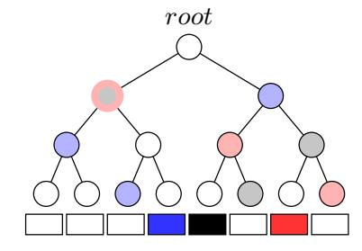
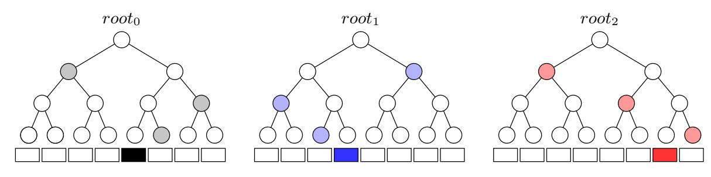
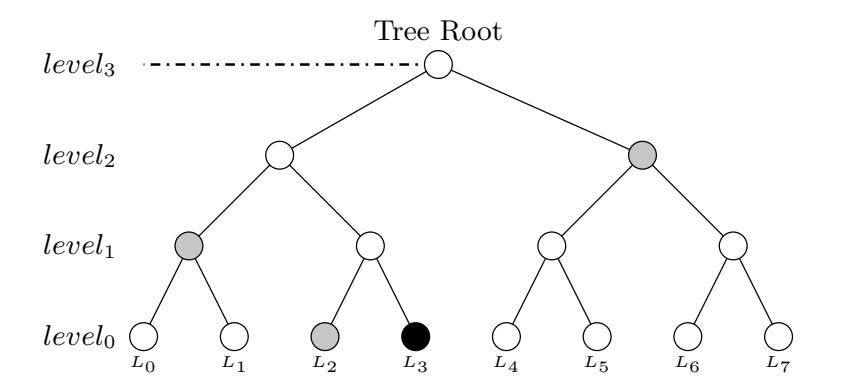
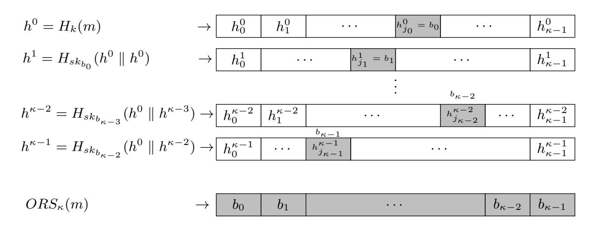

{0}------------------------------------------------

# Hash-based Signatures Revisited: A Dynamic FORS with Adaptive Chosen Message Security

Mahmoud Yehia, Riham AlTawy, T. Aaron Gulliver

Department of Electrical and Computer Engineering, University of Victoria, Victoria, BC ,V8P 5C2, CANADA.

Abstract. FORS is the underlying hash-based few-time signing scheme in SPHINCS<sup>+</sup>, one of the nine signature schemes which advanced to round 2 of the NIST Post-Quantum Cryptography standardization competition. In this paper, we analyze the security of FORS with respect to adaptive chosen message attacks. We show that in such a setting, the security of FORS decreases significantly with each signed message when compared to its security against non-adaptive chosen message attacks. We propose a chaining mechanism that with slightly more computation, dynamically binds the Obtain Random Subset (ORS) generation with signing, hence, eliminating the offline advantage of adaptive chosen message adversaries. We apply our chaining mechanism to FORS and present DFORS whose security against adaptive chosen message attacks is equal to the non-adaptive security of FORS. In a nutshell, using SPHINCS<sup>+</sup>-128s parameters, FORS provides 75-bit security and DFORS achieves 150-bit security with respect to adaptive chosen message attacks after signing one message. We note that our analysis does not affect the claimed security of SPHINCS<sup>+</sup>. Nevertheless, this work provides a better understanding of FORS and other HORS variants, and furnishes a solution if new adaptive cryptanalytic techniques on SPHINCS<sup>+</sup> emerge.

Keywords: Digital signatures, Hash-based signature schemes, Post-Quantum Cryptography, Adaptive chosen message attacks.

# 1 Introduction

The current digital signature infrastructure adopts schemes that rely on the hardness of factoring or finding discrete logarithms in finite groups [\[24,](#page-16-0) [12,](#page-16-1) [18\]](#page-16-2). Given recent advances in physics which point towards the eventual construction of large scale quantum computers [\[1\]](#page-15-0), these hard problems will be solved in polynomial time using Shor's algorithm [\[25\]](#page-16-3). Lattice-based, coding-based, and multivariate signatures are considered quantum resilient schemes in the Q1 model [\[7\]](#page-15-1). However, either their exact security with respect to quantum attacks is still not clear [\[11,](#page-16-4) [5\]](#page-15-2) or their communication/storage complexity is impractical to a multitude of applications, e.g., megabyte keys for the matrices of McEliece-based cryptosystems [\[27\]](#page-17-0). On the other hand, hash-based digital signatures have moderately sized keys (order of kilobytes), and their quantum security relies solely on that of hash functions based on Grover's algorithm. They have been proven 

{1}------------------------------------------------

to offer simple quantum resilient security properties [\[26\]](#page-16-5). Note that the proofs in [\[26\]](#page-16-5) follow the Q1 model where no superposition queries to quantum oracles are allowed [\[7\]](#page-15-1).

Hash-based signature algorithms are comprised of two schemes, an underlying signing scheme and an extension algorithm. The former algorithm defines the main signing procedure where a key pair can be used to sign one (Lamport [\[19\]](#page-16-6), Winternitz one time signature scheme (WOTS), WOTS++ [\[8,](#page-15-3) [14\]](#page-16-7)) or a few messages (e.g., Biba [\[21\]](#page-16-8), HORS [\[23\]](#page-16-9), HORS++[\[22\]](#page-16-10), PORS [\[2\]](#page-15-4), and FORS [\[4\]](#page-15-5)), after which a new key pair should be generated to maintain security against forgery attacks. More precisely, the security of hash-based few time (HBFT) signature schemes decreases after revealing each signature, and hence their bitsecurity is given under the condition that re-keying is required after r signatures. Accordingly, translating this constraint to acceptable attack models implies that a maximum of r queries are allowed to the signing oracle.

The extension algorithm is a top level construction that employs several instances of underlying signing schemes (OTS and HBFT) in a Merkle tree structure. Such an algorithm enables signing multiple messages where signatures are verified with one public key (Merkle root). Extension algorithms can be stateful such as Merkle Signature Scheme MSS [\[20\]](#page-16-11), eXtended Merkle Signature Scheme (XMSS) [\[9\]](#page-16-12), XMSS+ [\[15\]](#page-16-13), Multi Tree XMSS (XMSSMT ) [\[16\]](#page-16-14), and XMSS with tightened security (XMSS-T) [\[17\]](#page-16-15), or stateless such as SPHINCS [\[5\]](#page-15-2), SPHINCS<sup>+</sup> [\[4,](#page-15-5) [6\]](#page-15-6), and Gravity SPHINCS [\[3\]](#page-15-7). Stateless signature algorithms conform to the basic definition of digital signatures where no state updates are required to guarantee security, and only keys are needed to securely generate valid signatures at any time.

The security of hash-based signature algorithms relies on the security of the underlying basic signing schemes. SPHINCS is a hyper-tree construction that uses WOTS and HORS trees for signing. In [\[2\]](#page-15-4), Aumasson and Endignoux investigated the subset-resilience problem [\[23\]](#page-16-9) and showed that HORS is vulnerable to weak-message attacks where an adaptive adversary looks for messages that produce smaller Obtain Random Subsets (ORSs). Consequently, they reported a 7-bit decrease in the expected security of SPHINCS against classical attacks. Moreover, they proposed PORS, a variant of HORS which employs a pseudorandom bit generator (PRNG) instead of a hash function to obtain random subsets with distinct elements, thus avoiding the effect of weak messages. However, PORS is not secure against adaptive chosen message attacks where an adversary is able to generate random subsets for as many messages as they want, and select a set of r message for online queries. Finally, FORS, another HORS variant, was proposed and is currently adopted in SPHINCS<sup>+</sup>, a round 2 candidate in the NIST Post-Quantum Cryptography standardization competition [\[4,](#page-15-5) [10\]](#page-16-16). Compared to PORS, FORS mitigates weak-message attacks by increasing the size of the keys by a factor of κ where κ is the number of random subsets, and the overall signature size is also increased when it is integrated in a hyper-tree structure. On its own, the security of FORS against adaptive chosen message attacks decreases significantly with each signed message, which 

{2}------------------------------------------------

currently has no known effect on the security of SPHINCS<sup>+</sup> because it employs a pseudorandomly generated randomizer that is publicly sent along with the signature, and is used as a key for the hash function in FORS to obtain the random subsets in addition to the FORS verifiable index selection. It can be seen that currently our analysis are applicable to a variant of SPHINCS<sup>+</sup> that is weakened by removing the randomized hashing for the message digest, which sets FORS in the adaptive chosen massage attack security model introduced by Reyzin and Reyzin [23]. However, if cryptanalytic techniques are devised which can annihilate how this public randomizer is utilized or can break its generation procedure, then SPHINCS<sup>+</sup> will be vulnerable to adaptive chosen message attacks. Hence, given the significance of SPHINCS<sup>+</sup> as a candidate for standardization, we believe our analysis of its underlying signature scheme, FORS, is important, along with DFORS which offers a drop-in strengthened candidate.

Our contribution. In what follows, we summarize the contributions of this paper.

- We analyze the security of FORS against adaptive chosen message adversaries. We show that its bit security with respect to adaptive chosen message attacks decreases significantly when compared to its security in a non-adaptive setting. We adopt the adaptive chosen message attack model defined by Reyzin and Reyzin [23] and used in the analysis of HORS and PORS.
- We propose a hash chaining mechanism that binds the process of generating a message ORS with signing it, which eliminates the offline adversarial advantage and makes ORS generation feasible only for the signing entity. We apply the chaining scheme to FORS and present Dynamic Forest Of Random Subsets (DFORS), a new HORS variant that resists adaptive chosen message attacks. We show that the bit-security of DFORS with respect to adaptive chosen message attacks is more than that of FORS by a factor of r+1, where r is the number of signed messages per key under a given security level.
- We analyze the security of DFORS with respect to adaptive chosen message adversaries, discuss its limitations, and report its theoretical computational and communication performance. Finally, we compare DFORS with FORS and other HORS variants.

#### 2 Preliminaries

In what follows, we provide the notation and definitions used throughout the paper. FORS can be seen as a generalized instance of HORS and it inherits most of the specifications of HORS. Accordingly, for completeness, we provide a brief overview of the HORS signature scheme.

#### 2.1 Notation

Let n denote our security parameter. Consider a finite key space  $\mathbb{K}$ , message space of arbitrary length  $\mathbb{M}$ , the two hash families H and G where  $H = \{H_k : \{0,1\}^* \to \{0,1\}^{\kappa\tau} | k \in \mathbb{K}\}$ , and  $G = \{G_k : \{0,1\}^* \to \{0,1\}^n | k \in \mathbb{K}\}$ .  $H_k$  (resp.  $G_k$ ) is an  $\kappa\tau$ -bit (resp. n-bit) keyed one-way function. Let the  $\kappa\tau$ -bit message digest of an arbitrary length message  $m \in \mathbb{M}$  be divided into  $\kappa$  elements, each of length  $\tau$  bits, such that the integer representation of a given element is a subset

{3}------------------------------------------------

of  $\{0, 1, \ldots, t-1\}$ , where  $t = 2^{\tau}$ . We refer to the set  $\{0, 1, \ldots, t-1\}$  by T, and the subset of  $\kappa$ -elements of the set T is denoted by  $S_{\kappa}(T)$ . Let  $ORS_{\kappa}(m)$  denote an *Obtain Random Subset* function which returns a  $\kappa$  element subset from the  $\kappa\tau$ -bit hash value of a message m, formally defined as follows

$$ORS_{\kappa}(m): H_k(m) \to S_{\kappa}(T) | k \in \mathbb{K}$$

The notion of ORS functions was introduced by Reyzin and Reyzin when HORS was proposed [23]. It has been shown that the security of the scheme is reduced to the subset resilience problem [23]. More precisely, for a given bit-security level, at most r messages can be signed before re-keying is required, otherwise an adversary can find a message whose ORS is covered by the union of the ORSs of the r messages.

**Definition 1** The messages  $(m_1, m_2, \ldots, m_r, m_{r+1})$  are in an r-subset-cover relation,  $C_{\kappa}^r$ , if the Obtain Random Subset of message  $m_{r+1}$   $(ORS_{\kappa}(m_{r+1}))$  is a subset of the union of all Obtain Random Subsets of the r-messages,  $ORS_{\kappa}(m_1) \cup ORS_{\kappa}(m_2) \cup \ldots \cup ORS_{\kappa}(m_r)$ , formally

<span id="page-3-1"></span>
$$C_{\kappa}^{r}(m_1, m_2, \dots, m_{r+1}) \Leftrightarrow ORS_{\kappa}(m_{r+1}) \subseteq \bigcup_{i=1}^{r} ORS_{\kappa}(m_i).$$

If finding the above cover relation for a given ORS function is infeasible, then it is said that such a function is r-subset resilient.

**Definition 2** An ORS function is r-subset-resilient if for any polynomial time adversary  $\mathcal{A}^{(1^n,\kappa,t)}$ , the probability of finding  $(m_1,m_2,\ldots,m_{r+1})$  such that  $ORS_{\kappa}(m_{r+1})$  is a subset of  $ORS_{\kappa}(m_1) \cup ORS_{\kappa}(m_2) \cup \ldots \cup ORS_{\kappa}(m_r)$  is negligible, Formally

$$\Pr[(m_1, m_2, \dots, m_{r+1}) \leftarrow \mathcal{A}^{(1^n, \kappa, t)} : C_{\kappa}^r(m_1, m_2, \dots, m_{r+1})] \le negl(n, t).$$

<span id="page-3-0"></span>**Definition 3** An ORS function is r-target-subset-resilient, if for any polynomial time adversary A who is given the ORSs of r messages  $\bigcup_{i=1}^{r} ORS_{\kappa}(m_i)$ , it is infeasible to find a message  $m_{r+1}$  such that its  $\kappa$ -element  $ORS_{\kappa}(m_{r+1})$  is a subset of the union of ORSs of the r messages, formally

$$\Pr[(m_{r+1}) \leftarrow \mathcal{A}^{(1^n, \kappa, t, m_1, m_2, \dots, m_r)} : C_{\kappa}^r(m_1, m_2, \dots, m_{r+1})] \le negl(n, t)$$

# 2.2 Hash to Obtain Random Subset (HORS) Few-time Digital Signature Scheme

In HORS [23], the signer randomly generates t secret keys each of n-bit length,  $(SK = sk_0, sk_1, \ldots, sk_{t-1})$ . Using a one-way function  $f : \{0, 1\}^n \to \{0, 1\}^n$ , the signer computes the public key,  $PK = (pk_0 = f(sk_0), pk_1 = f(sk_1), \ldots, pk_{t-1} = f(sk_{t-1}))$ . For signing an arbitrary length message  $m \in \mathbb{M}$ ,  $ORS_{\kappa}(m) = \{h_0, h_1, \ldots, h_{\kappa-1}\}$  is evaluated by dividing the  $\kappa\tau$ -bit message digest value of  $H_K(m)$  into  $\kappa$  elements, each of length  $\tau$  bits. Each element is represented

{4}------------------------------------------------

by an integer  $h_i$  where  $0 \le i \le \kappa - 1$  and  $h_i \in \{0, 1, ..., t - 1\}$ ,  $t = 2^{\tau}$ . To generate the signature,  $\sigma$ , the signer reveals the secret keys whose indices correspond to the integer representation of the  $\kappa$  elements in the ORS, i.e.,  $\sigma = (sk_{h_0}, sk_{h_1}, ..., sk_{h_{\kappa-1}})$ . For verification, the verifier computes  $ORS_{\kappa}(m) = \{h_0, h_1, ..., h_{\kappa-1}\}$ , then checks if  $f(sk_{h_i}) = pk_{h_i}$ , otherwise verification fails. The description of HORS is given in Algorithm 3 in Appendix A.

**Security.** Assuming that f is a one-way function, the security of HORS is reduced to the hardness of the (target) subset-resilience problem [23]. It has been shown that the probability of finding a message  $(m_{r+1})$  such that  $ORS_{\kappa}(m_{r+1})$  is covered by the obtained random subsets of the r previously signed messages is  $(r\kappa/t)^{\kappa}$  which corresponds to the probability of  $\kappa$  randomly chosen elements being a subset of the revealed  $r\kappa$  secret keys. The corresponding bit-security is then

$$\log_2(t/r\kappa)^{\kappa} = \kappa(\log_2 t - \log_2 r - \log_2 \kappa).$$

In [2], it was proven that the security of HORS with respect to adaptive chosen message attacks is

$$\frac{\kappa}{r+1}(\log_2 t - \log_2 r - \log_2 \kappa) + \frac{\log_2 r!}{r+1},$$

(see Appendix B). A practical example of a weak-message attack was also given where an adaptive adversary finds messages that map to subsets with repeated indices which results in smaller subsets, i.e., number of distinct elements  $< \kappa$ . Such subsets are easier to cover and consequently, a 7-bit decrease in the expected security of SPHINCS against classical attacks was reported.

Variants. HORS++ [22] was introduced to provide security against adaptive attacks. A one-to-one mapping function S(m) that belongs to a cover-free family [13] is utilized to ensure that for any r+1 messages  $S(m_{r+1}) \nsubseteq \bigcup_{i=1}^r (S(m_i))$ . Three constructions for S(m) based on polynomials over finite fields, error correcting codes, and algebraic curves over finite fields were presented. Consequently, HORS++ increases the signature size and the size of the secret keys to achieve the same security level of HORS against non-adaptive chosen message attacks. Moreover, the computational efficiency is decreased due to the computation of S(m). Later, PORS was suggested to replace HORS in SPHINCS where the idea of having distinct elements in subsets of weak messages was enforced by use of a pseudorandom bit generator to obtain the subsets [2]. However, although PORS mitigates weak-message attacks, it is still vulnerable to adaptive chosen message attacks under the definition given in Appendix B. Lastly, FORS was proposed and used in SPHINCS<sup>+</sup> [4], where security against weak-message attacks is achieved by increasing the key size from t values to  $\kappa t$  values such that each index out of the  $\kappa$  indices in the ORS reveals a secret key from a different pool of t secret keys. Accordingly, when integrated in a tree structure the size of the signature also increases.

{5}------------------------------------------------

## <span id="page-5-1"></span>3 FORS Security Analysis

Unlike HORS which generates t secret keys from which the secret keys that are indexed by ORS(m) are released, FORS generates (κt) secret keys and dedicates t secret keys for each index out of the κ indices. By doing so, FORS mitigates weak message attacks because even if two elements in ORS(m) are equal, they index values from different secret key pools. The n-bit public key of FORS is the hash of the concatenation of κ Merkle tree roots. Each root is associated with a binary hash tree whose leaves are the hashes of t secret key elements in a given pool. Accordingly, one FORS instance has κ trees, each of height log t = τ .

Figure [1](#page-5-0) depicts the signatures of message 100 011 110 using (a) HORS and (b) FORS, where κ = 3 and t = 8. In FORS, the first 3 bits, i.e., 100, of the message selects sk4, the secret key corresponding to the 4-th leaf indexed from the left and starting from 0 in the first tree along with its authentication path to root0. Similarly, the second (resp. third) 3 bits of the message selects sk<sup>3</sup> (resp. sk6) from the second (resp. third) tree with the authentication path to root<sup>1</sup> (resp. root2). In HORS, the three 3-bit parts of the message index sk4, sk3, and sk<sup>6</sup> from the same tree, and with each selected secret key a 3 node authentication path is selected, hence the overlap in the node (colored in pale red and gray) at the pre-root level. More details about hash trees and authentication path calculations are provided in Section [4.](#page-7-0)



(a) HORS signature within a binary tree construction

<span id="page-5-0"></span>

(b) FORS signature within κ binary trees construction

Fig. 1: HORS and FORS signatures of the message 100 011 110 where κ = 3 and t = 8. The 8 rectangles under each tree depict the eight secret keys whose hashes are stored in the corresponding leaf nodes.

It can be verified from Figure [1](#page-5-0) that if two 3-bit parts of the message are equal, then the same secret key value is revealed in HORS. This fact is exploited in the weak messages attack where an adversary searches for messages that have as many repeated indices as possible, which lead to ORSs containing fewer distinct elements, and thus can be easily covered with the ORSs of the revealed r 

{6}------------------------------------------------

messages. However, this problem is mitigated in FORS because repeated indices select secret keys from different pools. In what follows, we investigate the security of FORS with respect to non-adaptive chosen message attacks.

#### 3.1 FORS in a Non-adaptive Setting

Reyzin and Reyzin introduced clear attack models for analyzing HBFT signature schemes against (non) adaptive chosen message attacks [23]. Such models are used in the analysis of all HORS-variants, i.e., PORS, and FORS. Specifically, in a non-adaptive setting, also referred to by r-target subset resilience problem (see Def. 3), an adversary is required to first choose r messages  $m_1, m_2, \ldots, m_r$ , after which they are provided with key k of  $H_k$  and allowed to select a message  $m_{r+1}$  and evaluate  $H_k(m_{r+1})$ . A successful non-adaptive chosen message attack happens when the adversary is able to find  $C_{\kappa}^r$ , i.e., find a message  $m_{r+1}$  that is in an r-subset cover relation with  $m_1, m_2, \ldots, m_r$ . This scenario corresponds to an attacker who is trying to forge a signature after observing all r allowed signatures per key, or an adversary who is allowed r queries at a time before being supplied with r to verify any of the returned signatures. Few-time signature schemes are expected to maintain their security against forgery attacks even after releasing all r signatures.

Finding  $C_{\kappa}^r$  in FORS. Given an adversary who observed the signatures of r messages, finding a message  $m_{r+1}$  that is in an r-subset cover relation with the other r messages  $(C_{\kappa}^{r\text{-FORS}}(m_1, m_2, \ldots, m_{r+1}))$  has probability of success  $(r/t)^{\kappa}$  [6], which is equal to the probability that each log t-bit element out of the  $\kappa$  elements in  $ORS(m_{r+1})$  is covered by an element at the same position of the ORS of the other r messages, i.e.,  $h_i(m_{r+1}) \in \bigcup_{j=1}^r h_i(m_j)$  for  $0 \le i \le \kappa - 1$ , where  $h_i(m_j)$  denotes the i-th ORS element of the j-th message. Accordingly, the corresponding bit-security against non-adaptive chosen message attacks is given by

$$\log_2(t/r)^{\kappa} = \kappa(\log_2 t - \log_2 r).$$

#### 3.2 Adaptive Chosen Message Attack Against FORS

In this setting, an adversary is given the hash key k and allowed to evaluate  $H_k$  for any message of their choice before selecting r+1 messages. This attack also indicates the r-subset resilience of the signature algorithm (see Def. 2). The definition of adaptive chosen message attack is given in Appendix B. Applying the same analysis to FORS, given the key k of  $H_k$ , an adversary  $\mathcal{A}$  generates the ORSs of q > r messages offline, where  $H_k(m_i) = h_0||h_1||\dots||h_{\kappa-1}$  and  $ORS(m_i) = \{h_0, h_1, \dots, h_{\kappa-1}\}$ , for  $0 \le i \le q-1$   $\mathcal{A}$  searches for all possible combinations of (r+1) message sets from the set of q messages. For any given r+1 messages combination, the probability that message  $m_{r+1}$  is covered by the remaining r messages (i.e.,  $C_{\kappa}^{r-FORS}(m_1, m_2, \dots, m_{r+1})$ ), is  $(r/t)^{\kappa}$ . Accordingly,  $\mathcal{A}$  obtains  $\binom{q}{r+1}$  sets of r+1 messages and each set gives  $\binom{r+1}{r}$  possible choices for  $m_{r+1}$ . Therefore, the probability of  $\mathcal{A}$  successfully generating  $C_{\kappa}^{r-FORS}$  is bounded from above by

$$\operatorname{Succ}^{C_{\kappa}^{r}\operatorname{FORS}}(\mathcal{A}) \leq \binom{q}{r+1} \binom{r+1}{r} (r/t)^{\kappa},$$

{7}------------------------------------------------

$$\begin{aligned} \operatorname{Succ}^{C_{\kappa}^{r\text{-}\mathrm{FORS}}} & \leq q \binom{q-1}{r} (r/t)^{\kappa}, \\ \operatorname{Succ}^{C_{\kappa}^{r\text{-}\mathrm{FORS}}}(\mathcal{A}) & \leq \frac{q.(q-1)\dots(q-r)}{r!} (r/t)^{\kappa}. \end{aligned}$$

which can be approximated by

$$\operatorname{Succ}^{C_{\kappa}^{r\text{-}}\operatorname{FORS}}(\mathcal{A}) \leq \frac{q^{r+1}}{r!} (r/t)^{\kappa}.$$

Assuming a success probability close to 1, the above equation can be expressed as

$$(r+1)\log_2 q - \log_2 r! + \kappa(\log_2 r - \log_2 t) = 0.$$

Then the bit security of FORS with respect to adaptive chosen message attacks is given by

$$\frac{\kappa}{r+1}(\log_2 t - \log_2 r) + \frac{\log_2 r!}{r+1}.$$

One may conclude that due to the offline adversarial advantage given to A (i.e., knowledge of k implies the feasibility of evaluating ORSs for more than r messages of their choice), FORS bit security against adaptive chosen message attacks decreases by a factor of (r + 1) when compared to the non-adaptive setting. Note that, currently there is no attack against SPHINCS<sup>+</sup> that can utilize the offline adversarial privileges and produce r + 1 messages in an rsubset cover relation. This is because SPHINCS<sup>+</sup> uses a fixed pseudorandom generation of the key k to get the obtained random subset ORSκ(Hk(m)). We also note that k is message dependent and is sent in the clear with each signature so verification takes place. Accordingly, in the event of attacks on the process by which k is evaluated from m, a dramatic decrease in the security of SPHINCS<sup>+</sup> will follow. Consequently, in the following section we present a technique that is robust against adaptive chosen message attacks on FORS. Our mechanism annihilates the adversarial offline advantages associated with knowing the hash key k.

# <span id="page-7-0"></span>4 Dynamic Forest Of Random Subsets (DFORS)

In this section we present Dynamic Forest Of Random Subsets DFORS, a new HORS-variant that mitigates the offline advantage of an adversary which leads to the adaptive chosen message attack on FORS (discussed in Section [3\)](#page-5-1). The main feature of DFORS is that the generation of the ORS is performed concurrently with signing such that each signature element is utilized to generate the next element of the ORS. In other words, signing and ORS generation are bound together using a chaining mechanism that utilizes the revealed secret keys. This procedure ensures that given a message, only the signer is able to efficiently generate an ORS. By doing so, even if an adversary has knowledge of k, they are not able to compute ORSs of a given message of their choice unless they have some secret key knowledge. In what follows we give a detailed specification of DFORS.

{8}------------------------------------------------

#### 4.1 DFORS Parameters

DFORS uses the following parameters.

n : The security parameter and the bit-length of (i) the secret seed SK.seed, (ii) secret keys ski,j (0 ≤ i ≤ t − 1, 0 ≤ j ≤ κ − 1), (iii) public key PK.root, and (iv) the output of the used one way function F, and hash function G.

κ : The number of (i) sub-strings of the input message, (ii) secret key pools where each contains t secret keys, and (iii) hash trees.

τ : The bit length of a sub-string of the input message and the hash tree height.

t : the number of secret keys per pool and the number of leaves in each hash tree, t = 2<sup>τ</sup> .

The input message for DFORS is of length κ log t = κτ bits. To achieve n-bit security when signing r messages, we have κτ > n (see Section [5.1\)](#page-12-0).

#### <span id="page-8-0"></span>4.2 Key Generation

In what follows, we give the specifications of the secret and public key generation procedures. Moreover, DFORS is described in Algorithm [2.](#page-11-0)

Secret key generation. Let SK.seed denote an n-bit secret seed that is sampled at random. Given a pseudorandom function, P RF : {0, 1} <sup>n</sup> × {0, 1} <sup>n</sup> → {0, 1} <sup>n</sup>, the n-bit κt secret key values ski,j , 0 ≤ i ≤ t − 1, 0 ≤ j ≤ κ − 1 are generated by

$$sk_{i,j} = PRF(SK.seed, i + jt),$$

where each set of t secret keys belong to one of the κ pools.

Hash trees and public key generation. Using one-way function F : {0, 1} <sup>n</sup> → {0, 1} <sup>n</sup> applied on the secret keys ski,j , 0 ≤ i ≤ t−1, 0 ≤ j ≤ κ−1, the leaf nodes of the κ hash trees are generated, Li,j = F(ski,j ). Every t leaves, L<sup>∗</sup>,j , are combined together in a Merkle tree construction to form the j-th (out of κ) tree. Then, the roots of these κ trees, root0, root1, . . . , rootκ−1, are concatenated to form an input to the hash function to get the n-bit public key expressed as

$$PK.root = G_k(root_0||root_1||...||root_{\kappa-1}).$$

Binary Hash Tree. DFORS uses the XMSS binary Merkle tree construction [\[9\]](#page-16-12). The height of the binary hash tree is τ . It has τ + 1 levels, t = 2<sup>τ</sup> leaf nodes (each of size n bits) on level 0, i.e., L<sup>i</sup> , 0 ≤ i ≤ t − 1, and an n-bit root node on level τ . We denote the nodes in level j by Ni,j where 0 ≤ i < 2 τ−j , 0 ≤ j ≤ τ and Ni,<sup>0</sup> = L<sup>i</sup> . To construct the tree, the hash function G and a 2n-bit mask, q, per hash evaluation are used. These bit masks are introduced to provide secondpreimage resistance. The rationale for using different bit masks for each hash evaluation is to mitigate multi-target attacks [\[17\]](#page-16-15). For details on generating the hash keys Ki,j and bit masks qi,j , the reader is referred to [\[17,](#page-16-15) [4\]](#page-15-5). Formally, for 0 < j ≤ τ , a node Ni,j is given by

$$N_{i,j} = G_{k_{i,j}}((N_{2i,j-1}||N_{2i+1,j-1}) \oplus q_{i,j}).$$

{9}------------------------------------------------

<span id="page-9-0"></span>Figure 2 shows a simplified example of one of the  $\kappa$  trees in DFORS with t = 8. Assuming it is the j-th tree, it depicts the nodes in the authentication path (colored in gray) associated with revealing  $sk_{3,j}$ .



Fig. 2: A binary hash tree with the nodes in the authentication path (colored in gray) for leaf node  $L_3$  (colored in black)

#### 4.3 Signing and ORS Generation

We denote by Z(h) a function that takes as input  $\kappa \tau$  bits, h, and outputs the j-th  $\tau$  bits of h, where  $j = h \mod \kappa$ . Formally,  $Z : \{0,1\}^{\kappa \tau} \to \{0,1\}^{\tau}$ , and letting  $h = h_0 ||h_1|| \dots ||h_{\kappa-1}||$ , for  $0 \le j \le \kappa - 1$ 

$$Z(h): h_j \leftarrow \{h_0||h_1||\dots||h_{\kappa-1}\}, j = h \mod \kappa.$$

The signing algorithm takes as input the message m, the secret seed SK.seed, and the hash key k. It constructs the  $\kappa$  trees as explained above in Section 4.2. To compute the  $\kappa$  random subset  $ORS_{\kappa}(m) = (b_0, b_1, \ldots, b_{\kappa-1})$ , the algorithm first evaluates  $H_k(m) = h^0$ , then computes  $Z(h^0) = b_0$ . The first element in the signature,  $sig_0$ , is comprised of i) the secret key of index  $b_0$  in the first pool,  $\sigma_0 = sk_{b_0,0}$ , and ii) the corresponding authentication path  $Auth_0$ , thus  $sig_0 = \sigma_0, Auth_0$ . Next,  $h^0$  and  $sk_{b_0,0}$  are used to choose the second random element,  $Z(h^1) = b_1$ , where  $h^1 = H_{sk_{b_0,0}}(h^0||h^0)$ . The second signature element,  $sig_1$ , is the secret key of index  $b_1$  in the second pool,  $\sigma_1 = sk_{b_1,1}$ , and its corresponding authentication path  $Auth_1$ ,  $sig_1 = \sigma_1, Auth_1$ . In general, the i-th element of the  $ORS_{\kappa}(m)$  is given by  $Z(h^i) = b_i$  where  $h^i = H_{sk_{b_{i-1},i-1}}(h^0||h^{i-1})$ . The i-th signature element,  $sig_i$ , is the secret key value of index  $b_i$  in the i-th pool and its corresponding authentication path  $Auth_i$ ,  $sig_i = \sigma_i, Auth_i$ , where  $\sigma_i = sk_{b_i,i}$ . The above process is repeated until  $\kappa$  elements are generated  $(b_0, b_1, \ldots, b_{\kappa-1})$ . Finally, the signature is given by

$$\Sigma = (sig_0, sig_1, \dots, sig_{\kappa-1}) = (sk_{b_0}, Auth_0, sk_{b_1}, Auth_1, \dots, sk_{b_{\kappa-1}}, Auth_{\kappa-1})$$
$$= (\sigma_0, Auth_0, \sigma_1, Auth_1, \dots, \sigma_{\kappa-1}, Auth_{\kappa-1}).$$

The ORS generation and signing process is illustrated in Figure 3.

The authentication path of a leaf  $L_i$  contains all the sibling nodes of the nodes in the path from the leaf  $L_i$  to the tree root. It is required so that the verifier can successfully generate the root in order to verify the signature element  $\sigma_i$  related 

{10}------------------------------------------------

to the leaf node  $L_i$ . Figure 2 shows a simple hash tree with the authentication path for leaf  $L_3$  colored in black and the authentication path nodes colored in gray,  $Auth_i = (L_2, N_{0,1}, N_{1,2})$ .

<span id="page-10-0"></span>

Fig. 3: The DFORS procedure to compute  $ORS_{\kappa}(m)$ , where  $j_i = h^i \mod \kappa$ ,  $b_i = h^i_{j_i}$ , and  $sk_{b_i}$  is the  $b_i$ -th secret key in the *i*-th secret key pool.

#### 4.4 Signature Verification

verification algorithm takes as input the message m, The the public key PK.root, the hash key K, and the signature  $\Sigma$ =  $(\sigma_0, Auth_0, \sigma_1, Auth_1, \dots, \sigma_{\kappa-1}, Auth_{\kappa-1})$ . It computes  $H_k(m) = h^0$ , then  $Z(h^0) = b_0$  to get the leaf index of the first hash tree. Then, it applies the one-way function F to the signature element  $\sigma_0$  of the signature  $\Sigma$  to get the leaf node  $L_{b_0}$  in the first tree. The authentication path  $Auth_0$  and the leaf  $L_{b_0}$ are used to compute the root of the first tree. The leaf index  $b_0$  is required so that the verifier knows which node is concatenated on the right and on the left. The tree root calculation procedure is described in Algorithm 1. Generally, the verification algorithm computes the *i*-th tree root by applying Algorithm 1 on  $\sigma_i$ ,  $Auth_i$ , and the leaf index  $b_i$  where  $b_i = Z(h^i)$ , and  $h^i = H_{\sigma_{i-1}}(h^0||h^{i-1})$ . This process is repeated until  $\kappa$  tree roots are computed which are then concatenated to form an input to the hash function G. If the output of G is equal to PK.root, the signature is valid, otherwise verification fails.

```
Algorithm 1 Tree Root Computation

Input: Leaf node L_i, Leaf index i, Auth. Path = (A_0, A_1, \ldots, A_{\tau-1}).

Output: The Tree Root N_{\tau}.

Set N_0 \leftarrow L_i

for 1 \leq j \leq \tau do
\nif \lfloor i/2^{j-1} \rfloor \equiv 0 \mod 2 then

N_j = G_{k_{i,j}}(N_{j-1}||A_{j-1} \oplus q_{i,j})
\nelse

N_j = G_{k_{i,j}}(A_{j-1}||N_{j-1} \oplus q_{i,j})
\nend if\nend for
Return (N_{\tau})
```

{11}------------------------------------------------

```
Algorithm 2 DFORS Algorithm
   procedure KEY GENERATION(t, \kappa)
        SK.seed \xleftarrow{R} \{0,1\}^n
        for 0 \le j \le \kappa - 1 do
             for 0 \le i \le t - 1 do
                  sk_{i,j} \leftarrow PRF(SK.seed, i + jt)
                  L_{i,j} \leftarrow F(sk_{i,j})
             end for
        end for
        Compute the roots of the \kappa tree as described in section 4.2
        PK.root \leftarrow G(root_0||root_1||...||root_{\kappa-1})
        Output (SK.seed, PK.root)
   end procedure
   procedure Signing(m, SK.seed,k, \kappa, t)
        Generate the \kappa binary hash trees as in key generation procedure
        h^0 \leftarrow H_k(m), \quad h^0 = h_0^0 ||h_1^0|| \dots ||h_{\kappa-1}^0||
        b_0 \leftarrow Z(h^0) = h_{j_0}^0, \ j_0 = h^0 \ mod \ \kappa
        sig_0 \leftarrow (\sigma_0, Auth_0), Where \sigma_0 = sk_{b_0,0}
        for 1 \le i \le \kappa - 1 do
            h^i \leftarrow \overline{H}_{sk_{b_{i-1},i-1}}(h^0||h^{i-1}), \ h^i = h_0^i||h_1^i||\dots||h_{\kappa-1}^i|
            b_i \leftarrow Z(h^i) = h^i_{j_i}, \ j_i = h^i \ mod \ \kappa
             sig_i \leftarrow (\sigma_i, Auth_i), where \sigma_i = sk_{b_i,i}
        end for
        \Sigma \leftarrow (\sigma_0, Auth_0, \sigma_1, Auth_1, \dots, \sigma_{\kappa-1}, Auth_{\kappa-1})
        Output (\Sigma,m)
   end procedure
   procedure Verification(m, PK.root, k, \Sigma = (\sigma_0, Auth_0, \sigma_1, Auth_1, \dots, \sigma_{\kappa-1}, Auth_{\kappa-1}))
        h^0 \leftarrow H_k(m), \ h^0 = h_0^0 ||h_1^0|| \dots ||h_{\kappa-1}^0||
        b_0 \leftarrow Z(h^0) = h_{j_0}^0, \ j_0 = h^0 \mod \kappa
        L_{b_0} \leftarrow F(\sigma_0)
        root_0 \leftarrow Algorithm 1 (L_{b_0,0}, b_0, Auth_0)
        for 1 \le i \le \kappa - 1 do
            h^{i} \leftarrow H_{\sigma_{i-1}}(h^{0}||h^{i-1}), h^{i} = h_{0}^{i}||h_{1}^{i}||\dots||h_{\kappa-1}^{i}|
            b_i \leftarrow Z(h^i) = h^i_{j_i}, \ j_i = h^i \ mod \ \kappa
             L_{b_i} \leftarrow F(\sigma_i)
             root_i \leftarrow Algorithm \ 1 \ (L_{b_i,i}, b_i, Auth_i)
        end for
        if G(root_0||root_1||...||root_{\kappa-1}) = PK.root then
             out = 1
        else
             out = 0
        end if
        Output (out)
   end procedure
```

# 5 Security and Efficiency

In what follows, we analyze the security of DFORS and demonstrate the effect of the dynamic chaining on the security of FORS. Afterwards, the computa

{12}------------------------------------------------

tional cost of the DFORS key generation, signing, and verification algorithms are presented. The bit size of the signature and keys are also given.

#### <span id="page-12-0"></span>5.1 DFORS Security Analysis

In this section, we present a detailed analysis of DFORS with respect to weak-message attacks and r-target subset resilience adversaries. More precisely, since the proposed chaining technique does not allow an adaptive adversary who has knowledge of k to compute the ORSs of any message of their choice before asking the signing oracle for its signature, DFORS is essentially r-subset resilient. Hence, our analysis focuses on its security when an adversary is given the signatures of r messages.

Weak-message attacks. DFORS inherits FORS mitigation to weak-message attacks [6] because it specifies an independent key pool for each index in the ORS. Consequently, even if an ORS element is repeated, the corresponding revealed secret keys will be different.

r-target subset resilience. According to Definition 3, we assume an adversary  $\mathcal{A}$  when given the ORSs of r messages will return  $m_{r+1}$  where  $C_{\kappa}^{r}(m_{1}, m_{2}, \ldots, m_{r+1})$ . In what follows, we show that the success probability of  $\mathcal{A}$  is bounded from above by  $(r/t)^{\kappa}$ . Note that since ORS generation is secret key dependent, the ORS function of DFORS is intrinsically r-subset resilient. In other words, the value of any random ORS element,  $b_{i}$ , depends on the previously revealed signature element  $\sigma_{i-1} = sk_{b_{i-1}}$  and the original message m. Accordingly, without any oracle queries,  $\mathcal{A}$  has no feasible function to evaluate ORSs of messages of their choice. On the other hand, if  $\mathcal{A}$  is given the signatures of r messages or they queried r messages of their choice, they need to find a message  $m_{r+1}$  such that each element in its obtained random subset,  $ORS_{\kappa}^{\mathsf{DFORS}}(m_{r+1}) = (b_{0}, b_{1}, \ldots, b_{\kappa-1})$ , is covered by the elements at the same corresponding positions in the ORSs of the other r messages

$$C_{\kappa}^{r}(m_{1}, m_{2}, \dots, m_{r+1}) \Leftrightarrow b_{i}(m_{r+1}) \in \bigcup_{j=1}^{r} b_{i}(m_{j}), 0 \leq i \leq \kappa - 1.$$

Due to the chaining process in generating  $b_0, b_1, \ldots, b_{\kappa-1}$ ,  $\mathcal{A}$  generates the ORSs sequentially. At any position i, if  $b_i(m_{r+1}) \notin \bigcup_{j=1}^r b_i(m_j)$ , then  $\mathcal{A}$  fails. In addition, they cannot evaluate  $b_{i+1} = Z(H_{sk_{b_i}}(h^0||h^i))$  when  $sk_{b_i}$  is not revealed by any of signatures of the r messages, Generally, for the i-th position in  $ORS_{\kappa}^{\mathsf{DFORS}}(m_{r+1})$ 

$$b_i(m_{r+1}) \notin \bigcup_{j=1}^r b_i(m_j) \Rightarrow sk_{b_i} \notin \bigcup_{j=1}^r \sigma_i(m_j),$$

where  $\sigma_i(m_j)$  and  $b_i(m_j)$  denote the *i*-th signature element and *i*-th ORS element of the *j*-th message, respectively. Thus, the probability that  $\mathcal{A}$  finds  $C_{\kappa}^r(m_1, m_2, \ldots, m_{r+1})$  successfully is equal to their probability of finding a message  $m_{r+1}$  such that  $\forall i \in \{0, 1, \ldots, \kappa - 1\}$ , each of the log *t*-bit  $b_i(m_{r+1}) \in$ 

{13}------------------------------------------------

 $\{b_i(m_1), b_i(m_2), \ldots, b_i(m_r)\}$ . Since  $\mathcal{A}$  is given r messages, the probability of finding a cover for one  $b_i(m_{r+1})$  is  $(r/t)^{i+1}$  because this implies that  $\forall j < i; b_j(m_{r+1}) \in \{b_j(m_1), b_j(m_2), \ldots, b_j(m_r)\}$ . Thus, the probability of finding a cover for all the  $\kappa$  elements in  $ORS_{\kappa}^{\mathsf{DFORS}}$  is equal to the probability of finding a cover for the last element,  $b_{\kappa-1}(m_{r+1})$ , which is  $(r/t)^{\kappa}$ . Therefore

$$\operatorname{Succ}^{C_\kappa^{r\text{-}\mathrm{DFORS}}}(\mathcal{A}) \leq (r/t)^\kappa,$$

so the corresponding DFORS bit-security against adaptive chosen message attacks is

$$\log_2(t/r)^{\kappa} = \kappa(\log_2 t - \log_2 r).$$

Compared to the adaptive chosen message attack security of FORS (See Section 3), the bit security of DFORS is higher by a factor of (r+1). The extra cost is performing  $\kappa-1$  more calls to the hash function. Unlike FORS, the signing procedure cannot be parallelized because of the chaining mechanism.

#### 5.2 Theoretical Efficiency

Key generation. This procedure requires  $\kappa t$  PRF function computations to generate the t secret values for  $\kappa$  pools,  $\kappa t$  one-way function F computations to compute the leaf nodes of the hash trees, and  $\kappa(t-1)+1$  hash function G evaluations to evaluate the  $\kappa$  hash trees and get the public key PK.root.

Signing. This procedure requires  $\kappa t$  PRF function computations,  $\kappa t$  one-way function F computations,  $\kappa t$  hash function (H and G) to compute the  $\kappa$  hash trees  $(\kappa(t-1) \text{ hash } G \text{ calls})$ , and  $\kappa$  hash H calls to get  $ORS_{\kappa}(m)$ . Note that the whole tree structure is computed with each signature, otherwise, the scheme storage requirements will be huge.

Verification. This procedure requires  $\kappa$  one-way function F computations that compute the trees leaves,  $\kappa(\tau+1)$  hash function (H and G) evaluations to reconstruct the  $\kappa$  trees roots from the revealed secret values and the authentication paths  $(\kappa\tau)$  calls to G, and  $\kappa$  calls H to get  $ORS_{\kappa}(m)$ .

Signature size. The signature contains  $\kappa$  secret key elements and  $\kappa\tau$  tree node for the associated authentication paths. Thus, the signature size is  $\kappa n(\tau + 1)$  bits, where n is the bit size of each secret keys and hash tree node.

Length of keys. The size of the secret key, SK.root, is equal to that of the public key, PK.root, and it is n bits.

The computational complexities of the above procedures are given in Table 2.

#### 5.3 Comparison with HORS Variants

DFORS inherits all the advantageous security properties of FORS. Additionally, it is secure against adaptive chosen message attacks. In fact, for the same parameters the bit-security of DFORS with respect to adaptive chosen message adversaries is equal to that of FORS under non-adaptive chosen message attacks. Table 1 gives a comparison between the bit security level of FORS and DFORS in an adaptive adversarial setting. We use the recommended parameters (i.e., n,  $\tau$ , and  $\kappa$ ) for all six instances of SPHINCS<sup>+</sup>.

{14}------------------------------------------------

<span id="page-14-1"></span>Table 1: DFORS and FORS security levels for an adaptive chosen message attack using the SPHINCS<sup>+</sup> parameters for different numbers of signed messages

| SPHINCS <sup>+</sup> instance | $\tau$ | $\kappa$ | FORS |     |     |       | DFORS |     |     |       |
|-------------------------------|--------|----------|------|-----|-----|-------|-------|-----|-----|-------|
|                               |        |          | r=1  | r=2 | r=4 | r = 8 | r = 1 | r=2 | r=4 | r = 8 |
| SPHINCS <sup>+</sup> -128s    | 15     | 10       | 75   | 47  | 27  | 15    | 150   | 140 | 130 | 120   |
| SPHINCS <sup>+</sup> -128f    | 9      | 30       | 135  | 80  | 43  | 22    | 270   | 240 | 210 | 180   |
| SPHINCS <sup>+</sup> -192s    | 16     | 14       | 112  | 70  | 40  | 22    | 224   | 210 | 196 | 182   |
| SPHINCS <sup>+</sup> -192f    | 8      | 33       | 132  | 77  | 41  | 20    | 264   | 231 | 198 | 165   |
| SPHINCS <sup>+</sup> -256s    | 14     | 22       | 154  | 95  | 54  | 29    | 308   | 286 | 264 | 242   |
| SPHINCS <sup>+</sup> -256f    | 10     | 30       | 150  | 90  | 49  | 25    | 300   | 270 | 240 | 210   |

Table 1 shows the significant effect of increasing the number of signed messages, r, on the bit security of FORS. On the other hand, this effect is very reasonable with DFORS. For instance, when r=1, an adaptive attack on FORS is equivalent to a collision attack on the underlying  $\kappa\tau$ -bit hash function H which has a complexity of  $2^{\kappa\tau/2}$  evaluations. However, due to the r-subset resilience of DFORS where finding a covered ORS requires successive dependency on the signature elements, an adversary must find a second preimage of the ORS in the revealed secret keys, hence the complexity is  $2^{\kappa\tau}$  evaluations.

Table 2 presents a comparison between DFORS and other HORS variants with respect to their computational efficiency, signature and key sizes, and security against adaptive chosen message attacks.

Table 2: Comparison between HORS, PORS, FORS, and DFORS

<span id="page-14-0"></span>

| Algorithm          | KGen                          | Signing                  | Verification                                    | Signature                                          | SK/PK                   | Adaptive |
|--------------------|-------------------------------|--------------------------|-------------------------------------------------|----------------------------------------------------|-------------------------|----------|
| 7 Ingoriumin       | $(\# \ \mathrm{OWF})^\dagger$ | $\operatorname{cost}$    | cost                                            | size <sup>‡</sup>                                  | ${\rm size}^{\ddagger}$ | security |
|                    | t PRF                         | t PRF                    |                                                 |                                                    |                         |          |
| HORST              | t OWF                         | t OWF                    | $\kappa$ OWF                                    | $\kappa(\log t - x + 1) + 2^{x\dagger\dagger}$     | 1                       | NO       |
|                    | t-1 Hash                      | t Hash                   | $\kappa(\log t - x) + 2^{x\dagger\dagger}$ Hash |                                                    |                         |          |
|                    | t PRF                         | $t + \kappa \text{ PRF}$ |                                                 |                                                    |                         |          |
| PORS <sup>‡‡</sup> | t OWF                         | t OWF                    | $\kappa$ OWF                                    | $\kappa(\log t - \lfloor \log \kappa \rfloor + 1)$ | 1                       | NO       |
|                    | t-1 Hash $t$ Hash             |                          | $\kappa(\log t - x - 1) + 2^{x\dagger}$ Hash    |                                                    |                         |          |
|                    | $\kappa t$ PRF                | $\kappa t$ PRF           |                                                 |                                                    |                         |          |
| FORS               | $\kappa t \text{ OWF}$        | $\kappa t$ OWF           | $\kappa$ OWF                                    | $\kappa(\log t + 1)$                               | 1                       | NO       |
|                    | $\kappa(t-1) + 1$ Hash        | $\kappa(t-1) + 1$ Hash   | $\kappa \log t + 1$ Hash                        |                                                    |                         |          |
|                    | $\kappa t$ PRF                | $\kappa t$ PRF           |                                                 |                                                    |                         |          |
| DFORS              | $\kappa t$ OWF                | $\kappa t$ OWF           | $\kappa$ OWF                                    | $\kappa(\log t + 1)$                               | 1                       | YES      |
|                    | $\kappa(t-1) + 1$ Hash        | $\kappa t$ Hash          | $\kappa(\log t + 1)$ Hash                       |                                                    |                         |          |

 $<sup>\</sup>dagger$  OWF denotes one-way function.

<sup>‡</sup> Size is given as a factor of n bits.

 $<sup>\</sup>dagger\dagger x = \lceil \log \kappa \rceil$  for optimal signature size in case of HORST and for the upper bound on the signature size in PORS.

<sup>‡‡</sup> Verification cost and signature size are the upper bound values.

{15}------------------------------------------------

#### 6 Conclusion

We analyzed the security of FORS, the underlying hash-based few-time signing scheme of SPHINCS<sup>+</sup>, with respect to adaptive chosen message attacks. We showed that as the number of signed messages, r, increases, its bit-security with respect to adaptive chosen message adversaries decreases significantly compared to its non-adaptive counterpart. As a solution, we proposed DFORS, which builds on FORS but utilizes a secret key dependent ORS function. Such a function binds the process of generating the ORS with signing which makes it feasible only for the signer. Accordingly, we showed that the bit security of DFORS against adaptive chosen message attacks is more than that of FORS by a factor of r+1. Note that our analysis does not affect the claimed security of SPHINCS<sup>+</sup> but rather provides a better understanding of the security of its underlying signing scheme and offers a mechanism that can be adopted by most HORS variants to provide security against adaptive chosen message attacks.

#### 7 Acknowledgment

We would like to thank Andreas Hülsing for engaging in helpful discussions and the reviewers for their valuable comments that helped improve the quality of the paper.

## References

- <span id="page-15-0"></span>[1] ARUTE, F., ARYA, K., BABBUSH, R., BACON, D., BARDIN, J. C., BARENDS, R., BISWAS, R., BOIXO, S., BRANDAO, F. G., BUELL, D. A., ET AL. Quantum supremacy using a programmable superconducting processor. *Nature* 574, 7779 (2019), 505–510.
- <span id="page-15-4"></span>[2] Aumasson, J.-P., and Endignoux, G. Clarifying the subset-resilience problem. *IACR Cryptology ePrint Archive* (2017), 909.
- <span id="page-15-7"></span>[3] Aumasson, J.-P., and Endignoux, G. Improving stateless hash-based signatures. In *Cryptographers' Track at the RSA Conference* (2018), Springer, pp. 219–242.
- <span id="page-15-5"></span>[4] Bernstein, D., Dobraunig, C., Eichlseder, M., Fluhrer, S., Gazdag, S., Hülsing, A., Kampanakis, P., Kölbl, S., Lange, T., Lauridsen, M., et al. Sphincs+—submission to the NIST post-quantum project, 2017.
- <span id="page-15-2"></span>[5] Bernstein, D. J., Hopwood, D., Hülsing, A., Lange, T., Niederhagen, R., Papachristodoulou, L., Schneider, M., Schwabe, P., and Wilcox-O'Hearn, Z. Sphincs: Practical stateless hash-based signatures. In *Annual International Conference on the Theory and Applications of Cryptographic Techniques* (2015), Springer, pp. 368–397.
- <span id="page-15-6"></span>[6] Bernstein, D. J., Hülsing, A., Kölbl, S., Niederhagen, R., Rijneveld, J., and Schwabe, P. The Sphincs+ signature framework. In *Proceedings of the ACM SIGSAC Conference on Computer and Communications Security* (2019), pp. 2129–2146.
- <span id="page-15-1"></span>[7] BONNETAIN, X., HOSOYAMADA, A., NAYA-PLASENCIA, M., SASAKI, Y., AND SCHROTTENLOHER, A. Quantum attacks without superposition queries: The offline Simon's Algorithm. In *International Conference on the Theory and Application of Cryptology and Information Security* (2019), Springer, pp. 552–583.
- <span id="page-15-3"></span>[8] BUCHMANN, J., DAHMEN, E., ERETH, S., HÜLSING, A., AND RÜCKERT, M. On the security of the Winternitz one-time signature scheme. In *International Conference on Cryptology in Africa* (2011), Springer, pp. 363–378.

{16}------------------------------------------------

- <span id="page-16-12"></span>[9] Buchmann, J., Dahmen, E., and Hulsing, A. ¨ XMSS-A practical forward secure signature scheme based on minimal security assumptions. In International Workshop on Post-Quantum Cryptography (2011), Springer, pp. 117–129.
- <span id="page-16-16"></span>[10] Centre, N. C. S. R. Round 2 submissions - Post-quantum cryptography, 2019. url https://csrc.nist.gov/projects/post-quantum-cryptography/round-2 submissions.
- <span id="page-16-4"></span>[11] Ducas, L., Durmus, A., Lepoint, T., and Lyubashevsky, V. Lattice signatures and bimodal Gaussians. In Annual Cryptology Conference (2013), Springer, pp. 40–56.
- <span id="page-16-1"></span>[12] ElGamal, T. A public key cryptosystem and a signature scheme based on discrete logarithms. IEEE Transactions on Information Theory 31, 4 (1985), 469– 472.
- <span id="page-16-17"></span>[13] Erdos, P., Frankl, P., and F ¨ uredi, Z. ¨ Families of finite sets in which no set is covered by the union of r others. Israel Journal of Mathematics 51, 1 (1985), 79–89.
- <span id="page-16-7"></span>[14] Hulsing, A. ¨ W-OTS+–shorter signatures for hash-based signature schemes. In International Conference on Cryptology in Africa (2013), Springer, pp. 173–188.
- <span id="page-16-13"></span>[15] Hulsing, A., Busold, C., and Buchmann, J. ¨ Forward secure signatures on smart cards. In International Conference on Selected Areas in Cryptography (2012), Springer, pp. 66–80.
- <span id="page-16-14"></span>[16] Hulsing, A., Rausch, L., and Buchmann, J. ¨ Optimal parameters for XMSS-MT. In International Conference on Availability, Reliability, and Security (2013), Springer, pp. 194–208.
- <span id="page-16-15"></span>[17] Hulsing, A., Rijneveld, J., and Song, F. ¨ Mitigating multi-target attacks in hash-based signatures. In Public-Key Cryptography. Springer, 2016, pp. 387–416.
- <span id="page-16-2"></span>[18] Johnson, D., Menezes, A., and Vanstone, S. The elliptic curve digital signature algorithm (ECDSA). International Journal of Information Security 1, 1 (2001), 36–63.
- <span id="page-16-6"></span>[19] Lamport, L. Constructing digital signatures from a one-way function. Tech. rep., CSL-98, SRI International Palo Alto, 1979.
- <span id="page-16-11"></span>[20] Merkle, R. C. A certified digital signature. In Conference on the Theory and Application of Cryptology (1989), Springer, pp. 218–238.
- <span id="page-16-8"></span>[21] Perrig, A. The BiBa one-time signature and broadcast authentication protocol. In Proceedings of the ACM Conference on Computer and Communications Security (2001), pp. 28–37.
- <span id="page-16-10"></span>[22] Pieprzyk, J., Wang, H., and Xing, C. Multiple-time signature schemes against adaptive chosen message attacks. In International Workshop on Selected Areas in Cryptography (2003), Springer, pp. 88–100.
- <span id="page-16-9"></span>[23] Reyzin, L., and Reyzin, N. Better than BiBa: Short one-time signatures with fast signing and verifying. In Australasian Conference on Information Security and Privacy (2002), Springer, pp. 144–153.
- <span id="page-16-0"></span>[24] Rivest, R. L., Shamir, A., and Adleman, L. A method for obtaining digital signatures and public-key cryptosystems. Communications of the ACM 21, 2 (1978), 120–126.
- <span id="page-16-3"></span>[25] Shor, P. W. Algorithms for quantum computation: Discrete logarithms and factoring. In Proceedings of the Annual Symposium on Foundations of Computer Science (1994), pp. 124–134.
- <span id="page-16-5"></span>[26] Song, F. A note on quantum security for post-quantum cryptography. In International Workshop on Post-Quantum Cryptography (2014), Springer, pp. 246–265.

{17}------------------------------------------------

<span id="page-17-0"></span>[27] Yuan Xing Li, Deng, R. H., and Xin Mei Wang. On the equivalence of McEliece's and Niederreiter's public-key cryptosystems. IEEE Transactions on Information Theory 40, 1 (1994), 271–273.

# <span id="page-17-2"></span>A HORS Specification

The HORS key generation, signing, and verification procedures are given in Algorithm [3.](#page-17-1)

```
Algorithm 3 HORS Algorithm
  procedure Key Generation(t)
     Generate the secret key SK at random, SK = (sk0, sk1, . . . , skt−1)
     Compute the public key PK = pk0, pk1, . . . , pkt−1 = f(sk0), f(sk1), . . . , f(skt−1)
     Output (SK, PK)
  end procedure
  procedure Signing(m, κ, SK,k)
     Compute h = Hk(m), h = h0||h1||. . . ||hκ−1.
     ORSκ(m) = {h0, h1, . . . , hκ−1}.
     σ = (σ0, σ1, . . . , σκ−1) = (skh0
                                   , skh1
                                         , . . . , skhκ−1
                                                    )
     Output (σ)
  end procedure
  procedure Verification(m, κ, σ, PK,k)
     Compute h = Hk(m), h = h0||h1||. . . ||hκ−1
     ORSκ(m) = {h0, h1, . . . , hκ−1}
     for 0 ≤ i ≤ κ − 1 do
         if f(σi) = pkhi
                        then
            out = 1
         else
            out = 0
            break
         end if
     end for
     Output (out)
  end procedure
```

## <span id="page-17-3"></span>B Adaptive Chosen Message Attack against HORS

In [\[23\]](#page-16-9), the following adaptive chosen message attack against HORS was defined. Let A be an adaptive chosen message adversary against HORS such that given the key k, A can compute the hash of any message m and ORSκ(m) offline. Given a security parameter, n, under the birthday paradox, A can find r + 1 messages in a cover relation C r <sup>κ</sup> with which to query the signing oracle, formally

$$\Pr[k \leftarrow K, (m_1, m_2, \dots, m_{r+1}) \leftarrow \mathcal{A}(k) : C_{\kappa}^r(m_1, m_2, \dots, m_{r+1})] \le negl(n).$$

Aumasson and Endignoux [\[2\]](#page-15-4) subsequently presented an adaptive chosen message attack against HORS and proved that the security level decreases by a factor of r + 1 when compared to non adaptive chosen message attacks. Their 

{18}------------------------------------------------

attack is as follows. Given an adversary  $\mathcal{A}$  and a key k, the hash value  $H_k(m)$  for any message of their choice can be computed, and say there are q > r messages. For all possible combinations of (r+1) messages from the q messages,  $\mathcal{A}$  searches for  $C_{\kappa}^{r-HORS}(m_1, m_2, \dots m_{r+1})$  such that

$$C_{\kappa}^{r-HORS} \Leftrightarrow ORS(m_{r+1}) \in \bigcup_{j=1}^{r} ORS(m_{j}).$$

For any given subset, the probability of being an r-subset-cover relation is  $(r\kappa/t)^{\kappa}$ . The number of (r+1)-message combinations which  $\mathcal{A}$  can construct from the q messages are  $\binom{q}{r+1}$  and each combination can form  $\binom{r+1}{r}$  choices. Accordingly, their probability of success in defeating the r-subset resilience (SR) is given by

$$Succ_{HORS}^{r-SR}(\mathcal{A}) \leq \binom{q}{r+1} \binom{r+1}{r} (\frac{r\kappa}{t})^{\kappa} \leq q \binom{q-1}{r} (\frac{r\kappa}{t})^{\kappa}.$$

Assuming a success probability close to 1, the security level of HORS against an adaptive chosen message attack is

$$\frac{\kappa}{r+1}(\log_2 t - \log_2 \kappa - \log_2 r) + \frac{\log_2 r!}{r+1}.$$