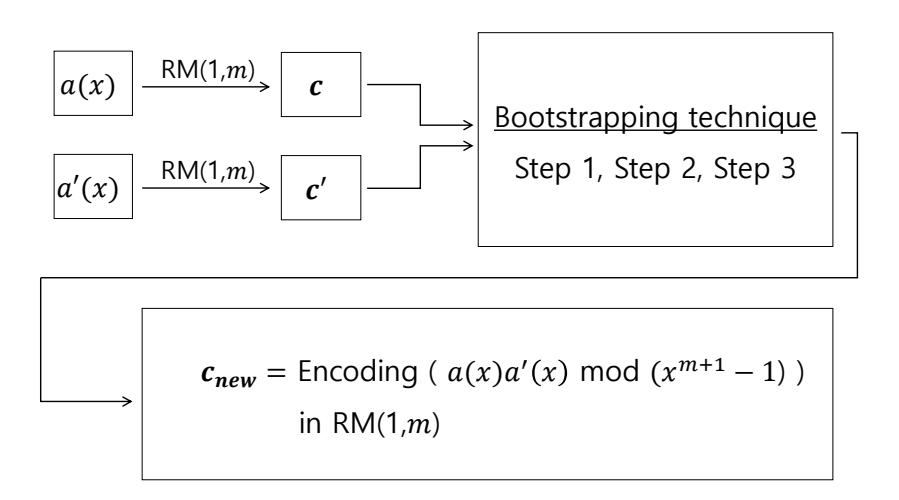

{0}------------------------------------------------

# Homomorphic Computation in Reed-Muller Codes?

Jinkyu Cho<sup>1</sup> , Young-Sik Kim<sup>2</sup> , and Jong-Seon No<sup>1</sup>

<sup>1</sup> Seoul National University, Republic of Korea <sup>2</sup> Chosun University, Republic of Korea

Abstract. With the ongoing developments in artificial intelligence (AI), big data, and cloud services, fully homomorphic encryption (FHE) is being considered as a solution for preserving the privacy and security in machine learning systems. Currently, the existing FHE schemes are constructed using lattice-based cryptography. In state-of-the-art algorithms, a huge amount of computational resources are required for homomorphic multiplications and the corresponding bootstrapping that is necessary to refresh the ciphertext for a larger number of operations. Therefore, it is necessary to discover a new innovative approach for FHE that can reduce the computational complexity for practical applications. In this paper, we propose a code-based homomorphic operation scheme. Linear codes are closed under the addition, however, achieving multiplicative homomorphic operations with linear codes has been impossible until now. We strive to solve this problem by proposing a fully homomorphic code scheme that can support both addition and multiplication simultaneously using the Reed-Muller (RM) codes. This can be considered as a preceding step for constructing code-based FHE schemes. As the order of RM codes increases after multiplication, a bootstrapping technique is required to reduce the order of intermediate RM codes to accomplish a large number of operations. We propose a bootstrapping technique to preserve the order of RM codes after the addition or multiplication by proposing three consecutive transformations that create a one-to-one relationship between computations on messages and that on the corresponding codewords in RM codes.

Keywords: Error-correcting codes (ECCs), fully homomorphic encryption (FHE), homomorphic computation, post-quantum cryptography (PQC), Reed-Muller (RM) codes.

# 1 Introduction

Error-correcting codes (ECCs) are being used in diverse application areas. They have been developed for wireless communication systems in noisy channels and

<sup>?</sup> This work was supported by Institute for Information & Communications Technology Promotion (IITP) grant funded by the Korea government (MSIT) (R-20160229- 002941, Research on Lightweight Post-Quantum Crypto-systems for IoT and Cloud Computing).

{1}------------------------------------------------

digital storage systems [1, 2]. They are also widely used in other areas such as distributed computing systems or public-key cryptography, also known as codebased cryptography. The security of code-based cryptography is based on the fact that the decoding problem of a random linear code is an NP-complete problem [3]. Especially, code-based cryptography is one of the candidates for postquantum cryptography that can resist attacks using operations over quantum computers.

Recently, machine learning has become popular in many areas and a few applications that employ this technology require the privacy of input data to be maintained. For the security of machine learning, differential privacy and fully homomorphic encryption (FHE) are considered as candidates. In the case of differential privacy, the information on the individuals in the dataset is not disclosed even though the entire dataset is available. However, when it comes to FHE, both multiplication and addition can be performed for encrypted messages. Thus, confidential messages can be securely manipulated on the untrusted cloud server. In FHE, the encryption schemes can support both addition and multiplication without any limitations on the number of operations.

As Gentry proposed the first generation FHE in 2009 [4], there has been extensive research on homomorphic encryption schemes based on lattice-based hard problems [5–10]. The most promising recent research works on lattice-based homomorphic encryption schemes are the homomorphic encryption for the arithmetic of approximate numbers scheme, called the Cheon-Kim-Kim-Song (CKKS) scheme [6] and the fast FHE over the torus (TFHE) scheme [7]. Despite substantial progress since Gentry's first FHE scheme, the computational complexity of FHEs is still too high to be used in privacy-preserving machine learning systems. For example, it takes almost 30 seconds for one bootstrapping operation while using the CKKS library. As more than 10<sup>5</sup> bootstrappings are necessary to sort hundreds of data packets, several days are needed for the homomorphic sorting operation [10]. Therefore, we need to discover a new innovative approach to achieve more efficient FHE.

Along with the extremely fast-growing data and computation sizes, the size of distributed computing systems has also grown increasingly larger with time. During computing, a certain amount of unpredictable system noise or straggler nodes that cause delays cannot be avoided. To reduce these problems, we frequently use coded computation, which is a method of using coding theoretic techniques in distributed systems. In this regard, the first known study was conducted on the computing matrix multiplication problem using erasure codes and minimum distance separable codes [11]. Later, more studies with diverse approaches to increase the speed of coded computations also appeared [12–14]. System components, such as sensors, are required to working efficiently even in noisy conditions, such as high temperature. To ensure this, we need a coding technique with high error tolerance, such as Reed-Muller (RM) codes, because they can correct random erasures and errors with high probability [15].

Besides, we also expect these results to be used in quantum computing. There are numerous studies on the application of ECCs in quantum computing [16–19]. 

{2}------------------------------------------------

Researchers have also succeeded in mapping the ECCs of classical computers into new quantum codes called "stabilizer codes." Several trials on using algebraically defined codes, such as Hamming codes, Bose-Chaudhuri-Hocquenghem codes, RM codes, and Golay codes have been accomplished. Moreover, methods for using sparse-graph codes such as low-density parity-check codes are also being studied. The goal of all these studies is to achieve fault-tolerant quantum computation. In the future, we expect homomorphic computation to be an important component in quantum computers, and therefore our contribution to creating a homomorphic computation method for RM codes may turn out to be useful in RM-code-based quantum error correction.

In this paper, we propose a code-based homomorphic computation scheme using RM codes that can support simultaneous addition and multiplication operations. Addition can be performed freely in linear codes due to the nature of the linearity. However, no such method of multiplication exists for codewords, that is, it is not possible to obtain a valid codeword just by multiplying two valid codewords. Therefore, we propose a linear transformation that can map the multiplication result of any pair of valid codewords to a valid codeword. As the order of the codewords monotonically increases during the multiplication in the RM codes, there is a certain limitation on the number of multiplications. To resolve this problem, we propose a bootstrapping method to reduce the RM codewords of the second-order to that of the first-order after codeword multiplication.

The paper is organized as follows: We present the preliminaries in Section II, where we describe the basic concepts of the original RM codes, and set a few notations. Moreover, we present the fundamental definition of FHE. Our main results are presented in Section III. We define the addition and multiplication operations on the message and codeword domains, respectively, and also propose the main scheme used in our bootstrapping technique for RM codes. Finally, we conclude our paper and mention future works in Section IV.

#### 2 Preliminaries

## 2.1 RM codes

In this subsection, we briefly introduce the fundamental notions and properties of RM codes. An RM code, RM(r,m) is defined with integers r and m, where r is the order of the code and  $n=2^m$  is the code length. The dimension of RM(r,m) is  $k_r = \sum_{i=0}^r \binom{m}{i}$  and the minimum distance is  $d_{min} = 2^{m-r}$ . Further, we can express RM(r,m) with r-th order linear combinations of Boolean functions  $\mathbf{v_0} = 1, \mathbf{v_1}, \cdots, \mathbf{v_m}$ . Thus, the generator matrix  $G_r$  of the r-th order RM code, RM(r,m) can be expressed as

{3}------------------------------------------------

$$G_{r} = \begin{pmatrix} v_{0} \\ v_{1} \\ \vdots \\ v_{m} \\ v_{1}v_{2} \\ v_{1}v_{3} \\ \vdots \\ v_{m-1}v_{m} \\ \vdots \\ v_{1}\cdots v_{r} \\ v_{1}\cdots v_{r-1}v_{r+1} \\ \vdots \\ v_{m-r+1}\cdots v_{m} \end{pmatrix}, \qquad (1)$$

where,  $v_i v_j$  denotes the component-wise multiplication of  $v_i$  and  $v_j$  [1,2,20–23]. The columns of the generator matrix are evaluated by each Boolean function of each row with every m-tuple binary vector from  $(1, 1, \dots, 1)$  to  $(0, 0, \dots, 0)$  in the reverse lexicographical order.

The generator matrix G of the first-order RM codes is constructed from  $\{v_0, v_1, \dots, v_m\}$  in (1), and the generator matrix of the second-order RM codes is created from  $\{v_0, v_1, \dots, v_m, v_1v_2, v_1v_3, \dots, v_{m-1}v_m\}$ . The first-order RM code has a dimension of k = m+1 and can be represented with linear combinations of  $v_0, \dots, v_m$ .

The message can be expressed with a polynomial of degree m, a(x), or with a (m+1)-tuple vector  $\boldsymbol{a}$  as

$$a(x) = \sum_{i=0}^{m} a_i x^i$$
$$\mathbf{a} = (a_0, a_1, \dots, a_m).$$

And codeword of the first-order RM codes, RM(1,m), can be expressed with a polynomial of degree n-1, c(x), or with a n-tuple vector c by multiplying the  $k \times n$  generator matrix G in (1) to message as

$$c(x) = \sum_{i=0}^{n-1} c_i x^i$$

$$\mathbf{c} = (c_0, c_1, \dots, c_{n-1}) = \mathbf{a}G = \sum_{i=0}^{m} a_i \mathbf{v_i},$$
(2)

where we abuse the vector and polynomial notations.

{4}------------------------------------------------

## 2.2 Fully homomorphic encryption

Homomorphic encryption plays a crucial part in ensuring privacy because it does not expose the original data in computing environments such as machine learning or cloud services [4]. An encryption scheme is said to be "homomorphic" with respect to an operation ♦ on plaintext space P if it satisfies

```
Decrypt(Encrypt(m1) ∗ Encrypt(m2))
                    = Decrypt(Encrypt(m1♦m2))
                    = m1♦m2
```

for an operation ∗ on ciphertext space C. The operation ♦ is usually an addition or multiplication.

An encryption scheme is called "somewhat homomorphic" if it satisfies only a limited number of operations because of its inability to perform decryption after a certain number of operations. The scheme is called "fully homomorphic" if it can perform an infinite number of homomorphic operations for addition and multiplication [5].

# 3 Homomorphic computation of RM(1,m)

## 3.1 Addition and multiplication in RM codes

Homomorphic operations are executed both on the message and codeword domains. Although addition is performed identically in both the domains, the multiplication of the codewords must be defined as a new codeword of a message that is defined as a polynomial multiplication with modulo x <sup>k</sup> − 1.

In our proposed scheme, we only consider the first-order RM codes for homomorphic operations because they have the maximum Hamming distance 2m−<sup>1</sup> and can be efficiently used for related homomorphic computations. As described in Subsection 2.1, the RM codes can be described as polynomials. Therefore, for the homomorphic addition of two codewords, we perform a component-wise addition ⊕ between the coefficients of the same order of the polynomial terms. In the case of homomorphic multiplication, the codewords can be multiplied by performing some multiplication , which corresponds to the codeword of multiplication of two message polynomials of the order m, a(x) and a 0 (x), as a(x)a 0 (x) mod (x <sup>m</sup>+1 − 1), as given in Table 1.

In the case of addition, it is evident that the computation on the message domain and codeword domain are directly related because the RM codes are linear. However, while multiplying two corresponding codewords, c(x) and c 0 (x), or c and c 0 , we have two fundamental problems. The first problem is that just multiplying c and c 0 component-wisely does not completely match the codeword corresponding to the multiplied message. Therefore, we need to apply the linear transformation for correctly matching the message and the code domains. The second problem is that the multiplied codeword is a second-order RM code 

{5}------------------------------------------------

instead of the first one. To fix the relationship between the two domains and reduce the order of codeword, we need a linear transformation of the multiplied codewords. This linear transformation is described in the next subsection.

Table 1: Addition and multiplication with messages and codewords.

| Computation    | Messages                                   | Codewords  |
|----------------|--------------------------------------------|------------|
| Addition       | 0<br>m+1 −<br>a(x) + a<br>(x) mod (x<br>1) | 0<br>c ⊕ c |
| Multiplication | 0<br>m+1 −<br>a(x)a<br>(x) mod (x<br>1)    | 0<br>c  c |

## 3.2 Bootstrapping technique in RM codes

The two problems encountered during the homomorphic multiplications of RM code can be resolved by using the bootstrapping technique that will be introduced in this subsection. The first-order RM code is represented with linear combination of {v0, v1, · · · , vm}. The multiplied codewords are of the secondorder, which is RM (2,m). Therefore, we need to reduce the order of the RM code for further operations.

Let c and c <sup>0</sup> be two distinct codewords of the first-order RM code for two messages a(x) and a 0 (x). The multiplication of a(x) and a 0 (x) is expressed as

$$a(x)a'(x) \bmod (x^{m+1} - 1) = \sum_{l=0}^{m} \left(\sum_{i+j=l \bmod (m+1)} a_i a'_j\right) x^l.$$
 (3)

Thus, the corresponding codeword of a(x)a 0 (x) mod (x <sup>m</sup>+1 − 1) is given as

$$\sum_{l=0}^{m} \left( \sum_{i+j=l \bmod (m+1)} a_i a_j' \right) v_l. \tag{4}$$

However, the direct multiplication of the two corresponding codewords is given as

$$\left(\sum_{i=0}^{m} a_i \boldsymbol{v_i}\right) \left(\sum_{j=0}^{m} a_j' \boldsymbol{v_j}\right). \tag{5}$$

Therefore, (4) and (5) are not the same even though they represent the same message. Notably, (5) is a second-order RM code. Therefore, (5) should be modified to fit (4). This process is called bootstrapping in this paper.

The bootstrapping process comprises three steps as follows.

{6}------------------------------------------------



Fig. 1: Bootstrapping process in the first-order RM codes.

- 1. Step 1: Represent the coefficients  $a_i a'_j + a_j a'_i$  of  $\mathbf{v_i v_j}$  in (5) as the components of the codewords  $\mathbf{c} = (c_0, c_1, \dots, c_{n-1})$  and  $\mathbf{c'} = (c'_0, c'_1, \dots, c'_{n-1})$ , whose transformation is denoted by  $(n+m) \times (k_2+m)$  matrix V.
- 2. Step 2: Derive the coefficients  $\sum_{i+j=l \mod (m+1)} a_i a'_j$  of  $x^l$  in (3) by using  $\operatorname{coef}(\boldsymbol{v_i}\boldsymbol{v_j})$ , whose transformation is denoted by  $(k_2+m)\times k$  matrix X.
- 3. Step 3: Find the codeword  $c_{new}$  of the message  $a(x)a'(x) \mod (x^{m+1}-1)$  in RM(1,m) by using the generator matrix G.

The proposed bootstrapping procedure for homomorphic multiplication in RM (1, m) code is depicted in Fig. 1, where notations of polynomials and vectors are abused. Notably, the above three steps can be combined into an  $(n+m) \times n$  linear transformation VXG. We can do this as many times as necessary to finish the arbitrary homomorphic computations. To perform Steps 1 and 2, we need the following theorem and corollary.

**Theorem 1.** In the first-order RM code, RM(1,m), we have

$$c_{n-1-\sum_{i=1}^{m} \alpha_i 2^{i-1}} = a_0 + \sum_{i=1}^{m} \alpha_i a_i,$$

where the transpose of  $(\alpha_0, \alpha_1, \dots, \alpha_m)$  denotes the p-th column of G with  $p = n - 1 - \sum_{i=1}^m \alpha_i 2^{i-1}$ .

*Proof:* From (2), we have

$$c_p = (a_0, a_1, \dots, a_m)(p\text{-th column of }G)$$

$$= \sum_{i=0}^m a_i g_{ip},$$

where  $g_{ip}$  denotes the (i, p) element of G. Clearly, the first row of G is all-one vector, that is,  $\alpha_0 = 1$ , and thus every  $c_p$  includes  $a_0$ . Then, for the remaining rows of G, we should add  $a_i$  if the (i + 1)-th component of p-th column of G is '1'.

{7}------------------------------------------------

It can be observed that the p-th column of the generator matrix of RM(1,m) except the first row, is the one's complement of the binary representation of p. Let  $(1, \alpha_1, \alpha_2, \dots, \alpha_m)^T$  be the p-th column of G. Then, we have  $p = 2^m - 1 - \sum_{i=1}^m \alpha_i 2^{i-1}$ . Thus, the theorem is proved.

From Theorem 1, it is straightforward to obtain the following corollary.

Corollary 1. In the first-order RM code, RM(1,m), we have

$$c_0 + c_{2^{s-1}} = a_s, \ s = 1, 2, \cdots, m.$$

The three steps of the bootstrapping are explained in detail as follows.

**Step 1:** Coefficient mapping from c and c' to the  $coef(v_i v_j)$ 

Here, we will represent the coefficients of  $v_i v_j$  in (5) by using the components of the codewords,  $c = (c_0, c_1, \dots, c_{n-1})$  and  $c' = (c'_0, c'_1, \dots, c'_{n-1})$  as follows. In another variation explained later, the coefficient of  $v_i v_j$  is denoted as a function  $f_{ij}$  of components of c and c'

$$coef(\mathbf{v_i}\mathbf{v_j}) = f_{ij}(c_0, c_1, \cdots, c_{n-1}, c'_0, c'_1, \cdots, c'_{n-1}).$$

The coefficient of  $v_i v_j$  can be determined by considering the following four cases.

Case 1-1)  $i \neq j$  and  $i, j \neq 0$ :

From (5), the coefficient of  $v_i v_j$  becomes  $a_i a'_j + a_j a'_i$ . We can express this as

$$coef(\mathbf{v}_{i}\mathbf{v}_{j}) = a_{i}a'_{j} + a_{j}a'_{i}$$

$$= (a_{0} + a_{i} + a_{j})(a'_{0} + a'_{i} + a'_{j})$$

$$+ (a_{0} + a_{i})(a'_{0} + a'_{i}) + (a_{0} + a_{j})(a'_{0} + a'_{j})$$

$$+ a_{0}a'_{0}$$

and from Theorem 1, we have

$$coef(\mathbf{v}_{i}\mathbf{v}_{j}) = c_{n-1-2^{i-1}-2^{j-1}}c'_{n-1-2^{i-1}-2^{j-1}} + c_{n-1-2^{i-1}}c'_{n-1-2^{i-1}} + c_{n-1-2^{j-1}}c'_{n-1-2^{j-1}} + c_{n-1}c'_{n-1}.$$

Case 1-2)  $i \neq 0, j = 0$ :

From (5), the coefficient of  $\mathbf{v_i}\mathbf{v_0} = \mathbf{v_i}$  becomes  $a_i a_0' + a_0 a_i'$ . We can express this as

$$coef(\mathbf{v_i}) = a_i a'_0 + a_0 a'_i$$
  
=  $(a_0 + a_i)(a'_0 + a'_i)$   
+  $a_0 a'_0$   
+  $a_i a'_i$ 

{8}------------------------------------------------

and from Theorem 1 and Corollary 1, we have

$$coef(\mathbf{v_i}) = c_{n-1-2^{i-1}} c'_{n-1-2^{i-1}} + c_{n-1} c'_{n-1} + (c_0 + c_{2^{i-1}}) (c'_0 + c'_{2^{i-1}}).$$

This case is very similar to Case 1-1), but we cannot use Theorem 1 when j = 0. Thus, we separate this from Case 1-1) and use Corollary 1.

Case 2-1) 
$$i = j \neq 0$$
:

From (5), we can express the coefficient as

$$coef(\boldsymbol{v_i}^2) = a_i a_i'$$

and from Corollary 1, we have

$$(c_0+c_{2^{i-1}})(c'_0+c'_{2^{i-1}}).$$

It should be noted that the Boolean function  $v_i^2$  is actually equal to  $v_i$ . However, we have separated these two cases because  $coef(v_i)$  corresponds to  $coef(x^i)$  and  $coef(v_i^2)$  corresponds to  $coef(x^{2i \mod (m+1)})$ .

Case 2-2) 
$$i = j = 0$$
:

From (5), we can express the coefficient as

$$coef(\boldsymbol{v_0}) = a_0 a_0'$$

and from Theorem 1, we have

$$c_{n-1}c'_{n-1}.$$

By merging the above four cases, we can make a binary  $(n+m) \times (k_2+m)$  matrix V, which is a linear transformation from

$$(c_0c'_0, c_1c'_1, \cdots, c_{n-1}c'_{n-1}, (c_0 + c_{2^0})(c'_0 + c'_{2^0}), (c_0 + c_{2^1})(c'_0 + c'_{2^1}), \cdots, (c_0 + c_{2^{m-1}})(c'_0 + c'_{2^{m-1}}))$$

to

$$(\operatorname{coef}(\boldsymbol{v_0}), \operatorname{coef}(\boldsymbol{v_1}), \cdots \operatorname{coef}(\boldsymbol{v_m}), \\ \operatorname{coef}(\boldsymbol{v_1}\boldsymbol{v_2}), \operatorname{coef}(\boldsymbol{v_1}\boldsymbol{v_3}), \cdots \operatorname{coef}(\boldsymbol{v_{m-1}}\boldsymbol{v_m}), \\ \operatorname{coef}(\boldsymbol{v_1}^2), \operatorname{coef}(\boldsymbol{v_2}^2), \cdots, \operatorname{coef}(\boldsymbol{v_m}^2)).$$

#### Step 2: Message mapping

We will derive the coefficient  $\sum_{i+j=l \mod (m+1)} a_i a'_j$  of  $x^l$  in (3) with a function  $g_l$  as

$$\operatorname{coef}(x^{l}) = \sum_{i+j=l \mod(m+1)} a_{i} a'_{j}$$
$$= g_{l}(\operatorname{coef}(\boldsymbol{v_{i}}\boldsymbol{v_{j}})). \tag{6}$$

We can determine  $g_l$  as given in the following theorem.

{9}------------------------------------------------

**Theorem 2.** In the first-order RM code, RM(1,m),  $coef(x^l)$  in (3) is given as

$$\textit{coef}(x^l) = \sum_{i+j=l \; mod(m+1)} \textit{coef}(\boldsymbol{v_i v_j}).$$

*Proof:* It can be easily observed that (5) can be rewritten as

$$\sum_{l=0}^{m} \left( \sum_{i+j=l \bmod (m+1)} a_i a'_j \boldsymbol{v_i} \boldsymbol{v_j} \right). \tag{7}$$

Focusing on the coefficients of  $\mathbf{v_i v_j}$  in (7), when  $i + j = l \mod (m+1)$ , the sum of  $\operatorname{coef}(\mathbf{v_i v_j})$  is the sum of  $a_i a'_j$ . And this result equals the coefficients of  $x^l$  also from (6). Thus, the theorem is proved.

Now, by using Theorem 2, we can perform a linear transformation from

$$(\operatorname{coef}(\boldsymbol{v_0}), \operatorname{coef}(\boldsymbol{v_1}), \cdots, \operatorname{coef}(\boldsymbol{v_m}), \\ \operatorname{coef}(\boldsymbol{v_1}\boldsymbol{v_2}), \operatorname{coef}(\boldsymbol{v_1}\boldsymbol{v_3}), \cdots, \operatorname{coef}(\boldsymbol{v_{m-1}}\boldsymbol{v_m}), \\ \operatorname{coef}(\boldsymbol{v_1}^2), \operatorname{coef}(\boldsymbol{v_2}^2), \cdots, \operatorname{coef}(\boldsymbol{v_m}^2))$$

to

$$(\operatorname{coef}(x^0), \operatorname{coef}(x^1), \cdots, \operatorname{coef}(x^m))$$

denoted by  $(k_2 + m) \times k$  matrix X, where  $k_2 = {m \choose 0} + {m \choose 1} + {m \choose 2}$ . After merging Steps 1 and 2, we obtain

$$coef(x^{l}) = g_{l}(f_{ij}(c_{0}, c_{1}, \cdots, c_{n-1}, c'_{0}, c'_{1}, \cdots, c'_{n-1})).$$

#### **Step 3:** Re-encoding of RM(1,m)

Here, the  $k \times n$  generator matrix G is multiplied with VX to obtain a new codeword of the first-order RM code that corresponds to the resulting codeword obtained for the multiplication of the two messages,  $a(x)a'(x) \mod x^{m+1} - 1$ .

#### Combining Steps 1–3

In case of addition, clearly, the codeword of the message a(x) + a'(x) is  $c \oplus c'$ . However, for multiplication, it is divided into three steps called bootstrapping. Let

$$\mathbf{z} = (c_0 c'_0, c_1 c'_1, \cdots, c_{n-1} c'_{n-1}, (c_0 + c_{2^0})(c'_0 + c'_{2^0}), (c_0 + c_{2^1})(c'_0 + c'_{2^1}), \cdots, (c_0 + c_{2^{m-1}})(c'_0 + c'_{2^{m-1}})).$$

Then, the new codeword  $c_{new}$  in RM(1,m), corresponding to a(x)a'(x) mod  $x^{m+1}-1$ , is given as

$$c_{new} = z \cdot V \cdot X \cdot G.$$

{10}------------------------------------------------

Finally, we can determine the codeword  $c_{new}$  in RM(1,m), corresponding to the message a(x)a'(x) mod  $x^{m+1}-1$ , by using c, c', and the  $(n+m)\times n$  matrix,  $T=V\cdot X\cdot G$ .

Note: In fact, there exist a few all-zero rows in V for some row indices. This is because we do not use every case listed in Theorem 1 in Step 1. Only  $c_{n-1-2^{i-1}-2^{j-1}}c'_{n-1-2^{i-1}-2^{j-1}}, c_{n-1-2^{i-1}}c'_{n-1-2^{i-1}}, c_{n-1-2^{j-1}}c'_{n-1-2^{j-1}}, and <math>c_{n-1}c'_{n-1}$  are used for Cases 1-1), 1-2), 2-1), and 2-2). Thus, for the rest of  $c_i$  and  $c'_i$ , we have all-zero rows in V and we add  $(c_0+c_{2^0})(c'_0+c'_{2^0}), (c_0+c_{2^1})(c'_0+c'_{2^1}), \cdots$ , and  $(c_0+c_{2^{m-1}})(c'_0+c'_{2^{m-1}})$  to the last m elements in z.

#### 3.3 Example

To help understand the homomorphic computation of the first-order RM codes, RM(1,m), we present an example of an RM(1,4) code. First, we determine the matrix V as

```
(0\ 0\ 0\ 0\ 0\ 0\ 0\ 0\ 0\ 0\ 0\ 0\ 0\ 0
            \begin{array}{c} 0 \ 0 \ 0 \ 0 \ 0 \ 0 \ 0 \ 0 \ 0 \ 0 
            0 \; 0 \; 0 \; 0 \; 0 \; 0 \; 0 \; 0 \; 0 \; 0 \;
            0\; 0\; 0\; 0\; 0\; 0\; 0\; 0\; 0\; 0\; 1\; 0\; 0\; 0\; 0\; 0
            0\ 0\ 0\ 0\ 0\ 0\ 0\ 1\ 0\ 0\ 0\ 0\ 0\ 0
             0\ 0\ 0\ 0\ 1\ 0\ 0\ 1\ 0\ 1\ 1\ 0\ 0\ 0\ 0
             0 \ 0 \ 0 \ 0 \ 0 \ 0 \ 0 \ 0 \ 0 \ 0 \
             0\ 0\ 0\ 0\ 0\ 0\ 0\ 0\ 1\ 0\ 0\ 0\ 0\ 0
V =
             0\; 0\; 0\; 0\; 0\; 0\; 1\; 0\; 0\; 0\; 0\; 0\; 0\; 0
             0\ 0\ 0\ 1\ 0\ 0\ 1\ 0\ 1\ 0\ 1\ 0\ 0\ 0
             0\; 0\; 0\; 0\; 0\; 1\; 0\; 0\; 0\; 0\; 0\; 0\; 0\; 0\; 0
            0\; 0\; 1\; 0\; 0\; 1\; 0\; 0\; 1\; 1\; 0\; 0\; 0\; 0\; 0\\
             0\; 1\; 0\; 0\; 0\; 1\; 1\; 1\; 0\; 0\; 0\; 0\; 0\; 0\; 0
             1\; 1\; 1\; 1\; 1\; 1\; 1\; 1\; 1\; 1\; 1\; 0\; 0\; 0\; 0
             0\ 1\ 0\ 0\ 0\ 0\ 0\ 0\ 0\ 0\ 1\ 0\ 0\ 0
             0\; 0\; 1\; 0\; 0\; 0\; 0\; 0\; 0\; 0\; 0\; 0\; 1\; 0\; 0
           \left( \begin{array}{c} 0\ 0\ 0\ 1\ 0\ 0\ 0\ 0\ 0\ 0\ 0\ 0\ 0\ 0\ 0\ 0\ 0\
```

This matrix is obtained by merging Cases 1-1), 1-2), 2-1), and 2-2), whose size is  $20 \times 15$ . In this example, the 0, 1, 2, 4, and 8-th rows are '0s.'

{11}------------------------------------------------

Then, in Step 2, we can obtain the relations between coef(x l ) and coef(viv<sup>j</sup> ) as

$$coef(x^{0}) = coef(v_{0}^{2}) + coef(v_{1}v_{4}) + coef(v_{2}v_{3}) 
coef(x^{1}) = coef(v_{0}v_{1}) + coef(v_{2}v_{4}) + coef(v_{3}^{2}) 
coef(x^{2}) = coef(v_{0}v_{2}) + coef(v_{1}^{2}) + coef(v_{3}v_{4}) 
coef(x^{3}) = coef(v_{0}v_{3}) + coef(v_{1}v_{2}) + coef(v_{4}^{2}) 
coef(x^{4}) = coef(v_{0}v_{4}) + coef(v_{1}v_{3}) + coef(v_{2}^{2}).$$

From Theorem 2, the corresponding matrix X is given as

$$X = \begin{pmatrix} 1 & 0 & 0 & 0 & 0 \\ 0 & 1 & 0 & 0 & 0 \\ 0 & 0 & 1 & 0 & 0 \\ 0 & 0 & 0 & 1 & 0 \\ 0 & 0 & 0 & 1 & 1 \\ 0 & 0 & 0 & 0 & 1 \\ 1 & 0 & 0 & 0 & 0 \\ 0 & 1 & 0 & 0 & 0 \\ 0 & 0 & 1 & 0 & 0 \\ 0 & 0 & 1 & 0 & 0 \\ 0 & 0 & 0 & 1 & 0 \\ 0 & 0 & 0 & 1 & 0 \end{pmatrix}$$

,

where the matrix size is 15×5. For Step 3, we obtain the 5×16 generator matrix G from (1) as

$$G = \begin{pmatrix} 1 & 1 & 1 & 1 & 1 & 1 & 1 & 1 & 1 & 1$$

{12}------------------------------------------------

Then, by multiplying these three matrices, we obtain a matrix T with size of  $20 \times 16$  as

$$T = \begin{pmatrix} 0 & 0 & 0 & 0 & 0 & 0 & 0 & 0 & 0 & 0$$

Now, we obtain a new codeword  $c_{new}$  of the first-order RM code by multiplying T on the right of the vector z. Thus,  $c_{new}$  corresponds to the codeword of the message multiplication polynomial  $a(x)a'(x) \mod x^5 - 1$  in RM(1,4), as given in Table 2, where we have presented three examples.

Example 1) Example 2) Example 3) (01000)(00010)(00011) $\boldsymbol{a}$ a'(01000)(00010)(00011)(1111000011110000)(101010101010101010)(00001111111110000) $\boldsymbol{c}$  $\overline{(1111000011}110000)$  $\overline{(1100110000110011)}$  $\boldsymbol{c}'$ (111111111100000000)(00001)(00100)(11101) $a_{pm}$ (10100000101000000(1111000000000000000000000000000000000(0000110000110000 $\boldsymbol{z}$ 0000)0000)0001)(00001)(00100)(11101) $a_{new}$ |(11111111100000000)|(1100110011001100)|(1010010110100101)| $c_{new}$ 

**Table 2:** Examples with RM(1,4) code

For message vectors  $\boldsymbol{a}$  and  $\boldsymbol{a}'$ , we have  $\boldsymbol{c}$  and  $\boldsymbol{c}'$ . Then, we determine a vector  $\boldsymbol{z}$  and perform Steps 1 and 2, which are the matrices V and X. Thus,

{13}------------------------------------------------

we obtain a new message vector " $a_{new}$ " and this corresponds to the polynomial multiplication of two messages,  $a(x)a'(x) \mod x^5 - 1$ , also denoted as " $a_{pm}$ ." Finally, we obtain a new codeword  $c_{new}$  of the first-order RM code from the generator matrix G.

## 4 Conclusion and future works

In this paper, we suggested a transformation method, called bootstrapping, which facilitates the homomorphic multiplication of the first-order RM codes while preserving the order of the RM codes after the computation (addition and multiplication). Furthermore, we created a relation between the proposed codeword multiplication  $\mathbf{c} \odot \mathbf{c}'$  and the multiplication of two messages. We employed three steps for performing the bootstrapping. In Step 1, we expressed the coefficients of  $\mathbf{v}_i \mathbf{v}_j$  as the components of the codewords  $c_0, c_1, \dots, c_{n-1}, c'_0, c'_1, \dots$ , and  $c'_{n-1}$ . In Step 2, we represented the coefficients of  $x^l$  by the coefficients of  $\mathbf{v}_i \mathbf{v}_j$ . Thus, by merging these two steps, we constructed a relation between the codeword components and coefficients of  $x^l$ , which are the components of message polynomial multiplication. We encoded this process by multiplying the generator matrix in Step 3 to obtain the corresponding codeword as the first-order RM code.

As future works, we will consider the homomorphic computation of higherorder RM codes. Moreover, we plan to implement the computation in the presence of noise, which can be useful in homomorphic cryptography.

## References

- 1. S. Lin and D. Costello, *Error Control Coding*, 2<sup>nd</sup> ed. Upper Saddle River, NJ, USA: Prentice-Hall, 2001, pp. 105–118.
- 2. F. J. Macwilliams and N. J. A. Sloane, *The Theory of Error Correcting Codes.* vol. 16, New York, NY, USA: Elsevier/North-Holland Inc., 1977, pp. 370–479.
- 3. R.J. McEliece, "A public-key cryptosystem based on algebraic coding theory," *DSN Progress Report*, pp. 114–116, Jan. 1978.
- 4. C. Gentry, "A fully homomorphic encryption scheme," Ph.D. dissertation, Dept. Comput. Sci., Stanford Univ., Stanford, CA, USA, 2009.
- 5. R. Meissen, "A mathematical approach to fully homomorphic encryption," Ph.D. dissertation, Worcester Polytechnic Institute, 2012.
- 6. J. H. Cheon, A. Kim, M. Kim, and Y. Song, "Homomorphic encryption for arithmetic of approximate numbers," in *Proc. Int. Conf. Theory Appl. Cryptol. Inf. Sec.* New York, NY, USA: Springer, 2017, pp. 409–437.
- 7. I. Chillotti, N. Gama, M. Georgieva, and M. Izabachene, "TFHE: Fast fully homomorphic encryption over the torus," *Journal of Cryptology*, vol. 33, no. 1, pp. 34–91, 2020.
- 8. H. Chen, I. Chillotti, and Y. Song, "Improved bootstrapping for approximate homomorphic encryption," Int. Assoc. Cryptol. Res., Tech. Rep. 2018/1043, 2018. [Online]. Available: https://eprint.iacr.org/2018/1043.

{14}------------------------------------------------

- 9. K. Han and D. Ki, "Better bootstrapping for approximate homomorphic encryption," Cryptographers' Track at the RSA Conference, Springer, Cham, Feb. 2020, pp. 364–390.
- 10. J.-W. Lee, Y.-S. Kim, and J.-S. No, "Analysis of modified Shell sort for fully homomorphic encryption," Cryptology ePrint Archive, 2019/1497.
- 11. K. Lee, M. Lam, R. Pedarsani, D. Papailiopoulos, and K. Ramchandran, "Speeding up distributed machine learning using codes," IEEE Trans. Inf. Theory, vol. 64, no. 3, pp. 1514–1529, Mar. 2018.
- 12. K. Lee, C. Suh, and K. Ramchandran, "High-dimensional coded matrix multiplication," 2017 IEEE International Symposium on Information Theory (ISIT), 2017, pp. 2418–2422.
- 13. S. Dutta, V. Cadambe, and P. Grover, "Short-dot: Computing large linear transforms distributedly using coded short dot products," IEEE Trans. Inf. Theory, vol. 65, no. 10, pp. 6171–6193, Oct. 2019.
- 14. R. Tandon, Q. Lei, A. G. Dimakis, and N. Karampatziakis, "Gradient coding," arXiv preprint arXiv:1612.03301, 2016.
- 15. E. Abbe, A. Shpilka, and A. Wigderson, "Reed-Muller codes for random erasures and errors," IEEE Trans. Inf. Theory, vol. 61, no. 10, pp. 5229–5252, Oct. 2015.
- 16. A. R. Calderbank, E. M. Rains, P. M. Shor, and N. J. A. Sloane, "Quantum error correction via codes over GF(4)," IEEE Trans. Inf. Theory, vol. 44, no. 4, pp. 1369–1387, Jul. 1998.
- 17. D. MacKay, G. Mitchison, and P. McFadden, "Sparse-graph codes for quantum error correction," IEEE Trans. Inf. Theory, vol. 50, no. 10, pp. 2315–2330, Oct. 2004.
- 18. C. Y. Lai, Y. C. Zheng, and T. A. Brun, "Fault-tolerant preparation of stabilizer states for quantum Calderbank-Shor-Steane codes by classical error-correcting codes," Phys. Rev. Lett., 95, 032339, 2017.
- 19. F. Lacerda, J. Renes, and R. Renner, "Classical leakage resilience from faulttolerant quantum computation," Journal of Cryptology, vol. 32, no. 4, pp. 1071– 1094, 2019.
- 20. I. Reed, "A class of multiple-error-correcting codes and the decoding scheme," Transactions of the IRE Professional Group on Information Theory, vol. 4, no. 4, pp. 38–49, Sep. 1954.
- 21. D. E. Muller, "Application of Boolean algebra to switching circuit design and to error detection," Transactions of the I.R.E. Professional Group on Electronic Computers, vol. EC-3, no. 3, pp. 6–12, Sep. 1954.
- 22. W. Lee, J.-S. No, and Y.-S. Kim, "Punctured Reed–Muller code-based McEliece cryptosystems," IET Commun., vol. 11, no. 10, pp. 1543–1548, Jul. 2017.
- 23. Y. Lee, W. Lee, Y.-S. Kim, and J.-S. No, "A modified pqsigRM: RM code-based signature scheme," Cryptology ePrint Archive, Report 2019/678, 2019.