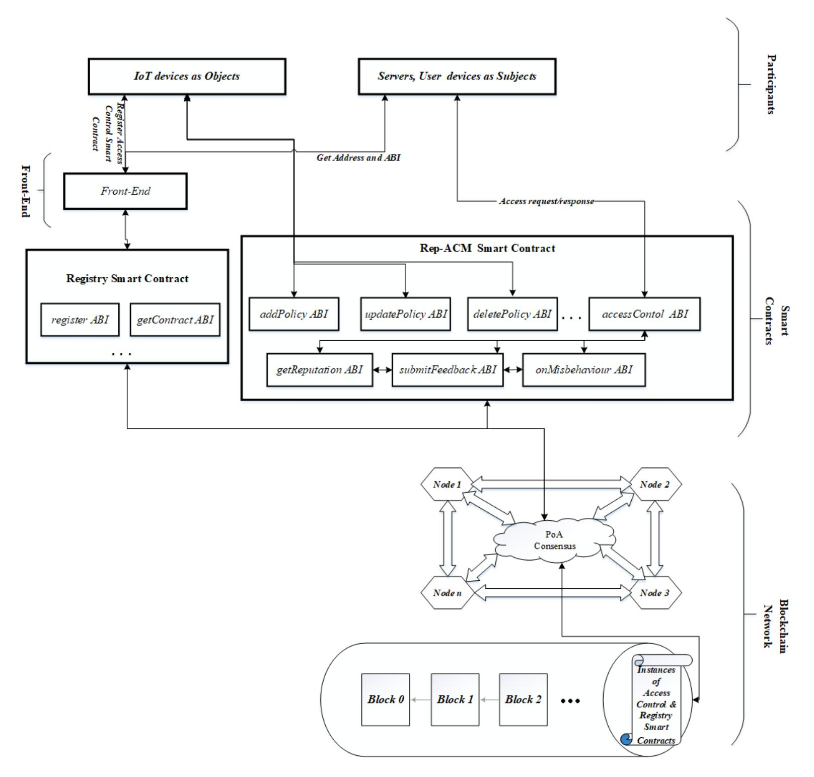
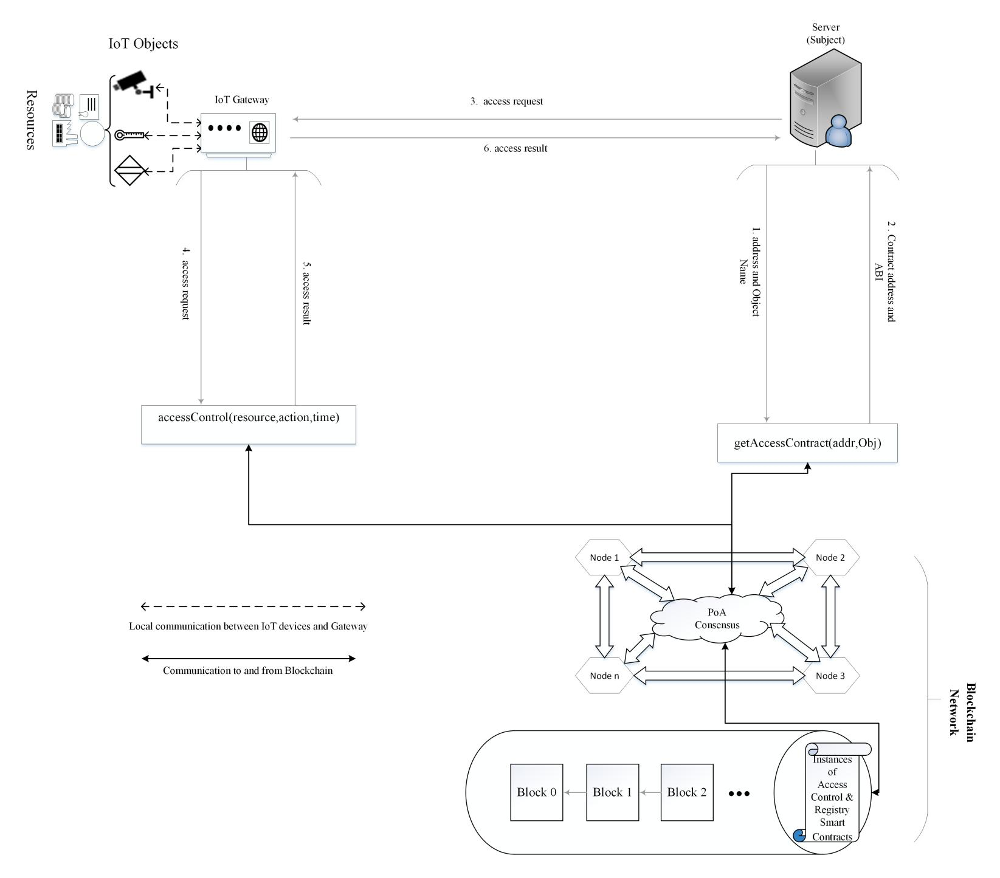
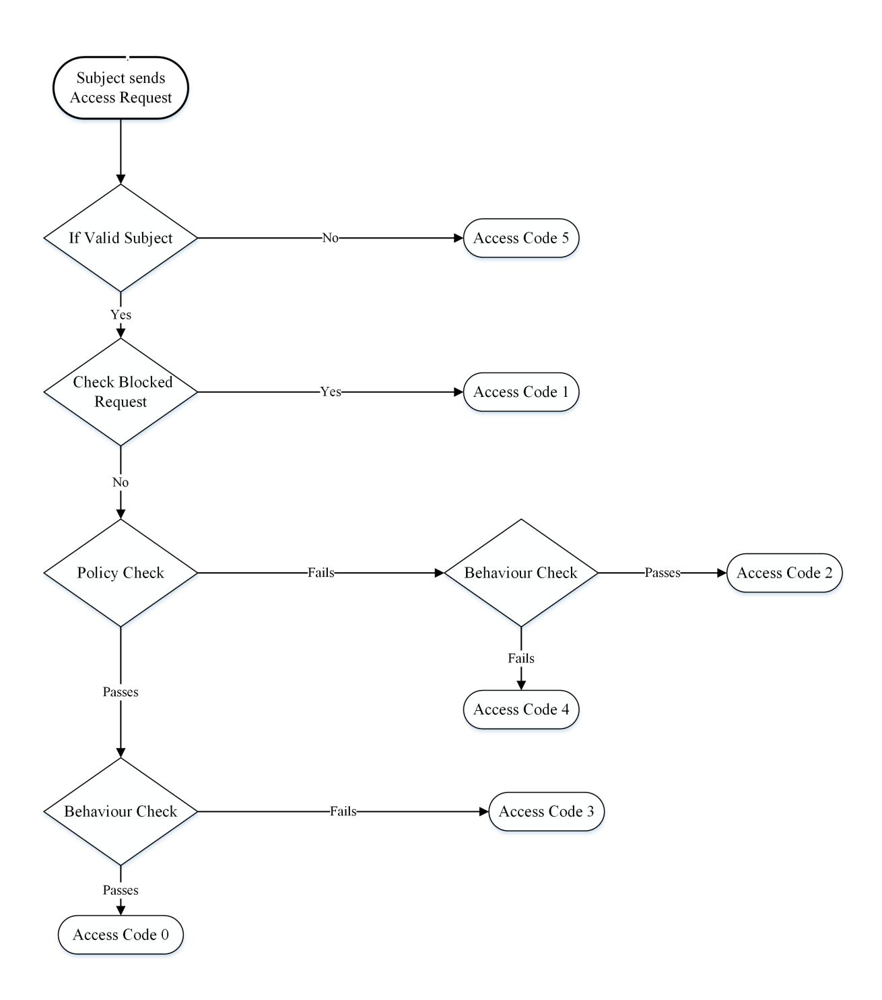
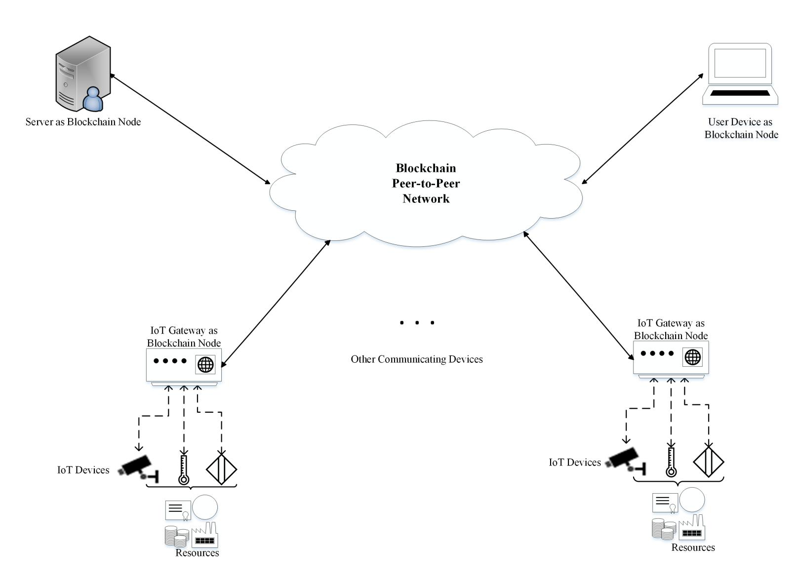
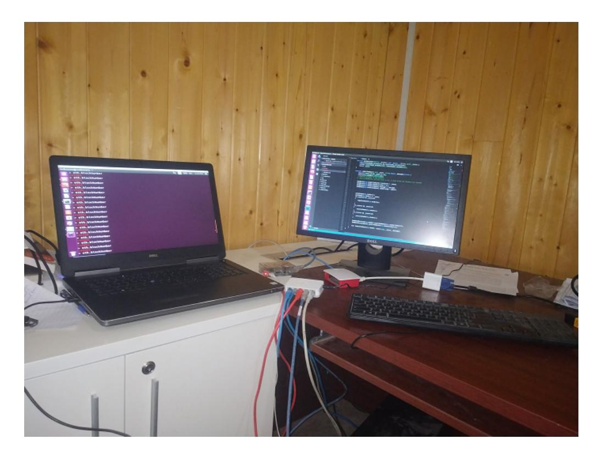
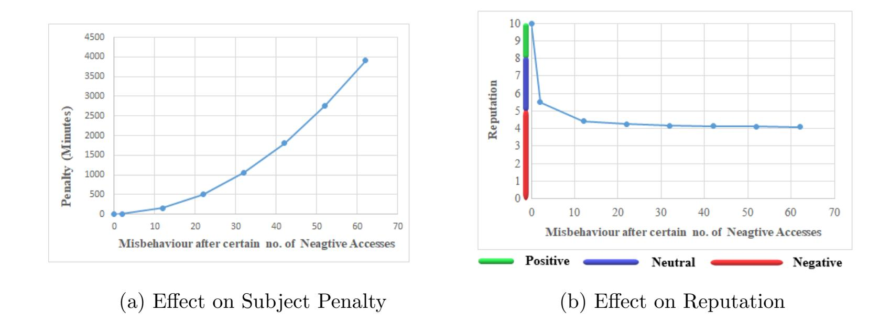
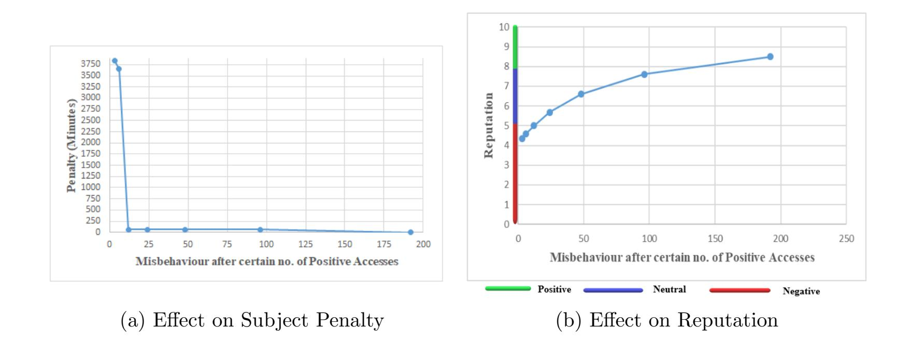
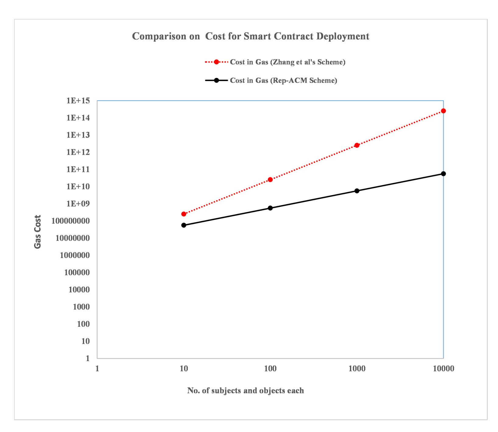

{0}------------------------------------------------

# Reputation Driven Dynamic Access Control Framework for IoT atop PoA Ethereum Blockchain

Auqib Hamid Lonea,<sup>∗</sup> , Roohie Naaz<sup>a</sup>

<sup>a</sup>Department of Computer Science and Engineering., NIT Srinagar, Jammu and Kashmir,India,190006

## Abstract

Security and Scalability are two major challenges that IoT is currently facing. Access control to critical IoT infrastructure is considered as top security challenge that IoT faces. Data generated by IoT devices may be driving many hard real time systems, thus it is of utmost importance to guarantee integrity and authenticity of the data and resources at the first place itself. Due to heterogeneous and constrained nature of IoT devices, traditional IoT security frameworks are not able to deliver scalable, efficient and manageable mechanisms to meet the requirements of IoT devices. On the other hand Blockchain technology has shown great potential to bridge the missing gap towards building a truly decentralized, trustworthy, secure and scalable environment for IoT. Allowing access to IoT resources and data managed through Blockchain will provide an additional security layer backed by the strongest cryptographic algorithms available. In this work we present a reputation driven dynamic access control framework for IoT applications based on Proof of Authority Blockchain, we name it as Rep-ACM. In Rep-ACM framework we build two major services, one for Reputation building (for better IoT device behaviour regulations) and other for Misbehaviour detection (for detecting any Misbehaviour on object resource usage). Both of these services work in coordination with other services of proposed framework to determine who can access what and under what conditions access should be granted. For Proof of Concept (PoC) we created private Ethereum network consisting of two Raspberry Pi single board computers, one desktop computer and a laptop as nodes. We configured Ethereum protocol to use

Email address: ahl@nitsri.net (Auqib Hamid Lone)

<sup>∗</sup>Corresponding Author

{1}------------------------------------------------

Istanbul Byzantine Fault Tolerance (IBFT) as Proof of Authority (PoA) consensus mechanism for performance optimization in constrained environment. We deployed our model on private network for feasibility and performance analysis.

Keywords: Reputation, Access Control, IoT, Permissioned Blockchain, Proof of Authority

### 1. Introduction

The term "Internet of Things" (IoT) was first introduced by K. Ashton [1] in 1999. In simpler terms IoT refers to the connection of devices with constrained capabilities to the Internet. The "Things" in IoT are devices which can perform remote sensing, monitoring and actuating. The ubiquitous interconnection of physical objects greatly accelerates collection, aggregation and sharing of data with other connected devices and applications, thus widening IoT applicability in many different domains ranging from smart healthcare, home automation etc. With increased popularity of IoT and ever increasing number of smart devices with insufficient security enforcement connected to internet, access control mechanisms have become an extremely important to prevent security and privacy breaches in an untrustworthy IoT environment. Due to heterogeneous and constrained nature of IoT devices, traditional IoT security frameworks are not able to deliver scalable, efficient and manageable mechanisms to meet the requirements of IoT devices. Thus, an important question arises: how can we achieve distributed, scalable and trustworthy access control in IoT?. Fortunately, Blockchain technology has shown great potential in bridging the missing gap towards building a truly decentralized, trustworthy, secure and scalable environment for IoT. With the advent of smart contracts (a piece of executable code) Blockchain has now evolved as a promising platform for developing trustworthy applications. In this paper, we propose a reputation driven dynamic access control framework for IoT based on Proof of Authority Blockchain, we name it as Rep-ACM. We configured Ethereum protocol to use Istanbul Byzantine Fault Tolerance (IBFT) as Proof of Authority (PoA) consensus mechanism for performance optimization in constrained environment.

As a short summary, the major contributions of the proposed Rep-ACM framework include:

{2}------------------------------------------------

- 1. A new Rep-ACM framework integrating permissioned Blockchain and smart contract capabilities.
- 2. Smart contracts based policy enforcement to regulate resource access in IoT devices.
- 3. Reputation service for building subject reputation based on each access result, to incentivize (in case of positive reputation) or penalize (in case of negative reputation) subjects on misbehaving with object resources, thus helping in better IoT device behaviour regulations.
- 4. Ethereum client configured to work with IBFT as consensus protocol eliminates computational burden from nodes, thus a suitable choice for constrained devices especially in IoT environment.
- 5. A prototype implementation and experimentation to validate and evaluate Rep-ACM ideas.

Rest of the paper is organized as follows: section 2 briefly introduces background of technologies used in the proposed framework, section 3 gives related work, section 4 presents the proposed framework, section 5 presents the implementation and performance evaluation of proposed framework, finally section 6 concludes the paper and references are listed at the end.

# 2. Background

It is important to understand the working principles of both Blockchain and IoT access control, in order to design truly decentralized and secure access control framework for IoT. In this section we briefly introduce working principles of Blockchain technology and access control requirements and challenges for IoT environments.

### 2.1. Blockchain Technology

Blockchain is a chain of connected tamper evident data structure called blocks, which contain or record everything that happens on some distributed systems connected to a peer-to-peer network. Each block is logically divided into two parts, namely, the header and the body. Generally body part of the block contains details of transactions or recorded events and the header of the block contains, among other fields the identifier of previous block. The identifier of previous block is obtained by taking cryptographic hash of the block. Thus each block in Blockchain is linked to previous block through a cryptographic hash, resulting in an append only system. Blockchain was first 

{3}------------------------------------------------

developed for Bitcoin cryptocurrency and serves as distributed public ledger and transactions or events recorded on it are nearly impossible to tamper [2]. The driving force behind the interest in Blockchain research has been its key characteristics that provide security, anonymity and integrity without relying on trusted third party organisation. Initially Blockchain usage was restricted to cryptocurrencies only, after the advent of Ethereum: A next generation smart contract and decentralised application platform [3], applications beyond cryptocurrencies are being developed and explored. Blockchains can be implemented in many different ways to meet demands of various application scenarios. Based on the type of implementation, Blockchains can be broadly classified into three categories:

- Public Blockchain: This type of Blockchain is open to public and anyone can participate as a node in decision-making process and thus are truly decentralized and permissionless in nature.
- Private Blockchain: This type of Blockchain is open only to members of a single organization and thus are permissioned in nature. Every node joining the network is a known member of a single organization.
- Consortium Blockchain:This type of Blockchain is open only to a consortium or group of organizations that has decided to share the ledger among themselves. Consortium or Federated Blockchain are similar to private Blockchain in the sense that it is also permissioned in nature.

# 2.1.1. Ethereum Smart Contracts

Although being first and most popular Blockchain application, Bitcoin has limited applications only within cryptocurrency space, due to Turingincompleteness of its scripting language. However with the advent of Ethereum which implements smart contracts, the potential applicability of Blockchain beyond cryptocurrencies has become endless. The term smart contract was first introduced by Nick Szabo in 1994 [4]. Smart contracts are computer programs that are executed on Blockchain when required conditions are satisfied. They have both code (functions) as well data (state) similar to Java programs. Serpent and Solidity (JavaScript like) are two high level scripting or programming languages used for writing Ethereum smart contracts, but Solidity is most popular and widely used language for writing Ethereum smart contracts. Smart contracts are compiled into a piece of Ethereum specific bytecode call Ethereum Virtual Machine (EVM) bytecode 

{4}------------------------------------------------

just like Java programs which are compiled into Java specific JVM bytecode. A Smart contract has both account and address associated with it. Smart contracts usually provide many functions or application binary interfaces (ABIs), which are used to modify the state of the smart contract. ABIs can be invoked by sending a transaction from an account or message from other contract . call functions can interact with smart contracts without modifying its state. Ethereum is the first public Blockchain platform that allows advanced and customized smart contracts with the help of Turing-complete virtual machine called EVM. Ethereum is currently the most popular development platform for smart contracts and is used to design various kinds of decentralized applications (DApps) beyond cryptocurrency space.

# 2.1.2. Ethereum Consensus Algorithms

Consensus algorithms are heart and soul of any Blockchain platform as they help in achieving trust among geographically distributed and untrusted nodes. Ethereum can be configured to work with different consensus algorithms depending on specific application scenario whether public or private Ethereum network is to be deployed. In case of public permissionless, Blockchain implementation consensus algorithms are generally based on lottery based selection of a single node for generation and insertion of new block into the Blockchain. Proof of Work (PoW) and Proof of Stake (PoS) are two widely used consensus approaches used by public Blockchains like Bitcoin and Ethereum. PoW involves searching for a value that when hashed in combination with other block information, such as with SHA256, the resulting hash begins with the constant number of zero (0) bits or is less than a specific target. In essence PoW involves nodes finding a proof, that they have performed computationally expensive work [2]. In PoS instead of solving difficult computational puzzle, nodes economic share in the network are put to stake. A node for Block creation and insertion is selected in pseudorandom fashion, with probability of being selected proportional to nodes share in the network [5]. In permissioned Blockchain deployments such as private and consortium Blockchains, only a limited number known participants carry a copy of the entire Blockchain. Proof of Authority (PoA) is a consensus approach used mainly in private Ethereum deployments. PoA is the specific type of PoS, in which individual's identity is at stake rather than cryptocurrency. In PoA validators are pre-authorized and identities are known. Thus misbehaviour by any validator in the network results in losing his personal reputation and consequently being expelled from the validator set. There are many variants 

{5}------------------------------------------------

of PoA such as Aura, Clique and Istanbul Byzantine Fault Tolerant (IBFT). In our proposed framework we have configured Ethereum to work with the latter.

 Istanbul Byzantine Fault Tolerance: Istanbul Byzantine Fault Tolerance (IBFT) [6] is an adaption of Practical Byzantine Fault Tolerant (PBFT) algorithm to serve as Proof of Authority (PoA) consensus algorithm, providing consensus service for the Ethereum protocol. In essence IBFT is a state replication algorithm, where each validator node maintains a state machine replica to reach consensus. IBFT adapts original PBFT algorithm by inheriting three phase consensus structure, PRE-PREPARE, PREPARE and COMMIT. IBFT can tolerate at most F faulty nodes in a network of N = 3F + 1 validator nodes. IBFT algorithm proceeds in rounds with new block being generated every T seconds, where T is block period and can be configured as per the need and feasibility. Before each round a proposer is selected either through round robin or sticky proposer scheme among available set of validators. Proposer creates a new block proposal and broadcasts it to all validators with a PRE-PREPARE message. Upon receiving PRE-PREPARE message from proposer, validators enter the PRE-PREPARED state and then broadcasts PREPARE message. This step ensures that all validators are working on the same sequence and the same round. In second phase validators receiving 2F + 1 PRE-PARE messages enter into PREPARED state and broadcasts COM-MIT message. This step is for informing peers about acceptance of block proposal from proposer. In the last phase, validators wait for receiving 2F + 1 COMMIT messages to insert the proposed block into Blockchain. Blocks are final in IBFT because there are no forks and hence any valid block will be present somewhere in the chain. To work in asynchronous network environment IBFT uses future messages and backlog concepts. Messages which are declared as future messages are put to backlog and processed later whenever possible. To speed up the consensus, if validator receives 2F + 1 COMMIT messages before receiving 2F +1 PREPARE messages, it will jump to the COMMITTED state without waiting for further PREPARE messages.

# 2.2. Access Control in IoT

Access control is one of the important security services that protects system resources from unauthorized access. An effective access control should 

{6}------------------------------------------------

satisfy the main security properties of the CIA triad: Confidentiality, Integrity and Availability [7]. Access control models are implemented in many different areas including operating system and database management system at different levels. In IoT context access control process works at different layers of IoT reference model to protect resource access and safeguard data in various forms: data in motion, data at rest and data at IoT device itself. Furthermore access control mechanism in IoT ensures that only authorized users access sensor data, update device software and order other devices to perform a certain operation on sensor data [8]. Any basic access control mechanism consists of five entities:

- 1. Subject: Any entity in the form of user or process that requests access to objects.
- 2. Object: Any entity in the form of user or process that possesses information being accessed by subjects.
- 3. Actions: Actions represent operations to be performed on objects(read, write, execute, etc.).
- 4. Privileges: Privileges represent authorization or permission to perform certain operations on objects in the form of user or process that requests access to objects.
- 5. Access policies: Set of rules that define conditions and constraints, whether access is to be granted or denied.

In broader sense access control mechanisms in IoT systems are classified into two major categories : centralized and distributed. In centralized access control mechanisms, the access control logic is implemented at a central entity. The entity could be a server or any other device with direct communication with IoT devices. The central entity receives data collected by IoT devices and is solely responsible for making access control decisions. While in distributed access control mechanisms, access control logic is distributed among several IoT devices. Usually in distributed access control approach IoT devices are provided with necessary resources for data processing and information transfer [9].

### 2.2.1. Access Control Challenges in IoT

Due to dynamic, highly scalable nature of IoT environment and heterogeneity, resource-constrained characteristics of IoT devices, designing and implementing access control strategies faces more challenges in meeting re

{7}------------------------------------------------

quirements of IoT networks. Some of the important challenges are enumerated below:

- 1. Scalability: Large number of devices connected to IoT increases management overload in access control system. Therefore access control strategies are expected to be scalable in terms of size, structure and number of devices.
- 2. Heterogeneity: IoT system connects devices with varying underlying technologies and application domains. Thus access control mechanisms are expected to support interoperability among heterogeneous devices.
- 3. Limited Resources: Due to lightweight nature of IoT devices, the capability of resources (computation and storage) associated with them is limited. Thus access control model designed for IoT should be efficient and optimal in imposing overhead on devices and communication networks.
- 4. Context Awareness and Dynamism: Access decisions in IoT environments have to be dynamic and context (surrounding environment, user behaviour etc.) based. The dynamic nature of IoT devices makes access control policies highly complex.

### 3. Related Work

Traditional access control mechanisms for IoT are prone to single point of failure, as they are based on the centralized databases containing user access policies. This drives research towards finding alternative solutions for meeting access control requirements for heterogeneous IoT environment. Several Blockchain based access control mechanisms have been proposed in the recent past for addressing requirements of the IoT devices. Below is the brief summary of the most recent and relevant ones.

The work presented in [10] proposed a new Blockchain based access control architecture for arbitrating roles and permissions in IoT. In essence a tokenized approach is proposed where access policies are enforced through smart contracts for allowing or revoking access to stored IoT data. Another token based approach to access control was proposed by the authors in [11], where access policies are written into smart contracts for granting and revoking access privileges to the users with varying roles. Another similar work was carried out by the authors in [12], where access to stored IoT data is granted or revoked by means of functions written in smart contracts. In [13], 

{8}------------------------------------------------

the authors propose a scheme for guaranteeing integrity of policy evaluation process utilizing Ethereum Blockchain and Intel SGX trusted hardware for cloud federations. Authors in [14] propose a Bitcoin based architecture for managing access rights through Blockchain transactions. Authors in [15] proposed a Blockchain and Machine Learning based dynamic access control policy for IoT. The proposed framework utilized Blockchain for ensuring a truly distributed infrastructure and Machine Learning algorithms (Reinforcement Learning) for achieving optimized and self adjusted security policies for IoT access control management. The work presented by authors in [16] introduced the concept of connecting local Blockchains to a public overlay Blockchain, where access policies are stored within Blockchain making them publicly verifiable detecting any unauthorized access attempts. Authors in [17] extended the idea proposed by [16] by dropping any transaction issued by an adversary from the Blockchain network altogether. In [18] authors propose a Blockchain based authentication and access control solution for IoT devices. Proposed model works in two phases: in first phase user authenticates himself to the smart contract and in second phase user receives authentication token and IoT device receives authentication token and Ethereum address of authorized user, thus authenticating user to IoT device. Another work presented by the authors in [19] proposed a Blockchain based access control scheme for off-chain data stored in Decentralized Hash Tables(DHT). The Blockchain in proposed solution stores access policies of different users for any data stored data in DHT. On access request, DHT nodes verify user access privileges from Blockchain records. Similar work was proposed by the authors in [20] by modifying InterPlanetary Filesystem (IPFS) to incorporate Blockchain based access control for file sharing. Authors in [21] proposed a smart contract based framework for distributed and trustworthy access control for IoT. The work presented by authors in [22] proposed a role based access control mechanism using smart contracts. The proposed scheme is composed of two main components namely Blockchain smart contract and the challenge response protocol. For accessing any resource, users have to provide response to a challenge given by service provider. Upon successfully verification access to desired resource is granted. Authors in [23] proposed a new method for access control in IoT based on Blockchain which helps users in accessing and controlling their data. In essence smart contracts are used for policy evaluation, to allow access to the resources. Work presented in [24] proposed a decentralized IoT system based on blockchain. Then they established a secure fine-grained access control strategies for users, devices, 

{9}------------------------------------------------

data, and implemented the strategies with smart contract. Authors in [25] proposed a secure fine-grained access control system for outsourced data, which supports read and write operations to the data. They have leveraged attribute-based encryption (ABE) scheme, which is regarded as a suitable to achieve access control for security and privacy (confidentiality) of outsourced data. The work presented in [26] proposed a Blockchain based access control for conflict of interest domains. They integrated a Blockchain in their architecture to make access control fair, verifiable and decentralized. Authors in [27] proposed a novel Blockchain driven decentralized architecture for permission delegation and access control for IoT application. Authors in [28] proposed a decentralized access control mechanism for IoT data using blockchain and trusted oracles. The proposed scheme uses trusted oracles as interface gateways and a provider of trusted and uniform source feeds for IoT data.

The work presented in this paper is inspired by the above mentioned solutions, in particular the work done by the authors in [21], with following differences:

- 1. A PoA based private Blockchain network for performance optimization;
- 2. A single smart contract deployed by Objects for managing accesses to their resources by multiple subjects;
- 3. Reputation service for building subject reputation based on each access result, to incentivize (in case of positive reputation) or penalize (in case of negative reputation) subjects on misbehaving with object resources, thus helping in better IoT device behaviour regulations; and
- 4. Access specifiers for maintaining integrity of proposed framework.

### 4. Proposed Framework

In this paper we propose Rep-ACM: Reputation driven Dynamic Access Control Framework for IoT applications on the top of Proof of Authority Ethereum Blockchain. Simplified architecture of proposed framework consists of four main parts: 1) Participants (subjects and objects) 2) Front End for registering and retrieving addresses and ABI's of deployed object access control contracts 3) Smart contracts (registry and Rep-ACM) and 4) Blockchain network as shown in figure 1.

1. Participants: They are real actors in the network. Any participant in proposed framework acts as either subject or object. IoT devices

{10}------------------------------------------------



Figure 1: Detailed Architecture of Rep-ACM

{11}------------------------------------------------

under the supervision of IoT gateway act as objects in the proposed framework. Servers, user devices and other communicating devices act as subjects. In certain situations vice versa is also possible. Subjects and Objects are either Validator nodes or Lightweight nodes. Validator nodes perform following jobs in the network:

- Storing a copy of the blockchain
- Validating transactions and taking part in consensus process by creating, proposing and adding blocks to Blockchain.

Lightweight nodes simply issue transactions and rely on validators for adding and validating their transactions Participants communicate with Blockchain by calling appropriate deployed smart contract ABI's.

- 2. Front-End: It provides interface for objects to register their deployed access control contract address and ABI in the registry contract. Subjects use front-end for retrieving desired objects access control contract address and ABI from registry contract.
- 3. Smart Contract: Proposed framework makes use of multiple instances of Access control smart contract (Rep-ACM) one by each object (IoT device) and a single registry contract for lookup purposes. Each object deploys Rep-ACM to control access to its resources and data.
- 4. Blockchain Network: It comprises of Peer-to-Peer (P2P) network of nodes and a PoA (IBFT) consensus protocol that governs the communication over P2P network.

### 4.1. Implementation of Proposed Framework

For implementation purposes we designed private and permissioned blockchain network. The Blockchain infrastructure is implemented through Geth [29]: a popular implementation of a full Ethereum node. Geth allows to setup a private network and configure all aspects of the blockchain and the consensus protocol employed. We configured geth to work with PoA based consensus namely, the IBFT consensus protocol described in Section 2.1.2. On top of this blockchain infrastructure, we deploy and run a smart contract implementing the proposed access control framework The implementation of Rep-ACM framework Involves three steps: (i) the initialization of the private blockchain, (ii) the creation of the private network and (iii) the creation and deployment of the smart contract.

{12}------------------------------------------------

### 4.1.1. Blockchain Initialization

Initialization of any Blockchain network involves the creation of its genesis block (first block) and contains the important initial configuration parameters. The only configuration parameters that are of interest for the purposes of the proposed framework are:

- Block Period T: the block period of the IBFT consensus algorithm and represents the rate at which new blocks are created in the Blockchain network.
- Block Gas Limit G: Maximum amount of gas transactions in a block are allowed to consume
- Validators: The Ethereum addresses of the pre-authorized validators.

Block Period T and Block Gas Limit G are two important configuration parameters that greatly affects the overall performance of Blockchain network. This is due to the fact that T and G plays role in transaction latency (block inclusion latency and consensus latency) and block headers overhead, thus controlling the rate at which Blockchain grows with time.

### 4.1.2. Blockchain Setup

In proposed framework validators and lightweight nodes are Geth nodes. Istanbul-tools help in creating genesis block with fixed and known validators. All the nodes in the network are initialized with same genesis block and a JSON file containing the node ids of the validators. Validators once started from geth command line can never leave the network, unless they start misbehaving and consequently are expelled from then network by other validators. In contrast lightweight nodes can join/leave the network at any time. Lightweight nodes are also started from geth command, but their addresses are not included in the genesis block.

### 4.1.3. Smart Contract Implementation and Deployment

We implemented smart contract in Solidity contract-oriented programming language [30]. Proposed framework comprises of multiple modules that work in coordination to control access to the critical IoT infrastructure. We first define all the data structures used by the modules for maintaining the state of subjects and objects in the network.

{13}------------------------------------------------

#### Struct Feedback contains

uint trustScore; uint time; string message; address from; // other optional stuff

- 1. Feedback: We define Feedback as a solidity structure for building reputation of the subjects. It comprises of following elements:
  - trustScore: for every access performed by subject on object a trust score is sent back to subject as a feedback. Using net promoter score (NPS) [31] like scale on trust score, access requests are classified as either negative, neutral or positive.
  - time: represents date and time at which feedback is received
  - message: reason for such a feedback
  - from: address of object from which feedback is received
- 2. Misbehaviour: It is defined so as to record any abnormal action performed by the subject on object. Misbehaviour comprises of following fields:

#### Struct Misbehaviour contains bytes32 Res; address Sub ; uint Act; uint time; uint penalty; string msbType; // other optional stuff

- Res: Valid resource of object on which Misbehaviour happens. Resources can be anything ranging from files belonging to IoT devices to data produced by sensors.
- Sub : address of subject from which misbehaviour is detected
- Act: Action that subject tried to perform on object resource. Possible actions include R (Read), W (Write) or X (Execute)
- time: represents date and time at which Misbehaviour was detected

{14}------------------------------------------------

- penalty: Penalty imposed on subject i.e. number of minutes a subject has been blocked for making any access request.
- msbTyp: This represents type of Misbehaviour detected from subject
- 3. Misbehaviour on Resource: In order to record any sort of misbehaviour on IoT resource done by subject we define MisbehaviourOnResource solidity structure comprising of following fields:

```
Struct MisbehaviourOnResource contains
    Misbehaviour[] misbonRes ;
    uint timeToUblock;
    // other optional stuff
```

- misbonRes: A dynamic array of type Misbehaviour, for recording all misbehaviours on a particular resources by subjects.
- timeToUblock: This represents time at which resource becomes available for the subject; if 0: available otherwise blocked. This field depends on actual penalty imposed on subject which itself is a function of reputation and penalty due to misbehaviour.
- 4. Policy: Objects maintain set of policies to control access on resources and data. Policy data is recorded in a solidity structure comprising of following fields:

```
Struct Policy contains
     bool isSet ;
     address Sub ;
     bytes32 Res;
     string Per;
     uint Act;
     string Pir;
     uint minInterval;
     uint lastReq ;
     uint countFR ;
     uint threshold;
     bool accRes ;
     uint accCode;
     // other optional stuff
```

 isSet: A boolean variable to determine if police is already set for particular subject on specific resource

{15}------------------------------------------------

- Sub: Subject (valid Ethereum address) for which access control is defined
- Res: Object resource for which policy is being set
- Per : Permission for subject on object resource, whether allowed or denied access
- Act: Action that subject can perform on object resource, 7 ("R:Read,W:Write and X:Execute"), 3 ("R:Read and W:Write"), 1 ("R:Read")
- Pir : Access priority for subject on object resource "N:Normal/H:High/L:Low". Priorities change based on feedbacks received from object.
- minInterval: Minimum time duration(in seconds) allowed between two successive requests
- lastReq: Time of Last Request
- countFR: Number of frequent requests within minInterval
- threshold: threshold on countFR, above which a misbehaviour is suspected
- accRes: last access result
- accCode: last access code
- 5. Mapping of subjects to resource access policies: In proposed framework subjects are mapped to corresponding access policies set by objects on their resources. Access result depends both on static policies set by objects and dynamic information related to current behaviour and reputation of the subjects. There is a many to many mapping between subjects and resource access policies as shown in Table 1. Every subject has critical information pertaining to reputation and misbehaviour associated with it, as shown in Table 2. On misbehaviour the latter information plays an important role in deciding penalty time to be imposed on subjects.
- 6. Deriving subject reputation from feedback trust score value: On each access a subject receives a feedback containing trust score value from object. Feedbacks are classified based on net promoter score like scale defined as follows:

{16}------------------------------------------------

Table 1: Rep-ACM Access Control Matrix

| Subjects        | Росоция   | Access Policies |       |       |     |       |  |        |
|-----------------|-----------|-----------------|-------|-------|-----|-------|--|--------|
| Subjects        | Resources | Sub             | Res   | Pir   | Per | Act   |  | accRes |
|                 | $R_1$     | $S_1$           | $R_1$ | N/H/L | A/D | R/W/X |  | T/F    |
| $S_1$           | $R_2$     | $S_1$           | $R_2$ | N/H/L | A/D | R/W/X |  | T/F    |
|                 | :         | $S_1$           | :     | N/H/L | A/D | R/W/X |  | T/F    |
|                 | $R_N$     | $S_1$           | $R_N$ | N/H/L | A/D | R/W/X |  | T/F    |
|                 | $R_1$     | $S_2$           | $R_1$ | N/H/L | A/D | R/W/X |  | T/F    |
| $S_2$           | $R_2$     | $S_2$           | $R_2$ | N/H/L | A/D | R/W/X |  | T/F    |
| $\mathcal{S}_2$ | :         | $S_2$           | :     | N/H/L | A/D | R/W/X |  | T/F    |
|                 | $R_N$     | $S_2$           | $R_N$ | N/H/L | A/D | R/W/X |  | T/F    |
| $S_N$           | $R_1$     | $S_N$           | $R_1$ | N/H/L | A/D | R/W/X |  | T/F    |
|                 | $R_2$     | $S_N$           | $R_2$ | N/H/L | A/D | R/W/X |  | T/F    |
|                 | :         | $S_N$           | :     | N/H/L | A/D | R/W/X |  | T/F    |
|                 | $R_N$     | $S_N$           | $R_N$ | N/H/L | A/D | R/W/X |  | T/F    |

Table 2: Information associated with each subject

| Address                                    | Feedback Received from Objects | Misbehaviour on Object Resources | Total Trust Score | Access Request Count | Avg Trust Score       | Reputation                |
|--------------------------------------------|--------------------------------|----------------------------------|-------------------|----------------------|-----------------------|---------------------------|
| 0xb91efd5d5f49849e95e378e19075124f35f889dc | Feedback 1                     | Misbehaviour 1                   |                   |                      |                       |                           |
|                                            | Feedback 2                     | Misbehaviour 2                   | X                 | N                    | $\lceil (X/N) \rceil$ | Neutral/Positive/Negative |
|                                            |                                |                                  |                   |                      |                       |                           |

$$feedback(trustScore) = \begin{cases} NegativeFeedback & trustScore \leq 5 \\ NeutralFeedback & trustScore > 5 \ and \ t_{Score}(x) \leq 8 \\ PositiveFeedback & trustScore > 8 \ and \ t_{Score}(x) \leq 10 \end{cases}$$

Trust score value is given based on nature of access, if access is as per already defined policy a positive feedback (trust score value 10) is given by object to subject, if no policy is defined for subject then neutral feedback (trust score value 8) is given by object to subject, if access is against predefined policy or request still blocked or misbehaviour detected then negative feedback (trust score value 4) is given by object to subject, and if access is against predefined policy and misbehaviour is also detected then also negative feedback (trust score value 4) is given by object to subject. Overall reputation of subject is also derived from net promoter score like scale but on average trust score received from object feedbacks as shown below:

$$t_{Score}(x) = \left\lceil \frac{x + 10 + feedbackScoreOnMisbeahviour}{t_{request} + 2} \right\rceil$$
 (1)

{17}------------------------------------------------

where x represents total trust score received by a subject, feedbackScoreOnM isbeahviour represents a feedback score on misbehaviour, used in advance as feedback is submitted only after the completion of access request and trequest represents total count of access requests. Every subject starts from positive reputation with a trust score of 10. With time subject reputation varies based on its behaviour while accessing object resources on the network. On misbehaviour

$$getReputaion(t_{Score}(x)) = \begin{cases} Negative \ Reputaion & t_{Score}(x) \leq 5 \\ Neutral \ Reputaion & t_{Score}(x) > 5 \ and \ t_{Score}(x) \leq 8 \\ Positive \ Reputaion & t_{Score}(x) > 8 \ and \ t_{Score}(x) \leq 10 \end{cases}$$

- 7. Important Functionalities of Proposed Framework: Rep-ACM framework uses services of two smart contracts with several APIs as shown in figure 1 for performing different functions within the framework.
  - (a) Registry Smart Contract: Registry smart contract provides two main functionalities apart from other tasks in the framework:
    - i. It allows objects in the system to register their deployed Rep-ACM smart contracts instances.
    - ii. Registry smart contract also allows subjects to access desired objects resources through ABIs of registered Rep-ACM smart contract instances.

To achieve the above two functionalities Registry smart contract maintains a lookup table containing the following information:

- Object address: the address of the object or IoT gateway ;
- Gateway address: the address of IoT gateway (when objects are IoT devices);
- Object: the name of the object who is the owner of the resources for which access polices are defined;
- Access control contract address: the address of the smart contract
- ABI: the ABIs provided by the contract;

In general, objects are creators of Rep-ACM smart contract instances, however when IoT devices act as objects, local IoT gateways act as agents for deploying contracts and sending transactions on their behalf. IoT gateways associate ethereum account 

{18}------------------------------------------------

addresses with each of the IoT devices under its control and use their account addresses while deploying and sending transactions. The Gateway address lookup table entry is is filled with object address, when objects are other than IoT devices. Registry smart contract provides the following main ABIs to maintain the entries of the lookup table.

- register() : This ABI allows the valid objects to register details of their deployed Rep-ACM smart contract instance.
- getContract() : This ABI receives the object addresses and name as input and returns the address and ABIs af the registered contract instance as output.
- updateRegister() : This ABI after proper validation allows objects to update their exiting lookup table fields especially Access control contract address and ABI.
- deRegister() : This ABI receives the object address and name as input and after proper validation deletes corresponding lookup table entry.

Only creators of the corresponding Rep-ACM smart contract instances are allowed to register, update and delete the details of contract instances from the lookup table.

- (b) Rep-ACM Smart Contract: The heart and soul of the proposed framework is Rep-ACM smart contract, as it provides all necessary functions to facilitate smooth access control of the IoT system. Rep-ACM smart contract provides the following main ABIs to control access to object resources, maintain subject reputation and penalize subjects on misbehaviour.
  - addPolicy() , updatePolicy() & deletePolicy() ABIs: These ABIs of Rep-ACM smart contract instance are used by objects to add, update and delete access control policies for controlling access to object resources. Only creator can invoke these ABIs.
  - getAccess() : This is the main ABI of Rep-ACM smart contract, which allows subjects to access their desired object resources. accessControl() ABI uses services of the other ABIs like submitFeedback(), getReputation(), and onMisbehaviour() to efficiently manage access control. The getAccess() ABI is

{19}------------------------------------------------

summarized in algorithm 1. The execution flow of access control process is shown in fig 3 and actions taken on each access code are explained in algorithm 3. Steps required to be taken by subjects in order to access object resources are shown in figure 2 and explained below:

- Step 1: The subject calls getContract() ABI of Registry smart contract to retrieve the desired objects registered Rep-ACM smart contract instance for access control.
- Step 2: The Registry returns the address and ABI of the requested Rep-ACM instance to the subject.
- Step 3: The subject then uses address and getAccess() ABI of Rep-ACM obtained in step 2 to access object resource. Subject sends transaction with required information by invoking getAccess() ABI. The validators in the Blockchain network collect such transaction and include that in the block. Transaction will be executed only if block is mined by some validator.
- Step 4: After receiving access request from subject, object's Rep-ACM instance more specifically getAccess() ABI performs both static and dynamic check on access request. Subjects reputation is also taken into count, when determining penalty for subject if any misbehaviour is detected.
- Step 5: Finally, access control terminates by returning access control result to both subject and object.
- onMisbehaviour() ABI: This ABI gets invoked when any misbehaviour is detected on resource access by subject. This ABI takes subject address(implicitly passed as caller of getAccess() ABI) as input and returns penalty(in minutes) to block subject from making any further request, until blocking time completes. onMisbehaviour() ABI is briefly summarised in algorithm 2.
- getReputation() ABI: This ABI takes subject address(implicitly passed as caller of getAccess() ABI) as input and returns average trust-score of the subject as output. It is invoked by getAccess() ABI to determine the average trust-score of the subject. Penalty received by a

{20}------------------------------------------------

subject in onMisbehaviour() ABI is increased(multiplied) or decreased(divided) by a factor of netAccessDiff based on the subject reputation. Effective blocking time for a subject is:  $peanlty = \lceil \frac{penalty}{netAccessDiff} \rceil$  when positive reputation, peanlty = penalty\*netAccessDiff when negative reputation and peanlty = penalty when neutral reputation. getReputation() ABI is briefly summarized in algorithm 5

- submitFeedback() ABI: For each access a subject receives a feedback from object. Apart from other information feedback includes a trust-score(1-10), given based on the nature of access i.e. for positive access subject receives a trust-score of 10, for neutral access a trust-score of 8 is given to subject and for negative access a trust-score either 2 or 4 is given based on the severity of access violation e.g. if subject fails both static and dynamic checks during access, it receives a trust-score of trust-score of 4 is given to subject. Since reputation is directly proportional to trust-score, thus more the trust-score, the better the reputation of the subject in the IoT environment. The submitFeedback() ABI is invoked by getAccess()ABI and is briefly summarised in algorithm 4.
- selfDestruct() ABI: This is used by objects to completely remove Rep-ACM smart contract instance from Blockchain.

{21}------------------------------------------------

# Algorithm 1: getAccess() ABI

Input: resource, action, time

Output: Allows or Blocks access request based on defined policies and Reputation of subject and returns access result

Require: defined policies on resources for subjects as  $p \leftarrow lookup[resource][msg.sender]$ , policy check as  $pCheck \leftarrow$  false, behaviour check as  $bCheck \leftarrow$  true, imposed penalty as  $penalty \leftarrow 0$ , total access requests as totoalCount, total negative feedbacks as negativeCount, total positive feedbacks as positiveCount, uint netAccessDiff $\leftarrow 1$ , misbehaviours on resource by subject as  $msbOnRes \leftarrow MisbehaviourOnResource[resource][msg.sender]$ , Reputation score of subject as repScore

```
if p.subject == msg.sender then
    if msbOnRes.timeToUnblock \ge time then
         accessCode = 1
    else
         if msbOnRes.timeToUnblock > 0 then
              msbOnRes.timeToUnblock = 0
              p.countFR = 0
              p.lastReq = 0
         if p.per == allow \&\& p.action == action then
             pCheck \leftarrow true
         if time-p.lastReq \leq p.minInterval then
              p.countFR++
              if p.countFR \geq p.threshold then
                   penalty = onMisbehaviour(msg.sender)
                   bCheck = false
                   repScore = getReputation(msg.sender)
                   if totalCount \geq 1 then
                        if repScore \leq 5 then
                             {\tt netAccessDiff} = \textit{negativeCount-positiveCount}
                             penalty = penalty * netAccessDiff
                        else if repScore > 5 \&\& repScore \le 8) then
                             penalty = penalty
                        else
                             netAccessDiff= positiveCount-negativeCount
                             penalty = \lceil \frac{penalty}{netAccessDiff} \rceil
                   else
                     penalty = 1
                   misbonRes.timeToUnblock = time + penalty
                   misbonRes.push(resorce,msg.sender,action,msbType,time,penalty)
          else
           | p.countFR = 0
         if pCheck && bCheck then
           \perp accessCode = 0
         if ¬pCheck && bCheck then
           \perp accessCode = 2
         if pCheck \ \mathcal{EE} \ \neg bCheck then
           \perp accessCode = 3
          if \neg pCheck \ \mathcal{CE} \ \neg \ bCheck \ \mathbf{then}
           \perp accessCode = 4
    p.lastReq = time
    p.result = pCheck && bCheck
    p.accCode = accessCode
else
 \perp accessCode = 5
```

{22}------------------------------------------------

Table 3: Access Control Registry

| Object address                             | Gateway address                                                                | Object    | Access Control Contract Address                                  | ABI           |
|--------------------------------------------|--------------------------------------------------------------------------------|-----------|------------------------------------------------------------------|---------------|
| 0xf537a4d70b1223f7cc051db18602124c8ac9b578 | 0 x 9 5 8 b 10 a 5 a 10 4 a 7 a 2 d 27 1 d 8 d d 4 24 0 d 7 8 9 6 7 c 4 21 2 d | Pi-Camera | 0x3f3553d6c5ebb1fa698b89498983997a251cf122                       | Rep-ACM 1 ABI |
| 0x4c6009f254364ea0f49e0da18287971fa4f716dd | 0x4c6009f254364ea0f49e0da18287971fa4f716dd                                     | Object A  | 0 x e c 56 a 3500085 b 15502 e 14288 e 71 e 5 c 5f 0 b 08 b 33 a | Rep-ACM 2 ABI |
| 0x4b0897b0513fdc7c541b6d9d7e929c4e5364d2db | 0xca35b7d915458ef540ade6068dfe2f44e8fa733c                                     | Sensor C  | 0x0dcd2f752394c41875e259e00bb44fd505297caf                       | Rep-ACM 3 ABI |
| :                                          | :                                                                              | :         | :                                                                | :             |

# Algorithm 2: onMisbehaviour() ABI

```
Input: subject
Output: penalty
Require: count of negative feedbacks received by a subject as negativeCount\nif negativeCount \geq 0 then
```

# Algorithm 3: Actions on different Access codes

```
Input: accessCode
```

Output: Appropriate actions based on access code returned on accessing resources under objects by subjects

#### if accessCode == 0 then

- $\bullet \quad submitFeedback (sub, obj, 10, "Access \ Granted");\\$
- Grant access to resource under object requested by subject and Trigger appropriate event with Access result as true

#### else if accessCode == 1 then

- submitFeedback(sub, obj, 4, "Requests are still Blocked");
- $\bullet \quad \textit{Trigger appropriate event with Access result as false}$

#### else if accessCode == 2 then

- submitFeedback(sub,obj,4,"Static policy check failed");
- Trigger appropriate event with Access result as false

#### else if accessCode == 3 then

- submitFeedback(sub,obj,4,"Misbehaviour detected ");
- Trigger appropriate event with Access result as false

#### else if accessCode = = 4 then

- submitFeedback(sub, obj, 4, "Static policy check failed & Misbehaviour detected");
- Trigger appropriate event with Access result as false

#### else

- submitFeedback(sub, obj, 8, "Invalid Subject");
- Trigger appropriate event with Access result as false
- Add access policy for subject after verification

{23}------------------------------------------------

### Algorithm 4: submitFeedback() ABI

```
Input: subject, object, trustScore, message, DateTime
Output: Builds reputaion of subject based on access actions performed on objects
Require: feedback list as feedbacks, total access requests as totalCount, total negative
 feedbacks as negative Count, total neutral feedbacks as neutral Count, total positive feedbacks
 as positive Count, total trust score as score Sum, feedbacks given as feedback Given, feedbacks
 received feedbackReceived
if trustScore > 0 and < 10 then
     feedback \leftarrow feedbacks[subject][object]
     accessCounter \leftarrow totoalCount[subject]
     totalScore \leftarrow scoreSum[subject]
    feedbackGivenHistory \leftarrow feedbackGiven[object]
     feedbackReceivedHistory \leftarrow feedbackReceived[subject]
     feedback.score \leftarrow trustScore
    feedback.date \leftarrow DateTime
     feedback.message \leftarrow message
     feedback.submittedBy \leftarrow object
     accessCounter++
     totalScore + = trustScore
     if trustScore \geq 0 && trustScore \leq 5 then
      _ negativeCount++
     else if trustScore > 5 && trustScore < 8 then
         neutralCount++
     else if trustScore > 8 \&\& trustScore \le 10 then
      | positiveCount++
     feedbackGivenHistory.push(feedback)
     feedbackReceivedHistory.push(feedback)
else
 ∟ revert
```

# Algorithm 5: getReputation() ABI

```
Input: subject

Output: returns reputation of a subject either Negative, Neutral or Positive Require: total access requests as totalCount, total trust score as scoreSum if totalCount \geq 0 && scoreSum \geq 0 then
```

### 5. Prototype Implementation and Performance Evaluation

In this section, we first introduce our experimental setup built as the Rep-ACM framework prototype and then evaluate feasibility and performance of proposed Rep-ACM framework. The overall network design for proof of concept is shown in figure 4.

{24}------------------------------------------------



Figure 2: Access control steps in Rep-ACM framework

{25}------------------------------------------------



Figure 3: Execution Flow of Rep-ACM

{26}------------------------------------------------

Table 4: Specification of Devices

| Device                 | CPU                                 | Memory    | Hard Disk          | $\overline{OS}$                |
|------------------------|-------------------------------------|-----------|--------------------|--------------------------------|
| Raspberry Pi 3 Model B | ARMv7 Processor rev 4 (v7l), 1.2GHz | 1GB SDRAM | 16GB(microSD card) | Raspbian GNU/Linux 9 (stretch) |
| Dell OPTIPLEX 9020     | Intel Core i7-4790, 3.60GHz         | 4GB       | 500GB              | Ubuntu 16.04 LTS               |
| Dell Precision 7720    | Intel Core i7-6820HQ, 2.70GHz       | 32GB      | 1TB                | Ubuntu 16.04 LTS               |



Figure 4: Rep-ACM Network Setup

### 5.1. Rep-ACM Prototype Environment Setup

For Proof of Concept we created private Ethereum network consisting of two Raspberry Pi 3 Model B single board computers, one desktop computer and a laptop as nodes. We also have 4 static nodes running on desktop computer as validators. The desktop and laptop corresponds to the user devices in the prototype system and the single board computers correspond to the local gateways. We considered access control issue between the two single board computers in which one serves as object(or the agent of the object) and other as subject (or the agent of the subject). The detailed specification of devices used in prototype are listed in table 4 and testbed used for prototype implementation is shown in figure 5.

{27}------------------------------------------------



Figure 5: Testbed used for prototype implementation

Regarding the software, on each device go-ethereum client was installed to transform the device into a private Ethereum network node. With istanbultools [32] we created private Ethereum network running IBFT as PoA consensus protocol. There is no mining as we used Ethereum with IBFT, where known and authorized nodes called as validators do the job of miners. For prototype implementation we have chosen 4 nodes to act as validators in the Blockchain network. Any device with suitable storage capacity can act as validator, thus IoT gateways with suitable storage capacity could act as full nodes in proposed framework. For writing, compiling and deploying Rep-ACM smart contract we utilized the Remix integrated development environment (IDE) [33] which is browser-based IDE for Solidity (programming language for writing Ethereum smart contracts) [30]. In addition, we have installed web3.js [34] both on object and subject side to interact with Blockchain from front-end through http connections. Web3.js allows monitoring the states of Rep-ACM framework smart contracts and sending and receiving access control requests and responses.

### 5.2. Experimentation

We conducted experiments in order to validate the consistency of smart contract execution and to test the feasibility of the framework for access control. We added access policies for subjects at object side with constant minInterval = 1000s and threshold = 2. In proposed framework misbehaviour 

{28}------------------------------------------------

from subjects could happen in two ways 1) either by positive frequent access requests or by 2) frequent negative accesses (policy check failures) crossing threshold. After failing two consecutive policy checks, third time a misbehaviour was detected and a penalty of 3 minutes was imposed on subject as shown in figure 6a. After completion of penalty time, subject sends access request as per policy defined by object (Resource owner) and access was granted as shown in figure 6b, thus confirming the correctness of smart contract execution. For analysing the effect of subject reputation on misbehaviour penalty, we performed several access requests to object resources from different subjects. Access requests include both positive as well as negative accesses (accesses not as per defined policy) including misbehaviours. We consider two case scenarios, in first case we consider subject doing misbehaviour after certain number of negative accesses without doing any positive access to better understand effect of negative accesses on subject reputation and penalty on misbehaviour. In first case we consider subject doing second type of misbehaviour. For second case, after doing 62 consecutive negative accesses in case first, subject does a misbehaviour only after certain number of positive accesses to better understand effect of being good in network by getting less penalty on misbehaviour with more positive accesses on object resources. For second case we consider subject doing first type of misbehaviour.

| Contract: 0x3f3553d6c5ebb1fa698b89498983997a251cf122                           |                                                                                |
|--------------------------------------------------------------------------------|--------------------------------------------------------------------------------|
| Block Number: 176517                                                           | Contract: 0x3f3553d6c5ebb1fa698b89498983997a251cf122                           |
| Tx Hash: 0x9e3e380aa5ecebc6a7ac0ae693ce75d15d1c0445b1619c1d65d08bfa443b1e6f    | Block Number: 176701                                                           |
| Block Hash: 0xcd2fldeed102f6fc62fe19d220de802c1c00274005d0397eac25358bafe9cf61 | Tx Hash: 0x6a3440f9528e812f1e4bf6eb20a150252f3db02dad491c1eb97ea321b43478b2    |
| Subject: 0xb9lefd5d5f49849e95e378e19075124f35f889dc                            | Block Hash: 0x33ca6a6859c596ffc0f79b126b0904a0c74b6bb879bfe4acc609947cd718f026 |
| Time: 1575550549                                                               | Subject: 0xb91efd5d5f49849e95e378e19075124f35f889dc                            |
| Message: Static check failed! & Misbehavior detected!                          | Time: 1575551505                                                               |
| Result: false                                                                  | Message: Access Granted!                                                       |
| Requests are blocked for 3 Minutes!                                            | Result: true                                                                   |
|                                                                                |                                                                                |

- (a) Misbehaviour after two consective Policy check failures
- (b) Access as per defined Policy

Figure 6: Access Result at IoT Gateway (at Object side)

{29}------------------------------------------------



Figure 7: Effect of Misbehaviour after certain number of consecutive Negative accesses



Figure 8: Effect of Misbehaviour after certain number of consecutive Positive accesses

From figures 7a and 7b we can clearly observe that, with increase in negative accesses, penalty on misbehaviour increases sharply and subject reputation decreases and from figures 8a and 8b we observe that with increase in positive accesses, penalty on misbehaviour decreases drastically when subject reputation grows from negative to neutral and to positive respective.

{30}------------------------------------------------

### 5.3. Performance Evaluation

This section provides brief analysis of the proposed framework in terms of cost and security.

# 5.3.1. Cost Analysis

Every transaction executed on Ethereum Blockchain costs some Gas, representing unit of cost for a particular operation. In Ethereum Gas is paid in terms of Ether, as it is crypto fuel for running applications on the Blockchain network. There are transaction and execution gas costs for each function performed on the blockchain network. Execution cost includes the cost of internal storage in the smart contracts as well cost associated with any manipulation of Blockchain state. Transaction cost includes execution cost and the cost related to other factors like contract deployment and sending data to Blockchain network. Since we utilized IBFT as Blockchain consensus mechanism in proposed framework, there is no mining, thus no computational burden on Blockchain nodes.

Table 5 shows the average gas costs of smart contract functions of the proposed framework. The values shown in the table are approximate and can vary environment to environment. Each function listed in table 5 was executed 5 times to calculate the average cost. Smart contract functions are invoked by the participants (subjects and objects) of the proposed framework. Functions which does not involve any updation in the Blockchain state costs least, while as functions which considerably changes the state of smart contract variables stored on Blockchain costs the most. constructor function is a special function as it is related to the deployment of smart contract and is executed once for each object in the life-cycle of the proposed model. Every object deploys the smart contract for managing access to its resources by subjects.

Table 5: Average Cost of Smart Contract Functions in proposed framework

| Function caller | Function Name        | Average Transaction Cost in gas | Average Execution Cost in gas |
|-----------------|----------------------|---------------------------------|-------------------------------|
| Object          | Rep-ACM constructor  | 5641994                         | 4226142                       |
| Object          | addPolicy            | 200865                          | 175433                        |
| Object          | updatePolicy         | 36604                           | 11364                         |
| Gateway         | registry constructor | 856385                          | 610717                        |
| Object          | registerContract     | 171269                          | 89197                         |
| Object          | updateContract       | 83524                           | 1452                          |
| Subject         | getContract          | 33722                           | 10466                         |
| Subject         | accessControl        | 282843                          | 260381                        |

{31}------------------------------------------------

### 5.3.2. Security Analysis

In this section we present brief security analysis on how our proposed solution ensure key security goals such as integrity, non-repudiation, authorization, availability and accountability.

- 1. Integrity: Proposed framework ensures integrity by storing traceability provenance data regarding subject access history in an immutable Blockchain infrastructure. Cryptographic hash functions make Blockchain immutable in nature.
- 2. Non-Repudiation: Every action is recorded in tamper-proof logs in proposed framework and all actions are linked and cryptographically signed by the initiator. No participant can deny their actions as everything is saved in the tamper-proof logs.
- 3. Authorization: In proposed framework role restrictions have been strictly enforced by using solidity modifiers to ensure proper authorization checks before executing any smart contract functions.
- 4. Availability: Since access policies are enforced through smart contract functions, they immediately becomes available to subjects. The information stored on the Blockchain is saved in distributed and decentralized fashion and thus is immune to single point of failure.
- 5. Accountability and Resistance against Sybil attacks : Since Ethereum account addresses (public keys) of subjects and objects are linked with reputation score, they can be made accountable for their actions on Blockchain.

# 5.3.3. Comparison on with Zhang et al.'s scheme [21]

Although Gas cost does not have much significance in proposed framework except that it impacts the scalability of model if more transactional data is fed into Blockchain. Also our model is generic enough to be implementable in public settings i.e. on the top of public Ethereum Blockchain. Keeping this in view we deployed proposed model smart contracts on same settings as done by Zhang et al. [21] for conducting fair comparative analysis of Rep-ACM with their scheme. It was observed that our scheme improves deployment cost by reducing the number of smart contracts to be deployed. In an IoT infrastructure with n subjects, n objects our schemes requires only n smart contracts to be deployed compared to n 2 contracts using Zhang et al.'s scheme. Also we were able to launch DoS attack against Zhang et al.'s scheme by repeatedly calling misbehaviourJudge() contract function externally with victims address as a subject, as a result it receives huge penalty 

{32}------------------------------------------------

without actually doing any misbehaviour on object resources. Furthermore we extended Zhang et al. scheme by eliminating the possibility of DoS attack by making implicit call to judge smart contract function. For throughput suppose there are 10000 IoT devices and each device has one transactions for every 10 minutes, the TPS (transactions per second) is at least 166, which is well within the range of throughput of IBFT consensus protocol. Zhang et al.'s scheme is based on PoW Ethereum, so maximum achievable throughput in their case is 15tps.

Table 6: Comparison on Gas Cost for Smart Contract Deployment

| No. of Subjects and Objects Each | Cost in Gas (Zhang et al's Scheme) | Cost in (Rep-ACM Scheme) |
|----------------------------------|------------------------------------|--------------------------|
| 10                               | 254347900                          | 56419940                 |
| 100                              | 25434790000                        | 564199400                |
| 1000                             | 2543479000000                      | 5641994000               |
| 10000                            | 254347900000000                    | 56419940000              |

{33}------------------------------------------------



Figure 9: Comparison on Cost in terms of Gas used for Smart Contract Deployment

# 6. Conclusion and Future work

In this paper, we present a proof-of-concept architecture that adopts proof-of-authority (istanbul practical byzantine fault tolerant) Ethereum Blockchain technology to implement reputation driven dynamic access control (Rep-ACM) framework IoT applications, where access policies are enforced through smart contracts stored on Blockchain. Proposed framework contains Rep-ACM smart contract, deployed by objects to control access to their resources and a Registry contract deployed by gateways to manage Rep-ACM smart contract instances deployed by the objects connected to it. We implemented Rep-ACM framework and conducted experiments in order to validate the consistency of smart contract execution and to test the feasibility of the framework for access control in IoT. Experiments showed that 

{34}------------------------------------------------

the cost for proposed framework to integrate PoA (IBFT) Blockchain and smart contracts are within reasonable range while gaining various intrinsic benefits from permissioned Blockchain and smart contracts. As part of the future work, we aim to develop end-to-end decentralized application (DApp) that provides easy to use interface for interacting with Rep-ACM framework ABIs. As an extension to the work, it would be interesting to design functionality that allows objects to share reputation of those subjects who have accessed their resources, with other objects in the IoT environment. Sharing of subject reputations will help other objects in designing access policies dynamically. In future we also aim at making validator selection dynamic, based on reputation in the network.

### References

- [1] K. Ashton et al., "That 'internet of things' thing," RFID journal, vol. 22, no. 7, pp. 97–114, 2009.
- [2] S. Nakamoto, "Bitcoin: A peer-to-peer electronic cash system," 2008.
- [3] V. Buterin, "Ethereum: A next-generation smart contract and decentralized application platform, 2013," URL {http://ethereum. org/ethereum. html}, 2017.
- [4] N. Szabo, "The idea of smart contracts," Nick Szabo's Papers and Concise Tutorials, vol. 6, 1997.
- [5] I. Bentov, A. Gabizon, and A. Mizrahi, "Cryptocurrencies without proof of work," in International Conference on Financial Cryptography and Data Security. Springer, 2016, pp. 142–157.
- [6] "Istanbul byzantine fault tolerant consensus protocol," https://github.com/ethereum/EIPs/issues/650, accessed: 01-08-2019.
- [7] V. Suhendra, "A survey on access control deployment," in International conference on security technology. Springer, 2011, pp. 11–20.
- [8] M. Adda, J. Abdelaziz, H. Mcheick, and R. Saad, "Toward an access control model for iotcollab," Procedia Computer Science, vol. 52, pp. 428–435, 2015.

{35}------------------------------------------------

- [9] J. L. Hern´andez-Ramos, A. J. Jara, L. Marin, and A. F. Skarmeta, "Distributed capability-based access control for the internet of things," Journal of Internet Services and Information Security (JISIS), vol. 3, no. 3/4, pp. 1–16, 2013.
- [10] O. Novo, "Blockchain meets iot: An architecture for scalable access management in iot," IEEE Internet of Things Journal, vol. 5, no. 2, pp. 1184–1195, 2018.
- [11] A. Ouaddah, A. Abou Elkalam, and A. Ait Ouahman, "Fairaccess: a new blockchain-based access control framework for the internet of things," Security and Communication Networks, vol. 9, no. 18, pp. 5943– 5964, 2016.
- [12] T. Le and M. W. Mutka, "Capchain: A privacy preserving access control framework based on blockchain for pervasive environments," in 2018 IEEE International Conference on Smart Computing (SMARTCOMP). IEEE, 2018, pp. 57–64.
- [13] S. Alansari, F. Paci, and V. Sassone, "A distributed access control system for cloud federations," in 2017 IEEE 37th International Conference on Distributed Computing Systems (ICDCS). IEEE, 2017, pp. 2131– 2136.
- [14] D. D. F. Maesa, P. Mori, and L. Ricci, "Blockchain based access control," in IFIP international conference on distributed applications and interoperable systems. Springer, 2017, pp. 206–220.
- [15] A. Outchakoucht, E. Hamza, and J. P. Leroy, "Dynamic access control policy based on blockchain and machine learning for the internet of things," Int. J. Adv. Comput. Sci. Appl, vol. 8, no. 7, pp. 417–424, 2017.
- [16] A. Dorri, S. S. Kanhere, R. Jurdak, and P. Gauravaram, "Blockchain for iot security and privacy: The case study of a smart home," in 2017 IEEE international conference on pervasive computing and communications workshops (PerCom workshops). IEEE, 2017, pp. 618–623.
- [17] M. S. Ali, K. Dolui, and F. Antonelli, "Iot data privacy via blockchains and ipfs," in Proceedings of the Seventh International Conference on the Internet of Things. ACM, 2017, p. 14.

{36}------------------------------------------------

- [18] A. Z. Ourad, B. Belgacem, and K. Salah, "Using blockchain for iot access control and authentication management," in International Conference on Internet of Things. Springer, 2018, pp. 150–164.
- [19] H. Shafagh, L. Burkhalter, A. Hithnawi, and S. Duquennoy, "Towards blockchain-based auditable storage and sharing of iot data," in Proceedings of the 2017 on Cloud Computing Security Workshop. ACM, 2017, pp. 45–50.
- [20] M. Steichen, B. Fiz, R. Norvill, W. Shbair, and R. State, "Blockchainbased, decentralized access control for ipfs," in 2018 IEEE International Conference on Internet of Things (iThings) and IEEE Green Computing and Communications (GreenCom) and IEEE Cyber, Physical and Social Computing (CPSCom) and IEEE Smart Data (SmartData). IEEE, 2018, pp. 1499–1506.
- [21] Y. Zhang, S. Kasahara, Y. Shen, X. Jiang, and J. Wan, "Smart contractbased access control for the internet of things," IEEE Internet of Things Journal, vol. 6, no. 2, pp. 1594–1605, 2018.
- [22] J. P. Cruz, Y. Kaji, and N. Yanai, "Rbac-sc: Role-based access control using smart contract," IEEE Access, vol. 6, pp. 12 240–12 251, 2018.
- [23] C. Dukkipati, Y. Zhang, and L. C. Cheng, "Decentralized, blockchain based access control framework for the heterogeneous internet of things," in Proceedings of the Third ACM Workshop on Attribute-Based Access Control, 2018, pp. 61–69.
- [24] S. Sun, S. Chen, R. Du, W. Li, and D. Qi, "Blockchain based finegrained and scalable access control for iot security and privacy," in 2019 IEEE Fourth International Conference on Data Science in Cyberspace (DSC). IEEE, 2019, pp. 598–603.
- [25] Q. Xia, E. B. Sifah, K. O.-B. O. Agyekum, H. Xia, K. N. Acheampong, A. Smahi, J. Gao, X. Du, and M. Guizani, "Secured fine-grained selective access to outsourced cloud data in iot environments," IEEE Internet of Things Journal, vol. 6, no. 6, pp. 10 749–10 762, 2019.
- [26] G. Ali, N. Ahmad, Y. Cao, Q. E. Ali, F. Azim, and H. Cruickshank, "Bcon: Blockchain based access control across multiple conflict of inter-

{37}------------------------------------------------

- est domains," Journal of Network and Computer Applications, vol. 147, p. 102440, 2019.
- [27] G. Ali, N. Ahmad, Y. Cao, M. Asif, H. Cruickshank, and Q. E. Ali, "Blockchain based permission delegation and access control in internet of things (baci)," Computers & Security, vol. 86, pp. 318–334, 2019.
- [28] H. Albreiki, L. Alqassem, K. Salah, M. Rehman, and D. Svetinovic, "Decentralized access control for iot data using blockchain and trusted oracles," 2019.
- [29] "Geth client for running a full ethereum node," https://github.com/ethereum/go-ethereum/wiki/geth, accessed: 05-12-2019.
- [30] "Solidity a high-level language for implementing smart contracts," https://solidity.readthedocs.io/en/develop/, accessed: 01-08-2019.
- [31] "Net promoter score," https://www.netpromoter.com/know/.
- [32] "istanbul-tools utility for configuring istanbul bft (ibft) network," https://github.com/getamis/istanbul-tools, accessed: 01-08-2019.
- [33] "Remix ide for ethereum smart contract programming," https://remix.ethereum.org/, accessed: 05-12-2019.
- [34] "Web3 javascript api to interact with ethereum nodes," https://github.com/ethereum/web3.js/.