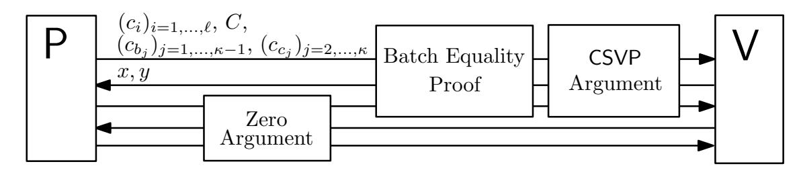

{0}------------------------------------------------

# An Improvement of Multi-Exponentiation with Encrypted Bases Argument: Smaller and Faster

Yi Liu1,2 , Qi Wang1 , and Siu-Ming Yiu2

1 Guangdong Provincial Key Laboratory of Brain-inspired Intelligent Computation, Department of Computer Science and Engineering, Southern University of Science and Technology, Shenzhen 518055, China liuy7@mail.sustech.edu.cn wangqi@sustech.edu.cn 2 Department of Computer Science, The University of Hong Kong Pokfulam, Hong Kong SAR, China smyiu@cs.hku.hk

Abstract. A cryptographic primitive, called encryption switching protocol (ESP), has been proposed recently. This two-party protocol enables interactively converting values encrypted under one scheme into another scheme without revealing the plaintexts. Given two additively and multiplicatively homomorphic encryption schemes, parties can now encrypt their data and convert underlying encryption schemes to perform different operations simultaneously. Due to its efficiency, ESP becomes an alternative to fully homomorphic encryption schemes in some privacypreserving applications.

In this paper, we propose an improvement in ESP. In particular, we consider the multi-exponentiation with encrypted bases argument (MEB) protocol. This protocol is not only the essential component and efficiency bottleneck of ESP, but also has tremendous potential in many applications. For example, it can be used to speed up many intricate cryptographic protocols, such as proof of knowledge of a double logarithm. According to our theoretical analysis and experiments, our proposed MEB protocol has lower communication and computation cost. More precisely, it reduces the communication cost by roughly 29% compared to the original protocol. The computation cost of the verifier is reduced by 19% − 42%, depending on the settings of experimental parameters. This improvement is particularly useful for verifiers with weak computing power in some applications. We also provide a formal security proof to confirm the security of the improved MEB protocol.

Keywords: Encryption switching protocols · Paillier encryption · Twinciphertext proof · Zero-knowledge.

### 1 Background

Nowadays, data has been widely regarded as a kind of valuable resource. Many solutions have been proposed to preserve the privacy of data during its usage, 

{1}------------------------------------------------

such as secure multi-party computation (MPC) [9, 17, 18] and fully homomorphic encryption (FHE) [8]. However, efficiency is still a problem in most cases.

In 2016, Couteau, Peters, and Pointcheval [6] proposed a cryptographic primitive named encryption switching protocol (ESP) (for its extension, see [4]), and it was shown that ESP has great potential to achieve many privacy-preserving goals efficiently. In ESP, two parties secretly share the private keys of an additively homomorphic encryption scheme and a multiplicatively homomorphic encryption scheme, such that the two parties can individually encrypt messages, but should cooperate to perform threshold decryption in order to decrypt a ciphertext. Two parties can also work interactively to switch one underlying encryption scheme of a ciphertext to the other without revealing the plaintext. In summary, ESP allows both parties to perform both additions and multiplications on encrypted values to evaluate pre-deterministic circuits securely. It was shown that ESP could be instantiated for generic two-party computation (2PC) protocol [6], and thus ESP is powerful to cover many MPC tasks (see examples in [5]).

To ensure that the encryption switching procedure of ESP is executed correctly in the presence of malicious parties, the authors of [6] introduced a new cryptographic primitive, called twin-ciphertext proof (TCP). We call a ciphertext pair (C+, C×) twin-ciphertext if the encrypted (or committed) value of the additively homomorphic encryption ciphertext (or commitment) C+ is equal to the value encrypted in the ciphertext C× of multiplicatively homomorphic encryption. In TCP protocol, the prover can efficiently prove that a given pair (C1, C2) is a twin-ciphertext pair without revealing the encrypted value and corresponding random coins. The main idea of TCP is to generate a random twin-ciphertext pair first, and then show the colinear relation between this random twin-ciphertext pair and the pair (C1, C2) to complete the proof. During this approach, the generated random twin-ciphertext pair is consumed. Therefore, to speed up ESP processes, the prover can generate a pool of random twin-ciphertext pairs before executions of ESP and consume them one by one during the ESP executions. We note that this approach is similar to the Beaver triples technique [2].

Although a costly cut-and-choose procedure is involved in the generation of random twin-ciphertext pairs, the authors of [6] mentioned that it is possible to batch the executions of TCP. More precisely, by consuming one random twinciphertext pair, we are able to prove that some given pairs are all twin-ciphertext pairs simultaneously. This technique can be used to batch the generation of random twin-ciphertext pairs or conduct TCP for many pairs simultaneously. A protocol called multi-exponentiation with encrypted bases argument (MEB) is thereby proposed and acts as the underlying basis to batch the executions of TCP. The MEB protocol is designed for additively homomorphic encryption (or commitment) schemes. Informally, given parameters (λ)i=1,...,` and additively homomorphic encryption ciphertexts ((ci)i=1,...,`, C), the MEB protocol allows a prover to prove the knowledge of encrypted values ((mi)i=1,...,`, M) and random coins of ((ci)i=1,...,`, C), respectively, and the fact that the encrypted value M

{2}------------------------------------------------

of C satisfies  $M = \prod_{i=1}^{\ell} m_i^{\lambda_i}$ , in a zero-knowledge manner. The basic idea of batching TCP executions is to batch the two ciphertexts of all pairs separately in a multi-exponentiation form and execute a TCP for the pair of batched ciphertexts. The MEB protocol is indeed the bottleneck of efficiency for the execution of batch TCP.

TCP, as the direct application of the MEB protocol, is not only the underlying protocol of ESP but also of independent interest. Many commonly used MPC protocols that are expensive in traditional scenarios become very cheap when TCP is involved [6], e.g., proof of knowledge of exponential relation of committed values (for both plain/committed exponent), proof of knowledge of a double logarithm, proof of committed prime, etc. Hence, improvements of the MEB protocol can further enhance the performance of these protocols.

Moreover, MEB can individually play as the underlying protocol of some applications that are typical in commercial and medical areas. For instance, users may wish to evaluate a public function f on an encrypted dataset  $(d_i)_{i=1,...,m}$  provided by a data holder, where f is of the form  $f = \prod_j (\sum_i a_i d_i)^{\lambda_j}$  with public constant parameters  $\{a_1, a_2, ...\}$  and  $\{\lambda_1, \lambda_2, ...\}$ . The MEB protocol can thus be used for the data holder to prove the correctness of the encrypted evaluation results without revealing other information of the dataset. Compared with FHE-based solutions, this approach provides a relatively smaller encrypted dataset and is much more efficient for functions with higher depths of multiplication.

In this paper, we provide an improved MEB protocol, in the sense that our protocol is more efficient for both the prover and the verifier, and has lower communication cost than the original MEB protocol in [6]. The same as the original protocol, our MEB protocol is also a public-coin special honest-verifier zero-knowledge (SHVZK) argument of knowledge (see more information in Section 2). In general, the argument size of our protocol is roughly 29% smaller than that of the original protocol. Meanwhile, our protocol reduces the computation cost of the verifier by 19% - 42% depending on different experimental parameters. The basic idea of our protocol is that we further decompose statements into several conditions and batch them into one proof of a specific relationship to obtain a compact and more efficient protocol (see more details in Section 3 and Section 4.1).

We summarize the main contributions of this paper in the following.

- 1. We provide an improvement of the MEB protocol in both argument size and efficiency. To be comparable with the original MEB protocol of [6], we present the construction of our MEB protocol based on Paillier encryption [14]. We remark that MEB protocol for other additively homomorphic schemes, such as Pedersen commitment scheme [15], can be constructed in a similar approach.
- 2. We provide *proof-of-concept* implementations for both our MEB protocol and the original MEB protocol. We compare the two protocols from the perspectives of theoretical analysis and experiments to verify the improvement of our MEB protocol.

{3}------------------------------------------------

The rest of this paper is organized as follows. In Section 2, we introduce some necessary background knowledge. We provide the description of our MEB protocol and the corresponding subprotocols in Section 3 and Section 4, respectively. Comparisons between our protocol and the original protocol are presented in Section 5 from both theoretical and experimental aspects. We conclude this paper with future work in Section 6.

## 2 Preliminaries

In this paper, we mainly focus on constructing a public-coin SHVZK argument of knowledge and prove its security under standard security definitions (see [12, 13] for more information). Note that such a protocol can be compiled to be secure against malicious verifiers with low overhead by many techniques, such as using an equivocal commitment scheme [3] and adopting the Fiat–Shamir heuristic [7].

### 2.1 Notation

We write x ←\$ S for uniformly sampling x from a set S. We use bold letters to represent vectors, e.g., m = (m1, . . . , m`) is a vector with ` entries. The notation ab denotes the entry-wise product of two vectors a and b, i.e., ab = (a1b1, . . . , a`b`), and the notation ra denotes scalar multiplications, i.e., ra = (ra1, . . . , ra`). The notation ||n|| is used to represent the length of the bit-representation of a given variable n, and the notation |S| denotes the size of a given set S.

We say a function f in variable µ mapping natural numbers to [0, 1] is negligible if f(µ) = O(µ −c ) for every constant c > 0. We say that 1−f is overwhelming if f is negligible. In our protocols, we will give a security parameter µ written in unary as input to all parties.

In the following descriptions of protocols, P denotes the prover, and V denotes the verifier.

### 2.2 Paillier Encryption

Paillier encryption scheme is a public-key additively homomorphic encryption scheme that is semantically secure [10] under the Decisional Composite Residuosity assumption. The public key of Paillier encryption scheme is a strong RSA modulus n = pq, where p and q are safe primes with the same length. We denote the Paillier encryption algorithm as Enc, and thus encrypting a value m with random coin ρ is represented as Enc(m; ρ) = (1 + n) mρ n mod n 2 . It is easily verified that Paillier encryption scheme is additively homomorphic, such that Enc(m1; ρ1)Enc(m2; ρ2) = Enc(m1 + m2; ρ1ρ2) and Enc(m; ρ) x = Enc(xm; ρ x ).

### 2.3 Pedersen Commitment

Pedersen commitment scheme is used as a component of our protocol. Given a strong RSA modulus n, we can expect that there is a reasonably small value 

{4}------------------------------------------------

 $k = \mathcal{O}(\log(n))$ , such that kn + 1 is a prime, and thus find a group  $\mathbb{G}$  of order n. Let the commitment key to be  $\mathsf{ck} = (g_0, g_1, \ldots, g_\ell, h)$ , where  $g_0, \ldots, g_\ell, h$  are all generators of  $\mathbb{G}$ . We denote the Pedersen commitment algorithms for single values as  $\mathsf{Com}_i$  for  $i = 0, \ldots, \ell$ . Committing a value m with random coin r by  $\mathsf{Com}_i$  is via computing  $\mathsf{Com}_i(m;r) = g_i^m h^r$ . We further denote as  $\mathsf{Com}$  the general Pedersen commitment for vectors, and committing a vector m with random coin r is to compute  $\mathsf{Com}(m;r) = (\prod_{i=1}^{\ell} g_i^{m_i})h^r$ . Note that vectors with less than  $\ell$  entries can be committed by setting the remaining entries to 0. In our description here and below, equations of the Pedersen commitment (for both message space and commitment space) implicitly involve modulo operations.

Pedersen commitment is computationally binding under the discrete logarithm assumption, such that a non-uniform probabilistic polynomial-time (PPT) adversary cannot find two openings of the same commitment except a negligible probability. The commitment scheme is perfectly hiding, because no matter what value/vector is committed, the commitment is uniformly distributed in  $\mathbb{G}$ . Clearly, Pedersen commitment scheme is additively homomorphic, such that  $\mathsf{Com}(m_1; r_1)\mathsf{Com}(m_2; r_2) = \mathsf{Com}(m_1 + m_2; r_1 + r_2)$  and  $\mathsf{Com}(m; r)^x = \mathsf{Com}(xm; xr)$ .

### 2.4 The Generalized Schwartz-Zippel Lemma

We will use the following generalized Schwartz-Zippel lemma in this paper.

**Lemma 1 (Generalized Schwartz-Zippel).** Let p be a non-zero multi-variate polynomial of total degree  $d \geq 0$  over a ring  $\mathbb{R}$ . Let  $\mathbb{S} \subseteq \mathbb{R}$  be a finite set with  $|\mathbb{S}| \geq d$ , such that  $\forall a \neq b \in \mathbb{S}$ ,  $a-b \in \mathbb{R}$  is not a zero divisor. Then the probability of  $p(x_1, \ldots, x_\ell) = 0$  for randomly chosen  $x_1, \ldots, x_\ell \leftarrow_{\$} \mathbb{S}$  is at most  $\frac{d}{|\mathbb{S}|}$ .

### 3 Multi-exponentiation with Encrypted Bases Argument

In this section, we give the formal description of MEB protocol, propose the main body of our improved MEB protocol, and prove that our protocol is secure.

#### Description

- Common Reference String: Pedersen commitment key  $\mathsf{ck} = (g_0, g_1, \dots, g_\ell, h, n)$ .
- Word:  $\lambda = (\lambda_1, \dots, \lambda_\ell) \in (\{0, 1\}^{\kappa})^{\ell}$ ,  $\ell + 1$  Paillier ciphertexts A and  $a = (a_1, \dots, a_\ell)$ . The public key of the Paillier encryption scheme is n, and we denote  $\mu = ||n||$ . Note that  $\ell = \mathcal{O}(\mu^c)$  and  $\kappa = \mathcal{O}(\mu^c)$  for a large enough constant c.
- Statement: There are some  $(m_i, \rho_i)_{i=1,...,\ell}$  and  $\rho$  such that  $a_i = \mathsf{Enc}(m_i; \rho_i)$  for all  $i = 1, ..., \ell$  and  $A = \mathsf{Enc}(\prod_{i=1}^{\ell} m_i^{\lambda_i}; \rho)$ .
- Witness:  $\rho$ ,  $(m_i, \rho_i)_{i=1,...,\ell}$ .

The main idea of this protocol is as follows. First, the prover P provides a list of Pedersen commitments to the verifier V and proves that she knows the openings of commitments, such that each committed value is equal to each encrypted

{5}------------------------------------------------

value of  $(a_i)_{i=1,...,\ell}$  and A in batches. This approach bridges Paillier encryption and Pedersen commitment schemes. Thus proving the multi-exponentiation relation of these committed values will accordingly implie the multi-exponentiation relation of encrypted values.

To prove the multi-exponentiation relation of committed values, both parties first can individually write every  $\lambda_i$  as the bit-representation  $\lambda_i = \lambda_{i\kappa} \cdots \lambda_{i1}$ , and compute the commitment to the vector  $\boldsymbol{a_j} = (m_1^{\lambda_{1j}}, \dots, m_\ell^{\lambda_{\ell j}})$  for  $j = 1, \dots, \kappa$ . P then provides V with commitments to vectors

$$\boldsymbol{b_j} = (m_1^{\sum_{\phi=j}^{\kappa} 2^{\phi-j} \lambda_{1\phi}}, \dots, m_{\ell}^{\sum_{\phi=j}^{\kappa} 2^{\phi-j} \lambda_{\ell\phi}})$$

and

$$c_{j} = (m_{1}^{\sum_{\phi=j}^{\kappa} 2^{\phi-j+1} \lambda_{1\phi}}, \dots, m_{\ell}^{\sum_{\phi=j}^{\kappa} 2^{\phi-j+1} \lambda_{\ell\phi}}).$$

P proves in zero-knowledge that the committed vectors of these given commitments satisfy all equations  $b_j = a_j c_{j+1}$  and  $c_j = b_j b_j$  in batches. This implicitly indicates that the committed  $b_1$  is of the form  $b_1 = (m_1^{\lambda_1}, \ldots, m_\ell^{\lambda_\ell})$ . Finally, P proves to V in zero-knowledge that the product of all entries of the committed  $b_1$  is equal to the encrypted value of the Paillier ciphertext A using the corresponding commitment that has been provided in the first step. Following these steps, the statement is proved. The detailed procedure of the protocol is in the following.

#### **Procedure**

1. P picks  $(r_1, \ldots, r_\ell, r_M) \leftarrow_{\$} \mathbb{Z}_n^{\ell+1}$ , computes commitments  $c_i \leftarrow \mathsf{Com}_i(m_i; r_i)$  for  $i = 1, \ldots, \ell$  and  $C \leftarrow \mathsf{Com}_0(\prod_{i=1}^{\ell} m_i^{\lambda_i}; r_M)$ . Then P sends  $(c_i)_{i=1,\ldots,\ell}$  and C to V. V will continue to interact with P if all  $c_i \in \mathbb{G}$  and  $C \in \mathbb{G}$ . Otherwise, V outputs reject.

Then P proves for each i her knowledge of  $(m_i, r_i, \rho_i)$  and the knowledge of  $(M = \prod_{i=1}^{\ell} m_i^{\lambda_i}, r_M, \rho)$ , such that  $c_i = \mathsf{Com}_i(m_i; r_i)$ ,  $a_i = \mathsf{Enc}(m_i; \rho_i)$ ,  $C = \mathsf{Com}_0(M; r_M)$ , and  $A = \mathsf{Enc}(M; \rho)$ , using the batch equality proof introduced in Section 4.1. In other words, P proves to V that each committed values of  $((c_i)_{i=1,\ldots,\ell}, C)$  is equal to each encrypted values of  $((a_i)_{i=1,\ldots,\ell}, A)$ .

2. Let  $(\lambda_{ij})_{j=1,...,\kappa}$  be the bit decomposition of  $\lambda_i$ , i.e.,  $\lambda_i = \lambda_{i\kappa} \cdots \lambda_{i1}$ . Both parties locally compute general Pedersen commitments

$$c_{\boldsymbol{a_j}} \leftarrow \mathsf{Com}((m_i^{\lambda_{ij}})_{i=1,\dots,\ell}; \sum_{i=1}^{\ell} \lambda_{ij} r_i)$$

for  $j \in \{1, \ldots, \kappa\}$  from commitments  $(c_i)_{i=1,\ldots,\ell}$  via  $c_{\boldsymbol{a_j}} = \prod_{i,\lambda_{ij}=1} c_i \prod_{i,\lambda_{ij}=0} g_i$ , and set  $c_{\boldsymbol{b_{\kappa}}} \leftarrow c_{\boldsymbol{a_{\kappa}}}$ . We denote the committed vectors of  $c_{\boldsymbol{a_j}}$  as  $\boldsymbol{a_j} = (m_1^{\lambda_{1j}}, \ldots, m_\ell^{\lambda_{\ell j}})$ .

P computes for  $j \in \{1, \dots, \kappa - 1\}$ 

$$c_{\boldsymbol{b_j}} \leftarrow \mathsf{Com}((m_i^{\sum_{\phi=j}^{\kappa} 2^{\phi-j} \lambda_{i\phi}})_{i=1,\dots,\ell}; r_{\boldsymbol{b_j}})$$

{6}------------------------------------------------

and for  $j \in \{2, \dots, \kappa\}$ 

$$c_{\boldsymbol{c_i}} \leftarrow \mathsf{Com}((m_i^{\sum_{\phi=j}^{\kappa} 2^{\phi-j+1} \lambda_{i\phi}})_{i=1,\dots,\ell}; r_{\boldsymbol{c_i}}) \,.$$

where all  $r_{\boldsymbol{b_j}}$  and  $r_{\boldsymbol{c_j}}$  are uniformly sampled from  $\mathbb{Z}_n$ . We denote the committed vectors of  $c_{\boldsymbol{b_j}}$  as  $\boldsymbol{b_j} = (m_1^{\sum_{\phi=j}^{\kappa} 2^{\phi-j} \lambda_{1\phi}}, \dots, m_{\ell}^{\sum_{\phi=j}^{\kappa} 2^{\phi-j} \lambda_{\ell\phi}})$ , and of  $c_{\boldsymbol{c_j}}$  as  $\boldsymbol{c_j} = (m_1^{\sum_{\phi=j}^{\kappa} 2^{\phi-j+1} \lambda_{1\phi}}, \dots, m_{\ell}^{\sum_{\phi=j}^{\kappa} 2^{\phi-j+1} \lambda_{\ell\phi}})$ , respectively. Note that for  $j \in \{1, \dots, \kappa-1\}$ ,

$$b_j = a_j c_{j+1},$$

and for  $j \in \{2, \dots, \kappa\}$ ,

$$c_j = b_j b_j$$
 .

P sends  $(c_{b_i})_{j=1,\ldots,\kappa-1}$  and  $(c_{c_i})_{j=2,\ldots,\kappa}$  to V.

- 3. If all  $c_{\boldsymbol{b_j}} \in \mathbb{G}$  and  $c_{\boldsymbol{c_j}} \in \mathbb{G}$ , V sends random challenges  $x, y \leftarrow_{\$} (\mathbb{Z}_n^*)^2$  to P. Otherwise, V outputs reject.
- 4. Both parties locally compute  $c_{\boldsymbol{a}'_{\boldsymbol{j}}} \leftarrow c_{\boldsymbol{a}_{\boldsymbol{j}}}^{x^{j}}$  for  $j \in \{1, \dots, \kappa-1\}$ ,  $c_{\boldsymbol{b}'_{\boldsymbol{j}}} \leftarrow c_{\boldsymbol{b}_{\boldsymbol{j}}}^{\kappa+j-2}$  for  $j \in \{2, \dots, \kappa\}$ ,  $c_{\boldsymbol{d}} \leftarrow \prod_{j=1}^{\kappa-1} c_{\boldsymbol{b}_{\boldsymbol{j}}}^{x^{j}} \prod_{j=2}^{\kappa} c_{\boldsymbol{c}_{\boldsymbol{j}}}^{\kappa+j-2}$ , and  $c_{-1} \leftarrow \mathsf{Com}(-1;0)$ . Meanwhile, P computes the committed vectors and random coins of  $c_{\boldsymbol{a}'_{\boldsymbol{j}}}$  via  $\boldsymbol{a}'_{\boldsymbol{j}} \leftarrow x^{j} \boldsymbol{a}_{\boldsymbol{j}}$  and  $r_{\boldsymbol{a}'_{\boldsymbol{j}}} \leftarrow x^{j} \sum_{i=1}^{\ell} \lambda_{ij} r_{i}$ , of  $c_{\boldsymbol{b}'_{\boldsymbol{j}}}$  via  $\boldsymbol{b}'_{\boldsymbol{j}} \leftarrow x^{\kappa+j-2} \boldsymbol{b}_{\boldsymbol{j}}$  and  $r_{\boldsymbol{b}'_{\boldsymbol{j}}} \leftarrow x^{\kappa+j-2} \boldsymbol{b}_{\boldsymbol{j}}$ , and of  $c_{\boldsymbol{d}}$  via  $\boldsymbol{d} \leftarrow \sum_{j=1}^{\kappa-1} x^{j} \boldsymbol{b}_{\boldsymbol{j}} + \sum_{j=2}^{\kappa} x^{\kappa+j-2} \boldsymbol{c}_{\boldsymbol{j}}$  and  $r_{\boldsymbol{d}} \leftarrow \sum_{j=1}^{\kappa-1} x^{j} r_{\boldsymbol{b}_{\boldsymbol{j}}} + \sum_{j=2}^{\kappa} x^{\kappa+j-2} r_{\boldsymbol{c}_{\boldsymbol{j}}}$ .

Furthermore, let us define a bilinear operation \* for a given variable y as  $\mathbf{a} * \mathbf{b} = \sum_i a_i b_i y^i$ .

Then P proves to V the knowledge of  $(\boldsymbol{a_j'}, r_{\boldsymbol{a_j'}})_{j=1,\dots,\kappa-1}, (\boldsymbol{b_j'}, r_{\boldsymbol{b_j'}})_{j=2,\dots,\kappa}, (\boldsymbol{c_j}, r_{\boldsymbol{c_j}})_{j=2,\dots,\kappa}, (\boldsymbol{b_j}, r_{\boldsymbol{b_j}})_{j=2,\dots,\kappa}, \boldsymbol{d}, r_{\boldsymbol{d}} \text{ such that}$ 

$$c_{\boldsymbol{a'_j}} = \mathsf{Com}(\boldsymbol{a'_j}; r_{\boldsymbol{a'_j}}) \,, \quad c_{\boldsymbol{b'_j}} = \mathsf{Com}(\boldsymbol{b'_j}; r_{\boldsymbol{b'_j}}) \,, \quad c_{\boldsymbol{c_j}} = \mathsf{Com}(\boldsymbol{c_j}; r_{\boldsymbol{c_j}}) \,,$$

$$c_{\bm{b}_{j}} = \mathsf{Com}(\bm{b}_{\bm{j}}; r_{\bm{b}_{\bm{j}}})\,, \quad c_{\bm{d}} = \mathsf{Com}(\bm{d}; r_{\bm{d}})\,, \quad \sum_{j=1}^{\kappa-1} \bm{a}_{\bm{j}}' * \bm{c}_{\bm{j}+1} + \sum_{j=2}^{\kappa} \bm{b}_{\bm{j}}' * \bm{b}_{\bm{j}} - \mathbf{1} * \bm{d} = 0\,.$$

using the zero argument introduced in Section 4.2.

5. If the zero argument is rejected, V outputs reject. Otherwise, P proves to V the knowledge of  $b_1$ ,  $r_{b_1}$ ,  $M = \prod_{i=1}^{\ell} m_i^{\lambda_i}$  and  $r_M$ , such that

$$c_{\bm{b_1}} = \mathsf{Com}(\bm{b_1}; r_{\bm{b_1}}) \,, \quad C = \mathsf{Com}_0(M, r_M) \,, \quad \prod_{i=1}^\ell b_{1i} = M$$

using the committed single value product (CSVP) argument introduced in Section 4.3.

{7}------------------------------------------------

**Theorem 1.** The MEB protocol above is a public-coin SHVZK argument of knowledge.

*Proof.* The completeness of the protocol first follows from the completeness of the underlying batch equality proof. Then according to the homomorphic property of Pedersen commitment scheme, we can verify that

$$c_{\boldsymbol{a_j'}} = c_{\boldsymbol{a_j}}^{x^j} = \operatorname{Com}((x^j m_i^{\lambda_{ij}})_{i=1,\dots,\ell}; x^j (\sum_{i=1}^\ell \lambda_{ij} r_i)) = \operatorname{Com}(\boldsymbol{a_j'}; r_{\boldsymbol{a_j'}}) \,,$$

$$c_{\boldsymbol{b_j'}} = c_{\boldsymbol{b_j}}^{x^{\kappa+j-2}} = \operatorname{Com}(x^{\kappa+j-2}\boldsymbol{b_j}; x^{\kappa+j-2}r_{\boldsymbol{b_j}}) = \operatorname{Com}(\boldsymbol{b_j'}; r_{\boldsymbol{b_j'}}) \,,$$

and

$$\begin{split} c_{\boldsymbol{d}} &= \prod_{j=1}^{\kappa-1} c_{\boldsymbol{b_j}}^{x^j} \prod_{j=2}^{\kappa} c_{\boldsymbol{c_j}}^{x^{\kappa+j-2}} \\ &= \operatorname{Com}(\sum_{j=1}^{\kappa-1} x^j \boldsymbol{b_j} + \sum_{j=2}^{\kappa} x^{\kappa+j-2} \boldsymbol{c_j}; \sum_{j=1}^{\kappa-1} x^j r_{\boldsymbol{b_j}} + \sum_{j=2}^{\kappa} x^{\kappa+j-2} r_{\boldsymbol{c_j}}) \\ &= \operatorname{Com}(\boldsymbol{d}; r_{\boldsymbol{d}}) \,. \end{split}$$

It is easy to verify that  $b_j = a_j c_{j+1}$  for  $j \in \{1, ..., \kappa - 1\}$ , and  $c_j = b_j b_j$  for  $j \in \{2, ..., \kappa\}$ . Thus, we have

$$\sum_{j=1}^{\kappa-1} a'_{j} c_{j+1} + \sum_{j=2}^{\kappa} b'_{j} b_{j} - d$$

$$= \sum_{j=1}^{\kappa-1} x^{j} a_{j} c_{j+1} + \sum_{j=2}^{\kappa} x^{\kappa+j-2} b_{j} b_{j} - \sum_{j=1}^{\kappa-1} x^{j} b_{j} - \sum_{j=2}^{\kappa} x^{\kappa+j-2} c_{j}$$

$$= \sum_{j=1}^{\kappa-1} x^{j} (a_{j} c_{j+1} - b_{j}) + \sum_{j=2}^{\kappa} x^{\kappa+j-2} (b_{j} b_{j} - c_{j}) = 0$$

Furthermore, given the random y, if ab = c, the equation a \* b = 1 \* c holds. This shows that

$$\sum_{j=1}^{\kappa-1} a_j' * c_{j+1} + \sum_{j=2}^{\kappa} b_j' * b_j - 1 * d = 0.$$

Finally, since  $b_{1i} = m_i^{\lambda_i}$ , the equation  $\prod_{i=1}^{\ell} b_{1i} = M$  is always satisfied. For SHVZK, the simulator  $\mathcal{S}$  first picks  $(r_1, \ldots, r_{\ell}, r_M) \leftarrow \mathbb{Z}_n^{\ell+1}$ , computes

For SHVZK, the simulator S first picks  $(r_1, \ldots, r_\ell, r_M) \leftarrow_{\$} \mathbb{Z}_n^{\ell+1}$ , computes commitments  $c_i \leftarrow \mathsf{Com}_i(0; r_i)$  for  $i = 1, \ldots, \ell$  and  $C \leftarrow \mathsf{Com}(0; r_M)$ . Since Pedersen commitment is prefect hiding, the commitments  $(c_i)_{i=1,\ldots,\ell}$  and C have the same distribution as that of the real execution. Then S runs the SHVZK simulator for the batch equality proof.

Given the challenge x and y, the simulator S picks  $r_{\boldsymbol{b_j}} \leftarrow_{\$} \mathbb{Z}_n$  for  $j = 1, \ldots, \kappa - 1$ , and  $r_{\boldsymbol{c_j}} \leftarrow \mathbb{Z}_n$  for  $j = 2, \ldots, \kappa$ , computes commitments  $c_{\boldsymbol{b_j}} = \mathsf{Com}(\boldsymbol{0}; r_{\boldsymbol{b_j}})$ 

{8}------------------------------------------------

and  $c_{c_j} = \mathsf{Com}(\mathbf{0}; r_{c_j})$ , and computes  $c_{a_j}$ ,  $c_{a'_j}$ ,  $c_{b'_j}$ ,  $c_d$ , and  $c_{-1}$  as in the real execution. Due to the prefect hiding property of Pedersen commitment scheme, these commitments are perfectly indistinguishable from the real execution. The simulator  $\mathcal{S}$  then runs the SHVZK simulators for both the zero argument and the CSVP argument.

Because the distributions of commitments are perfectly indistinguishable from the real execution and the underlying protocols are SHVZK, the simulated transcripts generated by  $\mathcal{S}$  are indistinguishable from those of real executions.

Here we show that the protocol is witness-extended emulation. The emulator will run the protocol with a random challenge, and output the resulting transcript. If the argument is rejected, the emulator is done. If the argument is accepted, the emulator will try to extract a witness. The emulator uses witness-extended emulator of the batch equality proof to extract the encrypted values and random coins of Paillier ciphertexts  $(a_i)_{i=1,...,\ell}$  and A, and the opening of  $(c_i)_{i=1,...,\ell}$  and C that open to the these encrypted values.

Since x and y are randomly choosen, Lemma 1 guarantees that the equation  $\sum_{j=1}^{\kappa-1} a'_{j} * c_{j+1} + \sum_{j=2}^{\kappa} b'_{j} * b_{j} - 1 * d = 0 \text{ holds if } b_{j} = a_{j}c_{j+1} \text{ and } c_{j} = b_{j}b_{j},$  while holds with a negligible probability if there exists one equation that does not hold.

Hence, if the encrypted values of  $(a_i)_{i=1,...,\ell}$  and A do not satisfy the statement of MEB, the verifier will output reject with an overwhelming probability based on Lemma 1 and the the soundness of the underlying zero argument and CSVP argument. Therefore, the extracted witnesses satisfy the statement with an overwhelming probability, and the soundness of the protocol follows.

We note that the round complexity of the protocol can be reduced to five rounds. More precisely, the messages sent by the prover in Step 1 and Step 2 could be sent in the same round. Meanwhile, the 3-round batch equality proof and CSVP argument can be executed in parallel from Step 1. In the third round, the batch equality proof and CSVP argument end with the prover answering the challenge messages while the 3-round zero argument protocol starts. Hence the protocol ends in the fifth round, and we obtain a 5-round protocol (see Fig. 1).

Fig. 1. The procedure of our MEB protocol

## 4 Subprotocols

In this section, we present the subprotocols mentioned in Section 3.

{9}------------------------------------------------

#### Batch Equality Proof 4.1

Informally, the batch equality proof is for a prover to prove that he knows the encrypted values of a set of Paillier ciphertexts and the openings of a set of Pedersen commitments that can be opened to these encrypted values. We illustrate the batch equality proof in the following.

### Description

- Common Reference String: Pedersen commitment key  $\mathsf{ck} = (g_0, g_1, \dots, g_\ell, h, n)$ .
- Word:  $\ell$  Pedersen commitments  $\boldsymbol{c}$ , and  $\ell$  Paillier ciphertexts  $\boldsymbol{a}$ , where  $\ell=$  $\mathcal{O}(\mu^c)$  for a large enough constant c. The public key of the Paillier encryption scheme is n, and we denote  $\mu = ||n||$ .
- Statement: There exist some  $(m_i)_{i=1,\ldots,\ell}$ ,  $(r_i)_{i=1,\ldots,\ell}$ , and  $(\rho_i)_{i=1,\ldots,\ell}$ , such that  $c_i = \mathsf{Com}_i(m_i; r_i)$  and  $a_i = \mathsf{Enc}(m_i; \rho_i)$  for  $i = 1, \ldots, \ell$ .
- Witness:  $(m_i)_{i=1,...,\ell}$ ,  $(r_i)_{i=1,...,\ell}$ , and  $(\rho_i)_{i=1,...,\ell}$ .

#### Procedure

- 1. P picks  $\boldsymbol{u} \leftarrow_{\$} (\mathbb{Z}_n)^{\ell}$ ,  $\boldsymbol{v} \leftarrow_{\$} (\mathbb{Z}_n)^{\ell}$ ,  $\boldsymbol{w} \leftarrow_{\$} (\mathbb{Z}_n^*)^{\ell}$ , computes  $x_i \leftarrow \mathsf{Com}_i(u_i, v_i)$ and  $y_i \leftarrow \mathsf{Enc}(u_i; w_i)$  for  $i = 1, \dots, \ell$ , and sends  $\boldsymbol{x}, \boldsymbol{y}$  to  $\mathsf{V}$ .
- 2. If all  $x_i \in \mathbb{G}$  and  $y_i \in \mathbb{Z}_{n^2}^*$ , V picks  $(d, e) \leftarrow_{\$} (\mathbb{Z}_n^*)^2$ , and sends them to P. Otherwise, V outputs reject.
- 3. P computes  $s \leftarrow \sum_{i=1}^{\ell} (v_i + r_i e) d^i \mod n$ ,  $t_i \leftarrow w_i \rho_i^e \mod n$ ,  $z_i = u_i + v_i e$
- $m_i e \mod n$  for  $i = 1, \ldots, \ell$ , and sends s, t, z to V. 4. V checks whether both  $\mathsf{Com}(z_1 d, \ldots, z_\ell d^\ell; s) = \prod_{i=1}^\ell (x_i c_i^e)^{d^i}, (1+n)^{z_i} t_i^n \equiv$  $y_i a_i^e \mod n^2$  for  $i = 1, \ldots, \ell$  hold and t is relatively prime to n. If all conditions hold, V outputs accept. Otherwise V outputs reject.

**Theorem 2.** The batch equality proof above is a public-coin SHVZK proof of knowledge.

*Proof.* The completeness of the protocol can be verified as follows.

$$\operatorname{Com}(z_{1}d, \dots, z_{\ell}d^{\ell}; s) = \left(\prod_{i=1}^{\ell} g_{i}^{z_{i}d^{i}}\right) h^{s} = \left(\prod_{i=1}^{\ell} g_{i}^{(u_{i}+m_{i}e)d^{i}}\right) h^{\sum_{j=1}^{\ell} (v_{j}+r_{j}e)d^{j}} \\
= \prod_{i=1}^{\ell} (g_{i}^{u_{i}d^{i}} h^{v_{i}d^{i}} g_{i}^{m_{i}ed^{i}} h^{r_{i}ed^{i}}) = \prod_{i=1}^{\ell} (x_{i}c_{i}^{e})^{d^{i}} \\
(1+n)^{z_{i}} t_{i}^{n} \equiv (1+n)^{(u_{i}+m_{i}e)} (w_{i}\rho_{i}^{e})^{n} \\
\equiv ((1+n)^{u_{i}} w_{i}^{n}) ((1+n)^{m_{i}} \rho_{i}^{n})^{e} \\
\equiv y_{i} a_{i}^{e} \bmod n^{2}$$

For SHVZK, given e and d, the simulator S picks  $s_i \leftarrow_s \mathbb{Z}_n$ ,  $t_i \leftarrow_s \mathbb{Z}_n^*$ , and  $z_i \leftarrow_{\$} \mathbb{Z}_n$  for  $i = 1, \dots, \ell$ , and computes  $s \leftarrow \sum_{i=1}^{\ell} s_i d^i \mod n$ . S then computes  $x_i \leftarrow g_i^{z_i} h^{s_i} c_i^{-e}$ ,  $y_i \leftarrow (1+n)^{z_i} t_i^n a_i^{-e} \mod n^2$  for  $i = 1, \dots, \ell$ . It is easy to check 

{10}------------------------------------------------

that the simulated transcript  $(\boldsymbol{x}, \boldsymbol{y}, e, d, s, \boldsymbol{t}, \boldsymbol{z})$  is perfectly indistinguishable from the transcript of a real execution.

To prove that the protocol has witness-extended emulation, the emulator runs the protocol with  $P^*$ . If the transcript is accepted, it has to extract a witness. We let the emulator rewind the challenge phase to obtain  $\ell$  pairs of accepted transcripts with the same x, y. Meanwhile, each pair has different random  $(d_{(j)})_{j=1,\ldots,\ell}$ , and both transcripts in each pair are respectively with different random e and e'. We denote these pairs of accepted transcripts with index  $j = 1, \ldots, \ell$  as follows.

$$(x, y, e, d_{(j)}, s_{(j)}, t_{(j)}, z_{(j)})$$
  $(x, y, e', d_{(j)}, s'_{(j)}, t'_{(j)}, z'_{(j)})$ 

Note that the witness-extended emulator will make on average  $2\ell$  arguments, and hence it runs in expected polynomial time.

For each pair of transcripts, we have for  $i = 1, ..., \ell$  the equations

$$(1+n)^{z_{(j)i}}t_{(j)i}^n \equiv y_i a_i^e \bmod n^2$$

and

$$(1+n)^{z'_{(j)i}}t'^n_{(j)i} \equiv y_i a_i^{e'} \mod n^2$$
.

Then there should be some m', u', such that

$$z_{(i)i} = u_i' + m_i'e$$

and

$$z'_{(j)i} = u'_i + m'_i e'$$
.

The emulator can compute (e.g., via Gaussian Elimination) m' and u', which are encrypted values of  $(a_i)_{i=1,...,\ell}$  and  $(x_i)_{i=1,...,\ell}$ . Due to the fact that Paillier encryption scheme is perfectly binding, the emulator can extract the same m' and u' from every pair of transcripts (and every pair of  $(z_{(j)}, z'_{(j)})$  are identical).

Let  $\alpha_i \leftarrow a_i(1+n)^{-m'_i} \mod n^2$ . Following the result above, there should be some  $\boldsymbol{w}'$  and  $\boldsymbol{\rho}'$ , such that for  $i=1,\ldots,\ell$ ,

$$\alpha_i = \rho_i^{\prime n} \bmod n^2$$

and for  $j = 1, \ldots, \ell$ ,

$$t_{(i)i}^n \equiv w_i' \rho_i'^e \mod n^2$$
,  $t_{(i)i}'^n \equiv w_i' \rho_i'^{e'} \mod n^2$ .

The above first equation indexed by j divided by the second one is equal to

$$(t_{(j)i}t'_{(j)i})^n \equiv \rho'^{e-e'}_i \mod n^2$$
.

Since e - e' is relatively prime to n except a negligible probability, we can find  $\beta$ ,  $\gamma$ , such that  $n\beta + (e - e')\gamma = 1$ . Hence,  $\rho'$  can be extracted via

$$\rho_i' = \alpha_i^{\beta} \left( (t_{(j)i} t_{(j)i}'^{-1})^n \right)^{\gamma} \bmod n^2,$$

{11}------------------------------------------------

since we have

$$\alpha_i^{\beta} \left( (t_{(j)i}t_{(j)i}^{\prime -1})^n \right)^{\gamma} \equiv \rho_i^{\prime n\beta} \rho_i^{\prime (e-e')\gamma} \equiv \rho_i^{\prime n\beta + (e-e')\gamma} \equiv \rho_i^{\prime} \bmod n^2.$$

Therefore, with an overwhelming probability, these  $(m'_i, \rho'_i)$  are the encrypted values and random coins of the ciphertexts  $(a_i)_{i=1,\dots,\ell}$ .

Now the emulator continues to extract the openings of commitments  $(c_i)_{i=1,...,\ell}$ . There should be some  $\mathbf{r}'$  and  $\mathbf{v}'$ , such that for  $j=1,\ldots,\ell$ ,

$$c_i = g_i^{m_i'} h^{r_i'}, \quad x_i = g_i^{u_i'} h^{v_i'}.$$

Given a pair of accepted transcripts, we have

$$\mathsf{Com}(z_{(j)1}d_{(j)},\ldots,z_{(j)\ell}d_{(j)}^{\ell};s_{(j)}) = \prod_{i=1}^{\ell} (x_ic_i^e)^{d_{(j)}^i},$$

$$\mathsf{Com}(z'_{(j)1}d_{(j)},\ldots,z'_{(j)\ell}d^{\ell}_{(j)};s'_{(j)}) = \prod_{i=1}^{\ell} (x_i c^{e'}_i)^{d^i_{(j)}},$$

where  $\mathbf{z}_{(j)} = \mathbf{m}'e + \mathbf{u}'$  and  $\mathbf{z}'_{(j)} = \mathbf{m}'e' + \mathbf{u}'$  according to the prefect binding of Paillier encryption scheme. Thus, it is easy to derive the resulting equations

$$\mathsf{Com}(0,\dots,0;s_{(j)}) = \prod_{i=1}^\ell (x_i c_i^e)^{d^i} g_i^{-z_{(j)1} d^i_{(j)}} = \prod_{i=1}^\ell (h^{v_i'} h^{r_i'e})^{d^i_{(j)}}$$

and

$$\mathsf{Com}(0,\ldots,0;s'_{(j)}) = \prod_{i=1}^{\ell} (x_i c_i^{e'})^{d^i} g_i^{-z'_{(j)1} d^i_{(j)}} = \prod_{i=1}^{\ell} (h^{v'_i} h^{r'_i e'})^{d^i_{(j)}}.$$

We can further derive

$$s_{(j)} = \sum_{i=1}^{\ell} (v'_i + r'_i e) d^i_{(j)} \mod n, \qquad s'_{(j)} = \sum_{i=1}^{\ell} (v'_i + r'_i e') d^i_{(j)} \mod n.$$

Given  $\ell$  pairs of accepted transcripts, we can easily recover  $\mathbf{v}'$ ,  $\mathbf{r}'$  (e.g., via Gaussian Elimination) with an overwhelming probability. It is easy to verify that these  $(m'_i, r'_i)_{i=1,\dots,\ell}$  and  $(u'_i, v'_i)_{i=1,\dots,\ell}$ , are the openings of the commitments  $(c_i)_{i=1,\dots,\ell}$  and  $(x_i)_{i=1,\dots,\ell}$ , respectively.

Hence, the protocol has witness-extended emulation, and the soundness of the protocol follows.  $\Box$ 

For the verification step (Step 4), the verifier can pick  $f \leftarrow_{\$} \mathbb{Z}_n^*$ , compute  $Z \leftarrow \sum_{i=1}^{\ell} z_i f^i \mod n$ ,  $T = \prod_{i=1}^{\ell} t_i^{f^i} \mod n$ , and check whether  $(1+n)^Z T^n \equiv \prod_{i=1}^{\ell} (y_i a_i^e)^{f^i} \mod n^2$ . If the equation holds, we have  $(1+n)^{z_i} t_i^n \equiv y_i a_i^e \mod n^2$  with an overwhelming probability according to Lemma 1. This could reduce the computation cost of the verification.

{12}------------------------------------------------

### 4.2 Zero Argument

For completeness, we restate the zero argument introduced in [1] as follows.

### Description

- Common Reference String: Pedersen commitment key  $\mathsf{ck} = (g_0, g_1, \dots, g_\ell, h, n)$ .
- Word:  $2\ell$  Pedersen general commitments  $(c_{u_i})_{i=1,...,\ell}$ ,  $(c_{v_i})_{i=1,...,\ell}$ , a variable y, a bilinear map \*.
- Statement: There exist some  $(\boldsymbol{u_i}, r_{\boldsymbol{u_i}})_{i=1,\dots,\ell}, (\boldsymbol{v_i}, r_{\boldsymbol{v_i}})_{i=1,\dots,\ell}$ , such that  $c_{\boldsymbol{u_i}} = \mathsf{Com}(\boldsymbol{u_i}, r_{\boldsymbol{u_i}}), \ c_{\boldsymbol{v_i}} = \mathsf{Com}(\boldsymbol{v_i}, r_{\boldsymbol{v_i}}) \ \text{for all} \ i=1,\dots,\ell, \ \text{and} \ \sum_{i=1}^{\ell} \boldsymbol{u_i} * \boldsymbol{v_i} = 0.$
- Witness:  $(u_i, r_{u_i})_{i=1,...,\ell}, (v_i, r_{v_i})_{i=1,...,\ell}$ .

#### Procedure

1. P picks  $(\boldsymbol{u_0}, \boldsymbol{v_{\ell+1}}) \leftarrow_{\$} (\mathbb{Z}_n^{\ell})^2$ ,  $(r_{\boldsymbol{u_0}}, r_{\boldsymbol{v_{\ell}}}) \leftarrow_{\$} \mathbb{Z}_n^2$ , and computes

$$c_{\boldsymbol{u_0}} \leftarrow \mathsf{Com}(\boldsymbol{u_0}; r_{\boldsymbol{a_0}}), \qquad c_{\boldsymbol{v_{\ell+1}}} \leftarrow \mathsf{Com}(\boldsymbol{v_{\ell+1}}; r_{\boldsymbol{v_{\ell+1}}}).$$

Then P computes for  $\phi = 0, \dots, 2\ell$ 

$$d_{\phi} \leftarrow \sum_{\substack{0 \leq i \leq \ell, 1 \leq j \leq \ell+1 \\ j=\ell+1-\phi+i}} u_{i} * v_{j}.$$

P picks  $(r_{d_0}, \ldots, r_{d_{2\ell}}) \leftarrow_{\$} \mathbb{Z}_n^{2\ell+1}$ , sets  $r_{d_{\ell+1}} = 0$ , and computes commitments  $c_{d_{\phi}} = \mathsf{Com}_0(d_{\phi}; r_{d_{\phi}})$  for  $\phi = 0, \ldots, 2\ell$ . After the computation, P sends  $c_{\boldsymbol{u_0}}$ ,  $c_{\boldsymbol{v_{\ell+1}}}$ , and  $(c_{d_{\phi}})_{\phi=0,\ldots,2\ell}$  to V.

- 2. V sends  $x \leftarrow_{\$} \mathbb{Z}_n^*$  to P.
- 3. P computes

$$\begin{aligned} \boldsymbol{u} \leftarrow \sum_{i=0}^{\ell} x^{i} \boldsymbol{u_{i}} & r_{\boldsymbol{u}} \leftarrow \sum_{i=0}^{\ell} x^{i} r_{\boldsymbol{u_{i}}} & \boldsymbol{v} \leftarrow \sum_{j=1}^{\ell+1} x^{\ell-j+1} \boldsymbol{v_{j}} & r_{\boldsymbol{v}} \leftarrow \sum_{j=1}^{\ell+1} x^{\ell+1-j} r_{\boldsymbol{v_{j}}} \\ t \leftarrow \sum_{\phi=0}^{2\ell} x^{\phi} r_{d_{\phi}} & \end{aligned}$$

and sends  $\boldsymbol{u}, r_{\boldsymbol{u}}, \boldsymbol{v}, r_{\boldsymbol{v}}, t$  to V.

4. V outputs accept if  $c_{\boldsymbol{u_0}} \in \mathbb{G}$ ,  $c_{\boldsymbol{v_{\ell+1}}} \in \mathbb{G}$ ,  $(c_{d_{\phi}})_{\phi=0,\dots,2\ell} \in \mathbb{G}^{2\ell+1}$ ,  $c_{d_{\ell+1}} = \mathsf{Com}_0(0;0)$ ,  $(\boldsymbol{u},\boldsymbol{v}) \in (\mathbb{Z}_n^\ell)^2$ ,  $(r_{\boldsymbol{u}},r_{\boldsymbol{v}},t) \in \mathbb{Z}_n^3$ , and

$$\prod_{i=0}^{\ell} c_{\boldsymbol{u_i}}^{x^i} = \mathsf{Com}(\boldsymbol{u}; r_{\boldsymbol{u}}) \,, \quad \prod_{j=1}^{\ell+1} c_{\boldsymbol{v_j}}^{x^{\ell+1-j}} = \mathsf{Com}(\boldsymbol{v}; r_{\boldsymbol{v}}) \,, \quad \prod_{\phi=0}^{2\ell} c_{d_{\phi}}^{x^{\phi}} = \mathsf{Com}_0(\boldsymbol{u} * \boldsymbol{v}; t) \,.$$

Otherwise, V outputs reject.

**Theorem 3** ([1]). The zero argument protocol above is a public-coin SHVZK argument of knowledge.

{13}------------------------------------------------

#### Committed Single Value Product (CSVP) Argument 4.3

We restate the committed single value product (CSVP) argument in |11| as follows.

#### Description

- Common Reference String: Pedersen commitment key  $\mathsf{ck} = (g_0, g_1, \dots, g_\ell, h, n)$ .
- Word: A general Pedersen commitment c and a Pedersen commitment C committed by  $\mathsf{Com}_0$ .
- Statement: There exits some  $(\boldsymbol{m},r)$  and  $(M,r_M)$ , such that  $c = \mathsf{Com}(\boldsymbol{m};r)$ ,  $C = \mathsf{Com}_0(M; r_M), \text{ and } M = \prod_{i=1}^{\ell} m_i.$ - Witness:  $(\boldsymbol{m}, r)$  and  $(M, r_M)$ .

#### Procedure

1. P computes

$$b_1 \leftarrow m_1, \quad b_2 \leftarrow m_1 m_2, \quad \cdots \quad b_\ell \leftarrow M.$$
Then P picks  $(d_1, \dots, d_\ell, r_d, u) \leftarrow_{\$} (\mathbb{Z}_n)^{\ell+2}$ , sets  $\delta_1 \leftarrow d_1, (\delta_2, \dots, \delta_\ell) \leftarrow_{\$} \mathbb{Z}_n^{\ell-1}$ ,  $(r_\delta, r_\Delta) \leftarrow_{\$} \mathbb{Z}_n^2$ , computes
$$c_d \leftarrow \mathsf{Com}(d; r_d), \quad c_\delta \leftarrow \mathsf{Com}(-\delta_1 d_2, \dots, -\delta_{\ell-1} d_\ell; r_\delta), \quad a \leftarrow \mathsf{Com}_0(\delta_\ell; u),$$

$$c_\Delta \leftarrow \mathsf{Com}(\delta_2 - m_2 \delta_1 - b_1 d_2, \dots, \delta_\ell - m_\ell \delta_\ell - 1 - b_{\ell-1} d_\ell; r_\Delta),$$

and sends  $c_d$ ,  $c_\delta$ , a, and  $c_\Delta$  to V.

- 2. V sends the challenge  $x \leftarrow_{\$} \mathbb{Z}_n^*$  to P.
- 3. P computes

$$m'_1 \leftarrow xm_1 + d_1 \quad \cdots, \quad m'_{\ell} \leftarrow xm_{\ell} + d_{\ell}, \quad r' \leftarrow xr + r_d,$$
  
 $b'_1 \leftarrow xb_1 + \delta_1 \quad \cdots, \quad b'_{\ell} \leftarrow xb_{\ell} + \delta_{\ell}, \quad s' \leftarrow xr_{\Delta} + r_{\delta} \quad z \leftarrow xr_M + u,$ 

and sends  $m'_1, b'_1, ..., m'_{\ell}, b'_{\ell}, r', s', z \text{ to V}.$ 

4. V outputs accept if all  $c_d, c_\delta, c_\Delta \in \mathbb{G}, a'_1, b'_1, \dots, a'_\ell, b'_\ell, r', s', z \in \mathbb{Z}_n$  and

$$c^x c_d = \mathsf{Com}(\boldsymbol{m'}; r'), \quad c^x_{\Delta} c_{\delta} = \mathsf{Com}(x b'_2 - b'_1 m'_2, \dots, x b'_{\ell} - b'_{\ell-1} m'_n; s'),$$
  
 $C^x a = \mathsf{Com}_0(b'_{\ell}; z), \quad b'_1 = m'_1.$ 

Otherwise, V outputs reject.

**Theorem 4** ([11]). The committed single value product (CSVP) argument protocol above is a public-coin SHVZK argument of knowledge.

#### **Evaluation and Comparisons** 5

In this section, we compare our MEB protocol with the original MEB protocol introduced in [6] from both theoretical and experimental aspects. We first analyze the argument size of both protocols and the number of communication rounds required by the protocols. Then, we conduct experiments to compare their running times in different settings of parameters.

{14}------------------------------------------------

#### 5.1 Theoretical Comparison

We denote the length of the bit-representation of the RSA modulus n as  $\mu$ . Thus, elements in  $\mathbb{Z}_n$  and  $\mathbb{Z}_n^*$  can be represented by  $\mu$  bits, and elements in  $\mathbb{Z}_{n^2}$  can be represented by  $2\mu$  bits. We further denote the length of bit-representation of elements in  $\mathbb{G}$  as  $\eta$ , and we can expect that  $\eta = \mathcal{O}(\mu)$ . The main MEB protocol involves  $\ell$  terms. Table 1 provides the comparison. The argument sizes of subprotocols are calculated according to the parameter settings of the main MEB protocol. For instance, according to Step 1 of the main protocol, the batch equality proof involves  $\ell+1$  terms when the main MEB protocol involves  $\ell$  terms.

**Table 1.** Comparison of argument size and communication rounds

| Sub-protocols (Our MEB) Argument size |                                                                  |               |  |  |
|---------------------------------------|------------------------------------------------------------------|---------------|--|--|
| Batch equality proof                  | $(4\ell+7)\mu+(\ell+1)\eta$                                      | 3             |  |  |
| Zero argument CSVP argument        | $(2\ell + 4)\mu + (4\kappa + 1)\eta$ $(2\ell + 4)\mu + 4\eta$ | $\frac{3}{3}$ |  |  |
| Main MEB argument                     | $2\mu + (\ell + 2\kappa - 1)\eta$                                | 5             |  |  |
| Overall Comparison:                   |                                                                  |               |  |  |
| Our MEB protocol                      | $(8\ell + 17)\mu + (2\ell + 6\kappa + 5)\eta$                    | 5             |  |  |
| Original MEB protocol [6]             | $(12\ell + 20)\mu + (2\ell + 6\kappa + 15)\eta$                  | 5             |  |  |

Table 1 presents the argument size and round complexity of all subprotocols of our protocol together with the overall cost of both our protocol and the original MEB protocol. Both MEB protocols are of 5 rounds, while the size of ours is smaller than that of [6]. Since we can expect that  $\eta \approx \mu$ , the argument size of our protocol is roughly 29% smaller than that of protocol in [6]. Hence, our protocol has a lower communication cost compared with the original protocol.

#### 5.2 Experimental Results

We provide *proof-of-concept* implementations for both our protocol and the original protocol. The implementations are in C++ using the NTL library [16] for the underlying modular arithmetic. Experiments are carried out on MacBook Air (2018) of macOS 10.15.5 with 1.6 GHz dual-core Intel Core i5, 8GB of RAM using a single thread. We compare the running times of both protocols using different settings of parameters. Note that the communication cost is given in Section 5.1, and we here only measure the running times without the communication time. The results are shown in Table 2.

From Table 2, we can see that our protocol is more efficient for both prover and verifier compared with the original protocol. Our protocol reduces the computation cost of the verifier by 19% - 42% depending on different experimental parameters. Especially when  $\mu = 2048$ ,  $\ell = 128$  and t = 8, the execution time

{15}------------------------------------------------

| µ ` t | Original MEB protocol [6] |          | Our MEB protocol |         |          |            |
|-------------|---------------------------|----------|------------------|---------|----------|------------|
|             | Prover                    | Verifier | Total time       | Prover  | Verifier | Total time |
| 1024 128 8  | 1.749s                    | 0.776s   | 2.525s           | 1.583s  | 0.480s   | 2.063s     |
| 1024 256 16 | 6.272s                    | 1.787s   | 8.059s           | 6.112s  | 1.453s   | 7.565s     |
| 2048 128 8  | 11.275s                   | 4.884s   | 16.159s          | 10.273s | 2.851s   | 13.124s    |
| 2048 256 16 | 38.102s                   | 11.250s  | 49.352s          | 36.410s | 8.647s   | 45.057s    |
| 2048 512 8  | 44.506s                   | 19.507s  | 64.013s          | 41.636s | 15.824s  | 57.460s    |

Table 2. Running time comparison of our MEB protocol and MEB protocol in [6]

of the verifier in our protocol is 58% of that of the verifier in [6]. Therefore, our protocol saves more computation cost compared with the original protocol. We emphasize that the computation cost of the verifier is critical for many applications. One example is the computation on encrypted datasets as we have mentioned in Section 1. In this example, different from the data holder who may serve multiple users and have more computational power, users may use a device with much weaker computational capability. Hence, our improvement in the efficiency of the verifier is significant for this kind of applications.

## 6 Conclusions and Future Work

In this paper, we provide an improvement of the MEB protocol in both argument size and efficiency. We prove the security of our protocol and demonstrate our improvement from both theoretical and experimental aspects. Since MEB is the bottleneck for batching the executions of TCP and has advantages to be adopted in some applications as mentioned in Section 1, our improvement is significant for ESP, TCP-based protocols, and other applications.

Based on our results, future work could be carried out in two main directions. One direction is to further improve the MEB protocol in both communication cost and efficiency. Since we only provide a proof-of-concept implementation with single-thread, the other direction is to optimize the implementation of the protocol, which may further improve the performance of related cryptographic primitives and protocols.

Acknowledgments. Y. Liu and Q. Wang were partially supported by the National Science Foundation of China under Grant No. 61672015 and Guangdong Provincial Key Laboratory (Grant No. 2020B121201001). Y. Liu and S.-M. Yiu were also partially supported by ITF, Hong Kong (ITS/173/18FP).

## References

1. Bayer, S., Groth, J.: Efficient zero-knowledge argument for correctness of a shuffle. In: Pointcheval, D., Johansson, T. (eds.) Advances in Cryptology - EUROCRYPT 2012 - 31st Annual International Conference on the Theory and Applications of

{16}------------------------------------------------

- Cryptographic Techniques, Cambridge, UK, April 15-19, 2012. Proceedings. Lecture Notes in Computer Science, vol. 7237, pp. 263–280. Springer (2012)
- 2. Beaver, D.: Precomputing oblivious transfer. In: Coppersmith, D. (ed.) Advances in Cryptology - CRYPTO '95, 15th Annual International Cryptology Conference, Santa Barbara, California, USA, August 27-31, 1995, Proceedings. Lecture Notes in Computer Science, vol. 963, pp. 97–109. Springer (1995)
- 3. Beaver, D.: Adaptive zero knowledge and computational equivocation (extended abstract). In: Miller, G.L. (ed.) Proceedings of the Twenty-Eighth Annual ACM Symposium on the Theory of Computing, Philadelphia, Pennsylvania, USA, May 22-24, 1996. pp. 629–638. ACM (1996)
- 4. Castagnos, G., Imbert, L., Laguillaumie, F.: Encryption switching protocols revisited: Switching modulo p. In: Katz, J., Shacham, H. (eds.) Advances in Cryptology - CRYPTO 2017 - 37th Annual International Cryptology Conference, Santa Barbara, CA, USA, August 20-24, 2017, Proceedings, Part I. Lecture Notes in Computer Science, vol. 10401, pp. 255–287. Springer (2017)
- 5. Couteau, G., Peters, T., Pointcheval, D.: Secure distributed computation on private inputs. In: Garc´ıa-Alfaro, J., Kranakis, E., Bonfante, G. (eds.) Foundations and Practice of Security - 8th International Symposium, FPS 2015, Clermont-Ferrand, France, October 26-28, 2015, Revised Selected Papers. Lecture Notes in Computer Science, vol. 9482, pp. 14–26. Springer (2015)
- 6. Couteau, G., Peters, T., Pointcheval, D.: Encryption switching protocols. In: Robshaw, M., Katz, J. (eds.) Advances in Cryptology - CRYPTO 2016 - 36th Annual International Cryptology Conference, Santa Barbara, CA, USA, August 14-18, 2016, Proceedings, Part I. Lecture Notes in Computer Science, vol. 9814, pp. 308– 338. Springer (2016)
- 7. Fiat, A., Shamir, A.: How to prove yourself: Practical solutions to identification and signature problems. In: Odlyzko, A.M. (ed.) Advances in Cryptology - CRYPTO '86, Santa Barbara, California, USA, 1986, Proceedings. Lecture Notes in Computer Science, vol. 263, pp. 186–194. Springer (1986)
- 8. Gentry, C.: Fully homomorphic encryption using ideal lattices. In: Mitzenmacher, M. (ed.) Proceedings of the 41st Annual ACM Symposium on Theory of Computing, STOC 2009, Bethesda, MD, USA, May 31 - June 2, 2009. pp. 169–178. ACM (2009)
- 9. Goldreich, O., Micali, S., Wigderson, A.: How to play any mental game or A completeness theorem for protocols with honest majority. In: Aho, A.V. (ed.) Proceedings of the 19th Annual ACM Symposium on Theory of Computing, 1987, New York, New York, USA. pp. 218–229. ACM (1987)
- 10. Goldwasser, S., Micali, S.: Probabilistic encryption. J. Comput. Syst. Sci. 28(2), 270–299 (1984)
- 11. Groth, J.: A verifiable secret shuffle of homomorphic encryptions. J. Cryptology 23(4), 546–579 (2010)
- 12. Hazay, C., Lindell, Y.: Efficient Secure Two-Party Protocols Techniques and Constructions. Information Security and Cryptography, Springer (2010)
- 13. Lindell, Y.: Parallel coin-tossing and constant-round secure two-party computation. J. Cryptology 16(3), 143–184 (2003)
- 14. Paillier, P.: Public-key cryptosystems based on composite degree residuosity classes. In: Stern, J. (ed.) Advances in Cryptology - EUROCRYPT '99, International Conference on the Theory and Application of Cryptographic Techniques, Prague, Czech Republic, May 2-6, 1999, Proceeding. Lecture Notes in Computer Science, vol. 1592, pp. 223–238. Springer (1999)

{17}------------------------------------------------

- 15. Pedersen, T.P.: Non-interactive and information-theoretic secure verifiable secret sharing. In: Feigenbaum, J. (ed.) Advances in Cryptology - CRYPTO '91, 11th Annual International Cryptology Conference, Santa Barbara, California, USA, August 11-15, 1991, Proceedings. Lecture Notes in Computer Science, vol. 576, pp. 129–140. Springer (1991)
- 16. Shoup, V.: Ntl: A library for doing number theory, http://www.shoup.net/ntl
- 17. Yao, A.C.: Protocols for secure computations (extended abstract). In: 23rd Annual Symposium on Foundations of Computer Science, Chicago, Illinois, USA, 3-5 November 1982. pp. 160–164. IEEE Computer Society (1982)
- 18. Yao, A.C.: How to generate and exchange secrets (extended abstract). In: 27th Annual Symposium on Foundations of Computer Science, Toronto, Canada, 27-29 October 1986. pp. 162–167. IEEE Computer Society (1986)