{0}------------------------------------------------

## Prelude to Marvellous

# With the Designers' Commentary, Two Bonus Tracks, and a Foretold Prophecy

Tomer Ashur1,2 and Siemen Dhooghe1

imec-COSIC, KU Leuven, Belgium
[firstname].[lastname]@esat.kuleuven.be
TU Eindhoven, Eindhoven, The Netherlands
t.[lastname]@tue.nl

**Abstract** This epos tells the origin story of Rescue, a family of cryptographic algorithms in the Marvellous cryptoverse.

**Keywords:** Marvellous · arithmetization-oriented algorithms · STARK

## 1 Prologue

Non-interactive zero-knowledge proofs are a recent trend in the world of crypto-currencies with examples including Pinocchio [Parno et al., 2013], ZK-SNARK [Ben-Sasson et al., 2013, Parno et al., 2016], Aurora [Ben-Sasson et al., 2019], Ligero [Ames et al., 2017], Bulletproofs [Bünz et al., 2018], and ZK-STARK [Ben-Sasson et al., 2018]. The potential of ZK-STARKs was not missed by the Ethereum Foundation which provided grant money to StarkWare Industries for further research and development of efficient ZK-STARKs to be used by the Ethereum platform [StarkWare Industries, 2019a].

The basic primitive used in ZK-STARKs is a hash function which is employed for proving the correct evaluation of a Merkle-tree. This hash function must be efficient as time, memory and communication costs of ZK-STARKs are essential for their applicability. However, the cost metric of this hash function differs from standard software or hardware costs due to the algebraic nature of the problem. As commonly used primitives such as SHA-2 and AES are known to be costly in this setting [Ben-Sasson et al., 2018] the need of arithmetization-oriented counterparts arose.

This challenge prompted attempts from multiple teams which resulted to date in three main approaches: the Hades design strategy [Grassi et al., 2020a] championing Starkad and Poseidon [Grassi et al., 2019], the GMiMC family [Albrecht et al., 2019b], and the Marvellous design strategy championing Vision and Rescue [Aly et al., 2019]. It was recently announced that following the STARK-Friendly Hash Challenge [StarkWare Industries, 2019b] and invited 3-rd party cryptanalysis [Beyne et al., 2020] StarkWare will use Rescue for its Ethereum effort. The code for this project has been published in [StarkWare Industries, 2020]; in particular see [StarkWare Team, 2020].

{1}------------------------------------------------

Contribution This paper is an annotated version for the origin story of Rescue. Our aim is to provide a historiographic account on the design process from the initial idea and up until the opening point of [Aly et al., 2019]. Chronologically, it is a prequel to [Aly et al., 2019] forming its backstory, but it can also be viewed as an independent work serving a twofold purpose: to make explicit the thought process leading to the Marvellous design strategy in the hope that other researchers could find it useful in advancing their own ideas; and to share some of our discarded approaches in the hope that follow-up works can be inspired by the promising ones and avoid the pitfalls of the others. Where appropriate, we provide additional commentary to illuminate our considerations. While this is not a classical scientific paper, we hope that readers will still find it useful.

## 2 Exposition

The original STARK paper considered primitives working over binary fields. This approach was later abandoned by StarkWare industries in favour of prime fields, but for us this step was necessary as it suggested Rijndael [Daemen and Rijmen, 2002] as a possible starting point due to its algebraic structure, and this framed our way of thinking throughout the entire design process. We describe the relevant aspects of Rijndael in Section 2.1.

In the two years since the beginning of the work described in this paper, the cryptanalytic understanding of arithmetization-oriented algorithms was greatly improved [Albrecht et al., 2019a, Keller and Rosemarin, 2020, Beyne et al., 2020, Eichlseder et al., 2020, Grassi et al., 2020b, Cid et al., 2020]. However, in the prehistoric era in which this story takes place, statistical attacks ruled the dome and we believed that ensuring resistance to those should be our main focus. We describe the wide trail strategy, that is the security argument underlying the resistance of Rijndael to statistical attacks, in Section 2.2.

#### 2.1 RIJNDAEL-128 (Canon)

RIJNDAEL-128, better known as AES-128, consists of five building blocks; AddroundKey, SubBytes, MixColumns, ShiftRows and ExpandKey. For RIJNDAEL-128, we have a 128-bit key and 128-bit state, where the state is viewed as 16 blocks of 8 bits each *i.e.*, it is an element in  $\mathbb{F}_{2^8}^{4\times4}$ . Since the efficiency of STARKs was believed at the time to depend solely on the number of field multiplications, that was also our focus, and we recall here the SubBytes and ExpandKey steps in more detail.

**SubBytes** The SubBytes step is a bricklayer function of S-Boxes, where each S-Box works over one byte and consists of the composition of two functions, S- $Box(z) = g \circ f(z)$ . The first function f is defined as the adapted multiplicative inverse function over  $\mathbb{F}_{2^8}$  where zero is explicitly mapped to zero,

$$f: \mathbb{F}_{2^8} \to \mathbb{F}_{2^8}: x \mapsto x^{254}.$$

{2}------------------------------------------------

The second function g is an affine transformation

$$g: \mathbb{F}_2^8 \to \mathbb{F}_2^8: x \mapsto Mx + b$$

with  $M \in \mathbb{F}_2^{8 \times 8}$  and  $b \in \mathbb{F}_2^8$ . The main property of this transformation is to make the polynomial representation of the S-Box over  $\mathbb{F}_{2^8}$  more complex and thus to increase the resistance of the cipher against algebraic attacks. Note that the affine transformation works over  $\mathbb{F}_2$ . However, the entire S-Box can be represented as the following polynomial over  $\mathbb{F}_{2^8}$ ,

$$S-Box(z) = 0x05 \cdot z^{254} + 0x09 \cdot z^{253} + 0xF9 \cdot z^{251} + 0x25 \cdot z^{247} + 0xF4 \cdot z^{239} + 0x01 \cdot z^{223} + 0xB5 \cdot z^{191} + 0x8F \cdot z^{127} + 0x63.$$

RIJNDAEL'S ExpandKey RIJNDAEL uses a key schedule to expand a short key into several round keys used in the AddRoundKey steps of the cipher. The key schedule consists of four steps: SubWords, AddWords, RotWords and AddConstants. The AddWords and RotWords steps are there to introduce diffusion in the key schedule, while the SubWords step introduces nonlinearity and the AddConstants step eliminates symmetry. As the linear steps do not affect the complexity of an arithmetization-oriented design, we only focus on the SubWords step. This step consists of a bricklayer of four S-Boxes, the same as in the Rijndael round function, but which operate over a word rather than a byte.

#### 2.2 The Wide Trail Strategy

From [Daemen, 1995] and [Daemen et al., 1997, Section 3.1]:

The wide trail design strategy is introduced as a means to guarantee low maximum probability of multiple-round differential trails and low maximum absolute correlation of multiple-round linear trails.

This strategy is used to parameterize an algorithm's resistance against differential and linear cryptanalytic attacks. In the design of RIJNDAEL [Daemen and Rijmen, 2002], the designers consider four rounds of RIJNDAEL-128. By using properties of the linear layers, they argue that any non-trivial input activates at least 25 S-Boxes.

Next, they compute the cryptanalytic properties of an S-Box considering differential and linear cryptanalysis, namely the maximum difference propagation probability and the maximum absolute correlation. The difference propagation probability  $\delta$  of an n bit Boolean function f is defined as

$$\delta = 2^{-n} \max_{i,j} |\{x \mid f(x) \oplus f(x \oplus i) = j\}|.$$

The maximum absolute correlation  $\lambda$  is similarly

$$\lambda = \max_{\alpha, \beta \in \mathbb{F}_2^n} \left( |2 \Pr_{a \in \mathbb{F}_{2^n}} [\alpha a \oplus \beta f(a) = 0] - 1 | \right).$$

{3}------------------------------------------------

The cryptanalytic properties of the inversion function are due to [Nyberg, 1993]. For  $\mathbb{F}_{2^8}$  they are  $\delta = 2^{-6}$  and  $|\lambda| = 2^{-3}$ ; more generally, for an arbitrary field  $\mathbb{F}_{2^n}$  we use the formulae  $\delta = 2^{-n+2}$  and  $|\lambda| = 2^{-\lceil n/2 \rceil + 1}$ .

As there are at least 25 active S-Boxes in four rounds, each with a difference propagation probability of at most  $\delta=2^{-6}$  and a maximum absolute correlation  $|\lambda|=2^{-3}$ , a four round differential trail has a maximal probability of  $2^{-150}$  and a maximal absolute correlation of  $2^{-75}$ . This means that an eight round trail has a maximal probability of  $2^{-300}$  and maximum absolute correlation  $2^{-150}$  which Daemen and Rijmen deemed sufficient to resist differential and linear attacks.

#### 3 Jarvis (a Rijndael Remake)

Indeed, as a non-specializing algorithm, RIJNDAEL is rather STARK-efficient. However, two observations suggest that some changes could make it even more so, without compromising security. We describe the ideas behind these changes in this section with Jarvis as its climax. By a naive estimation, Jarvis is about 100-fold more efficient than RIJNDAEL when used in a STARK. As was found later (see Section 6), some of the ideas were applied too aggressively and had to be dialed back a little.

Firstly, the native field of RIJNDAEL is fixed to 8 bits while STARKs normally operate over larger fields. It is possible of course to build a variant of RIJNDAEL over a state in  $\mathbb{F}^{16}_{2^{32}}$  and/or embed subspaces of  $\mathbb{F}^{16}_{2^8}$  into an extension field *e.g.*,  $\mathbb{F}^2_{(2^8)^8}$  but it nevertheless seemed that reconsidering the structure of the state would improve both efficiency and security.

Second, observing that ZK-STARKs (as well as other similar proof systems) do not aim to compute a function but rather to attest the validity of a previous computation, they offer a unique "trick", namely non-determinism, which asserts that a given constraint evaluates to TRUE if and only if the inverse of said constraint evaluates to TRUE. Owing to non-determinism, a polynomial is STARK-efficient not only when it is of low rational degree but also it is sufficient for its compositional inverse to be of low rational degree. The latter means that the polynomial A(x) is STARK-efficient if the polynomial  $A^{-1}(x)$  is of low degree, for  $A^{-1}(A(x)) = x$ .

Equipped with these two observations, Jarvis aims to improve the efficiency of Rijndael when used inside a STARK. The most significant change in the new construction is that it employs a larger S-Box. We bundle together all the S-Boxes of one round thus creating a nonlinear function over the whole state

&lt;sup>3 Note how both quantities decrease exponentially when *n* grows. This is useful since ZK-STARKs and other similar technologies usually operate over fields larger than 8-bit.

&lt;sup>4 The concept of non-determinism was generalized in [Aly et al., 2019] to include any method which allows to avoid costly exponentiation.

{4}------------------------------------------------

rather than over individual bytes. As the multiplicative inverse can be represented by two low-degree constraints regardless of the field size, this improves the STARK-efficiency 16-fold. By Fermat's little theorem we get

$$f: \mathbb{F}_{2^n} \to \mathbb{F}_{2^n}: x \mapsto x^{2^n-2}$$
,

or in rational form

$$f(x) = \begin{cases} \frac{1}{x}, & \text{if } x \neq 0. \\ 0, & \text{otherwise.} \end{cases}$$

This function is especially well performing in STARKs as its transition constraint is  $x^2 f(x) + x = 0$  which has degree three.

Similar to the S-Box of Rijndael, we compose the multiplicative inverse operation with an affine polynomial. A family of polynomials which are of particular interest in this context are  $\mathbb{F}_2$ -linearized polynomials, *i.e.*, polynomials of the form

$$L(x) = \sum_{i=0}^{n-1} c_i x^{2^i} \in \mathbb{F}_{2^n}[x].$$

Such a polynomial is known to be a permutation over  $\mathbb{F}_{2^n}$  if and only if it has only the root 0 in  $\mathbb{F}_{2^n}$ . Finally we add a constant to this linearized polynomial, making it affine:

$$A(x) = c_{-1} + \sum_{i=0}^{n-1} c_i x^{2^i} \in \mathbb{F}_{2^n}[x].$$

The purpose of the affine polynomial is to ensure high algebraic complexity, *i.e.*, the affine polynomial and its inverse must be of high polynomial degree to avoid algebraic attacks and chosen such that not all its coefficients are subfield elements of  $\mathbb{F}_{2^n}$  to avoid invariance-based attacks.

A high polynomial degree appears to be at odds with the optimization target of using as few field multiplications as possible. To overcome this, we decided to add extra structure. Most naively, we can make A(x) STARK-efficient by taking it as an affine polynomial of low polynomial degree, *e.g.*, a quartic polynomial, but such that its compositional inverse is of high polynomial degree and such that both polynomials are resistant against possible invariance-based attacks. The polynomial is used in such a way that the STARK can be evaluated over the direct, low-degree polynomial while an adversary would have to deal with the inverse, high-degree counterpart. Several variants over the same idea are possible and the one we chose uses two quartic linearized polynomials B(x) and C(x) to construct an affine polynomial  $A(x) = C \circ B^{-1}(x)$ .

&lt;sup>5 Following [Albrecht et al., 2019a] we later considered other variants which are described in the bonus track.

{5}------------------------------------------------

#### 6 Tomer Ashur and Siemen Dhooghe

As a result of moving from a 4 × 4 state to a 1 × 1 state, there is no longer a need for the ShiftRows and the MixColumns operations and they can be discarded.6 The resulting algorithm is depicted in Figure 1.

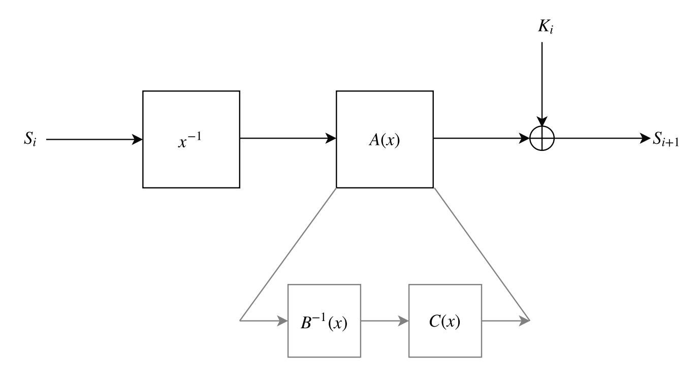

Figure 1. One round of Jarvis

For the key schedule we decided on two principles. For the first principle, since arithmetization-oriented algorithms were a relatively new concept, in order to compensate for the uncertainty in this new, little-studied object, the key schedule should not be too simple.7,8 Second, we understood that the key schedule does not need to offer the same security as the round function since it cannot be attacked directly.9 We decided to keep the multiplicative inverse part but to omit the affine polynomial. The key schedule of Jarvis is depicted in Figure 2.

6 The purpose of the ShiftRows and MixColumns operations is to "spread" good properties from one cell to as many cells as possible. When the state consists of only a single cell there are no target cells for its good properties.

7 Inspired by the concurrent trend of lightweight cryptography the designs of the time did not have a key schedule at all (*i.e.*, the master key is simply injected between every two rounds) or a very simple one (*e.g.*, linear). This was done to improve efficiency when the algorithm is implemented in an IoT setting.

8 We also understood that the main use of Jarvis will be as a primitive to a hash function. In this setting, the key part can be precomputed and thus does not increase the cost of the STARK.

9 This is also the case for Rijndael where the diffusion is slower in the key schedule compared to the round function.

{6}------------------------------------------------

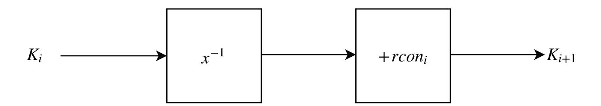

Figure 2. One round of Jarvis's key schedule

#### 3.1 Instantiation

Our aim was to offer four variants of Jarvis for *n* = 128, 160, 192 and 256. These variants would all have the same structure and differ only in their underlying field and security level.

We analyzed the number of rounds making Jarvis secure.10. This analysis requires special attention as it affects both the security and efficiency of the algorithm. The number of rounds was determined by the desired security level, which in turn is affected by the feasibility of relevant attacks. The quality of said attacks was quantified by the wide trail strategy, by the maximal degree and number of terms of the polynomial and rational expressions of the cipher, and by the complexity of possible Gröbner basis attacks.

For our construction we saw that we need at least three steps to get the same differential and linear properties of trails as in eight rounds of AES. Since three steps already create a complex algebraic normal form (ANF) and polynomial expressions over **F**2 *n* , we did not worry about algebraic attacks. However, the rational expression might still be too simple after three steps. In order to ensure the security of the cipher against interpolation attacks, we concluded that at least four rounds are necessary. To be prudent, we set the number of rounds for each variant of Jarvis to be the same as that of Rijndael with the same state size.

# 4 Friday (Jarvis the Sequel)

So far we have made a STARK-friendly block cipher, but secure integrity verification requires a cryptographic hash function. There are basically two generic constructions allowing to transform a block cipher into a hash function: the Merkle-Damgård construction and the sponge construction. Recalling that STARKs are extremely inefficient outside their native field, the sponge construction is at a disadvantage due to its internal structure enforcing a separation between the inner and outer parts of the sponge.

The model we had in mind was that instead of iterating over the compression function, the message, regardless of size, can be absorbed entirely in one

10 We alert the reader explicitly that in hindsight, this analysis did not produce a secure cipher. Additional details are provided in Section 6.

{7}------------------------------------------------

step by increasing the field size.11 We therefore decided to go with a Merkle-Damgård scheme [Merkle, 1989, Damgård, 1989] which we describe in Section 4.2.

The Merkle-Damgård construction employs a one-way compression function, *i.e.*, a function from *m* bits to *n* bits where *m > n*. There are several ways to build a one-way compression function from a block cipher, with the most widely used ones being: Davies-Meyer, Matyas-Meyer-Oseas, and Miyaguchi-Preneel; for a complete survey see [Preneel et al., 1993]. Believing that all these constructions are interchangeable,12 our only requirement was that the message is injected via the plaintext interface, thus allowing to precompute the input to the key interface.13 The decision between Miyaguchi-Preneel and Matyas-Meyer-Oseas was arbitrary and we opted for Miyaguchi-Preneel out of loyalty to Bart Preneel who was the head of our research lab.14 We provide a description of the Miyaguchi-Preneel construction in Section 4.1.

Finally, instantiating Miyaguchi-Preneel with Jarvis, and using the resulting compression function in Merkle-Damgård, we obtain Friday which is depicted in Figure 3.

11 In hindsight this model was too simplistic since it incurs communication overhead resulting from the larger digests, or requires truncation of the output which is why we originally avoided the sponge construction.

12 As we discovered later, these constructions are in fact not interchangeable and each of them offers a different resistance level against Gröbner basis attacks.

13 In fact, this micro-optimization is only relevant for absorbing the first block of the message. Indeed the key schedule can be precomputed on the IV for the first iteration, but the chaining values entering subsequent calls are a function of the unknown message and therefore can only be computed online. However, back then, we didn't see a need for a second iteration, see the previous paragraph.

14 To be clear, we did not discuss this with Bart and this paper would be the first time he learns about this story. We simply found this Easter-egg amusing.

{8}------------------------------------------------

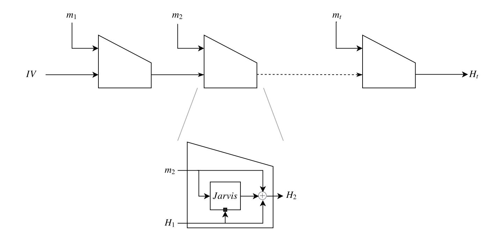

Figure 3. Friday

#### 4.1 Miyaguchi-Preneel

This scheme makes use of a black box block cipher *E*, where the chaining value is injected via the key interface, and the message via the plaintext interface. The two inputs are fed forward and each is XORed to the output of the block cipher. The *n*-bit output is then irreversible, *i.e.*, it is impossible to recover the original input. The scheme is depicted in Figure 4 and we refer the reader to [Black et al., 2002] for its security.

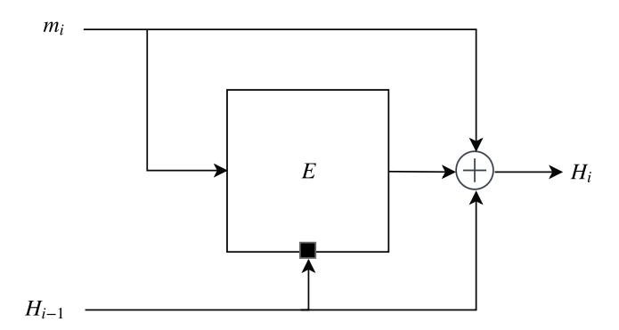

Figure 4. The Miyaguchi-Preneel one-way compression function using a block cipher *E*

#### 4.2 Merkle-Damgård

A hash function is a function taking an arbitrary length input and returning a fixed length output. The Merkle-Damgård scheme does so by iterating a oneway compression function like the one described above. Since the underlying 

{9}------------------------------------------------

one-way function takes inputs of fixed length, the message M needs to be padded before being fed as an input into the hash function. The type of padding used is important for security purposes and we describe the most common one here.

Let M be the message to be padded and let |M| be the length of M in an r-bit encoding. We start by appending a 1 at the end of M such that the message is now  $M\|1$ . Then, the necessary number of trailing zeros is appended (possibly none) followed by the r-bit length encoding such that  $M' = M \| 1 \| 0^* \| |M|$  and the length of |M'| in bits is an integral divisor of the block size n.

The new message M' is partitioned into t blocks  $m_1,...,m_t$ , each of length n which are then given one by one as inputs to the Miyaguchi-Preneel construction instantiated with a block cipher E and having state size n where

$$H_0 = IV, (1)$$

$$H_i = E_{H_{i-1}}(m_i) \oplus H_{i-1} \oplus m_i, \ 1 \le i \le t,$$
 (2)

and IV (Initialisation Vector) is the string  $0^n$  (*i.e.*, a sequence of n zeros). The n-bit output of the hash function is simply the final state value  $H_t$ . As we already mentioned, we believed at the time that a single iteration will always be sufficient and that we are being generous by providing a more general description.

## 5 The Shadow Saga

#### 5.1 Jarvis's Shadow

During our work on Jarvis and Friday, it became apparent that there is both value and market demand for a similarly optimized algorithm operating over prime fields.

The task seemed mostly straightforward. The considerations that make Jarvis STARK-friendly remain valid also for prime fields. The only obstacle was to attain a high rational degree in the S-box layer since there is no analog in prime fields to the affine polynomial we used for Jarvis and the inversion function cannot offer this degree alone.

We started entertaining ideas to overcome this and those are described in this section.

**The Jarvis Prime Family** This was our first attempt at converting Jarvis to prime fields. The state is an element in the extension field  $\mathbb{F}_{p^2}$ . First, the state goes through the inversion function in  $\mathbb{F}_{p^2}$ ; then, it passes through a linear layer in  $\mathbb{F}_p$ .

This approach is precursory to the approach we eventually took of using a state consisting of more than one field element. However here it is still implicit and hidden by the properties of the extension field, hence the large S-box.

In this approach, there is always an expensive step, either we evaluate the algorithm over  $\mathbb{F}_p$  and the inversion function becomes expensive or we evaluate over  $\mathbb{F}_{p^2}$  and the linear layer becomes expensive. This, together with the mixing, was meant to provide for a high polynomial degree.

{10}------------------------------------------------

Evaluation of the algorithm is done with a tower field approach which enables inversion over **F***p* 2 using an inversion in **F***p* and three extra multiplications. We depict the algorithm in Figure 5.

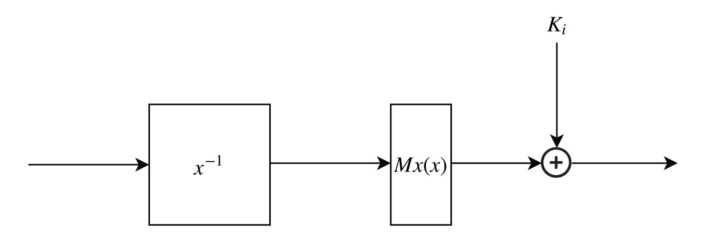

Figure 5. One round of Jarvis Prime

The Insanity Family In this family (nicknamed Insanity because we were trying to do the same thing over and over again and kept expecting different results) the field is still **F***p* 2 and the idea is to first invert each element in the base field **F***p* then invert them together in **F***p* 2 as an extension field element.

Due to tower field constructions, the inversion over **F***p* 2 can be reduced to an inversion over **F***p* with a small number of multiplications over **F***p*. The algorithm is depicted in Figure 6.

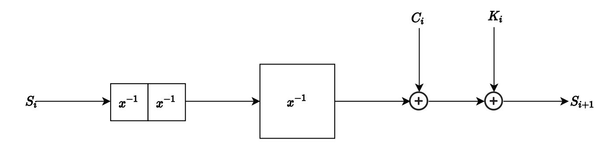

Figure 6. One round of Insanity

The Prodigy Family This scheme is the same as Insanity, but now working with *x* 3 over the extension field. Over **F***p* this operation becomes a polynomial multiplication which we believed can be nicely optimized.

{11}------------------------------------------------

12

The  $x^3$  function is known to be a permutation when GCD(p-1,3) = 1.15Here we use it over an extension field, thus requiring that  $GCD(p^2-1,3) = 1.16$ 

In every round  $x^3$  triples the degree of the multivariate polynomial expression. The algorithm is presented in Figure 7.

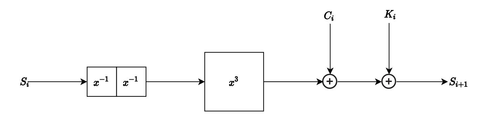

Figure 7. One round of Prodigy

The Scion Family This scheme is the same as Prodigy, but with an added linear layer following after the  $x^3$  function. This time, instead of the degree of the multivariate polynomial expression tripling, it grows 12-fold. The algorithm is depicted in Figure 8.

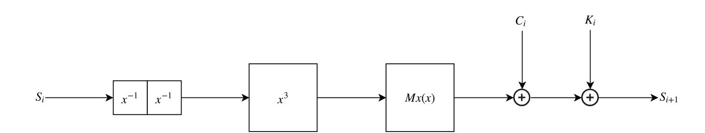

**Figure 8.** One round of Scion

The Headache Family At this point we realized that there is no reason to use a non-linear operation for mixing and decided to abandon the extensions field approach in favor of vector spaces. The state is in  $\mathbb{F}_p^{2\times 2}$  and we searched for ways to introduce extra algebraic complexity without harming efficiency too much.

Headache is a Keccak-like design where everything works over  $\mathbb{F}_p$  but which continues the trend of mixing different power maps. However, this is a game of optimization between the number of rounds and the efficiency per round. It is tough to figure out how many rounds are needed and what exactly

This function was already used previously in the literature e.g., as the non-linear function of MIMC.

&lt;sup>16 A reader for this work commented that this property is not satisfied for any prime  $p \neq 3$ .

{12}------------------------------------------------

is the effect of interleaving different power maps. The algorithm is presented in Figure 9.

This design was also the tipping point where algorithms based on multiple field elements in the state started being more efficient than Jarvis, making this subsection, rather than Subsection 5.2, the main storyline of this epos.

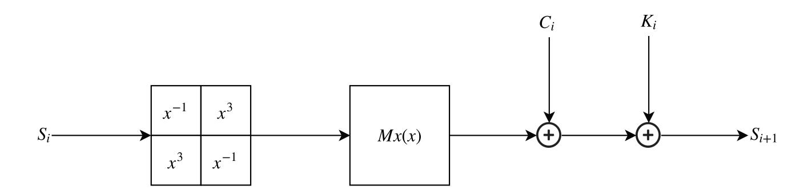

Figure 9. One round of Headache

**The Big Betty Family** With this design we realized that it is difficult to make security claims when mixing different power maps and that it is possible to attain the same efficiency by carefully choosing the right one and sticking to it.17

This is a possible improvement for all other designs. The number of constraints per round is equal to the number of elements in the state. Considering a six element state, we need only 8 rounds to get maximal multivariate degree. Note that because we work with smaller S-Boxes, the wide trail strategy becomes more pressing, requiring at least 7 rounds for achieving resistance against statistical attacks. The algorithm is presented in Figure 10.

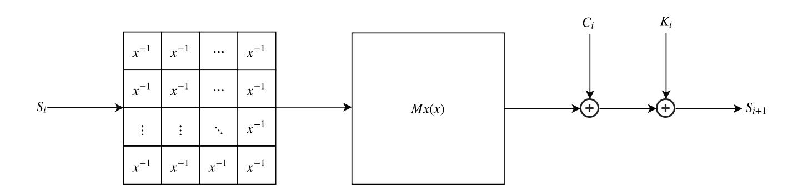

Figure 10. One round of Big Betty

&lt;sup>17 Siemen said: "Mixing different power maps just to improve confidence is indecisive and unprofessional. We should fix the power map and ensure the security around this decision".

{13}------------------------------------------------

THE ALGORITHM FORMERLY KNOWN AS RESCUE This design improves the diffusion by taking the Shark structure rather than a Square one.18 This family was originally named Rescue but we decided to reserve this name for the final version published in [Aly et al., 2019] (see also Section 6).

First, the content of cell i is raised to the power  $a_i$ ; then, the two cells are mixed by a linear layer in  $\mathbb{F}_p$ . The round function is depicted in Figure 11.

Specifically, we considered three instances: one where both  $a_i = -1$ ; one where both  $a_i = 3$  and, as it was developed in parallel to Big Betty, we also considered  $a_1 = -1$  and  $a_2 = 3$ .

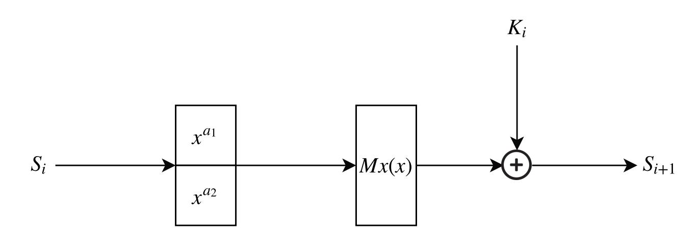

Figure 11. One round of The Algorithm Formerly Known as Rescue

**The Niederreiter Family** This design, was suggested by Vincent Rijmen in order to increase the multivariate rational degree while still being very STARK-Friendly. The algorithm is depicted in Figure 12. However, it is not a permutation and it is difficult to prove security claims.

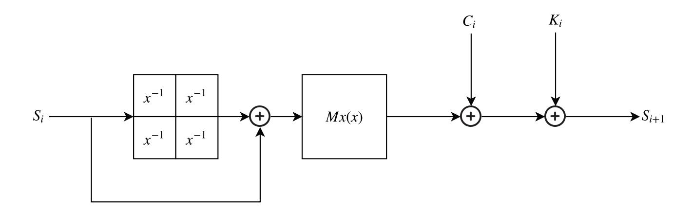

Figure 12. One round of Niederreiter

**The Phoenix Family** To make Niederreiter a permutation, we can turn to Feistel-like networks. When combined with a four-element state, we have full

&lt;sup>18 We were not familiar at the time with the SHARK-structure.

{14}------------------------------------------------

multivariate degree in only 13 rounds. For a six-element state, we need only 7 rounds. The algorithm is presented in Figure 13.

The above observation is a precursor to the width-depth tradeoff we later observed when evaluating resistance against Gröbner basis attacks. The downside is that the S-box is no longer a power map therefore it becomes harder to employ the wide-trail strategy to prove resistance against statistical attacks.19

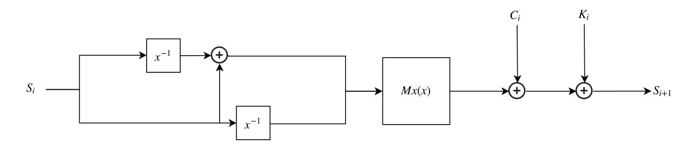

**Figure 13.** One round of Phoenix

**The Hermit Family** Inspired by [Xu et al., 2018] this design follows up from Phoenix (hence the name Hermit — different shell, same creature).

We change the Feistel structure of Phoenix to the one from [Xu et al., 2018, Thm. 6]. This ensures that we can easily extend the state size to an arbitrary number of elements and still assess the algebraic degree of the resulting nonlinear function. This restores the applicability of the wide trail strategy while keeping performance the same as for Phoenix. The algorithm is depicted in Figure 14.

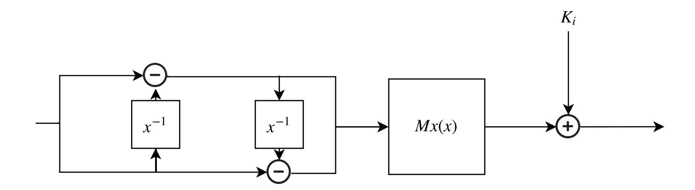

Figure 14. One round of Hermit

# 5.2 MiMC's Shadow (The Rise of $x^{(2p-1)/3}$ )

In parallel to our effort for finding the appropriate structure, we explored possible options for the power map inside the S-box. The initial motivation was our uneasiness with  $x^{-1}$  being an involution which seemed like a property an

&lt;sup>19 We conjectured that it might still be possible to characterize the new S-box.

{15}------------------------------------------------

adversary would be able to exploit in such a simple design.20 We felt it was acceptable when composed with an affine polynomial, but for prime fields this wasn't possible anymore.

The power map  $x^3$  offered a good starting point. We recall that this power map is a permutation over  $\mathbb{F}_p$  when GCD(p-1,3)=1 and was already used in the literature as a non-linear function in the core of MiMC.

In the previous subsection we described attempts to crossbreed the  $x^{-1}$  and  $x^3$  functions. But we remained unhappy with this approach as it doubled the attack surface while at the same time made finding security proofs more difficult. We embarked on a quest to find STARK-friendly functions with high polynomial degree and this subsection describes this quest. It takes place in an alternative timeline where the  $1 \times 1$  state has not yet been eliminated.

On Elfs and Dwarfs Two variants of MIMC exist [Albrecht et al., 2016]. The first has a  $1 \times 1$  state and follows the iterated Even-Mansour approach. The other has a  $1 \times 2$  state used in a Feistel structure. The latter requires double the number of rounds as the former, but is more suitable for hashing in ZK-STARKs as it allows for truncation over prime fields.21

A MIMC circuit is very deep due to the slow growth of the polynomial degree. This was later inherited by Hades giving it an elfin slender figure. Comparatively, Marvellous designs are dwarfish. Short and wide they allow for a shallower circuit due to the  $x^{-1}$  function giving rise to a higher polynomial degree for the same cost (*i.e.*, 2 multiplications).

We quickly discarded power maps with exponent > 3 as their efficiency was roughly inversely proportional to their polynomial degree.22 From the starting point that  $x^3$  is a permutation when GCD(p-1,3) = 1, it follows that its inverse  $x^{1/3}$  also exists. Observing that the power map describing this inverse *i.e.*,  $x^{(2p-1)/3}$ , is of high degree, suggested that it may be suitable for our needs.

**The Sneaky Family** This algorithm uses a Feistel network to transform a dense cubic polynomial into a permutation. This 2-round Feistel is used as an S-Box to an SPN structure.23

The reader is reminded that these were the early days of arithmetization-oriented algorithms, giants were scarce and we had to stand carefully on the shoulders of laestrygonians.

&lt;sup>21 In parallel to our work Albrecht *et al.* published more variants of MiMC based on generalized Feistel networks, see [Albrecht et al., 2019b].

This is not to say that power maps  $\alpha > 3$  should not be used (see e.g., [Bonte et al., 2020], just that  $\alpha = 3$  provides the best trade-off between efficiency and security.

&lt;sup>23 Chronologically, this family was developed in parallel to the Hermit family which is where the two storylines diverge.

{16}------------------------------------------------

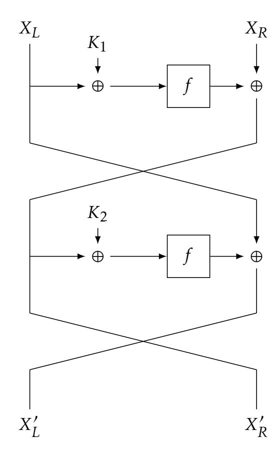

**Figure 15.** The S-Box of the SNEAKY

The S-Box is depicted in Figure 15 where we take  $f(x) = x^{\frac{1}{3}} + x$  and we consider  $K_1$  and  $K_2$  as two random round keys. The first observation for this S-Box is that due to the Feistel structure it is a permutation. The second observation is that the mapping f is generally not a permutation. Due to the high degree of this polynomial, it seemed unclear that this mapping is cryptographically strong. We thus proved the following lemma.

**Lemma 1.**  $f(x) = x^{\frac{1}{3}} + x$  is Almost Perfect Nonlinear (APN).

*Proof.* Let  $z=x^{\frac{1}{3}}$  and set  $f(z)=z+z^3$ . Due to this polynomial being of degree 3, it can have at most two nontrivial solutions for f'(z)=0. Since  $x^{\frac{1}{3}}$  is a permutation, we find that f'(x)=0 has exactly two solutions and f is APN.  $\square$ 

We find that our S-Box has a complex forward or backward polynomial expressions as forwards the expressions are

$$X'_{R} = X_{R} + f(X_{L} + K_{1}),$$
  
 $X'_{l} = X_{L} + f(f(X_{L} + K_{1}) + X_{R} + K_{2})$ 

and backwards we have

$$X_R = X'_R - f((X'_L - f(X'_R + K_2)) - K_1),$$
  
 $X_l = X'_L - f(X'_R + K_2).$ 

{17}------------------------------------------------

The above expressions are all of degree at least  $\frac{2p-1}{3}$ . However, the S-Box allows for an efficient multivariate expression of the following form:

$$(X'_L - X_L - X'_R - K_2)^3 - X'_R - K_2 = 0,$$
  
 $(X'_R - X_R - X_L - K_1)^3 - X_L - K_1 = 0,$ 

which are two equations of degree 3 and therefore STARK-efficient.

Nevertheless, note that the above equations are dense in both  $X_L$ ,  $X_R$ ,  $X_L'$  and  $X_R'$ . Thus the S-Box is a good candidate to offer near regular Gröbner resilience.

**The Extremis Family** This cipher is formed by a small tweak to the MIMC family where the state is over  $\mathbb{F}_p$ .

To evaluate the algorithm with r rounds we take the first r/2 rounds to use  $x^{(2p-1)/3}$  and the other r/2 rounds to use  $x^3$ . The algorithm is depicted in Figure 16.

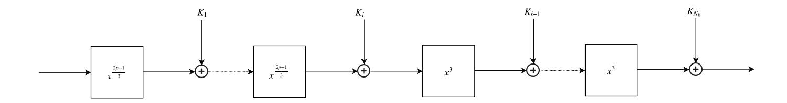

**Figure 16.** The Extremis cipher

The algorithm consists of only two operations, a nonlinear layer over the whole state and a round key addition. The S-Box is either the cubing function or its compositional inverse. As STARKs can either evaluate the function or its compositional inverse, the cost per round is always two constraints.

We abandoned this approach due to intuitive concerns about algebraic meetin-the-middle and inside-out attacks.

**The Pepper family** The Pepper family was something we were content with, and in fact, it was mostly ready for publication when we decided to abandon the Merkle-Damgård approach. It alternates between  $x^3$  and  $x^{1/3}$  in even and odd steps, respectively, see Figure 17.

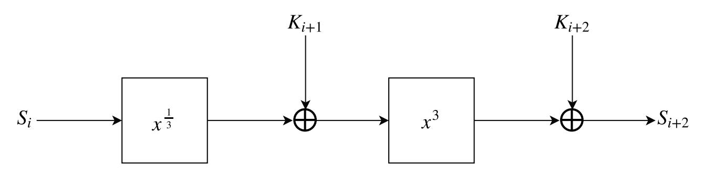

**Figure 17.** One round (two steps) of Pepper

{18}------------------------------------------------

## 6 Shadows Assemble (A Crossover Episode)

Jarvis and Friday were published in [Ashur and Dhooghe, 2018] and were received favourably by their intended audience. They can be seen (together with GMiMC [Albrecht et al., 2019b] and a few unpublished works) as second generation arithmetization-oriented algorithms which are characterized by an attempt to aggressively optimize for performance. This makes them different from first generation works like MiMC [Albrecht et al., 2016] and LowMC [Albrecht et al., 2015] which sought to explore the trade-offs between linear and non-linear operations.

Yet several developments described in this section prevented Jarvis and Friday from gaining traction and prompted the development of the third generation algorithms. In this section we describe these developments.

As we mentioned in Section 2, when we began with this project, statistical attacks were king of the hill and that was our focus for Jarvis and Pepper. Algebraic attacks were considered an odd bird in the world of symmetric cryptography and in particular, Gröbner basis attacks while known, were thought of as dark magic.24

In an interesting plot twist, subsequent research found algebraic attacks to be effective against algebraic algorithms,25 while statistical attacks were found to be mostly irrelevant.26 Shortly after [Ashur and Dhooghe, 2018] was made public, Albrecht *et al.* published a Gröbner basis attack against it in [Albrecht et al., 2019a].27 This attack exploits two properties: firstly, they showed that from the cryptanalyst's perspective the inversion function admits a simpler representation than we expected using a degree two implicit function, and that this can be exploited by an adversary. In addition, they claimed that it is possible to find monic affine polynomials which describe a round of Jarvis as a low-degree polynomial.28

In parallel to the work of Albrecht  $et\ al.$  an undesirable (different) property of the  $1\times 1$ -structure was communicated to us privately which supposedly allows for faster linear algebra than usual thus for a better Gröbner basis attack. We leave the description of this approach to the original authors who may want to publish them as an independent work.

In our opinion, the true complexity of the two attacks above is higher than claimed, and in any case resistance against both can be restored by increasing the number of rounds at the cost of slightly worse complexity. What eventually

&lt;sup>24 Tomer: "Gröbner basis attacks never work, we don't need to worry too much about them".

&lt;sup>25 In hindsight, that the word "algebraic" is used in both terms should have raised a red flag.

&lt;sup>26 For an extended discussion on why this is the case, see [Aly et al., 2019, Sec. 4.2.1].

In response to this work, Tomer said, referring to his previous comment: "I am probably the first symmetric-key designer to be  $f^{*****}$  by a Gröbner basis attack".

&lt;sup>28 The latter idea was later used in the design of Rescue in order to improve efficiency by "folding" the round. For details on the notion of folding see [Aly et al., 2019, Sec. 7.1.2].

{19}------------------------------------------------

tipped the balance to abandon these designs rather than attempting to salvage was that during the development of Pepper we discovered that the degree of regularity remains fixed, or grows very slowly depending on the choice of the compression function.29

At this point we decided to depart from the Merkle-Damgård construction in favor of the sponge construction. In turn, this decision prompted a change to the state which could no longer be  $1 \times 1$  due to the necessity to distinguish between the inner and outer parts of the sponge.30

We decided to crossbreed The Algorithm Formerly Known as Rescue for its round function with Pepper for its S-box and 2-step round. The Rescue family will have an  $m \times 1$  state. In every step, each of the m state elements goes either through  $x^{1/3}$  or through  $x^3$ , followed by an MDS matrix. This family is depicted in Figure 18.

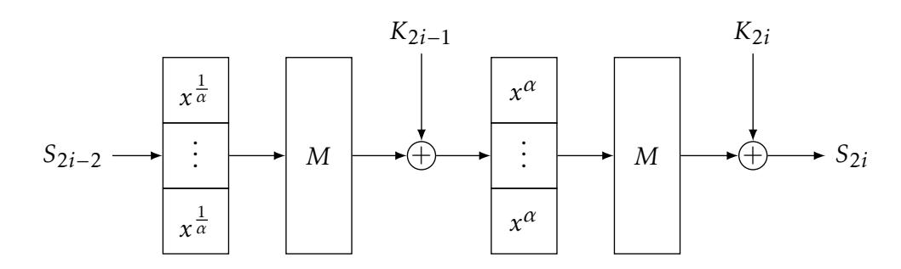

**Figure 18.** One round (two steps) of Rescue

## 7 Monomyth

This paper tells the origin story of Rescue [Aly et al., 2019], an arithmetization-oriented cryptographic algorithm recently included in [StarkWare Industries, 2020]. Its origin start with Rijndael and we show how it was reincarnated in Jarvis [Ashur and Dhooghe, 2018]. Then, in an attempt to build a similar arithmetization-oriented algorithm operating over prime fields, we describe the transition from Jarvis to Rescue. We consider several approaches, some completely new and some a re-spawn of previous ones, all leading in a dialectic process towards [Aly et al., 2019] which is our final product.

The field of arithmetization-oriented cryptographic algorithms is rather new and exciting. If we were to give an advice to future designers it would be to focus on optimizing for additional cost metrics such as number of CPU multiplication (prover time), number of offline rounds (MPC), or circuit depth (FHE);

&lt;sup>29 Informally, the degree of regularity is a quantity capturing how "structured" a polynomial system is and its knowledge allows to estimate the complexity of a Gröbner basis attack. For a more elaborate discussion see [Aly et al., 2019, App. A].

&lt;sup>30 This departure turned to be a blessing in disguise since it revealed a useful trade-off between the width of the circuit and its depth. This trade-off is explained in [Aly et al., 2019, Sec. 4.2.3].

{20}------------------------------------------------

and to pay special attention to algebraic attacks. We are excited to see the new designs to follow.

## 8 Epilogue

| 'tis the end             |    |
|--------------------------|----|
| of our story,            |    |
| 'er is no gore           |    |
| & neither glory.         | 4  |
| The secret trick         |    |
| — monomial,              |    |
| a sequel is              |    |
| Aly et al.               | 8  |
| This work was made       |    |
| with STARKs in mind,     |    |
| but 'er is more          |    |
| to optimize.             | 12 |
| ∃(a trick)               |    |
| for FHE,                 |    |
| for you to find          |    |
| it won't be me.          | 16 |
| Inverses are             |    |
| two none the same,       |    |
| ye shan't compose        |    |
| instead — −1 -invert. | 20 |
| For MPC                  |    |
| it is that case,         |    |
| that faster run          |    |
| still offloads less.     | 24 |
| My student friend        |    |
| do not despair,          |    |
| one day you're here      |    |
| the next one there.      | 28 |
| Rejoice because          |    |
| Reviewer 2,              |    |
| is one's promoter        |    |
| but not of you.          | 32 |
|                          |    |

*Acknowledgments* The authors would like to add Abdelrahaman Aly, Alan Szepieniec, Vincent Rijmen, and Eli Ben-Sasson for walking parts of this journey with us.

This research was partly funded by Starkware Industries Ltd., as part of an Ethereum Foundation grant activity. Tomer Ashur is an FWO post-doctoral 

{21}------------------------------------------------

fellow under Grant Number 12ZH420N. Siemen Dhooghe is supported by a Ph.D. Fellowship from the Research Foundation - Flanders (FWO).

## References

- [Albrecht et al., 2019a] Albrecht, M. R., Cid, C., Grassi, L., Khovratovich, D., Lüftenegger, R., Rechberger, C., and Schofnegger, M. (2019a). Algebraic cryptanalysis of starkfriendly designs: Application to MARVELlous and MiMC. In Galbraith, S. D. and Moriai, S., editors, *Advances in Cryptology - ASIACRYPT 2019 - 25th International Conference on the Theory and Application of Cryptology and Information Security, Kobe, Japan, December 8-12, 2019, Proceedings, Part III*, volume 11923 of *Lecture Notes in Computer Science*, pages 371–397. Springer.
- [Albrecht et al., 2019b] Albrecht, M. R., Grassi, L., Perrin, L., Ramacher, S., Rechberger, C., Rotaru, D., Roy, A., and Schofnegger, M. (2019b). Feistel structures for MPC, and more. In Sako, K., Schneider, S., and Ryan, P. Y. A., editors, *Computer Security - ES-ORICS 2019 - 24th European Symposium on Research in Computer Security, Luxembourg, September 23-27, 2019, Proceedings, Part II*, volume 11736 of *Lecture Notes in Computer Science*, pages 151–171. Springer.
- [Albrecht et al., 2016] Albrecht, M. R., Grassi, L., Rechberger, C., Roy, A., and Tiessen, T. (2016). MiMC: Efficient encryption and cryptographic hashing with minimal multiplicative complexity. In *Advances in Cryptology - ASIACRYPT 2016 - 22nd International Conference on the Theory and Application of Cryptology and Information Security, Hanoi, Vietnam, December 4-8, 2016, Proceedings, Part I*, pages 191–219.
- [Albrecht et al., 2015] Albrecht, M. R., Rechberger, C., Schneider, T., Tiessen, T., and Zohner, M. (2015). Ciphers for MPC and FHE. In Oswald, E. and Fischlin, M., editors, *Advances in Cryptology - EUROCRYPT 2015 - 34th Annual International Conference on the Theory and Applications of Cryptographic Techniques, Sofia, Bulgaria, April 26-30, 2015, Proceedings, Part I*, volume 9056 of *Lecture Notes in Computer Science*, pages 430– 454. Springer.
- [Aly et al., 2019] Aly, A., Ashur, T., Ben-Sasson, E., Dhooghe, S., and Szepieniec, A. (2019). Efficient symmetric primitives for advanced cryptographic protocols (A marvellous contribution). *IACR Cryptology ePrint Archive*, 2019:426.
- [Ames et al., 2017] Ames, S., Hazay, C., Ishai, Y., and Venkitasubramaniam, M. (2017). Ligero: Lightweight sublinear arguments without a trusted setup. In Thuraisingham, B. M., Evans, D., Malkin, T., and Xu, D., editors, *Proceedings of the 2017 ACM SIG-SAC Conference on Computer and Communications Security, CCS 2017, Dallas, TX, USA, October 30 - November 03, 2017*, pages 2087–2104. ACM.
- [Ashur and Dhooghe, 2018] Ashur, T. and Dhooghe, S. (2018). MARVELlous: a STARKfriendly family of cryptographic primitives. Cryptology ePrint Archive, Report 2018/1098. https://eprint.iacr.org/2018/1098.
- [Ben-Sasson et al., 2018] Ben-Sasson, E., Bentov, I., Horesh, Y., and Riabzev, M. (2018). Scalable, transparent, and post-quantum secure computational integrity. *IACR Cryptology ePrint Archive*, 2018:46.
- [Ben-Sasson et al., 2013] Ben-Sasson, E., Chiesa, A., Genkin, D., Tromer, E., and Virza, M. (2013). Snarks for C: verifying program executions succinctly and in zero knowledge. In Canetti, R. and Garay, J. A., editors, *Advances in Cryptology - CRYPTO 2013 - 33rd Annual Cryptology Conference, Santa Barbara, CA, USA, August 18-22, 2013. Proceedings, Part II*, volume 8043 of *Lecture Notes in Computer Science*, pages 90–108. Springer.

{22}------------------------------------------------

- [Ben-Sasson et al., 2019] Ben-Sasson, E., Chiesa, A., Riabzev, M., Spooner, N., Virza, M., and Ward, N. P. (2019). Aurora: Transparent succinct arguments for R1CS. In Ishai, Y. and Rijmen, V., editors, *Advances in Cryptology - EUROCRYPT 2019 - 38th Annual International Conference on the Theory and Applications of Cryptographic Techniques, Darmstadt, Germany, May 19-23, 2019, Proceedings, Part I*, volume 11476 of *Lecture Notes in Computer Science*, pages 103–128. Springer.
- [Beyne et al., 2020] Beyne, T., Canteaut, A., Dinur, I., Eichlseder, M., Leander, G., Leurent, G., Naya-Plasencia, M., Perrin, L., Sasaki, Y., Todo, Y., and Wiemer, F. (2020). Out of oddity - new cryptanalytic techniques against symmetric primitives optimized for integrity proof systems. *IACR Cryptology ePrint Archive*, 2020:188.
- [Black et al., 2002] Black, J., Rogaway, P., and Shrimpton, T. (2002). Black-box analysis of the block-cipher-based hash-function constructions from PGV. In *Advances in Cryptology - CRYPTO 2002, 22nd Annual International Cryptology Conference, Santa Barbara, California, USA, August 18-22, 2002, Proceedings*, pages 320–335.
- [Bonte et al., 2020] Bonte, C., Smart, N. P., and Tanguy, T. (2020). Thresholdizing hasheddsa: MPC to the rescue. *IACR Cryptol. ePrint Arch.*, 2020:214.
- [Bünz et al., 2018] Bünz, B., Bootle, J., Boneh, D., Poelstra, A., Wuille, P., and Maxwell, G. (2018). Bulletproofs: Short proofs for confidential transactions and more. In *2018 IEEE Symposium on Security and Privacy, SP 2018, Proceedings, 21-23 May 2018, San Francisco, California, USA*, pages 315–334. IEEE Computer Society.
- [Cid et al., 2020] Cid, C., Grassi, L., Lüftenegger, R., Rechberger, C., and Schofnegger, M. (2020). Higher-order differentials of ciphers with low-degree s-boxes. Cryptology ePrint Archive, Report 2020/536. https://eprint.iacr.org/2020/536.
- [Daemen, 1995] Daemen, J. (1995). Cipher and hash function design strategies based on linear and differential cryptanalysis. Doctoral Dissertation, March 1995, K.U. Leuven.
- [Daemen et al., 1997] Daemen, J., Knudsen, L. R., and Rijmen, V. (1997). The block cipher square. In *Fast Software Encryption, 4th International Workshop, FSE '97, Haifa, Israel, January 20-22, 1997, Proceedings*, pages 149–165.
- [Daemen and Rijmen, 2002] Daemen, J. and Rijmen, V. (2002). *The Design of Rijndael: AES - The Advanced Encryption Standard*. Information Security and Cryptography. Springer.
- [Damgård, 1989] Damgård, I. (1989). A design principle for hash functions. In *Advances in Cryptology - CRYPTO '89, 9th Annual International Cryptology Conference, Santa Barbara, California, USA, August 20-24, 1989, Proceedings*, pages 416–427.
- [Eichlseder et al., 2020] Eichlseder, M., Grassi, L., Lüftenegger, R., Øygarden, M., Rechberger, C., Schofnegger, M., and Wang, Q. (2020). An algebraic attack on ciphers with low-degree round functions: Application to full MiMC. Cryptology ePrint Archive, Report 2020/182. https://eprint.iacr.org/2020/182.
- [Grassi et al., 2019] Grassi, L., Kales, D., Khovratovich, D., Roy, A., Rechberger, C., and Schofnegger, M. (2019). Starkad and Poseidon: New hash functions for zero knowledge proof systems. *IACR Cryptology ePrint Archive*, 2019:458.
- [Grassi et al., 2020a] Grassi, L., Lüftenegger, R., Rechberger, C., Rotaru, D., and Schofnegger, M. (2020a). On a generalization of substitution-permutation networks: The HADES design strategy. In Canteaut, A. and Ishai, Y., editors, *Advances in Cryptology - EUROCRYPT 2020 - 39th Annual International Conference on the Theory and Applications of Cryptographic Techniques, Zagreb, Croatia, May 10-14, 2020, Proceedings, Part II*, volume 12106 of *Lecture Notes in Computer Science*, pages 674–704. Springer.
- [Grassi et al., 2020b] Grassi, L., Rechberger, C., and Schofnegger, M. (2020b). Weak linear layers in word-oriented partial spn and hades-like ciphers. Cryptology ePrint Archive, Report 2020/500. https://eprint.iacr.org/2020/500.

{23}------------------------------------------------

[Keller and Rosemarin, 2020] Keller, N. and Rosemarin, A. (2020). Mind the middle layer: The HADES design strategy revisited. *IACR Cryptology ePrint Archive*, 2020:179.

[Merkle, 1989] Merkle, R. C. (1989). A certified digital signature. In *Advances in Cryptology - CRYPTO '89, 9th Annual International Cryptology Conference, Santa Barbara, California, USA, August 20-24, 1989, Proceedings*, pages 218–238.

[Nyberg, 1993] Nyberg, K. (1993). Differentially uniform mappings for cryptography. In *Advances in Cryptology - EUROCRYPT '93, Workshop on the Theory and Application of of Cryptographic Techniques, Lofthus, Norway, May 23-27, 1993, Proceedings*, pages 55–64.

[Parno et al., 2013] Parno, B., Howell, J., Gentry, C., and Raykova, M. (2013). Pinocchio: Nearly practical verifiable computation. In *2013 IEEE Symposium on Security and Privacy, SP 2013, Berkeley, CA, USA, May 19-22, 2013*, pages 238–252. IEEE Computer Society.

[Parno et al., 2016] Parno, B., Howell, J., Gentry, C., and Raykova, M. (2016). Pinocchio: nearly practical verifiable computation. *Commun. ACM*, 59(2):103–112.

[Preneel et al., 1993] Preneel, B., Govaerts, R., and Vandewalle, J. (1993). Hash functions based on block ciphers: A synthetic approach. In *Advances in Cryptology - CRYPTO '93, 13th Annual International Cryptology Conference, Santa Barbara, California, USA, August 22-26, 1993, Proceedings*, pages 368–378.

[StarkWare Industries, 2019a] StarkWare Industries (2019a). STARKfriendly hash. Medium. https://medium.com/starkware/ stark-friendly-hash-tire-kicking-8087e8d9a246.

[StarkWare Industries, 2019b] StarkWare Industries (2019b). Stark-friendly hash challenge. https://starkware.co/hash-challenge/.

[StarkWare Industries, 2020] StarkWare Industries (2020). starkware-libs/ethstark on GitHub. https://github.com/starkware-libs/ethSTARK.

[StarkWare Team, 2020] StarkWare Team (2020). Rescue stark documentation – version 1.0. https://github.com/starkware-libs/ethSTARK/blob/master/rescue\_ stark\_documentation.pdf.

[Xu et al., 2018] Xu, X., Li, C., Zeng, X., and Helleseth, T. (2018). Constructions of complete permutation polynomials. *Des. Codes Cryptogr.*, 86(12):2869–2892.

## A Directors' Cut

#### A.1 Speaker for the Dead (Bonus Track I)

Following the attack presented in [Albrecht et al., 2019a] we explored possible approaches to preventing the "folding" of equations from different rounds. The ability to do so means, implicitly, that the algorithm contains hidden structure which is eliminated in the folding process.

Working on this we realized that there is a direct link between the STARKefficiency of the algorithm and the complexity of a Gröbner basis attack against it. It appeared to us that this is always the case, even for ideas we did not yet consider. If this conjecture is true, it means that as designers we should not search for a trapdoor that allows to evaluate the STARK efficiently while keeping the attack complexity high because (under this conjecture) such a trapdoor could simply not exist.

This understanding left us with two options: either we try to remove as much structure as possible, which is the approach described in this section; 

{24}------------------------------------------------

or we try to quantify the hidden structure and incorporate it into our analysis which is what we eventually went for in [Aly et al., 2019].31

In searching for ways to remove the hidden structure we came up with two promising ways described below. We stress that these methods have only been casually evaluated and we do not vouch for their security, nor do we claim that this is an exhaustive list. It was working on these methods that revealed to us the weird behavior of the degree of regularity in Merkle-Damgård hashes and made us abandon this approach for the sake of the sponge construction.

**Jarvis-Mark I:** This variant differs from Jarvis in the order of the affine polynomials. We take two STARK-efficient quartic affine polynomials B(x) and C(x), such that  $B^{-1}(x)$  and  $C^{-1}(x)$  are of high polynomial degree. Then, B(x) and  $C^{-1}(x)$  are composed together to create an algebraically complex yet STARK-friendly affine polynomial such that B(x) is evaluated first, then  $C^{-1}(x)$ . The round function is depicted in Figure 19.

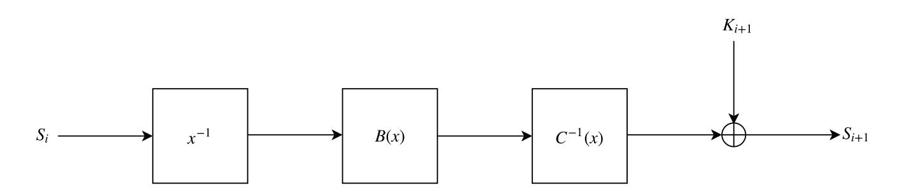

Figure 19. One round of Jarvis-Mark I

**Jarvis-Mark II** In the second variant, A(x) is as before, but we alternate between  $A^{-1}(x)$  and A(x) in even and odd rounds, respectively. At this point we already decided to refer to an S-box evaluation followed by an affine polynomial evaluation as *a step*, and refer to two consecutive steps as *a round*.

This approach was developed around the same time as Pepper, which is why it is not surprising that it is being used in both, and we later also reused it for Vision. The round function is depicted in Figure 20.

&lt;sup>31 Quantifying the hidden structure is not a trivial task in itself. In [Aly et al., 2019, Sec. 4.2.3] we developed a novel framework for arguing resistance against Gröbner basis attacks. Still, this task is computationally heavy and highly sensitive to the way the algorithm is modeled as a polynomial system. There seem to be much room for further research to improve on this framework.

{25}------------------------------------------------

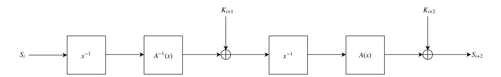

Figure 20. One round of Jarvis-Mark II

#### A.2 Children of the Mind (Bonus Track II)

The Vibranium Family A new Feistel structure, by hand you can check the structure to be invertible. This design is made to show the possibility of creating lesser known Feistel structures. On the one hand it might be more efficient, on the other hand it has unknown security properties.

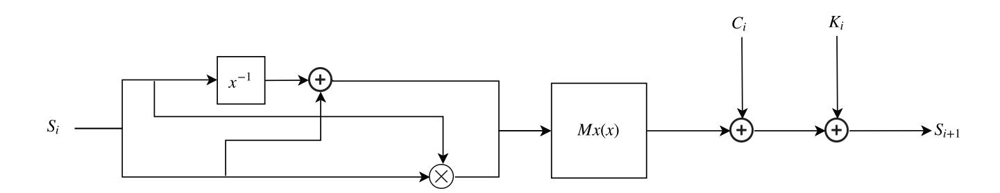

Figure 21. One round of Vibranium

The Nightclub Family We note that it is possible to find quadratic permutations over extension fields. There should be literature to ensure such a binomial is easily found over larger prime fields. When such a quadratic permutation *P* is found, the Rescue family can be extended to allow for quadratic functions. This creates an algorithm whose AIR encoding consists of several quadratic multivariate equations instead of cubic or quintic ones. These AIR equations are found when the quadratic binomial is represented in its "Algebraic Normal Form" over its prime base field. The overall cost of the AIR when calculating in the degree is still equal, thus this should only be used when quadratic constraints are a priority. We also note that this structure does not admit an efficient R1CS structure.