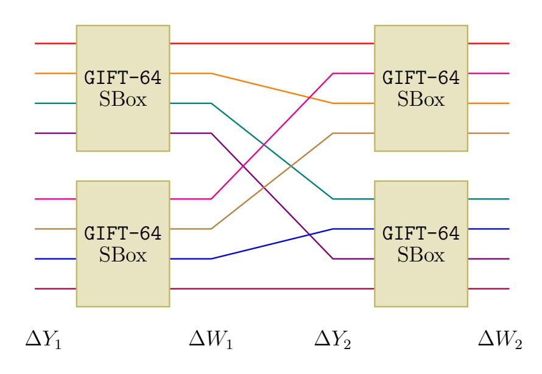
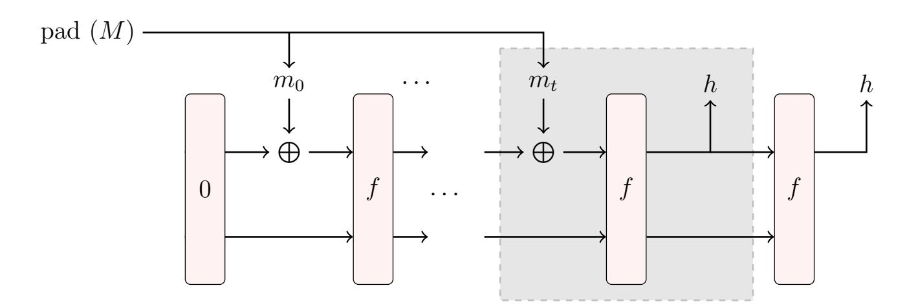
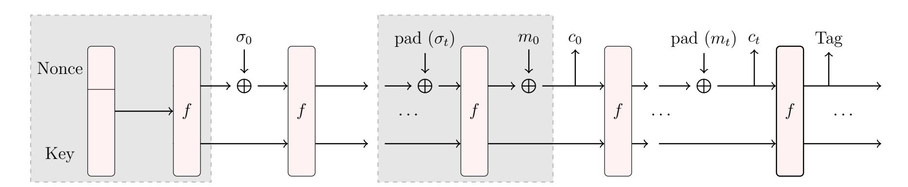
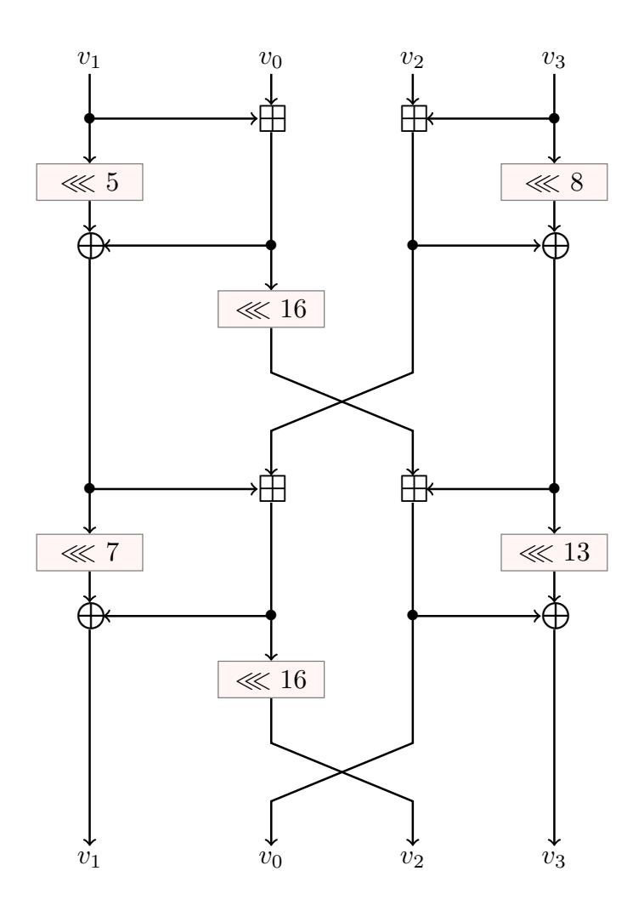
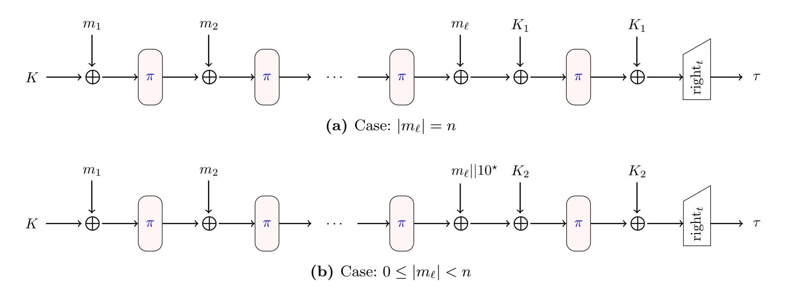

{0}------------------------------------------------

# <span id="page-0-0"></span>Machine Learning Assisted Differential Distinguishers For Lightweight Ciphers

(Extended Version)

Anubhab Baksi<sup>1</sup> , Jakub Breier<sup>2</sup> , Yi Chen<sup>3</sup> , and Xiaoyang Dong<sup>3</sup>

- <sup>1</sup> Nanyang Technological University, Singapore
  - <sup>2</sup> Silicon Austria Labs, Graz, Austria
  - <sup>3</sup> Tsinghua University, Beijing, PR China

anubhab001@e.ntu.edu.sg, jbreier@jbreier.com, xiaoyangdong@tsinghua.edu.cn, chenyi19@mails.tsinghua.edu.cn

Abstract. At CRYPTO 2019, Gohr first introduces the deep learning based cryptanalysis on round-reduced SPECK. Using a deep residual network, Gohr trains several neural network based distinguishers on 8-round SPECK-32/64. The analysis follows an 'all-in-one' differential cryptanalysis approach, which considers all the output differences effect under the same input difference.

Usually, the all-in-one differential cryptanalysis is more effective compared to that using only one single differential trail. However, when the cipher is non-Markov or its block size is large, it is usually very hard to fully compute. Inspired by Gohr's work, we try to simulate the all-in-one differentials for non-Markov ciphers through machine learning.

Our idea here is to reduce a distinguishing problem to a classification problem, so that it can be efficiently managed by machine learning. As a proof of concept, we show several distinguishers for four high profile ciphers, each of which works with trivial complexity. In particular, we show differential distinguishers for 8-round Gimli-Hash, Gimli-Cipher and Gimli-Permutation; 3-round Ascon-Permutation; 10-round Knot-256 permutation and 12-round Knot-512 permutation; and 4-round Chaskey-Permutation. Finally, we explore more on choosing an efficient machine learning model and observe that only a three layer neural network can be used. Our analysis shows the attacker is able to reduce the complexity of finding distinguishers by using machine learning techniques.

Keywords: gimli, ascon, knot, chaskey, distinguisher, machine learning, differential

## 1 Introduction

Machine Learning (ML) tools have made a great progress in the last decades. At present, these techniques are widely used in various fields, such as computer vision [\[35\]](#page-15-0), machine translation [\[4,](#page-14-0) [36\]](#page-15-1), autonomous driving [\[17\]](#page-15-2), to name a few. In the aspect of cryptography however, usage of ML is mainly confined in the context of side channel analysis, such as [\[16,](#page-15-3) [31\]](#page-15-4), to the best of our knowledge.

Therefore, the applicability of ML techniques in classical cryptanalysis is not much explored. It seems the community is rather skeptical regarding this approach. For example, the authors of [\[1\]](#page-14-1) comment, "Neural networks are generally not meant to be great at cryptography. Famously, the simplest neural networks cannot even compute XOR, which is basic to many cryptographic algorithms".

Although ML techniques have been used against legacy ciphers, like the Enigma (the German cipher used during second world war) [\[24\]](#page-15-5), it was not until the work by Gohr [\[23\]](#page-15-6) at CRYPTO'19 that this line of research finally got its exposure. The idea here is applied to key recovery attacks on round-reduced SPECK using ML.

This work focuses on extending the commonly used model of differential distinguisher by using ML techniques. In the case of differential distinguisher, the attacker Eve XORs a chosen input difference δ to the input of the state of the (reduced round) cipher and watches for a particular output difference ∆, with randomly chosen inputs. If the (δ, ∆) pair occurs with a probability significantly higher for the (reduced round) cipher than what it should be for a random case, the (reduced round) cipher can be distinguished from the random case. This probability distribution of δ → ∆ is modeled by differential branch number [\[18\]](#page-15-7) or by automated tools like Mixed Integer Linear Programming (MILP) [\[34\]](#page-15-8). We extend the modeling for differential distinguisher by incorporating machine learning algorithms.

This is an extended version of the paper with same title is accepted in [Design, Automation and Test in Europe](https://www.date-conference.com/) [Conference \(DATE\)](https://www.date-conference.com/) – 2021.

{1}------------------------------------------------

<span id="page-1-3"></span>We argue that the usual modeling with branch number or MILP underestimates attacker's power. Having collected the output differences for the chosen input differences, the attacker can use any technique to distinguish the cipher from the random case. In such a situation, machine learning based techniques can reduce the search complexity estimated by existing methods. In fact, we observe that ML can reduce the search complexity to the cube root of the previously estimated bound.

The machine learning models we propose, can work with any number (say, t) of suitably chosen input differences. Our first model comes into play when  $t \ge 2$  (see Section 3.1). In order to work with only one input difference, we propose our second model (see Section 3.2).

Detailed discussion of machine learning is out of scope of this work, interested readers may refer to standard textbooks such as [25] for the same. We use TensorFlow<sup>1</sup> back-end with Keras<sup>2</sup> API. The optimizer function is based on Adam algorithm [26].

#### Our Contributions

In this work, we construct machine learning models to simulate the *all-in-one differentials* from [2]. We consider the classical distinguisher game: Given ORACLE  $\stackrel{\$}{\leftarrow}$  {CIPHER, RANDOM}, the attacker is to identify whether ORACLE = CIPHER with probability significantly  $> \frac{1}{2}$  and with sufficiently small number of queries.

The core of our analysis lies in the actual problem of distinguishing the CIPHER from RANDOM into a classification problem. For this purpose, we propose two models (details are given in Section 3). We choose the most common ML tool, *Multi-Layer Perceptron* (MLP) as a starting point (we have also tested with other ML tools, as described in Section 5).

As for transforming the differential distinguisher to a classification problem, we propose two models here. We apply the first model (described in Section 3.1) to round-reduced GIMLI [12], ASCON [19] and KNOT [37]. All of the ciphers are the 2<sup>nd</sup> round candidates in the ongoing NIST Lightweight Cryptography (LWC) competition<sup>3</sup>. Further, we also show the effectiveness of the second model (described in Section 3.2) over the lightweight MAC CHASKEY [33]. Brief description of the ciphers is given in Appendix A.

Results are described in Section 4 and Section 5, which can be summarized as follows:

- For GIMLI, we obtain 8-round practical distinguishers on GIMLI-HASH and GIMLI-CIPHER in nonce respecting case in Section 4.1. The distinguishing complexity is  $2^{17.6}$  offline data to train the model and  $2^{14.3}$  online data to distinguish the cipher. Note that the authors of GIMLI [12] proved that the optimal 8-round differential trail is with probability of  $2^{-52}$ . If we use this trail to distinguish 8-round GIMLI, we need at least  $2^{52}$  online data. Thus, we are able to perform a differential distinguisher in around cube root complexity.
- For the ciphers, ASCON [19] and KNOT [37], we show practical distinguishers for reduced round versions of the underlying permutations in Section 4.2. For the 320-bit ASCON-PERMUTATION, we show two separate distinguishers that work until 3-rounds with 2<sup>19</sup> training data. For the 256-bit permutation of KNOT (KNOT-256), we show distinguishers for up to 10 rounds; and for the 512-bit permutation (KNOT-512), we show the same for up to 12-rounds. All results on KNOT are obtained with 2<sup>19</sup> training data.
- For CHASKEY [32,33], we present our results in Section 4.3. With trivial training/testing complexity  $(2^{23} \text{ for training and } 2^{14.3} \text{ for testing})$ , we show the existence of a 4-round distinguisher. This contradicts the authors' claim that no 4-round differential distinguisher of complexity  $2^{37}$  searches exists.

In Section 5, we discuss effects of choosing different neural network architectures with respect to 8-round GIMLI-PERMUTATION as the target cipher. We show that even a shallow three layer neural network works well for our purpose. We also report few differential distinguishers for 8-round GIMLI-PERMUTATION in the process.

With regard to our analysis, we emphasize on the following points:

<span id="page-1-0"></span><sup>1</sup>https://www.tensorflow.org/

<span id="page-1-1"></span><sup>&</sup>lt;sup>2</sup>https://keras.io/

<span id="page-1-2"></span><sup>&</sup>lt;sup>3</sup>https://csrc.nist.gov/projects/lightweight-cryptography

{2}------------------------------------------------

- <span id="page-2-6"></span>• Generality and practicality. It is to be mentioned that our ML assisted model is generic in nature and can be adopted to any symmetric key setting. All the results presented are practical and can be carried out in around an hour on a modern computer.
- Compatibility with differential distinguisher. We would like to point out that we use the same attack model as that of the pre-existing differential distinguisher. The only distinction is made during the analysis, as ours is done by machine learning (instead of the branch number or automated tools like MILP). We do not fix any output difference a priori, instead all the differentials are fed to the ML.
- Effect of truncation. The results (Section 4.1) for GIMLI-HASH and GIMLI-CIPHER are with truncated versions of the state, whereas the results for GIMLI-PERMUTATION (Section 5) are with the full state. Moreover, we argue that the truncation of the state does not fall outside the perceived model. Having collected the differentials, the attacker can employ any method (including truncating a part) based on the attacker's preference for analysis. This is also noted (with an example) in [5].
- Extensibility. The results presented in our work do not constitute the theoretical upper bound for the ML assisted distinguishers. By using a more sophisticated ML model and/or more training/testing data, it is likely that one can cover more rounds<sup>4</sup>.

#### 2 Background

#### <span id="page-2-5"></span>2.1 Markov Ciphers

Lai, Massey and Murphy [28] introduce the concept of *Markov ciphers* at Eurocrypt'91 which we describe here.

**Definition 1 (Markov Chain [28]).** Given a sequence of discrete random variables  $v_0, v_1, \ldots, v_r$  is a Markov chain, if for  $0 \le i < r$ ,

<span id="page-2-3"></span><span id="page-2-1"></span>
$$\Pr(v_{i+1} = \beta_{i+1} | v_i = \beta_i, v_{i-1} = \beta_{i-1}, \dots, v_0 = \beta_0) = \Pr(v_{i+1} = \beta_{i+1} | v_i = \beta_i). \tag{1}$$

If  $\Pr(v_{i+1} = \beta | v_i = \alpha)$  is independent of i for all  $\alpha$  and  $\beta$ , the Markov chain is called homogeneous. Given an r-round iterated cipher, the input of ith round is denoted as  $Y_i$  ( $0 \le i \le r$ ). Given a group operation  $\otimes$ , we define the corresponding input differences as  $\Delta Y_0, \Delta Y_1, \ldots, \Delta Y_r$ , where  $\Delta Y = Y \otimes Y'$ . Then, Lai et al. introduce the following definition of Markov cipher as given in Definition 2.

**Definition 2 (Markov Cipher [28]).** An iterated cipher with round function Y = f(X, K) is a Markov cipher if there is a group operation  $\otimes$  for defining differences such that, for all choices of  $\alpha$  ( $\alpha \neq 0$ ) and  $\beta$  ( $\beta \neq 0$ ),  $\Pr(\Delta Y = \beta | \Delta X = \alpha, X = \gamma)$  is independent of  $\gamma$  when the subkey K is uniformly random, or equivalently, if  $\Pr(\Delta Y = \beta | \Delta X = \alpha, X = \gamma) = \Pr(\Delta Y(1) = \beta_1 | \Delta X = \alpha)$  for all choices of  $\gamma$  when the sub-key K is uniformly random.

<span id="page-2-2"></span>**Theorem 1.** If an r-round iterated cipher is a Markov cipher and the r round keys are independent and uniformly random, then the sequence of differences  $\Delta X = (\Delta Y_0, \Delta Y_1, \dots, \Delta Y_r)$ , is a homogeneous Markov chain. Moreover, this Markov chain is stationary if  $\Delta X$  is uniformly distributed over the non-neutral elements of the group.

Theorem 1 is adopted from [28]. According to Theorem 1, one can compute the probability of an r-round differential characteristic as,

<span id="page-2-4"></span>
$$\Pr(\Delta Y_1 = \beta_1, \Delta Y_2 = \beta_2, \dots, \Delta Y_r = \beta_r | \Delta X = \beta_0) = \prod_{i=1}^r \Pr(\Delta Y_1 = \beta_i | \Delta X = \beta_{i-1}). \tag{2}$$

However, the above theory can not be applied to non-Markov ciphers, such as GIMLI [12] or ASCON [19]. One of the most important feature of those primitives is that there are no sub-keys in each iterated round. In this situation, the iterated cipher usually can not be regarded as a Markov cipher or a homogeneous a Markov chain. This is because, the differences in the former rounds usually have

<span id="page-2-0"></span><sup>&</sup>lt;sup>4</sup>New functionalities like higher order differential or key recovery can be incorporated too.

{3}------------------------------------------------

<span id="page-3-1"></span><span id="page-3-0"></span>

Fig. 1: One-round GIFT-128 (unkeyed) permutation

significant effect on the differences of the latter rounds, where Equation (1) does not hold any more. Hence, we can not use the Equation (2) to compute the probability of a characteristic any more.

As shown in Figure 1, we introduce a toy cipher to explain the dependence of the differences between a 2-round cipher without sub-keys. We use the 4-bit SBox of GIFT-64 [7] as an example. The Difference Distribution Table (DDT) SBox (1A4C6F392DB7508E) is omitted here for the interest of brevity and can be found in [7, Table 18]. Suppose  $\Delta Y_1[0] = Y_1[0] \oplus Y_1'[0]$  and  $\Delta Y_1[1] = Y_1[1] \oplus Y_1'[1]$  are the input difference of the upper and lower SBox in Figure 1, respectively. We try to compute the probability of a differential characteristic, where  $\Delta Y_1 = (2,3)$ ,  $\Delta W_1 = (5,8)$ ,  $\Delta Y_2 = (6,2)$ , and  $\Delta W_2 = (2,5)$ . From the DDT of the GIFT SBox, it is easy to know the probability of  $\Delta Y_1 \to \Delta W_1$  is  $2^{-5}$ . The valid tuples of  $(Y_1[0], W_1[0], Y_1'[0], W_1'[0])$  are (0,1,2,4), (2,4,0,1), (4,6,6,3) and (6,3,4,6). The valid tuples of  $(Y_1[1], W_1[1], Y_1'[1], W_1'[1])$  is (d,0,e,8) and (e,8,d,0). Only input pairs with  $(Y_1[0], Y_1[1]) = (0,d)$ , (0,e), (2,d) and (2,e) are valid for the differential characteristic. Hence the probability of the characteristic is  $2^{-6}$ , instead of  $2^{-9}$  computed by Equation (2).

#### 2.2 Gohr's Work on SPECK (CRYPTO'19)

Using a deep residual neural networks, Gohr in [23] achieves better results than the best classical cryptanalysis on 11-round SPECK [8]. In this work, first several machine learned distinguishers for round-reduced SPECK based on an all-in-one differential cryptanalysis [2] are trained, where the attacker considers potentially all the output differences of a cipher for a given input difference and to combine the information derived from them. Under the Markov assumption, Gohr first computes the entire DDT of round-reduced SPECK with a fixed input difference, which can be achieved due to the small block size of SPECK-32/64. Hence, the all-in-one differentials for the 5-/6-/7-/8-round SPECK-32/64 following the Markov assumption are reported. After this, the same distinguishing task via the neural networks is performed.

Concretely, the following steps are used to train the model:

- 1. Collecting training data by generating uniformly distributed keys and plaintext pairs given a fixed input difference as well as the binary labels  $Y_i$ .
- 2. If the binary label  $Y_i = 1$ , then the plaintext pairs are encrypted by k-round SPECK to produce the ciphertext pairs. If other wise, the random ciphertext pairs are generated.
- 3. Pre-process ciphertext pairs to fit the format required by the neural network and start to train them.

Finally, the author gains several machine-learned distinguishers on round-reduced SPECK which are a little more efficient the the distinguishers derived by computing the entire difference distribution table. After that, Gohr uses the neural network based distinguishers to launch several key-recovery attacks on round-reduced SPECK.

Motivation of Our Work. Inspired from Gohr's work [23], the following questions come to our mind, and subsequently we employ neural networks:

{4}------------------------------------------------

- As the all-in-one approach considers all the output differences with one input difference it is more efficient to distinguish the ciphers than that using only one input difference and one output difference. However, computing the all-in-one distinguisher is infeasible when the state of the cipher is large, e.g. 128-bit state. However, as shown by Gohr's attack, the neural networks can match the all-in-one distinguisher well. Hence, we can take advantage of the neural networks to simulate the all-in-one distinguishers for larger state ciphers.
- As shown in Gohr's attack, under Markov assumption, one can compute the all-in-one distinguishers somehow. However, there are many ciphers which can not be assumed as Markov, such as some permutation-based ciphers or stream ciphers, where there are no sub-key in the iterated rounds (the justification is given in Section 2.1). In these situations, it is hard to compute the all-in-one distinguishers.

#### <span id="page-4-1"></span>3 Machine Learning Based Distinguishers

#### <span id="page-4-0"></span>3.1 Model 1: Multiple Input Differences

Under this model, the attacker chooses  $t \geq 2$  input differences  $\delta_0, \delta_1, \ldots, \delta_{t-1}$ . In the training (offline) phase, the attacker tries to learn whether there is any pattern in the CIPHER outputs that the machine learning tool is capable of finding. To test that, Eve creates t differentials with those input differences and feeds all the data to the machine learning. If the accuracy (a) of ML training is higher than what it should be for random data (i.e.,  $\frac{1}{t}$ ), the attacker is able extract pattern from the CIPHER outputs and proceeds to the online phase. Otherwise (if the training accuracy is  $\frac{1}{t}$ ), she aborts.

During the testing (online) phase, the attacker would check if the sequence of classes predicted by the already-trained machine learning model matches the expected sequence (in which she has queried the ORACLE) with the same probability as training. Since she queries in a specific sequence to the ORACLE, the classes predicted by the machine learning would follow the specific sequence with the same probability as training if ORACLE = CIPHER; or would be arbitrary if ORACLE = RANDOM. Since the ORACLE can only choose between CIPHER and RANDOM, the machine learning produced sequence (of predicted classes) would either match the attacker's pre-perceived sequence with the same probability as she has observed during training ( $>\frac{1}{t}$ ); or that sequence would be arbitrary and hence would match the attacker's pre-perceived sequence with probability  $\frac{1}{t}$ . Therefore, if the accuracy of predicting the classes (a') is same as a, we infer the chosen ORACLE = CIPHER. On the other hand, if  $a' = \frac{1}{t}$ , we conclude ORACLE = RANDOM.

<span id="page-4-2"></span>**Algorithm 1:** Model 1 (multiple input differences) for differential distinguisher with machine learning

```
1: procedure Online Phase (Testing)
 1: procedure Offline phase (Training)
                                                                                          TD' \leftarrow (\cdot)
                                                         ▶ Training data
                                                                                  2:
                                                                                                                                            ▶ Testing data
 2:
         TD \leftarrow (\cdot)
                                                                                  3:
                                                                                          Choose random P
         Choose random P
 3:
                                                                                          C \leftarrow \mathtt{ORACLE}(P)
                                                                                  4:
 4:
         C \leftarrow \mathtt{CIPHER}(P)
                                                                                          for i = 0; i < t - 1; i \leftarrow i + 1 do
         for i = 0; i \le t - 1; i \leftarrow i + 1 do
                                                                                  5:
 5:
                                                                                               P_i \leftarrow P \oplus \delta_i
                                                                                  6:
              P_i \leftarrow P \oplus \delta_i
 6:
 7:
              C_i \leftarrow \mathtt{CIPHER}(P_i)
                                                                                  7:
                                                                                               C_i \leftarrow \mathtt{ORACLE}(P_i)
                                                                                               Append TD' with C_i \oplus C
                                                                                  8:
              Append TD with (i, C_i \oplus C)
 8:
                                               \triangleright C_i \oplus C is from class i
                                                                                 9:
                                                                                          Test ML model with TD' to get C
         Repeat from Step 3 if required
                                                                                                                   \triangleright \mathcal{C} is sequence of classes by ML
 9:
                                                                                 10:
                                                                                           a' = \text{probability that } \mathcal{C} \text{ matches } (0, 1, \dots, t-1)
10:
          Train ML model with TD
          ML training reports accuracy a
                                                                                           if a' = a > \frac{1}{t} then
                                                                                11:
11:
         if a > \frac{1}{t} then
                                                                                               ORACLE = CIPHER
12:
                                                                                 12:
                                                                                                                                                   \triangleright a' = \frac{1}{t}
              Proceed to Online phase
                                                                                 13:
                                                                                           else
13:
                                                                    \triangleright a = \frac{1}{t} 14:
14:
                                                                                               ORACLE = RANDOM
         else
                                                                                           Repeat from Step 3 if required
15:
              Abort
                                                                                15:
```

A top-level description of the model is given in Algorithm 1. Although we describe the algorithm in terms of the entire state of the permutation for the sake of simplicity. In actual experimentation, we often consider part of the state (such as the *rate* part) part to make the permutation compatible with the primitives that use it.

{5}------------------------------------------------

**Discussion on ORACLE** = RANDOM Given the RANDOM case, the machine learning tool will assign classes arbitrarily. Therefore, the accuracy for training will be (close to)  $\frac{1}{t}$ . For example, if t=2, then the expected training accuracy is 0.5; if t=32, the expected training accuracy is 0.03125. This is confirmed through our experiments. In fact, for all the results reported (in Section 4), we note that the accuracy for training drops to this bound for higher rounds of the ciphers.

**Training and Testing the Model** Our distinguisher works on the (unkeyed) permutation with a suitably chosen number of rounds. For the sake of simplicity, we denote the (unkeyed) permutation with input P as CIPHER(P). The basic work-flow is given next.

#### Training (Offline).

- 1. Select  $t \geq 2$  non-zero input differences  $\delta_0, \delta_1, \ldots, \delta_{t-1}$ .
- 2. For each input difference  $\delta_i$ , generate (an arbitrary number of) input pairs  $(P, P_i = P \oplus \delta_i)$ . Run the (unkeyed) permutation the input pairs to get the output pairs:  $C \leftarrow \texttt{CIPHER}(P)$ ,  $C_i \leftarrow \texttt{CIPHER}(P_i)$  for all i. Then XOR the outputs within a pair to generate the output difference  $(C_i \oplus C)$ . The output difference together with its label i (i.e., this sample belongs from class i) form a training sample.
- 3. Check if the training accuracy is  $> \frac{1}{t}$ . Otherwise (i.e., if accuracy  $= \frac{1}{t}$ ), the procedure is aborted.

### Testing (Online).

- 1. Generate the input pairs in the same way as training. In other words, randomly generate an input P. With the same input differences chosen during training  $\delta_0, \delta_1, \ldots, \delta_{t-1}$ ; generate new inputs  $P_i = P \oplus \delta_i$  for all i = 0(1)t 1.
- 2. Collect the outputs C and  $C_i$ 's by querying ORACLE with input P and  $P_i$ 's in order, for all i = 0(1)t 1.
- 3. Generate the testing data as  $C \oplus C_i$  for all i and in order.
- 4. Get the predicted classes from the trained model with the testing data.
- <span id="page-5-0"></span>5. Find the accuracy of class prediction. In other words, tally the classes returned by the trained ML with the sequence: (0, 1, ..., t - 1, 0, 1, ..., t - 1, ..., 0, 1, ..., t - 1), and find the probability that both match.
- 6. (a) If ORACLE = CIPHER, the ML would predict the class for  $C \oplus C_i$  as i with the same probability as training. Therefore in this case, the accuracy for class prediction (in Step 5) would be same (or, close to) the accuracy observed during training, i.e.,  $> \frac{1}{t}$ .
  - (b) If ORACLE = RANDOM, the ML would arbitrarily predict the classes. Therefore the accuracy for predicting classes by the trained ML (in Step 5) would be equal to (or, close to)  $\frac{1}{t}$ .

## <span id="page-5-1"></span>Algorithm 2: Model 2 (one input difference) for differential distinguisher with machine learning

```
1: procedure Offline Phase (Training)
                                                                                    1: procedure Online Phase (Testing)
                                                           ▶ Training data
 2:
          TD \leftarrow (\cdot)
                                                                                    2:
                                                                                             TD' \leftarrow (\cdot)
                                                                                                                                                ▶ Testing data
 3:
          Choose random P_0, P_1 \ (\neq P_0 \oplus \delta)
                                                                                    3:
                                                                                              Choose random P_0, P_1 \ (\neq P_0 \oplus \delta)
          P_2 = P_1 \oplus \delta
 4:
                                                                                    4:
                                                                                              P_2 = P_1 \oplus \delta
 5:
          C_i \leftarrow \mathtt{CIPHER}(P_i), \text{ for } i = 0, 1, 2
                                                                                             C_i \leftarrow \mathtt{ORACLE}(P_i), \text{ for } i = 0, 1, 2
                                                                                     5:
          Append TD with:
 6:
                                                                                             Append TD' with C_0 \parallel C_1 and C_0 \parallel C_1 in order
                                                                                     6:
     (0, C_0 \parallel C_1),
                                               \triangleright C_0 \parallel C_1 is from class 0
                                                                                     7:
                                                                                             Test ML model with TD' to get C
                                               \triangleright C_0 \parallel C_2 is from class 1
     (1, C_0 \parallel C_2)
                                                                                                                       \triangleright \mathcal{C} is sequence of classes by ML
          Repeat from Step 3 if required
 7:
                                                                                             a' = \text{probability that } \mathcal{C} \text{ matches } (0,1)
                                                                                    8:
 8:
          Train ML model with TD
                                                                                             if a' = a > \frac{1}{2} then
                                                                                    9:
 9:
          ML training reports accuracy a
                                                                                   10:
                                                                                                  ORACLE = CIPHER
         if a > \frac{1}{2} then
10:
                                                                                                                                                        \triangleright a' = \frac{1}{2}
                                                                                   11:
                                                                                              else
11:
               Proceed to Online phase
                                                                     \triangleright a = \frac{1}{2} \quad 13:
                                                                                   12:
                                                                                                  ORACLE = RANDOM
12:
          else
                                                                                              Repeat from Step 3 if required
13:
               Abort
```

{6}------------------------------------------------

#### <span id="page-6-2"></span><span id="page-6-0"></span>3.2 Model 2: One Input Difference

While the first model (described earlier in Section 3.1) can work with an arbitrary number of input differences,  $t \geq 2$ , here we propose a different model that can work with only one input difference. A top-level view can be found in Algorithm 2. As it can be seen, this model actually converts one input difference to a problem of classification with two classes. The case for ORACLE = RANDOM would result in training accuracy of  $\frac{1}{2}$ .

**Training and Testing the Model** With the backdrop already presented in the previous model, here we present the basic work-flow.

Training (Offline).

- 1. Select the non-zero input difference,  $\delta$ .
- 2. Generate (an arbitrary number of) pairs of inputs,  $P_0, P_1 \ (\neq P_0 \oplus \delta)$ ; and compute  $P_2 = P_1 \oplus \delta$ .
- 3. Run the (unkeyed) permutation the inputs to get the corresponding outputs:  $C_i \leftarrow \texttt{CIPHER}(P_i)$ , for i = 0, 1, 2.
- 4. Label  $C_0 \parallel C_1$  as class 0 and  $C_0 \parallel C_2$  as class 1. Run the machine learning model with the data.
- 5. Check if the training accuracy is  $> \frac{1}{2}$ . If the accuracy equals (or, close to)  $\frac{1}{2}$ , the procedure is aborted.

Testing (Online).

- 1. Generate the input triplets  $P_0, P_1$  and  $P_2$  in the same way as training.
- 2. Collect the outputs  $C_0, C_1$  and  $C_2$  by querying ORACLE with input  $P_0, P_1$  and  $P_2$  in order.
- 3. Feed the trained machine learning data  $C_0 \parallel C_1$  and  $C_0 \parallel C_2$  in order.
- 4. Get the predicted classes from the trained model with the testing data.
- <span id="page-6-1"></span>5. Find the accuracy of class prediction. More precisely, tally the classes returned by the trained ML with the sequence:  $(0, 1, 0, 1, \dots, 0, 1)$ , and find the probability that both match.
- 6. (a) If ORACLE = CIPHER, the ML would predict the class for  $C_0 \parallel C_1$  and  $C_0 \parallel C_2$  as 0 and 1, respectively, with the same probability as training. Therefore, the accuracy for class prediction (in Step 5) would be same (or, close to) the accuracy observed during training, i.e.,  $> \frac{1}{2}$ .
  - (b) If ORACLE = RANDOM, the ML would arbitrarily predict the classes. So the accuracy for predicting classes by the trained ML (in Step 5) would be equal to (or, close to)  $\frac{1}{2}$ .

As we can see for both the models, it is important to feed the machine learning (during the online phase) the queries returned by the ORACLE in a specific order. The ordering of the classes predicted by the trained machine learning is what determines the inference regarding the ORACLE. Also, this inference, in turn, is determined by the accuracy observed during the training phase.

#### 3.3 Comparison with Existing Models

All-in-one Differential Cryptanalysis All-in-one differential cryptanalysis [2] does not use the cases where the output difference is not same as the pre-determined output difference. Such cases are simply discarded. We make use of all the cases, and are able to obtain distinguishers with reduced search complexity in the process.

Gohr's Model Our analysis focuses on different direction from that of Gohr's [23]. Gohr tries to prove the ability of ML-based distinguishers, so he selects SPECK [8] with small state size. This way he is able computed the full DDT of round-reduced SPECK to compare with his neural distinguishers. We focus on other directions. More precisely, we consider ciphers with bigger state and non-Markov ciphers. Both of them are hard to compute the all-in-one distinguishers and we successfully to simulate them via machine learning. It can be stated that our algorithm is simpler to understand and implement.

{7}------------------------------------------------

## <span id="page-7-6"></span><span id="page-7-0"></span>4 Results on Round-Reduced Ciphers

#### <span id="page-7-1"></span>4.1 GIMLI (Model 1)

Using a SAT/SMT-based approach, the authors of GIMLI present the optimal differential trails up to 8 rounds [\[12\]](#page-15-11), which are given in Table [1.](#page-7-3) If we use the optimal 8-round differential trail to distinguish GIMLI-PERMUTATION, we need more than 2<sup>52</sup> input pairs. Now, based on the ML assisted model presented in Section [3.1](#page-4-0) (the first model), we present differential distinguishers till 8 rounds of GIMLI-HASH and GIMLI-CIPHER, each with training data of 217.<sup>6</sup> samples (and testing data of size 2 14.3 samples). In both the cases, we choose only two input differences, so t = 2. A summary of results can be found in Table [2.](#page-7-4)

Table 1: Optimal differential trails for the round-reduced GIMLI-PERMUTATION

| Rounds | 1 | 2 | 3 | 4 | 5  | 6  | 7  | 8  |
|--------|---|---|---|---|----|----|----|----|
| Weight | 0 | 0 | 2 | 6 | 12 | 22 | 36 | 52 |

<span id="page-7-3"></span>We use the same MLP network for distinguishing 8-round GIMLI-HASH and GIMLI-CIPHER. The network has 5 middle layers with numbers of neurons as (296, 258, 207, 112, 160). The activation function is ReLU, and the number of epochs is set to 20. We observe that our ML model is able to train the data collected with accuracy > 0.5 till 8-rounds (the accuracy drops to 0.5 from 9 rounds onward) for both GIMLI-HASH and GIMLI-CIPHER.

GIMLI-HASH For GIMLI-HASH, we focus on the processes of absorbing the last block of message M and squeezing the first 128-bit hash value h. Suppose the full message M is just 127 bytes (denote the i th byte as M[i]), then after padded with a zero byte, the 128-bit block is absorbed into the sponge function. We generate the training data by flipping the least significant bit of byte M[4] and M[12]. In other words, we process the message pairs with difference 1 in the 4th byte (as δ0) and 12th byte (as δ1). Then we compute the first 128-bit hash values pairs accordingly and collect the difference of hash values as training samples.

GIMLI-CIPHER For GIMLI-CIPHER in Figure [3,](#page-12-0) we assume there is only one associated data block, so at least 2 GIMLI permutations (48 rounds) are involved until the first output of the ciphertext block. Of 48 rounds, here we take the reduced version, namely up to 8 rounds to show our distinsguisher. For the data collection, we generate uniformly distributed 256-bit keys and 128-bit nonce pairs with difference 1 in the 4th byte (as δ0) or 12th byte (as δ1) of the nonces (similar to GIMLI-HASH). We set the associated data and the first message block m<sup>0</sup> to be zero. Then compute the ciphertext c<sup>0</sup> and the differences of it.

<span id="page-7-4"></span>Table 2: Accuracy of ML training on round-reduced GIMLI-HASH and GIMLI-CIPHER

| Rounds | Accuracy   |              |  |  |  |
|--------|------------|--------------|--|--|--|
|        | GIMLI-HASH | GIMLI-CIPHER |  |  |  |
| 6      | 0.9689     | 0.9528       |  |  |  |
| 7      | 0.7229     | 0.6340       |  |  |  |
| 8      | 0.5219     | 0.5099       |  |  |  |

#### <span id="page-7-2"></span>4.2 ASCON and KNOT (Model 1)

To show genericness of our methodology, here we present differential distinguishers on ASCON[5](#page-7-5) [\[19\]](#page-15-12) and KNOT [\[37\]](#page-15-13), using the first model (Section [3.1\)](#page-4-0) for this purpose.

<span id="page-7-5"></span><sup>5</sup>We denote the latest version, ASCONv1.2, as ASCON for simplicity.

{8}------------------------------------------------

<span id="page-8-8"></span>ASCON-PERMUTATION works with 320-bit state; and we only take 256 and 512-bit versions of KNOT-PERMUTATION. Our results show existence of differential distinguishers for up to 3 rounds of ASCON-PERMUTATION; up to 10 rounds of KNOT-256, and up to 12 rounds KNOT-512 with trivial complexity. Table [3](#page-8-1) shows results for ASCON with 1–3 reduced rounds. Here, we XOR a mask value to the 64-bit register x<sup>0</sup> to get δ0, and XOR the same mask value to the register x<sup>1</sup> to get δ1. The results with the mask value 1000 are presented in Table [3](#page-8-1)[\(a\),](#page-8-2) and the same for the mask value 10001 are presented in Table [3](#page-8-1)[\(b\).](#page-8-3) For both the variants of KNOT, the mask value 1 is XORed to the 0th and 1st bytes of the state to generate the input differences, respectively. Similarly, Table [4](#page-8-4) shows the results for KNOT-PERMUTATION. In particular, Table [4](#page-8-4)[\(a\)](#page-8-5) shows the results for KNOT-256 with 6–10 reduced rounds, and Table [4](#page-8-4)[\(b\)](#page-8-6) shows that of KNOT-512 with 8–12 reduced rounds.

<span id="page-8-1"></span>The size of neurons for the middle layers of the MLP used for ASCON and KNOT-256 is (128, 1024, 1024, 1024), and for KNOT-512 it is (256, 1024, 1024, 1024). Activation function in the hidden layers is taken as ReLU. Training is run for 20 epochs with 2<sup>19</sup> training data (validation is done with testing data of equal size) samples in all the cases.

<span id="page-8-2"></span>Table 3: Accuracy of ML training for reduced round ASCON-PERMUTATION (a) Mask: 1000 (b) Mask: 10001

<span id="page-8-3"></span>

|   | Rounds Accuracy |   | Rounds Accuracy |
|---|-----------------|---|-----------------|
| 1 | 0.7499          | 1 | 0.8749          |
| 2 | 0.9847          | 2 | 0.9990          |
| 3 | 0.9861          | 3 | 0.8314          |

<span id="page-8-5"></span><span id="page-8-4"></span>Table 4: Accuracy of ML training for reduced round KNOT-256 and KNOT-512 (a) KNOT-256 (b) KNOT-512

<span id="page-8-6"></span>

|    | Rounds Accuracy |    | Rounds Accuracy |
|----|-----------------|----|-----------------|
| 6  | 0.9508          | 8  | 0.9999          |
| 7  | 0.8984          | 9  | 0.9989          |
| 8  | 0.8293          | 10 | 0.9824          |
| 9  | 0.7096          | 11 | 0.8472          |
| 10 | 0.5912          | 12 | 0.6032          |

#### <span id="page-8-0"></span>4.3 CHASKEY (Model 2)

<span id="page-8-7"></span>Using the Lipmaa-Moriai formula, the authors of CHASKEY present some differential trails up to 8 rounds [\[33\]](#page-15-14), which are given in Table [5.](#page-8-7) Using the notion of pre-existing all-in-one differential, if we use the 4-round differential trail to distinguish CHASKEY, we need at least 2<sup>37</sup> input pairs.

Table 5: Differential trails for the round-reduced CHASKEY-PERMUTATION

| Rounds | 1 | 2 | 3  | 4  | 5  | 6   | 7   | 8   |
|--------|---|---|----|----|----|-----|-----|-----|
| Weight | 0 | 4 | 16 | 37 | 73 | 133 | 208 | 293 |

Here, we apply the second model of machine learning based differential distinguisher (described in Section [3.2\)](#page-6-0) on 4-round CHASKEY-PERMUTATION. The ML model from Gohr's [\[23\]](#page-15-6) is used here, except the number of epochs is set to 10.

First, we extend the 4-round differential given by the designers [\[33\]](#page-15-14) to get a new 5-round trail presented in Table [6,](#page-9-1) which shows the complexity for distinguishing 4-round CHASKEY-PERMUTATION would be at minimum 2<sup>37</sup> input pairs. Next for our analysis, first two inputs P0, P<sup>1</sup> are randomly 

{9}------------------------------------------------

<span id="page-9-2"></span><span id="page-9-1"></span>generated. Thereafter, we obtain two pairs of samples:  $P_0 \parallel P_1$ , and  $P_0 \parallel P_1 \oplus (00008400 \parallel 00000400 \parallel 00000000)$ . Then we follow the methodology as described in Section 3.2. With training data size of  $2^{23}$ , (validation is done with  $2^{14.3}$  data) we observe the accuracy of ML is 0.616 for 4-round CHASKEY-PERMUTATION.

Table 6: Differential trail for 5-round CHASKEY-PERMUTATION

|          | o. Billerelle   | iai craii ioi c | rodina <b>cimb</b> |                 |        |
|----------|-----------------|-----------------|--------------------|-----------------|--------|
| Round(s) | $\triangle v_0$ | $\triangle v_1$ | $\triangle v_2$    | $\triangle v_3$ | Weight |
| 0        | c0240100        | 44202100        | 0c200008           | 0c200000        | _      |
| 1        | 00008400        | 00000400        | 00000000           | 00000000        | 15     |
| 2        | 80000000        | 00000000        | 00000000           | 80000000        | 2      |
| 3        | 80008080        | 00000040        | 00000000           | 80109080        | 2      |
| 4        | 10409000        | 00542800        | 08400010           | 12408210        | 18     |
| 5        | 42828202        | 48540a0d        | 0a000090           | 10c0cb52        | 35     |

Table 7: Accuracy of ML training on reduced round CHASKEY-PERMUTATION

| Rounds            | Differential Probability | Training Accuracy |
|-------------------|--------------------------|-------------------|
| $0 \rightarrow 4$ | $2^{-37}$                | 0.61618899        |

#### <span id="page-9-0"></span>5 Choice of Machine Learning Model

For finding a distinguisher, we opt for machine learning techniques that can reveal the hidden structures in the data without explicit feature selection. Our problem is treated as a classification problem where one tries to check whether a particular differential is inserted at the input to the (round-reduced) cipher or not. Results in this section are obtained by taking the 8-round distinguisher of GIMLI-PERMUTATION as the benchmark. For training, we use  $2^{18}$  data samples. Number of epochs is set to 20 as for higher numbers the models tend to overfit.

When using machine learning algorithms, one has to make a choice on hyperparameters that would perform the best on the given problem. These parameters are normally chosen in an empirical way, by testing various network architectures and following best practices. There are automated techniques to tune the hyperparameters [9, 10]; however, these require significant resources which can be hard to emulate. Here, we report the outcome from the manual architecture search next. Results in this section are obtained by using Intel Xeon Silver 4215 processor with 256 GB of RAM.

We have tried several different neural network types, including the basic MLP, Convolutional Neural Network (CNN), and Long Short-Term Memory Network (LSTM). We have varied the width (number of neurons per layer) and the depth (number of layers) of these to find out the best accuracy and speed of learning. We have also tried several different types of activation functions.

Here, we choose our first model (Section 3.1), with two differences,  $\delta_0 = 1$  and  $\delta_1 = 2$  (i.e., the least significant and the second least significant bits are flipped, respectively). The input layer size of the model is 128 (first 128-bits are squeezed), and the output layer size, t = 2. Our findings, which contain several distinguishers for 8-round GIMLI-PERMUTATION (highlighted), are stated in Table 8. Architecture denotes number of neurons per layer starting from the input layer. Activation function denotes the function that was used in the hidden layers, as the output layer always used softmax. A summary can be given as follows:

• CNNs are not suitable for the purpose of finding a distinguisher. We have tried several architectures, and the accuracy was always 0.5. This is expected result, as CNNs are aimed at recognizing patterns in input data, which helps in image recognition or natural language processing, but does not work for cipher input where the bits are not related in any way. In fact, we observe distinguisher for 8-round GIMLI-PERMUTATION only except these models.

{10}------------------------------------------------

| Table 8: Results for architecture search with 8-round GIMLI-PERMUTATION |
|-------------------------------------------------------------------------|
|-------------------------------------------------------------------------|

<span id="page-10-1"></span><span id="page-10-0"></span>

|         |                                  | Activation   | Number of  | Training |                   |
|---------|----------------------------------|--------------|------------|----------|-------------------|
| Network | Architecture                     | Function     | Parameters |          | Time (s) Accuracy |
| MLP I   | 128, 296, 258, 207, 112, 160, 2  | ReLU         | 226,633    | 1267.39  | 0.5588            |
| MLP II  | 128, 1024, 2                     | ReLU         | 150,658    | 1081.67  | 0.5569            |
| MLP III | 128, 1024, 1024, 2               | ReLU         | 1,200,256  | 1162.21  | 0.5652            |
| MLP IV  | 128, 256, 128, 64, 2             | LeakyReLU    | 90,818     | 510.9    | 0.5478            |
| MLP V   | 128, 1024, 2                     | LeakyReLU    | 150,658    | 934.89   | 0.5516            |
| MLP VI  | 128, 1024, 1024, 2               | LeakyReLU    | 1,200,256  | 1778.5   | 0.5509            |
|         | MLP VII 128, 1024, 1024, 1024, 2 | ReLU         | 2,249,858  | 2410.1   | 0.5689            |
| CNN I   | 128, 128, 128, 100, 2            | ReLU         | 128,046    | 2951.7   | 0.5000            |
| CNN II  | 128, 1024, 128, 128, 100, 2      | ReLU         | 604,206    | 11503.0  | 0.5000            |
| LSTM I  | 128, 256, 128, 2                 | tanh/sigmoid | 444,162    | 50460.7  | 0.5316            |
|         | LSTM II 128, 200, 100, 128, 2    | tanh/sigmoid | 313,170    | 39825.9  | 0.5325            |

- LSTMs perform better than CNNs, but worse than fine-tuned MLP. The main drawback of LSTMs was the training speed – as they have recurrent layers, these have high memory requirements and more computations are required.
- MLPs provide the best accuracy, and can be tuned to train in very fast time. Our best result is achieved by MLP with 3 hidden layers and 1024 neurons per hidden layer (MLP VII in Table [8\)](#page-10-0), respectively. One can notice that in some cases we used Leaky ReLU as activation function [\[30\]](#page-15-18), which allows a small, positive gradient when the unit is not active (e.g. input is negative), and therefore is considered more "balanced." This is an advantage for smaller networks compared to normal ReLU, but for the network with 1.2M parameters, its performance is slightly worse.

## 6 Conclusion and Outlook

In this work, we propose two novel methods on finding distinguishers on symmetric key primitives by using machine learning. Our methods work with any number (non-zero) input differences. At the core, we use multiple differentials and convert the problem of distinguishing CIPHER from RANDOM into a classification problem, which is then tackled by a machine learning technique.

Overall, we generalize the classical (all-in-one) differential distinguisher [\[2,](#page-14-2) [15\]](#page-15-19). Unlike the usual differential distinguisher that relies on a rigorous observation and specifics of the target cipher, both of our approaches are much simpler and only rely on analyzing a set of input difference-output difference by machine learning. Thus, we propose the first proof of concept on how machine learning can be used as a generic tool in symmetric key cryptanalysis.

Our methods are also efficient as they can be carried out in around an hour by a modern computer. On the non-Markov ciphers GIMLI [\[12\]](#page-15-11), ASCON [\[19\]](#page-15-12), KNOT [\[37\]](#page-15-13) and CHASKEY [\[32,](#page-15-15) [33\]](#page-15-14); we show drastic reduction of search complexity reported by the designers for the round-reduced versions (typically of the order of a cube root).

A summary of advantages and limitations of our work can be given as:

- + The attack model is simple. In terms of neural network, our method works with as simple as a three layer neural network.
- + For round-reduced ciphers, we show that the complexity of differential cryptanalysis can be reduced to around a cube root of the claimed complexity. For example, the designers of GIMLI [\[12\]](#page-15-11) claim the complexity of mounting a differential distinguisher by existing modeling methods would be at least 2<sup>52</sup> data. However we are able to find the same with the complexity of around 217.<sup>6</sup> data (details can be found in Section [4.1](#page-7-1) and Section [5\)](#page-9-0).
- + Our work is generic, and can be applied to any symmetric key primitive where differential cryptanalysis can be applied. Here we target non-Markov ciphers as these are typically more complicated to analyze.
- − So far, we are not able to extend our model to cover further rounds.
- − For the time being, our model does not have a key recovery functionality.

That being said, we would like to emphasize that our work does not indicate the theoretical limit of the application of machine learning in symmetric key cryptography. Future works in this direction will 

{11}------------------------------------------------

<span id="page-11-4"></span>likely cover more rounds with advanced ML modelling and/or more training/testing data. As noted in [\[5\]](#page-14-3), new functionalities like key recovery, higher order differential can be achieved by switching to a Support Vector Machine (SVM)[6](#page-11-1) .

As this is the first research work of its kind, there are scopes to improve the coverage of our experiments in the future. For example, training with more data can be performed to see if a distinguisher for 9-round GIMLI-PERMUTATION is achieved. We only take two input differences with our experiments with the first model (Section [3.1\)](#page-4-0), so one may also be interested in experimenting with more differences. Apart from that, one may look for optimal choices for the input differences so that the size of the training/testing data can be reduced.

We are optimistic that the same methodologies can be applied to Markov ciphers like GIFT [\[7\]](#page-14-4) as well, which we leave as a future work. Since we use a classification problem, other machine learning techniques that specialize on classification can also be used instead of neural networks.

## <span id="page-11-0"></span>A Basic Description of the Ciphers

#### A.1 GIMLI

GIMLI [\[11\]](#page-15-20) is a cross-platform permutation proposed by Bernstein, K¨olbl, Lucks, Massolino, Mendel, Nawaz, Schneider, Schwabe, Standaert, Todo and Viguier at CHES'17. Based on GIMLI permutation, the authors of [\[12\]](#page-15-11) introduce the lightweight hashing and authenticated encryption algorithms, i.e., GIMLI-HASH and GIMLI-CIPHER, which are included in the second round of NIST Lightweight Cryptography (LWC) competition. GIMLI is also used in the open source cryptographic library LibHydrogen[7](#page-11-2) .

GIMLI-PERMUTATION works on a 384-bit state which can be represented as a 3 × 4 matrix of 32-bit words, namely:

$$\mathbf{s} = \begin{bmatrix} s_{0,0} \ s_{0,1} \ s_{0,2} \ s_{0,3} \\ s_{1,0} \ s_{1,1} \ s_{1,2} \ s_{1,3} \\ s_{2,0} \ s_{2,1} \ s_{2,2} \ s_{2,3} \end{bmatrix}$$

where the j th column of s is s∗,j = s0,j , s1,j , s2,j , the i th row of s is si,<sup>∗</sup> = si,0, si,1, si,2, si,3. The details of GIMLI-PERMUTATION is given in Algorithm [3,](#page-11-3) which is adopted from [\[11\]](#page-15-20).

#### <span id="page-11-3"></span>Algorithm 3: GIMLI-PERMUTATION

```
Input: s = (si,j )
Output: GIMLI-PERMUTATION(s)
1: for r from 24 down to 1 inclusive do
2: for j from 0 to 3 inclusive do
3: x ← s0,j ≪ 24 . SP-box
4: y ← s1,j ≪ 9
5: z ← s2,j
6: s2,j ← x ⊕ (z  1) ⊕ ((y ∧ z)  2)
7: s1,j ← y ⊕ x ⊕ ((x ∨ z)  1)
8: s0,j ← z ⊕ y ⊕ ((x ∧ y)  3)
9: if r mod 4 = 0 then . Linear layer
10: s0,0, s0,1, s0,2, s0,3 ← s0,1, s0,0, s0,3, s0,2 . Small-Swap
11: else if r mod 4 = 2 then
12: s0,0, s0,1, s0,2, s0,3 ← s0,2, s0,3, s0,0, s0,1 . Big-Swap
13: if r mod 4 = 0 then
14: s0,0 = s0,0 ⊕ 9e377900 ⊕ r . Add constant
  return si,j
```

<span id="page-11-1"></span><sup>6</sup> It is possible to get the same functionalities with an artificial neural network, but it is computationally expensive compared to a support vector machine.

<span id="page-11-2"></span><sup>7</sup> <https://github.com/jedisct1/libhydrogen>

{12}------------------------------------------------

<span id="page-12-3"></span><span id="page-12-1"></span>

Fig. 2: Construction of GIMLI-HASH

GIMLI-HASH Taking advantage of GIMLI-PERMUTATION and the sponge construction [13], GIMLI-HASH is defined as shown in Figure 2. The message M is padded and divided into 128-bit blocks, i.e.,  $m_0, \ldots, m_t$ . They are XORed into the state in the *absorb* phase the state and output 256-bit digest in the *squeeze* phase. Here we omit some padding rules since they do not affect our attacks. Our neural distinguisher happens in the processing of the last message block  $m_t$ .

GIMLI-CIPHER Taking advantage of GIMLI-PERMUTATION and the Monkey-Duplex construction [14], GIMLI-CIPHER is defined as shown in Figure 3. Here  $\sigma_0, \ldots, \sigma_t$  are the associated data and padded to 128-bit blocks. Here  $m_0, \ldots, m_t$  and  $c_0, \ldots, c_t$  are the plaintext and ciphertext blocks, respectively. Note that at least one block of associated data is processed. So at least two GIMLI-PERMUTATION's (48 rounds) are used until the first ciphertext block  $c_0$  generated. In this paper, we target on the case where only one block of associated data is processed.

<span id="page-12-0"></span>

Fig. 3: Construction of GIMLI-CIPHER

#### A.2 ASCON

ASCON is one of the winners of CAESAR<sup>8</sup> (first choice for lightweight application), and one of the 32 contestants in the second round of the ongoing NIST LWC competition [19]. The mode of operation is MonkeyDuplex [14]. It operates on a 320-bit state which are divided into five 64-bit words  $x_0, \ldots, x_4$ , i.e.,  $S = x_0 \parallel x_1 \parallel x_2 \parallel x_3 \parallel x_4$ .

Since for the machine learning assisted distinguisher we only consider the 320-bit ASCON-PERMUTATION, we give a concise description of it. For more information regarding the cipher, one may refer to [19]. ASCON-PERMUTATION iteratively applies a three-step round transformation for 12-rounds, which are (in order) denoted by  $p_C$  (addition of constants),  $p_S$  (substitution layer),  $p_L$  (linear diffusion layer).

The constant addition,  $p_C$ , adds an 8-bit round constant to the least significant 8-bits of  $x_2$  at round i. The round constants are as follows: f0, e1, d2, c3, b4, a5, 96, 87, 78, 69, 5a, 4b.

The substitution layer,  $p_S$ , updates the 320-bit state by applying a 5-bit SBox on it (the SBox is applied 64-times in parallel). The SBox in the look-up format is given as: 4, B, 1F, 14, 1A, 15, 9, 2, 1B, 5, 8, 12, 1D, 3, 6, 1C, 1E, 13, 7, E, 0, D, 11, 18, 10, C, 1, 19, 16, A, F, 17.

<span id="page-12-2"></span><sup>8</sup>https://competitions.cr.yp.to/

{13}------------------------------------------------

<span id="page-13-1"></span>The linear diffusion layer, pL, is used to diffuse within each 64-bit register. It applies a linear function to each of the register, x<sup>i</sup> ← Σi(xi) for i = 0, . . . , 4. The linear functions, Σ<sup>i</sup> 's are given as given next. Here x ≫ i indicates right-rotation (circular shift) by i bits of 64-bit word x.

$$\Sigma_1(x_1) = x_0 \oplus (x_0 \gg 19) \oplus (x_0 \gg 28)$$
 $\Sigma_1(x_1) = x_1 \oplus (x_1 \gg 61) \oplus (x_1 \gg 39)$ 
 $\Sigma_2(x_2) = x_2 \oplus (x_2 \gg 1) \oplus (x_2 \gg 6)$ 
 $\Sigma_3(x_3) = x_3 \oplus (x_3 \gg 10) \oplus (x_3 \gg 17)$ 
 $\Sigma_4(x_4) = x_4 \oplus (x_4 \gg 7) \oplus (x_4 \gg 41)$ 

## A.3 KNOT

KNOT [\[37\]](#page-15-13) is one of the 32 candidates currently competing in the second round of the NIST LWC project. Similar to ASCON, we only consider permutation of KNOT, therefore we only describe KNOT-PERMUTATION here.

KNOT-PERMUTATION is parameterized by the width b, where b ∈ {256, 384, 512}, although we only use b = 256 and 512 for our experiment. KNOT-PERMUTATION has therefore a state size of b-bits, which is organized in a two dimensional matrix, as detailed in [\[37,](#page-15-13) Chapter 2.1]. At each round, an SPN round transformation (denoted by, pb) is iteratively applied. Each p<sup>b</sup> consists of the following 3 steps (in order): AddRoundConstantb, SubColumnb, ShiftRowb.

The AddRoundConstant<sup>b</sup> adds round constants (which are generated by a LFSR) to the state, more description can be found at [\[37,](#page-15-13) Chapter 2.2]. Next, the SubColumn<sup>b</sup> step updates the state by applying a 4-bit SBox in column-major fashion. The SBox chosen by the designers is: 40A7BE1D9F6852C3. Finally, the ShiftRow<sup>b</sup> step left-rotates the state in a row-major fashion. The 0th is rotated c<sup>i</sup> bits, i = 0, 1, 2, 3; where c<sup>0</sup> = 0, c<sup>1</sup> = 1, c<sup>3</sup> = 25 for both b = 256, 512 and c<sup>2</sup> = 8 for b = 256, c<sup>2</sup> = 16 for b = 512.

As for the number of rounds, the designers recommend to use 28-rounds for b = 256 and 52-rounds for b = 512 [\[37,](#page-15-13) Table 2].

#### <span id="page-13-0"></span>A.4 CHASKEY



Fig. 4: One round of CHASKEY-PERMUTATION (π)

{14}------------------------------------------------

<span id="page-14-9"></span><span id="page-14-8"></span>

Fig. 5: CHASKEY mode of operation

CHASKEY [32,33] is a permutation based MAC which is designed for optimized performance for 32-bit microcontrollers. This permutation  $(\pi)$  is based on Modular Addition—Rotation—XOR (ARX) design methodology similar to SIPHASH [3]. It takes a 128-bit key K and processes a message m in 128-bit blocks using the 128-bit permutation  $\pi$ .

The permutation  $\pi$  (we denote it by CHASKEY-PERMUTATION) which processes 128 bits is as given in Figure 4; here,  $v_0 \parallel v_1 \parallel v_2 \parallel v_3 \leftarrow \pi(v_0 \parallel v_1 \parallel v_2 \parallel v_3)$ . This round functions is iterated for r=12 rounds [32]. The key operations are addition over modulo  $2^{32}$  ( $\boxplus$ ), XOR ( $\oplus$ ) and left rotation ( $\ll$ ). Here  $\boxplus$  is the only non-linear operation. The permutation  $\pi$  is repeatedly applied in a mode of operation to implement the MAC (see Figure 5) and the whole process can be viewed as an Even-Mansour block cipher [21, 22] with a 2n-bit key and n-bit block size.

For the key schedule, CHASKEY takes a 128-bit key K; from which two 128-bit subkeys  $K_1$  and  $K_2$  are derived, each using a 128-bit shift and a 128-bit conditional XOR.

So far the most significant cryptanalysis that has been carried out on CHASKEY can be found in [29]. This attack was in fact on the older version [33], where the number or rounds of the permutation  $\pi$  is set to r=8. The author used differential-linear cryptanalysis and succeed to attack for r=7. After this attack, CHASKEY is revised with r=12 [32].

To the best of our knowledge, the most advanced cryptanalysis of CHASKEY-PERMUTATION is reported in [20], where the authors show a 4-round integral distinguisher. The authors also acknowledge that no such 5-round distinguisher exists. A recent work analyses CHASKEY in terms of weak key setting [27].

## References

- <span id="page-14-1"></span>1. Abadi, M., Andersen, D.G.: Learning to protect communications with adversarial neural cryptography. CoRR abs/1610.06918 (2016) 1
- <span id="page-14-2"></span>2. Albrecht, M.R., Leander, G.: An all-in-one approach to differential cryptanalysis for small block ciphers. In: Selected Areas in Cryptography, 19th International Conference, SAC 2012, Windsor, ON, Canada, August 15-16, 2012, Revised Selected Papers. (2012) 1–15 2, 4, 7, 11
- <span id="page-14-7"></span>3. Aumasson, J., Bernstein, D.J.: Siphash: A fast short-input PRF. In: Progress in Cryptology - INDOCRYPT 2012, 13th International Conference on Cryptology in India, Kolkata, India, December 9-12, 2012. Proceedings. (2012) 489–508 15
- <span id="page-14-0"></span>4. Bahdanau, D., Cho, K., Bengio, Y.: Neural machine translation by jointly learning to align and translate. arXiv preprint arXiv:1409.0473 (2014) 1
- <span id="page-14-3"></span>5. Baksi, A., Breier, J., Dasu, V.A., Dong, X., Yi, C.: Following-up on machine learning assisted differential distinguishers. SILC Workshop – Security and Implementation of Lightweight Cryptography (2021) 3, 12
- 6. Baksi, A., Breier, J., Dong, X., Yi, C.: Machine learning assisted differential distinguishers for lightweight ciphers. IACR Cryptol. ePrint Arch. **2020** (2020) 571
- <span id="page-14-4"></span>7. Banik, S., Pandey, S.K., Peyrin, T., Sasaki, Y., Sim, S.M., Todo, Y.: Gift: A small present. Cryptology ePrint Archive, Report 2017/622 (2017) https://eprint.iacr.org/2017/622. 4, 12
- <span id="page-14-5"></span>8. Beaulieu, R., Shors, D., Smith, J., Treatman-Clark, S., Weeks, B., Wingers, L.: The simon and speck families of lightweight block ciphers. Cryptology ePrint Archive, Report 2013/404 (2013) https://eprint.iacr.org/2013/404. 4, 7
- <span id="page-14-6"></span>9. Bengio, Y.: Gradient-based optimization of hyperparameters. Neural computation 12(8) (2000) 1889–1900 10

{15}------------------------------------------------

- <span id="page-15-17"></span>10. Bergstra, J., Bengio, Y.: Random search for hyper-parameter optimization. Journal of Machine Learning Research 13(Feb) (2012) 281–305 [10](#page-9-2)
- <span id="page-15-20"></span>11. Bernstein, D.J., K¨olbl, S., Lucks, S., Massolino, P.M.C., Mendel, F., Nawaz, K., Schneider, T., Schwabe, P., Standaert, F., Todo, Y., Viguier, B.: Gimli : A cross-platform permutation. In: Cryptographic Hardware and Embedded Systems - CHES 2017 - 19th International Conference, Taipei, Taiwan, September 25-28, 2017, Proceedings. (2017) 299–320 [12](#page-11-4)
- <span id="page-15-11"></span>12. Bernstein, D.J., K¨olbl, S., Lucks, S., Massolino, P.M.C., Mendel, F., Nawaz, K., Schneider, T., Schwabe, P., Standaert, F., Todo, Y., Viguier, B.: Gimli (2019) [2,](#page-1-3) [3,](#page-2-6) [8,](#page-7-6) [11,](#page-10-1) [12](#page-11-4)
- <span id="page-15-21"></span>13. Bertoni, G., Daemen, J., Peeters, M., Assche, G.V.: Sponge functions. In: Ecrypt Hash Workshop (May 2007). (2007) [13](#page-12-3)
- <span id="page-15-22"></span>14. Bertoni, G., Daemen, J., Peeters, M., Assche, G.V.: Duplexing the sponge: Single-pass authenticated encryption and other applications. In: Selected Areas in Cryptography - 18th International Workshop, SAC 2011, Toronto, ON, Canada, August 11-12, 2011, Revised Selected Papers. (2011) 320–337 [13](#page-12-3)
- <span id="page-15-19"></span>15. Biham, E., Shamir, A.: Differential cryptanalysis of des-like cryptosystems. In: Advances in Cryptology - CRYPTO '90, 10th Annual International Cryptology Conference, Santa Barbara, California, USA, August 11-15, 1990, Proceedings. (1990) 2–21 [11](#page-10-1)
- <span id="page-15-3"></span>16. Cagli, E., Dumas, C., Prouff, E.: Convolutional neural networks with data augmentation against jitter-based countermeasures - profiling attacks without pre-processing. In: Cryptographic Hardware and Embedded Systems - CHES 2017 - 19th International Conference, Taipei, Taiwan, September 25-28, 2017, Proceedings. (2017) 45–68 [1](#page-0-0)
- <span id="page-15-2"></span>17. Chen, C., Seff, A., Kornhauser, A., Xiao, J.: Deepdriving: Learning affordance for direct perception in autonomous driving. In: Proceedings of the IEEE International Conference on Computer Vision. (2015) 2722–2730 [1](#page-0-0)
- <span id="page-15-7"></span>18. Daemen, J., Rijmen, V.: The Design of Rijndael: AES - The Advanced Encryption Standard. Springer-Verlag Berlin Heidelberg (2002) [1](#page-0-0)
- <span id="page-15-12"></span>19. Dobraunig, C., Eichlseder, M., Mendel, F., Schl¨affer, M.: Ascon v1.2. Submission to NIST (2019) [https:](https://csrc.nist.gov/CSRC/media/Projects/lightweight-cryptography/documents/round-2/spec-doc-rnd2/ascon-spec-round2.pdf) [//csrc.nist.gov/CSRC/media/Projects/lightweight-cryptography/documents/round-2/spec-doc-rnd2/](https://csrc.nist.gov/CSRC/media/Projects/lightweight-cryptography/documents/round-2/spec-doc-rnd2/ascon-spec-round2.pdf) [ascon-spec-round2.pdf](https://csrc.nist.gov/CSRC/media/Projects/lightweight-cryptography/documents/round-2/spec-doc-rnd2/ascon-spec-round2.pdf). [2,](#page-1-3) [3,](#page-2-6) [8,](#page-7-6) [11,](#page-10-1) [13](#page-12-3)
- <span id="page-15-26"></span>20. Eskandari, Z., Kidmose, A.B., K¨olbl, S., Tiessen, T.: Finding integral distinguishers with ease. In Cid, C., Jr., M.J.J., eds.: Selected Areas in Cryptography - SAC 2018 - 25th International Conference, Calgary, AB, Canada, August 15-17, 2018, Revised Selected Papers. Volume 11349 of Lecture Notes in Computer Science., Springer (2018) 115–138 [15](#page-14-9)
- <span id="page-15-23"></span>21. Even, S., Mansour, Y.: A construction of a cipher from a single pseudorandom permutation. In: Advances in Cryptology - ASIACRYPT '91, International Conference on the Theory and Applications of Cryptology, Fujiyoshida, Japan, November 11-14, 1991, Proceedings. (1991) 210–224 [15](#page-14-9)
- <span id="page-15-24"></span>22. Even, S., Mansour, Y.: A construction of a cipher from a single pseudorandom permutation. J. Cryptology 10(3) (1997) 151–162 [15](#page-14-9)
- <span id="page-15-6"></span>23. Gohr, A.: Improving attacks on round-reduced speck32/64 using deep learning. In Boldyreva, A., Micciancio, D., eds.: Advances in Cryptology – CRYPTO 2019, Cham, Springer International Publishing (2019) 150–179 [1,](#page-0-0) [4,](#page-3-1) [7,](#page-6-2) [9](#page-8-8)
- <span id="page-15-5"></span>24. Greydanus, S.: Learning the enigma with recurrent neural networks. arXiv preprint arXiv:1708.07576 (2017) [1](#page-0-0)
- <span id="page-15-9"></span>25. Haykin, S.: Neural Networks and Learning Machines (third edition). Pearson (2008) [2](#page-1-3)
- <span id="page-15-10"></span>26. Kingma, D.P., Ba, J.: Adam: A method for stochastic optimization. arXiv preprint arXiv:1412.6980 (2014) [2](#page-1-3)
- <span id="page-15-27"></span>27. Kraleva, L., Ashur, T., Rijmen, V.: Rotational cryptanalysis on mac algorithm chaskey. Cryptology ePrint Archive, Report 2020/538 (2020) <https://eprint.iacr.org/2020/538>. [15](#page-14-9)
- <span id="page-15-16"></span>28. Lai, X., Massey, J.L., Murphy, S.: Markov ciphers and differential cryptanalysis. In Davies, D.W., ed.: Advances in Cryptology — EUROCRYPT '91, Berlin, Heidelberg, Springer Berlin Heidelberg (1991) 17–38 [3](#page-2-6)
- <span id="page-15-25"></span>29. Leurent, G.: Improved differential-linear cryptanalysis of 7-round chaskey with partitioning. In: Advances in Cryptology - EUROCRYPT 2016 - 35th Annual International Conference on the Theory and Applications of Cryptographic Techniques, Vienna, Austria, May 8-12, 2016, Proceedings, Part I. (2016) 344–371 [15](#page-14-9)
- <span id="page-15-18"></span>30. Maas, A.L., Hannun, A.Y., Ng, A.Y.: Rectifier nonlinearities improve neural network acoustic models. In: Proc. icml. Volume 30. (2013) 3 [11](#page-10-1)
- <span id="page-15-4"></span>31. Maghrebi, H., Portigliatti, T., Prouff, E.: Breaking cryptographic implementations using deep learning techniques. In: Security, Privacy, and Applied Cryptography Engineering - 6th International Conference, SPACE 2016, Hyderabad, India, December 14-18, 2016, Proceedings. (2016) 3–26 [1](#page-0-0)
- <span id="page-15-15"></span>32. Mouha, N.: Chaskey: a MAC algorithm for microcontrollers - status update and proposal of chaskey-12 -. IACR Cryptology ePrint Archive 2015 (2015) 1182 [2,](#page-1-3) [11,](#page-10-1) [15](#page-14-9)
- <span id="page-15-14"></span>33. Mouha, N., Mennink, B., Herrewege, A.V., Watanabe, D., Preneel, B., Verbauwhede, I.: Chaskey: An efficient MAC algorithm for 32-bit microcontrollers. In: Selected Areas in Cryptography - SAC 2014 - 21st International Conference, Montreal, QC, Canada, August 14-15, 2014, Revised Selected Papers. (2014) 306–323 [2,](#page-1-3) [9,](#page-8-8) [11,](#page-10-1) [15](#page-14-9)
- <span id="page-15-8"></span>34. Mouha, N., Wang, Q., Gu, D., Preneel, B.: Differential and linear cryptanalysis using mixed-integer linear programming. In: Information Security and Cryptology - 7th International Conference, Inscrypt 2011, Beijing, China, November 30 - December 3, 2011. Revised Selected Papers. (2011) 57–76 [1](#page-0-0)
- <span id="page-15-0"></span>35. Sonka, M., Hlavac, V., Boyle, R.: Image processing, analysis, and machine vision. Cengage Learning (2014) [1](#page-0-0)
- <span id="page-15-1"></span>36. Wu, Y., Schuster, M., Chen, Z., Le, Q.V., Norouzi, M., Macherey, W., Krikun, M., Cao, Y., Gao, Q., Macherey, K., et al.: Google's neural machine translation system: Bridging the gap between human and machine translation. arXiv preprint arXiv:1609.08144 (2016) [1](#page-0-0)
- <span id="page-15-13"></span>37. Zhang, W., Ding, T., Yang, B., Bao, Z., Xiang, Z., Ji, F., Zhao, X.: Knot: Algorithm specifications and supporting document. Submission to NIST (2019) [https://csrc.nist.gov/CSRC/media/Projects/lightweight-cryptography/](https://csrc.nist.gov/CSRC/media/Projects/lightweight-cryptography/documents/round-2/spec-doc-rnd2/knot-spec-round.pdf) [documents/round-2/spec-doc-rnd2/knot-spec-round.pdf](https://csrc.nist.gov/CSRC/media/Projects/lightweight-cryptography/documents/round-2/spec-doc-rnd2/knot-spec-round.pdf). [2,](#page-1-3) [8,](#page-7-6) [11,](#page-10-1) [14](#page-13-1)