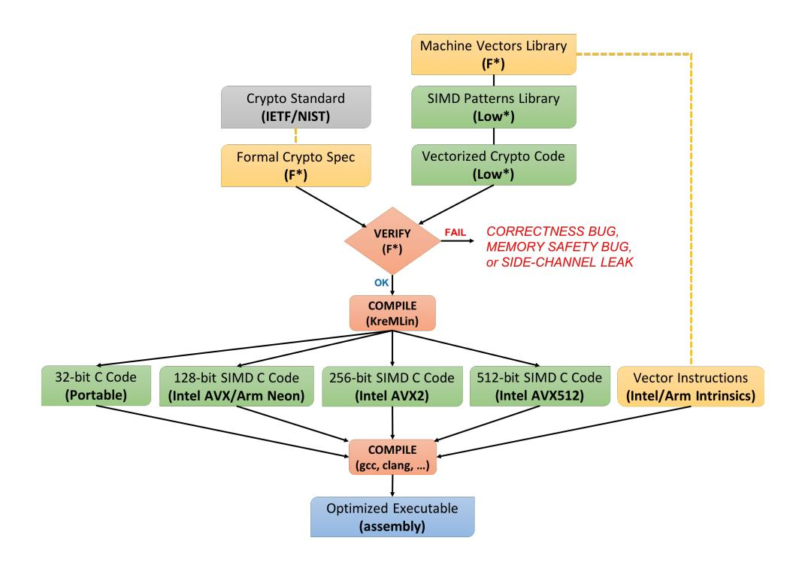
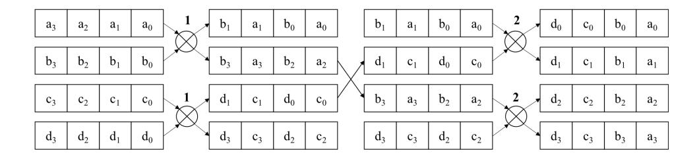

{0}------------------------------------------------

# HACLxN: Verified Generic SIMD Crypto

(for all your favorite platforms)

Marina Polubelova Inria Paris

Benjamin Beurdouche Inria Paris and Mozilla

Karthikeyan Bhargavan Inria Paris

Aymeric Fromherz Carnegie Mellon University Jonathan Protzenko Microsoft Research

> Natalia Kulatova Inria Paris

Santiago Zanella-Béguelin Microsoft Research

1

## ABSTRACT

We present a new methodology for building formally verified cryptographic libraries that are optimized for multiple architectures. In particular, we show how to write and verify generic crypto code in the F★ programming language that exploits single-instruction multiple data (SIMD) parallelism. We show how this code can be compiled to platforms that support vector instructions, including ARM Neon and Intel AVX, AVX2, and AVX512. We apply our methodology to obtain verified vectorized implementations on all these platforms for the ChaCha20 encryption algorithm, the Poly1305 one-time MAC, and the SHA-2 and Blake2 families of hash algorithms.

A distinctive feature of our approach is that we aggressively share code and verification effort between scalar and vectorized code, between vectorized code for different platforms, and between implementations of different cryptographic primitives. By doing so, we significantly reduce the manual effort needed to add new implementations to our verified library. In this paper, we describe our methodology and verification results, evaluate the performance of our code, and describe its integration into the HACL★ crypto library. Our vectorized code has already been incorporated into several software projects, including the Firefox web browser.

# <span id="page-0-0"></span>1 VERIFIED HIGH-PERFORMANCE CRYPTO

Modern cryptographic algorithms are evaluated not just for their security, but also for their performance on various platforms. Slow algorithms, even if provably secure, are rarely deployed at scale. For example, the Diffie Hellman key exchange remained largely unused for decades in mainstream protocols like TLS, even though it provided strong guarantees like forward secrecy, until the advent of fast Elliptic Curve Diffie Hellman implementations. Even today, powerful constructions like homomorphic encryption and postquantum crypto are awaiting faster implementations before they can be considered for widespread deployment.

When a new cryptographic algorithm is standardized, the designers usually describe (and sometimes include as an appendix) a reference implementation that would work on any 32-bit computer. However, the algorithm and its parameters are often chosen carefully to admit platform-specific optimizations. For example, new authenticated encryption schemes like ChaCha20-Poly1305 and hash algorithms like Blake2 were deliberately designed to enable

Single Instruction Multiple Data (SIMD) vectorization. Since most desktops and smartphones are now equipped with SIMD-enabled processors capable of computing over 4, 8, or 16 32-bit integers in parallel, the performance impact of vectorization can be dramatic.

SIMD Parallelization for Crypto Code. Consider ChaCha20, a counter-mode (CTR) encryption algorithm standardized in IETF RFC 7539. The OpenSSL library includes a reference implementation of ChaCha20 (written by D.J. Bernstein) in 122 lines of portable C code. When compiled with GCC, this code takes between 4-9 cycles to encrypt a byte on modern processors. For better performance, OpenSSL also includes a dozen other hand-written assembly implementations of ChaCha20 (totaling over 10K lines), for various generations of Intel and ARM processors. Each implementation exploits platform-specific SIMD instructions to parallelize ChaCha20 for maximum speed. For example, encryption takes just 0.56 cycles per byte on a server with an AVX512-enabled Intel processor.

The task of writing such optimized vectorized implementations can conceptually be divided into three stages. First, we apply highlevel algorithmic transformations that rearrange the cryptographic computation in a way that allows multiple arithmetic operations to be performed in parallel. Some transformations are algorithmspecific while others are generic patterns that apply to multiple algorithms. In ChaCha20, for example, we can parallelize the inner block cipher (as intended by the designers), or we can tranform the generic CTR loop to process multiple blocks at a time, or both. Once the algorithm has been parallelized, we implement it using low-level platform-specific SIMD instructions, relying on custom SIMD routines for commonly-used crypto operations like integer rotations and matrix transpositions. Finally, we can hand-optimize the assembly code for a target platform by reusing registers to avoid spills, rearranging instructions to exploit pipelining, etc.

Unfortunately, the optimized assembly code at the end of this process no longer reflects the high-level structure of the parallelized algorithm, making it unreadable and hard to audit. Furthermore, code reuse is minimal: we need to rewrite code for each platform from scratch, even if we are implementing the same algorithmic ideas, increasing the chances of unintended bugs. Hence, we end up with 10K lines of assembly code for ChaCha20 that only a few developers can audit and safely modify. Efficient implementations of algorithms like Poly1305 are even more complex and error-prone [\[17\]](#page-14-0), since they have to interleave bignum arithmetic with SIMD vectorization, and hence have to account for the subtleties of both.

{1}------------------------------------------------

How can we be sure that all these platform-specific implementations are correct? Testing helps, but does not give complete coverage, and it requires significant resources to maintain test environments for multiple platforms. The challenge is to build high-assurance cryptographic libraries that are mechanically verified to be correct, memory safe, and secret independent ("constant-time").

**Cryptographic Software Verification.** Several recent works have explored different approaches towards building verified cryptographic software (see [13] for a more complete survey.)

Vale [21, 27], Jasmin [8, 9], and CryptoLine [28] can directly verify hand-optimized assembly implementations. Consequently, they do not need to sacrifice any performance or trust any compiler. Conversely, the assembly code they verify is neither portable nor reusable. One must rewrite and reverify new code for each platform, and the tool may not support all platforms (Vale and Jasmin do not currently support ARM or AVX-512.) More generally, verifying low-level assembly involves quite a bit of work and becomes challenging for large cryptographic constructions and libraries. Consequently these tools are best suited to verify a few optimized implementations of important crypto primitives on chosen target platforms.

A different approach is to verify portable code written in a high-level language and rely on a compiler to convert it to assembly. The Verified Software Toolchain [11, 18] and the Cryptol/SAW framework [42] can prove the functional correctness of C (and Java) code against a high-level mathematical specification. HACL\* [44] and Fiat-Crypto [26] verify cryptographic code written in verification-oriented high-level languages and compile it to portable C code. The advantage of this approach is that the target C code is readable, auditable, and portable. In addition, these frameworks can use high-level programming mechanisms to share code and proofs between different algorithms. The disadvantage is that the compiled code can be significantly slower than hand-written assembly [44]. Moreover, we either need to trust the C compiler or use a verified compiler like CompCert [31], which produces even slower code.

These approaches are not mutually exclusive. EverCrypt [34] is a cryptographic provider that composes verified C code from HACL\* with verified Intel assembly code from Vale to obtain best-in-class performance on Intel platforms for elliptic curves like Curve25519 and authenticated encryption schemes like AES-GCM.

**Our Approach.** In this paper, we present a new hybrid approach towards building a multi-platform library of vectorized cryptographic algorithms, by following the high-level programming methodology of HACL\* but compiling it to multiple platform-specific C implementations that rely on compiler intrinsics for SIMD vector instructions. Hence, we seek to preserve the portability, auditability, code and proof reuse enabled by high-level source code, while closing the performance gap with assembly implementations.

The main insight guiding our approach is that the high-level algorithmic tranformations needed for SIMD vectorization can be implemented and verified *generically*, without relying on details of the underlying platform, and then automatically *specialized* for a given target platform. Our second observation is that modern C compilers are good enough (and constantly improving) at instruction scheduling and register allocation, so hand-optimizing assembly for each platform is often not necessary for performance.

<span id="page-1-0"></span>

Figure 1: HACL×N programming and verification workflow. We write SIMD crypto code in Low\* [35] and prove it memory-safe, secret independent, and functionally correct with respect to a high-level formal spec in F\* [41], before compiling it to target-specific C code linked with compiler intrinsics. (Code components in green are verified; those in yellow are trusted and carefully tested.)

HACL×N Workflow. Figure 1 depicts our high-level methodology as a sequence of programming, verification, and compilation tasks: High-Level Spec We first write a succinct formal specification

for each crypto algorithm in the F\* language [41], by carefully transcribing the corresponding IETF or NIST standard. This specification is trusted but executable; it serves as a testable, readable, reference implementation that can be audited by cryptographers.

Generic Vector Library We extend HACL\* with libraries for machine integers and vectors of integers, designed to enable generic SIMD programming. We implement the vector library as a trusted C header file that maps each vector operation to platform-specific vector instructions for ARM Neon, Intel AVX, AVX2, and AVX512.

**SIMD Patterns for Crypto** We identify, implement, and verify a series of reusable SIMD programming patterns commonly used in crypto algorithms, including generic constructions for multibuffer parallelism, CTR encryption, and polynomial evaluation.

**Verified Vectorized Implementations** We build vectorized implementations of Blake2s, Blake2b, SHA-224, SHA-256, SHA-384, SHA-512, ChaCha20, and Poly1305, in Low\* [35] (a subset of F\*). These generic implementations are parameterized over a target vector size and can be instantiated with vectors of any size: 1, 2, 4, 8, etc. (Vectors of size 1 correspond to scalar code.)

**Target-Specific Compilation** We exploit the meta-programming and compile-time specialization features of F\* to translate our generic Low\* implementations to custom C implementations for each target platform. The compiler generates both portable 32-bit C code and vectorized C code for ARM Neon and Intel AVX/AVX2/AVX512. Each C implementation can be compiled via GCC or CLANG to machine code.

**Contributions.** We apply this workflow on four families of cryptographic algorithms, but our methodology is more generally applicable to other algorithms, and even to non-cryptographic code. To the best of our knowledge, ours are the first verified vectorized crypto

{2}------------------------------------------------

implementations on ARM Neon and AVX512, and the first verified implementations of vectorized Blake2 and SHA-2. The proof overhead of our method is significantly less than that of HACL\*. Our vectorized ChaCha20-Poly1305 code is deployed in Mozilla Firefox Nightly, and our Blake2 code is used in Tezos.

Our goal is to build a usable *library* of verified crypto algorithms, not just verify a few isolated algorithms. We show how we can embed our vectorized algorithms into HACL\* and safely compose them with previously verified C and assembly code [21, 34, 44]. The resulting library provides optimized verified code for many of the ciphersuites used in modern protocols like TLS 1.3, WireGuard, and Signal. We further show how to use our methodology to build optimized implementations of agile cryptographic applications, such as the upcoming HPKE standard [15].

**Trusting the C Compiler.** The chief limitation of our approach, compared to works that directly verify assembly, is the considerable trust we place in the C compiler. Mainstream C compilers frequently have bugs [43], and even if the code they generate is functionally correct, they may introduce side-channels that were not present in the original source [40], which can be dangerous for crypto code.

A natural alternative is to rely on a verified compiler like CompCert [31] which has been extended with side-channel preservation guarantees [16]. However, support for SIMD instructions in CompCert is still ongoing [10], and so we cannot use CompCert for this work. Another direction could be to develop a specialized compiler that can directly compile our crypto implementations to assembly code, say by building on a recent compiler from Low\* to web assembly [33], and extending it with SIMD instructions [7].

In this work, we make the pragmatic design decision to trust mainstream C compilers like GCC and CLANG, while waiting for these future improvements in verified compilation. In exchange, we obtain portability, performance, and the ability to scale up verification to an entire library of vectorized algorithms. In practice, the libraries and applications that use our cryptographic code (e.g. Firefox, Tezos) already place a large amount of trust in the C compiler. From their viewpoint, compiler bugs are an inevitable cost of large-scale software development; they are much more concerned by security and functionality bugs in the source C code.

## <span id="page-2-0"></span>2 BACKGROUND: HACL\*, F\*, LOW\*

The HACL\* cryptographic library [44] contains verified implementations for many popular cryptographic algorithms. The source code for each algorithm is written in the F\* programming language [41] and verified using the F\* typechecker for memory safety, for functional correctness against a high-level specification also written in F\*, and for a side-channel guarantee called secret independence, which states that secret data cannot be used in branches or to compute memory addresses. The F\* code is then compiled to fast C code that can be easily integrated into existing software. We briefly review the languages and tools used in HACL\*.

 $\mathbf{F}^{\star}$  is a state-of-the-art verification-oriented programming language [41]. It is a functional programming language with dependent types and an effect system, and it relies on SMT-based automation to prove properties about programs using a weakest-precondition calculus. We primarily write code in two subsets of  $\mathbf{F}^{\star}$ . All specifications (and proofs) are written using the pure subset of  $\mathbf{F}^{\star}$  (i.e.

no side-effects). Crypto implementations are written in Low $^*$ , a effectful subset of  $F^*$  that can be compiled to C.

**HACL**\* **specifications** use high-level concepts, such as mathematical (unbounded) integers, sequences, lists, and loop combinators. For instance, our F\* specification for the Poly1305 algorithm (see §4.4) relies on arithmetic modulo the prime  $2^{130} - 5$ :

```
let prime = pow2 130 - 5
let felem = x:nat{x < prime}
let fadd (x:felem) (y:felem) : felem = (x + y) % prime
let fmul (x:felem) (y:felem) : felem = (x * y) % prime</pre>
```

The prime modulus is a mathematical constant, and the type of field elements felem is defined using a *refinement type*, as the type of natural numbers (nat) less than the prime. Field operations are then defined using the mathematical operators for addition, multiplication and modulo. The full Poly1305 MAC is specified as the evaluation of a polynomial over this field. The specification is then compiled to OCaml and subjected to a substantial amount of testing, to detect specification bugs.

Low\* is a stateful subset of F\* which models the C memory layout of the heap and stack. Using Low\*, the programmer manipulates arrays, reasoning about their liveness, disjointness and location in memory. Low\* uses machine integers (instead of mathematical integers), which forces the programmer to reason about their overflow semantics and to choose low-level data representations for abstract values. For example, field elements in Poly1305 have 130 bits, which does not fit in a machine integer, but we can encode it as an array of five 32-bit integers (written lbuffer uint32 5).

Each stateful function is defined using one of the Low\* effects: Stack for functions that are only allowed to allocate memory on the stack (hence trivially ensuring there are no memory leaks), ST for all other Low\* functions. For example, we present the signature of a function poly1305\_load that takes an 16-byte input block b, converts it into a field element, and writes the result in f:

```
let poly1305_felem = lbuffer uint32 5
val poly1305_load (f:poly1305_felem) (b:lbuffer uint8 16ul): Stack unit
(requires \lambda h \rightarrow live h f \wedge live h b \wedge disjoint f b)
(ensures \lambda h0_h1 \rightarrow modifies (loc f) h0 h1 \wedge
as_felem h1 f == Spec.Poly1305.load (as_seq h0 b))
```

The pre-condition (requires) of poly1305\_load talks about the *liveness* and *disjointness* of the input arrays, needed for memory safety. The post-condition (ensures) has a modifies clause: only the field element f is modified, leaving b or any other disjoint object unchanged, and a functional correctness guarantee relating the output to the corresponding function in the Poly1305 specification. F\* verifies that the implementation of poly1305\_load meets this specification. Furthermore, since the types uint32 and uint8 may potentially hold secret data, the typechecker ensures that they are only used in secret-independent ("constant-time") operations.

**KreMLin** compiles Low\* code, once typechecked, to *auditable*, *readable* C, using a series of many small, composable passes. The Low\* preservation theorem [35] states that the translated C code exhibits the same execution traces as the original verified Low\* program. Hence, we obtain C code that is functionally correct, memory safe, and secret independent. This approach was used by several verified software projects, such as HACL\*, but also a

{3}------------------------------------------------

cryptographic provider [34], a parsing library [36], and a QUIC implementation [23].

Although Low\* is a C-like first-order language, a programmer can use the higher-order features of F\* to write *generic* code parameterized by constants, types, and functions. At compile time, such functions (or *meta-programs*) are inlined at each call site and aggressively simplified (or *specialized*) to yield first-order Low\* code that can be translated to C. In particular, function definitions annotated with inline\_for\_extraction are always inlined by the compiler. §3.4 illustrates the full power of the meta-programming features of F\* on a detailed cryptographic example.

**Meta-F** $^*$  refers to the discipline of relying on the F $^*$  compiler to generate or transform existing code before compilation. Some simple meta-programming is built into F $^*$ , through keywords.

```
inline_for_extraction let pow4 (x: uint32 { x < 256 }) =
  [@inline_let] let pow2 = x * x in
  pow2 * pow2</pre>
```

At compile-time,  $F^*$ , seeing that pow4 is "inline for extraction", replaces any call to pow4, say pow4 2ul, with its definition and further simplifies it, since it is a pure computation, to 16ul.

In addition, Meta-F\* provides a general-purpose framework [32], where the meta-language is F\* itself, an approach known as *elaborator reflection* (pioneered by Idris [22].) Essentially, one can write program and proof transformations (called *tactics*) in F\* that are executed by F\* at compile-time and the result is re-typechecked, ensuring that tactics cannot generate ill-typed terms.

#### 3 WRITE & VERIFY ONCE; COMPILE N TIMES

HACL×N is a new SIMD-oriented extension of HACL\*, where the motto is to *verify once*, but *compile and specialize* many times, in order to maximize programmer productivity. For example, when implementing SHA-2, we write a single *generic* implementation for all four variants and specialize it to obtain both scalar and vectorized implementations for each variant on each platform, yielding sixteen verified C implementations in total. This aggressive approach towards code and proof reuse relies on an intentional, careful scaffolding of verified libraries and compilation techniques. This section describes how this methodology is implemented in HACL×N.

## 3.1 Generic integer and array libraries

Low\* provides builtin types and operators for all the machine integers (from 8 to 128 bits) supported by mainstream C compilers. However, if we wanted to define a new operator or function that works generically for all machine integers, such as rotate-left or constant-time comparison, we would have to implement (and verify) it for each kind of machine integer, which is both tedious and unproductive. In a language like C++, we would usually use a template to define such functions; and in C we would use an untyped macro. To recover the convenience of templates within the strong type system and semantics of  $F^*$ , we define a generic machine integer module Lib.IntTypes for use in crypto code:

```
type inttype = | U8 | U16 | U32 | U64 | U128 | S8 | S16 | S32 | S64

type secrecy_level = | SEC | PUB

val sec_int_t: inttype → Type

let int_t (t:inttype) (l:secrecy_level) : Type =
```

```
match I, t with

| PUB, U8 → LowStar.UInt8.t

| SEC, _→ sec_int_t t | ...
\ninline_for_extraction val (+.): #t:inttype → #I:secrecy_level

→ a:int_t t I → b:int_t t I → int_t t I
```

The type int\_t is parameterized over two indices: inttype enumerates all known variants of integer types, while secrecy\_level distinguishes public data from secret data. The former allows hiding the proliferation of integer models under a single type. The latter enforces the secret independent coding discipline of HACL\* [44] and unifies secret and public integers under a single abstraction, thus relieving the programmer from having to deal with yet another set of operators for secret data. The type int\_t hence has 18 variants. Our library defines several abbreviations for convenience, such as let uint32 = int\_t U32 SEC or uint8, which we use in this paper.

The operator +. for modular addition is parameterized (overloaded) over all integer types and secrecy levels (# denotes implicit arguments, inferred automatically by F\*.) Its definition performs a case analysis on the integer type t and calls the appropriate builtin machine integer operation. Thanks to inlining, whenever +. is applied to (say) a public (PUB) 32-bit unsigned integer (U32), F\* will simplify away all the non-matching cases and replace it by a call to native 32-bit addition (LowStar.UInt32.add).

The type of secret integers sec\_int\_t is abstract, hence nothing is revealed about the nature of secret integers, and the only operations over them are those offered by Lib.IntTypes. In particular, operations that are known to be non constant-time (e.g. division) have a precondition that the arguments be public. Any attempt to use a secret integer for branching or memory access is a type error.

To add a new integer type (e.g. S128) to Lib.IntTypes, we need to extend inttype and define a new case for each operator that this integer type supports. Adding new operators is similar. This style of defining parameterized types with selectively enabled overloaded operators is a lightweight form of (bounded) type classes [39]. Full type classes were not available in  $F^*$  when we began this work, but we plan to experiment with their use in future work.

**Generic arrays.** Low\* also supports many different kinds of arrays: mutable, immutable, and const pointers to either mutable or immutable arrays. We apply the same idea of defining overloaded, universal operators for various array types by defining a library module Lib.Buffer that defines a generic array type: lbuffer #b t n, where the parameter b is either MUT, IMMUT or CONST, t is the type of each element, and n is the length of the array.

Using these overloaded operators, we can concisely define functions like the dereference-then-add operation below that generically works for all 54 combinations of array and integer types:

```
let deref_add #b #t #s (x y: lbuffer #b (int_t #t #s) 1ul): Stack (int_t #t #s) = x.[0ul] +. y.[0ul]
```

## 3.2 Abstract integer vectors for SIMD code

SIMD programming in C usually requires dealing with a patchwork of headers and compiler builtins, depending on the target instruction set (e.g. ARM Neon, Intel AVX2).

{4}------------------------------------------------

In order to establish clear interfaces and abstraction boundaries, we introduce a low-level machine vector library dubbed Lib.IntVector.Intrinsics that hides platform differences behind a shared interface. This module selects and axiomatizes vector operations that are general enough to be implemented using, say, both Neon and AVX. For example, it defines arithmetic and bitwise operations for 128-bit, 256-bit, and 512-bit vectors. We carefully audit its semantics, and perform rigorous testing to ensure that our specifications carefully capture the intrinsics' expected behavior.

At compile-time, calls to this library are diverted to a handwritten C implementation that calls the corresponding SIMD intrinsics provided by the underlying platform. For example, the F★ module defines vec128\_xor; and its C implementation either calls \_mm\_xor\_si128 (on Intel AVX) or veorq\_u32 (on ARM Neon).

As the next step, in order to enable programmers to write generic vectorized code that works for any platform, we define a more abstract vector library of overloaded operators over all vector widths:

```
val vec_t: t:inttype →w:width →Type
inline_for_extraction val (+|): #t:inttype →#w:width →
  v1:vec_t t w →v2:vec_t t w →vec_t t w
val vec_v: #t:inttype →#w:width →vec t w →lseq (uint_t t SEC) w
val vec_add_mod_lemma: #t:inttype →#w:width →
  v1:vec_t t w →v2:vec_t t w →Lemma (ensures (
    vec_v (v1 +| v2) == map2 (+.) (vec_v v1) (vec_v v2)))
```

The type vec\_t is parametric over its width w, and the type t of its elements. The module only offers constructors for valid combinations of width and t, and defines abbreviations for commonly-used types like uint32x4 and uint32x8.

Similarly to the integer operator +., we define the overloaded operator +| which is the point-wise lifting of modular integer addition to vectors of any width. Just like with integers, both the type (vec\_t) and the operations (+|) are reduced away by F★ at compile-time, and replaced with calls to the low-level SIMD intrinsics. In order to reason about the semantics of vector operations, we use the vec\_v function, which reflects a vector as a sequence of integers. For example, we specify vector addition +| in terms of point-wise addition (map2 (+.)) on the sequences returned by vec\_v.

Towards Generic Code and Proofs. The design of our generic libraries is a key technical device that allows us to attain greater productivity when authoring verified code in HACL×N. By bringing together all variants of integers, arrays, and vectors into a few, well-documented, extensible libraries, we provide both newcomers and experts with intuitive yet poweful APIs that they can use to implement new crypto algorithms. Moreover, these APIs encourage programmers to write generic code that is succinct, readable, and easy to maintain.

For example, both Blake2 and SHA-2 have multiple variants, differing mainly in their internal integer representation (uint32 vs. uint64). Most cryptographic libraries contain independent code for each variant, with only the more popular variants (e.g. SHA-256) being optimized for SIMD platforms. Using our libraries, however, we write and verify generic implementations for Blake2 and SHA-2 which we instantiate to obtain optimized SIMD code for each variant.

We believe that our use of generic strong-typed integers and vectors is generally applicable as a software engineering pattern for crypto code, even in other languages like Rust and verification frameworks like Jasmin. Within Low★, we anticipate building many more such generic libraries in the future.

## 3.3 Representation-agnostic crypto code

We now illustrate how we can use our abstract integer and vector libraries to write generic implementations for algorithms, even when their internal data representations on different platforms are different. (We leave a detailed discussion of SIMD algorithmic techniques to [§4](#page-6-0) and discuss here only the compilation aspects.)

For example, our vectorized implementation of Poly1305 ([§4.4\)](#page-9-0) supports multiple vector architectures, identified by a type varch:

```
type varch = | M32 | M128 | M256 | M512
let poly1305_ctx (s: varch) = match s with
  | M32 →lbuffer MUT (vec_t U64 1) 25ul
  | M128 →lbuffer MUT (vec_t U64 2) 25ul | ...
```

All the types and code in the Poly1305 implementation are parameterized by a target varch value s. However, only a few of these definitions need to inspect s. The Poly1305 internal state representation (poly1305\_ctx s) is defined as a mutable buffer holding five vectors where the width of these vectors depends on s. On scalar 32-bit machines (s=M32), each vector has one element (i.e. is a uint64), on ARM Neon and Intel AVX (s=M128), each vector has two elements, etc. Similarly, the number of blocks processed in parallel is different on each vector architecture:

```
inline_for_extraction let blocklen (s:varch): int_t U32 PUB =
  match s with
  | M32 →16ul
  | M128 →32ul | ...
```

Scalar code processes 1 block (16 bytes) at a time, 128-bit vectorized code processes 2 blocks (32 bytes) at a time, etc.

Once we have set up these basic definitions, however, the vast bulk of the Poly1305 implementation is generic and works uniformly on all four architectures. It never needs to do a case analysis on s, except if we wanted to implement some platform-specific optimization. This code will not need to be updated even if we extend varch to support another vector size. For example, the poly1305\_update function loops over the input data in blocklensized chunks, then processes each chunk to update the state:

```
inline_for_extraction val poly1305_update: #s:varch →
  ctx:poly1305_ctx s →len:size_t →text:lbuffer uint8 len →Stack unit
```

Although the length of each chunk and the internal state representation both depend on s, the code and proof for poly1305\_update is fully generic; it never relies on the actual value of s.

To compile poly1305\_update to C, we must first instantiate its s parameter for a target architecture:

```
let update32 = poly1305_update #M32
```

At compile-time, F★ processes the inline\_for\_extraction annotation on poly1305\_update end replaces the call site with the function definition. It then repeatedly simplifies the code by partially applying functions whose s parameter is known, inlining types and functions, propagating constants, evaluating case analyses, and discarding unreachable branches, until all mentions of s have been eliminated. 

{5}------------------------------------------------

The resulting C code corresponds to a scalar implementation of Poly1305 that operates over arrays of uint64 values:

```
void Poly1305_32_update32(uint64_t *ctx, uint32_t len, uint8_t *text);
```

There is no verification cost associated to performing a partial application of poly1305\_update to a concrete argument: the three other cases, for 128, 256 and 512-bit specialized variants of Poly1305, also come for free, needing no new code or proofs.

#### <span id="page-5-0"></span>3.4 Large-scale program specialization

The technique described above suffers from one caveat: the entire algorithm must be inlined into the top-level function in order to get fully applied matches to appear and be reduced away by  $F^*$ . While this is fine for a mid-size algorithm such as Poly1305, for a larger piece of code such as HPKE (§5.2), this would generate prohibitively large and unreadable C code.

We now address very-large scale genericity, and use the full power of Meta-F\* to solve this problem. We have written a tactic (i.e. a meta-program) that takes an algorithm written in a normal style and transforms its entire call-graph, rewriting the algorithm in a form similar to C++ templatized code. After rewriting, the programmer can generate specialized versions of their code like we did above for Poly1305, with the added benefit that the structure of the call-graph is preserved, rather than inlined away.

The tactic takes upon the burden of rewriting the code in a slightly more convoluted form (described below), meaning there is no extra cost for its users. It is flexible, and allows the programmer to annotate their code to specify which functions should be inlined away and which ones should remain at extraction-time. At the time of writing, our tactic is the second largest Meta- $F^*$  program written (> 600 LoC), and is used in almost every algorithm in HACL×N.

**Overview.** We now illustrate the inner workings of our tactic on HPKE, a composite cryptographic construction described in §5.2. HPKE calls into a Diffie-Hellman (DH), an AEAD and a hash algorithm. HPKE is *agile* over the choice of these algorithms, and so our generic HPKE code is parameterized by a triplet of algorithms:

```
type hpke_index = dh_alg & aead_alg & hash_alg
```

To instantiate HPKE, the programmer first chooses a triplet of algorithms, and then chooses an implementation of each algorithm. For example, fixing aead\_alg to be Chacha20Poly1305 still allows four possible ChaCha-Poly implementations, one for each degree of vectorization. By mixing and matching algorithms and implementations, we can build 54 combinations of HPKE. Our tactic allows us to verify HPKE once, for each possible triplet of *algorithms*, and enjoy specialization for free for any combination of implementations.

$$\mathsf{hpke} \overset{\mathsf{calls}}{\to} \mathsf{hpke}_{\mathsf{helper}} \overset{\mathsf{calls}}{\to} \mathsf{AEAD}.\mathsf{encrypt}$$

The (simplified) call-graph of HPKE is described above, where hpke\_helper was split out for proof modularity, but should not appear in the generated C code, as it would be too verbose.

Using  $F^*$ 's custom annotations, the programmer decorates both hpke and AEAD.encrypt with [@@Specialize], and hpke\_helper with [@@Inline]. Doing so, they indicate to the tactic that hpke and AEAD.encrypt should both remain in the call-graph, while hpke\_helper is to be inlined in its callers' bodies.

Upon executing, the tactic traverses the call-graph, starting from hpke, and proceeds as follows. First, inlined functions are eliminated, leaving a call-graph only made up of specialized nodes. Then, hpke is rewritten to take as extra parameters function pointers for every specialized function that it calls into. We call this the convoluted form: the user could have written it manually, but the syntactic overhead would have been substantial. After rewriting, the signature of hpke becomes as follows:

```
let snd3 (_, x, _) = x
val hpke #i:hpke_index \rightarrow encrypt:AEAD.encrypt_t (snd3 i) \rightarrow ...
```

Here, AEAD.encrypt\_t a stands for the type of an AEAD encryption function for algorithm a, and ... stands for the original arguments of the hpke function before the rewriting.

In addition to being applied to an index specifying the algorithms it depends on, hpke needs to also be applied to specialized *implementations* of these algorithms:

```
inline_for_extraction let aead_alg = Chacha20Poly1305
let encrypt_cp32: encrypt_t aead_alg = ChachaPoly.encrypt #M32
let hpke_cp32 = HPKE.hpke (..., aead_alg, ...) encrypt_cp32
```

The encrypt\_cp32 function above is a specialized implementation of Chacha-Poly admissible for any index (..., Chacha20Poly1305, ...). The application of the tactic-rewritten hpke to a concrete index and encrypt\_cp32 generates an implementation that calls the Chacha-Poly algorithm, specifically its scalar implementation.

The shape of the call-graph is preserved, as hpke\_cp32 calls into encrypt\_cp32; furthermore, this technique allows swapping out encrypt\_cp32 for any other variant, giving e.g. hpke\_cp256.

Using our tactic, the proof of HPKE is exclusively concerned with *algorithmic agility*, leaving implementation choices entirely up to the module that performs concrete instantiations. This enforces strong modularity, as HPKE need not be aware of the current or future implementations for a given algorithm.

The methodology applies, naturally, to all possible combinations of choices for DH, AEAD and hash, meaning we can obtain up to 54 specialized implementations of HPKE for free; 15 of these implementations are currently packaged within HACL×N.

**Verification and Debugging.** As mentioned in  $\S2$ , the tactic is not part of the TCB, since whatever code the tactic generates is type-checked again by F\*. This is by design: unlike, say, MTac2 [30], Meta-F\* [32] does not allow the user to prove properties about tactics. This is a pragmatic design choice, trading provable correctness for ease-of-use and programmer productivity.

Tactics are just one tool in the utility belt of the  $F^*$  programmer. We experimented with other strategies, such as type classes, but found that they imposed a lot of overhead on the user: if the call-graph has depth n, then the user needs to materialize n-1 type classes for each level of specialized functions. We thus found our "templatization" tactic to be simpler to use, and therefore better for proof productivity.

Debugging tactics and tactic-generate code is straightforward. Either the tactic itself fails, and F\* points to the faulty line in the meta-program; or the generated code is ill-typed, in which case we can examine it like any other F\* program. In practice, after some

{6}------------------------------------------------

```
let g (alg:blake2_alg) (st:state alg) (a b c d:idx) (x y:word alg): state alg =
    let st = st.[a] ←(st.[a] +. st.[b] +. x) in
    let st = st.[d] ←(st.[d] ^. st.[a]) >>>. (rotc alg 0) in
    let st = st.[c] ←(st.[c] +. st.[d]) in
    let st = st.[b] ←(st.[b] ^. st.[c]) >>>. (rotc alg 1) in
    let st = st.[a] ←(st.[a] +. st.[b] +. y) in
    let st = st.[d] ←(st.[d] ^. st.[a]) >>>. (rotc alg 2) in
    let st = st.[c] ←(st.[c] +. st.[d]) in
    let st = st.[b] ←(st.[b] ^. st.[c]) >>>. (rotc alg 3) in
    st
let mixing_core (alg:blake2_alg) (st:state alg) (m:state alg): state alg =
    let st = g alg st 0 4 8 12 m.[0] m.[1] in
    let st = g alg st 1 5 9 13 m.[2] m.[2] in
    let st = g alg st 2 6 10 14 m.[4] m.[5] in
    let st = g alg st 3 7 11 15 m.[6] m.[7] in
    let st = g alg st 0 5 10 15 m.[8] m.[9] in
    let st = g alg st 1 6 11 12 m.[10] m.[11] in
    let st = g alg st 2 7 8 13 m.[12] m.[13] in
    let st = g alg st 3 4 9 14 m.[14] m.[15] in
    st
```

Figure 2: F★ spec for the core Blake2 computation.

initial debugging, our tactic never generated ill-typed code (in over 20 use cases) and was used successfully by other collaborators.

# <span id="page-6-0"></span>4 SIMD CRYPTO PROGRAMMING PATTERNS

We now identify a series of SIMD parallelization strategies and apply them to build and verify generic vectorized implementations for four families of cryptographic algorithms. The patterns we detail here are not meant to be exhaustive; for example, we do not cover bit- and byte-slicing. However, these patterns cover most of the standard vectorization strategies that we have seen used in popular cryptographic libraries. Although we apply each pattern only to a single algorithm family, we provide verified generic libraries that can be used to apply these patterns to other similar algorithms.

## 4.1 Exploiting Internal Parallelism (Blake2)

We first consider algorithms that are explicitly designed to allow their core operations to be parallelized. We illustrate this pattern for the Blake2 hash algorithm, but similar strategies apply to other crypto algorithms like ChaCha20 and Salsa20.

Formally Specifying Blake2. The Blake2 cryptographic hash algorithm [\[12\]](#page-14-29) is standardized in IETF RFC 7693 [\[38\]](#page-14-30). We formalized this RFC in F★ and the main types in the resulting spec are:

```
type blake2_alg = | Blake2s | Blake2b
let word_t (alg:blake2_alg) = match alg with
  | Blake2s →U32
  | Blake2b →U64
let word (alg:blake2_alg) = int_t (word_t alg) SEC
type state (alg:blake2_alg) = lseq (word alg) 16
```

Blake2 has two variants, Blake2s and Blake2b; the first uses 32 bit words, whereas the latter uses 64-bit words. We specify the word type as an algorithm-dependent machine integer that is labeled as secret (SEC), which enforces that all operations on these words must be secret independent ("constant-time"). The Blake2 state, also

```
let g_vec (alg:blake2_alg) (st:vec_state alg) (x y: vec_row alg) =
  let (a,b,c,d) = (0,1,2,3) in
  let st = st.[a] ←(st.[a] +| st.[b] +| x) in
  let st = st.[d] ←(st.[d] ^| st.[a]) >>>| (rotc alg 0) in
  let st = st.[c] ←(st.[c] +| st.[d]) in
  let st = st.[b] ←(st.[b] ^| st.[c]) >>>| (rotc alg 1) in
  let st = st.[a] ←(st.[a] +| st.[b] +| y) in
  let st = st.[d] ←(st.[d] ^| st.[a]) >>>| (rotc alg 2) in
  let st = st.[c] ←(st.[c] +| st.[d]) in
  let st = st.[b] ←(st.[b] ^| st.[c]) >>>| (rotc alg 3) in
  st
let diagonalize (alg:blake2_alg) (st:vec_state alg) : vec_state alg =
  let st = st.[1] ←vec_rotate_right_lanes st.[1] 1ul in
  let st = st.[2] ←vec_rotate_right_lanes st.[2] 2ul in
  let st = st.[3] ←vec_rotate_right_lanes st.[3] 3ul in
  st
let mixing_core_vec (alg:blake2_alg) (st:vec_state alg)
                 (m:vec_state alg) : vec_state alg =
  let st = g_vec alg st m.[0] m.[1] in
  let st = diagonalize alg st in
  let st = g_vec alg st m.[2] m.[3] in
  let st = undiagonalize alg st in
  st
```

Figure 3: 4-way vectorized spec for Blake2.

called a working vector, is a 4 × 4 matrix of words, represented in the RFC as a sequence (lseq) of 16 words, laid out row-by-row.

To hash an input message, Blake2 first splits it into state-sized blocks (64 bytes for Blake2s, 128 bytes for Blake2b), and processes each block in sequence by calling a compression function. The core computation of the compression function is a loop that repeatedly loads a message block, permutes it according to a table, and then calls the mixing\_core function depicted in Figure [2.](#page-6-1)

The mixing\_core function in turn calls a shuffling function g 8 times. Each call takes 2 words from the message (x,y), and reads, shuffles, and writes four words in the Blake2 state (at indexes a,b,c,d), using a combination of modular addition (+.), xor (^.), and right-rotate (>>>.). We use overloaded operators that work for both uint32 and uint64, and this allows us to write a single generic, yet strongly-typed, formal specification for both Blake2s and Blake2b.

The resulting F★ specification is executable and can be seen as a reference implementation of the RFC. We tested it against test vectors from the RFC and more comprehensive tests we added ourselves. Interestingly, our tests revealed a bug in a corner case of our specification when processing the last block. This bug was not exercised by the RFC test vectors, and this serves to reemphasize the need for mechanized specifications and formal verification.

Rearranging Code for 4-way Vectorization. Each of the first four calls to g in the mixing\_core function read and modify a different column of the state matrix ((0, 4, 8, 12), (1, 5, 9, 13), . . .). Hence, these calls can be executed in parallel [\[12\]](#page-14-29). The next four calls process different diagonals of the state and can also be executed in parallel. To exploit this 4-way parallelism inherent in Blake2, we rearrange the state to use vectors:

```
type vec_row (alg:blake2_alg) = vec_t (word_t alg) 4
type vec_state (alg:blake2_alg) = lseq (vec_row alg) 4
val to_vec (alg:blake2_alg) (st:state alg) : vec_state alg
val from_vec (alg:blake2_alg) (st:vec_state alg) : state alg
```

{7}------------------------------------------------

The state is now explicitly a matrix with four rows, and each row is a vector with four words. Based on this vectorized state, we can define a *vectorized spec* for Blake2 in F\*. We will relate the two specs using functions (to\_vec, from\_vec) that inter-convert between the original scalar state and its vectorized form.

The core Blake2 computations are rewritten as shown in Figure 3. The function g\_vec applies the function g to each column in parallel. Using our vector library, the code for this function is remarkably similar to that of g; we simply replace the integer operations  $(+, ^{\land}, >>>)$  with their vector counterparts  $(+|, ^{\land}|, >>>|)$  and we set the indexes a, b, c, d to column numbers 0, 1, 2, 3.

The benefit of vectorization becomes clear in the mixing\_core\_vec function; it now calls g\_vec only twice, since each call processes four columns at a time. If each vector operation has the same cost as a scalar operation, this transformation can provide up to a 4x performance improvement. However, one must account for the cost of loading, storing, and transforming vectors. For example, before the second call to g\_vec we need to *diagonalize* the state, by rotating three of the row vectors, and undiagonalize it after.

The vectorized  $F^*$  spec acts as an intermediate step between the original  $F^*$  specification and the vectorized Low\* implementation. We prove that the two specs are equivalent via a series of lemmas. For example, we prove that mixing\_core\_vec computes the same function as mixing\_core, but on the vectorized state:

```
∀(alg:blake2_alg) (st:state alg) (m:state alg).

mixing_core alg st m ==

from_vec (mixing_core_vec alg (to_vec alg st) (to_vec alg m))
```

Implementing and Verifying Vectorized Blake2. Our Low<sup>★</sup> implementation of Blake2 closely follows the vectorized specification, but generalizes it further. On machines that support sufficiently wide vector instructions (128-bit for Blake2s, 256-bit for Blake2b), the implementation uses 4-way vectorization. On all other platforms, it defaults to scalar 32-bit code. By carefully structuring our code, we are able to define a single generic implementation for all four variants: scalar and vector, Blake2b and Blake2s.

The only other difference between the vectorized spec and our  $Low^*$  code is that the code modifies the state in-place, instead of copying the state at each modification. We prove that this code is memory-safe (it does not read or write arrays outside their bounds) and we prove that it is functionally correct with respect to the vectorized  $F^*$  specification, and by composing this with spec equivalence, we prove that it conforms to the original Blake2 spec.

Compiling to C with Vector Intrinsics. We compile the Low\* code using KreMLin to obtain 4 C files: Blake2s\_32.c, Blake2b\_32.c, Blake2s\_128.c, and Blake2b\_256.c, each offering the same interface. The first two contain portable code that runs on any 32-bit platform.

The C code in Blake2s\_128.c is essentially a sequence of calls to 128-bit vector operations. This code can be linked with our library of vector intrinsics, and executed on any machine that supports Arm Neon or Intel AVX/AVX2/AVX512. For example, on Intel AVX, the C code for the first two shuffling operations of g\_vec looks like:

```
st[0U] = _mm_add_epi32(st[0U], st[1U]);
st[0U] = _mm_add_epi32(st[0U], x);
```

```
let sha2 (a:sha2_alg) (in_len:size_nat) (input:lseq uint8 in_len)

: lbytes (hash_len a) =

let st0 = init a in

let blocks = in_len / blocksize a in

let st = repeati blocks (λ i st →

let b = sub input (i * blocksize a) (blocksize a) in

compress_block a b st)

st0 in

let last_len = in_len % blocksize a in

let last = sub input (in_len - last_len) last_len in

let st = pad_compress_last a in_len last_len last st in
\nemit a st
```

Figure 4: F\* spec for generic SHA-2 hash function.

```
st[3U] = _mm_xor_si128(st[0U], st[3U]);
st[3U] = _mm_xor_si128(_mm_slli_epi32(st[3U],32U-rotc0),
```

Similarly, Blake2b\_256 relies on AVX2 intrinsics and can be executed on any Intel AVX2/AVX512 machine. Performance numbers for all these implementations are given in §6. On Intel processors, vectorization speeds up Blake2 by about 30%.

**Further Platform-Specific Optimizations.** We have focused on writing *generic* code to avoid duplication of coding and verification effort. However, one can sometimes get even better performance by writing platform-specific code for some operations.

Blake2 requires each input message block to be permuted multiple times according to a known permutation schedule. In our generic code, we implement these permutations naively, using vector loads. However, AVX512 offers more powerful *gather* instructions, so we implemented a special case of the message loading functions for AVX512. On our test machines, these instructions did not provide any performance benefit, but it is expected that these instructions will get faster in future processors. Another optimization, used by other Blake2 implementations, is to write custom AVX2 permutation code. This code is tedious and non-generic (about 300 lines of C), but can result in a significant speedup. We did not implement this optimization in our code, leaving it for future work.

#### 4.2 Multiple Input Parallelism (SHA-2)

The next pattern generally applies to any cryptographic algorithm when it is applied to a number of independent inputs (of the same size). We extensively use this pattern throughout our library. Here, we illustrate its use in our implementation of multi-buffer SHA-2.

**Specifying the SHA-2 Family.** The SHA-2 family of hash functions [2] is perhaps the most widely used cryptographic construction today. It is used as a core component within method authentication codes (HMAC), key derivation (PBKDF2, HKDF), signature schemes (Ed25519, ECDSA), and Merkle trees.

SHA-2 has four variants: SHA-224, SHA-256, SHA-384, and SHA-512. The first two use 32-bit words, whereas the last two use 64-bit words. Like in Blake2, we define a generic F\* specification for all four variants using our integer library. The SHA-2 state consists of 8 words and each block consists of 16 words (i.e. 64 or 128 bytes).

Our F\* spec for the main sha2 hash function is depicted in Figure 4. It calls init to initialize the state (with some known constants); it then goes into a loop (repeati) that calls compress to mix each

{8}------------------------------------------------

<span id="page-8-0"></span>

**Figure 5: Transposing a**  $4 \times 4$  **vectorized state.** Each pair of vectors is interleaved element by element, then each alternate pair is interleaved 2 at a time. Transposing a  $n \times n$  vectorized matrix needs  $n \log(n)$  interleavings.

block of the input into the state; finally, it processes the last (partial) block by calling pad\_compress\_last and emits the output hash.

**Multi-Buffer SHA-2.** The sha2 function is not obviously parallelizable, since the output of each block is fed into the input of the next. But if we were willing to hash 4, 8, or 16 independent equalsized inputs in parallel, performance could significantly improve. This strategy is called multi-buffer SHA-2 [29] and has been applied to other serial primitives like AES-CBC.

We write a generic vectorized specification for multi-buffer SHA-2, defining the vectorized state as an array of *w*-word vectors:

```
type vec_state (w:width) (alg:sha2_alg) = lseq (vec_t (word_t alg) w) 8
type multi_block (w:width) = lseq (vec_t (word_t alg) w) 16
```

Seen as a  $w \times 8$  matrix, each column of this state corresponds to one input message, and hence the state represents the intermediate SHA-2 state for w inputs. We process all w inputs block-by-block by calling a vectorized version of the compress function, which takes the vectorized state and a multi\_block as input. Each multi\_block corresponds to the ith blocks of each of the w inputs; hence it is an array of 16 vectors and can be seen as a  $w \times 16$  matrix.

Writing and verifying the vectorized compress function follows a standard pattern. Like in the Blake2 g\_vec function, we replace each integer operation with the corresponding vector operation. We then prove that this transformation results in a *mapped* version of compress: it independently compresses each column in parallel.

The main remaining task for multi-buffer SHA-2 is functions for loading the message blocks and then emitting the result. Both of these operations require matrix transpositions.

A Library for Transposing Vectors. When we load an input block using vector instructions, we naturally get these blocks loaded in row-wise form. When implementing multi-buffer SHA-256 with 128-bit vectors, for example, we process 4 inputs in parallel. We can efficiently load the 64-byte block from each input into 4 128-bit vectors, hence obtaining 16 vectors where vectors 0..3 contain data from input 0, 4..7 contain data from input 1 etc. To put this into the column-wise multi\_block format needed by vectorized compress, we need to transpose vectors (0, 4, 8, 12) to obtain the first 4 vectors, then transpose (1, 5, 9, 13) to obtain the next 4 vectors, and so on.

These kinds of transpositions are routinely needed in vectorized cryptographic code (see ChaCha20 below) and so we implemented and verified a generic library of vectorized transpositions called Lib.IntVector.Transpose. For each transposition, we prove that the result, seen as a matrix, is the transposition of the input.

A typical function provided by this library implements the  $4 \times 4$  transposition depicted in Figure 5. It takes an array of 4 vectors each with 4 words as input. It uses a vector interleaving operation

```
val sha256_4 (r0 r1 r2 r3: lbuffer uint8 32ul)
```

Figure 6: Low\* API for 4-way vectorized multi-buffer SHA-256.

to interleave each pair of vectors element-by-element, leaving the low-half of the interleaved result in the first vector, putting the high-half in the second vector. (Both Arm and Intel platforms offer these kinds of interleaving instructions.) We then interleave each pair of alternate vectors 2-by-2 to obtain the final result.

Other functions in this library extend this pattern to  $8 \times 8$  and  $16 \times 16$  transpositions, and also for non-square matrices. The main complexity in writing and verifying these functions is in choosing the right sequence of vector operations (some interleaving instructions can be much more expensive than others).

**Implementing and Compiling Multi-Buffer SHA-2.** We build a generic implementation of SHA-2 in Low<sup>★</sup> that can be instantiated for all 4 SHA-2 algorithms and can be used with 4 or 8 inputs at a time. Hence, SHA-256 can be run on 4 inputs at a time on ARM Neon and 8 inputs at a time on Intel AVX2, while SHA-512 can be run on 4 inputs at a time on AVX512.

The main complexity in writing and verifying this Low\* code is that each function needs to input and manipulate a large number of buffers. For example, the Low\* type for 4-buffer SHA-256 is depicted in Figure 6. It takes four equal-length buffers (b0, b1, b2, b3) as input and four hash-length buffers (r0, r1, r2, r3) as output. We require all 8 buffers to be live in the input heap, and we require the four output buffers to be disjoint. F\* can then prove that the code for this function is memory safe, that it only modifies the four output buffers, and that the final value in each output buffer is the expected hash value of the corresponding input. To make these types easier to write and verify, we use a library of multi-buffer predicates like all\_live, pairwise\_disjoint that are meta-evaluated into conjunctions of base predicates.

The performance results for all variants of multi-buffer SHA-2 are given in §6. On Intel platforms, 4-buffer SHA-2 is about 2.5x faster than scalar SHA-2, and 8-buffer SHA-2 is up to 7x faster.

#### 4.3 Counter Mode Encryption (ChaCha20)

We next consider a SIMD pattern that applies to all counter-mode encryption (CTR) algorithms, such as ChaCha20, AES, Salsa20, etc. More generally, we present a loop combinator called map\_blocks, which maps a block-to-block function on some input data, and show how to parallelize any program that uses this combinator.

**Specifying Generic CTR in F** $^*$ . CTR is one of several block cipher modes of operation standardized by [25]. It is notably used in the two most popular authenticated encryption schemes: AES-GCM and ChaCha20-Poly1305. We specify CTR as a generic construction over any block cipher that meets the following interface:

{9}------------------------------------------------

```
type block = lbytes blocksize
val init: k:key → n:nonce → ctr0:nat → state
val key_block: st:state → i:nat → block
```

The block cipher must define a constant blocksize, and types for the key, nonce, and cipher state. It must define a function init to initialize the state, given a key, nonce, and initial counter ctr0. Finally, it must provide a function key\_block that generates a block of key bytes given a block number *i*.

```
let encrypt_block (st0:state) (i:nat) (b:block): block =
    map2 (^.) (key_block st0 i) b

let encrypt_last (st0:state) (i:nat) (len:nat{len < blocksize})
```

Figure 7: Generic  $F^*$  Specification for CTR.

Given such a block cipher, we specify the CTR encryption algorithm as depicted in Figure 7. The function encrypt\_block encrypts the *i*th message block by XORing it with the *i*th key block. The function encrypt\_last pads the last (partial) block with zeroes and then encrypts it using encrypt\_block.

Finally, the main encryption function ctr\_encrypt (which is the same as the decryption function) initializes the state and calls the loop combinator map\_blocks, which breaks the input msg into blocks, sequentially calls encrypt\_block for each block, and calls encrypt\_last for the last (partial) block.

**Multi-Input Parallelism for the Block Cipher.** The map\_blocks combinator exposes the inherent parallelism in CTR: it processes each block independently, and so can process any number of blocks in parallel. To exploit this parallelism, we first have to write a vectorized version of the block cipher:

```
type blocksize_v (w:width) = w * blocksize
type multi_block (w:width) = lbytes (blocksize_v w)
type vec_state (w:width)
val init_v: w:width → k:key → n:nonce → ctr0:nat → vec_state w
val key_block_v: w:width → vec_state w → i:nat → multi_block w
```

Following the multi-input SIMD pattern, the vectorized block cipher processes w blocks at a time. It has an internal vectorized state vec\_state that is initialized by the function init\_v. The function key\_block\_v generates w consecutive key blocks. The main proof obligation is to show that these blocks correspond to the key blocks numbered i\*w,i\*w+1,...,(i+1)\*w-1 in the original spec.

For ChaCha20, writing and verifying the vectorized block cipher code follows the same pattern as SHA-2. The ChaCha20 state is an array of 16 32-bit words, and so the vectorized state is an array of 16 vectors with w words each (each column corresponds to one input block). We replace each integer operation in the block cipher code with its vector equivalent, and we need to transpose the state before

generating the output key blocks. By reusing library lemmas about vector operations and transpositions, we prove the correctness of the key\_block\_v function for ChaCha20 with relatively little effort.

Parallelizing CTR. Vectorizing the block cipher effectively yields a new block cipher with a larger blocksize. Hence, we can run the standard CTR algorithm over this vectorized block cipher, by processing w sequential blocks at a time. This results in a vectorized spec for the ChaCha20. Our loop combinator library includes general lemmas about map\_blocks, which allow us to prove the generic correctness of vectorized CTR (relying on a correctness lemma for the vectorized block cipher.) We instantiate this generic proof for vectorized ChaCha20, but the pattern can also be easily applied to other counter-mode encryption algorithms like AES-CTR.

Implementing and Compiling Vectorized ChaCha20. We implement Vectorized ChaCha20 in Low $^*$  in two steps. We first write a module for multi-block ChaCha20 that can process w blocks at the same time, for w=1,4,8,16. We then write a generic CTR module that uses the map\_blocks to process w blocks at the same time.

The implementation introduces a new optimization in the vectorized code for encrypt\_block, which loads w blocks of data from an input message, XORs it with w key blocks, and stores these blocks into the output ciphertext. Using vector instructions, we can implement this load-XOR-store loop generically and more efficiently than the byte-by-byte XOR in encrypt\_block. In some cases, it is also beneficial to unroll this loop a few (say 4) times to take maximum advantage of instruction pipelining.

Because of our generic code structure, adding new platforms requires modest effort. For example, to add AVX512, the main additional effort was to add the relevant vector intrinsics and to define and verify a  $16 \times 16$  transpose function, which is now in the library and can be used in other algorithms.

We note that this vectorization pattern is not the only one that applies to ChaCha20. The inner block cipher in ChaCha20 is inherently parallelizable (similarly to Blake2) and this parallelization has been exploited in prior work [20] and even verified [44]. However, in our experiments, we found that vectorizing CTR was generally more effective on our target platforms.

#### <span id="page-9-0"></span>4.4 Polynomial Evaluation (Poly1305)

We now describe a SIMD pattern used in cryptographic algorithms like Poly1305 and GCM, which are written in terms of polynomial evaluation over a (large) arithmetic field. We show that these algorithms can be written using a loop combinator called repeat\_blocks and detail how this combinator can be parallelized if the body of the loop satisfies some algebraic conditions.

**Specifying Poly1305.** The Poly1305 one-time MAC function [19] is standardized in IETF RFC7539 [3]. It takes a 32-byte key as input and splits into two 128-bit integers s and r. It then splits the input message into 16-byte blocks, hence transforming it to a sequence of 128-bit integers  $(m_1, m_2 \dots m_n)$ ; if the last block is partial, it is filled out with zeroes to obtain a full block.

The main computation in the Poly1305 MAC evaluates the following polynomial in the prime field  $\mathbb{Z}_p$ , where  $p = 2^{130} - 5$ :

$$a = (m_1 \times r^n + m_2 \times r^{n-1} + \ldots + m_n \times r) \mod p$$

{10}------------------------------------------------

```
let process_block (r:felem) (b:block) (acc:felem) : felem =
    fmul (fadd acc (encode b)) r
let process_last (r:felem) (len:nat{len < blocksize}) (b:lbytes len)
```

Figure 8: F\* spec for Poly1305 polynomial evaluation.

```
let process_blocks_v (w:width) (r_w:felem_v w)
```

Figure 9: Generic vectorized spec for Poly1305.

In practice, this polynomial is evaluated block by block, by applying Horner's method to rearrange the polynomial as follows:

```
a = ((\dots((0+m_1)\times r + m_2)\times r + \dots + m_n)\times r) \mod p
```

We maintain an accumulator a, initially set to 0, and to process each new block  $m_i$ , we first add it to the accumulator, and then multiply the result by r (all operations in  $\mathbb{Z}_p$ ). Once the final block is processed, we compute  $s+a \mod 2^{128}$  to obtain the MAC.

Figure 8 depicts our  $F^*$  specification for the polynomial evaluation described above. It uses a loop combinator called repeat\_blocks that splits the input into block-sized chunks. For each block, it calls process\_block, which in turn calls the two field arithmetic operations in  $\mathbb{Z}_p$ : fadd to add an encoded block to the accumulator acc, and fmul to multiply the result with r. The function process\_last pads and processes the last block. Our full  $F^*$  specification for Poly1305 is not much larger than this; it only adds some concrete details from the RFC about encoding blocks and keys.

**Parallelizing Polynomial Evaluation.** Several prior works have observed (e.g. [20]) that the algebraic shape of polynomial evaluation lends itself to SIMD vectorization. For example, we can process blocks two-by-two by rewriting the polynomial as follows:

```
a_1 = (\dots((m_1 \times r^2 + m_3) \times r^2 + m_5) \times r^2 + \dots + m_{n-1}) \mod p
a_2 = (\dots((m_2 \times r^2 + m_4) \times r^2 + m_6) \times r^2 + \dots + m_n) \mod p
a = (a_1 \times r^2 + a_2 \times r) \mod p
```

Let's assume that n is even. We split the polynomial evaluation into two computations, one processes odd-numbered blocks, and the other processes even numbered blocks, but both computations are otherwise identical. We now have two accumulators  $(a_1, a_2)$  initialized to  $(m_1, m_2)$ . We process two blocks  $(m_{2i-1}, m_{2i})$  at a time by multiplying both  $(a_1, a_2)$  by  $r^2$  and adding the result point-wise to  $(m_{2i-1}, m_{2i})$ . After processing n blocks, a final *normalization step* multiplies  $a_1$  by  $r^2$  and  $a_2$  by r and adds them.

This refactored computation effectively computes two polynomials in parallel and it is easy to informally see why it is correct. We formalize and generalize this pattern as a vectorized specification of Poly1305 in  $F^*$  that can process any number (e.g. 1/2/4/8) of blocks in parallel. Figure 9 depicts the vectorized spec.

The accumulator now has the type felem\_v w, which represents a vector of w field elements. The function process\_blocks\_v evaluates w blocks in parallel by calling vectorized versions (fmul\_v, fadd\_v) of the field arithmetic functions. If less than w blocks of input are left, we call the process\_last\_v function that *normalizes* the vectorized accumulator to get a regular field element (felem), then calls the original (scalar) poly\_eval function on the remaining input.

To set up the vectorized polynomial evaluation, poly\_eval\_v first precomputes  $r^w$  and stores it in a vector r\_W whose elements all hold  $r^w$ . It then loads the initial accumulator acc0 into the 0th element of the vectorized accumulator acc0\_v (all other elements are set to zero) and calls repeat blocks to process the input.

We generically prove, for all choices of w, that this vectorized spec is functionally equivalent to the original Poly1305 spec:

```
∀w msg acc0 r. poly_eval_v w msg acc0 r == poly_eval msg acc0 r
```

The proof relies on general lemmas about field arithmetic and the repeat\_blocks combinator. We apply this lemma here to Poly1305 but it also applies to other polynomial MACs like GCM.

**Implementing Multi-Input Field Arithmetic.** The main effort of implementing and verifying (scalar or vectorized) Poly1305 is in the field arithmetic modulo p. Since Poly1305 uses a 130-bit field, a typical way of implementing a field element in Low\* is as an array of 5 26-bit *limbs*, where each limb can grow to at most 64-bits. We then need to implement custom modular Bignum arithmetic (fadd, fmul) for this representation and prove it correct. In the original HACL\* release, Poly1305 was one of the largest developments with 4716 lines, most of it dedicated to field arithmetic [44].

To implement vectorized Poly1305, we need to implement and verify a multi-input field arithmetic library that can add and multiply (fadd\_v, fmul\_v) multiple field elements in parallel. We take the original scalar Poly1305 code of HACL\* and generalize it using the standard multi-input pattern. Each limb is represented by a 64-bit word, and a vectorized field element is an array of vectors, each of which has w words. All functions are parameterized by the vector width w and integer operations are replaced with vector ones. The correctness proofs are adapted for vectorized inputs and outputs.

While the multi-input algorithmic transformation is itself straightforward, applying it to thousands of lines of scalar Poly1305 was a challenge and constitutes our largest case study for the SIMD coding and verification patterns in this paper. This is, however, a one-time cost. Once we vectorized all the field arithmetic in Poly1305, adding a new platform (such as AVX512) required only a modest amount of work. Furthermore, the verified vectorized bignum library we built for Poly1305 has many reusable components that can be used in other primitives like Curve25519 in future work.

#### 5 CRYPTOGRAPHY FOR ALL YOUR NEEDS

While cryptographic algorithms are often designed, standardized, and implemented as independent components, they are typically deployed and used as part of composite constructions. For example,

{11}------------------------------------------------

<span id="page-11-1"></span>

|                      | Portable          | Arm A64      | Intel x64    |              |              |               |
|----------------------|-------------------|--------------|--------------|--------------|--------------|---------------|
| Algorithm            | C code            | Neon         | AVX          | AVX2         | AVX512       | Vale          |
| AEAD                 |                   |              |              |              |              |               |
| Chacha20-Poly1305    | <b>√</b> [44] (+) | <b>√</b> (*) | <b>✓</b> (*) | <b>√</b> (*) | <b>√</b> (*) |               |
| AES-GCM              |                   |              |              |              |              | <b>√</b> [21] |
| Hashes               |                   |              |              |              |              |               |
| SHA-224,256          | <b>√</b> [44] (+) | <b>√</b> (*) | <b>✓</b> (*) | <b>√</b> (*) | <b>√</b> (*) | <b>√</b> [21] |
| SHA-384,512          | <b>√</b> [44] (+) | <b>√</b> (*) | <b>✓</b> (*) | <b>√</b> (*) | <b>√</b> (*) |               |
| Blake2s, Blake2b     | <b>√</b> [34] (+) | <b>√</b> (*) | <b>√</b> (*) | <b>√</b> (*) |              |               |
| SHA3-224,256,384,512 | <b>√</b> [34]     |              |              |              |              |               |
| HMAC and HKDF        |                   |              |              | •            |              |               |
| HMAC (SHA-2,Blake2)  | <b>√</b> [44]     | <b>√</b> (*) | <b>✓</b> (*) | <b>√</b> (*) | <b>√</b> (*) |               |
| HKDF (SHA-2,Blake2)  | <b>√</b> [44]     | <b>√</b> (*) | <b>√</b> (*) | <b>√</b> (*) | <b>√</b> (*) |               |
| ECC                  |                   | <u>'</u>     |              |              |              |               |
| Curve25519           | <b>√</b> [44]     |              |              |              |              | <b>√</b> [34] |
| Ed25519              | <b>√</b> [44]     |              |              |              |              |               |
| P-256                | <b>√</b> [34]     |              |              |              |              |               |
| High-level APIs      |                   |              | •            | •            | •            | •             |
| Box                  | <b>√</b> [44]     |              |              |              |              |               |
| HPKE                 | <b>√</b> (*)      | <b>√</b> (*) | <b>✓</b> (*) | <b>√</b> (*) | <b>√</b> (*) | <b>√</b> (*)  |

Table 1: Extending HACL\* with vectorized crypto.

Implementations marked with (\*) were newly developed for this paper; those marked with a (+) replaced prior C implementations from [44]. These C implementations are composed with platform-specific Intel assembly code from Vale [21] (verified agains the same specs) to build the EverCrypt provider [34]. (Vale assembly relies on AES-NI for AES-GCM, SHAEXT for SHA-2, and ADX+BMI2 instructions for Curve25519.)

the Chacha20 cipher is only safe to use in conjunction with a one-time MAC like Poly1305. The SHA-256 hash algorithm is used within HMAC, HKDF, and a number of signature schemes. So, even if the code for an individual algorithm is verified for memory safety, correctness, or side-channel resistance, these guarantees become quickly meaningless if the code is composed with a buggy algorithm, or if the API provided by the algorithm is easy for an application to misuse. Consequently, it is important for verified crypto code to be deployed as part of a comprehensive verified *library* of cryptographic constructions with safe usable APIs.

#### 5.1 Integration and Deployment with HACL\*

We contributed all the verified code developed in this paper to the HACL\* project, and helped to integrate it with the existing constructions and APIs in the HACL\* library. Tab. 1 summarizes our contributions. For Chacha20, Poly1305, Blake2, and SHA-2, our scalar code replaces the previous portable C code [44] and our vectorized implementations are offered as platform-dependent alternatives. For each platform, we also build verified implementations of the Chacha20Poly1305 AEAD construction, and we integrated our hash implementations into HMAC, HKDF, Ed25519, and ECDSA.

Crucially, for each algorithm, we ensure that each of our implementations meets the same high-level specifications as the original HACL\* code, and retains the same API. Hence, verified applications over HACL\*, such as EverQuic [23], do not need to be re-verified.

For existing clients of the HACL\* C library, such as the Linux Kernel, Mozilla Firefox, or the Tezos Blockchain, this means that the newer C code is a drop-in replacement, with no new specification or API to be reviewed. Indeed, some of the new vectorized code from HACL×N has already been deployed in production: Firefox Nightly now uses our vectorized Chacha20-Poly1305 code and Tezos uses our vectorized Blake2, yielding measurable performance benefits.

HACL\* includes a verified provider called EverCrypt [34] that offers an agile, multiplexing API on top of both HACL\* and Vale

code. It uses CPU autodetection to dynamically dispatch API calls to the most efficient implementation for the platform the code is running on. We worked with the HACL\* developers to make our HACL\*N code available through the agile EverCrypt API. We strongly encourage clients use this verified, future-proof API: as more efficient implementations get added to HACL\*, users of EverCrypt automatically get upgraded to faster variants.

# <span id="page-11-0"></span>5.2 HPKE: a verified application of HACL×N

We now illustrate how HACL×N serves as a platform for authoring verified cryptographic constructions and applications. We focus on Hybrid Public Key Encryption (HPKE), a new cryptographic construction that is undergoing standardization at the IETF [15], and is already being used in several upcoming protocols [14, 37].

HPKE is a public-key encryption scheme with optional sender authentication: any sender who knows the HPKE public key of a recipient can encrypt a sequence of messages under this key and send it over the network; the recipient can use the corresponding private key to decrypt the messages. Optionally, the sender may also use a pre-shared symmetric key or a private Diffie-Hellman key to authenticate the message, but we do not support this feature.

At its core, HPKE relies on three components: (1) A key encapsulation mechanism (KEM) that generates a fresh secret shared between the sender and recipient and encapsulates (encrypts) it for the recipient's public key; (2) A key derivation function (KDF) that derives an encryption context containing a key and a nonce from the shared secret; (3) An authenticated encryption algorithm (AEAD) that uses the encryption key to encrypt and decrypt a sequence of messages. Hence, computationally expensive public-key cryptography is only needed to initialize the encryption context, which can then be used to efficiently encrypt any amount of data.

HPKE is an *agile* scheme that supports multiple ciphersuites. The RFC recommends four KEMs (P-256, P-521, Curve25519, Curve448), two KDFs (HKDF-SHA256, HKDF-SHA512) and three AEADs (AES-GCM-128, AES-GCM-256, Chacha20Poly1305). Any combination is valid: HPKE thus has 24 possible ciphersuites, and many more *implementation* combinations.

Individually verifying all these would be intractable. However, using the integrated HACL\* library, we can build a *generic* implementation of HPKE in 800 lines of code, in a way that is abstract in the choice of its KEM, KDF and AEAD implementation. To instantiate this code for a specific ciphersuite on a particular platform, we only need to provide implementations for KEM, KDF and AEAD on that platform to perform program specialization (§3.4), so long as these meet our agile specifications. We instantiate and compile our code to obtain 15 verified variants of HPKE that build upon our new implementations of Chacha-Poly and SHA-2, as well as previously verified implementations of AES-GCM, Curve25519 and P-256 from Vale and HACL\*. Each instantiation consists of about 10 lines of F\* code, and compiles to about 380 lines of C code.

To use our HPKE implementation, applications have two options. They can rely on the full HACL\* library and call HPKE through the agile EverCrypt API. This way, clients automatically obtain the fastest implementation available on each platform, at the expense of extra run-time checks and a large codebase. Alternatively, they may directly use one of the 15 specialized HPKE variants distributed with HACL×N, packaged with just the code that it needs. For example,

{12}------------------------------------------------

<span id="page-12-1"></span>

| Algorithm  |                                           | Intel Kaby Lake Laptop |            | Intel Xeon Workstation |          | ARM Raspberry Pi 3B+ |        | Coding and Verification Effort |           |         |      |       |       |      |
|------------|-------------------------------------------|------------------------|------------|------------------------|----------|----------------------|--------|--------------------------------|-----------|---------|------|-------|-------|------|
|            |                                           | Our Code               | Other      |                        | Our Code | Other                |        | Our Code                       | Other     | Scalar  | Vec  | Equiv | Low★  | Out. |
|            | Scalar                                    | AVX2                   | Fastest    | Scalar                 | AVX512   | Fastest              | Scalar | Neon                           | Fastest   | Spec    | Spec | Proof | Impl. | C    |
| Chacha20   | 3.73                                      | 0.77                   | 0.75 (j)   | 5.74                   | 0.56     | 0.56 (d)             | 8.69   | 5.19                           | 4.49 (o)  | 151     | 182  | 819   | 510   | 4083 |
| Poly1305   | 1.59                                      | 0.37                   | 0.35 (j)   | 2.31                   | 0.39     | 0.51 (j)             | 4.20   | 3.11                           | 1.50 (o)  | 56      | 122  | 370   | 2361  | 7136 |
|            |                                           |                        |            |                        |          |                      |        |                                |           | (arith) |      | +3594 |       |      |
| Blake2b    | 2.56                                      | 2.26                   | 2.02 (b)   | 3.97                   | 3.13     | 2.84 (b)             | 6.99   | –                              | 6.02 (b)  |         |      |       | 1077  | 2824 |
| Blake2s    | 4.32                                      | 3.34                   | 3.06 (b)   | 6.63                   | 4.52     | 4.11 (b)             | 11.42  | 15.30                          | 9.80 (b)  | 430     | 441  | 324   |       |      |
| SHA224,256 | 7.41                                      | 1.62×8                 | 1.49×8 (o) | 11.36                  | 1.69×8   | 2.29×8 (o)           | 15.70  | 12.92×4                        | 15.09 (o) | 213     | 420  |       | 1360  | 4647 |
| SHA384,512 | 5.06                                      | 1.95×4                 | 3.25 (o)   | 7.38                   | 1.44×8   | 4.99 (o)             | 11.27  | –                              | 9.77 (o)  |         |      | 662   |       |      |
|            | Total (lines of specs, proofs, and code): |                        |            |                        |          | 850                  |        | 12242                          |           | 18690   |      |       |       |      |

Table 2: Evaluating HACL×N Performance and Development Effort.

Performance (left): For each algorithm, we measure CPU cycles per byte when processing 16384 bytes of data. We list these numbers for our portable (scalar) C code, for our best-performing vectorized implementation on the machine, and for the fastest alternative implementation we tested: (j) refers to verified assembly code from Jasmin [\[9\]](#page-14-5); (o) is OpenSSL, (b) is code from the Blake2 team [\[12\]](#page-14-29), (d) is code submitted by Romain Dolbeau to SUPERCOP. For multi-buffer SHA-2, the total cycle count is divided by the number of inputs processed in parallel (indicated by × ).

Development Effort (right): All our specs and proofs are written in F★, our implementations are written in Low★ and then compiled to C. We calculate the size of each file in the development using cloc, discarding comments. The Poly1305 implementation includes a large field arithmetic component, which is separately listed. We write a single implementation of Blake2 and SHA-2 for all variants of these algorithms.

HACL×N provides a makefile that a user can use to compile just the code needed for the HPKE ciphersuite consisting of Curve25519, SHA-256, and Chacha20-Poly1305 for ARM, resulting in a selfcontained vectorized HPKE implementation with 3000 lines of C (compared to 100K lines for the full library.)

## <span id="page-12-0"></span>6 EVALUATION AND DISCUSSION

Benchmarking Performance. Appendix [A](#page-0-0) presents detailed performance measurements and analysis for all our code obtained using both the SUPERCOP framework [\[6\]](#page-14-39) and a user-space version of KBENCH9000 [\[24\]](#page-14-40). We benchmarked each algorithm on a lowend ARM Cortex-A53 device (Raspberry Pi 3B+, supporting NEON), a mainstream Intel i7-7560U laptop (Dell XPS13, supporting AVX2), and a high-end Intel Xeon Gold 5122 workstation (Dell Precision, supporting AVX512). We also benchmarked our code on 4 Amazon EC2 instances; two with Intel Xeon CPUs, two with ARMv8 CPUs. All machines ran 64-bit Linux and the code was compiled with GCC and CLANG (at −O3). We compared the performance of our code to popular libraries like OpenSSL and LibSodium, to optimized implementations contributed to SUPERCOP, to verified assembly code from Jasmin, and to reference implementations for each algorithm.

Table [2](#page-12-1) summarizes the results. Our goal is to answer two questions: (1) what is the performance benefit of using our vectorized HACL×<sup>N</sup> code over the portable C code previously used in HACL★; (2) how does our code compare to optimized implementations, both verified and unverified, both in C and in hand-written assembly.

On AVX2, our vectorized code for Chacha20, Poly1305, and SHA-2 is 3-5X faster than scalar code. On AVX512, the speedup for these algorithms is 5-10X. Blake2 offers smaller speedups: 1.13-1.29X on AVX2, and 1.27-1.47X on AVX512. The reason for this modest improvement is that the portable C code for Blake2 is already very fast, and is heavily optimized by modern C compilers. On ARM Neon, the performance gains are more modest. Chacha20 is 1.7X faster and Poly1305 is 1.4X faster than scalar code. Perhaps more surprisingly, the vectorized code for Blake2 and SHA-2 provides no gains on low-end ARM devices, and is sometimes worse than scalar

code. This is a known issue on ARM CPUs where the latency of vector shift instructions (used extensively in hash functions like Blake2 and SHA-2) is quite high [\[4\]](#page-14-41). On higher-end ARM devices, like the Apple A9, and on upcoming ARM servers, we expect that vectorized code will reap significant benefits.

It is instructive to compare the performance of our ChaCha20- Poly1305 code with Jasmin's AVX2 assembly code, the only other verified implementation. On the laptop, our AVX2 code is 3-5% slower than Jasmin, and this performance gap is due to AVX2 specific instruction interleaving optimizations in the Jasmin code. However, Jasmin does not have an AVX512 implementation, so on Xeon workstations, our AVX512 code is significantly faster than Jasmin's AVX2. Interestingly, on these machines, even our AVX2 code is faster than Jasmin, which indicates that the advantages of careful instruction interleaving do not carry over to other platforms. These measurements illustrate the tradeoff between our generic programming methodology and platform-specific assembly. On a specific platform, a skilled assembly programmer can eke out 5- 10% extra speed from crypto code. However, we obtain both AVX2 and AVX512 implementations from the same verified source code, whereas one would have to re-write (and re-verify) a new AVX512 implementation in Jasmin. On ARM, our Chacha-Poly code is the only verified implementation (Jasmin does not support ARM) and is 1.16-2.1X slower than hand-optimized OpenSSL assembly.

Our generic Blake2 code is between 10-15% slower than other implementations that include platform-specific permutation code. Our multi-buffer SHA-256 code is 9% slower than OpenSSL assembly on AVX2 but 35% faster on AVX512. OpenSSL does not provide multi-buffer implementations for other variants of SHA-2.

In summary, with the exception of hash functions on ARM devices, vectorization provides a measurable speedup for all algorithms on all platforms. Furthermore, the C code extracted from our verified vectorized implementations is close in performance to the fastest available hand-optimized assembly code on each platform.

Estimating Developer Skill and Effort. From a software engineering viewpoint, we would like to answer two further questions: (1) what is the coding and verification effort of HACL×N compared

{13}------------------------------------------------

to HACL\* [44]; (2) what is the developer skill and work required to extend our library with new algorithms and new architectures.

Recall the workflow for developing and extending HACL×N (Figure 1). Table 2 tries to quantify the effort for the main steps in our workflow for each algorithm, in terms of lines of code and proof. If we measure verification overhead in terms of lines of proof for each line of generated C, HACL×N code has an overhead under 0.9X, compared to the 3X overhead in HACL\* [44].

In ChaCha20, for example, our code and proofs total to 1511 lines, this is more than the 691 lines for scalar ChaCha20 in HACL\*, but we are able to compile our code to a scalar implementation and 3 vectorized implementations, totaling 4083 lines of C (with a proof overhead of 0.37). Our largest development is Poly1305, totaling 6447 lines, which can itself be broken down into the field arithmetic (3594 lines) and polynomial evaluation (2853 lines). This generic implementation is about twice as large as the original scalar code in [44], but compiles to 4 C implementations, totaling 7136 lines of C (overhead 0.9). Moreover, we expect large parts of our vectorized bignum code to be reusable in other algorithms.

The skills required to extend HACL×N depend on the task. Compiling the code to C, specializing an algorithm for a platform, and making small modifications requires standard programming skills. Writing a high-level spec requires knowledge of the cryptographic algorithm and basic knowledge of functional programming. Implementing an algorithm requires knowledge of the F\* language and type system but we ease the coding effort by providing a few well-documented libraries for integer, array, and vector operations. Extending HACL×N with a new platform requires knowledge of the new instruction set, and familiarity with the vector libraries. For example, PhD students in our team can usually write a high-level spec in a day, and a generic vectorized implementation in a week. Adding AVX512 to HACL×N took about a week.

Verifying an implementation against a high-level specification requires considerable skill in formal verification and a good familiarity with F\* and Low\*. For algorithms like ChaCha20, Blake2, and SHA-2, most of the subsequent effort is in proving spec equivalence for vectorization, and memory safety for low-level code. Using various library lemmas, these proofs typically take one week for each algorithm. Verifying code that interleaves vectorization with complex math can take significantly longer; it took a PhD student about a month to write, verify and optimize Poly1305.

Relying on the C Compiler. All our performance measurements above relied on mainstream compilers like GCC and CLANG running with all their optimizations (–O3). Adding large unverified compilers like GCC into the trusted computing base (TCB) for a cryptographic library is risky, since they may be buggy [43] and may introduce side channels that were not present in the C code [40].

To estimate the impact of compiler optimizations on HACL×N performance, we measured the performance of our code with different C compilers at various optimization levels. Appendix B presents the detailed results, but to summarize, most of the performance of our code depends only on well-understood compiler optimizations enabled in O1 and O2, such as constant propagation, inlining, loop unrolling, and dead store elimination. Hence, a verified compiler that implemented just these optimizations could get close to the performance of GCC while eliminating the compiler from our TCB.

We measured the performance of the CompCert verified compiler [31], which implements a few standard optimizations. On our scalar code (CompCert does not yet support SIMD), we found that CompCert is about 2X slower than GCC and 30% slower than CLANG at O1. However, CompCert is an active project and we hope to benefit from ongoing improvements for performance, side channel resistance [16], and SIMD support [10].

Our  $F^*$ -based ecosystem allows a variety of approaches to be brought together to build high-assurance high-performance crypto applications. We can write verified crypto code in Low\* and compile it via GCC or CompCert, depending on the TCB. Performance-critical functions can be written in Vale assembly, verified in  $F^*$ , and embedded back in HACL\* [34]. Finally, we can write and verify protocol code in  $F^*$  and compose it with our verified crypto to obtain fully verified protocol implementations [23, 33].

**Acknowledgments.** This work was supported by ERC Grant CIR-CUS (683032) and ONR Grant N00014-18-1-2892.

## 7 DEPLOYMENT AND FUTURE WORK

HACL×N has been integrated into the HACL\* cryptographic library and all our code is publicly available at:

https://github.com/project-everest/hacl-star

Our vectorized ChaCha20 and Poly1305 implementations have been deployed in the NSS cryptographic library used by Mozilla Firefox, and in the TLS stack used in Microsoft's msQuic implementation. Our vectorized Blake2 code is being deployed in the Tezos blockchain. Other deployments are ongoing.

Each deployment induces a new workflow that exercises different aspects of our verified codebase. For example, integrating our code into NSS requires spec and code review by the NSS developers. Consequently, a good amount of our engineering effort goes into generating readable C code from KreMLin, in a way that follows NSS coding guidelines. The code is then subjected to static analysis tools that check for unused variables, dead code and other issues that sometimes require fixes in the Low\* source code. Finally, once our C code passes the audit, it is integrated into the NSS continuous integration (CI) infrastructure, where it is regularly tested on a large number of platforms, against both hand-written unit tests and test frameworks like Wycheproof [1]. The code is then pushed to the main NSS branch and included in Firefox Nightly (a few thousand users) to find early deployment problems. After 2-4 weeks, it is deployed to Firefox Beta (a few million users) where more platform compatibility issues may be found due to the increased coverage. A month later, if no issues are found, the code is released in the Firefox browser (about 250 million users.)

The above workflow requires close coordination between NSS and HACL\* developers over an extended period of time. A similar level of engagement is needed for successful deployments in Tezos and msQuic. This additional time and effort should be seen as the cost of transferring verified code from a research project like ours to real-world software applications.

This paper has focused on a few algorithms, but we are working on extending the library with many more vecrotized implementations, following the same SIMD patterns we have discussed here. We also plan to optimize our code better for low-end ARM devices and investigate new vectorization strategies for such platforms.

{14}------------------------------------------------

## REFERENCES

- <span id="page-14-42"></span>[1] [n.d.]. Project Wycheproof. [https://github.com/google/wycheproof.](https://github.com/google/wycheproof)
- <span id="page-14-31"></span>[2] 2012. Federal Information Processing Standards Publication 180-4: Secure hash standard (SHS). NIST.
- <span id="page-14-36"></span>[3] 2015. ChaCha20 and Poly1305 for IETF Protocols. IETF RFC 7539.
- <span id="page-14-41"></span>[4] 2017. BLAKE2b NEON suffers poor performance on ARMv8/Aarch64 with Cortex-A57. [https://github.com/weidai11/cryptopp/issues/367.](https://github.com/weidai11/cryptopp/issues/367)
- <span id="page-14-43"></span>[5] 2017. On the dangers of Intel's frequency scaling. [https://blog.cloudflare.com/on](https://blog.cloudflare.com/on-the-dangers-of-intels-frequency-scaling/)[the-dangers-of-intels-frequency-scaling/.](https://blog.cloudflare.com/on-the-dangers-of-intels-frequency-scaling/)
- <span id="page-14-39"></span>[6] 2020. eBACS: ECRYPT Benchmarking of Cryptographic Systems – SUPERCOP. [https://bench.cr.yp.to/supercop.html.](https://bench.cr.yp.to/supercop.html)
- <span id="page-14-22"></span>[7] 2020. WebAssembly 128-bit packed SIMD Extension. [https://github.com/](https://github.com/WebAssembly/simd/blob/master/proposals/simd/SIMD.md) [WebAssembly/simd/blob/master/proposals/simd/SIMD.md,](https://github.com/WebAssembly/simd/blob/master/proposals/simd/SIMD.md) W3C.
- <span id="page-14-4"></span>[8] José Bacelar Almeida, Manuel Barbosa, Gilles Barthe, Arthur Blot, Benjamin Grégoire, Vincent Laporte, Tiago Oliveira, Hugo Pacheco, Benedikt Schmidt, and Pierre-Yves Strub. 2017. Jasmin: High-Assurance and High-Speed Cryptography. <https://doi.org/10.1145/3133956.3134078>
- <span id="page-14-5"></span>[9] José Bacelar Almeida, Manuel Barbosa, Gilles Barthe, Benjamin Grégoire, Adrien Koutsos, Vincent Laporte, Tiago Oliveira, and Pierre-Yves Strub. 2020. The Last Mile: High-Assurance and High-Speed Cryptographic Implementations. In IEEE Symposium on Security and Privacy. 965–982.
- <span id="page-14-20"></span>[10] José Bacelar Almeida, Manuel Barbosa, Gilles Barthe, Laporte Vincent, and Oliveira Tiago. 2019. Certified Compilers in Supercop: Extended x86 Instructions and Constant-Time Verification. (2019).
- <span id="page-14-7"></span>[11] Andrew W Appel. 2015. Verification of a cryptographic primitive: SHA-256. ACM Transactions on Programming Languages and Systems (TOPLAS) 37, 2 (2015), 7.
- <span id="page-14-29"></span>[12] Jean-Philippe Aumasson, Samuel Neves, Zooko Wilcox-O'Hearn, and Christian Winnerlein. 2013. BLAKE2: Simpler, Smaller, Fast as MD5. In Applied Cryptography and Network Security. 119–135.
- <span id="page-14-1"></span>[13] Manuel Barbosa, Gilles Barthe, Karthik Bhargavan, Bruno Blanchet, Cas Cremers, Kevin Liao, and Bryan Parno. 2019. SoK: Computer-Aided Cryptography. Cryptology ePrint Archive, Report 2019/1393. [https://eprint.iacr.org/2019/1393.](https://eprint.iacr.org/2019/1393)
- <span id="page-14-37"></span>[14] R. Barnes, B. Beurdouche, J. Millican, E. Omara, K. Cohn-Gordon, and R. Robert. 2020. The Messaging Layer Security (MLS) Protocol. IETF Internet-Draft [draft](draft-ietf-mls-protocol-09)[ietf-mls-protocol-09.](draft-ietf-mls-protocol-09)
- <span id="page-14-16"></span>[15] R. Barnes and K. Bhargavan. 2019. Hybrid Public Key Encryption. IRTF Internet-Draft [draft-irtf-cfrg-hpke-02.](draft-irtf-cfrg-hpke-02)
- <span id="page-14-19"></span>[16] Gilles Barthe, Sandrine Blazy, Benjamin Grégoire, Rémi Hutin, Vincent Laporte, David Pichardie, and Alix Trieu. 2019. Formal verification of a constant-time preserving C compiler. Proceedings of the ACM on Programming Languages 4, POPL (2019), 1–30.
- <span id="page-14-0"></span>[17] David Benjamin. 2016. poly1305-x86.pl produces incorrect output. [https://mta.](https://mta.openssl.org/pipermail/openssl-dev/2016-March/006161) [openssl.org/pipermail/openssl-dev/2016-March/006161.](https://mta.openssl.org/pipermail/openssl-dev/2016-March/006161)
- <span id="page-14-8"></span>[18] Lennart Beringer, Adam Petcher, Katherine Q. Ye, and Andrew W. Appel. 2015. Verified Correctness and Security of OpenSSL HMAC. In USENIX Security Symposium. 207–221.
- <span id="page-14-35"></span>[19] Daniel J. Bernstein. 2005. The Poly1305-AES message-authentication code. In Proceedings of Fast Software Encryption.
- <span id="page-14-34"></span>[20] Daniel J. Bernstein and Peter Schwabe. 2012. NEON Crypto. In Cryptographic Hardware and Embedded Systems (CHES). 320–339.
- <span id="page-14-2"></span>[21] Barry Bond, Chris Hawblitzel, Manos Kapritsos, K. Rustan M. Leino, Jacob R. Lorch, Bryan Parno, Ashay Rane, Srinath Setty, and Laure Thompson. 2017. Vale: Verifying High-Performance Cryptographic Assembly Code. In Proceedings of the USENIX Security Symposium.
- <span id="page-14-26"></span>[22] Edwin Brady. 2013. Idris, a general-purpose dependently typed programming language: Design and implementation. Journal of functional programming 23, 5 (2013), 552–593.
- <span id="page-14-24"></span>[23] Antoine Delignat-Lavaud, Cédric Fournet, Bryan Parno, Jonathan Protzenko, Tahina Ramananandro, Jay Bosamiya, Joseph Lallemand, Itsaka Rakotonirina, and Yi Zhou. 2020. A Security Model and Fully Verified Implementation for the IETF QUIC Record Layer. Cryptology ePrint Archive, Report 2020/114. [https:](https://eprint.iacr.org/2020/114) [//eprint.iacr.org/2020/114.](https://eprint.iacr.org/2020/114)
- <span id="page-14-40"></span>[24] Jason A. Donenfeld. 2018. kBench9000 - simple kernel land cycle counter. [https:](https://git.zx2c4.com/kbench9000/about/) [//git.zx2c4.com/kbench9000/about/.](https://git.zx2c4.com/kbench9000/about/)
- <span id="page-14-33"></span>[25] Morris J. Dworkin. 2001. SP 800-38A 2001 Edition. Recommendation for Block Cipher Modes of Operation: Methods and Techniques. NIST.

- <span id="page-14-11"></span>[26] Andres Erbsen, Jade Philipoom, Jason Gross, Robert Sloan, and Adam Chlipala. 2019. Simple High-Level Code for Cryptographic Arithmetic - With Proofs, Without Compromises. In 2019 IEEE Symposium on Security and Privacy, SP 2019, San Francisco, CA, USA, May 19-23, 2019. IEEE, 1202–1219.
- <span id="page-14-3"></span>[27] Aymeric Fromherz, Nick Giannarakis, Chris Hawblitzel, Bryan Parno, Aseem Rastogi, and Nikhil Swamy. 2019. A verified, efficient embedding of a verifiable assembly language. Proc. ACM Program. Lang. 3, POPL (2019), 63:1–63:30.
- <span id="page-14-6"></span>[28] Yu-Fu Fu, Jiaxiang Liu, Xiaomu Shi, Ming-Hsien Tsai, Bow-Yaw Wang, and Bo-Yin Yang. 2019. Signed Cryptographic Program Verification with Typed CryptoLine. In Proceedings of the 2019 ACM SIGSAC Conference on Computer and Communications Security, CCS 2019, London, UK, November 11-15, 2019, Lorenzo Cavallaro, Johannes Kinder, XiaoFeng Wang, and Jonathan Katz (Eds.). 1591– 1606.
- <span id="page-14-32"></span>[29] Shay Gueron and Vlad Krasnov. 2012. Simultaneous Hashing of Multiple Messages. J. Information Security 3, 4 (2012), 319–325.
- <span id="page-14-28"></span>[30] Jan-Oliver Kaiser, Beta Ziliani, Robbert Krebbers, Yann Régis-Gianas, and Derek Dreyer. 2018. Mtac2: typed tactics for backward reasoning in Coq. Proceedings of the ACM on Programming Languages 2, ICFP (2018), 1–31.
- <span id="page-14-12"></span>[31] Xavier Leroy, Sandrine Blazy, Daniel Kästner, Bernhard Schommer, Markus Pister, and Christian Ferdinand. 2016. CompCert – A Formally Verified Optimizing Compiler. In Embedded Real Time Software and Systems (ERTS). SEE.
- <span id="page-14-25"></span>[32] Guido Martínez, Danel Ahman, Victor Dumitrescu, Nick Giannarakis, Chris Hawblitzel, Catalin Hritcu, Monal Narasimhamurthy, Zoe Paraskevopoulou, Clément Pit-Claudel, Jonathan Protzenko, Tahina Ramananandro, Aseem Rastogi, and Nikhil Swamy. 2019. Meta-F\*: Proof Automation with SMT, Tactics, and Metaprograms. In 28th European Symposium on Programming (ESOP). Springer, 30–59.
- <span id="page-14-21"></span>[33] Jonathan Protzenko, Benjamin Beurdouche, Denis Merigoux, and Karthikeyan Bhargavan. 2019. Formally verified cryptographic web applications in WebAssembly. In 2019 IEEE Symposium on Security and Privacy (SP). IEEE, 1256–1274.
- <span id="page-14-13"></span>[34] Jonathan Protzenko, Bryan Parno, Aymeric Fromherz, Chris Hawblitzel, Marina Polubelova, Karthikeyan Bhargavan, Benjamin Beurdouche, Joonwon Choi, Antoine Delignat-Lavaud, Cédric Fournet, et al. 2019. Evercrypt: A fast, verified, cross-platform cryptographic provider. In 2020 IEEE Symposium on Security and Privacy (SP). 634–653.
- <span id="page-14-14"></span>[35] Jonathan Protzenko, Jean Karim Zinzindohoué, Aseem Rastogi, Tahina Ramananandro, Peng Wang, Santiago Zanella Béguelin, Antoine Delignat-Lavaud, Catalin Hritcu, Karthikeyan Bhargavan, Cédric Fournet, and Nikhil Swamy. 2017. Verified low-level programming embedded in F\*. Proceedings of the ACM on Programming Languages (PACMPL) 1, ICFP (2017), 17:1–17:29.
- <span id="page-14-23"></span>[36] Tahina Ramananandro, Antoine Delignat-Lavaud, Cédric Fournet, Nikhil Swamy, Tej Chajed, Nadim Kobeissi, and Jonathan Protzenko. 2019. Everparse: verified secure zero-copy parsers for authenticated message formats. In USENIX Security Symposium. 1465–1482.
- <span id="page-14-38"></span>[37] E. Rescorla, K. Oku, N. Sullivan, and C.A. Wood. 2020. Encrypted Server Name Indication for TLS 1.3. IETF Internet-Draft [draft-ietf-tls-esni-06.](draft-ietf-tls-esni-06)
- <span id="page-14-30"></span>[38] M-J. Saarinen and J-P. Aumasson. 2015. The BLAKE2 Cryptographic Hash and Message Authentication Code (MAC). IETF RFC 7693.
- <span id="page-14-27"></span>[39] Tim Sheard and Simon Peyton Jones. 2002. Template Meta-Programming for Haskell (Haskell '02). 1–16.
- <span id="page-14-18"></span>[40] Laurent Simon, David Chisnall, and Ross J. Anderson. 2018. What You Get is What You C: Controlling Side Effects in Mainstream C Compilers. In IEEE European Symposium on Security and Privacy. 1–15.
- <span id="page-14-15"></span>[41] Nikhil Swamy, Cătălin Hriţcu, Chantal Keller, Aseem Rastogi, Antoine Delignat-Lavaud, Simon Forest, Karthikeyan Bhargavan, Cédric Fournet, Pierre-Yves Strub, Markulf Kohlweiss, Jean-Karim Zinzindohoue, and Santiago Zanella-Béguelin. 2016. Dependent Types and Multi-Monadic Effects in F\*. In ACM SIGPLAN-SIGACT Symposium on Principles of Programming Languages (POPL). 256–270.
- <span id="page-14-9"></span>[42] A. Tomb. 2016. Automated Verification of Real-World Cryptographic Implementations. IEEE Security and Privacy 14, 6 (2016), 26–33.
- <span id="page-14-17"></span>[43] Xuejun Yang, Yang Chen, Eric Eide, and John Regehr. 2011. Finding and understanding bugs in C compilers. In Proceedings of the 32nd ACM SIGPLAN conference on Programming language design and implementation. 283–294.
- <span id="page-14-10"></span>[44] Jean Karim Zinzindohoué, Karthikeyan Bhargavan, Jonathan Protzenko, and Benjamin Beurdouche. 2017. HACL\*: A Verified Modern Cryptographic Library. In Proceedings of the 2017 ACM SIGSAC Conference on Computer and Communications Security, CCS. 1789–1806.

{15}------------------------------------------------

#### A PERFORMANCE BENCHMARKS

This appendix presents our performance measurements using two benchmarking frameworks across several machines:

**Tables 3 & 6:** a Dell XPS13 laptop, with an Intel Core i7-7560U (Kaby Lake, AVX2) CPU, running 64-bit Ubuntu Linux 18.04,

**Tables 4 & 7:** a Dell Precision workstation, with an Intel Xeon Gold 5122 (AVX512) CPU, running 64-bit Ubuntu Linux 18.04,

**Tables 5 & 8:** a Raspberry PI 3B+ single-board computer, with a Broadcom BCM2837B0 Cortex-A53 (64-bit, NEON) CPU, running 64-bit Ubuntu Linux 18.04,

**Table 9:** an Amazon EC2 t3.large instance, with an Intel Xeon Platinum 8259CL (AVX512) CPU, running 64-bit Amazon Linux 2,

**Table 10:** an Amazon EC2 c5.metal instance, with an Intel Xeon Platinum 8275CL (AVX512) CPU, running 64-bit Amazon Linux 2,

**Table 11:** an Amazon EC2 al.metal instance, with an Amazon Graviton Cortex-A72 (64-bit, Neon) CPU, running 64-bit Amazon Linux 2,

**Table 12:** an Amazon EC2 m6g.metal instance, with an Amazon Graviton2 Cortex-A76 (64-bit, Neon) CPU, running 64-bit Amazon Linux 2.

**SUPERCOP.** We downloaded supercop-20200417.tar.xz<sup>1</sup> and installed it on all seven machines above. We configured SUPERCOP to use the default GCC and CLANG compilers installed on each machine (typically gcc-7 and clang-7) and we also isntalled the latest versions of these compilers (typically gcc-9 and clang-9). SUPERCOP evaluated each algorithm for all compilers under a variety of optimization flags, with the best performance usually achieved by the combination: -03 -march=native -mtune=native. We report numbers for the best compiler combination.

To the existing implementations in SUPERCOP, we added: (1) Jasmin Intel assembly code<sup>2</sup>, including verified scalar x86 code, (unverified) AVX, and verified AVX2; (2) Blake2 reference source code package<sup>3</sup>, including scalar, NEON, and AVX code; (3) OpenSSL, compiled from the latest source in the OpenSSL repository<sup>4</sup> with both assembly enabled and disabled (no-asm)

For each algorithm, we set the input size (TUNE\_BYTES) parameter to 16384 bytes. For Poly1305, we modified the benchmarking code to measure just a single call to the Poly1305 MAC function (the original SUPERCOP measured two calls, one for MACing and one for verification.) The rest of SUPERCOP was left unchanged.

We then ran SUPERCOP which tested and measured all the implementations it could compile on each platform. For example, on the Graviton, it ignores all the Intel assembly implementations. We removed some redundant implementations from SUPERCOP (e.g. many similar variants of Blake2 with identical perfomance). Finally, we post-processed the results with a script to obtain the tables shown below, adding implementation author names for clarity.

**KBENCH9000.** We downloaded the kernel benchmarking suite KBENCH9000 $^5$ . We extensively used this benchmarking suite for

our own code (which runs in the Linux kernel), but some of the other implementations we wanted to measure (notably OpenSSL) could not be run in the kernel without significant modifications. Consequently, we ported this benchmarking suite to work in user-space, along with a script that turns off Turbo-Boost and HyperThreading and then runs the benchmark on a single core. We then measured each algorithm for input lengths ranging from 1kb to 32kb, and for each length we pick the median measurement from 100000 runs. As a sanity check, we compared the performance numbers for our own code between the kernel and user-space versions of KBENCH9000 and the figures were indistinguishable, which gives us more confidence in these measurements.

In addition to our own code and Jasmin, Blake2 (reference) and OpenSSL, we added calls to the LibSodium library<sup>6</sup>. We then ran these measurements on the three machines we owned: the Dell XPS13 laptop, the Xeon workstation, and the Raspberry Pi 3B+.

**ChaCha20 and Poly1305.** On our Intel laptop, which supports AVX2 but not AVX512, our vectorized AVX2 code for ChaCha20 and Poly1305 is 4.8X and 4.3X faster than portable code. On the Xeon workstation, the speedup for our AVX512 code grows to 10.3X for ChaCha20 and 5.9X for Poly1305. On the Raspberry PI, the speedups are more modest: 1.7X for ChaCha20, and 1.4X fo Poly1305.

Among the other implementations we measured, Jasmin had the fastest ChaCha20 and Poly1305 AVX2 implementations. For inputs of 16KB, our code was 3-5% slower than Jasmin, but the difference is significantly greater for smaller inputs, where Jasmin uses specialized code, but our implementation still uses generic vectorization. For medium-to-large inputs, the speed difference is because of the manual assembly-level instruction interleaving in the Jasmin code. By mimicking this interleaving in our C code, we were able to get closer to Jasmin's performance, but we decided not to use this optimization because it obfuscates the structure of the code and because it is unclear whether such low-level optimizations will still be effective on future platforms.

This speed difference disappears entirely on the Xeon workstation, where our ChaCha20 and Poly1305 implementations are uniformly the fastest among all the code we tested, matching the performance of the fastest AVX512 implementation in SUPERCOP. Interestingly, even our AVX2 code catches up to Jasmin's AVX2 on the AVX-512 machine, where the manual instruction interleaving appears to offer less benefit. OpenSSL also includes AVX512 code that we believe is at least as fast as ours but this code appears to be disabled on our Xeon workstation (and on the Amazon Xeon instances we tested) because of frequency scaling issues with AVX-512 [5], and we could not find an easy way to re-enable this code on our (first generation) AVX512 machines. We carefully inspected the OpenSSL AVX-512 code, and we expect that it should be at least as fast as our code. We intend to test it more thoroughly on newer AVX512 processors with IFMA enabled.

On the Raspberry Pi, the fastest implementation we found was hand-optimized assembly from OpenSSL, which was 16% faster than our ChaCha20, and 2.1X faster than our Poly1305. Our Poly1305 code gets closer to OpenSSL on newer ARMv8 chips; e.g. it is 46% slower than OpenSSL on the Amazon Graviton2. On inspecting the OpenSSL Poly1305 code, we found that the main difference is that it

<span id="page-15-0"></span><sup>1</sup>https://bench.cr.yp.to/supercop.html

<span id="page-15-1"></span><sup>&</sup>lt;sup>2</sup>https://github.com/tfaoliveira/libjc

<span id="page-15-2"></span><sup>&</sup>lt;sup>3</sup>https://github.com/BLAKE2/BLAKE2

<span id="page-15-3"></span><sup>&</sup>lt;sup>4</sup>https://github.com/openssl/openssl

<span id="page-15-4"></span><sup>&</sup>lt;sup>5</sup>https://git.zx2c4.com/kbench9000/about/

<span id="page-15-5"></span><sup>&</sup>lt;sup>6</sup>https://github.com/jedisct1/libsodium

{16}------------------------------------------------

was making use of efficient multiply-with-accumulate instructions available in ARM NEON (but not on Intel). We intend to extend our vector libraries to support these instructions in the future.

Blake2s and Blake2b. Compared to our portable C code, our 128 bit vectorized code for Blake2s offers a modest speedup on Intel machines: 1.29X on the laptop, 1.47X on Xeon. Our 256-bit vectorized code for Blake2b offers even smaller speedups: 1.13X on the laptop, 1.27X on Xeon. These measurements match the speedups we have observed for other Blake2 implementations. If the effect of vectorization seems less pronounced than for ChaCha20 and Poly1305, it is perhaps because the portable C code for Blake2 is already very fast, and easy to optimize for modern C compilers.

On all the ARM64 chips, however, we see a surprising performance loss for vectorized code compared to portable C. This is a known issue on ARM CPUs where the latency of vector shift instructions (used extensively in hash functions like Blake2 and SHA-2) is quite high [\[4\]](#page-14-41). Consequently, for hash functions, vectorization on the cheap ARMv8 CPUs we measured does not appear to provide many benefits. However, on higher-end ARM devices, like the Apple A9, and on upcoming ARM servers, we expect that vectorized code will reap significant benefits.

The fastest implementations of Blake2 we found were written by Samuel Neves for the BLAKE2 team. Our vectorized code is about 10% slower than this implementation on both the laptop and workstation. This difference is because Neves' implementation uses AVX2 instructions to implement the Blake2 message permutation table in code, whereas our generic vectorized code uses load instructions that are available on all platforms.

Multi-Buffer SHA-2. Our multi-buffer SHA-2 implementation offers a large speedup over portable code on Intel platforms, but as with Blake2, are not effective on the ARM devices we tested. Our 8-way SHA-256 implementation is 4.6X faster (per input) than portable code on AVX2, and 6.7X faster on AVX512. Our 4-way SHA-512 implementation is 2.6X faster than portable code on AVX2, our 8-way SHA-512 is and 5.1X faster on AVX512.

On all platforms, the fastest other SHA-2 implementations are from OpenSSL, which relies on vector instructions to speed up message scheduling and uses native SHA instruction (SHA-EXT) when available. OpenSSL also includes a multi-buffer assembly implementation, but only for SHA-256 (not the other variants), and only for Intel platforms. For SHA-256 on our AVX2 laptop, the hand-written multi-buffer OpenSSL assembly code is 9% faster than HACL×N when processing 8 inputs in parallel. However, on AVX512, our code leapfrogs OpenSSL by a significant margin (35%) and is the fastest implementation we tested. Furthermore, for SHA-224, SHA-384, and SHA-512, ours are the only multi-buffer implementations and hence are the fastest implementations in our benchmarks.

On ARM, our 4-way vectorized SHA-256 code is 22% faster than our scalar code and 17% faster than OpenSSL. This is far less than the speedups obtained on AVX2 and AVX512, and this is because of the poor shift/rotate performance on NEON. Some Intel and ARM processors support native SHA-2 instructions, and using these instructions can provide much better performance than vectorization. On Amazon Graviton, for instance, OpenSSL assembly uses hardware SHA instructions and is by far the fastest implementation.

# B MEASURING THE IMPACT OF COMPILER OPTIMIZATIONS

To estimate the impact of compiler optimizations on our code, we reran SUPERCOP with just the HACL×N algorithms on the Intel Kaby Lake Core i7-7560U laptop and the Intel Xeon Gold 5122 Workstation, enabling a variety of compiler options: GCC-9 at optimization levels O0, O1, O2, O3; CLANG-9 at optimization levels O0, O1, O2, O3; and CompCert 3.7 at optimization level O.

The results are depicted in Table [13](#page-26-1) and [14.](#page-27-0) In general, GCC-9 performs slightly better than CLANG-9 on our code. Optimization level O0 disables all optimization, so, as expected, our code is 10- 50X slower than code at O3 for both CLANG and GCC. The main performance improvements kick in at O1 for GCC-9, and at O2 for CLANG. Notably, for all algorithms except ChaCha20, O3 does not provide any improvement over O2 (in some cases, our measurements for O2 are even better than those for O3). This means that the performance of our code mainly relies on the well-understood stable compiler optimizations that are enabled at O2 in GCC and CLANG, not on the potentially dangerous optimizations in O3.

To further dig down into the precise optimizations that were used in optimizing our code, we systematically measured our code by turning off each optimization and checking if the resulting assembly code was changed. Our ChaCha20 code triggers 23 out of 95 optimizations available at O1, 38 out of 135 optimizations at O2, and 50 out of 151 optimizations at O3. Of these optimizations, the ones that make the most difference appear to be (various flavors of) forward constant propagation, dead store elimination, loop unrolling, and function inlining.

Finally, we measure the performance of CompCert for our scalar implementations (CompCert does not support SIMD instructions). We find that the performance of CompCert falls between O0 and O1. This is consistent with measurements in prior work [\[16\]](#page-14-19), since CompCert only implements some of the optimizations of O1 and does not have any of the tree-based optimizations that GCC relies on. We hope that future improvements in CompCert will close this gap, and upcoming support for SIMD [\[10\]](#page-14-20) will allow us to compile all our implementations via this verified compiler.

{17}------------------------------------------------

<span id="page-17-0"></span>

| Algorithm | Implementation             | Language  | SIMD Features | Compiler | Cycles/Byte      |
|-----------|----------------------------|-----------|---------------|----------|------------------|
| ChaCha20  | dolbeau/amd64-avx2         | C         | AVX2          | clang-11 | 0.75             |
|           | jasmin/avx2                | assembly  | AVX2          | gcc-8    | 0.75             |
|           | openssl                    | assembly  | AVX2          | clang-11 | 0.75             |
|           | hacl-star/vec256           | C         | AVX2          | gcc-8    | 0.77             |
|           | dolbeau/generic-gccsimd256 | C         | AVX2          | clang-10 | 0.87             |
|           | goll-gueron                | C         | AVX2          | gcc-8    | 0.90             |
|           | krovetz/avx2               | C         | AVX2          | gcc-8    | 1.00             |
|           | jasmin/avx                 | assembly  | AVX           | gcc-9    | 1.44             |
|           | hacl-star/vec128           | C         | AVX           | gcc-8    | 1.50             |
|           | dolbeau/generic-gccsimd128 | C         | AVX           | clang-11 | 1.57             |
|           | krovetz/vec128             | C         | SSSE3         | gcc-9    | 1.71             |
|           | bernstein/e/amd64-xmm6     | assembly  | SSE2          | clang-11 | 1.83             |
|           | jasmin/ref                 | assembly  |               | gcc-9    | 3.62             |
|           | hacl-star/scalar           | C         |               | gcc-8    | 3.73             |
|           | openssl-portable           | C         |               | clang-11 | 4.10             |
|           | bernstein/e/ref            | C         |               | gcc-9    | 4.10             |
| Poly1305  | openssl                    | assembly  | AVX2          | clang-11 | 0.35             |
|           | jasmin/avx2                | assembly  | AVX2          | clang-11 | 0.35             |
|           | hacl-star/vec256           | C         | AVX2          | clang-11 | 0.37             |
|           | moon/avx2/64               | assembly  | AVX2          | clang-10 | 0.37             |
|           | jasmin/avx                 | assembly  | AVX           | clang-10 | 0.56             |
|           | moon/sse2/64               | assembly  | SSE2          | clang-11 | 0.58             |
|           | moon/avx/64                | assembly  | AVX           | clang-10 | 0.60             |
|           | jasmin/ref3                | assembly  |               | gcc-9    | 0.65             |
|           | hacl-star/vec128           | C         | AVX           | clang-10 | 0.72             |
|           | openssl-portable           | C         |               | clang-11 | 1.19             |
|           | hacl-star/scalar           | C         |               | gcc-9    | 1.59             |
|           | bernstein/amd64            | assembly  | SSE2          | gcc-8    | 1.65             |
|           | bernstein/53               | C         |               | gcc-8    | 1.79             |
| Blake2b   | neves/avx2                 | C         | AVX2          | clang-11 | 2.02             |
|           | neves/avxicc               | assembly  | AVX           | clang-10 | 2.12             |
|           | moon/avx2/64               | assembly  | AVX2          | clang-10 | 2.20             |
|           | moon/avx/64                | assembly  | AVX           | gcc-9    | 2.21             |
|           | hacl-star/vec256           | C         | AVX2          | clang-11 | 2.26             |
|           | neves/regs                 | C         |               | gcc-9    | 2.34             |
|           | blake2-reference/sse       | C         | AVX           | gcc-8    | 2.51             |
|           | blake2-reference/ref       | C         |               | gcc-9    | 2.52             |
|           | hacl-star/scalar           | C         |               | gcc-8    | 2.56             |
|           | neves/ref                  | C         |               | gcc-8    | 2.72             |
| Blake2s   | neves/xmm                  | C         | AVX           | clang-11 | 3.06             |
|           | neves/avxicc               | assembly  | AVX           | clang-11 | 3.07             |
|           | blake2-reference/sse       | C         | AVX           | clang-11 | 3.07             |
|           | moon/ssse3/64              | assembly  | SSSE3         | gcc-9    | 3.29             |
|           | hacl-star/vec128           | C         | AVX           | gcc-9    | 3.34             |
|           | moon/avx/64                | assembly  | AVX           | clang-11 | 3.48             |
|           | moon/sse2/64               | assembly  | SSE2          | gcc-8    | 3.81             |
|           | neves/regs                 | C         |               | gcc-9    | 4.01             |
|           | blake2-reference/ref       | C         |               | gcc-8    | 4.28             |
|           | hacl-star/scalar           | C         |               | gcc-9    | 4.32             |
|           | neves/ref                  | C         |               | gcc-9    | 4.33             |
| SHA-256   | openssl/sha256-mb8         | asssembly | AVX2          | clang-11 | 1.49 (11.92 / 8) |
|           | hacl-star/sha256-mb8       | C         | AVX2          | gcc-9    | 1.62 (12.93 / 8) |
|           | openssl/sha256-mb4         | asssembly | AVX           | clang-11 | 2.84 (11.36 / 4) |
|           | hacl-star/sha256-mb4       | C         | AVX           | clang-10 | 3.14 (12.58 / 4) |
|           | openssl                    | assembly  | AVX2          | clang-11 | 4.83             |
|           | sphlib-small               | C         |               | gcc-9    | 7.29             |
|           | sphlib                     | C         |               | gcc-9    | 7.33             |
|           | hacl-star/scalar           | C         |               | gcc-9    | 7.41             |
|           | openssl-portable           | C         |               | clang-11 | 10.16            |
| SHA-512   | hacl-star/sha512-mb4       | C         | AVX2          | clang-10 | 1.95 (7.81 / 4)  |
|           | openssl                    | assembly  | AVX2          | clang-11 | 3.25             |
|           | sphlib                     | C         |               | gcc-8    | 4.84             |
|           | sphlib-small               | C         |               | gcc-9    | 4.98             |
|           | hacl-star/scalar           | C         |               | gcc-8    | 5.06             |
|           | openssl-portable           | C         |               | clang-10 | 5.83             |
|           |                            |           |               |          |                  |

Table 3: SUPERCOP Benchmarks on Dell XPS13 with Intel Kaby Lake i7-7560U processor, running 64-bit Ubuntu Linux. Implementations are compiled with gcc-8, gcc-9, clang-10, and clang-11.

{18}------------------------------------------------

<span id="page-18-0"></span>

| Algorithm | Implementation                           | Language  | SIMD Features | Compiler             | Cycles/Byte      |
|-----------|------------------------------------------|-----------|---------------|----------------------|------------------|
| ChaCha20  | hacl-star/vec512                         | C         | AVX512        | gcc-9                | 0.56             |
|           | dolbeau/amd64-avx2                       | C         | AVX512        | clang-10             | 0.56             |
|           | openssl                                  | assembly  | AVX2          | clang-10             | 0.77             |
|           | hacl-star/vec256                         | C         | AVX2          | gcc-7                | 0.84             |
|           | dolbeau/generic-gccsimd256               | C         | AVX2          | clang-10             | 0.99             |
|           | jasmin/avx2                              | assembly  | AVX2          | clang-10             | 1.12             |
|           | krovetz/avx2                             | C         | AVX2          | gcc-9                | 1.37             |
|           | hacl-star/vec128                         | C         | AVX           | gcc-9                | 1.53             |
|           | dolbeau/generic-gccsimd128               | C         | AVX           | clang-10             | 1.79             |
|           | krovetz/vec128                           | C         | SSSE3         | clang-10             | 1.99             |
|           | jasmin/avx                               | assembly  | AVX           | clang-10             | 2.21             |
|           | bernstein/e/amd64-xmm6                   | assembly  | SSE2          | gcc-9                | 2.81             |
|           | jasmin/ref                               | assembly  |               | gcc-9                | 5.57             |
|           | hacl-star/scalar                         | C         |               | gcc-9                | 5.74             |
|           | bernstein/e/ref                          | C         |               | gcc-9                | 5.97             |
|           | openssl-portable                         | C         |               | clang-10             | 6.00             |
| Poly1305  | hacl-star/vec512                         | C         | AVX512        | gcc-9                | 0.39             |
|           | jasmin/avx2                              | assembly  | AVX2          | clang-6              | 0.51             |
|           | openssl                                  | assembly  | AVX2          | gcc-9                | 0.52             |
|           | hacl-star/vec256                         | C         | AVX2          | gcc-9                | 0.52             |
|           | moon/avx2/64                             | assembly  | AVX2          | gcc-7                | 0.57             |
|           | jasmin/avx                               | assembly  | AVX           | clang-10             | 0.87             |
|           | moon/avx/64                              | assembly  | AVX           | gcc-7                | 0.88             |
|           | moon/sse2/64                             | assembly  | SSE2          | clang-10             | 0.89             |
|           | jasmin/ref3                              | assembly  |               | clang-10             | 0.97             |
|           | hacl-star/vec128                         | C         | AVX           | gcc-9                | 1.04             |
|           | openssl-portable                         | C         |               | gcc-7                | 1.85             |
|           | hacl-star/scalar                         | C         |               | gcc-9                | 2.31             |
|           | bernstein/amd64                          | assembly  |               | gcc-9                | 2.53             |
|           | bernstein/53                             | C         |               | gcc-9                | 2.73             |
| Blake2b   | neves/avx2                               | C         | AVX2          | clang-10             | 2.84             |
|           | blake2-reference/sse<br>hacl-star/vec256 | C<br>C    | AVX<br>AVX2   | clang-10<br>clang-10 | 2.98<br>3.13     |
|           | neves/avxicc                             | assembly  | AVX           | gcc-9                | 3.26             |
|           | moon/avx2/64                             | assembly  | AVX2          | clang-10             | 3.39             |
|           | moon/avx/64                              | assembly  | AVX           | gcc-9                | 3.40             |
|           | neves/regs                               | C         |               | gcc-9                | 3.61             |
|           | blake2-reference/ref                     | C         |               | gcc-9                | 3.88             |
|           | neves/ref                                | C         |               | gcc-7                | 3.97             |
|           | hacl-star/scalar                         | C         |               | gcc-9                | 3.97             |
| Blake2s   | neves/xmm                                | C         | AVX           | clang-6              | 4.11             |
|           | blake2-reference/sse                     | C         | AVX           | clang-6              | 4.12             |
|           | hacl-star/vec128                         | C         | AVX           | gcc-7                | 4.52             |
|           | neves/avxicc                             | assembly  | AVX           | gcc-9                | 4.72             |
|           | moon/ssse3/64                            | assembly  | SSSE3         | gcc-9                | 5.06             |
|           | moon/avx/64                              | assembly  | AVX           | gcc-9                | 5.21             |
|           | moon/sse2/64                             | assembly  | SSE2          | gcc-9                | 5.85             |
|           | neves/regs                               | C         |               | gcc-9                | 6.17             |
|           | blake2-reference/ref                     | C         |               | gcc-9                | 6.45             |
|           | neves/ref                                | C         |               | gcc-9                | 6.57             |
|           | hacl-star/scalar                         | C         |               | gcc-9                | 6.63             |
| SHA-256   | hacl-star/sha256-mb8                     | C         | AVX2          | gcc-9                | 1.69 (13.53 / 8) |
|           | openssl/sha256-mb8                       | asssembly | AVX2          | gcc-9                | 2.29 (18.31 / 8) |
|           | hacl-star/sha256-mb4                     | C         | AVX           | gcc-9                | 3.22 (12.90 / 4) |
|           | openssl/sha256-mb4                       | asssembly | AVX           | clang-10             | 4.36 (17.46 / 4) |
|           | openssl                                  | assembly  | AVX2          | gcc-9                | 7.43             |
|           | sphlib-small                             | C         |               | gcc-7                | 11.04            |
|           | sphlib                                   | C         |               | gcc-7                | 11.25            |
|           | hacl-star/scalar                         | C         |               | gcc-9                | 11.36            |
|           | openssl-portable                         | C         |               | gcc-9                | 15.35            |
| SHA-512   | hacl-star/sha512-mb8                     | C         | AVX512        | clang-10             | 1.44 (11.49 / 8) |
|           | hacl-star/sha512-mb4                     | C         | AVX2          | gcc-9                | 2.07 (8.29 / 4)  |
|           | openssl                                  | assembly  | AVX2          | gcc-9                | 4.99             |
|           | sphlib                                   | C         |               | gcc-9                | 6.72             |
|           | sphlib-small                             | C         |               | gcc-9                | 6.75             |
|           | hacl-star/scalar                         | C         |               | gcc-7                | 7.38             |
|           | openssl-portable                         | C         |               | clang-10             | 9.12             |
|           |                                          |           |               |                      |                  |

Table 4: SUPERCOP Benchmarks on Dell Precision Workstation with Intel Xeon Gold 5122 processor, running 64-bit Ubuntu Linux. Implementations are compiled with gcc-7, gcc-9, clang-6, and clang-10.

{19}------------------------------------------------

<span id="page-19-0"></span>

| Algorithm | Implementation             | Language | SIMD Features | Compiler | Cycles/Byte       |
|-----------|----------------------------|----------|---------------|----------|-------------------|
| ChaCha20  | openssl                    | assembly | NEON          | clang    | 4.49              |
|           | hacl-star/vec128           | C        | NEON          | gcc      | 5.19              |
|           | dolbeau/arm-neon           | C        | NEON          | clang    | 5.50              |
|           | krovetz/vec128             | C        | NEON          | gcc      | 6.22              |
|           | dolbeau/generic-gccsimd128 | C        | NEON          | clang    | 7.01              |
|           | hacl-star/scalar           | C        |               | gcc      | 8.69              |
|           | openssl-portable           | C        |               | gcc      | 8.84              |
|           | bernstein/e/ref            | C        |               | gcc      | 9.08              |
| Poly1305  | openssl                    | assembly | NEON          | clang    | 1.50              |
|           | hacl-star/vec128           | C        | NEON          | clang    | 3.11              |
|           | openssl-portable           | C        |               | clang    | 3.57              |
|           | hacl-star/scalar           | C        |               | clang    | 4.20              |
|           | bernstein/53               | C        |               | gcc      | 4.95              |
| Blake2b   | neves/regs                 | C        |               | gcc      | 6.02              |
|           | blake2-reference/ref       | C        |               | gcc      | 6.70              |
|           | hacl-star/scalar           | C        |               | clang    | 6.99              |
|           | neves/ref                  | C        |               | gcc      | 7.35              |
|           | blake2-reference/neon      | C        | NEON          | gcc      | 10.27             |
| Blake2s   | neves/regs                 | C        |               | gcc      | 9.80              |
|           | blake2-reference/ref       | C        |               | gcc      | 10.70             |
|           | blake2-reference/neon      | C        | NEON          | clang    | 11.31             |
|           | neves/ref                  | C        |               | gcc      | 11.31             |
|           | hacl-star/scalar           | C        |               | gcc      | 11.42             |
|           | hacl-star/vec128           | C        | NEON          | gcc      | 15.30             |
| SHA-256   | hacl-star/sha256-mb4       | C        | NEON          | gcc      | 12.92 (51.66 / 4) |
|           | openssl                    | assembly | NEON          | clang    | 15.09             |
|           | hacl-star/scalar           | C        |               | clang    | 15.70             |
|           | sphlib-small               | C        | NEON          | gcc      | 15.97             |
|           | sphlib                     | C        | NEON          | gcc      | 16.40             |
|           | openssl-portable           | C        |               | gcc      | 19.85             |
| SHA-512   | openssl                    | assembly | NEON          | gcc      | 9.77              |
|           | openssl-portable           | C        |               | gcc      | 10.07             |
|           | hacl-star/scalar           | C        |               | gcc      | 11.27             |
|           | sphlib                     | C        | NEON          | gcc      | 12.40             |
|           | sphlib-small               | C        | NEON          | gcc      | 12.40             |
|           |                            |          |               |          |                   |

Table 5: SUPERCOP Benchmarks on Raspberry Pi 3B+, with a Broadcom BCM2837B0 quad-core Cortex-A53 (ARMv8) @ 1.4GHz. Implementations are compiled with gcc-9 and clang-9.

{20}------------------------------------------------

<span id="page-20-0"></span>

| Algorithm | Implementation   | Compiler | 1024  | 2048  | 4096  | 8192  | 16384 | 32768 |
|-----------|------------------|----------|-------|-------|-------|-------|-------|-------|
| ChaCha20  | jasmin/avx2      | gcc-9    | 1.21  | 1.18  | 1.17  | 1.16  | 1.16  | 1.16  |
|           | openssl-assembly | gcc-9    | 1.24  | 1.19  | 1.17  | 1.16  | 1.17  | 1.17  |
|           | libsodium        | gcc-9    | 1.34  | 1.28  | 1.25  | 1.24  | 1.24  | 1.23  |
|           | hacl-star/vec256 | gcc-9    | 1.38  | 1.29  | 1.25  | 1.23  | 1.28  | 1.27  |
|           | hacl-star/vec128 | gcc-9    | 2.38  | 2.34  | 2.32  | 2.31  | 2.37  | 2.36  |
|           | hacl-star/scalar | gcc-9    | 6.23  | 6.18  | 6.16  | 6.15  | 6.15  | 6.15  |
|           | openssl-portable | clang-9  | 6.23  | 6.20  | 6.18  | 6.17  | 6.17  | 6.16  |
| Poly1305  | openssl-assembly | clang-9  | 0.75  | 0.63  | 0.57  | 0.54  | 0.52  | 0.51  |
|           | jasmin/avx2      | clang-9  | 0.67  | 0.59  | 0.55  | 0.53  | 0.52  | 0.52  |
|           | hacl-star/vec256 | clang-9  | 0.85  | 0.72  | 0.63  | 0.61  | 0.57  | 0.57  |
|           | libsodium        | clang-9  | 1.23  | 1.10  | 1.04  | 1.00  | 0.99  | 0.99  |
|           | hacl-star/vec128 | clang-9  | 1.29  | 1.20  | 1.17  | 1.16  | 1.14  | 1.13  |
|           | openssl-portable | gcc-9    | 1.99  | 1.94  | 1.91  | 1.90  | 1.89  | 1.89  |
|           | hacl-star/scalar | gcc-9    | 2.50  | 2.44  | 2.41  | 2.39  | 2.38  | 2.39  |
| Blake2b   | libsodium        | clang-9  | 3.34  | 3.22  | 3.15  | 3.12  | 3.11  | 3.10  |
|           | hacl-star/vec256 | clang-9  | 3.71  | 3.63  | 3.60  | 3.58  | 3.57  | 3.58  |
|           | reference-avx    | gcc-9    | 4.12  | 4.09  | 4.02  | 3.99  | 3.98  | 3.97  |
|           | hacl-star/scalar | gcc-9    | 4.23  | 4.22  | 4.16  | 4.13  | 4.11  | 4.11  |
|           | openssl-portable | clang-9  | 6.42  | 5.31  | 4.75  | 4.49  | 4.36  | 4.29  |
| Blake2s   | reference-avx    | clang-9  | 4.97  | 4.96  | 4.90  | 4.87  | 4.86  | 4.85  |
|           | hacl-star/vec128 | gcc-9    | 5.42  | 5.36  | 5.34  | 5.32  | 5.32  | 5.35  |
|           | hacl-star/scalar | gcc-9    | 7.03  | 6.93  | 6.89  | 6.86  | 6.85  | 6.86  |
|           | openssl-portable | gcc-9    | 8.96  | 7.87  | 7.33  | 7.07  | 6.94  | 6.95  |
| SHA-256   | hacl-star/mb8    | clang-9  | 2.74  | 2.64  | 2.60  | 2.57  | 2.56  | 2.56  |
|           | hacl-star/mb4    | gcc-9    | 5.31  | 5.14  | 5.05  | 5.00  | 4.98  | 4.98  |
|           | openssl-assembly | gcc-9    | 8.38  | 8.04  | 7.86  | 7.78  | 7.74  | 7.73  |
|           | libsodium        | gcc-9    | 12.60 | 12.14 | 11.89 | 11.76 | 11.70 | 11.66 |
|           | hacl-star/scalar | gcc-9    | 12.62 | 12.15 | 11.93 | 11.80 | 11.74 | 11.72 |
|           | openssl-portable | clang-9  | 17.30 | 16.73 | 16.43 | 16.27 | 16.19 | 16.15 |
| SHA-512   | hacl-star/mb4    | clang-9  | 3.50  | 3.29  | 3.18  | 3.13  | 3.11  | 3.10  |
|           | openssl-assembly | gcc-9    | 6.03  | 5.59  | 5.36  | 5.25  | 5.20  | 5.18  |
|           | libsodium        | clang-9  | 8.62  | 8.01  | 7.72  | 7.56  | 7.49  | 7.45  |
|           | hacl-star/scalar | gcc-9    | 8.66  | 8.08  | 7.80  | 7.66  | 7.59  | 7.56  |
|           | openssl-portable | clang-9  | 10.48 | 9.82  | 9.50  | 9.31  | 9.22  | 9.18  |

Table 6: KBENCH9000 Benchmarks on Dell XPS13 with Intel Kaby Lake i7-7560U processor running 64-bit Ubuntu Linux. All implementations are compiled with gcc-9 and clang-9. Measurements are in cycles/byte, for input lengths ranging from 1024 bytes to 32768 bytes, obtained as the median of 100000 runs.

{21}------------------------------------------------

<span id="page-21-0"></span>

| Algorithm | Implementation   | Compiler | 1024  | 2048  | 4096  | 8192  | 16384 | 32768 |
|-----------|------------------|----------|-------|-------|-------|-------|-------|-------|
| ChaCha20  | hacl-star/vec512 | gcc-9    | 0.68  | 0.61  | 0.58  | 0.56  | 0.56  | 0.56  |
|           | openssl-assembly | gcc-9    | 0.89  | 0.83  | 0.81  | 0.80  | 0.79  | 0.79  |
|           | hacl-star/vec256 | gcc-9    | 0.98  | 0.93  | 0.90  | 0.89  | 0.88  | 0.88  |
|           | jasmin/avx2      | gcc-9    | 1.20  | 1.17  | 1.16  | 1.15  | 1.15  | 1.15  |
|           | libsodium        | gcc-9    | 1.26  | 1.21  | 1.18  | 1.17  | 1.16  | 1.16  |
|           | hacl-star/vec128 | gcc-9    | 1.63  | 1.60  | 1.58  | 1.58  | 1.58  | 1.57  |
|           | hacl-star/scalar | gcc-9    | 6.19  | 6.15  | 6.12  | 6.12  | 6.11  | 6.11  |
|           | openssl-portable | gcc-9    | 6.23  | 6.19  | 6.17  | 6.17  | 6.16  | 6.16  |
| Poly1305  | hacl-star/vec512 | gcc-9    | 0.94  | 0.65  | 0.51  | 0.43  | 0.40  | 0.38  |
|           | jasmin/avx2      | gcc-9    | 0.67  | 0.59  | 0.55  | 0.53  | 0.52  | 0.51  |
|           | openssl-assembly | clang-9  | 0.75  | 0.63  | 0.57  | 0.54  | 0.52  | 0.51  |
|           | hacl-star/vec256 | gcc-9    | 0.82  | 0.66  | 0.58  | 0.54  | 0.52  | 0.51  |
|           | libsodium        | clang-9  | 1.14  | 1.01  | 0.95  | 0.92  | 0.91  | 0.90  |
|           | hacl-star/vec128 | gcc-9    | 1.27  | 1.16  | 1.11  | 1.09  | 1.07  | 1.06  |
|           | openssl-portable | gcc-9    | 1.97  | 1.93  | 1.92  | 1.89  | 1.88  | 1.88  |
|           | hacl-star/scalar | gcc-9    | 2.49  | 2.45  | 2.41  | 2.39  | 2.38  | 2.39  |
| Blake2b   | reference-avx    | clang-9  | 3.23  | 3.14  | 3.09  | 3.07  | 3.06  | 3.05  |
|           | libsodium        | gcc-9    | 3.34  | 3.22  | 3.18  | 3.15  | 3.14  | 3.14  |
|           | hacl-star/vec256 | clang-9  | 3.40  | 3.36  | 3.33  | 3.32  | 3.31  | 3.31  |
|           | hacl-star/scalar | gcc-9    | 4.21  | 4.14  | 4.11  | 4.10  | 4.09  | 4.09  |
|           | openssl-portable | gcc-9    | 5.88  | 5.06  | 4.62  | 4.40  | 4.30  | 4.29  |
| Blake2s   | reference-avx    | clang-9  | 4.60  | 4.53  | 4.50  | 4.49  | 4.48  | 4.48  |
|           | hacl-star/vec128 | gcc-9    | 4.77  | 4.71  | 4.69  | 4.67  | 4.67  | 4.69  |
|           | openssl-portable | gcc-9    | 8.33  | 7.46  | 7.02  | 6.82  | 6.71  | 6.73  |
|           | hacl-star/scalar | gcc-9    | 6.90  | 6.86  | 6.85  | 6.83  | 6.82  | 6.84  |
| SHA-256   | hacl-star/mb8    | gcc-9    | 1.87  | 1.80  | 1.76  | 1.75  | 1.74  | 1.74  |
|           | hacl-star/mb4    | gcc-9    | 3.55  | 3.43  | 3.36  | 3.33  | 3.32  | 3.31  |
|           | openssl-assembly | clang-9  | 8.38  | 8.04  | 7.85  | 7.76  | 7.72  | 7.71  |
|           | libsodium        | clang-9  | 12.57 | 12.10 | 11.85 | 11.73 | 11.67 | 11.63 |
|           | hacl-star/scalar | gcc-9    | 12.51 | 12.10 | 11.88 | 11.76 | 11.71 | 11.69 |
|           | openssl-portable | clang-9  | 16.92 | 16.39 | 16.11 | 15.96 | 15.88 | 15.85 |
| SHA-512   | hacl-star/mb8    | clang-9  | 1.72  | 1.61  | 1.56  | 1.53  | 1.52  | 1.52  |
|           | hacl-star/mb4    | gcc-9    | 2.40  | 2.25  | 2.18  | 2.14  | 2.12  | 2.11  |
|           | openssl-assembly | gcc-9    | 6.06  | 5.58  | 5.33  | 5.22  | 5.17  | 5.14  |
|           | libsodium        | gcc-9    | 8.55  | 8.00  | 7.72  | 7.57  | 7.50  | 7.47  |
|           | hacl-star/scalar | gcc-9    | 8.59  | 8.05  | 7.79  | 7.65  | 7.58  | 7.55  |
|           | openssl-portable | gcc-9    | 10.63 | 9.95  | 9.63  | 9.45  | 9.37  | 9.32  |

Table 7: KBENCH9000 Benchmarks on Dell Precision workstation with Intel(R) Xeon(R) Gold 5122 CPU @ 3.60GHz processor running 64-bit Ubuntu Linux. All implementations are compiled with gcc-9 and clang-9. Measurements are in cycles/byte, for input lengths ranging from 1024 bytes to 32768 bytes, obtained as the median of 100000 runs.

{22}------------------------------------------------

<span id="page-22-0"></span>

| Algorithm | Implementation   | Compiler | 1024  | 2048  | 4096  | 8192  | 16384 | 32768 |
|-----------|------------------|----------|-------|-------|-------|-------|-------|-------|
| ChaCha20  | openssl-assembly | clang    | 4.59  | 4.53  | 4.50  | 4.49  | 4.50  | 4.55  |
|           | hacl-star/vec128 | gcc      | 5.42  | 5.32  | 5.27  | 5.25  | 5.27  | 5.32  |
|           | openssl-portable | clang    | 8.88  | 8.84  | 8.82  | 8.82  | 8.84  | 8.94  |
|           | hacl-star/scalar | gcc      | 8.91  | 8.86  | 8.84  | 8.83  | 8.87  | 8.99  |
|           | libsodium        | clang    | 9.33  | 9.25  | 9.21  | 9.21  | 9.25  | 9.37  |
| Poly1305  | openssl-assembly | gcc      | 1.97  | 1.72  | 1.59  | 1.53  | 1.50  | 1.51  |
|           | hacl-star/vec128 | clang    | 3.48  | 3.30  | 3.21  | 3.17  | 3.15  | 3.16  |
|           | openssl-portable | gcc      | 3.74  | 3.65  | 3.61  | 3.58  | 3.57  | 3.59  |
|           | hacl-star/scalar | gcc      | 4.61  | 4.52  | 4.48  | 4.46  | 4.45  | 4.47  |
|           | libsodium        | gcc      | 5.35  | 5.27  | 5.23  | 5.21  | 5.20  | 5.22  |
| Blake2b   | openssl-portable | gcc      | 11.33 | 8.71  | 7.39  | 6.74  | 6.43  | 6.30  |
|           | hacl-star/scalar | gcc      | 7.12  | 7.01  | 6.95  | 6.93  | 6.92  | 6.96  |
|           | libsodium        | gcc      | 7.60  | 7.42  | 7.34  | 7.29  | 7.28  | 7.33  |
|           | reference-neon   | gcc      | 11.13 | 10.96 | 10.87 | 10.82 | 10.81 | 10.91 |
| Blake2s   | openssl-portable | gcc      | 14.92 | 12.60 | 11.44 | 10.89 | 10.63 | 10.56 |
|           | hacl-star/scalar | gcc      | 11.59 | 11.51 | 11.48 | 11.46 | 11.47 | 11.57 |
|           | reference-neon   | gcc      | 11.83 | 11.68 | 11.61 | 11.57 | 11.58 | 11.66 |
|           | hacl-star/vec128 | gcc      | 16.58 | 16.52 | 16.49 | 16.49 | 16.61 | 16.64 |
| SHA-256   | hacl-star/mb4    | gcc      | 13.68 | 13.23 | 13.01 | 12.99 | 13.08 | 13.00 |
|           | openssl-assembly | gcc      | 16.22 | 15.58 | 15.26 | 15.10 | 15.15 | 15.12 |
|           | hacl-star/scalar | gcc      | 17.49 | 16.92 | 16.64 | 16.51 | 16.58 | 16.54 |
|           | libsodium        | gcc      | 19.43 | 18.68 | 18.31 | 18.13 | 18.22 | 18.19 |
|           | openssl-portable | clang    | 21.01 | 20.25 | 19.88 | 19.70 | 19.79 | 19.73 |
| SHA-512   | openssl-assembly | gcc      | 11.10 | 10.37 | 10.01 | 9.83  | 9.76  | 9.82  |
|           | openssl-portable | gcc      | 11.45 | 10.70 | 10.33 | 10.14 | 10.08 | 10.12 |
|           | hacl-star/scalar | gcc      | 12.70 | 11.94 | 11.55 | 11.36 | 11.28 | 11.34 |
|           | libsodium        | gcc      | 13.73 | 12.76 | 12.27 | 12.03 | 11.94 | 11.98 |

Table 8: KBENCH9000 Benchmarks on Raspberry Pi 3B+, with a Broadcom BCM2837B0 quad-core Cortex-A53 (ARMv8) @ 1.4GHz running 64-bit Ubuntu Linux. All implementations are compiled with gcc-9 and clang-9. Measurements are in cycles/byte, for input lengths ranging from 1024 bytes to 32768 bytes, obtained as the median of 100000 runs.

{23}------------------------------------------------

<span id="page-23-0"></span>

| ChaCha20<br>hacl-star/vec512<br>C<br>AVX512<br>gcc-9<br>0.52<br>dolbeau/amd64-avx2<br>C<br>AVX512<br>clang<br>0.52<br>openssl<br>assembly<br>AVX2<br>gcc-9<br>0.64<br>hacl-star/vec256<br>C<br>AVX2<br>gcc-9<br>0.71<br>jasmin/avx2<br>assembly<br>AVX2<br>gcc-9<br>0.93<br>dolbeau/generic-gccsimd256<br>C<br>AVX2<br>gcc-9<br>0.94<br>krovetz/avx2<br>C<br>AVX2<br>gcc-9<br>1.14<br>hacl-star/vec128<br>C<br>AVX<br>gcc-9<br>1.27<br>dolbeau/generic-gccsimd128<br>C<br>AVX<br>gcc-9<br>1.51<br>jasmin/avx<br>assembly<br>AVX<br>gcc-9<br>1.83<br>krovetz/vec128<br>C<br>SSSE3<br>clang<br>1.88<br>bernstein/e/amd64-xmm6<br>assembly<br>SSE2<br>gcc-9<br>2.33<br>jasmin/ref<br>assembly<br>clang-9<br>4.62<br>hacl-star/scalar<br>C<br>gcc-9<br>4.76<br>bernstein/e/ref<br>C<br>gcc-9<br>4.95<br>openssl-portable<br>C<br>gcc-9<br>4.98<br>Poly1305<br>hacl-star/vec512<br>C<br>AVX512<br>gcc-9<br>0.40<br>jasmin/avx2<br>assembly<br>AVX2<br>gcc-9<br>0.49<br>openssl<br>assembly<br>AVX2<br>gcc-9<br>0.49<br>hacl-star/vec256<br>C<br>AVX2<br>gcc-9<br>0.49<br>moon/avx2/64<br>assembly<br>AVX2<br>clang-9<br>0.53<br>jasmin/avx<br>assembly<br>AVX<br>gcc-9<br>0.72<br>moon/avx/64<br>assembly<br>AVX<br>gcc-9<br>0.77<br>jasmin/ref3<br>assembly<br>gcc-9<br>0.80<br>moon/sse2/64<br>assembly<br>SSE2<br>gcc-9<br>0.86<br>hacl-star/vec128<br>C<br>AVX<br>gcc-9<br>0.88<br>openssl-portable<br>C<br>gcc-9<br>1.53<br>hacl-star/scalar<br>C<br>gcc-9<br>1.92<br>bernstein/amd64<br>assembly<br>gcc-9<br>2.20<br>bernstein/53<br>C<br>gcc-9<br>2.51<br>Blake2b<br>neves/avx2<br>C<br>AVX2<br>clang-9<br>2.60<br>neves/avxicc<br>assembly<br>AVX<br>gcc-9<br>2.70<br>moon/avx/64<br>assembly<br>AVX<br>gcc-9<br>2.82<br>blake2-reference/sse<br>C<br>AVX<br>clang-9<br>2.83<br>neves/regs<br>C<br>gcc-9<br>2.99<br>hacl-star/vec256<br>C<br>AVX2<br>gcc-9<br>2.99<br>blake2-reference/ref<br>C<br>gcc-9<br>3.21<br>moon/avx2/64<br>assembly<br>AVX2<br>clang-9<br>3.23<br>hacl-star/scalar<br>C<br>gcc-9<br>3.29<br>neves/ref<br>C<br>gcc-9<br>3.34<br>Blake2s<br>blake2-reference/sse<br>C<br>AVX<br>clang<br>3.33<br>neves/xmm<br>C<br>AVX<br>clang<br>3.37<br>hacl-star/vec128<br>C<br>AVX<br>gcc-9<br>3.76<br>neves/avxicc<br>assembly<br>AVX<br>gcc-9<br>3.91<br>moon/ssse3/64<br>assembly<br>SSSE3<br>gcc-9<br>4.20<br>moon/avx/64<br>assembly<br>AVX<br>gcc-9<br>4.32<br>moon/sse2/64<br>assembly<br>SSE2<br>gcc-9<br>4.85<br>neves/regs<br>C<br>gcc-9<br>5.11<br>blake2-reference/ref<br>C<br>gcc-9<br>5.35<br>neves/ref<br>C<br>gcc-9<br>5.45<br>hacl-star/scalar<br>C<br>gcc-9<br>5.49<br>hacl-star/sha256-mb8<br>SHA-256<br>C<br>AVX2<br>gcc-9<br>1.40 (11.21 / 8)<br>hacl-star/sha256-mb4<br>C<br>AVX<br>gcc-9<br>2.68 (10.70 / 4)<br>openssl<br>assembly<br>AVX2<br>clang-9<br>6.23<br>sphlib-small<br>C<br>gcc<br>9.15<br>sphlib<br>C<br>gcc-9<br>9.34<br>hacl-star/scalar<br>C<br>gcc-9<br>9.43<br>openssl-portable<br>C<br>gcc-9<br>12.73<br>hacl-star/sha512-mb8<br>SHA-512<br>C<br>AVX512<br>clang<br>1.39 (11.11 / 8)<br>hacl-star/sha512-mb4<br>C<br>AVX2<br>gcc-9<br>1.72 (6.89 / 4)<br>openssl<br>assembly<br>AVX2<br>gcc-9<br>4.19<br>sphlib<br>C<br>gcc-9<br>5.63<br>sphlib-small<br>C<br>gcc-9<br>5.64<br>hacl-star/scalar<br>C<br>gcc-9<br>6.19<br>openssl-portable<br>C<br>gcc-9<br>7.56 | Algorithm | Implementation | Language | SIMD Features | Compiler | Cycles/Byte |
|-------------------------------------------------------------------------------------------------------------------------------------------------------------------------------------------------------------------------------------------------------------------------------------------------------------------------------------------------------------------------------------------------------------------------------------------------------------------------------------------------------------------------------------------------------------------------------------------------------------------------------------------------------------------------------------------------------------------------------------------------------------------------------------------------------------------------------------------------------------------------------------------------------------------------------------------------------------------------------------------------------------------------------------------------------------------------------------------------------------------------------------------------------------------------------------------------------------------------------------------------------------------------------------------------------------------------------------------------------------------------------------------------------------------------------------------------------------------------------------------------------------------------------------------------------------------------------------------------------------------------------------------------------------------------------------------------------------------------------------------------------------------------------------------------------------------------------------------------------------------------------------------------------------------------------------------------------------------------------------------------------------------------------------------------------------------------------------------------------------------------------------------------------------------------------------------------------------------------------------------------------------------------------------------------------------------------------------------------------------------------------------------------------------------------------------------------------------------------------------------------------------------------------------------------------------------------------------------------------------------------------------------------------------------------------------------------------------------------------------------------------------------------------------------------------------------------------------------------------------------------------------------------------------------------------------------------------------------------------------------------------------------------------------------------------------------------------------------------------------------------------------------------------------------------------------------------------------------------------------------------------------------------------------------------------------------------|-----------|----------------|----------|---------------|----------|-------------|
|                                                                                                                                                                                                                                                                                                                                                                                                                                                                                                                                                                                                                                                                                                                                                                                                                                                                                                                                                                                                                                                                                                                                                                                                                                                                                                                                                                                                                                                                                                                                                                                                                                                                                                                                                                                                                                                                                                                                                                                                                                                                                                                                                                                                                                                                                                                                                                                                                                                                                                                                                                                                                                                                                                                                                                                                                                                                                                                                                                                                                                                                                                                                                                                                                                                                                                                         |           |                |          |               |          |             |
|                                                                                                                                                                                                                                                                                                                                                                                                                                                                                                                                                                                                                                                                                                                                                                                                                                                                                                                                                                                                                                                                                                                                                                                                                                                                                                                                                                                                                                                                                                                                                                                                                                                                                                                                                                                                                                                                                                                                                                                                                                                                                                                                                                                                                                                                                                                                                                                                                                                                                                                                                                                                                                                                                                                                                                                                                                                                                                                                                                                                                                                                                                                                                                                                                                                                                                                         |           |                |          |               |          |             |
|                                                                                                                                                                                                                                                                                                                                                                                                                                                                                                                                                                                                                                                                                                                                                                                                                                                                                                                                                                                                                                                                                                                                                                                                                                                                                                                                                                                                                                                                                                                                                                                                                                                                                                                                                                                                                                                                                                                                                                                                                                                                                                                                                                                                                                                                                                                                                                                                                                                                                                                                                                                                                                                                                                                                                                                                                                                                                                                                                                                                                                                                                                                                                                                                                                                                                                                         |           |                |          |               |          |             |
|                                                                                                                                                                                                                                                                                                                                                                                                                                                                                                                                                                                                                                                                                                                                                                                                                                                                                                                                                                                                                                                                                                                                                                                                                                                                                                                                                                                                                                                                                                                                                                                                                                                                                                                                                                                                                                                                                                                                                                                                                                                                                                                                                                                                                                                                                                                                                                                                                                                                                                                                                                                                                                                                                                                                                                                                                                                                                                                                                                                                                                                                                                                                                                                                                                                                                                                         |           |                |          |               |          |             |
|                                                                                                                                                                                                                                                                                                                                                                                                                                                                                                                                                                                                                                                                                                                                                                                                                                                                                                                                                                                                                                                                                                                                                                                                                                                                                                                                                                                                                                                                                                                                                                                                                                                                                                                                                                                                                                                                                                                                                                                                                                                                                                                                                                                                                                                                                                                                                                                                                                                                                                                                                                                                                                                                                                                                                                                                                                                                                                                                                                                                                                                                                                                                                                                                                                                                                                                         |           |                |          |               |          |             |
|                                                                                                                                                                                                                                                                                                                                                                                                                                                                                                                                                                                                                                                                                                                                                                                                                                                                                                                                                                                                                                                                                                                                                                                                                                                                                                                                                                                                                                                                                                                                                                                                                                                                                                                                                                                                                                                                                                                                                                                                                                                                                                                                                                                                                                                                                                                                                                                                                                                                                                                                                                                                                                                                                                                                                                                                                                                                                                                                                                                                                                                                                                                                                                                                                                                                                                                         |           |                |          |               |          |             |
|                                                                                                                                                                                                                                                                                                                                                                                                                                                                                                                                                                                                                                                                                                                                                                                                                                                                                                                                                                                                                                                                                                                                                                                                                                                                                                                                                                                                                                                                                                                                                                                                                                                                                                                                                                                                                                                                                                                                                                                                                                                                                                                                                                                                                                                                                                                                                                                                                                                                                                                                                                                                                                                                                                                                                                                                                                                                                                                                                                                                                                                                                                                                                                                                                                                                                                                         |           |                |          |               |          |             |
|                                                                                                                                                                                                                                                                                                                                                                                                                                                                                                                                                                                                                                                                                                                                                                                                                                                                                                                                                                                                                                                                                                                                                                                                                                                                                                                                                                                                                                                                                                                                                                                                                                                                                                                                                                                                                                                                                                                                                                                                                                                                                                                                                                                                                                                                                                                                                                                                                                                                                                                                                                                                                                                                                                                                                                                                                                                                                                                                                                                                                                                                                                                                                                                                                                                                                                                         |           |                |          |               |          |             |
|                                                                                                                                                                                                                                                                                                                                                                                                                                                                                                                                                                                                                                                                                                                                                                                                                                                                                                                                                                                                                                                                                                                                                                                                                                                                                                                                                                                                                                                                                                                                                                                                                                                                                                                                                                                                                                                                                                                                                                                                                                                                                                                                                                                                                                                                                                                                                                                                                                                                                                                                                                                                                                                                                                                                                                                                                                                                                                                                                                                                                                                                                                                                                                                                                                                                                                                         |           |                |          |               |          |             |
|                                                                                                                                                                                                                                                                                                                                                                                                                                                                                                                                                                                                                                                                                                                                                                                                                                                                                                                                                                                                                                                                                                                                                                                                                                                                                                                                                                                                                                                                                                                                                                                                                                                                                                                                                                                                                                                                                                                                                                                                                                                                                                                                                                                                                                                                                                                                                                                                                                                                                                                                                                                                                                                                                                                                                                                                                                                                                                                                                                                                                                                                                                                                                                                                                                                                                                                         |           |                |          |               |          |             |
|                                                                                                                                                                                                                                                                                                                                                                                                                                                                                                                                                                                                                                                                                                                                                                                                                                                                                                                                                                                                                                                                                                                                                                                                                                                                                                                                                                                                                                                                                                                                                                                                                                                                                                                                                                                                                                                                                                                                                                                                                                                                                                                                                                                                                                                                                                                                                                                                                                                                                                                                                                                                                                                                                                                                                                                                                                                                                                                                                                                                                                                                                                                                                                                                                                                                                                                         |           |                |          |               |          |             |
|                                                                                                                                                                                                                                                                                                                                                                                                                                                                                                                                                                                                                                                                                                                                                                                                                                                                                                                                                                                                                                                                                                                                                                                                                                                                                                                                                                                                                                                                                                                                                                                                                                                                                                                                                                                                                                                                                                                                                                                                                                                                                                                                                                                                                                                                                                                                                                                                                                                                                                                                                                                                                                                                                                                                                                                                                                                                                                                                                                                                                                                                                                                                                                                                                                                                                                                         |           |                |          |               |          |             |
|                                                                                                                                                                                                                                                                                                                                                                                                                                                                                                                                                                                                                                                                                                                                                                                                                                                                                                                                                                                                                                                                                                                                                                                                                                                                                                                                                                                                                                                                                                                                                                                                                                                                                                                                                                                                                                                                                                                                                                                                                                                                                                                                                                                                                                                                                                                                                                                                                                                                                                                                                                                                                                                                                                                                                                                                                                                                                                                                                                                                                                                                                                                                                                                                                                                                                                                         |           |                |          |               |          |             |
|                                                                                                                                                                                                                                                                                                                                                                                                                                                                                                                                                                                                                                                                                                                                                                                                                                                                                                                                                                                                                                                                                                                                                                                                                                                                                                                                                                                                                                                                                                                                                                                                                                                                                                                                                                                                                                                                                                                                                                                                                                                                                                                                                                                                                                                                                                                                                                                                                                                                                                                                                                                                                                                                                                                                                                                                                                                                                                                                                                                                                                                                                                                                                                                                                                                                                                                         |           |                |          |               |          |             |
|                                                                                                                                                                                                                                                                                                                                                                                                                                                                                                                                                                                                                                                                                                                                                                                                                                                                                                                                                                                                                                                                                                                                                                                                                                                                                                                                                                                                                                                                                                                                                                                                                                                                                                                                                                                                                                                                                                                                                                                                                                                                                                                                                                                                                                                                                                                                                                                                                                                                                                                                                                                                                                                                                                                                                                                                                                                                                                                                                                                                                                                                                                                                                                                                                                                                                                                         |           |                |          |               |          |             |
|                                                                                                                                                                                                                                                                                                                                                                                                                                                                                                                                                                                                                                                                                                                                                                                                                                                                                                                                                                                                                                                                                                                                                                                                                                                                                                                                                                                                                                                                                                                                                                                                                                                                                                                                                                                                                                                                                                                                                                                                                                                                                                                                                                                                                                                                                                                                                                                                                                                                                                                                                                                                                                                                                                                                                                                                                                                                                                                                                                                                                                                                                                                                                                                                                                                                                                                         |           |                |          |               |          |             |
|                                                                                                                                                                                                                                                                                                                                                                                                                                                                                                                                                                                                                                                                                                                                                                                                                                                                                                                                                                                                                                                                                                                                                                                                                                                                                                                                                                                                                                                                                                                                                                                                                                                                                                                                                                                                                                                                                                                                                                                                                                                                                                                                                                                                                                                                                                                                                                                                                                                                                                                                                                                                                                                                                                                                                                                                                                                                                                                                                                                                                                                                                                                                                                                                                                                                                                                         |           |                |          |               |          |             |
|                                                                                                                                                                                                                                                                                                                                                                                                                                                                                                                                                                                                                                                                                                                                                                                                                                                                                                                                                                                                                                                                                                                                                                                                                                                                                                                                                                                                                                                                                                                                                                                                                                                                                                                                                                                                                                                                                                                                                                                                                                                                                                                                                                                                                                                                                                                                                                                                                                                                                                                                                                                                                                                                                                                                                                                                                                                                                                                                                                                                                                                                                                                                                                                                                                                                                                                         |           |                |          |               |          |             |
|                                                                                                                                                                                                                                                                                                                                                                                                                                                                                                                                                                                                                                                                                                                                                                                                                                                                                                                                                                                                                                                                                                                                                                                                                                                                                                                                                                                                                                                                                                                                                                                                                                                                                                                                                                                                                                                                                                                                                                                                                                                                                                                                                                                                                                                                                                                                                                                                                                                                                                                                                                                                                                                                                                                                                                                                                                                                                                                                                                                                                                                                                                                                                                                                                                                                                                                         |           |                |          |               |          |             |
|                                                                                                                                                                                                                                                                                                                                                                                                                                                                                                                                                                                                                                                                                                                                                                                                                                                                                                                                                                                                                                                                                                                                                                                                                                                                                                                                                                                                                                                                                                                                                                                                                                                                                                                                                                                                                                                                                                                                                                                                                                                                                                                                                                                                                                                                                                                                                                                                                                                                                                                                                                                                                                                                                                                                                                                                                                                                                                                                                                                                                                                                                                                                                                                                                                                                                                                         |           |                |          |               |          |             |
|                                                                                                                                                                                                                                                                                                                                                                                                                                                                                                                                                                                                                                                                                                                                                                                                                                                                                                                                                                                                                                                                                                                                                                                                                                                                                                                                                                                                                                                                                                                                                                                                                                                                                                                                                                                                                                                                                                                                                                                                                                                                                                                                                                                                                                                                                                                                                                                                                                                                                                                                                                                                                                                                                                                                                                                                                                                                                                                                                                                                                                                                                                                                                                                                                                                                                                                         |           |                |          |               |          |             |
|                                                                                                                                                                                                                                                                                                                                                                                                                                                                                                                                                                                                                                                                                                                                                                                                                                                                                                                                                                                                                                                                                                                                                                                                                                                                                                                                                                                                                                                                                                                                                                                                                                                                                                                                                                                                                                                                                                                                                                                                                                                                                                                                                                                                                                                                                                                                                                                                                                                                                                                                                                                                                                                                                                                                                                                                                                                                                                                                                                                                                                                                                                                                                                                                                                                                                                                         |           |                |          |               |          |             |
|                                                                                                                                                                                                                                                                                                                                                                                                                                                                                                                                                                                                                                                                                                                                                                                                                                                                                                                                                                                                                                                                                                                                                                                                                                                                                                                                                                                                                                                                                                                                                                                                                                                                                                                                                                                                                                                                                                                                                                                                                                                                                                                                                                                                                                                                                                                                                                                                                                                                                                                                                                                                                                                                                                                                                                                                                                                                                                                                                                                                                                                                                                                                                                                                                                                                                                                         |           |                |          |               |          |             |
|                                                                                                                                                                                                                                                                                                                                                                                                                                                                                                                                                                                                                                                                                                                                                                                                                                                                                                                                                                                                                                                                                                                                                                                                                                                                                                                                                                                                                                                                                                                                                                                                                                                                                                                                                                                                                                                                                                                                                                                                                                                                                                                                                                                                                                                                                                                                                                                                                                                                                                                                                                                                                                                                                                                                                                                                                                                                                                                                                                                                                                                                                                                                                                                                                                                                                                                         |           |                |          |               |          |             |
|                                                                                                                                                                                                                                                                                                                                                                                                                                                                                                                                                                                                                                                                                                                                                                                                                                                                                                                                                                                                                                                                                                                                                                                                                                                                                                                                                                                                                                                                                                                                                                                                                                                                                                                                                                                                                                                                                                                                                                                                                                                                                                                                                                                                                                                                                                                                                                                                                                                                                                                                                                                                                                                                                                                                                                                                                                                                                                                                                                                                                                                                                                                                                                                                                                                                                                                         |           |                |          |               |          |             |
|                                                                                                                                                                                                                                                                                                                                                                                                                                                                                                                                                                                                                                                                                                                                                                                                                                                                                                                                                                                                                                                                                                                                                                                                                                                                                                                                                                                                                                                                                                                                                                                                                                                                                                                                                                                                                                                                                                                                                                                                                                                                                                                                                                                                                                                                                                                                                                                                                                                                                                                                                                                                                                                                                                                                                                                                                                                                                                                                                                                                                                                                                                                                                                                                                                                                                                                         |           |                |          |               |          |             |
|                                                                                                                                                                                                                                                                                                                                                                                                                                                                                                                                                                                                                                                                                                                                                                                                                                                                                                                                                                                                                                                                                                                                                                                                                                                                                                                                                                                                                                                                                                                                                                                                                                                                                                                                                                                                                                                                                                                                                                                                                                                                                                                                                                                                                                                                                                                                                                                                                                                                                                                                                                                                                                                                                                                                                                                                                                                                                                                                                                                                                                                                                                                                                                                                                                                                                                                         |           |                |          |               |          |             |
|                                                                                                                                                                                                                                                                                                                                                                                                                                                                                                                                                                                                                                                                                                                                                                                                                                                                                                                                                                                                                                                                                                                                                                                                                                                                                                                                                                                                                                                                                                                                                                                                                                                                                                                                                                                                                                                                                                                                                                                                                                                                                                                                                                                                                                                                                                                                                                                                                                                                                                                                                                                                                                                                                                                                                                                                                                                                                                                                                                                                                                                                                                                                                                                                                                                                                                                         |           |                |          |               |          |             |
|                                                                                                                                                                                                                                                                                                                                                                                                                                                                                                                                                                                                                                                                                                                                                                                                                                                                                                                                                                                                                                                                                                                                                                                                                                                                                                                                                                                                                                                                                                                                                                                                                                                                                                                                                                                                                                                                                                                                                                                                                                                                                                                                                                                                                                                                                                                                                                                                                                                                                                                                                                                                                                                                                                                                                                                                                                                                                                                                                                                                                                                                                                                                                                                                                                                                                                                         |           |                |          |               |          |             |
|                                                                                                                                                                                                                                                                                                                                                                                                                                                                                                                                                                                                                                                                                                                                                                                                                                                                                                                                                                                                                                                                                                                                                                                                                                                                                                                                                                                                                                                                                                                                                                                                                                                                                                                                                                                                                                                                                                                                                                                                                                                                                                                                                                                                                                                                                                                                                                                                                                                                                                                                                                                                                                                                                                                                                                                                                                                                                                                                                                                                                                                                                                                                                                                                                                                                                                                         |           |                |          |               |          |             |
|                                                                                                                                                                                                                                                                                                                                                                                                                                                                                                                                                                                                                                                                                                                                                                                                                                                                                                                                                                                                                                                                                                                                                                                                                                                                                                                                                                                                                                                                                                                                                                                                                                                                                                                                                                                                                                                                                                                                                                                                                                                                                                                                                                                                                                                                                                                                                                                                                                                                                                                                                                                                                                                                                                                                                                                                                                                                                                                                                                                                                                                                                                                                                                                                                                                                                                                         |           |                |          |               |          |             |
|                                                                                                                                                                                                                                                                                                                                                                                                                                                                                                                                                                                                                                                                                                                                                                                                                                                                                                                                                                                                                                                                                                                                                                                                                                                                                                                                                                                                                                                                                                                                                                                                                                                                                                                                                                                                                                                                                                                                                                                                                                                                                                                                                                                                                                                                                                                                                                                                                                                                                                                                                                                                                                                                                                                                                                                                                                                                                                                                                                                                                                                                                                                                                                                                                                                                                                                         |           |                |          |               |          |             |
|                                                                                                                                                                                                                                                                                                                                                                                                                                                                                                                                                                                                                                                                                                                                                                                                                                                                                                                                                                                                                                                                                                                                                                                                                                                                                                                                                                                                                                                                                                                                                                                                                                                                                                                                                                                                                                                                                                                                                                                                                                                                                                                                                                                                                                                                                                                                                                                                                                                                                                                                                                                                                                                                                                                                                                                                                                                                                                                                                                                                                                                                                                                                                                                                                                                                                                                         |           |                |          |               |          |             |
|                                                                                                                                                                                                                                                                                                                                                                                                                                                                                                                                                                                                                                                                                                                                                                                                                                                                                                                                                                                                                                                                                                                                                                                                                                                                                                                                                                                                                                                                                                                                                                                                                                                                                                                                                                                                                                                                                                                                                                                                                                                                                                                                                                                                                                                                                                                                                                                                                                                                                                                                                                                                                                                                                                                                                                                                                                                                                                                                                                                                                                                                                                                                                                                                                                                                                                                         |           |                |          |               |          |             |
|                                                                                                                                                                                                                                                                                                                                                                                                                                                                                                                                                                                                                                                                                                                                                                                                                                                                                                                                                                                                                                                                                                                                                                                                                                                                                                                                                                                                                                                                                                                                                                                                                                                                                                                                                                                                                                                                                                                                                                                                                                                                                                                                                                                                                                                                                                                                                                                                                                                                                                                                                                                                                                                                                                                                                                                                                                                                                                                                                                                                                                                                                                                                                                                                                                                                                                                         |           |                |          |               |          |             |
|                                                                                                                                                                                                                                                                                                                                                                                                                                                                                                                                                                                                                                                                                                                                                                                                                                                                                                                                                                                                                                                                                                                                                                                                                                                                                                                                                                                                                                                                                                                                                                                                                                                                                                                                                                                                                                                                                                                                                                                                                                                                                                                                                                                                                                                                                                                                                                                                                                                                                                                                                                                                                                                                                                                                                                                                                                                                                                                                                                                                                                                                                                                                                                                                                                                                                                                         |           |                |          |               |          |             |
|                                                                                                                                                                                                                                                                                                                                                                                                                                                                                                                                                                                                                                                                                                                                                                                                                                                                                                                                                                                                                                                                                                                                                                                                                                                                                                                                                                                                                                                                                                                                                                                                                                                                                                                                                                                                                                                                                                                                                                                                                                                                                                                                                                                                                                                                                                                                                                                                                                                                                                                                                                                                                                                                                                                                                                                                                                                                                                                                                                                                                                                                                                                                                                                                                                                                                                                         |           |                |          |               |          |             |
|                                                                                                                                                                                                                                                                                                                                                                                                                                                                                                                                                                                                                                                                                                                                                                                                                                                                                                                                                                                                                                                                                                                                                                                                                                                                                                                                                                                                                                                                                                                                                                                                                                                                                                                                                                                                                                                                                                                                                                                                                                                                                                                                                                                                                                                                                                                                                                                                                                                                                                                                                                                                                                                                                                                                                                                                                                                                                                                                                                                                                                                                                                                                                                                                                                                                                                                         |           |                |          |               |          |             |
|                                                                                                                                                                                                                                                                                                                                                                                                                                                                                                                                                                                                                                                                                                                                                                                                                                                                                                                                                                                                                                                                                                                                                                                                                                                                                                                                                                                                                                                                                                                                                                                                                                                                                                                                                                                                                                                                                                                                                                                                                                                                                                                                                                                                                                                                                                                                                                                                                                                                                                                                                                                                                                                                                                                                                                                                                                                                                                                                                                                                                                                                                                                                                                                                                                                                                                                         |           |                |          |               |          |             |
|                                                                                                                                                                                                                                                                                                                                                                                                                                                                                                                                                                                                                                                                                                                                                                                                                                                                                                                                                                                                                                                                                                                                                                                                                                                                                                                                                                                                                                                                                                                                                                                                                                                                                                                                                                                                                                                                                                                                                                                                                                                                                                                                                                                                                                                                                                                                                                                                                                                                                                                                                                                                                                                                                                                                                                                                                                                                                                                                                                                                                                                                                                                                                                                                                                                                                                                         |           |                |          |               |          |             |
|                                                                                                                                                                                                                                                                                                                                                                                                                                                                                                                                                                                                                                                                                                                                                                                                                                                                                                                                                                                                                                                                                                                                                                                                                                                                                                                                                                                                                                                                                                                                                                                                                                                                                                                                                                                                                                                                                                                                                                                                                                                                                                                                                                                                                                                                                                                                                                                                                                                                                                                                                                                                                                                                                                                                                                                                                                                                                                                                                                                                                                                                                                                                                                                                                                                                                                                         |           |                |          |               |          |             |
|                                                                                                                                                                                                                                                                                                                                                                                                                                                                                                                                                                                                                                                                                                                                                                                                                                                                                                                                                                                                                                                                                                                                                                                                                                                                                                                                                                                                                                                                                                                                                                                                                                                                                                                                                                                                                                                                                                                                                                                                                                                                                                                                                                                                                                                                                                                                                                                                                                                                                                                                                                                                                                                                                                                                                                                                                                                                                                                                                                                                                                                                                                                                                                                                                                                                                                                         |           |                |          |               |          |             |
|                                                                                                                                                                                                                                                                                                                                                                                                                                                                                                                                                                                                                                                                                                                                                                                                                                                                                                                                                                                                                                                                                                                                                                                                                                                                                                                                                                                                                                                                                                                                                                                                                                                                                                                                                                                                                                                                                                                                                                                                                                                                                                                                                                                                                                                                                                                                                                                                                                                                                                                                                                                                                                                                                                                                                                                                                                                                                                                                                                                                                                                                                                                                                                                                                                                                                                                         |           |                |          |               |          |             |
|                                                                                                                                                                                                                                                                                                                                                                                                                                                                                                                                                                                                                                                                                                                                                                                                                                                                                                                                                                                                                                                                                                                                                                                                                                                                                                                                                                                                                                                                                                                                                                                                                                                                                                                                                                                                                                                                                                                                                                                                                                                                                                                                                                                                                                                                                                                                                                                                                                                                                                                                                                                                                                                                                                                                                                                                                                                                                                                                                                                                                                                                                                                                                                                                                                                                                                                         |           |                |          |               |          |             |
|                                                                                                                                                                                                                                                                                                                                                                                                                                                                                                                                                                                                                                                                                                                                                                                                                                                                                                                                                                                                                                                                                                                                                                                                                                                                                                                                                                                                                                                                                                                                                                                                                                                                                                                                                                                                                                                                                                                                                                                                                                                                                                                                                                                                                                                                                                                                                                                                                                                                                                                                                                                                                                                                                                                                                                                                                                                                                                                                                                                                                                                                                                                                                                                                                                                                                                                         |           |                |          |               |          |             |
|                                                                                                                                                                                                                                                                                                                                                                                                                                                                                                                                                                                                                                                                                                                                                                                                                                                                                                                                                                                                                                                                                                                                                                                                                                                                                                                                                                                                                                                                                                                                                                                                                                                                                                                                                                                                                                                                                                                                                                                                                                                                                                                                                                                                                                                                                                                                                                                                                                                                                                                                                                                                                                                                                                                                                                                                                                                                                                                                                                                                                                                                                                                                                                                                                                                                                                                         |           |                |          |               |          |             |
|                                                                                                                                                                                                                                                                                                                                                                                                                                                                                                                                                                                                                                                                                                                                                                                                                                                                                                                                                                                                                                                                                                                                                                                                                                                                                                                                                                                                                                                                                                                                                                                                                                                                                                                                                                                                                                                                                                                                                                                                                                                                                                                                                                                                                                                                                                                                                                                                                                                                                                                                                                                                                                                                                                                                                                                                                                                                                                                                                                                                                                                                                                                                                                                                                                                                                                                         |           |                |          |               |          |             |
|                                                                                                                                                                                                                                                                                                                                                                                                                                                                                                                                                                                                                                                                                                                                                                                                                                                                                                                                                                                                                                                                                                                                                                                                                                                                                                                                                                                                                                                                                                                                                                                                                                                                                                                                                                                                                                                                                                                                                                                                                                                                                                                                                                                                                                                                                                                                                                                                                                                                                                                                                                                                                                                                                                                                                                                                                                                                                                                                                                                                                                                                                                                                                                                                                                                                                                                         |           |                |          |               |          |             |
|                                                                                                                                                                                                                                                                                                                                                                                                                                                                                                                                                                                                                                                                                                                                                                                                                                                                                                                                                                                                                                                                                                                                                                                                                                                                                                                                                                                                                                                                                                                                                                                                                                                                                                                                                                                                                                                                                                                                                                                                                                                                                                                                                                                                                                                                                                                                                                                                                                                                                                                                                                                                                                                                                                                                                                                                                                                                                                                                                                                                                                                                                                                                                                                                                                                                                                                         |           |                |          |               |          |             |
|                                                                                                                                                                                                                                                                                                                                                                                                                                                                                                                                                                                                                                                                                                                                                                                                                                                                                                                                                                                                                                                                                                                                                                                                                                                                                                                                                                                                                                                                                                                                                                                                                                                                                                                                                                                                                                                                                                                                                                                                                                                                                                                                                                                                                                                                                                                                                                                                                                                                                                                                                                                                                                                                                                                                                                                                                                                                                                                                                                                                                                                                                                                                                                                                                                                                                                                         |           |                |          |               |          |             |
|                                                                                                                                                                                                                                                                                                                                                                                                                                                                                                                                                                                                                                                                                                                                                                                                                                                                                                                                                                                                                                                                                                                                                                                                                                                                                                                                                                                                                                                                                                                                                                                                                                                                                                                                                                                                                                                                                                                                                                                                                                                                                                                                                                                                                                                                                                                                                                                                                                                                                                                                                                                                                                                                                                                                                                                                                                                                                                                                                                                                                                                                                                                                                                                                                                                                                                                         |           |                |          |               |          |             |
|                                                                                                                                                                                                                                                                                                                                                                                                                                                                                                                                                                                                                                                                                                                                                                                                                                                                                                                                                                                                                                                                                                                                                                                                                                                                                                                                                                                                                                                                                                                                                                                                                                                                                                                                                                                                                                                                                                                                                                                                                                                                                                                                                                                                                                                                                                                                                                                                                                                                                                                                                                                                                                                                                                                                                                                                                                                                                                                                                                                                                                                                                                                                                                                                                                                                                                                         |           |                |          |               |          |             |
|                                                                                                                                                                                                                                                                                                                                                                                                                                                                                                                                                                                                                                                                                                                                                                                                                                                                                                                                                                                                                                                                                                                                                                                                                                                                                                                                                                                                                                                                                                                                                                                                                                                                                                                                                                                                                                                                                                                                                                                                                                                                                                                                                                                                                                                                                                                                                                                                                                                                                                                                                                                                                                                                                                                                                                                                                                                                                                                                                                                                                                                                                                                                                                                                                                                                                                                         |           |                |          |               |          |             |
|                                                                                                                                                                                                                                                                                                                                                                                                                                                                                                                                                                                                                                                                                                                                                                                                                                                                                                                                                                                                                                                                                                                                                                                                                                                                                                                                                                                                                                                                                                                                                                                                                                                                                                                                                                                                                                                                                                                                                                                                                                                                                                                                                                                                                                                                                                                                                                                                                                                                                                                                                                                                                                                                                                                                                                                                                                                                                                                                                                                                                                                                                                                                                                                                                                                                                                                         |           |                |          |               |          |             |
|                                                                                                                                                                                                                                                                                                                                                                                                                                                                                                                                                                                                                                                                                                                                                                                                                                                                                                                                                                                                                                                                                                                                                                                                                                                                                                                                                                                                                                                                                                                                                                                                                                                                                                                                                                                                                                                                                                                                                                                                                                                                                                                                                                                                                                                                                                                                                                                                                                                                                                                                                                                                                                                                                                                                                                                                                                                                                                                                                                                                                                                                                                                                                                                                                                                                                                                         |           |                |          |               |          |             |
|                                                                                                                                                                                                                                                                                                                                                                                                                                                                                                                                                                                                                                                                                                                                                                                                                                                                                                                                                                                                                                                                                                                                                                                                                                                                                                                                                                                                                                                                                                                                                                                                                                                                                                                                                                                                                                                                                                                                                                                                                                                                                                                                                                                                                                                                                                                                                                                                                                                                                                                                                                                                                                                                                                                                                                                                                                                                                                                                                                                                                                                                                                                                                                                                                                                                                                                         |           |                |          |               |          |             |
|                                                                                                                                                                                                                                                                                                                                                                                                                                                                                                                                                                                                                                                                                                                                                                                                                                                                                                                                                                                                                                                                                                                                                                                                                                                                                                                                                                                                                                                                                                                                                                                                                                                                                                                                                                                                                                                                                                                                                                                                                                                                                                                                                                                                                                                                                                                                                                                                                                                                                                                                                                                                                                                                                                                                                                                                                                                                                                                                                                                                                                                                                                                                                                                                                                                                                                                         |           |                |          |               |          |             |
|                                                                                                                                                                                                                                                                                                                                                                                                                                                                                                                                                                                                                                                                                                                                                                                                                                                                                                                                                                                                                                                                                                                                                                                                                                                                                                                                                                                                                                                                                                                                                                                                                                                                                                                                                                                                                                                                                                                                                                                                                                                                                                                                                                                                                                                                                                                                                                                                                                                                                                                                                                                                                                                                                                                                                                                                                                                                                                                                                                                                                                                                                                                                                                                                                                                                                                                         |           |                |          |               |          |             |
|                                                                                                                                                                                                                                                                                                                                                                                                                                                                                                                                                                                                                                                                                                                                                                                                                                                                                                                                                                                                                                                                                                                                                                                                                                                                                                                                                                                                                                                                                                                                                                                                                                                                                                                                                                                                                                                                                                                                                                                                                                                                                                                                                                                                                                                                                                                                                                                                                                                                                                                                                                                                                                                                                                                                                                                                                                                                                                                                                                                                                                                                                                                                                                                                                                                                                                                         |           |                |          |               |          |             |
|                                                                                                                                                                                                                                                                                                                                                                                                                                                                                                                                                                                                                                                                                                                                                                                                                                                                                                                                                                                                                                                                                                                                                                                                                                                                                                                                                                                                                                                                                                                                                                                                                                                                                                                                                                                                                                                                                                                                                                                                                                                                                                                                                                                                                                                                                                                                                                                                                                                                                                                                                                                                                                                                                                                                                                                                                                                                                                                                                                                                                                                                                                                                                                                                                                                                                                                         |           |                |          |               |          |             |
|                                                                                                                                                                                                                                                                                                                                                                                                                                                                                                                                                                                                                                                                                                                                                                                                                                                                                                                                                                                                                                                                                                                                                                                                                                                                                                                                                                                                                                                                                                                                                                                                                                                                                                                                                                                                                                                                                                                                                                                                                                                                                                                                                                                                                                                                                                                                                                                                                                                                                                                                                                                                                                                                                                                                                                                                                                                                                                                                                                                                                                                                                                                                                                                                                                                                                                                         |           |                |          |               |          |             |
|                                                                                                                                                                                                                                                                                                                                                                                                                                                                                                                                                                                                                                                                                                                                                                                                                                                                                                                                                                                                                                                                                                                                                                                                                                                                                                                                                                                                                                                                                                                                                                                                                                                                                                                                                                                                                                                                                                                                                                                                                                                                                                                                                                                                                                                                                                                                                                                                                                                                                                                                                                                                                                                                                                                                                                                                                                                                                                                                                                                                                                                                                                                                                                                                                                                                                                                         |           |                |          |               |          |             |
|                                                                                                                                                                                                                                                                                                                                                                                                                                                                                                                                                                                                                                                                                                                                                                                                                                                                                                                                                                                                                                                                                                                                                                                                                                                                                                                                                                                                                                                                                                                                                                                                                                                                                                                                                                                                                                                                                                                                                                                                                                                                                                                                                                                                                                                                                                                                                                                                                                                                                                                                                                                                                                                                                                                                                                                                                                                                                                                                                                                                                                                                                                                                                                                                                                                                                                                         |           |                |          |               |          |             |
|                                                                                                                                                                                                                                                                                                                                                                                                                                                                                                                                                                                                                                                                                                                                                                                                                                                                                                                                                                                                                                                                                                                                                                                                                                                                                                                                                                                                                                                                                                                                                                                                                                                                                                                                                                                                                                                                                                                                                                                                                                                                                                                                                                                                                                                                                                                                                                                                                                                                                                                                                                                                                                                                                                                                                                                                                                                                                                                                                                                                                                                                                                                                                                                                                                                                                                                         |           |                |          |               |          |             |

Table 9: SUPERCOP Benchmarks on Amazon EC2 **t3.large** instance with Intel(R) Xeon(R) Platinum 8259CL CPU @ 2.50GHz processor, running 64-bit Ubuntu Linux. Implementations are compiled with gcc-7, clang-7, gcc-9, and clang-9.

{24}------------------------------------------------

<span id="page-24-0"></span>

| Algorithm | Implementation             | Language | SIMD Features | Compiler | Cycles/Byte      |
|-----------|----------------------------|----------|---------------|----------|------------------|
| ChaCha20  | hacl-star/vec512           | C        | AVX512        | gcc-9    | 0.44             |
|           | dolbeau/amd64-avx2         | C        | AVX512        | clang-9  | 0.44             |
|           | openssl                    | assembly | AVX2          | gcc-9    | 0.61             |
|           | hacl-star/vec256           | C        | AVX2          | gcc-9    | 0.67             |
|           | dolbeau/generic-gccsimd256 | C        | AVX2          | clang-9  | 0.81             |
|           | jasmin/avx2                | assembly | AVX2          | gcc-9    | 0.89             |
|           | krovetz/avx2               | C        | AVX2          | gcc-9    | 1.08             |
|           | hacl-star/vec128           | C        | AVX           | gcc-9    | 1.21             |
|           | dolbeau/generic-gccsimd128 | C        | AVX           | clang-9  | 1.44             |
|           | krovetz/vec128             | C        | SSSE3         | clang-9  | 1.61             |
|           | jasmin/avx                 | assembly | AVX           | gcc-9    | 1.74             |
|           | bernstein/e/amd64-xmm6     | assembly | SSE2          | gcc-9    | 2.22             |
|           | jasmin/ref                 | assembly |               | gcc-9    | 4.40             |
|           | hacl-star/scalar           | C        |               | gcc-9    | 4.54             |
|           | bernstein/e/ref            | C        |               | gcc-9    | 4.72             |
|           | openssl-portable           | C        |               | gcc-9    | 4.75             |
| Poly1305  | hacl-star/vec512           | C        | AVX512        | gcc-9    | 0.31             |
|           | jasmin/avx2                | assembly | AVX2          | gcc-9    | 0.41             |
|           | openssl                    | assembly | AVX2          | clang    | 0.41             |
|           | hacl-star/vec256           | C        | AVX2          | gcc-9    | 0.41             |
|           | moon/avx2/64               | assembly | AVX2          | gcc      | 0.46             |
|           | jasmin/avx                 | assembly | AVX           | gcc-9    | 0.69             |
|           | moon/avx/64                | assembly | AVX           | gcc-9    | 0.71             |
|           | moon/sse2/64               | assembly | SSE2          | gcc-9    | 0.72             |
|           | jasmin/ref3                | assembly |               | gcc-9    | 0.76             |
|           | hacl-star/vec128           | C        | AVX           | gcc-9    | 0.82             |
|           | openssl-portable           | C        |               | gcc-9    | 1.46             |
|           | hacl-star/scalar           | C        |               | gcc-9    | 1.83             |
|           | bernstein/amd64            | assembly |               | gcc-9    | 2.00             |
|           | bernstein/53               | C        |               | gcc-9    | 2.14             |
| Blake2b   | neves/avx2                 | C        | AVX2          | clang-9  | 2.74             |
|           | moon/avx2/64               | assembly | AVX2          | clang-9  | 2.75             |
|           | hacl-star/vec256           | C        | AVX2          | clang-9  | 2.85             |
|           | blake2-reference/sse       | C        | AVX           | clang-9  | 3.06             |
|           | moon/avx/64                | assembly | AVX           | clang-9  | 3.28             |
|           | neves/avxicc               | assembly | AVX           | clang-9  | 3.35             |
|           | hacl-star/scalar           | C        |               | clang-9  | 3.85             |
|           | neves/regs                 | C        |               | clang-9  | 4.48             |
|           | blake2-reference/ref       | C        |               | clang-9  | 4.58             |
|           | neves/ref                  | C        |               | clang-9  | 4.68             |
| Blake2s   | blake2-reference/sse       | C        | AVX           | clang-9  | 3.53             |
|           | moon/ssse3/64              | assembly | SSSE3         | clang-9  | 4.01             |
|           | hacl-star/vec128           | C        | AVX           | clang-9  | 4.05             |
|           | neves/xmm                  | C        | AVX           | clang    | 4.11             |
|           | neves/avxicc               | assembly | AVX           | clang-9  | 4.15             |
|           | moon/avx/64                | assembly | AVX           | clang    | 4.59             |
|           | moon/sse2/64               | assembly | SSE2          | clang    | 5.02             |
|           | hacl-star/scalar           | C        |               | gcc-9    | 5.68             |
|           | neves/regs                 | C        |               | clang    | 5.73             |
|           | blake2-reference/ref       | C        |               | gcc-9    | 6.22             |
|           | neves/ref                  | C        |               | gcc-9    | 6.99             |
| SHA-256   | hacl-star/sha256-mb8       | C        | AVX2          | gcc-9    | 1.33 (10.60 / 8) |
|           | hacl-star/sha256-mb4       | C        | AVX           | gcc-9    | 2.55 (10.20 / 4) |
|           | openssl                    | assembly | AVX2          | gcc-9    | 6.26             |
|           | sphlib                     | C        |               | clang-9  | 9.78             |
|           | hacl-star/scalar           | C        |               | clang    | 9.81             |
|           | sphlib-small               | C        |               | clang-9  | 9.93             |
|           | openssl-portable           | C        |               | clang    | 12.14            |
| SHA-512   | hacl-star/sha512-mb8       | C        | AVX512        | clang    | 1.18 (9.43 / 8)  |
|           | hacl-star/sha512-mb4       | C        | AVX2          | clang    | 1.75 (6.99 / 4)  |
|           | openssl                    | assembly | AVX2          | clang-9  | 3.98             |
|           | hacl-star/scalar           | C        |               | clang    | 6.39             |
|           | sphlib                     | C        |               | clang-9  | 6.67             |
|           | openssl-portable           | C        |               | clang-9  | 7.40             |
|           | sphlib-small               | C        |               | clang-9  | 7.45             |
|           |                            |          |               |          |                  |

Table 10: SUPERCOP Benchmarks on Amazon EC2 **c5.metal** instance with Intel(R) Xeon(R) Platinum 8275CL CPU @ 2.50GHz processor, running 64-bit Ubuntu Linux. Implementations are compiled with gcc-7, clang-7, gcc-9, and clang-9.

{25}------------------------------------------------

<span id="page-25-0"></span>

| Algorithm | Implementation             | Language | SIMD Features | Compiler | Cycles/Byte       |
|-----------|----------------------------|----------|---------------|----------|-------------------|
| ChaCha20  | openssl                    | assembly | NEON          | clang    | 4.40              |
|           | hacl-star/vec128           | C        | NEON          | gcc      | 5.10              |
|           | dolbeau/arm-neon           | C        | NEON          | gcc      | 5.16              |
|           | krovetz/vec128             | C        | NEON          | clang    | 5.79              |
|           | dolbeau/generic-gccsimd128 | C        | NEON          | clang    | 5.87              |
|           | hacl-star/scalar           | C        |               | gcc      | 5.95              |
|           | openssl-portable           | C        |               | gcc      | 8.43              |
|           | bernstein/e/ref            | C        |               | clang    | 8.90              |
| Poly1305  | openssl                    | assembly | NEON          | clang    | 1.16              |
|           | hacl-star/vec128           | C        | NEON          | clang    | 1.98              |
|           | openssl-portable           | C        |               | clang    | 3.08              |
|           | bernstein/53               | C        |               | clang    | 3.74              |
|           | hacl-star/scalar           | C        |               | gcc      | 5.13              |
| Blake2b   | neves/regs                 | C        |               | gcc      | 5.46              |
|           | blake2-reference/ref       | C        |               | gcc      | 5.78              |
|           | hacl-star/scalar           | C        |               | gcc      | 5.95              |
|           | neves/ref                  | C        |               | gcc      | 6.21              |
|           | blake2-reference/neon      | C        | NEON          | clang    | 11.63             |
| Blake2s   | neves/regs                 | C        |               | gcc      | 9.10              |
|           | blake2-reference/ref       | C        |               | gcc      | 9.34              |
|           | hacl-star/scalar           | C        |               | gcc      | 9.78              |
|           | neves/ref                  | C        |               | gcc      | 10.06             |
|           | blake2-reference/neon      | C        | NEON          | clang    | 17.15             |
|           | hacl-star/vec128           | C        | NEON          | gcc      | 19.15             |
| SHA-256   | openssl                    | assembly | SHA-EXT       | clang    | 2.01              |
|           | hacl-star/sha256-mb4       | C        | NEON          | clang    | 10.12 (40.46 / 4) |
|           | sphlib-small               | C        | NEON          | clang    | 12.08             |
|           | hacl-star/scalar           | C        |               | gcc      | 12.15             |
|           | sphlib                     | C        | NEON          | gcc      | 12.31             |
|           | openssl-portable           | C        |               | gcc      | 14.58             |
| SHA-512   | openssl                    | assembly | NEON          | gcc      | 7.28              |
|           | openssl-portable           | C        |               | gcc      | 7.75              |
|           | hacl-star/scalar           | C        |               | gcc      | 7.93              |
|           | sphlib-small               | C        | NEON          | clang    | 9.81              |
|           | sphlib                     | C        | NEON          | clang    | 9.82              |
|           |                            |          |               |          |                   |

Table 11: SUPERCOP Benchmarks on Amazon EC2 **a1.metal** instance with Amazon Graviton1 Cortex-A72 @ 2.3GHz, running 64-bit Ubuntu Linux. Implementations are compiled with gcc-7 and clang-7.

{26}------------------------------------------------

<span id="page-26-0"></span>

| ChaCha20<br>openssl<br>assembly<br>NEON<br>gcc<br>2.36<br>hacl-star/vec128<br>C<br>NEON<br>gcc<br>2.95<br>dolbeau/arm-neon<br>C<br>NEON<br>gcc<br>3.16<br>krovetz/vec128<br>C<br>NEON<br>gcc<br>3.58<br>hacl-star/scalar<br>C<br>gcc<br>3.66<br>dolbeau/generic-gccsimd128<br>C<br>NEON<br>gcc<br>3.74<br>openssl-portable<br>C<br>gcc<br>5.78<br>bernstein/e/ref<br>C<br>clang<br>5.98<br>Poly1305<br>openssl<br>assembly<br>NEON<br>clang<br>1.05<br>hacl-star/vec128<br>C<br>NEON<br>clang<br>1.54<br>openssl-portable<br>C<br>gcc<br>2.82<br>bernstein/53<br>C<br>gcc<br>2.93<br>hacl-star/scalar<br>C<br>gcc<br>5.07<br>Blake2b<br>neves/regs<br>C<br>clang<br>3.78<br>blake2-reference/ref<br>C<br>gcc<br>3.82<br>hacl-star/scalar<br>C<br>gcc<br>3.98<br>neves/ref<br>C<br>gcc<br>3.99<br>blake2-reference/neon<br>C<br>NEON<br>clang<br>7.83<br>Blake2s<br>neves/regs<br>C<br>gcc<br>6.26<br>blake2-reference/ref<br>C<br>gcc<br>6.45<br>neves/ref<br>C<br>gcc<br>6.54<br>hacl-star/scalar<br>C<br>gcc<br>6.60<br>hacl-star/vec128<br>C<br>NEON<br>clang<br>10.44<br>blake2-reference/neon<br>C<br>NEON<br>clang<br>11.16<br>SHA-256<br>openssl<br>assembly<br>SHA-EXT<br>gcc<br>1.57<br>hacl-star/sha256-mb4<br>C<br>NEON<br>clang<br>6.52 (26.09 / 4)<br>sphlib-small<br>C<br>NEON<br>clang<br>9.76<br>sphlib<br>C<br>NEON<br>gcc<br>10.16<br>hacl-star/scalar<br>C<br>gcc<br>10.44<br>openssl-portable<br>C<br>gcc<br>11.72<br>SHA-512<br>openssl<br>assembly<br>NEON<br>gcc<br>6.03<br>openssl-portable<br>C<br>gcc<br>6.31<br>hacl-star/scalar<br>C<br>gcc<br>7.00<br>sphlib-small<br>C<br>NEON<br>clang<br>7.96 | Algorithm | Implementation | Language | SIMD Features | Compiler | Cycles/Byte |
|-------------------------------------------------------------------------------------------------------------------------------------------------------------------------------------------------------------------------------------------------------------------------------------------------------------------------------------------------------------------------------------------------------------------------------------------------------------------------------------------------------------------------------------------------------------------------------------------------------------------------------------------------------------------------------------------------------------------------------------------------------------------------------------------------------------------------------------------------------------------------------------------------------------------------------------------------------------------------------------------------------------------------------------------------------------------------------------------------------------------------------------------------------------------------------------------------------------------------------------------------------------------------------------------------------------------------------------------------------------------------------------------------------------------------------------------------------------------------------------------------------------------------------------------------------------------------------------------------------------------------------|-----------|----------------|----------|---------------|----------|-------------|
|                                                                                                                                                                                                                                                                                                                                                                                                                                                                                                                                                                                                                                                                                                                                                                                                                                                                                                                                                                                                                                                                                                                                                                                                                                                                                                                                                                                                                                                                                                                                                                                                                               |           |                |          |               |          |             |
|                                                                                                                                                                                                                                                                                                                                                                                                                                                                                                                                                                                                                                                                                                                                                                                                                                                                                                                                                                                                                                                                                                                                                                                                                                                                                                                                                                                                                                                                                                                                                                                                                               |           |                |          |               |          |             |
|                                                                                                                                                                                                                                                                                                                                                                                                                                                                                                                                                                                                                                                                                                                                                                                                                                                                                                                                                                                                                                                                                                                                                                                                                                                                                                                                                                                                                                                                                                                                                                                                                               |           |                |          |               |          |             |
|                                                                                                                                                                                                                                                                                                                                                                                                                                                                                                                                                                                                                                                                                                                                                                                                                                                                                                                                                                                                                                                                                                                                                                                                                                                                                                                                                                                                                                                                                                                                                                                                                               |           |                |          |               |          |             |
|                                                                                                                                                                                                                                                                                                                                                                                                                                                                                                                                                                                                                                                                                                                                                                                                                                                                                                                                                                                                                                                                                                                                                                                                                                                                                                                                                                                                                                                                                                                                                                                                                               |           |                |          |               |          |             |
|                                                                                                                                                                                                                                                                                                                                                                                                                                                                                                                                                                                                                                                                                                                                                                                                                                                                                                                                                                                                                                                                                                                                                                                                                                                                                                                                                                                                                                                                                                                                                                                                                               |           |                |          |               |          |             |
|                                                                                                                                                                                                                                                                                                                                                                                                                                                                                                                                                                                                                                                                                                                                                                                                                                                                                                                                                                                                                                                                                                                                                                                                                                                                                                                                                                                                                                                                                                                                                                                                                               |           |                |          |               |          |             |
|                                                                                                                                                                                                                                                                                                                                                                                                                                                                                                                                                                                                                                                                                                                                                                                                                                                                                                                                                                                                                                                                                                                                                                                                                                                                                                                                                                                                                                                                                                                                                                                                                               |           |                |          |               |          |             |
|                                                                                                                                                                                                                                                                                                                                                                                                                                                                                                                                                                                                                                                                                                                                                                                                                                                                                                                                                                                                                                                                                                                                                                                                                                                                                                                                                                                                                                                                                                                                                                                                                               |           |                |          |               |          |             |
|                                                                                                                                                                                                                                                                                                                                                                                                                                                                                                                                                                                                                                                                                                                                                                                                                                                                                                                                                                                                                                                                                                                                                                                                                                                                                                                                                                                                                                                                                                                                                                                                                               |           |                |          |               |          |             |
|                                                                                                                                                                                                                                                                                                                                                                                                                                                                                                                                                                                                                                                                                                                                                                                                                                                                                                                                                                                                                                                                                                                                                                                                                                                                                                                                                                                                                                                                                                                                                                                                                               |           |                |          |               |          |             |
|                                                                                                                                                                                                                                                                                                                                                                                                                                                                                                                                                                                                                                                                                                                                                                                                                                                                                                                                                                                                                                                                                                                                                                                                                                                                                                                                                                                                                                                                                                                                                                                                                               |           |                |          |               |          |             |
|                                                                                                                                                                                                                                                                                                                                                                                                                                                                                                                                                                                                                                                                                                                                                                                                                                                                                                                                                                                                                                                                                                                                                                                                                                                                                                                                                                                                                                                                                                                                                                                                                               |           |                |          |               |          |             |
|                                                                                                                                                                                                                                                                                                                                                                                                                                                                                                                                                                                                                                                                                                                                                                                                                                                                                                                                                                                                                                                                                                                                                                                                                                                                                                                                                                                                                                                                                                                                                                                                                               |           |                |          |               |          |             |
|                                                                                                                                                                                                                                                                                                                                                                                                                                                                                                                                                                                                                                                                                                                                                                                                                                                                                                                                                                                                                                                                                                                                                                                                                                                                                                                                                                                                                                                                                                                                                                                                                               |           |                |          |               |          |             |
|                                                                                                                                                                                                                                                                                                                                                                                                                                                                                                                                                                                                                                                                                                                                                                                                                                                                                                                                                                                                                                                                                                                                                                                                                                                                                                                                                                                                                                                                                                                                                                                                                               |           |                |          |               |          |             |
|                                                                                                                                                                                                                                                                                                                                                                                                                                                                                                                                                                                                                                                                                                                                                                                                                                                                                                                                                                                                                                                                                                                                                                                                                                                                                                                                                                                                                                                                                                                                                                                                                               |           |                |          |               |          |             |
|                                                                                                                                                                                                                                                                                                                                                                                                                                                                                                                                                                                                                                                                                                                                                                                                                                                                                                                                                                                                                                                                                                                                                                                                                                                                                                                                                                                                                                                                                                                                                                                                                               |           |                |          |               |          |             |
|                                                                                                                                                                                                                                                                                                                                                                                                                                                                                                                                                                                                                                                                                                                                                                                                                                                                                                                                                                                                                                                                                                                                                                                                                                                                                                                                                                                                                                                                                                                                                                                                                               |           |                |          |               |          |             |
|                                                                                                                                                                                                                                                                                                                                                                                                                                                                                                                                                                                                                                                                                                                                                                                                                                                                                                                                                                                                                                                                                                                                                                                                                                                                                                                                                                                                                                                                                                                                                                                                                               |           |                |          |               |          |             |
|                                                                                                                                                                                                                                                                                                                                                                                                                                                                                                                                                                                                                                                                                                                                                                                                                                                                                                                                                                                                                                                                                                                                                                                                                                                                                                                                                                                                                                                                                                                                                                                                                               |           |                |          |               |          |             |
|                                                                                                                                                                                                                                                                                                                                                                                                                                                                                                                                                                                                                                                                                                                                                                                                                                                                                                                                                                                                                                                                                                                                                                                                                                                                                                                                                                                                                                                                                                                                                                                                                               |           |                |          |               |          |             |
|                                                                                                                                                                                                                                                                                                                                                                                                                                                                                                                                                                                                                                                                                                                                                                                                                                                                                                                                                                                                                                                                                                                                                                                                                                                                                                                                                                                                                                                                                                                                                                                                                               |           |                |          |               |          |             |
|                                                                                                                                                                                                                                                                                                                                                                                                                                                                                                                                                                                                                                                                                                                                                                                                                                                                                                                                                                                                                                                                                                                                                                                                                                                                                                                                                                                                                                                                                                                                                                                                                               |           |                |          |               |          |             |
|                                                                                                                                                                                                                                                                                                                                                                                                                                                                                                                                                                                                                                                                                                                                                                                                                                                                                                                                                                                                                                                                                                                                                                                                                                                                                                                                                                                                                                                                                                                                                                                                                               |           |                |          |               |          |             |
|                                                                                                                                                                                                                                                                                                                                                                                                                                                                                                                                                                                                                                                                                                                                                                                                                                                                                                                                                                                                                                                                                                                                                                                                                                                                                                                                                                                                                                                                                                                                                                                                                               |           |                |          |               |          |             |
|                                                                                                                                                                                                                                                                                                                                                                                                                                                                                                                                                                                                                                                                                                                                                                                                                                                                                                                                                                                                                                                                                                                                                                                                                                                                                                                                                                                                                                                                                                                                                                                                                               |           |                |          |               |          |             |
|                                                                                                                                                                                                                                                                                                                                                                                                                                                                                                                                                                                                                                                                                                                                                                                                                                                                                                                                                                                                                                                                                                                                                                                                                                                                                                                                                                                                                                                                                                                                                                                                                               |           |                |          |               |          |             |
|                                                                                                                                                                                                                                                                                                                                                                                                                                                                                                                                                                                                                                                                                                                                                                                                                                                                                                                                                                                                                                                                                                                                                                                                                                                                                                                                                                                                                                                                                                                                                                                                                               |           |                |          |               |          |             |
|                                                                                                                                                                                                                                                                                                                                                                                                                                                                                                                                                                                                                                                                                                                                                                                                                                                                                                                                                                                                                                                                                                                                                                                                                                                                                                                                                                                                                                                                                                                                                                                                                               |           |                |          |               |          |             |
|                                                                                                                                                                                                                                                                                                                                                                                                                                                                                                                                                                                                                                                                                                                                                                                                                                                                                                                                                                                                                                                                                                                                                                                                                                                                                                                                                                                                                                                                                                                                                                                                                               |           |                |          |               |          |             |
|                                                                                                                                                                                                                                                                                                                                                                                                                                                                                                                                                                                                                                                                                                                                                                                                                                                                                                                                                                                                                                                                                                                                                                                                                                                                                                                                                                                                                                                                                                                                                                                                                               |           |                |          |               |          |             |
|                                                                                                                                                                                                                                                                                                                                                                                                                                                                                                                                                                                                                                                                                                                                                                                                                                                                                                                                                                                                                                                                                                                                                                                                                                                                                                                                                                                                                                                                                                                                                                                                                               |           |                |          |               |          |             |
|                                                                                                                                                                                                                                                                                                                                                                                                                                                                                                                                                                                                                                                                                                                                                                                                                                                                                                                                                                                                                                                                                                                                                                                                                                                                                                                                                                                                                                                                                                                                                                                                                               |           |                |          |               |          |             |
|                                                                                                                                                                                                                                                                                                                                                                                                                                                                                                                                                                                                                                                                                                                                                                                                                                                                                                                                                                                                                                                                                                                                                                                                                                                                                                                                                                                                                                                                                                                                                                                                                               |           | sphlib         | C        | NEON          | clang    | 7.99        |

<span id="page-26-1"></span>Table 12: SUPERCOP Benchmarks on Amazon EC2 **m6g.metal** instance with Amazon Graviton2 Cortex-A76 @ 2.3GHz, running 64-bit Ubuntu Linux. Implementations are compiled with gcc-7 and clang-7.

| Algorithm | Implementation       | clang-9 |      |      |      | gcc-9 |      |      |      | ccomp |
|-----------|----------------------|---------|------|------|------|-------|------|------|------|-------|
|           |                      | -O0     | -O1  | -O2  | -O3  | -O0   | -O1  | -O2  | -O3  | -O    |
| ChaCha20  | hacl-star/scalar     | 45.71   | 6.82 | 6.25 | 6.46 | 41.94 | 4.36 | 4.12 | 3.88 | 6.97  |
|           | hacl-star/vec128     | 31.10   | 1.87 | 1.72 | 1.60 | 30.11 | 1.69 | 1.67 | 1.50 |       |
|           | hacl-star/vec256     | 25.78   | 1.02 | 0.92 | 0.90 | 30.22 | 1.25 | 1.23 | 0.77 |       |
| Poly1305  | hacl-star/scalar     | 8.78    | 1.87 | 1.68 | 1.64 | 8.47  | 1.81 | 1.59 | 1.51 | 2.49  |
|           | hacl-star/vec128     | 10.52   | 0.75 | 0.71 | 0.71 | 10.01 | 0.96 | 0.90 | 0.84 |       |
|           | hacl-star/vec256     | 5.60    | 0.45 | 0.36 | 0.36 | 4.83  | 0.45 | 0.42 | 0.40 |       |
| Blake2b   | hacl-star/scalar     | 109.09  | 3.09 | 2.75 | 2.75 | 60.85 | 2.62 | 2.59 | 2.59 | 8.13  |
|           | hacl-star/vec256     | 54.29   | 2.73 | 2.26 | 2.25 | 46.71 | 2.63 | 2.35 | 2.51 |       |
| Blake2s   | hacl-star/scalar     | 107.80  | 5.21 | 4.71 | 4.71 | 98.79 | 4.35 | 4.32 | 4.32 | 13.42 |
|           | hacl-star/vec128     | 57.38   | 5.00 | 3.66 | 3.66 | 54.65 | 3.69 | 3.49 | 3.37 |       |
| SHA-256   | hacl-star/scalar     | 48.44   | 8.79 | 8.07 | 8.08 | 35.89 | 7.57 | 7.40 | 7.45 | 12.96 |
|           | hacl-star/sha256-mb4 | 50.21   | 3.33 | 3.16 | 3.16 | 52.24 | 3.26 | 3.22 | 3.14 |       |
|           | hacl-star/sha256-mb8 | 48.73   | 2.11 | 2.12 | 1.61 | 36.29 | 1.78 | 1.78 | 1.63 |       |
| SHA-512   | hacl-star/scalar     | 34.67   | 5.47 | 4.99 | 4.99 | 23.97 | 4.86 | 4.81 | 4.85 | 8.21  |
|           | hacl-star/sha512-mb4 | 59.02   | 2.02 | 1.96 | 1.96 | 50.48 | 2.05 | 2.01 | 2.00 |       |

Table 13: SUPERCOP Benchmarks on Dell XPS13 with Intel Kaby Lake i7-7560U processor, running 64-bit Ubuntu Linux. Implementations are compiled with gcc-9, clang-9, and CompCert3.7.

{27}------------------------------------------------

<span id="page-27-0"></span>

| Algorithm | Implementation       | clang-9 |       |       |       | gcc-9  |       |       |       | ccomp |
|-----------|----------------------|---------|-------|-------|-------|--------|-------|-------|-------|-------|
|           |                      | -O0     | -O1   | -O2   | -O3   | -O0    | -O1   | -O2   | -O3   | -O    |
| ChaCha20  | hacl-star/scalar     | 73.09   | 12.23 | 8.24  | 8.23  | 65.71  | 6.67  | 6.50  | 5.96  | 11.26 |
|           | hacl-star/vec128     | 27.59   | 2.61  | 2.11  | 1.89  | 27.86  | 1.88  | 1.86  | 1.54  |       |
|           | hacl-star/vec256     | 15.52   | 1.40  | 1.00  | 1.00  | 16.06  | 1.19  | 1.12  | 0.86  |       |
|           | hacl-star/vec512     | 8.65    | 0.88  | 0.72  | 0.73  | 9.04   | 0.58  | 0.55  | 0.56  |       |
| Poly1305  | hacl-star/scalar     | 12.38   | 2.83  | 2.59  | 2.59  | 12.76  | 2.62  | 2.32  | 2.31  | 3.84  |
|           | hacl-star/vec128     | 16.22   | 1.44  | 1.29  | 1.29  | 15.65  | 1.19  | 1.06  | 1.06  |       |
|           | hacl-star/vec256     | 8.71    | 0.71  | 0.69  | 0.69  | 8.47   | 0.63  | 0.54  | 0.53  |       |
|           | hacl-star/vec512     | 5.16    | 0.45  | 0.47  | 0.47  | 4.84   | 0.40  | 0.39  | 0.40  |       |
| Blake2b   | hacl-star/scalar     | 98.20   | 5.51  | 4.49  | 4.50  | 94.05  | 4.04  | 3.97  | 3.97  | 11.95 |
|           | hacl-star/vec256     | 47.25   | 4.56  | 3.32  | 3.38  | 47.48  | 3.68  | 3.39  | 3.63  |       |
| Blake2s   | hacl-star/scalar     | 156.55  | 9.38  | 7.62  | 7.65  | 156.85 | 6.78  | 6.64  | 6.64  | 20.50 |
|           | hacl-star/vec128     | 70.99   | 7.96  | 5.08  | 5.08  | 69.81  | 4.99  | 4.66  | 4.59  |       |
| SHA-256   | hacl-star/scalar     | 75.04   | 13.16 | 12.42 | 12.41 | 56.12  | 11.56 | 11.37 | 11.39 | 20.36 |
|           | hacl-star/sha256-mb4 | 47.52   | 3.52  | 3.51  | 3.51  | 46.98  | 3.22  | 3.22  | 3.22  |       |
|           | hacl-star/sha256-mb8 | 34.02   | 1.86  | 1.88  | 1.85  | 28.97  | 1.68  | 1.69  | 1.69  |       |
| SHA-512   | hacl-star/scalar     | 52.30   | 8.47  | 7.92  | 7.92  | 36.94  | 7.45  | 7.46  | 7.46  | 12.64 |
|           | hacl-star/sha512-mb4 | 41.07   | 2.34  | 2.32  | 2.30  | 35.16  | 2.07  | 2.08  | 2.07  |       |
|           | hacl-star/sha512-mb8 | 66.79   | 1.50  | 1.51  | 1.51  | 44.26  | 2.33  | 2.35  | 2.31  |       |

Table 14: SUPERCOP Benchmarks on Dell Precision Workstation with Intel Xeon Gold 5122 processor, running 64-bit Ubuntu Linux. Implementations are compiled with gcc-9, clang-9, and CompCert3.7.