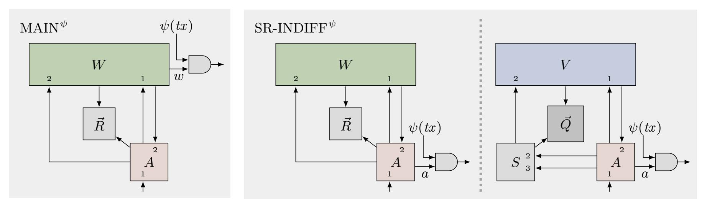
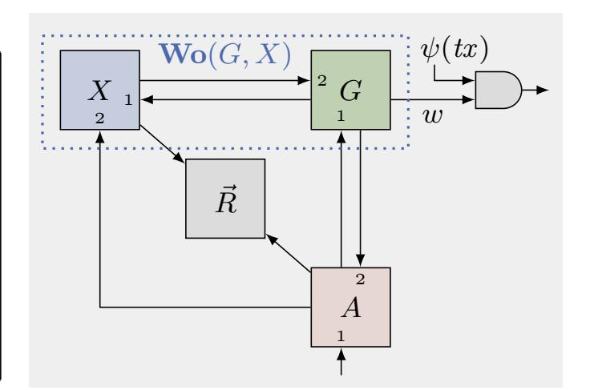
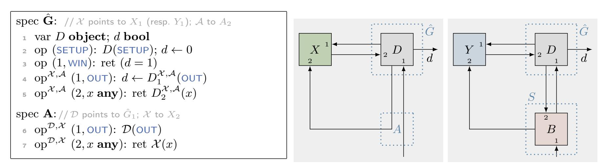
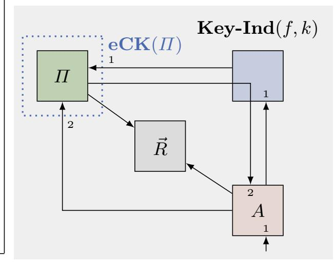

{0}------------------------------------------------

# Quantifying the Security Cost of Migrating Protocols to Practice

Christopher Patton and Thomas Shrimpton

Florida Institute for Cybersecurity Research Computer and Information Science and Engineering University of Florida

{cjpatton,teshrim}@ufl.edu

#### Abstract

We give a framework for relating the concrete security of a "reference" protocol (say, one appearing in an academic paper) to that of some derived, "real" protocol (say, appearing in a cryptographic standard). It is based on the indifferentiability framework of Maurer, Renner, and Holenstein (MRH), whose application has been exclusively focused upon non-interactive cryptographic primitives, e.g., hash functions and Feistel networks. Our extension of MRH is supported by a clearly defined execution model and two composition lemmata, all formalized in a modern pseudocode language. Together, these allow for precise statements about game-based security properties of cryptographic objects (interactive or not) at various levels of abstraction. As a real-world application, we design and prove tight security bounds for a potential TLS 1.3 extension that integrates the SPAKE2 password-authenticated key-exchange into the handshake.

Keywords: real-world cryptography, protocol standards, concrete security, indifferentiability

# Contents

| 1 |     | Introduction                           | 2  |
|---|-----|----------------------------------------|----|
| 2 |     | The Translation Framework              | 6  |
|   | 2.1 | Objects<br>                            | 7  |
|   | 2.2 | Experiments and Indifferentiability    | 10 |
|   | 2.3 | The Lifting Lemma                      | 13 |
|   | 2.4 | Games and the Preservation Lemma<br>   | 19 |
| 3 |     | Protocol Translation                   | 22 |
|   | 3.1 | eCK-Protocols<br>                      | 23 |
|   | 3.2 | Case Study: PAKE Extension for TLS 1.3 | 28 |
|   | 3.3 | Discussion                             | 39 |

{1}------------------------------------------------

# <span id="page-1-0"></span>1 Introduction

The recent effort to standardize TLS 1.3 [\[54\]](#page-43-0) was remarkable in that it leveraged provable security results as part of the drafting process [\[49\]](#page-42-0). Perhaps the most influential of these works is Krawczyk and Wee's OPTLS authenticated key-exchange (AKE) protocol [\[43\]](#page-42-1), which served as the basis for an early draft of the TLS 1.3 handshake. Core features of OPTLS are recognizable in the final standard, but TLS 1.3 is decidedly not OPTLS. As is typical of the standardization process, protocol details were modified in order to address deployment and operational desiderata (cf. [\[49,](#page-42-0) §4.1]). Naturally, this raises the question of what, if any, of the proven security that supported the original AKE protocol is inherited by the standard. The objective of this paper is to answer a general version of this question, quantitatively:

Given a reference protocol Π˜ (e.g., OPTLS), what is the cost, in terms of concrete security [\[8\]](#page-40-0), of translating Π˜ into some real protocol Π (e.g., TLS 1.3) with respect to the security notion(s) targeted by Π˜ ?

Such a quantitative assessment is particularly useful for standardization because real-world protocols tend to provide relatively few choices of security parameters; and once deployed, the chosen parameters are likely to be in use for several years [\[41\]](#page-42-2).

A more recent standardization effort provides an illustrative case study. At the time of writing, the CFRG[1](#page-1-1) was in the midst of selecting a portfolio of password-authenticated key-exchange (PAKE) protocols [\[11\]](#page-40-1) to recommend to the IETF[2](#page-1-2) for standardization. Among the selection criteria [\[61\]](#page-43-1) is the suitability of the PAKE for integration into existing protocols. In the case of TLS, the goal would be to standardize an extension (cf. [\[54,](#page-43-0) §4.2]) that specifies the usage of the PAKE in the handshake, thereby enabling defensein-depth for applications in which (1) passwords are available for use in authentication, and (2) sole reliance on the web PKI for authentication is undesirable, or impossible. Tight security bounds are particularly important for PAKEs, since their security depends so crucially on the password's entropy. Thus, the PAKE's usage in TLS (i.e., the real protocol Π) should preserve the concrete security of the PAKE itself (i.e., the reference protocol Π˜ ), insofar as possible.

The direct route to quantifying this gap is to re-prove security of the derived protocol Π and compare the new bound to the existing one. This approach is costly, however: particularly when the changes from Π˜ to Π seem insignificant, generating a fresh proof is likely to be highly redundant. In such cases it is common to instead provide an informal security argument that sketches the parts of the proof that would need to be changed, as well as how the security bound might be affected (cf. [\[43,](#page-42-1) §5]). Yet whether or not this approach is reasonable may be hard to intuit. Our experience suggests that it is often difficult to estimate the significance of a change before diving into the proof.

Another difficulty with the direct route is that the reference protocol's concrete security might not be known, at least with respect to a specific attack model and adversarial goal. Simulation-style definitions, such as those formalized in the UC framework [\[22\]](#page-41-0), define security via the inability of an environment (universally quantified, in the case of UC) to distinguish between attacks against the real protocol and attacks against an ideal protocol functionality. While useful in its own right, a proof of security relative to such a definition does not immediately yield concrete security bounds for a particular attack model or adversarial goal.

This work articulates an alternative route in which one argues security of Π by reasoning about the translation of Π˜ into Π itself. Its translation framework (described in [§2](#page-5-0) and introduced below) provides a formal characterization of translations that are "safe", in the sense that they allow security for Π to be argued by appealing to what is already known (or assumed) to hold for Π˜ . The framework is very general, and so we expect it to be broadly useful. In this work we will demonstrate its utility for standards development by

<span id="page-1-1"></span><sup>1</sup>Cryptography Forum Research Group.

<span id="page-1-2"></span><sup>2</sup> Internet Engineering Task Force.

{2}------------------------------------------------

<span id="page-2-0"></span>

Figure 1: Illustration of the MAIN $^{\psi}$  (Def. 1) and SR-INDIFF $^{\psi}$  (Def. 3) security experiments for worlds W, V, resources  $\vec{R}, \vec{Q}$ , adversary A, simulator S, and transcript predicate  $\psi$ .

applying it to the design and analysis of a TLS extension for SPAKE2 [4], one of the PAKEs considered by the CFRG for standardization. Our result (Theorem 2) precisely quantifies the security loss incurred by this usage of SPAKE2, and does so in a way that directly lifts existing results for SPAKE2 [4, 7, 1] while being largely agnostic about the targeted security notions.

**Overview.** Our framework begins with a new look at an old idea. In particular, we extend the notion of *indifferentiability* of Maurer, Renner, and Holenstein [47] (hereafter MRH) to the study of cryptographic protocols.

Indifferentiability has become an important tool for provable security. Most famously, it provides a precise way to argue that the security in the random oracle model (ROM) [13] is preserved when the random oracle (RO) is instantiated by a concrete hash function that uses a "smaller" idealized primitive, such as a compression function modeled as an RO. Coron et al. [28] were the first to explore this application of indifferentiability, and due to the existing plethora of ROM-based results and the community's burgeoning focus on designing replacements for SHA-1 [63], the use of indifferentiability in the design and analysis of hash functions has become commonplace.

Despite this focus, the MRH framework is more broadly applicable. A few works have leveraged this, e.g.: to construct ideal ciphers from Feistel networks [29]; to define security of key-derivation functions in the multi-instance setting [12]; to unify various security goals for authenticated encryption [5]; or to formalize the goal of domain separation in the ROM [9]. Yet all of these applications of indifferentiability are about cryptographic primitives (i.e., objects that are non-interactive). To the best of our knowledge, ours is the first work to explicitly consider the application of indifferentiability to protocols. That said, we will show that our framework unifies the formal approaches underlying a variety of prior works [38, 19, 51].

Our conceptual starting point is a bit more general than MRH. In particular, we define indifferentiability in terms of the *world* in which the adversary finds itself, so named because of the common use of phrases like "real world", "ideal world", and "oracle worlds" when discussing security definitions. Formally, a world is a particular kind of *object* (defined in §2.1) that is constructed by connecting up a *game* [17] with a *scheme*, the former defining the security goal of the latter. The scheme is embedded within a *system* that specifies how the adversary and game interact with it, i.e., the scheme's execution environment.

Intuitively, when a world and an adversary are executed together, we can measure the probability of specific events occurring as a way to define adversarial success. Our MAIN $^{\psi}$  security experiment, illustrated in the left panel of Figure 1, captures this. The outcome of the experiment is 1 ("true") if the adversary A "wins", as determined by the output w of world W, and predicate  $\psi$  on the transcript tx of the adversary's queries also evaluates to 1. Along the lines of "penalty-style" definitions [57], the transcript predicate determines whether or not A's attack was valid, i.e., whether the attack constitutes a trivial win. (For example,

{3}------------------------------------------------

if W captures IND-CCA security of an encryption scheme, then ψ would penalize decryption of challenge ciphertexts.)

Shared-Resource Indifferentiability and The Lifting Lemma. Also present in the experiment is a (possibly empty) tuple of resources R~ , which may be called by both the world W and the adversary A. This captures embellishments to the base security experiment that may be used to prove security, but are not essential to the definition of security itself. An element of R~ might be an idealized object such as an RO [\[13\]](#page-40-2), ideal cipher [\[29\]](#page-41-2), or generic group [\[53\]](#page-43-4); it might be used to model global trusted setup, such as distribution of a common reference string [\[24\]](#page-41-3); or it might provide A (and W) with an oracle that solves some hard problem, such as the DDH oracle in the formulation of the Gap DH problem [\[48\]](#page-42-6).

The result is a generalized notion of indifferentiability that we call shared-resource indifferentiability. The SR-INDIFF<sup>ψ</sup> experiment, illustrated in the right panel of Figure [1,](#page-2-0) considers an adversary's ability to distinguish some real world/resource pair W/R~ (read "W with R~ ") from a reference world/resource pair V /Q~ when the world and the adversary share access to the resources. The real world W exposes two interfaces to the adversary, denoted by subscripts W<sup>1</sup> and W2, that we will call the main and auxiliary interfaces of W, respectively. The reference world V also exposes two interfaces (with the same monikers), although the adversary's access to the auxiliary interface of V is mediated by a simulator S. Likewise, the adversary has direct access to resources R~ in the real experiment, and S-mediated access to resources Q~ in the reference experiment.

The auxiliary interface captures what changes as a result of translating world V /Q~ into W/R~ : the job of the simulator S is to "fool" the adversary into believing it is interacting with W/R~ when in fact it is interacting with V /Q~ . Intuitively, if for a given adversary A there is a simulator S that successfully "fools" it, then this should yield a way to translate A's attack against W/R~ into an attack against V /Q~ . This intuition is captured by our "lifting" lemma (Lemma [1,](#page-14-0) [§2.3\)](#page-12-0), which says that if V /Q~ is MAIN<sup>ψ</sup>-secure and W/R~ is indifferentiable from V /Q~ (as captured by SR-INDIFF<sup>ψ</sup>), then W/R~ is also MAIN<sup>ψ</sup>-secure.

Games and The Preservation Lemma. For all applications in this paper, a world is specified in terms of two objects: the intended security goal of a scheme, formalized as a (single-stage [\[55\]](#page-43-5)) game; and the system that specifies the execution environment for the scheme. In [§2.4](#page-18-0) we specify a world W = Wo(G, X) whose main interface allows the adversary to "play" the game G and whose auxiliary interface allows it to interact with the system X.

The world's auxiliary interface captures what "changes" from the reference experiment to the real one, and the main interface captures what stays the same. Intuitively, if a system X is indifferentiable from Y , then it ought to be the case that world Wo(G, X) is indifferentiable from Wo(G, Y ), since in the former setting, the adversary might simply play the game G in its head. Thus, by Lemma [1,](#page-14-0) if Y is secure in the sense of G, then so is X. We formalize this intuition via a simple "preservation" lemma (Lemma [2,](#page-19-0) [§2.4\)](#page-18-0), which states that the indifferentiability of X from Y is "preserved" when access to X's (resp. Y 's) main interface is mediated by a game G. As we show in [§2.4,](#page-18-0) this yields the main result of MRH as a corollary (cf. [\[47,](#page-42-3) Theorem 1]).

Updated Pseudocode. An important feature of our framework is its highly expressive pseudocode. MRH define indifferentiability in terms of "interacting systems" formalized as sequences of conditional probability distributions (cf. [\[47,](#page-42-3) §3.1]). This abstraction, while extremely expressive, is much harder to work with than conventional cryptographic pseudocode. A contribution of this paper is to articulate an abstraction that provides much of the expressiveness of MRH, while preserving the level of rigor typical of game-playing proofs of security [\[17\]](#page-40-6). In [§2.1](#page-6-0) we formalize objects, which are used to define the various entities that run in security experiments, including games, adversaries, systems, and schemes.

Execution Environment for eCK-Protocols. Finally, in order define indifferentiability for cryptographic protocols we need to precisely specify the system X (i.e., execution environment) in which the 

{4}------------------------------------------------

protocol runs. In [§3.1](#page-22-0) we specify the system X = eCK(Π) that captures the interaction of the adversary with protocol Π in the extended Canetti-Krawczyk (eCK) model [\[46\]](#page-42-7). The auxiliary interface of X is used by the adversary to initiate and execute sessions of Π and corrupt parties' long-term and per-session secrets. The main interface of X is used by the game in order to determine if the adversary successfully "attacked" Π.

Note that our treatment breaks with the usual abstraction boundary. In its original presentation [\[46\]](#page-42-7), the eCK model encompasses both the execution environment and the intended security goal; but in our setting, the full model is obtained by specifying a game G that codifies the security goal and running the adversary in world W = Wo(G, eCK(Π)). As we discuss in [§3.1,](#page-22-0) this allows us to use indifferentiability to prove a wide range of security goals without needing to attend to the particulars of each goal.

Case study: Design of a PAKE extension for TLS. Our framework lets us make precise statements of the following form: "protocol Π is G-secure if protocol Π˜ is G-secure and the execution of Π is indifferentiable from the execution of Π˜ ." This allows us to argue that Π is secure by focusing on what changes from Π˜ to Π. In [§3.2](#page-27-0) we provide a demonstration of this methodology in which we design and derive tight security bounds for a TLS extension that integrates SPAKE2 [\[4\]](#page-39-0) into the handshake. Our proposal is based on existing Internet-Drafts [\[6,](#page-39-4) [45\]](#page-42-8) and discussions on the CFRG mailing list [\[20,](#page-40-7) [65\]](#page-43-6).

Our analysis (Theorem [2\)](#page-32-0) unearths some interesting and subtle design issues. First, existing PAKEextension proposals [\[6,](#page-39-4) [64\]](#page-43-7) effectively replace the DH key-exchange with execution of the PAKE, feeding the PAKE's output into the key schedule instead of the usual shared secret. As we will discuss, whether this usage of the output is "safe" depends on the particular PAKE and its security properties. Second, our extension adopts a "fail closed" posture, meaning if negotiation of the PAKE fails, then the client and server tear down the session. Existing proposals allow them to "fail open" by falling back to standard, certificateonly authentication. There is no way to account for this behavior in the proof of Theorem [2,](#page-32-0) at least not without relying on the security of the standard authentication mechanism. But this in itself is interesting, as it reflects the practical motivation for integrating a PAKE into TLS: it makes little sense to fail open if one's goal is to reduce reliance on the web PKI.

Partially Specified Protocols. TLS specifies a complex protocol, and most of the details are irrelevant to what we want to prove. The Partially Specified Protocol (PSP) framework of Rogaway and Stegers [\[56\]](#page-43-8) offers an elegant way to account for these details without needing to specify them exhaustively. Their strategy is to divide a protocol's specification into two components: the protocol core (PC), which formalizes the elements of the protocol that are essential to the security goal; and the specification details (SD), which captures everything else. The PC, fully specified in pseudocode, is defined in terms of calls to an SD oracle. Security experiments execute the PC, but it is the adversary who is responsible for answering SD-oracle queries. This formalizes a very strong attack model, but one that yields a rigorous treatment of the standard itself, rather than a boiled down version of it.

We incorporate the PSP framework into our setting by allowing the world to make calls to the adversary's auxiliary interface, as shown in Figure [1.](#page-2-0) In addition, the execution environment eCK and world-builder Wo are specified so that the protocol's SD-oracle queries are answered by the adversary.

Related work. Our formal methodology was inspired by a few seemingly disparate results in the literature, but which fit fairly neatly into the translation framework. Recent work by the authors [\[51\]](#page-42-5) considers the problem of secure key-reuse [\[38\]](#page-42-4), where the goal is design cryptosystems that safely expose keys for use in multiple applications. They formalize a condition (GAP1, cf. [\[51,](#page-42-5) Def. 5]) under which the G-security of a system X implies that G-security of X holds even when X's interface is exposed to additional, insecure, or even malicious applications. This condition can be formulated as a special case of SR-INDIFF<sup>ψ</sup> security, and their composition theorem (cf. [\[51,](#page-42-5) Theorem 1]) as a corollary of our lifting lemma. (See Remarks [1](#page-18-1) and [2.](#page-21-1))

{5}------------------------------------------------

The formal study of secure key reuse was initiated by Haber and Pinkas [\[38\]](#page-42-4), who proposed security definitions for pairs of public-key encryption (PKE) and signature schemes that use the same public/secret key pair. As a simple, illustrative demonstration of the power of our framework, in [§2.4](#page-20-0) we show how to generalize their security notions.

The lifting lemma can be thought of as a computational analogue of the main technical tool in Bhargavan et al.'s treatment of downgrade resilience [\[19\]](#page-40-5). In order to simplify analysis of real-world protocols, Bhargavan et al. extract from a protocol's specification the "sub-protocol" that captures the features essential to the security property being considered. Downgrade resilience is proven for the sub-protocol, then lifted to the full protocol by applying their "downgrade security lifting" theorem [\[19,](#page-40-5) Theorem 2]. (The name "lifting" is inspired by their work.) We discuss this connection in detail in [§3.1.](#page-22-0)

The UC Framework. MRH point out (cf. [\[47,](#page-42-3) §3.3]) that the notion of indifferentiability is inspired by ideas introduced by the UC framework [\[22\]](#page-41-0). There are conceptual similarities between UC (in particular, the generalized UC framework that allows for shared state [\[23\]](#page-41-4)) and our framework, but the two are quite different in their details. We do not explore any formal relationship between frameworks, nor do we consider how one might modify UC to account for things that are naturally handled by ours (e.g., translation and partially specified behavior [\[56\]](#page-43-8)). Such an exploration would make interesting future work.

Provable Security of SPAKE2. The SPAKE2 protocol was first proposed and analyzed in 2005 by Abdalla and Pointcheval [\[4\]](#page-39-0), who sought a simpler alternative to the seminal encrypted key-exchange (EKE) protocol of Bellovin and Merritt [\[18\]](#page-40-8). Given the CFRG's recent interest in SPAKE2 (and its relative SPAKE2+ [\[27\]](#page-41-5)), there has been a respectable amount of recent security analysis. This includes concurrent works by Abdalla and Barbosa [\[1\]](#page-39-2) and Becerra et al. [\[7\]](#page-39-1) that consider the forward secrecy of (variants of) SPAKE2, a property that Abdalla and Pointcheval did not address. Victor Shoup [\[59\]](#page-43-9) provides an analysis of a variant of SPAKE2 in the UC framework [\[22\]](#page-41-0), which has emerged as the de facto setting for studying PAKE protocols (cf. OPAQUE [\[40\]](#page-42-9) and (Au)CPace [\[37\]](#page-42-10)). Shoup observes that the usual notion of UC-secure PAKE [\[25\]](#page-41-6) cannot be proven for SPAKE2, since the protocol on its own does not provide key confirmation. Indeed, many variants of SPAKE2 that appear in the literature add key confirmation in order to prove it secure in a stronger adversarial model (cf. [\[7,](#page-39-1) §3]).

A recent work by Skrobot and Lancrenon [\[60\]](#page-43-10) characterizes the general conditions under which it is secure to compose a PAKE protocol with an arbitrary symmetric key protocol (SKP). While their object of study is similar to ours—a PAKE extension for TLS might be viewed as a combination of a PAKE and the TLS record layer protocol—our security goals are different, since in their adversarial model the adversary's goal is to break the security of the SKP.

# <span id="page-5-0"></span>2 The Translation Framework

This section describes the formal foundation of this paper. We begin in [§2.1](#page-6-0) by defining objects, our abstraction of the various entities run in a security experiment; in [§2.2](#page-9-0) we define our base experiment and formalize shared-resource indifferentiability; in [§2.3](#page-12-0) we state and prove the lifting lemma, the central technical tool of this work; and in [§2.4](#page-18-0) we formalize the class of security goals to which our framework applies.

Notation. When X is a random variable we let Pr-X = v denote the probability that X is equal to v; we write Pr-X as shorthand for Pr-X = 1 . We let x ← y denote assignment of the value of y to variable x. When X is a finite set we let x ←← X denote random assignment of an element of X to x according to the uniform distribution.

A string is an element of {0, 1} ∗ ; a tuple is a finite sequence of symbols separated by commas and delimited by parentheses. Let ε denote the empty string, ( ) the empty tuple, and (z,) the singleton tuple containing z. We sometimes (but not always) denote a tuple with an arrow above the variable (e.g., ~x ).

{6}------------------------------------------------

```
astub → | stub
astubs → astub | astub, astubs
avar → | var
avars → avar | avar, avars
dec → var typedvars
decs → ε | dec | dec; decs
interface → interface type: {ops}
op → oporacles (pattern) otype: {block}
ops → ε | op | op; ops
otype → ε | type
oracles → ε | astubs
pattern → ε | . . . | literal | avars type | (pattern) | patterns
patterns → pattern | pattern, patterns
proc → procedure type(vars): {block}
spec → spec type: {decs; ops}
typedvars → vars type | vars type, typedvars
vars → var | var, vars
                                                                spec Ro:
                                                                 1 var X , Y set, q, p int
                                                                 2 var T table, i, j int
                                                                 3 op (SETUP): T ← [ ]; i, j ← 0
                                                                 4 op (x elemX ):
                                                                 5 if i ≥ q then ret ⊥
                                                                 6 if T[x] = ⊥ then
                                                                 7 i ← i + 1; T[x] ←← Y
                                                                 8 ret T[x]
                                                                 9 op (SET, M object):
                                                                10 var x elemX , y elemY
                                                                11 if j ≥ p then ret ⊥
                                                                12 j ← j + 1; ((x, y), σ) ← M( )
                                                                13 T[x] ← y
                                                                14 ret ((x, y), σ)
```

Figure 2: Left: Context-free grammar for specifications. Production begins with term spec. Variables type, var, literal, block, and stub are undefined. Code blocks will usually be denoted by indentation rather than "{" and "}". The semicolon ";" will usually be denoted by a new line. Right: Specification of a random oracle (RO) object. When instantiated, variables X and Y determine the domain and range of the RO, and integers q and p determine, respectively, the maximum number of distinct RO queries, and the maximum number of RO-programming queries (via the SET-operator), (cf. Def. [7\)](#page-13-0).

Let |x| denote the length of a string (resp. tuple) x. Let x<sup>i</sup> and x[i] denote the i-th element of x. Let x k y denote concatenation of x with string (resp. tuple) y. We write x y if string x is a prefix of string y, i.e., there exists some r such that x k r = y. Let y % x denote the "remainder" r after removing the prefix x from y; if x 6 y, then define y % x = ε (cf. [\[21\]](#page-40-9)). When x is a tuple we let x . z = (x1, . . . , x<sup>|</sup>x<sup>|</sup> , z) so that z is "appended" to x. We write z ∈ x if (∃ i) x<sup>i</sup> = z. Let [i..j] denote the set of integers {i, . . . , j}; if j < i, then define [i..j] as ∅. Let [n] = [1..n].

For all sets X and functions f, g : X → {0, 1}, define function f ∧ g as the map [f ∧ g](x) 7→ f(x) ∧ g(x) for all x ∈ X . We denote a group as a pair (G, ∗), where G is the set of group elements and ∗ denotes the group action. Logarithms are base-2 unless otherwise specified.

## <span id="page-6-0"></span>2.1 Objects

Our goal is to preserve the expressiveness of the MRH framework [\[47\]](#page-42-3) while providing the level of rigor of code-based game-playing arguments [\[17\]](#page-40-6). To strike this balance, we will need to add a bit of machinery to standard cryptographic pseudocode. Objects provide this.

Each object has a specification that defines how it is used and how it interacts with other objects. We first define specifications, then describe how to call an object in an experiment and how to instantiate an object. Pseudocode in this paper will be typed (along the lines of Rogaway and Stegers [\[56\]](#page-43-8)), so we enumerate the available types in this section. We finish by defining various properties of objects that will be used in the remainder.

Specifications. The relationship between a specification and an object is analogous to (but far simpler than) the relationship between a class and a class instance in object-oriented programming languages like Python or C++. A specification defines an ordered sequence of variables stored by an object—these are akin to attributes in Python—and an ordered sequence of operators that may be called by other objects—these are akin to methods. We refer to the sequence of variables as the object's state and to the sequence of operators as the object's interface.

{7}------------------------------------------------

We provide an example of a specification in Figure 2. Spec **Ro** is used throughout this work to model functions as random oracles (ROs) [13]. It declares seven variables,  $\mathcal{X}$ ,  $\mathcal{Y}$ , q, p, T, i, and j, as shown on lines 1-2 in Figure 2. (We will use shorthand for line references in the remainder, e.g., "2:1-2" rather than "lines 1-2 in Figure 2".) Each variable has an associated type:  $\mathcal{X}$  and  $\mathcal{Y}$  have type **set**, q, p, i, and j have type **int**, and T has type **table**. Variable declarations are denoted by the keyword "var", while operator definitions are denoted by the keyword "op". Spec **Ro** defines three operators: the first, the SETUP-operator (2:3), initializes the RO's state; the second operator (2:4-8) responds to standard RO queries; and the third, the SET-operator (2:9-14), is used to "program" the RO [36].

PSEUDOCODE. The syntax of specifications is given by the context-free grammar in Figure 2. We have omitted the production rules for type, var, literal, and block since they are standard. Briefly, a var denotes a variable. A type denotes a type, e.g., set, int, table, or elem<sub> $\mathcal{X}$ </sub>, or the name of a specification, e.g., Ro. A literal is a finite sequence of symbols from some alphabet, e.g., an integer or a bit string. We often write bit-string literals as alphanumeric strings, e.g., SETUP or SET, which are understood to be distinct elements of  $\{0,1\}^*$ . A block is a sequence of statements such as variable declarations, (random) assignment statements, if-then-else blocks, for-loops, return statements, etc. A stub is an *interface oracle*, written calligraphically like  $\mathcal{A}$ ,  $\mathcal{B}$ ,  $\mathcal{C}$ , and so on. (Note that we also write sets calligraphically.) It is the name used by the operator to refer to an oracle passed to it, as we describe below.

Calling an Object. An object is called by providing it with oracles and passing arguments to it. An oracle is always an interface, i.e., a sequence of operators defined by an object. The statement " $out \leftarrow obj^{\mathbf{I}_1, \dots, \mathbf{I}_m}(in_1, \dots, in_n)$ " means to invoke one of obj's operators on input of  $in_1, \dots, in_n$  and with oracle access to interfaces  $\mathbf{I}_1, \dots, \mathbf{I}_m$  and set variable out to the value returned by the operator. Objects will usually have many operators, so we must specify the manner in which the responding operator is chosen. For this purpose we will adopt a convention inspired by "pattern matching" in functional languages like Haskell and Rust. Syntactically, a pattern is defined by the pattern term in Figure 2. It is comprised of a tuple of literals, typed variables, and nested tuples. A value is said to match a pattern if they have the same type and the literals are equal. For example, value val matches pattern ( $_{\mathbf{e}}\mathbf{e}\mathbf{l}\mathbf{e}\mathbf{m}_{\mathcal{X}}$ ) if val has type  $\mathbf{e}\mathbf{l}\mathbf{e}\mathbf{m}_{\mathcal{X}}$ . (The symbol " $_{\mathbf{e}}$ " contained in the pattern denotes an anonymous variable.) Hence, if object R is specified by  $\mathbf{Ro}$  and R has type  $\mathbf{e}\mathbf{l}\mathbf{e}\mathbf{m}_{\mathcal{X}}$ , then the expression "R(x)" calls R0 second operator (2:4-8). We write " $val \sim pat$ 0 if the value of variable val matches pattern pat0.

Calls to objects are evaluated as follows. In the order in which they are defined, check each operator of the object's specification if the input matches the operator's pattern. If so, then execute the operator until a return statement is reached and assign the return value to the output. If no return statement is reached, or if val does not match an operator, then return  $\bot$ .

Let us consider an illustrative example. Let  $\Pi$  be an object that implements Schnorr's signature scheme [58] for a group  $(\mathcal{G}, \cdot)$  as specified in Figure 3. The expression  $\Pi(\mathsf{GEN})$  calls  $\Pi$ 's first operator, which generates a fresh key pair. If  $s \in \mathbb{Z}$  and  $msg \in \{0,1\}^*$ , then expression  $\Pi_s^H(\mathsf{SIGN}, msg)$  evaluates the third operator, which computes a signature (x,t) of message msg under secret key s (we will often write the first argument as a subscript). The call to interface oracle  $\mathcal{H}$  on line 3:5 is answered by object H. (Presumably, H is a hash function with domain  $\mathcal{G} \times \{0,1\}^*$  and range  $\mathbb{Z}_{|\mathcal{G}|}$ .) If  $PK \in \mathcal{G}$ ,  $msg \in \{0,1\}^*$ , and  $x,t \in \mathbb{Z}$ ,

```
spec Schnorr:

1 op (GEN): s \leftarrow \mathbb{Z}_{|\mathcal{G}|}; PK \leftarrow g^s; ret (PK, s)

2 op \mathcal{H} (PK elem<sub>\mathcal{G}</sub>, VERIFY, msg str, (x, t int)):

3 ret t \equiv \mathcal{H}(g^x \cdot PK^t, msg) (mod |\mathcal{G}|)

6 ret (r - st, t)
```

Figure 3: Specification of Schnorr's signature scheme.

{8}------------------------------------------------

then expression Π<sup>H</sup> PK (VERIFY, msg,(x, t)) evaluates the second operator. On an input that does not match any of these patterns—in particular, one of (GEN), ( elemG, VERIFY, str,( , int)), or ( int, SIGN, str)—the object returns ⊥. For example, ΠI1,...,Im(foo bar) = ⊥ for any I1, . . . , Im.

It is up to the caller to ensure that the correct number of interfaces is passed to the operator. If the number of interfaces passed is less than the number of oracles named by the operator, then calls to the remaining oracles are always answered with ⊥; if the number of interfaces is more than the number of oracles named by the operator, then the remaining interfaces are simply ignored by the operator.

Explanation. We will see examples of pattern matching in action throughout this paper. For now, the important takeaway is that calling an object results in one (or none) of its operators being invoked: which one is invoked depends on the type of input and the order in which the operators are defined.

Because these calling conventions are more sophisticated than usual, let us take a moment to explain their purpose. Theorem statements in this work will often quantify over large sets of objects whose functionality is unspecified. These conventions ensure that doing so is always well-defined, since any object can be called on any input, regardless of the input type. We could have dealt with this differently: for example, in their adaptation of indifferentiability to multi-staged games, Ristenpart et al. require a similar convention for functionalities and games (cf. "unspecified procedure" in [\[55,](#page-43-5) §2]). Our hope is that the higher level of rigor of our formalism will ease the task of verifying proofs of security in our framework.

Instantiating an Object. An object is instantiated by passing arguments to its specification. The statement "obj ← Object(in1, . . . , inm)" means to create a new object obj of type Object and initialize its state by setting obj.var <sup>1</sup> ← in1, . . . , obj.var<sup>m</sup> ← inm, where var <sup>1</sup>, . . . , var<sup>m</sup> are the first m variables declared by Object. If the number of arguments passed is less than the number of variables declared, then the remaining variables are uninitialized. For example, the statement "R ← Ro(X , Y, q, p, [ ], 0, 0)" initializes R by setting R.X ← X , R.Y ← Y, R.q ← q, R.p ← p, R.T ← [ ], R.i ← 0, and R.j ← 0. The statement "R ← Ro(X , Y, q, p)" sets R.X ← X , R.Y ← Y, R.q ← q, and R.p ← p, but leaves T, i, and j uninitialized. Object can also be copied: the statement "new ← obj" means to instantiate a new object new with specification Object and set new.var <sup>1</sup> ← obj.var <sup>1</sup>, . . . , new.var <sup>n</sup> ← obj.var <sup>n</sup>, where var <sup>1</sup>, . . . , var <sup>n</sup> is the sequence of variables declared by obj's specification.

Types. We now enumerate the types available in our pseudocode. An object has type object. A set of values of type any (defined below) has type set; we let ∅ denote the empty set. A variable of type table stores a table of key/value pairs, where keys and values both have type any. If T is a table, then we let T<sup>k</sup> and T[k] denote the value associated with key k in T; if no such value exists, then T<sup>k</sup> = ⊥. We let [ ] denote the empty table.

When the value of a variable x is an element of a computable set X , we say that x has type elem<sup>X</sup> . We define type int as an alias of elemZ, type bool as an alias of elem{0,1}, and type str as an alias of elem{0,1}<sup>∗</sup> . We define type any recursively as follows. A variable x is said to have type any if: it is equal to ⊥ or ( ); has type set, table, or elem<sup>X</sup> for some computable set X ; or it is a tuple of values of type any.

Specifications declare the type of each variable of an object's state. The types of variables that are local to the scope of an operator need not be explicitly declared, but their type must be inferable from their initialization (that is, the first use of the variable in an assignment statement). If a variable is assigned a value of a type other than the variable's type, then the variable is assigned ⊥. Variables that are declared but not yet initialized have the value ⊥. For all I1, . . . , Im, in1, . . . , in<sup>n</sup> the expression "⊥<sup>I</sup>1,...,Im(in1, . . . , inn)" evaluates to ⊥. We say that x = ⊥ or ⊥ = x if variable x was previously assigned ⊥. For all other expressions, our convention will be that whenever ⊥ is an input, the expression evaluates to ⊥.

Properties of Operators and Objects. An operator is called deterministic if its definition does not contain a random assignment statement; it is called stateless if its definition contains no assignment statement

{9}------------------------------------------------

```
procedure \operatorname{\mathbf{Ref}}_{W/\vec{R}}^{\Phi}(A,S):
procedure \mathbf{Real}_{W/\vec{R}}^{\Phi}(A):
 _{1} A(SETUP); W(SETUP)
                                                                                                                                  8 S(SETUP); A(SETUP); W(SETUP)
 for i \leftarrow 1 to u do R_i(SETUP)
                                                                                                                                  • for i \leftarrow 1 to u do R_i(SETUP)
 3 tx \leftarrow (); a \leftarrow A_1^{\mathbf{W}_1, \mathbf{W}_2, \mathbf{R}}(\mathsf{OUT})
4 w \leftarrow W_1(\mathsf{WIN}); \mathrm{ret} \ \varPhi(tx, a, w)
                                                                                                                                10 tx \leftarrow (); a \leftarrow A_1^{\mathbf{W}_1, \mathbf{S}_2, \mathbf{S}_3}(\mathsf{OUT})
11 w \leftarrow W_1(\mathsf{WIN}); \mathrm{ret} \ \varPhi(tx, a, w)
procedure \mathbf{W}(i, x):
                                                                                                                                procedure \mathbf{R}(i,x):
 y \leftarrow W_i^{\mathbf{A}_2, \mathbf{R}}(x); \ tx \leftarrow tx . (i, x, y); \ \mathrm{ret} \ y
                                                                                                                                 ret R_i(x)
                                                                                                                                procedure S(i, x):
procedure \mathbf{A}(i, x):
 6 if S=\bot then ret A_i^{\mathbf{W}_1,\mathbf{W}_2,\mathbf{R}}(x) // Real ret A_i^{\mathbf{W}_1,\mathbf{S}_2,\mathbf{S}_3}(x) // Ref
                                                                                                                                ret S_i^{\mathbf{W}_2,\mathbf{R}}(x)
```

Figure 4: Real and reference experiments for world W, resources  $\vec{R} = (R_1, \dots, R_u)$ , adversary A, and simulator S.

in which one of the object's variables appears on the left-hand side; and an operator is called *functional* if it is deterministic and stateless. Likewise, an object is called deterministic (resp. stateless or functional) if each operator, with the exception of the Setup-operator, is deterministic (resp. stateless or functional). (We make an exception for the Setup-operator in order to allow trusted setup of objects executed in our experiments. See §2.2 for details.)

RESOURCES. Let  $t \in \mathbb{N}$ . An operator is called t-time if it always halts in t time steps regardless of its random choices or the responses to its queries; we say that an operator is halting if it is t-time for some  $t < \infty$ . Our convention will be that an operator's runtime includes the time required to evaluate its oracle queries. Let  $\vec{q} \in \mathbb{N}^*$ . An operator is called  $\vec{q}$ -query if it makes at most  $\vec{q}_1$  calls to its first oracle,  $\vec{q}_2$  to its second, and so on. We extend these definitions to objects, and say that an object is t-time (resp. halting or  $\vec{q}$ -query) if each operator of its interface is t-time (resp. halting or  $\vec{q}$ -query).

EXPORTED OPERATORS. An operator  $f_1$  is said to *shadow* operator  $f_2$  if: (1)  $f_1$  appears first in the sequence of operators defined by the specification; and (2) there is some input that matches both  $f_1$  and  $f_2$ . For example, an operator with pattern (x any) would shadow an operator with pattern (y str), since y is of type str and any. An object is said to export a pat-type-operator if its specification defines a non-shadowed operator that, when run on an input matching pattern pat, always returns a value of type type.

#### <span id="page-9-0"></span>2.2 Experiments and Indifferentiability

This section describes our core security experiments. An experiment connects up a set of objects in a particular way, giving each object oracle access to interfaces (i.e., sequences of operators) exported by other objects. An object's *i-interface* is the sequence of operators whose patterns are prefixed by literal i. We sometimes write i as a subscript, e.g., " $X_i(\cdots)$ " instead of " $X(i,\cdots)$ " or " $X(i,(\cdots))$ ". We refer to an object's 1-interface as its main interface and to its 2-interface as its auxiliary interface.

A resource is a halting object. A simulator is a halting object. An adversary is a halting object that exports a (1, out)-bool-operator, which means that on input of (out) to its main interface, it outputs a bit. This operator is used to in order to initiate the adversary's attack. The attack is formalized by the adversary's interaction with another object, called the world, which codifies the system under attack and the adversary's goal. Formally, a world is a halting object that exports a functional (1, win)-bool-operator, which means that on input of (win) to its main interface, the world outputs a bit that determines if the adversary has won. The operator being functional means this decision is made deterministically and in a "read-only" manner, so that the object's state is not altered. (These features are necessary to prove the lifting lemma in §2.3.)

{10}------------------------------------------------

MAIN Security. Security experiments are formalized by the execution of procedure Real defined in Figure [4](#page-9-1) for adversary A in world W with shared resources R~ = (R1, . . . , Ru). In addition, the procedure is parameterized by a function Φ. The experiment begins by "setting up" each object by running A(SETUP), W(SETUP), and Ri(SETUP) for each i ∈ [u]. This allows for trusted setup of each object before the attack begins. Next, the procedure runs A with oracle access to procedures W1, W2, and R, which provide A with access to, respectively, W's main interface, W's auxiliary interface, and the resources R~ .

Figure [1](#page-2-0) illustrates which objects have access to which interfaces. The world W and adversary A share access to the resources R~ . In addition, the world has access to the auxiliary interface of A [\(4:](#page-9-1)5), which allows us to formalize security properties in the PSP setting [\[56\]](#page-43-8). (Interestingly, it also turns out to be essential to MRH's argument of the necessity of indifferentiability; see Proposition [2.](#page-19-1)) Each query to W<sup>1</sup> or W<sup>2</sup> by A is recorded in a tuple tx called the experiment transcript [\(4:](#page-9-1)5). The outcome of the experiment is Φ(tx , a, w), where a is the bit output by A and w is the bit output by W. The MAIN<sup>ψ</sup> security notion, defined below, captures an adversary's advantage in "winning" in a given world, where what it means to "win" is defined by the world itself. The validity of the attack is defined by a function ψ, called the transcript predicate: in the MAIN<sup>ψ</sup> experiment, we define Φ so that Real<sup>Φ</sup> W/R~ (A) = 1 holds if A wins and ψ(tx ) = 1 holds.

<span id="page-10-0"></span>Definition 1 (MAIN<sup>ψ</sup> security). Let W be a world, R~ be resources, and A be an adversary. Let ψ be a transcript predicate, and let win<sup>ψ</sup> (tx , a, w) := (ψ(tx ) = 1)∧(w= 1). The MAIN<sup>ψ</sup> advantage of A in attacking W/R~ is

$$\operatorname{Adv}_{W/\vec{R}}^{\min^{\psi}}(A) := \Pr\left[\operatorname{Real}_{W/\vec{R}}^{\operatorname{win}^{\psi}}(A)\right].$$

Informally, we say that W/R~ is ψ-secure if the MAIN<sup>ψ</sup> advantage of every efficient adversary is small. Note that advantage for indistinguishability-style security notions is defined by normalizing MAIN<sup>ψ</sup> advantage (e.g., Def. [11\)](#page-25-0).

This measure of advantage is only meaningful if ψ is efficiently computable, since otherwise a computationally bounded adversary may lack the resources needed to determine if its attack is valid. Following Rogaway-Zhang (cf. computability of "fixedness" in [\[57,](#page-43-3) §2]) we will require ψ(tx ) to be efficiently computable given the entire transcript, except the response to the last query. Intuitively, this exception ensures that, at any given moment, the adversary "knows" whether its next query is valid before making it.

Definition 2 (Transcript-predicate computability). Let ψ be a transcript predicate. Object F computes ψ if it is halting, functional, and F(tx¯ ) = ψ(tx ) holds for all transcripts tx , where tx¯ = (tx <sup>1</sup>, . . . , tx <sup>q</sup>−1,(iq, xq, ⊥)), q = |tx |, and (iq, xq, ) = tx <sup>q</sup>. We say that ψ is computable if there is an object that computes it. We say that ψ is t-time computable if there is a t-time object F that computes it. Informally, we say that ψ is efficiently computable if it is t-time computable for small t.

Shorthand. In the remainder we write "W/R~ " as "W/H" when "R~ = (H,)", i.e., when the resource tuple is a singleton containing H. Similarly, we write "W/R~ " as "W" when R~ = ( ), i.e., when no shared resources are available. We write "win" instead of "win<sup>ψ</sup> " whenever ψ is defined so that ψ(tx ) = 1 for all transcripts tx . Correspondingly, we write "MAIN" for the security notion obtained by letting Φ = win.

SR-INDIFF Security. The Real procedure executes an adversary in a world that shares resources with the adversary. We are interested in the adversary's ability to distinguish this "real" experiment from a "reference" experiment in which we change the world and/or resources with which the adversary interacts. To that end, Figure [4](#page-9-1) also defines the Ref procedure, which executes an adversary in a fashion similar to Real except that a simulator S mediates the adversary's access to the resources and the world's auxiliary interface. In particular, A's oracles W<sup>2</sup> and R are replaced with S<sup>2</sup> and S<sup>3</sup> respectively [\(4:](#page-9-1)7 and 10), which run S with access to W<sup>2</sup> and R [\(4:](#page-9-1)13). SR-INDIFF<sup>ψ</sup> advantage, defined below, measures the adversary's

{11}------------------------------------------------

```
spec NoDeg: //W points to W1; W0
                                   to W2;
              // R to resources
 1 var M, SD object
 2 op (SETUP): M(SETUP); SD(SETUP)
 3 opW,W0
           ,R (1, x any): ret MW,W0
                                     ,R(x)
 4 opW,W0
           ,R (2, x any): ret SDR(x)
                                                          spec Shλ: // A points to A2 in the experiment.
                                                           5 var W, R1, . . . , Rλ object
                                                           6 op (SETUP): W(SETUP)
                                                           7 for i ← 1 to λ do Ri(SETUP)
                                                           8 opA (1, WO, x any): ret W R,A
                                                                                        1
                                                                                             (x)
                                                           9 opA (2, WO, x any): ret W R,A
                                                                                        2
                                                                                             (x)
                                                           10 opA (2, RO, i int, x any): ret Ri(x)
                                                          procedure R(i, x):
                                                           11 ret Ri(x)
```

Figure 5: Left: Specification of n.d. (non-degenerate) adversaries. Right: Specification Sh<sup>λ</sup> used in Proposition [1.](#page-12-1)

ability to distinguish between a world W/R~ in the real experiment and another world V /Q~ in the reference experiment.

<span id="page-11-0"></span>Definition 3 (SR-INDIFF<sup>ψ</sup> security). Let W, V be worlds, R, ~ Q~ be resources, A be an adversary, and S be a simulator. Let ψ be a transcript predicate and let outψ(tx , a, w) := (ψ(tx ) = 1) ∧ (a = 1). Define the SR-INDIFF<sup>ψ</sup> advantage of adversary A in differentiating W/R~ from V /Q~ relative to S as

$$\mathbf{Adv}^{\operatorname{sr-indiff}^{\psi}}_{W/\vec{R},V/\vec{Q}}(A,S) := \Pr \left[ \left. \mathbf{Real}^{\operatorname{out}^{\psi}}_{W/\vec{R}}(A) \right. \right] - \Pr \left[ \left. \mathbf{Ref}^{\operatorname{out}^{\psi}}_{V/\vec{Q}}(A,S) \right. \right].$$

By convention, the runtime of A is the runtime of Real out<sup>ψ</sup> W/R~ (A). Informally, we say that W/R~ is ψindifferentiable from V /Q~ if for every efficient A there exists an efficient S for which the SR-INDIFF<sup>ψ</sup> advantage of A is small.

Shorthand. We write "out" instead of "out<sup>ψ</sup>" when ψ is defined so that ψ(tx ) = 1 for all tx . Correspondingly, we write "SR-INDIFF" for the security notion obtained by letting Φ = out.

Non-Degenerate Adversaries. When defining security, it is typical to design the experiment so that it is guaranteed to halt. Indeed, there are pathological conditions under which Real<sup>Φ</sup> W/R~ (A) and Ref <sup>Φ</sup> W/R~ (A, S) do not halt, even if each of the constituent objects is halting (as defined in [§2.1\)](#page-7-0). This is because infinite loops are possible: in response to a query from adversary A, the world W is allowed to query the adversary's auxiliary interface A2; the responding operator may call W in turn, which may call A2, and so on. Consequently, the event that Real<sup>Φ</sup> W/R~ (A) = 1 (resp. Ref <sup>Φ</sup> W/R~ (A, S) = 1) must be regarded as the event that the real (resp. reference) experiment halts and outputs 1. Defining advantage this way creates obstacles for quantifying resources of a security reduction, so it will be useful to rule out infinite loops.

We define the class of non-degenerate (n.d.) adversaries as those that respond to main-interface queries using all three oracles—the world's main interface, the world's aux.-interface, and the resources—but respond to aux.-interface queries using only the resource oracle. To formalize this behavior, we define n.d. adversaries in terms of an object that is called in response to main-interface queries, and another object that is called in response to aux.-interface queries.

<span id="page-11-2"></span>Definition 4 (Non-degenerate adversaries). An adversary A is called non-degenerate (n.d.) if there exist a halting object M that exports an (OUT)-bool-operator and a halting, functional object SD for which A = NoDeg(M, SD) as specified in Figure [5.](#page-11-1) We refer to M as the main algorithm and to SD as the auxiliary algorithm.

Observe that we have also restricted n.d. adversaries so that the main and auxiliary algorithms do not share state; and we have required that the auxiliary algorithm is functional (i.e., deterministic and stateless). These measures are not necessary, strictly speaking, but they will be useful for security proofs. Their purpose 

{12}------------------------------------------------

is primarily technical, as they do not appear to be restrictive in a practical sense. (They do not limit the primary application considered in this work (§3.2). Incidentally, we note that Rogaway and Stegers make similar restrictions in [56, §5].)

**Equivalence of SR-INDIFF and INDIFF.** An analogue of MRH's notion of indifferentiability is obtained by removing the shared resources from the SR-INDIFF experiment, i.e., letting  $\vec{R}, \vec{Q} = ($  ).

**Definition 5** (INDIFF<sup> $\psi$ </sup> security). Let W, V be worlds, A an adversary, S a simulator, and  $\psi$  a transcript predicate. Let  $\mathbf{Adv}_{W,V}^{\mathrm{indiff}^{\psi}}(A,S) := \mathbf{Adv}_{W,V}^{\mathrm{sr-indiff}^{\psi}}(A,S)$  denote the INDIFF<sup> $\psi$ </sup> advantage of A in differentiating W from V relative to S.

In this sense, SR-INDIFF<sup> $\psi$ </sup> security can be viewed as a generalization of the standard notion. An alternative view is that shared-resource indifferentiability merely captures a particular class of indifferentiability problems. Indeed, for world W and resources  $\vec{R} = (R_1, \dots, R_u)$ , Figure 5 specifies a world  $\hat{W} = \mathbf{Sh}_u(W, R_1, \dots, R_u)$  that is functionally equivalent to  $W/\vec{R}$ , except that the resources are codified by the world  $\hat{W}$  rather than defined externally.

<span id="page-12-1"></span>**Proposition 1.** Let  $\psi$  be a transcript predicate,  $f: \mathbb{N} \to \mathbb{N}$  be a function, W, V be worlds, and  $\vec{R} = (R_1, \ldots, R_u), \vec{Q} = (Q_1, \ldots, Q_v)$  be resources. Let  $\hat{W} = \mathbf{Sh}_u(W, R_1, \ldots, R_u)$  and  $\hat{V} = \mathbf{Sh}_v(V, Q_1, \ldots, Q_v)$ . Let A be a  $t_A$ -time, n.d. adversary, let T be a  $t_T$ -time simulator, and suppose that  $\psi$  is  $f(t_A)$ -time computable.

- (1) There exist a  $O(t_A)$ -time, n.d. adversary  $B, O(t_T)$ -time simulator S, and  $[O(t_A)+f(t_A)]$ -time computable transcript-predicate  $\phi$  such that  $\mathbf{Adv}^{\mathrm{indiff}^{\psi}}_{\hat{W},\hat{V}}(A,S) \leq \mathbf{Adv}^{\mathrm{sr-indiff}^{\phi}}_{W/\vec{R},V/\vec{Q}}(B,T)$ .
- (2) There exist a  $O(t_A)$ -time, n.d. adversary B,  $O(t_T)$ -time simulator S, and  $[O(t_A)+f(t_A)]$ -time computable transcript-predicate  $\phi$  such that  $\mathbf{Adv}^{\mathrm{sr\text{-}indiff}^{\psi}}_{W/\vec{R},V/\vec{Q}}(A,S) \leq \mathbf{Adv}^{\mathrm{indiff}^{\phi}}_{\hat{W},\hat{V}}(B,T)$ .

Proof. We will only prove claim (1) and leave (2) to the reader. Adversary B is specified as follows. On input of (SETUP), run A(SETUP). On input of (1, OUT) with interface oracles  $W, W', \mathcal{R}$  corresponding to the world's main interface, the world's aux. interface, and the resource interface respectively, return  $A_1^{\mathbf{W}_1, \mathbf{W}_2}(\text{OUT})$ , where  $\mathbf{W}_i(in)$  is evaluated as follows: if  $(i, in) \sim (1, \text{wo}, x \text{ any})$ , then return W(x); if  $(i, in) \sim (2, \text{wo}, x \text{ any})$ , then return W'(x); and if  $(i, in) \sim (2, \text{RO}, i \text{ int}, x \text{ any})$ , then return  $\mathcal{R}_i(x)$ . On input of (2, x any) with oracles  $W, W', \mathcal{R}$ , run  $A_2^{\mathbf{W}_1, \mathbf{W}_2}(x)$  and return the output. Simulator S is defined as follows. On input of (SETUP), run T(SETUP). On input of (in) with oracle W', run  $T^{\mathbf{W}_2, \mathbf{R}}(in)$ , where  $\mathbf{W}_2(x)$  is evaluated as W'(NO, i, x).

Noting that the runtime of B is  $O(t_A)$ , the runtime of S is  $O(t_T)$ , and there exists a  $[O(t_A) + f(t_A)]$ -time transcript predicate  $\phi$  such that

$$\Pr\left[\operatorname{\mathbf{Real}}_{W/\vec{B}}^{\operatorname{out}^{\phi}}(B)\right] = \Pr\left[\operatorname{\mathbf{Real}}_{\hat{W}}^{\operatorname{out}^{\psi}}(A)\right] \quad \text{and} \quad \Pr\left[\operatorname{\mathbf{Ref}}_{V/\vec{O}}^{\operatorname{out}^{\phi}}(B,T)\right] = \Pr\left[\operatorname{\mathbf{Ref}}_{\hat{V}}^{\operatorname{out}^{\psi}}(A,S)\right]$$
(1)

yields the claim. Predicate  $\phi$  is computed by first rewriting the queries in the transcript in the natural way, then applying  $\psi$  to the result. The rewriting step can be done in time linear in the size of the transcript, which, by definition, is linear in the runtime of the adversary.

## <span id="page-12-0"></span>2.3 The Lifting Lemma

The main technical tool of our framework is its lifting lemma, which states that if  $V/\vec{Q}$  is  $\psi$ -secure and  $W/\vec{R}$  is  $\psi$ -indifferentiable from  $V/\vec{Q}$ , then  $W/\vec{R}$  is also  $\psi$ -secure. This is a generalization of the main result of MRH, which states that if an object X is secure for a given application and X is indifferentiable from Y, then Y is secure for the same application. In §2.4 we give a precise definition of "application" for which this statement holds.

{13}------------------------------------------------

The Random Oracle Model (ROM). The goal of the lifting lemma is to transform a ψ-attacker against W/R~ into a ψ-attacker against V /Q~ . Indifferentiability is used in the following way: given ψ-attacker A and simulator S, we construct a ψ-attacker B and ψ-differentiator D such that, in the real experiment, D outputs 1 if A wins; and in the reference experiment, D outputs 1 if B wins. Adversary B works by running A in the reference experiment with simulator S: intuitively, if the simulation provided by S "looks like" the real experiment, then B should succeed whenever A succeeds.

This argument might seem familiar, even to readers who have no exposure to the notion of indifferentiability. Indeed, a number of reductions in the provable security literature share the same basic structure. For example, when proving a signature scheme is unforgeable under chosen message attack (UF-CMA), the first step is usually to transform the attacker into a weaker one that does not have access to a signing oracle. This argument involves exhibiting a simulator that correctly answers the UF-CMA adversary's signing-oracle queries using only the public key (cf. [\[16,](#page-40-10) Theorem 4.1]): if the simulation is efficient, then we can argue that security in the weak attack model reduces to UF-CMA. Similarly, to prove a public-key encryption (PKE) scheme is indistinguishable under chosen ciphertext attack (IND-CCA), the strategy might be to exhibit a simulator for the decryption oracle in order to argue that IND-CPA reduces to IND-CCA.

Given the kinds of objects we wish to study, it will be useful for us to accommodate these types of arguments in the lifting lemma. In particular, Lemma [1](#page-14-0) considers the case in which one of the resources in the reference experiment is an RO that may be "programmed" by the simulator. (As we discuss in [§2.4,](#page-20-0) this capability is commonly used when simulating signing-oracle queries.) In our setting, the RO is programmed by passing it an object M via its SET-operator [\(2:](#page-6-1)9-14), which is run by the RO in order to populate the table. Normally we will require M to be an entropy source with the following properties.

Definition 6 (Sources). Let µ, ρ ≥ 0 be real numbers and X , Y be computable sets. An X -source is a stateless object that exports a ( )-elem<sup>X</sup> -operator. An (X , Y)-source is a stateless object that exports a ( )- (elemX×Y , any)-operator. Let M be an (X , Y)-source and let ((X, Y ), Σ) be random variables distributed according to M. (That is, run ((x, y), σ) ← M( ) and assign X ← x, Y ← y, and Σ ← σ.) We say that M is (µ, ρ)-min-entropy if the following conditions hold:

- (1) For all x and y it holds that Pr-X = x ≤ 2 <sup>−</sup><sup>µ</sup> and Pr-Y = y ≤ 2 −ρ .
- (2) For all y and σ it holds that Pr-Y = y = Pr-Y = y | Σ = σ .

We refer to σ as the auxiliary information (cf. "source" in [\[10,](#page-40-11) §3]).

A brief explanation is in order. When a source is executed by an RO, the table T is programmed with the output point (x, y) so that T[x] = y. The auxiliary information σ is returned to the caller [\(2:](#page-6-1)14), allowing the source to provide the simulator a "hint" about how the point was chosen. Condition (1) is our min-entropy requirement for sources. We also require condition (2), which states that the range point programmed by the source is independent of the auxiliary information.

<span id="page-13-0"></span>Definition 7 (The ROM). Let X , Y be computable sets where Y is finite, let q, p ≥ 0 be integers, and let µ, ρ ≥ 0 be real numbers. A random oracle from X to Y with query limit (q, p) is the object R = Ro(X , Y, q, p) specified in Figure [2.](#page-6-1) This object permits at most q unique RO queries and at most p RO-programming queries. If the query limit is unspecified, then it is (∞, 0) so that the object permits any number of RO queries but no RO-programming queries. Objects program the RO by making queries matching the pattern (SET, M object). An object that makes such queries is called (µ, ρ)-(X , Y)-min-entropy if, for all such queries, the object M is always a (µ, ρ)-min-entropy (X , Y)-source. An object that makes no queries matching this pattern is not RO-programming (n.r.).

To model a function H as a random oracle in an experiment, we revise the experiment by replacing each call of the form "H(· · ·)" with a call of the form "Ri(· · ·)", where i is the index of the RO in the shared 

{14}------------------------------------------------

resources of the experiment, and R is the name of the resource oracle. When specifying a cryptographic scheme whose security analysis is in the ROM, we will usually skip this rewriting step and simply write the specification in terms of Ri-queries: to obtain the standard model experiment, one would instantiate the i-th resource with H instead of an RO.

We are now ready to state and prove the lifting lemma. Our result accommodates indifferentiability arguments in which the RO might be programmed by the simulator.

<span id="page-14-0"></span>Lemma 1 (Lifting). Let ~I = (I1, . . . , Iu), J~ = (J1, . . . , Jv) be resources; let X , Y be computable sets, where Y is finite; let N = |Y|; let µ, ρ ≥ 0 be real numbers for which log N ≥ ρ; let q, p ≥ 0 be integers; let R and P be random oracles for X , Y with query limits (q + p, 0) and (q, p) respectively; let W, V be n.r. worlds; and let ψ be a transcript predicate. For every tA-time, (a1, a2, ar)-query, n.d. adversary A and tS-time, (s2, sr)-query, (µ, ρ)-(X , Y)-min-entropy simulator S, there exist n.d. adversaries D and B for which

$$\mathbf{Adv}_{W/\vec{J}}^{\mathrm{main}^{\psi}}(A) \leq \Delta + \mathbf{Adv}_{V/\vec{I}.R}^{\mathrm{main}^{\psi}}(B) + \mathbf{Adv}_{W/\vec{J},V/\vec{I}.P}^{\mathrm{sr-indiff}^{\psi}}(D,S),$$

where ∆ = p h (p + q)/2 <sup>−</sup><sup>µ</sup> + p N/2 <sup>ρ</sup> · log(N/2 ρ) i , D is O(tA)-time and (a<sup>1</sup> + 1, a2, ar)-query, and B is O(tAtS)-time and (a1, a2s2,(a<sup>2</sup> + ar)sr)-query.

Apart from dealing with RO programmability, which accounts for the ∆-term in the bound, the proof is essentially the same argument as the sufficient condition in [\[47,](#page-42-3) Theorem 1] (cf. [\[55,](#page-43-5) Theorem 1]). The high min-entropy of domain points programmed by the simulator ensures that RO-programming queries are unlikely to collide with standard RO queries. However, we will need that range points are statistically close to uniform; otherwise the ∆-term becomes vacuous. Note that ∆ = 0 whenever programming is disallowed.

Proof of Lemma [1.](#page-14-0) Let D = D(A) as specified in Figure [6.](#page-15-0) This adversary works by executing A with access to its oracles and outputting 1 if A wins (that is, the output of W(WIN) on line [6:](#page-15-0)5 is 1). Then

<span id="page-14-1"></span>
$$\mathbf{Adv}_{W/\vec{J}}^{\min^{\psi}}(A) = \Pr\left[\mathbf{Real}_{W/\vec{J}}^{\mathsf{win}^{\psi}}(A)\right] + \left(\Pr\left[\mathbf{Ref}_{V/\vec{I}.P}^{\mathsf{win}^{\psi}}(A,S)\right] - \Pr\left[\mathbf{Ref}_{V/\vec{I}.P}^{\mathsf{win}^{\psi}}(A,S)\right]\right)$$
(2)

$$= \left( \Pr \left[ \mathbf{Real}_{W/\vec{J}}^{\mathsf{out}^{\psi}}(D) \right] - \Pr \left[ \mathbf{Ref}_{V/\vec{I}.P}^{\mathsf{out}^{\psi}}(D,S) \right] \right) + \Pr \left[ \mathbf{Ref}_{V/\vec{I}.P}^{\mathsf{win}^{\psi}}(A,S) \right]$$
(3)

$$= \mathbf{Adv}_{W/\vec{J},V/\vec{I}.P}^{\text{sr-indiff}^{\psi}}(D,S) + \Pr\left[\mathbf{Ref}_{V/\vec{I}.P}^{\text{win}^{\psi}}(A,S)\right]. \tag{4}$$

Our goal for the remainder is to construct a MAIN<sup>ψ</sup>-adversary B from A and S whose advantage upperbounds the last term on the right hand side of Eq. [\(4\)](#page-14-1). The main difficulty is that S might try to program R, which is not allowed because R has query limit (q + p, 0). Our solution is to use the min-entropy of S in order transition into a world in which its RO-programming queries are answered by standard RO queries.

Let R∗∗ be the object defined just like P except that it answers queries matching (SET, M object) as follows. If j ≥ p then immediately halt and return ⊥. Otherwise run ((x, ), σ) ← M( ) and increment j. If T[x] is undefined, then set T[x] ←← Y exactly as the standard, call-for-value operator does. Finally, return ((x, T[x]), σ). Next we will show that

$$\Pr\left[\operatorname{\mathbf{Ref}}_{V/\vec{I}.P}^{\operatorname{win}^{\psi}}(A,S)\right] \le \Delta + \Pr\left[\operatorname{\mathbf{Ref}}_{V/\vec{I}.R^{**}}^{\operatorname{win}^{\psi}}(A,S)\right]. \tag{5}$$

For each a ∈ {0, 1} and t ∈ [0..p] let R<sup>∗</sup> a,t = Ro<sup>∗</sup> (X , Y, a, t, q, p) as specified in Figure [6.](#page-15-0) Object R<sup>∗</sup> a,t works like P except that the behavior of SET-queries depends on the parameters a, t. The first parameter, a, determines if SET-queries overwrite key/value pairs already in the table. If a = 1, then when attempting to set a point (x, y) in the table T, if T[x] is already defined then the value of T[x] will overwritten; otherwise T[x] stays the same. Thus, a = 1 corresponds to the usual operation of programming queries, whereas a = 0 changes this behavior. The second parameter, t, changes the distribution of values entered into the table as follows: each call matching (SET, M object) following the t-th runs ((x, y), σ) ← M( ) and sets T[x] ← y in

{15}------------------------------------------------

```
spec D:
                                                                                                                                   spec \mathbf{Ro}^*:
 1 // In real: W points to W_1; W' to W_2; \mathcal{R} to resources
                                                                                                                                    var \mathcal{X}, \mathcal{Y} set, a bool, t, q, p int
 2 // In ref: \mathcal{W} points to V_1; \mathcal{W}' to V_2; \mathcal{R} to resources
                                                                                                                                        var T, U, V table
                                                                                                                                    16
  \mathbf{z} var A object
                                                                                                                                         var i, j int, bad bool
  4 op (SETUP): A(SETUP)
                                                                                                                                         op (SETUP):
                                                                                                                                    18
 \circ \operatorname{op}^{\mathcal{W},\mathcal{W}',\mathcal{R}}(1,\operatorname{OUT}): A_1^{\mathcal{W},\mathcal{W}',\mathcal{R}}(\operatorname{OUT}); \operatorname{ret} \mathcal{W}(\operatorname{WIN})
                                                                                                                                              i, j \leftarrow 1; bad \leftarrow 0
 6 op W, W', \mathcal{R} (2, x \text{ any}): A_2^{W, W', \mathcal{R}}(x)
                                                                                                                                              T, U, V \leftarrow []
                                                                                                                                    20
                                                                                                                                         op (x \mathbf{elem}_{\mathcal{G}}):
                                                                                                                                    21
                                                                                                                                              if i \geq q then ret \perp
                                                                                                                                    22
spec B: //\mathcal{V} points to V_1; \mathcal{V}' to V_2; \mathcal{R} to resources
                                                                                                                                              if T[x] = \bot then
                                                                                                                                    23
                                                                                                                                                  i \leftarrow i + 1; T[x] \twoheadleftarrow \mathcal{Y}
 7 \text{ var } A, S \text{ object}
                                                                                                                                    24
  \circ op (SETUP): S(\mathsf{SETUP}); A(\mathsf{SETUP})
                                                                                                                                              ret T[x]
                                                                                                                                    25
 \circ op^{\mathcal{V},\mathcal{V}',\mathcal{R}} (1, OUT): ret A_1^{\mathcal{V},\mathbf{S}_2,\mathbf{S}_3}(OUT)
                                                                                                                                         op (SET, M object):
                                                                                                                                    26
                                                                                                                                              if j \geq p then ret \perp
10 op \mathcal{V}, \mathcal{V}', \mathcal{R} (2, x any): ret A_2^{\mathcal{V}, \mathbf{S}_2, \mathbf{S}_3}(x)
                                                                                                                                    27
                                                                                                                                              j \leftarrow j + 1; ((x, y), \sigma) \leftarrow M()
                                                                                                                                    28
                                                                                                                                              if T[x] \neq \bot then bad \leftarrow 1
interface \mathbf{R}:
                                                                                                                                    29
                                                                                                                                                   if a = 0 then ret ((x, T[x]), \sigma)
                                                                                                                                    30
op (u+1, (SET, M \text{ object})):
                                                                                                                                              U_i \twoheadleftarrow \mathcal{Y}; V_i \leftarrow y
12 ((x, \_), \sigma) \leftarrow M(); ret ((x, \mathcal{R}_{u+1}(x)), \sigma)
13 op (i \text{ int}, x \text{ any}): ret \mathcal{R}_i(x)
                                                                                                                                    31
                                                                                                                                              if j \leq t then T[x] \leftarrow U_i
                                                                                                                                    32
                                                                                                                                              else T[x] \leftarrow V_i
                                                                                                                                    33
                                                                                                                                              ret ((x,T[x]),\sigma)
procedure S(i, x):
                                                                                                                                    34
14 ret S_i^{\mathcal{V}',\mathbf{R}}(x)
```

Figure 6: Reductions and hybrid experiment RO used in the proof of Lemma 1.

the usual manner for programming queries; for every call preceding and including the t-th, the value of T[x] is sampled uniformly from  $\mathcal{Y}$ .

Define the random variable  $Succ_{a,t}$  to be the outcome of  $\mathbf{Ref}_{V/\vec{I}.\,R_{a,t}^*}^{\mathsf{win}^{\psi}}(A,S)$  for each a and t. The behavior of  $R_{1,0}^*$  is identical to P; and the behavior of  $R_{0,p}^*$  is identical to  $R^{**}$ . Hence,

$$\Pr\left[\operatorname{Succ}_{1,0}\right] = \Pr\left[\operatorname{\mathbf{Ref}}_{V/\vec{I}.P}^{\operatorname{win}^{\psi}}(A,S)\right] \tag{6}$$

and

$$\Pr\left[\operatorname{Succ}_{0,p}\right] = \Pr\left[\operatorname{\mathbf{Ref}}_{V,\vec{I}.\,R^{**}}^{\operatorname{win}^{\psi}}(A,S)\right]. \tag{7}$$

Our objective is to bound the probability of  $Succ_{1,0}$  as a function of the probability of  $Succ_{0,p}$ . First, observe that for a given t, the outputs of calls to  $R_{0,t}^*$  and  $R_{1,t}^*$  are identically distributed until the bad flag gets set. By the fundamental lemma of game playing [17] we have that

<span id="page-15-1"></span>
$$\Pr\left[\operatorname{Succ}_{1,0}\right] \leq \Pr\left[\operatorname{Succ}_{0,0}\right] + \Pr\left[\operatorname{\mathbf{Ref}}_{V/\vec{I}.\,R_{1,0}^*}^{\operatorname{win}^{\psi}}(A,S)\operatorname{\mathbf{sets}} R_{1,0}^*.bad\right]$$
(8)

$$\leq \Pr\left[\operatorname{Succ}_{0,0}\right] + \frac{p(p+q)}{2^{\mu}}. \tag{9}$$

Eq. (9) follows from the assumption that S is  $(\mu, \rho)$ - $(\mathcal{X}, \mathcal{Y})$ -min-entropy: the last term upper-bounds the probability that a programmed point collides with an existing point in the table. Next, observe that

$$\Pr\left[\operatorname{Succ}_{0,0}\right] = \Pr\left[\operatorname{Succ}_{0,0}\right] + \sum_{t=1}^{p} \left(\Pr\left[\operatorname{Succ}_{0,t}\right] - \Pr\left[\operatorname{Succ}_{0,t}\right]\right)$$
(10)

$$\Pr\left[\operatorname{Succ}_{0,0}\right] - \Pr\left[\operatorname{Succ}_{0,p}\right] = \sum_{t=0}^{p-1} \left(\Pr\left[\operatorname{Succ}_{0,t}\right] - \Pr\left[\operatorname{Succ}_{0,t+1}\right]\right)$$
(11)

$$\leq \delta p$$
, (12)

where  $\delta := \max_{0 \le t \le p-1} \delta_t$  and  $\delta_t := |\Pr[\operatorname{Succ}_{0,t}] - \Pr[\operatorname{Succ}_{0,t+1}]|$ . Let  $U_t = y$  denote the event that  $\operatorname{\mathbf{Ref}}_{V/\vec{I}.R_{0,t}^*}^{\operatorname{win}^{\psi}}(A,S)\operatorname{\mathbf{sets}} R_{0,t}^*.U_t = y$  for each  $y \in \mathcal{Y}$ , and define  $V_t = y$  in kind. We can use the statisti-

{16}------------------------------------------------

cal distance between  $U_t$  and  $V_t$  to upper-bound  $\delta_t$ . In particular, we claim that

$$\delta_t \leq \frac{1}{2} \sum_{y \in \mathcal{Y}} \left| \Pr \left[ V_t = y \right] - \Pr \left[ U_t = y \right] \right| \tag{13}$$

for all  $t \in [0..p-1]$ . More generally, we have the following.

<span id="page-16-3"></span>Claim 1. Let  $\mathcal{X}$  be a computable set and let X and Y be random variables with support  $\mathcal{X}$ . For every halting object D it holds that  $\Pr\left[D(X)\right] - \Pr\left[D(Y)\right] \le 1/2 \sum_{x \in \mathcal{X}} \left|\Pr\left[X = x\right] - \Pr\left[Y = y\right]\right|$ .

Proof.<sup>3</sup> Without loss of generality, we may rewrite D as a functional object F for which there is a set  $\mathcal{R}$  and  $\mathcal{R}$ -source  $\Omega$  such that  $\Pr[D(X) = 1] = \Pr[R \leftarrow \Omega() : F(X,R) = 1]$ . Let R and S be independent random variables distributed according to  $\Omega$ , let  $B_1 = (X,R)$ , and let  $B_0 = (Y,S)$ . Let  $\mathcal{V} = \mathcal{X} \times \mathcal{R}$  denote the support of  $B_1$  and  $B_0$ . Then

<span id="page-16-1"></span>
$$\Pr[D(X)] - \Pr[D(Y)] \leq |\Pr[F(B_1)] - \Pr[F(B_0)]| \tag{14}$$

$$\leq \max_{f:\mathcal{V}\to\{0,1\}} \left| \Pr\left[ f(B_1) = 1 \right] - \Pr\left[ f(B_0) = 1 \right] \right| \tag{15}$$

$$\leq \max_{\mathcal{W} \subseteq \mathcal{V}} \left| \Pr \left[ B_1 \in \mathcal{W} \right] - \Pr \left[ B_0 \in \mathcal{W} \right] \right| \tag{16}$$

$$= \left| \Pr \left[ B_1 \in \mathcal{W}^* \right] - \Pr \left[ B_0 \in \mathcal{W}^* \right] \right|, \tag{17}$$

where  $W^*$  denotes the subset of V that maximizes the quantity on the right hand side of Eq. (17), and Eq. (16) is obtained by writing each f as a predicate  $f(v) \mapsto v \in W$  for some  $W \subseteq V$ .

Let  $\xi := |\Pr[B_1 \in \mathcal{W}^*] - \Pr[B_0 \in \mathcal{W}^*]|$ . Note that either  $\mathcal{W}^* = \mathcal{T}$  or  $\mathcal{W}^* = \mathcal{V} \setminus \mathcal{T}$ , where  $\mathcal{T} := \{v \in \mathcal{V} : \Pr[B_1 = v] - \Pr[B_0 = v] \ge 0\}$ . But, since

<span id="page-16-2"></span>
$$\Pr[B_1 \in \mathcal{T}] + \Pr[B_1 \in \mathcal{V} \setminus \mathcal{T}] = \Pr[B_0 \in \mathcal{T}] + \Pr[B_0 \in \mathcal{V} \setminus \mathcal{T}]$$
(18)

by the law of total probability, we have that

$$\Pr[B_1 \in \mathcal{T}] - \Pr[B_0 \in \mathcal{T}] = \Pr[B_0 \in \mathcal{V} \setminus \mathcal{T}] - \Pr[B_1 \in \mathcal{V} \setminus \mathcal{T}]$$
(19)

$$\left| \Pr \left[ B_1 \in \mathcal{T} \right] - \Pr \left[ B_0 \in \mathcal{T} \right] \right| = \left| \Pr \left[ B_1 \in \mathcal{V} \setminus \mathcal{T} \right] - \Pr \left[ B_0 \in \mathcal{V} \setminus \mathcal{T} \right] \right| \tag{20}$$

$$\xi = |\Pr[B_1 \in \mathcal{T}] - \Pr[B_0 \in \mathcal{T}]|. \tag{21}$$

By Eq. (18) again,

$$\xi = \left| \Pr \left[ B_1 \in \mathcal{T} \right] - \Pr \left[ B_0 \in \mathcal{T} \right] \right| \tag{22}$$

$$= \frac{1}{2} \Big( \left| \Pr \left[ B_1 \in \mathcal{T} \right] - \Pr \left[ B_0 \in \mathcal{T} \right] \right| + \left| \Pr \left[ B_1 \in \mathcal{V} \setminus \mathcal{T} \right] - \Pr \left[ B_0 \in \mathcal{V} \setminus \mathcal{T} \right] \right| \Big)$$
 (23)

$$= \frac{1}{2} \left( \sum_{v \in \mathcal{T}} \left| \Pr \left[ B_1 = v \right] - \Pr \left[ B_0 = v \right] \right| + \sum_{v \in \mathcal{V} \setminus \mathcal{T}} \left| \Pr \left[ B_1 = v \right] - \Pr \left[ B_0 = v \right] \right| \right)$$
(24)

$$= \frac{1}{2} \sum_{v \in \mathcal{V}} \left| \Pr \left[ B_1 = v \right] - \Pr \left[ B_0 = v \right] \right| . \tag{25}$$

<span id="page-16-0"></span><sup>&</sup>lt;sup>3</sup>The following argument is adapted from Daniel Wichs' lecture notes.

{17}------------------------------------------------

Since X, R (resp. Y, S) are independently distributed and R, S are i.i.d.,

$$\xi = \frac{1}{2} \sum_{(z,r)\in\mathcal{V}} \left| \Pr\left[X = z\right] \Pr\left[R = r\right] - \Pr\left[Y = z\right] \Pr\left[S = r\right] \right|$$
 (26)

$$= \frac{1}{2} \sum_{(z,r)\in\mathcal{V}} \left| \Pr\left[R = r\right] \cdot \left(\Pr\left[X = z\right] - \Pr\left[Y = z\right]\right) \right| \tag{27}$$

$$= \frac{1}{2} \sum_{z \in \mathcal{X}} \sum_{r \in \mathcal{R}} \Pr[R = r] \cdot |\Pr[X = z] - \Pr[Y = z]|$$
(28)

$$= \frac{1}{2} \sum_{z \in \mathcal{X}} \left| \Pr\left[ X = z \right] - \Pr\left[ Y = z \right] \right|. \tag{29}$$

This concludes the proof of Claim [1.](#page-16-3)

We can obtain a closed form for δ<sup>t</sup> using Kullback-Leibler divergence [\[31\]](#page-41-8). Since Pr-U<sup>t</sup> = y = 0 implies Pr-V<sup>t</sup> = y = 0 for all y ∈ Y, and since S is (µ, ρ)-(X , Y)-min-entropy, we have that

$$\delta_t \leq \frac{1}{2} \sum_{y \in \mathcal{Y}} \left| \Pr \left[ V_t = y \right] - \Pr \left[ U_t = y \right] \right| \tag{30}$$

$$\leq \sqrt{\frac{1}{2} \sum_{y \in \mathcal{Y}} \Pr\left[V_t = y\right] \cdot \log\left(\frac{\Pr\left[V_t = y\right]}{\Pr\left[U_t = y\right]}\right)}$$
(31)

$$\leq \sqrt{\frac{1}{2} \sum_{y \in \mathcal{Y}} 2^{-\rho} \cdot \log\left(\frac{2^{-\rho}}{N^{-1}}\right)} \tag{32}$$

$$= \sqrt{N/2^{\rho+1} \cdot \log(N/2^{\rho})}. \tag{33}$$

Thus, δ ≤ p N/2 <sup>ρ</sup> · log(N/2 <sup>ρ</sup>). Summarizing, we have

<span id="page-17-0"></span>
$$\Pr\left[\mathbf{Ref}_{V/\vec{I}.P}^{\mathsf{win}^{\psi}}(A,S)\right] = \left(\Pr\left[\mathsf{Succ}_{1,0}\right] - \Pr\left[\mathsf{Succ}_{0,0}\right]\right) + \Pr\left[\mathsf{Succ}_{0,0}\right]$$
(34)

$$\leq p(p+q)/2^{-\mu} + \Pr\left[\operatorname{Succ}_{0,0}\right] \tag{35}$$

$$= p(p+q)/2^{-\mu} + \left(\Pr\left[\operatorname{Succ}_{0,0}\right] - \Pr\left[\operatorname{Succ}_{0,p}\right]\right) + \Pr\left[\operatorname{Succ}_{0,p}\right]$$
(36)

$$\leq p(p+q)/2^{-\mu} + \delta p + \Pr\left[\operatorname{Succ}_{0,p}\right] \tag{37}$$

$$\leq p \left[ (p+q)/2^{-\mu} + \sqrt{N/2^{\rho} \cdot \log(N/2^{\rho})} \right] + \Pr \left[ \mathbf{Ref}_{V,\vec{I} \cdot R^{**}}^{\mathsf{win}^{\psi}}(A,S) \right]. \tag{38}$$

The final step is to bound the last term on the right hand side of Eq. [\(38\)](#page-17-0). Observe that SET-operator queries to R∗∗ can be simulated using the standard RO operator. In particular, let B = B(A, S) as specified in Figure [6.](#page-15-0) Adversary B runs A, answering its queries as follows. Queries to the main interface are forwarded to B's V oracle; and queries to the auxiliary and resource interfaces are forwarded to the simulator S, which is run with B's V <sup>0</sup> and R oracles except that queries to R matching (u+1,(SET, M object)) are transformed into (u+1, x) queries, as shown on line [6:](#page-15-0)12. (We call interface R a pure interface: it behaves much like a procedure, except that the input is matched to one of its operators. Its syntax is given by term interface in Figure [2.](#page-6-1)) Since R has query limit q + p, 0, it follows that

$$\Pr\left[\operatorname{\mathbf{Ref}}_{V/\vec{I}.\,R^{**}}^{\operatorname{win}^{\psi}}(A,S)\right] = \Pr\left[\operatorname{\mathbf{Real}}_{V/\vec{I}.\,R}^{\operatorname{win}^{\psi}}(B)\right]. \tag{39}$$

To finish the proof, we need only to account for the resources of D and B. The runtime of D is O(t<sup>A</sup> + t<sup>W</sup> ), where t<sup>W</sup> is the runtime of W, since it involves running A and the WIN-operator of W<sup>1</sup> once. But t<sup>W</sup> ≤ t<sup>A</sup> because, by convention, the runtime of A includes the time required to evaluate its queries. Hence, the runtime of D is simply O(tA). The runtime of B is O(t<sup>A</sup> + (q<sup>2</sup> + qr) · tS) if A makes at most q<sup>2</sup> queries to

{18}------------------------------------------------

```
spec Wo: //\mathcal{R} points to resources; \mathcal{A} to A_2

1 var G, X object

2 op (SETUP): G(SETUP); X(SETUP)

3 op (1, WiN): ret G_1(WiN)

4 op \mathcal{A}, \mathcal{R} (1, x \text{ any}): ret G_1(x)

5 op \mathcal{A}, \mathcal{R} (2, x \text{ any}): ret \mathbf{X}_2(x)

procedure \mathbf{X}(i, x): procedure \mathbf{G}(i, x):

6 ret X_i^{\mathbf{G}_2, \mathcal{R}}(x)

7 ret G_i^{\mathbf{X}_1, \mathcal{A}}(x)
```



Figure 7: Left: Specification **Wo** for building a world from a security game G and system X. Right: Who may call whom in experiment  $\mathbf{Real}_{W/\vec{R}}^{\Phi}(A)$ , where  $W = \mathbf{Wo}(G, X)$ .

the auxiliary interface and at most  $q_r$  to the resource. Since  $q_2 + q_r \le t_A$  by convention (the adversary's runtime includes the time needed to evaluate its queries), it follows that the runtime of B is  $O(t_A + t_A t_S) = O(2t_A t_S) = O(t_A t_S)$ .

<span id="page-18-1"></span>Remark 1. As mentioned in §1, the lifting lemma bears a strong resemblance to the composition theorem of Patton and Shrimpton [51]. Indeed, one of our goals for this work was to revisit that result in our more general setting. In the standard model, their GAP1/2 security notions are special cases of SR-INDIFF $^{\psi}$  security (cf. [51, Def. 5]); hence [51, Theorem 1] is merely a special case of Lemma 1. However, in the ROM their notions are significantly stronger. The relative strength comes from the fact that, in the reference experiment (Figure 4), access to the RO is mediated by the simulator; but in their setting, the adversary has direct access to the RO. Indeed, some of their negative results (cf. [51, Theorem 4 and Theorem 7]) appear to be an artifact of this relative strength.

## <span id="page-18-0"></span>2.4 Games and the Preservation Lemma

Lemma 1 says that indifferentiability of world W from world V means that security of V implies security of W. This starting point is more general than the usual one, which is to first argue indifferentiability of some system X from another system Y, then use the composition theorem of MRH in order to argue that security of Y for some application implies security of X for the same application. Here we formalize the same kind of argument by specifying the construction of a world from a system X and a game G that defines the system's security.

A game is a halting object that exports a functional (1, win)-bool-operator. A system is a halting object. Figure 7 specifies the composition of a game G and system X into a world  $W = \mathbf{Wo}(G, X)$  in which the adversary interacts with G's main interface and X's auxiliary interface, and G in turn makes queries to the adversary's auxiliary interface. As shown in right hand side of Figure 7, it is the game that decides whether the adversary has won: when the real experiment calls  $W_1(\text{win})$  on line 4:4, this call is answered by the operator defined by  $\mathbf{Wo}$  on line 7:3, which returns  $G_1(\text{win})$ .

<span id="page-18-3"></span>**Definition 8** ( $G^{\psi}$  security). Let  $\psi$  be a transcript predicate, G be a game, X be a system,  $\vec{R}$  be resources, and A be an adversary. We define the  $G^{\psi}$  advantage of A in attacking  $X/\vec{R}$  as

$$\mathbf{Adv}_{X/\vec{R}}^{G^{\psi}}(A) := \mathbf{Adv}_{\mathbf{Wo}(G,X)/\vec{R}}^{\min^{\psi}}(A)$$
.

We write  $\mathbf{Adv}_{X/\vec{R}}^G(A)$  whenever  $\psi(tx)=1$  for all tx. Informally, we say that  $X/\vec{R}$  is  $G^{\psi}$ -secure if the  $G^{\psi}$  advantage of any efficient adversary is small.

{19}------------------------------------------------

World **Wo** formalizes the class of systems for which we will define security in this paper. While the execution semantics of games and systems seems quite natural, we remark that other ways of capturing security notions are possible. We are restricted only by the execution semantics of the real experiment (Def. 1). Indeed, there are natural classes of security definitions we cannot capture, including those described by multi-stage games [55].

For our particular class of security notions we can prove the following useful lemma. Intuitively, the "preservation" lemma below states that if a system X is  $\psi$ -indifferentiable from  $\mathbf{Wo}(G, X)$  is  $\psi$ -indifferentiable from  $\mathbf{Wo}(G, Y)$  for any game G.

<span id="page-19-0"></span>**Lemma 2** (Preservation). Let  $\psi$  be a transcript predicate, X,Y be objects, and  $\vec{R},\vec{Q}$  be resources. For every  $(g_1,\_)$ -query game G,  $t_A$ -time,  $(a_1,a_2,a_r)$ -query, n.d. adversary A, and simulator S there exists an n.d. adversary B such that

$$\mathbf{Adv}_{W/\vec{R}, V/\vec{Q}}^{\operatorname{sr-indiff}^{\psi}}(A, S) \leq \mathbf{Adv}_{X/\vec{R}, Y/\vec{Q}}^{\operatorname{sr-indiff}^{\psi}}(B, S),$$

where  $W = \mathbf{Wo}(G, X)$ ,  $V = \mathbf{Wo}(G, Y)$ , and B is  $O(t_A)$ -time and  $(a_1g_1, a_2, a_r)$ -query.

Proof. Adversary B simulates the execution of A in its experiment as follows. On input of (SETUP), run G(SETUP) and A(SETUP). On input of (1, OUT) with oracles  $\mathcal{X}, \mathcal{X}', \mathcal{R}$ , return  $\mathbf{A}_1(OUT)$ , where  $\mathbf{A}(i, x) = A_i^{\mathbf{G}_1, \mathcal{X}', \mathcal{R}}(x)$  and  $\mathbf{G}(i, x) = G_i^{\mathcal{X}, \mathbf{A}_2}(x)$ . On on input of (2, x any) with oracles  $\mathcal{X}, \mathcal{X}', \mathcal{R}$ , return  $\mathbf{G}_2(x)$ . By construction we have that

$$\Pr\left[\operatorname{\mathbf{Real}}_{X/\vec{R}}^{\operatorname{\mathsf{out}}^{\psi}}(B)\right] = \Pr\left[\operatorname{\mathbf{Real}}_{\operatorname{\mathbf{Wo}}(G,X)/\vec{R}}^{\operatorname{\mathsf{out}}^{\psi}}(A)\right] \tag{40}$$

and

$$\Pr\left[\operatorname{\mathbf{Ref}}_{Y/\vec{Q}}^{\operatorname{out}^{\psi}}(B,S)\right] = \Pr\left[\operatorname{\mathbf{Ref}}_{\operatorname{\mathbf{Wo}}(G,Y)/\vec{Q}}^{\operatorname{out}^{\psi}}(A,S)\right]. \tag{41}$$

The runtime of B is  $O(t_A + t_G)$  since B runs G(SETUP) on input of (SETUP). But because A's runtime includes the time needed to evaluate its oracle queries (i.e., evaluate calls to G), we have that B is  $O(t_A)$ -time.

The MRH Composition Theorem. In the remainder, we will use the preservation lemma in the following way. Given that some reference system Y is  $G^{\psi}$ -secure, we wish to know if the corresponding real system X is also  $G^{\psi}$ -secure. We first apply Lemma 1, reducing security to the  $\psi$ -indifferentiability of  $\mathbf{Wo}(G,X)$  from  $\mathbf{Wo}(G,Y)$ . We then apply Lemma 2, reducing security to the  $\psi$ -indifferentiability of X from Y. This yields the composition theorem of MRH, but formulated for objects instead of interacting systems.

<span id="page-19-1"></span>**Proposition 2** (Analogue of [47, Theorem 1]). The following conditions hold for all systems X, Y.

- (1) (Indifferentiability is sufficient.) For every  $t_G$ -time game G,  $t_A$ -time, n.d. adversary A, and  $t_S$ -time simulator S there exist n.d. adversaries D and B for which  $\mathbf{Adv}_X^G(A) \leq \mathbf{Adv}_Y^G(B) + \mathbf{Adv}_{X,Y}^{\mathrm{indiff}}(D,S)$ , where D is  $O(t_A)$ -time, and B is  $O(t_At_S)$ -time.
- (2) (Indifferentiability is necessary.) For every  $t_B$ -time adversary B,  $t_D$ -time adversary D there exist an adversary A, simulator S, and game  $\hat{G}$  for which  $\mathbf{Adv}_{X,Y}^{\mathrm{indiff}}(D,S) + \mathbf{Adv}_{Y}^{\hat{G}}(B) \leq \mathbf{Adv}_{X}^{\hat{G}}(A)$ , where A is  $O(t_D)$ -time, S is  $O(t_B)$ -time, and  $\hat{G}$  is  $O(t_D)$ -time.

*Proof.* Claim (1) is a corollary of Lemma 1 (letting q, p = 0 and  $\vec{I}, \vec{J} = ()$ ) and Lemma 2. We address the necessary condition (claim (2)) in the remainder. Let  $A = \mathbf{A}()$  and  $\hat{G} = \hat{\mathbf{G}}(D)$  as specified in Figure 8. The world  $\hat{G}$  works by running D, answering its oracle queries using its own oracles. As shown in Figure 7, world  $\hat{G}$  is given an oracle for  $X_1$  in the real experiment,  $Y_1$  in the reference experiment, and  $A_2$  in both experiments.

Adversary A works by running D (via a query to  $\hat{G}$ ), relaying D's A-queries to its own  $\mathcal{X}$ -oracle. (See Figure 8 for an illustration.) Observe that A wins in the MAIN experiment exactly when  $\mathbf{Real}_X^{\mathsf{out}}(D) = 1$ .

{20}------------------------------------------------

<span id="page-20-0"></span>

Figure 8: Left: Specs for Proof of Proposition 2. Right: Illustration of the reduction.

Thus,

$$\mathbf{Adv}_{\mathbf{Wo}(\hat{G},X)}^{\mathrm{main}}(A) = \Pr\left[\mathbf{Real}_{X}^{\mathsf{out}}(D)\right]. \tag{42}$$

Now consider the MAIN advantage of B in attacking  $\mathbf{Wo}(\hat{G}, Y)$ . Adversary B wins only if D outputs 1, which occurs only if B asks ( $\mathtt{OUT}$ ) of its world's main interface. In this case, B wins precisely when  $\mathbf{Ref}_Y^{\mathtt{out}}(D, S) = 1$ , where S = B. Then

$$\mathbf{Adv}_{\mathbf{Wo}(\hat{G},Y)}^{\text{main}}(B) \le \Pr\left[\mathbf{Ref}_{Y}^{\text{out}}(D,S)\right]$$
(43)

and the claim follows.

Exercise: Joint Security of Signing and Encryption. Let us consider a simple exercise that illustrates how our framework is used. Suppose we are given a scheme  $\Pi$  with public/secret key pair  $(PK = g^s, s) \in \mathcal{G} \times \mathbb{Z}_{|\mathcal{G}|}$ , where  $\mathbb{G} = (\mathcal{G}, \cdot)$  is a finite, cyclic group with generator  $g \in \mathcal{G}$ . It might be a public-key encryption (PKE) scheme, a digital signature (DS) algorithm, an authenticated key-exchange (AKE) protocol, etc. Now suppose the same key pair is deployed for an additional application, say, Schnorr's signature scheme (cf. Figure 3). We are interested in how this additional usage of the secret key impacts the existing security analysis for  $\Pi$ .<sup>4</sup>

System  $\tilde{X} = \widetilde{\mathbf{Ex}}(\Pi)$  specified in Figure 9 captures the execution environment for  $\Pi$  in a security experiment. Its main interface lets the caller (i.e., the game) generate a key pair (PK, s) via the INIT-operator on lines 9:4-6 and make calls to  $\Pi_s(\cdot)$  via the operator on lines 9:7-8. Its aux. interface provides the caller (i.e., the adversary) with access to PK (9:10). System  $X = \mathbf{Ex}(\Pi)$  captures the same usage, except the adversary also gets a Schnorr-signing oracle (via the aux.-interface) for the secret key s (9:11-14). Presumably, the first resource in the experiment is instantiated with (a random oracle for) a hash function  $H : \mathcal{G} \times \{0,1\}^* \to \mathbb{Z}_{|\mathcal{G}|}$ .

Intuitively, the additional key usage captured by X should not significantly degrade the security of  $\Pi$  as long the adversary's interaction with the signing oracle cannot be used in an attack. We formalize this by exhibiting an efficient simulation of signing queries. When modeling H as an RO, a well-known strategy is to sample  $x, t \leftarrow \mathbb{Z}_{|\mathcal{G}|}$  and "program" the RO so that  $H(g^x \cdot PK^t, m) = t$ , thereby ensuring that the arithmetic relationship between x and t is the same in the simulation as it is for the real signature. This strategy will fail if the programmed point overwrites a previous query, but the chance of this is small for reasonable parameters.

<span id="page-20-2"></span>**Theorem 1.** Suppose that  $\Pi$  is n.r. (not RO-programming). Then for every game G and  $t_A$ -time,  $(a_1, a_2, a_r)$ -query, n.d. adversary A there exists a  $O((t_A)^2)$ -time,  $(a_1, a_2, a_2 + a_r)$ -query, n.d. adversary B for which  $\operatorname{Adv}_{X/H}^G(A) \leq \operatorname{Adv}_{\tilde{X}/\tilde{H}}^G(B) + 2a_2(a_2 + q)/|\mathcal{G}|$ , where H (resp.  $\tilde{H}$ ) is an RO from  $\mathcal{G} \times \{0,1\}^*$  to  $\mathbb{Z}_{|\mathcal{G}|}$  with query limit (q,0) (resp.  $(a_2+q,0)$ ).

<span id="page-20-1"></span><sup>&</sup>lt;sup>4</sup>This is a more general form of a question first posed by Haber and Pinkas [38], who formalized the security of PKE and DS schemes that share the same key pair.

{21}------------------------------------------------

*Proof.* Let  $S = \mathbf{Sim}()$  be as specified in Figure 9. This object simulates Schnorr signatures by calling  $\mathcal{R}_1(\mathsf{SET}, M)$ , where source  $M = \mathbf{Src}(PK, msg)$  is specified in Figure 9. This source generates x, t and computes the inputs to the RO just as described above and returns x as its hint. This causes the RO table T to be programmed so that  $T[g^s \cdot PK^t, msg] = (x, t)$ , where (x, t) is the signature returned by the simulator.

Let  $N = |\mathcal{G}|$ . First, observe that S is  $(\log N, \log N)$ -min-entropy, since each source it uses to program the RO chooses x and t uniformly and independently from  $\mathbb{Z}_N$ . The simulator is (1,1)-query, since each of its operators makes at one  $\mathcal{X}$ -query (this points to  $\tilde{X}_2$  in the reference experiment) and at most one  $\mathcal{R}_1$ -query (this points to H). Finally, its runtime is linear in the length of its inputs and in the computational cost of sampling elements of  $\mathbb{Z}_N$  and performing the group operation in  $\mathbb{G}$ . Because the runtime of A includes the time required to evaluate its SIGN-queries, the runtime of S is  $O(t_A)$ .

Let P be an RO from  $\mathcal{G} \times \{0,1\}^*$  to  $\mathbb{Z}_N$  with query limit  $(q,a_2)$ . Let  $W = \mathbf{W}(G,X)$  and  $\tilde{W} = \mathbf{Wo}(G,\tilde{X})$ . By Lemma 1 there exist n.d. adversaries B and D' such that

$$\mathbf{Adv}_{X/H}^{G}(A) \le a_2(a_2 + q)/N + \mathbf{Adv}_{\tilde{X}/\tilde{H}}^{G}(B) + \mathbf{Adv}_{W/H,\tilde{W}/P}^{\text{sr-indiff}^{\psi}}(D', S),$$
(44)

where D' is  $O(t_A)$ -time and  $(a_1+1, a_2, a_r)$ -query, and B is  $O((t_A)^2)$ -time and  $(a_1, a_2, a_2 + a_r)$ -query. Suppose that G is  $(g_1, g_a)$ -query. Then by Lemma 2 there exists a  $O(t_A)$ -time,  $((a_1+1)g_1, a_2, a_r)$ -query, n.d. adversary D for which

$$\mathbf{Adv}_{W/H,\tilde{W}/P}^{\operatorname{sr-indiff}^{\psi}}(D',S) \leq \mathbf{Adv}_{X/H,\tilde{X}/P}^{\operatorname{sr-indiff}^{\psi}}(D,S). \tag{45}$$

To complete the proof, we argue that

$$\mathbf{Adv}_{X/H,\tilde{X}/P}^{\text{sr-indiff}^{\psi}}(D,S) \le a_2(a_2+q)/N \tag{46}$$

for every such D. Observe that the simulation of the SIGN-operator provided by S is indistinguishable from the real operator as long as S never overwrites a point already set in the RO. Because each source specified by S is  $(\log N, \log N)$ -min-entropy and there are at most  $a_2 + q$  distinct points in the RO table at any one time in the experiment, the probability that some point gets overwritten is at most  $a_2(a_2 + q)/N$ .

<span id="page-21-1"></span>Remark 2. We are not the first to observe that the notions of Haber and Pinkas can be generalized. Patton and Shrimpton [51] recently made the same observation, but they take a slightly different approach. Their main security notion, SEC/I [51, Def. 3], considers the G-security of a system X when its interface is exposed for use in other applications. This realistically captures key-reuse attacks that exploit availability of cryptographic APIs that expose secret keys for a variety of applications. As discussed in Remark 1, one could formalize an analogue of their GAP1 notion that, via Lemma 1, lifts the G-security of X to the G-security of X in the presence of exposed interface attacks. "Context separation" (cf. [51, Def. 3]) would be enforced by the transcript predicate.

## <span id="page-21-0"></span>3 Protocol Translation

In this section we consider the problem of quantifying the security cost of *protocol translation*, where the real system is obtained from the reference system by modifying the protocol's specification. As a case study, we design and prove secure a TLS extension for SPAKE2 [4], which, at the time of writing, was one of the PAKEs considered by the CFRG for standardization.

Indifferentiable Execution of eCK-Protocols. We define security for PAKE in the extended Canetti-Krawczyk (eCK) model of LaMacchia et al. [46], a simple, yet powerful model for the study of authenticated key exchange. The eCK model specifies both the execution environment of the protocol (i.e., how the adversary interacts with it) and its intended goal (i.e., key indistinguishability [14]) in a single security experiment. Our treatment breaks this abstraction boundary.

{22}------------------------------------------------

```
spec \mathbf{E}\mathbf{x}: //\mathcal{R} points to resources
                                                                                           \operatorname{spec} \mathbf{E} \mathbf{x}
                                                                                                                 \operatorname{spec} \operatorname{\mathbf{Sim}}: //\mathcal{X} points to \tilde{X}_2; \mathcal{R} to resources
                                                                                                                  var PK elem_{\mathcal{G}}
 1 \text{ var } \Pi \text{ object}, PK \text{ elem}_{\mathcal{G}}, s \text{ int}, init \text{ bool}
                                                                                                                 op^{\mathcal{X},-} (2, PK): ret \mathcal{X}(PK)
 2 op (SETUP): \Pi(SETUP); init \leftarrow 0
                                                                                                                      \operatorname{op}^{\mathcal{X},\mathcal{R}}(2,\operatorname{SIGN},msg\ \operatorname{\mathbf{str}}):
       // Main interface (intended usage)
                                                                                                                            PK \leftarrow \mathcal{X}(PK)
      op^{-,\mathcal{R}} (1, INIT):
           if init = 1 then ret \perp
                                                                                                                            if PK = \bot then ret \bot
                                                                                                                  19
           init \leftarrow 1; s \twoheadleftarrow \mathbb{Z}_{|\mathcal{G}|}; PK \leftarrow g^s; \text{ret } PK
                                                                                                                            M \leftarrow \mathbf{Src}(PK, msg)
                                                                                                                  20
                                                                                                                            ((\underline{z},t),x) \leftarrow \mathcal{R}_1(\mathsf{SET},M); \ \mathrm{ret} \ (x,t)
     op-,^{\mathcal{R}} (1, x any):
                                                                                                                  21
                                                                                                                       op^{-,\mathcal{R}} (3, (R \mathbf{elem}_{\mathcal{G}}, msg \mathbf{str})):
           if init = 1 then ret \Pi_s^{\mathcal{R}}(x)
                                                                                                                  22
                                                                                                                            ret \mathcal{R}_1(R, msg)
                                                                                                                  23
       // Auxiliary interface (additional usage)
     op (2, PK): ret PK
10
                                                                                                                 spec \mathbf{Src}:
       op^{-,\mathcal{R}} (2, SIGN, msg \ \mathbf{str}):
                                                                                                                  var PK elem<sub>G</sub>, msq str
  11
                                                                                                                       op ():
            if init = 0 then ret \perp
                                                                                                                  25
  12
                                                                                                                            x, t \leftarrow \mathbb{Z}_{|\mathcal{G}|}; R \leftarrow g^x \cdot PK^t
            r \twoheadleftarrow \mathbb{Z}_{|\mathcal{G}|}; t \leftarrow \mathcal{R}_1(g^r, msg)
                                                                                                                  26
 13
                                                                                                                            ret (((R, msg), t), x)
                                                                                                                  27
            ret (r - st, t)
  14
```

Figure 9: Left: Specifications  $\mathbf{E}\mathbf{x}$  and  $\widetilde{\mathbf{E}}\mathbf{x}$ . Right: Specification of simulator S for the proof of Theorem 1.

Recall from the previous section that for any transcript predicate  $\psi$ , game G, and systems X and  $\tilde{X}$ , we can argue that X is  $G^{\psi}$ -secure (Def. 8) by proving that X is  $\psi$ -indifferentiable from  $\tilde{X}$  (Def. 3) and assuming  $\tilde{X}$  itself is  $G^{\psi}$ -secure. In this section, the system specifies the execution environment of a cryptographic protocol for which the game defines security. In §3.1 we specify a system  $\mathbf{eCK}(\Pi)$  that formalizes the execution of protocol  $\Pi$  in the eCK model. Going up a level of abstraction, running an adversary A in world  $W = \mathbf{Wo}(G, \mathbf{eCK}(\Pi))$  in the MAIN $^{\psi}$  experiment (Def. 1) lets A execute  $\Pi$  via W's auxiliary interface and "play" the game G via W's main interface. The environment  $\mathbf{eCK}$  surfaces information about the state of the execution environment, which G uses to determine if A wins. Finally, transcript predicate  $\psi$  is used to determine if the attack is valid based on the sequence of  $W_1$ - and  $W_2$ -queries made by A.

We specify a game  $G = \mathbf{Key-Ind}(f, k)$  that formalizes the security goal of the eCK model. This is the standard notion of key indistinguishability [14] for a particular notion of session "freshness", as formalized by the parameter f. In fact, a wide variety of key-indistinguishability notions in the literature can be captured this way [14, 11, 26, 33], as well as other security goals [35, 19, 3]. This is made possible by "splitting up" the execution environment and security goal, as we have done.

CASE STUDY. In §3.2 we propose and prove secure a PAKE extension for TLS, which integrates the SPAKE2 protocol [4] into the handshake. Its design is based on existing Internet-Drafts [6, 45] and discussions on the CFRG mailing list [20, 65].

## <span id="page-22-0"></span>3.1 eCK-Protocols

The eCK model was introduced by LaMacchia et al. [46] in order to broaden the corruptive powers of the adversary in the Canetti-Krawczyk setting [26]. The pertinent change is to restrict the class of protocols to those whose state is deterministically computed from the player's static key (i.e., its long-term secret),<sup>5</sup> ephemeral key (i.e., the per-session randomness),<sup>6</sup> and the sequence of messages received so far. This results in a far simpler formulation of session-state compromise. We embellish the syntax by providing the party with an *initial input* at the start of each session, allowing us to capture features like per-session configuration [19].

<span id="page-22-4"></span>**Definition 9** (Protocols). An (eCK-)protocol is a halting, stateless object  $\Pi$ , with an associated finite set of *identities*  $\mathcal{I} \subseteq \{0,1\}^*$ , that exports the following operators:

<span id="page-22-2"></span><sup>&</sup>lt;sup>5</sup>LaMacchia et al. use the term "long-term" key; Bellare et al. use the term "long-lived key" [14, 11]. We use the term "static key", following the Noise protocol framework [52], so that the "s" in "sk" may stand for "static".

<span id="page-22-3"></span><sup>&</sup>lt;sup>6</sup>This is similar to the classical Bellare-Rogaway (BR) setting [14]. However, in BR the randomness consumed by a session may be unbounded, whereas in eCK, the randomness is sampled from a finite set.

{23}------------------------------------------------

```
op ^{\mathcal{A},\mathcal{R}} (2, INIT, s, i str, a any):
spec eCK: // A points to A_2; \mathcal{R} to resources
                                                                                                 \mathbf{Init}(\mathsf{active}, s, i, a)
 1 var \Pi object, r int
                                                                                        21
                                                                                             op^{\mathcal{A},\mathcal{R}} (2, SEND, s, i str, in any):
     var pk, sk, ek, \alpha, \pi table; atk any
                                                                                                 ret \mathbf{Send}(s, i, in)
     op (SETUP):
                                                                                            op<sup>A,R</sup> (2, EXEC, s_1, i_1, s_0, i_0 str, a_1, a_0 any):
          \Pi(SETUP); r \leftarrow \Pi(MOVES)
                                                                                        24
          pk, sk, ek, \alpha, \pi \leftarrow []; atk \leftarrow ()
                                                                                                 \mathbf{Init}(\mathsf{passive}, s_1, i_1, a_1)
                                                                                        25
                                                                                                 \mathbf{Init}(\mathsf{passive}, s_0, i_0, a_0)
                                                                                        26
      // Main interface
                                                                                                  out \leftarrow \bot; tr \leftarrow ()
                                                                                        27
     \operatorname{op}^{\mathcal{A},\mathcal{R}} (1, INIT):
                                                                                                 for j \leftarrow 1 to r + 1 do \gamma \leftarrow j \pmod{2}
                                                                                        28
          (pk, sk) \leftarrow \Pi^{\mathcal{A}, \mathcal{R}}(SGEN); \text{ ret } pk
                                                                                                      out \leftarrow \mathbf{Send}(s_{\gamma}, i_{\gamma}, out)
                                                                                        29
     \operatorname{op}^{\mathcal{A},\mathcal{R}} (1, GAME ST, x,s,i str):
                                                                                                      tr \leftarrow tr.out
                                                                                        30
10
          ret \Pi^{\mathcal{A},\mathcal{R}}(\mathsf{GAME}\;\mathsf{ST},x,i,\pi_s^i)
                                                                                                 ret tr
                                                                                        31
11
     op (1, ATTACK ST): ret atk
                                                                                       procedure \mathbf{Init}(t, s, i, a): //t \in \{\text{active, passive}\}\
12
13
                                                                                        ek_s^i \leftarrow \Pi^{\mathcal{A},\mathcal{R}}(\mathsf{EGEN},i,a)
      // Auxiliary interface
14
                                                                                        \alpha_s^i \leftarrow a; \, \pi_s^i \leftarrow \bot
op (2, PK, i \mathbf{str}): ret pk_i
                                                                                        atk \leftarrow atk \cdot (t, s, i)
16 op (2, SK, i str):
          atk \leftarrow atk . (SK, i); ret sk_i
                                                                                       procedure Send(s, i, in):
17
18 op (2, EK, s, i str):
                                                                                        (\pi_s^i, out) \leftarrow \Pi^{\mathcal{A}, \mathcal{R}}(\mathsf{SEND}, i, sk_i, ek_s^i, \alpha_s^i, \pi_s^i, m)
          atk \leftarrow atk. (EK, s, i); ret ek_s^i
19
                                                                                        зь ret out
```

Figure 10: Execution environment for two-party eCK-protocols.

- (SGEN)- $(pk, sk \, \mathbf{table})$ : generates the static key and corresponding public key of each party so that  $(pk_i, sk_i)$  is the public/static key pair of party  $i \in \mathcal{I}$ .
- (EGEN, i str,  $\alpha$  any)-(ek any): generates an ephemeral key ek for party i with input  $\alpha$ . The ephemeral key constitutes the randomness used by the party in a given session.
- (SEND, i str, sk, ek,  $\alpha$ ,  $\pi$ , in any)-( $\pi'$ , out any): computes the outbound message out and updated state  $\pi'$  of party i with static key sk, ephemeral key ek, input  $\alpha$ , session state  $\pi$ , and inbound message in. This operator is deterministic.
- (MOVES)- $(r \, int)$ : indicates the maximum number of moves (i.e., messages sent) in an honest run of the protocol. This operator is deterministic.

The execution environment for eCK-protocols is specified by  $\mathbf{eCK}$  in Figure 10. The environment stores the public/static keys of each party (tables pk and sk) and the ephemeral key (ek), input  $(\alpha)$ , and current state  $(\pi)$  of each session. As usual, the adversary is responsible for initializing and sending messages to sessions, which it does by making queries to the auxiliary interface (10:14-31). Each session is identified by a pair of strings (s, i), where s is the session index and i is the identity of the party incident to the session. The auxiliary interface exports the following operators:

- (INIT, s, i str, a any): initializes session (s, i) on input a by setting  $\alpha_s^i \leftarrow a$  and  $\pi_s^i \leftarrow \bot$ . A session initialized in this way is said to be under *active attack* because the adversary controls its execution.
- (SEND, s, i str, in any)-(out any): sends message in to a session (s, i) under active attack. Updates the session state  $\pi_s^i$  and returns the outbound message out.
- (EXEC,  $s_1, i_1, s_0, i_0$  str,  $a_1, a_0$  any)-(tr any): executes an honest run of the protocol for initiator session ( $s_1, i_1$ ) on input  $a_1$  and responder session ( $s_0, i_0$ ) on input  $a_0$  and returns the sequence of exchanged messages tr. A session initialized this way is said to be under *passive attack* because the adversary does not control the protocol's execution.
- (PK, i str)-(pk any), (SK, i str)-(sk any), and (EK, s, i str)-(ek any): returns, respectively, the public key of party i, the static key of party i, and the ephemeral key of session (s, i).

{24}------------------------------------------------

Whenever the protocol is executed, it is given access to the adversary's auxiliary interface (see interface oracle A on lines [10:](#page-23-0)9, 11, 32, and 35). This allows us to formalize security goals for protocols that are only partially specified [\[56\]](#page-43-8). In world Wo(G, X), system X = eCK(Π) relays Π's A-queries to G: usually game G will simply forward these queries to the adversary, but the game must explicitly define this. (See the definition of KEY-IND security below below for an example.)

The attack state (atk) records the sequence of actions carried out by the adversary. Specifically, it records whether each session is under active or passive attack [\(10:](#page-23-0)34), whether the adversary knows the ephemeral key of a given session [\(10:](#page-23-0)19), and which static keys are known to the adversary [\(10:](#page-23-0)17). These are used by the game to decide if the adversary's attack was successful. In addition, the game is given access to the game state, which surfaces any artifacts computed by a session that are specific to the intended security goal: examples include the session key in a key-exchange protocol, the session identifier (SID) or partner identifier (PID) [\[11\]](#page-40-1), or the negotiated mode [\[19\]](#page-40-5). The game state is exposed by the protocol's GAME␣ST-interface (e.g., lines [12:](#page-28-0)8-13). All told, the main interface [\(10:](#page-23-0)7-12) exports the following operators:

- (INIT)-(pk any): initializes each party by running the static key generator and returns the table of public keys pk.
- (ATTACK ST)-(atk any): returns the attack state atk to the caller.
- (GAME ST, x, s, i str)-(val any): provides access to the game state.

Attack Validity. For simplicity, our execution environment allows some behaviors that are normally excluded in security definitions. Namely, (1) the adversary might initialize a session before the static keys have been generated, or try to generate the static keys more than once; or (2) the adversary might attempt to re-initialize a session already in progress. The first of these is excluded by transcript predicate φinit and the second by φsess, both defined below.

<span id="page-24-0"></span>Definition 10 (Predicates φinit and φsess). Let φinit(tx ) = 1 if |tx | ≥ 1, tx <sup>1</sup> = (1, INIT), and for all 1 < α ≤ |tx | it holds that tx <sup>α</sup> 6= (1, INIT). Let φsess(tx ) = 0 iff there exist 1 ≤ α < β ≤ |atk| such that atk <sup>α</sup> = (tα, sα, iα), atk<sup>β</sup> = (tβ, sβ, iβ), (sα, iα) = (sβ, iβ), and tα, t<sup>β</sup> ∈ {passive, active}, where atk is the attack state corresponding to transcript tx .

Comparison to LaMacchia et al. Apart from the possibility of the protocol being only partially specified, there are a few minor differences between the execution environment described above and that of LaMacchia et al. These are inherited from recent iterations of the eCK model, in particular eCK<sup>w</sup>/FPS of Cremers-Feltz [\[30\]](#page-41-12) and FPS-PSK of Dowling-Paterson [\[33\]](#page-41-10). First, our experiment involves an explicit session index s used to distinguish between sessions (s, i) pertaining to the same party i. Our protocols do not operate on s, but solely on the conversation associated with the session (i.e., the session's state and the inbound message). Second, we do not allow the adversary to specify the parties' identities (that is, the set I) or the public key of corrupted parties.Third, our environment includes an explicit session-initialization operation, allowing us to model per-session configuration [\[19\]](#page-40-5).

KEY-IND Security. In order to demonstrate how security properties for eCK-protocols are defined in our framework, in this section we specify a game that captures the standard notion of key indistinguishability. The game is defined so that freshness of the test session is a parameter, allowing us to capture in one experiment a large variety of corruption models and partnering notions [\[14,](#page-40-12) [11,](#page-40-1) [26\]](#page-41-9), including the notion of LaMacchia et al.

A freshness predicate is a halting, functional object that exports a ( set,( , str))-bool-operator. Let f be a freshness predicate and let k ≥ 0 be an integer. Let Π be a protocol (Def. [9\)](#page-22-4) and let X = eCK(Π) be as specified in Figure [10.](#page-23-0) Let G = Key-Ind(f, k) be as specified in Figure [11.](#page-26-0) The objective of the adversary 

{25}------------------------------------------------

in world Wo(G, X) (illustrated in Figure [11\)](#page-26-0) is to distinguish some session key computed by system X from a random, k-bit string.

During setup, the game chooses a uniform random bit b. After initializing X [\(11:](#page-26-0)5), the adversary concurrently executes a number of sessions of Π by interacting with X's auxiliary interface. During its attack, the adversary may learn session keys by making REVEAL-queries to G [\(11:](#page-26-0)6), in addition to corrupting static and ephemeral keys via direct access to X. Eventually the adversary makes a (TEST, s, i str)-query to G [\(11:](#page-26-0)7-9): if the session key for session (s, i) is available, then it is set to K1; and K<sup>0</sup> is set to random k-bit string. Finally, the query returns Kb. Some time after its TEST-query, the adversary makes a (GUESS, d str) query to G, which sets the outcome of the game to be

$$w = (b = d) \wedge f^{\mathcal{X}}(\mathcal{S}, (s^*, i^*)) = 1,$$
 (47)

where X denotes G's oracle for X1, session (s ∗ , i<sup>∗</sup> ) is the TEST-session, and S is the set of sessions whose session keys have been revealed. In English, the game G deems the adversary to have won if (1) it correctly guesses the challenge bit b and (2) the TEST-session is fresh according to f. The freshness predicate is given the set S and oracle access to X so that it may inspect the game and attack state to determine if the adversary is able to trivially compute the TEST-session key. The adversary makes at most one TEST-query and at most one GUESS-query. The outcome of the game is the value of w when the adversary halts [\(11:](#page-26-0)4).

<span id="page-25-0"></span>Definition 11 (KEY-IND f,k security). Let R~ be resources, A be an adversary, and Π, G, X, f, and k be as defined above. Define the KEY-IND f,k advantage of A in attacking Π/R~ as

$$\mathbf{Adv}_{\Pi/\vec{R}}^{\text{key-ind}^{f,k}}(A) := 2\mathbf{Adv}_{X/\vec{R}}^{G^{\psi}}(A) - 1,$$

where ψ = φinit ∧ φsess and φinit and φsess are defined in Def. [10.](#page-24-0)

The Role of the Freshness Predicate. The precise meaning of the term "freshness" varies in the literature, but is usually determined by two factors. The first is the corruption model dictating which values can be revealed to the adversary and when. This determines which security properties can be formalized for the protocol, e.g. (weak) perfect forward secrecy (PFS), resistance to key-compromise impersonation (KCI) attacks, and so on. (See Krawczyk [\[44\]](#page-42-11) for discussion of these and other properties.) The second is the notion of partnered sessions. Partnering takes many forms in the literature, from matching conversations [\[14,](#page-40-12) [46,](#page-42-7) [30\]](#page-41-12), to protocol-dependent "partnering functions" [\[15\]](#page-40-13), to partnering by SIDs computed from the conversation [\[11,](#page-40-1) [19\]](#page-40-5). The most suitable notion of partnering depends on the number of parties in the protocol, who communicates with whom, and what are the protocol's goals.

Exercise: Downgrade-Secure Sub-Protocols. For a given game G and transcript predicate ψ, the G<sup>ψ</sup>-security of an eCK-protocol Π is captured by running an adversary in world Wo(G, eCK(Π)) in the MAIN<sup>ψ</sup> experiment. Our syntax and execution environment are general enough to capture a variety of security properties for two-party protocols.[7](#page-25-1) For any game G, we are able to make precise statements of the following form:

Given that eCK-protocol Π˜ is G<sup>ψ</sup>-secure, if the execution of eCK-protocol Π is ψ-indifferentiable from the execution of eCK-protocol Π˜ , then Π is also G<sup>ψ</sup>-secure.

This provides a way to argue that a protocol Π is secure by "lifting" the existing analysis of Π˜ , rather than proving G<sup>ψ</sup>-security of Π from scratch. This approach is not always available, however, since Π might be so different from Π˜ that indifferentiability does not hold. It is most useful when Π is related to Π˜ in some manner: perhaps Π was derived from Π˜ by modifying its specification, say, by adding or deleting

<span id="page-25-1"></span><sup>7</sup>One exception is ACCE-style games [\[39\]](#page-42-12), as these require an operator that challenges the adversary to distinguish which of two messages is being encrypted. One could define an execution environment suitable for these, but we will not do so here.

{26}------------------------------------------------

```
spec Key-Ind: //\mathcal{X} points to X_1; \mathcal{A} points to A_2.

1 var f object, k int

2 var b, w, init, guess, test bool, s^*, i^* any, \mathcal{S} set

3 op (SETUP): b \leftarrow \{0,1\}; w, init, guess, test \leftarrow 0; \mathcal{S} \leftarrow ()

4 op (1, \text{WIN}): ret w

5 op ^{\mathcal{X}}, -(1, \text{INIT}): if init \neq 1 then init \leftarrow 1; ret \mathcal{X}(\text{INIT})

6 op ^{\mathcal{X}}, -(1, \text{REVEAL}, s, i \text{ str}): \mathcal{S} \leftarrow \mathcal{S} \cup \{(s, i)\}; ret \mathcal{X}(\text{GAME ST}, \text{key}, s, i)

7 op ^{\mathcal{X}}, -(1, \text{TEST}, s, i \text{ str}):

8 K_1 \leftarrow \mathcal{X}(\text{GAME ST}, \text{key}, s, i); K_0 \leftarrow \{0, 1\}^k

9 if test \neq 1 \land K_1 \neq \bot then test \leftarrow 1; (s^*, i^*) \leftarrow (s, i); ret K_b

10 op ^{\mathcal{X}}, -(1, \text{GUESS}, d \text{ bool}):

11 if guess \neq 1 then guess \leftarrow 1

12 w \leftarrow (b = d) \land f^{\mathcal{X}}(\mathcal{S}, (s^*, i^*)) = 1

13 op ^{-,\mathcal{A}}(2, x \text{ any}): ret \mathcal{A}(x)
```



Figure 11: Left: Specification of the key-indistinguishability game **Key-Ind**(f, k). Right: Illustration of the real experiment for adversary A in world **Wo**(**Key-Ind**(f, k), **eCK** $(\Pi)$ ) with resources  $\vec{R}$ .

some feature; in the next section, we consider a case where  $\Pi$  specifies the execution of  $\tilde{\Pi}$  in a higher-level protocol. In general we will think of  $\Pi$  as being some "real" protocol whose security we hope follows from the "reference" protocol  $\tilde{\Pi}$ .

Another interpretation is that  $\tilde{H}$  is not a concrete protocol, but rather a "boiled down" version of the full protocol H. In their formal treatment of downgrade-resilient AKE, Bhargavan et al. [19] adopt this view in their approach to taming the complexity of real-world standards. The first step is to extract from a protocol's specification (i.e., H) a "sub-protocol" (i.e.,  $\tilde{H}$ ) that captures the features that are essential to the security property being considered. Downgrade resilience is then proven for the sub-protocol and lifted to the full one by applying their "downgrade security lifting" theorem [19, Theorem 2], which transforms an attack against the full protocol into an attack against the sub-protocol. Intuitively, this theorem defines a set of full protocols whose downgrade security follows from the downgrade security of the sub-protocol; part of the job of the analyst is to determine if the real protocol is in this set. (This step is akin to partitioning the spec into the "protocol core" and the "specification details" in the PSP methodology [56, 50].)

Loosely speaking, Bhargavan et al. define a protocol  $\tilde{\Pi}$  to be a "sub-protocol" of  $\Pi$  if there exists an efficient simulator S such that  $\Pi$  and the "composition of S with  $\tilde{\Pi}$ " (cf. [19, Def. 11]) are information-theoretically indistinguishable from one another when run in the downgrade resilience experiment. They argue that if  $\tilde{\Pi}$  is a sub-protocol for  $\Pi$ , then for every adversary A attacking  $\Pi$  there exists an adversary B attacking  $\tilde{\Pi}$  that gets at least as much advantage.

Intuitively, the statement "the execution of  $\Pi$  is indifferentiable from the execution of  $\tilde{\Pi}$ " amounts to a computational analogue of " $\tilde{\Pi}$ " is a sub-protocol of  $\Pi$ ". In turn, our Lemma 1 and Lemma 2 imply a computational analogue of [19, Theorem 2] for eCK-protocols. Moreover, we can show that lifting applies to a wide variety of security goals, and not just downgrade resilience.

**Proposition 3** (Generalization of [19, Theorem 2]). Let  $\psi$  be a transcript predicate and let  $\Pi$  and  $\tilde{\Pi}$  be eCK-protocols. Let  $X = eCK(\Pi)$  and  $\tilde{X} = eCK(\tilde{\Pi})$ . For every game G,  $t_A$ -time, n.d. adversary A, and  $t_S$ -time simulator S there exist n.d. adversaries D and B for which

$$\mathbf{Adv}_{X}^{G^{\psi}}(A) \leq \mathbf{Adv}_{\tilde{X}}^{G^{\psi}}(B) + \mathbf{Adv}_{X,\tilde{X}}^{\operatorname{indiff}^{\psi}}(D,S),$$

where D is  $O(t_A)$ -time, and B is  $O(t_A t_S)$ -time.

*Proof.* The claim follows from a straight-forward application of Lemma 1 and Lemma 2.

{27}------------------------------------------------

## <span id="page-27-0"></span>3.2 Case Study: PAKE Extension for TLS 1.3

In order to support the IETF's PAKE-standardization effort, we choose one of the protocols considered by the CFRG and show how to securely integrate it into the TLS handshake. By the time we began our study, the selection process had narrowed to four candidates [\[62\]](#page-43-13): SPAKE2 [\[4\]](#page-39-0), OPAQUE [\[40\]](#page-42-9), CPace [\[37\]](#page-42-10), and AuCPace [\[37\]](#page-42-10). Of these four, only SPAKE2 has been analyzed in a game-based security model (the rest have proofs in the UC-framework [\[22\]](#page-41-0)) and as such is the only candidate whose existing analysis can be lifted in our setting. Thus, we choose it for our study.

Existing proposals for PAKE extensions [\[64,](#page-43-7) [6\]](#page-39-4) allow passwords to be used either in lieu of certificates or alongside them in order to "hedge" against failures of the web PKI. Barnes and Friel [\[6\]](#page-39-4) propose a simple, generic extension for TLS 1.3 [\[54\]](#page-43-0) (draft-barnes-tls-pake) that replaces the standard DH keyexchange with a 2-move PAKE. This straight-forward approach is, arguably, the best option in terms of computational overhead, modularity, and ease-of-implementation. Thus, our goal will be to instantiate draft-barnes-tls-pake with SPAKE2. We begin with an overview of the extension and the pertinent details of TLS. We then describe the SPAKE2 protocol and specify its usage in TLS. We end with our security analysis.

Usage of PAKE with TLS 1.3 (draft-barnes-tls-pake). The TLS handshake begins when the client sends its "ClientHello" message to the server. The server responds with its "ServerHello" followed by its parameters "EncryptedExtensions" and "CertificateRequest" and authentication messages "Certificate", "CertificateVerify", and "Finished". The client replies with its own authentication messages "Certificate", "CertificateVerify", and "Finished". The Hellos carry ephemeral DH key shares signed by the parties' Certificates, and the signatures are carried by the CertificateVerify messages. Each party provides key confirmation by computing a MAC over the handshake transcript; the MACs are carried by the Finished messages.

The DH shared secret is fed into the "key schedule" [\[54,](#page-43-0) §7.1] that defines the derivation of all symmetric keys used in the protocol. Key derivation uses the HKDF function [\[42\]](#page-42-14), which takes as input a "salt" string, the "initial key material (IKM)" (i.e., the DH shared secret), and an "information" string used to bind derived keys to the context in which they are used in the protocol. The output is used as a salt for subsequent calls to HKDF. [8](#page-27-1) The first call is salt ← HKDF(0<sup>k</sup> , psk, derived), where k ≥ 0 is a parameter of TLS called the hash length[9](#page-27-2) and psk is the pre-shared key. (If available, otherwise psk = 0<sup>k</sup> .) Next, the parties derive the client handshake-traffic key[10](#page-27-3) K<sup>1</sup> ← HKDF(salt, dhe, info<sup>1</sup> ), the server handshake-traffic key K<sup>0</sup> ← HKDF(salt, dhe, info<sup>0</sup> ), and the session key K ← HKDF(salt, dhe, derived). Variable dhe denotes the shared secret. Each information string encodes both Hellos and a string that identifies the role of the key: c hs traffic for the client and s hs traffic for the server. The traffic keys are used for encrypting the parameter and authentication messages and computing the Finished MACs, and the session key is used for encrypting application data and computing future pre-shared keys.

Extensions. Protocol extensions are typically comprised of two messages carried by the handshake: the request, carried by the ClientHello; and the response, carried by the ServerHello or by one of the server's parameter or authentication messages. Usually the request indicates support for a specific feature and the response indicates whether the feature will be used in the handshake. In draft-barnes-tls-pake, the client sends the first PAKE message in an extension request carried by its ClientHello; if the server chooses to negotiate usage of the PAKE, then it sends the second PAKE message as an extension response carried by its ServerHello. When the extension is used, the PAKE specifies the values of psk and dhe in the key schedule.

<span id="page-27-1"></span><sup>8</sup> In fact, the output of HKDF is variable length, and the desired output length is a parameter of the function. We will think of this parameter as being fixed.

<span id="page-27-2"></span><sup>9</sup>The hash length is the number of bits output by the negotiated hash function. This is the same hash function used for HKDF.

<span id="page-27-3"></span><sup>10</sup>The TLS spec uses the term "traffic secret" rather than "traffic key".

{28}------------------------------------------------

```
\operatorname{spec} \ \mathbf{SPake2\text{-}AP}_{\mathbb{G}}^{\mathcal{C},\mathcal{S}} \colon
                                                                                                     // Client sends KEX1
                                                                                               14
                                                                                                    op (SEND, c elem_{\mathcal{C}}, sk, ek int, \bot, \bot):
  1 var PW object, N_1, N_0 elem<sub>\mathcal{G}</sub>
                                                                                               15
                                                                                                         X_1^* \leftarrow g^{ek} \cdot N_1^{sk}
  2 op (SETUP): N_1, N_0 \leftarrow \mathcal{G}
     op (MOVES): ret 2
                                                                                                         ret ((wait, X_1^*), (c, X_1^*))
                                                                                               17
     \text{op}^{-,\mathcal{R}} (SGEN): pk \leftarrow []
                                                                                                       / Client on KEX0
                                                                                               18
                                                                                                    op^{-,\mathcal{R}} (SEND, c elem_{\mathcal{C}}, sk, ek int, \perp,
           for i \in \mathcal{C} \cup \mathcal{S} do pk_i \leftarrow (N_1, N_0)
                                                                                               19
                                                                                                             (wait, X_1^* elem<sub>\mathcal{G}</sub>), (s \text{ elem}_{\mathcal{S}}, X_0^* \text{ elem}_{\mathcal{G}})):
           ret (pk, PW^{\mathcal{R}}())
                                                                                               20
                                                                                                         Z \leftarrow (X_0^* \cdot N_0^{-sk})^{ek}
     op (EGEN,...): ek \ll \mathbb{Z}_{|\mathcal{G}|}; ret ek
                                                                                               21
  7
                                                                                                         ikm \leftarrow (c, s, X_1^*, X_0^*, sk, Z)
     op (GAME ST, x, i str,
                                                                                               22
  8
                                                                                                         K \leftarrow \mathcal{R}_1(ikm)
               (st, j, K \mathbf{str}, X_1^*, X_0^* \mathbf{elem}_{\mathcal{G}})):
                                                                                               23
  9
                                                                                                         ret ((\mathsf{done}, s, K, X_1^*, X_0^*), \bot)
           if st \neq done then ret \perp
                                                                                               24
 10
                                                                                                       // Server on KEX1 sends KEX0
           if x = \text{sid} then ret (X_1^*, X_0^*)
                                                                                               25
 11
                                                                                                    op -, ^{\mathcal{R}} (SEND, s elem_{\mathcal{S}}, sk table, ek int, \perp, \perp
                                                                                               26
           if x = pid then ret j
 12
                                                                                                             (c \operatorname{elem}_{\mathcal{C}}, X_1^* \operatorname{elem}_{\mathcal{G}})):
           if x = \text{key then ret } K
                                                                                               27
 13
                                                                                                         X_0^* \leftarrow g^{ek} \cdot N_0^{sk_c}; Z \leftarrow (X_1^* \cdot N_1^{-sk_c})^{ek}

ikm \leftarrow (c, s, X_1^*, X_0^*, sk_c, Z)
                                                                                               28
                                                                                               29
                                                                                                         K \leftarrow \mathcal{R}_1(ikm)
                                                                                               30
                                                                                                         ret ((done, c, K, X_1^*, X_0^*), (s, X_0^*))
                                                                                               31
                                                                                               op (SEND,...): ret (fail, \perp) // Invalid message
```

Figure 12: Protocol **SPake2-AP** $_{\mathbb{G}}^{\mathcal{C},\mathcal{S}}$ , where  $\mathbb{G} = (\mathcal{G},\cdot)$  is a prime-order, cyclic group with generator g and  $\mathcal{S},\mathcal{C} \subseteq \{0,1\}^*$  are finite, disjoint, non-empty sets. Object PW is a symmetric password generator for  $\mathcal{S},\mathcal{C},\mathcal{P}$  for some dictionary  $\mathcal{P} \subseteq \mathbb{Z}_{|\mathcal{G}|}$ .

At first brush, it may seem "obvious" that the security of the extension follows immediately from the security of the PAKE, since the PAKE is run without modification. There are two important points to note here. The first is that the extension is underspecified: the output of a PAKE is generally a single session key, so it is up to the implementer to decide how the session key is mapped to the inputs of the key schedule (i.e., psk and dhe). The second point is that the PAKE is not only used to derive the session key (used to protect application data), but also to encrypt handshake messages and compute MACs. As a result, whether this usage is secure or not depends on the concrete protocol and how it is implemented in the extension.

The SPAKE2 Protocol. Designed by Abdalla and Pointcheval [4], SPAKE2 (pronounced "S-PAKE-TWO") is simpler than the other PAKE candidates [40, 37], which makes it a good target for use in a higher-level protocol [65]. It uses just two primitives: a prime-order, cyclic group  $\mathbb{G} = (\mathcal{G}, \cdot)$  and a hash function  $H: \mathcal{T} \to \{0,1\}^k$ , where  $\mathcal{T} = \{0,1\}^* \times \{0,1\}^* \times \mathcal{G} \times \mathcal{G} \times \mathbb{Z}_{|\mathcal{G}|} \times \mathcal{G}$ . The client and server share a password  $sk \in \mathbb{Z}_{|\mathcal{G}|}$ , which serves as the static key; and each of the parties has an ephemeral key drawn uniformly from  $\mathbb{Z}_{|\mathcal{G}|}$ . The protocol has public parameters  $N_1, N_0 \in \mathcal{G}$  chosen during a trusted setup phase that precedes the protocol's execution.<sup>11</sup>

The 2-move protocol is based on EKE [18]. The first message is sent by the client and consists of the client's identity c and password-masked key-share  $X_1^* = g^{ek_1} \cdot N_1^{sk}$ , where  $g \in \mathcal{G}$  denotes the group generator, sk the password, and  $ek_1$  the client's ephemeral key. The server's reply consists of the server's identity s and key share  $X_0^* = g^{ek_0} \cdot N_0^{sk}$ , where  $ek_0$  denotes its ephemeral key. The shared secret is computed as  $Z = (X_p^* \cdot N_p^{-sk})^{ek_1-p}$ , where p = 1 for the server and p = 0 for the client. Finally, each party computes the session key as K = H(ikm), where  $ikm = (c, s, X_1^*, X_0^*, sk, Z)$ , and terminates. The SID is the pair of key shares  $(X_1^*, X_0^*)$ . The PID is the identity of the peer: s for the client and c for the server.

This simple protocol is formalized by the eCK-protocol **SPake2-AP** $_{\mathbb{G}}^{\mathcal{C},\mathcal{S}}(PW)$  in Figure 12 (cf. [1, Figure 1]). Sets  $\mathcal{C}$  and  $\mathcal{S}$  are finite, disjoint, non-empty sets of strings denoting the clients and servers respectively. The first key-exchange message, which we call KEX1, is produced by the operator on lines 12:15-17 that specifies client c's response to a SEND-query with (reading the last three inputs from left to right) the session

<span id="page-28-1"></span><sup>&</sup>lt;sup>11</sup>The public parameters are usually referred to as M and N.

{29}------------------------------------------------

input ⊥, state ⊥, and inbound message ⊥. This moves c into the wait state [\(12:](#page-28-0)17) and outputs KEX1. This message is consumed by the operator on lines [12:](#page-28-0)26-31, which specifies server s's response to a SEND-query with input ⊥, state ⊥, and inbound message c, X<sup>∗</sup> 1 (KEX1). This moves s into the done state and outputs KEX0. This message is consumed by the operator on line [12:](#page-28-0)19-24, which specifies client c's response to a SEND-query on input ⊥, in the wait state, and on inbound message s, X<sup>∗</sup> 0 (KEX0).

Receipt of an invalid message, i.e., any SEND-query other than a properly formatted KEX message, causes the session to move to the fail state, as shown on line [12:](#page-28-0)32. Note that symbol ". . ." in the operator's pattern is treated like a wildcard so that (SEND, . . .) matches any SEND-query that did not match any of the preceding operators.

Key derivation is carried out by a call to R1. To obtain the concrete protocol, one would use the hash function H to instantiate the first resource in the experiment. However, since all existing analyses model H as an RO [\[4,](#page-39-0) [7,](#page-39-1) [1\]](#page-39-2), we will also use an RO. (See Theorem [2](#page-32-0) below.)

The protocol is parameterized by an object PW used to generate the static keys. Syntactically, we require that PW halts and outputs a table sk for which sk[s][c] = sk[c] ∈ P for all (c, s) ∈ C × S and some set P ⊆ Z|G|, called the dictionary. We refer to such an object as a symmetric password generator for C, S,P. Following Bellare et al. [\[11\]](#page-40-1), each client c is in possession of a single password sk[c] ∈ P, used to authenticate to each server; and each server s is in possession of a table sk[s] that stores the password sk[s][c] shared with each client c. Generally speaking—and for SPAKE2 in particular [\[4,](#page-39-0) [7,](#page-39-1) [1\]](#page-39-2)—passwords are assumed to be uniformly and independently distributed over the dictionary P. We call such a generator uniform.

Requirements for SPAKE2 Standardization. Although SPAKE2 is being considered for adoption as a standalone protocol standard, it is clear from existing drafts [\[6,](#page-39-4) [45\]](#page-42-8) and discussions on the CFRG mailing list [\[20,](#page-40-7) [65\]](#page-43-6) that the protocol would not be adopted without modification. In our treatment, we will address what we view to be the two most important changes. The first is to remove the need for trusted setup. Rather than rely on N1, N<sup>0</sup> being generated in a trustworthy manner, the preferred approach [\[65\]](#page-43-6) is to pick distinct constants const1, const<sup>0</sup> ∈ {0, 1} <sup>∗</sup> and compute the parameters as N<sup>1</sup> ← HG(const1) and N<sup>0</sup> ← HG(const0), where H<sup>G</sup> : {0, 1} <sup>∗</sup> → G is a hash function suitable for the given group G (e.g., a suitable "hash-to-curve" algorithm [\[34\]](#page-41-13)). The second is that, when SPAKE2 is used with key confirmation—either in the stand alone protocol or embedded in TLS—the protocol should provide an option for agreement on authenticated associated data [\[45\]](#page-42-8).

Securely Instantiating draft-barnes-tls-pake with SPAKE2. In Figure [13](#page-30-0) we define a protocol SPake2-TLS<sup>C</sup>,<sup>S</sup> G (PW , const1, const0) that partially specifies the usage of SPAKE2 in TLS. We say "partially" because most of the details of TLS are provided by calls to interface oracle A, which are answered by the adversary's auxiliary interface in the real experiment. Calls to R<sup>1</sup> and R<sup>2</sup> are answered by, respectively, an RO for HKDF and an RO for HG. Before being passed to HKDF, the input is first encoded using an object en with the following properties.

<span id="page-29-0"></span>Definition 12 (Encoders and represented sets). A represented set is a computable set X for which ⊥ 6∈ X (cf. "represented groups" in [\[2,](#page-39-6) §2.1]). Let X be a represented set. An X -encoder is a functional, halting object en that exports the following operators:

- (1, x elem<sup>X</sup> )-(M str): the encoding algorithm, returns the encoding M of x as a string.
- (0, M str)-(x elemX ∪{⊥}): the decoding algorithm, returns the element x of X encoded by string M (or ⊥ if M does not encode an element of X ).

Correctness requires that en0(en1(x)) = x for every x ∈ X .

The Hellos carry the SPAKE2 key-exchange messages. The first is encoded by the client on line [13:](#page-30-0)22 and decoded by the server on line 39, and the second is encoded by the server on line 42 and decoded by

{30}------------------------------------------------

```
spec \mathbf{SPake2}\text{-}\mathbf{TLS}_{\mathbb{G}}^{\mathcal{C},\mathcal{S}}: //\mathcal{A} points to A_2 (via a game); \mathcal{R} to resources
  1 var PW, en object, const_1, const_0 str
                                                                                                                                    procedure KDF(ikm, c, s, hello_1, hello_0):
  2 op (MOVES): ret 3
                                                                                                                                     var info_1, info_0, info, salt str
     op^{-,\mathcal{R}} (SGEN): pk \leftarrow []
                                                                                                                                     info<sub>1</sub> \leftarrow \mathcal{A}(c \text{ hs traffic}, hello_1, hello_0)
           N_1 \leftarrow \mathcal{R}_2(const_1); N_0 \leftarrow \mathcal{R}_2(const_0)
                                                                                                                                          info_0 \leftarrow \mathcal{A}(s \text{ hs traffic}, hello_1, hello_0)
           for i \in \mathcal{C} \cup \mathcal{S} do pk_i \leftarrow (N_1, N_0)
                                                                                                                                          info \leftarrow \mathcal{A}(\text{derived},
                                                                                                                                                                                  c,s
           ret (pk, PW^{\mathcal{R}}())
                                                                                                                                          salt \leftarrow \mathcal{A}(salt,
                                                                                                                                                                                    c,s)
      \operatorname{op}^{\mathcal{A}} (EGEN, i elem_{\mathcal{C} \cup \mathcal{S}}, a any):
                                                                                                                                     if |\{info_1, info_0, info\}| \neq 3 \vee
  7
           var \rho elem<sub>N</sub>, r str
                                                                                                                                                     \perp \in \{info_1, info_0, info, salt\}
           \rho \leftarrow \mathcal{A}(\mathsf{rnd}, i, a); \text{ if } \rho \neq \bot \text{ then } r \twoheadleftarrow \{0, 1\}^{\rho}
                                                                                                                                                then ret (\perp, \perp, \perp)
  9
           ek \leftarrow \mathbb{Z}_{|\mathcal{G}|}; ret (ek, r)
                                                                                                                                          K_1 \leftarrow \mathcal{R}_1(salt, en_1(ikm), info_1)
10
      op (GAME ST, x, i str,
                                                                                                                                           K_0 \leftarrow \mathcal{R}_1(salt, en_1(ikm), info_0)
11
                (st, j, K \mathbf{str}, X_1^*, X_0^* \mathbf{elem}_{\mathcal{G}}, \ldots)):
                                                                                                                                     64 K \leftarrow \mathcal{R}_1(salt, en_1(ikm), info)
12
           if st \notin \{done, s wait\} then ret \perp
                                                                                                                                     es ret (K_1, K_0, K)
13
           if x = \text{sid} then ret (X_1^*, X_0^*)
14
           if x = pid then ret j
15
           if x = \text{key then ret } K
16
17
       // Client sends HELLO1
18
      \operatorname{op}^{\mathcal{A},\mathcal{R}} (SEND, c elem<sub>\mathcal{C}</sub>, sk, (ek int, r any), a any, \bot, \bot):
19
           var hello_1 str
20
           N_1 \leftarrow \mathcal{R}_2(const_1); X_1^* \leftarrow g^{ek} \cdot N_1^{sk}
21
           hello_1 \leftarrow \mathcal{A}(\mathsf{c} \; \mathsf{hello}, r, a, c, X_1^*); \; \text{if} \; \mathcal{A}(\mathsf{c} \; \mathsf{kex}, hello_1) \neq (c, X_1^*) \; \text{then ret (fail,} \; \mathcal{A}(\mathsf{proto} \; \mathsf{err}))
22
           ret ((c wait, X_1^*, hello_1), hello_1)
23
       // Client on (HELLO0, AUTH0) sends AUTH1
24
      \operatorname{op}^{\mathcal{A},\mathcal{R}} (SEND, c elem_{\mathcal{C}}, sk, (ek \text{ int}, r \text{ any}), a \text{ any},
25
                (c wait, X_1^* elem<sub>\mathcal{G}</sub>, hello_1 str), (hello_0, auth_0 str)):
26
           var s elem<sub>S</sub>, X_0^* elem<sub>S</sub>, auth_1 str
27
           (s, X_0^*) \leftarrow \mathcal{A}(s \text{ kex}, hello_0); \text{ if } \bot \in \{s, X_0^*\} \text{ then ret (fail}, \mathcal{A}(proto err))
28
           N_0 \leftarrow \mathcal{R}_2(const_0); Z \leftarrow (X_0^* \cdot N_0^{-sk})^{ek}; ikm \leftarrow (c, s, X_1^*, X_0^*, sk, Z)
29
           tr \leftarrow hello_1 \parallel hello_0; (K_1, K_0, K) \leftarrow \mathbf{KDF}(ikm, c, s, hello_1, hello_0)
30
           if K_1 = \bot then ret (fail, \mathcal{A}(\mathsf{proto\ err}))
31
           if \mathcal{A}(s \text{ verify}, K_0, (a, tr), auth_0) \neq 1 \text{ then ret (fail}, \mathcal{A}(\text{verify err}))
32
           tr \leftarrow tr \mid\mid auth_0; \ auth_1 \leftarrow \mathcal{A}(c \text{ auth}, K_1, (a, tr), r)
33
           ret ((done, s, K, X_1^*, X_0^*), auth_1)
34
35
       // Server on HELLO1 sends (HELLO0, AUTH0)
36
      \operatorname{op}^{\mathcal{A},\mathcal{R}} (SEND, s elem<sub>S</sub>, sk table, (ek int, r any), a any, \perp, hello_1 str):
37
           var c elem<sub>\mathcal{C}</sub>, X_1^* elem<sub>\mathcal{G}</sub>, hello_0, auth_0 str
38
           (c, X_1^*) \leftarrow \mathcal{A}(c \text{ kex}, hello_1); \text{ if } \bot \in \{c, X_1^*\} \text{ then ret (fail}, \mathcal{A}(proto err))
39
           N_1 \leftarrow \mathcal{R}_2(const_1); \ Z \leftarrow (X_1^* \cdot N_1^{-sk_c})^{ek}; \ ikm \leftarrow (c, s, X_1^*, X_0^*, sk_c, Z)
40
           N_0 \leftarrow \mathcal{R}_2(const_0); X_0^* \leftarrow g^{ek} \cdot N_0^{sk_c}
41
           hello_0 \leftarrow \mathcal{A}(\mathsf{s} \; \mathsf{hello}, r, a, s, X_0^*); \; \text{if} \; \mathcal{A}(\mathsf{s} \; \mathsf{kex}, hello_0) \neq (s, X_0^*) \; \text{then ret (fail,} \; \mathcal{A}(\mathsf{proto} \; \mathsf{err}))
42
           tr \leftarrow hello_1 \parallel hello_0; (K_1, K_0, K) \leftarrow \mathbf{KDF}(ikm, c, s, hello_1, hello_0)
43
           if K_1 = \bot then ret (fail, \mathcal{A}(\mathsf{proto}\;\mathsf{err}))
44
           auth_0 \leftarrow \mathcal{A}(s \text{ auth}, K_0, (a, tr), r); tr \leftarrow tr || auth_0
45
           ret ((s wait, c, K, X_1^*, X_0^*, K_1, tr), (hello_0, auth_0))
46
       // Server on AUTH1
47
           ^{\mathcal{A},\mathcal{R}} (SEND, s elem<sub>S</sub>, sk table, (ek int, r any), a any,
                (s wait, c, K \operatorname{\mathbf{str}}, X_1^*, X_0^* \operatorname{\mathbf{elem}}_{\mathcal{G}}, K_1, tr \operatorname{\mathbf{str}}), auth_1 \operatorname{\mathbf{str}}):
 49
           if \mathcal{A}(\mathsf{c} \ \mathsf{verify}, K_1, (a, tr), auth_1) \neq 1 \ \mathsf{then} \ \mathsf{ret} \ (\mathsf{fail}, \mathcal{A}(\mathsf{verify} \ \mathsf{err}))
50
           ret ((done, c, K, X_1^*, X_0^*), \bot)
51
52
op ^{\mathcal{A}} (SEND,...): ret (fail, \mathcal{A}(unexpected message))
```

Figure 13: Protocol **SPake2-TLS**<sub> $\mathbb{G}$ </sub>, where PW,  $\mathbb{G} = (\mathcal{G}, \cdot)$ , g,  $\mathcal{C}$ , and  $\mathcal{S}$  are as defined in Figure 12. Object en is a  $(\{0,1\}^* \times \{0,1\}^* \times \mathcal{G} \times \mathcal{G} \times \mathbb{Z}_{|\mathcal{G}|} \times \mathcal{G})$ -encoder, where  $\mathcal{G}$  is a represented set (Def. 12).

{31}------------------------------------------------

the client on line 28. Value ikm (the input to H in SPAKE2) is passed to procedure KDF (54-65), which is used to derive the traffic and session keys. Oracle A (which points to the adversary's aux. interface in the security experiment) chooses the salt and information strings, subject to the constraint that the information strings are distinct.

We refer to the ClientHello as HELLO1 and to the ServerHello as HELLO0. Our spec lumps all other handshake messages into two: AUTH0 for the server's parameter and authentication messages (EncryptedExtensions...Finished); and AUTH1 for the client's authentication messages (Certificate...Finished). This consolidates all traffic-key dependent computations into four A-queries: AUTH0 is computed on line [13:](#page-30-0)45 and verified on line 32 and AUTH1 is computed on line 33 and verified on line 50.

Design Considerations. In the security analysis (cf. Theorem [2\)](#page-32-0) we assume the adversary is nondegenerate, meaning it is specified as NoDeg(M, SD) for some object M and some functional object SD (see Def. [4\)](#page-11-2). Hence, each A-query is answered deterministically by SD and without carrying state between calls. This restriction turns out to be crucial for keeping the security bound tight: in particular, we need it to be the case that KEX1 and KEX0 can be correctly decoded. (Hence the check that decoding succeeds on lines [13:](#page-30-0)22 and 42; refer to the proof of Theorem [2](#page-32-0) for details.) As a consequence, we need to be explicit about the use of randomness in order to realistically capture the details of TLS. Specifically, we modify the ephemeral key generator (EGEN) so that it produces the amount of randomness required by the TLS handshake (as determined by SD; see line [13:](#page-30-0)9).

Recall that draft-barnes-tls-pake requires the PAKE to specify the inputs psk and dhe to the key schedule, and that psk is used to derive the salt via the first call to HKDF. The salt is computed by an A-query [\(13:](#page-30-0)58), meaning we do not much care how it is chosen. Note that SD is given oracle access to the resources in the experiment (Def. [4\)](#page-11-2), so the auxiliary algorithm may compute salt according to the TLS spec.

The value of dhe is the same as the input ikm to H in the original SPAKE2 protocol [\(12:](#page-28-0)22). A more natural approach might have been to set dhe to H(ikm) rather than ikm, i.e., let dhe be the session key derived in the original protocol. This design may work, but our approach simplifies the proof, as well as being a bit more efficient.

The session key computed by the server is made available in the game state (via the SESSION␣ST-operator) prior to key confirmation [\(13:](#page-30-0)13). As we discuss in the proof of Theorem [2,](#page-32-0) this is required for indifferentiability in the eCK environment, and hence is an artifact of the formal model. (Intuitively, there is no reason why waiting to release a session key until later should affect security.)

Fail Closed. Finally, a feature of our instantiation of draft-barnes-tls-pake is that the client and server "fail closed". This means that: (1) if the client does not indicate support, then the server must tear down the session [\(13:](#page-30-0)39); and (2) if the client indicates support for the extension in its request, but the server does not indicate usage in its response, then the client must tear down the session [\(13:](#page-30-0)28). In fact, Barnes-Friel [\[6\]](#page-39-4) allow the protocol to "fail open", meaning the client and server may fallback to the standard authentication mechanism if available. But this makes little sense when using PAKE to hedge against PKI failures, since an adversary in possession of the server's signing key (or one of the signing keys in the certificate chain) can easily downgrade the connection [\[19\]](#page-40-5) to certificate-only authentication and impersonate the server.

Security. We now derive the concrete security of this usage of SPAKE2. Our analysis is in the weak corruption model of Bellare et al. [\[11\]](#page-40-1), which assumes that only static keys (i.e., passwords) and not ephemeral keys can be revealed to the attacker. This is without loss of generality, as all existing analyses of SPAKE2 assume the same corruption model [\[4,](#page-39-0) [7,](#page-39-1) [1\]](#page-39-2). Our proof also uses the GDH assumption [\[48\]](#page-42-6), defined below.

**Definition 13** (Predicate 
$$\phi_{wc}$$
). Let  $\phi_{wc}(tx) = (\nexists \alpha) tx_{\alpha} \sim (2, \mathsf{EK}, \ldots)$ .

{32}------------------------------------------------

**Definition 14** (The GDH problem). Let  $\mathbb{G} = (\mathcal{G}, \cdot)$  be a cyclic group with generator  $g \in \mathcal{G}$ . A *DDH oracle for*  $\mathbb{G}$  is a halting object *DDH* for which DDH(X,Y,Z) = 1 holds if and only if  $\log_g X \cdot \log_g Y = \log_g Z$  for all  $X,Y,Z \in \mathcal{G}$ . Define  $\mathbf{Adv}^{\mathrm{gdh}}_{\mathbb{G}}(A) := \Pr\left[x,y \leftarrow \mathbb{Z}_{|\mathcal{G}|} : A^{DDH}(g^x,g^y) = g^{xy}\right]$  to be the advantage of an adversary A in solving the GDH problem for  $\mathbb{G}$ . Informally, we say the GDH problem is hard for  $\mathbb{G}$  if the advantage of every efficient adversary is small.

Let  $k \geq 0$  be an integer; let  $const_1$ ,  $const_0$  be distinct strings; let  $\mathbb{G} = (\mathcal{G}, \cdot)$  be a prime-order cyclic group; let  $\mathcal{C}, \mathcal{S} \subseteq \{0,1\}^*$  be finite, disjoint, non-empty sets; let  $\mathcal{P} \subseteq \mathbb{Z}_{|\mathcal{G}|}$  be a dictionary; and let PW be a uniform, symmetric password-generator for  $\mathcal{C}, \mathcal{S}, \mathcal{P}$ . Define  $\mathcal{T}$  to be the set  $\{0,1\}^* \times \{0,1\}^* \times \mathcal{G} \times \mathcal{G} \times \mathbb{Z}_{|\mathcal{G}|} \times \mathcal{G}$ . Let  $\Pi = \mathbf{SPake2\text{-}TLS}_{\mathbb{G}}^{\mathcal{C},\mathcal{S}}(PW, const_1, const_0)$ ,  $\tilde{\Pi} = \mathbf{SPake2\text{-}AP}_{\mathbb{G}}^{\mathcal{C},\mathcal{S}}(PW)$ ,  $X = \mathbf{eCK}(\Pi)$ , and  $\tilde{X} = \mathbf{eCK}(\tilde{\Pi})$ . Let  $\psi = \phi_{\text{init}} \wedge \phi_{\text{sess}} \wedge \phi_{\text{wc}}$ . The following says that for any game G, the  $G^{\psi}$ -security of X (in the ROM for HKDF and  $H_{\mathbb{G}}$ ) follows from the  $G^{\psi}$ -security of  $\tilde{X}$  (in the ROM for H) under the GDH assumption.

<span id="page-32-0"></span>**Theorem 2.** Let F be an RO from  $(\{0,1\}^*)^3$  to  $\{0,1\}^k$ , R be an RO from  $\{0,1\}^*$  to  $\mathcal{G}$ , and H be an RO from  $\mathcal{T}$  to  $\{0,1\}^k$ . Let DDH be a DDH oracle for  $\mathbb{G}$ . For every game G and  $t_A$ -time, n.d. adversary A making  $q_r$  resource queries,  $q_s$  SEND-queries, and  $q_e$  exec-queries, there exist an n.d. adversary B and GDH-adversary C such that

$$\mathbf{Adv}_{X/(F,R)}^{G^{\psi}}(A) \leq \mathbf{Adv}_{\tilde{X}/(H,DDH)}^{G^{\psi}}(B) + 2q_{e}\mathbf{Adv}_{\mathbb{G}}^{\mathrm{gdh}}(C) + \frac{2q_{s}}{|\mathcal{P}|} + \frac{(q_{s} + 2q_{e})^{2}}{2|\mathcal{G}|},$$

where: DDH is  $t_{DDH}$ -time; B runs in time  $O(\hat{T})$  and makes at most  $q_s$  SEND-queries,  $q_e$  EXEC-queries,  $O(\hat{Q})$  DDH-queries, and  $q_r$  H-queries; C runs in time  $O(\hat{T})$  and makes at most  $O(\hat{Q})$  DDH-queries;  $\hat{T} = t_A(t_A + q_r \cdot t_{DDH})$ ; and  $\hat{Q} = q_r(q_s + q_e)$ .

Before giving the proof, let us say a few words about the bound. The claim is proved by first applying Lemma 1, then applying Lemma 2 so that we can argue security using the  $\psi$ -indifferentiability of X/(F,R) from  $\tilde{X}/(H,DDH)$ . The bound reflects the loss in security that results from using the PAKE to derive the traffic keys. The GDH-advantage term is used to bound the probability that derivation of one of these keys during an honest run of the protocol (via EXEC) coincides with a previous RO query; the  $2q_s/|\mathcal{P}|$ -term is used to bound the probability of the same event occurring during an active attack (via SEND). The simulator kills a session if the SID ever collides with another session other than the partner, which accounts for the final term.

Proof of Theorem 2. By Lemma 1, for every  $t_S$ -time simulator S there exists a  $O(t_A)$ -time adversary D' and a  $O(t_A t_S)$ -time adversary B such that

$$\mathbf{Adv}_{X/(F,R)}^{G^{\psi}}(A) \le \mathbf{Adv}_{\tilde{X}/(H,DDH)}^{G^{\psi}}(B) + \mathbf{Adv}_{W/(F,R),\tilde{W}/(H,DDH)}^{\text{sr-indiff}^{\psi}}(D',S). \tag{48}$$

By Lemma 2 there exists a  $O(t_A)$ -time adversary D such that

$$\mathbf{Adv}_{W/(F,R),\tilde{W}/(H,DDH)}^{\operatorname{sr-indiff}^{\psi}}(D',S) \leq \mathbf{Adv}_{X/(F,R),\tilde{X}/(H,DDH)}^{\operatorname{sr-indiff}^{\psi}}(D,S). \tag{49}$$

In the remainder we exhibit an efficient simulator S and adversary C for which

<span id="page-32-1"></span>
$$\mathbf{Adv}_{X/(F,R),\tilde{X}/(H,DDH)}^{\text{sr-indiff}^{\psi}}(D,S) \le 2q_e \mathbf{Adv}_{\mathbb{G}}^{\text{gdh}}(C) + \frac{2q_s}{|\mathcal{P}|} + \frac{(q_s + 2q_e)^2}{2|\mathcal{G}|}.$$
 (50)

Let  $g \in \mathcal{G}$  denote the generator of  $\mathbb{G}$  and let  $1_{\mathbb{G}} \in \mathcal{G}$  denote the group identity. Let M denote the adversary's main algorithm and let SD denote the adversary's auxiliary algorithm (Def. 4). Let  $i^*$  denote the lexicographically first element of  $\mathcal{C} \cup \mathcal{S}$ . We shall assume that the adversary is  $\psi$ -respecting, meaning that when M halts, the transcript is deemed valid by  $\psi$  with probability 1. This is without loss of generality

{33}------------------------------------------------

```
spec Sim: //\mathcal{X} points to \tilde{X}_2; \mathcal{R} to resources (H, DDH)
                                                                                                                             interface \mathbf{R}:
 var SD object, const_1, const_0, i^* str
                                                                                                                                   op (salt, encoded, info str):
                                                                                                                             33
 var \hat{pw}, \hat{r}, \hat{\alpha}, \hat{\pi}, derived, traffic, T, U table
                                                                                                                                        if en_0(encoded) \neq \bot then
                                                                                                                             34
 \operatorname{var} \mathcal{Q} \operatorname{\mathbf{set}}, N_1, N_0 \operatorname{\mathbf{elem}}_{\mathcal{G}}
                                                                                                                                             (i, j, X_1^*, X_0^*, sk, Z) \leftarrow en_0(encoded)
                                                                                                                             35
                                                                                                                                             A \leftarrow X_1^* \cdot N_1^{-sk}; B \leftarrow X_0^* \cdot N_0^{-sk}
     op (SETUP): SD(SETUP)
                                                                                                                             36
           \hat{pw}, \hat{r}, \hat{\alpha}, \hat{\pi}, derived, traffic, T, U \leftarrow []; \mathcal{Q} \leftarrow \emptyset
                                                                                                                                             if \mathcal{R}_2(A, B, Z) = 1 then
                                                                                                                              37
                                                                                                                                                  // If derived key, then use reference RO
                                                                                                                             38
      // Adversarial interface
                                                                                                                                                 if derived[X_1^*, X_0^*, i, j] = 1 then
                                                                                                                              39
     \operatorname{op}^{\mathcal{X}}(2,\operatorname{PK},i\operatorname{\mathbf{str}}): ret \mathcal{X}(\operatorname{PK},i)
                                                                                                                                                      ret \mathcal{R}_1(en_0(encoded))
                                                                                                                              40
     op^{\mathcal{X}} (2, sk, i str):
                                                                                                                                                  // If traffic key, then simulate response.
                                                                                                                              41
         if i \in \mathcal{C} then pw_i \leftarrow \mathcal{X}(SK, i); ret pw_i else sk \leftarrow \mathcal{X}(SK, i); for j \in \mathcal{C} do \{p\hat{w}_j \leftarrow sk_j\}; ret sk
                                                                                                                                                 K \leftarrow traffic|X_1^*, X_0^*, i, j, salt, info|
10
                                                                                                                             42
                                                                                                                                                 if K \neq \bot then ret K
11
                                                                                                                             43
                                                                                                                                        if T[salt, encoded, info] = \bot then
op ^{\mathcal{X},\mathcal{R}} (2, INIT, s, i str, a any): Setup(s, i); ret Init(s, i, a)
                                                                                                                             44
                                                                                                                                             T[salt, encoded, info] \leftarrow \{0, 1\}^k
     \operatorname{op}^{\mathcal{X},\mathcal{R}}(2,\operatorname{SEND},s,i \operatorname{\mathbf{str}},m \operatorname{\mathbf{any}}): \operatorname{\mathbf{Setup}}(s,i)
                                                                                                                             45
13
           (\hat{\pi}_s^i, out) \leftarrow \mathbf{Send}(0, 1_{\mathbb{G}}, s, i, \hat{r}_s^i, \hat{\alpha}_s^i, \hat{\pi}_s^i, m); \text{ ret } out
                                                                                                                                        ret T[salt, encoded, info]
                                                                                                                             46
14
                                                                                                                                   op (const str):
                                                                                                                             47
     op ^{\mathcal{X},\mathcal{R}} (2, EXEC, s_1, i_1, s_0, i_0 \text{ str}, a_1, a_0 \text{ any}):
15
                                                                                                                                        if U_{const} = \bot then U_{const} \twoheadleftarrow \mathcal{G}
                                                                                                                             48
           \mathbf{Setup}(s_1, i_1); \mathbf{Setup}(s_0, i_0)
16
                                                                                                                                        ret U_{const}
                                                                                                                             49
           tr \leftarrow \mathcal{X}(\mathsf{EXEC}, s_1, i_1, s_0, i_0, a_1, a_0)
17
                                                                                                                             procedure SD(in):
          if i_1 \not\in \mathcal{C} \vee i_0 \not\in \mathcal{S} then
18
               err \leftarrow \mathbf{SD}(\mathsf{unexpected\ message})
                                                                                                                             ret SD^{\mathbf{R}}(in)
19
               ret (err, err, err, err)
20
                                                                                                                             procedure Setup(s, i):
          else
21
                                                                                                                             var \rho elem<sub>N</sub>
               ((\_, X_1^*), (\_, X_0^*), \_) \leftarrow tr; tr \leftarrow ()
22
                (\pi_1, out) \leftarrow \mathbf{Send}(1, X_1^*, s_1, i_1, a_1, \bot, \bot); \quad tr \leftarrow tr. out
                                                                                                                             (N_1,N_0) \leftarrow \mathcal{X}(\mathsf{PK},i)
23
                                                                                                                             U_{const_1} \leftarrow N_1; U_{const_0} \leftarrow N_0
                (\pi_0, out) \leftarrow \mathbf{Send}(1, X_0^*, s_0, i_0, a_0, \bot, out); tr \leftarrow tr.out
24
                                                                                                                             if s \neq \bot then \rho \leftarrow \mathcal{A}(\mathsf{rnd}, i, a)
                (\pi_1, out) \leftarrow \mathbf{Send}(1, X_1^*, s_1, i_1, a_1, \pi_1, out); \ tr \leftarrow tr \cdot out
25
                                                                                                                             if \rho \neq \perp \wedge \hat{r}_s^i = \perp then \hat{r}_s^i \leftarrow \{0,1\}^{\rho}
                (\pi_0, out) \leftarrow \mathbf{Send}(1, X_0^*, s_0, i_0, a_0, \pi_0, out); tr \leftarrow tr. out
26
               ret tr
27
                                                                                                                             procedure \mathbf{Init}(s, i, a):
28
                                                                                                                             56 \alpha_s^i \leftarrow a; ret \mathcal{X}(\mathsf{INIT}, s, i, \bot)
         / Resource interface
29
     \operatorname{op}^{\mathcal{X},\mathcal{R}} (3, (1, (salt, encoded, info str))):
                                                                                                                             procedure \mathbf{Fail}(s, i, err):
30
           \mathbf{Setup}(\perp, i^*); \text{ ret } \mathbf{R}(salt, encoded, info)
31
                                                                                                                             \mathcal{X}(\mathsf{SEND}, s, i, \mathsf{kill} \; \mathsf{session})
op \mathcal{X}, \mathcal{R} (3, (2, const \mathbf{str})): \mathbf{Setup}(\bot, i^*); ret \mathbf{R}(const)
                                                                                                                             ret (fail, SD(err))
```

Figure 14: Specification of simulator S for proof of Theorem 2. **Send** is defined in Figure 15.

because  $\psi$  is efficiently computable. As a result, we may assume that the adversary initializes the parties first, the adversary initializes each session once and before sending a message to it, and the adversary does not reveal ephemeral keys.

The simulator is  $S = \mathbf{Sim}(SD, const_1, const_0, i^*)$  as specified in Figures 14, 15, and 16. It is not especially complicated, but there are a number of details to attend to. So, before we derive Eq. (50), let us first take a moment to clarify its operation. Recall that the simulator gets access to two oracles in the reference experiment: one for the auxiliary interface of  $\tilde{X}$ , which is used to execute the reference protocol  $\tilde{H}$ ; and another for resources (H, DDH). Its job is to simulate aux./resource queries for X/(F, R). The central problem it must solve is that the adversary has direct access to the main interface of  $\tilde{X}$ , which provides it with the game and attack state. Hence, the adversary needs to use its own oracles in a way that ensures the game and attack state are consistent with the adversary's view of the execution. In essence, our strategy is to "embed" a session of the reference protocol into each simulation of the real one.

Answering Aux.-Interface Queries. The simulator answers auxiliary queries as follows. When the adversary (i.e., M) wants to initiate a session (s,i) with input a, the simulator queries  $\mathcal{X}(\mathsf{INIT},s,i,\perp)$  and stores  $\hat{\alpha}_s^i \leftarrow a$ , thereby initiating the same session in the reference environment and storing the initial input for subsequent queries to SD (see line 14:12 and the definition of **Init** on line 56.) For each session (s,i) the simulator maintains a variable  $\hat{\pi}_s^i$ , which will be used to keep state for the simulated session. When M wishes to send a message m to session (s,i), the simulator forwards (s,i,m) to interface **Send** defined in Figure 15: this induces at most one SEND-query to reference session (s,i), updates the simulation state  $\hat{\pi}_s^i$ , and produces

{34}------------------------------------------------

simulated output (14:14). To simulate a passive attack, the simulator first makes an EXEC-query (14:17), then extracts the password-masked key-shares from the execution trace (22) and uses them in a sequence of calls to **Send** to simulate an honest run of the real protocol (23-26).

Next we describe **Send**; refer to Figure 15. The caller passes in a bit p and an element Y of  $\mathcal{G}$ . The bit indicates whether the session is under passive attack (p = 1; see lines 14:23-26) or active attack (p = 0; see line 14). In case of a passive attack, the key shares are provided by the caller (i.e., the key share is equal to input  $Y \in \mathcal{G}$ ); in case of an active attack, the key shares are obtained by making queries to the corresponding session (15:4 and 22). Except for simulation of the traffic keys, all computations are just as they are in the real protocol. The adversary's auxiliary interface is used to encode the TLS messages, and because the adversary is non-degenerate, the simulator may use the auxiliary algorithm SD as a sub-routine. Thus, each call to the  $\mathcal{A}$  oracle in Figure 13 is substituted in Figure 14 by a call to procedure SD, which forwards the call to SD (see line 14:50).

In the real experiment (Figure 14), the  $\mathcal{A}$  oracle is also called upon at various points in order to decide whether execution has encountered an error and will move to the fail state (see lines 13:22, 28, 31, 32, 39, 42, 44, 50, and 53). Whenever a session is in this state, the game state should not be obtainable via the main interface: it should only be available in the done state or by the server when it is waiting for key confirmation (13:13). To emulate this behavior, the simulator queries  $\mathcal{X}(\text{SEND}, s, i, \text{kill session})$ , which forces the reference session into the fail state, since "kill session" is not a valid protocol message (12:32). The call is carried out by Fail (14:57-58), which is called whenever the simulated session is meant to move into the fail state.

Procedure SimKDF (Figure 16) is called upon to simulate computation of the handshake traffic keys  $K_1$  and  $K_0$ . Its job is to pick these in a way that provides the adversary with a consistent view of the simulation of RO F. Given only the key shares, the simulator must determine whether the adversary already "knows" what the traffic keys should be. The difficulty is that there are conditions under which the shared secret might be known to the adversary, but is hard to compute for the simulator. Our solution is to distinguish between queries for which the adversary definitely knows what the keys ought to be and queries for which the adversary is "unlikely" to know the keys. In the former case, we can arrange the simulation so that the correct keys are always output. In the latter, we will guess that the adversary does not know the correct output, generate fresh keys, and provide a consistent simulation of F going forward. This back-patching strategy might fail to provide a consistent simulation, so we will need to argue that the probability of failure is small.

Answering Resource Queries and Simulating Traffic Keys. Procedure **SimKDF** has the following inputs: a bit r indicating the role of the session (r=1 for client; r=0 for server); the bit p indicating whether session is under passive attack (p=1) or active attack (p=0); the client i and server j; the Hellos  $hello_1$  and  $hello_0$ ; and the key shares  $X_1^*$  and  $X_0^*$  of the client and server respectively. The simulator maintains a set  $\mathcal{Q}$  used to check for and exclude SID collisions (declared at 14:3, used at 16:3-4): if  $(r, X_1^*, X_0^*) \in \mathcal{Q}$ , then the procedure immediately halts and returns  $(\bot, \bot)$ ; otherwise, it adds  $(r, X_1^*, X_0^*)$  to  $\mathcal{Q}$  and proceeds. This step ensures independence of traffic keys computed by partnered sessions, which will simplify the analysis. Next, the procedure computes the salt salt and information strings  $info_1, info_0, info$  as usual (16:6-13). It then sets  $derived[X_1^*, X_0^*, i, j] \leftarrow 1$  in a table derived, which will be used by the RO simulation.

The simulator maintains a table  $\hat{pw}$  of passwords that are known to the adversary at any given time (14:9-11). To simulate computation of traffic key  $K_b$ , we first check if the adversary has definitely observed  $K_b$  being output from the RO. In case the client's password is known  $(\hat{pw}_i \neq \bot)$  and the session is under active attack, we unmask the key shares (16:20) to get ephemeral public keys A and B for the client and server respectively. We then consult a table T (used by the RO simulation) to determine if the query corresponds to a previous RO query. We proceed as follows: if there exists  $Z \in \mathcal{G}$  such that (A, B, Z) is a DDH triple (i.e.,  $\mathcal{R}_2(A, B, Z) = 1$ ) and  $K = T[salt, en_1(i, j, X_1^*, X_0^*, \hat{pw}_i, Z), info_b] \neq \bot$ , then we let  $K_b = K$  (16:21-24). Note that this check can be carried out in  $O(t_{DDH} \cdot q_r)$ -time, since there are at most  $q_r$  entries in T, and for each

{35}------------------------------------------------

```
interface Send:
 1 // Client sends HELLO1
 2 op (p \text{ bool}, Y \text{ elem}_{\mathcal{G}}, s \text{ str}, i \text{ elem}_{\mathcal{C}}, a \text{ any}, \bot, \bot):
           var hello_1 str; X_1^*elem<sub>\mathcal{G}</sub>
           if p = 1 then X_1^* \leftarrow Y else (\_, X_1^*) \leftarrow \mathcal{X}(SEND, s, i, \bot) // wait
 4
           hello_1 \leftarrow \mathbf{SD}(c \text{ hello}, \hat{r}_s^i, a, i, X_1^*); \text{ if } \mathbf{SD}(c \text{ kex}, hello_1) \neq (i, X_1^*) \text{ then ret } \mathbf{Fail}(s, i, \text{proto err})
 5
           ret ((c wait, X_1^*, hello_1), hello_1)
 6
           Client on HELLO0, AUTH0 sends AUTH1
  7
      op (p \text{ bool}, Y \text{ elem}_{\mathcal{G}}, s \text{ str}, i \text{ elem}_{\mathcal{C}}, a \text{ any}, (c \text{ wait}, X_1^* \text{ elem}_{\mathcal{G}}, hello_1 \text{ str}), (hello_0, auth_0 \text{ str})):
 8
           var j elem<sub>S</sub>, X_0^* elem<sub>G</sub>, auth_1 str
 9
           (j, X_0^*) \leftarrow \mathbf{SD}(s \text{ kex}, hello_0); \text{ if } \bot \in \{j, X_0^*\} \text{ then ret } \mathbf{Fail}(s, i, proto err)
10
           if p = 0 then \mathcal{X}(SEND, s, i, (j, X_0^*)) // done
11
           tr \leftarrow hello_1 \parallel hello_0; (K_1, K_0) \leftarrow \mathbf{SimKDF}(1, p, i, j, hello_1, hello_0, X_1^*, X_0^*)
12
          if K_1 = \bot then ret \mathbf{Fail}(s, i, \mathsf{proto} \; \mathsf{err})
13
          if SD(s \text{ verify}, K_0, (a, tr), auth_0) \neq 1 \text{ then ret } Fail(s, i, \text{ verify err})
14
           tr \leftarrow tr \mid\mid auth_0; \ auth_1 \leftarrow \mathbf{SD}(c \text{ auth}, K_1, (a, tr), \hat{r}_s^i)
15
           ret (done, auth_1)
16
17
       // Server on HELLO1 sends HELLO0, AUTH0
18
      op (p \text{ bool}, Y \text{ elem}_{\mathcal{G}}, s \text{ str}, j \text{ elem}_{\mathcal{S}}, a \text{ any}, \bot, hello_1 \text{ str}):
19
           var i elem<sub>C</sub>, X_1^*, X_0^* elem<sub>G</sub>, hello_0, auth_0 str
20
          (i, X_1^*) \leftarrow \mathbf{SD}(c \text{ kex}, hello_1); \text{ if } \bot \in \{i, X_1^*\} \text{ then ret } \mathbf{Fail}(s, j, \mathsf{proto err})
21
           if p = 1 then X_0^* \leftarrow Y else (\_, X_0^*) \leftarrow \mathcal{X}(\mathsf{SEND}, s, j, (i, X_1^*)) // done
22
           hello_0 \leftarrow \mathbf{SD}(\mathsf{s} \text{ hello}, \hat{r}_s^j, a, j, X_0^*); \text{ if } \mathbf{SD}(\mathsf{s} \text{ kex}, hello_0) \neq (j, X_0^*) \text{ then ret } \mathbf{Fail}(s, j, \mathsf{proto} \text{ err})
23
           tr \leftarrow hello_1 \parallel hello_0; (K_1, K_0) \leftarrow \mathbf{SimKDF}(0, p, i, j, hello_1, hello_0, X_1^*, X_0^*)
24
           if K_1 = \bot then ret \mathbf{Fail}(s, j, \mathsf{proto} \mathsf{err})
25
           auth_0 \leftarrow \mathbf{SD}(s \text{ auth}, K_0, (a, tx), \hat{r}_s^j); tr \leftarrow tr || auth_0
26
           ret ((s wait, K_1, tr), (hello_0, auth_0))
27
           Server on AUTH1
28
      op (p \text{ bool}, Y \text{ elem}_{\mathcal{G}}, s \text{ str}, j \text{ elem}_{\mathcal{S}}, a \text{ any}, (s \text{ wait}, K_1, tr \text{ str}), auth_1 \text{ str}):
29
          if SD(c \text{ verify}, K_1, (a, tr), auth_1) \neq 1 \text{ then ret } Fail(s, j, \text{verify err})
30
           ret (done, \perp)
31
32
op (p \ \mathbf{bool}, Y \ \mathbf{elem}_{\mathcal{G}}, s, i \ \mathbf{str}, \ldots): ret \mathbf{Fail}(s, i, \mathsf{unexpected} \ \mathsf{message})
```

Figure 15: Specification of simulator S for proof of Theorem 2 (continued from Figure 14). Procedure **SimKDF** is defined in Figure 16; **SD** and **Fail** are defined in Figure 14.

entry we make one query to DDH (via  $\mathcal{R}$ ). If  $K_b$  is not defined, then we set  $traffic[X_1^*, X_0^*, i, j, salt, info_1]$  to a uniform random element of  $\{0, 1\}^k$  (16:25-29) and return it.

The RO simulation works as follows. For queries matching pattern  $(1, (salt, encoded, info \ str))$ , where  $en_0(encoded)$  matches  $(i, j \ str, \ X_1^*, X_0^* \ elem_{\mathcal{G}}, \ sk \ int, Z \ elem_{\mathcal{G}})$ , we first check if  $(X_1^*, X_0^*, i, j, salt, info)$  corresponds to a previous call to  $\mathbf{SimKDF}$ . To do so, we unmask the key shares by running  $A \leftarrow X_1^* \cdot N_1^{-sk}$ , and  $B \leftarrow X_0^* \cdot N_0^{-sk}$  and check if (A, B, Z) is a DDH triple. If so, then we check if  $derived[X_1^*, X_0^*, i, j] = 1$  (14:39). If so, then because SD is functional, the query must coincide with the session key for  $(X_1^*, X_0^*)$ . Because RO H was used to compute this in the reference experiment, we return  $\mathcal{R}_1(en_0(encoded))$  to the caller. Next, we check if  $K = traffic[X_1^*, X_0^*, i, j, salt, info]$  is defined. If so, then return it.

Finally, if nothing has yet been returned, then we proceed with the RO simulation in the usual way: check if T[salt, encoded, info] is defined; if not, then do  $T[salt, encoded, info] \leftarrow \{0, 1\}^k$ ; finally, output T[salt, encoded, info]. Likewise, resource queries matching  $(2, (const \ str))$  are answered by lazy-evaluating a table U (14:47-49). Note that, prior to any other interaction with the reference environment, the simulator programs U so that  $U_{const_1} = N_1$  and  $U_{const_0} = N_0$ , where  $N_1$  and  $N_0$  are the global parameters in the reference experiment. See procedure **Setup** defined on lines 14:51-55.

We now proceed with the proof. Eq. (50) is derived by a game playing argument in which we exhibit a sequence of experiments, beginning with the real experiment  $\mathbf{Real}_{X/(F,R)}^{\mathsf{out}^{\psi}}(D)$  and ending with the reference

{36}------------------------------------------------

```
procedure SimKDF(r, p, i, j, hello_1, hello_0, X_1^*, X_0^*):
 var K_1, K_0, info_1, info_0, info, salt str
                                                                                    // Simulate computation of traffic keys.
                                                                                   for b \in \{0, 1\} do
 2 // Exclude SID collision.
                                                                              17
 if (r, X_1^*, X_0^*) \in \mathcal{Q} then ret (\bot, \bot)
                                                                                        // Check if the output is definitely known.
                                                                              18
 Q \leftarrow Q \cup \{(r, X_1^*, X_0^*)\}
                                                                                       if p = 0 \land \hat{pw}_i \neq \bot then
                                                                              19
                                                                                          A \leftarrow X_1^* \cdot N_1^{-\hat{pw}_i}; \, B \leftarrow X_0^* \cdot N_0^{-\hat{pw}_i}
 5 // Compute salt and info string.
                                                                              20
 info_1 \leftarrow \mathbf{SD}(c \text{ hs traffic}, hello_1, hello_0)
                                                                                           // The following can be checked in O(t_{D\!D\!H}\cdot q_r)-time.
                                                                              21
 7 info_0 \leftarrow \mathbf{SD}(\mathsf{s} \; \mathsf{hs} \; \mathsf{traffic}, hello_1, hello_0)
                                                                                           if (\exists Z \in \mathcal{G}) \mathcal{R}_2(A, B, Z) = 1 \land
                                                                              22
 s info \leftarrow \mathbf{SD}(\mathsf{derived},
                                        (i,j)
                                                                                                   T[salt, en_1(i, j, X_1^*, X_0^*, \hat{pw}_i, Z), info_b] \neq \bot then
                                                                              23
 salt \leftarrow SD(salt,
                                        (i,j)
                                                                                               K_b \leftarrow T[salt, en_1(i, j, X_1^*, X_0^*, \hat{pw}_i, Z), info_b]
                                                                              24
     // For key sep., each info string must be distinct.
10
                                                                                        // If check fails, guess that the output is unknown.
                                                                              25
if |\{info_1, info_0, info\}| \neq 3 \vee
                                                                                       if K_b = \bot then
                                                                              26
            \perp \in \{info_1, info_0, info, salt\} then
12
                                                                                           if traffic[X_1^*, X_0^*, i, j, salt, info_b] = \bot then
                                                                              27
         ret (\perp, \perp)
                                                                                               traffic[X_1^*, X_0^*, i, j, salt, info_b] \leftarrow \{0, 1\}^k
13
                                                                              28
     // Mark session key as derived.
14
                                                                                           K_b \leftarrow traffic[X_1^*, X_0^*, i, j, salt, info_b]
                                                                              29
15 derived[X_1^*, X_0^*, i, j] \leftarrow 1
                                                                              30 ret (K_1, K_0)
```

Figure 16: Specification of simulator S for proof of Theorem 2 (continued from Figure 15). **SD** is defined in Figure 14.

experiment  $\operatorname{Ref}_{\tilde{X}/(H,DDH)}^{\operatorname{out}^{\psi}}(D,S)$ , where each experiment is obtained by modifying the code of the previous one. Eq. (50) is obtained by upper-bounding the probability that the distribution of the output changes between each experiment and the previous one.

EXPERIMENT 0. Define procedure  $\mathbf{G}_{F,R}^0$  so that  $\mathbf{G}_{F,R}^0(D) = \mathbf{Real}_{X/(F,R)}^{\mathrm{out}^{\psi}}(D)$ , but modify the protocol specification so that procedure  $\mathbf{KDF}$  sets a flag  $bad_1 \leftarrow 1$  if, at any point in the experiment, any two sessions pertaining to the same role (either client or server) compute the same SID  $(X_1^*, X_0^*)$ . (Note that is the same condition that leads  $\mathbf{Sim}\mathbf{KDF}$  to output  $(\bot, \bot)$  on line 16:3.) This change has no affect on the outcome of the experiment, so

$$\Pr\left[\mathbf{G}_{F,R}^{0}(D)\right] = \Pr\left[\mathbf{Real}_{X/(F,R)}^{\mathsf{out}^{\psi}}(D)\right]. \tag{51}$$

REVISION 0-1. Define procedure  $\mathbf{G}_{F,R}^1$  from  $\mathbf{G}_{F,R}^0$  by having **KDF** immediately halt and output  $(\bot, \bot, \bot)$  after  $bad_1$  gets set. This occurs only if the SIDs of any two sessions collide. One can show that the probability of an SID collision is at most the probability of two sessions having the same ephemeral key. Because these keys are independently and uniformly distributed in  $\mathbb{Z}_{|\mathcal{G}|}$ , a birthday bound yields

$$\Pr\left[\mathbf{G}_{F,R}^{0}(D)\right] - \Pr\left[\mathbf{G}_{F,R}^{1}(D)\right] \le \Pr\left[\mathbf{G}_{F,R}^{1}(D) \operatorname{sets} bad_{1}\right] \le \frac{(q_{s} + 2q_{e})^{2}}{2|\mathcal{G}|}.$$
(52)

The factor of 2 in the numerator accounts for the fact that each EXEC-query initiates (and so generates ephemeral keys for) two sessions.

REVISION 1-2. In experiment 2 we replace the real resources (F, R) with the reference resources (H, DDH). Define procedure  $\mathbf{G}_{H,DDH}^2$  from  $\mathbf{G}_{F,R}^1$  by making the following changes. First, modify the protocol so that it declares T, U, derived, traffic table. And instead of computing " $K \leftarrow \mathcal{R}_1(salt, en_1(ikm), info)$ " (13:64), procedure  $\mathbf{KDF}$  runs " $K \leftarrow \mathcal{R}_1(ikm)$ ;  $(i, j, X_1^*, X_0^*, \_, \_) \leftarrow ikm$ ;  $derived[X_1^*, X_0^*, i, j] \leftarrow 1$ ". Second, modify the protocol by replacing each remaining call to  $\mathcal{R}$  with a call to interface  $\mathbf{R}$  as defined by the simulator on lines 14:33-49. Third, modify the experiment so that the adversary's resource queries are answered by  $\mathbf{R}$ , rather than providing it direct access to the resources. Fourth, replace (F, R) with (H, DDH).

Observe that session keys are now being computed by calls to the reference RO H, whereas the traffic keys are computed by making queries to a simulation of the real ROs F, R. The reference RO takes as input an element of  $\mathcal{T}$ , but the real RO (now being simulated) takes as input an element of  $(\{0,1\}^*)^3$ . That is, the reference RO only takes in ikm, whereas the real RO takes in the salt salt,  $encoded = en_1(ikm)$ ,

{37}------------------------------------------------

and an information string (one of  $info_1$ ,  $info_0$ , or info). If two sessions compute the same ikm but distinct salts and/or information strings, then the session keys would have a high probability (close to 1) of being distinct in experiment 1, but would be the same in experiment 2. However, this situation is impossible: by revision 0-1, there exists no  $(X_1^*, X_0^*)$  and distinct (i, j),  $(i', j') \in \mathcal{C} \times \mathcal{S}$  for which  $derived[X_1^*, X_0^*, i, j] = 1$  and  $derived[X_1^*, X_0^*, i', j'] = 1$ . It follows that

$$\Pr\left[\mathbf{G}_{F,R}^{1}(D)\right] = \Pr\left[\mathbf{G}_{H,DDH}^{2}(D)\right]. \tag{53}$$

REVISION 2-3. Define procedure  $\mathbf{G}_{H,DDH}^3$  from  $\mathbf{G}_{H,DDH}^2$  by modifying the protocol specification and environment as follows. Modify the environment so that it declares  $\hat{pw}$  table and modify the sk-operator so that it populates  $\hat{pw}$  as the simulator does (14:9-11). Replace procedure  $\mathbf{KDF}$  with a procedure  $\mathbf{SimKDF}^*$  that works just like  $\mathbf{SimKDF}$ , except that it takes ikm as input, and we insert the following code between lines 16:24 and 25:

```
if K_b = \bot then\nif T[salt, en_1(ikm), info_b] \neq \bot then\nif p = 1 then bad_4 \leftarrow 1; K_b \leftarrow T[salt, en_1(ikm), info_b]\nif p = 0 then bad_5 \leftarrow 1; K_b \leftarrow T[salt, en_1(ikm), info_b]
```

That is, before simulating the traffic keys via the traffic table, procedure  $\mathbf{SimKDF}^*$  first consults the RO table T to ensure the simulation does not override a previous RO query. If the query is incident to a passive attack (p = 1), then the code sets a flag  $bad_4$ ; if the query is incident to an active attack (p = 0), then the code sets a flag  $bad_5$ . Whenever one of these conditions is met,  $\mathbf{SimKDF}^*$  sets the traffic key to be consistent with the RO simulation. The substantive change in experiment 3 is that we simulate computation of the traffic keys just as the simulator does, as long as doing so does not result in an inconsistent view of the RO. This change does not affect the adversary's view, so

$$\Pr\left[\mathbf{G}_{H,DDH}^{2}(D)\right] = \Pr\left[\mathbf{G}_{H,DDH}^{3}(D)\right]. \tag{54}$$

REVISION 3-4. Define  $\mathbf{G}_{H,DDH}^4$  from  $\mathbf{G}_{H,DDH}^3$  by removing the code " $K_b \leftarrow T[salt, en_1(ikm), info_b]$ " immediately after  $bad_4$  gets set. This occurs if the adversary queried RO query  $(salt, (i, j, X_1^*, X_0^*, sk, Z), info_b)$  prior to a passive attack for which the SID is  $(X_1^*, X_0^*)$ . Because SD is functional (by Def. 4), and because the parties ensure that the Hellos correctly encode the key shares (13:22 and 42), the adversary cannot cause the parties to compute the shared secret incorrectly. In particular, both  $X = X_1^* \cdot N_1^{-sk}$  and  $Y = X_0^* \cdot N_0^{-sk}$  are independently and uniformly distributed elements of  $\mathcal{G}$ , and  $Z = g^{xy}$  for  $x = \log_g X$  and  $y = \log_g Y$ . Hence, an efficient adversary D who sets  $bad_4$  with non-negligible probability implies a way to solve the GDH problem for  $\mathbb{G}$ .

Define GDH-adversary C as follows. On input of  $(\Theta, \Phi \mathbf{elem}_{\mathcal{G}})$  and with DDH oracle named  $\mathcal{DDH}$ , choose  $n \leftarrow [q_e]$  and run  $\mathbf{G}_{H,\mathcal{DDH}}^4(D)$ . On the n-th exec-query to the auxiliary interface, compute the key shares as  $X_1^* = \Theta \cdot N_1^{sk}$  and  $X_0^* = \Phi \cdot N_0^{sk}$ , where sk is the password generated by C as part of its simulation of experiment 4. For the sessions corresponding to SID  $(X_1^*, X_0^*)$ , we do not know the shared secret, but this is only used in experiment 4 to check if  $bad_4$  or  $bad_5$  should be set. We can disregard  $bad_5$ , since it is only set during an active attack; and in experiment 4, nothing happens after  $bad_4$  gets set. Instead of checking if  $bad_4$  should be set, the adversary does as follows. During the n-th exec-query, replace  $\mathbf{SimKDF}^*$  with  $\mathbf{SimKDF}$  as defined in Figure 16, except that we insert some code between lines 16:24 and 25. The code checks if there exists  $Z \in \mathcal{G}$  such that  $\mathcal{DDH}(\Theta, \Phi, Z) = 1$  and  $T[salt, en_1(i, j, X_1^*, X_0^*, sk_i, Z), info_b] \neq \bot$ . If such a Z exists, then C immediately halts and outputs Z. The probability that adversary C wins is at least the probability that  $bad_4$  gets set during the n-th exec-query. Because n is uniform in  $[q_e]$ , and  $\mathbf{SimKDF}$ 

{38}------------------------------------------------

is called twice during an honest run, we conclude that

$$\Pr\left[\mathbf{G}_{H,DDH}^{3}(D)\right] - \Pr\left[\mathbf{G}_{H,DDH}^{4}(D)\right] \le \Pr\left[\mathbf{G}_{H,DDH}^{4}(D)\operatorname{sets} bad_{4}\right] \le 2q_{e}\mathbf{Adv}_{\mathbb{G}}^{\operatorname{gdh}}(C). \tag{55}$$

REVISION 4-5. Finally, define  $\mathbf{G}_{H,DDH}^5$  from  $\mathbf{G}_{H,DDH}^4$  by removing the code immediately after  $bad_5$  gets set. This occurs if, prior to some SEND-query, the RO table was set at point  $(salt, en_1(i, j, X_1^*, X_0^*, sk, Z), info_b)$  for some  $b \in \{0, 1\}$ , where  $(X_1^*, X_0^*)$  is the SID computed by the session, i and j are the client and server, salt and  $info_b$  are computed as in  $\mathbf{SimKDF}^*$ , and Z is the shared secret. Having reached this point in the code, we know that the check on line 16:22-23 failed. This implies that sk was never previously revealed to the adversary  $(\hat{pw}_i = \bot)$ . Because the SID  $(X_1^*, X_0^*)$  is unique to the session (and its partner, if it exists), the password sk determines a unique point in the RO table that would be set for a given session (or its partner). Because the password generator is uniform, the probability of  $bad_5$  getting set by any one SEND-query is at most  $2/|\mathcal{P}|$ . Summing over all such queries yields

$$\Pr\left[\mathbf{G}_{H,DDH}^{4}(D)\right] - \Pr\left[\mathbf{G}_{H,DDH}^{5}(D)\right] \le \Pr\left[\mathbf{G}_{H,DDH}^{5}(D) \operatorname{sets} bad_{5}\right] \le \frac{2q_{s}}{|\mathcal{P}|}.$$
 (56)

EXPERIMENT 5. Noting that **SimKDF**\* as defined in experiment 5 is the same as **SimKDF** as defined in Figure 16, experiment 5 is functionally equivalent to the reference experiment. We conclude that

$$\Pr\left[\mathbf{G}_{H,DDH}^{5}(D)\right] = \Pr\left[\mathbf{Ref}_{\tilde{X}/(H,DDH)}^{\mathsf{out}^{\psi}}(D,S)\right]. \tag{57}$$

RESOURCES. To finish the proof, we need only to account for B and C's resources. The runtime of S includes the runtime of SD, since it uses this algorithm as a sub-routine. On any given call, it invokes SD at most a constant number of times. Each call to SD results in at most  $q_r$  queries to the RO, each of which can be evaluated in time  $O(t_{DDH})$ . Procedure SimKDF is called at most once, each call requiring  $O(q_r \cdot t_{DDH})$ -time to evaluate. Finally, each call to  $\mathcal{X}$  or  $\mathcal{R}$  can be evaluated in constant time. The runtime of S is therefore  $O(t_A + q_r \cdot t_{DDH})$ . Each call to its 2-interface results in at most 1 Send-query, 1 execquery, and  $2q_r$  DDH-queries. Each call to its 3-interface results in at most 1 H-query and 1 DDH-query. The runtime of S is therefore  $O(t_A(t_A + q_r \cdot t_{DDH}))$ , and S makes at most S send-queries, S qe execqueries, S qe execqueries, S qe execqueries, S qe execqueries, S qe execqueries, S qe execqueries, and S qe execqueries, S qe execqueries, S qe execqueries, S qe execqueries, S qe execqueries, S qe execqueries, S qe execqueries, S qe execqueries, S qe execqueries, S qe execqueries, S qe execqueries, S qe execqueries, S qe execqueries, S qe execqueries, S qe execqueries, S qe execqueries, S qe execqueries, S qe execqueries, S qe execqueries, S qe execqueries, S qe execqueries, S qe execqueries, S qe execqueries, S execqueries, S qe execqueries, S execqueries, S execqueries, S execqueries, S execqueries, S execqueries, S execqueries, S execqueries, S execqueries, S execqueries, S execqueries, S execqueries, S execqueries, S execqueries, S execqueries, S execqueries, S execqueries, S execqueries, S execqueries, S execqueries, S execqueries, S execqueries, S execqueries, S execqueries, S execqueries, S execqueries, S execqueries, S execqueries, S execqueries, S execqueries, S execqueries, S execqueries, S execqueries,

Adversary C runs M in experiment 4 until a certain condition is meant. For each of M's aux./resource queries, it does the same work as S: in particular, SEND- and EXEC-queries are  $O(t_A + q_r \cdot t_{DDH})$ -time and resource queries are  $O(t_{DDH})$ -time. Its runtime is therefore  $O((q_s + q_e)(t_A + q_r \cdot t_{DDH})) = O(t_A(t_A + q_r \cdot t_{DDH}))$ , since  $q_s + q_e \le t_A$ . Finally, it too makes at most  $O(q_r(q_s + q_e))$  DDH-queries.

Remark 3. Let us briefly comment on the implications of using a DDH oracle in the resources for the reference experiment. Any reduction to the reference experiment (i.e., any assumption used to bound B's advantage) must provide the attacker with this capability. In particular, suppose we find a reduction from the CDH assumption to the  $G^{\psi}$ -security of  $\tilde{X}$  for some game G. Then the stronger GDH assumption would be required in order to use the reduction to prove  $G^{\psi}$ -security of X via Theorem 2. (Likewise for DLP and Gap DLP [32].)

## <span id="page-38-0"></span>3.3 Discussion

In this section we considered the problem of protocol translation, where the real system is obtained from the reference system by changing the protocol's specification. The systems in question are  $\mathbf{eCK}(\Pi)$  and  $\mathbf{eCK}(\tilde{\Pi})$  respectively, where  $\Pi$  is some "real" AKE protocol,  $\tilde{\Pi}$  is some "reference" AKE protocol, and  $\mathbf{eCK}$  specifies the execution environment for the eCK security model [46]. The translation framework allows us to argue that  $\Pi$  is at least as secure as  $\tilde{\Pi}$  by proving that the execution of  $\Pi$  is indifferentiable from the

{39}------------------------------------------------

execution of Π˜ (in the environment specified by eCK). In particular, our analysis of SPAKE2 shows that its usage in TLS is at least as secure as SPAKE2 itself, with only a modest loss in concrete security. Moreover, our result (Theorem [2\)](#page-32-0) "lifts" all existing game-based treatments of SPAKE2 [\[4,](#page-39-0) [7,](#page-39-1) [1\]](#page-39-2), in the sense that the security models in these works can be captured as games in our framework.

However, there is a another security consideration for our extension that Theorem [2](#page-32-0) does not explicitly address. Although we have established that the TLS extension meets its intended security goal (i.e., that of SPAKE2), it remains to be seen whether the extension's availability leads to a cross protocol attack against TLS. This seems unlikely, given that the client and server fail closed if the extension is not negotiated; but our analysis does not offer any formal evidence either way.

Finally, related to protocol translation is the problem of environment translation, where instead of revising the specification of the scheme, the real system is obtained by modifying the scheme's execution environment. A simple instance of this problem was discussed in [§2.4](#page-20-0) (cf. Theorem [1\)](#page-20-2), where in the real system, the scheme shared a key for use with Schnorr's signature; the recent formal treatment of key reuse by Patton-Shrimpton [\[51\]](#page-42-5) can be thought of as a more general formulation of this problem. Key reuse is an especially important instance of environment translation, but we expect there are other ways to usefully apply the same reasoning.

# Acknowledgements

Funding for this work was provided by NSF grant CNS-1816375. We thank the anonymous reviewers of CRYPTO 2020 for their useful comments.

# References

- <span id="page-39-2"></span>[1] Abdalla, M., Barbosa, M.: Perfect forward security of SPAKE2. Cryptology ePrint Archive, Report 2019/1194 (2019), <https://eprint.iacr.org/2019/1194>
- <span id="page-39-6"></span>[2] Abdalla, M., Bellare, M., Rogaway, P.: The oracle Diffie-Hellman assumptions and an analysis of DHIES. In: Topics in Cryptology — CT-RSA 2001. pp. 143–158. Springer Berlin Heidelberg, Berlin, Heidelberg (2001)
- <span id="page-39-5"></span>[3] Abdalla, M., Fouque, P.A., Pointcheval, D.: Password-based authenticated key exchange in the threeparty setting. In: Vaudenay, S. (ed.) Public Key Cryptography — PKC 2005. pp. 65–84. Springer Berlin Heidelberg, Berlin, Heidelberg (2005)
- <span id="page-39-0"></span>[4] Abdalla, M., Pointcheval, D.: Simple password-based encrypted key exchange protocols. In: Menezes, A. (ed.) Topics in Cryptology — CT-RSA 2005. pp. 191–208. Springer Berlin Heidelberg, Berlin, Heidelberg (2005)
- <span id="page-39-3"></span>[5] Barbosa, M., Farshim, P.: Indifferentiable authenticated encryption. In: Shacham, H., Boldyreva, A. (eds.) Advances in Cryptology — CRYPTO 2018. pp. 187–220. Springer International Publishing, Cham (2018)
- <span id="page-39-4"></span>[6] Barnes, R., Friel, O.: Usage of PAKE with TLS 1.3. Internet-Draft draft-barnes-tls-pake-04, Internet Engineering Task Force (Jul 2018), [https://datatracker.ietf.org/doc/html/](https://datatracker.ietf.org/doc/html/draft-barnes-tls-pake-04) [draft-barnes-tls-pake-04](https://datatracker.ietf.org/doc/html/draft-barnes-tls-pake-04)
- <span id="page-39-1"></span>[7] Becerra, J., Ostrev, D., Skrobot, M.: Forward secrecy of SPAKE2. In: Baek, J., Susilo, W., Kim, J. (eds.) Provable Security. pp. 366–384. Springer International Publishing, Cham (2018)

{40}------------------------------------------------

- <span id="page-40-0"></span>[8] Bellare, M., Desai, A., Jokipii, E., Rogaway, P.: A concrete security treatment of symmetric encryption. In: Proceedings 38th Annual Symposium on Foundations of Computer Science. pp. 394–403 (Oct 1997), <https://doi.org/10.1109/SFCS.1997.646128>
- <span id="page-40-4"></span>[9] Bellare, M., Davis, H., Günther, F.: Separate your domains: NIST PQC KEMs, oracle cloning and read-only indifferentiability. Cryptology ePrint Archive, Report 2020/241 (2020), [https://eprint.](https://eprint.iacr.org/2020/241) [iacr.org/2020/241](https://eprint.iacr.org/2020/241)
- <span id="page-40-11"></span>[10] Bellare, M., Keelveedhi, S., Ristenpart, T.: Message-locked encryption and secure deduplication. In: Johansson, T., Nguyen, P.Q. (eds.) Advances in Cryptology — EUROCRYPT 2013. pp. 296–312. Springer Berlin Heidelberg, Berlin, Heidelberg (2013)
- <span id="page-40-1"></span>[11] Bellare, M., Pointcheval, D., Rogaway, P.: Authenticated key exchange secure against dictionary attacks. In: Preneel, B. (ed.) Advances in Cryptology — EUROCRYPT 2000. pp. 139–155. Springer Berlin Heidelberg, Berlin, Heidelberg (2000)
- <span id="page-40-3"></span>[12] Bellare, M., Ristenpart, T., Tessaro, S.: Multi-instance security and its application to password-based cryptography. In: Safavi-Naini, R., Canetti, R. (eds.) Advances in Cryptology — CRYPTO 2012. pp. 312–329. Springer Berlin Heidelberg, Berlin, Heidelberg (2012)
- <span id="page-40-2"></span>[13] Bellare, M., Rogaway, P.: Random oracles are practical: A paradigm for designing efficient protocols. In: Proceedings of the 1st ACM Conference on Computer and Communications Security. pp. 62–73. CCS '93, ACM, New York, NY, USA (1993)
- <span id="page-40-12"></span>[14] Bellare, M., Rogaway, P.: Entity authentication and key distribution. In: Advances in Cryptology — CRYPTO '93. pp. 232–249. Springer Berlin Heidelberg, Berlin, Heidelberg (1994)
- <span id="page-40-13"></span>[15] Bellare, M., Rogaway, P.: Provably secure session key distribution: The three party case. In: Proceedings of the Twenty-seventh Annual ACM Symposium on Theory of Computing. pp. 57–66. STOC '95, ACM, New York, NY, USA (1995), <http://doi.acm.org/10.1145/225058.225084>
- <span id="page-40-10"></span>[16] Bellare, M., Rogaway, P.: The exact security of digital signatures: How to sign with RSA and Rabin. In: Maurer, U. (ed.) Advances in Cryptology — EUROCRYPT '96. pp. 399–416. Springer Berlin Heidelberg, Berlin, Heidelberg (1996)
- <span id="page-40-6"></span>[17] Bellare, M., Rogaway, P.: Code-based game-playing proofs and the security of triple encryption. Cryptology ePrint Archive, Report 2004/331 (2004), <https://eprint.iacr.org/2004/331>
- <span id="page-40-8"></span>[18] Bellovin, S.M., Merritt, M.: Encrypted key exchange: Password-based protocols secure against dictionary attacks. In: Proceedings 1992 IEEE Computer Society Symposium on Research in Security and Privacy. pp. 72–84 (May 1992), <https://doi.org/10.1109/RISP.1992.213269>
- <span id="page-40-5"></span>[19] Bhargavan, K., Brzuska, C., Fournet, C., Green, M., Kohlweiss, M., Zanella-Béguelin, S.: Downgrade resilience in key-exchange protocols. In: 2016 IEEE Symposium on Security and Privacyg. pp. 506–525 (May 2016), <https://doi.org/10.1109/SP.2016.37>
- <span id="page-40-7"></span>[20] Bhargavan, K.: Review of the balanced PAKE proposals. Mail to IRTF CFRG, September 2019 (2019), <https://mailarchive.ietf.org/arch/msg/cfrg/5VhZLYGpzU8MWPlbMr2cf4Uc-nI>
- <span id="page-40-9"></span>[21] Boldyreva, A., Degabriele, J.P., Paterson, K.G., Stam, M.: Security of symmetric encryption in the presence of ciphertext fragmentation. In: Pointcheval, D., Johansson, T. (eds.) Advances in Cryptology — EUROCRYPT 2012. pp. 682–699. Springer Berlin Heidelberg, Berlin, Heidelberg (2012)

{41}------------------------------------------------

- <span id="page-41-0"></span>[22] Canetti, R.: Universally composable security: A new paradigm for cryptographic protocols. Cryptology ePrint Archive, Report 2000/067 (2000), <https://eprint.iacr.org/2000/067>
- <span id="page-41-4"></span>[23] Canetti, R., Dodis, Y., Pass, R., Walfish, S.: Universally composable security with global setup. In: Vadhan, S.P. (ed.) Theory of Cryptography. pp. 61–85. Springer Berlin Heidelberg, Berlin, Heidelberg (2007)
- <span id="page-41-3"></span>[24] Canetti, R., Fischlin, M.: Universally composable commitments. Cryptology ePrint Archive, Report 2001/055 (2001), <https://eprint.iacr.org/2001/055>
- <span id="page-41-6"></span>[25] Canetti, R., Halevi, S., Katz, J., Lindell, Y., MacKenzie, P.: Universally composable password-based key exchange. In: Cramer, R. (ed.) Advances in Cryptology — EUROCRYPT 2005. pp. 404–421. Springer Berlin Heidelberg, Berlin, Heidelberg (2005)
- <span id="page-41-9"></span>[26] Canetti, R., Krawczyk, H.: Analysis of key-exchange protocols and their use for building secure channels. In: Advances in Cryptology — EUROCRYPT 2001. pp. 453–474. Springer Berlin Heidelberg (2001)
- <span id="page-41-5"></span>[27] Cash, D., Kiltz, E., Shoup, V.: The Twin Diffie-Hellman problem and applications. In: Smart, N. (ed.) Advances in Cryptology — EUROCRYPT 2008. pp. 127–145. Springer Berlin Heidelberg, Berlin, Heidelberg (2008)
- <span id="page-41-1"></span>[28] Coron, J.S., Dodis, Y., Malinaud, C., Puniya, P.: Merkle-Damgård revisited: How to construct a hash function. In: Advances in Cryptology — CRYPTO 2005. pp. 430–448. Springer Berlin Heidelberg, Berlin, Heidelberg (2005)
- <span id="page-41-2"></span>[29] Coron, J.S., Holenstein, T., Künzler, R., Patarin, J., Seurin, Y., Tessaro, S.: How to build an ideal cipher: The indifferentiability of the Feistel construction. Journal of Cryptology 29(1), 61–114 (Jan 2016), <https://doi.org/10.1007/s00145-014-9189-6>
- <span id="page-41-12"></span>[30] Cremers, C., Feltz, M.: Beyond eCK: Perfect forward secrecy under actor compromise and ephemeralkey reveal. Cryptology ePrint Archive, Report 2012/416 (2012), <https://eprint.iacr.org/2012/416>
- <span id="page-41-8"></span>[31] Csiszár, I., Körner, J.: Information Theory: Coding Theorems for Discrete Memoryless Systems. Cambridge University Press (2011)
- <span id="page-41-14"></span>[32] Degabriele, J.P., Lehmann, A., Paterson, K.G., Smart, N.P., Strefler, M.: On the joint security of encryption and signature in EMV. In: Topics in Cryptology — CT-RSA 2012. pp. 116–135. Springer Berlin Heidelberg, Berlin, Heidelberg (2012)
- <span id="page-41-10"></span>[33] Dowling, B., Paterson, K.G.: A cryptographic analysis of the WireGuard protocol. In: Preneel, B., Vercauteren, F. (eds.) Applied Cryptography and Network Security. pp. 3–21. Springer International Publishing, Cham (2018)
- <span id="page-41-13"></span>[34] Faz-Hernandez, A., Scott, S., Sullivan, N., Wahby, R.S., Wood, C.A.: Hashing to elliptic curves. Internet-Draft draft-irtf-cfrg-hash-to-curve-07, Internet Engineering Task Force (Apr 2020), [https:](https://datatracker.ietf.org/doc/html/draft-irtf-cfrg-hash-to-curve-07) [//datatracker.ietf.org/doc/html/draft-irtf-cfrg-hash-to-curve-07](https://datatracker.ietf.org/doc/html/draft-irtf-cfrg-hash-to-curve-07)
- <span id="page-41-11"></span>[35] Fischlin, M., Günther, F., Schmidt, B., Warinschi, B.: Key confirmation in key exchange: A formal treatment and implications for TLS 1.3. In: 2016 IEEE Symposium on Security and Privacyg. pp. 452–469 (May 2016), <https://doi.org/10.1109/SP.2016.34>
- <span id="page-41-7"></span>[36] Fischlin, M., Lehmann, A., Ristenpart, T., Shrimpton, T., Stam, M., Tessaro, S.: Random oracles with(out) programmability. In: Abe, M. (ed.) Advances in Cryptology - ASIACRYPT 2010. pp. 303– 320. Springer Berlin Heidelberg, Berlin, Heidelberg (2010)

{42}------------------------------------------------

- <span id="page-42-10"></span>[37] Haase, B., Labrique, B.: AuCPace: Efficient verifier-based PAKE protocol tailored for the IIoT. Cryptology ePrint Archive, Report 2018/286 (2018), <https://eprint.iacr.org/2018/286>
- <span id="page-42-4"></span>[38] Haber, S., Pinkas, B.: Securely combining public-key cryptosystems. In: Proceedings of the 8th ACM Conference on Computer and Communications Security. pp. 215–224. CCS '01, ACM, New York, NY, USA (2001)
- <span id="page-42-12"></span>[39] Jager, T., Kohlar, F., Schäge, S., Schwenk, J.: On the security of TLS-DHE in the standard model. In: Advances in Cryptology — CRYPTO 2012. pp. 273–293. Springer Berlin Heidelberg, Berlin, Heidelberg (2012)
- <span id="page-42-9"></span>[40] Jarecki, S., Krawczyk, H., Xu, J.: OPAQUE: An asymmetric PAKE protocol secure against precomputation attacks. Cryptology ePrint Archive, Report 2018/163 (2018), [https://eprint.iacr.org/](https://eprint.iacr.org/2018/163) [2018/163](https://eprint.iacr.org/2018/163)
- <span id="page-42-2"></span>[41] Kotzias, P., Razaghpanah, A., Amann, J., Paterson, K.G., Vallina-Rodriguez, N., Caballero, J.: Coming of age: A longitudinal study of TLS deployment. In: Proceedings of the Internet Measurement Conference 2018. pp. 415–428. IMC '18, Association for Computing Machinery, New York, NY, USA (2018), <https://doi.org/10.1145/3278532.3278568>
- <span id="page-42-14"></span>[42] Krawczyk, D.H., Eronen, P.: HMAC-based extract-and-expand key derivation function (HKDF). RFC 5869 (May 2010), <https://rfc-editor.org/rfc/rfc5869.txt>
- <span id="page-42-1"></span>[43] Krawczyk, H., Wee, H.: The OPTLS protocol and TLS 1.3. In: 2016 IEEE European Symposium on Security and Privacy. pp. 81–96 (March 2016), <https://doi.org/10.1109/EuroSP.2016.18>
- <span id="page-42-11"></span>[44] Krawczyk, H.: HMQV: A high-performance secure Diffie-Hellman protocol. Cryptology ePrint Archive, Report 2005/176 (2005), <https://eprint.iacr.org/2005/176>
- <span id="page-42-8"></span>[45] Ladd, W., Kaduk, B.: SPAKE2, a PAKE. Internet-Draft draft-irtf-cfrg-spake2-10, Internet Engineering Task Force (Feb 2020), <https://datatracker.ietf.org/doc/html/draft-irtf-cfrg-spake2-10>
- <span id="page-42-7"></span>[46] LaMacchia, B., Lauter, K., Mityagin, A.: Stronger security of authenticated key exchange. In: Susilo, W., Liu, J.K., Mu, Y. (eds.) Provable Security. pp. 1–16. Springer Berlin Heidelberg, Berlin, Heidelberg (2007)
- <span id="page-42-3"></span>[47] Maurer, U., Renner, R., Holenstein, C.: Indifferentiability, impossibility results on reductions, and applications to the random oracle methodology. In: Theory of Cryptography. pp. 21–39. Springer Berlin Heidelberg, Berlin, Heidelberg (2004)
- <span id="page-42-6"></span>[48] Okamoto, T., Pointcheval, D.: The gap-problems: A new class of problems for the security of cryptographic schemes. In: Public Key Cryptography. pp. 104–118. Springer Berlin Heidelberg, Berlin, Heidelberg (2001)
- <span id="page-42-0"></span>[49] Paterson, K.G., van der Merwe, T.: Reactive and proactive standardisation of TLS. In: Security Standardisation Research. pp. 160–186. Springer International Publishing, Cham (2016)
- <span id="page-42-13"></span>[50] Patton, C., Shrimpton, T.: Partially specified channels: The TLS 1.3 record layer without elision. Cryptology ePrint Archive, Report 2018/634 (2018), <https://eprint.iacr.org/2018/634>
- <span id="page-42-5"></span>[51] Patton, C., Shrimpton, T.: Security in the presence of key reuse: Context-separable interfaces and their applications. Cryptology ePrint Archive, Report 2019/519 (2019), [https://eprint.iacr.org/2019/](https://eprint.iacr.org/2019/519) [519](https://eprint.iacr.org/2019/519)

{43}------------------------------------------------

- <span id="page-43-12"></span>[52] Perrin, T.: The Noise protocol framework. Online white paper (July 2018), [https://noiseprotocol.](https://noiseprotocol.org/noise.html) [org/noise.html](https://noiseprotocol.org/noise.html)
- <span id="page-43-4"></span>[53] Pollard, J.M.: Kangaroos, monopoly and discrete logarithms. J. Cryptol. 13(4), 437–447 (2000)
- <span id="page-43-0"></span>[54] Rescorla, E.: The Transport Layer Security (TLS) protocol version 1.3. RFC 8446 (Aug 2018), [https:](https://rfc-editor.org/rfc/rfc8446.txt) [//rfc-editor.org/rfc/rfc8446.txt](https://rfc-editor.org/rfc/rfc8446.txt)
- <span id="page-43-5"></span>[55] Ristenpart, T., Shacham, H., Shrimpton, T.: Careful with composition: Limitations of the indifferentiability framework. In: Advances in Cryptology — EUROCRYPT 2011. pp. 487–506. Springer Berlin Heidelberg, Berlin, Heidelberg (2011)
- <span id="page-43-8"></span>[56] Rogaway, P., Stegers, T.: Authentication without elision: Partially specified protocols, associated data, and cryptographic models described by code. In: 2009 22nd IEEE Computer Security Foundations Symposium. pp. 26–39 (July 2009)
- <span id="page-43-3"></span>[57] Rogaway, P., Zhang, Y.: Simplifying game-based definitions. In: Advances in Cryptology — CRYPTO 2018. pp. 3–32. Springer International Publishing, Cham (2018)
- <span id="page-43-11"></span>[58] Schnorr, C.P.: Efficient signature generation by smart cards. Journal of Cryptology 4(3), 161–174 (Jan 1991)
- <span id="page-43-9"></span>[59] Shoup, V.: Security analysis of SPAKE2+. Cryptology ePrint Archive, Report 2020/313 (2020), [https:](https://eprint.iacr.org/2020/313) [//eprint.iacr.org/2020/313](https://eprint.iacr.org/2020/313)
- <span id="page-43-10"></span>[60] Skrobot, M., Lancrenon, J.: On composability of game-based password authenticated key exchange. In: 2018 IEEE European Symposium on Security and Privacy. pp. 443–457 (April 2018), [https://doi.](https://doi.org/10.1109/EuroSP.2018.00038) [org/10.1109/EuroSP.2018.00038](https://doi.org/10.1109/EuroSP.2018.00038)
- <span id="page-43-1"></span>[61] Smyshlyaev, S.: Overview of existing PAKEs and PAKE selection criteria. IETF 104 (2019), [https:](https://datatracker.ietf.org/meeting/104/materials/slides-104-cfrg-pake-selection) [//datatracker.ietf.org/meeting/104/materials/slides-104-cfrg-pake-selection](https://datatracker.ietf.org/meeting/104/materials/slides-104-cfrg-pake-selection)
- <span id="page-43-13"></span>[62] Smyshlyaev, S.: Round 2 of the PAKE selection process. Mail to IRTF CFRG, September 2019 (2019), [https://mailarchive.ietf.org/arch/msg/cfrg/-a1sW3jK\\_5avmb98zmFbCNLmpAs](https://mailarchive.ietf.org/arch/msg/cfrg/-a1sW3jK_5avmb98zmFbCNLmpAs)
- <span id="page-43-2"></span>[63] Stevens, M., Bursztein, E., Karpman, P., Albertini, A., Markov, Y.: The first collision for full SHA-1. In: Katz, J., Shacham, H. (eds.) Advances in Cryptology — CRYPTO 2017. pp. 570–596. Springer International Publishing, Cham (2017)
- <span id="page-43-7"></span>[64] Sullivan, N., Krawczyk, D.H., Friel, O., Barnes, R.: Usage of OPAQUE with TLS 1.3. Internet-Draft draft-sullivan-tls-opaque-00, Internet Engineering Task Force (Mar 2019), [https://datatracker.ietf.](https://datatracker.ietf.org/doc/html/draft-sullivan-tls-opaque-00) [org/doc/html/draft-sullivan-tls-opaque-00](https://datatracker.ietf.org/doc/html/draft-sullivan-tls-opaque-00), Work in progress
- <span id="page-43-6"></span>[65] Tackmann, B.: PAKE review. Mail to IRTF CFRG, October 2019 (2019), [https://mailarchive.ietf.](https://mailarchive.ietf.org/arch/msg/cfrg/1sNu9USxo1lnFdzCL5msUFKBjzM) [org/arch/msg/cfrg/1sNu9USxo1lnFdzCL5msUFKBjzM](https://mailarchive.ietf.org/arch/msg/cfrg/1sNu9USxo1lnFdzCL5msUFKBjzM)