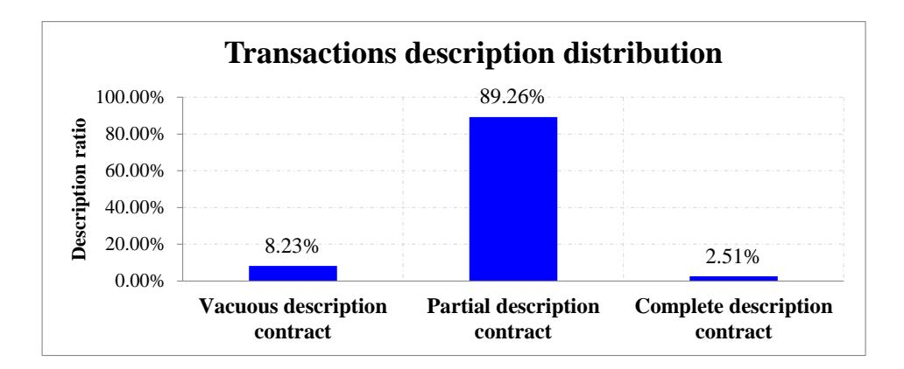
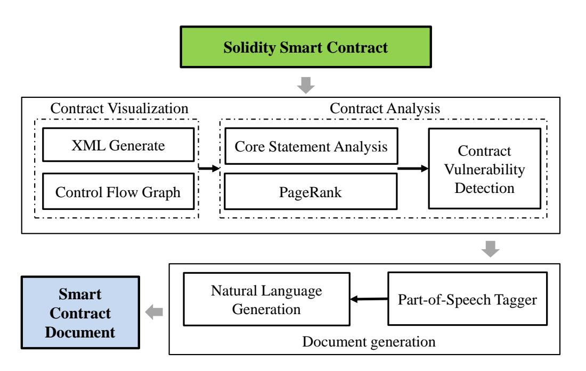
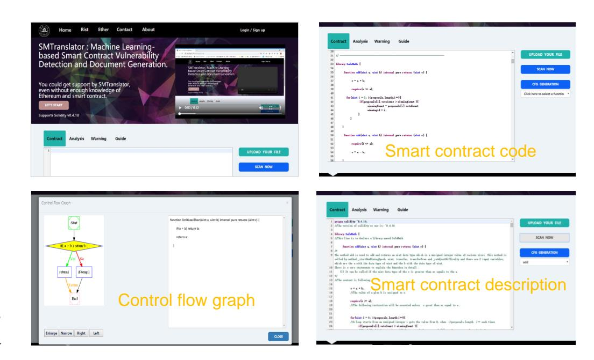
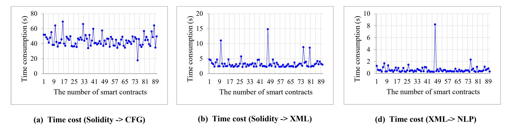

{0}------------------------------------------------

# Towards Interpreting Solidity Smart Contract: An Automatic and Practical Realization

Ming Li, Jian Weng, *Member, IEEE*, Anjia Yang, *Member, IEEE*, Jiasi Weng, Yue Zhang,

**Abstract**—With the advent of Ethereum blockchain, a new type of contract, named smart contract, is emerging nowadays, enabling people to describe complicated logics as automatically executable computer programs. Due to the lack of the computer background and special design of smart contacts, many people may have difficulty in understanding smart contracts, while they still have urgent demands to leverage them to build more trusted environment with others for the obvious advantages of blockchain. However, there does not exist an automatic technique to guide those people who do not have much background on smart contracts. Furthermore, a new wave of smart contracts fraud has been brought to them and caused serious economic loss. To address this challenge, we investigate the general rules of the smart contract codes and propose a new approach, called SMTranslator, to enable people without computer background to understand and operate Ethereum smart contracts. Particularly, we first translate smart contracts into standard structured files and identify core statements for each function based on principles of dependency weights. By exploiting the custom natural language generation, we then describe the documents that can provide correct and understandable descriptions. The visibility and vulnerability graph are also generate to alert people against the fraud issue. Furthermore, to conduct the experiments, we collect numerous smart contracts from Ethereum and select 60 volunteers. Extensive experimental results demonstrate that SMTranslator can automatically interpret smart contracts and most of the generated documents can be understood and guide volunteers to utilize smart contracts, which shows the feasibility and effectiveness of our approach.

✦

**Index Terms**—Ethereum, smart contract, contract fraud, fraud deterrence, natural language generation.

# **1 INTRODUCTION**

O VER the past ten years, blockchain technology has evolved from a basic idea to a real solution in industrial area since it was coined in 2008 [1]. Bitcoin and Ethereum, as two of the biggest blockchain platforms, have achieved valuations of more than 945 billion US dollars in June 2020, and provide a promising way to build a blockchain-based decentralized application (DAPP) that mutually distrust parties can reach an agreement in a secure way without relying on a third party. Therefore, a great deal of DAPPs have been established in the industrial area, such as the supply chain [2], cloud computing [3] and crowdsensing [4]. It can easily expect that the DAPPs will contribute significantly to constitute a more valuable society in the future digital age.

The main reason on the prosperousness of blockchain is the efficiency for supporting *smart contracts*, the automatic selfexecution computer programs. They are published as transactions and run on atop of the blockchain network. Particularly, the underlying cryptography techniques and consensus protocol constitute a secure environment for running smart contracts. Under the assumption of honest majority, these smart contracts are *tamperresistant* and *trackable* once being confirmed by blockchain nodes for several blocks. Consequently, data recordings in smart contracts can be recognized as a valid proof for the judgement in industrial disputes [5], [6], which provides a promising way to gather effective evidences, e.g., supply chain financial criminal.

One of the primary objectives for adopting the blockchain technology in industry area is the ability to push the management of industrial procedures to automated execution, where smart

• *M. Li, A. yang, and X. Chen are with the College of Information Science and Technology and the College of Cyber Security, Jinan University, Guangzhou 510632, China. E-mail: limjnu@gmail.com.*

contracts depict complex logics into programming code to represent the implementation of agreed-upon agreements between two parties, e.g., an employer and an employee in supply chain [2]. Generally, the program languages for developing smart contracts may vary across the different blockchain platforms. Bitcoin can only run non Turing-complete "smart contract". The complicated program logics, such as *functions* and *exceptions*, are not supported. This limitation makes Bitcoin have the natural disadvantages when being used in other areas. Thus, to support Turing-complete smart contracts, Vitalik and Wood *et.al* design Ethereum [7], a secure decentralized transaction ledger. It has employed prevalently as the world's second biggest cryptocurrency. According to the statistics of [8], there are total 14,205 smart contracts have been deployed in Ethereum in the last twelve months in 2020 and involve millions of US dollars.

Ethereum supports three types of program language to develop smart contracts: *Solidity, Serpent* and *LLL*. We focus on Solidity, which is assumed as the flagship programming language all over the world. Solidity is a high-level program language that supports arbitrary program logic. In the process of code execution, it is compiled into *bytecode* and executed in Ethereum Virtual Machine (EVM). Specifically, DAPPs based on Solidity are different from other GUI (Graphic User Interface) applications where people are not required to care about the underlying source code. DAPPs need people to provide valid inputs for a specific function by using Ethereum Wallet. To achieve this, the primary premise for people is the ability of understanding the Solidity contracts. However, most people work in the non-computer area that they do not have programming background, which make them have difficult to understand contracts. Meanwhile, contract fraud is now a big nuisance in our society. People are scammed largely because of the vague language used in contracts, and may misunderstand the real meaning of the smart contracts, especially, when signing a big

{1}------------------------------------------------

contract, for example, leasing or buying property.

Therefore, to review over ambiguous terms, people without any programming background may seek professional help from experts, whereas the shortage of blockchain experts is established fact currently [9]. The other practical way is to parse the contract codes into intelligible description sentences. In terms of this aspect, a series of efforts have been made for C/C++/Java [10], [11], [12], [13], [14]. However, these methods can not be adopted directly in Solidity document generation for the fellowing reasons: 1) most of them are designed for software maintenance persons or develpers who have a certain programming skill, which is inconsistent with our original intention [12]. 2) In addition, the meaning of a function is summarized according to its function name in [13], [14]. However, not all of the function name in smart contract can present the accurate meaning. According to our observation, the action performed in a certain function may not correspond with the *verb* described in its name. 3) Moreover, existing researches on document generation focus on demonstrating the meaning of the source codes more accurately. However, in terms of smart contracts, there is a significant requirement for detecting the vulnerabilities and presenting them in the generated document, which makes the contract fraud be deterred if people have a better understanding of contract terms. Herein, Solidity is a newly appeared program language that how to help people without special background to participate in DAPPs easily and safely is still a big challenge.

Motivated by the aforementioned challenge, we investigate the general rules of the smart contract codes, and propose SMart contract Translator (SMTranslator), an automatic document generation approach for Solidity smart contract. Compared with previous approaches, we define more effective and special criteria: people could utilize our method to understand: 1) what the methods do constitutionally, 2) how the methods work internally, 3) how to use the methods, and 4) do they exist any risk or vulnerability when calling the method. To validate our approach, we perform several studies for those people who do not have much smart contract background. Our second case study compares generated documents by SMTranslator with generated documents by a stateof-the art approach.

SMTranslator is different from the previous approaches for C/C++/Java due to the distinctiveness of Solidity. Specifically, we first convert the Solidity contracts into structural representation, which facilitates us to obtain each part of the source code. Then, core statement analysis is designed to identify the core action of the method. We parse the identified core statements based on part-of-speech based on custom natural language processing, and reorganize the key words and generate the final document. We also identify special expressions of Solidity and describe them with suitable words. Particularly, a standard template is defined to describe a function which contains *Summary Description, Short Description, Return Description, Input Description, Core Statement Description* and *Call Description*. Summary Description is to help people to have a general view of the contract. The rest parts are to generate descriptions for each function. In a nutshell, our specific contributions can be recognized as follows:

• An approach for automatically generating documents for Solidity smart contracts is proposed in this work. To the best of our knowledge, this is the first work that generates readable document of smart contract for people who do not have the programming background.

- A novel approach based on the dependency weights is designed to identify the core statement of a contract's function. We recognize that this approach can also be extended to other program languages.
- A system prototype is developed for Solidity contract and we have released our tool to the public as a helpful tool for people to understand smart contract.
- We collect a large number of Solidity smart contracts from Ethereum and conduct extensive experiments to verify the feasibility and usability of our approach.

The remainder of the paper is organized as follows. In Section 3, we introduce the background and formulate the motivation of this work. In Section 4, we present our concrete approach to generate Solidity document. In Section 5, we present the experiments and evaluation results. The related works are give in Section 6. Finally, the conclusion and future works are given in Section 7.

# **2 THE PROBLEM**

For instance, *burn*(·) in "Havven.sol", the action performed in this function is transferring coin.

## **3 BACKGROUND**

#### **3.1 Background and Preliminaries**

Blockchain and Smart Contract. Most recently, blockchain has gained significant attention and has been deployed in different scenarios [15], [16], [17]. It is essentially a distributed ledger which are maintained by a number of network nodes [18]. These mutual distrust nodes can reach an agreement by the consensus protocol, e.g., proof of work and proof of stake. More in detail, blockchain is compose of a series of *blocks*. Each block, organized together as an ordered hash chain, contains lots of *transactions*. Particularly, the review of main features on blockchain are listed as follows: 1) *Complete Decentralization*: Blockchain is a global computer that is maintained by distributed P2P network. Many mutual distrust nodes are able realize fairly data communication without relying on a central third party. 2) *Correctness* and *Traceability*: Blockchain is transparent data structure that each node can trace and verify the correctness of the data. The validation of data is ensured with the underlying cryptographic tools (e.g., digital signature, hash function). 3) *Immutability* and *Irreversibility*: Transactions are tamper-resistant since they are organized as Merkle has tree. Blocks are also connected together as hash chain which ensures the immutability and irreversibility. 4) *Cryptography*: The security of blockchain is compose of the underlying cryptography techniques which ensure the transfer of the digital currency or status among different parties in a secure way.

And also, smart contract was first proposed by Szabo in 1997 [19] before the invention of blockchain. It is a main component of blockchain technology that provides Turing-complete programming language (i.e., arbitrary computer codes execution). Ethereum is the first blockchain platform that supports Turingcomplete smart contracts which are executed in the form of transactions. Specifically, smart contract in Ethereum is converted into bytecodes that are run in Ethereum Virtual Machine (EVM). As shown in Fig.1, a smart contact mainly contains two parts: 1) version declaration (line 1), and 2) contract body (line 2 to line 15). The version declaration is to ensure that the contract can

{2}------------------------------------------------

```
1 pragma solidity >=0.4.22 <0.7.0;
 2 contract TokenSample {
 3 mapping(address => uint) private userBalances;
 4 function transfer(address to, uint amount) {
 5 if (userBalances[msg.sender] >= amount) {
 6 userBalance[to] += amount;
 7 userBalance[msg.sender] -= amount;
 8 }
 9 } 
10 
11 function withdrawBalance() public {
12 uint amountToWithdraw = userBalances[msg.sender];
13 require(msg.sender.call.value(amountToWithdraw)()); 
14 userBalances[msg.sender] = 0;
15 }
16 }
```

Fig. 1: An example of smart contract vulnerability.

not be compiled with a breaking compiler version. The contract body contains the variable declaration and function definition. Each function is identified by a unique name and type parameters which are regarded as the signature statement. In particular, there exist comments which can be identified by the symbol /\*\*\*/ in the contract body to provide the overview of function. <sup>1</sup> .

Control Flow Graph. Control flow graph (CFG) is a type of graphical representation that a several nodes and edges are utilized to represent the control flow of the execution of programs and applications [21]. Each CFG node is a basic block which denotes a straight-line piece of code in program. Direct edges are used to denote the jumps among different blocks. Note that there are two type of designated blocks, i.e., entry block and exit block. The first one is the enters of the flow graph and the second one is exit. Specifically, CFG has been used in many program execution scenarios to show the visualization of the program. Our scheme employs CFG to present the control flow of the smart contract, which enables people to understand the process of the concrete execution.

PageRank. PageRank is an algorithm that is proposed by Google Search to rank the web pages in their search engine. It can be used to approximate the importance of the nodes in a graph [13]. Generally, PageRank computes the importance of a given node based on the number of edges which point to the node and the importance of the nodes from which those edges originate. It has also been used to highlight the importance of methods in a software project [13], [22]. A method that is called by many times by other methods is regraded as more important that other method.

Natural Language Processing. Natural language processing (NLP), a subfield of artificial intelligence, is used to mitigate this challenge that enables computers to understand and process human natural languages [23]. It can parse and produce human natural language under the spoken or written form. NLP mainly involves three parts: speech recognition, natural language understanding and natural language generation. *Stanford CoreNLP* is a widely used toolkit which has realized core steps for NLP [24]. We use this toolkit to analyze the statement of the contract code and generate readable English sentences.

#### **3.2 Problem Statement and Motivation**

The main motivation for this work is described as follows: currently, there does not existing an effective approach to guide

1. We recommend the readers to refer to [20] for more information.



Fig. 2: Ethereum transaction volume statistics.

people to understand the accurate meaning and logic of smart contracts, which is adverse to the popularization of the blockchain technology. More preciously, if people intend to join a DAPP in Ethereum, they need to understand the code logic, then they can call the functions of the DAPP. However, it is hard for the people who are short of the computer program background. They can only resort to the skilled developers or the contract comments. However, both methods have the limitations: 1) on the one hand, Solidity is a newly emerging program language that the practised developers are few while the number of users is quite a lot at present. 2) On the other hand, many smart contracts do not provide, or provide only partial function comments, leading to the poor demonstration of the contracts. Even for the people who have the computer program background,

Additionally, contract fraud in blockchain has caused tremendous economic losses. There are numerous security vulnerabilities which are hard to be distinguished. To illustrate, we take a DAPP (as shown in Fig.1) as an example. The contract allows people to transfer coin to *userBalances* and withdraw coin. It might seem normal at first. So they may choose to participate in the DAPP without doubt. However, an attacker can use the designed smart contracts to call *withdrawBalance*(), he can withdraw coins with multiple times before his balance is not set to 0. This vulnerability is called *cross-function reentrancy* which is also exploited in the "DAO attack" [25]. In fact, it is very hard to identify this type of vulnerability for majority of people, even for the practised developers.

To tackle the above two issues, an intelligible descriptions (or comments) for smart contracts that guide people and prevent them from falling into contract fraud may be a good solution. However, we investigate the existing manual contract comments, and find that these comments can not satisfy this requirement. In more detail, we classify the comments into three types according to the completeness [26]: *Vacuous description contract* refers to the contracts that contain hardly any comments. *Partial description contract* refers to the contracts that only part of some special functions are commented. *Complete description contract* refers to the contracts that all of their functions have been commented, including the signature, and input/output parameters. Specifically, we download 6,862 smart contracts which have launched more than 100 transactions after being deployed from the beginning of Ethereum<sup>2</sup> . The transactions distribution of these contracts are shown as in Fig. 2. According to our observations, only 41.81% of the total functions (74,615 out of 178,445) have been commented in the total 6,862 contracts. Furthermore, 8.23% (i.e., 565 out of 6,862) of the contracts belong to the *vacuous description contract*,

2. Etherscan just shows only the latest 500 verified contracts source code at the time of writing.

{3}------------------------------------------------

89.26% (i.e., 6,125 out of 6,862) of the contracts belongs to partial description contract, and only 2.51% (i.e., 172 out of 6,862) of the contracts belong to complete description contract. Namely, more than 97% of smart contracts do not provide complete comments. Specially, we find that some comments are even inaccurate. In "CAIDCrowdsale.sol", the developers claim the copyright notice in the comments but not present the correct meaning. Moreover, we find some of the comments are written by non-English languages, which has precluded people who do not have non-English language background from understanding these contracts. And also, "SiaCashCoin.sol", as one of the contracts that have a great deal of transactions (837,794 transactions) in Ethereum, does not provide any comments. The above observations motivate us to design an effective approach to normalize Solidity contract comments and guide people to participate in the DAPP without being defrauded.

#### 4 APPROACH

In this section, we will present the overview of our approach SMTranslator, and then describe the concrete designs.

#### 4.1 Overview of SMTranslator

Our approach is to analyze the deployed Solidity contracts in Ethereum. The methodology can be summarized as four phases: Data Collection, Contract Visualization, Contract Analysis and Natural Language Generation. As for the first phase, we collect Solidity contracts from the open public Ethereum website Etherscan<sup>3</sup>. The main differences and features between Solidity and other program languages are identified to allow us to describe the comments more accurately. During the second phase, we visualize the smart contracts by converting them into structural representation based on XML generation, and draw the visual process of contract functions by using CFG. We generate the customized XML file for Solidity based on SmartCheck [27], which can promote the efficiency of the latter parts (e.g., contract visualization and contract analysis).

After the two preparation phases, we analyze the key words and core statements performed in functions, which is to obtain the core meaning of each method in the third phase. Specifically, PageRank is utilized to rank the importance of smart contract codes in a specific function. The special statements are identified in Solidity, such as ether transfer, event and modifier claim. Meanwhile, the off-the-shelf detection tools are used to mark the vulnerabilities of smart contracts. We highlight the vulnerable source codes and explain the vulnerabilities in CFG, enabling people to understand the smart contracts more clearly and prevent them from suffering from the economic losses. The last phase is to generate the final readable contract documentation based on NLG.

The system design of SMTranslator is illustrated in Fig. 3. It mainly focuses on the above mentioned three phases, i.e., Contract Visualization, Contract Analysis and Natural Language Generation. Concretely, SMTranslator first translates the Solidity contract into structured XML representation, which can facilitate us to obtain each part of the source codes. Then, we make the core statement analysis to identify the most important action in a function, and parse the identified core statements based on part-of-speech analysis. Lastly, we build a custom natural language processing system to reorganize the key words and generate the final document.

3. https://etherscan.io/contractsVerified



Fig. 3: The architecture of SMTranslator.

#### 4.2 Data Collection

We collect smart contracts which are published in succession from the launch of July 30th, 2015. Due to the restrictions of the Etherscan, it is not allowed to crawl all of smart contract source codes. We extract two principles to collect some representative smart contracts: first, the developers deploy their smart contracts in Ethereum to support practical applications, so the number of confirmed transactions on a smart contract can represent the activity and utility of the smart contract to a certain content. However, 66.82% of smart contracts do not have more than 10 transactions after being deployed. We collect the highly visited smart contracts that have more than 100 confirmed transactions. Second, we choose smart contracts that their size is more than 1KB, i.e., about more than 100 lines code. Based to the two rules, we collect 964 Solidity contracts from Etherscan. The majority of smart contracts have more than 150 lines of code.

#### 4.3 Smart Contract Structure Processing

The design goal of XML generation is to simplify Solidity contract into general structured document format, which can enable us to locate and obtain a specific code easily through XML Application Programming Interfaces (APIs). SMTranslator adopts the standard Extensible Markup Language (XML) to represent the original contract codes. XML is a makeup language that is easy to be understood both for human and computer. We maintain complete information when transferring Solidity contracts into XML representation, which is vital to maintain the original meaning of the contract. Specifically, we generate the XML document by referring to SmartCheck [27], a static analysis tool which aims to automatic vulnerability detection. As shown in Fig.4, it is an instance that generating the XML file for "SimpleStorage.xml". The declaration of contract is in the element of " $< contract > < \setminus contract >$ ". The identifier of the contract is the short description of a contract. We can interpret the identifier by our custom NLP. The element of " $< comment > < \setminus comment >$ " refers to the method comments. Each method is identified in the element of " $< function > < \setminus function >$ ". There exist other expanding elements, e.g., variable. By this way, each line of source codes is marked as an element to represent different meanings.

#### 4.4 Core Statement Analysis

The expectation of a Solidity document is to reveal the function and utility of contracts. Thus, we need to analyze the core

{4}------------------------------------------------

```
<?xml version="1.0" encoding="UTF-8"?><sourceUnit>
<pragmaDirective>pragma<pragmaName><identifier>solidity</identifier>
</pragmaName><pragmaValue>
<version><versionConstraint><versionOperator>^</versionOperator>
<versionLiteral>0.4.0</versionLiteral>
</versionConstraint></version></pragmaValue>;</pragmaDirective>
<contract>contract<identifier>SimpleStorage</identifier>{<contractPart>
<statevariable><typeName><elementaryTypeName>uint</elementaryTypeName></typeName>
<identifier>storedData</identifier>;</statevariable></contractPart>
<contract><function>function<identifier>set</identifier>(<variableList>
<variable><typeName><elementaryTypeName>uint</elementaryTypeName>
</typeName><identifier>x</identifier>
...
}
```

Fig. 4: The generated XML document of SMTranslator.

statements performed in a function. There may exist several lines in a contract function, while only one or two lines are the core statements, which can be detected according to the call dependency by PageRank. Furthermore, considering the distinctiveness of public blockchain platform, programmers may not develop DApps only by Solidity. They may develop the core logics in smart contracts and others are developed by Java or C++. Namely, it is more easily to identify the core statement in Solidity contract compared with other program languages. To achieve this goal, we utilize a few descriptive sentences to enable readers to know the meaning of a method. In particular, based on our extensive observation, we summarize the following principles to obtain the core statement of a function.<sup>4</sup>

Ending Statement. It refers to the statements that lie in the end of a method. It is usually used to change the state/value of a variable, or execute method call. The core statement for a function with a return value corresponds to the assignment statement for the end return. We can identify Ending in the *void* return type function easily, becasue the last lines are usually the core statements. For example, in the below fucntion *vote(uint8 toProposal)*, It is impossible to summarize the meaning of this method according to its name *vote*. In view of the return type, we locate the end of the three lines from 4 to 6 as the core statements and use them to improve the summary. Specifically, "." in Solidity refers to an attribution of a variable. Thus, "sender.voted" is described as "sender's voted".

```
1 f u n c t i o n v ot e ( u i n t 8 t o P r o p o s a l ) p u b l i c {
2 V ot e r s t o r a g e s e n d e r = v o t e r s [ msg . s e n d e r ] ;
3 i f ( s e n d e r . v ot e d | | t o P r o p o s a l >= p r o p o s a l s .
                l e n g t h ) r e t u r n ;
4 s e n d e r . v ot e d = t r u e ;
5 s e n d e r . v ot e = t o P r o p o s a l ;
6 p r o p o s a l s [ t o P r o p o s a l ] . v ot eC o u nt += s e n d e r . w ei g ht ;
7 }
```

EtherUpdate Statement. In Ethereum, the primary concern for any person is the security of his/her account. Thus, the codes related with balance update may be corresponding to the core statement. EtherUpdate is the statements that mainly focus on balance update. Particularly, there are three ways to perform Ether ( digital coin in Ethereum) transfer in Solidity: 1) *address.transfer()*, 2) *address.send()*, 3) *address.call.value().gas()*. We observed that most of the deployed contracts use the first method to transfer currency. The main reason is that *address.transfer()* can throw exception if there exist an error, which may be more secure for individuals.

4. The contract codes we analyzed below take from Ethereum.

Take the below function as an example, the name *distr* is not a normal word that can be understood easily. It is necessary to interpret this function by combining the main action performed in the method. The purpose of the first two lines is to set the status of the variables. The third line is the core statement of this function which sends *amount* Ether from *address(0)* to *to*. The action "Transfer" reminds people that their account will update after the execution of this method. According to our observation, numerous contracts adopt "from" and "to" to present the coin from a sender's address to a receiver's address. We interpret the Ether transfer action as: "*amount* is sent from address *from* to address *to*".

```
1 f u n c t i o n d i s t r ( a d d r e s s from , a d d r e s s t o , u i n t 2 5 6
         amount ) c a n D i s t r p r i v a t e r e t u r n s ( b o ol ) {
2 t o t a l D i s t r i b u t e d = t o t a l D i s t r i b u t e d . add ( amount ) ;
3 b a l a n c e s [ t o ] = b a l a n c e s [ t o ] . add ( amount ) ;
4 T r a n s f e r ( from , t o , amount ) ;
5 r e t u r n t r u e ;
6 }
```

EventClaim Statement. EventClaim refers to the statements that indicate important events in a function. "Event" is a special declaration in Solidity contract, which reminds people that an important action will be performed in this function. Generally, people can use Ethereum client to monitor an "Event" in transaction log. There exist some particular functions to be declared as "Event" with high frequency, such as *Deposit(*·*), Transfer(*·*)*, which are also related with balance update. In addition, we find that "Event" functions are also to update the status of a variable or execute specific action, e.g., *Approval(*·*), OwnerChanged(*·*) and Pause(*·*)*. EventClaim statement is identified by the declaration *verb* "emit" and usually can be interpreted by the name and its input parameters. Notice that some functions may contain other core statements apart from EventClaim, so we interpret EventClaim statement with other statement interpretation together.

SameAction Statement. It refers to the statements that there exists a method call *Func* which has the same action with the function. In general, *Func* contains the same *verb* word with the method name. For example, the first line of the below function is the method signature and the method name is "issueMaxSynths". In line 5, the method call "issueSynths()" can be analyzed by the camel-case that it has the same action with the method signature. They have the same *verb* "issue" and *noun* "Synths". Particularly, if there exist only one line code in a method, it is obviously the core statement and the method call usually has the same action with the method.

```
1 f u n c t i o n i s s u eM a x S y nt h s ( b y t e s 4 c u r r e n c yK e y ) e x t e r n a l
            o p t i o n a l P r o x y
2 {
3 u i n t m a x I s s u a bl e = r e m a i n i n g I s s u a b l e S y n t h s (
                 me s sa geSe n de r , c u r r e n c yK e y ) ;
4 i s s u e S y n t h s ( c u r r e n c yKe y , m a x I s s u a bl e ) ;
5 }
```

Conditional Statement. It refers to the executions which are based on special conditions. Conditional codes describe that the specific codes can only be executed if some paticular conditions are satisfied. SMTranslator identifies this type of statements with the key words *if, while, for* or *switch*. There have multi-layer nestings when using condition statement. SMTranslator only identify 

{5}------------------------------------------------

the final execution code as the core statement and illustrates the meaning of the judgements together.

In addition, Solidity contract contains some special conditional judgement statements to handle error, e.g., *require* and *assert*. It will throw an exception and return immediately if the conditions are not met. These conditional statements contribute a lot to help people to understand how to call a function, so we interpret these special conditional statements in the document.

Modifier Statement. It is the declaration that verifies some special conditions before a method execution. It is declared in the signature of a method. Modifier statement usually defines some conditional judgements with *require* statements and can change the performed action of the method. SMTranslator identifies Modifier statements with the declaration "modifier". A method can have multiple 'modifier" statements. SMTranslator interprets the condition judgement of "modifier" one by one and generates fixed description format for any method.

#### **4.5 Contract Vulnerability Detection**

As to the smart contracts vulnerability detection, we leverage off-the-shelf detection tools. To guarantee the high accuracy of detection, we have integrated several automated analysis tools into SMTranslator, including Oyente, ZEUS, and Securify. Other tools could be integrated conveniently <sup>5</sup> .

#### **4.6 Natural Language Generation**

Once analyzing the core statement of the contract, the final challenge is to covert the statements to descriptive documentation, we utilize Natural language processing (NLP) to achieve this goal. NLP is described as the process of producing meaningful phrases and sentences in the form of natural language to do useful things [28]. It is used to analyze human language by combining machine learning and deep learning algorithms, and aims to make computer understand the meaning of various differences of language without being explicitly told. In our work, we utilize NLP technology to analyze the core statements and input/output parameters of Solidity contract. For example, a specific word with camel-casing naming is parsed as the gerund form and recognized as a readable sentence with proper preposition.

SMTranslator adopts the Stanford CoreNLP NLP Toolkit which is a Java annotation pipeline framework [24] to provide core natural language analysis. It contains many popular NLP tools, such as Part-of-Speech (POS) tagger, Named Entity Recognizer (NER), Parser, Coreference Resolution System. Most of the Solidity contracts follow the naming rules of variable and method. So SMTranslator can interpret different part of words accurately in the statement and declaration based on POS tagger. Take a method *ManagedAccount(address owner, bool payOwnerOnly)* in "DAO.sol" for example. The method name "ManagedAccount" is parsed into two words. The first word "Managed" is the past tense verb which is marked as {*"pos": "VBD"*} and shows the base form as {*"lema": "manage"*}. "Account" is marked as {*"pos": "NN"*} and the base form is {*"lema": "account"*}. The input parameter " payOwnerOnly" can be parsed as the same way, "Only" is marked as {*"pos": "RB"*}. "pos" refers to element of the part of speech. POS tagger has defined more than 40 types of "pos". "VBD", "NN" and "RB" represent the verb with base form, noun with singular or mass and adverb, respectively.

5. https://smartym.pro/blog/smart-contract-security-issues-smart-contractvulnerabilities-and-how-to-protect/

After the analysis of POS tagger, the parameters and core statement are turn into structured data, which let us obtain the separate key words. Based on this, the final phase of SMTranslator is to use Natural Language Generation to organize these words and generate readable English sentences.

Compared with POS tagger that deals with "Reading" task in Solidity contract, Natural Language Generation (NLG) can be deemed as executing "Writing" task. It aims to turn structured data into human readable sentences. Particularly, SMTranslator follows the typical architecture of NLG described in [29]. It mainly contains three components: Document Planner, Microplanner and Surface Realizer. Document planner is the component that interprets the performed fact/action in each method and organizes them as a sequence which can be easily understood. Microplanner is the component that determines which suitable words or phrases can be used to describe the sequence. To interpret different parts of a method, the microplanner adds some specific words into a phrase (e.g., adjectives or adverbs), which can smooth it more readable. The last component surface realizer is to organize these phrases as natural language sentences. As described above (Subsection 4.3, ?? and 4.6), we first convert Solidity contract into the structured XML format and analyze the core statements and important declarations as the inputs of document planner. Then, we generate the fixed structure for each specific statement in surface realizer.

It is worth noting that we identify an important point which can help us to generate the document in NLG: parsing global variables and functions under the explanation of Solidity documentation <sup>6</sup> . We aware that many global variables and functions have deterministic meaning in Solidity contract. Interpreting these variables and functions in advance can effectively help people to understand the function more clearly. For example, *msg* is the initiator of a contract, e.g., *msg.sender* refers to the initiator's address, *msg.value* refers to the number of currency that the initiator transfers to the contract. The method *sha256(var m)* is to compute a hash value of *m* which is the digest of this message. It is a cryptography algorithm that people can not understand the meaning only by its method name. In addition, there is another special method called *selfdestruct(address recipient)*. It destroys the current contract and sends its remaining currency to the specific address *recipient*, which is a very special method that does not exist in other languages. SMTranslator interprets these special variables and functions with pre-described sentences in the generated document.

SMTranslator organizes the document structure by creating 6 types of description for each method in document planner [13]: *Short Description, Return Description, Modifier Description, Input Description, Core Statement Description* and *Call Description*. The order of these descriptions is determined by the sentences logic and semantic analysis. *Short description* reveals the most important information of the method which is put in the first place, which requires people to pay more attention. It emphasizes some specific actions or facts like *Ether transfer* or *status change*, and represents a brief, highlevel action summarizing a whole method. *Return description* describes the return value. It clarifies the type of output parameters. It is usually put together with *Short description*. *Modifier description* is to declare special conditions (i.e., method with "modifier") that should be satisfied before the execution. *Input Description* clarifies all of the input parameters. *Core Statement Description* serves to indicate the main function

{6}------------------------------------------------

TABLE 1: The explanation of description type.

| Description Type     | Explanation                                           |  |  |
|----------------------|-------------------------------------------------------|--|--|
| Short Description    | The summary about this method.                        |  |  |
| Return Description   | Return type and value explanation.                    |  |  |
| Modifier Description | Special conditions that the method should<br>satisfy. |  |  |
| Input Description    | Input parameter explanation.                          |  |  |
| Core Description     | The core statement about this method.                 |  |  |
| Call Description     | Method calls about this method.                       |  |  |

of this method. *Call Description* is to illustrate which methods depend on this method. It is used to evaluate the importance of a method. These descriptions are briefly shown in Table 1.

We describe the above 6 type of descriptions with different phases. *Short Description* uses the subject "This method", the *verb* phase "can be used to", the *verb* identified from its name to represent main function, and combines with a *noun* to represent the direct-object. *Return Description* is added in the end of *Short Description* with the *conjunction* "and returns". For example, in the method *function receiveEther() returns(bool)*, it is interpreted as: "*This method receiveEther() can be used to receive Ether and returns bool value*". *Modifier Description* is to describe the special conditions. SMTranslator analyzes the conditions to be met in the declaration of the modifier and interprets it as: "This method can only be called if". In *Input Description*, SMTranslator presents the number of inputs unless there exists only one input. It uses the *verb* "is" to illustrate each parameter one by one. For the convenient operation of people, SMTranslator interprets the type meaning of each input and presents the base form of this type. For example, the parameter "*address receiver*", SMTranslator interprets the variable *receiver* as: "*The variable receiver is the address type that holds a 20 byte value, e.g., 0x72ba7d8e73fe8eb666ea66babc8116a41bfb10e2". Call Description* clarifies which functions have called this method. SM-Translator parses it as "This method is called by:". These phases and sentences are organized together to generate the complete document in the surface realizer.

## **5 EVALUATION RESULTS AND ANALYSIS**

The system prototype is implemented to verify our approach. Evaluation results indicate that the generated document can help people without programming background to understand Solidity contract and guide them providing correct inputs to contracts.

In this section, we introduce the developed SMTranslator and present the evaluation results. We discuss the efficiency and feasibility of SMTranslator by referring to the principles formulated in [13], [14], [30], and mainly focus on three aspects: 1) to access whether our tool can help people without programming background to understand the functionality of a method in smart contract, 2) to access whether our tool can help them to understand how to use a method, 3) to access whether the generated documentation can be more instructive or accurate than the existed comments. For the last point, we consider that whether the generated document can contribute more information about a contract, not only repeat the information that already exists in the comments.

The rest of this section first presents the prototype implementation of SMTranslator, then introduces the preparation and metrics of the evaluation, and analyzes the experiment results lastly.



Fig. 5: The system design of SMTranslator.

#### **5.1 Experiment Setup**

We implemented SMTranslator in Java with roughly 4000 lines of code. Our source code is available at *https://github.com/lim60/SMTranslator*. We develop SMTranslator as a graphical user interface (GUI) tool based on Java Swing library in Eclipse platform, which could make it more easily be operated by people. SMTranslator takes Solidity contract as input and support to bulk import a number of smart contracts. In particular, we have already downloaded numerous smart contracts locally. People can check the existence of a particular contract using its contract name. After finishing the interpretation, people could get a generated document for contract *name* which is named as "{*name*} document.txt".

There are four main modules in SMTranslator. In terms of XML generation, we adopt ANTLR v4, a parser generator for reading, processing and translating structured text or binary files. It converts Solidity contract format into structured XML data format. SMTranslator integrates Stanford CoreNLP toolkit to provide part of speech analysis. It is worth noting that CoreNLP provides numerous APIs, which allows us more easily to develop the application. Fig. 6 is the system design of SMTranslator. We run our experiments on a PC with a 3.5-GHz CPU, and 16-GB memory.

To verify the readability and intelligibility of document generated by SMTranslator, we invited 60 student volunteers from Jinan University in China, where some of them have some basic knowledge of blockchain technology and Ethereum platform, and 24 of them are graduate students who come from Computer-Science. They have the experiences on software development. 30 of them are graduate students who come from Marketing-Management and have no program experiences on software development. The rest of them come from Economics. In particular, the volunteers are required to finish the questionnaires based on the generated documents and the contract codes.

In addition, to access whether SMTranslator performs well for the above mentioned principles, we list several questions by the form of a questionnaire. As shown in Table 2, there are seven questions about the usability of the tool, the accuracy, readability, conciseness, intelligibility and instructiveness of the generated document. We assign an extra question for the volunteers who are the Computer-Science background. Only they can verify the accuracy of the core statement analysis by checking the Solidity contract code. The optional answers for each question can be

{7}------------------------------------------------

TABLE 2: The questions we ask in the questionnaire. The optional answers are "Strongly Agree", "Agree", "Disagree" and "Strongly Disagree".

| Type                | Question                                                                                                                          |  |  |
|---------------------|-----------------------------------------------------------------------------------------------------------------------------------|--|--|
| Q1 −Usability       | I feel this tool is easy to use and operate.                                                                                      |  |  |
| Q2 −Accuracy        | The explanations and summaries for a<br>method is accurate.                                                                       |  |  |
| Q3 −Readability     | The summaries generated by this tool are<br>easy to read and I can totally understand the<br>meaning of each generated sentences. |  |  |
| Q4 −Conciseness     | The summaries generated by this tool do not<br>contain unnecessary information.                                                   |  |  |
| Q5 −Instructiveness | I can easily use a specific method by the<br>Ethereum wallet under the direction of the<br>explanations.                          |  |  |
| Q6 −CoreAnalysis    | I feel the tool for core statement analysis of<br>a method is accurate and does not miss some<br>important information.           |  |  |

"Strongly Agree", "Agree", "Disagree", and "Strongly Disagree". We also assigned a value for each answer which are 4, 3, 2, 1, respectively [13].

### **5.2 Selected Smart Contract**

90 typical Solidity contracts are selected to evaluate SMTranslator and conduct the investigation (10 of them are shown in table 3). First, to compare our generated summaries with the comments written by contract authors, we select 55 contracts that belong to *complete description* type. We intend to find whether the existing comment represents the core action of the method. Participants could first check whether the existing comments can help them to use the methods in these 4 contracts. Then they refer to the generated summaries by our tool. In addition, we choose another 35 contracts belong to *vacuous description* and *partial description* type. Most of the methods in the 10 contracts are public and can be used, which let people to test the instructiveness of the document. Take the "SiaCashCoin.sol" for example, it creates a cryptocurrency that aims to improve the payment of data storage based on smart contract. It contains 29 methods and none of them have comments. Using the Ethereum wallet, people could use the method and pay for the service for saving their data. Generally, it can not be finished by people without software background. In our experiments, we will verify whether the 6 persons who come from non-Computer Science can understand and use the method. The next section will analyze the results of the questionnaires based on the generated 10 summary documents.

## **5.3 Results Analysis**

Add practical generation analysis as in: 2017-ASE-Towards Automatically Generating Descriptive Names for Unit TestsASE 2017

*Usability*. In the usability judgement over the 60 participants, there were 38 participants who rated "Agree" (28) and "Strongly Agree" (10). The majority of the volunteers agreed that the tool was easy to generate a summary document for a Solidity contract. There were still 9 participants rated "Disagree". The main concern of them was the size of the tool. They hoped that the size of SMTranslator could become small. We found that the reason for the big size lied in the library of Standford CoreNLP

TABLE 3: The selected smart contracts in the experiments.

| Type                     | Contract      | Total<br>Functions | Commented<br>Functions | Size (KB) |
|--------------------------|---------------|--------------------|------------------------|-----------|
| Particial<br>Description | MossCoin      | 13                 | 5                      | 7.8       |
|                          | CCEToken      | 18                 | 12                     | 7.9       |
|                          | DeusETH       | 26                 | 3                      | 6.8       |
|                          | TutorialToken | 19                 | 12                     | 7.7       |
|                          | VocToken      | 26                 | 9                      | 7.3       |
|                          | AMNToken      | 19                 | 13                     | 7.7       |
|                          | ZmineToken    | 20                 | 9                      | 7.8       |
| Vacuous<br>Description   | XBORNID       | 30                 | 0                      | 7.9       |
|                          | XBR           | 32                 | 0                      | 7.8       |
|                          | SiaCashCoin   | 29                 | 0                      | 7.1       |

(*stanford-corenlp-3.9.2-models.jar*) which was about 345M. To address this issue, we will consider to provide the Solidity contract interpretation service based on browser/server architecture which is more convenient to use.

*Readability* and *Conciseness*. The readability and conciseness mainly focus on the correctness and intelligibility of the generated sentences. In most of the cases, the sentences are short and have fixed form, which make volunteers be easy to understand. We added some *verb* to describe a method when there does not exist *verb* in the signature, e.g., "handle", "process" and "create". 6 of 10 participants responses shown that the generated summary was readable and concise. However, there are some issues when the declaration of the method signature is irregular. For example, in the method *memcpy(uint dest, uint src, uint len)* in "Ether-DogCore.sol", CoreNLP identifies "cpy" as the *verb* and "mem" as the *noun*. The short description is described as "The function is used to cpy mem". Apparently, the *verb* "cpy" is not a correct word and can not reveal any meaning. We will tackle the irregular words interpretation in our future work.

*Instructiveness*. It is a very important measurable indicator of SMTranslator on whether SMTranslator can guide people to use the method. We require each volunteer obtains her/his key pair in the test Blockchain network, and conducts the practical operation for some method. We found that 9 of 10 participants rated "Strongly Agree" and "Agree" for the document. 1 participants felt the introduction of some input parameters were hard to understand, e.g., *struct*. We also got some feedbacks on the introduction of the input parameters that it is better to illustrate what a suitable value should be given for an input.

*Accuracy*. In terms of accuracy, only the Computer-Science background volunteers are required to conduct the investigation. It aims to identify that the main function of a method are corresponding with the generated summary in the document. We found that 3 of the 4 participants rated "Agree" for the generated summary documents. 1 volunteer rated as "Disagree".

*Core Analysis*. In the investigation of core statement analysis, we just let the 4 participants with Computer-Science background to participate in and randomly select 50 methods interpretation from the generated document. Each volunteer is required to to check whether the identified core statement is accurate. We marked out

{8}------------------------------------------------



Fig. 6: Time performance on interpreting smart contracts by SMTranslator.

the core statement for each method and provided some instructions when they read the Solidity contract code. They examined the generated summary and rated them with the four answers. In addition, they have the opportunity to provide some suggestions for improvement on SMTranslator.

According to the analysis of the results, we found that about 65.3% of the methods are rated with "Agree" and 23.6% were rated with "Disagree". There has 13.6% of the methods were rated with "Strongly Disagree". When the participants read the summaries for a special method, they found some important information is missed. SMTranslator just gave part of the core statements. In Solidity contract, there exist lots of methods that belongs to *bool return* type. In these method, the last lines set the value of status for a variable. Thus, it is necessary to parse all the lines to summarize the meaning. In addition, we found that when a method has many lines, we missed to parse some core statements in the middle position. We realize that most of source code in Solidity contract have some important revealing and need to interpret the whole method by analyze all of the lines. We will introduce the action dependency analysis into SMTranslator.

#### **6 RELATED WORK**

To the best of our knowledge, SMTranslator is the first work that generates readable English sentences for Solidity smart contract. We also identify that there are some related research works. A briefly discussion is given in this section.

#### 6.1 Documentation Generation for Code

Documentation generation techniques in program language attempt to generate readable natural language sentences for developers, which can significantly improve their work efficiency. Developers can be relieved from tedious writing source code documentation and help the successor to understand the code quickly. As smart contract is a newly emerging program language, the previous works mainly focused on Java/C + +/C/C# language. Emily et al. presented a technique to automatically generate descriptive summary comments for Java methods [12], [31]. They designed the Software Word Usage Model (SWUM) to capture the action, theme and arguments for a given method. Due to the limitation that the generated documents can not interpret the context of the source code accurately in some situation, Paul et al. proposed a automatically documentation generation technique which can analyze how a specific method was invoked [13]. They utilized static call graph and PageRank algorithm to analyze the relationship and importance of the code methods. Recently, Benwen *et al.* proposed an approach to generate descriptive name for unit tests [14]. Their goal was to let the developers to understand the purpose of a test. This approach built the action dependency graph to identify the test scenario.

Our approach is different from these approaches in that we aim to create the readable English sentences that people without any programming skill can understand the contract code. Thus, we combine the different parts of a method (e.g., method name, modifier, input/output parameters and core statement) with Natural Language Processing to illustrate how the method works and its main function.

#### **6.2 Smart Contract Analysis**

There exist many research works on smart contract analysis which are mainly related with Bitcoin and Ethereum. Most of these schemes aimed to resolve the security and privacy issues of the contract codes based on static or dynamic analysis [27], [32], [33], [34]. Sergei et al. proposed SmartCheck which aimed to detect code issues in Solidity contract [27]. It translated Solidity contract into XML-based intermediate format, which can be utilized to analyze the source code by SMTranslator. Loi et al. designed a symbolic execution tool called Oyente to detect the potential security bugs in Solidity [25]. Due to the different design goals, SmartCheck and Oyente can not be directly adopted to generate descriptive sentences to achieve our goals in this work. Krupp et.al proposed teEther, a too that allowed people to create an exploit for a specific contract based on its binary bytecode [35]. While our goal is to allow people without program background can understand the contracts and utilize them ulteriorly, which makes us different form these schemes.

To our best knowledge, Doxity is the most related work with ours. It is a documentation Generator for Solidity. Gatsby is used to generate Solidity docs via natspec. However, Doxity is different from our work in three aspects: First, to enable people to know the procedures of smart contracts, SMTranslator visualizes them based on CFG, which is helpful especially for the long contract codes. Second, we introduce security analysis tools into SMTranslator and generate descriptions for the vulnerabilities, preventing people from participating in the contracts. Third, NLP is introduced to generate more readable words. Thus, our scheme is different with Doxity in terms of mechanism and goals, which motivates us to design a new scheme for smart contract document generation.

{9}------------------------------------------------

# **7 CONCLUSION AND FUTURE WORK**

We find a practical problem that people in different areas show great interests in blockchain-based applications while lack of programming skill in understanding the contract code. To fill this gap, we propose an approach for automatic document generation for Solidity smart contract and design a system prototype named SMTranslator. By analyzing the particularities and features of the Solidity contract, we covert the code into the structured XML formation and use core statement analysis to obtain the important function of a method. Natural language processing method is used to interpret the identified statements and generate the understandable English sentences. Finally, the implementation and evaluation are conducted for our tool with a large number of smart contracts in the real world.

In addition to extend and improve this tool, we identify several directions for the future work. First, the goal of people to understand the smart contract is to use the blockchain-based application. However, it will cause severe loss if there exist potential security issues in the contract code. Thus, it is critical for SMTranslator not only interpret the source code correctly, but also can recognize the security issues and reveal the issues to people. Second, supporting static action dependency analysis for a particular method is necessary to reveal the whole meaning of a method.

# **ACKNOWLEDGMENTS**

This work was supported by National Key R&D Plan of China (Grant No. 2017YFB0802203, 2018YFB1003701), National Natural Science Foundation of China (Grant Nos. 61825203, U1736203, 61702222, 61472165, 61732021, 61877029, 61872153, 61802145, U1636209), National Joint Engineering Research Center of Network Security Detection and Protection Technology, Guangdong Provincial Special Funds for Applied Technology Research and Development and Transformation of Important Scientific and Technological Achieve (Grant Nos. 2016B010124009 and 2017B010124002), Guangdong Key Laboratory of Data Security and Privacy Preserving (Grant No. 2017B030301004), Guangzhou Key Laboratory of Data Security and Privacy Preserving (Grant No. 201705030004), Fundamental Research Funds for the Central Universities under Grant 21618329.

## **REFERENCES**

- [1] S. Nakamoto, "Bitcoin: A peer-to-peer electronic cash system," 2008.
- [2] K. Korpela, J. Hallikas, and T. Dahlberg, "Digital supply chain transformation toward blockchain integration," in *proceedings of the 50th Hawaii international conference on system sciences*, 2017.
- [3] Y. Zhang, C. Xu, C. Nan, H. Li, H. Yang, and X. Shen, "Chronos+: An accurate blockchain-based time-stamping scheme for cloud storage," *IEEE Trans. Services Computing*, vol. 13, no. 2, pp. 216–229, 2020.
- [4] M. Li, J. Weng, A. Yang, W. Lu, Y. Zhang, L. Hou, J.-N. Liu, Y. Xiang, and R. Deng, "Crowdbc: A blockchain-based decentralized framework for crowdsourcing," *IEEE Transactions on Parallel and Distributed Systems*, 2018.
- [5] "Blockchain can legally authenticate evidence, chinese judge rules," "https://www.coindesk.com/ blockchain-can-legally-authenticate-evidence-chinese-judge-rules", 2018, [Online].
- [6] Y. Zhang, C. Xu, H. Li, K. Yang, N. Cheng, and X. Shen, "Protect: Efficient password-based threshold single-sign-on authentication for mobile users against perpetual leakage," *IEEE Trans. Mobile Computing*, pp. 1–116, accepted 2020, to appear, doi: 10.1109/TMC.2020.2975792.

- [7] G. Wood *et al.*, "Ethereum: A secure decentralised generalised transaction ledger," *Ethereum project yellow paper*, vol. 151, no. 2014, pp. 1–32, 2014.
- [8] "Etherscan," "https://etherscan.io/contractsVerified", 2018, [Online].
- [9] "Blockchain is the most in-demand employment skill in 2020," "https://coinrivet.com/ blockchain-is-the-most-in-demand-employment-skill-in-2020/", 2020, [Online].
- [10] C. Riva and Y. Yang, "Generation of architectural documentation using xml," in *Reverse Engineering, 2002. Proceedings. Ninth Working Conference on*. IEEE, 2002, pp. 161–169.
- [11] D. R. Day and O. O. Fox, "Object oriented programming system with displayable natural language documentation through dual translation of program source code," Sep. 14 1999, uS Patent 5,953,526.
- [12] G. Sridhara, E. Hill, D. Muppaneni, L. Pollock, and K. Vijay-Shanker, "Towards automatically generating summary comments for java methods," in *Proceedings of the IEEE/ACM international conference on Automated software engineering*. ACM, 2010, pp. 43–52.
- [13] P. W. McBurney and C. McMillan, "Automatic source code summarization of context for java methods," *IEEE Transactions on Software Engineering*, vol. 42, no. 2, pp. 103–119, 2016.
- [14] B. Zhang, E. Hill, and J. Clause, "Towards automatically generating descriptive names for unit tests," in *Proceedings of the 31st IEEE/ACM International Conference on Automated Software Engineering*. ACM, 2016, pp. 625–636.
- [15] "Wikipedia. list of cryptocurrencies," "https://en.wikipedia.org/wiki/ List\ of\ cryptocurrencies", [Online].
- [16] R. S. M. J. F. Muneeb Ali, Jude Nelson, "Blockstack: A global naming and storage system secured by blockchains," in *USENIX Annual Technical Conference, USENIX ATC 2016*, Denver, CO, 2016, pp. 181–194.
- [17] T. V. Asaph Azaria, Ariel Ekblaw, "Medrec: Using blockchain for medical data access and permission management," in *2nd International Conference on Open and Big Data, OBD 2016*, Vienna, Austria, Aug. 2016, pp. 25–30.
- [18] S. Nakamoto, "Bitcoin: A peer-to-peer electronic cash system," 2009.
- [19] N. Szabo, "Formalizing and securing relationships on public networks," *First Monday*, vol. 2, no. 9, 1997.
- [20] "Solidity documentation," "https://solidity.readthedocs.io/en/latest/ solidity-in-depth.html", 2018, [Online].
- [21] H. Theiling, "Extracting safe and precise control flow from binaries," in *Proceedings Seventh International Conference on Real-Time Computing Systems and Applications*. IEEE, 2000, pp. 23–30.
- [22] K. Inoue, R. Yokomori, H. Fujiwara, T. Yamamoto, M. Matsushita, and S. Kusumoto, "Component rank: relative significance rank for software component search," in *25th International Conference on Software Engineering, 2003. Proceedings.* IEEE, 2003, pp. 14–24.
- [23] C. D. Manning, C. D. Manning, and H. Schutze, ¨ *Foundations of statistical natural language processing*. MIT press, 1999.
- [24] C. Manning, M. Surdeanu, J. Bauer, J. Finkel, S. Bethard, and D. McClosky, "The stanford corenlp natural language processing toolkit," in *Proceedings of 52nd annual meeting of the association for computational linguistics: system demonstrations*, 2014, pp. 55–60.
- [25] L. Luu, D.-H. Chu, H. Olickel, P. Saxena, and A. Hobor, "Making smart contracts smarter," in *Proceedings of the 2016 ACM SIGSAC Conference on Computer and Communications Security*. ACM, 2016, pp. 254–269.
- [26] B. Zhang, E. Hill, and J. Clause, "Towards automatically generating descriptive names for unit tests," in *2016 31st IEEE/ACM International Conference on Automated Software Engineering (ASE)*, Sept 2016, pp. 625–636.
- [27] S. Tikhomirov, E. Voskresenskaya, I. Ivanitskiy, R. Takhaviev, E. Marchenko, and Y. Alexandrov, "Smartcheck: Static analysis of ethereum smart contracts," 2018.
- [28] R. Collobert, J. Weston, L. Bottou, M. Karlen, K. Kavukcuoglu, and P. Kuksa, "Natural language processing (almost) from scratch," *Journal of Machine Learning Research*, vol. 12, no. Aug, pp. 2493–2537, 2011.
- [29] E. Reiter and R. Dale, *Building natural language generation systems*. Cambridge university press, 2000.
- [30] D. Steidl, B. Hummel, and E. Juergens, "Quality analysis of source code comments," in *Program Comprehension (ICPC), 2013 IEEE 21st International Conference on*. IEEE, 2013, pp. 83–92.
- [31] E. Hill, L. Pollock, and K. Vijay-Shanker, "Automatically capturing source code context of nl-queries for software maintenance and reuse," in *Proceedings of the 31st International Conference on Software Engineering*. IEEE Computer Society, 2009, pp. 232–242.
- [32] I. Grishchenko, M. Maffei, and C. Schneidewind, "A semantic framework for the security analysis of ethereum smart contracts," in *International*

{10}------------------------------------------------

- *Conference on Principles of Security and Trust*. Springer, 2018, pp. 243–269.
- [33] N. Atzei, M. Bartoletti, and T. Cimoli, "A survey of attacks on ethereum smart contracts (sok)," in *Principles of Security and Trust*. Springer, 2017, pp. 164–186.
- [34] Y. Zhang, X. Lin, and C. Xu, "Blockchain-based secure data provenance for cloud storage," in *International Conference on Information and Communications Security*. Springer, 2018, pp. 3–19.
- [35] J. Krupp and C. Rossow, "teether: Gnawing at ethereum to automatically exploit smart contracts," in *27th* {*USENIX*} *Security Symposium (*{*USENIX*} *Security 18)*, 2018, pp. 1317–1333.