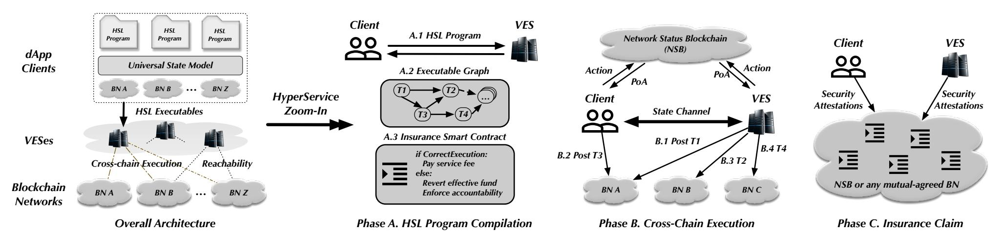
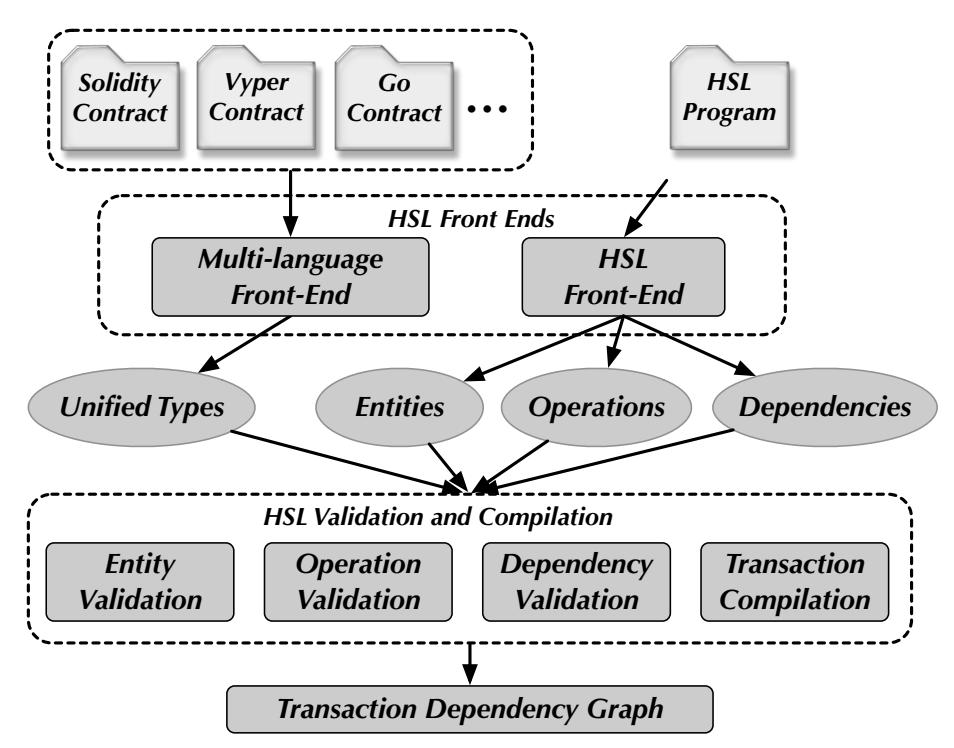
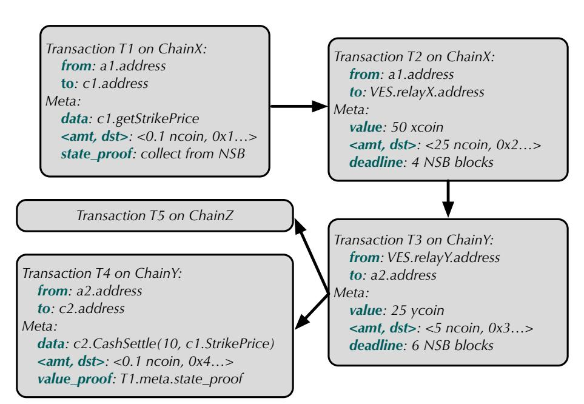
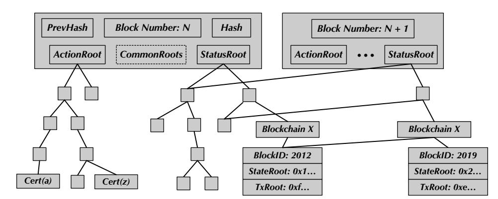
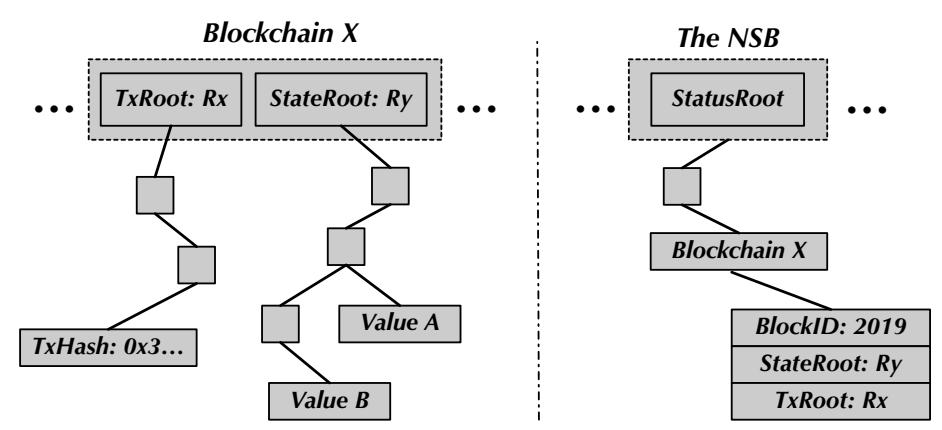
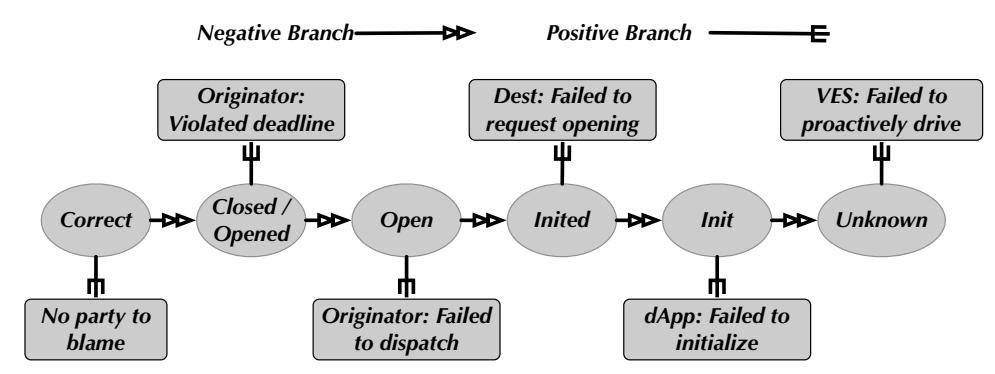
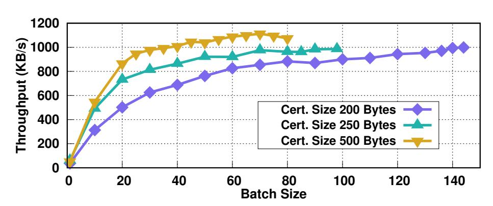

{0}------------------------------------------------

# HyperService: Interoperability and Programmability Across Heterogeneous Blockchains\*

Zhuotao Liu<sup>1,2</sup> Yangxi Xiang<sup>3</sup> Jian Shi<sup>4</sup> Peng Gao<sup>5</sup> Haoyu Wang<sup>3</sup>
Xusheng Xiao<sup>4,2</sup> Bihan Wen<sup>6</sup> Yih-Chun Hu<sup>1,2</sup>

<sup>1</sup>University of Illinois at Urbana-Champaign <sup>2</sup>HyperService Consortium

<sup>3</sup>Beijing University of Posts and Telecommunications <sup>4</sup>Case Western Reserve University

<sup>5</sup>University of California, Berkeley <sup>6</sup>Nanyang Technological University

hyperservice.team@gmail.com

#### **ABSTRACT**

Blockchain interoperability, which allows state transitions across different blockchain networks, is critical functionality to facilitate major blockchain adoption. Existing interoperability protocols mostly focus on atomic token exchange between blockchains. However, as blockchains have been upgraded from passive distributed ledgers into programmable state machines (thanks to smart contracts), the scope of blockchain interoperability goes beyond just token exchange. In this paper, we present HyperService, the first platform that delivers *interoperability* and *programmability* across heterogeneous blockchains. HyperService is powered by two innovative designs: (i) a developer-facing programming framework that allows developers to build cross-chain applications in a unified programming model; and (ii) a secure blockchain-facing cryptography protocol that provably realizes those applications on blockchains. We implement a prototype of HyperService in approximately 35,000 lines of code to demonstrate its practicality. Our experiment results show that (i) HyperService imposes reasonable latency, in order of seconds, on the end-to-end execution of cross-chain applications; (ii) the HyperService platform is scalable to continuously incorporate additional production blockchains.

#### **CCS CONCEPTS**

 $\bullet$  Security and privacy  $\rightarrow$  Distributed systems security; Security protocols.

#### **KEYWORDS**

Blockchain Interoperability; Smart Contract; Cross-chain dApps

#### 1 INTRODUCTION

Over the last few years, we have witnessed rapid growth of several flagship blockchain applications, such as the payment system Bitcoin [55] and the smart contract platform Ethereum [27]. Since then, considerable effort has been made to improve the performance and security of individual blockchains, such as more efficient consensus algorithms [3, 8, 32, 43], improving transaction rate by sharding [20, 44, 53, 62] and payment channels [37, 40, 54], enhancing the privacy for smart contracts [29, 39, 45], and reducing their vulnerabilities via program analysis [24, 46, 52].

As a result, in today's blockchain ecosystem, we see many distinct blockchains, falling roughly into the categories of public, private, and consortium blockchains [6]. In a world deluged with isolated blockchains, interoperability is power. Blockchain interoperability enables secure state transitions across different blockchains, which is invaluable for connecting the decentralized Web 3.0 [26]. Existing interoperability proposals [21, 36, 38, 63] mostly center around atomic token exchange between two blockchains, aiming to eliminate the requirement of centralized exchanges. However, since smart contracts executing on blockchains have transformed blockchains from append-only distributed ledgers into programmable state machines, we argue that token exchange is not the complete scope of blockchain interoperability. Instead, blockchain interoperability is complete only with programmability, allowing developers to write decentralized applications executable across those disconnected state machines.

We recognize at least two categories of challenges for simultaneously delivering programmability and interoperability. First, the programming model of cross-chain decentralized applications (or dApps) is unclear. In general, from developers' perspective, it is desirable that cross-chain dApps could preserve the same state-machine-based programming abstraction as single-chain contracts [61]. This, however, raises a virtualization challenge to abstract away the heterogeneity of smart contracts and accounts on different blockchains so that the interactions and operations among those contracts and accounts can be *uniformly* specified when writing cross-chain dApps.

Second, existing token-exchange oriented interoperability protocols, such as atomic cross-chain swaps (ACCS) [5], are not generic enough to realize cross-chain dApps. This is because the "executables" of those dApps could contain more complex operations than token transfers. For instance, our example dApp in § 2.3 invokes a smart contract using parameters obtained from smart contracts deployed on different blockchains. The complexity of this operation is far beyond mere token transfers. In addition, the executables of cross-chain dApps often contain transactions on different blockchains, and the correctness of dApps requires those transactions to be executed with certain preconditions and deadline constraints. Another technical challenge is to securely coordinate those transactions to enforce dApp correctness in a fully decentralized manner with zero trust assumptions.

To meet these challenges, we propose HyperService, the first platform for building and executing dApps across heterogeneous blockchains. At a very high level, HyperService is powered by two innovative designs: a developer-facing *programming framework* for

<sup>\*</sup>This is an extended version of the material originally published in ACM CCS 2019 [50].

{1}------------------------------------------------

<span id="page-1-0"></span>

Figure 1: The architecture of HyperService.

. . . . . . . . . . . . . . . . . . .

writing cross-chain dApps, and a blockchain-facing cryptography protocol to securely realize those dApps on blockchains. Within this programming framework, we propose Unified State Model (USM), a blockchain-neutral and extensible model to describe cross-chain dApps, and the HSL, a high-level programming language to write cross-chain dApps under the USM programming model. dApps written in HSL are further compiled into HyperService executables which shall be executed by the underlying cryptography protocol.

UIP (short for universal inter-blockchain protocol) is the cryptography protocol that handles the complexity of cross-chain execution. UIP is (i) *generic*, operating on any blockchain with a public transaction ledger, (ii) *secure*, the executions of dApps either finish with verifiable correctness or abort due to security violations, where misbehaving parties are held accountable, and (iii) *financially atomic*, meaning all involved parties experience almost zero financial losses, regardless of the execution status of dApps. UIP is fully trust-free, assuming no trusted entities.

**Contributions.** To the best of our knowledge, HyperService is the first platform that simultaneously offers *interoperability* and *programmability* across *heterogeneous* blockchains. Specifically, we make the following major contributions in this paper.

- (i) We propose the first programming framework for developing cross-chain dApps. The framework greatly facilitates dApp development by providing a virtualization layer on top of the underlying heterogeneous blockchains, yielding a unified model and a high-level language to describe and program dApps. Using our framework, a developer can easily write cross-chain dApps without implementing any cryptography.
- (ii) We propose UIP, the first generic blockchain interoperability protocol whose design scope goes beyond cross-chain token exchanges. Rather, UIP is capable of securely realizing complex cross-chain operations that involve smart contracts deployed on heterogeneous blockchains. We express the security properties of UIP via an ideal functionality  $\mathcal{F}_{\text{UIP}}$  and rigorously prove that UIP realizes  $\mathcal{F}_{\text{UIP}}$  in the Universal Composability (UC) framework [28].
- (iii) We implement a prototype of HyperService in approximately 35,000 lines of code, and evaluate the prototype with three categories of cross-chain dApps. Our experiments show that the end-to-end dApp execution latency imposed by HyperService is in the order of seconds, and the HyperService platform has sufficient capacity to continuously incorporate new production blockchains.

#### 2 HYPERSERVICE OVERVIEW

#### 2.1 Architecture

As depicted in Figure 1, architecturally, HyperService consists of four components. (i) *dApp Clients* are the gateways for dApps to interact with the HyperService platform. When designing HyperService, we intentionally make clients to be lightweight, allowing both mobile and web applications to interact with HyperService. (ii) Verifiable Execution Systems (VESes) conceptually work as blockchain drivers that compile the high-level dApp programs given by the dApp clients into blockchain-executable transactions, which are the runtime executables on HyperService. VESes and dApp clients employ the underlying UIP cryptography protocol to securely execute those transactions across different blockchains. UIP itself has two building blocks: (iii) the Network Status Blockchain (NSB) and (iv) the Insurance Smart Contracts (ISCs). The NSB, conceptually, is a *blockchain of blockchains* designed by HyperService to provide an objective and unified view of the dApps' execution status, based on which the ISCs arbitrate the correctness or violation of dApp executions in a trust-free manner. In case of exceptions, the ISCs financially revert all executed transactions to guarantee financial atomicity and hold misbehaved entities accountable.

# 2.2 Universal State Model

A blockchain, together with smart contracts (or dApps) executed on the blockchain, is often perceived as a state machine [61]. We desire to preserve the similar abstraction for developers when writing cross-chain dApps. Towards this end, we propose Unified State Model (USM), a blockchain-neutral and extensible model for describing state transitions across different blockchains, which in essential defines cross-chain dApps. USM realizes a virtualization layer to unify the underlying heterogeneous blockchains. Such virtualization includes: (i) blockchains, regardless of their implementations (e.g., consensus mechanisms, smart contract execution environment, programming languages, and so on), are abstracted as objects with public state variables and functions; (ii) developers program dApps by specifying desired operations over those objects, along with the relative ordering among those operations, as if all the objects were local to a single machine.

Formally, USM is defined as  $\mathcal{M} = \{\mathcal{E}, \mathcal{P}, C\}$  where  $\mathcal{E}$  is a set of *entities*,  $\mathcal{P}$  is a set of *operations* performed over those entities, and C is a set of constraints defining the *dependencies* of those operations. Entities are to describe the objects abstracted from

{2}------------------------------------------------

Table 1: Example of entities, operations and dependencies in USM

<span id="page-2-1"></span>

| Entity Kind | Attributes                                       | Operation Kind | Attributes                                          | Dependency Kind |
|-------------|--------------------------------------------------|----------------|-----------------------------------------------------|-----------------|
| account     | address, balance, unit                           | payment        | from, to, value, exchange rate                      | precondition    |
| contract    | address, state variables[], interfaces[], source | invocation     | interface, parameters[const, Contract.SV,], invoker | deadline        |

blockchains. All entities are conceptually local to  $\mathcal{M}$ , regardless of which blockchains they are obtained from. Entities come with *kinds*, and each entity kind has different attributes. The current version of USM defines two concrete kinds of entities, *accounts* and *contracts*, as tabulated in Table 1 (we discuss the extensions of USM in § 6.1). Specifically, an account entity is associated with a uniquely identifiable address, as well as its balance in certain units. A contract entity, besides its address, is further associated with a list of public attributes, such as state variables, callable interfaces, and its source code deployed on blockchains. Entity attributes are crucial to enforce the security and correctness of dApps during compilation, as discussed in § 2.3.

An operation in USM defines a step of computation performed over several entities. Table 1 lists two kinds of operations in USM: a *payment* operation that describes the balance updates between two account entities at a certain exchange rate; an *invocation* operation that describes the execution of a method specified by the interface of a contract entity using compatible parameters, whose values may be obtained from other contract entities' state variables.

Although operations are conceptually local, each operation is eventually compiled into one or more transactions on different blockchains, whose consensus processes are not synchronized. To honor the possible dependencies among events in distributed computing [47], USM, therefore, defines constraints to specify dependencies among operations. Currently, USM supports two kinds of dependencies: *preconditions* and *deadlines*, where an operation can proceed only if all its preconditioning operations are finished, and an operation must be finished within a bounded time interval after its dependencies are satisfied. Preconditions and deadlines offer desirable programming abstraction for dApps: (i) preconditions enable developers to organize their operations into a directed acyclic graph, where the state of upstream nodes is persistent and can be used by downstream nodes; (ii) deadlines are crucial to ensure the forward progress of dApp executions.

#### <span id="page-2-0"></span>2.3 HyperService Programming Language

To demonstrate the usage of USM, we develop HSL, a programming language to write cross-chain dApps under USM.

#### 2.3.1 An Introductory Example for HSL Programs

Financial derivatives are among the most commonly cited blockchain applications. Many financial derivatives rely on authentic data feed, *i.e.*, an *oracle*, as inputs. For instance, a standard call-option contract needs a genuine strike price. Existing oracles [13, 64] require a smart contract on the blockchain to serve as the front-end to interact with other client smart contracts. As a result, it is difficult to build a dependable and unbiased oracle that is simultaneously accessible to multiple blockchains, because we cannot simply deploy an oracle smart contract on each individual blockchain since synchronizing the execution of those oracle contracts requires blockchain interoperability, *i.e.*, we see a chicken-and-egg problem. This limitation, in

<span id="page-2-2"></span>1 # Import the source code of contracts written in different languages. 2 import ("broker.sol", "option.vy", "option.go") **3** # Entity definition. 4 # Attributes of a contract entity are implicit from its source code. 5 account a1 = ChainX::Account(0x7019..., 100, xcoin) 6 account a2 = ChainY::Account(0x47a1..., 0, ycoin) 7 account a3 = ChainZ::Account(0x61a2..., 50, zcoin) 8 contract c1 = ChainX::Broker(0xbba7...) 9 contract c2 = ChainY::Option(0x917f...) 10 contract c3 = ChainZ::Option(0xefed...) 11 # Operation definition. 12 op op1 invocation c1.GetStrikePrice() using a1 13 op op2 payment 50 xcoin from a1 to a2 with 1 xcoin as 0.5 ycoin op op3 invocation c2.CashSettle(10, c1.StrikePrice) using a2 15 op op4 invocation c3.CashSettle(5, c1.StrikePrice) using a3 **16** # Dependency definition.

18 op1 deadline 10 blocks; op2, op3 deadline default; op4 deadline 20 mins

Figure 2: A cross-chain Option dApp written in HSL.

turn, prevents dApps from spreading their business across multiple blockchains. For instance, a call-option contract deployed on Ethereum forces investors to exercise the option using Ether, but not in other cryptocurrencies.

As an introductory example, we shall see how conceptually simple, yet elegant, it is, from developers' perspective, to build a universal call-option dApp that allows investors to natively exercise options with the cryptocurrencies they prefer. The code snippet shown in Figure 2 is the HSL implementation for the referred dApp. In this dApp, both Option contracts deployed on blockchains *ChainY* and *ChainZ* rely on the same Broker contract on *ChainX* to provide the genuine strike price (lines 14 and 15 in Figure 2). Detailed HSL grammar is given in Grammar 1.

#### 2.3.2 HSL Program Compilation

<span id="page-2-4"></span><span id="page-2-3"></span>17 op1 before op2, op4; op3 after op2

The core of HyperService programming framework is the HSL compiler. The compiler performs two major tasks: (i) enforcing security and correctness checks on HSL programs and (ii) compiling HSL programs into blockchain-executable transactions.

One of the key differentiations of HyperService is that it allows dApps to natively define interactions and operations among smart contracts deployed on heterogeneous blockchains. Since these smart contracts could be written in different languages, HSL provides a multi-language front end to analyze the source code of those smart contracts. It extracts the type information of their public state variables and functions, and then converts them into the unified types defined by HSL (§ 3.1). This enables effective correctness checks on the HSL programs (§ 3.3). For instance, it ensures that all the parameters used in a contract *invocation* operation are compatible and verifiable, even if these arguments are extracted

{3}------------------------------------------------

from remote contracts written in languages different from that of the invoking contract.

Once a HSL program passes the syntax and correctness checks, the compiler will generate an *executable* for the program. The executable is structured in the form of a Transaction Dependency Graph, which contains (i) the complete information for computing a set of blockchain-executable transactions, (ii) the metadata of each transaction needed for correct execution, and (iii) the preconditions and deadlines of those transactions that honor the dependency constraints specified in the HSL program (§ 3.4).

In HyperService, the Verifiable Execution Systems (VESes) are the actual entities that own the HSL compiler and therefore resume the aforementioned compiler responsibilities. Because of this, VESes work as *blockchain drivers* that bridge our high-level programming framework with the underlying blockchains. Each VES is a distributed system providing trust-free service to compile and execute HSL programs given by dApp clients. VESes are trust-free because their actions taken during dApp executions are verifiable. Each VES defines its own service model, including its reachability (*i.e.*, the set of blockchains that the VES supports), service fees charged for correct executions, and insurance plans (*i.e.*, the expected compensation to dApps if the VES's execution is proven to be incorrect). dApps have full autonomy to select VESes that satisfy their requirements. In § 6.3, we lay out our visions for VESes.

Besides owning the HSL compiler, VESes also participate in the actual executions of HSL executables, as discussed below.

# 2.4 Universal Inter-Blockchain Protocol (UIP)

To correctly execute a dApp, all the transactions in its executable must be posted on blockchains for execution, and meanwhile their preconditions and deadlines are honored. Although this executing procedure is conceptually simple (thanks to the HSL abstraction), it is very challenging to enforce correct executions in a fully trust-free manner where (i) no trusted authority is allowed to coordinate the executions on different blockchains and (ii) no mutual trust between VESes and dApp clients are established.

To address this challenge, HyperService designs UIP, a cryptography protocol between VESes and dApp clients to securely execute HSL executables on blockchains. UIP can work on any blockchain with public ledgers, imposing no additional requirements such as their consensus protocols and contract execution environment. UIP provides strong security guarantees for executing dApps such that dApps are correctly executed only if the correctness is publicly verifiable by all stakeholders; otherwise, UIP holds the misbehaving parties accountable, and financially reverts all committed transactions to achieve financial atomicity.

UIP is powered by two innovative designs: the Network Status Blockchain (NSB) and the Insurance Smart Contract (ISC). The NSB is a blockchain designed by HyperService to provide objective and unified views on the status of dApp executions. On the one hand, the NSB consolidates the finalized transactions of all underlying blockchains into Merkle trees, providing unified representations for transaction status in form of verifiable Merkle proofs. On the other hand, the NSB supports Proofs of Actions (PoAs), allowing both dApp clients and VESes to construct proofs to certify their actions taken during cross-chain executions. The ISC is a code-arbitrator. It

takes transaction-status proofs constructed from the NSB as input to determine the correctness or violation of dApp executions, and meanwhile uses action proofs to determine the accountable parities in case of exceptions.

In § 4.6, we define the security properties of UIP via an ideal functionality and then rigorously prove that UIP realizes the ideal functionality in UC-framework [28].

# 2.5 Assumptions and Threat Model

We assume that the cryptographic primitives and the consensus protocol of all underlying blockchains are secure so that each of them can have the concept of transaction finality. On Nakamoto consensus based blockchains (typically permissionless), this is achieved by assuming that the probability of blockchain reorganizations drops exponentially as new blocks are appended (common-prefix property) [35]. On Byzantine tolerance based blockchains (usually permissioned), finality is guaranteed by signatures from a quorum of permissioned voting nodes. For a blockchain, if the NSB-proposed definition of transaction finality for the blockchain is accepted by users and dApps on HyperService, the operation (or trust) model (e.g., permissionless or permissioned) and consensus efficiency (i.e., the latency for a transaction to become final) of the blockchain have provably no impact on the security guarantees of our UIP protocol. We also assume that each underlying blockchain has a public ledger that allows external parties to examine and prove transaction finality and the *public* state of smart contracts.

The correctness of UIP relies on the correctness of the NSB. An example implementation of NSB is a permissioned blockchain, where any information on NSB becomes legitimate only if a quorum of consensus nodes that maintain the NSB have approved the information. We thus assume that at least  $\mathcal K$  consensus nodes of the NSB are honest, where  $\mathcal K$  is the quorum threshold (*e.g.*, the majority). In this design, an NSB node is not required to become either a full or light node for any of the underlying blockchains.

We consider a Byzantine adversary that interferes with our UIP protocol arbitrarily, including delaying and reordering network messages indefinitely, and compromising protocol participants. As long as at least one protocol participant is not compromised by the adversary, the security properties of UIP are guaranteed.

# 3 PROGRAMMING FRAMEWORK

The design of the HyperService programming framework centers around the HSL compiler. Figure 3 depicts the compilation workflow. The HSL compiler has two frond-ends: one for extracting entities, operations, and dependencies from a HSL program and one for extracting public state variables and methods from smart contracts deployed on blockchains. A unified type system is designed to ensure that smart contracts written in different languages can be abstracted as interoperable entities defined in the HSL program. Afterwards, the compiler performs semantic validations on all entities, operations and dependencies to ensure the security and correctness of the HSL program. Finally, the compiler produces an executable for the HSL program, which is structured in the form of a transaction dependency graph. We next describe the details of each component.

{4}------------------------------------------------

<span id="page-4-2"></span>

Figure 3: Workflow of HSL compilation.

# <span id="page-4-1"></span>3.1 Unified Type System

The USM is designed to provide a unified virtualization layer for developers to define *invocation* operations in their HSL programs, without handling the heterogeneity of contract entities. Towards this end, the programming framework internally defines a Unified Type System so that state variables and methods of all contract entities can be abstracted using the unified types when writing HSL programs. This enables the HSL compiler to ensure that all arguments specified in an *invocation* operation are *compatible* (§ 3.3).

Specifically, the unified type system defines nine elementary types, as shown in Table 2. Data types that are commonly used in smart contract programming languages will be mapped to these unified types during compilation. For example, Solidity does not fully support fixed-point number, but Vyper (decimal) and Go (float) do. Also, Vyper's string is fixed-sized (declared via string[Integer]), but Solidity's string is dynamically-sized (declared as string). Our multi-lang front-end recognizes these differences and performs type conversion to map all the numeric literals including integers and decimals to the *Numeric* type, and the strings to the *String* type. For types that are similar in Solidity, Vyper, and Go, such as Boolean, Map, and Struct, we simply map them to the corresponding types in our unified type system. Finally, Solidity and Vyper provide special types for representing contract addresses, which are mapped to the *Address* type. But Go does not provide a type for contract addresses, and thus Go's *String* type is mapped to the Address type. The mapping of language-specific types to the unified type system is tabulated in Table 2. Our unified type system is horizontally scalable to support additional strong-typed programming languages. Note that the use of complex data types as contract function parameters has not been fully supported yet in production. We thus leave complex types in HSL to future work.

# 3.2 HSL Language Design

The language constructs provided by HSL are coherent with USM, allowing developers to straightforwardly specify entities, operations, and dependencies in HSL programs. One additional construct, *import*, is added to import the source code of contract entities, as

<span id="page-4-3"></span>Table 2: Unified type mapping for Solidity, Vyper, and Go

| Туре     | Solidity       | Vyper                                    | Go                        |
|----------|----------------|------------------------------------------|---------------------------|
| Boolean  | bool           | bool                                     | bool                      |
| Numeric  | int, uint      | int128, uint256, deci-<br>mal, unit type | int, uint, uintptr, float |
| Address  | address        | address                                  | string                    |
| String   | string         | string                                   | string                    |
| Array    | array, bytes   | array, bytes                             | array, slice              |
| Мар      | mapping        | map                                      | map                       |
| Struct   | struct         | struct                                   | struct                    |
| Function | function, enum | def                                      | func                      |
| Contract | Contract       | file                                     | type                      |

```
\langle hsl \rangle
                                                            ::= (\langle import \rangle) + (\langle entity\_def \rangle) + (\langle op\_def \rangle) + (\langle dep\_def \rangle)^*
Contract Imports:
⟨import⟩
⟨file⟩
                                                                           'import'
⟨string⟩
                                                                                                               `(` \file\ (`,` \file\)* `)`
                                                            ::=
::=
Entity Definition:
⟨entity_def⟩
                                                                                                                                       (entity_name)
                                                                                                                                                                                                       '='
                                                                                                                                                                                                                            ⟨chain_name⟩ '::'
                                                          ::=
                                                                             (entity_type)
                                                                                |constructor|
  <entity_name> ::=
                                                                        `Chain' (id)

'Chain' (id)

'contract_type)'(' (address),((unit))?')'

'Account' | (id)

'account' | 'contract'
   (chaiń_name)
                                                         ::=
  \langle \mathit{constructor} \rangle
                                                            ::=
  ⟨contract_type⟩ ::=
 (entity_type)
                                                          ::=
Operation Definition:
                                                                            ⟨op_payment⟩ | ⟨op_invocation⟩
'op_⟨op_name⟩ 'payment' ⟨coin⟩ ⟨accts⟩ ⟨exchange⟩
  \langle op\_def \rangle
  (op_payment)
                                                          ::=
   (op_name)
                                                            ::=
                                                                             ⟨id⟩
                                                                             ⟨núm⟩ ⟨unit⟩
                                                            ::=
  (coin)
                                                                             from' (acct)' 'to' (acct)
   (accts)
                                                            ::=
                                                            ::=
                                                                             \langle id \rangle
  (acct)
                                                                            \{ia\}
\(\vert^i\) \(\langle coin\rangle \) \(\vert^i\) \(\vert^i\) \(\vert^i\) \(\vert^i\) \(\vert^i\) \(\vert^i\) \(\vert^i\) \(\vert^i\) \(\vert^i\) \(\vert^i\) \(\vert^i\) \(\vert^i\) \(\vert^i\) \(\vert^i\) \(\vert^i\) \(\vert^i\) \(\vert^i\) \(\vert^i\) \(\vert^i\) \(\vert^i\) \(\vert^i\) \(\vert^i\) \(\vert^i\) \(\vert^i\) \(\vert^i\) \(\vert^i\) \(\vert^i\) \(\vert^i\) \(\vert^i\) \(\vert^i\) \(\vert^i\) \(\vert^i\) \(\vert^i\) \(\vert^i\) \(\vert^i\) \(\vert^i\) \(\vert^i\) \(\vert^i\) \(\vert^i\) \(\vert^i\) \(\vert^i\) \(\vert^i\) \(\vert^i\) \(\vert^i\) \(\vert^i\) \(\vert^i\) \(\vert^i\) \(\vert^i\) \(\vert^i\) \(\vert^i\) \(\vert^i\) \(\vert^i\) \(\vert^i\) \(\vert^i\) \(\vert^i\) \(\vert^i\) \(\vert^i\) \(\vert^i\) \(\vert^i\) \(\vert^i\) \(\vert^i\) \(\vert^i\) \(\vert^i\) \(\vert^i\) \(\vert^i\) \(\vert^i\) \(\vert^i\) \(\vert^i\) \(\vert^i\) \(\vert^i\) \(\vert^i\) \(\vert^i\) \(\vert^i\) \(\vert^i\) \(\vert^i\) \(\vert^i\) \(\vert^i\) \(\vert^i\) \(\vert^i\) \(\vert^i\) \(\vert^i\) \(\vert^i\) \(\vert^i\) \(\vert^i\) \(\vert^i\) \(\vert^i\) \(\vert^i\) \(\vert^i\) \(\vert^i\) \(\vert^i\) \(\vert^i\) \(\vert^i\) \(\vert^i\) \(\vert^i\) \(\vert^i\) \(\vert^i\) \(\vert^i\) \(\vert^i\) \(\vert^i\) \(\vert^i\) \(\vert^i\) \(\vert^i\) \(\vert^i\) \(\vert^i\) \(\vert^i\) \(\vert^i\) \(\vert^i\) \(\vert^i\) \(\vert^i\) \(\vert^i\) \(\vert^i\) \(\vert^i\) \(\vert^i\) \(\vert^i\) \(\vert^i\) \(\vert^i\) \(\vert^i\) \(\vert^i\) \(\vert^i\) \(\vert^i\) \(\vert^i\) \(\vert^i\) \(\vert^i\) \(\vert^i\) \(\vert^i\) \(\vert^i\) \(\vert^i\) \(\vert^i\) \(\vert^i\) \(\vert^i\) \(\vert^i\) \(\vert^i\) \(\vert^i\) \(\vert^i\) \(\vert^i\) \(\vert^i\) \(\vert^i\) \(\vert^i\) \(\vert^i\) \(\vert^i\) \(\vert^i\) \(\vert^i\) \(\vert^i\) \(\vert^i\) \(\vert^i\) \(\vert^i\) \(\vert^i\) \(\vert^i\) \(\vert^i\) \(\vert^i\) \(\vert^i\) \(\vert^i\) \(\vert^i\) \(\vert^i\) \(\vert^i\) \(\vert^i\) \(\vert^i\) \(\vert^i\) \(\vert^i\) \(\vert^i\) \(\vert^i\) \(\vert^i\) \(\vert^i\) \(\vert^i\) \(\vert^i\) \(\vert^i\) \(\ve
    \langle exchange \rangle
\langle op_invocation \rangle ::= \langle call \rangle ::=
⟨arg⟩
⟨state_var⟩
                                                            ::=
                                                            ::=
Dependency Definition:
 \langle dep\_def \rangle
                                                                              \temp_deps\| \del_deps\
                                                            ::=
\(temp_deps\)
\(\temp_dep\)
                                                                             ⟨temp_dep⟩'(';'⟨temp_dep⟩)*
⟨op_name⟩ ('before' |
                                                            ::=
                                                                                                                                                                                             'after')
                                                                                                                                                                                                                                       ⟨op name⟩ (','
                                                            ::=
                                                                             (op_name))'
(del_dep) (';
 ⟨del_deps⟩
⟨del_dep⟩
⟨del_spec⟩
                                                                                                                                 \langle del\_dep \rangle
                                                            ::=
                                                                             \dop name\rangle(', '\dop name\rangle)* 'deadline' \del_spec\rangle
\dint\rangle 'blocks'| 'default' | \dint\rangle time_unit\rangle
                                                            ::=
```

Grammar 1: Representative BNF grammar of HSL

discussed below. Grammar 1 shows the representative rules of HSL. We omit the terminal symbols such as  $\langle id \rangle$  and  $\langle address \rangle$ .

**Contract Importing**. Developers use the  $\langle import \rangle$  rule to include the source code of contract entities. Depending on the programming language of an imported contract, HSL's multi-lang front end uses the corresponding parser to parse the source code, based on which it performs semantic validation (§ 3.3). For security purpose, the compiler should verify that the imported source code is consistent with the actual deployed code on blockchain, for instance, by comparing their compiled byte code.

**Entity Definition**. The  $\langle entity\_def \rangle$  rule specifies the definition of an *account* or a *contract* entity. An entity is defined via constructor, where the on-chain ( $\langle address \rangle$ ) of the entity is a required parameter. An *account* entity can be initialized with an optional unit ( $\langle unit \rangle$ ) to specify the cryptocurrency held by the account. All *contract* entities must have the corresponding contract objects/classes in one of the imported source code files. Each entity is assigned with a name ( $\langle entity\_name \rangle$ ) that can be used for defining operations.

**Operation Definition**. The  $\langle op\_def \rangle$  rule specifies the definition of a *payment* or an *invocation* operation. A *payment* operation  $(\langle op\_payment \rangle)$  specifies the transfer of a certain amount of coins  $(\langle coin \rangle)$  between two accounts that may live on different blockchains

{5}------------------------------------------------

 $(\langle accts \rangle)$ . Note that no new coins on any blockchains are ever created during the operation. The  $\langle exchange \rangle$  rule is used to specify the exchange rate between the coins held by the two accounts. An *invocation* operation  $(\langle op\_invocation \rangle)$  specifies calling one contract entity's public method with certain arguments  $(\langle call \rangle)$ . The arguments passed to a method invocation can be literals  $(\langle int \rangle, \langle float \rangle, \langle string \rangle)$ , and state variables  $(\langle state\_var \rangle)$  of other contract entities. When using state variables, semantic validation is required (§ 3.3). **Dependency Definition**. The  $\langle dep\_def \rangle$  specifies the rule of defining preconditions and deadlines for operations. A *precondition*  $(\langle temp\_deps \rangle)$  specifies the temporal constraints for the execution order of operations. A *deadline*  $(\langle del\_deps \rangle)$  specifies the deadline constraints of each operation. The deadline dependency may be given either using the number of blocks on NSB  $(\langle int \rangle blocks)$  or in absolute time  $(\langle int \rangle \langle time\_unit \rangle)$ , as explained in § 3.4.

# <span id="page-5-0"></span>3.3 Semantic Validation

The compiler performs two types of semantic validation to ensure the security and correctness of HSL programs. First, the compiler guarantees the compatibility and verifiability of the arguments used in invocation operations, especially when those arguments are obtained from other contract entities. For compatibility check, the compiler performs type checking to ensure the types of arguments and the types of method parameters are mapped to the same unified type. For verifiability check, the compiler ensures that only literals and state variables that are publicly stored on blockchains are eligible to be used as arguments in *invocation* operations. For example, the return values of method calls to a contract entity are not eligible if these results are not persistent on blockchains. This requirement is necessary for the UIP protocol to construct publicly verifiable attestations to prove that correct values are used to invoking contracts during actual on-chain execution. Second, the compiler performs dependency validation to make sure that the dependency constraints defined in a HSL program uniquely specify a directed acyclic graph connecting all operations. This ensures that no conflicting temporal constraints are specified.

# <span id="page-5-1"></span>3.4 HSL Program Executables

Once a HSL program passes all validations, the HSL compiler generates executables for the program in form of a transaction dependency graph  $\mathcal{G}_T$ . Each vertex of  $\mathcal{G}_T$ , referred to as a *transaction wrapper*, contains the complete information to compute an on-chain transaction executable on a specific blockchain, as well as additional metadata for the transaction. The edges in  $\mathcal{G}_T$  define the preconditioning requirements among transactions, which are consistent with the dependency constraints specified by the HSL program. Figure 4 show the  $\mathcal{G}_T$  generated for the HSL program in Figure 2.

A transaction wrapper is in form of  $\mathcal{T}:=[\text{from},\text{to},\text{seq},\text{meta}],$  where the pair <from, to> decides the sending and receiving addresses of the on-chain transaction, seq (omitted in Figure 4) represents the sequence number of  $\mathcal{T}$  in  $\mathcal{G}_T$ , and meta stores the structured and customizable metadata for  $\mathcal{T}$ . Below we explain the fields of meta. First, to achieve financial atomicity, meta must populate a tuple  $\langle \text{amt}, \text{dst} \rangle$  for fund reversion. In particular, amt specifies the total value that the *from* address has to spend when  $\mathcal{T}$  is committed on its destination blockchain, which includes both the

<span id="page-5-2"></span>

Figure 4:  $G_T$  generated for the example HSL program.

explicitly paid value in  $\mathcal{T}$ , as well as any gas fee. If the entire execution fails with exceptions whereas  $\mathcal{T}$  is committed, the dst account is guaranteed to receive the amount of fund specified in amt. As we shall see in § 4.4, the fund reversion is handled by the Insurance Smart Contract (ISC). Therefore, the unit of amt (represented as *ncoin* in Figure 4) is given based on the cryptocurrency used by the blockchain where the ISC is deployed, and the dst should live on the hosting blockchain as well.

Second, for a transaction (such as T1) whose resulting state is subsequently used by other downstream transactions (such as T4), its meta needs to be populated with a corresponding state proof. This proof should be collected from the transaction's destination blockchain after the transaction is finalized (c.f., § 4.2.3). Third, a cross-chain payment operation in the HSL program results in multiple transactions in  $\mathcal{G}_T$ . For instance, to realize the op1 in Figure 2, two individual transactions, involving the relay accounts owned by the VES, are generated. As blockchain drivers, each VES is supposed to own some accounts on all blockchains that it has visibility so that the VES is able to send and receive transactions on those blockchains. For instance, in Figure 4, the relayX and relayY are two accounts used by the VES to bridge the balance updates between ChainX::a1 and ChainY::a2. Because of those VES-owned accounts,  $\mathcal{G}_T$  is in general VES-specific.

Finally, the deadlines of transactions could be specified using the number of blocks on the NSB. This is because the NSB constructs a unified view of the status of all underlying blockchains and therefore can measure the execution time of each transaction. Specifically, the deadline of a transaction  $\mathcal{T}$  is measured as the number of blocks between two NSB blocks  $\mathcal{B}_1$  and  $\mathcal{B}_2$  (including  $\mathcal{B}_2$ ), where  $\mathcal{B}_1$  proves the finalization of  $\mathcal{T}$ 's last preconditioned transaction and  $\mathcal{B}_2$  proves the finalization of  $\mathcal{T}$  itself. We explain in detail how the finality proof is constructed based on NSB blocks in § 4.2.2. Transaction deadlines are indeed enforced by the ISC using the number of NSB blocks. Note that to improve expressiveness, the HSL language also allows developers to define deadlines in time intervals (e.g., minutes). The compiler will then convert those time intervals into numbers of NSB blocks.

In summary, the executable produced by the HSL compiler defines the blueprint of cross-blockchain execution to realize the HSL

{6}------------------------------------------------

program. It is the input instructions that direct the underlying cryptography protocol UIP, as detailed below.

#### 4 UIP DESIGN DETAIL

UIP is the cryptography protocol that executes HSL program executables. The main protocol Prot<sub>UIP</sub> is divided into *five* preliminary protocols. In particular, Prot<sub>VES</sub> and Prot<sub>CLI</sub> define the execution protocols implemented by VESes and dApp clients, respectively. Prot<sub>NSB</sub> and Prot<sub>ISC</sub> are the protocol realization of the NSB and ISC, respectively. Lastly, Prot<sub>UIP</sub> includes Prot<sub>BC</sub>, the protocol realization of a general-purposed blockchain. Overall, Prot<sub>UIP</sub> has two phases: the execution phase where the transactions specified in the HSL executables are posted on blockchains and the insurance claim phase where the execution correctness or violation is arbitrated.

#### 4.1 Protocol Preliminaries

#### <span id="page-6-0"></span>4.1.1 Runtime Transaction State

During the execution phase, a transaction may be in any of the following state {unknown, init, inited, open, opened, closed}, where a latter state is considered more *advanced* than a former one. The state of each transaction must be gradually promoted following the above sequence. For each state (except for the unknown), Prot<sub>UIP</sub> produces a corresponding attestation to prove the state. When the execution phase terminates, the final execution status of the HSL program is collectively decided by the state of all transactions, based on which Prot<sub>ISC</sub> arbitrates its correctness or violation.

#### <span id="page-6-2"></span>4.1.2 Off-Chain State Channels

The protocol exchange between Prot<sub>VES</sub> and Prot<sub>CLI</sub> can be conducted via off-chain state channels for low latency. One challenge, however, is that it is difficult to enforce accountability for non-closed transactions without preserving the execution steps by both parties. To address this issue, Prot<sub>UIP</sub> proposes Proof of Actions (PoAs), allowing Prot<sub>VES</sub> and Prot<sub>CLI</sub> to stake their execution steps on NSB. As a result, the NSB is treated as a publicly-observable *fallback* communication medium for the off-chain channel. The benefit of this dual-medium design is that the protocol exchange between Prot<sub>VES</sub> and Prot<sub>CLI</sub> can still proceed agilely via off-chain channels in typical scenarios, whereas the full granularity of their protocol exchange is preserved on the NSB in case of exceptions, eliminating the ambiguity for accountability enforcement.

As mentioned in § 4.1.1, Prot<sub>UIP</sub> produces security attestations to prove the runtime state of transactions. As we shall see below, an attestation may come in two forms: a certificate, denoted by Cert, signed by Prot<sub>VES</sub> or/and Prot<sub>CLI</sub> during their off-chain exchange, or an *on-chain* Merkle proof, denoted by Merk, constructed using the NSB and underlying blockchains. An Cert and its corresponding Merk are treated equivalently by the Prot<sub>ISC</sub> in code arbitration.

#### <span id="page-6-3"></span>4.1.3 Architecture of the NSB

The NSB is a blockchain designed to provide an objective view on the execution status of dApps. Figure 5 depicts the architecture of NSB blocks. Similar to typical blockchain blocks, an NSB block contains several common fields, such as the hash fields to link blocks together and the Merkle trees to store transactions and state. To

<span id="page-6-1"></span>

Figure 5: The architecture of NSB blocks.

support the extra functionality of the NSB, an NSB block contains two additional Merkle tree roots: StatusRoot and ActionRoot.

StatusRoot is the root of a Merkle tree (referred as StatusMT) that stores *transaction status* of underlying blockchains. The NSB represents the transaction status of a blockchain based on the Tx-Roots and StateRoots retrieved from the blockchain's public ledger. Although the exact namings may vary on different blockchains, in general, the TxRoot and StateRoot in a blockchain block represent the root of a Merkle tree storing transactions and storage state (*e.g.*, account balance, contract state), respectively. Note that the NSB only stores *relevant* blockchain state, where a blockchain block is considered to be relevant if the block packages at least one transaction that is part of any dApp executables.

ActionRoot is the root of a Merkle tree (referred to as ActionMT) whose leaf nodes store certificates computed by VESes and dApp clients. Each certificate represents a certain step taken by either the VES or the dApp client during the execution phase. To prove such an action, a party needs to construct a Merkle proof to demonstrate that the certificate mapped to the action can be linked to a committed block on the NSB. These PoAs are crucial for the ISC to enforce accountability if the execution fails. Since the information of each ActionMT is static, we lexicographically sort the ActionMT to achieve fast search and convenient proof of non-membership.

Note that the construction of StatusMT ensures that each underlying blockchain can have a dedicated subtree for storing its transaction status. This makes the NSB *shardable on the granularity of individual blockchains*, ensuing that the NSB is horizontally scalable as HyperService continuously incorporates additional blockchains. Prot<sub>NSB</sub>, discussed in § 4.5, is the protocol that specifies the detailed construction of both roots and guarantees their correctness.

#### 4.2 Execution Protocol by VESes

The full protocol of Prot<sub>VES</sub> is detailed in Figure 6. Below we clarify some technical subtleties.

#### 4.2.1 Post Compilation and Session Setup

After  $\mathcal{G}_T$  is generated,  $\operatorname{Prot}_{VES}$  initiates an execution session for  $\mathcal{G}_T$  in the PostCompiliation daemon. The primary goal of the initialization is to create and deploy an insurance contract to protect the execution of  $\mathcal{G}_T$ . Towards this end,  $\operatorname{Prot}_{VES}$  interacts with the protocol  $\operatorname{Prot}_{ISC}$  to create the insurance *contract* for  $\mathcal{G}_T$ , and further deploys the *contract* on NSB after the dApp client  $\mathcal{D}$  agrees on the *contract*. Throughout the paper,  $\operatorname{Cert}([*]; \operatorname{Sig})$  represents a signed certificate proving that the signing party agrees on the value

{7}------------------------------------------------

```
1 Init: Data := ∅
                                                                                                                                                          call \mathsf{Prot}_{\mathsf{NSB}}.\mathsf{AddAction}(\mathsf{Cert}^{\mathsf{id}}_{\mathcal{T}}) to prove \mathsf{Cert}^{\mathsf{id}}_{\mathcal{T}} is sent
                                                                                                                                                53
 2 Daemon PostCompiliation():
                                                                                                                                                          update S_{Cert}.Add(Cert_{\mathcal{T}}^{id}) and \mathcal{T}.state := inited
                                                                                                                                                54
          generate the session ID sid \leftarrow \{0, 1\}^{\lambda}
 3
                                                                                                                                                          non-blocking wait until \mathsf{Prot}_{\mathsf{NSB}}.\mathsf{MerkleProof}(\mathsf{Cert}^{\mathsf{id}}_{\mathcal{T}}) returns \mathsf{Merk}^{\mathsf{id}}_{\mathcal{T}}
                                                                                                                                                55
          call [cid, contract] := Prot_{ISC}.CreateContract(\mathcal{G}_T)
 4
                                                                                                                                                          update S_{\mathsf{Merk}}.Add(\mathsf{Merk}_{\mathcal{T}}^{\mathsf{id}})
                                                                                                                                                56
         send Cert([sid, \mathcal{G}_T, contract]; Sig_{\text{sid}}^{\mathcal{V}}) to Prot<sub>CLI</sub> for approval
 5
                                                                                                                                                     Upon Receive RInitedTrans(Cert_{\mathcal{T}}^{id}) public:
                                                                                                                                                                                                                                                                 Southbound
                                                                                                                                                57
         halt until Cert([sid, \mathcal{G}_T, contract]; Sig_{\text{sid}}^{\mathcal{V}}, Sig_{\text{sid}}^{\mathcal{D}}) is received
 6
                                                                                                                                                          assert \mathsf{Cert}^\mathsf{id}_{\mathcal{T}} has the valid form of \mathsf{Cert}([T,\mathsf{inited},\mathsf{sid},\mathcal{T}];\mathsf{Sig}^\mathcal{D}_\mathsf{sid})
                                                                                                                                                58
          package contract as a valid transaction contract
 7
                                                                                                                                                          (\_, \_, S_{Cert}, S_{Merk}) := Data[sid]; abort if not found
                                                                                                                                                59
         call Prot<sub>NSB</sub>.Exec(contract) to deploy the contract
 8
                                                                                                                                                          abort if the \operatorname{Cert}_{\mathcal{T}}^{\iota} corresponding to \operatorname{Cert}_{\mathcal{T}}^{\iota \mathsf{d}} is not in S_{\operatorname{Cert}}
                                                                                                                                                60
          halt until contract is initialized on Prot<sub>NSB</sub>
 9
                                                                                                                                                          assert T is correctly associated with the wrapper {\mathcal T}
                                                                                                                                                61
          call Prot<sub>ISC</sub>. StakeFund to stake the required funds in Prot<sub>ISC</sub>
10
                                                                                                                                                          get ts_{open} := Prot_{NSB}.BlockHeight()
                                                                                                                                                62
         halt until \mathcal{D} has staked its required funds in Prot<sub>ISC</sub>
11
                                                                                                                                                          compute Cert_{\mathcal{T}}^o := Cert([T, open, sid, \mathcal{T}, ts_{open}]; Sig_{sid}^V)
                                                                                                                                                63
          initialize Data[sid] := {\mathcal{G}_T, cid, S_{Cert} = \emptyset, S_{Merk} = \emptyset}
12
                                                                                                                                                          call \mathsf{Prot}_\mathsf{CLI}.\mathsf{OpenTrans}(\mathsf{Cert}^o_\mathcal{T}) to request opening for \mathcal T
                                                                                                                                                64
     Daemon Watching(sid, {Prot<sub>BC</sub>, ...}) private:
13
                                                                                                                                                          call Prot_{NSB}.AddAction(Cert_{\mathcal{T}}^{o}) to prove Cert_{\mathcal{T}}^{o} is sent
                                                                                                                                                65
14
          (\mathcal{G}_T, \_, S_{Cert}, S_{Merk}) := Data[sid]; abort if not found
                                                                                                                                                          update S_{Cert}.Add(Cert_{\mathcal{T}}^{o}) and \mathcal{T}.state := open
                                                                                                                                                66
         for each \mathcal{T} \in \mathcal{G}_T:
15
                                                                                                                                                67
                                                                                                                                                          non-blocking wait until Prot<sub>NSB</sub>.MerkleProof(\mathsf{Cert}^o_\mathcal{T}) returns \mathsf{Merk}^o_\mathcal{T}
              continue if \mathcal{T}.state is not opened
16
                                                                                                                                                          update S_{\text{Merk}}. Add(Merk_{\tau}^{o})
                                                                                                                                                68
              identify \mathcal{T}'s on-chain counterpart \widetilde{T}
17
                                                                                                                                                         fpon Receive OpenTrans(Cert_T^o) public:
                                                                                                                                                                                                                                                                Northbound
                                                                                                                                                69
              continue if Prot_{BC}. Status(\overline{T}) is not committed
18
                                                                                                                                                          assert \mathsf{Cert}_T^o has valid form of \mathsf{Cert}([\widetilde{T},\mathsf{open},\mathsf{sid},\mathcal{T},\mathsf{ts}_\mathsf{open}];\mathsf{Sig}_\mathsf{sid}^\mathcal{D})
                                                                                                                                                70
              get ts_{closed} := Prot_{NSB}.BlockHeight()
19
                                                                                                                                                          (\_, \_, S_{Cert}, S_{Merk}) := Data[sid]; abort if not found
                                                                                                                                                71
              compute C_{\text{closed}}^{\mathcal{T}} := \text{Cert}([\widetilde{T}, \text{closed}, \text{sid}, \mathcal{T}, \text{ts}_{\text{closed}}], \text{Sig}_{\text{sid}}^{\mathcal{V}})
20
                                                                                                                                                          abort if the \operatorname{Cert}_T^{\operatorname{id}} corresponding to \operatorname{Cert}_T^o is not in S_{\operatorname{Cert}}
                                                                                                                                                72
              call \mathsf{Prot}_{\mathsf{CLI}}.\mathsf{CloseTrans}(C^{\mathcal{T}}_{\mathsf{closed}}) to negotiate the closed attestation
21
                                                                                                                                                          assert ts<sub>open</sub> is within a bounded range with Prot<sub>NSB</sub>.BlockHeight()
                                                                                                                                                73
              call Prot_{BC}. MerkleProof(T) to obtain a finalization proof for T
22
                                                                                                                                                          compute \mathsf{Cert}_T^{\mathsf{od}} := \mathsf{Cert}([\widetilde{T}, \mathsf{open}, \mathsf{sid}, \mathcal{T}, \mathsf{ts}_{\mathsf{open}}]; \mathsf{Sig}_{\mathsf{sid}}^{\mathcal{D}}, \mathsf{Sig}_{\mathsf{sid}}^{\mathcal{V}})
                                                                                                                                                74
23
              denote the finalization proof as \mathsf{Merk}^{c_1}_{\mathcal{T}} (Figure 7)
                                                                                                                                                          call Prot_{BC}.Exec(\widetilde{T}) to trigger on-chain execution
                                                                                                                                                75
              update S_{\mathsf{Cert}}.\mathsf{Add}(C^{\mathcal{T}}_{\mathsf{closed}}) and S_{\mathsf{Merk}}.\mathsf{Add}(\mathsf{Merk}^{c_1}_{\mathcal{T}})
24
                                                                                                                                                          call Prot_{CLI}. Opened Trans (Cert_T^{od}) to acknowledge request
                                                                                                                                                76
25 Daemon Watching(sid, Prot<sub>NSB</sub>) private:
                                                                                                                                                          call Prot_{NSB}.AddAction(Cert_T^{od}) to prove Cert_T^{od} is sent
                                                                                                                                                77
          (\mathcal{G}_T, \_, S_{Cert}, S_{Merk}) := Data[sid]; abort if not found
26
                                                                                                                                                          update S_{Cert}.Add(Cert_T^{od}) and \mathcal{T}.state := opened
          watch four types of attestations {Cert<sup>id</sup>, Cert<sup>o</sup>, Cert<sup>od</sup>, Cert<sup>c</sup>}
                                                                                                                                                78
27
                                                                                                                                                          non-blocking wait until Prot_{NSB}. Merkle Proof(Cert_T^{od}) returns Merk_T^{od}
          process fresh attestations via corresponding handlers (see below)
                                                                                                                                                79
28
          # Retrieve alternative attestations if necessary.
                                                                                                                                                          update S_{Merk}.Add(Merk_T^{od})
29
                                                                                                                                                80
         for each \mathcal{T} \in \mathcal{G}_T:
                                                                                                                                                         [pon Receive OpenedTrans(Cert_T^{od}) public:
30
                                                                                                                                                                                                                                                                 Southbound
                                                                                                                                                81
              if \mathcal{T}.state = opened and \mathsf{Merk}^{c_1}_{\mathcal{T}} \in S_{\mathsf{Merk}}:
31
                                                                                                                                                          ast. \operatorname{Cert}_T^{\operatorname{od}} has valid form of \operatorname{Cert}([\widetilde{T}, \operatorname{open}, \operatorname{sid}, \mathcal{T}, \operatorname{ts_{\operatorname{open}}}]; \operatorname{Sig}_{\operatorname{sid}}^{\mathcal{V}}, \operatorname{Sig}_{\operatorname{sid}}^{\mathcal{D}})
                                                                                                                                                82
                  retrieve the roots [R, ...] of the proof \mathsf{Merk}^{c_1}_{\mathcal{T}}
32
                                                                                                                                                          (\_, \_, S_{Cert}, \_) := Data[sid]; abort if not found
                                                                                                                                                83
                  call \operatorname{Prot}_{NSB}. Merkle\operatorname{Proof}([R, \ldots]) to obtain a status proof \operatorname{Merk}_{\mathcal{T}}^{c_2}
                                                                                                                                                          abort if the \mathsf{Cert}_T^o corresponding to \mathsf{Cert}_T^\mathsf{od} is not in S_\mathsf{Cert}
33
                                                                                                                                                84
                  continue if Merk_{\mathcal{T}}^{c_2} is not available yet on Prot_{NSB}
                                                                                                                                                          update S_{Cert}.Add(Cert_T^{od}) and \mathcal{T}.state := opened
34
                                                                                                                                                85
                  compute the complete proof \mathsf{Merk}^c_{\mathcal{T}} := [\mathsf{Merk}^{c_1}_{\mathcal{T}}, \mathsf{Merk}^{c_2}_{\mathcal{T}}]
                                                                                                                                                     Upon Receive CloseTrans(C_{\mathsf{closed}}^{\mathcal{T}}) public:
35
                                                                                                                                                                                                                                                               Bidirectional
                                                                                                                                                86
                  update \mathcal{T}.state := closed and S_{Merk}.Add(Merk_{\mathcal{T}}^{c})
36
                                                                                                                                                          assert C_{\text{closed}}^{\mathcal{T}} has valid form of \operatorname{Cert}([\widetilde{T}, \operatorname{closed}, \operatorname{sid}, \mathcal{T}, \operatorname{ts}_{\operatorname{closed}}], \operatorname{Sig}_{\operatorname{sid}}^{\mathcal{D}})
                                                                                                                                                87
          compute eligible transaction set S using the current state of G_T
37
                                                                                                                                                          assert \widetilde{T} is finalized on its destination blockchain and obtain \mathsf{Merk}^{c_1}_{\mathcal{T}}
                                                                                                                                                88
         for each \mathcal{T} \in \mathcal{S}:
38
                                                                                                                                                          assert ts<sub>closed</sub> is within a bounded margin with Prot<sub>NSB</sub>.BlockHeight()
                                                                                                                                                89
              continue if \mathcal{T}.state is not unknown
39
                                                                                                                                                          (\_, \_, S_{Cert}, S_{Merk}) := Data[sid]; abort if not found
                                                                                                                                                90
              if \mathcal{T}.from = Prot<sub>CLI</sub>:
40
                                                                                                                                                          \text{compute } \mathbf{Cert}^{c}_{\mathcal{T}} \coloneqq \mathbf{Cert}([\widetilde{T}, \mathsf{closed}, \mathsf{sid}, \, \mathcal{T}, \, \mathsf{ts_{closed}}], \, \mathsf{Sig}^{\mathcal{D}}_{\mathsf{sid}}, \, \mathsf{Sig}^{\mathcal{V}}_{\mathsf{sid}})
                                                                                                                                                91
                  compute \operatorname{Cert}_{\mathcal{T}}^{i} := \operatorname{Cert}([\mathcal{T}, \operatorname{init}, \operatorname{sid}]; \operatorname{Sig}_{\operatorname{sid}}^{V})
41
                                                                                                                                                          call Prot_{CLI}. Closed Trans (Cert_T^c) to acknowledged request
                                                                                                                                                92
                  call Prot_{CLI}.InitTrans(Cert_{T}^{i}) to request initialization
42
                                                                                                                                                          update S_{\mathsf{Cert}}. Add(\mathsf{Cert}_T^c), S_{\mathsf{Merk}}. Add(\mathsf{Merk}_{\mathcal{T}}^{c_1}) and \mathcal{T}. state := closed
                                                                                                                                                93
                  call Prot_{NSB}.AddAction(Cert_{\mathcal{T}}^{i}) to prove Cert_{\mathcal{T}}^{i} is sent
43
                                                                                                                                                         Ipon Receive ClosedTrans(\frac{Cert_T^c}{T}) public:
                                                                                                                                                                                                                                                               Bidirectional
                                                                                                                                                94
                  update S_{\text{Cert}}.Add(\text{Cert}_{\mathcal{T}}^{i}) and \mathcal{T}.state := init
44
                                                                                                                                                          ast. \operatorname{Cert}_T^c has valid form of \operatorname{Cert}([\widetilde{T}, \operatorname{closed}, \operatorname{sid}, \mathcal{T}, \operatorname{ts}_{\operatorname{closed}}], \operatorname{Sig}_{\operatorname{sid}}^{\mathcal{V}}, \operatorname{Sig}_{\operatorname{sid}}^{\mathcal{D}}]
                                                                                                                                                95
                  non-blocking wait until \operatorname{Prot}_{\operatorname{NSB}}. Merkle\operatorname{Proof}(\operatorname{Cert}_{\mathcal{T}}^{i}) rt. \operatorname{Merk}_{\mathcal{T}}^{i}
45
                                                                                                                                                          (\_, \_, S_{Cert}, \_) := Data[sid]; abort if not found
                                                                                                                                                96
                  update S_{\text{Merk}}.Add(Merk_{\mathcal{T}}^{i})
46
                                                                                                                                                          abort if Cert([T, closed, sid, \mathcal{T}, ts<sub>closed</sub>], Sig_{\text{sid}}^{\mathcal{V}}) is not in S_{\text{Cert}}
                                                                                                                                                97
              else: call self. SInitedTrans(sid, \mathcal{T})
47
                                                                                                                                                          update S_{Cert}.Add(Cert_T^c) and T.state := closed
                                                                                                                                                98
48 Upon Receive SlnitedTrans(sid, \mathcal{T}) private:
                                                                                                                Northbound
                                                                                                                                                99 Daemon Redeem(sid) private:
         (\mathcal{G}_T, \_, S_{Cert}, S_{Merk}) := Data[sid]; abort if not found
49
                                                                                                                                                          # Invoke the insurance contract periodically
                                                                                                                                               100
          compute and sign the on-chain counterpart T for \mathcal{T}
50
                                                                                                                                                          (\mathcal{G}_T, \operatorname{cid}, S_{\operatorname{Cert}}, S_{\operatorname{Merk}}) := \operatorname{Data}[\operatorname{sid}]; \text{ abort if not found}
                                                                                                                                               101
          compute \operatorname{Cert}_{\mathcal{T}}^{\operatorname{id}} := \operatorname{Cert}([\widetilde{T}, \operatorname{inited}, \operatorname{sid}, \mathcal{T}]; \operatorname{Sig}_{\operatorname{sid}}^{\mathcal{V}})
51
                                                                                                                                                          for each unclaimed T \in \mathcal{G}_T:
                                                                                                                                               102
         call \mathsf{Prot}_{\mathsf{CLI}}.\mathsf{InitedTrans}(\mathsf{Cert}^\mathsf{id}_\mathcal{T}) to request opening of initialized \mathcal{T}
52
                                                                                                                                                              get the Cert_{\mathcal{T}} from S_{Cert} \cup S_{Merk} with the most advanced state
                                                                                                                                               103
                                                                                                                                                              call Prot_{ISC}.InsuranceClaim(cid, Cert_T) to claim insurance
                                                                                                                                              104
```

Figure 6: Protocol description of of  $Prot_{VES}$ . Gray background denotes non-blocking operations triggered by status updates on  $Prot_{NSB}$ . Handlers annotated with *northbound* and *southbound* process transactions originated from  $Prot_{VES}$  and  $Prot_{CLI}$ , respectively. Handlers annotated with *bidirectional* are shared by all transactions.

{8}------------------------------------------------

enclosed in the certificate. We use  $\operatorname{Sig}_{sid}^{\mathcal{V}}$  and  $\operatorname{Sig}_{sid}^{\mathcal{D}}$  to represent the signature by  $\operatorname{Prot}_{VES}$  and  $\operatorname{Prot}_{CLI}$ , respectively.

Additionally, both  $Prot_{VES}$  and  $Prot_{CLI}$  are required to deposit sufficient funds to  $Prot_{ISC}$  to ensure that  $Prot_{ISC}$  holds sufficient funds to financially revert all committed transactions regardless of the step at which the execution aborts prematurely. Intuitively, each party would need to stake at least the total amount of incoming funds to the party *without* deducting the outgoing funds. This strawman design, however, require high stakes. More desirably, considering the dependency requirements in  $\mathcal{G}_T$ , an party  $\mathcal{X}$  ( $Prot_{VES}$  or  $Prot_{CLI}$ ) only needs to stake

$$\max_{s \in \mathcal{G}_S} \sum_{\mathcal{T} \in s \ \land \ \mathcal{T}. to = \mathcal{X}} \mathcal{T}. meta.amt - \sum_{\mathcal{T} \in s \ \land \ \mathcal{T}. from = \mathcal{X}} \mathcal{T}. meta.amt$$

where  $G_S$  is the set of all committable subsets in  $G_T$ , where a subset  $s \subseteq G_T$  is *committable* if, whenever  $T \in s$ , all preconditions of T are also in s. For clarity of notation, throughout the paper, when saying T.from =Prot<sub>VES</sub> or T is originated from Prot<sub>VES</sub>, we mean that T is sent and signed by an account owned by Prot<sub>VES</sub>. Likewise, T.from =Prot<sub>CLI</sub> indicates that T is sent from an account entity defined in the HSL program. Prot<sub>ISC</sub> refunds any remaining funds after the contract is terminated.

After the *contract* is instantiated and sufficiently staked,  $Prot_{VES}$  initializes its internal bookkeeping for the session. The two notations  $S_{Cert}$  and  $S_{Merk}$  represent two sets that store the signed certificates received via off-chain channels and on-chain Merkle proofs constructed using  $Prot_{NSB}$  and  $Prot_{BC}$ .

#### <span id="page-8-1"></span>4.2.2 Protocol Exchange for Transaction Handling

In  $\operatorname{Prot}_{\operatorname{VES}}$ , SInitedTrans and OpenTrans are two handlers processing *northbound* transactions which originates from  $\operatorname{Prot}_{\operatorname{VES}}$ . The SInitedTrans handling for  $\mathcal T$  is invoked when all its preconditions are finalized, which is detected by the watching service of  $\operatorname{Prot}_{\operatorname{VES}}$  (c.f., § 4.2.3). The SInitedTrans computes  $\operatorname{Cert}_{\mathcal T}^{\operatorname{id}}$  to prove  $\mathcal T$  is in the inited state , and then passes it to the corresponding handler of  $\operatorname{Prot}_{\operatorname{CLI}}$  for subsequent processing. Meanwhile, SInitedTrans stakes  $\operatorname{Cert}_{\mathcal T}^{\operatorname{id}}$  on  $\operatorname{Prot}_{\operatorname{NSB}}$ , and later it retrieves a Merkle proof  $\operatorname{Merk}_{\mathcal T}^i$  from the NSB to prove that  $\operatorname{Cert}_{\mathcal T}^{\operatorname{id}}$  has been sent.  $\operatorname{Merk}_{\mathcal T}^{\operatorname{id}}$  essentially is a hash chain linking  $\operatorname{Cert}_{\mathcal T}^{\operatorname{id}}$  back to an ActionRoot on a committed block of the NSB. The proof retrieval is a non-blocking operation triggered by the consensus update on the NSB.

The OpenTrans handler pairs with SInitedTrans. It listens for a timestamped  $\operatorname{Cert}^o_{\mathcal{T}}$ , which is supposed to be generated by  $\operatorname{Prot}_{\operatorname{CLI}}$  after it processes  $\operatorname{Cert}^{\operatorname{id}}_{\mathcal{T}}$  from  $\operatorname{Prot}_{\operatorname{VES}}$ . OpenTrans performs special correctness check on the  $\operatorname{ts}_{\operatorname{open}}$  enclosed in  $\operatorname{Cert}^o_{\mathcal{T}}$ . In particular,  $\operatorname{Prot}_{\operatorname{VES}}$  and  $\operatorname{Prot}_{\operatorname{CLI}}$  use the block height of the NSB as a calibrated clock. By checking that  $\operatorname{ts}_{\operatorname{open}}$  is within a bounded range of the NSB height,  $\operatorname{Prot}_{\operatorname{VES}}$  ensures that the  $\operatorname{ts}_{\operatorname{open}}$  added by  $\operatorname{Prot}_{\operatorname{CLI}}$  is fresh. After all correctness checks on  $\operatorname{Cert}^{\operatorname{id}}_{\mathcal{T}}$  are passed, the state of  $\mathcal{T}$  is promoted from open to opened. OpenTrans then computes certificate to prove the updated state and posts  $\widetilde{T}$  on its destination blockchain for on-chain execution. Throughout the paper,  $\widetilde{T}$  denotes the on-chain executable transaction computed and signed using the information contained in  $\mathcal{T}$ . Note that the difference between the  $\operatorname{Cert}^o_{\mathcal{T}}$  received from  $\operatorname{Prot}_{\operatorname{CLI}}$  and a post-open (i.e., opened) certificate  $\operatorname{Cert}^{\operatorname{od}}_{\mathcal{T}}$  computed by  $\operatorname{Prot}_{\operatorname{VES}}$  is that latter one is signed by

<span id="page-8-2"></span>

Figure 7: The complete on-chain proof (denoted by  $\operatorname{Merk}_{\mathcal{T}}^c$ ) to prove that the state of a transaction is eligible to be promoted as closed. The left-side part is the finalization proof (denoted by  $\operatorname{Merk}_{\mathcal{T}}^{c_1}$ ) for the transaction collected from its destination blockchain; the right-side part is the blockchain status proof (denoted by  $\operatorname{Merk}_{\mathcal{T}}^{c_2}$ ) collected from the NSB.

both parties. Only the  $ts_{open}$  specified in  $Cert_{\mathcal{T}}^{od}$  is used by  $Prot_{ISC}$  when evaluating the deadline constraint of  $\mathcal{T}$ .

Southbound transactions originating from  $\operatorname{Prot}_{\operatorname{CLI}}$  are processed by  $\operatorname{Prot}_{\operatorname{VES}}$  in a similar manner as the northbound transactions, via the RInitedTrans and OpenedTrans handlers. We clarify a subtlety in the RInitedTrans handler when verifying the *association* between  $\widetilde{T}$  and T (line 61). If  $\widetilde{T}$  depends on the resulting state from its upstream transactions (for instance, T4 depends on the resulting state of T1 in Figure 4),  $\operatorname{Prot}_{\operatorname{VES}}$  needs to verify that the state used by  $\widetilde{T}$  is consistent with the state enclosed in the finalization proofs of those upstream transactions.

#### <span id="page-8-0"></span>4.2.3 Proactive Watching Services

The cross-chain execution process proceeds when all session-relevant blockchains and the NSB make progress on transactions. As the driver of execution, Prot<sub>VES</sub> internally creates two watching services to *proactively* read the status of those blockchains.

In the watching daemon to one blockchain,  $\operatorname{Prot}_{\operatorname{VES}}$  mainly reads the public ledger of  $\operatorname{Prot}_{\operatorname{BC}}$  to monitor the status of transactions that have been posted for on-chain execution. If  $\operatorname{Prot}_{\operatorname{VES}}$  notices that an on-chain transaction  $\widetilde{T}$  is recently finalized, it requests the closing process for  $\mathcal{T}$  by sending  $\operatorname{Prot}_{\operatorname{CLI}}$  a timestamped certificate  $C_{\operatorname{closed}}$ . The pair of handlers,  $\operatorname{CloseTrans}$  and  $\operatorname{ClosedTrans}$ , are used by both  $\operatorname{Prot}_{\operatorname{VES}}$  and  $\operatorname{Prot}_{\operatorname{CLI}}$  in this exchange. Both handlers can be used for handling northbound and southbound transactions, depending on which party sends the closing request. In general, a transaction's originator has a stronger motivation to initiate the closing process because the originator would be held accountable if the transaction were not timely closed by its deadline.

In addition,  $\operatorname{Prot}_{\operatorname{VES}}$  needs to retrieve a Merkle Proof from  $\operatorname{Prot}_{\operatorname{BC}}$  to prove the finalization of  $\widetilde{T}$ . This proof, denoted by  $\operatorname{Merk}_{\mathcal{T}}^{c_1}$ , serves two purposes: (i) it is the first part of a complete on-chain proof to prove that the state  $\widetilde{T}$  can be promoted to closed, as shown in Figure 7; (ii) if the resulting state of  $\widetilde{T}$  is used by its downstream transactions,  $\operatorname{Merk}_{\mathcal{T}}^{c_1}$  is necessary to ensure that those downstream transactions indeed use genuine state.

In the watching service to  $Prot_{NSB}$ ,  $Prot_{VES}$  performs following tasks. First, as described in § 4.1.2, NSB is treated as a fallback communication medium for the off-chain channel. Thus,  $Prot_{VES}$ 

{9}------------------------------------------------

```
assert the \widetilde{T} enclosed in \mathsf{Cert}^\mathsf{id}_{\mathcal{T}} or \mathsf{Cert}^o_{\mathcal{T}} is genuine
 1 Init: Data := ∅
                                                                                                                   28
 2 Upon Receive CreateContract(\mathcal{G}_T):
                                                                                                                                  assert the ts_{open} enclosed in Cert_{\mathcal{T}}^{o} is genuine
                                                                                                                   29
        generate the arbitration cod, denoted by contract, as follows
                                                                                                                                  update T.state := Atte.state
 3
                                                                                                                   30
       initialize three maps T<sub>state</sub>, A<sub>revs</sub> and F<sub>stake</sub>
                                                                                                                               elif Atte is Merk_{\mathcal{T}}^{\text{od}}:
 4
                                                                                                                   31
       for each \mathcal{T} \in \mathcal{G}_T:
 5
                                                                                                                                  retrieve the certificate \mathsf{Cert}^\mathsf{od}_{\mathcal{T}} from Atte
                                                                                                                   32
           compute an internal identifier for \mathcal{T} as tid := H(\mathcal{T})
 6
                                                                                                                                  update T.state := opened and T.ts<sub>open</sub> := Cert_{\mathcal{T}}^{od}.ts<sub>open</sub>
                                                                                                                   33
           initialize T_{\text{state}}[\text{tid}] := [\text{unknown}, \mathcal{T}, \text{ts}_{\text{open}} = 0, \text{ts}_{\text{closed}} = 0, \text{st}_{\text{proof}}]
 7
                                                                                                                               elif Atte is Merk_{\mathcal{T}}^{c}:
                                                                                                                   34
           retrieve tid's fund-reversion account, denoted as dst
 8
                                                                                                                                  update T.st<sub>proof</sub> based on \mathsf{Merk}_{\mathcal{T}}^{c_1} if necessary
                                                                                                                   35
 9
           initialize A_{revs}[tid] := [amt=0, dst]
                                                                                                                                  update T.ts<sub>closed</sub> as the height of the block attaching Merk_T^{c_2}
                                                                                                                   36
        compute an identifier for contract as cid := H(0), contract)
10
                                                                                                                                  update T.state := closed
                                                                                                                   37
       initialize Data[cid] := [\mathcal{G}_T, \mathsf{T}_{\mathsf{state}}, \mathsf{A}_{\mathsf{revs}}, \mathsf{F}_{\mathsf{stake}}]
11
                                                                                                                        Upon Timeout SettleContract(cid):
                                                                                                                                                                                                      Internal Daemon
                                                                                                                   38
       send [cid, contract] to the requester for acknowledgment
12
                                                                                                                           (\mathcal{G}_T, \mathsf{T}_{\mathsf{state}}, \mathsf{A}_{\mathsf{revs}}, \mathsf{F}_{\mathsf{stake}}) := \mathsf{Data}[\mathsf{cid}]; \mathsf{abort} \; \mathsf{if} \; \mathsf{not} \; \mathsf{found}
                                                                                                                   39
      Jpon Receive StakeFund(cid):
13 L
                                                                                                                           for (tid, T) \in T_{state}:
                                                                                                                   40
        (\_, \_, \_, F_{stake}) := Data[cid]; abort if not found
14
                                                                                                                               continue if T. state is not closed
                                                                                                                   41
       update F_{stake}[msg.sender] := F_{stake}[msg.sender] + msg.value
15
                                                                                                                              update A_{revs}[tid].amt := T.\mathcal{T}.meta.amt
                                                                                                                   42
      Jpon Receive InsuranceClaim(cid, <mark>Atte</mark>):
16 U
                                                                                                                               if DeadlineVerify(T) = true: update T.state := correct
                                                                                                                   43
       (\_, \_, \mathsf{T}_{\mathsf{state}}, \_, \_) := \mathsf{Data}[\mathsf{cid}]; abort if not found
17
                                                                                                                           compute S := DirtyTrans(\mathcal{G}_T, T_{state}) \# non-empty if execution fails.
                                                                                                                   44
       compute tid := H(Atte. \mathcal{T}); T := T_{state}[tid] abort if not found
18
                                                                                                                           execute fund reversion for non-zero entries in A_{revs} if S is not empty
                                                                                                                   45
       abort if T.state is more advanced the state enclosed by Cert
19
                                                                                                                           initialize a map resp to record which party to blame
                                                                                                                   46
       if Atte is a certificate signed by both parties:
20
                                                                                                                           for each (tid, T) \in S:
                                                                                                                   47
           assert SigVerify(Atte) is true
21
                                                                                                                              if T.state = closed | open | opened : resp[tid] := T.T.from
                                                                                                                   48
           if Atte is Cert_T^{od}: update T.state := opened; T.ts<sub>open</sub> := Atte.ts<sub>open</sub>
22
                                                                                                                               elif T.state = inited : resp[tid] := T.T.to
                                                                                                                   49
           else: update T.state := closed; T.ts<sub>closed</sub> := Atte.ts<sub>closed</sub>
23
                                                                                                                               elif T.state = init : resp[tid] := \mathcal{D}
                                                                                                                   50
        else: # Atte is in form of a Merkle proof
24
                                                                                                                               else : resp[tid] := \mathcal{V}
                                                                                                                   51
           assert MerkleVerify(Atte) is true
25
                                                                                                                           return any remaining funds in F<sub>stake</sub> to corresponding senders
                                                                                                                   52
           if Atte is a Merk_{\mathcal{T}}^{i} or Merk_{\mathcal{T}}^{o} or Merk_{\mathcal{T}}^{o}:
26
                                                                                                                           call Data.erase[cid] to stay silent afterwards
                                                                                                                   53
               retrieve the certificate \operatorname{Cert}_{\mathcal{T}}^{i} or \operatorname{Cert}_{\mathcal{T}}^{id} or \operatorname{Cert}_{\mathcal{T}}^{o} from Atte
27
```

Figure 8: Prot<sub>ISC</sub>: the protocol realization of the ISC arbitrator.

searches the sorted ActionMT to look for any session-relevant certificates that have not been received via the off-chain channel. Second, for each opened  $\mathcal{T}$  whose closed attestation is still missing after Protves has sent  $C_{\mathrm{closed}}$  (indicating slow or no reaction from Protcli), Protves tries to retrieve the second part of  $\mathrm{Merk}_{\mathcal{T}}^c$  from ProtnsB. The second proof, denoted as  $\mathrm{Merk}_{\mathcal{T}}^{c_2}$ , is to prove that the Merkle roots referred in  $\mathrm{Merk}_{\mathcal{T}}^{c_1}$  are correctly linked to a StatusRoot on a finalized NSB block (see Figure 7). Once  $\mathrm{Merk}_{\mathcal{T}}^c$  is fully constructed, the state of  $\mathcal{T}$  is promoted as closed. Finally, Protves may find a new set of transactions that are eligible to be executed if their preconditions are finalized due to any recently-closed transactions. If so, Protves processes them by either requesting initialization from Protcli or calling SInitedTrans internally, depending on the originators of those transactions.

# 4.2.4 Prot<sub>ISC</sub> Invocation

Prot<sub>VES</sub> periodically invokes  $Prot_{ISC}$  to execute the contract. All internally stored certificates and *complete* Merkle proofs are acceptable. However, for any  $\mathcal{T}$ ,  $Prot_{VES}$  should invoke  $Prot_{ISC}$  only using the attestation with the most advanced state, since lower-ranked attestations for  $\mathcal{T}$  are effectively ignored by  $Prot_{ISC}$  (*c.f.*, § 4.4).

# 4.3 Execution Protocol by dApp Clients

 $\mathsf{Prot}_{\mathsf{CLI}}$  specifies the protocol implemented by dApp clients.  $\mathsf{Prot}_{\mathsf{CLI}}$  defines the following set of handlers to match  $\mathsf{Prot}_{\mathsf{VES}}$ . In particular, the InitedTrans and OpenedTrans match the SInitedTrans

and OpenTrans of Prot<sub>VES</sub>, respectively, to process Cert<sup>id</sup> and Cert<sup>od</sup> sent by Prot<sub>VES</sub> when handling transactions originated from Prot<sub>VES</sub>. The InitTrans and OpenTrans process Cert<sup>i</sup> and Cert<sup>o</sup> sent by Prot<sub>VES</sub> when executing transactions originated from Prot<sub>CLI</sub>. The CloseTrans and ClosedTrans of Prot<sub>CLI</sub> match their counterparts in Prot<sub>VES</sub> to negotiate closing attestations.

For usability, HyperService imposes smaller requirements on the watching daemons implemented by Prot<sub>CLI</sub>. Specially, Prot<sub>CLI</sub> still proactively watches Prot<sub>NSB</sub> to have a fallback communication medium with Prot<sub>VES</sub>. However, Prot<sub>CLI</sub> is *not* required to proactively watch the status of underlying blockchains or dynamically compute eligible transactions whenever the execution status changes. We intentionally offload such complexity on Prot<sub>VES</sub> to enable lightweight dApp clients. Prot<sub>CLI</sub>, though, should (and is motivated to) check the status of self-originated transactions in order to request transaction closing.

#### <span id="page-9-0"></span>4.4 Protocol Realization of the ISC

Figure 8 specifies the protocol realization of the ISC. The Create-Contract handler is the entry point of requesting insurance contract creation using  $Prot_{ISC}$ . It generates the arbitration code, denoted as *contract*, based on the given dApp executable  $\mathcal{G}_T$ . The *contract* internally uses  $T_{state}$  to track the state of each transaction in  $\mathcal{G}_T$ , which is updated when processing security attestations in the InsuranceClaim handler. For clear presentation, Figure 8 extracts

{10}------------------------------------------------

<span id="page-10-2"></span>

Figure 9: The decision tree to decide the accountable party for a dirty transaction.

the state proof and fund reversion tuple from  $\mathcal{T}$  as dedicated variables  $\mathrm{st_{proof}}$  and  $\mathrm{A_{revs}}$ . When the  $\mathrm{Prot_{ISC}}$  times out, it executes the contract terms based on its internal state, after which its funds are depleted and the contract never runs again. Below we explain several technical subtleties.

#### 4.4.1 Insurance Claim

The InsuranceClaim handler processes security attestations from Prot<sub>VES</sub> and Prot<sub>CLI</sub>. Only dual-signed certificates (i.e., Cert<sup>od</sup> and Cert<sup>c</sup>) or complete Merkle proofs are acceptable. Processing dualsigned certificates is straightforward as they are explicitly agreed by both parties. However, processing Merkle proof requires additional correctness checks. First, when validating a Merkle proof  $\mathsf{Merk}^i_{\mathcal{T}}$ ,  $\mathsf{Merk}^\mathsf{id}_{\mathcal{T}}$  or  $\mathsf{Merk}^o_{\mathcal{T}}$ ,  $\mathsf{Prot}_\mathsf{ISC}$  retrieves the single-party signed certificate  $\operatorname{Cert}_{\mathcal{T}}^{i}$ ,  $\operatorname{Cert}_{\mathcal{T}}^{\operatorname{id}}$  or  $\operatorname{Cert}_{\mathcal{T}}^{o}$  enclosed in the proof and performs the following correctness check against the certificate. (i) The certificate must be signed by the correct party, *i.e.*,  $\mathsf{Cert}^i_\mathcal{T}$  is signed by  $\mathsf{Prot}_{\mathsf{VES}}, \mathsf{Cert}^{\mathsf{id}}_{\mathcal{T}}$  is signed by  $\mathcal{T}$ 's originator and  $\mathsf{Cert}^o_{\mathcal{T}}$  is signed by the destination of  $\mathcal{T}$ . (ii) The enclosed on-chain transaction  $\widetilde{T}$  in  $\operatorname{Cert}^{\operatorname{Id}}_{\mathcal{T}}$  and  $\operatorname{Cert}^o_{\mathcal{T}}$  is correctly associated with  $\mathcal{T}$ . The checking logic is the same as the on used by Prot<sub>VES</sub>, which has been explained in § 4.2.2. (iii) The enclosed ts<sub>open</sub> in  $\operatorname{Cert}_{\mathcal{T}}^{o}$  is genuine, where the genuineness is defined as a bounded difference between tsopen and the height of the NSB block that attaches  $Merk_{\mathcal{T}}^{o}$ .

#### 4.4.2 Contract Term Settlement

Prot<sub>ISC</sub> registers a callback SettleContract to execute contract terms automatically upon timeout. Prot<sub>ISC</sub> internally defines an additional transaction state, called correct. The state of a closed transaction is promoted to correct if its deadline constraint is satisfied. Then, Prot<sub>ISC</sub> computes the possible *dirty* transactions in  $\mathcal{G}_T$ , which are the transactions that are eligible to be opened, but with non-correct state. Thus, the execution succeeds only if  $\mathcal{G}_T$  has no dirty transactions. Otherwise, Prot<sub>ISC</sub> employs a decision tree, shown in Figure 9, to decide the responsible party for each dirty transaction. The decision tree is derived from the execution steps taken by Prot<sub>VES</sub> and  $\mathsf{Prot}_{\mathsf{CLI}}$ . In particular, if a transaction  $\mathcal{T}$ 's state is closed, opened or open, then it is  $\mathcal{T}$ 's originator to blame for either failing to fulfill the deadline constraint or failing to dispatch T for on-chain execution. If a transaction  $\mathcal{T}$ 's state is inited, then it is  $\mathcal{T}$ 's destination party's responsibility for not proceeding with  $\mathcal{T}$  even though  $\operatorname{Cert}^{\operatorname{id}}_{\mathcal{T}}$  has been provably sent. If a transaction  $\mathcal{T}$ 's state is init (only transactions originated from dApp  $\mathcal{D}$  can have init status), then  $\mathcal{D}$  (the originator) is the party to blame for not reacting on the  $\operatorname{Cert}^{l}_{\mathcal{T}}$  sent by V. Finally, if transaction T's state is unknown, then V is held

accountable for not proactively driving the initialization of  $\mathcal{T}$ , no matter which party originates  $\mathcal{T}$ .

# <span id="page-10-1"></span>4.5 Specification of Prot<sub>NSB</sub> and Prot<sub>BC</sub>

Prot<sub>BC</sub> specifies the protocol realization of a general-purpose block-chain where a set of consensus nodes run a secure protocol to agree upon the public global state. In this paper, we regard  $Prot_{BC}$  as a conceptual party trusted for correctness and availability, *i.e.*,  $Prot_{BC}$  guarantees to correctly perform any predefined computation (*e.g.*, Turing-complete smart contract programs) and is always available to handle user requests despite unbounded response latency.  $Prot_{NSB}$  specifies the protocol realization of the NSB.  $Prot_{NSB}$  is an extended version of  $Prot_{BC}$  with additional capabilities. The detailed protocol description of  $Prot_{BC}$  and  $Prot_{NSB}$  is deferred to Appendix A.1.

# <span id="page-10-0"></span>4.6 Security Theorems

To rigorously prove the security properties of UIP, we first present the cryptography abstraction of the UIP in form of an ideal functionality  $\mathcal{F}_{\text{UIP}}$ . The ideal functionality articulates the correctness and security properties that UIP wishes to attain by assuming a trusted entity. Then we prove that  $\text{Prot}_{\text{UIP}}$ , our the decentralized real-world protocol containing the aforementioned preliminary protocols, securely realizes  $\mathcal{F}_{\text{UIP}}$  using the UC framework [28], *i.e.*,  $\text{Prot}_{\text{UIP}}$  achieves the same functionality and security properties as  $\mathcal{F}_{\text{UIP}}$  without assuming any trusted authorities. Since the rigorous proof requires non-trivial simulator construction within the UC framework, we defer detailed proof to a dedicated section § 8.

#### 5 IMPLEMENTATION AND EXPERIMENTS

In this section, we present the implementation of a HyperService prototype and report experiment results on the prototype. At the time of writing, the total development effort includes (i) ~1,500 lines of Java code and ~3,100 lines of ANTLR [56] grammar code for building the HSL programming framework, (ii) ~21,000 lines of code, mainly in Go and Python, for implementing the UIP protocol; and ~8,000 lines of code, mainly in Go, for implementing the NSB; and (iii) ~1,000 lines of code, in Solidity, Vyper, Go and HSL, for writing cross-chain dApps running on HyperService. The released source code is available at [4]. The HyperService Consortium is under active code maintenance and new feature development for HyperService.

# 5.1 Platform Implementation

To demonstrate the interoperability and programmability across heterogeneous blockchains on HyperService, our current prototype incorporates Ethereum, the flagship public blockchain, and a permissioned blockchain built atop the Tendermint [17] consensus engine, a commonly cited cornerstone for building enterprise blockchains. We implement the necessary accounts (wallets), the smart contract environment, and the on-chain storage to deliver the permissioned blockchain with full programmability. The NSB is also built atop Tendermint with full support for its claimed capabilities, such as action staking and Merkle proof retrieval.

For the programming framework, we implement the HSL compiler that takes HSL programs and contracts written in Solidity,

{11}------------------------------------------------

Vyper, and Go as input, and produces transaction dependency graphs. We implement the multi-lang front end and the HSL front end using ANTLR [56], which parse the input HSL program and contracts, build an intermediate representation of the HSL program, and convert the types of contract entities into our unified types. We also implement the validation component that analyzes the intermediate representation to validate the entities, operations, and dependencies specified in the HSL program.

Our experience with the prototype implementation is that *the effort for horizontally scaling HyperService to incorporate a new blockchain is lightweight*: it requires no protocol change to both UIP and the blockchain itself. We simply need to add an extra parser to the multi-lang front end to support the programming language used by the blockchain (if this language has not been supported by HyperService), and meanwhile VESes extend their visibility to this blockchain. The HyperService consortium is continuously working on on-boarding additional blockchains, both permissioned and permissionless.

# <span id="page-11-0"></span>5.2 Application Implementation

Besides the platform implementation, we further implement and deploy three categories of cross-chain dApps on HyperService.

**Financial Derivatives.** Financial derivatives are among the mostly cited blockchain applications. However, external data feed, *i.e.*, an oracle, is often required for financial instructions. Currently, oracles are either built atop trusted third-party providers (*e.g.*, Oraclize [11]), or using trusted hardware enclaves [64]. HyperService, for the first time, realizes the possibility of *using blockchains themselves as oracles*. With the built-in decentralization and correctness guarantees of blockchains, HyperService fully avoids trusted parties while delivering genuine data feed to smart contracts. In this application sector, we implement a cross-chain cash-settled Option dApp in which options can be natively traded on different blockchains (a scaled-up version of the introductory example in § 2.3).

Cross-Chain Asset Movement. HyperService natively enables cross-chain asset transfers without relying on any trusted entities, such as exchanges. This primitive could power a wide range of applications, such as a global payment network that interconnects geographically distributed bank-backed consortium blockchains [9], an initial coin offering in which tokens can be sold in various cryptocurrencies, and a gaming platform where players can freely trade and redeem their valuables (in form of non-fungible tokens) across different games. In this category, we implement an asset movement dApp with hybrid operations where assets are moved among accounts and smart contracts across different blockchains

**Federated Computing.** In a federated computing model, all participants collectively work on an umbrella task by submitting their local computation results. In the scenario where transparency and accountability are desired, blockchains are perfect platforms for persisting both the results submitted by each participant and the logic for aggregating those results. In this application category, we implement a federated voting system where delegates in different regions can submit their votes to their regional blockchains, and the logic for computing the final votes based on the regional votes is publicly visible on another blockchain.

<span id="page-11-1"></span>

|                       | Financial   |     | CryptoAsset |     | Federated |     |
|-----------------------|-------------|-----|-------------|-----|-----------|-----|
|                       | Derivatives |     | Movement    |     | Computing |     |
|                       | Mean        | %   | Mean        | %   | Mean      | %   |
| HSL Compilation       | 1.1769      | ~16 | 0.2598      | ~4  | 1.095     | ~15 |
| Session Creation      | 4.2399      | ~58 | 4.1529      | ~67 | 4.2058    | ~60 |
| Action/Status Staking | 0.6754      | ~10 | 0.7295      | ~12 | 0.7592    | ~11 |
| Proof Retrieval       | 1.0472      | ~15 | 1.0511      | ~17 | 0.9875    | ~14 |
| Total                 | 7.1104      |     | 6.1933      |     | 7.0475    |     |

Table 3: End-to-end dApp execution latency on HyperService, with profiling breakdown. All times are in seconds.

<span id="page-11-2"></span>

Figure 10: The throughput of the NSB, measured as the total size of committed certificates on the NSB per second.

#### 5.3 Experiments

We ran experiments with three blockchain testnets: one private Ethereum testnet, one Tendermint-based blockchain, and the NSB. Each of those testnets is deployed on a VM instance of a public cloud on different continents. For experiment purposes, dApp clients and VES nodes can be deployed either locally or on cloud.

#### 5.3.1 End-to-End Latency

We evaluated all three applications mentioned in § 5.2 and reported their end-to-end execution latency introduced by HyperService in Table 3. The reported latency includes HSL program compiling, dApp-VES session creation, and (batched) NSB action staking and proof retrieval during the UIP protocol exchange. All reported times include the networking latency across the global Internet. Each datapoint is the average of more than one hundred runs. We do not include the latency for actual on-chain execution since the consensus efficiency of different blockchains varies and is not controlled by HyperService. We also do not include the time for ISC insurance claims in the end-to-end latency because they can be done offline anytime before the ISC expires.

These dApps show similar latency profiling breakdown, where the session creation is the most time consuming phase because it requires handshakes between the dApp client and VES, and also includes the time for ISC deployment and initialization. The CryptoAsset dApp has a much lower HSL compilation latency since its operation only involves one smart contract, whereas the rest two dApps import three contracts written in Go, Vyper, and Solidity. In each dApp, all its NSB-related operations (*e.g.*, action/status staking and proof retrievals) are bundled and performed in a batch for experiment purpose, even though all certificates required for ISC arbitration have been received via off-chain channels. The sizes of actions and proofs for three dApps are different since their executables contain different number of transactions.

{12}------------------------------------------------

#### 5.3.2 NSB Throughput and HyperService Capacity

The throughput of the NSB affects aggregated dApp capacity on HyperService. In this section, we report the peak throughput of the currently implemented NSB. We stress tested the NSB by initiating up to one thousand dApp clients and VES nodes, which concurrently dispatched action and status staking to the NSB. We batched multiple certificate stakings by different clients into a single NSB-transaction, so that the effective certificate-staking throughput perceived by those clients can exceed the consensus limit of the NSB. Figure 10 plots the NSB throughput, measured as the total size of committed certificates by all clients per second, under different certificate and batch sizes. The results show that as the batch size increases, regardless of the certificate sizes, the NSB throughput converged to about 1000 kilobytes per second. Given any certificate size, further enlarging the batch size cannot boost the throughput, whereas the failure rate of certificate staking increases, indicating that the NSB is fully loaded.

Given the above NSB throughput, the actual dApp capacity of the HyperService platform further depends on how often the communication between dApp clients and VESes falls back to the NSB. In particular, each dApp-transaction spawns at most six NSB-transactions (five action stakings and one status staking), assuming that the off-chain channel is fully nonfunctional (zero NSB transaction if otherwise). Thus, the *lower bound* of the aggregate dApp capacity on HyperService, which would be reached only if all off-chain channels among dApp clients and VESes were simultaneously broken, is about  $\frac{170000}{s}$  transactions per second (TPS), where s is the (average) size (in bytes) of a certificate. This capacity and the TPS of most PoS production blockchains are of the same magnitude. Further, considering (i) the NSB is horizontally shardable at the granularity of each underlying blockchain (§ 4.1.3) and (ii) not all transactions on an underlying blockchain are cross-chain related, we anticipate that the NSB will not become the bottleneck as HyperService scales to support more blockchains in the future.

# 6 DISCUSSION

In this section, we discuss several aspects that have not been thoroughly addressed in this paper, and present our vision for future work on HyperService and its impact.

#### <span id="page-12-0"></span>6.1 Programming Framework Extension

HSL is a high-level programming language designed to write cross-chain dApps under the USM programming model. The language constructs provided by HSL allow developers to directly specify entities, operations, and dependencies in HSL programs. To ensure the determinism of operations, which is an important property for the NSB and the ISC to determine the correctness or violation of dApp executions, the language constructs do not include control-flow operations such as conditional branching, looping, and calling/returning from a procedure. Additionally, dynamic transaction generation is also not supported by HSL, since it has led to a new class of bugs known as re-entrancy vulnerabilities [57]. These design choices are consistent with the recent blockchain programming languages that emphasize on safety guarantees, such as Move [22] for Facebook's Libra blockchain.

In future work, we plan to extend the design of the UIP protocol to support *dynamic transaction graphs*, which allows conditional execution of operations and certain degree of indeterminism of operation executions, such as repeating an operation for a specific times based on the values of state variables computed from previous operations. With those extensions, we are able to implement control-flow operations into HSL and provide both static and dynamic verification to ensure the correctness of dApps.

# 6.2 Cross-Shards and Cross-Worlds

HyperService is motivated by heterogeneous blockchain interoperation. Thanks to its generic design, HyperService can also enable cross-shard smart contracting and transactions for sharded blockchain platforms (e.g., OmniLedger [44] and RapidChain [62]). On the one hand, the HSL programming framework is blockchain-neutral and extensible. Thus, writing dApps that involve smart contracts and accounts on different blockchains is conceptually identical to writing dApps that operate contracts and accounts on different shards. In fact, given that most of those sharded blockchains are homogeneously sharded (i.e., all shards have the same format of contracts and accounts), developing and compiling cross-shard dApps using HSL are even simpler than cross-chain dApps. On the other hand, realizing UIP on sharded blockchains also requires less overhead since maintaining an NSB for all (homogeneous) shards is more lightweight than maintaining an NSB supporting heterogeneous blockchains. In fact, many sharded blockchain platforms already maintain a dedicated global blockchain as their trust anchor (e.g., the identity chain of OmniLedger [44] and the beacon chain of Harmony [2]), to which the NSB functionality can be ported.

Additionally, we envision that the fully connected Web 3.0 should also include centralized platforms (*i.e.*, Cloud) to compensate for functionality (*e.g.*, performing computationally intensive tasks) that is difficult to execute on-chain. We recognize that two additional capabilities, with minimal disruption of their operation models, are required from those centralized platforms to make them compatible with HyperService: (i) any public state they publish should be coupled with verifiable proofs to certify the correctness of the state (where the definition of correctness could be application-specific), and (ii) all published state should have the concept of finality. With such capabilities, dApps on HyperService can trustlessly incorporate the state published by those centralized platforms.

# <span id="page-12-1"></span>6.3 Interoperability Service Providers

VESes play vital roles on HyperService platform. We envision that VESes would enter the HyperService ecosystem as Cross-chain Interoperability Service Providers (CSPs) by providing required services to support cross-chain dApps, such as compiling HSL programs into transaction dependency graphs and speaking the UIP protocol. This vision is indeed strengthened by the practical architectures of production blockchains, where all peer-to-peer nodes evolve into a hierarchy of stakeholders and a number of organizations operate (without necessarily owning) most of the mining power for Proof-of-Work blockchains or/and stakes for Proof-of-Stake blockchains (whether such a hierarchical architecture undermines decentralization is debatable, and beyond the scope of HyperService). Those organizations are perfectly qualified to operate

{13}------------------------------------------------

as CSPs since they have good connectivity to multiple blockchains and maintain sufficient token liquidity to support insurance staking, contract invocation, and token transfers that are required in a wide range of cross-chain dApps.

CSPs (VESes) could be found via a community-driven *directory* (similar to Tor's relay directories [18, 31]), which we envision to be an informal list of CSPs. Each CSP has its own operation models, including the set of reachable blockchains, service fees charged for correct dApp executions, and insurance plans to compensate for CSP-induced dApp failures. Developers have full autonomy to select CSPs based on their dApp requirements. Since all dApp execution results are publicly verifiable, it is possible to build a CSP reputation system to provide a valuable metric for CSP selection. CSPs thus misbehave at their own risk.

Because a CSP may wish to limit its staked funds at risk in the ISC, a dApp may be too large for any single CSP. Alternatively, a dApp may span a set of blockchains such that no single CSP has reachability to all of them. In such cases, a cross-chain dApp could be co-executed by a collection of VESes. By design, HyperService allows multi-VES executions since the UIP protocol does not restrict the number of VESes or dApp clients.

We envision the industrial impact of HyperService to be the birth of a CSP-formed *liquidity network* interconnected by the UIP protocol, powering a wide range of cross-chain dApps.

# 6.4 Complete Atomicity for dApps

In the context of cross-chain applications, dApps should be treated as first-class citizens because the success or failure of any individual transaction cannot fully decide the state of a dApp. HyperService follows this design philosophy by providing security guarantees at the granularity of dApps. However, the current version of HyperService is not fully dApp-atomic since UIP is unable to revert any state update to smart contracts when a dApp terminates prematurely. We recognize this as a fundamental challenge due to the finality guarantee of blockchains.

To deliver full dApp-atomicity on HyperService, we propose the concept of *stateless smart contracts* where contracts are able to load their state from the blockchain before execution. As a result, even if the state persistent on block  $\mathcal{B}_n$  for a smart contact C eventually becomes dirty due to dApp failure, subsequent dApps can still load clean state for the contract C from a block (prior to  $\mathcal{B}_n$ ) agreed by all parties. Although this design imposes additional requirements on underlying blockchains, it is practical and deliverable using "layer-two" protocols where smart contract executions could be decoupled from the consensus layer, for instance, via the usage of Trusted Execution Environment (e.g., Intel SGX [30] and Keystone [49]).

# 6.5 Privacy-Preserving Blockchains

The primary challenge of supporting privacy-preserving blockchains on HyperService is the lack of a generic abstraction for those systems. In particular, various designs have been proposed to enhance blockchain privacy, such as encrypting blockchain state [29], obfuscating and mixing transactions via cryptography signature [60]. As a result, none of those blockchains can be abstracted as generic programmable state machines. Therefore, our approach towards interoperating privacy-preserving blockchains will be dApp-specific, such as relying on fast zero-knowledge proofs [25] to allow dApps to certify the state extracted from those blockchains.

# 7 RELATED WORK

Blockchain interoperability is often considered as one of the prerequisites for the massive adoption of blockchains. The recent academic proposals have mostly focused on moving tokens between two blockchains via trustless exchange protocol, including side-chains [21, 36, 41], atomic cross-chain swaps [5, 38], and cryptocurrency-backed assets [63]. However, programmability, *i.e.*, smart contracting across heterogeneous blockchains, is largely ignored in those protocols.

In industry, Cosmos [7] and Polkadot [12] are two notable projects that advocate blockchain interoperability. They share the similar spirit: each of them has a consensus engine to build blockchains (i.e., Tendermint [17] for Cosmos and Substrate [16] for Polkadot), and a mainchain (i.e., the Hub in Cosmos and RelayChain for Polkadot) to bridge individual blockchains. Although we do share the similar vision of "an Internet of blockchains", we also notice two notable differences between them and HyperService. First and foremost, the cross-chain layer of Cosmos, powered by its Inter-blockchain Communication Protocol (IBC) [15], mainly focuses on preliminary network-level communications. In contrast, HyperService proposes a complete stack of designs with a unified programming framework for writing cross-chain dApps and a provably secure cryptography protocol to execute dApps. Further, at the time of writing, the most recent development of Cosmos and industry adoption are heading towards homogeneity where only Tendermint-powered blockchains are interoperable [1]. This is in fundamental contrast with Hyper-Service where the blockchain heterogeneity is a first-class design requirement. Polkadot proceeds relatively slower than Cosmos: Substrate is still in early stage [16].

Existing blockchain platforms such as Ethereum [61] and Nebulas [10] allow developers to write contracts using new languages such as Solidity [14] and Vyper [19] or a tailored version of the existing languages such as Go, Javascript, and C++. Facebook recently released Move [22], a programming language in their blockchain platform Libra, which adopts the move semantics of Rust and C++ to prohibit copying and implicitly discarding coins and allow only move of the coins. To unify these heterogeneous programming languages, we propose HSL that has a multi-lang front end to parse those contacts and convert their types to unified types. Although there exist domain-specific languages in a variety of security-related fields that have a well-established corpus of low level algorithms, such as secure overlay networks [42, 51], network intrusions [23, 58, 59], and enterprise systems [33, 34], these languages are explicitly designed to solve their domain-specific problems, and cannot meet the needs of the unified programming framework for writing cross-chain dApps.

#### <span id="page-13-0"></span>**8 SECURITY THEOREMS**

In this section, we present the main security theorems for our cryptography protocol UIP, and rigorously prove them using the UC-framework [28].

{14}------------------------------------------------

# 8.1 Ideal Functionality $\mathcal{F}_{UIP}$

We first present the cryptography abstraction of the UIP in form of an *ideal functionality*  $\mathcal{F}_{\text{UIP}}$ . The ideal functionality articulates the correctness and security properties that HyperService wishes to attain by assuming a trusted entity. The detailed description of  $\mathcal{F}_{\text{UIP}}$  is given in Figure 11. Below we provide additional explanations.

**Session Setup.** Through this interface, a pair of parties  $(\mathcal{P}_a, \mathcal{P}_z)$  (e.g., a dApp client and a VES) requests  $\mathcal{F}_{\text{UIP}}$  to securely execute a dApp executable. They provide the executable in form of a transaction dependency graph  $\mathcal{G}_T$ , as well as the correctness arbitration code *contract*. As a trusted entity,  $\mathcal{F}_{\text{UIP}}$  generates keys for both parties, allowing  $\mathcal{F}_{\text{UIP}}$  to sign transactions and compute certificates on their behalf. Both parties are required to stake sufficient funds, derived from the *contract*, into  $\mathcal{F}_{\text{UIP}}$ .  $\mathcal{F}_{\text{UIP}}$  annotates each transaction wrapper  $\mathcal{T}$  in  $\mathcal{G}_T$  with its status (initialized to be unknown), its open/close timestamps (initialized to 0s), and its on-chain counterpart  $\widetilde{T}$  (initialized to be empty). To accurately match  $\mathcal{F}_{\text{UIP}}$  with the real-world protocol Protulp, in Figure 11, we assume that  $\mathcal{P}_a$  is the dApp client and  $\mathcal{P}_z$  is the VES.

Since  $\mathcal{F}_{\text{UIP}}$  does not impose any special requirements on the underlying blockchains, we model the ideal-world blockchain as an ideal functionality  $\mathcal{F}_{\text{blockchain}}$  that supports two simple interfaces: (i) public ledger query and (ii) state transition triggered by transactions (where  $\mathcal{F}_{\text{UIP}}$  imposes no constraint on both the ledger format and the consensus logic of state transitions).

**Transaction State Updates.**  $\mathcal{F}_{\text{UIP}}$  defines a set of interfaces to accept external calls for updating transaction state. In each interface,  $\mathcal{F}_{\text{UIP}}$  performs necessary correctness check to guarantee that the state promotion is legitimate. In all interfaces,  $\mathcal{F}_{\text{UIP}}$  computes an attestation for the corresponding transaction state, and sends it to both parties to formally notify the actions taken by  $\mathcal{F}_{\text{UIP}}$ .

**Financial Term Execution.** Upon the expiration of *timer*, both parties can invoke the TermExecution interface to trigger the contract code execution. The arbitration logic is also derived from decision tree mentioned in Figure 9. However,  $\mathcal{F}_{\text{UIP}}$  decides the final state of each transaction merely using its internal state due to the assumed trustiness.

**Verbose Definition of**  $\mathcal{F}_{\text{UIP}}$ . We *intentionally* define  $\mathcal{F}_{\text{UIP}}$  verbosely (that is, sending many signed messages) in order to accurately match  $\mathcal{F}_{\text{UIP}}$  to the real world protocol Prot<sub>UIP</sub>. For instance, in the SessionCreate interface,  $\mathcal{F}_{\text{UIP}}$  certifies ( $\mathcal{G}_T$ , *contract*, sid) on behalf of both parties to simulate the result of a successful handshake between two parties in the real world. Another example is that the attestations generated in those state update interfaces are not essential to ensure correctness due to the assumed trustiness of  $\mathcal{F}_{\text{UIP}}$ . However,  $\mathcal{F}_{\text{UIP}}$  still publishes attestations to emulate the *side effects* of Prot<sub>UIP</sub> in the real world. As we shall see below, such emulation is crucial to prove that  $\mathcal{F}_{\text{UIP}}$  UC-realizes Prot<sub>UIP</sub>.

Correctness and Security Properties of  $\mathcal{F}_{UIP}$ . With the assumed trustiness, it is not hard to see that  $\mathcal{F}_{UIP}$  offers the following correctness and security properties. First, after the pre-agreed timeout, the execution either finishes correctly with all precondition and deadline rules satisfied, or the execution fails and is financially reverted. Second, regardless of the stage at which the execution fails,  $\mathcal{F}_{UIP}$  holds the misbehaved parties accountable for the failure. Third, if  $\mathcal{F}_{blockchain}$  is modeled with bounded transaction finality

latency, Op is guaranteed to finish correctly if both parties are honest. Finally,  $\mathcal{F}_{\text{UIP}}$ , by design, makes the *contract* public. This is because in the real world protocol  $\text{Prot}_{\text{UIP}}$ , the status of execution is public both on the ISC and the NSB. We leave the support for privacy-preserving blockchains on HyperService to future work.

# 8.2 Main Security Theorems

In this section, we claim the main security theorem of HyperService. The correctness of Theorem 8.1 guarantees that  $Prot_{UIP}$  achieves same security properties as  $\mathcal{F}_{UIP}$ .

<span id="page-14-0"></span>Theorem 8.1. Assuming that the distributed consensus algorithms used by relevant BNs are provably secure, the hash function is pre-image resistant, and the digital signature is EU-CMA secure (i.e., existentially unforgeable under a chosen message attack), our decentralized protocol  $Prot_{UIP}$  securely UC-realizes the ideal functionality  $\mathcal{F}_{UIP}$  against a malicious adversary in the passive corruption model.

We further consider a variant of  $Prot_{UIP}$ , referred to as  $H-Prot_{UIP}$ , that requires  $\mathcal{P}_{VES}$  and  $\mathcal{P}_{CLI}$  to *only use*  $\mathcal{P}_{NSB}$  as their communication medium.

<span id="page-14-1"></span>Theorem 8.2. With the same assumption of Theorem 8.1, the UIP protocol variant H-Prot<sub>UIP</sub> securely UC-realizes the ideal functionality  $\mathcal{F}_{UIP}$  against a malicious adversary in the Byzantine corruption model.

#### 8.3 Proof Overview

We now the prove our main theorems. We start with Theorem 8.1. In the UC framework [28], the model of Prot<sub>UIP</sub> execution is defined as a system of machines  $(\mathcal{E}, \mathcal{A}, \pi_1, ..., \pi_n)$  where  $\mathcal{E}$  is called the *environment,*  $\mathcal{A}$  is the (real-world) adversary, and  $(\pi_1, ..., \pi_n)$  are participants (referred to as parties) of Protule where each party may execute different parts of Protule. Intuitively, the environment  $\mathcal{E}$ represents the *external* system that contains other protocols, including ones that provide inputs to, and obtain outputs from, Prot<sub>UIP</sub>. The adversary  $\mathcal A$  represents adversarial activity against the protocol execution, such as controlling communication channels and sending *corruption* messages to parties.  $\mathcal{E}$  and  $\mathcal{A}$  can communicate freely. The *passive* corruption model (used by Theorem 8.1) enables the adversary to observe the complete internal state of the corrupted party whereas the corrupted party is still protocol compliant, i.e., the party executes instruction as desired. § 8.6 discusses the Byzantine corruption model, where the adversary takes complete control of the corrupted party.

To prove that  $\operatorname{Prot}_{\mathsf{UIP}}$  UC-realizes the ideal functionality  $\mathcal{F}_{\mathsf{UIP}}$ , we need to prove that  $\operatorname{Prot}_{\mathsf{UIP}}$   $\mathit{UC-emulates}\ I_{\mathcal{F}_{\mathsf{UIP}}}$ , which is the *ideal protocol* (defined below) of our ideal functionality  $\mathcal{F}_{\mathsf{UIP}}$ . That is, for any adversary  $\mathcal{A}$ , there exists an adversary (often called simulator)  $\mathcal{S}$  such that  $\mathcal{E}$  cannot distinguish between the ideal world, featured by ( $I_{\mathcal{F}_{\mathsf{UIP}}}$ ,  $\mathcal{S}$ ), and the real world, featured by ( $\operatorname{Prot}_{\mathsf{UIP}}$ ,  $\mathcal{A}$ ). Mathematically, on any input, the probability that  $\mathcal{E}$  outputs  $\overrightarrow{1}$  after interacting with ( $\operatorname{Prot}_{\mathsf{UIP}}$ ,  $\mathcal{A}$ ) in the real world differs by at most a negligible amount from the probability that  $\mathcal{E}$  outputs  $\overrightarrow{1}$  after interacting with ( $I_{\mathcal{F}_{\mathsf{IUP}}}$ ,  $\mathcal{S}$ ) in the ideal world.

The ideal protocol  $I_{\mathcal{F}_{\text{UIP}}}$  is a wrapper around  $\mathcal{F}_{\text{UIP}}$  by a set of dummy parties that have the same interfaces as the parties of  $\text{Prot}_{\text{UIP}}$  in the real world. As a result,  $\mathcal{E}$  is able to interact with  $I_{\mathcal{F}_{\text{UIP}}}$  in the ideal world the same way it interacts with  $\text{Prot}_{\text{UIP}}$  in

{15}------------------------------------------------

```
assert \mathcal{P} = \mathcal{T}.from, \mathcal{T}.state = open and \mathcal{T}.trans = \widetilde{T}
  1 Init: Data := ∅
                                                                                                                                        32
 2 Upon Receive SessionCreate(\mathcal{G}_T, contract, \mathcal{P}_a, \mathcal{P}_z):
                                                                                                                                                  assert ts<sub>open</sub> is within the error boundary with now()
                                                                                                                                        33
         generate the session ID sid \leftarrow \{0, 1\}^{\lambda} and keys for both parties
                                                                                                                                                  update \mathcal{T}.state = opened and get \mathcal{T}.ts<sub>open</sub> := ts<sub>open</sub>
 3
                                                                                                                                        34
         send Cert([sid, \mathcal{G}_T, contract]; Sig_{\text{sid}}^{\mathcal{P}_z}, Sig_{\text{sid}}^{\mathcal{P}_a}) to both parties
                                                                                                                                                  post T on \mathcal{F}_{blockchain} for on-chain execution
 4
                                                                                                                                        35
                                                                                                                                                 compute \mathsf{Cert}^{\mathsf{od}}_{\mathcal{T}} := \mathsf{Cert}([\widetilde{T}, \mathsf{open}, \mathsf{ts}_{\mathsf{open}}, \mathsf{sid}, \mathcal{T}); \mathsf{Sig}^{\mathcal{P}_a}_{\mathsf{sid}}, \mathsf{Sig}^{\mathcal{P}_z}_{\mathsf{sid}})
         halt until both parties deposit sufficient fund, denoted as stake
 5
                                                                                                                                        36
         start a blockchain monitoring daemon for this session
                                                                                                                                                  send \operatorname{Cert}^{\operatorname{od}}_{\mathcal{T}} to both \{\mathcal{P}_a, \mathcal{P}_z\} to inform action
  6
                                                                                                                                        37
         set an expiration timer timer for executing the contract term
 7
                                                                                                                                                Jpon Receive ReqTransClose(\mathcal{T}, sid, \widetilde{T}, ts<sub>closed</sub>):
                                                                                                                                        38
         for \mathcal{T} \in \mathcal{G}_T : initialize the annotations for \mathcal{T}
 8
                                                                                                                                                  (\mathcal{G}_T, \_, \_, \_) := \text{Data[sid]}; \text{ abort if not found}
                                                                                                                                        39
         update Data[sid] := \{G_T, contract, stake, timer\}
 9
                                                                                                                                                  assert \mathcal{T}.state = opened and \mathcal{T}.trans = T
                                                                                                                                        40
         pon Receive ReqTransInit(\mathcal{T}, sid, \mathcal{P}):
10 l
                                                                                                                                                  query the ledger of \mathcal{F}_{blockchain} for T's status
                                                                                                                                        41
         (\mathcal{G}_T, \_, \_, \_) := Data[sid]; abort if not found
11
                                                                                                                                                  abort if T is not finalized on \mathcal{F}_{blockchain}
                                                                                                                                        42
         assert \mathcal{P} is \mathcal{P}_z
12
                                                                                                                                                  assert ts_{closed} is within the error boundary with current time now()
                                                                                                                                        43
         assert \mathcal{T} is eligible to be opened according the state of \mathcal{G}_T
13
                                                                                                                                                  update \mathcal{T}.state := closed and \mathcal{T}.ts<sub>closed</sub> := ts<sub>closed</sub>
                                                                                                                                        44
         update \mathcal{T}.state := init
14
                                                                                                                                                  compute \operatorname{Cert}_{\mathcal{T}}^c := \operatorname{Cert}([T, \operatorname{closed}, \operatorname{ts}_{\operatorname{closed}}, \operatorname{sid}, \mathcal{T}); \operatorname{Sig}_{\operatorname{sid}}^{\mathcal{P}_a}, \operatorname{Sig}_{\operatorname{sid}}^{\mathcal{P}_z})
                                                                                                                                        45
         compute \operatorname{Cert}_{\mathcal{T}}^{i} := \operatorname{Cert}([\mathcal{T}, \operatorname{init}, \operatorname{sid}]; \operatorname{Sig}_{\operatorname{sid}}^{\mathcal{P}_{z}})
15
                                                                                                                                                  send \operatorname{Cert}_{\mathcal{T}}^{c} to both \{\mathcal{P}_{a}, \mathcal{P}_{z}\} to inform action
                                                                                                                                        46
         send \operatorname{Cert}_{\mathcal{T}}^{i} to both \{\mathcal{P}_{a}, \mathcal{P}_{z}\} to inform action
                                                                                                                                                Ipon Receive TermExecution(sid, \mathcal{P} \in (\mathcal{P}_a, \mathcal{P}_z)) public:
16
                                                                                                                                        47
        Ipon Receive ReqTransInited(\mathcal{T}, sid, \mathcal{P})
17 U
                                                                                                                                                  (G_T, contract, stake, timer) := Data[sid]; abort if not found
                                                                                                                                        48
         (\mathcal{G}_T, \_, \_, \_) := Data[sid]; abort if not found
                                                                                                                                                  abort if timer has not expired
18
                                                                                                                                        49
         assert \mathcal{P} = \mathcal{T}.from and \mathcal{T}.state = init
19
                                                                                                                                                  # The following is the arbitration logic specified by contract
                                                                                                                                        50
         compute the on-chain transaction T for T
20
                                                                                                                                                  initialize a map resp to record which party to blame
                                                                                                                                        51
         update \mathcal{T}.state := inited and \mathcal{T}.trans := \widetilde{T}
21
                                                                                                                                                  compute eligible transactions set S given current state of G_T
                                                                                                                                        52
         compute Cert_{\mathcal{T}}^{id} := Cert([\widetilde{T}, inited, sid, \mathcal{T}]; Sig_{sid}^{\mathcal{P}})
22
                                                                                                                                                  for \mathcal{T} \in \mathcal{S}:
                                                                                                                                        53
         send \operatorname{Cert}_{\mathcal{T}}^{\operatorname{id}} to both \{\mathcal{P}_a, \mathcal{P}_z\} to inform action
                                                                                                                                                     if \mathcal{T}.state = unknown : update resp[\mathcal{T}] := \mathcal{P}_z
                                                                                                                                        54
23
                                                                                                                                                     elif \mathcal{T}.state = init : update resp[\mathcal{T}] := \mathcal{P}_a
        Jpon Receive ReqTransOpen(\mathcal{T}, sid, \widetilde{T}, \mathcal{P}):
                                                                                                                                        55
24 L
                                                                                                                                                      elif \mathcal{T}.state = inited : update resp[\mathcal{T}] := \mathcal{T}.to
                                                                                                                                        56
         (\mathcal{G}_T, \_, \_, \_) := Data[sid]; abort if not found
25
                                                                                                                                                     elif \mathcal{T}.state = open and \mathcal{T}.state = opened :
         assert \mathcal{P} = \mathcal{T}.to, \mathcal{T}.state = inited and \mathcal{T}.trans = \widetilde{T}
                                                                                                                                        57
26
                                                                                                                                                          update resp[\mathcal{T}] := \mathcal{T}.from
                                                                                                                                        58
         update \mathcal{T}.state = open and get ts_{open} := now()
27
                                                                                                                                                     elif \mathcal{T}.state = closed and deadline constraint fails :
                                                                                                                                        59
         compute \operatorname{Cert}_{\mathcal{T}}^o := \operatorname{Cert}([T, \text{ open, ts}_{\text{open}}, \text{ sid, } \mathcal{T}]; \operatorname{Sig}_{\text{sid}}^{\mathcal{P}})
28
                                                                                                                                                          update resp[\mathcal{T}] =: \mathcal{T}.from
                                                                                                                                        60
         send \operatorname{Cert}_{\mathcal{T}}^{o} to both \{\mathcal{P}_{a}, \mathcal{P}_{z}\} to inform action
29
                                                                                                                                                  financially revert all closed transactions if resp is not empty
                                                                                                                                        61
       Jpon Receive ReqTransOpened(\mathcal{T}, sid, \widetilde{T}, \mathcal{P}, ts<sub>open</sub>):
30 L
                                                                                                                                                  return any remaining funds in stake to corresponding senders
                                                                                                                                        62
         (\mathcal{G}_T, \_, \_, \_) := \mathsf{Data}[\mathsf{sid}]; \mathsf{abort} \; \mathsf{if} \; \mathsf{not} \; \mathsf{found}
31
                                                                                                                                                  remove the internal bookkeeping of sid from Data
                                                                                                                                        63
```

Figure 11: The ideal functionality  $\mathcal{F}_{UIP}$ .

the real world. These dummy parties simply pass received input from  $\mathcal{E}$  to  $\mathcal{F}_{\text{UIP}}$  and relay output of  $\mathcal{F}_{\text{UIP}}$  to  $\mathcal{E}$ , without implementing any additional logic.  $\mathcal{F}_{\text{UIP}}$  controls all keys of these dummy parties. For the sake of clear presentation, we abstract the real-world participants of  $\text{Prot}_{\text{UIP}}$  as five parties  $\{\mathcal{P}_{\text{VES}}, \mathcal{P}_{\text{CLI}}, \mathcal{P}_{\text{ISC}}, \mathcal{P}_{\text{NSB}}, \mathcal{P}_{\text{BC}}\}$ . The corresponding dummy party of  $\mathcal{P}_{\text{VES}}$  in the ideal world is denoted as  $\mathcal{P}_{\text{VES}}^{\mathcal{I}}$ . This annotation applies for other parties.

Based on [28], to prove that  $\operatorname{Prot}_{\mathsf{UIP}}$  UC-emulates  $I_{\mathcal{F}_{\mathsf{UIP}}}$  for any adversaries, it is sufficient to construct a simulator  $\mathcal{S}$  just for the *dummy adversary*  $\mathcal{A}$  that simply relays messages between  $\mathcal{E}$  and the parties running  $\operatorname{Prot}_{\mathsf{UIP}}$ . The high-level process of the proof is that the simulator  $\mathcal{S}$  observes the *side effects* of  $\operatorname{Prot}_{\mathsf{UIP}}$  in the real world, such as attestation publication on the NSB and contract invocation of the ISC, and then accurately emulates these effects in the ideal world, with the help from  $\mathcal{F}_{\mathsf{UIP}}$ . As a result,  $\mathcal{E}$  cannot distinguish the ideal and real worlds.

# <span id="page-15-1"></span>8.4 Construction of the Ideal Simulator S

Next, we detail the construction of S by specifying what actions S should take upon observing instructions from E. As a distinguisher,

 $\mathcal{E}$  sends the same instructions to the ideal world dummy parities as those sent to the real world parties.

- Upon  $\mathcal{E}$  gives an instruction to start an inter-BN session between  $\mathcal{P}_{\text{CLI}}^{I}$  and  $\mathcal{P}_{\text{VES}}^{I}$ ,  $\mathcal{S}$  emulates the  $\mathcal{G}_{T}$  and contract setup (c.f., § 8.5) and constructs a SessionCreate call to  $\mathcal{F}_{\text{UIP}}$  with parameter ( $\mathcal{G}_{T}$ , contract,  $\mathcal{P}_{\text{CLI}}^{I}$ ,  $\mathcal{P}_{\text{VES}}^{I}$ ).
- Upon  $\mathcal{E}$  instructs  $\mathcal{P}_{\text{VES}}^{\mathcal{I}}$  to send an initialization request for a transaction intent  $\mathcal{T}$ ,  $\mathcal{S}$  extracts  $\mathcal{T}$  and sid from the instruction of  $\mathcal{E}$ , and constructs a ReqTransInit call to  $\mathcal{F}_{\text{UIP}}$  with parameter  $(\mathcal{T}, \text{sid}, \mathcal{P}_{\text{VES}}^{\mathcal{I}})$ . Other instructions in the same category are handled similarly by  $\mathcal{S}$ . In particular, for instruction to SInitedTrans,  $\mathcal{S}$  calls ReqTransInited of  $\mathcal{F}_{\text{UIP}}$ ; for instructions to RInitedTrans,  $\mathcal{S}$  calls ReqTransOpen of  $\mathcal{F}_{\text{UIP}}$ ; for instructions to OpenTrans,  $\mathcal{S}$  calls ReqTransOpened of  $\mathcal{F}_{\text{UIP}}$ ; for instructions to CloseTrans,  $\mathcal{S}$  calls ReqTransClose of  $\mathcal{F}_{\text{UIP}}$ .  $\mathcal{S}$  ignores instructions to OpenedTrans and ClosedTrans.  $\mathcal{S}$  may also extract the  $\widetilde{T}$  from the instruction, which is used by some interfaces of  $\mathcal{F}_{\text{UIP}}$  to ensure the association between  $\mathcal{T}$  and  $\widetilde{T}$ .

{16}------------------------------------------------

- Due to the asymmetry of interfaces defined by  $\mathcal{P}_{\text{CLI}}^{I}$  and  $\mathcal{P}_{\text{VES}}^{I}$ ,  $\mathcal{S}$  acts slightly differently when observing instructions sent to  $\mathcal{P}_{\text{VES}}^{I}$ . In particular, for instructions to InitTrans,  $\mathcal{S}$  calls ReqTransInited of  $\mathcal{F}_{\text{UIP}}$ ; for instructions to InitedTrans,  $\mathcal{S}$  calls ReqTransOpen of  $\mathcal{F}_{\text{UIP}}$ ; for instructions to OpenTrans,  $\mathcal{S}$  calls ReqTransOpened of  $\mathcal{F}_{\text{UIP}}$ . The rest handlings are the same as those of  $\mathcal{P}_{\text{VES}}^{I}$ .
- Upon  $\mathcal{E}$  instructs  $\mathcal{P}_{VES}^{\mathcal{I}}$  to invoke the smart contract,  $\mathcal{S}$  locally executes the *contract* and the instructs  $\mathcal{F}_{UIP}$  to published the updated *contract* to  $\mathcal{P}_{ISC}^{\mathcal{I}}$ .

# <span id="page-16-1"></span>8.5 Indistinguishability of Real and Ideal Worlds

To prove indistinguishability of the real and ideal worlds from the perspective of  $\mathcal{E}$ , we will go through a sequence of *hybrid arguments*, where each argument is a hybrid construction of  $\mathcal{F}_{\text{UIP}}$ , a subset of dummy parties of  $I_{\mathcal{F}_{\text{UIP}}}$ , and a subset of real-world parties of  $Prot_{\text{UIP}}$ , except that the first argument that is  $Prot_{\text{UIP}}$  without any ideal parties and the last argument is  $I_{\mathcal{F}_{\text{UIP}}}$  without any real world parties. We prove that  $\mathcal{E}$  cannot distinguish any two consecutive hybrid arguments. Then based on the transitivity of protocol emulation [28], we prove that the first argument (*i.e.*,  $Prot_{\text{UIP}}$ ) UC-emulates the last argument (*i.e.*,  $I_{\mathcal{F}_{\text{UIP}}}$ ).

**Real World.** We start with the real world  $Prot_{UIP}$  with a dummy adversary that simply passes messages to and from  $\mathcal{E}$ .

**Hybrid**  $A_1$ . Hybrid  $A_1$  is the same as the real world, except that the  $(\mathcal{P}_{VES}, \mathcal{P}_{CLI})$  pair is replaced by the dummy  $(\mathcal{P}_{VES}^{I}, \mathcal{P}_{CLI}^{I})$  pair. Upon observing an instruction from  $\mathcal{E}$  to execute some dApp executables  $\mathcal{G}_T$ ,  $\mathcal{S}$  calls the CreateContract interface of  $\mathcal{P}_{ISC}$  (living in the Hybrid  $A_1$ ) to obtain the contract code *contract*. Upon *contract* is received,  $\mathcal{S}$  calls the SessionCreate interface of  $\mathcal{F}_{UIP}$  with parameter  $(\mathcal{G}_T, contract, \mathcal{P}_{VES}^{I}, \mathcal{P}_{CLI}^{I})$ , which will output a certificate to both dummy parties to emulate the handshake result between  $\mathcal{P}_{VES}$  and  $\mathcal{P}_{CLI}$  in the real world.  $\mathcal{S}$  also deploys *contract* on  $\mathcal{P}_{NSB}$  or  $\mathcal{P}_{BC}$  in the Hybrid  $A_1$ . Finally,  $\mathcal{S}$  stakes required funds into  $\mathcal{F}_{UIP}$  to unblock its execution.

Upon observing an instruction from  $\mathcal{E}$  (sent to either dummy parties) to execute a transaction in  $\mathcal{G}_T$ , based on its construction in § 8.4,  $\mathcal{S}$  has enough information to construct a call to  $\mathcal{F}_{\text{UIP}}$  with a proper interface and parameters. If the call generates a certificate Cert,  $\mathcal{S}$  retrieves Cert to emulate the PoAs staking in the real world. In particular, if in the real world,  $\mathcal{P}_{\text{VES}}$  (and  $\mathcal{P}_{\text{CLI}}$ ) publishes a certificate on  $\mathcal{P}_{\text{NSB}}$  after receiving the same instruction from  $\mathcal{E}$ , then  $\mathcal{S}$  publishes the corresponding certificate on  $\mathcal{P}_{\text{NSB}}$  in the Hybrid  $A_1$  as well. Otherwise,  $\mathcal{S}$  skip the publishing. Later,  $\mathcal{S}$  retrieves (and stores) the Merkle proof from  $\mathcal{P}_{\text{NSB}}$ , and then instructs  $\mathcal{F}_{\text{UIP}}$  to output the proof to the dummy party which, from the point view of  $\mathcal{E}$ , should be the publisher of Cert.

Upon observing an instruction from  $\mathcal{E}$  (to either dummy party) to invoke the smart contract,  $\mathcal{S}$  uses its saved certificates or Merkle proofs to invoke  $\mathcal{P}_{\mathsf{ISC}}$  in the Hybrid  $A_1$  accordingly.

Note that in the real world, the execution of  $\mathcal{G}_T$  is automatic in the sense that  $\mathcal{G}_T$  can continuously proceed even without additional instructions from  $\mathcal{E}$  after successful session setup. In the Hybrid  $A_1$ , although  $\mathcal{P}_{\text{VES}}$  and  $\mathcal{P}_{\text{CLI}}$  are replaced by dummy parties,  $\mathcal{S}$ , with fully knowledge of  $\mathcal{G}_T$ , is still able to drive the execution of  $\mathcal{G}_T$  so

that from  $\mathcal{E}$ 's perspective,  $\mathcal{G}_T$  is executed automatically. Further, since  $\mathcal{P}_{\mathsf{ISC}}$  still lives in the Hybrid  $A_1$ ,  $\mathcal{S}$  should not trigger the TermExecution interface of  $\mathcal{F}_{\mathsf{UIP}}$  to avoid double execution on the same contract terms.  $\mathcal{S}$  can still reclaim its funds staked in  $\mathcal{F}_{\mathsf{UIP}}$  via "backdoor" channels since  $\mathcal{S}$  and  $\mathcal{F}_{\mathsf{UIP}}$  are allowed to communicate freely under the UC framework.

**Fact 1.** With the aforementioned construction of S and  $\mathcal{F}_{UIP}$ , it is immediately clear that the outputs of both dummy parties in the Hybrid  $A_1$  are exactly the same as the outputs of the corresponding actual parties in the real world, and all side effects in the real world are accurately emulated by S in the Hybrid  $A_1$ . Thus, E cannot distinguish with the real world and the Hybrid  $A_1$ .

**Hybrid**  $A_2$ . Hybrid  $A_2$  is the same as the Hybrid  $A_1$ , expect that  $\mathcal{P}_{\text{ISC}}$  is further replaced by the dummy  $\mathcal{P}_{\text{ISC}}^I$ . As a result,  $\mathcal{S}$  is required to resume the responsibility of  $\mathcal{P}_{\text{ISC}}$  in the Hybrid  $A_2$ . In particular, when observing an instruction to execute a  $\mathcal{G}_T$ ,  $\mathcal{S}$  computes the arbitration code *contract*, and then instructs  $\mathcal{F}_{\text{UIP}}$  to publish the *contract* on  $\mathcal{P}_{\text{ISC}}^I$ , which is observable by  $\mathcal{E}$ . For any instruction to invoke *contract*,  $\mathcal{S}$  locally executes *contract* with the input and then publishes the updated *contract* to  $\mathcal{P}_{\text{ISC}}^I$  via  $\mathcal{F}_{\text{UIP}}$ . Finally, upon the predefined contract timeout,  $\mathcal{S}$  calls the TermExecution interface of  $\mathcal{F}_{\text{UIP}}$  with parameter (sid,  $\mathcal{P}_{\text{VES}}^I$ ) or (sid,  $\mathcal{P}_{\text{CLI}}^I$ ) to execute the *contract*, which emulates the arbitration performed by  $\mathcal{P}_{\text{ISC}}$  in the Hybrid  $A_1$ .

It is immediately clear that with the help of S and  $\mathcal{F}_{UIP}$ , the output of the dummy  $\mathcal{P}_{ISC}^{I}$  and all effects in the Hybrid  $A_2$  are exactly the same as those in the Hybrid  $A_1$ . Thus,  $\mathcal{E}$  cannot distinguish these two worlds.

**Hybrid**  $A_3$ . Hybrid  $A_3$  is the same as the Hybrid  $A_2$ , expect that  $\mathcal{P}_{\text{NSB}}$  is further replaced by the dummy  $\mathcal{P}_{\text{NSB}}^{\mathcal{I}}$ . Since the structure of  $\mathcal{P}_{\text{NSB}}$  and messages sent to  $\mathcal{P}_{\text{NSB}}$  are public, simulating its functionality by  $\mathcal{S}$  is trivial. Therefore, Hybrid  $A_3$  is identically distributed as Hybrid  $A_2$  from the view of  $\mathcal{E}$ .

**Hybrid**  $A_4$ , *i.e.*, **the ideal world.** Hybrid  $A_4$  is the same as the Hybrid  $A_3$ , expect that  $\mathcal{P}_{BC}$  (the last real-world party) is further replaced by the dummy  $\mathcal{P}_{BC}^{I}$ . Thus, the Hybrid  $A_4$  is essentially  $I_{\mathcal{F}_{UIP}}$ . Since the functionality of  $\mathcal{P}_{BC}$  is a strict subset of that of  $\mathcal{P}_{NSB}$ , simulating  $\mathcal{P}_{BC}$  by  $\mathcal{S}$  is straightforward. Therefore,  $I_{\mathcal{F}_{UIP}}$  is indistinguishable with the Hybrid  $A_3$  from  $\mathcal{E}$ 's perspective.

Then given the transitivity of protocol emulation, we show that  $\operatorname{Prot}_{\mathsf{UIP}}$  UC-emulates  $\mathcal{I}_{\mathcal{F}_{\mathsf{UIP}}}$ , and therefore prove that  $\operatorname{Prot}_{\mathsf{UIP}}$  UC-realizes  $\mathcal{F}_{\mathsf{UIP}}$ . Throughout the simulation, we maintain a key invariant:  $\mathcal{S}$  and  $\mathcal{F}_{\mathsf{UIP}}$  together can always accurately simulate the desired outputs and side effects on all (dummy and real) parties in all Hybrid worlds. Thus, from  $\mathcal{E}$ 's view, the indistinguishability between the real and ideal worlds naturally follows.

#### <span id="page-16-0"></span>8.6 Byzantine Corruption Model

Theorem 8.1 considers the passive corruption model. In this section, we discuss the more general Byzantine corruption model for  $\mathcal{P}_{\text{VES}}$  and  $\mathcal{P}_{\text{CLI}}$  (by assumption of this paper, blockchains and smart contracts are trusted for correctness). Previously, we construct  $\mathcal{S}$  and  $\mathcal{F}_{\text{UIP}}$  accurately to match the *desired* execution of  $\text{Prot}_{\text{UIP}}$ . However, if one party is Byzantinely corrupted, the party behaves arbitrarily.

{17}------------------------------------------------

As a result, a Byzantine-corrupted party may send conflicting messages to off-chain channels and  $\mathcal{P}_{\text{NSB}}$ . Note that for any transaction state,  $\text{Prot}_{\text{UIP}}$  always processes the first received attestation (either a certificate from channels or Merkle proof from the  $\mathcal{P}_{\text{NSB}}$ ) and effectively ignores the other one. The adversary could then inject message inconsistency to make the protocol execution favors one type of attestations over the other. This makes it impossible for  $\mathcal{S}$  to always accurately emulate its behaviors, resulting in difference between the ideal world and the real world from  $\mathcal{E}$ 's view.

To incorporate the Byzantine corruption model into our security analysis, we consider a variant of  $Prot_{UIP}$ , referred to as  $H-Prot_{UIP}$ , that requires  $\mathcal{P}_{VES}$  and  $\mathcal{P}_{CLI}$  to *only use*  $\mathcal{P}_{NSB}$  as the communication medium. Thus, the full granularity of protocol execution is guaranteed to be public and unique, allowing  $\mathcal{S}$  to emulate whatever actions a (corrupted) part may take in the real world. Therefore, it is not hard to conclude the Theorem 8.2.

#### 9 CONCLUSION

In this paper, we presented HyperService, the first platform that offers interoperability and programmability across heterogeneous blockchains. HyperService is powered by two innovative designs: HSL, a programming framework for writing cross-chain dApps by unifying smart contracts written in different languages, and UIP, the universal blockchain interoperability protocol designed to securely realize the complex operations defined in these dApps on blockchains. We implemented a HyperService prototype in approximately 35,000 lines of code to demonstrate its practicality, and ran experiments on the prototype to report the end-to-end execution latency for dApps, as well as the aggregated platform throughput.

#### **REFERENCES**

- <span id="page-17-47"></span>[1] Cosmos WhitePaper. https://cosmos.network/resources/whitepaper, 2019.
- <span id="page-17-36"></span>[2] Harmony: Technical Whitepaper. https://harmony.one/whitepaper.pdf, 2019.
- <span id="page-17-2"></span>[3] Monoxide: Scale Out Blockchain with Asynchronized Consensus Zones. In USENIX NSDI (2019).
- <span id="page-17-30"></span>[4] Open Source Code for HyperService by HyperService-Consortium. https://github.com/HyperService-Consortium, 2019.
- <span id="page-17-24"></span>com/HyperService-Consortium, 2019.

  [5] Bitcoin Wiki: Atomic Cross-Chain Trading. https://en.bitcoin.it/wiki/Atomic\_
- <span id="page-17-19"></span>swap, Accessed on 2019.

  [6] CoinMarketCap. https://coinmarketcap.com, Accessed on 2019.
- <span id="page-17-43"></span>[7] Cosmos. https://cosmos.network, Accessed on 2019.
- <span id="page-17-3"></span>[8] DPOS Consensus Algorithm. https://steemit.com/dpos/@dantheman/dpos-consensus-algorithm-this-missing-white-paper, Accessed on 2019.
- <span id="page-17-33"></span>[9] J.P. Morgan: Blockchain and Distributed Ledger. https://www.jpmorgan.com/global/blockchain, Accessed on 2019.
- <span id="page-17-48"></span>[10] Nebulas. https://github.com/nebulasio, Accessed on 2019.
- <span id="page-17-32"></span>[11] Oraclize. http://www.oraclize.it, Accessed on 2019.
- <span id="page-17-44"></span>[12] Polkadot. https://polkadot.network, Accessed on 2019.
- <span id="page-17-27"></span>[13] rhombus. https://rhombus.network, Accessed on 2019.
- <span id="page-17-49"></span>[14] Solidity. https://solidity.readthedocs.io/en/v0.5.6/, Accessed on 2019.
- <span id="page-17-46"></span>[15] Standards for the Cosmos network & Interchain Ecosystem. https://github.com/cosmos/ics, Accessed on 2019.
- <span id="page-17-45"></span>[16] Substrate. https://github.com/paritytech/substrate, Accessed on 2019.
- <span id="page-17-31"></span> $[17] \ \ Tendermint\ Core.\ https://tendermint.com,\ Accessed\ on\ 2019.$
- <span id="page-17-37"></span>[18] Tor Directory Authorities. https://metrics.torproject.org/rs.html#search/flag: authority, Accessed on 2019.
- <span id="page-17-50"></span> $[19] \ \ Vyper. \ https://github.com/ethereum/vyper, Accessed on 2019.$
- <span id="page-17-6"></span>[20] Al-Bassam, M., Sonnino, A., Bano, S., Hrycyszyn, D., and Danezis, G. Chainspace: A Sharded Smart Contracts Platform. *NDSS* (2017).
- <span id="page-17-21"></span>[21] Back, A., Corallo, M., Dashjr, L., Friedenbach, M., Maxwell, G., Miller, A., Poelstra, A., Timón, J., and Wuille, P. Enabling Blockchain Innovations with Pegged Sidechains. *URL: tinyurl. com/mj656p7* (2014).
- <span id="page-17-35"></span>[22] Blackshear, S., Cheng, E., Dill, D. L., Gao, V., Maurer, B., Nowacki, T., Pott, A., Qadeer, S., Rain, Russi, D., Sezer, S., Zakian, T., and Zhou, R. Move: A language with programmable resources. Tech. rep., The Libra Association, 2019.
- <span id="page-17-53"></span>[23] BORDERS, K., SPRINGER, J., AND BURNSIDE, M. Chimera: A Declarative Language for Streaming Network Traffic Analysis. In *USENIX Security Symposium* (2012).

- <span id="page-17-15"></span>[24] Breidenbach, L., Cornell Tech, I., Daian, P., Tramer, F., and Juels, A. Enter the Hydra: Towards Principled Bug Bounties and Exploit-Resistant Smart Contracts. In *27th USENIX Security Symposium* (2018).
- <span id="page-17-41"></span>[25] BÜNZ, B., BOOTLE, J., BONEH, D., POELSTRA, A., WUILLE, P., AND MAXWELL, G. Bulletproofs: Short proofs for Confidential Transactions and More. In *2018 IEEE Symposium on Security and Privacy (SP)* (2018), IEEE, pp. 315–334.
- <span id="page-17-20"></span>[26] BUTERIN, V. Chain Interoperability. R3 Reports (2016).
- <span id="page-17-1"></span>[27] BUTERIN, V., ET AL. A Next-Generation Smart Contract and Decentralized Application Platform. white paper (2014).
- <span id="page-17-25"></span>[28] CANETTI, R. Universally Composable Security: A New Paradigm for Cryptographic Protocols. In *IEEE Symposium on Foundations of Computer Science* (2001).
- <span id="page-17-12"></span>[29] CHENG, R., ZHANG, F., KOS, J., HE, W., HYNES, N., JOHNSON, N. M., JUELS, A., MILLER, A., AND SONG, D. Ekiden: A Platform for Confidentiality-Preserving, Trustworthy, and Performant Smart Contract Execution. In *IEEE EuroS&P* (2019).
- <span id="page-17-39"></span>[30] Costan, V., and Devadas, S. Intel SGX explained, Accessed on 2019. https://eprint.iacr.org/2016/086.pdf.
- <span id="page-17-38"></span>[31] DINGLEDINE, R., MATHEWSON, N., AND SYVERSON, P. Tor: The Second-Generation Onion Router. In *USENIX Security Symposium* (2004).
- <span id="page-17-4"></span>[32] EYAL, I., GENCER, A. E., SIRER, E. G., AND VAN RENESSE, R. Bitcoin-NG: A Scalable Blockchain Protocol. In *USENIX NSDI* (2016).
- <span id="page-17-54"></span>[33] GAO, P., XIAO, X., LI, D., LI, Z., JEE, K., WU, Z., KIM, C. H., KULKARNI, S. R., AND MITTAL, P. SAQL: A Stream-based Query System for Real-time Abnormal System Behavior Detection. In *USENIX Security Symposium* (2018).
- <span id="page-17-55"></span>[34] GAO, P., XIAO, X., LI, Z., JEE, K., XU, F., KULKARNI, S. R., AND MITTAL, P. AIQL: Enabling Efficient Attack Investigation from System Monitoring Data. In *USENIX ATC* (2018).
- <span id="page-17-28"></span>[35] GARAY, J., KIAYIAS, A., AND LEONARDOS, N. The Bitcoin Backbone Protocol with Chains of Variable Difficulty. In *Annual International Cryptology Conference* (2017).
- <span id="page-17-22"></span>[36] GAZI, P., KIAYIAS, A., AND ZINDROS, D. Proof-of-stake Sidechains. In *IEEE Symposium on Security & Privacy* (2019).
- <span id="page-17-9"></span>[37] Green, M., and Miers, I. Bolt: Anonymous Payment Channels for Decentralized Currencies. In *ACM CCS* (2017).
- <span id="page-17-23"></span>[38] HERLIHY, M. Atomic Cross-Chain Swaps. In ACM PODC (2018).
- <span id="page-17-13"></span>[39] KALODNER, H., GOLDFEDER, S., CHEN, X., WEINBERG, S. M., AND FELTEN, E. W. Arbitrum: Scalable, Private Smart Contracts. In *USENIX Security Symposium* (2018).
- <span id="page-17-10"></span>[40] Khalil, R., and Gervais, A. Revive: Rebalancing Off-blockchain Payment Networks. In *ACM CCS* (2017).
- <span id="page-17-42"></span>[41] Kiayias, A., and Zindros, D. Proof-of-work Sidechains. Tech. rep., Cryptology ePrint Archive, Report 2018/1048, 2018.
- <span id="page-17-51"></span>[42] KILLIAN, C. E., ANDERSON, J. W., BRAUD, R., JHALA, R., AND VAHDAT, A. M. Mace: Language support for building distributed systems. In *ACM PLDI* (2007).
- <span id="page-17-5"></span>[43] Kogias, E. K., Jovanovic, P., Gailly, N., Khoffi, I., Gasser, L., and Ford, B. Enhancing Bitcoin Security and Performance with Strong Consistency via Collective Signing. In *USENIX Security Symposium* (2016).
- <span id="page-17-7"></span>[44] Kokoris-Kogias, E., Jovanovic, P., Gasser, L., Gailly, N., Syta, E., and Ford, B. OmniLedger: A Secure, Scale-out, Decentralized Ledger via Sharding. In *IEEE Symposium on Security and Privacy* (2018).
- <span id="page-17-14"></span>[45] Kosba, A., Miller, A., Shi, E., Wen, Z., and Papamanthou, C. Hawk: The Blockchain Model of Cryptography and Privacy-preserving Smart Contracts. In *IEEE Symposium on Security and Privacy* (2016).
- <span id="page-17-16"></span>[46] KRUPP, J., AND ROSSOW, C. teEther: Gnawing at Ethereum to Automatically Exploit Smart Contracts. In *USENIX Security Symposium* (2018).
- <span id="page-17-26"></span>[47] LAMPORT, L. Time, Clocks, and the Ordering of Events in a Distributed System. *Communications of the ACM* (1978).
- <span id="page-17-56"></span>[48] LAMPORT, L., SHOSTAK, R., AND PEASE, M. The Byzantine Generals Problem. ACM Transactions on Programming Languages and Systems (TOPLAS) (1982).
- <span id="page-17-40"></span>[49] LEE, D., KOHLBRENNER, D., SHINDE, S., SONG, D., AND ASANOVIĆ, K. Keystone: A Framework for Architecting TEEs. arXiv preprint arXiv:1907.10119 (2019).
- <span id="page-17-18"></span>[50] Liu, Z., Xiang, Y., Shi, J., Gao, P., Wang, H., Xiao, X., Wen, B., and Hu, Y.-C. HyperService: Interoperability and Programmability across Heterogeneous Blockchains. In *ACM CCS* (2019).
- <span id="page-17-52"></span>[51] Loo, B. T., Condie, T., Garofalakis, M., Gay, D. E., Hellerstein, J. M., Maniatis, P., Ramakrishnan, R., Roscoe, T., and Stoica, I. Declarative networking: Language, execution and optimization. In *SIGMOD* (2006).
- <span id="page-17-17"></span>[52] LUU, L., CHU, D.-H., OLICKEL, H., SAXENA, P., AND HOBOR, A. Making Smart Contracts Smarter. In *ACM CCS* (2016).
- <span id="page-17-8"></span>[53] Luu, L., Narayanan, V., Zheng, C., Baweja, K., Gilbert, S., and Saxena, P. A Secure Sharding Protocol for Open Blockchains. In *ACM CCS* (2016).
- <span id="page-17-11"></span>[54] MALAVOLTA, G., MORENO-SANCHEZ, P., KATE, A., MAFFEI, M., AND RAVI, S. Concurrency and Privacy with Payment-channel Networks. In *ACM CCS* (2017).
- <span id="page-17-0"></span>[55] NAKAMOTO, S. Bitcoin: A Peer-to-Peer Electronic Cash System. https://bitcoin.org/bitcoin.pdf, 2008.
- <span id="page-17-29"></span>[56] PARR, T. Antlr. https://www.antlr.org/, 2014.
- <span id="page-17-34"></span>[57] SERGEY, I., AND HOBOR, A. A Concurrent Perspective on Smart Contracts. In *Financial Cryptography and Data Security* (2017).

{18}------------------------------------------------

- <span id="page-18-5"></span>[58] Sommer, R., Vallentin, M., De Carli, L., and Paxson, V. Hilti: An abstract execution environment for deep, stateful network traffic analysis. In *IMC* (2014).
- <span id="page-18-6"></span>[59] VALLENTIN, M., PAXSON, V., AND SOMMER, R. VAST: A Unified Platform for Interactive Network Forensics. In *USENIX NSDI* (2016).
- <span id="page-18-4"></span>[60] Van Saberhagen, N. CryptoNote v 2.0. https://cryptonote.org/whitepaper.pdf, 2013.
- <span id="page-18-2"></span>[61] Wood, G. Ethereum: A secure decentralised generalised transaction ledger. *Ethereum Project Yellow Paper* (2014).
- <span id="page-18-0"></span>[62] ZAMANI, M., MOVAHEDI, M., AND RAYKOVA, M. RapidChain: Scaling Blockchain via Full Sharding. In *ACM CCS* (2018).
- <span id="page-18-1"></span>[63] ZAMYATIN, A., HARZ, D., LIND, J., PANAYIOTOU, P., GERVAIS, A., AND KNOTTENBELT, W. XCLAIM: Trustless, Interoperable, Cryptocurrency-Backed Assets. In *IEEE Symposium on Security and Privacy* (2019).
- <span id="page-18-3"></span>[64] Zhang, F., Cecchetti, E., Croman, K., Juels, A., and Shi, E. Town Crier: An Authenticated Data Feed for Smart Contracts. In *ACM CCS* (2016).

{19}------------------------------------------------

#### A APPENDIX

# <span id="page-19-0"></span>A.1 Specification of Prot<sub>NSB</sub> and Prot<sub>BC</sub>

The detailed protocol description of  $Prot_{NSB}$  and  $Prot_{BC}$  is given in Figure 12. We model block generation and consensus in  $Prot_{NSB}$  (and  $Prot_{BC}$ ) as a *discrete clock* that proceeds in *epochs*. The length of an epoch is not fixed to reflect the consensus. At the end of each epoch, a new block is packaged and added to the append-only public Ledger.

The block format of Prot<sub>NSB</sub> is shown in Figure 5. Each block packages two special Merkle trees (*i.e.*, ActionMT and StatusMT) and other Merkle trees (*e.g.*, TxMT) that are common in both Prot<sub>NSB</sub> and Prot<sub>BC</sub>. StatusMT and ActionMT are constructed using the items in the StatusPool and ActionPool, respectively. Considering the size limit of one block, some items in these pools may not be included (*e.g.*, due to lower gas prices or random selections), and will be rolled over to the next epoch.

StatusPool is constructed via the CloseureClaim interfaces executed by all NSB peers. The CloseureClaim directly listens for transactions claimed by HyperService users (VESes and dApp clients). This design avoids including irrelevant transactions that are not

generated by any HyperService sessions into the StatusMT. An alternative design for building StatusPool is via the CloseureWatching which proactively watches all underlying blockchains to collected the transaction Merkle roots and state roots packaged in recently finalized blocks. This design is more cost efficient for HyperService users since they do not need to explicitly claim these roots. Meanwhile, the structure of the StatusMT is changed to the same as ActionMT since all its stored data now become static.

Figure 12 further specifies the protocol of each individual honest peer/miner in the NSB to ensure the correctness of both interfaces. By complying with the protocol, honest peers accept any received claim (*i.e.*, a Merkle root or transaction claim) only after receiving a quorum of approvals for the claim. The protocol provably ensures the correctness of both interfaces, given that the number of Byzantine nodes in the permissioned NSB is no greater than the security parameter  $\mathcal{K}$  [48].

The ActionPool is constructed in a similar manner as the StatusPool. In Figure 12, an interface annotated with override is also implemented by  $\mathsf{Prot}_{\mathsf{BC}}$ , although the implementation detail may be different; for instance  $\mathsf{Prot}_{\mathsf{BC}}$  may have different consensus process than  $\mathsf{Prot}_{\mathsf{NSB}}$  in the DiscreteTimer interface.

{20}------------------------------------------------

```
1 Init: Data := \emptyset; Epoch := 0; Ledger := []
                                                                                                 Daemon CloseureWatching({Prot<sub>BC</sub>, ...}): Proactive Streaming Version
                                                                                              26
 2 Daemon DiscreteTimer() override:
                                                                                                    proactively watch Prot_{BC} for recently finalized blocks \{\mathcal{B}, \ldots\}
                                                                                              27
                                                                                                    (_, _, StatusPool) := Data[Epoch]; abort if not found
      continue if the current Epoch is not expired
 3
                                                                                              28
      (TxPool, ActionPool, StatusPool) := Data[Epoch]
                                                                                                    retrieve the root R_{tx} of TxMT and R_{state} of StateMT on {\cal B}
                                                                                              29
 4
      initialize a block {\mathcal B} with the format shown in Figure 5
                                                                                                    update StatusPool.Add(R<sub>tx</sub>, R<sub>state</sub>)
 5
                                                                                              30
      for pool \in (TxPool, ActionPool, StatusPool):
                                                                                                    # Protocol of an individual honest peer V to ensure correctness
                                                                                              31
 6
         construct a (sorted) Merkle tree with selected items in pool
                                                                                                     Init: V.StatusPool := []
 7
                                                                                              32
         populate \mathcal{B} with the Merkle tree (TxMT, ActionMT, or StatusMT)
                                                                                                     Daemon Watching(\{Prot_{BC}, ...\}) and Watching(\mathcal{B}, \mathcal{S} = \{Sig, ...\})
 8
                                                                                              33
         remove these selected items from pool
                                                                                                       abort if \mathcal{B} is not finalized on \mathsf{Prot}_\mathsf{BC} or \mathcal{B} is processed before
 9
                                                                                              34
      update Ledger.append(\mathcal{B}) and execute trans. captured under TxMT
                                                                                                       abort if {\mathcal S} contains more than {\mathcal K} distinguished signatures
                                                                                              35
10
                                                                                                       retrieve the root R_{tx} of TxMT and R_{state} of StateMT on \mathcal B
      start a new epoch Epoch := Epoch + 1
                                                                                              36
11
                                                                                                       S.Add(Cert([R_{tx}, R_{state}]; Sig^{V})); V.StatusPool.Add(R_{tx}, R_{state})
      initialize Data[Epoch] := [TxPool, ActionPool, StatusPool]
12
                                                                                              37
     Paemon CloseureClaim(\widetilde{T}, [ChainID, StateRoot, TxRoot]):
                                                                                                       multicast (\mathcal{B}, \mathcal{S}) to other peers of the NSB
                                                                                              38
13 C
                                                                                              39 Upon Receive AddAction(Cert):
      (_, _, StatusPool) := Data[Epoch]; abort if not found
14
                                                                                                    (_, ActionPool, _) := Data[Epoch]; abort if not found
                                                                                              40
      update StatusPool.Add(\widetilde{T})
15
                                                                                                    update ActionPool.Add(Cert)
                                                                                              41
      # Protocol of an individual honest peer V to ensure correctness
16
                                                                                                    # Similar correctness protocol as in CloseureClaim for honest peers
                                                                                              42
      Init: \mathcal{V}.StatusPool := []
17
                                                                                                 Upon Receive \mathsf{Exec}(\widetilde{T}) override:
                                                                                              43
      Daemon Watching(\widetilde{T}, S = \{Sig^{peer}, ...\})
18
                                                                                                    abort if \widetilde{T} is not correctly constructed and signed
                                                                                              44
         abort if T is already in V. Status Pool
19
                                                                                                    (TxPool, _, _) := Data[Epoch]; abort if not found
                                                                                              45
         abort if {\mathcal S} contains more than {\mathcal K} distinguished signatures
20
                                                                                                    update TxPool.Add(\widetilde{T})
         abort if T is not finalized on its destination blockchain (ChainID)
                                                                                              46
21
                                                                                              47 Upon Receive BlockHeight() override:
         abort if the reported StateRoot and TxRoot are not authentic
22
                                                                                                    return the block number of the last block on Ledger
                                                                                              48
         update \mathcal{V}. Status Pool. Add(\widetilde{T})
23
                                                                                                 Upon Receive MerkleProof(key) override:
         update S.Add(Cert([\widetilde{T}, [ChainID, StateRoot, TxRoot]]; Sig^{\mathcal{V}}))
                                                                                              49
24
                                                                                                    find the block \mathcal{B} on Ledger containing key; abort if not found
                                                                                              50
         multicast (\widetilde{T}, S) to other peers of the NSB
25
                                                                                                    return a hash chain from key to the Merkle root on {\mathcal B}
                                                                                              51
```

Figure 12: Detailed protocol description of  $Prot_{NSB}$ . Interfaces annotated with override are also implemented by  $Prot_{BC}$ . Gray background denotes the protocol of honest peers in the NSB to ensure the correctness for the corresponding interface.