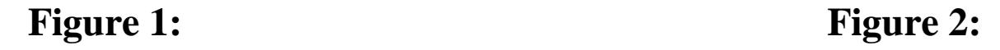
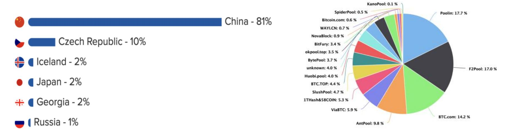
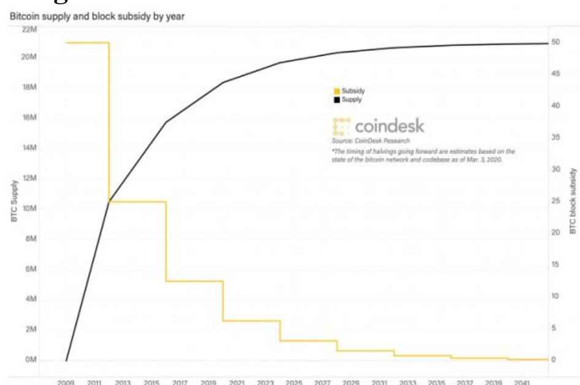
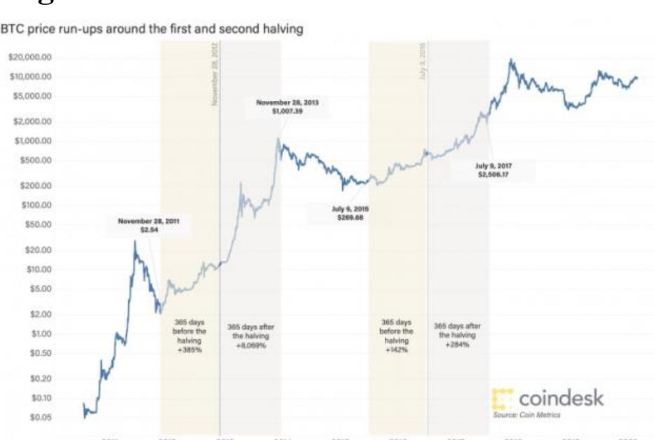

{0}------------------------------------------------

# **BitFund: A Benevolent Blockchain Funding Network**

Darrow Hartman darhart@nuevaschool.org

### **The Nueva School**

*Abstract***— A decentralized funding system that supports companies of online products through mining cryptocurrencies and which renders mining pools benign. Working in tandem with blockchain cryptocurrencies, the system utilizes a user's computing power to mine cryptocurrencies and future blockchain technologies. The system mines cryptocurrencies through a machine's hardware during periods of low usage from the user. The blockchain payments received from the mining will be divvied between the services the user accesses via a percentage of use. A layer of blockchain technology is added to authenticate companies of online products and confirm the wallets of these companies. Each block contains the online service wallet's public key for approved cryptocurrencies, a form of communication, and a DNS to confirm transmissions to the correct online service. After widespread adoption, disputes of DNS registration will result in the oldest block being the legitimate owner. Online services registered would be responsible for updating the blockchain. As the decentralized network of machines grows, the threat of manipulation through the 51% attack decreases as large mining pools lose the percentage of mining they have.** 

# **I. INTRODUCTION**

## **A. Cryptographic Insecurities**

A pressing issue in cryptocurrency circles is the 51% attack. An opportunity for the 51% attack occurs when a centralized miner is responsible for the majority of updates to a blockchain. If this were to occur, an attacker could manipulate the blockchain to benefit themselves through double-spending. Double spending happens when a coin is used to purchase an item, but the attacker creates a fictional reality where that coin is not exchanged and the purchase never occurs. Since the attacker has the majority of the hash power, they can achieve the longest chain with their fictional reality and that reality becomes the established chain.





Source: Jordan Tuwiner Last updated March 12, 2020. "Bitcoin Mining Pools." *10 Best and Biggest Bitcoin Mining Pools 2020 (Comparison)*, www.buybitcoinworldwide.com/mining/pools/.

{1}------------------------------------------------

The 51% attack has already been used to manipulate small coins, such as Monacoin in 2018, but large coins such as Bitcoin could easily fall to this attack as well.<sup>1</sup> Cryptocurrency mining pools are usually responsible for these attacks. Mining pools are groups of miners who mine a cryptocurrency as a group to increase the probability they will be rewarded for mining a block. If the four largest Bitcoin mining pools as shown in Figure 2, Poolin, F2Pool, BTC.com, and AntiPool, which are all in China, were to merge, they would have the majority of the mining power and would be able to carry out a 51% attack. Not only that but as shown in Figure 1 81% of bitcoin mining is centralized in China. If the Chinese government, which is already authoritarian, were to seize control of all bitcoin operations in their country, they too could carry out a 51% attack. This is by far one of the largest barriers preventing Bitcoin and other cryptocurrencies to go mainstream or to be supported by the financial industry at-large.

### **A. Data Harvesting**

Most commercial online services rely on harvesting and selling user data to advertisers for profit. The harvesting of user data frequently occurs without the explicit knowledge of user. Furthermore, users are rarely aware of who owns their information and how that third party are using their data. Large corporations which track user data can inadvertently create algorithmic profiling, whereby companies target vulnerable communities or block important services from other communities.<sup>1</sup> When job advertisements from Google Ads are given to identical male and female profiles, female profiles are less likely to be targeted with higher paying positions.<sup>2</sup> The lower paying positions are a direct result of the algorithmic profiling in the ads.

As companies continue to invest in user analytics and data harvesting methods to squeeze profit from their users, companies uncover private information about individuals. Target identified 25 products which suggests a woman is pregnant after being purchased. Target used this information to advertise more pregnancy-related products to women through the mail. In one such case, Target mailed pregnancyrelated advertisements to a teenage girl and her family. The girl's father was upset that Target was encouraging her daughter to get pregnant and demanded an apology for the advertisements. Later, the father apologized, explaining that his daughter was indeed pregnant.<sup>3</sup> While Target's actions didn't explicitly violate the girl's privacy, it did expose information the girl didn't want available to her parents. This is an example of data harvesting being used to harm others. Unfortunately, preventing companies from harvesting user data would force companies to charge premiums for their services.

Business models which involve premiums prevent users who cannot pay from benefiting from their service and frequently users who can pay refuse to, instead opting for a lower-quality and free alternative. On the internet high-quality media, such as online newspapers, cannot function solely from add revenue and are required to establish pay walls. Paywalls rarely generate paying customers, rather most confronted with a pay find a lower-quality version of the information on free websites. The mindset of many users on the internet is that they should not be required to pay for the media they consume. This

<sup>1</sup> Büchi, Moritz, et al. "The Chilling Effects of Algorithmic Profiling: Mapping the Issues." Computer Law & Security Review, Elsevier Advanced Technology, 22 Nov. 2019, www.sciencedirect.com/science/article/pii/S0267364919303784.

<sup>2</sup> Carnegie Mellon University. "Questioning the Fairness of Targeting Ads Online - News - Carnegie Mellon University." Questioning the Fairness of Targeting Ads Online - News - Carnegie Mellon University, www.cmu.edu/news/stories/archives/2015/july/online-ads-research.html.

<sup>3</sup> Lubin, Gus. "The Incredible Story Of How Target Exposed A Teen Girl's Pregnancy." Business Insider, Business Insider, 16 Feb. 2012, www.businessinsider.com/the-incredible-story-of-how-target-exposed-a-teen-girls-pregnancy-2012-2.

{2}------------------------------------------------

mindset blocks high quality sources of media from competing on the internet and leads to newspapers going bankrupt.

Either method of payment for online services either gives companies a fraction of what they need to survive or uses user's data for potentially unethical purposes. A system of funding which doesn't create pay walls and supports online services is needed to foster a free and ethical internet. The mindset that users have on the internet is a difficult mindset to change. Instead of shifting the mindset users already have, companies need to find novel ways to monetize their online service.

BitFund would fund online services without the use of data harvesting while protecting against the 51% attack. As BitFund is a cryptographic system, it would need to be implemented through a browser or application. User's devices would mine cryptocurrencies during periods of low energy usage. Rewards given to the computer through updating stable cryptocurrency's blockchain would be split based on the percentage of each online service used by the individual. The rewards would then be transmitted to the online services that were used by the user. These transmissions would be logged on a layer of blockchain known as the BitFund Blockchain using the online service's public key, email, and DNS name. While similar mining systems have been used on websites, they are generally independent scripts that do not give information to the user about the intensity of the mining or if the mining will cause harm to their system. Furthermore, these scripts frequently hijack the user's system and overclock it.<sup>4</sup> BitFund would allow smaller online services that would not otherwise know how to monetize their website to be able to do so. BitFund would also be very clear to users about the intensity of the mining and would keep mining under levels that would damage their system.

# **II. MINING & BROWSER APPLICATIONS**

As mentioned in the introduction, BitFund would need to be implemented through a browser or an application. After installing the application, the user would need to have the option of which cryptocurrencies they want to mine (For more information about effective cryptocurrencies in this system, see Cryptocurrency Stability). The mining of the cryptocurrency would occur when the usage of the machine is low or there is no usage. The application would create a wallet for each cryptocurrency selected. The private key of the wallet must be heavily protected to prevent hackers from breaking technologies using the BitFund system and gaining access to accounts. The cryptocurrencies would be individually mined and would not be connected to a mining pool. If a network ran using the BitFund system but connected it to a centralized mining pool, it would motivate the central authorities of the mining pool to engage in the 51% attack. The browser application would log the user activity to determine which online services the user used. The logs would then be deleted if the user's machine did not gain any mining rewards after each 24-hour cycle. If the user did receive mining rewards from a cryptocurrency, the application would split the reward to the different services he/she used depending on their activity online. The application would send the reward to the wallets which deserve the reward. Since cryptocurrency logs are public, the given miner on the network which has received the rewards will be known. If the miner does not distribute the rewards to the services that the miner used, the browser application will automatically be destroyed. The browser application must be destroyed as there is a malicious user or hacker who has gained control of that node. If the node is not destroyed, the hacker could eventually control a majority of a cryptocurrency or hack enough machines connected to the browser application that the network is starved of funding and no financial incentive is given to online services.

{3}------------------------------------------------

# **III. THE BITFUND BLOCKCHAIN**

The BitFund Blockchain would be created to confirm the list of registered online services and their public cryptocurrency key in a decentralized fashion. Website and app registrars, services that connect prospecting buyers of websites to domains, can confirm or connect a wallet to a domain using the BitFund blockchain. Device manufacturers can install the BitFund system onto their products for consumer use. The web registrar would add a block to the BitFund blockchain stipulating their buyer's registered domain and their buyer's public key for all the accepted cryptocurrencies. Websites that have not already been registered on ICAAN cannot be incorporated into blocks.

### **A. Blocks on the Chain**

Three different types of blocks exist in this chain. Initialization blocks, which authenticate the legitimacy of an online service and allow the online service to benefit from the BitFund Blockchain. These blocks contain the online service owner's email, the online services' DNS, and a list of public keys that the owner controls. The second type of block on the network is an update block. This block is sent to the blockchain when a novel cryptocurrency exceeds a certain threshold in market cap and should be allowed to be mined on the BitFund Blockchain. The third type of block on the blockchain is a transmission block. Transmission blocks confirm that a user on the blockchain has submitted their rewards from mining on the blockchain. The transmission block will contain the public key the receiving service, the public key of the sending user, and proof of the transaction from the cryptocurrency which rewarded the user for mining.

## **B. Registration & Disputes**

In disputes where BitFund is already a widespread technology and a block's registered domain is the same as another block's registered domain, the oldest block will be the confirmed block and the new block will be deleted. Until BitFund exceeds a size where 60% of the top 1000 most popular websites ranked by Alexa.com have been integrated their services into the system and their integration has been confirmed or over 10,000,000 websites have been registered, BitFund will not be a widespread technology and the previous section will not settle disputes. Instead, Google site verification will be used to confirm a user. While this does limit the "decentralized" nature of this application, it is a requirement for confirmation until the widespread recognition of the system, whereby any online service which hasn't taken advantage of BitFund's opportunities did so through negligence rather than lack of knowledge.

### **C. Future Popular Cryptocurrency Updates**

In the event that a new cryptocurrency becomes popular and deserves inclusion on the initial list of acceptable coins to mine, all contact addresses previously given will be notified of the updated key submission and given a unique verification code. Public versions of the hashed verification code are published. They will be required to submit their verification code along with their public key for the new cryptocurrency and their DNS. The submitted verification code will then be hashed and compared with the published verification code. If they match then the block is added to the blockchain. New

{4}------------------------------------------------

cryptocurrencies can only be added to the list of mineable cryptocurrencies if they exceed a market capitalization of over 25% of the most popular cryptocurrency. Currently, the most popular cryptocurrency is Bitcoin with a market capitalization of \$170 billion USD. Therefore, if a cryptocurrency exceeds a market capitalization of \$42.5 billion USD, it will be included in the list of mineable cryptocurrencies. While some of the cryptocurrencies listed on the Mineable Cryptocurrencies section do not have a market capitalization of over \$42.5 billion USD, they will still be included.

## **D. BFN Blockchain Mining**

Online services registered with BitFund and miners would update the BitFund Blockchain to support the blockchain. For any online service registered with the BitFund Blockchain, it would be highly recommended to support the updating of the blockchain. No actual enforcement of a minimal hash rate per online service is needed, as they all will compete to ensure none have more than 51% of the BitFund Blockchain.

## **E. Mineable Cryptocurrencies**

The list of mineable cryptocurrencies is dependent on the organization which chooses to create this system initially. As of 2020, the most stable and popular cryptocurrencies which are approved of mining are:

- Bitcoin
- Ethereum
- Bitcoin Cash
- Litecoin
- The BitFund Blockchain\*

As said in a previous section, while some these cryptocurrencies do not exceed a market capitalization of \$42.5 billion USD, they will still be included.

# **IV. CRYPTOCURRENCY STABILITY**

As written in Satoshi Nakamoto's original Bitcoin paper, "The first transaction in a block is a special transaction that starts a new coin owned by the creator of the block. This adds an incentive for nodes to support the network, and provides a way to initially distribute coins into circulation, since there is no central authority to issue them."<sup>5</sup> This means that any blockchain technology following the original Bitcoin payment system would reward miners for updating the public ledger. A constant stream of rewards is needed to keep this system profitable for online services. Bitcoin and other cryptocurrencies regulate the flow of mined blocks through proofs of work.

<sup>\*</sup> This may also include other cryptocurrencies/services created through BitFund with the purpose of improving the BitFund system.

<sup>5</sup> Nakamoto, Satoshi. "Bitcoin: A Peer-to-Peer Electronic Cash System." Bitcoin.org, Satoshi Nakamoto, 2009, bitcoin.org/bitcoin.pdf.

{5}------------------------------------------------

### **A. Why Bitcoin Isn't Enough**



**Figure 3: Figure 4:**



The Bitcoin code stipulates that the rewards given to any miner half after every 210,000 blocks are mined. The Bitcoin rewards were initially 50 bitcoins for every block mined. As new blocks are created every 10 minutes, every four years Bitcoin mining rewards will half. Examining Figure 3, it is clear that as Bitcoin supply continues to increase as the Bitcoin subsidy, the mining rewards, continue to decrease. This will make Bitcoin mining drastically less profitable in the future. In order for Bitcoin to stay at the same rate of profitability to online services, the price of a single coin would need to continue to at least double every four years. Fortunately, prices of bitcoin in the past have been increasing at higher than doubling rates. Figure 4 is a logarithmic scale which displays the price of Bitcoin over time. In the three current events of halving, the price of bitcoin has exceeded the doubling mark it needs to meet. The price of Bitcoin increased 15,000 fold to \$12 during the 2012 halving, it increased 5400% to \$650 during the 2016 halving, and 1300% to \$8500 during the 2020 halving.<sup>6</sup> The price of Bitcoin may continue this greater than doubling trajectory until Bitcoin is widely accepted and used internationally. However, Bitcoin is a very volatile cryptocurrency and therefore would need to be relatively stable or operate at a constant rate before being widely approved by large corporations. Regardless, the total number of bitcoins created at any time was arbitrarily determined by Mr. Nakamoto at 21 million coins. These same rules apply to many other cryptocurrencies such as Litecoin and Bitcoin Cash. The maximum number of bitcoins will be reached at 2140. After 2140, this system will not be able to use Bitcoin sustainably. While Bitcoin fees could be used to fund the system, these fees are so miniscule that the price and value of Bitcoin would need to increase to an extraordinary rate for the fees to be able to support BitFund.

### **B. Possibilities with Ethereum and Other Cryptocurrencies**

Ethereum fixes the limitations posed in the previous section about Bitcoin. Ethereum's blocks are rewarded at a rate of 5 eEher per block mined and there is no limit to the maximum number of blocks. Furthermore, Ethereum does not half every four years the way bitcoin does. However, Ethereum cofounder Vitalik Buterin has proposed creating a hard cap at 120 million Ether. <sup>7</sup> His proposal has been

<sup>6</sup> "Bitcoin (BTC) - Price, Chart, Info." CryptoSlate, cryptoslate.com/coins/bitcoin/.

<sup>7</sup> Varshney, Neer. "Ethereum's Supply Has Crossed 100M, Here's What That Means." Hard Fork | The Next Web, 11 June 2018, thenextweb.com/hardfork/2018/06/11/ethereums-total-supply/.

{6}------------------------------------------------

changed to 144 million Ether. Currently, neither proposal has been accepted.<sup>8</sup> Unless Ethereum creates a cap to their currency, Ethereum will likely become the most frequently mined coin in this system in the long term.

Clearly, Bitcoin is not sufficient for long term sustainability of this system. However, Bitcoin is currently by far the most popular cryptocurrency. In the time of this writing, Bitcoin's market cap is 170 billion dollars.<sup>9</sup> The second largest cryptocurrency is Ethereum, with a market cap of just 23 billion dollars.<sup>10</sup> Bitcoin is nearly 7 times larger than Ethereum and any other cryptocurrency. Therefore, it is imperative to include Bitcoin as a coin in this system until other cryptocurrencies become large enough to be considered stable or innovation in the sector leads to a better coin. However, since Ethereum has no maximum number of coins, Ethereum will become the most popular cryptocurrency on BitFund.

# **V. BFN PROFITABILITY ANALYSIS**

## **A. Current Profitability**

As of this writing, the price of a single bitcoin is ~\$9200 USD11, the price of an ethereum coin is ~\$200 USD12, the price of a litecoin is ~\$50 USD13, and the price of a bitcoin cash coin is ~\$250 USD. I have included Bitcoin Cash and Litecoin on this list as they function similarly to Bitcoin with more efficient/faster transaction capabilities. For purposes of analysis, I have assumed Bitfund succeeded in universalizing this systtem and the network is responsible for at least 51% of mining and that at least 51% of the rewards mined from the cryptocurrencies are allocated to BitFund.

On average, 144 Bitcoin blocks are mined each day. The reward for mining a block is 6.25 bitcoins. Therefore, 900 bitcoins are created on a daily basis and 328,500 coins are created annually. At the current price of Bitcoin, receiving 100% of the bitcoin rewards would yield \$3.02 billion USD annually. For our analysis, BitFund only controls 51% of the mining, so the network would receive \$1.54 billion USD annually. Following these steps for the other three cryptocurrencies: Ethereum would return \$1.12 billion USD annually, Litecoin would return \$67 million USD annually, and Bitcoin Cash would return \$41 million USD.<sup>14</sup> This sums to a total of nearly \$2.8 billion USD annually. If BitFund controlled 95% of the network, the network would receive roughly \$5.2 billion USD annually.

While these margins of revenue are large, they are unfortunately not enough to counteract the revenue brought from data harvesting on the internet. To determine revenue brought from the entire internet via data harvesting, a stable revenue source must first be established. In 2018, Facebook reported a revenue

```
8 Sharma, Rakesh. "Why Is Ethereum Co-Founder Proposing a Hard Cap?" Investopedia, Investopedia, 29 Jan. 2020, www.investopedia.com/news/why-
ethereum-cofounder-proposing-hard-cap/.
```

```
9"Bitcoin (BTC) - Price, Chart, Info." CryptoSlate, cryptoslate.com/coins/bitcoin/.
```

<sup>10</sup> "Ethereum (ETH) - Price, Chart, Info." *CryptoSlate*, cryptoslate.com/coins/ethereum/.

<sup>11</sup> "Bitcoin (BTC) - Price, Chart, Info." *CryptoSlate*, cryptoslate.com/coins/bitcoin/.

<sup>12</sup> "Ethereum (ETH) - Price, Chart, Info." *CryptoSlate*, cryptoslate.com/coins/ethereum/.

<sup>13</sup> "Litecoin (LTC) - Price, Chart, Info." *CryptoSlate*, cryptoslate.com/coins/litecoin/.

<sup>14</sup> Hartman, Darrow R. "BitFund Calculator." *BitFund*, Darrow, thebitfund.org/main.py.

{7}------------------------------------------------

of \$55 billion USD.<sup>15</sup> 98.5% of that revenue was thanks to data harvesting advertisements.<sup>16</sup> The average user spends an hour on Facebook and their related products.<sup>17</sup> Roughly 6 hours a day is spent on a digital service.<sup>18</sup> Therefore, Facebook's revenue accounts for 16% of time spent online. 66% of companies advertise online.<sup>19</sup> So, roughly \$220 billion USD is required to replace profit from advertisement and data harvesting.

## **B. Potential Profitability**

As shown in the previous section, the sum of the cryptocurrencies would need to exceed the \$220 billion USD generated from data harvesting and advertisements to become favored. In order to replace data harvesting and advertisements, all of the coins' price would need to increase 43 times. While this is a staggering increase needed, it is certainly not impossible. A decade ago, Bitcoin was evaluated at just \$1 USD. By the start of 2013, it had increased 100 times to \$100 USD. Since 2013, it has increased 92 times to \$9200 USD. In the past decade, Bitcoin has made an incredible jump of 9,200 times.<sup>20</sup> While increasing Bitcoin and the other cryptocurrencies 43 times will be very difficult, it is not impossible and subscribing to BitFund will only increase the cryptocurrency's coin value. While the profitability of BitFund is increasing, online services could use both BitFund and data harvesting until BitFund becomes profitable.

# **VI. CONCLUSION**

**The BitFund system poses a novel solution to two critical issues in cryptocurrencies and the internet. The first being the reality 51% attack problem and its hampering of cryptocurrencies' scaling. The second problem being the use of data harvesting and advertisement for revenue in online services. BitFund creates a decentralized network of miners that funds online services and significantly increases the difficulty of manipulating a cryptocurrency. While the current coin price of cryptocurrencies and mining rewards arenot large enough to replace or exceed the revenue from data harvesting and advertisements, future investments in public trust of cryptocurrencies and the adoption of applications using this system will enlarge the value on popular cryptocurrencies' coins and eventually completely replace data harvesting methods if grown large enough. Furthermore, implementation of this system among large online services and adoption of this service among users will serve as a major milestone to a more secure internet and financial system.** 

# **ACKNOWLEDGMENTS**

Thanks Mom & Dad for talking about this idea with me rigorously and giving me encouragement to pursue whatever I wanted. Thank you for valuing effort over the final product. Thank you Christine for telling me how cool of an idea you thought this was and supporting me with my crazy ideas, that definitely gave me confidence to continue. Finally, thank you Nueva for giving all Nueva students and me the platform and opportunity to pursue a passion project like this one.

- <sup>15</sup> "Facebook 2018 Financial Report." *Facebook.com*, Facebook.com, 2018, s21.q4cdn.com/399680738/files/doc\_financials/annual\_reports/2018-Annual-Report.pdf.
- <sup>16</sup> Team, Trefis, and Trefis. "What Is Facebook's Revenue Breakdown?" *Nasdaq*, www.nasdaq.com/articles/what-facebooks-revenue-breakdown-2019-03-28-0.
- <sup>17</sup> Mohsin, Maryam. "Top 10 Facebook Stats You Need to Know in 2020 [Infographic]." *Oberlo*, 7 May 2020, www.oberlo.com/blog/facebook-statistics.
- <sup>18</sup> Salim, Saima. "More than Six Hours of Our Day Is Spent Online Digital 2019 Reports." *Digital Information World*, 4 Feb. 2019, www.digitalinformationworld.com/2019/02/internet-users-spend-more-than-a-quarter-of-their-lives-online.html.
- <sup>19</sup> Team, HostingFacts. "Internet Statistics & Facts (Including Mobile) for 2020." *Hostingfacts.com*, 6 May 2020, hostingfacts.com/internet-facts-stats/.
- <sup>20</sup> "Bitcoin Price Index Real-Time Bitcoin Price Charts." *CoinDesk*, CoinDesk, www.coindesk.com/price/bitcoin.