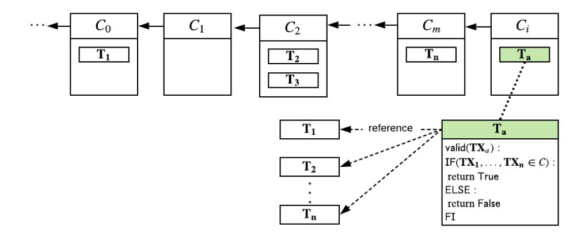
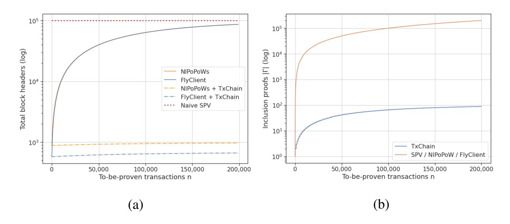
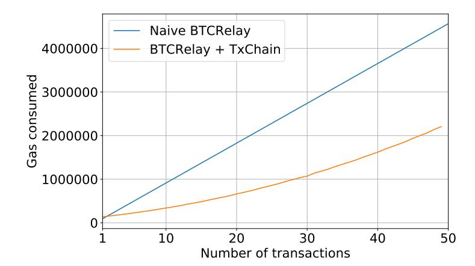

{0}------------------------------------------------

# TxChain: Efficient Cryptocurrency Light Clients via Contingent Transaction Aggregation

Alexei Zamyatin1,3, Zeta Avarikioti2, Daniel Perez1,3, and William J. Knottenbelt1

1 Imperial College London
2 ETH Zurich
3 Interlay.io

**Abstract.** Cryptocurrency *light*- or *simplified payment verification* (SPV) clients allow nodes with limited resources to efficiently verify execution of payments. Instead of downloading the entire blockchain, only block headers and selected transactions are stored. Still, the storage and bandwidth cost, linear in blockchain size, remain non-negligible, especially for smart contracts and mobile devices: as of April 2020, these amount to 50 MB in Bitcoin and 5 GB in Ethereum.

Recently, two improved *sublinear* light clients were proposed: to validate the blockchain, NIPoPoWs and FlyClient only download a polylogarithmic number of block headers, sampled at random. The actual verification of payments, however, remains costly: for each verified transaction, the corresponding block must too be downloaded. This yields NIPoPoWs and FlyClient only effective under low transaction volumes.

We present TxChain, a novel mechanism to maintain efficiency of light clients even under high transaction volumes. Specifically, we introduce the concept of contingent transaction aggregation, where proving inclusion of a single contingent transaction implicitly proves that n other transactions exist in the blockchain. To verify n payments, TxChain requires a only single transaction in the best  $(n \le c)$ , and  $\lceil \frac{n}{c} + log_c(n) \rceil$  transactions in the worst case (n > c). We deploy TxChain on Bitcoin without consensus changes and implement a soft fork for Ethereum. To demonstrate effectiveness in the cross-chain setting, we implement TxChain as a smart contract on Ethereum to efficiently verify Bitcoin payments.

## 1 Introduction

With decentralized cryptocurrencies finding more and more applications in industry, the need to deliver digital payments on resource-constrained devices, such as mobile phones, wearable- and Internet-of-things (IoT) devices, is steadily increasing. Even within the cryptocurrency ecosystem, the need for efficient payment verification is becoming imminent. One example are multi-currency wallets, which track the state of multiple cryptocurrencies and hence face high storage and bandwidth requirements. Another are the growing number of cross-cryptocurrency applications [32,6,24,31]. Here, verification of correct payments happens cross-chain and is often executed by smart contracts, where storage and bandwidth is priced by the byte [1,14].

In this paper, we present TXCHAIN, a novel scheme to improve the efficiency of transaction verification, which improves upon recent work on optimized light clients [22,12].

{1}------------------------------------------------

Thereby, we do not rely on complex cryptographic schemes, but rather leverage the security properties offered by the consensus of decentralized cryptocurrencies – making TXCHAIN compatible with the majority of existing systems.

Blockchain and Light Clients (SPV). Most widely-used cryptocurrencies, such as Bitcoin and Ethereum, maintain an append-only transaction ledger, the *blockchain*. The blockchain consists of a sequence of blocks chained together via cryptographic hashes. Each block thereby consists of a *block header* and a batch of valid transactions. The block header contains a pointer to the previous block, (ii) a vector commitment [\[13\]](#page-18-4) over all included transactions, and (iii) additional metadata (e.g. timestamp, version, etc.). Each block is uniquely identifier by a hash over its block header.

Vector commitments are employed by users to verify transactions without downloading the entire blockchain. For example, Simplified Payment Verification (SPV) clients in Bitcoin [\[27\]](#page-18-5) only maintain a copy of the block headers of the longest (valid) proof-of-work chain, where each header includes the root of a Merkle tree [\[26\]](#page-18-6) contains transaction identifiers as leaves. To verify a transaction is included in a block, an SPV client requires (i) the block header of the block that contains the transaction (to extract the Merkle root), and (ii) the Merkle tree path to the leaf containing the transaction identifier (given the Merkle root). The size of the Merkle path, i.e., the number of hashes, is thereby logarithmic to the number of transactions in the block.

Sublinear Light Clients. Recently, two proposals for so-called *sublinear* light clients were made: *non-interactive proofs of proof-of-work* (NIPoPoW) [\[22\]](#page-18-2) and FlyClient [\[12\]](#page-18-3). In contrast to na¨ıve SPV clients, NIPoPoWs and FlyClient only require to download a fraction of the block headers to verify that a given chain is the valid chain [1](#page-1-0) . Both mechanisms sample a subset of block headers *at random*, such that a fake chain produced by an adversary corrupting at most 33% of consensus participants or total computational power will be detected with overwhelming probability – and hence rejected.

NIPoPoWs [\[22\]](#page-18-2) sample block headers which exceed the minimum Proof-of-Work target – so-called *superblocks*. Due to the design of PoW, statistically, 1/2 of the generated blocks will exceed the minimum target (level-1 superblocks), a 1/4 will exceed the target by a higher number (level-2 superblocks), etc. By only sampling superblocks, the number of block headers NIPoPoW clients need to download is polylogarithmic in the blockchain size. Unless deployed as a non-backward compatible hard fork [\[33\]](#page-19-2), NIPoPoWs require block headers to contain an additional *interlink* data structure (pointers to previous superblocks) for secure verification of the valid chain

FlyClient [\[12\]](#page-18-3) samples block headers based on an optimized heuristic, which takes as input a random number, e.g. generated using the latest PoW block hash. Similar to NIPoPoWs, a backward compatible deployment of FlyClient requires additional data to be stored in block headers: the root of a Merkle Mountain Range commitment [\[29\]](#page-19-3) – an efficiently-updatable Merkle tree variant which supports logarithmic subtree proofs. The leaves of the MMR contain block hashes of all blocks generated so far.

Both protocols also provide mechanisms to verify that a block header, not sampled as part of the (poly)logarithmic valid chain proof, is indeed part of the valid chain. In NIPoPoWs, this is achieved via so-called *infix* proofs, which link the blocks in question

1 The chain with the most accumulated Proof-of-Work in PoW blockchains.

{2}------------------------------------------------

to the sampled superblocks via the interlink structure. In FlyClient, this is achieved by a Merkle tree path from the MMR root to the leaf containing the hash of the block in question. Note that additional block inclusion checks are not necessary in naïve SPV clients, since all block headers are already downloaded.

**Probabilistic Sampling Dilemma.** To the best of our knowledge, all sublinear light client verification protocols only reduce the block-header data submitted to the client, i.e., the protocols provide efficient valid chain proofs. The ultimate goal of light clients, however, is not only to efficiently determine the valid (or "main") chain, but to verify the inclusion of transactions in the latter. As such, to prove the inclusion of n transactions in the blockchain, both super-block NIPoPoWs and FlyClient require n block headers and n Merkle tree membership proofs to be submitted to the client – on top of the valid chain proof. Therefore, for large n, transaction inclusion verification becomes the performance bottleneck of sublinear light clients. Considering the additional data stored in block headers, performance may even be worse than that of naïve SPV clients for high transaction volumes. We term this problem the *Probabilistic Sampling Dilemma*.

**Our Contribution** In summary, this paper makes the following contributions:

- **Probabilistic Sampling Dilemma**. We introduce the Probabilistic Sampling Dilemma and provide a formal analysis, deriving the expected overhead of payment verification in sublinear light clients (Section 3).
- Aggregated Transaction Verification. We introduce TXCHAIN as a new technique for compressing transaction inclusion proofs, leveraging the security assumptions of the underlying blockchain (Section 4). In particular, to prove the inclusion of n transactions, TXCHAIN creates  $\lceil \frac{n}{c} \rceil$  contingent (on-chain) transactions, where c is a constant dependent on the block/transaction size of the blockchain2. Contingent transactions are only valid if each of the referenced n transactions exist in the blockchain. Proving the inclusion of a contingent transaction hence proves inclusion of the n referenced transactions. To circumvent block size limitations, we further show how to construct hierarchies of contingent transactions. As a result, to prove existence of n transactions, TXCHAIN requires a single contingent transaction in the best case  $(n \le c)$  and  $\lceil \frac{n}{c} + log_c(n) \rceil$  in the worst case (n > c).
- Formal analysis. We prove TXCHAIN's security and formally analyze it's efficiency (Section 5). Under high transaction volumes, TXCHAIN reduces the number of downloaded block headers by up to a factor of 977x for FlyClient, and 973x for NIPoPoWs. In terms of transaction inclusion proofs, TXCHAIN achieves an improvement of up to 1190x across all types of light clients.
- **Light Client Implementations**. We deploy TXCHAIN (i) in Bitcoin without requiring changes to the underlying protocol (ii) and implement a soft fork for Ethereum. We show TXCHAIN's performance improvement when added as an extension to NIPoPoWs, FlyClient and even naïve (linear) SPV clients (Section 6).
- Cross-Chain Deployment. To demonstrate effectiveness in resource constrained environments, we implement TxCHAIN as a smart contract on Ethereum which efficiently verifies Bitcoin payments (Section 6.3)3.

For example, in Bitcoin, c = 1000 (cf. Section 6)

&lt;sup>3 All code available as open source: github.com/interlay/compressed-inclusion-proofs

{3}------------------------------------------------

# 2 Model and Definitions

## 2.1 System Model

Our setting consists of three types of users: *miners*, full *nodes*, and light *clients*.

Miners participate in the consensus protocol that orders the blocks, e.g., in Proof-of-Work blockchains the miners are the users that create the blocks by solving the computationally difficult puzzles. The miners essentially determine which is the valid chain. Full nodes verify and store a copy of the entire valid (honest) chain[4](#page-3-0) . Since a blockchain is a distributed system, the valid chain is the one agreed by the honest miners. To verify

that a blockchain is the valid chain, a user can download a copy of the entire chain from a full node (or a miner), and verify all blocks[5](#page-3-1) . However, this is quite costly, both in terms of space and computation.

Light clients allow for fast synchronization and transaction verification, under the assumption that the valid chain follows the rules of the network. Specifically, light clients only maintain the following: (i) the necessary data to verify chain validity, i.e., for SPV clients all block headers, while for sublinear light clients a (random) sample of block headers with cardinality polylogarithmic to the length of the valid chain, (ii) for each transaction to-be-verified, the corresponding block header to extract the vector commitment (and optionally a proof that this block header is indeed part of the valid chain), and an inclusion proof, e.g., for Bitcoin this is the Merkle root and the Merkle tree path.

Assumptions. We make the usual cryptographic assumptions: all users are computationally bounded; cryptographically-secure communication channels, hash functions, signatures, and encryption schemes exist. Further, we assume the underlying blockchain maintains a distributed transaction ledger that has the properties of persistence and liveness as defined in [\[17\]](#page-18-7). Persistence states that once a transaction is included "deep" enough in an honest miner's valid chain it will be included in every honest miners' valid chain in the same block, i.e., the transaction will be "stable". We assume persistence is parametrized by a "depth" parameter k, meaning that we assume finality of transaction after k blocks. Liveness states that a transaction given as input to all honest miners for a "long" enough period will eventually become stable.

Lastly, we note that TXCHAIN does not require any synchrony assumptions since it is a non-interactive proof scheme. Hence, we assume the same network model of the underlying blockchain system. We note, however, that each client is assumed to be connected to at least one honest full node or miner and is hence not prone to eclipse attacks [\[21\]](#page-18-8).

Threat Model. We assume a rushing and fully adaptive adversary, meaning that the adversary can reorder the delivery of messages, but cannot modify or drop them, and corrupt users on-the-fly. However, the proportion of corrupted miners[6](#page-3-2) (consensus partici-

4 Miners are also full nodes, while full nodes are miners with zero "voting power".

5 In PoW blockchains, the user must also query multiple nodes to determine which chain is the one with the "most work".

6 The adversary can corrupt all kinds of users, but only miners affect the security of the system.

{4}------------------------------------------------

pants) is bounded by the threshold necessary to ensure safety and liveness for the underlying system [16]. For Nakamoto consensus, this implies the fraction of computational power  $\frac{\alpha}{1+\alpha}$  controlled by the adversary at any moment is bounded by  $\frac{\alpha}{1+\alpha} \leq 1/3$  [17], where  $\alpha$  is a security parameter. For Byzantine fault tolerant settings, e.g. Proof-of-Stake such as [23,11], the fraction of corrupted consensus participants f is bounded by  $f \leq 1/3$ .

#### 2.2 Blockchain Notation

We denote a block header, i.e., a block without the included transactions, at position i in chain C as  $C_i$ . The genesis block header is, therefore,  $C_0$ , while  $C_h$  denotes the block header at the tip of the chain, where h is the current "length" (or height) of chain C. Each block header includes (at least) a vector commitment over the set of transactions included in block, and the hash of the previous block header in chain C. This hash acts as a reference to the previous block and thus the hash-chain is formed. The vector commitment, on the other hand, is a cryptographic accumulator [8] over an ordered list of transactions or a *position binding* commitment, which can be opened at any position with a proof sublinear in the length of the vector.

We use  $T_{id}$  to refer to a transaction with identifier id. Furthermore, we denote by  $\gamma_{(\cdot,\cdot)}$  the inclusion proof of a transaction in a block. Specifically,  $\gamma_{(i,id)}$  denotes an inclusion proof of transaction  $T_{id}$  in the block at position i of the chain. If there exists a proof  $\gamma_{(i,id)}$ , we write  $T_{id} \in C_i$  Typically, the transaction inclusion proof employs the vector commitment on the block header.

We define as  $\beta_{(C_i,C)}$  the inclusion proof of the block header  $C_i$  in chain C. A naïve block inclusion proof is the entire hash chain C: the hash-chain that includes the block  $C_i$  points back correctly to the genesis block  $G_0$  (ground truth).

Lastly, we denote as  $\pi_{(C,C_h)}$  a chain validity proof. That is a proof that a chain C at some round ending in a specific block  $C_h$  at position h (the tip of the chain) is the valid chain, i.e, the chain agreed by the honest miners.

Throughout the paper, we denote by |S| the cardinality of a set S. Further, we abuse the notation for block header  $C_i$  to also refer to the block.

#### 2.3 Protocol Goals

We use the prover–verifier model, as originally introduced in [22]. In TXCHAIN, the prover (full node) wants to convince the verifier (client) that a set of transactions T are included in the valid chain C. To do so, the prover(s) must provide three types of proofs to the verifier:

- 1. Chain validity proof  $\pi_{(\cdot,\cdot)}$ : A proof that chain C is the valid chain. Both NIPoPoW and FlyClient provide succinct proofs that the given chain is valid.
- 2. Transaction inclusion proofs  $\Gamma$ : For each transaction in T, a proof of inclusion in a specific block  $\gamma_{(\cdot,\cdot)}$ .
- 3. Block inclusion proofs  $\mathcal{B}$ : For each block that contains a transaction of T, a proof of inclusion  $\beta_{(\cdot,\cdot)}$  that the block is in the valid chain C. The structure of this proof is specific to the protocol used to verify that chain C is the valid chain.

{5}------------------------------------------------

These proofs are not necessarily distinct, meaning that the data the prover sends to the verifier for all three proofs may overlap. For instance, in an SPV client, the proof of block inclusion (3) requires no additional data since all block headers are stored and verified as part of the verification process of the chain validity. Therefore, if the block inclusion proof is already part of the chain validity proof, we do not send the data twice.

Desired Properties Our goal is to design a protocol that is *secure* and *efficient*.

- *Security* in TXCHAIN encapsulates the correctness of the protocol, meaning that a verifier only accept the proofs, i.e., terminates correctly, if the prover is honest and knows the valid chain. In other words, the verifier will terminate correctly if all transactions in T are included in the valid chain C.
- *Efficiency* captures the storage cost of the protocol, i.e., how much data must be sent to the verifier as part of the verification steps (1-3). To evaluate the efficiency of TXCHAIN, we calculate these storage costs and compare them against existing solutions for different sets of transactions (increasing cardinality), in the following sections.

# 3 Probabilistic Sampling: Cure or Curse?

In this section, we highlight practical challenges of light clients based on probabilistic sampling. We demonstrate that these light clients offer only optimistic performance improvements when the transactions to-be-verified are many, and in the worst case, can perform worse than na¨ıve SPV clients. We term this problem the *Probabilistic Sampling Dilemma*. We first provide an intuition, and then a formal analysis to measure efficiency.

## 3.1 Probabilistic Sampling Dilemma

Chain Validity Proof. Existing sublinear light clients, such as superblock NIPoPoWs [\[22\]](#page-18-2) and FlyClient [\[12\]](#page-18-3) use probabilistic sampling to reduce the number of block headers necessary to prove knowledge of the valid chain (chain validity proof). FlyClient relies on a pre-defined heuristic, while superblock NIPoPoWs sample headers of blocks which exceed the minimum PoW difficulty – due to the nature of PoW, and specifically hash functions modeled as random oracles, such blocks are considered to appear at random. In both cases, the prover cannot predict upfront which blocks to provide to the verifier as part of the requested chain validity proof. This property yields the probability of the prover defrauding the verifier with respect to the chain validity proof negligible, within our model as described in Section [2.](#page-3-3)

Block Inclusion Proof. In na¨ıve SPV clients, the block inclusion proof is trivial, as the verifier already has the hash-chain for the chain validity proof. However, this is not the case in sublinear light clients that use probabilistic sampling: For a given set of transactions, the prover must provide to the verifier (a) the block headers and block inclusion proofs for the chain validity proof ((poly)logarithmic in cardinality), and (b) 

{6}------------------------------------------------

for any block including a transaction of the input set that is *not sampled* for the chain validity proof, the corresponding block header and block inclusion proof.

The reason for the additional block headers is that the probabilistic sample of block headers is independent of the transactions the client wants to verify. Therefore, in addition to the chain validity proof (e.g., NIPoPoW) and the transaction inclusion proof for every transaction, the prover must also persuade the verifier that the block header that corresponds to the transaction inclusion proof of each transaction is part of the valid chain. This implies that the cost of the probabilistic NIPoPoWs is also *dependent on the number of transactions to-be-verified and how they are distributed in the blockchain*.

Probabilistic Sampling Dilemma. An additional overhead of probabilistic NIPoPoW is the increase of the block header size — especially if deployed in blockchain without major modification to the underlying consensus rules. This results in the following phenomenon: the storage and bandwidth cost of both superblock NIPoPoWs and FlyClient can exceed that of naïve SPV clients for high transaction volumes (as shown in the experimental evaluations in Section 6.1). In particular, in probabilistic sampling clients the cost is proportional to the number of different block headers (and block inclusion proofs) that are given to the verifier, multiplied by the block header size. If transactions are distributed across many different blocks of the chain, which are *not sampled* in the chain validity proof, the cost increases: the additive data for the three proofs (c.f. Section 2.3) sent to the verifier / light client.

As a result, a dilemma arises for clients with constrained resources: Clients can either (a) anticipate a high transaction volume and use a naïve SPV client, accepting a higher cost for chain validity proofs, or (b) rely on a probabilistic sampling (NIPoPoWs, FlyClient), saving costs on downloaded block headers under low transaction volumes, but under high transaction volumes end up with overall higher storage and bandwidth costs. We call this the *Probabilistic Sampling Dilemma*.

#### 3.2 Analysis

In this section, we show that given a set of transactions to-be-verified T, the cost of probabilistic sampling light clients grows proportionally to the number of transactions n=|T| and sublinear to the length of the chain. As such, when the number of transactions is large, the costs of the protocol is dominated by the cost of the block inclusion proofs, instead of the chain validity proof.

To that end, suppose  $C_1,\ldots,C_\sigma$  is the set of blocks sampled for the chain validity proof. The selected set is expressed via a random variable X which follows the probability distribution defined in the light client protocol – e.g. uniformly-random distribution with respect to the length of the chain in FlyClient. This means, that  $X_i=1$  if the block header  $C_i$  is chosen to be part of the chain validity proof. Now, suppose  $\sigma$  is the size of the probabilistic sample and h the length of the valid chain, then if X follows a discrete uniform distribution, it holds that  $Pr[X_i=1]=\frac{\sigma}{h}$ , for all  $i\in\{0,1,\ldots,h-1\}$ . As mentioned in Section 3, we assume the prover cannot influence or bias this random variable for security reasons.

On the other hand, we define the discrete random variable  $Y_{i,j} = 1$  if transaction  $T_j \in T$  is included in block  $C_i$ . For the purpose of our analysis, we assume  $Y_{i,j}$  follows

{7}------------------------------------------------

a discrete uniform distribution on the length of the chain h as well. Thus,  $Pr[Y_{i,j} = 1] = \frac{1}{h}$ , for all  $i \in \{0, 1, \dots, h-1\}$  and  $j \in \{1, 2, \dots, n\}$ .

We further define the discrete random variable  $Y_i$  to express if a block contains at least one of the transactions in T;  $Y_i = 1$  if for any  $j \in \{1, 2, \dots, n\}$ ,  $Y_{i,j} = 1$ . Each trial is independent as a transaction's inclusion in a block has no influence on which block will contain another transaction (for block size large enough) Therefore,  $Pr[Y_i = 1] = 1 - Pr[Y_{i,1} = 0] \cdot Pr[Y_{i,2} = 0] \dots Pr[Y_{i,n} = 0] = 1 - \left(1 - \frac{1}{h}\right)^n$ . For every block that includes at least one transaction from T, the prover must provide to the verifier the block header and a block inclusion proof, even if this block is not sampled for the chain validity proof. To determine the overhead on the cost, we have to count the number of blocks that include at least one transaction and are not sampled for the chain validity proof. To that end, we define  $Z_i = 1$  if  $Y_i = 1 \wedge X_i = 0$ . Since  $Y_i$  and  $X_i$  are independent random variables,  $Pr[Z_i = 1] = Pr[Y_i = 1] \cdot Pr[X_i = 0] = \left(1 - \left(1 - \frac{1}{h}\right)^n\right) \cdot \left(1 - \frac{\sigma}{h}\right)$ . Thus, the expected number of additional block headers are

$$\mathbb{E}(Z) = \mathbb{E}\left(\sum_{i=0}^{h-1} Z_i\right) = h \cdot \Pr[Z_i = 1] = (h - \sigma) \cdot \left(1 - (1 - \frac{1}{h})^n\right) \ge \left(1 - \frac{\sigma}{h}\right) \cdot n$$

We observe that the smaller the sample for the chain validity proof, the larger the expected number of additional transactions. Furthermore, we notice that for a given chain length and sample size, the expected number of additional blocks grows with the number of transactions to-be-verified.

## 4 TXCHAIN Design

In this section we present the design of TXCHAIN. We first define the concept of contingent transactions and then present how this mechanism can be used to circumvent the Probabilistic Sampling Dilemma.

Fig. 1: Visualization of TXCHAIN: a contingent transaction  $T_a$  is only valid and can hence be included in the valid chain C at index i if all referenced transactions  $T_1, \ldots, T_n$  are included in C, and hence are valid. The inclusion proof  $\gamma_{(i,a)}$  for  $T_a$  is hence also proves inclusion of  $T_1, \ldots, T_n$ .

{8}------------------------------------------------

## 4.1 Contingent Transactions

Smart contracts in blockchains allow to define under which conditions a transaction can be included in the underlying ledger, i.e., specify when the transaction becomes valid under the blockchain's consensus rules. In TXCHAIN, we leverage a fairly simple type of smart contracts: contingent payments (or transactions). Thereby, a transaction Ta is constructed such that it becomes valid – and hence can be included in the underlying ledger – if and only if a set of transactions T = T1, . . . , Tn was already included in the underlying ledger. Formally,

Definition 1 (Contingent Transaction). *A transaction* Ta *is contingent on a set of transactions* T = T1, . . . , Tn *if* Ta *can only be included in* Ci *if* C *already contains* T1, . . . , Tn*. Formally:* Ta ∈ Ci =⇒ ∀j ∈ {1, 2, . . . , n} ∃m ∈ {0, . . . , i} s.t. Tj ∈ Cm

When executing the smart contract of a contingent transaction Ta, to determine its validity *full nodes* look up the referenced transactions T1, . . . , Tn in their local copy of the full valid chain, and only accept Ta if all transactions were indeed found, as illustrated in Figure [1.](#page-7-1)

## 4.2 TXCHAIN: Contingent Transaction Aggregation

We proceed to leverage the concept of contingent transactions defined above to reduce the storage and bandwidth requirements of light clients when verifying n transaction inclusion proofs.

Consider the following setting: A prover wants to convince a verifier that a set of transactions T = T1, . . . , Tn was included in the valid chain C. The transactions are thereby distributed across h different blocks, h <= n. In TXCHAIN, the prover creates a *contingent transaction* Ta, referencing transactions T1, . . . , Tn and includes it in the blockchain at position i, i.e., Ta ∈ Ci . Following Definition [1,](#page-8-0) by convincing the verifier that Ta ∈ Ci the prover also proves that for every T1, . . . , Tn there is a block Cm (m ∈ {0, . . . , h}) that includes the transaction, and all these blocks are part of the valid chain C (i.e., ∀m ∈ {0, . . . , h} ∃β(Cm,C) ). We outline the TXCHAIN protocol in the prover/verifier setting, for verifying inclusion of a set of transactions T1, . . . Tn in chain C via a contingent transaction Ta in Algorithm [1.](#page-9-0)

## 4.3 Hierarchical TXCHAIN

Currently, TXCHAIN as described in Algorithm [1](#page-9-0) assumes that a single transaction Ta can be contingent on an arbitrary number n of pre-existing transactions. Including references to T = {T1, . . . , Tn} in Ta, however, comes at a cost: each additional reference means additional data must be attached to Ta. However, blockchains typically exhibit block or transaction size limits due to network latency concerns: the larger a transaction, the longer it takes to be propagated to most of the nodes in the network, and the more susceptible it is to double-spending attacks [\[15,](#page-18-13)[20,](#page-18-14)[19\]](#page-18-15).

Depending on the size of these identifiers, which in turn depends on the design of the underlying blockchain as well as the means of deployment of TXCHAIN (c.f.

{9}------------------------------------------------

#### Algorithm 1: TXCHAIN Prover / Verifier n Transaction Inclusion Verification Protocol

#### Prover

- 1. Has valid chain of h + 1 blocks  $C_0, \ldots, C_h$
- 2. Receives query for transactions  $T = T_1, \ldots, T_n$  from verifier
- 3. Creates transaction  $T_a$  contingent on the set of transactions T
- 4. Includes it in the valid chain at position  $C_i$ , i > h
- 5. Waits k blocks until  $T_a$  is stable
- 6. Computes:
  - (a) the valid chain proof  $\pi_{(C,C_{i+k})}$
  - (b) the block inclusion proof  $\beta_{(C_i,C)}$
  - (c) the transaction inclusion proof  $\gamma_{(i,c)}$
- 7. Sends  $\pi_{(C,C_{i+k})}$ ,  $\beta_{(C_i,C)}$ ,  $\gamma_{(i,c)}$  and  $T_a$  to the verifier

#### Verifier

- 1. Has transactions  $T = T_1, \dots, T_n$
- 2. Queries prover for a proof that transactions T are included in the valid chain
- 3. Receives proof  $\pi_{(C,C_{i+k})}$ ,  $\beta_{(C_i,C)}$ ,  $\gamma_{(i,c)}$  and  $T_a$  from the prover
- 4. Verifies
  - (a) the valid chain proof  $\pi_{(C,C_{i+k})}$
  - (b) the block inclusion proof for  $\beta_{(C_i,C)}$
  - (c) the transaction inclusion proof  $\gamma_{(i,c)}$
  - (d) that transaction  $T_a$  is contingent on transactions T
- 5. If everything checks out, accepts the transaction inclusion proof for T

Section 6), the number of transactions referenced by a single contingent transaction  $T_a$  can be limited. We capture this by a constant c > 1. As long as  $c \le n$ , verifying n transactions requires only a single contingent transaction.

Consider, however, a scenario where n > c, i.e., a prover wants to convince the verifier that a large number of transactions are included, but cannot reference them all within a single contingent transaction. To circumvent this problem, the prover splits transactions  $T_1, \ldots, T_n$  across multiple contingent transactions  $T_{a(1)}, \ldots, T_{a(n/c)}$ . Next, the prover constructs an *hierarchical* dependency across the "first-layer" contingent transactions by creating transactions  $T_{a(n/c)}, \ldots, T_{a(n/c^2)}$ . In simple terms, the prover creates a *N-arry* tree of contingent transactions, where each node is a contingent transaction acting as inclusion proof for c nodes (transactions) in that branch.

As a result, the prover can apply TXCHAIN to an arbitrary number of transactions, at the cost of including in the blockchain and sending to the verifier  $\frac{n}{c} + \lceil log_c(n) \rceil$  contingent transactions. For example, for n=1000 and c=100, the number of contingent transactions would be 11. This yields a 91x reduction in the required transaction and block inclusion proofs. If  $c \ge n$  (e.g. c=1000), the reduction in the example is 1000x. That is, the number of transactions c that can be referenced by a contingent transactions directly impacts the improvement offered by TXCHAIN.

{10}------------------------------------------------

## 5 Security and Efficiency Analysis

In this section we show how TXCHAIN achieves the two protocol goals: *security* and *efficiency* (see Section 2.3).

## **5.1** Security Analysis

TXCHAIN achieves security when the verifier terminates correctly if and only if the prover is honest.

 $[\Rightarrow]$  If the prover is honest then, all transactions are included in the valid chain C, and the proofs are generated according to the protocol specifications. Therefore, the verification of all proofs will be successful by the verifier and thus will terminate correctly.  $[\Leftarrow]$  For the opposite direction, we will prove the statement by contradiction. Let us assume the verifier terminates correctly but the prover is malicious. This implies that the prover deviated from the protocol specification. Given that the verifier terminated, the verifier received the corresponding proofs from the prover. Since the security of the generation of the proofs is guaranteed by the underlying light client verification protocol, the prover must have deviated from the protocol during steps 3-5, i.e., in the creation of the contingent transaction. However, the verifier has the block inclusion proof for the contingent transaction and also the last k blocks headers of the chain; therefore, the prover can only deviate in step 3. However, during the verification of the transaction inclusion proof the verifier ensures that all requested transaction identifiers are tied to this transaction. Thus, the prover cannot create an incorrect contingent transaction. Contradiction. We conclude that TxCHAIN achieves security.

**Hierarchical TxCHAIN.** The security of the hierarchical TxCHAIN construction follows from recursively applying the security analysis of TxCHAIN. Intuitively, assume T' encapsulates all to-be-proven transactions T, as well as the set of contingent transactions  $T_{a(1)}, \ldots, T_{a(x)}$ , where x is upper-bounded by  $\frac{n}{c} + log_c(n)$ , i.e.,  $T' = T \cup \{T_{a(1)}, \ldots, T_{a(x)}\}$ . If the contingent transaction  $T_{a(x)}$ , which is the root of the created N-arry tree of contingent transactions, is included the in valid chain C, this means that the subset of contingent transactions  $\{T_{a(x-1-c)}, \ldots, T_{a(x-1)}\}$  was also included in C. The same holds for the predecessors of each transaction  $T_j$ ,  $\forall j \in \{x-1-c, \ldots, x-1\}$ . We continue this process recursively until we reach the original set T which must also be included in C for  $T_{a(x)}$  to be valid and hence included in C.

## **5.2** Efficiency Analysis

We now discuss how TXCHAIN achieves *efficiency* by comparing the storage costs of naïve (SPV) and sublinear (NIPoPoWs and FlyClient) light clients *with* and *without* applying TXCHAIN. We assume a secure hash function H and denote its size |H|. We analyze the cost of each proof (see Section 2) below.

Valid Chain Proofs: The size of the valid chain proof in naïve SPV is linear in h. The size of the valid chain proof in sublinear light clients depends on two parameters: (i)  $\lambda$  which defines the probability  $2^{-\lambda}$  of a verifier terminating correctly on an invalid proof,

{11}------------------------------------------------

(ii) α which defines the strength of the adversary α/(1 + α), e.g. the hash rate in PoW blockchains , and (iii) the "depth" parameter k. The NIPoPoW π(C,Ch) size [\[22](#page-18-2)[,12\]](#page-18-3) is given by

$$log_{1/\alpha}(2)\lambda \cdot ((log_2(h) + 1) \cdot C + log_2(h) \cdot \lceil log_2(log_2(h)) \rceil \cdot |H|).$$

The FlyClient π(C,Ch) size [\[12\]](#page-18-3) is given by

$$\lambda log_{1/\alpha}(2)ln(h)\cdot (C+|H|).$$

Note the increased block header size due to additionally required number of hashes |H| in NIPoPoWs (interlink structure) and FlyClient (MMR root).

*Block Inclusion Proofs (*B*):* Since na¨ıve SPV clients store all block headers, no extra block inclusion proofs β(·,·) are required. Both NIPoPoW and FlyClient require block inclusion proofs for blocks not sampled as part of π(C,Ch) – for both mechanisms, the size of β(·,·) is log(h) · |H| per block header.

*Transaction Inclusion Proofs (*Γ*):* A transaction inclusion proof γ(i, id) is a list of hashes (Merkle tree path), logarithmic in the number of transactions contained in block Ci . Hence, the size of each proof is log(t) · |H|, where t is the total number of transactions included in the block containing a transaction of T.

TXCHAIN Efficiency. In Section [3,](#page-5-0) we determined the expected number of additional block headers and block inclusion proofs E(|B|) required in NIPoPoW and FlyClient to verify the inclusion of n transactions for any given blockchain size h:

$$\mathbb{E}(|\mathcal{B}|) = (h - \sigma) \cdot (1 - (1 - \frac{1}{h})^n),$$

where σ is the number of blocks sampled for the chain validity proof. When applying TXCHAIN to such probabilistic sampling clients, this number decreases to:

$$\mathbb{E}(|\mathcal{B}'|) = \frac{\mathbb{E}(|\mathcal{B}|)}{c} + log_c(\mathbb{E}(|\mathcal{B}|)).$$

We observe that the improvement achieved by TXCHAIN is most significant for large c, since limc→∞E(|B0 |) = 1.

To evaluate the theoretical improvement we can achieve in TXCHAIN, we apply TXCHAIN as an extension to both NIPoPoW and FlyClient. Figure [2](#page-12-0) overviews the expected number of (a) additional block inclusion proofs (and hence block headers) and (b) required transaction inclusion proofs, *before* and *after* applying TXCHAIN, for blockchain size h = 100000 and c = 1000. A more detailed breakdown is provided in Table [3](#page-19-4) in Appendix [A.](#page-19-5) We observe that as expected, TXCHAIN becomes more effective as n increases, up until n = |T| = h. Statistically, given a blockchain size of 100000 and 50000 to-be-verified transactions, FlyClient on average requires the submission of 39120 block inclusion proofs and block headers, on top of the blocks sampled as part of the chain validity proof. NIPoPoWs, which sample 40% more blocks as part of the chain validity proof [\[12\]](#page-18-3), require 39000 additional block headers. If we apply TXCHAIN's contingent transaction aggregation to FlyClient and NIPoPoWs, assuming 

{12}------------------------------------------------

a realistic c = 1000 (e.g. corresponds to a transaction with 1000 inputs in Bitcoin), we only need to download 42 additional block headers, achieving an improvement factor of 931x for FlyClient and 928x for NIPoPoWs.

TXCHAIN achieves even higher improvement factors for higher values of Γ = n in FlyClient and NIPoPoW, since E(|B|) ≤ n. For 50000 to-be-verified transactions and a blockchain size of 100 000, the use of TXCHAIN improves over both "Vanilla" FlyClient and NIPoPoW by a factor of 1190x: instead of 50000, we require only 42 transaction inclusion proofs. It is worth mentioning that the same improvement identically applies to na¨ıve SPV clients, as visualized in Figure [2\(](#page-12-0)b).

We note the actual improvement in terms of storage and bandwidth costs depends on how TXCHAIN, and specifically contingent transactions, are implemented in the underlying blockchain, as we discuss in Section [6.](#page-13-0)

Fig. 2: Effects of applying TXCHAIN to FlyClient and NIPoPoWs. (a) Total number of block headers required for verification of n transactions (π(C,Ch)+E(|B|)). (b) Number of transaction inclusion proofs Γ in light clients before and after applying TXCHAIN (logarithmic y-axis). Numbers h = 100000 and c = 1000.

Limitations. While the design of TXCHAIN is simple and avoids complex cryptographic schemes, making it compatible with the majority of existing blockchain systems, it also exhibits limitations. The requirement of including additional transactions in the blockchain results in additional transaction fees for the prover (c.f. Section [6.1\)](#page-13-1). Further, TXCHAIN may not be applicable in times of high network congestion, i.e., if a prover is unable to reliably include a contingent transaction in the blockchain. This in turn, in the worst case, may yield TXCHAIN not applicable to instant or day-to-day payments. Summarizing, TXCHAIN is most effective in settings where the storage and especially bandwidth requirements of the verifier are the main bottleneck of a protocol, or even priced by byte – as is the case when verification is performed in on-chain smart contracts, as we show in Section [6.3.](#page-16-0)

{13}------------------------------------------------

# 6 Implementation

## 6.1 Deploying TXCHAIN in Bitcoin

In this section we discuss how TXCHAIN can be deployed in Bitcoin, with and without changes to the underlying consensus rules, and evaluate its performance.

Bitcoin operates a so-called Unspent Transaction Output model (UTXO). Each new transaction consists of inputs and outputs, where inputs *spend* outputs of existing transactions. Outputs specify rules for how the coins *locked* in the unspent output (UTXO) can be spent, i.e. via smart contracts. In Bitcoin, these contracts are written in Script, a stack-based scripting language [\[3\]](#page-17-2). UTXOs can only be spent as a whole. Note: we evaluate both NIPoPoW and FlyClient under constant difficulty, since NIPoPoW currently does not support with variable difficulty [\[22,](#page-18-2)[12\]](#page-18-3).

Fork-Free: Dust Output Spending. As of this writing, Bitcoin Script does not allow to create conditional relations across transactions without actually spending from the corresponding outputs. As a result, the only way to deploy TXCHAIN in Bitcoin *without* consensus changes is via *dust output* spending. When creating transactions T1, . . . , Tn the prover includes an additional output in each transaction, containing at least the minimum possible value transferable in Bitcoin[7](#page-13-2) . The spending condition in this output can be arbitrary, as long as the prover can spend the output in a "contingent" transaction. Contingent transactions in case are standard Bitcoin transactions, which take as input the dust UTXOs T1, . . . , Tn, upper-bound by c. Due to Bitcoin's consensus design, a transaction can only spend a UTXO which is generated by a transaction *already* included in the blockchain. As such, a transaction Ta which spends outputs of T1, . . . , Tn is *contingent* on these transactions.

Evaluation. In our evaluation, we use standard Bitcoin P2WPKH [\[25\]](#page-18-16) transactions. In Bitcoin, C = 80 bytes and |H| = 32 bytes. The average transaction size in 2019 was 534 bytes, while the average size of the coinbase transaction was 259 bytes. The latter is the first transaction of every block and is used by NIPoPoWs and FlyClient to include the interlink data / MMR root required for block inclusion proofs, when deployed as a backward-compatible soft or velvet instead of a hard fork [\[33\]](#page-19-2). The average depth of the transaction Merkle tree was 12. As such, each block inclusion proof in NIPoPoW and FlyClient requires additionally 259 + 12 · |H| = 643 bytes, and each transaction inclusion proof 384 bytes. But multi-input Bitcoin transactions come at a cost: 93 bytes per input and 45 bytes flat per contingent transaction (assuming one P2WPKH output). Thereby, Bitcoin full nodes will relay transactions of up to 100kb[8](#page-13-3) , thus c ≈ 1000.

We overview the storage and bandwidth costs of na¨ıve SPV, FlyClient and NIPoPoWs with and without TXCHAIN in Table [1,](#page-14-0) for a Bitcoin block height h = 630000 (as of 5 May 2020) and c = 1000. We observe that TXCHAIN significantly reduces the total transaction and block inclusion proof data in all light client implementations. Most notable, the storage and verification costs under TXCHAIN remain *nearly constant*.

7 54.60 · 10−6 BTC which is approx. USD 0.4 as of 5 May 2020

8 <github.com/bitcoin/bitcoin/blob/eb7daf4/src/policy/policy.h#L24>

{14}------------------------------------------------

Therefore, TxCHAIN allows NIPoPoW and FlyClient to maintain their improvements over naïve SPV clients even under high transaction volumes.

We further observe that maintaining full compatibility with Bitcoin comes at a cost. The use of dust outputs results in increased sizes of contingent transactions due to inefficient encoding of the references to the n aggregated transactions: each reference requires to 93 bytes (Bitcoin input size), as opposed to the 32 byte transaction identifier that would suffice in a soft fork deployment (see below).

The costs for including a transaction with c=1000 inputs in Bitcoin, at a fee price of  $3 \cdot 10^{-6}$  BTC per byte, amount to USD 21.2. We conclude that while TXCHAIN offers a significant improvement on storage and bandwidth cost on the verifier's side, the main application of TXCHAIN is expected to be in settings where each byte parsed by the verifier is priced – e.g., as in Ethereum smart contracts (see Section 6.3).

Table 1: Comparison of storage and bandwidth costs of naïve SPV, Flyclient and NIPoPoWs, without ("Vanilla") and with a fork-free deployment of TxChain, for different numbers of to-be-verified transactions n. FlyClient and NIPoPoW numbers provided for soft fork and hard fork deployment. Numbers provided for a blockchain size h = 630000 (as of 5 May 2020) and c = 1000.

|        |           |         |        | <u> </u>  |         |        |           |         |        |                     |         |        |           |         |        |
|--------|-----------|---------|--------|-----------|---------|--------|-----------|---------|--------|---------------------|---------|--------|-----------|---------|--------|
|        | naïve SPV |         |        |           |         | FlyC   | lient     |         |        | Superblock NIPoPoWs |         |        |           |         |        |
| $n$    |           |         |        | Soft Fork |         |        | Hard Fork |         |        | Soft Fork           |         |        | Hard Fork |         |        |
|        | Vanilla   | TXCHAIN | Impr.  | Vanilla   | TXCHAIN | Impr.  | Vanilla   | TXCHAIN | Impr.  | Vanilla             | TXCHAIN | Impr.  | Vanilla   | TXCHAIN | Impr.  |
|        | in mB     | in mB   | factor | in mB     | in mB   | factor | in mB     | in mB   | factor | in mB               | in mB   | factor | in mB     | in mB   | factor |
| 1      | 50.4      | 50.4    | 1.0    | 0.51      | 0.51    | 1.0    | 0.1       | 0.1     | 1.0    | 0.77                | 0.77    | 1.0    | 0.15      | 0.15    | 1.0    |
| 10     | 50.41     | 50.4    | 1.0    | 0.52      | 0.51    | 1.02   | 0.1       | 0.1     | 1.04   | 0.78                | 0.77    | 1.01   | 0.15      | 0.15    | 1.03   |
| 100    | 50.49     | 50.4    | 1.0    | 0.62      | 0.51    | 1.21   | 0.15      | 0.1     | 1.5    | 0.88                | 0.77    | 1.14   | 0.2       | 0.15    | 1.33   |
| 1000   | 51.32     | 50.4    | 1.02   | 1.61      | 0.51    | 3.16   | 0.59      | 0.1     | 6.03   | 1.88                | 0.77    | 2.43   | 0.64      | 0.15    | 4.33   |
| 10000  | 59.58     | 50.42   | 1.18   | 11.51     | 0.53    | 21.58  | 5.05      | 0.11    | 44.04  | 11.77               | 0.8     | 14.81  | 5.1       | 0.16    | 30.97  |
| 50000  | 96.3      | 50.66   | 1.9    | 54.42     | 0.8     | 68.11  | 24.67     | 0.36    | 69.17  | 54.67               | 1.06    | 51.56  | 24.72     | 0.41    | 60.8   |
| 100000 | 142.2     | 51.39   | 2.77   | 105.69    | 1.5     | 70.68  | 48.84     | 1.03    | 47.61  | 105.92              | 1.76    | 60.31  | 48.89     | 1.08    | 45.46  |

**Soft Fork.** Considering both FlyClient and NIPoPoWs require a soft or hard fork to be deployed in Bitcoin, the minor modifications to Bitcoin's transaction validity rules necessary to optimize TxChain could arguably added in parallel – if FlyClient or NIPoPoW are indeed deployed in practice. The goal of deploying TxChain in Bitcoin with a soft fork would be to avoid the requirement of spending UTXO's when referencing them in contingent transactions. In theory, this can be achieved via a new OUTPUTEXISTS instruction ("OpCode") in Bitcoin's Script, which pops an item – the identifier of a transaction concatenated with the index of the UTXO in that transaction – from the stack, performs a lookup of the transaction, and pushes 1 to the stack if the UTXO was found (0 otherwise). This would allow to reduce the costs per referenced transaction / UTXO from 93 bytes (per input) to 32 bytes per transaction identifier (SHA256 hash) plus 1 byte for the OpCode flag. This results in an expected 2.8x improvement over the fork-free deployment of TxChain, as overviewed in Table 4 in Appendix B.

{15}------------------------------------------------

In light of the simple deployment of TXCHAIN in Bitcoin without consensus changes, and the observation that such soft fork proposals are seldom deployed in practice, we defer the implementation of OUTPUTEXISTS to future work.

## 6.2 Deploying TXCHAIN in Ethereum

Unlike Bitcoin which uses the UTXO model, Ethereum does not provide a native way of implementing transaction dependencies. To deploy TXCHAIN on Ethereum, we hence propose a soft fork introducing a new instruction: TXEXISTS. This instruction checks if a transaction hash exists in the current Ethereum valid (main) chain. The semantics of the instruction are as follows:

- 1. Pop one argument, representing the hash of a transaction, from the stack,
- 2. Push 1 to the stack if the transaction was found or 0 otherwise.

Similar to instructions such as EXCODESIZE or BALANCE, this requires access to the blockchain state, which can be expensive in terms of IO [\[28\]](#page-18-17). Therefore, we assign a conservative price of 2000 gas to the instruction, i.e., twice as expensive as the 900 gas of EXCODESIZE and BALANCE in the Ethereum implementation. We note that finding an optimal gas price for this instruction would require more thorough benchmarking and is left for future work.

We fork the Ethereum geth client [\[4\]](#page-17-3) and the Solidity compiler [\[5\]](#page-17-4), and implement the instruction with the gas price and semantics defined above. We then implement a smart contract leveraging the TXEXISTS instruction which exhibits the following functionality: The contract receives a list of transaction n ids and returns true if and only if all the transactions are included in the Ethereum main chain. Using this contract, the proving and verification process is performed as follows: A prover sends a transaction to the contract (the contingent transaction), and passes as argument the n to-be-proven transactions. Subsequently, the prover sends this (contingent) transaction to the verifier alongside the necessary block and transaction inclusion proofs. This proves to the verifier that all n transactions were indeed included.

Evaluation. Using our forked node, we measure the cost of using our smart contract to create a transaction proving the inclusion of n transactions on-chain. The initial transaction costs 26,633 gas, including the fixed 21,000 gas transaction cost. Every additional transaction to-be-proven costs extra 4,333 gas. Using a 5 Gwei gas price and the exchange rate of 168.01 USD/ETH as per 24 April 2020, this results in an initial cost of 0.022 USD and only an increase of 0.0036 USD per verified transaction.

To measure the storage and bandwidth improvements, we use the 2019 average Ethereum transaction size of 499 bytes. Storing a single hash in a smart contract on Ethereum, necessary to include the interlink data (NIPoPoW) or MMR root (FlyClient) in a block, requires a 167 byte transaction. We set an upper limit on referenced transactions of c = 1147, assuming a block gas limit of 5 million [\[28\]](#page-18-17), i.e., 50% of the block gas limit, and hence bounding costs at ≈ USD 12.6 per (full) contingent transaction. Give Ethereum's block height h = 10000000 (as of 4 May 2020) and n = 100000 transactions, TXCHAIN achieves a 24x improvement over a soft fork deployment of

{16}------------------------------------------------

| Action                              | Cost Gas USD |
|-------------------------------------|-----------------|
| Base                                | 21,000 0.018    |
| Merkle proof                        | 38,038 0.032    |
| Block inclusion                     | 1,109 0.001     |
| BTC Relay total                     | 90,075 0.076    |
| TXCHAIN mean overhead, first 20 txs | 27,025 0.227    |
| TXCHAIN mean overhead               | 42,560 0.036    |

Fig. 3: Comparison of gas costs for transaction inclusion verification and the necessary block header verification for BTC Relay without (*naïve*) and with TxCHAIN. The block used has a total of 51 transactions.

Table 2: Breakdown of gas costs for BTC Relay verification, for a total of 51 verified Bitcoin transactions. USD costs computed with 5 Gwei gas price and 168.01 USD/ETH

FlyClient (28x for a hard fork) and a 17x improvement over a soft fork deployment of NIPoPoWs (20x for a hard fork). We provide a detailed breakdown of the storage and bandwidth costs in Table 5 in Appendix C.

## 6.3 Using TXCHAIN for Cross-Chain State Verification

We use TxChain in combination with BTC Relay [2] to measure the improvement in cost when verifying the inclusion of Bitcoin transactions within an Ethereum smart contract. The prover uses the approach described in 6.1 to create Bitcoin a transaction depending on n previous transactions. We extend the functionality of BTC Relay to integrate it with TxChain and prove multiple transactions at once. In particular, we add a new function verifyTxMulti which takes as input the raw Bitcoin transaction and the necessary transaction inclusion proof.

We measure the gas cost when verifying transactions using the naïve version of the BTC Relay, as well as using BTC Relay in combination with TxCHAIN. We present our results in Figure 3 and Table 2. As expected, for a single transaction, the overhead of sending the raw transaction makes the cost of TxCHAIN higher than the cost of the naïve BTC Relay. However, for 2 or more transactions, the cost of the transaction parsing is amortized, yielding a more cost-efficient verification. In particular, the base transaction, the Merkle proof, and the block inclusion proof costs *do not increase* with the number of transactions when using TxCHAIN.

We obtain the best improvement, 66.94% of the gas saved, when verifying 16 transactions. The improvement does not increase linearly in the number of transactions due to the gas pricing model of Ethereum [18]: the memory cost per byte is linear only up to 724 bytes, after which it becomes polynomial. Therefore, our results tell us that after 16 transactions the polynomial pricing of memory becomes expensive enough to prevent TxChain from improving the costs further. Indeed, we can see in Table 2 that the average overhead of TxChain on the 50 transactions is more than 60% higher than the average overhead on the first 20 transactions.

{17}------------------------------------------------

It is worth mentioning that this experiment uses TXCHAIN in combination with a na¨ıve SPV BTC Relay, which stores all block headers. When using TXCHAIN in combination with a sublinear client, the number of new block headers needed for the proof is reduced, thus increasing the cost savings further, as shown in Section [5.](#page-10-0) Unfortunately, neither FlyClient [\[12\]](#page-18-3) nor NIPoPoWs [\[22\]](#page-18-2) have a publicly available implementation able to verify Bitcoin transactions on Ethereum. Therefore, we leave the implementation of sublinear clients with TXCHAIN in a cross-chain context to future work.

# 7 Conclusion and Future Work

In this paper, we introduced the Probabilistic Sampling Dilemma, stating that light clients relying on probabilistic sampling suffer from inefficiency under high transaction volumes. We then presented TXCHAIN, a novel mechanism to reduce the number of transaction- and block inclusion proofs in blockchain light clients, leveraging contingent transaction aggregation. We showed TXCHAIN is secure and offers significant efficiency improvements when applied as an extension to NIPoPoWs, FlyClient, and even na¨ıve SPV clients. We implement TXCHAIN (i) on Bitcoin without requiring any consensus modifications, (ii) in Ethereum as a backward-compatible soft fork, and (iii) in a cross-chain Bitcoin light client in an Ethereum smart contract, showing the practicability of TXCHAIN even in resource-constrained environments.

Interesting avenues for future work include combining the compression properties of succinct non-interactive zero-knowledge proofs of knowledge (NiZKP) [\[9,](#page-18-19)[10](#page-18-20)[,7\]](#page-17-6) with TXCHAIN. For example, concurrent work on encoding Bitcoin chain validity proofs in SNARKs (zkRelay) [\[30\]](#page-19-6), reducing the number of downloaded block headers by a constant factor, can benefit from applying TXCHAIN similar to NIPoPoWs and FlyClient. Finally, encoding the contingent transactions in NiZKP, allowing to parse and validate the dependency on to-be-verified transactions in constant-sized proofs (e.g. using SNARKs [\[7\]](#page-17-6)), may further improve the effectiveness of TXCHAIN.

# References

- 1. BTC Relay Serpent Implementation. [https://github.com/ethereum/btcrelay.](https://github.com/ethereum/btcrelay) Accessed 2018- 04-17.
- 2. BTC Relay Solidity Implementation. [https://github.com/crossclaim/btcrelay-sol.](https://github.com/crossclaim/btcrelay-sol) Accessed 2020-04-24.
- 3. Script. [https://en.bitcoin.it/wiki/Script.](https://en.bitcoin.it/wiki/Script) Accessed: 2018-11-28.
- 4. Official Go implementation of the Ethereum protocol. [https://github.com/ethereum/go](https://github.com/ethereum/go-ethereum)[ethereum,](https://github.com/ethereum/go-ethereum) 2020. [Online; accessed 20-April-2020].
- 5. Solidity, the Contract-Oriented Programming Language. [https://github.com/ethereum/](https://github.com/ethereum/solidity) [solidity,](https://github.com/ethereum/solidity) 2020. [Online; accessed 20-April-2020].
- 6. A. Back, M. Corallo, L. Dashjr, M. Friedenbach, G. Maxwell, A. Miller, A. Poelstra, J. Timon, and P. Wuille. Enabling blockchain innovations with pegged sidechains. ´ [https:](https://blockstream.com/sidechains.pdf) [//blockstream.com/sidechains.pdf,](https://blockstream.com/sidechains.pdf) 2014. Accessed: 2016-07-05.
- 7. E. Ben-Sasson, A. Chiesa, D. Genkin, E. Tromer, and M. Virza. Snarks for c: Verifying program executions succinctly and in zero knowledge. In *Advances in Cryptology–CRYPTO 2013*, pages 90–108. Springer, 2013.

{18}------------------------------------------------

- 8. J. Benaloh and M. De Mare. One-way accumulators: A decentralized alternative to digital signatures. In *Workshop on the Theory and Application of of Cryptographic Techniques*, pages 274–285. Springer, 1993.
- 9. N. Bitansky, R. Canetti, A. Chiesa, and E. Tromer. From extractable collision resistance to succinct non-interactive arguments of knowledge, and back again. In *Proceedings of the 3rd Innovations in Theoretical Computer Science Conference*, pages 326–349. ACM, 2012.
- 10. M. Blum, P. Feldman, and S. Micali. Non-interactive zero-knowledge and its applications. In *Providing Sound Foundations for Cryptography: On the Work of Shafi Goldwasser and Silvio Micali*, pages 329–349. 2019.
- 11. E. Buchman. Tendermint: Byzantine fault tolerance in the age of blockchains. [http://atrium.](http://atrium.lib.uoguelph.ca/xmlui/bitstream/handle/10214/9769/Buchman_Ethan_201606_MAsc.pdf) [lib.uoguelph.ca/xmlui/bitstream/handle/10214/9769/Buchman](http://atrium.lib.uoguelph.ca/xmlui/bitstream/handle/10214/9769/Buchman_Ethan_201606_MAsc.pdf) Ethan 201606 MAsc.pdf, Jun 2016. Accessed: 2017-02-06.
- 12. B. Bunz, L. Kiffer, L. Luu, and M. Zamani. Flyclient: Super-light clients for cryptocurren- ¨ cies. In *2020 IEEE Symposium on Security and Privacy (SP)*. IEEE, 2020.
- 13. D. Catalano and D. Fiore. Vector commitments and their applications. In *International Workshop on Public Key Cryptography*, pages 55–72. Springer, 2013.
- 14. Cosmos Developer Team. Peggy. [https://github.com/cosmos/peggy.](https://github.com/cosmos/peggy) Accessed: 2018-05-23.
- 15. C. Decker and R. Wattenhofer. Information propagation in the bitcoin network. In *Peerto-Peer Computing (P2P), 2013 IEEE Thirteenth International Conference on*, pages 1–10. IEEE, 2013.
- 16. R. Fuzzati. *A formal approach to fault tolerant distributed consensus*. PhD thesis, Citeseer, 2008.
- 17. J. Garay, A. Kiayias, and N. Leonardos. The bitcoin backbone protocol: Analysis and applications. In *Annual International Conference on the Theory and Applications of Cryptographic Techniques*, pages 281–310. Springer, 2015.
- 18. Gavin Wood. Ethereum: A secure decentralised generalised transaction ledger eip-150 revision (759dccd - 2017-08-07). [https://ethereum.github.io/yellowpaper/paper.pdf,](https://ethereum.github.io/yellowpaper/paper.pdf) 2017. Accessed: 2018-01-03.
- 19. A. Gervais, G. O. Karame, K. Wust, V. Glykantzis, H. Ritzdorf, and S. Capkun. On the ¨ security and performance of proof of work blockchains. In *Proceedings of the 2016 ACM SIGSAC Conference on Computer and Communications Security*, pages 3–16. ACM, 2016.
- 20. A. Gervais, H. Ritzdorf, G. O. Karame, and S. Capkun. Tampering with the delivery of blocks and transactions in bitcoin. In *Proceedings of the 22nd ACM SIGSAC Conference on Computer and Communications Security*, pages 692–705. ACM, 2015.
- 21. E. Heilman, A. Kendler, A. Zohar, and S. Goldberg. Eclipse attacks on bitcoin's peer-to-peer network. In *24th USENIX Security Symposium (USENIX Security 15)*, pages 129–144, 2015.
- 22. A. Kiayias, A. Miller, and D. Zindros. Non-interactive proofs of proof-of-work. In *International Conference on Financial Cryptography and Data Security*. Springer, 2019.
- 23. A. Kiayias, A. Russell, B. David, and R. Oliynykov. Ouroboros: A provably secure proof-ofstake blockchain protocol. In *Annual International Cryptology Conference*, pages 357–388. Springer, 2017.
- 24. A. Kiayias and D. Zindros. Proof-of-work sidechains. In *International Conference on Financial Cryptography and Data Security*, pages 21–34. Springer, 2019.
- 25. Libbitcoin developers. P2WSH Transactions. [https://github.com/libbitcoin/libbitcoin](https://github.com/libbitcoin/libbitcoin-system/wiki/P2WPKH-Transactions)[system/wiki/P2WPKH-Transactions.](https://github.com/libbitcoin/libbitcoin-system/wiki/P2WPKH-Transactions) Accessed: 2020-04-24.
- 26. R. C. Merkle. A digital signature based on a conventional encryption function. In *Conference on the Theory and Application of Cryptographic Techniques*, pages 369–378. Springer, 1987.
- 27. S. Nakamoto. Bitcoin: A peer-to-peer electronic cash system. [https://bitcoin.org/bitcoin.pdf,](https://bitcoin.org/bitcoin.pdf) Dec 2008. Accessed: 2015-07-01.
- 28. D. Perez and B. Livshits. Broken metre: Attacking resource metering in evm. In *Network and Distributed System Security Symposium (NDSS)*, 2020.

{19}------------------------------------------------

- 29. P. Todd. Merkle mountain range, 2016. https://github.com/opentimestamps/opentimestamps-server/blob/master/doc/merkle-mountain-range.md.
- 30. M. Westerkamp and J. Eberhardt. zkrelay: Facilitating sidechains using zksnark-based chain-relays. In *Workshop on the Security & Privacy on the Blockchain*. IEEE, 2020.
- 31. A. Zamyatin, M. Al-Bassam, D. Zindros, E. Kokoris-Kogias, P. Moreno-Sanchez, A. Kiayias, and W. J. Knottenbelt. Sok: Communication across distributed ledgers. Technical report, IACR Cryptology ePrint Archive, 2019: 1128, 2019.
- 32. A. Zamyatin, D. Harz, J. Lind, P. Panayiotou, A. Gervais, and W. Knottenbelt. Xclaim: Trustless, interoperable, cryptocurrency-backed assets. In *2019 IEEE Symposium on Security and Privacy (SP)*, pages 193–210. IEEE, 2019.
- 33. A. Zamyatin, N. Stifter, A. Judmayer, P. Schindler, E. Weippl, and W. J. Knottebelt. (Short Paper) A Wild Velvet Fork Appears! Inclusive Blockchain Protocol Changes in Practice. In 5th Workshop on Bitcoin and Blockchain Research, Financial Cryptography and Data Security 18 (FC). Springer, 2018.

# **A Detailed TXCHAIN Efficiency Analysis**

We provide a more detailed breakdown of the improvements offered by applying TX-CHAIN to NIPoPoWs and FlyClient in Table 3.

Table 3: Expected number of additionally required block inclusion proofs (and hence block headers) for different n in FlyClient and NIPoPoWs, before  $(\mathbb{E}(|\mathcal{B}|))$  and after  $(\mathbb{E}(|\mathcal{B}|)')$  applying TxCHAIN. Results provided for a blockchain size h=100000 and c=1000.

| n                           |                              | ]     | FlyClient                      | -     |        | NIPoPoWs                     |       |                                |       |                   |  |  |  |
|-----------------------------|------------------------------|-------|--------------------------------|-------|--------|------------------------------|-------|--------------------------------|-------|-------------------|--|--|--|
| $\mid  =  \mid \Gamma \mid$ | Van                          | illa  | ТхСн                           | AIN   | Impr.  | Van                          | illa  | ТхСн                           | AIN   | Impr.   factor |  |  |  |
|                             | $ \mathbb{E}( \mathcal{B} )$ | %     | $ \mathbb{E}( \mathcal{B} )' $ | %     | factor | $ \mathbb{E}( \mathcal{B} )$ | %     | $ \mathbb{E}( \mathcal{B} )' $ | %     |                   |  |  |  |
| 1                           | 1                            | 100.0 | 1                              | 100.0 | 1.0    | 1                            | 100.0 | 1                              | 100.0 | 1.0               |  |  |  |
| 10                          | 10                           | 100.0 | 1                              | 10.0  | 10.0   | 10                           | 100.0 | 1                              | 10.0  | 10.0              |  |  |  |
| 100                         | 99                           | 99.0  | 2                              | 2.0   | 49.5   | 99                           | 99.0  | 2                              | 2.0   | 49.5              |  |  |  |
| 1000                        | 989                          | 98.9  | 2                              | 0.2   | 494.5  | 986                          | 98.6  | 2                              | 0.2   | 493.0             |  |  |  |
| 10000                       | 9461                         | 94.61 | 11                             | 0.11  | 860.09 | 9432                         | 94.32 | 11                             | 0.11  | 857.45            |  |  |  |
| 50000                       | 39120                        | 78.24 | 42                             | 0.08  | 931.43 | 39000                        | 78.0  | 42                             | 0.08  | 928.57            |  |  |  |
| 100000                      | 62848                        | 62.85 | 65                             | 0.07  | 966.89 | 62655                        | 62.66 | 65                             | 0.07  | 963.92            |  |  |  |
| 200000                      | 85968                        | 42.98 | 88                             | 0.04  | 976.91 | 85704                        | 42.85 | 88                             | 0.04  | 973.91            |  |  |  |

{20}------------------------------------------------

# **B** Estimates for a TxCHAIN Soft-Fork Deployment in Bitcoin

Table 4: Estimates of storage and bandwidth costs of naïve SPV, Flyclient and NIPoPoWs, without ("Vanilla") and with a soft fork deployment of TxChain, for different numbers of to-be-verified transactions n. FlyClient and NIPoPoW numbers provided for soft fork and hard fork deployment. Numbers provided for a blockchain size h=630000 (as of 5 May 2020) and c=1000.

|              | naïve SPV        |               |      |                  |               | FlyC   | lient            |               |        | Superblock NIPoPoWs |               |       |                  |               |                 |
|--------------|------------------|---------------|------|------------------|---------------|--------|------------------|---------------|--------|---------------------|---------------|-------|------------------|---------------|-----------------|
| $\mid  ^{n}$ |                  |               |      |                  | Soft Fork     |        |                  | Hard Fork     |        |                     | Soft Fork     |       | Hard Fork        |               |                 |
|              | Vanilla in mB | TXCHAIN in mB | _    | Vanilla in mB | TXCHAIN in mB | _      | Vanilla in mB | TXCHAIN in mB | _      | Vanilla in mB    | TXCHAIN in mB | _     | Vanilla in mB | TXCHAIN in mB | Impr. factor |
| 1            | 50.4             | 50.4          | 1.0  | 0.51             | 0.51          | 1.0    | 0.1              | 0.1           | 1.0    | 0.77                | 0.77          | 1.0   | 0.15             | 0.15          | 1.0             |
| 10           | 50.41            | 50.4          | 1.0  | 0.52             | 0.51          | 1.02   | 0.1              | 0.1           | 1.04   | 0.78                | 0.77          | 1.01  | 0.15             | 0.15          | 1.03            |
| 100          | 50.49            | 50.4          | 1.0  | 0.62             | 0.51          | 1.21   | 0.15             | 0.1           | 1.5    | 0.88                | 0.77          | 1.14  | 0.2              | 0.15          | 1.33            |
| 1000         | 51.32            | 50.4          | 1.02 | 1.61             | 0.51          | 3.16   | 0.59             | 0.1           | 6.04   | 1.88                | 0.77          | 2.43  | 0.64             | 0.15          | 4.34            |
| 10000        | 59.58            | 50.41         | 1.18 | 11.51            | 0.53          | 21.87  | 5.05             | 0.11          | 47.03  | 11.77               | 0.79          | 14.94 | 5.1              | 0.16          | 32.4            |
| 50000        | 96.3             | 50.51         | 1.91 | 54.42            | 0.65          | 84.18  | 24.67            | 0.2           | 120.84 | 54.67               | 0.91          | 60.21 | 24.72            | 0.25          | 97.28           |
| 100000       | 142.2            | 50.77         | 2.8  | 105.69           | 0.92          | 114.92 | 48.84            | 0.45          | 108.49 | 105.92              | 1.18          | 89.7  | 48.89            | 0.5           | 97.78           |

# **C** TXCHAIN Ethereum Deployment Evaluation

Table 5: Estimates of storage and bandwidth costs of naïve SPV, Flyclient and NIPoPoWs, without ("Vanilla") and with a soft fork deployment of TxChain, for different numbers of to-be-verified transactions n. FlyClient and NIPoPoW numbers provided for soft fork and hard fork deployment. Numbers provided for a blockchain size h = 10000000 (as of 4 May 2020) and c = 1047.

|     |          | naïve SPV |          |        | FlyClient |         |        |           |       |        |       | Superblock NIPoPoWs |        |           |         |        |  |  |
|-----|----------|-----------|----------|--------|-----------|---------|--------|-----------|-------|--------|-------|---------------------|--------|-----------|---------|--------|--|--|
| "   | $\imath$ |           |          |        | Soft Fork |         |        | Hard Fork |       |        |       | Soft Fork           |        | Hard Fork |         |        |  |  |
|     |          | Vanilla   | TXCHAIN  | Impr.  | Vanilla   | TXCHAIN | Impr.  | Vanilla   |       | •      |       |                     | Impr.  | Vanilla   | TXCHAIN | Impr.  |  |  |
|     |          | in mB     | in mB    | factor | in mB     | in mB   | factor | in mB     | in mB | factor | in mB | in mB               | factor | in mB     | in mB   | factor |  |  |
| 1   | 1        | 5,080.0   | 5,080.0  | 1.0    | 5.79      | 5.79    | 1.0    | 3.04      | 3.04  | 1.0    | 8.71  | 8.71                | 1.0    | 4.57      | 4.57    | 1.0    |  |  |
| 1   | 0        | 5,080.01  | 5,080.0  | 1.0    | 5.81      | 5.79    | 1.0    | 3.05      | 3.04  | 1.0    | 8.73  | 8.71                | 1.0    | 4.58      | 4.57    | 1.0    |  |  |
| 10  | 00       | 5,080.09  | 5,080.0  | 1.0    | 5.94      | 5.79    | 1.02   | 3.13      | 3.04  | 1.03   | 8.85  | 8.71                | 1.02   | 4.66      | 4.57    | 1.02   |  |  |
| 10  | 00       | 5,080.88  | 5,080.0  | 1.0    | 7.23      | 5.79    | 1.25   | 3.96      | 3.04  | 1.3    | 10.15 | 8.71                | 1.16   | 5.49      | 4.57    | 1.2    |  |  |
| 100 | 000      | 5,088.83  | 5,080.01 | 1.0    | 20.21     | 5.81    | 3.48   | 12.27     | 3.05  | 4.02   | 23.13 | 8.73                | 2.65   | 13.8      | 4.58    | 3.01   |  |  |
| 500 | 000      | 5,124.15  | 5,080.08 | 1.01   | 77.78     | 5.92    | 13.13  | 49.15     | 3.14  | 15.63  | 80.69 | 8.84                | 9.12   | 50.68     | 4.68    | 10.84  |  |  |
| 100 | 000      | 5,168.3   | 5,080.29 | 1.02   | 149.51    | 6.17    | 24.22  | 95.14     | 3.37  | 28.22  | 152.4 | 9.09                | 16.76  | 96.66     | 4.9     | 19.72  |  |  |