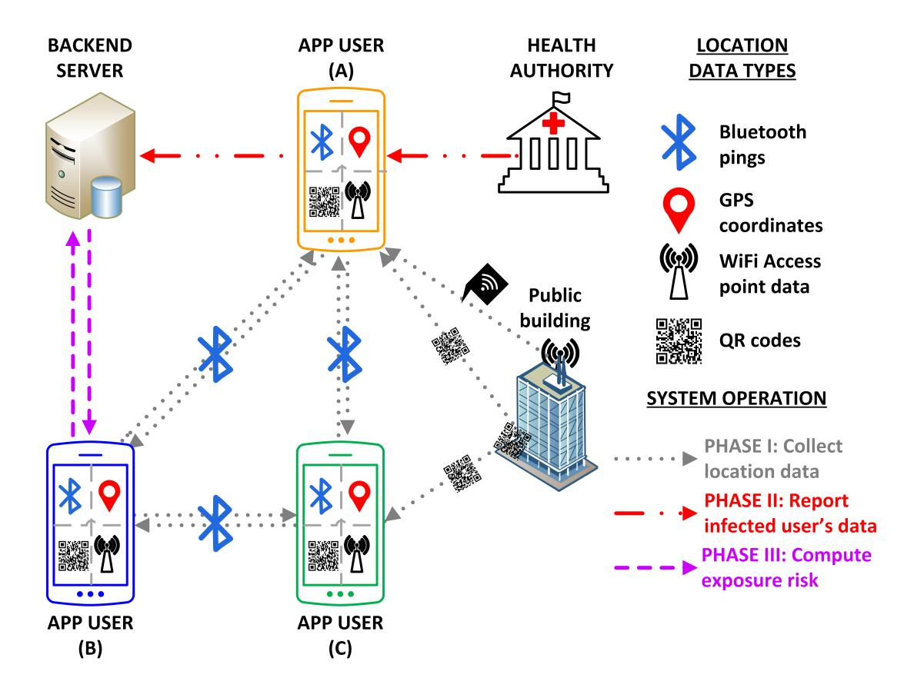
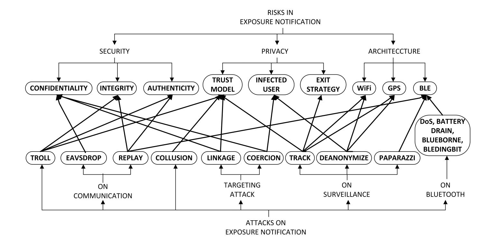

{0}------------------------------------------------

# Risk and Architecture factors in Digital Exposure Notification

Archanaa S. Krishnan1 , Yaling Yang1 , and Patrick Schaumont2

1 Virginia Tech, Blacksburg VA 24060, USA {archanaa,yyang8}@vt.edu 2 Worcester Polytechnic Institute, Worcester MA 01609, USA pschaumont@wpi.edu

Abstract. To effectively trace the infection spread in a pandemic, a large number of manual contact tracers are required to reach out to all possible contacts of infected users. Exposure notification, a.k.a. digital contact tracing, can supplement manual contact tracing to ease the burden on manual tracers and to digitally obtain accurate contact information. We review the state-of-the-art solutions that offer security and privacy-friendly design. We study the role of policies and decision making to implement exposure notification and to protect user privacy. We then study how risk emerges in security, privacy, architecture, and technology aspects of exposure notification systems, and we wrap up with a discussion on architecture aspects to support these solutions.

Keywords: Exposure notification · Contact tracing · Privacy preserving · Privacy friendly architectures · Risks

# 1 Introduction

In recent months, the SARS-CoV-2 virus has infected four million people claiming over 300,000 lives. At the onset of SARS-CoV-2 virus infection, the governments around the world placed entire states under lockdown to prevent the spread of the infection. Although this strategy was effective in curtailing the spread of the infection, it has adversely affected other aspects of life, increased the unemployment rate, stressed the medical infrastructure, affected the global supply chain, created both food shortage, and brought about food waste. To ease the lockdown and to support long-term infection management, governments are next considering and implementing a test-trace-isolate strategy. The aim of this strategy is, first, to reduce the infection rate and, second, to limit the confinement to exposed individuals and communities instead of countrywide lockdown. The effectiveness of this strategy depends on widespread testing and contact tracing.

The main goal of contact tracing is to interrupt ongoing transmission, reduce the spread of infection, and study the epidemiology of the infection in a particular population. Contact tracing has been effectively used against tuberculosis, sexually transmitted diseases, vaccine preventable diseases, bacterial and viral infections. The World Health Organization has used contact tracing to prevent 

{1}------------------------------------------------

transmission of infection. It is performed by public health workers in three steps including contact identification, contact listing, and contact follow-up [54].

- In contact identification, the public health workers, a.k.a contact tracers, work with infected individuals to identify contacts by revisiting their movements before the onset of illness. The exposed contacts may be family members, co-workers, friends, health care personnel, or service providers.
- In contact listing, all potential contacts of the infected individual are informed of their contact and advised about early care if they develop symptoms or advised to self-isolate, depending on the illness.
- In contact follow-up, contact tracers periodically follow-up with the contacts for signs of symptoms and test for illness.

In this paper, we focus on digital contact tracing and its security and privacy. We refer to digital contact tracing as exposure notification [56]. We present the components required to build a secure and privacy friendly exposure notification system through the following contributions:

- We study the state-of-the-art proposals in privacy preserving solutions and differentiate their architectural and privacy design.
- We analyze the role of policies and guidelines that shape these solutions.
- We analyze the risks involved in exposure notification. In particular, we analyze the security and privacy risks involved in collecting location data.
- We consolidate open research challenges in security and privacy friendly architectures for exposure notification systems. We present a roadmap to achieve secure and private architectures that may serve useful beyond the COVID-19 pandemic.

Organization: The rest of the paper is organized as follows. Section 2 presents the state-of-the-art exposure notification proposals and their security and privacy design. Section 3 analyzes the role of policies and their effects on the proposals. Section 4 provides a classification of risks involved in exposure notification based on several factors. Section 5 studies the role of architecture in designing, selecting, and implementing these proposals. Section 6 summarizes a few open research questions and presents an agenda to achieve secure and privacy friendly architectures.

# 2 Summary of Proposals

To fight against the pandemic, the digital world has pulled together to propose many exposure notification protocols, mobile phone applications, and frameworks. They aim to aid health authorities in the time consuming tracing process and to provide accurate contact information which may not be always possible when only relying on the memory of infected patients. In this section, we summarize the state-of-the-art systems proposed and implemented around the world. First, we briefly describe the different types of exposure notifications systems based on the architecture and security model. Then, we present a few deployed apps followed by the proposals from the academia and private sector.

{2}------------------------------------------------

Fig. 1. A generic exposure notification system

## 2.1 Preliminaries

We generalize exposure notification systems as follows. The contact information can be collected as geolocation, Bluetooth pings, QR code, and/or WiFi access point information, as illustrated Figure 1. It is stored with the corresponding timestamp of collection. In all types of notification systems, the timestamp of collection is used to mark the start of the required retention period for geolocation contact data. In notification systems other than Bluetooth-based ones, the timestamp is also a required parameter to properly define the location coordinates of users in space and time. Bluetooth ping-based systems are directly between users, and hence do not require space/time location coordinates.

We refer to all types of contact information with its timestamp as location data in the rest of the paper unless explicitly differentiated. We refer to app users who have tested positive for infection as infected users and the remaining as uninfected users. The main parties involved in exposure notification systems are the app users, health authorities, and backend servers. The system is implemented as a mobile app and after app installation, it operates in three phases [21]:

- I : The app collects and stores its user location data.
- II : After diagnosis, infected users report their location data to a central exposure database server.
- III : Any user can query the server to compute their exposure risk.

Exposure risk is used to identify if any user was in contact with one or more infected users. A positive exposure risk notification implies exposure to infection and a negative exposure risk is perceived as no known exposure.

{3}------------------------------------------------

#### 4 A. Krishnan et al.

Architectural differences in exposure notification: The proposed exposure notification systems can be broadly classified based on the architecture of the design. The main technology used in collecting location data includes Bluetooth pings, geolocation, QR code, WiFi access point, or a combination of these techniques. The difference in architecture can be mostly observed in phase I of the system operation, described below:

- Bluetooth: The user's app broadcasts a pseudo ID at periodic intervals using Bluetooth beacons. The pseudo IDs are generated using pseudo random functions(PRF), AES module, or SHA-2. The app also collects all IDs it scans via Bluetooth with the corresponding reception time. The scanned IDs and broadcasted IDs are retained for a fixed amount of time, as prescribed by epidemiologists. The user privacy is maintained by ensuring that pseudo IDs cannot be used to identify its user.
- Geolocation: The app records its user location data such as GPS coordinates at fine grained periodic intervals. The user privacy is maintained by anonymizing the geolocation data before it leaves the user's terminal device. Alternately, the geolocation data can be encrypted. Homomorphic encryption schemes support privacy-friendly processing of location data.
- QR Code: The app is used to scan QR codes before entering public facilities, such as trains and office buildings. The app stores a local history of locations visited (QR code) along with the time visit. The user privacy is protected as the QR code does not reveal the user identity.
- WiFi Access Point: The app records the MAC address of the WiFi access points it encounters. Since the access points are considered stationary and unrelated to its connecting users, they can be used as geomarkers.

Security models used in exposure notification: In phase II, an infected user turns over stored location data to the health authority. With the consent of the infected user, the health authority then shares the user's anonymized location data with a public server. The way the location data is used in Phase III widely varies depending on the trust model of the server and the trust in central authority. A majority of the existing proposals use a semi-trusted, also called honest-but-curious, server. Such a server is assumed to follow the protocol but may keep a record of intermediate computations and use it for further inference beyond the protocol operation. In exposure notification systems, a semi-trusted server is assumed to not add or remove information shared by infected users, but the server will not protect the privacy of all users [10]. The privacy of users in such models is independent of the trust placed in the server as the server only stores anonymized user data. In exposure notification systems it is safe to assume that the server is maintained by the government or the health authority. The trust in the central authority that maintains this server differentiates the operations in phase III. Based on this trust, the proposals are broadly classified as centralized and decentralized models that operate as follows.

{4}------------------------------------------------

| StoA Apps                   | О            | W        | Location Data         | Security and Privacy | Country/ Company | Protocol       |
|-----------------------------|--------------|----------|-----------------------|----------------------------|---------------------|----------------|
| TraceTogether[13]           | <b>√</b>     | <b>√</b> | BLE IDs               | AES-GCM                    | Singapore           | BlueTrace [35] |
| Hamagen[14]                 | $\checkmark$ | _        | BLE IDs, GPS, WiFi | -                          | Israel              | -              |
| SmitteStop[18]              | ×            | -        | BLE IDs, GPS          | -                          | Norway              | -              |
| Arogya Setu[31]             | -            | -        | BLE IDs, GPS          | -                          | India               | -              |
| ProteGo[15]                 | $\checkmark$ | <b>√</b> | GPS                   | -                          | Poland              | -              |
| NHS COVID-19 App[25]     | -            | -        | BLE IDs               | -                          | UK                  |                |
| StopCovid[24]               | $\checkmark$ | ✓        | BLE IDs               | -                          | France              | ROBERT [21]    |
| COVIDSafe[12]               | $\checkmark$ | -        | BLE IDs               | -                          | Australia           | BlueTrace [35] |
| Covid Watch[8]              | ✓            | <b>√</b> | BLE IDs               | Hash Function              | USA                 | TCN [23]    |
| CoEpi [7]                   | $\checkmark$ | <b>√</b> | BLE IDs               | Hash Function              | USA                 | TCN [23]    |
| PrivateKit SafePath [20] | $\checkmark$ | <b>√</b> | BLE IDs, GPS          | Encrypted Location data    | USA                 | -              |
| CovideSafe [9]              | ✓            | <b>√</b> | BLE IDs               | TLS, SHA-256               | USA                 | PACT [44]   |
| WeTrace [26]                | $\checkmark$ | <b>√</b> | BLE IDs, GPS          | Public key cryptography    | Switzerland         |                |
| Check-In [29]               | ×            |          | BLE IDs, GPS, WiFi |                            | PwC                 |                |

**Table 1.** State-of-the-art(StoA) apps deployed by governments (group 1) and academia/private sector (group 2). Their properties include availability of open source implementation (O); availability of white papers (W); the type of location data collected - Bluetooth pings(BLE IDs), geolocation data(GPS), WiFi Access Point information(WiFi) and QR code; security and privacy design; country of origin; and underlying protocol.

- In a decentralized model, the exposure risk is computed locally, by the user's mobile app, without revealing uninfected user's location data to the server. The server maintains a public exposure database of all the locations visited by infected users. In phase III, an uninfected user queries the server for the exposure database and locally compares it against their location data to determine their exposure risk.
- In a *centralized model*, the exposure risk is computed by the server and it notifies each user who queries. The server maintains a private exposure database of all locations visited by infected users. In phase III, an uninfected user queries the server for their exposure risk by revealing their location data. The server compares the query input with its database and replies with the user's exposure risk.

{5}------------------------------------------------

#### 2.2 Existing Deployments

Table 1 lists a few existing mobile applications implemented around the world. It is divided into two groups - government deployments and academia/private sector deployments.

The first group contains the apps used by governments of different countries. They are all based on the centralized model, where the server is trusted to an extent to maintain user privacy and to compute the exposure risk. The Singapore government published TraceTogether [13], a Bluetooth contact tracing app based on the BlueTrace protocol [35]. It uses pseudonyms to track users and to notify potential contacts. Israel's Ministry of Health released Hamagen [14], an exposure prevention app that uses location based on mobile device data to identify possible contacts. Norway's Institute of Public Health introduced the Smittestopp app [18] to anonymously track movement patterns. Smittestopp uses smartphone's built-in location services and Bluetooth to detect nearby phones. The Indian government has developed Arogya Setu [31] and it has made it mandatory for citizens to use the app in certain localities and offices. Even though these apps were conceived to protect the citizens, it creates an avenue for exploiting user privacy by nation-states, powerful corporations, and hackers when there is a lack of transparency in design, implementation, and evaluation. Recently, Arogya Setu was hacked to reveal the infection rate at any location with a precision of a meter [17].

The second group primarily contains the apps deployed by academia [9, 8, 7, 20, 10, 26] that are based on the decentralized model and are well documented with reference implementation, white papers, and open discussion on improving their privacy. A majority of them are based on the protocols discussed in Section 2.3. In the private sector, PricewaterhouseCooper (PwC) has developed an enterprise version of a digital contact tracing app, called Check-In, for status checking and automated contact tracing [29]. It is targeted towards its corporate clients who are considering digital contact tracing to re-open their offices. If an employee is tested positive for the infection, the human resources department notify other employees who were in contact with the infected employee of their exposure risk [28].

#### 2.3 Exposure Notification Protocols

Several privacy preserving digital contact tracing solutions were proposed to prevent using contact tracing as a new tool for tracking people and to prevent misuse of health data. Table 2 lists a few emerging proposals discussed here. Decentralized Privacy-Preserving Proximity Tracing (DP-3T) [10], Privacy-Sensitive Protocols And Mechanisms for Mobile Contact Tracing (PACT) [44], Private Automated Contact Tracing - the PACT protocol [19], the TCN(temporary contact number) protocol, and the Apple|Google collaboration framework [47] are proposals for secure and decentralized Bluetooth-based tracing that minimize

{6}------------------------------------------------

|                          | Open   |               | Security and                          | Trust         |  |
|--------------------------|--------|---------------|---------------------------------------|---------------|--|
| StoA proposals           | source | Location Data | Privacy                               | Model         |  |
| DP-3T[10]                | X      | BLE IDs       | AES-CTR, SHA-256                      | Decentralized |  |
| Google Apple[47]         | No     | BLE IDs       | AES, SHA-256                          | Decentralized |  |
| PACT[19]                 | -      | BLE IDs       | PRF                                   | Decentralized |  |
| PACT[44]                 | X      | BLE IDs       | TLS, SHA-256                          | Decentralized |  |
| TCN Protocol[23]         | X      | BLE IDs       | Hash function                         | Decentralized |  |
| ROBERT[21]               | No app | BLE IDs       | Block-cipher , AES-OFB                | Centralized   |  |
| DESIRE[11]               | No App | BLE IDs       | Diffie-Hellman                        | Cenralized    |  |
|                          |        |               | Hash function, Public                 | Centralized+  |  |
| ConTra Corona[39] No app |        | BLE IDs       | key cryptography                      | decentralized |  |
|                          | No app |               | TOR, mix-nets,                        | Centralized+  |  |
| Pronto-C2[34]            |        | BLE IDs       | Diffie-Hellman                        | decentralized |  |
| Epione[67]               | -      | BLE IDs       | PIR                                   | Decentralized |  |
| TraceSecure[37]          | No app | BLE IDs       | Homomorphic encryption Decentralized  |               |  |
| PrivateKit[16]           | X      | BLE IDs, GPS  | Encrypted location data Decentralized |               |  |
| SafeTrace[22]            | -      | GPS           | MPC                                   | Decentralized |  |
| Berke1 et al.[38]        | No app | GPS           | Hash tables, PSI                      | Decentralized |  |
|                          |        |               | Homomorphic                           | Decentralized |  |
| Tjell et al.[66]         | No app | BLE IDs, GPS  | encryption, PSI                       |               |  |
|                          | X      |               | Public Key                            | Decentralized |  |
| WeTrace[43]              |        | GPS, BLE IDs  | Cryptography                          |               |  |
|                          |        |               | Symmetric Key                         | Centralized,  |  |
| CONTAIN[50]              | No app | BLE IDs       | Encryption                            | decentralized |  |
| CAUDHT[41]               | No app | BLE           | Blind signatures,                     | Decentralized |  |
|                          |        |               | hash tables                           |               |  |

Table 2. State-of-the-art(StoA) proposals from the academia and private sector. Their properties include the availability of open source implementation; location data type; security and privacy design; and the server trust model.

security and privacy risks in digital exposure notification. ROBust and privacypresERving proximity Tracing protocol (ROBERT) [21] is a centralized protocol with similar design and federated servers. In these designs, user privacy is maintained by generating ephemeral pseudo IDs, referred to as BLE IDs in Table 2, using AES and SHA-2 based algorithms. Bluetooth-based protocols only relying on anonymous BLE IDs, are susceptible to various risks as discussed in Section 4. These risks may be exploited to carry out replay attacks, linkage attacks, power drainage attacks, trolling attacks, paparazzi attacks, tracking, and deanonymization of infected users [68, 49, 55].

There are several proposals that use techniques beyond ephemeral pseudo IDs to protect user privacy, particularly infected user privacy, in Bluetooth-based systems. DESIRE [11] was proposed by the ROBERT [21] team as a protocol that leverages aspects from both centralized and decentralized models. While the exposure risk computation is still centralized, DESIRE's ephemeral IDs are generated on mobile phones using Diffie-Hellman protocol [45]. It also stores scanned IDs in two parts - one for uploading to exposure database if infected and the 

{7}------------------------------------------------

other for checking the exposure risk. ConTra Corona [39] divides the ephemeral IDs into two unlinkable IDs - one for broadcasting via Bluetooth and the other for publishing in the exposure database. It employs two servers (to publish and to check for exposure risk) and an anonymous communication channel, such as TOR [3], to prevent the server from linking IDs to metadata. Pronto-C2 [34] is designed to provide protection against mass surveillance, which is possible in many decentralized Bluetooth-based systems. It uses blind signatures to authenticate infectious user location data, TOR to break the link between ephemeral IDs and real identities, and mix-nets to reduce the relation between two ephemeral IDs from the same user. Epione [67] proposes to use a single-server private information retrieval (PIR) scheme with homomorphic encryption or two-server PIR scheme with symmetric encryption to protect location privacy. TraceSecure [37] is a set-based protocol that protects all user privacy irrespective of their infection status. It protects the Bluetooth-based location data using public key encryption and additive homomorphic encryption techniques.

The privacy of GPS based proposals, such as PrivateKit [16], Safe-Trace [22]and [38, 66], differ from Bluetooth based proposals because geolocation data itself is not anonymized. Instead, they rely on private set intersection (PSI), PIR, homomorphic encryption, and multi-party computation(MPC) protocols to achieve user privacy, similar to the approach of TraceSecure [37] and Epione [67].

# 3 Role of Policies and Standards

The data collected in exposure notification systems typically consist of both location and health data of users. There is a risk of infringement of fundamental civil and data rights when these systems are deployed at a large scale. And there is a threat of public and private surveillance. In this section, we discuss how the government's decision and policy making capabilities can help safeguard user data.

Consider the Apple|Google collaboration [47] to provide a privacy friendly exposure notification system. They are working on a common framework that can work across Android and iOS. They propose to incorporate the pseudo ID generation and rotation capabilities, first, in an API framework and later, to embed it in the OS. The exposure notification app would access the ID via the API and broadcast it. Even though this type of solution restricts the access and generation of IDs to the 'trusted' OS, it creates a monopoly on ID generation. Switzerland, UK, USA, and Australia are already considering implementing their exposure notification apps based on the Apple|Google API framework [33]. The apps using this framework are forced to follow its decentralized model. Bluetoothbased decentralized systems, such as DP-3T and Apple|Google framework, are proven to be exploitable for mass surveillance using paparazzi attack [60]. Unless Apple and Google update their framework, all apps that use their framework are also susceptible to such attacks. This is an example of how a few tech giants monopolies in the smartphone industry affect user privacy.

{8}------------------------------------------------

PwC's Check-In app is another example of how private companies may force their employees to use exposure notification apps [28]. With Check-In, executives and human resource department of corporate companies will have access to all employee interaction and routines in a workspace. There are no clear regulations on enterprise exposure notification systems, on corporate companies using user data from exposure notification systems, and on post-COVID-19 data privacy management.

We need regulations and laws that can be applicable in this emergency setting where user's (or citizen's) rights must be protected. These laws will play an important role in holding all actors accountable for their roles and instill trust in the users to participate in exposure notification. The ACLU [46], EDPB [40], AccessNow [30] and other data rights and privacy groups have published guidelines for selection and widespread implementation of exposure notification systems [27]. These guidelines may be adopted by policymakers and government officials when designing, selecting, and implementing exposure notification systems. The guidelines proposed for the COVID-19 pandemic revolve around the central themes of social and technical requirements listed below. The following requirements were consolidated from the guidelines proposed by AccessNow [30], ACLU [46], EDPB [40], and CCC [27].

- Epidemiology perspective: The system must be designed and used under the supervision of qualified personnel. It must be designed for specific epidemics and pandemics. For example, Bluetooth based tracing is effective in COVID-19 but ineffective in sexually transmitted diseases.
- Voluntary enrolling, consent, and no discrimination: User participation must be voluntary and the user must consent to all the functionalities of the system, such as, collecting location data and sharing the required data with a server. Punitive and restrictive measures to control the infection using the system must not be allowed.
- Transparency and audits: The system design and implementation must be transparent to the public with open source implementation, regular audits with published reports, clear definition of parties involved in the system, and their roles.
- Central authorities and accountability: The system must place minimal or no trust in a central authority. Any trusted central authority must be held accountable for their actions under the law.
- Data minimization: The system must only collect necessary data and only share necessary data with the server. Whenever possible the data should be encrypted to restrict access to authorized parties. The collected data must be stored only as long as it is deemed useful by epidemiologists.
- Data Anonymisation refers to the removal of the ability to link the data with an identified or identifiable natural person using any "reasonable" effort [40]. Any data that leaves the user's terminal device, such as a mobile phone, must not be used to recognize the user. This data includes the exchanged Bluetooth IDs and location data shared with the server.
- Security: All communications and storage must be secured with state-of-theart cryptographic algorithms. This includes mutually authenticated commu-

{9}------------------------------------------------

- nication between the server and the app and secure data storage at both the server and the app side.
- Sunset provisions: At the onset, the system must define clear goals for an exit strategy. The exit strategy may need to be implemented because of an ineffective system or because the pandemic was successfully combated. The exit strategy must include provision for safe disposal of stored data at the server (either erasure or further anonymization for historic use) and provide guidelines to uninstall and clear local data on the user's mobile phone.

# 4 Risks in Exposure Notification

In this section, we classify the risks present in all types of exposure notification systems. Figure 2 illustrates the potential attacks that exploit the risks detailed below. Replay, trolling, linkage, coercion, eavesdropping, paparazzi, collusion, deanonymization, Denial of Service(DoS), battery drain, and tracing attacks are discussed by Gvili [49] and Vaudenay [68]. BleedingBit [63] and BlueBorne [62] attacks are particular to Bluetooth technology.

## 4.1 Security Risks

Integrity based risks: An uninfected user may add bogus location data to their location data to check if a particular location or user is infected. A malicious infected user may add bogus location data to their location data before they share it with the exposure database, which causes widespread panic among other users and generate false positive exposure risks.

A malicious server may modify the exposure database. The server may add bogus location to induce false positives or the server may delete certain locations to induce false negatives. The former could be used to create panic in certain locations and the latter may be exploited by certain services such as cafes and restaurants to delete their location data from the database to maintain a steady influx of customers.

Integrity based risks may be exploited for trolling attacks, replay attacks, and to stigmatize infected users.

Authenticity based risks: The authenticity of the exposure database and exposure risk notification is at risk. Unverified uploading of location data to the exposure database can be exploited to upload bogus location data to the server. An attacker may impersonate the server and provide false positive and false negative exposure notification to users. The same attacker may also send malicious exposure database entries to the user and influence the user to compute a false positive/negative exposure notification. These risks may be exploited for trolling attacks.

{10}------------------------------------------------

Fig. 2. A flow chart of risks in and attacks [68, 49, 62, 63] on exposure notification systems

Confidentiality based risks: An attacker can passively observe the communication between the app and the server. The attacker can obtain the location data when it is shared with the server. The attacker may also have access to the victim's terminal device, from which the stored location data may be extracted. All unencrypted data is vulnerable to the attacker. This data can be used for replay attacks, linkage attacks, and coercion threats.

#### 4.2 Privacy Risks

Server trust model risks: All the exposure notification proposals use a server in a centralized or decentralized model. In both cases, the server typically stores anonymous location data for exposure notification. The anonymous location data is typically received as network packets from the app user to the server along with metadata, such as the source IP address. A malicious server may store the metadata related to users and break user anonymity. This can be further exploited by the server to build social graphs of the users without their consent. A social graph represents the relationship between app users which leaks user privacy. A malicious server may introduce bogus location data to aid in trolling attacks, as described in authenticity based risks [57].

A server in the centralized model compares infected user location data and uninfected user location data to compute exposure risk. An untrusted centralized server has access to all user location data, which can be exploited by the central authority to sell location data for profit.

The server trust model is inherently derived from the assumed attacker model. The attacker (app user or a third party) may collude with the server to perform collusion attacks to deanonymize location data using metadata, to 

{11}------------------------------------------------

obtain the social graph of all users, and obtain location data of all users. Collusion attacks may also be used to exploit the inherent risks of MPC protocols based exposure notification systems [66].

Infected user privacy risks: In decentralized exposure notification proposals, the infected user's location data is broadcasted to the public. The attacker can associate location data of each user with an identifier, when there is a match in location data between the attacker's app and public database, the attacker can identify the infected user using their identifier. This may be exploited to target a particular victim, where the attacker only interacts with the victim and has location data only from the victim. When this location data is compared with the public database the attacker can identify if the victim is infected or not [68, 49]. This risk could be exploited to deanonymize the infected user using linkage attacks and perform one-entry attacks [21]. A potential solution is not to publish the location data of infected users, but to have a federated server perform the exposure risk calculation using both user and infected user location data. This type of solution has its own risks mentioned above.

Sunset provision risks: The purpose of exposure notification systems is to limit the spread of infection. Without preset deadlines to stop contact tracing, these systems may be exploited to track users beyond the scope of infection control.

#### 4.3 Architecture and Technology Risks

Bluetooth based risks: A majority of proximity tracing proposals [21, 10, 44, 19, 13] are based on Bluetooth technology. Bluetooth can be exploited to attack the exposure notification system by extending Bluetooth discoverability using a directional antenna. The attacker can create false positive contact data and to potentially perform trolling attacks.

Using Bluetooth, an attacker can attack the general operation of a user's mobile phone as the Bluetooth is always on for the operation of exposure notification systems. Bluetooth is vulnerable to Denial of Service (DoS) attacks where the attacker can flood a victim's Bluetooth with a large volume of messages. The device consumes power in analyzing these messages, storing valid messages in memory which overloads the memory, and discarding invalid messages. This may drain the battery on the mobile phone, keep the phone occupied, and lead to slow or no response to its regular operation.

Bluetooth-based systems are not accurate in detecting the precise distance between two phones, which may lead to false positives [33]. A majority of them use received signal strength indicator(RSSI) to compute the distance. RSSI may not convey accurate distance measurements because it is affected by obstructions such as a phone case. A large number of false positives may also stress the health system by using medical supplies to test false positive users.

{12}------------------------------------------------

These systems also interact with existing ad-tech surveillance equipment, which uses BLE beacons for marketing and advertisement [61]. With this interaction, the marketing companies may associate Bluetooth pings with the absolute location of their beacons. On a large scale, such trackers maybe employed for mass surveillance [60].

The Bluetooth-based exposure notification system may be used to exploit Bluetooth vulnerabilities such as BleedingBit [63] and BlueBorne [63] which may affect regular mobile phone operation. They are also vulnerable to passive tracking and identity exposure without an accurate implementation of BLE MAC address randomization [36].

WiFi Access Point based risks: WiFi Access Point based proximity tracing systems [32] keep track of the network identifiers of WiFi Access Points. If the attacker has access to these network identifiers and their collection timestamp, they can identify the exact location of the user which leaks user privacy [65]. Similar to Bluetooth, WiFi-based systems do not provide accurate contact information as an access point maybe used by users who are physically separated, for example, in different rooms.

Geolocation based risks: When exposure notification proposals use geolocationbased location data, they have access to the absolute user location data. The geolocation data is a commodity to be sold which can be used to construct social graphs. This maybe exploited as a monitoring tool by nation-state and corporations.

#### 4.4 Political risks:

Table 1 lists various apps and initiatives deployed in different countries, where each country and its current government are implementing their choice of exposure notification system in a centralized model. There are a few political risks in such systems. First, a change in government might affect citizen privacy as there is a change in central authority. For example, the existing government may adopt a system where it stores location data from its citizen and only uses it to compute exposure risks when requested. The database may not necessarily anonymize user data because the central authority is trusted to not misuse the data. This data maybe exploited by the next government to enforce stricter measures to fight the pandemic or maybe used to track its citizens. Second, the exposure notification system may be exploited by other nation-states. For example, country A's exposure database with location data from its citizens maybe exploited by country B. User privacy is at risk from cross-border cybersecurity attacks. Edward Snowden also suggested that exposure notification systems maybe exploited for mass surveillance by governments [64].

{13}------------------------------------------------

| 14-day retention | Broadcast Overhead @ 0.25s interval | Scan Overhead @ *1s interval Units |           |
|------------------|----------------------------------------|---------------------------------------|-----------|
| ID storage size  | 224                                    | *224,000                              | B         |
| Battery drain    | 0.0132                                 |                                       | 3.75 %/hr |

Table 3. An example of overhead incurred by the Google|Apple framework in iPhone 5S. ID storage size includes the keys used to derive the broadcasted IDs and the scanned IDs in 14-days. The percentage battery drain was computed using Aislelabs technical reports [6, 5]. \*We assume 1000 contacts/day and a 1s scan interval

# 5 Role of Architecture

In Section 2, we saw that a majority of exposure notification systems are only based on Bluetooth based location data. One of the reasons for using Bluetooth is that tracing geolocation data, such as GPS, is considered to be intrusive and in the wrong hands, it may be used to track the user. The attacker can use geolocation data to discern a victim's home address, workspace, their daily activities, and social interactions. Short-wavelength technology based proximity tracing was thought to be an alternative to GPS based contact tracing. The ubiquitousness of mobile phones with Bluetooth technology was an off-the-shelf solution to solve the tracing problem. In this section, we analyze the role architecture and technology play in the design and choice of exposure notification proposals. We provide back-of-the-envelope calculations for the cost of using Bluetooth in exposure notification. We present the architectural requirements for using geolocation based location data for privacy friendly designs.

#### 5.1 Bluetooth, Privacy, and Overhead

The privacy of the user is guaranteed in a majority of Bluetooth-based proposals based on two properties. First, the pseudo IDs collected using Bluetooth do not provide any information about the absolute location of the contact. Second, the pseudo IDs are frequently changed to ensure that no observer is able to track a user with their IDs. These properties are guaranteed by the cryptographic algorithms used to derive the IDs. The pseudo IDs are typically generated using SHA-2 [10], AES [47] or a pseudo random function [19]. Although modern mobile phone technology is equipped with hardware acceleration for AES and SHA-1, it is optimized for computation on large data. Since the IDs are typically 16B they can be generated with minimal overhead in software.

Bluetooth Low Energy (BLE) is the recommended Bluetooth technology to be used in implementing these proposals. BLE is known for consuming low energy when compared to Bluetooth Classic by essentially operating in sleep mode. The exposure notification apps do not establish a Bluetooth connection, they

2 The percentage battery drain for iPhone BLE broadcasting was extrapolated from the battery life of low-power iBeacon device broadcasting [6]. Broadcasting using iPhone may consume significantly more battery.

{14}------------------------------------------------

only broadcast their IDs to and scan IDs from contacts. Table 3 lists the potential overhead of deploying the Google|Apple framework [47] in iPhone 5S. We differentiate the overhead based on two Bluetooth operation - broadcasting and scanning. We compute the broadcasting overhead with a 0.25s broadcast interval, the recommended broadcast interval is between 0.2-0.27s [47]. The scan overhead is computed at an assumed scan interval of 1s. For simplicity, we only consider the storage overhead of the BLE IDs without the timestamp and other metadata.

The overhead is listed in terms of the size of memory required based on a 14-day retention period and the percentage of battery drain per hour for each Bluetooth operation. The broadcasted ID storage includes the Temporary Exposure Keys (TEK) used to compute the Rolling Proximity Identifiers(RPID) in the past 14-days. Since TEKs are computed daily, the net broadcast ID storage overhead is computed as a product of TEK size in bytes (16B) and the number of days in retention period (14 days) which comes to 224B. The scanned ID storage is computed as a product of the scanned ID size (16B), number of contacts per day (assumed to be 1000), and number of days in retention period (14 days), which equals 224,000B.

The percentage battery drain is computed using technical reports from Aislelabs [1]. iPhone 5S is equipped with a 1560mAh battery [2]. When this iPhone broadcasts its RPIDs at 0.25s broadcasts interval, it uses 0.013%3battery per hour [6]. The same iPhone uses 3.75% battery per hour to scan for incoming RPIDs in 1s scan interval [5]. During each scan operation, the phone may detect multiple beacons and process them which could be attributed to a higher battery drain during scanning. The percentage battery drain for Bluetooth operations can be reduced by increasing the broadcast and scan intervals [4], but this may adversely affect the protocol operation.

We highlight that Bluetooth communication is not free even in BLE. Apart from the proximity communication and storage overhead, there are overheads in communicating with the server, computing new IDs, and computing exposure risk.

#### 5.2 Hardware Acceleration for Privacy Protection

Apart from relying on AES and SHA-256 for security, some proposals use MPC protocols, PSI, and PIR to protect user privacy [57, 66]. They use garbled circuits [67] and homomorphic encryption [37] as their underlying cryptographic primitive in their protocol design. There are several advantages to selecting this type of privacy protection. First, it protects infected users from deanonymization. Since these proposals do not reveal any information about infected users, an attacker cannot infer infected users from their contacts. Second, homomorphic encryption based solutions are effective in using geolocation data without compromising user privacy. Third, homomorphic encryption solutions may be post-quantum secure, which is an added benefit in designing futuristic applications.

{15}------------------------------------------------

A major drawback in implementing such proposals is the computational overhead involved both at the app user and server side. For example, homomorphic computations generate large ciphertext with a message expansion factor of more than two [59]. The encryption, decryption, and evaluation using homomorphic encryption algorithms are also time consuming. Modern mobile phones are only equipped with cryptographic hardware acceleration for AES and SHA-1 or they are equipped for software acceleration for the same using custom instructions. Hardware acceleration for garbled circuit [51] and homomorphic encryption [58] exists only in academic literature. HEAX [58] is a novel architecture for homomorphic computation on encrypted data. It contains hardware modules for high throughput Number Theoretic Transform(NTT), homomorphic multiplication, and key switching. Prior work on hardware implementation for homomorphic encryption mostly designed accelerators for large number [69], polynomial [52] or integer [42] multiplication.

While the ubiquitousness of Bluetooth technology in mobile phones has lead to its widespread adaptations in privacy preserving proposals, the dearth of garbled circuit and homomorphic hardware may be attributed to the reason behind their limited use in the same field.

#### 5.3 Secure Location Data Storage

A few security risks from Section 4 can be exploited by the attacker when they have access to read and to write local location data storage. The attacker may add bogus locations to the exposure database to perform trolling attacks. They can add targeted location data to check the infection data of a particular location or user. They can coerce a victim to reveal their location data [68]. These risks and attacks can be avoided if the location data is stored securely, without access to the attacker or even the app user. If the local data storage is encrypted and authenticated, the security risks can be avoided. Vaudenay [68] suggests using Trusted Platform Modules(TPM) to prevent coercion threats and trolling attacks, which is also suggested in the DP-3T proposal [10]. Trusted Computing Group (TCG) has platform-specification for implementing TPM in mobile platforms for secure storage and execution [48]. If mobile phones are equipped with secure storage, a trusted exposure notification app may use this secure storage to store local location data.

# 6 Towards Secure and Privacy Friendly Architectures

The state-of-the-art proposals summarized in Section 2 are by no means a comprehensive list. There is a deluge of exposure notification proposals in literature but there is no dedicated policy on which type of privacy preserving solution must be chosen by a government. In this section, we present a few challenges that exist in deployed and proposed exposure notification systems. We conclude by presenting potential add-ons to mobile architectures to overcome these challenges.

{16}------------------------------------------------

#### 6.1 Challenges in Design and Implementation

- 1. Security of location data: All the deployed and proposed solutions are primarily focused on protecting user privacy. They mention some techniques that maybe implemented to protect the security of location data but it is not as clearly defined as the privacy protection.
- 2. User privacy irrespective of infection status: A majority of decentralized proposals do not protect the privacy of infected users as their location data is made public. Even anonymized location data can be used to deanonymize infected users [68, 49]. The apps deployed by governments place trust on a central authority to maintain infected user privacy and thus placing trust in one entity.
- 3. Tracing multi-hop transmission: SARS-CoV-2 virus can be transmitted through surfaces. A majority of the proposals use proximity tracing based on Bluetooth which only traces human to human transmission. Geolocation based tracing is set aside at the onset of design in the name of protecting user privacy even though there are techniques that can be used to anonymize such data.
- 4. Security and trust model: All the state-of-the-art protocols are designed for an honest-but-curious server. It is not clear if their security and privacy properties hold true in an honest or dishonest majority setting [53]. In real life, there maybe malicious servers with a dishonest majority, where these protocols may not protect user privacy.
- 5. Server implementation: All the proposals require a centralized or decentralized honest-but-curious server. They lack in practical details on implementing and maintaining such servers.

#### 6.2 Achieving Overall Security and Privacy

A few of the challenges mentioned above (1,2, and 3) remain unsolved in deployed solutions, which can be attributed to the lack of architectural support in mobile phones. The presence of secure storage and its access to trustworthy apps can help solve the security risks of location data. Challenge 2 and 3 are addressed in a few proposals [57, 66, 67, 37], but their practicality may be hindered by the overhead incurred by their privacy protection solution. These solutions use garbled circuits and homomorphic encryption in MPC, PSI, and PIR based protocols to both protect infected user privacy and protect geolocation data. They may be viable in the presence of hardware acceleration for their cryptographic primitives, homomorphic encryption, and garbled circuits. The availability of homomorphic hardware acceleration will not only be useful for exposure notification, as homomorphic encryption and computation are considered post-quantum secure. In the age of mobile phones with multiple lens and advanced software for night vision photography, why are they not equipped with acceleration to support secure and privacy friendly applications?

Acknowledgements : This work was supported in part by NSF grant 1704176 and NSF grant 2028190.

{17}------------------------------------------------

# References

- 1. Aislelabs, https://www.aislelabs.com/
- 2. Apple iPhone 5S: Technical Specification, https://www.gsmarena.com/
- 3. The TOR Project, https://www.torproject.org/
- 4. iBeacon and Battery Drain on Phones: A Technical Report (2014), https://www.aislelabs.com/reports/ibeacon-battery-phones/
- 5. iBeacon Battery Drain on Apple vs Android: A Technical Report (2014), https://www.aislelabs.com/reports/ibeacon-battery-drain-iphones/
- 6. The Hitchhikers Guide to iBeacon Hardware: A Comprehensive Report by Aislelabs (2015), https://www.aislelabs.com/reports/beacon-guide/
- 7. CoEpi: Community Epidemiology in Action (2020), https://github.com/Co-Epi/
- 8. Covid Watch: Slowing the Spread of Infectious Diseases Using Crowdsourced Data (2020), https://github.com/covid19risk
- 9. CovidSafe (2020), https://github.com/CovidSafe
- 10. Decentralized Privacy-Preserving Proximity Tracing (2020), https://github.com/DP-3T/documents
- 11. DESIRE: A Third Way for a European Exposure Notification System (2020), https://github.com/3rd-ways-for-EU-exposure-notification/project-DESIRE
- 12. Government of Australia, COVIDSafe app (2020), https://github.com/AU-COVIDSafe/mobile-android
- 13. Government of Singapore, TraceTogether (2020), https://www.tracetogether.gov.sg/
- 14. Israel Ministry of Health, Hamagen: COVID-19 exposure prevention app (2020), https://github.com/MohGovIL/hamagen-react-native
- 15. Ministry of Digital Affairs of Polland, ProteGo Safe (2020), https://github.com/ProteGO-Safe/
- 16. MIT PrivateKit (2020), https://privatekit.mit.edu/
- 17. National Informatics Centre, India, Arogya Setu (2020), https://www.mygov.in/aarogya-setu-app/
- 18. Norwegian Institute of Public Health, Smittestopp app (2020)
- 19. PACT: Private Automated Contact Tracing (2020), https://pact.mit.edu/
- 20. PrivateKit:SafePaths (2020), https://www.media.mit.edu/projects/safepaths/overview/
- 21. ROBust and privacy-presERving proximity Tracing protocol (2020), https://github.com/ROBERT-proximity-tracing/documents
- 22. Safetrace API: Privacy-first contact tracing (2020), https://safetraceapi.org/
- 23. TCN: Temporary Contact Number Protocol. Cryptology ePrint Archive, Report 2020/399 (2020), https://github.com/TCNCoalition/TCN
- 24. The StopCovid project-team and the ecosystem of contributors are working together to develop a mobile contact tracing app for France (2020), https://www.inria.fr/en/stopcovid
- 25. United Kingdom's National Health Service, The NHS COVID-19 app (2020), https://www.covid19.nhs.uk/
- 26. WeTrace, a privacy focused mobile COVID-19 tracing App (2020), https://github.com/WeTrace-ch/WeTrace
- 27. Computer Chaos Club, 10 requirements for the evaluation of "Contact Tracing" apps (April 2020), https://www.ccc.de/en/updates/2020/contact-tracingrequirements
- 28. COVID-19 tracing apps might not be optional at work (April 2020), https://www.marketplace.org/shows/marketplace-tech/covid-19-contact-tracingapps-work/

{18}------------------------------------------------

- 29. PricewaterhouseCoopers (PwC), Check-In: A product that delivers insights for workforce productivity (March 2020), https://www.pwc.com/us/en/products/check-in.html
- 30. AccessNow: Recommendations on privacy and data protection in the fight against COVID-19 (March 2020), https://www.accessnow.org/cms/assets/uploads/2020/03/Access-Nowrecommendations-on-Covid-and-data-protection-and-privacy.pdf
- 31. Alderson, E.: Aarogya Setu: The story of a failure (2020), https://medium.com/@fs0c131y/aarogya-setu-the-story-of-a-failure-3a190a18e34
- 32. Altuwaiyan, T., Hadian, M., Liang, X.: EPIC: Efficient Privacy-Preserving Contact Tracing for Infection Detection. In: 2018 IEEE International Conference on Communications, ICC. pp. 1–6. IEEE, https://doi.org/10.1109/ICC.2018.8422886
- 33. Anderson, R., Castellucia, C., McCurley, K., Teague, V., Troncoso, C., Vaudenay, S., Yung, M.: Eurocrupt 2020 Panel Discussion on Contact Tracing (May 2020), https://www.youtube.com/watch?v=Xt4P8E\_Y-xcfeature=youtu.be
- 34. Avitabile, G., Botta, V., Iovino, V., Visconti, I.: Towards Defeating Mass Surveillance and SARS-CoV-2: The Pronto-C2 Fully Decentralized Automatic Contact Tracing System. Cryptology ePrint Archive, Report 2020/493 (2020), https://eprint.iacr.org/2020/493
- 35. Bay, J., Kek, J., Tan, A., Hau, C.S., Yongquan, L., Tan, J., Anh, T.: BlueTrace: A privacy-preserving protocol for community-driven contact tracing across borders (2020), https://bluetrace.io/
- 36. Becker, J.K., Li, D., Starobinski, D.: Tracking anonymized bluetooth devices. PoPETs (3), 50–65 (2019), https://doi.org/10.2478/popets-2019-0036
- 37. Bell, J., Butler, D., Hicks, C., Crowcroft, J.: TraceSecure: Towards Privacy Preserving Contact Tracing. CoRR abs/2004.04059 (2020), https://arxiv.org/abs/2004.04059
- 38. Berke1, A., Bakker, M., Vepakomma1, P., Larson1, K., Pentland, A. Assessing Disease Exposure Risk with Location Data: A Proposal for Cryptographic Preservation of Privacy (2020), https://arxiv.org/abs/2003.14412
- 39. Beskorovajnov, W., Dörre, F., Hartung, G., Koch, A., Müller-Quade, J., Strufe, T.: ConTra Corona: Contact Tracing against the Coronavirus by Bridging the Centralized–Decentralized Divide for Stronger Privacy. Cryptology ePrint Archive, Report 2020/505 (2020), https://eprint.iacr.org/2020/505
- 40. Board, E.D.P.: Guidelines 04/2020 on the use of location data and contact tracing tools in the context of the COVID-19 outbreak (March 2020), https://edpb.europa.eu/our-work-tools/our-documents/guidelines/guidelines-042020-use-location-data-and-contact-tracing\_en
- 41. Brack, S., Reichert, L., Scheuermann, B.: Decentralized contact tracing using a DHT and blind signatures. IACR Cryptology ePrint Archive 2020, 398 (2020), https://eprint.iacr.org/2020/398
- 42. Cao, X., Moore, C., O'Neill, M., Hanley, N., O'Sullivan, E.: High-speed fully homomorphic encryption over the integers. In: Financial Cryptography and Data Security - FC 2014 Workshops, BITCOIN and WAHC. Lecture Notes in Computer Science, vol. 8438, pp. 169–180. Springer (2014). https://doi.org/10.1007/978-3- 662-44774-1\_14, https://doi.org/10.1007/978-3-662-44774-1\_14
- 43. Carli, A.D., Franco, M.F., Gassmann, A., Killer, C., Rodrigues, B., Scheid, E.J., Schoenbaechler, D., Stiller, B.: WeTrace - A Privacy-preserving Mobile COVID-19 Tracing Approach and Application abs/2004.08812 (2020), https://arxiv.org/abs/2004.08812

{19}------------------------------------------------

- 44. Chan, J., Foster, D.P., Gollakota, S., Horvitz, E., Jaeger, J., Kakade, S.M., Kohno, T., Langford, J., Larson, J., Singanamalla, S., Sunshine, J.E., Tessaro, S.: PACT: Privacy Sensitive Protocols and Mechanisms for Mobile Contact Tracing. CoRR abs/2004.03544 (2020), https://arxiv.org/abs/2004.03544
- 45. Diffie, W., Hellman, M.E.: New directions in cryptography. IEEE Trans. Inf. Theory 22(6), 644–654 (1976), https://doi.org/10.1109/TIT.1976.1055638
- 46. Gillmor, D.K.: Principles for technology assisted contact tracing (April 2020), https://www.aclu.org/report/aclu-white-paper-principles-technology-assistedcontact-tracing
- 47. Google, Apple: Privacy-Preserving Contact Tracing (2020), https://www.apple.com/covid19/contacttracing/
- 48. Group, T.C.: TPM2.0 Mobile Reference Architecture, december 2014 Available at https://trustedcomputinggroup.org/resource/tpm-2-0-mobile-referencearchitecture-specification/
- 49. Gvili, Y.: Security Analysis of the COVID-19 Contact Tracing Specifications by Apple Inc. and Google Inc. Cryptology ePrint Archive, Report 2020/428 (2020), https://eprint.iacr.org/2020/428
- 50. Hekmati, A., Ramachandran, G.S., Krishnamachari, B.: CONTAIN: privacyoriented contact tracing protocols for epidemics. CoRR abs/2004.05251 (2020), https://arxiv.org/abs/2004.05251
- 51. Järvinen, K., Kolesnikov, V., Sadeghi, A., Schneider, T.: Garbled circuits for leakage-resilience: Hardware implementation and evaluation of one-time programs - (full version). In: Cryptographic Hardware and Embedded Systems, CHES 2010. vol. 6225, pp. 383–397. Springer (2010). https://doi.org/10.1007/978-3-642-15031- 9\_26, https://doi.org/10.1007/978-3-642-15031-9\_26
- 52. Jayet-Griffon, C., Cornelie, M., Maistri, P., Elbaz-Vincent, P., Leveugle, R.: Polynomial multipliers for fully homomorphic encryption on FPGA. In: International Conference on ReConFigurable Computing and FPGAs, ReCon-Fig. pp. 1–6. IEEE (2015). https://doi.org/10.1109/ReConFig.2015.7393335, https://doi.org/10.1109/ReConFig.2015.7393335
- 53. Keller, M.: MP-SPDZ: A versatile framework for multi-party computation. Cryptology ePrint Archive, Report 2020/521 (2020), https://eprint.iacr.org/2020/521
- 54. Organization, W.H.: What is contact tracing and why is it important? (May 2017)
- 55. Pietrzak, K.: Delayed Authentication: Preventing Replay and Relay Attacks in Private Contact Tracing. Cryptology ePrint Archive, Report 2020/418 (2020), https://eprint.iacr.org/2020/418
- 56. Reed, H.: Digital Contact Tracing and Alerting vs Exposure Alerting (22 Apr 2020), https://harper.blog/2020/04/22/digital-contact-tracing-and-alertingvs-exposure-alerting/
- 57. Reichert, L., Brack, S., Scheuermann, B.: Privacy-Preserving Contact Tracing of COVID-19 Patients. Cryptology ePrint Archive, Report 2020/375 (2020), https://eprint.iacr.org/2020/375
- 58. Riazi, M.S., Laine, K., Pelton, B., Dai, W.: HEAX: an architecture for computing on encrypted data. In: ASPLOS '20: Architectural Support for Programming Languages and Operating Systems,. pp. 1295–1309. ACM (2020). https://doi.org/10.1145/3373376.3378523, https://doi.org/10.1145/3373376.3378523
- 59. Saputro, N., Akkaya, K.: Performance evaluation of smart grid data aggregation via homomorphic encryption. In: 2012 IEEE Wireless Communications and Networking Conference, WCNC 2012, Paris, France, April 1-4,

{20}------------------------------------------------

- 2012. pp. 2945–2950. IEEE (2012). https://doi.org/10.1109/WCNC.2012.6214307, https://doi.org/10.1109/WCNC.2012.6214307
- 60. Seiskari, O.: BLE contact tracing sniffer PoC (2020), https://github.com/oseiskar/corona-sniffer
- 61. Seiskari, O.: Why use Bluetooth for contact tracing? (2020), https://medium.com/indooratlas/why-use-bluetooth-for-contact-tracing-1585feb024dc
- 62. Seri, B., Vishnepolsky, G.: BlueBorne (2017), https://www.armis.com/blueborne/
- 63. Seri, B., Vishnepolsky, G., Zusman, D.: BleedingBit: The Hidden Attack Surface Against BLE Chips (2019), https://info.armis.com/rs/645-PDC-047/images/Armis-BLEEDINGBIT-Technical-White-Paper-WP.pdf
- 64. Smith, S., Snowden, E.: Shelter in Place with Shane Smith Edward Snowden (Full Episode) (2020), https://www.youtube.com/watch?v=k5OAjnveyJo
- 65. Tang, Q.: Privacy-preserving contact tracing: current solutions and open questions. Cryptology ePrint Archive, Report 2020/426 (2020), https://eprint.iacr.org/2020/426
- 66. Tjell, K., Gundersen, J.S., Wisniewski, R.: Privacy preservation in epidemic data collection. CoRR abs/2004.14759 (2020), https://arxiv.org/abs/2004.14759
- 67. Trieu, N., Shehata, K., Saxena, P., Shokri, R., Song, D.: Epione: Lightweight contact tracing with strong privacy. CoRR abs/2004.13293 (2020), https://arxiv.org/abs/2004.13293
- 68. Vaudenay, S.: Analysis of DP3T. Cryptology ePrint Archive, Report 2020/399 (2020), https://eprint.iacr.org/2020/399
- 69. Wang, W., Huang, X.: FPGA implementation of a large-number multiplier for fully homomorphic encryption. In: 2013 IEEE International Symposium on Circuits and Systems (ISCAS2013), Beijing, China, May 19-23, 2013. pp. 2589–2592. IEEE (2013). https://doi.org/10.1109/ISCAS.2013.6572408, https://doi.org/10.1109/ISCAS.2013.6572408