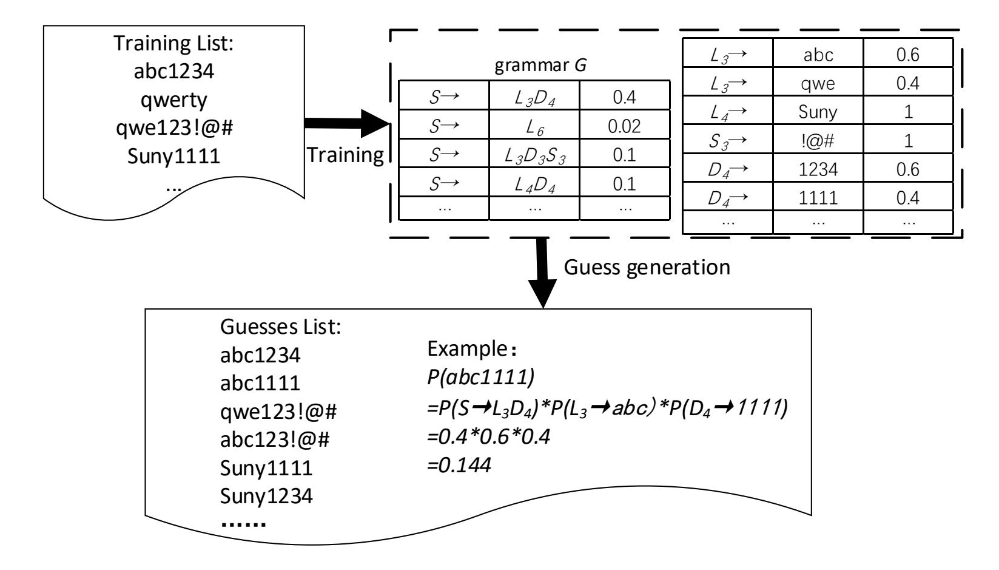
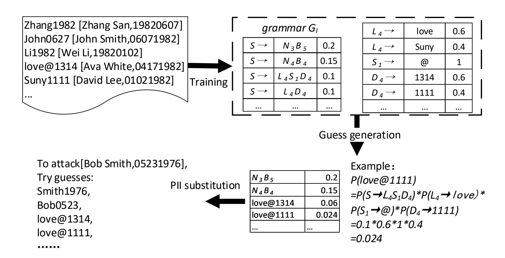
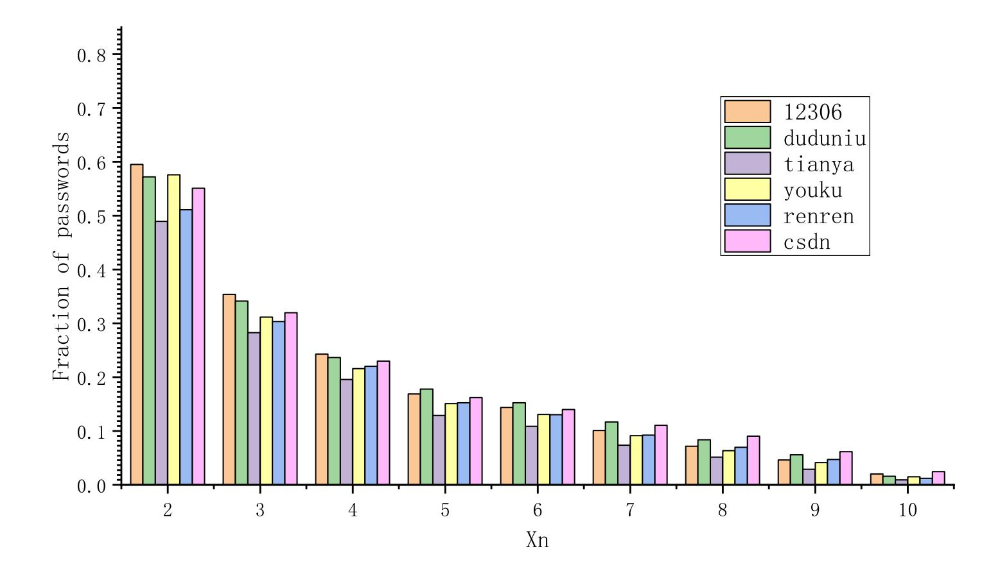
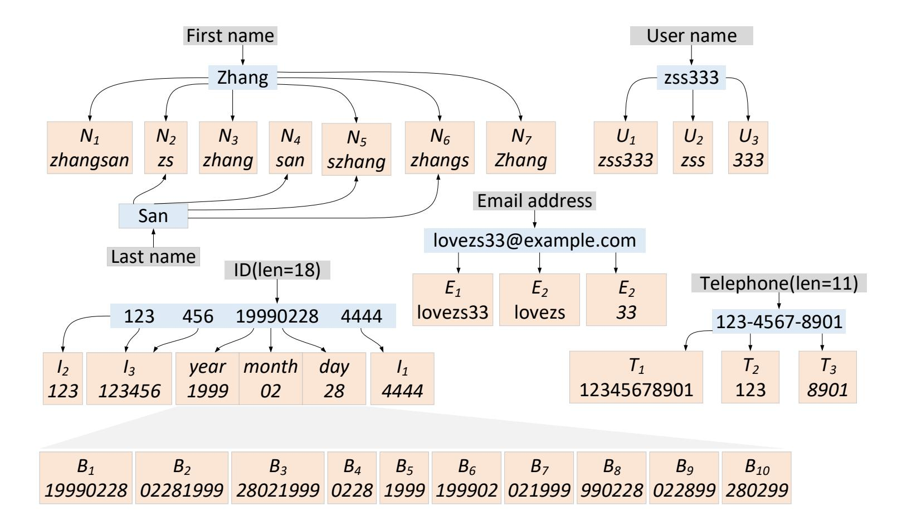
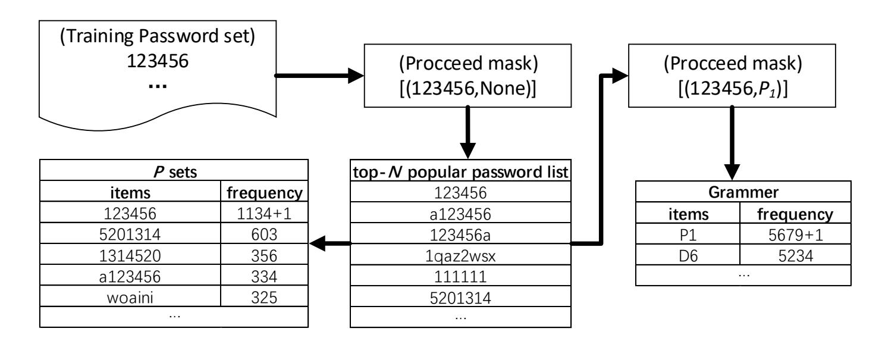
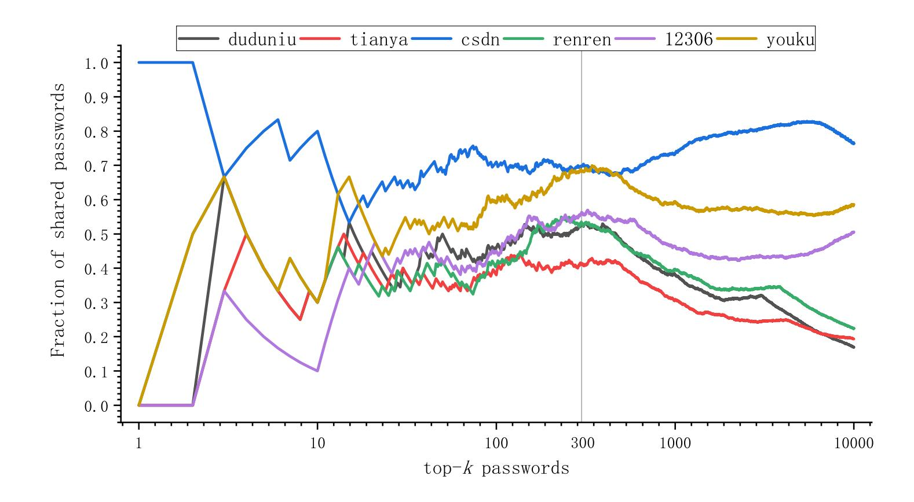
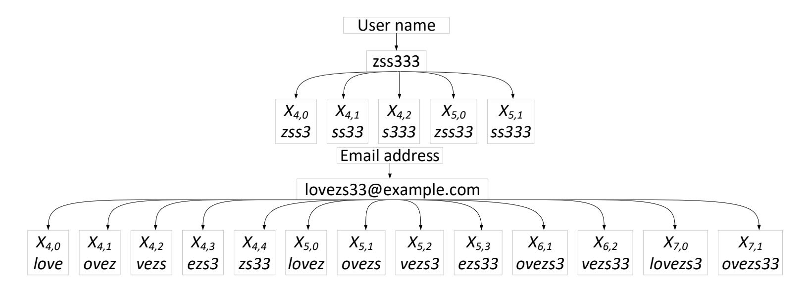
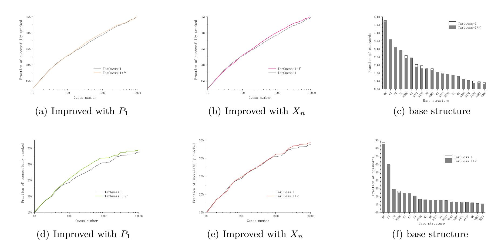
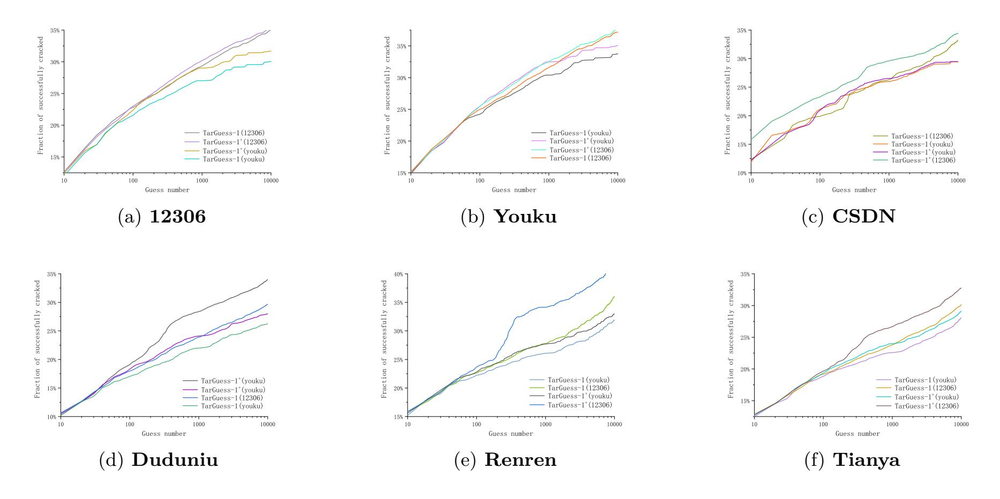

{0}------------------------------------------------

# **A New Targeted Password Guessing Model**

Zhijie Xie1 , Min Zhang1 , Anqi Yin2 and Zhenhan Li1

1 College of Electronic countermeasures, National University of Defense Technology, Hefei 230037, China

22920142204024@stu.xmu.edu.cn dyzhangmin@163.com lizhenhan17@nudt.edu.cn 2 Institute of Information Science and Technology, Zhengzhou, 450001, China yinaq0222@foxmail.com

**Abstract.** TarGuess-I is a leading targeted password guessing model using users' personally identifiable information(PII) proposed at ACM CCS 2016 by Wang et al. Owing to its superior guessing performance, TarGuess-I has attracted widespread attention in password security. Yet, TarGuess-I fails to capture popular passwords and special strings in passwords correctly. Thus we propose TarGuess-I+: an improved password guessing model, which is capable of identifying popular passwords by generating top-300 most popular passwords from similar websites and grasping special strings by extracting continuous characters from user-generated PII. We conduct a series of experiments on 6 real-world leaked datasets and the results show that our improved model outperforms TarGuess-I by 9.07% on average with 1000 guesses, which proves the effectiveness of our improvements.

**Keywords:** TarGuess, Targeted password guessing, Probabilistic context-free grammar(PCFG), Personally identifiable information(PII).

### **1 Introduction**

Password-based authentication is still an essential method in cybersecurity [[1\]](#page-15-0). To understand password security, people have gone through several stages, from the initial heuristic methods with no theoretical basis, to the scientific probabilistic algorithms [\[2](#page-15-1)]. Since the emergence of Markov-based [[3,](#page-15-2) [4\]](#page-15-3) and PCFG-based [\[5](#page-15-4), [6\]](#page-15-5) probabilistic password guessing models, trawling password guessing has been intensively studied [\[7](#page-15-6)[–10](#page-16-0)]. Recently, several large-scale personal information database leakage events have caused widespread concern in the field of password security [[11–](#page-16-1)[14\]](#page-16-2). With the development of related researches, it has been found that a large part of net-users tend to create passwords with their PII and the targeted password guessing models based on users' PII have emerged [\[15](#page-16-3)[–17](#page-16-4)].

Das et al. [[15\]](#page-16-3) have studied the threat posed by password reuse and proposed a crosssite password guessing algorithm for the first time. However, due to the lack of popular password recognition, this algorithm is not optimal. Li et al. [\[16](#page-16-5)] studied what extent a user's PII can affect password security, and they proposed a targeted password guessing model, personal-PCFG, which adopts a length-based PII matching and substitution. But it could not accurately capture users' PII usage, which greatly hinders the efficiency of password guessing. As a milestone work on password guessing, Wang et al. [\[17](#page-16-4)] put forward a targeted password guessing framework, TarGuess, which contains the password reuse behavior analysis and type-based PII semantic recognition, significantly improving the efficiency of the password guessing. Wang et al.'s [\[17](#page-16-4)] remarkable achievements have 

{1}------------------------------------------------

motivated successive new studies on password security [[18–](#page-16-6)[21\]](#page-16-7) and even led the revision of the NIST SP800-63-3 [[22,](#page-16-8) [23\]](#page-16-9).

TarGuess framework is proposed after an in-depth analysis of users' vulnerable behaviors such as password construction using PII and password reuse, including four password guessing models for four attacking Scenarios #1 *∼* #4. TarGuess-I caters for Scenario #1 where the attacker is equipped with the victim user's PII information such as name, birthday, phone number, which can be easily obtained from the Internet [\[24](#page-16-10)]. And the rest three models required user information such as PII attributes that play an implicit role in passwords (e.g., gender and profession) and/or sister passwords that were leaked from the user's other accounts. This work mainly focuses on Scenario #1. As more users' PII is being leaked these days, Scenario #1 becomes more practical.

Wang et al. [\[17](#page-16-4)] showed that their TarGuess-I model is more efficient than previous models using users' PII to crack users' passwords, which can gain success rates over 20% with just 100 guesses. However, we find that there is still room for improvement in the analysis of users' vulnerable behaviors after using this model to analyze the real data. Therefore, based on TarGuess-I, we put forward two improvements and proposed an improved model, TarGuess-I+, to make it more consistent with users' vulnerable behavior characteristics and improve the performance of guessing.

**Our contributions** In this work, we make the following key contributions:

- (1) **An improved password guessing model.** After analyses of users' vulnerable behaviors based on a total of 147,877,128 public leaked data and TarGuess-I, we find that the effectiveness of some semantic tags has not been testified and employed in the experiments of Wang et al. [[17\]](#page-16-4). To fill the gap, we make use of the adaptiveness of TarGuess-I PII tags and define two new tags: the Popular Password tag *P*1 and the Special String tag *Xn*. This gives rise to a variant of TarGuess-I, we call it TarGuess-I+.
- (2) **An extensive evaluation.** To demonstrate the feasibility of the improvements, we perform a series of experiments on the real-world leaked datasets. The experimental results show that the success rate of the improved model TarGuess-I+ outperforms the original model TarGuess-I by 9.07% on average with 1000 guesses, which proves the feasibility of the improvements.
- (3) **A novel method.** We introduce a novel method to the password guessing: parsing the password segments into special strings, such as anniversary days and someone's name, that appeared in user-generated PII, such as e-mail addresses and user names.

### **2 Preliminaries**

This section explicates what kinds of users' vulnerable behaviors are considered in this work and gives a brief introduction to the models.

#### **2.1 Explication of users' vulnerable behaviors**

Users' vulnerable behaviors are the key influence factor of password crackability [\[25](#page-16-11)]. A series of related studies have been conducted since the pioneering work of Morris 

{2}------------------------------------------------

and Thompson in 1979 [\[26](#page-16-12)]. Part of the studies are based on data analyses, such as [[3,](#page-15-2)[12](#page-16-13),[14,](#page-16-2)[27–](#page-16-14)[30\]](#page-17-0), the others are based on user surveys, such as [\[15](#page-16-3),[31–](#page-17-1)[34\]](#page-17-2). In summary, the discovered users' vulnerable behaviors can be classified into the following three categories:

- 1. **Popular passwords.** A large number of studies (such as [[3,](#page-15-2)[14](#page-16-2),[29\]](#page-17-3)) have shown that users often choose simple words as passwords or make simple transformed strings to meet the requirements of the website password setting strategy, such as "123456a" meeting the "alphanumeric" strategy. These strings, which are frequently used by users, are called popular passwords. Furthermore, Wang et al. [[35\]](#page-17-4) have found that the Zipf distribution is the main cause of the aggregation of popular passwords.
- 2. **Password reuse.** After a series of interviews to investigate how users cope with keeping track of many accounts and passwords, Stobert et al. [[31\]](#page-17-1) point out that users have more than 20 accounts on average and it is fairly impossible for them to create a unique password for each account, so reusing passwords is a rational approach. At the same time, password-reuse is a vulnerable behavior, the key is how to reuse.
- 3. **Password containing personal information.** Wang et al. [[36\]](#page-17-5) note that Chinese users tend to construct passwords with their pinyin name and relevant digits, such as phone number and birthdate, which is quite different from English users. They revealed a new insight into what extent users' native languages influence their passwords and what extent users' personal information plays a role in their passwords.

Considering the scenario on which TarGuess-I is based, we only analyze the users' vulnerable behaviors of using popular passwords and making use of personal information.

**Fig. 1.** An illustration of PCFG-based model

{3}------------------------------------------------

### **2.2 The PCFG-based password guessing model [\[5](#page-15-4)]**

TarGuess-I model is built on Weir et al.'s PCFG-based model, which has shown great success in dealing with trawling guessing scenarios [[17\]](#page-16-4). The Context-free grammar in [\[17](#page-16-4)] is defined as *G* = (*V, Σ, S, R*), where:

- *V* is a finite set of variables;
- *Σ* is a finite set disjoint from *V* and contains all the terminals of *G* ;
- *S* is the start symbol and *S ∈ V*;
- *R* is a finite set of productions of the form: *α → β*, where *α* & *β ∈ V ∪ Σ*.

The core assumption of the model is the segments of letters, numbers, and symbols in a password were independent of each other, so in the *V* except for the *S* start symbol, only to join *Ln* letters, *Dn* digits and *Sn* symbols tag sets, where *n* represents the segment length, such as *L*3 represents 3-letter segments, *D*4 represents 4-digit segments.

There are two phases in the model, the training phase and the guess generation phase, as shown in Fig. [1](#page-2-0). In the training phase, the password is parsed into the *LDS* segments based on the length and the type to generate the corresponding password base structure (the start symbol *S*). Then, it counts the segments frequency table in each tag set, and it outputs the context-free grammar *G*. In the guess generation phase, passwords are derived by the grammar *G* and the segments frequency table. The final output set is arranged based on the probability multiplied by all the frequency of segments in the password.

**Fig. 2.** An illustration of TarGuess-I [[17](#page-16-4)]

#### **2.3 The targeted password guessing model TarGuess-I [\[17\]](#page-16-4)**

TarGuess-I adds 6 PII tags (*Nn* name, *Un* username, *Bn* birthday, *Tn* phone number, *In* id card, *En* mailbox) to the three basic tags of *LDS* in the PCFG-based model. For each 

{4}------------------------------------------------

PII tag, its index number *n* is different from the *LDS* tag, which represents the type of generation rule for this PII. For example, *N* stands for name usage, while *N*1 stands for the full name, and *N*2 stands for the abbreviation of the full name (such as "Zhang San" abbreviated as "zs"). *B* stands for birthday usage, while *B*1 stands for the use of birthday in the format of month/year (e.g., 19820607), *B*2 stands for the use of birthday in the format of month/day/year. For a specific description, see Fig. [4.](#page-8-0)

Fig. [2](#page-3-0) shows an illustration of the model. For each user, the element set of each PII tag is first generated through the user's PII to match with the password, and the rest of the segments are parsed into *LDS* segments. Then the frequency of the elements of each set will be calculated as with PCFG. Finally, the context-free grammar *GI* containing the PII tags will be output.

### **3 Analysis of real password data and TarGuess-I model**

This section analyzes the real-world leaked password data and TarGuess-I to provide the basis for the improvement of the model. We dissect 146,570,537 leaked user passwords from 6 websites (see Table [1\)](#page-4-0) to find out the disadvantages of TarGuess-I.

| Dataset | Web service         | When leaked | Total      | With PII |
|---------|---------------------|-------------|------------|----------|
| Duduniu | E-commerce          | 2011        | 16,258,891 |          |
| Tianya  | Social forum        | 2011        | 29,020,808 |          |
| CSDN    | Programmer          | 2011        | 6,428,277  |          |
| renren  | Social forum        | 2011        | 2,185,997  |          |
| 12306   | Train ticketing     | 2014        | 129,303    | ✓        |
| youku   | Video entertainment | 2016        | 92,547,261 |          |

**Table 1.** Basic information about our personal-info datasets

#### **3.1 Analysis of popular passwords**

According to the frequency of occurrence, the top-10 popular passwords in 6 password databases with the proportion of them were calculated, and the results are shown in Table [2](#page-5-0). Table [2](#page-5-0) shows that 1.10% to 5.27% of users' passwords could be guessed successfully by just using top-10 popular passwords. Chinese users prefer simple combinations of numbers, such as "123456", "111111", "000000", and the strings with the meaning of love, such as "5201314" and "woaini1314".

There are also some unique passwords in the top-10 list, such as "111222TIANYA" in Tianya, "dearbook" and "147258369" in CSDN, "7758521" in Renren and "xuanchuan" in Youku. These passwords may come from the name or the culture of the website, or they maybe come from a large number of "ghost accounts" held by a particular user of the website. Besides, "1qaz2wsx" and "1q2w3e4r" in the top-10 of 12306 is the password constructed with the QWERTY keyboard pattern.

By analyzing the list of popular passwords, we find that there is one missing item in the password recognition of the TarGuess-I model: the popular passwords.

{5}------------------------------------------------

| Rank | Duduniu   | Tianya       | CSDN       | Renren    | 12306      | Youku     |
|------|-----------|--------------|------------|-----------|------------|-----------|
| 1    | 123456    | 123456       | 123456789  | 123456    | 123456     | 123456    |
| 2    | 111111    | 111111       | 12345678   | 123456789 | a123456    | 123456789 |
| 3    | 123456789 | 000000       | 11111111   | 111111    | 123456a    | xuanchuan |
| 4    | a123456   | 123456789    | dearbook   | 12345     | woaini1314 | 111111    |
| 5    | 123123    | 123123       | 00000000   | 5201314   | 5201314    | 123123    |
| 6    | 5201314   | 121212       | 123123123  | 123123    | 111111     | 000000    |
| 7    | 12345     | 123321       | 1234567890 | 12345678  | qq123456   | 5201314   |
| 8    | aaaaaa    | 111222TIANYA | 88888888   | 1314520   | 1qaz2wsx   | 1234      |
| 9    | 12345678  | 12345678     | 111111111  | 123321    | 1q2w3e4r   | a123456   |
| 10   | 123456a   | 5201314      | 147258369  | 7758521   | 123qwe     | 123321    |
| %    | 5.27%     | 1.17%        | 3.34%      | 4.91%     | 1.10%      | 3.89%     |

**Table 2.** Ranking and proportion of top-10 popular passwords

**Popular password** The statistical results of the distribution of base structures analyzed by the PCFG-based model for top-10000 popular passwords are shown in Table [3.](#page-5-1)

| Form      | Duduniu | Tianya | CSDN   | Renren | 12306  | Youku  |
|-----------|---------|--------|--------|--------|--------|--------|
| Letter    | 11.47%  | 10.93% | 15.56% | 10.67% | 4.56%  | 12.46% |
| Digit     | 39.18%  | 63.37% | 65.66% | 66.27% | 32.29% | 63.77% |
| Symbol    | 0.02%   | 0.03%  | 0.04%  | 0.02%  | 0.00%  | 0.08%  |
| Composite | 49.34%  | 25.67% | 18.74% | 23.05% | 63.15% | 23.69% |

**Table 3.** Form distribution of the top-10000 popular passwords

Table [3](#page-5-1) illustrates that the majority of popular passwords are pure numbers. Besides, composite passwords (that is, the structure includes multiple types of character) also account for a considerable part, especially 63.15% in the 12306 data set. Since the grammar *GII* of TarGuess-I does not contain tags related to the popular passwords, while TarGuess-I is based on data-driven probabilistic statistical PCFG algorithm, which generates passwords based on the existing base structures in the data and the set of elements in various tags. Therefore, in the training phase, the model parses the password into *LDS* segments, an illusion is shown in Fig. [1.](#page-2-0) Due to the guess generation phase of the PCFG algorithm, it might generate many invalid outputs at last.

For example, "adbc1234" is the 28th most popular password in 12306, which is divided into *L*4*D*4 syntax using PCFG algorithm. In the element set of *L*4, "love" ranks the first, while "1234" ranks the first in *D*4. Therefore, in the guessing stage, the first output password with the base structure *L*4*D*4 is "love1234". This password occupies a relatively small proportion in the actual password distribution but ranks much higher in the model guessing list due to the high probability, thus reducing the overall password guessing success rate.

#### **3.2 Analysis of passwords containing personal information**

We adopt the improved TarGuess-I+*P* model, which contains the popular password tag *P*1, to analyze the passwords. The results of the top-10 password base structures and 

{6}------------------------------------------------

the proportion of the password containing PII have been shown in Table [4](#page-6-0). Due to the lack of datasets containing users' PII, we choose the unique PII(such as e-mail, phone, ID number) in 12306 to match passwords in other datasets. The sizes of the password sets are shown in Table [5.](#page-11-0)

| Table 4. Ranking of top-10 base structure, proportion of the passwords containing PII and |  |  |  |
|-------------------------------------------------------------------------------------------|--|--|--|
| proportion of popular passwords                                                           |  |  |  |

| Rank     | Duduniu | Tianya | CSDN   | Renren | 12306  | Youku  |
|----------|---------|--------|--------|--------|--------|--------|
| 1        | E1      | D6     | P1     | D7     | P1     | P1     |
| 2        | D7      | D7     | D8     | D6     | D6     | D6     |
| 3        | P1      | P1     | E1     | P1     | D7     | D7     |
| 4        | D6      | D8     | B1     | D8     | N2D6   | D8     |
| 5        | D8      | E1     | D9     | E1     | U1     | N2D6   |
| 6        | N2D6    | D10    | N2D6   | U3     | D8     | U1     |
| 7        | A1D7    | B1     | U1     | D9     | E1     | U3     |
| 8        | N2D7    | B8     | D11    | B1     | N2D7   | E1     |
| 9        | U1      | D9     | N2D7   | B8     | U3     | B1     |
| 10       | A2D6    | N2D6   | D10    | D11    | A2D6   | N1D3   |
| % of PII | 41.54%  | 35.43% | 39.64% | 36.85% | 42.78% | 40.65% |
| % of P1  | 3.99%   | 5.91%  | 8.91%  | 6.27%  | 4.14%  | 5.58%  |

The results indicate that nearly 50% of users generally construct passwords using PII or choose popular passwords. And we find that the top-10 password base structures contain several base structures with base tags that are not relevant to users' PII. Based on the above analysis of the users' behavior in constructing the password, we can speculate that the top-10 base structures of passwords should be related to the strings which are accessible for the user to memorize.

The strings which are accessible to memorize include users' PII conversions and popular passwords. They also include user-generated strings (hereinafter referred to as the special strings) that have special meaning for the user but are of no equal importance to other users. For *A* user, for example, "080405" is *A*'s particular date, but for another user *B*, "080405" is just a very ordinary day, then the probability of *A*'s password containing this string is different from that of *B*'s. Meanwhile, we can not find the string "080405" in *A*'s and *B*'s demographic information (such as name, ID number, telephone number, etc.). The special string cannot be extracted from the user's demographic information but may appear in strings which are generated by the user, such as e-mail address and user name, or it may appear in passwords on other servers of the user. Therefore, we found another lack of recognition in TarGuess-I: the special string.

**The special string** The analyses of the user data in TarGuess-I also include the user-generated strings, such as e-mail address *En* and user name *Un*. However, the analyses of these 2 user-generated strings are not accurate enough. Only three parse type (Entire *E*1&*U*1, the first letter segments *E*2&*U*2 and the first digit segments *E*3&*U*3) are proposed.

{7}------------------------------------------------

The probability distribution of special strings for each user is different. If we use the original TarGuess-I model for password recognition, because of the lack of recognition of the special string, most of these segments will be parsed into typical LDS segments, merging the users' behavior characteristics, thus they hinder the effectiveness of the model. Therefore, we consider adding the special string tags  $X_n$  to the set  $\mathcal{V}$  of TarGuess-I.

**Fig. 3.** The probability of the occurrence of the special string  $X_n$  in the password

Considering that only two user-generated PII are needed in TarGuess-I, the e-mail address and the user name, we employ the sliding window algorithm to analyze the coverage of consecutive substrings of the e-mail address and user name in the password to verify the validity of the special string improvement. The result is shown in Fig. 3. Note that, to differ from TarGuess-I, we only consider substrings with  $len \geq 2$ , and we ignore the full strings of e-mail address prefix and user name.

Fig. 3 shows that a significant number of user passwords do overlap user-created strings. It gives us a new hint that when an attacker obtains information about a user that is not public or very useful, they may turn that information into a special string to participate in password guessing.

### 3.3 Brief summary

We find two improvements of TarGuess-I model in this section:

{8}------------------------------------------------

- Add the popular password tag  $P_1$  to the set  $\mathcal{V}$  of probability context  $\mathcal{G}_{\mathcal{I}\mathcal{I}}$  and apply the popular password list generated from a data set similar to the target website or server type.
- Add the special string tag  $X_n$  to the set  $\mathcal{V}$  of probability context  $\mathcal{G}_{\mathcal{I}\mathcal{I}}$ , and add the special string associated with the user for password guessing.

### 4 The improved model TarGuess-I+

We now propose TarGuess-I+, which is capable of identifying the popular passwords and the special strings. The context-free grammar  $\mathcal{G}_{\mathcal{I}\mathcal{I}} = (\mathcal{V}, \mathcal{\Sigma}, \mathcal{S}, \mathcal{R})$  in the model is described as below:

- 1.  $S \in V$  is the start symbol;
- 2.  $\mathcal{V} = \{S; L_n, D_n, S_n; N_n, B_n, U_n, E_n, I_n, T_n; P_1, X_n\}$  is a finite set of variables, where:
  - (a) Letters $(L_n)$ , Digits $(D_n)$ , Symbols $(S_n)$  are the basic tag of the PCFG algorithm, we rename them in case to differ from other improvement tags;
  - (b) Name $(N_n)$ , Birthday $(B_n)$ , User name $(U_n)$ , E-mail address $(E_n)$ , ID number $(I_n)$ , and Phone number $(T_n)$  are the PII tags created in TarGuess-I model, see Fig. 4 for an example of generation;
  - (c) Popular password( $P_1$ ) and Special string( $X_n$ ) are proposed in this paper, the implementation detail have been shown in subsection 4.1.
- 3.  $\Sigma = \{95 \text{ printable ASCII codes}, Null\}$  is a finite set disjoint from  $\mathcal{V}$  and contains all the terminals of  $\mathcal{G}_{\mathcal{I}\mathcal{I}}$ ;
- 4.  $\mathcal{R}$  is a finite set of rules of the form  $A \to \alpha$ , with  $A \in \mathcal{V}$  and  $\alpha \in \mathcal{V} \cup \Sigma$ .

Fig. 4. An illustration of PII tags generation

{9}------------------------------------------------

# **4.1 Model implementation**

**Popular password** *P***1** Add the popular password tag *P*1 to *V* set of the grammar *GI*, and the element set in *P*1 tag is a top-*N* popular password list based on the data statistics of relevant websites. The index 1 in *P*1 has no meaning just to conform to the overall format. The parse of *P*1 tag is shown in Fig. [5.](#page-9-1)

**Fig. 5.** An illustration of *P*1 tag parse

In the training phase, the top-*N* list is matched with the password data by a regular expression. If the match occurs, the occurrence of the corresponding password in *P*1 set is increased by 1. In the guess generation phase, the probability of containing *P*1 password structures is multiplied by the frequency of the corresponding password in the element set of *P*1 as the final probability of output password.

Fig. [6](#page-10-0) shows the similarity between the top-*k* list of the popular passwords compiled by six websites and the top-*k* list of the popular passwords of each website (*k* represents the first *k* pieces of password ranking). It can be seen from the figure that when *k* value is around 300, the similarity tends to a stable peak, and then the similarity continues to decrease. Therefore, the size of the popular password list should be limited to about *N* = 300 to improve the success rate of cross-site guessing.

**Special string** *Xn* The element sets of the special string *Xn* tag are generated from the e-mail address prefix and user name. Since there are various and different ways for each user to generate special strings, it is difficult to categorize the generation methods of special strings uniformly and may cause sparse data. Therefore, *n* is only classified according to the length of the string. To avoid generating too many conventional strings with excessive extraction granularity, which results in invalid recognition, we only consider strings with *len ≥* 4. An illustration of special string *Xn* parse is shown in Fig. [7](#page-10-1). The second number in *Xn,m* tags represents the generation type in the element sets, which means the starting position of the substrings.

{10}------------------------------------------------

Fig. 6. The similarity of the popular passwords

Fig. 7. An illustration of  $X_n$  tags parse

## 5 Experiments

TarGuess-I is mainly used in online guessing scenarios, where the guess number allowed is the most scarce resource, while computational power and bandwidth are not essential [17]. Therefore, we mainly evaluate the availability of the model by guess-number graphs.

#### 5.1 Experiment setup

Our experiments need various types of users' PII. Because of the limited experimental resources and the lack of original datasets associated with PII, we only employed  $10^5$ 

{11}------------------------------------------------

pieces of 12306 data containing users' PII to match the rest of datasets using e-mail addresses, and the obtained data size is shown in Table [5](#page-11-0).

**Table 5.** The size of experiment datasets

|              | Duduniu | Tianya | CSDN  | Renren | 12306  | Youku  | Total   |
|--------------|---------|--------|-------|--------|--------|--------|---------|
| Training set | -       | -      | -     | -      | 25,372 | 11,554 | 36,926  |
| Testing set  | 7,539   | 6,792  | 2,998 | 1,062  | 74,516 | 27,278 | 120,185 |
| Total        | 7,539   | 6,792  | 2,998 | 1,062  | 99,888 | 38,832 | 157,091 |

Note that, to make our experiments as scientific as possible, we follow 4 rules:

- 1. Training sets and testing sets are strictly separated;
- 2. The comparison experiments of the two models are based on the same training sets and testing sets;
- 3. The base structures of password sets for the experiments are evenly distributed;
- 4. The training sets and testing sets shall be as large as possible.

To follow the rules [3](#page-11-1) and [4,](#page-11-2) we first filtrate the password data by analyzing the base structure of the passwords using TarGuess-I. We store the passwords which have their base structure with more than 10 occurrences. And we choose the **12306** set and **Youku** set as training sets and testing sets at a ratio of 7:3, the other data sets have been entirely used for testing.

#### **5.2 Experiment 1: Validation of the improvements**

We adopted two improvement methods to generate two models: TarGuess-I+*P* with popular password tag *P*1, and TarGuess-I+*X* with special string tag *Xn*, then we chose **12306** training data and **Youku** training data to generate the context-free grammars *GI* and *GII*. At last, we implemented comparison experiments with the corresponding testing data. The results are shown in Fig. [8](#page-12-0) and Table [6](#page-11-3).

**Table 6.** The statistics of Fig. [8](#page-12-0)

| Setup                      | Model        | 10     | 102    | 103    | 104    |
|----------------------------|--------------|--------|--------|--------|--------|
| 12306-train                | TarGuess-I   | 12.655 | 22.808 | 29.354 | 35.085 |
| ↓                          | TarGuess-I+P | 12.651 | 22.954 | 29.898 | 35.187 |
| 12306-test                 | TarGuess-I+X | 12.643 | 23.028 | 32.003 | 35.668 |
| Youku-train                | TarGuess-I   | 14.877 | 24.223 | 30.394 | 33.795 |
| ↓                          | TarGuess-I+P | 15.102 | 25.392 | 31.891 | 34.366 |
| Youku-test TarGuess-I+X |              | 14.634 | 24.613 | 31.008 | 34.305 |

**Popular password** Fig. [8\(a\)](#page-12-1) shows that the success rate of TarGuess-I+*P* is slightly lower than that of TarGuess-I within 100 guesses, but grows higher than the latter from 100 to 104 guesses. This maybe due to the largest part of passwords with pure-digits

{12}------------------------------------------------

Fig. 8. Figs. 8(a)-8(c) are the results of experiments based on 12306 data set; Figs. 8(d)-8(f) are the results of experiments based on Youku data set.

base structures in **12306** set. These types of passwords will be generated more at first by TarGuess-I's grammar  $\mathcal{G}_{\mathcal{I}}$ , but a few by TarGuess-I+P's grammar  $\mathcal{G}_{\mathcal{I}\mathcal{I}}$ . Fig. 8(d) and Table 6 show that TarGuess-I+P significantly outperforms TarGuess-I by 0.28%-6.35% in the **Youku**-based experiment, which proves the effectiveness of the improvement of popular passwords.

**Table 7.** The top-5 rank of password base structure with the special string  $X_n$  tags

|           | 12306      |                       | Youku     |            |      |  |  |
|-----------|------------|-----------------------|-----------|------------|------|--|--|
| structure | proportion | $\operatorname{rank}$ | structure | proportion | rank |  |  |
| $X_8$     | 0.2449%    | 89                    | $X_6$     | 0.2749%    | 75   |  |  |
| $X_9$     | 0.2335%    | 92                    | $X_8$     | 0.2456%    | 86   |  |  |
| $X_6$     | 0.1803%    | 115                   | $X_7$     | 0.2383%    | 91   |  |  |
| $X_{10}$  | 0.1718%    | 122                   | $X_9$     | 0.2236%    | 96   |  |  |
| $X_4D_6$  | 0.1601%    | 127                   | $X_5D_3$  | 0.1833%    | 108  |  |  |

**Special string** Figs. 8(b) and 8(e) show that TarGuess-I+X is close to TarGuess-I with a slightly lower success rate within 1000 guesses, but gradually outperforms TarGuess-I with the increasing number of guesses. The main reason is that the passwords containing the special strings account for a relatively small proportion of the entire password data, seeing Table 7. And some higher-ranked base structures will be reduced, seeing Figs. 8(c) and 8(f), because some of the passwords, which were originally parsed into these base structures, will be parsed into which contains  $X_n$ .

{13}------------------------------------------------

**Fig. 9.** Experiment results for comparison with TarGuess-I+ and TarGuess-I based on 6 datasets.

#### 5.3 Experiment 2: Evaluation of TarGuess-I+

We add 2 new tags to the variable set  $\mathcal{V}$  of TarGuess-I to generate a new improved model TarGuess-I+, and choose the large datasets **12306** and **Youku** for training to generate the context-free grammar  $\mathcal{G}_{\mathcal{I}\mathcal{I}}$ . Then, we perform a series of comparison experiments using the 6 password datasets mentioned at subsection 5.1. Fig. 9 gives 6 graphs for the experiment results, and Table 8 displays the detailed statistics of the 6 graphs.

From the results, we can see that there is an obvious difference in Fig. 9(c) of the **CSDN**-based experiment. The success rate of TarGuess-I+ based on **12306** data is significantly higher than that of TarGuess-I, but the same comparison based on **Youku** data is not so clear like the former. We conjecture that this difference maybe because the grammar  $\mathcal{G}_{\mathcal{I}\mathcal{I}}$  generated by TarGuess-I+ based on **12306** data is more suitable for **CSDN** data. Table 9 shows that the **12306**-based grammar  $\mathcal{G}_{\mathcal{I}\mathcal{I}}$  generated by TarGuess-I+ has the largest proportion of base structures with PII tags, and the pure-digits base structures rank lower than others, which may satisfy the distribution of **CSDN** data.

It is interesting to find that the success rates of TarGuess-I+ grow dramatically during a short period of the growing guess number. One is based on **Youku**-train data in **Duduniu**-based experiment, and two are based on **12306**-train data in **Renren**-based and **Tianya**-based experiments. We attribute this to the contribution of popular password tag  $P_1$ , which outputs the popular passwords concentrated in a certain period of the guess number.

Table 10 calculates the percentage of improvements of TarGuess-I+ in the password guessing success rate compared to TarGuess-I with 1000 guesses based on 6 test datasets. The results show that TarGuess-I+ outperforms TarGuess-I by 2.11%-23.05% and 9.07%

{14}------------------------------------------------

**Table 8.** The statistics of Fig. [9](#page-13-0)

| Training set | Testing set | Model       | 10     | 102    | 103    | 104    |
|--------------|-------------|-------------|--------|--------|--------|--------|
|              |             | TarGuess-I  | 12.655 | 22.808 | 29.354 | 35.085 |
|              | 12306-test  | TarGuess-I+ | 12.643 | 23.028 | 30.182 | 35.668 |
|              |             | TarGuess-I  | 15.119 | 25.002 | 31.614 | 37.161 |
|              | Youku-test  | TarGuess-I+ | 15.145 | 25.444 | 32.505 | 37.810 |
|              | Duduniu     | TarGuess-I  | 10.639 | 17.957 | 23.892 | 29.671 |
| 12306-train  |             | TarGuess-I+ | 10.203 | 19.109 | 28.383 | 34.008 |
|              | Tianya      | TarGuess-I  | 12.832 | 19.173 | 23.814 | 30.134 |
|              |             | TarGuess-I+ | 12.812 | 19.678 | 26.666 | 32.743 |
|              | CSDN        | TarGuess-I  | 12.341 | 19.902 | 26.308 | 33.222 |
|              |             | TarGuess-I+ | 15.808 | 23.291 | 29.598 | 34.417 |
|              | Renren      | TarGuess-I  | 15.873 | 22.607 | 27.754 | 36.027 |
|              |             | TarGuess-I+ | 15.873 | 23.665 | 34.151 | 41.751 |
|              | 12306-test  | TarGuess-I  | 12.032 | 21.558 | 27.013 | 30.067 |
|              |             | TarGuess-I+ | 12.438 | 22.366 | 29.015 | 31.691 |
|              | Youku-test  | TarGuess-I  | 14.877 | 24.223 | 30.394 | 33.795 |
|              |             | TarGuess-I+ | 15.076 | 25.469 | 32.488 | 35.05  |
|              | Duduniu     | TarGuess-I  | 10.223 | 17.028 | 21.985 | 26.254 |
| Youku-train  |             | TarGuess-I+ | 10.484 | 18.287 | 24.105 | 27.996 |
|              | Tianya      | TarGuess-I  | 12.509 | 18.829 | 22.571 | 28.041 |
|              |             | TarGuess-I+ | 12.731 | 19.355 | 23.996 | 29.133 |
|              | CSDN        | TarGuess-I  | 11.890 | 21.136 | 25.994 | 29.422 |
|              |             | TarGuess-I+ | 12.204 | 20.979 | 26.543 | 29.481 |
|              | Renren      | TarGuess-I  | 15.200 | 22.222 | 26.070 | 31.890 |
|              |             | TarGuess-I+ | 15.584 | 22.799 | 27.706 | 32.949 |

**Table 9.** The top-10 rank of base structures and proportion of that with additional tags (PII tags and popular password tag)

| Rank | 12306-train         |                      |      |             |      |            | Youku-train |             |
|------|---------------------|----------------------|------|-------------|------|------------|-------------|-------------|
|      | TarGuess-I          |                      |      | TarGuess-I+ |      | TarGuess-I |             | TarGuess-I+ |
| 1    | D6                  | 4.70235              | P1   | 5.46191     | D6   | 8.50502    | P1          | 8.15309     |
| 2    | U1                  | 3.5697               | U1   | 3.57776     | D7   | 5.8582     | D6          | 6.2028      |
| 3    | D7                  | 3.08793              | D6   | 3.32009     | D8   | 2.83745    | D7          | 5.40362     |
| 4    | E1                  | 2.90005              | E1   | 2.90005     | N2D6 | 2.4342     | D8          | 2.68715     |
| 5    | U3                  | 2.42767              | D7   | 2.75646     | U1   | 2.39387    | U1          | 2.36088     |
| 6    | N2D6                | 2.42767              | U3   | 2.3807      | U3   | 2.31689    | U3          | 2.23623     |
| 7    | N2B1                | 1.88013              | N2B1 | 1.89087     | E1   | 2.04194    | E1          | 2.03461     |
| 8    | N1D3                | 1.78217              | N1D3 | 1.78217     | L2D6 | 1.63135    | N2D6        | 1.8843      |
| 9    | D8                  | 1.75801              | N2D6 | 1.71373     | B1   | 1.5617     | B1          | 1.55803     |
| 10   | N2D7                | 1.68823              | D8   | 1.66944     | N1   | 1.47249    | N1          | 1.45905     |
|      | % of additional tag | 63.51863 70.12532 |      |             |      | 49.49045   |             | 60.6011     |

on average. Though the effectiveness of each improvement fluctuates wildly because of the suitableness of grammar *GII* for each data set, it does prove that our improvements are effective. The results of this paper also show the necessity of multi-factor authentication in critical information systems (e.g., military systems, medical systems) [[37,](#page-17-6) [38\]](#page-17-7).

{15}------------------------------------------------

**Table 10.** The improvements of TarGuess-I+ compared with TarGuess-I within 1000 guesses

| Training |         | Testing set                                           |        |        |       |       |        |  |  |  |
|----------|---------|-------------------------------------------------------|--------|--------|-------|-------|--------|--|--|--|
| set      | Duduniu | Tianya CSDN Renren 12306 Youku Average |        |        |       |       |        |  |  |  |
| 12306    | 18.80%  | 11.98%                                                | 12.51% | 23.05% | 2.82% | 2.82% | 11.69% |  |  |  |
| Youku    | 9.64%   | 6.31%                                                 | 2.11%  | 6.28%  | 7.41% | 6.89% | 6.44%  |  |  |  |

### **6 Conclusion**

Based on the well-known password guessing model TarGuess-I, an improved password guessing model TarGuess-I+ was proposed. After an in-depth analysis and a series of experiments of TarGuess-I based on 6 public leaked password datasets, we have found 2 improvements in TarGuess-I, which are popular passwords and the special strings. Experimental results show that our improved model outperforms the original model by 9.07% on average with 1000 guesses, suggesting the feasibility of our improvements. However, due to the lack of experimental data, the improvements will be further verified in the coming future. Our improvement of special strings sheds new light on password guessing.

**Acknowledgments.** We give our special thanks to Chenxi Xu, Hui Guo, Weinan Cao, and Youcheng Zhen for their insightful suggestions and comments. Min Zhang is the corresponding author.

### **References**

- 1. Joseph Bonneau, Cormac Herley, Paul C Van Oorschot, and Frank Stajano. Passwords and the evolution of imperfect authentication. *Communications of the ACM*, 58(7):78–87, 2015.
- 2. Ding Wang. Research on key issues in password security. *PhD Dissertation, Peking University. url: [http://wangdingg.weebly.com/uploads/2/0/3/6/20366987/phd\\_thesis](http://wangdingg.weebly.com/uploads/2/0/3/6/20366987/phd_thesis0103.pdf) [0103.pdf](http://wangdingg.weebly.com/uploads/2/0/3/6/20366987/phd_thesis0103.pdf)*, 2017.
- 3. Jerry Ma, Weining Yang, Min Luo, and Ninghui Li. A study of probabilistic password models. In *2014 IEEE Symposium on Security and Privacy*, pages 689–704. IEEE, 2014.
- 4. Arvind Narayanan and Vitaly Shmatikov. Fast dictionary attacks on passwords using timespace tradeoff. In *Proceedings of the 12th ACM conference on Computer and communications security*, pages 364–372, 2005.
- 5. Matt Weir, Sudhir Aggarwal, Breno De Medeiros, and Bill Glodek. Password cracking using probabilistic context-free grammars. In *2009 30th IEEE Symposium on Security and Privacy*, pages 391–405. IEEE, 2009.
- 6. Rafael Veras, Christopher Collins, and Julie Thorpe. On semantic patterns of passwords and their security impact. In *NDSS*, 2014.
- 7. William Melicher, Blase Ur, Sean M Segreti, Saranga Komanduri, Lujo Bauer, Nicolas Christin, and Lorrie Faith Cranor. Fast, lean, and accurate: Modeling password guessability using neural networks. In *25th USENIX Security Symposium (USENIX Security 16)*, pages 175–191, 2016.
- 8. Sudhir Aggarwal, Shiva Houshmand, and Matt Weir. New technologies in password cracking techniques. In *Cyber Security: Power and Technology*, pages 179–198. Springer, 2018.
- 9. Emanuel Tirado, Brendan Turpin, Cody Beltz, Phillip Roshon, Rylin Judge, and Kanwal Gagneja. A new distributed brute-force password cracking technique. In *International Conference on Future Network Systems and Security*, pages 117–127. Springer, 2018.

{16}------------------------------------------------

- 10. Briland Hitaj, Paolo Gasti, Giuseppe Ateniese, and Fernando Perez-Cruz. Passgan: A deep learning approach for password guessing. In *International Conference on Applied Cryptography and Network Security*, pages 217–237. Springer, 2019.
- 11. Shouling Ji, Shukun Yang, Xin Hu, Weili Han, Zhigong Li, and Raheem Beyah. Zero-sum password cracking game: A large-scale empirical study on the crackability, correlation, and security of passwords. *IEEE transactions on dependable and secure computing*, 14(5):550– 564, 2015.
- 12. Zhigong Li, Weili Han, and Wenyuan Xu. A large-scale empirical analysis of chinese web passwords. In *23rd USENIX Security Symposium (USENIX Security 14)*, pages 559–574, 2014.
- 13. Roman V Yampolskiy. Analyzing user password selection behavior for reduction of password space. In *Proceedings 40th Annual 2006 International Carnahan Conference on Security Technology*, pages 109–115. IEEE, 2006.
- 14. Meng Kui Liu Gong-Shen, Qiu Wei-Dong and Li Jian-Hua. Password vulnerability assessment and recovery based on rules mined from large-scale real data. *Chinese Journal of Computers*, 39(3):454–467, 2016.
- 15. Anupam Das, Joseph Bonneau, Matthew Caesar, Nikita Borisov, and XiaoFeng Wang. The tangled web of password reuse. 2014. In *NDSS Symposium 2014*, page 7, 2014.
- 16. Yue Li, Haining Wang, and Kun Sun. A study of personal information in human-chosen passwords and its security implications. In *IEEE INFOCOM 2016-The 35th Annual IEEE International Conference on Computer Communications*, pages 1–9. IEEE, 2016.
- 17. Ding Wang, Zijian Zhang, Ping Wang, Jeff Yan, and Xinyi Huang. Targeted online password guessing: An underestimated threat. In *Proceedings of the 2016 ACM SIGSAC conference on computer and communications security*, pages 1242–1254, 2016.
- 18. N. Merhav and A. Cohen. Universal randomized guessing with application to asynchronous decentralized brute–force attacks. *IEEE Transactions on Information Theory*, 66(1):114– 129, 2020.
- 19. Ke Coby Wang and Michael K Reiter. How to end password reuse on the web. *Proc.ACM CCS*, 2019.
- 20. Bo Lu, Xiaokuan Zhang, Ziman Ling, Yinqian Zhang, and Zhiqiang Lin. A measurement study of authentication rate-limiting mechanisms of modern websites. In *Proceedings of the 34th Annual Computer Security Applications Conference*, pages 89–100, 2018.
- 21. Bijeeta Pal, Tal Daniel, Rahul Chatterjee, and Thomas Ristenpart. Beyond credential stuffing: Password similarity models using neural networks. In *2019 IEEE Symposium on Security and Privacy (SP)*, pages 417–434. IEEE, 2019.
- 22. Paul A Grassi, James L Fenton, EM Newton, RA Perlner, AR Regenscheid, WE Burr, JP Richer, NB Lefkovitz, JM Danker, Yee-Yin Choong, et al. Nist special publication 800-63b: Digital identity guidelines. *Enrollment and Identity Proofing Requirements. url: <https://pages.nist.gov/800-63-3/sp800-63b.html>*, 2017.
- 23. Aaron D Jaggard and Paul Syverson. Oft target. In *Proceedings of the PET*, 2018.
- 24. Mordechai Guri, Eyal Shemer, Dov Shirtz, and Yuval Elovici. Personal information leakage during password recovery of internet services. In *2016 European Intelligence and Security Informatics Conference (EISIC)*, pages 136–139. IEEE, 2016.
- 25. Anne Adams and Martina Angela Sasse. Users are not the enemy. *Communications of the ACM*, 42(12):40–46, 1999.
- 26. Robert Morris and Ken Thompson. Password security: A case history. *Communications of the ACM*, 22(11):594–597, 1979.
- 27. Joseph Bonneau. The science of guessing: analyzing an anonymized corpus of 70 million passwords. In *2012 IEEE Symposium on Security and Privacy*, pages 538–552. IEEE, 2012.
- 28. Michelle L Mazurek, Saranga Komanduri, Timothy Vidas, Lujo Bauer, Nicolas Christin, Lorrie Faith Cranor, Patrick Gage Kelley, Richard Shay, and Blase Ur. Measuring password

{17}------------------------------------------------

- guessability for an entire university. In *Proceedings of the 2013 ACM SIGSAC conference on Computer & communications security*, pages 173–186, 2013.
- 29. Daniel V Bailey, Markus Dürmuth, and Christof Paar. Statistics on password re-use and adaptive strength for financial accounts. In *International Conference on Security and Cryptography for Networks*, pages 218–235. Springer, 2014.
- 30. Emin Islam Tatlı. Cracking more password hashes with patterns. *IEEE Transactions on Information Forensics and Security*, 10(8):1656–1665, 2015.
- 31. Elizabeth Stobert and Robert Biddle. The password life cycle: user behaviour in managing passwords. In *10th Symposium On Usable Privacy and Security (SOUPS 2014)*, pages 243–255, 2014.
- 32. Patrick Gage Kelley, Saranga Komanduri, Michelle L Mazurek, Richard Shay, Timothy Vidas, Lujo Bauer, Nicolas Christin, Lorrie Faith Cranor, and Julio Lopez. Guess again (and again and again): Measuring password strength by simulating password-cracking algorithms. In *2012 IEEE symposium on security and privacy*, pages 523–537. IEEE, 2012.
- 33. Blase Ur, Fumiko Noma, Jonathan Bees, Sean M Segreti, Richard Shay, Lujo Bauer, Nicolas Christin, and Lorrie Faith Cranor. " i added'!'at the end to make it secure": Observing password creation in the lab. In *Eleventh Symposium On Usable Privacy and Security (SOUPS 2015)*, pages 123–140, 2015.
- 34. Richard Shay, Lujo Bauer, Nicolas Christin, Lorrie Faith Cranor, Alain Forget, Saranga Komanduri, Michelle L Mazurek, William Melicher, Sean M Segreti, and Blase Ur. A spoonful of sugar? the impact of guidance and feedback on password-creation behavior. In *Proceedings of the 33rd Annual ACM Conference on Human Factors in Computing Systems*, pages 2903–2912, 2015.
- 35. Ding Wang, Haibo Cheng, Ping Wang, Xinyi Huang, and Gaopeng Jian. Zipf's law in passwords. *IEEE Transactions on Information Forensics and Security*, 12(11):2776–2791, 2017.
- 36. Ding Wang, Ping Wang, Debiao He, and Yuan Tian. Birthday, name and bifacial-security: understanding passwords of chinese web users. In *28th USENIX Security Symposium (USENIX Security 19)*, pages 1537–1555, 2019.
- 37. Nikolaos Karapanos, Claudio Marforio, Claudio Soriente, and Srdjan Capkun. Sound-proof: usable two-factor authentication based on ambient sound. In *24th {USENIX} Security Symposium ({USENIX} Security 15)*, pages 483–498, 2015.
- 38. Ding Wang and Ping Wang. Two birds with one stone: Two-factor authentication with security beyond conventional bound. *IEEE transactions on dependable and secure computing*, 15(4):708–722, 2016.