# vCNN: Verifiable Convolutional Neural Network based on zk-SNARKs

Seunghwa Lee *Kookmin University* Seoul, Korea ttyhgo@kookmin.ac.kr

Hankyung Ko *Hanyang University* Seoul, Korea hankyungko@hanyang.ac.kr

Jihye Kim *Kookmin University* Seoul, Korea jihyek@kookmin.ac.kr

Hyunok Oh *Hanyang University* Seoul, Korea hoh@hanyang.ac.kr

*Abstract*—With the development of AI systems, services using them expand to various applications. The widespread adoption of AI systems relies substantially on the ability to trust their output. Therefore, it is becoming important for a client to be able to check whether the AI inference services have been correctly calculated. Since the weight value in a CNN model is an asset of service providers, the client should be able to check the correctness of the result without the weight value. Furthermore, when the result is checked by a third party, it should be possible to verify the correctness even without the user's input data. Fortunately, zeroknowledge Succinct Non-interactive ARguments of Knowledge (zk-SNARKs) allow to verify the result without input and weight values. However, the proving time in zk-SNARKs is too slow to be applied to real AI applications.

This paper proposes a new efficient verifiable convolutional neural network (vCNN) framework which accelerates the proving performance tremendously. To increase the proving performance, we propose a new efficient relation representation for convolution equations. While the proving complexity of convolution is O(ln) in the existing zk-SNARK approaches, it reduces to O(l + n) in the proposed approach where l and n denote the size of kernel and the data in CNNs. Experimental results show that the proposed vCNN improves prove performance by 20 fold for a simple MNIST and 18000 fold for VGG16. The security of the proposed scheme is proven formally.

*Index Terms*—Convolutional Neural Networks, Verifiable Computation, zk-SNARKs

# I. INTRODUCTION

Machine learning and neural networks have greatly expanded our understanding of data and the insights it carries. Among these, convolutional neural networks (CNNs), based on the convolution operation, are particularly useful tools for classification and recognition, as compared with standard neural networks. CNNs are easily trained with considerably fewer connections and parameters while providing a better recognition rate. Thus, CNNs generate various business opportunities such as those based on law, banking, insurance, document digitization, healthcare predictive analytics, etc. However, extra caution is required when applying CNNs to safety critical applications since the incorrect result can cause a severe damage. Hence, it is preferred to validate that the result is correctly computed according to a given CNN model.

Consider a clinical decision support service application via AI, such as IBM Watson as shown in Figure 1. In this application, a hospital takes a patient's CT scan or X-ray, and sends the scanned image to the AI doctor. Then the AI doctor diagnoses the disease based on the image and returns the diagnosis result to the hospital and the patient. The integrity check of the AI results is required since incorrect results may endanger the life of the patient [1].

The most straightforward approach to verify the result is to re-execute the same AI program. However, it is impossible in most cases since the AI weight parameters are important IPs and are not available publicly. In addition, the privacy of input data is another issue to consider. In our scenario, we allow the AI doctor to know the user's input for diagnosis, but it may be desirable to hide the user's private information when the diagnosis result is transferred to the third party such as an insurance company. In this situation, it should be possible for the insurance company to verify that the diagnosis result is correct without the private information of input data as well as AI weights.

Fortunately the recently advanced cryptographic tool called zero-knowledge succinct non-interactive arguments of knowledge (zk-SNARKs) [2]–[7] can solve the problem to verify the correctness of results without revealing private information. In zk-SNARKs, a prover generates a proof π using public input/output data (or statement φ) and secret input data (or witness w) for a given function. A verifier can check the validity of the statement φ with the proof π without the secret input data w. zk-SNARKs can also be used to protect the privacy of user's input data from the verifier when used together with a commitment scheme. The commitment scheme [8] is a cryptographic primitive that allows one to commit to his choice while keeping it hidden to others (hiding) so that he can no longer change his choice (binding). Since the zk-SNARKs proof can include the correct computation of the commitment scheme, it can be verified with proof and commitment alone that the result is computed correctly.

Figure 1 shows how zk-SNARKs is applied to an AI doctor. The AI doctor first generates a commitment ca by committing to AI weight values a and publishes the commitment ca in a public repository so that the correctness computation of the model can be transparently checked against the published ca. The AI doctor computes a diagnosis result on received input data x from the hospital and AI weights a. In addition, the AI doctor makes a commitment cx from the input data x to hide the input data, and generates a proof π for a statement including the input commitment, the weight commitment and

Fig. 1: Verifiable AI doctor service scenario

the output result  $(\phi = (c_x, c_a, y))$  with a witness comprising (w = (x, a)). The proof  $\pi$  and the statement  $\phi$  is provided to the hospital and the patient. Then they can check the correctness of the statement  $\phi$  with the proof  $\pi$ . Moreover, the hospital and the patient can transfer the statement  $\phi$  to any third party like an insurance company. The insurance company can also check the statement  $\phi$  with the proof  $\pi$  without input data x and weight values a.

The zk-SNARKs, however, require significant amount of computations on the prover's side. In zk-SNARKs, a function is translated to an arithmetic circuit comprising addition and multiplication gates to be represented as quadratic arithmetic programs (QAPs). The proving time is proportional to the number of multiplications in QAPs. In addition, the size of public parameters called common reference string (CRS) linearly increases according to the number of multiplications. Thus, the main hurdle to apply zk-SNARKs to real applications is how to minimize the proving time.

In CNNs, the convolution operations become main performance bottleneck to generate a proof. If the convolution is expressed as an arithmetic circuit, the number of multiplications becomes  $O(|\vec{x}| \times |\vec{a}|)$  where  $|\vec{x}|$  and  $|\vec{a}|$  represent the size of the input and kernel data. For instance, the circuit size is more than 6TB and the CRS size is approximately 1400TB, and the proving time takes about 10 years in the state-of-theart zk-SNARKs [3] for VGG16 [9], a commonly used model for image classification. Consequently, the main goal of this paper is to improve the proving performance of CNNs.

# A. Main Idea

It is crucial to optimize the convolution circuit to improve the proving time in zk-SNARKs for CNNs since more than 90% operations are convolution operations in CNNs.

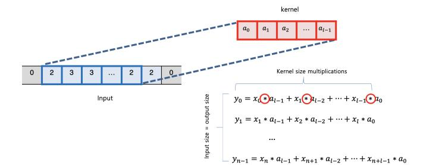

Fig. 2: Convolution in sum of products representation

**Optimizing Convolutional Relation**: We propose a new efficient QAP formula for convolution that significantly curtails the number of multiplications. While existing approaches check the correctness of the convolutions for every operation, our approach builds an optimized checking relation for convolution operations by introducing an indeterminate variable.

Consider a convolution equation in the sum of products as shown in Figure 2:  $y_i = \sum_{j=0}^{l-1} a_j \cdot x_{i+l-1-j}$  where  $\vec{x_i} = (x_i, \cdots, x_{i+l-1})$  denotes the *i*-th input vector,  $y_i$  the *i*-th output, and  $\vec{a} = (a_0, \cdots, a_{l-1})$  the kernel vector for  $0 \le i \le n-l$ . Notably, the sum of product representation contains  $O(|\vec{x}| \cdot |\vec{a}|)$  number of multiplications.

Let us change the representation into a product of sums to reduce the number of operations. A simple representation with a product of sums is not sufficient to guarantee the convolution relation. For example, in relation  $(\sum_{i=0}^{n-1} x_i) \cdot (\sum_{i=0}^{l-1} a_i) = \sum_{i=0}^{n+l-2} y_i$ , many different  $y_i'$  values can satisfy the relation if  $\sum_{i=0}^{n+l-2} y_i' = \sum_{i=0}^{n+l-2} y_i$ .

To safeguard each  $y_i$  equation, we combine indeterminate

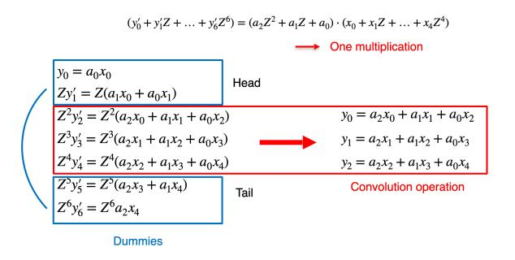

Fig. 3: Convolution in product of sums

Z in the convolution representation as follows:

$$\left(\sum_{i=0}^{n-1} x_i Z^i\right) \cdot \left(\sum_{i=0}^{l-1} a_i Z^i\right) = \sum_{i=0}^{n+l-2} y_i Z^i.$$
 (1)

In Equation (1) an identity holds for all choices of Z. Figure 3 shows how the product of sums representation is mapped to the sum of products representations shown in Figure 2. Note that due to the compact representation in product of sums, it requires additional equations called dummies including head and tail parts.

Equation (1) requires a single multiplication of polynomials or x(Z) · a(Z) = y(Z). Quadratic polynomial program (QPP) [10] is a natural approach to allow polynomials in QAP. As a result, the proving computation complexity becomes O(|~x| + |~a|) (|~x| + |~a| − 2 is the maximum degree of polynomials), which is much smaller than O(|~x| · |~a|). Note that the number of multiplications becomes amplified by the maximum degree of polynomials in QPP.

Connection with ReLU and Pooling: Our newly proposed formula using QPP minimizes a prover's computation only when convolution is verified; however, it is inefficient when the prover proves computation of the whole CNNs with other operations such as ReLU or pooling. Polynomial circuits are represented using a single bivariate equation in QPP. Since the division (required to generate a proof) is slow when QPP is expressed as a bivariate polynomial, we convert it to a univariate polynomial by increasing the polynomial degree to utilize the fast division algorithm based on number theoretic transform (NTT). To eliminate one variable, we change it into the form of another variable with a higher degree. However, the substitution of one variable by another incurs excessive overheads in non-convolution operations, such as ReLU and Pooling, thereby amplifying the degree of the equation to O((|~x| + |~a|) 2 ).

Since the intermediates of convolutions and non-convolution operations are independent, it is better to treat those operations separately to avoid mutual effects. In particular, to alleviate the degree increments involving ReLU and Pooling, we apply the polynomial circuit only to the convolution and the arithmetic circuit to the rest part of CNNs, and build a connecting proof between QPP and QAP using the commit and prove SNARK (CP-SNARK) technique [11]. The CP-SNARK technique guarantees that QPP and QAP are interconnected with inputs for one component corresponding to outputs from the other. To use this technique, we adopt commit and carry SNARK (cc-SNARKs) [11] rather than traditional SNARK for QPP and QAP, as commitments are required for interconnected values with proofs. Figure 4 illustrates the overview of our verifiable convolutional neural network scheme called vCNN. As shown in Figure 1, CNNs are proved by generating (cmqpp, πqpp) from QPP cc-SNARKs and (cmqap, πqap) from QAP cc-SNARKs, respectively, and then interconnecting the commitments through πcp. Hence, the final proof for our proposed scheme is a tuple of two commitments and three proofs (cmqap, cmqpp, πqap, πqpp, πcp). The proposed scheme generates a single proof for QAP and QPP circuits even for multiple layer CNNs, as all the convolution layers are collected, QPP is applied to the collected convolution layer, and QAP is applied to the other collected circuit in a similar manner. See Section IV for details.

# *B. Contributions*

We summarize our contributions as follows.

- 1) We propose a new QPP relation optimized for the convolutions and construct an efficient zk-SNARK scheme of which CRS size and proving time are linear with the input size and the kernel size, i.e., O(n+l). The proposed scheme is a verifier-friendly zk-SNARK scheme with a constant proof size, and its verification time complexity linearly depends on the input and output only, regardless of convolution intricacy.
- 2) We propose an efficient construction of vCNN to verify the evaluation of the whole CNNs. Our construction includes QPP-based zk-SNARKs optimized for convolutions and QAP-based zk-SNARKs effectively working for Pooling and ReLU, and interconnects them using CP-SNARKs.
- 3) We prove that our construction provides computational knowledge soundness and perfect zero-knowledge properties under the security properties of QAP- and QPPbased zk-SNARKs and CP-SNARKs.
- 4) We implement vCNN and compare it with the existing zk-SNARKs in terms of size and computation. The proposed scheme improves the key generation/proving time 25 fold and the CRS size 30 fold compared with the state-of-art zk-SNARK scheme [3] for a small example of MNIST (2-layer model) comprising a single convolution layer with ReLU and a single pooling layer. For the realistic application of VGG16, the proposed scheme improves the performance at least 18000 fold, compared with [3]; the proving time is reduced to 8 hours from 10 years, and the CRS size is shortened to 80 GB from 1400 TB. Thus, we provide the first efficient verifiable convolutional neural network, which has been nearly impossible to realize so far.

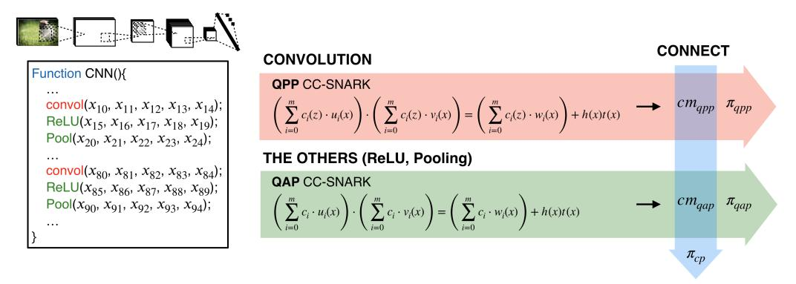

Fig. 4: Proposed vCNN overview

#### *C. Organization*

The remainder of this paper is organized as follows: Section II discusses related work. Section III describes preliminaries for the proposed schemes. Section IV constructs a verifiable CNN scheme using zk-SNARKs and Section V represents experiment results. Finally, Section VI summarizes and concludes the paper. Security proofs are presented in the Appendix.

# II. RELATED WORKS

Verifiable Computation. Various cryptographic proof systems [2]–[6], [10], [19]–[22] have been proposed to provide the privacy and computational integrity. These systems have been improved into many forms for the efficiency of their provers and verifiers, and the expressiveness of the statement being proven. Each scheme supports a general function, but it tends to be efficient only for a specific function, so performance issues may occur when applied to an application composed of functions with multiple characteristic.

Goldwasser et al. [5] proposed the GKR protocol, an interactive proof protocol for a general function, where the function was represented as a layered arithmetic circuit, and the circuit was proved using the sum-check protocol. GKR takes O(S log S) computations for proof generation and O(d log S) computations for verifying the proof, where S denotes the circuit size and d the circuit depth. Cormode et al. [20] and Thaler [23] subsequently optimized GKR, and Wahby et al. [6] added zero-knowledge property, producing zk-SNARKs in the ROM.

In contrast, Gennaro et al. [4] proposed a quadratic arithmetic program (QAP) based zk-SNARK scheme, where QAP is the representation of an arithmetic circuit as a polynomial equation, and the circuit satisfiability is checked using polynomial division. Parno et al. [2] proposed Pinocchio, the first nearly practical QAP-based zk-SNARK scheme with eight group elements for its proof, and implemented zk-SNARKs tools. Groth [3] improved Pinocchio with a shorter proof comprising only three group elements.

Other than theoretical developments, many studies have investigated practical zk-SNARKs implementations. Libsnark [22], [24] implemented QAP-based zk-SNARK schemes. Privacy preserving cryptocurrency Zcash [25] utilizes libsnark as a real-world case, and other systems, such as Zokrates and ZSL [26], [27], have also been proposed by implementing zk-SNARKs using libsnark. The zk-SNARKs system also requires a front-end compiler that converts a function into a arithmetic circuit. Pinocchio [2] provides a Ccompiler that produces arithmetic circuits for its own scheme. Kosba built Jsnark [28] which generates the arithmetic circuit for zk-SNARKs using java language. It provides gadgets that can easily convert conditional statements, loops, and cryptographic schemes such as hashes and encryptions into the arithmetic circuits that are difficult to perform in Pinocchio compiler. He also proposed xjsnark [29] to convert their own high-level language to an arithmetic circuit and optimized it.

Verifiable Neural Networks. To protect the privacy of the input data and the model of deep neural networks, Dowlin et al. proposed CryptoNets [12] based on using the fully homomorphic encryption (FHE). Juvekar et al. accelerates the overall performance through homomorphic matrix multiplication technique by proposing [13]–[15]. These schemes based on homomorphic encryption focused on privacy and did not consider execution integrity. Slalom [30] was proposed as a verifiable neural network scheme using a trusted hardware, Intel SGX. It uses Freivalds' algorithm [31] on SGX which verifies the correctness of matrix multiplication. Since the inputs and outputs are exposed to use the algorithm, Slalom adds random values to protect the privacy of the inputs and outputs. However, Slalom aims to provide the privacy of the inputs and outputs, and it does not focus on the privacy of the model weight values.

Even though zk-SNARKs are generally applicable for CNNs, they are not very efficient for some functions, particularly convolutions. Ghodsi et al. [16] proposed SafetyNet, the first SNARK-based scheme supporting neural networks specifically. SafetyNet is based on the GKR protocol [5], which is suitable for linear functions. To effectively use this advantage, it adopts a quadratic activation function (x 2 ) rather than ReLU, which reduces the neural network accuracy. Thus, it is difficult to apply SafetyNet to actual models, since most modern neural networks use ReLU. Zhao et al. proposed

TABLE I: Verifiable neural network scheme security coverage and performance , where  $\vec{x}$  denotes the input,  $\vec{a}$  the kernel, and  $\vec{y}$  the output.

| Approach            | Privacy | Integrity | Activation function | Proving time                            | Proof size                              | Verifying time                      |  |
|---------------------|---------|-----------|---------------------|-----------------------------------------|-----------------------------------------|-------------------------------------|--|
| FHE [12]–[15]       | О       | X         | ReLU                | -                                       | -                                       | -                                   |  |
| SafetyNet [16]      | X       | O         | Quadratic           | $ \vec{a}  \cdot  \vec{x}  +  \vec{y} $ | $ \vec{a}  \cdot  \vec{x}  +  \vec{y} $ | $ \vec{a} \cdot \vec{x} + \vec{y} $ |  |
| VeriML [17]         | О       | O         | Quadratic           | $ \vec{a}  \cdot  \vec{x}  +  \vec{y} $ | 1                                       | $ \vec{x}  +  \vec{y} $             |  |
| Embedded proof [18] | О       | O         | ReLU                | $ \vec{a}  \cdot  \vec{x}  +  \vec{y} $ | 1                                       | $ \vec{x}  +  \vec{y} $             |  |
| vCNN (ours)         | О       | O         | ReLU                | $ \vec{a}  +  \vec{x}  +  \vec{y} $     | 1                                       | $ \vec{x}  +  \vec{y} $             |  |

VeriML [17] to verify neural networks using QAP-based zk-SNARKs for machine learning as a service (MLaaS). Although VeriML ensures both privacy and integrity, it requires a long proving time,  $(O(|\vec{a}|\cdot|\vec{x}|+|\vec{y}|))$ , where  $\vec{x}$  denotes the input,  $\vec{a}$  the kernel, and  $\vec{y}$  the output.

Keuffer et al. [18] proposed an embedded proofs protocol that combines the GKR and QAP schemes, using GKR for linear and QAP for non-linear functions. To combine them, the verifying process of GKR is verified in the QAP circuit. However, it still has large computation complexity of  $(O(|\vec{a}| \cdot |\vec{x}| + |\vec{y}|))$ , as the input( $\vec{x}$ ) and kernel( $\vec{a}$ ) sizes are significantly large in real applications.

## III. PRELIMINARIES

First, we define some notations to avoid duplicate words. The term [n] denotes the set of indices  $\{0,1,\ldots,n-1\}$ . The input of convolution is represented as  $\{x_i\}_{i\in[n]}$  where the input size is n and the kernel of convolution is represented as  $\{a_i\}_{i\in[l]}$  where the kernel size is l.

#### A. Bilinear groups

We use a Type III bilinear group  $(p, \mathbb{G}_1, \mathbb{G}_2, \mathbb{G}_T, e, G_1, G_2)$  with the following properties:

- $\mathbb{G}_1, \mathbb{G}_2, \mathbb{G}_T$  are groups of prime order p with generator  $G_1 \in \mathbb{G}_1, G_2 \in \mathbb{G}_2$ .
- The pairing  $e: \mathbb{G}_1 \times \mathbb{G}_2 \to \mathbb{G}_T$  is a bilinear map.
- $e(G_1, G_2)$  generates  $\mathbb{G}_T$ .

### B. Quadratic Arithmetic Program

Gennaro et al. [4] defined QAP as an efficient encoding method for circuit satisfiability. QAP represents an arithmetic circuit that encodes the constraints into the multiplication gates. The correctness of the computation can be tested using QAP by performing a divisibility check between polynomials. A cryptographic protocol enables to check divisibility for a single polynomial and prevents a cheating prover from building a proof for a false statement that might be accepted.

**Definition 1.** Quadratic Arithmetic Program (QAP) A QAP comprises three sets of polynomials  $\{u_i(X), v_i(X), w_i(X)\}_{i=0}^m$  and a target polynomial t(X). The QAP computes an arithmetic circuit if  $(c_1, \ldots, c_{l-1})$  are valid assignments of both the inputs and outputs for the circuit iff there exist coefficients  $(c_l, \ldots, c_m)$  such that t(X) divides p(X), as follows:

$$p(X) = (\sum_{i=1}^m c_i \cdot u_i(X)) \cdot (\sum_{i=1}^m c_i \cdot v_i(X)) - (\sum_{i=1}^m c_i \cdot w_k(X)) \text{ as follows.}$$

A QAP that satisfies the aforementioned definition computes an arithmetic circuit. The size of QAP is m and its degree is the degree of t(X).

In the above-mentioned definition,  $t(X) = \prod_{i \in mul} (x-r_i)$ , where mul is the set of multiplication gates of the arithmetic circuit and each  $r_j$  is a random labeling for corresponding multiplication gate. The polynomial  $u_i(X)$  encodes the left inputs,  $v_i(X)$  encodes the right inputs, and  $w_i(X)$  encodes the gate outputs. By definition, if  $r_j$  is a root for polynomial p(X),  $p(r_j)$  represents the relation between inputs and outputs for the corresponding multiplicative gate g.

# C. Quadratic Polynomial Program

QAP verifies wires that are represented as an arithmetic value in an arithmetic circuit. Kosba et al. [10] subsequently defined the quadratic polynomial program (QPP), similar to QAP, except circuit wires that can be represented as a univariate polynomial.

**Definition 2.** Quadratic Polynomial Program(QPP) A QPP for a polynomial circuit comprises three sets of polynomials  $\{u_i(X), v_i(X), w_i(X)\}_{i=1}^m$  and a target polynomial t(X). The QPP computes the circuit if  $(c_1(Z), \ldots, c_l(Z))$  are valid assignments of both the inputs and outputs iff there exist coefficients  $(c_{l+1}, \ldots, c_m)$  such that t(X) divides p(X, Z):

$$p(X,Z) = (\sum_{i=1}^{m} c_i(Z) \cdot u_i(X)) \cdot (\sum_{i=1}^{m} c_i(Z) \cdot v_i(X)) - (\sum_{i=1}^{m} c_i(Z) \cdot w_k(X))$$
(2)

A QPP that satisfies this definition computes the circuit. The size of QPP is m and its degree is the degree of t(X).

Similarly to the QAP definition,  $u_i(X)$ ,  $v_i(X)$ , and  $w_i(X)$  represent a gate, where  $u_i(X)$  encodes a left input,  $v_i(X)$  a right input, and  $w_i(X)$  an output. If the left input wire of a multiplication gate  $r_j$  is  $c_l(Z)$ , then the right wire is  $c_r(Z)$  and the output is  $c_o(Z)$ ; hence  $c_l(Z) \cdot c_r(Z) = c_o(Z)$  and it can be represented as  $(\sum_{i=1}^m c_i(Z) \cdot u_i(r_j))(\sum_{i=1}^m c_i(Z) \cdot v_i(r_j)) = (\sum_{i=1}^m c_i(Z) \cdot w_i(r_j))$ .

D. Zero-Knowledge Succinct Non-interactive Arguments of Knowledge

In this section, we recall the zk-SNARKs definition [2], [3].

**Definition 3.** A zero-knowledge succinct non-interactive arguments of knowledge (zk-SNARKs) scheme for a relation R is the quadruple of PPT algorithms (KeyGen, Prove, Verify, Sim) as follows

- $(crs, \tau) \leftarrow \text{Setup}(R)$ : The setup algorithm takes a relation  $R \in \mathcal{R}_{\lambda}$  as input, and returns a common reference string crs and a simulation trapdoor td.
- $\pi \leftarrow \mathsf{Prove}(crs, \phi, w)$ : The prover algorithm takes a crs for a relation R and  $(\phi, w) \in R$  as input, and returns a proof  $\pi$ .
- $0/1 \leftarrow \text{Verify}(crs, \phi, \pi)$ : the verifier algorithm takes a crs, a statement  $\phi$ , and a proof  $\pi$  as input, and returns 0(reject) or 1(accept).
- π ← Sim(crs,td,φ): The simulator algorithm takes a crs, a simulation trapdoor td, and a statement φ as input, and returns a proof π.

**Completeness**: An argument is complete if given true statement  $\phi$ , a prover with a witness can convince the verifier. For all  $(\phi, w) \in R$ , the probability of completeness is:

$$Pr\left[\begin{array}{c} \mathsf{Verify}(crs,\phi,\pi) = 1 \left| \begin{matrix} (crs,td) \leftarrow \mathsf{Setup}(R), \\ \pi \leftarrow \mathsf{Prove}(crs,\phi,w) \end{matrix} \right.\right] = 1$$

Computational knowledge soundness: An argument is computational knowledge sound if the prover must know a witness and such knowledge can be efficiently extracted from the prover by using a knowledge extractor. Proof of knowledge requires that for a PPT adversary  $\mathcal A$  generating an accepting proof, there must be an extractor  $\chi_{\mathcal A}$  that, given the same input of  $\mathcal A$ , outputs a valid witness such that

$$Pr\left[\begin{array}{c|c} \mathsf{Verify}(crs,\phi,\pi) = 1 & (crs,td) \leftarrow \mathsf{Setup}(R), \\ \wedge (\phi,w) \not \in R & (\phi,\pi,w) \leftarrow (\mathcal{A}|\chi_{\mathcal{A}})(R,crs,z) \end{array}\right] \approx 0$$

where z is auxiliary input.

Succinctness: The length of a proof is

$$|\pi| \leq \mathsf{poly}(k)\mathsf{poly}log(|x| + |w|)$$

**Perfect zero-knowledge**: An argument is zero-knowledge if it does not leak any information other than the truth of the statement. Notably, zk-SNARKs are perfect zero-knowledge if for all  $(R,z)\leftarrow\mathcal{R},\ (\phi,w)\leftarrow R$  and all adversaries  $\mathcal{A}$ , one has the following:

$$\begin{split} & Pr\left[ \begin{array}{l} \mathcal{A}(R,z,crs,td,\pi) = 1 \left| \begin{matrix} (crs,td) \leftarrow \mathsf{Setup}(R), \\ \pi \leftarrow \mathsf{Prove}(crs,\phi,w) \end{matrix} \right. \right] \\ = & Pr\left[ \begin{array}{l} \mathcal{A}(R,z,crs,td,\pi) = 1 \left| \begin{matrix} (crs,td) \leftarrow \mathsf{Setup}(R), \\ \pi \leftarrow \mathsf{Sim}(crs,td,\phi) \end{matrix} \right. \right] \end{split}$$

#### E. Commit and Prove SNARKS

Commit and prove SNARKs (CP-SNARKs) [11] prove the knowledge of  $(\phi, w)$  such that u is a message of commitment cm and a relation  $R(\phi, w) = 1$  where the witness  $u \in w$ .

**Definition 4.** *CP-SNARKs include the quadruple PPT algo- rithms* (KeyGen, Prove, Verify, Sim) *defined as follows.* 

•  $(crs, td) \leftarrow \mathsf{Setup}(ck, R)$ : The setup algorithm takes a relation  $R \in \mathcal{R}_{\lambda}$  and commitment key ck as input, and

returns a common reference string crs and a trapdoor td.

- $\pi \leftarrow \text{Prove}(crs, \phi, \{c_j, u_j, o_j\}_{j=1}^l, w)$ : The prover algorithm takes as input a crs for a relation R,  $(\phi, w) \in R$ , commitments  $c_j$ , inputs  $u_j$  and opening  $o_j$ , and returns a proof  $\pi$ .
- $0/1 \leftarrow \text{Verify}(crs, \phi, \{c_j\}_{j=1}^l, \pi)$ : The verifier algorithm takes as input a crs, a statement  $\phi$ , commitments  $c_j$  and a proof  $\pi$ , and returns 0 (reject) or 1 (accept).
- $\pi \leftarrow \mathsf{Sim}(crs, td, \phi, \{c_j\}_{j=1}^l)$ : The simulator algorithm takes a crs, a trapdoor td, a statement  $\phi$ , and commitments  $c_j$  as input, and returns a proof  $\pi$ .

# F. Commit and Carry SNARKs

Similar to the case of CP-SNARKs, the commit and carry SNARKs (cc-SNARKs) scheme [11] proves a relation with commitment, but it generates a commitment while proving the relation.

**Definition 5.** *cc-SNARKs have the quintuple of PPT algorithms* (KeyGen, Prove, Verify, VerifyCom, Sim) *defined as follows*.

- $(ck, crs, td) \leftarrow \mathsf{Setup}(R)$ : The setup algorithm takes as input a relation  $R \in \mathcal{R}_{\lambda}$ , and returns a commitment key ck, a crs, and a simulation trapdoor td.
- $(cm, \pi, \nu) \leftarrow \operatorname{Prove}(crs, \phi, w)$ : The prover algorithm takes as a crs for a relation R and  $(\underline{\phi} = (\psi, \overline{\psi}), w) \in R$ , and returns a commitment cm for  $\overline{\psi}$  which is a private part of  $\phi$ , a proof  $\pi$ , and an opening  $\nu$ .
- $0/1 \leftarrow \mathsf{Verify}(crs, \psi, cm, \pi)$ : The verifier algorithm takes as input a crs, a public part of statement  $\psi$ , commitments cm and a proof  $\pi$ , and returns 0(reject) or 1(accept).
- $0/1 \leftarrow \text{VerifyCom}(ck, \overline{\psi}, \nu, cm)$ : The verifier algorithm takes as input a commitment key ck, a commitments cm, a private part of statement  $\overline{\psi}$ , and an opening  $\nu$ , and returns 0(reject) or 1(accept).
- $(cm, \pi) \leftarrow \text{Sim}(crs, td, \phi)$ : The simulator algorithm takes as a crs, a simulation trapdoor td, and a statement  $\phi$ , and returns a commitment cm and a proof  $\pi$ .

# IV. VERIFIABLE CONVOLUTIONAL NEURAL NETWORK

This section constructs Verifiable Convolutional Neural Network (vCNN) scheme to prove CNNs efficiently. Convolution computations deteriorate the proving performance severely, since it requires more than 90% of total proof generation time in CNNs. First, we optimize the convolution relation utilizing QPP [10] and construct an efficient QPP-based zk-SNARK scheme for convolutions. Although the QPP approach improves convolution performance, QPP representation of a whole CNN degrades the performance due to the other CNN components, such as ReLU and Pooling. Hence, we propose a new efficient zk-SNARK framework for CNNs by applying QPP to convolutions and QAP to the other components, and

we build a connecting proof between QPP and QAP by using CP-SNARKs technique [11].

# A. Optimizing Convolution Relation

The convolution filters inputs using kernels by computing the inner product for inputs and kernels, as depicted in Figure 2. Thus, convolution can be expressed as

$$y_i = \sum_{j \in [l]} a_j \cdot x_{i-j+l-1} \tag{3}$$

for  $i \in [n]$  where  $\{a_j\}_{j \in [l]}$  are convolution kernels,  $\{x_i\}_{i \in [n]}$  are convolution inputs, and  $\{y_i\}_{i \in [n-l]}$  are convolution outputs. When the convolution is represented as QAP,  $n \times l$  multiplication gates are required, since there are n outputs and l multiplications per output. Figure 5 shows a small convolution example, where input size is 5, kernel size is 3, and output size is 3, hence the QAP requires 9 multiplication gates.

$$\sum_{i \in [n+l-1]} y_i = (\sum_{i \in [n]} x_i) \cdot (\sum_{i \in [l]} a_i)$$
 (4)

Since Equation (3) is the sum of products, which requires many multiplication gates, we transform it into the product of sums as shown in Equation (4) which includes a single multiplication gate to reduce the number of multiplications. However, the naive transformation is not sound, as it is easy to find the incorrect output  $\vec{y}'$  which is different from the correct output  $\vec{y}$  such that sums of two outputs are equivalent. Therefore, to distinguish each output  $y_i$ , we introduce an indeterminate variable Z for each equation as shown in Equation (5) which has  $O(|\vec{x}| + |\vec{a}|) (= O(n+l))$  multiplications.

$$\sum_{i \in [n+l-1]} y_i \cdot Z^i = \left(\sum_{i \in [n]} x_i \cdot Z^i\right) \cdot \left(\sum_{i \in [l]} a_i \cdot Z^i\right) \tag{5}$$

Notably, the transformation slightly increases the number of outputs by n+l-1 from that in the original Equation (3) with n outputs.

|                   | $x_0$           | <i>x</i> 1 | $x_2$           | $x_3$           | <i>x</i> 4 | Equations                           |  |  |
|-------------------|-----------------|-----------------------|-----------------|-----------------|-----------------------|-------------------------------------|--|--|
| $a_2$             | y 00 | y 10       | y 20 |                 |                       | $y_0 = a_2 x_0 + a_1 x_1 + a_0 x_2$ |  |  |
| $a_1$             |                 | y 01       | y 11 | y 21 |                       | $y_1 = a_2 x_1 + a_1 x_2 + a_0 x_3$ |  |  |
| $a_0$             | $a_0$           |                       |                 | y 12 | y 22       | $y_2 = a_2 x_2 + a_1 x_4 + a_0 x_4$ |  |  |
| 9 multiplications |                 |                       |                 |                 |                       |                                     |  |  |

Fig. 5: Example of convolution

To formulate Equation (5), we can devise two approaches: a point evaluation approach and a polynomial circuit with an indeterminate variable. In the point evaluation approach, for a polynomial of degree d, d+1 different points should be evaluated, requiring  $O(d^2)$  (multiplicative) operations since there are d multiplications per point evaluation and there are d+1 points. Point evaluation can be performed using number theoretic transform (NTT) in  $O(d \log d)$ . However, due to the NTT complexity, the computation overhead in NTT is severer than the naive point evaluation, unless d is large enough.

In a polynomial circuit (called Quadratic Polynomial Program (QPP) [10]) a wire can have a polynomial as value. Thus, we can directly express the revised equation as a single multiplication gate with two input polynomials and one output polynomial. While the point evaluation approach requires quadratic  $O(d^2)$  or quasi-linear  $O(d\log d)$  multiplication operations, the QPP approach requests O(d) operations. Therefore, this paper adopts QPP representation for convolution.

Construction of QPP-based zk-SNARKs: We construct a QPP-based zk-SNARK scheme to prove Equation (5), similar to [10], except we utilize Gro16 [3] rather than the Pinocchio scheme [2]. While each wire can have only a value in QAP, QPP allows each wire to have a polynomial. The concrete OPP-based zk-SNARK scheme is as follows.

 $(crs,td) \leftarrow \mathsf{Setup}(\mathcal{R}_{QPP}) : \mathsf{Pick} \ \alpha, \ \beta, \ \gamma, \ \delta, \ x, \ z \xleftarrow{\$} \mathbb{Z}_p^*.$  Define  $td=(\alpha, \ \beta, \ \gamma, \ \delta, \ x, \ z)$  and set

$$crs = \begin{pmatrix} G_1^{\alpha}, G_1^{\beta}, G_1^{\delta}, \{G_1^{x^i \cdot z^j}\}_{i=0,j=0}^{d_x - 1, d_z}, \\ G_2^{\beta}, G_2^{\gamma}, G_2^{\delta}, \{G_2^{x^i \cdot z^j}\}_{i=0,j=0}^{d_x - 1, d_z}, \\ \{G_1^{\beta u_i(x) + \alpha v_i(x) + w_i(x)} z^j\}_{i=0,j=0}^{l, d_z}, \\ \{G_1^{\frac{\beta u_i(x) + \alpha v_i(x) + w_i(x)}{\delta}} z^j\}_{i=0,j=0}^{m, d_z}, \\ \{G_1^{\frac{x^i \cdot z^j \cdot t(x)}{\delta}}\}_{i=0,j=0}^{d_x - 2, d_z} \end{pmatrix}$$

 $\pi \leftarrow \operatorname{Prove}(crs, \phi, w)$ : Parse  $\phi$  as  $(a_0(Z), a_1(Z), \ldots, a_l(Z))$  and w as  $(a_{l+1}(Z), \ldots, a_m(Z))$ . Use the witness to compute h(X, Z) from the QPP. Choose  $r, s \stackrel{\$}{\leftarrow} \mathbb{Z}_p^*$  and output a proof  $\pi = (G_1^a, G_2^b, G_1^c)$  such that

$$a = \alpha + \sum_{i=0}^{m} a_i(z)u_i(x) + r\delta \qquad b = \beta + \sum_{i=0}^{m} a_i(z)v_i(x) + s\delta$$
$$c = \frac{\sum_{i=l+1}^{m} a_i(z) \cdot (\beta u_i(x) + \alpha v_i(x) + w_i(x)) + h(x, z)t(x)}{\delta}$$
$$+ as + rb - rs\delta$$

 $0/1 \leftarrow \operatorname{Verify}(crs,\phi,\pi)$ : Parse the statement  $\phi$  as  $(a_0(Z),a_1(Z),\ldots,a_l(Z))$  and the proof  $\pi$  as (A,B,C). Accept the proof if and only if the following equation is satisfied:

$$\begin{split} e(A,B) = & e(G_1^{\alpha},G_2^{\beta}) \cdot e(\prod_{i=0}^{l} G_1^{a_i(z) \cdot \frac{\beta u_i(x) + \alpha v_i(x) + w_i(x)}{\gamma}}, G_2^{\gamma}) \\ & \cdot e(C,G_2^{\delta}) \end{split}$$

 $\pi \leftarrow \mathrm{Sim}(crs,td,\phi) : \mathrm{Pick} \ a,b \xleftarrow{\$} \mathbb{Z}_p^* \ \text{and compute a simulated proof} \ \pi = (G_1^a,G_2^b,G_1^c) \ \text{with}$ 

$$c = \frac{ab - \alpha\beta - \sum_{i=0}^{l} a_i(z)(\beta u_i(x) + \alpha v_i(x) + w_i(x))}{\delta}$$

**Theorem 1.** The above protocol is a non-interactive zero-knowledge arguments of knowledge with completeness and perfect zero-knowledge. It has computational knowledge

soundness against adversaries that only use a polynomial number of generic bilinear group operations.

The QPP-based zk-SNARK scheme has the same as that of the original QAP-based zk-SNARK scheme except that in the former the terms in CRS include unknown value z to generate a polynomial f(Z). We prove the knowledge soundness in Appendix A.

**Implementation challenge:** To prove convolution in Equation (5), a prover computes h(X,Z) by performing polynomial division (p(X,Z)/t(X)) for Equation (2). Although the polynomial division can be efficiently performed using NTT for univariate polynomials, NTT is not directly applicable for the bivariate polynomials in QPP. Therefore, we transform bivariate polynomials to univariate polynomials. In QPP, the degree of X in p(X, Z) is  $2d_x - 2$ , where  $d_x$  is the number of multiplication gates. Therefore, by setting  $Z = X^{2d_x-1}$ , all terms can be distinct and the degree of  $p(X, X^{2d_x-1})$  is  $(2d_x - 1)d_z$  where  $d_z$  is the maximum degree of Z. Since there is one multiplication in Equation (5), and maximum degree of Z is n+l-1, the degree of p(X,Z) becomes n+l-1. Although converting bivariate polynomials to univariate polynomials increases the equation degree, it is significantly more efficient than QAP based approaches.

Although the total performance is expected to increase significantly since QPP improves convolution proving time dramatically, the actual performance for CNNs is not improved. Even if no Z variable is required in ReLU and Pooling, the transformation of bivariate polynomials to univariate polynomials increases the degree of X, which populates unnecessary terms. The following subsection tackles this problem.

# B. Connection with ReLU and Pooling

To solve the above problem, we apply QPP to convolution and QAP to the remaining CNN modules, i.e., ReLU and Pooling, respectively. To guarantee consistency between the QAPbased ReLU and Pooling circuits and QPP-based convolution circuits, we adopt CP-SNARKs [11].

Construction of commit and prove SNARKs: Commit and prove SNARKs (CP-SNARKs) prove that multiple Pedersenlike commitments are constructed on the same input. We refer to the scheme in LegoSNARK's Appendix. D [11]. Setup takes two commitment keys, ck and ck' as inputs and combines them to generate a CRS. Prove creates a new proof  $\pi$  in which the commitments are combined. If commitments c and c' were made using the same input, proof  $\pi$  passes verification.

 $\begin{array}{ll} (crs,td) \;\leftarrow\; \mathsf{Setup}(\mathcal{R}_{cp},ck,ck') \;:\; \mathsf{parse}\;\; ck \;=\; \{G_1^{h_i}\}_{i=0}^l,\\ ck' = \{G_1^{f_i}\}_{i=0}^l.\; \mathsf{Pick}\;\; k_1,k_2,a \overset{\$}{\leftarrow} \mathbb{Z}_p \;\; \mathsf{and}\;\; \mathsf{set}\;\; crs = (G_1^{k_1\cdot h_0},\\ G_1^{k_2\cdot f_0},\; \{G_1^{k_1\cdot h_i+k_2\cdot f_i}\}_{i=1}^l,\;\; G_2^{ak_1},\;\; G_2^{ak_2},\;\; G_2^a) \;\; \mathsf{and}\;\; \mathsf{trapdoor}\;\; td = (k_1,k_2). \end{array}$ 

 $\pi \leftarrow \mathsf{Prove}(crs, \phi, w) \text{: parse } r, r', \{u_i\}_{i=1}^l \in w \text{ and } (A, \ B, \{C_i\}_{i=1}^l, \ vk_1, \ vk_2, \ vk_3) \in crs. \text{ Compute } \pi \text{ as}$ 

$$\pi = A^r \cdot B^{r'} \cdot \prod_{i=1}^{l} C_i^{u_i} \tag{6}$$

 $1/0 \leftarrow \mathsf{Verify}(crs,\phi,\pi)$ : parse  $c,\,c' \in \phi$  and  $(A,\,B,\,\{C_i\}_{i=1}^l,\,vk_1,\,vk_2,\,vk_3) \in crs$ . Accept the proof iff the following equation is satisfied:

$$e(c, vk_1) \cdot e(c', vk_2) = e(\pi, vk_3)$$

 $\pi \leftarrow \mathsf{Sim}(crs, td, \phi)$ : parse  $k_1, k_2 \in td$  and  $c, c' \in \phi$ . Compute a proof  $\pi$  as

$$\pi = c^{k_1} \cdot c'^{k_2}$$

Construction of cc-SNARKs from zk-SNARKs: To prove that the same data are used in different zk-SNARKs using CP-SNARKs, commitments should be generated in zk-SNARKs, which is called cc-SNARKs. Fortunately, since the zk-SNARK scheme in the previous subsection computes a Pedersen-like commitment in verification, the cc-SNARK scheme can be naturally constructed by utilizing the Pedersen-like commitment without any additional overhead. Note that the Pedersen-like commitment in the verification is as follows:

$$\prod_{i=0}^{l} G_1^{a_i(z) \cdot y(x)} = \prod_{i \in [l], j \in [d_z+1]} \left( G_1^{y(x) \cdot z^j} \right)^{a_{i,j}}$$

where  $y(x) = \frac{\beta u_i(x) + \alpha v_i(x) + w_i(x)}{2}$ 

We describe algorithms in cc-SNARKs based on zk-SNARKs focusing on additional procedures. Setup adds a commitment key  $G_1^{\frac{\eta}{\gamma}}$  and a random  $G_1^{\frac{\eta}{\delta}}$  to the CRS. Prove generates a commitment  $G_1^d$ , and adds the  $-\nu\frac{\eta}{\delta}$  term to c to cancel out the random part of the commitment during verification. Verify takes cm as input and verifies proof  $\pi$ . A new algorithm VerifyCom verifies the commitment cm. The concrete algorithms are as follows.

 $(cm,\pi,\nu) \leftarrow \operatorname{Prove}(crs,\phi,w)$ : Parse  $\phi$  as  $\psi = (a_0(Z),a_1(Z),\ldots,a_c(Z))$ , and  $\overline{\psi} = (a_{c+1}(Z),a_{c+2}(Z),\ldots,a_l(Z))$  and w as  $(a_{l+1}(Z),\ldots,a_m(Z))$ . Use the witness to compute h(X,Z) from the QPP. Choose  $r,s,\nu \xleftarrow{\$} \mathbb{Z}_p^*$  and output a random  $\nu$ , a commitment  $cm = G_1^d$ , and a proof  $\pi = (G_1^a,G_2^b,G_1^c)$  such that

$$a = \alpha + \sum_{i=0}^{m} a_i(z)u_i(x) + r\delta \qquad b = \beta + \sum_{i=0}^{m} a_i(z)v_i(x) + s\delta$$

$$c = \frac{\sum_{i=l+1}^{m} a_i(z) \cdot (\beta u_i(x) + \alpha v_i(x) + w_i(x)) + h(x, z)t(x)}{\delta}$$

$$+ As + rB - rs\delta - \nu \frac{\eta}{\delta}$$

$$d = \frac{\sum_{i=c+1}^{l} a_i(z) \cdot (\beta u_i(x) + \alpha v_i(x) + w_i(x))}{\gamma} + \nu \frac{\eta}{\gamma}$$

 $0/1 \leftarrow \operatorname{Verify}(crs, \psi, cm, \pi)$ : Parse the proof  $\psi$  as  $(a_0(Z), a_1(Z), \ldots, a_c(Z))$  and  $\pi$  as (A, B, C). Accept the proof iff the following equation is satisfied:

$$\begin{split} e(A,B) = & e(G_1^{\alpha},G_2^{\beta}) \cdot e(cm,G_2^{\gamma}) \\ & \cdot e(G_1^{\sum_{i=0}^{c} a_i(z) \cdot (\beta u_i(x) + \alpha v_i(x) + w_i(x))}, G_2^{\gamma}) \cdot e(C,G_2^{\delta}) \end{split}$$

0/1 ← VerifyCom(ck, ψ, ν, cm) : Parse ψ as (ac+1(Z), ac+2(Z), . . ., al(Z)). Accept the proof iff the following equation is satisfied:

$$cm = G_1^{\frac{\sum_{i=c+1}^{l} a_i(z) \cdot (\beta u_i(x) + \alpha v_i(x) + w_i(x))}{\gamma}} \cdot G_1^{\nu \frac{\eta}{\gamma}}$$

(ν, cm, π) ← Sim(crs, td, φ) : Pick a, b, ν \$ ← Z ∗ p and compute a simulated commitment cm = Gd 1 and simulated proof π = (Ga 1 , Gb 2 , Gc 1 ) with

$$c = \frac{ab - \alpha\beta - \sum_{i=0}^{l} a_i(z)(\beta u_i(x) + \alpha v_i(x) + w_i(x)) - \nu\eta}{\delta}$$
$$d = \frac{\sum_{i=0}^{l} a_i(z)(\beta u_i(x) + \alpha v_i(x) + w_i(x)) + \nu\eta}{\gamma}$$

Theorem 2. *The protocol given above is a non-interactive zero-knowledge arguments of knowledge with completeness and perfect zero-knowledge. It has computational knowledge soundness against adversaries that only use a polynomial number of generic bilinear group operations.*

The proof for Theorem 2 is available in Appendix A. We omit the concrete construction and security proof for the QAPbased cc-SNARKs here since it is a special case of the QPPbased cc-SNARKs; the degree of Z is zero.

# *C. Main Construction of vCNN*

The proposed vCNN proves CNNs using cc-SNARKs and CP-SNARKs. The relation of CNNs, RCNN , comprises Rconvol, RReLU+P ool, and Rcp, where Rconvol is encoded in QPP and RReLU+P ool is in QAP. Let Πqap = (Setup, Prove, Verify, VerifyCom, Sim) be a QAP-based cc-SNARK scheme, Πqpp = (Setup, Prove, Verify, VerifyCom, Sim) be a QPPbased cc-SNARK scheme, and Πcp = (Setup, Prove, Verify, Sim) be a CP-SNARK scheme.

(crs, td) ← Setup(RCNN ) : Parse RCNN as relation of convolution Rconvol, and ReLU and Pooling RReLU+P ool. Compute common reference string crs and trapdoor td as follows:

$$\begin{aligned} ck_{qap}, crs_{qap}, td_{qap} &\leftarrow \Pi_{qap}.\mathsf{Setup}(\mathcal{R}_{ReLU+Pool}) \\ ck_{qpp}, crs_{qpp}, td_{qpp} &\leftarrow \Pi_{qpp}.\mathsf{Setup}(\mathcal{R}_{conv}) \\ crs_{cp}, td_{cp} &\leftarrow \Pi_{cp}.\mathsf{Setup}(\mathcal{R}_{cp}, ck_{qap}, ck_{qpp}) \end{aligned}$$

Set 
$$crs = (crs_{qap}, crs_{qpp}, crs_{cp})$$
 and  $td = (td_{qap}, td_{qpp}, td_{cp})$ .

π ← Prove(crs, φ, w): Parse (φ, w) as (φqap, wqap) and (φqpp, wqpp). Parse crs as (crsqap, crsqpp, crscp). Compute a proof as follows:

$$\pi_{qap}, r_{qap}, cm_{qap} \leftarrow \Pi_{qap}.\mathsf{Prove}(crs_{qap}, \phi_{qap}, w_{qap})$$

$$\pi_{qpp}, r_{qpp}, cm_{qpp} \leftarrow \Pi_{qpp}.\mathsf{Prove}(crs_{qpp}, \phi_{qpp}, w_{qpp})$$

$$\phi_{cp} = (cm_{qap}, cm_{qpp})$$

$$parse \quad \phi_{qap} \quad as \quad (\psi_{qap}, \overline{\psi}_{qap})$$

$$parse \quad \phi_{qpp} \quad as \quad (\psi_{qpp}, \overline{\psi}_{qpp})$$

$$w_{cp} = (r_{qap}, \overline{\psi}_{qap}, r_{qpp}, \overline{\psi}_{qpp})$$

$$\pi_{cp} \leftarrow \Pi_{cp}.\mathsf{Prove}(crs_{cp}, \phi_{cp}, w_{cp})$$

Set π = (πqap, πqpp, πcp, cmqap, cmqpp).

0/1 ← Verify(crs, ψ, π) : Parse ψ = (ψqap, ψqpp). Parse crs as (crsqap, crsqpp, crscp) and π as (πqap, πqpp, πcp, cmqap, cmqpp). And parse πqap = (Aqap, Bqap, Cqap) and πqpp = (Aqpp, Bqpp, Cqpp). Accept the proof iff the following equation is satisfied:

$$\begin{aligned} assert & & \Pi_{qap}.\mathsf{Verify}(crs_{qap},\psi_{qap},cm_{qap},\pi_{qap}) = 1 \\ assert & & & \Pi_{qpp}.\mathsf{Verify}(crs_{qpp},\psi_{qpp},cm_{qpp},\pi_{qpp}) = 1 \\ assert & & & & & \Pi_{cp}.\mathsf{Verify}(crs_{cp},(cm_{qap},cm_{qpp}),\pi_{cp}) = 1 \end{aligned}$$

π ← Sim(crs, td, φ) :Parse φ=(φqap,φqpp) and td = (tdqap, tdqpp, tdcp). Compute a proof π as follows:

$$\begin{split} cm_{qap}, \pi_{qap} \leftarrow \Pi_{qap}. \mathsf{Sim}(crs_{qap}, td_{qap}, \phi_{qap}) \\ cm_{qpp}, \pi_{qpp} \leftarrow \Pi_{qpp}. \mathsf{Sim}(crs_{qpp}, td_{qpp}, \phi_{qpp}) \\ \phi_{cp} = (cm_{qap}, cm_{qpp}) \\ \pi_{cp} \leftarrow \Pi_{cp}. \mathsf{Sim}(crs_{cp}, td_{cp}, \phi_{cp}) \end{split}$$

Set π = (πqap, πqpp, πcp, cmqap, cmqpp).

Theorem 3. *If* Πqap*,* Πqpp*, and* Πcp *are computationally knowledge sound and perfect zero-knowledge, then the protocol given above is a non-interactive zero-knowledge arguments of knowledge with completeness and perfect zero-knowledge. It has computational knowledge soundness against adversaries that only use a polynomial number of generic bilinear group operations.*

The proposed vCNN scheme generates a constant size proof regardless of the number of layers in the neural network models. Note that since the constraint relations are checked in proof systems, the computation order can be ignored. Therefore, we can build proofs for QPP and QAP at once using given values without iterating layers. Consequently, the proposed vCNN generates 9 group elements as proof: three for QAP, three for QPP, two for commitment, and one for CP-SNARKs.

# *D. Extension for Privacy Protection*

The privacy of the data is required when the generated proof is verified by a third party. If a commitment is used as input rather than values in proof verification then the privacy can be supported. The naive method to support commitment is to include a relation of "cm=commit(x)" in the circuit where values x are provided as witness. Instead of adopting the commitment circuit, if we use CP-SNARKs then we can accelerate the proving performance.

We perform Pedersen vector commitment to CNNs' input (or weight) values to use CP-SNARKs.

 $(cm,r) \leftarrow \mathsf{Commit}(ck,\psi)$ : Parse ck as  $(G_1^{ck_0}, G_1^{ck_1}, \ldots, G_1^{ck_l})$  and  $\psi$  as  $(a_1,\ldots,a_l)$ . Choose  $r \xleftarrow{\$} \mathbb{Z}_p^*$ . Compute a commitment as follows:

$$cm = G_1^{ck_0 \cdot r} \prod_{i=1}^l G_1^{ck_i \cdot a_i}$$

CP-SNARKs proves that value  $a_i$  in the commitment cm is equivalent to values used for the commitments in QAP and QPP. A commitment key  $G_1^{ck_i}$  is included in CRS. Note that  $ck_i=0$  if value  $a_i$  is not included in commitment cm. In the following we describe the CP-SNARKs construction. For better delivery, the differences are highlighted in blue.

 $\begin{array}{l} (crs,td) \;\leftarrow\; \mathsf{Setup}(\mathcal{R}_{cp},ck_{qap},ck_{qpp},ck) \; : \; \mathsf{parse} \;\; ck_{qap} \; = \\ \{G_1^{h_i}\}_{i=0}^l,\; ck_{qpp} \; = \; \{G_1^{f_i}\}_{i=0}^l,\; \; \mathsf{and} \;\; ck \; = \; \{G_1^{ck_i}\}_{i=0}^l. \;\; \mathsf{Pick} \\ k_1,\; k_2,\; k_3,\; a \; \stackrel{\$}{\leftarrow} \; \mathbb{Z}_p \;\; \mathsf{and} \;\; \mathsf{set} \;\; crs \; = \; (G_1^{k_1 \cdot h_0},\; G_1^{k_2 \cdot f_0},\; G_1^{k_3 \cdot ck_0} \\ \{G_1^{k_1 \cdot h_i + k_2 \cdot f_i + k_3 \cdot ck_i}\}_{i=1}^l,\; G_2^{ak_1},\; G_2^{ak_2},\; G_2^{ak_3},\; G_2^a) \;\; \mathsf{and} \;\; \mathsf{trapdoor} \;\; td \; = \; (k_1,\; k_2,\; k_3). \end{array}$ 

 $\pi \leftarrow \mathsf{Prove}(crs, \phi, w)$ : parse  $r_{qap}, \, r_{qpp}, \, r, \, \{u_i\}_{i=1}^l \in w$  and  $(A,\,B,\,C,\,\{D_i\}_{i=1}^l,\, vk_1,\, vk_2,\, vk_3,\, vk_4) \in crs.$  Compute  $\pi$  as

$$\pi = A^{r_{qap}} \cdot B^{r_{qpp}} \cdot C^r \cdot \prod_{i=1}^l D_i^{u_i}$$

 $1/0 \leftarrow \text{Verify}(crs,\phi,\pi)$ : parse  $cm_{qap}, cm_{qpp}, cm \in \phi$  and  $(A, B, C, \{D_i\}_{i=1}^l, vk_1, vk_2, vk_3, vk_4) \in crs$ . Accept the proof iff the following equation is satisfied:

$$e(cm_{qap},vk_1) \cdot e(cm_{qpp},vk_2) \cdot e(cm,vk_3) = e(\pi,vk_4)$$

 $\pi \leftarrow \mathsf{Sim}(crs, td, \phi)$ : parse  $k_1, k_2, k_3 \in td$  and  $cm_{qap}, cm_{qpp}, cm \in \phi$ . Compute a proof  $\pi$  as

$$\pi = cm_{qap}^{k_1} \cdot cm_{qpp}^{k_2} \cdot cm^{k_3}$$

Finally, we construct a vCNN to provide input privacy with the revised CP-SNARKs which receives commitment cm as input.

#### V. EXPERIMENT

This section compares the proving performance and the CRS size in vCNN with existing zk-SNARKs scheme (Gro16) [3]. Note that embedded proof [18] doubles the proving performance compared with Gro16 while its computational complexity remains. It is reasonable to speculate that the performance result is double in the embedded proof compared with Gro16 for applications in this section even if the experimental result of the embedded proof is not included.

As real applications, we utilize LeNet-5 [32], AlexNet [33], and VGG16 [9] models. We execute them on a Quad-core Intel CPU i5 3.4 GHz and Ubuntu 16.04.

#### A. Convolutions

We first compare the performance and the size for convolutions in the proposed scheme with the existing scheme [3]. Figures 6 and 7 illustrate the setup and the proof generation time, and the CRS size, respectively by varying the input size and the kernel depth (or channel). Since the proposed convolution optimization reduces the complexity of the proving time and the CRS size to the addition of the input size and the kernel depth from the multiplication, the performance gain increases as the kernel depth increases.

#### B. Convolutional Neural Networks

We compare the proposed vCNN scheme with Gro16 scheme on various deep neural models from small CNNs to real large models.

Small size CNNs: Figures 8 and 9 illustrate the experimental results for a small CNN with one convolution layer and one pooling layer. Figures 8 (a), (b), and (c) show the setup time, the proving time, and the CRS size, respectively, by varying the convolution input size where the kernel size is 10, the kernel depth is 3, and the quantization bit depth is 10. Figure 9 increases the kernel depth to 15 while the other parameters remain. In vCNN, the setup time is 2.6x faster, the proving time is 3.3x faster, and the CRS size is 3.3x smaller than Gro16 when the kernel size is 10. The setup time is up to 9x faster, the proving time is 7.5x faster, and the CRS size is 12.3x smaller as the kernel size becomes 50.

Figure 10 shows the result for a MNIST CNN model which consists of a single convolution and pooling layer with the 9 (=  $3 \times 3$ ) sized kernel and the 64 sized kernel depth by varying the quantization bit depth from 16 to 32. Since nonlinear functions, such as ReLU, are required to be encoded into bitwise operations, both the proving time and the CRS size increase proportionally to the quantization bit depth. The setup and the proof generation performance is up to 20x higher and the CRS size is up to 30x smaller in vCNN than Gro16 when the quantization bit depth is 32.

Figure 11 illustrates multi-layer CNNs on the MNIST dataset when the kernel size is 9 (= $3 \times 3$ ) and the quantization bit depth is 10. In this model, convolution and pooling (including ReLU) layers alternate. The x axis represents the number of layers, e.g., the model with 2 layers consists of a convolution and a pooling layer, whereas in the model with 6 layers there are three convolution layers and three pooling layers, respectively. Each convolution layer has a different kernel depth. Kernel depths are given as 32, 64, and 128 for the first, the second, and the third convolution layer, respectively. Figures 11 (a)-(c) show that for the two layer model, the setup time is 10.6x faster, the proving time is 12x faster, and the CRS size is 14.5x smaller in vCNN than Gro16. The proposed vCNN generates a proof in less than 11 seconds with 55MB size CRS while the Gro16 scheme fails to generate proofs when the number of layers is more than two due to the large run-time memory requirement.

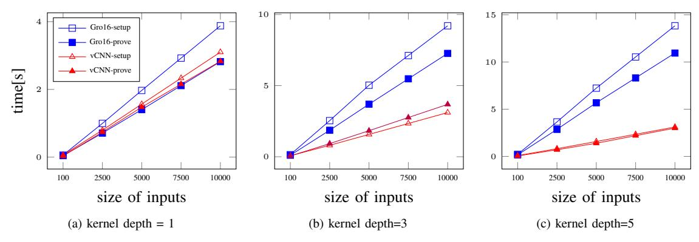

Fig. 6: Proving time in Gro16 and vCNN for convolutions where the kernel size is 10

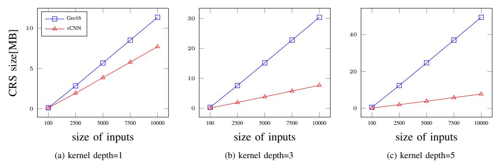

Fig. 7: CRS size in Gro16 and vCNN for convolutions where the kernel size is 10

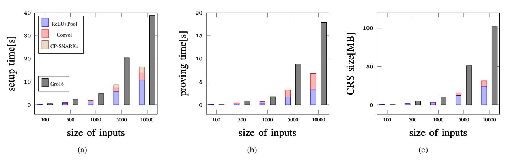

Fig. 8: Comparison between vCNN and Gro16 [3] when the kernel size = 10, the kernel depth size = 3, and the quantization bit depth = 10 bits

**Real CNNs:** We evaluate vCNN on several canonical CNNs models: LeNet-5 [32], AlexNet [33], VGG16 and VGG16wFC [9]. We utilize the average pool rather than the max pool since the average pool requires a smaller circuit than the max pool. In LeNet-5, AlexNet, and VGG16, the fully connected layers are not considered while VGG16wFC includes the fully connected layers.

Figures 12, 13, and 14 show the proving time and the CRS size for AlexNet, VGG16, VGG16wFC in vCNN, respectively. To evaluate various size models, we introduce a scale factor which reduces the kernel depth and the input size. For

example,  $(\frac{1}{32}, \frac{1}{7})$  denotes that the kernel depth decreases by  $\frac{1}{32}$  and the input size by  $\frac{1}{7}$  in every layer. Note that (1,1) represents the real model. As shown in the figures, the proving performance and the CRS size are proportional to the number of arithmetic gates in CNN circuits. Note that the results with a scale factor (1,1) in AlexNet, and scale factors larger than (1/2,1/7) in VGG16 are estimated values based on the number of gates.

Table II summarizes the performance and the size in vCNN and Gro16 [3]. In the table, we estimate the results in Gro16 due to insufficient memory. In vCNN, the setup time,

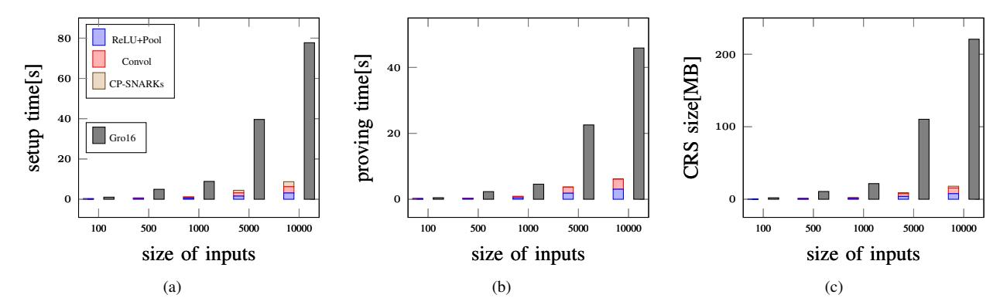

Fig. 9: Comparison between vCNN and Gro16 [3] when kernel size = 10, depth size = 15, and quantization bit depth = 10 bits

TABLE II: Comparison between vCNN and Gro16 for real CNN models

|          | vCNN     |         |        |         |           | Gro16     |            |        |         |           |
|----------|----------|---------|--------|---------|-----------|-----------|------------|--------|---------|-----------|
|          | setup    | prove   | verify | CRS     | proof     | setup     | prove      | verify | CRS     | proof     |
| LeNet-5  | 19.47 s  | 9.34 s  | 75ms   | 40.07MB |           | 1.5 hours | 0.75 hours | 75ms   | 11 GB   |           |
| AlexNet  | 20 min   | 18 min  | 130ms  | 2.1 GB  | 2803 bits | 16 days   | 14 days    | 130 ms | 2.5 TB  | 1019 bits |
| VGG16    | 10 hours | 8 hours | 19.4s  | 83 GB   |           | 13 years  | 10 years   | 19.4s  | 1400 TB |           |
| VGG16wFC | 2 days   | 2 days  | 19.4s  | 420 GB  |           | 13 years  | 10 years   | 19.4s  | 1400 TB |           |

the proving time, and the CRS size are 291x faster and smaller in vCNN than Gro16 for LeNet-5. Similarly, they are 1200x faster and smaller than Gro16 for AlexNet; 18000x for VGG16; 3400x for VGG16 with FC. Note that Gro16 would require more than 10 years to generate a proof for VGG16. The verification time is equivalent for all applications in both vCNN and Gro16. Note that if the time to check the commitment to the input data is excluded then the verification time is less than 50ms for every application.

# VI. CONCLUSION

In this paper, we propose a new efficient zk-SNARKs scheme called vCNN which can generate a proof rapidly for convolutional neural network models. We devise a new relation representation for convolutions, which reduces the computational complexity.The experimental results show that the proposed vCNN scheme reduces the proving time and the CRS size approximately 18,000x for the canonical CNN models on VGG16. The proposed scheme is proven to be perfectly zeroknowledge and computationally knowledge sound. Designing an efficient verifiable CNN training scheme will be our future work.

# REFERENCES

- [1] I. J. Goodfellow, J. Shlens, and C. Szegedy, "Explaining and harnessing adversarial examples," arXiv preprint arXiv:1412.6572, 2014.
- [2] B. Parno, J. Howell, C. Gentry, and M. Raykova, "Pinocchio: nearly practical verifiable computation," Commun. ACM, vol. 59, no. 2, pp. 103–112, 2016. [Online]. Available: http://doi.acm.org/10.1145/2856449
- [3] J. Groth, "On the size of pairing-based non-interactive arguments," in Advances in Cryptology - EUROCRYPT 2016 - 35th Annual International Conference on the Theory and Applications of Cryptographic Techniques, Vienna, Austria, May 8-12, 2016, Proceedings, Part II, 2016, pp. 305–326. [Online]. Available: https://doi.org/10.1007/978-3-662-49896-5 11

- [4] R. Gennaro, C. Gentry, B. Parno, and M. Raykova, "Quadratic span programs and succinct nizks without pcps," in Advances in Cryptology - EUROCRYPT 2013, 32nd Annual International Conference on the Theory and Applications of Cryptographic Techniques, Athens, Greece, May 26-30, 2013. Proceedings, 2013, pp. 626–645. [Online]. Available: https://doi.org/10.1007/978-3-642-38348-9 37
- [5] S. Goldwasser, G. N. Rothblum, and Y. T. Kalai, "Delegating computation: Interactive proofs for muggles," Electronic Colloquium on Computational Complexity (ECCC), vol. 24, p. 108, 2017. [Online]. Available: https://eccc.weizmann.ac.il/report/2017/108
- [6] R. S. Wahby, I. Tzialla, A. Shelat, J. Thaler, and M. Walfish, "Doubly-efficient zksnarks without trusted setup," in 2018 IEEE Symposium on Security and Privacy, SP 2018, Proceedings, 21-23 May 2018, San Francisco, California, USA, 2018, pp. 926–943. [Online]. Available: https://doi.org/10.1109/SP.2018.00060
- [7] S. Goldwasser, S. Micali, and C. Rackoff, "The knowledge complexity of interactive proof systems," SIAM J. Comput., vol. 18, no. 1, pp. 186–208, 1989. [Online]. Available: https://doi.org/10.1137/0218012
- [8] T. P. Pedersen, "Non-interactive and information-theoretic secure verifiable secret sharing," in Advances in Cryptology - CRYPTO '91, 11th Annual International Cryptology Conference, Santa Barbara, California, USA, August 11-15, 1991, Proceedings, ser. Lecture Notes in Computer Science, J. Feigenbaum, Ed., vol. 576. Springer, 1991, pp. 129–140. [Online]. Available: https://doi.org/10.1007/3-540-46766-1 9
- [9] K. Simonyan and A. Zisserman, "Very deep convolutional networks for large-scale image recognition," arXiv preprint arXiv:1409.1556, 2014.
- [10] A. E. Kosba, D. Papadopoulos, C. Papamanthou, M. F. Sayed, E. Shi, and N. Triandopoulos, "TRUESET: faster verifiable set computations," in Proceedings of the 23rd USENIX Security Symposium, San Diego, CA, USA, August 20-22, 2014., 2014, pp. 765–780. [Online]. Available: https://www.usenix.org/conference/usenixsecurity14/technicalsessions/presentation/kosba
- [11] L. Cavallaro, J. Kinder, X. Wang, and J. Katz, Eds., Proceedings of the 2019 ACM SIGSAC Conference on Computer and Communications Security, CCS 2019, London, UK, November 11-15, 2019. ACM, 2019. [Online]. Available: https://doi.org/10.1145/3319535
- [12] R. Gilad-Bachrach, N. Dowlin, K. Laine, K. E. Lauter, M. Naehrig, and J. Wernsing, "Cryptonets: Applying neural networks to encrypted data with high throughput and accuracy," in Proceedings of the 33nd International Conference on Machine Learning, ICML 2016, New York City, NY, USA, June 19-24, 2016, 2016, pp. 201–210. [Online]. Available: http://proceedings.mlr.press/v48/gilad-bachrach16.html
- [13] C. Juvekar, V. Vaikuntanathan, and A. Chandrakasan, "{GAZELLE}:

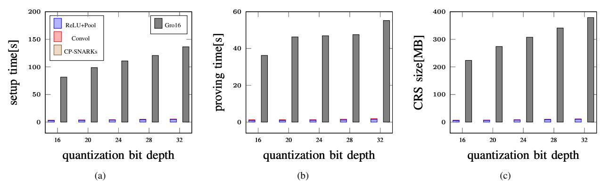

Fig. 10: Results when kernel size =  $3 \times 3$  and kernel depth size = 64

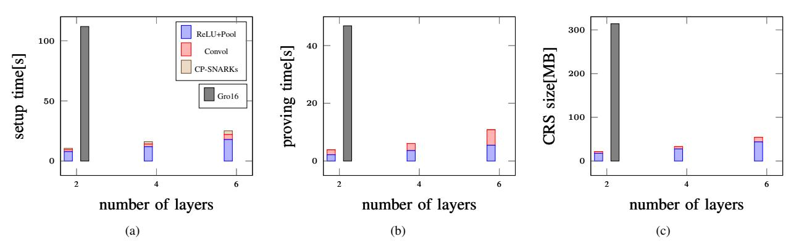

Fig. 11: MNIST CNN when kernel size is  $3 \times 3$  and kernel depths are 32, 64, and 128 for each convolution layer

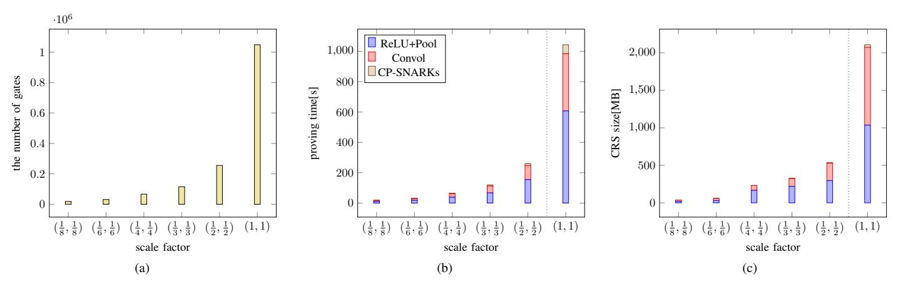

Fig. 12: AlexNet in vCNN by varying the scale factor to the kernel depth and the input size

- A low latency framework for secure neural network inference," in  $\underline{27th}$  {USENIX} Security Symposium ({USENIX} Security 18), 2018, pp.  $\underline{1651-1669}$ .
- [14] X. Jiang, M. Kim, K. Lauter, and Y. Song, "Secure outsourced matrix computation and application to neural networks," in <u>Proceedings of the 2018 ACM SIGSAC Conference on Computer and Communications Security</u>, ser. CCS '18. New York, NY, USA: Association for Computing Machinery, 2018, p. 1209–1222. [Online]. Available: https://doi.org/10.1145/3243734.3243837
- [15] H. Chen, W. Dai, M. Kim, and Y. Song, "Efficient multi-key homomorphic encryption with packed ciphertexts with application to oblivious neural network inference," in <u>Proceedings of the 2019 ACM SIGSAC Conference on Computer and Communications Security</u>, ser. CCS '19. New York, NY, USA: Association
- for Computing Machinery, 2019, p. 395–412. [Online]. Available: https://doi.org/10.1145/3319535.3363207
- [16] Z. Ghodsi, T. Gu, and S. Garg, "Safetynets: Verifiable execution of deep neural networks on an untrusted cloud," in Advances in Neural Information Processing Systems 30: Annual Conference on Neural Information Processing Systems 2017, 4-9 December 2017, Long Beach, CA, USA, 2017, pp. 4675–4684. [Online]. Available: http://papers.nips.cc/paper/7053-safetynets-verifiable-execution-of-deep-neural-networks-on-an-untrusted-cloud
- [17] L. Zhao, Q. Wang, C. Wang, Q. Li, C. Shen, X. Lin, S. Hu, and M. Du, "Veriml: Enabling integrity assurances and fair payments for machine learning as a service," <u>CoRR</u>, vol. abs/1909.06961, 2019. [Online]. Available: http://arxiv.org/abs/1909.06961
- [18] J. Keuffer, R. Molva, and H. Chabanne, "Efficient proof composition

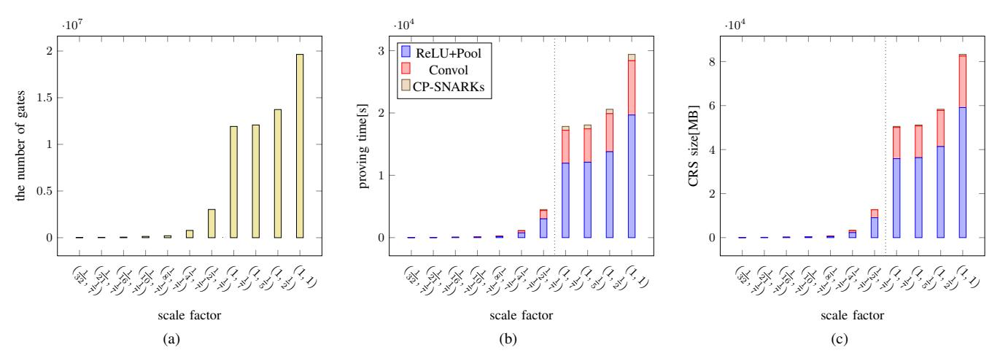

Fig. 13: VGG16 in vCNN by varying the scale factorvCNN to the kernel depth and the input size

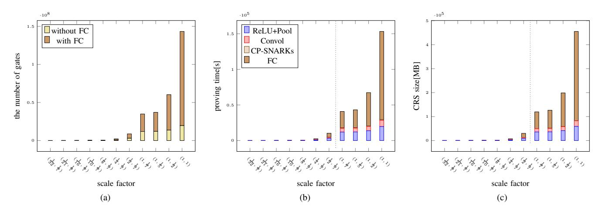

Fig. 14: VGG16 with FC in vCNN by varying the scale factor to the kernel depth and the input size

for verifiable computation," in Computer Security - 23rd European Symposium on Research in Computer Security, ESORICS 2018, Barcelona, Spain, September 3-7, 2018, Proceedings, Part I, ser. Lecture Notes in Computer Science, J. López, J. Zhou, and M. Soriano, Eds., vol. 11098. Springer, 2018, pp. 152–171. [Online]. Available: https://doi.org/10.1007/978-3-319-99073-6\_8

- [19] N. Bitansky, A. Chiesa, Y. Ishai, R. Ostrovsky, and O. Paneth, "Succinct non-interactive arguments via linear interactive proofs," in <u>Theory of Cryptography</u> 10th Theory of Cryptography Conference, <u>TCC 2013</u>, <u>Tokyo</u>, <u>Japan</u>, <u>March 3-6</u>, 2013. <u>Proceedings</u>, 2013, pp. 315–333. [Online]. Available: https://doi.org/10.1007/978-3-642-36594-2\_18
- [20] G. Cormode, M. Mitzenmacher, and J. Thaler, "Practical verified computation with streaming interactive proofs," in <u>Innovations in Theoretical Computer Science 2012, Cambridge, MA, USA, January 8-10, 2012, 2012, pp. 90–112. [Online]. Available: http://doi.acm.org/10.1145/2090236.2090245</u>
- [21] E. Ben-Sasson, A. Chiesa, D. Genkin, E. Tromer, and M. Virza, "Snarks for C: verifying program executions succinctly and in zero knowledge," in Advances in Cryptology - CRYPTO 2013 - 33rd Annual Cryptology Conference, Santa Barbara, CA, USA, August 18-22, 2013. Proceedings, Part II, ser. Lecture Notes in Computer Science, R. Canetti and J. A. Garay, Eds., vol. 8043. Springer, 2013, pp. 90–108. [Online]. Available: https://doi.org/10.1007/978-3-642-40084-1\_6
- [22] E. Ben-Sasson, A. Chiesa, E. Tromer, and M. Virza, "Succinct non-interactive zero knowledge for a von neumann architecture," in Proceedings of the 23rd USENIX Security Symposium, San Diego, CA, USA, August 20-22, 2014., 2014, pp. 781–796. [Online]. Available: https://www.usenix.org/conference/usenixsecurity14/technical-

- sessions/presentation/ben-sasson
- [23] J. Thaler, "Time-optimal interactive proofs for circuit evaluation," in Advances in Cryptology - CRYPTO 2013 - 33rd Annual Cryptology Conference, Santa Barbara, CA, USA, August 18-22, 2013. Proceedings, Part II, ser. Lecture Notes in Computer Science, R. Canetti and J. A. Garay, Eds., vol. 8043. Springer, 2013, pp. 71-89. [Online]. Available: https://doi.org/10.1007/978-3-642-40084-1\_5
- [24] R. Canetti and J. A. Garay, Eds., Advances in Cryptology CRYPTO 2013 - 33rd Annual Cryptology Conference, Santa Barbara, CA, USA, August 18-22, 2013. Proceedings, Part II, ser. Lecture Notes in Computer Science, vol. 8043. Springer, 2013. [Online]. Available: https://doi.org/10.1007/978-3-642-40084-1
- [25] E. Ben-Sasson, A. Chiesa, C. Garman, M. Green, I. Miers, E. Tromer, and M. Virza, "Zerocash: Decentralized anonymous payments from bitcoin," in 2014 IEEE Symposium on Security and Privacy, SP 2014, Berkeley, CA, USA, May 18-21, 2014. IEEE Computer Society, 2014, pp. 459-474. [Online]. Available: https://doi.org/10.1109/SP.2014.36
- [26] J. Eberhardt and S. Tai, "Zokrates scalable privacy-preserving off-chain computations," in <a href="IEEE">IEEE</a> International Conference on Internet of Things (iThings) and IEEE Green Computing and Communications (GreenCom) and IEEE Cyber, Physical and Social Computing (CPSCom) and IEEE Smart Data (SmartData), iThings/GreenCom/CPSCom/SmartData 2018, Halifax, NS, Canada, July 30 August 3, 2018. IEEE, 2018, pp. 1084–1091. [Online]. Available: https://doi.org/10.1109/Cybermatics\_2018.2018.00199
- [27] "Zsl on quorum," https://github.com/jpmorganchase/zsl-q.
- [28] "Jsnark," https://github.com/akosba/jsnark.
- [29] A. E. Kosba, C. Papamanthou, and E. Shi, "xjsnark: A framework

for efficient verifiable computation," in 2018 IEEE Symposium on Security and Privacy, SP 2018, Proceedings, 21-23 May 2018, San Francisco, California, USA, 2018, pp. 944–961. [Online]. Available: https://doi.org/10.1109/SP.2018.00018

- [30] F. Tramèr and D. Boneh, "Slalom: Fast, verifiable and private execution of neural networks in trusted hardware," in 7th International Conference on Learning Representations, ICLR 2019, New Orleans, LA, USA, May 6-9, 2019, 2019. [Online]. Available: https://openreview.net/forum?id=rJVorjCcKQ
- [31] R. Freivalds, "Probabilistic machines can use less running time," in Information Processing, Proceedings of the 7th IFIP Congress 1977, Toronto, Canada, August 8-12, 1977, B. Gilchrist, Ed. North-Holland, 1977, pp. 839–842.
- [32] Y. LeCun, L. Bottou, Y. Bengio, and P. Haffner, "Gradient-based learning applied to document recognition," <u>Proceedings of the IEEE</u>, vol. 86, no. 11, pp. 2278–2324, 1998.
- [33] A. Krizhevsky, I. Sutskever, and G. E. Hinton, "Imagenet classification with deep convolutional neural networks," <u>Commun. ACM</u>, vol. 60, no. 6, pp. 84–90, 2017. [Online]. Available: http://doi.acm.org/10.1145/3065386
- [34] T. P. Pedersen, "Non-interactive and information-theoretic secure verifiable secret sharing," in <u>Annual international cryptology conference</u>. Springer, 1991, pp. 129–140.

#### APPENDIX

# A. Proof of Theorem 1 and 2

*Proof.* We demonstrate the NILP scheme soundness for the proposed protocol as demonstrated in [3]. If the NILP scheme is proved, then soundness for proposed scheme is guaranteed in the Generic Group Model [3]. zk-SNARK and cc-SNARK are similar aside from the random parameter for the commitment. In the proof, zk-SNARK soundness(1) is the special case of cc-SNARK soundness(2) when  $\nu=0$ . Therefore we only prove Theorem 2 here.

We first consider an affine adversary  $\mathcal A$  strategy with nonnegligible success probability of extracting a witness. First, we set  $Z=X^{2d_x-1}$  to reducing the variables. Then  $\mathcal A$  can generate a proof

$$\begin{split} A &= A_{\alpha}\alpha + A_{\beta}\beta + A_{\gamma}\gamma + A_{\delta}\delta + A(x, x^{2d_{x}-1}) \\ &+ \sum_{i=0}^{l} \sum_{j=0}^{d_{z}} A_{i,j} \frac{\beta u_{i}(x) + \alpha v_{i}(x) + w_{i}(x)}{\gamma} x^{(2d_{x}-1) \cdot j} \\ &+ \sum_{i=l+1}^{m} \sum_{j=0}^{d_{z}} A_{i,j} \frac{\beta u_{i}(x) + \alpha v_{i}(x) + w_{i}(x)}{\delta} x^{(2d_{x}-1) \cdot j} \\ &+ A_{h}(x, x^{2d_{x}-1}) \frac{t(x)}{\delta} + A_{\eta\gamma} \frac{\eta}{\gamma} + A_{\eta\delta} \frac{\eta}{\delta} \end{split}$$

for known filed elements  $A_{\alpha}$ ,  $A_{\beta}$ ,  $A_{\gamma}$ ,  $A_{\delta}$ ,  $A_{i}$  and polynomials A(x,z),  $A_{h}(x,z)$ . we construct B and C similarly for the proof. In verification, the equation shows polynomials equality. From the Schwartz-Zippel lemma, verification holds the proof(A, B, and C) for indeterminates  $\alpha$ ,  $\beta$ ,  $\gamma$ ,  $\delta$ , and x if verification succeed.

Terms with indeterminates  $\alpha^2$  are  $A_{\alpha}B_{\alpha}\alpha^2=0$ , i.e.,  $A_{\alpha}=0$  or  $B_{\alpha}=0$ . Since field operation is commutative, we can assume  $B_{\alpha}=0$ . Terms with indeterminate  $\alpha\beta$  imply  $A_{\alpha}B_{\beta}+A_{\beta}B_{\alpha}=A_{\alpha}B_{\beta}=1$ . Thus,  $AB=(AB_{\beta})(A_{\alpha}B)$ , and we can assume  $A_{\alpha}=B_{\beta}=1$ . Hence with indeterminate  $\beta^2$  now

imply  $A_{\beta}B_{\beta}=A_{\beta}=0$ . This simplifies A and B constructed by the adversary to have the form

$$A = \alpha + A_{\gamma}\gamma + A_{\delta}\delta + A(x, x^{2d_x - 1}) + \cdots$$
  
$$B = \beta + B_{\gamma}\gamma + B_{\delta}\delta + B(x, x^{2d_x - 1}) + \cdots$$

Let us consider terms involving  $\frac{1}{x^2}$ .

$$\begin{pmatrix} \sum_{i=l+1}^{m} A_{i,j} (\beta u_i(x) + \alpha v_i(x) + w_i(x)) \cdot x^{(2d_x-1) \cdot j} + A_h(x, x^{2d_x-1}) t(x) \\ \cdot \left( \sum_{i=l+1}^{m} B_{i,j} (\beta u_i(x) + \alpha v_i(x) + w_i(x)) \cdot x^{(2d_x-1) \cdot j} + B_h(x, x^{2d_x-1}) t(x) \right) \\ = 0$$

Hence either left factor is 0. From symmetry, let us assume

$$(\Sigma_{i=l+1}^{m} A_{i}(\beta u_{i}(x) + \alpha v_{i}(x) + w_{i}(x)) + A_{h}(x, x^{2d_{x}-1})t(x)) = 0$$

. Therefore, terms in

$$\alpha \frac{\sum_{i=l+1}^{m} B_i(\beta u_i(x) + \alpha v_i(x) + w_i(x)) + B_h(x, x^{2d_x - 1}) t(x)}{\delta} = 0$$

imply that  $\sum_{i=l+1}^{m}B_{i}(\beta u_{i}(x)+\alpha v_{i}(x)+w_{i}(x))+B_{h}(x,x^{2d_{x}-1})t(x)=0.$ 

Therefore, considering terms involving  $\frac{1}{\gamma}$ ,

$$\left(\sum_{i=0}^{l}A_{i}(\beta u_{i}(x)+\alpha v_{i}(x)+w_{i}(x))\right)\cdot\left(\sum_{i=0}^{l}B_{i}(\beta u_{i}(x)+\alpha v_{i}(x)+w_{i}(x))\right)$$

hence either left or right factor is 0. From symmetry, let us assume  $(\Sigma_{i=0}^l A_i(\beta u_i(x) + \alpha v_i(x) + w_i(x))) = 0$ . Thus, terms in

$$\beta \frac{\sum_{i=0}^{l} B_i(\beta u_i(x) + \alpha v_i(x) + w_i(x))}{\gamma} = 0$$

also imply  $\Sigma_{i=0}^{l}B_{i}(\beta u_{i}(x)+\alpha v_{i}(x)+w_{i}(x))=0.$ 

Thus,  $A_{\gamma}\beta\gamma=0$ ,  $B_{\gamma}\alpha\gamma=0$ , and added terms involving  $\eta$  also  $(A_{\eta\gamma}\frac{\eta}{\gamma}+A_{\eta\delta}\frac{\eta}{\delta})\cdot\beta=0$ , hence  $A_{\gamma}=0$ ,  $B_{\gamma}=0$ ,  $A_{\eta\gamma}=0$ , and  $A_{\eta\delta}=0$ .

Collecting these results,

$$A = \alpha + A(x, x^{2d_x - 1}) + A_\delta \delta \quad B = \beta + B(x, x^{2d_x - 1}) + B_\delta \delta$$

Remaining terms in the verification equation that involve  $\alpha$  imply  $\alpha B(x,x^{2d_x-1})=\alpha\sum_{i=0}^l a_i(x^{2d_x-1}v_i(x)+\alpha\sum_{i=l+1}^m\sum_{j=0}^{d_z}C_{i,j}v_i(x)\cdot x^{(2d_x-1)\cdot j}.$  Defining  $a_i(x^{2d_x-1})=C_i(x^{2d_x-1})=\sum_{j=0}^{d_z}C_{i,j}\cdot x^{(2d_x-1)\cdot j}$  for  $i=l+1,\ldots,m,$ 

$$A(x,x^{2d_{x}-1}) = \sum_{i=0}^{m} a_{i}(x^{2d_{x}-1})u_{i}(x) \hspace{0.5cm} B(x,x^{2d_{x}-1}) = \sum_{i=0}^{m} a_{i}(x^{2d_{x}-1})v_{i}(x)$$

Finally, collecting terms involving powers of x,

$$\begin{split} \sum_{i=0}^{m} a_i(x^{2d_x-1}) u_i(x) \cdot \sum_{i=0}^{m} a_i(x^{2d_x-1}) v_i(x) \\ &= \sum_{i=0}^{m} a_i(x^{2d_x-1}) w_i(x) + C_h(x, x^{2d_x-1}) t(x) \end{split}$$

Since  $Z=X^{2d_x-1}$ , Z degree  $\geq X$  degree, and all terms are independent. Thus,  $a_i(X^{2d_x-1})$  is irrelevant to  $u_i(X), v_i(X), w_i(X)$  and t(X), and hence

$$a_{l+1}(x^{2d_x-1}), \dots, a_m(x^{2d_x-1}) = C_{l+1}(x^{2d_x-1}), \dots, C_m(x^{2d_x-1})$$

is a witness for the statement  $(a_1(x^{2d_x-1}), \ldots, a_l(x^{2d_x-1}))$ .

# B. Proof of Theorem 3

*Proof.* We first prove the perfect zero-knowledge. There are simulators for each scheme, and the commitment is the Pedersen [34] vector commitment which provides perfect hiding. Thus, proof has no information regarding witnesses, and hence the scheme supports perfect zero-knowledge.

Next, we prove that the computational knowledge soundness error is negligible. We define the computational knowledge soundness errors for each scheme  $\Pi_{qap}$ ,  $\Pi_{qpp}$ , and  $\Pi_{cp}$  as  $\epsilon_{qap}$ ,  $\epsilon_{qpp}$ , and  $\epsilon_{cp}$ , respectively, which are negligible; and the extractors for each scheme are  $\chi_{qap}$ ,  $\chi_{qpp}$ , and  $\chi_{cp}$ , respectively, which must exist due to the knowledge soundness for each scheme. The extractor  $\chi$  for the proposed scheme can be composed of three extractors because each extractor can generate a witness and the collection of all the witnesses is the witness for the proposed scheme.

Now, we compute the computation knowledge soundness error for the proposed scheme as follows:

$$Pr\left[\begin{array}{c|c} \mathsf{Verify}(crs,\phi,\pi) = 1 \middle| & (crs,td) \leftarrow \mathsf{Setup}(R), \\ \land(\phi,w) \not \in R & (\phi,\pi,w) \leftarrow (\mathcal{A}|\chi_{\mathcal{A}})(R,crs,z) \end{array}\right]$$

$$= Pr\left[\begin{array}{c|c} \Pi_{qap}.\mathsf{Verify}(crs_{qap},\phi_{qap},\pi_{qap}) = 1 \\ \land \Pi_{qpp}.\mathsf{Verify}(crs_{qpp},\phi_{qpp},\pi_{qpp}) = 1 \\ \land \Pi_{cp}.\mathsf{Verify}(crs_{cp},\phi_{cp},\pi_{cp}) = 1 \\ \land ((\phi_{qap},w_{qap}) \not \in R_{ReLU+Pooling} \\ \lor (\phi_{qpp},w_{qpp}) \not \in R_{convol} \lor (\phi_{cp},w_{cp}) \not \in R_{cp}) \end{array}\right]$$

$$\leq Pr\left[\begin{array}{c|c} \Pi.\mathsf{Verify}(crs_{qap},\phi_{qap},\pi_{qap}) = 1 \\ \land \Pi_{qpp}.\mathsf{Verify}(crs_{qpp},\phi_{qpp},\pi_{qpp}) = 1 \\ \land \Pi_{cp}.\mathsf{Verify}(crs_{qpp},\phi_{qpp},\pi_{qpp}) = 1 \\ \land (\phi_{qap},w_{qap}) \not \in R_{ReLU+Pool} \end{array}\right]$$

$$+ Pr\left[\begin{array}{c|c} \Pi_{qap}.\mathsf{Verify}(crs_{qap},\phi_{qap},\pi_{qap}) = 1 \\ \land \Pi_{qpp}.\mathsf{Verify}(crs_{qpp},\phi_{qpp},\pi_{qpp}) = 1 \\ \land \Pi_{cp}.\mathsf{Verify}(crs_{qp},\phi_{qpp},\pi_{qpp}) = 1 \\ \land (\phi_{qpp},w_{qpp}) \not \in R_{convol} \end{array}\right]$$

$$+ Pr\left[\begin{array}{c|c} \Pi_{qap}.\mathsf{Verify}(crs_{qap},\phi_{qap},\pi_{qap}) = 1 \\ \land (\phi_{qpp},w_{qpp}) \not \in R_{convol} \end{array}\right]$$

$$+ Pr\left[\begin{array}{c|c} \Pi_{qap}.\mathsf{Verify}(crs_{qap},\phi_{qap},\pi_{qap}) = 1 \\ \land (\phi_{qpp},w_{qpp},\phi_{qpp},\pi_{qpp}) = 1 \\ \land (\phi_{cp},w_{cp}) \not \in R_{cp} \end{array}\right]$$

$$+ Pr\left[\begin{array}{c|c} \Pi_{qap}.\mathsf{Verify}(crs_{qpp},\phi_{qpp},\pi_{qpp}) = 1 \\ \land (\phi_{cp},w_{cp}) \not \in R_{cp} \end{array}\right]$$

where we used that  $\epsilon_{qap}$ ,  $\epsilon_{qpp}$ ,  $\epsilon_{cp}$  are negligible in the last two inequalities. Therefore the computational soundness error is negligible.