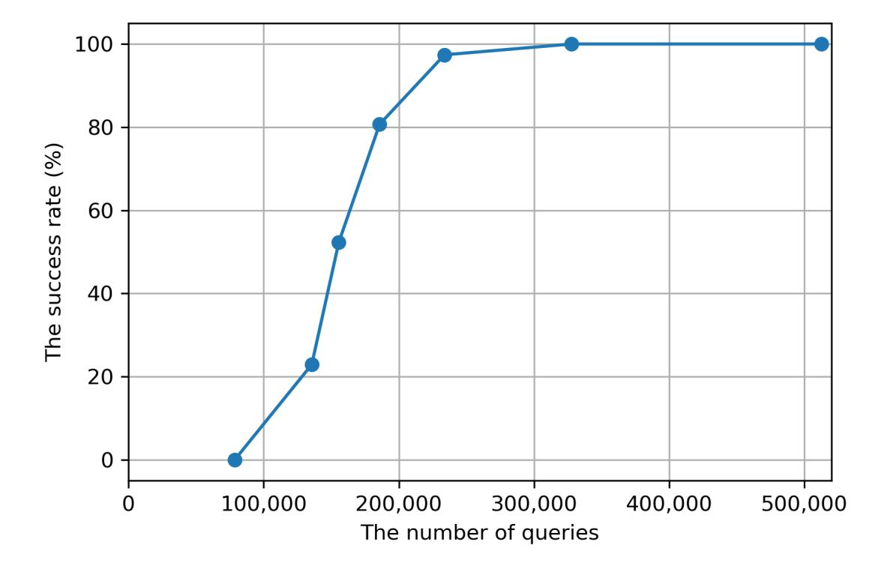

{0}------------------------------------------------

# Improving Key Mismatch Attack on NewHope with Fewer Queries

Satoshi Okada<sup>1</sup> , Yuntao Wang<sup>2</sup> , and Tsuyoshi Takagi<sup>1</sup>

<sup>1</sup> Graduate School of Information Science and Technology, The University of Tokyo okada-satoshi323@g.ecc.u-tokyo.ac.jp takagi@mist.i.u-tokyo.ac.jp

Abstract. NewHope is a lattice cryptoscheme based on the Ring Learning With Errors (Ring-LWE) problem, and it has received much attention among the candidates of the NIST post-quantum cryptography standardization project. Recently, key mismatch attacks on NewHope have been proposed, where the adversary tries to recover the server's secret key by observing the mismatch of the shared key from chosen queries. At CT-RSA 2019, Bauer et al. first proposed a key mismatch attack on NewHope, and then at ESORICS 2019, Qin et al. proposed an improved version with success probability of 96.9% using about 880,000 queries. In this paper, we further improve their key mismatch attacks on NewHope. First, we reduce the number of queries by adapting the terminating condition to the response from the server using an early abort technique. Next, the success rate of recovering the secret key polynomial is raised by setting a deterministic condition for judging its coefficients. We also improve the method of generating queries. Furthermore, the search range of the secret key in Qin et al.'s attack is extended without increasing the number of queries. As a result, about 73% of queries can be reduced compared with Qin et al.'s method under the success rate of 97%. Moreover, we analyze the trade-off between the number of queries and the success rate. In particular, we show that a lower success rate of 20.9% is available by further reduced queries of 135,000, simultaneously.

Keywords: PQC, Ring-LWE, Key Mismatch Attack, NewHope.

## 1 Introduction

The current public-key cryptosystems based on the hardness of the factorization problem or the discrete logarithm problem can be broken by quantum computers in polynomial time [17]. For this reason, it is urgent to develop post-quantum cryptography (PQC) which is secure against the threat of quantum computers. PQC is being standardized by the National Institute of Standards and Technology (NIST) [1]. There, lattice-based cryptography is one of the most promising categories, and NewHope is one of the lattice-based key exchange candidates selected in the second round of the NIST PQC standardization project. The

<sup>2</sup> School of Information Science, Japan Advanced Institute of Science and Technology y-wang@jaist.ac.jp

{1}------------------------------------------------

security of NewHope [2] is based on the difficulty of the underlying Ring-LWE problem [12]. Comparing to the typical LWE problem [15], the Ring-LWE based cryptoschemes enjoy smaller key sizes that benefit from its ring structure. On the other hand, some potential demerits from the ring structure may be maliciously used by attackers, thus more careful cryptanalysis of these cryptoschemes is required.

Nowadays it is common to reuse keys in Internet communications, so as to improve the performance of the protocols. For example, TLS 1.3 [16] adopts the pre-shared key (PSK) mode where the server is allowed to reuse the same secret key and public key in intermittent communication with the clients, in order to reduce the procedure of handshakes. Meanwhile, such protocols may have a risk of leakage of the server's secret key when the adversary has enough chances to send queries to the honest server and get correct responses from it. There is a kind of key mismatch attack on the Ring-LWE based key exchange protocols. As its name implies, the key mismatch attack generally works as follows: an adversary sends chosen ciphertexts to the server, and recovers the server's secret key by observing a match or mismatch of a common key. In particular, there are mainly two key mismatch attacks on NewHope [4,13] which take advantage of the property that the secret key of NewHope is a polynomial constructed with integer coefficients sampled from -8 to 8 in a key-reuse scenario.

The first key mismatch attack on NewHope was proposed by Bauer et al. [4] at CT-RSA 2019, which can recover the secret coefficients belonging to the interval [−6, 4]. However, the success rate of recovering coefficients in [−6, 4] was not so high. Bauer et al. also reported that the coefficients belonging to {−8, −7, 5, 6, 7, 8} can be recovered by the brute-force attack, nevertheless, the computational complexity is as large as 6<sup>11</sup> ≃ 2 <sup>39</sup> due to the fact that about 11.16 coefficients of 1024 ones are belonging to {−8, −7, 5, 6, 7, 8} on average in one secret key.

Furthermore, Qin et al. [13] improved Bauer et al.'s attack at ESORICS 2019 so that the coefficients in [−6, 4] can be successfully recovered with a high rate of 99.22%, and the others in {−8, −7, 5, 6, 7, 8} can be recovered with fewer queries than the brute-force attack. As a result, the rate of recovering the secret key correctly achieves 96.88%. However, the attack proposed by Qin et al. requires a large number of 880,000 queries for recovering a secret key, which makes the attack not efficient. Besides, some specific patterns of secret keys can not be recovered successfully in this attack.

### 1.1 Our Contributions

In this paper, we further improve Qin et al.'s attack to reduce the number of queries, and evaluate its relationship with the success rate of recovering secret keys. First, we introduce an early abort technique to reduce the number of queries. Namely, we set an appropriate query stop condition according to the response (i.e. match or mismatch with the common key) from the server. Then, to raise the success rate of the attack, we propose a deterministic condition when judging the secret polynomial's coefficients; and we improve the method 

{2}------------------------------------------------

of generating queries sent by the adversary. Moreover, we observe that without increasing the number of queries, the attack of Qin et al. on the secret key coefficients in [−6, 4] can be extended to a wider range of [−6, 7]. Since only 0.28 coefficients on average belonging to the remaining set of {−8, −7, 8} in one secret key, we decide to perform a brute-force attack. As a result, to achieve almost the same success rate of 97%, the number of queries is reduced to about 230,000 which is 73% less than the cost claimed in Qin et al's method. Furthermore, the recovery success rate can be improved to 100.0% experimentally in our method. Simultaneously, by evaluating the relationship between the success rate and the number of queries, we can further reduce the number of queries to 135,000 with 20.9% success rate.

### 1.2 Related Works

A number of key recovery attacks have been developed to Ring-LWE based cryptography, under the assumption of a key reusing scenario. Generally, they are divided into two types: the signal leakage attacks with exploiting the flaws of the signal function [5,8,11], and the key mismatch attacks taking advantage of constructing the final shared key. In this work, we focus on the latter key mismatch attacks, as we already introduced two previous works of [4,13] above. Besides, in ACISP 2018, Ding et al. [7] proposed a general key mismatch attack model for Ring-LWE based key exchange scheme without using the signal leakage. Recently, there are also some key mismatch attacks on several specific lattice-based cryptographic schemes. For instance, in 2020, Greuet et al. [10] proposed the mismatch attack on LAC which is a Ring-LWE based cryptoscheme but with small key size. In 2019, Qin et al. [14] applied their attack on the Module-LWE based Kyber as well. And Ding et al. [6] analyzed the NTRU cryptoscheme by adapting the key mismatch attack to it. Especially, the mismatch attack using the quantum algorithm was proposed by B˘aetu et al. [3] in Eurocrypt 2019.

#### 1.3 Roadmap

We recall the NewHope cryptoscheme and its relevant functions in Section 2. Then we introduce the previous works of mismatch attacks on NewHope in Section 3, including the methods proposed by Bauer et al [4] and its improvement by Qin et al [13], respectively. In Section 4, we propose our mismatch attack which is evidently improving Qin et al.'s attack. We give our experimental results, and show the trade-off between the number of queries and the success rate in Section 5. Finally, we conclude our work in Section 6.

## 2 Preliminaries

In this section, we introduce the algebraic definitions and notations used in NewHope. Next, we show the outline of NewHope's protocol, including several important functions being used in it.

{3}------------------------------------------------

| pre-shared key <b>a</b>                                             |                                                    |                                                                                |
|---------------------------------------------------------------------|----------------------------------------------------|--------------------------------------------------------------------------------|
| Alice                                                               |                                                    | Bob                                                                            |
| $\mathbf{s}_A, \mathbf{e}_A \stackrel{\$}{\leftarrow} \psi_8^n$     |                                                    |                                                                                |
| $\mathbf{P}_A \leftarrow \mathbf{as}_A + \mathbf{e}_A$              | $\xrightarrow{\mathbf{P}_A}$                       | $\mathbf{s}_B, \mathbf{e}_B, \mathbf{e}_B' \stackrel{\$}{\leftarrow} \psi_8^n$ |
|                                                                     |                                                    | $\mathbf{P}_B \leftarrow \mathbf{as}_B + \mathbf{e}_B$                         |
|                                                                     |                                                    | $\nu_B \stackrel{\$}{\leftarrow} \{0,1\}^{256}$                                |
|                                                                     |                                                    | $\nu_B' \leftarrow \text{SHA3-256}(\nu_B)$                                     |
|                                                                     |                                                    | $\mathbf{k} \leftarrow \mathtt{Encode}\left(\nu_B'\right)$                     |
|                                                                     |                                                    | $\mathbf{c} \leftarrow \mathbf{P}_A \mathbf{s}_B + \mathbf{e}_B' + \mathbf{k}$ |
| $\mathbf{c}' \leftarrow \mathtt{Decompress}(\overline{\mathbf{c}})$ | $\leftarrow (\mathbf{P}_B, \overline{\mathbf{c}})$ | $\overline{\mathbf{c}} \leftarrow \mathtt{Compress}(\mathbf{c})$               |
| $\mathbf{k}' = \mathbf{c}' - \mathbf{P}_B \mathbf{s}_A$             |                                                    | $S_{k_B} \leftarrow \text{SHA3-256} \left( \nu_B' \right)$                     |
| $\nu_A' \leftarrow \mathtt{Decode}\left(\mathbf{k}'\right)$         |                                                    |                                                                                |
| $S_{k_A} \leftarrow \text{SHA3-256} \left(\nu_A'\right)$            |                                                    |                                                                                |

Fig. 1. NewHope key exchange protocol

Set  $\mathbb{Z}_q$  the integer remainder ring modulo q, and  $\mathbb{Z}_q[x]$  represents a polynomial ring whose coefficients are sampled from  $\mathbb{Z}_q$ . We also denote the residue ring of  $\mathbb{Z}_q[x]$  modulo  $(x^n+1)$  by  $\mathcal{R}_q=\mathbb{Z}_q[x]/(x^n+1)$ . Bold letters such as  $\mathbf{P},\mathbf{s}$  refer to elements in  $\mathcal{R}_q$ . We also use vector notation for polynomials in this paper, e.g. the vector notation for  $\mathbf{a}\left(=\sum_{i=0}^{n-1}a_ix^i\right)\in\mathcal{R}_q$  is  $(a_0,a_1,\cdots,a_{n-2},a_{n-1})$ .  $\mathbf{a}[i]$  represents the coefficient of  $x^i$  in the polynomial, and the corresponding i-th element of the vector as well. For a real number x,  $\lfloor x \rfloor$  represents the largest integer no larger than x and  $\lfloor x \rceil = \lfloor x + \frac{1}{2} \rfloor$ . For the sake of convenience, we set  $s = \lfloor q/8 \rfloor$  where q is the integer modulus in NewHope.

We denote by  $\psi_8$  a binomial distribution with a standard deviation of 8, and its element is sampled by calculating  $\sum_{i=1}^{8} (b_i - b'_i)$ . Here,  $b_i$  and  $b'_i$  are sampled from  $\{0,1\}$  uniformly at random. Let  $\psi_8^n$  be the polynomial set whose each coefficient is sampled from  $\psi_8$ . In the figures and algorithms, the notation  $\stackrel{\$}{\leftarrow} \mathcal{D}$  means randomly sampling an element from distribution (or set)  $\mathcal{D}$ .

Ring-LWE Problem: Let  $\chi$  be a distribution on  $\mathcal{R}_q$ . For randomly sampled polynomials  $\mathbf{s}, \mathbf{e} \overset{\$}{\leftarrow} \chi, \mathbf{a} \overset{\$}{\leftarrow} \mathcal{R}_q$ , the set of  $(\mathbf{a}, \mathbf{b} = \mathbf{a}\mathbf{s} + \mathbf{e} \in \mathcal{R}_q)$  is called as *ring LWE sample*. The *ring learning with errors* (Ring-LWE) problem is to find the secret polynomial  $\mathbf{s}$  (and the error  $\mathbf{e}$  simultaneously) from a given Ring-LWE sample of  $(\mathbf{a}, \mathbf{b})$ .

### 2.1 NewHope Key Exchange Protocol

An outline of the NewHope key exchange protocol is shown in Figure 1. Here we omit the procedures that are not directly related to the key mismatch attack, such as NTT (Number Theoretic Transform) being used to speed up polynomial multiplication. NewHope aims to securely exchange a shared key between Alice

{4}------------------------------------------------

and Bob and it executes the below three steps. Note that the public polynomial **a** is shared in advance, which is sampled from  $\mathcal{R}_q$  uniformly at random. The security of NewHope is based on the hardness of the Ring-LWE problem, where  $\chi$  is the distribution of  $\psi_8^n$ .

- 1. Alice randomly samples a secret key  $\mathbf{s}_A$  and an error  $\mathbf{e}_A$  from  $\psi_8^n$ . Then, she calculates the public key  $\mathbf{P}_A = \mathbf{a}\mathbf{s}_A + \mathbf{e}_A$  using the previously shared  $\mathbf{a} (\in \mathcal{R}_q)$ , and sends  $\mathbf{P}_A$  to Bob. From the public key  $\mathbf{P}_A$  and the previously shared polynomial  $\mathbf{a}$ , it is difficult to obtain information about the secret key  $\mathbf{s}_A$  thanks to the hardness of Ring-LWE problem.
- 2. Bob selects  $\mathbf{s}_B$ ,  $\mathbf{e}_B$  and  $\mathbf{e}_B'$  from  $\psi_8^n$  and computes the public key  $\mathbf{P}_B = \mathbf{a}\mathbf{s}_B + \mathbf{e}_B$ . Then, Bob chooses a 256-bit long bit string  $\nu_B$  that is the basis of the shared key  $S_{k_B}$ , and hashes it by calculating  $\nu_B' = \mathrm{SHA3-256}\,(\nu_B)$ . Subsequently, he computes  $\mathbf{k} = \mathrm{Encode}\,(\nu_B')$ ,  $\mathbf{c} = \mathbf{P}_A\mathbf{s}_B + \mathbf{e}_B' + \mathbf{k}$ ,  $\mathbf{\bar{c}} = \mathrm{Compress}(\mathbf{c})$  and sends  $(\mathbf{P}_B, \mathbf{\bar{c}})$  to Alice. The shared key  $S_{k_B}$  is obtained by calculating  $S_{k_B} = \mathrm{SHA3-256}\,(\nu_B')$ .
- 3. When Alice receives  $(\mathbf{P}_B, \overline{\mathbf{c}})$ , she calculates  $\mathbf{k}' = \mathbf{c}' \mathbf{P}_B \mathbf{s}_A = \mathbf{e}_A \mathbf{s}_B \mathbf{e}_B \mathbf{s}_A + \mathbf{e}'_B + \mathbf{k}$ . Alice can get  $\nu'_A$  equal to  $\nu'_B$  with high probability by computing Decode  $(\mathbf{k}')$  because the coefficients of  $\mathbf{e}_A \mathbf{s}_B \mathbf{e}_B \mathbf{s}_A + \mathbf{e}'_B$  are small. Then, she also gains a shared key  $S_{k_A} = \text{SHA3-256}(\nu'_A)$ .

In NewHope, q=12289 and n=512 or 1024 are employed. NewHope512 and NewHope1024 refer to the case of n=512 and n=1024, respectively. In the five security levels defined by NIST, NewHope512 is at the lowest level (level 1), and NewHope1024 is at the highest level (level 5) [1]. In this paper, we deal with the higher secure NewHope1024.

#### 2.2 The Functions Used in NewHope

We simply review four functions being used in NewHope (Figure 1): Compress( $\mathbf{c}$ ), Decompress( $\overline{\mathbf{c}}$ ), Encode( $\nu_B'$ ), and Decode( $\mathbf{k}'$ ).

The Compress function (Algorithm 1) and the Decompress function (Algorithm 2) perform coefficient-wise modulus switching between modulus q and 8. By compressing  $\mathbf{c} \in \mathcal{R}_q$ , the total size of coefficients becomes smaller; thereby the transmission cost is lower.

The function Encode (Algorithm 3) takes a 256-bit string  $\nu_B'$  as an input and maps each bit to four coefficients in  $\mathbf{k} \in \mathcal{R}_q$ :  $\mathbf{k}[i]$ ,  $\mathbf{k}[i+256]$ ,  $\mathbf{k}[i+512]$ , and  $\mathbf{k}[i+768]$  (for  $i=0\cdots 255$ ). In contrast, The function Decode (Algorithm 4) restores each bit of  $\nu_A' \in \{0,1\}^{256}$  from four coefficients in  $\mathbf{k}' \in \mathcal{R}_q$ . Namely,  $\nu_A'[i] = 1$  if the summation of the four coefficients is smaller than q, and  $\nu_A'[i] = 0$  otherwise.

## 3 Key Mismatch Attack on NewHope

In this section, we first explain a general model of a key mismatch attack on NewHope. Then we recall the attacks proposed by Bauer et al. [4] and Qin et al. [13], respectively.

{5}------------------------------------------------

### Algorithm 1: Compress(c)

Input:  $\mathbf{c} \in \mathcal{R}_q$ Output:  $\overline{\mathbf{c}} \in \mathcal{R}_8$ 1 for  $i \leftarrow 0$  to 255 do
2  $| \overline{\mathbf{c}}[i] \leftarrow \lfloor (\mathbf{c}[i] \cdot 8)/q \rfloor$  (mod8)

 $\mathbf{3}$  Return  $\overline{\mathbf{c}}$ 

## Algorithm 3: $Encode(\overline{\nu_B'})$

Input:  $\nu_B' \in \{0, 1\}^{256}$ Output:  $\mathbf{k} \in \mathcal{R}_q$ 1  $\mathbf{k} \leftarrow 0$ 2 for  $i \leftarrow 0$  to 255 do

3

#### Algorithm 2: Decompress $(\overline{\mathbf{c}})$

Input:  $\overline{\mathbf{c}} \in \mathcal{R}_8$ Output:  $\mathbf{c}' \in \mathcal{R}_q$ 1 for  $i \leftarrow 0$  to 255 do
2  $\left\lfloor \mathbf{c}'[i] \leftarrow \left\lfloor (\overline{\mathbf{c}}[i] \cdot q)/8 \right\rfloor \right\rfloor$ 3 Return  $\mathbf{c}'$ 

#### **Algorithm 4:** Decode( $\mathbf{k}'$ )

```
Input: \mathbf{k}' \in \mathcal{R}_q
Output: \nu_A' \in \{0,1\}^{256}

1 \nu_A' \leftarrow 0
2 for i \leftarrow 0 to 255 do
3  | m \leftarrow \sum_{j=0}^{3} |\mathbf{k}'[i+256j] - 4s|
4 if m < q then
5  | \nu_A'[i] \leftarrow 1\nelse
6  | \nu_A'[i] \leftarrow 0
7 Return \nu_A'
```

#### 3.1 The General Model

In the model of the key mismatch attack, we assume that Alice is an honest server and Bob plays the role of an adversary in Figure 1. An adversary sends a query including  $(\mathbf{P}_B, \overline{\mathbf{c}}, S_{k_B})$  to the server. Then, the server calculates the shared key  $S_{k_A}$  and returns whether  $S_{k_A}$  and  $S_{k_B}$  match or mismatch. Here, the server is set to reuse the same secret key and honestly respond to any number of queries.

For the sake of convenience, we build an oracle  $\mathcal{O}$  (Algorithm 5) to simulate the behavior of the server in this paper. The oracle outputs 1 if  $S_{k_A} = S_{k_B}$  and outputs 0 otherwise. Changing the formats of queries sent to the oracle, the adversary can get information about  $\mathbf{s}_A$  by observing the responses.

#### 3.2 Bauer et al.'s Method

Bauer et al. proposed a method for recovering the coefficients in [-6, 4] of the secret key  $s_A$ . To recover the coefficient  $s_A[i]$ , the adversary forges the following query and send it to the oracle.

$$\begin{cases}
\nu_B' = (1, 0, \dots, 0) \\
\mathbf{P}_B = \frac{s}{2} x^{-i'} & (i' \equiv i \pmod{256}) \\
\overline{\mathbf{c}} = \sum_{j=0}^{3} (l_j + 4) x^{256j} & (l_j \in [-4, 3])
\end{cases}$$

{6}------------------------------------------------

### Algorithm 5: Oracle( $\mathbf{P}_B, \overline{\mathbf{c}}, S_{k_B}$ )

```
Input: \mathbf{P}_{B}, \overline{\mathbf{c}}, S_{k_{B}}
Output: 1 or 0

1 \mathbf{c}' \leftarrow \mathtt{Decompress}(\overline{\mathbf{c}})
2 \mathbf{k}' \leftarrow \mathbf{c}' - \mathbf{P}_{B}\mathbf{s}_{A}
3 \nu_{A}' \leftarrow \mathtt{Decode}(\mathbf{k}')
4 S_{k_{A}} \leftarrow \mathtt{SHA3-256}(\nu_{A}')
5 if S_{k_{A}} = S_{k_{B}} then
6 | Return 1\nelse
7 | Return 0
```

In this case,  $\mathbf{k}'$  is calculated as follows:

$$\mathbf{k}' = \mathbf{c}' - \mathbf{P}_{B}\mathbf{s}_{A}$$

$$= \sum_{j=0}^{3} \left( \text{Decompress}(\overline{\mathbf{c}})[256j] - \frac{s}{2}\mathbf{s}_{A}[i' + 256j] \right) x^{256j}$$

$$+ \sum_{\substack{k \not\equiv i \\ (\text{mod } 256)}} \left( 0 - \frac{s}{2}\mathbf{s}_{A}[k] \right) x^{k}.$$

$$(1)$$

In  $\nu'_A$  (= Decode( $\mathbf{k}'$ )), all elements except  $\nu'_A[0]$  are calculated from the second term of Equation (1) and they become 0 with high probability. Therefore, the key mismatch corresponds to the mismatch between  $\nu'_B[0](=1)$  and  $\nu'_A[0]$ , which depends on selected  $l_j$  (j=0,1,2,3). The adversary fixes  $l_j$  other than  $l_{\lfloor \frac{i}{256} \rfloor}$  to a random value and observes the change of the oracle's output by increasing  $l_{\lfloor \frac{i}{256} \rfloor}$  from -4 to 3. If the adversary gets a string of outputs like  $1, \dots, 1, 0, \dots, 0, 1, \dots, 1$ , he can calculate an estimated value  $\tau$  of  $\mathbf{s}_A[i]$  from the two possible values  $\tau_1 < \tau_2$ . The oracle's output goes from 1 to 0 at point  $l_{\lfloor \frac{i}{256} \rfloor} = \tau_1$  and then from 0 to 1 at point  $l_{\lfloor \frac{i}{256} \rfloor} = \tau_2$ . Here such a form of outputs is called a favorable case. Please refer to [4] for the details of the attack.

#### 3.3 Qin et al.'s Method

Qin et al. pointed out the low success rate of the attack proposed by Bauer et al. They proposed the following improvements to Bauer et al.'s attack on recovering the coefficients in [-6,4]. In their method, they used the same way to generate the queries as Bauer et al.'s. However, they observed that a form of outputs like  $0, \dots, 0, 1, \dots, 1, 0, \dots, 0$  is also a favorable case. Besides, they indicated that Bauer et al.'s attack algorithm is not deterministic. For example, in the case of  $\mathbf{s}_A[i] = 2$ , the adversary may get a value of the incorrect 1 along with the correct 2. Since the attack algorithm is probabilistic, the more times the attacks are applied, the higher success probability can be achieved. However, the number of queries increases accordingly. To take a balance between the cost

{7}------------------------------------------------

and the success rate, Qin et al. decided to collect 50  $\tau$ s for each coefficient and recover the coefficient from the breakdown of them.

Additionally, they proposed a new attack for coefficients in  $\{-8, -7, 5, 6, 7, 8\}$ . However, this attack is conditional and its success rate is smaller than 11.2%. We analyze the details of their attack and show its drawbacks in Appendix A.

### 4 Our Improved Method

We propose an improved method to increase the success rate of key recovery and reduce the number of queries. In this section, we first describe the improvements in three parts, and finally introduce the overall attack flow.

#### 4.1 Improvement on the Construction of Queries

We focus on the point that there are some secret key patterns that cannot be recovered in Qin et al.'s and Bauer et al.'s attacks. In their attacks, when recovering the coefficients in [-6,4], an adversary sets  $\nu_B' = (1,0,\cdots,0)$ . In this case, depending on the pattern of  $\mathbf{s}_A$ , some elements except for  $\nu_A'[0]$  become unexpected value of 1 where  $\nu_A' = \mathsf{Decode}(\mathbf{k}')$ . Due to this, the oracle keeps returning 0 because  $\nu_A' \neq \nu_B'$  regardless of the value of  $\nu_A'[0]$ . Therefore, a key mismatch attack will never be established.

To solve this problem, we propose a new query construction. In our method, when an adversary wants to recover the coefficient  $\mathbf{s}_A[i]$ , he directly sets the query like

$$\begin{cases}
\mathbf{P}_B = \frac{s}{2} \\
\bar{\mathbf{c}} = \sum_{j=0}^{3} (l_j + 4) x^{i' + 256j}
\end{cases} \quad (l_j \in [-4, 3], \ i' \equiv i \pmod{256}).$$

The oracle receives it and calculates

$$\mathbf{k}' = \mathbf{c}' - \mathbf{P}_{B}\mathbf{s}_{A}$$

$$= \sum_{j=0}^{3} \left( \text{Decompress}(\overline{\mathbf{c}})[256j] - \frac{s}{2}\mathbf{s}_{A}[i' + 256j] \right) x^{256j}$$

$$+ \sum_{\substack{k \not\equiv 0 \\ (\text{mod } 256)}} \left( 0 - \frac{s}{2}\mathbf{s}_{A} \right) [k] x^{k}.$$

$$(2)$$

Then, the oracle gets  $\nu'_A = (\mathsf{Decode}(\mathbf{k}'))$ , where  $\nu'_A[i']$  is calculated from the first term of Formula (2) and other elements are from the second term. Here, if  $\nu'_B$  meets two conditions such as

$$\begin{cases} \nu_B' = \text{Decode}(0 - \frac{s}{2}\mathbf{s}_A), \\ \nu_B'[i'] = 1, \end{cases} \tag{3}$$

{8}------------------------------------------------

### **Algorithm 6:** Find $-\nu'_{B}()$

```
Output: \nu_B' \in \{0,1\}^{256}
 1 \mathbf{P}_B \leftarrow \frac{s}{2}, \, \overline{\mathbf{c}} \leftarrow 0
  2 \nu_B' \leftarrow (0, \cdots, 0)
 S_{k_B} \leftarrow SHA3-256 (\nu_B')
  4 if \mathcal{O}(\mathbf{P}_B, \overline{\mathbf{c}}, S_{k_B}) = 1 then
  5 | Return \nu_B'
  6 for i \leftarrow 0 to 255 do
             \nu_B' \leftarrow (0, \cdots, 0)
  7
             \nu_B'[i] \leftarrow 1
  8
             S_{k_B} \leftarrow \text{SHA3-256} \left( \nu_B' \right)
  9
             if \mathcal{O}(\mathbf{P}_B, \overline{\mathbf{c}}, S_{k_B}) = 1 then
10
               Return \nu_B'
11
12 for i \leftarrow 0 to 255 do
             for j \leftarrow i + 1 to 255 do
13
                    \nu_B' \leftarrow (0, \cdots, 0)
14
                    \nu_B'[i] \leftarrow 1, \, \nu_B'[j] \leftarrow 1
15
                    S_{k_B} \leftarrow \text{SHA3-256} \left( \nu_B' \right)
16
                    if \mathcal{O}(\mathbf{P}_B, \overline{\mathbf{c}}, S_{k_B}) = 1 then
17
                      Return \nu_B'
18
19 Terminate the entire program
```

the value returned by the oracle (matching or mismatching between the two shared keys) can be reduced to the value of  $\nu'_A[i']$ .

In Algorithm 6, we show how to set  $\nu'_B$  to satisfy the above two conditions. Here we decide to find  $\nu'_B$  that meets Equation (3) by the exhaustive search. First,  $\mathbf{P}_B$  and  $\mathbf{\bar{c}}$  are set as  $\mathbf{P}_B = \frac{s}{2}, \mathbf{\bar{c}} = 0$ . Then,  $\nu'_B$  is set to be an 256-bit string in the following orders: (I) all elements are 0, (II) except for one 1, all elements are 0, and (III) except for two 1s, all elements are 0. Simultaneously, the adversary sends a query  $(\mathbf{P}_B, \mathbf{\bar{c}}, S_{k_B})$  to the oracle. When the oracle returns 1, this algorithm stops and returns  $\nu'_B$ . In contrast, if the oracle does not return 1 even after examining all of the above patterns (I)(II)(III), the algorithm can judge that the secret key  $\mathbf{s}_A$  cannot be recovered successfully, and the whole program is terminated. The reason why we only deals with three patterns (I)(II)(III) is as follows.

- 1. The case that  $\nu_B'$  includes three or more 1s appears with probability of only 0.003% (see Table 1).
- 2. For the case of  $\nu_B'$  with three or more 1s, the exhaustive search needs much more queries than Qin et al.'s method. For instance, it takes  $_{256}\mathrm{C}_3 = 2,763,520$  queries when searching  $\nu_B'$  with three 1s.

By performing Algorithm 6,  $\nu_B'$  that satisfies the Equation (3) is set. Then, when querying the oracle, an adversary has to additionally set  $\nu_B'[i'] = 1$  to meet Equation (4).

{9}------------------------------------------------

| the number of 1 included in $Decode(0-\frac{s}{2}\mathbf{s}_A)$ | secret key $\mathbf{s}_A$ |
|-----------------------------------------------------------------|---------------------------|
| 0                                                               | 94.547%                   |
| 1                                                               | 5.302%                    |
| 2                                                               | 0.148%                    |
| 3 or more                                                       | 0.003%                    |

**Table 1.** Distribution of secret key  $s_A$ 

#### 4.2 Extending the Search Range of Secret Key

After setting a proper query, an adversary changes  $l_{\lfloor \frac{i}{256} \rfloor}$  from -4 to 3 analogous to Qin et al.'s method. Then, he calculates an estimated value  $\tau$  of the coefficient  $\mathbf{s}_A[i]$  by observing the oracle's outputs. Qin et al. claimed that this attack was valid on coefficients of  $\mathbf{s}_A[i]$  in [-6,4]. However, we point out that the attack can be applied to a wider range such as [-6,7], without any additional queries.

It is clear that the oracle's output is relative to  $\nu'_A[i']$  whose value depends on the size of m comparing with the size of q (Algorithm 4). Remark that m is calculated by

$$m = \sum_{j=0}^{3} |\mathbf{k}'[i' + 256j] - 4s|$$

$$\approx \sum_{j=0}^{3} |(l_j + 4)s - \frac{s}{2}\mathbf{s}_A[i' + 256j] - 4s|$$

$$= \sum_{j=0}^{3} |l_j - \frac{1}{2}\mathbf{s}_A[i' + 256j]| s.$$

Moreover, all  $l_j$   $(j \in \{0, 1, 2, 3\} \setminus \{\lfloor \frac{i}{256} \rfloor\})$  are fixed at random values. From these facts, we can conclude that the string of oracle's outputs depends on the change of

$$u = |\mathbf{k}'[i] - 4s|. \tag{5}$$

Meanwhile, there are two kinds of favorable cases such as  $0, \dots, 0, 1, \dots, 1, 0, \dots, 0$  and  $1, \dots, 1, 0, \dots, 0, 1, \dots, 1$ . Next, we study the condition of u for meeting favorable cases from the oracle.

We explain the case of  $1, \dots, 1, 0, \dots, 0, 1, \dots, 1$  here, and the analysis for the case of  $0, \dots, 0, 1, \dots, 1, 0, \dots, 0$  is similar due to symmetry. For example, an adversary wants to recover  $\mathbf{s}'_A[i] = -7$ . He randomly fixes  $l_j$   $(j \in \{0, 1, 2, 3\} \setminus \{\lfloor \frac{i}{256} \rfloor\})$  first. Then, we assume that he gets v = 6s which is fixed by the computation of

$$v = m - u$$
  
=  $\sum_{i'+256j \neq i} |\mathbf{k}'[i' + 256j] - 4s|$ .

{10}------------------------------------------------

In this case, when  $l_{\lfloor \frac{i}{256} \rfloor}$  varies, the behavior of m used in Decode function and the oracle's output is shown in Table 2.

**Table 2.** The behavior of m and the oracle's output( $\mathbf{s}_A'[i] = -7$ )

| $l_{\lfloor \frac{i}{256} \rfloor}$ | -4   | -3   | -2   | -1   | 0        | 1    | 2    | 3    |
|-------------------------------------|------|------|------|------|----------|------|------|------|
| u(=m-v)                             | 0.5s | 0.5s | 1.5s | 2.5s | 3.5s + 1 | 3.5s | 2.5s | 1.5s |
| the oracle's output                 | 1    | 1    | 1    | 0    | 0        | 0    | 0    | 1    |

We can conclude that if u monotonically increases and then monotonically decreases, the oracle's outputs become  $1, \dots, 1, 0, \dots, 0, 1, \dots, 1$ . On the contrary, due to the symmetry, if u monotonically decreases and then monotonically increases, the oracle's outputs become  $0, \dots, 0, 1, \dots, 1, 0, \dots, 0$ .

**Table 3.** The behavior of u (Formula 5) corresponding to parameter  $l_{\lfloor \frac{i}{256} \rfloor}$  and  $\mathbf{s}_A[i]$ 

| $\frac{u}{\mathbf{s}_A[i]} \frac{l_{\lfloor \frac{i}{256} \rfloor}}{\mathbf{s}_A[i]}$ | -4       | -3       | -2       | -1       | 0               | 1               | 2               | 3           |
|---------------------------------------------------------------------------------------|----------|----------|----------|----------|-----------------|-----------------|-----------------|-------------|
| -8                                                                                    | 0        | s        | 2s       | 3s       | 4s              | 3s              | 2s              | s           |
| -7                                                                                    | 0.5s     | 0.5s     | 1.5s     | 2.5s     | 3.5s + 1        | 3.5s            | 2.5s            | 1.5s        |
| -6                                                                                    | s        | 0        | s        | 2s       | 3s+1            | 4s              | 3s              | 2s          |
| -5                                                                                    | 1.5s     | 0.5s     | 0.5s     | 1.5s     | 2.5s + 1        | 3.5s + 1        | 3.5s            | 2.5s        |
| -4                                                                                    | 2s       | s        | 0        | s        | 2s+1            | 3s+1            | 4s              | 3s          |
| -3                                                                                    | 2.5s     | 1.5s     | 0.5s     | 0.5s     | 1.5s + 1        | 2.5s + 1        | 3.5s + 1        | 3.5s        |
| -2                                                                                    | 3s       | 2s       | s        | 0        | s+1             | 2s+1            | 3s+1            | 4s          |
| -1                                                                                    | 3.5s     | 2.5s     | 1.5s     | 0.5s     | 0.5s + 1        | 1.5s + 1        | 2.5s + 1        | 3.5s + 1    |
| 0                                                                                     | 4s       | 3s       | 2s       | s        | 1               | s+1             | 2s+1            | 3s+1        |
| 1                                                                                     | 3.5s + 1 | 3.5s     | 2.5s     | 1.5s     | 0.5s-1          | 0.5s + 1        | 1.5s + 1        | 2.5s + 1    |
| 2                                                                                     | 3s+1     | 4s       | 3s       | 2s       | <i>s</i> -1     | 1               | s+1             | 2s+1        |
| 3                                                                                     | 2.5s + 1 | 3.5s + 1 | 3.5s     | 2.5s     | 1.5 <i>s</i> -1 | 0.5s-1          | 0.5s + 1        | 1.5s + 1    |
| 4                                                                                     | 2s+1     | 3s+1     | 4s       | 3s       | 2 <i>s</i> -1   | s-1             | 1               | s+1         |
| 5                                                                                     | 1.5s + 1 | 2.5s + 1 | 3.5s + 1 | 3.5s     | 2.5 <i>s</i> -1 | 1.5 <i>s</i> -1 | 0.5s-1          | 0.5s + 1    |
| 6                                                                                     | s+1      | 2s+1     | 3s+1     | 4s       | 3 <i>s</i> -1   | 2s-1            | <i>s</i> -1     | 1           |
| 7                                                                                     | 0.5s + 1 | 1.5s + 1 | 2.5s + 1 | 3.5s + 1 | 3.5 <i>s</i> -1 | 2.5s-1          | 1.5 <i>s</i> -1 | 0.5s-1      |
| 8                                                                                     | 1        | s+1      | 2s+1     | 3s+1     | 4 <i>s</i> -1   | 3 <i>s</i> -1   | 2 <i>s</i> -1   | <i>s</i> -1 |

Furthermore, we show how u changes according to  $l_{\lfloor \frac{i}{256} \rfloor}$  for each value of  $\mathbf{s}_A[i] \in [-8,8]$  in Table 3. As we can see, for each  $\mathbf{s}_A[i]$ , u always monotonically increases and then decreases or monotonically decreases and then increases. Therefore, the estimated value  $\tau$  of each  $\mathbf{s}_A[i] \in [-8,8]$  can be obtained theoretically.

{11}------------------------------------------------

Table 4. sA[i] and possible τ s, outputs of Algorithm 7

| sA[i] -8 |   | -7 | -6                                                                            | -5 | -4 | -3 | -2 | -1 | 0 | 1 | 2 | 3 | 4 | 5 | 6 | 7 | 8 |
|----------|---|----|-------------------------------------------------------------------------------|----|----|----|----|----|---|---|---|---|---|---|---|---|---|
| τ        | 8 |    | 8 -7 -7 -6 -6 -5 -5 -4 -4 -3 -3 -2 -2 -1 -1 0 0 1 1 2 2 3 3 4 4 5 5 6 6 7 7 8 |    |    |    |    |    |   |   |   |   |   |   |   |   |   |

```
Algorithm 7: Find−τ (b)
  Input: b ∈ {0, 1}
                 8
  Output: τ ∈ [−7, 8] or NULL
1 τ, τ1, τ2 ← NULL
2 for i ← 0 to 6 do
 3 if b[i] 6= b[i + 1] then
 4 if τ1 = NULL then
 5 τ1 ← i − 4
 6 else if τ2 = NULL then
 7 τ2 ← i − 3
8 if τ1 6= NULL and τ2 6= NULL then
 9 τ = τ1 + τ2
10 if τ > 0 and b[0] = 1 then
11 τ = τ − 8
12 else if τ ≤ 0 and b[0] = 1 then
13 τ = τ + 8
14 Return τ
```

Next, we consider how to determine sA[i] from τ s. We invite Qin et al.'s algorithm (Algorithm 7) to calculate τ from the string of oracle's outputs b. Note that the output τ is expanded from -7 to 8, where τ belongs to [-6,4] in Qin et al.'s paper. We show the relationship between possible τ s and sA[i] in Table 4. In particular, three values of sA[i] ∈ {−8, −7, 8} correspond to τ = 8. Namely, when τ = 8 appears, an adversary has to determine sA[i] from {-8,- 7,8}. Thus, we conduct this attack only against sA[i] ∈ [−6, 7] in our improved method.

### 4.3 Early Abort Technique for Terminating Queries

In Qin et al.'s method, 50 τ s are collected for each coefficient and sA[i] is determined from the breakdown of them. For example, if 35 τ s out of 50 are 3 and 15 τ s are 2, then sA[i] = 3. However, this probabilistic process is inefficient. In our algorithm, we set a deterministic condition for judging sA[i]. As shown in Table 4, two types of τ correspond to unique value of sA[i] in [-6,7]. Therefore, we can terminate collecting τ when two different types appear. We apply this condition at Step 20 in Algorithm 8.

{12}------------------------------------------------

#### **Algorithm 8:** Partial-recovery(p)

```
Input: p \in \mathbb{N}
     Output: \mathbf{s}_A' \in \mathcal{R}_q
 1 \mathbf{P}_B \leftarrow \frac{s}{2}
  2 \nu_B' \leftarrow \text{Find} - \nu_{\text{B}}'()
  3 for i' \leftarrow 0 to 255 do
            \nu_B'[i'] \leftarrow 1
  4
            S_{k_B} \leftarrow \text{SHA3-256}(\nu_B)
  5
            for j \leftarrow 0 to 3 do
  6
                   count \leftarrow 0
  7
                   t, temp \leftarrow \text{NULL}
  8
                   while count 
  9
                         (l_0, l_1, l_2, l_3) \stackrel{\$}{\leftarrow} [-4, 3]^4
10
                         b \leftarrow []
11
                         for l_j \leftarrow -4 to 3 do
12

\overline{\mathbf{c}} \leftarrow \sum_{k=0}^{3} (l_k + 4) x^{i' + 256k}

b.append (\mathcal{O}(\mathbf{P}_B, \overline{\mathbf{c}}, S_{k_B}))
13
14
                         t \leftarrow \mathtt{Find} - \tau(b)
15
                         if t \neq \text{NULL then}
16
                                count = count + 1
17
                                if temp = NULL then
18
                                      temp \leftarrow t
19
                                else if temp \neq t then
20
                                      break
21
                   if temp \neq 8 and t \neq 8 then
22
                         if temp = t then
23
                                \mathbf{s}_A'[i' + 256j] \leftarrow temp
24
                         else
                           \mathbf{s}_A'[i' + 256j] \leftarrow \max(temp, t)
25
                   else
                     \mathbf{s}'_A[i' + 256j] \leftarrow \text{NULL}
26
27 Return \mathbf{s}'_A
```

#### 4.4 Our Proposed Algorithm

We first propose Algorithm 8 to recover the coefficient of  $\mathbf{s}_A$  in [-6,7]. To launch this attack, an adversary sets  $\mathbf{P}_B = \frac{s}{2}$ ,  $\nu_B' = \mathrm{Find} - \nu_B'()$ ,  $\nu_B'[i'] = 1$ , and  $\overline{\mathbf{c}} = \sum_{k=0}^3 (l_k + 4) \, x^{i'+256k}$  according to the coefficient  $\mathbf{s}_A[i' + 256j]$  that he wants to recover. Then, the queries including  $(\mathbf{P}_B, \overline{\mathbf{c}}, S_{k_B})$  are sent to the oracle. When  $l_{i'}$  varies from -4 to 3, the outputs from the oracle are appended to the array b (Step 14). Then the adversary gets  $\tau$ s from  $\mathrm{Find} - \tau(b)$ . He keeps sending queries until he gets two different values of  $\tau$  or he gets same  $\tau$ s for p times. We execute our experiments with different p and analyze the performance of the algorithm.

{13}------------------------------------------------

#### **Algorithm 9:** Full-recovery(p)

```
Input: p \in \mathbb{N}
       Output: \mathbf{s}_A' \in \mathcal{R}_q
  1 \mathbf{s}_A' \leftarrow \text{Partial-recovery}(p)
  \mathbf{2} \ \mathbf{s}_B, \mathbf{e}_B, \mathbf{e}_B' \overset{\$}{\leftarrow} \psi_8^n
  \mathbf{3} \ \mathbf{P}_B \leftarrow \mathbf{a}\mathbf{s}_B + \mathbf{e}_B
  4 \nu_B \stackrel{\$}{\leftarrow} \{0,1\}^{256}
  5 \mathbf{k} \leftarrow \text{Encode} (\nu_B')
  6 \nu_B' \leftarrow \text{SHA3-256}(\nu_B)
  7 S_{k_B} \leftarrow \text{SHA3-256}(\nu_B')
  8 index \leftarrow []
  9 for i \leftarrow 0 to 1024 do
               if \mathbf{s}'_A[i] = \text{NULL then}
10
 11
                  index.append(i)
12 for list \in \{-8, -7, 8\}^{index.length()} do
               for j \leftarrow 0 to index.length() - 1 do
13
                 \mathbf{s}'_A[index[j]] = list[j]
 14
               \mathbf{P}_A \leftarrow \mathbf{as}_A'
15
               \mathbf{c} \leftarrow \mathbf{P}_A \mathbf{s}_B + \mathbf{e}_B' + \mathbf{k}
16
               \overline{\mathbf{c}} \leftarrow \mathtt{Compress}(\mathbf{c})
17
               if \mathcal{O}\left(\mathbf{P}_{B}, \overline{\mathbf{c}}, S_{k_{B}}\right) = 1 then
18
                  break
 19
20 Return \mathbf{s}'_A
```

If  $\tau = 8$ , this algorithm returns NULL without determining the value of the target coefficient (Step 26). Besides, if two different  $\tau$ s are obtained, the larger one is adopted (Step 25), otherwise  $\mathbf{s}'_A[i' + 256j] = \tau$ .

Finally, we propose Algorithm 9 to recover the entire secret key  $\mathbf{s}_A$ . Taking account of the fact that averagely only 0.28 coefficients in  $\{-8, -7, 8\}$  are included in one secret key, so we decide to perform an exhaustive search on them. First, by running Partial-recovery(p), an adversary gets  $\mathbf{s}'_A$  whose coefficients in [-6,7] can be recovered. Next, he sets the public key  $\mathbf{P}_B$ , the secret key  $\mathbf{s}_B$ , and the error polynomial  $\mathbf{e}_B, \mathbf{e}'_B$  in the same way as Bob does in Figure 1.  $\nu_B$  is set random bit string, because it has no significant meaning in this exhaustive attack. Simultaneously,  $S_{k_B}$  is calculated by hashing  $\nu_B$ . Finally, he exhaustively substitutes values in  $\{-8, -7, 8\}$  for  $\mathbf{s}'_A[i]$  where is NULL (Step 14). Originally,  $\mathbf{P}_A$  sent from Alice is used when Bob calculates  $\bar{\mathbf{c}}$ . However, the goal of this attack is to check whether  $\mathbf{s}'_A = \mathbf{s}_A$ , thus  $\mathbf{P}_A = \mathbf{a}\mathbf{s}'_A$  is used (Step 15). The queries generated by the above procedure are sent to the oracle repeatedly and when the oracle outputs 1, this program stops and returns  $\mathbf{s}'_A$ .

{14}------------------------------------------------

## 5 Our Experiments

At first, we implement NewHope1024-CPA-KEM [1] with parameters (n, q) = (1024, 12289). Then, we generate 1000 secret keys s<sup>A</sup> randomly. Our goal is to recover s<sup>A</sup> by using our proposed Algorithm 9, where we try different parameters p in the set of {5, 10, 12, 15, 20, 30, 50}. All the algorithms and oracles are implemented by Python3. Polynomial calculation is implemented using poly1d of numerical calculation library NumPy. We run the programs on Intel Xeon Skylake Gold 6130 with CPUs at 2.1GHz.

Table 5. The success rate and the number of queries when increasing the value of p

| The value of p                                                              | 5 | 10   | 12   | 15   | 20   | 30    | 50    |
|-----------------------------------------------------------------------------|---|------|------|------|------|-------|-------|
| The success rate (%)                                                        | 0 | 20.9 | 52.3 | 80.7 | 97.4 | 100.0 | 100.0 |
| The number of queris 78,648 135,602 155,610 185,789 233,803 327,659 512,435 |   |      |      |      |      |       |       |

The experimental results are shown in Table 5, where we illustrate the tradeoff between the number of required queries and the success rate. In addition, we also represent the data in Figure 2. It is notable that the attack can achieve 100.0% success rate when p ≥ 30. Meanwhile, it indicates that decreasing p reduces not only the number of queries but also decreases the success rate. Specifically, if we sacrifice the success rate to 20.9%, we can reduce the number of queries to 135,602.



Fig. 2. The relationship between the number of queries and the success rate (each dot from left to right corresponds to the value of p = 5, 10, . . . , 50)

{15}------------------------------------------------

Table 6. Comparison of experimental results of key mismatch attacks

|                       | Qin et al. [13] | Our attack (p = 20) |
|-----------------------|-----------------|---------------------|
| The success rate (%)  | 96.9            | 97.4                |
| The number of queries | 879,725         | 233,803             |

Moreover, a comparison with Qin et al.'s experimental results is summarized in Table 6. In the case of p = 20, the success rate is almost the same as that of Qin et al.'s, but the number of queries is reduced by about 73%.

## 6 Conclusion

In this paper, we improved Qin et al's key mismatch attack on NewHope, and evaluated the trade-off between the number of queries and the success rate of recovering the secret keys. As a result, the number of required queries can be reduced by about 73% with almost the same success rate as that in Qin et al.'s attack. Moreover, our attack can achieve 100.0% success rate.

The current key mismatch attacks, including ours, Qin et al.'s, and Bauer et al.'s, are feasible under the assumption that the server honestly responses to freely chosen queries and continues to reuse the secret key. For this reason, they are not applicative to the CCA-secure NewHope using Fujisaki-Okamoto transformation [9]. However, considering the aspect of efficiency in practical use, there may be some cases where only CPA-secure NewHope is used without updating the server's secret key for a time. Then it is necessary to take some countermeasures to prevent the leakage of secret information, such as updating keys periodically or setting a detection system to malicious queries.

Acknowledgments Acknowledgments We thank Dr. Atsushi Takayasu for his helpful comments on this work. This work was supported by JSPS KAKENHI Grant Number 19F19378, JST CREST Grant Number JPMJCR14D6, Japan.

## References

- 1. US Department of Commerce, National Institute of Standards and Technology. Post-Quantum Cryptography, 2019. http://csrc.nist.gov/projects/ post-quantum-cryptography/.
- 2. E. Alkim, L. Ducas, T. P¨oppelmann, and P. Schwabe. Post-quantum key exchange - A New Hope. In 25th USENIX Security Symposium, USENIX Security 16, August 10-12, 2016, Proceedings, pages 327–343, 2016.
- 3. C. B˘aetu, F. B. Durak, L. Huguenin-Dumittan, A. Talayhan, and S. Vaudenay. Misuse attacks on post-quantum cryptosystems. In EUROCRYPT 2019, May 19- 23, 2019, Proceedings, Part II, pages 747–776, 2019.
- 4. A. Bauer, H. Gilbert, G. Renault, and M. Rossi. Assessment of the key-reuse resilience of NewHope. In The Cryptographers' Track at the RSA Conference 2019,CT-RSA 2019, March 4-8, 2019, Proceedings, pages 272–292, 2019.

{16}------------------------------------------------

- 5. J. Ding, S. Alsayigh, R. V. Saraswathy, S. R. Fluhrer, and X. Lin. Leakage of signal function with reused keys in RLWE key exchange. In IEEE International Conference on Communications, ICC 2017, May 21-25, 2017,Proceedings, pages 1–6, 2017.
- 6. J. Ding, J. Deaton, K. Schmidt, Vishakha, and Z. Zhang. A simple and practical key reuse attack on NTRU cryptosystem. IACR Cryptology ePrint Archive, 2020:1022, 2019. http://eprint.iacr.org/2019/1022.
- 7. J. Ding, S. R. Fluhrer, and S. RV. Complete attack on RLWE key exchange with reused keys, without signal leakage. In Information Security and Privacy - 23rd Australasian Conference, ACISP 2018, July 11-13, 2018, Proceedings, pages 467–486, 2018.
- 8. S. R. Fluhrer. Cryptanalysis of ring-LWE based key exchange with key share reuse. IACR Cryptology ePrint Archive, 2016:85, 2016. http://eprint.iacr.org/2016/ 085.
- 9. E. Fujisaki and T. Okamoto. Secure integration of asymmetric and symmetric encryption schemes. J. Cryptology, 26(1):80–101, 2013.
- 10. A. Greuet, S. Montoya, and G. Renault. Attack on LAC key exchange in misuse situation. IACR Cryptology ePrint Archive, 2020:63, 2020. http://eprint.iacr. org/2020/063.
- 11. C. Liu, Z. Zheng, and G. Zou. Key reuse attack on NewHope key exchange protocol. In Information Security and Cryptology, ICISC 2018, November 28-30, 2018, Revised Selected Papers, pages 163–176, 2018.
- 12. V. Lyubashevsky, C. Peikert, and O. Regev. On ideal lattices and learning with errors over rings. In EUROCRYPT 2010, May 30 - June 3, 2010, Proceedings, pages 1–23, 2010.
- 13. Y. Qin, C. Cheng, and J. Ding. A complete and optimized key mismatch attack on NIST candidate newhope. In 24th European Symposium on Research in Computer Security,ESORICS 2019,September 23-27, 2019, Proceedings, Part II, pages 504– 520, 2019.
- 14. Y. Qin, C. Cheng, and J. Ding. An efficient key mismatch attack on the NIST second round candidate Kyber. IACR Cryptology ePrint Archive, 2019:1343, 2019. http://eprint.iacr.org/2019/1343.
- 15. O. Regev. On lattices, learning with errors, random linear codes, and cryptography. J. ACM, 56(6):34:1–34:40, 2009.
- 16. E. Rescorla. The transport layer security (TLS) protocol version 1.3. Technical report. http://www.rfc-editor.org/info/rfc8446.
- 17. P. W. Shor. Polynomial-time algorithms for prime factorization and discrete logarithms on a quantum computer. SIAM J. Comput., 26(5):1484–1509, 1997.

## Appendix A An Observation of Qin et al.'s Attack.

#### A.1 Qin et al.'s method [13]

Qin et al. analyzed the distribution of the quadruplet (sA[i],sA[i + 256], sA[i + 512], and sA[i + 768]). They show that with 98.50% probability, there are 3 coefficients in {−6, −5, . . . , 2, 3, 4} and 1 coefficient is in {-8,-7,5,6,7,8} in each quadruplet (Table 4, [13]). In the following, we call this quadruplet Ξ for convenience sake.

{17}------------------------------------------------

Assume that an adversary wants to recover sA[i] (∈ {−8, −7, 5, 6, 7, 8}) after he recovered other 3 coefficients, sA[i+ 256], sA[i+ 512], and sA[i+ 768] by their attack for the coefficients in [-6,4]. He sets each polynomials with parameter h<sup>1</sup> as follows:

$$\begin{cases} \mathbf{s}_B, \mathbf{e}_B' = 0 \\ \mathbf{e}_B = h_1 x^{512} \left( h_1 \in \mathbb{Z}_q \right) \\ \nu_B' = (0, \dots, 0, 1, 0, \dots, 0) \text{ (only } i\text{-th element is 1)}. \end{cases}$$

After receiving the query, the server has

$$\mathbf{k}' = \sum_{j=0}^{3} (4s+1)x^{i+256j} - h_1 x^{512} \mathbf{s}_A$$

$$= \sum_{j=0}^{3} (4s+1)x^{i+256j} - \left(-h_1 \mathbf{s}_A [512] - \dots - h_1 \mathbf{s}_A [1023] x^{511} + h_1 \mathbf{s}_A [0] x^{512} + \dots + h_1 \mathbf{s}_A [511] x^{1023}\right).$$

Finally, the parameter m used in Decode function to calculate ν ′ <sup>A</sup>[i] is like

$$m = \sum_{j=0}^{3} |\mathbf{k}'[i+256j] - 4s|$$

$$\approx |1 + \mathbf{s}_{A}[i+512]h_{1}| + |1 + \mathbf{s}_{A}[i+768]h_{1}| + |1 - \mathbf{s}_{A}[i]h_{1}| + |1 - \mathbf{s}_{A}[i+256]h_{1}|$$

$$\approx (|\mathbf{s}_{A}[i]| + |\mathbf{s}_{A}[i+256]| + |\mathbf{s}_{A}[i+512]| + |\mathbf{s}_{A}[i+768]|) h_{1}.$$

It sets ν ′ <sup>A</sup>[i] = 1 if this m ≥ q, and ν ′ <sup>A</sup>[i] = 0 otherwise. If ν ′ <sup>A</sup>[ℓ] = 0(∀ℓ 6= i), the oracle's output corresponds to the relationship between m and q. In other words, if h<sup>1</sup> is so small that m < q, the oracle keeps returning 1, but only after h<sup>1</sup> becomes large enough such that m ≥ q, it returns 0. The adversary varies the value of h<sup>1</sup> from 1 to 12289. At the point that the oracle's output changes from 1 to 0, the following equation holds.

$$q \approx (|\mathbf{s}_A[i]| + |\mathbf{s}_A[i+256]| + |\mathbf{s}_A[i+512]| + |\mathbf{s}_A[i+768]|) h_1$$

At this time, the adversary have

$$|\mathbf{s}_A[i]| + |\mathbf{s}_A[i+256]| + |\mathbf{s}_A[i+512]| + |\mathbf{s}_A[i+768]| \approx \frac{q}{h_1}$$

.

He knows 3 coefficients except for sA[i] in the quadruplet. Therefore, he can calculate |sA[i]| from Equation A.1. Furthermore he can determine sA[i] from the absolute value and the information on the sign of sA[i] which is obtained by the attack on the coefficients in [-6,4].

#### A.2 The Condition for Qin et al.'s Method

In this subsection, we consider the conditions for the success of Qin et al.'s attack. Hereinafter, we define m<sup>i</sup> as m used in Decode function to calculate ν ′ A[i]. As 

{18}------------------------------------------------

shown above,

$$m_i = \sum_{j=0}^{3} |\mathbf{k}'[i+256j] - 4s|$$

$$\approx (|\mathbf{s}_A[i]| + |\mathbf{s}_A[i+256]| + |\mathbf{s}_A[i+512]| + |\mathbf{s}_A[i+768]|) h_1.$$

Meanwhile, for all  $\ell \neq i$ , we have

$$m_{\ell} = \sum_{j=0}^{3} |\mathbf{k}'[\ell + 256j] - 4s|$$

$$\approx 16s - (|\mathbf{s}_{A}[\ell]| + |\mathbf{s}_{A}[\ell + 256]| + |\mathbf{s}_{A}[\ell + 512]| + |\mathbf{s}_{A}[\ell + 768]|) h_{1}$$

when  $h_1$  is small. In this method, an adversary can calculate  $\mathbf{s}_A[i]$  only when  $\nu_A'[i]$  changes from 1 to 0 and all other elements of  $\nu_A'$  keep 0s. Namely, until  $m_i$  becomes no smaller than q,  $m_\ell$  ( $\forall \ell \neq i$ ) must be smaller than q. Therefore, in Qin et al.'s attack, the following inequality is required for all  $\ell$ .

$$\sum_{j=0}^{3} |\mathbf{s}_A[i+256j]| > \sum_{j=0}^{3} |\mathbf{s}_A[\ell+256j]|.$$
 (6)

#### A.3 The Success Rate of Qin et al.'s Method

We show the distribution of the maximum value of  $\sum_{j=0}^{3} |\mathbf{s}_A[\ell' + 256j]|$  (0  $\leq \ell' \leq 255$ ) in Table 7. We can see that  $\max_{\ell'}(\sum_{j=0}^{3} |\mathbf{s}_A[\ell' + 256j]|)$  is larger than 12 with (almost) 100% for every  $\mathbf{s}_A$ . In Table 8, we also show the distribution of  $\Xi$  about its summation (=  $\sum_{j=0}^{3} |\mathbf{s}_A[i + 256j]|$ ).

**Table 7.** The distribution of  $\max_{\ell'}(\sum_{j=0}^{3} |\mathbf{s}_A[\ell' + 256j]|)$ 

| $\max_{\ell'}(\sum_{j=0}^{3}  \mathbf{s}_A[\ell' + 256j] )$ | $\mathbf{s}_A$ |
|-------------------------------------------------------------|----------------|
| 12                                                          | 5%             |
| 13                                                          | 25%            |
| 14                                                          | 34%            |
| 15                                                          | 22%            |
| 16                                                          | 10%            |
| 17                                                          | 3%             |
| 18                                                          | 1%             |

{19}------------------------------------------------

 $\frac{\sum_{j=0}^{3} |\mathbf{s}_{A}[i+256j]|}{5} \qquad \Xi$   $6 \qquad 3.4\%$   $7 \qquad 8.8\%$   $8 \qquad 14.8\%$   $9 \qquad 18.3\%$   $10 \qquad 18.1\%$ 

11

12 13

14

15

16 or larger

14.7%

10.1%

6.0%

3.1%

1.3%

0.8%

**Table 8.** The distribution of  $\Xi$  about  $\sum_{j=0}^{3} |\mathbf{s}_A[i+256j]|$ 

We can estimate the success rate of Qin et al.'s attack by using Inequality (6) and Table 8. For instance, if  $\max_{\ell}(\sum_{j=0}^{3}|\mathbf{s}_{A}[\ell+256j]|)=12$ ,  $\mathbf{s}_{A}[i]$  can be calculated only if  $\sum_{j=0}^{3}|\mathbf{s}_{A}[i+256j]|$  is 13 or larger. In this case, the success rate of recovering  $\mathbf{s}_{A}[i]$  is 11.2%(=6.0%+3.1%+1.3%+0.8%). We show the relationship between the success rate and the values of  $\max_{\ell}(\sum_{j=0}^{3}|\mathbf{s}_{A}[\ell+256j]|)$  in Table 9. We can conclude that the success rate of Qin et al.'s method for recovering coefficients in  $\{-8,-7,5,6,7,8\}$  is not so high.

**Table 9.** The relationship between  $\max_{\ell}(\sum_{j=0}^{3} |\mathbf{s}_{A}[\ell+256j]|)$  and the success rate

| $\max_{\ell} \left( \sum_{j=0}^{3}  \mathbf{s}_A[\ell + 256j]  \right)$ | The success rate |
|-------------------------------------------------------------------------|------------------|
| 12                                                                      | 11.2%            |
| 13                                                                      | 6.2%             |
| 14                                                                      | 2.1%             |
| 15                                                                      | 0.8%             |