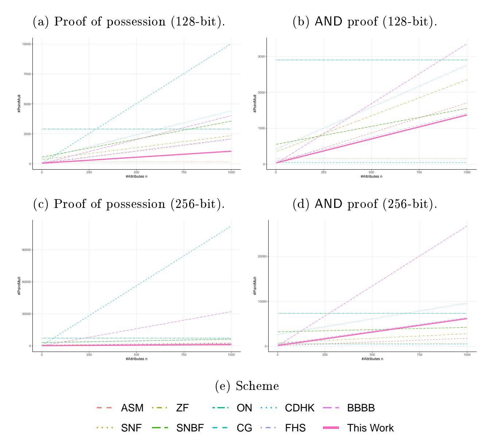
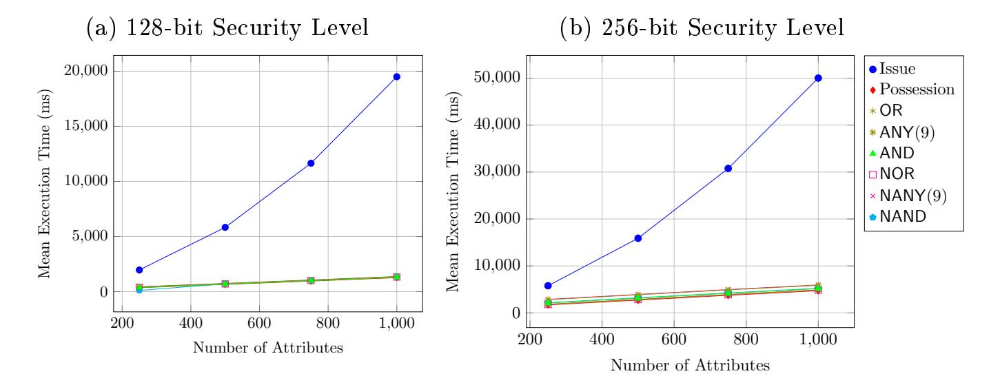

{0}------------------------------------------------

# MoniPolyAn Expressive q-SDH-Based Anonymous Attribute-Based Credential System [Extended Version]

Syh-Yuan Tan and Thomas Groÿ

School of Computing, Newcastle University, UK {syh-yuan.tan, thomas.gross}@newcastle.ac.uk

Abstract Modern attribute-based anonymous credential (ABC) systems benet from special encodings that yield expressive and highly efficient show proofs on logical statements. The technique was rst proposed by Camenisch and Groÿ, who constructed an SRSA-based ABC system with prime-encoded attributes that offers efficient AND, OR and NOT proofs. While other ABC frameworks have adopted constructions in the same vein, the Camenisch-Groÿ ABC has been the most expressive and asymptotically most efficient proof system to date, even if it was constrained by the requirement of a trusted message-space setup and an inherent restriction to finite-set attributes encoded as primes. In this paper, combining a new set commitment scheme and an SDH-based signature scheme, we present a provably secure ABC system that supports show proofs for complex statements. This construction is not only more expressive than existing approaches, but it is also highly efficient under unrestricted attribute space due to its ECC protocols only requiring a constant number of bilinear pairings by the verier; none by the prover. Furthermore, we introduce strong security models for impersonation and unlinkability under adaptive active and concurrent attacks to allow for the expressiveness of our ABC as well as for a systematic comparison to existing schemes. Given this foundation, we are the rst to comprehensively formally prove the security of an ABC with expressive show proofs. Specifically, building upon the q-(co-)SDH assumption, we prove the security against impersonation with a tight reduction. Besides the set commitment scheme, which may be of independent interest, our security models can serve as a foundation for the design of future ABC systems.

# 1 Introduction

An anonymous attribute-based credential (ABC) system allows a user to obtain credentials, that is, certified attribute set A from issuers and to anonymously

This work was supported in part by the European Research Council Starting Grant Condentiality-Preserving Security Assurance (CASCAde) under Grant GA n ◦ 716980.

{1}------------------------------------------------

prove the possession of these credentials as well as properties of A. Anonymous credentials were rst proposed by Chaum [33] but it does not draw much attention until Brands [17] constructed a pragmatic single-show ABC system and Camenisch and Lysyanskaya (CL) [26] presented a practical multi-show ABC system. CL-ABC system uses the signer's signature on a committed, and therefore blinded, attribute as the user credential. The proof of possession of a valid credential is a zero-knowledge proof of knowledge on the validity of the signature and the wellformedness of the commitment. This commit-and-sign technique has been employed by ABC systems from RSA-based signature scheme [27] and pairing-based signature schemes [4, 6, 8, 12, 20, 24, 25, 28, 31, 57] on blocks of messages in which the i-th attribute is xed as the exponent to the i-th base. Therefore, the show proofs have a computational complexity linear to the number of attributes in the credential, in terms of the modular exponentiations and scalar multiplications, respectively.

In contrast to the technique above which is termed as traditional encoding by Camenisch and Groÿ [22, 23], they suggested a prime encoding for the SRSA-CL signature scheme [27] to oer show proofs on AND, OR and NOT statements with constant complexity for the prime-encoded attributes. Specifically, the Camenisch-Groÿ (CG) construction separates the unrestricted attribute space S into string attributes space and finite-set attributes space such that S = S<sup>S</sup> ∪S<sup>F</sup> . The CG encoding uses a product of prime numbers to represent a finite-set attribute set A<sup>F</sup> ∈ S<sup>F</sup> in a single exponent, a technique subsequently applied to graphs as complex data structures [43, 44]. Prime encoding results in highly ef cient show proofs: each execution only requires a constant number of modular exponentiations. However, the construction constrains S<sup>F</sup> to a set of pre-certified prime numbers and increases the public key size<sup>1</sup> . Furthermore, the security of the CG ABC system was only established on the properties of its show proofs and not formally on the overall properties of the ABC system. Despite these drawbacks, to the best of our knowledge, CG ABC system [23, 44] is the only ABC system in the standard model that has show proof for AND, OR, and NOT statements with constant complexity.

Related Works. The SDH-CL signature scheme [24, 28, 59] is a popular candidate for the ABC system based on the traditional encoding. It is also referred as the BBS+ signature scheme [1, 4, 6, 14, 61, 63] or the Okamoto signature scheme [2, 53]. Au et al. [4] and Akagi et al. [2] constructed provably secure ABC systems on this foundation while Camenisch et al. [24] integrated a pairing-based accumulator to yield an ABC system that supports revocation. Later, Sudarsono et al. [61] applied the accumulator on S<sup>F</sup> as in prime encoding and showed that the resulting ABC system can support show proofs for AND and OR statements with constant complexity. Yet, the accumulator requires a large public key size: |S<sup>F</sup> | finite-set attributes plus the corresponding |S<sup>F</sup> | signatures. Inspired by the concept of attribute-based signature, Zhang and Feng [63] solved the large pub-

<sup>1</sup> If the prime numbers are not pre-certified by a signature each, the show proofs have to include expensive interval proofs.

{2}------------------------------------------------

lic key problem, while additionally supporting threshold statements (ANY) in show proofs, at the cost of having the credential size linear to |A<sup>F</sup> |. Comparing the traditional encoding-based ABC systems to the accumulator-based ABC systems, the latter require more bilinear pairing operations in the show proofs, and having either large public key or credential sizes.

There were some attempts to apply Camenisch et al.'s accumulator [24] and its variants on P-signatures [46], LRSW-CL signature [45] and structure preserving signatures [7, 54, 58] to support complex non-interactive zero-knowledge (NIZK) show proofs. Among all, Sadiah et al.'s ABC system [58] offers the most expressive show proofs. Considering only S = S<sup>F</sup> , their ABC system allows constant-size and constant-complexity NIZK show proofs for monotone formulas at the cost of issuing |P(A<sup>F</sup> )| credentials to every user where P(A<sup>F</sup> ) is the power set of the user attribute set A<sup>F</sup> . Instead of performing this expensive process during the issuing protocol, Okishima and Nakanishi's ABC system [54] generates P(S<sup>F</sup> ) during key generation and inates the public key size with |P(S<sup>F</sup> )| signatures to enable constant-size non-interactive witnessindistinguishable (NIWI) show proofs for conjunctive composite formulas. There are also ABC systems [8, 12] that were built on Pointcheval and Sanders' signature [56]. The ABC system proposed by Bemmann et al. [8] combines both traditional encoding and accumulator [52] to support monotone formulas under the non-interactive proof of partial knowledge protocol [3]. Although it has significantly shorter credential and supports unrestricted attribute space compared to that of Sadiah et al.'s [58], its show proofs complexity is linear to the number of literals in the monotone formula.

The findings on the use of accumulator in constructing ABC system correspond to the observations in the ABC transformation framework proposed by Camenisch et al. [21]. They discovered that the CL signatures are not able to achieve constant-size NIZK show proofs without random oracle. The framework takes in a structure-preserving signature scheme and a vector commitment scheme to produce an UC-secure ABC system. Their instantiation supports constant-size NIZK show proofs on subset statements and provably secure under the common reference string model. Using the similar ingredients, Fuchsbauer et al. [42] constructed an ABC system that offers constant-size NIZK show proofs on subset statement. The security models in the two works, however, are not designed to cover expressive show proofs. Other frameworks [12, 25] that formalized the commit-and-sign technique and even those [8, 54, 58] support show proofs on complex statements also fall short in this aspect.

Research Gap. Existing constructions yield considerable restrictions when expressive show proofs are concerned: The SRSA-based CG scheme [22] as well as accumulator-based schemes [7, 45, 46, 54, 58, 61] constrain the attribute space to finite-set attributes (A<sup>F</sup> ∈ S<sup>F</sup> ) and require a trusted setup that in ates either the public-key size or the credential size. Their expressiveness and the computational complexity are no better than the pairing-based constructions [2, 4, 8, 42, 63] and the general ABC frameworks [12, 21, 25] alike, when only string attributes (A<sup>S</sup> ∈ SS) are considered. Expressive proofs for large at

{3}------------------------------------------------

tribute set are desirable in privacy-preserving applications such as direct anonymous attestation [18, 19, 34–36, 38]. Also, we observe a need for a systematic canonicalization of security models for all mentioned schemes. In short, an ideal ABC system should have:

- 1. strong security assurance, and
- 2. appropriate public key size, and
- 3. expressive show proofs with low complexity regardless of the attribute space.

Our Contribution. We present a perfectly hiding and computationally binding set commitment scheme, called MoniPoly, which supports set membership proofs and disjointness proofs on the committed messages. Following the commit-and-sign methodology, we combine the MoniPoly commitment scheme tracing back to Kate et. al.'s work [47] with SDH-based Camenisch-Lysyanskaya signature scheme [28, 59] to present an efficient ABC system that support expressive show proofs for AND, OR and k-out-of-n threshold (ANY) clauses as well as their respective complements (NAND, NOR and NANY). Our ABC system is the most efficient construction for the unrestricted attribute space to-date. And it is at least as expressive as the existing constructions specially crafted for the restricted attribute space.

To the best of our knowledge, neither the constructions nor security models of existing ABC systems allow for complex interactive show proofs. As an immediate contribution, we rigorously define the necessary and stronger security notions for ABC systems. Our notions for security of impersonation resilience and unlinkability under adaptive active and concurrent attacks are stronger than those of the state-of-the-art ABC systems [21, 25, 42, 54]. We prove the security of our construction with respect to the security against impersonation and linkability in the standard model, especially offering a tight reduction for impersonation resilience under the q-(co-)SDH assumption.

Organization. We organize the paper as follows. In Section 2, we briefly introduce the related mathematical background and we present the MoniPoly commitment scheme in Section 3. We present our ABC system which is a combination of the MoniPoly commitment scheme with SDH-based CL signatures [28, 59] in Section 4. Section 5 offers an evaluation of the MoniPoly ABC in terms of security properties, expressivity as well as computational complexity in comparison to other schemes in the field.

## 2 Preliminaries

### 2.1 Mathematical Tools

**Bilinear Pairing**. Let  $\mathbb{G}_1, \mathbb{G}_2, \mathbb{G}_T$  be groups of prime order p. Let  $g_1 \in \mathbb{G}_1, g_2 \in \mathbb{G}_2$  and  $x, y \in \mathbb{Z}_p$  where  $g_1, g_2$  are the generators, the bilinear pairing function is  $e : \mathbb{G}_1 \times \mathbb{G}_2 \to \mathbb{G}_T$  with the following properties:

1. Bilinearity:  $e(g_1^x, g_2^y) = e(g_1^y, g_2^x) = e(g_1, g_2)^{xy}$ 

{4}------------------------------------------------

2. Non-degeneracy: e(g1, g2) 6= 1

3. Efficiency: e is efficiently computable.

Throughout this work, we will assume Type-3 pairing which has G<sup>1</sup> 6= G2.

Definition 1. Discrete Logarithm Assumption (DLOG). An algorithm C is said to (tdlog, εdlog)-break the DLOG assumption if C runs in time at most tdlog and furthermore:

$$\Pr[x \in \mathbb{Z}_p : \mathcal{C}(g, g^x) = x] \ge \varepsilon_{\mathsf{dlog}}$$

for a negligible probability εdlog. We say that the DLOG assumption is (tdlog, εdlog) secure if no algorithm (tdlog, εdlog)-solves the DLOG problem.

Definition 2. Discrete Logarithm with Auxiliary Input (DLOGwAI) [32, 37]. An algorithm C is said to (tdlogwai, εdlogwai)-break the DLOGwAI assumption if C runs in time at most tdlogwai and furthermore:

$$\Pr[x \in \mathbb{Z}_p : \mathcal{C}(g, g^x, \dots, g^{x^q}) = x] \ge \varepsilon_{\mathsf{dlogwai}}$$

for a negligible probability εdlogwai. We say that the DLOGwAI assumption is (tdlogwai, εdlogwai)-secure if no algorithm (tdlogwai, εdlogwai)-solves the DLOGwAI problem.

Definition 3. q−Strong Die-Hellman Assumption (SDH) [59]. An algorithm C is said to (tsdh, εsdh)-break the SDH assumption if C runs in time at most tsdh and furthermore:

$$\Pr[x \in \mathbb{Z}_p, c \in \mathbb{Z}_p \setminus \{-x\}] : \mathcal{C}(g_1, g_1^x, \dots, g_1^{x^q}, g_2, g_2^x) = (g_1^{\frac{1}{x+c}}, c)] \ge \varepsilon_{\mathsf{sdh}}$$

for a negligible probability εsdh. We say that the SDH assumption is (tsdh, εsdh) secure if no algorithm (tsdh, εsdh)-solves the SDH problem.

Definition 4. q−co-Strong Die-Hellman Assumption (co-SDH) [32]. An algorithm C is said to (tcosdh, εcosdh)-break the co-SDH assumption if C runs in time at most tcosdh and furthermore:

$$\Pr[x \in \mathbb{Z}_p, c \in \mathbb{Z}_p \setminus \{-x\}] : \mathcal{C}(g_1, g_1^x, \dots, g_1^{x^q}, g_2, g_2^x, \dots, g_2^{x^q}) = (g_1^{\frac{1}{x+c}}, c)] \ge \varepsilon_{\mathsf{cosdh}}$$

for a negligible probability εcosdh. We say that the co-SDH assumption is (tcosdh, εcosdh) secure if no algorithm (tcosdh, εcosdh)-solves the co-SDH problem.

Definition 5. q−Bilinear Strong Die-Hellman Assumption (BSDH) [32]. An algorithm C is said to (tbsdh, εbsdh)-break the BSDH assumption if C runs in time at most tbsdh and furthermore:

$$\Pr[x \in \mathbb{Z}_p, c \in \mathbb{Z}_p \setminus \{-x\}] :$$

$$\mathcal{C}(g_1, g_1^x, \dots, g_1^{x^q}, g_2, g_2^x, \dots, g_2^{x^q}) = (\mathsf{e}(g_1, g_2)^{\frac{1}{x+c}}, c)] \ge \varepsilon_{\mathsf{bsdh}}$$

for a negligible probability εbsdh. We say that the BSDH assumption is (tbsdh, εbsdh) secure if no algorithm (tbsdh, εbsdh)-solves the BSDH problem.

{5}------------------------------------------------

Definition 6. Relation (R) [40]. Let R be a relation {(x, w)} testable in polynomial time where |x| = |w|. For any statement x, its witness set w(x) = {w1, . . . , |w(x)|} is the set of w such that (x, w) ∈ R.

Definition 7. Proof of Knowledge System [40]. An interactive proof of kowledge system over R is a pair of algorithms (P, V ) satisfying:

- 1. Completeness: The verier V (x) always accepts a true statement produced by the prover protocol P(x, w<sup>i</sup> ∈ w(x)) for ∀(x, w) ∈ R, except with a negligible probability ε.
- 2. Soundness: The verier V (x) always rejects a false statement produced by any prover protocol P ∗ (x, w<sup>∗</sup> ), and any knowledge extractor M(x, w<sup>∗</sup> ; P ∗ ) that uses P <sup>∗</sup> as subroutine, except with a negligible probability.

Definition 8. Witness Hiding [40]. Let Gen be a generator for R and a statement x, (P, V ) is witness hiding on (R, Gen) if a new witnesses w ∈ w(x) cannot be computed by any verier protocol V ∗ (x) and witness extractor M(x; V ∗ , Gen) after interacting with P(x, w<sup>i</sup> ∈ w(x)), except with a negligible probability.

# 2.2 Digital Signature Scheme

A digital signature scheme is defined by three algorithm as DS = (KeyGen, Sign, Verify) as follows:

- 1. KeyGen(1 k ) → (pk, sk): A pair of public and secret keys are generated based on the security parameter input 1 k . The public key pk can be made known to the public while the secret key sk is kept secret by the signer.
- 2. Sign(m, pk, sk) → σ: The signer uses the secret key sk to sign on a message m, generating a signature σ.
- 3. Verify(m, σ, pk) → b: The verier takes the signer's public key pk and σ as the input to ensure that the signature is genuinely signed by the signer. If the signature is veried, the algorithm returns b = 1 and b = 0 otherwise.
- 2.2.1 Unforgeability We refer to the security notion of strong existential unforgeability under chosen message attacks (seuf-cma) [13]. The security model is defined as the following game between a forger F and a challenger C:

Game 1 (seuf − cma(F, C))

- 1. Setup: C runs KeyGen and sends pk to F.
- 2. Phase 1: F is allowed to issue queries to the Sign oracle.
- 3. Challenge: F outputs a challenge message m<sup>∗</sup> which may have been queried to Sign oracle previously.
- 4. Phase 2: F can continue to query the Sign oracle as in Phase 1.
- 5. Forgery. F outputs a message and signature pair (m<sup>∗</sup> , σ<sup>∗</sup> ) which is different from all the previous replies from the Sign oracle. F wins the game if Verify(m<sup>∗</sup> , σ<sup>∗</sup> , pk) outputs 1.

{6}------------------------------------------------

**Definition 9.** A forger  $\mathcal{F}$  is said to  $(t_{sig}, \varepsilon_{sig})$ -break the seuf-cma security of a signature scheme if  $\mathcal{F}$  runs in time at most  $t_{sig}$  and wins in Game 1 such that:

$$\Pr[\mathsf{Verify}(m^*, \sigma^*, pk) = 1] \ge \varepsilon_{\mathsf{sig}}$$

for a negligible probability  $\varepsilon_{\text{sig}}$ . We say that a signature scheme is seuf-cma-secure if no forger  $(t_{\text{sig}}, \varepsilon_{\text{sig}})$ -wins Game 1.

We adapt the notation of random self-reducibility for identification scheme [48] to that of witness hiding proof system [40].

**Definition 10.** Random Self-Reducibility. A witness hiding proof system (Gen, P, V) is said to be random self-reducible if there are three algorithms Rerand, Derand and Tran such that, for all key pair (pk, sk) generated by Gen:

- 1. Rerand(pk) outputs  $(pk', \rho)$  where pk' has the same distribution to the pk'' of a newly generated key pair (pk'', sk'') by Gen.
- 2. Derand $(pk, pk', sk', \rho)$  outputs a valid sk with respect to pk for any valid key pair (pk', sk').
- 3. Tran( $pk, pk', \rho, \pi'_{(P,V)} = (P(pk', w'_i \in w(pk')), V(pk')))$  transforms a valid transcript  $\pi'_{(P,V)}$  into  $\pi_{(P,V)} = (P(pk, w_i \in w(pk)), V(pk))$  which is valid with respect to pk.

## 2.3 The SDH-based CL Signature Scheme

Camenisch and Lysyanskaya [28] introduced a technique to construct secure pairing-based signature schemes which support signing on committed messages. They also showed that their technique can extract an efficient SDH-based signature scheme from Boneh et al.'s group signature [14] scheme but no security proof was provided. This scheme was later proven to be seuf-cma-secure with a tight reduction [59] to the SDH assumption in the standard model. We describe the SDH-CL signature scheme [24, 28, 59] as follows:

KeyGen(1<sup>k</sup>): Construct three cyclic groups  $\mathbb{G}_1, \mathbb{G}_2, \mathbb{G}_T$  of order p based on an elliptic curve whose bilinear pairing is  $e: \mathbb{G}_1 \times \mathbb{G}_2 \to \mathbb{G}_T$ . Select random generators  $a, b, c \in \mathbb{G}_1$ ,  $g_2 \in \mathbb{G}_2$  and a secret value  $x \in \mathbb{Z}_p^*$ . Output the public key  $pk = (e, \mathbb{G}_1, \mathbb{G}_2, \mathbb{G}_T, p, a, b, c, g_2, X = g_2^x)$  and the secret key sk = x.

Sign(m, pk, sk): On input m, choose the random values  $s, t \in \mathbb{Z}_p^*$  to compute  $v = (a^m b^s c)^{\frac{1}{x+t}}$ . In the unlikely case in which  $x + t = 0 \mod p$  occurs, reselect a random t. Output the signature as sig = (t, s, v).

Verify(m, sig, pk): Given sig = (t, s, v), output 1 if the equation:

$$e(v, Xg_2^t) = e((a^m b^s c)^{\frac{1}{x+t}}, g_2^{x+t})$$
  
=  $e(a^m b^s c, g_2).$ 

holds and output 0 otherwise.

{7}------------------------------------------------

**Theorem 1.** [59] SDH-based CL signature scheme is seuf-cma-secure in the standard model if the Strong Diffie-Hellman problem is  $(t_{sdh}, \varepsilon_{sdh})$ -hard.

# 3 MoniPoly Set Commitment Scheme

```
Algorithm 1 MPEncode(): Encode attribute set into coefficients \{m_i\}_{0 \leq i \leq n}
Input: Attribute set A = \{m_0, \ldots, m_{n-1}\} and prime order p.
Output: L = \{\mathsf{m}_0, \ldots, \mathsf{m}_n\}.
Post-conditions: \sum_{i=0}^{n} \mathsf{m}_i x^{i} = (x'+m_0)\cdots(x'+m_{n-1})
1: L[|A|+1] \leftarrow 1
 2: if |A| = 1 then
         L[0] \leftarrow A[0]
 3:
 4:
         return L
 5: end if
 6: L[0] \leftarrow A[0] \times A[1] \mod p
 7: L[1] \leftarrow A[0] + A[1] \mod p
 8: for i \leftarrow 2 to |A| do
 9:
         for j \leftarrow i \text{ to } 0 \text{ do}
              if j = i then
10:
11:
                  L[i] \leftarrow L[i-1] + A[i]
              else if j = 1 then
12:
                  L[j] \leftarrow L[j] \times A[i] + L[j-1]
13:
14:
                  L[0] \leftarrow L[0] \times A[i]
15:
              \mathbf{else}
                  L[j] \leftarrow L[j] \times A[i] + L[j-1]
16:
              end if
17:
18:
         end for
19: end for
20: return L
```

The key idea of set commitment scheme traces back to the polynomial commitment scheme [47] which can commit to a polynomial and support opening at indexes of the polynomial. Inheriting this nature, our MoniPoly set commitment scheme and similar ones [21, 42] transform a message  $m \in \mathbb{Z}_p$  into (x' + m) where  $x' \in \mathbb{Z}_p$  is not known to the user and multiple messages form a monic polynomial  $f(x') = \prod_{i=1}^n (x' + m_i)$ . This monic polynomial, in turn, can be rewritten as  $f(x') = \sum_{i=0}^n \mathsf{m}_i x'^i$ . Its coefficients  $\mathsf{m}_i \in \mathbb{Z}_p^*$  can be efficiently computed, for instance, using the encoding algorithm MPEncode():  $\mathbb{Z}_p^n \to \mathbb{Z}_p^{n+1}$  of complexity  $O(n^2)$  as depicted in Algorithm 1 or a more efficient yet restrictive algorithm [55] of complexity  $O(n \log n)$ .

This algorithm requires  $n|p^m-1$  for an integer m and may not be fulfilled by some primes order p secured against Cheon's attack [37] on SDH assumption, the basis of our set commitment scheme. A secure p has divisors  $n < (\log p)^2$  for p-1 and p+1 where n can be as small as 6 and 4 [60].

{8}------------------------------------------------

Our commitment scheme's unique property is that it treats the opening value as one of the roots in the monic polynomial. Hence, the name *MoniPoly*. Folding the opening value into the monic polynomial yields compelling advantages, especially, enabling a greater design space for presentation proofs.

While related schemes [21, 42, 47] realize subset opening, our scheme supports the opening of intersection sets and difference sets, in addition. Thus, MoniPoly is more expressive. Furthermore, the presentation proofs created on MoniPoly are more efficient than other commitment-based frameworks. Finally, treating the opening value as a root of the monic polynomial yields a scheme that is closely aligned with well-established commitment scheme paradigms, which, in turn, fits into a range of popular signature schemes and enables signing committed messages.

#### 3.1 Interface

We define the MoniPoly set commitment scheme as the following algorithms:

MoniPoly = (Setup, Commit, Open, OpenIntersection, VerifyIntersection, OpenDifference, VerifyDifference)

- 1. Setup $(1^k, n) \to (pk, sk)$ . A pair of public and secret keys (pk, sk) are generated by a trusted authority based on the security parameter input  $1^k$ . The message domain  $\mathcal{D}$  is defined and n-1 is the maximum messages allowed. If n is fixed, sk is not required in the rest of the scheme.
- 2. Commit $(pk, A, o) \to (C)$ . On the input of pk, a message set  $A \in \mathcal{D}^{n-1}$  and a random opening value  $o \in \mathcal{D}$ , output the commitment C.
- 3.  $\mathsf{Open}(pk, C, A, o) \to b$ . Return b = 1 if C is a valid commitment to A with the opening value o under pk, and return b = 0 otherwise.
- 4. OpenIntersection $(pk, C, A, o, (A', l)) \to (I, W)$  or  $\bot$ . If  $|A' \cap A| \ge l$  holds, return an intersection set  $I = A' \cap A$  of length l with the corresponding witness W, and return an error  $\bot$  otherwise.
- 5. VerifyIntersection $(pk, C, (I, W), (A', l)) \to b$ . Return b = 1 if W is a witness for S being the intersection set of length l for A' and the set committed to in C, and return b = 0 otherwise.
- 6. OpenDifference $(pk, C, A, o, (A', \bar{l})) \to (D, W)$ . If  $|A' A| \ge \bar{l}$  holds, return the difference set D = A' A of length  $\bar{l}$  with the corresponding witness W, and return  $\bot$  otherwise.
- 7. VerifyDifference $(pk, C, (D, W), (A', \bar{l})) \to b$ . Return b = 1 if W is the witness for D being the difference set of length  $\bar{l}$  for A' and the set committed to in C, and return b = 0 otherwise.

## 3.2 Security Requirements

**Definition 11.** A set commitment scheme is perfectly hiding if every commitment C = Commit(pk, A, o) is uniformly distributed such that there exists an  $o' \neq o$  for all  $A' \neq A$  where Open(pk, C, A', o') = 1.

{9}------------------------------------------------

**Definition 12.** An adversary A is said to  $(t_{\mathsf{bind}}, \varepsilon_{\mathsf{bind}})$ -break the binding security of a set commitment scheme if A runs in time at most  $t_{\mathsf{bind}}$  and furthermore:

$$\Pr[\mathsf{Open}(pk, C, A_1, o_1) = \mathsf{Open}(pk, C, A_2, o_2) = 1] \ge \varepsilon_{\mathsf{bind}}.$$

for a negligible probability  $\varepsilon_{\mathsf{bind}}$  and any two pairs  $(A_1, o_1), (A_2, o_2)$  output by  $\mathcal{A}$ . We say that a set commitment scheme is  $(t_{\mathsf{bind}}, \varepsilon_{\mathsf{bind}})$ -secure wrt. binding if no adversary  $(t_{\mathsf{bind}}, \varepsilon_{\mathsf{bind}})$ -breaks the binding security of the set commitment scheme.

## 3.3 Construction

We describe the MoniPoly commitment scheme as follows:

Setup(1<sup>k</sup>). Construct three cyclic groups  $\mathbb{G}_1, \mathbb{G}_2, \mathbb{G}_T$  of order p based on an elliptic curve whose bilinear pairing is  $e: \mathbb{G}_1 \times \mathbb{G}_2 \to \mathbb{G}_T$ . Select random generators  $a \in \mathbb{G}_1$ ,  $g_2 \in \mathbb{G}_2$  and a secret values  $x' \in \mathbb{Z}_p^*$ . Compute the values  $a_0 = a, a_1 = a^{x'}, \ldots, a_n = a^{x'^n}, X_0 = g_2, X_1 = g_2^{x'}, \ldots, X_n = g_2^{x'^n}$  to output the public key  $pk = (e, \mathbb{G}_1, \mathbb{G}_2, \mathbb{G}_T, p, \{a_i, X_i\}_{0 \le i \le n})$  and the secret key sk = (x'). Note that sk can be discarded by the authority if the parameter n is fixed.

Commit(pk, A, o). Taking as input a message set  $A = \{m_1, \ldots, m_{n-1}\} \in \mathbb{Z}_p^*$  and the random opening value  $o \in \mathbb{Z}_p^*$ , output the commitment as

$$C = a_0^{(x'+o)\prod_{j=1}^{n-1}(x'+m_j)} = \prod_{j=0}^n a_j^{\mathsf{m}_j}$$

where  $\{\mathsf{m}_i\} = \mathsf{MPEncode}(A \cup \{o\}).$ 

Open(pk, C, A, o). Return 1 if  $C = \prod_{j=0}^{n} a_j^{\mathsf{m}_j}$  holds where  $\{\mathsf{m}_j\} = \mathsf{MPEncode}(A \cup \{o\})$  and return 0 otherwise.

OpenIntersection(pk, C, A, o, (A', l)). If  $|A' \cap A| \ge l$  holds, return an intersection set  $I = A' \cap A$  of length l and a witness such that:

$$W = a_0^{(x'+o) \prod_{m_j \in (A-I)} (x'+m_j)}$$
$$= \prod_{j=0}^{n-l} a_j^{w_j}$$

where  $\{w_j\} = \mathsf{MPEncode}((A \cup \{o\}) - I)$ . Otherwise, return a null value  $\bot$ . The correctness can be verified as follows:

$$C = W^{\prod_{m_j \in I} (x' + m_j)}$$

$$= \left( a_0^{(x'+o) \prod_{m_j \in (A-I)} (x' + m_j)} \right)^{\prod_{m_j \in I} (x' + m_j)}$$

$$= a_0^{(x'+o) \prod_{m_j \in A} (x' + m_j)}.$$

{10}------------------------------------------------

VerifyIntersection(pk, C, I, W, (A', l)). Return 1 if

$$\mathsf{e}\left(C\prod_{j=0}^{|A'|}a_j^{\mathsf{m}_{1,j}},X_0\right)=\mathsf{e}\left(W\prod_{j=0}^{|A'|-l}a_j^{\mathsf{m}_{2,j}},\prod_{j=0}^lX_j^{\mathsf{i}_j}\right)$$

holds and return 0 otherwise, where  $\{i_j\} = \mathsf{MPEncode}(I), \{\mathsf{m}_{1,j}\} = \mathsf{MPEncode}(A')$  and  $\{\mathsf{m}_{2,j}\} = \mathsf{MPEncode}(A'-I)$ . The correctness is as follows:

$$\begin{split} & \mathbf{e} \left( C \prod_{j=0}^{|A'|} a_j^{\mathbf{m}_{1,j}}, X_0 \right) \\ & = \mathbf{e} \left( C, X_0 \right) \mathbf{e} \left( \prod_{j=0}^{|A'|} a_j^{\mathbf{m}_{1,j}}, X_0 \right) \\ & = \mathbf{e} \left( a_0^{(x'+o) \prod_{m_j \in A} (x'+m_j)}, X_0 \right) \mathbf{e} \left( a_0^{\prod_{m_j \in A'} (x'+m_j)}, X_0 \right) \\ & = \mathbf{e} \left( a_0^{(x'+o) \prod_{m_j \in (A-I)} (x'+m_j)}, X_0^{\prod_{m_j \in I} (x'+m_j)} \right) \mathbf{e} \left( a_0^{\prod_{m_j \in (A'-I)} (x'+m_j)}, X_0^{\prod_{m_j \in I} (x'+m_j)} \right) \\ & = \mathbf{e} \left( W, \prod_{j=0}^{l} X_j^{\mathbf{i}_j} \right) \mathbf{e} \left( \prod_{j=0}^{|A'|-l} a_j^{\mathbf{m}_{2,j}}, \prod_{j=0}^{l} X_j^{\mathbf{i}_j} \right) \\ & = \mathbf{e} \left( W \prod_{j=0}^{|A'|-l} a_j^{\mathbf{m}_{2,j}}, \prod_{j=0}^{l} X_j^{\mathbf{i}_j} \right) \end{split}$$

OpenDifference $(pk, C, A, o, (A', \bar{l}))$ . If  $|A' \cap A| \geq \bar{l}$  holds, return a difference set D = A' - A of length  $\bar{l}$  and the witness  $(W = \prod_{j=0}^{n-\bar{l}} a_j^{\mathsf{w}_j}, \{\mathsf{r}_j\}_{j=0}^{\bar{l}-1})$ . The values  $(\{\mathsf{w}_j\}, \{\mathsf{r}_j\}) = \mathsf{MPEncode}(A)/\mathsf{MPEncode}(D)$  are computed using expanded synthetic division such that  $\{\mathsf{w}_j\}$  are the coefficients of quotient q(x') and  $\{\mathsf{r}_j\}$  are the coefficients of remainder r(x'). Specifically, let the polynomial divisor be  $d(x') = \sum_j^{\bar{l}} \mathsf{d}_j x'^j$  where  $\{\mathsf{d}_j\} = \mathsf{MPEncode}(D)$ , the monic polynomial f(x') in the commitment  $C = a_0^{f(x')}$  can be rewritten as f(x') = d(x')q(x') + r(x'). Note that  $\prod_{j=0}^{\bar{l}-1} a_j^{\mathsf{r}_j} \neq 1_{\mathbb{G}_1}$  whenever d(x') cannot divide f(x'), i.e., the sets A and D

{11}------------------------------------------------

are disjoint. The correctness can be verified from the following:

$$C = a_0^{(x'+o) \prod_{m_j \in A} (x'+m_j)}$$

$$= a_0^{q(x') \prod_{m_j \in D} (x'+m_j)} a_0^{r(x')}$$

$$= \left(\prod_{j=0}^{n-\bar{l}} a_j^{\mathsf{w}_j}\right)^{d(x')} a_0^{r(x')}$$

$$= W^{d(x')} \prod_{j=0}^{\bar{l}-1} a_j^{\mathsf{r}_j}.$$

VerifyDifference $(pk, C, D, (W, \{r_j\}_{j=0}^{\bar{l}-1}), (A', \bar{l}))$ . Return 1, if the following holds:

$$\mathbf{e}\left(C\prod_{j=0}^{\bar{l}-1}a_{j}^{-\mathbf{r}_{j}}\prod_{j=0}^{|A'|}a_{j}^{\mathsf{m}_{1,j}},X_{0}\right)=\mathbf{e}\left(W\prod_{j=0}^{|A'|-\bar{l}}a_{j}^{\mathsf{m}_{2,j}},\prod_{j=0}^{\bar{l}}X_{j}^{\mathsf{d}_{j}}\right),\prod_{j=0}^{\bar{l}-1}a_{j}^{\mathsf{r}_{j}}\neq 1_{\mathbb{G}_{1}}$$

and return 0 otherwise, where  $\{d_j\} = \mathsf{MPEncode}(D)$ ,  $\{\mathsf{m}_{1,j}\} = \mathsf{MPEncode}(A')$  and  $\{\mathsf{m}_{2,j}\} = \mathsf{MPEncode}(A'-D)$ . The correctness is as follows:

$$\begin{split} & \mathbf{e} \left( C \prod_{j=0}^{\bar{l}-1} a_j^{-\mathbf{r}_j} \prod_{j=0}^{|A'|} a_j^{\mathsf{m}_{1,j}}, X_0 \right) \\ & = \mathbf{e} \left( C \prod_{j=0}^{\bar{l}-1} a_j^{-\mathbf{r}_j}, X_0 \right) \mathbf{e} \left( \prod_{j=0}^{|A'|} a_j^{\mathsf{m}_{1,j}}, X_0 \right) \\ & = \mathbf{e} \left( a_0^{d(x')q(x') + r(x')} a_0^{-r(x')}, X_0 \right) \mathbf{e} \left( a_0^{\prod_{m_j \in A'} (x' + m_j)}, X_0 \right) \\ & = \mathbf{e} \left( a_0^{d(x')q(x')}, X_0 \right) \mathbf{e} \left( a_0^{\prod_{m_j \in (A' - D)} (x' + m_j)}, X_0^{\prod_{m_j \in D} (x' + m_j)} \right) \\ & = \mathbf{e} \left( a_0^{\sum_{j=0}^{n-\bar{l}} \mathsf{w}_{1,j} x'^j}, X_0^{d(x')} \right) \mathbf{e} \left( \prod_{j=0}^{|A'| - \bar{l}} a_j^{\mathsf{m}_{2,j}}, X_0^{d(x')} \right) \\ & = \mathbf{e} \left( W \prod_{j=0}^{|A'| - \bar{l}} a_j^{\mathsf{m}_{2,j}}, \prod_{j=0}^{\bar{l}} X_j^{\mathsf{d}_j} \right). \end{split}$$

Remark 1. In the security analysis of MoniPoly, we will take a different approach compared to the previous constructions [21, 42, 47]. We consider the perfectly hiding property and the conventional computational binding property [39] that only requires an adversary cannot present two pairs  $(A_1, o_1)$  and  $(A_2, o_2)$  such that  $\mathsf{Commit}(pk, A_1, o_1) = \mathsf{Commit}(pk, A_2, o_2)$ . We will show in Section 3.4 that this conventional binding property is a superset of formers' subset binding properties.

{12}------------------------------------------------

## 3.4 Security Analysis

**Theorem 2.** The MoniPoly commitment scheme is perfectly hiding.

*Proof.* Given a commitment  $C = a_0^{(x'+o)\prod_{j=1}^{n-1}(x'+m_j)}$ , there are  $|\mathbb{Z}_p^*| - 1$  possible pairs of  $((m'_1, \ldots, m'_{n-1}), o') \neq ((m_1, \ldots, m_{n-1}), o)$  which can result in the same C. Furthermore, for every committed message set  $\{m_1, \ldots, m_{n-1}\}$ , there is a unique o such that:

$$\operatorname{dlog}_{a_0}(C) = (x' + o) \prod_{j=1}^{n-1} (x' + m_j) \mod p$$
$$o = \frac{\operatorname{dlog}_{a_0}(C)}{\prod_{j=1}^{n-1} (x' + m_j)} - x' \mod p$$

Since o is chosen independently of the committed messages  $\{m_1, \ldots, m_{n-1}\}$ , the latter are perfectly hidden.

The following theorem considers an adversary which breaks the binding property by finding two different message sets A and  $A^*$  which can be of different lengths such that  $|A| \geq |A^*|$ .

**Theorem 3.** The MoniPoly commitment scheme is  $(t_{\mathsf{bind}}, \varepsilon_{\mathsf{bind}})$ -secure wrt. the binding security if the co-SDH problem is  $(t_{\mathsf{cosdh}}, \varepsilon_{\mathsf{cosdh}})$ -hard such that:

$$\varepsilon_{\mathsf{hind}} = \varepsilon_{\mathsf{cosdh}}, t_{\mathsf{hind}} = t_{\mathsf{cosdh}} + T(n)$$

where T(n) is the time for dominant group operations in  $\mathbb{G}_1$  to extract a co-SDH solution where n is the total of committed messages plus the opening value.

*Proof.* We show that if there exists an adversary  $\mathcal{A}_{\mathsf{bind}}$  which can find two pairs (A, o) and  $(A^*, o^*)$  such that  $\mathsf{Open}(pk, C, A, o) = \mathsf{Open}(pk, C, A^*, o^*) = 1$ , there exists a challenger  $\mathcal{C}$  which can break the co-SDH assumption with the help of  $\mathcal{A}_{\mathsf{bind}}$ .  $\mathcal{C}$  sets the co-SDH challenge as the public key  $pk = (a_0 = g_1, a_1 = g_1^{x'}, \ldots, a_n = g_1^{x'^n}, X_0 = g_2, X_1 = g_2^{x'}, \ldots, X_n = g_2^{x'^n})$  and sends to  $\mathcal{A}_{\mathsf{bind}}$ .

When  $\mathcal{A}_{\mathsf{bind}}$  outputs two such pairs (A,o) and  $(A^*,o^*)$ , we have  $a_0^{(x'+o)\prod_{i=1}^k(x'+m_i)} = a_0^{(x'+o^*)\prod_{i=1}^{k^*}(x'+m_i^*)}$ . In order to ease the explanation, we view  $A = \{m_1,\ldots,m_k,o\}$  and  $A^* = \{m_1^*,\ldots,m_{k^*}^*,o^*\}$  where  $1 \leq k^* \leq k \leq n-1$ . We first consider the case of  $k^* = k$ . By the setting of A and  $A^*$ , there are at least two unique elements that exist in A but not in  $A^*$ . Assume  $o \in A$  is one of the unique elements such that  $a_0^{(x'+o)\prod_{i=1}^k(x'+m_i)} = a_0^{c(x')(x'+o)+r} = a_0^{(x'+o)\sum_{i}^{k^*} w_i^* x'^i + r}$ . Let  $(\{w_i^*\}_{0 \leq i \leq k^*}, r) = \mathsf{MPEncode}(A^*)/\mathsf{MPEncode}(\{o\})$  and  $\{w_i\}_{0 \leq i \leq k} = \mathsf{MPEncode}(A - \{o\})$ ,  $\mathcal C$  can

{13}------------------------------------------------

extract a solution  $(o, g^{\frac{1}{x'+o}})$  for the co-SDH problem as follow:

$$a_0^{(x'+o)\prod_{i=1}^k(x'+m_i)} = a_0^{(x'+o^*)\prod_{i=1}^{k^*}(x'+m_i^*)}$$

$$\Leftrightarrow a_0^{(x'+o)\prod_{i=1}^k(x'+m_i)} = a_0^{c(x')(x'+o)+r}$$

$$\Leftrightarrow a_0^{c(x')+\frac{r}{x'+o}} = a_0^{\prod_{i=1}^k(x'+m_i)}$$

$$\Leftrightarrow a_0^{\frac{1}{x'+o}} = \left(\prod_{i=0}^k a_i^{\mathsf{w}_i}\prod_{i=0}^{k^*} a_i^{-\mathsf{w}_i^*}\right)^{\mathsf{r}^{-1}} = g_1^{\frac{1}{x'+o}}.$$

Notice that  $\mathcal{A}_{\mathsf{bind}}$  also breaks the binding property in the witness W from OpenIntersection algorithm and that in the witness  $(W, \{\mathsf{r}_j\}_{j=0}^{\bar{l}-1})$  from OpenDifference algorithm if the pairs (A,o) and  $(A^*,o^*)$  further satisfy the conditions: (1)  $|A^*\cap A|=l$  and fulfills  $|A'\cap A^*|=|A'\cap A|=l$  for the witness in set intersections, (2)  $|A^*-A|=\bar{l}$  and fulfills  $|A'-A^*|=|A'-A|=\bar{l}$  for the witness in set differences, respectively. Recall that the current setting is  $k^*=k$  and this implies  $|A^*\cap A|=l$  for  $0\leq l\leq |A|-2$ . So, from the two sets in (1), we have

$$\begin{aligned} &\mathsf{OpenIntersection}(pk,\mathsf{Commit}(pk,A-\{o\},o),A-\{o\},o,(A',l))\\ &=\mathsf{OpenIntersection}(pk,\mathsf{Commit}(pk,A^*-\{o^*\},o^*),A^*-\{o^*\},o^*,(A',l)) \end{aligned}$$

where  $0 \le l \le |A'| \le |A| - 2$ ; from the two sets in (2), we have

$$\begin{aligned} &\mathsf{OpenDifference}(pk,\mathsf{Commit}(pk,A-\{o\},o),A-\{o\},o,(A',\bar{l}))\\ &=\mathsf{OpenDifference}(pk,\mathsf{Commit}(pk,A^*-\{o^*\},o^*),A^*-\{o^*\},o^*,(A',\bar{l})) \end{aligned}$$

where  $2 \leq \bar{l} \leq |A'| \leq |A|$ . In either case, it must be the case such that  $\mathsf{Commit}(pk, A - \{o\}, o) = \mathsf{Commit}(pk, A^* - \{o^*\}, o^*)$  and therefore  $\mathsf{Open}(pk, C, A - \{o\}, o) = \mathsf{Open}(pk, C, A^* - \{o^*\}, o^*) = 1$  where  $\mathcal C$  can extract a SDH solution as before.

In the case of  $k^* < k$ , the calculations above work in the similar way except the value l must be within  $0 \le l \le |A'| \le |A^*| - 1$  and the value  $\bar{l}$  must be within  $2 \le \bar{l} \le |A'| \le |A^*| - 1$ . Therefore, in any case of  $k^* \le k$ , whenever  $\mathcal{A}_{\mathsf{bind}}$  breaks the binding property,  $\mathcal{C}$  can find a SDH solution. Since  $\mathcal{C}$  simulates the experiment perfectly, we have  $\varepsilon_{\mathsf{bind}} = \varepsilon_{\mathsf{cosdh}}$ . Next, compared to the time  $t_{\mathsf{bind}}$  taken by  $\mathcal{A}_{\mathsf{bind}}$ ,  $\mathcal{C}$  used only  $t_{\mathsf{cosdh}}$  plus O(n) group operations in  $\mathbb{G}_1$  to find the co-SDH solution. Denoting the extra time taken by  $\mathcal{C}$  as T(n) gives  $t_{\mathsf{bind}} - T(n) = t_{\mathsf{cosdh}}$  as required.

As the security analysis covers the set difference and set intersection operations, the binding property holds in AND, OR, ANY, NOR, NANY and NAND proofs as well. The polynomial binding, evaluation binding and batch binding properties in Kate et al.'s polynomial commitment and its variants [21, 42, 47] can be viewed as a subset of our binding property, since they support only subset operations. Moreover, our proof does not rely on the stronger bilinear variant of SDH assumption and this shows that bilinear pairing operation does not help in breaking the binding property.

{14}------------------------------------------------

# 4 Attribute-Based Anonymous Credential System

Table 1: Syntax and semantics for an access policy  $\phi$ .

(a) BNF grammar

(b) Truth table with respect to input A

| BNF                                              | Clause                 | Truth Condition            |
|--------------------------------------------------|------------------------|----------------------------|
| attr ::= <attribute>=<value></value></attribute> | $\overline{OR(A')}$    | $ A' \cap A  > 0$          |
| set ::= attr,set   attr                          | ANY(1 < l <  A' , A')  | $ A' \cap A  \ge l$        |
| $con ::= AND \mid NAND \mid OR \mid NOR$         | AND(A')                | $ A' \cap A  =  A' $       |
| cont ::= ANY   NANY                              | NOR(A')                | $ A' \cap \bar{A}  > 0$    |
| $clause ::= con(set) \mid cont(l,set)$           | NANY(1 < l <  A' , A') | $ A' \cap \bar{A}  \ge l$  |
| $stmt ::= clause \land stmt \mid clause$         | NAND(A')               | $ A' \cap \bar{A}  =  A' $ |
| $policy ::= stmt(set) \mid \bot$                 |                        |                            |

*Note*: con = connective, cont = connective with threshold

Before presenting the formal definition of ABC system, we briefly define the attribute set A and the access policy  $\phi$  in our proposed ABC system which are closely related to MoniPoly's opening algorithms. Informally, we view a relation between two attribute sets as a clause. Clauses can be accumulated using the logical  $\wedge$  operator in building the composite statement for an access policy.

Attribute We view a descriptive attribute set  $A = \{m_1, \ldots, m_n\}$  as a user's identity. To be precise, an attribute m is an attribute-value pair in the format attribute=value and A is a set of attributes. For instance, the identity of a user can be described as:  $A = \{\text{"gender} = \text{male"}, \text{"name} = \text{bob"}, \text{"ID} = 123456", \text{"role} = \text{manager"}, \text{"branch} = \text{Y"}\}.$ 

Access Policy An access policy  $\phi$  as defined by the BNF grammar in Table 1 expresses the relationship between two attribute sets A and A'. An access policy  $\phi$  is formed by an attribute set A as well as a statement stmt that specifies the relation between A and A'. We have some additional rules for the  $\phi$  where we require |A| = n > 1 and  $|A'| \le n$ . Besides, in the special case of |A'| = 1, the connective must be either AND or NAND. An access policy  $\phi$  outputs 1 if the underlying statement is evaluated to true and outputs 0 otherwise. Taking the attribute set A above as an example, we have  $\phi_{\text{stmt}}(A) = \phi_{\text{AND}(A'_1) \land \text{OR}(A'_2)}(A) = 1$  for the attribute sets  $A'_1 = \{\text{"role} = \text{manager"}\}$  and  $A'_2 = \{\text{"branch} = X", \text{"branch} = Y", \text{"branch} = Z"\}$ . Note that the attribute set A' has been implicitly defined by stmt and we simply write  $\phi_{\text{stmt}}$  in the subsequent sections when the reference to the attribute set A' is clear.

{15}------------------------------------------------

## 4.1 Interface

We dene an attribute-based anonymous credential system by ve algorithms ABC = {KeyGen, Obtain, Issue, Prove, Verify} as follows:

- 1. KeyGen(1<sup>k</sup> , 1 <sup>n</sup>) → (pk, sk): This algorithm is executed by the issuer. On the input of the security parameter k and the attributes upper bound n, it generates a key pair (pk, sk).
- 2. (Obtain(pk, A), Issue(pk, sk)) → (cred or ⊥): These two algorithms form the credential issuing protocol. The rst algorithm is executed by the user with the input of the issuer's public key pk and an attribute set A. The second algorithm is executed by the issuer and takes as input the issuer's public key pk and secret key sk. At the end of the protocol, Obtain outputs a valid credential cred produced by Issue or a null value ⊥ otherwise.
- 3. (Prove(pk, cred, φstmt), Verify(pk, φstmt)) → b: These two algorithms form the credential presentation protocol. The second algorithm is executed by the credential verier which takes as input the issuer's public key pk and has the right to decide the access policy φstmt. The rst algorithm is executed by the credential prover which takes as input the issuer's public key pk, user's credential cred and an access policy φstmt such that φstmt(A) = 1. If φstmt(A) = 0, the credential holder aborts and Verify outputs b = 0. If φ = ⊥, prover and verier complete a proof of possession which proves the validity of credential only instead of a show proof which additionally proves the relation between A and A<sup>0</sup> . At the end of the protocol, Verify outputs b = 1 if it accepts prover and outputs b = 0 otherwise.

In the following, we dene the key security requirements for an anonymous credential system in the form of impersonation resilience, anonymity and unlinkability.

## 4.2 Security Requirements

Table 2: Types of adversary by attack abilities.

| Protocol     | Attack         |           |  |  |
|--------------|----------------|-----------|--|--|
|              | Passive Active |           |  |  |
| Issuing      | 1              | +<br>2, 2 |  |  |
| Presentation | 3              | 4         |  |  |

4.2.1 Impersonation Resilience. The security goal of an ABC system requires that it is infeasible for an adversary to get accepted by the verier in the show proof. Before dening the impersonation resilience security model for graph signature scheme, we dene the types of adversary according to their abilities in Table 2:

{16}------------------------------------------------

- 1. Type 1: Adversary has access to the signing protocol transcript. This ability is represented by having access to an IssueTranscript oracle.
- 2. Type 2: In addition to the Type 1 ability, the adversary can corrupt the users. This additional ability is represented by having access to the Obtain oracle of issuing protocol.
- 3. Type 2 <sup>+</sup>: In addition to the Type 2 ability, the adversary can corrupt the issuer. This additional ability is represented by having access to the Issue oracle of issuing protocol.
- 4. Type 3: Adversary has access to the presentation protocol transcript. This ability is represented by having access to a PresentTranscript oracle.
- 5. Type 4: In addition to the Type 3 ability, the adversary can corrupt the verier. This additional ability is represented by having access to the Verify oracle in presentation protocol.

We denote the adversary according to their ability as A1, A2, A2<sup>+</sup> , A<sup>3</sup> and A<sup>4</sup> respectively. These ve adversaries can be combined to give stronger adversaries. For instance, we consider A1,2,<sup>4</sup> = {A1, A2, A4} and A2+,<sup>4</sup> = {A2<sup>+</sup> , A4} in this work for impersonation resilience and unlinkability, respectively. Note that having the ability of corrupting a user implies the ability of acting as a prover in the presentation protocol, which is represented by having access to the Prove oracle. However, Obtain and Prove oracles do not cover the functionality of IssueTranscript which produces issuing transcripts of the uncorrupted user. We also allow an adversary to adaptively issue concurrent queries. We dene our security model as the security against impersonation under active and concurrent attacks (imp-aca) in the game between an adversary A and a challenger C as follows.

# Game 2 (imp − aca(A, C))

- 1. Setup: C runs KeyGen(1<sup>k</sup> , 1 <sup>n</sup>) and sends pk to A.
- 2. Phase 1: A is able to issue concurrent queries to the Obtain, Prove and Verify oracles where he plays the role of user, prover and verier, respectively, on any attribute set A<sup>i</sup> of his choice in the i-th query. A can also issue queries to the IssueTranscript oracle which takes in A<sup>i</sup> and returns the corresponding transcripts of issuing protocol.
- 3. Challenge: A outputs the challenge attribute set A<sup>∗</sup> and its corresponding access policy φ ∗ stmt such that φ ∗ stmt(Ai) = 0 and φ ∗ stmt(A<sup>∗</sup> ) = 1 for every A<sup>i</sup> queried to the Obtain oracle during Phase 1.
- 4. Phase 2: A can continue to query the oracles as in Phase 1 with the restriction that it cannot query an attribute set A<sup>i</sup> to Obtain such that φ ∗ stmt(Ai) = 1.
- 5. Impersonate: A completes a show proof as the prover with C as the verier for the access policy φ ∗ stmt(A<sup>∗</sup> ) = 1. A wins the game if C outputs 1.

Definition 13. An adversary A is said to (timp, εimp)-break the imp-aca security of an ABC system if A runs in time at most timp and wins in Game 2 such that:

$$\Pr[(\mathcal{A}, \mathsf{Verify}(pk, \phi^*_{\mathsf{stmt}})) = 1] \geq \varepsilon_{\mathsf{imp}}$$

{17}------------------------------------------------

for a negligible probability  $\varepsilon_{imp}$ . We say that an ABC system is imp-aca-secure if no adversary  $(t_{imp}, \varepsilon_{imp})$ -wins Game 2.

Note that we reserve the term unforgeability of the signature scheme as defined in Game 1 in contrast to some contributions in the literature [2, 12, 21, 25, 42, 57]. One can view our impersonation resilience notion as the stronger version of the misauthentication resistance from the ABC systems with expressive show proofs [7, 54, 58] which does not cover the active and concurrent adversary besides disallowing adaptive queries. We also introduce a new oracle, namely, IssueTranscript that covers the passive adversary for the issuing protocol. This makes our security definition more comprehensive than that by related works [12, 21, 25, 42].

Similar to the ABC systems [21, 42] which support subset show proofs, in the imp-aca security game, we consider only show proofs but not the proof of possession which proves only the validity of credential and nothing on the relationships between attribute sets, i.e.,  $\phi_{\mathsf{stmt}^*} = \perp$ . This is because  $\mathcal{A}$  can trivially cheat by using any corrupted credential to generate a proof of possession, if the ABC system offers anonymity and unlinkability. Anyway, we note that the show proof for  $\phi_{\mathsf{AND}(A^*)}(A^*)$  in the security game can subsume a proof of possession where we have  $\mathcal{A}$  that "honestly" impersonates using the challenge attribute set  $A^*$  as it claims it would. Therefore, when we mention show proof, we mean both proof of possession and show proof unless otherwise specified.

**4.2.2** Anonymity. Anonymity requires that an adversary cannot recover the identity of a user from the issuing protocol and the show proofs. The security model for full anonymity under active and concurrent attacks (anon-aca) is defined as a game between an adversary  $\mathcal{A}$  and a challenger  $\mathcal{C}$ :

Game 3 (anon – aca(A, C))

- 1. **Setup:** C runs KeyGen and sends pk, sk to A.
- 2. Phase 1: A is able to issue concurrent queries to the Obtain, Issue, Prove and Verify oracles where he plays the role of user, issuer, prover and verifier, respectively, on any attribute set  $A_i$  of his choice in the i-th query. A can also issue queries to a Corrupt oracle that takes in a transcript of issuing protocol or presentation protocol whose user or prover, respectively, is C and returns the entire internal state, including the random seed used by C in the transcript.
- 3. Challenge: A decides the two equal-length, non-empty attribute sets  $A_0, A_1$  and the access policy  $\phi^*_{\mathsf{stmt}}$  which he wishes to challenge such that  $\phi^*_{\mathsf{stmt}}(A_0) = \phi^*_{\mathsf{stmt}}(A_1) = 1$ . A is allowed to select  $A_0, A_1$  from the existing queries to Obtain in Phase 1. C responds by randomly choosing the challenge bit  $b \in \{0,1\}$  and interacts as the user with A as the issuer to complete the protocol

 $(\mathsf{Obtain}(pk, A_b), \mathsf{Issue}(pk, sk)) \to cred_b.$ 

{18}------------------------------------------------

Subsequently, C interacts as the prover with A as the verifier for polynomially many times as requested by A to complete the protocol

$$(\mathsf{Prove}(pk, cred_b, \phi^*_{\mathsf{stmt}}), \mathsf{Verify}(pk, \phi^*_{\mathsf{stmt}})) \to 1.$$

- 4. **Phase 2:** A can continue to query the oracles as in Phase 1 except querying the transcripts of the challenged issuing and show proofs to Corrupt.
- 5. Guess: A outputs a guess b' and wins the game if b' = b.

**Definition 14.** An adversary A is said to  $(t_{ano}, \varepsilon_{ano})$ -break the anon-aca-security of an ABC system if A runs in time at most  $t_{ano}$  and wins in Game 3 such that:

$$|\Pr[b=b'] - \frac{1}{2}| \ge \varepsilon_{\mathsf{ano}}$$

for a negligible probability  $\varepsilon_{ano}$ . We say that an ABC system is anon-aca-secure if no adversary  $(t_{ano}, \varepsilon_{ano})$ -wins Game 3.

Different from the anonymity notion in the ABC systems [2, 6, 7, 20, 31, 42, 54, 58, 63] considering the anonymity in the show proofs only, our full anonymity notion considers both issuing protocol and show proofs. This is similar to Blömer et al.'s notion [57], however our notion is equipped with an extra Corrupt oracle. It is also stronger than the anonymity notion used by Fuchbauer et al. and similar works [2, 42] which assumes an adversary can collude with issuer but does not know sk.

Following the definition of our full anonymity security, the ABC systems which use a non-blind issuing protocol are obviously not fully anonymous because the adversary can always obtain  $A_b$  in plain by acting as the issuer of the challenge issuing protocol. This is true even when we consider the weaker adversary  $\mathcal{A}_1$  from Table 2 that only knows the issuing transcript for the challenge attribute set from the IssueTranscript oracle. However, communicating a committed attribute set by the user to the issuer during the issuing protocol does not necessarily offer user anonymity. As an example, we show a finite-attribute attack on credential systems that do not offer an anonymous issuing protocol in Appendix A.

**4.2.3 Unlinkability.** Unlinkability requires that an adversary cannot link the attributes or instances among the issuing protocols and the presentation protocols. We consider two types of unlinkability notions, namely, full attribute unlinkability and full protocol unlinkability. We require that an adversary, after being involved in the generation of a list of credentials, cannot differentiate the sequence of two attribute sets in the full attribute unlinkability. The security model for full attribute unlinkability under active and concurrent attacks (aunlaca) is defined as a game between an adversary  $\mathcal{A}$  and a challenger  $\mathcal{C}$ .

Game 4 (aunl – aca(A, C))

{19}------------------------------------------------

- 1. **Setup:** C runs KeyGen and sends pk, sk to A.
- 2. Phase 1: A is able to issue concurrent queries to the Obtain, Issue, Prove and Verify oracles where he plays the role of user, issuer, prover and verifier, respectively, on any attribute set  $A_i$  of his choice in the i-th query. A can also issue queries to an additional oracle, namely, Corrupt which takes in a transcript of issuing protocol or show proofs whose user or prover, respectively, is C and returns the entire internal state, including the random seed used by C in the transcript.
- 3. Challenge: A decides the two equal-length, non-empty attribute sets  $A_0, A_1$  and the access policy  $\phi_{\mathsf{stmt}}^*$  which he wishes to challenge such that  $\phi_{\mathsf{stmt}}^*(A_0) = \phi_{\mathsf{stmt}}^*(A_1) = 1$ . A is allowed to select  $A_0, A_1$  from the existing queries to Obtain in Phase 1. C responds by randomly choosing a challenge bit  $b \in \{0, 1\}$  and interacts as the user with A as the issuer to complete the protocols:

$$(\mathsf{Obtain}(pk,A_b),\mathsf{Issue}(pk,sk)) \to cred_b,\\ (\mathsf{Obtain}(pk,A_{1-b}),\mathsf{Issue}(pk,sk)) \to cred_{1-b}.$$

Subsequently, C interacts as the prover with A as the verifier for polynomially many times as requested by A to complete the protocols in the same order:

$$(\mathsf{Prove}(pk, cred_b, \phi^*_{\mathsf{stmt}}), \mathsf{Verify}(pk, \phi^*_{\mathsf{stmt}})) \to 1,$$
  
 $(\mathsf{Prove}(pk, cred_{1-b}, \phi^*_{\mathsf{stmt}}), \mathsf{Verify}(pk, \phi^*_{\mathsf{stmt}})) \to 1.$ 

- 4. **Phase 2:** A can continue to query the oracles as in Phase 1 except querying the transcripts of the challenged issuing and show proofs to Corrupt.
- 5. Guess: A outputs a guess b' and wins the game if b' = b.

**Definition 15.** An adversary A is said to  $(t_{\text{aunl}}, \varepsilon_{\text{aunl}})$ -break the aunl-aca-security of an ABC system if A runs in time at most  $t_{\text{aunl}}$  and wins in Game 4 such that:

$$|\Pr[b=b'] - \frac{1}{2}| \ge \varepsilon_{\mathsf{aunl}}$$

for a negligible probability  $\varepsilon_{\text{aunl}}$ . We say that an ABC system is aunl-aca-secure if no adversary  $(t_{\text{aunl}}, \varepsilon_{\text{aunl}})$ -wins Game 4.

Our full attribute unlinkability is more generic than that in Camenisch et al.'s ABC transformation frameworks [21] where we assume the challenged attribute sets  $A_0, A_1$  are not equivalent such that  $A_0 \neq A_1$ . Besides, unlike Ringers et al.'s unlinkability notion [57], ours covers both issuing and show proofs as in Camenisch et al.'s privacy notions [25], though the latter does not have a Corrupt oracle while the former does.

On the other hand, as far as we know, the full protocol unlinkability has not been considered before. This notion requires that an adversary, after being involved in the generation of a list of credentials, cannot link an instance of issuing protocol and an instance of a show proof that are under the same credential. The full protocol unlinkability under active and concurrent attacks (punl-aca) is defined as a game between an adversary  $\mathcal{A}$  and a challenger  $\mathcal{C}$ :

{20}------------------------------------------------

Game 5 (punl – aca(A, C))

- 1. **Setup:** C runs KeyGen and sends pk, sk to A.
- 2. Phase 1: A is able to issue concurrent queries to the Obtain, Issue, Prove and Verify oracles where he plays the role of users, issuer, provers and verifier, respectively, on any attribute set  $A_i$  of his choice in the i-th query. A can also issue queries to an additional oracle, namely, Corrupt which takes in a transcript of issuing protocol or show proofs whose user or prover, respectively, is C and returns the entire internal state, including the random seed used by C in the transcript.
- 3. Challenge: A decides the two equal-length, non-empty attribute sets  $A_0, A_1$  and the access policy  $\phi_{\mathsf{stmt}}^*$  which he wishes to challenge such that  $\phi_{\mathsf{stmt}}^*(A_0) = \phi_{\mathsf{stmt}}^*(A_1) = 1$ . A is allowed to select  $A_0, A_1$  from the existing queries to Obtain in Phase 1. C responds by randomly choosing two challenge bits  $b_1, b_2 \in \{0, 1\}$  and interacts as the user with A as the issuer to complete the protocols in the order

$$(\mathsf{Obtain}(pk,A_{b_1}),\mathsf{Issue}(pk,sk)) \to cred_{b_1},$$
  $(\mathsf{Obtain}(pk,A_{1-b_1}),\mathsf{Issue}(pk,sk)) \to cred_{1-b_1}.$ 

Subsequently, C interacts as the prover with A as the verifier for polynomially many times as requested by A to complete the protocols in the order

$$(\mathsf{Prove}(pk, cred_{b_2}, \phi^*_{\mathsf{stmt}}), \mathsf{Verify}(pk, \phi^*_{\mathsf{stmt}})) \to 1, \\ (\mathsf{Prove}(pk, cred_{1-b_2}, \phi^*_{\mathsf{stmt}}), \mathsf{Verify}(pk, \phi^*_{\mathsf{stmt}})) \to 1.$$

- 4. **Phase 2:** A can continue to query the oracles as in Phase 1 except querying the transcripts of the challenged issuing and show proofs to Corrupt.
- 5. Guess: A outputs a guessed pair of issuing protocol transcript  $\pi_{(O,I)}$  and show proof transcript  $\pi_{(P,V)}$  and wins the game if the pair is under the same credential such that  $cred_{\pi_{(O,I)}} = cred_{\pi_{(P,V)}}$ .

**Definition 16.** An adversary A is said to  $(t_{punl}, \varepsilon_{punl})$ -break the punl-aca-security of an ABC system if A runs in time at most  $t_{punl}$  and wins in Game 5 such that:

$$|\Pr[cred_{\pi_{(O,I)}} = cred_{\pi_{(P,V)}}] - \frac{1}{2}| \ge \varepsilon_{\mathsf{punl}}|$$

for a negligible probability  $\varepsilon_{\text{punl}}$ . We say that an ABC system is punl-aca-secure if no adversary  $(t_{\text{punl}}, \varepsilon_{\text{punl}})$ -wins Game 5.

It is clear that a full anonymity adversary is a weaker form of a full attribute unlinkability adversary and we prove that full attribute unlinkability implies full anonymity (Appendix B) in an ABC system but the opposite does not hold. We also show that there is no reduction between full attribute unlinkability and full protocol unlinkability (Appendix C). Therefore, we only prove the security against the full attribute unlinkability and the full protocol unlinkability for our proposed ABC system.

{21}------------------------------------------------

## 4.3 Construction

Concisely, a user credential cred is an SDH-CL signature sig on the MoniPoly commitment C of his attribute set A. Next, the show proofs of our ABC system is proving the validity of sig and C such that:

$$PK\{(\cdots): 1 = \mathsf{SDH\text{-}CL.Verify}(C, sig, pk) \land 1 = \mathsf{MoniPoly.Verify}Pred(pk, C, A, W, (A', l))\}$$

where  $Pred = \{Intersection, Difference\}$ . The commitment verification algorithms are the main ingredient that form the access policy for our ABC system. We describe the proposed ABC system as follows:

KeyGen(1<sup>k</sup>): Construct three cyclic groups  $\mathbb{G}_1, \mathbb{G}_2, \mathbb{G}_T$  of order p based on an elliptic curve whose bilinear pairing is  $e: \mathbb{G}_1 \times \mathbb{G}_2 \to \mathbb{G}_T$ . Select random generators  $a, b, c \in \mathbb{G}_1$ ,  $g_2 \in \mathbb{G}_2$  and two secret values  $x, x' \in \mathbb{Z}_p^*$ . Compute the values  $a_0 = a, a_1 = a^{x'}, \ldots, a_n = a^{x'^n}, X = g_2^x, X_0 = g_2, X_1 = g_2^{x'}, \ldots, X_n = g_2^{x'^n}$  to output the public key  $pk = (e, \mathbb{G}_1, \mathbb{G}_2, \mathbb{G}_T, p, b, c, \{a_i, X_i\}_{0 \le i \le n}, X)$  and the secret key sk = (x, x').

(Obtain(pk, A), Issue(pk, sk)): User interacts with verifier as follows to generate a user credential cred on an attribute set  $A = \{m_1, \ldots, m_{n-1}\}$ .

1. User chooses a random opening value  $o \in \mathbb{Z}_p^*$  to compute  $C = \prod_{j=0}^n a_j^{\mathsf{m}_j} = \mathsf{Commit}(pk, A, o)$ . Subsequently, user selects random  $s_1 \in \mathbb{Z}_p^*$  to initialize the issuing protocol by completing the protocol with the issuer:

$$PK\left\{(\alpha_0,\ldots,\alpha_n,\sigma): M=\prod_{j=0}^n a_j^{\alpha_j}b^{\sigma}\right\}$$

where  $\sigma = s_1$  and  $\{\alpha_0, \dots, \alpha_n\} = \{\mathsf{m}_0, \dots, \mathsf{m}_n\}$ .

- 2. Issuer proceeds to the next step if the protocol is verified. Else, issuer outputs  $\bot$  and stops.
- 3. Issuer generates the SDH-CL signature for M as  $sig = (t, s_2, v = (Mb^{s_2}c)^{1/(x+t)})$ .
- 4. If sig is not a valid signature on  $A \cup \{o\}$ , user outputs  $\bot$  and stops. Else, user outputs the credential as  $cred = (t, s, v, A = A \cup \{o\})$  where:

$$s = s_1 + s_2, v = \left(a_0^{\prod_{j=1}^n (x'+m_j)} b^s c\right)^{1/(x+t)}.$$

**4.3.1 Proof of Possession.** This protocol proves the ownership of a valid credential cred and the wellformedness of the committed attribute set  $A = \{m_1, \ldots, m_n\}$  without disclosing any attribute. The Prove and Verify algorithms interact as follows.

 $(\mathsf{Prove}(pk, cred, \bot), \mathsf{Verify}(pk, \bot))$ :

1. Verifier requests for a proof of possessions protocol by sending an empty access policy  $\phi = \bot$ .

{22}------------------------------------------------

- 2. Prover chooses random  $r, y \in \mathbb{Z}_p^*$  to randomize the credential as  $cred' = (t' = ty, s' = sr^2, v' = v^{r^2y^{-1}})$ .
- 3. Setting  $v', W = \prod_{j=0}^{n-1} a_j^{\mathsf{w}_j'}$  as the public input where  $\{\mathsf{w}_j'\}_{0 \leq j \leq n-1} = r \times \mathsf{MPEncode}(A \{o\})$ , prover runs the zero-knowledge protocol below with the verifier:

$$\begin{split} PK\bigg\{(\rho,\tau,\gamma,\alpha_0,\alpha_1,\sigma):&\mathsf{e}(C^\rho b^\sigma c^\rho v'^{-\tau},X_0)=\mathsf{e}(v'^\gamma,X)\,\wedge\\ &\mathsf{e}(C^\rho,X_0)=\mathsf{e}(W,X_1^{\alpha_1}X_0^{\alpha_0})\bigg\} \end{split}$$

where  $\rho = r^2, \tau = t', \gamma = y, \{\alpha_j\} = r \times \mathsf{MPEncode}(\{o\}), \sigma = s'$ . The protocol above can be compressed as:

$$PK\bigg\{(\rho,\tau,\gamma,\alpha_0,\alpha_1,\sigma): \mathsf{e}(W,X_1^{\alpha_1}X_0^{\alpha_0})\mathsf{e}\left(b^\sigma c^\rho v'^{-\tau},X_0\right) = \mathsf{e}(v'^\gamma,X)\bigg\}$$

to realize a more efficient proof.

- 4. Verifier outputs 1 if the protocol is verified and 0 otherwise.
- **4.3.2** Show Proofs. A show proof proves the relation between the attribute set A in cred and the queried set A' chosen by the verifier. Using the same compression technique from the proof of possession, we describe the single clause show proofs by the following presentation protocols.
- **AND** proof. This protocol allows prover to disclose an attribute set  $A' = \{m_1, \ldots, m_k\} \subseteq A$  upon the request from verifier and proves that his credential cred contains A'. The showing protocol for AND proof is as follows.

 $(\mathsf{Prove}(pk, cred, \phi_{\mathsf{AND}(A')}), \mathsf{Verify}(pk, \phi_{\mathsf{AND}(A')}))$ :

- 1. Verifier requests an AND proof for the attribute set  $A' = \{m_1, \ldots, m_k\}$ .
- 2. If  $A' \not\subseteq A$ , prover aborts and the verifier outputs 0.
- 3. Else, prover chooses random  $r,y\in\mathbb{Z}_p^*$  to randomize the credential as  $cred'=(t'=ty,s'=sr,v'=v^{ry^{-1}},\{\mathsf{w}_j'\}_{0\leq j\leq n-k}=r\times\mathsf{MPEncode}(A-A')).$
- 4. Setting  $v', W = \prod_{j=0}^{n-k} a_j^{\mathsf{w}_j'}$  as the public input, prover runs the zero-knowledge protocol below with the verifier:

$$PK\bigg\{(\rho,\tau,\gamma,\sigma): \mathsf{e}\left(W,\prod_{j=0}^k X_j^{\mathsf{m}_j}\right) \mathsf{e}(b^\sigma c^\rho v'^{-\tau},X_0) = \mathsf{e}(v'^\gamma,X)\bigg\}$$

where  $\prod_{j=0}^k X_j^{\mathsf{m}_j}$  and  $\{\mathsf{m}_j\} = \mathsf{MPEncode}(A')$  are computed by the verifier and  $\rho = r, \tau = t', \gamma = y, \sigma = s'$ .

5. Verifier outputs 1 if the protocol is verified and 0 otherwise.

{23}------------------------------------------------

**ANY and OR proofs**. This is the show proof for the threshold statement, and it is an OR proof when the threshold is equal to one. Consider the scenario where the prover is given an attribute set  $A' = \{m_1, \ldots, m_k\}$  and he needs to prove that he has l attributes  $\{m_j\}_{1 \leq j \leq l} \in (A' \cap A)$  without the verifier knowing which attributes he is proving. The showing protocol for the ANY statement is as follows.

 $(\mathsf{Prove}(pk, cred, \phi_{\mathsf{ANY}(l,A')}), \mathsf{Verify}(pk, \phi_{\mathsf{ANY}(l,A')}))$ :

- 1. Verifier requests an  $\mathsf{ANY}(l,A')$  proof for the attribute set  $A' = \{m_1,\ldots,m_k\}$ .
- 2. Prover randomly selects l-attribute intersection set  $I \subseteq (A' \cap A)$ . If no such I can be formed, the prover aborts and the verifier outputs 0.
- 3. Else, prover chooses random  $r, y \in \mathbb{Z}_p^*$  to randomize the credential as  $cred' = (t' = ty, s' = sr^2, v' = v^{r^2y^{-1}}, \{\mathbf{w}_j'\}_{0 \le j \le n-l} = r \times \mathsf{MPEncode}(A-I)).$
- 4. Setting  $v', W = \prod_{j=0}^{n-l} a_j^{\mathsf{w}_j'}, W' = \left(\prod_{j=0}^{k-l} a_j^{\mathsf{m}_{2,j}}\right)^{r^{-1}}$  as the public input where  $\{\mathsf{m}_{2,j}\}_{0 \leq j \leq k-l} = \mathsf{MPEncode}(A'-I)$ , prover runs the zero-knowledge protocol below with the verifier:

$$PK\bigg\{(\rho,\tau,\gamma,\iota_0,\ldots,\iota_l,\sigma):$$
 
$$\mathsf{e}\left(W'W,\prod_{j=0}^l X_j^{\iota_j}\right)\mathsf{e}\left(\prod_{j=0}^k a_j^{-\mathsf{m}_{1,j}}b^\sigma c^\rho v'^{-\tau},X_0\right)=\mathsf{e}(v'^\gamma,X)\bigg\}$$

where  $\prod_{j=0}^k a_j^{-\mathsf{m}_{1,j}}$  and  $\{\mathsf{m}_{1,j}\}_{0 \leq j \leq k} = \mathsf{MPEncode}(A')$  are computed by the verifier and  $\rho = r^2, \tau = t', \gamma = y, \{\iota_j\}_{0 \leq j \leq l} = r \times \mathsf{MPEncode}(I), \sigma = s'.$ 

5. Verifier outputs 1 if the protocol is verified and 0 otherwise.

**NAND** and **NOT** proofs. This is the showing protocol for the NAND statement which allows a prover to show that an attribute set  $A' = \{m_1, \ldots, m_k\}$  is disjoint with the set A in his credential. Note that it is a NOT proof when |A'| = 1. The showing protocol on the NAND statement is as below.

 $(\mathsf{Prove}(pk, cred, \phi_{\mathsf{NAND}(A')}), \mathsf{Verify}(pk, \phi_{\mathsf{NAND}(A')}))$ :

- 1. Verifier requests a NAND proof for the attribute set  $A' = \{m_1, \ldots, m_k\}$ .
- 2. If |A' A| < k, prover aborts and the verifier outputs 0.
- 3. Else, prover chooses random  $r,y\in\mathbb{Z}_p^*$  to randomize the credential as  $cred'=(t'=ty,s'=sr,v'=v^{ry^{-1}},\{\mathsf{w}_j'=r\mathsf{w}_j\}_{0\leq j\leq n-k},\{\mathsf{r}_j'=r\mathsf{r}_j\}_{0\leq j\leq k-1})$  where  $(\{\mathsf{w}_j\}_{0\leq j\leq n-k},\{\mathsf{r}_j\}_{0\leq j\leq k-1})=\mathsf{MPEncode}(A)/\mathsf{MPEncode}(A').$

{24}------------------------------------------------

4. Setting  $v', W = \prod_{j=0}^{n-k} a_j^{w'_j}$  as the public input, prover runs the zero-knowledge protocol with the verifier:

$$PK\bigg\{(\rho,\tau,\gamma,\mu_0,\dots,\mu_{k-1},\sigma): \prod_{j=0}^{k-1}a_j^{\mu_j}\neq 1_{\mathbb{G}_1}\wedge\\ \mathsf{e}\left(W,\prod_{j=0}^kX_j^{\mathsf{m}_j}\right)\mathsf{e}\left(\prod_{j=0}^{k-1}a_j^{\mu_j}b^\sigma c^\rho v'^{-\tau},X_0\right)=\mathsf{e}(v'^\gamma,X)\bigg\}$$

where  $\prod_{j=0}^k X_j^{\mathsf{m}_j}$  and  $\{\mathsf{m}_j\} = \mathsf{MPEncode}(A')$  are computed by the verifier and  $\{\mu_j\} = \{\mathsf{r}_j'\}, \rho = r, \tau = t', \gamma = y, \sigma = s'.$ 

5. Verifier outputs 1 if the protocol is verified and 0 otherwise.

**NANY proof.** This is the showing protocol for the negated threshold statement. Consider the scenario where the prover is given an attribute set  $A' = \{m_1, \ldots, m_k\}$  and he needs to prove that an l-attribute set  $D \subseteq (A' - A)$  are not in the credential without the verifier knowing which attributes he is proving. The showing protocol on the NANY statement is as below.

 $(\mathsf{Prove}(pk, cred, \phi_{\mathsf{NANY}(\bar{l}, A')}), \mathsf{Verify}(pk, \phi_{\mathsf{NANY}(\bar{l}, A')}))$ :

- 1. Verifier requests a NANY proof for the attributes  $A' = \{m_1, \dots, m_k\}$ .
- 2. Prover randomly selects an  $\bar{l}$ -attribute difference set  $D \in (A'-A)$ . If no such D can be formed, prover aborts and the verifier outputs 0.
- 3. Else, prover chooses random  $r,y\in\mathbb{Z}_p^*$  to randomize the credential as  $cred'=(t'=ty,s'=sr^2,v'=v^{r^2y^{-1}},\{\mathsf{w}_j'=r\mathsf{w}_j\}_{0\leq j\leq n-\bar{l}},\{\mathsf{r}_j'=r^2\mathsf{w}_j\}_{0\leq j\leq \bar{l}-1})$  where  $(\{\mathsf{w}_j\}_{0\leq j\leq n-\bar{l}},\{\mathsf{r}_j\}_{0\leq j<\bar{l}-1})=\mathsf{MPEncode}(A)/\mathsf{MPEncode}(D).$
- 4. Setting  $v', W = \prod_{j=0}^{n-\bar{l}} a_j^{\mathsf{w}_j'}, W' = \left(\prod_{j=0}^{k-\bar{l}} a_j^{\mathsf{m}_{2,j}}\right)^{r^{-1}}$  as the public input where  $\{\mathsf{m}_{2,j}\}_{0 \leq j \leq k-\bar{l}} = \mathsf{MPEncode}(A'-D)$ , prover runs the zero-knowledge protocol with the verifier:

$$\begin{split} PK\bigg\{(\rho,\tau,\gamma,\delta_0,\dots,\delta_{\bar{l}},\mu_0,\dots,\mu_{\bar{l}-1},\sigma): \prod_{j=0}^{\bar{l}-1} a_j^{\mu_j} \neq 1_{\mathbb{G}_1} \wedge \\ & \mathsf{e}\left(W'W,\prod_{j=0}^{\bar{l}} X_j^{\delta_j}\right) \mathsf{e}\left(\prod_{j=0}^k a_j^{-\mathsf{m}_{1,j}} \prod_{j=0}^{\bar{l}-1} a_j^{\mu_j} b^\sigma c^\rho v'^{-\tau}, X_0\right) = \mathsf{e}(v'^\gamma,X)\bigg\} \end{split}$$

where  $\prod_{j=0}^k a_j^{-\mathsf{m}_{1,j}}$  and  $\{\mathsf{m}_{1,j}\}_{0 \leq j \leq k} = \mathsf{MPEncode}(A')$  are computed by the verifier and  $\{\mu_j\} = \{\mathsf{r}_j'\}, \rho = r^2, \tau = t', \gamma = y, \{\delta_j\}_{0 \leq j \leq \bar{l}} = r \times \mathsf{MPEncode}(D), \sigma = s'.$ 

5. Verifier outputs 1 if the protocol is verified and 0 otherwise.

{25}------------------------------------------------

## 4.4 Security Analysis

4.4.1 Impersonation Resilience. We establish the security of the MoniPoly ABC system by constructing a reduction to the (co-)SDH problem. To achieve tight security reduction, we make use of Multi-Instance Reset Lemma [48] as the knowledge extractor which requires the adversary A to run N parallel instances of impersonation under active and concurrent attacks. The challenger C can fulll this requirement by simulating the N − 1 instances from its given SDH instance which is random self-reducible [13]. Since this is obvious, we describe only the simulation for a single instance of impersonation under active and concurrent attacks in the security proofs.

Theorem 4. If an adversary A (timp, εimp)-breaks the imp-aca-security of the proposed anonymous credential system, then there exists an algorithm C which (tcosdh, εcosdh)-breaks the co-SDH problem such that:

$$\frac{\varepsilon_{\rm cosdh}}{t_{\rm cosdh}} = \frac{\varepsilon_{\rm imp}}{t_{\rm imp}},$$

or an algorithm C which (tsdh, εsdh)-breaks the SDH problem such that:

$$\begin{split} \varepsilon_{\text{imp}} & \leq \sqrt[N]{\sqrt{\varepsilon_{\text{sdh}}} - 1} + \frac{1 + (q - 1)!/p^{q - 2}}{p} + 1, \\ t_{\text{imp}} & \leq t_{\text{sdh}}/2N - T(q^2). \end{split}$$

where N is the total adversary instance, q = Q(O,I) + Q(P,V ) is the total query made to the Obtain and Verify oracles, while T(q 2 ) is the time parameterized by q to setup the simulation environment and to extract the SDH solution. Consider the dominant time elements timp and tsdh only, we have:

$$\left(1-\left(1-\varepsilon_{\mathsf{imp}}+\frac{1+(q-1)!/p^{q-2}}{p}\right)^{N}\right)^{2}\leq \varepsilon_{\mathsf{sdh}}, 2Nt_{\mathsf{imp}}\approx t_{\mathsf{sdh}}.$$

Let N = (εimp − 1+(q−1)!/pq−<sup>2</sup> p ) −1 , we get εsdh ≥ (1−e −1 ) <sup>2</sup> ≥ 1/3 and the success ratio is:

$$\begin{split} \frac{\varepsilon_{\rm sdh}}{t_{\rm sdh}} &\geq \frac{1}{3 \cdot 2N t_{\rm imp}} \\ \frac{6\varepsilon_{\rm sdh}}{t_{\rm sdh}} &\geq \frac{\varepsilon_{\rm imp}}{t_{\rm imp}} - \frac{1 + (q-1)!/p^{q-2}}{t_{\rm imp}p} \end{split}$$

which gives a tight reduction.

To modularize the proof for Theorem 4, we categorize the way an adversary impersonates in Table 3. This is like the approach in the tight reduction proof for the SDH-CL signature scheme proposed by Schäge [59]. Subsequently,

{26}------------------------------------------------

Table 3: Types of impersonation and the corresponding assumptions.

|      | v              | <u> </u>    |     |     |                      | 1 (         | <u>,                                     </u> |
|------|----------------|-------------|-----|-----|----------------------|-------------|-----------------------------------------------|
| Type | $\overline{A}$ | MPEncode(A) | s   | t v | Adversary            | Assumption  | Lemmas                                        |
| 0    | 0              | 1           | * > | * * | $\mathcal{A}_{bind}$ | co-SDH      | Theorem 3                                     |
| 1    | 0              | 0           | 0 ( | 0 ( | ${\cal A}_1$         | SDH         | 1                                             |
| 2    | 0              | 0           | 0 ( | 1   | ${\cal A}_1$         | DLOG        | 1                                             |
| 3    | 0              | 0           | 0   | 1 0 | ${\cal A}_2$         | SDH         | 2                                             |
| 4    | 0              | 0           | 0 : | 1 1 | ${\cal A}_2$         | DLOG        | 2                                             |
| 5    | 0              | 0           | 1 ( | 0 ( | ${\cal A}_1$         | SDH         | 1                                             |
| 6    | 0              | 0           | 1 ( | 1   | ${\cal A}_1$         | DLOG        | 1                                             |
| 7    | 0              | 0           | 1 : | 1 0 | ${\cal A}_3$         | SDH         | 3                                             |
| 8    | 0              | 0           | 1 : | 1 1 | ${\cal A}_3$         | DLOG        | 3                                             |
| 9    | 1              | 1           | 0 ( | 0 ( | ${\cal A}_1$         | SDH         | 1                                             |
| 10   | 1              | 1           | 0 ( | 1   | ${\cal A}_1$         | DLOG        | 1                                             |
| 11   | 1              | 1           | 0 : | 1 0 | ${\cal A}_2$         | SDH         | 2                                             |
| 12   | 1              | 1           | 0   | 1 1 | ${\cal A}_2$         | DLOG        | 2                                             |
| 13   | 1              | 1           | 1 ( | 0 ( | ${\cal A}_1$         | SDH         | 1                                             |
| 14   | 1              | 1           | 1 ( | 1   | ${\cal A}_1$         | N/A         | 1                                             |
| 15   | 1              | 1           | 1 : | 1 0 | ${\cal A}_3$         | SDH         | 3                                             |
| 16   | 1              | 1           | 1 : | 1 1 | $\mathcal{A}_3$      | ${\rm N/A}$ | 3                                             |

 $\frac{16 \quad 1}{Note: \ ^*=1 \text{ or } 0, \ 1=\text{equal}, \ 0=\text{unequal}, \ \text{N/A}=\text{not available}}$ 

we differentiate  $\mathcal{A}$  into  $\mathcal{A} = \{\mathcal{A}_{bind}, \mathcal{A}_1, \mathcal{A}_2, \mathcal{A}_3\}$  corresponding to four different simulation strategies by  $\mathcal{C}$ . We omit the proof for the binding property of MoniPoly commitment scheme  $\mathcal{A}_{bind}$  which has been described in Theorem 3 and can be trivially applied here.

In each of the simulation strategy, we consider only the success probability of breaking the SDH problem which is weaker than the DLOG problem such that  $\varepsilon_{\mathsf{sdh}} \geq \varepsilon_{\mathsf{dlog}}$ . Let  $M^* = \prod_{j=1}^n (x' + m_j^*)$  and  $M_i = \prod_{j=1}^n (x' + m_{i,j})$  where  $A^* = \{m_j^*\}$  and  $A_i = \{m_j\}$ , respectively, the DLOG problem can be solved whenever the forgery  $v^*$  produced by  $\mathcal{A}$  equals to a  $v_i$  which has been generated by  $\mathcal{C}$  such that:

which leads to:

$$x \equiv \frac{t^* M_i - t_i M^* + \beta (t^* s_i - t_i s^*) + \gamma (t^* - t_i)}{M^* - M_i + \beta (s^* - s_i)} \mod p$$

where C can solve the SDH problem using x. Following the equation, the Type 14 impersonation  $(A^*, v^*, s^*) = (A_i, v_i, s_i)$  will not happen as it causes a division

{27}------------------------------------------------

by zero. On the other hand, Type 16 represents the impersonation using the uncorrupted cred generated by  $\mathcal{C}$  when it answers  $\mathcal{A}$ 's IssueTranscript queries or Verify queries. If  $\mathcal{A}$ 's view is independent of  $\mathcal{C}$ 's choice of  $(t_i, s_i)$ , we have  $(t^*, s^*) \neq (t_i, s_i)$  with probability 1 - 1/p. This causes Type 16 impersonation to happen with a negligible probability of 1/p at which point our simulation fails.

We present Lemma 1, 2 and 3 corresponding to the adversaries  $A_1$ ,  $A_2$  and  $A_3$  as follows.

**Lemma 1.** If an adversary  $A_1$   $(t_{imp}, \varepsilon_{imp})$ -breaks the imp-aca-security of the proposed anonymous credential system, then there exists an algorithm C which  $(t_{sdh}, \varepsilon_{sdh})$ -solves the SDH problem such that:

$$\varepsilon_{\text{imp}} \leq \sqrt[N]{\sqrt{\varepsilon_{\text{sdh}}} - 1} + \frac{1 + (q - 1)!/p^{q - 2}}{p} + 1,$$

$$t_{\text{imp}} \leq t_{\text{sdh}}/2N - T(q^2).$$

where N is the total of adversary instances,  $q = Q_{(O,I)} + Q_{(P,V)}$  is the number of queries made to the Obtain and Verify oracles, while  $T(q^2)$  is the time parameterized by q to setup the simulation environment and to extract the SDH solution.

*Proof.* Given a q-SDH instance  $(g_1, g_1^x, g_1^{x^2}, \dots, g_1^{x^q}, g_2, g_2^x)$  where  $q = Q_{(O,I)} + Q_{(P,V)}$  is the maximum number of queries  $\mathcal{A}_1$  can issue to the Obtain and Verify oracles, we show that if  $\mathcal{A}_1$  exists, there exists an algorithm  $\mathcal{C}$  which can output  $(g_1^{\frac{1}{x+t}}, t)$  by acting as the simulator for the ABC system as follows:

**Game**<sub>0</sub>. This is the attack by  $\mathcal{A}$  on the real N instances of anonymous credential system. Let S be the event of a successful impersonation, by assumption, we have:

$$\Pr[S_0] = \varepsilon_{\mathsf{imp}}.\tag{1}$$

**Game**<sub>1</sub>. In order to simulate the environment of the ABC system,  $\mathcal{C}$  uniformly and randomly selects distinct  $t_0, t'_0, t''_0, x', t_1, \ldots, t_q \in \mathbb{Z}_p^*$ . Next, let f(x) denotes the polynomial  $f(x) = \prod_{k=1}^q (x+t_k) = \sum_{k=0}^q \rho_k x^k$  and  $f_i(x)$  denotes the polynomial  $f_i(x) = \prod_{k=1, k \neq i}^q (x+t_k) = \sum_{k=0}^{q-1} \lambda_k x^k$ . Let  $g_1^{f(x)} = \prod_{k=0}^q (g_1^{x^k})^{\rho_k}$ ,  $\mathcal{C}$  sends  $(e, \mathbb{G}_1, \mathbb{G}_2, \mathbb{G}_T, p, a_0 = g_1^{f(x)t_0}, a_1 = a_0^{x'}, \ldots, a_n = a_0^{x'^n}, b = g_1^{f(x)t'_0}, c = g_1^{f(x)t''_0}, X = g_2^x, X_0 = g_2, X_1 = X_0^{x'}, \ldots, X_n = X_0^{x'^n})$  as the public key to  $\mathcal{A}_1$ .  $\mathcal{C}$  also creates two empty lists  $L_{(O,I)}$  and  $L_{(P,V)}$  where the former stores the corrupted credentials simulated during the issuing protocol while the latter stores the non-corrupted credentials simulated during the presentation protocol. Since  $t_0, t'_0, t''_0, x'$  are uniformly random, the distribution of the simulated public key (and the corresponding random self-reducible [13] N-1 instances) is the same as that of the original scheme. So, we have:

$$\Pr[S_1] = \Pr[S_0]. \tag{2}$$

{28}------------------------------------------------

**Game<sub>2</sub>.** In this game,  $\mathcal{A}_1$  plays the role of multiple users to concurrently interact with the issuer simulated by  $\mathcal{C}$ . Without loss of generality, we assume every user i uses different attribute set  $A_i$ . If the i-th session of an issuing protocol ends successfully,  $\mathcal{C}$  produces a credential  $cred_i$  for  $\mathcal{A}_1$ 's chosen  $A_i = \{m_{1,i}, \ldots, m_{n-1,i}, o_i\}$ . Their interaction is as follows:

1.  $A_1$  concurrently initializes the issuing protocol with C by running the zero-knowledge protocol:

$$PK\left\{ (\alpha_{0,i}, \dots, \alpha_{n,i}, \sigma_i) : M_i = \prod_{j=0}^n a_j^{\alpha_{j,i}} b^{\sigma_i} \right\}$$

Without loss of generality, we assume  $A_1$  always execute this protocol honestly. Therefore, C always reset successfully and can extract the secret exponents  $\{\alpha_{j,i}\}=\mathsf{MPEncode}(A_i), \sigma_i=s_{1,i}$  used by  $A_1$  in the protocol.

2.  $\mathcal{C}$  chooses a random value  $s_{2,i} \in \mathbb{Z}_p^*$  and sets:

$$v_{i} = \left(a_{0}^{\prod_{j=1}^{n}(x'+m_{j,i})}b^{s_{i}}c\right)^{\frac{1}{x+t_{i}}}$$

$$= a_{0}^{\frac{\prod_{j=1}^{n}(x'+m_{j,i})}{x+t_{i}}}b_{i}^{s_{i}}c_{i}$$

$$= \prod_{j=0}^{n}a_{j,i}^{\mathsf{m}_{j,i}}b_{i}^{s_{1,i}+s_{2,i}}c_{i}$$

where  $a_{j,i} = g_1^{f_i(x)t_0x'^j}$ ,  $b_i = g_1^{f_i(x)t'_0}$ ,  $c_i = g_1^{f_i(x)t''_0}$ . If  $(\mathsf{m}_{0,i}, \ldots, \mathsf{m}_{n,i}, t_i, s_i, v_i) \in L_{(P,V)}$ ,  $\mathcal{C}$  removes it from  $L_{(P,V)}$  and adds to  $L_{(O,I)}$ .  $\mathcal{C}$  returns  $sig_i = (t_i, s_{2,i}, v_i)$  as the SDL-CL signature on  $M_i$  to  $\mathcal{A}_1$ .

Since C's choices of  $t_i, s_{i,2}$  are independent of A's view, a collision  $v_i = v_j$  for some  $i, j \leq q$  in A's concurrent queries happens with a negligible probability of  $\Pr[Col] = 1/p$  in which  $A_1$  can compute the discrete logarithm x. Else, C simulates the Issue oracle perfectly for every concurrent query and  $A_1$  can formulate its credential  $cred_i = (t_i, s_i = s_{1,i} + s_{2,i}, v_i, A_i)$  as in the original issuing protocol. This gives:

$$\Pr[S_2] = \Pr[S_1] + \Pr[Col]$$

$$\leq \Pr[S_1] + \prod_{i=1}^{q-1} i/p$$

$$\leq \Pr[S_1] + (q-1)!/p^{q-1}.$$
(3)

**Game**<sub>3</sub>. In this game,  $\mathcal{A}_1$  plays the role of multiple provers to concurrently interact with the verifier simulated by  $\mathcal{C}$ . Without loss of generality, we assume every prover i uses a valid  $cred_i$  to run its show proof on  $\phi_{\mathsf{stmt}_i}$  such that  $\phi_{\mathsf{stmt}_i}(A_i) = 1$ .  $\mathcal{C}$  always simulates the Verify oracle correctly and this gives:

$$\Pr[S_3] = \Pr[S_2]. \tag{4}$$

{29}------------------------------------------------

**Game**<sub>4</sub>. In this game,  $\mathcal{A}_1$  plays the role of verifier to concurrently interact with multiple provers simulated by  $\mathcal{C}$ . When  $\mathcal{A}_1$  asks for a show proof on  $\phi_{\mathsf{stmt}_i}$ ,  $\mathcal{C}$  interacts with  $\mathcal{A}_1$  using a  $cred_i$  such that  $\phi_{\mathsf{stmt}_i}(A_i) = 1$ . We assume  $\mathcal{C}$  already has the appropriate credentials on his hand for these queries. Else,  $\mathcal{C}$  simulates  $(\mathsf{m}_{0,i},\ldots,\mathsf{m}_{n,i},t_i,s_i,v_i)$  as in  $\mathbf{Game}_2$  and adds it to  $L_{(P,V)}$  before interacting with  $\mathcal{A}_1$ . This gives:

$$\Pr[S_4] = \Pr[S_3]. \tag{5}$$

**Game**<sub>5</sub>. In this game,  $A_1$  wants to impersonate the prover whose attribute set is  $A^* = \{m_1^*, \dots, m_n^*\} \neq A_i \in L_{(O,I)}$  using the access policy  $\phi_{\mathsf{stmt}}^*$  such that  $\phi_{\mathsf{stmt}}^*(A^*) = 1$  and  $\phi_{\mathsf{stmt}}^*(A_i) = 0$ .  $A_1$  is still allowed to query the oracles as in  $\mathsf{Game}_2$ ,  $\mathsf{Game}_3$  and  $\mathsf{Game}_4$  but with the restriction  $\phi_{\mathsf{stmt}}^*(A_i) \neq 1$  for  $A_i$  to the Obtain oracle. Finally, if  $A_1$  completes a show proof for  $A^*$  such that  $(A_1^{\mathsf{Prove}}(pk,\cdot,\phi_{\mathsf{stmt}}^*(A^*)),\mathcal{C}^{\mathsf{Verify}}(pk,\phi_{\mathsf{stmt}}^*(A^*))) = 1$ ,  $\mathcal{C}$  resets  $A_1$  to the time where it has just sent the witnesses. If the show proof verified again,  $\mathcal{C}$  can obtain two valid transcripts and recover the secret exponents to extract the credential elements  $(t^*,s^*,v^*)$ .

Since  $\mathcal{A}_1$  must output  $t^* \notin \{t_1, \ldots, t_q\}$ , if  $v^* \notin L_{(O,I)} \cup L_{(P,V)}$ ,  $\mathcal{C}$  can construct a polynomial c(x) of degree n-1 such that  $f(x) = c(x)(x+t^*) + d$  to compute:

$$\begin{split} v^{*1/(t_0\sum_{j=0}^n\mathsf{m}_j^*x'^j+t_0's^*+t_0'')d}g_1^{-\frac{c(x)}{d}} &= g_1^{\frac{(t_0\sum_{j=0}^n\mathsf{m}_j^*x'^j+t_0's^*+t_0'')f(x)}{(t_0\sum_{i=0}^n\mathsf{m}_j^*x'^j+t_0's^*+t_0'')(x+t^*)d} - \frac{c(x)}{d} \\ &= g_1^{\frac{c(x)(x+t^*)+d}{d(x+t^*)} - \frac{c(x)}{d}} \\ &= g_1^{\frac{1}{x+t^*}} \end{split}$$

and output  $(g^{\frac{1}{x+t^*}}, t^*)$  as the solution for the SDH instance. On the other hand, if we have  $v^* \in L_{(O,I)} \cup L_{(P,V)}$ ,  $\mathcal{C}$  can extract the discrete logarithm x to break the SDH assumption.

Let Pr[Acc] be the probability of C outputs 1 in the presentation protocol with  $A_1$ , and Pr[Res] be the probability of C resets successfully, by Multi-Instance Reset Lemma [48], we have:

$$\Pr[S_5] \leq \Pr[S_4] + \Pr[Acc]$$

$$\leq \Pr[S_4] + \sqrt[N]{\Pr[Res] - 1} + 1/p + 1$$

$$\leq \Pr[S_4] + \sqrt[N]{\sqrt{\varepsilon_{\mathsf{sdh}}} - 1} + 1/p + 1 \tag{6}$$

and summing up the probability from (1) to (6), we have  $\varepsilon_{\text{imp}} \leq \sqrt[N]{\sqrt{\varepsilon_{\text{sdh}}} - 1} + 1/p + 1 + (q-1)!/p^{q-1}$  as required. The time taken by  $\mathcal{C}$  is at least  $2Nt_{\text{imp}}$  due to reset and interacting with N parallel impersonation instances, in addition to the environment setup and the final SDH solution extraction that cost  $T(q^2)$ .

**Lemma 2.** If an adversary  $A_2$   $(t_{imp}, \varepsilon_{imp})$ -breaks the imp-aca-security of the proposed anonymous credential system, then there exists an algorithm C which

{30}------------------------------------------------

 $(t_{\mathsf{sdh}}, \varepsilon_{\mathsf{sdh}})$ -solves the SDH problem such that:

$$\varepsilon_{\mathsf{imp}} \leq \sqrt[N]{\sqrt{\varepsilon_{\mathsf{sdh}}} - 1} + \frac{1 + (q - 1)!/p^{q - 2}}{p} + 1,$$

$$t_{\mathsf{imp}} \leq t_{\mathsf{sdh}}/2N - T(q^2).$$

where N is the total of adversary instances,  $q = Q_{(O,I)} + Q_{(P,V)}$  is the number of queries made to the Obtain and Verify oracles, while  $T(q^2)$  is the time parameterized by q to setup the simulation environment and to extract the SDH solution.

*Proof.* Given a q-SDH instance  $(g_1, g_1^x, g_1^{x^2}, \dots, g_1^{x^q}, g_2, g_2^x)$  where  $q = Q_{(O,I)} + Q_{(P,V)}$  is the maximum number of queries  $\mathcal{A}_2$  can issue to the Obtain and Verify oracles, there exists an algorithm  $\mathcal{C}$  which can output  $(g_1^{\frac{1}{x+t}}, t)$  by acting as the simulator for the ABC system as follows:

 $Game_0$ . This is the same as the  $Game_0$  in Lemma 1 where we have:

$$\Pr[S_0] = \varepsilon_{\mathsf{imp}}.\tag{7}$$

**Game**<sub>1</sub>. This is the same as the **Game**<sub>1</sub> in Lemma 1 except that  $\mathcal{C}$  additionally checks whether  $X = g_2^{t_i}$  for  $i \in \{1, \ldots, q\}$ . If such  $t_i$  is found,  $\mathcal{C}$  outputs the solution of the SDH instance using the discrete logarithm  $x = t_i$ .  $\mathcal{C}$  also computes  $f_{i,j}(x) = \prod_{k=1, k \neq i, j}^q (x+t_k) = \sum_{k=0}^{q-2} \gamma_k x^k$  and uniformly selects random distinct  $s_1, \ldots, s_q \in \mathbb{Z}_p^*$ .  $\mathcal{C}$  sends (e,  $\mathbb{G}_1, \mathbb{G}_2, \mathbb{G}_T, p, a_0 = g_1^{f(x)t_0}, a_1 = a_0^{x'}, \ldots, a_n = a_0^{x'^n}, b = g_1^{f(x)t_0'-\sum_{j=1}^q f_j(x)}, c = g_1^{f(x)t_0''+\sum_{j=1}^q s_j f_j(x)}, X = g_2^x, X_0 = g_2, X_1 = X_0^{x'}, \ldots, X_n = X_0^{x'^n}$ ) as the public key to  $\mathcal{A}_2$ . This gives:

$$\Pr[S_1] \le \Pr[S_0]. \tag{8}$$

**Game**<sub>2</sub>. This is the same as the **Game**<sub>2</sub> in Lemma 1 except that, after resetting  $\mathcal{A}_2$ ,  $\mathcal{C}$  simulates the SDH-CL signature  $sig_i = (t_i, s_i, v_i)$  on  $M_i = a_0^{(x'+o_i)\prod_{j=1}^{n-1}(x'+m_{j,i})}b^{s_{1,i}}$  for  $A_i = \{m_{1,i}, \ldots, m_{n-1,i}, o_i\}$  such that:

$$v_{i} = \left(a_{0}^{\prod_{j=1}^{n}(x'+m_{j,i})}b^{s_{1,i}+(s_{i}-s_{1,i})}c\right)^{1/(x+t_{i})}$$

$$= \left(g_{1}^{f(x)t_{0}\prod_{j=1}^{n}(x'+m_{j,i})}g_{1}^{s_{i}(f(x)t'_{0}-\sum_{j=1}^{q}f_{j}(x))}g_{1}^{f(x)t''_{0}+\sum_{j=1}^{q}s_{j}f_{j}(x)}\right)^{1/(x+t_{i})}$$

$$= \left(g_{1}^{f(x)(t_{0}\prod_{j=1}^{n}(x'+m_{j,i})+s_{i}t'_{0}+t''_{0})}g_{1}^{\sum_{j=1,j\neq i}^{q}(s_{j}-s_{i})f_{j}(x)+(s_{i}-s_{i})f_{i}(x)}\right)^{1/(x+t_{i})}$$

$$= g_{1}^{f_{i}(x)(t_{0}\prod_{j=1}^{n}(x'+m_{j,i})+s_{i}t'_{0}+t''_{0})+\sum_{j=1,j\neq i}^{q}(s_{j}-s_{i})f_{j,i}(x)}$$

and  $s_{2,i} = s_i - s_{1,i}$ . When the protocol ends,  $\mathcal{A}_2$  can compile the credential as  $cred_i = (t_i, s_i = s_{1,i} + s_{2,i}, v_i, A_i)$ . As  $\mathcal{C}$  simulates the Issue oracle perfectly, we have:

$$\Pr[S_2] \le \Pr[S_1] + (q - 1!)/p^{q-1}. \tag{9}$$

{31}------------------------------------------------

**Game**<sub>3</sub>. This is the same as the **Game**<sub>3</sub> in Lemma 1 and we have:

$$\Pr[S_3] = \Pr[S_2]. \tag{10}$$

**Game**<sub>4</sub>. This is the same as the **Game**<sub>4</sub> in Lemma 1 and we have:

$$\Pr[S_4] = \Pr[S_3]. \tag{11}$$

**Game**<sub>5</sub>. Similar to the **Game**<sub>5</sub> in Lemma 1,  $\mathcal{C}$  can reset  $\mathcal{A}_2$  to extract the elements  $(t^*, s^*, v^*)$  of  $cred^*$  where  $v^*$  has the form:

$$v^* = \left(g_1^{f(x)(t_0 \prod_{j=1}^n (x'+m_{j,i}) + s^* t_0' + t_0'') + \sum_{j=1, j \neq i}^q (s_j - s^*) f_j(x) + (s_i - s^*) f_i(x)}\right)^{1/(x+t_i)}.$$

Since  $A_2$  must output  $t^* = t_i \in \{t_1, \ldots, t_q\}$  but  $s^* \neq s_i \in \{s_1, \ldots, s_q\}$  for an  $i \in \{1, \ldots, q\}$ ,  $\mathcal{C}$  proceeds to compute c(x) of degree q-2 and  $d \in \mathbb{Z}_p^*$  from the knowledge of  $\{t_1, \ldots, t_q\}$  such that  $f_i(x) = c(x)(x+t_i) + d$ . Moreover, it will be the case  $v \notin L_{(O,I)} \cup L_{(P,V)}$  or  $\mathcal{C}$  already found  $x = t_i$  during **Game**<sub>1</sub>. Subsequently,  $\mathcal{C}$  calculates:

$$\left( v^* / g_1^{f_i(x)} (t_0 \sum_{j=0}^n \mathsf{m}_j^* x'^j + s^* t_0' + t_0'') + \sum_{j=1, j \neq i}^q (s_j - s^*) f_{j,i}(x) + c(x) (s_i - s^*) \right)^{\frac{1}{d(s_i - s^*)}}$$

$$= g_1^{\frac{(f_i(x) - c(x)(x + t_i))(s_i - s^*)}{d(s_i - s^*)(x + t_i)}}$$

$$= g_1^{\frac{1}{x + t_i}}$$

and outputs  $(g_1^{\frac{1}{x+t_i}}, t_i)$  as the solution for the SDH instance. Therefore, we have:

$$\Pr[S_5] \le \Pr[S_4] + \sqrt[N]{\sqrt{\varepsilon_{\mathsf{sdh}}} - 1} + 1/p + 1 \tag{12}$$

and summing up the probability from (8) to (12), we have  $\varepsilon_{\text{imp}} \leq \sqrt[N]{\sqrt{\varepsilon_{\text{sdh}}} - 1} + 1/p + 1 + (q-1)!/p^{q-1}$  as required. The time taken by  $\mathcal{C}$  is at least  $2Nt_{\text{imp}}$  due to reset and interacting with N parallel impersonation instances, in addition to the environment setup and the final SDH solution extraction that cost  $T(q^2)$ .

**Lemma 3.** If an adversary  $A_3$   $(t_{imp}, \varepsilon_{imp})$ -breaks the imp-aca-security of the proposed anonymous credential system, then there exists an algorithm C which  $(t_{sdh}, \varepsilon_{sdh})$ -solves the SDH problem such that:

$$\varepsilon_{\rm imp} \leq \sqrt[N]{\sqrt{\varepsilon_{\rm sdh}} - 1} + \frac{(q-1)!/p^{q-2}}{p} + 1,$$

$$t_{\rm imp} \leq t_{\rm sdh}/2N - T(q^2).$$

where N is the total of adversary instances,  $q = Q_{(O,I)} + Q_{(P,V)}$  is the number of queries made to the Obtain and Verify oracles, while  $T(q^2)$  is the time parameterized by q to setup the simulation environment and to extract the SDH solution.

{32}------------------------------------------------

*Proof.* Given a q-SDH instance  $(g_1, g_1^x, g_1^{x^2}, \dots, g_1^{x^q}, g_2, g_2^x)$  where  $q = Q_{(O,I)} + Q_{(P,V)}$  is the maximum number of queries  $\mathcal{A}_3$  can make to the Obtain and Verify oracles, there exists an algorithm  $\mathcal{C}$  which can output  $(g_1^{\frac{1}{x+t}}, t)$  by acting as the simulator for the ABC system as follows:

**Game<sub>0</sub>.** This is the same as the **Game<sub>0</sub>** in Lemma 1 and we have:

$$\Pr[S_0] = \varepsilon_{\mathsf{imp}}.\tag{13}$$

**Game**<sub>1</sub>. The precomputations and checking are the same as the **Game**<sub>1</sub> in Lemma 2 but (e,  $\mathbb{G}_1$ ,  $\mathbb{G}_2$ ,  $\mathbb{G}_T$ , p,  $a_0 = g_1^{f(x)t_0 - \sum_{j=1}^q f_j(x)}$ ,  $a_1 = a_0^{x'}$ , ...,  $a_n = a_0^{x'^n}$ ,  $b = g_1^{f(x)t_0' - \sum_{j=1}^q f_j(x)}$ ,  $c = g_1^{f(x)t_0'' + \sum_{j=1}^q \mathsf{z}_j f_j(x)}$ ,  $X = g_2^x$ ,  $X_0 = g_2$ ,  $X_1 = X_0^{x'}$ , ...,  $X_n = X_0^{x'^n}$ ) as the public key to  $\mathcal{A}_3$  where the random  $z_1, \ldots, z_q \in \mathbb{Z}_p^*$  are uniformly distributed. This gives:

$$\Pr[S_1] \le \Pr[S_0]. \tag{14}$$

**Game**<sub>2</sub>. This is the same as the **Game**<sub>2</sub> in Lemma 1 except that, after resetting  $\mathcal{A}_3$ ,  $\mathcal{C}$  simulates the SDH-CL signature  $sig_i = (t_i, s_i, v_i)$  on  $M_i = a_0^{(x'+o_i)\prod_{j=1}^{n-1}(x'+m_{j,i})}b^{s_{1,i}}$  for  $A_i = \{m_{1,i}, \ldots, m_{n-1,i}, o_i\}$  by letting  $s_i = z_i - \sum_{j=0}^n \mathsf{m}_{j,i} x'^j$  where:

$$\begin{split} v_i &= (a_0^{\prod_{j=1}^n (x'+m_{j,i})} b^{s_{1,i}+(s_i-s_{1,i})} c)^{1/(x+t_i)} \\ &= \left(g_1^{(f(x)t_0 - \sum_{j=1}^q f_j(x))(\sum_{j=0}^n \mathsf{m}_{j,i}x'^j)} g_1^{(f(x)t'_0 - \sum_{j=1}^q f_j(x))s_i} g_1^{f(x)t''_0 + \sum_{j=1}^q z_j f_j(x)}\right)^{1/(x+t_i)} \\ &= \left(g_1^{f(x)(t_0 \sum_{j=0}^n \mathsf{m}_{j,i}x'^j + s_it'_0 + t''_0) - z_i \sum_{j=1}^q f_j(x) + \sum_{j=1}^q z_j f_j(x)}\right)^{1/(x+t_i)} \\ &= \left(g_1^{f(x)(t_0 \sum_{j=0}^n \mathsf{m}_{j,i}x'^j + s_it'_0 + t''_0)} g_1^{\sum_{j=1,j\neq i}^q (z_j - z_i) f_j(x) + (z_i - z_i) f_i(x)}\right)^{1/(x+t_i)} \\ &= g_1^{f_i(x)(t_0 \sum_{j=0}^n \mathsf{m}_{j,i}x'^j + s_it'_0 + t''_0) + \sum_{j=1,j\neq i}^q (z_j - z_i) f_{j,i}(x)} \end{split}$$

and  $s_{2,i} = s_i - s_{1,i}$ . When the protocol ends,  $\mathcal{A}_3$  compiles the credential as  $cred_i = (t_i, s_i = s_{1,i} + s_{2,i}, v_i, A_i)$ . As  $\mathcal{C}$  simulates the Issue oracle perfectly, we have:

$$\Pr[S_2] \le \Pr[S_1] + (q-1)!/p^{q-1}. \tag{15}$$

**Game**<sub>3</sub>. This is the same as the **Game**<sub>3</sub> in Lemma 1 and we have:

$$\Pr[S_3] = \Pr[S_2]. \tag{16}$$

**Game**<sub>4</sub>. This is the same as the **Game**<sub>4</sub> in Lemma 1 and we have:

$$\Pr[S_4] = \Pr[S_3]. \tag{17}$$

{33}------------------------------------------------

**Game**<sub>5</sub>. By definition,  $\mathcal{A}_3$  must output  $t^* = t_i \in \{t_1, \ldots, t_q\}$  and  $s^* = s_i \in \{s_1, \ldots, s_q\}$  for a  $i \in \{1, \ldots, q\}$ . Note that it must be the case  $v^* \notin L_{(O,I)} \cup L_{(P,V)}$  or  $x = t_i$  has been found during **Game**<sub>1</sub>. In the unlikely case of Type 16 forgery  $(A^*, s^*, t^*, v^*) \in L_{(P,V)}$  which happens with probability 1/p,  $\mathcal{C}$  aborts. Similar to the **Game**<sub>5</sub> in Lemma 1,  $\mathcal{C}$  can reset  $\mathcal{A}_3$  to extract the elements  $(t^*, s^*, v^*)$  of  $cred^*$ .  $\mathcal{C}$  proceeds to compute c(x) of degree q-2 and  $d \in \mathbb{Z}_p^*$  from the knowledge of  $\{t_1, \ldots, t_q\}$  such that  $f_i(x) = c(x)(x+t_i) + d$ . Subsequently,  $\mathcal{C}$  calculates:

and outputs  $(g_1^{\frac{1}{x+t_j}}, t_j)$  as the solution for the SDH instance. Therefore, we have:

$$\Pr[S_5] \le \Pr[S_4] + \sqrt[N]{\sqrt{\varepsilon_{\mathsf{sdh}}} - 1} + 1 \tag{18}$$

and summing up the probability from (13) to (18), we have  $\varepsilon_{\text{imp}} \leq \sqrt[N]{\sqrt{\varepsilon_{\text{sdh}}} - 1} + 1 + (q-1)!/p^{q-1}$  as required. The time taken by  $\mathcal{C}$  is at least  $2Nt_{\text{imp}}$  due to reset and interacting with N parallel impersonation instances, in addition to the environment setup and the final SDH solution extraction which cost  $T(q^2)$ .

Combining Theorem 3, Lemmas 1, 2, and 3 gives Theorem 4 as required.

**4.4.2** Unlinkability. Next, we prove the unlinkability of the proposed ABC system. It is sufficient to show that the witnesses, the committed attributes and the randomized credential in the issuing protocol and presentation protocol, respectively, are perfectly hiding. Then, we demonstrate that every instance of the protocols is uniformly distributed due to the random self-reducibility property. This implies that even when  $\mathcal{A}$  is given access to the Obtain, Issue, Prove, Verify and Corrupt oracles, it does not has advantage in guessing the challenged attribute sets.

**Lemma 4.** The committed attributes and the corresponding witness in the issuing protocol of the ABC system are perfectly hiding.

*Proof.* By Theorem 2, the MoniPoly commitment  $C = \prod_{j=0}^n a_j^{\mathsf{m}_j}$  in the issuing protocol is perfectly hiding. Subsequently, the value  $M = Cb^{s_1}$  is a Pedersen commitment which is also perfectly hiding. The same reasoning is applicable on the commitment value in the zero-knowledge protocol  $R = \prod_{j=0}^n a_j^{\tilde{\mathsf{m}}_j} b^{\tilde{s}_1}$  which has the same structure as that of M.

**Lemma 5.** The initialization of the issuing protocol in the ABC system has random self-reducibility.

{34}------------------------------------------------

*Proof.* Let Gen = KeyGen, P = user, V = issuer, pk = M and  $sk = (\{m_i\}, s_1)$ , we define the algorithms Rerand, Derand and Tran as follows:

- Rerand(M) randomly selects  $\rho \in \mathbb{Z}_p^*$  and outputs  $M' = M^{\rho}$  where M = $\prod_{i=0}^n a_i^{\mathsf{m}_j} b^{s_1}$  is the commitment on attributes generated by user. For all  $(M, \{\mathsf{m}_j\}, s_1), (M', \{\mathsf{m}_j'\}, s_1')$  has the same uniform distribution as another  $(M'', \{\mathbf{m}_i''\}, s_1'')$  which would have been generated by user.
- $\mathsf{Derand}(\check{M}, M', (\{\mathsf{m}'_j\}, s'_1), \rho) \text{ outputs } (\{\mathsf{m}_j\}, s_1) = (\{\mathsf{m}'_j/\rho\}, s'_1/\rho) \text{ for all } (M', \rho) \in \mathsf{mod}(\check{M}, M', (\{\mathsf{m}'_j\}, s'_1), \rho)$ Rerand(M).

- Tran $(M, M', \rho, (R', e', \{\hat{\mathsf{m}}'_j\}, \hat{s}'_1))$  outputs  $(R = R'^{1/\rho}, \{\hat{\mathsf{m}}_j\} = \{\hat{\mathsf{m}}'_j/\rho\}, \hat{s}_1 = \{\hat{\mathsf{m}}'_j/\rho\}, \hat{s}_1 = \{\hat{\mathsf{m}}'_j/\rho\}, \hat{s}_1 = \{\hat{\mathsf{m}}'_j/\rho\}, \hat{s}_1 = \{\hat{\mathsf{m}}'_j/\rho\}, \hat{s}_1 = \{\hat{\mathsf{m}}'_j/\rho\}, \hat{s}_1 = \{\hat{\mathsf{m}}'_j/\rho\}, \hat{s}_1 = \{\hat{\mathsf{m}}'_j/\rho\}, \hat{s}_1 = \{\hat{\mathsf{m}}'_j/\rho\}, \hat{s}_1 = \{\hat{\mathsf{m}}'_j/\rho\}, \hat{s}_1 = \{\hat{\mathsf{m}}'_j/\rho\}, \hat{s}_1 = \{\hat{\mathsf{m}}'_j/\rho\}, \hat{s}_1 = \{\hat{\mathsf{m}}'_j/\rho\}, \hat{s}_1 = \{\hat{\mathsf{m}}'_j/\rho\}, \hat{s}_1 = \{\hat{\mathsf{m}}'_j/\rho\}, \hat{s}_1 = \{\hat{\mathsf{m}}'_j/\rho\}, \hat{s}_1 = \{\hat{\mathsf{m}}'_j/\rho\}, \hat{s}_1 = \{\hat{\mathsf{m}}'_j/\rho\}, \hat{s}_1 = \{\hat{\mathsf{m}}'_j/\rho\}, \hat{s}_1 = \{\hat{\mathsf{m}}'_j/\rho\}, \hat{s}_1 = \{\hat{\mathsf{m}}'_j/\rho\}, \hat{s}_1 = \{\hat{\mathsf{m}}'_j/\rho\}, \hat{s}_1 = \{\hat{\mathsf{m}}'_j/\rho\}, \hat{s}_1 = \{\hat{\mathsf{m}}'_j/\rho\}, \hat{s}_1 = \{\hat{\mathsf{m}}'_j/\rho\}, \hat{s}_1 = \{\hat{\mathsf{m}}'_j/\rho\}, \hat{s}_1 = \{\hat{\mathsf{m}}'_j/\rho\}, \hat{s}_1 = \{\hat{\mathsf{m}}'_j/\rho\}, \hat{s}_1 = \{\hat{\mathsf{m}}'_j/\rho\}, \hat{s}_1 = \{\hat{\mathsf{m}}'_j/\rho\}, \hat{s}_1 = \{\hat{\mathsf{m}}'_j/\rho\}, \hat{s}_1 = \{\hat{\mathsf{m}}'_j/\rho\}, \hat{s}_1 = \{\hat{\mathsf{m}}'_j/\rho\}, \hat{s}_1 = \{\hat{\mathsf{m}}'_j/\rho\}, \hat{s}_1 = \{\hat{\mathsf{m}}'_j/\rho\}, \hat{s}_1 = \{\hat{\mathsf{m}}'_j/\rho\}, \hat{s}_1 = \{\hat{\mathsf{m}}'_j/\rho\}, \hat{s}_1 = \{\hat{\mathsf{m}}'_j/\rho\}, \hat{s}_1 = \{\hat{\mathsf{m}}'_j/\rho\}, \hat{s}_1 = \{\hat{\mathsf{m}}'_j/\rho\}, \hat{s}_2 = \{\hat{\mathsf{m}}'_j/\rho\}, \hat{s}_2 = \{\hat{\mathsf{m}}'_j/\rho\}, \hat{s}_2 = \{\hat{\mathsf{m}}'_j/\rho\}, \hat{s}_2 = \{\hat{\mathsf{m}}'_j/\rho\}, \hat{s}_2 = \{\hat{\mathsf{m}}'_j/\rho\}, \hat{s}_2 = \{\hat{\mathsf{m}}'_j/\rho\}, \hat{s}_2 = \{\hat{\mathsf{m}}'_j/\rho\}, \hat{s}_2 = \{\hat{\mathsf{m}}'_j/\rho\}, \hat{s}_2 = \{\hat{\mathsf{m}}'_j/\rho\}, \hat{s}_2 = \{\hat{\mathsf{m}}'_j/\rho\}, \hat{s}_2 = \{\hat{\mathsf{m}}'_j/\rho\}, \hat{s}_2 = \{\hat{\mathsf{m}}'_j/\rho\}, \hat{s}_2 = \{\hat{\mathsf{m}}'_j/\rho\}, \hat{s}_2 = \{\hat{\mathsf{m}}'_j/\rho\}, \hat{s}_2 = \{\hat{\mathsf{m}}'_j/\rho\}, \hat{s}_2 = \{\hat{\mathsf{m}}'_j/\rho\}, \hat{s}_2 = \{\hat{\mathsf{m}}'_j/\rho\}, \hat{s}_2 = \{\hat{\mathsf{m}}'_j/\rho\}, \hat{s}_2 = \{\hat{\mathsf{m}}'_j/\rho\}, \hat{s}_2 = \{\hat{\mathsf{m}}'_j/\rho\}, \hat{s}_2 = \{\hat{\mathsf{m}}'_j/\rho\}, \hat{s}_2 = \{\hat{\mathsf{m}}'_j/\rho\}, \hat{s}_2 = \{\hat{\mathsf{m}}'_j/\rho\}, \hat{s}_2 = \{\hat{\mathsf{m}}'_j/\rho\}, \hat{s}_2 = \{\hat{\mathsf{m}}'_j/\rho\}, \hat{s}_2 = \{\hat{\mathsf{m}}'_j/\rho\}, \hat{s}_2 = \{\hat{\mathsf{m}}'_j/\rho\}, \hat{s}_2 = \{\hat{\mathsf{m}}'_j/\rho\}, \hat{s}_2 = \{\hat{\mathsf{m}}'_j/\rho\}, \hat{s}_2 = \{\hat{\mathsf{m}}'_j/\rho\}, \hat{s}_2 = \{\hat{\mathsf{m}}'_j/\rho\}, \hat{s}_2 = \{\hat{\mathsf{m}}'_j/\rho\}, \hat{s}_2 = \{\hat{\mathsf{m}}'_j/\rho\}, \hat{s}_2 = \{\hat{\mathsf{m}}'_j/\rho\}, \hat{s}_2 = \{\hat{\mathsf{m}}'_j/\rho\}, \hat{s}_2 = \{\hat{\mathsf{m}}'_j/\rho\}, \hat{s}_2 = \{\hat{\mathsf{m}}'_j/\rho\}, \hat{s}_2 = \{\hat{\mathsf{m}}'_j/\rho\}, \hat{s}_2 = \{\hat{\mathsf{$  $\hat{s}'_1/\rho$  for all  $(M',\rho) \in \mathsf{Rerand}(M)$ . The transcript  $(R,e',\{\hat{\mathsf{m}}_j\},\hat{s}_1)$  is valid wrt. M if  $(R', e', \{\hat{\mathbf{m}}_i'\}, \hat{s}_1')$  is valid wrt. M'.

**Lemma 6.** The randomized credential in the presentation protocol of the ABC system are perfectly hiding.

*Proof.* Given a user's randomized credential  $v' = v^{ry^{-1}}$  in the show proof, there are  $|\mathbb{Z}_p^*| - 1$  possible pairs of  $(r', y') \neq (r, y)$  which can result in the same v'. Besides, for each r, there is a unique y such that:

$$\operatorname{dlog}_{a_0}(v') = \operatorname{dlog}_{a_0}(v)ry^{-1}$$
 
$$y = \frac{\operatorname{dlog}_{a_0}(v)}{\operatorname{dlog}_{a_0}(v')} \cdot r$$

Since r, y are chosen independently from each other, and of the credential element v, the latter is perfectly hidden. The same reasoning applies on the randomized credential  $v' = v^{r^2y^{-1}}$ . 

Lemma 7. The presentation protocol of the ABC system offers random selfreducibility.

*Proof.* Let Gen = KeyGen, P = prover, V = verifier, pk = (v', W) and sk = verifier(t, s, v, o, r, y), we define the algorithms Rerand, Derand and Tran for the proof of possession as follows:

- Rerand(v', W) randomly selects  $\rho_1, \rho_2 \in \mathbb{Z}_p^*$  and outputs  $(v'' = v'^{\rho_1/\rho_2}, W' =$  $W^{\rho_1}$ ) where  $(v'=v^{r^2y^{-1}},W=\prod_{j=1}^{n-1}a_{j}^{\mathsf{w}_j})$  are the randomized public inputs generated by prover. For all ((v', W), (t, s, v, o, r, y))

$$((v'', W'), (t' = t\rho_2, s' = s\rho_1^2, v', o' = o\rho_1, r' = r\rho_1, y' = y\rho_2))$$

has the same uniform distribution as another ((v''', W''), (t'', s'', v'', o'', r'', y''))which would have been generated by prover. -  $\mathsf{Derand}((v',W),(v'',W'),(t',s',v',o',r',y'),(\rho_1,\rho_2))$  outputs

$$(t,s,v,o,r,y) = (\frac{t'}{\rho_2}, \frac{s'}{\rho_1^2}, v'^{\rho_1^{-2}\rho_2}, \frac{o'}{\rho_1}, \frac{r'}{\rho_1}, \frac{y'}{\rho_2})$$

for all  $((v'', W'), (\rho_1, \rho_2)) \in \mathsf{Rerand}(v')$ .

{35}------------------------------------------------

-  $\mathsf{Tran}((v', W), (v'', W'), (\rho_1, \rho_2), (W', V', Y', e', \{\hat{\mathsf{m}}_i'\}, \hat{s}', \hat{r}', \hat{y}', \hat{t}'))$  outputs

$$\left(V = V'^{\rho_1^{-2}\rho_2}, Y = Y'^{\rho_1^{-2}}, e', \{\hat{\mathbf{m}}_j\} = \left\{\frac{\hat{\mathbf{m}}_j'}{\rho_1}\right\}, \hat{s} = \frac{\hat{s}'}{\rho_1^2}, \hat{r} = \frac{\hat{r}'}{\rho_1^2}, \hat{y} = \frac{\hat{y}'}{\rho_2}, \hat{t} = \frac{\hat{t}'}{\rho_2}\right)$$

for all  $((v'', W'), (\rho_1, \rho_2)) \in \mathsf{Rerand}(v', W)$ . The transcript  $(V, Y, e', \{\hat{\mathsf{m}}_j\}, \hat{s}, \hat{r}, \hat{y}, \hat{t})$  is valid wrt. (v', W) if  $(V', Y', e', \{\hat{\mathsf{m}}'_j\}, \hat{s}', \hat{r}', \hat{y}', \hat{t}')$  is valid wrt. to (v'', W').

The show proofs can be shown to have random self-reducibility in the similar way.

**Theorem 5.** If the initialization of the issuing protocol and the presentation protocol have random self-reducibility, and their witnesses, committed attributes as well as the randomized credential are perfectly hiding, the ABC system is aunl-aca-secure.

*Proof.* We show that an adversary  $\mathcal{A}$  can win the aunl-aca-security game only with a negligible advantage  $\varepsilon_{\mathsf{aunl}}$ , with respect to the ABC system simulator  $\mathcal{C}$ .

**Game**<sub>0</sub>. This is an attack on the original ABC system. Let  $S_0$  denotes a successful distinguishing attempt, by definition we have:

$$\Pr[S_0] \le \varepsilon_{\mathsf{aunl}} + \frac{1}{2}.\tag{19}$$

**Game**<sub>1</sub>.  $\mathcal{C}$  generates (pk, sk) as in the original algorithm and forwards to  $\mathcal{A}$  so that the latter can play the role of user and issuer. In addition,  $\mathcal{C}$  maintains two list  $L_{(O,I)}, L_{(P,V)}$  for corrupted issuing protocol and presentation protocol, respectively. Since  $\mathcal{C}$  does not alter the key generation algorithm, this gives:

$$\Pr[S_1] = \Pr[S_0]. \tag{20}$$

**Game<sub>2</sub>.** When  $\mathcal{A}$  acts as the issuer to concurrently interact with multiple users,  $\mathcal{C}$  simulates Obtain oracle to produce a credential  $cred_i$  for the user in the *i*-th session. Without lost of generality, we assume every user uses different attribute set  $A_i = \{m_{1,i}, \ldots, m_{n-1,i}, o_i\}$ . Their interaction is as follows:

1. C initiates the issuing protocol for user in the *i*-th session of the concurrent interactions by running the zero-knowledge protocol:

$$PK\bigg\{(\alpha_{0,i},\ldots,\alpha_{n,i},\sigma_i):M_i=\prod_{j=0}^n a_j^{\alpha_{j,i}}b^{\sigma_i}\bigg\}.$$

- 2.  $\mathcal{A}$  returns  $sig_i = (t_i, s_{i,2}, v_i)$  to  $\mathcal{C}$  as the SDH-CL signature on  $M_i$ .
- 3. C generates its credential  $cred_i = (t_i, s_i, v_i, A_i)$  as in the original algorithm and adds  $(cred_i, s_{1,i}, \tilde{s}_1, \tilde{\mathsf{m}}_{0,i}, \dots, \tilde{\mathsf{m}}_{n,i})$  to  $L_{(O,I)}$ .

{36}------------------------------------------------

This interaction is the same as in the original issuing protocol from the view of  $\mathcal{A}$ . Furthermore, from Lemma 4, it is clear that every  $M_i$  and its witness corresponding to  $A_i$  have perfect hiding and each protocol session is uniformly distributed by Lemma 5. The arguments remain valid for the case where  $\mathcal{A}$  concurrently runs the issuing protocol on the same attribute set. We ignore the case where  $\mathcal{A}$  acts as a user in the issuing protocol as it does not gain more information than acting as an issuer. This gives:

$$\Pr[S_2] = \Pr[S_1]. \tag{21}$$

**Game**<sub>3</sub>. Comparing to the previous games,  $\mathcal{A}$  additionally queries the issuing protocol transcript of the *i*-th session to the Corrupt oracle.  $\mathcal{C}$  searches in  $L_{(O,I)}$  to return the internal state and the random exponents used in completing the protocol. By Lemma 5, for any two witness sets:

$$(\tilde{s}_{1,i,1},\tilde{\mathsf{m}}_{0,i,1},\ldots,\tilde{\mathsf{m}}_{n,i,1}),(\tilde{s}_{1,i,2},\tilde{\mathsf{m}}_{0,i,2},\ldots,\tilde{\mathsf{m}}_{n,i,2})$$

in the issuing protocol returned by Corrupt, the distribution of their transcripts are identical to each other from the view of  $\mathcal{A}$ . Following Lemma 4, this is true even for the non-uniformly distributed attributes  $\mathsf{m}_{0,i},\ldots,\mathsf{m}_{n-1,i}$  which have been hidden by  $o_i$  and  $s_{1,i}$ . Since  $\mathcal{A}$  does not gain any advantage, we have:

$$\Pr[S_3] = \Pr[S_2]. \tag{22}$$

**Game<sub>4</sub>.** Now  $\mathcal{A}$  also acts as the verifier to concurrently interact with  $\mathcal{C}$  as the provers for multiple credentials.  $\mathcal{C}$  runs the *i*-th session of a show proof for  $cred_i = (t_i, s_i, v_i, A_i = \{m_{1,i}, \ldots, m_{n-1,i}, o_i\})$ . Without loss of generality, we assume  $\mathcal{A}$  always requests for successful show proofs where  $\phi_{\mathsf{stmt}}(A_i) = 1$ . The interaction is the same as in the original show proof from the view of  $\mathcal{A}$ . Moreover, Lemma 6 shows that every  $v_i'$  and the witnesses corresponding to  $v_i'$  have perfect hiding and Lemma 7 indicates every protocol session is uniformly distributed. The arguments also hold for the case where  $\mathcal{A}$  concurrently runs the presentation protocol on the same credential. This gives:

$$\Pr[S_4] = \Pr[S_3]. \tag{23}$$

Game<sub>5</sub>. In contrast to the previous games,  $\mathcal{A}$  also queries the presentation protocol transcript of the *i*-th session to the Corrupt oracle.  $\mathcal{C}$  searches in  $L_{(P,V)}$  to return the internal state and the random exponents used in completing the protocol. The presentation protocol is an extension to the initialization in the issuing protocol where  $\mathcal{C}$  additionally proves the knowledge of the blinding factors used to randomize the credential. Specifically,  $\mathcal{C}$  proves the validity of the randomized credential element  $v'_i$  in a witness-hiding protocol, such that it consists of the corresponding randomized attributes  $(\mathsf{m}'_{0,i},\ldots,\mathsf{m}'_{n,i})$ , the blinded credential elements  $(t'_i,s'_i)$  and the blinding factors  $(r_i,y_i)$ . Therefore, following Lemma 7, for any two witness sets in a presentation protocol returned by Corrupt, the distribution of their transcripts are identical from the view of  $\mathcal{A}$ . Following Lemma 6,

{37}------------------------------------------------

this is true even if  $\mathcal{A}$  knows  $(t_i, s_{2,i}, v_i)$  that have been exposed during the issuing protocol, which now have been perfectly hidden by  $(r_i, y_i)$ .  $\mathcal{A}$  can also act as a prover in which it does not gain useful information. The same argument applies on show proofs with access policy of composite clauses and we have:

$$\Pr[S_5] = \Pr[S_4] \tag{24}$$

where  $\mathcal{A}$  does not gain any advantage from the query.

**Game**<sub>6</sub>. When  $\mathcal{A}$  decides two attribute sets  $A_0$  and  $A_1$  as well as the access policy  $\phi_{\mathsf{stmt}}^*$  which he wishes to challenge such that  $\phi_{\mathsf{stmt}}^*(A_0) = \phi_{\mathsf{stmt}}^*(A_1) = 1$ ,  $\mathcal{C}$  randomly decides a bit  $b \in \{0,1\}$  and play the user role to run the challenge issuing protocol with  $\mathcal{A}$  for  $A_b$  and  $A_{1-b}$ , respectively. When the issuing protocol is completed,  $\mathcal{C}$  obtains two credentials  $cred_b$  and  $cred_{1-b}$ . In the same order,  $\mathcal{C}$  uses  $cred_b$  and  $cred_{1-b}$  to complete the challenge show proof with  $\mathcal{A}$  as the verifier.  $\mathcal{A}$  can request polynomially many times of show proofs. From time to time,  $\mathcal{A}$  still can query the oracles as before with the restriction of querying the challenge transcripts to Corrupt. Finally, if  $\mathcal{A}$  makes a correct guess b' = b, it breaks the full attribute unlinkability of the ABC system with the probability:

$$Pr[S_6] = Pr[S_5]$$

$$= Pr[b' = b]$$

$$= \frac{1}{2} + \varepsilon_{\text{aunl}}.$$
(25)

Combining the probability from equation (19) to (25), we have a negligible  $\varepsilon_{\mathsf{aunl}}$  as required and  $\mathcal{A}$  runs in time  $t_{\mathsf{aunl}}$ .

Using the similar approach, we show that the security of full protocol unlinkability also holds for the proposed ABC system.

**Theorem 6.** If the initialization of the issuing protocol and the presentation protocol have random self-reducibility, and their witnesses, committed attributes as well as randomized credential are perfectly hiding, the ABC system is punlaca-secure.

*Proof.* The proof is the same as that of Theorem 5 except **Game**<sub>6</sub>:

**Game<sub>6</sub>.** When  $\mathcal{A}$  decides two attribute sets  $A_0$  and  $A_1$  as well as the access policy  $\phi_{\mathsf{stmt}}^*$  which he wishes to challenge such that  $\phi_{\mathsf{stmt}}^*(A_0) = \phi_{\mathsf{stmt}}^*(A_1) = 1$ ,  $\mathcal{C}$  randomly decides a bit  $b_1 \in \{0,1\}$  and play the user role to run the challenge issuing protocol with  $\mathcal{A}$  for  $A_{b_1}$  and  $A_{1-b_1}$ , respectively. When the issuing protocol is completed,  $\mathcal{C}$  obtains two credentials  $cred_{b_1}$  and  $cred_{1-b_1}$ .  $\mathcal{C}$  randomly decides another bit  $b_2 \in \{0,1\}$  and uses  $cred_{b_2}$  and  $cred_{1-b_2}$  to complete the challenge presentation protocol with  $\mathcal{A}$  as the verifier.  $\mathcal{A}$  can request polynomially many times of show proofs. From time to time,  $\mathcal{A}$  still can query the oracles as before with the restriction of querying the challenge transcripts to Corrupt. Finally, if  $\mathcal{A}$ 

{38}------------------------------------------------

makes a correct guess (π(O,I) , π(P,V )) such that credπ(O,I) = credπ(P,V ) , it breaks the full protocol unlinkability of the ABC system with the probability:

$$Pr[S_6] = Pr[S_5]$$

$$= Pr[cred_{\pi_{(O,I)}} = cred_{\pi_{(P,V)}}]$$

$$= \frac{1}{2} + \varepsilon_{punl}.$$
(26)

Therefore, we have a negligible εpunl as required and A runs in time tpunl. ut

# 5 Evaluation

We compare our proposed ABC system to the related ABC systems in the literature. We consider security properties as well as asymptotic complexity vis-à-vis of the expressiveness of their show proofs.

# 5.1 Security

We oer a general overview of security properties in comparison with other schemes here before we show the tightness of our own scheme.

- 5.1.1 Security Properties in Comparison. We summarize the security properties of ABC systems in either SDH or alternative paradigms in Table 4. The table shows that the relevant schemes vary significantly in their claimed security requirements. MoniPoly is the only ABC system that achieves the full range of security requirements. At the same time, it is proven secure in the standard model with a tight security reduction.
- 5.1.2 Tight Security Reduction. The MoniPoly ABC system features a tight reduction to the q-(co-)SDH assumption. If a prime order p secure [60] against Cheon's attack [37] on SDH assumption is used, the MoniPoly ABC system can be realized using the standard key length for EC-DLOG [5, 49]<sup>3</sup> without any changes. However, if the order p is not constructed as such, a larger key length is required. Let SR denote the success ratio. Furthermore, assume the probability of breaking the q-(co-)SDH assumption over groups of p is p q/p [37]. We get:

$$\begin{split} \frac{\varepsilon_{\mathsf{imp}}}{t_{\mathsf{imp}}} &= \frac{\varepsilon_{\mathsf{cosdh}}}{t_{\mathsf{cosdh}}} \\ \mathbf{SR}(\mathcal{A}) &= \mathbf{SR}(\mathcal{C}) \\ 2^{-\kappa} &= \sqrt{\frac{n}{p}} \\ 2^{-\kappa} &= 2^{\frac{\log n - \log p}{2}}. \end{split}$$

<sup>3</sup> These works oer more precise estimates compared to previous work by Menezes et al. [51] and they have been adopted by ISO 15946-5 for the update of parameters of pairing-based curves.

{39}------------------------------------------------

Table 4: Security properties of related ABC systems.

| ABC System            | ${\bf Impersonation}$ | And        | onymit       | ty Unlii  | nkability             | Security                  | $\operatorname{Hard}$                                                | Tight      |
|-----------------------|-----------------------|------------|--------------|-----------|-----------------------|---------------------------|----------------------------------------------------------------------|------------|
|                       | Resilience            | I          | Р            | I P       | $I \leftrightarrow P$ | Model                     | $\operatorname{Problem}$                                             | Reduction  |
| ASM [4]               | •                     | •          | •            | 0 0       | 0                     | RO                        | SDH, DDHI                                                            | $\bigcirc$ |
| TAKS [62]             | •                     | $\bigcirc$ |              | 00        | $\bigcirc$            | RO                        | SDH, DDH                                                             | $\circ$    |
| AMO [2]               | •                     | $\bigcirc$ |              | $\circ$   | $\circ$               | $\operatorname{Standard}$ | SDH, DLIN                                                            | $\circ$    |
| CKS [24]              | •                     | $\bigcirc$ | $\bigcirc$   | 00        | $\bigcirc$            | $\operatorname{Standard}$ | DHE, HSDHE                                                           | $\bigcirc$ |
| SNF [61]              | •                     | $\circ$    | $\circ$      | 00        | $\circ$               | $\operatorname{Standard}$ | SDH, DHE,<br>HSDH, TDH                                               | 0          |
| ZF [63]               | •                     | $\circ$    | •            | 0         | 0                     | Standard                  | SDH, HPDH,<br>HSDH, TDH                                              | 0          |
| BNF [7]               | $lackbox{0}$          | $\bigcirc$ | $lackbox{}$  | 00        | $\bigcirc$            | Standard                  | DLIN, SFP, DHE                                                       | $\circ$    |
| CKLMNP $[25]$         | •                     | $\bigcirc$ | $\bigcirc$   | • •       | $\circ$               | Standard                  | SRSA, DLOG                                                           | $\circ$    |
| BBDT [6]              | •                     | $\bigcirc$ |              | 00        | $\bigcirc$            | $\operatorname{Standard}$ | $\operatorname{SDH}$                                                 | $\bigcirc$ |
| RVH [57]              | •                     | $\bigcirc$ | $\bigcirc$   | $\circ$   | $\bigcirc$            | $\operatorname{Standard}$ | ${\rm whLRSW}$                                                       | $\bigcirc$ |
| SNBF $[58]$           | •                     | $\bigcirc$ |              | 00        | $\circ$               | $\operatorname{Standard}$ | DLIN, SFP, DHE                                                       | $\circ$    |
| ON [54]               | $lackbox{0}$          | $\bigcirc$ | $lackbox{0}$ | 00        | $\circ$               | $\operatorname{Standard}$ | DLIN, SFP, DHE                                                       | $\circ$    |
| CDDH[20]              | •                     | $\bigcirc$ |              | 00        | $\circ$               | $\operatorname{Standard}$ | SCDHI                                                                | $\circ$    |
| BB [11]               | •                     | $\circ$    |              | 0 0       |                       | $\operatorname{Generic}$  | SDH, MSDH-1                                                          | $\circ$    |
| BBBB <sup>+</sup> [8] | •                     | •          | •            | 00        |                       | RO                        | SDH, MSDH-1                                                          | $\circ$    |
| BBDE [12]             | •                     |            |              | 00        |                       | Standard                  | SDH, MSDH-1                                                          | $\circ$    |
| CG [22, 23]           | •                     | $\circ$    | $\circ$      | 0 0       | $\circ$               | Standard                  | SRSA                                                                 | 0          |
| CDHK [21]             | •                     | 0          | 0            | • •       | 0                     | CRS                       | SXDH, RootDH, BSDH, SDH, XDLIN, co-CDH, DBP                          | 0          |
| FHS [42]              | •                     | •          | •            | $\circ$ • | 0                     | Generic                   | $\begin{array}{c} \text{DDH, co-DLOG,} \\ \text{co-SDH} \end{array}$ | $\circ$    |
| This Work             | •                     | •          | •            | • •       | •                     | Standard                  | SDH, co- $SDH$                                                       | •          |

Note: ●: proof provided, ●: claim provided, ○: no claim, I: Issuing, P: Presentation ○ in Issuing: only weak anonymity or unlinkability / trusted issuer / no blind issuing

Next, we approximate  $T(q^2) \approx q^2$  and gain:

$$\begin{split} \frac{6\varepsilon_{\text{sdh}}}{t_{\text{sdh}}} &\geq \frac{\varepsilon_{\text{imp}}}{t_{\text{imp}}} - \frac{1 + (q-1)!/p^{q-2}}{t_{\text{imp}}p} \\ \mathbf{SR}(\mathcal{A}) &\leq 6\mathbf{SR}(\mathcal{C}) + \frac{1 + (q-1)!/p^{q-2}}{t_{\text{imp}}p} \\ 2^{-\kappa} &\leq 2^3 \sqrt{\frac{q}{p}} + \frac{1 + (q-1)!/p^{q-2}}{p} \\ 2^{-\kappa} &\leq 2^{\frac{7 + \log q - \log p}{2}} + \frac{1}{p} + \frac{q}{p} \\ 2^{-\kappa} &\leq 2^{\frac{7 + \log q - \log p}{2}} + 2^{1 - \log p} + 2^{1 + \log q - \log p}, \end{split}$$

where we obtain  $2^{-\kappa} \geq 2^{\frac{7+\log q - \log p}{2}} \geq 2^{\frac{\log n - \log p}{2}}$  when  $\log p \geq 2\kappa + 7 + \log q$ . Let the total number of attributes supported by the ABC system be  $n \leq q$ . Setting the bit length for the order p as  $\log p = 2\kappa + 8 + \log q$ , we gain a security

{40}------------------------------------------------

level of at least  $2^{-\kappa}$ . In Table 5, we illustrate the relation between  $\log p$  and the respective security level  $\kappa$  as well as the total allowed queries q.

Table 5: Bit length for the group order p at different security levels.

| $\log q$ | $\kappa = 80$ | $\kappa = 112$ | $\kappa = 128$ | $\kappa = 256$ |
|----------|---------------|----------------|----------------|----------------|
| 30       | 198           | 262            | 294            | 550            |
| 40       | 208           | 272            | 304            | 560            |
| 50       | 218           | 282            | 314            | 570            |

**5.1.3 Curve Recommendations.** The setting proposed in Section 5.1.2 fulfills the requirement of EC-DLOG assumption in groups  $\mathbb{G}_1$  and  $\mathbb{G}_2$  which requires that  $\log p \geq 2\kappa$ , it remains to examine whether this setting can satisfy the requirement of DLOG assumption in  $\mathbb{G}_T$ . The latter requires that the finite field modulus in  $\mathbb{G}_T$  is large enough to resist the special extended tower number field sieve (SexTNFS) attack [5, 49]. We examine the popular curves recommended by Barbulescu and Duquesne [5] and found that some curves parameters guarantee the  $\kappa$ -bit security in  $\mathbb{G}_T$  but not  $\mathbb{G}_1$  (and  $\mathbb{G}_2$ ) for our proposed ABC system. For instance, the most efficient curve in the work, namely, KSS-16 needs a curve parameter u of length  $\log u = 34$  to ensure the 128-bit security in  $\mathbb{G}_T$ . Such u results in  $\log p = \log \frac{(u^8 + 48u^4 + 625)}{61250} \approx 256$ , which is only sufficient to guarantee the 112-bit security at  $\log q = 24$  according to Table 5. Considering the overall security in  $\mathbb{G}_1$ ,  $\mathbb{G}_2$  and  $\mathbb{G}_T$ , we suggest the bit length for u at different security levels in Table 6.

Table 6: Bit length for u and p at different security levels.

| $\log q$ |          | $\kappa =$       | 128              |         |         |         | $\kappa = 256$   |                  |                  |
|----------|----------|------------------|------------------|---------|---------|---------|------------------|------------------|------------------|
| 1084     | BN       | BLS-12           | KSS-16           | KSS-18  | KSS-32  | KSS-36  | BLS-42           | BLS-48           | BLS-54           |
| 30       | 114(462) | 77(308)          | 39( <b>209</b> ) | 51(297) | 49(737) | 56(644) | 46( <b>552</b> ) | 35(560)          | 30(555)          |
| 40       | 114(462) | 77(308)          | 40(304)          | 53(309) | 49(737) | 56(644) | 47(564)          | 35( <b>560</b> ) | 31(573)          |
| 50       | 114(462) | 79( <b>316</b> ) | 42(320)          | 54(416) | 49(737) | 56(644) | 48(576)          | 36(576)          | 31( <b>573</b> ) |

*Note:* Cell value is in the format of  $\log u(\log p)$ 

The  $\log u = 114$  for BN curve results in a group order of length  $\log p = \log 36u^4 + 36u^3 + 18u^2 + 6u + 1 \approx 462$  which covers  $\log q \leq 198$  that are more than sufficient. On the other hand, the  $\log u = 77$  for BLS-12 curve results in  $\log p = \log u^4 - u^2 + 1 \approx 308$  which is just nice to cover  $\log q \leq 44$ . If using BN curve is a must and one is willing to accept  $\kappa = 118$ , the parameter with  $\log u = 95$  proposed by Luo and Chen [50] can be considered which has

{41}------------------------------------------------

Table 7: Asymptotic complexity for show proofs in related ABC systems.

|                 | Propert            | y          |                     |              |                       | ABC                   | System                |                    |          |                 |
|-----------------|--------------------|------------|---------------------|--------------|-----------------------|-----------------------|-----------------------|--------------------|----------|-----------------|
| Attribute Space |                    |            | 8                   | F            |                       | 8                     |                       |                    |          |                 |
| Technique Accum |                    |            | ulator              | Trad. Encd.  | Accumulator           | Prime Encd.           | Trad. Encd.           | Comm.              | MoniPoly |                 |
|                 | Setup              |            | $O(n_F)$            | $O(2^{n_F})$ | O(n)                  | O(n)                  | O(n)                  | O(n)               | O(n)     | O(n)            |
| Lee             | uing Protocol      | Prover     | O(1)                | O(1)         | O(1)                  | $O(n_S)$              | O(n)                  | O(n)               | O(n)     | O(n)            |
| 1661            | unig i rotocoi     | Verifier   | $O(2^{\sqrt{n_F}})$ | $O(n_F)$     | O(n)                  | $O(n_S)$              | O(n)                  | O(n)               | O(n)     | O(n)            |
|                 | Possession         | Prover     | $O(n_F)$            | O(L)         | $O(n_S) + O(N)$       | $O(n_S) + O(1)$       | O(n) + O(1)           | O(n)               | O(n)     | O(n)            |
|                 | r ossession        | Verifier   | $O(n_F)$            | O(L)         | $O(n_S) + O(N)$       | $O(n_S) + O(1)$       | O(n) + O(1)           | O(n)               | O(n)     | O(1)            |
| <u>-</u>        | AND(A')            | Prover     | $O(k_F)$            | O(L)         | $O(n_S - k_S) + O(N)$ | $O(n_S - k_S) + O(1)$ | $O(n_S - k_S) + O(1)$ | O(n-k)             | O(n-k)   | O(n-k)          |
| 000             | AND(A)             | Verifier   | $O(k_F)$            | O(L)         | $O(n_S) + O(N)$       | $O(n_S) + O(1)$       | $O(n_S) + O(1)$       | O(n)               | O(k)     | O(k)            |
| Protocol        | OP(A')             | Prover     | $O(k_F)$            | O(L)         | $O(n_S k_S) + O(N)$   | $O(n_S k_S) + O(1)$   | $O(n_S k_S) + O(1)$   | X                  | X        | O(n+k)          |
|                 | OR(A')             | Verifier   | $O(k_F)$            | O(L)         | $O(n_S k_S) + O(N)$   | $O(n_S k_S) + O(1)$   | $O(n_S k_S) + O(1)$   | X                  | X        | O(k)            |
| ion             | $\Delta NV(1-4')$  | Prover     | $O(k_F)$            | O(L)         | $O(n_S!) + O(N)$      | X                     | X                     | X                  | X        | O(n-l+k)        |
| at              | ANY(l,A')          | Verifier   | $O(k_F)$            | O(L)         | $O(n_S!) + O(N)$      | X                     | X                     | X                  | X        | O(k+l)          |
| Presentation    | NAND(A')           | Prover     | X                   | O(L)         | X                     | X                     | $O(n_S - k_S) + O(1)$ | X                  | X        | O(n)            |
| res             | NAND(A)            | Verifier   | X                   | O(L)         | Х                     | X                     | $O(n_S) + O(1)$       | X                  | X        | O(2k)           |
| Ь               | NOD(4/)            | Prover     | X                   | O(L)         | Х                     | X                     | X                     | X                  | X        | O(n+k)          |
|                 | NOR(A')            | Verifier   | X                   | O(L)         | X                     | X                     | X                     | X                  | X        | O(k)            |
|                 | $NANY(\bar{l},A')$ | Prover     | X                   | O(L)         | Х                     | X                     | X                     | X                  | X        | O(n+k)          |
|                 | NAIN $f(t, A)$     | Verifier   | X                   | O(L)         | Х                     | X                     | X                     | X                  | X        | $O(k+2\bar{l})$ |
| Co              | nstant Size Pro    | oofs       | ✓                   | 1            | X                     | ✓                     | ✓                     | X                  | ✓        | 1               |
| Fle             | flexible Attribute   | e Indexing | , <b>x</b>          | ×            | X                     | ×                     | ×                     | ×                  | ✓        | ✓               |
| Sch             | nemes              |            | [58]                | [54]         | [63]                  | [61]                  | [23]                  | [4, 8, 11, 12, 24] | [21, 42] | This Work       |

Note: S: attribute space,  $k = |A'| \le n = |A| = n_S + n_F$ , S: string attributes, F: finite-attributes, L: maximum allowed  $\wedge$  in CNF,

N: maximum attributes allowed in a statement,  $\checkmark$ : realized,  $\checkmark$ : not realized

 $\log p \approx 384$  that can cover  $\log q \leq 120$ . Using the similar calculation, we list the appropriate  $\log u$  and  $\log p$  for the popular curves at 128-bit and 256-bit in Table 6.

# 5.2 Expressivity and Computational Complexity

Table 8: Computational complexity for relevant ABC systems on proof of possession and AND proof.

| $\mathcal{S}$                   | ABC             | <b>Proof of Possession Complexity</b> | AND Proof Complexity                          |
|---------------------------------|-----------------|---------------------------------------|-----------------------------------------------|
| $\mathcal{S}_F$                 | SNBF $[58]^2$   |                                       | $(50+3k_F)M_1+66M_2+3M_T+40P$                 |
| $\mathcal{O}_F$                 | ON $[54]^{1,2}$ | $(1338 + 6L)M_1 + 5M_T + 105P$        | $(1334 + 6L)M_1 + 5M_T + 105P$                |
|                                 | $SNF [61]^1$    | $(67 + 2n_S)M_1 + M_T + 10P$          | $(67 + 2n_S - k_S)M_1 + M_T + 10P$            |
| $\mathcal{S}_S + \mathcal{S}_F$ | $ZF [63]^1$     | $(49 + 2(n_S + n_F + N))M_1 + 11P$    | $(49 + 2(n_S + k_F + N) - k_S)M_1 + 11P$      |
|                                 | CG [22, 23]     | $(7+2n_S+2)E$                         | $(9+2n_S-k_S)E$                               |
|                                 | ASM $[4, 24]$   | $(20+2n)M_1+2P$                       | $(20+2n-k)M_1+2P$                             |
|                                 | CDHK $[21]^2$   | $(20+4n)M_1 + 70M_2 + 2M_T + 28P$     | $(20 + 2n - k)M_1 + (70 + k)M_2 + 2M_T + 28P$ |
| ${\cal S}$                      | FHS [42]        | $(12+2n)M_1+8P$                       | $(11+n-k)M_1(1)+(k+1)M_2+8P$                  |
|                                 | BB [8, 11, 12]  | $2nM_2 + 2P$                          | $(2n-k)M_2 + 2P$                              |
|                                 | This Work       | $(9+n)M_1 + 4M_2 + 3P$                | $(9+n-k)M_1 + (k+1)M_2 + 3P$                  |

Note: <sup>1</sup>Type-1 pairing scheme, <sup>2</sup>assume batch GS-proof [10] is used, p: group order, n: total attributes,

In Table 7, we compare the MoniPoly ABC system to relevant popular ABC systems with respect to their realized show proofs and asymptotic computational

S: string attributes, F: finite-attributes, L: maximum allowed  $\land$  in CNF,  $|\cdot|$ : element size,

N: maximum attributes allowed in a statement,  $M_x(\cdot)$ : exponentiation in  $\mathbb{G}_x$ , P: pairing,

 $E(\cdot)$ : modular exponentiation in  $\mathbb{QR}_N$ 

{42}------------------------------------------------

complexities. Table 7 is normalized in that it considers only the asymptotic complexity for the most expensive operations (e.g., the scalar multiplication, modular exponentiation, or pairing).

5.2.1 Expressivity over Unrestricted Attribute Space. The MoniPoly ABC system is the rst scheme that can efficiently support all logical statements in the show proofs regardless of the types of attribute space (cf. Table 7). That is, MoniPoly operates on arbitrary attributes while offering a wide range of statements in its expressiveness.

We note that the traditional encoding can achieve the same expressiveness, in principle, in an unrestricted attribute space S as well as string attribute space SS. However, traditional encoding will yield inefficient proofs.

5.2.2 Expressivity over Finite-Set Attribute Space. Let us now consider the comparison with schemes with only finite-set attribute space S<sup>F</sup> . Most of the accumulator-based ABC systems [58, 61] are restricted to finite-set attributes only. While MoniPoly supports negation statements in terms of expressivity, their show proofs do not. The restriction to finite-set attributes and monotone (non-negative) formula aords them a low asymptotic complexity in show proofs. However, their setup and issuing protocols are prohibitively expensive with exponential computational and space complexity (O(2<sup>n</sup><sup>F</sup> ) [54] and O(2 <sup>√</sup>n<sup>F</sup> ) [58]), in turn, restricting the number of attributes that can be feasibly encoded.

The latest ABC system in this line of work [54] proposes a workaround on the negated forms of attributes separately. In this scheme, each of its show proof has O(L) complexity where L is the maximum number of ∧ operators permitted in a composite conjunctive formulae. Moreover, the additional negated finite-set attributes double the credential size and the already massive public key size.

- 5.2.3 Comparison to Commitment-Based Schemes. MoniPoly bears similarities in terms of computational and communication complexity to other commitment-based ABC systems [21, 42]. Although MoniPoly does not have constant asymptotic complexity, the verier is required to compute only three pairings for a single-clause show proof. This makes our scheme the most ef cient construction of its kind in this comparison. At the same time, apart from having constant-size AND proof similarly to the relevant commitment-based schemes [21, 42], MoniPoly can achieve constant-size show proofs as discussed in Section 6.2.
- 5.2.4 Parametric Complexity Analysis. We estimate the computational complexity of the schemes listed in Table 8 and present in Figure 1 the complexity for each ABC system at 128-bit and 256-bit security level. While schemes especially crafted for a restricted finite-set attribute space are the fastest schemes in the eld, Monipoly is the most efficient ABC system based on commitment schemes and outperforms most schemes in the eld, overall. If strength in terms

{43}------------------------------------------------



Figure 1: Asymptotic complexity of ABC systems (scalar multiplications in  $\mathbb{G}_1$ )

of security properties is a prerequisite, our ABC system outperforms all listed in Table 8 while having efficient constant size show proofs.

This estimation is based on the following relative computation costs in equivalents of scalar multiplications in  $\mathbb{G}_1$ :

**BLS-12 curve at 128-bit security:** for a scalar multiplication in  $\mathbb{G}_2$ , an exponentiation in  $\mathbb{G}_T$  and a pairing, respectively, is about the same as computing 2, 6 and 9 scalar multiplications  $(M_1)$  in  $\mathbb{G}_1$ . The modular exponentiation of RSA-3072 on the other hand is equivalent to  $5M_1$ .

**BLS-48 curve at 256-bit security:** the relative costs are elevated to  $16M_1$ ,  $48M_1$ ,  $49M_1$  and  $56M_1$ , respectively.

We also assume the computational cost in Type-1 pairing friendly curve is equivalent to that of Type-3 as well as L=1 and N=1. The details of the estimation can be found in the Appendix E.

{44}------------------------------------------------



Figure 2: Benchmark of MoniPoly ABC system in 1000 rounds.

## 5.3 Actual Performance

As a proof of concept, we implemented our ABC system using the Apache Milagro Cryptography Library [41] (AMCL, Java-based, version 3, 64-bit) on i7- 4790S 3.2GHz and 16GB RAM with Windows 10 Enterprise x64. Our benchmark is performed with a conservative setting:

- 1. non-SDH secure prime order p is used, and
- 2. every attribute is 512-bit in length, and
- 3. Algorithm 1 is used to convert A into {mj}.

We choose BLS-12 and BLS-48 curves for the benchmark at 128-bit and 256-bit security level, respectively, as they are in the same curve family and have rather short log p among all.

AMCL has a default BLS-12 curve that suits our security requirement, namely, BLS461 which uses 77-bit u. However, the default BLS-48 curve in AMCL uses 31-bit u and does not meet our security requirement. Thus, we customize the library to use a 35-bit u = 2<sup>3</sup> + 2<sup>6</sup> + 2<sup>25</sup> + 2<sup>35</sup> which results in log p = 561, just nice to cover log q ≤ 41. The BLS-48 curve is then set to y <sup>2</sup> = x <sup>3</sup> − 7 with the full group generator as (2, 1). We x |A| = {250, 500, 750, 1000} and |A<sup>0</sup> | = 10.

The ABC system was run for 1100 rounds with the rst 100 rounds as warmup. Figure 2 displays the average computation times of the 101-th to 1100-th rounds. At 128-bit security level, our show proofs can be completed within one second at an attributes size of |A| ≤ 650. At 256-bit security level, show proofs are completed within three seconds at an attributes size of |A| ≤ 250.

# 6 Discussion

## 6.1 Efficiently Enabling Composite Statements

Composite statements, such as, composed of multiple high-level conjunctions, can be realized with MoniPoly efficiently. For that, we propose an efficient strat

{45}------------------------------------------------

egy instead of naively repeating the show proofs multiple times for an access policy with a composite statement.

The prover runs a proof of possession protocol followed by a proof to show that the committed attributes from every clause in the composite statement is part of the committed attributes in the credential. For instance, given the composite statement  $\operatorname{stmt} = \operatorname{AND}(A'_1) \wedge \operatorname{ANY}(l,A'_2)$  where  $k_1 = |A'_1|, k_2 = |A'_2|,$  a prover can run the showing protocol as follows. Let  $W_{A'_1} = \prod_{j=0}^{n-k_1} a_j^{\mathsf{w}'_{A'_1,j}}, W_{A'_2} = \prod_{j=0}^{n-l} a_j^{\mathsf{w}'_{A'_2,j}}, W'_{A'_2} = \prod_{j=0}^{k_2-l} a_j^{\mathsf{w}'_{A'_2,2,j}}$  where  $\{\mathsf{w}'_{A'_1,j}\}_{0 \leq j \leq n-k_1} = r^2 \times \mathsf{MPEncode}(A-A'_1), \ \{\mathsf{w}'_{A'_2,j}\}_{0 \leq j \leq n-l} = r \times \mathsf{MPEncode}(A-I), \ \{\mathsf{m}'_{A'_2,2,j}\}_{0 \leq j \leq k_2-1} = r^{-1} \times \mathsf{MPEncode}(A'_2-I) \text{ for a randomly selected } r \in \mathbb{Z}_p^*. \text{ Setting } v', W_{A'_1}, W_{A'_2}, W'_{A'_1} \text{ as public inputs, the prover runs the showing protocol on } \phi_{\mathsf{stmt}} \text{ as follows:}$ 

$$\begin{split} &PK\bigg\{(\rho,\tau,\gamma,\iota_{0},\ldots,\iota_{l},\sigma):\\ &\mathbf{e}\left(W_{A'_{1}},\prod_{j=0}^{k_{1}}X_{j}^{\mathsf{m}_{A'_{1},j}}\right)\mathbf{e}\left(W'_{A'_{2}}W_{A'_{2}},\prod_{j=0}^{l}X_{j}^{\iota_{j}}\right)\mathbf{e}\left(\prod_{j=0}^{k_{2}}a_{j}^{-\mathsf{m}_{A'_{2},1,j}}(b^{\sigma}c^{\rho}v'^{-\tau})^{2},X_{0}\right)\\ &=\mathbf{e}(v'^{2\gamma},X)\bigg\} \end{split}$$

where  $\prod_{j=0}^{k_1} X_j^{\mathsf{m}_{A_1',j}}, \prod_{j=0}^{k_2} a_j^{\mathsf{m}_{A_2',2,j}}, \{\mathsf{m}_{A_1',1,j}\}_{0 \leq j \leq k_1} = \mathsf{MPEncode}(A_1'), \{\mathsf{m}_{A_2',1,j}\}_{0 \leq j \leq k_2} = \mathsf{MPEncode}(A_2')$  are computed by the verifier and  $\rho = r^2, \tau = t', \gamma = y, \{\iota_j\}_{0 \leq j \leq l} = r \times \mathsf{MPEncode}(I), \sigma = s'$ . It is thus obvious that for any composite statement of k clauses, we can run the protocol above in a similar way using k+2 pairings. In precise, the k+1 pairings on the left-hand side correspond to the k clauses and a credential. Lastly, the corresponding credential elements in the pairings at the left-hand side and right-hand side are brought up to the power of k, respectively. Note that the complexity of k+2 parings does not change even when negation clauses are involved.

**6.1.1 Monotone Formulas.** Our ABC system can well support access policy with arbitrary monotone formulas in the form of proofs of partial knowledge but at the cost of simulating additional |A'-A| proofs in each presentation protocol. As an example, let  $A = \{Y, Z\}$  and the monotone formula as  $\mathsf{stmt} = \mathsf{X} \lor (\mathsf{Y} \land \mathsf{Z})$ . Proof of partial knowledge requires two show proofs, a simulated proof for  $\mathsf{X}$  and a real proof for  $(\mathsf{Y} \land \mathsf{Z})$ , with a total of 6 pairings. If we view them as a composite statement  $\mathsf{stmt} = \mathsf{OR}(\mathsf{X}, \mathsf{Y}) \land \mathsf{OR}(\mathsf{X}, \mathsf{Z}) = (\mathsf{X} \lor \mathsf{Y}) \land (\mathsf{X} \lor \mathsf{Z})$ , our show proof can be completed using 4 pairings.

Another alternative is to extend MoniPoly commitment scheme to adapt the extractable collision-resistant hash (ECRH) function [9]. ECRH is used in authenticated data structure (ADS) scheme [29] to support hierarchical set operations. However, this may not be trivial as the ECRH secret key is generated by the user in an ADS scheme, while it should be generated by the issuer in an ABC system.

{46}------------------------------------------------

## 6.2 Constant-Size Proofs

In Section 4.3, we show that our proof of possession and AND proof are of constant-size. In this section, we explain how to achieve constant-size for the rest of the show proofs by adding at most two more bilinear pairing operations.

**6.2.1** Constant-Size ANY Let  $X_I \in \mathbb{G}_2$  represent the value  $\prod_{j=0}^l X_j^{\iota_j}$  in the original proof, the new proof below gives a constant-size ANY proof:

$$\begin{split} PK\bigg\{(\rho,\tau,\gamma,\iota_0,\iota_1,\sigma):\\ &\mathsf{e}\left(W'W,X_I\right)\mathsf{e}\left(\prod_{j=0}^k a_j^{-\mathsf{m}_{1,j}}b^\sigma c^\rho v'^{-\tau},X_0\right)=\mathsf{e}(v'^\gamma,X)\;\wedge\\ &\mathsf{e}(a_0,X_I)=\mathsf{e}(W_I,X_1^{\iota_1}X_0^{\iota_0})\bigg\} \end{split}$$

which can be compressed to save a pairing:

$$\begin{split} PK\bigg\{ (\rho,\tau,\gamma,\iota_0,\iota_1,\sigma): \\ & \quad \mathsf{e}\left(a_0W'W,X_I\right) \mathsf{e}\left(\prod_{j=0}^k a_j^{-\mathsf{m}_{1,j}} b^\sigma c^\rho v'^{-\tau}, X_0\right) = \mathsf{e}(v'^\gamma,X) \mathsf{e}(W_I,X_1^{\iota_1}X_0^{\iota_0}) \bigg\} \end{split}$$

where  $\{\mathsf{m}_j\}_{0\leq j\leq l-1}=r\times u\times \mathsf{MPEncode}(I\setminus m_i)$  for a randomly selected  $m_i\in I$  and an  $u\in\mathbb{Z}_p^*$  such that the equation:

$$\begin{split} \mathbf{e}(a_0,I) &= \mathbf{e}(a_0,X_0^{r\prod_{m\in I}(x'+m)}) \\ &= \mathbf{e}(a_0^{ru\prod_{m\in I\backslash m_i}(x'+m)},X_0^{u^{-1}(x'+m_i)}) \\ &= \mathbf{e}(\prod_{j=0}^{l-1}a_j^{ru\mathbf{m}_j},X_1^{u^{-1}}X_0^{u^{-1}m_i}) \\ &= \mathbf{e}(W_I,X_1^{\iota_1}X_0^{\iota_0}) \end{split}$$

holds.

**6.2.2 Constant-Size NAND and NOT** Recall that the secret exponents  $\mu_0, \ldots, \mu_{k-1}$  are the coefficients for the non-zero remainder polynomial  $r(x') = n_{k-1}x'^{k-1} + \cdots + n_0$ . If  $n_{k-1} = 1$ , r(x') is a monic polynomial and the non-complex number roots can be computed from the eigenvalues of a companion matrix formed by the coefficients. Subsequently, we can use the technique above to turn proving the knowledge of the exponents for  $R = \prod_{j=0}^{k-1} a_j^{\mu_j}$  in the original proof into proving the knowledge of a witness  $W_R$  and two exponents  $\mu_0, \mu_1$ . If

{47}------------------------------------------------

 $n_{k-1} \neq 1$ , we remove from it the value  $n_{k-1} - 1$  to obtain  $r'(x') = x'^{k-1} + \cdots + n_0$  and  $n_{k-1} - 1$  will be proved separately. Therefore, the new proof is as follows:

$$\begin{split} PK\bigg\{ (\rho,\tau,\gamma,\mu_0,\mu_1,\mu_2,\sigma) : R \neq 1_{\mathbb{G}_1} \wedge \\ & \qquad \qquad \mathsf{e}\left(W,\prod_{j=0}^k X_j^{\mathsf{m}_j}\right) \mathsf{e}\left(Rb^\sigma c^\rho v'^{-\tau},X_0\right) = \mathsf{e}(v'^\gamma,X) \wedge \\ & \qquad \qquad \mathsf{e}(R,X_0) = \mathsf{e}(W_R,X_1^{\mu_1}X_0^{\mu_0}) \mathsf{e}(a_{k-1}^{\mu_2},X_0) \bigg\} \end{split}$$

which can be compressed into:

$$\begin{split} PK\bigg\{ (\rho,\tau,\gamma,\mu_0,\mu_1,\mu_2,\sigma): R \neq 1_{\mathbb{G}_1} \wedge \\ & \qquad \qquad \mathsf{e}\left(W,\prod_{j=0}^k X_j^{\mathsf{m}_j}\right) \mathsf{e}\left(R^2 a_{k-1}^{-\mu_2} b^\sigma c^\rho v'^{-\tau}, X_0\right) = \mathsf{e}(v'^\gamma,X) \mathsf{e}(W_R,X_1^{\mu_1} X_0^{\mu_0}) \bigg\} \end{split}$$

where the equation:

$$\begin{split} \mathbf{e}(R,X_0) &= \mathbf{e}(a_0^{r(n_{k-1}x'^{k-1}+\cdots+n_0)},X_0) \\ &= \mathbf{e}(a_0^{r(x'^{k-1}+\cdots+n_0)},X_0)\mathbf{e}(a_0^{r(n_{k-1}-1)x'^{k-1}},X_0) \\ &= \mathbf{e}(a_0^{ru\prod_{m\in r'(x')\backslash m_i}(x'+m)},X_0^{u^{-1}(x'+m_i)})\mathbf{e}(a_0^{r(n_{k-1}-1)x'^{k-1}},X_0) \\ &= \mathbf{e}(\prod_{j=0}^{k-1}a_j^{ru\mathbf{m}_j},X_1^{u^{-1}}X_0^{u^{-1}m_i})\mathbf{e}(a_{k-1}^{r(n_{k-1}-1)},X_0) \\ &= \mathbf{e}(W_R,X_1^{\mu_1}X_0^{\mu_0})\mathbf{e}(a_{k-1}^{\mu_2},X_0) \end{split}$$

holds.

**6.2.3** Constant-Size NANY The constant-size NANY proof can be designed in a similar way by combining the techniques above. The new proof is as follows:

$$\begin{split} PK\bigg\{ (\rho,\tau,\gamma,\delta_0,\delta_1,\mu_0,\mu_1,\mu_2,\sigma) : R \neq 1_{\mathbb{G}_1} \wedge \\ & \quad \mathsf{e}\left(a_0W'W,X_D\right) \mathsf{e}\left(\prod_{j=0}^k a_j^{-\mathsf{m}_{1,j}} R^2 a_{\bar{l}-1}^{-\mu_2} b^\sigma c^\rho v'^{-\tau}, X_0\right) = \\ & \quad \mathsf{e}(v'^\gamma,X) \mathsf{e}(W_R,X_1^{\mu_1} X_0^{\mu_0}) \mathsf{e}(W_D,X_1^{\delta_1} X_0^{\delta_0}) \bigg\}. \end{split}$$

{48}------------------------------------------------

## 6.3 Interval Proof

Interval proofs can be realized in MoniPoly especially for moderately-sized intervals. The range proof for general cases is equivalently costly as in the prime encoding [22, 23], requiring a sub-logarithmic communication complexity [4, 15, 16, 30]. At the same time, our ABC system can support efficient interval proof in a range of common application scenarios. We give an example of age interval proof with constant proof size where a prover wants to prove that he is at least 18 year-old. Assuming the current date is 2 January 2020 and the prover's birthday is on 1 January 2002, we can have two redundant attributes "byear = 2002", "bmth = Jan2002" for "bday = 01Jan2002" in prover's credential so that the verier can ask for a show proof on the statement:

```
NAND("byear = 2020", . . . , "byear = 2003",
       "bmth = Feb2002", . . . , "bmth = Dec2002",
       "bday = 02Jan2002", . . . , "bday = 31Jan2002"),
```

which costs only three pairings when the credential contains |A| ≥ 17+11+30 = 58 attributes. In the case where |A| < 58, the prover breaks<sup>4</sup> the NAND statement into a composite statement of d58/|A|e NAND clauses and prove them with d58/|A|e + 2 pairings.

# 6.4 NIZK Proof

Using Fiat-Shamir Heuristic, our proposed ABC system can execute non-interactive show proofs in the random oracle model. Another feasible solution is to extend the SDH-CL signature into a structure preserving signature, which may be very similar to the automorphic signature proposed by Abe et al. [1], to utilize GS proof [10] in the common reference string model.

# 7 Conclusion

We introduced a new set commitment scheme which results in an efficient multishow ABC system that supports show proofs on AND, OR, ANY and the corresponding negation statements. Due to its expressive power, we devised stronger security models for ABC system and subsequently proved its security against impersonation and linkability in the standard model. The proposed ABC system enjoys tight security reduction besides being the most expressive and secure ABC system to-date under the unrestricted attribute space.

<sup>4</sup> There maybe times a prover has to prove in this way because our show proof technique is bound by the condition |A 0 | ≤ |A|.

{49}------------------------------------------------

# Bibliography

- [1] Masayuki Abe, Georg Fuchsbauer, Jens Groth, Kristiyan Haralambiev, and Miyako Ohkubo. Structure-preserving signatures and commitments to group elements. In Advances in Cryptology CRYPTO 2010, pages 209236. Springer Verlag, 2010.
- [2] Norio Akagi, Yoshifumi Manabe, and Tatsuaki Okamoto. An efficient anonymous credential system. In Financial Cryptography and Data Security, pages 272286. Springer Verlag, 2008.
- [3] Hiroaki Anada, Seiko Arita, and Kouichi Sakurai. Attribute-based twotier signatures: Definition and construction. In Information Security and Cryptology - ICISC 2015, pages 3649. Springer Verlag, 2016.
- [4] Man Ho Au, Willy Susilo, and Yi Mu. Constant-size dynamic k-taa. In Security and Cryptography for Networks, pages 111125. Springer Verlag, 2006.
- [5] Razvan Barbulescu and Sylvain Duquesne. Updating key size estimations for pairings. Journal of Cryptology, Jan 2018.
- [6] Amira Barki, Solenn Brunet, Nicolas Desmoulins, and Jacques Traoré. Improved algebraic macs and practical keyed-verification anonymous credentials. In Selected Areas in Cryptography SAC 2016, pages 360380. Springer Verlag, 2017.
- [7] Nasima Begum, Toru Nakanishi, and Nobuo Funabiki. Efficient proofs for cnf formulas on attributes in pairing-based anonymous credential system. In Information Security and Cryptology ICISC 2012, pages 495509. Springer Verlag, 2013.
- [8] Kai Bemmann, Johannes Blömer, Jan Bobolz, Henrik Bröcher, et al. Fullyfeatured anonymous credentials with reputation system. In Proc. of the 13th International Conference on Availability, Reliability and Security, ARES 2018, pages 42:142:10. ACM, 2018.
- [9] Nir Bitansky, Ran Canetti, Alessandro Chiesa, and Eran Tromer. From extractable collision resistance to succinct non-interactive arguments of knowledge, and back again. In Proc. of the 3rd Innovations in Theoretical Computer Science Conference, ITCS '12, pages 326349. Association for Computing Machinery, 2012.
- [10] Olivier Blazy, Georg Fuchsbauer, Malika Izabachène, Amandine Jambert, Hervé Sibert, and Damien Vergnaud. Batch grothsahai. In Applied Cryptography and Network Security, pages 218235. Springer Verlag, 2010.
- [11] Johannes Blömer and Jan Bobolz. Delegatable attribute-based anonymous credentials from dynamically malleable signatures. In Applied Cryptography and Network Security, pages 221239. Springer Verlag, 2018.
- [12] Johannes Blömer, Jan Bobolz, Denis Diemert, and Fabian Eidens. Updatable anonymous credentials and applications to incentive systems. In Proc. of the 2019 ACM SIGSAC Conference on Computer and Communications

{50}------------------------------------------------

- Security, CCS '19, pages 16711685. Association for Computing Machinery, 2019.
- [13] Dan Boneh and Xavier Boyen. Short signatures without random oracles and the sdh assumption in bilinear groups. Journal of Cryptology, 21(2):149 177, Apr 2008.
- [14] Dan Boneh, Xavier Boyen, and Hovav Shacham. Short group signatures. In Advances in Cryptology CRYPTO 2004, pages 4155. Springer Verlag, 2004.
- [15] Jonathan Bootle and Jens Groth. Efficient batch zero-knowledge arguments for low degree polynomials. In Public-Key Cryptography PKC 2018, pages 561588. Springer Verlag, 2018.
- [16] Fabrice Boudot. Efficient proofs that a committed number lies in an interval. In Advances in Cryptology EUROCRYPT 2000, pages 431444. Springer Verlag, 2000.
- [17] Stefan A. Brands. Rethinking Public Key Infrastructures and Digital Certificates: Building in Privacy. MIT Press, 2000.
- [18] E. Brickell and J. Li. Enhanced privacy id from bilinear pairing for hardware authentication and attestation. In 2010 IEEE Second International Conference on Social Computing, pages 768775, Aug 2010.
- [19] Ernie Brickell and Jiangtao Li. A pairing-based daa scheme further reducing tpm resources. In Trust and Trustworthy Computing, pages 181195. Springer Verlag, 2010.
- [20] Jan Camenisch, Manu Drijvers, Petr Dzurenda, and Jan Hajny. Fast keyedverication anonymous credentials on standard smart cards. In ICT Systems Security and Privacy Protection, pages 286298. Springer Verlag, 2019.
- [21] Jan Camenisch, Maria Dubovitskaya, Kristiyan Haralambiev, and Markulf Kohlweiss. Composable and modular anonymous credentials: Definitions and practical constructions. In Advances in Cryptology ASIACRYPT 2015, pages 262288. Springer Verlag, 2015.
- [22] Jan Camenisch and Thomas Groÿ. Efficient attributes for anonymous credentials. In Proc. of the 15th ACM conference on Computer and communications security, pages 345356. ACM, 2008.
- [23] Jan Camenisch and Thomas Groÿ. Efficient attributes for anonymous credentials. ACM Trans. Inf. Syst. Secur., 15(1):4:14:30, March 2012.
- [24] Jan Camenisch, Markulf Kohlweiss, and Claudio Soriente. An accumulator based on bilinear maps and efficient revocation for anonymous credentials. In Public Key Cryptography PKC 2009, pages 481500. Springer Verlag, 2009.
- [25] Jan Camenisch, Stephan Krenn, Anja Lehmann, Gert Læssøe Mikkelsen, Gregory Neven, and Michael Østergaard Pedersen. Formal treatment of privacy-enhancing credential systems. In Selected Areas in Cryptography SAC 2015, pages 324. Springer Verlag, 2016.
- [26] Jan Camenisch and Anna Lysyanskaya. An efficient system for nontransferable anonymous credentials with optional anonymity revocation. In Advances in Cryptology EUROCRYPT 2001, pages 93118. Springer Verlag, 2001.

{51}------------------------------------------------

- [27] Jan Camenisch and Anna Lysyanskaya. A signature scheme with efficient protocols. In Security in Communication Networks, pages 268289. Springer Verlag, 2003.
- [28] Jan Camenisch and Anna Lysyanskaya. Signature schemes and anonymous credentials from bilinear maps. In Advances in Cryptology CRYPTO 2004, pages 5672. Springer Verlag, 2004.
- [29] Ran Canetti, Omer Paneth, Dimitrios Papadopoulos, and Nikos Triandopoulos. Verifiable set operations over outsourced databases. In Public-Key Cryptography PKC 2014, pages 113130. Springer Verlag, 2014.
- [30] Rak Chaabouni, Helger Lipmaa, and Abhi Shelat. Additive combinatorics and discrete logarithm based range protocols. In Information Security and Privacy, pages 336351. Springer Verlag, 2010.
- [31] Melissa Chase, Sarah Meiklejohn, and Greg Zaverucha. Algebraic macs and keyed-verification anonymous credentials. In Proc. of the 2014 ACM SIGSAC Conference on Computer and Communications Security, CCS '14, pages 12051216. ACM, 2014.
- [32] Sanjit Chatterjee and Alfred Menezes. On cryptographic protocols employing asymmetric pairings - the role of ψ revisited. Discrete Applied Mathematics, 159(13):1311 1322, 2011.
- [33] David Chaum. Security without identication: Transaction systems to make big brother obsolete. Commun. ACM, 28(10):10301044, October 1985.
- [34] Liqun Chen. A DAA scheme requiring less TPM resources. In Information Security and Cryptology, pages 350365. Springer Verlag, 2010.
- [35] Liqun Chen and Jiangtao Li. Flexible and scalable digital signatures in tpm 2.0. In Proc. of the Conference on Computer & Communications Security (CCS), CCS '13, pages 3748. ACM, 2013.
- [36] Xiaofeng Chen and Dengguo Feng. Direct anonymous attestation for next generation tpm, 2008.
- [37] Jung Hee Cheon. Security analysis of the strong die-hellman problem. In Advances in Cryptology - EUROCRYPT 2006, pages 111. Springer Verlag, 2006.
- [38] X. Chu and Q. Yu. A new efficient property-based attestation protocol based on elliptic curves. In 2012 IEEE 11th International Conference on Trust, Security and Privacy in Computing and Communications, pages 730736, June 2012.
- [39] Ivan Bjerre Damgård. Commitment Schemes and Zero-Knowledge Protocols, pages 6386. Springer Verlag, 1999.
- [40] U. Feige and A. Shamir. Witness indistinguishable and witness hiding protocols. In Proc. of the 22nd Annual ACM Symposium on Theory of Computing, STOC '90, pages 416426. ACM, 1990.
- [41] The Apache Software Foundation. The apache milagro cryptographic library, 2019. https://github.com/miracl/amcl/tree/master/version3.
- [42] Georg Fuchsbauer, Christian Hanser, and Daniel Slamanig. Structurepreserving signatures on equivalence classes and constant-size anonymous credentials. Journal of Cryptology, 32(2):498546, Apr 2019.

{52}------------------------------------------------

- [43] Thomas Groÿ. Signatures and efficient proofs on committed graphs and npstatements. In Financial Cryptography and Data Security, pages 293314. Springer Verlag, 2015.
- [44] Thomas R. Groÿ. Efficient certication and zero-knowledge proofs of knowledge on infrastructure topology graphs. In Proceedings of the 6th Edition of the ACM Workshop on Cloud Computing Security, pages 6980. Association for Computing Machinery, 2014.
- [45] Nan Guo, Tianhan Gao, and Jia Wang. Privacy-preserving and efficient attributes proof based on selective aggregate cl-signature scheme. International Journal of Computer Mathematics, 93(2):273288, 2016.
- [46] Malika Izabachène, Benoît Libert, and Damien Vergnaud. Block-wise psignatures and non-interactive anonymous credentials with efficient attributes. In Cryptography and Coding, pages 431450. Springer Verlag, 2011.
- [47] Aniket Kate, Gregory M. Zaverucha, and Ian Goldberg. Constant-size commitments to polynomials and their applications. In Advances in Cryptology - ASIACRYPT 2010, pages 177194. Springer Verlag, 2010.
- [48] Eike Kiltz, Daniel Masny, and Jiaxin Pan. Optimal security proofs for signatures from identication schemes. In Advances in Cryptology CRYPTO 2016, pages 3361. Springer Verlag, 2016.
- [49] Yutaro Kiyomura, Akiko Inoue, Yuto Kawahara, Masaya Yasuda, Tsuyoshi Takagi, and Tetsutaro Kobayashi. Secure and efficient pairing at 256-bit security level. In Applied Cryptography and Network Security, pages 5979. Springer Verlag, 2017.
- [50] Guiwen Luo and Xiao Chen. Searching bn curves for sm9. In Information Security and Cryptology, pages 554567. Springer Verlag, 2019.
- [51] Alfred Menezes, Palash Sarkar, and Shashank Singh. Challenges with assessing the impact of nfs advances on the security of pairing-based cryptography. In Paradigms in Cryptology Mycrypt 2016. Malicious and Exploratory Cryptology, pages 83108. Springer Verlag, 2017.
- [52] Lan Nguyen. Accumulators from bilinear pairings and applications. In Topics in Cryptology CT-RSA 2005, pages 275292. Springer Verlag, 2005.
- [53] Tatsuaki Okamoto. Efficient blind and partially blind signatures without random oracles. In Theory of Cryptography, pages 8099. Springer Verlag, 2006.
- [54] Ryo Okishima and Toru Nakanishi. An anonymous credential system with constant-size attribute proofs for cnf formulas with negations. In Advances in Information and Computer Security, pages 89106. Springer Verlag, 2019.
- [55] Charalampos Papamanthou, Roberto Tamassia, and Nikos Triandopoulos. Optimal verification of operations on dynamic sets. In Advances in Cryptology CRYPTO 2011, pages 91110. Springer Verlag, 2011.
- [56] David Pointcheval and Olivier Sanders. Short randomizable signatures. In Topics in Cryptology - CT-RSA 2016, pages 111126. Springer Verlag, 2016.
- [57] Sietse Ringers, Eric Verheul, and Jaap-Henk Hoepman. An efficient selfblindable attribute-based credential scheme. In Financial Cryptography and Data Security, pages 320. Springer Verlag, 2017.

{53}------------------------------------------------

- [58] Shahidatul Sadiah, Toru Nakanishi, Nasima Begum, and Nobuo Funabiki. Accumulator for monotone formulas and its application to anonymous credential system. Journal of Information Processing, 25:949961, 2017.
- [59] Sven Schäge. Tight proofs for signature schemes without random oracles. In Advances in Cryptology EUROCRYPT 2011, pages 189206. Springer Verlag, 2011.
- [60] SeongHan SHIN, Kazukuni KOBARA, and Hideki IMAI. On finding secure domain parameters resistant to cheon's algorithm. IEICE Transactions on Fundamentals of Electronics, Communications and Computer Sciences, E98.A(12):24562470, 2015.
- [61] Amang Sudarsono, Toru Nakanishi, and Nobuo Funabiki. Efficient proofs of attributes in pairing-based anonymous credential system. In Privacy Enhancing Technologies, pages 246263. Springer Verlag, 2011.
- [62] Patrick P. Tsang, Man Ho Au, Apu Kapadia, and Sean W. Smith. Blacklistable anonymous credentials: Blocking misbehaving users without ttps. In Proc. of the 14th ACM Conference on Computer and Communications Security, CCS '07, pages 7281. ACM, 2007.
- [63] Yan Zhang and Dengguo Feng. Efficient attribute proofs in anonymous credential using attribute-based cryptography. In Information and Communications Security, pages 408415. Springer Verlag, 2012.

# A Finite-Attribute Attack

We briey dene a weak anonymity notion which covers the user anonymity in the issuing protocol, before explaining the proposed finite-attribute attack. Weak Anonymity. In the weak anonymity security game, the adversary's goal is to reveal the attribute set of a targetted credential. The adversary does not have access to the issuer's sk and cannot query the Obtain, Issue, Prove and Corrupt oracles. We further prohibit the adversary from playing the Issuer role during the challenge phase, in addition to the training phases. Instead, throughout the security game, the adversary (i.e., A<sup>1</sup> from Table 2) can only access an IssueTranscript oracle which returns the issuing protocol transcript for a queried attribute set.

Definition 17. An adversary A is said to (twano, εwano)-break the security against weak anonymity of an ABC system if A runs in time at most twano and furthermore:

$$|\Pr[b=b'] - \frac{1}{2}| \ge \varepsilon_{\mathsf{wano}}.$$

for a negligible probability εwano. We say that an ABC system is weakly-anonymous if no adversary (twano, εwano)-wins the weak anonymity game.

The IssueTranscript oracle of our weak anonymity model does not allow the adversary to corrupt the challenged attribute set, but only to learn the corresponding issuing protocol transcript. We argue that permitting this adversary 

{54}------------------------------------------------

capability constitutes a natural model and even a necessity unless we assume the existence of a secure channel (as in the KVABC system [6, 20, 31]). Hence, we perceive weak anonymity a natural requirement on attribute-based credential systems.

While the weak anonymity property is typically fulfilled by attribute-based credential systems [4, 6, 8, 11, 12, 21-25, 57, 61, 62] which afford the user anonymity through hidden signing of committed attributes as in early anonymous credential scheme constructions [27, 28], it bears a deliberate discussion in relation to the construction proposed by Fuchsbauer et al. [42]. Although Fuchsbauer et al. do not consider user anonymity in the issuing protocol as a security requirement, per se, they consider a malicious issue in their anonymity model. In turn, their anonymity model does not allow the adversary to use the attribute sets from the corrupted credentials as the challenge, which is aligned with the situation we find with the weak anonymity proposed here. Hence, even though the two anonymity notions are incomparable, we believe weak anonymity to still be a sound measuring stick for any ABC, including the one by Fuchsbauer et  $al.^5$ 

The Finite-Attribute Attack. We denote as S the attribute universe of the ABC system in practice, which may contain known-format string attributes and a fixed amount of finite-attributes [61, 63]. For instance, an attribute set A in a credential cred may include name, age, gender, social number, driving license and so on. These attributes have finitely many values and can be enumerated in polynomial time. We explain how an adversary  $\mathcal{A}$  wins the weak anonymity game on Fuchsbauer et al.'s ABC system (Section 5.4, [42]) using a single transcript of the issuing protocol as follows.

- 1.  $\mathcal{A}$  knows the public parameters of set commitment scheme from the organization public key opk, that is,  $pp_{sc} = (BG, (a^iP, a^i\hat{P})_{i \in [t]})$ .  $\mathcal{A}$  also knows the public key upk = usk  $\cdot P = \rho \cdot P$ .
- 2. A announces the challenge attribute sets  $A_0$  and  $A_1$  as well as the disclosure attribute set D.
- 3. A observes the issuing protocol for the attribute set  $A_b$  selected by challenger and obtains  $(C, R = r \cdot C, \sigma)$  through the observation.
- 4. A assumes b=0 and checks whether  $e(C,\hat{P})=e(\mathsf{upk},\sum_{i=0}^t f_i a^i \hat{P})$  where  $A_0 = \{s_{0,1}, \dots, s_{0,t}\} \text{ and } f_{A_0}(a) = \prod_{i=1}^t (a - s_{0,i}) = \sum_{i=0}^t f_i a^i.$ 5. If the equation holds,  $\mathcal{A}$  outputs his guess as b' = 0 and b' = 1 otherwise.

It is clear that  $\mathcal{A}$  is always successful in making a correct guess b=b'. If the attack above is carried out in the practice, the attacker needs to perform only

Although the weak anonymity model considers an extra oracle compared to Fuchsbauer et al.'s anonymity model, the former is not a relatively stronger model. In fact, the weak anonymity defined above is incomparable to that by Fuchsbauer et al. because the latter allows an adversary to collude with the issuer but does not allow the adversary to obtain the issuing protocol transcript, including the transcript for the (uncorrupted) challenged attribute sets.

{55}------------------------------------------------

 $\frac{1}{2}(t^2+3t-4)+1$  multiplications and additions, respectively, in  $\mathbb{Z}_p$  to find  $\{f_0,\ldots,f_t\}$ , in addition to t-1 point scalar multiplications, t+1 point additions and two pairing operations, assuming Algorithm 1 is used. In order to guarantee a result, the attacker can repeat the process for  $\binom{|S|}{t}$  rounds and this results in a total complexity of:

$$t_{\rm S} + {|{\rm S}| \choose t} \bigg( \bigg( \frac{1}{2} (t^2 + 3t - 4) + 1 \bigg) (t_{\rm m} + t_{\rm a}) + t(t_{\rm M} + t_{\rm A}) + t_{\rm P} \bigg) + t_{\rm P}$$

where  $t_{\rm S}$  is the time to compile the attribute set S,  $t_{\rm a}$  and  $t_{\rm m}$  are the time taken for an addition and a multiplication in  $\mathbb{Z}_p$ ,  $t_{\rm M}$  is the time taken for a scalar multiplication in  $\mathbb{G}_2$ ,  $t_{\rm A}$  is the time taken for a point addition and  $t_{\rm P}$  is the time taken for a bilinear pairing operation. The complexity is in polynomial time and it can be further reduced if a proper classification is done prior to the brute force search. For instance, the issuer can choose not to combine the attributes bday: 01Jan2002,..., bday: 31Dec2002 at the same time inside A.

We stress that this attack does *not* invalidate the security proofs of Fuchsbauer et al. [42], as their security model excludes the adversary's capacity to obtain the issuing transcript. At the same time, it is an appreciable difference compared to other ABC systems that this finite-attribute attack is possible in this particular construction. We note that one can create a workaround for the issue by establishing a secure channel for the issuing protocol or by sending C, R in an encrypted form using issuer's public key.

# B Full Attribute Unlinkability Implies Full Anonymity

We show that full attribute unlinkability implies full attribute anonymity in an ABC system but the reverse is not true.

**Theorem 7.** If an adversary  $\mathcal{A}_{\mathsf{aunl}}$   $(t_{\mathsf{aunl}}, \varepsilon_{\mathsf{aunl}})$ -breaks the aunl-aca-security of an ABC system, it also  $(t_{\mathsf{ano}}, \varepsilon_{\mathsf{ano}})$ -breaks the anon-aca-security of the ABC system.

*Proof.* Assume full anonymity adversary  $\mathcal{A}_{ano}$  exists, we can construct a full unlinkability adversary  $\mathcal{A}_{aunl}$  to break the full unlinkability of the ABC system with the help from  $\mathcal{A}_{ano}$ .

When  $\mathcal{A}_{\text{aunl}}$  receives (pk, sk) from its oracle, it passes that to  $\mathcal{A}_{\text{ano}}$ . Since  $\mathcal{A}_{\text{aunl}}$  knows sk, it can answer all the queries from  $\mathcal{A}_{\text{ano}}$ . When  $\mathcal{A}_{\text{ano}}$  decides the challenge attribute sets  $A^*$ ,  $A_0$ ,  $A_1$ ,  $\mathcal{A}_{\text{aunl}}$  uses them as its challenge. When  $\mathcal{A}_{\text{ano}}$  makes a query for the challenge issuing protocol,  $\mathcal{A}_{\text{aunl}}$  acts as a man-inthe-middle to pass the messages in between  $\mathcal{A}_{\text{ano}}$  and its challenge oracles. In precise, when  $\mathcal{A}_{\text{aunl}}$  obtains two sets of answer, i.e., runs two issuing protocols with its challenge oracles, it always acts as the man-in-the-middle for the b-th set of answer to complete the challenge issuing protocol with  $\mathcal{A}_{\text{ano}}$ . Similarly,  $\mathcal{A}_{\text{aunl}}$  answers the query on the challenge proof of possession protocol for  $\mathcal{A}_{\text{ano}}$  by using the b-th set answer. When  $\mathcal{A}_{\text{ano}}$  outputs the guess b',  $\mathcal{A}_{\text{aunl}}$  outputs b' as its guess. It is clear that if b = b',  $\mathcal{A}_{\text{aunl}}$  wins the full attribute unlinkability game.

{56}------------------------------------------------

Now we explain why the opposite reduction does not hold. Consider the same security game as above but with the position of  $\mathcal{A}_{\text{aunl}}$  and  $\mathcal{A}_{\text{ano}}$  interchanged. When  $\mathcal{A}_{\text{aunl}}$  queries on its challenge attribute sets, it expects to receive replies from the challenge oracle for both attribute sets. However,  $\mathcal{A}_{\text{ano}}$  can obtain only a reply for the challenge attribute set  $A_b$  from its challenge oracle, and have to simulate another attribute set  $A_{1-b}$  itself. Subsequently,  $\mathcal{A}_{\text{ano}}$  has to guess with probability 1/2 which attribute set is  $A_{1-b}$  and  $\mathcal{A}_{\text{aunl}}$ 's guess of b' is valid only when  $\mathcal{A}_{\text{ano}}$  guessed the correct attribute set  $A_{1-b}$ . Therefore, it is clear that  $\mathcal{A}_{\text{aunl}}$  does not increase the advantage of  $\mathcal{A}_{\text{ano}}$  in breaking the full anonymity of an ABC system. This confirms that  $\mathcal{A}_{\text{ano}}$  is a subset of  $\mathcal{A}_{\text{aunl}}$ .

# C Full Attribute Unlinkability vs. Full Protocol Unlinkability

We show that there is no reduction between full attribute unlinkability and full protocol unlinkability.

Consider the security game in Appendix B but  $\mathcal{A}_{ano}$  is replaced with  $\mathcal{A}_{punl}$ . Since  $\mathcal{A}_{aunl}$  and  $\mathcal{A}_{punl}$  both select two attribute sets  $A_0, A_1$  as the challenge and receive two sets of issuing and presentation transcripts during the challenge phase,  $\mathcal{A}_{aunl}$  can simulate the environment for  $\mathcal{A}_{punl}$  perfectly. However, when  $\mathcal{A}_{punl}$  outputs a guess which is a pair of issuing and show proof transcripts,  $\mathcal{A}_{aunl}$  cannot extract useful information to assist in making the correct guess b. Therefore, it is clear that  $\mathcal{A}_{punl}$  does not increase the advantage of  $\mathcal{A}_{aunl}$  in breaking the full attribute unlinkability of an ABC system. When the position of  $\mathcal{A}_{aunl}$  and  $\mathcal{A}_{punl}$  are interchanged such that  $\mathcal{A}_{punl}$  simulates the environment for  $\mathcal{A}_{aunl}$ , the same problem occurs during the guessing phase. This confirms that  $\mathcal{A}_{aunl}$  and  $\mathcal{A}_{punl}$  are independent of each other.

## D Protocol Details

The constructions for the zero knowledge protocols in the proposed ABC system are as follows.

#### D.1 Issuing Protocol Initialization

- 1. User randomly selects  $\tilde{s}_1, \tilde{\mathsf{m}}_0, \dots, \tilde{\mathsf{m}}_n \in \mathbb{Z}_p^*$  and sends  $M, R = \prod_{j=0}^n a_j^{\tilde{\mathsf{m}}_j} b^{\tilde{s}_1}$  to the issuer.
- 2. Issuer replies with a challenge  $e \in \mathbb{Z}_p^*$ .
- 3. User sends the response  $\hat{s_1} = \tilde{s_1} + e\tilde{s_1}$ ,  $\hat{\mathsf{m}}_0 = \tilde{\mathsf{m}}_0 + e\mathsf{m}_0, \ldots, \hat{\mathsf{m}}_n = \tilde{\mathsf{m}}_n + e\mathsf{m}_n$  to the issuer.

<sup>&</sup>lt;sup>6</sup> We assume  $\mathcal{A}_{\text{aunl}}$  makes a random guess on b' instead of aborting the game, if it notices the two challenge protocols are under the same attribute set.

{57}------------------------------------------------

4. Issuer proceeds to the next step if:

$$\begin{split} \prod_{j=0}^{n} a_{j}^{\hat{\mathbf{m}}_{j}} b^{\hat{s}_{1}} &= \prod_{j=0}^{n} a_{j}^{\tilde{\mathbf{m}}_{j} + e \mathbf{m}_{j}} b^{\tilde{s}_{1} + e s_{1}} \\ &= \prod_{j=0}^{n} a_{j}^{\tilde{\mathbf{m}}_{j}} b^{\tilde{s}_{1}} \prod_{j=0}^{n} a_{j}^{e \mathbf{m}_{j}} b^{e s_{1}} \\ &= RM^{e} \end{split}$$

holds. Else, issuer outputs ⊥ and stops.

## D.2 Proof of Possession Protocol

- 1. Prover chooses r, y, r, ˜ y, ˜ t˜y, ˜o0, ˜o1, s˜ ∈ Z ∗ <sup>p</sup> and sends v <sup>0</sup> = v r 2y −1 , W = Qn−<sup>1</sup> <sup>j</sup>=0 a w 0 i j , V = v 0y˜ , Y<sup>1</sup> = b s˜ c r˜v <sup>0</sup>t˜<sup>y</sup> , Y<sup>2</sup> = Q<sup>1</sup> <sup>j</sup>=0 X ˜oj j to verier where {w 0 j } = r×MPEncode(A− {o}).
- 2. Verier replies with a random challenge e ∈ Z ∗ p .
- 3. Prover responds with rˆ = ˜r+er<sup>2</sup> , yˆ = ˜y+ey,tˆ<sup>y</sup> = t˜y−ety, ˆo<sup>0</sup> = ˜o0+eo0r, ˆo<sup>1</sup> = ˜o<sup>1</sup> + eo1r, sˆ = ˜s + esr<sup>2</sup> where {o0, o1} = MPEncode({o}).
- 4. Verier outputs 1 if the equation e(W, Y <sup>−</sup><sup>1</sup> 2 Q<sup>1</sup> <sup>j</sup>=0 X ˆoj j )e(Y −1 b sˆ c rˆv <sup>0</sup>tˆ<sup>y</sup> , X0) = e(v <sup>0</sup>y<sup>ˆ</sup>V −1 , X) holds such that:

$$\begin{split} & \mathbf{e} \left( W, Y_2^{-1} \prod_{j=0}^1 X_j^{\hat{\mathbf{o}}_j} \right) \mathbf{e} (Y^{-1} b^{\hat{\mathbf{s}}} c^{\hat{\mathbf{r}}} v'^{\hat{\mathbf{f}}_y}, X_0) \\ & = \mathbf{e} \left( W, \prod_{j=0}^1 X_j^{-\tilde{\mathbf{o}}_j} \prod_{j=0}^1 X_j^{\tilde{\mathbf{o}}_j + e \mathbf{o}_j r} \right) \mathbf{e} \left( b^{-\tilde{\mathbf{s}}} c^{-\tilde{\mathbf{r}}} v'^{-\tilde{\mathbf{t}}_y} b^{\tilde{\mathbf{s}} + e s r^2} c^{\tilde{\mathbf{r}} + e r^2} v'^{\tilde{\mathbf{t}}_y - e t y}, X_0 \right) \\ & = \mathbf{e} \left( \prod_{j=0}^n a_j^{\mathsf{m}_j}, X_0 \right)^{e r^2} \mathbf{e} \left( b^{e s r^2} c^{e r^2} v'^{e t y}, X_0 \right) \\ & = \mathbf{e} \left( \left( \prod_{j=0}^n a_j^{\mathsf{m}_j} b^{\mathbf{s}} c \right)^{e r^2} v^{-e r^2 t}, X_0 \right) \\ & = \mathbf{e} \left( \prod_{j=0}^n a_j^{\mathsf{m}_j} b^{\mathbf{s}} c v^{-t}, X_0 \right)^{e r^2} \\ & = \mathbf{e} (v^{r^2}, X)^e = \mathbf{e} \left( v'^{\hat{\mathbf{y}}} V^{-1}, X \right) \end{split}$$

and 0 otherwise, where {mj} = MPEncode(A).

{58}------------------------------------------------

## D.3 AND Proof

The detailed show proof for  $\phi_{AND(A')}$  is as follows:

- 1. Verifier requests an AND proof for the attribute set  $A' = \{m_1, \dots, m_k\}$ .
- 2. If  $A' \not\subseteq A$ , prover aborts and verifier outputs 0.
- 3. Else, prover chooses  $r, y, \tilde{r}, \tilde{y}, \tilde{t_y}, \tilde{s} \in \mathbb{Z}_p^*$  and sends  $v' = v^{ry^{-1}}, V = v'^{\tilde{y}}, W = \prod_{j=0}^{n-k} a_j^{\mathsf{w}_j'}, Y = b^{\tilde{s}} c^{\tilde{r}} v'^{\tilde{t_y}}$  to verifier where  $\{\mathsf{w}_j'\}_{0 \leq j \leq n-k} = r \times \mathsf{MPEncode}(A A')$ .
- 4. Verifier replies with a random challenge  $e \in \mathbb{Z}_p^*$ .
- 5. Prover responds with  $\hat{r} = \tilde{r} + er$ ,  $\hat{y} = \tilde{y} + ey$ ,  $\hat{t_y} = \tilde{t_y} ety$ ,  $\hat{s} = \tilde{s} + esr$ .
- 6. Verifier outputs 1 if the equation

$$\mathbf{e}\left(W^{e}, \prod_{j=0}^{k} X_{j}^{\mathsf{m}_{j}}\right) \mathbf{e}(Y^{-1}b^{\hat{s}}c^{\hat{r}}v'^{\hat{t_{y}}}, X_{0}) = \mathbf{e}(v'^{\hat{y}}V^{-1}, X)$$

holds such that:

$$\begin{split} & \mathsf{e} \left( W^e, \prod_{j=0}^k X_j^{\mathsf{m}_j} \right) \mathsf{e} \left( Y^{-1} b^{\hat{s}} c^{\hat{r}} v'^{\hat{t_y}}, X_0 \right) \\ & = \mathsf{e} \left( \prod_{j=0}^{n-k} a_j^{e\mathsf{w}_j r}, \prod_{j=0}^k X_j^{\mathsf{m}_j} \right) \mathsf{e} \left( b^{-\tilde{s}} c^{-\tilde{r}} v'^{-\tilde{t_y}} b^{\tilde{s} + esr} c^{\tilde{r} + er} v'^{\tilde{t_y} - ety}, X_0 \right) \\ & = \mathsf{e} (v^{x+t} v^{-t}, X_0)^{er} \\ & = \mathsf{e} (v^r, X)^e = \mathsf{e} \left( v'^{\hat{y}} V^{-1}, X \right) \end{split}$$

and 0 otherwise, where  $\{m_j\} = \mathsf{MPEncode}(A')$  are computed by the verifier.

## D.4 ANY Proof

The detailed show proof for  $\phi_{\mathsf{ANY}(l,A')}$  is as follows:

- 1. Verifier requests a show proof  $\phi_{\mathsf{ANY}(l,A')}$  on the attribute set  $A' = \{m_1, \ldots, m_k\}$ .
- 2. Prover randomly selects l-attribute intersection set  $I \subseteq (A' \cap A)$ . If no such I can be formed, prover aborts and verifier outputs 0.
- 3. Else, prover chooses  $r, y, \tilde{r}, \tilde{r_r}, \tilde{y}, \tilde{t_y}, \tilde{i_0}, \dots, \tilde{i_l}, \tilde{s} \in \mathbb{Z}_p^*$  and sends  $v' = v^{r^2y^{-1}}, V = v'^{\tilde{y}}, W = \prod_{j=0}^{n-l} a_j^{\mathsf{w}'_j}, W' = \left(\prod_{j=0}^{k-l} a_j^{\mathsf{m}_{2,j}}\right)^{r^{-1}}, Y_1 = b^{\tilde{s}} c^{\tilde{r}} v'^{\tilde{t_y}}, Y_2 = \prod_{j=0}^{l} X_j^{\tilde{i_j}} \text{ to verifier where } \{\mathsf{w}'_j\}_{0 \le j \le n-l} = r \times \mathsf{MPEncode}(A-I) \text{ and } \{\mathsf{m}_{2,j}\}_{0 \le j \le k-l} = \mathsf{MPEncode}(A'-I).$
- 4. Verifier replies with a random challenge  $e \in \mathbb{Z}_p^*$ .
- 5. Prover calculates  $\{i_j\} = \mathsf{MPEncode}(I)$  and responds with  $\hat{r} = \tilde{r} + er^2, \hat{y} = \tilde{y} + ey, \hat{i}_y = \tilde{i}_y ety, \hat{i}_0 = \tilde{i}_0 + ei_0r, \dots, \hat{i}_l = \tilde{i}_l + ei_lr, \hat{s} = \tilde{s} + esr^2.$

{59}------------------------------------------------

6. Verifier outputs 1 if the equation holds:

$$\mathsf{e}\left(W'W,Y_2^{-1}\prod_{j=0}^{l}X_j^{\hat{\mathbf{i}}_j}\right)\mathsf{e}\left(\left(\prod_{j=0}^{k}a_j^{\mathsf{m}_{1,j}}\right)^{-e}Y_1^{-1}b^{\hat{s}}c^{\hat{r}}v'^{\hat{t_y}},X_0\right)=\mathsf{e}\left(v'^{\hat{y}}V^{-1},X\right)$$

such that:

$$\begin{split} & e \left( W'W, Y_2^{-1} \prod_{j=0}^l X_j^{\hat{i}_j} \right) e \left( \left( \prod_{j=0}^k a_j^{\mathsf{m}_{1,j}} \right)^{-e} Y_1^{-1} b^{\hat{s}} c^{\hat{r}} v'^{\hat{t}_y}, X_0 \right) \\ & = e \left( \prod_{j=0}^{k-l} a_j^{\mathsf{m}_{2,j} r^{-1}} \prod_{j=0}^{n-l} a_j^{\mathsf{w}_j r}, \prod_{j=0}^l X_j^{-\tilde{i}_j} \prod_{j=0}^l X_j^{\tilde{i}_j + e \mathbf{i}_j r} \right) \cdot \\ & e \left( \prod_{j=0}^k a_j^{-e \mathsf{m}_{1,j}} b^{-\tilde{s}} c^{-\tilde{r}} v'^{-\tilde{t}_y} b^{\tilde{s} + e s r^2} c^{\tilde{r} + e r^2} v'^{\tilde{t}_y - e t y}, X_0 \right) \\ & = e \left( \prod_{j=0}^k a_j^{e \mathsf{m}_{1,j}} \prod_{j=0}^k a_j^{-e \mathsf{m}_{1,j}}, X_0 \right) e \left( a_0^{\prod_{j=1}^n (x' + m_j)}, X_0 \right)^{e r^2} e \left( b^s c v^{-t}, X_0 \right)^{e r^2} \\ & = e (v^{x+t} v^{-t}, X_0)^{e r^2} \\ & = e (v^{r^2}, X)^e = e \left( v'^{\hat{y}} V^{-1}, X \right) \end{split}$$

and verifier outputs 0 otherwise, where  $\{m_{1,j}\}=\mathsf{MPEncode}(A')$  are computed by the verifier.

## D.5 NAND Proof

The detailed show proof for  $\phi_{\mathsf{NAND}(A')}$  is as follows:

- 1. Verifier request a NAND proof for the attributes  $A' = \{m_1, \ldots, m_k\}$ .
- 2. If  $|A' \cap A| < k$ , prover aborts and verifier outputs 0.
- 3. Else, prover chooses  $r, y, \tilde{r}, \tilde{y}, \tilde{t_y}, \tilde{s} \in \mathbb{Z}_p^*$  and sends  $v' = v^{ry^{-1}}, V = v'^{\tilde{y}}, W = \left(\prod_{j=0}^{n-k} a_j^{\mathsf{w}_j}\right)^r, Y_1 = \prod_{j=0}^{k-1} a_j^{\tilde{r}_j}, Y_2 = b^{\tilde{s}} c^{\tilde{r}} v'^{\tilde{t_y}}$  to verifier where  $(\{\mathsf{w}_j\}_{0 \leq j \leq n-k}, \{\mathsf{r}_j\}_{0 \leq j \leq k-1}) = \mathsf{MPEncode}(A)/\mathsf{MPEncode}(A').$
- 4. Verifier replies with a random challenge  $e \in \mathbb{Z}_p^*$ .
- 5. Prover responds with  $\hat{r} = \tilde{r} + er$ ,  $\hat{y} = \tilde{y} + ey$ ,  $\hat{t_y} = \tilde{t_y} ety$ ,  $\hat{s} = \tilde{s} + esr$ ,  $\hat{r}_0 = \tilde{r}_0 + er_0 r$ , ...,  $\hat{r}_{k-1} = \tilde{r}_{k-1} + er_{k-1} r$ .
- 6. Verifier outputs 1 if the two equations hold:
  - (a)  $\prod_{j=0}^{k-1} a_j^{\hat{\mathsf{r}}_j} Y_1^{-1} \neq 1_{\mathbb{G}_1}$
  - (b)  $e(W^e, \prod_{j=0}^k X_j^{\mathsf{m}_j}) e\left(Y_1^{-1} \prod_{j=0}^{k-1} a_j^{\hat{\mathsf{r}}_j} Y_2^{-1} b^{\hat{s}} c^{\hat{r}} v'^{\hat{t_y}}, X_0\right) = e\left(v'^{\hat{y}} V^{-1}, X\right)$

{60}------------------------------------------------

and 0 otherwise, where  $\{m_j\} = \mathsf{MPEncode}(A')$  are computed by the verifier. The correctness for the equations is as shown below:

$$\begin{split} \mathbf{e} & \left( W^{e}, \prod_{j=0}^{k} X_{j}^{\mathsf{m}_{j}} \right) \mathbf{e} \left( Y_{1}^{-1} \prod_{j=0}^{k-1} a_{j}^{\hat{r}_{j}} Y_{2}^{-1} b^{\hat{s}} c^{\hat{r}} v'^{t\hat{y}_{j}}, X_{0} \right) \\ & = \mathbf{e} \left( \prod_{j=0}^{n-k} a_{j}^{e\mathsf{w}_{j}r}, \prod_{j=0}^{k} X_{j}^{\mathsf{m}_{j}} \right) \cdot \\ & \quad \mathbf{e} \left( \prod_{j=0}^{k-1} a_{j}^{-\tilde{r}} \prod_{j=0}^{k-1} a_{j}^{\tilde{r}+e\mathsf{r}_{j}r} b^{-\tilde{s}} c^{-\tilde{r}} v'^{-\tilde{t}_{y}} b^{\tilde{s}+esr} c^{\tilde{r}+er} v'^{\tilde{t}_{y}-ety}, X_{0} \right) \\ & = \mathbf{e} \left( a_{0}^{\prod_{j=1}^{n} (x'+m_{j}) - \sum_{j=0}^{k-1} \mathsf{r}_{j} x'^{j}}, X_{0} \right)^{er} \mathbf{e} \left( \prod_{j=0}^{k-1} a_{j}^{\mathsf{r}_{j}} b^{s} c v^{-t}, X_{0} \right)^{er} \\ & = \mathbf{e} (v^{x+t} v^{-t}, X_{0})^{er} \\ & = \mathbf{e} (v^{r}, X)^{e} = \mathbf{e} (v'^{\hat{y}} V^{-1}, X). \end{split}$$

#### D.6 NANY Proof

The detailed show proof for  $\phi_{\mathsf{NANY}(l,A')}$  is as follows:

- 1. Verifier requests an NANY(l, A') proof for the attribute set  $A' = \{m_1, \dots, m_k\}$ .
- 2. Prover randomly selects  $\bar{l}$ -attribute difference set  $D \in (A' A)$ . If no such D can be formed, prover aborts and verifier outputs 0.
- 3. Else, prover chooses  $r, y, \tilde{r}, \tilde{y}, \tilde{t_y}, \tilde{\mathsf{d}}_0, \dots, \tilde{\mathsf{d}}_{\bar{l}}, \tilde{s} \in \mathbb{Z}_p^*$  and sends  $v' = v^{r^2y^{-1}}, V = v'^{\tilde{y}}, W = \left(\prod_{j=0}^{n-\bar{l}} a_j^{\mathsf{w}_j}\right)^r, Y_1 = \prod_{j=0}^{\bar{l}-1} a_j^{\tilde{\mathsf{r}}_j}, W' = \left(\prod_{j=0}^{k-\bar{l}} a_j^{\mathsf{m}_{2,j}}\right)^{r^{-1}}, Y_2 = b^{\tilde{s}} c^{\tilde{r}} v'^{\tilde{t_y}}, Y_3 = \prod_{j=0}^{\bar{l}} X_j^{\tilde{\mathsf{d}}_{1,j}} \text{ to verifier where } (\{\mathsf{w}_j\}_{0 \leq j \leq n-\bar{l}}, \{\mathsf{r}_j\}_{0 \leq j \leq \bar{l}-1}) = \mathsf{MPEncode}(A)/\mathsf{MPEncode}(A').$
- 4. Verifier replies with a random challenge  $e \in \mathbb{Z}_p^*$ .
- 5. Prover calculates  $\{d_j\} = \mathsf{MPEncode}(D)$  and responds with  $\hat{r} = \tilde{r} + er^2, \hat{y} = \tilde{y} + ey, \hat{t_y} = \tilde{t_y} ety, \hat{\mathsf{d}}_0 = \tilde{\mathsf{d}}_0 + e\mathsf{d}_0r, \dots, \hat{\mathsf{d}}_{\bar{l}} = \tilde{\mathsf{d}}_{\bar{l}} + e\mathsf{d}_{\bar{l}}r, \hat{\mathsf{r}}_0 = \tilde{\mathsf{r}}_0 + e\mathsf{r}_0r^2, \dots, \hat{\mathsf{r}}_{\bar{l}-1} = \tilde{\mathsf{r}}_{\bar{l}-1} + e\mathsf{r}_{\bar{l}-1}r^2, \hat{s} = \tilde{s} + esr^2.$
- 6. Verifier outputs 1 if the two equations hold:
  - (a)  $\prod_{j=0}^{\bar{l}-1} a_j^{\hat{r}_j} Y_1^{-1} \neq 1_{\mathbb{G}_1}$

(b) 
$$e\left(W'W, Y_3^{-1} \prod_{j=0}^{\bar{l}} X_j^{\hat{\mathbf{d}}_j}\right) e\left(\left(\prod_{j=0}^k a_j^{\mathsf{m}_{1,j}}\right)^{-e} Y_1^{-1} \prod_{j=0}^{\bar{l}-1} a_j^{\hat{\mathbf{r}}_j} Y_2^{-1} b^{\hat{s}} c^{\hat{r}} v'^{\hat{t}_y}, X_0\right)$$
  
=  $e\left(v'^{\hat{y}} V^{-1}, X\right)$ 

{61}------------------------------------------------

and outputs 0 otherwise, where  $\{m_{1,j}\}=\mathsf{MPEncode}(A')$ . The correctness for the equations are as shown below:

$$\begin{split} & e \left( W'W, Y_3^{-1} \prod_{j=0}^{\bar{l}} X_j^{\hat{\mathbf{d}}_j} \right) e \left( \left( \prod_{j=0}^k a_j^{\mathsf{m}_{1,j}} \right)^{-e} Y_1^{-1} \prod_{j=0}^{\bar{l}-1} a_j^{\hat{r}_j} Y_2^{-1} b^{\hat{s}} c^{\hat{r}} v'^{t_y}, X_0 \right) \\ & = e \left( \prod_{j=0}^{k-\bar{l}} a_j^{\mathsf{m}_{2,j}r^{-1}} \prod_{j=0}^{n-\bar{l}} a_j^{\mathsf{ew}_j r}, \prod_{j=0}^{\bar{l}} X_j^{-\tilde{\mathbf{d}}_j} \prod_{j=0}^{\bar{l}} X_j^{\tilde{\mathbf{d}}_j + \mathsf{ed} r} \right) \cdot \\ & e \left( \left( \prod_{j=0}^k a_j^{\mathsf{m}_{1,j}} \right)^{-e} \prod_{j=0}^{\bar{l}-1} a_j^{-\tilde{r}_j} \prod_{j=0}^{\bar{l}-1} a_j^{\tilde{r}_j + \mathsf{er}_j r^2} b^{-\tilde{s}} c^{-\tilde{r}} v'^{-\tilde{t}_j} b^{\tilde{s} + \mathsf{es} r^2} c^{\tilde{r} + \mathsf{er}^2} v'^{\tilde{t}_j - \mathsf{et} y}, X_0 \right) \\ & = \left( a_0^{\prod_{j=1}^n (x' + m_j) - \sum_{j=0}^{\bar{l}-1} \mathsf{r}_j x'^j}, X_0 \right)^{er^2} e \left( \prod_{j=0}^{\bar{l}-1} a_j^{r_j} b^s c v^{-t}, X_0 \right)^{er^2} \\ & = e (v^{r^2}, X)^e = e \left( v'^{\hat{y}} V^{-1}, X \right). \end{split}$$

# E Complexity Comparison

Table 9: Comparison of credential size, and complexity for proof of possession and AND proof on related ABC systems.

|                                 |                         |                                                                                                                | •                                                                                                                    |                                                                                                                                       |
|---------------------------------|-------------------------|----------------------------------------------------------------------------------------------------------------|----------------------------------------------------------------------------------------------------------------------|---------------------------------------------------------------------------------------------------------------------------------------|
| S                               | $\mathbf{ABC}$          | Credential Size                                                                                                | Proof of Possession Complexity                                                                                       | AND Proof Complexity                                                                                                                  |
| $\mathcal{S}_F$                 | SNBF [58] <sup>2</sup>  | $n_F I + 2 \sum_{i=1}^{n_F/2} {n_F/2 \choose i} (2 \mathbb{G}_1  + 5 \mathbb{G}_2 )$                           | $) \frac{2M_1(1) + 26M_1(2) + 3M_1(n_F) + 25M_2(2) + 4M_2(4) + }{3M_T(1) + 40P}$                                     | $2M_1(1) + 24M_1(2) + 3M_1(k_F) + 25M_2(2) + 4M_2(4) + 3M_T(1) + 40P$                                                                 |
|                                 | ON $[54]^{1,2}$         | $n_F I + 7 \mathbb{G}_1 $                                                                                      | $74M_1(1) + (3L+2)M_1(2) + 45M_1(3) + 75M_1(15) + 5M_T(1) + 105P$                                                    | $74M_1(1) + 3LM_1(2) + 45M_1(3) + 75M_1(15) + 5M_T(1) + 105P$                                                                         |
| $\mathcal{S}_S + \mathcal{S}_B$ | SNF [61] <sup>1</sup>   | $n_F I + 5 \mathbb{G}_1  + (n_S + 3) \mathbb{Z}_p $                                                            | $23M_1(1) + 8M_1(2) + 6M_1(3) + 2M_1(n_S + 5) + M_T(1) + 10P$                                                        | $23M_1(1) + 8M_1(2) + 6M_1(3) + 2M_1(n_S - k_S + 5) + M_1(k_S) + M_T(1) + 10P$                                                        |
| $O_S + O_F$                     | $ZF [63]^1$             | $n_F I + (n_F + 6)  \mathbb{G}_1  + (n_S + 2)  \mathbb{Z}_p $                                                  | $18M_1(1) + 2M_1(n_S + 5) + 10M_1(2) + 2M_1(3) + M_1(n_F - 1) + M_1(\tilde{N} - 2) + M_1(\tilde{N} + n_F - 2) + 11P$ | $18M_1(1) + 2M_1(n_S - k_S + 5) + M_1(k_S) + 10M_1(2) + 2M_1(3) + M_1(k_F - 1) + M_1(\tilde{N} - 2) + M_1(\tilde{N} + k_F - 2) + 11P$ |
|                                 | ${\rm CG}~[22,23]$      | $1 \mathbb{Z}_N  + 1 \mathbb{Z}_{NM\kappa}  + 1 \mathbb{Z}_{M+2}  + n_F \mathbb{Z}_{M/n}  + n_S \mathbb{Z}_M $ | $E(1) + 2E(3 + n_S) + E(2)$                                                                                          | $3E(1) + 2E(3 + n_S - k_S) + E(k_S)$                                                                                                  |
|                                 | ASM [4, 24]             | $1 \mathbb{G}_1  + (n+2) \mathbb{Z}_p $                                                                        | $2M_1(1) + 3M_1(2) + 2M_1(3) + 2M_1(3+n) + 2P$                                                                       | $2M_1(1) + 3M_1(2) + 2M_1(3) + 2M_1(3+n-k) + M_1(k) + 2P$                                                                             |
| ${\mathcal S}$                  | $\mathrm{CDHK}\;[21]^2$ | $(n+5) \mathbb{G}_1 +2 \mathbb{G}_2 $                                                                          | $2M_1(2) + 2M_1(8) + 2M_1(2n) + 2M_2(1) + 34M_2(2) + 2M_T(1) + 28P$                                                  | $2M_1(2) + 2M_1(8) + M_1(k) + M_1(2n - 2k) + 2M_2(1) + M_2(k) + 34M_2(2) + 2M_T(1) + 28P$                                             |
|                                 | FHS [42]                | $(n+3) \mathbb{G}_1 +1 \mathbb{G}_2 +2 \mathbb{Z}_p $                                                          | $10M_1(1) + 2M_1(n+1) + 8P$                                                                                          | $10M_1(1) + M_1(n-k+1) + M_2(k+1) + 8P$                                                                                               |
|                                 | $BBBB^{+}$ [8, 12       | $] 2 \mathbb{G}_1  + n \mathbb{Z}_p $                                                                          | $2M_2(n) + 2P$                                                                                                       | $2M_2(n-k) + M_2(k) + 2P$                                                                                                             |
|                                 | This Work               | $1 \mathbb{G}_1  + (3n+3) \mathbb{Z}_p $                                                                       | $3M_1(1) + 2M_1(3) + M_1(n-1) + 2M_2(2) + 3P$                                                                        | $3M_1(1) + 2M_1(3) + M_1(n-k) + M_2(k+1) + 3P$                                                                                        |

Note: Type-1 pairing scheme, assume batch GS-proof [10] is used, p: group order, n: total attributes, S: string attributes, S: finite-attributes, S: maximum allowed S in CNF, S: maximum attributes allowed in a statement,  $|\cdot|$ : element size, S: multi-exponentiation in S, S: pairing, S: RSA modulus, S: attribute space, S: security parameter, S: multi-exponentiation, S: attribute index.

We consider only proof of possession and AND proof in Table 9 because not every scheme from Table 7 can support OR proof and above. Also, due to the different natures of the ABC systems, the numbers in Table 9 is a conservative estimation and we argue that the result is adequately generated. For instance, we include attributes in the credential for every ABC system where the

{62}------------------------------------------------

credential size may be higher than what it was in the original works. Besides, we exclude computations for proprietary properties such as encoding [22, 23], pseudonymization [8, 24] and revocation [12] which are not covered by our definition. We also perform trivial optimization on the protocols, such as compressing the pairing terms to equivalent but more efficient evaluations [4, 24, 61, 63] and using batch GS-proofs [21, 54, 58]. Notice that we denote our credential size as  $1|\mathbb{G}_1| + (3n+3)|\mathbb{Z}_p|$  but not  $1|\mathbb{G}_1| + (n+2)|\mathbb{Z}_p|$  as in Section 4.3. The extra  $(2n+1)|\mathbb{Z}_p|$  elements are from the pre-processing for MPEncode(A) and MPEncode(A -  $\{o\}$ ). Since some ABC systems [8, 12, 21, 42, 61, 63] have not specified their proof of possession protocol, we assume the Schnorr-like proof of knowledge protocol is used. For the ABC systems under  $\mathcal{S}_F$ , we assume their accumulator values are also committed during the proof of possession protocol. Finally, viewing  $M_x(y) = y \times M_x(1)$ , we have the the numbers displayed in Table 8.