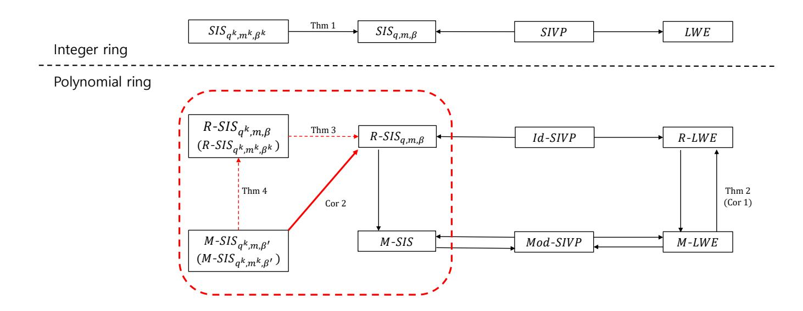
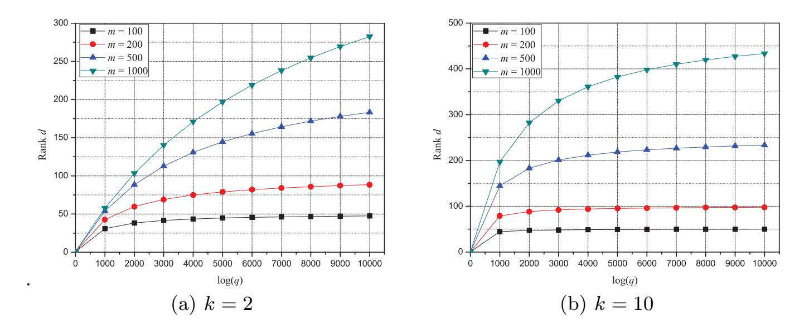
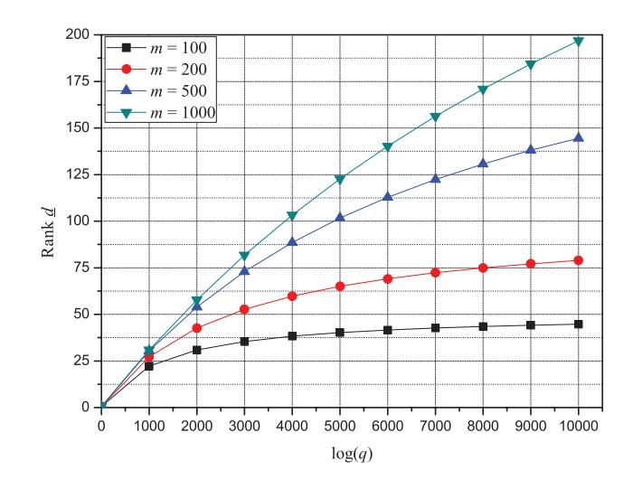

{0}------------------------------------------------

# Reduction from Module-SIS to Ring-SIS Under Norm Constraint of Ring-SIS?

ZaHyun Koo1 , Jong-Seon No1 , and Young-Sik Kim2

1 Seoul National University, Republic of Korea 2 Chosun University, Republic of Korea

Abstract. Lattice-based cryptographic scheme is constructed based on hard problems on a lattice such as the short integer solution (SIS) problem and the learning with error (LWE). However, the cryptographic scheme based on SIS or LWE is inefficient since the size of the key is too large. Thus, most cryptographic schemes use the variants of LWE and SIS with ring and module structures. Albrecht and Deo showed that there is a reduction from module-LWE (M-LWE) to ring-LWE (R-LWE) in the polynomial ring [2] by handling the error rate and modulus. However, unlike the LWE problem, the SIS problem does not have an error rate, but there is the upper bound β on the norm of the solution of the SIS problem. In this paper, we propose the two novel reductions related to module-SIS (M-SIS) and ring-SIS (R-SIS) on a polynomial ring. We propose (i) the reduction from R-SISqk,mk,βk to R-SISq,m,β and (ii) the reduction from M-SIS to R-SIS under norm constraint of R-SIS. Combining these two results implies that R-SIS for a specified modulus and number samples is more difficult than M-SIS under norm constraints of R-SIS, which provides the range of possible module ranks for M-SIS.

Keywords: Lattice-based cryptography, · learning with error (LWE), · module-short integer solution (M-SIS) problem, · ring-short integer solution (R-SIS) problem, · short integer solution (SIS) problem.

# 1 Introduction

Recently, due to the development of quantum computers, it is known that many public key cryptographic schemes can be broken. Candidates for public key cryptograhpic scheme that are resistant to quantum computers such as lattice-based cryptography, code-based cryptography, and multivariate polynomial-based cryptography have been actually researched. Among them, lattice-based cryptography is known to offer an apparent security against quantum computers with the additional advantages of a small-sized key and efficiency.

Lattice-based cryptography is constructed based on the hard problem on a lattice such as the shortest independent vector problem (SIVP). In addition, many cryptographic schemes based on the short integer solution (SIS) problem

? This work was supported by Samsung Research Funding & Incubation Center of Samsung Electronics under Project Number SRFC-IT1801-08.

{1}------------------------------------------------

introduced by Ajtai in 1996 [1] and the learning with error (LWE) problem introduced by Regev in 2005 [16], have been proposed. Let  $\mathbb{Z}$  and  $\mathbb{R}$  denote the set of integers and the set of real numbers, respectively. Let  $\mathbb{Z}_q$  denote the set of integers modulo q. Then the SIS problem is defined as follows: For any positive integers m, n, given positive  $\beta \in \mathbb{R}$ , and positive integer q, the SIS problem is to find solution  $\mathbf{z} \in \mathbb{Z}^m$  such that  $\mathbf{A} \cdot \mathbf{z} = \mathbf{0} \mod q$  and  $0 < ||\mathbf{z}|| \le \beta$  for uniformly random matrix  $\mathbf{A} \in \mathbb{Z}_q^{n \times m}$ . A collision-resistant hash function can be constructed using the SIS problem and it can be used for signature scheme, identification scheme, and so on [8], [5], [13].

The LWE problem has two versions, that is, the search LWE and the decision LWE problems. The search LWE problem is defined as follows: For given dimension n and positive integer q and the error distribution  $\chi$  on  $\mathbb{Z}$ , the search LWE problem is to find  $\mathbf{s}$  for many given independent pairs  $(\mathbf{a}, \frac{1}{q}\langle \mathbf{a}, \mathbf{s} \rangle + e)$  for  $\mathbf{a} \in \mathbb{Z}_q^n$  chosen uniformly at random and error  $e \leftarrow \chi$ . The decision LWE problem is to distinguish between many arbitrarily independent pairs  $(\mathbf{a}, \frac{1}{q}\langle \mathbf{a}, \mathbf{s} \rangle + e)$  and the same number of samples  $(\mathbf{c}, d)$ ,  $\mathbf{c} \in \mathbb{Z}_q^n$  and  $d \in \mathbb{Z}_q$  from the uniform distribution over  $\mathbb{Z}_q^{n+1}$ .

Most public key cryptosystems and homomorphic encryption algorithms on a lattice are constructed based on the LWE [13], [4], [14]. However, cryptographic schemes based on LWE or SIS are inefficient because the size of the key is too large. To overcome this problem, we use the ring-LWE (R-LWE) and the ring-SIS (R-SIS), which are defined over the ring, that is, the polynomial ring [10]. These problems are also as hard as Id-SIVP, where Id-SIVP is the SIVP problem defined on the ideal lattice with a ring structure.

Then the module lattice can be seen as a generalized structure of an arbitrary lattice and ideal lattice. Therefore, LWE and SIS, both of which can also be defined on the module lattice, are termed the module-LWE (M-LWE) problem and the module-SIS (M-SIS) problem, respectively. Similar to the ideal lattice, both problems are as difficult as the Mod-SIVP, which is SIVP defined on the module lattice. However, unlike the ideal lattice, Mod-SIVP is as hard as M-LWE and M-SIS [7].

Generally, M-SIS is more difficult than R-SIS in the polynomial ring. If there is an algorithm  $\mathcal{A}$  for solving M-SIS, the instance of M-SIS becomes the instance of R-SIS when the module rank is one. Then the algorithm  $\mathcal{A}$  can be used to find the solution of R-SIS. This method cab similarly be used to the reduction from R-LWE to M-LWE. However, the problem with the module structure is not always more difficult than the problem with the ring structure. In Asiacrypt 2017, Albrecht and Deo showed that there is a reduction from M-LWE to R-LWE [2], by handling the error rate and modulus in the M-LWE and R-LWE problems. Specifically, M-LWE with error rate  $\alpha$ , modulus q, and the rank of module d reduces to R-LWE with error  $\alpha \cdot n^2 \sqrt{d}$  and modulus q. Unlike the LWE problems, the SIS problems do not have an error rate; instead, there is the upper bound  $\beta$  on the norm of the solution of R-SIS and we can use the upper bound while retaining the same parameters  $q^k$  and m for the reduction from

{2}------------------------------------------------

M-SIS to R-SIS. Thus, when we use the M-SIS problem for the cryptographic schemes such as signature and identification schemes, it is desirable to avoid the suggested parameters for M-SIS for security reasons.

#### 1.1 Main results.

This paper proposes the reduction from M-SIS to R-SIS by using the relation between the modulus and the rank of the module under some condition of the upper bound  $\beta$  on the norm of the solution of R-SIS. First, we derive a reduction from R-SIS $_{q^k,m^k,\beta^k}$  to R-SIS $_{q,m,\beta}$ , which corresponds to an extension of Proposition 3.2 in [11] to a polynomial ring. In addition, we also propose that R-SIS $_{q^k,m,\beta}$  is more difficult than M-SIS $_{q^k,m,\beta'}$  with the same modulus and the same number of samples under some condition on the upper bound  $\beta$  on the norm of the solution of R-SIS. To demonstrate this reduction, we find the distinct solutions as many as the number of the samples. By estimating the upper bound  $\beta$  of the norm of the solution of R-SIS, we obtain the range of the ranks of the module in M-SIS. Combining these two results, we propose that R-SIS with modulus q and m samples is more difficult than M-SIS with modulus  $q^k$  and  $m^k$  samples under some condition of the upper bound  $\beta$  on the norm of the solution of the R-SIS problem.

## 1.2 Organization.

The remainder of this paper is organized as follows: In Section 2, SIVP and SIS on ideal and module lattices are introduced and also we introduce the results of previous works. In Section 3, we derive two reductions, that is, the reduction from  $R\text{-SIS}_{q^k,m^k,\beta^k}$  to  $R\text{-SIS}_{q,m,\beta}$  and the reduction from  $M\text{-SIS}_{q^k,m,\beta'}$  to  $R\text{-SIS}_{q^k,m,\beta}$  under some condition on the upper bound  $\beta$  on the norm of the solution of R-SIS. Section 4 derives the relation between the modulus and the rank of module when M-SIS reduces to R-SIS. Finally, the conclusion and suggested future work are provided in Section 5.

## 2 Preliminaries

#### 2.1 Notations and Definitions

Ideal and Module Let  $\Phi(X)$  be a monic irreducible polynomial of degree n and  $\mathbb{Q}$  be the set of rational numbers. We will use the 2n-th cyclotomic polynomial  $\Phi(X) = X^n + 1$  with  $n = 2^r$  for some positive integer r. Consider the cyclotomic field  $K = \mathbb{Q}[X]/\langle \Phi(X) \rangle$  and define R as the ring of integer polynomial modulo  $\Phi(X)$ , that is,  $R = \mathbb{Z}[X]/\langle \Phi(X) \rangle$ . Conveniently, we refer to R as the polynomial ring. A non-empty set  $I \subseteq R$  is termed an ideal of R if I is an additive subgroup of R and for all  $r \in R$  and all  $x \in I$ ,  $r \cdot x \in I$ . The quotient R/I is the set of equivalence classes r + I of R modulo I. Let q be a positive integer and let  $R_q = R/qR$ . In [10], It is shown that  $R_q$  is isomorphic to I/qI for a given ideal

{3}------------------------------------------------

I of R using the Chinese remainder theorem. A subset  $M \subseteq K^d$  is an R-module if M is closed under addition and under scalar multiplication by elements of R. The module M generalizes the ring and the vector space. It is known that M/qM is isomorphic to  $R_q^d$  [7]. Hereinafter, vectors are denoted in bold and if **a** is a vector, then its i-th coordinate is denoted by  $a_i$ . A matrix is denoted by uppercase letter in bold.

Norms For each  $a = a(X) \in R$ , let  $a(X) = \sum_{i=0}^{n-1} a_i X^i$ ,  $a_i \in \mathbb{Z}$ . Then we can define the norm of a as

$$||a|| = ||a(X)|| = (\sum_{i=0}^{n-1} a_i^2)^{1/2}.$$

The above notation is obviously transferable to the settings of module  $R^d$  with rank d by using  $\mathbf{a} = (a_1(X), \dots, a_d(X)) \in R^d$ , that is, nd-dimensional integer vectors. Then the norm of  $\mathbf{a}$  is given as

$$\|\mathbf{a}\| = (\sum_{i=1}^{d} \|a_i(X)\|^2)^{1/2}.$$

Lattices An *n*-dimensional lattice is a discrete subgroup of  $\mathbb{R}^n$ . More specifically, for linearly independent vectors  $\{\mathbf{b}_1, \dots, \mathbf{b}_n\} \subseteq \mathbb{R}^n$ , the set

$$\mathcal{L} = \mathcal{L}(\mathbf{b}_1, \dots, \mathbf{b}_n) = \left\{ \sum_{i=1}^n x_i \mathbf{b}_i : x_i \in \mathbb{Z} \right\}$$

is a lattice in  $\mathbb{R}^n$  with basis  $\{\mathbf{b}_1, \dots, \mathbf{b}_n\}$ . A lattice is an *ideal lattice* if it is isomorphic to some ideal I of R. Similarly, a lattice is a module lattice if it is isomorphic to some R-module M [7]. The *i-th successive minimum*  $\lambda_i(\mathcal{L})$  is the smallest radius r such that  $\mathcal{L}$  contains i linearly independent vectors of norm at most r.

#### 2.2 Short Integer Solution Problem in Lattice

Lattice problem First, we consider the shortest independent vector problem.

**Definition 1** ([7]). The SIVP is defined as follows: Given a lattice  $\mathcal{L}$  of dimension n, the SIVP is to find the n linearly independent vectors  $\mathbf{v}_1, \ldots, \mathbf{v}_n \in \mathcal{L}$  such that  $\max_i ||\mathbf{v}_i|| \leq \gamma \cdot \lambda_n(\mathcal{L})$ , where  $\gamma \geq 1$  is a function of dimension n.

This problem is known to be NP-hard for any approximation factor  $\gamma \leq O(1)$  [3]. The SIVP problem can be extended to the polynomial ring R if the lattice  $\mathcal{L}$  is the ideal lattice, denoted as Id-SIVP. Similarly, if the lattice is the module lattice, we can extend this problem to the module, denoted as Mod-SIVP.

Short integer solution problem We define the short integer solution problem, which is used in many lattice-based cryptographic schemes such as signature schemes and identification schemes. This problem, which was introduced by Ajtai [1], is defined as follows:

{4}------------------------------------------------

**Definition 2** ([1], [7]). The SIS problem is defined as follows: Given  $\mathbf{A} \in \mathbb{Z}_q^{n \times m}$  chosen from the uniform distribution, the SIS is to find  $\mathbf{z} = (z_1, \dots, z_m)^T \in \mathbb{Z}^m$  such that  $\mathbf{A} \cdot \mathbf{z} = \mathbf{0} \mod q$  and  $0 < \|\mathbf{z}\| \le \beta$ .

In particular, to guarantee the non-trivial solution  $\mathbf{z} \in \mathbb{Z}^m$  for the SIS problem, it is clear that  $\beta$  is less than the modulus q. Indeed, if  $\beta \geq q$  and  $\mathbf{A} \in \mathbb{Z}_q^{n \times m}$ , then we take the solution  $\mathbf{z} = (q, 0, \dots, 0)^T \in \mathbb{Z}^m$  and  $\mathbf{A} \cdot \mathbf{z} = 0 \mod q$ .

It is proved [6] that there is a reduction from SIVP to the SIS problem. Thus, the SIS problem is also NP-hard. The SIS problem is one of the most important problems pertaining to lattices. Therefore, it is necessary to know the relationship among SIS problems for various parameters. The following theorem shows the hardness of the SIS problem in the integer ring, based on the modulus and the number of samples in a previous work [11].

**Theorem 1** ([11], Proposition 3.2). Let m, n be integers, q be a prime and  $\beta$  be a given real number such that  $q \geq \beta \cdot \omega(\sqrt{n \log n})$ . Then for any positive integer k, there is a deterministic reduction from  $SIS_{q^k, m^k, \beta^k}$  to  $SIS_{q, m, \beta}$ .

Theorem 1 means that the SIS problem with modulus q and m samples is more difficult than the SIS problem with modulus  $q^k$  and  $m^k$  samples for any positive integer k.

#### 2.3 Ring-SIS and Module-SIS

First, we recall the R-SIS and M-SIS problems. R-SIS, which was introduced by Peikert and Rosen [15], is defined on the polynomial ring R. Since the instance of R-SIS is polynomial, the key size of the cryptographic scheme based on R-SIS can be smaller than that of the cryptographic scheme based on SIS [15], [9].

**Definition 3** ([7], [15]). The problem R- $SIS_{q,m,\beta}$  is defined as follows: Given  $a_1, \ldots, a_m \in R_q$  chosen independently from the uniform distribution, the R-SIS problem is to find  $z_1, \ldots, z_m \in R$  such that  $\sum_{i=1}^m a_i \cdot z_i = 0 \mod q$  and  $0 < \|\mathbf{z}\| \le \beta$ , where  $\mathbf{z} = (z_1, \ldots, z_m)^T \in R^m$ .

The module structure is a generalized structure of ring. Thus, the previously defined R-SIS problem can be extended to the module lattice, which is termed the M-SIS problem [7].

**Definition 4 ([7]).** The problem  $M\text{-}SIS_{q,m,\beta}$  is defined as follows: Given  $\mathbf{a}_1, \ldots, \mathbf{a}_m \in R_q^d$  chosen independently from the uniform distribution, M-SIS is to find  $z_1, \ldots, z_m \in R$  such that  $\sum_{i=1}^m \mathbf{a}_i \cdot z_i = \mathbf{0} \mod q$  and  $0 < \|\mathbf{z}\| \le \beta$ , where  $\mathbf{z} = (z_1, \ldots, z_m)^T \in R^m$ .

It is proved in [7] that there is a reduction from Mod-SIVP to M-SIS. In addition, the M-SIS problem is known to be more difficult than the R-SIS problem. Indeed, suppose that an algorithm  $\mathcal{A}$  exists for solving M-SIS and let  $a_1, \ldots, a_m \in R_q$  be instances of R-SIS. Since the polynomial ring  $R_q$  can be considered as a module  $R_q^d$  with rank d = 1, we can think  $a_i$  as  $\mathbf{a}_i = (a_i, 0, \ldots, 0) \in$ 

{5}------------------------------------------------

 $R_q^d$ . Using the algorithm  $\mathcal{A}$ , we can find the solution  $\mathbf{z} = (z_1, \dots, z_m)^T \in R^m$  with  $\|\mathbf{z}\| \leq \beta$  such that  $\sum_{i=1}^m \mathbf{a}_i \cdot z_i = \mathbf{0} \mod q$ . Then

$$\sum_{i=1}^{m} \mathbf{a}_i \cdot z_i = (\sum_{i=1}^{m} a_i \cdot z_i, 0, \dots, 0) = (0, 0, \dots, 0) \bmod q.$$

Thus, the solution of the instances of R-SIS is found from that of M-SIS.

## 2.4 Ring-LWE and Module-LWE

Recall the R-LWE and M-LWE problems. To define both, we introduce the following notations [2], [7].

Canonical embedding([2], [7]). The canonical embeddings are the n ring homomorphisms  $\sigma_j: K \to \mathbb{C}$  for all  $j=1,\ldots,n$ , where  $\mathbb{C}$  is the set of the complex numbers. They are defined by  $\sigma_j(\xi)=\xi^j$ , where  $\xi$  is the solution of  $X^n+1$  for any  $j\in\mathbb{Z}_{2n}^\times$  with  $n=2^r$  for some positive integer r, where  $\mathbb{Z}_{2n}^\times$  denotes the set of integer j module 2n such that  $\gcd(j,2n)=1$ . We define the canonical embedding vector as the ring homomorphism  $\sigma_C: K \to \mathbb{C}^n$  as  $\sigma_C(x)=(\sigma_j(x))_{j\in\mathbb{Z}_{2n}^\times}$  under component-wise addition and multiplication. The trace  $\mathrm{Tr}: K \to \mathbb{Q}$  is defined as  $\mathrm{Tr}(x)=\sum_{j\in\mathbb{Z}_{2n}^\times}\sigma_j(x)$ . For any  $x,y\in K$ ,  $\mathrm{Tr}(x\cdot y)=\sum_{j\in\mathbb{Z}_{2n}^\times}\sigma_j(x)\cdot\sigma_j(y)=\langle\sigma_C(x),\overline{\sigma_C}(y)\rangle$ , where  $\langle\cdot,\cdot\rangle$  is the Hermitian product on  $\mathbb{C}^n$ .

Space H([2], [7]). Let  $\mathbb{J}$  denote  $[-\frac{n}{2}, \frac{n}{2}] \cap \mathbb{Z}_{2n}^{\times}$ . We define the space H as the subspace of  $\mathbb{C}^n$  such that

$$H = \{(x_j)_{j \in \mathbb{Z}_{2n}^{\times}} \in \mathbb{C}^n : \forall j \in \mathbb{J}, x_{2n-j} = \overline{x_j}\}.$$

Let  $\mathbf{h}_j = \frac{1}{\sqrt{2}}(\mathbf{e}_j + \mathbf{e}_{2n-j})$  and  $\mathbf{h}_{2n-j} = \frac{i}{\sqrt{2}}(\mathbf{e}_j - \mathbf{e}_{2n-j})$  for  $j \in \mathbb{J}$ , where  $\mathbf{e}_j$  denotes the standard basis vector. Then  $\mathbf{h}_j$ 's are the basis of H. For  $x \in K$ , we define  $\sigma_H(x)$  by  $\sigma_H(x) = (x_j)_{j \in \mathbb{J}} \in \mathbb{R}^n$  such that  $\sigma_C(x) = \sum_j x_j \cdot \mathbf{h}_j$ .

Gaussian Measure([2], [7]). For the center  $\mathbf{c} \in \mathbb{R}^n$  and real number s > 0, the Gaussian function is defined by  $\rho_{s,\mathbf{c}}(\mathbf{x}) = \exp(-\pi \|\frac{\mathbf{x}-\mathbf{c}}{s}\|^2)$  for all  $\mathbf{x} \in \mathbb{R}^n$ . We can obtain the Gaussian probability distribution by using the normalization, that is,  $D_{s,\mathbf{c}}(\mathbf{x}) = \rho_{s,\mathbf{c}}(\mathbf{x})/s^n$ . If the center  $\mathbf{c}$  is to be zero, we omit the subscript  $\mathbf{c}$ . A sample from  $D_{\mathbf{r}}$  over  $\mathbb{R}^n$  is given by  $(D_{r_i})_{i=1,\dots,n}$  for  $\mathbf{r} = (r_1,\dots,r_n)^T \in (\mathbb{R}^+)^n$ , where  $\mathbb{R}^+$  denotes the set of non-negative real numbers. For  $\alpha > 0$ , we write  $\Psi_{\leq \alpha}$  to denote the set of Gaussian distributions that satisfy  $r_i \leq \alpha$  for all i.

Ring-LWE and Module-LWE([2], [7]). For polynomial ring R in cyclotomic field K, its dual is defined as  $R^{\vee} = \{x \in K : \operatorname{Tr}(xR) \subseteq \mathbb{Z}\}$ . Let  $K_{\mathbb{R}} = K \otimes_{\mathbb{Q}} \mathbb{R}$  and  $\mathbb{T}_{R^{\vee}} = K_{\mathbb{R}}/R^{\vee}$ , where  $\otimes$  denotes the tensor product. Let  $\psi$  be a distribution on  $\mathbb{T}_{R^{\vee}}$ . Let  $\Psi$  be a family of distribution over  $K_{\mathbb{R}}$  and D a distribution over  $R_q^{\vee}$ .

For  $s \in R_q^{\vee}$ , let  $A_{q,s,\psi}^{(R)}$  denote the distribution on  $R_q \times \mathbb{T}_{R^{\vee}}$  obtained by choosing  $a \in R_q$  from  $U(R_q)$  and  $e \leftarrow \psi$ , and returning  $(a, \frac{1}{q}(a \cdot s) + e)$ , where  $U(R_q)$  denotes the uniform distribution over  $R_q$ . This distribution  $A_{q,s,\psi}^{(R)}$  is referred to as the R-LWE distribution.

{6}------------------------------------------------

**Definition 5** ([2], [7]). The decision and search R-LWE $_{m,q,\Psi}^{(R)}(D)$  problems are defined as follows: Let  $s \in R_q^{\vee}$  be uniformly random. R-LWE $_{m,q,\Psi}^{(R)}(D)$  is to distinguish between arbitrarily many independent m samples from  $A_{q,s,\psi}^{(R)}$  and the same number of independent samples from the uniform distribution over  $R_q \times \mathbb{T}_{R^{\vee}}$ , where  $\psi$  is an arbitrary distribution in  $\Psi$  and  $s \leftarrow D$ . The search R-LWE $_{m,q,\Psi}^{(R)}(D)$ , denoted by R-SLWE $_{m,q,\Psi}^{(R)}$ , is to find the secret  $s \leftarrow D$  from many samples of  $A_{q,s,\psi}^{(R)}(D)$ .

Similarly, we define the LWE problem on module  $M = R^d$ . For  $\mathbf{s} \in (R_q^{\vee})^d$ , we define  $A_{d,q,\mathbf{s},\psi}^{(M)}$  as the distribution on  $(R_q)^d \times \mathbb{T}_{R^{\vee}}$  obtained by choosing a vector  $\mathbf{a}$  from distribution  $U((R_q)^d)$  and  $e \leftarrow \psi$ , and returning  $(\mathbf{a}, \frac{1}{q}\langle \mathbf{a}, \mathbf{s} \rangle + e)$ .

**Definition 6** ([2], [7]). The decision and search  $M\text{-}LWE_{m,q,\Psi}^{(M)}(D)$  problems are defined as follows: Let  $\mathbf{s} \in R_q^{\vee}$  be uniformly random.  $M\text{-}LWE_{m,q,\Psi}^{(M)}(D)$  is to distinguish between many arbitrarily independent samples from  $A_{d,q,\mathbf{s},\psi}^{(M)}$  and the same number of independent samples from the uniform distribution over  $(R_q^{\vee})^d \times \mathbb{T}_{R^{\vee}}$ , where  $\psi$  is an arbitrary distribution in  $\Psi$  and  $\mathbf{s} \leftarrow D$ . The search  $M\text{-}LWE_{m,q,\Psi}^{(M)}(D)$ , denoted by  $M\text{-}SLWE_{m,q,\Psi}^{(M)}(D)$ , is to find the secret  $\mathbf{s} \leftarrow D^d$  of many samples from  $A_{d,q,\mathbf{s},\psi}^{(M)}(D)$ .

Similar to the relation between M-SIS and R-SIS in Subsection 2.3, the M-LWE (M-SLWE) problem is known to be harder than the R-LWE (R-SLWE). However, under some condition, the R-LWE problem is more difficult than the M-LWE problem [2] as follows.

**Theorem 2** ([2], Corollary 3). Let m be a positive integer and  $\chi$  be a distribution over  $R^{\vee}$  satisfying

$$\Pr_{s \leftarrow \chi} [\|\sigma_H(s)\| > B_1] \le \delta_1 \text{ and}$$
  
$$\Pr_{s \leftarrow \chi} \left[ \max_j \frac{1}{|\sigma_j(s)|} \ge B_2 \right] \le \delta_2$$

for some  $(B_1, \delta_1)$  and  $(B_2, \delta_2)$ . For  $\alpha > 0$  and any k > 1 that divides d > 1 and

$$r \ge \left(\frac{\max\{\sqrt{n}, B_1 B_2\}}{q}\right) \cdot \sqrt{2\ln(2nd(1+m(d+3)))/\pi},$$

there exists a reduction from M-SLWE $_{m,q,\Psi_{\leq \alpha}}^{(R^d)}(\chi^d)$  to M-SLWE $_{m,q^k,\Psi_{\leq \alpha'}}^{(R^{d/k})}(U(R_q^{\vee}))$  for  $(\alpha')^2 \geq \alpha^2 + 2r^2B_1^2d$ .

Corollary 1 ([2]). If we take k=d, then there exists an efficient reduction from  $M\text{-}SLWE_{m,q,\Psi_{\leq \alpha}}^{R^d}(\chi^d)$  to  $R\text{-}SLWE_{m,q,\Psi_{\leq \alpha \cdot n^2 \cdot \sqrt{d}}}^R(U(R_q^{\vee}))$  with controlled error rate  $\alpha$ .

{7}------------------------------------------------

Instead of handling the error rate in Corollary 1, by handling the upper bound  $\beta$  on the norm of the solution of SIS, we propose the reduction from M-SIS to R-SIS with the same modulus and the same number of samples as in the next section 3.

## 3 Reduction from M-SIS to R-SIS

In this section, similar to the reduction from M-LWE to R-LWE, we propose the reduction from M-SIS with modulus  $q^k$  and  $m^k$  samples for any k > 1 to R-SIS with modulus q and m samples by handling the upper bound  $\beta$  on the norm of the solution of R-SIS. To demonstrate this, we first extend Theorem 1 to the polynomial ring R, that is, for any k > 1, there is a reduction from R-SIS $a^k$   $m^k$   $\beta^k$  to R-SIS $_{q,m,\beta}$ . Second, we show the reduction from M-SIS to R-SIS with the same modulus  $q^k$  and m samples under some condition on the upper bound  $\beta$  on the norm of the solution of R-SIS. These two reductions can be combined to obtain the reduction from M-SIS to R-SIS under the constraints of  $q, m, \beta$  and k. This means that M-SIS can be solved by obtaining the solution of R-SIS $_{q,m,\beta}$ . Thus, we have to consider the condition under which R-SIS $_{q,m,\beta}$  can be solved. Since the upper bound  $\beta$  on the norm of the solution of R-SIS satisfies that  $\beta$  is less than the modulus q, we consider the polynomial  $z \in R$  such that the coefficients of z are in  $\{0, 1, \dots, q-1\}$ , where q is a prime. Then, it is clear that  $\gcd(z, q) = 1$ . Further, for  $\mathbf{z} \in \mathbb{R}^m$ , it is also clear that  $\gcd(\mathbf{z},q) = 1$ . Henceforth, we assume that all R-SISq,m,\beta solutions  $\mathbf{z} \in \mathbb{R}^m \setminus \{\mathbf{0}\}$  satisfy  $\gcd(\mathbf{z},q) = 1$ .

## 3.1 Reduction from Ring-SIS $q^k,m^k,\beta^k$  to Ring-SIS $q,m,\beta$ 

Now, we propose that solving  $R\text{-}SIS_{q,m,\beta}$  is more difficult than solving  $R\text{-}SIS_{q^k,m^k,\beta^k}$  for any integer k>1, which corresponds to the polynomial ring R version of Theorem 1. Here, the solution of  $R\text{-}SIS_{q,m,\beta}$  should be guaranteed and thus we need to extend the following lemma.

**Lemma 1** ([12], Lemma 5.2 ). For any integer q, the instance  $\mathbf{A} \in \mathbb{Z}_q^{n \times m}$  and  $\beta \geq \sqrt{m}q^{n/m}$ , the  $SIS_{q,m,\beta}$  admits a solution; i.e., there exists a vector  $\mathbf{z} = (z_1, \dots, z_m)^T \in \mathbb{Z}^m \setminus \{\mathbf{0}\}$  such that  $\mathbf{A} \cdot \mathbf{z} = \mathbf{0} \mod q$  and  $\|\mathbf{z}\| \leq \beta$ .

The above lemma means that to guarantee the solution of  $SIS_{q,m,\beta}$ , the upper bound  $\beta$  of the norm of the solution is at least  $\sqrt{m}q^{n/m}$ . We extend Lemma 1 to  $R\text{-}SIS_{q,m,\beta}$  in the polynomial ring as in the following lemma, the proof of which is similar to that of Lemma 1.

**Lemma 2.** For any integer q, the instances  $a_1, \ldots, a_m \in R_q$ , and  $\beta \geq \sqrt{n \cdot m} q^{1/m}$ , the  $R\text{-}SIS_{q,m,\beta}$  admits a solution; that is, there exists a vector  $\mathbf{z} = (z_1, \ldots, z_m)^T \in R^m \setminus \{\mathbf{0}\}$  such that  $\sum_{i=1}^m a_i \cdot z_i = 0 \mod q$  and  $\|\mathbf{z}\| \leq \beta$ 

*Proof.* Consider all  $\mathbf{z} = (z_1, \dots, z_m)^T \in \mathbb{R}^m$  such that the coefficients of  $z_i$  are in the set  $\{0, 1, \dots, \lfloor q^{1/m} \rfloor\}$ . Then, there are more than  $q^n$  such vectors. Clearly,

{8}------------------------------------------------

there exist  $q^n$  distinct polynomials in the polynomial ring  $R_q$ . Thus, there exist two such vectors  $\mathbf{z} \neq \mathbf{z}' \in R^m$  such that  $\sum_{i=1}^m a_i \cdot z_i = \sum_{i=1}^m a_i \cdot z_i' \mod q$ . It is clear that  $\sum_{i=1}^m a_i \cdot (z_i - z_i') = 0 \mod q$  and  $\|\mathbf{z} - \mathbf{z}'\| \leq \sqrt{n \cdot m} \lfloor q^{1/m} \rfloor \leq \sqrt{n \cdot m} q^{1/m} \leq \beta$  because all coefficients are between  $-|q^{1/m}|$  and  $|q^{1/m}|$ .  $\square$ 

Now, we propose that for any integer k > 1, there is a reduction from R-SIS $q^k,m^k,\beta^k$  to R-SIS $q,m,\beta$  as in the following theorem, the proof of which is similar to that of Theorem 1.

**Theorem 3.** Let m be a positive integer and q be a prime. Choose the upper bound of the norm,  $\beta \in \mathbb{R}$  such that  $\beta \geq \sqrt{n \cdot m} \cdot q^{\frac{1}{m}}$  and  $q \geq \beta \sqrt{n} \omega(\log n)$ . Assume that there exists an algorithm  $\mathcal{A}$  for solving the  $R\text{-}SIS_{q,m,\beta}$  problem. Then there exists an algorithm  $\mathcal{A}'$  for solving the  $R\text{-}SIS_{q^k,m^k,\beta^k}$  for any integer k > 1, which corresponds to the reduction from  $R\text{-}SIS_{q^k,m^k,\beta^k}$  to  $R\text{-}SIS_{q,m,\beta}$ .

Proof. Assume that there exists an algorithm  $\mathcal{A}$  for solving R-SIS $_{q,m,\beta}$ . For the given instances  $a_1, a_2, \ldots, a_{m^k} \in R_q$  of R-SIS $_{q^k,m^k,\beta^k}$ , which are chosen independently from the uniform distribution  $U(R_1)$ , we can write  $\mathbf{a}=(a_1,\ldots,a_{m^k})=(\mathbf{a}_1,\ldots,\mathbf{a}_{m^{k-1}})$ , where  $\mathbf{a}_i$  is the m-tuple vector for  $i=1,\ldots,m^{k-1}$ . Using algorithm  $\mathcal{A}$ , we can find a solution  $\mathbf{z}_i \in R^m$  with  $\|\mathbf{z}_i\| \leq \beta$  such that  $\mathbf{a}_i \cdot \mathbf{z}_i = 0$  mod q for all  $i=1,\ldots,m^{k-1}$ . Since  $\beta < q$  and q is a prime,  $\gcd(\mathbf{z}_i,q)=1$ . Thus,  $\mathbf{a}_i \cdot \mathbf{z}_i = q \cdot a_i'$  and  $a_i' = \mathbf{a}_i \cdot \mathbf{z}_i/q \in R_{q^{k-1}}$  for some  $a_i' \in R$ . Set  $\mathbf{a}' = (a_1',\ldots,a_{m^{k-1}}')$  and use the induction on k. Then we find a solution  $\mathbf{z}' = (z_1',\ldots,z_{m^{k-1}}')^T \in R^{m^{k-1}}$  with  $\|\mathbf{z}'\| \leq \beta^{k-1}$  such that  $\mathbf{a}' \cdot \mathbf{z}' = 0$  mod  $q^{k-1}$ . Let  $\mathbf{z} = (z_1' \cdot \mathbf{z}_1,\ldots,z_{m^{k-1}}' \cdot \mathbf{z}_{m^{k-1}})^T \in R^{m^k}$ . Then, we have

$$\mathbf{a} \cdot \mathbf{z} = \sum_{i=1}^{m^{k-1}} z_i' \cdot \mathbf{a}_i \cdot \mathbf{z}_i$$

$$= \sum_{i=1}^{m^{k-1}} z_i' \cdot q \cdot a_i'$$

$$= q \cdot \sum_{i=1}^{m^{k-1}} z_i' \cdot a_i'$$

$$= q \cdot \mathbf{a}' \cdot \mathbf{z}' = 0 \mod q^k$$

and  $\|\mathbf{z}\| \leq \|\mathbf{z}'\| \cdot \max_i \|\mathbf{z}_i\| \leq \beta^k$ . Thus, we prove it.

In the above proof, the solution of  $\text{R-SIS}_{q^k,m^k,\beta^k}$  is made by the solutions of  $\text{R-SIS}_{q,m,\beta}$ . Since each solution  $\mathbf{z}$  of  $\text{R-SIS}_{q,m,\beta}$  has  $\gcd(\mathbf{z},q)=1$ , the solution of  $\text{R-SIS}_{q^k,m^k,\beta^k}$  is relatively prime to q.

{9}------------------------------------------------

#### 3.2 Reduction from Module-SIS to Ring-SIS

Now, we propose that there is a reduction from M-SIS to R-SIS with the same  $q^k$  and m under some condition on the upper bound  $\beta$  on the norm of the solution of R-SIS. In general, the M-SIS problem is harder than the R-SIS problem since the module structure is equal to the ring structure if the rank of the module is one. However, R-SIS can be more difficult than M-SIS under some condition on the upper bound  $\beta$  on the norm of the solution of R-SIS. To show the reduction from M-SIS to R-SIS, we need to find the as many distinct solutions as the number of instances for the same instances of R-SIS. However, finding distinct solutions for the same instances of R-SIS is difficult because details of the process of the algorithms for solving R-SIS are not known. Therefore, certain algorithms may arrive at the same solution for the same instances. To resolve this problem, we use the following lemma, that is, there exist m distinct solutions.

**Lemma 3.** Let m be a positive integer. Let k > 1 be a positive integer and q be a prime. Let  $\beta$  be a real number such that  $\max(q, \sqrt{n \cdot m} \cdot q^{\frac{k}{m}}) \leq \beta$ . Assume that an algorithm  $\mathcal{A}'$  exists for solving  $R\text{-}SIS_{q^k,m,\beta}$  such that  $\mathcal{A}'$  outputs a solution  $\mathbf{z} \in R^m$  with  $\gcd(\mathbf{z},q) = 1$ . Let  $a_1, \ldots, a_m \in R_{q^k}$  be instances of  $R\text{-}SIS_{q^k,m,\beta}$ . Then we can find m solutions  $\bar{\mathbf{z}}^{(j)} = (\bar{z}_1^{(j)}, \ldots, \bar{z}_m^{(j)})^T$  with  $\|\bar{\mathbf{z}}^{(j)}\| \leq \beta^2$  such that  $\sum_{i=1}^m a_i \cdot \bar{z}_i^{(j)} = 0 \mod q^k$  for all  $j = 1, \ldots, m$ .

*Proof.* Let  $\mathbf{a} = (a_1, \dots, a_m)$  be an instance of  $\operatorname{R-SIS}_{q^k, m, \beta}$ , where  $a_i \in R_{q^k}$  for  $i = 1, \dots, m$ . Since q is not equal to 0 in  $R_{q^k}$ , we can write  $\mathbf{a}^{(j)} = (a_1, \dots, q \cdot a_j, \dots, a_m)$  for  $j = 1, \dots, m$ . Using algorithm  $\mathcal{A}'$ , it becomes possible to find the solution  $\mathbf{z}^{(j)} = (z_1^{(j)}, \dots, z_m^{(j)})^T$  with  $\|\mathbf{z}^{(j)}\| \leq \beta$  such that

$$a_1 \cdot z_1 + \dots + q \cdot a_j \cdot z_j + \dots + a_m \cdot z_m = 0 \mod q^k$$

for  $j=1,\ldots,m$ . Let  $\bar{\mathbf{z}}^{(j)}=(z_1,\ldots,q\cdot z_j,\ldots,z_m)^T=(\bar{z}_1^{(j)},\ldots,\bar{z}_m^{(j)})^T$  for  $j=1,\ldots,m$ . Then  $\bar{\mathbf{z}}^{(j)}$  is a solution of the instance  $\mathbf{a}$  with

$$\|\bar{\mathbf{z}}^{(j)}\| = \|(z_1, \dots, q \cdot z_j, \dots, z_m)\|$$

$$= (z_1^2 + \dots + z_j^2 + \dots + z_m^2)^{1/2}$$

$$\leq q \cdot (z_1^2 + \dots + z_m^2)^{1/2}$$

$$= q \cdot \|\mathbf{z}\|$$

$$\leq \beta^2.$$

Because of the property of  $\mathcal{A}'$ , each  $z_i^{(j)}$  is relatively prime to q. This means that the greatest common divisor of  $\bar{z}_i^{(j)}$  and q is 1 if  $i \neq j$  and q if i = j. Thus, all  $\bar{\mathbf{z}}^{(j)}$ ,  $j = 1, \ldots, m$ , are distinct solutions for instance  $\mathbf{a}$ .

**Theorem 4.** Let m be a fixed positive integer. Let k > 1 be a positive integer and q be a prime. Choose a module rank  $d \in \mathbb{Z}_{>0}$  such that

$$\max(q, \sqrt{n \cdot m} \cdot q^{\frac{k}{m}}) < \sqrt[2d-1]{q^k/(\sqrt{m})^{(d-1)}}. \tag{1}$$

{10}------------------------------------------------

Fig. 1: Relationship among reduction of various lattice problems

Let a positive real number  $\beta$  be an upper bound on the norm of the solution of  $R\text{-}SIS_{q^k,m,\beta}$  such that

$$\max(q, \sqrt{n \cdot m} \cdot q^{\frac{k}{m}}) \le \beta < \sqrt[2d-1]{q^k/(\sqrt{m})^{(d-1)}}.$$
 (2)

Assume that an algorithm  $\mathcal{A}'$  exists for solving the  $R\text{-}SIS_{q^k,m,\beta}$  problem such that  $\mathcal{A}'$  outputs a solution  $\mathbf{z} \in R^m$  with  $\gcd(\mathbf{z},q)=1$ . Then, an algorithm  $\mathcal{A}''$  exists for solving the  $M\text{-}SIS_{q^k,m,\beta'}$  problem with module rank d, where  $\beta'=m^{\frac{1}{2}(d-1)}\beta^{(2d-1)}$ ; that is, there exists a reduction from  $M\text{-}SIS_{q^k,m,\beta'}$  to  $R\text{-}SIS_{q^k,m,\beta}$  with  $\beta'=m^{\frac{1}{2}(d-1)}\beta^{(2d-1)}$ .

*Proof.* Let  $\mathbf{a}_1, \ldots, \mathbf{a}_m \in R_{q^k}^d$  be instances of  $\operatorname{R-SIS}_{q^k, m, \beta}$ , which are chosen independently from the uniform distribution, where  $\mathbf{a}_i = (a_{i1}, \ldots, a_{id})$  and  $a_{ij} \in R_{q^k}$ . Then we can write the matrix

$$\mathbf{A} = \begin{bmatrix} a_{11} \ a_{21} \cdots a_{m1} \\ a_{12} \ a_{22} \cdots a_{m2} \\ \vdots \ \vdots \ \vdots \ \vdots \\ a_{1d} \ a_{2d} \cdots a_{md} \end{bmatrix} = \begin{bmatrix} -\mathbf{a}'_1 - \\ -\mathbf{a}'_2 - \\ \vdots \ \vdots \ \vdots \\ -\mathbf{a}'_d - \end{bmatrix} \in R_{q^k}^{d \times m}.$$

Then each row  $\mathbf{a}'_i$  of  $\mathbf{A}$  is considered as an instance of R-SIS. Consider the last row  $\mathbf{a}'_d$  of  $\mathbf{A}$ . Then there are m distinct solutions  $\bar{\mathbf{z}}_d^{(j)} = (\bar{z}_{d,1}^{(j)}, \dots, \bar{z}_{d,m}^{(j)})^T$  with  $\|\bar{\mathbf{z}}_d^{(j)}\| \leq \beta^2$  such that  $\mathbf{a}'_d \cdot \bar{\mathbf{z}}_d^{(j)} = 0 \mod q^k$  by the Lemma 3 for  $j = 1, \dots, m$ .

{11}------------------------------------------------

Now, we construct the  $m \times m$  solution matrix

$$\bar{\mathbf{Z}}_d = \begin{bmatrix} \big| & \big| & \cdots & \big| \ \bar{\mathbf{z}}_d^{(1)} \ \bar{\mathbf{z}}_d^{(2)} & \cdots & \bar{\mathbf{z}}_d^{(m)} \ \big| & \cdots & \big| \end{pmatrix}$$

and  $\|\bar{\mathbf{Z}}_d\| \leq \beta^2 \sqrt{m}$ . Then, we have

$$\mathbf{A} \cdot \bar{\mathbf{Z}}_d = \begin{bmatrix} - & \mathbf{a}_1'' & - \ - & \mathbf{a}_2'' & - \ \vdots & \vdots & \vdots \ - & \mathbf{a}_{d-1}'' & - \ - & \mathbf{0} & - \end{bmatrix} \bmod q^k.$$

Applying the above method d-1 times, we obtain the solution matrix

$$\mathbf{A}^* = \mathbf{A} \cdot \bar{\mathbf{Z}}_d \cdots \bar{\mathbf{Z}}_2 = \begin{bmatrix} -\mathbf{a}_1^* & -\ -\mathbf{0} & -\ \vdots & \vdots \ -\mathbf{0} & - \end{bmatrix} \bmod q^k.$$

Finally, applying the algorithm  $\mathcal{A}'$  to  $\mathbf{a}_1^*$ , we find a solution  $\mathbf{z}'$  with  $\|\mathbf{z}'\| \leq \beta$  such that  $\mathbf{A}^* \cdot \mathbf{z}' = \mathbf{0} \mod q^k$ . Then, we have the solution  $\mathbf{z} = \bar{\mathbf{Z}}_d \cdots \bar{\mathbf{Z}}_2 \cdot \mathbf{z}'$  for  $\mathbf{A}$ . Then  $\mathbf{A} \cdot \mathbf{z} = \mathbf{0} \mod q^k$  and

$$\|\mathbf{z}\| = \|\bar{\mathbf{Z}}_d \cdots \bar{\mathbf{Z}}_2 \cdot \mathbf{z}'\|$$

$$\leq \left(\sqrt{m} \cdot \beta^2\right)^{d-1} \cdot \beta$$

$$\leq m^{\frac{1}{2}(d-1)} \beta^{(2d-1)}.$$

By modifying (2), we have that the upper bound  $\beta' = m^{\frac{1}{2}(d-1)}\beta^{(2d-1)}$  on the norm of the solution of  $\text{M-SIS}_{q^k,m,\beta'}$  is less than  $q^k$ . Thus, we found a non-trivial solution of  $\text{M-SIS}_{q^k,m,\beta'}$  and showed that there exists a reduction from  $\text{M-SIS}_{q^k,m,\beta'}$  to  $\text{R-SIS}_{q^k,m,\beta}$ .

From Theorem 4, it is easy to verify that there is a reduction from M-SIS $q^k,m^k,\beta'$  to R-SIS $q^k,m^k,\beta'$ , where  $\beta' = m^{\frac{k}{2}(d-1)}\beta^{k(2d-1)}$ . To demonstrate the reduction from M-SIS $q^k,m^k,\beta'$  to R-SIS $q,m,\beta$ , where  $\beta' = m^{\frac{k}{2}(d-1)}\beta^k(2d-1)$ , we combine Theorems 3 and 4 as follows.

**Corollary 2.** Let m be a fixed positive integer. Let k > 1 be a positive integer and q be a prime. Choose a module rank  $d \in \mathbb{N}$  such that

$$\sqrt{n \cdot m} \cdot q^{\frac{1}{m}} < \sqrt[2d-1]{q/(\sqrt{m})^{(d-1)}}.$$
(3)

{12}------------------------------------------------

Let a positive real number  $\beta$  be an upper bound on the norm of the solution of  $R\text{-}SIS_{q,m,\beta}$  such that

$$\sqrt{n \cdot m} \cdot q^{\frac{1}{m}} \le \beta < \sqrt[2d-1]{q/(\sqrt{m})^{(d-1)}}.$$
 (4)

Assume that an algorithm  $\mathcal{A}$  exists for solving the  $R\text{-}SIS_{q,m,\beta}$  problem. Then, an algorithm  $\mathcal{A}''$  exists for solving the  $M\text{-}SIS_{q^k,m^k,\beta'}$  problem with module rank d, where  $\beta' = m^{\frac{k}{2}(d-1)}\beta^{k(2d-1)}$ ; that is, there exists a reduction from  $M\text{-}SIS_{q^k,m^k,\beta'}$  to  $R\text{-}SIS_{q,m,\beta}$  with  $\beta' = m^{\frac{k}{2}(d-1)}\beta^{k(2d-1)}$ .

*Proof.* From Theorem 3, there exists the algorithm  $\mathcal{A}'$  for solving R-SIS $q^k,m^k,\beta^k$  such that  $\mathcal{A}'$  outputs a solution  $\mathbf{z}$  with  $\gcd(\mathbf{z},q)=1$ . Modifying (4), we have

$$(\sqrt{n \cdot m} \cdot q^{\frac{1}{m}})^k \le \beta^k < \left(\sqrt[2d-1]{q/(\sqrt{m})^{(d-1)}}\right)^k.$$

In the inequality on the left, we have

$$\beta^{k} \geq (\sqrt{n \cdot m} \cdot q^{\frac{1}{m}})^{k}$$
$$\geq \sqrt{n \cdot m^{k}} \cdot q^{\frac{k}{m}}$$
$$\geq \sqrt{n \cdot m^{k}} \cdot q^{\frac{k}{m^{k}}}.$$

In the inequality on the right, we have

$$\beta^k < \left(\sqrt[2d-1]{q/(\sqrt{m})^{(d-1)}}\right)^k = \sqrt[2d-1]{q^k/(\sqrt{m^k})^{(d-1)}}.$$

Thus, we obtain the inequality

$$\sqrt{n \cdot m^k} \cdot q^{\frac{k}{m^k}} \leq \beta^k < \sqrt[2d-1]{q^k/(\sqrt{m^k})^{(d-1)}}.$$

From Theorem 4, there exists the algorithm  $\mathcal{A}''$  for solving M-SIS $_{q^k,m^k,\beta'}$  with  $\beta' = m^{\frac{k}{2}(d-1)}\beta^{k(2d-1)}$ . Thus, there is a reduction from M-SIS $_{q^k,m^k\beta'}$  to R-SIS $_{q,m,\beta}$  with  $\beta' = m^{\frac{k}{2}(d-1)}\beta^{k(2d-1)}$ .

Thus, when we use the M-SIS problem for the cryptographic schemes such as signature and identification schemes, it is desirable to avoid the parameters for M-SIS that we suggested in the above theorem for security reasons. If we cannot avoid the parameters we proposed for M-SIS, the cryptographic scheme based on  $\text{R-SIS}_{q,m,\beta}$  is more secure than the cryptographic scheme based on  $\text{M-SIS}_{q^k,m^k,\beta'}$ . Fig. 1 summarizes the relationship among reductions for various lattice problems including the reductions proposed in this paper.

{13}------------------------------------------------

Fig. 2: Rank of the module when n = 216 and exponent k of q is (a) k = 2 (b) k = 10.

# 4 Observations

Range of the module rank. In Theorem 4, the module rank d is determined by (1), in which parameter n is the dimension of the polynomial ring R and thus, n and m are fixed. Thus, d depends on the parameters prime q and k, which is an exponent of q. Modification of (1) enables us to find the range of possible module rank d, which is given as

$$d < \frac{2k(m+1)\log q + 2m\log m + m\log n}{4k\log q + 3m\log m + 2m\log n}.$$
 (5)

Fig. 2 shows the possible ranks of the module different for parameters and log2 (q). In the case of Fig. 2(a), the logarithm in modulus q of base 2 varies from 0 to 10000 with fixed n = 216 and k = 2 and in the case of Fig. 2(b), the logarithm in modulus q of base 2 varies from 0 to 10000 with fixed n = 216 and k = 10. As m and log2 (q) increase, the possible module rank d is also increased.

To find the relation between prime q and module rank d, we fix the parameter k. Then the range of d is

$$d < \frac{m+1}{2} \tag{6}$$

for sufficiently large q. Similarly, to find the relation between the exponent k of q and module rank d, we fix the parameter q. Then, we have the same range of d as (5) for sufficiently large k.

However, the module rank d is determined by (3) in Corollary 2. In (3), the parameters n and m are fixed. Thus, the module rank d depends only on the parameter prime q. Modification of (3) enables us to find the range of possible module rank d, which is given as

$$d < \frac{2(m+1)\log q + 2m\log m + m\log n}{4\log q + 2m\log m + 2m\log m}. (7)$$

{14}------------------------------------------------

Fig. 3: Rank of the module when n = 216 for (6).

The difference between (5) and (7) is that the latter does not depend on parameter k, which is responsible for the difference in the convergence speed of these two inequalities. The parameters in Fig.3 are equal to those in Fig.2 except for parameter k. Comparing the figures, it can be seen that the convergence speed of (7) is slower than that of (5). However, the range of module rank d is the same as that in (6) for sufficiently large q.

# 5 Conclusion and Future Work

In this paper, we showed that the R-SISq,m,β problem is more difficult than the M-SISq k,mk,β0 problem, where β 0 = m k 2 (d−1)β k(2d−1). To show the reduction from M-SISq k,mk,β0 to R-SISq,m,β, we first showed the reduction from R-SISq k,mk,βk to R-SISq,m,β. In this reduction, we used the property that the solution of R-SISq,m,β is relatively prime to q. Second, we showed the reduction from M-SISq k,m,β0 to R-SISq k,m,β by finding m distinct solutions for R-SISq k,m,β. Here, we imposed the upper bound β on the norm of the solution of R-SISq k,m,β. Combining the two reductions, we showed that it is possible to reduce M-SISq k,mk,β0 to R-SISq,m,β. Since β was imposed, we obtained the range of possible ranks of module d, which depends on the value of parameter q. When constructing the cryptographic scheme using M-SIS, the modulus of which is a power of q, it is desirable to avoid the module rank that we derived to maintain the security of the cryptographic scheme. The range of possible module ranks is limited, and widening this range would require further research. In particular, the range of possible module ranks becomes apparent when the upper bound β on the norm of the solution of R-SIS is estimated. Therefore, it is necessary to estimate the upper bound β on the norm of the solution of R-SIS more accurately.

# References

1. Ajtai, M.: Generating hard instances of lattice problems. In: Proc. 28th Annu. ACM Symp. Theory Comp. pp. 99–108 (1996)

{15}------------------------------------------------

- 2. Albrecht, M.R., Deo, A.: Large modulus Ring-LWE ≥ Module-LWE. In: Proc. ASIACRYPT 2017. vol. 10624 of LNCS, pp. 267–296. Springer, Berlin/Heidelberg, Germany (Dec 2017)
- 3. Bl¨omer, J., Seifert, J.P.: On the complexity of computing short linearly independent vectors and short bases in a lattice. In: Proc. 31th Annu. ACM Symp. Theory Comp. pp. 711–720 (1999)
- 4. Chillotti, I., Gama, N., Georgieva, M., Izabachene, M.: Faster fully homomorphic encryption: Bootstrapping in less than 0.1 seconds. In: Proc. ASIACRYPT 2016. vol. 10031 of LNCS, pp. 3–33. Springer, Berlin/Heidelberg, Germany (Dec 2016)
- 5. Ducas, L., Durmus, A., Lepoint, T., Lyubashevsky, V.: Lattice signatures and bimodal Gaussians. In: Proc. CRYPTO 2013. vol. 8042 of LNCS, pp. 40–56. Springer, Berlin/Heidelberg, Germany (Aug 2013)
- 6. Gentry, C., Peikert, C., Vaikuntanathan, V.: Trapdoors for hard lattices and new cryptographic constructions. In: Proc. 40th Annu. ACM Symp. Theory Comp. pp. 197–206 (2008)
- 7. Langlois, A., Stehl´e, D.: Worst-case to average-case reductions for module lattices. Designs, Codes and Cryptography 75(3), 565–599 (2015)
- 8. Lyubashevsky, V.: Lattice signatures without trapdoors. In: Proc. EUROCRYPT 2012. vol. 7237 of LNCS, pp. 738–755. Springer, Berlin/Heidelberg, Germany (Apr 2012)
- 9. Lyubashevsky, V., Micciancio, D.: Generalized compact knapsacks are collision resistant. In: Int. Colloq. Automata, Languages and Programming. pp. 144–155. Springer, Berlin/Heidelberg, Germany (Jul 2006)
- 10. Lyubashevsky, V., Peikert, C., Regev, O.: On ideal lattices and learning with errors over rings. In: Proc. EUROCRYPT 2010. vol. 6110 of LNCS, pp. 1–23. Springer, Berlin/Heidelberg, Germany (Mar 2010)
- 11. Micciancio, D., Peikert, C.: Hardness of SIS and LWE with small parameters. In: Proc. CRYPTO 2013. vol. 8042 of LNCS, pp. 21–39. Springer, Berlin/Heidelberg, Germany (Aug 2013)
- 12. Micciancio, D., Regev, O.: Worst-case to average-case reductions based on Gaussian measures. SIAM J. Comp. 37(1), 267–302 (2007)
- 13. Micciancio, D., Regev, O.: Lattice-based cryptography. In: Post-Quantum Cryptography, pp. 147–191. Springer, Berlin/Heidelberg, Germany (2009)
- 14. Peikert, C.: Public-key cryptosystems from the worst-case shortest vector problem. In: Proc. 41th Annu ACM Symp. Theory Comp. pp. 333–342 (2009)
- 15. Peikert, C., Rosen, A.: Efficient collision-resistant hashing from worst-case assumptions on cyclic lattices. In: Proc. TCC 2006. vol. 3876 of LNCS, pp. 145–166. Springer, Berlin/Heidelberg, Germany (Mar 2006)
- 16. Regev, O.: On lattices, learning with errors, random linear codes, and cryptography. J. ACM (JACM) 56(6), 1–40 (2009)