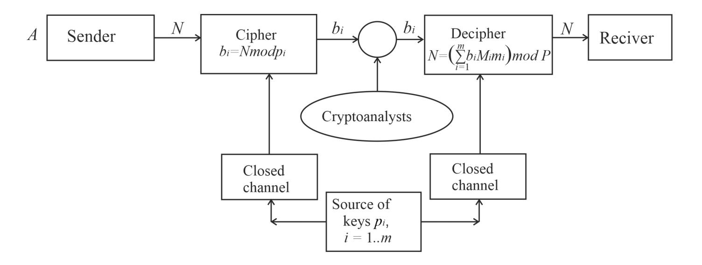
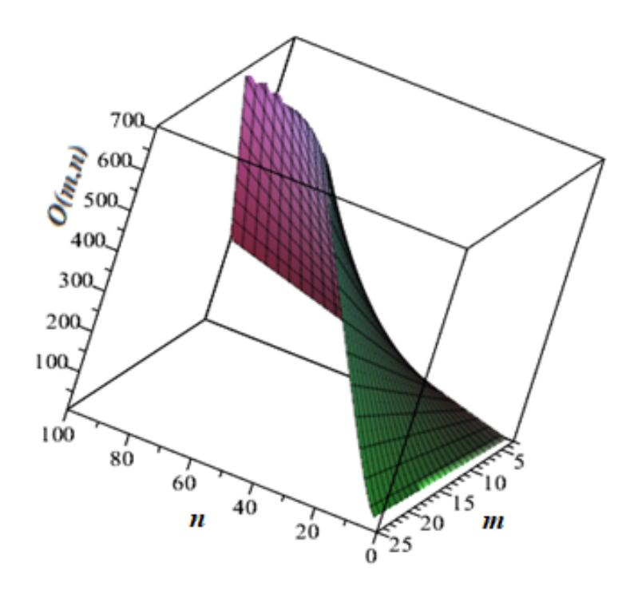
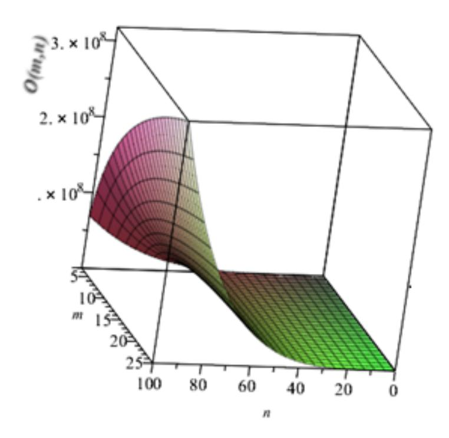
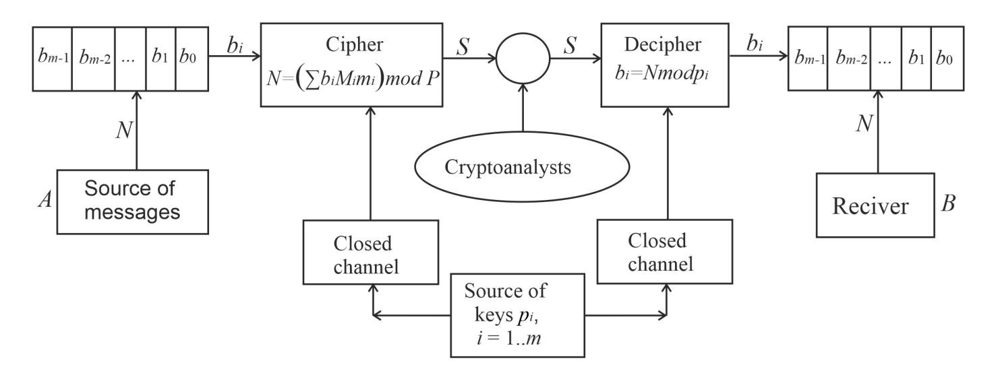

{0}------------------------------------------------

## DEVELOPING SYMMETRIC ENCRYPTION METHODS BASED ON RESIDUE NUMBER SYSTEM AND INVESTIGATING THEIR CRYPTOSECURITY

Mykhailo Kasianchuk1[0000−0002−4469−8055], Mikolaj Karpinski2[0000−0002−8846−332X] , Roman Kochan2[0000−0003−1254−1982] , Volodymyr Karpinskyi3[0000−0002−9069−7264], Grzegorz Litawa4[0000−0002−3873−6959], Inna Shylinska1[0000−0002−0700−793X] , and Igor Yakymenko1[0000−0003−3446−1596]

- 1 Ternopil National Economic University, 11 Lvivska St, 46009 Ternopil, Ukraine {kasyanchuk,iyakymenko}@sukr.net, inna.shylinska2012@gmail.com 2 University of Bielsko-Biala, 2 Willowa St, 43-309 Bielsko-Biala, Poland {mkarpinski,rkochan}@ath.bielsko.pl
  - 3 Rolls-Royce plc, Watnall Road, Hucknall, NG15 6EU, United Kingdom vkarpinskyi@gmail.com
- 4 State University of Applied Sciences in Nowy Sacz, 1 Zamenhofa St, 33-300 Nowy Sacz, Poland

glitawa@pwsz-ns.edu.pl

Abstract. This paper proposes new symmetric cryptoalgorithms of Residue Number System and its Modified Perfect Form. According to the first method, ciphertext is regarded as a set of residues to the corresponding sets of modules (keys) and decryption or decimal number recovery from its residues takes place according to the Chinese remainder theorem. To simplify the calculations, it is proposed to use a Modified Perfect Form of Residue Number System, which leads to a decrease in the number of arithmetic operations (in particular, finding the inverse and multiplying by it) during the decryption process.

Another method of symmetric encryption based on the Chinese remainder theorem can be applied when fast decryption is required. In this algorithm, the plaintext block is divided into sub-blocks that are smaller than the corresponding module and serve as remainders on dividing some number, which is a ciphertext, by these modules. Plaintext recovery is based on finding the ciphertext remainders to the corresponding modules. Examples of cryptoalgorithms implementation and their encryption schemes are given.

Cryptosecurity of the proposed methods is estimated on the basis of the Prime number theorem and the Euler function. It is investigated which bitness and a number of modules are required for the developed symmetric security systems to ensure the same security level as the largest length key of the AES algorithm does. It is found that as the number of modules increases, their bitness decreases. Graphical dependencies of cryptoanalysis complexity on bitness and a number of modules are built. 

{1}------------------------------------------------

It is shown that with the increase of specified parameters, the cryptosecurity of the developed methods also increases.

Keywords: ciphertext · cryptoalgorithm · encryption

### 1 Introduction

The majority of modern scientific and technical problems that need to be solved are clearly related to processing and secure transmission of multi-digit numbers [1] [2]. Cryptoalgorithms are usually used in traditional information security technologies. However, the requirements for them are usually quite strict and, as a consequence, they are cumbersome to implement and costly in operation [3] [4]. In addition, in order to increase cryptoalgorithm security, it is necessary to increase the length of the keys and, accordingly, the value of the operands of mathematical transformations. This leads to a decrease in the performance of cryptoalgorithms. Therefore, there is a need to find appropriate methods which can be used to speed up arithmetic operations. The most promising way to perform faster arithmetic operations is to parallelize the computation process. This property is inherent in non-positional Residue Number System (RNS) [5] [6]. Although it has some disadvantages (difficulties in performing division, comparison, and detecting the overflow of a bit grid [7]), it can be successfully used for addition, subtraction, exponentiation and multiplication of multi-digit whole numbers that is important for asymmetric cryptography [8]. The advantages of the RNS include:

- 1. Possibility to perform operations on numbers that are smaller than the selected modules [9].
- 2. Parallelization of the computation that is the most promising way of increasing the performance of computing systems.
- 3. Pabsence of inter-digit carries.

Such features of RNS make it possible to significantly reduce power consumption of certain digital devices [10]. Besides the use in cryptography [11] [12], the advantages of RNS can be used to process digital signals [13] [14] and images [15] [16], in cloud computing [17] [18], Internet of Things [19], noise immunity coding [20] [21], etc. In addition, in [22] it was proposed to use RNS to improve the performance of a convolutional neural network.

The main disadvantage of RNS, which slowed down its development, is the difficulty in converting numbers from RNS into decimal or binary system [23]]. It should be noted that the vast majority of papers [24] [25] deal with modules represented by the Mersenne and Fermat numbers and powers of 2. Known approaches to decimal number recovery are based on the Chinese remainder theorem (CRT) or Garner's algorithm which involves finding a modular inverse and multiplying by it that can lead to bit grid overflow [26]. It is possible to avoid these disadvantages using Perfect Form [27] and Modified Perfect Form (MPF) of RNS [28] [29].

{2}------------------------------------------------

In addition, a promising way in development of cryptography is the development of encryption methods of RNS, in particular of its MPF. For example, in [30] a hierarchical approach to the implementation of asymmetric cryptosystems and CRT in asymmetric cryptography was proposed. Modern methods of using RNS parallelism for key generation in asymmetric cryptosystems were introduced in [11]. Thus, the development of new encryption methods of RNS and the study of their resistance to cryptoanalysis is currently an extremely important task.

# 2 Theoretical basic aspects of RNS and rules for text encoding

It is known [5] [6] that any decimal number N in the RNS is represented by integral remainder  $b_i$  (*i*-module number) on dividing N by each of natural pairwise relatively prime modules pi in the system:

$$b_i = N mod p_i \tag{1}$$

Conversion of number N from RNS to decimal number system using CRT takes place in the vast majority of cases:

$$N = \left(\sum_{i=1}^{m} b_i M_i m_i\right) modP \tag{2}$$

where  $P = \prod_{i=1}^{m} p_i$ ,  $M_i = \frac{P}{p_i}$ ,  $m_i$  is found according to the expression  $m_i = M_i^{-1} mod p_i = 1$ , m - a number of modules. In this case, the inequality N < P must be satisfied.

It is possible to simplify the recovery of the decimal number from its residues using MPF of RNS, in which the modules are selected in such a way that  $m_i = \pm 1$  [28] [29]. In [27] [31], an expression was obtained to find a set of MPF of RNS modules by solving the systems of congruences:

$$\sum_{i=1}^{m} \frac{1}{p_i} = \gamma \pm \frac{1}{\prod_{i=1}^{m} p_i},\tag{3}$$

where  $\gamma = 0, \pm 1, \pm 2, \pm 3, ...$ 

To simplify the task, let  $\gamma = 0$ , which corresponds to the largest range of calculations for a given number of modules. Thus, equation (3) is as follows:

$$\frac{1}{p_1} + \frac{1}{p_2} + \frac{1}{p_3} + \dots + \frac{1}{p_{m-1}} + \frac{1}{p_m} = \frac{1}{p_1 p_2 p_3 \dots p_{m-1} p_m}.$$
 (4)

It should be noted that positive values of modules  $p_i$  correspond to the condition  $m_i = 1$  and negative values correspond to the condition  $m_i = -1$ . Let the

{3}------------------------------------------------

last two modules pm−1 and pm be unknown. Then (4) will be represented as a diophantine equation of the second degree:

$$p_{m-1}p_m (p_2p_3...p_{m-2} + p_1p_3...p_{m-2} + p_1p_2...p_{m-3}) + + p_1p_2...p_{m-2} (p_{m-1} + p_{m-2}) = \pm 1$$
 (5)

Let us introduce the notation:

$$p_{m-1,m} = \frac{a, b - p_1 p_2 \dots p_{m-1}}{p_2 p_3 \dots p_{m-2} + p_1 p_3 \dots p_{m-2} + p_1 p_2 \dots p_{m-3}}.$$
 (6)

After substituting (6) in (5) and the corresponding mathematical transformations, we obtain the expression for the integer solution (5):

$$\pm (p_2 p_3 ... p_{m-2} + p_1 p_3 ... p_{m-2} + p_1 p_2 ... p_{m-3}) + (p_1 p_2 ... p_{m-2})^2 = ab.$$
 (7)

This means that the left-hand side of (7) must be factored, on the basis of which the parameters a and b are defined. Although there are some difficulties in factorization [32], but in most cases the left-hand side (7) is decomposed into relatively small factors. In addition, the modules pm and pm−1 must be integers. Therefore, it follows from (6):

$$(a, b - p_1 p_2 ... p_{m-2}) mod(|p_2 p_3 ... p_{m-2} + p_1 p_3 + ... + p_{m-2} + ... + p_1 p_2 ... p_{m-3}|) = 0.$$
(8)

Expressions (7) and (8) determine the conditions for finding any number of modules of the MPF of RNS, two of which are unknown. Such features of RNS and CRT make them useful for constructing symmetric cryptosystems. First of all, it is necessary to determine the rules for conversion of textual information into numeric one. For example, this might be the classic variant when the letter corresponds to a number that is its ordinal number in the alphabet (in addition, it may be the ordering of letters by the frequency with which they occur in rather long texts, the use of keywords like Trisemus cipher tables, arbitrary numbering of letters, etc.). Let the following correspondence between letters and numbers as shown in Table 1 be matched to the English alphabet, not including uppercase and lowercase characters.

Table 1. Correspondence between letters and numbers of the English alphabet

| Letter                                        | a | b | c | d | e | f | g | h | i | j   | k | l | m |
|-----------------------------------------------|---|---|---|---|---|---|---|---|---|-----|---|---|---|
| Number 00 01 02 03 04 05 06 07 08 09 10 11 12 |   |   |   |   |   |   |   |   |   |     |   |   |   |
| Letter                                        | n | o | p | q | r | s | t | u | v | w x |   | y | z |
| Number 13 14 15 16 17 18 19 20 21 22 23 24 25 |   |   |   |   |   |   |   |   |   |     |   |   |   |

{4}------------------------------------------------

### 3 Symmetric encryption based on finding residues

#### 3.1 Cryptosystem based on conventional integer RNS

In symmetric cryptosystem, both subscribers must be aware of the key modules p1. The open message is broken down into N blocks, for each of them the condition N < P must be satisfied. If the first digit of the plaintext block is 0, then the appropriate agreement between the subscribers will be required. However, it is advisable for the plaintext block to contain a whole number of letters. A ciphertext is a set of residues bi obtained due to formula (1). Decoding or decimal number recovery from its residues is performed according to expression (2). Figure 1) presents a general scheme of encryption due to the proposed method based on the RNS. The following designations are introduced: A – sender, B – receiver, N – plaintext; bi – cryptogram. Keys pi , i = 1..m are transmitted aforehand through a closed channel (the channel is considered to be reliable).

Fig. 1. The scheme of proposed encryption algorithm based on the RNS.

For, example, let the number of modules be m = 4, p1 = 47, p2 = 53, p3 = 67, p4 = 73.Then, correspondingly, p = 12183481. Let the word keys be a plaintext, which, according to Table 1, corresponds to the number 10042418. The results of encryption and pre-calculations of decryption using a conventional integer RNS are shown in Table 2.

Therefore, the sequence 22315627, which is ciphertext, is received as a result of encryption. Having intercepted this message, it is very difficult for an intruder without the keys (modules) to recover a plaintext, which is a superposition of several parameters. To simplify the calculations while deciphering, formula (2) is written in such a way to make it possible to find the remainder on dividing each summand byP(2):

$$N = \left(\sum_{i=1}^{m} \left( \left( b_i M_i m_i \right) mod P \right) \right) mod P. \tag{9}$$

{5}------------------------------------------------

Table 2. The results of encryption and pre-calculations of decryption using a conventional integer RNS

| i       | 1  | 2                           | 3  | 4  |
|---------|----|-----------------------------|----|----|
| pi      | 47 | 53                          | 67 | 73 |
| bi      | 22 | 31                          | 56 | 27 |
| Mi      |    | 259223 229877 181843 166897 |    |    |
| Mimodpi | 18 | 16                          | 5  | 19 |
| mi      | 34 | 10                          | 27 | 50 |

Then N = ((259223 · 34 · 22)mod12183481 + (229877 · 10 · 31)mod12183481 + +(181843·27·56)mod12183481+ (166897·50·27)mod12183481)mod12183481 = = (11146589+ 10344465+ 6910034+ 6008292)mod12183481 = 10042418. As it is seen, numerical value of the plaintext and the results of the decryption coincide.

#### 3.2 Building the system of modules for MPF of RNS

To compare, let us consider the MPF of RNS, which also consists of four modules. Conditions (6) - (8) are transformed as follows:

$$p_{3,4} = \frac{a, b - p_1 p_2}{p_1 + p_2}; \pm (p_1 + p_2) + (p_1 p_2)^2 = ab; (a, b - p_1 p_2) \mod (p_1 + p_2) = 0.$$
(10)

It can be seen from (4) that for m = 4 the values p1 and p2 must have different signs. Considering the module p1 positive, the largest number of options will be provided when p2 = −(p1 + 1), since in this case the third condition (10) is always satisfied. The first two will be as the following:

$$p_{3,4} = -(a, b + p_1^2 + p_1); \pm 1 + (p_1(p_1 + 1))^2 = ab;$$
 (11)

Let 
$$p_1 = 49$$
, then  $p_2 = -50$  and from (11)  $p_{3,4} = -(a, b + 2450)$  and  $ab = \pm 1 + 6002500 = \begin{cases} 6002499 = 3 \cdot 19 \cdot 31 \cdot 43 \cdot 79 \\ 6002501 = 2381 \cdot 2521 \end{cases}$  are received.

All possible values of modules p3, p4 when p1 = 49, p2 = −50 are shown in Table 3.

{6}------------------------------------------------

**Table 3.** All possible values of modules  $p_3$ ,  $p_4$  when  $p_1 = 49$ ,  $p_2 = -50$ 

| $N^{\underline{o}}$ | ab                                                                    | a     | b          | $p_3$ | $p_4$    |
|---------------------|-----------------------------------------------------------------------|-------|------------|-------|----------|
| 1                   |                                                                       | 1     | 6319314379 | -2451 | -6004949 |
| 2                   |                                                                       | -1    | -319314379 | -2449 | 6000049  |
| 3                   |                                                                       | 3     | 19314379   | -2453 | -2003283 |
| 4                   |                                                                       | -3    | -19314379  | -2447 | 1998383  |
| 5                   |                                                                       | 19    | 3314379    | -2469 | -318371  |
| 6                   |                                                                       | -19   | -3314379   | -2431 | 313471   |
| 7                   |                                                                       | 31    | 3194379    | -2481 | -196079  |
| 8                   |                                                                       | -31   | -3194379   | -2419 | 191179   |
| 9                   |                                                                       | 43    | 3193179    | -2493 | -142043  |
| 10                  |                                                                       | -43   | -139593    | -2407 | 137143   |
| 11                  |                                                                       | 319   | 314379     | -2507 | -107757  |
| 12                  |                                                                       | -57   | -105307    | -2393 | 102857   |
| 13                  |                                                                       | 79    | 3193143    | -2529 | -78431   |
| 14                  |                                                                       | -79   | -75981     | -2371 | 73531    |
| 15                  |                                                                       | 331   | 194379     | -2543 | -66993   |
| 16                  | $\begin{vmatrix} 3 \cdot 19 \cdot 31 \cdot 43 \cdot 79 \end{vmatrix}$ | -93   | -64543     | -2357 | 62093    |
| 17                  | 9.19.31.40.79                                                         | 343   | 193179     | -2579 | -48981   |
| 18                  |                                                                       | -129  | -46531     | -2321 | 44081    |
| 19                  |                                                                       | 379   | 193143     | -2687 | -27777   |
| 20                  |                                                                       | -237  | -25327     | -2213 | 22877    |
| 21                  |                                                                       | 1931  | 34379      | -3039 | -12641   |
| 22                  |                                                                       | -589  | -10191     | -1861 | 7741     |
| 23                  |                                                                       | 1943  | 33179      | -3267 | -9797    |
| 24                  |                                                                       | -817  | -7347      | -1633 | 4897     |
| 25                  |                                                                       | 3143  | 31979      | -3783 | -6953    |
| 26                  |                                                                       | -1333 | -4503      | -1117 | 2053     |
| 27                  |                                                                       | 1979  | 33143      | -3951 | -6449    |
| 28                  |                                                                       | -1501 | -3999      | -949  | 1549     |
| 29                  |                                                                       | 31931 | 4379       | -4217 | -5847    |
| 30                  |                                                                       | -1767 | -3397      | -683  | 947      |
| 31                  |                                                                       | 3179  | 31943      | -4899 | -4901    |
| 32                  |                                                                       | -2449 | -2451      | -1    | 1        |
| 33                  |                                                                       | 1     | 23812521   | -2451 | -6004951 |
| 34                  | $\begin{vmatrix} 2381 \cdot 2521 \end{vmatrix}$                       | -1    | -6002501   | -2449 | 6000051  |
| 35                  | 2581 · 2521                                                           | 2381  | 2521       | -4831 | -4971    |
| 36                  |                                                                       | -2381 | -2521      | -69   | 71       |

{7}------------------------------------------------

#### 3.3 Encoding on the basis of MPF of RNS

It is advisable to choose p3 = −69, p4=71 among all options presented in Table 3 since these values are the least different from the first two selected modules. Additional studies show that for each module you need to change its sign to the opposite. It should be noted that the absolute value of each module is used in calculations, and its sign is taken into account by the parameter mi = ±1. Calculation range P = 12002550. As a plaintext the word keys is selected, which corresponds to the number 10042418. The results of encryption according to the expression (1) and pre-calculations of decryption (similar to this given in Table 2) using MPF of RNS are shown in Table 4.

Table 4. The results of encryption and pre-calculations of decryption using MPF of RNS

| i       | 1                   | 2  | 3                    | 4                 |
|---------|---------------------|----|----------------------|-------------------|
| pi      | 49                  | 50 | 69                   | 71                |
| bi      | 15                  | 18 | 20                   | 36                |
| Mi      | 244950              |    | 240051 173950 169050 |                   |
| Mimodpi | 48                  | 6  | 1                    | 70                |
| mi      | 48mod49 = −1mod49 1 |    | 1                    | 70mod71 = −1mod71 |

As a result of encryption, the ciphertext is as follows15182036. Due to the variability of mi which can become ±1, and the fact that bi < pi , it is advisable to perform the decimal number recovery using MPF of RNS according to formula (2): N = (−244950 · 1 · 15 + 240051 · 1 · 18 + 173950 · 1 · 20 − 169050 · 1 · 36)mod12002550 = (−3674250 + 4320918 + 3479000 − 6085800)mod12002550 = (−1960132)mod12002550 = 10042418. It can be seen that the use of MPF of RNS leads to a decrease in the number of arithmetic operations (in particular, finding the inverse and multiplying by it (2) [33], simplifying the procedure of finding the remainder modulo P [34]) performed on operands having a lower bitness than the conventional integer form of the RNS has. This leads to an increase in the decryption process. It is advisable to use the presented encryption algorithm during information exchange when you need to quickly encrypt messages and it may take longer to decrypt.

## 4 Evaluation of cryptosecurity of the proposed encryption algorithm.

To provide the required level of protection of information flows, it is necessary to evaluate the cryptosecurity of the proposed encryption method by examining the main vulnerabilities and possible options of cryptoanalysis from the point of view of the intruder.

Since the values of modules are the keys, it is necessary to consider all the possible

{8}------------------------------------------------

variants of their sets while planning mathematical attack. These modules should be pairwise relatively primes to satisfy the condition:

$$GCD(p_i, p_j) = 1, i = 1..., m; j = 1, ..., m; i \neq j.$$
 (12)

Since, it is necessary to apply the CRT to each set of modules to receive the plaintext then the time costs of cryptoanalysis (and, accordingly, the algorithm cryptosecurity) will be estimated by the total number of all possible sets  $p_i$  multiplied by the time complexity of the CRT. However, it should be noted that the theoretical cryptosecurity of this algorithm can be estimated only approximately.

## 4.1 Cryptosecurity estimation based on the law of asymptotic distribution of prime numbers

Let the modules be prime numbers. According to the asymptotic distribution of prime numbers, their amount in the range from 0 to a certain q is approximately determined by the formula  $\pi(q) = \frac{q}{\ln q}$  Suppose that for n-bit number  $q = 2^n$ . Then  $\pi(q) = \frac{2^n}{n \ln 2} \approx \frac{2^{n+1}}{n}$ . Since n can be considered rather large, then the approximate number of options for choosing a system between m modules is  $\left(\frac{2^{n+1}}{n}\right)^m$ . The time complexity of CRT is also approximately  $n^2$  [35], so the total time complexity of cryptoanalysis of the proposed cryptoalgorithm is  $o\left(\left(\frac{2^{n+1}}{n}\right)^m n^2\right)$ .

**Fig. 2.** Dependence of cryptoanalysis complexity on the bitness of n and the number of m modules.

Figure 2 shows the dependence of cryptoanalysis complexity on a logarithmic scale on the bitness of n and the number of m modules. It is seen that with

{9}------------------------------------------------

increasing of these parameters the complexity of cryptoanalysis also increases. According to [36] [37], for cryptoanalysis of a modern symmetric AES cipher with n-bit key,  $2_{n-1}$  bit operations (the maximum key of the AES algorithm is 256 bits) are required. According to equality  $\left(\frac{2^{n+1}}{n}\right)^m n^2 = 2^{255}$ , one can find the bitness and the number of RNS modules that provide the same security as the key of the longest AES algorithm (Table 5).

**Table 5.** Bitness and number of RNS modules that provide the same security as the key of the longest AES

| Number of modules | 3  | 4  | 5  | 6  | 7  | 8  | 9  | 10 | 11 | 12 | 13 | 14 | 15 |
|-------------------|----|----|----|----|----|----|----|----|----|----|----|----|----|
| Bitness           | 87 | 66 | 54 | 46 | 40 | 35 | 32 | 29 | 27 | 25 | 23 | 21 | 20 |

The Table above shows that with increasing the number of modules their bitness decreases.

#### 4.2 Cryptosecurity evaluation based on the Euler function

The number of relatively prime numbers with a given number is calculated using the Euler function  $\varphi(p_i)$ . Moreover, the maximum value  $\varphi_{max}(p_i)$  is obtained when  $p_{imax}^{(n)}$  is the maximum prime number of a given n bitness, since  $\varphi_{max}\left(p_{imax}^{(n)}\right) = p_{imax}^{(n)} - 1$ . For example, for 8-bit numbers  $p_{imax}^{(8)} = 251$ ,  $\varphi_{max}\left(p_{imax}^{(n)}\right) = 250$ .

We receive the minimum value of the Euler function  $\varphi_{min}(p_i)$  when  $p_i$  is decomposed into the product of consecutive primes of singular degree:  $p_i = \prod_{l=1}^k p_l$ , where k - is the number of multipliers,  $p_i = 2, 3, 5, \ldots$  - consecutive primes. For 8-bit numbers  $p_i^{(8)}$  the minimum value  $\varphi_{min}\left(p_{imax}^{(n)}\right)$  will be when  $p_i^{(8)} = 2\cdot 3\cdot 5\cdot 7 = 210$ , and  $p_{imin}^{(8)} = \varphi\left(2\right)\cdot\varphi\left(3\right)\cdot\varphi\left(5\right)\cdot\varphi\left(7\right) = 1\cdot 2\cdot 4\cdot 6 = 48$  respectively. Since all possible sets of pairwise relatively prime numbers is related to the Euler function, then with the maximum fixed prime  $p_1$ , a number of possible options will be  $\varphi\left(p_1\right)$  for  $p_2$ ,  $\varphi\left(p_2\right)$  for  $p_3$ ,...,  $\varphi\left(p_{m-1}\right)$  for  $p_m$  respectively. Without reducing generalization, we consider  $p_1 > p_2 > \ldots > p_{m-1} > p_m$  and only one of the modules can be folded. Then, the total number of all sets of modules will be estimated according to the following formula:

$$K = \prod_{i=1}^{m=1} \varphi(p_i). \tag{13}$$

This method allows you to evaluate when K values are maximum, minimum and in the middle of this range. It should be noted that the maximum value of K provides the highest cryptosecurity of the encryption algorithm, and, accordingly, the minimum value of K provides the smallest cryptosecurity.

{10}------------------------------------------------

Table 6. Evaluating the maximum cryptosecurity of 4 modules with n=32, 64 and 128 bits.

| N | o n, bit | pi                                               | Cryptosecurity |
|---|----------|--------------------------------------------------|----------------|
|   |          |                                                  | evaluation     |
|   |          | p1 = 4294967291,                              |                |
| 1 | 32       | p2 = 4294967279,                              | 1, 6 · 1032    |
|   |          | p3 = 4294967231,                              |                |
|   |          | p4 = 4294967197                               |                |
|   |          | p1 = 18446744073709551557,                    |                |
| 2 | 64       | p2 = 18446744073709551533,                    | 5, 1 · 1061    |
|   |          | p3 = 18446744073709551521,                    |                |
|   |          | p4 = 18446744073709551437                     |                |
|   |          | p1 = 340282366920938463463374607431768211297, |                |
| 3 | 128      | p2 = 340282366920938463463374607431768211283, | 1, 3 · 10120   |
|   |          | p3 = 340282366920938463463374607431768211223, |                |
|   |          | p4 = 340282366920938463463374607431768211219  |                |

Fig. 3. Cryptoanalysis security dependence on n bitness and the number of m modules.

{11}------------------------------------------------

The total decryption time based on mathematical attack will be calculated according to the ratio O m · n 2 · Qm=1 i−1 ϕ (pi) taking into account the time complexity of the CRT. Similar to the previous case, an increase in cryptosecurity can be achieved by increasing the number of modules (keys), their bitness, and selecting the modules for which the value ϕ (pi) is the maximum.

Table 6 shows an example of finding the maximum cryptosecurity of 4 modules with n = 32, 64 and 128 bits according to the proposed method.

Since in the assessment of cryptosecurity, n -bit numbers are the values of the Euler function, then the complexity of finding the amount of key variants is calculated according to the ratio O log2 (m − 1) · n 2 . As a result, the overall cryptosecurity assessment is as follows: O log2 (m − 1) · n 4 , whose dependence on the bitness and the number of modules is presented in Figure 3.

It is seen that with the increase of these parameters, the algorithm cryptosecurity sharply increases.

### 5 Symmetric encryption based on the CRT

When fast decryption is required, it is advisable to use another symmetric cryptoalgorithm. However, using it all the RNS modules must exceed the maximum numeric value of the plaintext letter. Figure 4 presents the general encryption scheme due to the proposed method. The plaintext block is subdivided into sub-

Fig. 4. General symmetric encryption scheme based on the CRT.

blocks that are smaller than the corresponding module and are the remainders on dividing of some number, which is a ciphertext, by these modules. The ciphertext is obtained according to the expression (9).

Pre-calculations of encryption using conventional integer RNS (p1 = 47, p2 = 53, p3 = 67, p4 = 73, P = 12183481) and plaintext keys (10042418) are shown in Table 7.

Ciphertext N = ((259223 · 34 · 10)mod12183481 + (229877 · 10 · 4)mod12183481 + (181843 · 27 · 24)mod12183481 + (166897 · 50 · 18)mod12183481)mod12183481 =

{12}------------------------------------------------

2 3 4 47 53 6773  $p_i$ 24 18  $b_i$ 10 04 $M_i$ 259223 | 229877 | 181843 | 166897  $M_i mod p_i$ 16 18 5 19 10 27 mi34 50

Table 7. Pre-calculations of encryption using conventional integer RNS

(2851453 + 9195080 + 8182935 + 4005528) mod 12183481 = 12051515.

Correspondingly, the process of decryption is to find the residues  $12051515modp_i$ : 12051515mod47 = 10, 12051515mod53 = 04, 12051515mod67 = 24,

12051515mod73 = 18. After concatenation, the numeric value of the plaintext will be 10042418, which corresponds to the word keys.

It should be noted that cryptosecurity of this method will be less than that of the previous one, since the complexity of finding residues  $O(n \cdot \log_2 n)$  [34] is less than in multiplication  $-O(n^2)$ .

When using MPF of RNS, pre-calculations are obtained given in Table 8.

23 4 50 69 71 49  $p_i$ 10  $b_i$ 0424 18  $M_i$ |244950|240051|173950|169050  $M_i mod p_i$ 70 |48|6 1 70 mod 71 = -1 mod 71mi48mod49 = -1mod49 | 11

**Table 8.** Pre-calculations of encryption using MPF of RNS

Encryption results by formula (2):  $N = (-244950 \cdot 1 \cdot 10 + 240051 \cdot 14 + 173950 \cdot 1 \cdot 24 - 169050 \cdot 1 \cdot 18) mod 12002550 = (-2449500 + 960204 + 4174800 - 3042900) mod 12002550 = (-357396) mod 12002550 = 11645154.$ 

Residues must be found for decryption  $11645154modp_i$ : 11645154mod49 = 10, 11645154mod50 = 04, 11645154mod69 = 24, 11645154mod71 = 18. Therefore, the numeric value of the plaintext is 10042418, which corresponds to the word keys.

Similarly to the previous case, the selections of modules that satisfy the conditions of MPF of RNS greatly simplify the process of decimal number recovery from its residuals.

## 6 Conclusions.

Symmetric cryptoalgorithms are developed on the basis of conventional integer RNS and its Modified Perfect Form. Due to the first algorithm, ciphertext acts as a set of residues to the corresponding modules (keys), and decryption or decimal number recovery from its residues takes place according to the CRT. Due

{13}------------------------------------------------

to the second method, the plaintext block is subdivided into sub-blocks that are smaller than the corresponding modules and serve as residues on dividing some number, which is ciphertext, by these modules. The plaintext recovery is based on finding ciphertext residues to corresponding modules. The evaluation of cryptosecurity of the proposed methods is carried out on the basis of the theorem for the asymptotic distribution of prime numbers and the Euler function. Bitness and number of RNS modules, required for the developed symmetric security systems to ensure the same security level as the largest length key of the modern symmetric AES algorithm provides are investigated. It is found that as the number of modules increases, their bitness decreases. The time complexity of the mathematical attack was evaluated and the dependence of cryptosecurity of the proposed methods on bitness of modules and their number was investigated. The analysis of the conducted research showed that with the increase of the specified parameters the complexity of cryptoanalysis also increases.

### References

- 1. Hoffstein. J., Pipher. J., Silverman. J.: An Introduction to Mathematical Cryptography. Springer Science+Business Media, New York, (2008)
- 2. Jeffrey, H., Jill, P., Joseph, H.: An Introduction to Mathematical Cryptography. Springer, Berlin, (2008).
- 3. Yakymenko, I. Z., Kasianchuk, M. M., Ivasiev, S. V., Melnyk, A. M., Nykolaichuk, Ya. M.: Realization of RSA cryptographic algorithm based on vector-module method of modular exponention. In: Modern Problems of Radio Engineering, Telecommunications and Computer Science, pp. 550-554. TCSET–2018, L'viv–Slavske (2018).
- 4. Kasianchuk, M., Yakymenko I., Pazdriy I., Melnyk A., Ivasiev S.: Rabin's modified method of encryption using various forms of system of residual classes. In: the Experience of Designing and Application of CAD Systems in Microelectronics (CADSM-2017), pp. 222-224. Proceedings of the XIV International Conference, Polyana-Svalyava (2017).
- 5. Omondi, A., Premkumar, B.: Residue number systems: theory and implementation. Imperial College Press, London (2007).
- 6. Ananda Mohan P. V.: Residue Number Systems: Theory and Applications. Birkh¨auser, Basel (2016).
- 7. Krasnobayev, V. A., Yanko, A. S., Koshman, S. A.: Method for arithmetic comparison of data represented in a residue number system. Cybernetics and Systems Analysis 52(1), 145–150 (2016).
- 8. Fadulilahi, I. R., Bankas, E. K., Ansuura, J. B. A. K.: Efficient Algorithm for RNS Implementation of RSA. International Journal of Computer Applications 127(5), 14-19 (2015).
- 9. Tomczak, T.: Hierarchical residue number systems with small moduli and simple converters. International Journal of Applied Mathematics and Computer Science 21(1), 173–192 (2011).
- 10. Akkal, M.; Siy, P.: A new mixed radix conversion algorithm MRC-II. J. Syst. Archit (53), 577–586 (2007).
- 11. Sousa, L., Antao, S., Martins, P.: Combining residue arithmetic to design efficient cryptographic circuits and systems. IEEE Circuits Syst. Mag., 6–32 (2016).

{14}------------------------------------------------

- 12. Esmaeildoust, M., Schinianakis, D., Javashi, H., Stouraitis, T., Navi, K.: Efficient RNS implementation of elliptic curve point multiplication GF(p). IEEE Trans. Very Large Scale Integr. (VLSI) Syst., 21, 1545–1549 (2013).
- 13. Chang, C., Molahosseini, A. S., Zarandi, A. A. E., Tay, T. F.: Residue number systems: A new paradigm to datapath optimization for low-power and highperformance digital signal processing applications. IEEE Circuits Syst. Mag., 15, 26–44 (2015).
- 14. Kaplun, D., Butusov, D., Ostrovskii, V., Veligosha, A., Gulvanskii V.: Optimization of the FIR filter structure in finite residue field algebra. Electronics, 7, 372 (2018).
- 15. Chervyakov, N. I., Lyakhov, P. A., Babenko, M. G.: Digital filtering of images in a residue number system using finite-field wavelets. Autom. Control Comput. Sci., 48, 180–189 (2014).
- 16. Andrijchuk, V. A., Kuritnyk, I. P., Kasyanchuk, M. M., Karpinski, M. P.: Modern Algorithms and Methods of the Person Biometric Identification. In: Intelligent Data Acquisition and Advanced Computing Systems: Technology and Applications (IDAACS–2005): Proceedings of the Third IEEE Workshop, pp. 403–406. Sofia, Bulgaria (2005).
- 17. Hema, V., Ganaga Durga, M.: Data Integrity Checking Based On Residue Number System and Chinese Remainder Theorem In Cloud. International Journal of Innovative Research in Science, Engineering and Technology 3(3), 2584-2588 (2014).
- 18. Kar, A., Sur, K., Godara, S., Basak, S., Mukherjee, D., Sukla, A. S., Das, R., Choudhury, R.: Security in cloud storage: An enhanced technique of data storage in cloud using RNS. In Proceedings of the IEEE 7th Annual Ubiquitous Computing, Electronics & Mobile Communication Conference (UEMCON), pp. 1–4. New York, USA (2016).
- 19. Chang, C., Lee, W., Liu, Y., Goi, B., Phan, R. C.-W.: Signature gateway: Offloading signature generation to IoT gateway accelerated by GPU. IEEE Internet Things J., 6, 4448–4461 (2019).
- 20. Hu, Z., Yatskiv, V., Sachenko, A.: Increasing the Data Transmission Robustness in WSN Using the Modified Error Correction Codes on Residue Number System. Elektronika ir Elektrotechnika 21(1), 76-81 (2015).
- 21. Roshanzadeh, M., Saqaeeyan, S.: Error Detection & Correction in Wireless Sensor Networks By Using Residue Number Systems. International Journal of Computer Network and Information Security, 2, 29-35 (2012).
- 22. Chervyakov, N. I., Lyakhov, P. A., Valueva, M. V.: Increasing of convolutional neural network performance using residue number system. In Proceedings of the 2017 IEEE International Multi-Conference on Engineering, Computer and Information Sciences (SIBICON), pp. 135–140. New York, NY, USA (2017).
- 23. Sharoun, A. O.: Residue number system. Poznan University of Technology Academic Journals. Electrical Engineering, 76, 265-270 (2013).
- 24. Patronik, P., Piestrak, S. J.: Design of Reverse Converters for General RNS Moduli Sets 2k , 2 n−1 , 2 n+1 , 2 n−1 − 1. IEEE Transactions on Circuits and Systems 10(1), 143-148 (2014).
- 25. 25. Patronik, P., Piestrak, S. J.: Design of Reverse Converters for a New Flexible RNS Five-Moduli Set 2k , 2 n−1 , 2 n+1 , 2 n+1−1, 2 n−1−1. Circuits Syst Signal Process, 36, 4593–4614 (2017).
- 26. Milanezi Junior, J., da Costa, J. P. C. L., R¨omer, F., Miranda R. K., Marinho, M. A. M., Del Galdo, G.: M-estimator based Chinese remainder theorem with few remainders using a kroenecker product based mapping vector. Digit. Signal Process, 87, 60–74 (2019).

{15}------------------------------------------------

- 27. Kasianchuk, M., Yakymenko, I., Pazdriy, I., Zastavnyy O.: Algorithms of findings of perfect shape modules of remaining classes system. In: the Experience of Designing and Application of CAD Systems in Microelectronics (CADSM-2015): Proceedings of the XIII International Conference, pp. 168-171. Polyana-Svalyava (2015).
- 28. Nykolaychuk, Ya. M., Kasianchuk, M. M., Yakymenko, I. Z.: Theoretical Foundations of the Modified Perfect form of Residue Number System. Cybernetics and Systems Analysis 52(2), 219-223 (2016).
- 29. Kasianchuk, M. N., Nykolaychuk, Ya. N., Yakymenko, I. Z. Theory and Methods of Constructing of Modules System of the Perfect Modified Form of the System of Residual Classes. Journal of Automation and Information Sciences 48(8), 56-63 (2016).
- 30. Djath, L., Bigou, K., Tisserand, A.: Hierarchical Approach in RNS Base Extension for Asymmetric Cryptography. In: IEEE 26th Symposium on Computer Arithmetic (ARITH-2019), pp. 46-53. Kyoto, Japan (2019).
- 31. Iakymenko, I., Kasianchuk, M., Kinakh, I., Karpinski, M. Construction of distributed thermal or piezoelectric sensor based on residue systems. Przeglad Elektrotechniczny, 1, 290-294 (2017).
- 32. Karpi´nski, M., Ivasiev, S., Yakymenko, I., Kasianchuk, M., Gancarczyk, T.: Advanced method of factorization of multi-bit numbers based on Fermat's theorem in the system of residual classes. In: Proceedings of the International Conference on Control, Automation and Systems (ICCAS–2016), vol. 1, pp. 1484–1486. Gyeongju, Korea (2016).
- 33. Rajba, T., Klos-Witkowska, A., Ivasiev, S., Yakymenko, I., Kasianchuk, M.: Research of Time Characteristics of Search Methods of Inverse Element by the Module. In: Intelligent Data Acquisition and Advanced Computing Systems: Technology and Applications (IDAACS–2017): Proceedings of the 2017 IEEE 9th International Conference, vol. 1, pp. 82–85. Bucharest, Romania (2017).
- 34. Ivasiev, S., Yakymenko, I., Kasianchuk, M., Shevchuk, R., Karpinski, M., Gomotiuk, O.: Effective algorithms for finding the remainder of multi-digit numbers. In: Advanced Computer Information Technology (ACIT–2019): Proceedings of the International Conference, pp. 175-178. Ceske Budejovice, Czech Republic (2019).
- 35. Karpinski, M., Rajba, S., Zawislak, S., Warwas, K., Kasianchuk, M., Ivasiev, S., Yakymenko, I.: A Method for Decimal Number Recovery from its Residues Based on the Addition of the Product Modules. In: Intelligent Data Acquisition and Advanced Computing Systems: Technology and Applications (IDAACS–2019): Proceedings of the 10th International Conference, vol. 1, pp. 13–17 (2019).
- 36. Bogdanov, A., Khovratovich, D., Rechberger, C.: Biclique cryptanalysis of the full AES. ASIACRYPT-2011, LNCS, vol. 7073, pp. 344–371 (2011).
- 37. Tiessen, T.: Polytopic cryptanalysis. In: Advances in Cryptology (EUROCRYPT-2016): Proceedings of the 35th International Conference, LNCS, vol. 9665, pp. 214–239. Springer, N. Y. (2016).