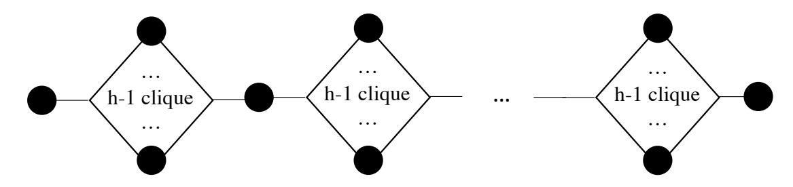

{0}------------------------------------------------

# Expected Constant Round Byzantine Broadcast under Dishonest Majority <sup>∗</sup>

Jun Wan † Hanshen Xiao ‡ Elaine Shi § Srinivas Devadas¶ October 19, 2020

#### Abstract

Byzantine Broadcast (BB) is a central question in distributed systems, and an important challenge is to understand its round complexity. Under the honest majority setting, it is long known that there exist randomized protocols that can achieve BB in expected constant rounds, regardless of the number of nodes n. However, whether we can match the expected constant round complexity in the corrupt majority setting — or more precisely, when f ≥ n/2 + ω(1) — remains unknown, where f denotes the number of corrupt nodes.

In this paper, we are the first to resolve this long-standing question. We show how to achieve BB in expected O((n/(n−f))<sup>2</sup> ) rounds. Our results hold under a weakly adaptive adversary who cannot perform "after-the-fact removal" of messages already sent by a node before it becomes corrupt. We also assume trusted setup and the Decision Linear (DLIN) assumption in bilinear groups.

<sup>∗</sup> IACR 2020. This article is submitted by the authors to the IACR and to Springer-Verlag on Oct. 1st, 2020. The version published by Springer-Verlag is available at () (DOI will be inserted soon)."

<sup>†</sup> junwan@mit.edu, Massachusetts Institute of Technology

<sup>‡</sup> hsxiao@mit.edu, Massachusetts Institute of Technology

<sup>§</sup> runting@gmail.com, CMU/Cornell

<sup>¶</sup> devadas@mit.edu, Massachusetts Institute of Technology

{1}------------------------------------------------

## 1 Introduction

Byzantine Agreement (BA) is one of the most fundamental problems in fault tolerant distributed computing [1, 2, 3] and of increasing interest given recent advances in cryptocurrencies [4, 5, 6]. In this paper, we consider the "broadcast" formulation of Byzantine Agreement, henceforth also called Byzantine Broadcast (BB): imagine that there are n nodes among which there is a designated sender. The sender is given an input bit  $b \in \{0,1\}$  and wants to send this bit to every other node. Although up to f < n-1 nodes can be corrupted and deviate arbitrarily from the prescribed protocol, we would like to nonetheless ensure two key properties: 1) *consistency* requires that all honest nodes must output the same bit (even when the sender is corrupt); and 2) *validity* requires that all honest nodes output the sender's input bit if the sender is honest 1.

An important question to understand is the *round complexity* of Byzantine Broadcast. Dolev and Strong [7] showed that assuming (idealized) digital signatures, there is a deterministic protocol achieving f+1 rounds; and moreover, f+1 rounds is the best one can hope for in any *deterministic* protocol. It is also widely understood that *randomization* can help overcome the (f+1)-round barrier in the honest majority setting. Specifically, many elegant works have shown expected constant-round protocols assuming honest majority [8, 9, 10, 11].

For a long while, the community was perplexed about the following natural question: can we achieve sublinear-round Byzantine Broadcast under dishonest majority? The ingenious work by Garay et al. [12] was the first to demonstrate a positive result although their construction achieves sublinear round complexity only under a narrow parameter regime: specifically, they constructed an expected  $\Theta((f-n/2)^2)$ -round protocol, and the subsequent work of Fitzi and Nielsen [13] improved it to  $\Theta(f-n/2)$  rounds. In other words, these constructions achieve sublinear number of rounds only if  $f \leq n/2 + o(n)$ . This is somewhat unsatisfying since even for f = 0.51n, their results would be inapplicable.

Very recently, the frontier of our understanding was again pushed forward due to Chan, Pass, and Shi [14]. Assuming trusted setup and standard cryptographic assumptions, their protocol achieves Byzantine Broadcast with probability  $1-\delta$  for any  $f\leq (1-\epsilon)\cdot n$  in  $\operatorname{poly}\log(1/\epsilon,1/\delta)$  rounds (both in expectation and worst-case), where  $\epsilon,\delta\in(0,1)$  are two parameters that the protocol takes as input. Although their work represents exciting progress on a long stagnant front, it fails to match the asymptotic (expected) round complexity of known honest majority protocols — for honest majority, it is long known how to achieve *expected constant* round complexity [8, 11]. We thus ask the following question: can we achieve Byzantine Broadcast in *expected constant* rounds in the corrupt majority setting?

#### 1.1 Our Contributions

We present a Byzantine Broadcast protocol that achieves expected  $O((\frac{n}{n-f})^2)$  rounds. This means that for  $f=(1-\epsilon)n$  where  $\epsilon\in(0,1)$  may be an arbitrarily small constant, our protocol achieves expected constant rounds. Our protocol works even under an adaptive adversary, assuming a trusted setup and standard cryptographic assumptions in an algebraic structure called bilinear groups. In this paper, we assume that when the adaptive adversary corrupts a node v in some round r, it cannot

<sup>&</sup>lt;sup>1</sup>An alternative formulation is the "agreement" version where every node receives an input bit b, and validity requires that if all honest nodes receive the same input bit b, then honest nodes must output b. However, this agreement notion is known to be impossible under corrupt majority.

{2}------------------------------------------------

erase the message v has already sent in round r but it can make the now-corrupt v inject additional messages into round r — such a model is also referred to as weakly adaptive in earlier works.

To the best of our knowledge, our work is the first to achieve an expected constant-round BB protocol for any  $f \ge n/2 + \omega(1)$ . Previously, no result was known even for the *static* corruption setting, and even under any setup assumptions. We compare our results with the state-of-art results in Table 1 and summarize our results in Theorem 1.1.

|                            | Garay et al.[12]                              | Fitzi et al.[13]                            | Chan et al.[14]                                      | This paper                                                     |
|----------------------------|-----------------------------------------------|---------------------------------------------|------------------------------------------------------|----------------------------------------------------------------|
| Expected round             | $\Theta((2f-n)^2)$                            | $\Theta(2f-n)$                              | Same as worst-case                                   | $\Theta((\frac{n}{n-f})^2)$                                    |
| complexity                 |                                               |                                             | Same as Worst case                                   |                                                                |
| Worst-case round           |                                               |                                             |                                                      |                                                                |
| complexity with $1-\delta$ | $\Theta(\log(\frac{1}{\delta}) + (2f - n)^2)$ | $\Theta(\log(\frac{1}{\delta}) + (2f - n))$ | $\Theta(\log(\frac{1}{\delta}) \cdot \frac{n}{n-f})$ | $\Theta(\frac{\log(1/\delta)}{\log(n/f)} \cdot \frac{n}{n-f})$ |
| failure probability        |                                               |                                             |                                                      |                                                                |

Table 1: A comparison between our results and previous work under dishonest majority.

**Theorem 1.1** (Expected constant round BB under adaptive corruption). Assume trusted setup and that the decisional linear assumption holds in suitable bilinear groups<sup>2</sup> Then, there exists a BB protocol with expected  $O((\frac{n}{n-f})^2)$  round complexity for any non-uniform p.p.t. adversary that can adaptively corrupt f < n-1 nodes.

Throughout the paper, we assume a *synchronous* network, i.e., honest nodes can deliver messages to each other within a single round. This assumption is necessary since without it, Byzantine Broadcast is long known to be impossible under more than n/3 corruptions [16].

#### 1.2 Interpreting Our Result

Below we situate our result in context to help the reader understand how tight the bound is as well as the assumptions we make.

On the tightness of the bound and the resilience parameter. Theorem 1.1 says that if the number of honest nodes is an arbitrarily small constant fraction (e.g., 0.01%), we can achieve expected constant rounds. The restriction on the number of honest nodes is necessary in light of an elegant lower bound proven by Garay et al. [12]: they showed that even randomized protocols cannot achieve BB in less than  $\Theta(n/(n-f))$  number of rounds, even assuming static corruption and allowing reasonable setup assumptions. Note that their lower bound says that when almost all nodes can be corrupt except O(1) nodes who remain honest, then even randomized protocols must incur linear number of rounds. Comparing their lower bound and our upper bound side by side, one can see that for the (narrow) regime n-f=o(n), there is still an asymptotical gap between our upper bound and their lower bound. Whether we can construct an upper bound that matches their lower bound in this regime remains open, even under static corruptions and allowing any reasonable setup assumptions.

On the weakly adaptive model. Our result holds in the weakly adaptive model [17, 18, 19]. In this model, the adversary can adaptively corrupt a node; and if some node u becomes newly corrupt

<sup>&</sup>lt;sup>2</sup>We formally define the decisional linear assumption in the online full version. The reader can also refer to Groth et al. [15] for the definition.

{3}------------------------------------------------

in round r, the adversary can inject new messages on behalf of u in the same round r; however, the adversary cannot erase the messages u already sent in round r prior to becoming corrupt. The weakly adaptive model is akin to the atomic message model first introduced by Garay et al. [20] as a way to overcome a lower bound pertaining to a particular adaptive, simulation-based notion of security proven by Hirt and Zikas [21]. The only slight difference is that in the atomic message model, not only is the adversary unable to perform "after-the-fact" message removal, it also must wait for one network delay after a node i becomes corrupt, before it is able to inject messages on behalf of i. In this sense, the weakly adaptive model is a slightly weaker model than the atomic model by Garay et al. (and this makes our upper bound slightly stronger).

In comparison, the classical consensus literature often considered a *strongly adaptive* model [7, 12, 9] — this was also the widely accepted model in the early distributed systems and multi-party protocols literature (see also Definition 1 in Feldman's thesis [22] and Figure 4, page 176 of Canetti's excellent work [23]). In the strongly adaptive model, the adversary is allowed to perform "after-thefact" message removal, i.e., if the adversary adaptively corrupts a node u in round r, it can erase all messages u had sent in round r prior to becoming corrupt. Thus, a strongly adaptive adversary has strictly more power than a weakly adaptive one. The weakly adaptive model was inspired by the line of work on blockchains and sublinear-communication, large-scale consensus protocols. Many famous protocols including Nakamoto's consensus [24, 25], and other subsequent blockchain protocols [26, 27, 28, 29, 30, 19] were proven secure in the weakly adaptive model, and it is widely known that their security fails to hold in the strongly adaptive model. The recent work by Abraham et al. [19] showed that this is not a coincidence — in the strongly adaptive model, no consensus protocol can achieve sublinear communication overhead!

We adopt the weakly adaptive model inspired by the blockchain line of work. The techniques in this paper do not easily extend to the strongly adaptive model; there is an attack that breaks our protocol under the strongly adaptive model.

It remains an open question whether in the strongly adaptive model, expected constant round BB is possible under even 51% corruption. In fact, in the strongly adaptive model under 51% corruption, even sublinear-round protocols were not known. In a companion work [31], we show that assuming trusted setup, the existence of time-lock puzzles and other reasonable cryptographic assumptions, one can construct BB with polylogarithmic round complexity in the strongly adaptive model. It is interesting to note that the techniques used in that work [31] depart completely from the ones in this paper. In light of our companion paper [31], it remains open 1) whether any sublinear-round BB is possible under 51% strongly adaptive corruption, without time lock puzzles; and 2) whether expected constant round BB is possible under 51% strongly adaptive corruption and any reasonable assumptions. New upper- or lower-bounds in these directions would be exciting.

On the necessity of trusted setup. We assume a trusted setup to get our weakly adaptive BB. Due to the famous lower bound by Lamport et al. [32], some setup assumption is necessary to get consensus under at least n/3 (even static) corruptions. We do not understand if our trusted setup can be weakened, and we leave it as another exciting open question. We stress, however, that *expected constant-round BB under 51% corruption is an open question whose answer has eluded the community for more than three decades, under any assumption, allowing any (reasonable) setup, and even under static corruption.* We therefore believe that despite our trusted setup and weakly adaptive restrictions, our result is an important step forward in this line of work.

{4}------------------------------------------------

## 2 Technical Overview

## 2.1 Preliminaries

Problem Definition. The problem of Byzantine Broadcast has been widely explored. Suppose there are n *nodes* (sometimes also called *parties*) in a distributed system, indexed from 1 to n, respectively. The communication within the system is modeled by a synchronous network, where a message sent by an honest node in some round r is guaranteed to be delivered to an honest recipient at the beginning of the next round r+ 1. Among the n nodes in the system, there is a designated sender whose identity is common knowledge. Before the protocol begins, the sender receives an input bit b. All nodes then engage in interactions where the sender aims to send the bit b to everyone. At the end of the protocol, each node u outputs a bit bu. Henceforth, we assume that the protocol is parameterized with a security parameter λ. We say that a protocol achieves Byzantine Broadcast if it satisfies the following guarantees except with negligibly small in λ probability.

- *Consistency*: for any two honest nodes u and v, b<sup>u</sup> = bv.
- *Validity*: if the designated sender is honest, for any honest node u, b<sup>u</sup> = b.

Although our main definition is for agreeing on a single bit, our approach easily extends to multivalued BB too.

Adversary Model. At any point of time during the protocol's execution a node can either be *honest* or *corrupt*. Honest nodes correctly follow the protocol, while corrupt nodes are controlled by an adversary and can deviate from the prescribed protocol arbitrarily. We allow the adversary to be *rushing*, i.e., it can observe the messages honest nodes want to send in round r before deciding what messages corrupt nodes send in the same round r.

We consider an adaptive adversary in our paper. In any round r, it can adaptively corrupt honest nodes after observing the messages they want to send in round r, as long as the total number of corrupted nodes does not exceed an upper bound f. If a node v ∈ [n] becomes newly corrupt in round r, the adversary can make it inject new messages of its choice in the present round r; however, the adversary cannot perform "after-the-fact removal", i.e., erase the messages v sent in round r before it became corrupt.

Modeling Setup. We will allow setup assumptions as well as standard cryptography. Our protocol makes use of a public-key infrastructure and digital signatures, and for simplicity in this paper we assume that the signature scheme is *ideal*. We adopt a standard idealized signature model, i.e., imagine that there is a trusted functionality that keeps track of all messages nodes have signed and answers verification queries by looking up this trusted table. Under such an idealized signature model, no signature forgery is possible. When we replace the ideal signature with a real-world instantiation that satisfies the standard notion of "unforgeability under chosen-message attack", all of our theorems and lemmas will follow accounting for an additive, negligibly small failure probability due to the failure of the signature scheme — this approach has been commonly adopted in prior works too and is well-known to be cryptographically sound (even against adaptive adversaries).

For other cryptographic primitives we adopt, e.g., verifiable random functions, we do not assume idealized primitives since the computationally sound reasoning for these primitives is known to have subtleties.

{5}------------------------------------------------

#### 2.2 Technical Roadmap

Byzantine Broadcast under dishonest majority is challenging even under static corruption because the standard random committee election technique fails to work. More concretely, in the honest majority setting and assuming static corruption, a well-known random committee election technique can allow us to compile any polynomial-round BB to a poly-logarithmic round BB protocol. However, as already pointed out by Chan et al. [14], this technique is inapplicable to the corrupt majority setting even under a static adversary. <sup>3</sup> Similarly, we also know of no way to extend the recent techniques of Chan et al. [14] to obtain our result. Instead, we devise novel techniques that redesign the consensus protocol from the ground up.

Trust graph maintenance (Section 3). First, we devise a new method for nodes to maintain a *trust graph* over time. While previous work [33, 34] also used consistency graph in multiparty protocols and secret sharing, our trust graph is of a different nature from prior work. We are the first to tie the round complexity of distributed consensus with the diameter of a trust graph, and upper bound the diameter.

The vertices in the trust graph represent nodes in the BB protocol; and an edge between u and v indicates that u and v mutually trust each other. Initially, every node's trust graph is the complete graph; however, during the protocol, if some nodes misbehave, they may get removed completely or get disconnected from other nodes in honest nodes' trust graphs. On the other hand, honest nodes will forever remain direct neighbors to each other in their respective trust graphs.

There are a few challenges we need to cope with in designing the trust graph mechanism. First, if a node v misbehaves in a way that leaves a cryptographic evidence implicating itself (e.g., doublesigning equivocating votes), then honest nodes can distribute this evidence and remove v from their trust graphs. Sometimes, however, v may misbehave in a way that does not leave cryptographic evidence: for example, v can fail to send a message it is supposed to send to u, and in this case u cannot produce an evidence to implicate v. In our trust graph mechanism, we allow u to complain about v without providing an evidence, and a receiver of this complaint can be convinced that at least one node among u and v is corrupt (but it may not be able to tell which one is corrupt). In any case, the receiver of this complaint may remove the edge (u, v) from its trust graph. We do not allow a node u to express distrust about an edge (v, w) that does not involve itself — in this way a corrupt node cannot cause honest nodes to get disconnected in their trust graphs.

A second challenge we are faced with is that honest nodes may not have agreement for their respective trust graphs at any point of time — in fact, reaching agreement on their trust graphs may be as hard as the BB problem we are trying to solve in the first place. However, if honest nodes always share their knowledge to others, we can devise a mechanism that satisfies the following *monotonicity* condition: any honest node's trust graph in round t > r is a subgraph of any honest node's trust graph in round r. In our protocol we will have to work with this slightly imperfect condition rather than complete agreement.

Finally, although an honest node is convinced that besides their direct neighbors in its own trust graph, no one else can be honest, it still must wait to hear what nodes multiple hops away say during the protocol. This is because their direct neighbors may still trust their own neighbors, and the neighbors' neighbors may care about their own neighbors, etc. For information to flow from a node v that is r hops away from u in u's trust graph may take up to r rounds, and this explains why the diameter

<sup>3</sup>As Chan et al. [14] point out, the random committee election approach fails to work for corrupt majority (even for static corruption), because members outside the committee cannot rely on a majority voting mechanism to learn the outcome.

{6}------------------------------------------------

of the trust graph is critical to the round complexity of our protocol. We will devise algorithms for ensuring that honest nodes' trust graphs have *small diameter*. To maintain small diameter, we devise a mechanism for nodes to post-process their trust graphs: for example, although a node u may not have direct evidence against v, if many nodes complain about v, u can be indirectly convinced that v is indeed corrupt and remove v.

The TrustCast building block (Section 4). A common technique in the consensus literature is to bootstrap full consensus from weaker primitives, often called "reliable broadcast" or "gradecast" depending on the concrete definitions [8, 9, 35]. Typically, these weaker primitives aim to achieve consistency whether the sender is honest or not; but they may not achieve liveness if the sender is corrupt [8, 9, 35]. Based on a weaker primitive such as "reliable broadcast" or "gradecast", existing works would additionally rely on random leader election to bootstrap full consensus. Roughly speaking, every epoch a random leader is chosen, and if the leader is honest, liveness will ensue. Additionally, relying on the consistency property of this weaker primitive, with enough care we can devise mechanisms for ensuring consistency within the same epoch and across epochs — in other words, honest nodes must make the same decision no matter whether they make decisions in the same epoch or different epochs.

In our work we devise a TrustCast building block which is also a weakening of full consensus and we would like to bootstrap consensus from this weaker primitive. Our definition of TrustCast, however, is tied to the trust graph and departs significantly from prior works. Specifically, TrustCast allows a sender s ∈ [n] to send a message to everyone: *if* s *wants to continue to remain in an honest node* u*'s trust graph,* u *must receive some valid message from* s *at the end of the protocol*, although different honest nodes may receive inconsistent messages from s if s is corrupt. At a high level, the sender s has three choices:

- 1. it can either send the same valid message to all honest nodes;
- 2. (\**technical challenge*) or it can fail to send a valid message to some honest node, say u, in this case u will remove s from its trust graph immediately and in the next round all honest nodes will remove s from their trust graphs;
- 3. or u can send equivocating messages to different honest nodes, but in the next round honest nodes will have compared notes and discovered the equivocation, and thus they remove s from their trust graphs.

The first case will directly lead to progress in our protocol. In the second and third cases, s will be removed from honest nodes' trust graphs; we also make progress in the sense that s can no longer hamper liveness in the future.

An important technical challenge for designing the TrustCast protocol lies in the second case above: in this case, u may not have a cryptographic evidence to implicate s and thus u cannot directly convince others to remove s. However, in this case, it turns out that u can be convinced that some of its direct neighbors must be corrupt, and it will instead convince others to remove the edge (u, v) for every direct neighbor v that it believes to be corrupt. Once these edges are removed, s will land in a "remote" part of the graph such that honest nodes can be convinced that it is corrupt and remove it altogether.

{7}------------------------------------------------

## 3 Trust Graph Maintenance

### 3.1 Overview of Trust Graph Maintenance and Invariants

At a very high level, the novelty of our approach lies in the way parties maintain and make use of an undirected *trust graph* over time. In a trust graph, the vertices correspond to all or a subset of the parties participating in the consensus protocol. An edge (u, v) in the trust graph intuitively means that the nodes u ∈ [n] and v ∈ [n] mutually trust each other. Since a node in the graph corresponds to a party in the system, to avoid switching between the words "node" and "party", we will just use the word "node".

Initially, every honest node's trust graph is the complete graph over the set [n], i.e., everyone mutually trusts everyone else. However, over the course of the protocol, a node may discover misbehavior of other nodes and remove nodes or edges from its own trust graph accordingly. We will assume that at any point of time, *an honest node* u*'s trust graph must be a single connected component containing* u — effectively u would always discard any node disconnected from itself from its own trust graph.

Notations. Throughout the paper, we will use G<sup>r</sup> u to denote the node u's updated trust graph in round r (after processing the graph-messages received in round r and updating the trust graph). Sometimes, if the round we refer to is clear, we may also write G<sup>u</sup> omitting the round r. We also use N(v, G) to denote the set of neighbors of v in the graph G. In cases where the graph G we refer to is clear, we just abbreviate it to N(v). For convenience, we always assume that a node is a neighbor of itself. Therefore, v ∈ N(v) always holds.

Finally, we follow the notations in Section 2.1 where n is the number of nodes in the system, f is the upper bound for the number of corrupt nodes and h = n − f is the lower bound for the number of honest nodes.

Important invariants of the trust graph. A very natural requirement is that corrupt nodes can never cause honest nodes to suspect each other; in fact, we want the following invariant:

Honest clique invariant: at any time, in any honest node's trust graph, all honest nodes form a clique. This implies that all honest nodes must forever remain direct neighbors to each other in their trust graphs.

The round complexity of our protocol is directly related to the diameter of honest nodes' trust graphs and thus we want to make sure that honest nodes' trust graphs have small diameter. To understand this more intuitively, we can consider an example in which three nodes, u, v, and s execute Byzantine Broadcast with s being the sender. All three nodes behave honestly except that s drops all messages to u. In this case, although u is convinced that s is corrupt and thus removes the edge (u, s) from its trust graph, it cannot prove s's misbehavior to v. Since v still has reasons to believe that s might be honest, v will seek to reach agreement with s. Now, if u tries to reach agreement with v, it has to care about what s says. But since s drops all messages to u, any information propagation from s to u must incur 2 rounds with v acting as the relay.

This example can generalize over multiple hops: although an honest node u ∈ [n] knows that except for its direct neighbors in its trust graph, everyone else must be corrupt; it must nonetheless wait for information to propagate from nodes multiple hops away in its trust graph. For a node w that is r hops away from u in u's trust graph, information from w may take r rounds to reach 

{8}------------------------------------------------

u. Summarizing, for our protocol to be round efficient, we would like to maintain the following invariant:

Small diameter invariant: at any point of time, every honest node u's trust graph must have small diameter.

Finally, we stress that a difficult challenge we are faced with, is the fact that honest nodes may never be in full agreement w.r.t. their trust graphsat any snapshot of time — in fact, attempting to make honest nodes agree on their trust graph could be as difficult as solving the Byzantine Broadcast problem itself. However, from a technical perspective, what will turn out to be very helpful to us, is the following monotonicity invariant:

Monotonicity invariant: an honest node u's trust graph in round t > r must be a subset of an honest node v's trust graph in round r. Here, we say that an undirected graph G = (V, E) is a subset of another undirected graph G<sup>0</sup> = (V 0 , E<sup>0</sup> ) iff V ⊆ V 0 and E ⊆ E<sup>0</sup> .

The above trust graph monotonicity invariant can be maintained because of the following intuition: whatever messages an honest node v ∈ [n] sees in round r, v can relay them such that all other honest nodes must have seen them by round r + 1 — in this way the honest node u would perform the same edge/node removal in round r + 1 as what v performed in round r.

## 3.2 Conventions and Common Assumptions

Throughout our paper, we assume that message echoing among honest nodes is implicit (and our protocol will not repeatedly state the echoing):

Implicit echoing assumption: All honest nodes echo every fresh message they have heard from the network, i.e., as soon as an honest node u receives a message m at the beginning of some round r, if this message is well-formed and has not been received before, u relays it to everyone.

Each node has a *consensus module* (see Sections 4 and 5) and a *trust graph module* which will be described in this section. Messages generated by the trust graph module and the consensus module will have different formats. Henceforth, we may call messages generated by the trust graph module *graph messages*; and we may call all other messages *consensus messages*.

Below, we state some assumptions about the modules and their interfaces. We assume that all messages generated by the consensus module are of the following format:

Message format of the consensus module: All protocol messages generated by the consensus module are of the form (T, e, payload) along with a signature from the sender, where T is a string that denotes the type of the message, e ∈ N denotes the epoch number (the meaning of this will be clear later in Section 5), and payload is a string denoting an arbitrary payload. Each type of message may additionally require its payload to satisfy some wellformedness requirements.

For example, (vote, e, b) and (comm, e, E) represent vote messages and commit messages, respectively in our Byzantine Broadcast protocol (see Section 5), where vote and comm denote the type of the message, e denotes the epoch number, and the remainder of the message is some payload.

In our consensus module, nodes can misbehave in different ways, and some types of misbehaviors can generate cryptographic evidence to implicate the offending node. We define equivocation evidence below.

{9}------------------------------------------------

Equivocation evidence. In our consensus module, honest nodes are not supposed to double-sign two different messages with the same type and epoch number — if any node does so, it is said to have equivocated. Any node that has equivocated must be malicious. The collection of two messages signed by the same node u ∈ [n], with the same type and epoch but different payloads, is called an *equivocation evidence* for u.

### 3.3 Warmup: Inefficient Trust Graph Maintenance Mechanism

As a warmup, we first describe an inefficient mechanism for nodes to maintain a trust graph over time such that the aforementioned three invariants are respected. In this warmup mechanism, nodes would need an exponential amount of computation for updating their trust graphs. However, inspired by this inefficient warmup scheme, we can later construct a better approach that achieves polynomial time (see Section 3.4).

Note that if the trust graph always remains the complete graph, obviously it would satisfy the aforementioned three invariants. However, keep in mind that the goal for trust graph maintenance is to make sure that corrupt nodes do not hamper liveness. In our protocol, once a node starts to misbehave in certain ways, each honest node would remove them from its trust graph such that they would no longer care about reaching agreement with them.

In our warmup scheme, every node maintains its trust graph in the following manner:

#### Warmup: an inefficient trust graph maintenance mechanism

- *Node removal upon equivocation evidence.* First, upon receiving an equivocation evidence implicating some node v ∈ [n], a node removes v from its trust graph as well as all v's incident edges. After the removal, call the post-processing mechanism described below to update the trust graph.
- *Pairwise distrust messages and edge removal.* Sometimes, the consensus module of node u can observe that a direct neighbor v in its trust graph has not followed the honest protocol (e.g., u is expecting some message from v but v did not send it); however, u may not have a cryptographic evidence to prove v's misbehavior to others. In this case, u's consensus module calls the Distrust(v) operation
  - When u's trust graph module receives a Distrust(v) call, it signs and echoes a distrust message (distrust, (u, v)).
  - When a node w ∈ [n] receives a message of the form (distrust,(u, v)) signed by u (w and u might be the same user), w removes the edge (u, v) from its own trust graph*<sup>a</sup>* and calls the post-processing procedure.
- *Post-processing for maintaining* O(n/h) *diameter.* The diameter of the trust graph can grow as nodes and edges are being removed. To maintain the property that honest nodes' trust graphs have small diameter, each node performs the following post-processing every time it removes a node or an edge from its trust graph (recall that h denotes the number of honest nodes):
  - Repeat: find in its trust graph a node or an edge that is not contained in a clique of size h (henceforth, such a clique is called an h-clique), and remove this node or edge;

{10}------------------------------------------------

Until no such node or edge exists.

- u then removes any node that is disconnected from u in u's trust graph

Note that the post-processing may be inefficient since it is NP-hard to decide whether there exists an h-clique in a graph.

**Remark 1.** Note that a (distrust, (u, v)) message is only valid if it is signed by u, i.e., the first node in the pair of nodes — this makes sure that corrupt nodes cannot misuse distrust messages to cause an edge between two honest nodes to be removed (in any honest node's trust graph).

Suppose that an honest node never declares Distrust on another honest node — note that this is a condition that our protocol must respect and it will be proved in Theorem 4.2 of Section 4. It is not too hard to check that the monotonicity invariant is maintained due to the implicit echoing assumption. We can also check that honest nodes indeed form a clique in all honest nodes' trust graphs. However, proving that all honest nodes' trust graphs have O(n/h) diameter is more technical: it relies on the following graph theoretical observation:

**Claim 3.1** (Small diameter of h-clique graphs). Any h-clique graph must have diameter at most  $d = \lceil n/h \rceil + \lfloor n/h \rfloor - 1$  where an h-clique graph is one such that every node or edge is contained within an h-clique.

*Proof.* We will prove by contradiction. Assume an h-clique-graph G=(V,E) has diameter d'>d. This means that there exists a path  $u_0,u_1,\cdots,u_{d'}$  on G which is the shortest path between two nodes  $u_0$  and  $u_{d'}$ . By definition, there exists an h-clique  $C_i$  containing both  $u_i$  and  $u_{i+1}$  for any  $0 \le i \le d'-1$ . Further, any  $C_i$  and  $C_j$  must be disjoint if  $i-j \ge 2$ . Otherwise, there would exist a path between  $u_j$  and  $u_{i+1}$  of length 2, contradicting our assumption that the path is the shortest path. We now discuss different scenarios based on whether n is perfectly divided by h.

• If  $n \mod h \neq 0$ , suppose  $n = k \cdot h + l$  where k is the quotient of n divided by h and  $l \in (0, h)$  is the remainder. By definition,  $d = \lceil n/h \rceil + \lfloor n/h \rfloor - 1 = 2k$  is even and d' > 2k. Thus,

$$\begin{vmatrix} C_0 \cup C_1 \cup \cdots \cup C_{d'-1} \end{vmatrix} \ge \begin{vmatrix} C_0 \cup C_2 \cup \cdots \cup C_{2k} \end{vmatrix} = \begin{vmatrix} C_0 \end{vmatrix} + \begin{vmatrix} C_2 \end{vmatrix} + \cdots + \begin{vmatrix} C_{2k} \end{vmatrix} \\
\ge h \cdot (k+1) > k \cdot h + l = n.$$
(1)

The equation in the first line holds because  $C_0, C_2, \dots, C_{2k}$  are disjoint. We reach a contradiction here since we only have n nodes.

• If n is perfectly divided by h, i.e.,  $n=k\cdot h$  for some integer k, then d=2k-1 is an odd number. We then have  $d'\geq 2k$  and,

$$\left| C_0 \cup C_1 \cup \dots \cup C_{d'-2} \right| \ge \left| C_0 \cup C_2 \cup \dots \cup C_{2k-2} \right| = \left| C_0 \right| + \left| C_2 \right| + \dots + \left| C_{2k-2} \right| \ge h \cdot k = n.$$
 (2)

This means that  $C_0 \cup C_1 \cup \cdots \cup C_{d'-2}$  already covers all nodes in the graph. So the diameter of the graph should be d'-1, contradicting our assumption that the diameter is d'.

This concludes our proof that the diameter of any h-clique-graph is upper-bounded by  $d = \lceil n/h \rceil + \lfloor n/h \rfloor - 1$ .

<sup>&</sup>lt;sup>a</sup>Since each node will receive its own messages at the beginning of the next round, when a node u calls  $\mathsf{Distrust}(v)$ , the edge (u,v) will be removed from its own trust graph at the beginning of the next round.

{11}------------------------------------------------

This upper bound is tight and can be reached when the graph is a multi-layer graph (see Figure 1), where the layer sizes alternate between 1 and h-1. In Figure 1, a node is connected with all other nodes in its own layer and the two neighboring layers. Formally, let us denote  $S_i$  as the set of nodes in the  $i^{th}$  layer  $(0 \le i \le d)$ . The graph G = (V, E) satisfies

$$|S_i| = \begin{cases} 1 & \text{if } i \text{ is even} \\ h-1 & \text{if } i \text{ is odd} \end{cases}, \quad V = \bigcup_{i=0}^d S_i, \quad E = \Big(\bigcup_{i=0}^d (S_i \times S_i)\Big) \cup \Big(\bigcup_{i=1}^d (S_{i-1} \times S_i)\Big).$$



Figure 1: A multi-layer graph with the layer size alternating between 1 and h-1. Each layer is completely connected within itself.

We state the following theorem about the warmup scheme.

**Theorem 3.2** (Inefficient trust graph mechanism). Suppose that an honest node never declares Distrust on another honest node (which is proven to be true in Section 4). Then, the above trust graph maintenance mechanism satisfies the honest clique invariant, the monotonicity invariant, and moreover, at any point of time, any honest node's trust graph has diameter at most  $d = \lceil n/h \rceil + \lfloor n/h \rfloor - 1$ .

*Proof.* To see the honest clique invariant, first observe that no honest node will ever see an equivocation evidence implicating an honest node assuming that the signature scheme is ideal. Therefore, an honest node can never remove another honest node from its trust graph due to having observed an equivocation evidence. Furthermore, since an honest node never declares Distrust on another honest node, no honest node will ever remove an edge between two honest nodes in its trust graph.

The monotonicity invariant follows from the implicit echoing of honest nodes and the fact that if (1)  $G_u$  is a subset of  $G_v$  and (2) an edge e is not in any h-clique in  $G_v$ , then e is also not in any h-clique in  $G_u$ . We can prove the monotonicity invariant using induction. In the base case where the round number r=0, the trust graph is a complete graph. Thus, for any two honest nodes u and v,  $G_v^1 \subseteq G_u^0$  always holds. We will show that for any round number r,  $G_v^{r+1} \subseteq G_u^r$  implies  $G_v^{r+2} \subseteq G_u^{r+1}$ . Suppose in round r, u receives distrust messages and equivocation proofs on edges  $e_1, \cdots, e_m$ . u's trust graph in round r+1 would then be

$$G_u^{r+1} \leftarrow \text{for } i = 1 \text{ to } m, \text{ (apply (remove } e_i) \text{ and post-processing on } G_u^r \text{)}.$$

The post-processing removes any edge not in any h-clique. Therefore, this is equivalent to

$$G_u^{r+1} \leftarrow \text{ apply post-processing on } G_u^r/\{e_1, \cdots, e_m\}.^4$$

 $<sup>^{4}</sup>$ The reason we apply post processing after each edge removal is to guarantee that the diameter of the trust graph is upper bounded by d at any point of the protocol.

{12}------------------------------------------------

Since each honest node echoes all fresh messages it receives, v would receive the distrust messages and equivocation proofs on edges  $e_1, \dots, e_m$  in round r+1. Therefore,

$$G_v^{r+2} \subseteq \text{ apply post-processing on } G_v^{r+1}/\{e_1, \cdots, e_m\}.^5$$

If  $G_v^{r+1} \subseteq G_u^r$ , then  $G_v^{r+1}/\{e_1, \cdots, e_m\} \subseteq G_u^r/\{e_1, \cdots, e_m\}$ . Thus, if an edge is not in any h-clique in  $G_v^{r+1}/\{e_1, \cdots, e_m\}$ , it is also not in any h-clique in  $G_v^{r+1}/\{e_1, \cdots, e_m\}$ . This means that the post-processing does not change this subset relationship and  $G_v^{r+2} \subseteq G_u^{r+1}$  holds. This completes our induction proof on the monotonicity invariant.

Finally, to show the statement about the diameter, observe that the post-processing procedure ensures that the resulting trust graph is an h-clique graph. Now the statement follows due to Claim 3.1.

## 3.4 An Efficient Trust Graph Maintenance Mechanism

Although the warmup mechanism in Section 3.3 is inefficient, we can draw some inspiration from it and design an efficient polynomial-time algorithm. In our efficient mechanism, we will maintain every node's trust graph to have diameter at most d, rather than insisting on the more stringent requirement that the graph must be an h-clique graph.

Our idea is to modify the post-processing procedure in the earlier inefficient mechanism to the following efficient approach. Recall that we use N(v,G) to represent the set of v's neighbors in G. If the graph G we are referring to is clear, we just abbreviate it as N(v).

Post-processing for a user u: Iteratively find an edge (v,w) in the trust graph such that  $|N(v)\cap N(w)|< h$ , and remove the edge; until no such edge can be found. Afterwards, remove all nodes disconnected from u in u's trust graph.

We first show that the new post-processing does not remove edges between honest nodes. Upon termination, it also guarantees that the diameter of the trust graph is upper bounded by O(n/h).

**Lemma 3.3.** The post-processing (1) only removes edges not in any h-clique and (2) guarantees that the diameter of the trust graph is upper bounded by  $d = \lceil n/h \rceil + \lfloor n/h \rfloor - 1$ .

*Proof.* Let us consider post-processing on a node u's trust graph  $G_u$ . For each edge (v, w) removed during post-processing,  $|N(v, G_u) \cap N(w, G_u)| < h$  holds (we only discuss the graph  $G_u$  here, so we will abbreviate the neighbor sets as N(v) and N(w)). Any clique containing (v, w) can only contain nodes that are in  $N(v) \cap N(w)$ . So there does not exist an h-clique in  $G_u$  that contains (v, w).

We also need to prove that the diameter of the trust graph becomes no larger than d after the post processing. From this point, we will use  $G_u$  just to refer to the trust graph of u when the the post-processing terminates. Suppose on the contrary, the diameter of  $G_u$  is larger than d. The post processing guarantees that for any  $(v,w) \in G_u$ ,  $|N(v) \cap N(w)| \ge h$ . Since the diameter of  $G_u$  is larger than d, there must exist two nodes  $v,w \in G_u$  such that  $d(v,w,G_u)=d+1$ . We define the following notations:

• Suppose the shortest path between v and w is  $v_0, \dots, v_{d+1}$ , where  $v_0$  is node v and  $v_{d+1}$  is node w.

 $<sup>^{5}</sup>v$  might have received additional distrust messages or equivocation proofs.

{13}------------------------------------------------

• We use  $S_i$  to denote the set of nodes distance i away from v, i.e.,  $S_i = \{v' \mid d(v, v', G_u) = i\}$ .

By definition, for any  $i \neq j$ ,  $S_i$  and  $S_j$  should be disjoint. Further, any  $v_i$  should belong to the set  $S_i$ . Therefore, any  $N(v_i)$  should be a subset of  $S_{i-1} \cup S_i \cup S_{i+1}$ . Since  $|N(v_i) \cap N(v_{i+1})| \geq h$  holds for any  $0 \leq i \leq d$ , we have

$$h \le |N(v_i) \cap N(v_{i+1})| \le |(S_{i-1} \cup S_i \cup S_{i+1}) \cap (S_i \cup S_{i+1} \cup S_{i+2})| = |S_i \cup S_{i+1}| = |S_i| + |S_{i+1}|.$$

We construct a graph G' = (V', E') by connecting all nodes between any  $S_i$  and  $S_{i+1}$ , i.e.,

$$V' = \bigcup_{i=0}^{d+1} S_i, \ E' = \Big(\bigcup_{i=0}^{d+1} (S_i \times S_i)\Big) \cup \Big(\bigcup_{i=0}^{d} (S_i \times S_{i+1})\Big).$$

For every  $0 \le i \le d$ , the set  $S_i \cup S_{i+1}$  forms a clique in G'. And since  $|S_i| + |S_{i+1}| \ge h$  holds for any  $0 \le i \le d$ , G' is an h-clique graph. However, G' has diameter d+1. This violates Claim 3.1, which proves that the diameter of any h-clique graph is upper bounded by d. We reach a contradiction here. Therefore, after the post-processing terminates, the diameter of the trust graph is no larger than d. This completes our proof.

In the efficient trust graph maintenance mechanism, the monotonicity invariant is not as apparent. We need to show that if an honest node u removes an edge during post-processing, another honest node v would remove this edge as well in the next round. This can be achieved with the help of the following claim.

**Lemma 3.4.** If G is a subgraph of H and we use the post-processing algorithm on both G and H to get G' and H', then G' would still be a subgraph of H'.

*Proof.* Let us suppose that post-processing removes edges  $e_1 = (u_1, v_1), \dots, e_m = (u_m, v_m)$  from H in order and we denote  $H_i = H/\{e_1, \dots, e_i\}$ . By definition of the post-processing algorithm, it must be that for any  $1 \le i \le m$ ,

$$|N(u_i, H_{i-1}) \cap N(v_i, H_{i-1})| < h.$$

We will prove using induction that  $e_1, \dots, e_m$  would be removed from G when we run the post-processing algorithm on G. Firstly, since  $G \subseteq H$ , we have

$$|N(u_1,G) \cap N(v_1,G)| \le |N(u_1,H) \cap N(v_1,H)| < h.$$

Therefore, if  $e_1 \in G$ , it would be removed during post-processing. Let us suppose that post-processing has already removed  $e_1, \dots, e_i$  from G, and we denote the graph at this point as  $G_i$ . By our assumption,

$$G_i \subseteq G/\{e_1, \cdots, e_i\} \subseteq H/\{e_1, \cdots, e_i\} = H_i.$$

Since  $|N(u_{i+1}, H_i) \cap N(v_{i+1}, H_i)| < h$ , we have  $|N(u_{i+1}, G_i) \cap N(v_{i+1}, G_i)| < h$ . This implies that post-processing would remove  $e_{i+1}$  as well. This completes our induction proof.

Using Lemma 3.3 and Lemma 3.4, we can prove Theorem 3.5 as follows.

**Theorem 3.5** (Efficient trust graph mechanism). Suppose that an honest node never declares Distrust on another honest node (which is proven to be true in Section 4). Then, the efficient trust graph maintenance mechanism satisfies the honest clique invariant, the monotonicity invariant, and moreover, at any point of time, any honest node's trust graph has diameter at most  $d = \lceil n/h \rceil + \lfloor n/h \rfloor - 1$ .

{14}------------------------------------------------

*Proof.* The honest clique invariant is not affected by the changes to the post-processing. As argued in the proof of Theorem 3.2, it holds as long as an honest node never declares Distrust on another honest node. By Lemma 3.3, the diameter of the trust graph is at most d after calling the post-processing. Since we always call the post-processing algorithm whenever we remove an edge, the diameter of the trust graph is always upper bounded by d.

It remains to show that the monotonicity invariant holds in the efficient trust graph mechanism. The proof idea is the same as in the proof of Theorem 3.5. But we state it again for completeness. We will show by induction that for any honest user u,v and any round number  $r,G_v^{r+1}\subseteq G_u^r$ . In the base case where r=0,  $G_v^1\subseteq G_u^0$  always holds since  $G_u^0$  is a complete graph. We still need to show that for any round number  $r,G_v^{r+1}\subseteq G_u^r$  implies  $G_v^{r+2}\subseteq G_u^{r+1}$ .

Suppose that in round r, u has received distrust messages and equivocation proofs on edges  $e_1, \dots, e_m$ . u would then remove  $e_1, \dots, e_m$  from  $G_u^r$  and call the post-processing algorithm after each removal. The resultant trust graph would be  $G_u^{r+1}$ . It can be shown using Lemma 3.4 that this is equivalent to first removing  $e_1, \dots, e_m$  and then calling the post-processing algorithm only once. In other words,

$$G_u^{r+1}$$
 = apply post-processing on  $G_u^r/\{e_1, \cdots, e_m\}$ .

In round r+1, u would echo the distrust messages and equivocation proofs to v. v would remove the edge  $e_1, \dots, e_m$  from  $G_v^{r+1}$  and call the post-processing algorithm after each removal. Again, we have

$$G_v^{r+2} \subseteq \text{apply post-processing on } G_v^{r+1}/\{e_1, \cdots, e_m\}.$$

Since  $G_v^{r+1} \subseteq G_u^r$ ,  $G_u^r/\{e_1, \cdots, e_m\}$  should also be a subset of  $G_v^{r+1}/\{e_1, \cdots, e_m\}$ . So by Lemma 3.4,  $G_u^{r+1}$  should be a subgraph of  $G_v^{r+2}$ . This completes our induction proof. Therefore, the monotonicity invariant holds in the efficient trust graph mechanism.

Finally, observe that the trust graph module's communication (including implicit echoing of graph messages) is upper bounded by  $\widetilde{O}(n^4)$  (the  $\widetilde{O}$  hides the  $\log n$  terms needed to encode a node's identifier). This is because there are at most  $O(n^2)$  number of effective distrust messages and everyone will echo each such message seen to all nodes.

## 4 New Building Block: the TrustCast Protocol

Starting from this section, we will be describing the consensus module. In this section, we first describe an important building block called TrustCast which will play a critical role in our BB protocol. Before describing the consensus module, we first clarify the order in which the trust module and consensus module are invoked within a single round:

- 1. At the beginning of the round, a node u receives all incoming messages.
- 2. Next, u's trust graph module processes all the graph-messages and updates its local trust graph:
  - Process all the freshly seen Distrust messages and remove the corresponding edges from its trust graph.
  - Check for new equivocation evidence: if any equivocation evidence is seen implicating any  $v \in [n]$ , remove v and all edges incident to v from the node's own trust graph.

{15}------------------------------------------------

Recall also that every time an edge or node is removed from a node's trust graph, a postprocessing procedure is called to make sure that the trust graph still has O(n/h) diameter (see Section 3.4).

- 3. Now, u's consensus module processes the incoming consensus messages, and computes a set of messages denoted M to send in this round. The rules for computing the next messages M are specified by our Byzantine Broadcast protocol (Section 5) which calls the TrustCast protocol (this section) as a building block. The protocol is allowed to query the node's current trust graph (i.e., the state after the update in the previous step).
- 4. Finally, u sends M to everyone; additionally, for every fresh message first received in this round, u relays it to everyone (recall the "implicit echoing" assumption).

Henceforth, in our consensus module description, whenever we say "at the beginning of round r", we actually mean in round r after Step (2), i.e., after the trust graph module makes updates and yields control to the consensus module.

## 4.1 The TrustCast Protocol

Motivation and intuition. We introduce a TrustCast protocol that will be used as a building block in our Byzantine Broadcast protocol. In the TrustCast protocol, a sender s ∈ [n] has a message m and wants to share m with other parties. At the end of the TrustCast protocol, any honest node either *receives a message from* s *or removes* s *from its trust graph*. The TrustCast protocol does not guarantee consistency: if the sender is corrupt, different honest parties may output different messages from the sender. However, if the sender is indeed honest, then all honest parties will output the message that the sender sends. Very remotely, the TrustCast protocol resembles the notion of a "reliable broadcast" [35] or a "gradecast" [8, 9] which is a weakening of Byzantine Broadcast many existing works in the consensus literature bootstrap full consensus (or broadcast) from either reliable broadcast or gradecast. Similarly, we will bootstrap Byzantine Broadcast from TrustCast; however, we stress that our definition of the TrustCast abstraction is novel, especially in the way the abstraction is tied to the trust graph.

Abstraction and notations. A TrustCast protocol instance must specify a sender denoted s ∈ [n]; furthermore, it must also specify a verification function Vf for receiving nodes to check the validity of the received message. Therefore, we will use the notation TrustCastVf,s to specify the verification function and the sender of a TrustCast instance. Given a node u ∈ [n] and a message m, we also use the following convention

$$u.\mathsf{Vf}(m) = \mathsf{true} \; \mathsf{in} \; \mathsf{round} \; r$$

to mean that the message m passes the verification check Vf w.r.t. the node u in round r.

In our Byzantine Broadcast protocol, whenever a sender s calls TrustCastVf,s to propagate a message m, the verification function Vf and the message m must respect the following two conditions — only if these conditions are satisfied can we guarantee that honest nodes never distrust each other (see Theorem 4.2).

• *Validity at origin.* Assuming that the leader s is honest, it must be that s.Vf(m) = true in round 0, i.e., at the beginning of the TrustCastVf,s protocol.

{16}------------------------------------------------

• *Monotonicity condition.* We say that Vf satisfies the monotonicity condition if and only if the following holds. Let r < t and suppose that u, v ∈ [n] are honest. Then, if u.Vf(m) = true in round r, it must hold that v.Vf(m) = true in round t as well. Note that in the above, u and v could be the same or different parties.

The first condition guarantees that an honest sender always verifies the message it sends. The second condition, i.e., the Monotonicity condition, guarantees that if an honest node successfully verifies a message, then that message would pass verification of all other honest nodes in future rounds. Together, the two conditions imply that the honest sender's message would pass verification of all honest nodes.

TrustCast protocol. We describe the TrustCastVf,s(m) protocol below where a sender s ∈ [n] wants to propagate a message of the form m = (T, e, payload) whose validity can be ascertained by the verification function Vf. Recall that by our common assumptions (see Section 3.2), honest nodes echo every fresh message seen. Moreover, if an honest node u ∈ [n] sees the sender's signatures on two messages with the same (T, e) but different payloads, then u removes the sender s from its trust graph. For brevity, these implicit assumptions will not be repeated in the protocol description below.

Protocol TrustCast
$$^{Vf,s}(m)$$

Input: The sender s receives an input message m and wants to propagate the message m to everyone.

Protocol: In round 0, the sender s sends the message m along with a signature on m to everyone. Let d = dn/he + bn/hc − 1, for each round 1 ≤ r ≤ d, every node u ∈ [n] does the following:

(?) If no message m signed by s has been received such that u.Vf(m) = true in round r, then for any v that is a direct neighbor of u in u's trust graph: if v is at distance less than r from the sender s, call Distrust(v).

Outputs: At the beginning of round d + 1, if (1) the sender s is still in u's trust graph and (2) u has received a message m such that u.Vf(m) = true, then u outputs m.

To better understand the protocol, consider the example where the sender s is a direct neighbor of an honest node u in u's trust graph. This means that u "trusts" s, i.e., u thinks that s is an honest node. Therefore, u expects to receive s's message in the first round of the TrustCast protocol. If u has not received from s in the first round, it knows that s must be corrupted. It would thus remove the edge (u, s) from u's trust graph.

Similarly, if s is at distance r from u in u's trust graph, then u should expect to receive a valid message signed by s in at most r rounds. In case it does not, then u can be convinced that all of its direct neighbors that are at distance r − 1 or smaller from s in its trust graph must be malicious therefore u calls Distrust to declare distrust in all such neighbors. Note that the distrust messages generated in round r will be processed at the beginning of round r + 1. We now utilize the above intuition to prove that the TrustCast protocol satisfies the following properties:

- At the end of the TrustCast protocol, any honest node either receives a message from s or removes s from its trust graph (Theorem 4.1).
- In the TrustCast protocol, we never remove edges between two honest nodes in any honest node's trust graph (Theorem 4.2).

{17}------------------------------------------------

In the rest of the paper, we always use the variable d to represent  $\lceil n/h \rceil + \lfloor n/h \rfloor - 1$ .

**Theorem 4.1.** Let  $u \in [n]$  be an honest node. At the beginning of round d+1, either the sender s is removed from u's trust graph or u must have received a message m signed by s such that  $u.\mathsf{Vf}(m) = \mathsf{true}$  in some round r.

*Proof.* By the definition of the TrustCast<sup>Vf,s</sup> protocol, if in round r, the node u has not received a message m signed by s such that u.Vf(m) = true in round r, then u will call Distrust(v) for each of its neighbors v that is within distance r-1 from s. The Distrust(v) operation generates a distrust message that will be processed at the beginning of round r+1, causing u to remove the edge (u,v) from its trust graph. After removing the edge (u,v), the trust graph module will also perform some post-processing which may further remove additional edges and nodes. After this procedure, s must be at distance at least r+1 from u or removed from u's trust graph.

By setting the round number r to d, we can conclude that at the beginning of round d+1, if u has not received a message m signed such that  $u.\mathsf{Vf}(m)=\mathsf{true}$ , then s must be either at distance at least d+1 from u or removed from u's trust graph. Yet, u's trust graph must contain a single connected component containing u, with diameter at most d. So s must be removed from u's trust graph.  $\square$ 

**Theorem 4.2.** If the validity at origin and the monotonicity conditions are respected, then an honest node  $u \in [n]$  will never call  $\mathsf{Distrust}(v)$  where  $v \in [n]$  is also honest.

*Proof.* We can prove by contradiction: suppose that in round  $r \in [1, d]$ , an honest node u calls  $\mathsf{Distrust}(v)$  where  $v \in [n]$  is also honest. This means that in round r, u has not received a message m signed by s such that  $u.\mathsf{Vf}(m) = \mathsf{true}$  in round r. Due to the implicit echoing and the monotonicity condition of  $\mathsf{Vf}$ , it means that in round r-1, v has not received a message m signed by s such that  $v.\mathsf{Vf}(m) = \mathsf{true}$  in round r-1. We may now consider two cases:

- Case 1: suppose r-1=0. If the validity at origin condition holds, then v cannot be the sender s. In this case u cannot call  $\mathsf{Distrust}(v)$  in round 0 because v is at distance at least 1 from the sender s.
- Case 2: suppose r-1>0. By definition of the TrustCast<sup>Vf,s</sup> protocol, in round r-1, v would send Distrust(w) for any w within distance r-2 from s in  $G_v^{r-1}$ . Suppose v sends distrust messages on  $w_1, \dots, w_l$  and we denote the graph  $G' \leftarrow G_v^{r-1}/\{(v, w_1), \dots, (v, w_l)\}$ . Then, in G', the distance between v and s should be at least r. Let us now consider node u and u's trust graph. By trust graph monotonicity and Lemma, u's trust graph at the beginning of round r, i.e.,  $G_u^r$ , should be a subset of  $G_v^{r-1}$ . Further, u would receive v's distrust messages on  $w_1, \dots, w_l$  in round r. Thus,

$$G_u^r \subseteq G_v^{r-1}/\{(v, w_1), \cdots, (v, w_l)\}.$$

This implies that the distance between v and s in  $G_u^r$  should be at least r, contradicting our assumption that the distance between v and s is r-1.

In either case, we have reached a contradiction.

In this section, we provided a TrustCast protocol with nice properties (Theorem 4.1 and 4.2) related to the trust graph. In the next section, we will show how to bootstrap full consensus from the TrustCast protocol.

{18}------------------------------------------------

**Remark 2.** Later, when TrustCast is invoked by a parent protocol, it could be invoked in an arbitrary round  $r_{\rm init}$  of the parent protocol; moreover, at invocation, honest nodes' trust graphs need not be complete graphs. In this section, our presentation assumed that the initial round is renamed to round 0 (and all the subsequent rounds are renamed correspondingly). We say that a sender s trustcasts message m with verification function v if s calls v on message s. If the verification function v is clear in the context, we just say s trustcasts a message s

## 5 Byzantine Broadcast under Static Corruptions

We first present a Byzantine Broadcast (BB) protocol assuming an ideal leader election oracle and assuming static corruptions. In subsequent sections, we will remove this idealized leader election oracle through cryptography.

#### 5.1 Definitions and Notations

**Leader election oracle.** We use  $\mathcal{F}_{leader}$  to denote an ideal leader election oracle. The protocol proceeds in *epochs* denoted  $e=1,2,\ldots$ , where each epoch consists of O(d) number of rounds. We assume that

- The leader of epoch 1, denoted  $L_1$ , is the designated sender of the Byzantine Broadcast.
- At the beginning of each epoch e > 1,  $\mathcal{F}_{leader}$  chooses a fresh random  $L_e$  from [n] and announces  $L_e$  to every node.  $L_e$  is now deemed the leader of epoch e.

**Commit evidence.** In our Byzantine Broadcast protocol, each node uses the TrustCast protocol to send messages until it becomes confident as to which bit to commit on. Afterwards, it needs to convince other nodes to also commit on this bit using what we call a *commit evidence*. In other words, once a node generates a valid commit evidence, all other nodes that receive it will commit on the corresponding bit. At a high level, we want the commit evidence to satisfy the following properties.

- It is impossible for two nodes to generate valid commit evidences on different bits.
- If the leader in this epoch is honest, at least one honest node should be able to generate a commit evidence on the leader's proposed bit.

The first property guarantees consistency while the second property guarantees liveness. We first show what we define to be a commit evidence in our protocol. After we describe our protocol in Section 5.2, we will prove that this definition satisfies the two properties above.

Fix an epoch e and a bit  $b \in \{0,1\}$ . We say that a collection  $\mathcal E$  containing signed messages of the form (vote, e, b) is an epoch-e commit evidence for b w.r.t.  $G_u^r$  iff for every  $v \in G_u^r$ ,  $\mathcal E$  contains a signed message (vote, e, b) from v. Recall that  $G_u^r$  is u's trust graph at the beginning of round r (after processing graph-messages). We also call an epoch-e commit evidence for e, e, e, e, e, e, e, e,

Fix  $u \in [n]$  and the round r. We say that a commit evidence for (e, b) w.r.t.  $G_u^r$  is *fresher* than a commit evidence for (e', b') w.r.t.  $G_u^r$  iff e' > e. Henceforth, we will assume that  $\bot$  is a valid epoch-0 commit evidence for either bit.

{19}------------------------------------------------

**Remark 3.** In our protocol description, if we say that "node  $u \in [n]$  sees a commit evidence for (e,b) in round r", this means that at the beginning of the round r, after having processed graph-messages, node u has in its view a commit evidence for (e,b) w.r.t.  $G_u^r$ . If we say "node  $u \in [n]$  sees a commit evidence for (e,b)" without declaring the round r explicitly, then implicitly r is taken to be the present round.

**Lemma 5.1** (Commit evidence monotonicity lemma). Let  $u, v \in [n]$  be honest nodes. A commit evidence for (e, b) w.r.t.  $G_u^r$  must be a commit evidence for (e, b) w.r.t.  $G_v^t$  for any t > r. Note that in the above, u and v can be the same or different node(s).

*Proof.* Due to the trust graph monotonicity lemma, we have  $G_u^t \subseteq G_v^r$  since t > r. The fact then follows directly.

#### 5.2 Protocol

Our protocol proceeds in incrementing epochs where each epoch consists of three phases, called **Propose**, **Vote**, and **Commit**, respectively. Each phase has O(d)  $(d = \lceil n/h \rceil + \lfloor n/h \rfloor - 1)$  rounds. Intuitively, each phase aims to achieve the following objectives:

- **Propose**: the leader uses the TrustCast protocol to share the freshest commit evidence it has seen.
- **Vote**: each node uses the TrustCast protocol to relay the leader's proposal it receives in the propose phase. At the end of the vote phase, each node checks whether it can construct a commit evidence.
- Commit: nodes use the TrustCast protocol to share their commit evidence (if any exists).

Besides the three phases, there is also a termination procedure (with the entry point **Terminate**) that runs in the background and constantly checks whether the node should terminate. To apply the TrustCast protocol in each phase, we need to define the corresponding verification functions such that the *monotonicity condition* and the *validity at origin condition* (defined in Section 4.1) are satisfied. Finally, we need to show that the commit evidence satisfies the properties mentioned in Section 5.1.

Throughout the paper, we use the notation \_ to denote a wildcard field that we do not care about.

For each epoch  $e = 1, 2, \ldots$ :

- 1. **Propose** (O(d) rounds): The leader of this epoch  $L_e$  performs the following:
  - Choose a proposal as follows:
    - If e = 1, the sender  $L_1$  chooses  $P := (b, \bot)$  where b is its input bit.
    - Else if a non- $\perp$  commit evidence (for some bit) has been seen, let  $\mathcal{E}(e,b)$  denote the freshest such commit evidence and let  $P := (b, \mathcal{E}(e,b))$ .
    - Else, the leader  $L_e$  chooses a random bit b and let  $P := (b, \bot)$ .
  - Trustcast the proposal (prop, e, P) by calling TrustCast $^{\mathsf{Vf}_{prop}, L_e}$  where the verification function  $\mathsf{Vf}_{prop}$  is defined such that  $v.\mathsf{Vf}_{prop}(prop, e, (b, \mathcal{E})) = \mathsf{true}$  in round r iff:
    - (a)  $\mathcal{E}$  is a valid commit evidence vouching for the bit b proposed; and

{20}------------------------------------------------

(b) for every  $u \in G_v^r$ ,  $\mathcal{E}$  is at least as fresh as any commit evidence trustcast by u in the **Commit** phase of *all* previous epochs — recall that  $\bot$  is treated as a commit evidence for epoch 0.

**Notation**: at the end of TrustCast<sup>Vf<sub>prop</sub>,L<sub>e</sub></sup>, for a node  $u \in [n]$ , if  $L_e$  is still in u's trust graph, we say that the unique message  $(prop, e, (b, \_))$  output by TrustCast<sup>Vf<sub>prop</sub>,L<sub>e</sub></sup> in u's view is  $L_e$ 's proposal, and the corresponding bit b is  $L_e$ 's proposed bit (in u's view).

- 2. Vote (O(d) rounds): Every node  $u \in [n]$  performs the following:
  - If  $L_e$  is still in u's trust graph, then set b' := b where  $b \in \{0,1\}$  is  $L_e$ 's proposed bit; else set  $b' := \bot$ .
  - Trustcast a vote of the form (vote, e, b') by calling TrustCast $^{\mathsf{Vf}_{vote}, u}$ , where the verification function  $\mathsf{Vf}_{vote}$  is defined such that  $v.\mathsf{Vf}_{vote}(\mathsf{vote}, e, b') = \mathsf{true}$  in round r iff (1) either  $L_e$  has been removed from  $G_v^r$ , or (2) b' agrees with  $L_e$ 's proposed bit (in v's view).
- 3. Commit (O(d) rounds): Every node  $u \in [n]$  performs the following:
  - If everyone still in u's trust graph voted for the same bit  $b \in \{0,1\}$  (as defined by the outputs of the TrustCast $^{\mathsf{Vf}_{vote},u}$  protocols during the **Vote** phase), then **output** the bit b and trustcast a commit message (comm, e,  $\mathcal{E}$ ) by calling TrustCast $^{\mathsf{Vf}_{comm},u}$ , where  $\mathcal{E}$  contains a signed vote message of the form (vote, e, \_) from everyone in u's trust graph.
  - Else, use TrustCast $^{\mathsf{Vf}_{\mathrm{comm}},u}$  to trustcast the message (comm,  $e, \perp$ ).

We define the verification function  $Vf_{comm}$  below.  $v.Vf_{comm}(comm, e, \mathcal{E}) = true$  in round r iff the following holds: if  $L_e \in G_v^r$ ,  $\mathcal{E}$  must be a valid commit evidence for (e, b) where b is  $L_e$ 's proposed bit.

**Terminate:** In every round r, every node u checks whether there exists (e,b) such that u has seen, from everyone in  $G_u^r$ , a signed message of the form  $(comm, e, \mathcal{E})$  where  $\mathcal{E}$  a valid commit evidence for (e,b). If so, u terminates (recall that by our implicit assumptions, the node u will echo these messages to everyone before terminating).

Intuition for the verification functions: Recall that in Theorem 4.1, we show that at the end of a TrustCast<sup>Vf,s</sup> protocol, if the sender s remains in an honest node u's trust graph, then u must have received a message m signed by s such that u.Vf(m) = true. While the three verifications  $Vf_{prop}$ ,  $Vf_{vote}$ ,  $Vf_{comm}$  seem complicated, they are more intuitive to understand when we look at what Theorem 4.1 implies for each of them.

- TrustCast $^{Vf_{prop},L_e}$  guarantees: at the end of the propose phase in epoch e, if the leader  $L_e$  remains in an honest node u's trust graph, then u has received a proposal from  $L_e$  containing the freshest commit evidence u has seen.
- For any node v, TrustCast $^{Vf_{vote},v}$  guarantees: at the end of the vote phase in epoch e, if v remains in an honest node u's trust graph, then either (1) the leader  $L_e$  is no longer in u's trust graph or (2) u has received v's vote on a bit b which matches  $L_e$ 's proposed bit (in u's view). In other word, if the leader  $L_e$  remains in u's trust graph at the end of the vote phase, then u must have received votes on  $L_e$ 's proposed bit from v from every node in u's trust graph.

{21}------------------------------------------------

• For any node v, TrustCastVfcomm,v guarantees: at the end of the commit phase in epoch e, if v remains in an honest node u's trust graph, then either (1) the leader L<sup>e</sup> is no longer in u's trust graph or (2) u has received a valid commit evidence on Le's proposed bit from v. Similarly, this is equivalent to saying that *if the leader* L<sup>e</sup> *remains in* u*'s trust graph at the end of the commit phase, then* u *must have received a commit evidence on* Le*'s proposed bit from* v.

Further, in Theorem 4.2, we show that if the verification functions respect the *monotonicity condition* and *validity at origin*, then honest nodes always remain connected in any honest node's trust graph. Assume the three verification functions satisfy those properties, then if the leader L<sup>e</sup> is honest, for any honest node u:

- In the propose phase, u receives a proposal from L<sup>e</sup> containing the freshest commit evidence.
- In the vote phase, u receives consistent votes on Le's proposed bit from every node in u's trust graph. This allows u to construct a commit evidence on Le's proposed bit.
- In the commit phase, u receives a commit evidence on Le's proposed bit from every node in u's trust graph. This allows u to terminate.

In the rest of the section, we will generalize the above intuitions into a formal proof of correctness for our Byzantine Broadcast protocol.

## 5.3 Proof of Correctness for the Verification Functions

To apply the properties of the TrustCast protocol, we must show that our verification functions respect the *monotonicity condition* and *validity at origin*. The proof is straightforward. The *monotonicity condition* follows from the trust graph's *monotonicity invariant* and our *implicit echoing* assumption. The *validity at origin* property can be verified by taking the sender's messages into the verification functions and checking if the verification functions output true. For completeness, we list the proof for each verification function and property as follows.

Remark 4. *In Section 4, we proved two theorems (Theorem 4.1 and 4.2) regarding the* TrustCast *protocol. Theorem 4.2 requires the verification function to respect the monotonicity condition and validity at origin. However, Theorem 4.1 does not. It holds for arbitrary verification functions. Therefore, we can apply Theorem 4.1 to prove that the verification functions respect the monotonicity condition and validity at origin.*

Lemma 5.2. Vfprop *satisfies the monotonicity condition.*

*Proof.* Recall that a propose message (prop, e,(b, E)) passes the verification of Vfprop w.r.t. node u in round r iff:

- (a) E is a valid commit evidence vouching for the bit b proposed; and
- (b) for every v ∈ G<sup>r</sup> u , E is at least as fresh as any commit evidence trustcast by v in the Commit phase of *all* previous epochs.

Let u, v be two honest nodes and let r < t. Suppose that in round r, u verifies the message (prop, e,(b, E)). In round t, v would check the same condition and we want to show that the check will succeed.

{22}------------------------------------------------

If condition (a) holds for u in round r, then it must hold for v in round t by the commit evidence monotonicity lemma. We now focus on condition (b) and assume e>1 without loss of generality. By the trust graph monotonicity lemma,  $G_v^t\subseteq G_u^r$ . By Theorem 4.1, for any node  $w\in G_v^t$ , v must have received a commit message  $(\text{comm}, e', \mathcal{E}')$  from w in the **Commit** phase of every epoch e'< e. Moreover,  $\mathcal{E}'$  must agree with what u has heard. Otherwise, u would have forwarded the equivocating commit message to v (by the implicit echoing assumption) and v would have removed the node w from its trust graph. By the commit evidence monotonicity lemma, if condition (b) passes for u in round v it must pass for v in round v we therefore conclude that the verification must succeed w.r.t. v in round v.

### **Lemma 5.3.** Vf<sub>vote</sub> satisfies the monotonicity condition.

*Proof.* Recall that a vote message (vote, e, b') passes the verification of  $Vf_{\text{vote}}$  w.r.t. node u in round r iff: either  $L_e$  has been removed from  $G_u^r$ , or b' agrees with  $L_e$ 's proposed bit.

Let u, v be two honest nodes, and let r < t. If in round r, the message (vote, e, b') passes the verification of  $Vf_{\text{vote}}$  w.r.t. node u, then it must be that in round r, either  $L_e \notin G_u^r$ ; or  $L_e \in G_u^r$  and u heard  $L_e$  propose the same bit  $b' \in \{0, 1\}$ .

If the former happens, then in round t,  $L_e \notin G_v^t$  by the trust graph monotonicity lemma and thus in round t, (vote, e, b') must pass the verification function  $Vf_{\text{vote}}$  w.r.t. the node v.

If the latter happens, then if in round t,  $L_e \notin G_v^t$  then obviously the verification  $\mathsf{Vf}_{\mathsf{vote}}$  would pass w.r.t. v in round t. Henceforth, we focus on the case when  $L_e \in G_v^t$ . In this case, by Theorem 4.1, v must have received a proposal from  $L_e$  on some bit b''. Further, by the implicit echoing assumption, u would relay  $L_e$ 's proposal on b' to v. This implies that b' = b'', since otherwise v would have detected equivocation from  $L_e$  and removed  $L_e$  from its trust graph. Therefore, in round t, (vote, e, b') must pass the verification function  $\mathsf{Vf}_{\mathsf{vote}}$  w.r.t. the node v.

#### **Lemma 5.4.** Vf<sub>comm</sub> satisfies the monotonicity condition.

*Proof.* Let u,v be honest nodes, and let r < t. If  $(comm,e,\mathcal{E})$  passes the verification  $Vf_{comm}$  w.r.t.  $G_u^r$ , then either  $L_e \notin G_u^r$  or  $\mathcal{E}$  is a commit evidence w.r.t.  $G_u^r$ . If the former case, by the trust graph monotonicity lemma,  $L_e \notin G_v^t$ . If the latter case, then  $\mathcal{E}$  is a commit evidence w.r.t.  $G_v^t$  due to the commit evidence monotonicity lemma.

We now prove the validity at origin condition for all invocations of TrustCast.

**Fact 5.5.** If an honest node u uses TrustCast to send a (prop, e, P) message or a (vote, e, b) message in some round r, the message satisfies the corresponding verification function,  $Vf_{prop}$  or  $Vf_{vote}$ , respectively, w.r.t. the node u in round r.

*Proof.* For  $Vf_{prop}$ , the proof is straightforward by construction. For  $Vf_{vote}$ , the proof is also straightforward by construction, and additionally observing that if  $L_e$  remains in an honest node u's trust graph, it cannot have signed equivocating proposals.

**Fact 5.6.** Suppose that in some epoch e by the end of the **Vote** phase,  $L_e$  remains in an honest node u's trust graph. Then, by the end of the **Vote** phase of epoch e, u must have received a vote message of the form (vote, e, b) (where b denotes the bit proposed by  $L_e$ ) from every node in u's trust graph.

{23}------------------------------------------------

*Proof.* By Theorem 4.1, if L<sup>e</sup> remains in u's trust graph by the end of the Vote phase, u must have received a proposal (prop, e, ) from L<sup>e</sup> in the propose phase. Moreover, for any v that remains in u's trust graph by the end of the Vote phase, u must have received a vote (vote, e, b) from v.

Now, the fact follows because u would check Vfvote on every vote it receives, and Vfvote makes sure that the vote is only accepted if the vote agrees with Le's proposal.

Fact 5.7. *If an honest node* u *trustcasts a* (comm, e, E) *message in some round* r*, the message satisfies the verification function* Vfcomm *w.r.t. the node* u *in round* r*.*

*Proof.* Follows directly from Fact 5.6.

We have shown that the three verification functions all respect the *monotonicity condition* and *validity at origin*. Therefore, by Theorem 4.2, the TrustCast protocol never remove edges between honest nodes in any honest node's trust graph.

Lemma 5.8. *For any two honest nodes* u *and* v*, throughout the entire Byzantine Broadcast protocol,* v *remains one of* u*'s neighbors in* u*'s trust graph.*

## 5.4 Consistency and Validity Proof

We first prove that our Byzantine Broadcast protocol achieves consistency, i.e., honest nodes always output the same bit. We divide the proof into two parts. First, we show that within the same epoch, two honest nodes cannot commit on different bits. Secondly, we show that even across different epochs, consistency is still guaranteed.

Lemma 5.9 (Consistency within the same epoch). *If an honest node* u ∈ [n] *sees an epoch-*e *commit evidence for the bit* b ∈ {0, 1} *in some round* r*, and an honest node* v ∈ [n] *sees an epoch-*e *commit evidence for the bit* b <sup>0</sup> ∈ {0, 1} *in some round* t*, it must be that* b = b 0 *.*

*Proof.* Let E be the epoch-e commit evidence seen by u in round r and let E <sup>0</sup> be the epoch-e commit evidence seen by v in round t. Due to the honest clique invariant of the trust graph, E must contain signatures on (vote, e, b) from every honest node, and E <sup>0</sup> must contain signatures on (vote, e,eb) from every honest node. However, each honest node will only vote for a single bit in any given epoch e. It holds that b = b 0 .

Lemma 5.10 (Consistency across epochs). *If an honest node* u ∈ [n] *outputs the bit* b *in some epoch* e*, then in every epoch* e <sup>0</sup> > e*, no honest node* v ∈ [n] *can ever see a commit evidence for* (e 0 , 1 − b)*.*

*Proof.* We will use induction to show that honest nodes will never receive commit evidence for the bit 1 − b in any epoch after e. By the protocol definition, for u to output b in epoch e, it must have seen a commit evidence for (e, b) at the beginning of the Commit phase in epoch e. We have already shown in Lemma 5.9 that any two nodes cannot commit on different bits within the same epoch. Therefore, there cannot exist any commit evidence for 1 − b in epoch e. Thus, we have shown the base case of our induction.

Suppose no honest node has seen any commit evidence for 1−b between epoch e and e 0 (e <sup>0</sup> ≥ e), we will show that no commit evidence will be seen for 1 − b in epoch e <sup>0</sup> + 1 as well. Note that in epoch e, u will use TrustCastVfcomm,u to trustcast its commit evidence for (e, b), and all honest nodes will receive it by the end of epoch e. Since no commit evidence for 1 − b has been seen afterwards, for any honest node, the freshest commit evidence it has seen is on b. Now, during epoch e <sup>0</sup> + 1, every 

{24}------------------------------------------------

honest node will reject  $L_{e'+1}$ 's proposal (where reject means not passing the  $Vf_{prop}$  function) unless it is for the same bit b; and if they do reject  $L_{e'+1}$ 's proposal, they will vote on  $\bot$ . Therefore, in epoch e'+1, no honest node will vote for 1-b, and no honest node will ever see a commit evidence for (e'+1,1-b). This completes our induction proof.

**Theorem 5.11** (Consistency). If honest nodes u and v output b and b', respectively, it must be that b = b'.

*Proof.* For an honest node to output b in epoch e, it must observe a commit evidence for (e,b) in epoch e. Consider the earliest epoch e in which an honest node, say, u', outputs a bit b. By definition, every other honest node will output in epoch e or greater. By Lemma 5.9, no honest node will output 1-b in epoch e. By Lemma 5.10, no honest node will output 1-b in epoch e'>e.

Next, we show that our protocol achieves validity.

**Theorem 5.12** (Validity). If the designated sender  $L_1$  is honest, then everyone will output the sender's input bit.

*Proof.* By Fact 5.6 and the honest clique invariant, for any honest node u, any node that remains in its trust graph by the end of the **Vote** phase of epoch 1 must have trustcast to u a vote of the form (vote, e = 1, b) where b must agree with  $L_1$ 's proposed bit. Thus, u will output b in epoch 1.

Theorem 5.11 and 5.12 together imply that our protocol achieves Byzantine Broadcast. It remains to show that our protocol terminates and has expected constant round complexity.

**Remark 5.** Throughout the proof, we assumed that the signature scheme is ideal and there are no signature forgeries. When we replace the ideal signature with a real-world instantiation, it will introduce only negligible failure probability.

#### **5.5** Round Complexity Analysis

Finally, we show that our protocol achieves liveness, i.e., all honest nodes eventually terminate. Moreover, we analyze the round complexity and communication complexity of the protocol, showing that the protocol terminates in expected  $O((n/h)^2)$  rounds and has  $\widetilde{O}(n^4)$  communication complexity.

**Fact 5.13.** If some honest node terminates in round r, then all honest nodes will have terminated by the end of round r + 1.

*Proof.* If an honest node terminates in round r, it must have received consistent commit evidence from every node in its trust graph. By the implicit echoing assumption, it would forward those commit evidences to all other honest nodes before round r+1. By the trust graph monotonicity invariant and the commit evidence monotonicity lemma (Lemma 5.1), all other honest nodes would gather enough commit evidence in round r+1 and terminate as well.

The following theorem says that liveness will ensue as soon as there is an honest leader in some epoch (if not earlier). Now if the leader election is random, this will happen in expected O(n/h) number of epochs. Since each epoch is O(d) = O(n/h) rounds, every honest node outputs some bit in expected  $O((n/h)^2)$  rounds.

{25}------------------------------------------------

**Theorem 5.14** (Liveness). If in some epoch e, the leader  $L_e$  is honest, then one round after this epoch, every honest node would have terminated.

*Proof.* Without loss of generality, we may assume that no node has terminated yet by the end of epoch e, since otherwise by Fact 5.13, the theorem immediately holds. If no honest node has terminated by the end of epoch e, then we may assume that everyone honest will participate in all the TrustCast protocols till the end of epoch e and thus we can rely on the properties of TrustCast in our reasoning.

Let u be an honest node. By Fact 5.6 and the honest clique invariant, at the end of the **Vote** phase of epoch e, u must have received a vote message on  $L_e$ 's proposed bit from every node in u's trust graph. Further, by applying Theorem 4.1 to TrustCast  $^{\text{Vf}_{comm},-}$ , we know that by the end of the **Commit** phase, u must have received a commit evidence on  $L_e$ 's proposed bit from every node in u's trust graph. Thus, all honest nodes will have terminated by the end of epoch e.

In Theorem 5.14, we proved that as soon as some epoch has an honest leader, all honest nodes will terminate at most 1 round after the epoch's end. Each epoch has O(d) = O(n/h) number of rounds, and with random leader election, in expectation we need O(n/h) number of rounds till we encounter an honest leader. Thus, the expected round complexity is  $O((n/h)^2)$ . We can also show that with probability  $1 - \delta$ , the round complexity is bounded by  $\log(\frac{1}{\delta}) \cdot \frac{n}{h}/\log(\frac{1}{1-h/n})$ .

The total number of consensus messages generated by honest nodes in each epoch (not counting implicit echoing) is at most O(n). Each message is at most  $\widetilde{O}(n)$  in size (the  $\widetilde{O}$  hides the  $\log n$  terms needed to encode a node's identifier). Each such consensus message will be delivered to O(n) nodes and each node will echo every fresh message to everyone. Therefore, the total amount of communication pertaining to the consensus module (including implicit echoing of consensus messages) is  $\widetilde{O}(n^4)$  if everyone behaved honestly. On top of this, honest nodes also need to echo messages sent by corrupt nodes and there can be (unbounded) polynomially many such messages. However, we can easily make the following optimization: for consensus messages with the same type and same epoch, every honest node echoes at most two messages originating from the same node (note that this is sufficient to form an equivocation evidence to implicate the sender). With this optimization, the per-epoch total communication for sending consensus messages is upper bounded by  $\widetilde{O}(n^4)$ . As mentioned earlier in Section 3, the total amount of communication for the trust graph module is also upper bounded by  $\widetilde{O}(n^4)$ . Thus, the total communication is upper bounded by  $\widetilde{O}(n^4 \cdot E)$  where E denotes the number of epochs till termination. Note that in expectation E = n/h; moreover, with probability  $1 - \delta$ , E is upper bounded by  $\log(\frac{1}{\delta})/\log(\frac{1}{1-h/n})$ .

**Theorem 5.15.** The protocol described in this section (with an idealized leader election oracle) achieves Byzantine Broadcast in expected  $O((n/h)^2)$  number of rounds.

*Proof.* Follows directly from Theorems 5.11, 5.12 and 5.14.

#### 5.6 Instantiating Leader Election under a Static Adversary

So far we assumed an ideal leader election oracle. We can instantiate this leader election oracle using known cryptographic tools and obtain a protocol secure under the static corruption model.

We first explain a simple approach for instantiating the leader election oracle assuming that corruption decisions are made statically, i.e., before the protocol starts.

The approach is the following. First, the adversary decides who to corrupt. Next, a common random string  $\operatorname{crs} \in \{0,1\}^{\lambda}$  is chosen where  $\lambda$  denotes a security parameter. Then, the protocol

{26}------------------------------------------------

execution begins. In each epoch e > 1, the leader L<sup>e</sup> is computed as follows where PRF denotes a pseudo-random function:

For 
$$e > 1$$
:  $L_e := (\mathsf{PRF}_{\mathsf{crs}}(e) \mod n) + 1$ .

Note that in the above, it may seem counter-intuitive that the PRF's secret key crs is publicly known. This is because a static adversary selects the corrupted set before crs is generated. Therefore, the adversary cannot adaptively corrupt the elected leader even if crs is publicly known. The random variable we care about bounding is the number of rounds till we encounter an honest leader. We want to show that the random variables in the ideal and real protocols are computationally indistinguishable.

Henceforth, we use Πideal to denote the protocol in Section 5, and we use Πreal to denote the same protocol, but instantiating the leader election as above. Let Rideal be the random variable denoting the number of rounds till we have an honest leader in an execution of Πideal, and let Rreal be the random variable denoting the number of rounds till we have an honest leader in an execution of Πreal.

Lemma 5.16. Rideal *and* Rreal *are computationally indistinguishable.*

*Proof.* Πideal is essentially the same as Πreal but where the PRF is replaced with a random function — notice also that under the static corruption model, publicly announcing the leader schedule after the adversary determines which nodes to corrupt does not affect the random variable Rideal.

Suppose that Rideal and Rreal are computationally distinguishable. This means that there is an efficient distinguisher D which, knowing the identities of the corrupt nodes and the sequence of leaders chosen, can tell whether Πideal or Πreal is executing. Now, we can construct an efficient reduction R that can distinguish with non-negligible probability whether the oracle it is interacting with is a PRF or a random function. To do so, the reduction can interact with the adversary to learn which nodes it wants to corrupt. Then, it queries the oracle to obtain the sequence of leaders. It gives the identities of corrupt nodes and the sequence of leaders to D and outputs the same bit as D. This contradicts PRF's definition that a PRF is indistinguishable from a random function. Therefore, Rideal and Rreal are computationally indistinguishable.

Therefore, we have the following theorem for the above real-world protocol Πreal.

Theorem 5.17. *Assume the static corruption model and that the* PRF *adopted is secure. Then, the aforementioned* Πreal *protocol achieves Byzantine Broadcast in expected* O((n/h) 2 ) *number of rounds.*

*Proof.* Follows directly from Theorem 5.15 and Lemma 5.16.

## 6 Achieving Security under an Adaptive Adversary

In this section, we show how to change the protocol in Section 5 such that it achieves security even under an adaptive adversary. The adaptive adversary can corrupt arbitrary nodes during any round of the protocol, as long as the total number of nodes it corrupts does not exceed a given upper bound f. However, when the adaptive adversary corrupts a node u in round r, it cannot erase the message u has already sent in round r. Such a model is also referred to as weakly adaptive in earlier works.

Let us first see why the protocol in Section 5 fails to work under an adaptive adversary. Suppose an honest leader proposes a bit b ∈ {0, 1} to all other nodes in the propose phase. Upon receiving 

{27}------------------------------------------------

the proposal, the adaptive adversary will learn the leader's identity. It can then corrupt the leader and generate an equivocating proposal, i.e., a proposal on 1 − b. By sending equivocating proposals to all other nodes, it forces all nodes to remove the leader from their trust graphs. Thus, no one will commit / terminate during this epoch. By performing the above action repeatedly in each epoch, the adaptive adversary can make the protocol lasts for at least f epochs. To defend against an adaptive adversary, we make two fundamental changes to the protocol:

- *Postpone leader election*: In the propose phase, instead of selecting a leader and let the leader proposes, every node pretends to be the leader and sends its own proposal using TrustCast. After all nodes have trustcast their proposals, we elect a leader using verifiable random function (definition provided in Section 6.1). Nodes will then focus on the leader's proposal and ignore proposals from all other nodes. Note that it is possible for honest nodes to have inconsistent view on who the leader is. However, we will show that this does not affect the correctness of our protocol.
- *Make proposals unforgeable even after corrupting the leader*: If an node u proposes a bit b ∈ {0, 1} and u remains uncorrupted throughout the propose phase, then the adversary cannot forge a proposal on 1−b from u even if the adversary immediately corrupts u after the propose phase.

On the high level, we want an honest leader to fulfill its duty before its identity is known to the adversary. By postponing leader election, the adversary cannot learn which node would be elected until all nodes have trustcast their proposals. We also need to guarantee that as long as the leader performs honestly before revealing its identity (the leader election), then all honest nodes will commit on the leader's proposal – despite potential malicious behavior from the leader after its identity is revealed. To do this, we need to make sure that adversary cannot forge equivocating proposals from the leader after the propose phase. This is achieved by introducing a new building block called AckCast, which is a simple extension of the previous TrustCast. In AckCast, a sender s ∈ [n] first trustcasts a message to everyone. Upon receiving the message from the sender, a node trustcasts an acknowledges claiming to receive the message, which we call an *ACK* message. At the end of the AckCast protocol, we guarantee that for any honest node u, either

- s is no longer in u's trust graph, or
- u has received a unique and valid message from s; moreover, u has heard an ACK for the same message from every node in u's trust graph.

During the propose phase, we require that each node proposes using AckCast instead of TrustCast. This forces a valid proposal to contain ACK message from every node. In this way, although the adversary may immediately corrupt the leader after the leader election, it is too late for the nowcorrupt leader to insert a new equivocating proposal, since there is no time for this new equivocating proposal to acquire ACKs from everyone.

In this section, we first introduce the verifiable random functions (VRF) in Section 6.1. This is a preliminary section which reviews the definition of VRF [36]. We will apply VRF as a cryptographic primitive in the leader election. In Section 6.2, we introduce our AckCast protocol. Finally, in Section 6.3, we introduce our Byzantine Broadcast protocol under adaptive adversary. It is followed by proof of correctness that is structured similar to Section 5.

{28}------------------------------------------------

### 6.1 Preliminary: Verifiable Random Functions

In this section, we review the definition and notations of verifiable random functions (VRF) in [36]. A verifiable random function includes the following (possibly randomized) algorithms:

- (pp, {pk<sup>u</sup> ,sku}u∈[n] ) ← Gen(1<sup>λ</sup> ): takes in a security parameter λ and generates public parameters pp, and a public and secret key pair (pk<sup>u</sup> ,sku) for each node u ∈ [n]; each sk<sup>u</sup> is of the form sk<sup>u</sup> := (su, ρu) where s<sup>u</sup> is said to be the *evaluation key* and ρ<sup>u</sup> is said to be the *proof key* for u.
- (y, π) ← Eval(pp,sku, x): we shall assume that Eval := (E, P) has two sub-routines E and P where Eval.E is *deterministic* and Eval.P is possibly randomized. Given the public parameters pp, the secret key sk<sup>u</sup> = (su, ρu), and input x ∈ {0, 1} |x| , compute y := Eval.E(pp, su, x) and π := Eval.P(pp, su, ρu, x), and output (y, π).
- {0, 1} ← Ver(pp, pk<sup>u</sup> , x, y, π): receives the public parameters pp, a public key pk<sup>u</sup> , an input x, a purported outcome y, and a proof π, outputs either 0 indicating rejection or 1 indicating acceptance.

For the VRF scheme to satisfy correctness, we require that for any v ∈ [n] and any input x, the following holds with probability 1: let (pp, {pk<sup>u</sup> ,sku}u∈[n] ) ← Gen(1<sup>λ</sup> ), and let (y, π) ← Eval(pp,skv, x), then it must be that Ver(pp, pk<sup>v</sup> , x, y, π) = 1.

### 6.1.1 Pseudorandomness under Selective Opening

To define pseudorandomness under selective opening, we shall consider two games. The first game is intended to capture that the evaluation outcome, i.e., the y term output by Eval, is pseudorandom even when A can selectively corrupt nodes and open the first component of the corrupted nodes' secret keys. The second game captures the notion that the proof π does not reveal anything additional even under an adaptive adversary.

First game: pseudorandomness of the evaluation outcome. We consider a selective opening adversary A that interacts with a challenger denoted C in the following experiment Expt<sup>A</sup> b (1<sup>λ</sup> )indexed by the bit b ∈ {0, 1}.

#### Expt<sup>A</sup> b (1<sup>λ</sup> ):

- First, the challenger C runs the Gen(1<sup>λ</sup> ) algorithm and remembers the secret key components (s1, . . . , sn) for later use. Note that C need not give public parameters to A.
- Next, the adversary A can adaptively make queries of the following forms:
  - Evaluate: A submits a query (u, x), now C computes y ← Eval.E(pp, su, x) and gives y to A.
  - Corrupt: A specifies an index u ∈ [n] to corrupt, and C parses sk<sup>u</sup> := (su, ρu) and reveals s<sup>u</sup> to A.
  - Challenge: A specifies an index u <sup>∗</sup> ∈ [n] and an input x. If b = 0, the challenger returns a completely random string of appropriate length. If b = 1, the challenger computes y ← Eval.E(pp, su<sup>∗</sup> , x) and returns y to the adversary.

{29}------------------------------------------------

We say that  $\mathcal{A}$  is compliant iff with probability 1, every challenge tuple  $(u^*, x)$  it submits satisfies the following: 1)  $\mathcal{A}$  does not make a corruption query on  $u^*$  throughout the game; and 2)  $\mathcal{A}$  does not make any evaluation query on the tuple  $(u^*, x)$ .

If no efficient and compliant adversary can effectively distinguish  $\mathsf{Expt}_0^\mathcal{A}(1^\lambda)$  and  $\mathsf{Expt}_1^\mathcal{A}(1^\lambda)$ , then we can be sure that the evaluation outcome of the VRF is pseudorandom even with an adaptive adversary.

**Second game: zero-knowledge of the proofs.** We also need to make sure that the proof part is zero-knowledge even w.r.t. an adaptive adversary. Therefore, we define another game below where the adversary  $\mathcal{A}$  tries to distinguish whether it is playing in the real-world experiment or in the ideal-world experiment:

- Real-world experiment Real: In the real-world experiment, the challenger runs the  $Gen(1^{\lambda})$  algorithm and gives the public parameters pp and all public keys  $pk_1, \ldots, pk_n$  to  $\mathcal{A}$ , but keeps  $sk_1, \ldots, sk_n$  to itself. Next,  $\mathcal{A}$  can adaptively make the following queries:
  - **Evaluate**:  $\mathcal{A}$  submits a query (u, x),  $\mathcal{C}$  computes  $(y, \pi) \leftarrow \mathsf{Eval}(pp, \mathsf{sk}_u, x)$  and gives  $(y, \pi)$  to  $\mathcal{A}$ .
  - Corrupt:  $\mathcal{A}$  specifies an index  $u \in [n]$  to corrupt.  $\mathcal{C}$  reveals not only  $\mathsf{sk}_u$  to  $\mathcal{A}$ , but also all the randomness used in the Eval algorithm for any earlier Evaluate query pertaining to u.
- *Ideal-world experiment*  $|\text{deal}^{S_0,S_1,S_2,S_3}|$ : First, the challenger C runs a simulated setup algorithm

$$(s_1, \dots, s_n) \leftarrow \mathcal{S}_0(1^{\lambda});$$
  
 $(pp, \mathsf{pk}_1, \dots, \mathsf{pk}_n, \tau) \leftarrow \mathcal{S}_1(1^{\lambda});$ 

it gives the public parameters pp and all public keys  $\mathsf{pk}_1, \dots, \mathsf{pk}_n$  to  $\mathcal{A}$ , but keeps the trapdoor  $\tau$  to itself.

Next, A can adaptively make the following queries:

- **Evaluate**:  $\mathcal{A}$  submits a query (u, x), and now the simulator computes  $y := \mathsf{Eval}.E(pp, s_u, x)$ , and  $\pi \leftarrow \mathcal{S}_2(\tau, \mathsf{pk}_u, x, y)$  and gives  $y, \pi$  to  $\mathcal{A}$ .
- Corrupt:  $\mathcal{A}$  specifies an index  $u \in [n]$  to corrupt. Let  $\mathcal{I}$  denote the indices of the earlier Evaluate queries that correspond to the node  $u \in [n]$ ; and moreover, for  $i \in \mathcal{I}$ , let the i-th query be of the form  $(u, x_i)$  and the result be of the form  $(y_i, \pi_i)$ .

The challenger  $\mathcal{C}$  calls  $(\rho_u, \{\psi_i\}_{i \in \mathcal{I}}) \leftarrow \mathcal{S}_3(\tau, \mathsf{pk}_u, s_u, \{x_i, \pi_i\}_{i \in \mathcal{I}})$ , and returns the secret key  $\mathsf{sk}_u := (s_u, \rho_u)$  as well as the randomness used in earlier queries  $\{\psi_i\}_{i \in \mathcal{I}}$  to  $\mathcal{A}$ .

**Definition 6.1** (Pseudorandomness under selective opening). We say that a VRF scheme satisfies pseudorandomness under selective opening iff

- for any compliant non-uniform p.p.t. adversary  $\mathcal{A}$ , its views in  $\mathsf{Expt}_0^{\mathcal{A}}(1^{\lambda})$  and  $\mathsf{Expt}_1^{\mathcal{A}}(1^{\lambda})$  are computationally indistinguishable.
- there exists p.p.t. simulators  $(S_0, S_1, S_2, S_3)$  such that the outcome of  $S_0$  is identically distributed as the  $(s_0, \ldots, s_n)$  components generated by the real-world  $\text{Gen}(1^{\lambda})$  algorithm, and moreover, A's view in the above Real and  $\text{Ideal}^{S_0, S_1, S_2, S_3}$  are computationally indistinguishable.

{30}------------------------------------------------

#### 6.1.2 Unforgeability

We say that a VRF scheme satisfies unforgeability, if there exists a negligible function  $\operatorname{negl}(\cdot)$  such that no non-uniform p.p.t. adversary  $\mathcal A$  can win the following game with more than  $\operatorname{negl}(\lambda)$  probability:

- First, the challenger C runs the  $Gen(1^{\lambda})$  algorithm and gives the public parameters pp and all public keys  $pk_1, \ldots, pk_n$  to A, but keeps  $sk_1, \ldots, sk_n$  to itself.
- $\bullet$  The adversary  ${\cal A}$  can adaptively make the following queries:
  - **Evaluate**:  $\mathcal{A}$  submits a query (u, x), now  $\mathcal{C}$  computes  $(y, \pi) \leftarrow \mathsf{Eval}(pp, \mathsf{sk}_u, x)$  and gives  $(y, \pi)$  to  $\mathcal{A}$ .
  - Corrupt:  $\mathcal{A}$  specifies an index  $u \in [n]$  and  $\mathcal{C}$  reveals  $\mathsf{sk}_u$  to  $\mathcal{A}$  as well as random coins used in earlier Evaluate queries pertaining to u.
- Finally,  $\mathcal{A}$  outputs a tuple  $(u, x, y, \pi)$ . It is said to win the game if either  $Ver(pp, \mathsf{pk}_u, x, y, \pi) = 1$ , but  $y \neq y'$  where  $(y', \_) := \mathsf{Eval}(pp, \mathsf{sk}_u, x)$ ; or if u has not been corrupted before and  $\mathcal{A}$  has not made any **Evaluate** query of the form (u, x).

In other words, we want that except with negligible probability,  $\mathcal{A}$  cannot forge the VRF outcome and proof on behalf of any honest node on a point that has not been queried; furthermore, even for corrupted nodes,  $\mathcal{A}$  cannot forge an VRF outcome and proof such that the evaluation outcome is different from the honest evaluation outcome.

Abraham et al. [19] proved the following theorem where the bilinear group assumptions needed are the same as those adopted by Groth et al. [15].

**Theorem 6.2** (Existence of adaptively secure VRFs [19]). Assuming standard bilinear group assumptions and a trusted setup, we can construct a VRF scheme satisfying pseudorandomness under selective opening and unforgeability.

#### 6.1.3 VRF Technical Lemma

Abraham et al. [19] showed the following useful theorem regarding VRFs that satisfy pseudorandomness under selective opening attacks. To describe the theorem, we need to first describe the following experiments:

- *Ideal experiment*. In the ideal experiment, an adversary  $\mathcal{A}$  interacts with an idealized oracle  $\mathcal{F}$ . The execution continues in epochs. At the beginning of each epoch e,  $\mathcal{F}$  picks a random answer for every query of the form (u, e) for  $u \in [n]$ , and returns all n answers to  $\mathcal{A}$ . When  $\mathcal{A}$  calls  $\mathcal{F}$ . Corrupt(u),  $\mathcal{F}$  records that u has been corrupted.
- *Real experiment*. In the real experiment, an adversary  $\mathcal{A}$  interacts with an oracle  $\mathcal{F}'$ . First,  $\mathcal{F}'$  calls VRF.Gen $(1^{\lambda})$  and gives the resulting pp,  $\mathsf{pk}_1, \ldots, \mathsf{pk}_n$  to  $\mathcal{A}$ , but keeps  $\mathsf{sk}_1, \ldots, \mathsf{sk}_n$  to itself.

At the beginning of every epoch e,  $\mathcal{F}'$  computes for every  $u \in [n]$  a tuple  $(y_u, \pi_u) := \mathsf{VRF}.\mathsf{Eval}(pp, \mathsf{sk}_u, e)$  and returns  $(y_u, \pi_u)$  to  $\mathcal{A}$ . Whenever  $\mathcal{A}$  calls  $\mathcal{F}'.\mathsf{Corrupt}(u)$ ,  $\mathcal{F}'$  records that u has been corrupted but also discloses  $\mathsf{sk}_u$  to  $\mathcal{A}$  as well as all the randomness used by Eval earlier pertaining to u.

{31}------------------------------------------------

Now, let bad be any polynomial-time computable function defined over the following variables:

- 1. the sequence of answers (not including the proof part for the real experiment) to all (u, e) queries sorted by lexicographical ordering of the queries, and
- 2. the nodes corrupted by A and the epoch in which they become corrupt.

Lemma 6.3 (Technical lemma regarding VRF [19]). *Suppose that the VRF satisfies pseudorandomness under selective opening. Then, if there exists a non-uniform* p.p.t. *adversary* A *that can cause the bad event* bad *to take place in the real experiment with probability* p*, there must exist a nonuniform* p.p.t. *adversary* A<sup>0</sup> *that can cause* bad *to happen in the ideal experiment with probability at least* p − negl(λ)*.*

## 6.2 New Building Block: AckCast Protocol

We describe an additional helpful building block called AckCast that is a simple extension of the previous TrustCast. In AckCast, a sender s ∈ [n] trustcasts a message and then every node acknowledges (ACK) the message (also using TrustCast). If a node receives ACKs on different messages, which must contain equivocating signatures from the sender, then the sender must be corrupted and can be removed from the trust graph. At the end of the AckCast protocol, we guarantee that for any honest node u, either

- s is no longer in u's trust graph, or
- u has received a unique and valid message from s; moreover, u has heard an ACK for the same message from every node in u's trust graph.

## AckCastVf,s :

- 1. The sender s ∈ [n] trustcasts the message m with TrustCastVf,s;
- 2. For every honest node u ∈ [n],
  - if the previous TrustCastVf,s outputs a message m signed by s such that u.Vf(m) = true, then set m<sup>0</sup> ← (ack, s, m).
  - else, set m<sup>0</sup> ← (ack, s, ⊥).

u trustcasts the message m<sup>0</sup> with TrustCastVf<sup>0</sup> ,u, where v.Vf<sup>0</sup> (ack, s, m) = true in round r iff

- (a) either s is no longer in G<sup>r</sup> <sup>v</sup> or m must agree with what s has trustcast (in v's view); and
- (b) either m = ⊥ or v.Vf(m) = true in round r.

Fact 6.4. *If* Vf *satisfies the monotonicity condition, then* Vf<sup>0</sup> *also satisfies the monotonicity condition.*

*Proof.* Recall that for any node u, u.Vf<sup>0</sup> (ack, s, m) = true in round r iff

(a) either s is no longer in G<sup>r</sup> <sup>u</sup> or m must agree with what s has trustcast (in u's view); and 

{32}------------------------------------------------

(b) either  $m = \bot$  or u.Vf(m) = true in round r.

Let u, v be honest nodes, and let r < t. Suppose u.Vf'(ack, s, m) = true in round r, we want to show that v.Vf'(ack, s, m) = true in round t. Let us consider condition (a) and (b) separately. Condition (b) holds for v because the monotonicity of Vf. We now focus on condition (a).

Since  $u.\mathsf{Vf}'(\mathsf{ack},s,m)=\mathsf{true}$  in round r, it must be that in round r, either  $s\notin G_u^r$ , or  $s\in G_u^r$  and the message m is what u heard s trustcast. If the former holds, then in round  $t,s\notin G_v^t$  by the trust graph's monotonicity invariant, and thus condition (a) holds for v in round t. If the latter holds, then if in round  $t,s\notin G_v^t$ , condition (a) holds for v in round t. We thus focus on the case when  $s\in G_v^t$ . In this case, it must be that v heard s trustcast the same message, since otherwise s would have sent to s the equivocating message trustcast by s, and s would have removed s from its trust graph. This implies that condition (a) holds for s in round s. Thus, we conclude that in round s, (ack, s, s) must pass the verification check of s of s.

**Fact 6.5.** Vf' satisfies the validity at origin property, i.e., when an honest node u trustcasts (ack, s, m) with TrustCast  $^{Vf',u}$  in some round r during  $AckCast^{Vf,s}$ , it must be that u.Vf'(ack, s, m) = true in round r.

*Proof.* By construction and by property of the first TrustCast $^{Vf,s}$ .

**Lemma 6.6.** Assume that Vf satisfies the monotonicity condition and that the message m input to s satisfies the validity at origin condition. Then, at the end of the AckCast protocol, for any honest node u, either

- 1. s is no longer in u's trust graph;
- 2. u has heard s trustcast a unique message m such that u.Vf(m) = true at the end of the protocol; moreover, u must have received an ACK of the form (ack, s, m) from every node in its trust graph;

*Proof.* Since Vf satisfies the monotonicity condition and the validity at origin condition, by Fact 6.4 and Fact 6.5, Vf' also satisfies the monotonicity condition and the validity at origin condition. Thus, by Theorem 4.1, for any two honest nodes u and v, u must have received a valid ACK from v that passes Vf' in TrustCast $^{\text{Vf'},v}$ . In other words, by the end of the AckCast protocol, any honest node u must have received valid ACKs that passes Vf' from all nodes in its trust graph.

Now, we want to show that the ACKs u receives match what s trustcasts (in u's view). If s is still in u's trust graph by the end of AckCast, again by Theorem 4.1, u must have received a valid message from s. By the definition of Vf', each ACK message received by u must agree with what s has trustcast. This completes our proof.

## 6.3 Protocol

**Strawman attempt.** We first discuss a strawman attempt using a Verifiable Random Function (VRF) that achieves security against an adaptive adversary. In every epoch, every node u computes  $(y_u, \pi_u) := \mathsf{VRF}(pp, \mathsf{sk}_u, e)$ . Now,  $y_u$  is said to be u's charisma and we define the leader to be the node with the maximum charisma. The issue with this approach is that the adversary, upon observing that u has the maximum charisma and is the leader, can immediately corrupt u, and make u send an

{33}------------------------------------------------

equivocating proposal. Such an attack will not affect consistency, however, it will hamper liveness due to the following: every honest node, upon seeing u's equivocating proposal, removes u from its trust graph; and now they would vote for  $\bot$  in the Vote phase. An adversary with a corruption budget of f can continue this attack for f epochs in which an honest node becomes the leader, and thus liveness can take as long as  $\Omega(f)$  epochs to ensue.

To defeat the aforementioned attack, we are inspired by techniques from the standard Byzantine Broadcast literature [11, 8] but it is not so trivial to adapt these techniques to our setting. At a high level, during the Propose phase of each epoch, everyone multicasts a proposal using AckCast pretending that it might be the elected leader. Because AckCast rather than TrustCast is used, effectively everyone would also trustcast an ACK for everyone's proposal. Note that at this time, the VRF outcomes have not been revealed and the adversary cannot effectively single out and target the leader.

Our key idea is to require that a valid proposal must contain everyone's ACK message. In this way, when nodes reveal their VRF outcomes (i.e., their charisma), the adversary may immediately corrupt the leader, but it is already too late for the now-corrupt leader to insert a new equivocating proposal, because there is no time for this new equivocating proposal to acquire ACKs from everyone. To integrate this idea into our protocol would involve further technicalities and subtleties, but with this intuition in mind, we can now present our protocol formally.

**Commit evidence.** Commit evidence is defined in the same way as in Section 5 except that our new vote message has a few more terms (which will become clear shortly) — but we simply ignore these additional terms when defining a commit evidence. Concretely, fix an epoch e and a bit  $b \in \{0,1\}$ . We say that a collection  $\mathcal E$  containing signed messages of the form (vote, e, b, -, -, -) is an epoch-e commit evidence for e w.r.t. e0 w.r.t. e0 w.r.t. e0 w.r.t. e0 w.r.t. e0 w.r.t. e0 w.r.t. e0 w.r.t. e0 w.r.t. e0 w.r.t. e0 w.r.t. e0 w.r.t. e0 w.r.t. e0 w.r.t. e0 w.r.t. e0 w.r.t. e0 w.r.t.

**Protocol.** Our protocol is described below. Note that although the protocol seems complicated, most of it is the same as the protocol in Section 5. The main difference lays in how nodes propose messages and elect leader.

```
Setup. Run (pp, \{\mathsf{pk}_u, \mathsf{sk}_u\}_{u \in [n]}) \leftarrow \mathsf{VRF}.\mathsf{Gen}(1^{\lambda}). Publish (pp, \mathsf{pk}_1, \dots, \mathsf{pk}_n) and give \mathsf{sk}_u to each u \in [n].
```

**Assumption.** For the initial sender  $s \in [n]$  in epoch 1, we redefine the outcome of VRF. Eval $(pp, \mathsf{sk}_s, 1)$  to be  $(\infty, \bot)$ , and we assume that VRF.  $\mathsf{Ver}(pp, \mathsf{pk}_s, 1, \infty, \bot) = 1$ . This makes sure that the initial sender s has the maximum charisma in epoch e = 1. We shall also assume that by construction, the function VRF will append to the outcome g the unique identifier of the node g. In this way, the evaluation outcomes for two different nodes must be g

**Main Protocol.** For each epoch e = 1, 2, ...:

- 1. **Propose**: (O(d) rounds) Every node  $u \in [n]$  performs the following:
  - Choose a bit to propose and an evidence as follows:
    - If e=1 and u is the initial sender, u chooses  $P:=(b,\bot)$  where b is its input bit.
    - Else if a non- $\perp$  commit evidence (for some bit) has been seen, let  $\mathcal{E}(e,b)$  denote the freshest such commit evidence and let  $P := (b, \mathcal{E}(e,b))$ .

{34}------------------------------------------------

- Else, u chooses a random bit b and let  $P := (b, \bot)$ .
- u ackcasts the proposal (prop, e, P) by calling AckCast $^{Vf_{prop},u}$  where

$$v.\mathsf{Vf}_{\mathsf{prop}}(\mathsf{prop},e,(b,\mathcal{E})) = \mathsf{true} \ \mathsf{in} \ \mathsf{round} \ r \ \mathsf{iff}$$

- (a)  $\mathcal{E}$  is a valid commit evidence vouching for the bit b proposed; and
- (b) for every  $w \in G_v^r$ ,  $\mathcal{E}$  is at least as fresh as any commit evidence trustcast by w in the **Commit** phase of *all* previous epochs e' < e recall that  $\bot$  may be treated as a commit evidence for epoch 0.
- 2. **Elect**: (1 round) Every node  $u \in [n]$  computes  $(y, \pi) := \mathsf{VRF}.\mathsf{Eval}(pp, \mathsf{sk}_u, e)$ , and sends the signed tuple (elect,  $e, y, \pi$ ) to everyone.
- 3. **Prepare**: (O(d) rounds) Every node  $u \in [n]$  does the following:
  - Let  $S \subseteq [n]$  be the set of nodes v satisfying the following: a
    - (a) u has received from v a signed tuple of the form (elect,  $e, y_v, \pi_v$ ) where VRF.Ver(pp,  $pk_v$ ,  $e, y_v, \pi_v$ ) = 1 henceforth,  $y_v$  is said to be v's charisma;
    - (b) u has received from v a signed proposal of the form  $(prop, e, (b, \_))$ . Moreover, everyone that remains in u's trust graph has ACKed this proposal inAckCast $^{Vf_{prop},v}$  earlier.
  - Find the node  $L \in S$  whose charisma  $y_L$  is maximized based on lexicographical ordering.
  - Trustcast the tuple  $(prep, e, b, L, y_L, \pi_L)$  by calling TrustCast $^{\mathsf{Vf}_{prep}, u}$  where

$$v.\mathsf{Vf}_{\mathsf{prep}}(\mathsf{prep},e,b,L,y,\pi) = \mathsf{true} \ \mathsf{in} \ \mathsf{round} \ r \ \mathsf{iff}$$

- (a) Everyone in  $G_v^r$  has ACKed a proposal of the form  $(prop, e, (b, \_))$  by the end of the AckCast $^{\mathsf{Vf}_{prop}, L}$  instance; and
- (b) VRF.Ver $(pp, \mathsf{pk}_L, e, y, \pi) = 1$ .

Henceforth, given a prepare message of the form (prep, e, b, L, y,  $\pi$ ), y is said to be the charisma of the prepare message.

- 4. **Vote**: (O(d) rounds) Every node  $u \in [n]$  performs the following:
  - Compare the (prep, e,  $_{-}$ ,  $_{-}$ ,  $_{-}$ ) messages that have been trustcast by all nodes v that still remain in u's trust graph, and pick the one (prep, e,  $b^*$ ,  $L^*$ ,  $y^*$ ,  $\pi^*$ ) whose charisma value  $y^*$  is the maximum.
  - $\bullet \ \ \text{Trustcast a vote of the form } (\mathtt{vote}, e, (b^*, L^*, y^*, \pi^*)) \ \text{by calling TrustCast}^{\mathsf{Vf}_{\mathsf{vote}}, u} \ \text{where}$

$$v.\mathsf{Vf}_{\mathsf{vote}}(\mathsf{vote},e,(b,L,y,\pi)) = \mathsf{true} \; \mathsf{in} \; \mathsf{round} \; r \; \mathsf{iff}$$

- (a) Everyone in  $G_v^r$  has ACKed a proposal for b signed by L by the end of the AckCast $^{\mathsf{Vf}_{\mathsf{prop}},L}$ ;
- (b) VRF.Ver $(pp, pk_L, e, y, \pi) = 1$ ;

{35}------------------------------------------------

- (c) For everyone  $w \in G_v^r$ , y must be at least as large as the charisma of the prepare message trustcast to v by w.
- 5. Commit: (O(d) rounds) Every node  $u \in [n]$  performs the following:
  - If everyone still in u's trust graph voted for the same bit  $b \in \{0,1\}$  (as defined by the outputs of the TrustCast $^{\mathsf{Vf}_{vote},u}$  protocols during the **Vote** phase), then **output** the bit b, and trustcast a commit message (comm, e,  $\mathcal{E}$ ) by calling TrustCast $^{\mathsf{Vf}_{comm},u}$ , where  $\mathcal{E}$  contains a signed vote message of the form (vote, e,  $(b, \_)$ ) from everyone in u's trust graph.
  - Else, use TrustCast  $^{\mathsf{Vf}_{\mathrm{comm}},u}$  to trustcast the message (comm,  $e, \perp$ ).

We define the verification function  $Vf_{comm}$  below.  $v.Vf_{comm}(comm, e, \mathcal{E}) = true$  in round r iff:

- (a) either v has seen a tuple (elect,  $e, y, \pi$ ) signed by some  $w \notin G_v^r$  such that (1) VRF.Ver $(pp, \mathsf{pk}_w, e, y, \pi) = 1$ , and (2) for everyone  $w' \in G_v^r \cup S$ , y is greater than the charisma of the prepare message trustcast by w'.
- (b) or  $\mathcal{E}$  must be a valid epoch-e commit evidence.

**Terminate:** Same as in Section 5.

#### **6.4** Proof of Correctness for the Verification Functions

Lemma 5.2 and Fact 5.5 still hold in our new protocol and the proofs are the same as before. This means that  $Vf_{prop}$  satisfies the monotonicity condition and the validity at origin condition. We now check that the other verification functions satisfy the two conditions as well.

**Lemma 6.7.** Vf<sub>prep</sub> satisfies the monotonicity condition.

*Proof.* Recall that a prepare message (prep,  $e, b, L, y_L, \pi_L$ ) passes  $Vf_{prep}$  w.r.t. node u in round r iff

- (a) Everyone in  $G_u^r$  has ACKed a proposal of the form  $(prop, e, (b, \_))$  by the end of the AckCast $^{\mathsf{Vf}_{prop}, L}$  instance; and
- (b) VRF.Ver $(pp, \mathsf{pk}_L, e, y, \pi) = 1$ .

Condition (b) clearly satisfies the monotonicity condition. We now focus on condition (a). Let u,v be honest and let t>r. Recall that  $G_v^t\subseteq G_u^r$  by the trust graph monotonicity. Suppose that condition (a) is satisfied for some message w.r.t.  $G_u^r$ , it suffices to show that v has heard every  $w\in G_v^t$  ACK the same proposal in the AckCast $^{\mathsf{Vf}_{\mathsf{prop}},L}$  instance as what u heard from w. If this is not true, then u would have relayed the equivocating message to v and v would have already removed w from its trust graph by the beginning of round t.

**Lemma 6.8.** Vf<sub>vote</sub> satisfies the monotonicity condition.

*Proof.* Recall that a vote message (vote, e,  $(b, L, y, \pi)$ ) passes  $Vf_{vote}$  w.r.t. node u in round r iff

 $<sup>^{</sup>a}$ We want to make sure that as long as a node remains honest in the propose phase, it will be in the set S of any honest node u.

{36}------------------------------------------------

- (a) Everyone in  $G_u^r$  has ACKed a proposal for b signed by L by the end of the AckCast $^{\mathsf{Vf}_{\mathrm{prop}},L}$ ;
- (b) VRF.Ver $(pp, \mathsf{pk}_L, e, y, \pi) = 1;$
- (c) For everyone  $w \in G_u^r$ , y must be at least as large as the charisma of the prepare message trustcast to u by w.

In Lemma 6.7, we have already shown that condition (a) and (b) satisfy the monotonicity condition. We now focus on condition (c). Suppose that u and v are honest and t > r. Recall that  $G_v^t \subseteq G_u^r$  by the trust graph monotonicity. Suppose that condition (c) is satisfied for some message w.r.t.  $G_u^r$ , it suffices to show that the same y contained in the message is at least as large as the charisma of the prepare message trustcast to v by any  $w \in G_v^t$ . This follows since v must have heard any  $w \in G_v^t$  trustcast the same prepare message has what v heard v trustcast; otherwise, v would have relayed the equivocating message to v and v would have removed v from its trust graph by the beginning of round v.

### **Lemma 6.9.** Vf<sub>comm</sub> satisfies the monotonicity condition.

*Proof.* A commit message  $(comm, e, \mathcal{E}) = true passes Vf_{comm}$  w.r.t. node u in round r iff

- 1. either v has seen a tuple (elect,  $e, y, \pi$ ) signed by some  $w \notin G_v^r$  such that (1) VRF.Ver $(pp, pk_w, e, y, \pi) = 1$ , and (2) for everyone  $w' \in G_v^r \cup S$ , y is greater than the charisma of the prepare message trustcast by w'.
- 2. or  $\mathcal{E}$  must be a valid epoch-e commit evidence.

The monotonicity of condition (a) follows from trust graph monotonicity as well as the implicit echoing assumption. The monotonicity of condition (b) follows from the monotonicity of commit evidences.  $\Box$ 

Next, we show that the verification functions satisfy the validity at origin condition.

**Fact 6.10.** If an honest node u trustcasts a (prop, e, P), (prep, e, P) or a (vote, e, b) message in some round r, the trustcast message satisfies the corresponding verification function,  $Vf_{prop}$ ,  $Vf_{vote}$ , respectively, w.r.t. the node u in round r.

It can be verified that  $Vf_{\rm prop}$ ,  $Vf_{\rm prep}$  and  $Vf_{\rm vote}$  satisfies the validity at origin condition by construction. The verification functions are designed such that they will always accept the trustcast messages. The validity at origin condition for  $Vf_{\rm comm}$ , on the other hand, is not as simple.

**Lemma 6.11.** At the beginning of the **Commit** phase of some epoch e, for an honest node u, if the largest charisma u has seen from any elect message, i.e.,

```
\max_{y} \ \{ \textit{elect messages} \ (\texttt{elect}, e, y, \pi) \ \textit{that} \ u \ \textit{has seen such that} \ \mathsf{VRF.Ver}(pp, \ \mathsf{pk}_w, \ e, y, \pi) = 1 \},
```

comes from the prepare message trustcast by some w in u's trust graph. Then, every w' who still remains u's trust graph must have trustcast a vote for the same bit b that u has voted for in this epoch.

*Proof.* We can prove by contradiction. Suppose that the premise holds but some v in u's trust graph has successfully trustcast a vote of the form  $(\text{vote}, e, (1-b, L, y', \pi'))$  to u.u Since  $Vf_{\text{vote}}$  accepts v's vote message w.r.t. u, by the definition of  $Vf_{\text{vote}}$ , we have

{37}------------------------------------------------

- VRF.Ver(pp, pkL, e, y<sup>0</sup> , π<sup>0</sup> ) = 1, and,
- for every w in u's trust graph, y <sup>0</sup> must be at least as large as the charisma of the prepare message trustcast to u by w.

Since the premise holds, y <sup>0</sup> must be the largest charisma u has seen for any node. By definition of the protocol, u must have voted for the bit 1 − b too. Thus, we have reached a contradiction.

Fact 6.12. *If an honest node* u *trustcasts a* (comm, e, E) *message in some round* r*, the trustcast message satisfies the verification function,* Vfcomm *w.r.t. the node* u *in round* r*.*

*Proof.* Follows from Lemma 6.11.

Therefore, all the verification functions used in the protocol satisfy the monotonicity condition and the validity at origin condition.

## 6.5 Consistency, Liveness and Validity Proof

We first show that our protocol achieves consistency. Compared to the protocol in Section 5.2, the changes we made to the protocol in Section 6.3 does not affect its consistency. Thus, the consistency proof is exactly the same as before (see Section 5.4). We briefly restate the proof intuition below.

Theorem 6.13 (Consistency). *The protocol described in Section 6.3 satisfies consistency.*

*Proof.* In Section 5, we proved consistency using Lemma 5.9 and Lemma 5.10.

- Lemma 5.9: If an honest node u ∈ [n] sees an epoch-e commit evidence for the bit b ∈ {0, 1} in some round r, and an honest node v ∈ [n] sees an epoch-e commit evidence for the bit b <sup>0</sup> ∈ {0, 1} in some round t, it must be that b = b 0 .
- Lemma 5.10: If an honest node u ∈ [n] outputs the bit b in some epoch e, then in every epoch e <sup>0</sup> > e, no honest node v ∈ [n] can ever see a commit evidence for (e 0 , 1 − b).

The two lemmas hold for the protocol in this Section 6.3 as well. The proofs for the two lemmas remain unchanged. Therefore, any two honest nodes cannot output different bits.

Next, we show that our protocol achieves liveness and terminates in expected constant rounds. Observe that Fact 5.13 of Section 5.5 still holds due to the same argument as before. We restate it as follows.

Fact 5.13. *If some honest node terminates in round* r*, then all honest nodes will have terminated by the end of round* r + 1*.*

During the execution, even before nodes reveal their charisma for some epoch e, we can already define a node u's epoch-e charisma as the honestly computed VRF outcome VRF.Eval(pp,sku, e). This definition is well-formed no matter whether the node is honest or corrupt.

Definition 6.14 (Lucky epoch). Henceforth, we say that epoch e is *lucky* iff the node with the maximum epoch-e charisma has not been corrupted until it has sent a signed (elect, e, , ) message.

{38}------------------------------------------------

Lemma 6.15. *Suppose that the VRF satisfies unforgeability. Except with negligible probability, the following holds: if* e *is a lucky epoch, then one round after the end of epoch* e*, all honest nodes will terminate.*

*Proof.* By Fact 5.13, if any honest node terminates during epoch e, all honest nodes will terminate in the next round. Therefore, it suffices to prove the lemma assuming that no honest node has terminated by the end of epoch e, i.e., we may assume that all honest nodes will participate in all the TrustCast protocols till the end of epoch e. Thus, we can safely use the properties of TrustCast.

Suppose epoch e is a lucky epoch. This means that the node L with the maximum epoch-e charisma has not been corrupted until it has sent the signed elect message (elect, e, y, π). Since the adaptive adversary cannot remove messages already sent, all honest nodes will receive the elect message. Every honest node will then trustcast (prep, e, b, L, y, π) where b is L's proposed bit in the Propose phase of epoch e. Since L remains honest throughout the propose phase, all nodes have consistent view on L's proposed bit and they can only Ack b. After the propose phase, honest nodes no longer Ack any new proposal. Thus, even if L becomes corrupt immediately after sending the elect message, it cannot gather Ack messages from honest nodes on the bit 1 − b.

By Theorem 4.1, after the Vote phase, for any two honest nodes u and v, u must have received a vote from v that passes Vfvote. Due to condition (c) of the Vfvote check, the vote from v must vote for the same bit b that L proposes. Thus, at the end of the Vote phase, any honest node would receive votes on b from every node in its trust graph, which forms a commit evidence for b.

Again, by Theorem 4.1, after the Commit phase, for any two honest nodes u and v, u must have received a commit message from v that passes Vfcomm. Recall that a ⊥ commit message passes Vfcomm w.r.t. node u iff there exists a node not in u's trust graph, whose charisma is greater than all the prepare messages u has received. However, since epoch e is a lucky epoch, all honest nodes generate its prepare message from L, who has the largest charisma in epoch e. Therefore, all the commit messages received must be non-⊥ commit messages. And since all honest nodes vote on b in the Vote phase, the commit message must be on b. In conclusion, unless the adversary can successfully forge a VRF result which happens with negligible probability, any honest node will receive commit messages from every node in its trust graph on b. This satisfies the termination condition and all honest nodes will terminate.

Lemma 6.16. *Suppose that the VRF satisfies pseudorandomness under selective opening. Then, let* Rlucky *be a random variable denoting the first lucky epoch. It must be that there is a negligible function* negl(·) *such that for every* R*,*

$$\Pr[\mathbf{R}_{\mathrm{lucky}} \geq R] \leq \Pr[\mathsf{Geom}(h/n) \geq R] + \mathsf{negl}(\lambda)$$

*where* Geom(h/n) *denotes a geometric random variable with probability* h/n*.*

*Proof.* We can consider an ideal-world protocol which is defined just like the real-world protocol except for the following: whenever a node needs to compute VRF.Eval(pp, pk<sup>u</sup> , e), it will instead call an ideal functionality F.Eval(u, e). Upon receiving this call, F picks y, at random if this is the first time Eval(u, e) is queried, and records the tuple (u, e, y). Now F returns the answer y that has been recorded for the query (u, e), and the tuple (y, ⊥) will be used in place of the outcome of the VRF evaluation. Similarly, whenever a node needs to call VRF.Ver(pp, pk<sup>u</sup> , e, y, π), the call is replaced with a call to F.Ver(u, e, y), which simply checks if the tuple (u, e, y) has been recorded if so, return 1; else return 0.

{39}------------------------------------------------

In this ideal world protocol, since leaders are elected completely randomly, it is not hard to see that Pr[Rlucky ≥ R] = Pr[Geom(h/n) ≥ R].

By the VRF technical lemma (Lemma 6.3), it is impossible to distinguish between the results of VRFs (the real-world protocol) and uniformly random distribution (the ideal world protocol) for any polynomially bounded adversary. It thus follows that in the real-world protocol,

$$\Pr[\mathbf{R}_{\mathrm{lucky}} \ge R] \le \Pr[\mathsf{Geom}(h/n) \ge R] + \mathsf{negl}(\lambda)$$

as long as the adversary is polynomially bounded.

Theorem 6.17 (Liveness). *Assume that the VRF adopted satisfies pseudorandomness under selective opening and unforgeability. Then, the protocol described in Section 6.3 achieves liveness in* O((n/h) 2 ) *number of rounds.*

*Proof.* Follows directly from Lemma 6.15 and Lemma 6.16.

Finally, we show that the protocol also achieves validity. Note that the definition of validity needs to be slighted adjusted under the adaptive adversary model. Since an adaptive adversary can corrupt arbitrary nodes at any time, the validity requirement only makes sense when the initial sender remains honest throughout the entire protocol.

Theorem 6.18 (Validity). *Assume that the VRF adopted satisfies unforgeability. For the protocol described in Section 6.3, the following holds except with negligible probability: if the designated sender* s *is (forever) honest, then everyone will output the sender's input bit.*

*Proof.* Recall that by our construction, s is guaranteed to have the maximum charisma in epoch 1. The proof of Lemma 6.15 implies that if s is (forever) honest, at most one round after epoch e = 1, all honest nodes will have terminated with an output that agrees with s's proposal.

## 7 Conclusion and future work

Our paper presents a Byzantine Broadcast protocol with amortized O(1) round complexity that works even under dishonest majority. The round complexity is constant and the communication complexity is <sup>O</sup>e(<sup>n</sup> 4 ) (for the entire system). We believe this is the first protocol that gives constant round complexity for Byzantine Broadcast under dishonest majority.

It has been shown by Garay et al. [12] that no randomized protocols can achieve BB in less than O(n/(n − f)) number of rounds, even assuming static corruption and allowing standard setup assumptions. Therefore, for the (narrow) regime n − f = o(n), there is still an asymptotical gap between our upper bound and their lower bound. Bridging this gap is an exciting direction for future work.

## Acknowledgement

We are extremely grateful to Zachary Newman, Ling Ren and the anonymous TCC reviewers for their detailed and insightful comments and suggestions that helped greatly in improving the paper. We are especially grateful to our shepherd Ran Cohen who spent a significant amount of time trying to help us improve the paper. This work is in part supported by an NSF grant under the award number CNS-1561209, and a Packard Fellowship.

{40}------------------------------------------------

## References

- [1] Atul Adya, William J Bolosky, Miguel Castro, Gerald Cermak, Ronnie Chaiken, John R Douceur, Jon Howell, Jacob R Lorch, Marvin Theimer, and Roger P Wattenhofer. Farsite: Federated, available, and reliable storage for an incompletely trusted environment. *ACM SIGOPS Operating Systems Review*, 36(SI):1–14, 2002.
- [2] Miguel Castro and Barbara Liskov. Practical byzantine fault tolerance. In *OSDI*, 1999.
- [3] Leslie Lamport. The part-time parliament. *TOCS*, 16(2):133–169, 1998.
- [4] Ittai Abraham, Dahlia Malkhi, Kartik Nayak, Ling Ren, and Alexander Spiegelman. Solida: A blockchain protocol based on reconfigurable byzantine consensus. In *OPODIS*, 2017.
- [5] Yossi Gilad, Rotem Hemo, Silvio Micali, Georgios Vlachos, and Nickolai Zeldovich. Algorand: Scaling byzantine agreements for cryptocurrencies. In *SOSP*, 2017.
- [6] Ryan Farell. An analysis of the cryptocurrency industry. 2015.
- [7] Danny Dolev and H. Raymond Strong. Authenticated algorithms for byzantine agreement. *Siam Journal on Computing*, 12(4):656–666, 1983.
- [8] Jonathan Katz and Chiu-Yuen Koo. On expected constant-round protocols for byzantine agreement. In *CRYPTO*, 2006.
- [9] Pesech Feldman and Silvio Micali. An optimal probabilistic protocol for synchronous byzantine agreement. In *SIAM Journal of Computing*, 1997.
- [10] Paul Feldman and Silvio Micali. Byzantine agreement in constant expected time. *FOCS*, 1985.
- [11] Ittai Abraham, Srinivas Devadas, Danny Dolev, Kartik Nayak, and Ling Ren. Synchronous byzantine agreement with optimal resilience, expected O(n 2 ) communication, and expected O(1) rounds. In *Financial Cryptography and Data Security (FC)*, 2019.
- [12] Juan Garay, Jonathan Katz, Chiu-Yuen Koo, and Rafail Ostrovsky. Round complexity of authenticated broadcast with a dishonest majority. In *FOCS*, 2007.
- [13] Matthias Fitzi and Jesper Buus Nielsen. On the number of synchronous rounds sufficient for authenticated byzantine agreement. In *DISC*, 2009.
- [14] T-H. Hubert Chan, Rafael Pass, and Elaine Shi. Sublinear-round byzantine agreement under corrupt majority. In *PKC*, 2020.
- [15] Jens Groth, Rafail Ostrovsky, and Amit Sahai. New techniques for noninteractive zeroknowledge. *J. ACM*, 59(3):11:1–11:35, June 2012.
- [16] Cynthia Dwork, Nancy Lynch, and Larry Stockmeyer. Consensus in the presence of partial synchrony. *J. ACM*, 1988.
- [17] Juan A. Garay, Aggelos Kiayias, and Nikos Leonardos. The bitcoin backbone protocol: Analysis and applications. In *EUROCRYPT (2)*, pages 281–310. Springer, 2015.

{41}------------------------------------------------

- [18] Rafael Pass, Lior Seeman, and Abhi Shelat. Analysis of the blockchain protocol in asynchronous networks. In *EUROCRYPT*, 2017.
- [19] Ittai Abraham, T-H. Hubert Chan, Danny Dolev, Kartik Nayak, Rafael Pass, Ling Ren, and Elaine Shi. Communication complexity of byzantine agreement, revisited. In *PODC*, 2019.
- [20] Juan Garay, Jonathan Katz, Ranjit Kumaresan, and Hong-Sheng Zhou. Adaptively secure broadcast, revisited. pages 179–186, 2011.
- [21] Martin Hirt and Vassilis Zikas. Adaptively secure broadcast. In *EUROCRYPT*, 2010.
- [22] Paul Neil Felman. Optimal algorithms for byzantine agreement. Ph.D. dissertation, MIT, 1988, 1988.
- [23] Ran Canetti. Security and composition of multiparty cryptographic protocols. *J. Cryptol.*, 13(1):143–202, January 2000.
- [24] Satoshi Nakamoto. Bitcoin: A peer-to-peer electronic cash system. 2008.
- [25] Rafael Pass and Elaine Shi. Rethinking large-scale consensus (invited paper). In *CSF*, 2017.
- [26] Phil Daian, Rafael Pass, and Elaine Shi. Snow white: Robustly reconfigurable consensus and applications to provably secure proofs of stake. In *FC*, 2019.
- [27] Bernardo Machado David, Peter Gazi, Aggelos Kiayias, and Alexander Russell. Ouroboros praos: An adaptively-secure, semi-synchronous proof-of-stake blockchain. In *Eurocrypt*, 2018.
- [28] Rafael Pass and Elaine Shi. The sleepy model of consensus. In *ASIACRYPT*, 2017.
- [29] Rafael Pass and Elaine Shi. Hybrid consensus: Efficient consensus in the permissionless model. In *DISC*, 2017.
- [30] Rafael Pass and Elaine Shi. Fruitchains: A fair blockchain. In *PODC*, 2017.
- [31] Jun Wan, Hanshen Xiao, Srinivas Devadas, and Elaine Shi. Round-efficient byzantine broadcast under strongly adaptive and majority corruptions. 2020.
- [32] Leslie Lamport, Robert Shostak, and Marshall Pease. The byzantine generals problem. *TOPLAS*, 4(3):382–401, 1982.
- [33] Allison Bishop, Valerio Pastro, Rajmohan Rajaraman, and Daniel Wichs. Essentially optimal robust secret sharing with maximal corruptions. In Marc Fischlin and Jean-Sebastien Coron, ´ editors, *Advances in Cryptology – EUROCRYPT 2016*, pages 58–86, Berlin, Heidelberg, 2016. Springer Berlin Heidelberg.
- [34] Rosario Gennaro, Yuval Ishai, Eyal Kushilevitz, and Tal Rabin. On 2-round secure multiparty computation. In *CRYPTO*, 2002.
- [35] Gabriel Bracha. Asynchronous byzantine agreement protocols. *Inf. Comput.*, 75(2), 1987.
- [36] Silvio Micali, Salil Vadhan, and Michael Rabin. Verifiable random functions. In *FOCS*, 1999.