{0}------------------------------------------------

# Automatic Verification of Differential Characteristics: Application to Reduced Gimli (Full Version)

Fukang Liu1,<sup>3</sup> , Takanori Isobe2,<sup>3</sup> , Willi Meier<sup>4</sup>

<sup>1</sup> Shanghai Key Laboratory of Trustworthy Computing, East China Normal University, Shanghai, China liufukangs@163.com <sup>2</sup> National Institute of Information and Communications Technology, Japan <sup>3</sup> University of Hyogo, Hyogo, Japan takanori.isobe@ai.u-hyogo.ac.jp <sup>4</sup> FHNW, Windisch, Switzerland willimeier48@gmail.com

Abstract. Since Keccak was selected as the SHA-3 standard, more and more permutation-based primitives have been proposed. Different from block ciphers, there is no round key in the underlying permutation for permutation-based primitives. Therefore, there is a higher risk for a differential characteristic of the underlying permutation to become incompatible when considering the dependency of difference transitions over different rounds. However, in most of the MILP or SAT based models to search for differential characteristics, only the difference transitions are involved and are treated as independent in different rounds, which may cause that an invalid one is found for the underlying permutation. To overcome this obstacle, we are motivated to design a model which automatically avoids the inconsistency in the search for differential characteristics. Our technique is to involve both the difference transitions and value transitions in the constructed model. Such an idea is inspired by the algorithm to find SHA-2 characteristics as proposed by Mendel et al. in ASIACRYPT 2011, where the differential characteristic and the conforming message pair are simultaneously searched. As a first attempt, our new technique will be applied to the Gimli permutation, which was proposed in CHES 2017. As a result, we reveal that some existing differential characteristics of reduced Gimli are indeed incompatible, one of which is found in the Gimli document. In addition, since only the permutation is analyzed in the Gimli document, we are lead to carry out a comprehensive study, covering the proposed hash scheme and the authenticated encryption (AE) scheme specified for Gimli, which has become a second round candidate of the NIST lightweight cryptography standardization process. For the hash scheme, a semi-free-start (SFS) collision attack can reach up to 8 rounds starting from an intermediate round. For the AE scheme, a state recovery attack is demonstrated to achieve up to 9 rounds. It should be emphasized that our analysis does not threaten the security of Gimli.

{1}------------------------------------------------

# 1 Introduction

As the demand for lightweight cryptographic primitives in industry increases, NIST is currently holding a public Lightweight Cryptography Standardization process [\[1\]](#page-29-0), aiming at lightweight cryptography standardization by combining the efforts from both academia and industry. Among the 32 second round candidates, Gimli was first proposed in CHES 2017 [\[4\]](#page-29-1). The main strategy to improve its performance is to process the 384-bit data in four 96-bit columns independently and make only a 32-bit word swapping among the four columns every two rounds. Such a design strategy soon received a doubt from Hamburg [\[12\]](#page-30-0). However, the attack in [\[12\]](#page-30-0) works for an ad-hoc mode rather than the proposed hash scheme or AE scheme in the submitted Gimli document.

Along the development of differential attacks [\[6\]](#page-29-2), several variants have been proposed. A very influential one was the modular differential attack on the MD-SHA hash family, which directly turned MD5 [\[21\]](#page-30-1) and SHA-1 [\[18](#page-30-2)[,20\]](#page-30-3) into broken hash functions. To mount collision attacks on MD5 and SHA-1 as in [\[20](#page-30-3)[,21\]](#page-30-1), one challenging work is to find a proper differential characteristic, which was first finished by hand-craft [\[20,](#page-30-3)[21\]](#page-30-1). Later, the guess-and-determine method to search for differential characteristics was proposed in ASIACRYPT 2006, together with its application to full SHA-1 [\[9\]](#page-29-3). However, when such a guess-and-determine technique is directly applied to reduced SHA-2, Mendel et al. pointed out in [\[16\]](#page-30-4) that the discovered differential characteristics are always invalid since contradictions may easily occur in the set of conditions implied in the discovered differential characteristics. To overcome this obstacle, they finally developed an algorithm to search for the differential characteristic and the conforming message pair simultaneously to avoid the inconsistency.

Indeed, such a case does not only exist in the MD-SHA hash family. For the ARX construction, for instance, some differential characteristics of Blake-256 [\[7\]](#page-29-4) and Skein-512 [\[3\]](#page-29-5) are also proven to be invalid if taking some dependency into account, as revealed by Leurent [\[14\]](#page-30-5). To search for valid differential characteristics of reduced Skein, Leurent designed a dedicated algorithm in [\[15\]](#page-30-6) using the improved generalized conditions [\[14\]](#page-30-5) and the guess-and-determine technique [\[9\]](#page-29-3).

In another direction, since the introduction of the MILP-based method to search for differential characteristics [\[19\]](#page-30-7), the SAT-based method has also been developed [\[13\]](#page-30-8). However, in most of the MILP models or SAT models to search for differential characteristics [\[4](#page-29-1)[,13,](#page-30-8)[19,](#page-30-7)[23\]](#page-31-0), only the difference transitions are taken into account and are treated as independent in different rounds. Although such an assumption is commonly believed to be reasonable for block ciphers, it may not hold well for permutation-based primitives since there is no round key in the permutation. A similar problem has been investigated in [\[8\]](#page-29-6). Moreover, since Keccak [\[5\]](#page-29-7) was selected as the SHA-3 standard, more and more 

{2}------------------------------------------------

permutation-based primitives have been proposed. However, whether similar cases once appearing in SHA-2 [\[16\]](#page-30-4), Skein-512 [\[3\]](#page-29-5) and Blake-256 [\[7\]](#page-29-4) will occur in the commonly constructed MILP or SAT models to search for differential characteristics for the underlying permutation remains unknown. Therefore, it is vital to make an investigation for such a problem.

However, both the methods in [\[15,](#page-30-6)[16\]](#page-30-4) require a dedicated implementation of the heuristic search. In addition, how to achieve the simultaneousness is ambiguous in [\[16\]](#page-30-4). For [\[15\]](#page-30-6), the inconsistency is avoided by using the improved generalized conditions [\[14\]](#page-30-5). As is known, the most convincing way is to provide a conforming message pair for the discovered differential characteristic.

Therefore, similar to the motivation to introduce the MILP-based method into cryptanalysis, it would be meaningful to utilize some off-the-shelf tools to reduce the workload. Consequently, we take Gimli as our first attempt and are motivated to tackle the problem of how to construct a model to always avoid the incompatibility in the search for differential characteristics. Moreover, since Gimli is one of the second round candidates in NIST Lightweight Cryptography Standardization process, we will provide some additional analysis of reduced Gimli. We noticed that there is a related work [\[17\]](#page-30-9) for MD-SHA hash family published at SAT 2006 aiming at automatic message modification, though with ambiguous technical details.

Our Contributions. We made a comprehensive study of Gimli[5](#page-2-0) , as summarized below:

- We make the first step to investigate the properties of the SP-box. Such a work is meaningful since all the attacks in this paper heavily rely on them.
- A novel MILP model capturing the difference transitions and value transitions simultaneously is developed. To the best of our knowledge, this is the first model which takes both transitions into account. This model can be simply used to detect contradictions in the differential characteristic of Gimli. As a result, we prove that both the 12-round differential characteristic in the Gimli document [\[4\]](#page-29-1) and the 6-round differential characteristic used for the collision attack on 6-round Gimli-Hash in [\[23\]](#page-31-0) are invalid. The second usage of this model is to directly search for a valid differential characteristic and the conforming message pair simultaneously.
- For the hash scheme, we provide the first practical semi-free-start (SFS) colliding message pair for 6-round Gimli-Hash and develop several techniques to convert SFS collisions into collisions. Moreover, we also mount a SFS collision attack on the intermediate 8-round Gimli-Hash.
- For the AE scheme, we are curious why the designers only claim 128-bit security while a 256-bit key is used. Thus, we are motivated to devise an attack which can maximize the number of rounds with complexity below 2 <sup>256</sup>. Consequently, we mount a state-recovery attack on 9-round Gimli with a rather high time complexity 2<sup>192</sup> and memory complexity 2<sup>190</sup> .

<span id="page-2-0"></span><sup>5</sup> The source code of our attacks can be referred to [https://github.com/](https://github.com/LFKOKAMI/GimliAnalysis.git) [LFKOKAMI/GimliAnalysis.git](https://github.com/LFKOKAMI/GimliAnalysis.git)

{3}------------------------------------------------

The memory/data/time complexity of the above attacks are displayed in Table 1.

Organization. The Gimli permutation and some properties of the SP-box will be introduced in section 2 and section 3, respectively. Then, the MILP model capturing both difference transitions and value transitions will be described in section 4. The (SFS) collision attack on 6-round and 8-round Gimli-Hash will be shown in section 5 and section 6, respectively. Then, we will investigate the security of the AE scheme and present the state-recovery attack on 9-round Gimli in section 7. Finally, we conclude the paper in section 8.

<span id="page-3-0"></span>

| Table 1: The analytical results of reduced Gimli, where Z-S represents Zero-sum |
|---------------------------------------------------------------------------------|
| and Z-D represents Zero-internal-difference.                                    |

| •           |                |        |            |        |            |          |
|-------------|----------------|--------|------------|--------|------------|----------|
| Target      | Attack Type    | Rounds | Memory     | Data   | Time       | Ref.     |
| Hash scheme | SFS collision  | 6      | _          | ctical |            | Sec. 5   |
| Hash scheme | collision      | 6      | $2^{64}$   | -      | $2^{64}$   | Sec. 5.3 |
| Hash scheme | collision      | 6      | negligible | -      | $2^{91.4}$ | App. D   |
| Hash scheme | SFS collision  | 8      | negligible | -      | $2^{64}$   | Sec. 6   |
| AE scheme   | state-recovery | 5      | $2^{126}$  | 4      | $2^{128}$  | App. F   |
| AE scheme   | state-recovery | 9      | $2^{190}$  | 4      | $2^{192}$  | Sec. 7.1 |

# <span id="page-3-1"></span>2 Description of Gimli

The Gimli state can be viewed as a two-dimensional array  $S = (S_{i,j})$  ( $0 \le i \le 2, 0 \le j \le 3$ ), where  $S_{i,j} \in F_2^{32}$ , as illustrated in Figure 1. The Gimli permutation is specified with Algorithm 1 in Appendix A. As can be seen from the description of the Gimli permutation, the 24-round permutation can be viewed as iterating the following sequence of operations for 6 times:

$$(SP \rightarrow S\_SW \rightarrow AC) \rightarrow (SP) \rightarrow (SP \rightarrow B\_SW) \rightarrow (SP),$$

where the SP-box operation, Small-Swap operation, Big-Swap operation and AddRoundConstant operation are denoted by SP, S\_SW, B\_SW and AC, respectively. For convenience, denote the internal state after r-round permutation by  $S^r$  and the input state by  $S^0$ . In other words, we have

$$S^{4i} \xrightarrow{SP} S^{4i+0.5} \xrightarrow{S\_SW} \xrightarrow{AC} S^{4i+1} \xrightarrow{SP} S^{4i+2} \xrightarrow{SP} \xrightarrow{S\_BW} S^{4i+3} \xrightarrow{SP} S^{4i+4}$$

where  $0 \le i \le 5$ . In addition,  $\Delta S^r$  denotes the exclusive or difference in  $S^r$   $(0 \le r \le 24)$ . Z[i]  $(0 \le i \le 31)$  denotes the (i+1)-th bit of the 32-bit word Z and Z[0] is the least significant bit of Z.  $Z[i \sim j] (0 \le j < i \le 31)$  represents the (j+1)-th bit to the (i+1)-th bit of the 32-bit word Z. For example,  $Z[1 \sim 0]$  represents the two bits (Z[1],Z[0]). Moreover,  $\oplus$ ,  $\ll$ ,  $\vee$  and  $\wedge$  represent the logic operations exclusive or, shift left, rotate left, or, and, respectively.

{4}------------------------------------------------

<span id="page-4-0"></span>

| $S_{0,0}$ | $S_{0,1}$ | $S_{0,2}$ | $S_{0,3}$ |
|-----------|-----------|-----------|-----------|
| $S_{1,0}$ | $S_{1,1}$ | $S_{1,2}$ | $S_{1,3}$ |
| $S_{2,0}$ | $S_{2,1}$ | $S_{2,2}$ | $S_{2,3}$ |

Fig. 1: The Gimli state

#### 2.1 SP-box

The SP-box of Gimli takes a 96-bit value as input and outputs a 96-bit value. Denote the input and the output by  $(IX, IY, IZ) \in F_2^{32 \times 3}$  and  $(OX, OY, OZ) \in F_2^{32 \times 3}$ , respectively. Then, the relation between (OX, OY, OZ) and (IX, IY, IZ) can be described as follows:

$$IX \leftarrow IX \ll 24$$
  
 $IY \leftarrow IY \ll 9$   
 $OZ \leftarrow IX \oplus IZ \ll 1 \oplus (IY \land IZ) \ll 2$   
 $OY \leftarrow IY \oplus IX \oplus (IX \lor IZ) \ll 1$   
 $OX \leftarrow IZ \oplus IY \oplus (IX \land IY) \ll 3$ 

Based on the above relation, the following bit relations can be derived, where the indices are considered within modulo 32.

<span id="page-4-1"></span>
$$OX[i] = \begin{cases} IZ[i] \oplus IY[i-9] & (0 \le i \le 2) \\ IZ[i] \oplus IY[i-9] \oplus (IX[i-27] \land IY[i-12]) & (3 \le i \le 31) \end{cases}$$
(1)

<span id="page-4-2"></span>
$$OY[i] = \begin{cases} IY[i-9] \oplus IX[i-24] \ (i=0) \\ IY[i-9] \oplus IX[i-24] \oplus (IX[i-25] \lor IZ[i-1]) \ (1 \le i \le 31) \end{cases}$$
(2)

<span id="page-4-3"></span>
$$OZ[i] = \begin{cases} IX[i-24] \ (i=0) \\ IX[i-24] \oplus IZ[i-1] \ (i=1) \\ IX[i-24] \oplus IZ[i-1] \oplus (IY[i-11] \land IZ[i-2]) \ (2 \le i \le 31) \end{cases}$$
(3)

#### 2.2 Linear Layer

The linear layer includes two different swap operations, namely Small-Swap and Big-Swap. Small-Swap occurs every 4 rounds starting from the 1st round. Big-Swap occurs every 4 rounds starting from the 3rd round. The illustration of Small-Swap and Big-Swap can be referred to Figure 2.

{5}------------------------------------------------

<span id="page-5-1"></span>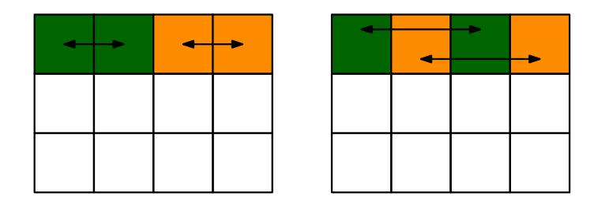

Fig. 2: The linear layer. The left/right one represent the Small-Swap/Big-Swap.

#### 2.3 Gimli-Hash

How Gimli-Hash compresses a message is illustrated in Figure 3. Specifically, Gimli-Hash initializes a 48-byte Gimli state to all-zero. It then reads sequentially through a variable-length input as a series of 16-byte input blocks, denoted by  $M_0, M_1, \cdots$ . After all message blocks are processed, the 256-bit hash value will be generated. More details can be referred to [1].

<span id="page-5-2"></span>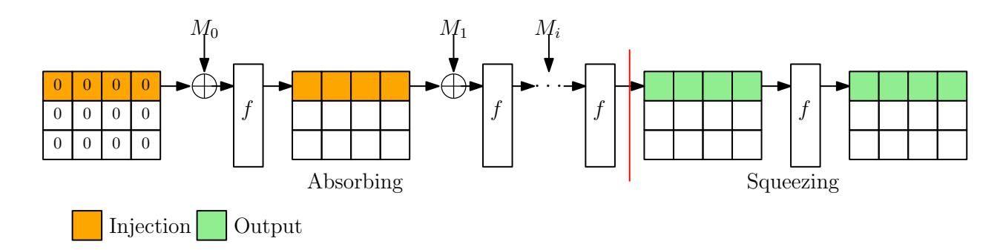

Fig. 3: The process to compress the message, where f is the Gimli permutation

### <span id="page-5-0"></span>3 Properties of the SP-box

Since several properties of the SP-box will be exploited in our collision attack and state-recovery attack, for convenience, we summarize them in this part. For simplicity, the input and output of the SP-box are denoted by (IX, IY, IZ) and (OX, OY, OZ), respectively.

<span id="page-5-5"></span>**Property 1** If  $IY[31 \sim 23] = 0$  and  $IY[19 \sim 0] = 0$ , OX will be independent of IX.

<span id="page-5-4"></span>**Property 2** A random triple (IY, IZ, OX) is potentially valid with probability  $2^{-15.5}$  without knowing IX.

<span id="page-5-7"></span>**Property 3** Given a random triple (IX, OY, OZ), it is valid with probability  $2^{-1}$ . Once it is valid,  $(OX[30 \sim 0], IY, IZ[30 \sim 0])$  can be determined.

<span id="page-5-6"></span><span id="page-5-3"></span>**Property 4** Given a random triple (IY, IZ, OZ), (IX, OX, OY) can be uniquely determined. In addition, a random tuple (IY, IZ, OY, OZ) is valid with probability  $2^{-32}$ .

{6}------------------------------------------------

Property 5 Suppose the pair (IY, IZ) and t bits of OY are known. Then t bits of information on IX can be recovered by solving a linear equation system of size t.

The above properties will be frequently exploited in our attacks and therefore we list them ahead of time. The corresponding proofs can be referred to Appendix [B.](#page-31-3) Some other properties will be explained later.

# <span id="page-6-0"></span>4 The MILP Model Capturing Difference and Value Transitions

To search for a valid differential characteristic of reduced SHA-2, Mendel et al. developed a technique to search for the differential characteristic and conforming message pair simultaneously [\[16\]](#page-30-4). However, how to achieve the simultaneousness is not explained in [\[16\]](#page-30-4). Inspired by such an idea, different from many models where only the difference transitions are considered and are treated as independent in different rounds, we try to construct a model which can describe the difference transitions and value transitions simultaneously. The basic idea is simple. As shown in [Figure 4,](#page-6-1) the models to describe the difference transitions and value transitions will be independently constructed. Then, construct a model to describe the difference-value relations in the nonlinear operation and use it to connect the difference transitions and value transitions. The reason is that the difference transitions and value transitions are dependent only in the nonlinear operation. If such a model can be constructed, the contradictions can always be avoided in the search.

<span id="page-6-1"></span>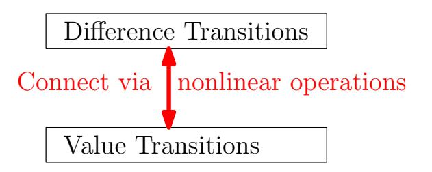

Fig. 4: Illustration of the model

#### <span id="page-6-2"></span>4.1 Difference-Value Relations Through the SP-box

First of all, consider the relations between the difference and value. According to the bit relations between (IX, IY, IZ) and (OX, OY, OZ) as specified in [Equation 1,](#page-4-1) [Equation 2,](#page-4-2) and [Equation 3,](#page-4-3) one can easily observe that there are at most 4 types of Boolean expressions as follows, where a[i] ∈ F<sup>2</sup> and 0 ≤ i ≤ 4.

Type-1: a[1] = a[0]. Type-2: a[2] = a[0] ⊕ a[1]. 

{7}------------------------------------------------

Type-3: a[4] = a[0] ⊕ a[1] ⊕ a[2] ∧ a[3]. Type-4: a[4] = a[0] ⊕ a[1] ⊕ a[2] ∨ a[3].

Specifically, Type-1 corresponds to the expression to calculate OZ[0]. Type-2 corresponds to the expressions to calculate OX[0], OX[1], OX[2], OY [0] and OZ[1]. Type-3 corresponds to the expression to compute OX[i] (3 ≤ i ≤ 31) and OZ[j] (2 ≤ j ≤ 31), while Type-4 corresponds to the expression to compute OY [i] (1 ≤ i ≤ 31).

For convenience, introduce another 5 bit variables a <sup>0</sup>={a 0 [0], a 0 [1], a 0 [2], a 0 [3], a 0 [4]} and let ∆a = a ⊕ a 0 , i.e. ∆a[i] = a[i] ⊕ a 0 [i] for 0 ≤ i ≤ 4. For better understanding, we explain the relations between the difference (∆a) and the value (a) for each of the 4 types.

Type-1. For this type, there is no relation between ∆a and a. Only the following relation can be derived:

$$\Delta a[1] = \Delta a[0].$$

Type-2. Similar to Type-1, there is no relation between ∆a and a. Only the following relation can be derived:

$$\Delta a[2] = \Delta a[0] \oplus \Delta a[1].$$

Type-3. Since a nonlinear operation exists in this expression, we can derive the relations between ∆a and a, as specified below:

$$\Delta a[4] \oplus \Delta a[0] \oplus \Delta a[1] = 1, \Delta a[2] = 0, \Delta a[3] = 0 \Rightarrow Contradiction$$

$$\Delta a[4] \oplus \Delta a[0] \oplus \Delta a[1] = 1, \Delta a[2] = 0, \Delta a[3] = 1 \Rightarrow a[2] = 1$$

$$\Delta a[4] \oplus \Delta a[0] \oplus \Delta a[1] = 1, \Delta a[2] = 1, \Delta a[3] = 0 \Rightarrow a[3] = 1$$

$$\Delta a[4] \oplus \Delta a[0] \oplus \Delta a[1] = 1, \Delta a[2] = 1, \Delta a[3] = 1 \Rightarrow a[2] = a[3]$$

$$\Delta a[4] \oplus \Delta a[0] \oplus \Delta a[1] = 0, \Delta a[2] = 0, \Delta a[3] = 1 \Rightarrow a[2] = 0$$

$$\Delta a[4] \oplus \Delta a[0] \oplus \Delta a[1] = 0, \Delta a[2] = 1, \Delta a[3] = 0 \Rightarrow a[3] = 0$$

$$\Delta a[4] \oplus \Delta a[0] \oplus \Delta a[1] = 0, \Delta a[2] = 1, \Delta a[3] = 1 \Rightarrow a[2] \oplus a[3] = 1.$$

Type-4. Similar to Type-3, since a nonlinear operation exists in this expression, the following relations between ∆a and a can be derived:

$$\Delta a[4] \oplus \Delta a[0] \oplus \Delta a[1] = 1, \Delta a[2] = 0, \Delta a[3] = 0 \Rightarrow Contradiction$$

$$\Delta a[4] \oplus \Delta a[0] \oplus \Delta a[1] = 1, \Delta a[2] = 0, \Delta a[3] = 1 \Rightarrow a[2] = 0$$

$$\Delta a[4] \oplus \Delta a[0] \oplus \Delta a[1] = 1, \Delta a[2] = 1, \Delta a[3] = 0 \Rightarrow a[3] = 0$$

$$\Delta a[4] \oplus \Delta a[0] \oplus \Delta a[1] = 1, \Delta a[2] = 1, \Delta a[3] = 1 \Rightarrow a[2] = a[3]$$

$$\Delta a[4] \oplus \Delta a[0] \oplus \Delta a[1] = 0, \Delta a[2] = 0, \Delta a[3] = 1 \Rightarrow a[2] = 1$$

$$\Delta a[4] \oplus \Delta a[0] \oplus \Delta a[1] = 0, \Delta a[2] = 1, \Delta a[3] = 0 \Rightarrow a[3] = 1$$

$$\Delta a[4] \oplus \Delta a[0] \oplus \Delta a[1] = 0, \Delta a[2] = 1, \Delta a[3] = 0 \Rightarrow a[3] = 1$$

$$\Delta a[4] \oplus \Delta a[0] \oplus \Delta a[1] = 0, \Delta a[2] = 1, \Delta a[3] = 1 \Rightarrow a[2] \oplus a[3] = 1.$$

{8}------------------------------------------------

#### 4.2 Constructing the MILP Model

It has been discussed above that there are only two cases when we need to consider the relations between the difference and value transitions through the SP-box. Thus, we first construct the MILP model to describe such relations. First of all, consider two minimal models called AND-Model and OR-Model.

Constructing AND-Model Consider the following Boolean expression

$$a[2] = a[0] \wedge a[1].$$

Firstly, construct the truth table for (a[0], a[1], ∆a[0], ∆a[1], ∆a[2]), as shown in [Table 7](#page-39-0) in Appendix [G.](#page-38-0) Using the greedy algorithm in [\[19\]](#page-30-7), the corresponding truth table can be described with the following linear inequalities, where the remaining 16 invalid patterns can not satisfy at least one of them.

$$\begin{cases}
-a[0] - a[1] - \Delta a[1] + \Delta a[2] + 2 \ge 0 \\
a[0] - a[1] - \Delta a[1] - \Delta a[2] + 2 \ge 0 \\
-a[0] + a[1] - \Delta a[0] - \Delta a[2] + 2 \ge 0 \\
a[0] + \Delta a[0] - \Delta a[2] \ge 0
\end{cases}$$

$$a[0] + a[1] - \Delta a[0] - \Delta a[1] + \Delta a[2] + 1 \ge 0$$

$$\Delta a[0] + \Delta a[1] - \Delta a[2] \ge 0$$

$$a[1] + \Delta a[1] - \Delta a[2] \ge 0$$

$$-a[1] - \Delta a[0] + \Delta a[1] + \Delta a[2] + 1 \ge 0$$

$$-a[0] + \Delta a[0] - \Delta a[1] + \Delta a[2] + 1 \ge 0$$

Constructing OR-Model Consider the following Boolean expression

$$a[2] = a[0] \vee a[1].$$

Similarly, construct the truth table for (a[0], a[1], ∆a[0], ∆a[1], ∆a[2]), as shown in [Table 8](#page-39-1) in Appendix [G,](#page-38-0) which is equivalent to the following linear inequalities:

$$\begin{cases}
-a[1] + \Delta a[1] - \Delta a[2] + 1 \ge 0 \\
-a[0] + \Delta a[0] - \Delta a[2] + 1 \ge 0
\end{cases}$$

$$a[1] - \Delta a[0] + \Delta a[1] + \Delta a[2] \ge 0$$

$$a[0] + \Delta a[0] - \Delta a[1] + \Delta a[2] \ge 0$$

$$a[0] + a[1] - \Delta a[1] + \Delta a[2] \ge 0$$

$$\Delta a[0] + \Delta a[1] - \Delta a[2] \ge 0$$

$$a[0] - a[1] - \Delta a[0] - \Delta a[2] + 2 \ge 0$$

$$-a[0] - a[1] - \Delta a[0] - \Delta a[1] + \Delta a[2] + 3 \ge 0$$

$$-a[0] + a[1] - \Delta a[1] - \Delta a[2] + 2 \ge 0$$

{9}------------------------------------------------

Constructing MILP Model for Value Transitions For the Gimli round function, the linear layer can be viewed as a simple permutation of bit positions. Thus, we only focus on the model to describe the value transitions through the SP-box in this part. As discussed above, there are at most 4 types of Boolean expressions when expressing the output bit in terms of the input bits for the SP-box. Now, we explain how to model such 4 types of expressions.

Modeling Type-1 Expression. The Type-1 Boolean expression is

$$a[1] = a[0].$$

Thus, it is rather simple to model the value relation by using the following linear equality:

$$a[1] = a[0]. (6)$$

Modeling Type-2 Expression. The Type-2 Boolean expression is

$$a[2] = a[0] \oplus a[1].$$

Such a linear Boolean equation can be described with the following linear inequalities:

$$\begin{cases}
 a[0] + a[1] - a[2] \ge 0 \\
 a[0] - a[1] + a[2] \ge 0 \\
 -a[0] + a[1] + a[2] \ge 0 \\
 -a[0] - a[1] - a[2] + 2 \ge 0
\end{cases}$$
(7)

Modeling Type-3 Expression. The Type-3 Boolean expression is

$$a[4] = a[0] \oplus a[1] \oplus a[2] \wedge a[3].$$

Such a linear Boolean equation can be described with the following linear inequalities:

<span id="page-9-0"></span>
$$\begin{cases}
-a[0] + a[1] + a[3] + a[4] \ge 0 \\
a[0] - a[1] + a[3] + a[4] \ge 0 \\
a[0] + a[1] + a[2] - a[4] \ge 0 \\
a[0] + a[1] + a[3] - a[4] \ge 0 \\
a[0] - a[1] + a[2] + a[4] \ge 0 \\
-a[0] + a[1] + a[2] + a[4] \ge 0 \\
a[0] + a[1] - a[2] - a[3] + a[4] + 1 \ge 0 \\
-a[0] - a[1] + a[2] - a[4] + 2 \ge 0 \\
a[0] - a[1] - a[2] - a[3] - a[4] + 3 \ge 0 \\
-a[0] - a[1] - a[2] - a[3] + a[4] + 3 \ge 0 \\
-a[0] - a[1] + a[3] - a[4] + 2 \ge 0 \\
-a[0] + a[1] - a[2] - a[3] - a[4] + 3 \ge 0
\end{cases}$$

{10}------------------------------------------------

Modeling Type-4 Expression. The Type-4 Boolean expression is

$$a[4] = a[0] \oplus a[1] \oplus a[2] \vee a[3].$$

Such a linear Boolean equation can be described with the following linear inequalities:

<span id="page-10-0"></span>
$$\begin{cases}
-a[0] + a[1] - a[3] - a[4] + 2 \ge 0 \\
a[0] - a[1] - a[3] - a[4] + 2 \ge 0 \\
-a[0] - a[1] - a[3] + a[4] + 2 \ge 0 \\
-a[0] + a[1] - a[2] - a[4] + 2 \ge 0 \\
a[0] - a[1] - a[2] - a[4] + 2 \ge 0 \\
-a[0] - a[1] - a[2] + a[4] + 2 \ge 0 \\
-a[0] + a[1] - a[2] + a[4] + 2 \ge 0 \\
a[0] + a[1] - a[3] + a[4] \ge 0 \\
a[0] + a[1] - a[3] + a[4] \ge 0 \\
a[0] + a[1] - a[2] + a[4] \ge 0 \\
a[0] - a[1] + a[2] + a[3] + a[4] \ge 0 \\
a[0] + a[1] + a[2] + a[3] - a[4] \ge 0 \\
-a[0] - a[1] + a[2] + a[3] - a[4] \ge 0
\end{cases}$$

Constructing MILP Model for Difference Transitions The value transitions through the SP-box have been discussed above. In the following, how to model the difference transitions will be detailed. Similarly, write the four possible types of expressions for differences as follows:

$$\Delta a[1] = \Delta a[0],\tag{10}$$

$$\Delta a[2] = \Delta a[0] \oplus \Delta a[1],\tag{11}$$

$$\Delta a[4] = \Delta a[0] \oplus \Delta a[1] \oplus \Delta n a_0, \tag{12}$$

$$\Delta a[4] = \Delta a[0] \oplus \Delta a[1] \oplus \Delta n a_1, \tag{13}$$

where na<sup>0</sup> and na<sup>1</sup> represent the output difference of the nonlinear operation a[2]∧a[3] and a[2]∨a[3], respectively. It can be easily observed that the first two possible transitions (Eq. 10 and Eq. 11) share the same MILP model used to describe the value transitions for Type-1 expression and Type-2 expression. For the last two transitions, we need to construct a model to describe the following linear Boolean equation:

$$a[3] = a[0] \oplus a[1] \oplus a[2].$$

{11}------------------------------------------------

This task is also rather easy. The linear inequalities to describe the above linear Boolean equation in terms of four variables are specified as follows:

<span id="page-11-0"></span>
$$\begin{cases}
 a[0] + a[1] - a[2] + a[3] \ge 0 \\
 a[0] + a[1] + a[2] - a[3] \ge 0 \\
 -a[0] + a[1] + a[2] + a[3] \ge 0 \\
 a[0] - a[1] + a[2] + a[3] \ge 0 \\
 -a[0] - a[1] + a[2] - a[3] + 2 \ge 0 \\
 a[0] - a[1] - a[2] - a[3] + 2 \ge 0 \\
 -a[0] + a[1] - a[2] - a[3] + 2 \ge 0 \\
 -a[0] - a[1] - a[2] + a[3] + 2 \ge 0
\end{cases}$$

$$(14)$$

One may observe that two intermediate variables na<sup>0</sup> and na<sup>1</sup> are introduced when constructing the model for difference transitions and they have not been connected with the actual variables, i.e. a and ∆a in the constructed model. In fact, this is where our technique exists in order to model the difference and value transitions simultaneously. Specifically, the two intermediate variables na<sup>0</sup> and na<sup>1</sup> will be utilized to link the value transitions and difference transitions, together with the two minimal models AND-Model and OR-Model.

Connecting the Value Transitions and Difference Transitions It can be observed that the current MILP models for value transitions and difference transitions are independently constructed. In this part, we will describe how to connect the value and difference transitions with the two intermediate variables (na0,na1) by using the AND-Model and OR-Model. Note that na<sup>0</sup> and na<sup>1</sup> denote the output difference of the nonlinear operations a[2]∧a[3] and a[2]∨a[3], respectively.

Connecting the Two Transitions for Type-3 Expression. Consider the Type-3 expression:

$$a[4] = a[0] \oplus a[1] \oplus a[2] \wedge a[3].$$

Firstly, use [Equation 8](#page-9-0) to model the relations of (a[0], a[1], a[2], a[3], a[4]). Then, use the AND-Model to describe the relations of (a[2], a[3], ∆a[2], ∆a[3], na0). Finally, use [Equation 14](#page-11-0) to describe the relations of (∆a[0], ∆a[1], na0, ∆a[4]). In this way, the value and difference transitions for Type-3 expression are connected.

Connecting the Two Transitions for Type-4 Expression. The Type-4 expression is specified as follows:

$$a[4] = a[0] \oplus a[1] \oplus a[2] \vee a[3].$$

Similarly, [Equation 9](#page-10-0) is used to model the relations of (a[0], a[1], a[2], a[3], a[4]). Then, the OR-Model is used to model the relations of (a[2], a[3], ∆a[2], ∆a[3], na1). At last, [Equation 14](#page-11-0) is used to describe the relations of (∆a[0], ∆a[1], na1, ∆a[4]).

{12}------------------------------------------------

For the remaining two expressions (Type-1 and Type-2), the value and difference transitions are independent. Therefore, the corresponding two models are independent and there is no need to connect them. Obviously, the AND-Model and OR-Model are the core techniques to achieve the connection.

#### 4.3 Detecting Contradictions

Since both the difference transitions and value transitions are taken into account in our MILP model, once given a specified differential characteristic of Gimli, the difference transitions are fixed. In addition, some constraints on the value of the internal states are fixed as well based on the AND-Model and OR-Model. Thus, the final inequality system in the whole model is only in terms of the variables representing the value of the internal states. If a solution can be returned by the solver, it simply means that there is a conforming message pair satisfying the differential characteristic. However, if the solver returns "infeasible", it implies that no conforming message pair can satisfy the differential characteristic, thus revealing that the differential characteristic is impossible.

We have used the above method to check the validity of two existing differential characteristics of Gimli. One is the 12-round differential characteristic proposed in the Gimli document [\[4\]](#page-29-1), and the other is the 6-round differential characteristic used for a collision attack in [\[23\]](#page-31-0). Surprisingly, both of them are proven to be invalid, i.e. the Gurobi solver [\[2\]](#page-29-8) returns "infeasible". To support the correctness of our model, detailed analysis of the contradictions are provided in Appendix [C.](#page-33-0)

# <span id="page-12-0"></span>5 Collision Attack on 6-Round Gimli-Hash

Since the 6-round differential characteristic is invalid in [\[23\]](#page-31-0), it is necessary to search for a valid one in order to mount a collision attack on 6-round Gimli-Hash. On the whole, our collision attack procedure can be divided into the following two phases:

Phase 1: Utilize our model to find a valid 6-round differential characteristic.

Phase 2: Use the linearization and start-from-the-middle techniques to find all the conforming message pairs satisfying the discovered differential characteristic and store them in a clever way. All these message pairs can be viewed as SFS colliding message pairs. Then, convert the SFS collisions into collisions with a divide-and-conquer method.

Obviously, both the way to search for a differential characteristic and the way to mount a collision attack are different from that in [\[23\]](#page-31-0).

#### 5.1 Searching a Valid 6-Round Differential Characteristic

It can be easily observed in [\[23\]](#page-31-0) that, in order to eliminate the influence of linear layer (Big-Swap and Small-Swap) and to reduce the workload of the MILP 

{13}------------------------------------------------

model, the authors only considered the difference transitions in one column rather than the whole state. Specifically, as shown in Figure 5, the target is to find the following valid difference transitions through the SP-box:

$$(D_0, 0, 0) \xrightarrow{SP} (0, D_1, D_2) \xrightarrow{SP} (D_3, D_4, D_5) \xrightarrow{SP} (D_6, D_7, D_8) \xrightarrow{SP} (D_9, D_{10}, D_{11}) \xrightarrow{SP} (0, 0, D_{12}) \xrightarrow{SP} (D_{13}, 0, 0)$$

Once such a solution is found, it can be easily converted into a differential characteristic of the full state. However, as has been proved, the solution found in [23] is actually invalid if considering the dependency between the value transitions and difference transitions.

<span id="page-13-0"></span>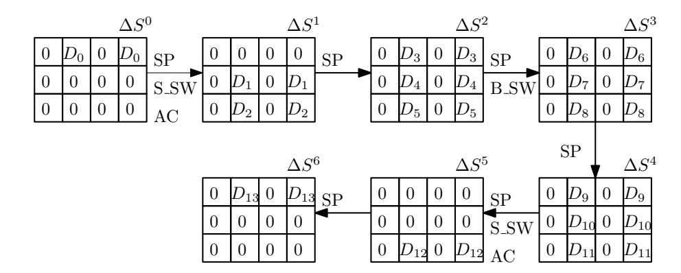

Fig. 5: The pattern of the difference transitions in [23]

Different from the optimal differential characteristic which may be sparse, the differential characteristic used for the collision attack is much denser, thus having a high probability that contradictions occur if only the difference transitions are considered. To avoid such a bad case, the differential characteristic and the conforming message pair will be simultaneously searched with our constructed MILP model. Similar to [4,23], a probability 1 two-round differential characteristic is first constructed in the last two rounds. Moreover, to reduce the workload, some additional constraints will be added when constructing the model, as specified below:

$$\Delta S_{i,0}^0 = \Delta S_{i,2}^0 = 0 \ (0 \le i \le 2). \tag{15}$$

$$\Delta S_{j,1}^0 = \Delta S_{j,3}^0 = 0 \ (1 \le j \le 2). \tag{16}$$

$$\Delta S_{0,0}^1 = \Delta S_{0,2}^1 = 0. (17)$$

$$\Delta S_{i,j}^r = \Delta S_{i,j+2}^r \ (0 \le i \le 2, 0 \le j \le 1, 0 \le r \le 3). \tag{18}$$

$$\Delta S_{0,1}^4 = \Delta S_{0,3}^4 = 0 \times 80. \tag{19}$$

$$\Delta S_{1,1}^4 = \Delta S_{1,3}^4 = 0 \times 400000. \tag{20}$$
  
$$\Delta S_{2,1}^4 = \Delta S_{2,3}^4 = 0 \times 80000000. \tag{21}$$

Moreover, to reduce the search space, we further constrain the hamming weight of  $(\Delta S_{0,1}^3, \Delta S_{1,1}^3, \Delta S_{2,1}^3)$  as follows, i.e. the number of bits whose values are 1:

$$HW(\Delta S_{0,1}^3, \Delta S_{1,1}^3, \Delta S_{2,1}^3) \le 8.$$

{14}------------------------------------------------

Specifically, the aim is to find a solution for the 32-bit words marked with "?" in Figure 6.

<span id="page-14-0"></span>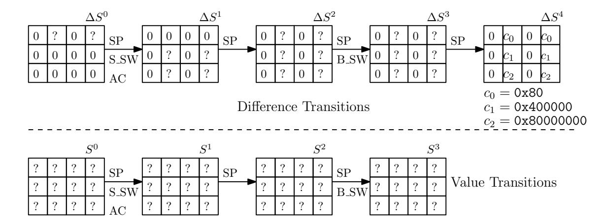

Fig. 6: Searching a valid 6-round differential characteristic

The 6-Round Differential Characteristic. Based on the above model, the Gurobi solver returns a solution in less than 4 hours. In other words, a valid 6-round differential characteristic and a conforming message pair are obtained. For a better presentation, the differential characteristic is displayed in Table 2. The conforming message pair is displayed in Table 4. The conditions implied in the differential characteristic are shown in Table 3. Note that by using one more message block to eliminate the difference in the rate part, a full-state SFS collision is obtained. However, the SFS collision attack is still less meaningful than the collision attack. Therefore, we are further motivated to convert the SFS collisions into collisions.

#### 5.2 Converting SFS Collision Attacks into Collision Attacks

First of all, as shown in Table 3, the conditions on  $S_{0,1}^3$  and  $S_{0,3}^3$  only involve the bits of  $S_{0,1}^3$  and  $S_{0,3}^3$ , respectively. Due to the symmetry of the 6-round differential characteristic, the conditions on  $S_{0,1}^3$  and  $S_{0,3}^3$  are the same. Due to the influence of Big-Swap,  $S_{0,3}^3$  is actually computed by using  $(S_{0,1}^2, S_{1,1}^2, S_{2,1}^2)$ , while  $S_{0,1}^3$  is computed by using  $(S_{0,3}^2, S_{1,3}^2, S_{2,3}^2)$ . Thus, we define two sets of conditions which can be independently verified, as specified below:

**Definition 1.** The internal state words  $(S_{0,1}^0, S_{1,1}^0, S_{2,1}^0)$ ,  $(S_{0,1}^1, S_{1,1}^1, S_{2,1}^1)$ ,  $(S_{0,1}^2, S_{1,1}^2, S_{2,1}^2)$  and  $(S_{0,3}^3, S_{1,1}^3, S_{2,1}^3)$  only depend on the input state words  $(S_{i,j}^0)$   $(0 \le i \le 2, 0 \le j \le 1)$ , while the internal state words  $(S_{0,3}^0, S_{1,3}^0, S_{2,3}^0)$ ,  $(S_{0,3}^1, S_{1,3}^1, S_{2,3}^1)$ ,  $(S_{0,3}^2, S_{1,3}^2, S_{2,3}^2)$  and  $(S_{0,1}^3, S_{1,3}^3, S_{2,3}^3)$  only depend on the input state words  $(S_{i,j}^0)$   $(0 \le i \le 2, 2 \le j \le 3)$ .

Therefore, by only knowing  $(S_{i,j}^0)$   $(0 \le i \le 2, 0 \le j \le 1)$ , we can fully compute  $(S_{0,1}^0, S_{1,1}^0, S_{2,1}^0)$ ,  $(S_{0,1}^1, S_{1,1}^1, S_{2,1}^1)$ ,  $(S_{0,1}^2, S_{1,1}^2, S_{2,1}^2)$  and  $(S_{0,3}^3, S_{1,1}^3, S_{2,1}^3)$ . For simplicity, the conditions on these 12 internal state words in Table 3 are called **L-Conditions**.

{15}------------------------------------------------

<span id="page-15-0"></span>Table 2: The 6-round differential characteristic

| State        |   | XOR Difference |   |            |  |
|--------------|---|----------------|---|------------|--|
|              | 0 | 0x7c2c642a     | 0 | 0x7c2c642a |  |
| $\Delta S^0$ | 0 | 0              | 0 | 0          |  |
|              | 0 | 0              | 0 | 0          |  |
|              | 0 | 0              | 0 | 0          |  |
| $\Delta S^1$ | 0 | 0x6e1c342c     | 0 | 0x6e1c342c |  |
|              | 0 | 0x2a7c2c64     | 0 | 0x2a7c2c64 |  |
|              | 0 | 0x91143078     | 0 | 0x91143078 |  |
| $\Delta S^2$ | 0 | 0x28785014     | 0 | 0x28785014 |  |
|              | 0 | 0x35288a58     | 0 | 0x35288a58 |  |
|              | 0 | 0x80010008     | 0 | 0x80010008 |  |
| $\Delta S^3$ | 0 | 0x00002000     | 0 | 0x00002000 |  |
|              | 0 | 0x44400080     | 0 | 0x44400080 |  |
|              | 0 | 0x00000080     | 0 | 0x00000080 |  |
| $\Delta S^4$ | 0 | 0x00400000     | 0 | 0x00400000 |  |
|              | 0 | 0x80000000     | 0 | 0x80000000 |  |
|              | 0 | 0              | 0 | 0          |  |
| $\Delta S^5$ | 0 | 0              | 0 | 0          |  |
|              | 0 | 0x80000000     | 0 | 0x80000000 |  |
|              | 0 | 0x80000000     | 0 | 0x80000000 |  |
| $\Delta S^6$ | 0 | 0              | 0 | 0          |  |
|              | 0 | 0              | 0 | 0          |  |

Similarly, by only knowing  $(S_{i,j}^0)$   $(0 \le i \le 2, 2 \le j \le 3)$ , we can fully compute  $(S_{0,3}^0, S_{1,3}^0, S_{2,3}^0)$ ,  $(S_{0,3}^1, S_{1,3}^1, S_{2,3}^1)$ ,  $(S_{0,3}^2, S_{1,3}^2, S_{2,3}^2)$  and  $(S_{0,1}^3, S_{1,3}^3, S_{2,3}^3)$ . For simplicity, the conditions on these 12 internal state words in Table 3 are called **R-Conditions**.

Therefore, the L-Conditions and R-Conditions can be verified independently. Now, we introduce a method to identify all the possible values for the capacity of the first two columns  $(S_{i,j}^0)$   $(1 \le i \le 2, 0 \le j \le 1)$  which can fulfill the L-Conditions. Since the L-Conditions and R-Conditions are identical, the method works in the same way to find all the possible values for the capacity part of the last two columns  $(S_{i,j}^0)$   $(1 \le i \le 2, 2 \le j \le 3)$  which can fulfill the R-Conditions.

**Identifying All Possible Solutions** To obtain all valid values of  $(S_{i,j}^0)$   $(1 \le i \le 2, 0 \le j \le 1)$ , the following techniques will be exploited to accelerate the exhaustive search:

- 1. Merge the conditions in two consecutive rounds, which can significantly reduce the size of the search space.
- 2. Use a start-from-the-middle method and the properties of the SP-box to further accelerate the exhaustive search.

Instead of directly finding all valid values for  $(S_{i,j}^0)$   $(1 \le i \le 2, 0 \le j \le 1)$ , we will first search for all the valid solutions for  $(S_{0,1}^1, S_{1,1}^1, S_{2,1}^1)$ . It should be noted that once  $(S_{0,1}^1, S_{1,1}^1, S_{2,1}^1)$  are known,  $(S_{0,1}^2, S_{1,1}^2, S_{2,1}^2)$  and  $(S_{0,3}^3, S_{1,1}^3, S_{2,1}^3)$  can be fully determined. In other words, we can first identify all the solutions for  $(S_{0,1}^1, S_{1,1}^1, S_{2,1}^1)$  which can make the conditions on  $(S_{0,1}^1, S_{1,1}^1, S_{2,1}^1)$ ,  $(S_{0,1}^2, S_{1,1}^2, S_{2,1}^2)$  and  $(S_{0,3}^3, S_{1,1}^3, S_{2,1}^3)$  hold.

{16}------------------------------------------------

<span id="page-16-0"></span>Table 3: The conditions implied in the 6-round differential characteristic

| $\begin{array}{c ccccccccccccccccccccccccccccccccccc$                                                                                                                                                                                                                                                                                                                                                                                                                                                                                                                                                                                                                                                                                                                                                                                                                                                     | O                                  |                                                                                                                    |
|-----------------------------------------------------------------------------------------------------------------------------------------------------------------------------------------------------------------------------------------------------------------------------------------------------------------------------------------------------------------------------------------------------------------------------------------------------------------------------------------------------------------------------------------------------------------------------------------------------------------------------------------------------------------------------------------------------------------------------------------------------------------------------------------------------------------------------------------------------------------------------------------------------------|------------------------------------|--------------------------------------------------------------------------------------------------------------------|
| $ \begin{array}{c ccccccccccccccccccccccccccccccccccc$                                                                                                                                                                                                                                                                                                                                                                                                                                                                                                                                                                                                                                                                                                                                                                                                                                                    | $S_{0,1}^0$                        |                                                                                                                    |
| $\begin{array}{c} S_{0,1}^{0} \\ S_{0,3}^{0} \\ S_{0,3}^{0} \\ -0 - 0 - 1 - 0 - 1 & 0 & 0 & 1 & 1 1 & 0 & 0 & 1 & 0 & - 0 & \\ S_{0,3}^{0} \\ -0 - 0 & 0 - 0 & 0 0 & 0 & 0 & $                                                                                                                                                                                                                                                                                                                                                                                                                                                                                                                                                                                                                                                                                                                            | $ S_{1,1}^0 $                      |                                                                                                                    |
| $\begin{array}{c} S_{0,3}^{0} \\ S_{1,3}^{0} \\ -0 & 0 & 0 & -0 & -0 & -0 & -0 & -0 &$                                                                                                                                                                                                                                                                                                                                                                                                                                                                                                                                                                                                                                                                                                                                                                                                                    | $S_0^0$                            | $ 0-1-0-1\ 0\ 0\ 1\ 11-0\ 01\ 00- $                                                                                |
| $\begin{array}{c ccccccccccccccccccccccccccccccccccc$                                                                                                                                                                                                                                                                                                                                                                                                                                                                                                                                                                                                                                                                                                                                                                                                                                                     | $ S_0^{0,1} $                      |                                                                                                                    |
| $\begin{array}{c c c c c c c c c c c c c c c c c c c $                                                                                                                                                                                                                                                                                                                                                                                                                                                                                                                                                                                                                                                                                                                                                                                                                                                    | $S_{0}^{0,3}$                      |                                                                                                                    |
| $\begin{array}{c ccccccccccccccccccccccccccccccccccc$                                                                                                                                                                                                                                                                                                                                                                                                                                                                                                                                                                                                                                                                                                                                                                                                                                                     | $\mathcal{C}_{\mathbf{C}^0}^{1,3}$ |                                                                                                                    |
| $\begin{array}{c ccccccccccccccccccccccccccccccccccc$                                                                                                                                                                                                                                                                                                                                                                                                                                                                                                                                                                                                                                                                                                                                                                                                                                                     |                                    |                                                                                                                    |
| $\begin{array}{c ccccccccccccccccccccccccccccccccccc$                                                                                                                                                                                                                                                                                                                                                                                                                                                                                                                                                                                                                                                                                                                                                                                                                                                     | $ S_{0,1}^1 $                      | -11101010101100110110-1-                                                                                           |
| $\begin{array}{c ccccccccccccccccccccccccccccccccccc$                                                                                                                                                                                                                                                                                                                                                                                                                                                                                                                                                                                                                                                                                                                                                                                                                                                     | $ S_1^1 $                          |                                                                                                                    |
| $\begin{array}{c} S_{0,3}^1\\ S_{1,3}^1\\ S_{2,3}^1\\11$                                                                                                                                                                                                                                                                                                                                                                                                                                                                                                                                                                                                                                                                                                                                                                                                                                                  | $S_{2,1}^{1,1}$                    | 10                                                                                                                 |
| $\begin{array}{c ccccccccccccccccccccccccccccccccccc$                                                                                                                                                                                                                                                                                                                                                                                                                                                                                                                                                                                                                                                                                                                                                                                                                                                     | $S_{2}^{1,1}$                      |                                                                                                                    |
| $\begin{array}{c} S_{2,3}^1 =1 0 - 1 1 - 0 \ 0 \\ S_{1,1}^1[2] \neq S_{2,1}^1[11], \ S_{1,1}^1[10] \neq S_{2,1}^1[19], \ S_{1,1}^1[12] = S_{2,1}^1[21] \\ S_{1,1}^1[3] = S_{2,1}^1[22], \ S_{1,1}^1[18] = S_{2,1}^1[27], \ S_{1,1}^1[20] \neq S_{2,1}^1[29] \\ S_{1,1}^1[25] = S_{2,1}^1[2], \ S_{1,1}^1[29] \neq S_{2,1}^1[6], \ S_{1,3}^1[2] \neq S_{2,3}^1[11] \\ S_{1,3}^1[10] \neq S_{2,3}^1[19], \ S_{1,3}^1[12] = S_{2,3}^1[21], \ S_{1,3}^1[31] = S_{2,3}^1[22] \\ S_{1,3}^1[18] = S_{2,3}^1[27], \ S_{1,3}^1[20] \neq S_{2,3}^1[29], \ S_{1,3}^1[25] = S_{2,3}^1[2] \\ S_{1,3}^1[29] \neq S_{2,3}^1[6] \\ \\ S_{2,1}^2 = -1 - 0 0 - 1 - 0 - 0 - 1 - 1 - 1 - $                                                                                                                                                                                                                                    | $S^1$                              |                                                                                                                    |
| $ \begin{vmatrix} S_{1,1}^1[2] \neq S_{2,1}^1[11], S_{1,1}^1[10] \neq S_{2,1}^1[19], S_{1,1}^1[12] = S_{2,1}^1[21] \\ S_{1,1}^1[3] = S_{2,1}^1[22], S_{1,1}^1[18] = S_{2,1}^1[27], S_{1,1}^1[20] \neq S_{2,1}^1[29] \\ S_{1,1}^1[25] = S_{2,1}^1[2], S_{1,1}^1[29] \neq S_{2,1}^1[6], S_{1,3}^1[3] = S_{2,3}^1[31] \\ S_{1,3}^1[10] \neq S_{2,3}^1[19], S_{1,3}^1[12] = S_{2,3}^1[21], S_{1,3}^1[31] = S_{2,3}^1[22] \\ S_{1,3}^1[18] = S_{2,3}^1[27], S_{1,3}^1[20] \neq S_{2,3}^1[29], S_{1,3}^1[25] = S_{2,3}^1[2] \\ S_{1,3}^1[29] \neq S_{2,3}^1[6] \\                                   $                                                                                                                                                                                                                                                                                                           | $C_1^{1,3}$                        |                                                                                                                    |
| $ \begin{vmatrix} S_{1,1}^{1}[13] = S_{2,1}^{1}[22], S_{1,1}^{1}[18] = S_{2,1}^{1}[27], S_{1,1}^{1}[20] \neq S_{2,1}^{1}[29] \\ S_{1,1}^{1}[25] = S_{2,1}^{1}[2], S_{1,1}^{1}[29] \neq S_{2,1}^{1}[6], S_{1,3}^{1}[2] \neq S_{2,3}^{1}[11] \\ S_{1,3}^{1}[10] \neq S_{2,3}^{1}[19], S_{1,3}^{1}[12] = S_{2,3}^{1}[21], S_{1,3}^{1}[13] = S_{2,3}^{1}[22] \\ S_{1,3}^{1}[18] = S_{2,3}^{1}[27], S_{1,3}^{1}[20] \neq S_{2,3}^{1}[29], S_{1,3}^{1}[25] = S_{2,3}^{1}[2] \\ S_{1,3}^{1}[29] \neq S_{2,3}^{1}[6] \end{vmatrix} $ $ \begin{vmatrix} S_{0,1}^{2} - 1 - 0 0 - 1 - 0 - 0 - 1 - 1 - 1 -$                                                                                                                                                                                                                                                                                                           | $S_{2,3}$                          |                                                                                                                    |
| $ \begin{vmatrix} S_{1,1}^1[25] = S_{2,1}^1[2], S_{1,1}^1[29] \neq S_{2,1}^1[6], S_{1,3}^1[2] \neq S_{2,3}^1[11] \\ S_{1,3}^1[10] \neq S_{2,3}^1[19], S_{1,3}^1[12] = S_{2,3}^1[21], S_{1,3}^1[13] = S_{2,3}^1[22] \\ S_{1,3}^1[13] = S_{2,3}^1[27], S_{1,3}^1[20] \neq S_{2,3}^1[29], S_{1,3}^1[25] = S_{2,3}^1[2] \\ S_{1,3}^1[29] \neq S_{2,3}^1[6] \end{vmatrix} $ $ \begin{vmatrix} S_{0,1}^2 - 1 - 0 0 - 1 - 0 - 0 - 1 - 1 - 1 -$                                                                                                                                                                                                                                                                                                                                                                                                                                                                   |                                    |                                                                                                                    |
| $ \begin{vmatrix} S_{1,3}^1[10] \neq S_{2,3}^1[19], S_{1,3}^1[12] = S_{2,3}^1[21], S_{1,3}^1[3] = S_{2,3}^1[22] \\ S_{1,3}^1[18] = S_{2,3}^1[27], S_{1,3}^1[20] \neq S_{2,3}^1[29], S_{1,3}^1[25] = S_{2,3}^1[2] \\ S_{1,3}^1[29] \neq S_{2,3}^1[6] \end{vmatrix} $ $ \begin{vmatrix} S_{0,1}^2 - 1 - 0 0 - 1 - 0 - 0 - 1 - 1 - 1 -$                                                                                                                                                                                                                                                                                                                                                                                                                                                                                                                                                                      |                                    |                                                                                                                    |
| $ \begin{vmatrix} S_{1,3}^1[18] &= S_{2,3}^1[27], S_{1,3}^1[20] \neq S_{2,3}^1[29], S_{1,3}^1[25] &= S_{2,3}^1[2] \\ S_{1,3}^0[29] &\neq S_{2,3}^1[6] \end{vmatrix} \\ \hline S_{0,1}^2 &= -1 - 0 0 - 1 - 0 - 0 - 1 - 1 - 1 - $                                                                                                                                                                                                                                                                                                                                                                                                                                                                                                                                                                                                                                                                           |                                    |                                                                                                                    |
| $ \begin{vmatrix} S_{1,3}^1[18] &= S_{2,3}^1[27], S_{1,3}^1[20] \neq S_{2,3}^1[29], S_{1,3}^1[25] &= S_{2,3}^1[2] \\ S_{1,3}^0[29] &\neq S_{2,3}^1[6] \end{vmatrix} \\ \hline S_{0,1}^2 &= -1 - 0 0 - 1 - 0 - 0 - 1 - 1 - 1 - $                                                                                                                                                                                                                                                                                                                                                                                                                                                                                                                                                                                                                                                                           |                                    | $S_{1,3}^1[10] \neq S_{2,3}^1[19], S_{1,3}^1[12] = S_{2,3}^1[21], S_{1,3}^1[13] = S_{2,3}^1[22]$                   |
| $\begin{array}{ c c c c }\hline & S_{1,3}^{1}[29] \neq S_{2,3}^{1}[6] \\ \hline S_{0,1}^{2} & - 1 - 0 0 - 1 - 0 - 0 - 1 - 1 - 1 -$                                                                                                                                                                                                                                                                                                                                                                                                                                                                                                                                                                                                                                                                                                                                                                        |                                    |                                                                                                                    |
| $\begin{array}{ c c c c c }\hline S_{0,1}^2 & - & 1 & - & 0 & - & 0 & - & 1 & - & 0 & - & 0 & - & 1 & - & 0 & - & 0 & - & 1 & 0 \\ S_{1,1}^2 & - & - & 0 & 0 & - & - & - & - & - & 1 & 1 & 1 & - & -$                                                                                                                                                                                                                                                                                                                                                                                                                                                                                                                                                                                                                                                                                                     |                                    |                                                                                                                    |
| $\begin{array}{c} S_{1,1}^{2} &0 & -0 &1 & 1 & -1 &1 & 0 &1 & 0 &1 & -1 & $                                                                                                                                                                                                                                                                                                                                                                                                                                                                                                                                                                                                                                                                                                                                                                                                                               |                                    |                                                                                                                    |
| $\begin{array}{c} S_{2,1}^2 & = 0 - 1 1 0 1 0 & 1 - 0 0$                                                                                                                                                                                                                                                                                                                                                                                                                                                                                                                                                                                                                                                                                                                                                                                                                                                  | $ S_{0,1}^2 $                      | [1-00-1-0-0-1-1-110-1]                                                                                             |
| $\begin{array}{c} S_{2,1}^2 & = 0 - 1 1 0 1 0 & 1 - 0 0$                                                                                                                                                                                                                                                                                                                                                                                                                                                                                                                                                                                                                                                                                                                                                                                                                                                  | $ S_{1,1}^2 $                      | $\left 0 - 0 - 0 1 \ 1 - 1 1 \ 0 1 \ 0 1 \ 0 \right $                                                              |
| $\begin{array}{c} S_{0,3}^2 = -1 - 0 0 - 1 - 0 - 0 - 1 - 0 - 0 - $                                                                                                                                                                                                                                                                                                                                                                                                                                                                                                                                                                                                                                                                                                                                                                                                                                        | $ S_{2}^{2} _{1}$                  | -0110101-00                                                                                                        |
| $\begin{array}{c} S_{1,3}^{2,3} =0 = 0 = 0 = 0 = 0 = 0 = 0 = 0 = 0 =$                                                                                                                                                                                                                                                                                                                                                                                                                                                                                                                                                                                                                                                                                                                                                                                                                                     | 102                                |                                                                                                                    |
| $\begin{array}{ c c c c c c }\hline S_{2,3}^{2/3} & -0 &1 &1 &0 &1 &0 & 1 & -0 &0 & \\ \hline S_{0,1}^{2}[4] \neq S_{2,1}^{2}[28],  S_{0,1}^{2}[5] \neq S_{2,1}^{2}[29],  S_{0,1}^{2}[12] & S_{2,1}^{2}[4] \\ S_{0,1}^{2}[31] & S_{1,1}^{2}[14],  S_{1,1}^{2}[2] \neq S_{2,1}^{2}[11],  S_{1,1}^{2}[12] & S_{2,1}^{2}[21] \\ S_{1,1}^{2}[19] & S_{2,1}^{2}[28],  S_{1,1}^{2}[20] \neq S_{2,1}^{2}[29],  S_{1,1}^{2}[27] \neq S_{2,1}^{2}[4] \\ S_{1,1}^{2}[29] \neq S_{2,1}^{2}[6],  S_{0,3}^{2}[4] \neq S_{2,3}^{2}[28],  S_{0,3}^{2}[5] \neq S_{2,3}^{2}[29] \\ S_{0,3}^{2}[12] & S_{2,3}^{2}[4],  S_{0,3}^{2}[31] & S_{1,3}^{2}[14],  S_{1,3}^{2}[2] \neq S_{2,3}^{2}[11] \\ S_{1,3}^{2}[12] & S_{2,3}^{2}[21],  S_{1,3}^{2}[19] & S_{2,3}^{2}[28],  S_{1,3}^{2}[20] \neq S_{2,3}^{2}[29] \\ S_{1,3}^{2}[27] \neq S_{2,3}^{2}[4],  S_{1,3}^{2}[29] \neq S_{2,3}^{2}[6] \\ \hline \\ S_{0,1}^{3} & 0 &$ | $S_1^{2,3}$                        |                                                                                                                    |
| $ \begin{vmatrix} S_{0,1}^2[4] \neq S_{2,1}^2[28],  S_{0,1}^2[5] \neq S_{2,1}^2[29],  S_{0,1}^2[12] = S_{2,1}^2[4] \\ S_{0,1}^2[31] = S_{1,1}^2[14],  S_{1,1}^2[2] \neq S_{2,1}^2[11],  S_{1,1}^2[12] = S_{2,1}^2[21] \\ S_{1,1}^2[19] = S_{2,1}^2[28],  S_{1,1}^2[20] \neq S_{2,1}^2[29],  S_{1,1}^2[27] \neq S_{2,1}^2[4] \\ S_{1,1}^2[29] \neq S_{2,1}^2[6],  S_{0,3}^2[4] \neq S_{2,3}^2[28],  S_{0,3}^2[5] \neq S_{2,3}^2[29] \\ S_{0,3}^2[12] = S_{2,3}^2[4],  S_{0,3}^2[31] = S_{1,3}^2[14],  S_{1,3}^2[2] \neq S_{2,3}^2[11] \\ S_{1,3}^2[12] = S_{2,3}^2[21],  S_{1,3}^2[19] = S_{2,3}^2[28],  S_{1,3}^2[20] \neq S_{2,3}^2[29] \\ S_{1,3}^2[27] \neq S_{2,3}^2[4],  S_{1,3}^2[29] \neq S_{2,3}^2[6] \\ \\ \begin{vmatrix} S_{0,1}^3 & 0 &$                                                                                                                                                      | 1 1,0                              |                                                                                                                    |
| $ \begin{vmatrix} S_{0,1}^2[31] = S_{1,1}^2[14], \ S_{1,1}^2[2] \neq S_{2,1}^2[11], \ S_{1,1}^2[27] = S_{2,1}^2[21] \\ S_{1,1}^2[19] = S_{2,1}^2[28], \ S_{1,1}^2[20] \neq S_{2,1}^2[29], \ S_{1,1}^2[27] \neq S_{2,1}^2[4] \\ S_{1,1}^2[29] \neq S_{2,1}^2[6], \ S_{0,3}^2[4] \neq S_{2,3}^2[28], \ S_{0,3}^2[5] \neq S_{2,3}^2[29] \\ S_{0,3}^2[12] = S_{2,3}^2[4], \ S_{0,3}^2[31] = S_{1,3}^2[14], \ S_{1,3}^2[2] \neq S_{2,3}^2[11] \\ S_{1,3}^2[12] = S_{2,3}^2[21], \ S_{1,3}^2[19] = S_{2,3}^2[28], \ S_{1,3}^2[20] \neq S_{2,3}^2[29] \\ S_{1,3}^2[27] \neq S_{2,3}^2[4], \ S_{1,3}^2[29] \neq S_{2,3}^2[6] $ $ \begin{vmatrix} S_{0,1}^3 & 0 & - & - & - & - & - & - & - & - & -$                                                                                                                                                                                                               | $\sim 2,3$                         |                                                                                                                    |
| $ \begin{vmatrix} S_{1,1}^2[19] = S_{2,1}^2[28], S_{1,1}^2[20] \neq S_{2,1}^2[29], S_{1,1}^2[27] \neq S_{2,1}^2[4] \\ S_{1,1}^2[29] \neq S_{2,1}^2[6], S_{0,3}^2[4] \neq S_{2,3}^2[28], S_{0,3}^2[5] \neq S_{2,3}^2[29] \\ S_{0,3}^2[12] = S_{2,3}^2[4], S_{0,3}^2[31] = S_{1,3}^2[14], S_{1,3}^2[2] \neq S_{2,3}^2[11] \\ S_{1,3}^2[12] = S_{2,3}^2[21], S_{1,3}^2[19] = S_{2,3}^2[28], S_{1,3}^2[20] \neq S_{2,3}^2[29] \\ S_{1,3}^2[27] \neq S_{2,3}^2[4], S_{1,3}^2[29] \neq S_{2,3}^2[6] \\ \hline \begin{vmatrix} S_{0,1}^3 & 0 &$                                                                                                                                                                                                                                                                                                                                                                  |                                    |                                                                                                                    |
| $ \begin{vmatrix} S_{1,1}^2[29] \neq S_{2,1}^2[6],  S_{0,3}^2[4] \neq S_{2,3}^2[28],  S_{0,3}^2[5] \neq S_{2,3}^2[29] \\ S_{0,3}^2[12] = S_{2,3}^2[4],  S_{0,3}^2[31] = S_{1,3}^2[14],  S_{1,3}^2[2] \neq S_{2,3}^2[11] \\ S_{1,3}^2[12] = S_{2,3}^2[21],  S_{1,3}^2[19] = S_{2,3}^2[28],  S_{1,3}^2[20] \neq S_{2,3}^2[29] \\ S_{1,3}^2[27] \neq S_{2,3}^2[4],  S_{1,3}^2[29] \neq S_{2,3}^2[6] \\ \hline \\ S_{0,1}^3 = 0 1  0 1$                                                                                                                                                                                                                                                                                                                                                                                                                                                                       |                                    |                                                                                                                    |
| $ \begin{vmatrix} S_{0,3}^2[12] = S_{2,3}^2[4], \ S_{0,3}^2[31] = S_{1,3}^2[14], \ S_{1,3}^2[2] \neq S_{2,3}^2[11] \\ S_{1,3}^2[12] = S_{2,3}^2[21], \ S_{1,3}^2[19] = S_{2,3}^2[28], \ S_{1,3}^2[20] \neq S_{2,3}^2[29] \\ S_{1,3}^2[27] \neq S_{2,3}^2[4], \ S_{1,3}^2[29] \neq S_{2,3}^2[6] \end{vmatrix} $                                                                                                                                                                                                                                                                                                                                                                                                                                                                                                                                                                                            |                                    |                                                                                                                    |
| $ \begin{vmatrix} S_{1,3}^2[12] = S_{2,3}^2[21], \ S_{1,3}^2[19] = S_{2,3}^2[28], \ S_{1,3}^2[20] \neq S_{2,3}^2[29] \\ S_{1,3}^3[27] \neq S_{2,3}^2[4], \ S_{1,3}^2[29] \neq S_{2,3}^2[6] \end{vmatrix} $                                                                                                                                                                                                                                                                                                                                                                                                                                                                                                                                                                                                                                                                                                |                                    | $S_{1,1}^{2}[29] \neq S_{2,1}^{2}[6], S_{0,3}^{2}[4] \neq S_{2,3}^{2}[28], S_{0,3}^{2}[5] \neq S_{2,3}^{2}[29]$    |
|                                                                                                                                                                                                                                                                                                                                                                                                                                                                                                                                                                                                                                                                                                                                                                                                                                                                                                           |                                    | $S_{0,3}^{2}[12] = S_{2,3}^{2}[4], S_{0,3}^{2}[31] = S_{1,3}^{2}[14], S_{1,3}^{2}[2] \neq S_{2,3}^{2}[11]$         |
|                                                                                                                                                                                                                                                                                                                                                                                                                                                                                                                                                                                                                                                                                                                                                                                                                                                                                                           |                                    | $ S_{1,3}^{2}[12] = S_{2,3}^{2}[21], S_{1,3}^{2}[19] = S_{2,3}^{2}[28], S_{1,3}^{2}[20] \neq S_{2,3}^{2}[29]$      |
| $\begin{array}{ c c c c c c c c c c c c c c c c c c c$                                                                                                                                                                                                                                                                                                                                                                                                                                                                                                                                                                                                                                                                                                                                                                                                                                                    |                                    |                                                                                                                    |
| $\begin{bmatrix} S_{1,1}^3 \\ S_{2,1}^3 \\1 \\ S_{0,3}^3 \\ 0 \\ 0 \\1 \\1 \\1 \\1 \\1 \\1 \\1 \\1 \\1 \\$                                                                                                                                                                                                                                                                                                                                                                                                                                                                                                                                                                                                                                                                                                                                                                                                |                                    |                                                                                                                    |
| $ \begin{vmatrix} S_{2,1}^3 \\ S_{0,3}^3 \\ 0 & 0 &$                                                                                                                                                                                                                                                                                                                                                                                                                                                                                                                                                                                                                                                                                                                                                                                                                                                      | $S_{0,1}^{s}$                      |                                                                                                                    |
| $ \begin{vmatrix} S_{2,1}^3 \\ S_{0,3}^3 \\ 0 & 0 &$                                                                                                                                                                                                                                                                                                                                                                                                                                                                                                                                                                                                                                                                                                                                                                                                                                                      | $ S_{1,1}^3 $                      | $\begin{bmatrix} 0 & 0 & & 1 & 0 &1 & & & & & & 1 & 0 &1 & & & & & & & & & & & & & &$                              |
| $ \begin{vmatrix} S_{0,3}^3 \\ S_{1,3}^3 \\ 0 & 0 1 & 0 1 &$                                                                                                                                                                                                                                                                                                                                                                                                                                                                                                                                                                                                                                                                                                                                                                                                                                              | $ S_2^3 _1$                        | 1                                                                                                                  |
| $ \begin{vmatrix} S_{1,3}^3 \\ S_{2,3}^3 \end{vmatrix} = 0  0 $                                                                                                                                                                                                                                                                                                                                                                                                                                                                                                                                                                                                                                                                                                                                                                                                                                           | $ S_{0,3}^{3'} $                   | - 0 1 0 1 0                                                                                                        |
| $ S_{2,3}^3 $ 1 1                                                                                                                                                                                                                                                                                                                                                                                                                                                                                                                                                                                                                                                                                                                                                                                                                                                                                         | $S_1^{3}$                          |                                                                                                                    |
| $S_{1,1}^{3}[13] \neq S_{2,1}^{3}[22], S_{1,3}^{3}[13] \neq S_{2,3}^{3}[22]$                                                                                                                                                                                                                                                                                                                                                                                                                                                                                                                                                                                                                                                                                                                                                                                                                              | $S^{1,3}$                          |                                                                                                                    |
| $[S_{1,1}[D] \neq S_{2,1}[Z], S_{1,3}[D] \neq S_{2,3}[Z]$                                                                                                                                                                                                                                                                                                                                                                                                                                                                                                                                                                                                                                                                                                                                                                                                                                                 | $\sim$ 2,3                         |                                                                                                                    |
|                                                                                                                                                                                                                                                                                                                                                                                                                                                                                                                                                                                                                                                                                                                                                                                                                                                                                                           | 1                                  | $ \mathcal{O}_{1,1}[^{10}] \neq \mathcal{O}_{2,1}[^{22}],  \mathcal{O}_{1,3}[^{10}] \neq \mathcal{O}_{2,3}[^{22}]$ |

Merging the Conditions. According to Table 3, there are 40 linearly independent conditions on  $(S_{0,1}^1, S_{1,1}^1, S_{2,1}^1)$ . Moreover, there are 41 linearly independent conditions on  $(S_{0,1}^2, S_{1,1}^2, S_{2,1}^2)$ . The basic idea to convert partial conditions on  $(S_{0,1}^2, S_{1,1}^2, S_{2,1}^2)$  into those on  $(S_{0,1}^1, S_{1,1}^1, S_{2,1}^1)$  is simple. Specifically, represent the conditions on  $(S_{0,1}^1, S_{1,1}^1, S_{2,1}^1)$  using a matrix  $LM_1$  at first. Then, represent the conditions on  $(S_{0,1}^2, S_{1,1}^2, S_{2,1}^2)$  using another matrix  $LM_2$ . Consider the following relations between  $(S_{0,1}^1, S_{1,1}^1, S_{2,1}^1)$  and  $(S_{0,1}^2, S_{1,1}^2, S_{2,1}^2)$ :

$$S_{0,1}^{2}[i] = \begin{cases} S_{2,1}^{1}[i] \oplus S_{1,1}^{1}[i-9] & (0 \le i \le 2) \\ S_{2,1}^{1}[i] \oplus S_{1,1}^{1}[i-9] \oplus (S_{0,1}^{1}[i-27] \wedge S_{1,1}^{1}[i-12]) & (3 \le i \le 31) \end{cases}$$

{17}------------------------------------------------

<span id="page-17-0"></span>Table 4: The conforming message pair for the 6-round differential characteristic

| The input state $S^0$                                                        |                   |                                 |                   |  |  |
|------------------------------------------------------------------------------|-------------------|---------------------------------|-------------------|--|--|
| 0xff792f16                                                                   | 0x9a757bef        | 0xff792f16                      | 0x9a757bef        |  |  |
| 0x37feedd1                                                                   | 0x0d8080e8        | 0x37feedd1                      | 0x0d8080e8        |  |  |
| 0xaca93960                                                                   | 0x88cda05b        | 0xaca93960                      | 0x88cda05b        |  |  |
| r                                                                            | The input sta     | ate $S'^0(S^0 \oplus \Delta S)$ | $S^0$ )           |  |  |
| 0xff792f16                                                                   | 0xe6591fc5        | 0xff792f16                      | 0xe6591fc5        |  |  |
| 0x37feedd1                                                                   | 0x0d8080e8        | 0x37feedd1                      | 0x0d8080e8        |  |  |
| 0xaca93960                                                                   | 0x88cda05b        | 0xaca93960                      | 0x88cda05b        |  |  |
| The output                                                                   | state $S^6$ after | er 6-round perm                 | utation for $S^0$ |  |  |
| 0x0765a592                                                                   | 0xcda58e91        | 0xa5f12648                      | 0xcf35aef1        |  |  |
| 0x2cecc20e                                                                   | 0xc11436eb        | 0xba243082                      | 0xc0df1177        |  |  |
| 0xeda218de                                                                   | 0xeb3f7ab7        | 0xffb9fd21                      | 0xebe4552b        |  |  |
| The output state $S^{\prime 6}$ after 6-round permutation for $S^{\prime 0}$ |                   |                                 |                   |  |  |
| 0x0765a592                                                                   | 0x4da58e91        | 0xa5f12648                      | 0x4f35aef1        |  |  |
| 0x2cecc20e                                                                   | 0xc11436eb        | 0xba243082                      | 0xc0df1177        |  |  |
| 0xeda218de                                                                   | 0xeb3f7ab7        | 0xffb9fd21                      | 0xebe4552b        |  |  |
| $\Delta S^6 = S^{\prime 6} \oplus S^6$                                       |                   |                                 |                   |  |  |
| 0                                                                            | 0x80000000        | 0                               | 0x80000000        |  |  |
| 0                                                                            | 0                 | 0                               | 0                 |  |  |
| 0                                                                            | 0                 | 0                               | 0                 |  |  |

$$S_{1,1}^{2}[i] = \begin{cases} S_{1,1}^{1}[i-9] \oplus S_{0,1}^{1}[i-24] \ (i=0) \\ S_{1,1}^{1}[i-9] \oplus S_{0,1}^{1}[i-24] \oplus (S_{0,1}^{1}[i-25] \vee S_{2,1}^{1}[i-1]) \ (1 \le i \le 31) \end{cases}$$

$$S_{2,1}^{2}[i] = \begin{cases} S_{0,1}^{1}[i-24] \ (i=0) \\ S_{0,1}^{1}[i-24] \oplus S_{2,1}^{1}[i-1] \ (i=1) \\ S_{0,1}^{1}[i-24] \oplus S_{2,1}^{1}[i-1] \oplus (S_{1,1}^{1}[i-11] \wedge S_{2,1}^{1}[i-2]) \ (2 \le i \le 31) \end{cases}$$

Therefore, if there are conditions on  $S_{0,1}^2[i]$  ( $0 \le i \le 2$ ) or on  $S_{1,1}^2[0]$  or on  $S_{2,1}^2[i]$  ( $0 \le i \le 1$ ), they can be directly converted into linear conditions on  $(S_{0,1}^1, S_{1,1}^1, S_{2,1}^1)$ . Thus, we can add these newly-generated conditions to  $LM_1$  and apply the Gauss elimination. As for the remaining conditions on  $(S_{0,1}^2, S_{1,1}^2, S_{2,1}^2)$ , we first check whether the nonlinear part  $S_{0,1}^1[i-27] \wedge S_{1,1}^1[i-12]$  or  $S_{0,1}^1[i-25] \vee S_{2,1}^1[i-1]$  or  $S_{1,1}^1[i-11] \wedge S_{2,1}^1[i-2]$  can be linearized based on the conditions on  $(S_{0,1}^1, S_{1,1}^1, S_{2,1}^1)$ . Specifically, if one bit of the nonlinear part is fixed in  $(S_{0,1}^1, S_{1,1}^1, S_{2,1}^1)$ , the corresponding conditions on  $(S_{0,1}^2, S_{1,1}^2, S_{2,1}^2)$  can be directly converted into linear conditions on  $(S_{0,1}^1, S_{1,1}^1, S_{2,1}^1)$ . Then, we add these newly-generated linear conditions to  $LM_1$  and again apply the Gauss elimination. Such a process is repeated until  $LM_1$  becomes stable, i.e. no more conditions on  $(S_{0,1}^1, S_{1,1}^1, S_{2,1}^1)$ . In this way, there will be finally 61 linearly independent conditions on  $(S_{0,1}^1, S_{1,1}^1, S_{2,1}^1)$ . In other words, the size of the solution space of  $(S_{0,1}^1, S_{1,1}^1, S_{2,1}^1)$  is reduced to  $2^{96-61} = 2^{35}$  from  $2^{96-40} = 2^{56}$  after converting partial conditions on  $(S_{0,1}^2, S_{1,1}^2, S_{2,1}^2)$  into those on  $(S_{0,1}^1, S_{1,1}^1, S_{2,1}^1)$ . An illustration of this procedure can be referred to Figure 7.

{18}------------------------------------------------

<span id="page-18-0"></span>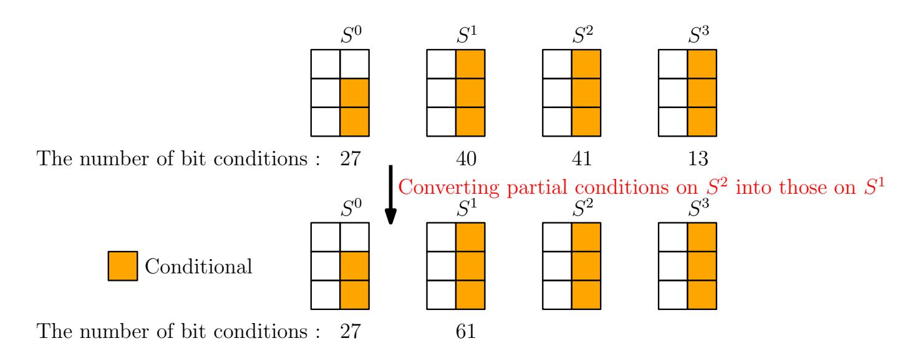

Fig. 7: Illustration of merging conditions

The Start-From-the-Middle Method. According to the above analysis, the solution space of  $(S_{0,1}^1, S_{1,1}^1, S_{2,1}^1)$  can now be exhausted in practical time  $2^{35}$ . For each of its possible values, the conditions on  $(S_{0,1}^2, S_{1,1}^2, S_{2,1}^2)$  and  $(S_{0,3}^3, S_{1,1}^3, S_{2,1}^3)$  can be fully verified. In this way, we find that there are in total 1632 solutions for  $(S_{0,1}^1, S_{1,1}^1, S_{2,1}^1)$ . By sorting the solutions according to  $(S_{1,1}^1, S_{2,1}^1)$ , we find that among all the 1632 solutions, there are 720 different values of  $(S_{1,1}^1, S_{2,1}^1)$  and each different value of  $(S_{1,1}^1, S_{2,1}^1)$  will correspond to 2 different values of  $S_{0,1}^1$  on average. Record these 720 different values of  $(S_{1,1}^1, S_{2,1}^1)$  in order to identify all the valid values of  $(S_{1,1}^0, S_{2,1}^0)$ .

It has been discussed in Property 4 that a random tuple  $(S_{1,1}^0, S_{2,1}^0, S_{1,1}^1, S_{2,1}^1)$  is valid with probability  $2^{-32}$ . Once it is valid,  $(S_{0,1}^0, S_{0,1}^1)$  is determined. In other words, although the attacker can freely choose the values of  $S_{0,1}^0$ , whether the 720 different values of  $(S_{1,1}^1, S_{2,1}^1)$  can be reached only depends on the value of  $(S_{1,1}^0, S_{2,1}^0)$ . According to Table 3, there are 27 linearly independent conditions on  $(S_{1,1}^0, S_{2,1}^0)$ . Thus, a naive way to find all the valid solutions of  $(S_{1,1}^0, S_{2,1}^0)$  is to exhaust all the  $2^{64-27}=2^{37}$  possible values of  $(S_{1,1}^0, S_{2,1}^0)$  since we can pre-assign values to  $(S_{1,1}^0, S_{2,1}^0)$  to make the 27 linear conditions on them hold. For each guessed value, check whether there exists a tuple  $(S_{1,1}^1, S_{2,1}^1)$  which can make the tuple  $(S_{1,1}^0, S_{2,1}^0, S_{1,1}^1, S_{2,1}^1)$  valid. Obviously, the time complexity of this method is  $720 \times 2^{37} = 2^{46.4}$  and therefore it still requires a significant amount of time. To accelerate this exhaustive search, we use the following property of the SP-box.

<span id="page-18-1"></span>**Property 6** Given the triple (IZ, OY, OZ), IY can be recovered by solving a linear equation system of size 32.

*Proof.* For simplicity, we omit the rotate shift of (IX, IY) and only focus on the following relations.

$$OZ \leftarrow IX \oplus IZ \ll 1 \oplus (IY \wedge IZ) \ll 2$$
  
 $OY \leftarrow IY \oplus IX \oplus (IX \vee IZ) \ll 1$   
 $OX \leftarrow IZ \oplus IY \oplus (IX \wedge IY) \ll 3$ 

{19}------------------------------------------------

Therefore, we can obtain that

$$OY = IY \oplus (OZ \oplus IZ \ll 1 \oplus (IY \wedge IZ) \ll 2) \oplus ((OZ \oplus IZ \ll 1 \oplus (IY \wedge IZ) \ll 2) \vee IZ) \ll 1.$$

Since (IZ, OY, OZ) are known, 32 linearly independent equations in terms of the unknown 32 bits of IY can be derived. Consequently, IY can be recovered by solving a linear equation system of size 32.

Based on Property 6, the search space of  $(S_{1,1}^0, S_{2,1}^0)$  can be significantly reduced, as specified below:

- Step 1: Record the 13 conditions on  $S_{1,1}^0$  displayed in Table 3 by a matrix  $LM_3$ . Keep the 14 conditions on  $S_{2,1}^0$  displayed in Table 3 hold.
- Step 2: Guess all possible values of the remaining unknown 18 bits of  $S_{2,1}^0$ . For each guess of  $S_{2,1}^0$ , exhaust the 720 different values of  $(S_{1,1}^1, S_{2,1}^1)$ . For each guessed value of  $(S_{2,1}^0, S_{1,1}^1, S_{2,1}^1)$ , according to Property 6, 32 linear equations in terms of  $S_{1,1}^0$  can be derived. Add these 32 linear equations to  $LM_3$  and check the consistency using Gauss elimination. If they are consistent, output the solution to  $S_{1,1}^0$ .

The time complexity of the above method is therefore  $720 \times 2^{18} = 2^{27.4}$ . With this method, we find that there are in total  $0 \times 34 c 8$  valid values for  $(S_{1,1}^0, S_{2,1}^0)$ . Moreover, each solution of  $(S_{1,1}^0, S_{2,1}^0)$  will correspond to 2 different values of  $(S_{1,1}^1, S_{2,1}^1)$ . Note that each  $(S_{1,1}^1, S_{2,1}^1)$  can correspond to 2 different values of  $S_{0,1}^1$  on average. Thus, each valid solution of  $(S_{1,1}^0, S_{2,1}^0)$  can correspond to 4 different solutions of  $S_{0,1}^1$  on average. An illustration of the start-from-the-middle procedure can be referred to Figure 8.

<span id="page-19-0"></span>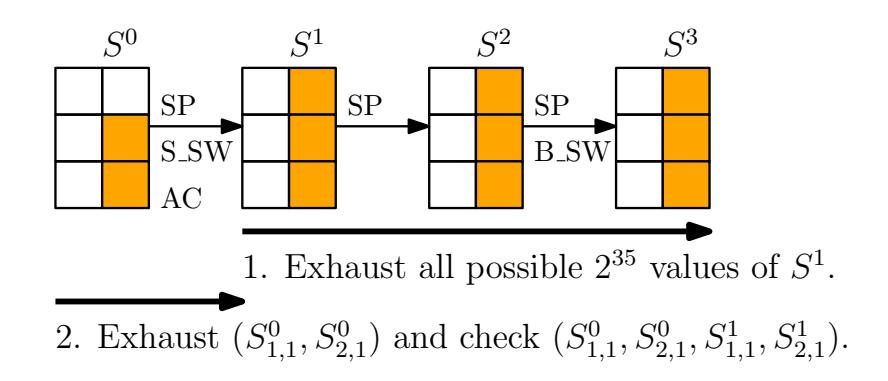

Fig. 8: Illustration of the start-from-the-middle method

Calculating the Probability. It has been identified that there are in total  $0 \times 34 c 8$  valid values for  $(S_{1,1}^0, S_{2,1}^0)$ , each of which will correspond to 4 different values of  $S_{0,1}^1$ . Note that  $S_{0,1}^1$  is computed by using  $(S_{0,0}^0, S_{1,0}^0, S_{2,0}^0)$  due to the effect of Small-Swap. It has been pointed out in Property 2 that a random tuple  $(S_{1,0}^0, S_{2,0}^0, S_{0,1}^1)$  holds with probability  $2^{-15.5}$ . Thus, a random tuple  $(S_{1,0}^0, S_{2,0}^0, S_{1,1}^0, S_{2,1}^0)$  is valid with probability  $2^{-64} \times 0 \times 34 c 8 \times (4 \times 2^{-15.5}) \approx 2^{-63.8}$ . It has been discussed above that L-Conditions and R-Conditions are

{20}------------------------------------------------

identical. Consequently, the whole capacity part  $(S_{i,j}^0)$   $(1 \le i \le 2, 0 \le j \le 3)$  is valid with probability  $2^{-127.6}$ . Once it is valid, a solution to  $(S_{0,0}^0, S_{0,1}^0, S_{0,2}^0, S_{0,3}^0)$ can always be computed to make the L-Conditions and R-Conditions hold. In the following, how to find the solution to  $(S_{0,0}^0, S_{0,1}^0, S_{0,2}^0, S_{0,3}^0)$  when  $(S_{i,j}^0)$  $(1 \le i \le 2, 0 \le j \le 1)$  are valid will be described. An illustration of the probability calculation can be referred to Figure 9.

<span id="page-20-0"></span>Probability:  $2^{-15.5} \times 4 = 2^{-13.5}$ 

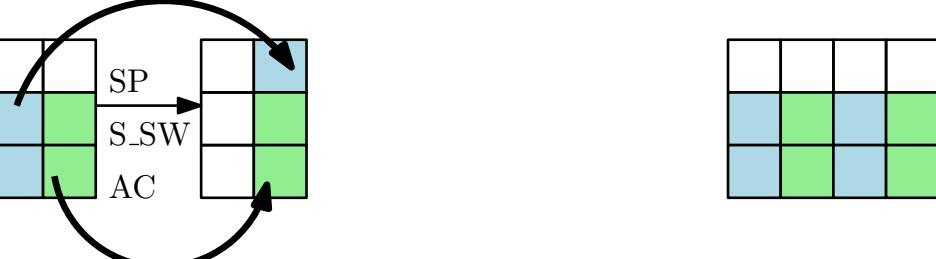

Total probability:  $2^{(-13.5-50.3)\times 2} = 2^{-127.6}$ Probability:  $2^{-64} \times 0x24c8 = 2^{-50.3}$ 

Fig. 9: Calculating the probability of a valid capacity part

Storing the Solutions. Note that there is no need to enumerate all the valid solutions for  $(S_{i,j}^0)$   $(1 \le i \le 2, 0 \le j \le 3)$ , which will be very costly. Instead, we can construct 4 small tables to record all the valid solutions as follows.

- 1. Construct the table  $TA_0$  to record the valid tuples  $(S_{1,1}^0, S_{2,1}^0)$ .
- 2. Construct the table  $TA_1$  to record the valid tuples  $(S_{0,1}^{\tilde{1},1}, S_{1,1}^{\tilde{1},1}, S_{2,1}^1)$ .
- 3. Construct the table  $TA_2$  to record the valid tuples  $(S_{1,1}^0, S_{2,1}^0, S_{1,1}^1, S_{2,1}^1)$ . 4. Construct the table  $TA_3$  to record the valid tuples  $(S_{1,1}^0, S_{2,1}^0, S_{1,1}^1, S_{2,1}^1)$ .

In this way, once  $(S_{i,j}^0)$   $(1 \le i \le 2, 0 \le j \le 3)$  are valid, we can retrieve the corresponding  $(S_{1,1}^1, \tilde{S}_{2,1}^1, S_{1,3}^1, S_{2,3}^1)$  from  $TA_2$ . And once  $(S_{1,1}^1, S_{2,1}^1, S_{1,3}^1, S_{2,3}^1)$  are known, we can retrieve valid  $(S_{0,1}^1, S_{0,3}^1)$  from  $TA_1$ . Until this phase,  $(S_{1,0}^0, S_{2,0}^0, S_{0,1}^1), (S_{1,2}^0, S_{2,2}^0, S_{0,3}^1), (S_{1,1}^0, S_{2,1}^0, S_{1,1}^1, S_{2,1}^1) \text{ and } (S_{1,3}^0, S_{2,3}^0, S_{1,3}^1, S_{2,3}^1)$ are known. Thus, we can compute the corresponding value of  $(\bar{S}_{0,0}^{0}, \bar{S}_{0,1}^{0}, S_{0,2}^{0}, S_{0,3}^{0})$ and they will always make the L-Conditions and R-Conditions hold. Thus, the remaining work is how to find a valid value of the capacity part  $(S_{i,j}^0)$  $(1 \le i \le 2, 0 \le j \le 3).$ 

#### Finding a Valid Capacity Part 5.3

According to the above analysis, converting a semi-free-start collision attack into a collision attack based on the 6-round differential characteristic in Table 2 is reduced to finding a valid capacity part of the output state after several message blocks are absorbed. Since the capacity part is valid with probability  $2^{-127.6}$ , a naive way is to try  $2^{127.6}$  random messages, which is obviously too inefficient. In the following, a time-memory trade-off method will be introduced to efficiently 

{21}------------------------------------------------

find a message which can make the capacity part valid. Another method without time-memory trade-off can be referred to Appendix D.

<span id="page-21-0"></span>The Exhaustive Search with Time-Memory Trade-off An illustration of the procedure can be referred to Figure 10. Note that the valid values of  $(S_{1,1}^6, S_{2,1}^6)$  have been stored in  $TA_0$  and  $(S_{1,3}^6, S_{2,3}^6)$  shares the same valid values with  $(S_{1,1}^6, S_{2,1}^6)$  due to the symmetry of the 6-round differential characteristic. Moreover, given a valid value of  $(S_{1,1}^6, S_{2,1}^6)$ , by using  $TA_3$  and the Property 2 of the SP-box, we can determine whether  $(S_{1,0}^6, S_{2,0}^6)$  is valid with only 4 times of check. Why 4 times are needed can be referred to the part to calculate the probability of a valid capacity part.

To efficiently find a valid value for  $S^6$ , some conditions on  $(S^0_{i,j})$   $(1 \le i \le 2, 0 \le j \le 3)$  will be added, as specified below:

<span id="page-21-2"></span>
$$\begin{cases} (S_{1,0}^{0} \ll 9) \wedge 0 \times 1 \text{ffffff} = 0, \\ (S_{1,1}^{0} \ll 9) \wedge 0 \times 1 \text{ffffff} = 0, \\ (S_{1,2}^{0} \ll 9) \wedge 0 \times 1 \text{ffffff} = 0, \\ (S_{1,3}^{0} \ll 9) \wedge 0 \times 1 \text{ffffff} = 0. \end{cases}$$
(22)

In this way,  $(S_{0,0}^1, S_{0,1}^1, S_{0,2}^1, S_{0,3}^1)$  will be independent of  $(S_{0,0}^0, S_{0,1}^0, S_{0,2}^0, S_{0,3}^0)$  based on Property 1. For readability, how to find a message which can lead to an output whose capacity part satisfies Equation 22 will be first skipped. In the following, we start from how to find a valid solution for the capacity part of  $S^6$  when Equation 22 has been fulfilled. We refer to Figure 10 for better understanding. The corresponding procedure is as follows:

<span id="page-21-1"></span>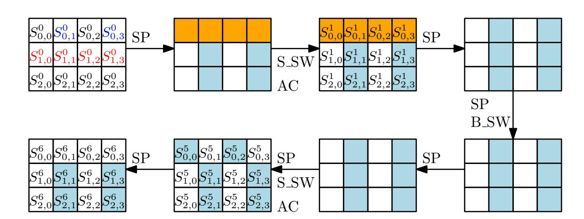

Fig. 10: Matching one valid capacity part

Step 1: Exhaust all  $0 \times 34 \subset 8$  possible values of  $(S_{1,1}^6, S_{2,1}^6)$ . For each value, guess  $S_{2,1}^5$  and compute  $S_{1,1}^5$ . Store all  $2^{32} \times 0 \times 34 \subset 8 \approx 2^{45.7}$  possible values of  $(S_{1,1}^5, S_{2,1}^5, S_{1,1}^6, S_{2,1}^6)$  in the table  $TA_4$ . Due to the symmetry of the 6-round differential characteristic,  $(S_{1,3}^5, S_{2,3}^5, S_{1,3}^6, S_{2,3}^6)$  take the same possible values with that of  $(S_{1,1}^5, S_{2,1}^5, S_{1,1}^6, S_{2,1}^6)$ .

{22}------------------------------------------------

- Step 2: Exhaust all  $2^{64}$  possible values of  $(S_{0,0}^0, S_{0,2}^0)$  and compute the corresponding  $(S_{0,1}^5, S_{0,3}^5)$ . Record all the values of  $(S_{0,1}^5, S_{0,3}^5, S_{0,0}^0, S_{0,2}^0)$  in the table  $TA_5$ .
- Step 3: Exhaust all  $2^{64}$  possible values of  $(S_{0,1}^0, S_{0,3}^0)$ . For each value, compute the corresponding  $(S_{1,1}^5, S_{2,1}^5, S_{1,3}^5, S_{2,3}^5)$ . According to  $TA_4$ , retrieve the corresponding  $(S_{1,1}^6, S_{2,1}^6, S_{1,3}^6, S_{2,3}^6)$  if there is. Otherwise, try another guess of  $(S_{0,1}^0, S_{0,3}^0)$ . It is expected that there will be  $2^{64+(-64+45.7)\times 2} = 2^{27.4}$  valid values of  $(S_{0,1}^0, S_{0,3}^0, S_{1,1}^6, S_{2,1}^6, S_{1,3}^6, S_{2,3}^6)$ . For each valid value, move to Step 4.
- Step 4: Once  $(S_{1,1}^6, S_{2,1}^6, S_{1,3}^6, S_{2,3}^6)$  is known, compute the corresponding  $(S_{0,1}^5, S_{0,3}^5)$  according to Property 4. Then, retrieve the corresponding  $(S_{0,0}^0, S_{0,2}^0)$  from  $TA_5$ . Once  $(S_{0,0}^0, S_{0,2}^0)$  is determined, we can compute  $(S_{1,0}^6, S_{2,0}^6, S_{1,2}^6, S_{2,2}^6)$  and check its validity according to  $TA_3$ , which holds with probability  $(4 \times 2^{-15.5})^2 = 2^{-27}$ . Thus, it is expected to find one solution to  $(S_{0,0}^0, S_{0,1}^0, S_{0,0}^0, S_{0,3}^0)$  which can make the capacity part of  $S^6$  valid.

It can be easily observed that the time and memory complexity of the above procedure are both  $2^{64}$ .

Fulfilling Equation 23. It should be observed that the initial state of Gimli-Hash satisfies Equation 22. Thus, we can start from an input state  $S^0$  whose capacity part satisfies Equation 22 and find a solution to  $(S_{0,0}^0, S_{0,1}^0, S_{0,2}^0, S_{0,3}^0)$  in order that the capacity part of  $S^6$  satisfies Equation 23. The procedure is almost the same with the above one.

<span id="page-22-0"></span>
$$\begin{cases} (S_{1,0}^{6} \ll 9) \land 0 \times 1 \text{ffffff} = 0, \\ (S_{1,1}^{6} \ll 9) \land 0 \times 1 \text{ffffff} = 0, \\ (S_{1,2}^{6} \ll 9) \land 0 \times 1 \text{ffffff} = 0, \\ (S_{1,3}^{6} \ll 9) \land 0 \times 1 \text{ffffff} = 0. \end{cases}$$
(23)

- Step 1: Exhaust all  $2^{64}$  possible values of  $(S_{0,0}^0, S_{0,2}^0)$  and compute the corresponding  $(S_{0,1}^5, S_{0,3}^5)$ . Record all the values of  $(S_{0,1}^5, S_{0,3}^5, S_{0,0}^0, S_{0,2}^0)$  in the table  $TA_6$ .
- Step 2: Exhaust all  $2^{64}$  possible values of  $(S_{0,1}^0, S_{0,3}^0)$ . For each possible value,  $(S_{1,1}^5, S_{2,1}^5, S_{1,3}^5, S_{2,3}^5)$  is computable. Then, based on the Property 5 of the SP-box, compute  $(S_{0,1}^5, S_{0,3}^5)$  which can make the conditions on  $(S_{1,1}^6, S_{1,3}^6)$  hold. Once  $(S_{0,1}^5, S_{0,3}^5)$  is determined, we can retrieve from  $TA_6$  the values of  $(S_{0,0}^0, S_{0,2}^0)$ . Then, we can compute the full value of  $S^6$  and check whether the conditions on  $(S_{1,0}^6, S_{1,2}^6)$  hold. Once it is valid, a solution to the rate part of  $S^0$  which can make the  $4 \times 29 = 116$  bit conditions on the capacity part of  $S^6$  hold is found.

Obviously, the time complexity to find a conditional capacity part is upper bounded by  $2^{64}$  and the memory complexity is  $2^{64}$ . Consequently, the time and memory complexity to convert the SFS collisions into collisions are both  $2^{64}$ .

{23}------------------------------------------------

#### 5.4 Discussions on Our MILP Model

Similar to the MILP model for bit-based division property to find an integral distinguisher [\[22\]](#page-30-10), our model is used to identify whether there exists a feasible solution instead of proving something optimal. If the model is infeasible, it simply implies that the corresponding differential characteristic is invalid. We also have to admit that the detection of contradictions can be performed manually, especially for the primitives with simple linear and nonlinear components. However, when the components become sophisticated, it is rather time-consuming to tackle this task. For example, the linear and nonlinear components of ASCON [\[10\]](#page-29-9) are more complex than those of Gimli and we are not able to carry out a manual analysis of the 2-round differential characteristic for ASCON found in [\[23\]](#page-31-0). However, after constructing a similar model for ASCON, we immediately found that the 2-round differential characteristic [\[23\]](#page-31-0) is invalid as well. The correctness of the model for ASCON is verified by setting a correct 4-round differential characteristic and its corresponding conforming message as inputs, which are found by the designers in [\[11\]](#page-29-10). However, we are not able to improve the results for ASCON.

We also notice that as the number of the attacked rounds increases, more variables and more related inequalities are involved, thus making the time to get a solution increase significantly. Consequently, it is difficult to estimate whether a differential characteristic can be verified in practical time. We believe that if there are simple contradictions in the differential characteristic, they can be found immediately. However, when the contradictions are complex, it may take more time to detect them. For example, we followed some truncated collision-producing differential characteristics for ASCON identified in [\[10\]](#page-29-9). For the dense parts, after we ensure that there is no contradiction for certain two consecutive rounds and get a solution for the differential characteristic, when three consecutive rounds are tested, contradictions start to appear and it takes some time for the solver to output "infeasible".

Therefore, we provide an insight on searching for differential characteristics for the permutation-based primitives. Suppose the target is to search for a characteristic for up to XR rounds. For such a task, one can involve the value transitions in a suitable place of the differential characteristics to avoid the inconsistency in this part. After a feasible solution is found, involve the value transitions in longer consecutive rounds and further check the consistency. However, it can not be guaranteed that we can always obtain a solution ("feasible") or no solution ("infeasible") in practical time.

# <span id="page-23-0"></span>6 SFS Collisions for Intermediate 8-Round Gimli-Hash

The collision attack on 6-round Gimli-Hash has been described above. To further understand the security of Gimli-Hash, a SFS collision attack on the intermediate 8 rounds of Gimli-Hash will be described in this section. Specifically, the following sequence of operations (8-round permutation) will be considered:

$$(SP) \rightarrow (SP \rightarrow B_-SW) \rightarrow (SP)$$

{24}------------------------------------------------

In addition, our target is to find an inner collision, i.e. the collision in the capacity part, which can be trivially converted to a real SFS collision by using more message blocks to absorb the difference in the rate part.

Different from the collision attack on 6-round Gimli-Hash, this attack does not rely on a specific differential characteristic. Instead, the structure of the intermediate 8-round permutation will be exploited. As shown in Figure 11, the message difference is only injected in  $S_{0,3}^1$  and the difference of several internal state words are conditioned in order to generate an inner collision. In other words, finding a SFS collision is equivalent to finding a message pair which can make the conditions on these intermediate words hold.

# 6.1 Fulfilling $\Delta S_{0,1}^3 = 0$ , $\Delta S_{1,3}^5 = 0$ and $\Delta S_{2,3}^5 = 0$

First of all, consider the conditions on  $\Delta S^3$  and  $\Delta S^5$ , i.e.  $\Delta S^3_{0,1} = 0$ ,  $\Delta S^5_{1,3} = 0$  and  $\Delta S^5_{2,3} = 0$ . The following facts should be noticed:

```
\begin{array}{l} -\ S_{0,1}^3 \ \text{only depends on} \ (S_{0,3}^1, S_{1,3}^1, S_{2,3}^1). \\ -\ (S_{1,3}^5, S_{2,3}^5) \ \text{only depend on} \ (S_{0,3}^3, S_{1,3}^3, S_{2,3}^3). \\ -\ S_{0,3}^3 \ \text{only depends on} \ (S_{0,1}^1, S_{1,1}^1, S_{2,1}^1). \\ -\ (S_{1,3}^3, S_{2,3}^3) \ \text{only depend on} \ (S_{0,3}^1, S_{1,3}^1, S_{2,3}^1). \end{array}
```

Therefore, the corresponding attack procedure to make the above three conditions hold can be described as below:

- Step 1: Randomly choose a value for  $(S_{1,3}^1, S_{2,3}^1)$ , exhaust all  $2^{32}$  possible values of  $S_{0,3}^1$  and compute the corresponding  $(S_{0,1}^3, S_{1,3}^3, S_{2,3}^3)$ . Store these values in a table and sort it according to  $S_{0,1}^3$ .
- Step 2: For each pair of  $(S_{0,1}^3, S_{1,3}^3, S_{2,3}^3)$  colliding in  $S_{0,1}^3$ , exhaust all  $2^{32}$  possible values of  $S_{0,3}^3$ . Then, we can compute a pair of  $(S_{1,3}^5, S_{2,3}^5)$  and check whether they collide. If all possible values of  $S_{0,3}^3$  are used up and there is no collision in  $(S_{1,3}^5, S_{2,3}^5)$ , goto Step 1. If a collision in  $(S_{1,3}^5, S_{2,3}^5)$  is found, move to Step 3.
- Step 3: Randomly choose a value for  $(S_{1,1}^3, S_{2,1}^3)$  and compute backward to obtain  $(S_{0,1}^1, S_{1,1}^1, S_{2,1}^1)$ .

Complexity Evaluation. Obviously, at Step 1, we can expect  $2^{31}$  pairs of  $(S_{0,1}^3, S_{1,3}^3, S_{2,3}^3)$  colliding in  $S_{0,1}^3$ . The time complexity and memory complexity to obtain these collisions are both  $2^{32}$ . As for Step 2, we need to enumerate all possible values of  $S_{0,3}^3$  for each colliding message pair. Therefore, the time complexity is  $2^{64}$ . In addition,  $\Delta S_{1,3}^5 = 0$  and  $\Delta S_{2,3}^5 = 0$  hold with probability  $2^{-64}$  while only  $2^{32+31}$  pairs of  $(S_{0,3}^3, S_{1,3}^3, S_{2,3}^3)$  will be checked at Step 2. Thus, Step 1 will be repeated twice. Since only half state is computed at this phase, the time complexity to make the conditions  $\Delta S_{0,1}^3 = 0$ ,  $\Delta S_{1,3}^5 = 0$  and  $\Delta S_{2,3}^5 = 0$  hold is  $2^{64}$ , while the memory complexity is  $2^{32}$ .

{25}------------------------------------------------

<span id="page-25-0"></span>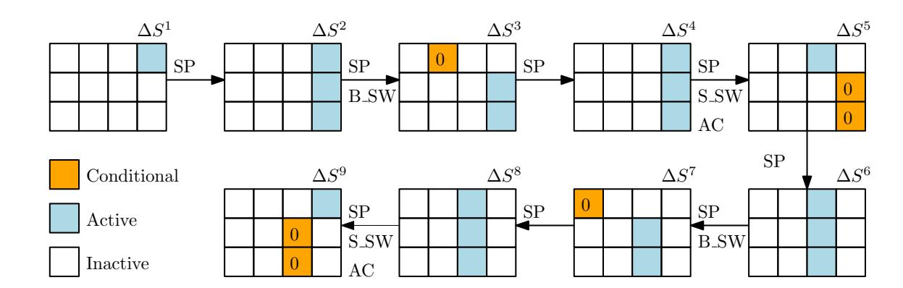

Fig. 11: SFS collision attack on the intermediate 8-round Gimli-Hash

# 6.2 Fulfilling $\Delta S_{0,0}^7=0,\,\Delta S_{1,2}^9=0$ and $\Delta S_{2,2}^9=0$

After the conditions on  $\Delta S^3$  and  $\Delta S^5$  are satisfied, some internal state words will be fixed, as can be noted in the above attack procedure to fulfill these conditions. In fact, the above method can be adjusted to fulfill  $\Delta S_{0,0}^7 = 0$ ,  $\Delta S_{1,2}^9 = 0$  and  $\Delta S_{2,2}^9 = 0$ . First of all, notice the following facts:

```
\begin{array}{l} -\ S_{0,0}^7 \ \text{only depends on} \ (S_{0,2}^5, S_{1,2}^5, S_{2,2}^5). \\ -\ (S_{1,2}^9, S_{2,2}^9) \ \text{only depend on} \ (S_{0,2}^7, S_{1,2}^7, S_{2,2}^7). \\ -\ S_{0,2}^7 \ \text{only depends on} \ (S_{0,0}^5, S_{1,0}^5, S_{2,0}^5). \\ -\ (S_{1,2}^7, S_{2,2}^7) \ \text{only depend on} \ (S_{0,2}^5, S_{1,2}^5, S_{2,2}^5). \\ -\ (S_{0,0}^5, S_{0,2}^5) \ \text{have already been fixed.} \end{array}
```

Therefore, the procedure to fulfill the conditions  $\Delta S_{0,0}^7 = 0$ ,  $\Delta S_{1,2}^9 = 0$  and  $\Delta S_{2,2}^9 = 0$  can be described as below:

- Step 1: Exhaust all  $2^{64}$  possible values of  $(S_{1,2}^5, S_{2,2}^5)$ . In this way,  $2^{64}$  different pairs of  $(S_{0,2}^5, S_{1,2}^5, S_{2,2}^5)$  can be obtained. For each pair, check whether they collide in  $S_{0,0}^7$ , which holds with probability  $2^{-32}$ . Once they collide, move to Step 2.
- Step 2: Exhaust all  $2^{32}$  possible values of  $S_{0,2}^7$ . In this way,  $2^{32}$  different pairs of  $(S_{0,2}^7, S_{1,2}^7, S_{2,2}^7)$  can be generated. For each pair, check whether they collide in  $(S_{1,2}^9, S_{2,2}^9)$ , while occurs with probability  $2^{-64}$ . Once they collide, move to Step 3. Otherwise, goto Step 1.
- Step 3: Randomly choose values for  $(S_{1,0}^5, S_{2,0}^5)$  and compute the corresponding  $S_{0,2}^7$ . Repeat until the computed  $S_{0,2}^7$  is consistent with that obtained at Step 2. Finally, randomly choose a value for  $S_{0,3}^5$  and the full state of  $S^5$  is known. Compute backward to obtain the corresponding  $S^1$ .

Complexity Evaluation. At Step 1, it is expected that there will be  $2^{32}$  pairs of  $(S_{0,2}^5, S_{1,2}^5, S_{2,2}^5)$  colliding in  $S_{0,0}^7$ . The corresponding time complexity is  $2^{64}$ . For each colliding pair, at Step 2, we will exhaust  $2^{32}$  all possible values of  $S_{0,2}^7$  and check whether the collision will occur in  $(S_{1,2}^9, S_{2,2}^9)$ . Thus, after traversing all possible solutions obtained at Step 1, we can expect a collision in  $(S_{1,2}^9, S_{2,2}^9)$ . Thus, the time complexity at Step 2 is  $2^{32}$ . As for Step 3, it is obvious that the time complexity is  $2^{32}$ . Therefore, the total time complexity to find a SFS collision for the intermediate 8-round Gimli-Hash is  $2^{64}$ .

{26}------------------------------------------------

Remark. It can be noted that there is a minor difference between the methods to fulfill the conditions on  $(S^3, S^5)$  and on  $(S^7, S^9)$ . Thus, when fulfilling the conditions on  $(S^3, S^5)$ , there is actually no need to consume  $2^{32}$  memory. Similar to the above method, one can simply first choose two different values for  $S^1_{0,3}$  and then exhaust all possible values of  $(S^1_{1,3}, S^1_{2,3})$  to obtain  $2^{32}$  pairs colliding in  $S^3_{0,1}$ . Thus, we do not take the memory complexity into account in the final complexity evaluation. On the other hand,  $2^{32}$  memory is cheap as well.

#### 6.3 Experimental Verification

One may doubt whether the above differential pattern for 8-round Gimli-Hash is valid. To confirm it, our MILP model is applied. Since the generic complexity we found is  $2^{64}$ , it is reasonable that the solver cannot find a solution in practical time, except the case when there are some more clever algorithms to solve the corresponding inequalities in the solver. According to the output of the Gurobi solver, it keeps trying to solve the inequalities and does not output "infeasible" for such a differential pattern. Thus, we believe that the 8-round differential pattern is reasonable. As a counter-example, an impossible 7-round differential pattern is displayed in Appendix E.

## <span id="page-26-0"></span>7 State Recovery Attack on 9-Round Gimli

For the AE scheme specified in the submitted Gimli document [1], the key length is 256 bits while the designers claim only 128-bit security. Such a security claim is strange since there is no generic attack matching this bound. Although there is a key-recovery attack on 22.5-round Gimli [12], it only works for an ad-hoc mode and cannot be directly applied to the official scheme. Thus, we are motivated to devise the following two attacks and we believe that they are meaningful to further understand the security of Gimli.

- 1. The attack on a round-reduced variant matching the  $2^{128}$  security claim.
- 2. Maximize the number of rounds that can be attacked with complexity below  $2^{256}$ .

According to the specification of the AE scheme, it seems difficult to devise an attack starting from the initializing phase when the key and the nonce will be mixed since 2r-round permutation needs to be considered when attacking r-round Gimli in the nonce-respecting setting. Therefore, we only focus on the encryption phase when part of the secret state will be leaked. Specifically, the first row of the Gimli state will be leaked to an attacker at the encryption phase. Thus, our aim is to recover the full secret state using the leaked information. A brief description of the AE scheme can be referred to Appendix H. The complete description of the authenticated encryption scheme can be referred to [1]. For our state recovery attack, four 128-bit message blocks will be used, as shown in Figure 12. The aim is to recover the secret state of  $P_1$ . The attack procedure can be divided into three steps, as specified below:

{27}------------------------------------------------

<span id="page-27-1"></span>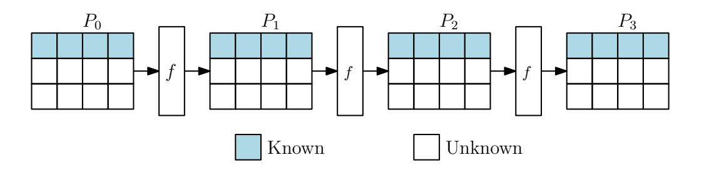

Fig. 12: Leaked information in the state recovery attack

- Step 1: Find all the solutions for the unknown 256 bits of  $P_1$  which can match the first row of  $P_0$ . Since the matching probability is  $2^{-128}$ , it is expected that there will be  $2^{128}$  solutions.
- Step 2: For each solution matching the first row of  $P_0$ , check whether it can match the first row of  $P_2$  and  $P_3$  simultaneously. Since the matching probability is  $2^{-256}$ , it is expected to find the unique correct solution for the unknown 256 bits of  $P_1$ .
- Step 3: Once the unique solution is found, the full state of  $P_1$  is known and we can compute backward to obtain the secret key.

As can be noticed, the main obstacle is Step 1. To gain an advantage over the brute force, all the solutions to the unknown 256 secret state bits of  $P_1$  which can match the first row of  $P_0$  have to be collected in less than  $2^{256}$  time. Thus, in the description of the state recovery attacks on 5/9-round Gimli, we mainly focus on Step 1. The attack on 5-round Gimli matching the  $2^{128}$  security claim can be referred to Appendix F. In the following, how to mount a state-recovery attack on 9-round Gimli with complexity less than  $2^{256}$  will be detailed.

#### <span id="page-27-0"></span>7.1 State Recovery Attack on 9-Round Gimli

As shown in Figure 13, our aim is to exhaust all possible values of  $(S_{i,j}^9)$   $(1 \le i \le 2, 0 \le j \le 3)$  and then compute backward to check whether the first row of  $S^0$  can be matched. The complexity is required not to exceed  $2^{256}$ . The corresponding attack procedure can be described as follows:

Step 1: Guess  $(S_{1,0}^9, S_{2,0}^9, S_{1,2}^9, S_{2,2}^9, S_{0,0}^4, S_{0,2}^4)$ . For each guess, compute backward to obtain  $(S_{1,0}^{0.5}, S_{2,0}^{0.5}, S_{1,2}^{0.5}, S_{2,2}^{0.5}, S_{0,1}^{0.5}, S_{0,3}^{0.5})$ . Then, according to the Property 3 of the SP-box, the guess is correct with probability  $2^{-2}$ . Once it is correct, compute  $(S_{1,0}^0, S_{2,0}^0[30 \sim 0], S_{0,0}^{0.5}[30 \sim 0])$ . For the correct guess, store the corresponding value of the tuple

$$(S_{0,0}^{0.5}[30\sim 0], S_{0,1}^{0.5}, S_{0,2}^{0.5}[30\sim 0], S_{0,3}^{0.5}, S_{0,0}^4, S_{0,1}^4, S_{0,2}^4, S_{0,3}^4, S_{1,0}^9, S_{2,0}^9, S_{1,2}^9, S_{2,2}^9)$$

in a table denoted by  $T_{49}$ . It is expected to have  $2^{192-2} = 2^{190}$  valid values.

Step 2: Similarly, guess  $(S_{1,1}^9, S_{2,1}^9, S_{1,3}^9, S_{2,3}^9, S_{0,1}^4, S_{0,3}^4)$  and compute the corresponding value of the tuple

$$(S_{0,0}^{0.5}, S_{0,1}^{0.5}[30 \sim 0], S_{0,2}^{0.5}, S_{0,3}^{0.5}[30 \sim 0], S_{0,0}^4, S_{0,1}^4, S_{0,2}^4, S_{0,3}^4).$$

{28}------------------------------------------------

<span id="page-28-1"></span>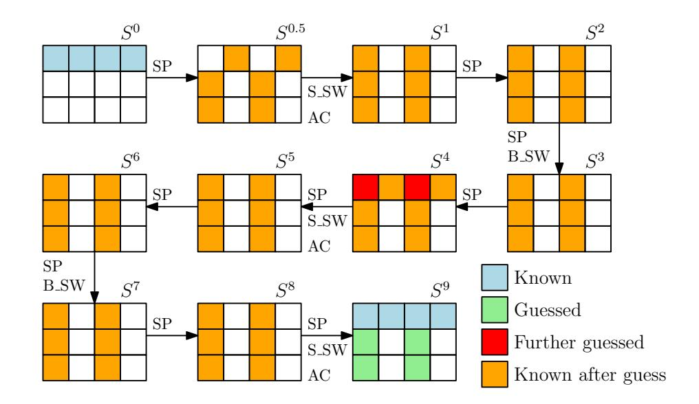

Fig. 13: State recovery attack on 9-round Gimli

Check whether there is a match between

$$(S_{0.0}^{0.5}[30 \sim 0], S_{0.1}^{0.5}[30 \sim 0], S_{0.2}^{0.5}[30 \sim 0], S_{0.3}^{0.5}[30 \sim 0], S_{0.0}^4, S_{0.1}^4, S_{0.2}^4, S_{0.3}^4)$$

in the table  $T_{49}$ . Once a match is found, a valid value of  $(S_{i,j}^9)$   $(1 \le i \le 2, 0 \le j \le 3)$  is found. Since the matching probability is  $2^{-31 \times 4 - 128} = 2^{-252}$  and there are in total  $2^{190+190} = 2^{380}$  pairs, it is expected to find  $2^{380-252} = 2^{128}$  valid values of  $(S_{i,j}^9)$   $(1 \le i \le 2, 0 \le j \le 3)$ .

Obviously, the time complexity and memory complexity to enumerate all valid values of  $(S_{i,j}^9)$   $(1 \le i \le 2, 0 \le j \le 3)$  are  $2^{192}$  and  $2^{190}$ , respectively. The correctness of  $(S_{i,j}^9)$   $(1 \le i \le 2, 0 \le j \le 3)$  can be simply further verified using the leaked information from  $(P_2, P_3)$ .

# <span id="page-28-0"></span>8 Conclusion

A comprehensive study of Gimli has been made. Especially, a novel MILP model capturing both difference transitions and value transitions is developed. As far as we know, this is the first MILP model to search for a differential characteristic involving the value transitions. It would be interesting to apply this technique to other permutation-based cryptographic primitives. Based on this new model, we reveal that some existing differential characteristics of Gimli are incompatible. Moreover, a practical SFS colliding message pair for 6-round Gimli-Hash is found by utilizing this model and several techniques to convert the SFS collisions into collisions are developed. To test how far the SFS collision attack on Gimli-Hash can go, we also mount an attack on the intermediate 8-round Gimli-Hash with time complexity 2<sup>64</sup>. For the authenticated encryption scheme, a state-recovery attack on 9-round Gimli can be mounted with time complexity 2<sup>192</sup> and memory complexity 2<sup>190</sup>. To the best of our knowledge, these are the best attacks on round-reduced Gimli, covering the proposed hash scheme and authenticated encryption scheme.

{29}------------------------------------------------

Acknowledgements. We thank the anonymous reviewers of CRYPTO 2020 for their many helpful comments. We thank Daniel J. Bernstein and Florian Mendel for some discussions on the cryptanalysis of Gimli. We also thank Xiaoyang Dong and Rui Zong for the discussions on the contradictions in the 6-round differential characteristic. Fukang Liu and Takanori Isobe are supported by Grant-in-Aid for Scientific Research (B) (KAKENHI 19H02141) for Japan Society for the Promotion of Science and SECOM science and technology foundation. In addition, Fukang Liu is partially supported by National Natural Science Foundation of China (Grant No.61632012, 61672239).

# References

- <span id="page-29-0"></span>1. [https://csrc.nist.gov/Projects/Lightweight-Cryptography/](https://csrc.nist.gov/Projects/Lightweight-Cryptography/Round-2-Candidates) [Round-2-Candidates](https://csrc.nist.gov/Projects/Lightweight-Cryptography/Round-2-Candidates).
- <span id="page-29-8"></span>2. <https://www.gurobi.com>.
- <span id="page-29-5"></span>3. J. Aumasson, C¸ . C¸ alik, W. Meier, O. Ozen, R. C. Phan, and K. Varici. ¨ Improved cryptanalysis of skein. In Advances in Cryptology - ASIACRYPT 2009, 15th International Conference on the Theory and Application of Cryptology and Information Security, Tokyo, Japan, December 6-10, 2009. Proceedings, pages 542– 559, 2009.
- <span id="page-29-1"></span>4. D. J. Bernstein, S. K¨olbl, S. Lucks, P. M. C. Massolino, F. Mendel, K. Nawaz, T. Schneider, P. Schwabe, F. Standaert, Y. Todo, and B. Viguier. Gimli : A cross-platform permutation. In Cryptographic Hardware and Embedded Systems - CHES 2017 - 19th International Conference, Taipei, Taiwan, September 25-28, 2017, Proceedings, pages 299–320, 2017.
- <span id="page-29-7"></span>5. G. Bertoni, J. Daemen, M. Peeters, and G. V. Assche. The Keccak reference, 2011. <http://keccak.noekeon.org>.
- <span id="page-29-2"></span>6. E. Biham and A. Shamir. Differential cryptanalysis of DES-like cryptosystems. In Advances in Cryptology - CRYPTO '90, 10th Annual International Cryptology Conference, Santa Barbara, California, USA, August 11-15, 1990, Proceedings, pages 2–21, 1990.
- <span id="page-29-4"></span>7. A. Biryukov, I. Nikolic, and A. Roy. Boomerang attacks on BLAKE-32. In Fast Software Encryption - 18th International Workshop, FSE 2011, Lyngby, Denmark, February 13-16, 2011, Revised Selected Papers, pages 218–237, 2011.
- <span id="page-29-6"></span>8. C. Blondeau, A. Bogdanov, and G. Leander. Bounds in shallows and in miseries. In Advances in Cryptology - CRYPTO 2013 - 33rd Annual Cryptology Conference, Santa Barbara, CA, USA, August 18-22, 2013. Proceedings, Part I, pages 204–221, 2013.
- <span id="page-29-3"></span>9. C. De Canni`ere and C. Rechberger. Finding SHA-1 characteristics: General results and applications. In X. Lai and K. Chen, editors, Advances in Cryptology - ASIACRYPT 2006, 12th International Conference on the Theory and Application of Cryptology and Information Security, Shanghai, China, December 3-7, 2006, Proceedings, volume 4284 of LNCS, pages 1–20. Springer, 2006.
- <span id="page-29-9"></span>10. C. Dobraunig, M. Eichlseder, F. Mendel, and M. Schl¨affer. Ascon v1.2, 2018. <https://ascon.iaik.tugraz.at/files/asconv12-nist.pdf>.
- <span id="page-29-10"></span>11. C. Dobraunig, M. Eichlseder, F. Mendel, and M. Schl¨affer. Preliminary analysis of Ascon-Xof and Ascon-Hash (version 0.1), 2019. [https:](https://ascon.iaik.tugraz.at/files/Preliminary_Analysis_of_Ascon-Xof_and_Ascon-Hash_v01.pdf) [//ascon.iaik.tugraz.at/files/Preliminary\\_Analysis\\_of\\_](https://ascon.iaik.tugraz.at/files/Preliminary_Analysis_of_Ascon-Xof_and_Ascon-Hash_v01.pdf) [Ascon-Xof\\_and\\_Ascon-Hash\\_v01.pdf](https://ascon.iaik.tugraz.at/files/Preliminary_Analysis_of_Ascon-Xof_and_Ascon-Hash_v01.pdf).

{30}------------------------------------------------

- <span id="page-30-0"></span>12. M. Hamburg. Cryptanalysis of 22 1/2 rounds of gimli. Cryptology ePrint Archive, Report 2017/743, 2017. <https://eprint.iacr.org/2017/743>.
- <span id="page-30-8"></span>13. S. K¨olbl, G. Leander, and T. Tiessen. Observations on the SIMON block cipher family. In Advances in Cryptology - CRYPTO 2015 - 35th Annual Cryptology Conference, Santa Barbara, CA, USA, August 16-20, 2015, Proceedings, Part I, pages 161–185, 2015.
- <span id="page-30-5"></span>14. G. Leurent. Analysis of differential attacks in ARX constructions. In Advances in Cryptology - ASIACRYPT 2012 - 18th International Conference on the Theory and Application of Cryptology and Information Security, Beijing, China, December 2-6, 2012. Proceedings, pages 226–243, 2012.
- <span id="page-30-6"></span>15. G. Leurent. Construction of differential characteristics in ARX designs application to skein. In Advances in Cryptology - CRYPTO 2013 - 33rd Annual Cryptology Conference, Santa Barbara, CA, USA, August 18-22, 2013. Proceedings, Part I, pages 241–258, 2013.
- <span id="page-30-4"></span>16. F. Mendel, T. Nad, and M. Schl¨affer. Finding SHA-2 characteristics: Searching through a minefield of contradictions. In Advances in Cryptology - ASIACRYPT 2011 - 17th International Conference on the Theory and Application of Cryptology and Information Security, Seoul, South Korea, December 4-8, 2011. Proceedings, pages 288–307, 2011.
- <span id="page-30-9"></span>17. I. Mironov and L. Zhang. Applications of SAT solvers to cryptanalysis of hash functions. In A. Biere and C. P. Gomes, editors, Theory and Applications of Satisfiability Testing - SAT 2006, 9th International Conference, Seattle, WA, USA, August 12-15, 2006, Proceedings, volume 4121 of Lecture Notes in Computer Science, pages 102–115. Springer, 2006.
- <span id="page-30-2"></span>18. M. Stevens, E. Bursztein, P. Karpman, A. Albertini, and Y. Markov. The first collision for full SHA-1. In J. Katz and H. Shacham, editors, Advances in Cryptology - CRYPTO 2017 - 37th Annual International Cryptology Conference, Santa Barbara, CA, USA, August 20-24, 2017, Proceedings, Part I, volume 10401 of LNCS, pages 570–596. Springer, 2017.
- <span id="page-30-7"></span>19. S. Sun, L. Hu, P. Wang, K. Qiao, X. Ma, and L. Song. Automatic security evaluation and (related-key) differential characteristic search: Application to SIMON, PRESENT, LBlock, DES(L) and other bit-oriented block ciphers. In Advances in Cryptology - ASIACRYPT 2014 - 20th International Conference on the Theory and Application of Cryptology and Information Security, Kaoshiung, Taiwan, R.O.C., December 7-11, 2014. Proceedings, Part I, pages 158–178, 2014.
- <span id="page-30-3"></span>20. X. Wang, Y. L. Yin, and H. Yu. Finding collisions in the full SHA-1. In V. Shoup, editor, Advances in Cryptology - CRYPTO 2005: 25th Annual International Cryptology Conference, Santa Barbara, California, USA, August 14-18, 2005, Proceedings, volume 3621 of LNCS, pages 17–36. Springer, 2005.
- <span id="page-30-1"></span>21. X. Wang and H. Yu. How to break MD5 and other hash functions. In R. Cramer, editor, Advances in Cryptology - EUROCRYPT 2005, 24th Annual International Conference on the Theory and Applications of Cryptographic Techniques, Aarhus, Denmark, May 22-26, 2005, Proceedings, volume 3494 of LNCS, pages 19–35. Springer, 2005.
- <span id="page-30-10"></span>22. Z. Xiang, W. Zhang, Z. Bao, and D. Lin. Applying MILP method to searching integral distinguishers based on division property for 6 lightweight block ciphers. In J. H. Cheon and T. Takagi, editors, Advances in Cryptology - ASIACRYPT 2016 - 22nd International Conference on the Theory and Application of Cryptology and Information Security, Hanoi, Vietnam, December 4-8, 2016, Proceedings, Part I, volume 10031 of Lecture Notes in Computer Science, pages 648–678, 2016.

{31}------------------------------------------------

<span id="page-31-0"></span>23. R. Zong, X. Dong, and X. Wang. Collision attacks on round-reduced Gimli-Hash/Ascon-Xof/Ascon-Hash. Cryptology ePrint Archive, Report 2019/1115, 2019. <https://eprint.iacr.org/2019/1115>.

# <span id="page-31-2"></span>A Algorithm of Gimli

The specification of Gimli is shown in Algorithm [1.](#page-31-1)

#### <span id="page-31-1"></span>Algorithm 1 Description of Gimli permutation

```
Input: S = (Si,j )
1: for r from 24 down to 1 inclusive do
2: for j from 0 to 3 inclusive do
3: x ← S0,j ≪ 24
4: y ← S1,j ≪ 9
5: z ← S2,j
6:
7: S2,j ← x ⊕ z  1 ⊕ (y ∧ z)  2
8: S1,j ← y ⊕ x ⊕ (x ∨ z)  1
9: S0,j ← z ⊕ y ⊕ (x ∧ y)  3
10: end for
11:
12: if r mod 4 =0 then
13: S0,0, S0,1, S0,2, S0,3 ← S0,1, S0,0, S0,3, S0,2 . Small-Swap
14: else if r mod 2 =0 then
15: S0,0, S0,1, S0,2, S0,3 ← S0,2, S0,3, S0,0, S0,1 . Big-Swap
16: end if
17:
18: if r mod 4 =0 then
19: S0,0 ← S0,0 ⊕ 0x9e377900 ⊕ r
20: end if
21: end for
22: return (Si,j )
```

# <span id="page-31-3"></span>B Proofs of the Properties

In this part, we give the detailed proofs of the properties of the SP-box.

Property 1. If IY [31 ∼ 23] = 0 and IY [19 ∼ 0] = 0, OX will be independent of IX.

Proof. Based on the specification of the SP-box, we have

$$OX = IZ \oplus (IY \lll 9) \oplus ((IX \lll 24) \land (IY \lll 9)) \ll 3.$$

{32}------------------------------------------------

If IY [31 ∼ 23] = 0 and IY [19 ∼ 0] = 0, we have

$$OX = IZ \oplus (IY \ll 9).$$

Therefore, OX will be independent of IX once such conditions on IY hold.

Property 2. A random triple (IY, IZ, OX) is potentially valid with probability 2 <sup>−</sup>15.<sup>5</sup> without knowing IX.

Proof. Note that

$$OX[i] = \begin{cases} IZ[i] \oplus IY[i-9] & (0 \le i \le 2) \\ IZ[i] \oplus IY[i-9] \oplus (IX[i-27] \land IY[i-12]) & (3 \le i \le 31) \end{cases}$$
(24)

Therefore, given a random triple (IY, IZ, OX), OX[i] (0 ≤ i ≤ 2) is valid with probability 2−<sup>3</sup> . As for OX[i] (3 ≤ i ≤ 31), it is potentially valid with probability (1 − 2 <sup>−</sup><sup>1</sup> × 2 −1 ) <sup>29</sup> = 0.75<sup>29</sup> since OX[i] can be computed without knowing IX when IY [i − 12] = 0. Thus, the total probability is 2<sup>−</sup><sup>3</sup> × 0.75<sup>29</sup> = 2<sup>−</sup>15.<sup>5</sup> .

Property 3. Given a random triple (IX, OY, OZ), it is valid with probability 2 −1 . Once it is valid, (OX[30 ∼ 0], IY, IZ[30 ∼ 0]) can be determined.

Proof. Note that

$$OY[i] = \begin{cases} IY[i-9] \oplus IX[i-24] \ (i=0) \\ IY[i-9] \oplus IX[i-24] \oplus (IX[i-25] \vee IZ[i-1]) \ (1 \le i \le 31) \end{cases}$$
(25)

$$OZ[i] = \begin{cases} IX[i-24] \ (i=0) \\ IX[i-24] \oplus IZ[i-1] \ (i=1) \\ IX[i-24] \oplus IZ[i-1] \oplus (IY[i-11] \land IZ[i-2]) \ (2 \le i \le 31) \end{cases}$$
(26)

Therefore, OZ[0] = IX[8] always holds, thus resulting in a valid random triple (IX, OY, OZ) with probability 2<sup>−</sup><sup>1</sup> . Once OZ[0] = IX[8] holds, we can first compute

$$IY[23] = OY[0] \oplus IX[8],$$
  
 $IZ[0] = OZ[1] \oplus IX[9],$   
 $IY[24] = OY[1] \oplus IX[9] \oplus (IX[8] \vee IZ[0]),$   
 $IZ[1] = OZ[2] \oplus IX[10].$ 

Then, we can recursively compute the following bits:

$$IY[i-9] = OY[i] \oplus IX[i-24] \oplus (IX[i-25] \vee IZ[i-1]),$$
  
 $IZ[j-1] = OZ[j] \oplus IX[j-24] \oplus (IY[j-11] \wedge IZ[j-2])$ 

for 2 ≤ i ≤ 31 and 2 ≤ j ≤ 31. As a result, the 32 bits of IY can be fully recovered while only IZ[30 ∼ 0] can be recovered. Since

$$OX = IZ \oplus IY \ll 9 \oplus ((IX \ll 24) \land (IY \ll 9)) \ll 3,$$

only OX[30 ∼ 0] can be recovered as well.

{33}------------------------------------------------

Property 4. Given a random triple (IY, IZ, OZ), (IX, OX, OY ) can be uniquely determined. In addition, a random tuple (IY, IZ, OY, OZ) is valid with probability 2−<sup>32</sup> .

Proof. After knowing (IY, IZ, OZ), IX can be computed as follows:

$$IX = (OZ \oplus IZ \ll 1 \oplus ((IY \lll 9) \land IZ) \ll 2) \gg 24.$$

After IX is known, the triple (IX, IY, IZ) is fully known and we can therefore compute (OX, OY ). Since OY can be uniquely computed based on the knowledge of (IY, IZ, OZ), it is natural to derive that a random tuple (IY, IZ, OY, OZ) is valid with probability 2−<sup>32</sup> .

Property 5. Suppose the pair (IY, IZ) and t bits of OY are known. Then t bits of information on IX can be recovered by solving a linear equation system of size t.

Proof. Note that

$$OY = (IY \ll 9) \oplus (IX \ll 24) \oplus ((IX \ll 24) \vee IZ) \ll 1.$$

After knowing (IY, IZ) and t bits of OY , t linearly independent equations in terms of IX can be derived. Each solution to this equation system will correspond to a possible value of IX.

# <span id="page-33-0"></span>C Explaining the Contradictions

In this section, we show why the 6-round differential characteristic [\[23\]](#page-31-0) and the 12-round differential characteristics [\[4\]](#page-29-1) are invalid.

#### C.1 Explaining the Contradictions in [\[23\]](#page-31-0)

For better understanding, we extracted all the conditions on the internal states implied in the 6-round differential characteristic. How to extract the conditions from an existing differential characteristic can be seen from our description in [subsection 4.1,](#page-6-2) where the difference-value relations through the SP-box for Type-3 and Type-4 expressions are discussed. The conditions in the first three rounds implied in the 6-round differential characteristic are displayed in [Table 5.](#page-34-0) Based on this table, we are able to explain one of the contradiction. Specifically, we have the following set of conditions:

$$S_{0,1}^2[24] = 0, S_{2,1}^1[24] \oplus S_{1,1}^1[15] = 1, S_{0,1}^1[29] = 0.$$

Moreover, S 2 0,1 [24] is computed using the following equation:

$$S_{0,1}^2[24] = S_{2,1}^1[24] \oplus S_{1,1}^1[15] \oplus S_{0,1}^1[29] \wedge S_{1,1}^1[12].$$

Therefore, the above three conditions cannot hold simultaneously. Specifically, if S 1 0,1 [29] = 0 and S 1 2,1 [24]⊕S 1 1,1 [15] = 1, then S 2 0,1 [24] = 1 must hold according to the above equation. Consequently, the 6-round differential characteristic in [\[23\]](#page-31-0) is invalid.

{34}------------------------------------------------

<span id="page-34-0"></span>

| Table 5: The conditions implied in the differential characteristic in [23]                                                                          |
|-----------------------------------------------------------------------------------------------------------------------------------------------------|
| $ S_{0,1}^0 $                                                                                                                                       |
| $\left S_{1,1}^{0'}\right 0\ 0$                                                                                                                     |
| $\left S_{2,1}^{0'}\right  1  0  0  1  1  $                                                                                                         |
| $\left S_{0,3}^{0'}\right $                                                                                                                         |
| $\left S_{1,3}^{0}\right $ 0 0 0 0 0 0 0 0                                                                                                          |
| $\left S_{2,3}^{0'}\right  1  0  0  1  1  $                                                                                                         |
| $\begin{array}{ c c c c c c c c c c c c c c c c c c c$                                                                                              |
| $ S_{1,1}^1  - 1 1    1    1    1    1    1    1    0     $                                                                                         |
| $\left S_{2,1}^{1}\right $ 0                                                                                                                        |
| $\left S_{0,3}^1\right $ 0 1 0 1 0 1 1 1 0 $$ 1 $$ 1 0 $$ 0 0                                                                                       |
| $\left S_{1,3}^{1}\right  - 1 1 \ 1 \ 1 - 1 \ 1 \$                                                                                                  |
| $ S_{2,3}^{1}  0 $                                                                                                                                  |
| $S_{1,1}^1[7] = S_{2,1}^1[16], S_{1,1}^1[11] = S_{2,1}^1[20]$                                                                                       |
| $\begin{vmatrix} S_{1,1}^1[15] \neq S_{2,1}^1[24], S_{1,1}^1Y[31] \neq S_{2,1}^1[8] \\ S_{2,1}^1[71] & S_{2,1}^1[72] & S_{2,1}^1[72] \end{vmatrix}$ |
| $S_{1,3}^{1}[7] = S_{2,3}^{1}[16], S_{1,3}^{1}[11] = S_{2,3}^{1}[20]$                                                                               |
| $S_{1,3}^{1}[15] \neq S_{2,3}^{1}[24], S_{1,3}^{1}Y[31] \neq S_{2,3}^{1}[8]$                                                                        |
| $ S_{0,1}^2 $ 0 1 0                                                                                                                                 |
| $\left S_{1,1}^{2}\right  0  0  0  0  1  0  1$                                                                                                      |
| $\left S_{2,1}^{2'}\right  1 1 1 - 1 - 1 $                                                                                                          |
| $\left S_{0,3}^{2}\right  0 1 0$                                                                                                                    |
| $\begin{vmatrix} S_{1,3}^2 \\ C^2 \end{vmatrix} = 0 = 0 = 0 = 0 = 0 = 0 = 0 =$                                                                      |
| $S_{2,3}^{2,3}$ 1 1 0 1 0 - 0 -                                                                                                                     |
| $S_{0,1}^2[15] \neq S_{1,1}^2[30], S_{1,1}^2[31] = S_{2,1}^2[8]$                                                                                    |
| $S_{0,3}^2[15] \neq S_{1,3}^2[30], S_{1,3}^2[31] = S_{2,3}^2[8]$                                                                                    |

{35}------------------------------------------------

#### C.2 Explaining the Contradictions in [4]

For the 12-round differential characteristic in the Gimli document, instead of directly finding a conforming message pair for the whole differential characteristic with our model, which we believe is impossible in practical time, we divide the differential characteristic into several shorter ones and then try to find the corresponding conforming message pair for each short one. For the differential characteristic in the first 6 rounds, the solver can return a conforming message pair in about 27 seconds. However, for the differential characteristic from Round 8 to Round 11, the solver returns "infeasible". Such a result motivates us to carefully investigate the dependency of the conditions in different rounds and we did identify why there is a contradiction. For better understanding, we also extract the conditions implied in this short differential characteristic (from Round 8 to Round 11) as first, as displayed in Table 6. According to this table, we have the following set of conditions:

$$S_{1,2}^9[24] = 0, S_{2,2}^9[1] = 1, S_{0,2}^{10}[1] = 0.$$

However,  $S_{0,2}^{10}[1]$  is updated with the following equation:

$$S_{0,2}^{10}[1] = S_{2,2}^{9}[1] \oplus S_{1,2}^{9}[24].$$

Obviously, the above three conditions cannot hold simultaneously. Therefore, the 12-round differential characteristic in [4] is invalid as well.

# <span id="page-35-0"></span>D Converting SFS Collisions into Collisions without Time-Memory Trade-off

As depicted in Figure 14, the corresponding procedure to find a message which can lead to a valid capacity part can be described as follows:

<span id="page-35-1"></span>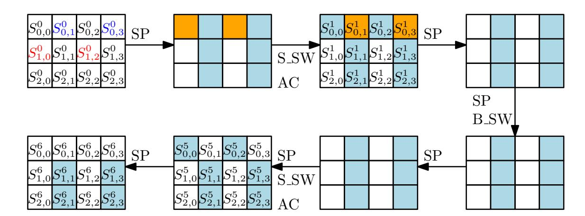

Fig. 14: Matching one valid capacity part

{36}------------------------------------------------

<span id="page-36-0"></span>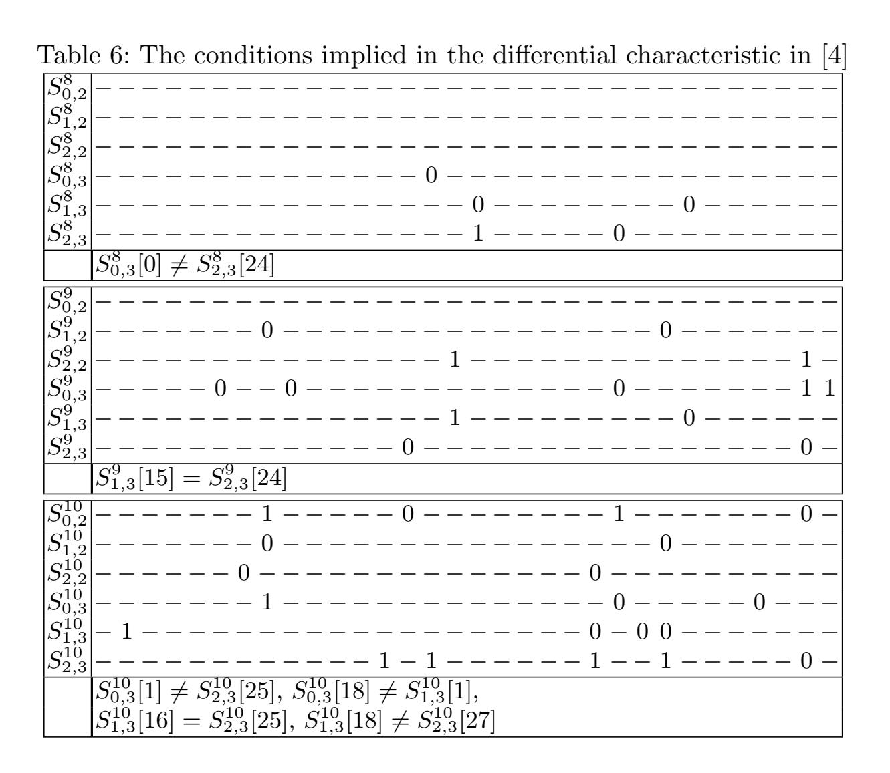

Step 1: Randomly choose a message and compress it with the 6-round Gimli permutation. Denote the corresponding output state by  $S^0$ . Repeat trying random messages until  $(S_{1,0}^0, S_{1,2}^0)$  satisfy the following conditions:

$$(S_{1,0}^0 \ll 9) \wedge 0$$
x1fffffff = 0,  
 $(S_{1,2}^0 \ll 9) \wedge 0$ x1fffffff = 0.

- Step 2: At this step, the capacity part  $(S_{i,j}^0)$   $(1 \le i \le 2, 0 \le j \le 3)$  is a fixed constant. According to the Property 1 of the SP-box, when  $(S_{1,0}^0, S_{1,2}^0)$  satisfies the above conditions,  $(S_{1,1}^5, S_{2,1}^5, S_{1,3}^5, S_{2,3}^5)$  is independent of  $(S_{0,0}^0, S_{0,2}^0)$ , which can be easily observed in Figure 14. Thus, we can guess all possible values of  $(S_{0,1}^0, S_{0,3}^0)$ . For each guessed value,  $(S_{1,1}^5, S_{2,1}^5, S_{1,3}^5, S_{2,3}^5)$  is known. Therefore, we exhaust all possible values in  $TA_0$  and check whether there exists a solution to  $(S_{1,1}^6, S_{2,1}^6, S_{1,3}^6, S_{2,3}^6)$  which can make  $(S_{1,1}^5, S_{2,1}^5, S_{1,1}^6, S_{2,1}^6)$  and  $(S_{1,3}^5, S_{2,3}^5, S_{1,3}^6, S_{2,3}^6)$  valid. Once a solution is found, move to Step 3.
- Step 3: At this step,  $(S_{1,1}^5, S_{2,1}^5, S_{1,1}^6, S_{2,1}^6)$  and  $(S_{1,3}^5, S_{2,3}^5, S_{1,3}^6, S_{2,3}^6)$  are fixed and valid. According to the Property 4 of the SP-box,  $(S_{0,1}^5, S_{0,3}^5)$  can be computed and become determined. Thus, we exhaust all possible values of  $(S_{0,0}^0, S_{0,2}^0)$  and compute the corresponding  $(S_{0,1}^5, S_{0,3}^5)$  and check whether it matches with the value computed by  $(S_{1,1}^5, S_{2,1}^5, S_{1,1}^6, S_{2,1}^6)$  and

{37}------------------------------------------------

 $(S_{1,3}^5, S_{2,3}^5, S_{1,3}^6, S_{2,3}^6)$ . Once they are consistent,  $(S_{0,0}^0, S_{0,1}^0, S_{0,2}^0, S_{0,3}^0)$  are fully known and we can compute the corresponding  $(S_{1,0}^6, S_{2,0}^6, S_{1,2}^6, S_{2,2}^6)$ . Note that at this step,  $(S_{1,1}^6, S_{2,1}^6, S_{1,3}^6, S_{2,3}^6)$  is fixed and they will associate with four valid values according to  $TA_3$ . According to the Property 2 of the SP-box,  $(S_{1,0}^6, S_{2,0}^6, S_{1,2}^6, S_{2,2}^6)$  is valid with probability  $(4 \times 2^{-15.5})^2 = 2^{-27}$  by considering the 4 associated values. Once  $(S_{1,0}^6, S_{2,0}^6, S_{1,2}^6, S_{2,2}^6)$  is valid, we obtain a valid capacity part.

Complexity Evaluation. For Step 1, the time complexity is  $2^{56}$ . For Step 2, the time complexity is  $2^{64} \times 0 \times 34 c 8 = 2^{77.7}$ . After the filtering of Step 2, about  $2^{64+27.4-64} = 2^{27.4}$  valid values of  $(S_{0,1}^0, S_{0,3}^0)$  will be left. For Step 3, the time complexity is  $2^{27.4+64} = 2^{91.4}$  since for each valid  $(S_{0,1}^0, S_{0,3}^0)$  obtained at Step 2, all possible values of  $(S_{0,0}^0, S_{0,2}^0)$  will be traversed. Therefore, the total time complexity to find a valid capacity part is  $2^{91.4}$ .

# <span id="page-37-1"></span>E The Invalid Differential Characteristic of the Last 7-Round Gimli

As a counter-example, we provide an impossible 7-round differential pattern, which seems correct at the first glance. As shown in Figure 15, similar to the 8-round differential pattern, we can mount a SFS collision attack on the last 7-round Gimli-Hash based on this pattern. However, when testing the validity of the differential pattern from  $\Delta S^{21}$  to  $\Delta S^{24}$ , the Gurobi solver immediately outputs "infeasible". Thus, such an attack on the last 7-round Gimli-Hash is actually invalid.

<span id="page-37-2"></span>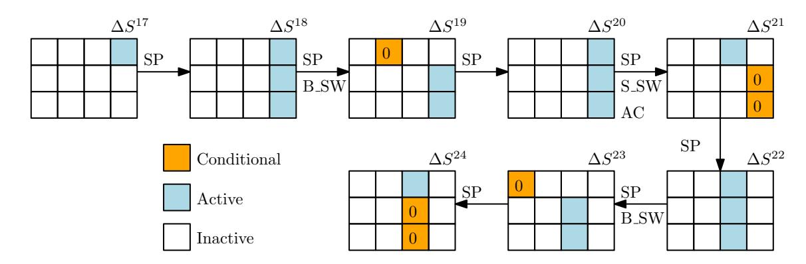

Fig. 15: Invalid SFS collision attack on the last 7-round Gimli-Hash

# <span id="page-37-0"></span>F State Recovery Attack on 5-Round Gimli

As shown in Figure 16, our aim is to exhaust all possible values of  $(S_{i,j}^5)$   $(1 \le i \le 2, 0 \le j \le 3)$  and then compute backward to check whether the first row of  $S^0$  can be matched. The complexity is required not to exceed  $2^{128}$ . The corresponding attack procedure can be described as follows:

{38}------------------------------------------------

<span id="page-38-1"></span>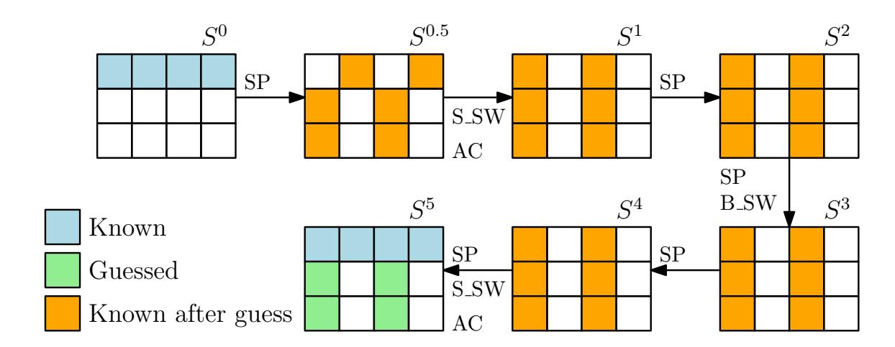

Fig. 16: State recovery attack on 5-round Gimli

- Step 1: Guess  $(S_{1,0}^5, S_{2,0}^5, S_{1,2}^5, S_{2,2}^5)$ . For each guess, compute backward to obtain  $(S_{1,0}^{0.5}, S_{2,0}^{0.5}, S_{1,2}^{0.5}, S_{2,2}^{0.5}, S_{0,1}^{0.5}, S_{0,3}^{0.5})$ .
- Step 2: According to the Property 3 of the SP-box,  $(S_{0,0}^0, S_{1,0}^{0.5}, S_{2,0}^{0.5})$  is valid with probability  $2^{-1}$ . Once it is valid, compute  $(S_{1,0}^0, S_{2,0}^0[30 \sim 0], S_{0,0}^{0.5}[30 \sim 0])$ . Similarly, we can compute  $(S_{1,2}^0, S_{2,2}^0[30 \sim 0], S_{0,2}^{0.5}[30 \sim 0])$  by considering the tuple  $(S_{0,2}^0, S_{1,2}^{0.5}, S_{2,2}^{0.5})$ . Thus, for the correct guess at Step 1, the corresponding value of the tuple  $(S_{0,0}^{0.5}[30 \sim 0], S_{0,1}^{0.5}, S_{0,2}^{0.5}[30 \sim 0], S_{0,3}^{0.5})$  can be obtained. Since each guess is correct with probability  $2^{-2}$ , it is expected to obtain  $2^{128-2} = 2^{126}$  valid values of  $(S_{0,0}^{0.5}[30 \sim 0], S_{0,1}^{0.5}, S_{0,2}^{0.5}[30 \sim 0], S_{0,1}^{0.5}, S_{0,2}^{0.5}[30 \sim 0], S_{0,3}^{0.5})$ . The valid values of the following tuple will be stored in the table  $T_{0.5}$ .

$$(S_{0,0}^{0.5}[30 \sim 0], S_{0,1}^{0.5}, S_{0,2}^{0.5}[30 \sim 0], S_{0,3}^{0.5}, S_{1,0}^{5}, S_{2,0}^{5}, S_{1,2}^{5}, S_{2,2}^{5}).$$

Step 3: After all possible values of  $(S_{1,0}^5, S_{2,0}^5, S_{1,2}^5, S_{2,2}^5)$  are traversed, repeat a similar procedure to guess  $(S_{1,1}^5, S_{2,1}^5, S_{1,3}^5, S_{2,3}^5)$ . Specifically, for each guess of  $(S_{1,1}^5, S_{2,1}^5, S_{1,3}^5, S_{2,3}^5)$ , compute backward and obtain the corresponding  $(S_{0,0}^{0.5}, S_{0,1}^{0.5}[30 \sim 0], S_{0,2}^{0.5}, S_{0,3}^{0.5}[30 \sim 0])$ . For each obtained  $(S_{0,0}^{0.5}, S_{0,1}^{0.5}[30 \sim 0], S_{0,2}^{0.5}, S_{0,3}^{0.5}[30 \sim 0])$ , check whether there is a match between  $(S_{0,0}^{0.5}[30 \sim 0], S_{0,1}^{0.5}[30 \sim 0], S_{0,2}^{0.5}[30 \sim 0], S_{0,3}^{0.5}[30 \sim 0])$  in the table  $T_{0.5}$ . Once a match is found, a valid value of  $(S_{i,j}^5)$   $(1 \leq i \leq 2, 0 \leq j \leq 3)$  is found. Since the matching probability is  $2^{-31 \times 4} = 2^{-124}$  and there are in total  $2^{126+126} = 2^{252}$  pairs, we expect to find  $2^{252-124} = 2^{128}$  valid values of  $(S_{i,j}^5)$   $(1 \leq i \leq 2, 0 \leq j \leq 3)$ .

According to the above analysis, the time complexity and memory complexity to enumerate all the possible values of  $(S_{i,j}^5)$   $(1 \le i \le 2, 0 \le j \le 3)$  are  $2^{128}$  and  $2^{126}$ , respectively. For each valid value of  $(S_{i,j}^5)$   $(1 \le i \le 2, 0 \le j \le 3)$ , it can be simply further verified as described in section 7.

#### <span id="page-38-0"></span>G Difference-Value Relations

The relations between the difference and value in  $\land$  operation and  $\lor$  operation are displayed in Table 7 and Table 8.

{39}------------------------------------------------

<span id="page-39-0"></span>Table 7: The possible patterns for AND operation a[2] = a[0] ∧ a[1]

|   |   |   | a[0] a[1] ∆a[0] ∆a[1] ∆a[2] |   |
|---|---|---|-----------------------------|---|
| 0 | 0 | 0 | 0                           | 0 |
| 0 | 0 | 0 | 1                           | 0 |
| 0 | 0 | 1 | 0                           | 0 |
| 0 | 0 | 1 | 1                           | 1 |
| 0 | 1 | 0 | 0                           | 0 |
| 0 | 1 | 0 | 1                           | 0 |
| 0 | 1 | 1 | 0                           | 1 |
| 0 | 1 | 1 | 1                           | 0 |
| 1 | 0 | 0 | 0                           | 0 |
| 1 | 0 | 0 | 1                           | 1 |
| 1 | 0 | 1 | 0                           | 0 |
| 1 | 0 | 1 | 1                           | 0 |
| 1 | 1 | 0 | 0                           | 0 |
| 1 | 1 | 0 | 1                           | 1 |
| 1 | 1 | 1 | 0                           | 1 |
| 1 | 1 | 1 | 1                           | 1 |

<span id="page-39-1"></span>Table 8: The possible patterns for OR operation a[2] = a[0] ∨ a[1]

|   |   |   | a[0] a[1] ∆a[0] ∆a[1] ∆a[2] |   |
|---|---|---|-----------------------------|---|
| 0 | 0 | 0 | 0                           | 0 |
| 0 | 0 | 0 | 1                           | 1 |
| 0 | 0 | 1 | 0                           | 1 |
| 0 | 0 | 1 | 1                           | 1 |
| 0 | 1 | 0 | 0                           | 0 |
| 0 | 1 | 0 | 1                           | 1 |
| 0 | 1 | 1 | 0                           | 0 |
| 0 | 1 | 1 | 1                           | 0 |
| 1 | 0 | 0 | 0                           | 0 |
| 1 | 0 | 0 | 1                           | 0 |
| 1 | 0 | 1 | 0                           | 1 |
| 1 | 0 | 1 | 1                           | 0 |
| 1 | 1 | 0 | 0                           | 0 |
| 1 | 1 | 0 | 1                           | 0 |
| 1 | 1 | 1 | 0                           | 0 |
| 1 | 1 | 1 | 1                           | 1 |

{40}------------------------------------------------

# <span id="page-40-0"></span>H Illustration of the AE Scheme of Gimli

We give a brief description of the AE scheme of Gimli. The details can be referred to [\[1\]](#page-29-0). Specifically, the whole phase is composed of four phases: initialization, processing associated data, encryption and extracting tag. As shown in [Figure 17,](#page-40-1) the nonce is a 128-bit value and the key is of size 256 bits. Each block of the associated data and the message are both of 128 bits. After the associated data and message are absorbed, the 128-bit tag will be generated. Especially, when the associated data is empty, the phase to process the associated data cannot be skipped.

<span id="page-40-1"></span>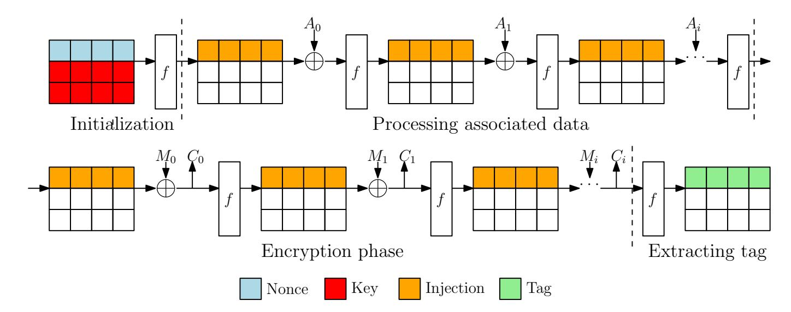

Fig. 17: Illustration of the AE scheme, where f is the Gimli permutation, A<sup>i</sup> is the associated data block and M<sup>i</sup> is the message block.