{0}------------------------------------------------

# Alt-Coin Traceability

Claire Ye, Chinedu Ojukwu, Anthony Hsu, Ruiqi Hu Carnegie Mellon University {cjye,cio,ahsu3,ruiqih}@andrew.cmu.edu

May 18, 2020

### Abstract

Many alt-coins developed in recent years make strong privacy guarantees, claiming to be virtually untraceable. This paper explores the extent to which these claims are true after the first appraisals were made about these coins. In particular, we will investigate Monero (XMR) and Zcash (ZEC), competitors in the private cryptocurrency space. We will test how traceable these currencies are after the most recent security updates, and how they hold up against their claims. We run some traceability experiments based on previously published papers for each coin. Results show that, introducing strict security and anonymity requirements into the cryptocurrency ecosystem makes the coin effectively untraceable, as shown by Monero. On the other hand, Zcash still hesitates to introduce changes that alter user behavior. Despite its strong cryptographic features, transactions are overall more traceable.

## 1 Introduction

The popularization of digital money in the past few decades has introduced new motivations for cryptocurrency. "Private currency" became a hot topic, as many alt-coins boasting strong anonymity guarantees emerged all over the cryptocurrency space. The incentive for privacy is often tied to illicit activities, but many legal services and users find anonymity appealing if they, for example, want to hide their political donations. Thus, the search for anonymity began.

Firstly, cryptocurrency is almost always pseudonymous, but not anonymous. Pseudonymity is built in to most cryptocurrencies at heart. Addresses are by default a pseudonym, one that is not linked to your name or any other information unless you choose to disclose it. The difficult part of the equation is anonymity, where users do not want to be associated with other addresses via their behavior or transactions. Untraceability is thus the privacy feature that is sought after. The first cryptocurrency, Bitcoin, is traceable by design. Transactions are validated only when the sender and the receiver addresses are verified, effectively linking the two and creating some sort of association between the two. Anyone who views that transaction is able to correctly identify the sender and the receiver. This is undesirable, because if one address is linked to certain behavior (like illegal trades), an address that regularly transacts with it might be flagged as potentially criminal. Blockchain analytics allow researchers who understand the ecosystem to put user behavior into concrete heuristics, and therefore link certain addresses to each other in a way that is undesirable for the user.

Alternative coins have sprung out of Bitcoin that focus on privacy. Many alt-coins are forks of Bitcoin, inheriting many of its familiar and well-loved characteristics while adding a twist, whether it be in the cryptography or validation process. These new currencies created distinct ecosystems where developers can introduce completely new procedures that alter the way users send and receive. 

{1}------------------------------------------------

These systems generated both academic and financial interest. In this paper, we will explore the extent to which alt-coins, which are created for the purpose of anonymity, fulfill their promise, and what that may mean for cryptocurrencies in the future. Specifically, we look at the traceability of two privacy-focused alt-coins, Monero and Zcash.

# 2 Background and Related Work

## 2.1 Monero

Monero is a privacy-focused cryptocurrency launched in April 2014. It has several features focused on enhancing unlinkability and untraceability. Unlinkability is not being able to link two addresses to the same person. Untraceability is not being able to link receiving money from having spent it. Monero promotes unlinkability by generating a one-time use address for every transaction output. Monero promotes untraceability by requiring each input in a transaction to be combined with some decoy chaff inputs called mixins. An outside viewer only knows that one of the members of an input is the real transaction output (TXO) being spent, but they do not know which one.

Despite the use of one-time addresses and mixins, any node can still verify that each TXO is only spent one time. This is achieved using ring signatures as described in [\[NM+16\]](#page-22-0). A one-time ring signature is composed of four algorithms, GEN, SIG, VER and LNK [\[Sab13\]](#page-22-1):

- 1. GEN: the signer picks a random secret key x and computes public key P = xG and the key image I = xHp(P), where Hp is a deterministic hash function.
- 2. SIG: the signer takes a message m, a set S 0 of public keys {Pi}i6=s and outputs a signature σ and a subset S = S 0 S {Ps}, where Ps is the signer's own public key.
- 3. VER: the verifier checks the signature.
- 4. LNK: the verifier checks if I has been used in past signatures.

Each transaction comes with a ring signature that can identify which mixin is the real one without revealing any information about it. Meanwhile, each mixin, as well as the real input, has a unique key image, and all nodes can check if any key image has been revealed before or not. Using this approach, double spending can be prevented easily [\[M¨os+18\]](#page-22-2).

Initially, Monero did not require transactions to use mixins. Thus, in the beginning, the majority of Monero transactions had zero mixins, which meant the real input was known and thus traceable. In March 2016, Monero started requiring a minimum of 2 mixins per input; this was increased to 4 in September 2017 and 6 in April 2018; and from October 2018, the number of mixins has been fixed at 10 for all transactions.

Though mixins make it harder to trace transactions, it is still possible to determine what the real input to a transaction is by doing some chain analysis as illustrated in Figure [1.](#page-2-0)

Prior work [\[M¨os+18\]](#page-22-2)[\[Kum+17\]](#page-22-3) has investigated the extent to which Monero transactions are traceable. Their analysis included doing chain analysis starting from those transactions with zero mixins. They also proposed several heuristics for guessing the real input and evaluated their effectiveness on the ground truth derived from the zero mixin chain analysis. Their heuristics include:

• Zero mixin chain analysis: Start with transactions that use zero mixins, where the real input TXOs are known. Remove those TXOs from all other transaction inputs. If any transaction inputs now only have one TXO member, then that is the real input. These

{2}------------------------------------------------

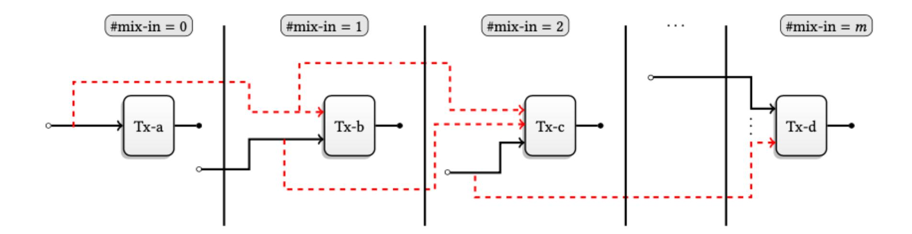

Figure 1: Figure 6 from [\[Kum+17\]](#page-22-3) illustrating zero-mixin chain analysis. By iteratively marking spent outputs, one can deduce the real input for transactions with large numbers of mixins.

deduced spent TXOs can then be removed from all other transactions. By iterating this process, one can deduce the real input for many transactions, even those that use a large number of mixins. The algorithm is described in [\[Kum+17\]](#page-22-3) and shown in Figure [2.](#page-3-0)

- Guess newest: This temporal heuristic simply assumes the newest TXO included in a transaction input is the real input. This heuristic is based on analysis done on traceable transactions that shows people tend to spend Monero soon after receiving it. M¨oser et al. [\[M¨os+18\]](#page-22-2) and Kumar et al. [\[Kum+17\]](#page-22-3) both achieved greater than 90% accuracy when applying this heuristic to ground truth for data prior to April 2017. Their results are shown in Figures [3](#page-4-0) and [4.](#page-4-1) Several factors that contribute to the high accuracy of this heuristic include a large fraction of inputs having 0 mixins (2 mixins were not mandatory until March 2016) and a mixin sampling algorithm that does not mirror real spending patterns.
- Merging outputs: This heuristic was proposed in [\[Kum+17\]](#page-22-3). The idea is illustrated in Figure [5.](#page-4-2) When a transaction has two or more transaction outputs and two or more of those outputs are included in different inputs of another transaction, then those included outputs are assumed to be the real inputs. This heuristic is based on it being unlikely that multiple outputs of the same transaction would be included in different inputs in another transaction unless they were the real inputs. Since someone was able to spend two or more different outputs in the same transaction, it also suggests that those TXO addresses all belong to the same person, weakening unlinkability.

Both the M¨oser et al. [\[M¨os+18\]](#page-22-2) and Kumar et al. [\[Kum+17\]](#page-22-3) analyses only analyze the Monero blockchain up to early 2017. M¨oser et al. do their analysis up through block 1288774 (from April 14, 2017) and Kumar et al. do their analysis up through block 1240503 (from February 6, 2017). For most of the periods analyzed by these papers, mixins were not required, and the majority of transactions used zero mixins. All these transactions are immediately traceable. From March 2016 onward, when a 2-mixin requirement went into effect, the number of fully-traceable transactions went down significantly.

It is also worth noting that information leakage of public mining pools can affect the deductibility of transactions. It is highly likely to be the real spend if an input in a pool's payout transaction is spent from a coinbase transaction of a block known to belong to the same pool. In the study of M¨oser et al. [\[M¨os+18\]](#page-22-2), the authors crawled 18 public mining pools and were able to detect mining pools' activities and deanonymize additional transactions.

{3}------------------------------------------------

Figure 2: Algorithm 1 from [\[Kum+17\]](#page-22-3) showing the zero-mixin chain analysis pseudocode.

In January 2017 (toward the end of both of the previous analyses), Ring Confidential Transactions (or RingCT) was introduced as an experimental feature in Monero [\[Sun+17\]](#page-22-4). This feature hides input and output amounts. Previously, input and output amounts were public, so one could only choose TXOs with the same amount as the real input to include as mixin. This limited the choice of mixins and made traceability easier. With RingCT, any TXO can be included as a mixin and the input and output amounts of transactions are now hidden, which makes it harder to trace transactions.

RingCT inputs are only allowed to include RingCT outputs, which have hidden amounts. One can transition TXOs to RingCT by creating a transaction with known input amounts and hidden output amounts. For ease of discussion, we will refer to the different kinds of transactions as follows:

- Type 1: transactions with known inputs and known outputs (mainly used pre-RingCT)
- Type 2: transactions with some known inputs (transactions are allowed to have some inputs with known inputs and others with hidden inputs) and hidden outputs (for transitioning TXOs to RingCT)

{4}------------------------------------------------

|                       | Before 2-mixin hardfork |         | After 2-mixin hardfork |           | After 0.10.1, prior to Apr 14, 2017 |         |           |        |         |
|-----------------------|-------------------------|---------|------------------------|-----------|-------------------------------------|---------|-----------|--------|---------|
|                       | Deducible               | Newest  | (%)                    | Deducible | Newest                              | (%)     | Deducible | Newest | (%)     |
| 1 mixins              | 608087                  | 585424  | (96.27)                | 0         | _                                   | _       | 0         | _      | _       |
| 2 mixins              | 206276                  | 191372  | (92.77)                | 1209259   | 1126924                             | (93.19) | 308926    | 293051 | (94.86) |
| 3 mixins              | 480500                  | 461154  | (95.97)                | 376920    | 353246                              | (93.72) | 65738     | 59693  | (90.80) |
| 4 mixins              | 156767                  | 139626  | (89.07)                | 192348    | 149722                              | (77.84) | 33022     | 18889  | (57.20) |
| 5 mixins              | 43214                   | 39854   | (92.22)                | 26599     | 24971                               | (93.88) | 950       | 473    | (49.79) |
| 6 mixins              | 65546                   | 51816   | (79.05)                | 119716    | 102378                              | (85.52) | 7890      | 6458   | (81.85) |
| 7 mixins              | 1680                    | 1522    | (90.60)                | 1770      | 989                                 | (55.88) | 235       | 115    | (48.94) |
| 8 mixins              | 1067                    | 964     | (90.35)                | 1968      | 1310                                | (66.57) | 249       | 163    | (65.46) |
| 9 mixins              | 838                     | 692     | (82.58)                | 1069      | 355                                 | (33.21) | 48        | 40     | (83.33) |
| $10+ \ \mbox{mixins}$ | 11997                   | 10822   | (90.21)                | 12970     | 11750                               | (90.59) | 1682      | 1480   | (87.99) |
| Total                 | 1575972                 | 1483246 | (94.12)                | 1942619   | 1771645                             | (91.20) | 418740    | 380362 | (90.83) |
| Overall               |                         |         |                        |           | (92.33)                             |         |           |        |         |

Figure 3: Table 3 from [\[M¨os+18\]](#page-22-2) showing the accuracy of the guess-newest heuristic on inputs prior to April 14, 2017.

|                   | Uniform dist.         | Triangular dist.      |  |
|-------------------|-----------------------|-----------------------|--|
|                   | (until April 4, 2015) | (since April 5, 2015) |  |
| #Traceable inputs | 9885810               | 6174801               |  |
| True positive     | 99.5%                 | 96%                   |  |
| False positive    | 0.5%                  | 4%                    |  |

Figure 4: Table 5 from [\[Kum+17\]](#page-22-3) showing the accuracy of the guess-newest heuristic on inputs up to February 2017.

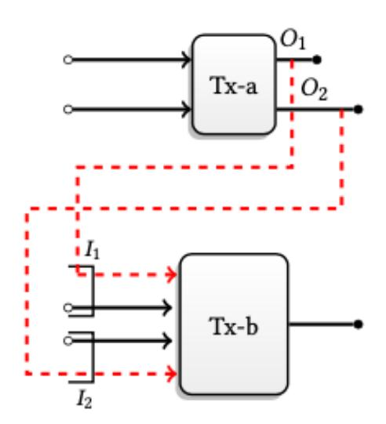

Figure 5: Figure 9 from [\[Kum+17\]](#page-22-3) illustrating the merging outputs heuristic. Tx-a is called a "source transaction" and Tx-b is called a "destination transaction."

### • Type 3: transactions with hidden inputs and hidden outputs (fully RingCT)

RingCT was made required for all transactions in September 2017 and the minimum number of mixins was increased to 4. This minimum was increased to 6 in April 2018, and in October 2018, the number of mixins per transaction was fixed at 10. RingCT and the larger mixin requirements have made transactions much harder to trace. As can be seen from the graphs from [\[M¨os+18\]](#page-22-2) and [\[Kum+17\]](#page-22-3) (Figure [6\)](#page-5-0), there is a sharp drop in traceability after the introduction of RingCT.

{5}------------------------------------------------

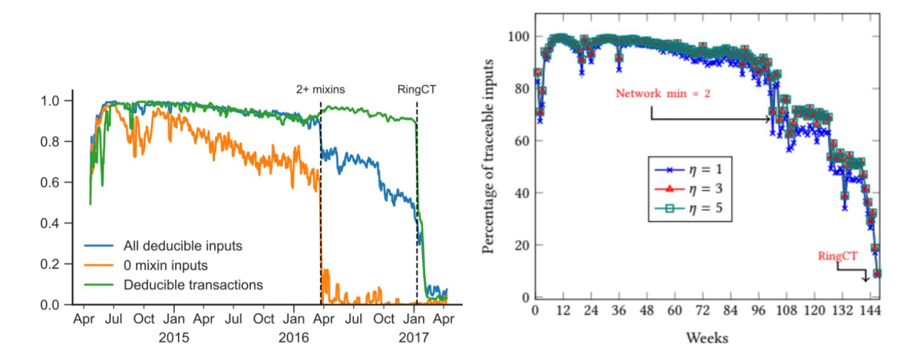

Figure 6: Figure 5 from [\[M¨os+18\]](#page-22-2) (left) and Figure 7c from [\[Kum+17\]](#page-22-3) (right) showing the fraction of deducible inputs up to April 2017 and February 2017, respectively.

In addition to the RingCT and mixin changes, Monero also changed their mixin sampling algorithm in response to these papers and their own research from Monero Research Labs [\[NNM14\]](#page-22-5). At first, mixins were sampled uniformly from all previous transactions. This was changed in April 2015 to a triangular distribution that favored more recent transactions[1](#page-5-1) . Then, in response to evidence showing that real spending habits tended to spend recent TXOs, the sampling distribution was changed in January 2017 to weigh recent transactions (past 5 days) more heavily. This "recent zone" was further reduced to the past 3 days in September 2017. Finally, in response to [\[M¨os+18\]](#page-22-2), the mixin sampling distribution was changed to a gamma distribution with parameters hardcoded to the fitted gamma from Figure 11 of their paper[2](#page-5-2) to better match the real spend-time distribution. This change first appeared in Monero 0.13.0 released in fall 2018.

In our paper, we investigate the effectiveness of the changes to Monero since 2017 in mitigating the effectiveness of the above heuristics.

### 2.2 Zcash

Zcash is another alternative cryptocurrency that appeared as a competitor in the race to anonymity. A fork of Bitcoin, Zcash inherits most of its predecessor's characteristics. However, the motive behind its development is to completely break the link between the sender and the receiver.

Currently, Zcash is not widely used. It is unclear at the moment how much illicit or criminal activity is on Zcash, but a study as recent as May 6, 2020, showed that it is by far not the preferred cryptocurrency on the dark web [\[Sil+20\]](#page-22-6). Many criminals do not understand Zcash's operating model and find it difficult to use, preferring Bitcoin and Monero [\[Sil+20\]](#page-22-6).

One of Zcash's unique appeals is its method for proof-of-work. Using the novel form of zeroknowledge cryptography zk-SNARK (zero-knowledge succinct non-interactive argument of knowledge), Zcash allows zero interaction between the prover and the verifier, providing a barrier that further impedes efforts to link addresses together and thus potentially reveal information about the transaction or the address owner [\[Zks\]](#page-23-0). This novel technology is useful for cryptocurrency applications because it is succinct, meaning it is capable of completion within a matter of seconds [\[Zks\]](#page-23-0).

The anatomy of a shielded transaction varies from that of a normal Bitcoin transaction. Under

1 <https://github.com/monero-project/monero/commit/f2e8348be0c91c903e68ef582cee687c52411722>

2 <https://github.com/monero-project/monero/commit/34d4b798d44250f64fdcac61439a86afa8607c3b>

{6}------------------------------------------------

Bitcoin, each transaction is validated via linking the sender and receiver addresses, as well as the input and output values on the blockchain [\[Pet16\]](#page-22-7). zk-SNARKs allow nodes to validate transactions without actually revealing any information about the addresses or values involved. To do so, Zcash publishes a set of public parameters for all users to use for validating transactions. This process requires multiple parties to collaborate to create these parameters, which, if compromised, would result in counterfeiting of Zcash. The protocol is designed such that all members collaborating to generate these parameters have to be dishonest in order for the final parameters to be compromised. Since these parameters have already been generated and are now readily available, users can now safely generate zk-SNARK proofs [\[Par\]](#page-22-8).

In the Zcash ecosystem, there are two types of addresses - transparent and shielded - as illustrated in Figure [7.](#page-6-0) t-addr, as transparent addresses are known, are exactly like Bitcoin's addresses [\[Zte\]](#page-23-1). However, z-addr, their shielded counterparts, are the only addresses that really benefit from the additional anonymity features that Zcash is trying to implement.

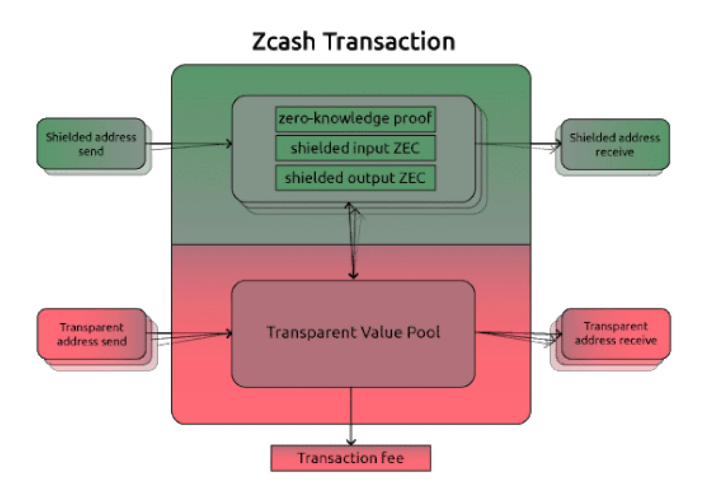

Figure 7: Figure from [\[Pet16\]](#page-22-7): High-level description of Zcash transactions. As seen, Zcash is divided between shielded and transparent pools, where shielded pools receive all the benefits of Zcash's anonymity guarantees.

Thus, it is evident that to take full advantage of Zcash, users should try to make transactions that utilize addresses in the shielded pool. Currently, there are four main types of transactions that can be made in Zcash, as shown in Figure [8:](#page-7-0) public (t-to-t), shielding (t-to-z), deshielding (zto-t), and private (z-to-z) [\[Zte\]](#page-23-1). An example of each transaction type is given in Figure [9.](#page-7-1) Private transactions provide the most anonymity for the sender and receiver. However, unlike other altcoins in this anonymity space, Zcash does not require its users to make private transactions at all. In fact, there are completely no requirements on the types of transactions that take place in Zcash.

The function vJoinSplit determines the type of transaction it is. vJoinSplit takes in input and output t-addresses, also known as zIn and zOut. If zIn and zOut both have inputs, then the transaction is transparent, and if they are both empty, it is private. When zIn is populated

{7}------------------------------------------------

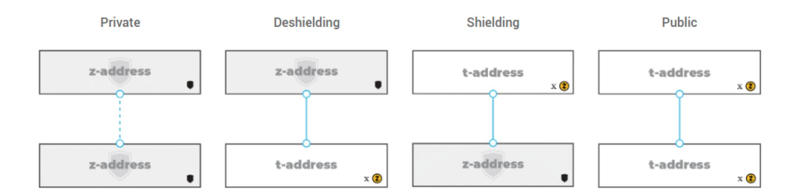

Figure 8: Figure from [\[Zte\]](#page-23-1): Four main types of transactions.

| Txn type    | Example |  |  |  |  |
|-------------|---------|--|--|--|--|
| Public      |         |  |  |  |  |
|             |         |  |  |  |  |
| Deshielding |         |  |  |  |  |
|             |         |  |  |  |  |
|             |         |  |  |  |  |
| Shielding   |         |  |  |  |  |
|             |         |  |  |  |  |
|             |         |  |  |  |  |
| Private     |         |  |  |  |  |

Figure 9: Table of examples for each type of transaction. [\[Zte\]](#page-23-1)

but zOut is empty, the transaction is shielding. The opposite is a deshielding transaction. These parameters are complemented by input double-spending tokens and output shielded addresses that provide additional information given the transaction type.

The overall Zcash ecosystem is not conducive towards achieving anonymity for its users. Historically, at any given time, only around 0.09% of ZEC transacted in a 30-day period is shielded [\[Zus\]](#page-23-2). There are 5 times more transparent transactions than shielded ones (t-to-z), and 13 times more transparent transactions than "fully shielded" ones (i.e. z-to-z). Most third-parties for Zcash actually only allow transparent transactions. Given that Bitcoin can easily provide the same support as Zcash transparent transactions, it seems that the large majority of Zcash users do not yet understand Zcash's operating model. Despite the demand for private digital money, Zcash is evidently still in the early stages of development.

{8}------------------------------------------------

The experiment we will be replicating the most closely is that of Kappos et al. [\[Kap+18\]](#page-22-9). This experiment was run before the Sapling upgrade in Zcash. By running some blockchain analytics and defining some heuristics (Figure [10\)](#page-8-0) based on Zcash users' behavior, the researchers were able to identify clusters and tag them to specific mining pools. Results (Figure [11\)](#page-8-1) showed a good number of successful clustering, but it is impossible to verify how correct these clusters are. The researchers concede that there are definitely false positives within the successfully "traced" addresses. This paper showed that, even though cryptographically Zcash is very well-founded, the users behave in a way that does not take full advantage of the shielded pool, making them traceable. As each user in the shielded pool becomes linked to the transparent pool, the overall anonymity of the ZEC ecosystem reduces as the anonymity set shrinks drastically. On top of the already miniscule set of users even utilizing shielded transactions at all, Zcash is effectively traceable as of this study.

If two or more t-addresses are inputs in the same transaction (whether that transaction is transparent, shielded, or mixed), then they are controlled by the same entity.

If one (or more) address is an input t-address in a vJoinSplit transaction and a second address is an output t-address in the same vJoinSplit transaction, then if the size of zOut is 1 (i.e., this is the only transparent output address), the second address belongs to the same user who controls the input addresses.

Any z-to-t transaction carrying 250.0001 ZEC in value is done by the founders.

If a z-to-t transaction has over 100 output t-addresses, one of which belongs to a known mining pool, then we label the transaction as a mining withdrawal (associated with that pool), and label all non-pool output t-addresses as belonging to miners.

For a value v, if there exists exactly one t-to-z transaction carrying value v and one z-to-t transaction carrying value v, where the z-to-t transaction happened after the t-to-z one and within some small number of blocks, then these transactions are linked.

Figure 10: Heuristics defined in Kappos et al. and used in our experiment [\[Kap+18\]](#page-22-9).

| Name          | Addresses | t-to-z | z-to-t |
|---------------|-----------|--------|--------|
| Flypool       | 3         | 65,631 | 3      |
| F2Pool        | 1         | 742    | 720    |
| Nanopool      | 2         | 8319   | 4107   |
| Suprnova      | 1         | 13,361 | 0      |
| Coinmine.pl   | 2         | 3211   | 0      |
| Waterhole     | 1         | 1439   | 5      |
| BitClub Pool  | 1         | 196    | 1516   |
| MiningPoolHub | 1         | 2625   | 0      |
| Dwarfpool     | 1         | 2416   | 1      |
| Slushpool     | 1         | 941    | 0      |
| Coinotron     | 2         | 9726   | 0      |
| Nicehash      | 1         | 216    | 0      |
| MinerGate     | 1         | 13     | 0      |
| Zecmine.pro   | 1         | 6      | 0      |

Figure 11: Table 4 from [\[Kap+18\]](#page-22-9): Number of transactions linked to each pool given the number of addresses already tagged to each pool.

{9}------------------------------------------------

## 3 Experiments

## 3.1 Methodology

### 3.1.1 Monero

For the Monero experiments, we began by trying to reproduce the M¨oser et al. [\[M¨os+18\]](#page-22-2) experiments by trying their code provided at <https://github.com/maltemoeser/moneropaper>. We struggled getting the Neo4j setup queries (step 3 in the README) to run, hitting intermittent segfaults when running them on the Jeju machine (jeju.andrew.cmu.edu). Later, we were able to run the setup queries successfully on Anthony's personal Windows machine. However, when we then tried running some of Jupyter Notebook queries against our dataset, several queries (including the deducible spends queries) yielded zero results. It was unclear whether this was due to bugs in the notebook queries or errors in importing and initializing the data in the Neo4j graph database.

Rather than spend more time debugging their code, we decided to parse the blockchain data ourselves and write our own analysis scripts. We first ran a Monero daemon on Jeju to download the entire blockchain up to block 2077094 (from April 15, 2020). We then downloaded a Monero blockchain explorer from [https://github.com/moneroexamples/onion-monero-blockchain](https://github.com/moneroexamples/onion-monero-blockchain-explorer)[explorer](https://github.com/moneroexamples/onion-monero-blockchain-explorer), compiled it, and deployed it on Jeju at <http://jeju.andrew.cmu.edu:8081/>. We then wrote Python and Java scripts that queried the local blockchain explorer using its REST JSON API to extract block and transaction info and do our traceability analysis. Our code is available at <https://github.com/erwa/monero-tracing>.

### 3.1.2 Zcash

To begin our traceability analysis of Zcash and its underlying elements we decided we wanted to replicate the results of Kappos et al. [\[Kap+18\]](#page-22-9) and extend its analysis of the blockchain past the block height that researchers previously analyzed. The experiment from Kappos et al. required a well-provisioned machine and free storage space equivalent to triple the current Zcash blockchain size (∼26 GB). To do this we had the option of either using a machine used for academic research (Jeju) that was provisioned with 32 cores, 256 GB of RAM, and 45 TB of disk space, or starting our own instance via cloud computing infrastructure. We decided to go with the latter mainly because we wanted more freedom in configuring the machine and did not want to do anything drastic to change the machine. We chose to use Docker in our exploration, and therefore needed root privileges (see [Future Work](#page-20-0) for improvements on the experiment). Given that we had some Amazon Web Services (AWS) credits, we launched Ubuntu AWS instances for the experiment and also created Elastic Block Store (EBS) volumes for persistent storage. After testing the experiment and various instance types, we found that the experiment required more compute and memory than initially believed. We concluded that a general-purpose t2.2xlarge Ubuntu instance (8 vCPUs, 32 GB RAM) attached to an EBS volume around 150 GB in capacity was suitable for running the experiment most smoothly. One improvement to our setup could have been to automatically attach and mount the EBS volume to the instance on reboot. Although the experiment ran smoothly with the aforementioned specifications, we realize the experiment may have run faster with the more provisioned Jeju machine.

While running the experiment, we encountered a few setbacks in which we had to edit the structure of the experiment in order to make progress. For one, we had to re-configure the allowed IP addresses and ports for the Zcash client to accept RPC commands from other containers in the Docker network, since the IP addresses provided did not work. In addition, we noticed that the extraction from blocks to a Postgres database made unnecessary calls to re-establish an RPC 

{10}------------------------------------------------

connection between the Zcash node and Postgres container for every block. This often led to the experiment hanging or the connection being lost before any significant progress could be made on the blockchain. Another issue with the experiment we encountered was the Zcash node running in its own container was being killed while the other container was processing, which sometimes led to the block index becoming out of sync. We suspected that this was due to the container limiting the amount of memory allocated to the Zcash process. This would require a reindexing of the entire 25 GB blockchain which also slowed progress. To address this issue we decided to run the Zcash client on the host system rather than running in the container. This significantly sped up the RPC calls from the Postgres container and made the Zcash client more stable. We also decided to move the blockchain to its own directory outside of the home directory and its own mounted volume mainly because we wanted the environment and experimental data to be encapsulated in EBS storage. These changes can all be found at <https://github.com/claiye/zcash-analysis-19733>. The sections most relevant to our replication of the experiment are "Troubleshooting" and "Updates from Past Experiment".

Another aspect of the experiment we had to familiarize ourselves with was the use of Spark, a framework used to process large amounts of data. The research analysis container came prebuilt with a version of PySpark that was to be used for the analysis portion of the experiment. However we found some incompatibilities with the Spark configurations and our host and Docker environment. In the Spark configuration settings, the runtime environment of the Spark process can be configured through the API, such as executor memory and worker threads. While the configuration settings provided in the repository worked smoothly for small sizes of the blockchain, when approaching the height used in the paper, the execution of the analysis became faulty with hidden errors. This and the aforementioned setbacks were a big hindrance to reaching the current day block height. In the [Future Work](#page-20-0) section we will discuss some ideas to speed up the overall experiment.

### 3.2 Results

## 3.2.1 Monero

Zero-Mixin Chain Analysis. We applied the zero mixin chain analysis on the entire blockchain from the beginning to block 2077094 (April 15, 2020). The chain analysis ran to completion (unable to deduce any more inputs) after 27 iterations of the algorithm. Though we found that some transactions as recent as April 9, 2020, are fully deducible, the percentage of partially or fully deducible transactions has been nearly zero for over two years, as seen in Figure [12.](#page-11-0)

All of the traced inputs from after the introduction of RingCT were from transactions that were either Type 1 or Type 2. We were unable to trace any Type 3 transactions. This makes sense because RingCT was introduced after the 2-mixin minimum requirement was introduced and RingCT inputs can only reference RingCT outputs. There are no 0-mixin RingCT inputs from which to kick off a chain analysis. This suggests that the combination of RingCT and the increased number of mixins has been highly successful at reducing the traceability of Monero transactions.

In addition to fully deduced inputs, we also looked at how much we reduced the anonymity set sizes of the non-fully deduced inputs. For comparison, first we show the results from Kumar et al. [\[Kum+17\]](#page-22-3), which were done on blocks up to February 2017, in Figure [13.](#page-11-1)

We did a similar effective anonymity-set size analysis on all inputs with 10 or fewer mixins up to April 2020, but instead of just running Algorithm 1 for a fixed number of iterations, we ran it until it converged (no more inputs were deducible), which required 27 iterations. The results are shown in Figure [14.](#page-12-0)

{11}------------------------------------------------

Figure 12: Daily fraction of transactions with zero mixins, at least one traceable input, and all inputs deducible from the beginning of Monero to April 15, 2020.

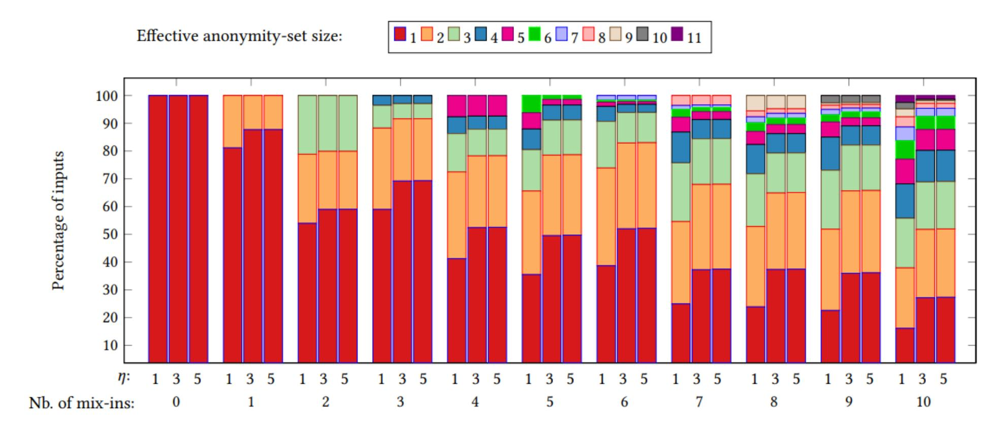

Figure 13: Figure 8 from [\[Kum+17\]](#page-22-3) illustrating the effective anonymity-set size after running zero-mixin chain analysis for inputs up to February 2017. η is the number of iterations they ran Algorithm 1 (Figure [2\)](#page-3-0) for.

RingCT was introduced in January 2017 and since fall 2018, all transactions require exactly 10 mixins. Our results show that for inputs with 10 mixins (which include all transactions since fall 2018), despite running zero-mixin chain analysis to convergence, the large majority of 10-mixin transactions still retain their original anonymity set size of 11. This makes sense given that zeromixin chain analysis was unable to trace any Type 3 transactions, which fully RingCT transactions are. For most other mixin amounts, the effective anonymity set sizes are also significantly larger

{12}------------------------------------------------

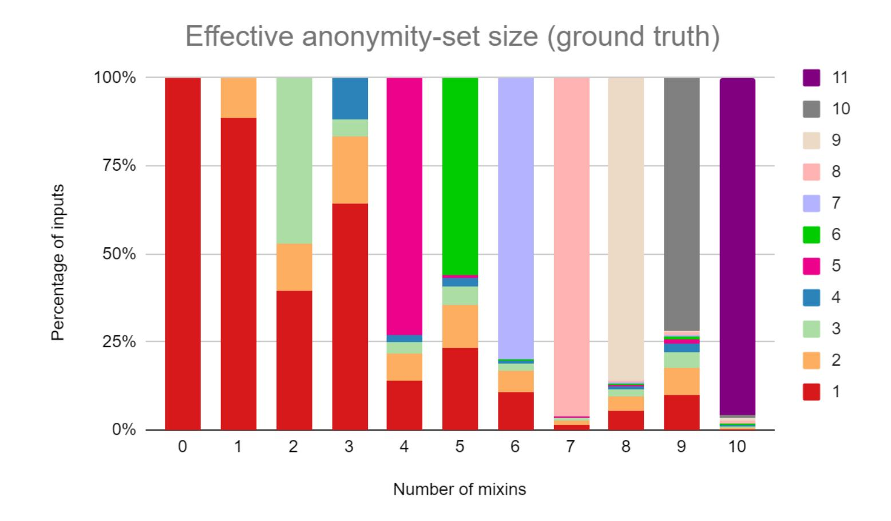

Figure 14: Effective anonymity-set size of inputs up to April 2020 after applying zero-mixin chain analysis.

on average than in the Kumar et al. results. This suggests that the RingCT feature and increased mixin requirements have been fairly effective at reducing the traceability of Monero transactions.

We also investigated what would happen if a significant fraction of non-deduced inputs were somehow traced (e.g.: a data breach that exposed secret keys). We did this simulation by choosing X% of non-deduced inputs and then "guessing" the newest TXO included in each of these inputs as the real input, and then running zero-mixin chain analysis again. We tried this for X = 15, 30, and 60. Our results are shown in Figure [15.](#page-13-0) We see that even after a 30% breach, over half of 10-mixin inputs still maintain an anonymity set size of 7 or more. Such a breach is already an unlikely scenario given that secret keys for many different users are not usually aggregated on one machine, but instead, each user's secret key generally resides only on their own personal device.

Guess-Newest Heuristic. Using the deduced inputs from the zero mixin chain analysis as our ground truth, we then investigated the effectiveness of the temporal heuristic that guesses the newest TXO included in an input as the real input. Since many security changes have been made to Monero since the introduction of RingCT (January 2017), we compared how effective the guessnewest heuristic was before and after the introduction of RingCT (Figure [16\)](#page-13-1).

Whereas M¨oser et al. [\[M¨os+18\]](#page-22-2) and Kumar et al. [\[Kum+17\]](#page-22-3) reported 90%+ accuracy when analyzing inputs prior to April 2017 and February 2017, respectively, we find that for transactions post-RingCT (January 2017), the accuracy of the guess-newest heuristic drops dramatically. For inputs with 10+ mixins (which includes all inputs since fall 2018 when the number of mixins per transaction was fixed at 10), we see that the accuracy of the heuristic has decreased about 3x, going from about 90% pre-RingCT to about 30% post-RingCT.

It should be noted that Figure [16](#page-13-1) only includes Type 1 and Type 2 transactions, since we were unable to obtain ground truth for any Type 3 transactions. The traced pre-RingCT inputs were all from Type 1 transactions (there were only Type 1 transactions pre-RingCT), whereas for the traced inputs post-RingCT, 48.7% were from Type 1 transactions and 51.3% were from Type 2

{13}------------------------------------------------

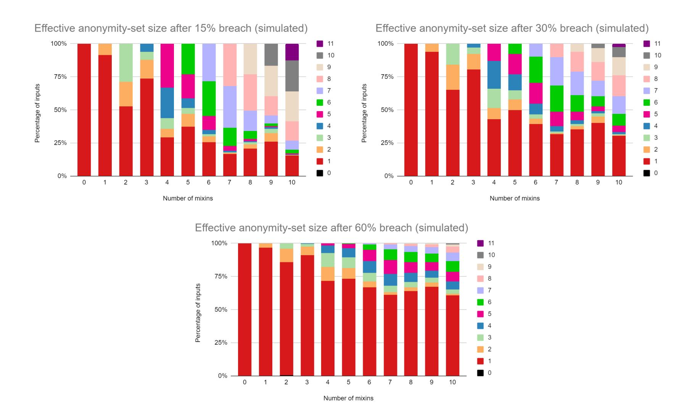

Figure 15: Effective anonymity-set sizes for inputs with up to 10 mixins after simulating a breach of X% of non-deduced inputs. Note that an anonymity-set size of 0 means we must have guessed wrong for one of the inputs we simulated a breach for, leading to a contradiction, but this was a negligible percentage of inputs.

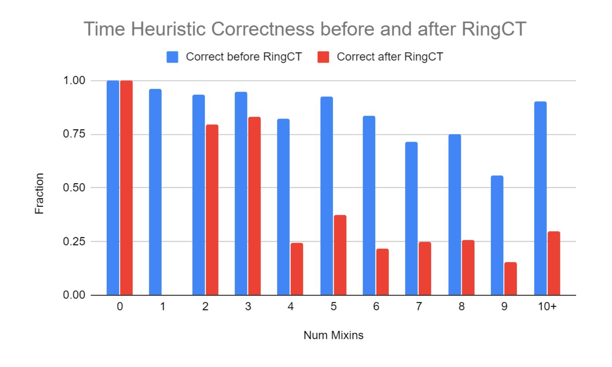

Figure 16: The accuracy of the guess-newest heuristic for inputs before and after RingCT (January 2017) for which we have ground truth (from zero-mixin chain analysis).

{14}------------------------------------------------

transactions.

The main factor contributing to the decrease in accuracy of the guess-newest heuristic is the changes in mixin sampling algorithm. As shown in [\[M¨os+18\]](#page-22-2) and [\[Kum+17\]](#page-22-3), users tend to spend TXOs soon after they are created. Thus, it makes sense to choose mixins from a distribution that more closely resembles real spending patterns. Since RingCT was introduced, some mixins were chosen from a "recent zone," which was originally 5 days and then reduced to 3 days. The mixin sampling distribution has since been replaced with a gamma distribution (from [\[M¨os+18\]](#page-22-2)) fitted to the empirical spend-time distribution. Our results show that these sampling distribution changes have made a significant impact in reducing the accuracy of the guess-newest heuristic.

Merging Outputs Heuristic. Finally, we empirically validate the accuracy of the Merging Outputs heuristic from section 5.2 of Kumar et al. [\[Kum+17\]](#page-22-3). In their paper, they ran this heuristic on pre-RingCT inputs and obtained the results shown in Figure [17.](#page-14-0)

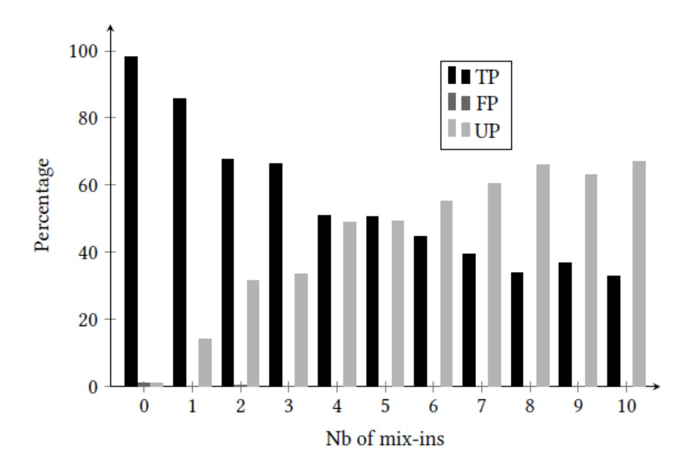

Figure 17: Figure 11 from [\[Kum+17\]](#page-22-3) illustrating the accuracy of the merging outputs heuristic for non-RingCT inputs. TP means true positive, FP means false positive, and UP means unknown positive. The TPs and FPs are the inputs for which they had ground truth, and the UPs are those inputs that were not fully traceable using zero-mixin chain analysis.

We identified candidate source-destination pairs by applying Algorithm 2 from [\[Kum+17\]](#page-22-3). We pruned these candidates by filtering out any pairs for which any of the following ambiguous scenarios (from section 5.2 of [\[Kum+17\]](#page-22-3)) applied:

- S1: It may not find any destination for a given source.
- S2: It may find several destinations for a given source. [Note that this is non-ambiguous as long as the different destinations use disjoint outputs from the source.]
- S3: It may find one (or more) destination for a given source, where the same source output appears in more than one destination input.
- S4: It may find one (or more) destination for a given source, where more than one source outputs appear in a single destination input.

{15}------------------------------------------------

In addition, we also filtered out those pairs such that

• S5: It may find the same destination for several sources, where the destination inputs overlap.

After applying these filters, we were left with 149234 source-destination pairs, which included 169391 unique transactions (2.8% of post-RingCT transactions) consisting of 111983 source transactions and 64522 destination transactions. The breakdown of the types (Type 1, 2, or 3) of these source-destination pairs is shown in Figure [18.](#page-15-0) Note that 2→2 and 3→2 pairs are possible because Type 2 transactions may have a mix of known-value inputs and hidden-value inputs. The knownvalue inputs must be from Type 1 outputs, whereas the hidden-value inputs may be from Type 2 or Type 3 outputs.

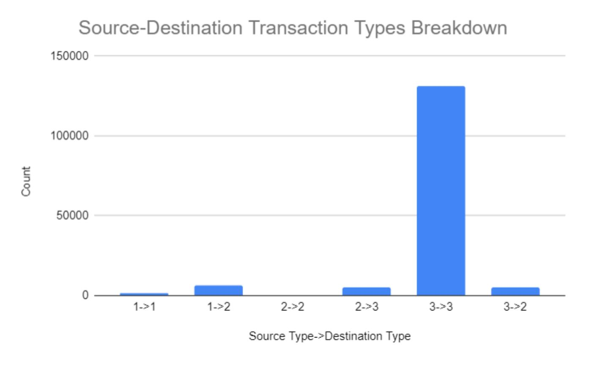

Figure 18: Breakdown of source and destination transaction types from post-RingCT (January 2017) after applying S1 through S5 to filter out some ambiguous source-destination pairs.

These 149234 post-RingCT source-destination transaction pairs included 372272 destination inputs, for which we had ground truth for 5503 (1.5%), which were all from 1→1 (1982, 36.0%) and 1→2 (3521, 64.0%) source-destination pairs. The merging outputs heuristic was correct for 5286 (96.1%) of these inputs. This is further broken down by number of mixins per input in Figure [19.](#page-16-0)

While the merging outputs heuristic can only be applied to a small number of transactions, our results show that when it is applicable, it is highly accurate. Though we did not have ground truth for any Type 3 transactions, we believe the merging outputs heuristic should be fairly accurate for source-destination pairs involving Type 3 transactions, since this heuristic should not be significantly affected by the number of mixins or the mixin sampling distribution.

## 3.2.2 Zcash

Our initial results include an overall analysis of the Zcash ecosystem up to the block height of 300,000 blocks, which is a bit greater than the number of blocks experimented on in [\[Kap+18\]](#page-22-9). We also ran analysis at heights of 50K and 240K, and the results from the two are similar to that of our most recent block height. The blockchain at this point contains 2,781,533 total transactions, and Figures [20](#page-16-1) and [21](#page-17-0) show the breakdown in transaction types.

From these two figures we can see how in the Zcash ecosystem, the majority of participants are not taking advantage of the privacy benefits of the protocol that implement zero-knowledge proofs

{16}------------------------------------------------

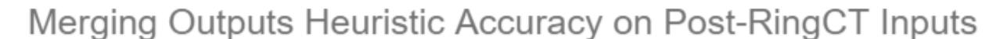

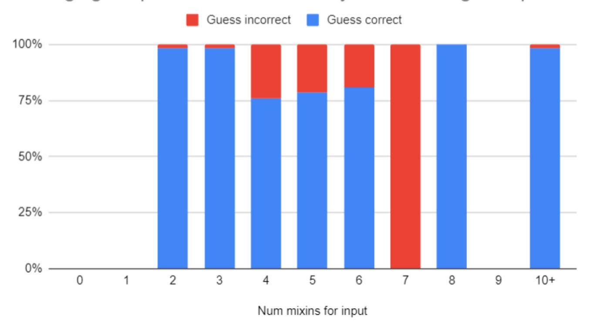

Figure 19: Accuracy of merging outputs heuristic on destination inputs post-RingCT for which we had ground truth for after using S1 through S5 to filter out some ambiguous source-destination pairs. Note that for 7 mixins, we only had 2 such inputs, so the incorrect guesses are only a tiny portion of all guesses.

| Type       | Amount  | Percentage |
|------------|---------|------------|
| coingen    | 30000   | 10.79      |
| mixed      | 13070   | 0.47       |
| deshielded | 212496  | 7.64       |
| shielded   | 168600  | 6.06       |
| private    | 8508    | 0.31       |
| public     | 2078859 | 74.74      |

Figure 20: Types of transactions included in our experiment, up to 300,000 block height.

aimed to increase anonymity. The majority of participants in the system are using Zcash public t-to-t transaction, which mirrors the Bitcoin ecosystem and its anonymity issues.

We also were able to analyze the top Zcash addresses in terms of value sent, received and currently holding. We found that a single address had the highest send and receive, of 162,645,413 and 162,707,356 ZEC respectively. The highest wallet value was found to be 145,722 ZEC which is equivalent to ∼6,092,636.00 USD. We observed that Flypool and F2 Pool were in the top 10 addresses for all three categories of total send, received, and in wallet. Next we analyzed the shielded pool itself, which is the collection of shielded addresses that use zero-knowledge proofs for transaction verification. Since Zcash has this additional layer of obfuscation that Bitcoin does not in the form of shielded addresses, the use patterns of individuals within the shielded pool can go lengths to decreasing the anonymity of Zcash.

Figures [22](#page-17-1) and [23](#page-18-0) provide some key heuristics regarding the shielded pool which are applied in the later portions of the analysis. For one, in Figure [22](#page-17-1) we can observe the total value of the shielded pool increasing generally, but doing so with a pattern of recurring spikes of deposits and withdrawals. Because miners and founders are members of the ecosystem that behave in a scheduled manner due to coingen and founder rewards, we can use this to link their transactions involving the shielded pool. In addition, Figure [23,](#page-18-0) which shows the ratio between deposits and withdrawals

{17}------------------------------------------------

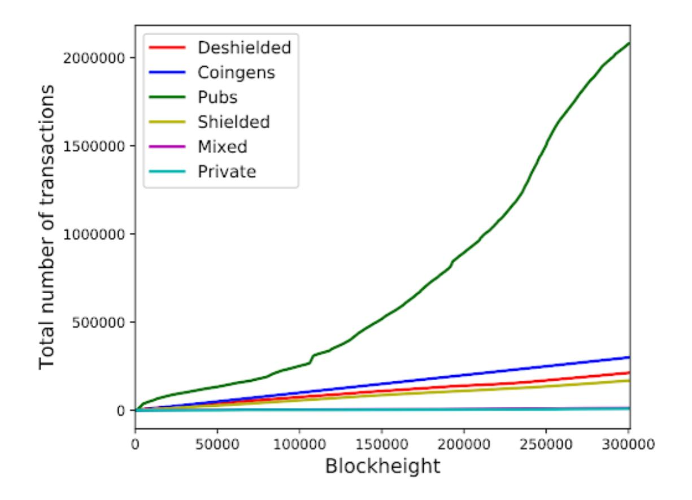

Figure 21: Types of transactions up to 300,000 block height.

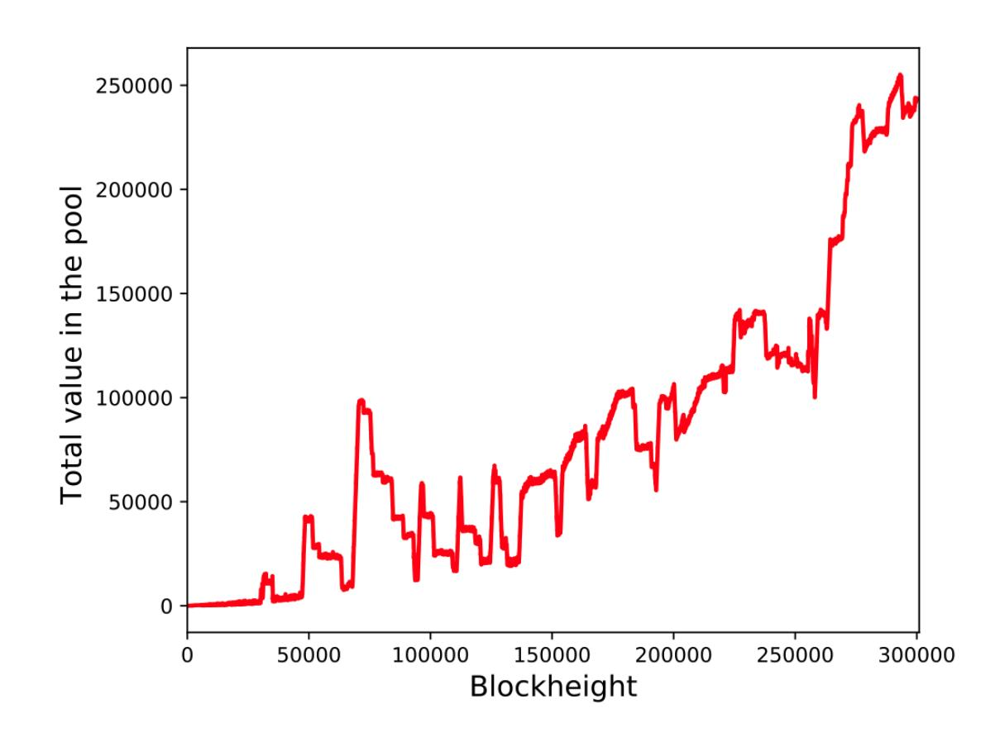

Figure 22: The total amount of Zcash value in the shielded pool at various block heights.

into the shielded pool, shows that the two transactions usually happen in close proximity with each other. For the general shielded pool withdrawals come shortly after deposits which forms an equilibrium. For the founders specifically, the deposits and withdrawals followed a step function where the withdrawals climbed in small increments came in relation to the deposits that came in bigger batches. This again reflects miner and founder behavior occurring on a recurring schedule based on the solution rate, and a well chosen heuristic can deanonymize activity with the shielded pool.

Using the miner addresses sent by the [\[Kap+18\]](#page-22-9) project team and the founder address that are available in the Zcash white-paper, we were able to analyze the amounts in which various entities made deposits into the shielded pool. Our results from running the heuristic are provided in Figure [24.](#page-18-1) We observe that the majority of people making deposits into the shielded pools are miners and

{18}------------------------------------------------

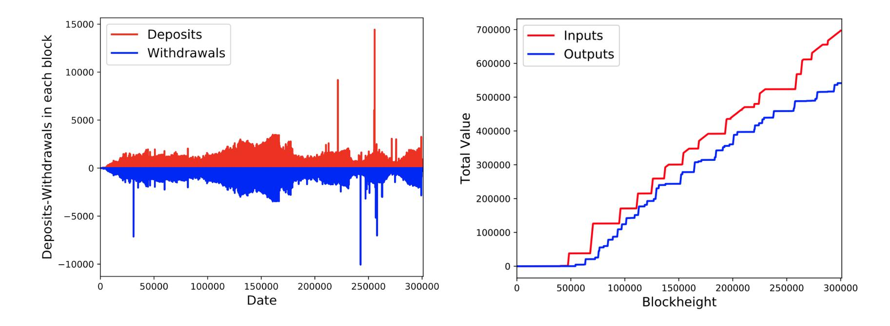

Figure 23: Deposits and withdrawals into the shielded pool over time for the entire shielded pool and specifically for founders, respectively.

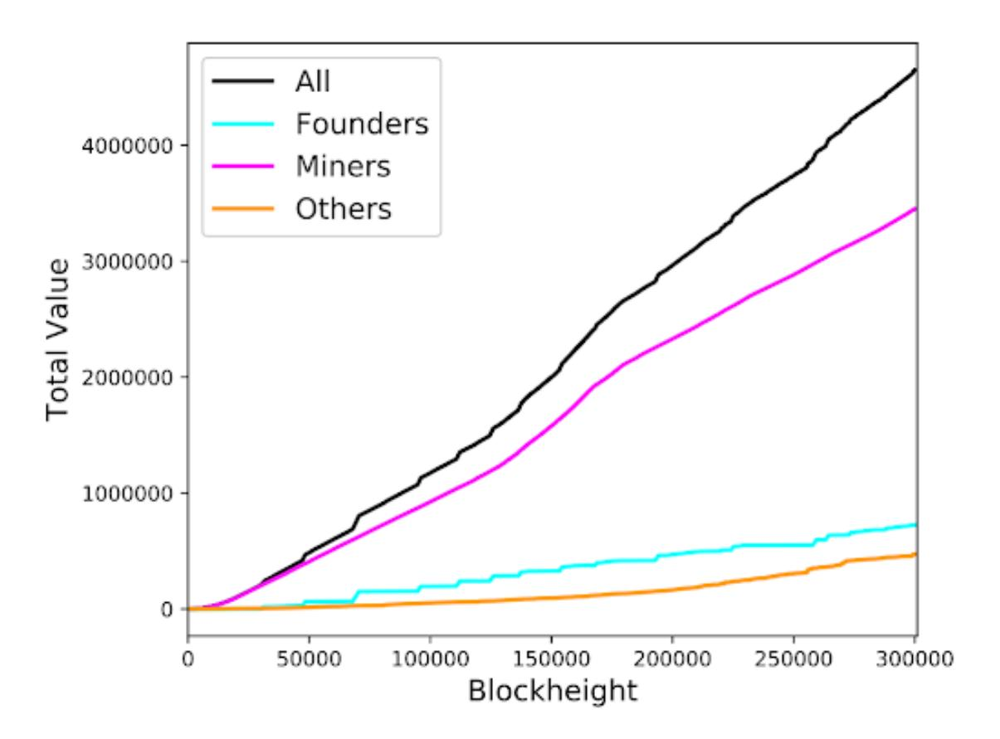

Figure 24: Value deposited in shielded pool over time by various Zcash entities.

founders, which follows the assumption that the general user is seldom taking advantage of the ecosystem.

Next we applied heuristics 3 and 4 from [\[Kap+18\]](#page-22-9) that state:

- Any z-to-t transaction carrying 250.0001 ZEC in value is done by the founders
- If a z-to-t transaction has over 100 output t-addresses, one of which belongs to a known mining pool, then we label the transaction as a mining withdrawal (associated with that pool), and label all non-pool output t-addresses as belonging to miners.

These two heuristics when applied can differentiate between miners and founders who make deshielding transactions, which are transactions leaving the shielded pool. Figure [25](#page-19-0) shows that the founder and miner withdrawals are distinguishable from other withdrawals from the shielded pool, which goes to show that a factor of traceability exists for deshielded transactions in Zcash. We were only

{19}------------------------------------------------

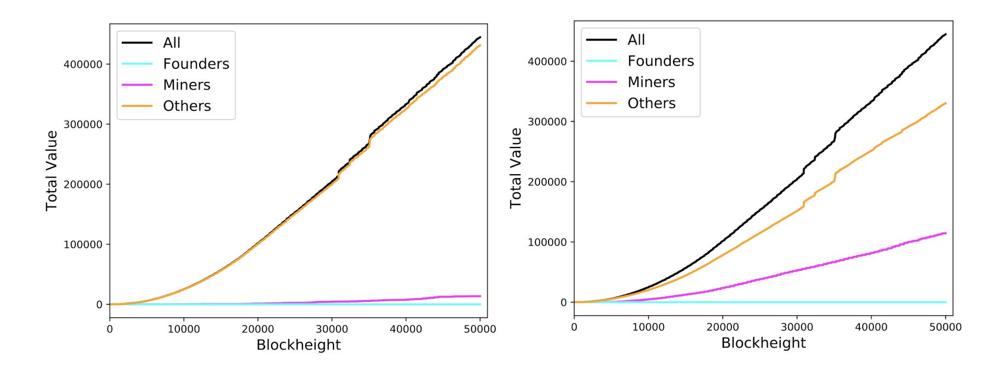

Figure 25: The amount of value withdrawn from the shielded pool over time by different entities.

able to observe this trend up to a block height of 50,000, as we encountered errors creating this graph for larger datasets.

The Zcash clustering analysis we did involved using our own provided founder and pool address tags, on top of the heuristics defined in the paper. After conducting the analysis, we found 121,530 distinct clusters, the top 10 of which contained 541,922 distinct addresses. A total of 790,516 transaction addresses have sent transactions. Figure [26](#page-19-1) showcases the top clusters at block height 300,000. We can observe that the top two clusters contain a good amount of the overall addresses analyzed. In the largest cluster that contained 77,095 addresses, 9 miners and 4 founders we tagged beforehand were encapsulated in the cluster. Figure [27](#page-20-1) contains important statistics related to the cluster C0. The statistics that are calculated on clusters of addresses and the heuristics that link addresses together go to show that even though Zcash offers strong privacy primitives, the vast majority of actors within the ecosystem are subject to a degree of traceability and linkability.

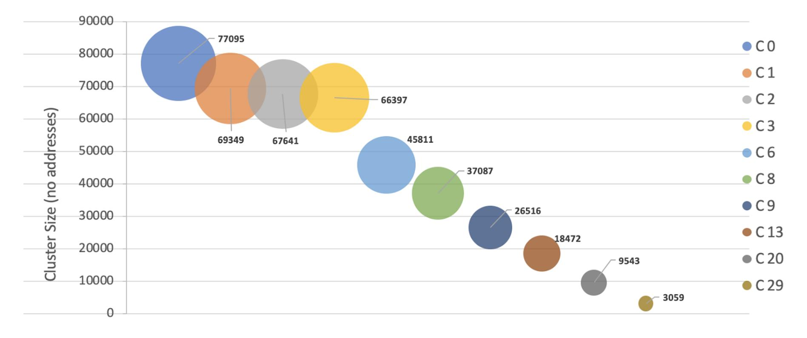

Figure 26: The largest 10 address clusters by size in descending order.

{20}------------------------------------------------

| 49            |
|---------------|
| 254552.676835 |
| 37275162      |
| 112662        |
| 835851.51     |
| 0.0           |
| 1.6538204E+8  |
| 1.6512974E+8  |
| 24893931      |
| 12381231      |
| 14058267      |
| 24893943      |
|               |

Figure 27: Statistics regarding largest cluster C0 (65,255 addresses).

## 4 Future Work

### 4.1 Monero

We have investigated the traceability of transactions made using recent versions of Monero with three heuristics that were successful for tracing transactions made using previous versions. Much more work could be conducted, however, in future work. We could integrate our traced results into the Monero blackball database or blackballing tool (<https://moneroblackball.com/>) and compare our traced transactions with what the blackballing tool traces. It would also be interesting to study the amount of money that is traceable. In addition, mining pool transactions were shown by M¨oser et al. [\[M¨os+18\]](#page-22-2) to be a great source of information leakage based on the characteristics of a transaction from a mining pool. By incorporating the public data of mining pools, we may be able to trace more transactions, including perhaps some Type 3 transactions.

Additionally, we could conduct more sophisticated chain analysis on the transaction inputs by using a boolean satisfiability solver as described in Appendix A of [\[M¨os+18\]](#page-22-2) or using set-theoretic methods such as those in [\[Noe18\]](#page-22-10) and [\[Yu+19\]](#page-23-3). Such a solver could make deductions on cases like the following: Suppose we have 3 transactions: transaction 1 and 2 both have TXO 1 and TXO 2 as their anonymity sets, while transaction 3 has TXOs 1, 2, and 3 in its anonymity set. Then TXO 3 must be the real input of transaction 3, and we know TXOs 1 and 2 have both been spent.

### 4.2 Zcash

The most immediate future work would be to parse the blockchain to the current day to further analyze how the Zcash ecosystem has evolved over time. However, considering the few setbacks we encountered, we believe some work could be done to change some parts of the experiment. For starters, parsing the blockchain directly from the binary files could be much faster than using an RPC to call the Zcash client for every block. The network overhead even after some changes to the extraction networking still proved to be significant. In addition, work can be done to improve the process in which the downloaded Postgres data is first exported to CSV, then Parquet, then loaded to Spark for analysis, all of which take hours to run for high loads. This made the integration process we desired difficult to achieve at a high block height. One solution could be to do the raw parsing inside the Spark application followed by the analysis. This way inter-container communication and file writing would not be needed, which would also save disk space. Docker's voracious appetite 

{21}------------------------------------------------

for memory makes it difficult to run for long periods of time at once, which is critical as the ZEC blockchain grows. Lastly, another avenue of further work could be discovering further heuristics that can be used to increase the linkability of pools and clusters based on the various stakeholder tendencies within the ecosystem. This experiment also showed that there is currently no intuitive and efficient way to parse the Zcash blockchain such that these experiments can be run. A locallyrun ZEC blockchain explorer (like the one for Monero, but not like the web applications) could be useful for any future academic research into this cryptocurrency that requires access to over 26 GB of the blockchain.

More academic research is needed in Zcash overall. Illicit activities, namely money laundering, trading illegal substances, and terrorism funding, only seem to be low in Zcash because there is not enough investigation in that space to reveal the crimes. Ironically, the current research around Zcash's claimed anonymity, which has mostly proved it to be much more traceable than Monero, makes it less appealing to criminals. With a ranking of 26 out of all cryptocurrencies in terms of market capitalization [\[Coi\]](#page-22-11), ZEC is simply not "where the money is," thus not enticing to criminals to use if they want to be more accessible to a broader market. All of these factors suggest that academic rigor in Zcash as a cryptocurrency, not just its novel cryptography technology, is needed in order for it to become a more prominent alt-coin.

## 5 Conclusion

### 5.1 Monero

The anonymity of Monero has evolved to a large extent in the recent few years. With the introduction of RingCT and the increase of mandatory mixins to 10, it is much harder to trace the transactions. We investigated the effectiveness of three successful heuristics from the pre-RingCT era (i.e. before January 2017). The percentage of deducible inputs through zero chain analysis decreased to nearly 0% after the increases in required number of mixins and the introduction of RingCT. The accuracy of the time heuristic has also dropped considerably to less than 40% since the recent updates to the mixin sampling algorithm. The merging outputs heuristic is still highly accurate, but it can only be applied to a small portion of all transactions. We thus believe that compared to three years ago, current Monero transactions can be conducted with greater privacy.

### 5.2 Zcash

As we expected, Zcash's privacy guarantees are questionable. As the volume of public transactions increase at a much faster rate than that of shielded and private transactions, the overall anonymity of ZEC users, even if they are fully utilizing the features of the shielded pools, is decreased. Observing the ZEC blockchain at various block heights between 50,000 and 300,000, it is noticeably easier to identify more clusters and more addresses associated with each cluster as the number of blocks included in the analysis increases. Heuristics defined by Kappos et al. in 2018 [\[Kap+18\]](#page-22-9) still correctly characterize user behavior and thus make ZEC more traceable and therefore less anonymous. Incentivizing current users to at least partially engage in shielded pools would significantly reduce the current flaw in its privacy guarantees.

# 6 Acknowledgments

We thank Professor Nicolas Christin and his Ph.D. student Kyle Soska for providing us access to the Jeju machine for running our Monero experiments and for installing needed libraries. We also 

{22}------------------------------------------------

thank them for pointing us to related work and suggesting the Monero breach simulation analysis. This project was done as part of the 17703/19733 Cryptocurrencies, Blockchains, and Applications class at Carnegie Mellon University (CMU) taught by Professor Nicolas Christin. We thank CMU for reimbursing us for the costs of purchasing Bitcoin that we used to buy Monero and Zcash.

# References

- [BF19] Alex Biryukov and Daniel Feher. "Privacy and Linkability of Mining in Zcash". In: 2019 IEEE Conference on Communications and Network Security (CNS). IEEE. 2019, pp. 118–123.
- [Coi] "Cryptocurrency Market Capitalizations". url: <https://coinmarketcap.com/> (visited on 05/18/2020).
- [Gab18] Ariel Gabizon. "How Transactions Between Shielded Addresses Work". 2018. url: [https : / / electriccoin . co / blog / zcash - private - transactions/](https://electriccoin.co/blog/zcash-private-transactions/) (visited on 05/18/2020).
- [Kap+18] George Kappos, Haaroon Yousaf, Mary Maller, and Sarah Meiklejohn. "An empirical analysis of anonymity in zcash". In: 27th USENIX Security Symposium Security 18. 2018, pp. 463–477.
- [Kum+17] Amrit Kumar, Cl´ement Fischer, Shruti Tople, and Prateek Saxena. "A traceability analysis of monero's blockchain". In: European Symposium on Research in Computer Security. Springer. 2017, pp. 153–173.
- [M¨os+18] Malte M¨oser, Kyle Soska, Ethan Heilman, Kevin Lee, Henry Heffan, Shashvat Srivastava, Kyle Hogan, Jason Hennessey, Andrew Miller, Arvind Narayanan, et al. "An empirical analysis of traceability in the monero blockchain". In: Proceedings on Privacy Enhancing Technologies 2018.3 (2018), pp. 143–163.
- [NM+16] Shen Noether, Adam Mackenzie, et al. "Ring confidential transactions". In: Ledger 1 (2016), pp. 1–18.
- [NNM14] Surae Noether, Sarang Noether, and Adam Mackenzie. "A note on chain reactions in traceability in cryptonote 2.0". In: Research Bulletin MRL-0001. Monero Research Lab 1 (2014), pp. 1–8.
- [Noe18] Sarang Noether. "Sets of spent outputs". In: Technical Note MRL-0007. Monero Research Lab (2018).
- [Par] "Parameter Generation". url: <https://z.cash/technology/paramgen/> (visited on 05/18/2020).
- [Pet16] Paige Peterson. "Anatomy of A Zcash Transaction". 2016. url: [https://electriccoin](https://electriccoin.co/blog/anatomy-of-zcash/). [co/blog/anatomy-of-zcash/](https://electriccoin.co/blog/anatomy-of-zcash/) (visited on 05/18/2020).
- [Sab13] Nicolas van Saberhagen. "CryptoNote v 2.0". 2013.
- [Sil+20] Erik Silfversten, Marina Favaro, Linda Slapakova, Sascha Ishikawa, James Liu, and Adrian Salas. "Exploring the use of Zcas h cryptocurrency for illicit or criminal purposes". In: (2020).
- [Sun+17] Shi-Feng Sun, Man Ho Au, Joseph K Liu, and Tsz Hon Yuen. "Ringct 2.0: A compact accumulator-based (linkable ring signature) protocol for blockchain cryptocurrency monero". In: European Symposium on Research in Computer Security. Springer. 2017, pp. 456–474.

{23}------------------------------------------------

- [WWG17] Zooko Wilcox, Nathan Wilcox, and Jack Gavigan. "The Near Future of Zcash". 2017. url: [https://electriccoin.co/blog/the- near- future- of- zcash/](https://electriccoin.co/blog/the-near-future-of-zcash/) (visited on 05/18/2020).
- [Yu+19] Zuoxia Yu, Man Ho Au, Jiangshan Yu, Rupeng Yang, Qiuliang Xu, and Wang Fat Lau. "New empirical traceability analysis of CryptoNote-style blockchains". In: International Conference on Financial Cryptography and Data Security. Springer. 2019, pp. 133–149.
- [Zks] "What are zk-SNARKs?" url: <https://z.cash/technology/zksnarks/> (visited on 05/18/2020).
- [Zte] "How It Works". url: <https://z.cash/technology/> (visited on 05/18/2020).
- [Zus] "Usage Statistics". url: <https://explorer.zcha.in/statistics/usage> (visited on 05/18/2020).