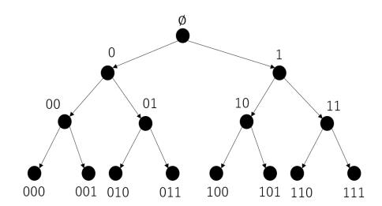

{0}------------------------------------------------

# Time-Specific Encryption with Constant-Size Secret-Keys Secure under Standard Assumption

Masahito Ishizaka and Shinsaku Kiyomoto

KDDI Research, Inc. {ma-ishizaka, kiyomoto}@kddi-research.jp

**Abstract.** In Time-Specific Encryption (TSE) [Paterson&Quaglia, SCN'10] system, each secret-key (resp. ciphertext) is associated with a time period  $t \in [0, T-1]$  (resp. a time interval [L, R] where  $L, R \in [0, T-1]$ ). A ciphertext under [L, R] is correctly decrypted by any secret-key for any time t included in the interval, i.e.,  $t \in [L, R]$ . TSE's generic construction from identity-based encryption (IBE) (resp. hierarchical IBE (HIBE)) from which we obtain a concrete TSE scheme with secret-keys of size  $O(\log T)|g|$  (resp.  $O(\log^2 T)|g|$ ) and ciphertexts of size  $O(\log T)|g|$  (resp. O(1)|g|) has been proposed in [Paterson&Quaglia, SCN'10] (resp. [Kasamatsu et al., SCN'12]), where |g| denotes bit length of an element in a bilinear group  $\mathbb{G}$ . In this paper, we propose another TSE's generic construction from wildcarded identity-based encryption (WIBE). Differently from the original WIBE ([Abdalla et al., ICALP'06]), we consider WIBE w/o (hierarchical) key-delegatability. By instantiating the TSE's generic construction, we obtain the first concrete scheme with constant size secret-keys secure under a standard (static) assumption. Specifically, it has secret-keys of size O(1)|g| and ciphertexts of size  $O(\log^2 T)|g|$ , and achieves security under the decisional bilinear Diffie-Hellman (DBDH) assumption.

**Keywords:** Time-specific encryption (TSE), Constant-sized secret-keys, The decisional bilinear Diffie-Hellman (DBDH) assumption, Wildcarded identity-based encryption (WIBE).

### 1 Introduction

Time-Specific Encryption (TSE) [15]. In a TSE system with time periods  $T \in \mathbb{N}$ , each secret-key (resp. ciphertext) is associated with a time period  $t \in [0, T-1]$  (resp. a time interval [L, R], where  $L, R \in [0, T-1]$ ). Any ciphertext for [L, R] can be correctly decrypted by any secret-key for any t such that  $t \in [L, R]$ . If we say that a TSE scheme is secure, that informally means that any probabilistic polynomial time (PPT) algorithm, given a ciphertext  $C^*$  of a plaintext  $m^*$  under an interval  $[L^*, R^*]$ , cannot get any information about  $m^*$ . This type of TSE, on whom we mainly focus in this paper, is called *plain setting* in [15].

Paterson and Quaglia [15] proposed a generic construction of TSE from identity-based encryption (IBE) [18]. Kasamatsu et al. [12, 13] proposed a generic construction of TSE from forward secure encryption (FE) [3, 9] and a more efficient concrete construction based on Boneh-Boyen-Goh hierarchical identity-based encryption (HIBE) [6]. Secret-key size of the IBE-based TSE is  $O(\log T \cdot K(\Sigma_{\rm IBE}^{2T-1}))$ , where  $\Sigma_{\rm IBE}^n$  denotes an IBE scheme with  $n \in \mathbb{N}$  identities and  $K(\Sigma_{\rm IBE}^n)$  denotes its size of secret-keys. This means that secret-key size of any concrete scheme obtained from the IBE-based generic construction of TSE cannot be constant (even if the secret-key size of the underlying IBE scheme is constant). By a similar reason, either secret-key size of any concrete TSE scheme obtained by the FE-based generic TSE construction or that of the concrete BBG HIBE-based TSE construction cannot be constant.

As pointed out by [15], broadcast encryption (BE) [10] is conceptually broader than TSE. As far as we know, master public-key size (and encryption/decryption cost) of currently-known BE schemes increase linearly with total number of users (e.g., one in Subsect. 3.1 in [7], one in [20], one in Subsect. 3.1 in [11]), square root of total number of users (e.g., one in Subsect. in [7]), or maximum cardinality of a set of users associated with a ciphertext (which determines users who can decrypt the ciphertext) (e.g., one in Subsect.

{1}------------------------------------------------

3.3 in [11]). Because of that, from currently-known BE schemes, we obtain TSE schemes whose master public-key size (and encryption/decryption cost) increase linearly with  $O(\sqrt{T})$  at least.

It is rational that, based on the fact that TSE is more functionally limited than some existing primitives such as BE, attribute-based encryption [17] and functional encryption [8], we require TSE to be more (asymptotically) efficient than them. Precisely, in this paper, we focus on (asymptotically) efficient TSE schemes, whose master public-key/(user's) secret-key/ciphertext size and encryption/decryption cost are  $O(\log^2 T)$  at most.

In this paper, we affirmatively solve the following open problem: Can we construct a TSE scheme with total time periods T, whose secret-key size is O(1), whose master public-key/ciphertext size and encryption/decryption cost are  $O(\log^2 T)$  at most, and which is secure under standard (static) computational assumptions?

Wildcarded Identity-Based Encryption (WIBE) [1, 2, 4]. WIBE is a generalization of HIBE, where each ciphertext is associated with a wildcarded identity  $wID \in \{0, 1, *\}^L$  which can include some wildcard symbols \* and such ciphertext can be correctly decrypted by any secret-key associated with any identity  $ID \in \{0, 1\}^L$  s.t. for every  $i \in [1, L]$  s.t.  $wID[i] \neq *$ , it holds wID[i] = ID[i]. Abdalla and Birkett et al. [1, 2, 4] showed that by partially modifying existing HIBE schemes [5, 6, 19], we obtain WIBE schemes. Since they defined WIBE as a generalization of HIBE, their WIBE schemes are assumed to have (hierarchical) key-delegatability, which guarantees that there exists a polynomial time algorithm to derive a secret-key for an identity from any secret-key for any ancestor identity of the identity. In this paper, meanwhile, we define WIBE as a generalization of IBE, which implies that they lack (hierarchical) key-delegatability.

Our Contribution. We propose a generic construction of Range Encryption (RE) from WIBE w/o key-delegatability. RE is a generalization of TSE. Differently from TSE, RE handles not only a range  $[L,R] \subseteq [0,T-1]$  s.t.  $L \le R$ , but also a range  $[L,R] \subseteq [0,T-1]$  s.t. L > R. From a normal TSE scheme, we can easily construct a RE scheme by making an encryptor divide a range  $[L,R] \subseteq [0,T-1]$  s.t. L > R into two subranges [L,T-1] and [0,R] and independently generate a ciphertext for each subrange. Secret-key size of the generic construction is described as  $O\left(K\left(\Sigma_{\text{WIBE}}^{\log T}\right)\right)$ , where  $\Sigma_{\text{WIBE}}^n$  is a WIBE scheme whose bit length of an identity is  $n \in \mathbb{N}$ . Moreover, we show that by modifying Waters IBE scheme [19], we can construct a WIBE scheme (w/o key-delegatability), whose secret-keys consists of constant number of group elements, i.e., two group elements, and which is secure under standard assumptions, i.e., the decisional bilinear Diffie-Hellman (DBDH) assumption. By using the WIBE scheme to instantiate the generic construction of RE from WIBE, we obtain a RE (or TSE) scheme which can justify our claim that we certainly solve the open problem mentioned earlier.

*Our Approach.* It might be a surprise that it is not hard to obtain a RE scheme with constant-sized secret-keys. However, since the naive methodology has some disadvantages, we propose another improved methodology. Let us explain the details below.

Let PQ-IBE-TSE denote the IBE-based generic construction of TSE [15]. Let PQ-WIBE-TSE denote PQ-IBE-TSE, where we substitute WIBE for IBE. Let PQ-WIBE-RE denote the range encryption constructed by PQ-WIBE-TSE. We briefly explain PQ-WIBE-RE.

We consider a binary tree with depth  $\log T$  (as shown in Fig. 3 in Sect. 5). A time period  $t \in [0, T-1]$  corresponds to a leaf node with a bit string  $t \in \{0, 1\}^{\log T}$  (which is the binary value of t). A secret-key for  $t \in [0, T-1]$  is produced as a secret-key for the bit string (or identity)  $t \in \{0, 1\}^{\log T}$  by using the keygeneration algorithm of the WIBE scheme. Given a time interval [L, R] where  $L, R \in [0, T-1]$ , we consider some wildcarded strings  $\mathbb{T}_{[L,R]}$  which *covers* [L, R] and whose cardinality is the minimum<sup>1</sup>. For instance, when T = 8 in Fig. 3,  $\mathbb{T}_{[1,6]} = \{001, 01*, 10*, 110\}$ . When we encrypt a plaintext under [L, R], we encrypt the plaintext under each (wildcarded) bit string in  $\mathbb{T}_{[L,R]}$  by using the encryption algorithm of the WIBE scheme.

<span id="page-1-0"></span><sup>&</sup>lt;sup>1</sup>For the formal algorithm deriving such a set  $\mathbb{T}_{[L,R]}$ , we recommend the reader to refer to the original paper [15] or Sect. 5 of this paper.

{2}------------------------------------------------

We can easily prove that if the underlying WIBE scheme is secure, then PQ-WIBE-RE is secure. Secret-key size of PQ-WIBE-RE is  $O(K(\Sigma_{\text{WIBE}}^{\log T}))$ . There have already existed WIBE schemes (with key-delegatability) whose secret-key size is constant, e.g., Abdalla and Birkett et al.'s WIBE scheme [1, 2, 4] based on Boneh-Boyen-Goh HIBE [6]. Thus, by using such a WIBE scheme to instantiate PQ-WIBE-RE, we can obtain a RE scheme with constant-sized secret-keys.

However, such a naive methodology has the following disadvantages.

- 1. Ciphertext size of PQ-WIBE-RE can be smaller. In other words, there exists another WIBE-based generic construction of RE, from which we obtain a concrete RE scheme with smaller ciphertext size. We denote it by IK-WIBE-RE.
- 2. To the best of our knowledge, no WIBE scheme (with or without key-delegatability) with constant-sized secret-keys secure under standard (or static) assumptions has been proposed. For instance, Boneh-Boyen-Goh HIBE-based WIBE scheme [1, 2, 4] with constant-sized secret-keys has been proven to be secure under non-standard (or non-static) assumption.

Let us provide the details in the following 2 paragraphs.

*IK-WIBE-RE*. Roughly speaking, encryption process adopted in IK-WIBE-RE is the same as that adopted in PQ-WIBE-RE. Namely, that is a process, where we, given a plaintext m and an range [L, R], derive a set of wildcarded IDs  $\mathbb{T}_{[L,R]}$ , encrypt m under each  $wID \in \mathbb{T}_{[L,R]}$  (by using the encryption algorithm of  $\Sigma_{\text{WIBE}}^{\log T}$ ) to produce a ciphertext  $C_{wID}$ , and construct  $C_{[L,R]}$  as  $\{C_{wID} \mid wID \in \mathbb{T}_{[L,R]}\}$ . Thus, size of the ciphertext is described as  $\sum_{wID \in \mathbb{T}_{[L,R]}} |C_{wID}|$ . If we adopt our WIBE scheme based on Waters IBE scheme [19], that is described as  $\sum_{wID \in \mathbb{T}_{[L,R]}} \{|g_T| + (2 + |wID|_*)|g|\}^{23}$ . This implies that  $|C_{[L,R]}|$  is determined solely by  $\mathbb{T}_{[L,R]}$ . Let us explain how we derive  $\mathbb{T}_{[L,R]}$ .

We introduce a binarizing algorithm  $\texttt{Binarize}_{\log T}$  which takes a numerical value (or time period)  $t \in [0, T-1]$  and outputs a bit string  $b \in \{0, 1\}^{\log T}$ . For instance, when T=32, the relation between t and b is defined as shown in Fig. 5 in Subsect. 6.1. Then, we introduce a classifying algorithm  $\texttt{Classify}_{\log T}$  which takes a value  $t \in [0, T-1]$  and outputs a class index in  $[0, \log T]$ . Specifically, it takes  $t \in [0, T-1]$ , and outputs  $\log T$  if t=0, or outputs  $t \in [0, \log T-1]$  if  $t \mod 2^{t+1}=2^t$ . (See Fig. 7.)

Given a range (or time interval) [L,R], we firstly determine a value (called *divider*)  $D \in [L,R]$  which divides the range into [L,D-1] and [D,R]. Informally, D is the value which is classified as the class whose index is the largest among the values in [L,R]. Let  $\mathsf{Divide}_{\log T}$  denote the algorithm which takes [L,R] and outputs D.

Next, we derive sets of wildcarded IDs  $\mathbb{T}_{[D,R]}$  and  $\mathbb{T}_{[L,D-1]}$  for [D,R] and [L,D-1], respectively. Firstly, let us explain how to derive  $\mathbb{T}_{[D,R]}$ . We formally prove that  $\forall L,R \in [0,T-1]$  with  $D \leftarrow \text{Divide}_{\log T}(L,R)$ ,  $\exists k_1 \in [0,\text{Classify}_{\log T}(D)], \exists k_2 \in [0,k_1-1],\cdots,\exists k_n \in [0,k_{n-1}-1] \text{ s.t. } D-1+\sum_{l=1}^n 2^{k_l}=R.$  Moreover, we prove that  $\forall i \in [1,n], \exists wID_i \in \{0,1,*\}^{\log T}$  which covers a subrange<sup>4</sup>  $[D+\sum_{l=1}^{i-1}2^{k_l},D-1+\sum_{l=1}^{i}2^{k_l}]$  and satisfies  $|wID_i|_*=k_i$ . We set  $\mathbb{T}_{[D,R]}$  as  $\{wID_i\mid i\in [1,n]\}$ . Likewise, we derive  $\mathbb{T}_{[L,D-1]}$ . We prove that  $\forall L,R\in [0,T-1]$  with  $D\leftarrow \text{Divide}_{\log T}(L,R), \exists k_1'\in [0,\text{Classify}_{\log T}(D)-1], \exists k_2'\in [0,k_1'-1],\cdots,\exists k_{n-1}'\in [0,k_{n-1}'-1] \text{ s.t. } D-\sum_{l=1}^n 2^{k_l'} \mod T=L.$  Moreover, we prove that  $\forall i\in [1,n'], \exists wID_i'\in \{0,1,*\}^{\log T}$  which covers  $[D-\sum_{l=1}^i 2^{k_l'} \mod T,D-1-\sum_{l=1}^{i-1} 2^{k_l'} \mod T]$  and satisfies  $|wID_i'|_*=k_i'$ . We set  $\mathbb{T}_{[L,D-1]}$  as  $\{wID_i'\mid i\in [1,n']\}$ .

Finally, we derive  $\mathbb{T}_{[L,R]}$  from  $\mathbb{T}_{[L,D-1]}$  and  $\mathbb{T}_{[D,R]}$ . Although the most simple way is deriving a union set of the two sets, i.e.,  $\mathbb{T}_{[L,R]} := \mathbb{T}_{[L,D-1]} \cup \mathbb{T}_{[D,R]}$ , we adopt the following another way. Let  $n^*$  denote the integer s.t.  $[0 \le n^* \le \min(n,n')] \bigwedge_{i=1}^{n^*} \left[k_i = k_i'\right] \bigwedge \left[n^* < \min(n,n') \implies k_{n^*+1} \ne k_{n^*+1}'\right]$ . We formally prove that  $\forall i \in [1,n^*]$ ,  $wID_i$  and  $wID_i'$  can be merged into a new  $wID_i^*$  which covers both of the ranges covered by  $wID_i$ 

<span id="page-2-0"></span><sup>|</sup>g| (resp.  $|g_T|$ ) denotes bit length of an element in a bilinear group  $\mathbb{G}$  (resp.  $\mathbb{G}_T$ ) for a (symmetric) bilinear map  $e: \mathbb{G} \times \mathbb{G} \to \mathbb{G}_T$ .

<span id="page-2-2"></span><span id="page-2-1"></span> $<sup>|</sup>WID|_*$  denotes number of wildcard symbol \* in  $WID \in \{0, 1, *\}^L$ .

 $<sup>{}^4</sup>wID \in \{0, 1, *\}^L$  covers a range [a, b] means that any value included in the range matches the wildcarded ID and any value excluded from the range does not match it.

{3}------------------------------------------------

and  $wID'_i$ , i.e.,  $[D + \sum_{l=1}^{i-1} 2^{k_l}, D - 1 + \sum_{l=1}^{i} 2^{k_l}] \bigcup [D - \sum_{l=1}^{i} 2^{k'_l} \mod T, D - 1 - \sum_{l=1}^{i-1} 2^{k'_l} \mod T]$ , and satisfies  $|wID^*_i|_* = k_i + 1$ . In conclusion, we set  $\mathbb{T}_{[L,R]}$  as  $\mathbb{T}_{[L,D-1]} \bigcup \mathbb{T}_{[D,R]} \setminus_{i \in [1,n^*]} \{wID_i, wID'_i\} \bigcup_{i \in [1,n^*]} \{wID^*_i\}$ .

Let us compare size of ciphertexts generated based on  $\mathbb{T}_{[L,R]}$  with that on  $\mathbb{T}_{[L,D-1]} \cup \mathbb{T}_{[D,R]}$ . Let  $|C_{L,R}|$  (resp.  $|C_{L,D,R}|$ ) denote size of ciphertext generated based on  $\mathbb{T}_{[L,R]}$  (resp.  $\mathbb{T}_{[L,D-1]} \cup \mathbb{T}_{[D,R]}$ ). If  $\mathbb{T}_{[L,R]} = \mathbb{T}_{[L,D-1]} \cup \mathbb{T}_{[D,R]}$ , then  $|C_{L,R}| = |C_{L,D,R}|$ . Else if  $\mathbb{T}_{[L,R]} \neq \mathbb{T}_{[L,D-1]} \cup \mathbb{T}_{[D,R]}$ , then  $|C_{L,R}| < |C_{L,D,R}|$ . Especially, if  $n^* = n = n'$ ,  $|C_{L,R}|$  becomes approximately the half of  $|C_{L,D,R}|$ . For instance, when [L,R] is [1,T-2] (or  $[2^{\log T-1}+1,2^{\log T-1}-2]$ ) with  $n^* = n = n' = \log T - 1$ ,  $|C_{L,D,R}| = 2(\log T - 1)|g_T| + (\log^2 T + \log T - 2)|g|$  and  $|C_{L,R}| = (\log T - 1)|g_T| + \frac{1}{2}(\log^2 T + 3\log T - 4)|g| = \frac{1}{2}|C_{L,D,R}| + (\log T - 1)|g|$ . For instance, when  $T = 2^{10}$  (resp.  $T = 2^{20}$ ),  $|C_{L,D,R}|$  becomes  $18|g_T| + 108|g|$  (resp.  $38|g_T| + 418|g|$ ) and  $|C_{L,R}|$  becomes  $9|g_T| + 63|g|$  (resp.  $19|g_T| + 228|g|$ ). Note that the maximum  $|C_{L,D,R}|$  is  $2(\log T - 1)|g_T| + (\log^2 T + \log T - 2)|g|$  when [L,R] is [1,T-2] (or  $[2^{\log T-1} + 1, 2^{\log T-1} - 2]$ ). Thus, in an asymptotic sense,  $|C_{L,D,R}|$  is  $O(\log T)|g_T| + O(\log^2 T)|g|$ . Neither the maximum of  $|C_{L,R}|$  nor the range [L,R] maximizing  $|C_{L,R}|$  is unknown. However, since for every [L,R],  $|C_{L,R}|$  becomes equivalent to or smaller than  $|C_{L,D,R}|$ ,  $|C_{L,R}|$  is asymptotically (at most)  $O(\log T)|g_T| + O(\log^2 T)|g|$ .

Thus far, we introduced IK-WIBE-RE. Henceforth, we explain how smaller ciphertext size of IK-WIBE-RE is than that of PQ-WIBE-RE. Let  $\mathbb{T}^{PQ}_{[L,R]}$  denote the set of wildcarded IDs (for the range [L,R]) in PQ-WIBE-RE. For every [L,R],  $\mathbb{T}^{PQ}_{[L,R]}$  and  $\mathbb{T}_{[L,D-1]} \cup \mathbb{T}_{[D,R]}$ , where  $D \leftarrow \text{Divide}_{\log T}(L,R)$ , do not become the same, but *resemble*. Precisely, they consist of the same number of wildcarded IDs, and if there exists a wildcarded ID in one of them which covers a subrange of [L,R], then there also exists a wildcarded ID in another one of them which covers the same subrange. This implies that size of ciphertexts generated based on them become the same. Hence, for any [L,R], size of ciphertext of IK-WIBE-RE becomes equivalent to or smaller than that of PQ-WIBE-RE, and for some [L,R], the former approximately becomes the half of the latter.

Our WIBE Scheme with Constant-Sized Secret-Keys Secure under the DBDH Assumption. In IK-WIBE-RE, the WIBE scheme is not required to be (hierarchically) key-delegatable. In other words, from any WIBE scheme with constant-sized secret-keys w/o key-delegatability, we can obtain a RE (or TSE) scheme with constant-sized secret-keys. Influenced by [1, 2, 4], we show that a WIBE scheme w/o key-delegatability and with constant-sized secret-keys is obtained by modifying Waters IBE scheme [19]. Security of the WIBE scheme is reduced to that of Waters IBE scheme, namely the decisional bilinear Diffie-Hellman (DBDH) assumption. By adopting the WIBE scheme to instantiate IK-WIBE-RE, we obtain a RE scheme which can be an evidence that we certainly solve the open problem mentioned earlier.

Another Generic Construction of TSE from BE. As we explained earlier, concrete TSE constructions obtained by using the naive generic construction of TSE from BE have large master public-key and encryption/decryption cost which increase linearly with  $O(\sqrt{T})$  at least. We found another generic construction of TSE from BE. Let us denote it by IK-BE-TSE. It adopts the same tree-based technique as the IBE-based TSE construction [15] (PQ-IBE-TSE) and the naive WIBE-based TSE construction (PQ-WIBE-TSE). The details can be seen in Subsect. C.3.

In IK-BE-TSE, we use BE schemes whose maximum cardinality of a set of users associated with a ciphertext is  $2 \log T - 2$ . Because of that, from IK-BE-TSE, we can obtain concrete TSE schemes whose master public-key and encryption/decryption cost are in polylogarithmic order in T. However, each secret-key for a time period t consists of  $\log T + 1$  number of secret-keys of the BE scheme. So, secret-key size of any concrete TSE scheme obtained from IK-BE-TSE increase linearly with  $\log T + 1$  and thus cannot be constant.

Paper Organization. In Sect. 2 for preliminaries, we introduce some special notations, and give definition of bilinear groups and DBDH assumption. In Sect. 3 (resp. Sect. 4), we provide syntax and security definition for WIBE w/o key-delegatability (resp. RE). In Subsect. 6.1 and Subsect. 6.2, we explain some algorithms of IK-WIBE-RE. Before that, in Subsect. 5, we explain the IBE-based TSE by [15] and the WIBE-based TSE which replaces the underlying IBE scheme in the IBE-based TSE with an WIBE scheme, since they are closely related to IK-WIBE-RE. In Subsect. 6.3, we compare existing generic RE/TSE constructions

{4}------------------------------------------------

in terms of space efficiency. In Sect. 7, we instantiate IK-WIBE-RE by our original WIBE scheme w/o key-delegatability and compare existing concrete RE/TSE constructions in terms of space/time efficiency, security and required assumptions.

### <span id="page-4-0"></span>2 Preliminaries

*Notations*. For an integer  $\lambda \in \mathbb{N}$ ,  $1^{\lambda}$  denotes a security parameter.  $\mathbb{PPT}_{\lambda}$  denotes a set of all probabilistic algorithms whose running time is polynomial in  $\lambda$ . We say that a function  $f: \mathbb{N} \to \mathbb{R}$  is negligible if for every  $c \in \mathbb{N}$ , there exists  $x_0 \in \mathbb{N}$  such that for every  $x \geq x_0$ ,  $f(x) \leq x^{-c}$ .  $\mathbb{NEG}_{\lambda}$  denotes a set of all negligible functions for  $\lambda$ . For a bit string  $a \in \{0,1\}^N$ ,  $a[i] \in \{0,1\}$  denotes the i-th bit of a. For a wildcarded identity  $wID \in \{0,1,*\}^N$ ,  $|wID|_* \in [0,N]$  denotes number of wildcard symbol \* in wID, formally  $\sum_{i \in [0,N-1]} \frac{s.t.}{s.t.} \frac{wID[i]=*}{s.t.} 1$ . We say that a wildcarded identity  $wID \in \{0,1,*\}^N$  covers a subrange [a,b] of a range [A,B] if every value included in the subrange matches (or satisfies) the wID and every value excluded from the subrange does not match the wID.

Bilinear Groups of Prime Order.  $\mathcal{G}_{BG}$  generates bilinear groups of prime order. Let  $\lambda \in \mathbb{N}$ . Specifically, it takes  $1^{\lambda}$  and randomly generates and outputs  $(p, \mathbb{G}, \mathbb{G}_T, e, g, h)$ . First, p is a prime with bit length  $\lambda$ . Second,  $(\mathbb{G}, \mathbb{G}_T)$  are multiplicative groups of order p. Third, (g, h) are generators of  $\mathbb{G}$ . Fourth,  $e: \mathbb{G} \times \mathbb{G} \to \mathbb{G}_T$  is a (symmetric) function computable in polynomial time which satisfies the following conditions: (1) Bilinearity: For every  $a, b \in \mathbb{Z}_p$ ,  $e(g^a, h^b) = e(g, h)^{ab}$ . (2) Non-degeneracy:  $e(g, h) \neq 1_{\mathbb{G}_T}$ , where  $1_{\mathbb{G}_T}$  denotes the unit element.

**Definition 1.** Decisional Bilinear Diffie-Hellman (DBDH) assumption holds if  $\forall \lambda \in \mathbb{N}$ ,  $\forall A \in \mathbb{PPT}_{\lambda}$ ,  $\exists \epsilon \in \mathbb{NEG}_{\lambda}$  s.t.  $Adv_{A,\lambda}^{DBDH}(\lambda) := |\Pr[1 \leftarrow A(p, \mathbb{G}, g, g^{\alpha}, g^{\beta}, g^{\gamma}, e(g, g)^{\alpha\beta\gamma})] - \Pr[1 \leftarrow A(p, \mathbb{G}, g, g^{\alpha}, g^{\beta}, g^{\gamma}, e(g, g)^{\omega})]| < \epsilon$ , where  $(p, \mathbb{G}, \mathbb{G}_{T}, e, g, \cdot) \leftarrow \mathcal{G}_{BG}(1^{\lambda})$  and  $\alpha, \beta, \gamma, \omega \overset{U}{\leftarrow} \mathbb{Z}_{p}$ .

### <span id="page-4-1"></span>3 Wildcarded Identity-Based Encryption (WIBE)

Wildcarded identity-based encryption (WIBE) [1, 2, 4] was originally introduced as a generalized primitive of hierarchical IBE (HIBE). In WIBE, a plaintext is encrypted under a wildcarded identity which can include some wildcard symbols \*, and the ciphertext can be correctly decrypted by a secret-key for an identity matching the wildcarded identity. The original WIBE automatically inherits the (hierarchical) key-delegatability. In this paper, we consider WIBE lacking key-delegatability, whose definitions are given in this section. Definitions of the original WIBE are given in Subsect. A.5.

Syntax. Wildcarded identity-based encryption (WIBE) consists of following 4 polynomial time algorithms, where Dec is deterministic and the others are probabilistic: Let  $1^{\lambda}$ , where  $\lambda \in \mathbb{N}$ , denote a security parameter. Let  $L \in \mathbb{N}$  denote bit length of an ID or wildcarded ID (wID). Setup algorithm Setup takes  $(1^{\lambda}, 1^{L})$  as input, then outputs a master public-key mpk and a master secret-key msk. We write the procedure as  $(mpk, msk) \leftarrow \text{Setup}(1^{\lambda}, 1^{L})$ . We assume that space of plaintexts  $\mathcal{M}$  is uniquely determined by mpk. Note that the other algorithms implicitly takes mpk as input. Key-generation algorithm KGen takes msk and an  $ID \in \{0, 1\}^{L}$ , then outputs a secret-key  $sk_{ID}$ . We write it as  $sk_{ID} \leftarrow \text{KGen}(msk, ID)$ . Encryption algorithm Enc takes a plaintext  $m \in \mathcal{M}$  and a  $wID \in \{0, 1, *\}^{L}$ , then outputs a ciphertext  $C_{wID}$ . We write it as  $C_{wID} \leftarrow \text{Enc}(m, wID)$ . Decryption algorithm Dec takes a secret-key  $sk_{ID}$  and a ciphertext  $C_{wID}$ , then outputs a plaintext  $m \in \mathcal{M}$  or a special symbol  $\bot$  which means that decryption failed. We write it as  $m / \bot \leftarrow \text{Dec}(sk_{ID}, C_{wID})$ .

Additionally, we define *matching algorithm* Match<sub>L</sub>. It takes an  $ID \in \{0, 1\}^L$  and a  $wID \in \{0, 1, *\}^L$ , verifies whether the ID matches the wID, then outputs a Boolean symbol. Formally, it outputs 1 (if  $\forall i \in [0, L-1]$  s.t.  $wID[i] \in \{0, 1\}$ , ID[i] = wID[i]) or 0 (otherwise).

We require every WIBE scheme to be correct. A WIBE scheme  $\Sigma_{\text{WIBE}} = \{\text{Setup}, \text{KGen}, \text{Enc}, \text{Dec}, \text{Match}\}$  is correct, if  $\forall \lambda \in \mathbb{N}, \forall L \in \mathbb{N}, \forall (mpk, msk) \leftarrow \text{Setup}(1^{\lambda}, 1^{L}), \forall ID \in \{0, 1\}^{L}, \forall sk_{ID} \leftarrow \text{KGen}(msk, ID),$ 

{5}------------------------------------------------

 $\forall m \in \mathcal{M}, \forall wID \in \{0, 1, *\}^L \text{ s.t. } \text{Match}_L(ID, wID) = 1, \forall C_{wID} \leftarrow \text{Enc}(m, wID), \text{ it holds that } m \leftarrow \text{Dec}(sk_{ID}, C_{wID}).$ 

IND-CPA Security on Multiple Ciphertexts. For WIBE schemes, we consider a security notion of (adaptive or selective) indistinguishability against adaptive chosen plaintexts attack (IND-CPA) on multiple ciphertexts. In this section, we give the definition of the adaptive security. The one of the selective security is given in Subsect. A.1. For a WIBE scheme  $\Sigma_{\text{WIBE}}$ , a probabilistic algorithm A and a bit  $b \in \{0, 1\}$ , we consider a security experiment  $\mathbf{Expt}_{\Sigma_{\text{WIBE}}, A, b}^{\text{IND-}n\text{WID-CPA}}$  described in Fig. 1.

```
\begin{split} \mathbf{Expt}^{\mathsf{IND-nWID-CPA}}_{\Sigma_{\mathsf{WIBE}},\mathsf{A},b} & (1^{\lambda},1^{L},1^{n}):\\ & (mpk,msk) \leftarrow \mathsf{Setup}(1^{\lambda},1^{L})\\ & (wID_{1}^{\star},\cdots,wID_{n}^{\star},m_{0},m_{1},st_{1}) \leftarrow \mathsf{A}_{1}^{O_{msk}^{\mathsf{KGen}_{1}}} (mpk), \, \mathsf{where}\\ & \triangleright O_{msk}^{\mathsf{KGen}_{1}} (ID_{j} \in \{0,1\}^{L}), \, \mathsf{where} \, \, j \in [1,q_{k}]: \, \mathbf{Return} \, \, sk_{j} \leftarrow \mathsf{KGen}(msk,ID_{j}).\\ & \mathsf{Assume} \, \, \mathsf{that} \, \bigwedge_{i \in [1,n]} \left[ wID_{i}^{\star} \in \{0,1,*\}^{L} \, \bigwedge_{j \in [1,q_{k}]} \, \mathsf{Match}_{L} (ID_{j},wID_{i}^{\star}) = 0 \right]\\ & \forall i \in [1,n], \, C_{i}^{\star} \leftarrow \mathsf{Enc}(m_{b},wID_{i}^{\star}). \, \, \mathbf{Return} \, \, b' \leftarrow \mathsf{A}_{2}^{O_{msk}^{\mathsf{KGen}_{2}}} (st_{1},C_{1}^{\star},\cdots,C_{n}^{\star}), \, \mathsf{where}\\ & \triangleright O_{msk}^{\mathsf{KGen}_{2}} (ID \in \{0,1\}^{L}): \, \mathbf{Return} \, \, sk_{ID} \leftarrow \mathsf{KGen}(msk,ID), \, \mathsf{if} \, \bigwedge_{i \in [1,n]} \, \mathsf{Match}_{L} (ID,wID_{i}^{\star}) = 0. \, \, \mathsf{Else}, \, \mathbf{Return} \, \, \bot. \end{split}
```

<span id="page-5-5"></span><span id="page-5-1"></span>**Fig. 1.** Security experiment for a WIBE scheme  $\Sigma_{\text{WIBE}}$ 

```
Definition 2. Let n \in \mathbb{N}. A WIBE scheme \Sigma_{\text{WIBE}} is IND-nWID-CPA<sup>5</sup>, if \forall \lambda \in \mathbb{N}, \forall L \in \mathbb{N}, \forall A \in \mathbb{PPT}_{\lambda}, \exists \epsilon \in \mathbb{NEG}_{\lambda}, Adv_{\Sigma_{\text{WIBE}},A,\lambda,L,n}^{IND-nWID-CPA}(\lambda) := |\sum_{b \in \{0,1\}} (-1)^b \Pr[\mathbf{Expt}_{\Sigma_{\text{WIBE}},A,b}^{IND-nWID-CPA}(1^{\lambda}, 1^L, 1^n) = 1]| < \epsilon.
```

The following theorem, whose proof is given in Subsect. D.1, guarantees that the adaptive or selective IND-CPA security on single ciphertext implies the one on multiple ciphertexts.

**Theorem 1.** For every WIBE scheme  $\Sigma_{\text{WIBE}}$  and every integer  $n \in \mathbb{N}$ , if  $\Sigma_{\text{WIBE}}$  is IND-WID-CPA (resp. IND-sWID-CPA), then it is IND-nWID-CPA (resp. IND-snWID-CPA).

### <span id="page-5-0"></span>4 Range Encryption (RE)

Paterson and Quaglia [15] introduced time-specific encryption (TSE) as a generalization of time-release encryption [14, 16]. In this paper, we are interested in one type of TSE whom [15] named *plain setting*<sup>6</sup>. In the TSE system (in plain setting) with time periods T in total, there is a trusted authority which privately generates a secret-key for a time period  $t \in [0, T-1]$ . A plaintext is encrypted under a time interval [L, R] such that  $0 \le L \le R \le T-1$ , and the ciphertext can be correctly decrypted by using a secret-key for a time period t in the inverval, i.e.,  $t \in [L, R]$ . In this paper, we consider a generalized primitive named *range encryption* (RE). In RE, the range [L, R] is allowed to be one s.t.  $0 \le R < L \le T-1$ . In this case, the range is equivalent to  $[0, R] \cup [L, T-1]^7$ . In this section, we provide some definitions of RE. (Definitions of TSE can be seen in Subsect. A.3.)

<span id="page-5-3"></span><span id="page-5-2"></span><sup>&</sup>lt;sup>5</sup>When n = 1, we refer to this as IND-WID-CPA.

<sup>&</sup>lt;sup>6</sup>Other than the plain setting, they considered the other types of TSE, namely *public-key setting* and *identity-based setting*. In the former (resp. latter) setting, each ciphertext is associated with not only a range [L, R] but also a public-key (resp. identity), and the ciphertext can be correctly decrypted only when using not only a secret-key for a time period  $t \in [L, R]$  but also a secret-key for the public-key (resp identity). They showed that we can obtain a TSE scheme in public-key setting (resp. identity-based setting) from a TSE scheme in plain setting and a normal public-key encryption (resp. identity-based encryption) scheme.

<span id="page-5-4"></span><sup>&</sup>lt;sup>7</sup>As you might already notice, there is no big difference between RE and TSE, since TSE also can encrypt a plaintext under a range [L, R] s.t.  $0 \le R < L \le T - 1$  by encrypting the plaintext under the subrange [0, R] and doing the same under the subrange [L, T - 1].

{6}------------------------------------------------

Syntax. Range encryption (RE) consists of following 4 polynomial time algorithms, where Dec is deterministic and the others are probabilistic: Let  $1^{\lambda}$ , where  $\lambda \in \mathbb{N}$ , denote a security parameter. Let [0, T-1], where  $T \in \mathbb{N}$ , denote a space of numerical values. Setup algorithm Setup takes  $(1^{\lambda}, 1^{T})$  as input then outputs a master public-key mpk and a master secret-key msk. We write the procedure as  $(mpk, msk) \leftarrow \text{Setup}(1^{\lambda}, 1^{T})$ . We assume that space of plaintexts M is uniquely determined by mpk. Note that all the other three algorithms implicitly take mpk as input. Key-generation algorithm KGen takes msk and a numerical value  $t \in [0, T-1]$ , then outputs a secret-key  $sk_t$  for the numerical value. We write it as  $sk_t \leftarrow \text{KGen}(msk, t)$ . Encryption algorithm Enc takes a plaintext  $m \in M$  and a range [L, R], where  $L, R \in [0, T-1]$ , then outputs a ciphertext  $C_{[L,R]}$ . Note that if  $L \leq R$  (resp. L > R), [L, R] is equivalent to  $\{L, L+1, \cdots, R-1, R\}$  (resp.  $\{L, \cdots, T-1\} \cup \{0, \cdots, R\}$ ). We write it as  $C_{[L,R]} \leftarrow \text{Enc}(m, [L, R])$ . Decryption algorithm Dec takes a secret-key  $sk_t$  and a ciphertext  $C_{[L,R]}$ , then outputs a plaintext  $m \in M$  or a special symbol  $\bot$  which means that the decrypting procedure failed. We write it as  $m \neq L$   $\leftarrow \text{Dec}(sk_t, C_{[L,R]})$ .

We require every RE scheme to be correct. A RE scheme  $\Sigma_{RE} = \{\text{Setup}, \text{KGen}, \text{Enc}, \text{Dec}\}\$ is correct, if  $\forall \lambda \in \mathbb{N}, \ \forall T \in \mathbb{N}, \ \forall (mpk, msk) \leftarrow \text{Setup}(1^{\lambda}, 1^{T}), \ \forall t \in [0, T-1], \ \forall sk_{t} \leftarrow \text{KGen}(msk, t), \ \forall m \in \mathcal{M}, \ \forall L, R \in [0, T-1] \text{ s.t. } t \in [L, R], \ \forall C_{[L,R]} \leftarrow \text{Enc}(m, [L, R]), \ m \leftarrow \text{Dec}(sk_{t}, C_{[L,R]}).$ 

IND-CPA Security. As the security notion whom RE schemes should satisfy, we consider IND-CPA, which intuitively means that no PPT adversary who is given a ciphertext for a plaintext under a range [L, R] cannot get any information about the plaintext even if he can acquire any secret-keys for any numerical value t s.t.  $t \notin [L, R]$ . As the usual TSE schemes, e.g. [15], we consider two types of the security notion, namely adaptive one (IND-R-CPA) and selective one (IND-sR-CPA). In this section, we give the definition of the adaptive security. The one of the selective security is given in Subsect. A.2. For a RE scheme  $\Sigma_{RE}$ , a probabilistic algorithm A, and a bit  $b \in \{0, 1\}$ , we consider a security experiment  $\mathbf{Expt}_{\Sigma_{RE}, A, b}^{\mathsf{IND-R-CPA}}$  in Fig. 2.

```
\begin{aligned} \mathbf{Expt}_{\Sigma_{\mathrm{RE}}, \mathsf{A}, b}^{\mathsf{IND-R-CPA}}(1^{\lambda}, 1^T) : \\ & (mpk, msk) \leftarrow \mathsf{Setup}(1^{\lambda}, 1^T) \\ & (L^*, R^*, m_0, m_1, st_1) \leftarrow \mathsf{A}_1^{O_{msk}^{\mathsf{KGen}}}(mpk), \, \mathsf{where} \\ & \triangleright O_{msk}^{\mathsf{KGen}_1}(t_i \in [0, T-1]), \, \mathsf{where} \, \, i \in [1, q_k] \colon \mathbf{Return} \, \, sk_i \leftarrow \mathsf{KGen}(msk, t_i). \\ & \mathsf{Assume} \, \, \mathsf{that} \, \, L^* \in [0, T-1] \, \bigwedge \, R^* \in [0, T-1] \, \bigwedge_{i \in [1, q_k]} t_i \notin [L^*, R^*] \\ & C^* \leftarrow \mathsf{Enc}(m_b, [L^*, R^*]). \, \mathbf{Return} \, \, b' \leftarrow \mathsf{A}_2^{O_{msk}^{\mathsf{KGen}_2}}(st_1, C^*), \, \mathsf{where} \\ & \triangleright O_{msk}^{\mathsf{KGen}_2}(t \in [0, T-1]) \colon \mathsf{If} \, \, t \notin [L^*, R^*], \, \mathbf{Return} \, \, sk_t \leftarrow \mathsf{KGen}(msk, t). \, \mathsf{Else}, \, \mathbf{Return} \, \, \bot. \end{aligned}
```

<span id="page-6-1"></span>**Fig. 2.** Security experiment for a RE scheme  $\Sigma_{RE}$ .

**Definition 3.** A RE scheme  $\Sigma_{\text{RE}}$  is IND-R-CPA if  $\forall \lambda \in \mathbb{N}$ ,  $\forall T \in \mathbb{N}$ ,  $\forall A \in \mathbb{PPT}_{\lambda}$ ,  $\exists \epsilon \in \mathbb{NEG}_{\lambda}$ ,  $Adv_{\Sigma_{\text{RE}},A,\lambda,T}^{\text{IND-R-CPA}}(\lambda) := |\sum_{b \in \{0,1\}} (-1)^b \Pr[\mathbf{Expt}_{\Sigma_{\text{RE}},A,b}^{\text{IND-R-CPA}}(1^{\lambda},1^T) = 1]| < \epsilon.$ 

### <span id="page-6-0"></span>5 PQ-WIBE-TSE

PQ-IBE-TSE. Paterson and Quaglia [15] presented a generic construction of TSE scheme with  $T \in \mathbb{N}$  time periods from IBE scheme with 2T-1 identities. Let us denote the underlying IBE scheme by  $\Sigma_{\rm IBE}^{2T-1}$ . Additionally, for the IBE scheme, we denote a secret-key associated with an ID and a ciphertext associated with an ID and a plaintext m by  $sk_{ID}$  and  $C_{ID}^{M}$ , respectively. In the TSE scheme, we consider a binary tree whose depth is  $\log T$  like the one in Fig. 3. The tree has T leaf nodes. Each leaf node is correlated with each time period. Precisely, a leaf node associated with a bit string b is correlated with a time period which is the decimal value of b. A time instant key (TIK)  $sk_t$  for a time period  $t \in [0, T-1]$  is composed of  $1 + \log T$  secret-keys of  $\Sigma_{\rm IBE}^{2T-1}$ , namely  $sk_t = (sk_{ID=\emptyset}, sk_{ID=b[0]||b[1]|}, sk_{ID=b[0]||b[1]|}, \cdots, sk_{ID=b[0]||b[1]||\cdots||b[\log T-1]})$ , where  $b \in \{0, 1\}^{\log T}$ 

{7}------------------------------------------------

denotes the binary value of t. In the case of T = 8 in Fig. 3, for instance, a TIK for t = 3 is  $sk_{t=3} = (sk_0, sk_0, sk_{01}, sk_{011})$ .



<span id="page-7-0"></span>Fig. 3. A binary tree with depth 3

```
\begin{aligned} & \mathsf{Cover}_d(L,R), \, \mathsf{where} \,\, 0 \leq L \leq R \leq 2^d - 1; \\ & l \coloneqq L, r \coloneqq R, \, \mathbb{T}_{[L,R]} \coloneqq \emptyset. \, \, \mathsf{While} \,\, l < r, \, \mathsf{do}; \\ & \mathsf{If} \,\, l = 0 \,\, \mathsf{mod} \,\, 2, \, l \coloneqq \mathsf{Parent}(l). \\ & \mathsf{Else}, \, \mathbb{T}_{[L,R]} \coloneqq \mathbb{T}_{[L,R]} \bigcup \{l\}, \, l \coloneqq \mathsf{Parent}(l) + 1. \\ & \mathsf{If} \,\, r = 0 \,\, \mathsf{mod} \,\, 2, \, \mathbb{T}_{[L,R]} \coloneqq \mathbb{T}_{[L,R]} \bigcup \{r\}, \, r \coloneqq \mathsf{Parent}(r) - 1. \\ & \mathsf{Else}, \, r \coloneqq \mathsf{Parent}(r). \\ & \mathsf{If} \,\, l = r, \, \mathbb{T}_{[L,R]} \coloneqq \mathbb{T}_{[L,R]} \bigcup \{l\}. \,\, \mathbf{Return} \,\, \mathbb{T}_{[L,R]}. \end{aligned}
```

<span id="page-7-2"></span>**Fig. 4.** Algorithm Cover<sub>d</sub>, which appeared as *Algorithm 1* in [15], where  $d \in \mathbb{N}$  and Parent takes a node and returns its parental node.

Next, let us *informally* explain how a ciphertext for a plaintext m under a decryption time interval (DTI) [L,R], where  $0 \le L \le R \le T-1$ , is generated. For a node with binary value b in depth  $\operatorname{Depth}_{\log T}(b) \in [0,\log T]$ , let  $\mathbb{S}_b$  denote the set which consists of every leaf node whose one of ancestors is the node b, i.e.,  $\{b|_{i\in[0,\log T-\operatorname{Depth}(b)-1]}\beta\mid\beta\in\{0,1\}\}$ . If T=8, for example,  $\mathbb{S}_1=\{100,101,110,111\}$ ,  $\mathbb{S}_{10}=\{100,101\}$  and  $\mathbb{S}_{110}=\{110\}$ . To construct the ciphertext for [L,R], we firstly deterministically find a set of nodes  $\mathbb{T}_{[L,R]}$  according to the following rule: the union set  $\bigcup_{b\in\mathbb{T}_{[L,R]}}\mathbb{S}_b$  is *equivalent* to the set [L,R], and cardinality of the set  $|\mathbb{T}_{[L,R]}|=\sum_{b\in\mathbb{T}_{[L,R]}}1$  is the *smallest*. For instance,  $\mathbb{T}_{[2,6]}=\{01,10,110\}$ ,  $\mathbb{T}_{[0,6]}=\{0,10,110\}$ , and  $\mathbb{T}_{[7,7]}=\{111\}$ . An algorithm Cover deriving  $\mathbb{T}_{[L,R]}$  is formally described in Fig. 4. Finally, the ciphertext  $C_{[L,R]}^m$  is composed of  $(\{C_{ID=b}^m \mid b\in\mathbb{T}_{[L,R]}\})$ .

Four algorithms of PQ-IBE-TSE are formally described in Fig. 19 in Subsect. C.1.

PQ-WIBE-TSE. The idea on whom PQ-WIBE-TSE is based is similar with the one on whom PQ-IBE-TSE is based on. As PQ-IBE-TSE, PQ-WIBE-TSE defines a binary tree with depth  $\log T$ . One major difference between the two is that PQ-WIBE-TSE uses a WIBE scheme  $\mathcal{L}_{\text{WIBE}}^{\log T}$  (whose bit length of an identity is  $\log T$ ). A TIK for  $t \in [0, T-1]$  is  $sk_t = sk_{ID=b}$ , where b is the binary value of t. A ciphertext for a plaintext m under a DTI [L,R] satisfying  $0 \le L \le R \le T-1$  is  $C_{[L,R]}^m = (\{C_{wID=b}^m \mid b \in \mathbb{T}_{[L,R]}^*\})$ , where the set of wildcarded IDs  $\mathbb{T}_{[L,R]}^*$  is defined as  $\{b \mid |s^{\log T-|b|} \mid b \in \mathbb{T}_{[L,R]}\}$ . For instance,  $sk_3 = sk_{011}$ ,  $\mathbb{T}_{[2,6]}^* = \{01*, 10*, 110\}$  and  $C_{[2,6]}^m = (C_{01*}^m, C_{10*}^m, C_{110}^m)$ .

Four formal algorithms of PQ-WIBE-TSE are in Fig. 20 in Subsect. C.2.

### **6** Our Generic Construction of RE from WIBE (IK-WIBE-RE)

As described in Fig. 6, IK-WIBE-RE has 4 main algorithms {RE.Setup, RE.KGen, RE.Enc, RE.Dec} and 6 sub algorithms {Binarize $\log_T$ , Classify $\log_T$ , Divide $\log_T$ , LatterWID $\log_T$ , FormerWID $\log_T$ , Merge $\log_T$ }. In the first subsection, we introduce the sub algorithms. In the second subsection, we introduce the main algorithms. Hereafter, let PQ-WIBE-RE denote the RE scheme constructed from PQ-WIBE-TSE which was explained in Sect. 5.

### <span id="page-7-1"></span>6.1 Six Sub Algorithms of IK-WIBE-RE

5 sub algorithms other than  $\operatorname{Binarize}_{\log T}$  are used to determine a set of wildcarded IDs  $\mathbb{T}_{[L,R]}$  for a range [L,R] in an encryption procedure. Binarize $_{\log T}$  is a general algorithm used in the whole system.

{8}------------------------------------------------

| <i>b</i> [4]      |             |             |                |     |           |                   |          | (   | 0         |                |    |           |                |     |           |                                   |                                   |           |                  |     |           |                                   |    | ]         | 1  |    |           |                                   |                |           |           |                              |
|-------------------|-------------|-------------|----------------|-----|-----------|-------------------|----------|-----|-----------|----------------|----|-----------|----------------|-----|-----------|-----------------------------------|-----------------------------------|-----------|------------------|-----|-----------|-----------------------------------|----|-----------|----|----|-----------|-----------------------------------|----------------|-----------|-----------|------------------------------|
| $b\overline{[3]}$ | -           | _           | _              | _ ( | $\bar{0}$ |                   |          |     |           | _              |    | _         | <del>-</del> 1 |     |           |                                   |                                   | _         |                  | _ ] | ī —       |                                   |    |           |    |    |           | _ (                               | )              |           |           | _ ]                          |
| $b\overline{[2]}$ | -           |             | 0              | _   | Γ.        |                   | <u> </u> |     | _         |                | 1  | _         |                | _ ( | 5 _       |                                   |                                   | (         | <u> </u>         |     |           | ,                                 | 1  |           |    |    | 1         |                                   |                | (         | ) _       | _ ]                          |
| b[1]              | -(          | 0           |                | 1   |           | 1                 | (        | 5 - | (         | ) _            |    | Ī         |                | l   | _ (       | <u> </u>                          | - (                               | ) _       | [ <sup>-</sup> ] | l   | _         | 1                                 |    | ) _       | (  | )  | [         |                                   | _ ]            | Ī _       | _ (       | )                            |
| b[0]              | $ \bar{0} $ | $ \bar{1} $ | $\overline{1}$ | 0   | 0         | $\lceil 1 \rceil$ | 1        | 0   | $\bar{0}$ | $\overline{1}$ | 1  | $\bar{0}$ | 0              | 1   | $\bar{1}$ | $\begin{bmatrix} 0 \end{bmatrix}$ | $\begin{bmatrix} 0 \end{bmatrix}$ | $\bar{1}$ | 1                | 0   | $\bar{0}$ | $\begin{bmatrix} 1 \end{bmatrix}$ | 1  | $\bar{0}$ | 0  | 1  | $\bar{1}$ | $\begin{bmatrix} 0 \end{bmatrix}$ | $\overline{0}$ | $\bar{1}$ | 1         | $\lceil \overline{0} \rceil$ |
| t                 | 0           | 1           | 2              | 3   | 4         | 5                 | 6        | 7   | 8         | 9              | 10 | 11        | 12             | 13  | 14        | 15                                | 16                                | 17        | 18               | 19  | 20        | 21                                | 22 | 23        | 24 | 25 | 26        | 27                                | 28             | 29        | <b>30</b> | 31                           |

<span id="page-8-0"></span>**Fig. 5.** Correspondence between a numerical value  $t \in [0, 31]$  and a binary value  $b \in \{0, 1\}^5$ .

<span id="page-8-1"></span>**Binarize** $_{\log T}$  binarizing  $t \in [0, T-1]$ . For PQ-WIBE-RE, the correspondence between a time period and a bit string was defined in a way that b is the binary value of t. For IK-WIBE-RE, the correspondence is defined as shown in Fig. 5. The formal algorithm  $\mathtt{Binarize}_{\log T}$  which takes a numerical value t and returns its binary value is given in Fig. 6. Here, we provide two theorems. We prove Theorem 2 in Subsect. D.2. We can analogously prove Theorem 3.

<span id="page-8-2"></span>**Theorem 2.**  $\forall k \in [0, \log T], \ \forall t \in [0, T-1] \ s.t. \ t \mod 2^k = 0, \ if \ we \ set \ ID := Binarize_{\log T}(t) \ and \ \forall j \in [0, \log T-1], \ wID[j] := ID[j] \ (if \ j \in [k, \log T-1]) \ or \ wID[j] := * (otherwise), \ then \ wID \in \{0, 1, *\}^{\log T} \ covers \ a \ range \ [t, t+2^k-1].$ 

<span id="page-8-3"></span>**Theorem 3.**  $\forall k \in [0, \log T], \ \forall t \in [0, T-1] \ s.t. \ t \ \text{mod} \ 2^k = 0, \ if \ we \ set \ ID := Binarize_{\log T}(t-1 \ \text{mod} \ T) \ and \ \forall j \in [0, \log T - 1], \ wID[j] := ID[j] \ (if \ j \in [k, \log T - 1]) \ or \ wID[j] := * (otherwise), \ then \ wID \in \{0, 1, *\}^{\log T} \ covers \ a \ range \ [t-2^k \ \text{mod} \ T, t-1 \ \text{mod} \ T]. \ Note \ that \ modulo \ operation \ with \ T, \ i.e., \ \text{mod} \ T, \ should \ be \ considered \ only \ when \ t = 0.$ 

**Classify** $_{\log T}$  **classifying**  $t \in [0, T-1]$  **into**  $\log T + 1$  **classes.** We classify each value  $t \in [0, T-1]$  into  $\log T + 1$  classes. If T = 32, as shown in Fig. 7, there are 6 classes  $i \in \{0, 1, 2, 3, 4, 5\}$ . Firstly, 0 is classified as class 5. The other value  $t \in [1, T-1]$  is classified as class  $i \in \{0, 1, 2, 3, 4\}$  s.t.  $t \mod 2^i = 0 \land t \mod 2^{i+1} = 2^i$ . Generally, in case of  $T \in \mathbb{N}$  (s.t.  $\log T \in \mathbb{N}$ ), there are  $\log T + 1$  classes  $i \in [0, \log T]$ . 0 is classified as class  $\log T$ .  $t \in [1, T-1]$  is classified as class  $i \in [0, \log T-1]$  s.t.  $t \mod 2^i = 0 \land t \mod 2^{i+1} = 2^i$ . The formal algorithm Classify $_{\log T}$  is given in Fig. 6.

Related to Classify<sub>d</sub>, we provide five theorems below. Intuitively, Theorem 6 says that for every  $t \in [0, T-1]$  s.t.  $c := \text{Classify}_{\log T}(t)$  and every  $\delta \in [1, 2^c]$ , the identities for  $t+\delta-1$  and for  $t-\delta$  are identical except for the c-th bit (or the  $(\log T-1)$ -th bit, if t=0). Theorem 7 says that for every t and every  $t \in [0, \text{Classify}_{\log T}(t)-1]$ , the class indexes for  $t+2^k$  and for  $t-2^k$  are (identically) t. Theorem 8 says that for every t w. t := Classify<sub> $\log T$ </sub>(t), the class indexes for  $t+2^c$  and for  $t-2^c$  are greater than or equal to t0 to equal to t1 (or equal to t2 to t3. Short proofs of the former two (theorems) are given below, but long ones of the latter three are given in Subsect. D.3, D.4 and D.5, respectively.

<span id="page-8-5"></span>**Theorem 4.**  $\forall t \in [0, T-1]$  with  $ID \leftarrow Binarize_{\log T}(t)$ ,  $\forall k \in [0, Classify_{\log T}(t)]$ , if we set  $\forall j \in [0, \log T - 1]$ , wID[j] := ID[j] (if  $j \in [k, \log T - 1]$ ) or wID[j] := \*(otherwise), then  $wID \in \{0, 1, *\}^{\log T}$  covers a subrange  $[t, t + 2^k - 1]$ .

Proof. Obviously,  $\forall t \in [0, T-1], \forall k \in [0, \mathsf{Classify}_{\log T}(t)], t \bmod 2^k = 0$ . Hence, by Theorem 2, the proof is completed.

<span id="page-8-6"></span>**Theorem 5.**  $\forall t \in [0, T-1] \text{ with } ID \leftarrow Binarize_{\log T}(t-1 \mod T), \forall k \in [0, Classify_{\log T}(t)], \text{ if we set } \forall j \in [0, \log T-1], wID[j] \coloneqq ID[j] \text{ (if } j \in [k, \log T-1]) \text{ or } wID[j] \coloneqq * \text{ (otherwise), then } wID \in \{0, 1, *\}^{\log T} \text{ covers a subrange } [t-2^k \mod T, t-1 \mod T]. \text{ Note that any modulo operation with } T, \text{ i.e., } \mod T, \text{ is considered only when } t=0.$ 

<span id="page-8-4"></span>Proof. Obviously,  $\forall t \in [0, T-1], \forall k \in [0, \mathsf{Classify}_{\log T}(t)], t \bmod 2^k = 0$ . Hence, by Theorem 3, the proof is completed.

{9}------------------------------------------------

```
RE.Setup(1^{\lambda}, 1^T):
                                                                  ★Classify<sub>log T</sub>(t): If t = 0, Return log T.
   (mpk, msk) := WIBE.Setup(1^{\lambda}, 1^{\log T}).
                                                                     i := \log T - 1. While i \ge 0, do:
                                                                        Return i if t mod 2^{i+1} = 2^i. i := i - 1.
   Return (mpk, msk)
                                                                   \star \text{Divide}_{\log T}(L, R):
RE.KGen(msk, t): ID := Binarize_{log T}(t).
                                                                     If L = 0 \lor L > R, Return D := 0.
   Return sk_t := WIBE.KGen(msk, ID).
                                                                     D := 2^{\log T - 1}, i := \log T - 1. While i \ge 0, do:
RE.Enc(L, R, m):
                                                                       If L \le D \le R, Return D.
   D \coloneqq \mathsf{Divide}_{\log T}(L, R).
                                                                       Else if R < D, D := D - 2^{i-1} and i := i - 1.
   \mathbb{T}_{[D,R]} \coloneqq \mathtt{LatterWID}_{\log T}(D,R).
                                                                       Else, D := D + 2^{i-1} and i := i - 1.
   \mathbb{T}_{[L,D-1]} \coloneqq \text{FormerWID}_{\log T}(L,D-1).
                                                                   \starLatterWID_{\log T}(D,R):
   \mathbb{T}_{[L,R]} \coloneqq \mathtt{Merge}_{\log T}(\mathbb{T}_{[D,R]}, \mathbb{T}_{[L,D-1]}).
   Parse \mathbb{T}_{[L,R]} as \{wID_i \mid i \in [1,n]\}.
                                                                     n \coloneqq 0, Q \coloneqq D - 1, i \coloneqq \mathsf{Classify}_{\log T}(D).
   \forall i \in [1, n], C_i := \text{WIBE.Enc}(wID_i, m).
                                                                     While i \ge 0, do:
   Return C_{[L,R]} := \{C_i \mid i \in [1,n]\}.
                                                                       If Q + 2^i \le R, do:
                                                                          n \coloneqq n + 1, wID_n \coloneqq \text{Binarize}_{\log T}(Q).
RE.Dec(sk_t, C_{[L,R]}):
                                                                          \forall j \in [0, i-1], wID_n[j] := *. Q := Q + 2^i.
   Generate \mathbb{T}_{[L,R]} in the same way as RE.Enc
   Parse \mathbb{T}_{[L,R]} as \{wID_i \mid i \in [1,n]\}.
                                                                         If Q = R, Return \mathbb{T}_{[D,R]} := \{wID_j \mid j \in [1,n]\}.
                                                                       i \coloneqq i - 1.
   Parse C_{[L,R]} as \{C_i \mid i \in [1,n]\}.
                                                                  ★FormerWID<sub>log T</sub>(L, D-1 \mod 2^{\log T}):
   ID := \operatorname{Binarize}_{\log T}(t).
                                                                     n \coloneqq 0, Q \coloneqq D, i \coloneqq \mathsf{Classify}_{\log T}(D) - 1.
   t \in [L, R] \implies \exists i \in [1, n] \text{ s.t.}
     WIBE.Match<sub>log T</sub>(ID, wID_i) = 1.
                                                                     While i \ge 0, do:
   If such i exists, Return WIBE.Dec(sk_t, C_i).
                                                                       If Q - 2^i \mod 2^{\log T} \ge L, do:
                                                                         n \coloneqq n + 1, wID_n \coloneqq \mathtt{Binarize}_{\log T}(Q - 1 \bmod 2^{\log T}).
   Return \perp.
\starBinarize_{\log T}(t):
                                                                          \forall j \in [0, i-1], wID_n[j] := *. Q := Q - 2^i \mod 2^d.
   flag := 0, \tilde{left} := 0, right := 2^d - 1.
                                                                          If Q = L, Return \mathbb{T}_{[L,D-1]} := \{wID_i \mid j \in [1,n]\}
   i := \log T - 1. While i \ge 0, do:
                                                                       i := i - 1.
     If t \in [left, right - 2^t], do:
                                                                   \starMerge_{\log T}(\mathbb{T}_{[L,D-1]},\mathbb{T}_{[D,R]}):
       If flag = 0, b[i] := 0.
                                                                     Parse \mathbb{T}_{[D,R]} as \{wID_i \mid j \in [1, n_1]\}.
       Else, b[i] := 1 and flag := 0.
                                                                     Parse \mathbb{T}_{[L,D-1]} as \{wID_i \mid j \in [n_1 + 1, n_2]\}.
       right := right - 2^i. i := i - 1.
                                                                     \mathbb{T}_{[L,R]} := \mathbb{T}_{[L,D-1]} \cup \mathbb{T}_{[D,R]} = \{wID_j \mid j \in [1,n_2]\}.
     Else, do:
                                                                     class := Classify_{log T}(D). i := 1.
       If flag = 1, b[i] := 0.
                                                                     While i \leq \min(n_1, n_2 - n_1) \wedge |wID_i|_* = |wID_{i+n_1}|_*, do:
                                                                       wID := wID_i. \ wID[class] := *.
       Else, b[i] := 1 and flag := 1.
                                                                       \mathbb{T}_{[L,R]} := \mathbb{T}_{[L,R]} \setminus \{wID_i, wID_{i+n_1}\} \cup \{wID\}. \ i := i+1.
       left := left + 2^i. i := i - 1
   Return b \in \{0, 1\}^{\log T}
                                                                     Return \mathbb{T}_{[L,R]}.
```

<span id="page-9-1"></span>**Fig. 6.** Four main algorithms and six sub algorithms (with a symbol  $\star$ ) of IK-WIBE-RE, where  $T \in \mathbb{N}$  s.t.  $\log T \in \mathbb{N}$ ,  $\lambda \in \mathbb{N}$ ,  $t, L, R, D, D - 1 \in [0, T - 1]$ ,  $n \in [0, \log T]$  and  $wID \in \{0, 1, *\}^{\log T}$ . Every algorithm runs in polynomial time. RE.Setup, RE.KGen and RE.Enc are probabilistic. The others are deterministic.

| T  | 0 | 1 | 2 | 3 | 4 | 5 | 6 | 7 | 8 | 9 | 10 | 11 | 12 | 13 | 14 | 15 | 16 | 17 | 18 | 19 | 20 | 21 | 22 | 23 | 24 | 25 | 26 | 27 | 28 | 29 | 30 | 31 |
|----|---|---|---|---|---|---|---|---|---|---|----|----|----|----|----|----|----|----|----|----|----|----|----|----|----|----|----|----|----|----|----|----|
| 32 | 5 | 0 | 1 | 0 | 2 | 0 | 1 | 0 | 3 | 0 | 1  | 0  | 2  | 0  | 1  | 0  | 4  | 0  | 1  | 0  | 2  | 0  | 1  | 0  | 3  | 0  | 1  | 0  | 2  | 0  | 1  | 0  |
| 16 | 4 | 0 | 1 | 0 | 2 | 0 | 1 | 0 | 3 | 0 | 1  | 0  | 2  | 0  | 1  | 0  |    |    |    |    |    |    |    |    |    |    |    |    |    |    |    |    |
| 8  | 3 | 0 | 1 | 0 | 2 | 0 | 1 | 0 |   |   |    |    |    |    |    |    |    |    |    |    |    |    |    |    |    |    |    |    |    |    |    |    |

<span id="page-9-0"></span>Fig. 7. Correspondence between a numerical value  $t \in [0, T-1]$  and a class  $i \in [0, \log T]$ . 0 is classified as class  $\log T$ .  $t \in [1, T-1]$  is classified as class  $i \in [0, \log T-1]$  where  $t \mod 2^{i+1} = 2^i$ .

{10}------------------------------------------------

**Theorem 6.**  $\forall t \in [0, T-1]$  with  $c \coloneqq Classify_{\log T}(t)$ ,  $\forall \delta \in [1, 2^c]$ , if we set  $ID \leftarrow Binarize_{\log T}(t + \delta - 1)$  and  $ID' \leftarrow Binarize_{\log T}(t - \delta \mod T)$ , then  $\forall j \in [0, \log T - 1]$ , ID[j] is equal to  $\neg ID'[j]$  (if  $[t = 0 \land j = \log T - 1] \lor [t \in [1, T-1] \land j = c]$ ) or equal to ID'[j] (otherwise).

<span id="page-10-0"></span>**Theorem 7.**  $\forall t \in [0, T-1], \ \forall k \in [0, Classify_{\log T}(t)-1], \ Classify_{\log T}(t+2^k) = Classify_{\log T}(t-2^k \mod T) = k. \ Note that any modulo operation with <math>T$ , i.e.,  $\mod T$ , is considered only when t = 0.

<span id="page-10-1"></span>**Theorem 8.**  $\forall t \in [0, T-1], \ \forall \delta \in \{2^{\text{Classify}_{\log T}(t)}, -2^{\text{Classify}_{\log T}(t)}\}, \ \text{Classify}_{\log T}(t+\delta \bmod T) \ \text{is equal to } \log T \ (\text{if } t \in \{0, 2^{\log T-1}\}) \ \text{or greater than or equal to Classify}_{\log T}(t) + 1 \ (\text{otherwise}).$ 

A Process where a set of wildcarded IDs  $\mathbb{T}_{[L,R]}$  for a range [L,R] is determined. As examples, four ranges are described in Fig. 8. In the figure,  $D \in [0,31]$  denotes a divider D dividing each range into two subranges [L,D-1] and [D,R]. How we choose a divider D from a range [L,R] is explained later. For each range, all numerical values with the same integer are associated with (or covered by) a single  $wID \in \{0,1,*\}^5$ . For instance, in the third example from the top, i.e., [1,30], all numerical values given 1 (resp. 2, 3, 4) are associated with a wID [\*1\*\*\*] (resp. [\*01\*\*], [\*001\*], [\*0001]).

| [L,R]   | t | 0   | 1 | 2 | 3 6 | 4 5 | 5 0   | 6 7   | 7 8   | 9   | 10 | 11 | 12 | 13 | 14 | 15 | 16 | 17 | 18 | 19  | 20 | 21 | 22 | 23 | 24 | 25 | 26 | 27 | 28 | 29 | 30 | 31 | D  |
|---------|---|-----|---|---|-----|-----|-------|-------|-------|-----|----|----|----|----|----|----|----|----|----|-----|----|----|----|----|----|----|----|----|----|----|----|----|----|
| [0, 30] | ] | -   | - | - | -   | -   |       | -     | -     | 1   | -  |    |    | -  | -  | -  |    |    |    | - 4 | 2  |    |    | -  |    | 3  | 3  |    | 4  | 1  | 5  | 1  | 0  |
| [9, 30] | ] | -   | - | - | -   | - - | -   - | -   - | -   - | - 7 |    | 6  |    |    | 5  |    |    |    |    | -   | 1  |    |    |    |    | 2  | 2  |    | (  | 3  | 4  | -  | 16 |
| [1, 30] | ] | - [ | 4 | 3 |     |     | 2     |       |       |     |    |    |    |    |    |    | 1  |    |    |     |    |    |    |    |    | 2  | 2  |    | (  | 3  | 4  | -  | 16 |
| [2,0]   |   | 1   | - | 5 |     |     | 4     |       |       |     |    |    | 3  |    |    |    |    |    |    |     |    |    |    | 4  | 2  |    |    |    |    |    |    |    | 0  |

<span id="page-10-2"></span>**Fig. 8.** A divider *D* and a set of wildcarded IDs  $\mathbb{T}_{[L,R]}$  for four ranges.

| Step | 0 | 1 | 2        | 3 | 4 | 5 | 6 | 7 | 8 | 9 | 10 | 11 | 12 | 13 | 14 | 15 | 16          | 17 | 18 | 19 | 20 | 21 | 22 | 23 | 24 | 25 | 26 | 27 | 28 | 29 | 30 | 31 |
|------|---|---|----------|---|---|---|---|---|---|---|----|----|----|----|----|----|-------------|----|----|----|----|----|----|----|----|----|----|----|----|----|----|----|
| 1    | - | • | •        | • | • | • | • | • | • | • | •  | •  | •  | •  | •  | •  | $\bullet_D$ | •  | •  | •  | •  | •  | •  | •  | •  | •  | •  | •  | •  | •  | •  | -  |
| 2    | - | • | •        | • | • | • | • | • | • | • | •  | •  | •  | •  | •  | •  |             |    | !  |    | 1  |    |    |    |    | 2  | 2  | •  | (  | 3  | 4  | -  |
| 3    | - | 8 |          | 7 |   | ( | 6 |   |   |   |    |    | 5  |    | •  | •  |             |    |    | -  | 1  |    |    |    |    | 2  | 2  |    | (  | 3  | 4  | -  |
| 4    | - | 4 | <i>.</i> | 3 |   | 4 | 2 |   |   |   |    |    |    |    |    |    | 1           |    |    |    |    |    |    |    |    | 2  | 2  |    | (  | 3  | 4  | -  |

<span id="page-10-3"></span>**Fig. 9.** A process where wIDs  $\mathbb{T}_{[1,30]}$  are chosen. For  $i \in \{1,2,3,4\}$ , i-th row from the top describes the state after each algorithm  $\mathsf{Divide}_5(1,30)$ ,  $\mathsf{LatterWID}_5(16,30)$ ,  $\mathsf{FormerWID}_5(1,15)$  or  $\mathsf{Merge}_5(\mathbb{T}_{[16,30]},\mathbb{T}_{[1,15]})$  is performed, respectively. For each row, all values with the same integer are associated with a single  $wID \in \{0,1,*\}^5$ .

A process where we, given a range [L, R], choose such a set of wIDs  $\mathbb{T}_{[L,R]}$  proceeds as follows. First, we determine a divider  $D \in [L, R]$  for the range. Second, we determine a set of wIDs  $\mathbb{T}_{[D,R]}$  for the latter subrange. Third, we determine a set of wIDs  $\mathbb{T}_{[L,D-1]}$  for the former subrange. Fourth, we merge the two sets of wIDs into a set of wIDs  $\mathbb{T}_{[L,R]}$ . For instance, the process where  $\mathbb{T}_{[1,30]}$  is determined is described in Fig. 9. We provide the details in the following 4 paragraphs with star symbol  $(\star)$  in title.

 $\star$  Divide<sub>log T</sub> determining a divider D for a range [L, R]. Informally, a divider is the numerical value which is classified as the class whose index is the largest among the values in [L, R]. Formally, D for [L, R] is

{11}------------------------------------------------

 $D = \arg\max_{t \in [L,R]} \mathsf{Classify}_{\log T}(t)^8$ . For instance, as Fig. 9 indicates, the divider for [1, 30] is 16, since the class index 4 of the value 16 is the largest in the range and 16 is the *only* value which is classified as the class. A formal algorithm  $\mathsf{Divide}_{\log T}$  is described in Fig. 6.

<span id="page-11-2"></span>\* LatterWID<sub>log T</sub> deriving a set of wID(s) for the latter subrange, i.e.,  $\mathbb{T}_{[D,R]}$ . According to Theorem 9 (whose proof is given in Subsect. D.6), for any L, R, D, there exist integers  $k_1, \dots, k_n$  s.t.  $D-1+\sum_{l=1}^n 2^{k_l}=R$  and  $n \leq \mathsf{Classify}_{\log T}(D)$ , and if we generate  $\{wID_i \mid i \in [1,n]\}$  as shown in the theorem, each  $wID_i$  covers a subrange  $[D+\sum_{l=1}^{i-1} 2^{k_l}, D-1+\sum_{l=1}^{i} 2^{k_l}]$  of [D,R]. Note that  $\bigcup_{i=1}^n [D+\sum_{l=1}^{i-1} 2^{k_l}, D-1+\sum_{l=1}^{i} 2^{k_l}]=[D,R]$  and  $\forall i,j\in[1,n]$  s.t.  $i\neq j,[D+\sum_{l=1}^{i-1} 2^{k_l},D-1+\sum_{l=1}^{i} 2^{k_l}]\cap[D+\sum_{l=1}^{j-1} 2^{k_l},D-1+\sum_{l=1}^{j} 2^{k_l}]=\emptyset$ . Thus,  $\mathbb{T}_{[D,R]}=\{wID_i\mid i\in[1,n]\}$  is an adequate set of wIDs for [D,R].

For instance, as shown in Fig. 9, there are 4 wIDs in  $\mathbb{T}_{[16,30]} = \{wID_1, wID_2, wID_3, wID_4\}$ , and  $wID_1 = [11 ***]$  covers [16, 23],  $wID_2 = [101 **]$  covers [24, 27],  $wID_3 = [1001*]$  covers [28, 29] and  $wID_4 = [10001]$  covers [30, 30]. A formal algorithm for this procedure, i.e., LatterWID<sub>log T</sub>, which takes (D, R) and outputs  $\mathbb{T}_{[D,R]}$ , is described in Fig. 6.

<span id="page-11-1"></span>**Theorem 9.**  $\forall L, R \in [0, T-1] \text{ with } D \leftarrow \text{Divide}_{\log T}(L, R), \ \exists k_1 \in [0, \text{Classify}_{\log T}(D)], \ \exists k_2 \in [0, k_1-1], \dots, \ \exists k_n \in [0, k_{n-1}-1] \text{ s.t. } D-1+\sum_{l=1}^n 2^{k_l} = R. \text{ Moreover, } \forall i \in [1, n] \text{ with } ID_i \leftarrow \text{Binarize}_{\log T}(D+\sum_{l=1}^{i-1} 2^{k_l}), \text{ if we set } \forall j \in [0, \log T-1], \ wID_i[j] \coloneqq ID_i[j] \text{ (if } j \in [k_i, \log T-1]) \text{ or } wID_i[j] \coloneqq * \text{ (otherwise), then } wID_i \in \{0, 1, *\}^{\log T} \text{ covers a subrange } [D+\sum_{l=1}^{i-1} 2^{k_l}, D-1+\sum_{l=1}^{i} 2^{k_l}] \text{ of } [D, R].$ 

\* FormerWID<sub>log T</sub> deriving a set of wID(s) for the former subrange, i.e.,  $\mathbb{T}_{[L,D-1]}$ . This is analogous to 6.1. According to Theorem 10 (whose proof is given in Subsect. D.7), for any L, R, D, there exist integers  $k_1, \dots, k_n$  s.t.  $D - \sum_{l=1}^n 2^{k_l} \mod T = L$  and  $n \leq \text{Classify}_{\log T}(D)$ , and if we generate  $\{wID_i \mid i \in [1,n]\}$  as shown in the theorem, each  $wID_i$  covers a subrange  $[D - \sum_{l=1}^i 2^{k_l} \mod T, D - 1 - \sum_{l=1}^{i-1} 2^{k_l} \mod T]$  of [L, D - 1]. Note that  $\bigcup_{i=1}^n [D - \sum_{l=1}^i 2^{k_l} \mod T, D - 1 - \sum_{l=1}^{i-1} 2^{k_l} \mod T] = [L, D - 1]$  and  $\forall i, j \in [1, n]$  s.t.  $i \neq j$ ,  $[D - \sum_{l=1}^i 2^{k_l} \mod T, D - 1 - \sum_{l=1}^{i-1} 2^{k_l} \mod T] \cap [D - \sum_{l=1}^j 2^{k_l} \mod T, D - 1 - \sum_{l=1}^{j-1} 2^{k_l} \mod T] = \emptyset$ . Thus,  $\mathbb{T}_{[L,D-1]} = \{wID_i \mid i \in [1,n]\}$  is an adequate set of wIDs for [L,D-1].

For instance, as shown in Fig. 9, there are 4 wIDs in  $\mathbb{T}_{[1,15]} = \{wID_1, wID_2, wID_3, wID_4\}$ , and  $wID_1 = [01 ***]$  covers [8, 15],  $wID_2 = [001 **]$  covers [4, 7],  $wID_3 = [0001*]$  covers [2, 3] and  $wID_4 = [00001]$  covers [1, 1]. A formal algorithm for this procedure, i.e., FormerWID<sub>log T</sub>, which takes (L, D - 1) and outputs  $\mathbb{T}_{[L,D-1]}$ , is described in Fig. 6.

<span id="page-11-3"></span>**Theorem 10.**  $\forall L, R \in [0, T-1]$  with  $D \leftarrow Divide_{\log T}(L, R)$ ,  $\exists k_1 \in [0, Classify_{\log T}(D)-1]$ ,  $\exists k_2 \in [0, k_1-1]$ ,  $\cdots$ ,  $\exists k_n \in [0, k_{n-1}-1]$  s.t.  $D - \sum_{l=1}^n 2^{k_l} \mod T = L$ . Moreover,  $\forall i \in [1, n]$  with  $ID_i \leftarrow Binarize_{\log T}(D-1-\sum_{l=1}^{i-1} 2^{k_l} \mod T)$ , if we set  $\forall j \in [0, \log T-1]$ ,  $wID_i[j] \coloneqq ID_i[j]$  (if  $j \in [k_i, \log T-1]$ ) or  $wID_i[j] \coloneqq *(otherwise)$ , then  $wID_i \in \{0, 1, *\}^{\log T}$  covers a subrange  $[D - \sum_{l=1}^{i} 2^{k_l} \mod T, D-1 - \sum_{l=1}^{i-1} 2^{k_l} \mod T]$  of [L, D-1]. Note that every modulo operation with T, i.e.,  $mod\ T$ , should be considered only when D=0.

\* Merge<sub>log T</sub> merging  $\mathbb{T}_{[L,D-1]}$  and  $\mathbb{T}_{[D,R]}$  into  $\mathbb{T}_{[L,R]}$ . Let us parse  $\mathbb{T}_{[D,R]}$  (resp.  $\mathbb{T}_{[L,D-1]}$ ) as  $\{wID_i \mid i \in [1,n]\}$  (resp.  $\{wID_i' \mid i \in [1,n']\}$ ) where  $n,n' \leq \mathsf{Classify}_{\log T}(D)$ . The most simple way for us to merge the two sets is adding all wIDs in one of the sets into the other one, which means  $\mathbb{T}_{[L,R]} := \{wID_i, wID_j' \mid i \in [1,n], j \in [1,n']\}$ . Number of wIDs in  $\mathbb{T}_{[L,R]}$  simply becomes n+n'. However, as we explain below, there exists another way to merge the two sets into a set with less number of wIDs. Specifically, the number of wIDs can be half of n+n'.

We use Corollary 1 which is directly proven by Theorem 6, Theorem 9 and Theorem 10. According to the corollary, for every  $i \in [1, n^*]$ ,  $wID_i$  and  $wID'_i$  are the same except for 1 bit. Specifically, at the position  $j := \text{Classify}_{\log T}(D)$ , one of  $wID_i[j]$  and  $wID'_i[j]$  is 1 and the other one is 0. This means that  $wID_i$  (or  $wID'_i$ ) whose  $\text{Classify}_{\log T}(D)$ -th bit is changed to wildcard symbol \* becomes a wID which covers both of

<span id="page-11-0"></span><sup>&</sup>lt;sup>8</sup>In general, arg max operation can output a set (of values). In our case, however, for every  $T \in \mathbb{N}$  and every  $L, R \in [0, T-1]$ , arg  $\max_{t \in [L,R]} \mathsf{Classify}_{\log T}(t)$  outputs a single value  $t' \in [L,R]$ .

{12}------------------------------------------------

the subranges covered by  $wID_i$  and  $wID_i'$ , namely  $[D + \sum_{l=1}^{i-1} 2^{k_l}, D - 1 + \sum_{l=1}^{i} 2^{k_l}] \cup [D - \sum_{l=1}^{i} 2^{k_l} \mod T, D - 1 - \sum_{l=1}^{i-1} 2^{k_l} \mod T]$ . For every  $i \in [1, n^*]$ ,  $wID_i$  and  $wID_i'$  can be combined into a single wID in such a way. Especially, in cases where  $n^* = n = n'$ , the number of wIDs in  $\mathbb{T}_{[L,R]}$  becomes n which is half of n + n' = 2n.

For instance, as shown in Fig. 9, each one of the 4 wIDs in  $\mathbb{T}_{[16,30]}$  and each one of the 4 wIDs in  $\mathbb{T}_{[1,15]}$  are combined into a single wID. Precisely,  $wID_1 = [11 * **]$  (resp.  $wID_2 = [101 * *]$ ,  $wID_3 = [1001*]$ ,  $wID_4 = [10001]$ ) and  $wID_1' = [01 * **]$  (resp.  $wID_2' = [001 * *]$ ,  $wID_3' = [0001*]$ ,  $wID_4' = [0001]$ ) are combined into  $wID_1 = [*1 * **]$  (resp.  $wID_2 = [*01 * *]$ ,  $wID_3 = [*001*]$ ,  $wID_4 = [*0001]$ ). Finally, we obtain  $\mathbb{T}_{[1,30]} := \{wID_i \mid i \in [1,4]\}$ . A formal algorithm for this procedure, i.e.,  $Merge_{log T}$ , which takes  $\mathbb{T}_{[D,R]}$  and  $\mathbb{T}_{[L,D-1]}$  and outputs  $\mathbb{T}_{[L,R]}$ , is in Fig. 6.

<span id="page-12-3"></span>**Corollary 1** (from Theorems 6, 9, 10). Given  $L, R \in [0, T-1]$  with  $D \leftarrow \text{Divide}_{\log T}(L, R)$  and  $c := Classify_{\log T}(D)$ , we inherit the notations  $\{k_i, wID_i \mid i \in [1, n]\}$  from Theorem 9 and the ones  $\{k'_i, wID'_i \mid i \in [1, n']\}$  (with apostrophe marks) from Theorem 10. Let  $n^*$  denote the integer s.t.  $[0 \le n^* \le \min(n, n')]$   $\bigwedge_{i=1}^{n^*} \left[k_i = k'_i\right] \bigwedge \left[n^* < \min(n, n')\right] \implies k_{n^*+1} \ne k'_{n^*+1}$ . Then,  $\forall i \in [1, n^*]$  and  $\forall j \in [0, \log T - 1]$ , it holds that  $wID_i[j]$  is equal to  $\neg wID'_i[j] \in \{0, 1\}$  (if  $[c = \log T \land j = \log T - 1] \lor [c \ne \log T \land j = c]$ ), equal to  $wID'_i[j] = *$  (else if  $j \in [0, k_i - 1]$ ), or equal to  $wID'_i[i] \in \{0, 1\}$  (otherwise).

### <span id="page-12-0"></span>**6.2** Four Main Algorithms of IK-WIBE-RE

Main algorithms of IK-WIBE-RE, i.e., {Setup, KGen, Enc, Dec}, are formally described in Fig. 6. A pair of keys (mpk, msk) is a randomly generated one of the underlying WIBE scheme  $\Sigma_{\text{WIBE}} = \{\text{Setup, KGen, Enc, Dec, Match}\}$  whose (wildcarded) ID's bit length is  $\log T$ . A secret-key for a numerical value  $t \in [0, T-1]$  is a randomly generated one of the WIBE scheme for the binary value of t determined according to Binarize $_{\log T}(t)$ . A ciphertext for a plaintext t0 under a range t1 is composed of t2 in t3 which is generated by firstly deriving a set of wIDs t4 by properly using Dividet6 in t7 LatterWIDt8 and Merget9 and Merget9 in generating a ciphertext t9 for t9 under each t9 which is t9 linearizet9 which means that t9 derives t9 decrypting t9. The generating associated with t9 in t9 satisfied by t9 is guaranteed by the following theorem, whose proof is in Subsect. D.8.

<span id="page-12-5"></span>**Theorem 11.** IK-WIBE-RE = {RE.Setup, RE.KGen, RE.Enc, RE.Dec} is IND-R-CPA (resp. IND-sR-CPA) if the underlying WIBE scheme  $\Sigma_{WIBE}$  = {WIBE.Setup, WIBE.KGen, WIBE.Enc, WIBE.Dec, WIBE.Match} is IND-nWID-CPA (resp. IND-snWID-CPA), where  $n := 2 \log T - 3$ .

### <span id="page-12-1"></span>**6.3** Efficiency Comparison among Generic RE/TSE Constructions

We use Fig. 1 to compare efficiency of our WIBE-based RE construction with those of IBE/BE-based TSE constructions [15], that of FE-based one [12, 13], that of the generic RE construction obtained by replacing the underlying IBE scheme in the IBE-based one with an WIBE scheme, and that of our BE-based TSE construction, in terms of their underlying building blocks.

In each one of PQ-IBE-TSE, KME-FE-TSE, and IK-BE-TSE, size of secret-keys asymptotically grows linearly with log T, which means that it cannot be constant. On the other hand, size of secret-keys of IK/PQ-WIBE-RE or PQ-BE-TSE becomes that of the underlying building block itself, which means that by adopting a concrete scheme whose size of secret-keys is constant, we can obtain a RE/TSE scheme with constant-sized secret-keys. As we will see in the next section, such WIBE schemes actually exist.

### <span id="page-12-2"></span>7 Instantiation of Our RE Scheme

<span id="page-12-4"></span>Our WIBE scheme w/o key-delegatability in Fig. 10 is obtained by partially modifying Waters IBE scheme [19] in Fig. 18 in Sect. B. We prove Theorem 12 in Subsect. D.9. From Theorem 13, Theorem 12 and Theorem 1, we obtain Corollary 2.

{13}------------------------------------------------

<span id="page-13-0"></span>

| Table 1. Efficience | y comparison among so | ome generic RE/TSE co | instructions in terms | of the building blocks |
|---------------------|-----------------------|-----------------------|-----------------------|------------------------|
|                     |                       |                       |                       |                        |

| Generic Const.      | Building Block                                      | mpk                                                         | $ sk_t $                                                               | $C_{[L,R]}$                                                              |
|---------------------|-----------------------------------------------------|-------------------------------------------------------------|------------------------------------------------------------------------|--------------------------------------------------------------------------|
| PQ-IBE-TSE [15]     | $\text{IBE} \varSigma_{\text{IBE}}^{2T-1}$          | $P\left( \Sigma_{\rm IBE}^{2T-1}\right)$                    | $(\log T + 1) \cdot K\left(\Sigma_{\rm IBE}^{2T-1}\right)$             | $O\left(\log T \cdot C\left(\Sigma_{\mathrm{IBE}}^{2T-1}\right)\right)$  |
| PQ-BE-TSE [15]      | $\text{BE} \varSigma_{\text{BE}}^{T,T}$             | $P\left(\Sigma_{\rm BE}^{T,T}\right)$                       | $K\left( \Sigma_{\text{BE}}^{T,T}\right)$                              | $C\left(\Sigma_{\rm BE}^{T,T}\right)$                                    |
| KME-FE-TSE [12, 13] | $\text{FE } \Sigma_{\text{FE}}^T$                   | $O\left(T\cdot P\left(\Sigma_{\text{FE}}^{T}\right)\right)$ | $O\left(\log T \cdot K\left(\Sigma_{\mathrm{FE}}^{T}\right)\right)$    | $O\left(C\left(\Sigma_{\text{FE}}^{T}\right)\right)$                     |
| IK-BE-TSE           | $\text{BE } \varSigma_{\text{BE}}^{2T-1,2\log T-2}$ | $P\left(\Sigma_{\mathrm{BE}}^{2T-1,2\log T-2}\right)$       | $(\log T + 1) \cdot K\left(\Sigma_{\text{BE}}^{2T-1,2\log T-2}\right)$ | $C\left(\Sigma_{\rm BE}^{2T-1,2\log T-2}\right)$                         |
| IK/PQ-WIBE-RE       | WIBE $\varSigma_{\text{WIBE}}^{\log T}$             | $P\left(\Sigma_{\text{WIBE}}^{\log T}\right)$               | $K\left(\Sigma_{\text{WIBE}}^{\log T}\right)$                          | $O\left(\log T \cdot C\left(\Sigma_{\text{WIBE}}^{\log T}\right)\right)$ |

 $\Sigma_{\mathrm{IBE}}^n$  denotes an IBE scheme with  $n \in \mathbb{N}$  identities.  $\Sigma_{\mathrm{WIBE}}^n$  denotes a WIBE scheme whose bit length of an identity is  $n \in \mathbb{N}$ .  $\Sigma_{\mathrm{FE}}^n$  denotes an FE scheme with  $n \in \mathbb{N}$  time periods.  $\Sigma_{\mathrm{BE}}^{n,l}$  denotes a BE scheme, where total number of users is  $n \in \mathbb{N}$  and maximum cardinality of a set of users associated with a ciphertext is  $l \le n$ . For a scheme X, P(X), C(X) and K(X) denote its size of master public-key/ciphertext/secret-key, respectively.

```
Setup(1^{\lambda}, 1^{L}): (p, \mathbb{G}, \mathbb{G}_{T}, e, g) \leftarrow \mathcal{G}_{BG}(1^{\lambda}); \alpha \leftarrow \mathbb{Z}_{p}; g_{1} \coloneqq g^{\alpha}; g_{2}, u', u_{0}, \cdots, u_{L-1} \leftarrow \mathbb{G}; msk \coloneqq g_{2}^{\alpha} and mpk \coloneqq (p, \mathbb{G}, \mathbb{G}_{T}, e, g, g_{1}, g_{2}, u', u_{1}, \cdots, u_{L}, e(g_{1}, g_{2})); Return (mpk, msk)

KGen(msk, ID \in \{0, 1\}^{L}): r \leftarrow \mathbb{Z}_{p}; Return sk_{ID} \coloneqq \left(g_{2}^{\alpha} \cdot \left(u' \prod_{i \ s.t. \ ID[i]=1} u_{i}\right)^{r}, g^{r}\right);

Enc(wID \in \{0, 1, *\}^{L}, m \in \mathbb{G}_{T}):
s \leftarrow \mathbb{Z}_{p}; Return C_{wID} \coloneqq \left(e(g_{1}, g_{2})^{s} \cdot m, g^{s}, \left(u' \prod_{i \ s.t. \ wID[i]=1} u_{i}\right)^{s}, \left\{u_{i}^{s} \mid i \ s.t. \ wID[i] = *\right\}\right);

Dec(sk_{ID}, C_{wID}):
Parse sk_{ID} as (d_{1}, d_{2}) \in \mathbb{G}^{2}; Parse C_{wID} as (c_{1}, c_{2}, c_{3}, \{c_{4,i} \mid i \ s.t. \ wID[i] = *\}) \in \mathbb{G}_{T} \times \mathbb{G}^{2+|wID|_{*}};

Return c_{1} \cdot e\left(d_{2}, c_{3} \cdot \prod_{i \ s.t. \ wID[i]=*\wedge ID[i]=1} c_{4,i}\right)/e\left(d_{1}, c_{2}\right);
```

<span id="page-13-1"></span>**Fig. 10.** Our WIBE scheme  $\Pi_{\text{WIBE}}$ , based on Waters IBE scheme [19]

**Theorem 12.** Our WIBE scheme  $\Pi_{WIBE}$  is IND-WID-CPA (resp. IND-sWID-CPA) if Waters IBE scheme [19] is IND-ID-CPA (resp. IND-sID-CPA).

<span id="page-13-2"></span>**Corollary 2.**  $\Pi_{\text{WIBE}}$  is IND-nWID-CPA, where  $n := 2 \log T - 3$ , under the DBDH assumption.

Comparing Some Concrete TSE/RE Constructions. Let us compare some concrete TSE/RE schemes in Table 2. There are 5 TSE/RE schemes which have poly-logarithmic size/cost in all measures in the table, namely the PQ-IBE-TSE scheme instantiated by Waters' IBE scheme [19], the TSE scheme by Kasamatsu et al. [12], the IK-BE-TSE scheme instantiated by 2nd Gentry and Waters' BE scheme [11], the IK/PQ-WIBE-RE scheme instantiated by our WIBE scheme  $\Pi_{\text{WIBE}}$ , and the IK/PQ-WIBE-RE scheme instantiated by Abdalla et al.'s WIBE scheme (w. key-delegatability) based on Boneh-Boyen-Goh HIBE scheme [1, 6]. Among them, only the latter two achieves the constant-size secret-keys. IK/PQ-WIBE-RE scheme instantiated by  $\Pi_{\text{WIBE}}$  is superior to IK/PQ-WIBE-RE instantiated by Abdalla et al.'s WIBE scheme, since it achieves the adaptive security under standard (static) assumption.

In an asymptotic sense, IK-WIBE-RE by  $\Pi_{\text{WIBE}}$  and PQ-WIBE-RE by  $\Pi_{\text{WIBE}}$  achieve the equivalent size/cost in all measures. However, the actual value of ciphertext length can be greatly different between them. Let  $|C_{[L,R]}^{\text{IK}}|$  (resp.  $|C_{[L,R]}^{\text{PQ}}|$ ) denote size of a ciphertext under [L,R] for IK-WIBE-RE (resp. PQ-WIBE-RE). Precisely, for every range [L,R],  $|C_{[L,R]}^{\text{IK}}|$  is equivalent to or smaller than  $|C_{[L,R]}^{\text{PQ}}|$ , and for some ranges [L,R], the former is almost the half of the latter. The details are given in Sect. E.

{14}------------------------------------------------

Table 2. Comparison among some existing and our concrete TSE/RE constructions secure in the standard model

<span id="page-14-0"></span>

| Generic Construction   Building Blocks | Building Blocks    | mpk  [bit]                                             | $ sk_t $ [bit]                   | $C_{[L,R]}$ [bit]                        | Enc. Cost                                                    | Dec. Cost                                | Sec.           | Assumption(s)                                        |
|----------------------------------------|--------------------|--------------------------------------------------------|----------------------------------|------------------------------------------|--------------------------------------------------------------|------------------------------------------|----------------|------------------------------------------------------|
| PQ-IBE-TSE [15]                        | Waters [19]        | g (2+T gol)                                            | $ (2\log T + 2) g $              | $\frac{O(\log T)}{( g_T  +  g )}$        | $\begin{bmatrix} 0, O(\log T), \\ O(\log^2 T) \end{bmatrix}$ | [2, 0, 2]                                | Ada. DBDH      | ЗОН                                                  |
|                                        | BGW1 [7]           | $ g_T  + (2T + 1) g $                                  | 8                                | 2 8                                      | [0, 2, O(T)]                                                 | [2, 0, O(T)]                             | Sel. $T$ -     | T-DBDHE                                              |
|                                        | BGW2 [7]           | $ g_T  + 3\sqrt{T} g $                                 | 8                                | $ g_T  + (\sqrt{T} + 1) g $              | $(\sqrt{T}+1) g [0,\sqrt{T}+1,O(T)][2,0,O(\sqrt{T})]$        | $[2, 0, O(\sqrt{T})]$                    | Sel. $\sqrt{}$ | $\sqrt{T}$ -DBDHE                                    |
| PQ-BE-TSE [15]                         | Waters [20]        | $ g_T  + (T + 10) g $                                  | S (L+L)                          | 10 g                                     | [0, 12, O(T)]                                                | [9, 0, O(T)]                             | Ada. DI        | DLIN, DBDH                                           |
|                                        | GW1 [11]           | $2 g_T  + (2T + 2) g $                                 | (2T+2) g                         | 4 8                                      | [0, 4, O(T)]                                                 | [2, 0, O(T)]                             | Ada.   27      | Ada. 2T-DBDHE, IND-CPA SE                            |
|                                        | GW2 [11]           | g (L-LE)                                               | [8]                              | $2 g_T  + 6 g  + O(T)$                   | [2, O(T), O(T)]                                              | [2, O(T), O(T)] Ada.                     |                | (2T,T)-DBDHES,<br>IND-CPA SE, PRF                    |
| KME-TSE [12, 13]                       | 1                  | $ g_T  + O(\log T) g $                                 | $O(\log^2 T) g $                 | $ g_T  + 3 g $                           | $[0, O(\log T),$ $O(\log T)]$                                | $[3, O(\log T), O(\log T)]$              | Sel. (Ic       | $(\log T + 1)$ -DBDHI                                |
|                                        | BGW1 [7]           | $\begin{aligned}  g_T  \\ + (4T - 1) g  \end{aligned}$ | $(\log T + 1) g_T   g_T  + 2 g $ | $ g_T  + 2 g $                           | $[0, 2, O(\log T)]$                                          | $[2, 0, O(\log T)]$                      | Sel. (2)       | (2 <i>T</i> – 1)-DBDHE                               |
| IK-BE-TSE                              | BGW2 [7]           | $ g_T  + 3\sqrt{2T - 1} g $                            | $(\log T + 1) g $                | $ g_T $ ,<br>+ $O(\sqrt{\log T}) g $     | $[0, O(\sqrt{\log T}), O(\log T)]$                           | $[2, 0, O(\sqrt{\log T})]$               | Sel.           | $\sqrt{2T-1}$ -DBDHE                                 |
|                                        | Waters [20]        | $ g_T  + (2T + 9) g $                                  | $ O(T \cdot \log T) g $          | 10 g                                     | $[0, 12, O(\log T)]$                                         | $[9, 0, O(\log T)]$                      | Ada. DI        | DLIN, DBDH                                           |
|                                        | GW1 [11]           | $ g_T  + (4T - 2) g $                                  | $O(T \cdot \log T) g $           | 4 8                                      | $[0,4,O(\log T)]$                                            | $[2, 0, O(\log T)]$ Ada.                 |                | (4T - 2)-DBDHE,<br>IND-CPA SE                        |
|                                        | GW2 [11]           | $(6\log T + 1) g $                                     | $(\log T + 1) g $                | $2 g_T  + 6 g  + O(\log T)$              | $[2, O(\log T), O(\log T)]$                                  | $[2, O(\log T), O(\log T)]$              | Ada. Pl        | PRF, $(4T - 2, 2 \log T - 2)$<br>-DBDHES, IND-CPA SE |
| IK/PQ-WIBE-RE                          | Our $H_{\rm WIBE}$ | $(\log T + 4) g  +  g_T  \int_{\mathbb{R}^2} 2 g $     | 2 8                              | $O(\log T) g_T  + O(\log^2 T) g $        | $[0, O(\log^2 T), O(\log^2 T)]$                              | $[2, 0, O(\log T)]$ Ada. DBDH            | Ada. DI        | ЗДН                                                  |
|                                        | ABC [1]            | $(\log T + 4) g  +  g_T  2 g $                         | 2 8                              | $\frac{O(\log T) g_T }{+O(\log^2 T) g }$ | $[0, O(\log^2 T),$ $O(\log^2 T)]$                            | $[2, 0, O(\log T)]$ Sel. $\log T$ -DBDHI | Sel. log       | g T-DBDHI                                            |

secure one) to semi-statically secure BE scheme introduced in Subsect. 3.1 and Subsect. 3.3 in [11], respectively. |mpk|,  $|sk_t|$  and  $|C_{[L,R]}|$  denote bit length of the master public-key, that of a secret-key for a time period t, and that of a ciphertext for a range [L,R], respectively. |g| and  $|g_T|$  denote bit length of an element in bilinear group  $\mathbb G$ the decisional bilinear Diffie-Hellman exponent sum, the decisional linear) assumption. PRF denotes pseudo random function. IND-CPA SE denotes IND-CPA secure KME-TSE denotes a concrete (non-generic) TSE construction proposed in [12, 13]. BGW1 and BGW 2 are BE scheme introduced in Subsect. 3.1 and Subsect. 3.2 in [7], respectively. GW1 and GW2 are adaptively secure BE scheme obtained by applying a methodology (which converts semi-statically secure BE scheme into adaptively and  $\mathbb{G}_T$ , respectively. In each column for encryption/decryption costs,  $[\alpha, \beta, \gamma]$  denote number of pairings, that of exponentiations, and that of multiplications, respectively. e security and selective security, respectively. DBDHE (resp. DBDHES, DLIN) is the decisional bilinear Diffie-Hellman exponent (resp. Ada. and Sel. denote adaptiv symmetric encryption.

{15}------------------------------------------------

### References

- <span id="page-15-13"></span>1. M. Abdalla, J. Birkett, D. Catalano, A.W Dent, J. Malone-Lee, G. Neven, J.C.N. Schuldt, and N.P. Smart. Wildcarded identity-based encryption. *Journal of Cryptology*, 24(1):42–82, 2011.
- <span id="page-15-14"></span>2. M. Abdalla, D. Catalano, A.W. Dent, J. Malone-Lee, G. Neven, and N.P. Smart. Identity-based encryption gone wild. In *ICALP 2006*, volume 4052 of LNCS, pages 300–311. Springer, 2006.
- <span id="page-15-4"></span>3. R. Anderson. Two remarks on public key cryptology. http://www.cl.cam.ac.uk/users/rja14, 1997.
- <span id="page-15-15"></span>4. J. Birkett, A.W. Dent, G. Neven, and J.C.N. Schuldt. Efficient chosen-ciphertext secure identity-based encryption with wildcards. In *ACISP* 2007, volume 4586 of LNCS, pages 274–292. Springer, 2007.
- <span id="page-15-16"></span>5. D. Boneh and X. Boyen. Efficient selective-ID secure identity-based encryption without random oracles. In *EURO-CRYPT 2004*, volume 3027 of LNCS, pages 223–238. Springer, 2004.
- <span id="page-15-6"></span>6. D. Boneh, X. Boyen, and E.-J. Goh. Hierarchical identity based encryption with constant size ciphertext. In *EURO-CRYPT 2005*, volume 3494 of LNCS, pages 440–456. Springer, 2005.
- <span id="page-15-8"></span>7. D. Boneh, C. Gentry, and B. Waters. Collusion resistant broadcast encryption with short ciphertexts and private keys. In *CRYPTO 2005*, volume 3621 of LNCS, pages 258–275. Springer, 2005.
- <span id="page-15-12"></span>8. D. Boneh, A. Sahai, and B. Waters. Functional encryption: Definitions and challenges. In *TCC 2011*, volume 6597 of LNCS, pages 253–273. Springer, 2011.
- <span id="page-15-5"></span>9. R. Canetti, S. Halevi, and J. Katz. A forward-secure public-key encryption scheme. In *EUROCRYPT 2003*, volume 2656 of LNCS, pages 255–271. Springer, 2003.
- <span id="page-15-7"></span>10. A. Fiat and M. Naor. Broadcast encryption. In *CRYPTO 1993*, volume 773 of LNCS, pages 480–491. Springer, 1993.
- <span id="page-15-10"></span>11. C. Gentry and B. Waters. Adaptive security in broadcast encryption systems (with short ciphertexts). In *EURO-CRYPT 2009*, volume 5479 of LNCS, pages 171–188. Springer, 2009.
- <span id="page-15-2"></span>12. K. Kasamatsu, T. Matsuda, K. Emura, N. Attrapadung, G. Hanaoka, and H. Imai. Time-specific encryption from forward-secure encryption. In *SCN* 2012.
- <span id="page-15-3"></span>13. K. Kasamatsu, T. Matsuda, K. Emura, N. Attrapadung, G. Hanaoka, and H. Imai. Time-specific encryption from forward-secure encryption: generic and direct constructions. *International Journal of Information Security*, 15(5):549–571, 2016.
- <span id="page-15-19"></span>14. T. May. Time-release crypto. http://www.cyphernet.org/cyphernomicon/chapter14/14.5.html, 1993.
- <span id="page-15-0"></span>15. K. G. Paterson and E. A. Quaglia. Time-specific encryption. In *SCN 2010*, volume 6280 of LNCS, pages 1–16. Springer, 2010.
- <span id="page-15-20"></span>16. R. L. Rivest, A. Shamir, and D. A. Wagner. Time-lock puzzles and timed-release crypto. 1996.
- <span id="page-15-11"></span>17. A. Sahai and B. Waters. Fuzzy identity-based encryption. In *EUROCRYPT 2005*, volume 3494 of LNCS, pages 457–473. Springer, 2005.
- <span id="page-15-1"></span>18. A. Shamir. Identity-based cryptosystems and signature schemes. In *CRYPTO 1984*, volume 196 of LNCS, pages 47–53. Springer, 1984.
- <span id="page-15-17"></span>19. B. Waters. Efficient identity-based encryption without random oracles. In *EUROCRYPT 2005*, volume 3494 of LNCS, pages 114–127. Springer, 2005.
- <span id="page-15-9"></span>20. B. Waters. Dual system encryption: realizing fully secure IBE and HIBE under simple assumptions. In *CRYPTO* 2009, volume 5677 of LNCS, pages 619–639. Springer, 2009.

### **A** Some Definitions

### <span id="page-15-18"></span>A.1 Selective IND-CPA Security on Multiple Ciphertexts for a WIBE Scheme

For a WIBE scheme  $\Sigma_{\text{WIBE}}$ , a probabilistic algorithm A, a bit  $b \in \{0, 1\}$  and an integer  $n \in \mathbb{N}$ , we consider a security experiment  $\mathbf{Expt}_{\Sigma_{\text{WIBE}}, \mathsf{A}, b}^{\text{IND-s}n\text{WID-CPA}}$  described in Fig. 11.

**Definition 4.** Let  $n \in \mathbb{N}$ . A WIBE scheme  $\Sigma_{\text{WIBE}}$  is IND-snWID-CPA, if  $\forall \lambda \in \mathbb{N}$ ,  $\forall L \in \mathbb{N}$ ,  $\forall A \in \mathbb{PPT}_{\lambda}$ ,  $\exists \epsilon \in \mathbb{NEG}_{\lambda}$ ,  $Adv_{\Sigma_{\text{WIBE}},A,\lambda,L,n}^{IND-snWID-CPA}(\lambda) := |\sum_{b \in \{0,1\}} (-1)^b \Pr[\mathbf{Expt}_{\Sigma_{\text{WIBE}},A,b}^{IND-snWID-CPA}(1^{\lambda}, 1^L, 1^n) = 1]| < \epsilon$ .

### <span id="page-15-21"></span>**A.2** Selective IND-CPA Security for a RE Scheme

For a RE scheme  $\Sigma_{RE}$ , a probabilistic algorithm A, and a bit  $b \in \{0, 1\}$ , we consider a security experiment  $\mathbf{Expt}_{\Sigma_{RE}, \mathsf{A}, b}^{\mathsf{IND-sR-CPA}}$  in Fig. 12.

**Definition 5.** A RE scheme  $\Sigma_{\text{RE}}$  is IND-sR-CPA, if  $\forall \lambda \in \mathbb{N}$ ,  $\forall T \in \mathbb{N}$ ,  $\forall A \in \mathbb{PPT}_{\lambda}$ ,  $\exists \epsilon \in \mathbb{NEG}_{\lambda}$ ,  $Adv_{\Sigma_{\text{RE}},A,\lambda,T}^{IND\text{-}sR\text{-}CPA}(\lambda) := |\sum_{b \in \{0,1\}} (-1)^b \Pr[\mathbf{Expt}_{\Sigma_{\text{RE}},A,b}^{IND\text{-}sR\text{-}CPA}(1^{\lambda},1^T) = 1]| < \epsilon.$ 

{16}------------------------------------------------

```
\begin{aligned} & \textbf{Expt}_{\Sigma_{\text{WIBE}}, A, b}^{\text{IND-SnWID-CPA}}(1^{\lambda}, 1^{L}, 1^{n}): \\ & (wID_{1}^{+}, \cdots, wID_{n}^{+}, st_{0}) \leftarrow \mathsf{A}_{0}(1^{\lambda}, 1^{L}), \text{ where } \bigwedge_{i \in [1, n]} wID_{i}^{+} \in \{0, 1, *\}^{L}. \\ & (mpk, msk) \leftarrow \mathsf{Setup}(1^{\lambda}, 1^{L}) \\ & (m_{0}, m_{1}, st_{1}) \leftarrow \mathsf{A}_{1}^{O_{msk}^{\mathsf{KGen}_{1}}} (mpk), \\ & \triangleright O_{msk}^{\mathsf{KGen}_{1}} (ID \in \{0, 1\}^{L}): \text{ If } \bigwedge_{i \in [1, n]} \mathsf{Match}_{L}(ID, wID_{i}^{+}) = 0, \mathbf{Return } sk_{ID} \leftarrow \mathsf{KGen}(msk, ID). \\ & \mathsf{Else}, \mathbf{Return } \perp. \end{aligned}
& \forall i \in [1, n], C_{i}^{+} \leftarrow \mathsf{Enc}(m_{b}, wID_{i}^{+}). \ b' \leftarrow \mathsf{A}_{2}^{O_{msk}^{\mathsf{KGen}_{2}}} (st_{1}, C_{1}^{+}, \cdots, C_{n}^{+}), \text{ where} 
& \triangleright O_{msk}^{\mathsf{KGen}_{2}} (ID \in \{0, 1\}^{L}): \text{ If } \bigwedge_{i \in [1, n]} \mathsf{Match}_{L} (ID, wID_{i}^{+}) = 0, \mathbf{Return } sk_{ID} \leftarrow \mathsf{KGen}(msk, ID). 
& \mathsf{Else}, \mathbf{Return } \perp. 
& \mathsf{Return } b'. \end{aligned}
```

<span id="page-16-1"></span>**Fig. 11.** Selective security experiment for a WIBE scheme  $\Sigma_{\text{WIBE}}$ 

```
\begin{aligned} \mathbf{Expt}^{\mathsf{IND-SR-CPA}}_{\Sigma_{\mathsf{RE}},\mathsf{A},b}(1^{\lambda},1^{T}): \\ &(L^{*},R^{*},st_{0}) \leftarrow \mathsf{A}_{0}(1^{\lambda},1^{T}), \text{ where } L^{*} \in [0,T-1] \wedge R^{*} \in [0,T-1]. \\ &(mpk,msk) \leftarrow \mathsf{Setup}(1^{\lambda},1^{T}). \ (m_{0},m_{1},st_{1}) \leftarrow \mathsf{A}_{1}^{O_{msk}^{\mathsf{KGen}_{1}}} \ (st_{0},mpk), \text{ where} \\ &\triangleright O_{msk}^{\mathsf{KGen}}(t \in [0,T-1]): \text{ If } t \notin [L^{*},R^{*}], \mathbf{Return } sk \leftarrow \mathsf{KGen}(msk,t). \\ & \mathsf{Else}, \mathbf{Return} \perp. \\ &C^{*} \leftarrow \mathsf{Enc}(mpk,m_{b},[L^{*},R^{*}]). \ b' \leftarrow \mathsf{A}_{2}^{O_{msk}^{\mathsf{KGen}_{2}}} \ (st_{1},C^{*}), \text{ where} \\ &\triangleright O_{msk}^{\mathsf{KGen}_{2}}(t \in [0,T-1]): \text{ If } t \notin [L^{*},R^{*}], \mathbf{Return } sk_{t} \leftarrow \mathsf{KGen}(msk,t). \\ & \mathsf{Else}, \mathbf{Return} \perp. \\ &\mathbf{Return } b'. \end{aligned}
```

<span id="page-16-2"></span>**Fig. 12.** Selective security experiments for a RE scheme  $\Sigma_{RE}$ .

### <span id="page-16-0"></span>**A.3** Time-Specific Encryption (TSE) [15]

*Syntax.* Time-specific encryption (TSE) consists of following 4 polynomial time algorithms, where Dec is deterministic and the others are probabilistic:

- Let  $1^{\lambda}$ , where  $\lambda \in \mathbb{N}$ , denote a security parameter. Let  $T \in \mathbb{N}$  denote total number of time periods. Setup algorithm Setup takes  $(1^{\lambda}, 1^T)$  as input then outputs a master public-key mpk and a master secret-key msk. Let it be denoted by  $(mpk, msk) \leftarrow \text{Setup}(1^{\lambda}, 1^T)$ .
- Key-generation algorithm KGen takes msk and a time period  $t \in [0, T-1]$ , then outputs a secret-key (time-instant key (TIK))  $sk_t$ . Let it be denoted by  $sk_t \leftarrow KGen(msk, t)$ .
- Encryption algorithm Enc takes a plaintext  $m \in \mathcal{M}$  and a decryption time interval (DTI) [L, R], where  $L, R \in [0, T-1]$  and  $L \leq R$ , then outputs a ciphertext  $C_{[L,R]}$ . Let it be denoted by  $C_{[L,R]} \leftarrow \text{Enc}(m, [L,R])$ .
- Decryption algorithm Dec takes a secret-key  $sk_t$  and a ciphertext  $C_{[L,R]}$ , then outputs a plaintext  $m \in \mathcal{M}$  or a symbol  $\bot$ . Let it be denoted by  $m / \bot \leftarrow \mathsf{Dec}(sk_t, C_{[L,R]})$ .

We require every TSE scheme to be correct. A TSE scheme  $\Sigma_{TSE} = \{\text{Setup}, \text{KGen}, \text{Enc}, \text{Dec}\}\$ is correct, if  $\forall \lambda, T \in \mathbb{N}, \ \forall (mpk, msk) \leftarrow \text{Setup}(1^{\lambda}, 1^{T}), \ \forall t \in [0, T-1], \ \forall sk_{t} \leftarrow \text{KGen}(msk, t), \ \forall m \in \mathcal{M}, \ \forall L, R \in [0, T-1]$ s.t.  $L \leq R \land t \in [L, R], \ \forall C_{[L,R]} \leftarrow \text{Enc}(m, [L, R]), \ \text{Pr}[m \leftarrow \text{Dec}(sk_{t}, C_{[L,R]})] = 1.$ 

IND-CPA Security. For a TSE scheme  $\Sigma_{\text{TSE}}$ , a probabilistic algorithm A, and  $b \in \{0, 1\}$ , we consider security experiments  $\mathbf{Expt}_{\Sigma_{\text{TSE}}, \mathsf{A}, b}^{\text{IND-DTI-CPA}}$  and  $\mathbf{Expt}_{\Sigma_{\text{TSE}}, \mathsf{A}, b}^{\text{IND-sDTI-CPA}}$  in Fig. 13.

**Definition 6.** A TSE scheme  $\Sigma_{\text{TSE}}$  is IND-DTI-CPA if  $\forall \lambda, T \in \mathbb{N}$ ,  $\forall A \in \mathbb{PPT}_{\lambda}$ ,  $\exists \epsilon \in \mathbb{NEG}_{\lambda}$ ,  $Adv_{\Sigma_{\text{TSE}},A,\lambda,T}^{\text{IND-DTI-CPA}}(\lambda) := |\sum_{b \in \{0,1\}} (-1)^b \Pr[\mathbf{Expt}_{\Sigma_{\text{TSE}},A,b}^{\text{IND-DTI-CPA}}(1^{\lambda}, 1^T) = 1]| < \epsilon.$ 

**Definition 7.** A TSE scheme  $\Sigma_{\text{TSE}}$  is IND-sDTI-CPA if  $\forall \lambda, T \in \mathbb{N}$ ,  $\forall A \in \mathbb{PPT}_{\lambda}$ ,  $\exists \epsilon \in \mathbb{NEG}_{\lambda}$ ,  $Adv_{\Sigma_{\text{TSE}}, A, \lambda, T}^{\text{IND-sDTI-CPA}}(\lambda) := |\sum_{b \in \{0,1\}} (-1)^b \Pr[\mathbf{Expt}_{\Sigma_{\text{TSE}}, A, b}^{\text{IND-sDTI-CPA}}(1^{\lambda}, 1^T) = 1]| < \epsilon.$ 

{17}------------------------------------------------

```
 \overline{\mathbf{Expt}^{\mathtt{IND-DTI-CPA}}_{\Sigma_{\mathtt{TSE}}, \mathsf{A}, b}}(1^{\lambda}, 1^{T}) : \\ (mpk, msk) \leftarrow \mathtt{Setup}(1^{\lambda}, 1^{T}) 
                                                                                                    \mathbf{Expt}^{\mathtt{IND-sDTI-CPA}}_{\Sigma_{\mathtt{TSE}},\mathsf{A},b}(1^{\lambda},1^T):
                                                                                                         (L^*, R^*, st_0) \leftarrow A_0(1^{\lambda}, 1^T).
     (L^*, R^*, m_0, m_1, st_1) \leftarrow \mathsf{A}_1^{O_{msk}^{\mathsf{KGen}}}(mpk),
                                                                                                         Assume that L^*, R^* \in [0, T-1] and L^* \leq R^*.
                                                                                                         (mpk, msk) \leftarrow \text{Setup}(1^{\lambda}, 1^{T})
       \triangleright O_{msk}^{\mathsf{KGen}_1}(t_i \in [0, T-1]), \text{ where } i \in [1, q_k]:
                                                                                                         (m_0, m_1, st_1) \leftarrow \mathsf{A}_1^{O_{msk}^{\mathsf{KGen}_1}}(st_0, mpk),
           Return sk_i \leftarrow KGen(msk, t_i).
                                                                                                           \rightharpoonup O_{msk}^{KGen_1}(t \in [0, T-1]): If t \notin [L^*, R^*],
     Assume that L^*, R^* \in [0, T-1] and L^* \leq R^*
        and \forall i \in [1, q_k], t_i \notin [L^*, R^*].
                                                                                                               Return sk \leftarrow KGen(msk, t). Else, Return \perp.
     C^* \leftarrow \operatorname{Enc}(m_b, [L^*, R^*])
                                                                                                         C^* \leftarrow \text{Enc}(mpk, m_b, [L^*, R^*])
     b' \leftarrow \mathsf{A}_2^{O_{msk}^{\mathsf{KGen}_2}}(st_1, C^*),
                                                                                                        b' \leftarrow \mathsf{A}_2^{O^{\mathsf{KGen}_2}}(st_1, C^*),
        \triangleright O_{msk}^{\text{KGen}_2}(t \in [0, T-1]):
                                                                                                           \rightharpoonup O_{msk}^{\text{KGen}_2}(t \in [0, T-1]): If t \notin [L^*, R^*],
           If t \notin [L^*, R^*], Return sk_t \leftarrow \text{KGen}(msk, t)
                                                                                                               Return sk_t \leftarrow \text{KGen}(msk, t). Else, Return \perp
           Else, Return \perp.
                                                                                                         Return b'.
     Return b'.
```

<span id="page-17-1"></span>**Fig. 13.** Security experiments for a TSE scheme  $\Sigma_{TSE}$ 

### A.4 Identity-Based Encryption (IBE) [18]

*Syntax.* Identity-based encryption (IBE) consists of the following 4 polynomial time algorithms, where Dec is deterministic and the others are probabilistic:

- Let  $1^{\lambda}$ , where  $\lambda \in \mathbb{N}$ , denote a security parameter. Let I denote the ID space. Let  $N \in \mathbb{N}$  denote total number of IDs, which implies |I| = N. Setup algorithm Setup takes  $(1^{\lambda}, 1^{N})$  as input, then outputs a master public-key mpk and a master secret-key msk. We write the procedure as  $(mpk, msk) \leftarrow \text{Setup}(1^{\lambda}, 1^{N})$ .
- Key-generation algorithm KGen takes msk and an  $ID \in \mathcal{I}$ , then outputs a secret-key  $sk_{ID}$ . We write it as  $sk_{ID} \leftarrow \text{KGen}(msk, ID)$ .
- Encryption algorithm Enc takes a plaintext  $m \in \mathcal{M}$  and a  $ID \in \mathcal{I}$ , then outputs a ciphertext  $C_{ID}$ . We write it as  $C_{ID} \leftarrow \text{Enc}(m, ID)$ .
- Decryption algorithm Dec takes a secret-key  $sk_{ID}$  and a ciphertext  $C_{ID}$ , then outputs a plaintext  $m \in \mathcal{M}$  or a symbol ⊥. We write it as  $m / \bot \leftarrow \text{Dec}(sk_{ID}, C_{ID})$ .

We require every IBE scheme to be correct. An IBE scheme  $\Sigma_{\text{IBE}} = \{\text{Setup}, \text{KGen}, \text{Enc}, \text{Dec}\}\ \text{is correct},\ \text{if } \forall \lambda, N \in \mathbb{N}, \ \forall (mpk, msk) \leftarrow \text{Setup}(1^{\lambda}, 1^{N}), \ \forall ID \in \mathcal{I}, \ \forall sk_{ID} \leftarrow \text{KGen}(msk, ID), \ \forall m \in \mathcal{M}, \ \forall C_{ID} \leftarrow \text{Enc}(m, ID), \Pr[m \leftarrow \text{Dec}(sk_{ID}, C_{ID})] = 1.$ 

IND-CPA Security. For an IBE scheme  $\Sigma_{\text{IBE}}$ , a probabilistic algorithm A, and  $b \in \{0, 1\}$ , we consider security experiments  $\mathbf{Expt}_{\Sigma_{\text{IBE}}, \mathsf{A}, b}^{\text{IND-ID-CPA}}$  and  $\mathbf{Expt}_{\Sigma_{\text{IBE}}, \mathsf{A}, b}^{\text{IND-sID-CPA}}$  given in Fig. 14.

**Definition 8.** An IBE scheme  $\Sigma_{\text{IBE}}$  is IND-ID-CPA, if  $\forall \lambda, N \in \mathbb{N}$ ,  $\forall A \in \mathbb{PPT}_{\lambda}$ ,  $\exists \epsilon \in \mathbb{NEG}_{\lambda}$ ,  $Adv_{\Sigma_{\text{IBE}},A,\lambda,N}^{\text{IND-ID-CPA}}(\lambda) := |\sum_{b \in \{0,1\}} (-1)^b \Pr[\mathbf{Expt}_{\Sigma_{\text{IBE}},A,b}^{\text{IND-ID-CPA}}(1^{\lambda}, 1^N) = 1]| < \epsilon.$ 

**Definition 9.** An IBE scheme  $\Sigma_{\text{IBE}}$  is IND-sID-CPA, if  $\forall \lambda, N \in \mathbb{N}$ ,  $\forall A \in \mathbb{PPT}_{\lambda}$ ,  $\exists \epsilon \in \mathbb{NEG}_{\lambda}$ ,  $Adv_{\Sigma_{\text{IBE}},A,\lambda,N}^{\text{IND-sID-CPA}}(\lambda) := |\sum_{b \in \{0,1\}} (-1)^b \Pr[\mathbf{Expt}_{\Sigma_{\text{IBE}},A,b}^{\mathbf{IND-sID-CPA}}(1^{\lambda}, 1^N) = 1]| < \epsilon.$ 

### <span id="page-17-0"></span>A.5 Wildcarded Hierarchical Identity-Based Encryption (WHIBE) [2]

*Syntax.* Wildcarded hierarchical identity-based encryption (WHIBE) consists of following 4 polynomial time algorithms, where Dec is deterministic and the others are probabilistic:

{18}------------------------------------------------

```
\mathbf{Expt}^{\mathtt{IND-ID-CPA}}_{\Sigma_{\mathtt{IBE}},\mathsf{A},b}(1^{\lambda},1^{N}):\\ (mpk,msk) \leftarrow \mathtt{Setup}(1^{\lambda},1^{N})
                                                                                                         \mathbf{Expt}^{\mathtt{IND-sID-CPA}}_{\Sigma_{\mathtt{IBE}},\mathsf{A},b}(1^{\lambda},1^{N}):
                                                                                                              (ID^*, st_0) \leftarrow \mathsf{A}_0(1^\lambda, 1^N)
    (ID^*, m_0, m_1, st_1) \leftarrow \mathsf{A}_1^{O_{msk}^{\mathsf{KGen}_1}}(mpk),
                                                                                                               Assume that ID^* \in \mathcal{I}
                                                                                                               (mpk, msk) \leftarrow \text{Setup}(1^{\lambda}, 1^{N})
        \triangleright O_{msk}^{\mathsf{KGen}_1}(ID_i \in \mathcal{I}), \text{ where } i \in [1, q_k]:
                                                                                                              (m_0, m_1, st_1) \leftarrow \mathsf{A}_1^{O_{msk}^{\mathsf{KGen}_1}}(st_0, mpk),
           Return sk_i \leftarrow KGen(msk, ID_i).
                                                                                                                 \triangleright O_{msk}^{\mathsf{KGen}_1}(ID \in \mathcal{I}):
     Assume that ID^* \in \mathcal{I} and \forall i \in [1, q_k],
        ID_i \neq ID^*.
                                                                                                                     Return sk \leftarrow KGen(msk, ID) if ID \neq ID^*.
     C^* \leftarrow \operatorname{Enc}(m_b, ID^*)
                                                                                                                     Return \perp otherwise.
     b' \leftarrow \mathsf{A}_2^{O_{msk}^{\mathsf{KGen}_2}}(st_1, C^*),
                                                                                                               C^* \leftarrow \operatorname{Enc}(m_b, ID^*)
                                                                                                              b' \leftarrow \mathsf{A}_{2}^{O_{msk}^{\mathsf{KGen}_{2}}}(st_{1}, C^{*}).
        \triangleright O_{msk}^{\mathsf{KGen}_1}(ID \in \mathcal{I}):
                                                                                                                 \triangleright O_{msk}^{\mathsf{KGen}_2}(ID \in \mathcal{I}):
           Return sk \leftarrow KGen(msk, ID) if ID \neq ID^*
           Return \perp otherwise.
                                                                                                                     Return sk \leftarrow KGen(msk, ID) if ID \neq ID^*.
     Return b'.
                                                                                                                     Return \perp otherwise.
                                                                                                              Return b'.
```

<span id="page-18-0"></span>**Fig. 14.** Security experiments for an IBE scheme  $\Sigma_{\rm IBE}$ 

- Let  $1^{\lambda}$ , where  $\lambda \in \mathbb{N}$ , denote a security parameter. Let p denote a prime whose bit length is  $\lambda$ . Let  $L \in \mathbb{N}$  denote maximum number of elements in ID or wildcarded ID. Let I denote space for each element in ID or wildcarded ID, which is assumed to be determined after executing this algorithm Setup. For instance, I can be  $\{0,1\}$  or  $\mathbb{Z}_p^*$  where p is a prime with bit length  $\lambda$ . Setup algorithm Setup takes  $(1^{\lambda}, 1^L)$  as input, then outputs a master public-key mpk and a master secret-key for the empty set  $sk_{\emptyset}$ . Let it be denoted by  $(mpk, sk_{\emptyset}) \leftarrow \text{Setup}(1^{\lambda}, 1^L)$ .
- Key-generation algorithm KGen takes  $sk_{ID_l}$  for an  $ID_l \in \mathcal{I}^l$  where  $l \in \mathbb{N}$  and  $h \in \mathcal{I}$ , then outputs a secret-key  $sk_{ID_{l+1}}$  where  $ID_{l+1} \coloneqq ID_l || h$ . Let it be denoted by  $sk_{ID_{l+1}} \leftarrow \mathsf{KGen}(sk_{ID_l}, ID_l, h)$ .
- Encryption algorithm Enc takes a plaintext  $m \in \mathcal{M}$  and a  $wID_l \in \{I \cup \{*\}\}^l$  where  $l \in \mathbb{N}$ , then outputs a ciphertext  $C_{wID_l}$ . Let it be denoted by  $C_{wID_l} \leftarrow \text{Enc}(m, wID_l)$ .
- Decryption algorithm Dec takes a secret-key  $sk_{ID_l}$  and a ciphertext  $C_{wID_l}$ , then outputs a plaintext  $m \in \mathcal{M}$  or a symbol  $\bot$ . Let it be denoted by  $m / \bot \leftarrow \text{Dec}(sk_{ID_l}, C_{wID_l})$ .

As for WIBE schemes, we define matching algorithm  $\mathrm{Match}_l: I^l \times \{I \cup \{*\}\}^l \to 1/0$ , for WHIBE schemes, where  $l \in [0, L]$ , as described in Fig. 15.

```
Match<sub>l</sub>(ID \in \mathcal{I}^l, wID \in \{\mathcal{I} \cup \{*\}\}^l):

Return 1 if \forall i \in [0, l-1] s.t. wID[i] \neq *, wID[i] = ID[i]. Return 0, otherwise.
```

<span id="page-18-1"></span>**Fig. 15.** A formal definition of Match<sub>l</sub>, where  $l \in [0, L]$ , for WHIBE schemes

Every WHIBE scheme must be correct. A scheme  $\Sigma_{\text{WHIBE}} = \{\text{Setup}, \text{KGen}, \text{Enc}, \text{Dec}, \text{Match}\}\$ is correct, if  $\forall \lambda, L \in \mathbb{N}, \ \forall (mpk, sk_{\emptyset}) \leftarrow \text{Setup}(1^{\lambda}, 1^{L}), \ \forall l \in \mathbb{N}, \ \forall ID \in \mathcal{I}^{l}, \ \forall sk_{ID[0]} \leftarrow \text{KGen}(msk, sk_{\emptyset}, ID[0]), \$  $\forall sk_{ID[0]||ID[1]} \leftarrow \text{KGen}(msk, sk_{ID[0]}, ID[1]), \ \cdots, \ \forall sk_{ID} \leftarrow \text{KGen}(msk, sk_{ID[0]||\cdots||ID[l-2]}, ID[l-1]), \ \forall m \in \mathcal{M}, \$  $\forall wID \in \{\mathcal{I} \cup \{*\}\}^{l} \text{ s.t. } \text{Match}_{l}(ID, wID) = 1, \ \forall C_{wID} \leftarrow \text{Enc}(m, wID), \ \text{Pr}[m \leftarrow \text{Dec}(sk_{ID}, C_{wID})] = 1.$ 

IND-CPA Security. For a WHIBE scheme  $\Sigma_{\text{WHIBE}}$ , a probabilistic algorithm A and  $b \in \{0, 1\}$ , we consider a security experiments  $\mathbf{Expt}^{\text{IND-HWID-CPA}}_{\Sigma_{\text{WHIBE}}, \mathsf{A}, b}$  and  $\mathbf{Expt}^{\text{IND-SHWID-CPA}}_{\Sigma_{\text{WHIBE}}, \mathsf{A}, b}$  in Fig. 16.

**Definition 10.** A WHIBE scheme  $\Sigma_{\text{WHIBE}}$  is IND-HWID-CPA if  $\forall \lambda, L \in \mathbb{N}$ ,  $\forall A \in \mathbb{PPT}_{\lambda}$ ,  $\exists \epsilon \in \mathbb{NEG}_{\lambda}$ ,  $Adv_{\Sigma_{\text{WHIBE}},A,\lambda,L}^{\text{IND-HWID-CPA}}(\lambda) := |\sum_{b \in \{0,1\}} (-1)^b \Pr[\mathbf{Expt}_{\Sigma_{\text{WHIBE}},A,b}^{\text{IND-HWID-CPA}}(1^{\lambda}, 1^L) = 1]| < \epsilon.$ 

{19}------------------------------------------------

```
\mathbf{Expt}^{\mathtt{IND-HWID-CPA}}_{\Sigma_{\mathtt{WHIBE}},\mathtt{A},b}(1^{\lambda},1^{L}):
    (mpk, sk_{\emptyset}) \leftarrow \text{Setup}(1^{\lambda}, 1^{L})
    (wID^{\star}, m_0, m_1, st_1) \leftarrow \mathsf{A}_1^{O_{sk_0}^{\mathsf{KGen}_1}}(mpk),
       \triangleright O_{sk_{\emptyset}}^{\mathsf{KGen}_{1}}(ID_{j} \in \mathcal{I}^{l_{j}}), \text{ where } j \in [1, q]:
            sk_{0,j} := \mathbb{K}\mathsf{Gen}(msk, sk_{\emptyset}, ID_j[0]), \cdots, sk_{l_j-1} := \mathbb{K}\mathsf{Gen}(msk, sk_{l_j-2,j}, ID_j[l_j-1]).
            Return sk_{l_i-1}.
    Assume that wID^* \in \{I \cup \{*\}\}^{l^*} for l^* \in \mathbb{N} and \forall j \in [1, q] s.t. l_j \leq l^*,
        \mathtt{Match}_{l_j}(||_{i \in [0,l_j-1]}ID_j[i],||_{i \in [0,l_j-1]}wID^{\star}[i]) = 0.
    C^{\star} \leftarrow \operatorname{Enc}(m_b, wID^{\star}).
    b' \leftarrow \mathsf{A}_{2}^{\mathsf{KGen}_{2}}(st_{1}, C^{\star}),\triangleright O_{sk_{\emptyset}}^{\mathsf{KGen}_{2}}(ID \in \mathcal{I}^{l}):
           If l \le l^* and Match_l(||_{i \in [0,l-1]}ID[i], ||_{i \in [0,l-1]}wID^*[i]) = 1, Return \bot.
            sk_0 := \mathsf{KGen}(msk, sk_\emptyset, ID[0]), \cdots, sk_{l-1} := \mathsf{KGen}(msk, sk_{l-2}, ID[l-1]).
            Return sk_{l-1}.
     Return b'.
\mathbf{Expt}^{\mathtt{IND-sHWID-CPA}}_{\Sigma_{\mathtt{WHIBE}},\mathtt{A},b}(1^{\lambda},1^{L}):
    (wID^{\star}, st_0) \leftarrow \mathsf{A}_0(1^{\lambda}, 1^L). Assume that wID^{\star} \in \mathcal{I}^{l^{\star}} for l^{\star} \in \mathbb{N}.
     (mpk, sk_{\emptyset}) \leftarrow \text{Setup}(1^{\lambda}, 1^{L})
    (m_0, m_1, st_1) \leftarrow \mathsf{A}_1^{O_{sk_\emptyset}^{\mathsf{KGen}_1}}(mpk),
       \rightharpoonup O_{sk_{\emptyset}}^{\mathsf{KGen}_{1}}(ID \in \mathcal{I}^{l}):
           If l \leq l^* and \text{Match}_l(||_{i \in [0,l-1]} ID[i], ||_{i \in [0,l-1]} wID^*[i]) = 1, Return \perp.
            sk_0 := \mathsf{KGen}(msk, sk_\emptyset, ID[0]), \cdots, sk_{l-1} := \mathsf{KGen}(msk, sk_{l-2}, ID[l-1]).
            Return sk_{l-1}.
    C^{\star} \leftarrow \operatorname{Enc}(m_b, wID^{\star}).
    b' \leftarrow \mathsf{A}_2^{\mathsf{KGen}_2} \quad (st_1, C^{\star}),
\triangleright O_{sk_{\emptyset}}^{\mathsf{KGen}_2} (ID \in \mathcal{I}^{\star}) \text{: Same as } O_{sk_{\emptyset}}^{\mathsf{KGen}_1}.
     Return b'.
```

<span id="page-19-0"></span>**Fig. 16.** Security experiments for a WHIBE scheme  $\Sigma_{\text{WHIBE}}$ 

{20}------------------------------------------------

**Definition 11.** A WHIBE scheme  $\Sigma_{\text{WHIBE}}$  is IND-sHWID-CPA if  $\forall \lambda, L \in \mathbb{N}$ ,  $\forall A \in \mathbb{PPT}_{\lambda}$ ,  $\exists \epsilon \in \mathbb{NEG}_{\lambda}$ ,  $Adv_{\Sigma_{\text{WHIBE}},A,\lambda,L}^{\text{IND-sHWID-CPA}}(\lambda) := |\sum_{b \in \{0,1\}} (-1)^b \Pr[\mathbf{Expt}_{\Sigma_{\text{WHIBE}},A,b}^{\text{IND-sHWID-CPA}}(1^{\lambda}, 1^L) = 1]| < \epsilon.$ 

### A.6 Broadcast Encryption (BE) [10]

*Syntax.* Broadcast encryption (BE) consists of the following 4 polynomial time algorithms, where Dec is deterministic and the others are probabilistic:

- Let  $1^{\lambda}$ , where  $\lambda \in \mathbb{N}$ , denote a security parameter. Let  $n \in \mathbb{N}$  denote total number of users. Let  $l \in \mathbb{N}$  denote the maximum cardinality of a set of users  $\mathbb{S}$  associated with a ciphertext. Setup algorithm Setup takes  $(1^{\lambda}, 1^n, 1^l)$  as input, then outputs a master public-key mpk and a master secret-key msk. We write the procedure as  $(mpk, msk) \leftarrow \text{Setup}(1^{\lambda}, 1^n, 1^l)$ .
- Key-generation algorithm KGen takes msk and a user  $i \in \{0, 1, \dots, n-1\}$ , then outputs a secret-key  $sk_i$ . We write it as  $sk_i \leftarrow \text{KGen}(msk, i)$ .
- Encryption algorithm Enc takes a plaintext  $m \in \mathcal{M}$  and a set of users  $\mathbb{S} \subseteq \{0, 1, \dots, n-1\}$  s.t.  $|\mathbb{S}| \leq l$ , then outputs a ciphertext  $C_{\mathbb{S}}$ . We write it as  $C_{\mathbb{S}} \leftarrow \operatorname{Enc}(m, \mathbb{S})$ .
- Decryption algorithm Dec takes a secret-key  $sk_i$  and a ciphertext  $C_{\mathbb{S}}$ , then outputs a plaintext  $m \in \mathcal{M}$  or a symbol ⊥. We write it as  $m / \bot \leftarrow \text{Dec}(sk_i, C_{\mathbb{S}})$ .

We require every BE scheme to be correct. A BE scheme  $\Sigma_{\text{BE}} = \{\text{Setup}, \text{KGen}, \text{Enc}, \text{Dec}\}\$ is correct, if  $\forall \lambda, n, l \in \mathbb{N}, \ \forall (mpk, msk) \leftarrow \text{Setup}(1^{\lambda}, 1^{n}, 1^{l}), \ \forall i \in \{0, \dots, n-1\}, \ \forall sk_{i} \leftarrow \text{KGen}(msk, i), \ \forall m \in \mathcal{M}, \ \forall \mathbb{S} \subseteq \{0, 1, \dots, n-1\} \text{ s.t. } |\mathbb{S}| \leq l, \ \forall C_{\mathbb{S}} \leftarrow \text{Enc}(m, \mathbb{S}), \Pr[m \leftarrow \text{Dec}(sk_{i}, C_{\mathbb{S}})] = 1.$ 

IND-CPA Security. For a BE scheme  $\Sigma_{\text{BE}}$ , a probabilistic algorithm A, and  $b \in \{0, 1\}$ , we consider security experiments  $\text{Expt}_{\Sigma_{\text{BE}}, A, b}^{\text{IND-}\mathbb{S}^-\text{CPA}}$  and  $\text{Expt}_{\Sigma_{\text{BE}}, A, b}^{\text{IND-}\mathbb{S}^-\text{CPA}}$  given in Fig. 17.

```
\begin{aligned} \mathbf{Expt}^{\mathtt{IND-S-CPA}}_{\Sigma_{\mathtt{BE}},\mathsf{A},b}(1^{\lambda},1^{n},1^{l}):\\ (mpk,msk) \leftarrow \mathtt{Setup}(1^{\lambda},1^{n},1^{l}) \end{aligned}
                                                                                                           \mathbf{Expt}^{\mathtt{IND-s}\mathbb{S}\mathtt{-CPA}}_{\Sigma_{\mathrm{BE}},\mathsf{A},b}(1^{\lambda},1^{n},1^{l}):
                                                                                                                 (\mathbb{S}^*, st_0) \leftarrow \mathsf{A}_0(1^\lambda, 1^n, 1^l)
     (\mathbb{S}^*, m_0, m_1, st_1) \leftarrow \mathsf{A}_1^{O_{msk}^{\mathsf{KGen}_1}}(mpk),
                                                                                                                 Assume that \mathbb{S}^* \subseteq \{0, \dots, n-1\} and |\mathbb{S}^*| \leq l.
                                                                                                                 (mpk, msk) \leftarrow \text{Setup}(1^{\lambda}, 1^n, 1^l)
        \triangleright O_{msk}^{\mathsf{KGen}_1}(i_{\iota} \in [0, n-1]), \text{ where } \iota \in [1, q_k]:
                                                                                                                 (m_0, m_1, st_1) \leftarrow \mathsf{A}_1^{O_{msk}^{\mathsf{KGen}_1}}(st_0, mpk),
            Return sk_i \leftarrow \text{KGen}(msk, i_i).
                                                                                                                    \triangleright O_{msk}^{\mathsf{KGen}_1} (i \in [0, n-1]):
     Assume that \mathbb{S}^* \subseteq \{0, \dots, n-1\}, |\mathbb{S}^*| \leq l,
        and \forall \iota \in [1, q_k], i_\iota \notin \mathbb{S}^*.
                                                                                                                        Return sk \leftarrow KGen(msk, i) if i \notin \mathbb{S}^*.
     C^* \leftarrow \operatorname{Enc}(m_b, \mathbb{S}^*)
                                                                                                                        Return \perp otherwise.
     b' \leftarrow \mathsf{A}_2^{O^{\mathsf{KGen}_2}}(st_1, C^*),
                                                                                                                 C^* \leftarrow \operatorname{Enc}(m_b, \mathbb{S}^*)
                                                                                                                 b' \leftarrow \mathsf{A}_2^{O_{msk}^{\mathsf{KGen}_2}}(st_1, C^*),
        \triangleright O_{msk}^{\text{KGen}_1}(i \in [0, n-1]):
                                                                                                                    \triangleright O_{msk}^{\text{KGen}_2}(i \in [0, n-1]):
             Return sk \leftarrow KGen(msk, i) if i \notin \mathbb{S}^*.
             Return \perp otherwise.
                                                                                                                        Return sk \leftarrow KGen(msk, i) if i \notin \mathbb{S}^*.
                                                                                                                         Return \perp otherwise.
     Return b'.
                                                                                                                 Return b'.
```

<span id="page-20-0"></span>**Fig. 17.** Security experiments for a BE scheme  $\Sigma_{\rm BE}$ 

**Definition 12.** A BE scheme  $\Sigma_{\text{BE}}$  is IND-\$\mathbb{S}\$-CPA, if \$\forall \lambda, n, l \in \mathbb{N}\$, \$\forall \mathbb{A} \in \mathbb{P}\mathbb{T}\_\lambda\$, \$\mathbb{A} \delta \mathbb{E}\mathbb{E}\_{\mathbb{D}}\$, \$\mathbb{A} \delta \bar{V}\_{\Sigma\_{\mathbb{BE}}, \mathbb{A}, \lambda, n, l}(\lambda) := |\sum\_{b \in \{0,1\}}(-1)^b \mathbb{P}\mathbb{E}\mathbb{E}\mathbb{D}^{\mathbb{IND}-\mathbb{S}-CPA}(1^\lambda, 1^n, 1^l) = 1]| < \epsilon\$.

**Definition 13.** A BE scheme  $\Sigma_{\text{BE}}$  is IND-s\$\mathbb{S}\$-CPA, if  $\forall \lambda, n, l \in \mathbb{N}$ ,  $\forall A \in \mathbb{PPT}_{\lambda}$ ,  $\exists \epsilon \in \mathbb{NEG}_{\lambda}$ ,  $Adv_{\Sigma_{\text{BE}},A,\lambda,n,l}^{\text{IND-$\mathbb{S}}$-CPA}(\lambda) := |\sum_{b \in \{0,1\}} (-1)^b \Pr[\mathbf{Expt}_{\Sigma_{\text{BE}},A,b}^{\text{IND-$\mathbb{S}}$-CPA}(1^{\lambda}, 1^n, 1^l) = 1]| < \epsilon.$ 

{21}------------------------------------------------

## <span id="page-21-3"></span>**B** IBE Scheme by Waters [19]

Waters [19] showed that security of the IBE scheme in Fig. 18 is guaranteed by the following theorem.

```
Setup(1^{\lambda}, 1^{L}):

(p, \mathbb{G}, \mathbb{G}_{T}, e, g) \leftarrow \mathcal{G}_{BG}(1^{\lambda}); \quad \alpha \stackrel{\mathsf{U}}{\leftarrow} \mathbb{Z}_{p}; g_{1} \coloneqq g^{\alpha}; g_{2}, u', u_{0}, \cdots, u_{L-1} \stackrel{\mathsf{U}}{\leftarrow} \mathbb{G};

Return msk \coloneqq g_{2}^{\alpha} and mpk \coloneqq (p, \mathbb{G}, \mathbb{G}_{T}, e, g, g_{1}, g_{2}, u', u_{0}, \cdots, u_{L-1});

KGen(msk, ID \in \{0, 1\}^{L}):

r \stackrel{\mathsf{U}}{\leftarrow} \mathbb{Z}_{p}; Return sk_{ID} \coloneqq \left(g_{2}^{\alpha} \cdot \left(u' \prod_{i \ s.t. \ ID[i]=1} u_{i}\right)^{r}, g^{r}\right);

Enc(ID \in \{0, 1\}^{L}, m \in \mathbb{G}_{T}):

s \stackrel{\mathsf{U}}{\leftarrow} \mathbb{Z}_{p}; Return C_{ID} \coloneqq \left(e(g_{1}, g_{2})^{s} \cdot m, g^{s}, \left(u' \prod_{i \ s.t. \ ID[i]=1} u_{i}\right)^{s}\right);

Dec(sk_{ID}, C_{ID}):

Parse sk_{ID} as (d_{1}, d_{2}) \in \mathbb{G}^{2}; Parse C_{ID} as (c_{1}, c_{2}, c_{3}) \in \mathbb{G}_{T} \times \mathbb{G}^{2};

Return c_{1} \cdot e(d_{2}, c_{3})/e(d_{1}, c_{2});
```

<span id="page-21-4"></span><span id="page-21-2"></span>**Fig. 18.** Waters' IBE scheme  $\Pi_{\rm IBE}^{\rm Wat}$  [19]

**Theorem 13.** Waters' IBE scheme  $\Pi_{\text{IBE}}^{\text{Wat}}$  is IND-ID-CPA under the DBDH assumption.

### **C** Formal Description of Three Generic TSE Constructions

### <span id="page-21-1"></span>C.1 PQ-IBE-TSE

Four algorithms of PQ-IBE-TSE are formally described in Fig. 19. [15] proved that its security is guaranteed by Theorem 14.

```
Setup(1^{\lambda}, 1^{T}):

Return (mpk, msk) := IBE.Setup(1^{\lambda}, 1^{2T-1}).

KGen(msk, t \in [0, T-1]):

b_{-1,t} := \emptyset. \forall i \in [0, \log T - 1], b_{i,t} := t[0] || \cdots || t[i].

Return sk_{t} := \{sk_{i,t} \leftarrow \text{IBE.KGen}(msk, b_{i,t}) \mid i \in [-1, \log T - 1]\}.

Enc(m, L, R), where 0 \le L \le R \le T - 1:

\mathbb{T}_{[L,R]} := \text{Cover}_{\log T}(L, R). Return C_{[L,R]} := \{C_b \leftarrow \text{IBE.Enc}(m, b) \mid b \in \mathbb{T}_{[L,R]}\}.

Dec(sk_{t}, C_{L,R}):

b_{-1,t} := \emptyset. \forall i \in [0, \log T - 1], b_{i,t} := t[0] || \cdots || t[i].

Parse sk_{t} as \{sk_{i,t} \mid i \in [-1, \log T - 1]\}.

\mathbb{T}_{[L,R]} := \text{Cover}_{\log T}(L, R). Parse C_{[L,R]} as \{C_b \mid b \in \mathbb{T}_{[L,R]}\}.

t \in [L, R] \implies \exists l \in [-1, \log T - 1] \ s.t. \ b_{l,t} \in \mathbb{T}_{[L,R]}.

Return m \neq \bot \leftarrow \text{IBE.Dec}(sk_{l}, C_{b_{l,t}}).
```

<span id="page-21-0"></span>**Fig. 19.** Four algorithms of PQ-IBE-TSE, where IBE.Setup, IBE.KGen, IBE.Enc and IBE.Dec denote algorithms of an IBE scheme.

<span id="page-21-5"></span>**Theorem 14.** *PQ-IBE-TSE* in Fig. 19 is IND-DTI-CPA (resp. IND-sDTI-CPA) if the underlying IBE scheme  $\Sigma_{\text{IBE}}$  is IND-ID-CPA (resp. IND-sID-CPA).

{22}------------------------------------------------

```
Setup(1^{\lambda}, 1^{T}):

Return (mpk, msk) := \text{WIBE.Setup}(1^{\lambda}, 1^{\log T}).

KGen(msk, t \in [0, T - 1]):

Parse t as t[0] || \cdots || t[\log T - 1]. Return sk_t := \text{WIBE.KGen}(msk, t).

Enc(m, L, R), where 0 \le L \le R \le T - 1:

\mathbb{T}_{[L,R]} := \text{Cover}_{\log T}(L, R). Return C_{[L,R]} := \{C_b \leftarrow \text{WIBE.Enc}(m, b || *^{\log T - |b|}) \mid b \in \mathbb{T}_{[L,R]} \}.

Dec(sk_t, C_{L,R}):

\mathbb{T}_{[L,R]} := \text{Cover}_{\log T}(L, R). \mathbb{T} := \{b || *^{\log T - |b|} \mid b \in \mathbb{T}_{[L,R]} \}.

Parse C_{[L,R]} as \{C_b \mid b \in \mathbb{T}_{[L,R]} \}.

t \in [L,R] \implies \exists b_t \in \mathbb{T}_{[L,R]} \ s.t. WIBE.Match_{\log T}(t,b_t) = 1.

Return m \ne L \leftarrow \text{WIBE.Dec}(sk_t, C_{b_t}).
```

<span id="page-22-0"></span>**Fig. 20.** Four algorithms of PQ-WIBE-TSE, where WIBE.Setup, WIBE.KGen, WIBE.Enc, WIBE.Dec and WIBE.Match denote algorithms of a WIBE scheme.

```
Setup(1^{\lambda}, 1^{T}):

Return (mpk, msk) := BE.Setup(1^{\lambda}, 1^{2T-1}, 1^{2\log T-2}).

KGen(msk, t \in [0, T-1]):

b_{-1,t} := \emptyset. \forall i \in [0, \log T-1], b_{i,t} := t[0] || \cdots || t[i].

Return sk_{t} := \{sk_{i,t} \leftarrow \text{BE.KGen}(msk, b_{i,t}) \mid i \in [-1, \log T-1]\}.

Enc(m, L, R), where 0 \le L \le R \le T-1:

\mathbb{T}_{[L,R]} := \text{Cover}_{\log T}(L, R). Return C_{[L,R]} \leftarrow \text{BE.Enc}(m, \mathbb{T}_{[L,R]}).

Dec(sk_{t}, C_{L,R}):

b_{-1,t} := \emptyset. \forall i \in [0, \log T-1], b_{i,t} := t[0] || \cdots || t[i].

Parse sk_{t} as \{sk_{i,t} \mid i \in [-1, \log T-1]\}.

\mathbb{T}_{[L,R]} := \text{Cover}_{\log T}(L, R).

t \in [L,R] \implies \exists l \in [-1, \log T-1] \ s.t. \ b_{l,t} \in \mathbb{T}_{[L,R]}.

Return m \neq \bot \leftarrow \text{BE.Dec}(sk_{l,t}, C_{[L,R]}).
```

<span id="page-22-1"></span>**Fig. 21.** Four algorithms of IK-BE-TSE, where BE.Setup, BE.KGen, BE.Enc and BE.Dec denote algorithms of a BE scheme.

{23}------------------------------------------------

### <span id="page-23-2"></span>C.2 PQ-WIBE-TSE

<span id="page-23-3"></span>Four algorithms of PQ-WIBE-TSE are formally described in Fig. 20. Its security is guaranteed by Theorem 15. We omit its proof since it can be proven in the same manner as the security of our RE scheme IK-WIBE-RE.

**Theorem 15.** PQ-WIBE-TSE in Fig. 20 is IND-DTI-CPA (resp. IND-sDTI-CPA) if the underlying WIBE scheme  $\Sigma_{\text{WIBE}}$  is IND-wID-CPA (resp. IND-swID-CPA).

### <span id="page-23-0"></span>C.3 IK-BE-TSE

<span id="page-23-4"></span>Four algorithms of IK-BE-TSE are formally described in Fig. 21. Its security is guaranteed by Theorem 16. We omit its proof since it is almost obvious that the theorem is true.

**Theorem 16.** *IK-BE-TSE* in Fig. 21 is IND-DTI-CPA (resp. IND-sDTI-CPA) if the underlying BE scheme  $\Sigma_{\text{BE}}$  is IND-\$\mathbb{S}\$-CPA (resp. IND-s\mathbb{S}\$-CPA).

### **D** Some Proofs

### <span id="page-23-1"></span>**D.1** Proof of Theorem 1

We only prove the adaptive security since we can analogously prove the selective one.

Let A denote a probabilistic algorithm which behaves as an adversary in the IND-nWID-CPA experiments, namely  $\mathbf{Expt}_{\Sigma_{\text{WIBE}}, \mathsf{A}, b}^{\text{IND-}n\text{WID-CPA}}$  where  $b \in \{0, 1\}$ . For each integer  $i \in [0, n]$ , we define an experiment  $\mathbf{Expt}_{\Sigma_{\text{WIBE}}, \mathsf{A}, 0, i}^{\text{IND-}n\text{WID-CPA}}$  as follows. The experiment is basically the same as  $\mathbf{Expt}_{\Sigma_{\text{WIBE}}, \mathsf{A}, 0}^{\text{IND-}n\text{WID-CPA}}$  except for ciphertexts generated in the challenge phase, i.e.,  $(C_1^{\star}, \cdots, C_n^{\star})$ . Precisely, in the experiment, for  $j \in [1, n]$ ,  $C_j^{\star}$  is generated by  $\mathbf{Enc}(m_1, wID_j^{\star})$  (resp.  $\mathbf{Enc}(m_0, wID_j^{\star})$ ) if  $j \leq i$  (resp. otherwise). Obviously from the definitions,  $\mathbf{Expt}_{\Sigma_{\text{WIBE}}, \mathsf{A}, 0, 0}^{\text{IND-}n\text{WID-CPA}}$  (resp.  $\mathbf{Expt}_{\Sigma_{\text{WIBE}}, \mathsf{A}, 0, n}^{\text{IND-}n\text{WID-CPA}}$ ) is identical to  $\mathbf{Expt}_{\Sigma_{\text{WIBE}}, \mathsf{A}, 0}^{\text{IND-}n\text{WID-CPA}}$  (resp.  $\mathbf{Expt}_{\Sigma_{\text{WIBE}}, \mathsf{A}, 1}^{\text{IND-}n\text{WID-CPA}}$ ). For every integers  $\lambda$ , L,  $n \in \mathbb{N}$  and  $\mathbf{A} \in \mathbb{PPT}_{\lambda}$  whose running time is t, there exists  $\mathbf{B}_i \in \mathbb{PPT}_{\lambda}$  whose running time is  $t + (n-1)t_{enc}$  for  $t \in [1, n]$ , where  $t_{enc}$  denotes computational time to encrypt a plaintext by  $\Sigma_{\text{WIBE}}$ , such that

$$\begin{aligned} & \operatorname{Adv}_{\Sigma_{\operatorname{WIBE}}, \mathsf{A}, \lambda, L, n}^{\operatorname{IND-}n\operatorname{WID-CPA}}(\lambda) \\ & \leq \sum_{i \in [1, n]} \left| \operatorname{Pr} \left[ 1 \leftarrow \operatorname{\mathbf{Expt}}_{\Sigma_{\operatorname{WIBE}}, \mathsf{A}, 0, i-1}^{\operatorname{IND-}n\operatorname{WID-CPA}} \right] - \operatorname{Pr} \left[ 1 \leftarrow \operatorname{\mathbf{Expt}}_{\Sigma_{\operatorname{WIBE}}, \mathsf{A}, 0, i}^{\operatorname{IND-}n\operatorname{WID-CPA}} \right] \right| \\ & = \sum_{i \in [1, n]} \operatorname{Adv}_{\Sigma_{\operatorname{WIBE}}, \mathsf{B}_i, \lambda, L, n}^{\operatorname{IND-WID-CPA}}(\lambda). \end{aligned}$$

The first inequality follows the triangle inequality. The second equation follows the following lemma.

**Lemma 1.** For any  $\lambda, L, n \in \mathbb{N}$ , any  $i \in [1, n]$ , any  $A \in \mathbb{PPT}_{\lambda}$  which runs in time  $t, \exists B \in \mathbb{PPT}_{\lambda}$  which runs in time  $t + (n-1)t_{enc}$ , where  $t_{enc}$  denotes computational time to encrypt a plaintext, such that  $|\Pr[1 \leftarrow \mathbf{Expt}_{\Sigma_{\mathrm{WIBE}}, A, 0, i-1}^{\mathrm{IND-nWID-CPA}}] - \Pr[1 \leftarrow \mathbf{Expt}_{\Sigma_{\mathrm{WIBE}}, A, 0, i}^{\mathrm{IND-nWID-CPA}}]| = \mathbf{Adv}_{\Sigma_{\mathrm{WIBE}}, B, \lambda, L, n}^{\mathrm{IND-WID-CPA}}(\lambda).$ 

PROOF. We consider  $B \in \mathbb{PPT}_{\lambda}$  which behaves as in Fig. 22. Note that for every  $j \in \{1,2\}$ , when  $A_j$  queries an ID to  $O_{msk}^{KGen_j}$ ,  $B_j$  queries it to his own oracle  $O_{msk}^{KGen_j}$  to get a secret-key  $sk_{ID}$ , then returns it to  $A_j$ . Obviously, B perfectly simulates  $\mathbf{Expt}_{\Sigma_{\mathrm{WIBE}},A,0,i-1}^{\mathrm{IND-}n\mathrm{WID-CPA}}$  (resp.  $\mathbf{Expt}_{\Sigma_{\mathrm{WIBE}},B,0,i-1}^{\mathrm{IND-}n\mathrm{WID-CPA}}$ ) for A when B (unconsciously) is in  $\mathbf{Expt}_{\Sigma_{\mathrm{WIBE}},B,0}^{\mathrm{IND-WID-CPA}}$  (resp.  $\mathbf{Expt}_{\Sigma_{\mathrm{WIBE}},B,1}^{\mathrm{IND-}w\mathrm{ID-CPA}}$ ). Hence, it holds that  $\Pr[1 \leftarrow \mathbf{Expt}_{\Sigma_{\mathrm{WIBE}},A,0,i-1}^{\mathrm{IND-}n\mathrm{WID-CPA}}] = \Pr[1 \leftarrow \mathbf{Expt}_{\Sigma_{\mathrm{WIBE}},B,1}^{\mathrm{IND-}w\mathrm{ID-CPA}}]$ . The reason why the the running time of B is  $t + (n-1)t_{enc}$  is that B is given only one ciphertext, i.e.,  $C_i^{\star}$ ,

The reason why the trunning time of B is  $t + (n-1)t_{enc}$  is that B is given only one ciphertext, i.e.,  $C_i^{\star}$ , among n ciphertexts and needs to generate the other n-1 ciphertexts, i.e.,  $(C_1^{\star}, \dots, C_{i-1}^{\star}, C_{i+1}^{\star}, \dots, C_n^{\star})$ , by himself.

{24}------------------------------------------------

```
B_{1}^{O_{msk}^{\mathsf{KGen}_{1}}}(mpk):

1. (wID_{1}^{\star}, \dots, wID_{n}^{\star}, m_{0}, m_{1}, st_{1}) \leftarrow \mathsf{A}_{1}^{O_{msk}^{\mathsf{KGen}_{1}}}(mpk).
2. st'_{1} \coloneqq (st_{1}, wID_{1}^{\star}, \dots, wID_{i-1}^{\star}, wID_{i+1}^{\star}, \dots, wID_{n}^{\star}).
3. Return (wID_{i}^{\star}, m_{0}, m_{1}, st'_{1}).

B_{2}^{O_{msk}^{\mathsf{KGen}_{2}}}(st'_{1}, C^{\star}):

4. Parse st'_{1} as (st_{1}, wID_{1}^{\star}, \dots, wID_{i-1}^{\star}, wID_{i+1}^{\star}, \dots, wID_{n}^{\star}).
5. For every j \in [1, n], C_{j}^{\star} \coloneqq \begin{cases} \mathsf{Enc}(m_{1}, wID_{j}^{\star}) & \text{if } j \leq i-1, \\ C^{\star} & \text{if } j = i, \\ \mathsf{Enc}(m_{0}, wID_{j}^{\star}) & \text{otherwise}. \end{cases}
6. Return b' \leftarrow \mathsf{A}_{2}^{O_{msk}^{\mathsf{KGen}_{2}}}(st_{1}, C_{1}^{\star}, \dots, C_{n}^{\star}).
```

<span id="page-24-2"></span>Fig. 22. Algorithm B in the proof of Theorem 1

### <span id="page-24-0"></span>D.2 Proof of Theorem 2

Let us consider the case of  $k = \log T$ . Among T values in [0, T-1], only the value t = 0 satisfies  $t \mod 2^k = 0$ . If we set  $wID := *^{\log T}$ , it is obviously true that for every  $t \in [0, T-1]$ ,  $ID \leftarrow \texttt{Binarize}_{\log T}(t)$  matches wID.

Consider the case of  $k = \log T - 1$ . There are two values which satisfy  $t \mod 2^{\log T - 1} = 0$ , namely t = 0 which satisfies  $\operatorname{Binarize}_{\log T}(t)[\log T - 1] = 0 \wedge [t, t + 2^k - 1] = [0, 2^{\log T - 1} - 1]$  and  $t = 2^{\log T - 1}$  which satisfies  $\operatorname{Binarize}_{\log T}(t)[\log T - 1] = 1 \wedge [t, t + 2^k - 1] = [2^{\log T - 1}, 2^{\log T} - 1]$ . It is obviously true from the definition of  $\operatorname{Binarize}_{\log T}$  that every  $t' \in [0, 2^{\log T - 1} - 1]$  satisfies  $\operatorname{Binarize}_{\log T}(t')[\log T - 1] = 0$  and every  $t' \in [2^{\log T - 1}, 2^{\log T} - 1]$  satisfies  $\operatorname{Binarize}_{\log T}(t')[\log T - 1] = 1$ .

Consider the case of  $k = \log T - 2$ . There are four values t which satisfy  $t \mod 2^{\log T - 2} = 0$ , namely 0 (resp.  $2^{\log T - 2}$ ,  $2^{\log T - 1}$ ,  $2^{\log T - 1} + 2^{\log T - 2}$ ) with  $ID := \operatorname{Binarize}_{\log T}(t)$  which satisfies that  $(ID[\log T - 1], ID[\log T - 2], [t, t + 2^k - 1])$  is equivalent to  $(0, 0, [0, 2^{\log T - 2} - 1])$  (resp.  $(0, 1, [2^{\log T - 2}, 2^{\log T - 1} - 1])$ ,  $(1, 1, [2^{\log T - 1} - 1, 2^{\log T - 1} + 2^{\log T - 2} - 1])$ ). It is obviously true from the definition of  $\operatorname{Binarize}_{\log T}$  that every t' in a range  $[0, 2^{\log T - 2} - 1]$  (resp.  $[2^{\log T - 2}, 2^{\log T - 1} - 1]$ ,  $[2^{\log T - 1}, 2^{\log T - 1} + 2^{\log T - 2} - 1]$ ,  $[2^{\log T - 1}, 2^{\log T - 1} + 2^{\log T - 2} - 1]$ ) with  $ID' := \operatorname{Binarize}_{\log T}(t')$  satisfies that  $(ID'[\log T - 1], ID'[\log T - 2])$  is equivalent to (0, 0) (resp. (0, 1), (1, 1), (1, 0)).

In the same manner, for the other cases of  $k \in [0, \log T - 3]$ , we can prove that the theorem holds true.

### <span id="page-24-1"></span>D.3 Proof of Theorem 6

For  $j \in [0, \log T - 1]$ , there are 3 cases. Namely,  $(1)j \in [\text{Classify}_{\log T}(t) + 1, \log T - 1]$ ,  $(2)j = \text{Classify}_{\log T}(t)$ ,  $(3)j \in [0, \text{Classify}_{\log T} - 1]$ . We prove the theorem in each case.

(1) By the definition of  $\mathsf{Classify}_{\log T}$ , it holds that  $t \mod 2^{\mathsf{Classify}_{\log T}(t)+1} = 2^{\mathsf{Classify}_{\log T}(t)}$ . By the property of modulo operation, it holds that

```
t - 2^{\operatorname{Classify_{\log T}(t)}} \mod 2^{\operatorname{Classify_{\log T}(t)}+1} = 0
t - 2^{\operatorname{Classify_{\log T}(t)}} + 1 \mod 2^{\operatorname{Classify_{\log T}(t)}+1} = 1
\vdots
t \mod 2^{\operatorname{Classify_{\log T}(t)}+1} = 2^{\operatorname{Classify_{\log T}(t)}}
\vdots
t + 2^{\operatorname{Classify_{\log T}(t)}} - 1 \mod 2^{\operatorname{Classify_{\log T}(t)}+1} = 2^{\operatorname{Classify_{\log T}(t)}+1} - 1
t + 2^{\operatorname{Classify_{\log T}(t)}} \mod 2^{\operatorname{Classify_{\log T}(t)}+1} = 0
\vdots
```

{25}------------------------------------------------

This means that from  $t - 2^{\mathsf{Classify}_{\log T}(t)}$  to  $t + 2^{\mathsf{Classify}_{\log T}(t)} - 1$ , their IDs have the same bit in position  $\mathsf{Classify}_{\log T}(t) + 1$ . Hence,  $\forall \delta \in [1, 2^{\mathsf{Classify}_{\log T}(t)}]$ ,  $ID[\mathsf{Classify}_{\log T}(t) + 1] = ID'[\mathsf{Classify}_{\log T}(t) + 1] = ID'[\mathsf{Classify}_{\log T}(t) + 1]$ , where  $ID \leftarrow \mathsf{Binarize}_{\log T}(t + \delta - 1)$ ,  $ID' \leftarrow \mathsf{Binarize}_{\log T}(t - \delta \bmod T)$  and  $ID_t \leftarrow \mathsf{Binarize}_{\log T}(t)$ . By the same logic, we can prove the theorem for the other cases, namely  $j \in [\mathsf{Classify}_{\log T}(t) + 2, \log T - 1]$ .

(2) By the definition of  $\mathsf{Classify}_{\log T}$ , it holds that  $t \bmod 2^{\mathsf{Classify}_{\log T}(t)} = 0$ . By the property of modulo operation, it holds that

$$t - 2^{\mathsf{Classify}_{\log T}(t)} \bmod 2^{\mathsf{Classify}_{\log T}(t)} = 0$$

$$t - 2^{\mathsf{Classify}_{\log T}(t)} + 1 \bmod 2^{\mathsf{Classify}_{\log T}(t)} = 1$$

$$\vdots$$

$$t - 1 \bmod 2^{\mathsf{Classify}_{\log T}(t)} = 2^{\mathsf{Classify}_{\log T}(t)} - 1$$

$$t \bmod 2^{\mathsf{Classify}_{\log T}(t)} = 0$$

$$t + 1 \bmod 2^{\mathsf{Classify}_{\log T}(t)} = 1$$

$$\vdots$$

$$t + 2^{\mathsf{Classify}_{\log T}(t)} - 1 \bmod 2^{\mathsf{Classify}_{\log T}(t)} = 2^{\mathsf{Classify}_{\log T}(t)} - 1$$

$$t + 2^{\mathsf{Classify}_{\log T}(t)} \bmod 2^{\mathsf{Classify}_{\log T}(t)} = 0$$

$$\vdots$$

This means that from  $t-2^{\operatorname{Classify_{\log}T}(t)}$  to t-1, their IDs have the same bit in position  $\operatorname{Classify_{\log}T}$  with the ID of t, and from t to  $t+2^{\operatorname{Classify_{\log}T}(t)}-1$ , their IDs have the distinct bit in position  $\operatorname{Classify_{\log}T}$  with the ID of t. Hence,  $\forall \delta \in [1, 2^{\operatorname{Classify_{\log}T}(t)}]$ ,  $ID[\operatorname{Classify_{\log}T}(t)] = ID_t[\operatorname{Classify_{\log}T}(t)]$  and  $ID'[\operatorname{Classify_{\log}T}(t)] = \neg ID_t[\operatorname{Classify_{\log}T}(t)]$ , where  $ID \leftarrow \operatorname{Binarize_{\log}T}(t+\delta-1)$ ,  $ID' \leftarrow \operatorname{Binarize_{\log}T}(t-\delta \mod T)$  and  $ID_t \leftarrow \operatorname{Binarize_{\log}T}(t)$ .

(3) Firstly, we focus on  $t + \delta - 1$ . For  $j \in [0, Classify_{\log T}(t) - 1]$ , let us define a pair  $(x_j, t_j)$  of Boolean variable and integer variable. For instance,  $(x_{Classify_{\log T}(t)-1}, t_{Classify_{\log T}(t)-1})$  is defined as follows.

$$(x_{\mathsf{Classify}_{\log T}(t)-1}, t_{\mathsf{Classify}_{\log T}(t)-1})$$

$$\coloneqq \begin{cases} (1, t) \\ If \ t + \delta - 1 \in [t, t + 2^{\mathsf{Classify}_{\log T}(t)-1} - 1] \\ (0, t + 2^{\mathsf{Classify}_{\log T}(t)-1}) \\ Else \ if \ t + \delta - 1 \in [t + 2^{\mathsf{Classify}_{\log T}(t)-1}, t + 2^{\mathsf{Classify}_{\log T}(t)} - 1] \end{cases}$$

Generally, for each  $j \in [1, Classify_{\log T}(t)]$ ,  $(x_{j+1}, t_{j+1})$  is defined as follows, based on  $t_0 := t$  and  $t_j$ .

$$(x_{j+1}, t_{j+1}) := \begin{cases} (1, t_j) & \text{if } t + \delta - 1 \in [t_j, t_j + 2^{j-1} - 1] \\ (0, t_j + 2^{j-1}) & \\ & \text{Else if } t + \delta - 1 \in [t_j + 2^{j-1}, t_j + 2^j - 1] \end{cases}$$

In the same manner, for  $t - \delta \mod T$ , we define such pairs  $\{(x'_j, t'_j) \mid j \in [0, \text{Classify}_{\log T}(t) - 1]\}$ . Obviously, it is true that  $\forall j \in [0, \text{Classify}_{\log T} - 1], x_j = \neg x'_j$ . By the results of (1) and (2), and the definition of Binarize $_{\log T}$ , proof for the case (3) is completed.

### <span id="page-25-0"></span>**D.4** Proof of Theorem 7

It is true that  $\forall t \in [0, T-1], \forall i \in [0, \mathsf{Classify}_{\log T}(t)], t \bmod 2^i = 0$ . In this proof, we refer to this as *the first statement*.

{26}------------------------------------------------

It is also true that  $\forall t \in [0, T-1]$ , if  $\exists i \in [0, \log T]$  s.t.

$$t \mod 2^i = 0 \land \left[ i \neq \log T \Rightarrow t \mod 2^{i+1} = 2^i \right],$$

then  $\mathsf{Classify}_{\log T}(t) = i$ . We refer to this as *the second statement*.

If we can prove that it is true that  $\forall t \in [0, T-1], \forall k \in [0, Classify_{\log T}(t) - 1],$ 

$$t + 2^k \mod 2^k = 0,$$
  
 $t + 2^k \mod 2^{k+1} = 2^k,$   
 $t - 2^k \mod 2^k = 0,$   
 $t - 2^k \mod 2^{k+1} = 2^k,$ 

then according to the second (true) statement, Theorem 6 is proven.

Actually, the statement is true since according to the first (true) statement,

$$t + 2^{k} \mod 2^{k} = t \mod 2^{k} + 2^{k} \mod 2^{k} = 0 + 0 = 0,$$

$$t + 2^{k} \mod 2^{k+1} = t \mod 2^{k+1} + 2^{k} \mod 2^{k+1} = 0 + 2^{k} = 2^{k},$$

$$t - 2^{k} \mod 2^{k} = t \mod 2^{k} + 2^{k} \mod 2^{k} = 0 + 0 = 0,$$

$$t - 2^{k} \mod 2^{k+1} = t \mod 2^{k+1} - 2^{k} \mod 2^{k+1} = 0 + 2^{k} = 2^{k}.$$

#### <span id="page-26-0"></span>**D.5** Proof of Theorem 8

Let us prove the theorem in each one of the cases (1) t = 0, (2)  $t = 2^{\log T}$ , (3)  $t \in [0, T - 1] \setminus \{0, 2^{\log T}\}$ .

- (1) Obviously,  $t+2^{\text{Classify}_{\log T}(t)} \mod T = 0+2^{\log T} \mod T = 0$ . Likewise,  $t-2^{\text{Classify}_{\log T}(t)} \mod T = 0$ . The proof is done.
- (2) Obviously,  $t + 2^{\text{Classify}_{\log T}(t)} \mod T = 2^{\log T 1} + 2^{\log T 1} \mod T = 2^{\log T} \mod T = T \mod T = 0$ . Likewise,  $t 2^{\text{Classify}_{\log T}(t)} \mod T = 0$ . The proof is done.
- (3) It is true that  $t \mod 2^{\operatorname{Classify}_{\log T}(t)} = 0$  and  $t \mod 2^{\operatorname{Classify}_{\log T}(t)+1} = 2^{\operatorname{Classify}_{\log T}(t)}$ . Hence,  $t + 2^{\operatorname{Classify}_{\log T}(t)} \mod 2^{\operatorname{Classify}_{\log T}(t)+1} = 2^{\operatorname{Classify}_{\log T}(t)+1}$  and  $t \mod 2^{\operatorname{Classify}_{\log T}(t)+1} = 0 \mod 2^{\operatorname{Classify}_{\log T}(t)+1}$ . Hence,  $t + 2^{\operatorname{Classify}_{\log T}(t)} \mod 2^{\operatorname{Classify}_{\log T}(t)+1}$ . Hence,  $t + 2^{\operatorname{Classify}_{\log T}(t)} \mod 2^{\operatorname{Classify}_{\log T}(t)+1}$ . Hence,  $t + 2^{\operatorname{Classify}_{\log T}(t)} \mod 2^{\operatorname{Classify}_{\log T}(t)+1}$ . Hence,  $t + 2^{\operatorname{Classify}_{\log T}(t)+1} \mod 2^{\operatorname{Classify}_{\log T}(t)+1}$ . Hence,  $t + 2^{\operatorname{Classify}_{\log T}(t)+1} \mod 2^{\operatorname{Classify}_{\log T}(t)+1}$ . Hence,  $t + 2^{\operatorname{Classify}_{\log T}(t)+1} \mod 2^{\operatorname{Classify}_{\log T}(t)+1}$ . Hence,  $t + 2^{\operatorname{Classify}_{\log T}(t)+1} \mod 2^{\operatorname{Classify}_{\log T}(t)+1}$ . Hence,  $t + 2^{\operatorname{Classify}_{\log T}(t)+1} \mod 2^{\operatorname{Classify}_{\log T}(t)+1}$ . Hence,  $t + 2^{\operatorname{Classify}_{\log T}(t)+1} \mod 2^{\operatorname{Classify}_{\log T}(t)+1}$ . Hence,  $t + 2^{\operatorname{Classify}_{\log T}(t)+1} \mod 2^{\operatorname{Classify}_{\log T}(t)+1}$ . Hence,  $t + 2^{\operatorname{Classify}_{\log T}(t)+1} \mod 2^{\operatorname{Classify}_{\log T}(t)+1}$ . Hence,  $t + 2^{\operatorname{Classify}_{\log T}(t)+1} \mod 2^{\operatorname{Classify}_{\log T}(t)+1}$ . Hence,  $t + 2^{\operatorname{Classify}_{\log T}(t)+1} \mod 2^{\operatorname{Classify}_{\log T}(t)+1}$ . Hence,  $t + 2^{\operatorname{Classify}_{\log T}(t)+1} \mod 2^{\operatorname{Classify}_{\log T}(t)+1}$ . Hence,  $t + 2^{\operatorname{Classify}_{\log T}(t)+1} \mod 2^{\operatorname{Classify}_{\log T}(t)+1}$ . Hence,  $t + 2^{\operatorname{Classify}_{\log T}(t)+1} \mod 2^{\operatorname{Classify}_{\log T}(t)+1}$ . Hence,  $t + 2^{\operatorname{Classify}_{\log T}(t)+1} \mod 2^{\operatorname{Classify}_{\log T}(t)+1}$ . Hence,  $t + 2^{\operatorname{Classify}_{\log T}(t)+1} \mod 2^{\operatorname{Classify}_{\log T}(t)+1}$ . Hence,  $t + 2^{\operatorname{Classify}_{\log T}(t)+1} \mod 2^{\operatorname{Classify}_{\log T}(t)+1}$ . Hence,  $t + 2^{\operatorname{Classify}_{\log T}(t)+1} \mod 2^{\operatorname{Classify}_{\log T}(t)+1} \mod 2^{\operatorname{Classify}_{\log T}(t)+1} \mod 2^{\operatorname{Classify}_{\log T}(t)+1} \mod 2^{\operatorname{Classify}_{\log T}(t)+1} \mod 2^{\operatorname{Classify}_{\log T}(t)+1} \mod 2^{\operatorname{Classify}_{\log T}(t)+1} \mod 2^{\operatorname{Classify}_{\log T}(t)+1} \mod 2^{\operatorname{Classify}_{\log T}(t)+1} \mod 2^{\operatorname{Classify}_{\log T}(t)+1} \mod 2^{\operatorname{Classify}_{\log T}(t)+1} \mod 2^{\operatorname{Classify}_{\log T}(t)+1} \mod 2^{\operatorname{Classify}_{\log T}(t)+1} \mod 2^{\operatorname{Classify}_{\log T}(t)+1} \mod 2^{\operatorname{Classify}_{$

### <span id="page-26-1"></span>D.6 Proof of Theorem 9

By Theorem 8, it is true that  $\forall L, R \in [0, T-1]$  with  $D \leftarrow \text{Divide}_{\log T}(L, R)$ ,  $D + 2^{\text{Classify}_{\log T}(D)} - 1 \ge R$ . There are two cases, namely (1)  $D + 2^{\text{Classify}_{\log T}(D)} - 1 = R$ , and (2)  $D + 2^{\text{Classify}_{\log T}(D)} - 1 > R$ . We prove the theorem in each case.

In the 1st case, it is obvious that  $\exists k_1 \in [0, \mathsf{Classify}_{\log T}(D)] \text{ s.t. } D + 2^{k_1} - 1 = R, \text{ since } k_1 = \mathsf{Classify}_{\log T}(D)$  is the integer. By Theorem 4, we complete to prove Theorem 9.

In the 2nd case, it is true that  $\exists k_1 \in [0, \mathsf{Classify}_{\log T}(D) - 1], \exists k_2 \in [0, k_1 - 1], \dots, \exists k_n \in [0, k_{n-1} - 1] \text{ s.t. } D - 1 + \sum_{l=1}^n 2^{k_l} = R$ . By using Theorem 4 and Theorem 7 with n times and n-1 times in total, respectively, we complete to prove Theorem 9.

### <span id="page-26-2"></span>**D.7** Proof of Theorem 10

By Theorem 8, it is true that  $\forall L, R \in [0, T-1]$  with  $D \leftarrow \text{Divide}_{\log T}(L, R), D - 2^{\text{Classify}_{\log T}(D)} \mod T < L$ . Hence, it is true that  $\exists k_1 \in [0, \text{Classify}_{\log T}(D) - 1], \exists k_2 \in [0, k_1 - 1], \dots, \exists k_n \in [0, k_{n-1} - 1] \text{ s.t. } D - \sum_{l=1}^n 2^{k_l} \mod T = L$ . By using Theorem 5 and Theorem 7 with n times and n-1 times in total, respectively, we complete to prove Theorem 10.

{27}------------------------------------------------

### <span id="page-27-0"></span>**D.8** Proof of Theorem 11

We only prove the adaptive security, because the selective one can be analogously proven.

Precisely speaking, we prove the following statement: For every integer  $\lambda, T \in \mathbb{N}$  and every  $A \in \mathbb{PPT}_{\lambda}$  which runs in time t, there exists  $B \in \mathbb{PPT}_{\lambda}$  which runs in time (which is almost the same as) t, such that  $Adv_{\Sigma_{\text{IK-WIBE-RE}},A,\lambda,T}^{\text{IND-R-CPA}}(\lambda) = Adv_{\Sigma_{\text{WIBE}},B,\lambda,d}^{\text{IND-nWID-CPA}}(\lambda)$ , where  $d := \log T$  and  $n := 2 \log T - 3$ . Note that the reason why the integer n is set as  $2 \log T - 3$  is that total number of wildcarded IDs in  $\mathbb{T}_{[L^*,R^*]}$  for the target range  $[L^*,R^*]$  is  $(\log T - 1) + (\log T - 2)$  at the maximum.

B behaves as in Fig. 23.  $B_1$  gives mpk to  $A_1$  and gets ( $[L^*, R^*], m_0, m_1, st'_1$ ). Here, obviously, mpk given to  $A_1$  by  $B_1$  properly distributes, i.e., distributes identically to the real mpk in the experiment for  $\Sigma_{IK-WIBE-RE}$ . From [ $L^*, R^*$ ],  $B_1$  derives a set of wIDs  $\mathbb{T}_{[L^*, R^*]}$  parsed as { $wID_i^* \mid i \in [1, k^*]$ }. If  $k^* = n$ ,  $B_1$  determines  $\mathbb{T}_{[L^*, R^*]}$  as n target wIDs. Otherwise,  $B_1$  determines  $\mathbb{T}_{[L^*, R^*]}$  as  $k^*$  target wIDs, chooses  $n - k^*$  wIDs from  $\mathbb{T}_{[L^*, R^*]}$  uniformly at random, then determines them as the remaining  $n - k^*$  target wIDs. The reason why we make  $B_1$  do that is that any one among n target wIDs must satisfy a condition that for any numerical value t queried to  $O_{msk}^{KGen_1}$  or  $O_{msk}^{KGen_2}$ , the wID is not satisfied by  $Binarize_d(t) \in \{0,1\}^L$ . Obviously, every one of the randomly chosen  $n - k^*$  wIDs satisfies the condition. After that,  $B_1$  outputs the n wIDs and the two plaintexts  $m_0$  and  $m_1$ .  $B_2$  receives n ciphertexts for the n wIDs. Only the first  $k^*$  ciphertexts are given to  $A_2$ , and the other ones are ignored. Obviously, the ciphertexts given to  $A_2$  properly distribute. Finally,  $B_2$  outputs the bit b' outputted by  $A_2$ .

Thus, B perfectly simulates  $\mathbf{Expt}^{\mathrm{IND-R-CPA}}_{\Sigma_{\mathrm{IK-WIBE-RE}},\mathsf{A},0}$  (resp.  $\mathbf{Expt}^{\mathrm{IND-R-CPA}}_{\Sigma_{\mathrm{IK-WIBE-RE}},\mathsf{A},1}$ ) for A when B (unconsciously) plays  $\mathbf{Expt}^{\mathrm{IND-}n\mathrm{WID-CPA}}_{\Sigma_{\mathrm{WIBE}},\mathsf{B},0}$  (resp.  $\mathbf{Expt}^{\mathrm{IND-}n\mathrm{WID-CPA}}_{\Sigma_{\mathrm{WIBE}},\mathsf{B},1}$ ). Hence, it holds that  $\Pr[1 \leftarrow \mathbf{Expt}^{\mathrm{IND-R-CPA}}_{\Sigma_{\mathrm{IK-WIBE-RE}},\mathsf{A},0}] = \Pr[1 \leftarrow \mathbf{Expt}^{\mathrm{IND-}n\mathrm{WID-CPA}}_{\Sigma_{\mathrm{IK-WIBE-RE}},\mathsf{B},0}]$  (resp.  $\Pr[1 \leftarrow \mathbf{Expt}^{\mathrm{IND-R-CPA}}_{\Sigma_{\mathrm{IK-WIBE-RE}},\mathsf{A},1}] = \Pr[1 \leftarrow \mathbf{Expt}^{\mathrm{IND-}n\mathrm{WID-CPA}}_{\Sigma_{\mathrm{WIBE}},\mathsf{B},1}]$ ).

The reason why the running time of B is almost the same as that of A is that B does not need to execute any inefficient computation such as paring, exponentiation or multiplication on any (bilinear) groups by himself. He needs to execute some algorithms such as  $Binarize_d$ ,  $Divide_d$ ,  $LatterWID_d$ , FormerWID<sub>d</sub>, and Merge<sub>d</sub>, by himself. However, they can be executed much more efficiently than the heavy computation related to (bilinear) groups. Thus, we do not count the time to execute them.

```
 \mathsf{B}_{1}^{O_{msk}^{\mathsf{KGen}_{1}}}(mpk) \colon \\ 1. ([L^{*}, R^{*}], m_{0}, m_{1}, st'_{1}) \leftarrow \mathsf{A}_{1}^{O_{msk}^{\mathsf{KGen}_{1}}}(mpk), \\
```

<span id="page-27-1"></span>Fig. 23. Algorithm B in the proof of Theorem 11

{28}------------------------------------------------

#### <span id="page-28-0"></span>**Proof of Theorem 12 D.9**

Precisely speaking, we prove the following statement: For every  $\lambda, L \in \mathbb{N}$  and every  $A \in \mathbb{PPT}_{\lambda}$  running in time t, there exists  $B \in \mathbb{PPT}_{\lambda}$  running in time  $t + ((2 + q_k)t_{exp} + q_kt_{mul})|wID^*|_*$ , where  $|\mathbb{W}(wID^*)|$  denotes number of wildcard symbol \* in the target wildcarded ID  $wID^*$  and  $t_{exp}$  (resp.  $t_{mul}$ ) denotes computational time per one exponentiation (resp. multiplication) on the group  $\mathbb{G}$ , such that  $Adv_{\Pi_{\text{WIBE}},A,\lambda,L}^{\text{IND-WID-CPA}}(\lambda) = 2^L \cdot Adv_{\Pi_{\text{Wat-IBE}},B,\lambda,L'}^{\text{IND-ID-CPA}}(\lambda)$ , where  $L' := L - |wID^*|_*$ .

We consider B which behaves as in Fig. 24. As we explained earlier, B plays  $\mathbf{Expt}_{H_{\text{Wat-IBE}},\mathsf{B}}^{\text{IND-ID-CPA}}$  with L'= $L - |wID^*|_*$  which depends on the target wildcarded ID  $wID^* \in \{0, 1\}^L$  which will be chosen by A. We make B (or B<sub>0</sub>) randomly guess the position of all wildcard symbols in  $wID^*$ , i.e.,  $\{i \ s.t. \ wID^*[i] = *\}$ , before the experiment starts. Note that  $\{i \ s.t. \ wID^*[i] \in \{0,1\}\}\$  can be computed from  $\{i \ s.t. \ wID^*[i] = *\}\$  (and L) by  $[1, L] \setminus \{i \text{ s.t. } wID^*[i] = *\}$ . Hereafter, we consider a situation where  $B_0$  correctly guesses it. Note that the situation occurs with probability  $1/2^L$ . We assume that information about  $\{i \ s.t. \ wID^*[i] = *\}$  is transmitted to  $B_1$  at the same time as mpk, which means that  $B_1$  knows  $\{i \ s.t. \ wID^*[i] = *\}$  before  $wID^*$  is chosen by  $A_1$ .

It is easy to verify that mpk' given to  $A_1$  distributes identically to the real one in  $\mathbf{Expt}^{\mathrm{IND-ID-CPA}}_{\Sigma_{\mathrm{WIBE}},\mathsf{A},0}$  or  $\mathbf{Expt}^{\mathrm{IND-ID-CPA}}_{\Sigma_{\mathrm{WIBE}},\mathsf{A},1}$ . It is also easy to verify that  $C^{\star}$  given to  $A_2$  distributes identically to the real one in  $\mathbf{Expt}^{\mathrm{IND-ID-CPA}}_{\Sigma_{\mathrm{WIBE}},\mathsf{A},0}$ (resp.  $\mathbf{Expt}^{\mathrm{IND-ID-CPA}}_{\Sigma_{\mathrm{WIBE}},\mathsf{A},1}$ ) when b=0 (resp. b=1). It is also obvious that each secret-key  $sk_{ID'}$  generated by  $\mathsf{B}_1$  or  $\mathsf{B}_2$  on KGen oracle distributes identically to the real one since it can be simply written as  $(g_2^\alpha)$ 

 $(u' \prod_{i \text{ s.t. } ID'[i]=1} u_i)^r, g^r)$ , where  $r \leftarrow \mathbb{Z}_p$ . Thus, B perfectly simulates  $\mathbf{Expt}^{\mathrm{IND-WID-CPA}}_{\Sigma_{\mathrm{WIBE}}, \mathsf{A}, 0}$  (resp.  $\mathbf{Expt}^{\mathrm{IND-WID-CPA}}_{\Sigma_{\mathrm{WIBE}}, \mathsf{A}, 1}$ ) for A when B correctly guesses  $\{i \text{ s.t. } wID^*[i] = *\}$  (with probability  $1/2^L$ ) and (unconsciously) plays  $\mathbf{Expt}^{\mathrm{IND-ID-CPA}}_{\Sigma_{\mathrm{Wat-IBE}}, \mathsf{B}, 0}$  (resp.  $\mathbf{Expt}^{\mathrm{IND-ID-CPA}}_{\Sigma_{\mathrm{Wat-IBE}}, \mathsf{B}, 0}$ ). Hence, it holds that  $\Pr[1 \leftarrow \mathbf{Expt}^{\mathrm{IND-WID-CPA}}_{\Sigma_{\mathrm{WIBE}}, \mathsf{A}, 0}]/2^L = \Pr[1 \leftarrow \mathbf{Expt}^{\mathrm{IND-ID-CPA}}_{\Sigma_{\mathrm{Wat-IBE}}, \mathsf{B}, 1}]$ ). The reason why the the running time of B is  $t + ((2 + q_k)t_{exp} + q_kt_{mul})|wID^*|_*$  is that B<sub>1</sub> (resp. B<sub>2</sub>) in

step 3 (resp. step 14) needs to calculate  $|wID^*|_*$  exponentiations, and  $B_1$  and  $B_2$  collectively need to calculate  $q_k \cdot |wID^*|_*$  exponentiations and multiplications to generate  $q_k$  secret-keys on KGen<sub>1</sub> and KGen<sub>2</sub> in total.

### <span id="page-28-1"></span>Detailed Comparison of Ciphertext-Sizes between IK/PQ-WIBE-RE Instantiated $\mathbf{E}$ by $\Pi_{\text{WIBE}}$

Let  $\mathbb{T}^{PQ}_{[L,R]}$  denote the set of wildcarded IDs (deterministically) chosen from a range [L,R] in PQ-WIBE-RE w.  $\Pi_{\text{WIBE}}$ . Let  $\mathbb{T}_{[L,D-1]}^{\text{IK}}$  (resp.  $\mathbb{T}_{[D,R]}^{\text{IK}}$ ) denote the set of wIDs determined from [L,D-1] (resp. [D,R]) in IK-WIBE-RE w.  $\Pi_{\text{WIBE}}$ . Let  $\mathbb{T}_{[L,R]}^{\text{IK}}$  denote the finally determined set of wIDs for [L,R] in IK-WIBE-RE w.  $II_{\mathrm{WIBE}}$ .

It holds that for every  $A \in \{PQ, IK\}$ ,  $|C_{[L,R]}^A| = \sum_{wID \in \mathbb{T}_{[L,R]}^A} \{|g_T| + (2 + |wID|_*)|g|\}$ . We say that two sets of wIDs  $\mathbb{T}_1$  and  $\mathbb{T}_2$  are *structurally identical* if there exists a wID in one of the sets which covers a range, then there also exists another wID in the other one of the sets which covers the same range. Obviously, if  $\mathbb{T}^{PQ}_{[L,R]}$ and  $\mathbb{T}^{\mathrm{IK}}_{[L,R]}$  are structurally identical, then  $|C^{\mathrm{PQ}}_{[L,R]}| = |C^{\mathrm{IK}}_{[L,R]}|$ . We can easily prove that for every [L,R],  $\mathbb{T}^{\mathrm{PQ}}_{[L,R]}$  and  $\mathbb{T}^{\mathrm{IK}}_{[L,D-1]} \cup \mathbb{T}^{\mathrm{IK}}_{[D,R]}$  are structurally identical.

For some ranges [L, R],  $\mathbb{T}^{IK}_{[L,R]} = \mathbb{T}^{IK}_{[L,D-1]} \cup \mathbb{T}^{IK}_{[D,R]}$ , e.g., the first three examples in Table 3. In this case,

since  $\mathbb{T}^{PQ}_{[L,R]}$  and  $\mathbb{T}^{IK}_{[L,R]}$  are structurally identical,  $|C^{PQ}_{[L,R]}| = |C^{IK}_{[L,R]}|$ . For the other ranges [L,R],  $\mathbb{T}^{IK}_{[L,R]} \neq \mathbb{T}^{IK}_{[L,D-1]} \cup \mathbb{T}^{IK}_{[D,R]}$ , e.g., the last three examples in Table 3. In this case,  $|C^{PQ}_{[L,R]}| > |C^{IK}_{[L,R]}|$ . Consider a case that a wID in  $\mathbb{T}^{IK}_{[D,R]}$  and a wID' in  $\mathbb{T}^{IK}_{[L,D-1]}$ , where  $|wID|_* = |wID'|_* = k \in \mathbb{T}^{IK}$ .  $[0, \log T - 1]$ , are merged into a  $wID^*$  with  $|wID^*|_* = k + 1$ . In this case, by the merging, ciphertext size is reduced by  $|g_T| + (k+1)|g|$ . For instance, when  $[L, R] = [1, T-2], |C_{[L,R]}^{PQ}| = (2 \log T - 2)|g_T| + (\log^2 T + \log^2 T)$  $\log T - 2|g|$  and  $|C_{[L,R]}^{IK}| = (\log T - 1)|g_T| + \frac{1}{2}(\log^2 T + 3\log T - 4)|g| = \frac{1}{2}|C_{[L,R]}^{PQ}| + (\log T - 1)|g|$  which is almost the half of  $|C_{[L,R]}^{PQ}|$ .

{29}------------------------------------------------

```
\mathsf{B}_{1}^{O_{msk}^{\mathsf{KGen}_{1}}}(mpk,(\{i\ s.t.\ wID^{*}[i]=*\})):
    1. Parse mpk as (p, \mathbb{G}, \mathbb{G}_T, e, g, g_1, g_2, u', \{u'_i \mid i \text{ s.t. } wID^*[i] \in \{0, 1\}\}).
    2. For every i s.t. wID^*[i] \in \{0, 1\}, u_i := u'_i.
   3. For every i s.t. wID^*[i] = *, \beta_i \stackrel{U}{\leftarrow} \mathbb{Z}_p, u_i := g^{\beta_i}.

4. mpk' := (p, \mathbb{G}, \mathbb{G}_T, e, g, g_1, g_2, u', u_0, \cdots, u_{L-1}, v_1).

5. (wID^*, m_0, m_1, st'_1) \leftarrow \mathsf{A}_1^{O_{msk}^{\mathsf{KGen}_1}}(mpk').

\triangleright O_{msk}^{\mathsf{KGen}_1}(ID' \in \{0, 1\}^L):
              6. B_1 parses ID' as \|_{i \in [0,L-1]} h'_i, where h'_i \in \{0,1\}.
              7. \mathsf{B}_1 queries ID \coloneqq \prod_{i \text{ s.t. } wID^*[i] \in \{0,1\}} h_i' to his own O_{msk}^{\mathsf{KGen}_1} to get
                  sk_{ID} = (g_2^{\alpha} \cdot (u' \prod_{i \text{ s.t. } wID^*[i] \in \{0,1\} \land ID'[i] = 1} u_i)^r, g^r) =: (d_1, d_2),
                  where \alpha, r \in \mathbb{Z}_p cannot be seen by B_1.
              8. B_1 returns sk_{ID'} := (d_1 \cdot \prod_{i \text{ s.t. } wID^*[i]=* \land ID'[i]=1} d_2^{\beta_i}, d_2).
    9. st_1 := (st'_1, \{\beta_i \mid i \in \mathbb{W}(wID^*)\}).
   10. Parse wID^* as \|_{i \in [0,L-1]} h_i^* where h_i^* \in \{0,1,*\}^L.
   11. Return (ID^*, m_0, m_1, st_1), where ID^* := \|_{i \text{ s.t. } wID^*[i] \in \{0,1\}} h_i^*.
\mathsf{B}_{2}^{O_{msk}^{\mathsf{KGen}_{2}}}(st_{1},C^{*}):
  12. Parse st_1 as (st'_1, \{\beta_i \mid i \ s.t. \ wID^*[i] = *\}).
   13. Parse C^* as (e(g_1, g_2)^s \cdot m_b, g^s, (u' \prod_{i \in \mathbb{U}(ID^*)} u_i)^s), where s and b are
         unknown to B<sub>2</sub>.
   14. C^* := ((e(g_1, g_2)^s \cdot m_b, g^s, (u' \prod_{i \text{ s.t. } ID^*[i]=1} u_i)^s,
                        \{(g^s)^{\beta_i} \mid i \text{ s.t. } wID^*[i] = *\}).
  15. Return b' \leftarrow \mathsf{A}_2^{O_{msk}^{\mathsf{KGen}_2}}(st_1, C^*).
\triangleright O_{msk}^{\mathsf{KGen}_2}(ID' \in \{0, 1\}^L):
             B_2 replies as B_1 replied to a query to O_{mck}^{KGen_1} from A_1.
```

<span id="page-29-0"></span>Fig. 24. Algorithm B in the proof of Theorem 12

<span id="page-29-1"></span>**Table 3.** Ciphertext sizes of IK/PQ-WIBE-RE instantiated by  $\Pi_{\text{WIBE}}$  for some ranges [L, R]

| [L,R]                                                        | $\left C^{\texttt{PQ}}_{[L,R]}\right $ | $\left C_{[L,R]}^{\text{IK}}\right $      |
|--------------------------------------------------------------|----------------------------------------|-------------------------------------------|
| [0,0]                                                        | $ g_T $                                | +2 g                                      |
| [0, T-1]                                                     | $ g_T  + (2$                           | $(2 + \log T) g $                         |
| $[1, 2^{\log T - 1} - 1 + \sum_{i \in [0, \log T - 3]} 2^i]$ | $(2\log T - 3) g_T$                    | $ T  + (\log^2 T - 2) g $                 |
| [T-1,0]                                                      | $2 g_T  + 4 g $                        | $ g_T  + 3 g $                            |
| $[1, 2^{\log T - 1} - 2]$                                    | $(2\log T - 4) g_T $                   | $(\log T - 2) g_T $                       |
| $\begin{bmatrix} 1, 2 & -2 \end{bmatrix}$                    | $+(\log^2 T - \log T - 2) g $          | $+\frac{1}{2}(\log^2 T + \log T - 6) g $  |
| [1, T-2] or                                                  | $(2\log T - 2) g_T $                   | $(\log T - 1) g_T $                       |
| $[2^{\log T - 1} + 1, 2^{\log T - 2} - 2]$                   | $+(\log^2 T + \log T - 2) g $          | $+\frac{1}{2}(\log^2 T + 3\log T - 4) g $ |