{0}------------------------------------------------

# Relationships between quantum IND-CPA notions

Tore Vincent Carstens<sup>1</sup> , Ehsan Ebrahimi<sup>2</sup> , Gelo Tabia<sup>3</sup> , and Dominique Unruh<sup>1</sup>

<sup>1</sup> University of Tartu, Estonia <sup>2</sup> FSTM & SnT, University of Luxembourg <sup>3</sup> National Tsing Hua University & National Cheng Kung University, Taiwan

Abstract. An encryption scheme is called indistinguishable under chosen plaintext attack (short IND-CPA) if an attacker cannot distinguish the encryptions of two messages of his choice. There are other variants of this definition but they all turn out to be equivalent in the classical case. In this paper, we give a comprehensive overview of these different variants of IND-CPA for symmetric encryption schemes in the quantum setting. We investigate the relationships between these notions and prove various equivalences, implications, non-equivalences, and non-implications between these variants.

Keywords: Symmetric encryption, Quantum security, IND-CPA.

# 1 Introduction

Advances in quantum computing have continuously raised the interest in post-quantum secure cryptography. In order for a post-quantum secure scheme to be designed, as a rst step a security definition has to be agreed upon. There has been extensive research toward proposing quantum counterparts of classical security definitions for different cryptographic primitives: encryption schemes [\[BZ13b,](#page-45-0)[GHS16,](#page-45-1)[CEV20\]](#page-45-2), message authentication codes [\[BZ13a](#page-45-3)[,AMRS20\]](#page-44-0), hash functions [\[Zha15,](#page-46-0)[Unr16\]](#page-45-4), etc. For a classical cryptographic primitive to be quantum secure, besides the necessity of a quantum hardness assumption, we also need to consider how a quantum adversary will interact with a classical algorithm. In the research works mentioned above, the security notions have been defined in a setting where the quantum adversary is allowed to make quantum queries a.k.a. superposition queries to the cyptographic primitives. In this paper, we focus on quantum versions of indistinguishability under chosen plaintext attack for symmetric encryption schemes. There are some proposals for a quantum IND-CPA notion in the literature [\[BZ13b](#page-45-0)[,GHS16,](#page-45-1)[MS16\]](#page-45-5) (see Section [1.1](#page-1-0) for more details). However, there are a number of design choices (e.g., how queries are performed, when they are classical, etc.) in those works, each work considers different combinations of those design decisions, and the choice which combinations are investigated and which are not is somewhat ad-hoc. In addition, it was not known (prior to our work) how the different definitions relate to each other, or whether they are even all equivalent. (The latter would show that the design choices are in fact irrelevant, but unfortunately we nd that this is not the case.) The aim of our work is to comprehensively study the resulting variants of the IND-CPA definition and the relationship (implication/equivalence/non-implication) between them.

Indistinguishability under chosen plaintext attack (IND-CPA) is a classical security notion for encryption schemes in which the adversary interacts with the encryption oracle in two phases: the learning phase and challenge phase. The learning phase (if it exists) is defined in a unique way: the adversary makes queries to the encryption oracle. In contrast, the challenge phase can be defined in different ways:

- <span id="page-0-0"></span>(a) The adversary chooses two messages m0, m<sup>1</sup> and sends them to the challenger. The adversary will receive back the encryption of m<sup>b</sup> for a random bit b.
- <span id="page-0-1"></span>(b) The adversary chooses two messages m0, m<sup>1</sup> and sends them to the challenger. The adversary will receive back the encryptions of mb, m¯<sup>b</sup> for a random bit b.
- <span id="page-0-2"></span>(c) The adversary chooses a message m and sends it to the challenger. The challenger will send back either the encryption of m or a randomly chosen message depending on a random bit b.

At the end, the adversary tries to guess the bit b. In other words, the definition varies according to how the challenger responds to the adversary during the challenge phase. We call it the return type. As summarized above, there are three different return types: a) The challenger returns one ciphertext. (We use the abbreviation 1ct.) b) The challenger returns two ciphertexts. (We use the abbreviation 2ct.) c) The challenger returns a real or random ciphertext. (We use the abbreviation ror.) A comprehensive study of these notions has been done in [\[BDJR97\]](#page-44-1) in the classical setting and it turns out these notions are equivalent up to a polynomial loss in the reductions. (The notion 2ct has not been studied 

{1}------------------------------------------------

in [\[BDJR97\]](#page-44-1), however, it is easy to see that 1ct and 2ct are equivalent in the classical setting.)

In addition, there are different kinds of quantum queries, diering in what registers are returned or discarded or used as input/output. (We make the different possibilities more explicit in the following.) This distinction has no counterpart in the classical setting.

In the following, we present existing quantum IND-CPA notions in the literature [\[BZ13b,](#page-45-0)[GHS16](#page-45-1)[,MS16\]](#page-45-5). We make the type of quantum query and the return type (1ct, 2ct or ror) in the definitions explicit.

#### <span id="page-1-0"></span>1.1 Previous works

Boneh-Zhandry definition. In ([\[BZ13b\]](#page-45-0)), Boneh and Zhandry initiate developing a quantum security version of IND-CPA. They consider that the adversary has standard oracle access (ST) to the encryption oracle in the learning phase. The standard oracle access to the encryption oracle Enc is defined as the unitary operator UEnc : |x, yi → |x, y ⊕ Enc(x)i (see Section [3\)](#page-7-0). For the challenge phase, they attempt to translate the classical notion of one-ciphertext and two-ciphertext return types (presented in [\(a\)](#page-0-0) and [\(b\)](#page-0-1) above) to the quantum case using the standard query model. However, they show that the natural translation leads to an impossible notion of IND-CPA. So instead they consider classical challenge queries in their proposed definition combined with standard quantum queries in the learning phase. This inconsistency between the learning phase and the challenge phase resulted in further investigation of the quantum IND-CPA notion in [\[GHS16\]](#page-45-1).

Quantum IND-CPA notions in [\[GHS16\]](#page-45-1). In [\[GHS16\]](#page-45-1), the authors attempt to resolve the inconsistency of the learning and the challenge phase of the security definition proposed in [\[BZ13b\]](#page-45-0). They propose a security tree of possible security notions. In a nutshell, their security tree is built on four different perspectives on the interaction between the adversary and the challenger: 1) how the adversary sends the challenge queries: the adversary sends quantum messages during the challenge phase or it sends a classical description of quantum messages; 2) whether the challenger sends back the input registers to the adversary or keeps them; and 3) the query model: the adversary has standard oracle access to the challenger or it has minimal oracle access [\[KKVB02\]](#page-45-6) (that is defined as |xi → |Enc(x)i, called the erasing query model in this work).[4](#page-1-1) Even though in total there are 2 <sup>3</sup> = 8 possible security definitions, only two are investigated in [\[GHS16\]](#page-45-1). These two definitions are (according to their terminology briefed above): 1) quantum messages, not returning the input register and minimal oracle access [5](#page-1-2) . 2) classical description of messages, not returning the input register and minimal oracle access. In our paper, we do not consider the case when the adversary can submit the classical description of quantum messages. Therefore, we only study the former security notion in our paper. In this paper, we refer to the minimal query model as the erasing query model (ER) (see Section [3\)](#page-7-0).

Quantum IND-CPA notion in [\[MS16\]](#page-45-5). In [\[MS16\]](#page-45-5), Mossayebi and Schack focus on translating the real-or-random case [\(c\)](#page-0-2) to the quantum setting by considering an adversary that has standard oracle access to the encryption oracle. Their security definition consists of two experiments, called real and permutation. In the real experiment, the adversary's queries will be answered by the encryption oracle without any modication (access to UEnc) whereas in the permutation game, in each query a random permutation will be applied to the adversary's message and the permuted message will be encrypted and returned to the adversary (access to UEnc◦<sup>π</sup> for a random π). The advantage of the adversary in distinguishing these two experiments should be negligible for a secure encryption scheme. This is a security notion without learning queries but the adversary can perform many challenge queries. The adversary has the standard oracle access to the challenger and the challenge phase is implemented by the real-or-random return type.

Therefore, there are three achievable definitions for quantum IND-CPA notion in the literature so far. These three notions only cover a small part of the different combinations of the design choices made

<span id="page-1-1"></span><sup>4</sup> They additionally distinguish between what they call the oracle model and the challenger model queries. The dierence is that in the oracle model, only unitary query oracles are allowed, while in the challenger model, query oracles are allowed that, e.g., erase register. The security definitions that can be expressed in the challenger model trivially subsume those that can be stated in the oracle model. So the distinction has no effect on the set of possible security definitions. (In fact [\[GHS16\]](#page-45-1) never formally denes the distinction.)

<span id="page-1-2"></span><sup>5</sup> This security definition is equivalent to the indistinguishability notion proposed in [\[BJ15\]](#page-45-7) for secret key encryption of quantum messages when restricted to a classical encryption function operating in the minimal query type.

{2}------------------------------------------------

in those papers the query models (classical, ST, and ER etc.), the challenge return type (1ct, 2ct, and ror), the number of queries (none, one, many) even if we only consider different combinations of the design decisions already made in those papers. The choice which combinations are considered seems ad-hoc (in the sense that there is no systematic consideration of other combinations), and the combinations actually matter (different from the classical setting where we tend to arrive at the same notion of IND-CPA in many different ways).

In this paper, our aim is to answer the following questions:

What is a comprehensive list of distinct possible quantum IND-CPA notions? How do these notions relate to each other? Which one is the strongest (achievable) security notion?

Why should we care? Encryption schemes (and other cryptographic primitives) secure under quantum queries (a.k.a. superposition queries) have been studied in prior work from a number of angles, e.g., [\[KM10,](#page-45-8)[KM12](#page-45-9)[,BZ13b](#page-45-0)[,BZ13a](#page-45-3)[,DFNS13](#page-45-10)[,KLLN16](#page-45-11)[,MS16,](#page-45-5)[GHS16](#page-45-1)[,ATTU16,](#page-44-2)[LSZ20](#page-45-12)[,ECKM20\]](#page-45-13). There are two main reasons for studying them: The fear that future cryptographic devices will be quantum and will therefore either intentionally or due to manipulation by the adversary perform encryption and similar operations in superposition. And the fact that in security proofs, intermediate games may involve oracles that answer quantum queries even if the original games were purely classical.[6](#page-2-0) While these reasons give motivation for studying quantum queries, they do not answer the question which model is the right one, and which security definition is the right one. While we cannot give a denitive answer which definition is right (although we can answer, e.g., which is strongest), we do clarify which options there are, and how they relate (at least in the case of IND-CPA security of symmetric encryption). And by showing equivalences, we also narrow down the eld to a more manageable number of choices (namely 14 instead of 72). This enables designers of symmetric encryption schemes or modes of operations to know which security notions can be or need to be considered (e.g., they could simply show security with respect to the strongest ones). It provides guidance to cryptographers using symmetric encryption as subprotocols what options there are to make the proofs go through, and it provides foundational insight into the structure of security definitions, and tells us which design choice does or does not matter. We note that it is very easy to get misled here by one's intuition, and to assume relationships between the notions that are not correct. For example, [\[GHS16\]](#page-45-1) mistakenly states that that the security notion based on erasing queries ER are stronger than those based on standard or embedding queries ST and then restricts their attention only to ER queries because this supposedly leads to the strongest result.[7](#page-2-1) To the best of our knowledge, this claim has not been disputed so far. Our results show that this is not correct and the notions are actually incomparable. Last but not least, understanding IND-CPA with quantum queries is an important rst step towards finding good notion for IND-CCA with quantum queries. The latter is a hard problem with partial success [\[GKS20,](#page-45-14)[CEV20\]](#page-45-2) that has so far eluded a denitive answer.

# 1.2 Our contribution

We study all possible quantum IND-CPA security notions. We classify the notions according to the following criteria:

- (1) Number of queries that the adversary can make during the learning and challenge phase: zero (0), one (1) or many (∗) queries. Note that in the learning phase either there are no queries or many queries, while in the challenge phase there is one query or many queries.
- (2) Query model in which the adversary is interacting with the challenger: classical (CL), standard (ST), erasing (ER), or embedding query model (EM ). The embedding query model is the same as the standard oracle model except that the adversary only provides the input register and the output register will be initiated with |0i by the challenger (see Section [3\)](#page-7-0).
- (3) The return type of the challenge ciphertext: 1ct, 2ct, or ror.

This gives 5 choices for the learning phase and 24 choices for the challenge phase. Therefore, there are 120 variants of the security notion altogether. We use the notation learn(?, ?)-chall(?, ?, ?) for the security notions where the question marks are identified from the choices above. For instance, Boneh-Zhandry

<span id="page-2-0"></span><sup>6</sup> For example, in a post-quantum security proof involving quantum rewinding [\[Wat09](#page-45-15)[,Unr12\]](#page-45-16), the adversary (including any oracles it queries) is rst transformed into a unitary operation. As a side effect, any classical oracle would also be transformed into a unitary one.

<span id="page-2-1"></span><sup>7</sup> Their precise wording is we will focus on the (. . . 2) models in order to be on the `safe side', as they lead to security notions which are harder to achieve.. In their language, type-(2) models correspond to our ER queries, and type-(1) models to our ST queries.

{3}------------------------------------------------

definition [\[BZ13b\]](#page-45-0) can be represented with learn(∗, ST)-chall(1, CL, 1ct) which means many ST queries in the learning phase and one classical challenge query, both returning one ciphertext.

Excluded security notions. We do not consider security notions with different quantum query models in the learning phase and the challenge phase. E.g., ST challenge queries with ER learning queries. While technically possible, we consider such combinations to be too exotic and do not expect them to be used.[8](#page-3-0) (Classical queries can be combined with any of quantum query models though. E.g., the Boneh-Zhandry definition [\[BZ13b\]](#page-45-0) is of this type.) Also, we do not consider a security notion with no learning queries and only one challenge query since this corresponds to the IND-OT-CPA notion (onetime IND-CPA security) that will not be considered in this paper. This leaves us with 72 notions.

Impossible security notions. Any security notion with the standard query model and the return type of one-ciphertext or two-ciphertexts in the challenge phase is impossible to achieve by any encryption scheme [\[BZ13b\]](#page-45-0). Any query model with the embedding query type EM and the one-ciphertext return type in the challenge phase is impossible to achieve. (See Section [5\)](#page-20-0).

```
Impossible security notions
  learn(0, −)-chall(∗, ST, 1ct), learn(0, −)-chall(∗, ST, 2ct), learn(∗, CL)-chall(1, ST, 1ct),
  learn(∗, CL)-chall(1, ST, 2ct), learn(∗, CL)-chall(∗, ST, 1ct), learn(∗, CL)-chall(∗, ST, 2ct),
  learn(∗, ST)-chall(1, ST, 1ct), learn(∗, ST)-chall(1, ST, 2ct), learn(∗, ST)-chall(∗, ST, 1ct),
  learn(∗, ST)-chall(∗, ST, 2ct), learn(0, −)-chall(∗,EM , 1ct), learn(∗, CL)-chall(1,EM , 1ct),
  learn(∗, CL)-chall(∗,EM , 1ct), learn(∗,EM )-chall(1,EM , 1ct), learn(∗,EM )-chall(∗,EM , 1ct)
```

This leaves us with 57 notions that remain valid and achievable. Then, we compare these notions and put the equivalent notions in the same panel and this results in 14 panels. We give an overview of the equivalent notions in each panel and relation between panels below.

Security notions that are equivalent (see Section [6\)](#page-20-1): The definitions inside each box are equivalent.

```
Panel 1
 learn(0, −)-chall(∗,ER, 1ct), learn(0, −)-chall(∗,ER, 2ct), learn(∗, CL)-chall(∗,ER, 1ct),
 learn(∗, CL)-chall(∗,ER, 2ct), learn(∗,ER)-chall(1,ER, 1ct), learn(∗,ER)-chall(1,ER, 2ct),
 learn(∗,ER)-chall(∗,ER, 1ct), learn(∗,ER)-chall(∗,ER, 2ct)
```

Note that Panel 1 includes the security notion from [\[GHS16\]](#page-45-1). These equivalences have been achieved by Theorem [16,](#page-25-0) Theorem [18](#page-26-0) and Theorem [21.](#page-31-0)

```
Panel 2
  learn(0, −)-chall(∗, ST,ror), learn(∗, CL)-chall(∗, ST,ror), learn(∗, ST)-chall(1, ST,ror),
  learn(∗, ST)-chall(∗, ST,ror)
```

Note that Panel 2 includes the security notion from [\[MS16\]](#page-45-5). These equivalences have been obtained by Theorem [16](#page-25-0) and Theorem [19.](#page-27-0)

```
Panel 3
 learn(∗, CL)-chall(1,ER, 2ct)
Panel 4
 learn(0, −)-chall(∗,ER,ror), learn(∗, CL)-chall(∗,ER,ror), learn(∗,ER)-chall(1,ER,ror),
 learn(∗,ER)-chall(∗,ER,ror)
```

The equivalences in Panel 4 have been concluded by Theorem [16](#page-25-0) and Theorem [19.](#page-27-0)

<span id="page-3-0"></span><sup>8</sup> This is, of course, arguable. But without this restriction, the number of possible combinations would grow beyond what is manageable in the scope of this paper.

{4}------------------------------------------------

```
Panel 5
   learn(0, −)-chall(∗,EM ,ror), learn(0, −)-chall(∗,EM , 2ct), learn(∗, CL)-chall(∗,EM ,ror),
   learn(∗, CL)-chall(∗,EM , 2ct), learn(∗,EM )-chall(1,EM , 2ct), learn(∗,EM )-chall(1,EM , 2ct),
   learn(∗,EM )-chall(∗,EM , 2ct), learn(∗,EM )-chall(∗,EM , 2ct)
   We can conclude the equivalences in Panel 5 by Theorem 16, Theorem 18, Theorem 20, Theorem 19,
and Theorem 23.
 Panel 6
   learn(∗, ST)-chall(1, CL, 1ct), learn(∗, ST)-chall(1, CL, 2ct), learn(∗, ST)-chall(1, CL,ror),
   learn(∗, ST)-chall(∗, CL, 1ct), learn(∗, ST)-chall(∗, CL, 2ct), learn(∗, ST)-chall(∗, CL,ror)
   Note that this panel includes the security notion from [BZ13b]. We can conclude these equivalences
by Theorem 16 and Theorem 17.
 Panel 7
   learn(∗, CL)-chall(1,EM , 2ct)
 Panel 8
   learn(∗, CL)-chall(1,ER, 1ct)
 Panel 9
   learn(∗, CL)-chall(1,ER,ror)
 Panel 10
   learn(∗,ER)-chall(1, CL, 1ct), learn(∗,ER)-chall(1, CL, 2ct), learn(∗,ER)-chall(1, CL,ror),
   learn(∗,ER)-chall(∗, CL, 1ct), learn(∗,ER)-chall(∗, CL, 2ct), learn(∗,ER)-chall(∗, CL,ror)
   We can conclude the equivalences in Panel 10 by Theorem 16 and Theorem 17.
 Panel 11
   learn(∗,ER)-chall(1, CL, 1ct), learn(∗,ER)-chall(1, CL, 2ct), learn(∗,ER)-chall(1, CL,ror),
   learn(∗,ER)-chall(∗, CL, 1ct), learn(∗,ER)-chall(∗, CL, 2ct), learn(∗,ER)-chall(∗, CL,ror)
 Panel 12
   learn(∗, CL)-chall(1, ST,ror)
 Panel 13
   learn(∗, CL)-chall(1,EM ,ror)
 Panel 14
   learn(0, −)-chall(∗, CL,ror), learn(0, −)-chall(∗, CL, 1ct), learn(0, −)-chall(∗, CL, 2ct),
   learn(∗, CL)-chall(∗, CL,ror), learn(∗, CL)-chall(∗, CL, 1ct), learn(∗, CL)-chall(∗, CL, 2ct),
   learn(∗, CL)-chall(1, CL,ror), learn(∗, CL)-chall(1, CL, 1ct), learn(∗, CL)-chall(1, CL, 2ct)
```

We can conclude the equivalences in Panel 14 by Theorem [16](#page-25-0) and Theorem [17.](#page-25-1)

Main Conclusion. We observe that different from the the classical case in which IND-CPA notions with different types of challenge queries (1ct, 2ct or ror) are equivalent (see Panel 14), when the challenge query is quantum (ST, EM or ER), the notions are not equivalent. More specifically: 1) for the standard query model, only the real-or-random return type is achievable (and two others are impossible to achieve). 2) for the embedding query model, the one-ciphertext return type is impossible to achieve, however, other two cases are equivalent (see Panel 5). 3) for the erasing query model, the one-ciphertext 

{5}------------------------------------------------

and two-ciphertexts return type are equivalent (see Panel 1) and they are stronger than the real-orrandom return type (Panel 1 implies Panel 4 but Panel 4 does not imply Panel 1.)

Implications and non-implications (Section [6](#page-20-1) and Section [7\)](#page-34-0). The implications and separation have been drawn in Table [1.](#page-5-0) The cells with a question mark remain open questions. We conclude that a notion P does not imply Q if there exists an encryption scheme that is secure with respect to the notion P and insecure with respect to the notion Q. All of non-implications hold on the assumption of the existence of a quantum secure one-way function. They all hold in the standard model except the non-implication in the Theorem [39](#page-40-0) that holds in the quantum random oracle model.

|     | P1 | P2 | P3 | P4  | P5 | P6  | P7  | P8  | P9  | P10 | P11 | P12 | P13 | P14 |
|-----|----|----|----|-----|----|-----|-----|-----|-----|-----|-----|-----|-----|-----|
| P1  |    | ;  | ⇒  | ⇒22 | ⇒  | ⇒24 | ⇒   | ⇒   | ⇒   | ⇒   | ⇒   | ;42 | ⇒   | ⇒   |
| P2  | ;  |    | ;  | ;   | ⇒  | ⇒   | ⇒   | ;29 | ?   | ;39 | ⇒   | ⇒   | ⇒   | ⇒   |
| P3  | ?  | ;  |    | ?   | ?  | ?   | ⇒   | ⇒   | ⇒   | ?   | ?   | ;   | ⇒   | ⇒   |
| P4  | ;  | ;  | ;  |     | ⇒  | ?   | ⇒   | ;29 | ⇒   | ⇒   | ⇒   | ;   | ⇒   | ⇒   |
| P5  | ;  | ;  | ;  | ;   |    | ?   | ⇒   | ;   | ?   | ;   | ⇒   | ;   | ⇒   | ⇒   |
| P6  | ;  | ;  | ;  | ;   | ;  |     | ;40 | ;   | ;   | ;   | ⇒   | ;   | ;41 | ⇒   |
| P7  | ;  | ;  | ;  | ;   | ?  | ?   |     | ;   | ?   | ;   | ?   | ;   | ⇒23 | ⇒   |
| P8  | ?  | ;  | ?  | ?   | ?  | ?   | ?   |     | ⇒22 | ?   | ?   | ;   | ⇒   | ⇒   |
| P9  | ;  | ;  | ;  | ?   | ?  | ?   | ?   | ;   |     | ?   | ?   | ;   | ⇒   | ⇒   |
| P10 | ;  | ;  | ;  | ;   | ;  | ?   | ;40 | ;   | ;   |     | ⇒   | ;   | ;34 | ⇒   |
| P11 | ;  | ;  | ;  | ;   | ;  | ?   | ;   | ;   | ;   | ;   |     | ;   | ;   | ⇒   |
| P12 | ;  | ?  | ;  | ;   | ?  | ?   | ?   | ;   | ?   | ;   | ?   |     | ⇒   | ⇒   |
| P13 | ;  | ;  | ;  | ;   | ?  | ?   | ?   | ;   | ?   | ;   | ?   | ;   |     | ⇒   |
| P14 | ;  | ;  | ;  | ;   | ;  | ;   | ;   | ;   | ;   | ;   | ;33 | ;   | ;   |     |

<span id="page-5-0"></span>Table 1. Implications and separations between panels. The cells with question marks remain open problems. An arrow in row Pn, column Pm indicates whether Pn implies or does not imply Pm. The superscript number next to an arrow indicates the number of the corresponding theorem. Arrows without a superscript follow by transitivity. See Section [7](#page-34-0) for more details.

### Main conclusions of Table [1.](#page-5-0)

- Panels P1 and P2 together imply all other security notions. We present an encryption scheme that is secure in the sense of the notions in Panels 1 and 2 (see Section [8\)](#page-43-0), and therefore it is secure with respect to all notions.
- Panel 1 and 2 are not comparable to each other. This resolves an open question stated in [\[MS16](#page-45-5)[,GKS20\]](#page-45-14) for a comparison between these security notions.

Decoherence Lemmas: As a technical tool, we introduce several decoherence lemmas. Essentially, a decoherence lemma states that a certain randomized query effectively measures the input of that query (even if the query is actually performed in superposition). Specifically, we show that a query to a random sparse injective function in the erasing query model ER will effectively measure its input (even if no register is actually measured or erased). And we show an analogous result for the embedding query model EM and a random function (see Section [4\)](#page-13-0). These decoherence lemmas make it much easier to compare different query models because we can use them to prove that the queries are essentially classical. They are an essential tool in our analysis, both for showing implications and separations. However, we believe that they are a tool of independent interest for the analysis of superposition queries in cryptographic settings.

Simulating learning queries with challenge queries. Classically, it is easy to see that one can simulate the learning queries with the challenge queries. For instance, for the return types of 1ct, 2ct, 

{6}------------------------------------------------

the reduction makes a copy of the learning query and sends the query along with its copy to the challenger and forwards back the ciphertext (for 1ct) or one of the ciphertexts (for 2ct) to the adversary. But when the queries are quantum, this approach will not work due to no-cloning theorem. We resolve this obstacle and show that the simulation of learning queries using challenge queries is possible in the quantum setting as well (see Theorem 18 and Theorem 19.).

Impossibility results for natural modes of operation. We show (Corollary 43) that any out of a large class of modes of operation is insecure with respect to challenge queries of type (ST, ror). Basically, this includes all modes of operation where at least one output block is not dependent on all input blocks. While we do propose an encryption scheme that is secure with respect to all (achievable) notions presented in this work, an efficient mode of operation with this property is an open problem. Corollary 43 gives an indication why this is the case. (Modes of operation have been studied with respect to the Boneh-Zhandry's definition in [ATTU16].)

#### 1.3 Organization of the paper

In Section 2, we give some notations and preliminaries. The Section 3 is dedicated to definitions that are needed in the paper. We present all possible security notions for IND-CPA in the quantum case in this section. In Section 4, we prove some lemmas that are needed for security proofs. The Section 5 is dedicated to rule out security notions that are impossible to be achieved for any encryption scheme. In Section 6, we investigate implications between all security notions defined in Section 3. We obtain 14 groups of equivalent security notions. Then, we prove some implications between these 14 panels. The Section 7 is dedicated to show non-implications between panels. The relation between few panels are left as open questions. Finally, we present an encryption scheme that is secure with respect to all security notions defined in the paper in Section 8.

# <span id="page-6-0"></span>2 Preliminaries

We recall some basics of quantum information and computation needed for our paper below. Interested reader can refer to [NC16] for more informations. For two vectors  $|\Psi\rangle = (\psi_1, \psi_2, \cdots, \psi_n)$  and  $|\Phi\rangle =$  $(\phi_1,\phi_2,\cdots,\phi_n)$  in  $\mathbb{C}^n$ , the inner product is defined as  $\langle \Psi,\Phi\rangle = \sum_i \psi_i^*\phi_i$  where  $\psi_i^*$  is the complex conjugate of  $\psi_i$ . Norm of  $|\Phi\rangle$  is defined as  $||\Phi\rangle|| = \sqrt{\langle \Phi, \Phi \rangle}$ . The outer product is defined as  $|\Psi\rangle\langle\Phi|: |\alpha\rangle \to$  $\langle \Phi, \alpha \rangle | \Psi \rangle$ . The *n*-dimensional Hilbert space  $\mathcal{H}$  is the complex vector space  $\mathbb{C}^n$  with the inner product defined above. A quantum system is a Hilbert space  $\mathcal{H}$  and a quantum state  $|\psi\rangle$  is a vector  $|\psi\rangle$  in  $\mathcal{H}$  with norm 1. A unitary operation over  $\mathcal{H}$  is a transformation  $\mathbf{U}$  such that  $\mathbf{U}\mathbf{U}^{\dagger} = \mathbf{U}^{\dagger}\mathbf{U} = \mathbb{I}$  where  $\mathbf{U}^{\dagger}$  is the Hermitian transpose of U and I is the identity operator over  $\mathcal{H}$ . The computational basis for  $\mathcal{H}$  consists of n vectors  $|b_i\rangle$  with 1 in the position i and 0 elsewhere (these vectors will be represented by n vectors  $\{|x\rangle:$  $x \in \{0,1\}^{\log n}\}$ ). With this basis, the unitary CNOT is defined as CNOT:  $|m_1,m_2\rangle \to |m_1,m_1\oplus m_2\rangle$ where  $m_1, m_2$  are bit strings. The Hadamard unitary is defined as H:  $|b\rangle \to \frac{1}{\sqrt{2}}(|\bar{b}\rangle + (-1)^b|b\rangle)$  where  $b \in \{0,1\}$ . An orthogonal projection **P** over  $\mathcal{H}$  is a linear transformation such that  $\mathbf{P}^2 = \mathbf{P} = \mathbf{P}^{\dagger}$ . A measurement on a Hilbert space is defined with a family of orthogonal projectors that are pairwise orthogonal. An example of measurement is the computational basis measurement in which any projection is defined by a basis vector. The output of computational measurement on state  $|\Psi\rangle$  is i with probability  $\|\langle b_i, \Phi \rangle\|^2$  and the post measurement state is  $|b_i\rangle$ . The density operator is of the form  $\rho = \sum_i p_i |\phi_i\rangle \langle \phi_i|$ where  $p_i$  are non-negative and add up to 1. This represents that the system will be in the state  $|\phi_i\rangle$ with probability  $p_i$ . We denote the trace norm with  $||\cdot||_1$ , i.e.,  $||M||_1 = \operatorname{tr}(|M|) = \operatorname{tr}(\sqrt{M^{\dagger} \cdot M})$ . For two density operators  $\rho_1$  and  $\rho_2$ , the trace distance is defined as  $TD(\rho_1, \rho_2) = \frac{1}{2}||\rho_1 - \rho_2||_1$ . For two quantum systems  $\mathcal{H}_1$  and  $\mathcal{H}_2$ , the composition of them is defined by the tensor product and it is  $\mathcal{H}_1 \otimes \mathcal{H}_2$ . For two unitary  $U_1$  and  $U_2$  defined over  $\mathcal{H}_1$  and  $\mathcal{H}_2$  respectively,  $(U_1 \otimes U_2)(\mathcal{H}_1 \otimes \mathcal{H}_2) = U_1(\mathcal{H}_1) \otimes U_2(\mathcal{H}_2)$ .

Often, when we write "random" we mean "uniformly random". For a function f, the notation im f means  $\{f(x):x\in\{0,1\}^m\}$ . Many terms, which we are going to use throughout this paper, are actually a function of the implicit security parameter  $\eta$ , however in order to keep notations simple, we refuse in most cases to make the dependence of  $\eta$  explicit, and just omit  $\eta$ . Quantum registers are denoted by Q with possibly some index. We will use the notation of  $U_f$ ,  $\hat{U}^g$  for arbitrary f, arbitrary injective g where

$$U_f:|x,y\rangle\mapsto|x,y\oplus f(x)\rangle \text{ and } \hat{U}^g:|x\rangle\mapsto|g(x)\rangle.$$

{7}------------------------------------------------

# <span id="page-7-1"></span>2.1 Realizability of $\hat{U}^g$ as a quantum circuit

The linear operator  $\hat{U}^g$  is mathematically well defined however we have to argue that it can also be realized in a quantum computer efficiently whenever g is efficiently computable and reversible, classically. In order to do so we introduce a new concept, which we call the lifting of a classical injective function.

**Definition 1.** For an arbitrary injective  $g: \{0,1\}^h \hookrightarrow \{0,1\}^n$  we call  $g^{\text{lift}}: \{0,1\}^n \xrightarrow{\approx} \{0,1\}^n$  some chosen (but in a fixed way) bijective function such that

$$\forall x \in \{0,1\}^h : g^{\text{lift}}(x||0^{n-h}) = g(x)$$

That is,  $g^{\text{lift}}$  as just an arbitrary extension of g with a bigger domain, so that  $g^{\text{lift}}$  is bijective and efficiently computable. Now we implement  $\hat{U}^g$  using its inverse.

$$\begin{array}{c|c} Q_{in}:|x\rangle & & & & & & & & & & & & & & & & & & &$$

where  $U_{q^{\text{lift}}}$  is implemented as the following:

$$\begin{array}{c|c} Q_{in}:|x\rangle & & & & & \\ Q_{anc}: & & & |0^{n-h}\rangle & & & U_{g^{lift}} & & |0\rangle \\ Q_{out}:|0\rangle & & & & & |g(x)\rangle \end{array}$$

Note that for an injective function g if there exists an efficiently computable function  $g^{-1}$  such that  $g^{-1}(g(x)) = x$ , then we can implement erasing type query without the ancillary register. For instance, this is the case for encryption scheme and its decryption:

$$Q_{in}:|x\rangle$$
  $U_{\mathrm{Enc}}$   $U_{\mathrm{Dec}}$   $U_{\mathrm{Dec}}$   $U_{\mathrm{Dec}}$ 

# <span id="page-7-0"></span>3 Definitions

One of the main points in this text is to compare different ways to model how a quantum-circuit can access a classical function (i.e., how to represent a classical function as a quantum gate). There are 3 query models that model this, here called ST (standard query model), EM (embedding query model) and ER (erasing query model). EM is in some sense the "weakest" in that it can be simulated by both ST and ER. Let

$$f: \{0,1\}^h \to \{0,1\}^n$$

be a deterministic function.

**ST-query model:** In this query model, an algorithm A that queries f provides two registers  $Q_{in}, Q_{out}$  of h and n q-bits, respectively. Then, the unitary  $U_f : |x,y\rangle \mapsto |x,y\oplus f(x)\rangle$  is applied to these registers and finally the registers  $Q_{in}, Q_{out}$  are passed back to A. We depict the quantum circuit corresponding to this query model as follows.

$$Q_{in}: |x\rangle - U_f - |x\rangle$$
 $Q_{out}: |y\rangle - U_f - |y\oplus f(x)\rangle$ 

**EM-query model:** The difference of the EM-query model with the ST-model is that the lower wire (called "output-wire") is forced to contain  $0^n$  and is not part of the input to quantum circuit but produced locally. In other words, an algorithm A provides a register  $Q_{in}$  of h qubits and  $Q_{out}$  is initialized as  $0^n$  and then the unitary  $U_f$  is applied to registers  $Q_{in}$ ,  $Q_{out}$  and they are passed back to A. The following quantum circuit illustrates this query model.

$$Q_{in}: |x\rangle =$$

**ER-query model:** This query model is only possible for functions f that are injective.

$$Q: |x\rangle - \hat{U}^f - |f(x)\rangle$$

Note that the ST and EM oracles for a classical function f can be constructed in canonical way from a classical circuit that computes f [NC16] and the ER oracle constructed in Section 2.1.

{8}------------------------------------------------

**Definition 2.** A triple (KGen, Enc, Dec) of efficient algorithms is called an (h, n, n', t, t')-encryption scheme (note that these parameters depend on  $\eta$ ) iff

$$\begin{split} \text{KGen} : \{0,1\}^{t'} &\to \{0,1\}^h \\ \text{Enc} : \{0,1\}^h &\times \{0,1\}^n \times \{0,1\}^t \to \{0,1\}^{n'} \\ \text{Dec} : \{0,1\}^h &\times \{0,1\}^{n'} \to \{0,1\}^n \cup \{\bot\} \end{split}$$

such that

$$\forall k \in \{0,1\}^h, m \in \{0,1\}^n, r \in \{0,1\}^t : \mathrm{Dec}_k(\mathrm{Enc}_k(m;r)) = m$$

(Note that an encryption scheme is by definition always entirely classical.) Here  $\operatorname{Enc}_k(m;r)$  is written instead of  $\operatorname{Enc}(k,m,r)$  and  $\operatorname{Dec}_k(c)$  instead of  $\operatorname{Dec}(k,c)$ . Enc is called the encryption function,  $\operatorname{Dec}$  is called the decryption function and KGen is called the key generation function.  $\{0,1\}^h$  is the key space,  $\{0,1\}^n$  is the message (plaintext) space,  $\{0,1\}^{n'}$  is the ciphertext space,  $\{0,1\}^t$  is the randomness space and  $\{0,1\}^{t'}$  is the key randomness space. The decryption is allowed but not required to output  $\bot$  for an invalid ciphertext. The encryption algorithm samples an element of  $\{0,1\}^t$  uniformly at random and then invokes the encryption function. The key generation algorithm samples an element of  $\{0,1\}^{t'}$  uniformly at random and then invokes the key generation function.

For simplicity, we allow ourselves to write  $k \stackrel{\$}{\leftarrow} \mathrm{KGen}()$  instead of  $kr \stackrel{\$}{\leftarrow} \{0,1\}^{t'}, k := \mathrm{KGen}(kr)$  and  $c \stackrel{\$}{\leftarrow} \mathrm{Enc}_k(m)$  instead of  $r \stackrel{\$}{\leftarrow} \{0,1\}^t, c := \mathrm{Enc}_k(m;r)$ .

**Definition 3.** For natural numbers h and n, two functions  $f_1: \{0,1\}^h \to \{0,1\}^n$  and  $f_2: \{0,1\}^h \to \{0,1\}^n$  are called c-indistinguishable (short for classically indistinguishable) iff there exists a negligible  $\varepsilon$  such that for all classical polynomial time oracle algorithms (adversaries)  $\hat{A}$  we have:

$$|\operatorname{Prob}[1 \leftarrow \hat{\mathcal{A}}^{f_1}()] - \operatorname{Prob}[1 \leftarrow \hat{\mathcal{A}}^{f_2}()]| < \varepsilon,$$

(Note, that the definition of c-indistinguishability is never used in the paper, it is just mentioned for reference purposes) We call  $f_1, f_2$  s-indistinguishable (short for standard indistinguishable) or CL-q-indistinguishable iff there exists a negligible  $\varepsilon$  such that for all quantum polynomial time oracle algorithms (adversaries)  $\mathcal{A}$  and all auxiliary quantum states  $|\psi\rangle$  chosen by  $\mathcal{A}$  (since  $\mathcal{A}$  can use an internal quantum register to distinguish) it holds:

$$|\operatorname{Prob}[1 \leftarrow \mathcal{A}^{CL(f_1)}(|\psi\rangle)] - \operatorname{Prob}[1 \leftarrow \mathcal{A}^{CL(f_2)}(|\psi\rangle)]| < \varepsilon,$$

We call  $f_1, f_2$  qm-q-indistinguishable (short for (query model)-quantum-indistinguishable) for qm  $\in$   $\{CL, ST, ER\}$  (note that we are not considering EM) iff there exists a negligible  $\varepsilon$  such that for all quantum polynomial time oracle algorithms (adversaries)  $\mathcal{A}$  making polynomial number of queries to its oracle in the query model qm and all auxiliary quantum states  $|\psi\rangle$  chosen by  $\mathcal{A}$  it holds:

$$|\operatorname{Prob}[1 \leftarrow \mathcal{A}^{qm(f_1)}(|\psi\rangle)] - \operatorname{Prob}[1 \leftarrow \mathcal{A}^{qm(f_2)}(|\psi\rangle)]| < \varepsilon.$$

Note that s-indistinguishability is the same as CL-q-indistinguishability.

We call a pseudorandom permutation  $\pi_s$  a vPRP for  $v \in \{c, s, q\}$ , iff it is v-indistinguishable from a truly random permutation.

That means, that cPRP (classically pseudorandom permutation), sPRP (standard pseudorandom permutation = quantum-resistant pseudorandom permutation) and qPRP (quantum pseudorandom permutation) can be defined like this (Note that we mean strong PRP whenever we say PRP, we are not considering weak PRPs):

- With **cPRP** is meant a pseudorandom permutation  $\pi_s$  which is secure against a **classical** adversary with **classical** access to  $\pi_s$  and  $\pi_s^{-1}$ .
- With **sPRP** is meant a pseudorandom permutation  $\pi_s$  which is secure against a **quantum** adversary with **classical** access to  $\pi_s$  and  $\pi_s^{-1}$ .
- With **qPRP** is meant a pseudorandom permutation  $\pi_s$  which is secure against a **quantum** adversary with **superposition access** to  $\pi_s$  and  $\pi_s^{-1}$ .

{9}------------------------------------------------

Formally ST-qPRP and ER-qPRP have to be distinguished, but as shown below they are equivalent. More formally cPRP, sPRP, qPRP are defined by:

Definition 4. A (m, n)-v-strong-PRP (also called block cipher) for v ∈ {c, s, q} is a pair of two permutations (= bijective functions) π and π <sup>−</sup><sup>1</sup> with seed s:

$$\pi_s, \pi_s^{-1} : \{0, 1\}^n \to \{0, 1\}^n, s \in \{0, 1\}^m$$

sucht that the oracle f1(x) = πs(x) is v-indistinguishable from a truly random permutation f<sup>2</sup> : {0, 1} <sup>n</sup> → {0, 1} n.

Remark 5. Note that Zhandry showed in [\[Zha16\]](#page-46-1) that a qPRP (ST-query-model) can be constructed from a one-way-function. Also we are not distinguishing qPRP in the ST-query-model and in the ERquery-model. The next lemma will justify that by proving that ST-q-PRP-oracles and ER-q-PRP-oracles can be constructed out of each other by a simple construction.

Lemma 6. A bijection π is a strong ST-q-PRP i it is a strong ER-q-PRP.

Proof. The reason is, that ST and ER query models can be constructed out of each other if the oracle function is a permutation and with access to its inverse. The following circuit shows how a ER query can be simulated by ST queries to π and π −1 :

$$|m\rangle - U_{\pi} - U_{\pi} - |\pi(m)\rangle - |0\rangle^{\otimes n}$$

The following circuit shows how a ST query can be simulated by ER queries to π and π −1 :

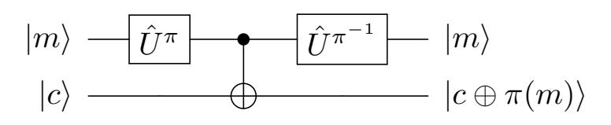

Next we have to dene what it means for an encryption scheme to fulll a certain security notion. Namely we will dene what it means to be l-c-IND-CPA-secure. Here l and c are just symbols which will be instantiated later. l stands for learning query and c stands for challenge query. Accordingly l will be instantiated with some learning query model and c will be instantiated with some challenge query model.

<span id="page-9-0"></span>Definition 7. We say the encryption scheme Enc = (KGen,Enc, Dec) is l-c-IND-CPA-secure if any polynomial time quantum adversary A can win in the following game with probability at most <sup>1</sup> <sup>2</sup> + for some negligible .

### The l-c-CPA game:

Key Gen: The challenger runs KGen to obtain a key k, i.e., k \$ ←− KGen(), and it picks a random bit b. Learning Queries: The challenger answers to the l-type queries of A using Enck. l also species the number of times this step can be repeated.

Challenge Queries: The challenger answers to the c-type queries of A using Enc<sup>k</sup> and the bit b. (Note that the adversary is allowed to submit some learning queries between the challenge queries as well.) c also species the number of times this step can be repeated.

Guess: The adversary A returns a bit b 0 , and wins if b <sup>0</sup> = b.

In the two sections below, we dene different types of the learning queries and the challenge queries and we specify which combination of them are considered for IND-CPA security of encryption schemes.

#### 3.1 Syntax of l - the learning queries

Note that in all of the following query models, we assume the challenger picks k \$ ←− KGen(). For simplicity, we omit it from our description. A fresh randomness will be chosen for each query (quantum or classical), but, for a superposition query, all the messages in the query will be encrypted with the same randomness [\[BZ13b\]](#page-45-0).

{10}------------------------------------------------

**Learning Query type CL.** For any query on input message m, the challenger picks  $r \stackrel{\$}{\leftarrow} \{0,1\}^t$  and gives back  $c \leftarrow \operatorname{Enc}_k(m;r)$  to the adversary.

**Learning Query type ST.** For any query, the challenger picks  $r \leftarrow \{0,1\}^t$  and applies the unitary  $U_{Enc_k}$  to the provided registers of the adversary,  $Q_{in}$ ,  $Q_{out}$  registers, and gives them back to the adversary.

$$Q_{in} = U_{\operatorname{Enc}_k(\cdot;r)} = Q_{in}$$

$$Q_{out} = Q_{out}$$

**Learning Query type EM.** Upon receiving the provided register of the adversary, say  $Q_{in}$ , the challenger picks  $r \stackrel{\$}{\leftarrow} \{0,1\}^t$  and creates a register  $Q_{out}$  containing the state  $|0\rangle^{\otimes n}$  and applies the unitary  $U_{Enc_k}$  to the registers  $Q_{in}, Q_{out}$ , and gives them back to the adversary.

$$Q_{in}$$
  $U_{\operatorname{Enc}_k(\cdot;r)}$   $Q_{in}$   $Q_{out}$ 

**Learning Query type ER.** Upon receiving the provided register of the adversary, say  $Q_{in}$ , the challenger picks  $r \stackrel{\$}{\leftarrow} \{0,1\}^t$ , applies the unitary  $\hat{U}^{Enc_k(\cdot,r)}$  to the register  $Q_{in}$  and gives it back to the adversary.

$$Q_{in}$$
  $-\hat{U}^{\operatorname{Enc}_k(\cdot;r)}$   $-Q_{out}$ 

Note that  $\hat{U}^{\operatorname{Enc}_k(\cdot;r)}$  is physically realizable because  $\operatorname{Enc}_k$  is efficiently reversible for fixed r using  $\operatorname{Dec}_k$  (see Section 2.1).

#### 3.2 Syntax of $\mathfrak{c}$ - the challenge queries

First we give an informal overview over the different challenge query types, then we define each of them in a concise way:

Overview:

```
- chall(·, CL, 1ct) m_0, m_1 \mapsto \operatorname{Enc}_k(m_b, r) classically

- chall(·, CL, 2ct) m_0, m_1 \mapsto \operatorname{Enc}_k(m_b, r), \operatorname{Enc}_k(m_{\bar{b}}, r) classically

- chall(·, CL, ror) m \mapsto \operatorname{Enc}_k(m, r) or \operatorname{Enc}_k(m^*, r) classically

- chall(·, ST, 1ct) |m_0, m_1, c\rangle \mapsto |m_0, m_1, c \oplus \operatorname{Enc}_k(m_b; r)\rangle

- chall(·, ST, 2ct) |m_0, m_1, c_0, c_1\rangle \mapsto |m_0, m_1, c_0 \oplus \operatorname{Enc}_k(m_b; r_b), c_1 \oplus \operatorname{Enc}_k(m_{\bar{b}}; r_{\bar{b}})\rangle

- chall(·, ST, ror) |m, c\rangle \mapsto |m, c \oplus \operatorname{Enc}_k(\pi^b(m); r)\rangle for a random permuation \pi

- chall(·, EM, 1ct) |m_0, m_1, 0\rangle \mapsto |m_0, m_1, \operatorname{Enc}_k(m_b; r)\rangle

- chall(·, EM, ror) |m, 0\rangle \mapsto |m, \operatorname{Enc}_k(\pi^b(m); r)\rangle for a random permuation \pi

- chall(·, ER, 1ct) |m_0, m_1\rangle \mapsto |\operatorname{Enc}_k(m_b; r)\rangle and trace out |m_{\bar{b}}\rangle

- chall(·, ER, 2ct) |m_0, m_1\rangle \mapsto |\operatorname{Enc}_k(m_b; r), \operatorname{Enc}_k(m_{\bar{b}}; r_{\bar{b}})\rangle

- chall(·, ER, 7cr) |m\rangle \mapsto |\operatorname{Enc}_k(\pi^b(m); r)\rangle for a random permuation \pi
```

Using a the permutation  $\pi$  in this way, is a general way of construction real-or-random-like quantum query models and first appeared in [MS16]. The idea behind it is that a random permutation  $\pi$  in some way replaces a plaintext m with a random bitstring, as this would be the case classically.

Challenge Query type chall  $(\cdot, CL, 1ct)$ . (The notation 1ct stands for one-ciphertext.) In this query model, the adversary picks two messages  $m_0, m_1$  and sends them to the challenger. The challenger picks  $r \stackrel{\$}{\leftarrow} \{0,1\}^t$  and a random bit b and returns  $Enc_k(m_b; r)$  

{11}------------------------------------------------

Challenge Query type chall(·, ST, 1ct). In this query model, the adversary prepares two input registers Qin0, Qin1, one output register Qout and sends them to the challenger. The challenger picks r \$←− {0, 1} <sup>t</sup> and a random bit b, applies the following operation on these three registers and returns the registers to the adversary.

UST,1ct,r,b : |m0, m1, ci 7→ |m0, m1, c ⊕ Enck(mb; r)i.

Qin<sup>0</sup> : Qin<sup>1</sup> : UST,1ct,r,b Qout :

where

$$U_{ST,1\text{ct},r,b}: |m_0,m_1,c\rangle \mapsto |m_0,m_1,c\oplus \text{Enc}_k(m_b;r)\rangle$$

Challenge Query type chall(·, EM, 1ct). In this query model, the adversary prepares two input registers Qin0, Qin1, and sends them to the challenger. The challenger prepares an output register Qout containing |0i ⊗n 0 , picks r \$←− {0, 1} <sup>t</sup> and a random bit b, applies the following operation on these three registers and returns the registers to the adversary.

UEM,1ct,r,b : |m0, m1, 0i 7→ |m0, m1, ⊕Enck(mb; r)i.

Qin<sup>0</sup> : Qin<sup>1</sup> : UST,1ct,r,b Qout : |0i ⊗n 0

Challenge Query type chall(·, ST, 2ct). (The notation 2ct stands for two-ciphertexts.) In this query model, the adversary prepares two input registers Qin0, Qin1, two output registers Qout0, Qout<sup>1</sup> and sends them to the challenger. The challenger picks r0, r<sup>1</sup> \$←− {0, 1} <sup>t</sup> and a random bit b, applies the following operation on these four registers and returns the registers to the adversary.

> UST,2ct,r0||r1,b : |m0, m1, c0, c1i 7→ |m0, m1, c<sup>0</sup> ⊕ Enck(mb; r0), c<sup>1</sup> ⊕ Enck(m¯<sup>b</sup> ; r1)i.

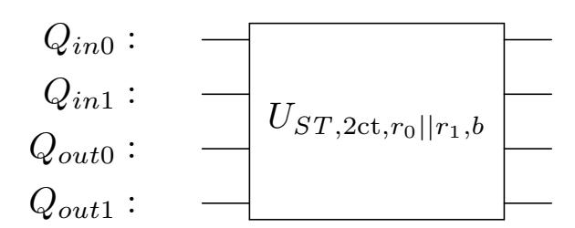

where

$$U_{ST,2\text{ct},r_0||r_1,b}:|m_0,m_1,c_0,c_1\rangle\mapsto |m_0,m_1,c_0\oplus \text{Enc}_k(m_b;r_0),c_1\oplus \text{Enc}_k(m_{\bar{b}};r_1)\rangle.$$

Challenge Query type chall(·, EM, 2ct). In this query model, the adversary prepares two registers Qin0, Qin<sup>1</sup> and sends them to the challenger. The challenger prepares two registers Qout0, Qout<sup>1</sup> containing |0i ⊗n 0 , picks r0, r<sup>1</sup> \$←− {0, 1} <sup>t</sup> and a random bit b, applies the following operation on these four registers and returns the registers to the adversary.

> UEM,2ct,r0||r1,b : |m0, m1, 0, 0i 7→ |m0, m1,Enck(mb; r0),Enck(m¯<sup>b</sup> ; r1)i.

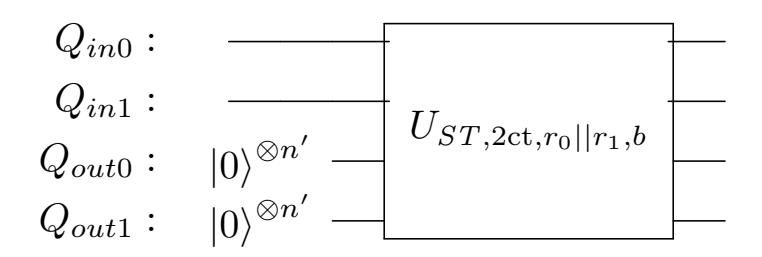

{12}------------------------------------------------

<span id="page-12-0"></span>Challenge Query type chall  $(\cdot, ER, 2ct)$ . In this query model, the adversary prepares two registers  $Q_{in0}, Q_{in1}$  and sends them to the challenger. The challenger picks  $r_0, r_1 \stackrel{\$}{\leftarrow} \{0, 1\}^t$  and a random bit b, applies the following operation on these two registers and returns the registers to the adversary.

$$U_{ER,2\operatorname{ct},r_0||r_1,b}:|m_0,m_1\rangle\mapsto|\operatorname{Enc}_k(m_b;r_0),\operatorname{Enc}_k(m_{\bar{b}};r_1)\rangle$$

$$Q_{in0}$$
  $U_{ER,2\text{ct},r_0||r_1,b}$   $Q_{out0}$   $Q_{out1}$ 

Challenge Query type chall  $(\cdot, ER, 1ct)$ . In this query model, the adversary prepares two registers  $Q_{in0}, Q_{in1}$  and sends them to the challenger. The challenger picks  $r \stackrel{\$}{\leftarrow} \{0,1\}^t$  and a random bit b, measures the register  $Q_{in\bar{b}}$  (one of the provided registers by the adversary) and throws out the result, applies the unitary  $\hat{U}^{Enc_k(\cdot,r)}$  to the register  $Q_{inb}$ , and passes it back to the adversary.

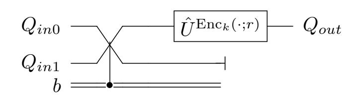

where registers  $Q_{in0}$ ,  $Q_{in1}$  will be swapped if and only if b = 1.

Challenge Query type  $chall(\cdot, ST, ror)$ . (The notation ror stands for "real or random".)

In this query model, the adversary provides two registers  $Q_{in}, Q_{out}$ . The challenger picks  $r \leftarrow \{0, 1\}^t$ ,  $b \leftarrow \{0, 1\}$ , a random permutation  $\pi$  on  $\{0, 1\}^n$ , applies the unitary  $U_{Enc_k \circ \pi^b}$  to  $Q_{in}, Q_{out}$  and passes them back to the adversary.

$$Q_{in}$$
  $U_{Enc_k \circ \pi^b}$   $Q_{out}$   $Q_{out}$ 

Challenge Query type chall  $(\cdot, EM, ror)$ . In this query model, the adversary provides a register  $Q_{in}$ . The challenger prepares a register  $Q_{out}$  containing  $|0\rangle^{\otimes n'}$ , picks  $r \stackrel{\$}{\leftarrow} \{0,1\}^t$ ,  $b \stackrel{\$}{\leftarrow} \{0,1\}$ , a random permutation  $\pi$  on  $\{0,1\}^n$ , applies the unitary  $U_{Enc_k \circ \pi^b}$  to  $Q_{in}, Q_{out}$  and passes them back to the adversary.

$$\begin{array}{ccccc} Q_{in}: & & & & & & & & & & & & & & & & & & &$$

Challenge Query type chall(·, ER, ror). In this query model, the adversary prepares a register  $Q_{in}$  and sends it to the challenger. The challenger picks  $r \stackrel{\$}{\leftarrow} \{0,1\}^t$ ,  $b \stackrel{\$}{\leftarrow} \{0,1\}$ , a random permutation  $\pi$  on  $\{0,1\}^n$ , applies the following operation to the register  $Q_{in}$ , and passes it back to the adversary.

$$U_{ER, ror, r, b} : |m\rangle \mapsto \left| \operatorname{Enc}_k(\pi^b(m); r) \right\rangle$$

$$Q_{in}$$
 —  $U_{ER,ror,r,b}$  —  $Q_{out}$ 

Note that the circuit above is physically realizable because  $\operatorname{Enc}_k$  and  $\pi$  are injective for fixed r. We give an alternative circuit for the above operation:

$$Q_{in}$$
  $-\hat{U}^{\pi^b}$   $\hat{U}^{\mathrm{Enc}(\cdot,r)}$   $-Q_{out}$ 

{13}------------------------------------------------

#### 3.3 Instantiation of learning and challenge query models

We dene l := learn(lnb, lqm) (nb stands for number, qm stands for query model) where lnb shows the number of the learning queries and lqm shows the type of the learning queries. Therefore, l = learn(lnb, lqm) where (lnb, lqm) ∈ ({∗}× {CL, ST,EM ,ER})∪ {(0, −)} where ∗ means arbitrary many queries and 0 means no learning queries. For the challenge queries, we dene c := chall(cnb,cqm,crt) (nb stands for number, qm stands for query model, rt stands for return type) where cnb shows the number of the challenge queries and cqm, crt show the type of the challenge queries. Therefore, c = chall(cnb,cqm,crt) where (cnb,cqm,crt) ∈ {1, ∗} × {CL, ST,EM ,ER} × {1ct, 2ct,ror}

#### Number of queries:

- 0: Zeros queries (only allowed for learning queries, otherwise the notion becomes trivial)
- 1: One query (only allowed for challenge queries)
- ∗: arbitrary many queries

# Query models:

- CL: Classical queries
- ST: Standard quantum queries
- EM : Embedding quantum queries
- ER: Erasing quantum queries

# Return types: (only relevant for challenge queries)

- 1ct: One-ciphertext, that is, the adversary sends two plaintexts m<sup>0</sup> and m1, but only one of them, m<sup>b</sup> is encrypted.
- 2ct: Two-ciphertexts, that is, the adversary sends two plaintexts m<sup>0</sup> and m<sup>1</sup> and both of them are encrypted and the adversary has to guess which ciphertext corresponds to which plaintext.
- ror: Real or random, that is, the adversary sends one plaintext m, and he gets either the encryption of m or of π(m) where π is a random permutation on the plaintext space.

#### 3.4 The valid combinations of the learning and challenge queries

In Definition [7,](#page-9-0) we defined the security of an encryption scheme in the sense of l-c-IND-CPA. Now, we explicitly specify which combination of the learning queries, l, and the challenge queries, c, are considered in this paper.

The valid combinations. We consider only combinations where,

- (lnb,cnb) ∈ {(∗, 1),(∗, ∗),(0, ∗)} i.e., (lnb,cnb) 6= (0, 1). Which means we are not considering variants of IND-OT-CPA (which is the security of encryption only used once).
- (lqm,cqm) ∈ {(CL, CL)} ∪ {(CL, x),(x, CL),(x, x)|x ∈ {ST,EM ,ER}}, i.e., if learning queries and challenge queries are both quantum they are not allowed to be from different query models. This is to keep the combinatorial explosion of different notions in check, and notions that combine two different notions of superposition queries strike as rather exotic.

# <span id="page-13-0"></span>4 Decoherence lemmas

The informal idea of the following lemma is, that if you have one-time access to an ER-type oracle of a random permutation, you cannot distinguish whether this oracle secretely applies a projective measurement to your input, that measures whether your input is |+i <sup>⊗</sup><sup>m</sup> and if not which computational state |xi it is.

<span id="page-13-1"></span>Lemma 8. For a bijective function π : {0, 1} <sup>m</sup> → {0, 1} <sup>m</sup> let Uˆ <sup>π</sup> be the unitary that performs the ERtype mapping |xi 7→ |π(x)i. Let X be a quantum register with m qubits. Then the following two oracles can be distinguished in a single query with probability at most 2 <sup>−</sup>m+2:

- F0: Pick a random permutation π and apply Uˆ <sup>π</sup> on X,
- F1: Pick a random permutation π, measure X as described later and then apply Uˆ <sup>π</sup> to the result.

{14}------------------------------------------------

The quantum circuit for  $F_0$  is:

$$|x\rangle$$
  $-\frac{1}{\hat{U}^{\pi}}$   $|\pi(x)\rangle$ 

and for  $F_1$  it is:

$$|x\rangle$$
  $H^{\otimes m}$   $c \leftarrow \mathcal{M}_{|0\rangle\langle 0|}$   $H^{\otimes m}$   $\mathcal{M}^c$   $\hat{U}^{\pi}$   $|\pi(\hat{x})\rangle$  or  $|+\rangle$ 

where  $c \leftarrow \mathcal{M}_{|0\rangle\langle 0|}$  is a projective measurement, storing the result (0 or 1) in c, that projects to the spaces  $\operatorname{span}(|0\rangle^{\otimes m})$  (corresponding to 0) and its orthogonal space (corresponding to 1) and  $\mathcal{M}^1$  is a measurement in the computational basis, whose outcome is denoted by  $\hat{x}$  and  $\mathcal{M}^0$  means no operation.

Note, that if we write  $\mathcal{M}_{|+\rangle\langle+|}$  for the projective measurement, that projects to the subspace span( $|+\rangle^{\otimes m}$ ), we can write  $F_1$  simply as:

$$|x\rangle$$
  $C \leftarrow \mathcal{M}_{|+\rangle\langle+|}$   $\mathcal{M}^c$   $\hat{U}^{\pi}$   $|\pi(\hat{x})\rangle$  or  $|+\rangle$ 

On a very high level, the proof proceeds as follows: We explicitly represent the density operators  $\rho_0, \rho_1$  after execution of  $F_0, F_1$ , respectively (for a generic initial state). Then we show by explicit calculation that  $\rho_0 = \rho'$  where  $\rho'$  is the state after  $F_1$  if we omit the measurement  $\mathcal{M}^c$ . Finally we proceed to bound the trace distance between  $\rho_1$  and  $\rho'$ . (This then gives a bound on the adversary's distinguishing probability.) This is done by explicitly computing  $\rho_1 - \rho'$  and noting that this difference is a tensor product of two matrices  $\sigma_1, \sigma_2$ , both of reasonably simple form, and one of them having very small trace norm.

*Proof.* Let  $M := 2^m$ . A general strategy for distinguishing  $F_0$  and  $F_1$  can be described as follows: The adversary chooses some Hilbert space  $\mathcal{H}$  and for each  $x \in \{0,1\}^m$  picks  $\hat{\alpha}_x \in \mathbb{C}$ , normalized  $|\phi_x\rangle \in \mathcal{H}$  such that  $\sum_{x \in X} |\hat{\alpha}_x|^2 = 1$ . The adversary then prepares the bipartite state

$$|\Psi\rangle_{AB} := \sum_{x \in \{0,1\}^m} \hat{\alpha}_x |\phi_x\rangle_A \otimes |x\rangle_B$$

and sends the B-part as the input of an oracle query to f. (We can assume this without loss of generality, because any state  $|\Psi\rangle_{AB}$  can be written in this form.) Let  $\rho_0$  be the density operator of the state after applying the oracle in  $F_0$  to  $|\Psi\rangle$ . Let  $\rho_1$  be the density operator of the state after applying the oracle in  $F_1$  to  $|\Psi\rangle$ . Let  $\rho'$  be the density operator of the state in  $F_1$  if the computational measurement  $\mathcal{M}^c$  is omitted. Decompose  $|\Psi\rangle$  as:

$$|\Psi\rangle = \gamma_{\rm ves}|\psi_{\rm ves}\rangle + \gamma_{\rm no}|\psi_{\rm no}\rangle$$

such that  $|\psi_{yes}\rangle \in \mathcal{H} \otimes \text{span}\{|+\rangle^{\otimes m}\}$  and  $|\psi_{no}\rangle \in \mathcal{H} \otimes \text{span}\{|+\rangle^{\otimes m}\}^{\perp}$ . Now choose quantum states  $|\Phi\rangle$  and  $(|\psi_x\rangle)_x$  and scalars  $\beta$  and  $(\alpha_x)_{x\in X}$  such that

$$\gamma_{\rm yes}|\psi_{\rm yes}\rangle = \beta|\Phi\rangle\otimes|+\rangle^{\otimes m}$$

and

$$\gamma_{\rm no}|\psi_{\rm no}\rangle = \sum_x \left(\alpha_x|\psi_x\rangle\otimes|x\rangle\right)$$

so then

$$|\Psi\rangle = \beta |\Phi\rangle \otimes |+\rangle^{\otimes m} + \sum_{x} (\alpha_x |\psi_x\rangle \otimes |x\rangle)$$

and such that  $\mathcal{H} \otimes \text{span}\{|+\rangle^{\otimes m}\}$  is orthogonal to  $\sum_{x} (\alpha_{x}|\psi\rangle \otimes |x\rangle^{\otimes m}$ ). To simplify computation choose quantum states  $|\psi_{\text{yes}}\rangle$  and  $|\psi_{\text{no}}\rangle$  and scalars  $\gamma_{\text{yes}}$  and  $\gamma_{\text{no}}$  ("yes" corresponds to measuring c=0 and "no" corresponds to measuring c=1). In the following, we prove  $\sum_{x} \alpha_{x} |\psi_{x}\rangle = 0$ .

#### <span id="page-14-0"></span>Claim 1.

$$\sum_{x} \alpha_x |\psi_x\rangle = 0$$

{15}------------------------------------------------

Proof (of Claim):

$$\sum_{x} \alpha_{x} |\psi_{x}\rangle = \sum_{x,y} (\mathbb{I} \otimes \langle y|) (\alpha_{x} |\psi_{x}\rangle \otimes |x\rangle)$$

$$= 2^{\frac{m}{2}} (\mathbb{I} \otimes \langle +|^{\otimes m}) \sum_{x} (\alpha_{x} |\psi_{x}\rangle \otimes |x\rangle) = 2^{\frac{m}{2}} (\mathbb{I} \otimes \langle +|^{\otimes m}) \gamma_{\text{no}} |\psi_{\text{no}}\rangle$$

But by the choice of γno|ψnoi this is 0. This proves the claim.

Now we show that ρ<sup>0</sup> = ρ <sup>0</sup> and then we show that TD(ρ0, ρ1) (which is equal to TD(ρ 0 , ρ1)) is negligible.

# <span id="page-15-0"></span>Claim 2.

$$\gamma_{\rm no} \sum_{\pi} (\mathbb{I} \otimes \hat{U}^{\pi}) |\psi_{\rm no}\rangle = 0$$

Proof (of Claim):

$$\gamma_{\text{no}} \sum_{\pi} (\mathbb{I} \otimes \hat{U}^{\pi}) | \psi_{\text{no}} \rangle = \sum_{\pi} (\mathbb{I} \otimes \hat{U}^{\pi}) \sum_{x} (\alpha_{x} | \psi_{x} \rangle \otimes | x \rangle)$$

$$= \sum_{\pi} \sum_{x} (\alpha_{x} | \psi_{x} \rangle \otimes | \pi(x) \rangle) = \sum_{\pi} \sum_{y} (\alpha_{y} | \psi_{\pi^{-1}(y)} \rangle \otimes | y \rangle)$$

$$= \sum_{y} \sum_{\pi} (\alpha_{y} | \psi_{\pi^{-1}(y)} \rangle \otimes | y \rangle) = \sum_{y} \sum_{x} \sum_{\pi: \pi^{-1}(y) = x} (\alpha_{x} | \psi_{x} \rangle \otimes | y \rangle)$$

$$= \sum_{y} \sum_{x} \frac{M!}{M} \cdot (\alpha_{x} | \psi_{x} \rangle \otimes | y \rangle) = \frac{M!}{M} \cdot \sum_{x} | \psi_{x} \rangle \otimes \sum_{y} \alpha_{y} | y \rangle$$

$$\stackrel{(i)}{=} \frac{M!}{M} \cdot \sum_{x} | \psi_{x} \rangle \otimes 0 = 0$$

where (i) follows from Claim [1.](#page-14-0) This proves the claim.

## Claim 3.

$$(\mathbb{I} \otimes \hat{U}^{\pi})(\gamma_{\text{yes}}|\psi_{\text{yes}}\rangle) = \gamma_{\text{yes}}|\psi_{\text{yes}}\rangle$$

Proof (of Claim): This hold because γyes|ψyesi = β|Φi⊗|+i <sup>⊗</sup><sup>m</sup> and Uˆ <sup>π</sup> |+i <sup>⊗</sup><sup>m</sup> = 2<sup>−</sup> <sup>m</sup> 2 P x |π(x)i = |+i <sup>⊗</sup><sup>m</sup>. This proves the claim.

# Claim 4.

$$\rho_0 = \rho'$$

Proof (of Claim): This can be shown by proving that ρ<sup>0</sup> − ρ <sup>0</sup> = 0. We know that

$$\rho_0 = \frac{1}{M!} \sum_{\pi} (\mathbb{I} \otimes \hat{U}^{\pi}) |\Psi\rangle \langle \Psi | (\mathbb{I} \otimes \hat{U}^{\pi})^{\dagger}$$

and

$$|\Psi\rangle = \gamma_{\rm yes}|\psi_{\rm yes}\rangle + \gamma_{\rm no}|\psi_{\rm no}\rangle$$

Dening the shorthand

$$|\psi'_{\rm yes}\rangle := (\mathbb{I} \otimes \hat{U}^{\pi})\gamma_{\rm yes}|\psi_{\rm yes}\rangle = \gamma_{\rm yes}|\psi_{\rm yes}\rangle$$

{16}------------------------------------------------

and

$$|\psi'_{\text{no},\pi}\rangle := (\mathbb{I} \otimes \hat{U}^{\pi})\gamma_{\text{no}}|\psi_{\text{no}}\rangle$$

we can write

$$\rho_0 = \frac{1}{M!} \sum_{\pi} \left( (\left| \psi_{\text{yes}}' \right\rangle + \left| \psi_{\text{no},\pi}' \right\rangle) (\left\langle \psi_{\text{yes}}' \right| + \left\langle \psi_{\text{no},\pi}' \right|) \right)$$

and

$$\rho' = \frac{1}{M!} \sum_{\pi} \left( \left| \psi'_{\rm yes} \right\rangle \left\langle \psi'_{\rm yes} \right| + \left| \psi'_{\rm no,\pi} \right\rangle \left\langle \psi'_{\rm no,\pi} \right| \right)$$

so that means that

$$\rho_{0} - \rho' = \frac{1}{M!} \sum_{\pi} (|\psi'_{\text{yes}}\rangle \langle \psi'_{\text{no},\pi}| + |\psi'_{\text{no},\pi}\rangle \langle \psi'_{\text{yes}}|)$$
$$= |\psi'_{\text{yes}}\rangle (\sum_{\pi} \langle \psi'_{\text{no},\pi}|) + (\sum_{\pi} |\psi'_{\text{no},\pi}\rangle) \langle \psi'_{\text{yes}}|$$

so this is 0 as Claim 2 implies  $\sum_{\pi} |\psi'_{\text{no},\pi}\rangle = 0$ .

This proves the claim.

Now move on to proving that  $TD(\rho', \rho_1)$  is negligible. First observe that  $\rho_1$  is the sum of two parts  $\rho_1 = \rho_{\text{yes}} + \rho_{\text{no}}$  corresponding to the situations,  $\rho_{\text{yes}}$  where c was measured to be 0 and  $\rho_{\text{no}}$  where c was measured to be 1. And in the same way decompose  $\rho' = \rho_{\text{yes}} + \rho'_{\text{no}}$  by defining:

$$\rho_{\rm yes} = \gamma_{\rm yes} |\psi_{\rm yes}\rangle \langle \psi_{\rm yes} | \gamma_{\rm yes}^*$$

and

$$\rho'_{\rm no} = \left(\frac{1}{M!} \sum_{\pi} \sum_{x,y} \alpha_x \alpha_y^* |\psi_x\rangle \langle \psi_y| \otimes |\pi(x)\rangle \langle \pi(y)|\right) = \frac{1}{M!} \sum_{\pi} |\psi'_{\rm no,\pi}\rangle \langle \psi'_{\rm no,\pi}|$$

and

$$\rho_{\text{no}} = \left(\frac{1}{M!} \sum_{\pi} \sum_{x} |\alpha_x|^2 |\psi_x\rangle \langle \psi_x| \otimes |\pi(x)\rangle \langle \pi(x)|\right)$$

Now compute

$$\rho' - \rho_{1} = \left(\rho_{\text{yes}} + \frac{1}{M!} \sum_{\pi} |\psi'_{\text{no},\pi}\rangle \langle \psi'_{\text{no},\pi}| \right) - (\rho_{\text{yes}} + \rho_{\text{no}})$$

$$= \frac{1}{M!} \sum_{\pi} |\psi'_{\text{no},\pi}\rangle \langle \psi'_{\text{no},\pi}| - \rho_{\text{no}}$$

$$= \frac{1}{M!} \sum_{\pi} \sum_{x \neq y} \alpha_{x} \alpha_{y}^{*} |\psi_{x}\rangle \langle \psi_{y}| \otimes |\pi(x)\rangle \langle \pi(y)|$$

$$= \frac{1}{M!} \sum_{x \neq y} \sum_{u \neq w} \sum_{\substack{\pi(x) = u \\ \pi(y) = w}} \alpha_{x} \alpha_{y}^{*} |\psi_{x}\rangle \langle \psi_{y}| \otimes |\pi(x)\rangle \langle \pi(y)|$$

$$= \frac{1}{M!} \sum_{x \neq y} \sum_{u \neq w} \sum_{\substack{\pi(x) = u \\ \pi(y) = w}} \alpha_{x} \alpha_{y}^{*} |\psi_{x}\rangle \langle \psi_{y}| \otimes |u\rangle \langle w|$$

$$= \frac{1}{M!} \sum_{x \neq y} \sum_{u \neq w} (M - 2)! \alpha_{x} \alpha_{y}^{*} |\psi_{x}\rangle \langle \psi_{y}| \otimes |u\rangle \langle w|$$

$$= \left(\sum_{x \neq y} \alpha_{x} \alpha_{y}^{*} |\psi_{x}\rangle \langle \psi_{y}| \right) \otimes \left(\frac{1}{M(M - 1)} \sum_{u \neq w} |u\rangle \langle w|\right)$$

So call

$$\sigma_1 := \sum_{x \neq y} \alpha_x \alpha_y^* |\psi_x\rangle \langle \psi_y|$$

and

$$\sigma_2 := \frac{1}{M(M-1)} \sum_{u \neq w} |u\rangle\langle w|$$

{17}------------------------------------------------

Then

$$\rho_0 - \rho_1 = \sigma_1 \otimes \sigma_2$$

Now prove that  $\|\sigma_2\|_1$  is sufficiently small, for this sake let  $\rho_* = \frac{1}{M}I_M$ :

$$\|\sigma_{2}\|_{1} = \left\| \frac{1}{M(M-1)} \left( \sum_{u \neq w} |u\rangle\langle w| \right) \right\|_{1} = \left\| \frac{1}{M(M-1)} \left( \sum_{u,w} |u\rangle\langle w| - \sum_{z} |z\rangle\langle z| \right) \right\|_{1}$$

$$= \frac{1}{M-1} \left\| \sum_{u,w} \frac{1}{M} |u\rangle\langle w| - \sum_{z} \frac{1}{M} |z\rangle\langle z| \right\|_{1} \stackrel{(i)}{\leq} \frac{1}{M-1} \left( \left\| \frac{1}{M} \sum_{u,w} |u\rangle\langle w| \right\|_{1} + \left\| \frac{1}{M} \sum_{z} |z\rangle\langle z| \right\|_{1} \right)$$

$$= \frac{1}{M-1} \left( \left\| |+\rangle^{\otimes m} \langle +|^{\otimes m} \right\|_{1} + \|\rho_{*}\|_{1} \right) \stackrel{(ii)}{=} \frac{1}{M-1} (1+1) \leq 4 \cdot 2^{-m}$$

where (i) uses the triangle inequality for the trace norm, and (ii) involves the following two facts: for any normalized pure state  $|\psi\rangle$ ,  $||\psi\rangle\langle\psi||_1 = 1$  (here in particular we have  $|+\rangle^{\otimes m} = \frac{1}{\sqrt{M}} \sum_x |x\rangle$ ) and for the maximally mixed state  $\rho_* := \frac{1}{M} I_M$ ,  $||\rho_*||_1 = 1$ . So it follows that:

$$\|\sigma_2\|_1 \le 2^{-m+2}$$

and we can compute

$$\|\sigma_{1}\|_{1} = \left\| \sum_{x,y} \alpha_{x} \alpha_{y}^{*} |\psi_{x}\rangle \langle \psi_{y}| - \sum_{x} |\alpha_{x}|^{2} |\psi_{x}\rangle \langle \psi_{x}| \right\|_{1}$$

$$= \left\| \left( \sum_{x} \alpha_{x} |\psi_{x}\rangle \right) \left( \sum_{y} \alpha_{y}^{*} \langle \psi_{y}| \right) - \sum_{x} |\alpha_{x}|^{2} |\psi_{x}\rangle \langle \psi_{x}| \right\|_{1}$$

$$\leq 1 + \left\| \sum_{x} |\alpha_{x}|^{2} |\psi_{x}\rangle \langle \psi_{x}| \right\|_{1}$$

$$\leq 1 + \sum_{x} |\alpha_{x}|^{2} ||\psi_{x}\rangle \langle \psi_{x}||_{1}$$

$$= 1 + \sum_{x} |\alpha_{x}|^{2} \cdot 1$$

$$= 1 + \|\gamma_{\text{no}}|\psi_{\text{no}}\rangle\|^{2}$$

$$= 1 + |\gamma_{\text{no}}|^{2} \leq 2$$

So all in all

 $\|\rho_0 - \rho_1\|_1 = \|\sigma_1\|_1 \cdot \|\sigma_2\|_1 \le 2 \cdot 2^{-m+2} = 2^{-m+3}$ 

so

$$TD(\rho_0, \rho_1) = \frac{1}{2} \|\rho_0 - \rho_1\|_1 \le 2^{-m+2}$$

This implies that no adversary can distinguish the results of  $F_0$  and  $F_1$  with probability better than  $2^{-m+2}$ . In particular if m is at least superlogarithmical, so for instance linear in the security parameter, then  $F_0$  and  $F_1$  are indistinguishable for one query.

<span id="page-17-0"></span>**Lemma 9.** For numbers m and n and an injective function  $f: \{0,1\}^m \to \{0,1\}^{m+n}$  let  $\hat{U}^f$  be the isometry that performs the ER-type mapping  $|x\rangle \mapsto |f(x)\rangle$ . Let X be a quantum register containing m qubits. Then the following two oracles can be distinguished with probability at most  $3 \cdot 2^{-n}$ .

- 1.  $F_0$ : Pick f uniformly at random and then apply  $\hat{U}^f$  on X,
- 2.  $F_1$ : Pick f uniformly at random, measure  $\hat{X}$  in the computational basis then apply  $\hat{U}^f$  to the result.

The quantum circuit for  $F_0$  is:

$$|x\rangle$$
  $\xrightarrow{\hat{U}^f}$   $|f(x)\rangle$ 

and for  $F_1$  it is:

$$|x\rangle$$
  $\hat{\mathcal{M}}$   $\hat{\mathcal{U}}^f$   $|f(\hat{x})\rangle$ 

where  $\mathcal{M}$  is a computational basis measurement (in the picture we denote the outcome of this measurement with  $\hat{x}$ ).

{18}------------------------------------------------

*Proof.* Intuitively this follows from Lemma 8 because: Picking a random injection has the same distribution as composing concatenation of sufficiently many 0s with a random permutation. Formally, the equivalence is shown by a sequence of hybrid oracles where  $G_0 = F_0$  and  $G_4 = F_1$ . In the definition of the hybrid games,  $\pi$  is always a random permutation  $\pi: \{0,1\}^{m+n} \to \{0,1\}^{m+n}$ .  $G_0$  is the same as  $F_0$  and  $G_1$  is the following oracle:

Oracle 
$$G_1:$$
  $0\rangle^{\otimes n}$   $\hat{U}^{\pi}$ 

 $G_0$  and  $G_1$  are perfectly indistinguishable for any adversary, because the probability distributions of the observed functionality are exactly the same.

 $G_1$  and  $G_2$  can be distinguished with probability at most  $2^{-m-n+2}$  by Lemma 8 where  $G_2$  is the following oracle:

Oracle 
$$G_2$$
:  $c \leftarrow \mathcal{M}_{|+\rangle\langle+|}$   $\hat{U}^{\pi}$ 

(Here we follow the same notation as above namely, that  $c \leftarrow \mathcal{M}_{|+\rangle\langle+|}$  is a projective measurement, storing the result (0 or 1) in c, that projects to the spaces  $\operatorname{span}(|+\rangle^{\otimes m})$  (corresponding to 0) and its orthogonal space (corresponding to 1) and  $\mathcal{M}^1$  is a measurement in the computational basis, whose outcome is denoted by  $\hat{x}$  and  $\mathcal{M}^0$  means no operation.)

Oracle 
$$G_3$$
:  $\bigcup_{|0\rangle^{\otimes n}} \mathcal{M} \widehat{U}^{\pi}$ 

 $G_2$  and  $G_3$  can be distinguished with probability at most  $2^{-n}$  because the probability of measuring  $|+\rangle$  is  $2^{-n}$ . Or more formally because  $\|(|\phi\rangle\otimes|0\rangle^{\otimes n})^{\dagger}|+\rangle\|\leq 2^{-\frac{n}{2}}$  for any  $|\phi\rangle$ .

Oracle 
$$G_4$$
:  $\mathcal{M}$   $\hat{U}^f$ 

 $G_3$  and  $G_4$  are perfectly indistinguishable because the probability distributions are the same and  $G_4$  is the same as  $F_1$ . Thus  $F_0$  and  $F_1$  can be distinguished with probability at most  $2^{-n} + 2^{-m-n+2} + 2^{-n}$  which is bounded by  $3 \cdot 2^{-n}$ 

<span id="page-18-0"></span>**Lemma 10.** For a random function  $f: \{0,1\}^m \to \{0,1\}^n$ , an embedding query to f is indistinguishable from an embedding query to f preceded by a computational measurement on the input register. Let X be an m-qubit quantum register. Then for any input quantum register m, the following two oracles can be distinguished with probability at most  $2^{-n}$ .

1.  $F_0$ : apply  $U_f$  to X and another register containing n zeros. The quantum circuit for  $F_0$  is:

$$|x\rangle = \begin{bmatrix} & & & & & \\ & & & & & \\ & & & & \end{bmatrix} U_f \begin{bmatrix} & & & \\ & & & & \\ & & & & \end{bmatrix} |x\rangle$$

2.  $F_1$ : measure X in the computational basis and apply  $U_f$  to the result and another register containing zeros. The circuit for  $F_1$  is:

$$|x\rangle \xrightarrow{\Gamma - - - - - - - - - - - - - - - - - - -$$

where  $\mathcal{M}$  is a computational basis measurement whose outcome we denote by  $\hat{x}$ .

*Proof.* Let  $M := 2^m$  and  $N := 2^n$ . A general strategy for distinguishing  $F_0$  and  $F_1$  can be described as follows: The adversary chooses some Hilbert space  $\mathcal{H}_A$  and for each  $x \in \{0,1\}^m$  picks  $\alpha_x \in \mathbb{C}, |\phi_x\rangle \in \mathcal{H}_A$  such that  $\sum_{x \in X} |\alpha_x|^2 = 1$ . The adversary then prepares the bipartite state

$$|\Psi\rangle_{AM} := \sum_{x \in X} \alpha_x |\phi_x\rangle_A \otimes |x\rangle_M$$

and sends the *B*-part as the input of an oracle query to f. (We can assume this without loss of generality, because any state  $|\Psi\rangle_{AB}$  can be written in this form.) Let  $\rho_0$  be the density operator of the state after

{19}------------------------------------------------

applying the oracle in  $F_0$  to  $|\Psi\rangle$ . Let  $\rho_1$  be the density operator of the state after applying the oracle in  $F_1$  to  $|\Psi\rangle$ . Then it holds

$$\rho_0 = \frac{1}{N^M} \sum_{f} \sum_{x,y} \alpha_x^* \alpha_y |\phi_x\rangle \langle \phi_y| \otimes |x\rangle \langle y| \otimes |f(x)\rangle \langle f(y)|$$

and

$$\rho_{1} = \frac{1}{N^{M}} \sum_{f} \sum_{x,y} \alpha_{x}^{*} \alpha_{x} |\phi_{x}\rangle \langle \phi_{x}| \otimes |x\rangle \langle x| \otimes |f(x)\rangle \langle f(x)|$$

$$= \frac{1}{N^{M}} \sum_{f} \sum_{x,y} \delta_{x=y} \alpha_{x}^{*} \alpha_{y} |\phi_{x}\rangle \langle \phi_{y}| \otimes |x\rangle \langle y| \otimes |f(x)\rangle \langle f(y)|$$

Compute

$$\rho_{0} - \rho_{1} = \frac{1}{N^{M}} \sum_{f} \sum_{x,y} \delta_{x \neq y} \alpha_{x}^{*} \alpha_{y} |\phi_{x}\rangle \langle \phi_{y}| \otimes |x\rangle \langle y| \otimes |f(x)\rangle \langle f(y)|$$

$$= \frac{1}{N^{M}} \sum_{x \neq y} \sum_{u,w} \sum_{f,f(x)=u,f(y)=w} \alpha_{x}^{*} \alpha_{y} |\phi_{x}\rangle \langle \phi_{y}| \otimes |x\rangle \langle y| \otimes |u\rangle \langle w|$$

$$= \frac{1}{N^{2}} \left( \sum_{x \neq y} |x\rangle \langle y| \right) \otimes \left( \sum_{u,w} |u\rangle \langle w| \right)$$

$$= \frac{1}{N} \left( \frac{1}{N} \sum_{x \neq y} |x\rangle \langle y| \right) \otimes \left( \frac{1}{N} \sum_{u,w} |u\rangle \langle w| \right)$$

$$= \frac{1}{N} \left( |+\rangle \langle +| -\frac{1}{N} \mathbb{I} \right) \otimes \left( |+\rangle \langle +| \right)$$

where u and w run over  $\{0,1\}^n$ . This implies:

$$\|\rho_0 - \rho_1\|_1 = \|\frac{1}{N}(|+\rangle\langle +|-\frac{1}{N}\mathbb{I}) \otimes (|+\rangle\langle +|)\|_1 = \frac{1}{N} \cdot 2 \cdot 1 = \frac{2}{N}$$

so

$$TD(\rho_0, \rho_1) \le \frac{1}{N} = 2^{-n}.$$

This finishes the proof.

<span id="page-19-0"></span>**Corollary 11.** Assume  $n \ge m$ . For a random injective function  $f : \{0,1\}^m \to \{0,1\}^n$  the oracles  $F_0$  and  $F_1$  in Lemma 10 are distinguishable with probability at most  $1/2^n + C/2^n$  where C is a universal constant.

*Proof.* This follows from Theorem 7 in [Zha15] that states any algorithm making q quantum queries cannot distinguish a random function from a random injective function, except with probability at most  $Cq^3/2^n$ .

<span id="page-19-1"></span>**Corollary 12.** Let  $R \subseteq \{0,1\}^s$  be a (fixed) set of size  $2^n$ . Let  $f: \{0,1\}^m \to \{0,1\}^s$  be a random injection with range R, that is, f is uniformly randomly chosen from the set of all injective functions  $f: \{0,1\}^m \to \{0,1\}^s$  with im  $f \subseteq R$ . An EM-query to f is distinguishable from an EM-query to f preceded with a computational basis measurement with probability at most  $1/2^n + C/2^n$  where C is a universal constant. In other words, the following circuits are indistinguishable.

$$|x\rangle - U_f - |x\rangle - |x\rangle - U_f - |\hat{x}\rangle - U_f - |\hat{x}\rangle - U_f - |\hat{x}\rangle - |f(\hat{x})\rangle$$

*Proof.* We can write  $f = g \circ \pi$  where  $g : \{0,1\}^n \to \{0,1\}^s$  is a fixed injective function with range R and  $\pi : \{0,1\}^m \to \{0,1\}^n$  is a random injective function. Let  $g^{-1}$  be a left inverse for the function g. An EM query to f can be implemented using functions g and  $\pi$  as follows (using an ancillary register Anc):

$$Q_{in}:$$

{20}------------------------------------------------

A simple calculation shows that the above circuit implements the isometry  $U_f = U_{g \circ \pi}$ . Now using Corollary 11, the circuit above is indistinguishable from the following circuit when one measures  $Q_{in}$  register at the beginning: (We stress that  $U_{\pi}$  is used only once as required by Corollary 11)

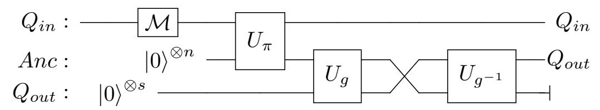

And this is a circuit that implements an EM-query to f preceded with a measurement.

# <span id="page-20-0"></span>5 Impossible Security Notions

<span id="page-20-2"></span>**Proposition 13.** There is no  $\mathfrak{l}$ -chall  $(\mathfrak{c}_{\mathfrak{nb}}, ST, 1ct)$ -IND-CPA-secure encryption scheme where the  $\mathfrak{l}$  and  $\mathfrak{c}_{\mathfrak{nb}}$  can be replaced by any of the possible parameters.

*Proof.* This is formally proven in [BZ13b] as Theorem 4.2. For short the attack consists of inputting into the challenge query oracle the state

$$|0\rangle^{\otimes n}\otimes|\psi\rangle\otimes|0\rangle^{\otimes n'}$$

where  $|\psi\rangle$  is some arbitrary "sufficiently non-classical" quantum state, for example  $|+\rangle^{\otimes n}$ . If b=0 the state  $|\psi\rangle$  is preserved and if b=1 the state  $|\psi\rangle$  is disturbed. So the adversary can distinguish by measuring the second register.

**Proposition 14.** There is no  $\mathfrak{l}$ -chall  $(\mathfrak{c}_{\mathfrak{nb}}, ST, 2ct)$ -IND-CPA-secure encryption scheme where the  $\mathfrak{l}$  and  $\mathfrak{c}_{\mathfrak{nb}}$  can be replaced by any of the possible parameters.

*Proof.* It is formally proven in [BZ13b] as Theorem 4.4. For short the attack consists of inputting into the challenge query oracle the state

$$|0\rangle^{\otimes n} \otimes |\psi\rangle \otimes |0\rangle^{\otimes n'} \otimes |+\rangle^{\otimes n'}$$

where  $|\psi\rangle$  is some arbitrary "sufficiently non-classical" quantum state. If b=0 the state  $|\psi\rangle$  is preserved as its encryption is "absorbed" by  $|+\rangle^{\otimes n'}$ , but if b=1 the state  $|\psi\rangle$  is disturbed. So the adversary can distinguish by measuring the second register.

**Proposition 15.** There is no  $\mathfrak{l}$ -chall  $(\mathfrak{c}_{\mathfrak{n}\mathfrak{b}}, \mathit{EM}, 1ct)$ -IND-CPA-secure encryption scheme where the  $\mathfrak{l}$  and  $\mathfrak{c}_{\mathfrak{n}\mathfrak{b}}$  can be replaced by any of the possible parameters.

*Proof.* The same proof as for Proposition 13 works as the attack is based on inputting  $|0\rangle^{\otimes n'}$  on the output registe. More precisely, the adversary inputs  $|0\rangle^{\otimes n} \otimes |\psi\rangle$  and gets exactly the same output as in the proof of Proposition 13 and then can do exactly the same measurement to distinguish.

### <span id="page-20-1"></span>6 Implications

From the theoretically  $(4+1) \times 2 \times 4 \times 3 = 120$  possible IND-CPA-notions, we excluded  $1 \times 1 \times 4 \times 3 = 12$  that correspond to IND-OT-CPA instead of IND-CPA, as there is no learning query and only 1 challenge. This leaves 108 notions. Next we excluded  $2 \times 2 \times 3 \times 3 = 36$  notations that we considered unreasonable, as they combine quantum learning queries with quantum challenge queries of different query models. This leaves 72 notions. Next we excluded 15 notions that are proven impossible. This leaves 57 notions.

Now we will relate the remaining IND-CPA-notions. The 57 notions can be grouped together in 14 Panels depicted in Figure 1, so that in each panel the notions are equivalent. In order to have a compact representation in Figure 1, for any  $\mathfrak{qm} \in \{ST, EM, ER\}$  we define the set  $T^*(\mathfrak{qm})$  as

$$T^*(\mathfrak{qm}) = \{(\text{learn}(0, -), *, \mathfrak{qm}), (\text{learn}(*, CL), *, \mathfrak{qm}), (\text{learn}(*, \mathfrak{qm}), 1, \mathfrak{qm}), (\text{learn}(*, \mathfrak{qm}), *, \mathfrak{qm})\}.$$

Note that  $(\text{learn}(*, CL), 1, \mathfrak{qm})$  is not in  $T^*(\mathfrak{qm})$ . This set will only be used in Figure 1 to have a compact representation.

Inside each panel all the notions are equivalent and apart from that, there are the following 20 implications between the panels depicted in Figure 1 using black arrows. The full set of implications

{21}------------------------------------------------

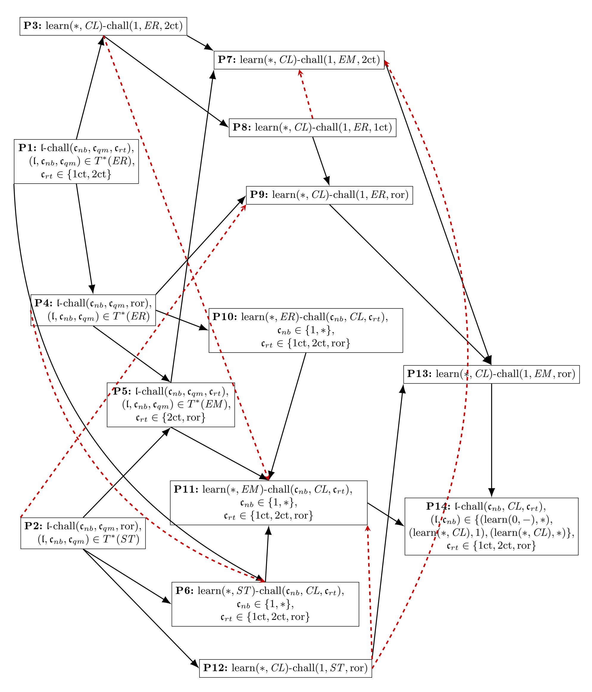

<span id="page-21-0"></span>Fig. 1. The 57 notions and equivalences and implications between them. The red dashed arrows show nonimplications that if hold, the graph will be complete.

{22}------------------------------------------------

between all notions can be derived by taking the transitive closure of this graph. Every implication that is not in the transitive closure of the graph is being disproven in the section about separations Section [7](#page-34-0) or have been left as open questions. The red dashed red arrows in Figure [1](#page-21-0) show non-implications that if hold, the graph will be complete.

Note that Panel 6 corresponds to the quantum security definitions by Boneh and Zhandry [\[BZ13b\]](#page-45-0). Some implications follow from some theorem proven later and some are easy enough that say can be proven by a short argument. The arguments used are the following. In each case, we assign a short name in bold to that argument type.

 more cqs: i.e., more challenge queries. If two security notions just dier by the fact that one of them allows only one challenge query and the other allows polynomially many, then trivially the notion allowing polynomially many implies the notion allowing only one. For example:

$$learn(*, CL)$$
-chall $(*, ER, ror) \Rightarrow learn(*, CL)$ -chall $(1, ER, ror)$ 

 extra lq-oracle: i.e., extra learning-query-oracle. If two security notions just dier by the fact, that one of them allows learning queries and the other doesn't, then trivially the notion allowing learning queries implies the notion allowing no learning queries. For example:

$$learn(*, CL)$$
-chall $(*, ER, 1ct) \Rightarrow learn(0, -)$ -chall $(*, ER, 1ct)$ 

 other ciphertext: If two security notions just dier by the fact, that one of them allows chall(cnb,ER, 1ct) challenge queries and the other chall(cnb,ER, 2ct) challenge queries, then trivially the notions allowing chall(cnb,ER, 2ct) challenge queries implies the notion allowing chall(cnb,ER, 1ct) challenge queries (see Section [3.2\)](#page-12-0). For example:

$$\operatorname{learn}(*,\mathit{CL})\operatorname{-chall}(1,\mathit{ER},2\operatorname{ct}) \Rightarrow \operatorname{learn}(*,\mathit{CL})\operatorname{-chall}(1,\mathit{ER},1\operatorname{ct})$$

 simulate classical: Classical queries can be simulated with any quantum query type by measuring the result in the computational basis. For example:

$$learn(*, ER)$$
-chall $(*, ER, ror) \Rightarrow learn(*, CL)$ -chall $(*, ER, ror)$ 

 simulate le with ch: When learning queries are classical, they can be simulated by the challenge queries in the case of 1ct and 2ct. In more details, on input m as a classical learning query, we can query (m, m) as a challenge query and simulate the learning query. For instance:

$$learn(0, -)-chall(*, ER, 2ct) \implies learn(*, CL)-chall(*, ER, 2ct)$$

 EM simulation by ST. The query type EM can be simulated by ST-type by putting |0i in the output register Qout. For example,

$$learn(*, CL)$$
-chall $(*, ST, ror) \Rightarrow learn(*, CL)$ -chall $(*, EM, ror)$ 

 EM simulation by ER. The query type EM can be simulated by ER-type queries. In the following, we present a circuit that depicts the simulation of EM -type queries to some function f using an ERtype query to f:

$$|m\rangle \xrightarrow{\qquad \qquad } \hat{U}^f$$

For example,

$$learn(*, ER)$$
-chall $(*, ER, ror) \Rightarrow learn(*, EM)$ -chall $(*, EM, ror)$ 

For the panels with more than one notion, it has to be proven, that all the notations inside are equivalent: Panel P1 (8 security notions):

```
learn(∗, CL)-chall(∗,ER, 2ct) =⇒ learn(∗, CL)-chall(∗,ER, 1ct) other ciphertext
 learn(∗, CL)-chall(∗,ER, 1ct) =⇒ learn(0, −)-chall(∗,ER, 1ct) extra lq-oracle
 learn(0, −)-chall(∗,ER, 1ct) =⇒ learn(∗,ER)-chall(∗,ER, 1ct) by Theorem 18
learn(∗,ER)-chall(∗,ER, 1ct) =⇒ learn(∗,ER)-chall(1,ER, 1ct) more cqs
learn(∗,ER)-chall(1,ER, 1ct) =⇒ learn(∗,ER)-chall(1,ER, 2ct) by Theorem 21
learn(∗,ER)-chall(1,ER, 2ct) =⇒ learn(∗,ER)-chall(∗,ER, 2ct) by Theorem 16
 learn(∗,ER)-chall(∗,ER, 2ct) =⇒ learn(0, −)-chall(∗,ER, 2ct) extra lq-oracle
 learn(0, −)-chall(∗,ER, 2ct) =⇒ learn(∗, CL)-chall(∗,ER, 2ct) simulate le with ch
```

{23}------------------------------------------------

#### Panel P2 (4 security notions):

```
learn(∗, ST)-chall(∗, ST,ror) =⇒ learn(∗, CL)-chall(∗, ST,ror) simulate classical
 learn(∗, CL)-chall(∗, ST,ror) =⇒ learn(0, −)-chall(∗, ST,ror) extra lq-oracle
 learn(0, −)-chall(∗, ST,ror) =⇒ learn(∗, ST)-chall(∗, ST,ror) by Theorem 19
learn(∗, ST)-chall(∗, ST,ror) =⇒ learn(∗, ST)-chall(1, ST,ror) more cqs
learn(∗, ST)-chall(1, ST,ror) =⇒ learn(∗, ST)-chall(∗, ST,ror) by Theorem 16
```

## Panel P4 (4 security notions):

```
learn(∗,ER)-chall(∗,ER,ror) =⇒ learn(∗, CL)-chall(∗,ER,ror) simulate classical
 learn(∗, CL)-chall(∗,ER,ror) =⇒ learn(0, −)-chall(∗,ER,ror) extra lq-oracle
 learn(0, −)-chall(∗,ER,ror) =⇒ learn(∗,ER)-chall(∗,ER,ror) by Theorem 19
learn(∗,ER)-chall(∗,ER,ror) =⇒ learn(∗,ER)-chall(1,ER,ror) more cqs
learn(∗,ER)-chall(1,ER,ror) =⇒ learn(∗,ER)-chall(∗,ER,ror) by Theorem 16
```

# Panel P5 (8 security notions):

```
learn(∗,EM )-chall(∗,EM ,ror) =⇒ learn(∗, CL)-chall(∗,EM ,ror) simulate classical
   learn(∗, CL)-chall(∗,EM ,ror) =⇒ learn(0, −)-chall(∗,EM ,ror) extra lq-oracle
  learn(0, −)-chall(∗,EM ,ror) =⇒ learn(∗,EM )-chall(∗,EM ,ror) by Theorem 19
learn(∗,EM )-chall(∗,EM ,ror) =⇒ learn(∗,EM )-chall(1,EM ,ror) more cqs
learn(∗,EM )-chall(1,EM ,ror) =⇒ learn(∗,EM )-chall(1,EM , 2ct) by Theorem 20
learn(∗,EM )-chall(1,EM , 2ct) =⇒ learn(∗,EM )-chall(∗,EM , 2ct) by Theorem 16
learn(∗,EM )-chall(∗,EM , 2ct) =⇒ learn(∗, CL)-chall(∗,EM , 2ct) simulate classical
  learn(∗, CL)-chall(∗,EM , 2ct) =⇒ learn(0, −)-chall(∗,EM , 2ct) extra lq-oracle
  learn(0, −)-chall(∗,EM , 2ct) =⇒ learn(∗,EM )-chall(∗,EM , 2ct) by Theorem 18
learn(∗,EM )-chall(∗,EM , 2ct) =⇒ learn(∗,EM )-chall(∗,EM ,ror) by Theorem 23
```

## Panel P6 (6 security notions):

```
learn(∗, ST)-chall(1, CL, 1ct) =⇒ learn(∗, ST)-chall(∗, CL, 1ct) by Theorem 16
learn(∗, ST)-chall(∗, CL, 1ct) =⇒ learn(∗, ST)-chall(1, CL, 1ct) more cqs
The rest of equivalences by Theorem 17
```

## Panel P10 (6 security notions):

```
learn(∗,ER)-chall(1, CL, 1ct) =⇒ learn(∗,ER)-chall(∗, CL, 1ct) by Theorem 16
learn(∗,ER)-chall(∗, CL, 1ct) =⇒ learn(∗,ER)-chall(1, CL, 1ct) more cqs
The rest of equivalences by Theorem 17
```

### Panel P11 (6 security notions):

```
learn(∗,EM )-chall(1, CL, 1ct) =⇒ learn(∗,EM )-chall(∗, CL, 1ct) by Theorem 16
learn(∗,EM )-chall(∗, CL, 1ct) =⇒ learn(∗,EM )-chall(1, CL, 1ct) more cqs
 The rest of equivalences by Theorem 17
```

# Panel P14 (9 security notions):

```
learn(∗, CL)-chall(1, CL, 1ct) =⇒ learn(∗, CL)-chall(∗, CL, 1ct) by Theorem 16
learn(∗, CL)-chall(∗, CL, 1ct) =⇒ learn(∗, CL)-chall(1, CL, 1ct) more cqs
 learn(∗, CL)-chall(∗, CL, 1ct) =⇒ learn(0, −)-chall(∗, CL, 1ct) extra lq-oracle
 learn(0, −)-chall(∗, CL, 1ct) =⇒ learn(∗, CL)-chall(∗, CL, 1ct) simulate le with ch
The rest of equivalences by Theorem 17
```

The 20 arrows in detail:

{24}------------------------------------------------

```
 From panel 1 to panel 3
  precisely: learn(∗, CL)-chall(∗,ER, 2ct) =⇒ learn(∗, CL)-chall(1,ER, 2ct)
  argument: more cqs
 From panel 1 to panel 4
  precisely: learn(∗,ER)-chall(∗,ER, 1ct) =⇒ learn(∗,ER)-chall(∗,ER,ror)
  argument: Theorem 22
 From panel 1 to panel 6
  precisely: learn(∗,ER)-chall(∗,ER, 1ct) =⇒ learn(∗, ST)-chall(∗, CL, 1ct)
  argument: Theorem 24
 From panel 2 to panel 5
  precisely: learn(∗, ST)-chall(∗, ST,ror) =⇒ learn(∗,EM )-chall(∗,EM ,ror)
  argument: EM simulation by ST.
 From panel 2 to panel 6
  precisely: learn(∗, ST)-chall(∗, ST,ror) =⇒ learn(∗, ST)-chall(∗, CL, 1ct)
  argument: simulate classical
 From panel 4 to panel 5
  precisely: learn(∗,ER)-chall(∗,ER,ror) =⇒ learn(∗,EM )-chall(∗,EM ,ror)
  argument: EM simulation by ER
 From panel 2 to panel 12
  precisely: learn(∗, CL)-chall(∗, ST,ror) =⇒ learn(∗, CL)-chall(1, ST,ror)
  argument: more cqs
 From panel 3 to panel 7
  precisely: learn(∗, CL)-chall(∗,ER, 2ct) =⇒ learn(∗, CL)-chall(∗,EM , 2ct)
  argument: EM simulation by ER.
 From panel 3 to panel 8
  precisely: learn(∗, CL)-chall(1,ER, 2ct) =⇒ learn(∗, CL)-chall(1,ER, 1ct)
  argument: other ciphertext
 From panel 4 to panel 10
  precisely: learn(∗,ER)-chall(∗,ER,ror) =⇒ learn(∗,ER)-chall(∗, CL, 1ct)
  argument: simulate classical
 From panel 4 to panel 9
  precisely: learn(∗, CL)-chall(∗,ER,ror) =⇒ learn(∗, CL)-chall(1,ER,ror)
  argument: more cqs
 From panel 5 to panel 7
  precisely: learn(∗, CL)-chall(∗,EM , 2ct) =⇒ learn(∗, CL)-chall(1,EM , 2ct)
  argument: more cqs
 From panel 5 to panel 11
  precisely: learn(∗,EM )-chall(∗,EM , 2ct) =⇒ learn(∗,EM )-chall(∗, CL, 1ct)
  argument: simulate classical
 From panel 6 to panel 11
  precisely: learn(∗, ST)-chall(1, CL, 1ct) =⇒ learn(∗,EM )-chall(1, CL, 1ct)
  argument: EM simulation by ST
 From panel 8 to panel 9
  precisely: learn(∗, CL)-chall(1,ER, 1ct) =⇒ learn(∗, CL)-chall(1,ER, 1ct)
  argument: Theorem 22
 From panel 10 to panel 11
  precisely: learn(∗,ER)-chall(1, CL, 1ct) =⇒ learn(∗,EM )-chall(1, CL, 1ct)
  argument: EM simulation by ER
 From panel 7 to panel 13
  precisely: learn(∗, CL)-chall(1,EM , 2ct) =⇒ learn(∗, CL)-chall(1,EM ,ror)
  argument: Theorem 23
 From panel 9 to panel 13
  precisely: learn(∗, CL)-chall(1,ER,ror) =⇒ learn(∗, CL)-chall(1,EM ,ror)
  argument: EM simulation by ER
 From panel 11 to panel 14
  precisely: learn(∗,EM )-chall(1, CL, 1ct) =⇒ learn(∗, CL)-chall(1, CL, 1ct)
  argument: simulate classical
 From panel 12 to panel 13
  precisely: learn(∗, CL)-chall(1, ST, 1ct) =⇒ learn(∗, CL)-chall(1,EM ,ror)
```

argument: EM simulation by ST.

{25}------------------------------------------------

- From panel 13 to panel 14 **precisely:** learn(\*, CL)-chall(1, EM, ror)  $\Longrightarrow$  learn(\*, CL)-chall(\*, CL, 1ct) **arguments:** We can show the implication with the application of the following arguments respectively: simulate classical, Theorem 17 and Theorem 16

These are the implications. Now we prove the theorem mentioned in this list. In Theorem 16, we prove that if we fix all the parameters in two notions expect the number of the challenge queries (that can be one or many), the notion with many challenge queries implies the notion with one challenge query if one can simulate the challenge queries with the learning queries (when knowing the challenge bit).

<span id="page-25-0"></span>**Theorem 16.** If a chall  $(1, \mathfrak{c}_{qm}, \mathfrak{c}_{rt})$ -challenge-query can be efficiently simulated with an  $\mathfrak{l}_{qm}$ -learning-query (when knowing the challenge bit b) then  $\operatorname{learn}(*, \mathfrak{l}_{qm})$ -chall  $(1, \mathfrak{c}_{qm}, \mathfrak{c}_{rt}) \Longrightarrow \operatorname{learn}(*, \mathfrak{l}_{qm})$ -chall  $(*, \mathfrak{c}_{qm}, \mathfrak{c}_{rt})$ .

*Proof.* Let  $\mathcal{A}$  be an adversary that wins in the learn(\*,  $\mathfrak{l}_{qm}$ )-chall(\*,  $\mathfrak{c}_{qm}$ ,  $\mathfrak{c}_{rt}$ ) game with non-negligible advantage  $\epsilon(n)$ . We assume that  $\mathcal{A}$  makes q challenge queries. We construct an adversary  $\mathcal{B}$  that attacks in the sense of learn(\*,  $\mathfrak{l}_{qm}$ )-chall(1,  $\mathfrak{c}_{qm}$ ,  $\mathfrak{c}_{rt}$ ). Let  $\mathcal{B}$  be an adversary that chooses uniformly at random an element k from  $\{1, \ldots, q\}$ , runs the adversary  $\mathcal{A}$  and answers to the i-th challenge query made by  $\mathcal{A}$  as follows:

- 1. When i < k,  $\mathcal{B}$  simulates the *i*-th challenge query by a learning query assuming that b = 0.
- 2. For k-th challenge query,  $\mathcal{B}$  uses a challenge query to answer.
- 3. When i > k,  $\mathcal{B}$  simulates the *i*-th challenge query by a learning query assuming that b = 1.

At the end,  $\mathcal{B}$  returns  $\mathcal{A}$ 's output. Let the game  $\mathcal{G}^b$  denote an execution of  $\mathcal{B}$  together with the learn(\*,  $\mathfrak{l}_{qm}$ ) -chall(1,  $\mathfrak{c}_{qm}$ ,  $\mathfrak{c}_{rt}$ ) challenger. Let  $\mathcal{G}_k^b$  denote the same but using a fixed value of k. Note that  $\mathcal{G}_k^0 = \mathcal{G}_{k+1}^1$ . Then  $\mathcal{G}_q^0$  is essentially an execution of  $\mathcal{A}$  with the learn(\*,  $\mathfrak{l}_{qm}$ )-chall(\*,  $\mathfrak{c}_{qm}$ ,  $\mathfrak{c}_{rt}$ ) challenger with b=0. And  $\mathcal{G}_1^1$  one with b=1. Thus  $|\Pr[1\leftarrow\mathcal{G}_q^0]-\Pr[1\leftarrow\mathcal{G}_1^1]|\geq \epsilon(n)$ . Furthermore the advantage of  $\mathcal{B}$  is  $|\Pr[1\leftarrow\mathcal{G}^0]-\Pr[1\leftarrow\mathcal{G}^1]|=|\sum_k \frac{1}{q}\Pr[1\leftarrow\mathcal{G}_k^0]-\sum_k \frac{1}{q}\Pr[1\leftarrow\mathcal{G}_k^1]|=|\frac{1}{q}(\Pr[1\leftarrow\mathcal{G}_q^0]-\Pr[1\leftarrow\mathcal{G}_1^1])|\geq \epsilon(n)/q$ . This is a contradiction with the security in the learn(\*,  $\mathfrak{l}_{qm}$ )-chall(1,  $\mathfrak{c}_{qm}$ ,  $\mathfrak{c}_{rt}$ ) sense.

<span id="page-25-1"></span>In the following theorem, we show that when the challenge queries are classical and we fix other parameters except the return types, these notions (with different return types 1ct, 2ct, ror) are equivalent.

**Theorem 17.** Let  $\mathfrak{L} = \{ \operatorname{learn}(0, -), \operatorname{learn}(*, CL), \operatorname{learn}(*, ST), \operatorname{learn}(*, EM), \operatorname{learn}(*, ER) \}$  and  $\mathfrak{C}_{nb} = \{1, *\}$ . For all  $(\mathfrak{l}, \mathfrak{C}_{nb}) \in \mathfrak{L} \times \mathfrak{C}_{nb} \setminus \{ (\operatorname{learn}(0, -), 1) \}$ , the following security notions are equivalent for all encryption schemes: (Note that when  $\mathfrak{l} = \operatorname{learn}(0, -)$  and  $\mathfrak{c}_{nb} = 1$ , the security definition is IND-OT-CPA that we have excluded.)

- $\mathcal{C}_{1\mathrm{ct}} := \mathfrak{l}\text{-chall}(\mathfrak{c}_{nb}, \mathit{CL}, 1\mathrm{ct})\text{-}\mathit{IND}\text{-}\mathit{CPA}\text{-}\mathit{security}$
- $\mathcal{C}_{2\text{ct}} := \mathfrak{l}\text{-chall}(\mathfrak{c}_{nb}, \mathit{CL}, 2\text{ct})\text{-}\mathit{IND}\text{-}\mathit{CPA}\text{-}\mathit{security}$
- $-\mathcal{C}_{ror} := \mathfrak{l}\text{-chall}(\mathfrak{c}_{nb}, \mathit{CL}, ror)\text{-}\mathit{IND}\text{-}\mathit{CPA}\text{-}\mathit{security}$

Proof.  $C_{2ct} \implies C_{1ct}$ : trivial.

 $\mathcal{C}_{1\mathrm{ct}} \implies \mathcal{C}_{2\mathrm{ct}}$ , case  $\mathfrak{c}_{nb} = *$ : A 2ct-challenge-query of the form

$$(m_0, m_1) \mapsto (\operatorname{Enc}_k(m_b), \operatorname{Enc}_k(m_{\bar{b}}))$$

can be simulated by two queries of the form  $(m_0, m_1) \mapsto \operatorname{Enc}_k(m_b)$ , namely by querying

$$(m_0, m_1) \mapsto \operatorname{Enc}_k(m_b)$$

to get  $\operatorname{Enc}_k(m_b)$  and then switching the inputs and querying

$$(m_1, m_0) \mapsto \operatorname{Enc}_k(m_{\bar{k}})$$

to get  $\operatorname{Enc}_k(m_{\bar{b}})$ . So the desired outcome  $(\operatorname{Enc}_k(m_b), \operatorname{Enc}_k(m_{\bar{b}}))$  is simulated.  $\mathcal{C}_{1\operatorname{ct}} \implies \mathcal{C}_{2\operatorname{ct}}$  case  $\mathfrak{c}_{nb} = 1$ : We prove that

$$\mathfrak{l}\text{-chall}(1, CL, 1\text{ct}) \implies \mathfrak{l}\text{-chall}(*, CL, 1\text{ct}) \implies \mathfrak{l}\text{-chall}(*, CL, 2\text{ct}) \implies \mathfrak{l}\text{-chall}(1, CL, 2\text{ct})$$

(for simplicity we drop the IND-CPA-security from the notation above). The first implication follows from Theorem 16, the second implication was proven above and the third implication is trivial, because

{26}------------------------------------------------

the only difference is that there are less challenge queries available on its right side.

 $C_{1\text{ct}} \Longrightarrow C_{\text{ror}}$ : This follows from the fact that a ror-challenge-query can be simulated by a 1ct-challenge-query as follows. Let  $\mathcal{A}$  be a successful adversary against  $\mathfrak{l}$ -chall( $\mathfrak{c}_{nb}$ , CL, ror)-IND-CPA-security, transform it into an adversary  $\mathcal{B}^{\mathcal{A}}$  against  $\mathfrak{l}$ -chall( $\mathfrak{c}_{nb}$ , CL, 1ct)-IND-CPA-security. (The adversary  $\mathcal{B}$  runs  $\mathcal{A}$  and plays the role of the challenger for  $\mathcal{A}$ .) The learning queries are simply forwarded. When  $\mathcal{A}$  performs a challenge query with input m', then  $\mathcal{B}$  samples a random value r and submits  $(m_0, m_1) = (m', r)$  to the challenger. The challenger answers with  $\operatorname{Enc}_k(m_b)$  i.e., with  $\operatorname{Enc}_k(m')$  if b = 0 and with  $\operatorname{Enc}_k(r)$  if b = 1. This is exactly what  $\mathcal{A}$  expects to get back, so  $\mathcal{B}$  can simply pass it over to  $\mathcal{A}$ .

 $C_{\text{ror}} \implies C_{1\text{ct}}$ : We want to show that the game with challenge queries  $(m_0, m_1) \mapsto \operatorname{Enc}_k(m_0)$  is indistinguishable from the game with challenge queries  $(m_0, m_1) \mapsto \operatorname{Enc}_k(m_1)$ . But since Enc is  $C_{\text{ror}}$ -secure it follows that the game with challenge queries  $(m_0, m_1) \mapsto \operatorname{Enc}_k(m_0)$  is indistinguishable from the game with challenge queries  $(m_0, m_1) \mapsto \operatorname{Enc}_k(r)$  where r is random. And as well that the game with challenge queries  $(m_0, m_1) \mapsto \operatorname{Enc}_k(r)$  where r is random is indistinguishable from the game with challenge queries  $(m_0, m_1) \mapsto \operatorname{Enc}_k(m_1)$ . So by transitivity of indistinguishability Enc is  $C_{1\text{ct}}$ -secure.

In the theorem below, we show that the security definition with no learning queries imply the security definition that performs EM and ER type learning queries. The idea of proof is to simulate learning queries with the challenge queries. Classically, we can simulate easily the learning queries using the challenge queries by making a copy of the message sent as a learning query and send the message and its copy as a challenge query. However, this approach is not straightforward in the quantum case because of no-cloning theorem. Therefore, we define two intermediate games with learning queries that always return encryption of 0. Overall, we show that IND-CPA games and two intermediate games are indistinguishable.

<span id="page-26-0"></span>**Theorem 18.** learn(0, -)- $\mathfrak{c} \implies \text{learn}(*, \mathfrak{l}_{qm})$ - $\mathfrak{c}$  where  $\mathfrak{c} \in \{\text{chall}(*, EM, 2\text{ct}), \text{chall}(*, ER, 2\text{ct}), \text{chall}(*, ER, 1\text{ct})\}$  and  $\mathfrak{l}_{qm} \in \{EM, ER\}$ .

*Proof.* Let Enc be some encryption scheme that is learn(0, -)- $\mathfrak{c}$ -secure for  $\mathfrak{c} \in \{\text{chall}(*, EM, 2\text{ct}), \text{chall}(*, ER, 2\text{ct}), \text{chall}(*, ER, 1\text{ct})\}$ . We will show that Enc is learn $(*, \mathfrak{l}_{qm})$ - $\mathfrak{c}$ -secure by defining a sequence of IND-CPA games that demonstrate that settings with challenge bit b = 0 and b = 1 are indistinguishable.

Define the learning query l' to be as follows: For EM type learning queries, after receiving the quantum register  $Q_{in}$ , measure it in the computational basis to get a classical value x, compute Enc(0), and return  $|x, \text{Enc}(0)\rangle$ . For ER type learning queries, it returns  $|\text{Enc}(0)\rangle$ .

Let Game  $G_b$  be the IND-CPA game with  $\mathfrak{c}$ -challenge-queries and learn(\*,  $\mathfrak{l}_{qm}$ )-learning-queries when the challenge bit is b. Let Game  $G_b'$  be the IND-CPA game with  $\mathfrak{c}$ -challenge-queries and  $\mathfrak{l}'$ -learning-queries when the challenge bit is b.

Now we shall show in sequence that these games are indistinguishable from one another:

$$G_0 \cong G_1' \cong G_0' \cong G_1.$$

To do this, we construct an adversary  $\mathcal{B}$  that breaks learn(0,-)- $\mathfrak{c}$ -security from an adversary  $\mathcal{A}$  that distinguishes the two subsequent games in the relation above. Let b' denote the challenge bit of the adversary  $\mathcal{B}$ 's challenger. In all the cases, the adversary  $\mathcal{B}$  answers the challenge queries made by  $\mathcal{A}$  by forwarding them to its challenger. In the following, we show how the adversary  $\mathcal{B}$  answers the learning queries made by  $\mathcal{A}$  in each case.

 $G_0 \cong G'_1$ : Upon receiving the quantum register  $Q_{in}$  as a learning query from the adversary  $\mathcal{A}$ , the adversary  $\mathcal{B}$  prepares the quantum register  $Q'_{in}$  containing  $|0\rangle$ , performs the  $\mathfrak{c}$ -challenge query for  $Q_{in}$ ,  $Q'_{in}$  registers and then does the following:

(i) When  $\mathfrak{c} = \operatorname{chall}(*, EM, 2\operatorname{ct})$ ,  $\mathcal{B}$  receives back four registers.  $\mathcal{B}$  measures and discards the second and fourth registers and sends the first and third registers to  $\mathcal{A}$ .

$$Q_{in}: |m\rangle$$
  $Q'_{in}: |0\rangle$   $Q'_{out}: |0\rangle^{\otimes n'}$   $Q'_{out}: |0\rangle^{\otimes n'}$ 

At the end, the adversary  $\mathcal{B}$  returns  $\mathcal{A}$ 's output. Note that if the challenge bit is b' = 0, then the adversary  $\mathcal{B}$  returns  $|m, \operatorname{Enc}(m)\rangle$  to  $\mathcal{A}$ . This is a simulation of the EM type learning queries in game  $G_0$ . It is clear that the challenge queries made by  $\mathcal{A}$  are simulated perfectly by  $\mathcal{B}$ . Therefore,

{27}------------------------------------------------

the adversary  $\mathcal{B}$  perfectly simulates game  $G_0$  when b'=0. When the challenge bit is b'=1, the adversary  $\mathcal{B}$  effectively measures  $Q_{in}$  by measuring  $Q'_{out}$  (which contains the encryption of  $Q_{in}$ ). Thus, it returns  $|m, \operatorname{Enc}(0)\rangle$  (where m is the result of measuring  $Q_{in}$ ) as an answer for a learning query. This is a simulation of the  $\ell'$  learning queries in game  $G'_1$ . Therefore, the adversary  $\mathcal{B}$  perfectly simulates game  $G'_1$  when b'=1. Since Enc is learn(0,-)-chall(\*,EM,2ct)-secure,  $G_0$  and  $G'_1$  are indistinguishable.

(ii) When  $\mathfrak{c} = \operatorname{chall}(*, ER, 2\operatorname{ct})$ ,  $\mathcal{B}$  receives two registers.  $\mathcal{B}$  measures and discards the second register and sends the first register to  $\mathcal{A}$ .

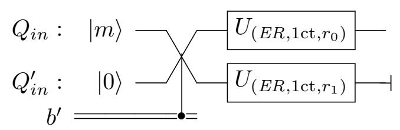

At the end, the adversary  $\mathcal{B}$  returns  $\mathcal{A}$ 's output. Note that if the challenge bit is b' = 0, then the adversary  $\mathcal{B}$  returns  $|\operatorname{Enc}(m)\rangle$  to  $\mathcal{A}$ . This is a simulation of ER type learning queries in game  $G_0$ . It is clear that the challenge queries made by  $\mathcal{A}$  are simulated perfectly by  $\mathcal{B}$ . Therefore, the adversary  $\mathcal{B}$  perfectly simulates game  $G_0$  when b' = 0. When the challenge bit is b' = 1 the adversary  $\mathcal{B}$  returns  $|\operatorname{Enc}(0)\rangle$  as an answer for a learning query. This is a simulation of  $\mathfrak{l}'$  learning queries in game  $G'_1$ . Therefore, the adversary  $\mathcal{B}$  perfectly simulates game  $G'_1$  when b' = 1. Since Enc is learn(0, -)-chall(\*, ER, 2ct)-secure,  $G_0$  and  $G'_1$  are indistinguishable.

(iii) When  $\mathfrak{c} = \operatorname{chall}(*, ER, 1\operatorname{ct})$ ,  $\mathcal{B}$  receives back one register and forwards it to  $\mathcal{A}$ .

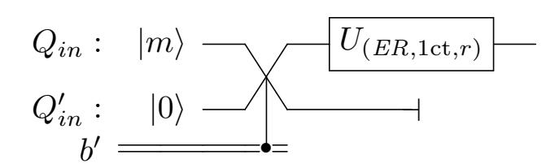

At the end, the adversary  $\mathcal{B}$  returns  $\mathcal{A}$ 's output. Similar to the cases above, we can show that the adversary  $\mathcal{B}$  simulates the game  $G_0$  when the challenge bit is b' = 0 and it simulates the game  $G_1$  when the challenge bit is b' = 1. Since Enc is learn(0, -)-chall(\*, ER, 1ct)-secure,  $G_0$  and  $G_1$  are indistinguishable.

 $G'_0 \cong G_1$ : Similar to the cases above, we can show that  $G'_0$  and  $G_1$  are indistinguishable. In this case, the adversary  $\mathcal{B}$  after receiving the quantum register  $Q_{in}$  as a learning query from the adversary  $\mathcal{A}$ , prepares the quantum register  $Q'_{in}$  containing  $|0\rangle$ , performs the  $\mathfrak{c}$ -challenge query for  $Q'_{in}$ ,  $Q_{in}$  registers (the order of registers have been exchanged). Then it does exactly the same as above in each case. For instance in the case of  $\mathfrak{c} = \operatorname{chall}(*, EM, 2\operatorname{ct})$ ,  $\mathcal{B}$  receives back four registers, then measures and discards the second and fourth registers and sends the first and third registers to  $\mathcal{A}$ .

$$Q_{in}': |0\rangle$$
  $Q_{in}: |m\rangle$   $Q_{out}: |0\rangle^{\otimes n'}$   $Q_{out}': |0\rangle^{\otimes n'}$ 

At the end,  $\mathcal B$  returns  $\mathcal A$ 's output. The other cases are similar.

 $G_1' \cong G_0'$ : It is clear that  $\mathcal{B}$  can simulate  $\mathfrak{l}'$  learning queries in both cases of EM and ER type queries by performing a  $\mathfrak{c}$ -challenge-query with input  $|0\rangle \otimes |0\rangle$  to obtain  $|\operatorname{Enc}(0)\rangle$ . Therefore,  $\mathcal{B}$  can simulate the games  $G_0'$  and  $G_1'$  when b'=0 and b'=1, respectively. At the end,  $\mathcal{B}$  returns  $\mathcal{A}$ 's output. Two games are indistinguishable because Enc is learn(0,-)- $\mathfrak{c}$  secure. In summary, we showed that  $G_0$  and  $G_1$  are indistinguishable and therefore Enc is learn $(*,\mathfrak{l}_{gm})$ - $\mathfrak{c}$ -secure.

<span id="page-27-0"></span>In the theorem below, we show that the security definition with no learning queries imply the security definition that performs ST, EM and ER type learning queries when the return type of the challenge queries is ror. The idea of the proof is to simulate the learning queries with the challenge queries. In each case, we define an intermediate game with learning queries that applies a random permutation to the input register before invoking the query (and undo this by applying  $\pi^{-1}$  to the input register for ST and EM cases.) Then we show that IND-CPA games with b=0,1 are indistinguishable from this intermediate game and this finishes the proof.

{28}------------------------------------------------

 $\textbf{Theorem 19.} \ \operatorname{learn}(0,-)\operatorname{-chall}(*,\mathfrak{c}_{\operatorname{qm}},\operatorname{ror}) \implies \operatorname{learn}(*,\mathfrak{c}_{\operatorname{qm}})\operatorname{-chall}(*,\mathfrak{c}_{\operatorname{qm}},\operatorname{ror}), \quad \mathfrak{c}_{\operatorname{qm}} \in \{ST,EM,ER\}.$ 

*Proof.* Let Enc be some encryption scheme that is learn(0, -)-chall $(*, \mathfrak{c}_{qm}, ror)$ -secure for  $\mathfrak{c}_{qm} \in \{ST, EM, ER\}$ . We will show that Enc is learn $(*, \mathfrak{c}_{qm})$ -chall $(*, \mathfrak{c}_{qm}, ror)$ -secure by defining a sequence of IND-CPA games that demonstrate that the settings with the challenge bit b = 0 and b = 1 are indistinguishable. Let Game  $G_b$  be the IND-CPA game with chall $(*, \mathfrak{c}_{qm}, ror)$ -challenge queries and learn $(*, \mathfrak{c}_{qm})$ -learning queries when the challenge bit is b.

We define the game G' to be the IND-CPA game with chall(\*,  $\mathfrak{c}_{qm}$ , ror)-challenge queries with the challenge bit b=1 and learn(\*,  $\mathfrak{l}'_{qm}$ )-learning queries where the learning query model  $\mathfrak{l}'_{qm}$  is as follows: For the query model qm = ST, after receiving the quantum registers  $Q_{in}$  and  $Q_{out}$ , apply a random permutation  $\pi$  on register  $Q_{in}$ , perform the query to Enc and finally apply  $\pi^{-1}$  on register  $Q_{in}$  afterwards. We draw the circuit below.

$$Q_{in}:$$
  $\pi$   $U_{\text{Enc}}$   $\pi^{-1}$   $U_{\text{Enc}}$ 

For the query model qm = EM, after receiving the quantum register  $Q_{in}$ , prepare a quantum register  $Q_{out}$  containing  $|0\rangle^{\otimes n'}$ , apply a random permutation  $\pi$  on register  $Q_{in}$ , perform the query to Enc and finally apply  $\pi^{-1}$  on register  $Q_{in}$  afterwards. We draw the circuit below.

$$Q_{in}:$$
  $\pi$   $U_{\rm Enc}$   $\pi^{-1}$ 

For the query models ER, after receiving the quantum register  $Q_{in}$ , apply a random permutation  $\pi$  on register  $Q_{in}$ , perform the query to Enc (in the ER query model). The circuit for  $\mathfrak{l}'_{qm}$  queries in this case is

$$Q_{in}:$$
  $\overline{\psi}^{\rm Enc}$ 

Next we will show the following indistinguishability relations.

$$G_0 \cong G' \cong G_1$$

In all cases, from an adversary that distinguishes two games we construct an adversary that breaks the learn(0, -)-chall $(*, \mathfrak{c}_{qm}, ror)$  security of Enc. Let  $\mathcal{A}$  be an adversary that distinguishes two subsequent games in the relation above with non-negligible probability  $\mu$ . We construct the adversary  $\mathcal{B}$  that breaks the learn(0, -)-chall $(*, \mathfrak{c}_{qm}, ror)$  IND-CPA security of Enc.

 $G_0 \cong G'$ : In this case, the adversary  $\mathcal{B}$  runs  $\mathcal{A}$  and answers to  $\mathcal{A}$ 's learning queries by forwarding them as the challenge queries to the challenger.  $\mathcal{B}$  will also directly forward the challenge queries made by  $\mathcal{A}$  to the challenger. At the end,  $\mathcal{B}$  returns output of  $\mathcal{A}$ . We show that  $\mathcal{B}$  simulates perfectly two games for the different type of queries separately:

1. When  $\mathfrak{c}_{qm} = ST$ : We recall the challenge query type (ST, ror) in the circuit below.

$$Q_{in}$$
:  $U_{\operatorname{Enco}\pi^{b'}}$ 

Note that if the challenge bit b' = 0 then  $\mathcal{B}$  simulates the learning and challenge queries in the game  $G_0$  and if b' = 1 then  $\mathcal{B}$  simulates the learning and challenge queries in the game G'. So the advantage of  $\mathcal{B}$  in guessing the challenge bit b' is at least  $\mu$ .

2. When  $\mathfrak{c}_{qm} = EM$ : We recall the challenge query type (EM, ror) in the circuit below.

$$Q_{in}:$$
  $U_{\text{Enc}\circ\pi^{b'}}$ 

Note that if the challenge bit b' = 0 then  $\mathcal{B}$  simulates the learning and challenge queries in the game  $G_0$  and if b' = 1 then  $\mathcal{B}$  simulates the learning and challenge queries in the game G'. So the advantage of  $\mathcal{B}$  in guessing the challenge bit b' is at least  $\mu$ .

3. When  $\mathfrak{c}_{qm} = ER$ : We recall the challenge query type (ER, ror) in the circuit below.

$$Q_{in}: - \hat{U}^{\text{Enc}\circ\pi^{b'}}$$

It is clear that if the challenge bit b' is 0 then  $\mathcal{B}$  simulates the learning queries in the game  $G_0$  and if the challenge bit is 1 then  $\mathcal{B}$  simulates the learning and challenge queries in the game G'. So the advantage of  $\mathcal{B}$  in guessing the challenge bit b' is at least  $\mu$ .

{29}------------------------------------------------

 $G' \cong G_1$ : We show these two games are indistinguishable for different query types:

- 1. When  $\mathfrak{c}_{qm} = ST$ . In this case, the adversary  $\mathcal{B}$  answers to  $\mathcal{A}$ 's learning queries by forwarding them as the challenge queries to the challenger. To answer  $\mathcal{A}$ 's challenge queries,  $\mathcal{B}$  applies a random permutation  $\pi$  on input register  $Q_{in}$  and sends  $Q_{in}$  and  $Q_{out}$  to the challenger. After getting the response from the challenger, it applies  $\pi^{-1}$  to the input register  $Q_{in}$  and sends them to the adversary  $\mathcal{A}$ . If the challenge bit b' = 0, then the adversary  $\mathcal{B}$  simulates learning queries and challenge queries in the game  $G_1$ . If the challenge bit b' = 1, then the adversary  $\mathcal{B}$  simulates learning queries and challenge queries in the game G'.
- 2. When  $\mathfrak{c}_{qm} = EM$ . The adversary  $\mathcal{B}$  does the same as above except  $Q_{out}$  contains  $|0\rangle^{\otimes n}$ .
- 3. When  $\mathfrak{c}_{qm} = ER$ . In this case, the adversary  $\mathcal{B}$  answers to  $\mathcal{A}$ 's learning queries by forwarding them as the challenge queries to the challenger. To answer the challenge queries,  $\mathcal{B}$  applies a random permutation  $\pi$  on input register  $Q_{in}$  and sends it to the challenger. After getting the response from the challenger, it forwards it to the adversary  $\mathcal{A}$ . If the challenge bit b' = 0, then the adversary  $\mathcal{B}$  simulates learning queries and challenge queries in the game  $G_1$ . If the challenge bit b' = 1, then the adversary  $\mathcal{B}$  simulates learning queries and challenge queries in the game G'.

In the theorem below, we show that for the embedding query type, ror-challenge queries imply 2ct-challenge queries. A less general version of this theorem (when there is only one challenge query) is used to show the equivalences of the notions in Panel 5.

**Theorem 20.**  $\operatorname{learn}(*, EM)\operatorname{-chall}(*, EM, \operatorname{ror}) \implies \operatorname{learn}(*, EM)\operatorname{-chall}(*, EM, 2\operatorname{ct})$ 

*Proof.* Let Enc be some encryption scheme that is learn(\*, EM)-chall(\*, EM, ror)-secure. We will show that Enc is learn(\*, EM)-chall(\*, EM, 2ct)-secure by showing that the settings with challenge bit b=0 and b=1 are indistinguishable. Since the learning queries are already the same, it is sufficient to define a sequence of games with indistinguishable challenge queries. (The learning queries are (\*, EM) in all cases)

In the following we define  $\mathfrak{c}^{(i)}$  challenge queries for i=1,2,3,4:

(i)  $\mathfrak{c}^{(1)}$ : On input registers  $Q_{in0}$  and  $Q_{in1}$  and the challenge bit b does the following:

<span id="page-29-0"></span>
$$Q_{in0}: |m_0\rangle = U_{\mathrm{Enc}\circ\pi}$$
 $Q_{in1:} |m_1\rangle = U_{\mathrm{Enc}}$ 
 $b = U_{\mathrm{Enc}}$ 

where  $\pi$  is a random permutation.

(ii)  $\mathfrak{c}^{(2)}$ : On input registers  $Q_{in0}$  and  $Q_{in1}$  and the challenge bit b does the following:

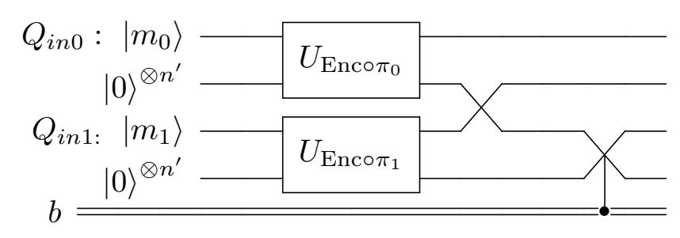

where  $\pi_0$  and  $\pi_1$  are random permutations.

(iii)  $\mathfrak{c}^{(3)}$ : On input registers  $Q_{in0}$  and  $Q_{in1}$  and the challenge bit b does the following:

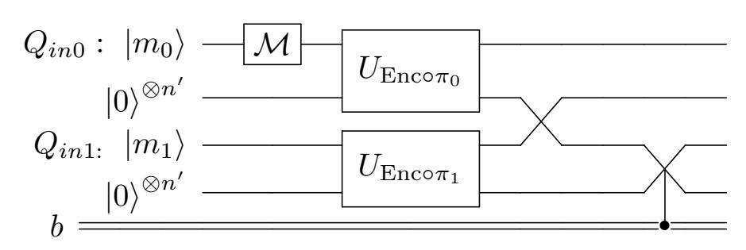

where  $\pi_0$  and  $\pi_1$  are random permutations. The measurement outcome is forgotten.

{30}------------------------------------------------

(iv)  $\mathfrak{c}^{(4)}$ : On input registers  $Q_{in0}$  and  $Q_{in1}$  and the challenge bit b does the following:

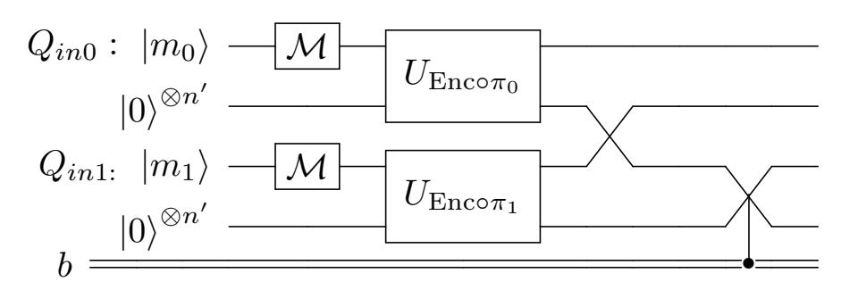

where  $\pi_0$  and  $\pi_1$  are random permutations. The measurement outcomes are forgotten.

Let  $\mathfrak{c}^{(0)} = \operatorname{chall}(*, EM, 2\operatorname{ct})$ . Let Game  $G_b^{(i)}$  be the IND-CPA game with learn(\*, EM)-learning-queries and  $\mathfrak{c}^{(i)}$ -challenge-queries when the challenge bit is b, where  $i \in \{0, 1, 2, 3, 4\}$ .

We will show that the following sequence of games are indistinguishable from each other:

$$G_0^{(0)} \cong G_0^{(1)} \cong G_0^{(2)} \cong G_0^{(3)} \cong G_0^{(4)} \cong G_1^{(4)} \cong G_1^{(3)} \cong G_1^{(2)} \cong G_1^{(1)} \cong G_1^{(0)}$$

Let assume the adversary  $\mathcal{A}_i$  distinguishes two games  $G^{(i)}$  and  $G^{(i+1)}$ . In the circuits depicted below,  $\ell$  refers to a unitary gate implementing  $\ell = \operatorname{learn}(*, EM)$  while  $\mathfrak{c}$  refers to a unitary gate implementing  $\mathfrak{c} = \operatorname{chall}(*, EM, \operatorname{ror})$ . Below, b'' refers to the challenge bit that the reduction algorithm  $(\mathcal{B})$  tries to find.

 $G_b^{(0)} \cong G_b^{(1)}$ : Let  $\mathcal{A}_0$  be an adversary that distinguish  $G_b^{(0)}$  and  $G_b^{(1)}$ . When  $\mathcal{A}_0$  makes a learning query,  $\mathcal{B}$  simply passes it through. When  $\mathcal{A}_0$  makes a challenge query for input registers  $Q_{in0}, Q_{in1}, \mathcal{B}$  simulates this by using a challenge query for the input register  $Q_{in0}$  and using a learning-query for  $Q_{in1}$ . Let  $Q_{out0}$  denote the output of the challenge query with  $Q_{in0}$  and  $Q_{out1}$  denote the output of the learning query with  $Q_{in1}$ . Then B gives the registers  $Q_{in0}, Q_{in1}, Q_{outb}, Q_{out\bar{b}}$  to  $\mathcal{A}_0$ . We draw the circuit below which uses a control-swap gate depending on the value of b. At the end,  $\mathcal{B}$  makes the same guess b' as  $\mathcal{A}_0$ .

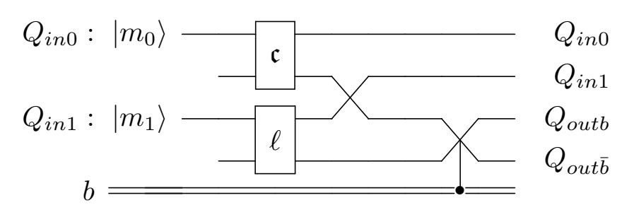

We analyse the case when b=0. In this case if the challenge bit b''=0 then the adversary  $\mathcal{B}$  simulates (\*, EM, 2ct) challenge queries and therefore it simulates game  $G_0^{(0)}$ . When b''=1 then  $\mathcal{B}$  returns  $|m_0\rangle|m_1\rangle|\operatorname{Enc}(\pi(m_0))\rangle|\operatorname{Enc}(m_1)\rangle$  for a random permutation  $\pi$ . That is a  $\mathfrak{c}^{(1)}$  type challenge query. In other words,  $\mathcal{B}$  simulates the game  $G_0^{(1)}$ . We can do the same analysis when b=1.

 $G_b^{(1)} \cong G_b^{(2)}$ : Let  $\mathcal{A}_1$  be an adversary that distinguish  $G_b^{(1)}$  and  $G_b^{(2)}$ . When  $\mathcal{A}_1$  makes a learning query,  $\mathcal{B}$  simply passes it through. When  $\mathcal{A}_1$  makes a challenge query for input registers  $Q_{in0}, Q_{in1}, \mathcal{B}$  simulates this by picking a random permutation  $\pi_0$ , applying to the register  $Q_{in0}$ , sending the result as a learning query, applying  $\pi_0^{-1}$  to  $Q_{in0}$  and using a challenge query for  $Q_{in1}$ . Let  $Q_{out0}$  denote the output of the learning query with  $Q_{in0}$  and  $Q_{out1}$  denote the output of the challenge query with  $Q_{in1}$ . Then B gives the registers  $Q_{in0}, Q_{in1}, Q_{outb}, Q_{out\bar{b}}$  to  $\mathcal{A}_0$ . We draw the circuit below which uses a control-swap gate depending on the value of b. At the end,  $\mathcal{B}$  makes the same guess b' as  $\mathcal{A}_0$ .

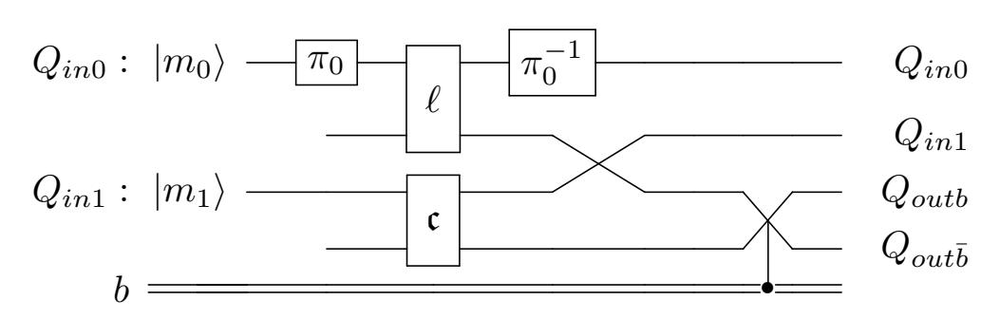

We analyse when b=0. In this case if the challenge bit b''=0, then the adversary  $\mathcal{B}$  returns  $(|m_0\rangle, |m_1\rangle, |\operatorname{Enc}(\pi_0(m_0))\rangle, |\operatorname{Enc}(m_1)\rangle)$ . So  $\mathcal{B}$  simulates the game  $G_0^{(1)}$ . If the challenge bit b''=1, then the adversary  $\mathcal{B}$  returns  $(|m_0\rangle, |m_1\rangle, |\operatorname{Enc}(\pi_0(m_0))\rangle, |\operatorname{Enc}(\pi_1(m_1))\rangle)$  for a random permutation  $\pi_1$ . That is  $\mathcal{B}$  simulates the game  $G_0^{(2)}$ . We can do the same analysis when b=1.

{31}------------------------------------------------

 $G_b^{(2)} \cong G_b^{(3)}$ : These can be proven by direct application of Corollary 12. (with  $f := \operatorname{Enc}_r \circ \pi_0$  and  $R := \operatorname{im} \operatorname{Enc}_r$  for fixed randomness r.)

 $G_b^{(3)} \cong G_b^{(4)}$ : These can be proven by direct application of Corollary 12.

 $G_0^{(4)} \cong G_1^{(4)}$ : Since Enc is learn(\*, EM)-chall(\*, EM, ror) secure, it is learn(\*, EM)-chall(\*, CL, 2ct) secure by simulating classical queries by quantum queries (Panel 5 implies Panel 11 in Figure 1). Note that in the game  $G_0^{(4)}$  the outcome of a challenge query will be  $(m_0, m_1, \operatorname{Enc}(\pi_0(m_0)), \operatorname{Enc}(\pi_1(m_1)))$  and in the game  $G_1^{(4)}$  it will be  $(m_0, m_1, \operatorname{Enc}(\pi_1(m_1)), \operatorname{Enc}(\pi_0(m_0)))$ . If there is an adversary  $\mathcal A$  that distinguishes games  $G_0^{(4)}$  and  $G_1^{(4)}$ , then one can construct an adversary  $\mathcal B$  that breaks learn(\*, EM)-chall(\*, EM)-chall(\*, EM)-chall(\*, EM)-chall(\*, EM)-chall(\*, EM)-chall(\*, EM)-chall(\*, EM)-chall(\*, EM)-chall(\*, EM)-chall(\*, EM)-chall(\*, EM)-chall(\*, EM)-chall(\*, EM)-chall(\*, EM)-chall(\*, EM)-chall(\*, EM)-chall(\*, EM)-chall(\*, EM)-chall(\*, EM)-chall(\*, EM)-chall(\*, EM)-chall(\*, EM)-chall(\*, EM)-chall(\*, EM)-chall(\*, EM)-chall(\*, EM)-chall(\*, EM)-chall(\*, EM)-chall(\*, EM)-chall(\*, EM)-chall(\*, EM)-chall(\*, EM)-chall(\*, EM)-chall(\*, EM)-chall(\*, EM)-chall(\*, EM)-chall(\*, EM)-chall(\*, EM)-chall(\*, EM)-chall(\*, EM)-chall(\*, EM)-chall(\*, EM)-chall(\*, EM)-chall(\*, EM)-chall(\*, EM)-chall(\*, EM)-chall(\*, EM)-chall(\*, EM)-chall(\*, EM)-chall(\*, EM)-chall(\*, EM)-chall(\*, EM)-chall(\*, EM)-chall(\*, EM)-chall(\*, EM)-chall(\*, EM)-chall(\*, EM)-chall(\*, EM)-chall(\*, EM)-chall(\*, EM)-chall(\*, EM)-chall(\*, EM)-chall(\*, EM)-chall(\*, EM)-chall(\*, EM)-chall(\*, EM)-chall(\*, EM)-chall(\*, EM)-chall(\*, EM)-chall(\*, EM)-chall(\*, EM)-chall(\*, EM)-chall(\*, EM)-chall(\*, EM)-chall(\*, EM)-chall(\*, EM)-chall(\*, EM)-chall(\*, EM)-chall(\*, EM)-chall(\*, EM)-chall(\*, EM)-chall(\*, EM)-chall(\*, EM)-chall(\*, EM)-chall(\*, EM)-chall(\*, EM)-chall(\*, EM)-chall(\*, EM)-chall(\*, EM)-chall(\*, EM)-chall(\*, EM)-chall(\*, EM)-chall(\*, EM)-chall(\*, EM)-chall(\*, EM)-chall(\*, EM)-chall(\*, EM)-cha

In Theorem 21, we show that when the query model is ER in both the learning queries and the challenge queries, the return type 1ct implies 2ct.

**Theorem 21.** 
$$learn(*, ER)$$
-chall $(*, ER, 1ct) \implies learn(*, ER)$ -chall $(*, ER, 2ct)$ 

*Proof.* Let Enc be some encryption scheme that is learn(\*, ER)-chall(\*, ER, 1ct)-secure. We will show that Enc is learn(\*, ER)-chall(\*, ER, 2ct)-secure by showing that the settings with challenge bit b=0 and b=1 are indistinguishable. The learning queries will be learn(\*, ER) in all games.

Define the challenge query  $\mathfrak{c}_b'$  as follows: on input registers  $Q_{in0}, Q_{in1}$ , discard the register  $Q_{in0}$ , prepares an ancillary register Anc containing  $|0\rangle^{\otimes n'}$  and use the chall(\*, ER, 1ct)-challenge-query (the dashed box below) for the registers  $Q_{in1}$ , Anc as follows:

<span id="page-31-0"></span>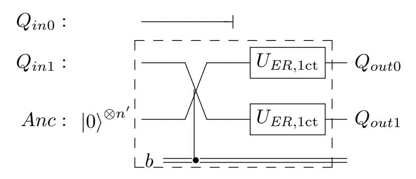

where  $U_{ER,1\text{ct}}$  is  $\hat{U}^{\text{Enc}(\cdot,r_0)}/\hat{U}^{\text{Enc}(\cdot,r_1)}$ . Define the challenge query  $\mathfrak{c}''$  as follows: on input registers  $Q_{in0},Q_{in1}$ , it discards  $Q_{in0},Q_{in1}$ , prepares ancillary registers  $Anc_0$  and  $Anc_1$  containing  $|0\rangle^{\otimes n'}$  and use learning queries for  $Anc_0$ ,  $Anc_1$ . The quantum circuit for a  $\mathfrak{c}''$  query is shown below.

$$Q_{in0}$$
:  $\longrightarrow$ 
 $Q_{in1}$ :  $\longrightarrow$ 
 $Anc_0: |0\rangle^{\otimes n'}$   $\longrightarrow$ 
 $Enc^{\mathfrak{l}}$   $\longrightarrow$   $Q_{out0}$ 
 $Anc_1: |0\rangle^{\otimes n'}$   $\longrightarrow$ 
 $Enc^{\mathfrak{l}}$   $\longrightarrow$   $Q_{out1}$ 

where  $\operatorname{Enc}^{\mathfrak{l}}$  is  $\hat{U}^{\operatorname{Enc}}$ . Let Game  $G_b$  be the IND-CPA game with  $\operatorname{chall}(*, ER, 2\operatorname{ct})$ -challenge-queries when the challenge bit is b. Let Game  $G_b'$  be the IND-CPA game with  $\mathfrak{c}_b'$ -challenge queries. Let Game G'' be the IND-CPA game with  $\mathfrak{c}''$ -challenge queries.

We will show that the following sequence of games are indistinguishable from each other:

$$G_0 \cong G_1' \cong G'' \cong G_0' \cong G_1.$$

To do this, we construct an adversary  $\mathcal{B}$  that breaks learn(\*, ER)-chall(\*, ER, 1ct)-security from an adversary  $\mathcal{A}$  that distinguishes two consecutive games. Let b' denotes  $\mathcal{A}$ 's guess and b'' denotes the challenge bit of  $\mathcal{B}$ 's challenger.

 $G_0 \cong G'_1$ : When  $\mathcal{A}$  submits the input registers  $Q_{in0}$ ,  $Q_{in1}$  as a challenge query,  $\mathcal{B}$  simulates this by using a learn(\*, ER)-learning query for  $Q_{in1}$  to get the second output register, prepares an ancillary

{32}------------------------------------------------

register Anc containing  $|0\rangle^{\otimes n'}$ , and making a chall(\*, ER, 1ct)-challenge-query for  $Q_{in0}$ , Anc to get the first output register. At the end  $\mathcal{B}$  makes the same guess as  $\mathcal{A}$ .

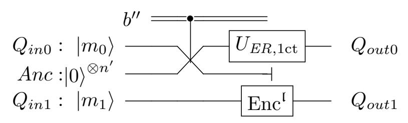

If the challenger bit b''=0 the adversary  $\mathcal{B}$  will receive  $|\operatorname{Enc}(m_0)\rangle$  back from its challenger and sends  $(|\operatorname{Enc}(m_0)\rangle, |\operatorname{Enc}(m_1)\rangle)$  to  $\mathcal{A}$ . Therefore,  $\mathcal{B}$  simulates the challenge queries in game  $G_0$  when b''=0. If the challenger bit b''=1 the adversary  $\mathcal{B}$  will receive  $|\operatorname{Enc}(0)\rangle$  back from its challenger and sends  $(|\operatorname{Enc}(0)\rangle, |\operatorname{Enc}(m_1)\rangle)$  to  $\mathcal{A}$ . Note that this is an  $\mathfrak{c}'_1$  type challenge query, therefore,  $\mathcal{B}$  simulates the challenge queries in game  $G'_1$  when b''=1.

 $G_1 \cong G_0'$ : When  $\mathcal{A}$  submits the input registers  $Q_{in0}$ ,  $Q_{in1}$  as a challenge query,  $\mathcal{B}$  simulates this by using a learn(\*, ER)-learning query for  $Q_{in1}$  to get the first output register, prepares an ancillary register Anc containing  $|0\rangle^{\otimes n'}$ , and making a chall(\*, ER, 1ct)-challenge-query for Anc,  $Q_{in0}$  to get the second output register. At the end,  $\mathcal{B}$  returns  $\mathcal{A}$ 's guess.

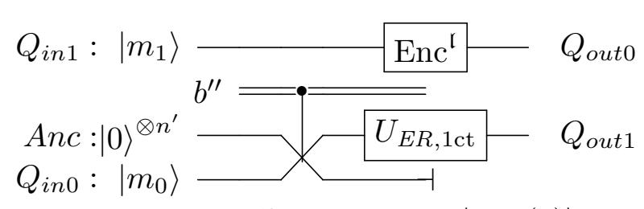

If the challenger bit b''=0 the adversary  $\mathcal{B}$  will receive  $|\operatorname{Enc}(0)\rangle$  back from its challenger and sends  $(|\operatorname{Enc}(m_1)\rangle, |\operatorname{Enc}(0)\rangle)$  to  $\mathcal{A}$ . Note that this is an  $\mathfrak{c}'_0$  type challenge query, therefore,  $\mathcal{B}$  simulates the challenge queries in game  $G'_0$  when b''=0. If the challenger bit b''=1 the adversary  $\mathcal{B}$  will receive  $|\operatorname{Enc}(m_0)\rangle$  back from its challenger and sends  $(|\operatorname{Enc}(m_1)\rangle, |\operatorname{Enc}(m_0)\rangle)$  to  $\mathcal{A}$ . Therefore,  $\mathcal{B}$  simulates the challenge queries in game  $G_1$  when b''=1.

 $G_0' \cong G''$ : When  $\mathcal{A}$  makes a challenge query by submitting the input registers  $Q_{in0}$  and  $Q_{in1}$ ,  $\mathcal{B}$  answers this by discarding the register  $Q_{in0}$ , preparing ancillary registers  $Anc_0$ ,  $Anc_1$  containing  $|0\rangle^{\otimes n'}$ , making a chall(\*, ER, 1ct)-challenge-query for  $Q_{in1}$ ,  $Anc_0$  to get output register  $Q_{out0}$ , and using a learning query for  $Anc_1$  to get the output register  $Q_{out1}$ . At the end,  $\mathcal{B}$  makes the same guess b' as  $\mathcal{A}$  where b'=1 means  $\mathcal{A}$  interacts in game G''.

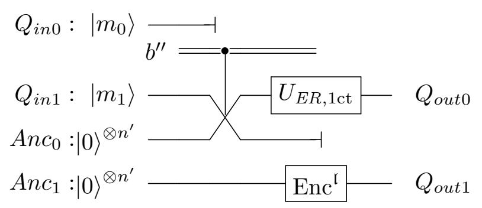

When the challenge bit b'' = 0,  $\mathcal{B}$  will receive back  $|\operatorname{Enc}(m_1)\rangle$  and sends  $(|\operatorname{Enc}(m_1)\rangle, |\operatorname{Enc}(0)\rangle)$  to  $\mathcal{A}$ . Hence,  $\mathcal{B}$  simulates the challenge queries in game  $G'_0$ . When the challenge bit b'' = 1 it will receive back  $|\operatorname{Enc}(0)\rangle$  and sends  $(|\operatorname{Enc}(0)\rangle, |\operatorname{Enc}(0)\rangle)$  to  $\mathcal{A}$ . Hence,  $\mathcal{B}$  simulates the challenge queries in game G'' in this case.

 $G'_1 \cong G''$ : When  $\mathcal{A}$  makes a challenge query by submitting the input registers  $Q_{in0}$  and  $Q_{in1}$ ,  $\mathcal{B}$  answers this by discarding the register  $Q_{in0}$ , preparing ancillary registers  $Anc_0$ ,  $Anc_1$  containing  $|0\rangle^{\otimes n'}$ , making a chall(\*, ER, 1ct)-challenge-query for  $Anc_1$ ,  $Q_{in1}$  to get the output register  $Q_{out1}$ , and using a learning query for  $Anc_0$  to get the output register  $Q_{out0}$ . At the end,  $\mathcal{B}$  makes the same guess b' as  $\mathcal{A}$  where b' = 0 means  $\mathcal{A}$  interacts in game G''.

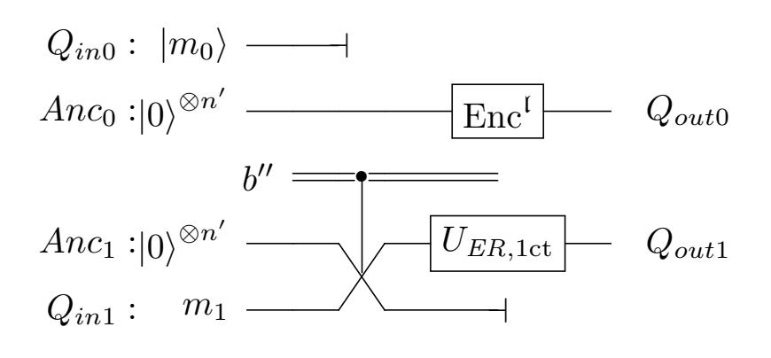

{33}------------------------------------------------

When the challenge bit b'' = 0,  $\mathcal{B}$  will receive back  $|\text{Enc}(0)\rangle$  and sends  $(|\text{Enc}(0)\rangle, |\text{Enc}(0)\rangle)$  to  $\mathcal{A}$ . Hence,  $\mathcal{B}$  simulates the challenge queries in game G''. When the challenge bit b'' = 1 it will receive back  $|\text{Enc}(m_1)\rangle$  and sends  $(|\text{Enc}(0)\rangle, |\text{Enc}(m_1)\rangle)$  to  $\mathcal{A}$ . Hence,  $\mathcal{B}$  simulates the challenge queries in game  $G'_1$  in this case.

In Theorem 22, we show that 1ct return type implies ror return type for ER query model.

Theorem 22. The following implications hold:

- $\operatorname{learn}(*, CL), \operatorname{chall}(1, ER, 1\operatorname{ct}) \implies \operatorname{learn}(*, CL) \operatorname{chall}(1, ER, \operatorname{ror}).$
- $\operatorname{learn}(*, ER) \operatorname{-chall}(*, ER, \operatorname{1ct}) \implies \operatorname{learn}(*, ER) \operatorname{-chall}(*, ER, \operatorname{ror})$

*Proof.* We prove the second implication and the first one can be proven analogously. Let Enc be an encryption scheme that is learn(\*, ER)-chall(\*, ER, 1ct)-secure. We will show that Enc is learn(\*, ER)-chall(\*, ER, ror)-secure by showing that the settings with challenge bit b=0 and b=1 are indistinguishable. Since the learning queries are already the same, it is sufficient to define a sequence of games with indistinguishable challenge queries.

Define the challenge query  $\mathfrak{c}'$  as follows: Upon receiving the input register  $Q_{in}$ , discard it and instead make a ER learning query for  $|0\rangle$ .

<span id="page-33-1"></span>
$$Q_{in}: |m\rangle \longrightarrow$$

$$Anc: |0\rangle^{\otimes n'} \longrightarrow \boxed{\operatorname{Enc}^{(ER)}} \longrightarrow Q_{out}$$

Let Game  $G_b$  be the IND-CPA game with chall(\*, ER, ror)-challenge-queries and CL-learning-queries when the challenge bit is b. Let Game G' be the IND-CPA game with  $\mathfrak{c}'$ -challenge-queries and ER-learning-queries.

Next we will show in sequence that these games are indistinguishable from one another:

$$G_0 \cong G' \cong G_1$$

To do this, we construct an adversary  $\mathcal{B}$  that breaks learn(\*, ER)-chall(\*, ER, 1ct)-security from an adversary  $\mathcal{A}_b$  that distinguishes the game  $G_b$  from G'. Let b'' denote the  $\mathcal{B}$ 's challenge bit.

 $G_0 \cong G'$ : When  $A_0$  makes a challenge query by submitting the input register  $Q_{in}$ ,  $\mathcal{B}$  answers this by preparing an ancillary register Anc containing  $|0\rangle^{\otimes n'}$ , and then sending the registers  $Q_{in}$ , Anc to its challenger and forwards back the result to  $A_0$ .

$$b''$$
  $Q_{in}: |m\rangle$   $U_{ER,1ct}$   $Q_{out}$   $Anc: |0\rangle^{\otimes n'}$   $Q_{out}$   $Q_{out}$   $Q_{out}$   $Q_{out}$ 

If the challenge bit b'' = 0,  $\mathcal{B}$  will receive back  $|\operatorname{Enc}(m)\rangle$  and sends it to  $\mathcal{A}_0$ . Therefore,  $\mathcal{B}$  simulates the challenge queries in game  $G_0$ . If the challenge bit b'' = 0,  $\mathcal{B}$  will receive back  $|\operatorname{Enc}(0)\rangle$  and sends it to  $\mathcal{A}_0$ . Therefore,  $\mathcal{B}$  simulates the challenge queries in game G'.

 $G_1 \cong G'$ : When  $A_1$  makes a challenge query by submitting the input register  $Q_{in}$ ,  $\mathcal{B}$  answers this by preparing an ancillary register Anc containing  $|0\rangle^{\otimes n'}$ , picking a qPRP  $\pi$  and applying it to the register  $Q_{in}$ , then sending the registers Anc,  $Q_{in}$  to its challenger and forwarding back the result to  $A_1$ .

$$Anc: \ket{0}^{\otimes n'} \xrightarrow{b''} \overline{U_{ER,1ct}} Q_{out}$$
 $Q_{in}: \ket{m} \overline{-\pi}$ 

If the challenge bit b'' = 0,  $\mathcal{B}$  will receive back  $|\text{Enc}(0)\rangle$  and sends it to  $\mathcal{A}_1$ . Therefore,  $\mathcal{B}$  simulates the challenge queries in game G'. If the challenge bit b'' = 1,  $\mathcal{B}$  will receive back  $|\text{Enc}(\pi(m))\rangle$  and sends it to  $\mathcal{A}_1$ . Therefore,  $\mathcal{B}$  simulates the challenge queries in game  $G_1$ .

<span id="page-33-0"></span>In Theorem 23, we show that the 2ct return type implies the ror return type for the EM query model.

**Theorem 23.** The following implications hold:

{34}------------------------------------------------

```
- \operatorname{learn}(*, CL)\operatorname{-chall}(1, EM, 2\operatorname{ct}) \Longrightarrow \operatorname{learn}(*, CL)\operatorname{-chall}(1, EM, \operatorname{ror})
- \operatorname{learn}(*, EM)\operatorname{-chall}(*, EM, 2\operatorname{ct}) \Longrightarrow \operatorname{learn}(*, EM)\operatorname{-chall}(*, EM, \operatorname{ror})
```

*Proof.* We prove the first implication and the second one can be proven analogously. Let Enc be an encryption scheme that is learn(\*, CL)-chall(1, EM, 2ct) secure. Consider an adversary A that is successful in attacking Enc in the sense of learn(\*, CL)-chall(1, EM, ror)-queries. Let  $G_b$  be the IND-CPA game against learn(\*, CL)-chall(1, EM, ror)-queries when the challenge bit is b. By Corollary 12, if we measure the input register in the game  $G_1$  this can not be detected by the adversary  $\mathcal{A}$ . (Note that each query uses a different random permutation  $\pi$  and uses it only once.) We define  $G'_1$  to be similar to the game  $G_1$  except with a measurement in the computational basis on the input register submitted as a challenge query. The games  $G_1$  and  $G'_1$  are indistinguishable by Corollary 12. We define  $G''_1$  to be similar to the game  $G'_1$  except for each challenge query the input register will be initiated with a random classical value. It is clear that  $G_1''$  and  $G_1'$  are indistinguishable. Since  $G_1$  and  $G_1''$  are indistinguishable,  $\mathcal{A}$  can distinguish the games  $G_1''$  and  $G_0$ . We define an adversary  $\mathcal{B}$  against learn(\*, CL)-chall(1, EM, 2ct), which uses  $\mathcal{A}$  as follows: when  $\mathcal{A}$  makes a chall (1, EM, ror)-challenge-query by submitting the input register  $Q_{in}$ ,  $\mathcal{B}$  prepares an ancillary register Anc containing a random classical value and sends  $Q_{in}$ , Anc as a challenge query to its challenger. Upon receiving the response from the challenger, it discards the second and the fourth register and forwards the first and the third register to  $\mathcal{A}$ . At the end,  $\mathcal{B}$  returns  $\mathcal{A}$ 's guess.

$$Q_{in}:$$
 \_\_\_\_\_\_\_\_\_\_\_\_\_\_\_\_\_\_\_\_\_\_\_\_\_\_\_\_\_\_\_\_\_\_\_\_

Let b'' be the  $\mathcal{B}$ 's challenger bit. If b'' = 0,  $\mathcal{B}$  simulates the response in the game  $G_0$  but if b'' = 1,  $\mathcal{B}$  simulates the response in the game  $G_1''$ . Therefore B can breaks the security of Enc against learn(\*, CL) -chall(1, EM, 2ct).

<span id="page-34-1"></span>**Theorem 24.** learn(\*, ER)-chall(\*, ER, 1ct)  $\implies$  learn(\*, ST)-chall(\*, CL, 1ct). This shows that P1  $\implies$  P6.

*Proof.* This has been proven in [GHS16] using multiple implications. Refer to Figure 2 in [GHS16] such that "gqIND-qCPA" in the figure is learn(\*, ER)-chall(\*, ER, 1ct) in our notation and "IND-qCPA" in the figure is learn(\*, ER)-chall(\*, ER, 1ct) in our notation.

## <span id="page-34-0"></span>7 Separations

In this section all possible implications between different notions of IND-CPA security that are not shown in Figure 1 or do not follow from it by transitivity are disproven here, apart from the non-implications stated as open questions. First we give an overview of results in this section.

#### 7.1 Overview of results

In the following, we use two rules to show non-implications:

```
- \text{ if } A \implies B \text{ and } C \implies B \text{ then we can deduce } A \implies C.
- \text{ if } A \implies B \text{ and } A \implies C \text{ then we can conclude } C \implies B.
```

**Panel 1:** From the Figure 1, we can conclude that  $P1 \implies P3$ , P4, P5, P6, P7, P8, P9, P10, P11, P13, P14. So it is only left to show the relation between P1 and P2, P12. From Theorem 42,  $P1 \implies P12$  and as a corollary  $P1 \implies P2$  because  $P2 \implies P12$ . Therefore

$$P1 \implies P2, P12.$$

This finishes all of implication and non-implications from P1.

**Panel 2:** From Figure 1, we can conclude that P2 implies P5, P6, P7, P11, P12, P13, P14. We show in Corollary 29,  $P2 \implies P8$  and since  $P1, P3 \implies P8$  then  $P2 \implies P1, P3$ . In Theorem 39, we show  $P2 \implies P10$  and since  $P4 \implies P10$  then  $P2 \implies P4$ . Therefore,

$$P2 \implies P1, P3, P4, P8, P10$$

{35}------------------------------------------------

This nishes all of implication and non-implications from P2. The relation between P2 and P9 remains open.

Panel 3: From Figure [1,](#page-21-0) we can conclude that P3 =⇒ P7, P8, P9, P13, P14. Since P1 =⇒ P3 and P1 =6⇒ P2, P12, we can deduce P3 =6⇒ P2, P12. The relationships between P3 and P1, P4, P5, P6, P10, P11 remain open questions.

Panel 4: From Figure [1,](#page-21-0) we can conclude that P4 =⇒ P5, P7, P9, P10, P11, P13, P14. From Corollary [29,](#page-37-0) P4 =6⇒ P8 and since P1, P3 =⇒ P8 then P4 =6⇒ P1, P3. Since P1 =6⇒ P2, P12 and P1 =⇒ P4 then we can deduce P4 =6⇒ P2, P12. The relation between P4 and P6 remains open question.

Panel 5: From Figure [1,](#page-21-0) we can conclude that P5 =⇒ P7, P11, P13, P14. Since P1 =⇒ P5 and P1 =6⇒ P2, P12, then P5 =6⇒ P2, P12. Since P2 =⇒ P5 and P2 =6⇒ P1, P3, P4, P8, P10, we can deduce P5 =6⇒ P1, P3, P4, P8, P10. The relationships between P5 and P6, P9 remain open.

Panel 6: From Figure [1,](#page-21-0) P6 =⇒ P11, P14. Since P2 =⇒ P6 and P2 =6⇒ P1, P3, P4, P8, P10, P12, then we can conclude that P6 =6⇒ P1, P3, P4, P8, P10, P12. We show in Theorem [40](#page-41-0) that P6 =6⇒ P7 and since P2, P5 =⇒ P7 then we can deduce P6 =6⇒ P2, P5. From Theorem [41,](#page-42-1) P6 =6⇒ P13 and since P9 =⇒ P13, then P6 =6⇒ P9. Therefore

$$P6 \implies P1, P2, P3, P4, P5, P7, P8, P9, P10, P12, P13.$$

We cover all implication and non-implications from P6.

Panel 7: From Figure [1,](#page-21-0) P7 =⇒ P13, P14. Since P1 =6⇒ P2, P12 and P1 =⇒ P7, then P7 =6⇒ P2, P12. Since P2 =6⇒ P1, P3, P4, P8, P10 and P2 =⇒ P7, then P7 =6⇒ P1, P3, P4, P8, P10. The relation between P7 and P5, P6, P9, P11 remain open.

Panel 8: From Figure [1,](#page-21-0) P8 =⇒ P9, P13, P14. Since P1 =6⇒ P2, P12 and P1 =⇒ P8, then P8 =6⇒ P2, P12. The relationships between P8 and P1, P3, P4, P5, P6, P7, P10, P11 remain open.

Panel 9: From Figure [1,](#page-21-0) P9 =⇒ P13, P14. Since P4 =6⇒ P1, P2, P3, P8, P12 and P4 =⇒ P9, then P9 =6⇒ P1, P2, P3, P8, P12. The relation between P9 and P4, P5, P6, P7, P10, P11 remain open.

Panel 10: From Figure [1,](#page-21-0) P10 =⇒ P11, P14. Since P4 =6⇒ P1, P2, P3, P12 and P4 =⇒ P10 then P10 =6⇒ P1, P2, P3, P12. We show in Theorem [40](#page-41-0) P10 =6⇒ P7 and since P4, P5 =⇒ P7 then P10 =6⇒ P4, P5. From Theorem [34,](#page-38-0) P10 =6⇒ P13 and since P8, P9 =⇒ P13 then P10 =6⇒ P8, P9. The relation between P10 and P6 remains open.

Panel 11: From Figure [1,](#page-21-0) P11 =⇒ P14. Since P6 =6⇒ P1, P2, P3, P4, P5, P7, P8, P9, P10, P12, P13 and P6 =⇒ P11 then P11 =6⇒ P1, P2, P3, P4, P5, P7, P8, P9, P10, P12, P13. The relation between P11 and P6 remains open.

Panel 12: From Figure [1,](#page-21-0) P12 =⇒ P13, P14. Since P2 =6⇒ P1, P3, P4, P8, P10 and P2 =⇒ P12 then P12 =6⇒ P1, P3, P4, P8, P10. The relation between P12 and P2, P5, P6, P7, P9, P11 remain open.

Panel 13: From Figure [1,](#page-21-0) P13 =⇒ P14. Since P1 =6⇒ P2, P12 and P1 =⇒ P13, then P13 =6⇒ P2, P12. Since P2 =6⇒ P1, P3, P4, P8, P10 and P2 =⇒ P13, then P13 =6⇒ P1, P3, P4, P8, P10. The relation between P13 and P5, P6, P7, P9, P11 remain open.

Panel 14: Since P6 =6⇒ P1, P2, P3, P4, P5, P7, P8, P9, P10, P12, P13 and P6 =⇒ P14 then P14 =6⇒ P1, P2, P3, P4, P5, P7, P8, P9, P10, P12, P13. From Theorem [33,](#page-38-1) P14 =6⇒ P11 and since P6 =⇒ P11, then P14 =6⇒ P6. Since P14 =6⇒ P13 and P7 =⇒ P13 then P14 =6⇒ P7. Therefore,

$$P14 \implies P1, P2, P3, P4, P5, P6, P7, P8, P9, P10, P11, P12, P13.$$

#### 7.2 Separations by Quasi-Length-Preserving Encryptions

The notion of a core function and quasi-length-preserving encryption schemes was rst formally introduced in [\[GHS16\]](#page-45-1). Intuitively, the definition splits the ciphertext into a message-independent part and a 

{36}------------------------------------------------

message-dependent part that has the same length as the plaintext. We dene a variant of a quasi-lengthpreserving encryption scheme below.

Definition 25 (Core function). A function g is called the core function of an encryption scheme (KGen,Enc, Dec) if

1. for all k ∈ {0, 1} h , m ∈ {0, 1} <sup>n</sup>, r ∈ {0, 1} t ,

$$\operatorname{Enc}_k(m;r) = f(k,r)||g(k,m,r)$$

where f is an arbitrary function independent of the message.

2. there exists a function f 0 such that for all k ∈ {0, 1} h , m ∈ {0, 1} <sup>n</sup>, r ∈ {0, 1} <sup>t</sup> we have f 0 (k, f(k, r), g(k, m, r)) = m.

Definition 26 (Quasi-Length-Preserving). An encryption scheme with core function g is said to be quasi-length-preserving if for all k ∈ {0, 1} h , m ∈ {0, 1} <sup>n</sup>, r ∈ {0, 1} t ,

<span id="page-36-1"></span>
$$|g(k, m, r)| = |m|,$$

that is, the output of the core function has the same length as the message.

In the theorem below we show that any quasi-length-preserving encryption scheme is insecure for the query model in Panel 8. And as a corollary any quasi-length-preserving encryption scheme is insecure for any query models in Panel 1 and Panel 3 because they imply Panel 8 Figure [1.](#page-21-0) (This corollary can be derived directly from the proof of the theorem below since the attack does not use learning queries.)

Theorem 27. Any quasi-length-preserving encryption scheme is insecure for the query model learn(∗, CL) -chall(1,ER, 1ct). This shows that any quasi-length-preserving encryption scheme is insecure for the query model in Panel 8.

Proof. Suppose the function Enc is quasi-length-preserving, i.e., we can write

$$\mathrm{Enc}_k(m;r) = f(k,r) || g(k,m,r)$$

for some functions f and g such that

$$|g(k, m, r)| = |m|.$$

Since the encryption function is decryptable and quasi-length-preserving then g is essentially a permutation for xed k, r. Now in the challenge query, the adversary prepares two input registers Qin0, Qin<sup>1</sup> containing the uniform superposition of all messages and |0i ⊗n , respectively. After getting the outcome, the adversary performs the projective measurement M<sup>|</sup>+<sup>i</sup> on the output register to determine whether it is in the state |+i ⊗n or not. We draw the circuit below. For simplicity, we omit the classical values of f(k, r) from the circuits.

$$Q_{in0}: |+\rangle^{\otimes n}$$
 $Q_{in1}: |0\rangle^{\otimes n}$ 
 $b$ 
 $g_{k,r}$ 
 $\mathcal{M}_{|+\rangle}$ 

When b = 0 the measurement M<sup>|</sup>+<sup>i</sup> succeeds with probability 1, but when b = 1, this happens only with negligible probability.

In the theorem below we choose two query models from Panel 2 and Panel 4 and we propose a quasilength-preserving encryption function that is secure in those two security notions. Then we can conclude that there is a quasi-length-preserving encryption function that is secure for any query models in Panel 2 and Panel 4 because query models inside of panels are equivalent. (This can be concluded directly from the proof of the theorem below as well.)

Theorem 28. If there exists a quantum secure one-way function then for query models

<span id="page-36-0"></span>
$$learn(*, \mathfrak{q}_{qm})$$
-chall $(1, \mathfrak{q}_{qm}, ror)$  when  $\mathfrak{q}_{qm} \in \{ST, ER\}$ 

there is a quasi-length-preserving encryption function that is secure. This shows that there is a quasilength-preserving encryption function that is secure for any query models in Panels 2 and 4.

{37}------------------------------------------------

$$\mathrm{Enc}_k(m;r) = \mathrm{sPRP}_k(r) || \mathrm{qPRP}_r(m)$$

where qPRP is a strong quantum-secure pseudorandom permutation [\[Zha16\]](#page-46-1) and sPRP is a standardsecure pseudorandom permutation. Because fresh randomness is used in each learning and challenge query and sPRP<sup>k</sup> is indistinguishable from a truly random function, we can replace sPRPk(r) with a random value in each (learning and challenge) query. This makes the second part of the ciphertext independent of the rst part in each query. Therefore in each query we have that qPRP<sup>r</sup> is indistinguishable from a fresh truly random permutation σ. Therefore, with ror-type challenge queries, the adversary cannot distinguish an encryption of m from an encryption of π(m) for a truly random permutation π because σ and σ ◦ π are indistinguishable.

<span id="page-37-0"></span>Corollary 29. The security notions mentioned in Theorem [28](#page-36-0) do not imply the security notions mentioned in Theorem [27.](#page-36-1) Specifically, P2, P4 =6⇒ P8.

# 7.3 Separations by Simon's Algorithm

Roughly speaking, in this section we construct a couple of separating examples making use of the fact that Simon's algorithm (see [\[Sim97\]](#page-45-18)) can only be executed by an quantum adversary with superposition access to the black box function, but not by a quantum adversary with classical access to the black box function.

The idea is to dene a function Fs,σ (s being a random bitstring) that is supposed to leak some bitstring σ to an adversary with superposition access to Fs,σ but not to an adversary who has only classical access to Fs,σ. Namely the adversary with superposition access uses Simon's algorithm to retrieve σ. Roughly speaking Fs,σ is composed of many small block functions fs,σ,i, i = 1, . . . , nˆ and each of them leaking about one bit. It is proven in [\[Sim97\]](#page-45-18) that nˆ = O(|σ|) queries suce to recover σ (see later).

The function Fs,σ is rst defined and then it is used several times in this subsection as a building block to construct separating examples for diverse IND-CPA-notions.

<span id="page-37-4"></span>Definition 30. Let s = s1|| . . . ||snˆ||r1|| . . . ||rn<sup>ˆ</sup> be a random bitstring. Let Ps<sup>i</sup> be a quantum secure pseudorandom permutation[9](#page-37-1) (qPRP) with the seed s<sup>i</sup> and input/output length of n/2. Let

$$g_{s,\sigma,i}(y) = P_{s_i}(y) \oplus P_{s_i}(y \oplus \sigma)$$
 and  $f_{s,\sigma,i}(y) = g_{s,\sigma,i}(y)||(y \oplus r_i).$ 

Note that fs,σ,i is σ-periodic ignoring its second part. The second part makes fs,σ,i injective. Note that the inverse of fs,σ,i is easy to compute. Let

$$F_{s,\sigma}(x) = f_{s,\sigma,1}(x_1)||\dots||f_{s,\sigma,\hat{n}}(x_{\hat{n}})$$

where x<sup>i</sup> is i-th block of x. Note that Fs,σ will be decryptable using s since each of fs,σ,i is decryptable.

<span id="page-37-2"></span>Lemma 31. On the assumption of existing a quantum secure one-way function and for a random secret s and known σ 6= 0, Fs,σ is indistinguishable from a truly random function for any quantum adversary restricted to make only one classical query.

Proof. We show that for every i and y, fs,σ,i(y) is indistinguishable from a random bitstring. Since y⊕r<sup>i</sup> is indistinguishable from a random bitstring (for random ri), it is left to show gs,σ,i(y) = P<sup>s</sup><sup>i</sup> (y)⊕P<sup>s</sup><sup>i</sup> (y⊕σ) is indistinguishable from a random bitstring. The result follows because P<sup>s</sup><sup>i</sup> is a pseudorandom permutation.

<span id="page-37-3"></span>Lemma 32. An adversary having one-query-EM -type quantum access to Fs,σ can guess σ with high probability. (The reason we are looking at the embedding query model is because it is the weakest, the same statements for the standard and the erasing query model follow automatically.)

Proof. The attack is a variation of Simon's attack [\[Sim97\]](#page-45-18). Remember that Fs,σ consists of nˆ-many block function fs,σ,i. In the analysis below, we shorten fs,σ,i to f<sup>i</sup> and gs,σ,i to g<sup>i</sup> . In the attack the same

<span id="page-37-1"></span><sup>9</sup> Quantum secure pseudorandom permutation can be constructed from a quantum secure one-way function [\[Zha16\]](#page-46-1).

{38}------------------------------------------------

operation is done with each of the  $f_i$ . Namely the attack on one of the  $f_i$  happens according to the following quantum circuit:

$$\ket{+}^{\otimes n}$$
 $\ket{0}$ 
 $\ket{0}$ 
 $U_{f_i}$ 
 $H^{\otimes n}$ 
 $\mathcal{M}$ 

The evolution of the quantum state right after CNOT gate is

$$2^{-\frac{n}{2}} \sum_{m} |m, 0, 0\rangle \mapsto 2^{-\frac{n}{2}} \sum_{m} |m, g_i(m), m \oplus r_i\rangle \mapsto 2^{-\frac{n}{2}} \sum_{m} |m, g_i(m), r_i\rangle$$

The last register contains a classical value and therefore it does not interfere the analysis of Simon's algorithm for the function  $g_i$ . So the measurement returns a random m such that  $m \cdot \sigma = 0$ .

Hence it yields a linear equation about  $\sigma$ . As this happens for every block, the adversary gets  $\hat{n}$  linear equations about  $\sigma$ , so by the choice of  $\hat{n}$  (i.e.,  $\hat{n}=2|\sigma|$ ) the adversary is able to retrieve  $\sigma$  with high probability.

<span id="page-38-1"></span>**Theorem 33.** If there exists a quantum secure one-way function then learn(\*, CL)-chall(\*, CL, 1ct)  $\implies$  learn(\*, EM)-chall(1, CL, 1ct). This shows that Panel 14  $\implies$  Panel 11.

*Proof.* Consider

$$\operatorname{Enc}_{k,k'}(m,m';r||r') = F_{r,k}(m)||\operatorname{PRF}_{k'}(r)||(\operatorname{PRF}_k(r') \oplus m')||r',$$

where  $\operatorname{PRF}_k$  and  $\operatorname{PRF}_{k'}$  are standard secure pseudorandom functions with the key k,k' respectively.  $\operatorname{Enc}_{k,k'}$  is decryptable because using the secret key k and the last part of the ciphertext (r') we can obtain m' and using the secret key k' we can obtain the randomness r and then decrypt  $F_{r,k}$ . We prove  $\operatorname{Enc}$  is  $\operatorname{learn}(*,CL)$ -chall $(*,CL,\operatorname{1ct})$ -secure. In every query, since r is fresh randomness and  $\operatorname{PRF}_{k'}$  is a pseudorandom function, we can replace  $\operatorname{PRF}_{k'}(r)$  with a random bitstring. Now we can use Lemma 31 to replace  $F_{r,k}(m)$  with a random bitstring. Finally, since r' is a fresh randomness in each query and  $\operatorname{PRF}_k$  is a pseudorandom function we can replace  $\operatorname{PRF}_k(r') \oplus m'$  with a random bitstring. Therefore, in each query the encryption scheme just returns a random looking bitstring, which obviously hides b. This proves the  $\operatorname{learn}(*,CL)$ -chall $(*,CL,\operatorname{1ct})$ -security. We show the  $\operatorname{learn}(*,EM)$ -chall $(1,CL,\operatorname{1ct})$ -insecurity. In the attack, the adversary uses one learning query to retrieve k, according to Lemma 32 and then the challenge query can be trivially distinguished by decrypting the third part of the challenge ciphertext (adversary knows k, r' and can decrypt  $\operatorname{PRF}_k(r') \oplus m'$ .)

<span id="page-38-0"></span>**Theorem 34.** If there exists a quantum secure one-way function then the following non-implication holds:

$$learn(*, ER)$$
-chall $(*, CL, 1ct) \implies learn(*, CL)$ -chall $(1, EM, ror)$ .

This means that  $P10 \implies P13$ .

*Proof.* The idea of the proof is like in the last theorem to open up a backdoor that only a quantum adversary can use. We define Enc as follows.

$$\operatorname{Enc}_{k}(z||x;l||s) = \operatorname{sPRP}_{k}(l||s)||\operatorname{qPRP}_{l}(z)||F_{s,l}(x)$$

where  $F_{s,l}$  is defined in Definition 30. Enc<sub>k</sub> is decryptable since we can obtain l,s from  $\mathrm{sPRP}_k(l||s)$  and then decrypt  $\mathrm{qPRP}_l(z)$  using l and decrypt  $F_{s,l}(x)$  using s,l. Now we show that Enc is insecure in the learn(\*, CL)-chall(\*, EM, ror)-sense. The attack works as follows:  $\mathcal{A}$  chooses  $z=0^n$  and puts in the register for x a superposition of the form  $|+\rangle^{\otimes n}$ . Then  $\mathcal{A}$  passes the result as a challenge query to the challenger. Upon receiving the answer from the challenger,  $\mathcal{A}$  performs the algorithm presented in Lemma 32 to the last part of the ciphertext to recover l. Let  $\hat{l}$  be the output of the algorithm presented in Lemma 32. Then  $\mathcal{A}$  uses  $\hat{l}$  to decrypt the classical part of the challenge ciphertext,  $\mathrm{qPRP}_l(z)$ . Let  $\hat{c}$  be the output of the decryption using  $\hat{l}$ . If  $\hat{c}=0^n$ ,  $\mathcal{A}$  returns 0, otherwise it returns 1. We analyse how  $\mathcal{A}$  can distinguish the two cases when the challenge bit is b=0 and b=1. When the challenge bit is b=0, the algorithm in Lemma 32 will recover l with high probability and therefore  $\mathcal{A}$  returns 0 with high probability. When the challenge bit is b=1 then  $\mathcal{A}$  will get back  $\mathrm{Enc}_k(\cdot;r) \circ \pi$  applied to the input register. In this case, by Corollary 12 a measurement on the input register remains indistinguishable

{39}------------------------------------------------

for  $\mathcal{A}$  (with  $R := \operatorname{range} \operatorname{Enc}_k(\cdot; r)$  in Corollary 12). So we can assume the input register collapses to a classical message. Therefore  $\mathcal{A}$  will recover l with negligible probability.

We show that Enc is secure in the learn(\*, ER)-chall(\*, CL, 1ct)-sense. Let  $G_b$  be the learn(\*, ER)-chall(\*, CL, 1ct)-IND-CPA game when the challenge bit is b. We show that  $G_0$  and  $G_1$  are indistinguishable. We define the game G' in which the challenge query will be answered with a random string and learning queries are answered with ER. We show that  $G_b$  is indistinguishable from G'. We can replace  $\operatorname{sPRP}_k(l||s)$  with a random element in the challenge query. Since s is a fresh randomness in the challenge query by Lemma 31  $F_{s,l}(x_b)$  is indistinguishable from a random element. Finally, we can replace  $\operatorname{qPRP}_l(z_b)$  with a random element. Therefore, games  $G_b$  and G' are indistinguishable.

#### 7.4 Separations by Shi's SetEquality problem

**Definition 35** (SetEquality **problem**). The general SetEquality problem can be described as follows. Given oracle access to two injective functions

$$f,g:\{0,1\}^m \to \{0,1\}^n$$

and the promise that

$$\operatorname{im} f = \operatorname{im} g \vee (\operatorname{im} f \cap \operatorname{im} g) = \varnothing)$$

decide which of the two holds.

Here we will be consider the average-case problem, which involves random injective functions f and g. For SetEquality, the average-case and worst-case problem are equivalent: if we have an average-case distinguisher  $\mathcal{D}$  then we can construct a worst-case-distinguisher by applying random permutations on the inputs and outputs of queries to f and g, which simulates an oracle for  $\mathcal{D}$ .

The SetEquality problem was first posed by Shi [Shi02] in the context of quantum query complexity. In [Zha15] it is proven that with ST-type-oracle access this problem is hard in m. However, a trivial implication of the swap-test shows that with ER-type oracle access it has constant complexity.

<span id="page-39-1"></span>Lemma 36. The SetEquality problem is indistinguishable under polynomial ST-type queries.

*Proof.* This follows from Theorem 4 in [Zha15], which shows that  $\Omega(2^{m/3})$  ST-type queries are required to distinguish the two cases.

<span id="page-39-2"></span>**Lemma 37.** The SetEquality problem is distinguishable under one ER-type query. That is, an adversary can, by only accessing f once and g once, decide whether they have equal or disjoint ranges with non-negligible probability.

*Proof.* The attack works by a so-called swap-test, shown in the following circuit where the unitary control-Swap is defined as cSwap:  $|b, m_0, m_1\rangle \to |b, m_{b\oplus 0}, m_{b\oplus 1}\rangle$ .

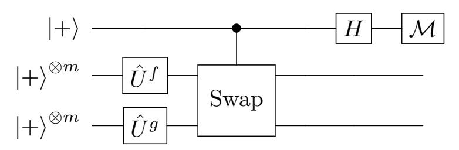

Let  $|\Phi\rangle = 2^{-m/2} \sum_{x} |x\rangle$  and  $|\phi_{\mathcal{M}}\rangle = \sum_{x} |\mathcal{M}(x)\rangle$ ,  $\mathcal{M} \in \{f,g\}$ , where the sums are over all  $x \in \{0,1\}^m$ . Then, up to normalization, the quantum circuit above implements the following:

<span id="page-39-0"></span>
$$|+\rangle|\Phi\rangle|\Phi\rangle \stackrel{I\otimes\hat{U}^f\otimes\hat{U}^g}{\longmapsto} |+\rangle|\phi_f\rangle|\phi_g\rangle$$

$$\stackrel{\mathrm{cSwap}}{\mapsto} |0\rangle|\phi_f\rangle|\phi_g\rangle + |1\rangle|\phi_g\rangle|\phi_f\rangle$$

$$\stackrel{H\otimes I}{\mapsto} |0\rangle\left(|\phi_f\rangle|\phi_g\rangle + |\phi_g\rangle|\phi_f\rangle\right) + |1\rangle\left(|\phi_f\rangle|\phi_g\rangle - |\phi_g\rangle|\phi_f\rangle\right)$$

If the ranges of f and g are equal, then a measurement of the top qubit in the computational basis is guaranteed to yield 0. If the ranges are disjoint, then the measurement yields 0 or 1 with probability  $\frac{1}{2}$ .

In order to apply the SetEquality problem to encryption schemes, we define constructions for f and g that use a random seed s.

{40}------------------------------------------------

**Definition 38.** Let  $\sigma_{s_1}, \sigma'_{s_2} : \{0,1\}^m \to \{0,1\}^m$  be qPRPs with seed  $s_1, s_2$ . Let  $J_{s_3}, J_{s_4}$  be a pseudorandom sparse injection built from a qPRP, i.e., for some qPRP  $\tilde{J}_{s_3}, \tilde{J}_{s_4} : \{0,1\}^n \to \{0,1\}^n$ , and any  $x \in \{0,1\}^m$  with n > m, define  $J_{s_3}(x) := \tilde{J}_{s_3}(x||0^{n-m})$  and  $J_{s_4}(x) := \tilde{J}_{s_4}(x||0^{n-m})$ . We can then define  $F_{0,s_1,s_2,s_3}, G_{0,s_1,s_2,s_3} : \{0,1\}^m \to \{0,1\}^n$  to be a pair of pseudorandom sparse injections with equal range:

$$F_{0,s_1,s_3} := J_{s_3} \circ \sigma_{s_1}, \qquad G_{0,s_2,s_4} := J_{s_4} \circ \sigma'_{s_2}.$$

Let  $\tau_{s_5}, \tau_{s_6}: \{0,1\}^n \to \{0,1\}^n$  be a qPRP with seed  $s_5, s_6$ . Let  $\tilde{K}_{s_7}, \tilde{K}'_{s_8}: \{0,1\}^m \to \{0,1\}^{n-1}$  be a pair of pseudorandom sparse injections, and define  $K_{s_7}:=0||\tilde{K}_{s_7}, K'_{s_8}:=1||\tilde{K}'_{s_8}$ . We can then define  $F_{1,s'}, G_{1,s'}: \{0,1\}^m \to \{0,1\}^n$  (where  $s'=(s_1,s_2,s_5,s_6,s_7,s_8)$ ) to be a pair of pseudorandom sparse injections with disjoint ranges:

$$F_{1,s_1,s_5,s_7} := \tau_{s_5} \circ K_{s_7} \circ \sigma_{s_1}, \qquad G_{1,s_2,s_6,s_8} := \tau_{s_6} \circ K'_{s_8} \circ \sigma'_{s_2}.$$

Let  $s = (s_1, s_2, s_3, s_4, s_5, s_6, s_7, s_8)$ . Note that  $F_{b,s}$  and  $G_{b,s}$  are decryptable using b, s.

<span id="page-40-0"></span>**Theorem 39.** If there exists a quantum secure one-way function then learn(\*, ST)-chall $(1, ST, ror) \implies learn(*, ER)$ -chall(1, CL, 1ct) in the quantum random oracle model. This shows that Panel 2  $\implies$  Panel 10.

*Proof.* Let  $H: \{0,1\}^h \to \{0,1\}^{|s|}$  be a random oracle. Let sPRP be a standard secure pseudorandom permutation with seed of length |s|. Let  $\gamma_k(m_1||m_2;r,j) := F_{k_j,H(r)}(m_1)||G_{k_j,H(r)}(m_2)$  where  $k_j$  is j-th bit of k. Consider the encryption function

$$\operatorname{Enc}_{k}(m_{1}||m_{2};r,j) := \gamma_{k}(qPRP_{r}(m_{1}||m_{2});r,j)||sPRP_{H(k)}(r)||j,$$
(1)

where  $qPRP_r$  is a quantum secure pseudorandom permutation with seed r. The encryption scheme above is decryptable as follows. First one can decrypt  $sPRP_{H(k)}$  using the random oracle H and the secret key k and then decrypt the other part of the ciphertext using j, r, the secret key k and the random oracle H. We show that the above encryption scheme is learn(\*, ST)-chall(1, ST, ror) secure. Let  $\mathcal{A}$  be an adversary that attacks in the sense of learn(\*, ST)-chall(1, ST, ror) IND-CPA. In the following, we abuse the notation and use  $\pi(qPRP_r(m_1))_1, \pi(qPRP_r(m_2))_2$  to indicate the first m bits and the second m bits of  $\pi(qPRP_r(m_1||m_2))$ , respectively. The challenge query submitted by the adversary is two registers  $Q_{in}$  and  $Q_{out}$  that may contain superposition of many  $|m_1, m_2\rangle_{Q_{in}}|y\rangle_{Q_{out}}$  basis states  $(Q_{in}Q_{out}:\sum_{m_1,m_2,y}\alpha_{m_1,m_2,y}|m_1,m_2\rangle|y\rangle)$ . For simplicity, we only show one of the computational basis states in the presentation of the games and with linearity of  $U_{\text{Enc}}$  it will be similar for the rest.

Game 0: learn(\*, ST)-chall(\*, ST, ror) IND-CPA
$$\begin{cases}
k \stackrel{\$}{\leftarrow} \{0,1\}^h, b \stackrel{\$}{\leftarrow} \{0,1\}, \pi \stackrel{\$}{\leftarrow} (\{0,1\}^{2m+1} \to \{0,1\}^{2m+1}), r \stackrel{\$}{\leftarrow} \{0,1\}^t, j \stackrel{\$}{\leftarrow} \{1, \dots, n\}, \\
|m_1, m_2\rangle|y\rangle \leftarrow \mathcal{A}^{H, \text{Enc}}(), \\
c := |m_1, m_2\rangle|y \oplus (F_{k_j, H(r)}(\pi^b(qPRP_r(m_1))_1), G_{k_j, H(r)}(\pi^b(qPRP_r(m_2))_2, sPRP_{H(k)}(r), j))\rangle \\
b' \leftarrow \mathcal{A}^{H, \text{Enc}}(c), \\
\mathbf{return} \ [b = b'] \ .
\end{cases}$$

Let  $\{r, r_2, \dots, r_q\}$  is the set of all randomness used in the learning queries and the challenge query in  $\gamma$  part of encryption. In the following game we replace  $H(k), H(r), H(r_2), \dots, H(r_q)$  with random values in the learning queries and challenge queries. We call this Game 1 and in the presentation below we only show the replacement in the challenge query. The same replacement will occur in all learning queries.

Game 1:

$$\begin{cases} k \overset{\$}{\leftarrow} \{0,1\}^h, b \overset{\$}{\leftarrow} \{0,1\}, \pi \overset{\$}{\leftarrow} (\{0,1\}^{2m+1} \to \{0,1\}^{2m+1}), r \overset{\$}{\leftarrow} \{0,1\}^t, j \overset{\$}{\leftarrow} \{1,\cdots,n\}, r^*, k^* \overset{\$}{\leftarrow} \{0,1\}^{|s|} \\ |m_1, m_2\rangle |y\rangle \leftarrow \mathcal{A}^{H, \text{Enc}}(), \\ c := |m_1, m_2\rangle |y \oplus (F_{k_j, r^*}(\pi^b(qPRP_r(m_1))_1), G_{k_j, r^*}(\pi^b(qPRP_r(m_2))_2, sPRP_{k^*}(r), j))\rangle \\ b' \leftarrow \mathcal{A}^{H, \text{Enc}}(c), \\ \textbf{return} \ [b = b'] \ . \end{cases}$$

In order to show that Game 0 and Game 1 are indistinguishable, we use Theorem 3 in [AHU19]. Let q be the total number of queries to the random oracle H. By Theorem 3 in [AHU19], there exists a polynomial time adversary  $\mathcal{B}$  that returns an output x such that

$$|\Pr[1 \leftarrow Game\ 0] - \Pr[1 \leftarrow Game\ 1]| \le \sqrt{q\Pr[x \in \{r, r_2, \cdots, r_q, k\} : Game\ 2]}$$

{41}------------------------------------------------

where Game 2 is defined as below (with randomness  $r^*, r_2^*, \dots, r_q^*$  and random key  $k^*$ ):

#### Game 2:

```
\begin{cases} k \overset{\$}{\leftarrow} \{0,1\}^h, b \overset{\$}{\leftarrow} \{0,1\}, \pi \overset{\$}{\leftarrow} (\{0,1\}^{2m+1} \to \{0,1\}^{2m+1}), r \overset{\$}{\leftarrow} \{0,1\}^t, j \overset{\$}{\leftarrow} \{1,\cdots,n\}, r^*, k^* \overset{\$}{\leftarrow} \{0,1\}^{|s|} \\ |m_1, m_2\rangle |y\rangle \leftarrow \mathcal{A}^{H,\operatorname{Enc}}(), \\ c := |m_1, m_2\rangle |y \oplus (F_{k_j,r^*}(\pi^b(qPRP_r(m_1))_1), G_{k_j,r^*}(\pi^b(qPRP_r(m_2))_2, sPRP_{k^*}(r), j))\rangle \\ b' \leftarrow \mathcal{A}^{H,\operatorname{Enc}}(c), \\ x \leftarrow \mathcal{B}^{H,\operatorname{Enc}}(c). \end{cases}
```

Let  $F_0^*$  and  $G_0^*$  be random injection functions with equal ranges. Let  $F_1^*$  and  $G_1^*$  be random injection functions with disjoint ranges. Note that since  $r^*$  is a fresh randomness by construction of  $F_{k_j,r^*}$  and  $G_{k_j,r^*}$  in Definition 38 they are indistinguishable from  $F_0^*$  and  $G_0^*$  when  $k_j = 0$  and they are indistinguishable from  $F_1^*$  and  $G_1^*$  when  $k_j = 1$ . Next, we replace  $F_{k_j,r^*}$  and  $G_{k_j,r^*}$  with  $F_1^*$  and  $G_1^*$  respectively in the challenge query in Game 2. Note that the same argument holds for the learning queries and we replace all  $F_{k_j,r_i^*}$  and  $G_{k_j,r_i^*}$  with independent random injective functions  $F_1^{(i)}$  and  $G_1^{(i)}$  with disjoint ranges. Let call the modified game Game 2a. Note that two games are indistinguishable because the set-equality problem is hard for ST-type queries by Lemma 36.

#### Game 2a:

```
\begin{cases} k \stackrel{\$}{\leftarrow} \{0,1\}^h, b \stackrel{\$}{\leftarrow} \{0,1\}, \pi \stackrel{\$}{\leftarrow} (\{0,1\}^{2m+1} \to \{0,1\}^{2m+1}), r \stackrel{\$}{\leftarrow} \{0,1\}^t, j \stackrel{\$}{\leftarrow} \{1,\cdots,n\}, r^*, k^* \stackrel{\$}{\leftarrow} \{0,1\}^{|s|} \\ |m_1, m_2\rangle |y\rangle \leftarrow \mathcal{A}^{H,\operatorname{Enc}}(), \\ c := |m_1, m_2\rangle |y \oplus (F_1^*(\pi^b(qPRP_r(m_1))_1), G_1^*(\pi^b(qPRP_r(m_2))_2, sPRP_{k^*}(r), j))\rangle \\ b' \leftarrow \mathcal{A}^{H,\operatorname{Enc}}(c), \\ x \leftarrow \mathcal{B}^{H,\operatorname{Enc}}(c). \end{cases}
```

Since in each query a fresh randomness will be encrypted by  $sPRP_{k^*}$ , we can replace  $sPRP_{k^*}(randomness)$  with random values in Game 2b. Next, in Game 2c we can replace qPRP with a independent random permutation in each query because the seed of qPRP is chosen independently at random in each query and it is not used elsewhere in Game 2b. It is clear that the success probability of Game 2c is  $(q+1)/2^h$  because  $k, r, r_2, \dots, r_q$  have not been used in Game 2c. Now we show that the success probability in Game 1 is 1/2 + neg. We can do similar modification presented above to define Game 1a. So in each query, two random injective functions with disjoint ranges will be used. Next we define Game 1b in which we replace  $sPRP_{k^*}(r)$  with a random value  $\alpha^*$  in the challenge query. This can be done since r is a fresh randomness and sPRP is a standard secure pseudorandom permutation. Finally, we replace  $qPRP_r$  with a random permutation  $\pi'$  in the challenge query in Game 1c. This can be done because r is a fresh randomness that has been used only as seed of qRPR in Game 1b.

#### $Game\ 1c:$

```
\begin{cases} k \stackrel{\$}{\leftarrow} \{0,1\}^h, b \stackrel{\$}{\leftarrow} \{0,1\}, \pi \stackrel{\$}{\leftarrow} (\{0,1\}^{2m+1} \to \{0,1\}^{2m+1}), r \stackrel{\$}{\leftarrow} \{0,1\}^t, j \stackrel{\$}{\leftarrow} \{1,\cdots,n\}, r^*, k^* \stackrel{\$}{\leftarrow} \{0,1\}^{|s|} \\ |m_1, m_2\rangle |y\rangle \leftarrow \mathcal{A}^{H, \text{Enc}}(), \\ c := |m_1, m_2\rangle |y \oplus (F_1^*(\pi^b(\pi'(m_1))_1), G_1^*(\pi^b(\pi'(m_2))_2, \alpha^*)) \\ b' \leftarrow \mathcal{A}^{H, \text{Enc}}(c), \\ \mathbf{return} \ [b = b'] \ . \end{cases}
```

It is clear that the success probability of Game 1c is 1/2 + neg. Overall, we showed that the success probability of Game 1 is 1/2 + neg and this finishes the security proof.

Now we show that Enc can be broken in learn(\*, ER)-chall(1, CL, 1ct). Let  $\mathcal{A}'^{\text{Enc}}$  denote the adversary that plays the learn(\*, ER)-chall(1, CL, 1ct)-IND-CPA game. By Lemma 37, it is possible for  $\mathcal{A}'^{\text{Enc}}$  to perform a learn(\*, ER)-learning-query for  $m \leftarrow |+\rangle^{\otimes m}|+\rangle^{\otimes m}$  and conduct a swap-test to determine  $k_j$  with high probability for a random j (Note that j is the last part of the ciphertext and is known to the adversary). The procedure is repeated polynomially many times until  $\mathcal{A}'^{\text{Enc}}$  has enough information about the key k to guess it with sufficiently high probability. Finally,  $\mathcal{A}'^{\text{Enc}}$  can choose any two classical messages  $m_0, m_1$  for challenge query, and use the private key k to decrypt the result and determine the challenge bit b.

#### 7.5 Separations by other arguments

<span id="page-41-0"></span>**Theorem 40.** On the existence of a quantum secure one-way function, the following separation holds:

{42}------------------------------------------------

1. 
$$\operatorname{learn}(*, ST)$$
-chall $(*, CL, 1ct)$ ,  $\operatorname{learn}(*, ER)$ -chall $(*, CL, 1ct) \implies \operatorname{learn}(*, CL)$ -chall $(1, EM, 2ct)$   $P6, P10 \implies P7$ 

Proof. Consider

$$\operatorname{Enc}_k(m;r) = r||\operatorname{PRF}_k(r) \oplus m \text{ for } m,r \in \{0,1\}^n$$

where PRF is a standard secure pseudorandom function. The security in learn(\*, ST)-chall(\*, CL, 1ct) and learn(\*, ER)-chall(\*, ER)-chall(\*, ER)-chall(\*, ER)-chall(\*, ER). The attack is described by the following quantum circuit. For simplicity, we omit the wires corresponding to the r-parts of two ciphertexts.

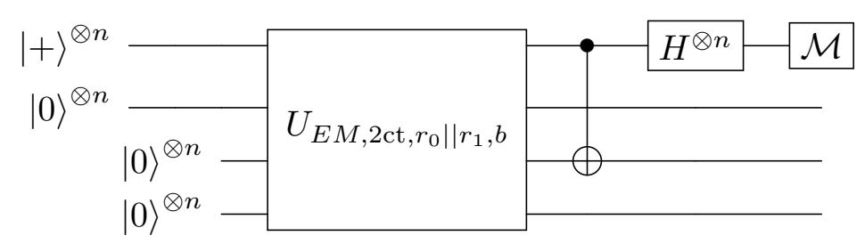

When b = 0, the measurement returns 0 with probability 1 and it outputs 0 only with negligible probability when b = 1.

<span id="page-42-1"></span>**Theorem 41.** On the existence of a quantum secure one-way function, learn(\*, ST)-chall(\*, CL, 1ct)  $\implies$  learn(\*, CL)-chall(1, EM, 1ct). This shows that  $P6 \implies P13$ .

Proof. Consider

$$\operatorname{Enc}_k(m;r) = r||\operatorname{PRP}_k(r) \oplus m \text{ for } m,r \in \{0,1\}^n$$

where PRP is a standard secure pseudorandom permutation. The security in learn(\*, ST)-chall(\*, CL, 1ct) and learn(\*, ER)-chall(\*, ER)-chall(\*, ER)-chall(\*, ER)-chall(\*, ER)-chall(\*, ER)-chall(\*, ER)-chall(\*, ER)-chall(\*, ER)-chall(\*, ER)-chall(\*, ER)-chall(\*, ER)-chall(\*, ER)-chall(\*, ER)-chall(\*, ER)-chall(\*, ER)-chall(\*, ER)-chall(\*, ER)-chall(\*, ER)-chall(\*, ER)-chall(\*, ER)-chall(\*, ER)-chall(\*, ER)-chall(\*, ER)-chall(\*, ER)-chall(\*, ER)-chall(\*, ER)-chall(\*, ER)-chall(\*, ER)-chall(\*, ER)-chall(\*, ER)-chall(\*, ER)-chall(\*, ER)-chall(\*, ER)-chall(\*, ER)-chall(\*, ER)-chall(\*, ER)-chall(\*, ER)-chall(\*, ER)-chall(\*, ER)-chall(\*, ER)-chall(\*, ER)-chall(\*, ER)-chall(\*, ER)-chall(\*, ER)-chall(\*, ER)-chall(\*, ER)-chall(\*, ER)-chall(\*, ER)-chall(\*, ER)-chall(\*, ER)-chall(\*, ER)-chall(\*, ER)-chall(\*, ER)-chall(\*, ER)-chall(\*, ER)-chall(\*, ER)-chall(\*, ER)-chall(\*, ER)-chall(\*, ER)-chall(\*, ER)-chall(\*, ER)-chall(\*, ER)-chall(\*, ER)-chall(\*, ER)-chall(\*, ER)-chall(\*, ER)-chall(\*, ER)-chall(\*, ER)-chall(\*, ER)-chall(\*, ER)-chall(\*, ER)-chall(\*, ER)-chall(\*, ER)-chall(\*, ER)-chall(\*, ER)-chall(\*, ER)-chall(\*, ER)-chall(\*, ER)-chall(\*, ER)-chall(\*, ER)-chall(\*, ER)-chall(\*, ER)-chall(\*, ER)-chall(\*, ER)-chall(\*, ER)-chall(\*, ER)-chall(\*, ER)-chall(\*, ER)-chall(\*, ER)-chall(\*, ER)-chall(\*, ER)-chall(\*, ER)-chall(\*, ER)-chall(\*, ER)-chall(\*, ER)-chall(\*, ER)-chall(\*, ER)-chall(\*, ER)-chall(\*, ER)-chall(\*, ER)-chall(\*, ER)-chall(\*, ER)-chall(\*, ER)-chall(\*, ER)-chall(\*, ER)-chall(\*, ER)-chall(\*, ER)-chall(\*, ER)-chall(\*, ER)-chall(\*, ER)-chall(\*, ER)-chall(\*, ER)-chall(\*, ER)-chall(\*, ER)-chall(\*, ER)-chall(\*, ER)-chall(\*, ER)-chall(\*, ER)-chall(\*, ER)-chall(\*, ER)-chall(\*, ER)-chall(\*, ER)-chall(\*, ER)-chall(\*, ER)-chall(\*, ER)-chall(\*, ER)-chall(\*, ER)-chall(\*, ER

<span id="page-42-0"></span>**Theorem 42.** On the existence of a quantum secure one-way function, learn(\*, ER)-chall(1, ER, 1ct)  $\implies$  learn(\*, ER)-chall(1, ER, 1ct)  $\implies$  ER P12.

*Proof.* Let qPRP and qPRP' be two quantum secure pseudorandom permutations with input/output  $\{0,1\}^{2n}$ . Let sPRP be a standard secure pseudorandom permutation. For  $m_1$  and  $m_2$  of length n-bits, we define Enc as following:

$$\operatorname{Enc}_k(m_1, m_2; r_1, r_2) = qPRP_{r_1}(0^n || m_1) || qPRP_{r_2}(0^n || m_2) || sPRP_k(r_1, r_2).$$

First, we prove that Enc is learn(\*, ER)-chall(1, ER, 1ct) secure. Note that the adversary does not have superposition access to sPRP since the randomness are classical and are chosen by the challenger. Therefore, in each query we can replace  $sPRP_k(r_1, r_2)$  with a random value because  $r_1$  and  $r_2$  are fresh randomness and sPRP is a standard secure pseudorandom permutation.

Then in each query we can replace  $qPRP_{r_1}$  and  $qPRP_{r_2}$  with random permutations  $\pi_1$  and  $\pi_2$ , respectively. Now we can measure the input register by Lemma 9 and the security follows from learn(\*, CL) -chall(1, CL, 1ct) security of Enc.

Now we show that Enc is not secure with respect to learn(\*, CL)-chall(1, ST, ror) notion. Let  $Q_{in1}$  and  $Q_{in2}$  be input registers corresponding to first n bits and second n bits of message, respectively. Similarly,  $Q_{out1}$  and  $Q_{out2}$  be the output registers. The adversary can query

$$Q_{in1}Q_{in2}Q_{out1}Q_{out2} := |+\rangle^{\otimes n}|0\rangle^{\otimes n}|+\rangle^{\otimes 2n}|0\rangle^{\otimes 2n}$$

in the challenge query. After receiving the answer, it applies the Hadamard operator to  $Q_{in1}$  then measures the register in the computational basis. We draw the circuit to attack Enc in the following. For simplicity, we omit the wires corresponding to the last parts of two ciphertexts.

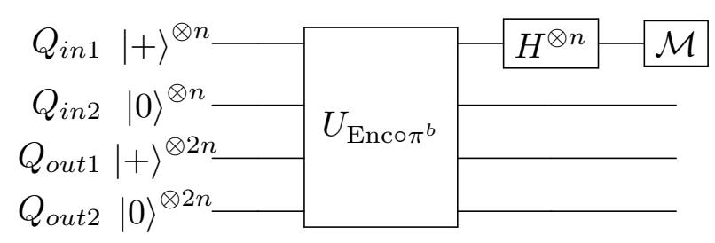

When b=0, since no permutation is applied and Enc works component-wise, the output of the circuit right before applying the Hadamard operators is  $|+\rangle^{\otimes n}|0\rangle^{\otimes n}|+\rangle^{\otimes 2n}|qPRP_{r_2}(0^n||0^n)\rangle^{\otimes 2n}$ . Therefore, the measurement returns 0 with probability 1. On the other hand, when b=1 a permutation will be applied to both input registers  $Q_{in1}, Q_{in2}$  and it shuffles the input. Therefore  $Q_{in1}$  register will be entangled with output registers. In this case, the measurement returns 0 with negligible probability.

{43}------------------------------------------------

Note that a block cipher mode of operation uses a block cipher several times to encrypt a message of longer size. In the following we show that the attack presented above can be applied to a large class of modes of operation and show their insecurity with respect to learn(\*, CL)-chall(1, ST, ror) notion. This can be extended to authentication encryption schemes and tweakable block ciphers.

<span id="page-43-1"></span>Corollary 43. We call a mode of operation natural if it has the following property: For some message length  $\ell$ , there exists an input block i and an output block j such that output block j does not depend on i, but, ranging over all possible input messages, output block j can take any value. (Note that this includes many modes of operation. E.g., CBC mode satisfies this with i being the second and j being the first block.)

No natural mode of operation is secure in the sense of learn (\*, CL)-chall (1, ST, ror) notion.

Proof. Let  $M_k$  denotes the register for the k-th input block. Let  $C_k$  denotes the register for the k-th output block. The adversary inserts  $|+\rangle$  in  $M_i$  and  $|0\rangle$  for the rest of the input registers. And for the output registers, the adversary puts  $|0\rangle$  in the j-th output register and  $|+\rangle$  elsewhere. When b=0 (no permutation is applied), the  $M_i$  register will be  $|+\rangle$  (and  $C_j$  register will be a classical value). Therefore, applying the Hadamard operator to the register  $M_i$  followed with a computational basis measurement will return 0 with probability 1. On the other hand, when b=1 a random permutation will be applied to the input registers and shuffles the input. Now  $M_i$  register will be entangled with  $C_j$  register. Therefore, the measurement returns 0 with negligible probability.

# <span id="page-43-0"></span>8 Encryption secure in all notions

In this section we propose an encryption scheme that is secure for all security notions described in this paper. From Figure 1, Panel 1 and Panel 2 imply all other panels. Therefore it is sufficient to construct an encryption scheme that is secure in a setting where there are no learning queries, and where the challenge queries are either  $\mathfrak{c}_1 = \operatorname{chall}(*, ER, 1\operatorname{ct})$  or  $\mathfrak{c}_2 = \operatorname{chall}(*, ST, \operatorname{ror})$ . Consider the encryption scheme Enc as  $\operatorname{Enc}_k(m; r, r') = qPRP_r(r'||m)||sPRP_k(r)$  for  $r', m \in \{0, 1\}^n$ . In order to decrypt the ciphertext, first we decrypt  $sPRP_k(r)$  using the secret key k and obtain r then we can obtain the message m using r. Now we show that Enc is  $\mathfrak{c}_1 = \operatorname{chall}(*, ER, 1\operatorname{ct})$  and  $\mathfrak{c}_2 = \operatorname{chall}(*, ST, \operatorname{ror})$  secure in the following:

**Theorem 44.** The encryption scheme  $\operatorname{Enc}_k(m;r,r') = qPRP_r(r'||m)||sPRP_k(r)$  presented above is  $\operatorname{chall}(*,ER,\operatorname{1ct})$  and  $\operatorname{chall}(*,ST,\operatorname{ror})$  secure.

*Proof.* chall(\*, ER, 1ct) **security:** In each query we can replace  $sPRP_k(r)$  with a random bit string because r is a fresh randomness and sPRP is a standard secure pseudorandom function. Now we can replace  $qPRP_r$  with a random permutation  $\pi'$  in each query and use Lemma 9 to measure the input register (with  $f := \pi'(r'||\cdot)$ ). This collapses to the security against chall(\*, CL, 1ct) queries that is trivial.

chall(\*, ST, ror) **security:** In each query we can replace  $sPRP_k(r)$  with a random bit string because r is a fresh randomness and sPRP is a standard secure pseudorandom function. Then we can replace  $qPRP_r$  with a random permutation  $\pi'$  in each query. The security is trivial because for a random r',  $f_1(m) = \pi'(r'||m)$  (when the challenge bit is 0) and  $f_2(m) = \pi'(r'||\pi(m))$  (when the challenge bit is 1) have the same distribution.

#### 9 Discussion on open questions

From Table 1, 41 cases are left as open questions. In Figure 1, we indicate six non-implications (with red dashed arrows) that if they hold, all the open questions will be resolved by the transitivity. First, we verify this claim and then argue why these six non-implications are more likely to be true.

Assuming  $P2 \implies P9$ , since  $P2 \implies P5$ , P7, P12, P13, we can conclude that P5, P7, P12,  $P13 \implies P9$ .

Assuming  $P3 \implies P11$ , since  $P3 \implies P7, P8, P9, P13$ , we can obtain  $P7, P8, P9, P13 \implies P11$ . And since  $P1, P4, P5, P6, P10 \implies P11$ , we can conclude  $P3 \implies P1, P4, P5, P6, P10$ .

Assuming  $P4 \implies P6$ , since P4 implies P5, P7, P9, P10, P11, P13, we can conclude that P5, P7, P9, P10, P11, P13 does not imply P6.

Assuming  $P8 \implies P7$ , since  $P1, P3, P4, P5 \implies P7$ , then  $P8 \implies P1, P3, P4, P5$ . And since  $P8 \implies P13$ , then  $P13 \implies P7$ .

{44}------------------------------------------------

Assuming P12 =6⇒ P7, since P2, P5 =⇒ P7, then P12 =6⇒ P2, P5.

Assuming P12 =6⇒ P11, since P6 =⇒ P11, then P12 =6⇒ P6. And since P12 =⇒ P13, we can conclude P13 =6⇒ P11.

This resolves all the open questions corresponding to P1, P2, P3. For P4, we need to nd the question mark P9?P4. Since P9 =6⇒ P11 and P4 =⇒ P11 then P9 =6⇒ P4. This resolves all the open questions corresponding to P4. Open cases related to P5 are P7, P9, P13?P5. Since P7, P9, P13 =6⇒ P11 and P5 =⇒ P11 then P7, P9, P13 =6⇒ P5. This resolves all the open questions corresponding to P5. It has been left to conclude weather P8 implies P6 or it does not. Since P8 =6⇒ P11 and P6 =⇒ P11, then P8 =6⇒ P6. This resolves all the open questions corresponding to P6. For P7, we need to nd P9?P7. Since P8 =6⇒ P7 and P8 =⇒ P9, then P9 =6⇒ P7. This resolves all the open questions corresponding to P7. For P8, we need to resolve P8?P10, P11. Since P3 =⇒ P8 and P3 =6⇒ P10, P11, we can obtain P8 =6⇒ P10, P11. This resolves all the open questions corresponding to P8. Still P9?P10 is open. Since P8 =⇒ P9 and P8 =6⇒ P10, we can obtain P9 =6⇒ P10. This resolves all the open questions corresponding to P9. There is no unresolved case for P10, P11, P12, P13 and P14. Therefore, if the non-implications indicated with red dashed arrows in Figure [1](#page-21-0) hold, all the open questions will be solved.

Now we discuss why it is more likely that these non-implications hold.

- 1. (P2?P9). These notions have classical learning queries and one challenge query of type (ER,ror) and (ST,ror) respectively. To show the implication, the reduction adversary needs to simulate a ST challenge query with an ER challenge query that is highly non trivial since ER query type does not return the input register but the adversary that attacks (ST,ror) expects to receive back the input register. Here, the reduction adversary can not copy the quantum input register itself due to no-cloning. So the non-implication is more likely to happen.
- 2. (P8?P7). These notions have classical learning queries and one challenge query of type (ER, 1ct) and (EM , 2ct) respectively. The same argument as above holds for this case too.
- 3. (P4?P6). To show the implication, we need to simulate ST queries with ER queries that is non-trivial due to no-cloning theorem (as discussed above as well).
- 4. (P3?P11). The notions in P11 have many quantum learning queries but P3, have classical learning queries and only one quantum challenge query. It is unlikely that a reduction adversary can simulate many quantum queries with only one quantum query.
- 5. (P12?P11). The notions in P11 have many quantum learning queries but P12 have classical learning queries and only one quantum challenge query. It is unlikely that a reduction adversary can simulate many quantum queries with only one quantum query similar to the above.
- 6. (P12?P7). These notions have classical learning queries and one challenge query of type (ST,ror) and (EM , 2ct), respectively. Here, the adversary that attacks (EM , 2ct) expects to receive back four quantum registers that are the evaluation of the encryption oracle on two quantum input registers, however, one (ST,ror) query only evaluates the encryption oracle on one quantum input register. Here, the reduction adversary can not simulate two quantum evaluations of the encryption oracle with only one quantum access to the encryption oracle.

# References

- <span id="page-44-3"></span>AHU19. Andris Ambainis, Mike Hamburg, and Dominique Unruh. Quantum security proofs using semiclassical oracles. In Alexandra Boldyreva and Daniele Micciancio, editors, Advances in Cryptology - CRYPTO 2019 - 39th Annual International Cryptology Conference, Santa Barbara, CA, USA, August 18-22, 2019, Proceedings, Part II, volume 11693 of Lecture Notes in Computer Science, pages 269295. Springer, 2019.
- <span id="page-44-0"></span>AMRS20. Gorjan Alagic, Christian Majenz, Alexander Russell, and Fang Song. Quantum-access-secure message authentication via blind-unforgeability. In Anne Canteaut and Yuval Ishai, editors, Advances in Cryptology - EUROCRYPT 2020 - 39th Annual International Conference on the Theory and Applications of Cryptographic Techniques, Zagreb, Croatia, May 10-14, 2020, Proceedings, Part III, volume 12107 of Lecture Notes in Computer Science, pages 788817. Springer, 2020.
- <span id="page-44-2"></span>ATTU16. Mayuresh Vivekanand Anand, Ehsan Ebrahimi Targhi, Gelo Noel Tabia, and Dominique Unruh. Post-quantum security of the cbc, cfb, ofb, ctr, and XTS modes of operation. In Tsuyoshi Takagi, editor, Post-Quantum Cryptography - 7th International Workshop, PQCrypto 2016, Fukuoka, Japan, February 24-26, 2016, Proceedings, volume 9606 of Lecture Notes in Computer Science, pages 4463. Springer, 2016.
- <span id="page-44-1"></span>BDJR97. Mihir Bellare, Anand Desai, E. Jokipii, and Phillip Rogaway. A concrete security treatment of symmetric encryption. In 38th Annual Symposium on Foundations of Computer Science, FOCS '97, Miami Beach, Florida, USA, October 19-22, 1997, pages 394403. IEEE Computer Society, 1997.

{45}------------------------------------------------

- <span id="page-45-7"></span>BJ15. Anne Broadbent and Stacey Jeery. Quantum homomorphic encryption for circuits of low t-gate complexity. In Rosario Gennaro and Matthew Robshaw, editors, Advances in Cryptology - CRYPTO 2015 - 35th Annual Cryptology Conference, Santa Barbara, CA, USA, August 16-20, 2015, Proceedings, Part II, volume 9216 of Lecture Notes in Computer Science, pages 609629. Springer, 2015.
- <span id="page-45-3"></span>BZ13a. Dan Boneh and Mark Zhandry. Quantum-secure message authentication codes. In Thomas Johansson and Phong Q. Nguyen, editors, Advances in Cryptology - EUROCRYPT 2013, 32nd Annual International Conference on the Theory and Applications of Cryptographic Techniques, Athens, Greece, May 26-30, 2013. Proceedings, volume 7881 of Lecture Notes in Computer Science, pages 592608. Springer, 2013.
- <span id="page-45-0"></span>BZ13b. Dan Boneh and Mark Zhandry. Secure signatures and chosen ciphertext security in a quantum computing world. In Ran Canetti and Juan A. Garay, editors, Advances in Cryptology - CRYPTO 2013 - 33rd Annual Cryptology Conference, Santa Barbara, CA, USA, August 18-22, 2013. Proceedings, Part II, volume 8043 of Lecture Notes in Computer Science, pages 361379. Springer, 2013.
- <span id="page-45-2"></span>CEV20. Céline Chevalier, Ehsan Ebrahimi, and Quoc Huy Vu. On the security notions for encryption in a quantum world. IACR Cryptology ePrint Archive, 2020:237, 2020.
- <span id="page-45-10"></span>DFNS13. Ivan Damgård, Jakob Funder, Jesper Buus Nielsen, and Louis Salvail. Superposition attacks on cryptographic protocols. In Carles Padró, editor, Information Theoretic Security - 7th International Conference, ICITS 2013, Singapore, November 28-30, 2013, Proceedings, volume 8317 of Lecture Notes in Computer Science, pages 142161. Springer, 2013.
- <span id="page-45-13"></span>ECKM20. Ehsan Ebrahimi, Céline Chevalier, Marc Kaplan, and Michele Minelli. Superposition attack on OT protocols. IACR Cryptol. ePrint Arch., 2020:798, 2020.
- <span id="page-45-1"></span>GHS16. Tommaso Gagliardoni, Andreas Hülsing, and Christian Schaner. Semantic security and indistinguishability in the quantum world. In Matthew Robshaw and Jonathan Katz, editors, Advances in Cryptology - CRYPTO 2016 - 36th Annual International Cryptology Conference, Santa Barbara, CA, USA, August 14-18, 2016, Proceedings, Part III, volume 9816 of Lecture Notes in Computer Science, pages 6089. Springer, 2016.
- <span id="page-45-14"></span>GKS20. Tommaso Gagliardoni, Juliane Krämer, and Patrick Struck. Quantum indistinguishability for public key encryption. IACR Cryptol. ePrint Arch., 2020:266, 2020.
- <span id="page-45-6"></span>KKVB02. Elham Kashe, Adrian Kent, Vlatko Vedral, and Konrad Banaszek. Comparison of quantum oracles. Phys. Rev. A, 65:050304, May 2002.
- <span id="page-45-11"></span>KLLN16. Marc Kaplan, Gaëtan Leurent, Anthony Leverrier, and María Naya-Plasencia. Breaking symmetric cryptosystems using quantum period finding. In Matthew Robshaw and Jonathan Katz, editors, Advances in Cryptology - CRYPTO 2016 - 36th Annual International Cryptology Conference, Santa Barbara, CA, USA, August 14-18, 2016, Proceedings, Part II, volume 9815 of Lecture Notes in Computer Science, pages 207237. Springer, 2016.
- <span id="page-45-8"></span>KM10. Hidenori Kuwakado and Masakatu Morii. Quantum distinguisher between the 3-round feistel cipher and the random permutation. In IEEE International Symposium on Information Theory, ISIT 2010, June 13-18, 2010, Austin, Texas, USA, Proceedings, pages 26822685. IEEE, 2010.
- <span id="page-45-9"></span>KM12. Hidenori Kuwakado and Masakatu Morii. Security on the quantum-type even-mansour cipher. In Proceedings of the International Symposium on Information Theory and its Applications, ISITA 2012, Honolulu, HI, USA, October 28-31, 2012, pages 312316. IEEE, 2012.
- <span id="page-45-12"></span>LSZ20. Qipeng Liu, Amit Sahai, and Mark Zhandry. Quantum immune one-time memories. IACR Cryptol. ePrint Arch., 2020:871, 2020.
- <span id="page-45-5"></span>MS16. Shahram Mossayebi and Rüdiger Schack. Concrete security against adversaries with quantum superposition access to encryption and decryption oracles. CoRR, abs/1609.03780, 2016.
- <span id="page-45-17"></span>NC16. Michael A. Nielsen and Isaac L. Chuang. Quantum Computation and Quantum Information (10th Anniversary edition). Cambridge University Press, 2016.
- <span id="page-45-19"></span>Shi02. Yaoyun Shi. Quantum lower bounds for the collision and the element distinctness problems. In The 43rd Annual IEEE Symposium on Foundations of Computer Science, 2002. Proceedings., pages 513519, 2002.
- <span id="page-45-18"></span>Sim97. Daniel R. Simon. On the power of quantum computation. SIAM J. Comput., 26(5):14741483, October 1997.
- <span id="page-45-16"></span>Unr12. Dominique Unruh. Quantum proofs of knowledge. In David Pointcheval and Thomas Johansson, editors, Advances in Cryptology - EUROCRYPT 2012 - 31st Annual International Conference on the Theory and Applications of Cryptographic Techniques, Cambridge, UK, April 15-19, 2012. Proceedings, volume 7237 of Lecture Notes in Computer Science, pages 135152. Springer, 2012.
- <span id="page-45-4"></span>Unr16. Dominique Unruh. Computationally binding quantum commitments. In Marc Fischlin and Jean-Sébastien Coron, editors, Advances in Cryptology - EUROCRYPT 2016 - 35th Annual International Conference on the Theory and Applications of Cryptographic Techniques, Vienna, Austria, May 8- 12, 2016, Proceedings, Part II, volume 9666 of Lecture Notes in Computer Science, pages 497527. Springer, 2016.
- <span id="page-45-15"></span>Wat09. John Watrous. Zero-knowledge against quantum attacks. SIAM J. Comput., 39(1):2558, 2009. Online available at [https://cs.uwaterloo.ca/~watrous/Papers/ZeroKnowledgeAgainstQuantum.pdf.](https://cs.uwaterloo.ca/~watrous/Papers/ZeroKnowledgeAgainstQuantum.pdf)

{46}------------------------------------------------

- <span id="page-46-0"></span>Zha15. Mark Zhandry. A note on the quantum collision and set equality problems. Quantum Information & Computation, 15(7&8):557567, 2015.
- <span id="page-46-1"></span>Zha16. Mark Zhandry. A note on quantum-secure prps. IACR Cryptology ePrint Archive, 2016:1076, 2016.