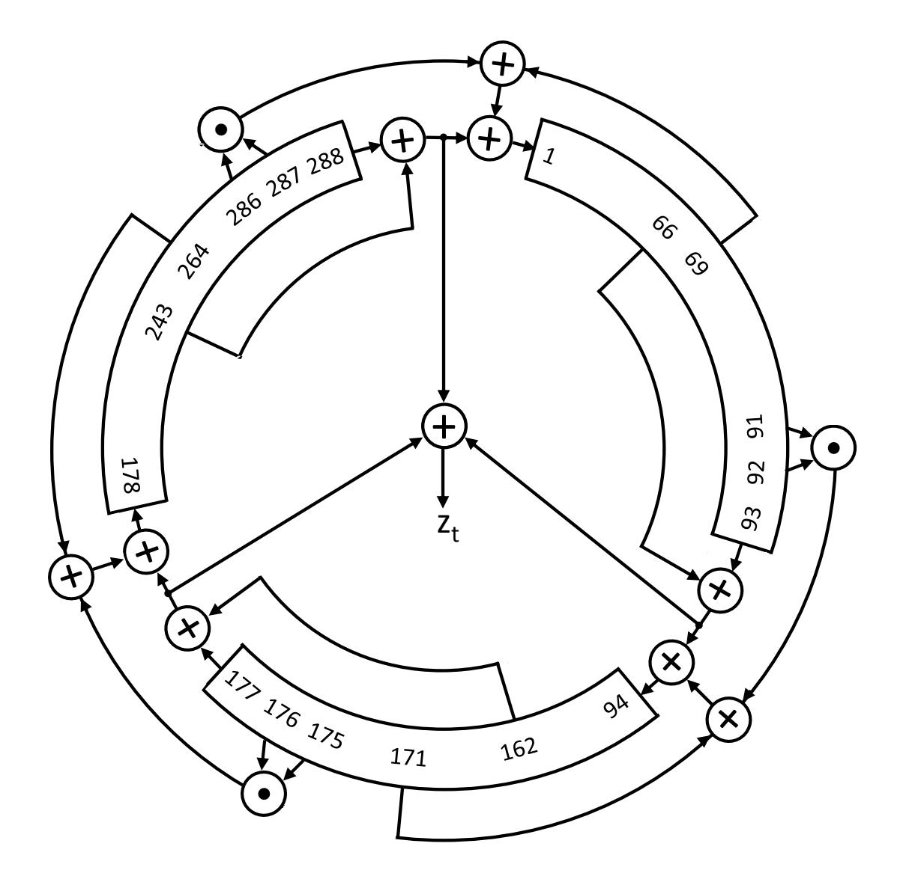
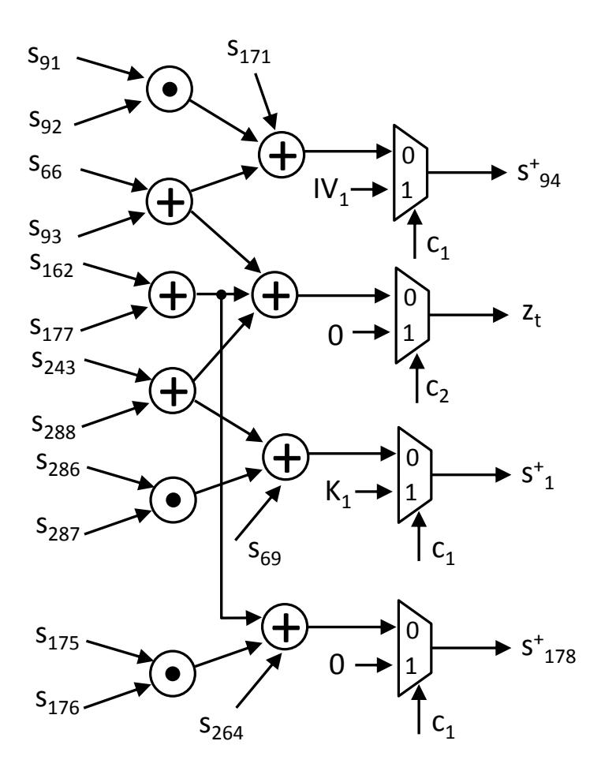
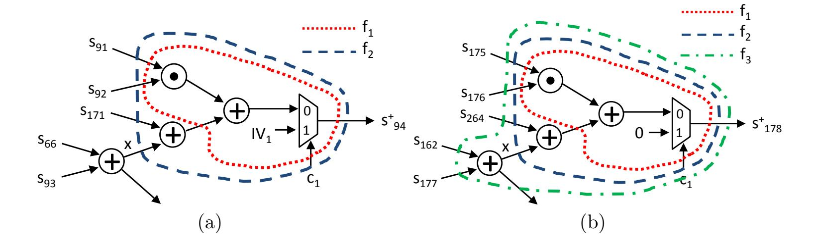

{0}------------------------------------------------

# **Bitstream Modification of Trivium**

### **How to Attack and How to Protect**

Kalle Ngo, Elena Dubrova and Michail Moraitis

Royal Institute of Technology (KTH), Electrum 229, 164 40 Kista, Sweden, [{kngo,dubrova,micmor}@kth.se](mailto:{kngo,dubrova,micmor}@kth.se)

**Abstract.** In this paper we present a bitstream modification attack on the Trivium stream cipher, an international standard under ISO/IEC 29192-3. By changing the content of three LUTs in the bitstream, we reduce the non-linear state updating function of Trivium to a linear one. This makes it possible to recover the key from 288 keystream bits using at most 2 <sup>19</sup>*.*<sup>41</sup> operations. We also propose a countermeasure against bitstream modification attacks which obfuscates the bitstream using dummy and camouflaged LUTs which look legitimate to the attacker. We present an algorithm for injecting dummy LUTs directly into the bitstream without causing any performance or power penalty.

**Keywords:** FPGA · reverse engineering · bitstream modification · fault injection · stream cipher · Trivium

# **1 Introduction**

This paper presents an attack on an FPGA implementation of Trivium stream cipher [\[1\]](#page-14-0). Trivium is one of the finalists of the eStream project in the hardware category [\[2\]](#page-14-1). It has been specified as an international standard under ISO/IEC 29192-3 [\[3\]](#page-14-2). Since the end of the project, Trivium has continuously attracted the attention of cryptanalysists [\[4,](#page-14-3) [5,](#page-14-4) [6,](#page-14-5) [7,](#page-14-6) [8,](#page-14-7) [9,](#page-14-8) [10\]](#page-14-9), but has not been broken yet.

Trivium belongs to the class of *binary additive stream ciphers*. A binary additive stream cipher generates a stream of pseudo-random symbols, called *the keystream*, using a secret key as a seed [\[11\]](#page-14-10). To encrypt, the keystream is added with the plaintext, typically by a bitwise XOR. To decrypt, the ciphertext is added with the keystream.

Stream ciphers encrypt plaintext symbols on-the-fly by applying a simple invertible transformation which typically takes less area to implement and less power to compute compared to the transformations used by block ciphers. The security of a stream cipher is based on the unpredictability of its keystream, rather than the complexity of its underlying transformation. As in the one time pad case, the same keystream should never be used more than once for encrypting different plaintexts. This implies that the same key should never be used more than once for initializing a stream cipher. To avoid performing resource-consuming key agreement protocols for every message, stream ciphers use an extra input parameter, called the *initialization vector (IV)*, as a seed. By combining different public IVs with the same key, different keystreams can be generated.

While using the same key for several messages saves resources, it also creates new opportunities for the attacker. Various attacks exploiting the correlation between keystream bits generated using the same key but different IVs have been demonstrated in the past, including known and chosen IV resynchronization attacks, differential attacks, and differential-linear attacks [\[12,](#page-14-11) [13,](#page-14-12) [14,](#page-15-0) [15,](#page-15-1) [16,](#page-15-2) [17,](#page-15-3) [18,](#page-15-4) [19\]](#page-15-5). To mitigate these attacks, modern stream ciphers use complex initialization algorithms which mix the key with the IV and

{1}------------------------------------------------

constants and add idle clock cycles to de-correlate the keystream from the key. Many of these algorithms, including Trivium, are considered secure from the point of view of the traditional cryptanalysis.

However, an algorithm that cannot be broken by the traditional cryptanalysis may still be vulnerable to an attack on its physical implementation. Implementations leak sidechannel information about the algorithm, such as the time taken, or the power consumed to perform a calculation. If an attacker has a physical access to the implementation, he/she can exploit this information. For example, the attacker can measure timing or power consumption of the device and analyze the measured data to extract the key. Alternatively, he/she can inject a fault which causes an exploitable error in the computation of the algorithm.

As we become more dependent on Internet-connected "smart" devices which perform cryptographic computations to protect their data, the threat of physical attacks is increasing. Many "smart" devices operate a within the physical reach of users who are financially motivated to attack the devices. Examples include an electric meter that encrypts its communications with a central server, a set-top box that is supposed to decode digital media content only for paying customers, or a wearable fitness tracker which an insurance company is using to monitor the user's activity to decide the cost of his/her individual health insurance. Since the value of information processed by low-end Internet of Things (IoT) devices is expected to increase in the future [\[20\]](#page-15-6), the incentives for attacks will increase as well. Therefore, it is important to understand the possibilities and limitations of physical attacks on IoT devices and design countermeasures suitable for their protection. Low-end devices often operate under severe constraints on energy, storage, computation and communication resources. Existing trusted hardware-based countermeasures, such as Apple's secure enclave which prevented the FBI from accessing an iPhone [\[21\]](#page-15-7) are only cost-efficient for higher-end devices and not acceptable for lower-end embedded devices. Software-based methods are usually limited in terms of the assurance they can provide.

In this paper, we focus on the SRAM-based FPGA bitstream modification attacks.

**Previous Work** Bitstream modification attacks require tools for reverse-engineering and fault injection. For SRAM-based FPGAs, there are many reverse engineering tools that can assist in the former task, including [\[22,](#page-15-8) [23,](#page-15-9) [24,](#page-15-10) [25,](#page-15-11) [26,](#page-15-12) [27,](#page-15-13) [28\]](#page-15-14). The latter problem has been addressed in [\[29,](#page-15-15) [30,](#page-16-0) [31,](#page-16-1) [32\]](#page-16-2).

Swierczynski, Fyrbiak, Koppe, and Paar [\[33\]](#page-16-3) were first to propose a fault attack on SRAM-based FPGA implementation of Advanced Encryption Standard (AES) in which all Look-Up Tables (LUTs) implementing the S-boxes are modified in the bitstream to weaken the algorithm. If the content these LUTs are changed to e.g. the constant 0, the key can be recovered by analyzing the ciphertext generated by the faulty AES.

In [\[34\]](#page-16-4), a similar approach was used to break SRAM-based FPGA implementation of the SNOW 3G stream cipher. The algorithm was weakened by modifying LUTs implementing the output part of the finite state machine of SNOW 3G. The modifications reduce the non-linear state updating function of SNOW 3G to a linear one. This, in turn, enables recovering the key from 512 bits of keystream generated by the faulty SNOW 3G. The authors proposed to explore the bitstream in a key-independent setting. This makes possible reducing the complexity of some bitstream search tasks from exponential to linear.

To the best of our knowledge, Trivium has not been attacked by bitstream modification until now. Other types of physical attacks on Trivium have been reported, including differential power analysis [\[35,](#page-16-5) [36\]](#page-16-6) and fault attacks [\[37,](#page-16-7) [38,](#page-16-8) [39,](#page-16-9) [40\]](#page-16-10).

**Our Contributions** A bitstream modification attack can be applied to any algorithm. We have chosen Trivium as a target because Trivium's design contains very few gates, the fewest of all encryption algorithms. For this reason, countermeasures against bitstream

{2}------------------------------------------------

modification attacks proposed in [\[33\]](#page-16-3) and [\[41\]](#page-16-11) are not sufficient for protecting Trivium. Both [\[33\]](#page-16-3) and [\[41\]](#page-16-11) recommend constraining FPGA technology mappers to generate a *k*-LUT cover with small LUTs, covering fewer gates (ideally one 2-input gate per LUT). For designs containing many gates, this indeed increases the number of candidate points for fault injection beyond tractable. However, Trivium design contains very few gates. Thus, one can simply enumerate all possible choices to find the target gates.

The main contributions of this paper are:

- We present an attack on an SRAM FPGA implementation of Trivium. As in the attack on SNOW 3G [\[34\]](#page-16-4), the main idea is to reduce the non-linear state updating function of the cipher to a linear one. This is achieved by locating in the bitstream the three AND gates contributing to nonlinearity and replacing them with constant-0 functions. As a result, it becomes possible to recover the internal state of Trivium after the initialization from 288 bits of the keystream using at most 2 <sup>19</sup>*.*<sup>41</sup> operations. From this state, we obtain the key by reversing the faulty Trivium.
- We propose a countermeasure against bitstream modification attacks intended specifically for designs containing a small number of gates. We defeat the enemy with their own weapon, namely, we modify the bitstream to inject dummy and camouflaged LUTs which look legitimate to the attacker who performs reverse engineering. The dummy LUTs are not connected to any functional parts of the design and therefore do not contribute to power consumption during the execution of the algorithm or cause performance penalty.

The paper is organized as follows. Section [2](#page-2-0) gives a background on FPGA technology mapping and bitstream reverse engineering. Section [3](#page-3-0) presents assumptions. Section [4](#page-4-0) reviews the Trivium design. Sections [5](#page-5-0) and [6](#page-6-0) describe the theoretical and practical parts of the attack, respectively. Section [7](#page-10-0) presents countermeasures. Section [8](#page-14-13) concludes the paper.

# <span id="page-2-0"></span>**2 Background**

In this section, we give a background on FPGA technology mapping (see [\[42\]](#page-16-12) for more details) and bitstream reverse engineering.

## **2.1 FPGA technology mapping**

An FPGA consists of an array of programmable logic blocks, programmable interconnect, and input/output pads. Many commercial SRAM-based FPGAs use LUT-based logic blocks (Xilinx, Intel). A *k*-input LUT, *k*-LUT, can be programmed to implement any Boolean function of up to *k* variables.

Let N = (*V, E*) denote a Boolean network, where *V* represents a set of gates and primary inputs and *E* ⊆ *V* × *V* describes the nets connecting the gates. *F anin*(*v*) ⊂ *V* and *F anout*(*v*) ⊂ *V* sets of a node *v* ∈ *V* are defined as *F anin*(*v*) = {*u* |(*u, v*) ∈ *E*} and *F anout*(*v*) = {*u* |(*v, u*) ∈ *E*}, respectively. *P I* ⊂ *V* and *P O* ⊂ *V* denote the primary inputs and outputs of N , respectively. The set of all nodes in the transitive fanin/fanout of *v* are denoted by *T rF anin*(*v*) and *T rF anout*(*v*), respectively.

The technology mapping problem for *k*-LUT-based FPGAs consists of finding a functionally equivalent *k*-LUT network for a general Boolean network N = (*V, E*) [\[42\]](#page-16-12).

Algorithms for FPGA technology mapping use different optimization strategies for finding the best *k*-LUT network for N . The objective function can be area minimization [\[43,](#page-16-13) [44\]](#page-16-14), depth minimization for delay optimization [\[45,](#page-16-15) [46\]](#page-17-0), simultaneous area and depth minimization [\[47,](#page-17-1) [48\]](#page-17-2), easy routability [\[49\]](#page-17-3), or power minimization [\[50\]](#page-17-4). Differences

{3}------------------------------------------------

between algorithms typically are in the strategy for finding a suitable LUT rooted at a given node of N . While searching for inputs of the LUT, algorithms usually try to re-use nodes which are already mapped and minimize the number of non-shared inputs among LUTs.

A typical FPGA technology mapper traverses nodes *v* ∈ *V* in backwards topological order from *P O*s to *P I*s, and computes LUTs rooted in *v* by finding *k*-feasible cuts for *v* [\[48\]](#page-17-2). A set of nodes *C* ⊂ *V* is called a *cut* of a node *v* if any path from a *P I* to *v* passes through at least one node in *C*. Node *v* itself is a trivial cut. A cut *C* is *k*-feasible if |*C*| ≤ *k*. Each *k*-feasible cut *C* of *v* corresponds to a *k*-LUT which covers nodes in *T rF anin*(*v*) ∩ ( S ∀*c*∈*C T rF anout*(*c*)) and has nodes of *C* as inputs and *v* as output. Cuts can be computed using the maximum flow algorithm, or cut enumeration technique [\[51\]](#page-17-5).

## **2.2 Reverse Engineering**

*Reverse engineering* is one of the most popular types of physical attacks on FPGAs. FPGA designs which cost millions of dollars to develop can be stolen using reverse engineering [\[52\]](#page-17-6).

For Xilinx FPGAs, reverse engineering tools for the older families are at a mature stage [\[22,](#page-15-8) [23,](#page-15-9) [24,](#page-15-10) [25,](#page-15-11) [26\]](#page-15-12). For the latest series 7, tools are under development [\[27,](#page-15-13) [28\]](#page-15-14).

To make reverse engineering more difficult, FPGA vendors use *obfuscation* of the bitstream. Obfuscation algorithms are proprietary and kept secret. Unfortunately, history shows that algorithms whose security relies on the secrecy assumption are broken sooner or later. For example, the obfuscation algorithm of Xilinx 7 series FPGAs is already known. The obfuscation is done in two steps. First, the 64-bit truth table *F* of the Boolean function defining a 6-input LUT is permuted as *ξ* : *F* 7→ *B* according to the mapping *ξ* whose definition can be found in [\[27\]](#page-15-13) or [\[41\]](#page-16-11). Second, the resulting permuted table *B* is partitioned into four parts of equal size, *B*1*, B*2*, B*3*, B*<sup>4</sup> which are placed on 404 bytes from each other in the bitstream, in one of the two different orders: *B*1*, B*2*, B*3*, B*<sup>4</sup> or *B*4*, B*3*, B*1*, B*<sup>2</sup> [\[41\]](#page-16-11).

Bitstream *encryption* is another countermeasure which should, in theory, stop reverse engineering. For example, Xilinx 7 series FPGAs use Advanced Encryption Standard in Cipher Block Chaining mode of operation (AES-CBC) to encrypt the bitstream [\[53\]](#page-17-7). Xilinx UltraScale FPGAs use AES in Galois/Counter Mode (AES-GCM) [\[54\]](#page-17-8). In both cases, the 256-bit encryption key is stored on-chip in fuses or a battery-backed RAM. Unfortunately, current methods for protecting bitstream encryption keys in FPGAs are not tamper-resistant. The keys has been extracted from Altera and Xilinx FPGAs by power or electromagnetic analysis [\[55,](#page-17-9) [56,](#page-17-10) [57\]](#page-17-11).

# <span id="page-3-0"></span>**3 Assumptions**

### **3.1 Attack Model**

We use the same attack model as in other bitstream modification attacks on SRAM-based FPGAs [\[33,](#page-16-3) [34\]](#page-16-4), namely we assume that:

- 1. The attacker has physical access to the FPGA implementing the encryption algorithm under attack.
- 2. The encryption key *K* is stored in the bitstream.

The first assumption seems realistic in today's global supply chain of electronic products. Its distribution stage involves multiple parties, including third-party logistics providers, distributors, and retailers. Any of these parties can potentially physically access a device during its distribution. A device can also be accessed when it is returned for repair or maintenance. The second assumption is a common option for key storage in FPGAs [\[58,](#page-17-12) [59\]](#page-17-13).

{4}------------------------------------------------

<span id="page-4-1"></span>

Figure 1: Trivium design.

#### 3.2 Attack Scenario

The goal of the attack is to recover the key K. The attacker first extracts the bitstream from the FPGA, e.g. by reading the bitstream with a probe when it is transferred from the Flash memory to the FPGA during configuration. If the bitstream is encrypted, the attacker mounts a side-channel attack, e.g. [55, 56, 57], extracts the bitstream encryption key, and decrypts the bitstream. From the decrypted bitstream, the attacker gets the authentication key which is stored in the bitstream in plaintext.

Then, the attacker modifies the bitstream to weaken the algorithm and loads the faulty bitstream back into the FPGA. He/she uses the FPGA to generate a keystream of the desired length and analyses it. Once K is extracted, the attacker loads the original bitstream back into the FPGA and returns the compromised device to its legitimate user.

Now the attacker possessing K can decrypt the traffic from/to the user. The attacker may also interfere in communication between the user and another party by intercepting their messages and injecting new ones. The victim parties will believe that they are directly communicating with each other. The attacker may also clone the device by loading the same configuration into another FPGA.

# <span id="page-4-0"></span>4 Design Description

Trivium is a bit-oriented synchronous stream cipher constructed from three non-linear shift registers composed into a 288-bit register as shown in Fig. 1. Only three out of 288 bits of the internal state are updated non-trivially. The rest of the bits shift the content of the previous bit. The state is updated using both, feedback and feedforward connections.

Let  $S = (s_1, s_2, \dots, s_{288})$  and  $S^+ = (s_1^+, s_2^+, \dots, s_{288}^+)$  be variables representing the values of a current state and the next state of Trivium, respectively. At each clock cycle,

{5}------------------------------------------------

the next state is computed as:

$$s_{1}^{+} = s_{288} \oplus s_{287} s_{286} \oplus s_{243} \oplus s_{69}$$

$$s_{94}^{+} = s_{93} \oplus s_{92} s_{91} \oplus s_{171} \oplus s_{66}$$

$$s_{178}^{+} = s_{177} \oplus s_{176} s_{175} \oplus s_{264} \oplus s_{162}$$

$$s_{i}^{+} = s_{i-1}, \ \forall i \in \{2, \dots, 288\} \setminus \{94, 178\}.$$

First, Trivium is initialized by loading the shift register with a combination of an 80-bit key *K* = (*K*1*, . . . , K*80) and an 80-bit initialization value *IV* = (*IV*1*, . . . , IV*80). The combination *σ*(*K, IV* ) is defined as follows:

<span id="page-5-2"></span>
$$(s_1, s_2, \dots, s_{93}) = (K_1, \dots, K_{80}, 0, \dots, 0)$$

$$(s_{94}, s_{95}, \dots, s_{177}) = (IV_1, \dots, IV_{80}, 0, \dots, 0)$$

$$(s_{178}, s_{179}, \dots, s_{288}) = (0, \dots, 0, 1, 1, 1),$$

$$(1)$$

Then, the cipher is clocked for 4 × 288 = 1152 cycles without producing the keystream. Afterwards, the keystream generation stage starts.

During the keystream generation stage, at each clock cycle *i* = 0*,* 1*,* 2*, . . .*, the *i*th bit of the keystream, *z<sup>i</sup>* , is generated by the linear combining function *z*(*S*) as follows:

$$z_i = z(S) = s_{66} \oplus s_{93} \oplus s_{162} \oplus s_{177} \oplus s_{243} \oplus s_{288}.$$

# <span id="page-5-0"></span>**5 Attack: The Theoretical Part**

In this section, we discuss how Trivium can be weakened by fault injection. The presented approach is general and can be implemented not only by bitstream modification but also by other types of fault injection (see [\[60\]](#page-17-14) for a overview).

It is straightforward to see that non-linear state updating function of Trivium can be reduced to a linear one by replacing the three AND gates in the design by constant-0 functions. In the sequel, we refer to Trivium with such a fault injected as *faulty Trivium*.

Clearly, there are many other ways to make the state updating function linear, e.g. the AND gate can be reduced to a line, or to an AND with two identical inputs. The best option will depend on the fault injection mechanism. In the case of bitstream modification, replacing ANDs by constant-0s seems to be the easiest option.

The attack is performed in three steps:

- 1. Replace the three AND gates by constant-0 functions.
- 2. Run the faulty Trivium to generate 288 bits of the keystream.
- 3. Analyze the keystream as described in Section [5.1](#page-5-1) and [5.2](#page-6-1) to recover the key.

The analysis in step 3 consists of two parts: (1) deriving the last initialization state from the keystream, and (2) deriving the key from the last initialization state.

### <span id="page-5-1"></span>**5.1 Deriving the last initialization state from the keystream**

During the initialization and the keystream generation stages the internal state of faulty Trivium is updated by the following linear function *L* : *s* 7→ *s* +

$$s_{1}^{+} = s_{288} \oplus s_{243} \oplus s_{69}$$

$$s_{94}^{+} = s_{93} \oplus s_{171} \oplus s_{66}$$

$$s_{178}^{+} = s_{177} \oplus s_{264} \oplus s_{162}$$

$$s_{i}^{+} = s_{i-1}, \forall i \in \{2, \dots, 288\} \setminus \{94, 178\}.$$

{6}------------------------------------------------

If *S i* is the shift register state at the *i*th clock cycle, *i* = 0*,* 1*,* 2*, . . .*, the sequence of states followed during the initialization is:

$$S^{0} = \sigma(K, IV)$$
  
 $S^{1} = L(\sigma(K, IV))$   
...  
 $S^{1152} = L^{1152}(\sigma(K, IV)),$ 

where *σ*(*K, IV* ) is the initial state defined by [\(1\)](#page-5-2). The last initialization state is *S* 1152 .

Next, the faulty Trivium starts generating the keystream. By observing 288 bits of the keystream, we can construct a system of 288 linear equations:

<span id="page-6-3"></span>
$$z_{0} = z(S^{1152})$$

$$z_{1} = z(L(S^{1152}))$$

$$z_{2} = z(L^{2}(S^{1152}))$$
...
$$z_{287} = z(L^{287}(S^{1152})).$$
(2)

The system of equations depends on 288 unknown variables representing the values of the state *S* 1152 .

It is known that a linear system with *k* variables can be solved by the Gaussian elimination in time *k <sup>ω</sup>*, where *ω* ≤ 2*.*376 is the exponent of the Gaussian reduction [\[61\]](#page-18-0). So, in our case, finding the solution takes at most 288<sup>2</sup>*.*<sup>376</sup> ≈ 2 <sup>19</sup>*.*<sup>41</sup> operations.

### <span id="page-6-1"></span>**5.2 Deriving the key form the last initialization state**

Once we know the last initialization state *S* <sup>1152</sup>, we can reverse the shift register 1152 steps backwards, from *S* <sup>1152</sup> to *S* 0 , to get *σ*(*K, IV* ) and hence the key *K*. A linear shift register with known updating functions is easy to reverse. For Trivium, the shift register generating the sequence of states which is a reverse of the one generated by the faulty Trivium is defined by:

<span id="page-6-4"></span>
$$s_{288}^{+} = s_{1} \oplus s_{244} \oplus s_{70}$$

$$s_{93}^{+} = s_{94} \oplus s_{172} \oplus s_{67}$$

$$s_{177}^{+} = s_{178} \oplus s_{265} \oplus s_{163}$$

$$s_{i}^{+} = s_{i+1}, \forall i \in \{1, \dots, 287\} \setminus \{93, 177\}.$$

$$(3)$$

# <span id="page-6-0"></span>**6 Attack: The Practical Part**

In this section, we describe how we injected the fault into Trivium by bitstream modification. In the experiments, we used our VHDL and C implementations of Trivium[1](#page-6-2) . The bitstream was synthesized for the Xilinx Artix-7 (XC7A100T-FTG256) as the target device.

### **6.1 Analyzing LUT Network**

Let B be the bitstream under attack and *f* : {0*,* 1} *<sup>k</sup>* → {0*,* 1} be the target Boolean function to find and modify in B. In our case, we search for LUTs implementing the three AND gates in B.

First, we extract the Boolean network N = (*V, E*) representing the combinatorial part of Trivium (see Fig. [2\)](#page-7-0). The multiplexes (MUXes) do not appear in the Trivium diagram in Fig. [1,](#page-4-1) however, the need to include them in N is obvious from the specification of

<span id="page-6-2"></span><sup>1</sup>Source codes will be made publicly available at github once the blind review stage is over and the authors can identify themselves.

{7}------------------------------------------------

<span id="page-7-0"></span>

Figure 2: Boolean network representing the combinatorial part of Trivium.

Trivium. MUXes with the control input  $c_1$  are required to load the initial state  $\sigma(K, IV)$  into the shift register. The MUX with the control input  $c_2$  is needed to assure that the keystream is not given to the output during the initialization stage (in the network in Fig. 2 the output is constant-0 during initialization).

Second, we analyze possible ways a k-LUT can cover an AND gate in  $\mathcal{N}$ . The Xilinx 7 series FPGAs use 6-input dual-output LUTs, so k=6. A LUT can implement either a single Boolean function of up to 6 independent variables or two Boolean functions of up to 5 dependent variables [53]. As we mentioned in Section 2, FPGA technology mappers typically traverse nodes  $v \in V$  in backwards topological order from POs to PIs, and compute k-LUTs rooted in v by finding k-feasible cuts for v. Fig. 3(a) shows possible 6-LUTs for  $v=s_{94}^+$  containing the AND with inputs  $s_{91}$  and  $s_{92}$ . The functions  $f_1$  and  $f_2$  corresponding to these LUTs are

$$f_1 = \overline{c}_1(s_{91}s_{92} \oplus s_{171}) + c_1IV_1$$
  

$$f_2 = \overline{c}_1(s_{91}s_{92} \oplus s_{171} \oplus x) + c_1IV_1$$

Since we do not know how values of the MUX control variable  $c_1$  are assigned, we also need to consider the possibility in which  $c_1$  is complemented:

$$f_{1c} = c_1(s_{91}s_{92} \oplus s_{171}) + \overline{c}_1 I V_1$$
  
$$f_{2c} = c_1(s_{91}s_{92} \oplus s_{171} \oplus x) + \overline{c}_1 I V_1$$

For  $v = s_1^+$  and the AND with inputs  $s_{286}$  and  $s_{287}$ , the same type of LUTs is possible:

$$f_1 = \overline{c}_1(s_{286}s_{287} \oplus s_{69}) + c_1IV_1$$
  
$$f_2 = \overline{c}_1(s_{286}s_{287} \oplus s_{69} \oplus x) + c_1IV_1$$

and similar expressions with  $c_1$  is complemented.

For  $v = s_{178}^+$  and the AND with inputs  $s_{175}$  and  $s_{176}$ , there is one more possibility (see Fig. 3(b)). Since  $s_{178}^+$  is loaded with 0 during initialization (see (1)), its MUX can be optimized as  $\bar{c}_1 a + c_1 0 = \bar{c}_1 a$  (or  $\bar{c}_1 0 + c_1 b = c_1 b$ ). Therefore, one of the following 6-LUTs

{8}------------------------------------------------

| Boolean function implemented by LUT                              | $ \mathcal{L} $ |
|------------------------------------------------------------------|-----------------|
| $f_1 = \overline{a}_1(a_2a_3 \oplus a_4) + a_1a_5$               | 1               |
| $f_{1c} = a_1(a_2a_3 \oplus a_4) + \overline{a}_1a_5$            | 0               |
| $f_2 = \overline{a}_1(a_2a_3 \oplus a_4 \oplus a_5) + a_1a_6$    | 1               |
| $f_{2c} = a_1(a_2a_3 \oplus a_4 \oplus a_5) + \overline{a}_1a_6$ | 0               |
| $f_3 = \overline{a}_1(a_2a_3 \oplus a_4 \oplus a_5 \oplus a_6)$  | 1               |
| $f_{3c} = a_1(a_2a_3 \oplus a_4 \oplus a_5 \oplus a_6)$          | 0               |

<span id="page-8-1"></span>**Table 1:** Search results returned by FINDLUT().

<span id="page-8-0"></span>

**Figure 3:** Possible 6-LUT covers for the AND gate (a) with inputs  $s_{91}$  and  $s_{92}$ , (b) with inputs  $s_{162}$  and  $s_{177}$ .

is possible:

$$f_3 = \overline{c}_1(s_{175}s_{176} \oplus s_{264} \oplus s_{162} \oplus s_{177})$$
  
$$f_{3c} = c_1(s_{175}s_{176} \oplus s_{264} \oplus s_{162} \oplus s_{177}).$$

Table 1 summarizes the types of functions we are looking for in the bitstream, abstracting from specific state variables.

#### 6.2 Finding Target LUTs in Bitstream

Next, we search the bitstream for the functions in Table 1 one-by-one using the FINDLUT() algorithm presented in [34]. FINDLUT() takes as input a k-variable Boolean function f and a bitstream  $\mathcal{B}$  and returns a set  $\mathcal{L}$  of candidates into LUTs implementing f in  $\mathcal{B}$ , together with the byte position of each  $l \in \mathcal{L}$ . FINDLUT() treats all Boolean functions in the same P equivalence class as one function. Two Boolean functions belong to the same P equivalence class, if they can be transformed to each other through a permutation of inputs [62]. For example, the functions  $f = a_1 a_2 + a_3$  and  $g = a_3 a_2 + a_1$  belong the same P equivalence class.

The results of the search are shown in the last column of Table 1.  $|\mathcal{L}|$  stands for the size of the set  $\mathcal{L}$ . We can see that there are only three candidates. To check if they are the correct LUTs, we do the following:

- 1. Generate 288 bits of reference keystream Z using the FPGA loaded with the fault-free bitstream  $\mathcal{B}$ , for any IV.
- 2. Modify the content of LUTs implementing  $f_1, f_2$  and  $f_3$  in  $\mathcal{B}$  to:

<span id="page-8-2"></span>
$$f_1^* = \overline{a}_1 a_4 + a_1 a_5 f_2^* = \overline{a}_1 (a_4 \oplus a_5) + a_1 a_6 f_3^* = \overline{a}_1 (a_4 \oplus a_5 \oplus a_6).$$
 (4)

{9}------------------------------------------------

- 3. Load the resulting faulty bitstream, B ∗ , into the FPGA.
- 4. Run the FPGA to generate 288 bits of the faulty keystream, *Z* ∗ , for the same *IV* as in step 1.
- 5. Analyze *Z* ∗ to recover the key *K* as described in Sections [5.1](#page-5-1) and [5.2.](#page-6-1)
- 6. Use the software implementation of Trivium to simulate the keystream *Z* 0 for the recovered *K* and the selected *IV* . If *Z* <sup>0</sup> = *Z*, then *K* is correct.

## **6.3 Example of Key Extraction**

As an example, suppose that the FPGA loaded with B <sup>∗</sup> generates the following 288 bit keystream *Z* ∗ (in hex):

#### 124FFF2F2659E053A15BC31FCB16887AD3315C7CFC024AD343B2D12AA5D5FE7B19B5AB810

First, we recover the last initialization state from the keystream by constructing the system of 288 linear equations of type [\(2\)](#page-6-3) and solving it by Gaussian elimination. The resulting state *S* <sup>1152</sup> is:

#### DA99FB1E7A0853806EB765AE5D3FA785C3E27CF4394CBDFCA54BEDD32D96AC233240B06C

Next, we load the state *S* <sup>1152</sup> into the reverse shift register defined by [\(3\)](#page-6-4) and run it for 1152 steps. The resulting initial state *S* <sup>0</sup> = *σ*(*K, IV* ) is:

5F0AA3AAA9D2BDFE4A080002A3AAA9D2BDFE4A0800000000000000000000000000000007

From *σ*(*K, IV* ), we conclude that the key is:

5F0AA3AAA9D2BDFE4A08

and the *IV* is:

#### 5502F929D5553A57B5A4

One can verify that this key is correct by running the FPGA loaded with the original B and some *IV* to generate a reference keystream *Z* and then comparing *Z* to the keystream generated by a software implementation of Trivium using the same key and *IV* .

## **6.4 Disabling CRC Check**

Xilinx 7 series FPGAs use a 32-bit Cyclic Redundancy Check (CRC) for detecting random errors which may occur during device configuration. The device computes the CRC value on-the-fly from the configuration data packets as they are loaded. If the CRC value computed by the device does not match the CRC value in the bitstream, the device pulls INIT\_B low and aborts configuration. Therefore, if a bitstream is modified, the CRC has to be either re-computed and replaced, or disabled.

By default, the CRC is included in the configuration bitstream in two positions: immediately after the last data word of the frame data register and close to the end of the bitstream, before DESYNCH command (0x30008001 0x0000000d). These positions can be located by searching for the command 0x30000001 which means

```
0x30000001 Packet Type 1: Write CRC register, WORD_COUNT=1.
```

Four bytes following 0x30000001 are the CRC value, CRC[31:0]. In principle, one can re-compute and replace the CRC. Bitstream CRC coverage begins right after the command 0x30008001 0x00000007 which means

```
0x30008001 Packet Type 1: Write CMD register, WORD_COUNT=1.
0x00000007 CMD[4:0]=00111 (binary) = RCRC (Reset CRC register).
```

{10}------------------------------------------------

However, it is much easier to disable the CRC.

There are different opinions on how the CRC should be disabled, e.g. see [\[63,](#page-18-2) p. 401]. We disabled the CRC by replacing the Write CRC register command 0x30000001 and the follow-up CRC word by all-0 words in both positions in the bitstream. For example, if the CRC is 0x3395dd39, then the following replacement is made:

#### 0x30000001 0x3395dd39 =⇒ 0x00000000 0x00000000

For encrypted bitstreams, in Xilinx 7 series FPGAs the CRC check is disabled by default because data integrity is verified using a 256-bit message authentication code HMAC. Faults in the bitstream detected by HMAC are reported in the boot history status register BOOTSTS. The 256-bit authentication key is stored in two locations the bitstream. To enable bitstream modifications, the HMAC should be re-computed for the modified bitstream B <sup>∗</sup> and changed.

# <span id="page-10-0"></span>**7 Countermeasures**

As a countermeasure against bitstream modification attacks it was suggested in [\[33\]](#page-16-3) and [\[41\]](#page-16-11) to constrain FPGA technology mappers to generate *k*-LUT networks with smaller LUTs, ideally covering one gate each. For designs containing many gates, this countermeasure makes it difficult to locate a common gate such an AND or an XOR in a bitstream. However, it does not help in Trivium's case since it contains very few gates. Thus, one can simply enumerate all choices to find the three target ANDs.

We propose a countermeasure based on *dummy LUT* addition and *camouflaging* intended specifically for designs with a small number of gates. The dummy/camouflaged LUTs are injected directly into the bitstream using techniques presented in the next two subsections. The main idea is to modify the bitstream so that:

- 1. The functionality of the design is not changed.
- 2. Dummy and camouflaged LUTs appear as legitimate LUT to the attacker who performs reverse engineering.
- 3. Dummy LUTs are not connected to any functional parts of the design.

Note that redundancy is a well-known countermeasure against fault attacks [\[64,](#page-18-3) [65,](#page-18-4) [66,](#page-18-5) [67\]](#page-18-6). Redundancy (space or time) is typically used to detect computational errors caused by the injected faults. For example, a cryptographic algorithm can be duplicated and the results of the duplicated parts compared to detect a disagreement [\[68\]](#page-18-7). However, redundancy may have some negative effects, e.g. it may simplify power analysis [\[69,](#page-18-8) [70,](#page-18-9) [71\]](#page-18-10). In our case, dummy LUTs are not connected to any functional part of the design. Camouflaging is done so that a function looks as another function, but in fact it is not. Therefore, neither dummy, nor camouflaged LUTs contribute to power consumption during the execution of the algorithm. In addition, they do not cause any performance penalty. Contrary, the countermeasures based on small LUTs may potentially increase the critical path.

### **7.1 Dummy LUT Addition**

In this subsection, we describe how dummy LUTs are injected into the bitstream of a Xilinx 7 series FPGA to satisfy the three conditions listed above.

The first step is to locate in the bitstream, the information intended for the Frame Data Input Register (FDRI) where the configuration data is located. In Xilinx 7 series FPGAs, the configuration data is arranged in frames. Each frame consists of 101 4-byte 

{11}------------------------------------------------

words. Apart from the configuration data, the bitstream contains some overhead, so the total length of the bitstream is larger than 404n bytes, where n is the number frames.

The FDRI can be found by searching for command 0x30004000 which means

```
0x30004000 Packet Type 1: Write FDRI register, WORD_COUNT=0.
```

The the last 3 bytes of the word following 0x30004000 contains information about the number of data words in the FDRI, e.g. 0x50251c50 means

```
0x50251c50 Packet Type 2: Write FDRI register, WORD_COUNT=2432080.
```

Next, we partition FDRI into frames. Let  $w_{i,j}$  denote the jth data word of the ith frame in FDRI,  $i \in \{1, 2, ..., n\}$ ,  $j \in \{1, 2, ..., 101\}$ . The last word of the header is always followed by 51 all-0 words. We partition FDRI into frames starting from the word 52 and get the following matrix<sup>2</sup>:

```
Frame 1 FDRI data word 52 = w_{1,1} \quad w_{1,2} \quad \dots \quad w_{1,101} Frame 2 FDRI data word 53 = w_{2,1} \quad w_{2,2} \quad \dots \quad w_{2,101} ... Frame n FDRI data word 101*n+52 = w_{n,1} \quad w_{n,2} \quad \dots \quad w_{n,101}
```

The last word of each frame,  $w_{i,101}$ , is reserved for a 13-bit Hamming code parity check, Error Correction Code (ECC), which is calculated based on the frame data.

Let  $w_{i,ja}$  and  $w_{i,jb}$  denote the first 16-bits and the second 16-bit of a word  $w_{i,j}$ , respectively. A legitimate LUT is contained in four consecutive frames, in the half-words  $w_{i,jk}, w_{(i+1),jk}, w_{(i+2),jk}, w_{(i+3),jk}$ , where k = a or b.

We inject dummy LUTs using the algorithm ADDDUMMYLUT() whose pseudo-code is shown as Algorithm 1. ADDDUMMYLUT() takes as input a bitstream,  $\mathcal{B}$ , a Boolean function d of the dummy LUT, a set I of indices of frames in which the dummy LUTs should be injected, and a parameter  $c \in \{0,1\}$  defining in which half of the frame to inject. The value of c can be determined by locating any legitimate LUT in the bitstream using FINDLUT().

At the first step of ADDDummyLUT(), a set of all Boolean functions within the same P equivalence class and the function of dummy LUT is computed. Next, based on the value of c and parity of the frame's index, either the first or the second half of the frame is selected for dummy LUT insertion. Then, for each frame in the set I and each word in the selected half of the frame, it is checked if this word contains a constant-0 LUT either in its first or second halves. If yes, the LUT is replaced by a dummy LUT implementing a function f randomly selected from the P-class of the function f. By selecting different candidates from the f-class, we assure that the dummy LUTs appear in the bitstream with different input orders, i.e. diversity.

The replacement by a dummy LUT implementing a function f is done as follows. First, the truth table F of f is computed. Then, F is mapped according to the obfuscation function  $\xi: F \to B$  of type  $\{0,1\}^k \to \{0,1\}^k$  whose definition can be found in [27, 41]. The resulting vector B is partitioned into 4 sub-vectors  $B_1, B_2, B_3, B_4$  of equal size which are placed in four consecutive frames in the bitstream.

ADDDUMMYLUT() returns the modified bitstream  $\mathcal{B}^*$  and the number of injected dummy LUTs.

We are currently investigating the best strategies for selecting frames in which dummy LUTs can be injected. We have implemented the procedure AddumyLUT() and successfully applied it to frames containing at least one legitimate LUT. The selection of candidate frames for LUT injection is done manually at present.

<span id="page-11-0"></span><sup>&</sup>lt;sup>2</sup>Such a partitioning results in the ECC word being the last word of a frame.

{12}------------------------------------------------

<span id="page-12-0"></span>**Algorithm 1** An algorithm for injecting dummy LUTs into Xilinx 7 series FPGA.

```
Name: ADDDUMMYLUT(\mathcal{B}, d, I, c)
Input: Bitstream \mathcal{B} = (b_0, \dots, b_{|\mathcal{B}|-1}), b_i \in \{0,1\}^{16}, a Boolean function d of the dummy
         LUT, a set I of indices of frames in which the dummy LUTs should be injected, a
         parameter c \in \{0,1\} defining in which half of the frame to inject.
Output: Modified bitstream \mathcal{B}^* and the number of injected dummy LUTs count.
 1: P = \text{ComputePCLass}(d); /* computes the P equivalence class for function d^*/
 2: for each i \in I do
       R_i = \{ j \mid j = k + 50c, \ \forall k \in \{1, 2, \dots, 50\} \};
 3:
 4: end for
 5: count = 0; /* counter for dummy LUTs */
 6: for each i \in I do
       for each j \in R_i do
 7:
         for each k \in \{a, b\} do
 8:
            if LUT_{ik} = 0 then
 9:
               f = \text{SelectAtRandom}(P); /* randomly selects a function from P class */
10:
               F = \text{GetTruthTable}(f); /* \text{ computes the truth table of } f */
11:
               B = \xi(F); /* permutes the truth table F */
12:
               B = (B_1||B_2||B_3||B_4), |B_i| = |B_i|, \forall i, j \in \{1, 2, 3, 4\};
13:
               w_{i,jk} = B_1;
14:
               w_{(i+1),jk} = B_2;
15:
               w_{(i+2),jk} = B_3;
16:
               w_{(i+3),jk} = B_4;
17:
               count = count + 1;
18:
            end if
19:
          end for
20:
       end for
21:
22: end for
23: return \mathcal{B}^*, count
```

#### 7.2 Camouflaging

The dummy LUT addition technique alone is not sufficient to protect Trivium because the attacker can modify all LUTs implementing functions  $f_1$ ,  $f_2$  and  $f_3$  from Table 1 to (4) and then extract the key as described in Section 5. Since the dummy LUTs are not connected to any functional parts of the design, changes in them do not affect the keystream.

However, we can make it necessary for the attacker to distinguish between dummy and legitimate LUTs by changing some LUTs in the design implementing other than target functions to look like target functions, and vice versa. We call this technique *camouflaging*.

In theory, there are infinitely many ways to add redundant variables to a Boolean expression. This is to the advantage of camouflaging because the attacker cannot enumerate all ways a designer may invent to protect a design. In practice, the designer is bounded by the number of available (non-redundant) 6-LUTs which have at least one unused input. The more unused inputs a LUT has, the easier it is to do camouflaging.

The redundant variables are added depending on the value assigned to the unused inputs by default. In Xilinx FPGAs, unused inputs are wired to  $V_{CC}$  (the logic 1).<sup>3</sup>

To camouflage Trivium, we searched its bitstream for 6-LUTs with unused inputs and found two suitable candidates: one 2-input XOR gate (we believe it implements  $s_{243} \oplus s_{288}$ , see Fig. 2) and one MUX. There are many MUXes in the bitstream (for loading the initial state  $\sigma(K, IV)$  into the register), however, they are grouped in pairs into dual-output

<span id="page-12-1"></span><sup>&</sup>lt;sup>3</sup>It is possible to manually connect an unused input to GND (the logic 0) using Vivado Design Suite.

{13}------------------------------------------------

LUTs and thus use all 6 variables.

A MUX can be camouflaged into  $f_2$  as follows

$$f_4 = a_1 a_2 + \overline{a}_1 a_3 \Longrightarrow \hat{f}_4 = a_1 a_2 + \overline{a}_1 (a_3 a_4 \oplus a_5 \oplus a_6)$$
 (5)

where  $a_4 = a_5 = a_6 = 1$ .

A 2-input XOR can be camouflaged into  $f_{1c}$  as follows

$$f_5 = a_1 \oplus a_2 \Longrightarrow \hat{f}_5 = \overline{a}_4 a_5 + a_4 (a_3 a_1 \oplus a_2) \tag{6}$$

where  $a_3 = a_4 = a_5 = 1$ .

The function  $f_1$  can be camouflaged in may different ways, including

$$\hat{f}_{1a} = \overline{a}_1(a_2a_3a_6 \oplus a_4) + a_1a_5 
\hat{f}_{1b} = \overline{a}_1(a_2a_3 \oplus a_4a_6) + a_1a_5 
\hat{f}_{1c} = \overline{a}_1(a_2a_3 \oplus a_4) + a_1a_5a_6 
\hat{f}_{1d} = \overline{a}_1a_6(a_2a_3 \oplus a_4) + a_1a_5$$

where  $a_6 = 1$ .

The camouflaging modifications are done directly in the bitstream, by replacing the LUT functions  $f_i$  by  $\hat{f}_i$ , for  $i = \{1, 4, 5\}$ . Since unused inputs are wired to  $V_{CC}$ , the functionality of Trivium is not changed in the attack-free case. However, if the attacker replaces ANDs by the constant-0s, the camouflaged MUX and XOR change to the incorrect functions:

$$\hat{f}_4^* = a_1 a_2 + \overline{a}_1 (0 \oplus a_5 \oplus a_6) = a_1 a_2$$

where  $a_5 = a_6 = 1$ , and

$$\hat{f}_5^* = \overline{a}_4 a_5 + a_4 (0 \oplus a_2) = a_2$$

where  $a_4 = a_5 = 1$ . So, the attack changes the keystream.

It is important to mention that the attacker can substitute the AND  $a_2 \cdot a_3$  in  $f_1, f_2$  and  $f_3$  not only by the constant-0, but also by the constant-1,  $a_2$ , or  $a_3$ . Any of these modifications make Trivium's state updating function linear (or affine in the case of constant-1). The designer should have these attacks in mind and assure that, for any substitution of  $a_2 \cdot a_3$ , at least one of the camouflaged functions becomes an incorrect function.

With camouflaged LUTs added to the bitstream, it becomes necessary for the attacker to distinguish between dummy and legitimate LUTs in order to identify target LUTs. To do this, the attacker has to replace each candidate LUT by, for example, a constant-0 function, load the modified bitstream into the FPGA and check if the keystream has changed. If the presented countermeasure is complemented by a counter which records the number of bitstream uploads (and cannot be easily reset), tampering will be evident. Upon the detection of tampering, the legitimate user of the device can change the key in the bitstream.

It is possible to increase time complexity of identifying a target LUT implementing function f from O(n) to  $O(n^{1+\lfloor N/2 \rfloor})$ , where n is the total number of legitimate and dummy LUTs implementing function f, by applying to the target LUT N Modular Redundancy (NMR) scheme. It is important to use redundancy with diversification (as in fault-tolerant techniques used to combat common-mode faults [72]) as well as camouflage the majority voter in the bitstream. Due to fault masking by the voter, modification of up to  $\lfloor N/2 \rfloor$  LUTs protected by NMR will not affect the keystream. Thus, to distinguish legitimate LUTs from dummy, the attacker has to modify LUTs in groups of  $1 + \lfloor N/2 \rfloor$ .

However, as we mentioned in Section 7, adding redundancy to the functional parts of a design causes power and performance penalty, as well as may simplify side-channel analysis [69, 70, 71]. We are currently investigating possible ways of overcoming these shortcomings.

{14}------------------------------------------------

# <span id="page-14-13"></span>**8 Conclusion**

We presented an attack on an Xilinx 7 series FPGA implementation of Trivium which can recover the key from 288 keystream bits using at most 2 <sup>19</sup>*.*<sup>41</sup> operations if the content of three LUTs is changed to all-0 in the bitstream.

We also proposed a low-cost countermeasure against the presented attack which obfuscates the bitstream using dummy and camouflaged LUTs that appear legitimate to the attacker who performs reverse engineering. The countermeasure can also be used to protect other algorithms with a small number of gates from reverse engineering and bitstream modification attacks.

# **References**

- <span id="page-14-0"></span>[1] C. D. Canniere and B. Preneel, "TRIVIUM specifications," http://citeseer.ist.psu.edu /734144.html.
- <span id="page-14-1"></span>[2] "eSTREAM: the ECRYPT stream cipher project," 2008. http://www. ecrypt.eu.org/ stream/.
- <span id="page-14-2"></span>[3] International Organization for Standardization, "ISO/IEC 29192-3:2012: Information technology - security techniques - lightweight cryptography - part 3: Stream ciphers," 2012.
- <span id="page-14-3"></span>[4] A. Maximov and A. Biryukov, "Two trivial attacks on Trivium," in *International Workshop on Selected Areas in Cryptography*, pp. 36–55, Springer, 2007.
- <span id="page-14-4"></span>[5] D. Priemuth-Schmid and A. Biryukov, "Slid pairs in salsa20 and Trivium," in *International Conference on Cryptology in India*, pp. 1–14, Springer, 2008.
- <span id="page-14-5"></span>[6] I. Dinur and A. Shamir, "Cube attacks on tweakable black box polynomials," in *Advances in Cryptology - EUROCRYPT 2009* (A. Joux, ed.), (Berlin, Heidelberg), pp. 278–299, Springer Berlin Heidelberg, 2009.
- <span id="page-14-6"></span>[7] N. Rohani, Z. Noferesti, J. Mohajeri, and M. R. Aref, "Guess and determine attack on Trivium family," in *2010 IEEE/IFIP International Conference on Embedded and Ubiquitous Computing*, pp. 785–790, IEEE, 2010.
- <span id="page-14-7"></span>[8] S. Knellwolf, W. Meier, and M. Naya-Plasencia, "Conditional differential cryptanalysis of Trivium and katan," in *International Workshop on Selected Areas in Cryptography*, pp. 200–212, Springer, 2011.
- <span id="page-14-8"></span>[9] P. Mroczkowski and J. Szmidt, "The cube attack on stream cipher Trivium and quadraticity tests," *Fundamenta Informaticae*, vol. 114, no. 3-4, pp. 309–318, 2012.
- <span id="page-14-9"></span>[10] F.-M. Quedenfeld and C. Wolf, "Advanced algebraic attack on Trivium," in *International Conference on Mathematical Aspects of Computer and Information Sciences*, pp. 268–282, Springer, 2015.
- <span id="page-14-10"></span>[11] M. Robshaw, "Stream ciphers," Tech. Rep. TR - 701, July 1994.
- <span id="page-14-11"></span>[12] H. Wu and B. Preneel, "Resynchronization attacks on WG and LEX," in *Fast Software Encryption* (M. Robshaw, ed.), (Berlin, Heidelberg), pp. 422–432, Springer Berlin Heidelberg, 2006.
- <span id="page-14-12"></span>[13] H. Wu and B. Preneel, "Differential-linear attacks against the stream cipher Phelix," in *Fast Software Encryption* (A. Biryukov, ed.), (Berlin, Heidelberg), pp. 87–100, Springer Berlin Heidelberg, 2007.

{15}------------------------------------------------

- <span id="page-15-0"></span>[14] H. Wu and B. Preneel, "Differential cryptanalysis of the stream ciphers Py, Py6 and Pypy," in *Advances in Cryptology - EROCRYPT 2007* (M. Naor, ed.), (Berlin, Heidelberg), pp. 276–290, Springer Berlin Heidelberg, 2007.
- <span id="page-15-1"></span>[15] C. De Cannière, Ö. Küçük, and B. Preneel, "Analysis of Grain's initialization algorithm," in *Progress in Cryptology – AFRICACRYPT 2008* (S. Vaudenay, ed.), (Berlin, Heidelberg), pp. 276–289, Springer Berlin Heidelberg, 2008.
- <span id="page-15-2"></span>[16] A. Biryukov, D. Priemuth-Schmid, and B. Zhang, "Analysis of SNOW 3G resynchronization mechanism," pp. 327–333, 01 2010.
- <span id="page-15-3"></span>[17] S. Knellwolf, W. Meier, and M. Naya-Plasencia, "Conditional differential cryptanalysis of NLFSR-based cryptosystems," in *Advances in Cryptology - ASIACRYPT 2010* (M. Abe, ed.), (Berlin, Heidelberg), pp. 130–145, Springer Berlin Heidelberg, 2010.
- <span id="page-15-4"></span>[18] A. Kircanski and A. M. Youssef, "On the sliding property of SNOW 3G and SNOW 2.0," *IET Information Security*, vol. 5, no. 4, p. 199, 2011.
- <span id="page-15-5"></span>[19] S. Sarkar, S. Banik, and S. Maitra, "Differential fault attack against Grain family with very few faults and minimal assumptions," *IEEE Trans. on Computers*, vol. 64, pp. 1647–1657, June 2015.
- <span id="page-15-6"></span>[20] Ericsson, "5G security," 2015. https://www.ericsson.com/res/docs/white papers/5Gsecurity. pdf.
- <span id="page-15-7"></span>[21] I. Krsti, "Behind the Scenes with iOS Security," Aug 2016. https://www.blackhat. com/docs/us-16/materials/us-16-Krstic.pdf.
- <span id="page-15-8"></span>[22] J.-B. Note and É. Rannaud, "From the bitstream to the netlist.," in *FPGA*, vol. 8, pp. 264–264, 2008.
- <span id="page-15-9"></span>[23] Z. Ding, Q. Wu, Y. Zhang, and L. Zhu, "Deriving an NCD file from an FPGA bitstream: Methodology, architecture and evaluation," *Microprocessors and Microsystems*, vol. 37, no. 3, pp. 299–312, 2013.
- <span id="page-15-10"></span>[24] T. Zhang, J. Wang, S. Guo, and Z. Chen, "A comprehensive FPGA Reverse Engineering Tool-Chain: From Bitstream to RTL Code," *IEEE Access*, vol. 7, pp. 38379–38389, 2019.
- <span id="page-15-11"></span>[25] F. Benz, A. Seffrin, and S. A. Huss, "Bil: A tool-chain for bitstream reverseengineering," in *22nd Int. Conf. on Field Programmable Logic and Applications (FPL)*, pp. 735–738, IEEE, 2012.
- <span id="page-15-12"></span>[26] J. Yoon, Y. Seo, J. Jang, M. Cho, J. Kim, H. Kim, and T. Kwon, "A bitstream reverse engineering tool for FPGA hardware trojan detection," in *Proceedings of the 2018 ACM SIGSAC Conf. on Computer and Communications Security*, pp. 2318–2320, ACM, 2018.
- <span id="page-15-13"></span>[27] M. Jeong, J. Lee, E. Jung, Y. H. Kim, and K. Cho, "Extract LUT logics from a downloaded bitstream data in FPGA," in *2018 IEEE Int. Symp. on Circuits and Systems (ISCAS)*, pp. 1–5, IEEE, 2018.
- <span id="page-15-14"></span>[28] SymbiFlow Team, "Project X-Ray." https://prjxray. readthedocs.io/en/latest/.
- <span id="page-15-15"></span>[29] M. Alderighi, S. D'Angelo, M. Mancini, and G. R. Sechi, "A fault injection tool for SRAM-based FPGAs," in *9th IEEE On-Line Testing Symp. (IOLTS 2003)*, pp. 129– 133, July 2003.

{16}------------------------------------------------

- <span id="page-16-0"></span>[30] R. S. Chakraborty, I. Saha, A. Palchaudhuri, and G. K. Naik, "Hardware Trojan insertion by direct modification of FPGA configuration bitstream," *IEEE Design & Test*, vol. 30, no. 2, pp. 45–54, 2013.
- <span id="page-16-1"></span>[31] P. Swierczynski, M. Fyrbiak, P. Koppe, A. Moradi, and C. Paar, "Interdiction in practice - hardware Trojan against a high-security USB flash drive," *Journal of Cryptographic Engineering*, vol. 7, pp. 199–211, Sep 2017.
- <span id="page-16-2"></span>[32] P. Swierczynski, G. Becker, A. Moradi, and C. Paar, "Bitstream fault injections (BiFI) – automated fault attacks against SRAM-based FPGAs," *IEEE Trans. on Computers*, vol. 76, pp. 1–1, 2018.
- <span id="page-16-3"></span>[33] P. Swierczynski, M. Fyrbiak, P. Koppe, and C. Paar, "FPGA trojans through detecting and weakening of cryptographic primitives," *IEEE Trans. on Computer-Aided Design of Integrated Circuits and Systems*, vol. 34, pp. 1236–1249, Aug 2015.
- <span id="page-16-4"></span>[34] M. Moraitis and E. Dubrova, "Bitstream modification attack on SNOW 3G," in *Proceedings of the 2020 Design, Automation & Test in Europe Conf. & Exhibition (DATE'20)*, 2020.
- <span id="page-16-5"></span>[35] "DPA vulnerability analysis on Trivium stream cipher using an optimized power model, author=Tena-Sánchez, Erica and Acosta, Antonio J, booktitle=2015 IEEE International Symposium on Circuits and Systems (ISCAS), pages=1846–1849, year=2015, organization=IEEE,"
- <span id="page-16-6"></span>[36] M. Hojsík and B. Rudolf, "Differential fault analysis of Trivium," in *International Workshop on Fast Software Encryption*, pp. 158–172, Springer, 2008.
- <span id="page-16-7"></span>[37] M. Hojsík and B. Rudolf, "Floating fault analysis of Trivium," in *International Conference on Cryptology in India*, pp. 239–250, Springer, 2008.
- <span id="page-16-8"></span>[38] "Using SAT[] solving to improve differential fault analysis of Trivium, author=Mohamed, MSE and Bulygin, S and Behmann, J, journal=International Journal of Security and Its Ap-plications, volume=6, number=1, pages=29–38, year=2012,"
- <span id="page-16-9"></span>[39] F. E. Potestad-Ordóñez, C. J. Jiménez-Fernández, and M. Valencia-Barrero, "Fault attack on FPGA implementations of Trivium stream cipher," in *2016 IEEE International Symposium on Circuits and Systems (ISCAS)*, pp. 562–565, IEEE, 2016.
- <span id="page-16-10"></span>[40] H. Yupu, G. Juntao, and L. Qing, "Floating fault analysis of Trivium under weaker assumptions," 2009.
- <span id="page-16-11"></span>[41] M. Moraitis and E. Dubrova, "Bitstream modification attack on SNOW 3G." Cryptology ePrint Archive, Report 2020/038, 2020. <https://eprint.iacr.org/2020/038>.
- <span id="page-16-12"></span>[42] S. Hassoun and S. Tsutomu, *Logic Synthesis and Verification*. Norwell, MA, USA: Kluwer Academic Publishers, 2002.
- <span id="page-16-13"></span>[43] R. J. Francis, J. Rose, and Z. Vranesic, "Chortle-crf: Fast technology mapping for lookup table-based FPGAs," in *Proceedings of the 28th ACM/IEEE Design Automation Conf.*, pp. 227–233, 1991.
- <span id="page-16-14"></span>[44] K. Karplus, "Xmap: A technology mapper table-lookup field-programmable gate arrays," in *Proceedings of the 28th ACM/IEEE Design Automation Conf.*, pp. 240–243, 1991.
- <span id="page-16-15"></span>[45] R. Murgai, N. Shenoy, R. K. Brayton, and A. L. Sangiovanni-Vincentelli, "Peformance directed synthesis for table look up programmable gate arrays," in *Proceedings of the Int. Conf. on Computer Aided Design*, pp. 572–575, 1991.

{17}------------------------------------------------

- <span id="page-17-0"></span>[46] J. Cong and Y. Ding, "An optimal technology mapping algorithm fo delay optimization in lookup-table based fpga designs," *IEEE Trans. on Computer-Aided Design*, vol. 13, pp. 1–12, January 1994.
- <span id="page-17-1"></span>[47] J. Cing and Y. Ding, "On area/depth trade-off in LUT-based FPGA technology mapping," *IEEE Trans. on VLSI Systems*, vol. 2, pp. 137–148, June 1994.
- <span id="page-17-2"></span>[48] M. Teslenko and E. Dubrova, "Hermes: LUT FPGA technology mapping algorithm for area minimization with optimum depth," in *IEEE/ACM Int. Conf. on Computer Aided Design*, pp. 748–751, Nov 2004.
- <span id="page-17-3"></span>[49] M. Schlag, J. Kong, and P. K. Chan, "Routability-driven technology mapping for lookup table-based FPGAs," in *Proceedings of the Int. Conf. on Computer Design*, pp. 86–90, 1992.
- <span id="page-17-4"></span>[50] Z.-H. Wang, E.-C. Liu, J. Lai, and T.-C. Wang, "Power minimization in LUTbased FPGA technology mapping," in *Proceedings of the Asia South Pacific Design Automation Confernece*, pp. 635–640, 2001.
- <span id="page-17-5"></span>[51] J. Cong, C. Wu, and Y. Ding, "Cut ranking and pruning: Enabling a general and efficient FPGA mapping solution," in *Proc. ACM Intl. Symp. on FPGA*, pp. 29–35, February 1999.
- <span id="page-17-6"></span>[52] P. Trott, "Preventing overbuilding and cloning of electronic systems secure production programming." Microsemi Corporation Report, 2015.
- <span id="page-17-7"></span>[53] Xilinx, "7 series FPGAs Configurable Logic Block User Guide (UG474 v1.8)," Sept. 27, 2016.
- <span id="page-17-8"></span>[54] K. Wilkinson, "Using encryption and authentication to secure an ultrascale/ultrascale+ fpga bitstream (XAPP1267 v1.3)," Oct. 12, 2018.
- <span id="page-17-9"></span>[55] A. Moradi, D. Oswald, C. Paar, and P. Swierczynski, "Side-channel attacks on the bitstream encryption mechanism of Altera Stratix II: facilitating black-box analysis using software reverse-engineering," in *Proceedings of the ACM/SIGDA Int. Symp. on Field programmable gate arrays*, pp. 91–100, ACM, 2013.
- <span id="page-17-10"></span>[56] A. Moradi, A. Barenghi, T. Kasper, and C. Paar, "On the vulnerability of FPGA bitstream encryption against power analysis attacks: extracting keys from Xilinx Virtex-II FPGAs," in *Proceedings of the 18th ACM Conf. on Computer and communications security*, pp. 111–124, ACM, 2011.
- <span id="page-17-11"></span>[57] A. Moradi and T. Schneider, "Improved side-channel analysis attacks on Xilinx bitstream encryption of 5, 6, and 7 series," in *Int. Workshop on Constructive Side-Channel Analysis and Secure Design*, pp. 71–87, Springer, 2016.
- <span id="page-17-12"></span>[58] S. Drimer, "Volatile fpga design security – a survey," 2007. http://citeseerx.ist.psu.edu/viewdoc/summary?doi=10.1.1.105.3354.
- <span id="page-17-13"></span>[59] J. Vliegen, N. Mentcns, and I. Verbauwhede, "A single-chip solution for the secure remote configuration of fpgas using bitstream compression," in *2013 International Conference on Reconfigurable Computing and FPGAs (ReConFig)*, pp. 1–6, Dec 2013.
- <span id="page-17-14"></span>[60] I. Verbauwhede, D. Karaklajic, and J.-M. Schmidt, "The fault attack jungle - a classification model to guide you," in *Proceedings of the 2011 Workshop on Fault Diagnosis and Tolerance in Cryptography*, FDTC '11, (Washington, DC, USA), pp. 3–8, IEEE Computer Society, 2011.

{18}------------------------------------------------

- <span id="page-18-0"></span>[61] D. Coppersmith and S. Winograd, "Matrix multiplication via arithmetic progression," *J. Symboic Computation*, vol. 9, pp. 251–280, 1990.
- <span id="page-18-1"></span>[62] S. Hurst, D. Miller, and J. Muzio, *Spectral Techniques in Digital Logic*. Academic Press, 1985.
- <span id="page-18-2"></span>[63] D. Mukhopadhyay and R. S. Chakraborty, *Hardware Security: Design, Threats, and Safeguards*. Chapman & Hall/CRC, 1st ed., 2014.
- <span id="page-18-3"></span>[64] F. Regazzoni, T. Eisenbarth, J. Grobschadl, L. Breveglieri, P. Ienne, I. Koren, and C. Paar, "Power attacks resistance of cryptographic s-boxes with added error detection circuits," in *22nd IEEE Int. Symp. on Defect and Fault-Tolerance in VLSI Systems (DFT 2007)*, pp. 508–516, Sept 2007.
- <span id="page-18-4"></span>[65] A. Barenghi, L. Breveglieri, I. Koren, and D. Naccache, "Fault injection attacks on cryptographic devices: Theory, practice, and countermeasures," *Proc. of the IEEE*, vol. 100, pp. 3056–3076, Nov 2012.
- <span id="page-18-5"></span>[66] S. Subramanian, M. Mozaffari-Kermani, R. Azarderakhsh, and M. Nojoumian, "Reliable hardware architectures for cryptographic block ciphers LED and HIGHT," *IEEE Trans. on Computer-Aided Design of Integrated Circuits and Systems*, vol. 36, pp. 1750–1758, Oct 2017.
- <span id="page-18-6"></span>[67] G. Di Natale, M. Doulcier, M.-L. Flottes, and B. Rouzeyre, "A reliable architecture for parallel implementations of the advanced encryption standard," *Journal of Electronic Testing*, vol. 25, no. 4-5, pp. 269–278, 2009.
- <span id="page-18-7"></span>[68] L. Papay, *Use of SAT Solvers in Cryptanalysis*. MSc. Thesis, Comenius University, Bratislava, Slovakia, 2016.
- <span id="page-18-8"></span>[69] F. Regazzoni, T. Eisenbarth, L. Breveglieri, P. Ienne, and I. Koren, "Can knowledge regarding the presence of countermeasures against fault attacks simplify power attacks on cryptographic devices?," in *2008 IEEE Int. Symp. on Defect and Fault Tolerance of VLSI Systems*, pp. 202–210, Oct 2008.
- <span id="page-18-9"></span>[70] H. Pahlevanzadeh, J. Dofe, and Q. Yu, "Assessing CPA resistance of AES with different fault tolerance mechanisms," in *2016 21st Asia and South Pacific Design Automation Conf.*, pp. 661–666, Jan 2016.
- <span id="page-18-10"></span>[71] Y. Yu, F. Marranghello, V. D. Teijeira, and E. Dubrova, "One-sided countermeasures for side-channel attacks can backfire," in *Proc. of the 11th ACM Conf. on Security & Privacy in Wireless and Mobile Networks*, WiSec '18, (New York, NY, USA), pp. 299–301, ACM, 2018.
- <span id="page-18-11"></span>[72] E. Dubrova, *Fault-Tolerant Design*. Springer, 2013.