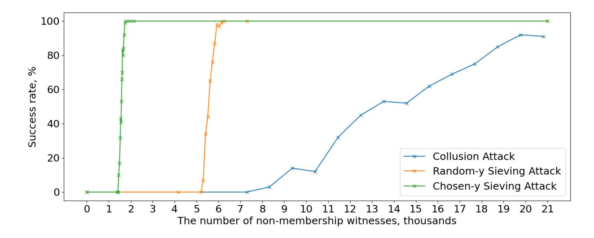

{0}------------------------------------------------

# Cryptanalysis of Au et al. Dynamic Universal Accumulator?

Alex Biryukov<sup>1</sup> , Aleksei Udovenko<sup>2</sup> , Giuseppe Vitto<sup>1</sup>

<sup>1</sup> SnT&DCS, University of Luxembourg, Esch-sur-Alzette, Luxembourg name.surname@uni.lu <sup>2</sup> CryptoExperts, Paris, France aleksei@affine.group

Abstract. In this paper we cryptanalyse the two accumulator variants proposed by Au et al. [\[1\]](#page-20-0), namely the α-based construction and the reference string-based (RS-based) construction. We show that if nonmembership witnesses are issued according to the α-based construction, colluding users can efficiently discover the secret accumulator parameter α and takeover the Accumulator Manager. More precisely, if p is the order of the underlying bilinear group, the knowledge of O(log p log log p) non-membership witnesses permits to successfully recover α. Further optimizations and different attack scenarios allow to reduce the number of required witnesses to O(log p), together with practical attack complexity. Moreover, we show that accumulator collision resistance can be broken if just one of these non-membership witnesses is known to the attacker. In the case when non-membership witnesses are issued using the RSbased construction (with RS kept secret by the Manager), we show that a group of colluding users can reconstruct the RS and compute witnesses for arbitrary new elements. In particular, if the accumulator is initialized by adding m secret elements, m colluding users that share their nonmembership witnesses will succeed in such attack.

Keywords: accumulator · universal · dynamic · cryptanalysis · anonymous credentials

### <span id="page-0-0"></span>1 Introduction

A cryptographic accumulator scheme permits to aggregate values of a possibly very large set into a short digest, which is commonly referred to as the accumulator value. Unlike hash functions, where, similarly, (arbitrary) long data is mapped into a fixed length digest, accumulator schemes permit to additionally show whenever an element is accumulated or not, thanks to special values called witnesses. Depending on the accumulator design, we can have two kinds of witnesses: membership witnesses, which permit to show that an element is included into the accumulator, and non-membership witnesses, which, on the contrary,

<sup>?</sup> This work is supported by the Luxembourg National Research Fund (FNR) project FinCrypt (C17/IS/11684537).

{1}------------------------------------------------

permit to show that an element is not included. Accumulator schemes which support both are called universal and the possibility to dynamically add and delete elements, give them the name of dynamic accumulators. The first accumulator scheme was formalized by Benaloh and De Mare [\[3\]](#page-20-1) in 1993 as a time-stamping protocol. Since then, many other accumulator schemes have been proposed and they play very important role in various protocols from set membership, authentication to (anonymous) credentials systems and cryptocurrency ledgers. However, there is only a small set of underlying cryptographic assumptions on which such accumulator primitives are based. Currently, three main families of accumulators can be distinguished in literature: schemes designed in groups of unknown order [\[3,](#page-20-1)[2](#page-20-2)[,12,](#page-21-0)[16,](#page-21-1)[21,](#page-21-2)[17](#page-21-3)[,7\]](#page-21-4), schemes designed in groups of known order [\[20](#page-21-5)[,15](#page-21-6)[,1,](#page-20-0)[13\]](#page-21-7) and hash-based constructions [\[18,](#page-21-8)[9,](#page-21-9)[10,](#page-21-10)[11](#page-21-11)[,6\]](#page-21-12). Relevant to this paper are the schemes belonging to the second of these families, where the considered group is a prime order bilinear group. Moreover, when it comes to Dynamic Universal Accumulators (namely those that support dynamic addition and deletion of members and can maintain both membership and non-membership witnesses) we are down to just a few schemes.

In this paper we cryptanalyse one of these universal scheme proposed for bilinear groups, namely the Dynamic Universal Accumulator by Au et al. [\[1\]](#page-20-0), which is zero-knowledge friendly and stood unscathed for 10 years of public scrutiny. This scheme comes in two variants which we called the α-based construction and the RS-based construction, respectively. For the first one, we show that the non-membership mechanism, designed to allow for more efficiency on the accumulator manager side, has a subtle cryptographic flaw which enables the adversary to efficiently recover the secret of the accumulator manager, given just several hundred to few thousand non-membership witnesses (regardless of the number of accumulated elements).

As a consequence the attacker can covertly take over the accumulator management. Moreover, we show that given only one non-membership witness generated with this flawed mechanism, it is possible to efficiently invalidate the assumed collision resistance property of the accumulator by creating a membership witness for a non-accumulated element. Despite the presence of a valid security proof, this is possible because the provided security reduction covers the non-membership mechanism of the RS-based construction only and it doesn't take into account non-membership definition given for the α-based construction, which, in fact, resulted to be weak.

The second attack is on this latter RS-based variant, for which we show that a group of users is able to compute valid witnesses for unauthorized elements even when the Accumulator manager keeps secret all the information needed to compute such witnesses, i.e. the RS. In particular, if the accumulator is initialized by adding m secret elements, m colluding users would succeed in reconstructing the RS and will then become able to issue membership and nonmembership witnesses for any accumulated and non-accumulated elements.

The majority of our attacks require that users collude and share their witnesses in order to either subvert the Accumulator Manager or issue witnesses. 

{2}------------------------------------------------

While collusion attacks are usually outside the standard security assumptions for accumulator schemes, these become relevant when such schemes are used as building blocks in most of the applications like, for example, authentication mechanisms (e.g. anonymous credentials systems) and (attribute-based) access control. We believe that analysing and protecting schemes from such attacks, will open to a wider and secure use of accumulator schemes.

In Section [2](#page-2-0) we recall both variants of Au et al. accumulator scheme. In Section [3](#page-5-0) we present our first attack for the α-based construction −the Collusion Attack− which allows to fully recover the accumulator secret parameter α and we provide a complexity analysis in terms of time and non-membership witnesses needed (Section [3.3\)](#page-7-0). In Section [4](#page-9-0) we discuss some further improvements to the Collusion attack which lead, under different hypothesis, to two new attacks: a random-y sieving attack and a chosen-y sieving attack, described in Section [4.1](#page-11-0) and [4.2,](#page-12-0) respectively. We implemented all these attacks (Appendix [A\)](#page-22-0) and we compare, in Section [5,](#page-12-1) their success probability as a function of the total number of colluding witnesses needed. In Section [6](#page-13-0) we detail how collision resistance doesn't hold for non-membership witnesses issued accordingly to the α-based construction and we report another minor design vulnerability we have found for this latter in Section [7.](#page-15-0) Finally, in Section [8](#page-16-0) we discuss the security of the RS-construction and we present, in Section [8.2,](#page-17-0) the Witness Forgery Attack as well as possible countermeasures. A summary of our main contributions can be found in Table [1.](#page-0-0)

| Construction Ref. |        | Scenario          | Witnesses                   | Time                                                                                              | Attack Result                  |
|-------------------|--------|-------------------|-----------------------------|---------------------------------------------------------------------------------------------------|--------------------------------|
| α-based           | Sec. 3 |                   | Random-y O(log p log log p) | O(log2<br>p)                                                                                      | Recovery of α                  |
|                   |        | Sec. 4.2 Chosen-y | O(log p)                    | Sec. 4.1 Random-y O(log p log log p) O((1 + `/ log log p) log2<br>p)<br>O(` log2<br>p/ log log p) | Recovery of α<br>Recovery of α |
|                   | Sec. 6 | Random-y          | 1                           | O(1)                                                                                              | Break Collision<br>Resistance  |
| RS-based          |        | Sec. 8.2 Random-y | m                           | O(m2<br>)                                                                                         | Issue witnesses                |

Table 1. Time and non-membership witnesses required in our attacks on the Au et al. accumulator scheme for both α-based and RS-based construction. In this table, p denotes the order of the underlying bilinear group, m denotes the number of (secret) elements with which the accumulator is initialized, ` denotes the number of accumulations occurred in between the issues of non-membership witnesses. In the RS-based construction the RS is unknown to the attacker.

### <span id="page-2-0"></span>2 Au et al. Dynamic Universal Accumulator

In their paper, Au and coauthors propose two different constructions for their Dynamic Universal Accumulator, depending on whether information is made 

{3}------------------------------------------------

available to the accumulator managers. The first requires the accumulator's secret parameter  $\alpha$  and is suitable for a centralized entity which efficiently updates the accumulator value and issues witnesses to the users. The second instead, requires a reference string  $\mathcal{RS}$  and allows to update the accumulator value and to issue witnesses without learning  $\alpha$ , but less efficiently. We will refer to the first one as the  $\alpha$ -based construction, while we will refer to the latter as the  $\mathcal{RS}$ -based construction.

These two are interchangable, in the sense that witnesses can be issued from time to time with one or the other construction. Moreover, we note that all operations done with the reference string  $\mathcal{RS}$ , can be done more efficiently by using  $\alpha$  directly: hence, if the authority which generates  $\alpha$  coincides with the Accumulator Manager, it is more convenient for the latter to always use the secret parameter  $\alpha$  to perform operations and thus we will refer to the two constructions mainly to indicate the different defining equations for witnesses (in particular, non-membership witnesses).

We now detail a concrete instance of Au et al. accumulator scheme by using Type-I elliptic curves<sup>3</sup>. Where not explicitly stated, each operation refers to both the  $\alpha$ -based and  $\mathcal{RS}$ -based constructions.

**Generation.** Let E be an elliptic curve of embedding degree k over  $\mathbb{F}_q$ , which is provided with a symmetric bilinear group  $\mathbb{G} = (p, G_1, G_T, P, e)$  such that  $e: G_1 \times G_1 \to G_T$  is a non-degenerate bilinear map,  $G_1$  is a subgroup of E generated by P,  $G_T$  is a subgroup of  $(\mathbb{F}_{q^k})^*$  and  $|G_1| = |G_T| = p$  is prime. The secret accumulator parameter  $\alpha$  is randomly chosen from  $\mathbb{Z}/p\mathbb{Z}^*$ . The set of accumulatable elements is  $\mathcal{ACC} = \mathbb{Z}/p\mathbb{Z} \setminus \{-\alpha\}$ .

-  $\mathcal{RS}$ -based construction. Let t be the maximum number of accumulatable elements. Then the reference string  $\mathcal{RS}$  is computed as

$$\mathcal{RS} = \{ P, \alpha P, \alpha^2 P, \dots, \alpha^t P \}$$

#### Accumulator updates.

-  $\alpha$ -based construction. For any given set  $\mathcal{Y}_V \subseteq \mathcal{ACC}$  let  $f_V(x) \in \mathbb{Z}/p\mathbb{Z}[x]$  represent the polynomial

$$f_V(x) = \prod_{y \in \mathcal{Y}_V} (y + x)$$

Given the secret accumulator parameter  $\alpha$ , we say that an accumulator value  $V \in G_1$  accumulates the elements in  $\mathcal{Y}_V$  if  $V = f_V(\alpha)P$ .

An element  $y \in \mathcal{ACC} \setminus \mathcal{Y}_V$  is added to the accumulator value V, by computing  $V' = (y + \alpha)V$  and letting  $\mathcal{Y}_{V'} = \mathcal{Y}_V \cup \{y\}$ . Similarly, an element  $y \in \mathcal{Y}_V$  is removed from the accumulator value V, by computing  $V' = \frac{1}{(y+\alpha)}V$  and letting  $\mathcal{Y}_{V'} = \mathcal{Y}_V \setminus \{y\}$ .

<span id="page-3-0"></span><sup>&</sup>lt;sup>3</sup> We note that Au *et al.* accumulator scheme and our attacks as well work with any bilinear group.

{4}------------------------------------------------

-  $\mathcal{RS}$ -based construction. For any given set  $\mathcal{Y}_V \subseteq \mathcal{ACC}$  such that  $|\mathcal{Y}_V| \leq t$ , let  $f_V(x) \in \mathbb{Z}/p\mathbb{Z}[x]$  represent the polynomial

$$f_V(x) = \prod_{y \in \mathcal{Y}_V} (y+x) = \sum_{i=0}^{|\mathcal{Y}_V|} c_i x^i$$

Then, the accumulator value V which accumulates the elements in  $\mathcal{Y}_V$  is computed using the  $\mathcal{RS}$  as  $V = \sum_{i=0}^{|\mathcal{Y}_V|} c_i \cdot \alpha^i P$ .

#### Witnesses Issuing.

-  $\alpha$ -based construction. Given an element  $y \in \mathcal{Y}_V$ , the membership witness  $w_{y,V} = C \in G_1$  with respect to the accumulator value V is issued as

$$C = \frac{1}{y + \alpha} V$$

Given an element  $y \in \mathcal{ACC} \setminus \mathcal{Y}_V$ , the non-membership witness  $\bar{w}_{y,V} = (C,d) \in G_1 \times \mathbb{Z}/p\mathbb{Z}$  with respect to the accumulator value V is issued as

$$d = (f_V(\alpha) \mod (y + \alpha)) \mod p,$$
  $C = \frac{f_V(\alpha) - d}{y + \alpha} P$ 

-  $\mathcal{RS}$ -based construction. Given an element  $y \in \mathcal{Y}_V$ , let  $c(x) \in \mathbb{Z}/p\mathbb{Z}[x]$  be the polynomial such that  $f_V(x) = c(x)(y+x)$ . Then, the membership witness  $w_{y,V}$  for y with respect to the accumulator value V is computed using the  $\mathcal{RS}$  as  $w_{y,V} = c(\alpha)P$ .

Given an element  $y \in \mathcal{ACC} \setminus \mathcal{Y}_V$ , apply the Euclidean Algorithm to get the polynomial  $c(x) \in \mathbb{Z}/p\mathbb{Z}[x]$  and the scalar  $d \in \mathbb{Z}/p\mathbb{Z}$  such that  $f_V(x) = c(x)(y+x) + d$ . Then, the non-membership witness  $\bar{w}_{y,V}$  for y with respect to the accumulator value V is computed from the  $\mathcal{RS}$  as  $w_{y,V} = (c(\alpha)P, d)$ .

Witness Update. When the accumulator value changes, users' witnesses are updated accordingly to the following operations:

- On Addition: suppose that a certain  $y' \in \mathcal{ACC} \setminus \mathcal{Y}_V$  is added into V. Hence the new accumulator value is  $V' = (y' + \alpha)V$  and  $\mathcal{Y}_{V'} = \mathcal{Y}_V \cup \{y'\}$ . Then, for any  $y \in \mathcal{Y}_V$ ,  $w_{y,V} = C$  is updated with respect to V' by computing

$$C' = (y' - y)C + V$$

and letting  $w_{y,V'} = C'$ .

If, instead,  $y \in \mathcal{ACC} \setminus \mathcal{Y}_V$  with  $y \neq y'$ , its non-membership witness  $\bar{w}_{y,V} = (C,d)$  is updated to  $\bar{w}_{y,V'} = (C',d\cdot(y'-y))$ , where C' is computed in the same way as in the case of membership witnesses.

{5}------------------------------------------------

- On Deletion: suppose that a certain  $y' \in \mathcal{Y}_V$  is deleted from V. Hence the new accumulator value is  $V' = \frac{1}{y' + \alpha} V$  and  $\mathcal{Y}_{V'} = \mathcal{Y}_V \setminus \{y'\}$ .

Then, for any  $y \in \mathcal{Y}_V$ ,  $w_{y,V} = C$  is updated with respect to V' by computing

$$C' = \frac{1}{y' - y}C - \frac{1}{y' - y}V'$$

and letting  $w_{y,V'} = C'$ .

If, instead,  $y \in \mathcal{ACC} \setminus \mathcal{Y}_V$ , its witness  $\bar{w}_{y,V} = (C,d)$  is updated to  $\bar{w}_{y,V'} = (C', d \cdot \frac{1}{y'-y})$ , where C' is computed in the same way as in the case of membership witnesses.

We note that in both cases the added or removed element y' has to be public in order to enable other users to update their witnesses.

**Verification.** A membership witness  $w_{y,V} = C$  with respect to the accumulator value V is valid if it verifies the pairing equation  $e(C, yP + \alpha P) = e(V, P)$ . Similarly, a non-membership witness  $\bar{w}_{y,V} = (C,d)$  is valid with respect to V if it verifies  $e(C, yP + \alpha P)e(P, P)^d = e(V, P)$ .

#### <span id="page-5-0"></span>3 The Collusion Attack for the $\alpha$ -based Construction

From now on, we assume that the secret parameter  $\alpha$  and the accumulator value V along with the set of currently accumulated elements  $\mathcal{Y}_V$  and the corresponding polynomial  $f_V(x)$ , are fixed.

The following attack on the  $\alpha$ -based construction consists of two phases: the retrieval of  $f_V(\alpha)$  modulo many small primes and the full recovery of the accumulator secret parameter  $\alpha$ .

#### <span id="page-5-1"></span>3.1 Recovering $f_V(\alpha)$

Let  $d_y = (f_V(\alpha) \mod (y+\alpha)) \mod p$  be a partial non-membership witness with respect to V for a certain element  $y \in \mathcal{ACC} \setminus \mathcal{Y}_V$ , and let  $\tilde{d}_y$  denote the integer  $f_V(\alpha) \mod (y+\alpha)$ . We then have  $d_y = \tilde{d}_y \mod p$ , and we are interested in how often  $d_y$  equals  $\tilde{d}_y$  as integers. Attacker benefits from the cases when  $y + \alpha < p$ , since the reduction modulo p does nothing and  $d_y = \tilde{d}_y$  for all y.

The worst case happens when  $\alpha$  is maximal, i.e.  $\alpha = p - 1$ . Indeed, in this case, if y = 0 then  $y + \alpha < p$  and  $d_y = \tilde{d}_y$  with probability 1; if instead y > 0 and  $y \neq p - \alpha = 1$  the probability that  $d_y = \tilde{d}_y$  is  $\frac{p}{y+\alpha}$  and, hence, is minimal when compared to smaller values of  $\alpha$ . Thus, with  $\alpha = p - 1$  the probability that  $d_y$  equals  $\tilde{d}_y$  as integers ranges from 1 (when y = 0) to almost 1/2 (when y = p - 1). Assuming that y is sampled uniformly at random, we can obtain the

{6}------------------------------------------------

following lower bound on the probability (for arbitrary  $\alpha$ ):

$$\mathbb{P}_{\substack{y \in \{0, \dots, p-1\}\\ y \neq p - \alpha\\ f_{V}(\alpha) \in \mathbb{Z}}} (d_{y} = \tilde{d}_{y}) \ge \frac{1}{p-1} \left( 1 + p \sum_{\tilde{y}=2}^{p-1} \frac{1}{\tilde{y} + p - 1} \right)$$

$$= \frac{p}{p-1} \left( \sum_{i=1}^{2p-2} \frac{1}{i} - \sum_{i=1}^{p-1} \frac{1}{i} \right) = \frac{p}{p-1} \left( H_{2p-2} - H_{p-1} \right)$$

$$= \left( 1 + \frac{1}{p-1} \right) \cdot \left( \ln 2 - \frac{1}{4(p-1)} + o\left(p^{-1}\right) \right)$$

$$= \ln 2 + \frac{4 \ln 2 - 1}{4(p-1)} + o(p^{-1})$$

$$> \ln 2. \tag{1}$$

where  $H_n$  denotes the n-th Harmonic number, and the last inequality holds for all values of p used in practice.

Assume that  $q|(y+\alpha)$  for a small prime  $q \in \mathbb{Z}$  such that  $q \ll y + \alpha$ . If  $d_y = \tilde{d}_y$  we have  $f_V(\alpha) \equiv d_y \pmod{q}$  with probability 1, otherwise it happens with probability 0 since then  $f_V(\alpha) \equiv d_y + p \pmod{q}$ . If instead  $q \nmid (y+\alpha)$ , we assume  $d_y \mod q$  to be random in  $\mathbb{Z}/q\mathbb{Z}$  and thus  $f_V(\alpha) \equiv d_y \pmod{q}$  happens with probability close to  $\frac{1}{q}$ .

More precisely,

<span id="page-6-0"></span>
$$\mathbb{P}(f_V(\alpha) \equiv d_y \; (\text{mod } q)) > \ln 2 \cdot \frac{1}{q} + \frac{q-1}{q^2} = \frac{(\ln 2 + 1)q - 1}{q^2}$$
 (2)

while for any other  $c \in \mathbb{Z}/q\mathbb{Z}$  such that  $c \not\equiv d_y \pmod{q}$  we have

$$\mathbb{P}(f_V(\alpha) \equiv c \pmod{q}) < (1 - \ln 2) \cdot \frac{1}{q} + \frac{q - 1}{q^2} = \frac{(2 - \ln 2)q - 1}{q^2}$$
 (3)

In other words, the value  $d_y \mod q$  has a higher chance to be equal to  $f_V(\alpha) \mod q$  compared to any other value in  $\mathbb{Z}/q\mathbb{Z}$ .

We will use this fact to deduce  $f_V(\alpha)$  modulo many different small primes. More precisely, suppose that a certain number of users collude and share their elements  $y_1, \ldots, y_n$  together with the respective partial non-membership witnesses

$$d_{y_i} \equiv (f_V(\alpha) \mod (y_i + \alpha)) \mod p$$

If q is a small prime and n is sufficiently large (see Section 3.3 for the analysis),  $f_V(\alpha)$  mod q can be deduced by simply looking at the most frequent value among

$$d_{y_1} \mod q, \ldots, d_{y_n} \mod q$$

Once we compute  $f_V(\alpha)$  modulo many different small primes  $q_1, \ldots, q_k$  such that  $q_1 \cdot \ldots \cdot q_k > p$ , we can proceed with the next phase of the attack: the full recovery of the secret parameter  $\alpha$ .

{7}------------------------------------------------

#### 3.2 Recovering $\alpha$

If the discrete logarithm of any accumulator value is successfully retrieved modulo many different small primes whose product is greater than p,  $\alpha$  can be recovered with (virtually) no additional partial non-membership witnesses. The main observation we will exploit is the following:

**Observation 1.** Let q be an integer and let  $y \in \mathcal{ACC} \setminus \mathcal{Y}_V$  be a non-accumulated element such that its partial non-membership witness with respect to V satisfies  $d_y = \tilde{d}_y$ . Then  $d_y \not\equiv f_V(\alpha) \pmod{q}$  implies that  $q \nmid (y + \alpha)$ , or, equivalently,  $\alpha \not\equiv -y \pmod{q}$ .

From (1) it follows that for any given  $q \in \mathbb{Z}$  and non-accumulated element y such that  $(f_V(\alpha) - d_y) \not\equiv 0 \pmod{q}$ , we have

$$\mathbb{P}(\alpha \not\equiv -y \pmod{q} \mid f_V(\alpha) \not\equiv d_y \pmod{q}) > 1 - \frac{(1 - \ln 2)q}{q^2 - (1 + \ln 2)q + 1} \approx 1 - \frac{1 - \ln 2}{q}$$

By considering all colluding non-membership witnesses, if q is small and n is sufficiently larger than q (see Section 3.3), we can deduce  $\alpha \mod q$  as the element in  $\mathbb{Z}/q\mathbb{Z}$  which is the least frequent —or not occurring at all— among the residues

$$-y_{i_1} \mod q$$
, ...,  $-y_{i_i} \mod q$ 

such that  $(f_V(\alpha) - d_{y_{i_k}}) \not\equiv 0 \mod q$  for all  $k = 1, \ldots, j$ .

It follows that, if  $q_1, \ldots, q_k$  are small primes such that  $q_1 \cdot \ldots \cdot q_k > p$ , from the values  $f_V(\alpha) \mod q_i$  —computed according to Section 3.1— and the values  $\alpha \mod q_i$ , with  $i \in [1, k]$ ,  $\alpha \in \mathbb{Z}$  can be obtained by using the Chinese Remainder Theorem.

#### <span id="page-7-0"></span>3.3 Estimating the minimum number of colluding users

We now give an asymptotic estimate of the minimum number of colluding users such that both phases of the above attack succeed with high probability. We will use the multiplicative Chernoff bound, which we briefly recall.

<span id="page-7-1"></span>**Theorem 2.** (Chernoff Bound) Let  $X_1, \ldots, X_n$  be independent random variables taking values in  $\{0,1\}$  and let  $X=X_1+\ldots+X_n$ . Then, for any  $\delta>0$ 

$$\mathbb{P}(X \le (1 - \delta)\mathbb{E}[X]) \le e^{-\frac{\delta^2 \mu}{2}} \qquad 0 \le \delta \le 1$$

$$\mathbb{P}(X \ge (1 + \delta)\mathbb{E}[X]) \le e^{-\frac{\delta^2 \mu}{2 + \delta}} \qquad 0 \le \delta$$

*Proof.* See [19, Theorem 4.4, Theorem 4.5].

Our analysis will proceed as follows: first, we introduce two random variables to model, for a given small prime q, the behaviour of the values  $f_V(\alpha) \mod q$ . Then, we will use Chernoff bound to first estimate the probability of wrongly

{8}------------------------------------------------

guessing  $f_V(\alpha)$  mod q, and then deduce a value for n so that such probability is minimized for all primes q considered in the attack.

Let  $q \in \mathbb{Z}$  be a fixed prime and let  $X_g$  be a random variable which counts the number of times  $f_V(\alpha) \mod q$  is among the values  $d_1 \mod q, \ldots, d_n \mod q$ . Similarly, let  $X_b$  be a random variable which counts the number of times a certain residue  $t \in \mathbb{Z}/q\mathbb{Z}$  not equal to  $f_V(\alpha) \mod q$  is among the values  $d_1 \mod q, \ldots, d_n \mod q$ . Then

$$\mathbb{E}[X_g] = n \cdot \frac{(\ln 2 + 1)q - 1}{q^2} \approx (\ln 2 + 1)\frac{n}{q}$$

$$\mathbb{E}[X_b] = n \cdot \frac{(2 - \ln 2)q - 1}{q^2} \approx (2 - \ln 2)\frac{n}{q}$$

By applying Theorem 2, we can estimate the probability that  $X_g$  and  $X_b$  crosses  $\frac{\mathbb{E}[X_g] + \mathbb{E}[X_b]}{2} = \frac{3n}{2g}$  as

$$\mathbb{P}\left(X_{g} \leq \frac{3n}{2q}\right) = \mathbb{P}\left(X_{g} \leq \left(1 - \frac{2\ln 2 - 1}{2\ln 2 + 2}\right)\mathbb{E}[X_{g}]\right) < e^{-\frac{n}{91q}} \doteq e_{q,g}$$

$$\mathbb{P}\left(X_b \ge \frac{3n}{2q}\right) = \mathbb{P}\left(X_b \ge \left(1 + \frac{2\ln 2 - 1}{4 - 2\ln 2}\right)\mathbb{E}[X_b]\right) < e^{-\frac{n}{76q}} \doteq e_{q,b}$$

and we minimize these inequalities by requiring that

$$1 - (1 - e_{q,g})(1 - e_{q,b})^{q-1} \approx e_{q,g} + (q-1)e_{q,b} \doteq s_q$$

is small for each prime q considered in this attack phase. Thus, if  $q = max(q_1, \ldots, q_k)$ , we can bound the sum

$$\sum_{i=1}^{k} s_{q_i} \le q s_q = q \left( e^{-\frac{n}{91q}} + (q-1)e^{-\frac{n}{76q}} \right) \approx e^{-\frac{n}{91q} + \log q} + e^{-\frac{n}{76q} + 2\log q}$$

and we make it small by taking  $n = O(q \log q)$ .

In order to apply the Chinese Remainder Theorem for the full recovery of  $\alpha$  we need that  $q_1 \cdot \ldots \cdot q_k > p$ . If  $q_1, \ldots, q_k$  are chosen to be the first k primes, we can use an estimation for the first Chebyshev function growth rate to obtain  $\ln(q_1 \cdot \ldots \cdot q_k) = (1 + o(1)) \cdot k \ln k \sim q_k$  by Prime Number Theorem and thus  $q_k > \ln p$ . We then conclude that

$$n = O(\log p \log \log p)$$

colluding users that share their partial non-membership witnesses are enough to recover  $f_V(\alpha) \mod q_1 \cdot \ldots \cdot q_k$  with high probability.

We note that by using Chernoff bound in order to estimate the minimum number of witnesses needed to recover  $\alpha$ , it can be shown, similarly as done above for  $f_V(\alpha)$ , that  $O(\log p \log \log p)$  non-membership witnesses are enough to identify with high probability  $\alpha \mod q_1 \cdot \ldots \cdot q_k = \alpha$ .

{9}------------------------------------------------

The time complexity is dominated by

$$(\# \text{ primes } q) \times (\# \text{ witnesses}) = O\left(\frac{\log p}{\log \log p}\right) \times O(\log p \log \log p)$$

which is equal to  $O(\log^2 p)$ .

### <span id="page-9-0"></span>4 Improving the Collusion Attack

We will now improve the Collusion attack outlined in Section 3 by giving some variants under two different attack scenarios, depending on whether the attacker has access to non-membership witnesses for random-y or chosen-y. These improvements will further reduce the number of non-membership witnesses needed to fully recover the secret accumulator parameter  $\alpha$  to a small multiple of  $\log p$ .

The main idea behind the improved attack is to keep removing wrong candidates for  $\alpha \mod q$  for small primes q (sieving), until only the correct one is left. As in the previous attack, full value of  $\alpha$  is then reconstructed using the Chinese Remainder Theorem.

Collecting Witnesses Issued at Different States In the Collusion Attack described in Section 3,  $O(\log p \log \log p)$  non-membership witnesses issued with respect to the same accumulator value V are needed in order to fully recover  $\alpha$ . In the following attacks we drop this condition and allow the colluding users to share non-membership witnesses issued with respect to different accumulator values  $f_1(\alpha)P = V_1, \ldots, f_{\ell}(\alpha)P = V_{\ell}$ , but we require that no deletions occur between the accumulator states  $V_1$  and  $V_{\ell}$ . In this case, since the sequence of elements added must be public to permit users' witness update, we have that the polynomial functions  $g_{i,j}(x) \in \mathbb{Z}/p\mathbb{Z}$  such that  $f_j(\alpha) = g_{i,j}(\alpha)f_i(\alpha)$  for any  $\alpha \in \mathbb{Z}/p\mathbb{Z}$ , can be publicly computed for any  $i, j \in [1, \ell]$ . It follows that, given a small prime q, once  $\alpha$  mod q and  $f_i(\alpha)$  mod q for some  $i \in [1, \ell]$  are correctly computed,  $f_j(\alpha)$  mod q can be computed as  $g_{i,j}(\alpha)f_i(\alpha)$  mod q for any  $j \in [1, \ell]$  such that j > i.

The requirement that no deletion operation should occur if the colluding users wish to collect witnesses issued at different states, comes from the fact that the accumulator can be initialized by accumulating some values which are kept secret by the accumulator manager.

It follows that, whenever the polynomial  $f_1(x) \in \mathbb{Z}/p\mathbb{Z}$  is publicly known (or, equivalently, the set of all accumulated elements  $\mathcal{Y}_{V_1}$ ) for a certain accumulator value  $V_1$ , we can remove the condition that no later deletion operations occur during attack execution, since the knowledge of  $\alpha \mod q$  is enough to compute  $f_i(\alpha) \mod q$  for any  $i \in [1, \ell]$ . Thus any non-membership witnesses issued from  $V_1$  on can be used to recover  $\alpha$ .

{10}------------------------------------------------

Removing reduction modulo p. We show that, under some practical assumptions, it is possible to eliminate with high probability the noise given by the reduction modulo p performed by the accumulator manager when he issues a non-membership witness. That is, we recover  $\tilde{d}_{y_i} = f_{V_j}(\alpha) \mod (y_i + \alpha)$  for a large fraction of pairs  $(y_i, V_j)$ , given the partial non-membership witnesses  $d_{y_i} = (f_{V_j}(\alpha) \mod (y_i + \alpha)) \mod p$  collected with respect to different accumulator values  $V_j$  with j > 1.

Aiming at this, we first observe that from the fact that  $0 \leq y, \alpha < p$  for any given  $y \in \mathcal{ACC} \setminus \mathcal{Y}_V$ , the partial non-membership witness  $d_y$  for y with respect to V can be expressed in terms of  $\tilde{d}_y$  in one of the following way:

(1) 
$$d_y = f_V(\alpha) \mod (y + \alpha) = \tilde{d}_y,$$
  
(2)  $d_y = (f_V(\alpha) \mod (y + \alpha)) - p = \tilde{d}_y - p.$ 

Since p is odd, whenever  $y + \alpha$  is even, these two cases can be easily distinguished modulo 2: indeed, in the first case  $d_y \equiv f_V(\alpha) \pmod{2}$ , while in the second case  $d_y \not\equiv f_V(\alpha) \pmod{2}$ .

This observation effectively allows to correctly compute  $\tilde{d}_y$  half of the times given a correct guess for  $\alpha$  mod 2 and  $f_V(\alpha)$  mod 2. Indeed, given a set of partial non-membership witnesses  $d_{y_1}, \ldots, d_{y_n}$  with respect to V, each guess of  $\alpha$  mod 2 and  $f_V(\alpha)$  mod 2 will split the witnesses in two subsets, namely one where the corresponding elements  $y_i$  satisfy  $y_i + \alpha \equiv 0 \pmod{2}$  (and thus  $\tilde{d}_{y_i}$  can be correctly recovered), and the other where this doesn't happen.

Checking if  $\alpha$  mod 2 and  $f_V(\alpha)$  mod 2 were actually correct guesses can be done observing how the attacks described in Section 4.1 and 4.2 (or in Section 3 if witnesses are issued with respect to the same accumulator value) behaves with respect to the subset of witnesses that permitted to recover the values  $\tilde{d}_{y_i}$ . In case of a wrong guess, indeed, it will not possible to distinguish  $\alpha$  and  $f_{V_i}(\alpha)$  modulo some different small primes q: in this case the attack can be stopped and a new guess should be considered. On the other hand, a correct guess will permit to correctly recover  $\alpha$  and  $f_{V_i}(\alpha)$  modulo few more primes q greater than 2. Since, whenever  $\alpha$  mod q and  $f_V(\alpha)$  mod q are known,  $\tilde{d}_q$  can be correctly recovered, analogously to the modulo 2 case, for all those q such that  $q + \alpha$  is divisible by q, this implies that it is possible to iteratively recover more and more correct values  $\tilde{d}_{y_i}$  given the initial set of considered witnesses.

Repeating this procedure for small primes q up to r, it allows to recover  $d_{y_i}$  for those  $y_i$  that are divisible by at least one prime not exceeding r. This fraction tends to  $1 - \varphi(r\#)/(r\#)$  as  $y_i$  tend to infinity, where  $\varphi$  is the Euler's totient function and r# denotes the product of all primes not exceeding r. For example, setting r = 101 allows to recover  $\tilde{d}_{y_i}$  for about 88% of all available witnesses. We conclude that  $\tilde{d}_{y_i}$  can be recovered for practically all  $i \in [1, n]$ .

In the case where witnesses are issued with respect to different accumulator values  $V_1, \ldots, V_\ell$ , as remarked above, the knowledge of  $\alpha \mod q$  and  $f_{V_1}(\alpha) \mod q$  allows to compute  $f_{V_j}(\alpha) \mod q$  for all  $V_j$  with j > 1, so the modulo p noise reduction can be easily performed independently on when the witnesses are issued.

{11}------------------------------------------------

#### <span id="page-11-0"></span>4.1 The Random-y Sieving Attack

In this scenario we assume that all elements  $y_i$  for which the partial non-membership witnesses  $d_{y_i}$  are available to the adversary, i.e. colluding users, are sampled uniformly at random from  $\mathbb{Z}/p\mathbb{Z}$ . Furthermore these witnesses are pre-processed accordingly to the method described above, in order to eliminate the noise given by reduction modulo p.

Recovering  $\alpha$  mod q. Let q be a small prime, i.e.  $q = O(\log p)$ , and let  $\mathcal{Y}_{\alpha}$  be the set containing all pairs  $(y_i, \tilde{d}_{y_i})$  such that  $y_i + \alpha \equiv 0 \pmod{q}$  for a certain guess  $\alpha \mod q$ . If the latter is guessed wrongly, then the values  $\tilde{d}_{y_i} \mod q$  are distributed uniformly and independently from the values  $f_{V_i}(\alpha) \mod q$ . On the other hand, if the guess is correct, then  $\tilde{d}_{y_i} \equiv f_{V_i}(\alpha) \pmod{q}$ .

Even in the case when  $f_{V_1}(\alpha) \mod q$  is unknown,  $f_{V_i}(\alpha) \mod q$  can be recovered from the first occurrence of  $y_i$  in the set  $\mathcal{Y}_{\alpha}$  and verified at all further occurrences, since all  $f_{V_j}(\alpha) \mod q$  can be computed for any  $j \geq i$ . It follows that we can easily distinguish if a guess for  $\alpha \mod q$  is either correct or not.

The attack succeeds if for every wrong guess  $\alpha^{\times}$  of  $\alpha \mod q$  we observe a contradiction within the pairs in  $\mathcal{Y}_{\alpha^{\times}}$ . It's easy to see that if  $|\mathcal{Y}_{\alpha^{\times}}| = t$ , the probability to observe at least one contradiction is  $1 - 1/q^{t-1}$ . Thus, by ensuring a constant number t of elements in  $\mathcal{Y}_{\alpha^{\times}}$  given each  $\alpha^{\times} \neq \alpha \mod q$  is sufficient to make the probability of false positives negligible. This requires availability of  $O(q \log q)$  witnesses in total.

**Recovering**  $\alpha$ . The final step is the same as in the previous attacks: the secret value  $\alpha$  is recovered by repeating the process for different small primes q and then by applying the Chinese Remainder Theorem. Furthermore, if for some primes q there are multiple candidates of  $\alpha \mod q$ , such primes can be simply omitted from the application of the Chinese Remainder Theorem. In this case, in order to fully recover  $\alpha \in \mathbb{Z}$ , the maximum prime q that has to be considered must be larger than  $\ln p$  by a constant factor. We conclude that  $O(q \log q) = O(\log p \log \log p)$  witnesses are sufficient for full recovery of  $\alpha$  with overwhelming probability.

The time complexity of the attack is dominated by guessing  $\alpha \mod q$  for each q considered. Note that for a wrong guess of  $\alpha \mod q$ , we can expect on average a constant amount of witnesses to check before an inconsistency is observed; this amount is thus enough to identify the correct value. For each such guess, nearly all accumulator states in the history have to be considered in order to take into account all additions to the accumulator. However, the non-membership witnesses issued in each state can be classified by guesses of  $\alpha \mod q$  in a single scan for each prime q.

We conclude that the time complexity is dominated by

 $(\# \text{ primes } q) \times (q \text{ guesses of } \alpha \text{ mod } q) \times (\# \text{ of accumulator states})$ 

{12}------------------------------------------------

and by classifying all non-membership witnesses for each prime q

(# primes 
$$q$$
) × (# witnesses)

The final complexity is  $O((1 + \ell/\log \log p) \log^2 p)$ .

#### <span id="page-12-0"></span>4.2 The Chosen-y Sieving Attack

If the adversary is allowed to choose the elements  $y_i$  for which the partial non-membership witnesses are issued, no matter with respect to which accumulator state, the amount of required witnesses can be further reduced by a  $\log \log p$  factor.

First, we assume that the adversary chooses the elements  $y_i$  non-adaptively, i.e. before the accumulator is initialized. The idea is simply to use consecutive values, that is  $y_0 = r$ ,  $y_1 = r + 1, \ldots, y_i = r + i, \ldots$ , for some  $r \in \mathbb{Z}/p\mathbb{Z}$ . This choice fills equally all sets  $\mathcal{Y}_{\tilde{\alpha}}$  for all  $\tilde{\alpha} \in \mathbb{Z}/q\mathbb{Z}$  and small q, where  $\tilde{\alpha}$  represents either a correct guess for  $\alpha$  mod q or a wrong guess  $\alpha^{\times}$ . As a result, t = O(q) elements are enough to make the size of each set  $\mathcal{Y}_{\tilde{\alpha}}$  at least equal to t. The full total number of required non-membership witnesses is then reduced to  $O(q) = O(\log p)$ . The time complexity then is improved by a factor  $\log \log p$  in the case when  $\ell$  is small:  $O(\ell \log^2 p/\log \log p)$ .

We now consider the case when the adversary can adaptively chose the elements  $y_i$ . Note that, on average, we need only 2+1/(q-1) elements in each set  $Y_{\alpha^{\times}}$  to discard the wrong guess of  $\alpha \mod q$ , for all q. The adaptive choice allows to choose  $y_i$  such that  $(y_i + \alpha^{\times}) \equiv 0 \pmod q$  specifically for those  $\alpha^{\times}$  which are not discarded yet. Furthermore, the Chinese Remainder Theorem allows us to combine such adaptive queries for all chosen primes q simultaneously. As a result, approximately  $2 \ln p$  witnesses for adaptively chosen elements are sufficient for the full recovery of  $\alpha$ . This improves the constant factor of the non-adaptive attack in term of number of non-membership witnesses required.

Remark 1. As described at the beginning of this Section, non-membership witnesses can be issued with respect to different successive accumulator values  $V_1, \ldots, V_\ell$ , within which no deletion operation occurs. If the value  $f_{V_1}(x) \in \mathbb{Z}[x]$  is known to the adversary (or equivalently the set of all accumulated elements in  $V_1$ ), only  $\ln p$  non-membership witnesses issued for adaptively chosen elements are sufficient to recover  $\alpha$ . In this case, indeed, instead of verifying uniqueness of elements in the set  $\mathcal{Y}_{\alpha^{\times}}$ , we can directly compare our guess to the value  $f_{V_j}(\alpha)$  mod q given from  $f_{V_1}(\alpha)$ , thus requiring 1 + 1/(q-1) elements on average.

# <span id="page-12-1"></span>5 Experimental Results

We implemented the *collusion attack* from Section 3 and both the *random-y* and the *non-adaptive chosen-y sieving* attacks from Sections 4.1 and 4.2. Proof-of-concept implementations in SageMath [22] can be found in Appendices A.1 and A.2 respectively.

{13}------------------------------------------------



<span id="page-13-1"></span>Fig. 1. Attacks experimental success rate as a function of the total number of colluding witnesses.

For the verification purpose we used a random 512-bit prime p. We measured the success rate of the attacks with respect to the number of available nonmembership witnesses. The collusion attack applies to a single accumulator state, and for the sieving attacks, the number of state changes of the accumulator was 10 times less than the number of issued witnesses. The initial state of the accumulator in all attacks was assumed to be secret. Each attack was executed 100 times per each analyzed number of available non-membership witnesses. The sieving attacks were considered successful if at most 2<sup>10</sup> candidates for α were obtained and the correct α was among them. The results are illustrated in Figure [1.](#page-13-1)

The collusion attack, while being simple, requires a significant amount of witnesses to achieve a high success rate, more than 20000 ≈ 10 ln p ln ln p witnesses and finishes in less than 5 seconds. The random-y sieving attack achieves almost full success rate with about 6000 ≈ 3 ln p ln ln p available witnesses and completes in less than 10 seconds. The chosen-y sieving attack requires less than 2000 ≈ 4 ln p witnesses to achieve almost perfect success rate and completes in less than 4 seconds. All timings include the generation of witnesses. The experiments were performed on a laptop with Linux Mint 19.3 OS and an Intel Core i5-10210U CPU clocked at 1.60GHz.

### <span id="page-13-0"></span>6 Breaking Collision Resistance

We have seen that whenever an attacker has access to many different nonmembership witnesses, he can learn some information about the accumulator secret parameter α, up to its full recovery. On the other hand, when only few non-membership witnesses are known, the learned bits of f<sup>V</sup> (α) and α don't permit any relevant attack against the accumulator manager.

{14}------------------------------------------------

However, we will now show that, in the  $\alpha$ -based construction, the knowledge of a single non-membership witness is enough to break the (assumed) collision resistance property of the accumulator scheme when the polynomial  $f_V(x)$  is fully known or, equivalently, the set of all accumulated elements is publicly known (which is typically the case). Informally, collision resistance ensures that an adversary has negligible probability in forging a valid membership witness for a not-accumulated element and, respectively, a non-membership witness for an already accumulated element. In [1], collision resistance is shown under t-SDH assumption [5]. We briefly recall both of the definitions considered.

**Definition 1.** (Collision Resistance) A Dynamic Universal Accumulator is collision resistant if, for any probabilistic polynomial time adversary A that has access to an oracle O which returns the accumulator value resulting from the accumulation of the elements of any given input subset of  $(\mathbb{Z}/p\mathbb{Z})^*$ , the following probabilities

$$\mathbb{P}\left(\begin{array}{ccc} (\mathbb{G}, \alpha, \tilde{Q}) \leftarrow Gen(1^{\lambda}) , & (y, C, \mathcal{Y}) \leftarrow \mathcal{A}^{\mathcal{O}}(\mathbb{G}, \tilde{Q}) : \\ \mathcal{Y} \subset (\mathbb{Z}/p\mathbb{Z})^* & \wedge & y \in (\mathbb{Z}/p\mathbb{Z})^* \setminus \mathcal{Y} & \wedge \\ V = \left(\prod_{y_i \in \mathcal{Y}} (y_i + \alpha)\right) \cdot P \wedge e(C, y\tilde{P} + \tilde{Q}) = e(V, \tilde{P}) \end{array}\right)$$

$$\mathbb{P}\left(\begin{array}{ccc} (\mathbb{G}, \alpha, \tilde{Q}) \leftarrow Gen(1^{\lambda}) , & (y, C, d, \mathcal{Y}) \leftarrow \mathcal{A}^{\mathcal{O}}(\mathbb{G}, \tilde{Q}) & : \\ \mathcal{Y} \subset (\mathbb{Z}/p\mathbb{Z})^* & \wedge & y \in \mathcal{Y} & \wedge & d \neq 0 & \wedge \\ V = \left(\prod_{y_i \in \mathcal{Y}} (y_i + \alpha)\right) \cdot P \wedge e(C, y\tilde{P} + \tilde{Q})e(P, \tilde{P})^d = e(V, \tilde{P}) \end{array}\right)$$

are both negligible functions in the security parameter  $\lambda$ .

**Definition 2.** (t-Strong Diffie-Hellman Assumption [5]) Let  $\mathcal{G}$  be a probabilistic polynomial time algorithm that, given a security parameter  $1^{\lambda}$ , outputs a symmetric bilinear group  $\mathbb{G} = (p, G_1, G_T, P, e)$ . We say that the t-Strong Diffie-Hellman Assumption holds for  $\mathcal{G}$  with respect to an  $\alpha \in (\mathbb{Z}/p\mathbb{Z})^*$  if, for any probabilistic polynomial time adversary  $\mathcal{A}$  and for every polynomially bounded function  $t: \mathbb{Z} \to \mathbb{Z}$ , the probability

$$\mathbb{P}\left(\mathcal{A}(P,\alpha P,\alpha^2 P,...,\alpha^{t(\lambda)} P,\tilde{P},\alpha \tilde{P}) = \left(y,\frac{1}{y+\alpha} P\right)\right)$$

is a negligible function in  $\lambda$  for any freely chosen value  $y \in \mathbb{Z}/p\mathbb{Z} \setminus \{-\alpha\}$ .

In the security reduction provided in [1], it is required that given a non-accumulated element  $y \in \mathcal{ACC} \setminus \mathcal{Y}_V$  and its non-membership witness  $\bar{w}_{y,V} = (C_y, d_y)$  with respect to the accumulator value V, the element  $\tilde{d}_y \in \mathbb{Z}/p\mathbb{Z}$  verifies

$$(f_V(x) - \tilde{d}_y \mod (y+x)) \equiv 0 \pmod p$$

which in turn corresponds to  $\tilde{d}_y \equiv f_V(-y) \pmod{p}$ .

{15}------------------------------------------------

By using, instead, the defining equation for  $d_y$  provided in the  $\alpha$ -based construction, the partial non-membership witness for y equals  $d_y = (f_V(\alpha) \mod (y + \alpha))$  mod p and thus

$$d_y \equiv \tilde{d}_y \pmod{p} \implies (f_V(-y) \mod (y+\alpha)) \equiv f_V(-y) \pmod{p}$$

holds only when  $f_V(-y) < y + \alpha$ , i.e. with negligible probability if V accumulates more than one element chosen uniformly at random from  $\mathbb{Z}/p\mathbb{Z}$ .

Now, if  $d_y \not\equiv d_y \mod p$ , we have  $f_V(x) - d_y \not\equiv 0 \mod (y+x)$ , and we can use Euclidean algorithm to find a polynomial  $c(x) \in \mathbb{Z}/p\mathbb{Z}[x]$  and  $r \in \mathbb{Z}/p\mathbb{Z}$  such that  $f_V(x) - d_y = c(x)(y+x) + r$  in  $\mathbb{Z}/p\mathbb{Z}[x]$ .

Then, by recalling that  $C_y = \frac{f_V(\alpha) - d_y}{y + \alpha} P$ , under the t-SDH assumption, the attacker uses the  $\mathcal{RS} = \{P, \alpha P, \dots, \alpha^t P\}$  to compute  $c(\alpha)P$  and obtains a membership witness with respect to V for an arbitrary non accumulated element y as

$$C_y + \frac{d_y}{r} \left( C_y - c(\alpha) P \right) = C_y + \frac{d_y}{r} \left( C_y - C_y - \frac{r}{y+\alpha} P \right) = \frac{f_V(\alpha)}{y+\alpha} P = \frac{1}{y+\alpha} V$$

thus breaking the assumed collision resistance property of the  $\alpha$ -based construction.

We note that this result doesn't invalidate the security proof provided by Au et al. in [1]: indeed, the reduction to the t-SDH assumption is shown for (non-membership) witnesses generated accordingly to the  $\mathcal{RS}$ -based construction only, and thus, collision resistance can be guaranteed only for this latter construction. We speculate that this flaw comes from the wrong assumption that

$$(f_V(x) \bmod (y+x)) \equiv (f_V(\alpha) \bmod (y+\alpha)) \pmod p$$

which, if true, would have implied security of non-membership witnesses issued accordingly to the  $\alpha$ -based construction as well.

# <span id="page-15-0"></span>7 Weak Non-membership Witnesses

In the  $\alpha$ -based construction, non-membership witness definition is affected by another minor design vulnerability: given a non-membership witness  $\bar{w}_{y,V} = (C_y, d_y)$  with respect to an accumulator value V, if  $d_y \equiv f_V(\alpha) \mod p$ , then  $C_y = O$ .

Those "weak non-membership witnesses" are issued with non-negligible probability in the security parameter  $\lambda$  when only one element is accumulated. Assume, indeed, that  $V = (y' + \alpha)P$  for a certain element  $y' \in \mathcal{ACC}$ . Then, for any element  $y \in \mathcal{ACC}$  such that y' < y, the corresponding non-membership witness  $\bar{w}_{y,V}$  with respect to V is issued as

$$d_y = (y' + \alpha \mod (y + \alpha)) \mod p = y' + \alpha \mod p$$

and thus  $C_y = O$ . In this case, as soon as the element y' becomes public (e.g. is removed), the accumulator secret parameter can be easily obtained as  $\alpha = d_y - y' \mod p$ .

{16}------------------------------------------------

# <span id="page-16-0"></span>8 Preventing Witness Forgery in the RS-based Construction

All the attacks we have presented so far, which aimed at either recovering the secret α or breaking accumulator collision-resistance, are ineffective when witnesses (more precisely, non-membership witnesses) are issued by using the defining equations given for the RS-based construction. It is thus natural to wonder whether this alternative construction has only efficiency drawbacks when compared to the more efficient −but vulnerable− one that uses α, or requires, instead, additional care to be safe, for example, against colluding users.

We note that the knowledge of the RS is functionally equivalent to the knowledge of α when the set of currently accumulated elements is fully known: indeed, besides accumulator updates, the RS permits to issue both membership and non-membership witnesses for arbitrary elements, with the difference that the knowledge of α permits to break collision-resistance, while the knowledge of the RS does not. Furthermore, despite what we saw in Section [6,](#page-13-0) witnesses definition in the RS-based construction satisfy the hypothesis for the t−SDH security reduction provided by Au et al., i.e. collision-resistance is enforced when the RS is used to issue witnesses.

Depending on the use-case application of the accumulator scheme, the possibility to publicly issue witnesses for arbitrary elements could be undesirable: for example, this is relevant when the accumulator scheme is used as a privacypreserving authorization mechanism, i.e. an Anonymous Credential System. Suppose, indeed, that in this scenario the accumulator value V accumulates revoked users' identities and the non-revoked ones authenticate themselves showing the possession of a valid non-membership witness ¯wy,V for an identity y, both issued by a trusted Authentication Authority. If an attacker has access to the RS, he will be able to forge a random pair of credentials (y 0 , wy<sup>0</sup> ,V ) and then he could authenticate himself, even if the Authentication Authority never issued the identity y <sup>0</sup> nor the corresponding witness. This is especially the case when a zero knowledge protocol is instantiated during users' credentials verification since it is impossible to distinguish between a zero knowledge proof for an authorized identity y and a proof for the never issued, but valid, identity y 0 .

In the following sections we investigate the security of the RS-based construction assuming the Accumulator Manager to be the only authority allowed to issue witnesses. In particular, we discuss how witness forgery for never-authorized elements can be prevented, namely: a) the manager constructs the set Y<sup>V</sup> of currently accumulated elements in such a way that it is infeasible to fully reconstruct it; b) the reference string RS is not published and users cannot reconstruct it.

### <span id="page-16-1"></span>8.1 How to ensure some accumulated elements remain unknown

Given an accumulator value V , assume Y<sup>V</sup> is the union of the disjoint sets Y<sup>V</sup><sup>0</sup> , whose elements are used exclusively to initialize the accumulator value from P to V0, and Yid = Y<sup>V</sup> \ Y<sup>V</sup><sup>0</sup> , the set of currently accumulated elements for which a membership witness have been issued.

{17}------------------------------------------------

Since the elements in Yid must be public to enable users to update their witnesses[4](#page-17-1) , the reconstruction of Y<sup>V</sup> = Y<sup>V</sup><sup>0</sup> ∪ Yid can be prevented only if Y<sup>V</sup><sup>0</sup> remains, at least partially, unknown.

From Y<sup>V</sup> = Y<sup>V</sup><sup>0</sup> ∪Yid and Y<sup>V</sup><sup>0</sup> ∩Yid = ∅, it follows that the polynomial f<sup>V</sup> (x) can be written as

$$f_V(x) = f_0(x) \cdot f_{id}(x) = \prod_{y_i \in \mathcal{Y}_{V_0}} (y_i + x) \prod_{y_j \in \mathcal{Y}_{id}} (y_j + x)$$

When non-membership witnesses are generated according to the RS-construction, as soon as deg(fid) ≥ deg(f0), |Y<sup>V</sup><sup>0</sup> | users y1, . . . , y|YV<sup>0</sup> <sup>|</sup> can collude and share their partial non-membership witnesses

$$d_{y_i} \equiv f_V(-y_i) \equiv f_0(-y_i) \cdot f_{id}(-y_i) \pmod{p}$$

in order to reconstruct the unknown set Y<sup>V</sup><sup>0</sup> . Indeed, with the knowledge of Yid, the polynomial fid(x) is easily obtained and it's then possible to compute the |YV<sup>0</sup> | pairs

$$\left(-y_i, f_0(-y_i)\right) = \left(-y_i, \frac{d_{y_i}}{f_{id}(-y_i)}\right)$$

With these pairs, the colluding users are able to uniquely interpolate, using for example Lagrange interpolation, the monic polynomial f0(x) mod p whose roots are the elements in YV<sup>0</sup> . [5](#page-17-2)

The reconstruction of the set Y<sup>V</sup> can be prevented by initializing the accumulator with a number of random elements which is greater than the total number of issuable non-membership witnesses: this clearly avoids the possibility to interpolate f0(x), even in the case when all users collude and share their non-membership witnesses.

We note, however, that this approach has some disadvantages. First of all, the maximum number of issuable non-membership witnesses has to be set at generation time and cannot be increased once the first witness is issued, since all further accumulated elements will be public. When this number is reasonable big, let's say 1 billion, the Accumulator Manager needs to evaluate at least a 1-billion degree polynomial when issuing any non-membership witnesses, an operation that becomes more and more expensive as the number of accumulated elements increases. On the other hand, by decreasing it, the Accumulator Manager can issue the non-membership witnesses in a less expensive way, but only to a smaller set of users.

### <span id="page-17-0"></span>8.2 Recovering the RS

Alternatively to the countermeasure proposed in Section [8.1,](#page-16-1) it's natural to wonder if unauthorized witness forgery can be prevented by just keeping the RS secret from users.

<span id="page-17-1"></span><sup>4</sup> The very first element for which a membership witness is issued can remain unknown if there are no other users which need to update their witnesses. In this case, we assume that this elements belongs to Y0.

<span id="page-17-2"></span><sup>5</sup> Since f0(x) is monic, only deg(f0) evaluations are needed to uniquely interpolate it.

{18}------------------------------------------------

We will now show that by executing what we will refer to as *The Witness Forgery Attack*, colluding users which share their witnesses can successfully recover the  $\mathcal{RS}$ , even if the Accumulator Manager keeps it secret.

The main observation on which this attack is based on is that given any partial witness  $C_y$  (no matter if it is a membership or a non-membership one) for an element y with respect to the accumulator value V, it can be expressed as  $C_y = g_y(\alpha)P$  for a polynomial  $g_y(x) \in \mathbb{Z}/p\mathbb{Z}[x]$  which depends on y and  $f_V(x)$  (i.e.  $f_V(x) = g_y(x)(y+x) + d_y$  for some  $d_y \in \mathbb{Z}/p\mathbb{Z}$ ).

Assume  $n \geq |\mathcal{Y}_V| = m$  users collude and share their partial non-membership witnesses

$$C_{y_1} = g_1(\alpha)P, \dots, C_{y_n} = g_n(\alpha)P$$

with respect to V. From Section 8.1, we know that the colluding users can fully recover the polynomial  $f_V(x)$  and so they can explicitly compute from the shared elements  $y_1, \ldots, y_n$  the n polynomials  $g_1(x), \ldots, g_n(x)$  in  $\mathbb{Z}/p\mathbb{Z}[x]$ , each of degree m-1. We note that by randomly choosing m out of these n polynomials, they will be linearly independent with probability

$$\frac{1}{p^{m^2}} \cdot \prod_{k=0}^{m-1} (p^m - p^k) = \prod_{k=1}^{m} \left(1 - \frac{1}{p^k}\right) \approx 1$$

and so we assume, without loss of generality, that  $g_1(x), \ldots, g_m(x)$  are independent. It follows that for any fixed  $i \in [0, \ldots, m-1]$ , there exist computable not-all-zero coefficients  $a_1, \ldots, a_m \in \mathbb{Z}/p\mathbb{Z}$  such that

$$x^i = a_1 g_1(x) + \ldots + a_m g_m(x)$$

and so

$$\alpha^i P = a_1 C_{y_1} + \ldots + a_m C_{y_m}$$

In other words, the partial reference string

$$\mathcal{RS}_m \doteq \{P, \alpha P, \dots, \alpha^{m-1} P\}$$

can be obtained from the shared witnesses and this enables the colluding users to compute membership and non-membership witnesses with respect to V for any accumulated and non-accumulated element, respectively.

We note that it is more convenient to execute the above attack with respect to the accumulator value  $V_0$  and the polynomial  $f_{V_0}(x)$ : in fact, any non-membership witness for a never added element which is issued with respect to a later accumulator value than  $V_0$ , can be iteratively transformed back to a non-membership witness with respect to  $V_0$  by just inverting the non-membership witness update formula outlined in Section 2. Once both  $f_{V_0}(x)$  and  $\mathcal{RS}_{|\mathcal{Y}_{V_0}|}$  are computed, the colluding users can issue witnesses with respect to  $V_0$  for elements in and not in  $\mathcal{Y}_{V_0}$  and update them with respect to the latest accumulator value as usual. Clearly, since it is possible to issue many different non-membership witnesses with respect to  $V_0$ , this implies that by updating them, these non-membership witnesses can be used to iteratively expand the previously computed partial reference string  $\mathcal{RS}_{|\mathcal{Y}_{V_0}|}$ .

{19}------------------------------------------------

#### Attack 1: The Witness Forgery Attack

Input :  $n \ge |\mathcal{Y}_{V_0}|$  non-membership witnesses for never accumulated elements, the accumulator history (accumulator values and added/removed elements)

Output: a non-membership witness for a non-accumulated element or a membership witness for an accumulated one with respect to V

- 1 Un-update all non-membership witnesses with respect to  $V_0$  inverting witness update formula and using accumulator history.
- **2** Interpolate the polynomial  $f_{V_0}(x) = \prod_{y_i \in \mathcal{Y}_{V_0}} (y_i + x)$  from witnesses.
- **3** Use Euclidean Algorithm to find  $g_i(x)$  and  $d_{y_i}$  such that  $f_{V_0}(x) = g_i(x)(y_i + x) + d_{y_i}$  for every colluding element  $y_i$ , i = 1, ..., n
- 4 Use linear algebra to write  $x^j$  as a linear combinations of  $g_1(x), \ldots, g_n(x)$  for any  $j = 0, \ldots, |\mathcal{Y}_{V_0}| 1$
- 5 Obtain  $\mathcal{RS}_{|\mathcal{Y}_{V_0}|}$  from witnesses.
- 6 Use  $\mathcal{RS}_{|\mathcal{Y}_{V_0}|}$  and  $f_{V_0}(x)$  to issue many different non-membership witnesses with respect to  $V_0$ .
- 7 Use the additional non-membership witnesses issued to expand the reference string to  $\mathcal{RS}_{|\mathcal{Y}_V|}$ .
- 8 Issue membership and non-membership witnesses with respect to the accumulator value V.

More precisely, given an accumulator value V we know that

<span id="page-19-0"></span>
$$V = \left(\prod_{y_i \in \mathcal{Y}_V \setminus \mathcal{Y}_{V_0}} (y + \alpha)\right) V_0 = f_V(\alpha) P$$

where  $f_V(x)$  can be publicly computed from the published witness update information if the monic polynomial  $f_{V_0}(x)$  is recovered by the colluding users through interpolation, as outlined in Section 8.1.

Once the colluding users successfully compute  $\mathcal{RS}_{|\mathcal{Y}_{V_0}|}$ , they use it to issue (a multiple of)  $|\mathcal{Y}_V| - |\mathcal{Y}_{V_0}|$  additional non-membership witnesses for random elements with respect to  $V_0$ , they update them with respect to V and expand their starting set of colluding elements and witnesses. Then, for each element  $y_i$  in this bigger set, they compute the corresponding polynomial  $g_i(x)$  of degree  $deg(f_V)-1$  such that  $f_V(x)=g_i(x)(y_i+x)+d_{y_i}$ . At this point and similarly as before, the colluding users can explicitly write a linear combinations of computable polynomials which equals  $x^i$  for any i such that  $deg(f_{V_0})-1 < i \leq deg(f_V)-1$ , and thus they can expand the previously computed  $\mathcal{RS}_{deg(f_{V_0})}$  to  $\mathcal{RS}_{deg(f_V)}$ . In conclusion, colluding users can forge witnesses with respect to the latest accumulator value by sharing  $|\mathcal{Y}_{V_0}|$  non-membership witnesses only. The whole attack is summarized in Attack 1.

Similarly as discussed in Section 8.1, this attack can be prevented if the total number of issued non-membership witnesses is less than  $|\mathcal{Y}_{V_0}|$ .

{20}------------------------------------------------

### 9 Conclusions

In this paper, we cryptanalysed the Dynamic Universal Accumulator scheme proposed by Au et al. [\[1\]](#page-20-0), investigating the security of the two constructions proposed, to which we refer as the α-based and the RS-based construction.

For the first construction we have shown several attacks in the case of colluding users which permit to recover the accumulator secret parameter α in order to covertly subvert the Accumulator manager. More precisely, if p is the order of the underlying bilinear group, O(log p log log p) non-membership witnesses for random elements are enough for a full recovery attack on α, no matter how many elements are accumulated. If instead the elements can be chosen by the attacker, the number of required witnesses reduces down to just O(log p), thus making the attack linear in the size of the accumulator secret α. Furthermore, we showed how accumulator collision resistance can be broken in the α-based construction given one non-membership witness and we described also another minor design flaw.

For the second, RS-based construction, we have shown that a group of colluding users is able to reconstruct the Accumulator Manager RS, which would enable them to compute witnesses for arbitrary elements. In particular, if the accumulator is initialized by accumulating m secret elements, we detailed an attack where m colluding users that share their non-membership witnesses are able to recover the secret RS.

Countermeasures We have shown that the α-based construction of Au et al. Dynamic Universal Accumulator is insecure, however one can still use the witness defining equations provided in the alternative RS-based construction, which is collision-resistant under the t-SDH assumption. There is one caveat: knowledge of RS will enable users to issue witnesses for arbitrary elements. If this needs to be avoided (ex. in authentication mechanisms), then RS should be kept secret and the accumulator properly initialized. Namely, the accumulator manager needs to define an upper limit m to the total number of issuable nonmembership witnesses and has to initialize the accumulator by adding m + 1 secret elements to prevent Attack [1.](#page-19-0)

## References

- <span id="page-20-0"></span>1. Au, M. H., Tsang, P. P., Susilo, W. and Mu, Y. Dynamic Universal Accumulators for DDH Groups and Their Application to Attribute-Based Anonymous Credential Systems. In CT-RSA, Springer LNCS, 5473, 295–308 (2009)
- <span id="page-20-2"></span>2. Baric, N. and Pfitzmann, B. Collision-free Accumulators and Fail-stop Signature Schemes Without Trees. In EUROCRYPT, 480–494, (1997)
- <span id="page-20-1"></span>3. Benaloh, J. and de Mare, M. One-way Accumulators: A Decentralized Alternative to Digital Signatures. In EUROCRYPT, 274–285 (1993)
- 4. Boneh, D., Boyen, X., Short signatures without random oracles. In Advances in Cryptology – EUROCRYPT 2004, Springer LNCS, 3027, 56–73 (2004)

{21}------------------------------------------------

- <span id="page-21-15"></span>5. Boneh, D. and Boyen, X. Short signatures without random oracles and the SDH assumption in bilinear groups. Journal of Cryptology, 21(2), 149–177, (2008).
- <span id="page-21-12"></span>6. Boneh, D. and Corrigan-Gibbs, H. Bivariate polynomials modulo composites and their applications. In International Conference on the Theory and Application of Cryptology and Information Security, 42–62 (2014)
- <span id="page-21-4"></span>7. Boneh, D., B¨unz, B. and Fisch, B. Batching techniques for accumulators with applications to IOPs and stateless blockchains. Cryptology ePrint Archive, Report 2018/1188, (2018)
- 8. Bosma, W., Cannon, J. J., Fieker, C., Steel, A. (eds.), Handbook of Magma functions, Edition 2.16 (2010)
- <span id="page-21-9"></span>9. Buldas, A., Laud, P. and Lipmaa, H. Accountable Certificate Management Using Undeniable Attestations. In ACM CCS, 9–17 (2000)
- <span id="page-21-10"></span>10. Buldas, A., Laud, P. and Lipmaa, H. Eliminating Counterevidence with Applications to Accountable Certificate Management. Journal of Computer Security, 10:2002, (2002)
- <span id="page-21-11"></span>11. Camacho, P., Hevia, A., Kiwi, M. A. and Opazo, R. Strong Accumulators from Collision-Resistant Hashing. In ISC, Springer LNCS, 4222, 471–486 (2008)
- <span id="page-21-0"></span>12. Camenisch, J. and Lysyanskaya, A. Dynamic Accumulators and Application to Efficient Revocation of Anonymous Credentials. In CRYPTO, 61–76 (2002)
- <span id="page-21-7"></span>13. Camenisch, J. and Soriente, C. An Accumulator Based on Bilinear Maps and Efficient Revocation for Anonymous Credentials. In PKC 2009, Springer LNCS, 5443, 481–500 (2009)
- 14. Chang, Y.-C. and Lu, C.-J. Oblivious Polynomial Evaluation and Oblivious Neural Learning. In Advances in Cryptology — ASIACRYPT 2001, 369–384 (2001)
- <span id="page-21-6"></span>15. Damg˚ard, I. and Triandopoulos, N. Supporting Non-membership Proofs with Bilinear-map Accumulators. IACR Cryptology ePrint Archive, 538 (2008)
- <span id="page-21-1"></span>16. Li, J., Li, N. and Xue, R. Universal Accumulators with Efficient Nonmembership Proofs. In ACNS, Springer LNCS, 4521, 253–269 (2007)
- <span id="page-21-3"></span>17. Lipmaa, H. Secure Accumulators from Euclidean Rings without Trusted Setup. In ACNS, Springer LNCS, 7341, 224–240 (2012)
- <span id="page-21-8"></span>18. Merkle, R. C. A certified digital signature. In Advances in Cryptology – CRYPTO 1989, 218-–238 (1989)
- <span id="page-21-13"></span>19. Mitzenmacher M. and Upfal E. Probability and Computing: Randomized Algorithms and Probabilistic Analysis. Cambridge University Press (2005)
- <span id="page-21-5"></span>20. Nguyen, L. Accumulators from Bilinear Pairings and Applications. In CT-RSA, Springer LNCS, 3376, 275–292 (2005)
- <span id="page-21-2"></span>21. Sander, T. Efficient Accumulators Without Trapdoor. In ICICS, 252–262 (1999)
- <span id="page-21-14"></span>22. The Sage Developers, SageMath, the Sage Mathematics Software System (Version 9.0), https://www.sagemath.org, (2020)

{22}------------------------------------------------

### <span id="page-22-0"></span>A Implementations

### <span id="page-22-1"></span>A.1 The Collusion Attack

In this appendix we provide a proof-of-concept implementation of the Collusion Attack. This implementation was tested using SageMath 9.0 [\[22\]](#page-21-14) (Release date 2020-01-01, Python 3.7.3, the program is ran from a .py file).

```
from sage.all import *
NBITS = 512
p = next_prime(randrange(2**(NBITS-1), 2**NBITS))
alpha = randrange(p)
INITIAL = 10
WITNESSES = int(8*ln(p)*ln(ln(p)))
# initial polynomial (secret)
f_alpha = 1
for i in range(INITIAL):
 f_alpha *= randrange(p) + alpha
# nom-membership witnesses
witnesses = []
for i in range(WITNESSES):
 y = randrange(p)
 d = (f_alpha % (y + alpha)) % p
 witnesses.append((y, d))
# recover f(alpha)
print("recover f(alpha)")
q = 1
rems = []
mods = []
while prod(mods) < p:
 q = next_prime(q)
 # step 1 : recover f(alpha) mod q
 cntr = [0] * q
 for y, d in witnesses:
 cntr[d % q] += 1
 mx = max(cntr)
 fa_mod_q = [i for i in range(q) if cntr[i] == mx][0]
 # step 2 : recover alpha mod q
 cntr = [0] * q
 for y, d in witnesses:
 if (fa_mod_q - d) % q != 0:
 cntr[(-y) % q] += 1
 mn = min(cntr)
 rem = [i for i in range(q) if cntr[i] == mn][0]
 rems.append(rem)
 mods.append(q)
# final step: Chinese Remainder Theorem
alpha_rec = crt(rems, mods)
print("recovered alpha correct?", alpha == alpha_rec)
```

{23}------------------------------------------------

### <span id="page-23-0"></span>A.2 The Random-y/Chosen-y Sieving Attack

We provide a proof-of-concept implementation of the Sieving Attack. Several optimizations are omitted for clarity. In particular, detection of the reduction modulo p is done only by considering witnesses modulo 2, thus the witness complexity is doubled. This implementation was tested using SageMath 9.0 [\[22\]](#page-21-14) (Release date 2020-01-01, Python 3.7.3, the program is ran from a .py file).

```
from sage.all import *
MAX_CANDIDATES = 2**10
NBITS = 512
# chosen-y (sequential) vs known-y (random)
Y_AS_COUNTER = False
p = next_prime(randrange(2**(NBITS-1), 2**NBITS))
RATIO_ADD = QQ(1)/10
INITIAL = 10
if Y_AS_COUNTER:
 WITNESSES = int(5*ln(p))
else:
 WITNESSES = int(4*ln(p)*ln(ln(p)))
# initial f(alpha) - secret
alpha = randrange(p)
f_alpha = 1
for i in range(INITIAL):
 f_alpha *= randrange(p) + alpha
# initialize with few public values
history = []
ys = set()
for i in range(10):
 y = randrange(p)
 f_alpha = (alpha + y) * f_alpha
 ys.add(y)
 history.append((y, []))
# generate history
cntr = randrange(p//2)
curwit = 0
while curwit < WITNESSES:
 if random() < RATIO_ADD:
 y = randrange(p)
 f_alpha = (alpha + y) * f_alpha
 ys.add(y)
 history.append((y, []))
 else:
 # chosen-y (sequential)
 if Y_AS_COUNTER:
 y = cntr
 cntr += 1
 # known-y attack
 else:
 y = randrange(p)
 wit = (f_alpha % (y + alpha)) % p
 history[-1][1].append((y, wit))
 curwit += 1
# attack
alsb = alpha % 2 # "guess"
total_cands = 1
rems = []
mods = []
q = 1
```

{24}------------------------------------------------

```
while reduce(lcm, mods, 1) < p:
 q = next_prime_power(q)
 if q % 2 == 0: continue
 # detect mod p reduction
 # classify n.m.witnesses
 history_q = []
 falsb = 0 # high probability
 for y, wits in history:
 falsb = (falsb & (y ^ alsb)) & 1
 groups = [list() for _ in range(q)]
 for yw, wit in wits:
 if (yw ^ alsb) & 1 == 0:
 if wit & 1 != falsb: wit += p
 groups[(-yw) % q].append(wit)
 history_q.append((y, groups))
 # sieve out wrong candidates
 cands = []
 for amodq in range(q):
 falsb = 0 # "guess"
 faq = None
 bad = 0
 match = 0
 for y, groups in history_q:
 if faq is not None:
 faq = (faq * (y + amodq)) % q
 group = groups[amodq]
 for wit in group:
 if faq is None:
 faq = wit % q
 elif wit % q != faq:
 bad = 1
 break
 match += 1
 if match >= 100: break
 if bad: break
 if not bad:
 cands.append(amodq)
 assert alpha % q in cands
 print("q", q, "candidates:", len(cands))
 # if len(cands) > 1: continue
 total_cands *= len(cands)
 rems.append(cands)
 mods.append(q)
print("candidates for alpha:", total_cands,
 "= 2^%.5f" % RR(log(total_cands, 2)))
if total_cands < MAX_CANDIDATES:
 from itertools import product
 for rems1 in product(*rems):
 try:
 test = crt(list(rems1), mods)
 if test == alpha:
 print("correct alpha found:", test)
 break
 except:
 pass
else:
 print("too much candidates")
```